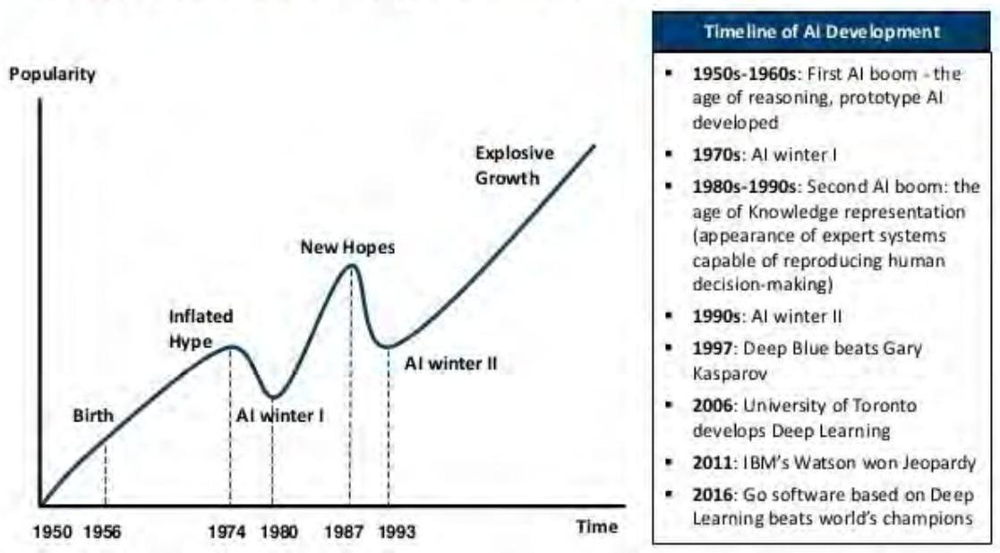
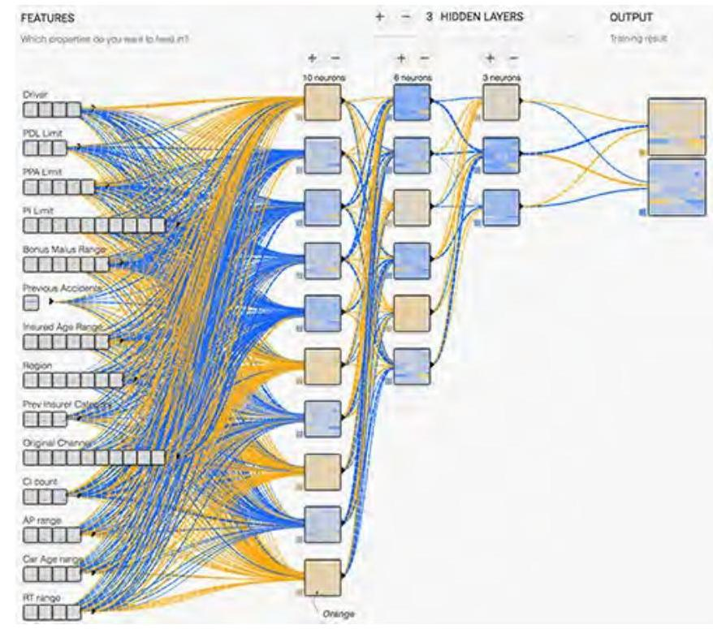

_Note: Source document was split into 3 OCR chunks (pages 1-24, pages 25-47, pages 48-51) to stay within token limits._

# 201912 ai-actuarial-work

## Page 1
# Innovation and Technology

## Literature Review: Artificial Intelligence and Its Use in Actuarial Work

December 2019

## Page 2
# Actuarial Innovation \& Technology 

## Literature Review: Artificial Intelligence and Its Use in Actuarial Work

AUTHORS Nicholas Yeo, FIA, FASM, FSA, FSAS, FSAT
Raymond Lai, FSA, FASM, CFP, NLP, CBE
Min Jyeh Ooi
Jie Yin Liew

The opinions expressed and conclusions reached by the authors are their own and do not represent any official position or opinion of the Society of Actuaries or its members. The Society of Actuaries makes no representation or warranty to the accuracy of the information

Copyright © 2019 by the Society of Actuaries. All rights reserved.

## Page 3
# ACKNOWLEDGEMENTS 

We would like to acknowledge and express our deepest appreciation to all individuals who contributed to the success of this study:

- The members of the Project Oversight Group (POG) of the Society of Actuaries (SOA), as well as staff members of the SOA for providing guidance and direction throughout this project. The members are:
- John Adduci, FSA, MAAA
- Emily Dougherty, FSA, MAAA, CERA
- Carl Ghiselli, FSA, MAAA
- Timothy Luedtke, FSA, MAAA
- Michael Niemerg, FSA, MAAA
- Arnold F. Shapiro, FSA, MAAA, ACIA
- Maria Wellen, ASA
- Dale Hall, FSA, MAAA, CERA (SOA Managing Director of Research)
- Mervyn Kopinsky, FSA, EA, MAAA (SOA Experience Studies Actuary)
- Actuaries whom we have interviewed and provided information to our study are:
- Bill Rearden, ASA, interviewed on 31 March 2019
- Syed Danish Ali, CSPA, interviewed on 9 April 2019
- We thank Temple University's Fox School of Business, Assistant Professor Tim Luedtke, and Mr. Matthew MacNaughton of its Office of Research \& Doctoral Programs, for their assistance in fact-checking the paper references.
- We would also like to acknowledge that we have extracted some information from AXA, which is one of the largest insurance companies in the world, to be incorporated in Section 4.3 of this paper.

## Page 4
# TABLE OF CONTENTS 

ACKNOWLEDGEMENTS ..... 3
SECTION 1: EXECUTIVE SUMMARY ..... 5
SECTION 2: RESEARCH METHODOLOGY ..... 6
SECTION 3: INTRODUCTION ..... 9
3.1 INTRODUCTION TO ARTIFICIAL INTELLIGENCE ..... 9
3.2 HISTORY OF ARTIFICIAL INTELLIGENCE ..... 10
3.3 ACTUARIAL WORK AND ARTIFICIAL INTELLIGENCE. ..... 11
SECTION 4: MOTOR INSURANCE ..... 13
4.1 INTRODUCTION ..... 13
4.2 CHALLENGES IN PRICING MOTOR INSURANCE PRODUCTS ..... 13
4.3 CASE STUDIES ..... 14
4.4 CONCLUSIONS ..... 23
SECTION 5: LOSS RESERVING ..... 24
5.1 INTRODUCTION ..... 24
5.2 CHALLENGES IN LOSS RESERVING ..... 24
5.3 CASE STUDIES ..... 25
5.4 CONCLUSIONS ..... 30
SECTION 6: MORTALITY MODELLING ..... 32
6.1 INTRODUCTION ..... 32
6.2 MORTALITY MODELLING AND ITS USE ..... 32
6.3 CASE STUDIES ..... 33
6.4 CONCLUSIONS ..... 35
SECTION 7: UNDERWRITING ..... 36
7.1 INTRODUCTION ..... 36
7.2 CHALLENGES FACED BY LIFE INSURANCE UNDERWRITERS ..... 36
7.3 CHALLENGES FACED BY GENERAL INSURANCE UNDERWRITERS ..... 37
7.4 CASE STUDIES ..... 37
7.5 CONCLUSIONS ..... 40
SECTION 8: FRAUD \& CLAIMS ..... 41
8.1 INTRODUCTION ..... 41
8.2 INSURANCE FRAUD AND ITS CONSEQUENCES ..... 41
8.3 CASE STUDIES ..... 42
8.4 CONCLUSIONS ..... 44
SECTION 9: CONCLUSIONS ..... 45
9.1 BENEFITS OF AI IN ACTUARIAL WORK ..... 45
9.2 DRAWBACKS OF AI IN ACTUARIAL WORK ..... 45
9.3 CHALLENGES OF IMPLEMENTING AI IN ACTUARIAL WORK ..... 46
REFERENCES ..... 47
GLOSSARY ..... 50
About The Society of Actuaries ..... 51

## Page 5
# SECTION 1: EXECUTIVE SUMMARY 

The rapid and dynamic pace of the development of Artificial Intelligence (AI) and Machine Learning will transform actuarial work through the creation of new technologies, products, and services. In this literature review report, we highlight the emerging technologies that will interact with the actuarial profession in order to provide a frame of reference for actuaries to use in their work. The structure taken by this literature review report is as follows:

1. Overview of the history of artificial intelligence
2. Literature reviews of how AI can be used in different lines of actuarial work
3. Conclusions regarding the impact of AI on actuarial work

In the literature review sections, we will first describe the historical challenges driving different types of actuarial approaches before moving on to review the machine learning and AI techniques that have been implemented by actuaries in doing such work.

## Page 6
# SECTION 2: RESEARCH METHODOLOGY 

Our primary research methodology was to review the available literature on the use of machine learning and AI in actuarial work. We designed the following framework to search for relevant literature for our research.

The first step in our desktop research was to gather materials from Google's search engine and Google Scholar that contained both of the following keywords: "Artificial Intelligence" and "Actuarial," and then subsequently expanding the keywords to "Machine Learning" and "Actuarial," "Deep Learning" and "Actuarial," etc. as relevant materials and information are scattered across the internet. Machine learning is an AI application that provides systems the ability to automatically learn and improve from experience without being explicitly programmed. Deep learning is an AI technique that imitates the functions of the human brain in processing data and creating patterns for use in decision making.

We note that our methodology, whilst practical, potentially introduced a bias where materials that might have been potentially relevant to our work, but not ranked highly by Google's search algorithm, could have been omitted.

From this search, we obtained the following materials from the following sources:

1. Published in the following actuarial journals:
a) Annals of Actuarial Science;
b) ASTIN Bulletin;
c) British Actuarial Journal;
d) European Actuarial Journal;
e) Insurance: Mathematics and Economics; and
f) Scandinavian Actuarial Journal.

We also referred to other actuarial journals that were not listed above, including the North American Actuarial Journal and South African Actuarial Journal. However, no relevant materials were found in those actuarial journals.

## Page 7
2. Available on actuarial-related websites, websites of actuarial professional bodies, or websites of commercial organizations where actuaries are practicing (i.e. insurance companies, reinsurer companies, consulting firms, etc.). These materials were found in articles, as well as presentation format.
3. Published in other journal articles:
a) Science Direct;
b) Springer;
c) IEEE Transaction; and
d) CKNI (China Academic Journals full-text database).

We have focused our attention on articles that comprehensively described how AI techniques could be utilized in a business case related to the actuarial field.

We have further excluded materials:
a) Published more than 10 years ago, or
b) Which did not refer to any specific applications.

This methodology did not always provide a sufficient number of publications. Hence, to enhance our research work, we have supplemented our primary research with:
a) Interviews with actuaries who were active in the field of AI
b) Expansion of our research scope to include information from Kaggle

We shortlisted actuaries who were active in the field of AI based on our contacts. Actuaries who were contacted, and subsequently agreed to be interviewed, were asked to reply to a few short questions via email. The short questions were as follows:

1. What are the underlying business problems you or your firm are trying to solve?
2. What are the solutions to the underlying business problems?
3. What are the (potential/ expected) financial impact/ result of the solutions?

## Page 8
We subsequently contacted them for further questions or clarifications to confirm our understanding, where necessary. In general, the actuaries we contacted were very pleased to provide information and were supportive of our work.

The SOA successfully organized the 2018 Kaggle Involvement Program where SOA members participated in data science competitions that challenged them to use cutting-edge technology to build models and find solutions with important societal implications. We also perused this information in our work.

## Page 9
# SECTION 3: INTRODUCTION 

### 3.1 INTRODUCTION TO ARTIFICIAL INTELLIGENCE

Artificial intelligence ("AI") refers to intelligence demonstrated by machines. Al contrasts with natural intelligence, which refers to intelligence demonstrated by humans and other animals. Al is executed using an intelligent agent, which refers to any device and/or algorithm that perceives the environment and proposes, or takes action, to improve the outcome and maximize the chance of successfully achieving its goal.

Al is a broad field, and it can be categorized into weak Al (or narrow Al), strong Al (or artificial general intelligence), and Artificial super-intelligence (ASI). Weak Al, also known as narrow Al, refers to Al that performs one, simple, narrow task. The majority of current actuarial work in the Al field today applies some form of weak Al focused on a specific problem. Strong Al, on the other hand, refers to a machine with consciousness, sentience, and mind. Artificial general intelligence (AGI) refers to a machine with intelligence to solve problems not limited to a simple, narrow task. The fictional Robo Actuary and Robo Actuarial Analyst described by Attimu and Robidoux (2016) are examples of strong Al displaying AGI.

In the long term, one of the hypothesized implications of the use of Al is that it will result in a "Technological Singularity" (Lim, 2018)—where an ASI is created that possesses intelligence far surpassing the brightest human mind. This would cause a runaway chain reaction of selfimprovement cycles where machines continue to advance themselves without the need of human effort. This is expected to significantly accelerate the progress of technology, leading to far superior improvements to our standards of living. According to Lim (2018), predictions suggest that a technological singularity could be reached as early as 2045.

## Page 10
# 3.2 HISTORY OF ARTIFICIAL INTELLIGENCE 

The concept of AI became popular in the late 1940s to early 1950s owing to the work of John von Neumann and Alan Turing, two generational geniuses in the field of mathematics. The Turing test ${ }^{1}$, developed by Alan Turing in 1950, tested a machine's ability to exhibit intelligent behavior equivalent to, or indistinguishable from, that of a human, marking the beginning of objective answers to questions such as "can a machine think?" and "can a machine do what a thinking human can do?". The first use of the concept of a technological singularity is attributed to von Neumann.

In 1958, Frank Rosenblatt created the first computer that could learn new skills by trial and error. Essentially, this was the simplest of neural networks with only one layer of neurons connecting inputs to outputs, thus simulating human thought process.

However, starting in the 1970s, public and private funding for AI research began to diminish. Whilst AI research continued to make breakthroughs, it did not deliver to the full extent of its potential. This period, commonly known as the AI winter, lasted for a period for about 20 years. Figure 1 illustrates the AI winter as presented by Lim (2018).

[^0]
[^0]:    ${ }^{1}$ The Turing test is a method of inquiry in AI for determining whether or not a computer is capable of thinking like a human being.

## Page 11
Figure 1
AI WINTER

# AI HAS A LONG HISTORY OF BEING "THE NEXT BIG THING"... 

In the 21st century, Al began to regain prominence. This is in part due to high profile breakthroughs, such as Deep Blue, the first computer to defeat a reigning world chess champion, and Watson, a computer that won a Jeopardy! quiz show exhibition match. Actuarial work in AI has also become more and more prominent over the past few years.

### 3.3 ACTUARIAL WORK AND ARTIFICIAL INTELLIGENCE

Today's actuarial work in AI mainly refers to the development of intelligent agents to perform certain tasks that would have otherwise been performed by a human actuary. Some of these tasks may not have been performed at all in the absence of AI, due to the complexity, time, and effort required if Al were not available. A large part of this report discusses a small subset of Al usually called "machine learning," which is the area currently most pertinent to actuarial applications. Based on our review, we identified a number of prevalent techniques that have been adopted by actuaries in their work. These techniques are listed below and discussed in more detail in Section 4, as well as at other relevant points in the remainder of this paper:

- Generalized Linear Models
- Regression Trees

## Page 12
- Gradient Boosting Machines
- Artificial Neural Networks
- Support Vector Machines

# Implementation of Al in Business 

We discussed the impact of the implementation of Al in business with some of our interviewees. In a personal interview, Rearden (2019) pointed out that Al could be used in the future to scan the universe of information to recommend the most optimal and socially responsible valuecreating strategies and tactics to help companies identify and optimize growth strategies. Rearden believed that the implementation of Al could lead to the following results:

- Value created in society increases brand awareness and attractiveness
- Value created for employees reduces turnover, increases productivity, and strengthens alignment of capabilities, all combining to improve the customer experience
- Higher likelihood of successful strategy execution and decreased probability of ruin
- Long-term sustainability and increased profits

During a personal interview, Ali (2019) suggested that the main problem, thus far, in achieving a greater use of Al in business was that Al skills do not automatically lead to an increase in monetary benefits, so the incentives to learn these skills are minimal. There is a dire need for consulting and insurance companies to actively acquire and reward Al skills so that actuaries can be given the right incentives to move in this direction.

## Page 13
# 4.1 INTRODUCTION 

The motor insurance market is typically fiercely price competitive. In this section, we discuss the different AI methods that have been implemented for the pricing of motor insurance products. We focus on the challenges faced by insurance companies when pricing motor insurance products, and the impact of the application of Al techniques in the motor insurance domain. We also outline the fundamental steps of the Al process in this section. The Generalized Linear Model (GLM) ${ }^{2}$ is traditionally applied when pricing motor insurance products. We will discuss other alternative types of Al techniques that could potentially enhance the pricing process and compare the likely benefits of using each method against the traditional GLM.

### 4.2 CHALLENGES IN PRICING MOTOR INSURANCE PRODUCTS

Insurance companies need an accurate model to quantify the expected likelihood and amount of claims due to the fierce competition in the market. Without an accurate model, insurance companies can incur losses due to underestimating the number of claims and the amount of claims. Vassiljeva et al. (2017) highlighted that competition is so intense in the motor insurance market that companies need to find ways to improve their competitive positioning. According to Sato (2017), roughly 7\% to 10\% of customers cause a car accident every year, and about 1\% are large-loss cases that incur claim payments of over \$10,000. In general, customers' risk profiles may be very different from each other. Hence, in order to optimize the pricing of an insurance company's policies, it is important for the underwriters to analyze and understand which customers are at higher risk in such cases.

Mohd Yunos et al. (2016) stated that motor insurance claim modelling is challenging because insurance-related data are normally:

- Large,

[^0]
[^0]:    ${ }^{2}$ GLMs are a flexible generalization of ordinary linear regression that allows for response variables that have error distribution models other than a normal distribution. GLMs generalize linear regression by allowing the linear model to be related to the response variable via a link function and by allowing the magnitude of the variance of each measurement to be a function of its predicted value.

## Page 14
- Uncertain,
- Imprecise, and
- Contain incomplete information.

Hence, it is rather difficult for the traditional statistical methods to deal with the extreme value and the amount of insurance data. Financial service institutions are facilitating new services with web-based technology. This implementation of new technologies is playing a significant role in the development of the motor insurance market. This allows insurance companies to consider profitability of their customers through the advanced theory of AI using additional techniques, in addition to the conventional statistical methods and experience.

In addition, the rapid developments in computer and information technology have generated a large amount of data in the past two decades. The statistics field has been revolutionized by the creation of new tools in order to analyze the growing size and complexity of the data structures. Estimating losses for motor insurance requires resolving classification and regression issues, and this involves several challenges when analyzing the data, as outlined by Guelman (2012) and Kirchner (2018):

- Complex - non-linear relationships exist among the variables,
- Data not clean - the data may contain missing predictor values,
- Limited number of risk factors reported, and
- The data collected may be inaccurate.

# 4.3 CASE STUDIES 

Motor insurance pricing is challenging - insurers are overwhelmed by the explosion in data from various sources. Therefore, AI is required to process this available information and unearth analytical insights. Noll, Salzmann, and Wuethrich (2018) and Wuethrich and Buser (2019) reviewed the performance of Generalized Linear Models (GLMs) compared to machine learning techniques. A real Third-Party Liability (TPL) dataset consisting of explanatory variables, such as the driver's age and region, and target variables, such as number of claims, was used by the authors to fit the following models:

- GLMs

## Page 15
- Regression Trees (RT) ${ }^{3}$
- Boosting ${ }^{4}$
- Neural Networks ${ }^{5}$

Similar models were applied to a simulated Swiss dataset by Wuethrich and Buser (2019) as well.

# Generalized Linear Models 

The GLM is the standard method for pricing lines of non-life insurance business with substantial data volumes (Parodi, 2014). This model extends linear regression models in two main ways:

- Replacing the assumption of a Gaussian error structure with an extended class of error distributions from the Exponential Family, e.g., Poisson, Binomial and Gamma distribution.
- Applying link functions to the models, e.g., Log link for Poisson distributions and logit link for Binomial distributions.

GLMs have also been remarkably expanded to different models:

- Generalized Additive Models (GAMs) - integrate smooth functions of the covariates (Gomez-Rubio, 2018).
- Generalized Linear Mixed Models (GLMMs) - apply hierarchal credibility measures to categorical covariates (Gelman \& Hill, 2007).

Alternative methods for frequency and severity are often implemented. Refer to Wuethrich and Buser (2019) for more information and details on GLMs.

[^0]
[^0]:    ${ }^{3}$ Regression tree building methodology allows input variables to be a mixture of continuous and categorical variables. A decision tree is generated when each decision node in the tree contains a test of some input variable's value. The terminal nodes of the tree contain the predicted output variable values.
    ${ }^{4}$ Boosting is an ensemble method for improving the model predictions of any given learning algorithm. The idea of boosting is to train weak learners sequentially, each trying to correct its predecessor.
    ${ }^{5}$ A computing system made up of a number of simple, highly interconnected processing elements, which process information by their dynamic state response to external inputs.

## Page 16
For the pricing of motor insurance, the input vectors can include:

- Age
- Gender
- Marital status
- Credit score
- Residency address
- Details of the insured item

And the output vectors could include:

- Frequency
- Severity of claims
- Pure premium (Tweedie GLM) (Meyers, 2009)

For some of the variables, such as the underlying assumption of a log linear GLM, the empirical frequencies of claims are not linear. Thus, some of the continuous variables have been converted into categorical variables where some manual feature engineering has been applied. The results showed that the address and vehicle brand variables were not considered as important by the model. However, the p-values of both variables contributed to a better out-of-sample loss, which led the authors to select the full model.

# Fundamental Steps in the Machine Learning Process 

Noll, Salzmann, and Wuethrich (2018) implemented some fundamental steps in the machine learning process as follows:

1. Separate the dataset into learning and test subsets and allocate at random $90 \%$ of the data to the learning dataset, and the remaining 10\% to the test dataset.
2. Compare models and analyze performance by calculating out-of-sample losses on the test dataset.
3. Prepare a comparison of the results on the two datasets.

## Weaknesses of GLMs

Risk premiums are traditionally modeled using linear regression models. Although a transition has taken place toward GLMs over the last decades, which have been shown to be models better

## Page 17
suited for rate making than the conventional linear regression models, Styrud (2017) and Jiang (2014) pointed out that the implementation of GLMs do, however, have certain weaknesses such as:

- Specification of the output of the response distribution is necessary.
- They are not suitable to model non-linear high-dimensional dependencies between explanatory variables because the interaction effects between explanatory variables are required to be manually included in the model.
- They assume that variables are independent unless specifically defined.
- The number of risk attributes or value interactions is too large for a human to investigate due to limited real-world resources and time.
- Pricing models are done at the coverage level versus the customer level.

# Neural Networks 

Vassiljeva et al. (2017) outlined that the neural network applications are widely used today for the purposes of:

- Modelling - to create a prediction system for the risk level of motor insurance customers, which led to the development of a stand-alone application using an artificial neural network (ANN)-based intelligence process.
- Detection - some hybrid detection models have been developed to improve detection accuracy such as in fraud detection, integrating Al techniques with different logit models ${ }^{6}$, Bayesian networks ${ }^{7}$, and other supervised ${ }^{8}$ and unsupervised methods ${ }^{9}$.
- Classification - Self-Organizing Networks (SON) ${ }^{10}$ have been used as part of fraud investigations to classify body injury claims after car accidents.

Even though ANNs have been widely studied and proven to be useful on a variety of balanced datasets, the recent trend is to design classifiers based on imbalanced data ${ }^{11}$. Imbalanced data is

[^0]
[^0]:    ${ }^{6}$ Logit model is used to model the probability of a certain class or event existing such as pass/fail, win/lose, alive/dead, healthy/sick.
    ${ }^{7}$ Probabilistic networks built from probability distributions for prediction. It is a statistical model which connects random variables with their conditional probabilities.
    ${ }^{8}$ Data mining task or inferring a function from labeled training data which consist of a set of training examples.
    ${ }^{9}$ A type of self-organized learning that helps find previously unknown patterns in a dataset without pre-existing labels.
    ${ }^{10}$ Automation technology designed to make the planning, configuration, management, optimization, and healing of mobile radio access networks simpler and faster.

## Page 18
common in insurance given that most insurance policies do not result in claims or fraud. It is important to increase the accuracy of predicting the risk class of a motor insurance company's customers in order to accurately price the insurance policies.

Styrud (2017) highlighted that the use of ANN in insurance rate making is encouraging and suggested a deeper analysis of the ways in which ANNs compare to conventional modelling techniques like GLM. These can be designed so that sophisticated non-linear data dependencies can be modeled. The author outlined the main practical advantages of ANNs as the following:

- Efficiency - No time is required to find interaction effects between explanatory variables, as these are modeled in a well configured network.
- Convenience - Rate making is simpler using ANNs when the distribution of the dependent variable is rather difficult to model and when approximation with standard distribution results are poor.

Similarly, two major disadvantages in insurance rate making compared with the GLMs are:

- Time-consuming - It can be a lengthy process to find a suitable ANN which best fits the available data, considering the range of candidate models to consider and parameter tuning that is required.
- Difficult to explain - The predictions obtained are difficult to be explain. For instance, it is not clear what role the different explanatory variables play in a fitted ANN. Hence, some questions regarding the model output can be difficult to answer.

Mohd Yunos et al. (2016) suggested back propagation neural networks (BPNN) ${ }^{12}$ as a learning tool for analyzing motor insurance claims in predictive modelling. Actuaries and other insurance analysts have already been employing predictive models. The authors concluded that the main benefits of implementing BPNNs are their ability to handle both non-linear data and complex

[^0]
[^0]:    ${ }^{11}$ Imbalanced datasets are a special case for classification problems where the class distribution is not uniform among the classes. The number of observations is different for all the classes in a classification dataset.
    ${ }^{12}$ A BPNN model is developed by first propagating the signal of the current input data record forward through its network using its current parameters. The prediction from the network is then compared against the known true value via a loss function, which calculates the error associated with the prediction. The backpropagation algorithm then calculates how to adjust the model parameters so as to minimize the size of the error.

## Page 19
interaction effects. The BPNN model used by Mohd Yunos et al. employed several network structures for the prediction of Malaysian auto insurance claims.

According to Sato (2017), one of the largest insurance companies in Japan achieved a 78\% accuracy in its predictions after developing and implementing an experimental ANN model using TensorFlow via a cloud machine learning engine. In addition to the possibility of creating new insurance services, such as real-time pricing at point of sale, the insurance company could have a substantial advantage for optimizing insurance cost and pricing. The company is still at an early stage with this approach, and further development is needed for architecting ANN to make them transparent and easy to debug. Figure 2 shows an illustration of an ANN model. The left side of the model shows about 70 values as input features, including:

- Driver's age range
- Driver's location (region)
- Car's age range
- Annual insurance premium range

# Figure 2 

DEEP LEARNING MODEL DEMO UI

## Page 20
These features are then entered into a single vector with 70 dimensions and put into a Deep Learning model. The model is designed as a fully connected ANN with three hidden layers. The author's ANN model had an accuracy rate of $78 \%$, whereas the accuracy rate of the Random Forest method was only $39 \%$.

Kirchner (2018) discussed how these types of models make automobile insurance pricing more flexible and accurate. For instance, companies can better price "safe driving discounts" and also offer "pay-by-mile" rates, which take individual behavior into account. Insurance companies have formed strategic partnerships in the short term with fast-moving technological startups and built open source machine learning algorithms to introduce new pricing solutions with a focus on their strategic test markets in Western Europe and Malaysia. In the UK, a technology company partnered with insurance companies and created a device, software, and an application which collects and displays driver data in real time. An insurance company has developed and launched its own application in Malaysia that is compatible with the telematics data collection device from its local partner. The company is exploring new components such as real-time vehicle diagnostics and maintenance results to complement the traditional list of risk factors, such as driver's age. The data gathered are processed via the open source "tensor flow" Deep Learning framework.

# Gradient Boosting Machines 

Guelman (2012) suggested that Gradient Boosting Machines (GBMs) ${ }^{13}$ can be a good alternative to GLMs for the construction of insurance loss cost models. The data used in the analysis consisted of policy and claims information at the individual vehicle level. The author concluded that there is a single observation for each time period during which the vehicle was exposed to the risk of an at-fault collision accident. In this paper, the input variables are measured and represented by a set of quantitative and qualitative features of the vehicle and the insured at the beginning of the exposure time, categorized by:

- Driver specific features: age, gender, marital status, years licensed, age licensed, license class, credit record, insurance lapses, insurance suspension.

[^0]
[^0]:    ${ }^{13}$ A machine learning approach for regression and classification issues, which produces a prediction model in the form of an ensemble of weak prediction models, such as decision trees.

## Page 21
- Accident history: number of chargeable accidents in the last 1-3 years and the last 4-6 years, number of non-chargeable accidents in the last 1-3 years and last 4-6 years, number of driving conviction in the last 1-3 years, prior examination costs from accident benefit claims.
- Insurance policy specific features: years since policy inception, presence of multi-vehicle, collision deductible, billing type, billing status, presence of occasional driver under 25 or over 25, group business.
- Vehicle specific features: type of vehicle, vehicle purchased new or used, vehicle leased, horsepower to weight ratio of vehicle, age of vehicle, price of vehicle.

The output is the actual loss cost, which is calculated as the ratio of the total losses to the total exposure. In practice, insurance legislation might limit the usage of certain variables for insurance premium calculations. While the authors have developed their analysis under a free regulatory rating environment, the technique described in the paper can be modified to accommodate the regulatory requirements where the actuary is working. The author highlights the features of GBMs:

- It is an iterative algorithm that combines simple parametrized functions with initial high prediction error to produce a prediction rule with high accuracy.
- Provides interpretable results while requiring little data preprocessing and tuning of parameters in comparison to other statistical methods, which usually provide comparable accuracy.
- Highly robust to less than clean data and it is applicable to classification or regression problems from a range of response distributions, e.g., Gaussian, Bernoulli, Poisson, and Laplace.
- Complex interactions are simply modeled, missing predictor values are managed almost without losing information, and the selection of functions is performed as an integral part of the procedure.
- Easier to handle large and complex datasets and to model non-linearities to the data.

These characteristics make this method a good option for insurance loss cost modelling.

## Page 22
GBMs are effective for achieving both predictive accuracy and model interpretability. In business environments, the latter goal is particularly important:

- Models are generally required to be approved by decision makers and having a "blackbox" model makes it more difficult to get the model approved.
- GBM's require less data preprocessing and can be fitted more rapidly.

The winner of the Kaggle Allstate Claims Severity competition, Bhattacharjee (2017), concluded that XGBoost ${ }^{14}$, which uses the GBM framework, is the best method for developing a model to predict claims severity.

# Other alternative Al methods 

Wuethrich and Buser (2019) reported good results on the simulated datasets they studied. An unprocessed dataset was fitted with an RT and a GBM, and both models were shown to outperform the GLM, while the GBM outperformed the RT on out-of-sample losses. The authors noted that it makes a major improvement in performance to use the exposure as a feature, rather than a constant multiplied by the rate of claims.

De Groot (2017) indicated that Bayesian Additive Regression Trees (BART) ${ }^{15}$ and Hierarchical Models (HM) ${ }^{16}$ are being implemented for uncertainty quantification. The HM model allows the following:

- Provides the insurers with a means to make adequate credible intervals for the total expected claim size of the active portfolio.
- The use of the principle of risk premium, which includes the measure of uncertainty in premium pricing.

Relevant models were all applied on the dataset of the holdout year. It was found that some premium estimates were too low and out-of-model adjustments were needed. Jahrer (2018) built

[^0]
[^0]:    ${ }^{14}$ An implementation of gradient boosted decision trees designed for speed and performance.
    ${ }^{15}$ Non-parametric Bayesian regression approach which uses dimensionally adaptive random basis elements, which is similar to GBM.
    ${ }^{16}$ A data model in which the data are organized into a tree-like structure and are stored as a collection of fields, which are connected to one another through links.

## Page 23
a pricing model using machine learning methods like the denoising autoencoders (DAE) ${ }^{17}$, ANN, and Light Gradient Boosting Machine (LightGBM) ${ }^{18}$. (LightGBM was the winning solution in the Kaggle Porto Seguro's Safe Driver Prediction problem.)

# 4.4 CONCLUSIONS 

The conclusions of these studies uniformly indicate that, while GLMs have been useful for pricing in the past, they have limitations and newer techniques appear to produce superior results. Due to the increasingly competitive market and the size of available data, other alternative AI techniques such as ANN, GBM, and RT have outperformed GLMs in terms of accuracy, efficiency, and robustness. Research and development on the modelling side, and new products for motor insurance, will lead to new techniques. Since accurate pricing is critical for insurers, the application of Al is likely to thrive in this area.

[^0]
[^0]:    ${ }^{17}$ An autoencoder is a neural network used for feature selection and extraction. Denoising autoencoders attempt to address identityfunction risk by randomly corrupting input that the autoencoder must then reconstruct or denoise.
    ${ }^{18}$ A fast, distributed, high-performance gradient boosting framework based on a decision tree algorithm, used for ranking, classification, and many other machine learning tasks.

## Page 24
# SECTION 5: LOSS RESERVING 

### 5.1 INTRODUCTION

One of the challenges when calculating loss reserves is the forecasting of future payments due to unreported claims. In this chapter, we focus on actuarial loss reserving methods using AI. We will begin by examining the challenges in reserving claims, then see how some actuaries used several examples of AI methods to overcome the challenges by reviewing a few case studies. We will also present a comparison between the traditional reserving methods and AI methods. Then, we will consider the important factors to measure digital trust to gain confidence by using automatic reserving methods.

### 5.2 CHALLENGES IN LOSS RESERVING

The ultimate objective of actuaries within non-life insurance companies to reserve incurred, but not reported (IBNR) claims, is to:

- Ensure the present and future capacity of the company to meet the policyholders' claims.
- Enable the up-to-date tracking of loss ratios based on the accident year and underwriting year.

Jamal et al. (2018) pointed out that traditional loss reserving methods are usually based on statistical models, which are calibrated by basic arithmetic processes. However, it is common that the actual claims data do not conform neatly to a simple algebraic statistical model. Larson, Leemhuis, and Niemerg (2018) highlighted that traditional methods are technically predictive models, while all risks are treated the same. The advantages of such an approach is its simplicity and tractability. (See Schmidt (2017) for a bibliography of literature on loss reserving techniques.)

According to Dal Moro, Cuypers, and Miehe (2016), the popular methods used by the actuaries worldwide, in descending order, are as follows:
I. Chain-Ladder method ${ }^{19}$

[^0]
[^0]:    ${ }^{19}$ A prominent loss-reserving technique which is used in both the property and casualty and health insurance fields to estimate IBNR and project ultimate loss amounts.

## Page 25
II. Bornheutter-Ferguson method ${ }^{20}$
III. Loss ratio
IV. Average Cost ${ }^{21}$
V. Cape $\operatorname{Cod}^{22}$
VI. Fisher Lange ${ }^{23}$
VII. GLM
VIII. Munich Chain-Ladder (MCL) ${ }^{24}$
IX. De Vylder ${ }^{25}$

Kuo (2019) noted that these new methods are continually being added to the traditional approach repertoire, with emphasis on greater accuracy and some variability measurement. Many of these methods are based on advanced statistical methods, such as Bootstrapping ${ }^{26}$ and Markov Chain Monte Carlo ${ }^{27}$ techniques. The author highlighted two sources of time lags: claims may remain unreported for a long time, and separately the final amount of claims may only be known long after the loss is reported. These factors contribute to the problem of loss reserving, which is covered by extensive literature and remains an area of active research.

# 5.3 CASE STUDIES 

Loss reserving challenges include predicting how claim costs will emerge in the future based on a combination of past claims data analysis and our expectations of the future. The claims data can be noisy and erroneous, and understanding the changes in the presence of noise can be a major difficulty. Ticconi (2018) indicated that claims reserving is one of the main challenges for non-life actuaries, and has traditionally been calculated using loss development triangles like the traditional Chain-Ladder method. The Chain-Ladder method is based on aggregate claim data

[^0]
[^0]:    ${ }^{20}$ A method for calculating an estimate of an insurance company's losses. It estimates IBNR losses for a policy year.
    ${ }^{21}$ Assigns a cost to inventory items based on the total cost of goods purchased in a period, divided by the total number of items.
    ${ }^{22}$ Operates under the assumption that premiums or other volume measures are known for historical accident years, and that ultimate loss ratios are identical for all accident years.
    ${ }^{23}$ A frequency-severity approach that operates on report-year data.
    ${ }^{24}$ A reserving method that reduces the gap between IBNR projections based on paid losses and incurred losses.
    ${ }^{25}$ De Vylder's method of estimation of IBNR claims precludes consideration of independently established trends.
    ${ }^{26}$ Boostrapping is any test or metric that relies on random sampling with replacement. It allows assigning measures of accuracy to sample estimates.
    ${ }^{27}$ MCMC method creates samples from a possibly multi-dimensional continuous random variable, with probability density proportional to a known function.

## Page 26
structured in the claim development triangle (Wuethrich, 2018). Despite their effectiveness, their use is primarily motivated by computational efficiency, based on the hypothesis of claims homogeneity, which is rarely met. Recently, however, increasing calculation boundaries and an increasing volume of insurance information encouraged researchers to explore and improve the process of reserving by including individual claim information and exploiting new technologies which could take advantages of these capabilities. Modlin (2017) suggested that traditional methods do not allow for changes in claims cost drivers, whereas machine learning models can address the challenges of loss reserving by incorporating adjustments for changes in:

- Rate of claims closure
- Adequacy of case reserves
- Inflation rate
- Reinsurance

# Predictive Models 

Larson, Leemhuis, and Niemerg (2018) carried out an illustrative case study from a large, multipayer dataset in order to assess the potential benefits of implementing predictive analytics to estimate IBNR at the member level. They have examined the performance of Penalized regression ${ }^{28}$ and GBM - two popular machine learning methods.

The authors built separate models for each incurred month and included a rich variety of features to train the model, including the following information:

- Historical payment (by incurred month and paid month)
- Demographic (e.g., age, gender, race, ethnicity, occupation, etc.)
- Clinical (e.g., risk score, etc.)

They also included certain features which helped identify potential large payments that had been incurred. The models forecast only claims that were made within three months prior to the valuation date. The data were divided into two sets to measure the accuracy of the models:

- Training set - Model was built on the training set.

[^0]
[^0]:    ${ }^{28}$ Penalized regression is similar to linear regression, but includes a "penalization" term that increasingly constrains the fit as more independent variables are added. This forces the model to include only the most important independent variables.

## Page 27
- Testing set - Withheld for model evaluation and to prevent overfitting.

The authors found that predictive models estimated the overall IBNR more precisely than conventional methods, and so increased the accuracy of the reserve estimates.

In addition, Modlin (2017) outlined that the predictive models can validate traditional reserve estimates and assumptions because they have the following features:

- Can better estimate the impact of individual reserve claims
- Help underwriters to estimate individual case reserves
- Act as a micro-level stochastic loss reserving
- Predict large losses through underwriting, scenario tests, and economic capital models

# Neural Networks 

Mulquiney (2006) noted that some insurance classes involve a major delay between the occurrence and settlement of the claim event. During this time period, the amount of the final settlement can be highly uncertain. The aim of loss reserving is to estimate future payments on claims in an insurance portfolio. The future payment of such claims is the insurer's responsibility, and most statutes require insurers to estimate the amount of these liabilities to be included in their financial accounts. Typically, the insurance portfolio's claims experience has a variety of features that result from events such as changes in:

- Claim management procedures
- Legislation
- Seasonality
- Inflation rate

The author found that ANNs are useful for modelling these historical claim experience features. However, the difficulties of using ANNs to predict future claims are as follows:

- Predictions often rely on influences that cannot be traced in historical data.
- Future claims may depend on future events like legislative and judicial changes.
- Influences not directly observed in historical data must be forecast separately to produce estimates for loss reserves.

## Page 28
The results were improved by adding separate projections to the ANN that reflected the expected changes in future claims. The author compared the GLM with the ANN and found that:

- The ANN model provides more predictive accuracy in the dataset than the GLM.
- The ANN algorithm is largely automated, whereas fitting the GLM required significant input from the model builder.
- ANN behavior requires graphical techniques to be understood.

In addition, Kuo (2019) mentioned that ANNs give benefits such as:

- Multiple heterogeneous data can be incorporated simultaneously
- Multiple objectives can be trained
- Models are customizable based on available data

# Deep Learning 

Kuo (2019) suggested that using Deep Learning techniques to forecast claims liabilities has the following advantages:

- Can predict different quantities at the same time in one model with arbitrary heterogeneous input data
- Do not require actuarial inputs, so the forecasts can be generated more often than traditional methods

Therefore, insurance companies can respond to portfolio changes sooner.

The author proposed that Deep Triangles can achieve superior and comparable performance without expert input using modern stochastic reserving techniques. This approach is an automated alternative to manually adding data based on an understanding of the degree of homogeneity between businesses. As the model outputs predictions for each triangle cell, the traditional age-to-age or loss development factors can be calculated using predictive models. With a well-known output, a Deep Triangle could be easier to integrate into existing actuarial workflows. Insurers often have access to richer information through regulatory submissions and can use these to better train the model. For example, one can also use claim count triangles so that the model can also learn from, and predict, frequency information, in addition to paid and incurred losses.

## Page 29
# Machine Learning vs. Traditional Methods 

Jamal et al. (2018) pointed out that machine learning provides a more sophisticated and effective tool to understand and model characteristics of historical claims. It allows actuaries to discard the simplistic underlying data structure assumptions implied by the traditional reserving models and, thus, provides the opportunity for the development of more accurate models. The authors then outlined the advantages of machine learning as follows:

- Easily understood by unfamiliar user
- Captures high linearities and complex relations
- Flexible

The challenge for traditional methods is to incorporate data specifics into the development factors, as they neglect detailed information about individual claim behaviors (Wuethrich, 2018).

Machine learning techniques have a few challenges too:

- Choosing the upstream explanatory variables
- Understanding and optimizing the impact of the parameters and avoiding over-learning

Harej, Gachter, and Jamal (2017) compared ANN methods with the commonly used Chain-Ladder method as noted:

- The individual development of claims with an ANN cascading method could have a higher impact on long-tail business lines.
- ANNs usually predict more accurately when paid and outstanding claims are used as inputs and when data are altered to ratios. However, this is not always the case.
- Claims could be differentiated by ANNs if a line of business is not homogeneous.
- The Chain-Ladder method may fail if the model is mis-specified, which means that the data does not comply with the assumptions.

In the next sub-section, we shall look at the importance of digital trust in using AI to perform reserving exercise.

## Page 30
# Digital trust in automatic reserving 

Technology provides tremendous opportunities for insurers to enhance their business. At the same time, many of these opportunities rely upon customers sharing their personal data, and insurers must not only protect their data but also use it appropriately. Digital trust is confidence in the ability of an organization to securely handle and manage data. Nyce et al. (2017) suggested that digital trust involves customers, data and errors, and the misuse or unintentional consequences of related analytics in its common and broadest form. In the context of loss reserve analysis, the pillars of digital trust are equally applicable and provide management and regulators with a framework for evaluating the analysis of the actuary:

- Quality - Data management practices must be appropriate. The data must be timely, internally consistent, and complete. Data quality assurance must be carried out for firstgeneration machine learning approaches that build on existing actuarial data to ensure that it is not significantly different from the current quality requirements for actuarial data formats and segmentations.
- Accepted use - The methods of estimation developed must suit their purposes. The implementation, segmentation, and manipulation of data must be appropriate, documented, and defensible for its intended purpose.
- Accuracy - Timely actionable information that reflects reality must be provided by predictions and insights. It is also important to consider that loss reserve models may be held to higher standards of precision than models used for purposes where directional indications are sufficient. An increase in frequency of reserve analysis is likely to be a factor in monitoring accuracy.
- Integrity - Data, models, and the resulting predictions must be managed ethically and with the utmost attention to the veracity of the estimates. Methods that rely upon actuarial judgement or are prone to manipulation could be compromised by bias.

### 5.4 CONCLUSIONS

In summary, according to Harej, Gachter, and Jamal (2017), actuaries have been developing nonlife losses for over a century by applying Chain-Ladder techniques. The technique was extremely efficient in the period before computers, but the information loss resulting from the combination of data from individual claims by accident and development years is scarcely justifiable given the

## Page 31
availability of modern computing. With the recent advances in applying predictive analytic techniques to claims reserves, we anticipate that traditional methods such as the Chain-Ladder method will be replaced or significantly improved upon in future years.

## Page 32
# SECTION 6: MORTALITY MODELLING 

### 6.1 INTRODUCTION

Mortality rates are one of the fundamental factors used in actuarial calculations involving the valuation and pricing of life insurance products. In this section, we consider the concept of mortality modelling and the application of several Al techniques.

### 6.2 MORTALITY MODELLING AND ITS USE

As mentioned above, mortality rates are important in actuarial valuation and the pricing of life insurance products. Mortality improvement rates are used by actuaries when modelling annuity products. The results of mortality modelling are often highly sensitive to the inputs. As such, many different stochastic mortality models have been proposed to estimate and project mortality rates. These rates are mostly used for regulatory, economic capital modelling, and stress testing scenarios. Various methods have been used for deriving mortality rate forecasts, starting with the Lee and Carter (1992) and Cairns, Blake, and Dowd (2006) models. These are often used as standard reference points in actuarial literature, probably due to their robustness.

The original Lee-Carter model applies singular-value decomposition (SVD) ${ }^{29}$ to the log-force of mortality in order to find three latent parameters: a fixed age component and a time component capturing the mortality trend that is multiplied by an age-specific function. Then, a random walk is used to predict the time component. Some approaches involve non-linear regression and GLMs, such as Brouhns, Denuit, and Vermunt (2002), who assumed a Poisson distribution for deaths and calculated the Lee-Carter model parameters by log-likelihood maximization. In recent years, Al techniques have assumed an important role in mortality modelling.

[^0]
[^0]:    ${ }^{29}$ Factorization of a real or complex matrix.

## Page 33
# 6.3 CASE STUDIES 

The work in Deprez, Shevchenko, and Wuethrich (2017) showed that machine learning algorithms are useful to assess the goodness of fit of the mortality estimates provided by standard stochastic mortality models such as the Lee-Carter model ${ }^{30}$ or the Renshaw-Haberman model $^{31}$.

## Tree-Based Machine Learning

Deprez, Shevchenko, and Wuethrich (2017) applied an RT boosting machine to analyze how the modelling should be improved based on feature components of an individual. This nonparametric statistical approach allowed them to detect the weaknesses of different mortality models. In addition, the authors investigated cause-of-death mortality. Given the death of an individual with a specific feature, the conditional probability of its cause could be studied. Based on Swiss mortality data, it was shown how RT algorithms could be applied to estimate these conditional probabilities in a Poisson model framework. The presented technique provides a simple way to detect patterns in these probabilities over time.

Levantesi and Pizzorusso (2019) studied the capacity of machine learning to enhance the accuracy of estimating mortality rates for some standard stochastic mortality models. The literature in their article is largely based on mortality forecasting which benefits from machine learning and clearly captures patterns that cannot be identified by a standard mortality model. Following Deprez, Shevchenko, and Wuethrich (2017), tree-based machine learning techniques were implemented to calibrate a machine learning estimator to be applied to mortality rates fitted using standard mortality models.

The authors analyzed these three popular standard stochastic mortality models in their work:

- Lee-Carter model
- Renshaw-Haberman model

[^0]
[^0]:    ${ }^{30}$ A numerical algorithm used in mortality forecasting and life expectancy forecasting. The input to the model is a matrix of agespecific mortality rates ordered monotonically by time, usually with ages in columns and years in rows.
    ${ }^{31}$ An extended version of the Lee-Carter model with an extra parameter.

## Page 34
- Plat model ${ }^{32}$

They used Regression Trees, Random Forests, and Gradient Boosting machines to fit the data and compare the models against the standard ones.

The authors showed that the application of these machine learning techniques, based on feature components such as age, gender, calendar year, and birth cohort, was more compatible with historical data than estimations given by the Lee-Carter, Renshaw-Haberman, and Plat models. They also used the same logic to enhance mortality predictions as provided by the Lee-Carter model, where the Lee-Carter framework was used to extrapolate the machine learning estimator. Out-of-sample tests were done on the enhanced model to verify the forecasting quality.

The authors illustrated how machine learning could be used to enhance both fitting and forecasting of the standard stochastic mortality models, taking the advantages of Al to better understand processes that are not identifiable by standard models. From a case study, they found that the random forest algorithm was the most effective, although the decision trees and gradient boosting methods produced notable improvements as well.

# Neural Networks 

In a recent paper, Hainaut (2018) used ANNs to find the latent factors of mortality and forecast them according to a random walk with drift. The author used ANNs to learn the logarithm of the central death rates directly from the features of the mortality data by using age, calendar year, gender, and region as predictors in an ANN. The author used auto-encoder networks to forecast mortality. Mortality rates in France during the period 1946-2014 were used, with the training set being the rates in the period 1946-2000 and the test set covering 2001-2014. The baseline models against which the neural model was compared were the basic Lee-Carter Model, fit using SVD; the Lee-Carter model fit with a Generalized Non-Linear Model (GNM) ${ }^{33}$; and lastly, an enhanced Lee-Carter model with cohort effects, again fit with a GNM.

[^0]
[^0]:    ${ }^{32}$ A model that fits historical data very well and is applicable to a full age range, captures the cohort effect, has a non-trivial correlation structure, and has no robustness problems.
    ${ }^{33}$ A statistical model that includes some non-linear parameters but is otherwise in the form of a GLM.

## Page 35
Finally, the work of Richman and Wuethrich (2018) extended the Lee-Carter model to multiple populations using ANNs. In this work, the model used was based on ANNs, which have recently been used to achieve several breakthrough results in the areas of computer vision, speech recognition, and natural language processing tasks. ANNs have been shown to automatically learn meaningful representations of the data to which they are applied. This approach implements the paradigm of representation learning, which avoids manual feature engineering by using an ANN to automatically derive an optimal set of features from the input data.

# 6.4 CONCLUSIONS 

Machine learning techniques can be used in order to back-test parametric mortality models, in particular by using the RT boosting machine. These techniques allow us to detect the weaknesses of such models based on real data. Moreover, RT boosting can further be applied to improve the fit of such models with respect to feature components that are not captured by these models, such as:

- Education level
- Income level
- Marital status

Investigations on cause-of-death mortality under a Poisson model framework have shown that RT boosting can be applied to estimate cause-of-death mortality rates from real data. This technique provides a simple way to detect patterns in these probabilities over time. In addition, ANNs can be used to automatically learn meaningful representations of the data as seen in extensions of the Lee-Carter model to multiple populations.

## Page 36
# SECTION 7: UNDERWRITING 

### 7.1 INTRODUCTION

Underwriting is the process of evaluating risk, which can be the car and driver in the case of auto insurance or the health of an individual in the case of life or health insurance. This enables the insurance company to determine whether to provide insurance coverage and a suitable price to charge.

In this section, we will discuss the challenges faced by life and health insurance underwriters using some traditional underwriting methods; then we will review several case studies on how some actuaries implement AI techniques into the underwriting process. Later in this section, we provide two examples of automated underwriting solutions - QuickQuote and Intelligent Life - to see how these underwriting algorithms can contribute to the underwriting process.

We will also review the challenges around general insurance underwriting in this chapter, and how predictive analytics techniques have impacted the underwriting process.

### 7.2 CHALLENGES FACED BY LIFE INSURANCE UNDERWRITERS

Maintaining data in legacy systems or in paper files for life insurance underwriting purposes has been a major challenge in actuarial work. Most insurance companies automate the process of data collection as follow:

1. Client information, such as personal details and medical records, are traditionally sent by e-mail to the underwriter.
2. Proper analysis of the risk profile is then carried out by the underwriters.
3. The results are sent back to the agent based on the underwriter's intuition and experience.
4. A quote containing the terms of insurance approval is sent to the client.

Boodhun and Jayabalan (2018) noted that the process for underwriting involves the collection of extensive information about the applicant, which could be a lengthy process. Applicants usually undergo medical tests, and they are required to provide the insurance agent with all relevant

## Page 37
documents. The underwriter then evaluates the customer's risk profile and assesses whether the application can be accepted. The premiums are calculated after that. Applications take, on average, at least 30 days to be processed, but applicants today are unwilling to wait that long. Thus, it is necessary to improve and optimize the underwriting process.

The predictive analytics approach mainly focuses on the modelling of an applicant's mortality rates to enhance the process of underwriting decisions and the profitability of the business. Traditional mortality tables and actuarial formulas have - and still are - usually used to estimate life expectancy and devise underwriting rules. However, these techniques are usually not timeand cost-efficient. Instead, predictive models have proven useful in streamlining the underwriting process and improving decision-making.

# 7.3 CHALLENGES FACED BY GENERAL INSURANCE UNDERWRITERS 

Underwriting in general insurance is a lengthy and detailed process that should be well-planned. For example, various underwriting factors should be taken into consideration by the insurer before signing non-life insurance contracts. Information regarding factors affecting insurance risks should be available to the underwriter. However, sometimes the information provided for rating purposes is incomplete. Additionally, it may be difficult to obtain information as the insured may not always be willing to furnish all required information. For example, people may be reluctant to provide the correct information if they know it may cause refusal of coverage. It is important for underwriters to place great attention on the underwriting factors as it could greatly affect their decision about whether to accept a risk.

### 7.4 CASE STUDIES

The complexity of the life underwriting process has increased because of the vast number of diseases and medicine according to Dubey et al. (2018). The insurance company's underwriting process and medical procedures to profile the risk of the applicants may be expensive. Normally, all the costs to perform the medical examinations are initially borne by the company. The underwriting costs need to be paid in full upfront, while the contract may last 10 years or much longer, so if a policy lapse occurs, the insurer could incur significant losses. Hence, automating the underwriting process could generate significant savings.

## Page 38
Dubey et al. (2018) believed that the introduction of Al could enhance and simplify the conventional underwriting process. The data provided to the underwriter is usually unstructured. Important features can be extracted from unstructured e-mails through Natural Language Processing (NLP) ${ }^{34}$ and through the training of numerous statistical machine learning classifiers. The major analytical challenge would be to exploit the information embedded in e-mails by using automated tools for uncleaned and unstructured data.

# Al methods for life insurance underwriting 

Boodhun and Jayabalan (2018) showed that supervised learning algorithms such as Multiple Linear Regression (MLR) ${ }^{35}$, REP Trees ${ }^{36}$, and Random Forests could be applied to a dataset to predict the risk level of applicants. Findings suggest that machine learning can predict the risk level of insurance applicants efficiently. Customer segmentation can be implemented to classify the applicants into different groups with similar characteristics, based on the attributes present in the dataset, such as similar history of employment, insurance, and medical histories. Care needs to be taken to ensure that these classifications do not result in unintended discrimination.

## Neural networks in general insurance underwriting

In the automobile underwriting process, Kitchens (2005) found that ANNs could be effectively applied with the aim of reducing the ratio of insurance losses to insurance premiums. The author pointed out that ANNs can now accurately estimate the risk level for each policyholder, i.e., an underwriting approach, rather than a group of policyholders, i.e., an actuarial approach. The author believed the ANN model would produce better results, as current actuarial Al methods will benefit from a wide range of available tools.

The author mentioned that the pure premium models traditionally follow an actuarial approach, but do not necessarily follow an underwriting approach. While it is intended to reduce loss ratios, current actuarial research does not take an underwriting approach to the process. Fresh insight

[^0]
[^0]:    ${ }^{34}$ A subfield of Al concerned with the interaction between computers and human language.
    ${ }^{35}$ MLR is used to explain the relationship between one continuous dependent variable and two or more independent variables.
    ${ }^{36}$ A fast decision tree-learning algorithm that is based on the principle of computing the information gain with entropy and minimizing the error arising from variance.

## Page 39
into the problem could yield better results. ANNs may produce enhanced results because historically only marginal incremental improvements could be achieved through the statistical models used in the prediction of insurance losses. The author believed that, given the current state of technology, it was time to use new insurance actuarial models to leverage the available speed and flexibility of ANNs in order to solve a clearly complex problem. These ANNs will need extensive training and may involve complex architectures. The ANN should at least be able to match, if not improve, the current statistical results, even if the actuarial models were "perfect," which the authors argued they were not.

# Automated underwriting solution - QuickQuote 

In their recent work, Dubey et al. (2018) demonstrated that a model could be trained to quickly prepare an insurance quotation specific to each customer and product. The authors created QuickQuote, which reduces the time spent by an underwriter in finding the variable relationships and uses the company's previous experiences to provide the customer with the most appropriate plan. To do so, a voluminous amount of data must be extracted and cleansed for certain features. E-mails are collected as text and, in order to determine the importance of words, various NLP concepts are used such as:

- Tokenization ${ }^{37}$
- Part-of-speech (POS) tagging ${ }^{38}$
- Term-frequency-inverse-document-frequency (TFIDF) function ${ }^{39}$

To ensure maximum accuracy, different models are trained and tested with these features. Models with adequate precision were properly trained and then tested for unseen inputs in real time. The insurance plan was then issued as the output and automatically sent to the agent.

[^0]
[^0]:    ${ }^{37}$ Process of replacing sensitive data with unique identification symbols that retain all the essential information about the data without compromising its security.
    ${ }^{38}$ Process of marking up a word in a text as corresponding to a particular part of speech, based on both its definition and its context.
    ${ }^{39}$ The measure of how significant a term is in the whole corpus.

## Page 40
# 7.5 CONCLUSIONS 

Data analytics are now a trend that has become increasingly important for companies all over the world. Predictive modelling using Al algorithms can make a notable difference in the way business is transacted in comparison to the conventional methods in the life and general insurance industries. In the past, insurance underwriting risk assessment was conducted using complex actuarial formulas and was usually a very long process. Now, the work can be done faster and with potentially better results using data analytical solutions. It can, therefore, enhance business profitability through faster and more efficient customer service and, thus, greater customer satisfaction and loyalty.

## Page 41
# 8.1 INTRODUCTION 

Insurance fraud has been and continues to be a serious issue in the insurance industry. In this section, we discuss the factors and consequences faced by insurance companies due to the increasing trend of insurance fraud, and how this issue could be ameliorated with the use of AI techniques. We also present an example of a fraud detecting solution - FORCE - and discuss how it reduces the problem.

### 8.2 INSURANCE FRAUD AND ITS CONSEQUENCES

Insurance fraud has always been an issue for the insurance industry. There is an increasing trend toward many types of fraud, including car insurance fraud, according to the Federal Bureau of Investigation's Financial Crimes Report to the Public. Li et al. (2018) concluded that 20\% to 35\% of automobile insurance claims are fraudulent to a certain extent. Insurance fraud has caused economical and reputational losses for insurance companies. To improve this picture, it is necessary for the insurance companies to take more efficient measures and efforts to gather data and information. However, in many cases, it may be a lengthy process as it involves the collection of data throughout several areas of a company.

The health insurance sector in the US, as well as in other countries, has been growing significantly in recent years due to rapidly growing medical costs. Insurance fraud also causes health insurance companies to lose millions of dollars every year. In many countries, insurance companies must increase premiums to cover these rising costs, which affect all policyholders. The Federal Bureau of Investigation (FBI) concluded that 3\% to 10\% of the US government healthcare costs result from fraudulent claims, making it crucial for government agencies to determine cost-effective methods to identify them. Fraud detection is difficult, but it can more easily be accomplished by incorporating AI and data mining methods.

## Page 42
# 8.3 CASE STUDIES 

Insurance fraud detection has traditionally been developed using standard statistical methods such as linear regression and discrete choice models. However, Xu et al. (2011) pointed out that their usability is limited by their predetermined functional form and restrictive models. Predictive models allow a broader scope of techniques to be applied to this problem.

## Alternative methods to detect fraud

Al techniques can effectively detect suspicious cases of fraud in automobile insurance in a timely manner and can greatly reduce the economic losses to the insurance company and policyholder. A high demand for efficient predictive methods of fraud detection has emerged, and these methods can maximize the true positive detection rate, minimize the false positive rate, and identify new fraud cases efficiently. Li et al. (2018) and Sheshasaayee and Thomas (2018) suggested several identification techniques that are available for insurance fraud, including:

- Expert System ${ }^{40}$
- Decision Trees
- Support Vector Machines (SVMs) ${ }^{41}$
- ANNs
- Naïve Bayes ${ }^{42}$
- Linear regression
- Random forests
- Logistic regression

Al techniques may help automobile insurance companies become more efficient by selecting claims to be audited. Li et al. (2018) reported that, by combining Bagging and Random Subspace ${ }^{43}$ selection methods, Random Forests are highly efficient in many applications. The advantages of

[^0]
[^0]:    ${ }^{40}$ A computer system that emulates the decision-making ability of a human expert, designed to solve complex problems.
    ${ }^{41}$ Supervised learning model with associated learning algorithms that analyze data used for classification and regression analysis.
    ${ }^{42}$ A family of simple probabilistic classifiers based on applying Bayes' theorem with strong independence assumptions between the features.
    ${ }^{43}$ An ensemble learning method that attempts to reduce the correlation between estimators in an ensemble by training them on random samples of features instead of the entire feature set.

## Page 43
Random Forests that make them especially useful to identify automobile insurance fraud are as follows:

- Suitable for high-dimensional small-sample data
- Automatically selects relevant features and ignores irrelevant features
- Considers the interaction between features
- Applicable to two classification and multiple classification problems
- Does not require a complex parameter selection process

Nevertheless, Random Forests are not perfect, and the model needs to be tuned for an optimal fit.

Numerous studies have been conducted for parameter estimation using ANNs as well. Dalkilic, Tank, and Kula (2009) examined an approach based on ANNs, which could be implemented as an alternative to the ordinary least squares' method in order to:

- Describe the relationship between the dependent and independent variables
- Determine total claim amounts in automobile insurance

ANNs were widely used for modelling and detection purposes with the development of Al theory. Furthermore, Xu et al. (2011) demonstrated that the random rough subspace-based ANN ensemble method could be used as a potential alternative tool to detect automobile insurance fraud as well.

Yaram (2016) discussed that document clustering was a popular machine learning method in health insurance for grouping unstructured data based on their contents and analyzing the data further to understand their patterns. The unstructured data is processed in stages using text mining and clustering techniques such as K-means ${ }^{44}$. Classification is another machine learning technique that is applicable in the banking, financial, and insurance industries for fraud detection cases, as well as to help identify cross-selling and up-selling opportunities. The author focused on

[^0]
[^0]:    ${ }^{44} \mathrm{~K}$-means algorithm in data mining starts with a first group of randomly selected centroids, which are used as the beginning points for every cluster, and then performs iterative calculations to optimize the positions of the centroids.

## Page 44
implementation, together with appropriate industry applications, of both document clustering algorithms and a range of classification algorithms.

# Insurance fraud detection - FORCE 

Shift Technology, a Paris-based startup, has developed FORCE-an AI-powered solution to better identify fraud among all types of insurance claims. It provides fraud handlers with a clear and actionable rationale as to how claims were scored and best next steps for investigating the claims. This program claims a $75 \%$ accuracy rate, double the market standard. The accuracy rate refers to claims identified as potentially fraudulent with which the handler elects to move forward.

FORCE highlights potentially fraudulent claims by detecting, alerting, and providing contextual guidance. Unlike other solutions that rely heavily on business rules, FORCE's AI uses a vast amount of data from multiple sources to dynamically generate a fraud score for each claim.

### 8.4 CONCLUSIONS

The application of AI algorithms has improved the detection of fraud by insurance companies. Several authors have demonstrated that AI techniques such as Random Forests, ANNs, and some classification techniques have helped with fraud detection in automobile and health insurance. With the evolution of AI tools reinventing the claims management process, the payoff is bound to include smarter fraud detection, faster settlements, and better customer service.

## Page 45
# 9.1 BENEFITS OF AI IN ACTUARIAL WORK 

The introduction of Al techniques into actuarial work has numerous benefits for insurance companies. Specifically, the insurance market will benefit from Al, particularly if the Al implementations are subject to strict rules and rigorous requirements of audit, data quality, and security. The benefits of Al include:

- Improved resource allocation,
- More competitive premium rates,
- More time-efficient processes,
- Reductions in human error,
- Improved insurance fraud detection,
- Better risk forecasts and control, and
- Improved ability to identify customers at risk of terminating their policies.

### 9.2 DRAWBACKS OF AI IN ACTUARIAL WORK

The implementation of these algorithms is not free of risk. Some concerns are:

- Some insureds may prefer direct human interaction.
- Final decision making is up to human staff; therefore, it may be biased subject to implementation and execution errors.
- Company and societal concerns regarding loss of jobs.
- Risk of malfunction, failures, bad programming, and misinterpretation of data from the robot
- Regulatory and compliance concerns.
- Ethical concerns - the use of Al for insurance purposes has the potential to raise many ethical questions.

## Page 46
# 9.3 CHALLENGES OF IMPLEMENTING AI IN ACTUARIAL WORK 

The implementation of Al techniques in everyday actuarial work does introduce challenges as well. Some of the challenges insurers typically encounter when adopting Al are as follows:

- Training requirements - Al-powered intellectual systems require a separate training system that insurers find difficult to provide. Models are required to be trained with large volumes of data to cover most possibilities.
- Appropriate data sources - The quality and quantity of data are equally important when training predictive models. Datasets should be representative of typical data encountered and should be balanced so as to prevent bias.
- Difficulty in predicting returns on Al investments - It is not easy to predict the return on investment from using Al approaches. For instance, Al projects may absorb far more budget than planned, and the implementation date may be subject to substantial delays.
- Data security - Security risks increase when the amount of data used for Al algorithms increases.
- Regulations - Insurance regulators require greater insight into what data is available to the industry to determine whether to approve the use of those new technologies by insurers (National Association of Insurance Commissioners, 2019).

## Page 47
# REFERENCES 

1. Attimu, D., \& Robidoux, B. (2016). 2036: An actuarial odyssey with AI. Predictive Analytics and Futurism: Predictive Modeling Techniques Applied to Quantifying Mortality Risk, (13), 12.
2. Bhattacharjee, B. (2017). Allstate Claims Severity. Kaggle. Retrieved from https://www.kaggle.com/c/allstate-claims-severity/discussion/26416\#149896
3. Boodhun, N., \& Jayabalan, M. (2018). Risk prediction in life insurance industry using supervised learning algorithms. Complex \& Intelligent Systems, 4(2), 145-154.
4. Brouhns, N., Denuit, M., \& Vermunt, J. (2002). A Poisson log-bilinear regression approach to the construction of projected lifetables. Insurance: Mathematics and Economics, 31(3), 373-393.
5. Cairns, A., Blake, D., \& Dowd, K. (2006). A Two-Factor Model for Stochastic Mortality with Parameter Uncertainty: Theory and Calibration. Journal of Risk \& Insurance, 73(4), 687-718. Retrieved from http://www.macs.hw.ac.uk/ andrewc/papers/jri2006e.pdf.
6. Dal Moro, E., Cuypers, F., \& Miehe, P. (2016). Non-life reserving practices. ASTIN, p.8. Retrieved from http://www.actuaries.org/ASTIN/Documents/ASTIN_WP_NL_Reserving_Report1.0_2016-06-15.pdf.
7. Dalkilic, T., Tank, F., \& Kula, K. (2009). Neural networks approach for determining total claim amounts in insurance. Insurance: Mathematics and Economics, 45(2), 236-241.
8. de Groot, O. (2017). Risk premium pricing methods in non-life insurance for accurate estimation and uncertainty quantification (Master's thesis). Retrieved from https://repository.tudelft.nl/islandora/object/uuid\ A36c6fda1-e157-467c-8965-18c4fb64276c.
9. Deprez, P., Shevchenko, P. and Wuethrich, M. (2017). Machine learning techniques for mortality modeling. Retrieved from https://arxiv.org/pdf/1705.03396.pdf
10. Dubey, A., Parida, T., Birajdar, A., Prajapati, A. and Rane, S. (2018). Smart underwriting system: An intelligent decision support system for insurance approval \& risk assessment. 2018 3rd International Conference for Convergence in Technology (I2CT). Retrieved from https://ieeexplore.ieee.org/document/8529792
11. Gelman, A., \&J Hill (2007). Data analysis using regression and multilevel hierarchical models. New York: Cambridge University Press.
12. Nyce, C., Golfin, A., Laurie, A., Li, H., \& Martin, Z. (2017). The end of triangles - Loss reserves in the digital age. Central States Actuarial Forum. Retrieved from https://www.casact.org/community/affiliates/csaf/1017/Nyce.pdf
13. Gomez-Rubio, V. (2018). Generalized Additive Models: An Introduction with R (2nd Edition). Journal of Statistical Software, 86(Book Review 1). Retrieved from https://www.jstatsoft.org/index.php/jss/article/view/v086b01/v86b01.pdf
14. Guelman, L. (2012). Gradient boosting trees for auto insurance loss cost modeling and prediction. Expert Systems with Applications, 39(3), 3659-3667.

## Page 48
15. Hainaut, D. (2018). A neural-network analyzer for mortality forecast. ASTIN Bulletin, 48(2), 481-508.
16. Harej, B., Gachter, R., \& Jamal, S. (2017). Individual claim development with machine learning. Retrieved from http://www.actuaries.org/panama2017/docs/papers/1a_ASTIN_Paper_Harej.pdf.
17. Jahrer, M. (2018). Porto Seguro's safe driver prediction. Kaggle. Retrieved from https://www.kaggle.com/c/porto-seguro-safe-driver-prediction/discussion/44629
18. Jamal, S., Canto, S., Fernwood, R., Giancaterino, C., Hiabu, M., Invernizzi, L., Korzhynska, T., Martin, Z., \& Shen, H. (2018). Machine learning and traditional methods synergy in non-life reserving. ASTIN. Retrieved from https://www.actuaries.org/IAA/Documents/ASTIN/ASTIN MLTMS\%20Report SJAMAL.pdf.
19. Jiang, G. (2014). Predictive modelling: GLM vs Machine-learning. Presented at $18^{\text {th }}$ East Asian Actuarial Conference Presentation retrieved from http://www.aict.org.tw/
20. Kirchner, T. (2018). Predicting your casualties - how machine learning is revolutionizing insurance pricing at AXA. Retrieved from https://rctom.hbs.org/submission/predicting-your-casualties-how-machine-learning-is-revolutionizing-insurance-pricing-at-axa/
21. Kitchens, F. (2005). Artificial neural networks used In automobile insurance underwriting. 168-169. Retrieved from https://www.igi-global.com/chapter/artificial-neural-networks-used-automobile/14231
22. Kuo, K. (2019). DeepTriangle: A deep learning approach to loss reserving. Retrieved from https://arxiv.org/pdf/1804.09253.pdf
23. Larson, A., Leemhuis, J., \& Niemerg, M. (2018). Incurred but not paid (IBNP). The Actuary. Retrieved from https://theactuarymagazine.org/tag/incurred-but-not-paid-ibnp/
24. Lee, R., \& Carter, L. (1992). Modeling and forecasting U. S. Mortality. Journal of the American Statistical Association, 87(419), 659.
25. Levantesi, S., \& Pizzorusso, V. (2019). Application of machine learning to mortality modeling and forecasting. risks, $7(1), 26$.
26. Li, Y., Yan, C., Liu, W., \& Li, M. (2018). A principle component analysis-based random forest with the potential nearest neighbor method for automobile insurance fraud identification. Applied Soft Computing, 70, 1000-1009.
27. Lim, M. (2018). History of AI Winters - History of AI Winters. Actuaries Digital. Retrieved from https://www.actuaries.digital/2018/09/05/history-of-ai-winters/
28. Meyers, G. (2009). Predictive Modeling with the Tweedie Distribution. 2009 CAS Annual Meeting. Retrieved from https://www.casact.org/education/annual/2009/handouts/c25-meyers.pdf
29. Modlin, C. (2017). Improving actuarial reserve analysis through predictive analysis. 2017 CAS Spring Meeting. Retrieved from https://www.casact.org/education/spring/2017/presentations/C-15_Modlin.pdf
30. Mohd Yunos, Z., Ali, A., Shamsyuddin, S., Ismail, N., \& Salleh Sallehuddin, R. (2016). Predictive modelling for motor insurance claims using artificial neural networks. International Journal of Advances in Soft Computing and its Applications, 8(3), 160-172.

## Page 49
31. Mulquiney, P. (2006). Artificial neural networks in insurance loss reserving. Proceedings of the 9th Joint Conference on Information Sciences (JCIS). Retrieved from https://www.atlantispress.com/proceedings/jcis2006/67
32. National Association of Insurance Commissioners. (2019). Big Data. Retrieved from https://content.naic.org/cipr_topics/topic_big_data.htm
33. Noll, A., Salzmann, R. and Wuethrich, M. (2018). Case study: French motor third-party liability claims. Retrieved from https://papers.ssrn.com/sol3/papers.cfm?abstract_id=3164764
34. Parodi, P. (2014). Pricing in general insurance (pp. 457-471).Boca Raton, FL: CRC Press.
35. Richman, R., \& Wuethrich, M. (2018). A Neural Network Extension of the Lee-Carter Model to Multiple Populations. Retrieved from https://papers.ssrn.com/sol3/papers.cfm?abstract id=3270877.
36. Sato, K. (2017). Using machine learning for insurance pricing optimization. Google Cloud. Retrieved from https://cloud.google.com/blog/products/gcp/using-machine-learning-for-insurance-pricing-optimization
37. Schmidt, K. (2017). A bibliography on loss reserving. Retrieved from https://www.math.tudresden.de/sto/schmidt/dsvm/reserve.pdf
38. Sheshasaayee, A., \& Thomas, S. (2018). A purview of the impact of supervised learning methodologies on health insurance fraud detection. In: Bhateja V., Nguyen B., Nguyen N., Satapathy S., Le DN. (eds) Information Systems Design and Intelligent Applications. Advances in Intelligent Systems and Computing, 672, 978-984. Singapore: Springer. doi:10.1007/978-981-10-7512-4_98
39. Styrud, L. (2017). Risk premium prediction of car damage insurance using artificial neural networks and generalized linear models. Undergraduate. KTH Royal Institute of Technology.
40. Ticconi, D. (2018). Individual claims reserving in credit insurance using GLM and Machine Learning. Retrieved from http://www.dss.uniroma1.it/it/system/files/pubblicazioni/IndividualClaimsReservingTicconi.pdf.
41. Vassiljeva, K., Tepljakov, A., Petlenkov, E., \& Netsajev, E. (2017). Computational intelligence approach for estimation of vehicle insurance risk level. 2017 International Joint Conference on Neural Networks (IJCNN).
42. Wuethrich, M. (2018). Machine learning in individual claims reserving. Scandinavian Actuarial Journal, 2018(6), 465-480. Retrieved from https://www.tandfonline.com/doi/abs/10.1080/03461238.2018.1428681
43. Wuethrich, M., \& Buser, C. (2019). Data analytics for non-life insurance pricing. Swiss Finance Institute Research Paper. Retrieved from https://papers.ssrn.com/sol3/papers.cfm?abstract id=2870308
44. Xu, W., Wang, S., Zhang, D., \& Yang, B. (2011). Random rough subspace based neural network ensemble for insurance fraud detection. 2011 Fourth International Joint Conference on Computational Sciences and Optimization. Retrieved from https://ieeexplore.ieee.org/document/5957885
45. Yaram, S. (2016). Machine learning algorithms for document clustering and fraud detection. 2016 International Conference on Data Science and Engineering (ICDSE). Retrieved from https://ieeexplore.ieee.org/document/7823950

## Page 50
# GLOSSARY 

AGI - Artificial General Intelligence
AI - Artificial Intelligence
ANN - Artificial Neural Network
ASI - Artificial Super-Intelligence
BART - Bayesian Additive Regression Tree
BPNN - Back Propagation Neural Network
DAE - Denoising Autoencoders
ETL - Extract, Transform, Load
GBM - Gradient Boosting Machine
GLM - Generalized Linear Model
GNM - Generalized Non-Linear Model
HM - Hierarchical Model
IBNR - Incurred But Not Reported
LDF - Loss Development Factors
MCL - Munich Chain Ladder
MLR - Multiple Linear Regression
PBM - Poisson Boosting Machine
POS - Part-of-Speech
RT - Regression Tree
SLM - Supervised Learning Methodology
SVD - Singular-Value Decomposition
SVM - Support Vector Machine
TFIDF - Term-Frequency-Inverse-Document-Frequency
TPL - Third-Party Liability

## Page 51
# About The Society of Actuaries 

The Society of Actuaries (SOA), formed in 1949, is one of the largest actuarial professional organizations in the world dedicated to serving more than 30,000 actuarial members and the public in the United States, Canada and worldwide. In line with the SOA Vision Statement, actuaries act as business leaders who develop and use mathematical models to measure and manage risk in support of financial security for individuals, organizations and the public.

The SOA supports actuaries and advances knowledge through research and education. As part of its work, the SOA seeks to inform public policy development and public understanding through research. The SOA aspires to be a trusted source of objective, data-driven research and analysis with an actuarial perspective for its members, industry, policymakers and the public. This distinct perspective comes from the SOA as an association of actuaries, who have a rigorous formal education and direct experience as practitioners as they perform applied research. The SOA also welcomes the opportunity to partner with other organizations in our work where appropriate.

The SOA has a history of working with public policymakers and regulators in developing historical experience studies and projection techniques as well as individual reports on health care, retirement and other topics. The SOA's research is intended to aid the work of policymakers and regulators and follow certain core principles:

Objectivity: The SOA's research informs and provides analysis that can be relied upon by other individuals or organizations involved in public policy discussions. The SOA does not take advocacy positions or lobby specific policy proposals.

Quality: The SOA aspires to the highest ethical and quality standards in all of its research and analysis. Our research process is overseen by experienced actuaries and nonactuaries from a range of industry sectors and organizations. A rigorous peer-review process ensures the quality and integrity of our work.

Relevance: The SOA provides timely research on public policy issues. Our research advances actuarial knowledge while providing critical insights on key policy issues, and thereby provides value to stakeholders and decision makers.

Quantification: The SOA leverages the diverse skill sets of actuaries to provide research and findings that are driven by the best available data and methods. Actuaries use detailed modeling to analyze financial risk and provide distinct insight and quantification. Further, actuarial standards require transparency and the disclosure of the assumptions and analytic approach underlying the work.

Society of Actuaries
475 N. Martingale Road, Suite 600
Schaumburg, Illinois 60173
www.SOA.org