_Note: Source document was split into 4 OCR chunks (pages 1-14, pages 15-25, pages 26-46, pages 47-51) to stay within token limits._

# 2020-02-14_DAV-Ergebnisbericht_Anwendungen_KI_Versicherungswirtschaft

## Page 1
# DAV 

DEUTSCHE
AKTUARVEREINIGUNG e.V.

Ergebnisbericht des Ausschusses Actuarial Data Science

## Anwendung von Künstlicher Intelligenz in der Versicherungswirtschaft

Köln, 14. Februar 2020

## Page 2
# Präambel 

Der Ausschuss Actuarial Data Science der Deutschen Aktuarvereinigung e. V. hat den vorliegenden Ergebnisbericht erstellt. ${ }^{1}$

## Zusammenfassung

Im vorliegenden Bericht wird zunächst der Stand der Anwendung von künstlicher Intelligenz (KI) in der Assekuranz dargestellt und auf die derzeitige Rolle der Aktuare bei der Anwendung eingegangen. In Verbindung mit der allgemeinen Diskussion und deren Wortwahl verwenden wir hier auch bereits den Begriff Künstliche Intelligenz, obwohl in der Versicherungswirtschaft bislang keine Anwendungen, die der strengen Definition von Künstlicher Intelligenz genügen, sondern Anwendungen des Machine Learning (ML) / statistischen Lernens (SL) im Einsatz sind. Im folgenden subsummieren wir KI-, ML- und SL-Systeme unter dem Begriff KI-Systeme.

In den ETHICS GUIDELINES FOR TRUSTWORTHY AI [1] der High-Level Expert Group on Artificial Intelligence (HLEG) der EU sind ethische Grundprinzipien und konkrete Anforderungen an vertrauenswürdige KI-Systeme formuliert. Für die Versicherungsbranche insgesamt, wie für jedes einzelne Versicherungsunternehmen stellt sich die Frage, wie Vertrauenswürdigkeit der eingesetzten KI-Systeme geprüft, sichergestellt und nachgewiesen werden kann. Oder allgemeiner, ob es hierfür konkreten Regulierungsbedarf gibt.

Durch bereits vorhandene umfängliche Regulierung in der Versicherungswirtschaft durch die Solvency II Regularien, das AGG und die Datenschutzgrundverordnung [2] sind die ethischen Grundsätze durch den bestehenden Regulierungsrahmen für die Versicherungswirtschaft bereits abgedeckt. Unter Berücksichtigung dieser Regularien sowie der Standesregeln [3] und dem Ergebnisbericht „Umgang mit Daten im Bereich Data Science" [4] wird in diesem Dokument die Fragestellung aus dem Blickwinkel der Aktuare analysiert.

Im dritten Abschnitt wird der Stand zur Erklärbarkeit bzw. Interpretierbarkeit dargestellt: Mit dem zunehmenden Anwenden von Algorithmen des maschinellen Lernens und der künstlichen Intelligenz wird häufig gefordert, die verwendeten Algorithmen „erklärbar zu machen". Dies soll verhindern, dass die aufgrund von Algorithmen getroffenen Entscheidungen nicht nachvollziehbar bzw. ungerecht oder falsch sein können. Es werden für gängige Verfahren Ansätze für Interpretierbarkeit erläutert und anhand prägnanter Beispiele wird gezeigt, dass eine Interpretierbarkeit recht gut möglich ist.

[^0]
[^0]:    ${ }^{1}$ Der Ausschuss dankt der Arbeitsgruppe Ad-hoc-Arbeitsgruppe EIOPA/KI ausdrücklich für die geleistete Arbeit, namentlich Prof. Dr. Manfred Feilmeier, Rainer Fürhaupter (Leitung), Prof. Dr. Bernd Bischl, Prof. Dr. Göran Kauermann, Prof. Dr. Ralf Korn, Philipp Miehe, Dr. Andreas Nawroth, Dr. Stefan Nörtemann, Dariush Sadeghi-Yam, Inge Thut und Dr. Fabian Transchel.

## Page 3
Die DAV sieht insgesamt keinen weiteren, speziell auf den Einsatz von KISystemen abgestellten Regulierungsbedarf. Zu einigen speziellen Aspekten der Anforderungen an eine vertrauenswürdige KI sehen wir jedoch durchaus die Notwendigkeit einer genaueren Analyse sowie ggf. einer Handlungsempfehlung, speziell für Aktuare.

Der Ergebnisbericht stellt eine Grundlage der Diskussion dar und ist an die Mitglieder und Gremien der DAV zur Information über die erzielten Erkenntnisse gerichtet und stellt keine berufsständisch legitimierte Position der DAV dar. ${ }^{2}$

# Verabschiedung 

Der Ergebnisbericht ist durch den Ausschuss Actuarial Data Science am 14. Februar 2020 verabschiedet worden.

[^0]
[^0]:    ${ }^{2}$ Die sachgemäße Anwendung des Ergebnisberichts erfordert aktuarielle Fachkenntnisse. Dieser Ergebnisbericht stellt deshalb keinen Ersatz für entsprechende professionelle aktuarielle Dienstleistungen dar. Aktuarielle Entscheidungen mit Auswirkungen auf persönliche Vorsorge und Absicherung, Kapitalanlage oder geschäftliche Aktivitäten sollten ausschließlich auf Basis der Beurteilung durch eine(n) qualifizierte(n) Aktuar DAV/Aktuarin DAV getroffen werden.

## Page 4
# Inhaltsverzeichnis 

1. Entwicklung von KI in der Assekuranz. ..... 6
1.1. Begriffsdefinitionen ..... 6
1.2. KI-Anwendungen in der Assekuranz ..... 7
1.3. Die Rolle der Aktuare ..... 8
2. KI-Regulierung in der Assekuranz ..... 10
2.1. Zielstellung ..... 10
2.2. Überblick über die zentralen Thesen ..... 10
2.2.1. Die ethischen Leitlinien für vertrauenswürdige KI. ..... 10
2.2.2. Die Stellungnahme des GDV. ..... 11
2.3. Fallbeispiel Telematik ..... 12
2.3.1. Check der Anforderungen an eine vertrauenswürdige KI ..... 13
2.4. Regulierungsbedarf. ..... 18
2.4.1. Menschliches Handeln und menschliche Aufsicht ..... 18
2.4.2. Technische Robustheit und Sicherheit. ..... 19
2.4.3. Datenschutz und -verwaltung ..... 21
2.4.4. Transparenz ..... 22
2.4.5. Vielfalt, Nichtdiskriminierung und Fairness ..... 23
2.4.6. Wohlbefinden von Umwelt und Gesellschaft ..... 24
2.4.7. Verantwortlichkeit ..... 25
3. Interpretierbarkeit von ML/KI in der Versicherung ..... 27
3.1. Einleitung ..... 27
3.1.1. Allgemeine Vorbemerkungen ..... 27
3.1.2. Erklärbarkeit - Was ist das? ..... 27
3.1.3. Traditionelle Methoden der Erklärbarkeit ..... 28
3.1.4. Sind die Daten schlecht oder ist es der Algorithmus? ..... 28
3.1.5. Kontrolle der Erklärbarkeit ..... 29
3.2. Interpretierbarkeit von ML/KI Modellen ..... 29
3.3. Verfahren zur Interpretation von ML/KI Modellen. ..... 30
3.3.1. Permutation Feature Importance ..... 31
3.3.2. Partielle Abhängigkeiten ..... 32

## Page 5
3.3.3. Global Surrogate ..... 33
3.3.4. Lokale Approximationen ..... 33
3.3.5. Verfahren speziell für neuronale Netze ..... 33
(1) Feature-Visualisierung ..... 33
(2) Feature-Attribution ..... 35
3.4. Interpretierbarkeit am Beispiel verschiedener Use Cases ..... 36
3.4.1. Schadenfrequenzen in der Krankenversicherung ..... 37
3.4.2. Schadenhöhen in der Krankenversicherung ..... 40
3.4.3. Deep Learning im Text Mining und zur Bilderkennung ..... 41
A. Anhang ..... 43
a) Erfassung von KI - Anwendungen im Versicherungsbereich ..... 43
b) Aufzeigen bestehender Qualitätssicherungskonzepte ..... 46
c) Beschreibung des MEPS Datensatzes ..... 48
B. Literaturverzeichnis ..... 50

## Page 6
# 1. Entwicklung von KI in der Assekuranz 

Die Digitalisierung und die KI-Anwendungen nehmen einen immer größeren Raum in allen Wertschöpfungsstufen der Versicherungs- und Finanzwirtschaft ein. Dabei ist die Anwendung von Methoden der künstlichen Intelligenz (machine learning, neuronale Netze, deep learning) als evolutionäre Weiterentwicklung von bisher verwendeten immer komplexeren statistischen Methoden auf Basis vordefinierter Daten in den vergangenen Jahren stark angestiegen, da sie die Entwicklung von Methoden, Prozessen, Algorithmen und Systemen zur Extraktion von Erkenntnissen, Mustern und Schlüssen insbesondere auch aus unstrukturierten Daten ermöglicht.

Ziel dieses ersten Abschnitts ist es, einen Überblick über die Verwendung von Methoden der künstlichen Intelligenz innerhalb der Versicherungswirtschaft zu geben und eine erste Einschätzung der Rolle von Aktuaren in der Anwendung von KI als konsequente Weiterentwicklung des Umgangs von Aktuaren mit den bisherigen, z.T. auch sehr komplexen statistischen Methoden. Im Anhang werden in einer tabellarischen Übersicht sowohl die neueren KI-Methoden als auch ergänzend die wichtigsten statistischen Methoden dargestellt.

### 1.1. Begriffsdefinitionen

Im Folgenden werden einige wichtige Begriffe im Umfeld von Künstlicher Intelligenz erläutert.

- Data Science: Unter Data Science verstehen wir die Wissenschaft, die sich mit Daten im Allgemeinen beschäftigt. Das umfasst den gesamten Prozess im Umgang mit Daten. Beginnend mit der Erhebung und Erfassung von Daten, der Aufbereitung und Speicherung, der Verarbeitung und Auswertung bis hin zum Data Mining. Bei der Erhebung und Verarbeitung der Daten sind technische Fragen des Datenmanagements ebenso relevant wie die Prinzipien der Datenschutzbestimmungen.
- Data Analytics / Data Mining: Unter Data Analytics verstehen wir die Gewinnung von (neuen) Informationen aus Daten unter einer spezifischen Fragestellung. Dies wird häufig auch als Data Mining bezeichnet. Wir bezeichnen mit Data Mining jedoch den gesamten Prozess, wie er in den einschlägigen Data Mining Prozessmodellen definiert ist. Data Mining umfasst somit insbesondere die Phasen: Datenbeschaffung, Datenaufbereitung, Modellierung, Data Analytics, Modellvalidierung, Evaluierung.
- Actuarial Data Science: Da die spezifischen Fragestellungen für uns stets aktuarieller Natur sind, oder allgemeiner das Prinzip Versicherung betreffen, sprechen wir von Actuarial Data Science (kurz ADS). Actuarial Data Science beschäftigt sich also mit der Erhebung, Erfassung, Verarbeitung und Auswertung versicherungsspezifischer Daten unter einer aktuariellen Fragestellung.

## Page 7
- Machine learning (ML): Die Auswertung bzw. Analyse der Daten (Data Analytics) erfolgt meist mit Methoden des maschinellen Lernens. ML steht im Gegensatz zur klassischen Programmierung, bei der ein (vorab bekannter und programmierter) Algorithmus für eine Dateneingabe abgearbeitet wird. Beim ML ist vorab kein Algorithmus bekannt (und meist auch nicht danach). Basierend auf einem Lernverfahren wird stattdessen an Hand der Eingangsdaten ein Modell trainiert. Man sagt auch das Modell lernt aus den Daten. Wenn der Lernvorgang erfolgreich war, lässt sich das trainierte Modell auf neue Daten anwenden (überwachtes Lernen) oder das Modell liefert intrinsische Muster in den Daten und damit neue Informationen über die Daten (unüberwachtes Lernen).
- Statistical learning (SL): Während beim überwachten maschinellen Lernen die zentrale Aufgabe in der Vorhersage liegt, steht beim statistischen Lernen die Interpretation im Fokus. Darüber hinaus ist die Berücksichtigung von Zufallsfehlern und die Quantifizierung von Unsicherheit zentrales Instrument bei statistischen Lernverfahren. Unter Unsicherheit werden dabei sowohl Modellunischerheit als auch "einfache" Zufallsschwankungen verstanden. Eine scharfe Abgrenzung der Gebiete ist nicht möglich, da der Übergang zwischen den Bereichen nahezu fließend ist. Oftmals spricht man daher allgemein von Maschinellem Lernen, auch wenn man statistische Verfahren benutzt.
- Künstliche Intelligenz: Der Begriff künstliche Intelligenz bezeichnet den Versuch, menschenähnliche Entscheidungsstrukturen maschinell (in der Regel mit einer Software) nachzubilden. Konkret geht es darum, eine Maschine zu bauen, die eigenständig Aufgaben bearbeiten oder Probleme lösen kann. Machine Learning ist ein Teilbereich der Künstlichen Intelligenz.

# 1.2. KI-Anwendungen in der Assekuranz 

Der Fokus von KI-Anwendungen in der Versicherungswirtschaft liegt zunächst auf Arbeitsgebieten außerhalb der aktuariellen Kerngebiete, in denen sie bisherige, rein auf Erfahrungen und Arbeitanweisungen gestützte Prozesse ergänzen und teilweise ersetzen. Beispielsweise werden in der Auswahl und Ansprache von Bestands- und (potenziellen) Neukunden neue Wege beschritten. Hierbei sind datenbasierte Auswertungen von Kundenbeziehungen und -verhalten von besonderem Interesse. Daneben finden KI-Anwendungen in der Ablaufsteuerung der Unternehmen, im Underwriting- und im Schadenabwicklungsprozess - hier insbesondere in der Analyse von Betrugstatbeständen - Berücksichtigung. Dabei wird eine Vielzahl von Daten, auch unstrukturierter Art, mittels künstlicher Intelligenz ausgewertet, um im Interesse der Kunden oder Geschädigten die Entscheidungsprozesse zu beschleunigen. Ziel ist es dabei stets, ein präzises und transparentes Ergebnis zu generieren. Nicht zuletzt werden auch in der Finanzanlage, im Controlling und im Enterprise Risk Management immer mehr modernste KI-Werkzeuge zur Analyse und Steuerung genutzt.

## Page 8
Darüber hinaus werden auch in aktuariallen Kerngebieten wie der Prämienkalkulation und der Schadenreservierung bestehende statistische Kalkulationssysteme zunehmend mit Machine-Learning-Programmen überprüft, ergänzt oder teilweise sogar ersetzt, wobei zunehmend auch dynamische Daten Verwendung finden.

In praktisch allen Sparten werden bereits verschiedene KI-Methoden verwendet: in der Krankenversicherung können beispielsweise Eintrittswahrscheinlichkeiten von bestimmten Ereignissen, wie ein Krankenhausaufenthalt, für einzelne Personen mithilfe von KI-Anwendungen geschätzt werden; im Bereich der Lebensversicherung wird die Methode Random Forests zum Beispiel zur Herleitung von Stornotafeln, der Prognose von Leistungsfällen oder im Underwriting zur Kürzung der Gesundheitsfragen eingesetzt. Auch in der Schadenversicherung wird diese Methode verwendet, dort dient sie unter anderem der Prognose des Schadenbedarfs in Abhängigkeit von bestimmten Merkmalen. Weitere Anwendungsbeispiele sind im Anhang zusammengefasst und in den DAVErgebnisberichten [5], [6] und [7] ausführlicher beschrieben.

Ingesamt lässt sich herausstellen, dass die Methoden nicht übereilt sondern in geeigneten Schritten in den Unternehmen eingeführt werden. Hier einige der prägnantesten Beispiele:

| Anwendungsbeispiel | KI/ML - Methode | Zweck des Modells |
| :--: | :--: | :--: |
| Actuarial Analytics (New Risk Modeling) | Vor allem regressionsbasierte und baumbasierte Verfahren | Risikomanagement (UW/Pricing) |
| Sales Analytics (Cross-/Up-Selling) | Vor allem baumbasierte Verfahren und Clustering | Analytisches Kundenmanagement, z.B. Stornoprophylaxe |
| Claims Analytics (Fraud Detection) | Vor allem baumbasierte Verfahren und Clustering | Schadensprozessoptimierung, z.B. Betrugserkennung |
| Image Recognition | - Boosting   - Convolutional Neural Networks | - Risk Assessment   - Schadensprozessoptimierung |
| Text Mining | - Recurrent Neural Networks   - Transformers | - Entscheidungsunterstützung   - Verbesserte Risikobewertungen in verschiedenen Bereichen   - Effizienz im Datenmanagement |

# 1.3. Die Rolle der Aktuare 

Im Zusammenhang mit Methoden der Künstlichen Intelligenz ergibt sich die Herausforderung, sowohl die besondere Verantwortung über die

## Page 9
zugrundeliegenden Daten zu übernehmen, als auch die in den aktuariellen Standesregeln [3] geforderten Adäquanz der verwendeten Methoden und Tools sowie der Erklärbarkeit der erzielten Ergebnisse nachzukommen. War dies schon bei komplexen (linearen) statistischen Methoden beispielsweise in der KfzTarifierung eine große Herausforderung, wird dies bei den KI-Werkzeugen noch ein großes Stück schwieriger. Grund dafür ist, dass KI-Methoden nicht im klassischen Sinn „nachgerechnet" werden können sondern auf andere Weise validiert werden müssen. Diese Validierung und Interpretation von Ergebnissen aus KI-Werkzeugen ist unter dem Stichwort „Interpretable Machine Learning" nach wie vor Gegenstand intensiver wissenschaftlicher Forschung (siehe 3.).

Auf Grundlage dieser Erkenntnisse müssen neue Vorgehensstrategien gefunden werden, damit die Aktuare die Verantwortung für die von ihnen erzielten Ergebnisse tragen können und gegenüber den Verantwortungsträgern in den Unternehmen die finanziellen Auswirkungen der Kalkulationen transparent darlegen können. Dies ist schlussendlich auch die Grundlage, um den Kunden die Gesetzeskonformität der Entscheidungen beispielsweise hinsichtlich des AGG zu verdeutlichen.

Dafür ist es erforderlich, dass Aktuare die (Vor-)Aussagen ihrer komplexen Modelle im einzelnen Anwendungsfall transparent aufzeigen. Um diesen Anforderungen nachzukommen, eignen sich sogenannte Interpretierbarkeitstools, die im Gebiet der künstlichen Intelligenz in jüngster Vergangenheit viel Aufmerksamkeit erfahren haben. Ein Ausschnitt aus Interpretierbarkeitstools sowie Anwendungsbeispiele werden in 4.2. tabellarisch zusammengefasst.

Die Erkenntnisse können aus den Datenanalysen nicht blindlings oder mit unterschiedlichen Konsequenzen für Konsumenten in zufällig eingeteilte Test- und Kontrollgruppen angewendet werden, da man stets in der Lage sein muss, die konsistenten Entscheidungen nachvollziehbar zu begründen. In Verbindung mit nachvollziehbaren Interpretationen können komplexe Modelle in letzter Konsequenz konsistentere Entscheidungen unterstützen.

Aktuare haben als Data Scientists den Vorteil, dass sie neben der schieren Toolund Methodenkenntnis sowie in der Regel Kenntnissen in den für Data-ScienceAnwendungen verbreiteten Programmiersprachen vertieftes Wissen über die Versicherungsmathematik und -technik vorweisen können und damit einen großen Vorsprung in der Interpretation der Ergebnisse aus komplexen Tools haben. Darüber hinaus können sie durch ihr vertieftes Wissen über die Versicherungstechnik als Ganzes sehr schnell neue Erkenntnisse zu einem Gesamtbild verdichten. Der häufig begangene Fehler in der Anwendung von Data Science, (mathematische) Korrelation mit (wirklicher) Kausalität zu verwechseln, wird durch die sorgfältige aktuarielle Aus- und Weiterbildung minimiert.

Auf Grund der besonderen Rolle der Aktuare, ihrer Verantwortung im Sinne des Versicherungsaufsichtsgesetzes und nicht zuletzt wegen ihrer Bindung an die Standesregeln der DAV sind Aktuare mit Blick auf die Themen Datenschutz und ethische Fragen prädestiniert, auch in der gerade erst beginnenden Big-Data-Ära Verantwortung zu übernehmen.

## Page 10
# 2. KI-Regulierung in der Assekuranz 

### 2.1. Zielstellung

Ausgehend von den ethischen Leitlinien für eine vertrauenswürdige künstliche Intelligenz soll erarbeitet werden, welche Anforderungen aufgrund der Regulierung der Branche und des Berufsstandes der Aktuare sowie bereits bestehender gesetzlicher Regelungen (wie der Datenschutzgrundverordnung) bereits erfüllt werden (müssen). Dazu sind die Anforderungen zu spezifizieren, die nicht bereits von bestehenden Regelungen erfasst sind und zu erörtern, in wieweit hierfür Regulierungsbedarf bestehen könnte. Die erarbeiteten Kernthesen sollen zudem auf einen konkreten Anwendungsfall von KI in der Versicherung angewandt und erläutert werden.

### 2.2. Überblick über die zentralen Thesen

### 2.2.1. Die ethischen Leitlinien für vertrauenswürdige KI

Ziel der Leitlinie der „ETHICS GUIDELINES FOR TRUSTWORTHY AI" der High-Level Expert Group on Artificial Intelligence, (veröffentlicht am 08.04.2019) ist es, eine vertrauenswürdige Künstliche Intelligenz (KI) zu definieren, Möglichkeiten der Realisierung zu beschreiben und eine Pilotversion für eine Bewertungsliste vorzustellen. Das Dokument basiert auf einem Entwurf vom 18.12.2018, das Bestandteil an einer offenen Diskussion mit mehr als 500 Teilnehmern war.

Eine vertrauenswürdige KI unterteilt sich in drei Komponenten, die innerhalb des gesamten Lebenszyklus eines Systems erfüllt werden sollten. Vertrauenswürdige KI sollte rechtmäßig, ethisch und robust sein. Ziel ist es für die zweite und dritte Komponente eine Leitlinie für die Umsetzung in soziotechnischen Systemen anzubieten. Die Leitlinie richtet sich an alle Interessengruppen der KI, die sie bereitstellen, entwickeln oder benutzen und somit mittelbar oder unmittelbar von den Auswirkungen betroffen sind.

Es werden Grundlagen einer vertrauenswürdigen KI, wie der Begriff der KI-Ethik vorgestellt. Dabei wird auf den von der Europäischen Gruppe für Ethik in Naturwissenschaften und Neuen Technologien („EGE") vorgeschlagenen Grundprinzipien aufgesetzt: Respekt vor menschlicher Autonomie, Schadenverhütung, Fairness und Erklärbarkeit. Im Hinblick auf Spannungen zwischen den Prinzipien sollte der prospektive Gesamtnutzen von KI-Systemen die vorhersehbaren Einzelrisiken deutlich übersteigen.

Für die Realisierung einer vertrauenswürdigen KI werden sieben Anforderungen beschrieben:

1. Menschliches Handeln und menschliche Aufsicht
2. Technische Robustheit und Sicherheit
3. Datenschutz und -verwaltung
4. Transparenz

## Page 11
5. Vielfalt, Nichtdiskriminierung und Fairness
6. Wohlbefinden von Umwelt und Gesellschaft
7. Verantwortlichkeit

Dabei stellt das Dokument sowohl technische, als auch nicht-technische Methoden zur Implementierung vor. Der technische Aspekt umfasst die Definition von Regeln und Anforderungen hinsichtlich von Robustheit und Erklärbarkeit. Dabei werden Besonderheiten beim Test und Monitoring der Qualität der Systeme näher beleuchtet. Nichttechnische Gesichtspunkte beziehen sich auf die Auswirkung auf bestehende Regulierung und Verhaltenskodex, sowie Fragestellungen zu Standardisierung. Auch eine denkbare Zertifizierung wird angesprochen. Die konkrete Definition von Verantwortlichkeiten spielt ebenfalls eine Rolle, wie auch die Relevanz einer ethischen Denk- und Handlungsweise und der damit verbundenen Beteiligung verschiedener Interessensgruppen.

Für die oben genannten sieben Anforderungen werden verschiedene Fragestellungen in Form einer Bewertungsliste formuliert. Diese ist als Pilotversion zu verstehen, die in der Praxis erprobt werden soll und auf dessen Grundlage eine überarbeitete Version Anfang 2020 vorgeschlagen werden soll.

# 2.2.2. Die Stellungnahme des GDV 

Bezugnehmend auf den Draft ETHICS GUIDELINES FOR TRUSTWORTHY AI [8] hat der Gesamtverband der Deutschen Versicherungswirtschaft e.V. (GDV) am 28.01.2019 eine Stellungnahme [9] veröffentlicht. Nachfolgend werden die - mit Blick auf den Arbeitsauftrag - zentralen Aussagen kurz zusammengefasst.

Die grundlegende These der Stellungnahme bildet die Aussage, dass die „Versicherungswirtschaft als Teil des Finanzdienstleistungssektors [...] stark reguliert [ist]" und dass „alle hochwirksamen ethischen Grundsätze bereits durch den bestehenden Regulierungsrahmen für die Versicherungswirtschaft abgedeckt sind." ${ }^{3}$ In der Stellungnahme wird diese Aussage mit Verweis auf die einschlägigen gesetzlichen und aufsichtsrechtlichen Regelungen belegt. Insbesondere wird Bezug genommen auf die Solvency II-Regularien und die Europäische Datenschutzgrundverordnung, ergänzt um die jeweiligen nationalen Gesetzgebungen. Im Weiteren Verlauf werden die einzelnen Anforderungen an eine vertrauenswürdige KI jeweils mit Blick auf die bestehenden Regularien analysiert und die Ausgangsthese damit unterstützt.

Des Weiteren werden in der Stellungnahme als Regulierungsgrundsätze "Technologieneutralität und der Grundsatz der Verhältnismäßigkeit" gefordert. "Die ethischen Leitlinien für eine vertrauenswürdige KI sollten mit diesen regulatorischen Grundsätzen im Einklang stehen. Die Anforderungen sollten in einem angemessenen Verhältnis zu den damit verbundenen Risiken stehen, unabhängig von der verwendeten Technologie." Als Beispiel für die Anwendung dieser Regulierungsgrundsätze führt die Stellungnahme den „Anwendungsfall

[^0]
[^0]:    ${ }^{3}$ Jeweils zitiert aus [9]

## Page 12
Versicherungsprämien" an und analysiert an diesem Beispiel die Problematik im Licht der Anforderung der Fairness und der Gleichbehandlung.

Hinsichtlich der weiteren Ausgestaltung der ethischen Leitlinien fordert die Stellungnahme die „Berücksichtigung des bestehenden regulatorischen Umfelds", die „Konzentration auf allgemeine Grundsätze" und die „Sicherstellung eines innovationsfreundlichen Ansatzes".

Mit Blick auf die notwendige Flexibilität (der unternehmerischen Tätigkeit) in einem innovativen Umfeld werden an Stelle „detaillierte[r] Durchführungsmaßnahmen", „allgemeine Grundsätze" vorgeschlagen, die den Unternehmen Ermessensspielräume bei der Umsetzung geeigneter Maßnahmen lassen. Schließlich wird die Forderung formuliert, „die Technologie als solche nicht mit weitreichenden Anforderungen zu überlasten." [9]

# 2.3. Fallbeispiel Telematik 

Nachfolgend werden die Anforderungen an eine vertrauenswürdige KI (aus Abschnitt 2.2.1) an einem Fallbeispiel „gespiegelt". Konkret geht es um einen Telematik-Tarif in der Kfz-Versicherung.

## Setting

Ausgehend von einem Standard-Tarif soll einem ausgewählten Kundenkreis eine Telematik-Option angeboten werden. Auf Basis eines durch eine KI berechneten Versicherungsnehmer-spezifischen Risikoprofils (Score) werden Zu- \& Abschläge auf die Bruttoprämie der Vollkaskoversicherung gewährt.

## Ausgangsdaten

Für die Ermittlung der Basisprämie werden die bekannten Versicherungsnehmerdaten (Alter, Fahrzeugtyp, Wohnort,...) zu Grunde gelegt. Zur Berechnung des Scores werden folgende Daten verwendet: Telematik-Daten (GPS-Ortung, Geschwindigkeit, Beschleunigung, Fahrleistung, ...), Kontextdaten (Wetterdaten, Straßenkarten, Verkehrsaufkommen, ...), Schadendaten.

## Ziele des Versicherungsunternehmens

Erstes Ziel des Anbieters ist eine genauere Differenzierung und Selektion von Risiken. Daneben erhofft sich der Anbieter eine Veränderung des Fahrverhaltens der Versicherungsnehmer und damit eine Reduzierung der Schadenhäufigkeit sowie der Schadenhöhen.

Zusätzlich plant das Unternehmen die Verwendung der erhobenen Daten zur Analyse der Risiken auch für die klassische Versicherung, bspw. indem durch hochgranulare Segmentierung eines Telematik-Portfolios durch Rückinferenz auf klassische Merkmale Korrekturen an der Basisprämie möglich werden.

## Page 13
# Gesellschaftliche Einordnung 

Sogenannte Telematik-Tarife in der Kfz-Versicherung sind ein Beispiel dafür, dass sich der Markt immer mehr von einer Standardisierung mit parameterbasierter Segmentierung hin zu einer immer granulareren Individualisierung der Produkte bewegt. So wird in der Studie „Europäische Studie zur Kfz-Versicherung"4 beschrieben: „Versicherungsgesellschaften müssen sich entscheiden, auf welches Kundensegment sie sich konzentrieren wollen. Werden sie sich - wie der jetzige Trend - für junge Wechselbereite und die Verwendung von Apps entschließen? Oder werden sie versuchen, sich an aufgeschlossene Ältere zu wenden?"5. Anhand der in der Studie vorgestellten Erhebungen wird beispielsweise auch ersichtlich, dass die gewählten Technologien zur Datenübertragung Einfluss auf die Kundensegmentierung haben. Darüber hinaus können Versicherungsnehmer bei einigen Produkten durch persönliches Handeln, beispielsweise durch das Anpassen der eigenen Fahrweise, direkt Einfluss auf die Höhe der zu zahlenden Prämie nehmen. Durch das Monitoren der individuellen Fahrweise (wie etwa spezifische Verhaltensweisen bezüglich Bremsen oder Beschleunigen) und dem Feedback an die Kunden wird angestrebt, diese zu einer umsichtigen Fahrweise zu ermutigen und damit aus Sicht der Versicherer Schadenhäufigkeiten und -höhen zu reduzieren ${ }^{6}$. Die hierbei betroffenen Prozessketten liegen in der Tarifierung, aber auch im Bereich Kundenbindung, sowie mittelbar in der Schadenabwicklung. ${ }^{7}$

### 2.3.1. Check der Anforderungen an eine vertrauenswürdige KI

## 1. Menschliches Handeln und menschliche Aufsicht

Mit der zunehmenden Vernetzung und Digitalisierung wird es möglich, vielerlei Daten über einen (prospektiven) Versicherungsnehmer zu sammeln und in einer Art zusammenzuführen, die für den Kunden nicht immer nachvollziehbar und vor allem intuitiv begreifbar ist. Vor dem Hintergrund einer Folgenabschätzung zu den Grundrechten muss sichergestellt werden, dass vor allem personenbezogene Daten nicht an Dritte (Privatpersonen und Behörden) gelangen. Dies ist geregelt durch die Anforderung „Integrität und Vertraulichkeit" (Artikel 5 DSGVO).

Die Versicherungsnehmer als Verbraucher treffen bei der Wahl eines KI-basierten Tarifes die bewusste Entscheidung, auch als „Datengeber" zu fungieren und den Unternehmen persönliche Daten zur Verfügung zu stellen. Im Vergleich zu einem Standardtarif profitieren sie damit auch von den verbundenen Vorteilen. Welche

[^0]
[^0]:    ${ }^{4}$ Monitor Deloitte, „Europäische Studie zur Kfz-Versicherung - Digitale Kfz-Versicherungen und ihre Bedeutung für Versicherer", S. 27
    5 siehe $^{4}$
    ${ }^{6}$ Vgl. Aktuar Aktuell, „Telematik in der Kfz-Versicherung: Mehr als zusätzliche Datensätze", https://aktuar.de/fachartikelaktuaraktuelt/AA36 Telematik.pdf, S. 7, „Aktuelle Prognosen gehen davon aus, dass sich durch die umfassendere Überwachung von Fahrverhalten und Fahrzeugtechnik sowohl die Schadenhäufigkeiten als auch die Schadenhöhen insgesamt senken lassen, wodurch der Einsatz von Telematik auch gesamtgesellschaftlich einen großen Nutzen darstellt"
    ${ }^{7}$ Vladimirs Petrovs, „Telematik-Produktmodelle für die deutsche KFZ-Versicherung", 2016, S. 10

## Page 14
Daten das betrifft und wie diese bei der Kalkulation verwendet werden, muss dem Versicherungsnehmer transparent gemacht werden, um bei der Entscheidung für oder gegen einen solchen Tarif die Hoheit über persönliche Daten nicht zu verlieren.

Grundsätzlich soll jede KI-Entscheidung von einem Menschen angemessen überprüfbar und überstimmbar sein. Dazu muss die eingesetzte Methode soweit verstanden sein, dass insbesondere seltene Anomalien verstanden werden und beherrschbar sind.

Die KI-basierte Lösung kann - insbesondere bei den kurz laufenden Schadenversicherungen - zu noch feineren Abstufungen von Risikoprämien führen als bei herkömmlichen Methoden. Dies ist risikotheoretisch durchaus sinnvoll, führt aber zur Frage, ob die dafür notwendige, sehr viel aufwendigere Datensammlung sowohl aus Sicht des Versicherers ökonomisch gerechtfertigt ist als auch von Seiten des Versicherungsnehmers akzeptiert wird.

# 2. Technische Robustheit und Sicherheit 

Robustheit und Sicherheit spielen eine zentrale Rolle beim Umgang mit großen Datenmengen. Je sensibler Datenquellen sind, umso stärker erfordern diese auch die Gewährleistung von Schutzmechanismen.

Daten als Mittelpunkt neuer Ansätze erfordern auch eine Bewertung hinsichtlich ihrer Qualität. So ist eine vollständige Ausschöpfung der Informationen nicht unbedingt notwendig, um ein optimales Modell zu schaffen. Insbesondere vor dem Hintergrund der Reproduzierbarkeit und der Robustheit ist dies zu berücksichtigen.

Hinzu kommt, dass für das Sammeln und Transportieren der Daten neue Schnittstellen benötigt werden. Der Weg der Information bewegt sich dabei primär vom Kunden zum Versicherer, allerdings oftmals auch über externe Anbieter oder Informationsquellen. Schwankungen von Daten und deren Einfluss auf die Ausgestaltung der Prämien und der Produktgestaltung sollten berücksichtigt und klar definiert werden. Aber auch die Prävention und Überprüfung von bewussten Manipulationen, z.B. durch Kunden, sind zu beachten und relevante Maßnahmen zu ergreifen.

Der Schutz gegen Angriffe auf Daten ist auch eine Forderung der DSGVO; siehe dazu „Integrität und Vertraulichkeit" (Artikel 5 DSGVO) und „Sicherheit der Verarbeitung" (Artikel 32 DSGVO). Hier ist anzumerken, dass KI-Anwendungen immer mehr in der Cloud leben. Damit gehen erhöhte Sicherheitsaufwände einher, stellen aber keine grundsätzlich neue Gefahrenquelle dar.

Für ein beispielhaftes Telematikprodukt ist etwa sicherzustellen, dass für einen Consumer Score selbstverständliche Eigenschaften existieren: Kontinuität im Hinblick auf die Zielgröße; auch dürfen fehlerhafte Aufzeichnungen nicht zu Lasten

## Page 15
des Kunden gehen (vgl. Fahrt durch Tunnel -> kein GPS); noch darf Fehlverhalten Dritter den Score negativ beeinflussen, bzw. nur innerhalb einer Mischkalkulation. ${ }^{8}$

Insbesondere Standortdaten und Gesundheitsdaten sind den besonders sensiblen personenbezogenen Daten zuzuordnen. Deshalb ist es wichtig, dass die Anzahl der Zugriffsberechtigten minimal gehalten wird.

Nicht zuletzt muss insbesondere sichergestellt sein, dass jedes produktive System (ob Blackbox oder nicht, ob mit sensiblen Daten oder nicht) vor Manipulation und Fehlverarbeitung geschützt ist.

Zudem ist für den Fall technischer Probleme oder eines Ausfalls des Systems ein Rückfallplan gefordert. In diesem Fall müssen das Scoring ausgesetzt werden können und die Rabatte pauschaliert werden.

# 3. Datenschutz und -verwaltung 

Sämtliche Anforderungen an den Datenschutz sind durch die Datenschutzgrundverordnung und das Bundesdatenschutzgesetz abgedeckt. Hinzu kommt die Selbstverpflichtung der deutschen Versicherungswirtschaft gemäß Code of Conduct Datenschutz (siehe [10]).

Die Einhaltung der gesetzlichen Rahmenbedingungen insbesondere im Hinblick auf die DSGVO kann Rechtsunsicherheit bezüglich neuer Produktbestrebungen schaffen. Aus Versicherungssicht gilt es diesen entgegen zu wirken und die Versicherungsnehmer als vollkommen mündige Vertragspartner zu sehen. Die Gewährleistung von Datenschutz ist dabei nicht nur als rein rechtlicher Gesichtspunkt zu sehen, sondern als Pflicht gegenüber den Verbrauchern. Umso mehr gilt es, durch eine klare und transparente Produktgestaltung den Versicherungsnehmern die Hoheit Ihrer Daten zu überlassen und dies auch nach außen hin zu transportieren.

Mit Blick auf die breit diskutierte Entwicklung hin zu vertrauenswürdiger KI wäre es dabei sinnvoll, entlang wissenschaftlicher Erkenntnisse (interne) Verhaltensregeln zu erarbeiten, welche Daten für die Kalkulation von Produkten verwendet werden dürfen und in welcher Form dies geschehen soll. Die bestehenden Standesregeln für Aktuare geben da bereits einen Rahmen dafür.

## 4. Transparenz

Bei einigen KI-basierten Tarifen kann der Kunde selbstbestimmt Einfluss auf die persönlichen Beiträge nehmen, wo immer verhaltensbasierte Merkmale mittelbar oder unmittelbar durch den Kunden beeinflusst werden können. Dies kann im Idealfall zu einer Reduktion von Schäden aufgrund eines schadenverhütenden Verhaltens führen. Um eine Erklärbarkeit von Modellentscheidungen auch

[^0]
[^0]:    ${ }^{8}$ Gedanke: „Bremsen wird bestraft", aber wer viel bremst, tut dies vielleicht, um Unfällen vorzubeugen. -> Moral Hazard durch vom Kunden (fehl-)interpretierte Scoring-Regeln. -> Quintessenz: Eine KI-Anwendung darf nicht dazu führen, dass der Kunde sein Verhalten negativ ändert, bzw. muss dies überwacht werden. Der Aktuar hat hier eine Sorgfaltspflicht, auch laut Standesregeln.

## Page 16
gegenüber den Versicherungsnehmern zu erreichen, ist es wichtig, die Wirkung des individuellen Verhaltens auf die Prämie transparent zu machen (beispielsweise die Konsequenz aus der Überschreitung von Höchstgeschwindigkeiten). Konsequenzen müssen verständlich und reproduzierbar sein. Umso wichtiger ist es auch den Kunden ein schnelles Feedback (Bewertung des Fahrverhaltens) zu geben und Möglichkeiten aufzuzeigen, wie Verhaltensweisen geändert werden können.

Zu jeder Zeit muss für den Versicherten indes klar sein, zu welchem Zweck und in welchem Umfang Daten gesammelt werden. Das stellt den Durchführenden vor das Problem, wie und auf welche Weise überhaupt Piloten durchgeführt werden können, solange man nicht (genau) weiß, welche Daten sich zur Auswertung eignen.

Die Kalkulation muss gegenüber Regulierer und Kunden gleichermaßen (wenngleich in unterschiedlichem Detailgrad) nachvollziehbar dokumentiert werden. Das bedeutet, dass Black-Boxen bei Themen der Reservierung aus Gründen der ökonomischen Sicherheit und bei Themen der Tarifierung aufgrund des allgemeinen Gleichbehandlungsgrundsatzes auszuschließen sind oder so modifiziert werden müssen, dass es verhältnismäßige Abschätzungen der Grenzfälle geben kann.

# 5. Vielfalt, Nichtdiskriminierung und Fairness 

Bereits heute schränken gesetzliche Regelungen zur Antidiskriminierung die Individualisierung von Versicherungsprodukten ein. Bei der Verwendung komplexer KI bzw. ML-Modelle und der aus ihnen abgeleiteten Entscheidungen ist zu validieren, dass diese rechtliche Vorgaben eingehalten werden.

Rechtlich sanktionierbare Diskriminierung ist derzeit durch AGG und Antidiskriminierungsrichtlinie der EU definiert, aber weiterhin Gegenstand permanenter gesellschaftlicher Diskussion und Auslegung. Ein Vorgang, der "gestern" von der überwiegenden Mehrheit der Versicherten als legitim empfunden wurde, kann heute schon als diskriminierend empfunden werden, insbesondere vor dem Hintergrund von Einzelfällen. Generell wird der Durchführende deshalb versuchen, immer stetig differenzierende Modelle zu konstruieren. ${ }^{9}$

Gemäß AGG können mittelbare Diskriminierungen erlaubt sein, wenn sie „durch ein rechtmäßiges Ziel sachlich gerechtfertigt und die Mittel zur Erreichung dieses Ziels angemessen und erforderlich sind"10. Beim Einsatz von KI muss darauf geachtet werden, dass nicht ungewollt Merkmale (Daten) verwendet werden, die

[^0]
[^0]:    ${ }^{9}$ Beispiele: Problematisch ist etwa, wenn auf Postleitzahlebene tarifiert wird und mein Nachbar im Haus nebenan eine erheblich andere Prämie bezahlt, weil seine PLZ anders lautet, wohingegen sein tatsächliches Risiko nur minimal anders sein dürfte. Oder bei der Telematik: Wenn Subscores bspw. auf Basis von Unterscheidungen der Uhrzeit getroffen werden, wäre es problematisch, um 7:59 einen erheblich anderen Score zu bekommen als um 8:01, nur weil ich am „Vormittag" statt am „Morgen" unterwegs bin.
    ${ }^{10}$ Richtlinie 2000/43/EG des Rates vom 29. Juni 2000 zur Anwendung des Gleichbehandlungsgrundsatzes ohne Unterschied der Rasse oder der ethnischen Herkunft (Art. 2 Absatz (2) b))

## Page 17
nach AGG eindeutig diskriminierend wirken. Merkmale (Daten), die mittelbar "diskriminieren", sollten sorgfältig gewählt und bzgl. ihrer Konformität dokumentiert werden. ${ }^{11}$

Die Individualisierung von Tarifen (Produkten) motiviert über die präzise Zuordnung von Schadenerwartungswerten zumindest bei kurz laufenden Schadenversicherungen ein schadenminderndes Verhalten. Das integrale Prinzip des Gesetzes der großen Zahlen sorgt für den Ausgleich der Abweichungen von den (individuellen) Erwartungswerten im Kollektiv. Aufgrund der überragenden Bedeutung von Änderungs- und Irrtumsrisiko wegen der meist jahrzehntelangen Spanne zwischen Datenerhebung und Anwendung der Tarife gibt es Grenzen für die Individualisierung bei lang laufenden Personenversicherungen selbst bei der Nutzung der neuen KI- bzw. ML-Methoden.

Eine große Herausforderung der granulierten Tarifierbarkeit besteht darin, dass nicht nur mehr Risiken versicherbar werden sondern auch manche Risiken evtl. nicht mehr versicherbar sind, wenn man das volle Differenzierungspotenzial ausnutzt. Das ist dann aber eine Frage für exogene Rahmenbedingungen, wie bei der Antidiskriminierungsrichtlinie geschehen. Es gibt in der privatrechtlichen Individualversicherung per se keinen „Solidaritätsgedanken", der gesetzlichen Pflichtversicherungen unabhängig von individuellen Risiken vorbehalten ist, sondern den „Kollektivansatz" zum Ausgleich von Abweichungen von der individuellen (!) Risikoprämie (= Erwartungswert).

# 6. Wohlbefinden von Umwelt und Gesellschaft 

Nachhaltig, umweltfreundlich, sozial: Neben der Idee einer individuellen (und damit gerechteren) Bemessung der individuellen Risiken, mit Auswirkungen auf den individuellen Beitrag, verfolgt das VU auch das Ziel, etwa durch risikomindernde Fahrweise, die Schadenzahlen und Schadenhöhen insgesamt zu reduzieren. Daher ist insgesamt ein positiver Effekt auf die gesamte Schadensprozesskette zu erwarten.

Verfahren des maschinellen Lernens haben Einfluss auf das tägliche Leben der Menschen; so hat das autonome Fahren direkten Einfluss auf die Ausgestaltung von Versicherungstarifen. Die Interaktion von Geräten, z.B. Fahrzeugen untereinander, spielt dabei ebenso eine wichtige Rolle. Dies fördert beispielsweise die Akzeptanz von Telematik-Tarifen in der Gesellschaft und ist ein notwendiger Schritt in der Entwicklung der Versicherungsprodukte.

Die Versicherung an sich hat eine gesellschaftliche Aufgabe und es müssen alle Beteiligten sicherstellen, dass beim Einsatz von KI möglichst noch mehr Risiken selbstverständlich unter Beachtung von Gleichbehandlungsgrundsatz, versicherungstechnischem Kollektivprinzip und Datensparsamkeit - zu attraktiven Preisen versicherbar gemacht werden können und ein möglichst breites Versicherungsangebot zur Verfügung gestellt werden kann.

[^0]
[^0]:    ${ }^{11}$ Beispiel: Man darf differenzieren zwischen guten und schlechten Autofahrern, aber nicht zwischen männlichen u. weiblichen.

## Page 18
# 7. Verantwortlichkeit 

Verantwortlichkeiten müssen in unterschiedlicher Hinsicht definiert und dokumentiert werden, um Entscheidungen zu forcieren und Risiken transparent zu machen. Je nach Risiko müssen diese in den einzelnen Hierarchie-Ebenen installiert und die Gefahren den Risikoträgern aufgezeigt werden. Dabei spielen nicht nur rechtliche Risiken eine Rolle, sondern im Hinblick auf ethische Grundsätze und einer Robustheit auch z.B. Reputations-, Ausfall- oder Manipulationsrisiken. Bei Telematik-Tarifen gilt es aber auch, dem Kunden als mündige Person Verantwortung für das eigene Handeln zu übergeben und Anpassungen auch schnell widerzuspiegeln.

### 2.4. Regulierungsbedarf

Nachfolgend werden die Anforderungen an eine vertrauenswürdige KI (aus Abschnitt 2.2.1) allgemein mit der bestehenden Regulierung in der Versicherungswirtschaft abgeglichen und etwaiger weiterer Regulierungsbedarf identifiziert.

### 2.4.1. Menschliches Handeln und menschliche Aufsicht

Im Gegensatz zu klassischen Tarifen, stellen sich durch Einsatz von Big Data und Machine Learning neue Herausforderungen, so etwa diejenige, dass ScoringEinschätzungen und auch Tarifkalkulation grundsätzlich zeitabhängig sind, zugleich aber eine Echtzeit-Überwachung faktisch nicht möglich ist. Einige Unternehmen überprüfen Tarife durch (regelmäßige) Plausibilitätstests, andere gehen zu nutzungsbasierter Versicherung (UBI, usage based insurance) über, die in Zukunft wahrscheinlich auch Mikro-Absicherungen enthalten kann, beispielsweise in Kfz für einzelne Fahrten buchbare Extra-Absicherungen, die adhoc angefragt und berechnet werden müssen. Dabei fallen natürlich in erheblichem Maße personenbezogene Daten an, die Auskunft über Lebensstil und Risikoverhalten geben (können).

Grundsätzlich ist beispielsweise bereits ein GPS-Signal personenbezogen, unabhängig davon, ob es einer einzelnen Person zugeordnet wird oder nicht, sobald die (auch nachträgliche) Zuordnung nur möglich wäre. Es sind hier also die Anforderungen nach „Integrität und Vertraulichkeit" (Artikel 5 DSGVO) zu erfüllen. Das schränkt die Nutzbarkeit des Signals nicht grundsätzlich ein, erfordert aber die Zustimmung und Aufklärung des Kunden über die spezifische Nutzung.

Bis auf weiteres ist z.B. die Kfz-Haftpflichtversicherung eine Pflichtversicherung, die für jeden Bürger innerhalb einer durchschnittlichen Nutzungsart innerhalb des Kollektivs erschwinglich sein muss, so die Vorgabe des Gesetzgebers. ${ }^{12}$ Bereits in der bisherigen Kalkulation werden theoretisch mehr individuelle Risikoprämien entlang vieler Merkmale errechnet als es Risiken im Markt gibt. Nutzenbasierte Tarifierungen mittels KI- bzw. ML-Methoden geben insbesondere bisherigen "schlechten Risiken" die Chance, zu günstigeren Prämien zu kommen, wenn sie

[^0]
[^0]:    ${ }^{12}$ Gesetz über die Pflichtversicherung für Kraftfahrzeughalter, 925-1, BGBI. I S. 139, 147

## Page 19
sich risikoärmer verhalten. In beiden Fällen werden das Versicherungsprinzip und die Vorgaben des Gesetzgebers nicht verletzt.

Versicherte dienen hier folglich zunehmend als Datengeber. Hierbei ist zu prüfen inwiefern die Transaktion „Daten gegen Rabatt" ein ökonomisch symmetrischer Handel oder aber von einseitigem Nutzen geprägt ist, bzw. ob die aufgezeichneten Informationen jeweils überhaupt für die Erbringung der Leistung und ihrer aktuariell korrekten Bewertung angemessen und notwendig sind. Das hängt vor allem davon ab, wie viel vom vermeintlichen Tarifierungsvorteil auch zurückgegeben wird und wie nachvollziehbar die Nutzung wirklich ist. Der Aktuar ist hier dem Schutz des Versicherungsprinzips unterworfen und darf nicht dem reinen Marktprinzip folgen ${ }^{13}$.

Nach den Vorgaben der High Level Expert Group soll grundsätzlich jede KIEntscheidung von einem Menschen (nicht unbedingt primär, doch aber letztinstanzlich oftmals de facto ein Aktuar) überprüfbar und überstimmbar sein. ${ }^{14}$ Dazu muss die eingesetzte Methode soweit verstanden werden können, dass insbesondere seltene Anomalien sinnvoll abgebildet werden und damit beherrschbar sind. Das schließt reine Black-Box-Ansätze, wie mittels neuronaler Netze, nicht von vornherein aus, legt aber die Anforderungen an die semantische Interpretierbarkeit wesentlich höher als für andere Anwendungen, wie Gesichtserkennung oder OCR. ${ }^{15}$

Fazit: Grundsätzlich ist die menschliche Aufsicht von KI-basierten Systemen bei aktuariellen Themen durch die klare Verantwortungsgestaltung der jeweiligen Funktionsträger, z.B. der Versicherungsmathematischen Funktion, auch heute schon gesichert. Es scheint aber möglich, dass insbesondere der Teilaspekt der Kosten-/Nutzenabwägung bei der Verwendung von Informationen Gegenstand von regulierungsrelevanten Diskussionen werden könnte, denn es ist zu diskutieren, ob es Asymmetrien zwischen Datengebern (Versicherungsnehmer können sich besser einschätzen) und -verwendern (Versicherer können granularer differenzieren) gibt. Ein Regulierungsbedarf besteht u.E. nach nicht.

# 2.4.2. Technische Robustheit und Sicherheit 

In Bezug auf die tarifierungsrelevanten Aspekte einer Versicherungslösung ist voranzustellen, dass die dafür nötige Sorgfaltspflicht seit jeher Teil der Standesregeln der DAV ist und auch mit KI-Einsatz keine der Absicht nach formale Änderung bedürfte, insbesondere was die Sicherheit der zur Kalkulation herangezogenen Daten betrifft.

In der Praxis ist allerdings durchaus zu beachten, dass neue und innovative Ansätze zur Risikobestimmung mithin keine quantitativ robusten Methoden zur

[^0]
[^0]:    ${ }^{13}$ Siehe [16, p. 14f]
    ${ }^{14}$ Big Data Analytics in Motor and Health Insurance: A Thematic Review, EIOPA, S. 56
    ${ }^{15}$ Explaining Explanations: An Overview of Interpretability of Machine Learning, Gilpin, Leilani H.; Bau, David; Yuan, Ben Z.; Bajwa, Ayesha; Specter, Michael; Kagal, Lalana, (2018), eprint arXiv:1806.00069, https://arxiv.org/abs/1806.00069

## Page 20
Bestimmung der numerischen Konfidenz bieten oder zumindest an die Anforderungen der aktuariellen Praxis angepasst werden müssen. Für Hinweise zur Erfassung, Verarbeitung und Auswirkungen von Daten verweisen wir auf Abschnitt 2.3.1. unter 2. Technische Robustheit (3. Absatz).

Stehen Daten im Mittelpunkt innovativer Ansätze, so erfolgt die Bewertung dieser hinsichtlich ihrer Quantität. Oft ist eine vollständige Ausschöpfung der Informationen nicht unbedingt notwendig, um ein optimales Modell zu schaffen. Insbesondere vor dem Hintergrund der Reproduzierbarkeit und der Robustheit ist dies zu berücksichtigen. ${ }^{16}$

Wie auch im vorangegangenen Abschnitt erwähnt, gilt auch für den Schutz gegen Angriffe von außen, dass die Umsetzung der Anforderungen an „Integrität und Vertraulichkeit" (Artikel 5 DSGVO) und „Sicherheit der Verarbeitung" (Artikel 32 DSGVO) die hierfür notwendigen gesetzlichen Grundlagen bieten und weitgehend identisch sind mit den Standards, die die DAV-Standesregeln lange vor der Ratifizierung der DSGVO erfordert haben. ${ }^{17}$ Grundsätzlich sind Versicherungssysteme schon immer durch besondere Maßnahmen ausgezeichnet gewesen, sodass zumindest an dieser Stelle durch KI zwar neue, aber keine ihrer Natur nach erheblich anderen Risiken dazukommen und mittels der etablierten Prozesse wie technisch-organisatorischer Maßnahmen abgeschätzt und begrenzt werden können.

Die Einhaltung des Datenschutzes und insbesondere der Schutz von Kundendaten vor unbefugtem Zugriff sind schon immer oberste Priorität der Aktuare (und auch im Code of Conduct [10]) gewesen. Hier ist lediglich anzumerken, dass das auch für KI gilt, insbesondere vor dem Hintergrund, dass immer mehr Anwendungen in der Cloud laufen. Damit gehen natürlich erhöhte Sicherheitsaufwände einher, stellen aber keine grundsätzlich andere Gefahrenquelle dar, mit der Aktuare nicht umgehen könnten, abgesehen davon, dass eine ausreichende (Weiter/ )Ausbildung im Bereich Cloud Computing vonnöten ist.

Bei der Verwendung von Standortdaten, die zu Bewegungsprofilen komplettiert werden können, kommt erschwerend hinzu, dass sie Struktur und Inhalt nach als besonders sensible personenbezogenen Daten gewertet werden müssen. Deshalb ist es wichtig, dass die Anzahl der Zugriffsberechtigten minimal gehalten wird. Einige Ansätze sehen hier die Nutzung sog. Unabhängiger Datentreuhänder („Clearing House"18) vor, die das eigentliche Scoring durchführen, sodass der Versicherer nur aggregierte Resultate statt Rohdaten erhält. ${ }^{19}$

[^0]
[^0]:    ${ }^{16}$ Siehe ${ }^{17}$
    ${ }^{17}$ Siehe (4).
    ${ }^{18}$ Y. Huang, J. Katz and D. Evans, "Efficient secure two-party computation using symmetric cut-andchoose.," CRYP-TO, vol. Springer LNCS 8043, pp. 18-35, 2013.
    ${ }^{19}$ Ein Problem, das sich in diesem Setup bisweilen stellt, ist die Kalibrierung und fortlaufende Verbesserung des verwendeten Scoring-Modells. Eine Lösung könnte hier sein, neben den aggregierten Ergebnissen geeignet anonymisierte Daten zum Versicherer zurückzuspielen.

## Page 21
Im Falle von bspw. Telematik-Tarifen ist natürlich richtig, dass beim Systemausfall stets zweierlei Rückfallebenen zur Verfügung stehen (sollten), nämlich zunächst die bisher gesammelte Telemetrie und darüber hinaus der klassische, statische Tarifierungsansatz, falls überhaupt keine Daten zur Verfügung stehen. Das gleiche gilt selbstverständlich für alle derartigen "dynamischen" Tarifierungsmöglichkeiten, ob in der Sach-/Haftpflichtversicherung.
Unabhängig von der genauen methodischen Ausgestaltung des Tarifs besteht indes hier der Anspruch, die Genauigkeit und Zuverlässigkeit der verarbeiteten Daten sicherzustellen. Dies sollte jedoch wie bei jeder Kalkulation bzw. Tarifierung durch die Sorgfaltspflicht und die Verantwortung des zuständigen Aktuars bereits gegeben sein. Unter Umständen sind verhaltensbasierte Risikobetrachtungen sogar besser dafür geeignet, dies sicherzustellen, da sie anstatt von Ersatzmerkmalen viel unmittelbarer mit dem Risiko verknüpfte Beobachtungen analysieren und so einige durch die Verwendung von indirekten Merkmalen auftretende systematische Fehler vermeiden können. Eine dynamische, breitere Datenbasis trägt außerdem dazu bei, dass einzelne falsche Beobachtungen leichter erkannt bzw. korrigiert werden können.

Im Hinblick auf die Aggregierung von Verhaltensdaten ist besonders sicherzustellen, dass für einen Consumer Score selbstverständliche Eigenschaften existieren. Dabei ist zum einen die Kontinuität der Zielgröße wichtig; so dürfen beispielsweise fehlerhafte Aufzeichnungen nicht zu Lasten des Kunden gehen, etwa wenn bei der Fahrt durch einen Tunnel kein GPS mehr aufgezeichnet werden kann. Zudem muss gewährleistet sein, nötigenfalls durch menschliche Supervision, dass Fehlverhalten Dritter den Score nicht negativ beeinflussen kann, bzw. nur innerhalb einer Mischkalkulation.

Fazit: Die bestehenden Sorgfaltspflichten und Rechtsgrundlagen im Umgang mit versicherungstechnisch relevanten Daten finden durch den Einsatz von KI durchaus neue und komplexere Anwendungsgebiete vor allem im Bereich Cloud und Distributed Computing. Sie sind ihrer Struktur nach uneingeschränkt geeignet, zusammen mit dem Code of Conduct die Forderungen der EIOPA zu erfüllen. Darüber hinaus sehen wir keinen erweiterten Bedarf an Regulierung.

# 2.4.3. Datenschutz und -verwaltung 

Mit der Datenschutzgrundverordnung (DSGVO) vom 27.04.2016 [2] wurde ein umfängliches, verbindliches Regelwerk zum Umgang mit Daten im Allgemeinen, zur Verarbeitung personenbezogener Daten und zum Schutz des Rechts auf informationelle Selbstbestimmung eingeführt, das seit dem 25.05.2018 rechtsverbindlich auch für die Versicherungsbranche ist. Das deutsche Bundesdatenschutzgesetz wurde am 30.06.2017 auf die Erfordernisse der DSGVO angepasst und entsprechend erweitert [11].
Daneben existiert bereits seit 2013 die Selbstverpflichtung der deutschen Versicherungswirtschaft „Verhaltensregeln für den Umgang mit personenbezogenen Daten durch die deutsche Versicherungswirtschaft", initiiert vom Gesamtverband der deutschen Versicherungswirtschaft e.V. und kurz Code of

## Page 22
Conduct Datenschutz (CoC) genannt [10]. Zweck des CoC ist die Konkretisierung der Datenschutzbestimmungen in Bezug auf das Versicherungswesen. Fast alle deutschen Versicherungsunternehmen sind dem CoC beigetreten und gewährleisten als verantwortliche Stellen, dass die Anforderungen des Datenschutzes und der Datensicherheit beachtet werden (Selbstverantwortung).

Schließlich beinhaltet der Ergebnisbericht „Umgang mit Daten im Bereich Data Science" [4] der DAV weitere Präzisierungen in Bezug auf den Umgang mit Daten sowie den Datenschutz.

Fazit: Sämtliche Anforderungen hinsichtlich des Datenschutzes (Anforderung (3)) sind durch die Datenschutzgrundverordnung, das Bundesdatenschutzgesetz, den Code of Conduct sowie dem Ergebnisbericht zum Umgang mit Daten für Aktuare abgedeckt. Ein weitergehender Regulierungsbedarf besteht u.E. nicht.

# 2.4.4. Transparenz 

Die Transparenzanforderungen beziehen sich auf die verwendeten und verarbeiteten Daten, das konkrete KI-System sowie das mit dem Einsatz der KI verfolgte Geschäftsmodell. Konkret werden Anforderungen in den Bereichen / unter den Stichworten Rückverfolgbarkeit, Erklärbarkeit und Kommunikation formuliert.

Rückverfolgbarkeit: Zentral sind hier die Anforderungen an die Dokumentation des gesamten Prozesses. Ausgehend von der Datenerfassung, der Datenverarbeitung, der Auswahl und Modellierung der Algorithmen, dem Einsatz des KI-Systems bis hin zur Weiterverarbeitung und Verwendung der Ergebnisse sind alle Schritte hinreichend zu dokumentieren, um eine Rückverfolgbarkeit und höchstmögliche Transparenz zu gewährleisten. Dies betrifft insbesondere auch die Entscheidungen und Folgewirkungen, die aus den Ergebnissen des KI-Systems abgeleitet werden. Konkret ist sicher zu stellen, dass jederzeit die Gründe für Entscheidungen identifiziert werden können.

Erklärbarkeit: Die Gründe für Entscheidungen sind im Allgemeinen nicht automatisch gegeben, sondern betreffen die Anforderung an die Erklärbarkeit von KI-Systemen. Nicht in allen Anwendungen des maschinellen Lernens ist Erklärbarkeit in der notwendigen Tiefe per se möglich. Zum Beispiel mit Blick auf den Einsatz neuronaler Netze ist es nicht immer möglich, transparent zu machen, wie und warum welche Ergebnisse erzeugt werden.

Hierzu bedarf es ggf. weiterer Regelungen, aus denen abgeleitet werden kann, wann welche KI-Systeme für welchen Zweck angewendet werden dürfen und welcher Grad an Transparenz, Rückverfolgbarkeit und Erklärbarkeit ausreichend ist. Insbesondere bedarf es einer klaren Verantwortung für eine solche Entscheidung, wie sie in der Anforderung (7) zur Verantwortlichkeit explizit eingefordert wird.

Kommunikation: Aber auch wenn Rückverfolgbarkeit und Erklärbarkeit technisch wie fachlich in hinreichendem Maße sichergestellt werden können, besteht noch die Anforderung, dies zielgruppengerecht zu kommunizieren. Die

## Page 23
Anforderung an die Kommunikation reicht jedoch noch weiter: Dem Betroffenen, im Versicherungsumfeld also i.d.R. dem Kunden muss zu jeder Zeit und in jeder Phase des Prozesses transparent gemacht werden, ob Entscheidungen auf Ergebnissen von KI-Systemen beruhen oder menschliche Entscheidungen sind. Dies betrifft insbesondere auch die Kommunikation des Kunden mit dem Versicherungsunternehmen (Stichwort: Chatbots).

Zur Frage der Kommunikation besteht ebenfalls weiterer versicherungsspezifischer Regelungsbedarf. Konkret ist zu definieren, auf welche Weise die Transparenz \& Erklärbarkeit sachgerecht kommuniziert werden soll / muss und wer dafür die Verantwortung trägt.

Fazit: Gemäß Governanceregeln in den Unternehmen steigen die Anforderungen hinsichtlich Transparenz (Anforderung (4)), also Rückverfolgbarkeit, Erklärbarkeit und Kommunikation, sowohl in Bezug auf die Frage, wann welche KI-Systeme für welchen Zweck angewendet werden dürfen, wie ein angemessenes Maß an Erklärbarkeit erreicht und insbesondere wie dies zielgruppengerecht kommuniziert werden kann.

# 2.4.5. Vielfalt, Nichtdiskriminierung und Fairness 

In Deutschland wird im Allgemeinen Gleichbehandlungsgesetz (AGG) ${ }^{20}$ der Begriff der Ungleichbehandlung definiert und durch verschiedene Richtlinien ergänzt. Ziel ist es Personen vor Diskriminierung aufgrund bestimmter persönlicher Merkmale zu schützen. Die Besonderheit bei Versicherungen ist die Differenzierung von Personen nach bestimmten Risikomerkmalen. Bei Telematik-Tarifen wie auch bei sogenannten pay-as-you-live-Tarifen fließen zusätzlich viele einzelne, durch das Verhalten der versicherten Person bedingte Informationen in die Entscheidungsfindung und individuelle Bewertung ein. Es ist darauf zu achten, dass diese Bewertung nicht zu einer Diskriminierung von bestimmten Personengruppen führt. Bei „Standardtarifen" in der Kfz-Versicherung, wie in der klassischen Lebensversicherung, spielen für die Risikobewertung feste vordefinierte Merkmale eine entscheidende Rolle. In der klassischen Kfz-Versicherung zählen hierzu insbesondere der Fahrzeugtyp des versicherten Fahrzeugs und die Schadenfreiheitsklasse. Bei Telematik-Tarifen kommen Faktoren wie zu schnelles Fahren, schnelle Beschleunigung oder starkes Abbremsen hinzu. In der Lebensversicherung ist das zentrale Merkmal für das Sterblichkeitsrisiko das Alter der versicherten Person. In einem pay-as-you-live-Tarif können zusätzlich Fitnessoder medizinische Daten dazu kommen.

Darüber hinaus ist ebenso wie bei anderen anreizbasierten Einflussnahmen seitens des Versicherers kritisch zu überprüfen und zu überwachen, dass auch eine KIAnwendung nicht dazu führt, dass der Kunde sein Verhalten negativ ändert. Der Aktuar hat hier eine besondere Sorgfaltspflicht, auch laut Standesregeln.

[^0]
[^0]:    ${ }^{20}$ Allgemeines Gleichbehandlungsgesetz vom 14. August 2006 (BGBI. I S. 1897), das zuletzt durch Artikel 8 des Gesetzes vom 3. April 2013 (BGBI. I S. 610) geändert worden ist.

## Page 24
Hierdurch ist die Bewertung zwar Risiko gerichteter, es besteht aber die Gefahr, dass bestimmte Personengruppen höhere Prämien zahlen. Es gilt darauf zu achten, dass nach außen nicht der Eindruck einer Ungleichbehandlung ohne sachlichen Grund entsteht.

Wie schon bisher können sich Gesetze und Rechtsprechung bzgl. Gleichbehandlung/Diskriminierung ändern. Die u.U. komplexen Datenmodelle für den Einsatz von KI- bzw. ML- Methoden sind daher so transparent zu halten, dass auf Änderungen zeitnah ökonomisch sinnvoll reagiert werden kann.

Fazit: Die genannten Punkte werden durch bestehende Gesetzte und Richtlinien abgedeckt. Es liegt in der Pflicht der Versicherer, diese bei der Entwicklung und Implementierung von Produkten, die auf einer individuellen Risikoeinschätzung beruhen, umzusetzen.

# 2.4.6. Wohlbefinden von Umwelt und Gesellschaft 

Die Bewertung des Wohlbefindens von Umwelt und Gesellschaft lässt sich gemäß der Bewertungsliste für vertrauenswürdige KI der ETHICS GUIDELINES FOR TRUSTWORTHY AI [1] in drei Unteraspekte untergliedern, die im Falle des KIEinsatzes alle gleichermaßen ins Gewicht fallen:

- Nachhaltige und umweltfreundliche KI
- Soziale Auswirkung
- Gesellschaft und Demokratie

Die Auswirkung von Machine Learning-basierten-Tarifen ergibt sich bedingt durch den Grundsatz der Bewertung des im weitesten Sinne individuellen Verhaltens. Es ist zu erwarten, dass sich durch die positive Bestärkung der Kunden mittels Beitragsanpassungen tendenziell eine Verhaltensänderung einstellt. Damit verbunden könnten beispielsweise eine Reduktion von CO2-Emissionen oder von Kosten in der Krankenversicherung (etwa durch prospektive Untersuchungen und eine gesündere Lebensweise) sowie reduzierte gesamtgesellschaftliche Kosten durch bspw. eine reduzierte Anzahl an Verkehrsunfällen o.ä. sein.

Betrachtet man die Bereitstellung von Rechen- und Speicherleistung für Verarbeitung der großen Datenmengen, ergibt sich dagegen ein hoher Energieverbrauch, den man in seinen ökonomischen und ökologischen Konsequenzen mitbeachten sollte.

Es gibt keine breiten Informationen zu dem mit Anwendungsbeispielen in der Versicherungsbranche in Verbindung stehenden zusätzlichen Energieverbrauch. Einzelne Erkenntnisse deuten darauf hin, dass z.B. die Berechnungen zu Solvency II in einem Geschäftsjahr ähnlich viel Energie benötigen wie die gesamte Bestandshaltung und -bearbeitung. Studien im Zusammenhang mit dem Schürfen von Bitcoins zeigen, dass sich die Ermittlung des Stromverbrauchs als eine nicht einfache Aufgabe herausstellt ${ }^{21}$ und damit eine Abwägung des Aufwands

[^0]
[^0]:    ${ }^{21}$ https://www.tum.de/nc/die-tum/aktuelles/pressemitteilungen/details/35498/

## Page 25
gegenüber dem Nutzen durchaus komplex sein kann. Vor diesem Hintergrund scheint es gerechtfertigt, einerseits die besondere gesellschaftliche Verantwortung der Versicherungswirtschaft auch in Fragen der Nachhaltigkeit anzuerkennen, zugleich aber deutlich zu unterscheiden zwischen den originär KI-Anwendungen gestaltenden Fachbereichen, bspw. der Produktentwicklung, und andererseits prozessuralimplementierenden Funktionen und Aufgaben innerhalb der Assekuranz. Deshalb ist gerechtfertigt, diese Fragen in die aktuarielle Nutzenbewertung jeder spezifischen Anwendung einzubeziehen, aber nicht (vor allem nicht in Form von Regulierung) zum bestimmenden Element der Diskussion zu machen.

Durch die Individualisierung der Versicherungsprodukte hat die Versicherung sicherzustellen, dass der Einsatz von KI im Hinblick auf den Gleichbehandlungsgrundsatz, dem versicherungstechnischen Solidaritätsprinzip und der Datensparsamkeit nicht zuwiderläuft. Wo immer ein KI-basiertes System autonom Einfluss auf das Verhalten des Versicherten nimmt, ist es wichtig, die Wirkungsweise des Systems und die Interaktion mit dem Kunden transparent zu machen. Dies sollte einmalig durch einfache und klare Erläuterung der Funktionsweise und laufend durch möglichst schnelles Feedback erfolgen.

Die Einhaltung der Datenschutzgrundsätze durch das KI-System muss kontinuierlich in allen Prozessschritten gewährleistet werden. Um Wohlbefinden und Vertrauen in der Gesellschaft herzustellen, sind diese gesetzlich induzierten Maßnahmen auch transparent gegenüber den Verbrauchern zu machen. Datensicherheit und eine Zweckgebundenheit spielen dabei eine wichtige Rolle.

Wesentlich ist auch zwischen den rationalen Entscheidungen der KI und dem Sozialempfinden der Verbraucher zu unterscheiden. Eine Erklärbarkeit, warum beispielsweise Rabatte nicht gewährt werden, sollte abgesehen von rechtlichen Aspekten auch im Hinblick auf das Empfinden von Fairness erklärbar sein.

Fazit: Der Anspruch, dass der Einsatz von KI-Systemen im Einklang mit gesellschaftlichen, sozialen und ökologischen Anforderungen stehen soll, ist eine (in dieser Klarheit formulierte) neue Anforderung an die (meist) privatwirtschaftlich organisierte Versicherung. Demgegenüber erfüllt Versicherung als solches von jeher wichtige gesellschaftliche und soziale Zwecke, was sich durch den Einsatz von KI-Systemen nicht grundsätzlich ändern wird.

Die Forderung, dass der Einsatz von KI-Systemen auf möglichst umweltfreundliche Weise zu erfolgen hat, stellt hingegen eine Herausforderung für die Verantwortlichen dar. So ist es nicht immer einfach den Nutzen gegen den Aufwand (z.B. den Energieverbrauch der KI-Systeme) abzuwägen.

# 2.4.7. Verantwortlichkeit 

Im Hinblick auf die Auditierbarkeit müssen Versicherungsunternehmen bestehende Mechanismen erweitern und sicherstellen, dass Entscheidungen geeignet protokolliert werden und den Kunden transparent gemacht werden können. Entsprechende Prozesse und Verantwortlichkeiten existieren bereits in der Versicherung, beispielsweise im Beschwerdemanagement. Es gilt, die Mitarbeiter

## Page 26
im Innen- und Außendienst in der Funktionsweise und der Erklärbarkeit der Produkte zu schulen. Eine Akzeptanz auch innerhalb der Unternehmen spielt eine entscheidende Rolle für den Erfolg eines Produktes.

Im Hinblick auf Einhaltung von ethischen Grundsätzen sollte das durch die KI gesteuerte System durch interne Governance überwacht werden. Regeln, die nicht überschritten werden dürfen, müssen definiert werden. Grauzonen durch die Interpretation und Folge getroffener Entscheidungen müssen dabei identifiziert werden. Entsprechende Entscheidungen müssen dokumentiert werden.

Eine regelmäßige retrospektive Überprüfung des Bestandes und prospektive Systemüberwachung (Fehlerkorrektur und Weiterentwicklung der Systeme) spielt eine entscheidende Rolle. Hierzu sollten auch Kundenbeschwerden einfließen. Bestehende Vorgehensweisen und Systeme zur Fehlerüberwachung und dokumentation können dafür genutzt werden.

Fazit: Alles in allem existieren Prozesses und Vorgehensweisen, aber auch Grundsätze bereits in Deutschland („Code of Conduct"). Diese können im Hinblick auf den Einsatz von KI genutzt bzw. erweitert werden.

## Page 27
# 3. Interpretierbarkeit von ML/KI in der Versicherung 

### 3.1. Einleitung

### 3.1.1. Allgemeine Vorbemerkungen

Mit dem zunehmenden Anwenden von Algorithmen des maschinellen Lernens und der künstlichen Intelligenz kommt verstärkt die Forderung nach der Verwendung erklärbarer Algorithmen auf, um zu verhindern, dass die automatisch von Maschinen (aufgrund des Algorithmus) getroffenen Entscheidungen nicht nachvollziehbar bzw. ungerecht oder falsch sind.

Zwar zeichnen sich Algorithmen des maschinellen Lernens oft durch eine sehr große Zahl verwendeter (Hilfs-) Variablen und auf vielen Ebenen verknüpften Funktionen aus (dies ist insbesondere beim Deep Learning der Fall), doch sind die Probleme der Erklärbarkeit nicht unbedingt substantiell verschieden von denen, die entstehen, wenn z.B. ein allgemeines multivariates statistisches Verfahren verwendet wird.

Wir wollen hier unter einem Algorithmus ein Berechnungsverfahren verstehen, das einem gegebenen Satz von Werten von Inputvariablen einen Satz von Werten von Outputvariablen zuordnet. Hier kann es sich beim Output z.B. um reelle Zahlen oder auch um Klassifizierungswerte handeln, um zwei wichtige Spezialfälle zu nennen. Handelt es sich bei einem Algorithmus nicht gerade um einen einfachen linearen Zusammenhang zwischen einer Input- und einer Outputvariablen, so sind die Outputwerte nicht einfach (z.B. durch simples Überschlagen im Kopf) vorherzusagen. Monotone Zusammenhänge stellen Spezialfälle dar, bei denen man zumindest weiß, dass eine Erhöhung des Inputs zu einer Erhöhung (Verminderung) des Outputs führt, je nach Richtung der Monotonie.

Sogenannte stochastische Algorithmen wie z.B. das Monte Carlo-Verfahren zur approximativen Berechnung von Erwartungswerten fallen ebenfalls unter die obige Definition, wenn man davon ausgeht, dass man den zufälligen Input, also die Zufallszahlen, die ihm zugrunde liegen, als Input betrachtet. Eine Erklärbarkeit der Zufallszahlen ergibt per Konstruktion der Methodik keinen Sinn, da man hier essentiell vom Zufall und seinen sich daraus ergebenden Gesetzen wie dem starken Gesetz der großen Zahl oder dem zentralen Grenzwertsatz Gebrauch machen will. Insofern ist Erklärbarkeit bei Algorithmen, die auf Zufallszahlen basieren, immer nur auf die Weiterverarbeitung der Zufallszahlen beschränkt. Dies gilt z.B. auch für das stochastische Abstiegsverfahren (stochastic gradient descend), das eine populäre Methode zur Kalibrierung von Parametern bei neuronalen Netzen ist.

### 3.1.2. Erklärbarkeit - Was ist das?

Um im Folgenden statistische Verfahren und Verfahren des Machine Learnings/der Künstlichen Intelligenz (ML/KI) auf ihre Erklärbarkeit untersuchen zu können, müssen wir zunächst festlegen, was wir darunter verstehen.

## Page 28
Erklärbarkeit eines von einem Algorithmus berechneten Ergebnisses bedeutet, dass die Gründe für das Zustandekommen des Ergebnisses auf eindeutige Art und Weise erläutert/angegeben werden können („Begründbarkeit" von Ergebnissen).

In der Theorie des Machine Learnings bzw. bei Algorithmen der Künstlichen Intelligenz wird statt Erklärbarkeit oft der Begriff Interpretierbarkeit verwendet. Dabei spricht man von einem interpretierbaren Algorithmus, wenn seine erzeugten Ergebnisse erklärbar sind.

Beispiele hierfür werden in den Folgekapiteln genannt.

# 3.1.3. Traditionelle Methoden der Erklärbarkeit 

Das Verlangen nach Wissen um den Einfluss einzelner Variablen oder von Variablenblöcken auf Ergebnisse eines statistischen Verfahrens oder allgemeiner eines Algorithmus ist nicht erst seit dem Hype um Machine Learning-Methoden ein Gegenstand der Forschung. So sind z.B. die Konzepte

- der Einflussanalyse,
- des Bestimmtheitsmaßes,
- der Sensitivitätsanalyse,
- der partiellen und multiplen Korrelation und
- die lokale Taylor-Entwicklung
nur einige Beispiele dessen, was in der mathematischen Forschung bereits im vergangenen Jahrhundert entwickelt und auch angewendet wurde.

Neue spezielle Probleme von Machine Learning-Verfahren liegen im Allgemeinen in ihrer

- Nicht-Linearität und
- Hochdimensionalität.

### 3.1.4. Sind die Daten schlecht oder ist es der Algorithmus?

Ein beim maschinellen Lernen gern vertretenes Argument ist die Modellunabhängigkeit der entwickelten Verfahren. In der Regel basieren Machine Learning-Methoden (fast) vollständig auf den vorhandenen Daten. Das heißt aber auch, dass ein solches Verfahren nur gerade so neutral und unparteiisch entscheiden kann, wie es die ihm zur Verfügung gestellten Daten sind.

Es ist deshalb auch auf eine möglichst neutrale und für die vorliegende Aufgabe typische und repräsentative Datenmenge zu achten, da sie als Trainingsmenge (und Testmenge) wesentlich die trainierte Form des jeweiligen Algorithmus bestimmt. So werden tendenzielle oder fehlerhafte Daten in der Regel auch zu einem fehlerhaften trainierten Algorithmus führen.

## Page 29
# 3.1.5. Kontrolle der Erklärbarkeit 

Zwar existieren mittlerweile einige bewährte Ansätze und Konzepte zur Interpretierbarkeit von Algorithmen (wie z.B. die später noch erwähnten Konzepte LIME und SHAP), doch sollten erklärbare Algorithmen im Idealfall auch anhand ihrer Entscheidungen bei Benchmarkdaten, für die kein komplizierter Algorithmus nötig ist, um die gewünschte Entscheidung zu treffen, im Hinblick auf ihre Erklärbarkeit hin kontrolliert werden. Dies können in der Bildverarbeitung Bilder mit bekanntem Inhalt, in der Versicherungsanwendung das Einschätzen von Risikostufen von Kunden durch Experten oder ähnliches sein. Hier ist nicht das Konzept sondern das Finden der für die jeweilige Aufgabe geeigneten Benchmarkdaten das Problem.

### 3.2. Interpretierbarkeit von ML/KI Modellen

Machine Learning und Künstliche Intelligenz finden zunehmend Verwendung in der Versicherung. Eine wichtige Rolle spielt hierbei die Interpretierbarkeit der daraus resultierenden Algorithmen. Je höher die Interpretierbarkeit eines maschinellen Lernmodells, desto einfacher ist es für Fachexperten, bspw. Risikoprüfer oder Schadensachbearbeiter, zu verstehen, warum bestimmte Entscheidungen oder Vorhersagen getroffen wurden. Dies ist insbesondere wichtig bei kritischen Entscheidungen. So kann die Entscheidung, einem Antragssteller keinen Versicherungsschutz anzubieten, große Auswirkungen auf das Leben des Antragsstellers haben, beispielweise wenn dadurch ein Kredit nicht genehmigt wird und der geplante Hauskauf nicht möglich ist.

Wir nehmen an dieser Stelle an, dass bereits ein trainiertes ML/KI Modell existiert, welches Vorhersagen liefert. Unser Interesse liegt darauf, besser zu verstehen, wie diese Vorhersagen zu Stande kommen.

Einige solcher Modelle sind bereits gut interpretierbar (siehe unten). Häufig werden allerdings Modelle verwendet, die nicht in diese Kategorie fallen, dafür aber eine bessere Performance liefern oder robuster sind (siehe Kapitel 3.3). Ein grober Überblick findet sich in dieser Tabelle:

## Page 30
In Kapitel 4 zeigen wir an konkreten Use Cases auf, wie Interpretierbarkeit bei Anwendungen von ML/KI in der Versicherung einen Mehrwert schaffen kann.

Folgende Modelle gelten als bereits gut interpretierbar und bedürfen in der Regel keiner zusätzlichen Verfahren:

- Entscheidungsbäume ${ }^{22}$ : Im Prinzip kann dieser aufgezeichnet werden, so dass jeder Split explizit analysiert werden kann. Bei „großen" Entscheidungsbäumen kann das allerdings sehr aufwendig sein, da die Anzahl der Splits exponentiell mit der Tiefe des Baumes wächst.
- Entscheidungsregeln: Bei dieser Modellklasse handelt es sich um eine Folge von If-Then-Else-Statements. Jedes dieser Statements kann explizit analysiert werden.
- (Verallgemeinerte) Lineare Modelle ${ }^{23}$ : Hierbei handelt es sich um parametrische Modelle, d.h. jeder Koeffizient und damit sein Einfluss auf die Vorhersage kann explizit analysiert werden. Bei komplexen Modellen mit bspw. mehrfachen Variableninteraktionen ist diese Herangehensweise aber nicht unbedingt hilfreich bzw. führt nicht unbedingt zu verständlichen Erklärungen.

Im Großen und Ganzen ergibt sich die gute Interpretierbarkeit der o.g. Modelle aus einer geringen Anzahl von Parametern bzw. Entscheidungsregeln. Einige Probleme, bspw. die Extraktion von Informationen aus Text und Bildern, lassen sich mit solch einfachen Modellen nicht zeitgemäß lösen. Im nächsten Kapitel werden Verfahren für komplexere Modelle vorgestellt.

# 3.3. Verfahren zur Interpretation von ML/KI Modellen 

In diesem Kapitel stellen wir geeignete Verfahren für sog. „Black Box Modelle" vor. Dabei unterscheiden wir Verfahren, die einen speziellen Algorithmus voraussetzen

[^0]
[^0]:    22 https://de.wikipedia.org/wiki/Entscheidungsbaum; Chi Nhan Nguyen, Machine Learning kurz \& gut, O'Reilly, 2018
    23 https://de.wikipedia.org/wiki/Verallgemeinerte lineare Modelle; Chi Nhan Nguyen, Machine Learning kurz \& gut, O'Reilly, 2018
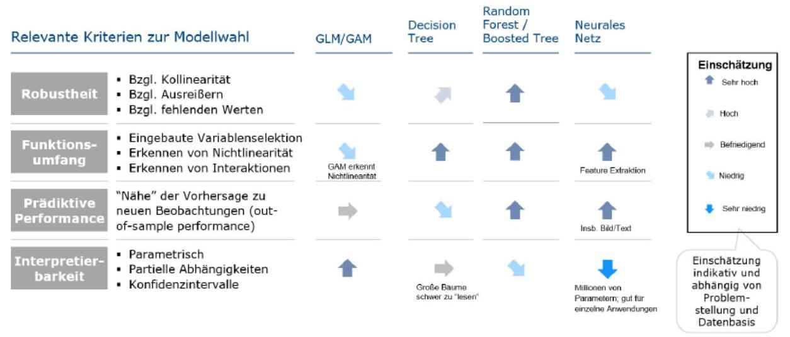

## Page 31
und solche, die model-agnostisch sind und damit zudem geeignet sind unterschiedliche Modelle zu vergleichen.

Quelle: [12]

# 3.3.1. Permutation Feature Importance 

Dieses Modell-agnostische Verfahren permutiert der Reihe nach die Ausprägungen der Variablen des Datensatzes ${ }^{24}$, d.h. für jede Variable werden die Zeilen zufällig angeordnet. Dies erhält die marginale Verteilung der Variable, aber „zerstört" jegliche Korrelation mit der Zielvariablen. Sind die Vorhersagen nach Permutation weit von der Zielvariablen entfernt, deutet dies auf eine hohe Relevanz hin. Für Details siehe Kapitel 5.5 in [13]. Grafisch lässt sich Feature Importance wie folgt darstellen:

[^0]
[^0]:    ${ }^{24}$ Dies kann sowohl der Trainingsdatensatz als auch ein Testdatensatz sein. Die Wahl kann das Ergebnis stark beeinflussen. Tritt Overfitting auf, kann eine Variable eine hohe Relevanz auf den Trainings-, und eine sehr kleine auf den Testdaten haben.
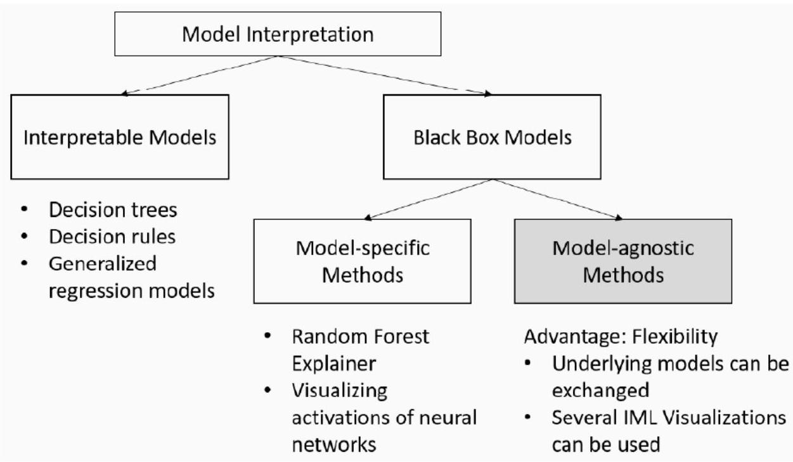

## Page 32
Quelle: [12]

# 3.3.2. Partielle Abhängigkeiten 

Ein Partial Dependence Plot (PDP) beschreibt den marginalen Effekt einer oder zweier Variablen auf die Vorhersage. Der Effekt aller anderen Variablen wird dabei „herausintegriert". Für Details siehe Kapitel 5.1 in [13]. Grafisch lassen sich PDPs wie folgt darstellen:

FIGURE 5.2: PDPs for the bicycle count prediction model and temperature, humidity and wind speed. The largest differences can be seen in the temperature. The hotter, the more bikes are rented. This trend goes up to 20 degrees Celsius, then flattens and drops slightly at 30 . Marks on the x -axis indicate the data distribution.

## Quelle: https://christophm.github.io/interpretable-ml-book/pdp.html

Auf Varianten wie ICE und ALE Plots werden wir an dieser Stelle nicht weiter eingehen. Für Details siehe Kapitel 5.2 und 5.3 in [13].
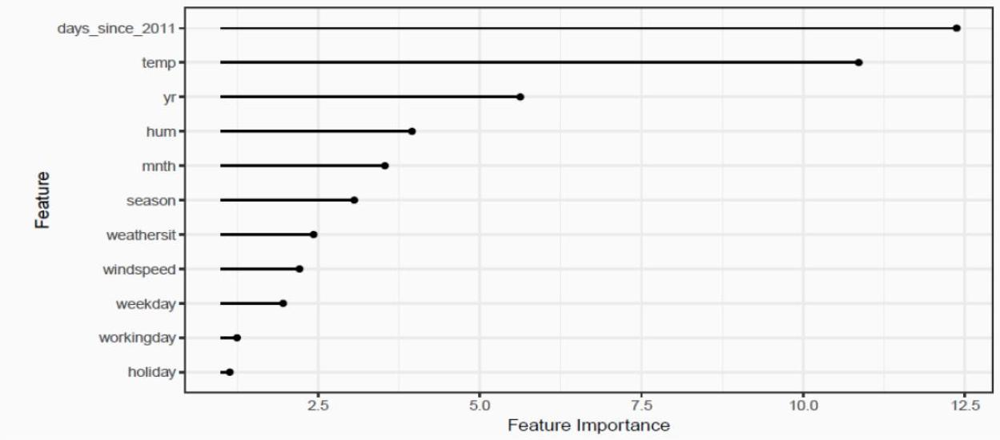
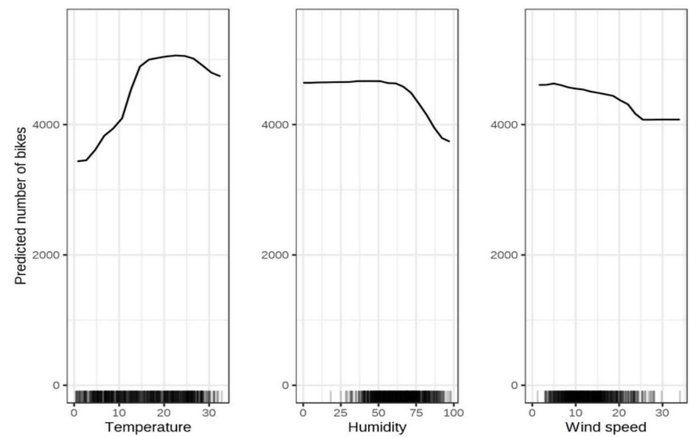

## Page 33
# 3.3.3. Global Surrogate 

Ein Global Surrogate stellt eine globale Approximation eines Black Box Modells durch ein interpretierbares Modell dar. Beispielsweise könnte man die Vorhersagen eines Tree Boosting Ensembles mittels eines einzelnen Entscheidungsbaums modellieren. Dieser Entscheidungsbaum lässt sich dann leicht interpretieren. Ein entscheidender Nachteil ist, dass nicht das Modell interpretiert wird welches schließlich benutzt werden soll. Zudem kann ein hoher Approximationsfehler das Ergebnis der Erklärung bedeutend verzerren. Für Details siehe Kapitel 5.6 in [13].

### 3.3.4. Lokale Approximationen

Im Gegensatz zu dem Versuch, das Modell als Ganzes zu approximieren, wird bei Local interpretable model-agnostic explanations (LIME) nur eine einzelne Vorhersage durch ein einfaches (lineares) Modell approximiert, siehe Kapitel 5.7 in [13].

Quelle: [14]
Ein ähnliches Ergebnis liefern die aus der Spieltheorie definierten Shapley Values, siehe Kapitel 5.9 in [13]. Der SHAP Algorithmus von [15] liefert einen einheitlichen Ansatz, welcher Shapley Values und LIME verknüpft.

### 3.3.5. Verfahren speziell für neuronale Netze

Machine Learning-Modelle auf tabellarischen Daten sind darauf angewiesen, dass diese gut definierte Variablen enthalten. Bei Text- und Bild-Daten sind solche „starken Features" in der Regel nicht vorhanden. Hier sind häufig Deep Learning Modelle klassischen Machine Learning-Modellen überlegen, da sie verschachtelte Layer nutzen um zunehmend komplexere Features aus den Rohdaten zu extrahieren.

## (1) Feature-Visualisierung

Der Ansatz, erlernte Features explizit darzustellen, wird als Feature-Visualisierung bezeichnet. Die Feature-Visualisierung für eine Einheit eines Neuronalen Netzes erfolgt durch das Finden des Inputs, der die Aktivierung dieser Einheit maximiert.
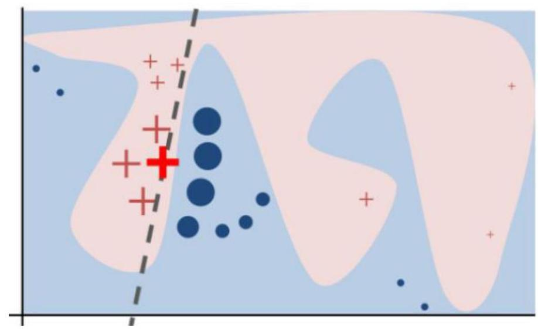

## Page 34
Einheiten können bspw. Neuronen, Activation Maps oder ganze Layer sein, wie in [13] veranschaulicht:

FIGURE 7.2: Feature visualization can be done for different units. A) Convolution neuron, B) Convolution channel, C) Convolution layer, D) Neuron, E) Hidden layer, F) Class probability neuron (or corresponding pre-softmax neuron)

Quelle: https://christophm.github.io/interpretable-ml-book/cnn-features.html\#feature-visualization
Ein typisches Ergebnis für ein Image-Classification-Modell kann dabei wie folgt aussehen:
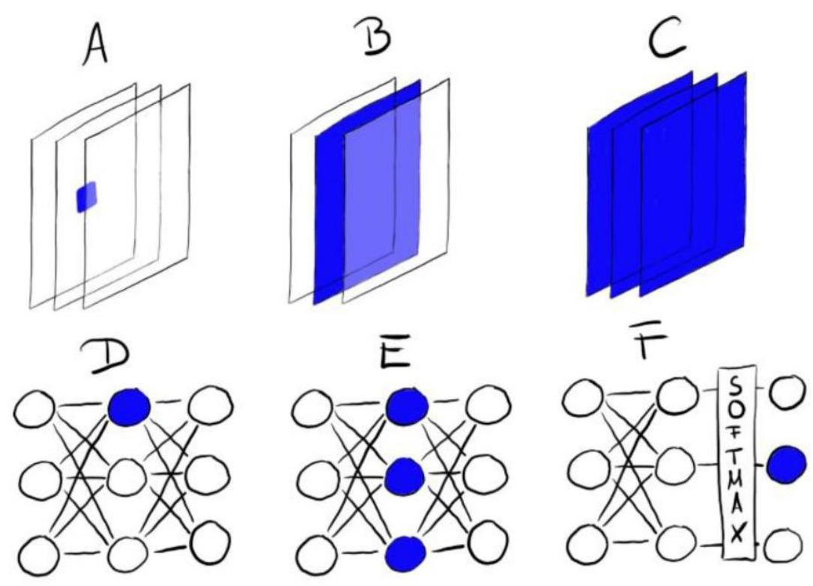

## Page 35
Quelle: https://distill.pub/2017/feature-visualization/
(2) Feature-Attribution

Feature-Attribution untersucht, welcher Teil eines Beispiels dafür verantwortlich ist, dass das Netzwerk einen bestimmten Pfad aktiviert. Dies kann u.a. durch die in Kapitel 3.3.4 beschriebenen Shapley Values erreicht werden. Rote Werte zeigen hierbei, welche Pixel zugunsten der Zielklasse sind, blaue zuungunsten.

## Page 36
Quelle: https://github.com/slundberg/shap
Ebenfalls nutzen lässt sich das LIME Verfahren von [14].
Feature-Attribution eignet sich auch für Text-Klassifikation, bspw. zur StimmungsAnalyse (engl. sentiment analysis):

| Target Label | Predicted Label | Attribution Label | Attribution Score | Word Importance |
| :-- | :-- | :-- | :-- | :-- |
| pos | pos $(0.99)$ | pos | 1.55 | It was a fantastic performance I pad |
| pos | pos $(0.71)$ | pos | 1.69 | Best film ever pad pad pad pad |
| pos | pos $(0.95)$ | pos | 1.55 | Such a great show I pad pad |
| neg | neg $(0.18)$ | pos | -1.20 | It was a horrible movie pad pad |
| neg | neg $(0.22)$ | pos | -1.72 | I've never watched something as bad |
| neg | neg $(0.38)$ | pos | -1.29 | It is a disgusting movie I pad |

Quelle: https://www.captum.ai/tutorials/IMDB_TorchText_Interpret

# 3.4. Interpretierbarkeit am Beispiel verschiedener Use Cases 

Typische Anwendungen von ML/KI Modellen ergeben sich bspw. aus der Herleitung von

- biometrischen Rechnungsgrundlagen wie Sterbewahrscheinlichkeiten und Berufsunfähigkeitsinzidenzen in der Lebensversicherung, oder
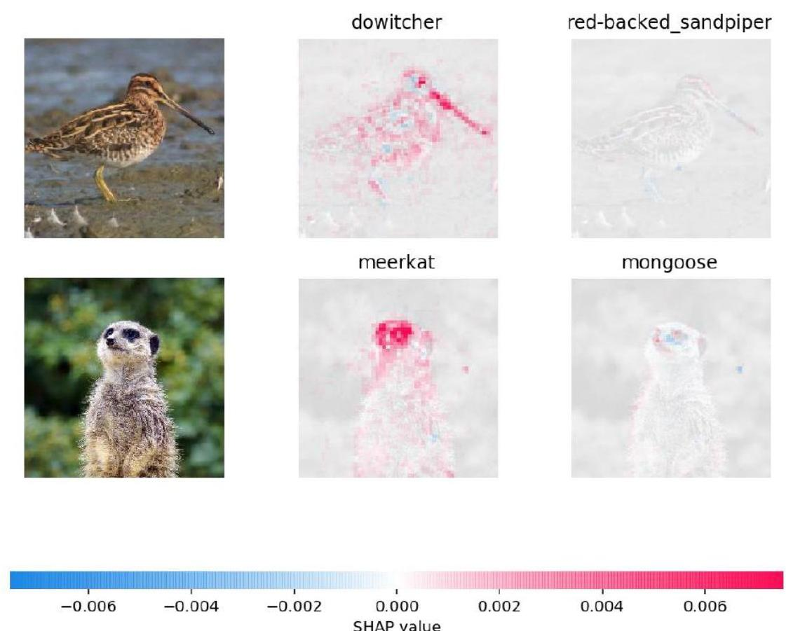

## Page 37
- erwarteten Schadenfrequenzen und -höhen zur Ermittlung der Kopfschäden in der Krankenversicherung oder der Prämie in der Kfz-Haftpflicht.

Die dabei verwendeten Portfoliodaten liegen meist in strukturierter Form vor. Daher bietet es sich an, etablierte Modelle wie klassische Sterbetafeln oder einfache verallgemeinerte lineare Modelle mit Machine Learning-Modellen wie Random Forests oder Gradient Tree Boosting zu vergleichen. An konkreten Beispielen zeigen wir auf, wie sich für ML-Modelle eine vergleichbare Güte von Interpretierbarkeit erreichen lässt wie für klassische Modelle.

Existieren bereits akzeptable Modelle auf strukturierten Daten, kann man dennoch häufig Nutzen aus unstrukturierten Daten ziehen, die noch nicht systematisch verwendet werden:

- Beispielsweise lässt sich das traditionelle Underwriting, z.B. in der Kreditoder Kautionsversicherung, mittels der Auswertung von öffentlich zugänglichen Nachrichtenmeldungen und Unternehmens-Reports ergänzen.
- Risiken in der Lieferkette lassen sich mittels Relationsextraktion ${ }^{25}$ aus Vertragstexten identifizieren und besser einschätzen.
- Mittels Neuronaler Netze können Luftaufnahmen nach Naturkatastrophen genutzt werden um einen schnelle und akkurate Schadenersteinschätzung zu bekommen.
- Schadensberichte in der Kfz- und Haftpflichtversicherung liegen typischerweise in Text- oder Bildform vor und können mit Deep Learning-Modellen nutzbar gemacht werden.

Im Folgenden zeigen wir die Anwendung von Interpretierbarkeit von ML/KI an Use Cases aus der Krankenversicherung sowie für Anwendungen von Deep LearningModellen.

# 3.4.1. Schadenfrequenzen in der Krankenversicherung 

Die hier verwendeten Daten stammen aus der Medical Expenditure Panel Survey (MEPS), welche von der U.S. Agency of Health Research and Quality in Auftrag gegeben wurde ${ }^{26}$. Die Daten basieren auf einer Studie und sind keine Portfoliodaten, da letztere nicht einfach veröffentlicht werden können. Details zu den verfügbaren Variablen finden sich im Appendix. Anhand dieses Datensatzes wurde ein Modell zur Vorhersage der Schadenfrequenz hergeleitet. Analysen haben gezeigt dass ein xgboost besonders gute Vorhersagen liefert. Dieses Modell gilt es nun besser zu verstehen.

Die Analyse der Feature Importance ${ }^{27}$ verdeutlicht, dass nicht alle Variablen überhaupt relevant für die Prädiktion sind. Beispielsweise spielen Alter, körperlicher

[^0]
[^0]:    ${ }^{25}$ http://nlpprogress.com/english/relationship extraction.html
    ${ }^{26} \mathrm{http}: / / w w w . m e p s . a h r o . g o v / m e p s w e b /$
    ${ }^{27}$ Durch die geringe Datensatzgröße wird hier eine „Gain Feature Importance" verwendet anstatt der in Kapitel 3.3.1. beschriebenen Permutation Feature Importance.

## Page 38
Gesundheitszustand, Familiengröße und Geschlecht eine sehr große Rolle. Da im Europäischen Raum Unisex Tarife vorgeschrieben sind, hat damit die Einschätzung des Geschlechter-Splits einen starken Einfluss auf die Prämienkalkulation.

Ebenso wirkt sich ein schlechter körperlicher Gesundheitszustand auf die Vorhersagen aus, was plausibel ist und unser Vertrauen in das Modell erhöht. Hier nutzen wir einen PDP um den genauen Zusammenhang mit der Schadenfrequenz näher zu verstehen. Es zeigt sich, dass vor allem ein schlechter Gesundheitszustand zu einer hohen Schadenfrequenz führt, was wiederum plausibel ist.
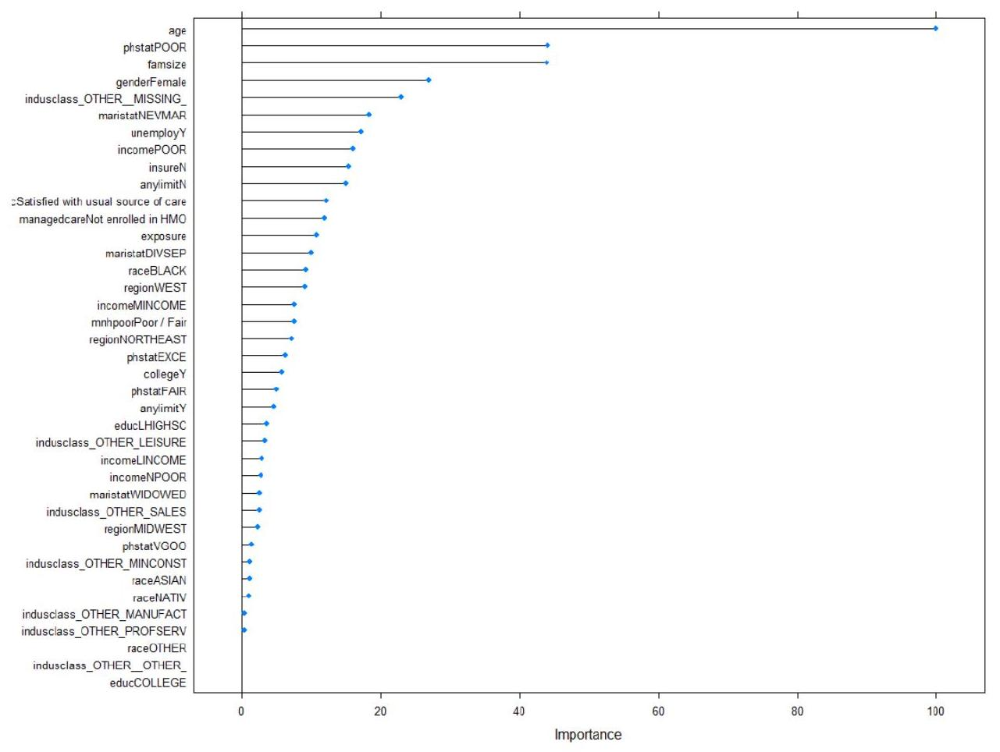

## Page 39
Neben generellen Aussagen zum Modell möchten wir auch einzelne Vorhersagen plausibilisieren können, z.B. im fakultativen Underwriting. Hierzu nutzen wir ein xgboost-spezifisches Tool ${ }^{28}$ :

FREQUENCY

Hier zeigt sich ganz konkret wie bspw. Einkommen und körperlicher Gesundheitszustand die erwartete Schadenfrequenz verringern, aber Geschlecht und Branche die erwartete Schadenfrequenz erhöhen.

[^0]
[^0]:    ${ }^{28}$ https://github.com/AppliedDataSciencePartners/xgboostExplainer
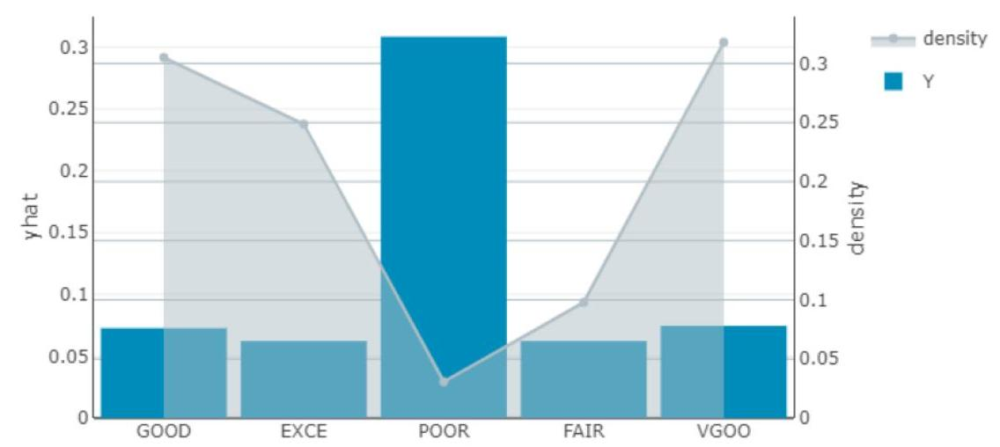
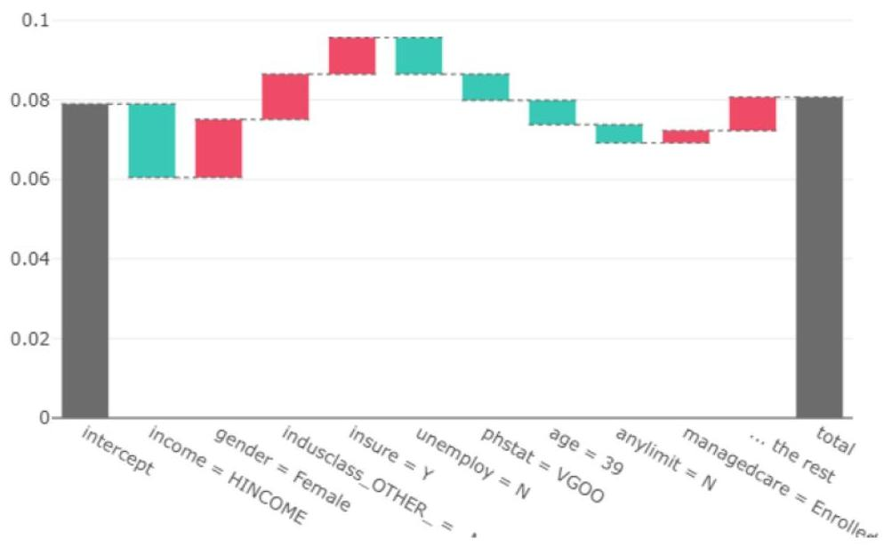

## Page 40
# 3.4.2. Schadenhöhen in der Krankenversicherung 

Zur Analyse der Schadenhöhen nutzen wir wieder den MEPS Datensatz aus Kapitel 3.4.1. Die Ergebnisse der Variable Importance sind ähnlich zu denen in 3.4.1.

Mittels PDPs können wir uns wieder davon überzeugen, dass die modellierten Effekte plausibel sind. Auch hier führt bspw. ein schlechter Gesundheitszustand zu höheren Schadenkosten.
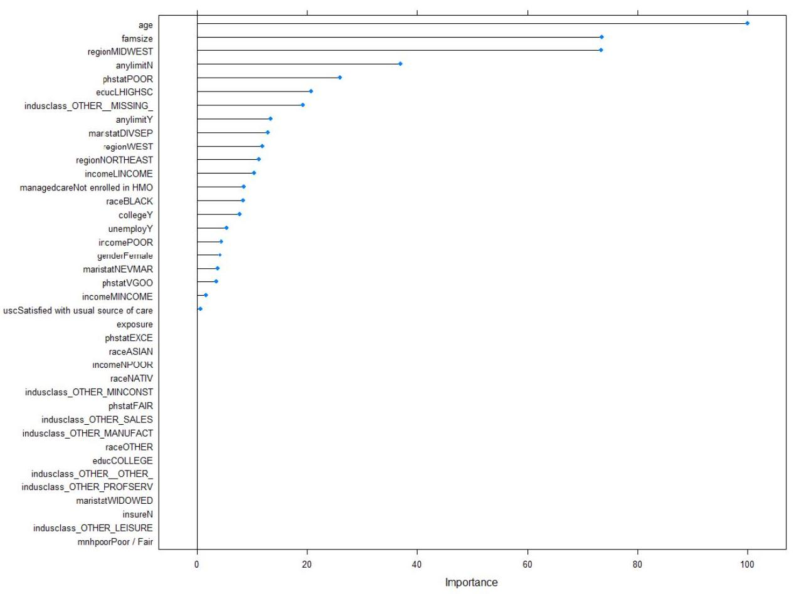

## Page 41
Im Beispiel unten verringert sich die erwartete Schadenhöhe durch einige Faktoren im Vergleich zum Durchschnitt:

SEVERITY

# 3.4.3. Deep Learning im Text Mining und zur Bilderkennung 

In vielen Use Cases in der Versicherung geht es weniger, wie in Kapitel 3.5 besprochen, um Klassifikation, sondern eher um Informationsextraktion. Bei TextModellen kann hier ein Plausibilitätscheck durch Analyse der Nachbarschaft von
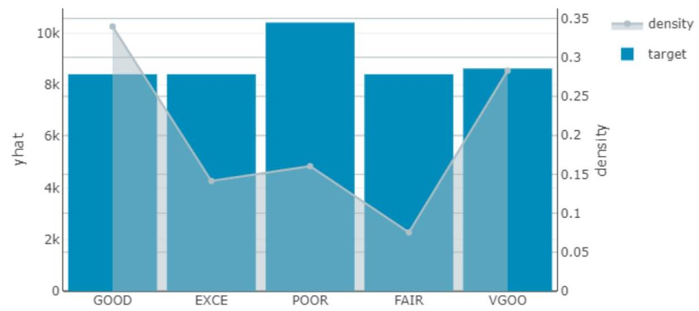
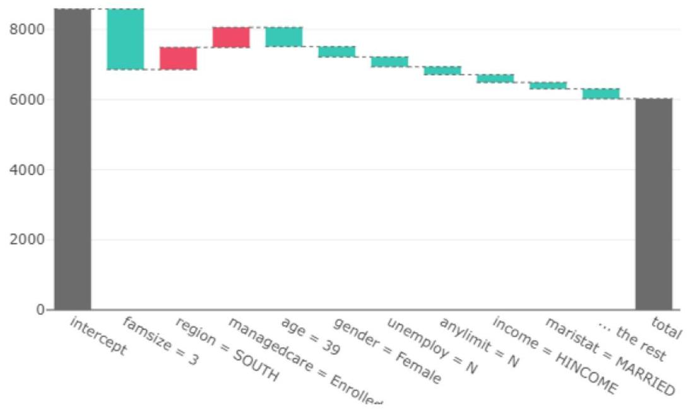

## Page 42
Word Embeddings stattfinden. Sinnvolle Embeddings sollten ähnliche Begriffe gruppieren. Aus einem Modell zur Extraktion von möglichen Insolvenzen wurde beispielsweise folgende Word Cloud erzeugt:

Word Cloud

Wie man erkennen kann, hat das Modell die Begriffe richtig eingeordnet und sollte in der Lage sein, Insolvenzen von anderen Events zu trennen.

In manchen Fällen ist das zu Grunde liegende Modell zwar sehr komplex, jedoch erfolgt der Output des Modells in einer Art und Weise, die eine hohe Transparenz der Ergebnisse garantiert. Ein Beispiel hierfür sind Modelle zur Bildsegmentierung. Sie liefern bereits ein gut interpretierbares Ergebnis, bspw. die Umrisse eines Gebäudes, wie folgendes Modell zur Schadenerkennung nach Naturkatastrophen:

Quelle: https://www.munichre.com/landingpages/corporate/en/remote-industries.html

## Page 43
# A. Anhang 

## a) Erfassung von KI - Anwendungen im Versicherungsbereich

Nachfolgend werden Methoden, die in den bereits vorliegenden Ergebnisberichten [7] und [6] respektive im Entwurf des Ergebnisberichtes [5] genannt werden, sowie ein Kennzeichen für das jeweilige methodische Anwendungsgebiet, aufgeführt. Die Anwendungsgebiete lassen sich in Regression (R), Klassifikation (K), Dimensionsreduktion (D) und Clustering (C) unterteilen. Diese werden um die in diesen Ergebnisberichten beschriebenen Anwendungsbereiche der Methoden ergänzt. Zudem wird die dort gegebene Einschätzung zur Interpretierbarkeit und Validierbarkeit der Methoden kurz aufgegriffen.

Die nachfolgende Auflistung erhebt keinen Anspruch auf Vollständigkeit.
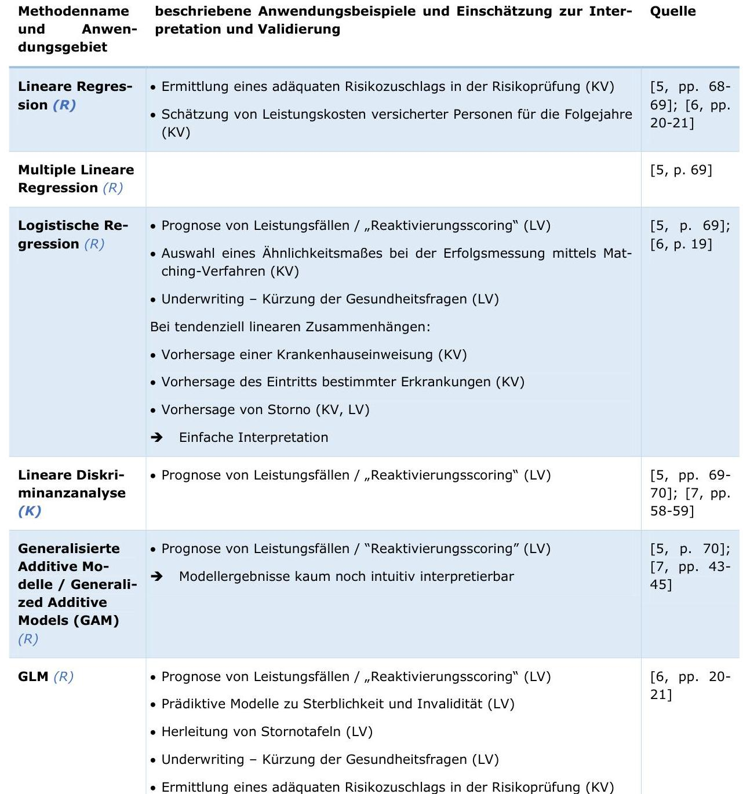

## Page 44
|  | - Schätzung von Leistungskosten versicherter Personen für die Folgejahre (KV)   - Tarifierung/Produktentwicklung (SV) |  |
| :--: | :--: | :--: |
| Bayes-Klassifi-   zierungsverfah-   ren $(K)$ |  | [5, p. 70] |
| K-Nearest   Neighbor $(R, K)$ | - Prognose von Leistungsfällen / "Reaktivierungsscoring" (LV)   - Ermittlung eines adäquaten Risikozuschlags in der Risikoprüfung (KV)   - Schätzung von Leistungskosten versicherter Personen für die Folgejahre (KV) | $\begin{aligned} & {[5, \text { p. } 71]} ; \\ & {[6, \text { pp. } 20-} \\ & 21] \end{aligned}$ |
| Entscheidungs-   bäume (z.B.   C5.0) (K) | - Herleitung von Stornotafeln (LV)   - Modellierung von Frühstorno (LV) | $\begin{aligned} & {[5, \text { p. } 72]} ; \\ & {[6, \text { p. } 19]} ; \\ & {[7, \text { pp. } 47-} \\ & 48] \end{aligned}$ |
| Regressions-   bäume $(R)$ | - Ermittlung eines adäquaten Risikozuschlags in der Risikoprüfung (KV)   - Schätzung von Leistungskosten versicherter Personen für die Folgejahre (KV)   - Vorhersage von metrischen Leistungsausgaben in der Pflegeversicherung (KV) | $\begin{aligned} & {[5, \text { pp. } 72-} \\ & 73] ;[6, \text { pp. } \\ & 20-21] \end{aligned}$ |
| Classification   and Regression   Trees (CART)   $(R, K)$ | $\rightarrow$ Einfache Interpretierbarkeit bei kleineren Bäumen | $\begin{aligned} & {[7, \text { pp. } 46-} \\ & 47] \end{aligned}$ |
| Random Forests (Bagging) | - Herleitung von Stornotafeln (LV)   - Prognose von Leistungsfällen / "Reaktivierungsscoring" (LV)   - Prädiktive Modelle zur Sterblichkeit und Invalidität (LV)   - Underwriting - Kürzung der Gesundheitsfragen (LV)   - Vorhersage einer Krankenhauseinweisung (KV)   - Vorhersage des Eintritts bestimmter Erkrankungen (KV)   - Vorhersage von Storno (KV, LV)   - Generell Prognose einer abhängigen Variablen abhängig von Covariablen; Schadenbedarf abhängig von Merkmalen (P\&C)   $\rightarrow$ Interpretierbarkeit geht bereits bei kleinen Bäumen verloren; mittels modellspezifischer „Explainers" kann die Zusammensetzung der Stornovorhersage anhand der Features eindeutig abgeleitet und mittels Wasser-fall-Charts anschaulich visualisiert werden   $\rightarrow$ Weitgehende Freiheit von Vorgaben eines funktionalen Zusammenhangs zwischen abhängiger und Covariablen | $\begin{aligned} & {[5, \text { pp. } 73-} \\ & 74] ; \\ & {[7, \text { pp. } 48-} \\ & 49] ;[6, \text { pp. } \\ & 19-21] \end{aligned}$ |
| Tree Boosting /Boosted Trees | - Prognose von Leistungsfällen / „Reaktivierungsscoring" (LV)   - Vorhersage einer Krankenhauseinweisung (KV)   - Vorhersage des Eintritts bestimmter Erkrankungen (KV)   - Vorhersage von Storno (KV)   - Underwriting - Kürzung der Gesundheitsfragen (LV)   - P\&C: Wie Random Forests | $\begin{aligned} & {[6, \text { pp. } 19-} \\ & 21] \end{aligned}$ |

## Page 45
|  | $\rightarrow$ | Weitgehende Freiheit von Vorgaben eines funktionalen Zusammenhangs zwischen abhängiger und Covariablen; Anwendung ähnlich Random Forest bei unterschiedlicher Numerik etc. |  |
| :--: | :--: | :--: | :--: |
| Boosting / Gradient Boosting Machine | - Herleitung von Stornotafeln (LV)   - P\&C: Wie Random Forests   $\rightarrow$ | $\begin{aligned} & \text { [5, p. 74]; } \\ & {[7, \text { pp. 49- } \\ } \\ & 51] \end{aligned}$ | $[5$, pp. 74-   51] |
| Support Vector Machines (SVM)   (z.B. Maximal   Margin Classi-   fier, Support   Vector Classi-   fier) (K) | - Ähnlichkeit zur Baumverfahren   - P\&C: Anwendung wie Random Forests   $\rightarrow$ Weitgehende Freiheit von Vorgaben eines funktionalen Zusammenhangs zwischen abhängiger und Covariablen; Anwendung ähnlich Random Forest bei unterschiedlicher Numerik etc. | $\begin{aligned} & {[5, \text { pp. } 74- \\ & 75] ;[7, \text { pp. } \\ & 52-54]} \end{aligned}$ |  |
| Künstliche neuronale Netze (z.B. Restricted Boltzmann Machine (RBM)) (K) | - Verarbeitung der unstrukturierten Daten zu einem Versicherten aus Social Media   - Vorhersage einer Krankenhauseinweisung (KV)   - Vorhersage des Eintritts bestimmter Erkrankungen (KV)   - Vorhersage von Storno (KV)   - Ermittlung eines adäquaten Risikozuschlags in der Risikoprüfung (KV)   - Schätzung von Leistungskosten versicherter Personen für die Folgejahre (KV)   - P\&C: Wie Random Forests   $\rightarrow$ Weitgehende Freiheit von Vorgaben eines funktionalen Zusammenhangs zwischen abhängiger und Covariablen; Anwendung ähnlich Random Forest bei unterschiedlicher Numerik etc. | $\begin{aligned} & {[5, \text { pp. } 76- \\ & 77] ;[7, \text { pp. } \\ & 54-56] ;[6, \\ & \text { pp. 19-21] }} \end{aligned}$ |  |
| Deep-Learning | - Spezifische Stärken (Weitestgehende Freiheit von strukturellem Vorwissen) und Anforderungen an die Datenmenge qualifizieren D-L insbes. Für Bild-, Ton- etc. Interpretation   $\rightarrow$ Sucht "selbsttätig" mögliche Covariablen; benötigt deshalb deutlich mehr Daten als in Tarifkalkulation i.d.R. verfügbar; Anwendung ähnlich Random Forest bei unterschiedlicher Numerik etc. | $\begin{aligned} & {[7, \text { pp. } 55- \\ & 56]} \end{aligned}$ |  |
| Shrinkage Methods (z.B. The Lasso (R, K, D), Ridge-Regression (R), Elastic Net) | - P\&C: Tarifkalkulation ähnlich GLM, spezifische Stärken bei kleinen Kollektiven in einer Dimension   - Vorhersage von Storno - Verallgemeinerung der Regressionsgleichung (LV)   $\rightarrow$ Hat Ähnlichkeit mit Credibility bzw. GLM mit zufälligen Effekten | $\begin{aligned} & {[5, \text { pp. } 77- \\ & 78],[7, \text { pp. } \\ & 45-46]} \end{aligned}$ |  |
| Dimensionsreduktionsverfahren (D) | - Vorgelagerte Analyse oder dem Lernen von Modellen vorgelagert   - Bestandsanalysen (KV)   - Leistungsdatenanalyse (KV)   - Leistungsprognosen (KV) | $\begin{aligned} & {[5, \text { pp. } 78- \\ & 79] ;[6, \text { pp. } \\ & 21-22]} \end{aligned}$ |  |
| Ereigniszeitenanalyse / Survival Analysis (z.B. Kaplan-Meier, Cox-Re- | - Vertragslaufzeit-Analyse   $\rightarrow$ Lebensdauer-Analysen sind in Naturwissenschaft / Technik evtl. Besser angemessen | $\begin{aligned} & {[5, \text { pp. } 80- \\ & 81]} \end{aligned}$ |  |

## Page 46
| gression, Ran-   dom Survival   Forests) |  |  |
| :-- | :-- | :-- |
| Bayes'sche   Netze (K) |  | $[7$, pp. 51-   52] |
| Unsupervised   Neares Neighbor (UNN) (R) |  | $[7$, pp. 56-   57] |
| Principal Com-   ponent Analy-   sis/Hauptkom-   ponen-   tenanalyse   (PCA) (D) | - Datenaufbereitung - Verfahren zur Merkmalsreduktion (KV)   - Lineare Transformation von Variablen zur Verringerung von Korrelationen   (KV) | $[7$, pp. 57-   58]; [6, pp.   16-17; 22];   $[5$, pp. 78-   79] |
| Generalised   Low Rank Mod-   els (GLRM) |  | $[6$, p. 22] |

# b) Aufzeigen bestehender Qualitätssicherungskonzepte 

In den drei Ergebnisberichten werden zudem auch weitere bestehende Qualitätssicherungskonzepte aufgeführt, die nachfolgend aufgelistet sind. Diese Konzepte werden ebenfalls um bereits in diesen Berichten beschriebenen Anwendungsbeispiele ergänzt.

Die nachfolgende Liste erhebt keinen Anspruch auf Vollständigkeit.

| Methodenname | beschriebene Anwendungsbeispiele | Quelle |
| :--: | :--: | :--: |
| Validation Set Approach |  | [5, p. 67] |
| $k$-fold Cross-Validation | - Modelloptimierung zur Vermeidung von Overfitting (KV) | [5, pp. 67-77]; [7, pp. 73-74]; [6, p. 24] |
| Gini-Index | - Auswirkungen der Klassifikation in erwartete Stornierer und Nicht-Stornierer transparent machen (LV) | [5, pp. 81-83]; [7, pp. 74-76] |
| Konfusionsmatrix | - Auswirkungen der Klassifikation in erwartete Stornierer und Nicht-Stornierer transparent machen (LV)   - Auswertung der Modellgüte anhand der prognostizierten Stornowahrscheinlichkeiten (LV) | [5, p. 84]; [7, pp. 85-86] |
| ROC-Kurve und AUC | - Modelltuning (LV)   - Modellbewertung bei Ereignisprognosen (KV)   - Bestimmung der Vorhersagegüte von Modellen (LV)   - Messung der Modellgüte anhand der prognostizierten Stornowahrscheinlichkeiten (LV) | [5, pp. 84-85]; [6, p. 24] [7, pp. 86-87] |
| Globale und lokale Interpretation |  | [7, pp. 65-66] |

## Page 47
| Randverteilung | - Verständnis in welchen Bereichen Stärken und Schwächen des Modells liegen | [7, pp. 66-67] |
| :--: | :--: | :--: |
| Liftplot | - Wichtig(st)e, sehr einfache, und vor allem verteilungsfreie graphische Darstellung, inwieweit ein auf einer Datenmenge durchgeführter Fit auch auf eine disjunkte TestDatenmenge passt („haben die auf 2017er Daten überdurchschnittlich teuer / billig kalkulierten Risiken in 2018 den prognostizierten überdurchschnittlich hohen / niedrigen Schaden?") | [7, pp. 69-70] |
| Double Lift Charts | - Vergleich zweier unterschiedlicher Modelle | [7, pp. 70-71] |
| Residuenanalyse |  | [7, pp. 71-72] |
| Mehrdimensionale Grafiken | - Interaktionseffekte eines Modells zwischen zwei Merkmalen aufzeigen | [7, pp. 72-73] |
| Summe der absoluten Abweichungen und der Abweichungsquadrate (MAE/RSME) | - Vergleich der Güte unterschiedlicherer Modellansätze | [7, p. 73]; [6, p. 24] |
| Baumverfahren (Node impurity) |  | [7, p. 76] |
| Random Forests | - Bestimmung der Variablenwichtigkeit | [7, p. 76] |
| Gütemaße mit expliziter Verteilungsanahme |  | [7, pp. 77-80] |
| Statistische Tests   (z.B. Log-Like-lihood-Test,   Vuong-Test für nicht geschachtelte Modelle, Distribution free test) | - Vergleich der Güte unterschiedlicherer Modellansätze | [7, pp. 80-82] |
| Bayes-Faktoren | - Vergleich welches Modell die Wirklichkeit am besten beschreibt | [7, pp. 82-84] |
| Konfidenzintervall der Fehlerrate (Clopper-Pearson) | - Bestimmung der Modellgüte bei Klassifikation | [7, p. 87] |
| Kappa-Koeffizienten | - Bestimmung der Modellgüte bei Klassifikation | [7, p. 88] |
| Assoziationsanlyse | - Identifikation fehlerhafter Daten (KV) | [6, p. 17] |
| Clusteranalyse | - Identifikation fehlerhafter Daten (KV) | [6, p. 17] |
| Dichotomisieren | - Umcodierung von Variablen (KV) | [6, p. 17] |
| Indizieren | - Hinzuordnen von Zahlenwerten zu Variablen (KV) | [6, p. 17] |

## Page 48
| Imputing | - Zuordnung eines sinnvollen numerischen Wertes zu „missing values" (KV) | $[6$, pp. 17-18] |
| :--: | :--: | :--: |
| Faktentabelle | - Ablage befüllter Zellen aus spärlich besetzter Datenmatrix (sparse matrix) | $[6$, p. 18] |
| K-Means-Clustering | - Identifikation von Auffälligkeiten und Segmentierung bestehender Daten | $[5$, p. 52] |
| Hierarchical Clustering | - Identifikation von Auffälligkeiten und Segmentierung bestehender Daten | $[5$, p. 52] |

# c) Beschreibung des MEPS Datensatzes 

| \# | Variable (description) | Role | Type |
| :--: | :--: | :--: | :--: |
| 1 | age (Age in years between 18 and 65) | Y | metr |
| 2 | anylimit (Any activity limitation) | Y | nomi |
| 3 | anylimit1 (Any activity limitation (described by numbers)) | N | nomi |
| 4 | college (College or higher degree) | Y | nomi |
| 5 | college1 (College or higher degree (described by numbers)) | N | nomi |
| 6 | commercial_premium (Commercial premium) | commercial_premium | metr |
| 7 | countip (Number of inpatient visits) | N | metr |
| 8 | countop (Number of outpatient visits) | N | metr |
| 9 | educ (Level of education received) | Y | nomi |
| 10 | educ1 (Level of education received (described by numbers)) | N | nomi |
| 11 | expendip_avg (Average amount of expenditures for inpatient visits) | N | metr |
| 12 | expendip_total (Total amount of expenditures for inpatient visits) | target_sev | metr |
| 13 | expendip_yn (Any inpatient visit or not) | target_freq | nomi |
| 14 | expendop (Amounts of expenditures for outpatient visits) | N | metr |
| 15 | exposure (Exposure, as fracture per year) | Y | metr |
| 16 | famsize (Family size) | Y | metr |
| 17 | fold (Split between training \& test set) | N | nomi |
| 18 | gender (Gender) | Y | nomi |
| 19 | gender1 (Gender (described by numbers)) | N | nomi |
| 20 | highsch (High school degree or not) | N | nomi |
| 21 | highsch1 (High school degree or not (described by numbers)) | N | nomi |
| 22 | income (Income compared to poverty line) | Y | nomi |
| 23 | income1 (Income compared to poverty line (described by numbers)) | N | nomi |
| 24 | indusclass (Dissatisfied with one's usual source of care or not) | N | nomi |
| 25 | indusclass_OTHER_ (Dissatisfied with one's usual source of care or not (aggregated)) | Y | nomi |
| 26 | insure (Insurance coverage) | Y | nomi |
| 27 | insure1 (Insurance coverage (described by numbers)) | N | nomi |

## Page 49
| 28 | managedcare (Enrolled in an HMO or an gatekeeper plan or not) | Y | nomi  |
| --- | --- | --- | --- |
|  29 | managedcare1 (Enrolled in an HMO or an gatekeeper plan or not (described by numbers)) | N | nomi  |
|  30 | maristat (Married status) | Y | nomi  |
|  31 | maristat1 (Married status (described by numbers)) | N | nomi  |
|  32 | mnhpoor (Self-rated mental health) | Y | nomi  |
|  33 | mnhpoor1 (Self-rated mental health (described by numbers)) | N | nomi  |
|  34 | phstat (Self-rated physical health status) | Y | nomi  |
|  35 | phstat1 (Self-rated physical health status (described by numbers)) | N | nomi  |
|  36 | race (Race) | Y | nomi  |
|  37 | race1 (Race (described by numbers)) | N | nomi  |
|  38 | region (Region) | Y | nomi  |
|  39 | region1 (Region (described by numbers)) | N | nomi  |
|  40 | risk_premium (Risk premium) | risk_premium | metr  |
|  41 | unemploy (Employment status) | Y | nomi  |
|  42 | unemploy1 (Employment status (described by numbers)) | N | nomi  |
|  43 | usc (Dissatisfied with one's usual source of care or not) | Y | nomi  |
|  44 | usc1 (Dissatisfied with one's usual source of care or not (described by numbers)) | N | nomi  |
|  45 | visit_type (Inpatient or outpatient visit, both or non at all) | N | nomi  |

## Page 50
# B. Literaturverzeichnis 

[1] High-Level Expert Group on Artificial Intelligence (HLEG), „ETHICS GUIDELINES FOR TRUSTWORTHY AI," European Commission, Brüssel, 08.04.2019.
[2] European Union, Regulation (EU) 2016/679 of the European Parliament and of the Council of 27 April 2016 on the protection of natural persons with regard to the processing of personal data and on the free movement of such data, and repealing Directive 95/46/EC (General Data Protection Regulation), EUR-Lex.
[3] Deutsche Aktuarvereinigung e.V. (DAV), „Standesregeln für Aktuare in der Deutschen Aktuarvereinigung e.V. (DAV)," Köln, April 2019.
[4] Deutsche Aktuarvereinigung e.V., „Umgang mit Daten im Bereich Data Science," Köln, Stand Juni 2019.
[5] Deutsche Aktuarvereinigung e.V., Big Data in der Lebensversicherung, Köln, 2019.
[6] Deutsche Aktuarvereinigung e.V., „Nutzung von Big Data in der Krankenversicherung," 10 Oktober 2017. [Online]. Available: https://aktuar.de/unsere-themen/fachgrundsaetze-oeffentlich/2017-1012_Ergebnisbericht_Nutzung_von_Big_Data_in_der_Krankenversicherung.p df.
[7] Deutsche Aktuarvereinigung e.V., „Aktuarieller Umgang mit Big Data in der Schadenversicherung," 17 Mai 2019. [Online]. Available: https://aktuar.de/ergebnisberichteundfachgrundsaetze/2019-05-17_DAVERgebnisbericht_Aktuarieller-Umgang-mit-Big-Data-in-derSchadenversicherung_Update-2019.pdf. [Zugriff am 25 Juni 2019].
[8] (HLEG), High-Level Expert Group on Artificial Intelligence, "Draft ETHICS GUIDELINES FOR TRUSTWORTHY AI," European Commission, Brüssel, 18.12.2018.
[9] Gesamtverband der Deutschen Versicherungswirtschaft e. V., „Position Paper of the German Insurance Association on the „Draft Ethics Guidelines For Trustworthy AI" and their applicability to the insurance premiums use case," 28.01.2019, 28.01.2019.

## Page 51
[10 Gesamtverband der Deutschen Versicherungswirtschaft e.V. (GDV), ] „Verhaltensregeln für den Umgang mit personenbezogenen Daten durch die deutsche Versicherungswirtschaft," 09.2012.
[11 Gesetz zur Anpassung des Datenschutzrechts an die Verordnung (EU) ] 2016/679 und zur Umsetzung der Richtlinie (EU) 2016/680 (Datenschutzanpassungs- und Umsetzungsgesetz (EU) - DSAAnpUG-EU), 30.06.2017.
[12 C. M. Bernd Bischl, Model Agnostic Interpretable ML, 2018, Vortrag. ]
[13 Christoph Molnar, „Interpretable machine learning. A Guide for Making Black ] Box Models Explainable," 2019. [Online]. Available: https://christophm.github.io/interpretable-ml-book/.
[14 Marco Tulio Ribeiro, „Why should I trust you?: Explaining the predictions of ] any classifier," Proceedings of the 22nd ACM SIGKDD international conference on knowledge discovery and data mining. ACM (2016).
[15 Scott Lundberg, Su-In Lee, „A Unified Approach to Interpreting Model ] Predictions," Curran Associates, Inc., 2017.
[16 Bundesanstalt für Finanzdienstleistungsaufsicht (BaFin), „Big Data trifft auf ] künstliche Intelligenz - Herausforderungen und Implikationen für Auf-sicht und Regulierung von Finanzdienstleistungen (kurz: BDAI-Studie)," 15.06.2018.