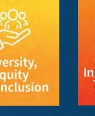
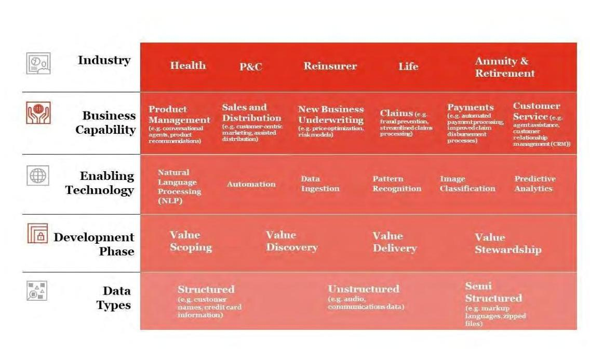
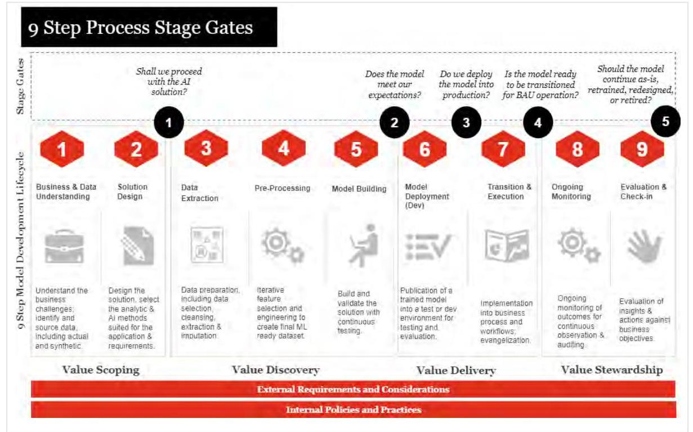
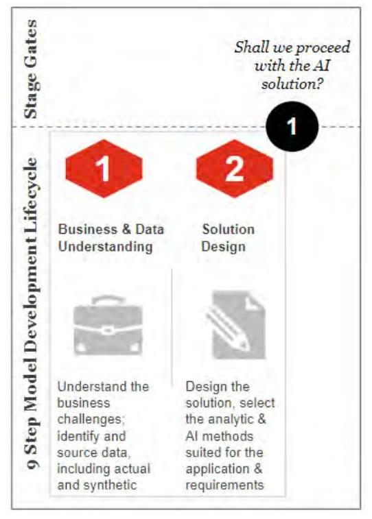
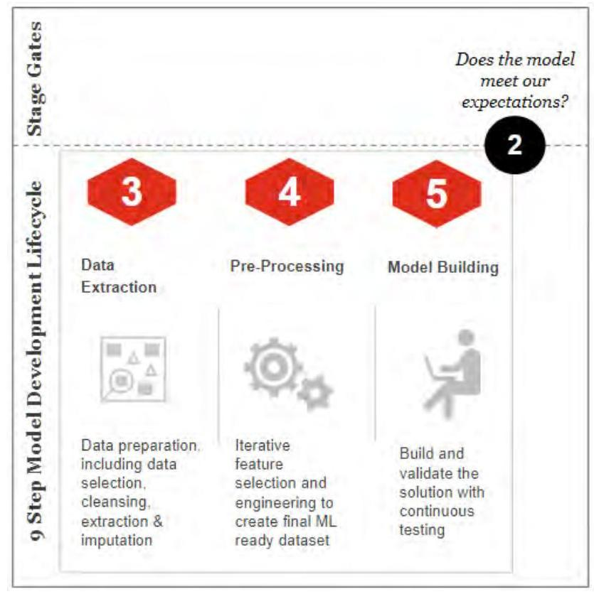
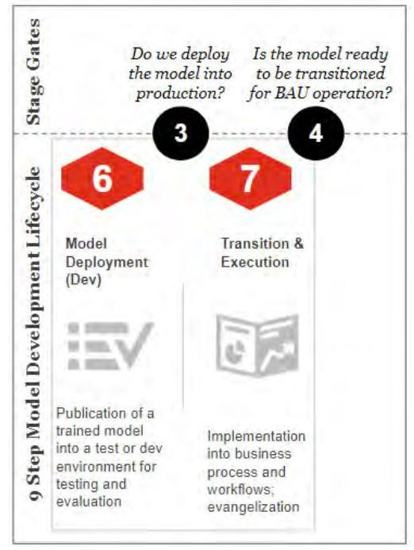
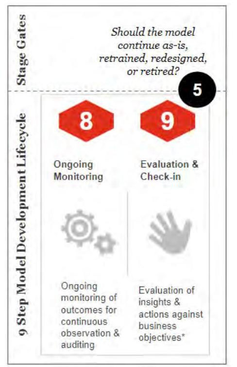

_Note: Source document was split into 3 OCR chunks (pages 1-16, pages 17-32, pages 33-38) to stay within token limits._

# 202208 avoid-unfair-bias-ai

## Page 1
# Avoiding Unfair Bias in Insurance Applications of AI Models

**August | 2022**

## Page 2
# Avoiding Unfair Bias in Insurance Applications of AI Models 

AUTHORS Logan T. Smith, ASA
PricewaterhouseCoopers

Emma Pirchalski
PricewaterhouseCoopers

Ilana Golbin
PricewaterhouseCoopers

ADVISORS Stephen J. Bochanski, FSA, CERA, MAAA
PricewaterhouseCoopers

Dr. Anand S. Rao, PhD, MBA
PricewaterhouseCoopers

SPONSOR Diversity, Equity and Inclusion Research Advisory Council

## Give us your feedback!   Take a short survey on this report.

## Caveat and Disclaimer

The opinions expressed and conclusions reached by the authors are their own and do not represent any official position or opinion of the Society of Actuaries Research Institute, the Society of Actuaries or its members. The Society of Actuaries Research Institute makes no representation or warranty to the accuracy of the information.

Copyright © 2022 by the Society of Actuaries Research Institute. All rights reserved.

## Page 3
# CONTENTS 

Executive Summary ..... 4
Foundational Recommendations ..... 4
Model Development Framework ..... 5
Section 1: Background and Objectives ..... 6
Section 2: Introduction ..... 7
Section 3: Unfair Bias in AI Models in Insurance ..... 9
3.1 Unfair Bias in AI ..... 9
3.2 AI Applications ..... 10
3.3 External Requirements and Considerations ..... 12
Section 4: Foundational Recommendations-Internal Policies and Practices ..... 14

1. Monitor the Regulatory Environment ..... 14
2. Engage Stakeholders and Establish Roles and Responsibilities ..... 14
3. Equip Employees with the Necessary Tools and Skills ..... 15
4. Conduct a Model Risk Assessment ..... 15
5. Integrate with Model Risk Management ..... 16
Section 5: AI Model Development Recommendations and Stage Gates ..... 17
5.1 Value Scoping ..... 18
Stage Gate 1: Shall We Proceed with an AI Proof of Concept? ..... 20
Value Scoping Recommendations ..... 20
5.2 Value Discovery. ..... 21
Stage Gate 2: Does the Model Meet Our Expectations? ..... 23
Value Discovery Recommendations ..... 23
5.3 Value Delivery ..... 26
Stage Gate 3: Do We Deploy the Model into Production? ..... 27
Stage Gate 4: Is the Model Ready to be Transitioned for Business-As-Usual (BAU) Operation? ..... 28
Value Delivery Recommendations ..... 28
5.4 Value Stewardship ..... 29
Stage Gate 5: Should the Model Continue As Is or Be Retrained, Redesigned or Retired? ..... 30
Value Stewardship Recommendations ..... 31
Section 6. Closing Remarks ..... 33
Section 7: Acknowledgments ..... 34
Appendix A: Interview Questionnaire ..... 35
AI Governance Process ..... 35
Data Gathering, Capturing and Usage ..... 35
Deployment andand Monitoring ..... 35
References ..... 36
About The Society of Actuaries Research Institute. ..... 38

## Page 4
# Avoiding Unfair Bias in Insurance Applications of AI Models 

## Executive Summary

Artificial intelligence ("AI") adoption is increasing across many areas of the insurance value chain. ${ }^{1}$ Companies may use AI to explore data and gather insights that were not previously possible or leverage efficiencies gained from the technology to enhance or replace existing models. As more companies explore AI in pursuit of its many benefits, they may be met with questions around the usefulness, efficacy and stability of these systems.

One known risk as adoption of AI increases is the potential for unfair bias. Central to understanding where and how unfair bias may occur in Al systems is defining what unfair bias means and what constitutes fairness. For the purposes of this research, we define unfair bias as "unexplained adverse outcomes for marginalized communities."

The purpose of this research is to identify methods to avoid or mitigate unfair bias unintentionally caused or exacerbated by the use of Al models. This report also proposes a potential framework and approach for insurance carriers to consider when looking to identify and reduce unfair bias in their Al models. Frameworks and mitigation techniques may be relevant to companies just starting their Al journeys, as well as to those who are more mature. While there are components to this report that cover widely applicable frameworks and concepts, the research and recommendations have been developed with a focus in the United States.

## FOUNDATIONAL RECOMMENDATIONS

Many of the recommendations contained within this report are aligned to an area within the proposed model development framework. In addition, foundational recommendations have been identified that relate to the approach which a company is taking to their Al development and usage processes. These foundational recommendations include:

1. Monitor the regulatory environment for emergent requirements, not just from the insurance space but also from data protection, privacy and trade regulators
2. Engage stakeholders and establish roles and responsibilities for effective oversight
3. Equip employees with the necessary tools and skills to understand the complex landscape around Al systems and the biases they may reflect
4. Conduct a model risk assessment to uncover where risks may lie
5. Integrate with model risk management for a cohesive and consistent approach to governance

Because unfair bias may occur at various points across the insurance value chain, organizations can adopt an Al governance structure which not only applies to current practices, but enables scalability and response to potential future regulations, customer expectations and market segments.

[^0]
[^0]:    ${ }^{1}$ The activities involved in bringing a product or service from inception to delivery.

## Page 5
# MODEL DEVELOPMENT FRAMEWORK 

This research also presents a proposed model development framework that includes identified risks, potential controls to help mitigate the likelihood of introducing unfair bias in Al and a recommended stage gate approach. The framework is laid out in the following sections:

1. Value Scoping-determines whether there is any business value in building the model, the success metrics for the model, how the model is intended to be used, and the risk of the model
2. Value Discovery-evaluates and defines success criteria, what data is required, measures to test for fairness and methods for tracking model experiment and versions
3. Value Delivery-deploys the model into a production environment and transitions into business-as-usual production
4. Value Stewardship-captures the model's value and reports to senior management on an ongoing basis that model performance is not degenerating and any changes required to maintain the model's robustness

This framework is intended to provide ideas for what a model development framework could look like, but it is not intended to be one size fits all.

## Page 6
# Section 1: Background and Objectives

Artificial intelligence ("AI") adoption is increasing across many areas of the insurance value chain. In the context of this report, AI is defined as computer systems that can perceive the digital or physical world, process what it perceives and, in most cases, take the kind of action that may normally require human intelligence or reasoning.² Companies may use AI to explore data and gather insights that were not previously possible or leverage efficiencies gained from the technology to enhance or replace existing models. "Model" in this context refers to any tool leveraged to transform or manipulate existing data to develop insights, new data or business recommendations. As more companies explore AI in pursuit of its many benefits, they are often met with more questions than answers. One fundamental question that has received significant attention lately is, *How can practitioners identify and proactively mitigate the risk of unfair bias driven by AI systems?*

For the purposes of this research, we define unfair bias as unexplained adverse outcomes for marginalized communities. Underlying differing outcomes is human judgment and variation in how humans make decisions to begin with. Consider two individuals who arrive at different conclusions, despite having access to the same set of facts and circumstances—a common occurrence. In the context of an insurance setting, to the extent that this variation in human decision-making impacts marginalized communities unfairly, this would be considered unfair bias. As the insurance industry increasingly relies on AI models to make or recommend such decisions, the risk of unfair bias is being shifted away from human decision-making and to the AI models and the algorithms that underlie them.

The Society of Actuaries Research Institute, in collaboration with PwC, performed a thorough review of existing research and literature, supplementing that research with a series of six interviews with AI practitioners across the insurance landscape. The interviewees, listed in Section 7: Acknowledgments, offer their insights into life insurance, annuities, property and casualty and reinsurance, as well as vendors of AI solutions.

The purpose of this research is to study and further enhance methods to avoid or mitigate unfair bias caused by the use of AI models. This report also provides one possible framework and approach for insurance carriers to consider when looking to reduce unfair bias in their AI models. The framework and mitigation techniques found within are meant to be instructive and illustrative. They can be considered by companies just starting their AI journeys, as well as those who are more mature. They can be tailored to the size and level of sophistication of different carriers and modified to be fit-for-purpose.

The objective of this research is to answer the following questions:

- Which data elements and data element types are more likely to introduce unfair bias into AI models? (Section 3 and 5)
- What strategies can be used to reduce unfair bias in existing actuarial and finance applications of AI models? How could these strategies be modified to apply to other applications of AI models in the insurance value chain? (Section 4 and 5)
- What is a general process for analyzing a model and data for bias? (Section 5)
- What steps of the AI model development framework present a high risk of introducing unfair bias, and what approach can be used to reduce that risk? (Section 5)

² Robert N. Bernard and Anand Rao, "What is Artificial Intelligence?," May 30, 2021, https://www.pwc.com/us/en/tech-effect/ai-analytics/artificial-intelligence.html.

## Page 7
# Section 2: Introduction

The adoption of AI has enabled industries to redefine the way they do business—from emerging market segments like FinTech to new capabilities such as online banking, organizations must adopt AI to remain competitive in the market. The insurance industry is no different. Changing customer expectations, margin pressures, decreased costs and streamlined processes are driving investments in AI across the industry.

These investments include AI applications such as adaptive conversational agents, (i.e., chatbots), which have reinvented customer interactions with minimal human engagement needed throughout the claims process. Suggesting risk categories in underwriting has allowed for improvements in operational efficiency or more personalized assessments. Automating fraud detection has helped insurers reduce risk by identifying aberrations in claims data. Across business functions, insurers are using AI to improve operations and generate new value propositions.

These advancements also present insurers, business leaders, regulators and technologists with various concerns in the development and application of AI. The emergence of new forms and combinations of data raises questions on data quality, privacy and usage. The complexity of AI systems raises concerns of a lack of transparency and explainability. Societal changes call into question the long-term stability of these kinds of systems and their alignment to changing standards, expectations and behaviors. Increased reliance on AI warrants deliberation on autonomous or AI-assisted decision making. Among these concerns is the impact of unfair bias.

The adoption of AI is increasing across the insurance industry as companies explore new applications of AI across different areas of the insurance value chain. There are currently a small but increasing number of AI practitioners within the insurance industry. Because of this, there exists a lack of talent to not only build new AI models, but also understand, validate and govern existing models. Increasing expectations for insurers to acknowledge responsibility for detecting and minimizing unfair bias places immense pressures on the governance functions in these organizations. While industry groups and U.S. regulators alike recognize the urgency in addressing such concerns, actionable standards and new regulatory guidelines have not kept pace with industry advancement, leaving insurers to arbitrate trade-offs between innovation and responsible development. Insurance companies have a responsibility to their customers, shareholders and society to make responsible and ethical decisions on how their data is used and analyzed. As discussed during the interview process, interviewees recommend insurance companies be proactive in considering how to avoid unfair bias.

Insurers have a wide variety of products that rely on different data sources and datasets to better understand their target population. Life and annuity, commercial, personal lines of property and casualty insurance, and health insurance products are typically targeted for individuals or individual companies. Alternatively, group insurance and retirement insurance products have a greater likelihood of serving groups of individuals. While there is some commonality in the data required for analysis, the way that data is used and relied upon for analysis can vary quite significantly. Even within a particular product line, there is significant variance in analysis methods and data sources relied upon. In the life insurance space policies have longer durations, often tied to a period of several years or the full life of the individual and the premium rates are often guaranteed for the duration of the policy. This requires insurers to maintain long periods of historical data and often use that data to forecast for long durations in the future. Alternatively, health and property claims are reviewed annually, and premium rates can fluctuate from year to year. Data requirements become even larger for group insurance, where data from many customers within a particular group or segment need to be considered before making decisions that impact the overall group. Depending on the size of the group and the number of groups being considered, this can lead to companies analyzing very large datasets. Each product specific nuance can change the way that data is used within an AI model. As a result, these different applications of AI introduce ways that unfair bias can be unintentionally introduced which can vary significantly from one type of insurance to another. This paper aims to address challenges and risks that

## Page 8
insurers may face generically across all lines of insurance, while also evaluating specific use cases of Al that would only apply to a subset of insurance product lines.

This report examines areas that present a high risk of introducing unfair bias into U.S. insurance companies' applications of Al and approaches for reducing the risk in the model development process. As organizations rely on data to build their Al models, this report also explores combinations of multiple data elements or data sources and how these combinations may result in unfair bias. Additionally, the research reviews how companies may institute governance practices related to Al model development, specifically related to unfair bias.

## Page 9
# Section 3: Unfair Bias in AI Models in Insurance 

### 3.1 UNFAIR BIAS IN AI

Central to understanding where and how unfair bias may occur in Al systems is defining what unfair bias means and what constitutes fairness. These definitions vary across disciplines, organizations, industries and even nations and cultures. In the context of Al, technologists may consider performance independent of a protected attribute (i.e., an anti-discriminatory characteristic that serves to protect individuals ${ }^{3}$ ) one mechanism to check for fairness. However, the collection or analysis of protected attributes are often prohibited due to the risk of unfair bias being introduced, leaving organizations unable to classify model outcomes based on these attributes.

Evaluating model fairness and identifying bias is predicated on the capacity for organizations to understand what drives decision making in their AI models. This understanding could relate to algorithm design, data element types, the end user's interpretation of the system's results, among other considerations. An example of where unfair bias may emerge due to a lack of understanding in what drives decision making can be seen in risk modeling, a technique used in risk assessment for identifying critical factors that drive risk, the relation among those factors and the probability of an outcome occurring. ${ }^{4}$ Risk models can assist insurers in understanding the likelihood of these risks materializing. When evaluating how the AI model determined or valued the factors that drive risk, bias can emerge from datasets that are too simple, outdated or include unrelated attributes that ultimately lead to different outcomes.

Other techniques used in Al development such as micro segmentation - dividing data points into groups based on common characteristics - enable pricing at a smaller group level based on attributes that contribute to risk. ${ }^{5}$ There are two ways in which micro segmentation can introduce bias. First, large amounts of data and multivariate risk scores can have low explainability, making it difficult to determine what attributes drive the assessment. Not understanding what drives the model's decision-making can unintentionally result in biases that may be unfair or discriminatory. Second, variables within the AI model may be highly correlated with a protected trait. For example, one data element may be associated with higher exposure to loss for some insurance coverages. Additionally, that element may be highly correlated with a protected trait. While this correlation does not always lead to unfair bias and is dependent on the utility of the data element itself, model decision-making that is based on a data element which highly correlates to a protected trait introduces potential for unfair bias. ${ }^{6}$

Despite these concerns, Al is increasingly relied upon across the insurance value chain. From the initial stage of research and development to the final sale or customer interaction, Al's integration with these processes warrants consideration of how insurers can leverage the opportunities posed by AI and minimize the risks. Starting with research and development, insurers leverage Al to forecast demand for products and services, which not only informs what offerings are made available, but also may influence how these offerings are marketed and targeted. ${ }^{7}$ At this stage, insurers also use Al to predict customer trends which may shape how products are customized to align

[^0]
[^0]:    ${ }^{3}$ Michael Akinwumi, "The Role of Protected Attributes in AI Fairness," Trust Science, December 19, 2019, https://www.trustscience.com/trust-science-blog/blog/the-role-of-protected-attributes-in-ai-fairness.
    ${ }^{4}$ Stephen D. Gantz and Daniel R. Philpott, "Risk Management," FISMA and the Risk Management Framework, 2013, quoted in "Risk Assessment Tool," ScienceDirect, accessed April 2022, https://www.sciencedirect.com/topics/computer-science/risk-assessment-tool.
    ${ }^{5}$ Daniel Schreiber, "How AI Can Vanquish Bias," InsuranceThoughtLeadership.com, December 9, 2019, https://www.insurancethoughtleadership.com/how-ai-can-vanquish-bias/.
    ${ }^{6}$ Mah-jabeen Soobader, Felicia B. LeClere, Wilbur Hadden, and Brooke Maury, "Using Aggregate Geographic Data to Proxy Individual Socioeconomic Status: Does Size Matter?" American Journal of Public Health, April 2001, Vol. 91, No. 4 https://ajph.aphapublications.org/doi/pdf/10.2105/AIPH.91.4.632. ${ }^{7}$ Matin Eling, Davide Nuessle, and Julian Staubli, "The Impact of Artificial Intelligence Along the Insurance Value Chain and on the Insurability of Risks," The Geneva Papers of Risk and Insurance-Issues and Practice (2022) 47, 205-241, https://doi.org/10.1057/s41288-020-00201-7 Springer, February 8, 2021, https://link.springer.com/content/pdf/10.1057/s41288-020-00201-7.pdf.

## Page 10
with these trends or how services are modified to better suit the customer. While using AI at this stage presents opportunities to develop products and services closer aligned to customer expectations, there may be a lack of historical data for traditionally unexplored segments, resulting in market exclusion and a bias toward existing segments. Moving from research and development all the way to when the product or service reaches the customer, AI is also leveraged in these interactions. In particular, the increasing use of AI in customer service interactions and product use poses accessibility challenges and may place certain groups of customers at a disadvantage. For example, using AI and image recognition to report and detect automobile damage after a car accident is only a possibility for customers with internet access and a smartphone. Although this may be just one method for a customer to report damage due to an accident, certain groups of customers may not be able to receive the benefits associated with this method. This information may ultimately be used in the earlier stages of the value chain, informing product development and service customization, resulting in different outcomes and potentially under- or over-representing a population.

# 3.2 AI APPLICATIONS 

Insurance companies utilize and operate AI systems with varying degrees of maturity. A company that has been using AI for many years likely will have more robust governance practices than a company who is just getting started on their AI journey. In developing governance practices, organizations may consider factors such the industry they are operating in, which area of the insurance value chain the AI model is being applied to, ${ }^{8}$ what technology capability is necessary to support that development, what phase along the development process the AI model is in and what data types are being used in the model. ${ }^{9}$ These elements can be segmented into a hierarchy: industry being the broadest, highest level and data types serving as the foundational level. Each element identified in the hierarchy in (Figure 1), can be applied to any of the elements in the row above it.

[^0]
[^0]:    ${ }^{8}$ Ruud Sommerhalder and Jing Hu, "The Insurance Value Chain," PwC, accessed April 2022, https://www.pwccn.com/en/industries/financial-services/insurance/the-insurance-value-chain.html
    ${ }^{9}$ Christopher P. Holland, Martin Mullins and Martin Cunneen, "Creating Ethics Guidelines for Artificial Intelligence (AI) and Big Data Analytics: The Case of the European Consumer Insurance Market," SSRN, March 22, 2021, https://papers.ssrn.com/sol3/papers.cfm?abstract_id=3808207.

## Page 11
Figure 1
HIERARCHICAL LEVELS OF AI IN INSURANCE

The industry and value chain levels determine what the AI is being used for, the impacted stakeholders and the regulatory environment in which the organization operates. For example, health plans that receive federal assistance may not deny, cancel, limit or refuse health coverage on the basis of race, color, national origin, age or disability. ${ }^{10}$ This helps reduce the possibility of a model ingesting data containing protected attributes and recognizing or learning patterns from these attributes which leads to unfair bias or discrimination. Not using protected attributes may reduce the likelihood that a model learns bias explicitly from data elements, but creates a challenge for organizations assessing fairness across diverse populations while simultaneously making it harder for companies to identify unintentional or indirect forms of bias. Additionally, there is still a possibility that the models use other data elements in the dataset that can ultimately lead to unfair bias as measured against protected attributes despite the fact that data elements directly representing the protected attributes were excluded from the models.

Applications of AI vary within the industry and within an organization. Because of this variation, an AI model built for one use case (i.e., how AI may be applied to solve a specified problem) may not achieve the intended outcome if applied to another use case. Assessing the riskiness of each use case individually enables organizations to tailor and incorporate sufficient governance practices. AI may be used to assist agents in customer interactions, including quoting and issuing products or classifying customer communications. Some companies rely on AI to organize medical data used to recommend treatment options (for example, in health insurance claims and workers' compensation claims). Company functions such as product development, sales and marketing are incorporating predictive analytics and recommendation engines to determine customer demand and suggest ideas for customized products and services. These applications vary across reinsurers, health and life companies and

[^0]
[^0]:    ${ }^{10}$ Cigna, "Nondiscrimination Requirements," Cigna, accessed April 2022, https://www.cigna.com/employers-brokers/insights/informed-on-reform/section-1557-nondiscrimination-requirements.

## Page 12
property and casualty insurers, among others. The divergent applications of Al introduce a complexity for defining and identifying unfair bias.

The technology, development phase and data type levels encompass the Al system itself, how it is developed, its complexity and the data used to train the model. Driven by the industry and value chain levels, the model development and monitoring processes ultimately aim to serve the established use case. This use case determines what Al capability is necessary to support the business objective, what data is required for training and how the data will be processed. If, for example, an insurer wanted to create a model used to support the writing of their memos, the Al system might use natural language processing (NLP) techniques to understand the analytics and provide written commentary about the results. For the Al system to accomplish this, it would need to be trained on a dataset of previous memos and their associated intents. Analyzing a dataset for bias warrants considerations such as how and when the data was sourced, how it was labeled, what attributes comprise the dataset and what populations are represented in the dataset, what language(s) are incorporated, among others.

Understanding these hierarchy levels of an Al system can guide the ethical, regulatory and performance evaluations necessary for Al governance.

# 3.3 EXTERNAL REQUIREMENTS AND CONSIDERATIONS 

In response to Al's impact on the insurance value chain, regulators, technologists, customers and society as a whole are calling on the organizations developing or deploying Al systems to implement responsible practices. ${ }^{11}$

Recognizing the urgency of Al governance, regulators have begun proposing legislation pertaining to high-risk models, data elements and use cases. ${ }^{12}$ Acknowledging the risk of unfair bias being introduced through data elements, many states have prohibited the use of protected attributes in insurance processes and in some cases have prohibited the use of certain variables that may have the potential to unintentionally be correlated with a protected attribute. Emerging legislation in the state of Colorado will prohibit companies from the use of external consumer data and information sources, as well as algorithms and predictive models using external consumer data and information sources, which use has the result of unfairly discriminating based on race, color, national or ethnic origin, religion, sex, sexual orientation, disability, gender identity or gender expression. In addition, it will also require insurers to provide the Colorado Division of Insurance with a risk management framework, an assessment of actions taken to minimize the risk of unfair discrimination, an attestation to the review of such practices and a report on data sources and usage. The legislation requires a balance between negative outcome and correlation to loss: "a disproportionately negative outcome for such classification or classifications, which negative outcome exceeds the reasonable correlation to the underlying insurance practice, including losses and costs for underwriting." This legislation does not go into effect in January 2023, but the rules that will be implemented (after the Commissioner consults with stakeholders) will go into effect potentially as early as January 2023. ${ }^{13}$ In response to Al's growing influence in decision making, the New York City Council passed a bill on automated employment decision tools that would require bias audits to be conducted for these tools and communications to be sent to New

[^0]
[^0]:    ${ }^{11}$ The Center for Economic Justice, "The Center for Economic Justice's Call to Insurers and Insurance Regulators To Address Societal Systemic Bias and Inherent Racism in Insurance By Explicit Recognition of Disparate Impact as Unfair Discrimination in Insurance," June 18, 2020, https://consumerfed.org/wp-content/uploads/2020/06/CEIs-Call-on-Insurers-and-Regulators-to-Address-Systemic-Bias-and-Inherent-Racism-ininsurance.pdf.
    ${ }^{12}$ Ed Chau, California Assembly Bill 13, Introduced December 7, 2020, most recently amended August 16, 2021, https://openstates.org/ca/bills/20212022/AB13/.
    13 "An Act Concerning Protecting Consumers from Unfair Discrimination In Insurance Practices," Colorado Senate Bill 21-169, signed July 6, 2021, https://leg.colorado.gov/sites/default/files/2021a_169_signed.pdf.

## Page 13
York City residents when an automated tool was used in a hiring or promotion decision. 14 The measure also will require disclosure of attributes considered in the automated decision-making process. California lawmakers introduced a similar bill that would require businesses using automated decision systems to disclose an impact assessment report that explains how the company tests for bias during development and implementation.

In addition, customers are expressing concerns related to AI's use and impact. According to PwC's 2021 AI predictions report, 27% of insurance executives consider "customer distrust of AI leading to lost business" a threat over the next five years, and 22% view "societal backlash against AI" as a threat. 15 With lack of trust in the marketplace, organizations may consider how they can establish or rebuild trust with customers. Elements such as protecting data and cybersecurity and ethical business practices are among top considerations of what drives consumer trust in businesses. 16 Given the influence AI has on decisions that directly impact customers, insurance organizations that address these concerns may set the standard for AI governance practices. Additionally, establishing robust practices and comprehensive documentation now will enable insurers to respond to future regulatory requirements and comply expeditiously.

14 Automated Employment Decision Tools, New York City Council file number Int 1894-2020, law number 2021/144, enacted December 11, 2021, https://legistar.council.nyc.gov/LegislationDetail.aspx?ID=4344524&GUID=B051915D-A9AC-451E-81F8-6596032FA3F9&Options=&Search=.

15 Scott Likens, Michael Shehab and Anand Rao, "AI Predictions 2021," PwC, accessed April 2022, https://www.pwc.com/us/en/tech-effect/ai-analytics/ai-predictions.html.

16 "The Complexity of Trust: PwC's Trust in US Business Survey," PwC, accessed April 2022, https://www.pwc.com/us/en/library/trust-in-business-survey.html.

## Page 14
# Section 4: Foundational Recommendations—Internal Policies and Practices 

In preparing this report, various interviews were conducted with insurers across the industry to understand where unfair bias is believed to have potential to occur in AI models, how organizations structure their AI governance functions and how industry leaders migrate past regulatory requirements to form more social definitions of bias in their model development. The interview results informed the risks and mitigation recommendations outlined in Section 4 and Section 5, and the interview questions can be referenced in the Appendix A: Interview Questionnaire. Interview responses were not included in the appendix to protect the confidentiality of the interviewees. For the purposes of this report, recommendations have been segmented into two categories-Internal Policies and Practices, which are influenced by External Requirements and Considerations (section 3.3), and AI Model Development Recommendations and Stage Gates. How the foundational recommendations fit into the overall model development process can be seen in Figure 2 in Section 5.

Because unfair bias may occur at various points across the insurance value chain, organizations can adopt a governance structure which not only applies to current practices, but enables scalability and response to potential future regulations, customer expectations and market segments. An AI governance program often employs controls to mitigate unfair bias; these controls may be employed with others aimed to enable explainability, transparency, privacy and accountability around decision making. These controls are often interrelated. By instituting policies requiring explanation of AI systems, teams may uncover that the AI system is relying on features which correlate with protected characteristics. Because of this interrelation among ethical considerations, the recommendations outlined in this section cover general AI governance practices. These general practices can establish a foundation for AI governance and be a platform for development teams and insurers to identify and understand unfair bias, among other ethical considerations.

## 1. MONITOR THE REGULATORY ENVIRONMENT

From company interviews, the majority of these insurers noted that individuals building or working with AI models can benefit from following the evolving regulatory landscape, as well as any internal policies established by the organization. Understanding proposed or evolving legislation and internal policies can assist organizations in aligning their development efforts with the organization's risk tolerance. Teams could initiate this effort by engaging with consortiums and policy institutes or establishing an internal community that reviews and discusses relevant legislation. If an organization already has such an existing group, such as government affairs or legal, having development teams and insurers engage with this group to understand new regulation can help align internal policies and leading practices.

Internal policies and practices may be driven by regulatory change, organizational needs, company values, technology constraints or any other number of factors. In the interviews for this report, multiple companies noted the value in having a variety of stakeholders involved in model development, as well as internal policy development to further reduce the likelihood of introducing bias. Interviewees report that engaging internal stakeholders across business functions, technical teams, legal and compliance builds transparency and partnership and helps identify risks and mitigation strategies that inform development. In some use cases, it may be beneficial to engage with external stakeholders, especially if the population served by the AI is not well represented within the organization.

## 2. ENGAGE STAKEHOLDERS AND ESTABLISH ROLES AND RESPONSIBILITIES

To align the organization's leading practices with the vision and mission of leadership, insurers can modify their AI governance structures to suit their business objectives. Based on the interviews conducted as part of this research, insurers that have done this effectively have done so by engaging a broad range of stakeholders in discussions around AI governance. This engagement can bring a more nuanced view around how AI is used across the organization and the related risks.

## Page 15
In determining what an AI governance structure might look like for organizations, understanding roles and responsibilities can be an important component to maintaining accountability. Some or all these functions may be implemented depending on the maturity of the overall governance function as well as the risk level of an AI use case.

1. The project team and model owner manage model development and data use, model risk assessment, process documentation and ongoing monitoring.
2. Leadership, risk management team, legal and compliance functions define acceptance criteria and model requirements, conduct independent reviews, challenge model design ${ }^{17}$ and performance and provide approval.
3. Internal auditors and ethicists review controls and processes, assess sensitive use cases and evaluate decisions as they align with company strategy, purpose and mission.

# 3. EQUIP EMPLOYEES WITH THE NECESSARY TOOLS AND SKILLS 

Another common theme in the interviews was that providing ethics training for employees can help organizations align their definitions of unfair bias in the context of AI models, increase understanding of the regulatory and ethical compliance requirements and facilitate curiosity and discourse among teams. Ethics training can also build awareness around personal biases and how these biases can influence decision making. ${ }^{18}$ Although training can increase awareness, human biases cannot be eliminated. But organizations can strive to build teams with diverse backgrounds and diverse ways of thinking that reflect the populations that the organization impacts. This inclusivity can foster innovation and creativity in development, potentially leading to considerations that would not have otherwise been present. Additionally, considering the skill sets of various teams in the organization can create opportunities for cross collaboration and knowledge transfer. Some organizations may have data scientists with an actuarial background or actuaries with a data science background. For high-risk use cases, teams may want to consult with specialists to gain further perspectives and insights in their analysis. For example, if a model is being used to triage claims for fraud detection in the automotive industry, the team could bring in an automobile fraud specialist to detect abnormalities among populations or locations. Having a variety of skills enables teams to evaluate unfair bias from multiple perspectives and may reduce the chance of information silos and unfair bias being introduced.

## 4. CONDUCT A MODEL RISK ASSESSMENT

A foundational element to AI governance is determining what level of scrutiny and controls the AI models should be held to. ${ }^{19}$ The AI model's risk assessment during Value Scoping, which is covered in Section 5.1, will drive that determination. This assessment may be a questionnaire, ${ }^{20}$ risk tiering process or another form of evaluating the potential risks that could be posed by the AI model, either internal or external to the business. These risks could be related to the use of sensitive data, reliance on critical decision making such as determining whether a customer is approved for health insurance or using human characteristics to evaluate and score individuals in underwriting processes. A model with a higher risk rating likely will have greater implications on ethical issues such as unfair bias,

[^0]
[^0]:    ${ }^{17}$ David Leslie, "Understanding Artificial Intelligence Ethics and Safety: A Guide for the Responsible Design and Implementation of AI Systems in the Public Sector," June 11, 2019, https://zenodo.org/record/3240529\#.YdiqJWJMKUk.
    ${ }^{18}$ Genevieve Smith and Ishita Rustagi, "Mitigating Bias in Artificial Intelligence: An Equity Fluent Leadership Playbook," Haas School of Business, University of California, Berkely, July 2020, https://haas.berkeley.edu/wp-content/uploads/UCB Playbook_810_V2_spreads2.pdf.
    ${ }^{19}$ K.C. Halm and Nancy Libin, "FTC Warns of Greater Scrutiny Over Biased AI, Offers Best Practices to Mitigate Potential Harm," Davis Wright Tremaine LLP, April 26, 2021, https://www.dwt.com/blogs/artificial-intelligence-law-advisor/2021/04/ftc-a-bias-best-practices-guidance.
    ${ }^{20}$ BNH.AI, "Ten Questions on AI Risk," Future of Privacy Forum, accessed April 2022, https://fpf.org/wp-content/uploads/2020/06/Ten-Questions-on-AI-Risk-FPF.pdf.

## Page 16
accessibility and data privacy. The level of risk associated with an AI model will ultimately guide what evaluations and documentation are needed throughout the development process and inform what risks to assess for. Additionally, the risk tier will dictate the solution design and development, including the identification of risk mitigation and minimization strategies. Given how much influence the model's risk assessment has on governance and design, it is critical to include stakeholders across the organization during this process. Engaging business, technical, specialists and legal stakeholders during this evaluation can inform governance mechanisms conducted later in the 9-step development and help with proactively identifying areas that may benefit from more validation and documentation.

# 5. INTEGRATE WITH MODEL RISK MANAGEMENT 

While established internal policies and practices inform a robust AI governance structure, organizations can benefit from integrating AI governance with existing model risk management practices that are used to review or validate existing actuarial or finance related models. Additional documentation and compliance requirements overburden teams and creates redundant documentation. Rather, AI governance and model risk management functions can partner to streamline governance and compliance processes, reducing the risk of unfair bias and other potential issues in AI development and ultimately supporting the development of robust and trustworthy AI. Integrating AI governance mechanisms with existing insurance model risk management practices enables organizations to capitalize on the existing structures and documentation practices in place and reduces the burden on teams. Insurance organizations may have existing risk tiering processes to evaluate the relative riskiness of their models, documentation procedures and data policies associated with other assets. Evaluating opportunities to combine or enhance existing documentation may facilitate more efficient operations and acceptance from teams. Integrating AI governance and model risk management also helps to create transparency across the organization and helps to optimize resource allocation. Building a cohesive governance strategy can start with taking inventory of current models, documentation processes and internal policies. Once these mechanisms are identified, organizations who currently do not have AI governance integrated with their overall governance function can decide how to effectively enhance or supplement existing practices. Having model risk management and AI governance structures aligned enables efficient operations, agility and scalability.

## Page 17
# Section 5: AI Model Development Recommendations and Stage Gates 

The companies interviewed had differences in their AI model development governance practices, which highlighted that AI governance practices are not a one-size fits all. In order to develop governance processes which support responsible AI development, companies will want to tailor the policies and practices to their organization. As outlined in Figure 1, considerations such as insurance industry alignment and what problem the AI is trying to solve will drive the governance processes necessary to support regulatory compliance and business objectives. More specifically, the AI development process which an organization follows is also a critical consideration to tailoring governance practices which enable and sustain this development. The process for developing an AI model can vary significantly from organization to organization. This can present a challenge when speaking across organizations about the same or similar concepts. In this paper, the researchers based their discussion on a generalized model development framework shown in Figure 2.

Figure 2
NINE-STEP DEVELOPMENT PROCESS ${ }^{21}$

Figure 2 outlines nine steps for AI model development, across which five stage gates serve as critical decision and evaluation points. Each of these steps and stage gates will be explored in this paper. External requirements and considerations were covered in Section 3.3 and apply across the entire process, as do internal policies and practices, which were covered in Section 4.

[^0]
[^0]:    ${ }^{21}$ PricewaterhouseCoopers, "PwC's Responsible AI,"PwC, accessed April 2022, https://www.pwc.com/go/en/issues/data-and-analytics/artificialintelligence/what-is-responsible-ai.html.

## Page 18
The nine model development steps are divided into four key components: Value Scoping, Value Discovery, Value Delivery and Value Stewardship. Each of these components is described at a high level below.

Value Scoping-The phase that determines whether there is any business value in building the model, the success metrics for the model, how the model is intended to be used and the risk of the model. During this phase, it is critical that the team evaluates where in the development process unfair bias could be introduced to the model and mitigation strategies. These mitigation strategies coupled with the risk tiering inform design decisions, monitoring frequency, internal approvals and documentation.

Value Discovery-The phase that evaluates and defines success criteria, what data is required, measures to test for fairness and methods for tracking model experiment and versions. During this phase, the team will analyze model testing results, analyze how these results relate to the business question and success criteria and monitor data elements that may correlate to protected attributes and could be introducing unfair bias.

Value Delivery-The phase where the model is deployed into a production environment and transitioned into business-as-usual production. As new users start to access and rely upon the model, appropriate training needs to be considered to avoid introducing unfair bias through user intervention.

Value Stewardship-The phase where the model's value is captured and reported to senior management on an ongoing basis to ensure that model performance is not degenerating and identify any changes required to maintain the model's robustness. Any changes to the model have the potential to introduce unfair bias after they are already in use. Additionally, even a model that has not changed may be subject to new risk of unfair bias. If new patterns emerge in the underlying data used by the model and the model is not updated or retrained to appropriately handle the changes in the underlying data, the risk of introducing unfair bias exists. Implementing regular reviews on AI models can help organizations identify these changes and inform any adjustments needed to align with the AI's intended use.

There are risks of introducing unfair bias in each of the key components identified above. However, there are also risks that span multiple areas of the model development process or are present outside of the model development process altogether. Even before model development, bias can be introduced in the process to determine whether AI should be used in an insurance specific use case. The two broad bars at the bottom of Figure 2-External Requirements and Considerations and Internal Policies and Practices-are intended to capture the risk identification and risk mitigation mechanisms for risks introduced outside of any individual step of the development process.

In addition to embedding governance practices and risk mitigation strategies throughout the nine--step process, incorporating stage gates can guide organizations through the most critical decision points in development. Stage gates serve as a framework for evaluating important questions at critical decision points and determine readiness to move forward with the project. The five stage gates capture these decision points across the Value Scoping, Value Discovery, Value Delivery and Value Stewardship phases.

The remainder of this section will focus on understanding the 9-step model development framework, stage gates occurring in each of these phases, potential risks that may arise during the model development framework, and proposed controls or recommendations for reducing identified risks.

# 5.1 VALUE SCOPING 

The first component of the model development framework is Value Scoping, which is broken down into two subcomponents: Business and Data Understanding and Solution Design (Figure 3). During business and data understanding, the modeling team partners with the business team to better understand the problem they are looking to solve and think through approaches on how to address the specific problem. Based on a compilation of

## Page 19
the interviews conducted for this research, the authors recommend the following practices when value scoping an Al model.

- Identify the teams to be engaged throughout model development, the end users of the model and who the Al will ultimately impact.
- Evaluate the team members and end users for their likelihood of introducing unfair bias into the development of, use of and interaction with the model.
- Gain an initial understanding of where the data is coming from and any potential for bias in the underlying dataset.
- Understand the model's success criteria (metrics used to monitor and evaluate the model's performance), how users will interface with the system and the data that the model will need as well as if it is available.
- Evaluate the riskiness of the project across all potential identified risks, including potential unfair bias, using all of the knowledge gained via the recommended tasks above.

Figure 3
VALUE SCOPING

Producing a business case at this stage can serve as a standard document that helps discern what the business challenge is and how a model could help with the challenge. This document reports key decisions around scope and functional requirements, as well as assumptions made around the approach. As a business case is produced, the business teams and modelers may start to discuss risks that could arise during the development, deployment or ongoing monitoring of the Al model. This is also a good point to assess the risk of bias being introduced by the business problem itself (what decision the Al system is being designed to make), underlying data (unequal representation) and improper use of the model (using a system trained on a population in California to make decisions about people in Virginia). Mitigation plans can be developed for these identified risks. Other common risks to consider may include lack of data availability, lack of credibility around the data that is available, as well as inherent bias within the dataset. While the mitigation plans in place may not be able to remove bias entirely, the recognition of these risks enables insurers to proactively incorporate verification and validation tests, engage the appropriate stakeholders

## Page 20
and institute necessary reviews and approvals. Because these potential risks can vary significantly from use case to use case, the team can produce a model risk assessment tailored to the project and solution design.

Determining the risk ranking of the model and problem statement will help determine what level of processes and procedures should be followed while performing the remaining steps of the model development framework. Model risk may be based on a number of factors such as the reliance on AI for decision making, the sensitivity of data being used, the regulatory landscape or whether the AI will be used internally or externally. Higher risk models will have more defined development and testing requirements, more approvals and generally greater scrutiny in governance than less risky models. For each risk classification, appropriate processes and procedures can be put in place to help reduce the likelihood of introducing unfair bias into the process.

After completing the initial business and data understanding and the model risk assessment has been finalized and approved, the team can move to the second subcomponent, solution design. In this phase, the team will design the solution, select the analytics and AI methods suited for the application and develop a series of governance requirements that reflect the decisions documented in the business case. At this stage, the model development team is translating the business case to hypothesis around design.

The business case and model risk assessment can help the modeler adequately evaluate the model purpose, impact and overall riskiness as well as more practically informing the development approach and other requirements.

### STAGE GATE 1: SHALL WE PROCEED WITH AN AI PROOF OF CONCEPT?

Occurring at the beginning of development, this stage gate determines if an AI system should be built. The potential for unfair bias, among other considerations, is evaluated at this point as well as the model risk assessment. Prior to proceeding to the next stage, organizations can consider and revisit questions such as: What problem is the model trying to solve? What data is needed to develop the solution? Is the available data accessible, adequate and reliable? What are the potential unintended consequences of this AI system, including for the insurer's ability to comply with rate and underwriting regulations? What is the risk level associated with this solution? How will this risk be mitigated and addressed in the solution design, and how will effectiveness of these mitigations be measured?

### VALUE SCOPING RECOMMENDATIONS

During Value Scoping, the AI's purpose is defined, impacted stakeholders are identified and the model is assigned a risk level. This phase is critical because it influences model design and indicates what governance measures will be tracked and followed throughout the development process. Consider control "Design Requirements"; if a health insurer is relying on medical data to inform customer risk and therefore policy pricing, identifying the impacted populations and attributes required will determine what data is used, when the data was sourced, how the data was sourced and what data elements have a greater risk of introducing unfair bias. Not considering persons with disabilities, for example, could result in a lack of sufficient data representative of this population, leading to a disproportionate and biased dataset. Risks and mitigating controls pertaining to model risk assessment, purpose evaluation and design requirements are outlined in Table 1:

Copyright © 2022 Society of Actuaries Research Institute

## Page 21
Table 1
VALUE SCOPING RECOMMENDATIONS

| Control | Process Step | Risk Identified | Potential Risk Outcome | Mitigating Controls | Stakeholders Involved |
| :--: | :--: | :--: | :--: | :--: | :--: |
| Model Risk Assessment Process | Business and Data Understanding | Insufficiently assessing model risk during value scoping. | Model built includes unforeseen risks, mitigation opportunities not identified | Establish a thorough model risk assessment process. Review model risk with various stakeholders, identify how risk will be mitigated and incorporated in model design. Hold ethics training with end users, development team and business team. | Business and IT |
| Team Collaboration in Value Scoping | Business and Data Understanding | Inadequate evaluation of model purpose, impact and perception. | Model designed to address a problem or scope that does not align with real need | Engage both technical and business teams during the value scoping process to determine whether or not a model should be built. | Business and IT |
| Model Risk Assessment Process | Solution Design | Model risk not being considered in the model design, including identification of risk mitigation and minimization strategies. | Model built includes unforeseen risks, mitigation opportunities not identified | Establish a thorough model risk assessment process. Review model risk with various stakeholders, identify how risk will be mitigated and incorporated in model design. Hold ethics training with end users, development team and business team. | Business and IT |
| Design Requirements | Solution Design | Design requirements do not consider all relevant stakeholders. | Model does not meet business need and could be misused | Conduct the requirements gathering across business, IT and end users (if relevant). | Business and IT |

# 5.2 VALUE DISCOVERY 

The second phase of the model development framework, Value Discovery, has three sub-components: data Extraction, Pre-Processing and Model Building (Figure 4).

## Page 22
During the first sub-component, Data Extraction, the modeling team partners with data stewards and data owners to determine which data is appropriate to be used for modeling purposes. Data Extraction includes many components of data preparation, such as data selection, cleansing, extraction and imputation.

Figure 4
VALUE DISCOVERY

Data Extraction begins with data identification-developers need to know what data they have at their disposal to build the model. Part of this identification also includes exploring the contents of that data and identifying its limitations; this may include a lack of representativeness or highly skewed information. Developers and modelers remaining in contact with data stewards helps to clarify the intended uses and restrictions around data and provides a clear channel to access latest documentation regarding data collection and sampling, imputations and other processing steps. In doing so, the developer and modelers gain insight into where methods used to collect or gather the data may have introduced unfair bias unexpectedly. ${ }^{22}$ For example, if data was collected through a mechanism that marginalized communities may not have access to or have less frequent access to, there may be a greater risk of having a biased dataset.

Once the data has been identified and collected, the modeler can move to the next sub-component, Pre-Processing. The goal of this step is to have a data-set ready for training a model. To reach that point, the modeler will review the dataset and determine which features are appropriate to be leveraged for modeling purposes. While the modeler works with the dataset to select features that should be used, the modeler may change, transform or manipulate the data. Modifying the data presents the possibility of bringing unfair bias into the model. For example, selecting a

[^0]
[^0]:    ${ }^{22}$ American Academy of Actuaries, "Big Data and Algorithms in Actuarial Modeling and Consumer Impacts," American Academy of Actuaries, November 2021, https://www.actuary.org/sites/default/files/2021-11/BigData_and_Algorithms_in_Actuarial_Modeling_and_Consumer_impacts.pdf.

## Page 23
limited subset of the population (in effect, changing the data) to train the model introduces the risk that the sample is not representative of the entire population in a way that is inherently biased, a risk known as selection bias. To reduce selection bias, the modeler can evaluate all changes made to the dataset for their perceived risk of introducing additional bias through the combination or transformation of multiple data elements. If selection bias is identified, teams could broaden to a more representative dataset or identify opportunities to enable better representation.

Once the dataset is ready, the modeler moves to component five, Model Building, which includes a number of related activities that draw the model developer's focus. The modeler will periodically test the model in development to identify how the model's performance and robustness changes with the different parameters and algorithms selected; this is known as continuous testing. This continuous approach to testing allows the model developer to understand how each change to the code affects overall results.

Documentation is another important component to the build phase, as seen in the recommendation "AI Governance Documentation" in Table 2. Documentation of the code in the form of comments is one valuable way to help make the code easier to understand; this code-level documentation is valuable for other developers, however for independent reviewers, auditors or anyone who wants to understand how the model works at a detailed level more traditional documentation is likely needed. This documentation is most useful when it includes detail around how the model and dataset were evaluated for unfair bias, what the findings of that evaluation and any additional considerations around how the model is intended be used to reduce the likelihood of introducing unfair bias through the user. In addition, it is valuable for the modeler to prepare documentation around the overall detailed solution design. Providing template documentation for development teams can provide a structured way for integrating questions on unfair bias and can also reduce fragmented development processes across the organization by introducing a standard approach for answering such questions.

This phase overall is iterative. Many models do not leave this stage, and many others are sent back to refine more, consider new data or adjust goals. Models rushed through this phase may expose the business to additional risk as inadequate testing could yield to unstable performance.

# STAGE GATE 2: DOES THE MODEL MEET OUR EXPECTATIONS? 

This stage gate evaluates if the model is ready to move to deployment. Teams may evaluate testing requirements, if success criteria were met, if established checks for unfair bias have been conducted and if the model has been assessed for fairness and explainability. Organizations can consider questions such as: How does the model performance compare to success and acceptance criteria? Are we able to understand and explain the model's decision making? What data elements did we ultimately use in the development process, and is this consistent with what was expected? Does our model performance align to the end user's expectations?

## VALUE DISCOVERY RECOMMENDATIONS

During Value Discovery, the model is prepared for development and a proof of concept is built. During this phase, the risk ranking can also be revisited as the team has a better understanding of the Al model and how it will be developed. At this point, teams evaluate data integrity and quality, as this will be what the model is trained on and ultimately drive subsequent development. This not only includes evaluating the data for completeness, representativeness and quality, but also assessing if certain data elements or combinations of data elements could serve as a stand-in for a protected attribute. Risks and mitigating controls related to data cleansing, governance and performance criteria are outlined in Table 2.

## Page 24
Table 2 VALUE DISCOVERY RECOMMENDATIONS

| Control | Process   Step | Risk Identified | Potential Risk Outcome | Mitigating Controls | Stakeholders Involved |
| :--: | :--: | :--: | :--: | :--: | :--: |
| Al   Governance   Documentati on | All phases | Misunderstanding or lack of understanding in decisions made on the AI model's design, architecture, development and intended use | Model designed and trained for reasons not intended | Document decisions and information across the development lifecycle that the team or organization deems as necessary. This documentation may cover the business case, model risk assessment, system design, data used, testing requirements, questions on unfair bias, among others. | Business and   Modelers |
| Data   Population   Evaluation | Data   Extraction | A population is over- or underrepresented in the dataset. | Model trained inappropriately and results may be inherently biased | When possible, compare the data populations represented in the dataset to the populations the model will serve when assessing data integrity. Evaluate data labeling methods in place to identify misrepresentation of characteristics or underlying discrimination in population identities. | Business, IT and   Modelers |
| Attribute   Evaluation | Data   Extraction | Superficially neutral attributes act as a stand-in for a protected attribute. | Potential introduction of unfair bias to the model | Incorporate checkpoints for evaluating trends and outliers to understand how attributes are informing model performance. | IT and Modelers |
| Attribute   Evaluation | Pre-   Processing | A combination of variables and data elements introduces unfair bias through their interaction with each other. | Potential introduction of unfair bias to the model | Incorporate checkpoints for evaluating trends and outliers to understand how attributes are informing model performance. | IT and Modelers |
| Relevancy   Check | Data   Extraction | Model is trained based on nonrelevant data for use case. | Model output may not function as intended when referencing production data | Evaluate if the data is "fit-for-purpose," sufficient and contains the right attributes. Understand how and when the data was collected. Facilitate collaboration among technical and business or specialist teams to evaluate the data for relevance and to identify gaps in the dataset. | Business, IT and   Modelers |

## Page 25
| Control | Process   Step | Risk Identified | Potential Risk Outcome | Mitigating Controls | Stakeholders Involved |
| :--: | :--: | :--: | :--: | :--: | :--: |
| Ongoing   Data   Integrity   Check | Pre-   Processing | Models reliant on data containing unidentified unfair bias may reflect or exacerbate these biases. | Potential introduction of unfair bias to the model | Align on what unfair bias means for the organization, define fairness criteria and engage both technical and business resources in evaluating data integrity. Align on how the data will be used to drive decision making and how the system will be assessed. | Business, IT,   Modelers, and Internal Audit |
| Ongoing   Data   Integrity   Check | Data   Extraction | Data manipulation or transformation introduces unfair bias into previously non-biased data. | Potential introduction of unfair bias to the model | Align on what unfair bias means for the organization, define fairness criteria and engage both technical and business resources in evaluating data integrity. Align on how the data will be used to drive decision making and how the system will be assessed. | Business, IT,   Modelers, and Internal Audit |
| Vendor   Assessment | Data   Extraction | Lack of understanding or insight to vendor solution model development. | Inappropriate use of the model, lack of understanding of output | Create processes for setting monitoring and governance evaluation criteria, including independent testing, inclusion to MRM and documentation processes. Select third party partners whose data, data use, values and strategy actions align with the organization. | Business and IT |
| Vendor   Assessment | Data   Extraction | Lack of awareness pertaining to how the data source(s) was identified, collected, labeled, cleansed. | Potential introduction of unfair bias to the model | Create processes for setting monitoring and governance evaluation criteria, including independent testing, inclusion to MRM and documentation processes. Select third party partners whose data, data use, values and strategy actions align with the organization. | Business and IT |

## Page 26
| Control | Process   Step | Risk Identified | Potential Risk   Outcome | Mitigating Controls | Stakeholders Involved |
| :--: | :--: | :--: | :--: | :--: | :--: |
| Model Accountabili ty Standards | Model   Building | Inadequate model integration with existing infrastructure prior to deployment. | Unintended interaction between systems resulting in errors, performance issues, etc. | Commission technical model owners who are accountable for model performance, integration and controls assessment from conception to production and cross collaborate with other technical stakeholders to check that systems requirements have been met. | Business, IT and Modelers |

# 5.3 VALUE DELIVERY 

During the Value Delivery component, the model will move from Model Deployment through Transition and Execution (Figure 5). At this phase, a model has been approved by the business as meeting expectations and is ready to go through more rigorous testing in a more rigid environment. Users need to understand how the model is intended to be used precisely so they do not misuse it, even unintentionally. Model misuse not only can impact a sensitive population, it could also introduce new data in the process of retraining the model could decay its performance.

The Value Delivery phase has two stage gates because, while the model is deployed to production in Stage Gate 3, it has not yet been transitioned to "business-as-usual" (BAU) operations yet, and this determination is made in Stage Gate 4.

Figure 5
VALUE DELIVERY

## Page 27
Before testing begins, a test strategy document can be used to help align the business, modelers and technology resources on their roles and responsibilities throughout the testing process. Comprehensive testing covers all aspects of the model and its potential interactions with other systems or processes.

For example, consider an AI model that results in providing the user a recommendation to approve or deny an application for a new insurance policy, rather than automatically making the decision. The user takes the recommendation provided by the model and has the opportunity to perform their own analysis before making a final decision. The final decision made by the individual may be the same decision or different from the recommendation provided by the model. If this decision is then incorporated into future training of the model, it could introduce a new potential bias.

To get an accurate depiction of an AI model's performance during testing, the model must be tested with data that it has not yet seen—a testing or validation set. Completing bias testing at this point can help to determine that the model is acting as intended, including testing for unfair bias, as well as other types of bias that may exist in the model or underlying data. Where possible, comparing model results for older data in the training set versus model results for newer data in the training set is useful, since the latter is more reflective of the potential results upon implementation given changes to the underlying data through time.

Once testing has been completed and the business has reviewed the results, the model enters the third stage gate.

**STAGE GATE 3: DO WE DEPLOY THE MODEL INTO PRODUCTION?**

Stage Gate 3 evaluates if the model is ready to move to production. Organizations can consider questions such as: What end-user testing has been conducted? What cybersecurity tests have been performed? Should integration tests be performed? What model validation processes are in place? What is the state of change management for roles that this system affects?

If all performance, security and risk-based requirements have been met, then the model is ready for sub-component 7, Transition and Execution.

During the Transition and Execution phase, the team looks to implement the model into business processes and workflows and assess the appropriateness of controls that are in place around these revised processes and supporting workflows. The authors recommend producing two documents during the Transition and Execution phase: operating procedures and a user guide.

Operating procedures documentation provides the business with a detailed guide on model monitoring and evaluation, which may include provisions for ongoing monitoring of unfair bias risks. Unfair bias metrics that were defined prior to the model being built can be revisited for applicability during the ongoing monitoring phase. For example, if a model was trained with a specific demographic representation and then those demographics change, it could indicate a need to retrain the model; this is known as data drift. Clearly articulating the overall design and metrics for model risk monitoring can help teams proactively identify the need for changes.

A user guide contains detailed instructions and documentation around how to use the model appropriately, as well as what to avoid. Documentation around the model's use will reduce the risk of its accidental misuse. While transitioning the model and providing a user guide to the users, it is helpful to provide training for anyone who is expected to use the model before they start using the model.

This documentation is supported by end-user testing, where intended users interact with a model, often as part of a parallel process to an existing workflow to provide feedback. A diverse group of model testers can further help to reduce the risk of introducing unfair bias because a more diverse group of testers may test for bias in different ways. This feedback may trigger fundamental adjustments to the design of the model or the display of the outputs.

## Page 28
Once documentation has been completed and the model has been fully implemented, the model enters the fourth stage gate.

# STAGE GATE 4: IS THE MODEL READY TO BE TRANSITIONED FOR BUSINESS-AS-USUAL (BAU) OPERATION? 

This stage gate serves as the decision point for whether the model is ready to transition to BAU operation. Stage Gate 4 is a critical decision point for organizations because if the model passes through the gate, end users and customers will engage with the system. This stage gate is used to validate that model output is explainable to the users and necessary stakeholders. Inability to explain the model's decision-making process makes it difficult to assess for considerations such as fairness and unfair bias. This lack of transparency may ultimately lead to a lack of trust in the system. Recommendations to limit this risk include routinely reviewing and validating performance monitoring and risk monitoring metrics and thresholds with the intended users of the model and clearly documenting any necessary human intervention, as well as the process and procedures that are required to be completed. If all items are satisfied, the model is ready to be moved into production. Questions to consider making this assessment include: Could data drift be applicable to the model as it currently exists? When will we need to monitor for model degradation? How often will the model be tested once it is transitioned? Who will be responsible for ongoing model monitoring?

## VALUE DELIVERY RECOMMENDATIONS

During Value Delivery, the model is deployed in a test environment and the model is transitioned into business processes. This is the point where end users are beginning to use and rely on the model, decision processes are assisted or automated, and customers are directly or indirectly interacting with the AI. Unfair bias exhibited at this stage often has greater implications for an organization due to their reliance or use of the AI in "business-as-usual" operations. Adequately training and preparing end users for how their roles might change helps make adoption more successful, as does confirming that reviews and approvals are conducted by the necessary stakeholders before the model is transitioned. Confirming that unfair bias in the context of the model is clearly understood and defined helps to head off potential issues as they arise. ${ }^{23}$ As an example, AI may use customer segmentation in marketing practices to target specific insurance products and recommend services. To evaluate if the model is segmenting customers in a biased way, the employee (or end user) evaluating the results and target audiences needs to understand what unfair bias means and what segmentation might be considered biased. The employee can then communicate that feedback to the model owner, who would evaluate further and take action. Without this understanding of what unfair bias means, the Al could exclude an entire customer segment or reach a population it was not intended to. Not only can this result in unfair bias implications, but financial and reputational risks as well. Risks and mitigating controls associated with the system's use and model output are outlined in Table 3.

[^0]
[^0]:    ${ }^{23}$ Richard Ribón Fletcher, Audace Nakeshimana and Olusubomi Olubeko, "Addressing Fairness, Bias, and Appropriate Use of Artificial Intelligence and Machine Learning in Global Health," Frontiers, April 15, 2021, https://www.frontiersin.org/articles/10.3389/frai.2020.561802/full.

## Page 29
Table 3 VALUE DELIVERY RECOMMENDATIONS

| Control | Process   Step | Risk Identified | Potential Risk Outcome | Mitigating Controls | Stakeholders Involved |
| :--: | :--: | :--: | :--: | :--: | :--: |
| Model   Expectati on   Assess-   ment | Model   Deploy-   ment | Model output may exhibit unfair bias when run based on testing dataset. | Model deployed contains unfair bias | Conduct robust model testing and validation prior to going into production, identify key metrics and thresholds during value scoping phase. | IT and   Modelers |
| Ongoing   Data   Integrity   Check | Model   Deploy-   ment | Definitions of unfair bias and fairness are not clearly understood in the model context, creating difficulty in identifying unfair bias. | Model deployed contains unfair bias | Align on what unfair bias means for the organization, define fairness criteria and engage both technical and business resources in evaluating data integrity. Align on how the data will be used to drive decision making and how the system will be assessed. | Business, IT,   Modelers, and Internal Audit |
| End-User   Training | Transition and Execution | Gap in how the user interprets results compared to what is provided by the model. | Inappropriate conclusions made based on model output leading to unintended usage | Conduct end-user training prior to implementation to evaluate if the model is used for the intended purpose and the model's operations are clearly understood. | Business and IT |
| End-User Training | Transition and Execution | Gap in how the AI system is used compared to the system's intended use. | Inappropriate conclusions made based on model output leading to unintended usage | Conduct end-user training prior to implementation to evaluate if the model is used for the intended purpose and the model's operations are clearly understood. | Business and IT |
| End-User Training | Transition and Execution | Low adoption by end users due to lack of change management resulting in improper execution. | Inappropriate conclusions made based on model output leading to unintended usage | Conduct end-user training prior to implementation to evaluate if the model is used for the intended purpose. | Business and IT |

# 5.4 VALUE STEWARDSHIP 

Once the model is in production, the model moves into the value stewardship component. Value stewardship is split into two sub-components: Ongoing Monitoring and Evaluation and Check-In (Figure 6). Both sub-components play a critical role in confirming that the model functions as intended as time passes.

## Page 30
Figure 6
VALUE STEWARDSHIP

The first sub-component, Ongoing Monitoring, tracks outcomes for continuous observations and auditing purposes. Continuing to evaluate the model after it has moved into production will help reduce the risk that model drift. Model drift is the concept that the relationship between variables used in the model may change over time, potentially resulting in new, unexpected unfair biases or risks due to changes in the underlying dataset, factors or environment.

A model monitoring report provides quantitative and qualitative evidence about the decay of the model. This type of report provides insights around the model over time. An example for evaluating for model decay is to review the performance, bias and risk metrics of the model for the period. This may require spot checking or performing look back analyses to uncover unexpected variations in performance. Comparing these metrics with previous periods data helps determine if shifts or changes in the outcomes have occurred. As time passes with the model in production, more data will become available, allowing for a more comprehensive evaluation of shifts and trends in the model.

The final sub-component in the model development framework is Evaluation and Check-In. The purpose of this subcomponent is to evaluate the model against the business objectives and determine if the model remains appropriate to continue functioning as-is. Reviewing initial metrics and goals with the business can help modelers and the business stakeholders remain aligned. If any issues are identified in the current model, the business may consider retraining, modifying or perhaps retiring the model. This evaluation will help to better inform the current model's suitability for fulfilling the desired business direction.

# STAGE GATE 5: SHOULD THE MODEL CONTINUE AS IS OR BE RETRAINED, REDESIGNED OR RETIRED? 

This stage gate captures an iterative process in which the model is evaluated and monitored continuously. Depending on the risk tier and model testing frequency established in the previous stage gates, assessing for data drift and general model degradation could occur during this period. In this stage, companies can also compare

## Page 31
predicted bias testing results prior to deployment against actual bias testing results post-deployment. Patterns in gaps between the two can inform enhancements to the company's bias testing processes more generally. Failure to adequately monitor the Al could result in the model no longer performing as intended or not meeting success criteria. An outdated dataset may no longer reflect the composition of the community for which an organization intends to serve. Consequently, public definition of bias and perception of bias may change over time, and an inability to consider how to adapt to these changes could result in an unintended bias. Organizations will assess questions such as: How does model performance compare over time? Is the model providing the business value it was intended to? What are the model maintenance costs? How do these costs compare to the value created?

# VALUE STEWARDSHIP RECOMMENDATIONS 

During Value Stewardship, Al systems are continuously monitored and evaluated. The frequency for evaluation will likely be determined by the established risk tier during Value Scoping - where the frequency of model review increases depending on the riskiness of the model. Regardless of the model risk tier, establishing a monitoring cadence can help to evaluate whether the model continues as-is, or if it needs to be retrained or retired. Identifying who will be performing the model monitoring can help engage the appropriate stakeholders for model review and can help account for resource allocation, especially if an organization is growing their Al practice. This ongoing evaluation would consider if the Al were performing as intended and monitor for issues such as data drift. If, for example, an auto insurer relies upon Al to monitor driving habits and adherence to road policies, updated data on road policies and speed limits is critical to model accuracy. Depending on when the data was collected, this could have adverse impact on particular communities resulting in unfair bias. Risks and mitigating controls corresponding to model degradation, business objectives and ongoing monitoring are outlined in Table 4.

Table 4
VALUE STEWARDSHIP RECOMMENDATIONS

| Control | Process   Step | Risk Identified | Potential Risk Outcome | Mitigating Controls | Stakeholders Involved |
| :--: | :--: | :--: | :--: | :--: | :--: |
| Ongoing   Model   Review | Ongoing   Monitoring | Target market has changed, and data is no longer representative of the population. | Inappropriate conclusions made based on model output leading to unintended usage | Implement a robust framework for ongoing model review and evaluation, incorporate Al models in model risk management policies/frameworks, regulate review by internal audit. | IT and Internal   Audit |
| Ongoing   Model   Review | Ongoing   Monitoring | Data drift results in model performance degradation. | Inappropriate conclusions made based on model output leading to unintended usage | Implement a robust framework for ongoing model review and evaluation, incorporate Al models in model risk management policies/frameworks, regulate review by internal audit. | IT and Internal   Audit |
| Model   Accountab ility   Standards | Evaluation and Checkin | Insufficient knowledge or understanding of the model presents difficulty for evaluating or addressing issues. | Model not appropriately maintained leading to deterioration in quality or usefulness, potentially introducing unfair bias | Commission technical model owners who are accountable for model performance, integration and controls assessment from conception to production and cross collaborate with other technical stakeholders to evaluate if systems requirements are met. | Business, IT and Modelers |

## Page 32
|  Control | Process   Step | Risk Identified | Potential Risk Outcome | Mitigating Controls | Stakeholders Involved  |
| --- | --- | --- | --- | --- | --- |
|  Ongoing Model Review | Evaluation and Checkin | Business requirements change postproduction. | Inappropriate conclusions made based on model output leading to unintended usage | Implement a robust framework for ongoing model review and evaluation, incorporate Al models in model risk management policies/frameworks, regulate review by internal audit. | IT and Internal Audit  |

## Page 33
# Section 6. Closing Remarks 

Insurance companies rely on AI more today than ever. This reliance will continue to grow as insurers explore new applications of these technologies throughout the value chain. Technologists, actuaries and data scientists in insurance companies may receive pressure from business stakeholders to deliver these insights more rapidly and across new use cases. That dynamic underscores just how important robust frameworks and processes are to reduce the likelihood of introducing unfair bias and other risks, into AI models.

While AI model development is relatively new in the insurance industry, regulators have already started to notice. As early as 2023, insurers in Colorado will be prohibited from using external data that unfairly discriminates against an individual based on protected attributes. While it remains unclear exactly how the regulatory landscape will change across the U.S., insurance carriers can prepare by assessing the potential for unfair bias in their own AI models and by proactively adopting AI risk management and governance policies and practices.

It can be challenging to know where to start when attempting to understand unfair bias in the context of a particular industry or organization and how it can be introduced. Organizations can begin with aligning on a common AI development process, defining unfair bias at an organizational level and taking inventory of existing model risk management practices already in place. Additionally, it is valuable to gain perspective from various backgrounds and skill sets throughout model development. Implementing a robust set of processes and controls will help to mitigate risks throughout all stages of development.

## Page 34
# Section 7: Acknowledgments 

The researchers' deepest gratitude goes to those without whose efforts this project could not have come to fruition: the interview participants, Project Oversight Group and others for their diligent work overseeing questionnaire development, analyzing and discussing respondent answers, and reviewing and editing this report for accuracy and relevance.

Interview Participants
Luca Baldassarre, Swiss Re
Ashok Bardhan, ScoreData
Shane Barnes, FCAS, USAA
Vasudev Bhandarkar, ScoreData
Pawan Divakarla, Progressive
Daniel Meier, Swiss Re
Moidin Mohiuddin, ScoreData
Hareem Naveed, Munich Re
Kathleen Oreswalsh, FCAS, USAA
Fausto Palazzetti, FSA, MAAA, Oscar Health

Project Oversight Group members:
Dorothy Andrews, ASA, CSPA, MAAA
Kelly Edmiston, PhD
Rebecca Johnson, MBA
Mengting Kim, FSA, CERA, MAAA
Min Mercer, FSA
Norman Niami, FCAS, MAAA, Affiliate IFoA
Shisheng (Rose) Qian, ASA
John Robinson, FSA, FCA, MAAA
Mark A. Sayre, FSA, CERA
Ann Weber, JD

At the Society of Actuaries Research Institute:
Lisa Schilling, FSA, EA, FCA, MAAA, Senior Research Actuary

## Page 35
# Appendix A: Interview Questionnaire 

## AI GOVERNANCE PROCESS

1. Can you describe your AI model development process?
2. What are your governance mechanisms?
3. Who authorizes the AI model at different stages-to build, to deploy, to monitor, etc.?
4. Can you describe how business sponsors and functional leaders are engaged in these stages?
5. What is the escalation process?
6. Can you describe how your development team is integrated with your oversight / security / controls teams?
7. Is there human intervention at any point(s) in your AI-driven processes? Can you describe at what point in the process this takes place?

## DATA GATHERING, CAPTURING AND USAGE

8. What types of data sources are your AI models trained on?
9. Where does your labeled data come from?
10. What is the process of labeling it?
11. How is your data validated and cleansed?
12. Can you describe your documentation processes around data?
13. How does your organization define unfair or biased output in the context of AI models? Are there any examples you could provide?
14. What does your organization do to test for bias / unfair output in AI models?

## DEPLOYMENT ANDAND MONITORING

15. If an AI model developer leaves the company (or is a contractor to begin with) what does the transition process / accountability look like?
16. How would your organization handle a scenario where the model exhibits unfair/biased behavior after the model developer is gone?
17. What is your post deployment monitoring and management process for AI models in production? Can you describe your process for refining and recalibrating models?
18. What would you / your team's response be if a model were to express unfair bias?
19. Can you describe the reporting process for AI within your organization? Who does this report go to?
20. How frequently is there a report given to the C-level or Board-level executives?
21. How do you gather user feedback from your customers on AI models performance and operation?

## Page 36
# References 

Akinwumi, M. "The Role of Protected Attributes in AI Fairness." Trust Science. December 19, 2019, accessed April 2022. https://www.trustscience.com/trust-science-blog/blog/the-role-of-protected-attributes-in-ai-fairness

American Academy of Actuaries. "Big Data and Algorithms in Actuarial Modeling and Consumer Impacts." November 2021. . https://www.actuary.org/sites/default/files/2021-
11/BigData and Algorithms in Actuarial Modeling and Consumer Impacts.pdf
BNH.AI. "Ten Questions on AI Risk." Future of Privacy Forum. Accessed April 2022. https://fpf.org/wp-content/uploads/2020/06/Ten-Questions-on-AI-Risk-FPF.pdf

Center for Economic Justice. "Center for Economic Justice's Call on Insurers and Regulators To Address Systemic Bias and Inherent Racism in Insurance By Explicit Recognition of Disparate Impact as Unfair Discrimination in Insurance." Center for Economic Justice. June 18, 2020, accessed April 2022. https://consumerfed.org/wp-content/uploads/2020/06/CEJs-Call-on-Insurers-and-Regulators-to-Address-Systemic-Bias-and-Inherent-Racism-inInsurance.pdf

Chau, Ed. AB 13. California Assembly 2021-2022. Open States. Introduced December 7, 2020, most recently amended August 16, 2021. https://openstates.org/ca/bills/20212022/AB13/

Cigna. "Nondiscrimination requirements." Cigna. Accessed April 2022. https://www.cigna.com/employers-brokers/insights/informed-on-reform/section-1557-nondiscrimination-requirements

Colorado Senate. Colorado Senate Bill 21-169 "An Act Concerning Protecting Consumers from Unfair Discrimination In Insurance Practices." Signed July 6, 2021, http://leg.colorado.gov/sites/default/files/2021a_169_signed.pdf

Eling, M., Davide Nuessle and Julian Staubli "The Impact of Artificial Intelligence Along the Insurance Value Chain and On the Insurability of Risks." The Geneva Papers on Risk and Insurance-Issues and Practice. Springer. February 8, 2021, accessed April 2022. https://link.springer.com/content/pdf/10.1057/s41288-020-00201-7.pdf https://creativecommons.org/licenses/by/4.0/

Fletcher, R. R., Audace Nakeshimana and Olusubomi Olubeko. "Addressing Fairness, Bias and Appropriate Use of Artificial Intelligence and Machine Learning in Global Health." Frontiers. April 15, 2021. https://www.frontiersin.org/articles/10.3389/frai.2020.561802/full

Gantz, Stephen. D. and Daniel R. Philpott. "Chapter 13—Risk Management." FISMA and the Risk Management Framework: The New Practice of Federal Cyber Security. Elsevier Inc. 2013. Quoted in "Risk Assessment Tool:ScienceDirect. Accessed April 2022. https://www.sciencedirect.com/topics/computer-science/risk-assessmenttool

Halm, K. C., and Nancy Libin "FTC Warns of Greater Scrutiny Over Biased AI, Offers Best Practices to Mitigate Potential Harm." Davis Wright Tremaine LLP. April 26, 2021. https://www.dwt.com/blogs/artificial-intelligence-law-advisor/2021/04/ftc-ai-bias-best-practices-guidance

Holland, Christopher P., Martin Mullins and Martin Cunneen. "Creating Ethics Guidelines for Artificial Intelligence (AI) and Big Data Analytics: The Case of the European Consumer Insurance Market." SSRN. March 22, 2021. https://papers.ssrn.com/sol3/papers.cfm?abstract id=3808207

## Page 37
Leslie, David. "Understanding Artificial Intelligence Ethics and Safety: A Guide for the Responsible Design and Implementation of AI Systems in the Public Sector." Zenodo. June 11, 2019.
https://zenodo.org/record/3240529\#.YdiqzWjMKUk
Likens, Scott, Michael Shehab and Anand Rao. "AI Predictions 2021." PwC. Accessed April 2022.
https://www.pwc.com/us/en/tech-effect/ai-analytics/ai-predictions.html
PricewaterhouseCoopers. "PwC's Responsible AI." PwC. Accessed April 2022.
https://www.pwc.com/gx/en/issues/data-and-analytics/artificial-intelligence/what-is-responsible-ai.html
PricewaterhouseCoopers. "The Complexity of Trust: PwC's Trust in US Business Survey." PwC. 2021. Accessed April 2022. https://www.pwc.com/us/en/library/trust-in-business-survey.html

PricewaterhouseCoopers. "What is Artificial Intelligence?" PWC. May 30, 2021. https://www.pwc.com/us/en/tech-effect/ai-analytics/artificial-intelligence.html

Schreiber, Daniel. "How AI Can Vanquish Bias." Insurance Thought Leadership. December 9, 2019. Accessed March 23, 2022. https://www.insurancethoughtleadership.com/how-ai-can-vanquish-bias/

Smith, Genevieve and Ishita Rustagi. "Mitigating Bias in Artificial Intelligence." Berkeley Haas Center for Equity, Gender and Leadership. July 2020. https://haas.berkeley.edu/wp-content/uploads/UCB Playbook R10 V2 spreads2.pdf

Sommerhalder, Ruud and Jing Hu. "The Insurance Value Chain." PwC. Accessed April 2022.
https://www.pwccn.com/en/industries/financial-services/insurance/the-insurance-value-chain.html
Soobader, Mah-jabeen, Felicia B. LeClere, Wilbur Hadden, and Brooke Maury. "Using Aggregate Geographic Data to Proxy Individual Socioeconomic Status: Does Size Matter?" American Journal of Public Health. April 2001, Vol. 91, No. 4 https://ajph.aphapublications.org/doi/pdf/10.2105/AJPH.91.4.632

## Page 38
# About The Society of Actuaries Research Institute 

Serving as the research arm of the Society of Actuaries (SOA), the SOA Research Institute provides objective, datadriven research bringing together tried and true practices and future-focused approaches to address societal challenges and your business needs. The Institute provides trusted knowledge, extensive experience and new technologies to help effectively identify, predict and manage risks.

Representing the thousands of actuaries who help conduct critical research, the SOA Research Institute provides clarity and solutions on risks and societal challenges. The Institute connects actuaries, academics, employers, the insurance industry, regulators, research partners, foundations and research institutions, sponsors and nongovernmental organizations, building an effective network which provides support, knowledge and expertise regarding the management of risk to benefit the industry and the public.

Managed by experienced actuaries and research experts from a broad range of industries, the SOA Research Institute creates, funds, develops and distributes research to elevate actuaries as leaders in measuring and managing risk. These efforts include studies, essay collections, webcasts, research papers, survey reports, and original research on topics impacting society.

Harnessing its peer-reviewed research, leading-edge technologies, new data tools and innovative practices, the Institute seeks to understand the underlying causes of risk and the possible outcomes. The Institute develops objective research spanning a variety of topics with its strategic research programs: aging and retirement; actuarial innovation and technology; mortality and longevity; diversity, equity and inclusion; health care cost trends; and catastrophe and climate risk. The Institute has a large volume of topical research available, including an expanding collection of international and market-specific research, experience studies, models and timely research.

Society of Actuaries Research Institute
475 N. Martingale Road, Suite 600
Schaumburg, Illinois 60173
www.SOA.org