_Note: Source document was split into 8 OCR chunks (pages 1-8, pages 9-15, pages 16-22, pages 23-30, pages 31-42, pages 43-51, pages 52-58, pages 59-62) to stay within token limits._

# 202304 124页-众安保险.众安科技-AIGC&ChatGPT保险行业应用白皮书

## Page 1
# First Issue 行业首发 AIGC/ChatGPT 保险行业应用白皮书
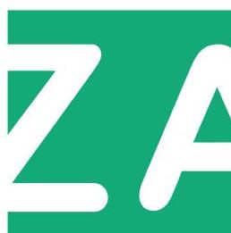


## Page 2
# 执行摘要 

生成式人工智能是当今科技领域的一项革命性进步，目前该项技术在商业化方面已取得了顺利进展。全球主要经济体国家级技术行动战略的制定、投融资活动的繁荣，及各国保险行业监管和行业协会对该项技术进行了重点研究及相应制度准备，我们相信，这项技术将成为推动保险业高质量发展的新助力。

## AIGC落地场景初探，技术赋能逐步实现。

目前AIGC已具备商业化应用的基础，本报告通过专家调研形式对技术在保险领域30余个具体应用环节以及AIGC的场景应用点进行了梳理，并综合考量了任务难易程度、对任务输出结果的准确性要求，及技术接入难易程度等多个维度对应用场景的技术落地可行性形成预判。在短期内，保险机构需积极应对LLM模型选择及研发挑战，推动AIGC技术在多模态营销内容及策略推荐、智能客服、代码智能生成等领域的广泛应用；在中长期，个性化营销将成为保险机构差异化竞争的核心能力，是当前各个险企积极布局的方向。

## 众安科技积极实践，技术赋能产品升级。

众安科技始终密切关注与跟踪国内外新兴技术在保险领域的应用可行性，我们认为对新兴技术保持审慎投入与积极实践，可探索出一条快速、可靠、可控、可复制的AIGC模型应用模式。在产品研发方面，众安科技正积极探索将AIGC置入众安科技全系列产品的可行性。在未来，结合自身和众多合作伙伴的实践经验，借助于AIGC技术的赋能，深度融合到科技产品中，全面提升产品的易用性、智能化和高效运营。这其中包括智能营销平台方面，将进一步突破多模态营销内容生成、营销策略推荐等线上化运营能力；在保险核心业务系统方面，将积极落实系统配置及运营过程自动化的实现；在经代信息化系统方面，有望实现千人千面培训及营销赋能；研发运维一体化平台和数据产品方面，代码智能生成、数据分析及调用自动化，经营预测及优化自动生成等应用将成为可能。

## 机遇与挑战并存，AIGC引领保险业迈入新篇章。

生成式人工智能应用势在必行。我们相信该项技术有望成为险企决胜未来的重要战略性资产，其与行业的深度融合将大幅提高企业整体运营效率，而非单一的人力替代。由于AIGC赋能险企仍处于初期阶段，保险企业应用该项技术仍面临重重挑战。我们倡议更稳健的技术实践，更科学的试点实验，及更多的跨界沟通，与众协同为生成式人工智能在保险领域的可持续发展贡献力量。

## Page 3
# 目录 <br> CONTENTS 

人工智能技术发展拐点 智能化经营必要性提升 ..... 06
国家级行动规划一致性较强 ..... 08
投融资活动频率及额度提升 ..... 11
技术优化升级有了实质进展 ..... 12
保险业积极探索AIGC应用 助力企业全链扩能增效 ..... 16
智能降本提质增效 赋能保险价值全链 ..... 18
智能辅助日常办公 高效检索成稿纠错 ..... 50
自主训练扩能提效 赋能保险企业研运 ..... 62
AIGC应用搭建克难有方案 先行企业建设经验可参 ..... 78
模型选择综合考量 开箱即用需克难题 ..... 80
模型适配能力需求 自研落地优选插件 ..... 82
先行公司架构已建 安全可用六项能力 ..... 86
限制风险仍需关注 经验技巧实现协同 ..... 92
AIGC置入众安科技产品 打造系统应用全新体验 ..... 94
科技内核持续创新 协同生态共创共赢 ..... 96
AIGC产品内置升级 系统提升综合能力 ..... 100
AIGC商业应用场景广阔 企业积极跟踪妥善布局 ..... 114
图01 2017-2022年美国生成式人工智能风险投资概括 ..... 11
图02 生成式人工智能技术成熟度、主流模型、应用场景及代表项目梳理 ..... 12
图03 保险产品设计主要流程及现状痛点 ..... 18
图04 某再保险公司智能保险产品设计平台的四个模块 ..... 22
图05 营销服务主要模式及现状痛点 ..... 23
图06 销售机器人玛雅的四个模块 ..... 29
图07 运营环节的主要特点及痛点 ..... 30
图08 AI知识库流程 ..... 33
图09 基于ChatGPT技术的数据治理流程 ..... 34
图10 异常报警示意图 ..... 35
图11 基于ChatGPT智能巡检流程图 ..... 36
图12 聊天记录风险识别与分类 ..... 36
图13 客服工作台示意 ..... 39
图14 知识库导入AIGC过程 ..... 39
图15 客服和保险客服模拟对话 ..... 40
图16 交互流程 ..... 41
图17 实时话术模拟对话 ..... 42
图18 AI注记流程 ..... 43
图19 AI注记模拟对话 ..... 43
图20 AI复盘流程 ..... 45

## Page 4
图21 AI复盘模拟对话 ..... 45
图22 AI质检流程 ..... 47
图23 实时质检流程 ..... 47
图24 AI质检模拟对话1 ..... 48
图25 AI质检模拟对话2 ..... 48
图26 ABIE的功能模块 ..... 49
图27 问答助手场景应用案例 ..... 51
图28 AI注记流程 ..... 52
图29 模拟知识库 ..... 53
图30 检索知识点示意 ..... 53
图31 生成项目进度汇报 ..... 55
图32 竞品分析文档 ..... 56
图33 知识分享文档 ..... 56
图34 会议纪要总结 ..... 57
图35 会议纪要总结 ..... 58
图36 需求评审会议提纲 ..... 58
图37 日报周报应用案例 ..... 59
图38 人力招聘生成实例 ..... 60
图39 人力招聘生成实例 ..... 61
图40 代码示意 ..... 63
图41 AIGC代码补全的价值 ..... 64
图42 AIGC对前后端代码进行优化 ..... 66
图43 AIGC对后端SQL代码进行优化 ..... 67
图44 AIGC对前端代码进行测试用例的生成 ..... 69
图45 AIGC对后端代码进行测试用例的生成 ..... 70
图46 脚本生成场景应用案例 ..... 72
图47 模拟造数场景应用案例 ..... 73
图48 异常分析场景应用案例 ..... 74
图49 告警场景应用案例 ..... 75
图50 需求分析场景应用案例 ..... 76
图51 知识协作场景应用案例 ..... 77
图52 Fine-Tuning ..... 83
图53 众安AIGC应用研发框架 ..... 87
图54 插件工作流程图 ..... 88
图55 模型服务的插件 ..... 89
图56 智能客服答案生成流程 ..... 90
图57 智能问答场景 ..... 91
图58 众安科技产品服务能力全景图 ..... 97
图59 AIGC提供的更优解决方案 ..... 98
图60 打造智能营销闭环 ..... 100
图61 基于AIGC的自动化策略配置场景 ..... 101
图62 众安非车核心业务系统整体解决方案 ..... 102
图63 众安理赔流程 ..... 103
图64 众安智能理赔 ..... 104
图65 众安产品套件 ..... 105
图66 AIGC个性化方案制作营销流程场景 ..... 106
图67 研发运维一体化平台 ..... 107
图68 构建配置 ..... 108
图69 构建和部署问题分析 ..... 108
图70 需求拆分 ..... 109
图71 众安数据平台全景图 ..... 110
图72 AIGC赋能BI分析自动化报表生成场景流程 ..... 111

## Page 5
# 入工智能技术发展拐点智能化经营必要性提升

## 01

### 入工智能技术发展拐点智能化经营必要性提升

人工智能技术是带动科学发现和经济增长的革新引擎。该项技术及其应用具有实际价值，可以推动国家应对诸如粮食生产、气候变化、贫困和癌症等重要全球挑战。目前，生成式人工智能技术在商业化方面取得了顺利进展。全球主要经济体的国家级技术行动战略、投融资活动的繁荣、各国保险行业监管和行业协会对该项技术进行了重点研究及相应制度准备。在保险业内，生成式人工智能技术的应用已经引起了行业广泛的重点关注。相信在各方共同稳健推动之下，生成式人工智能技术有望成为推动保险行业高质量发展的科技新助力。

1. 生成式人工智能是一种人工智能 (AI)，负责创造新的、原创的内容。它依照算法来生成内容。如图像、视频、音乐等。而不需要人工干预。例如：微软投资的OPENA发布的GPT系列技术、谷歌发布的XING等均基于生成式人工智能技术。
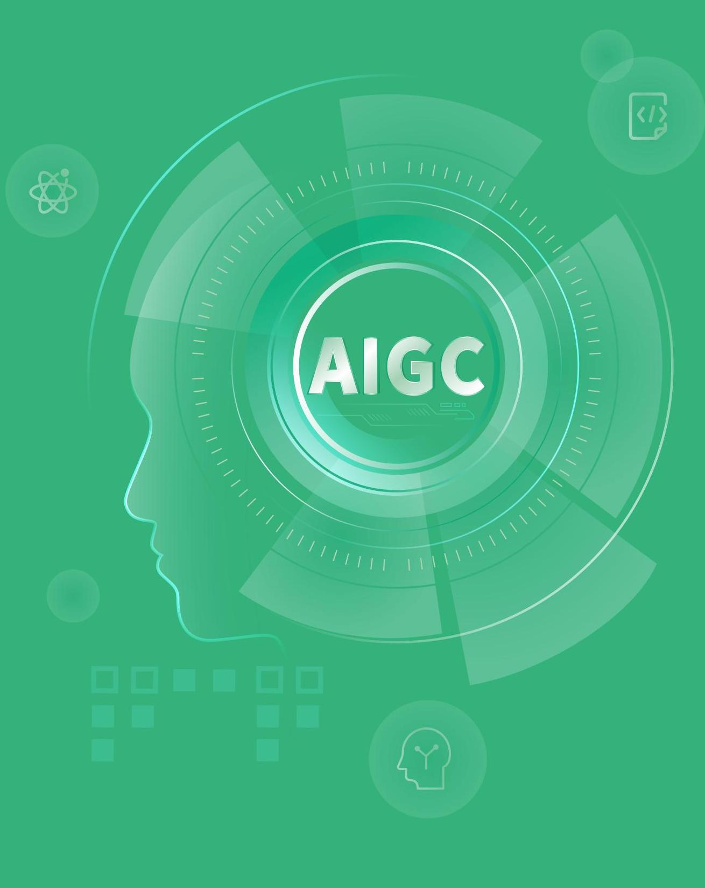

## Page 6
## 国家级行动规划一致性较强

## 国家政策梳理：大力支持保险数字化转型

通过归纳及总结全球多个重要国家对于人工智能技术的国家级战略计划，我们发现多个重要经济体对确保自身国家在人工智能研究和开发方面继续发挥领导作用，在公共和私营部门开发和使用可信赖的人工智能方面引领世界，并为当前和未来各自国家的劳动力做好准备均有重要动作，均通过发布相关战略、法案和报告等多种方式，致力于推动人工智能技术的发展和应用。

## 国家层面：多项政策引导保险科技发展

我国一直高度重视人工智能技术的发展。2023年4月，"通用人工智能"首次在中共中央政治局会议中提及，区别于此前国家重要会议中泛指的"人工智能"，此次的提及明确了通用人工智能产业的发展趋势。同月，国家互联网网信办公室发布了对生成式人工智能的管理办法，为该技术在研发、数据使用、用户应用等提出了明确规范。此外，中央科技委员会的成立，在顶层设计上进行全局统筹，是促进国家战略性、方向性及全局性科技创新的关键。

|  发布时间 | 政策发布类型 | 政策组合议 | 核心政策观点  |
| --- | --- | --- | --- |
|  2023年
4月28日 | 中共中央
政治局 | 政治局会议 | 提出"重夯实科技自立自强根基，培育壮大新动能"，"要重视通用人工智能发展，营造创新生态，重视规范风险"。政策新标准写"政治局会议提倡"通用人工智能"，明确长期产业规模"。  |
|  2023年
4月11日 | 国家互联网信息办公室 | 生成式人工智能服务管理办法 | 对生成式人工智能从研发、数据使用、提供服务、用户信用等各个环节进行了经济调控规范。其中第七条：提供者应当对生成式人工智能产品的原创商数据，优化训练数据来源的安全性负责。更能对人工智能训练开发中应用的数据提出了合规要求。基于我国问题新安全、数据安全的重视，我们认为不能排除未来监管部门直接干预人工智能研发过程的可能性。  |
|  2023年
3月16日 | 中共中央
国务院 | 党和国家机构改革方法 | 提到要在党中央组建中央科技委员会，将国家科技伦理委员会由国务院议事协调机构转为中央科技委员会领导下的学术性、专业性专家委员会。该原提交使中央能够对新兴科技进行更直接的监管与意见指导。同时，国务院的科学技术部也进行了重组，专注于科学技术研究领域的建设。  |
|  2023年
3月20日 | 中共中央
国务院办公厅 | 关于加强科技伦理治理的意见 | 对开展科学研究、技术开发等科技活动提出了需要遵循的价值理念和行为规范。其中的第四条意见"加强科技伦理治理制度保障"中提供要建立科技伦理审查和监管制度。具体我国很可能会建立一个科技伦理（审查）委员会认证机制，对新出现的科技产品进行集中审核认证。  |

表01：国内人工智能相关政策梳理 资料来源：公开资料梳理

此外，在各个地方政府的5年规划及政策中，频繁提及了推动人工智能产业发展，并为相关企业提供税收优惠，项目补贴等扶持政策。以上海为例，市政府在2020年共发布了71条人工智能相关政策，努力推动人工智能行业发展政策，助力地方区域人工智能新兴产业的发展。

## 行业层面：持续推动保险业数智化转型

近年来，人民银行、原银保监会密集发布相关政策文件，对保险业数字化发展提出一系列要求，明确了保险数字化转型的目标和任务，为数字技术在保险领域的应用提供了有力的政策支持。

## 2022年5月

银保监会发布《关于印发保险业标准化"十四五"规划的通知》（银保监发〔2022〕11号）等

## 2022年3月

人民银行发布《金融标准化"十四五"发展规划》（银发〔2022〕18号）

## 2022年1月

银保监会发布《关于银行业保险业数字化转型的指导意见》（银保监办发〔2022〕2号）

## 2021年1月

人民银行发布《金融科技发展规划（2022—2025年）》（银发〔2021〕335号）

## 2021年1月

银保监会发布《银行保险机构信息科技外包风险监管办法》（银保监办发〔2021〕141号）

表02：保险行业关于数字化转型相关政策梳理 资料来源：公开资料梳理

## Page 7
## 海外政策梳理：驱动与规范技术发展政策

在欧盟，人工智能法案为在欧盟范围内开发和使用人工智能驱动的产品、服务和系统制定了一套横向规则。该法案以基于风险的方法为蓝本。在美国，联邦政府已将解决人工智能的伦理、法律和社会影响以及人工智能系统的安全和保障的人工智能研发活动列为优先事项。


该趋势产生的本质原因是各国政府均希望将人工智能系统整合到各自国家的经济和社会的所有部门中，产生实质性的社会及经济价值。可以推断，由于重要经济体国家层面的战略规划及重要投入，大概率将加强新一代智能技术稳健发展的确定性。

## 投融资活动频率及额度提升

ChatGPT是迄今为止增长最快的消费者应用程序，该应用底层技术“生成式AI”已是全球科技巨头“军备竞赛”重点锁定的技术领域。依据pitchbook数据显示，尽管2022年北美风险资本投融资数量明显趋缓，但对于生成式人工智能领域的投资仍呈现积极景象。在2020年至2022年区间，投资总额从2亿增长至14亿，复合增长率是81.6%。此外，除了传统的风险投资和私募股权投资，越来越多的企业和机构将会通过并购、战略投资等方式进入该市场。例如：微软于2023年初宣布继续加码OPENAI，拓展生成式人工智能技术在微软更广泛产品系列中的应用。在国内，百度正迅速将文心一言整合到所有业务中进行测试。
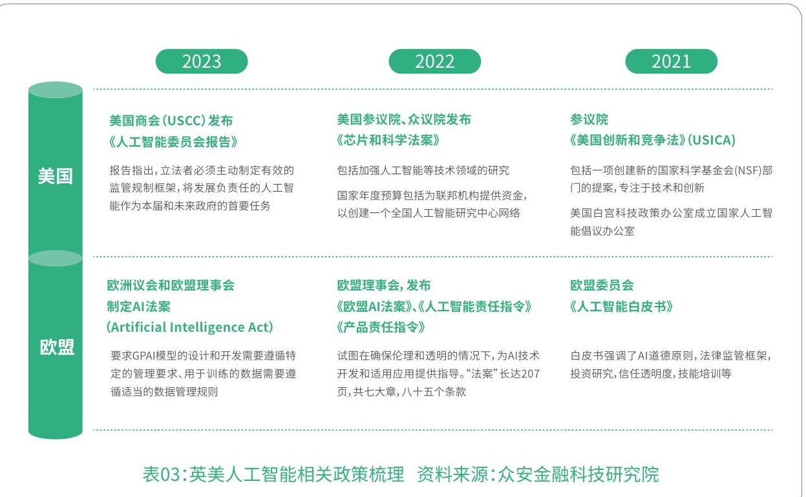
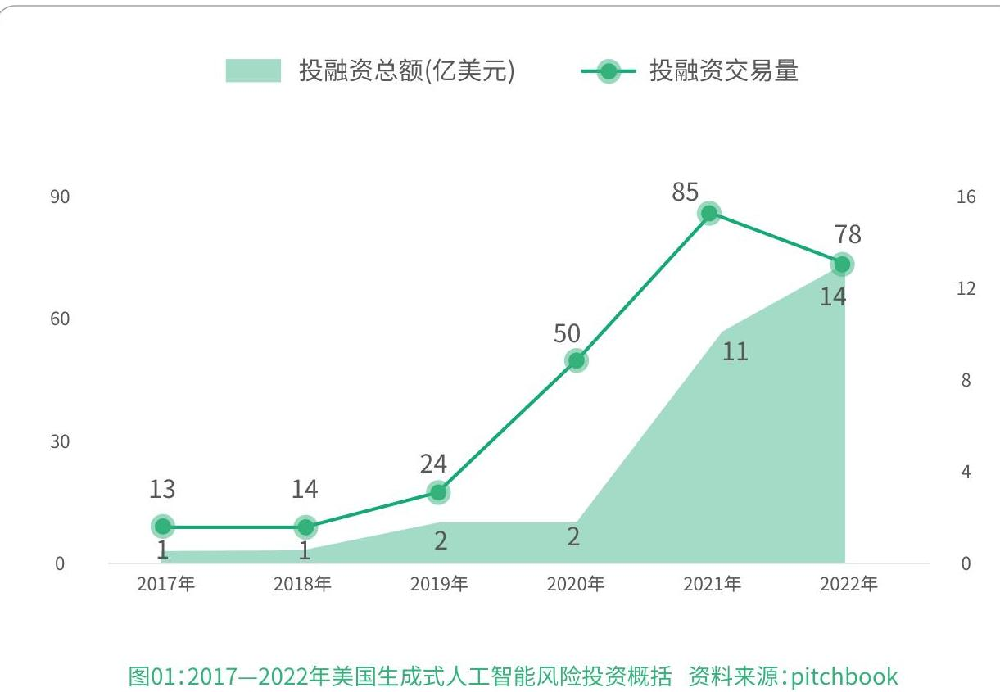

## Page 8
# **技术优化升级有了实质进展**

生成式人工智能是指一种可以学习复杂数据结构和规律，并用这些规律来生成新数据或解决问题的算法。其与传统机器学习算法相比，有更强大的"涌现能力"、生成式人工智能具备以下特征：

## **多模态原创内容自动生成**

通过对最新深度学习技术进行优化，生成式人工智能在图像识别和描述、视频内容生成均有实际进步，这种技术还可以从单个视频中提取出有意义的信息，从而创建出更多原创性视频内容。此外，该技术还支持人机交互语音接口，并能够理解自然语言中更复杂和抽象的概念。因此未来智能客服可以更快速地响应用户。目前，这项技术已经广泛应用于各种商业领域，例如虚拟人直播、智能助手、搜索引擎优化、艺术创造、健康咨询、复杂算法解释等领域。

|  技术成熟度 | 主流模型 | 应用 | 代表项目  |
| --- | --- | --- | --- |
|  人造全模型电信术突破。
主要表现出上下文重用。
文本生成存在难题、有待优化 | GPT
MOT
ALNet | 自动写作
实时智能内容 | OPEN AI  |
|  图像生成 | 图像生成原创性、清晰度
及无法再编辑有技术突破。
包括手机版变量阶段 | GAMo
VRE1-CLIP、DALL-E | 图像生成、再编辑
特定主题图像生成  |
|  语音生成 | 系统生成可创意量较高。
代表全程感受度 | GPT
GAMo
GMAo2-CapRaf | 代码生成
破解代码、翻译代码
自动浏览  |
|  语音数据 | 语音语调韵律节奏合成上
者就可行性很高 | Weblet
Wavener | 更新反馈
开发翻译
语音编辑  |
|  视频数据 | 生成原创、高精度、
可编辑的视频内容 | GPT、CLIP
LSTM和ORU | 虚拟场景
虚拟场景
视频生成  |
|  文本生成 | 系统全实时对话引发
技术高效性、精准等特优化
更新交互基本成熟 | GPT
Wavener
GALL-E | 电影、广告
承现角色
智慧助手、聚焦助手  |
|  图02: 生成式人工智能技术成熟度、主流模型、应用场景及代表项目梳理
资料来源:众安金融科技研究院 |  |  |   |

AIGC在多模态内容生成领域不断提升，得益于其长距离理解上下文语义能力、零样本或少样本学习能力和开放领域推力能力等方面实现的突破性进展。通过深度学习，理解语境信息及自适应推力，AIGC能对数据进行更全面、深入的分析，实现较为个性化、相对准确的内容生成。

## **长距离理解上下文语义**

早期的语言模型通常使用n-gram模型，由于数据稀疏问题一般仅支持3-5个词的上文，无法捕捉长距离语义关系；近年来，基于神经网络的语言模型，特别是RNN（Recurrent Neural Network，循环神经网络）或者LSTM（Long-Short Term Memory，长短时记忆模型），通过在神经网络中引入序列记忆机制使语言模型理论上可以刻画长距离语义关系，但其学习效率较低，且由于梯度消失等问题事实上无法刻画过长距离的语义关系。这就限制了传统模型在处理复杂的语义关系和依赖关系时的表现。

AIGC大型语言模型主要依赖于Transformer结构，它通过自注意力机制（self-attention）、多头注意机制（Multi-Head Attention）来捕捉文本中不同位置之间的关联关系，能够同时关注到文本中较远的上下文信息。另外，由于这种机制同时解决了并行计算的问题，使得模型可以在可接受时间内基于超大规模语料进行训练。这些都使得AIGC能够更好地理解和解释复杂的句子结构、语义关系和逻辑推理。它能够捕捉到文本中的长期依赖性，理解上下文中的语境和含义，从而生成更加准确、连贯和语义丰富的文本。

在商业场景中，AIGC的长距离感知理解上下文的能力使其在智能客服、文本摘要、情感分析和问答系统等应用领域表现优异。例如，在智能客服和问答系统领域，AIGC大模型可以理解和处理长篇复杂的对话场景，并基于整个上下文提供更准确的回答。

## **零样本、少样本学习能力**

传统技术是基于规则、模板或统计方法的系统，一般只能用来解决一类问题，超出问题定义范围外的适应性通常有限。这些技术通常依赖手动编写的规则、模板或者人工标注的监督信息，缺乏这些数据的系统通常性能不佳；另外，传统模型无法将其能力以一种有效的途径扩展至其他方面，即不同功能的机器学习系统很难有效整合。

相比之下，AIGC基于海量无监督数据进行训练，由于模型强大的表达能力，大模型能够学习到数据之间的语义关系和逻辑关系，拥有对各种问题的理解能力。一般认为，所有知识存在于大模型内部，用户需要做的就是以一种合适的用户输入激活模型对当前话题的相关记忆，并通过生成过

## Page 9
程来解决当前问题。而合适的用户输入一般是少样本提示词，甚至是零样本的提示词，仅靠问题即可激活模型的记忆。

这种零样本、少样本学习的能力使得AIGC能够随时适应特定的环境或领域，更加熟练地理解和响应行业特定的术语、用户偏好和语言风格，从而更好地理解和响应行业特定的术语、行业知识或用户偏好。

这种自适应学习的能力在商业场景中具有独特的优势。这种能力可以识别大量信息之间的关联与联系，建立起庞大的知识网络，为未来知识库企业级的知识库和决策支持系统的搭建奠定了基础。

## 开放域推理能力

AIGC的推理能力源自大模型本身的知识，可以自动适应当前场景并开放域推理，超越其他主流人工智能方法。

其他主流人工智能技术，如逻辑推理、决策树等，依赖人工提取特征与制定规则。这要求研究人员具备DOMAIN知识，无法大规模自动化，只能进行有限的推理。

相比之下，AIGC采用可以自动适应当前环境并开放域推理，并非简单学习规则，不需要针对每一类新问题定义专属规则从而避免其他方法的主观假设问题。AIGC的推理能力包括：语义推理，判断语句或概念之间的逻辑关系；上下文推理，根据上下文预测信息或后续事件；跨域推理，根据有限信息快速理解新任务与问题。

AIGC的推理能力使得其辅助决策支持成为可能，包括在客服领域提供智能推荐以及个性化响应与建议能力；在决策支持领域，提供较为全面可解释的判断依据；在新业务开发领域，实现创新性人工智能工具与应用。但其推理过程需监管，避免产生误导。

综合来看，生成式人工智能目前处于早期阶段，但根据行业调研来看，预计未来两年内我国的人工智能技术将取得新的发展成果。特别是在内容创作、数字营销和客户服务等领域，人工智能有望成为一个巨大的产业。然而，尽管技术已经取得重大突破，我们仍需谨慎应用，需要积极跟踪行业监管条例、法律法规和商业伦理等各个维度对技术应用的要求，确保企业能够实现稳健智能化转型。

## Page 10
# 保险业积极探索AIGC应用 助力企业全链扩能增效

随着人工智能和自然语言处理技术的不断发展，AIGC已成为保险行业中备受瞩目的技术之一。类似ChatGPT和MidJourney等基于AIGC的技术应用，具备高度的自然语言识别和写作能力，能够根据特定的对话指令快速生成多种类型和风格的内容，包括纯文本、图文、精美的图片、动画、短视频等。此外，它们还能够支持多轮对话，并随着对话的深入更好地理解意图，从而生成更加精准的内容。因此，如果充分利用这些AIGC的优势特点，它们可以为保险行业客户在保险产品、营销、运营和客服等多个领域提供深度技术赋能，同时还可以应用于日常办公、研发提效等多个方面。

本白皮书将全面深入地介绍和探讨AIGC技术在保险领域的创新应用，旨在为保险行业数字化和智能化转型提供有益的参考和借鉴。
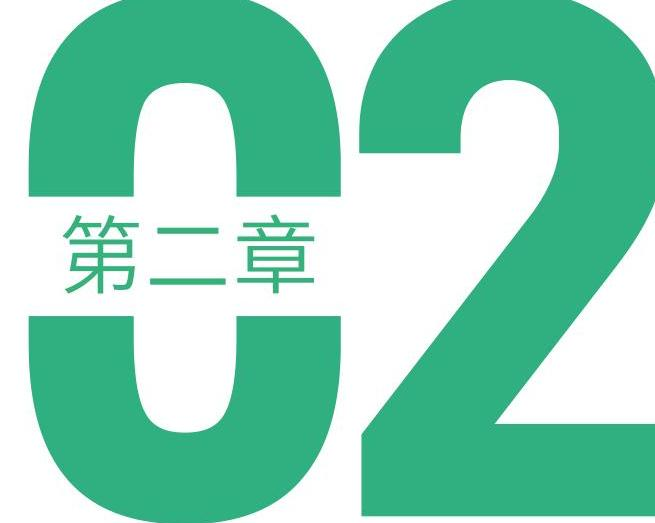
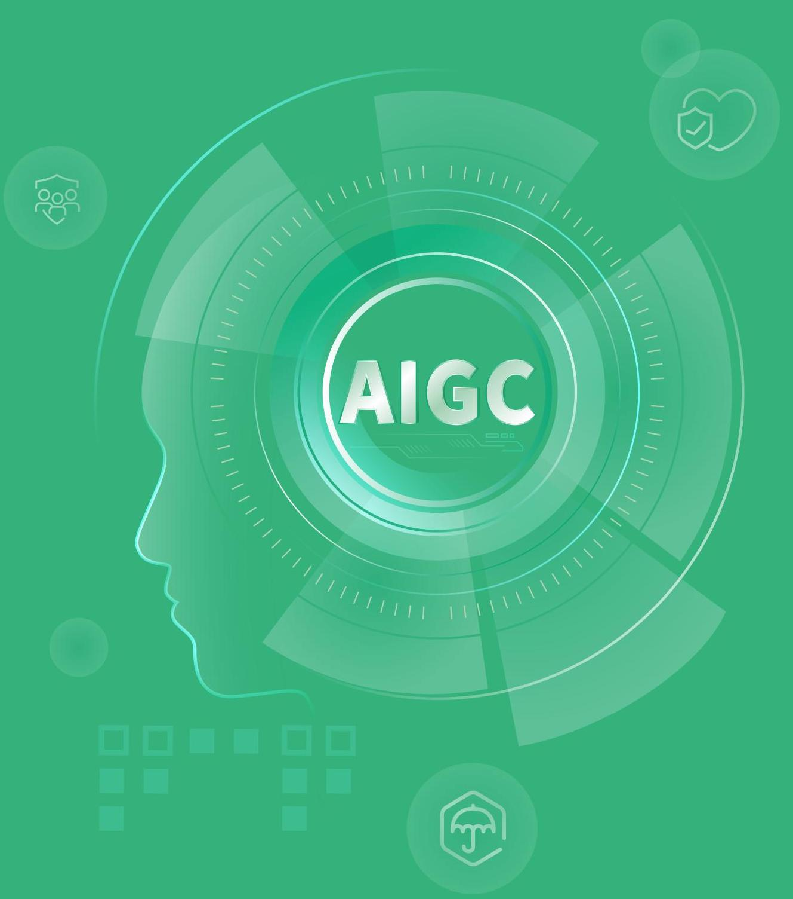

## Page 11
# 智能降本提质增效 赋能保险价值全链

## 产品研发:理解客户需求及风险,精准产品设计及定价

### 保险产品设计主要流程及现状痛点

保险产品的设计需要大量的信息收集、数据计算和精算分析。在产品设计的主要流程节点中，数据收集、数据分析和风险评估等环节是保险产品研发的主要痛点，这些环节中存在繁琐的人工检索、人工计算和依赖个人经验的多个步骤，因此我们期待AIGC能够提供赋能的场景。接下来，我们将详细介绍这些场景。


### AIGC在保险产品设计的赋能应用场景

AIGC模型独特的样本生成能力和场景泛化能力可以在保险领域的新产品设计中扮演重要角色，特别是在以健康险、寿险为代表的人身险和以车险为代表的财产险中，有巨大的应用潜力。AIGC技术可以在保险产品设计的以下几个环节带来帮助。

### 数据收集和预处理

相对于成熟产品的数据分析需求，在保险新产品设计的过程中，通常面临大量非结构化、半结构化数据需要进行收集和处理的问题。相对于传统的机器学习模型，具备更强通用能力和“常识”的生成式大语言模型模型可以很大程度上提高这类数据处理过程的效率。具体地，在面对新场景下的新格式的数据时，如未曾见过的电子病历、医学文献、药物数据等等。大语言模型可以通过“指令”、“提示”等少样本甚至零样本学习的方式完成特定的信息抽取、格式转化任务，极大降低了对人工标注数据的依赖。这样的能力既可以直接接入数据处理流程中，也可以作为定制数据处理模型的训练数据标注来源，为构建更高效的小型机器学习模型提供帮助。此外，多模态模型对图像、文本、音视频数据的融合处理能力可以大大简化数据处理链路，提高数据处理的精准度。

- 世界知识整合：大型语言模型预训练过程中压缩存储了大量“常识性”知识，在保险产品设计过程当中，这类“世界知识”的整合是一项繁琐的工作，而由大语言模型结合搜索引擎、本地知识库提供的链接驱动的信息搜索、整合、总结能力可以大大提高精算、分析师在常识性知识方面的获取和理解效率。通过多轮问答、细化需求的交互方式，精算师和分析师能够高效地收集不同数据来源的知识，并且依托大语言模型的推理总结能力提升理解效率，这对作业人员的工作效率有很大提升。

- 保险产品文档等物料生产：与数据抽取过程中的从非结构化、半结构化数据中抽取结构化信息相对应。产品设计完成之后，基于产品的结构化属性，例如责任、费率表等条款，通过AIGC模型可以快速生成对应的文档、图像宣传物料，大大简化产品设计过程中较为繁琐、重复的过程，加速产品从设计开发到上线的过程。
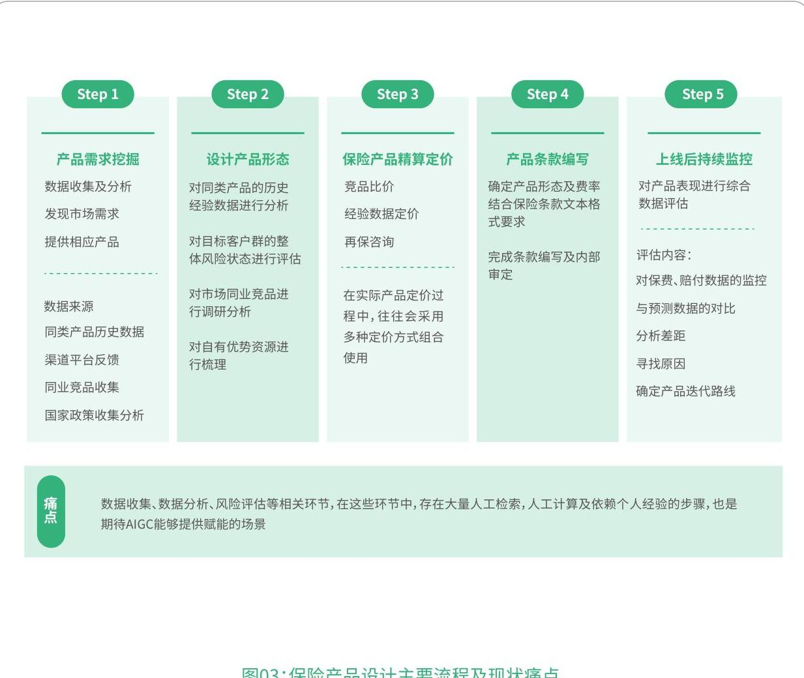

## Page 12
$\cdot$结果可视化和解释：AIGC可以帮助保险精算人员将复杂的数据信息和模型结果进行可视化和解释，更好地支持商业决策和产品设计，以便管理层和业务决策者更好地理解和应用模型结果，推动产品设计和业务决策的优化。例如，AIGC可以生成自然语言摘要，说明模型的预测结果和变量重要性等。

总之，AIGC可以为保险精算人员提供强大的数据分析和建模工具，帮助他们更好地理解客户需求和风险特征，制定更准确的保险产品和价格，并提高客户满意度和忠诚度。

## 风险评估和预测

当进行保险产品设计时，AIGC可以帮助产品精算人员在以下几个方面进行保险产品的风险评估及预测：
$\cdot$风险因素识别：AIGC可以分析大量的健康险相关数据，包括历史赔付数据、人口统计和医疗资料等，从中识别出潜在的风险因素，有助于产品精算人员更好地理解不同客户的风险特征，并制定相应的保险策略。

- 个性化建议：AIGC可以根据个人医疗历史和风险因素，为产品精算人员提供个性化的保险建议和方案，这有助于产品精算人员更好地理解客户需求，并提供更符合实际需要的保险产品。

- 风险模拟与压力测试：AIGC可以使用历史数据和模拟技术来进行风险模拟和压力测试，以评估产品设计的可靠程度和稳定性。例如，在不同的场景下模拟赔付情况，以便产品精算人员更好地了解产品可能面临的风险和挑战。这有助于产品精算人员制定相应的保险策略，以确保产品设计的可靠性和稳定性。

- 车险的风险评估方面：AIGC可以帮助保险公司自动化车辆损失评估流程，它可以分析车辆图片、事故描述等信息，快速评估车辆损失，并为理赔人员提供参考意见，减少理赔时间和成本。

综上所述，AIGC在保险产品设计过程中可以帮助产品精算人员更好地识别潜在的风险因素，提供个性化的保险建议和方案，并进行风险模拟和压力测试，从而提高产品设计的有效性和精度。

## 保险产品方案设计

AIGC可以帮助保险公司研究市场趋势，制定有针对性的保险方案计划。通过分析国内外市场， AIGC可以提供有关新产品的建议，并在保险计划设计方面提供指导。

当涉及保险产品的设计时，客户需求分析是一个很重要的环节。AIGC可以通过对海量数据的处理和分析，发现不同因素对于客户需求的影响，从而为保险公司提供更准确的市场研究结果。例如，AIGC可以利用自然语言处理技术分析客户反馈和社交媒体信息，识别出客户对于不同健康问题的关注点和优先考虑的保险覆盖范围等，以此来确定客户需求。

## 风险预警和管理

AIGC可以利用机器学习算法对历史数据进行分析和模式识别，发现隐藏的风险因素并预测未来潜在的风险。例如，AIGC可以利用历史医疗数据分析某种疾病的传播趋势，从而警示保险公司需要加强这一领域的风险管理。

新产品开发通常需要深入地市场分析和研究。AIGC可以利用大量的数据源分析市场趋势，从而找出新的发展机会和突破点。例如，AIGC可以通过分析客户需求和竞争对手策略，为保险公司提供新产品研发方向和建议，并为制定更有针对性的保险产品营销计划提供帮助。

总体而言，AIGC作为一种大型语言模型，可以在健康险领域为保险产品的设计过程提供多方面帮助，包括客户需求分析、风险预警和管理、新产品开发等。这些帮助可以协助保险公司更好地服务客户，提高保险产品的精度、效率和满意度。

## 现阶段应用挑战

结合上述在保险产品设计方面可能的应用场景，我们认为AIGC现阶段应面临诸多应用挑战，主要在以下方面：

- 基础数据的高质量清洗及标注：对于产品设计时需要使用的医疗数据，在进行自动化数据收集及建模分析之前，需要先对完整的基础知识库进行高质量的清洗和标注，并持续不断地维护更新基础数据。只有一套高质量的基础数据库，才能在后续自动化数据处理过程中，确保数据处理和分析结果的准确度。这是一项在初期对资源有较高消耗的工作。

## Page 13
·专业的保险相关数据的模型训练：目前AIGC所使用的基础数据库主要是大量基于互联网通识内容的文本数据进行了预训练，包括维基百科、BookCorpus等，但对于保险产品设计这一专业度更高的领域来说，仍然需要相关性更高的专业化数据进行模型微调。

### 综合实例 某再保险公司利用AIGC辅助产品设计及定价

某再保险公司将利用AIGC能力，结合其他相关科技产品，计划研发智能保险产品设计平台，帮助精算师制定更加精准的保险方案和定价策略。在规划中，该平台可以根据客户需求和市场趋势，自动生成多种保险方案，并提供相应的风险评估和定价策略。

#### 平台建设规划主要包括以下四个模块：


预计后续平台建设完成后，可以帮助精算师更快速、更准确地开发和推出符合客户需求的保险产品，提高产品的市场竞争力。

### 渠道营销：个性化销售辅助推荐，全时在线助精准营销

#### 保险市场营销服务的主要模式及现状痛点

从展业模式来说，当前的保险推广营销主要分为以下几种：


#### 图05：营销服务主要模式及现状痛点

现阶段线下队伍依然是保险营销的主力，存在着人员流动以及个人营销服务水平差异，在此情况下，提升代理人营销服务水平和服务效能，进而提升自营模式下营销素材的产能效率是保险公司需要解决的一大难题。
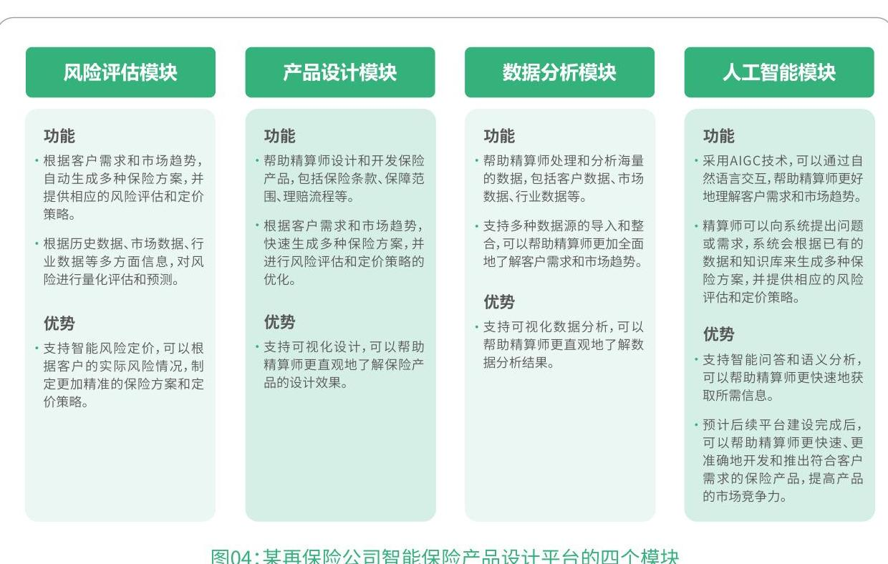
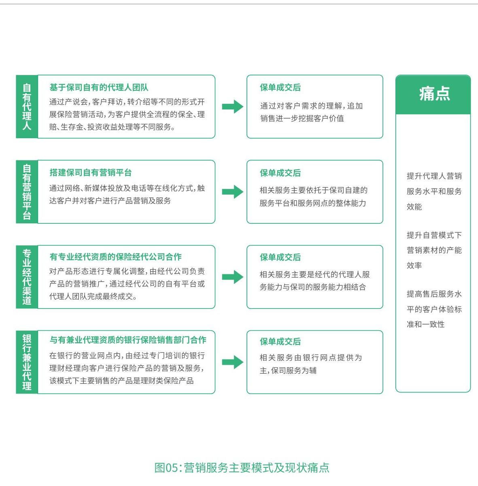

## Page 14
## AIGC在保险市场营销服务的赋能应用场景

作为一种强大的语言模型，AIGC可以在保险市场营销方面提供有力的帮助，可赋能的应用场景如下：

代理人销售辅助：利用AIGC技术，保险公司可以为销售人员构建智能化保险销售辅助机器人，通过自然语言交互，为销售人员提供个性化的保险销售建议和支持。机器人可以分析客户的需求和情况，为销售人员提供最佳的销售策略和方案，提高销售效率和客户满意度。

营销素材设计：利用AIGC技术，保险公司可以提供快速生成文案，比如广告语、口号、邮件、短信、微信公众号文章等，也可以与类似MidJourney等AI工具相结合，自动生成宣传海报、宣传视频等视觉内容，提升营销素材的生成效率。

保险产品推荐：利用AIGC技术，保险公司可以构建智能化保险产品推荐机器人，通过自然语言交互，为客户提供个性化的保险产品推荐和购买建议。机器人可以通过分析客户的需求、偏好、风险承受能力等信息，快速准确地推荐适合客户的保险产品，提高保险销售效率和客户满意度。

保险产品咨询：利用AIGC技术，保险公司可以构建智能化保险产品咨询机器人，通过自然语言交互，为客户提供快速、便捷的保险产品咨询服务。机器人可以回答客户关于保险产品的各种问题，包括保险种类、保险期限、保险条款、保费等，为客户提供全天候在线的咨询服务。

总之，AIGC技术在保险市场营销方面的应用，可以为保险公司提供更加智能化、个性化和便捷的营销服务，提高保险销售效率和客户满意度，同时也为客户提供更加优质和全面的保险服务。

## 代理人销售辅助

当前保险代理人需要面对庞大而复杂的市场，如何精准地抓住客户的需求，提供符合其需求的保险产品，是保险代理人需要解决的一个重要问题。但目前应用AIGC技术辅助代理人销售的保险公司还不多，主要集中在一些方法的研究讨论。主要有以下帮助：

- 智能客户需求分析：AIGC技术可以帮助保险代理人通过自然语言交互，智能化地分析客户的需求、偏好、风险承受能力等信息，了解客户的真正需求和偏好，从而精准地为客户提供符合其需求的保险产品。
- 智能化的产品推荐：基于AIGC技术，保险代理人可以构建智能化的保险产品推荐机器人，通过自然语言交互，为客户提供个性化的保险产品推荐和购买建议。机器人可以根据客户的需求和情况，智能化地推荐适合客户的保险产品，提高保险销售效率和客户满意度。
- 智能化的客户服务：AIGC技术可以帮助保险代理人构建智能化的客户服务机器人，通过自然语言交互，为客户提供快速、便捷的保险产品咨询和客户服务。机器人可以回答客户的各种问题，包括保险种类、保险期限、保险条款、保费等，提高客户满意度和保险销售效率。
- 数据分析和预测：AIGC技术可以帮助保险代理人分析海量的数据，从中挖掘出有价值的信息，为代理人提供更加精准的客户洞察和预测，以便代理人更好地制定保险产品营销策略和行动计划，提高保险销售效率和客户满意度。

综上所述，AIGC技术在保险代理人进行产品营销活动中，可以帮助代理人更加精准地了解客户需求，提供个性化的保险产品推荐和购买建议，同时也可以为代理人提供智能化的客户服务和数据分析预测，提高保险销售效率和客户满意度。

## 营销素材设计

AIGC在保险产品营销素材设计方面也可以提供帮助。一些保险公司已经开始利用AIGC生成文案，比如广告语、口号、邮件、短信、微信公众号文章等，以更好地推广他们的产品。AIGC可以生成大量的文案，并且可以基于不同的目标受众进行优化，从而提高文案的转化率。

此外，AIGC也可以通过和其他相关AI工具结合，自动生成各种场景下宣传图片和视频，从而更好地呈现保险产品。AIGC不但可以自动生成个性化文案、图片及视频，还可依靠其学习及推理能力，对内容进行敏感词等合规性审查，从而协助保险公司设计销售并审核页面。

除了保险产品营销素材设计，AIGC也可以用于制作保险知识普及的文章和视频。AIGC可以通过整合海量的保险知识，生成易懂易学的保险知识普及内容，从而提高客户对于保险的了解和认知水平。

## Page 15
## 保险产品推荐

在保险产品营销推荐方面，AIGC可以通过以下方式提供帮助：

- 个性化推荐：AIGC可以通过分析客户的需求、兴趣、行为等数据，生成个性化的保险产品推荐方案。这种个性化推荐能够提高客户对于保险产品的认知度和满意度，同时也可以提高产品的转化率。
-实时优化：保险产品营销推荐需要不断地优化和调整，以满足客户需求的变化和市场竞争的变化。AIGC可以通过实时收集和分析客户数据，不断地优化推荐方案，从而提高产品的推销效果。
-跨渠道推荐：保险公司在进行产品推荐时，需要考虑到不同渠道的特点和客户偏好。AIGC可以根据客户在不同渠道的行为和偏好，生成跨渠道的保险产品推荐方案，从而提高产品的覆盖范围和销售效果。
-新产品推荐：保险公司推出新产品时，需要考虑到产品差异化和市场竞争。AIGC可以通过分析市场数据和客户需求，生成新产品推荐方案，从而提高新产品的推广效果和市场占有率。
-社交媒体推荐：随着社交媒体的兴起，保险公司也开始利用社交媒体进行保险产品的营销推广。AIGC可以通过分析客户在社交媒体上的行为和偏好，生成相应的保险产品推荐方案，从而提高在社交媒体上的推广效果。
-多语言推荐：随着全球化的发展，保险公司需要考虑不同地区和不同语言的客户需求。 AIGC可以支持多语言分析和推荐，从而生成针对不同地区和不同语言的保险产品推荐方案，从而提高产品的全球覆盖率和推广效果。
-基于情感分析的推荐：在进行保险产品推荐时，除了考虑客户的需求和偏好，还需要考虑客户的情感状态。AIGC可以通过情感分析技术，识别客户的情感状态，从而生成相应的保险产品推荐方案，提高产品的推销效果和客户满意度。

总之，AIGC可以通过分析客户数据，生成个性化、实时、跨渠道、新产品、社交媒体、多语言和情感分析等保险产品推荐方案，从而提高产品的推销效果和市场占有率。

## 保险产品咨询

在保险产品客服咨询方面，AIGC可以发挥以下作用：

- 智能客服场景：AIGC对客户提出的问题进行智能化解答和服务。通过AIGC的自然语言理解和生成技术，客户可以与机器人进行自然、流畅的对话，机器人可以根据客户的需求和问题，自动生成相应的解答和服务方案。
- 快速响应客户：AIGC可以通过自然语言理解和生成技术，实现实时、快速的客户响应。当客户提出问题或需求时，AIGC可以立即进行分析和生成相应的解答和服务方案，从而在最短时间内满足客户的需求。
- 个性化服务：AIGC可以通过分析客户数据，生成个性化、实时、跨渠道、多语言的客户服务方案。通过AIGC的自然语言理解和生成技术，客户可以与机器人进行自然、流畅的对话，机器人可以根据客户的需求和问题，自动生成相应的个性化服务方案。
- 智能问答回复：AIGC可以通过对客户提出的问题进行智能分析和解答，提高客户的满意度和忠诚度。通过AIGC的自然语言理解和生成技术，客户可以直接提出问题，机器人可以通过深度学习算法和大量的数据分析，自动生成相应的解答和服务方案，从而提高客户满意度和忠诚度。
- 情感分析：在保险产品客服咨询方面，除了考虑客户的需求和问题，还需要考虑客户的情感状态。AIGC可以通过情感分析技术，识别客户的情感状态，从而生成相应的客户服务方案，提高服务的效果和客户满意度。

总之，AIGC可以通过自然语言理解和生成技术、个性化服务、智能问答和情感分析等技术，提高保险产品客服咨询的效率和质量，从而提高客户的满意度和忠诚度。

## 现阶段的应用痛点

结合上述可能的应用场景，我们认为现阶段如果需要在保险营销推广活动中大规模使用AIGC的能力，仍有以下关键问题需要解决：

## Page 16
设计产出物的版权归属问题：通过AIGC的能力，所进行的文案、图片的设计，由于需求来源和训练数据集的相似性，可能会导致作品版权认证边界模糊的问题。所以在版权归属方面还需要有进一步明确的法律法规指导意见，以帮助保险公司在合法合规的基础上，充分利用科技进步所带来的便利。

专业的保险相关数据的模型训练：目前AIGC所使用的基础数据库主要是大量基于互联网通识内容的文本数据进行了预训练，但如果需要应用到保险营销的场景中，比如辅助代理人对客户需求偏好的分析，或者对客户提出的产品咨询和推荐的需求进行回应，就需要更加专业的能力，以确保相关回复的专业度和准确性。所以对于保险产品设计这一专业度更高的领域来说，仍然需要相关性更高的专业化数据进行模型微调。

本地知识信息的融合：在与客户接触的过程中，可能会收集到一些新增的知识信息，保存在使用者本地，如何对这部分知识信息进行快速、实时地融合训练，并影响模型最终的推荐判断，同时在使用过程中确保客户个人信息的安全，也是AIGC在未来更广范围的具体应用中所需要解决的问题之一。

## 广应用案例

Lemonade利用AIGC技术打造销售辅助机器人®

Lemonade于2015年创立，是一家以人工智能为特色的互联网保险公司，通过线上化和数字化的产品展现方式，使用保险科技简化投保和理赔流程，以及提供更为丰富灵活、人性化的保障内容，成为财产险市场的有力竞争者。

Lemonade将保险与科技相融合，构建一个人工智能机器人平台，主要包括AI Maya、AI Jim、CX.AI、Cooper、ForensicGraph和Blender六个各具职能的应用程序，并在CustomerCortex上运行，从海量数据中挖掘信息，更好地服务客户和风险管理。

该平台打造基于GPT-3技术面向用户的销售机器人玛雅（AI.MAYA），利用自然语言处理和机器学习技术为客户提供个性化的保险推荐和咨询服务。具体而言，该技术贯穿客户提问分析与解析，引导客户加入Lemonade，创建报价和安全付款等任务。当客户有购买保险的意图时，只需与玛雅约两分钟的简单聊天便能识别与处理客户信息，推荐适配的保险产品及报价，促成交易的达成。玛雅还通过向客户提出有限且高质量的问题，并根据回答进行算法调整，后续可大幅度减少客户管理时间。玛雅主要由以下四个主要模块组成：

|  MayaUnderwriting | MayaClaims | MayaConcierge | MayaCoPilot  |
| --- | --- | --- | --- |
|  使用机器学习算法，对风险进行评估和定价。该模块会分析来自客户的信息，如房屋面积、住房地址、历史索赔等等，并生成风险分析报告，以决定是否承保和保费 | 利用自然语言处理技术，帮助客户在事故发生后进行索赔。客户可以通过智能语音识别、自然语言理解等技术向该模块提供索赔信息，并自动处理索赔，从而提高索赔效率 | 使用机器学习算法来为客户提供个性化的保险建议和服务。该模块分析客户的行为和需求，提供定制化的保险建议，并帮助客户完成保险购买流程 | 使用自然语言处理技术和机器学习算法，帮助客户理解保险条款和合同内容。客户可以通过AI.MAYA平台查询保单条款和合同细节，以便更好地理解他们的保险政策  |

图06：销售机器人玛雅的四个模块

此外，Lemonade还推出了一个名为AskLemonade的在线社区，该社区允许用户与其他用户交流，以便分享经验和寻求帮助。这个社区也得到了玛雅的支持，玛雅会回答用户的问题，提供帮助和支持。

## 广应用案例

众安在线利用AIGC技术快速生成各类营销素材、加速产品上线

众安在线是一家互联网保险公司，通过科技手段打破传统保险行业的壁垒，提供便捷、有温度的保险服务。在通过AIGC的能力，赋能保险产品营销素材设计方面，开展了相关探索。主要应用在以下几个方面：

制作文案内容：AIGC可以根据输入的关键词或主题，自动生成相关的文案内容，例如标题、描述、标语、海报等。还可以通过输入某个保险产品的名称和关键卖点，让AIGC根据不同的渠道和受众群体，自动生成适合的宣传文案，从而提高广告文案方面的工作效率。同时已经利用AIGC快速、批量生成比如健康养生、宠物、家庭保障守护等不同主题的科普类文章。

## Page 17
视觉设计：应用AIGC及其他相关AI工具，自动生成符合品牌形象和市场趋势的视觉设计元素，如配色方案、图标、动画等，提高营销素材的吸引力和可视性，提高视觉设计方面的效能，原来的产品海报图片需要 3 天左右，现在只要不到 3 小时即可生产多套不同风格的图片。同时在直播背景墙、活动营销图片、图标、动画生成等多种场景快速应用AIGC有关工具和平台快速赋能销售营销的多个环节来加速产品和活动的上线。

优化推文效果：利用AIGC的文本数据分析能力，根据社交媒体平台的数据分析，优化现有营销内容，生成更加优秀的推文标题、内容和标签，提高推文的点击率和曝光率。

## 运营管理：自学习引领运营智变，降本提速增效控风险

## 保险运营的主要特点及现状痛点

随着互联网等技术的应用及普及，现阶段保险公司在核保及理赔等运营环节一方面要在不断提高服务质量和客户满意度的同时，保持成本的控制和管理，因此需要有效利用现有的资源和技术来提高效率和降低成本；另一方面需要确保其运营服务系统的安全性和稳定性，避免出现安全漏洞和系统故障等风险，保证业务的正常运行和客户数据的安全。

## 现阶段AIGC在保险运营的赋能应用场景

通过AIGC的能力，可以在核保及理赔等运营环节为保险公司提供以下帮助：

核保
在保险公司的核保流程中，AIGC可以帮助保险公司自动化一些简单的核保工作，例如输入客户信息、风险评估等。同时，AIGC还能够智能地辅助人工核保，例如利用自然语言理解技术分析客户的申请材料，并进行判断和评估。

在保险公司的核保工作中，AIGC可以提供以下帮助：
$\cdot$自动核保：AIGC可以通过学习保险公司的核保规则和策略，自动对客户提交的保单进行核保。它可以快速地处理大量保单，并根据不同的核保规则和策略进行精准判断，提高核保效率和准确率。例如，借助AIGC技术，对于团险等大批量不规则保单做出核保辅助提示，判断保单是否存在缺项、差异项等问题，大幅提升电子保单审核效率。
$\cdot$风险评估：AIGC可以根据客户提交的保单信息，结合外部数据源和模型，对保单的风险进行评估。它可以快速识别保单风险信息，帮助核保人员更准确地判断保单是否可以承保，以及应该承保的金额和保险费。
$\cdot$异常检测：AIGC可以通过学习保险公司的核保规则和历史数据，对异常保单进行检测和识别。它可以快速发现保单中的异常信息，如重复投保、保单信息与客户信息不符等，提醒核保员进行进一步的调查和审核，减少保险公司的损失和风险。
$\cdot$决策支持：AIGC可以根据保险公司的历史数据和分析结果，提供决策支持和建议。它可以通过分析保险产品的销售情况、客户的反馈和投诉等信息，为保险公司提供优化核保策略和产品设计的建议，帮助保险公司提高核保效率和客户满意度。

总之，AIGC可以为保险公司的核保工作提供自动化、智能化的解决方案，提高核保效率和准确率，降低风险和损失，提高客户满意度。
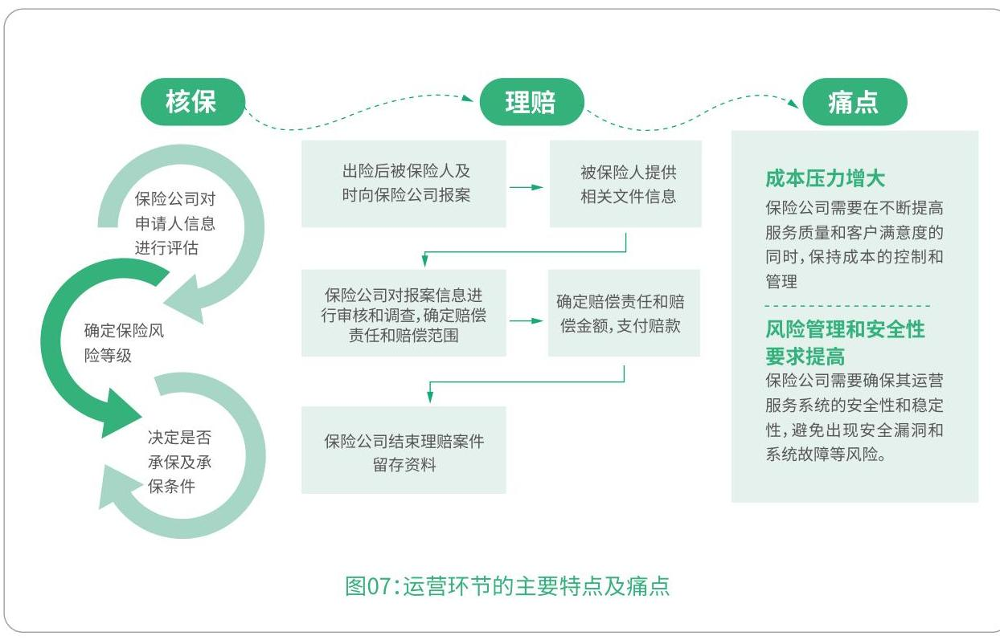

## Page 18
## 课题

保险公司的理赔流程中，AIGC可以帮助保险公司实现更快速、更准确的理赔处理。AIGC可以根据客户提供的理赔申请材料和保单信息，自动化地进行理赔审核和风险评估，快速地对客户进行赔付。同时，AIGC还可以智能地辅助客户提交理赔申请，并提供更加便捷的理赔服务。

AIGC可以在以下几个方面提供帮助，以提升保险公司的理赔工作效率和客户满意度：
・自动化理赔申请处理：AIGC可以自动处理理赔申请，包括收集并整理理赔文件、核实文件信息的真实性、审核理赔申请的准确性等。这样可以大大减少人工处理理赔申请的时间和成本，同时也避免了人工处理过程中的误差和不一致性。

・自动化索赔处理：AIGC可以自动处理索赔信息，包括对索赔请求的解析和响应。如果索赔请求符合保险条款，则可以自动触发理赔流程，否则可以自动拒绝索赔请求。这样可以大幅缩短索赔处理的时间，并提高客户满意度。

・自动化理赔评估：AIGC可以自动评估理赔金额，通过机器学习和数据分析技术，根据保险条款、索赔信息和历史数据等因素，自动计算理赔金额，从而提高理赔效率和准确性。目前，众安已经将AIGC技术用于碎屏险审核协助，通过对碎屏核保照片筛选，根据多维风险特征将其分为不同风险等级，采取不同的审核策略。

・自动化理赔审核：AIGC可以自动审核理赔申请，包括核对保单信息、理赔申请信息的真实性和准确性等。通过自动化审核，可以大大减少人工审核的时间和成本，并提高审核的准确性和一致性。

・自动化理赔结算：AIGC可以自动结算理赔款项，包括将理赔款项转账到客户账户、生成理赔结算单据等。通过自动化结算，可以大大减少人工结算的时间和成本，并提高结算的准确性和效率。

综上所述，AIGC可以在理赔处理的各个环节上提供自动化服务，从而提高理赔效率、降低成本、提高客户满意度。

## AI舆情分析

・当前问题：主流方案遗漏检误告：舆情信息中包含大量文本描述，目前采用的关键词检测方案依赖关键词管理，易漏检、易误告。

・研调方案：利用ChatGPT分析能力筛选结果：本方案利用ChatGPT对整段文本信息的分析总结能力，以及文本内容是否包含负面情绪、是否包含不良引导等问题为输入项，预期返回相关问题的正向反馈，辅以情绪相关固定关键词作为标签对结果做筛选，达成分析目的。

- 样例：众安科技"CIREO挖掘鲸"："CIREO挖掘鲸"用户交互挖掘平台目前已经基于文本、语音信息，识别用户会话关键词，识别用户交互意图，识别用户正负面情绪，辅助客服人员识别机会用户与风险用户。

・业务价值：提升时效及准确性：引入AIGC在信息处理总结相关能力，可帮助舆情分析减少漏检及误告比率，提升舆情处置时效性。
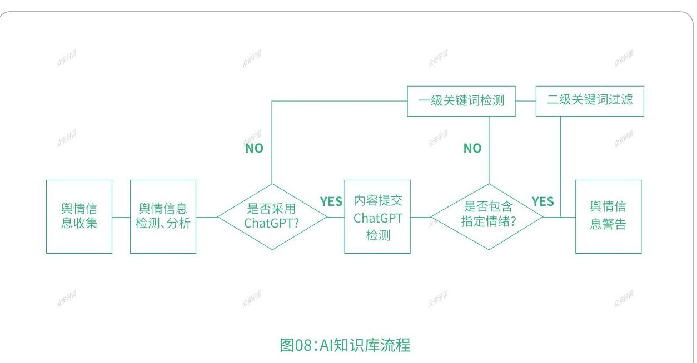

## Page 19
$\cdot$当前问题：目前主流方案耗时长、成本高：目前的系统运营方案是由各系统提供数据接口，应用于异常情况下的数据监测，当发现指标异常后需要人工介入上下游系统监测各自的数据情况，综合异常表现分析原因，排查时间长，沟通成本高。
$\cdot$研调方案：利用ChatGPT的分析理解能力排查问题：本方案利用ChatGPT对历史信息的分析、理解能力，以过往历史数据为正常数据，将本次提交数据与历史数据比对，返回可能出现异常的系统列表，以达成运营问题排查目的。
$\cdot$样例：ChatGPT标注示例：基于保险标的在上下游各系统的状态数据，以历史已经标注"异常系统"的数据与当前保险标的在各系统最新状态分析出当前"异常系统"名称。
$\cdot$业务价值：提升问题排查效率：引入ChatGPT可提升生产及测试环境问题排查效率。ChatGPT可基于过往各系统正常数据之间关联关系，对当前各系统数据进行比对分析，较快定位异常系统来源，降低沟通成本，加快问题处置速度。

## AI项目风险管控

$\cdot$当前问题：主流解决方案耗费人力且依赖个人能力：目前在项目风险管理中，多个项目并行推进的场景下，项目经理对项目风险识别依赖于实施项目组上报及定期巡查，风险上报周期较长，并依赖实施员工识别能力及风险意识，周期性巡查需要投入较多人力支持。
$\cdot$研调方案：利用ChatGPT助力项目风险管理降本提速：本方案利用ChatGPT对自然语言的语义理解能力，基于项目实施交付沟通群聊天内容，使用ChatGPT对聊天内容进行风险定向分析，用于高频次识别项目风险后及时通知项目经理，减少风险识别周期，降低项目管理成本。
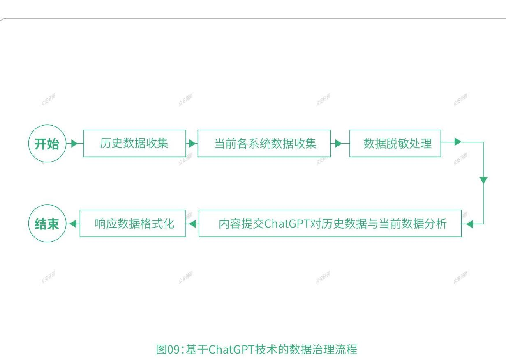
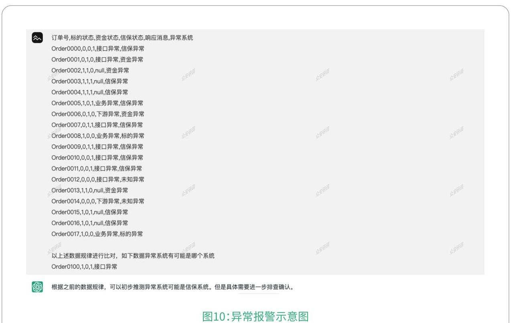

## Page 20
- 绿例: ChatGPT项目风险识别示例: 基于实施对接聊天群的聊天记录对项目风险进行识别。

|  1. 如果我去天使的话这个会不会来不及有可能给有没有其它方案你也可以我明天过来加个很有一定可能好一些
以上描述是否表明项目起期风险 | |
| --- | --- |
|  2. 作为一个AI信息模型, 我认为以上描述可能涉及到项目起期风险。如果项目在去关于医院或, 那么可能会延迟项目的交付时间, 存在延期风险。如果您可以在明天目标, 那么可能会导致不按投资目的交付时间, 减少延期风险。另外, 您可以考虑重新安排工作计划, 或者安排队伍及时帮助, 以最大限度地减少项目延期的风险。 | |
|  3. 我认为在这个事项的大意下, 不要正常人可以做的你或那些好不好, 大家都在这么做
以上描述将规模在情绪 | |
|  4. 以上描述可能体现了不通知不能领的情绪, 但描述中的语气显得有些愤怒和激励, 表达了对某人或某事的不满。同时, 使用"大家都在这么做"这样的语言, 可能暗示对方应该遵循社会习惯或标准, 体现了一种不能领和厌烦的情绪。 | |
|  5. 我拿玩具和手机万事小想在屋里商量玩原因后面就不理我了 她都做不过来我在卧室就自己在客厅也不笑了 我里商量了决定自己去睡垃圾桶玩
以上描述是否表明项目起期风险 | |
|  6. 作为一个AI信息模型, 我认为以上描述与项目起期风险无关。这只是一种客观生活体察的描述, 描述了孩子现在玩耍的情况。如果这是一个项目相关的情况, 那么需要分析孩子的行为是否会对项目态度造成影响, 并采取相应措施来减少项目起期风险。 | |

图11: 基于ChatGPT智能巡检流程图

- 业务价值: 提升项目风险识别效率: 引入ChatGPT可提升项目风险识别效率。ChatGPT可提升项目风险识别频次, 及时对项目中可能的风险进行预警及把控, 提前介入时间减少, 降低项目风险。

## 现阶段应用在保险运营方面的不足

结合保险运营的实际情况与AIGC的现有能力, 我们认为现阶段如果需要在保险运营工作中使用AIGC来赋能业务, 还有一些关键问题需要解决:

运营核心数据的合规使用: 在保险运营的核保、理赔等工作环节中, 除了需要使用客户授权提供的数据以外, 也需要保司运营所积累的核心敏感数据, 融合到模型基础数据中, 进行模型参数的调优, 甚至训练专属的小尺寸模型, 这部分核心的敏感数据如何能够在合规的前提下, 参与到相关模型的微调中, 同时也能确保这部分敏感经营数据的安全, 是AIGC在保险行业的核心环节中推广运用所必须解决的问题。

输出结果的业务准确性: 基于AIGC所使用的模型算法的特性, 在部分情况下, 会出现输出不正确结果, 甚至会"编造"一些不存在的知识信息, 如果运用在核保、理赔等运营环节中, 会对最终的业务处理结果产生较大的影响, 如果运用在客户服务环节中, 会导致客户获得不正确的信息回复。无论是哪种情况, 都会对保险公司的运营工作产生不良影响, 纠错成本很高。如何能避免这种问题的影响, 也是AIGC在保险公司内推广运用时所需要关注的。

## 2. 应用案例 苏黎世保险AIGC助力理赔及数据挖掘

苏黎世保险公司对AIGC的应用则更加接近于理赔环节。据报道, 该公司正在测试如何在理赔和建模等领域使用AIGC人工智能技术, 旨在应对初创企业和更大竞争对手带来的挑战。

苏黎世正在研究该技术的应用, 从理赔说明和其他文件中提取数据。目前, 该公司提供了最近六年的理赔数据, 试图找出整个理赔部分的具体损失原因, 从而改善承保。在首席信息和数字官领导下, 这家保险公司还创建了一个新的专利计划来保护其知识产权, 重点关注自动风险检查和处理账单的AI系统等领域。
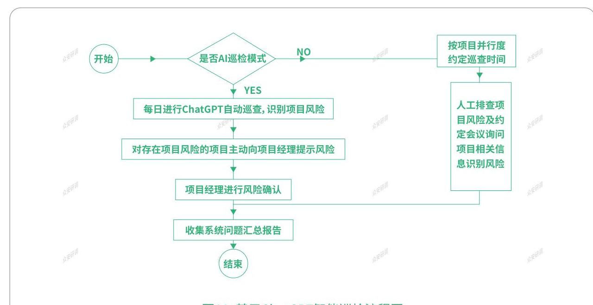

## Page 21
苏黎世保险公司CIO兼CDO，前平安科技首席执行官陈立明表示，AIGC不会取代开发人员，而是承担副驾驶的作用。同样，对于承保和理赔，它不会取代人，但会提高效率。

事实上，苏黎世保险的这一举措只是其在利用人工智能提升理赔效率方面的更进一步。此前，该公司于2021年4月与保险科技公司Sprout.AI达成合作，将解决财产险理赔所需的时间缩短至24小时以下。

### 客户服务：识别情感服务自优化，长距感知输出优体验

随着数字化技术的发展和消费者观念的变化，客户对保险公司提供的服务和体验的期望越来越高，不仅需要简单、快速、个性化的服务，还要求能够在不同渠道和平台上实现一致性的体验。

保险公司可以利用AIGC实现智能客服系统，让客户能够通过自然语言与保险公司进行交互。AIGC可以根据客户的问题或者需求，智能地回答客户的问题，或者引导客户到相应的服务流程。同时，AIGC还能够智能地识别客户的情感状态，例如是否满意、不满意等，从而实现更好的服务。

AIGC在保险公司的自动化客服方面可以提供以下帮助：

#### 企微自动回复

- **当前问题**

  客服人员需要有一定的专业知识及内容辅助工具，才能和客户进行高质量有效的沟通，以促成用户活跃及转化；

  客服离开或者非工作日时，客户回复无应答。

- **研调方案**

  在客服工作台的侧边栏接入AIGC，当客户提问时，AIGC可给出回复建议，客服甄别后，点击快速回复客户。


将保险相关知识库导入AIGC，将自动回复模块接入AIGC，通过AIGC直接完成更加智能的自动回复，提升用户体验。
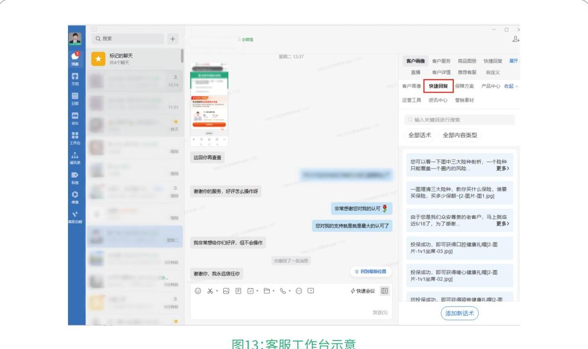
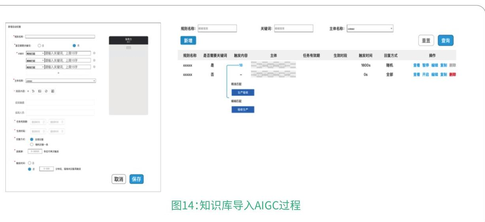

## Page 22
- 业务价值: 提升用户体验及留存，提升保险转化，解决客服人力矛盾。

### 实时话术推荐

- 当前问题

保险公司会通过多种途径与客户接触，如电话、邮件、短信、APP、微信、官网等；客服坐席在作业过程当中，需要掌握多种知识及技能方能更好地触达客户，例如：专业知识、产品知识、行业知识、沟通技巧等等；同时客户所属地域、年龄、消费习惯、家庭成员、历史沟通中了解的个人情况等都各不相同。

综上，在客服坐席作业过程中，往往需要个性化的话术才能提升转化率，然而坐席人员受个人经验、产品特征、个人知识的影响，往往无法针对性地针对不同客户采用合理的话术来提升转化率，同时学习培训成本也比较高。

- 客服人员的个人能力差异大，如何最大限度发挥人的能力?
- 不知如何与客户沟通，如何有效沟通达到最优效果?
- 客户提出的问题涉及了坐席知识盲区，如何回复?

### · 研调方案

选取转化率高的通话录音，利用ASR®技术进行语音识别，将现有优秀的通话数据导入AIGC，当数据达到一定规模后，便可以针对不同类型的客户，实现千人千面的客服话术。在客服人员与客户通话过程中，实时根据客户需求，结合沟通过程上下文，借助AIGC在客服人员工作台实时展示最优推荐话术，从而提升客户满意度，大大降低坐席人员的学习成本。


6. ASR是自动语音识别（Automatic Speech Recognition）的缩写，它是一种人工智能技术，可以将人类的语言转换成计算机能够理解和处理的文本形式。ASR的基本工作原理是利用语音信号的进阶形态特征和语音词汇库中的语音模型进行匹配，从而实现语音到文本的转换。ASR已经广泛应用于语音助手、智能客服、智能家居、语音搜索等领域。
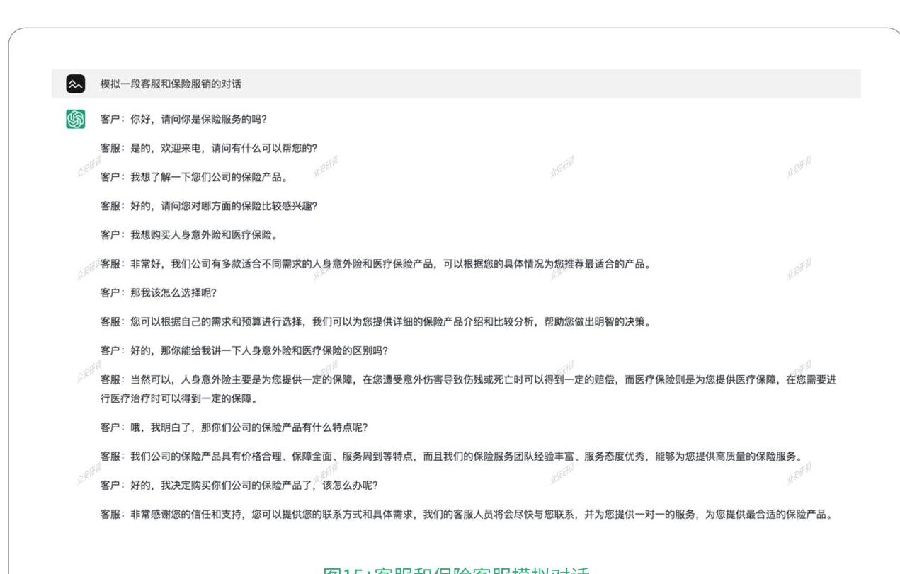
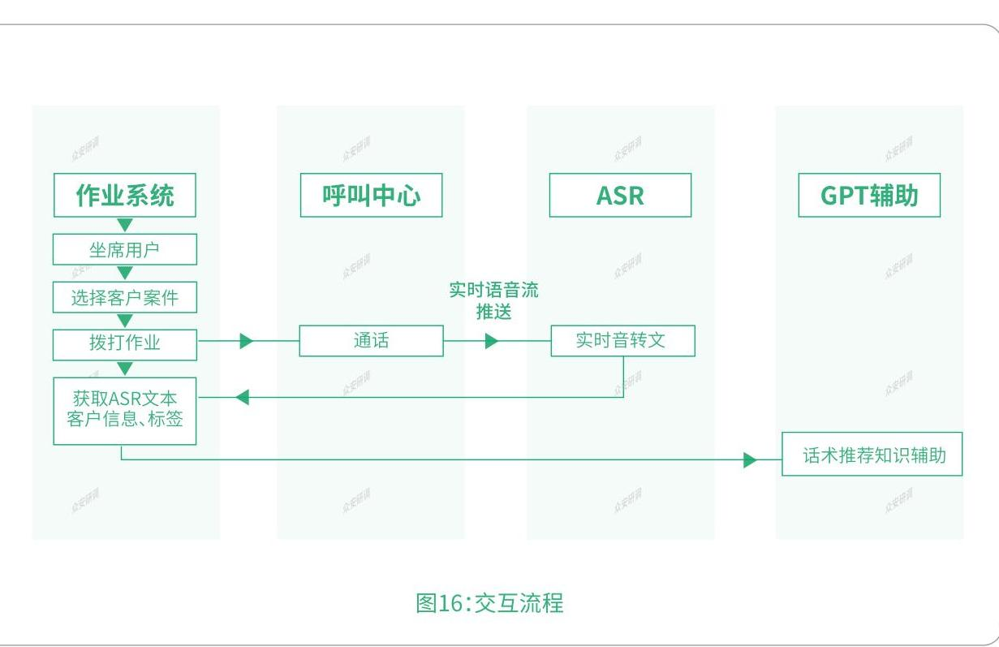

## Page 23
- 样例
- 客户会：之前在附近一段时间，可以购买客户换指标？应该如何回答
- 可以购买客户换指，但需要注意的是，在购买客户换指时会有一些偏离问题的询问，包括之前是否有住房、是否有慢性病等。这些因素可能会影响换指公司的承保意愿和保费，建议咨询换指公司，了解具体的换指产品和购买流程。
- 客户会：我是一名告别职业者，没有公司提供的医疗换指，应该购买哪种医疗换指？应该如何回答
- 作为告别职业者，建议购买个人医疗换指，可以选择符合个人需求和预算的换指产品，例如保姆住房、保费、银行方式、理赔或者等方面。建议在购买前充分了解换指公司的信誉度、产品评价、理赔记录等信息，以确保对购买的换指产品是可靠的。同时，需要注意的是，个人医疗换指通常需要最新保费，购买前需要从病考虑自己的经济状况。

图17：实时话术模拟对话

- 业务价值
- 帮助坐席成长、提升客户满意度，大大降低坐席人员的学习成本；
- 在提升业务指标的同时助力实现人人都是好坐席的目标。

## AI注记

- 当前问题

保险客服通话注记是客服人员在与客户通话时记录的重要信息，目的是为了记录客户提出的问题或投诉，并对客户问题进行跟进和解决。这些注记包括客户的个人信息、所提出的问题、解决方案、客户的反馈等等。通过收集和分析这些注记，保险公司可以了解客户对公司产品和服务的评价，同时也可以评估客服人员的表现，从而改进服务质量和客户满意度。此外，保险客服通话注记也是保险公司管理和监督的重要依据之一。

但是实际上在通话结束后，因为坐席个人能力差异，通话时长较长，存在对客户表达诉求总结不到位，注记记录偏差的情况。

- 研调方案

在坐席与客户通话时，利用ASR技术进行实时语音识别，借助AIGC，结合整体通话内容对客户表述内容进行总结，输出AI注记。


- 样例
- 客服：很好，您需要跟浏览的换取合符号码和身份证号码，我们可以为您查询您的换取理赔流量。
- 客户：好的，我的换取合符号码是XXXX，身份证号码是XXXX。
- 客服：非常需要您提供的信息，我们已经为您查询了您的换取理赔流量。目前您的换取理赔申请已经提交并正在审核中，一旦审核通过，我们会及时通知您理赔结果。
- 客户：好的，非常感谢您的帮助，请问如果我需要咨询其他的换取问题，应该如何联系您们呢？
- 客服：您可以通过医疗部门认可的客服热线电话或者发送邮件给我们，我们会为您提供及时的换取咨询服务。同时，我们也提供在线客服和APP客服等多种方式，方便您随时随地与我们联系。
- 合同一个客户的重点并生成注记
- 客户需要查询换取理赔流量，提供换取合符号码和身份证号码。客服查询后告知换取理赔申请正在审核中。客户询问其他换取问题时，客服提供电话、邮件、在线客服和APP客服等多种联系方式。
- 注记：客户需要查询换取理赔流量，提供换取合符号码和身份证号码。客服查询后告知换取理赔申请正在审核中。客户询问其他换取问题时，客服提供电话、邮件、在线客服和APP客服等多种联系方式。
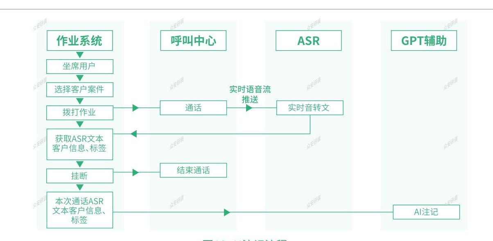

## Page 24
## ·业务价值

提升客服效率: AI通话注记可以自动记录通话内容和关键信息，减少客服人员手动记录信息的时间和精力，提高工作效率。

改善服务质量: AI通话注记可以提供客户与客服的沟通记录，帮助客服人员更好地了解客户需求和问题，并对服务质量进行评估和优化。

支持客户跟进: AI通话注记可以记录客户的问题和需求，以便后续客服人员或其他团队成员跟进，提高客户满意度。

分析数据洞察: AI通话注记可以为企业提供大量数据，从中发现客户需求和痛点，优化产品和服务，提高企业的市场竞争力。

总之，AI通话注记可以帮助企业提高客户服务质量和效率，提升客户满意度和忠诚度，同时也可以为企业提供数据洞察，优化企业产品和服务，提升市场竞争力。

## AI复盘

### ·当前问题

客服通话复盘是指客服人员在与客户沟通结束后，对通话过程进行回顾和总结，以便于发现问题和改进服务。但是客服人员因为自身经验能力等问题，自我成长较难，沟通后未能触动客户，原因是什么？后续如何提高？

### ·研调方案

在坐席与客户通话时，利用ASR技术进行实时语音识别，借助ChatGPT，结合整体通话内容对客户表述内容进行总结，输出AI注记；然后基于坐席侧的话术进行分析，输出整体复盘结论。

### ·样例


图20: AI复盘流程

|  1. 客服: 完好, 但需要提供您的排版合同号和标准标记号码, 我们可以为您提供您的排版情报流通。 | |
| --- | --- |
|  客户: 好的, 我的排版合同号码是XXXXXX, 我标记号码是XXXXXX。 | |
|  客服: 非常感谢您提供的信息, 我们已经为您查阅了您的排版情报流通。目前您的排版情报中请已经提示并正在审核中, 一旦审核通过, 我们会及时通知您情报结果。 | |
|  客户: 好的, 非常感谢您的帮助, 请问如果想要要求我获取的排版问题, 应该如何联系您们呢? | |
|  客服: 您可以通过银行我们公司的客服热线和流或者发送邮件给我们, 我们会为您提供及时的排版咨询服务。同时, 我们也提供在线客服和APP客服等多种方式, 方便您随时随地与我们联系。 | |
|  客户: 要需要将排版情报流通, 提供排版合同号和标准标记号码。客服提供给您的排版情报申请正在审核中, 客户询问获取排版问题时, 客服提供电话、邮件、在线客服和APP客服等多种联系方式。 | |
|  1. 列入服务内容进行复盘 | |
|  目前对话是客户与排版公司客服之间的一次交流, 客户询问自己排版情报申请的流通情况, 客服要求客户提供排版合同号和标准标记号码, 提供给您的客户排版情报申请已经提示并正在审核中, 一旦审核通过会及时通知客户情报结果。客户也询问了如何联系排版公司咨询其他排版问题, 客服为客户提供了电话、邮件、在线客服和APP客服等多种联系方式。目前对话充分展示了排版公司客服的专业素质和服务态度, 为客户提供了及时、便捷的排版咨询服务。 | |
|  2. 上图的对话, 客服还有哪些优选点? | |
|  我把这些对话充分展示了排版公司客服的专业素质和服务态度, 但是客服还有以下几个优选点: | |
|  1. 语主动地了解客户的具体问题, 提供更加详细的解决方案。比如客户询问如何联系排版公司咨询其他排版问题, 客服只是简单地提供了几种联系方式, 而没有主动了解客户的具体问题并给出相应的解决方案。 | |
|  2. 表达人现在进行客户沟通, 让客户感到更加舒适。客服应对该中没有使用客户的联系或者其他个性化的倾向, 有些客户可能会提到不太舒服。 | |
|  3. 在通知服务的同时, 你可以通过引导客户了解更多排版知识, 增加客户的排版意识。比如客户可能还不清楚自己的排版合同具体内容, 客服可以主动引导客户了解排版合同的内容和排版情报的流程, 提高客户对排版的认知度。 | |

图21: AI复盘模拟对话
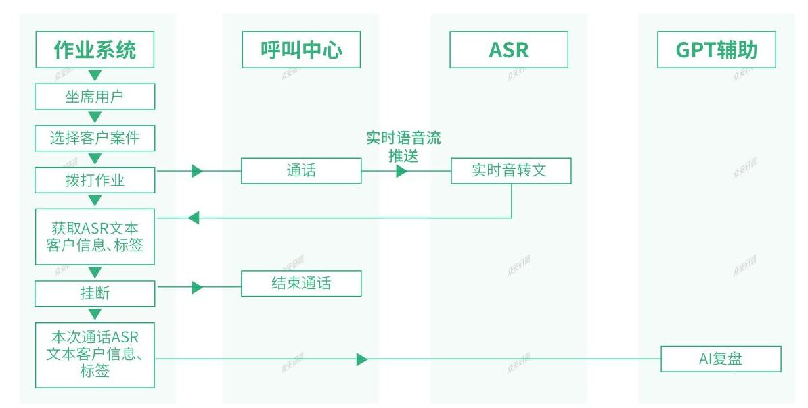

## Page 25
## ·业务价值

可以自动分析和评估大量的通话数据，并提供深入的见解和反馈，以帮助企业提高客户服务质量和效率。

## AI质检

### ·当前问题

自从2021年8月离线质检平台上线后，虽然客服的AI质检覆盖率已达到100%，解决了业务海量质检的痛点，但是由于质检时效相对滞后，对服务和质量提升并不是很明显。为了解决此问题，经多方评估，最终于2023年3月正式上线实时质检平台。

## AI离线质检平台，使用AI、语音识别、大数据等手段将不同角色的语速、静音、语调、抢插话、异常情绪、关键词、具体会话场景等信息做话务检测，并根据检测结果打分。

AI实时质检平台，使用实时ASR、NLP、知识库等技术手段，结合业务实际场景，引导坐席使用正确的话术，并针对违规通话，能够快速定位风险，及时向坐席、主管反馈。

成本高：每年百万级的AI和服务器费用

质检量受限：每天上千小时的语音质检，近千个实时质检坐席授权，超出需额外付费

AI质检错误：AI学习周期长，影响质检质量

稳定性：同时成百上千在线通话人数影响实时质检时效和稳定性

### ·研调方案

离线质检：借助ChatGPT的上下文理解分析能力，对每天的语音做全量质检，未做AI质检的做一次ChatGPT质检，随后再做初检、复检。已做AI质检的再做一次ChatGPT质检，同时与AI质检对比出差异，生成报表并提交至AI质检做学习使用。


实时质检：借助ChatGPT的对话能力，对未接入实时质检的通话做ChatGPT质检，并将违规结果实时通知到坐席和质检员，对于已接入实时质检的通话再做一次ChatGPT实时质检，并将质检结果保存，同时与AI质检对比出差异，生成报表并提交至AI质检做学习使用。
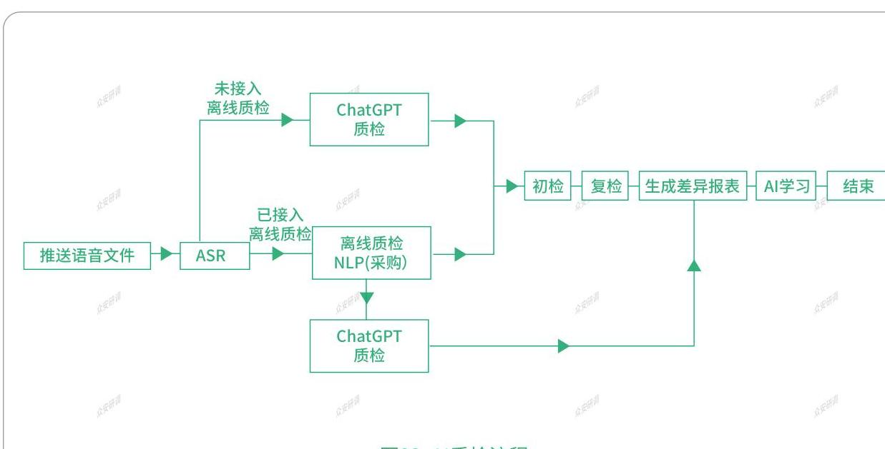
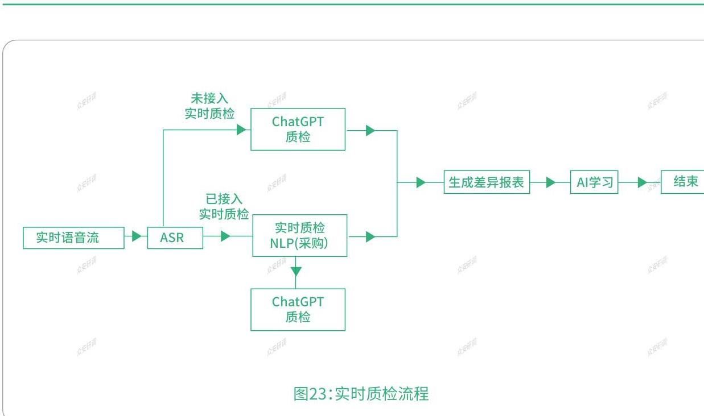

## Page 26
## 20

## 应用案例

## 好事达保险AIGC自动化客服系统 ${ }^{6}$

美国好事达保险公司就采用了名为"ABIE"的AIGC智能客服系统，旨在提高中小型企业主对商业保险的理解和知识，并为其提供快速、准确的保险方案建议。ABIE通过语音和文字进行交互，回答用户问题、提供保险政策建议、帮助用户理解保险术语等等。此外，基于与用户的智能交互，可根据用户需求提供相应的保险方案。

ABIE的实现是通过Allstate的AI中心来完成的。该中心利用自然语言处理、语音识别、机器学习等先进技术来不断改进ABIE的性能，使其能够更好地为客户提供服务。该系统已经被证明是成功的。Allstate商业保险已经开始在美国多个州推广它，并计划将其引入更多的领域和市场。

AllstateBusinessInsuranceExpert(ABIE) 是由多个功能模块组成的系统，包括：

|  启动问答 | 风险评估 | 提价计算  |
| --- | --- | --- |
|  基于AIGC技术实现的自动问答系统，可以回答客户的保险问题，并提供相关建议 | 基于数据分析和机器学习技术，分析客户的企业风险情况，并提供个性化风险评估 | 基于大数据和机器学习技术，分析客户的需求和风险情况，计算出最合适的保险报价  |
|  文件管理 | 自动核保 |   |
|  将客户的重要文件和信息保存一个中心化的系统中，方便客户和保险代理人随时访问和管理 | 基于数据分析和机器学习技术，自动审核客户的保险申请，提高核保效率和准确性 |   |
|  图26:ABIE的功能模块 |  |   |

## Page 27
# 智能辅助日常办公 高效检索成稿纠错

传统的信息获取方式多为通过搜索引擎进行精确检索。使用AIGC应用研发框架的流式会话能力设计聊天窗，向企业内部开放AI会话聊天窗，用户可直接与AI进行交互，辅助日常运营提效。目前，众安基于AIGC应用研发框架实现了桌面端及移动端的AI会话能力，可通过AI会话高效辅助日常办公内容检索及文本生成。

## 问答助手：降低知识库构建要求，大幅节省资源及人力

工具平台问答助手本质是问答机器人，通过机器人自动回复的方式，对用户的一些特定数据进行答复，提升用户的响应时效。问答机器人有非常丰富的应用案例，常见有工具平台10Q&A助手及自动客服等11。

### 传统问答机器人构建耗费大量人力或资源

传统的问答机器人通常采用基于规则的方法或基于统计学的方法实现，其中基于规则的方法需要耗费大量的人力12，基于统计学的方法需要大量的数据和计算资源13。

### AIGC应用有效降低对知识构建的要求

区别于传统的基于规则及基于统计学方法的问答助手，通过AIGC来实现问答助手可有效降低对知识库构建的要求。众安通过embedding的方式实现企业问答助手，具体有如下步骤：

- **STEP1** 通过知识库构建来收集企业内部常见问题和答案，包括常见问题、常用回答、操作指南等。可以通过人工整理、用户反馈和历史数据等途径获得；
- **STEP2** 通过AIGC的向量化能力对知识库进行预处理，实现分词、去停用词、去无意义符号及文本向量化，并存入本地向量库；
- **STEP3** 在用户交互场景，获取用户输入后对用户输入进行向量化处理，在本地向量库执行KNN算法返回最优的结果；
- **STEP4** 将返回结果交由大模型处理返回最终输出。

10. 工具平台，用户在工具平台使用方面如遇有问题，通过一些特定问题来提升，自动返回相关解决方案。

11. 自动客服，用户的产品、服务和服务，或者一些客体事件通过自动问答进行咨询、明确用户具体诉求。

12. 使用大量人工预先定义好的规则，规则包括语言模板、关键字、逻辑判断等；其实现用户的问题，与用户提出一个问题时，问答机器人会根据规则库中的规则来匹配问题，规则相应的答案并返回给用户。这种方法简单易懂，但需要耗费大量人力和空闲钱，且无法覆盖所有问题和语境。

13. 基于统计学的问答机器人通过分析大量资料库中的数据，使用机器学习算法来预测答案。该方法包括预处理、特征提取、训练模型、测试模型、预测答案等5个步骤。基于统计学的方法可以通过大量数据自动学习和提高精度，将需要大量的数据和计算资源。

## 众安样例

众安基于AIGC应用研发框架已落地实现Devops平台（devcube 研运一体化平台）的问答助手，可对用户在平台使用侧的需求与问题进行有效解答。


图27：问答助手场景应用案例

## 知识库：智能化信息分类归集，快速检索分析出报告

### 当前情况

AIGC可以在辅助日常办公方面搭建专业知识库并提供查询服务，具体可以做以下事情：

- **知识库构建**: 可以利用AIGC搭建一个专业知识库，将特定领域的信息和知识整理、分类并输入到模型中。这些知识可以包括行业标准、规范、产品信息、操作指南等。AIGC可以基于这个知识库回答用户的查询，并提供准确的信息。
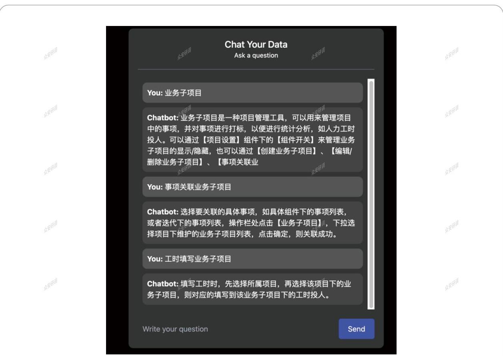

## Page 28
- 查询服务: 用户可以向AIGC提出特定领域的问题, 例如关于产品功能、技术规范、操作流程等。AIGC会在知识库中搜索相关信息, 并给出相应的答案或解决方案。这样, 用户可以通过与AIGC的对话, 获取所需的专业知识和指导。

- 多领域支持: AIGC可以根据业务的需求构建不同领域的知识库, 覆盖多个行业和专业领域。无论是科学、技术、医疗、金融、法律还是其他领域, 都可以通过搭建相应的知识库来提供相关的查询服务。

- 即时更新和维护: 可以根据最新的信息和知识不断更新和维护AIGC的知识库。通过定期更新知识库, 可以确保AIGC提供的查询服务与行业变化和最新发展保持同步。

### 研调方案

AIGC可以根据行业知识和数据特点自动生成信息归类方案, 提炼出来重点数据, 并将数据分门别类地存储在数据库中, 形成知识库;

通过AIGC的信息归类方案, 后续的决策时需要使用相关知识库数据。AIGC可以根据提供的关键信息, 快速检索、生成报告。


### 样例

帮助提炼行业领域相关知识点, 方便后续归档形成知识库


### 帮助从知识库中快速检索出需要的知识点


需要注意的是, 尽管AIGC可以帮助构建专业知识库并提供查询服务, 但在涉及重要决策、法律金融咨询或其他专业领域的问题时, 建议寻求相关专业人士的意见和建议。
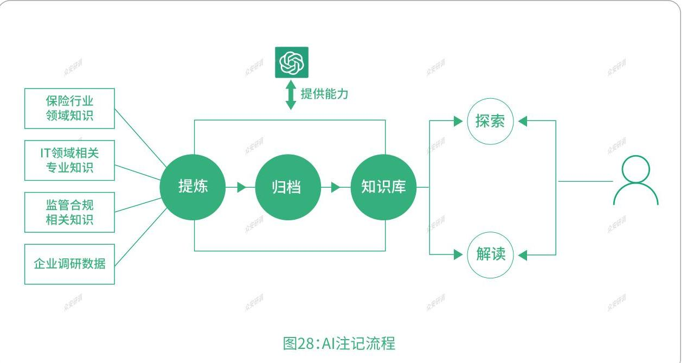
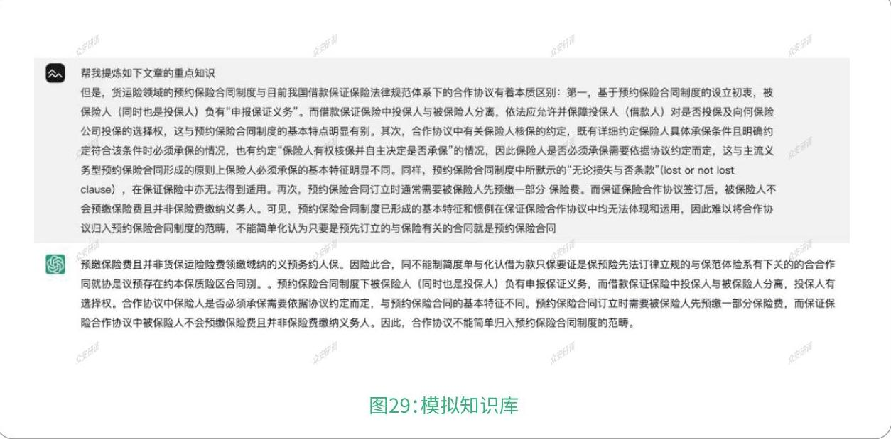
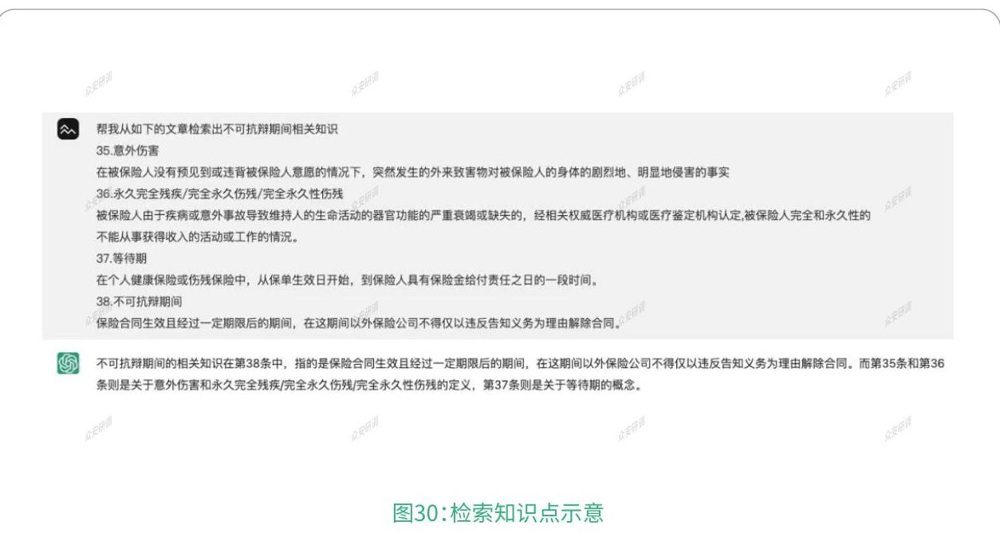

## Page 29
## 文档编辑：高质多态图文小能手，助力内容生成及优化

## 当前情况

AIGC在辅助日常办公方面提供文档撰写和编辑方面的帮助，具体可以做以下事情：

- 内容生成：用户可以向AIGC提供关于文档或者PPT的主题、要点或草稿，它可以帮助用户生成相关的内容。它可以提供文章开头的建议、段落的衔接、观点的陈述等方面的帮助，使用户的文档更加完整和连贯。
- 结构设计：如果用户需要帮助设计文档或PPT的结构和布局，可以向AIGC咨询最佳实践和建议。AIGC可以提供关于文档或幻灯片顺序、分段和布局等方面的建议，以使文章结构清晰、易于理解。
- 幻灯片设计：AIGC可以提供关于幻灯片设计的建议。用户可以向AIGC咨询关于字体选择、颜色搭配、布局美化等方面的建议，以使PPT外观更具吸引力和专业性。
- 文章改进：如果已经有一篇初稿或部分文章，但希望对其进行改进和提升，用户可以将其输入AIGC，并向其提出改进要求。AIGC可以提供关于结构、语法、表达等方面的建议和修改意见，帮助提升文章的质量和清晰度。
- 图表和图像：AIGC可以帮助用户添加图表和图像到文档或PPT中。用户可以描述希望展示的数据或信息，AIGC可以提供选择适当类型的图表、图像和配色方案的建议。
- 语法纠正：AIGC可以帮助用户进行语法和拼写错误的纠正。用户可以将文本输入到AIGC中，它会尽可能发现并指出文本中的语法和拼写错误，并给出相应的建议和修改建议。
- 内容补充：如果用户的文档或文章需要更多的内容或相关信息，可以向AIGC提出请求。 AIGC可以提供相关的信息和观点，以丰富和补充用户的文档，使其更加全面和有说服力。
- 格式和排版建议：除了内容方面的帮助，AIGC还可以提供关于文档格式和排版的建议。用户可以向AIGC咨询有关标题、段落、字体、间距等方面的最佳实践和建议，以提高文档的可读性和美观度。

在这方面，金山的WPSAI和微软的Office365Copilot初步具备了相关能力，在向终端用户逐步推广之后，可以更多地应用在日常工作中。

## 研调方案

基于ChatGPT的自然语言深度学习技术，通过大量的文本数据训练，学习如何生成高质量的文本内容。在日常工作中可以帮助我们快速生成高质量的各类型文档，包括邮件、公文写作、管理制度、项目报告、竞品分析、产品文档、公司培训文档等。

## 样例
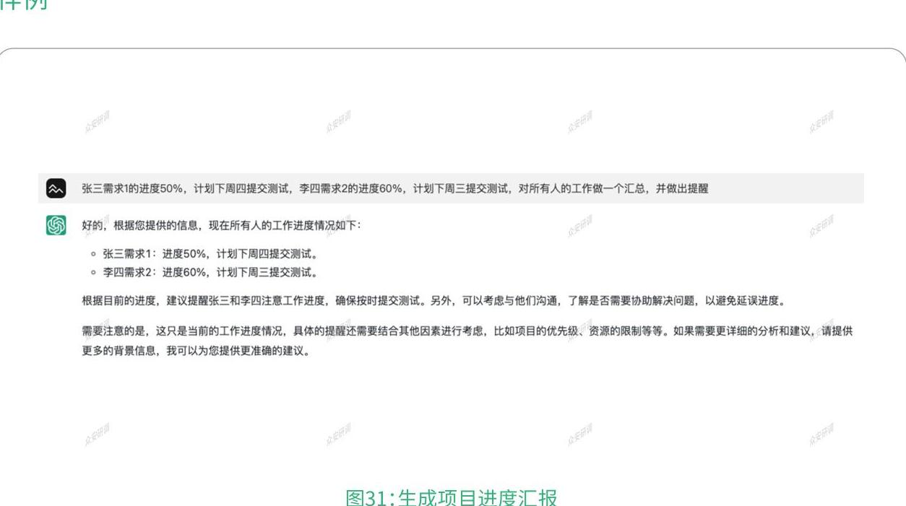

## Page 30
## 协同办公: 纪要总结生成自动化, 任务进度调整自适应

### 当前情况

- 企业沟通效率低下: 企业办公人员沟通成本高, 沟通效率低下, 频繁的邮件或者通讯沟通, 容易产生信息过载等问题。

- 两团队协作难度大: 由于协同办公经常需要多团队成员合力协作, 基于各团队工作量、时间排期等因素, 造成团队成员进度同步困难, 协作完成任务成本大幅增高。

### 研调方案

通过ChatGPT的能力助力协同办公, 基于团队成员沟通记录、任务分配和进度更新等信息, 自动生成会议纪要、工作报告等办公总结, 从而提升团队沟通效率。同时可以根据团队成员工作进度, 自适应调整任务配置跟进任务进度, 从而提高团队协作的效率和成果。

### 样例

会议纪要总结: 在业务系统改造交流过程中, 通过ChatGPT对企业微信交流内容形成纪要总结。

|  1. 我需要经常做两个会议纪要, 我获得输入文字, 但需要帮助形成系统清晰的会议纪要 |   |
| --- | --- |
|  2. 好听, 请各自联合出的主题和内容。 |   |
|  3. 加工: 如果使用视频方案者, 可能是上周4系统直接使用Audi A7Audi A7Audi C三个版更合适, 我们可以介绍5月1日上线。 |   |
|  4. 发信: 请问, 35路方案我们需要9位会前进行改造, 8系统需要改造请求数据服务进行稍数据加工, 然后基于两个数据进行调用5系统和8系统, 但会改造工作需要1个月。 |   |
|  5. 主见建议和指导程度方案足, 5月1日上线, 并同步进行长期方案, 否则确认下上线时间。 |   |
|  6. 来回确认长期方案在6月6日上线。 |   |
|  结论: 我联合出讨论的结果, 短期方案和长期方案等同时进行, 短期方案在6月11日上线, 长期方案在6月6日上线。 |   |
|  图34: 会议纪要总结 |   |

### 研调方案

通过ChatGPT的能力助力协同办公, 基于团队成员沟通记录、任务分配和进度更新等信息, 自动生成会议纪要、工作报告等办公总结, 从而提升团队沟通效率。同时可以根据团队成员工作进度, 自适应调整任务配置跟进任务进度, 从而提高团队协作的效率和成果。
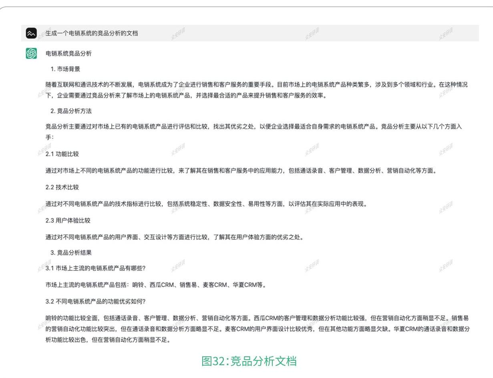

## Page 31
需求评审会议提纲:在横跨多部门会议组织前, 进行会议提纲准备及注意事项准备。

|  1. 根据国会议题(1)会议提纲的评审会议提纲内容, 会议会议提纲 A、B、C三个部分。会议提纲包括会议提纲、常规性以下会议提纲和注意事项。 | |
| --- | --- |
|  会议提纲: | |
|  1. 确定会议提纲的目标:明确本次会议的提纲和目标,确保所有参与者都清楚会议的重点和目标。 | |
|  2. 分配产品需求:给产品负责人分配产品需求的背景、目标、功能、特点等。 | |
|  3. 讨论产品需求:所有参与者就产品需求进行讨论、回顾比较、探讨、指导等方面,提出有效的解决和建议。 | |
|  4. 确定产品需求:在讨论的基础上,确定最新的产品需求,明确有效的新案和任务。 | |
|  5. 确定下一步行动计划:明确确定的产品需求,制定下一步行动计划,明确时间节点和责任人。 | |
|  注意事项: | |
|  1. 经常准备:会议前,所有参与者都感到满意,包括产品需求的选择、分析和准备好相应的问题和建议。 | |
|  2. 正常人机构会:正常人都负责会议的组织、引导和控制,确保会议能够全程进行,避免讨论偏题或者疑问。 | |
|  3. 尊重他人意见:参与者都尊重他人的意见,不再依赖其他人说话,否则会影响讨论的效果。 | |
|  4. 注意见解:明确会议的重要议题内容,包括谈论讨论的具体问题,确保各方面都理解讨论的意见。 | |
|  5. 记录和汇报:会议结束后,要及时记录并分析和对策,并且对汇报有相关人员,确保下一步行动得以顺利进行。 | |
|  6. 会议目标:10小时。 | |
|  7. 确认会议议题的1000分,并对已讨论的会议有出台人员。 | |
|  8. 将有出台人员,并根据自己下一步行动的时间分解细化确认日期。 | |
|  9. 向出台人员展示了讨论的。 | |
|  注意事项: | |
|  1. 请务主管:出台会议前,各个部门分析或人员对我的注意,分析并及时对相关的反馈,以便出台会议提纲的目的。 | |
|  2. 确定其他人员:根据确定其他人员,以确保各个部门或组织出台分析的内容和建议的目的,明确其他人员的人身份,并出台会议提纲。 | |
|  3. 确定议题提纲:将以上议题解释成议题的主要提纲,并将分析的内容和建议的具体问题和建议的目的。 | |
|  4. 请务主管:对议题提出的提纲和建议,明确议题的提纲和提纲内容,同时,提出议题建议的具体内容,以便提纲和建议的指导。 | |
|  5. 记录会议提纲:根据记录会议议题,出台会议的提纲和提纲,以便出台人员及时了解下一步行动的时间和地点。 | |

图36:需求评审会议提纲


### 业务价值

借助ChatGPT的能力,通过自然语言处理等技术,可辅助团队沟通,自动识别关键词,更快地理解彼此意图和需求,减少信息传递的不畅等问题。

- 提升企业员工工作效率
- 提升跨团队、组织的协同能力
- 提升管理的决策效率
- 降低人力成本和运营成本
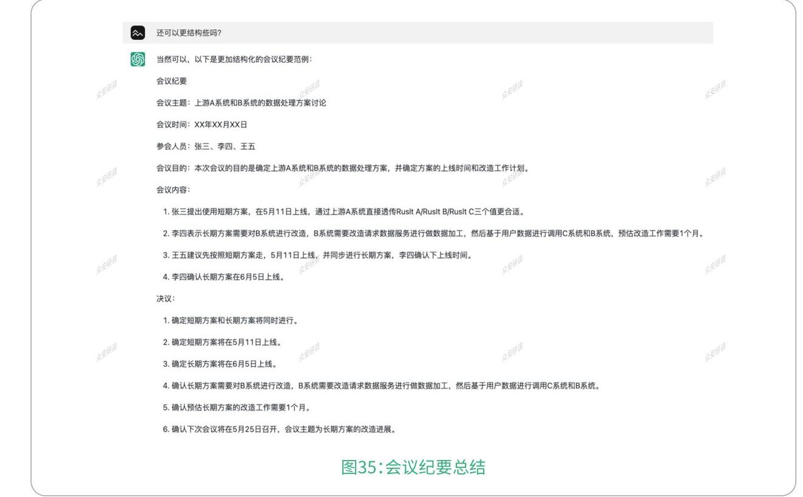
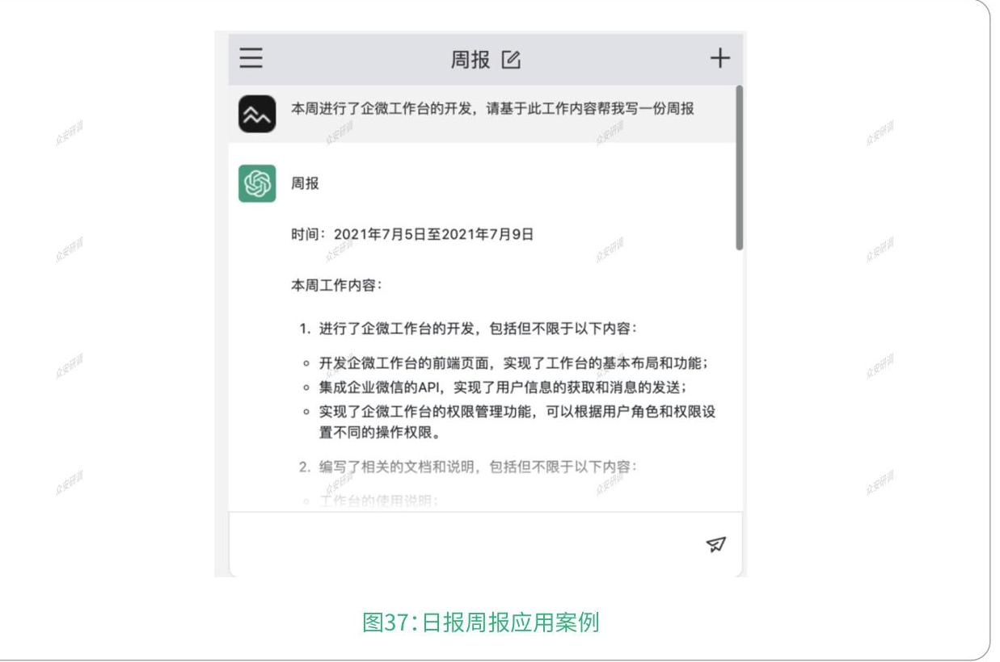

## Page 32
## 人力招聘: 所聘职位需求描述准, 专属面试题量身定制

## 当前情况

由于公司职位较多, 需求种类不同, HR在整理JD时需要了解不同职位所需要的基本技能, 甚至有时会要求有招聘需求的团队自行提供JD, 这样不仅在效率还是在准确性都具备较高的挑战, 同时也增加了沟通和学习成本, 另外在面试环节的问题, 基本都是围绕项目展开, 再连带出一些自己熟悉的相关问题, 这样会导致问题广度不够, 甚至可能错过一些优秀的人才。

## 研调方案

使用ChatGPT的自然语言处理能力, 使用关键字生成JD和面试题。

## 样例


|  1. 生成一份面试题, 关键字Java, 英文语, 难量数据, 德语, 美国, 注重技术和思考能力 |   |
| --- | --- |
|  2. 面试题: 1. 面对前一个职位需求来浪费下的项目经验。 |   |
|  3. 如何在Java中处理海量数据? 请举例说明。 |   |
|  4. 你在系统测试方面有哪些经验和方法? 可以分享一下你的经验吗? |   |
|  5. 请需要介绍一下你对高级技能和品牌活力量的理解和经验。 |   |
|  6. 请解释一下Java中的技能和是什么, 以及它的使用效果和优势。 |   |
|  7. 如何避免Java中的风险问题? 请举例说明。 |   |
|  8. 如何将JD的SEO（包括SEO）包装了解吗? 如何在SEO的范围? |   |
|  9. 请介绍一下你对Java的关键部分和你使用这些化的理解。 |   |
|  10. 如何将在Java中的技能安全? 请举例说明。 |   |
|  11. 请总结你对Java中的设计模式的理解和应用, 可以成功将这些新技能进行说明。 |   |
|  |   |
|  |   |

图39:人力招聘生成实例

## 业务价值

提升招聘效率, 精准定位招聘需求
创建面试题库, 量身定制专属面试题
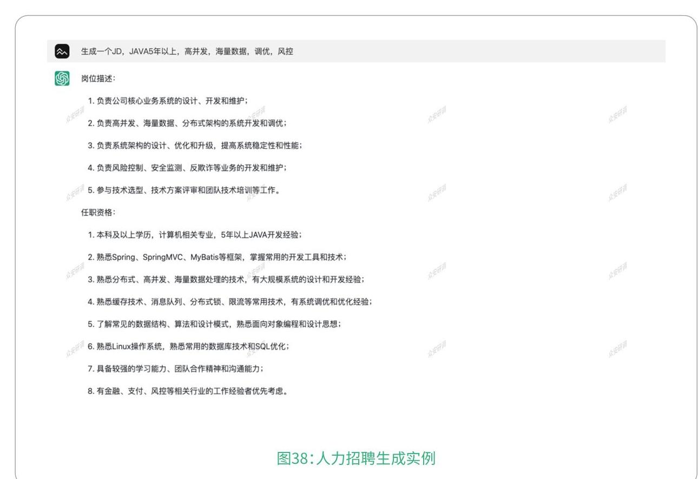

## Page 33
## 1 自主训练扩能提效 赋能保险企业研运

## 开发场景：前后端代码半自动化，支持生成补全及优化

在系统开发的场景中，AIGC可以帮助提高前端开发和后端开发的效率。例如，在前端开发中， AIGC可以帮助开发者更快地编写HTML、CSS和JavaScript代码，以减少人工编写代码的时间和精力。在后端开发中，AIGC可以帮助开发者更快地编写代码和调试代码。例如，当开发者需要编写一个查询数据库的函数时，AIGC可以根据数据库模式自动生成代码，从而减少手动编写代码的时间和错误。

除了可以提高开发效率外，AIGC还可以被用于优化系统的性能和提高系统的可靠性。通过使用 AIGC技术，可以自动地发现系统中的问题，并提供优化方案。AIGC还可以提供自动补全和错误检测等功能，帮助开发者更快地定位和修复代码错误。通过自动化检测和自动生成测试用例，提前发现问题帮助开发者解决问题，确保系统安全提高系统的稳定性。

开发代码自动补全场景

## 场景描述

在当前系统项目开发过程中，开发者编写程序代码时，IDE可以自动提供建议和补全代码，根据所有开发语言的语法糖给出命令的补全建议。

## AIGC应用

AIGC可以分析开发者的代码和库，给出更加精确的代码补全建议，减少开发者的记忆和查阅文档的负担，提高编码效率。当开发者在编辑器或IDE中输入代码时，它会自动显示与该代码相关的选项，例如变量、函数、属性等。开发者可以通过键盘或鼠标选择所需的选项，然后自动插入到代码中。这样，开发者可以快速编写代码，并且减少输入错误的代码的可能性。

## 样例

在前端开发中，AIGC可以通过对上下文和组件Props的分析来自动补全代码。

例如：
function Welcome(props) $\{$
return «h1»Hello, \{props.name\}</h1>;
\}
function App() \{
return «Welcome name="Sara" /»;
\}
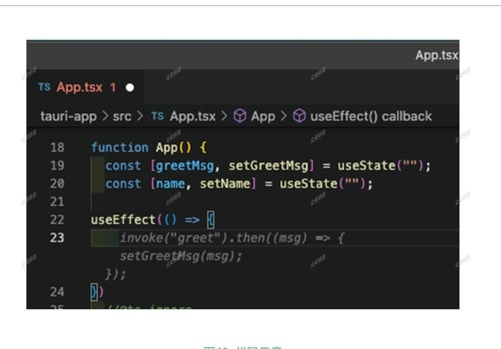

## Page 34
当开发者输入`<Welcome`时，AIGC可以自动提示`name`属性，因为它分析到`Welcome`组件需要`name`这个Props。

在后端Java开发中，AIGC可以通过分析方法的参数、返回值、变量类型等自动补全代码。

例如：

```
public String sayHello(String name) {
    return "Hello " + name;
}
```

String greeting = sayHello("Jack");

当开发者输入`sayHello（，AIGC可以自动提示Stringname`作为参数，因为它分析到`sayHello`方法需要一个`String`类型的参数。

除此之外，AIGC还可以根据开发者的代码习惯和项目中的惯用表达，给出更加贴近项目语境的代码补全建议。并且，随着AIGC对更多代码的分析，其给出的建议可以更加精确和准确（见下图，AIGC代码补全的价值总结）。

|  根据方法定义和调用自动补全参数 | 根据组件Props定义自动补全Props值 | 根据方法定义和调用自动补全参数  |
| --- | --- | --- |
|  根据开发者和项目的上下文习惯给出更贴近语境的建议 | 随着对更多代码的分析，提供更加精确和准确的补全建议 | 极大减轻开发者的记忆负担，减少查阅参考资料的需要，提高编码效率  |

图41:AIGC代码补全的价值

## 开发代码自动优化场景

## 场景描述

在当前系统项目开发过程中，对当前系统的代码优化由其他开发人员对代码进行review，以发现可以优化的地方，在规避代码质量问题的同时，也发现性能优化点。

在开发新需求时，同时需要考虑对已有功能与性能的优化。

## AIGC应用

在系统开发中，AIGC可以自动分析前端和后端代码，检测出低效实现及重复代码，并给出优化建议，实现代码自动优化。

## ·前端代码优化

组件优化：检测出组件render函数中的低效实现，如不必要的重复渲染，并给出优化建议，如使用PureComponent或memo。

样式优化：检测出低效的CSS定义，如过度具体的选择器，并给出修改为更高级的选择器的建议。

性能检测：分析组件及界面性能，检测出导致低性能的代码，如大量计算在render中完成，并给出提升性能的建议。

代码重构：检测出重复代码和复杂的条件判断，并给出提取方法或重构建议，达到简化代码和最大限度复用的目的。

## ·后端自动优化

SQL优化：分析查询语句，检测出低效的SQL，如无索引的字段使用、隐式类型转换等，并给出优化建议。

## Page 35
算法优化：分析算法实现，判断算法的时间复杂度和空间复杂度是否达到最优，并在可能的情况下给出更高效的算法建议。

代码重构：与前端一致，检测出重复代码和过于复杂的逻辑，给出重构为方法或新类的建议。
性能提升：分析系统性能数据和服务器负载，判断是否存在代码级别的性能瓶颈，并给出提升性能的建议，如添加缓存、队列等。

设计优化：分析系统架构及数据库设计，判断是否合理，并在需要的情况下给出优化建议，如添加索引、拆分表等。

## 样例

系统开发中，通过使用AIGC对前后端代码进行优化

图42:AIGC对前后端代码进行优化

## 对后端SQL代码进行优化


图43:AIGC对后端SQL代码进行优化

## 开发代码测试用例自动生成场景

场景描述
在当前系统开发过程中，由开发同学在代码编写的过程中，结合业务需求和实现逻辑进行代码测试用例的编写和开发面临以下挑战：

- 开发进度压力：开发人员需要同时完成产品开发与测试用例编写，容易导致时间不足和工作量过大，影响开发进度。
- 测试覆盖率不高：开发人员过于熟悉自己的代码，容易忽视边界用例和异常流，导致测试覆盖率不足。
- 产品熟悉度不足：测试人员由于更熟悉产品细节，更容易设计到全面并且边界的测试用例，开发人员相对产品熟悉度不足，测试用例质量可能受限。
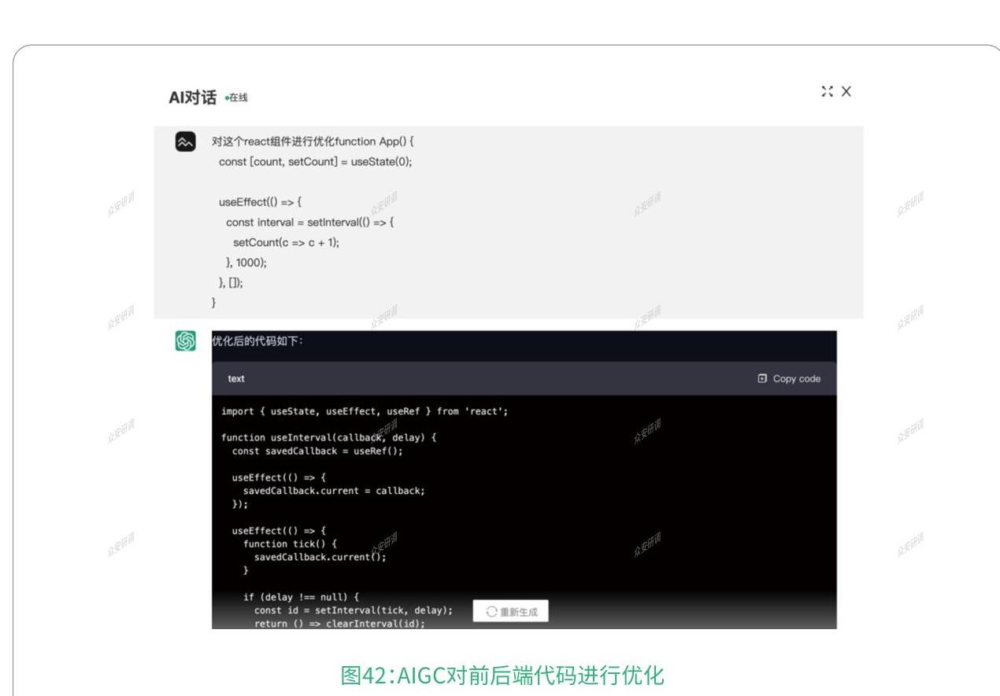
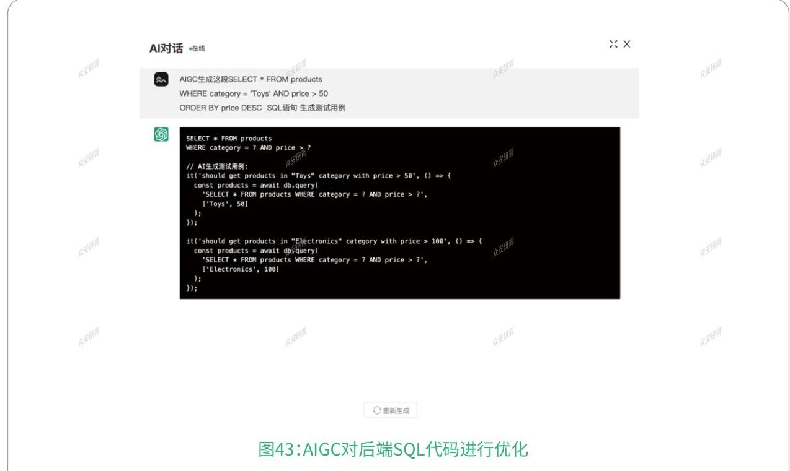

## Page 36
- 缺乏客观性：开发人员编写的测试用例可能难以保证客观性，更倾向于验证代码的正常流程，而非寻找潜在bug。
- 产生遗漏：开发及测试工作同时进行，缺少相互review的过程，更易产生测试遗漏和疏忽。


## AIGC应用

AIGC可以在系统开发的不同阶段中，自动化生成测试用例，实现自动化测试，提高系统的稳定性和健壮度。在使用AIGC进行自动化测试时，需要注意选择合适的测试工具和方法，并根据具体的项目和需求进行相应的配置和调整，以确保测试的准确性和覆盖率。

## - 前端测试用例生成

生成组件快照测试用例：AIGC可以分析组件代码，提取组件的Props和状态，自动生成对这些Props和状态各种组合的快照测试用例。

生成接口测试用例：AIGC可以分析系统接口及接口参数，自动生成覆盖各种参数组合的接口测试用例。

生成异常场景测试用例：AIGC可以模拟可能的异常输入和错误数据，生成相应的异常测试用例。

## - 后端测试用例生成

生成服务测试用例：与前端接口测试用例相同，AIGC可以自动生成覆盖服务各输入参数组合的测试用例。

生成SQL测试用例：AIGC可以分析项目使用的SQL语句，自动生成覆盖不同查询条件、过滤条件及参数的SQL测试用例。

生成算法测试用例：AIGC可以分析算法的定义和约束，自动生成覆盖逻辑分支的算法测试用例。

生成安全测试用例：AIGC可以通过尝试生成各种非法输入，自动生成相应的安全测试用例对系统安全性进行测试。

## 样例

通过使用AIGC对前端代码进行测试用例的生成
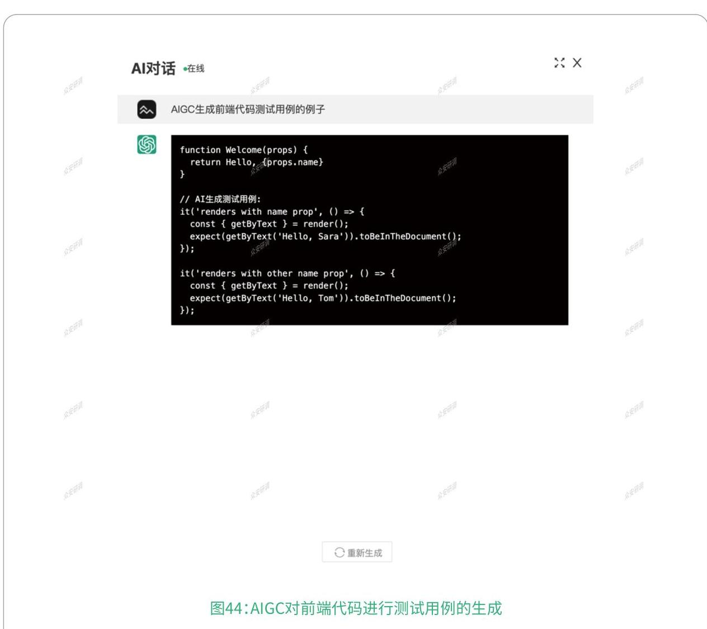

## Page 37
通过使用AIGC时后端代码进行测试用例的生成

以上是几个使用AIGC生成前后端测试用例的例子，AIGC可以自动生成这些测试用例覆盖不同的输入条件和参数组合，保证系统的正确性，同时也大大减轻工程师手工编写测试用例的工作量。

## 运维场景：智能脚本生成助造数，辅助分析告警思路清

DevOps是一种加强研发团队协作、沟通和自动化的软件开发方法论，DevOps行业经过云原生技术的支撑和发展，在工具、方法论和落地维度日渐成熟。但是整个研发运营一体化的还有很大的提升空间，DevOps的终极目标是创建一个更快、更稳定和更高效的软件开发流程来满足现在软件开发的要求。而DevOps最核心的能力要求就是自动化从而减少人为错误、提升沟通和协作效率，节省开发时间。AIGC在传统自动化的基础上给出了一个DevOps新范式，即通过用户描述即可以基于代码的场景自动完成，从而把自动化程度引入了另外一个维度，他的生产力可以极大地提升DevOps的理念。

在企业内部DevOps团队往往工作负担过重，有大量的重复性脚本工作和问题亟须处理，很难有时间去处理各种高优先级的任务，基于AIGC的应用比如虚拟助手可以非常方便地提升整个团队关于部门工作的内容，从而释放DevOps人员的时间和精力，DevOps场景使用AIGC应用的好处其可以理解自然语言并且能够生成人可以理解的回复，这使得其可以成为理想的自动化工具用来处理基础设施管理、事件管理和合规管理。

DevOps的目标与AIGC的使用场景十分契合，因此在企业级开发运维场景中如何更有效地发挥AIGC的能力，同时AIGC在DevOps场景中有哪些注意点，本文主要从以下四个维度进行分析与展开。
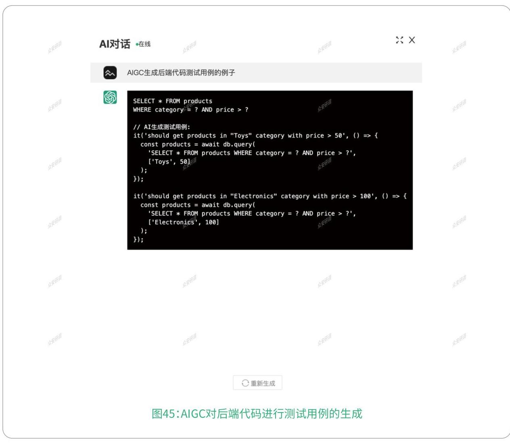

## Page 38
## 脚本生成场景

## 场景描述

DevOps流程中会涉及各种脚本的编写的过程。包括：Dockerfile、Kubernetesmanifest文件、Shell脚本、SQL脚本、构建脚本、报文格式化、JonPath定位等等。在传统DevOps过程中需要业务开发人员甚至DevOps工程师去完成这部分工作，通过AIGC应用，这部分工作可以由AI自动完成，其效率和正确性非常地高。

传统DevOps场景中要进行脚本的编写主要通过业务人员或者开发人员自己通过手工的方式完成。

## AIGC应用

通过ChatBot会话的形式利用AIGC的能力自动生成脚本文件，填充到场景中去。

## 样例


图46：脚本生成场景应用案例

## 模拟造数场景

## 场景描述

DevOps场景中经常涉及很多造数的情况，比如非生产环境的Demo数据，API测试的Mock数据等。在传统的使用方式中需要用户花费时间和精力通过工具去生成这些数值，利用 AIGC的能力可以非常方便地完成这个过程。

传统场景下，需要针对各种不同的场景集成各种不同的工具来完成造数的能力。

## AIGC应用

AIGC场景下不需要集成多种外部工具，通过ChatBot和Prompts的形式就可以完成自动造数和数据填充的能力。

## 样例


图47：模拟造数场景应用案例
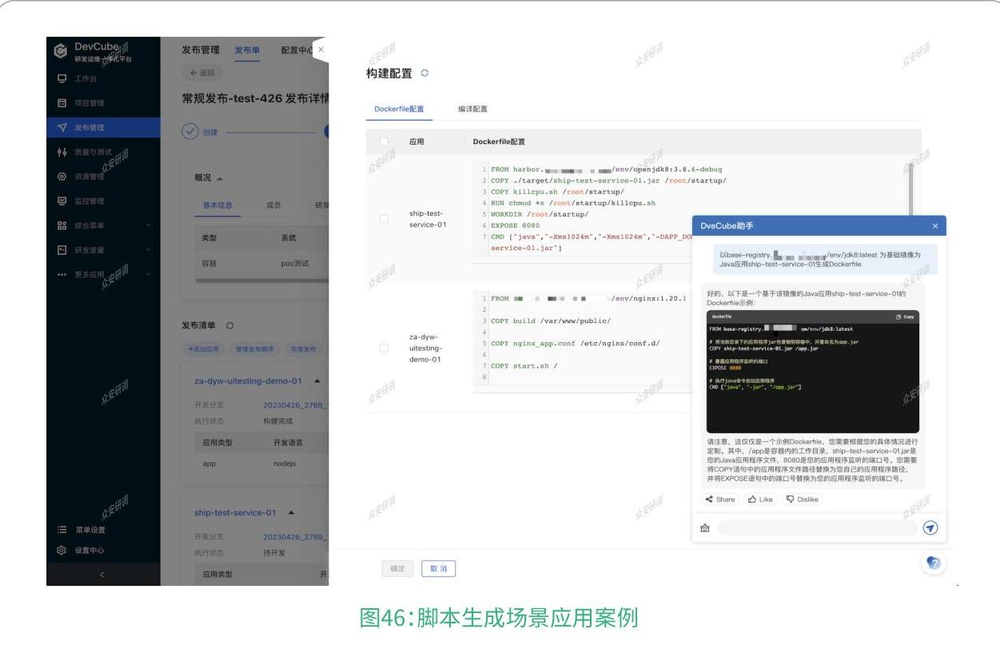
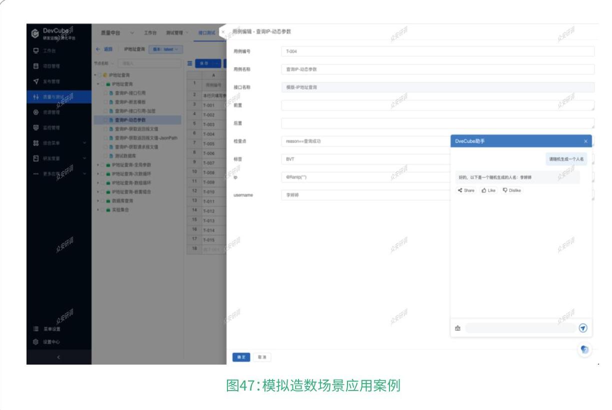

## Page 39
## 异常分析场景

## 场景描述

DevOps场景中经常会遇到各种异常的情况，利用AIGC应用可以有效地分析问题的根本原因，给出解决问题的思路，帮助用户从单调的异常堆栈中解脱出来，进行问题的根因追溯并快速找到有效的解决方案。比如：协助构建及发布过程中失败异常的快速定位及修复建议、将整个修复的思路及过程自动化、发布过程中的参数建议、发布失败的原因分析等。

传统场景下出现异常，需要人为分析异常的原因，根据异常堆栈去向问题可能引起的原因。

## AIGC应用

找到日志异常点位，直接发送给助手，完成一个问题错误的原因及可能性，快速实现问题原因分析。

## 样例


图48：异常分析场景应用案例

## 告警分析场景

## 场景描述

通过分析监控工具提供的数据，AIGC可以快速进行深度分析确定问题原因，从而更加主动和积极地去快速定位问题，例如：通过告警数据采样中的异常信息快速分析问题的原因，追踪问题的根本原因，从而快速解决问题。

传统场景下告警异常需要人工去排查异常的可能性场景及问题，需要人为手工写解决方案。

## AIGC应用

根据告警异常情况，利用AIGC进行异常情况分析，并自动给出解决建议方案。

## 样例


图49：告警场景应用案例
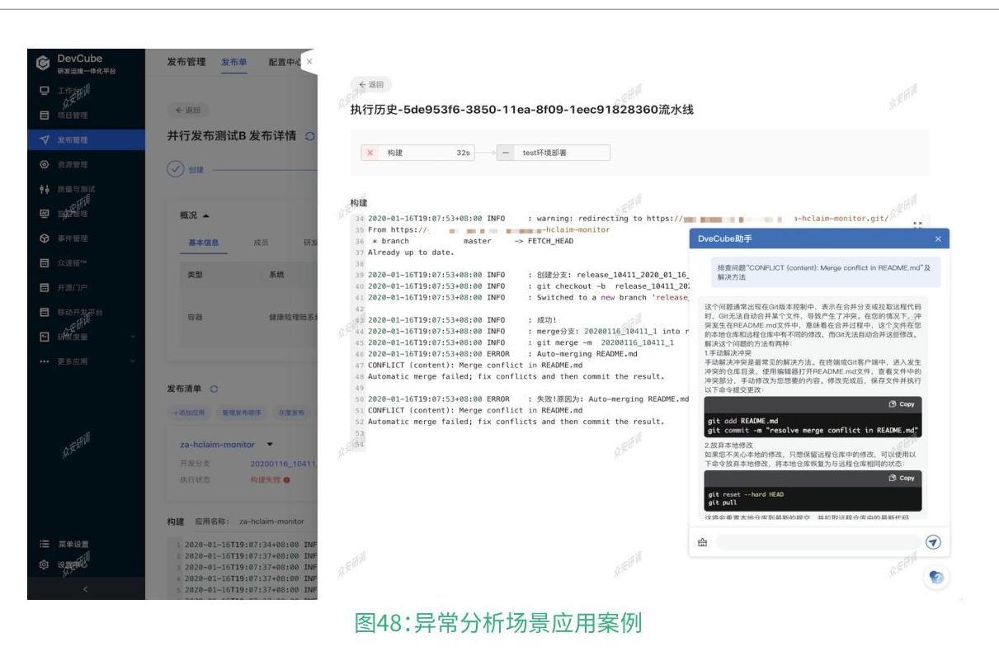
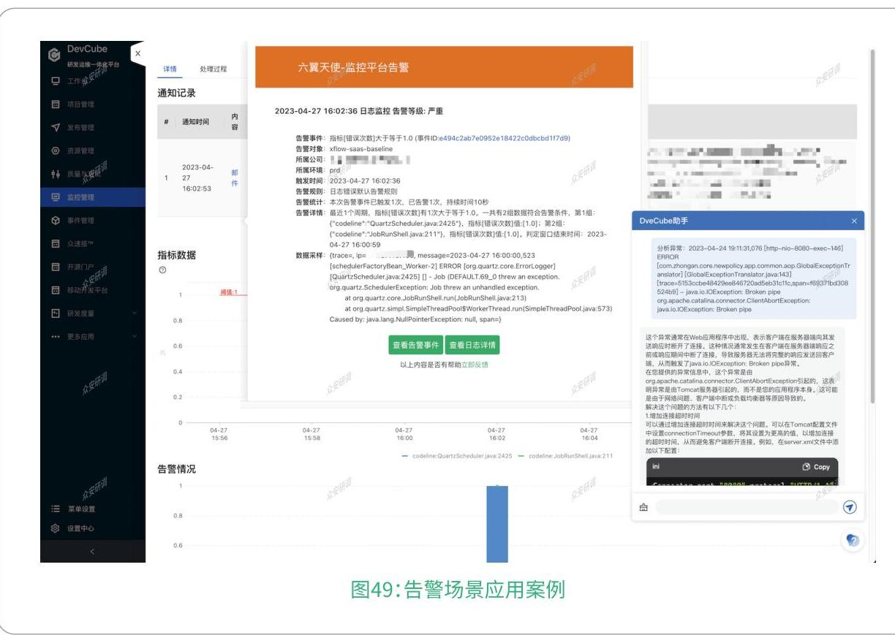

## Page 40
## 需求分析场景

### 场景描述

根据业务需求目标描述，利用AIGC进行需求的详细分析及拆解，协助业务分析人员理清需求的实现思路，加速需求的快速实现与落地。结合需求分析的阶段自动进行开发任务的拆解，节省人工拆解带来的人力成本与时间损耗。

传统场景下需要业务分析人员或者产品经理进行人工详细的分析与设计。

### AIGC应用

利用需求描述作为Prompts自动进行分析，将分析结果提供给业务分析人员或者产品经理，帮助用户理清思路，节省损耗。


图50：需求分析场景应用案例

## 知识协作场景

### 场景描述

工作过程中体量庞大的文档知识库查找效率非常低下，利用AIGC的能力构建DevOps场景下的知识问答助手，可以帮助用户在使用DevOps过程中快速获取精确的知识内容。

### AIGC应用

利用Embeddings[1]能力进行文本的向量化处理，存储、结合用户问题及向量数据库中的搜索结果利用AIGC的能力返回数据。

### 样例


图51：知识协作场景应用案例
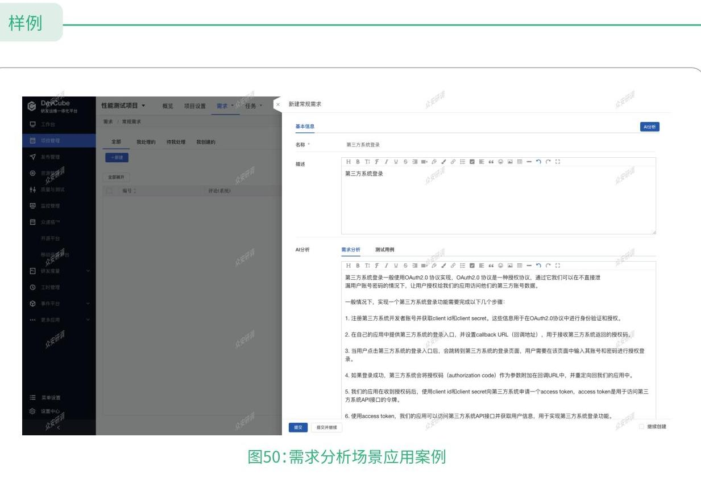
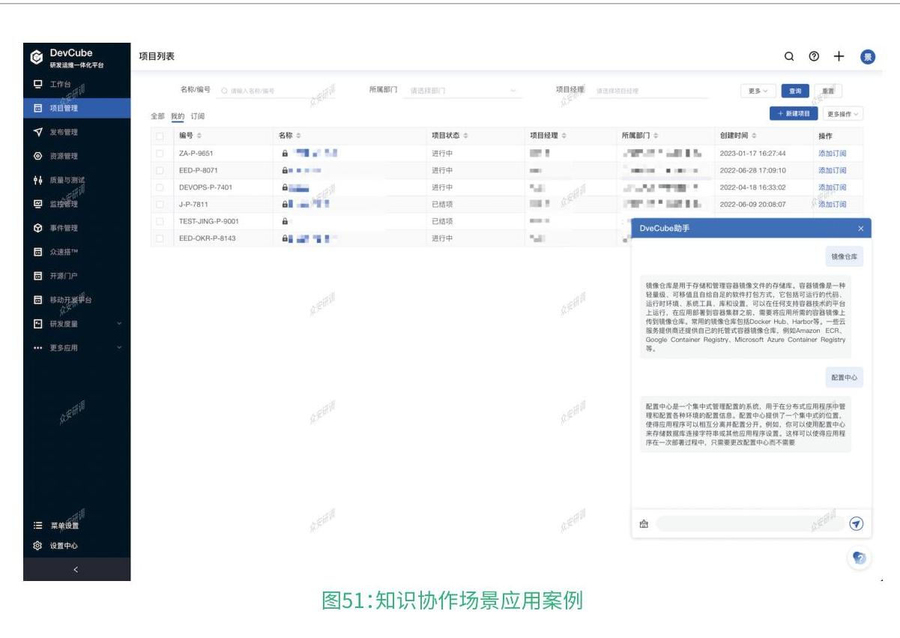

## Page 41
# AIGC应用搭建克难有方案 先行企业建设经验可参

AIGC可以在多个维度上赋能保险场景，例如智能客服、企业内部知识/规章制度、文案生成、研发运维场景提效等，但是不同场景对于AIGC大模型的要求不同，在众多企业的场景中如何通过大模型的选择并提供企业级的MaaS12能力，基于场景的应用开发如何快速地落地，是AIGC爆发式增长的大背景下所有企业面临的主要问题，接下来我们就会从问题与挑战、众安MaaS平台建设思路、AIGC在众安保险的落地场景等几个维度提供一种企业级AIGC落地的方式和途径进行讨论。

1. 模型的服务（Model as a Service, MaaS）是一种云计算模式，它提供了一种将机器学习模型作为服务（MaaS服务）的方式，允许用户在不需要拥有自己的硬件设备或专业技能的情况下，将物品质量好的器学习算法过程模型。

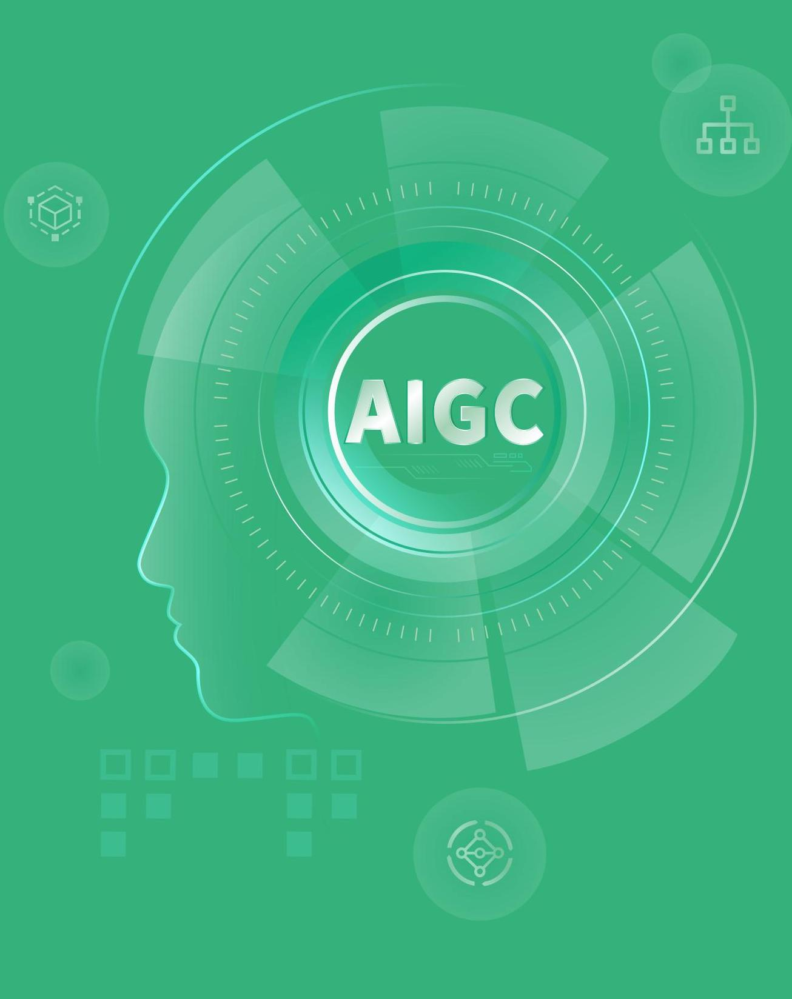

## Page 42
## 1模型选择综合考量 开箱即用需克难题

## 模型选择：数据扩展等多方考量，综合考虑自身适用度

构建企业级的MaaS服务首当其冲需要考虑的就是模型选择问题，各种AIGC模型层出不穷，企业级的MaaS应该具备什么样的能力，不同业务场景对于模型的要求不一样，不同体量企业在底层大模型的选型思路上也会有不同的情况。基于已有的在线模型服务去构建企业内部的MaaS能力还是以私有化训练的大模型为基础，或者混合的平台构建方式，各个企业应该根据自己的实际情况进行选择。

多模态大模型产业迎来爆发性的增长，各大头部厂商纷纷对外推出自己的大模型。多模态大模型在选择方面有以下的问题与挑战：

## ・模型选择的复杂性

多模态大模型中涉及多个模态，每个模态都可以使用不同的模型来处理。因此，在选择最佳模型时需要考虑不同的模态和模型之间的交互作用。

## ・数据集的选择和准备

多模态大模型需要大量的数据进行训练，但是不同模态的数据可能来源不同，格式不同，标注不同，因此需要对不同数据进行处理和清洗，并选择合适的数据集进行训练和验证。

## ・计算和存储的成本

多模态大模型需要大量的计算资源和存储资源，需要考虑如何有效地利用资源来训练和部署模型，同时保证计算和存储成本的可控性。

## ・模型的可扩展性

在多模态大模型中，新的模态可能会随着时间的推移而增加，因此需要考虑如何扩展现有的模型，以适应新的模态和数据源。

## ・模型的解释性和可解释性

多模态大模型可能难以解释其决策过程和结果，因此需要考虑如何提高模型的解释性和可解释性，以增强模型的可信度和实用性。

## ・私有化部署或引入公有模型服务

对技术门槛、技术投入，以及数据敏感性需要有综合性的考量。

## 研发挑战：场景适配兼容统接口，规避数据风险控成本

在底层模型的能力选型之上，如何更加方便地为企业内部开发人员提供"开箱即用"的应用开发方式，从而屏蔽不同模型带来的开发损耗是下一个面临的挑战。企业应用开发有以下需要解决的问题：

・各类大模型的适配，向场景研发提供统一的API能力，考虑到当前的大模型服务各有优劣，进行通用化适配会是一个合适的选择。

・如何有效地实现在大模型使用过程中对政治敏感词汇或者企业敏感数据规避。
・多模态大模型使用上的量化问题，以进行成本管控与分析。
・如何对大模型服务进行增强，微调企业特定领域的数据，以适应企业专有的业务场景。
・开发维度如何兼容并使用不同的大语言模型。

## Page 43
# **模型适配能力需求 自研落地优选插件**

## **模型选型：基座考虑需求及能力，构建企业级MaaS能力**

目前市场上出现了越来越多的大模型，有开源的大模型，也有提供在线大模型服务的，不同大模型在参数量级和表现能力上各有差异，企业要构建自己的MaaS能力，需要考虑以下方面的问题：

- **大语言模型解决问题的场景**：不同的场景对于大语言模型的要求会有不同，比如：智能客服场景，知识问答场景。
- **生成式预训练模型的选型**：在语言模型的选择上，企业需要基于场景考虑，如果是生成式自然语言为基础的场景，比如：文案生成、知识问答等，更多地需要考虑类GPT模型。
- **微调成本和损耗问题**：基于预训练的大模型进行企业级的微调在成本上仍然非常有挑战，企业需要根据自己的情况评估是否需要基于离线大模型进行微调，目前已经出现基于一些开源预训练大语言模型（如BLOOM、LAMMA、GLM等），使用由AIGC生产的数据（不包含任何其他数据），并加持LORA模型进行加速组成的研发范式。
- **开源模型的协议问题**：目前很多开源的大模型基座在开源协议上仍然禁止商用，这个是很多公司采用开源大语言模型所面临普遍性问题，企业在选择开源基座的时候需要详细考量：

|  机器公司 | 模型名称 | 面对能力 | 讨论  |
| --- | --- | --- | --- |
|  OpenAI | GPT | 否 | 否  |
|  Facebook | Lamma | 更 | 更  |
|  百度 | Emix | 否 | 否  |
|  Google | Bard | 否 | 否  |
|  阿里巴巴 | 通义千码 | 否 | 否  |
|  深圳大学 | GLM | 更 | 更  |
|  微软 | OpenAI Service | 否 | 否  |
|  BigScience | Bloom | 更 | 更  |

#### 直研策略：微调算法算力成本高，插件轻量级解决方案

- **应用建设思路**：如何合理利用预训练的大模型进行企业级的应用自研，有两种思路可供选择：一种是基于微调的方式，一种是利用插件方式。
- **微调方式**：各种大语言模型都提供了微调的方式来基于预训练的模型进行企业级场景的落地能力，预训练基础模型已经在基础能力和质量方面提供了比较好的保障，需要在大模型的基础上基于企业场景的任务进行微调就可以提高模型在下游任务上的表现。
- **微调需要以下阶段来完成**：
- 1. 准备企业级任务场景微调的数据集
- 2. 选择大模型基座和微调方法，在模型基座的选择上需要考虑：
    - 任务场景，不同的任务场景对于大模型基座的要求不一样。
    - 模型的输入/输出大小。
    - 数据集的大小。
    - 计算资源是否满足微调的需求。
- 3. 加载预训练模型
- 4. 模型微调
- 5. 性能评估
- 6. 选择合适的训练模型版本部署使用
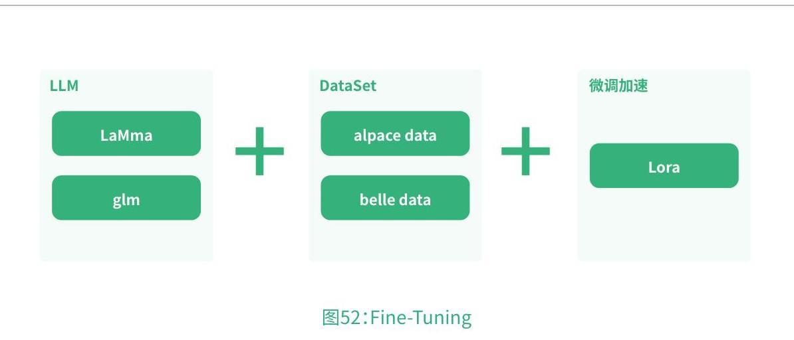

## Page 44
大模型都提供了微调的方式。OpenAI也提供了GPT-3模型的微调方式。但是微调大模型还是一个比较困难的事情，主要体现在，需要一定的算法能力，对于机器资源和成本要求比较高。

## - 循件方式

如何利用企业本地的数据源结合AIGC的能力，是一个相比较微调更可落地的方式。将插件和本地数据源进行整合，利用文本向量化的模型将文本和数字表达存储在本地，结合用户问题提示，利用AIGC的能力返回更合适的响应是一个比较轻量级的解决方案。

我们看到一个基于AIGC的应用开发框架可以实现这些能力，比如LangChain。在知识库、智能问答场景下，通过将本地的文本数据通过文本转向量模型将数据化表达存储下来，然后结合问答及查找内容利用大模型的能力生成合适的响应。

## Page 45
# **|** 先行公司架构已建 安全可用六项能力

## 平台架构:三重架构搭建助隔离, 规模场景应用可复制

基于企业在AIGC与业务场景融合时可能会遇到的问题与挑战, 结合众安在企业内部的落地实践的思考, 本报告总结了一条可参考复制的、适合进行AIGC大规模场景化应用的路径:

建设统一的AIGC应用研发框架, 为上层应用场景提供统一的大模型研发基础能力。研发框架面向大模型端, 实现对各类MaaS服务的能力进行适配包装, 以实现一次研发, 多端适配;

在面向应用场景端, 则提供统一的标准化API能力, 包含会话等, 降低应用场景研发的复杂度。

众安AIGC应用研发框架为众安内部场景研发提供统一的架构标准, 从架构设计上分为MaaS模型即服务层, 大模型应用框架层及应用场景层, 通过不同的分层能力给企业内部的各种基于AIGC的场景提供基础的模型服务和开发能力。

建设企业级的MaaS服务平台, 主要从以下三个维度进行考虑:

- 利用开源的预训练模型进行离线部署提供基础的大模型能力
- 利用在线的大模型能力提供各种AIGC需要的场景模型能力
- 根据各种不同的AIGC场景结合在线与离线提供开箱即用的能力


图53: 众安AIGC应用研发框架

## 平台能力:适配扩展性助力应用, 审计检测辅合规安全

### 适配能力

AIGC研发框架对大模型的使用场景进行抽象, 建设统一AIGC服务网关。网关通过API转发的方式, 对MaaS服务的关键接口, embeddings等进行包装, 并屏蔽模型密钥等信息, 在场景应用端适配会话、流式会话能力, 在模型嵌入企业内部能力方面适配插件、文本嵌入及微调能力。

### 审计能力

在对大模型服务进行使用时, 无法彻底规范用户的合理性输入及模型服务的合理性输出, 因此AIGC服务网关中需具备审计能力, 以加密存储的方式记录用户的输入输出。风险事件发生时可基于审计日志进行事件回溯。同时也可以侧面规范用户对AIGC应用的使用。

### 敏感词检测

敏感词检测, 允许我们提前识别潜在用户输入风险, 在AIGC服务网关中以通配符、敏感词知识库模型等的技术方式进行用户敏感词检测。拒绝非法输入输出, 有效规避政治敏感、数据敏感等的事件发生。
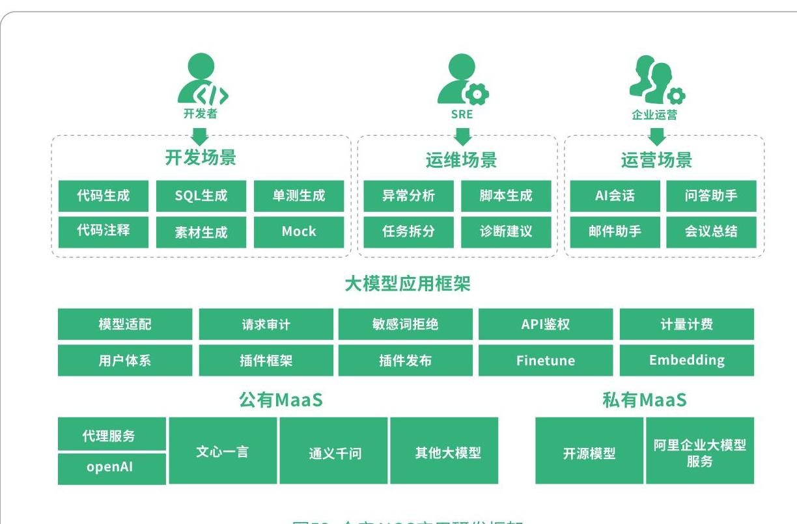

## Page 46
## API鉴权

API鉴权是指在使用大模型服务API时对用户或应用程序进行身份验证和授权的过程。API鉴权包括两个步骤:

STEP1：身份验证和授权：身份验证是指验证API请求发送者的身份信息，授权是指检查API请求发送者是否有权访问请求的资源或执行请求的操作。

STEP2：众安AIGC服务网关采用JWT方式进行API鉴权，要求应用程序或者用户请求中携带安全声明进行验证和授权。

## 计量计费

AIGC服务网关设计有API和使用用户维度的计量计费，区别于大模型服务的按输入输出token进行计量计费。众安AIGC服务网关采取的较简便的计量方式：输入输出流量。计量计费可以帮助API提供者提供更加精细化的服务，并能够让API使用者更好地控制成本。对于API使用者来说，计量计费可以让他们更加明确API使用的成本和效益，从而更好地规划业务。对于API提供者来说，计量计费可以提高API的盈利能力，同时也能够更好地管理API资源，保证API的可用性和稳定性。

## 插件框架

插件能力：大模型服务插件允许多模态大模型访问最新信息。运行计算或使用第三方服务，使得大模型服务可以通过企业API来获取相关知识。插件的工作流程如下图：
$\cdot$用户向模型服务发起请求
$\cdot$模型服务根据问题或请求进行意图识别，与插件的描述文件进行匹配，选择合适的插件
$\cdot$模型服务将问题或请求作为参数传递给插件
$\cdot$执行企业接口，获取结果，将结果返回给模型服务
$\cdot$模型服务对结果进行包装生成返回给用户

插件开发框架：模型服务的插件一般会包含执行接口、清单文件和规范文件三个部分。

|  执行接口 | 清单文件 | 规范文件  |
| --- | --- | --- |
|  插件执行时具体要做的动作，可以在此处进行企业行为定制，并返回对应的执行结果 | 用于记录插件的基本信息和API服务身份验证设置，当向模型服务发布插件时，模型服务会在后端查找此文件 | 对执行接口的描述，允许计算机理解执行接口的功能。模型服务进行意图识别之后将会对此文件进行检索匹配，以找到最合适的插件  |
|   | 图55：模型服务的插件 |   |

考虑到不同的模型服务在插件的设计上会有差异，因此可设计一套用于适配不同模型服务插件的插件研发框架。插件研发框架主要包含插件行为、插件描述及模型服务适配器三个部分。

插件行为为标准Restful接口，采用Springboot框架作为基础web框架，业务逻辑层可进行企业内部执行动作实现。

插件描述通过javaannotation实现，对Restful打上标准注解，进行规范信息、基本信息和身份验证信息等的声明。

模型服务适配器可通过在编译时读取插件描述注解，并基于注解的参数声明以及各模型服务的插件标准生成对应模型服务要求的清单文件和规范文件。
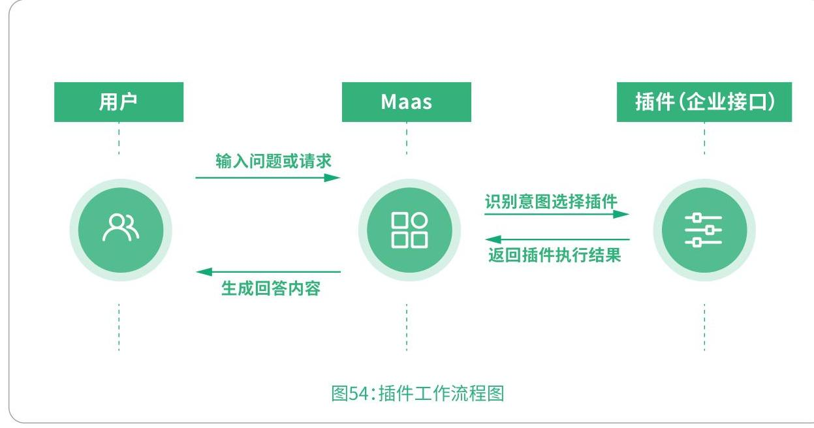

## Page 47
- 循件发布

众安AIGC应用框架提供统一的、适配各大模型服务的插件推送能力。该组件以http接口形式存在，可打通企业CICD流程，以webhook的形式，执行插件构建部署的时候执行插件推送接口，实现插件的多端发布。

插件研发框架与插件发布组件的存在，可以让企业实现一次插件研发，多端模型服务适配，极大提升大模型服务实践应用在企业私有能力增强方面的研发效率。

### 接入AIGC深度理解能力，Maas平台实现智慧响应

通过企业级的Maas平台接入AIGC大模型，利用IIGC的深度理解能力，可以实现Maas平台的智慧响应，以智能客服为例。智能客服是比较早使用人工智能的场景之一，但是由于AI本身的问题，不管是语音对话方式还是文本对话方式，智能客服很多时候给人的感觉是不够智能，主要原因在于AI对于自然语言的理解和响应还不够高级，以GPT为代表的大模型向智能客服场景之前问题给出了答案，基于大模型的生成式AI的自然语言理解和响应让用户的体验大幅提升。

企业级的Maas平台利用接入大模型的方式可以克服此场景下的问题，以众安的智能客服场景为例。我司在很早之前就投入了大量的人力和财力构建了智能客服的AI落地场景，并且在实际的保险客户场景中完成和用户的对话与沟通。其主要核心逻辑是利用文本向量化与相似度匹配技术结合NLP能力，进行答案数字化表示，再进行本地存储，随后利用相似度匹配根据用户的问答进行答案的查找。


由于NLP能力的缺陷，存在上述场景说到的用户感知的问题，在生成式大模型的能力增强的情况下，企业结合生成式大模型建立的Maas服务能力可以大幅提高之前智能客服存在的缺陷。

众安构建的Maas服务平台利用AI的能力，构建了智能问答的场景，基本实现逻辑包括：文本向量化、数据本地存储。根据用户的问题进行相似性答案响应，在Maas服务的基础之上需要进一步结合大模型的能力，将问答结果通过大模型的能力更加人性化，形成以提示工程为沟通层，以大语言为内核，以本地数据为源头的智能客服与问答系统，利用生成式AI完成智能客服的场景。
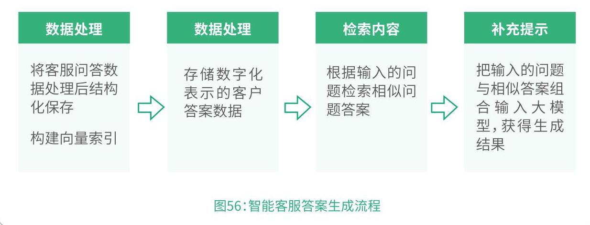
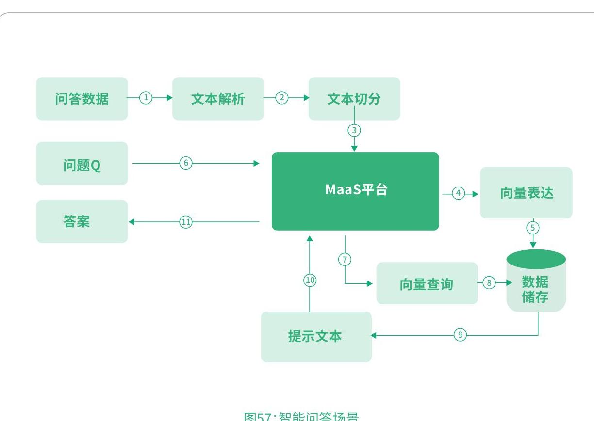

## Page 48
## 限制风险仍需关注 经验技巧实现协同

随着AIGC技术的广泛应用，我们还需关注其潜在的限制和风险。具体如下：

## 数据质量与语义理解

高质量数据可以提升大模型在领域的精度与专业性，进而增强大语言模型的实用性。具体来讲， LLM模型在处理分布之外的数据、数据域变化等情况下具有更强的泛化能力，因此相比微调模型更为适用。当已标注数据有限时，LLM模型也更具优势。但如果已有丰富的标注数据，则LLM和微调模型都是可行的选择，需要根据任务需求进行选择。

## 安全风险与数据保护

企业间答助手涉及企业敏感数据传输和存储，需注意数据安全保护。AIGC大模型也存在被恶意攻击的风险，如注入有害数据或使用攻击性文本。在使用生成式AI时，需要对数据进行加密和安全措施，保护企业和客户敏感数据。

## 误解风险与用户需求

AIGC可能出现误解用户问题或回答不准确的情况。企业需对回答进行审核和纠错处理。此外，企业间答助手需精准满足用户需求，不准确的回答可能影响用户体验。

## 代码自动补全限制

AIGC在复杂编程语言和框架方面准确性可能不高，无法完全替代人工编写。此外，AIGC可能产生不必要的代码、泄漏机密信息、引入安全漏洞等。开发者需适度依赖AIGC以发挥人与AI的互补作用。

## 输出格式与结构问题

AIGC在生成文档和报告时，输出格式和结构可能与需求不符。使用者需通过一定时间的培训和学习来提高技巧和经验。

## 数据安全风险

使用AIGC时需将输入发送至OpenAI服务器，存在企业隐私泄露等风险。企业需建设配套的数据安全保障机制，采用对原始数据中关键信息进行替换、混淆或剥离的方式进行脱敏，并在AIGC返回结果后进行还原形成最终的报告和文档。

## 依赖度和学习曲线

AIGC对项目代码的精确度依赖于分析程度，在初期可能给出较为笼统的提示。开发者需经过一定的学习过程才能达到更高的精确度。对于全新的API或语法，AIGC无法立即给出提示，开发者仍需查阅文档。

## 无法完全理解开发者意图

AIGC无法完全理解开发者的思路和意图，其给出的代码提示可能不是开发者想要的。开发者需进行判断和选择，以确保结果符合预期。

## 垂直领域和企业内部知识限制

AIGC在垂直领域和企业内部知识方面知识有限，生成的文本可能存在事实和逻辑错误。更合适的方式是将AIGC作为辅助工具，生成初稿后由人工进行复核和订正，确保真实准确。

尽管AIGC在诸多场景下展现出强大能力，但其限制和风险不容忽视。在实际应用中，企业应全面考虑数据质量、语义理解、安全风险、误解风险、用户需求等问题，确保模型的准确性和可用性。同时，开发者和使用者需掌握相应技巧和经验，结合人工智能和人类判断，实现最佳的协同效果。

## Page 49
# AIGC置入众安科技产品打造系统应用全新体验

众安科技自成立以来长期致力于自身科技能力的对外输出，形成了一系列极富竞争力的产品：智能营销平台、保险核心业务系统、经代信息化系统、DevCube研发运维一体化平台、数据产品等。

科技产品项目实施过程长期存在着通用的难点：内容的生成成本高、产品学习上手困难、业务指导能力弱等问题，基于AIGC类大模型的能力涌现，提供了新的破局思路：将AIGC大模型的能力，结合保险业务经验，深度融合到科技系统中，全面提升产品易用性、业务价值。

围绕全系列产品的现有架构，本篇章将阐述现有架构中与AIGC的结合点，并通过场景化的描述，清晰展现AIGC结合后应用场景价值和应用过程。

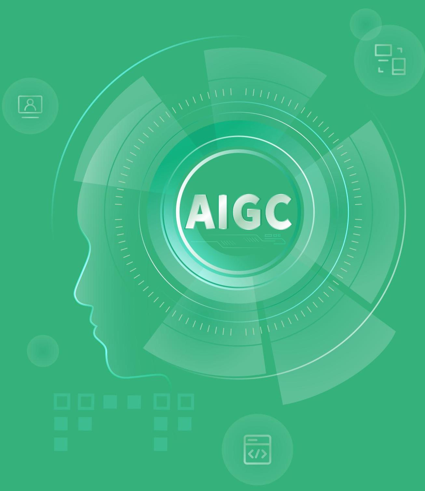

## Page 50
第四章 | AIGC置入众安科技产品 打造系统应用全新体验

# 科技内核持续创新 协同生态共创共赢

众安科技成立于2016年，是众安保险下属全资子公司，在国内比较早致力于自身科技能力的对外输出。众安不仅将自主研发的前沿技术对内支撑业务，也愿意与生态客户共同进步，助推行业高质发展。

基于人工智能、大数据、云计算等前沿技术的探索与研发，融合众安生态优势，经过实际业务验证，打造了“科技+服务”的价值交付体系。围绕三大标准化科技产品系列——业务增长系列、业务生产系列、业务基建系列，以及战略轻咨询、全域数字化运营、技术共建等定制化服务，为企业级客户提供咨询、规划和交付的全链路数字化转型解决方案，助力客户实现业务快速增长，加速数字化转型升级。至今，众安的国内外科技输出客户超700家，覆盖银行、保险、券商、高端制造、互联网平台等多个行业。

## 众安核心产品介绍

### 智能营销平台

围绕拉新获客、线上营销、客户私域运营转化的全生命周期运营，具有线上营销数据全链路打通、灵活创建营销活动策略筛选客群精准触达、客服一体的企微私域运营等特点。

### 保险核心业务系统

保险业务平台产品覆盖从保险销售到保险作业及服务的全业务流程。其中商品中心通过提供组件化的配置能力帮助保险公司实现产品销售页面的配置，达到产品快速线上销售的目标，ToB开放平台助力保司快速、高效的链接渠道，解决渠道对接慢、成本高的问题。而产品工厂、承保中心、理赔中心、健康管理则以提升保司运营效率，提高客户服务体验等为目标，增强保司整体运营作业及服务能力。

### 经代信息化系统

数字化经代中台，围绕经代机构业务，建立全流程保险服务体系（包含人管、业管、业财对接、保司对接、监管报送等环节）。ToA、ToB、ToC完整场景的数字化工具支持，为经代公司提供经过业务验证的数字化营销和运营工具，打通线上和线下，从获客模式、出单模式、服务模式、推广模式、学习模式等方面，全面改变保代公司工作模式，帮助其提高服务效率、提升产能。

### DevCube研发运维一体化平台

DevCube是基于DevOps理念所研发的研运一体化工具，提供端到端工具集成、信息资产流转共享、流程融入工程平台、能效显示与精益改进，实现统一版本管理、释放人工资源、进度/质量可视化、自动化运维管理，提高交付效率和质量。

### 数据中台

数据中台覆盖数据管理体系、数据流通体系、数据价值体系，提供数字资产全盘视图，覆盖数据采集、加工、治理、流通等全生命周期，解决中大型企业数据治理过程中数据库种类复杂、更新效率低、维护难度大、安全管控粗、强依赖专业人才等痛点，有效加强企业数据治理水平，提升整体数据价值。


图58：众安科技产品服务能力全景图
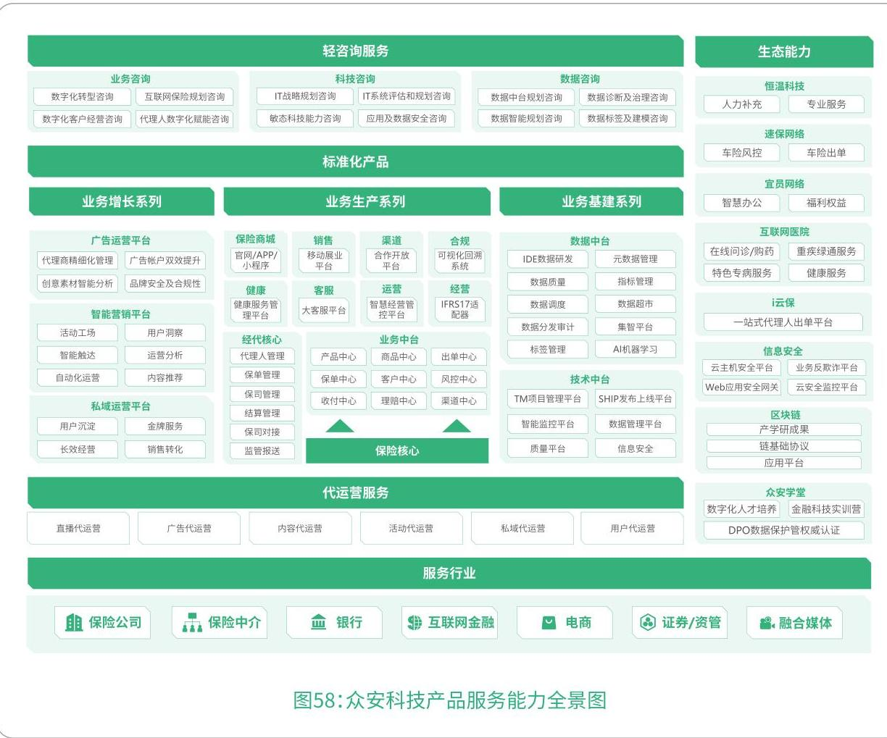

## Page 51
# 科技输出行业痛点 

在过往众多客户项目实施落地过程中，我们发现科技产品输出过程往往存在以下问题：
$\cdot$产品冷启动过程内容不足：类似营销运营场景中，需要大量文章海报、短视频拍摄、直播等内容，而内容创作型的工作依靠人力，成本高，同时难以短时间内填充大量合适内容。
$\cdot$系统复杂，学习使用成本高：尽管在产品设计和迭代过程中，不断优化产品UI交互，或者设计通用模板降低学习成本，但整体的人机交互方式，依然需要使用者具备理解学习能力按照系统的逻辑进行输入、操作等。项目实施中需要大量人力进行系统使用培训等工作。
$\cdot$业务运营管理方面，系统智能化有待提升：不管是营销系统的效果分析、核心系统的理赔运营管理，还是研运过程中的项目管理，实际业务方不仅需要完成业务流程，更需要给出业务优化建议。过往这方面的业务运营发现，对专业人员经验依赖性高，系统不具备指导业务优化的能力。

结合我们现在对ChatGPT这类生成式AI的特点认知，我们认为上述科技输出过程的问题有望通过AIGC提供更优的解决方案来改变：

## 生成内容类的

## 智能和人力援助

通过生成式AI快速
产出相对不错质量
的一些文章、活动、
海报、视频

## 改变人机交互方式

通过对话进行需求说明，模型理解需求进行系统操作，让产品系统更容易入手使用

## 精确运营人员管理业务

对系统运营、管理，业务执行过程的数据分析汇报等工作可以实现自动化

图59:AIGC提供的更优解决方案

## Page 52
# AIGC产品内置升级 系统提升综合能力

基于上述分析，我们可以看到，生成式AI可以在众安的科技输出产品中提供强大的助力，系统提升众安科技产品的综合能力。众安科技已经在全系列产品中规划加入AIGC等大模型能力，并将不断实践探索应用场景。

## 智能营销平台：内容活动创作自生成，策略自动化理解生成

### 产品架构说明

在众安科技智能营销平台产品中，包括营销活动创建、营销人群圈选、营销内容触达、自动化运营策略配置、运营分析等模块，覆盖精细化运营全流程。

### AIGC结合点说明

众安科技智能营销平台的toC营销场景中，内容活动作为营销触达的核心抓手，过往需要投入非常多人力进行内容创作。结合ChatGPT类生成式AI能力后，营销平台不仅仅可以提供创作工具，还可以快速帮助客户完成内容创作，文章撰写、活动创作等，甚至是可以在自动化运营中自动地进行策略的理解和配置生成，从而更好、更快速地实现千人千面的营销触达。


### 营销自动化场景效果

在制定营销策略的过程中，以往都是以运营经验结合数据分析结果来做策略调整和优化，对于资历较低的运营来说应用MA10这类产品的门槛较高。MA产品能够接入ChatGPT来帮助运营高效快速地搭建用户旅程策略并提供有效的策略迭代方案。具体应用过程如下：

- 了解用户需求：ChatGPT可以与用户进行对话，询问关于他们的兴趣、需求和偏好的问题。通过对用户的回答进行分析和理解，可以收集关键信息用于用户旅程策略的生成。
- 生成初步策略：基于对用户需求的理解，ChatGPT可以自动生成初步的用户旅程策略建议，它可以根据用户的兴趣和偏好提供相应的产品推荐或行动建议。
- 与其他系统集成：ChatGPT可以与其他MA系统和数据分析工具集成，以获取更全面的用户数据和行为信息。这些系统可以为ChatGPT提供更多的上下文信息和个性化推荐，从而改善生成的用户旅程策略的准确性和实用性。
- 用户反馈和迭代：ChatGPT可以接收用户的反馈和评价，并根据用户的回应进行调整和改进。这种迭代过程可以帮助提升ChatGPT生成的用户旅程策略的质量和效果。
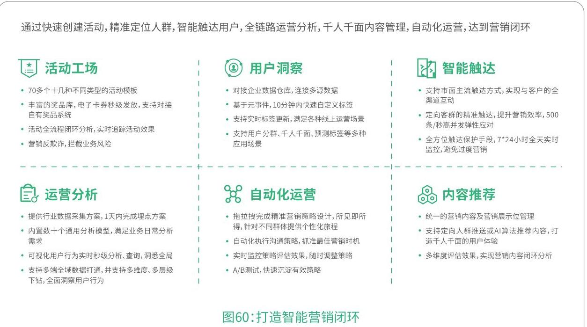
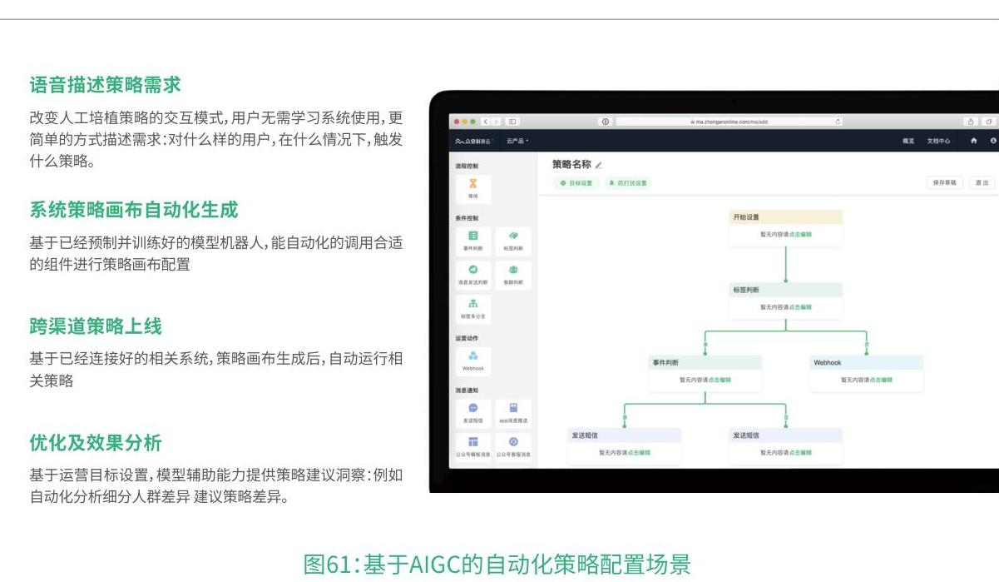

## Page 53
第四章 | AIGC置入众安科技产品 打造系统应用全新体验

### 保险核心业务系统:配置工作简化自动化,业务运营管理智能化

#### 保险核心业务系统

新一代财险核心业务平台,覆盖财产险非车全险种业务流程,并支持跨险种组合业务,支持个/团、记名/不记名、联/共保等全场景的出单模式,采用分布式架构,具备海量保单数据处理能力,轻松支撑财险高并发碎片化业务场景。

#### AIGC结合点说明

- **配置工作的简化和自动化**: 过往在核心产品使用过程中,需要大量的专业人员进行各方面的配置,如配置一款保险产品上架、配置多渠道的对接、配置各种风控策略的上线,过往这些配置项,均需要业务运营人员熟悉系统后进行配置工作。生成式AI接入后,业务人员只需要输入需求(什么样的一款产品、什么样的核保规则),系统自动化配置实现,提高效率。

- **业务运营管理智能化**: 对于保险承保全流程运营(询价、承保、批改、理赔、续保)、财务数据处理过程(对账、理算、财务审计等),过往对于业务运营,需要人力进行重复性比较高的经验类型工作:运营状况的数据汇总监控、人工核对等;通过生成式AI的提升,可以帮助提升运营过程的自动化程度,自动追踪监控业务运营现状并汇报。


图62: 众安非车核心业务系统整体解决方案

### 场景示例 智能理赔,缩短保险理赔周期,提升理赔作业效率

随着保险行业的快速发展,各家保司的运营成本逐渐攀升,传统主要依靠人力手工作业的方式无法快速满足业务发展所需,尤其是在理赔作业段,各式各样的票据需要大量的人力手工录入或部分依托于OCR供应商进行信息采集+人工复核理算的作业方式,人力成本大,理赔时效低。未来AI生成接入,可通过系统的方式替代人工来完成,既节约了保司人力成本,又可以提升客户的服务体验。

理赔医疗票据智能识别,内容自动填充带入,覆盖全国各地不同地区、医疗机构开出的各种版式的医疗票据,全字段解析。

基于产品条款责任定义、医疗票据内容以及客户信息,自动识别客户风险、可理赔责任及票据,智能生成案件理算明细数据及案件赔付结论。
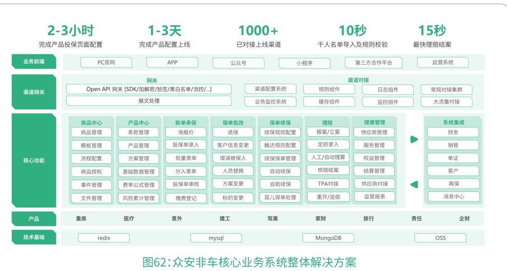
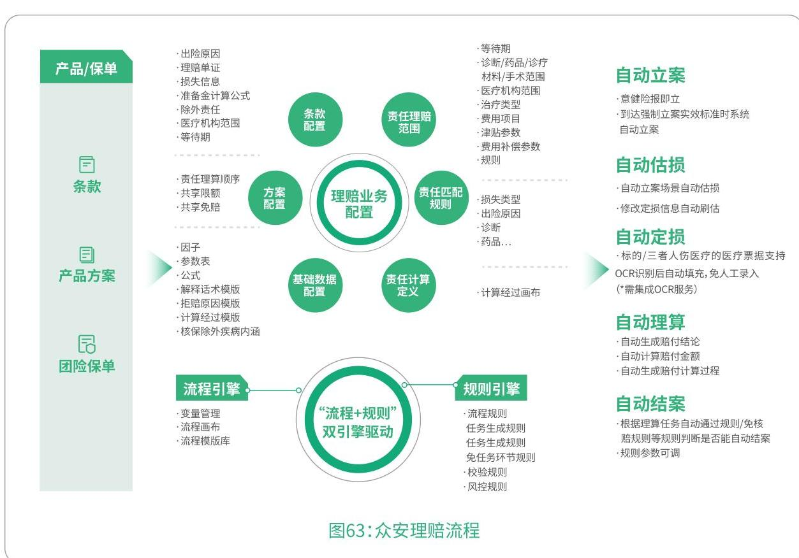

## Page 54
## 经代信息化系统：赋能客户更精准友好，客群及培训千人千面

经代信息化系统整体架构上包括人管业管财管等核心系统，也包括上层展业开展过程toA、toB、 toC的一系列产品。

展业层面举例，AIGC结合点
$\cdot$ toC场景：保险顾问，传统方式多通过表单提交的形式收集信息，并基于历史数据或人工设定的逻辑模型给出结论，不能对个性化的问题给予解决。而人工则需要依赖顾问的经验和职业道德。AIGC结合后智能客服可以更自然友好，也更公正地给出建议和方案（移动展业、自营商城)。
$\cdot$ toA赋能场景：可以更个性化地为代理人生成展业所需要的内容。例如针对代理人在SCRM中的客户画像，代理人本身的形象人设，生成、挑选每天的展业素材，甚至针对不同客群生成不同内容，为代理人提供"千人千面"的素材（移动展业）。
$\cdot$ toA代理人培训场景：从基于NLP的人机对话培训迁移到基于GPT，原先的对话相对制式化和死板，需要根据配置的脚本进行比较固定的专项培训，讲师有一定的配置成本，应对发散性的场景上无法特别好的处理。通过GPT提升培训的有效性和体验，让每个代理人有一个真人 1 v 1 培训的体验。（移动展业）。

图65：众安产品套件
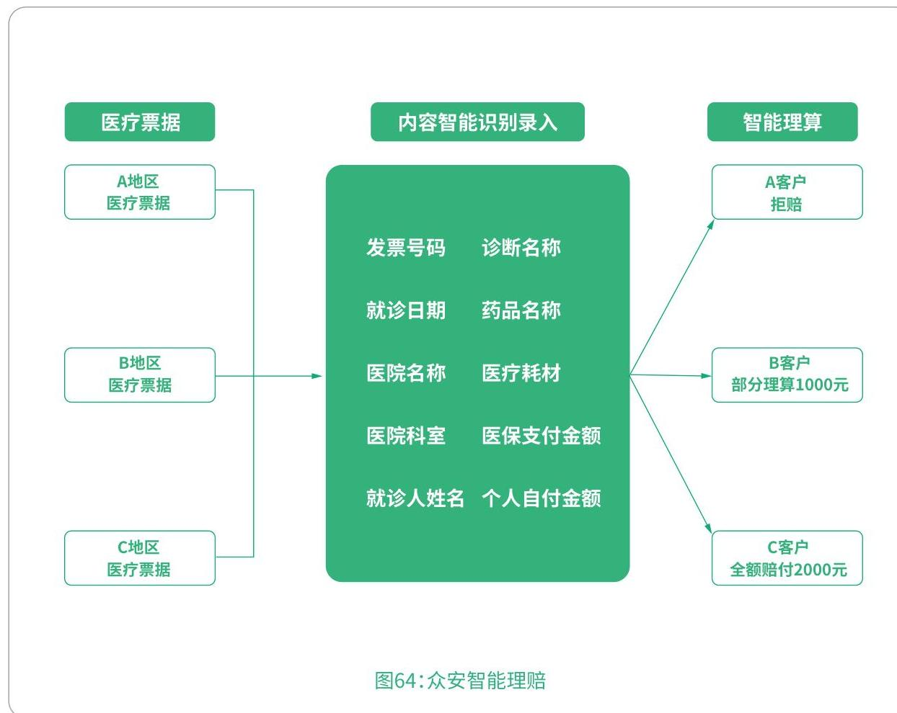
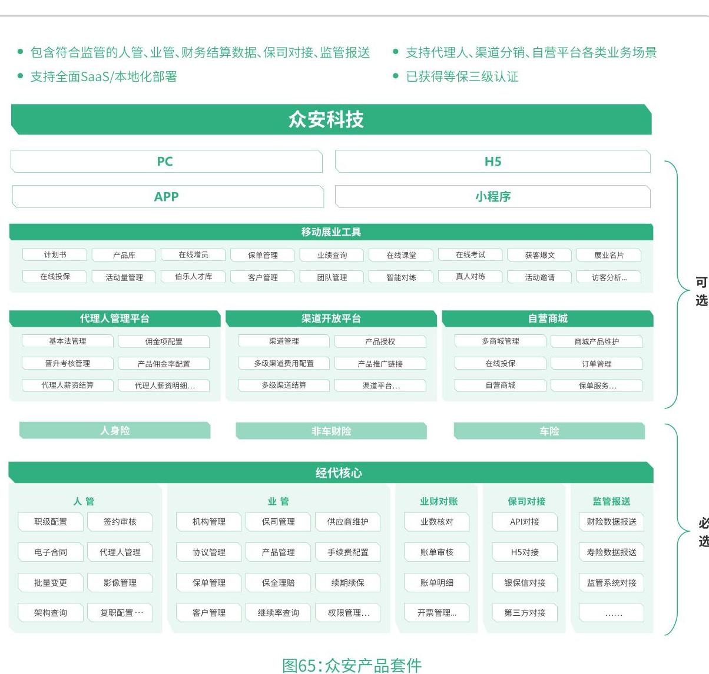

## Page 55
## AIGC方案生成场景流程说明

- 对话输入：基于人机对话，引导客户表达需求
- 需求理解：分析家庭构成、文字意图等理解客户需求
- 模型学习：基于预制的一系列思考逻辑，分析模型，给出适配客户的建议配置方案
- 产品研究对比：基于销售目的，匹配合适产品，融合到给出的方案中
- 方案文字生成：整体润色文字，自动化生产个性化分析方案（需求、注意、产品推荐）

图66:AIGC个性化方案制作营销流程场景

## 研发运维一体化平台：代码生成补全智能化，自动平台体验更流畅

众安业务基建（众安研发运维一体化平台）打造的是业务系统的自动化生产流水线和运行管理环境，为数字化转型企业开展信息化建设中提供能够打通管理、开发、测试、发布、运维五个壁垒的全流程自动化平台，解决系统开发质量差、上线经常延期、线上故障频发、运行能耗高的问题。

图67：研发运维一体化平台

基于AIGC的特点，研发运维一体化平台已经初步将其应用于以下场景：
01. 代码生成

基于事务描述指令，生成可实现事务的代码，如编写一个查询数据库的函数
02. 代码补全

通过AIGC分析开发者代码库，在开发者编写代码时，给出更加精确的代码补全建议，自动显示与代码相关的选项，如变量、函数、属性等
03. 代码优化

通过AIGC分析开发者代码库，检查出低效实现及重复代码，并给出优化建议
04. 测试用例生成

通过AIGC生成接口测试用例、单元测试用例等，并基于对场景的描述产生造数
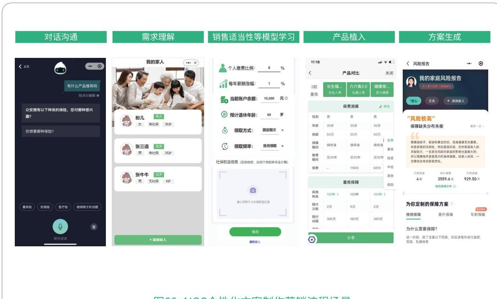
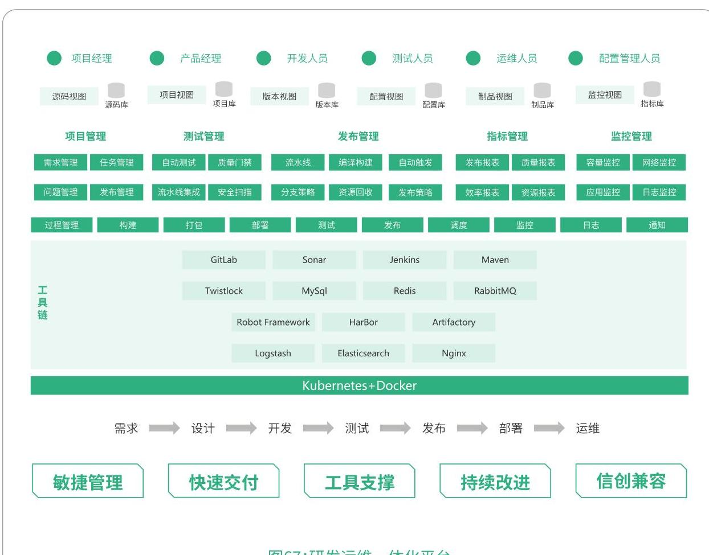

## Page 56
05. 脚本和配置生成

通过AIGC生成dockerfile. k8syaml. shell脚本、SQL脚本、构建脚本等
06. 构建和部署问题分析

基于AIGC分析构建和部署产生的错误日志，给出错误原因和修复建议
07. 监控问题分析

基于AIGC分析服务监控产生的关联监控数据和服务日志，给出错误原因和修复建议
08. 需求拆分

根据业务需求和目标描述，对需求实现路径进行分析和拆分，产生可执行的里程碑
09. 知识库构建和快速检索

将产品使用手册、最佳实践等文档作为内容训练，基于AIGC产生不同场景的结构化知识库，并能够基于用户问题做快速检索

## 数据平台：数据分析调用自动化，预测优化经营自生成

## 产品架构

众安数据产品，基于大数据技术架构之上，提供数据管理及应用的一系列产品。数据管理中台部分可对数据进行全方位的管理，包括研发管理、流通管理及应用价值管理，成为 3.0 数字化时代的底盘与基础；数据应用能力部分基于数据能力建设的各类应用平台，包括互联网营销、智能客服、客户标签及分层模型等，帮助各条业务线实现业务目标与业务价值。
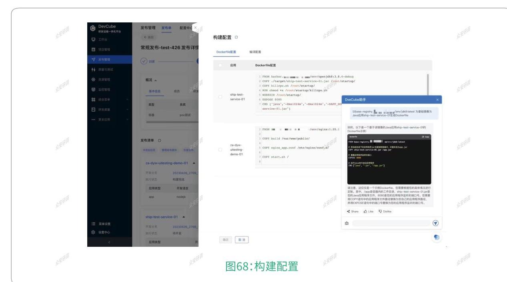
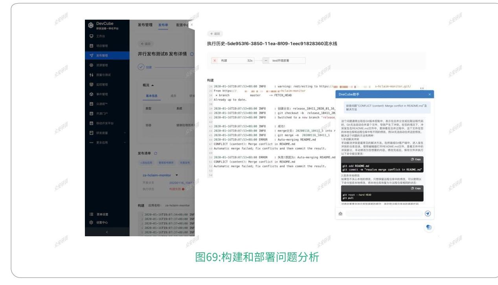
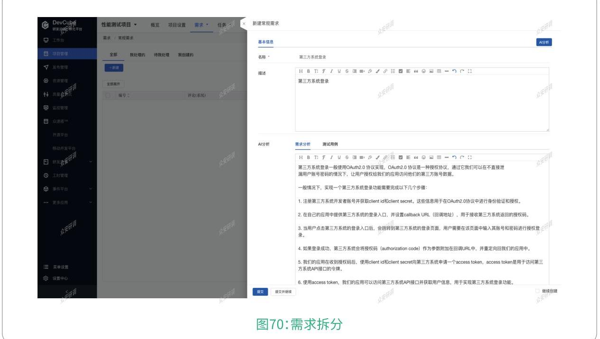

## Page 57
## AIGC结合点说明

在大数据开发领域，构建数据中台需要不同岗位分别进行数据治理。数据建模开发、BI应用开发、应用模型开发等，这些工作需要大量人力重复地进行，例如预测建模类开发工作，需要在模型选择、测试、调参依赖算法工程师的持续投入，通过大模型可以大大简化这些工作的人力投入，自动设计并调试应用模型，最终用于流失预测等业务场景。


## BI分析自动化场景描述

- 对话输入：基于人机对话，业务表达需求
- 需求理解数据准备：基于指标需求拆解，自动化生成调度脚本，实现数据准备
- 自动化报表生成：AIGC调用报表生成能力
- 异常问题定位：指标异动原因依赖数据分析师的手工分析，分析结果和业务脱节，基于自动化归因判断经验，输入AIGC模型，自动化定位问题
- 经营洞察：基于业务优化目标，模型预测结果和完成风险，自动化发现经营洞察
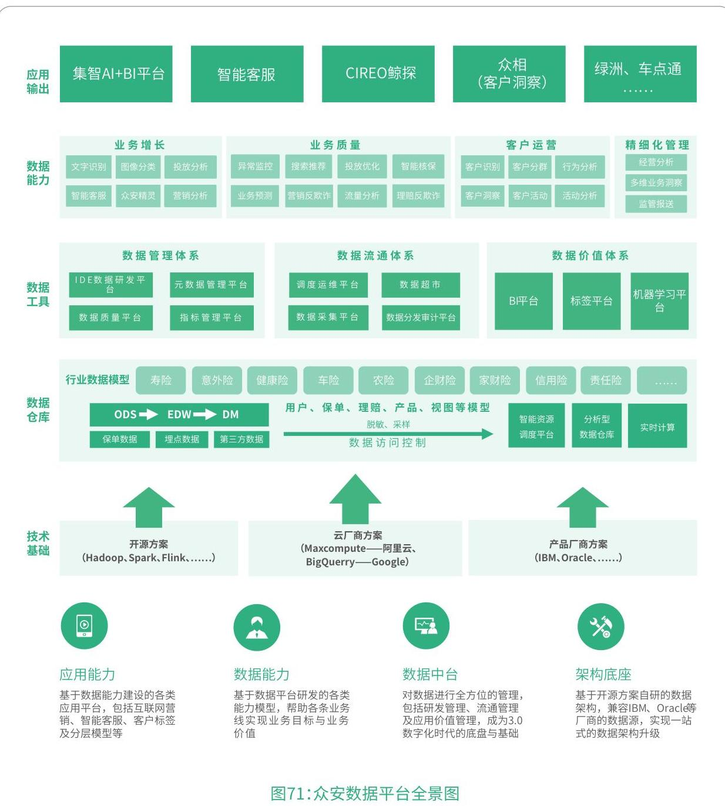
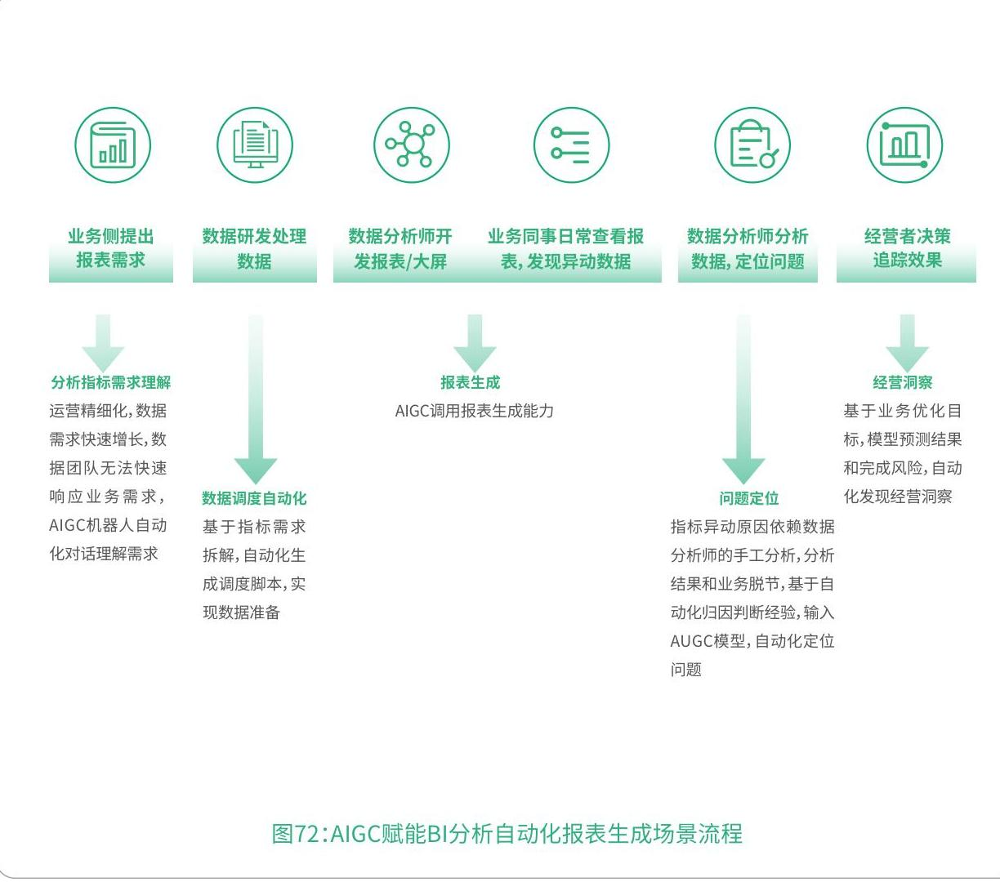

## Page 58
总之，ChatGPT类生成式AI的能力提供了丰富的想象空间，未来可以为科技产品中提供自动化的能力、内容生成的能力、人机交互的能力。在众安科技的全系列产品中，我们将深度融合AIGC能力，提升产品综合竞争力，基于新的AIGC+产品，未来将极大助力保险机构提升保险业务开展、客户营销、开发、内部运营等工作过程的生产效率。

未来已来，但仍需脚踏实地探索落地。当前大模型在各行业的深入结合应用，还处于理论推演和尝试探索阶段，需要先行者积极探索。基于众安保险自身业务AIGC应用探索实践，众安科技将会努力在保险行业科技产品中，率先推出可落地的、深度融合AIGC能力的科技产品，全面赋能保险行业机构数字化、智能化转型。

## Page 59
# AIGC商业应用场景广阔
# 企业积极跟踪妥善布局

尽管人工智能技术在保险业大规模商业应用仍面临诸多挑战，比如数据安全与隐私、解释性不足、偏见与不公等问题。但AIGC技术展现出来的自然语言理解能力、大数据处理能力、多领域应用能力、模型可扩展性和可定制性等优势，使得其在细分金融领域的应用有着广泛的前景和潜力。通过场景和数据的结合，实现个性化定制、风险控制等优势带来更高效、更智能、更人性化的服务。AIGC技术将会扮演越来越重要的角色，注定会为金融行业的数字化转型和发展注入新的动力。

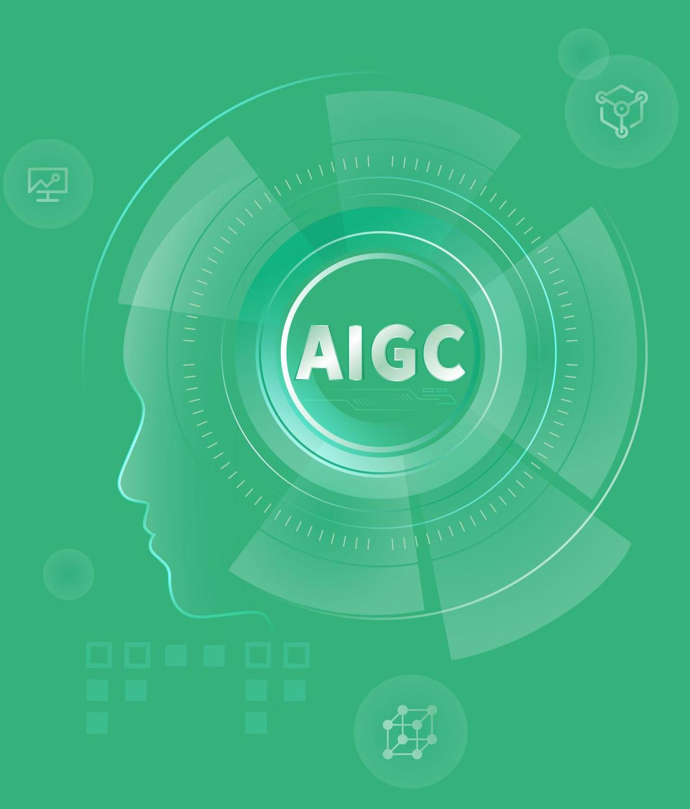

## Page 60
## 险企宜尽早拥抱AIGC，密切跟踪商业发展动态

AIGC尤其是ChatGPT的出现，为内容生产领域带来了巨大的变革，也引起了金融保险行业的高度关注。在金融领域，大型银行正加速发展自研大模型，如中国工商银行和中国农业银行分别于 2023年3月17日及2023年3月31日发布的金融行业通用模型昇腾AI和ChatABC，其对于大模型精调、提示工程、知识增强、检索增强、人类反馈的强化学习（RLHF）等大模型相关新技术进行了深入探索和综合应用，实现了全方位的金融知识理解和智能问答应用，已在客户服务、风控、运营等场景得到初步应用并收效。

随着人工智能技术的快速发展，越来越多的保险公司开始尝试利用AIGC技术来生成内容，这不仅有助于提升保险公司的服务质量和客户体验，还有助于提高保险公司的市场竞争力。在AIGC强大赋能力量下，保险行业应尽早拥抱AIGC，密切跟踪商业发展动态，关注同类企业将AIGC在产品、渠道、运营、客服以及生产等领域的应用动向及效果，尽早探索AIGC技术或采用嵌入AIGC技术的科技产品，提高服务水平和客户满意度，降低成本和提高运营效率，提高数据分析能力和决策水平，提升市场竞争力。

## 模型自建采购各存优劣，险企需据自身情况酌定

保险企业实现生成式人工智能技术应用，主要有两种方式：一是使用开源模型进行自主训练；二是直接调用商业通用模型。两种方式各有优劣，保险企业需要根据自身情况择优选择。如果保险企业拥有雄厚的人工智能实力与数据基础，且追求高度定制与控制，使用开源模型自主训练是首选。如果技术实力一般但商业需求急迫，直接调用商业通用模型也可快速实施应用，降低自身投入。保险企业应根据自身情况，审慎选择人工智能技术应用模式，加速构建核心竞争力。

使用开源模型进行自主训练，需要保险企业投入大量计算资源与技术人才，搭建服务器集群，整理企业海量数据，对开源模型GPT-3或GPT-3.5或GPT-4进行二次训练与调优，以实现对业务场景的适配。这种方式的优点是数据与场景定制度高，即可以根据自身的数据和需求，定制一个适合保险业的GPT模型；缺点是成本最高，即对计算资源要求很高，需要大量的算力平台和优化技术，以及更优秀的技术人员布置服务器，这种方式需要保险企业在人工智能与大数据领域的技术积累，且训练结果的可控性也较难保证。实施AIGC时最重要的考虑因素之一是用于训练模型的数据质量。为了克服这一挑战，企业需要在训练模型之前投入时间和资源来收集、清理和预处理数据。这可能是一个耗时且资源密集的过程，但有必要确保模型能够良好运行。

直接接入商业通用模型，如OpenAI、文心一言等。这种方式的优点是其技术与服务由模型提供商负责，可以借助已有的高性能的GPT模型，保险企业可快速实现模型应用，成本方面，相对于第一种模式，免去了布置服务器的麻烦，但依然存在着相对高昂的专业数据精挑成本；缺点是大模型应用鱼龙混杂，需要根据企业实际需要及能力对大模型公司进行甄别 ${ }^{(1)}$ ，支付通用模型公司的服务费用，可定制度相对较低，而且可能存在数据安全和隐私保护的风险，通用模型可能不够专业和贴合保险业的需求，并且存在依赖外部供应商的风险，可控性相对较弱。在商业通用模型的模型选择上，应重点关注数据安全、模型可靠性与健康性等方面问题的有效控制，并对大明星的技术水平、数据质量和应用场景进行严格甄别。

## 模型接入借鉴先行企业，场景搭建可自建或定制

大模型选定后，模型接入及场景搭建是商业化的关键步骤，共同决定了AIGC在企业中的应用效果。模型接入实现AIGC的"有"，应用场景搭建实现AIGC的"用"。在模型接入及场景搭建方面建议如下：

在模型接入架构搭建上，可借鉴众安保险的经验，在架构设计上分三层搭建：
$\cdot$第一层是模型即服务（MaaS）层
该层通过在线与离线部署开源预训练模型，提供基础的大模型能力与服务；
$\cdot$第二层是大模型应用框架层
为各AIGC应用场景提供对应模型能力与服务；
$\cdot$第三层是应用场景层
根据具体AIGC应用场景，汇聚在线与离线模型能力，实现开箱即用。

以上架构模式可提供一整条完备的AIGC能力，通过快速、可靠、可控的方式提供标准化的AIGC应用落地途径，加速应用价值服务效率。

保险企业在获得生成式大模型之后，还需在此基础上进行应用场景的搭建，如知识问答、智能客服等，此过程有两种主要方式：

[^0]
[^0]:    1）中国的大模型发展迅猛，市场上涌现出大量不同规模和应用方向的模型，除了几类大型科技公司发布的主流模型和完善的文心一言外，还有众多创业公司和高标准化的大模型。如新浪科技的SenseNova，是众家布局员工S.S. 复合大学开发的AIGS(推动各个大课堂模型，还拥有大模型应用鱼龙混杂，搭建对不同模型的技术水平、数据质量和应用场景进行严格甄别。

## Page 61
- 一种是企业自主开发应用场景

这种方式需要保险企业投入大量人工智能工程师，根据企业内部数据和业务场景，开发定制化的应用系统，如智能客服机器人、知识图谱等。这种方式可以最大限度地匹配企业业务与数据，但成本高，技术难度大，应用效果难以预期。

一种是选择科技公司开发应用场景
由于AIGC搭建应用有一定的技术门槛，保险企业也可集中精力推动业务发展，在搭建应用场景上尝试与科技企业合作，直接采用科技公司的定制化应用平台，减少不必要的试错成本，通过与先行科技企业的合作，保险企业可以获得更加先进和高效的技术手段，提高风险管理、客户服务、运营效率等方面的效率和质量。在与科技企业的合作过程中保险公司应主要关注自身的诉求与科技产品之间的适配性，根据自身的业务需求和客户需求，选择适合的AIGC技术解决方案。

技术研发的价值在于解决实际的商业挑战，创造真正的商业和社会价值。保险机构通过研发基于生成式人工智能技术的运营和技术平台，有望推动保险公司经营效率不断优化，实现长足的可持续性增长。我们相信，生成式人工智能技术将有望成为保险机构决胜未来的重要战略性资产。鉴于生成式人工智能的技术及商业生态正快速兴起，我们倡议更稳健的技术实践，更科学的试点实验，及更多的跨界沟通，与众协同为生成式人工智能在保险领域的可持续发展贡献力量。

人工智能技术进化的拐点已至，我们坚信其未来进化的潜力和速度一定会远远超过想象。

随着新技术不断升级并渗透到各行各业，可以预见一些趋势：比如车的智能会被加速，而车的风险会被重新研究和定义；同时，我们一直担忧的人口老龄化也问题也许很快会有新的答案，交互体验极佳的智能照护机器人，也可能成为是未来健康和养老保险的标准服务......未来已来，正是带着这份紧迫感和对未来智能的憧憬，我们发布这份报告供保险行业的同仁们共同探讨和交流。

## Page 62
我们公司正在开展ChatGPT技术在保险领域的可行性研究，但该技术尚未应用于实践。我们将严格遵守国家相关法律法规和监管政策。确保我们的研究活动在合法合规的基础上进行。我们将持续关注国家相关法律法规和政策的变化，并根据法律法规及监管政策的要求及时调整相关研究活动，以确保公司的合规性和稳健性。

需要强调的是，我们在研究过程中使用的应用数据为虚拟数据，不涉及任何真实的保险案例或个人信息。我们将确保所有研究活动的数据安全和隐私保护。遵守相关法律法规和监管政策的要求，我们将继续探索ChatGPT等一系列技术在保险领域应用的可行性，但始终保持谨慎和审慎的态度，确保我们的研究活动符合法律法规和监管政策的要求。