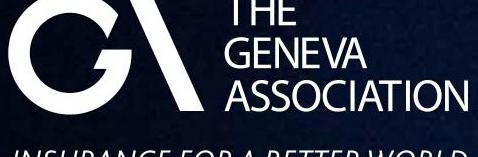
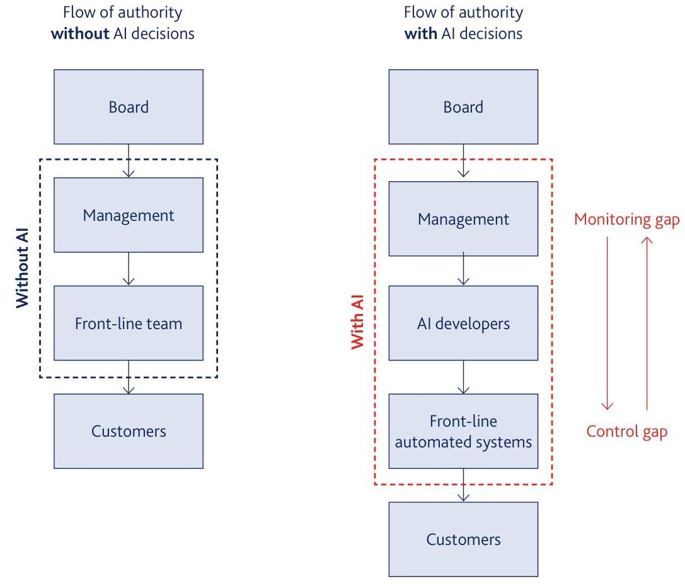

_Note: Source document was split into 3 OCR chunks (pages 1-25, pages 26-40, pages 41-46) to stay within token limits._

# 202309- Geneva Association-Regulation of AI in insurance

## Page 1
# **REGULATION OF ARTIFICIAL INTELLIGENCE IN INSURANCE:**
## Balancing consumer protection and innovation

September 2023

## Page 2
.

## Page 3
# REGULATION OF ARTIFICIAL INTELLIGENCE IN INSURANCE: Balancing consumer protection and innovation 

Dennis Noordhoek Director Public Policy \& Regulation, The Geneva Association

## Page 4
# The Geneva Association 

The Geneva Association was created in 1973 and is the only global association of insurance companies; our members are insurance and reinsurance Chief Executive Officers (CEOs). Based on rigorous research conducted in collaboration with our members, academic institutions and multilateral organisations, our mission is to identify and investigate key trends that are likely to shape or impact the insurance industry in the future, highlighting what is at stake for the industry; develop recommendations for the industry and for policymakers; provide a platform to our members and other stakeholders to discuss these trends and recommendations; and reach out to global opinion leaders and influential organisations to highlight the positive contributions of insurance to better understanding risks and to building resilient and prosperous economies and societies, and thus a more sustainable world.

Photo credits:
Cover page - Mahdis Mousavi on unsplash

Geneva Association publications:
Pamela Corn, Director Communications
Hannah Dean, Editor \& Content Manager
Kelly Gailey, Communications \& Events Manager
Suggested citation: The Geneva Association. 2023.
Regulation of Artificial Intelligence in Insurance: Balancing consumer protection and innovation Author: Dennis Noordhoek. September.
(c) The Geneva Association, 2023 All rights reserved
www.genevaassociation.org

## Page 5
# Contents 

Foreword ..... 5
Executive summary ..... 6

1. Introduction ..... 7
2. Defining AI ..... 9
2.1 Definitions ..... 10
2.2 Advanced analytics vs AI ..... 10
2.3 Machine learning ..... 10
2.4 Developing existing definitions ..... 11
3. Benefits of AI in insurance ..... 12
3.1 How AI is transforming insurance ..... 13
3.2 Benefits of AI ..... 14
4. Zoom in on AI and underwriting ..... 16
4.1 The underwriting process and AI: What is new? ..... 17
4.2 Changes to decision-making: AI vs humans ..... 18
5. Risks and concerns related to AI ..... 20
5.1 Transparency and explainability ..... 21
5.2 Bias, indirect discrimination and risks to fairness ..... 21
5.3 Data input ..... 22
5.4 Excessive price differentiation and exclusion ..... 23
5.5 How insurers are addressing and mitigating AI-related risks and concerns ..... 23
5.6 Are AI risks new to insurance? ..... 26
5.7 AI risks and the business model of insurance ..... 26
6. Regulation of AI ..... 27
6.1 Jurisdiction-specific developments ..... 28
6.2 How existing regulation addresses AI risks ..... 31
6.3 Balancing innovation with customer protection ..... 34
7. Conclusions and recommendations ..... 35
References ..... 37

## Page 6
# ACKNOWLEDGEMENTS 

We would like to thank the members of The Geneva Association (GA)'s Public Policy and Regulatory Working Group for reviewing the report and for the advice and feedback they provided.

We also greatly benefited from interviews and discussions with the following experts:

- Chubb
- Julian Arevalo (EIOPA)
- Lucy Ashton (ABI)
- Birny Birnbaum (Center for Economic Justice)
- Commissioner Kathleen A. Birrane (Maryland Insurance Administration)
- Alessandro Bonaita (Generali)
- Matt Brewis, Karen Croxson (U.K. FCA)
- Chris Dolman (IAG)
- Michael Drobac (AIG)
- Michael Foehner, Tobias Wassmann (Swiss Re)
- Oliver Goodenough (Vermont Law School)
- Arthur Hilliard, Danilo Gattullo (Insurance Europe)
- Joe Jones (International Association of Privacy Professionals)
- Xuchun Li (Monetary Authority of Singapore)
- Amedeo Santosuosso (Scuola Universitaria Superiore IUSS Pavia)
- Dave Snyder (American Property Casualty Insurance Association)
- Anika Stehr, Julia Perl (Hannover Re)
- Lutz Wilhelmy (Actuarial Association of Europe)
- Leigh Wolfrom (OECD)
- Jing Xiao (Ping An)

## Page 7
# Foreword 

The expansion of the use of artificial intelligence (AI) in insurance is emblematic of the broader digital revolution sweeping across industries worldwide. AI has the potential to profoundly transform the insurance industry, as AI algorithms factor into risk assessment, claims processing and customer interactions.

There are unprecedented opportunities emerging, such as more affordable insurance products and more satisfied insurance customers - and an overall enhanced value proposition for the insurance industry.

However, AI also poses challenges to upholding the core principles of fairness, transparency and accountability.

In navigating this territory, it is essential to approach the regulation of AI in insurance with a commitment to both enabling innovation and safeguarding the interests of all stakeholders. This report places insurers' use of AI and its potential risks in the broader, dynamic landscape of regulatory frameworks across different jurisdictions. It further assesses if and how regulation addresses risks such as bias and discrimination.

The regulation of AI in insurance is about more than creating rules and standards. It is about fostering a culture of responsible innovation; it is about promoting inclusivity, empowering customers and preserving trust. We hope the guidance we offer to regulators, policymakers and insurers supports the collaboration and alignment required for AI to benefit all who rely on insurance for peace of mind and financial security.

We look forward, at The Geneva Association, to continuing the dialogue on the responsible and equitable integration of AI into the insurance sector, so that AI in insurance - like insurance itself - serves as a force for good.

Jad Ariss
Managing Director
The Geneva Association

## Page 8
# Executive summary 

## The rise of generative AI tools has pressured policymakers and regulators to respond, resulting in cross-sectoral and insurance-specific initiatives.

Artificial intelligence (AI) is increasingly transforming how people live and work. In insurance, AI has significant potential to help reduce protection gaps by improving the availability, affordability and accessibility of insurance on the back of increased personalisation and improved cost-efficiency. While there are risks linked to the use of AI by insurers, including potential bias, discrimination and exclusion, the largely reversible nature of AI decisions in insurance mean they are of a very different nature to those in other domains. In addition, many of these risks existed in insurance prior to the emergence of AI.

The rise of generative AI tools such as ChatGPT has led current public debate to focus on the downsides and risks of AI, pressuring policymakers and regulators globally to respond. This pressure has resulted in various regulatory initiatives, some insurance-specific and others cross-sectoral. The latter in particular could hinder innovation in insurance as they do not consider the unique characteristics of the insurance business model or take existing regulatory frameworks into account. The fast pace of AI developments makes formulating corresponding regulation tantamount to capturing a moving target. The major challenge for policymakers is to find a balance between minimising the risks of AI to protect customers and citizens and allowing sufficient room for innovation to the benefit of society at large.

AI in insurance is already subject to rules such as data protection and insurance distribution regulation. In particular, risks and concerns around the use of AI in insurance such as bias and discrimination are well captured by existing sectoral regulation. This report is primarily targeted at policymakers who are in the process of developing AI-specific laws and regulations. It analyses the use of AI in insurance and assesses the aspects of AI that are truly novel from an insurance perspective. On this basis, the report discusses the perceived opportunities and risks associated with its application, and investigates AI regulatory initiatives across various jurisdictions as well as their impact on the insurance sector. The report also evaluates how existing regulations address some of the perceived risks.

Based on insights from interviews with executives from the regulatory community and the insurance industry as well as findings from a literature review, the report provides the following recommendations for policymakers and regulators:

- Carefully define AI: There is an ongoing debate surrounding the definition of AI for regulatory purposes. The report finds that a workable definition should limit AI to self-learning applications, focusing on machine learning, to avoid over-regulation of established practices in insurance.
- Apply existing regulations: Regulators can leverage existing, technology-neutral frameworks and provide guidance on applying these to AI-related risks.
- Embrace principles-based regulation: Such regulatory approaches, which can build on the foundation of current regulations, provide the most promising way to manage AI risks without stifling innovation and competition.
- Consider the specific characteristics of AI in insurance: Due to the reversibility of decisions in insurance and the efficacy of existing regulatory frameworks, cross-sectoral regulation is likely to be less effective than insurance-specific regulation. This is in contrast to other, much less regulated sectors such as the technology sector - where AI decisions are irreversible and have severe potential consequences.
- Focus on customer outcomes: While data governance frameworks can play an important role in ensuring fairness and preventing discrimination, it is important not to overemphasise the regulation of individual rating factors that are used in assessing risks and determining premiums. A balanced approach to data governance with focus on customer outcomes will help promote innovation in a fair and non-discriminatory manner.

## Page 9
# Introduction

## Page 10
# Introduction 

## Al can help reduce protection gaps by improving the availability, affordability and accessibility of insurance and facilitating the coverage of risks that were previously difficult to insure.

AI is a vital component of the digital transformation of the insurance industry. It has the potential to provide significant benefits to consumers, firms and society as a whole, and contributes to improving the availability, affordability and accessibility of insurance. By allowing insurers to gain a more granular view on risks, AI can facilitate the coverage of risks that were previously deemed difficult to insure, and thus contribute to reducing protection gaps. AI also enables insurers to transform their business model from one that focuses on paying claims to one that emphasises risk prevention and mitigation. ${ }^{1}$ It furthermore boosts efficiency and enables a more tailored interaction between insurers and customers. ${ }^{2}$

These benefits, however, also come with risks. In insurance, these include heightened risk of bias (caused by training algorithms on biased data, leading to biased decisions), unfair discrimination, exclusion, as well as data security and liability risks. ${ }^{3}$ As a result, AI is subject to legislative and regulatory scrutiny.

Against this backdrop, this report focuses on the regulation of AI in insurance and aims to contribute to ongoing legislative and regulatory discussions on how to balance consumer protection and innovation. The report is based on an extensive literature review and an examination of recent legislative and regulatory developments, complemented with information gathered through expert interviews with representatives of the insurance industry, consumer organisations and the regulatory community.

As a debate on regulation requires clarity on what is to be regulated, section 2 of the report lays out the relevant definitions. Section 3 examines the benefits of AI for customers, insurers and society. Section 4 details how AI is changing the insurance business model, with a focus on underwriting due to its prominence in public discourse. AI-related risks specific to insurance, and the way insurers are managing them, are analysed in section 5. Section 6 takes a deep dive into AI regulation, assesses how existing sectoral regulation already addresses AI-related risks in insurance and provides an overview of legislative and regulatory initiatives in key insurance markets. Conclusions and recommendations for regulators and policymakers are provided in section 7.

[^0]
[^0]:    1 The Geneva Association 2020. Author: Benno Keller.
    2 Eling et al. 2022.
    3 IMD 2022.

## Page 11
# 2   Defining Al

## Page 12
# Defining AI 

## We define AI as the ability of machines to conduct tasks requiring human intelligence, including learning, reasoning, problem-solving and natural language processing.

### 2.1 Definitions

The definition of AI is subject to ambiguity. It is an umbrella term encompassing a wide range of concepts and applications, and means different things to different people - from statistical models and software in general to self-learning applications. ${ }^{4}$ In the context of the EU AI Act, the definition of AI has been subject to discussion for a very long time. ${ }^{5}$

For the purpose of this report, we define AI as the ability of machines to conduct tasks requiring human intelligence, including learning, reasoning, problem-solving and natural language processing (NLP), ${ }^{6}$ based on the processing of vast amounts of data for decision-making while learning and adapting through pattern recognition and analysis.

### 2.2 Advanced analytics vs. AI

Advanced analytics and AI are often used interchangeably, but they have distinctive characteristics and functions, particularly in an insurance context. Insurers have been using advanced analytics for quite some time, including techniques and tools to analyse data with the purpose of extracting valuable insights. Methods used include data mining and statistical analysis. ${ }^{7}$ In insurance, advanced analytics can be used for tasks such as predictive modelling, e.g. identifying risk factors and estimating potential losses. A key distinguishing factor is that, in advanced analytics, the main creating actor is a human rather than a machine. ${ }^{8}$

[^0]AI, on the other hand, refers to computer systems that can perform tasks that require human intelligence. Breeds of AI include machine learning (see below), NLP - a branch of AI that gives computers the ability to understand text and spoken words in much the same way as humans - and computer vision, which enables computers to derive meaningful information from digital images, video and other visual input. ${ }^{9}$ In insurance, AI is used in underwriting, claims processing, customer service and fraud detection. ${ }^{10}$

## In insurance, AI is used in underwriting, claims processing, customer service and fraud detection.

### 2.3 Machine learning

The terms machine learning (ML) and AI are frequently used interchangeably but they are not synonymous. ${ }^{11}$ ML is a specific subset of AI. It involves the use of algorithms that enable machines to learn from data and iteratively improve their performance on a task without being explicitly programmed. ${ }^{12}$ The cybernetic feedback loop is a critical element of ML, allowing machines to adjust their internal parameters based on the comparison of their output with the desired outcome, and thus refine their performance over time. ${ }^{13}$ In summary, ML is a key component of AI, focused on the development of systems that can autonomously enhance their abilities through data-driven

[^0]:    4 IBM n.d.
    5 Bryson 2022.
    6 Russell and Norvig 2020.
    7 Gandomi and Haider 2015.
    8 Sharma 2022.
    9 Russell and Norvig 2020.
    10 McKinsey 2021.
    11 Russel and Norvig 2020.
    12 Janiesch et al. 2021.
    13 Columbia Engineering n.d.

## Page 13
learning processes. This is important as it allows for the distinction between AI and other types of advanced analytics or software in general.

### 2.4 Developing existing definitions

While this report does not intend to provide yet another definition of AI, it aims to contribute to the discussion by suggesting what elements should and should not be part of a definition for insurance regulatory considerations.

The precise definition may be subject to debate, but the primary distinctive feature of AI is its ability to mimic aspects of human intelligence. ${ }^{14} \mathrm{Al}$ should not be conflated with the practice of collecting and analysing numerical data or using traditional mathematical models.

Some of the experts interviewed for the report pointed out that focus should be on the decision-making applications of AI rather than on AI as a technology. For regulatory
purposes, it is therefore essential to concentrate on the data sources used as well as the outcome of decisions rather than on algorithms, which could encompass all software that may fall under a broader definition of AI. ${ }^{15}$ When a definition of AI for regulatory purposes is deemed necessary by policymakers, it will be crucial to distinguish self-learning applications from traditional analytics to prevent over-regulation of established practices in the insurance industry.
"An AI definition would be most useful if it focuses on what makes AI new compared to other mathematical models, such as machine learning approaches and the 'black box dimension'."

Julian Arevalo, EIOPA

## Page 14
# Benefits of AI in insurance

## Page 15
# Benefits of AI in insurance 

## AI can help insurers to increase their value proposition and contribute to building societal resilience.

## Benefits of AI in insurance

This section, primarily targeted at policymakers not necessarily familiar with insurance, examines the use of AI across the insurance value chain as well as its benefits to customers, insurers and societies more broadly.

AI can help insurers to change their value proposition and contribute to increasing societal resilience. The socioeconomic benefits of the use of AI in insurance can be summarised as follows:

## 1) Expanded scope for risk pooling:

Through enhanced risk assessments, insurers have a better view on risks. This can allow them to offer insurance coverage for previously difficult-to-insure risks (such as cyber) as well as reach previously uninsured segments of the population. ${ }^{16}$

## 2) Prevention and mitigation of risks:

Insights provided by AI can be shared with insureds to reduce and mitigate risks. ${ }^{17}$

## 3) Reduced cost of risk pooling:

AI allows for (partial) automation of many processes, e.g. risk assessment, underwriting and claims handling, which improves efficiency and reduces costs. Through enhanced risk prevention and mitigation, AI also has the potential to reduce claims.

### 3.1 How AI is transforming insurance

Although AI is relatively new, the use of data by insurers is not. For decades, data processing and models have been

[^0]## AI can contribute to increasing societal resilience by helping customers prevent and mitigate risks and allowing insurers to expand their offerings and reduce costs.

central to the insurance business, including for underwriting and pricing risks, determining claims and supporting product development. AI, however, allows insurers to use existing and new data more efficiently.

The use of AI and digitalisation of processes in insurance are strongly connected. The initial wave of digitalisation in the insurance industry was primarily focused on the distribution of products through online sales channels ${ }^{18}$ and improved information and enhanced choice for customers, ${ }^{19}$ and the amount of data generated by these processes gradually expanded. Today, the widespread use of interconnected mobile and Internet of Things (IoT) ${ }^{20}$ devices such as wearables, and the increasing amounts of data generated by them, have paved the way for innovation and the use of AI applications by insurers. ${ }^{21}$ These applications can be divided into three broad categories: 1) conversion of language or text; 2) recognition of images, patterns, trends and preferences; and 3) contentbased processing of information and data-driven decision making. ${ }^{22}$ The first type (text and language conversion) includes speech recognition and text analytics, NLP and

[^0]:    16 The Geneva Association 2020.
    17 Ibid.
    18 Carven 2002.
    19 Kaiser 2002.
    20 These include connected devices and sensors.
    21 Eling et al. 2022.
    22 Ibid.

## Page 16
sentiment detection. The second type of applications can analyse data sets, texts and images for patterns and anomalies and provide recommendations. The third set executes tasks based on data-driven decisions and include automated underwriting decisions. ${ }^{23}$

### 3.2 Benefits of AI

AI applications offer benefits to both customers and insurers. ${ }^{24}$

## Benefits for customers

- Enhanced experience: smooth and efficient purchasing process; more accessible customer service, with chatbots available around the clock
- More tailored and transparent product offerings
- More innovative products, including usage-based insurance and more personalised products
- Convenient filing and fast processing of claims
- Lower premiums due to AI-induced cost-savings for insurers ${ }^{25}$

Benefits for insurers

- Improved value proposition ${ }^{26}$ - from 'detecting and repairing' to 'predicting and preventing' risks ${ }^{27}$
- Ability to reach un[der]served segments of society and insure risks that were previously deemed uninsurable
- Better customer service
- Improved claims handling and fraud detection
- Increased efficiency and lower costs

Figure 1 illustrates the areas in which insurers are benefiting from investments in AI, based on a 2022 survey of 1,000 participants.

FIGURE 1: WHERE AI INVESTMENTS ARE PAYING OFF FOR INSURANCE COMPANIES

| Create better customer experience | $\square$ Currently realising benefits | $\square$ Not currently realising benefits but expect to within two years | $\square$ Not currently realising benefits and do not expect to within two years | $\square$ Haven't yet invested in this area |
| :--: | :--: | :--: | :--: | :--: |
|  | 65\% |  | 31\% | 4\% |
| Improve internal decision-making | 49\% |  | 35\% | 7\% 9\% |
| Innovate products and services | 45\% |  | 35\% | 9\% 11\% |
| Operate more efficiently or increase productivity | 47\% |  | 38\% | 15\% |
| Achieve cost savings | 47\% |  | 45\% | 7\% |
| Reduce risks | 42\% |  | 36\% | 13\% 9\% |
| Grow revenue | 35\% |  | 47\% | 11\% 7\% |

Source: $P w C^{28}$

[^0]
[^0]:    23 Eling et al. 2022.
    24 EIOPA 2022b.
    25 Ibid.
    26 Kelley et al. 2018.
    27 McKinsey 2021.
    28 PwC 2022.

## Page 17
AI applications in the insurance value chain
AI applications are used right along the insurance value chain (see Table 1).
TABLE 1: AI USE CASES ACROSS THE INSURANCE VALUE CHAIN

| Marketing |  | Product   development | Sales \& distribution | Underwriting | Customer service \& policy administration | Claims management |
| :--: | :--: | :--: | :--: | :--: | :--: | :--: |
|  | - Predictive analytics   - Automated demand analysis | - Analysis of customer preferences   - Product innovation | - Tailored product advice   - Sales process automation | - Image analysis   - Natural language processing (NLP) | - Predictive analysis   - Voice recognition   - NLP   - Risk prevention and mitigation | - Prediction of claim patterns   - Image recognition   - Anomaly/fraud detection |
|  | - New marketing channels   - Tailored outreach | - Accurate pricing   - Tailored products   - Rapid product adjustment | - Reducing sales costs, thus enhancing affordability | - Improved quality/speed of risk analysis, including complex risks | - Personalised service   - Improved customer engagement   - Increased resilience of insureds | - Accurate claims assessments   - Fraud reduction   - Faster responses |

Source: The Geneva Association, adapted from Eling et al. and Accenture ${ }^{29}$
The table highlights the wide variety of AI applications and use cases in insurance. For example, predictive analysis supports marketing strategies with personalised outreach through new channels; real-time analysis and big data analytics enhance product development and enable usagebased insurance and risk detection services; ${ }^{30}$ automated processes and tailored product recommendations enhance sales and distribution; enhanced engagement improves customer service and policy administration; and expedited assessment and settlement of claims, as well as improved fraud detection, lead to fairer and more cost-effective insurance. ${ }^{31}$

These processes ultimately lead to greater customer satisfaction, increased efficiency and potentially new revenue streams.

## The use of AI applications in insurance can lead to increased customer satisfaction and efficiency as well as new revenue streams.

## Page 18
# Zoom in on AI and underwriting

## Page 19
# Zoom in on AI and underwriting 

## AI can rapidly process and analyse vast amounts of data, enabling underwriters to make more accurate and efficient risk assessments.

This section explores the transformative impact of AI on decision-making in insurance underwriting. The use of AI in underwriting significantly influences consumer outcomes, leading to heightened public discourse.

### 4.1 The underwriting process and AI: What is new?

Underwriting is a core process of insurance that involves assessing and pricing risks presented by applicants seeking insurance coverage. ${ }^{32}$ Underwriters analyse various factors that are relevant for the risk to be insured, such as the object to be insured (car, house, etc.), its location, as well as the nature of the risk itself. Actuarial methods are employed to assess the probability of claims occurrence and the potential magnitude of losses. ${ }^{33}$ Based on these assessments, underwriters determine the appropriate premium for a given risk, ensuring that it is sufficient to cover potential claims as well as the cost of capital and operations. ${ }^{34}$

AI is transforming the underwriting process in various ways. ${ }^{35}$ It can rapidly process and analyse vast amounts of data, enabling underwriters to make more accurate and efficient risk assessments. ${ }^{36} \mathrm{ML}$ algorithms can identify patterns and relationships within the data, which can help to refine rating factors and improve the accuracy of pricing models. While the underlying fundamentals of the underwriting process remain unchanged, AI is spurring a shift from causation to correlation. ${ }^{37}$

Where there is a causal relationship between variables, a change in one variable is responsible for changes in the

[^0]other. A classical (non-AI) underwriting situation is the underwriter that assesses the link between an individual's smoking habits (cause) and their likelihood of developing lung cancer (effect). ${ }^{38}$

Correlation, on the other hand, implies that two or more variables move together but that there is no causal relationship between them. An underwriter might notice a correlation between the dietary habits and frequency of health insurance claims of certain customers, for example. This does not mean, however, that having a poor diet is the direct cause of all health-related issues as part of those claims. ${ }^{39}$

Traditional underwriting practices rely on establishing causal relationships. The above-mentioned example shows that someone's lifestyle, in this case smoking, can increase the likelihood of lung cancer which, in turn, influences the insurance premium. Underwriters use knowledge of these causal factors to assess risk and determine premiums.

AI is very efficient at finding correlations, particularly in large data sets that are too complex for humans to analyse. While there may not be a causal link between the correlations found, their predictive value is precise and powerful. Underwriting based on AI is thus able to take more variables and the complex interactions between them into account. ${ }^{40}$

It is important to recognise the distinction between causality and correlation as both have benefits and limitations. Relying on correlation without proper checks and balances may lead to spurious relationships, but

[^0]:    32 Cummins and Doherty 2006.
    33 Institute and Faculty of Actuaries 2017.
    34 Ibid.
    35 Balasubramanian 2021.
    36 Guelman 2015.
    37 Thompson 2022.
    38 American Academy of Actuaries 2022.
    39 Ibid.
    40 Piesse 2023.

## Page 20
methods based only on causality do not leverage the predictive information that data can provide.

Most regulatory frameworks, particularly in the areas of conduct and risk-based pricing, are developed around causality, allowing insurers to adjust premiums based on factors that are proven to increase the risk of the insured event materialising. Existing insurance-specific regulation therefore limits the way insurers can use AI in more complex situations. While AI can be applied for automated underwriting for more standardised forms of cover, the interviews with insurance experts revealed that human judgment, expertise and experience are still indispensable for assessing the outcomes of AI decisions, particularly to detect the identification of spurious relationships and ensure compliance with existing regulation.

## Human judgment, expertise and experience are still indispensable for assessing the outcomes of AI decisions and ensuring regulatory compliance.

### 4.2 Changes to decision-making: AI vs humans

While it should not make a difference whether insurers' decisions are made by humans or AI systems, it is important to recognise that humans and machines have different approaches to decision-making, ${ }^{41}$ each with their own strengths and weaknesses. Understanding these differences is important for mitigating AI-related risks in underwriting. Humans possess reasoning and judgement skills, allowing them to accurately handle a variety of situations; machines lack inherent moral judgement and perform well in a limited (but expanding) set of pre-defined domains. Humans are prone to cognitive biases, emotions, fatigue and selfinterest; in contrast, machines strictly follow instructions, can be reprogrammed, ${ }^{42}$ and do not suffer from exhaustion.

These differing characteristics mean that automated and human decision-making are subject to different types of failures. There are therefore concerns that governance, principles and guidelines in place today may prove to be inadequate in the context of automated decisions. ${ }^{43}$

Research shows that AI-based decision-making has an impact on organisational authority and control systems, and thus its governance. ${ }^{44}$ In a traditional human-to-human hierarchy, the board sets an organisation's overall strategy, which is translated into business objectives and policies by the management team. These are delegated to the frontline team (the business). Incorporating AI decision-making changes the flow of authority, as the front-line team now includes AI developers and machines making automated decisions. Existing human-to-human control structures may create control gaps, as management might struggle to define AI objectives with adequate granularity. Additionally, discrepancies can occur between objectives and developers, particularly if developers are unfamiliar with the business. This implies that modifications to governance may be needed to bridge monitoring and control gaps and to capture aspects of AI decision-making that differ from human (organisational) decision-making flows. This could involve an AI oversight committee and algorithmic catalogues, which keep track of how AI is used and how algorithms are changing over time. Such record keeping would allow for transparency and facilitate assessment of the outcomes of AI-taken decisions, such as checking for bias in underwriting.

Considering the impact AI has on organisational decisionmaking, hybrid models in which AI and humans collaborate should be considered. In an underwriting context, such an approach would leverage AI's efficiency in handling more routine cases but flag 'exceptions' for human review, such as cases where the system proposes unusually high premiums or where applications are denied. Governance and authority flows can be adapted so that flagged cases are handed to human underwriters. An approach that finds a balance between using human skills and AI capabilities could bridge the machine-human gap, maintaining control and transparency.

## Page 21
FIGURE 2: FLOW OF AUTHORITY IN ORGANISATIONS WITH AND WITHOUT AI DECISION-MAKING

Source: Gradient Institute ${ }^{45}$

## Page 22
# Risks and concerns related to Al

## Page 23
# Risks and concerns related to AI 

## The rapid development of AI has sparked regulatory and legislative initiatives that intend to address concerns and mitigate risks associated with its deployment for the protection of citizens and consumers.

To assess the regulatory landscape and determine the extent to which existing insurance regulation captures AI-related risks, this section first explores the risks associated with AI adoption in insurance and evaluates whether they differ from those associated with traditional insurance. While AI applications are used in many processes in insurance, our focus will be on the risks and issues arising from their usage in underwriting.

### 5.1 Transparency and explainability

Transparency and explainability are important for building trust with customers as they help those affected by AI decisions to understand the underlying the reasons as well as how the decisions affect them. ${ }^{46}$ According to the OECD, transparency around AI means clearly indicating when it is being used, such as for predictions or user interactions. Explainability means providing understandable information about how an AI system made its decisions.

Issues around transparency and explainability are not new to the insurance industry. Existing insurance and other regulations in many jurisdictions mandate clear communication of financial products to consumers (see Table 2 for examples). The increased use of AI, combined with input from new data sources and data types, have further highlighted their importance, however. Advanced AI systems, particularly ML models, offer precise predictions of loss probabilities and patterns but are also considered 'black boxes' due to their complex algorithms, which are difficult to explain to customers. ${ }^{47}$ This may hinder insurers in 'justifying' decisions on premiums, denials or claim determinations. The limited explainability of AI also increases model risk (inadequate performance of the model).

## The way advanced AI systems work is difficult to explain to customers due to their complex algorithms.

### 5.2 Bias, indirect discrimination and risks to fairness

This section draws upon insights on the risks AI poses in terms of bias, discrimination and fairness. A strength of AI systems is their ability to identify patterns in data. Correlations found in training data are applied to new data to make predictions. Bias, errors or inaccuracies in the training data of an AI model, whether intended or not, will present themselves in the model's output. It is generally believed that algorithms and their predictions become increasingly accurate with the amount of data they process. While a more extensive data set likely reveals numerous correlations, not all correlations imply causality. The data set is also only a snapshot of reality, no matter how large. ${ }^{48}$ Some identified correlations may even be unwanted as they constitute indirect discrimination arising from proxies.

While AI tools are neutral, their application in an insurance context can raise concerns about discrimination. Importantly, it is the underlying data and methodologies used in AI systems, not the technology itself, that cause these issues. Discrimination, prohibited by law in many jurisdictions, occurs if differentiation takes place using protected classes or characteristics, such as gender, sexual orientation or religion. Indirect or proxy discrimination occurs when differentiation takes place using attributes that (unintentionally) serve as proxies for protected

[^0]
[^0]:    46 The Geneva Association 2020.
    47 EIOPA 2021.
    48 Ibid.

## Page 24
groups, ${ }^{49}$ e.g. car colour as a proxy for gender. Importantly, discrimination and biased decision-making can also occur in processes performed by humans due to their inherent biases (conscious or unconscious), which can be difficult to detect. Considering this, the use of technology (including AI) can reduce potential inherent bias in human-only processes.

## Discrimination and biased decisionmaking can occur in processes performed by both AI and humans.

To avoid indirect discrimination, rating factors can be subjected to a three-pronged test. This checks whether the factors used are necessary, appropriate and legitimate in relation to the risk they are assessing. ${ }^{50}$ However, while classical actuarial methods allow rating factors to undergo this test, manual assessment becomes challenging when using AI with numerous rating factors and their many combinations.

Fairness is a dynamic, subjective construct that varies over time and across geographies and cultures, making it difficult to define. ${ }^{51}$ For example, the EU prohibits the use of gender as a rating factor, despite its correlation with risks in certain lines of business. AI's increasingly granular and accurate risk predictions raise concerns about the accessibility and affordability of insurance for higher-risk individuals, which could lead to the exclusion of certain groups. ${ }^{52}$

Discrimination and fairness need to be distinguished from differentiation, a fundamental aspect of the insurance business model, which involves charging risk-commensurate premiums to policyholders. ${ }^{53}$ A key element of this practice is actuarial fairness, which ensures that customers bearing the same risk are charged the same price. ${ }^{54}$ Differentiation is based on risk factors over which the insured, to some extent, has some influence, such as driving behaviour.

In an insurance context, differentiation is often mistaken for discrimination, but there is a fundamental difference between the two. Discrimination occurs when differentiation is based on factors prohibited by law, like ethnic origin, sex or sexual orientation - factors beyond the insured's control. As AI has the potential to enhance the underwriting process by uncovering previously unavailable information and correlations, it is important to highlight
that such activities are subject to anti-discrimination laws and regulations that govern the conduct of insurers in this regard. An unintended tension between actuarial fairness and societal acceptability could emerge if AI finds certain associations. For example, AI might reveal that there is a link between eating vegetarian food and certain diseases. Interestingly, while humans will likely not ask this question or assume such a link, one of the strengths of AI lies in its ability to 'ask' all sorts of questions in a systematic way. ${ }^{55}$

### 5.3 Data input

Data is the 'fuel' of both traditional underwriting and AI. ${ }^{56}$ Different types of data perform different functions in the operation of algorithms. Provided data refers to information consciously shared by individuals, such as in an insurance application. Observed data consists of information obtained by sensors or devices (a smart phone or wearable, for example). Derived data is generated by processing or transforming existing (provided and observed) data, while inferred data is produced by applying statistical or computational procedures to provided or observed data for predictive purposes. Lastly, synthetic data is artificially generated based on models and simulations. ${ }^{57}$

Each of these data categories comes with opportunities and downsides in terms of reliability, accuracy and the level of privacy protection they bring to an AI model. Provided and observed data come directly from the source (shared by customers or gathered via sensors and devices), which enhances explainability and the accuracy of AI model outcomes but may compromise the privacy protection of the data subjects. Inferred and synthetic data are the result of statistical and computational procedures that transform source data. The added complexity of these data types reduces the extent to which outcomes based on them can be explained. As this data is not provided by the source, however, these types enhance privacy protection.

The effectiveness of AI applications is dependent on the quality and accuracy of the data they are fed, so the outcomes of AI systems may be flawed if based on incomplete or incorrect data. It is therefore important to consider the balance between explainability and accuracy on the one hand and privacy protection on the other when determining the data type to be used.

[^0]
[^0]:    49 An example of protected characteristics includes the list put forward in Article 21 of the EU Charter of Fundamental Rights: sex, race, colour, ethnic or social origin, genetic features, language, religion or other belief, political opinion, membership of a national minority, property, birth, disability, age, sexual orientation.
    50 EIOPA 2021.
    51 The Geneva Association 2022a. Authors: Isabelle Flückiger and Kai-Uwe Schanz.
    52 Ibid.
    53 Jha 2012.
    54 Heras et al. 2020.
    55 Hutson 2022.
    56 Greer 2019.
    57 OECD 2019.

## Page 25
### 5.4 Excessive price differentiation and exclusion

Insurance involves pooling risks among a large number of policyholders. Assigning premiums to these policyholders can occur along the 'solidarity continuum': a single rate for the entire risk pool (a form of social insurance); individual rates for each member; or a select number of different rates known as rate classes. ${ }^{58}$

AI allows for more detailed and individual risk assessments, and thus a shift away from solidarity-based risk pools. This has sparked debate on how far individualisation should go. It can be argued that individualisation is most fair in situations where the insured party can influence their risk level, for example by adopting safer behaviours. AI in personal insurance allows for a more distinct separation between unchangeable risk factors that are covered under the principle of solidarity and risk factors that can be influenced by behaviour, such as reckless driving in motor insurance or high-risk activities in life insurance. By creating a clear understanding of intentional adverse behaviour, AI can actually safeguard the principle of solidarity.

## By creating a clear understanding of intentional adverse behaviour, AI can safeguard the principle of solidarity.

In a recent report, the Dutch Financial Market Authority (AFM) concluded that, while some groups of customers might face higher premiums or become uninsurable, individual risk assessments are generally considered fair and offer opportunities for risk reduction and mitigation. They also determined that governments have a role in supporting those customers who become uninsurable due to individualised pricing. ${ }^{59}$ This highlights that AI lays bare issues that would otherwise not be visible and potentially merit a societal discussion.

Closely related to individualised pricing is the concept of automated decision-making by AI - the idea that prices are adjusted in 'real time' in response to market changes. ${ }^{60}$ In some jurisdictions, the law stipulates that customers should be made aware if they are subject to individualised pricing driven by AI algorithms. ${ }^{61}$

[^0]
### 5.5 How insurers are addressing and mitigating AI-related risks and concerns

## Transparency and explainability

Transparency and explainability of AI models are key, particularly for building trust. They are especially vital when a decision greatly impacts an individual. The degree of explainability, however, depends on the context and the severity of the consequences of any incorrect output. ${ }^{62}$ There is a trade-off between accuracy and explainability in terms of model output. ${ }^{63}$ More complex models, such as neural networks, are more accurate but less explainable. ${ }^{64}$ The expert interviews indicate that the interests of insurers and other stakeholders, such as consumers, are broadly aligned when it comes to the explainability of AI models. Both customers and insurers want to understand the way a model functions, for the latter particularly where AI use cases affect core parts of the business, as a lack of understanding would constitute an operational risk.

Transparency about the data sources being fed into AI models would mark a significant step forward. By providing clarity on the data used, insurers can help stakeholders to better understand the rationale behind AI-driven decisions and establish trust in AI systems more easily.

Transparency and explainability can also be strengthened by implementing an audit trail for AI models, such as the 'model catalogues' used by several insurers. All models within a company are registered in such a catalogue, and changes to existing models or the use of a new model are documented there. Such catalogues form a powerful risk management tool.

## Audit trails for AI models, such as the 'model catalogues' used by insurers, can strengthen transparency and explainability.

## Bias, discrimination and fairness

While addressing direct discrimination, i.e. abiding by the law, seems straightforward, addressing inadvertent discrimination through the use of variables that unintentionally serve as a proxy for protected classes (indirect discrimination) is more of a challenge. The main issue is the prevention of unwanted correlations.

[^0]:    58 The Geneva Association 2020.
    59 AFM 2023.
    60 Friedrich 2022.
    61 European Parliament 2022b.
    62 The Geneva Association 2020.
    63 Van der Veer et al. 2021.
    64 EIOPA 2021.

## Page 26
Traditionally, rating factors used for underwriting have to pass a 'three-way test' of necessity, appropriateness and legitimacy. With AI, subjecting hundreds or thousands of variables (and combinations of them) to this test in the same way as for traditional underwriting is impossible. However, methodologies are being developed that detect unwanted correlations and help to prevent indirect discrimination while still allowing insurers to leverage the accuracy and additional predictive value AI offers.

A specific approach highlighted by several insurers is to examine, ex-post, whether the outcomes of AI models are discriminatory. For instance, insurers can check if customers of protected classes pay higher prices on average or if their claims are denied more frequently. This, along with other ex-post approaches, requires collecting sensitive information from customers voluntarily or using proxy data such as surnames, first names and addresses as proxies for ethnicity. ${ }^{65}$ While such approaches could be helpful, however, they are not foolproof.

Appropriate governance for AI, such as ensuring that data is accurate, complete and appropriate for the purpose used, can also mitigate bias and discrimination. This can be delegated to an existing framework, such as risk management, compliance or IT governance, or a newly established, dedicated oversight body. ${ }^{66} \mathrm{Al}$ itself is also increasingly being used to control the underwriting algorithm and test its own outcomes for bias or discrimination.

## Ensuring that data is accurate, complete and appropriate for the purpose used can mitigate bias and discrimination in AI models.

A possible approach would also be to limit the number of rating factors or data points. While this approach offers some certainty that the data used by the model is free of protected classes, potentially reducing biased and discriminatory outcomes, it could prevent insurers from leveraging AI's full potential.

The preferred approach depends on the specific AI use case and the supervisory environment. The interviews with regulators and supervisors made clear that many are increasingly interested in the outcomes of AI models rather than their inner mechanics.

## Unaffordability and exclusion

Increased granularity in risk assessments facilitated by AI enables a shift from solidarity-based risk pools to a system that assesses risks on a more individual level. The transition to individualised pricing can be a double-edged sword: while some customers will benefit from lower premiums, others could face the prospect of significantly higher premiums.

Insurers are well aware of these potential side effects and are taking proactive steps to avoid excessive price differentiation. These include establishing robust guidelines and policies specifically targeted at high-impact AI systems, such as those involved in underwriting and pricing decisions. Further, they are also setting up dedicated governance structures, specifically designed to address the unique risks and ethical dilemmas posed by the application of AI in the insurance sector. By adopting these measures, insurers are striving to strike a balance between leveraging AI's capabilities and ensuring fair and inclusive access to insurance for all customers.

## Insurers are establishing robust guidelines and policies targeted at AI systems involved in underwriting and pricing to avoid excessive differentiation.

## Data

Insurance companies are implementing several measures to mitigate data-related issues. Interviewed insurers indicated that they are rigorously checking and cleaning data to ensure accuracy and completeness. Some are limiting the data points they input to AI algorithms and reducing bias by checking whether data points represent a protected class and filtering out information that could be discriminatory. While pre-data-processing methods can be effective in preventing direct discrimination, they are less effective in combating indirect discrimination (inadvertent discrimination based on variables that serve as a proxy for a protected class). ${ }^{67}$ Insurers are therefore also adopting robust data governance frameworks and assigning oversight responsibilities and accountabilities to specific people within the organisation. ${ }^{68}$

## Page 27
Ensuring fairness and avoiding discrimination are central to maintaining customer trust. It is therefore essential that insurers communicate clearly about how they use data and adequately protect the data they collect. Key elements for the responsible use of data include: ${ }^{69}$

- Safe storage and protection of data against unauthorised access
- Robustness of data to errors, outliers and variability in quality
- Consent of the subject to the collection and use of their personal data
- Adherence of model outcomes used for risk assessments, predictions and decision-making to cultural and socially accepted norms
- Transparent communication of risk drivers in decisions and outcomes

FIGURE 3: ADDRESSING AI RISKS AND CONCERNS

|  | Lack of transparency \& explainability | Discrimination bias \& lack of fairness |  | Data |
| :--: | :--: | :--: | :--: | :--: |
| Risks | - AI algorithms are considered black boxes due to their complexity   - Difficulty in explaining causation and the role of each variable used and, therefore, in checking whether algorithms are fair and unbiased | - Bias, errors, or inaccuracies in AI outcomes can lead to unwanted correlations and indirect discrimination   - Difficulty in manually assessing numerous rating factors and their combinations in AI-driven insurance   - Tension between correlations found and actuarial fairness/ acceptability | - AI-enabled granularity of risk assessments leads to a shift away from solidaritybased risk pools towards individualised pricing   - Some customers may benefit, while others face higher premiums   - In the extreme, certain customers may become uninsurable | - Risk of data quality and accuracy: different data types (provided, observed, derived, inferred and synthetic) have varying levels of reliability and accuracy, which all affect AI outcomes in their own way   - While provided and observed data enhance AI models' explainability and accuracy, they may compromise privacy protection |
|  | - Define use-case-specific transparency requirements, including on data sources feeding into AI models   - Implement audit trails for AI models | - Develop methodologies to detect and prevent unwanted correlations in AI models   - Limit the number of rating factors used by AI models   - Develop AI training programme for employees | - Establish guidelines and policies around high-impact AI systems (such as those making underwriting/pricing decisions)   - Build specific governance structures to address AI risks and dilemmas | - Data-cleaning and imitation: insurers rigorously check and clean data and limit data points   - Mitigate bias by employing robust governance frameworks and oversight   - Focus on data security |

Source: The Geneva Association

## Page 28
### 5.6 Are AI risks new to insurance?

In contrast to many other industries, AI (-supported) decisions in insurance are reversible. If customers are denied coverage or disagree with a claims settlement, they have multiple redress opportunities. The fact that a decision was made by an automated system rather than a human does not make a difference in this regard. This is not the case with AI applications in other industries, where decisions are more definite and hence come with potentially irreversible consequences; for example, if AI is used to control machinery or vehicles.

## In contrast to other industries, AI decisions in insurance - such as around coverage or claims - are reversible.

There is also the 'human in the loop', which forms part of the industry's tight risk management frameworks. Insurers need to ensure that AI-generated risk assessments and premiums are actuarially sound, which means that the algorithms and their outcomes are subject to human scrutiny and oversight. The human in the loop is a vital component of the extensive redress mechanisms that exist within the insurance sector, either internally or through external entities like an ombudsman.

### 5.7 AI risks and the business model of insurance

"Differentiating between risks through risk assessments is at the core of the insurance business model. AI helps us to do this in a more precise way."

Julia Perl, Hannover Re

The risks and concerns discussed in this section need to be placed in the specific context of the insurance business model: which risks are new and arise as a result of AI? Exploring these questions is also essential to finding an appropriate and balanced regulatory approach to AI in insurance (discussed in section 6).

Responses from the regulators, supervisors, insurers and other stakeholders interviewed for this report provide the following conclusions:

- Assessing and pricing risks in the form of an insurance premium based on differentiation is at the heart of the insurance business model.
- Whether this happens with or without AI does not change the underlying business model of insurance.
- Concerns linked to the use of AI in insurance, such as discrimination, bias and exclusion, also exist in traditional insurance.

Although the underlying insurance business model remains the same, there are some key differences between AI-driven and non-AI-driven insurance models. These can be summarised as follows:

- The scope and the variety of data used
- The ways in and pace at which AI affects customers

Not only is the data feeding into AI models more granular than that originally used for actuarial models, it also has a wider scope. Data sources can be external, including loT devices such as wearables. The second major difference is the ability of algorithms to affect more people in a short period of time. In a non-AI world, a flawed underwriting guideline might affect numerous people over a certain period; a biased algorithm can impact many more people within a much shorter timeframe, depending on the scale of its use.

While there are differences between AI and non-AI insurance models, the main concerns surrounding AI are not new. These concerns can be addressed by enhancing transparency and governance frameworks around the use of data by AI in consumer-facing applications.

The main concerns around the use of AI in insurance are not new and can be addressed by enhancing transparency and existing governance frameworks.

## Page 29
# Regulation of AI

## Page 30
# Regulation of AI 

## This section assesses how existing insurance-specific regulation addresses AI-related risks and explores the implications of new regulatory developments for insurers.

The rapid evolution and application of AI technologies and tools have placed the concerns discussed in the previous section into the regulatory spotlight and triggered several legislative and regulatory initiatives, such as the European Commission's proposed EU AI Act. While the EU AI Act is horizontal (applying across sectors and industries) in nature, other developments are more specific to the insurance industry, such as the recent bills in the U.S. state of Colorado. This section provides a snapshot of recent AI regulatory developments in the following key insurance markets:

- Australia
- Singapore
- China
- U.K.
- European Union
- U.S.
- Japan

We will assess how existing insurance-specific regulation addresses AI-related risks and explore the implications of new regulatory developments for insurers, with particular focus on the EU AI Act.

### 6.1. Jurisdiction-specific developments

## Australia

While there is currently no AI-specific regulation like the EU AI Act in Australia, existing legislation, such as the Competition and Consumer Act 2010 and the Consumer Data Right Bill 2019, indirectly regulates the use of AI in insurance as it governs the use and sharing of data in the financial services sector.

The Australian government is currently developing its national AI strategy. A government paper published in March 2022 outlined the country's vision to become

[^0]a top 10 digital economy and society by 2030. ${ }^{70}$ The government is also closely monitoring developments in the EU and using the publication to seek input on its regulatory approach, including the regulation of high-stake AI decisions.

The Australian Actuaries Institute has responded to these consultations, stating that high-stake decisions are already addressed by existing regulation. ${ }^{71}$ Insurers' pricing models are governed by fairness requirements under current financial services laws, which do not differentiate between human or computer-generated decisions.

China
The use of AI by non-governmental entities in China is increasingly subject to regulation. The Chinese personal information protection law (PIPL), which entered into force on 1 November 2021, includes data portability provisions ${ }^{72}$ and prohibits automated decision-making for price discrimination. The Chinese government is also developing regulation focused on AI ethics. ${ }^{73}$ New legislation is set to be implemented later in 2023, which will cover all AI applications involving human interaction and grant regulators the right to request companies' source code for explanation and documentation. Ethical principles in the proposed legislation include human centricity, human autonomy, security, controllability, fairness and justice. ${ }^{74}$ Although the draft legislation is not yet public, it is expected to be horizontal, applying to multiple sectors.

## European Union

The EU is among the most ambitious jurisdictions when it comes to AI regulation. It is currently developing regulation across various industries through the EU AI Act, proposed by

[^0]:    70 Australian Government 2022.
    71 Actuaries Institute 2022.
    72 Lee et al. 2021.
    73 Day 2021.
    74 Kachra 2023.

## Page 31
the European Commission in 2021.75 The Act aims to ensure the safety of AI systems and their compliance with existing laws on fundamental rights and EU values. It seeks to provide legal certainty to facilitate investment and innovation in AI, enhance governance and effective enforcement of existing laws, and facilitate the development of a single market for lawful, safe and trustworthy AI applications. ${ }^{76}$ The EU AI Act is considered 'horizontal' because it applies across sectors and industries. It follows a risk-based approach, differentiating between AI applications that potentially have low, limited, high or unacceptable risks. ${ }^{77}$

Insurance is one of the industries affected by the AI Act, particularly applications deemed as 'high risk'. While the original proposal did not explicitly include AI applications in insurance, an updated version added AI applications used for risk assessment and pricing decisions in life and health insurance as high risk, purportedly in response to pressure from several stakeholders.

High-risk AI applications in insurance would be subject to specific regulatory requirements for a risk management system, data governance and management practices, technical documentation and record keeping (e.g. setting up automated logging capabilities to monitor system operation and risk occurrence, and record the duration of use, the reference databases checked by the AI system and the identity of the people involved), as well as requirements pertaining to transparency and information, human oversight, accuracy, robustness and cybersecurity. ${ }^{78}$

The definition of AI provided in the Act's annex plays a key role in determining its scope. The original proposal defined AI as software developed with techniques and approaches that generate outputs such as content, predictions, recommendations or decisions influencing the environments with which they interact. ${ }^{79}$ Annex I of the Act includes ML approaches, logic- and knowledge-based approaches, and statistical approaches.

The broad scope of the original definition could potentially encompass analytical methods that insurers have used for a long time. An updated draft of the Act published in May 2023 provided a narrower definition: 'a machine-based system that is designed to operate with varying levels of autonomy and that can, for explicit or implicit objectives, generate outputs such as predictions, recommendations, or decisions that influence physical or virtual environments'. ${ }^{80}$

While the geographical scope of the AI Act is limited to AI applications used within the EU, the so-called

[^0]'Brussels effect' is not to be underestimated. For example, the General Data Protection Regulation (GDPR) has influenced similar approaches in other countries, and the Australian government is currently contemplating whether to follow a similar approach to the AI Act. China is also working on implementing a framework that includes cross-sectoral elements.

Considering the unique characteristics of insurance and its well-established regulatory frameworks, stakeholders within the industry, such as the European Insurance and Occupational Pensions Authority (EIOPA), have emphasised the importance of sector-specific rather than cross-sectoral regulation. EIOPA also advocates for the regulation of AI according to the proportionality principle, focusing on features distinct from traditional mathematical models and their impact on fundamental rights. ${ }^{81}$

## The unique characteristics of insurance and its well-established regulatory frameworks call for sector-specific rather than cross-sectoral regulation.

Members of the supervisory community and representatives of the insurance industry interviewed for this report did not consider any AI application within any line of business as high risk. This is attributed to the fact that insurance is already tightly regulated, with extensive governance and risk management requirements to ensure fair treatment of customers. Additionally, data processing is already regulated under GDPR, including a provision on automated decisions, thus covering AI. There were also concerns that the newly formed European Artificial Intelligence Board may not have specific expertise in insurance. There was consensus among interviewees that the regulation and supervision of AI in insurance should remain under the responsibility of insurance regulatory and supervisory bodies.
"EIOPA's position is that none of the AI applications in insurance should be considered high risk."

Julian Arevalo, EIOPA

[^0]:    75 European Commission 2021a.
    76 European Commission 2021b.
    77 Applications in the high-risk category potentially create health and safety risks or fundamental rights violations. 'Unacceptable' constitutes a list of prohibited AI applications that violate fundamental rights and cover practices that are potentially manipulative by means of subliminal techniques or the exploitation of vulnerable groups. European Commission 2021b.
    78 PwC 2022.
    79 European Commission 2021c.
    80 European Commission 2023.
    81 EIOPA 2022a.

## Page 32
Japan does not have specific legislative and regulatory provisions that directly govern the use of AI in insurance or other industries. ${ }^{82}$ Instead, existing laws and regulations apply, such as the Civil Code (governing contracts and agreements) and the Act on the Protection of Personal Information (APPI), which covers data utilised for AI applications.

Although the Japanese government has not issued specific binding laws and regulations pertaining to AI, several ministries have published non-binding guidelines for AI use. In 2019, the 'Social Principles of Human-Centric AI' were published, ${ }^{83}$ focusing on principles such as human-centricity, privacy protection, security, fairness, transparency and accountability. Following these, the Ministry of Economy, Trade and Industry (METI) issued a guideline on their implementation. ${ }^{84}$

## Singapore

Rather than developing specific regulatory requirements for the use of AI in insurance, Singapore's approach is focused on providing principles and guidance. The Monetary Authority of Singapore (MAS) developed the Fairness, Ethics, Accountability and Transparency (FEAT) principles in 2018 in collaboration with the insurance industry. These principles serve as high-level guidance for the responsible use of AI in the financial sector, including insurance. ${ }^{85}$

To provide practical guidance on the implementation of the FEAT principles, MAS created the Veritas consortium, which includes over 30 representatives from various sectors, including insurance, banking and tech. ${ }^{86}$ The consortium aims to develop actionable methodologies for financial institutions to implement the FEAT principles, and to launch an open-source toolkit to evaluate the fairness and transparency of AI systems. ${ }^{87}$ AI inspections have shown that the FEAT principles have been well adopted by the insurance industry. This demonstrates that insurers can collaborate with the regulatory community to tackle emerging risks using set of principles instead of additional regulation.

Looking ahead, MAS seeks to promote international cooperation on use-case-specific guidance for the insurance industry across different countries. This would help internationally active insurers comply with one set of guidelines rather than with varying ethical and governance principles.

[^0]U.K.

There is currently no AI-specific regulation in the U.K. However, like Australia, the U.K. government is developing a national AI strategy, with a 10-year plan to become a global AI leader. As part of this strategy, the government aims for 'clear, innovation-friendly and flexible approaches to regulating AI [...] to unleash growth and innovation while safeguarding fundamental values'. ${ }^{88}$ The government also proposed a set of principles to govern AI deployment. These include fairness, explainability and transparency.

Late in 2022, the Financial Conduct Authority (FCA) and the Bank of England published a discussion paper exploring the interaction between the use of AI in U.K. financial services and regulatory objectives. ${ }^{89}$ The document included a number of questions for stakeholders, including whether a sectoral definition of AI is needed to help financial services firms adopt it safely and responsibly. Feedback was also sought on a suitable approach to address the novel risks of AI.

In response to this paper, industry participants have suggested that potential AI-related issues should be addressed within existing, technology-neutral insurance regulatory frameworks, focusing on transparency, explainability, fairness, accessibility and accountability. Examples of existing regulatory frameworks with applicability to AI include the Data Protection Act, Equality Act and the new FCA Consumer Duty, which is coming into force on a phased basis from summer 2023. ${ }^{90}$

## U.S.

In the U.S., the regulation of AI in insurance is mainly shaped by existing anti-discrimination laws - at both the federal and state levels - existing state-based insurance regulation, and, increasingly, by state regulatory initiatives specifically targeting the use of AI. The White House Office of Science and Technology Policy has issued a 'blueprint for an AI Bill of Rights', outlining five principles for the responsible use of AI, including safety, algorithmic discrimination protection, data privacy, notice and explanation, and human alternatives. ${ }^{91}$

Insurance regulation in the U.S. is state-based, with the National Association of Insurance Commissioners (NAIC) providing a convening platform for state insurance regulators. The NAIC's Innovation Cybersecurity and Technology Committee, also known as the 'H Committee',

[^0]:    82 Nakazaki 2022.
    83 CAS Japan Cabinet Secretariat 2019.
    84 METI Japan 2022.
    85 MAS 2018.
    86 MAS 2021a.
    87 MAS 2021b.
    88 Secretary of State for Digital Culture, Media and Sport 2022.
    89 Bank of England 2022.
    90 FCA 2023.
    91 The White House 2022.

## Page 33
serves as a forum for state regulators to discuss technological developments in insurance, including AI. The NAIC has developed and adopted regulatory principles on AI applications in insurance, emphasising fairness, accountability, compliance, transparency and safety. ${ }^{92}$

The H Committee recently addressed the question as to whether existing insurance regulatory frameworks capture the (new) risks associated with AI in insurance, concluding that the best approach is not to develop a model regulation or law, but rather regulatory guidance (bulletins). These bulletins would issue expectations on how insurers should govern and address the risks of their use of AI in decisionmaking, based on existing laws and regulations.

State regulators and legislators are also developing their own AI requirements for insurers, with significant developments in Colorado. The Colorado Senate Bill 21-169, signed into law in 2021, restricts insurers' use of external data and prohibits unfair discrimination based on an individual's protected status. ${ }^{93}$ The new law also prohibits the use of data that has no causal relationship to the risk. While discriminating against someone based on their protected status has long been prohibited by federal and state laws, Colorado has also included disability. This is considered far reaching in an insurance context, as it could potentially restrict insurers' service offerings to this group. In response to this law, the Colorado Division of Insurance released the draft Algorithm and Predictive Model Governance Regulation in February 2023, outlining requirements for life insurance companies' governance of AI and external data use. ${ }^{94}$
"We as insurance regulators should not be prescriptive. But we can expect companies to establish a responsible programme that is in writing and has certain components to it that address specific issues (governance frameworks, governance body with clearly defined responsibilities, etc.). We are not going to tell them how to draft algorithms, but we can expect them to have an inventory of algorithms."

## Commissioner Kathleen A. Birrane, Maryland Insurance Administration

### 6.2. How existing regulation addresses AI risks

"There is already a lot of existing regulation in place that would also apply to the use of AI in insurance. The problem is that many of those involved in the EU AI Act are unaware of these requirements and the particularities of the insurance business model."

## Danilo Gattullu \& Arthur Hilliard, Insurance Europe

This section explores the extent to which current laws and regulations capture the use of AI in insurance. Focusing on a select number of key insurance markets, we consider risks related to bias and discrimination, transparency, human oversight and data privacy.

## Bias, discrimination and fairness

An examination of current regulatory provisions within the EU, U.K., U.S. and China reveals that there are several regulatory and statutory measures - both within and beyond the insurance sector - that adequately address these risks. Key provisions include:

- Anti-discrimination measures: Several regulatory statutes prohibit discrimination based on ethnic origin, such as the EU's Racial Equality Directive, the U.K.'s Equality Act 2010 and multiple federal and state-level laws in the U.S. and Australia. ${ }^{95}$
- Gender equality protections: Various provisions prohibit gender discrimination, including the EU's Gender Directive, the U.K.'s Equality Act and various state-level statutes in the U.S. ${ }^{96}$
- Consumer-centred regulations: Various regulatory measures require the alignment of insurance products with consumer demands and needs, such as the Insurance Distribution Directive (IDD) Article 20 in the EU and U.K., a mandate reinforced by IDD Article 24 , which provides provisions on product oversight and governance. ${ }^{97}$ In the U.S., the NAIC Unfair Trade Practices Act prohibits discrimination between individuals of the same class and hazard concerning underwriting standards, terms and rates, due to race, religion, nationality or ethnic group, and, in some cases, sex, marital status, occupation and place of residence. ${ }^{98}$ China's Measures for the Regulation

[^0]
[^0]:    92 NAIC 2020.
    93 Protected status could include race, colour, national or ethnic origin, religion, sex, sexual orientation or transgender status. State of Colorado 2021.
    94 Colorado Division of Insurance 2023.
    95 European Council Directive 2000/42/EC; Equality Act 2010.
    96 European Council Directive 2004/113/EC; Equality Act 2010.
    97 European Council Directive 2016/97.
    98 NAIC 2020.

## Page 34
of the internet require firms to respect consumers' authentic purchase intentions during the sales process, ensuring that consumers maintain the right to choose independently. ${ }^{99}$

## Transparency and data governance

Issues around discrimination and fairness in AI applications have come under the spotlight due to a perceived lack of transparency in AI systems, coupled with concerns over the nature and quality of the data used as input for AI models. Several regulatory frameworks underscore the importance of transparency, and numerous existing data governance regulations apply to data use in the insurance industry. Key provisions include:

- Objective product information requirements: Regulations, such as IDD Article 20 in the EU, require insurers to provide customers with objective information about their products. ${ }^{100}$
- Mandates for openness and transparency in data usage and processing: Various regulatory provisions in the EU, U.K. and China emphasise the necessity of openness and transparency in data usage and processing. These include EU and U.K. GDPR Articles 5, 13 and 14. ${ }^{101}$ In China, the PIPL requires insurers to inform about the methods, purposes and scope of personal information processing. ${ }^{102}$ Additionally, Article 11 of China's Measures for the Regulation of the Internet mandates that insurers disclose to data subjects when their information is used for marketing purposes or to optimise sales. ${ }^{103}$
- Regulations on data processing, adequacy, relevance and accuracy: In the EU and U.K., GDPR Article 5 requires that personal data used by firms is accurate and enforces principles of purpose limitation and data minimisation. Article 30 requires insurers to maintain a record of their data processing activities. Similarly, Article 82 of the Solvency II directive includes data quality provisions. ${ }^{104}$ In the U.S., several federaland state-level laws regulate the use of personal information, notably the California Consumer Privacy Act and the Colorado Privacy Act. These statutes address data quality and retention. China also has regulations around data minimisation, such as

[^0]Articles 6, 55 and 56 of the PIPL, ${ }^{105}$ which stipulate that information-gathering methods and purposes must be lawful and that collecting and processing of the information is necessary.

## Human oversight

While not inherently a risk, perceived insufficiencies in human oversight can contribute to concerns about fairness and the potential for AI-induced discrimination. This notion - that humans may be subject to the unchecked control of algorithmic decision-making - is a significant concern regarding AI usage. In the insurance markets examined, several regulatory requirements address the use of automated decision-making and necessitate appropriate governance and oversight. Notable provisions include:

- Automated decision-making: Article 22 of the EU's GDPR entitles data subjects to contest automated decision-making, effectively providing the right not to be subjected to AI determinations. ${ }^{106}$ Similarly, Article 24 of China's PIPL affords individuals the right to refuse automated decision-making. ${ }^{107}$
- Governance and oversight: Article 41 of the EU's Solvency II Directive mandates that insurers establish a transparent organisational structure with clearly delineated and appropriately segregated responsibilities. ${ }^{108}$ GDPR Article 37 addresses potential issues stemming from AI use, including the appointment of a data protection officer. ${ }^{109}$ Both EU and U.K. GDPR encompass Article 35, which obligates insurers to conduct a data protection impact assessment. ${ }^{110}$ This includes an evaluation of whether automated processing leads to legitimate outcomes. In the U.K., the Senior Managers and Certification Regime enhances market integrity by holding individuals accountable for their conduct and competence. ${ }^{111}$ In China, Article 10 of the 'Internet Information Service Deep Synthesis Management Provisions' necessitates human oversight for the data fed into and coming out of AI systems. ${ }^{112}$

[^0]:    99 Zhang 2023.
    100 European Council Directive 2016/97.
    101 European Council Directive 2016/679.
    102 The National People's Congress of the People's Republic of China 2021.
    103 Zhang 2023.
    104 European Council Directive 2009/138EC.
    105 Ibid.
    106 European Council Directive 2016/679.
    107 The National People's Congress of the People's Republic of China 2021.
    108 European Council Directive 2009/138EC.
    109 European Council Directive 2016/679.
    110 Data Protection Act 2018.
    111 FCA 2016.
    112 Cyberspace Administration of China 2022.

## Page 35
While not intended to be complete, these examples of insurance and non-insurance laws and regulations demonstrate that many aspects of AI are already well-covered by existing, technology-neutral frameworks. Table 2 summarises how AI is captured by existing regulation.

TABLE 2: HOW AI-RELATED RISKS ARE CAPTURED BY EXISTING REGULATORY AND LEGAL FRAMEWORKS IN THE EU, CHINA, U.K. AND U.S.

| Aspect | Regulation/article | Description |
| :--: | :--: | :--: |
| Bias, discrimination \& fairness | Racial Equality Directive | Prohibits discrimination based on ethnic origin |
|  | Equality Act |  |
|  | Several state-level statutes |  |
|  | Gender Directive | Prohibits gender discrimination |
|  | Equality Act |  |
|  | Several state-level statutes |  |
|  | GDPR Art. 5 | Ensures the lawful, fair, and transparent use and processing of personal data |
|  | U.K. GDPR Art. 13-21 |  |
|  | California Consumer Privacy Act (CCPA) |  |
|  | IDD Art. 20 | Requires insurance products to meet consumer demands and needs |
|  | NAIC Unfair Trade Practices Act |  |
|  | Measures for the Regulation of the Internet Art. 17 |  |
| Transparency \& data governance | IDD Art. 20 | Requires insurers to provide customers with objective product information |
|  | GDPR Art. 5, 13, 14 | Mandates openness and transparency in data usage and processing |
|  | Personal Information Protection Law Art. 5 |  |
|  | GDPR Art. 5 | Outlines principles related to data processing, including data adequacy, relevance and accuracy |
|  | Gramm-Leach Bliley Act, Fair Credit Reporting Act, CCPA |  |
|  | GDPR Art. 30 | Requires maintaining records of processing activities |
|  | U.K. GDPR Art. 35 |  |
| Human oversight | GDPR Art. 22 | Provides the right to object to automated decision-making |
|  | Personal Information Protection Law Art. 24 |  |
|  | S-II Directive Art. 41 | Requires an effective system of governance for sound and prudent management of the business |
|  | Insurance Law Art. 5 |  |

Source: The Geneva Association

## Page 36
### 6.3 Balancing innovation with customer protection

Policymakers around the world are grappling with how best to regulate AI while balancing innovation and consumer protection. Many countries have set themselves ambitious AI goals (aiming to be leaders in innovation); however, the translation of these ambitions into policy varies significantly. Some jurisdictions have developed a 'lighttouch' regulatory approach, while others have opted for a more regulated path. The rapid emergence of generative AI applications, such as ChatGPT, has intensified the urgency among policymakers and regulators to address the challenge associated with AI. ${ }^{113}$

The most far-reaching initiative currently on the table, the EU AI Act, can provide insights into the potential implications of regulatory developments for insurers. Within this draft legislation, AI applications that are deemed high risk would only be permitted on the market following a pre-market conformity assessment. In addition, continuous, post-market monitoring would be required. ${ }^{114}$ While this approach may be suitable for industries not currently subject to regulation, it is unsuitable for heavily regulated sectors like insurance.

It is essential for policymakers to adopt an innovationfriendly approach when addressing any concerns related to the use of AI in the insurance sector. In many cases, existing regulations are technology-neutral, allowing for the seamless integration of AI without necessitating specific new rules. ${ }^{115}$ However, in certain areas, fostering strong collaboration among insurers, regulators, supervisors and policymakers is crucial to gain a comprehensive understanding of how to effectively apply existing regulations to harness the full potential of AI within insurance to benefit consumers, society and insurers alike.

Finally, yet importantly, though the growing use of AI means that correlation increasingly substitutes causality, existing insurance regulatory practices in pricing and conduct remain rooted in the latter. This limits the use of rating factors to only those that demonstrably influence the risk. This by itself limits the extent to which AI can be used by insurers and supports the main argument of this report - that crosssectoral regulation that covers the use of AI in insurance is less effective than insurance-specific regulation.

## Page 37
# Conclusions and recommendations

## Page 38
# Conclusions and recommendations 

## Policymakers and regulators should build on existing regulations when developing approaches to AI in insurance to balance customer protection and innovation.

This report argues that risks such as bias, discrimination and exclusion existed in insurance long before the emergence of AI. Novel risks associated with the use of AI in insurance are the speed at which the effects of AI can propagate as well as the scope of the potential consequences of their misuse.

Even in the absence of AI-specific regulation, AI in insurance is not in a vacuum; for example, it is already subject to data-protection and insurance-distribution regulation. When developing their approach to AI in insurance, policymakers and regulators should leverage and build on these regulations in order to strike the right balance between protecting consumers and enabling innovation.

Considering this, we present the following recommendations for policymakers and regulators:

1. Carefully define AI: There is an ongoing debate surrounding the definition of AI for regulatory purposes. A workable definition should limit AI to self-learning applications, focusing on machine learning to avoid over-regulation of established practices in insurance.
2. Apply existing regulations: When addressing AI-related risks, it is crucial for regulators to leverage existing, technology-neutral frameworks and update guidance on applying these regulations in an AI context.
3. Develop principles-based regulation: The rapidly evolving nature of AI makes regulating it a complex and shifting task. Principles-based regulatory approaches that build on current regulations provide the most promising approach to managing AI risks without stifling innovation and competition.
4. Consider the specific characteristics of AI in insurance: Due to the reversibility of decisions in insurance and the proven effectiveness of existing regulatory frameworks, cross-sectoral regulation will be far less effective compared to less regulated sectors, such as technology, or in areas where AI decisions are irreversible with severe potential consequences.
5. Focus on customer outcomes: While data governance frameworks can play an important role in ensuring actuarial fairness and preventing discrimination, it is important not to overemphasise the regulation of individual rating factors used to assess risks and determine premiums. A balanced approach to data governance with a focus on customer outcomes will help promote innovation in a fair and non-discriminatory manner.
6. Collaborate internationally: Jurisdictions should cooperate to develop use-case-specific guidance for AI in insurance. Harmonised regulations and guidance across jurisdictions would enable insurers to more effectively navigate the challenges and opportunities presented by AI.

Insurers also have a major role to play in building trust around the responsible use of AI. They should take the concerns that exist around the use of AI seriously; for example, by embracing transparency and by clearly communicating the way AI is used in consumer-facing areas of their business such as underwriting and claims handling. In addition, it is important for insurers to monitor the outcomes of AI models. While it is currently challenging to test outcomes for bias, insurers could work with stakeholders such as regulators, supervisors and consumer organisations to develop testing methods and address broader concerns related to the use of AI in insurance.

## Page 39
# References 

Accenture. 2018. How to use AI throughout the insurance value chain, starting with sales and distribution. https:// insuranceblog.accenture.com/how-to-use-ai-throughout-the-insurance-value-chain-starting-with-sales-and-distribution

Accenture. 2020. 5 Technology Trends Transforming the Insurance Industry.
https://www.accenture.com/us-en/insights/insurance/technology-vision-insurance-2020
Actuaries Institute. 2022. Response to Digital Technology Taskforce Issues Paper: Positioning Australia as a leader in digital economy regulation - automated decision making and AI regulation.
https://www.actuaries.asn.au/Library/Submissions/2022/Technology.pdf
American Academy of Actuaries. 2022. An actuarial view of correlation and causation - from interpretation to practice to implications. https://www.actuary.org/sites/default/files/2022-07/Correlation.I8_6.22_final.pdf

Australian Government. 2022. Positioning Australia as a Leader in Digital Economy Regulation.
https://storage.googleapis.com/converlens-au-industry/industry/p/prj211c4e81fb27d147ec9c1/public_assets/automated-decision-making-ai-regulation-issues-paper.pdf

AFM. 2023. Technology Richting 2033.
https://www.afm.nl/ /profmedia/files/rapporten/2023/occasional-paper-technologie-toekomst-verzekeren.pdf
Bank of England. 2022. DP5/22 - Artificial intelligence and machine learning.
https://www.bankofengland.co.uk/prudential-regulation/publication/2022/october/artificial-intelligence
Bertuzzi, L. EU Lawmakers to Settle on OECD Definition for Artificial Intelligence. Euractiv. 9 March 2023.
https://www.euractiv.com/section/artificial-intelligence/news/eu-lawmakers-set-to-settle-on-oecd-definition-for-artificial-intelligence/

Bryson, J. Europe Is in Danger of Using the Wrong Definition of AI. Wired. 2 March 2022.
https://www.wired.com/story/artificial-intelligence-regulation-european-union/
CAS Japan Cabinet Secretariat. 2019. Social Principles of Human-Centric AI.
https://www.cas.go.jp/jp/seisaku/jinkouchinou/pdf/humancentricai.pdf
Colorado Division of Insurance. 2023. Governance and Risk Management Framework Requirements for Life Insurance Carriers' use of External Consumer Data and Information Sources, Algorithms and Predictive Models.
https://drive.google.com/file/d/1zE6wrzdPL4_ckX8yKbqlM_UVI60tPZo2/view?pli=1
Columbia Engineering. Artificial Intelligence (AI) vs. Machine Learning.
https://ai.engineering.columbia.edu/ai-vs-machine-learning/

## Page 40
Cummins, J.D., and N.A. Doherty. 2006. The Economics of Insurance Intermediaries. Journal of Risk and Insurance 73 (3): 359-396.

Cyberspace Administration of China. 2022. Regulations on the Administration of Deep Synthesis of Internet Information Services. http://www.cac.gov.cn/2022-01/28/c_1644970458520968.htm

Day, K. China Unveils AI Ethics Code. Global Government Forum. 8 October 2021.
https://www.globalgovemmentforum.com/china-unveils-ai-ethics-code/
Digital Curation Centre. 2020. The Role of Data in AI.
https://gpai.ai/projects/data-governance/role-of-data-in-ai.pdf
EIOPA. 2021. Artificial Intelligence Governance Principles.
https://www.eiopa.europa.eu/media/events/artificial-intelligence-governance-principles-2021-09-20_en
EIOPA. 2022a. EIOPA Letter to Co-legislators on the Artificial Intelligence Act.
https://www.eiopa.europa.eu/system/files/2022-07/letter_to_co-legislators_on_the_ai_act.pdf
EIOPA. 2022b. AI Governance: Ensuring a trusted and financially inclusive insurance sector.
https://www.eiopa.europa.eu/media/speeches-presentations/contribution/
ai-governance-ensuring-trusted-and-financially-inclusive_en
Eling, M., D. Nuessle, and J. Staubli. 2022. The Impact of Artificial Intelligence Along the Insurance Value Chain and on the Insurability of Risks. The Geneva Papers on Risk and Insurance - Issues and Practice 47: 205-241.
https://link.springer.com/article/10.1057/s41288-020-00201-7
European Commission. 2021a. Proposal for a Regulation of the European Parliament and of the Council Laying Down Harmonised Rules on Artificial Intelligence.
https://eur-lex.europa.eu/legal-content/EN/TXT/?uri=CELEX\%3A52021PC0206
European Commission. 2021b. Annex to Proposal for a Regulation of the European Parliament and of the Council Laying down Harmonized Rules on Artificial Intelligence.
https://artificialintelligenceact.eu/wp-content/uploads/2022/05/AIA-COM-Annexes-21-April-21.pdf
European Commission. 2023. Draft Compromise Amendments on the Draft Report - Proposal for a regulation of the European Parliament and of the Council on harmonised rules on Artificial Intelligence.
https://www.europarl.europa.eu/resources/library/media/20230516RES90302/20230516RES90302.pdf
European Council Directive 2019/2161. Directive (EU) 2019/2161 of the European Parliament and of the Council of 27 November 2019 amending Council Directive 93/13/EEC and Directives 98/6/EC, 2005/29/EC and 2011/83/EU of the European Parliament and of the Council as Regards the Better Enforcement and Modernisation of Union Consumer Protection Rules.

European Parliament. 2022a. What if machines made fairer decisions than humans?
https://www.europarl.europa.eu/thinktank/en/document/EPRS_ATA(2022)729501
European Parliament. 2022b. Personalised Pricing. https://www.europarl.europa.eu/RegData/etudes/STUD/2022/734008/ IPOL_STU(2022)734008_EN.pdf

FCA. 2019. The Senior Managers and Certification Regime: Guide for FCA solo-regulated firms.
https://www.fca.org.uk/publication/policy/guide-for-fca-solo-regulated-firms.pdf

## Page 41
FCA. 2023. Consumer Duty Implementation Plans.
https://www.fca.org.uk/publications/multi-firm-reviews/consumer-duty-implementation-plans\#: :text=The\  Consumer\%20Duty\%20is\%20a,force\%20on\%2031\%20July\%202023

Frankenfield, J., and G. Scott. Artificial Intelligence: What is it and how is it used? Investopedia. 24 April 2023. https://www.investopedia.com/terms/a/artificial-intelligence-ai.asp

Friedrich, A. What the Future of Dynamic Pricing Means for Insurance. InsurTech. 16 October 2022. https://insurtechdigital.com/articles/what-the-future-of-dynamic-pricing-means-for-insurance

Gandomi, A., and M. Haider. 2015. Beyond the Hype: Big data concepts, methods, and analytics. International Journal of Information Management 35 (2): 137-144.

Garven, J.R. 2002. On the Implications of the Internet for Insurance Markets and Institutions. Risk Management and Insurance Review 5 (2): 105-116. https://onlinelibrary.wiley.com/doi/epdf/10.1111/1098-1616.00014?saml_referrer

Gradient Institute. 2022. De-Risking Automated Decisions; Practical Guidance for AI Governance. https://www.gradientinstitute.org/assets/gradient_minderoo_report.pdf

Greer, M. Data: The fuel powering AI \& digital transformation. Forbes. 6 February 2019. https://www.forbes.com/sites/ cognitiveworld/2019/02/06/data-the-fuel-powering-ai-digital-transformation/?sh=6f6a9d52578b

Guelman, L. 2015. Gradient Boosting Trees for Auto Insurance Loss Cost Modeling and Prediction. Expert Systems with Applications 42 (3): 1394-1407.

Haenlein, M., and A. Kaplan. 2019. A Brief History of Artificial Intelligence: On the past, present, and future of artificial intelligence. California Management Review 61 (4): 5-14. https://journals.sagepub.com/toc/cmra/61/4

Haresamudram, K., S. Larsson, and F. Heintz. 2023. Three Levels of AI Transparency. Computer (56). https://doi.ieeecomputersociety.org/10.1109/MC.2022.3213181

Harrison, S. This AI Could Help Wipe Out Colon Cancer. Wired. 12 April 2021. https://www.wired.com/story/ai-help-wipe-out-colon-cancer/

Heras, A.J., P.-C. Pradier, and D. Teira. 2020. What Was Fair in Actuarial Fairness? History of the Human Sciences 33 (2): 91-114. https://doi.org/10.1177/0952695119856292

Hutson, M. 2022. When AI Asks Dumb Questions, It Gets Smart Fast. Science. https://www.science.org/content/article/when-ai-asks-dumb-questions-it-gets-smart-fast

IAIS. 2020. Issues Paper on the Use of Big Data Analytics in Insurance.
https://www.iaisweb.org/uploads/2022/01/200319-Issues-Paper-on-Use-of-Big-Data-Analytics-in-Insurance-FINAL.pdf
IBM. What is artificial intelligence (AI)? https://www.ibm.com/topics/artificial-intelligence
IMD. 2021. How Insurers Can Mitigate the Discrimination Risks Posed by AI.
https://www.imd.org/ibyimd/innovation/how-insurers-can-mitigate-the-discrimination-risks-posed-by-ai/
Institute and Faculty of Actuaries. 2017. Risk Management - An actuarial approach.
https://www.actuaries.org.uk/system/files/field/document/Risk\ Management\ booklet.pdf
Insurance Europe. 2012. How Insurance Works. https://www.insuranceeurope.eu/publications/729/how-insurance-works/

## Page 42
Insurance Europe. 2021. Al in the Insurance Sector.
https://www.insuranceeurope.eu/publications/2608/artificial-intelligence-ai-in-the-insurance-sector/
Janiesch, C., P. Zschech, and K. Heinrich. 2021. Machine Learning and Deep Learning. Electronic Markets 31: 685-695. https://link.springer.com/article/10.1007/s12525-021-00475-2

Jha, S. 2012. Punishing the Lemon: The ethics of actuarial fairness. Journal of the American College of Radiology (9) 12: 887-893. https://www.sciencedirect.com/science/article/pii/S1546144012005418

Kachra, A.J. Making Sense of China's AI Regulations. Holistic AI. 22 August 2023.
https://www.holisticai.com/blog/china-ai-regulation
Kaiser, T. 2002. The Customer Shall Lead: E-business solutions for the new insurance industry. The Geneva Papers on Risk and Insurance - Issues and Practice 27 (1): 134-145. https://www.jstor.org/stable/41952621

Kelley, K.H., L.M. Fontanetta, M. Heintzman, and N. Pereira. 2018. Artificial Intelligence: Implications for social inflation and insurance. Risk Management and Insurance Review 21 (3): 373-387. https://doi.org/10.1111/rmir. 12111

Kern, C., F. Gerdon, R.-L. Bach, F. Keusch, and F. Keuter. 2022. Humans Versus Machines: Who is perceived to decide fairer? Experimental evidence on attitudes toward automated decision-making. Patterns (3) 19.
https://www.sciencedirect.com/journal/patterns/vol/3/issue/10
KPMG. 2022. Automated Decision Making and AI Regulation.
https://assets.kpmg.com/content/dam/kpmg/au/pdf/2022/automated-decision-making-ai-regulation-submission.pdf
Lee, A., M. Shi, Q. Chen, J.P. Horsley, K. Schaefer, R. Creemers, and G. Webster. 2021. Seven Major Changes in China's Finalized Personal Information Protection Law.
https://digichina.stanford.edu/work/seven-major-changes-in-chinas-finalized-personal-information-protectionlaw/\#: :text=A\%20New\%20Data\%20Portability\%20Requirement\&text=Article\%2045\%20requires\%20that\%20 personal,recent\%20Chinese\%20developments\%20in\%20antitrust.

López, C.A.F., and A. Elbi. 2022. On Synthetic Data: A brief introduction for data protection law dummies. https://europeanlawblog.eu/2022/09/22/on-synthetic-data-a-brief-introduction-for-data-protection-law-dummies/

McKinsey. 2021. Insurance 2030 - The impact of AI on the future of insurance
https://www.mckinsey.com/industries/financial-services/our-insights/insurance-2030-the-impact-of-ai-on-the-future-of-insurance

McKinsey Global Institute. 2017. Artificial Intelligence: The next digital frontier?
METI Japan. 2022. Governance Guidelines for Implementation of AI Principles.
https://www.meti.go.jp/shingikai/mono_info_service/ai_shakai_jisso/pdf/20220128_2.pdf
MAS. 2018. Principles to Promote Fairness, Ethics, Accountability and Transparency (FEAT) in the Use of Artificial Intelligence and Data Analytics in Singapore's Financial Sector.
https://www.mas.gov.sg/ /media/MAS/News\%20and\%20Publications/Monographs\%20and\%20Information\%20Papers/ FEAT\%20Principles\%20Final.pdf

MAS. 2021a. Veritas Initiative. https://www.mas.gov.sg/schemes-and-initiatives/veritas
MAS. 2021b. Veritas Document 1 - FEAT fairness principles assessment methodology.
https://www.mas.gov.sg/-/media/mas/news/media-releases/2021/veritas-document-1-feat-fairness-principles-assessment-methodology.pdf

## Page 43
NAIC. 2020. National Association of Insurance Commissioners (NAIC) Principles on Artificial Intelligence (AI). https://content.naic.org/sites/default/files/inline-files/AI\ principles\ as\ adopted\ by\ the\ ITF_0807.pdf

Nakazaki, T. Japan: Artificial Intelligence Comparative Guide. Mondaq. 23 November 2022.
https://www.mondaq.com/technology/1059766/artificial-intelligence-comparative-guide
NIST. 2023. Artificial Intelligence Risk Management Framework (AI RMF 1.0).
https://nvlpubs.nist.gov/nistpubs/ai/NIST.AI.100-1.pdf
OECD. 2019. Enhancing Access to and Sharing of Data - Reconciling risks and benefits for data re-use across societies. https://doi.org/10.1787/276aaca8-en

OECD. 2020. The Impact of Big Data and Artificial Intelligence (AI) in the Insurance Sector.
https://www.oecd.org/finance/Impact-Big-Data-AI-in-the-Insurance-Sector.pdf
OECD. 2021. Artificial Intelligence, Machine Learning and Big Data in Finance: Opportunities, challenges and implications for policy makers.
https://www.oecd.org/finance/financial-markets/Artificial-intelligence-machine-learning-big-data-in-finance.pdf
Papachristou, L. AI Regulation Faces Test on Life Insurance in Colorado. Bloomberg. 28 March 2023.
https://www.bloomberg.com/news/articles/2023-03-28/ai-regulation-faces-test-on-life-insurance-incolorado?sref=2Cms9tx3

Papachristou, L., and J. Deutsch. ChatGPT Advances Are Moving So Fast Regulators Can't Keep Up. Bloomberg. 17 March 2023. https://www.bloomberg.com/news/articles/2023-03-17/chatgpt-leaves-governments-scrambling-for-ai-regulations?sref= 6UP70zYf\&leadSource=uverify\%20wall

Piesse, D. 2023. Embedded Artificial Intelligence (AI) in Financial Services.
https://www.internationalinsurance.org/insights_cyber_embedded_artificial_intelligence_in_financial_services
PwC. 2022. The Artificial Intelligence Act Demystified. https://www.pwc.ch/en/insights/regulation/ai-act-demystified.html
RAND Corporation. 2022. Imputation of Race and Ethnicity in Health Insurance Marketplace Enrollment Data, 2015-2022 Open Enrollment Periods. https://www.rand.org/pubs/research_reports/RRA1853-1.html

Russell, S.J., and P. Norvig. 2020. Artificial Intelligence: A modern approach. $4^{\text {th }}$ edition. Pearson.
Secretary of State for Digital, Culture Media and Sport. 2022. Establishing a Pro-Innovation Approach to Regulating AI. https://www.gov.uk/government/publications/establishing-a-pro-innovation-approach-to-regulating-ai/ establishing-a-pro-innovation-approach-to-regulating-ai-policy-statement

Sharma, R. Differences Between Advanced Analytics and Machine Learning. Medium. 24 May 2022.
https://medium.com/mlearning-ai/differences-between-advanced-analytics-and-machine-learning-a3c18d1a50c7
Stahl, B.C. 2021. Artificial Intelligence for a Better Future - An ecosystem perspective on the ethics of AI and emerging digital technologies. Cham: Springer Nature. https://link.springer.com/book/10.1007/978-3-030-69978-9

State of Colorado. 2021. SB21-169 - Restrict insurers' use of external consumer data. https://leg.colorado.gov/bills/sb21-169
Sugiura, E., and L. Lewis. AI Is Giving Insurers Godlike Powers, Says Sompo Chief. Financial Times. 13 November 2022. https://www.ft.com/content/a3372e1a-d43c-403e-97e5-449b50d51b87

## Page 44
The Geneva Association. 2020. Promoting Responsible Artificial Intelligence in Insurance. Author: Benno Keller. January. https://www.genevaassociation.org/sites/default/files/ai_in_insurance_web_0.pdf

The Geneva Association 2022a. Responsible Use of Data in the Digital Age: Customer expectations and insurer responses. Authors: Isabelle Flückiger and Kai-Uwe Schanz. October.
https://www.genevaassociation.org/publication/new-technologies-and-data/responsible-use-data
The Geneva Association. 2022b. Insurance Development in Emerging Markets: The role of public policy and regulation. Authors: Dennis Noordhoek, Bill Marcoux and Kai-Uwe Schanz. June. https://www.genevaassociation.org/publication/ public-policy-and-regulation/insurance-development-emerging-markets-role-public

The National People's Congress of the People's Republic of China. 2021. Personal Information Protection Law of the People's Republic of China. http://en.npc.gov.cn.cdurl.cn/2021-12/29/c_694559.htm

The White House. 2022. Blueprint for an AI Bill of Rights. https://www.whitehouse.gov/ostp/ai-bill-of-rights/
Thompson, J.K. 2022. Moving from Correlation to Causation - The next big step in AI.
https://www.atscale.com/blog/moving-from-correlation-to-causation-next-big-step-in-ai/
Van der Veer, S., L. Riste, S. Cheraghi-Sohi, D.L. Phipps, M.P. Tully, K. Bozentko, S. Atwood, A. Hubbard, C. Wiper, and M. Oswald. 2021. Trading Off Accuracy and Explainability in AI Decision-making: Findings from 2 citizens' juries. Journal of the American Medical Informatics Association 28 (10): 2128-2138. https://doi.org/10.1093/jamia/ocab127

Vashisht, T. AI Is Changing the Way We Manage Our Health and Wellness. Enpact. 29 March 2021.
https://enpact.org/news-archive/empower-ai-and-health/
Zarifis, A., P. Kawalek, and A. Azadegan. 2021. Evaluating If Trust and Personal Information Privacy Are Barriers to Using Health Insurance that Explicitly Utilizes AI. Journal of Internet Commerce 20 (1).
https://www.tandfonline.com/doi/pdf/10.1080/15332861.2020.1832817?needAccess=true
Zhang, J. China New Internet Advertising Regulation - What do you need to know. Global Advertising Lawyers Alliance. 27 March 2023. http://blog.galalaw.com/post/102ibg4/china-new-internet-advertising-regulation-what-do-you-needto-know?utm_source=mondaq\&utm_medium=syndication\&utm_term=Media-Telecoms-IT-Entertainment\&utm_ content=articleoriginal\&utm_campaign=article

## Page 45
.

## Page 46
INSURANCE FOR A BETTER WORLD

The Geneva Association
Talstrasse 70
Zurich, Switzerland
www.genevaassociation.org
