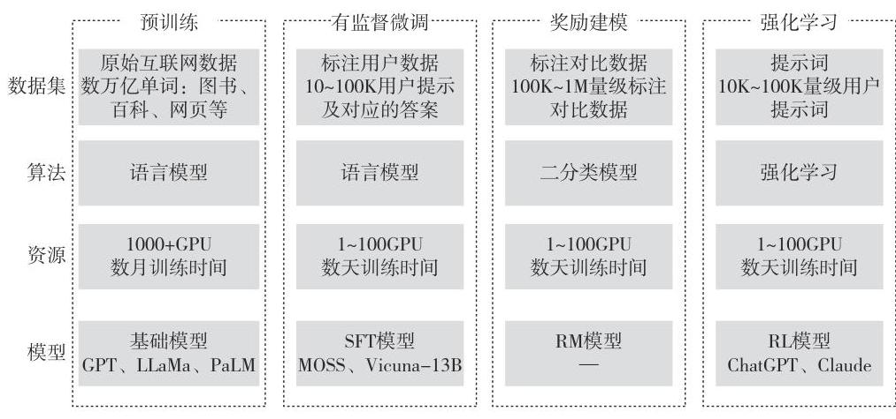
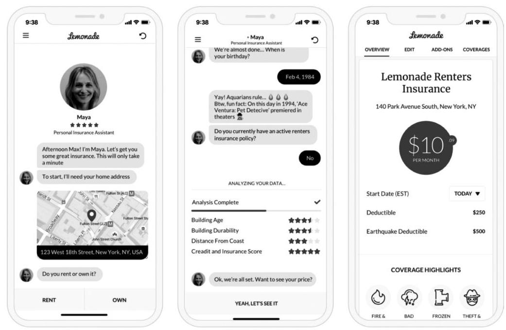
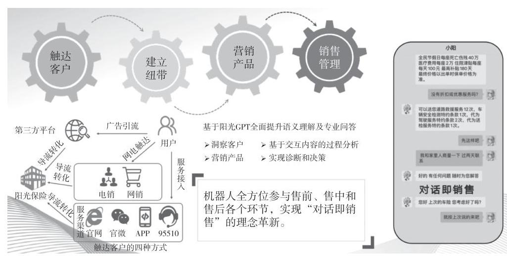

# 202311 13页 阳光保险《大模型技术在保险销售领域的应用研究》（杜新凯、吕超、刘彦、韩权杰、张晗、卢世成）（P124-136）

## Page 1
# 大模型技术在保险销售领域的应用研究 

杜新凯 吕超 刘彦 韩权杰 张晗 卢世成

[摘要] 以ChatGPT为代表的生成式AI大模型的出现, 加速了人工智能技术对人类社会生产方式和生活方式的深度革新。目前, 大模型技术已在多个行业的众多领域得到初步应用。保险行业作为数据密集型行业, 具备数据优势, 是大模型的最佳应用领域之一。保险销售是保险业务流程中的重要环节,现以人工为主的销售仍然是主要模式, 大模型技术的应用有助于提升代理人营销服务水平及效率; 随着大模型技术的发展成熟和销售领域数据的积累, 保险销售垂直领域大模型的技能将不断完善升级, 大模型的角色也将从现在的 "辅助"和"赋能"逐渐进化到"主导"和"引领", 并将重塑保险销售流程, 实现人工成本降低、销售效率提升。
[关键词] 大模型; 生成式人工智能; 保险销售; 代理人赋能; 全线上销售
[中图分类号] F840.32 [文献标识码] A

[^0]
[^0]:    [作者简介] 杜新凯, 阳光保险集团人工智能首席科学家, 科技中心人工智能部总经理; 吕超,阳光保险集团科技中心人工智能部研发团队负责人、高级专家; 刘彦, 阳光保险集团科技中心人工智能部专家; 韩权杰, 阳光保险集团科技中心人工智能部资深工程师; 张晗, 阳光保险集团科技中心人工智能部大模型算法专家; 卢世成, 阳光保险集团科技中心人工智能部大模型团队负责人。

## Page 2
# 一、引言 

以ChatGPT为代表的生成式AI大模型的出现，加速了人工智能技术对人类社会生产方式和生活方式的深度革新。

目前，大模型技术已在多个行业的众多领域得到初步应用。保险行业作为数据密集型行业，是大模型的最佳应用领域之一。大模型可以应用到保险领域的全业务流程，帮助保险公司更好地理解客户需求、优化产品设计、提高风险评估和定价能力、进行精准营销和服务、提升理赔便捷性，从而降低运营成本、提升营销和服务效能、提升客户体验。保险销售是保险业务流程中的重要环节，现阶段以人工为主的销售仍然是主要模式，存在个人的销售服务水平差异大、人员流动性大等问题，大模型技术的应用有助于提升代理人营销服务水平及效率，且随着大模型技术的发展成熟和营销领域数据的积累，可基于垂直领域大模型打造保险销售机器人，运用科技创新重塑保险销售流程，降低人力成本、提升销售效率。

## 二、大模型技术介绍

## (一) 大模型简介

大模型，全称大型语言模型（Large Language Model，LLM），指具有庞大参数规模和较高复杂程度的机器学习模型，通常具有数十亿到数万亿的参数量。大模型的设计和训练旨在提供更强大、更准确的模型性能，以处理更庞大、更复杂的数据集或任务。大模型通常能够学习到更细微的模式和规律，具有更强的表达能力和泛化能力。大模型需要大量的计算资源和存储空间，并且往往需要进行分布式计算和特殊的硬件加速技术。

大模型的技术发展历史可以追溯到2017年，当时Vaswani等提出了 Transformer架构，奠定了当前大模型领域主流的模型架构基础。2018年，谷歌提出了大规模预训练语言模型BERT，该模型是基于Transformer的双向深层预训练模型，其参数首次超过 3 亿个规模；同年，OpenAI提出了生成式预训练 Transformer模型-GPT（Generative Pre-training Transformer），极大地推动了自然

## Page 3
语言处理领域的发展。从GPT-1到GPT-3，模型的参数量从1.1亿个增长到 1750亿个，几年的时间内增长了 1000 多倍，而最新发布的GPT-4模型的参数量据悉已达到了万亿级别。

图1 全球知名大模型发布时间线
（资料来源：以论文"A Survey of Large Language Models"中Fig. 2 为基础整理）

自2019年以来，国内外知名AI科技公司先后在大模型领域有所布局。 OpenAI、谷歌、Meta、百度、阿里、科大讯飞、百川智能等国际、国内科技公司迅速开发迭代多版大模型，掀起了大模型的发展热潮。科技公司纷纷基于自身大模型推出一系列生成式 AI 应用，并对外提供 API 接口。更多的创业公司、科研机构和新的科技厂商涌入该市场，发布相关的产品服务，拉开了通用人工智能（AGI）的发展序幕。

# （二）训练流程 

大模型的参数是在大量文本数据上训练得到的。大模型具有与小规模预训练模型类似的模型架构（Transformer）和预训练目标（语言建模），但是，大模型在很大程度上扩展了模型大小、预训练数据量及总体计算量。

GPT 系列模型的训练流程可粗略分为四个阶段：预训练、有监督微调、奖

## Page 4
励建模、强化学习（见图2）。

图2 大模型的训练流程
（1）预训练（Pretraining）：让模型通过自监督学习的方式，从大规模文本数据中获得与具体任务无关的知识和语言能力，得到一个基础模型。
（2）有监督微调（Supervised Fine-Tune，SFT）：根据标注的有监督微调数据集对基础模型进行有监督的微调，得到SFT模型。
（3）奖励建模（Reward Modeling, RM）：收集人工标注的对比数据，训练奖励模型。
（4）强化学习（Reinforcement Learning, RL）：基于奖励模型，使用近端策略优化（Proximal Policy Optimization, PPO）算法进行强化学习，得到RL模型。

# （三）能力增强 

大模型具有强大的内容生成能力和语言理解能力，同时，大模型有较为全面的技术生态，可以通过工具、技巧进行能力扩展。

1. 推理能力：思维链（CoT）

思维链（CoT）是一种经过改进的prompt策略，可有效地提升大模型在复杂

## Page 5
推理任务中的表现，包括常识推理、算数推理和符号推理。思维链不是简单地使用 "输人一输出" 对来构建prompt，而是将产生最终输出的中间推理步骤加人 prompt，大幅激发了大模型解决复杂推理任务的能力。
2. 行动力：插件（Plugin）

行动力的增强主要体现在以插件（Plugin）技术为代表的工具利用。大模型的本质是基于大规模文本语料训练的文本生成模型，大模型在数值计算、实时信息检索等非文本生成型任务上表现不佳。针对该问题，业界使用外部工具来弥补大模型能力的不足。例如，使用外部计算器进行精确的数学运算，使用搜索引擎实现实时信息检索。ChatGPT是利用外部的插件体系来扩充大模型的能力，为大模型"智慧的大脑"加上"灵巧的双手"，提升了大模型的知识面广度、数据实时性及业务执行力。
（四）局限性分析
随着数据规模和参数规模的大幅提升，大模型极大地提升了人机交互体验，展现出了高质量的文本生成、多轮对话、语义理解能力以及一定的逻辑推理能力。在插件体系等工具的加持下，大模型增强了数学运算、实时信息检索、业务系统对接等能力。然而，大模型技术仍然存在一些局限性。

1. 存在幻觉

生成式AI存在幻觉，可能给出错误的答案，需要提问者自己进行筛选判别。大模型在其未经大量语料训练的领域缺乏"人类常识"和引申能力，可能会一本正经地"胡说八道"。
2. 存在数据偏见

训练数据的质量、数量和多样性，对于大模型的表现至关重要。有足够的高质量数据作为训练数据，大模型能够生成有价值及正确的回答。如果数据中存在偏见，如种族、地区、性别及文化上的偏见，大模型就可能会表现出相应的偏见。
3. 可能给出有害答案

大模型对有害的提示可能会输出有害的答案，这是因为大模型强大的生成能力在不可预见的提示下根据海量数据可能拟合出有害的生成内容。大模型的

## Page 6
研究和应用需要充分考虑安全问题，从技术和制度等多方面消除大模型的安全隐患。

# （五）应用范围 

以ChatGPT为代表的大模型的出现对于人工智能生成内容（AI Generated Content，AIGC）应用具有重要意义。AIGC即利用人工智能技术自动生成内容，内容形式包括文字、图像、语音等多种模态，与此前Web1.0、Web2.0时代的专业生产（Professional Generated Content，PGC）和用户原创（User Generated Content，UGC）相比，AIGC是新一轮内容生产方式的变革。从下游相关受益应用来看，包括但不限于智能问答、故事创作、对话类搜索引擎、代码生成、对话虚拟人、人工智能客服、机器翻译、语音助手等（见表1）。

表1 大模型应用范围

| 文本生成 | 包括机器翻译、故事创作、文稿撰写等 | 知识问答 | 包括通用知识问答、领域知识问答、轻松闲聊等 |
| :--: | :--: | :--: | :--: |
| 语义理解 | 包括文本摘要、命名实体识别、词性标注、意图识别、情绪识别等 | 代码生成 | 包括代码补全、代码翻译、语法纠正等 |
| 图像生成 | 包括海报制作、图像转换、图像编辑等 | 语音识别 | 包括语音转文字、语音合成等 |
| 推荐系统 | 包括产品推荐、电影推荐等 | 搜索引擎优化 | 包括关键词排名、搜索结果排序等 |
| 金融风控 | 包括信用评估、反欺诈等 | 数据挖掘 | 包括关联规则挖掘、聚类分析等 |
| 政府管理 | 包括舆情监测、智慧城市建设等 | 机器翻译 | 包括语义对齐、翻译质量评估等任务 |
| 教育辅导 | 包括智能作业批改、智能学习辅助等 | 智能客服 | 包括自动回复、智能推荐等 |
| 法务文书 | 包括合同审核、法律文书生成等 | 人脸识别 | 包括人脸检测、表情识别等 |
| 财经分析 | 包括股票预测、财务报表分析等 | 自动驾驶 | 包括车辆路径规划、交通信号灯识别等 |

## Page 7
# 三、大模型技术在保险销售领域的应用现状 

大模型技术已在多个行业的众多领域得到初步应用。在保险行业, 大模型技术可以助力保险机构的产品设计、销售、核保、理赔以及风险反欺诈等各个业务流程, 赋能保险业务全价值链。
（一）应用场景
在保险销售领域，大模型在售前、售中和售后的方方面面有诸多落地场景。

保险产品咨询：基于大模型技术，险企可以通过知识挂载或知识注人，打造智能化保险产品咨询机器人，为客户提供便捷的、全天候在线的保险产品咨询服务。保险产品咨询机器人可以回答客户关于保险产品的各种问题，包括保险种类、保险责任、保险期限、投保条件、保险条款、保费等。

保险产品个性化推荐：基于大模型技术构建智能保险产品推荐机器人，通过分析客户的背景、需求、偏好、风险承受能力等信息，结合大模型丰富的保险产品知识, 通过自然语言交互, 为客户提供个性化的保险产品推荐和配置方案建议，提高保险销售效率和客户体验。

保险智能配置：根据客户自身及家庭的特点，基于大模型具备的各类保险的功能、保障责任、特点等专业知识, 针对复杂、多样的客户需求, 给出专业、科学的保险配置方案建议。

营销素材设计：基于大模型技术可快速生成文案，包括营销口号、朋友圈文案、短信、微信公众号文章等。也可以与Midjourney等文生图工具结合, 智能生成宣传海报、宣传视频等视觉内容，大幅提升营销素材的生成效率。

代理人销售辅助：基于大模型技术构建的智能保险销售辅助机器人，具备更深入的客户洞察能力、更专业的领域知识、更精准的客户意图及情绪识别能力、更丰富的营销经验，可在销售过程中为代理人提供个性化的保险销售支持和建议，提高销售效率和客户满意度。

代理人智能陪练：构建针对代理人的智能陪练机器人，将营销序列话术的训练升级为自动化、智能化、场景化的体验式培训，在模拟的业务场景中循序

## Page 8
渐进、持续练习，真正帮助营销人员强化开口能力、规范话术要点、提升沟通技巧，助力销售人员向专业顾问升级。

全线上销售支持：在产品咨询、产品个性化推荐等功能的基础上，增加智能化风险评估和保费计算、在线核保等功能，打通保险销售线上化全流程，节省人力成本，提升效率。

综上所述，大模型技术在保险销售领域各方面的应用，可以提升代理人技能、提高保险销售效率，同时也为客户提供更加便捷的服务，提升客户体验。

# （二）典型案例：销售机器人玛雅 

互联网保险公司Lemonade基于GPT-3技术打造了全线上化销售机器人玛雅 （A1.Maya），为客户提供保险咨询及报价等服务。当客户有购买保险的意图时，与玛雅进行约两分钟的在线聊天，即可获得保险产品推荐及报价，客户在线支付完成后，即可以全线上化的方式完成Lemonade的投保流程（见图3）。

图3 玛雅的在线销售报价流程

## Page 9
玛雅主要由四个模块组成（见图4）。
玛雅有以下主要功能。
信息收集：获取客户的投保标的信息，如房屋住址、房屋面积及所有权、房龄及工程质量、历史索赔数据、信用数据等。风险评估及定价；根据上述收集到的信息，基于机器学习算法对风险进行评估及定价，生成风险分析报告，作为是否承保及保费确定的决策依据。产品建议及服务：基于客户需求提供个性化的保险产品建议，并帮助客户完成保险购买流程。保单助手：基于自然语言处理技术及机器学习算法，帮助客户理解复杂的保险条款及合同细节。理赔辅助：基于语音识别、自然语言处理技术，帮助客户在事故发生后进行理赔，以提升理赔效率。

| 承保 | 产品建议 | 保单助手 | 理赔 |
| :--: | :--: | :--: | :--: |
| 使用机器学习算法，对风险进行评估和定价。该模块会分析来自客户的信息，如房屋面积、住房地址、历史索赔等，并生成风险分析报告，决定是否承保和保费。 | 使用机器学习算法，为客户提供个性化的保险建议和服务。该模块分析客户的行为和需求，提供定制化的保险建议，并帮助客户完成保险购买流程。 | 使用自然语言处理技术和机器学习算法，帮助客户理解保险条款和合同内容。客户可以通过玛雅平台查询保单条款和合同细节，以便更好地理解它们的保险政策。 | 利用自然语言处理技术，帮助客户在事故发生后进行理赔。客户可以通过智能语音识别、自然语言理解等技术向该模块提供理赔信息，并自动处理理赔，从而提高理赔效率。 |

图4 销售机器人玛雅的四个模块
（资料来源：众安科技2023 AIGC\&ChatGPT保险行业应用白皮书）

玛雅实现了保险产品的全线上化销售。客户只需要与玛雅在线沟通即可完成投保，整个过程仅耗时 $1 \sim 2$ 分钟。客户也可随时在线取消保单，并获得按剩余保险期限折算的保费退款。如果客户已经购买了其他保险公司相似的产品，想要转到Lemonade平台，客户只要提供原保单的投保人、承保人等信息，剩下的保单转换工作即可交由玛雅处理。

玛雅实现了"千人千面"的保险个性化定价。根据投保人住所的地址、面积、房龄及工程质量、信用数据、历史索赔数据等信息，对不同的投保人给出

## Page 10
了不同的费率，实现了 "千人千面" 的个性化定价。客户还可以在移动端自由选择保单所覆盖的保障范围、调整免赔额，以获得不同的保费费率。

除了销售机器人玛雅，Lemonade还推出了理赔机器人吉姆（ALJim）。 Lemonade运用科技创新重塑了保险业务流程，取消了经纪人和代理人渠道，将包括投保、理赔、服务在内的业务流程均通过数字化、智能化的方式在线完成，节省了大量人力成本。Lemonade的保险产品保障范围与传统保险公司并无明显区别，但保单定价显著低于传统保险公司。

# （三）应用实践 

在对大模型技术及行业应用现状进行跟踪研究的基础上，本文规划建设了以GPT大模型为核心技术能力的正言大模型开放平台，一方面，链接外部大模型技术；另一方面，在开源大模型私有化部署的基础上进行模型微调、知识挂载注入公司的知识和数据，构建大模型技术底座，建立保险垂直领域能力。

基于正言大模型开放平台，利用大模型技术底座的保险领域垂直技术能力，目前已实现在保险销售领域诸多应用场景的落地应用，效果初现。

在保险产品咨询场景，打通了FAQ（基于大模型升级的常见问题解答）、 DocQA（基于langchain的文档问答）能力链路，形成了一套较成熟的专业问答解决方案。在此基础上实现了"阳光升金牌销售员"，支持对"阳光升（B款）"的产品内容进行问答，初步具备能介绍产品、回答问题的能力，问题解答率 （准确答复的问题数/答复问题总数）达到 $87 \%$ ，较传统方式提升 $8.7 \%$ 。

在营销素材设计场景，支撑公司端午节营销海报的自动生成，当日展业夹使用人数、生成的海报转发和下载次数均超过 2000 。

在全线上销售支持场景，在车险全线上销售机器人项目中，通过设计专用提示词、基于LoRA进行微调训练，自研大模型阳光GPT的信息抽取任务准确率达到 $87 \%$ ，较传统方式提升 $15 \%$ ；意图识别任务准确率达到 $90 \%$ ，较传统方式提升 $5 \%$ （见图5）。

在上述工作的基础上，继续规划建设具备"会讲产品""会给建议""能回答问题""能用生动的语言打动人"四大能力的销售机器人，并积极推动各应用场景落地，充分释放大模型的创新生产力。

## Page 11
图5 车险全线上销售机器人产品架构

# （四）现状分析 

目前，众多保险公司及保险科技公司正在积极探索应用大模型技术来提高销售效率及客户满意度，整体来看，目前的应用情况具有以下特点。

在大部分应用场景中，以大模型为代表的智能技术，其角色还只是"辅助"和"赋能"，距离"主导"和"引领"还有一定距离。在保险产品咨询及比较、保险智能配置、代理人销售辅助、代理人智能陪练等诸多应用场景中，大模型应用产品的作用集中在销售辅助和代理人赋能方面，尚不能独立主导并完成完整的销售流程。这是因为保险产品的复杂性及客户需求的多样性，对大模型应用产品的多方面能力提出了较高要求。

个别以大模型技术为基础构建的销售机器人，销售渠道集中在线上，销售产品限制为"低单价、标准化程度高的产品"。Lemonade对外销售的保险产品包括房屋保险（包括房主保险、房客保险）以及宠物保险，产品标准化程度高、关键指标易于量化，通过机器学习算法建模，输入风险指标即可得出相应保费，通过机器人进行在线销售具有较强的可行性。而长期重疾险等单价高、复杂程度高的产品，要考虑的风险因素数量多、情形复杂，很难在短期内通过

## Page 12
机器学习算法建模，实现智能化风险评估和保费计算、在线核保。
综上所述，要实现大模型技术应用的全渠道、全产品覆盖，还需要精耕细作，从领域数据积累和模型结构优化等方面入手，全面提升大模型的语义理解、情感识别、产品条款、核保理赔、健康医疗等各方面的能力。

# （五）技术挑战 

将大模型技术应用到保险行业也面临诸多技术挑战。
首先是数据质量问题，大模型需要大量的高质量数据作为基础，但保险行业的数据往往存在结构化程度低、不完整和失真的情况。这对大模型的训练和性能产生负面影响。为了克服这一挑战，需要投入更多资源来清洗、标注和整理数据，以提高模型的准确性和可靠性。

其次是算力和技术难题，大模型需要强大的计算能力和技术支持，而保险销售过程中往往需要快速作出决策，如在客户提出问题或请求后立即回应。如果大模型的训练和推理过程需要较长时间，这可能导致实时性不足。为了解决这些挑战，可以考虑使用一些轻量级的模型或者采用分布式计算等技术来提高模型的响应速度。这对保险公司的计算资源和技术实力提出了很高的要求。

最后是隐私保护问题，由于保险销售涉及敏感信息的处理和传输，因此需要确保模型和数据的安全性。建议采用本地部署的大模型，并采取相应的安全措施，如数据加密和访问控制等，避免泄露客户的敏感信息。

## 四、结语

随着人工智能技术的快速发展，大模型将在保险销售领域发挥越来越重要的作用。在能力上，大模型的技能将不断完善升级，从现在的产品问答、条款比较、意图识别、智能培训等能力，逐渐扩充升级个性化保险规划及建议、精准风险评估及定价、多模态的情绪感知、提供情绪价值的对话能力。在应用场景上，大模型应用的产品和渠道将不断扩充，从单价低、标准化程度高的产品逐渐演进到单价高、复杂程度高的产品，并从线上渠道逐渐实现全渠道覆盖。在角色上，大模型将从现在的"辅助"和"赋能"逐渐进化到"主导"和"引

## Page 13
领"，目前，大模型的主要作用是为代理人赋能。未来，部分技能初级的代理人将可能被大模型取代；大模型技术甚至将重塑保险销售流程，实现人工成本降低、销售效率提升。

在技术上，大模型将更加注重发展在垂直领域的应用能力，通过模型微调、插件工具、知识挂载等技术，实现领域垂直数据与大模型通用能力的融合，从而提升大模型在各垂直领域的应用效果。在具体应用落地过程中，将通过数据标注、数据筛选等方法保证垂直领域数据的质量；根据实际应用场景确定通用数据和领域数据的配比，避免大模型通用能力的损失；选择合适的模型微调技术，确保大模型的应用效果。

目前，我们基于正言大模型开放平台实现了大模型技术在保险销售领域的初步应用，应用效果初现。未来，我们将继续积极探索大模型技术在保险销售领域应用的更多可能，为客户提供更加个性化、智能化的产品及服务，提升客户的获得感和满意度；为行业降低运营成本，提升运营效率，助力保险行业更高质量的可持续发展。

# 参考文献 

[1] A Survey of Large Language Models, Wayne Xin Zhao, Kun Zhou, Junyi Li, and etc. https:// arxiv.org/abs/2303.18223.
[2] 中国保险行业数智化展望及全球案例分析白皮书[R]. Roland Berger \&百度智能云, 2022-10, https://cloud.baidu.com/solution/industry-report.html.
[3] Mikko Riikkinen et al. Using Artificial Intelligence to Create Value in Insurance[J]. International Journal of Bank Marketing,2018(6).
[4] 众安科技2023 AIGC\&ChatGPT保险行业应用白皮书, https://zhongan.io/report/AIGCinsurance?source $=$ QRcode.
[5] AI大模型市场研究报告（2023）——迈向通用人工智能，大模型拉开新时代序幕, A Frost \& Sullivan White Paper. https://13115299.s21i.faiusr.com/61/1/ABUIABA9GAA gss6pogYouLHDmAM.pdf.
