_Note: Source document was split into 3 OCR chunks (pages 1-19, pages 20-44, pages 45-48) to stay within token limits._

# 202401 interpretable-ml-methods

## Page 1
# Using Interpretable Machine Learning Methods: An Application to Health Insurance Fraud Detection

**JANUARY | 2024**

## Page 2
# Using Interpretable Machine Learning Methods 

## An Application to Health Insurance Fraud Detection

Author Satya Sai Mudigonda, AlAl
Adjunct Professor of Actuarial Data Science Sri Sathya Sai Institute of Higher Learning

Prof Pallav Kumar Baruah, PhD
Professor of Computer Science
Sri Sathya Sai Institute of Higher Learning

Phani Krishna Kandala, AlAl
Visiting Faculty of Actuarial Data Science
Sri Sathya Sai Institute of Higher Learning

Rohan Yashraj Gupta, PhD, ASA, AIA
Visiting Faculty of Actuarial Data Science
Sri Sathya Sai Institute of Higher Learning

Srinand N Hegde
MSc Mathematics student specializing in Actuarial
Science
Sri Sathya Sai Institute of Higher Learning

Sumanth Chebrolu
MSc Mathematics student specializing in Actuarial
Science
Sri Sathya Sai Institute of Higher Learning

## Give us your feedback! Take a short survey on this report.

## Caleat and Disclaimer

The opinions expressed and conclusions reached by the authors are their own and do not represent any official position or opinion of the Society of Actuaries Research Institute, Society of Actuaries, or its members. The Society of Actuaries Research Institute makes no representation or warranty to the accuracy of the information.

## Page 3
# CONTENTS 

Executive Summary ..... 4
Section 1: Introduction ..... 5
1.1 Interpretability of machine learning models ..... 5
Section 2: Schematic Representation ..... 7
2.1 Stage 1 - Data Pre-processing and Model Training ..... 7
2.2 Stage 2 - Interpretable Machine Learning Techniques Implementation ..... 8
Section 3: Overview of Fraud Detection Case Study ..... 10
3.1 Data pre-processing ..... 10
3.2 Case study models ..... 12
Section 4: Feature Importance ..... 14
4.1 Permutation feature importance ..... 15
4.1.1 Theory and Description ..... 15
4.1.2 Case study ..... 16
4.2 SHAP Feature Importance ..... 17
4.2.1 Theory and Description ..... 17
Section 5: Main Effects ..... 22
5.1 Global Model Agnostic Methods ..... 22
5.1.1 Partial Dependence Plots ..... 22
5.1.2 Accumulated Local Effects (ALE) Plots ..... 25
5.1.3 Global Surrogate ..... 28
5.1.4 SHAP ..... 30
5.2 Local Model-Agnostic Methods ..... 33
5.2.1 Individual Conditional Expectation (ICE) ..... 33
5.2.2 LIME ..... 36
Section 6: Interaction Effects ..... 39
6.1 Friedman's H-Statistic ..... 39
6.1.1 Theory and Description ..... 39
6.1.2 Case Study ..... 40
6.2 SHAP Interaction Effect ..... 41
6.2.1 Case Study ..... 41
Section 7: Business Interpretation for Feature Importance ..... 43
Acknowledgments ..... 46
References ..... 47
About The Society of Actuaries Research Institute ..... 48

## Page 4
# Using Interpretable Machine Learning Methods 

## An Application to Health Insurance Fraud Detection

## Executive Summary

This project endeavors to deliver a comprehensive research paper outlining a framework for interpretable machine learning algorithms tailored for fraud detection in health insurance. Machine learning algorithms excel at constructing intricate models by discerning patterns in data, yet the risk of overfitting to training data necessitates rigorous testing by modelers and users. While certain validation practices for linear models apply to machine learning, the challenge of interpretability remains pronounced.

Our report establishes a foundational framework for implementing interpretable machine learning techniques in the context of health insurance fraud detection. In the case of health insurance fraud detections, the number of fraudulent cases is much less than non-fraudulent case. This disparity can cause machine learning models to be biased towards the non-fraudulent class thus predicting fraudulent claims as non-fraudulent. To tackle this issue, it is a standard practice to synthetically increase the number of minority (fraudulent) class samples or decrease the majority (non-fraudulent) class samples through methods which are called data imbalance techniques. We have implemented four different data imbalance techniques during the pre-processing stage which are explained in more detail in section 3. We have done a comparative study of three machine learning models and implemented interpretability techniques on these three models. More details about the working of machine learning models implemented are given in section 3. The application of various interpretable machine learning methods on a real-life health insurance dataset is detailed across distinct sections. We delve into the understanding of feature importance techniques, scrutinize how inputs influence outputs, and explore interaction effects. Feature importance techniques can help us understand the importance of various features in greater detail and let us make some business sense. A dedicated section is also devoted to interpreting these results in a manner that aligns with business logic.

The insights derived from these methods, coupled with accurate interpretation, empower us to unravel the intricacies of black-box models and effectively communicate results to diverse stakeholders. This executive summary provides a glimpse into our efforts to enhance transparency and understanding in the realm of health insurance fraud detection through interpretable machine learning.

## Give us your feedback!

Take a short survey on this report.

## Page 5
# Section 1: Introduction 

The health insurance industry is confronted with a pressing issue in the form of fraudulent activities, which impede its financial integrity and the broader healthcare ecosystem. According to data sourced from the United States Sentencing Commission, the fiscal year 2022 witnessed an alarming count of 64,142 reported cases of health insurance fraud ${ }^{1}$. Medicare fraud costs the US federal government around 68.7 billion USD annually ${ }^{2}$. As fraudulent claims result in huge losses for insurance companies, insurance companies have established mechanisms to detect, investigate and mitigate fraudulent claims. However, the predominant approach adopted to detect fraud thus far has been rooted in heuristic methodologies which are time-consuming and expensive. With the growth of Big Data and Machine Learning, insurers have started looking at leveraging machine learning capability. Machine learning models provide a dynamic and data-driven approach to health insurance fraud detection. Their ability to process large datasets, identify complex patterns, and adapt to changing circumstances makes them an asset against fraudulent activities. Despite this, implementing machine learning models has been a challenge in the highly regulated insurance industry. This is mainly because the high-performance models are complex and often termed as "black box" models.

Machine learning models, particularly black-box models like Random Forest and XGBoost, offer distinct advantages for enhancing fraud detection. A primary advantage lies in their rapidity of generating outcomes. Post-training, these models swiftly discover potentially fraudulent claims, compared to manual assessment by analysts which is time intensive. Unlike rule-based fraud management systems, which struggle with escalating demands on their rule libraries and, in turn, may experience system sluggishness and heavy maintenance burden, machine learning models exhibit a contrary trait. They perform better with a larger amount of data. Machine learning models possess the capacity to narrow down the pool of claimants warranting scrutiny. By prioritizing the minimization of false negatives and maximizing true negatives, these models operate as finely tuned filters. Consequently, insurers are empowered to concentrate investigative efforts on a select cohort.

In many instances, it's crucial for both users and reviewers of models to determine if the connections between the model's inputs and outputs align with legal and regulatory requirements, make sense from a business perspective, and can be conveyed to individuals affected by the model's use. However, the application of black-box models in the insurance sector faces challenges due to their inherent lack of transparency. Assessing whether the model's structure aligns with its intended purpose falls within the purview of actuaries. However, without the assistance of interpretability techniques, understanding the inner workings of these models can be challenging. This is where the importance of making machine learning models interpretable becomes evident.

### 1.1 INTERPRETABILITY OF MACHINE LEARNING MODELS

In this paper, our objective is to introduce a comprehensive framework designed to enhance the interpretability of machine learning models for the purpose of fraud detection in health insurance. This proposed framework will be structured into two distinct sections: data preprocessing \& model training, and the application of Interpretable Machine Learning (IML) techniques. However, our primary focus throughout the remainder of this paper will be on the implementation and interpretation of IML methods. We will delve into the details of these methods, emphasizing their utility in comprehending the impact of independent variables on the dependent variable.

Furthermore, we will delve into the concept of feature importance, investigating how specific attributes or variables wield varying degrees of influence within the model. We will also probe into the interactions that occur between

[^0]
[^0]:    ${ }^{1}$ https://www.ussc.gov/sites/default/files/pdf/research-and-publications/quick-facts/Health_Care_Fraud_FY22.pdf Accessed 08/30/2023
    ${ }^{2}$ https://www.conroysimberg.com/blog/insurance-fraud-costs-the-u-s-308-billion-
    annually/\#-\%text=The\%20Coalition\%20Against\%20Insurance\%20Fraud,insurance\%20fraud\%20has\%20been\%20updated. Accessed 08/30/2023

## Page 6
different features, shedding light on how these relationships can impact the overall model outcomes. Additionally, we will investigate the influence of correlations among variables, illuminating how these interdependencies can affect the models. To get a better understanding, we will accompany each of these explorations with tangible, realworld examples and practical insights.

In our illustrative example, we employed six distinct machine learning models, namely Decision Tree, Random Forest, XGBoost, GLM (Generalized Linear Model), Naïve Bayes, and GBM (Gradient Boosting Machine). These models were trained on a real-world group health insurance dataset from the Ayushman Bharat Health Insurance scheme which is the world's largest health insurance. To address class imbalance, we applied four different balancing techniques: Adaptive Synthetic Sampling (ADASYN), Synthetic Minority Over-sampling Technique (SMOTE), Majority Weighted Minority Over-Sampling Technique (MWMOTE), and Random Over-Sampling Examples (ROSE). For the sake of brevity and clarity within this document, we will provide selected samples from the results. The complete set of results, along with detailed analyses and code, will be accessible on our GitHub repository for reference and further exploration.

We will be focusing on implementing interpretable machine learning techniques and will give a brief explanation about model training and pre-processing. The IML methods may be applied to instances where the model's predictions are incorrect. Our main goal is to comprehend what the model is predicting, rather than determining what is objectively correct.

The model we have implemented serves the purpose of helping the modelling team gain insights into how these model's function. However, it doesn't provide a comprehensive understanding of these black-box models.

## Page 7
# Section 2: Schematic Representation 

Figure 1
SCHEMATIC DIAGRAM OF IML METHOD IMPLEMENTATION

The flowchart displayed above is a schematic representation of our approach for the application of IML methods to interpret black-box models in health insurance fraud detection. The flowchart has been broadly classified into two stages: Data Pre-processing and Model Training is the first stage and Interpretable Machine Learning techniques implementation is the second stage.

### 2.1 STAGE 1 - DATA PRE-PROCESSING AND MODEL TRAINING

Our framework commences with raw data, comprising a health insurance claims dataset with a binary response variable indicating fraudulent claims. To enrich the data, we introduce novel features using trigger functions, created based on the intrinsic domain knowledge of the actuarial field. These trigger functions engender additional attributes, all constructed from the existing dataset's variables. For example, the "gender trigger map" is born, capturing instances where medical procedures intended for one gender were conducted on another, expressed as 1 or 0 . This augmentation process leads to our data imbued with these informative triggers which we call 'Data with Triggers' as shown in the third box.

Next, the data undergoes a journey of data preprocessing, beginning with data cleaning. Inconsistencies in data types are rectified, ensuring uniformity and accommodating machine learning algorithms. The subsequent phase, data transformation, encompasses feature selection to remove non-contributory attributes, encoding to numerically represent categorical variables, and feature scaling to mitigate undue influence by variables with disparate value ranges. While our framework encompasses an array of preprocessing steps crucial for optimizing model performance on the dataset, it's worth noting that not every case demands the entirety of these procedures. The essence of preprocessing within our framework is to sculpt the dataset into a form that facilitates the model's optimal functioning, even though specific scenarios may warrant a more streamlined approach. The comprehensive suite of preprocessing techniques, from data cleaning and transformation to feature selection and scaling, is tailored
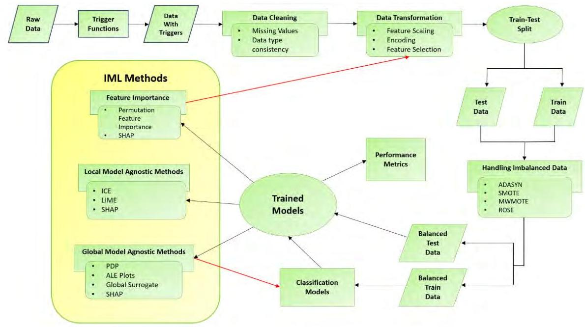

## Page 8
to lay a robust foundation for the model's operation. However, there might arise instances where certain steps prove more pertinent than others, contingent on the dataset's innate characteristics.

Following these preparatory steps, the dataset is partitioned into training and testing subsets using established packages and methods. Hence two arrows emerge out of Train-Test Split acknowledging the train and test data are separate. Following this stage, both these datasets are sent through a stage to balance the imbalance datasets. Acknowledging the imbalanced nature of our target classes, where instances of fraudulent claims are a minority, we employ common data imbalance techniques. ADASYN, SMOTE, MWMOTE, and ROSE are harnessed to rectify this imbalance, resulting in balanced training and testing datasets. As train and test data are balanced independent of each other, we again get two different datasets, and we call them 'Balanced Test Data' and 'Balanced Train Data'. Two different arrows emerging from the Handling Imbalance Data signify the same.

Given that our problem revolves around binary classification, we harness a consortium of six machine learning models: Decision Tree, Random Forest, XG Boost, GLM, Naive Bayes Classifier, and GBM. While some models yield categorical outputs, those of regression nature prompt us to establish a threshold. Instances surpassing this threshold are categorized as "fraud," while others are deemed "non-fraud." These models are cultivated using the training dataset, and encapsulated as variables that we call "Trained Models" within our schematic framework. The performances of these trained models are assessed by using performance metrics like Accuracy, Precision, Recall and F1 Score. The models are fine-tuned to improve the values of these performance metrics. The next step involves implementing the Interpretability techniques.

# 2.2 STAGE 2 - INTERPRETABLE MACHINE LEARNING TECHNIQUES IMPLEMENTATION 

We've categorized interpretability methods into three main groups: Feature Importance, Local Model Agnostic Methods, and Global Model Agnostic Methods, each depicted by distinct boxes in the IML Methods section. These methods receive trained models as input, represented by arrows connecting the Trained Models box to each interpretability method box.

The initial phase focuses on Feature Importance, where we identify the most impactful features for predicting the response variable. We've implemented Permutation Feature Importance and SHapley Additive exPlanations (SHAP) Feature Importance methods for this purpose. These methods unveil the key features influencing the detection of fraudulent claims. Understanding feature importance aids in comprehending how the trained model interacts with inputs. Armed with this knowledge, we can streamline our dataset during the data transformation stage by removing less influential features. A red arrow links the Feature Importance box to the Data Transformation box, illustrating how insights from feature importance guide dataset refinement, resulting in updated trained models.

The subsequent stage entails employing Global Model Agnostic Methods. Notable methods in this category encompass Partial Dependence Plots (PDP), Accumulated Local Effect (ALE) plots, Global Surrogate, and SHAP. Each approach sheds light on different facets of model behavior. SHAP highlights how the model generally perceives feature importance. Global Surrogate approximates a complex model with a simpler, understandable one like linear regression, facilitating insights into the black-box model's reasoning. Partial Dependence Plots unveil the influence of each feature on predictions, while ALE plots address correlations between features for a more accurate portrayal. Overall, these methods inform us about feature effects and potential biases, providing valuable insights into model behavior.

In general, global model agnostic methods tell us how each feature affects the output. This gives us an understanding if our model is 'biased' in any way. We tell a model is biased if the predictions it makes are based on unacceptable methods, say, if it assigns more weight for being fraud for a person of specific gender or race. In such cases, we will have to re-train our models. Hence an arrow points towards classification models' box from the global

## Page 9
model agnostic methods box to show that based on the explanation of the model working, we might have to retrain the model.

After exploring the global model agnostic methods, we move on to the local model agnostic techniques. These methods help us understand how the machine learning model functions for each specific instance in the dataset, showing us how it arrives at predictions. Within this category, we've employed three models: Individual Conditional Expectation (ICE) plots, SHAP, and Local Interpretable Model-agnostic Explanations (LIME). ICE plots give us a visual idea of how changing a feature value for a particular instance affects its prediction. These plots can also help us spot instances that behave unusually. The Partial Dependence Plot (PDP) is an overall summary of ICE plots, showing the general trend, while ICE plots offer a more detailed look at individual cases. SHAP serves as both a local and global model agnostic technique. It quantifies the influence of each feature on the prediction for a specific instance using Shapley Values. These values are averaged to provide a broader understanding of feature importance across the model. LIME, on the other hand, provides insights into the contribution of specific features to predicting "fraud" or "non-fraud" for a given instance and the extent of that contribution. Combining these methods gives us a clearer view of how the model operates at the level of individual observations. This comprehensive approach significantly improves our understanding of how the model makes decisions on a case-by-case basis.

## Page 10
# Section 3: Overview of Fraud Detection Case Study 

Ayushman Bharat, also known as Pradhan Mantri Jan Arogya Yojana (PMJAY), is the world's largest group health insurance scheme launched by the Government of India in September 2018. The aim of this scheme is to provide health insurance coverage to economically vulnerable families in India.

Under this scheme, eligible beneficiaries are entitled to free treatment for various medical conditions at empaneled hospitals across India. The scheme covers more than 10 crore ( 100 million) families, which is approximately 50 crore ( 500 million) individuals, making it the world's largest government-funded healthcare program.

In addition to providing healthcare coverage, Ayushman Bharat also aims to establish health and wellness centers across the country, with the goal of promoting preventive healthcare and early detection of illnesses. The scheme is a major step towards achieving Universal Health Coverage (UHC) in India, which is a key sustainable development goal of the United Nations.

The data used for this research is from August 2019 to August 2020. We have two data sets initially: Claims data and Policy data. Later these two were combined to form a single data set on which data pre-processing was done.

### 3.1 DATA PRE-PROCESSING

One key step before the pre-processing stage that is worth mentioning is the addition of new variables using trigger functions. Trigger functions are functions created based actuarial domain knowledge and the variables created using this help us improve the quality of information and detect fraudulent claims. A description of the triggers added is included below.

- Age-based fraud trigger - The triggers file contains reasonable age ranges for getting a certain medical procedure done. This function creates a flag to identify all the claimants whose age is falls outside this range.
- Gender-based fraud trigger - Some procedures are gender specific. This function creates a red flag if a procedure is performed for a claimant for a wrong gender. For example, a gynecologic procedure for a male claimant will raise a red flag.
- Close proximity-based fraud trigger - A claim is in proximity if the treatment start date is very close to the policy commencement date. This function will raise a flag for such claims.
- Claim amount-based fraud trigger - For each procedure there is a specific amount that is generally agreed between the insurer and the medical service provider. This is especially the case for cashless claim processing. If the claim amount is higher than this agreed procedure specific amount it will raise a flag.
- Hospital admitted days-based fraud trigger - For each procedure there is a reasonable number of days a claimant could be admitted in the hospital. If the number of days admitted is higher than what is reasonable for that procedure this function will raise flag.
- Treatment date validity-based fraud trigger - For each policy there is a commencement and termination date within which the claim event(treatment) should occur. If the treatment date is outside these dates, it will raise a flag.
- Claim reporting delay-based fraud trigger - For each policy there is a treatment start date and treatment end date. The claim should be reported within the permissible days after treatment end date(discharge). If the claim reported date is outside the permissible limit it will raise a flag.
- Empaneled hospitals (medical service provider) based fraud trigger - The insurer generally empanels hospitals to service its policy holders. In the process of empanelment, the insurer ensures that the hospital has the required facilities and also agrees the tariff for each of the treatments. If the hospital mentioned is not a part of the empaneled list of hospitals it will raise a flag.

## Page 11
- Claim count-based fraud trigger - We don't expect the policyholder to get a given medical treatment more than few times a year, depending on the nature of the treatment. If the policy holder has taken a given treatment unreasonably high number of times, it will raise a flag.
- Procedure overlap based fraud trigger - There could be some overlaps between procedures in practice. For example, if a claim is made for normal delivery, a claim for cesarean after a month is not possible and should be investigated for fraud.
- Hospital distance-based fraud trigger - It is reasonable to expect that the policyholder gets treated in the nearest hospital. If the distance between the residence location and the hospital location is more than a defined threshold, this function will raise a flag.

In addition to these variables, there are other pieces of information that relate to the policyholder, such as the claim amount, gender, and data about the hospital and treatment.

A major challenge associated with fraud detection problem in health insurance is that the fraudulent cases are very less compared to non-fraud cases. The figure below highlights this disparity between the fraudulent and nonfraudulent cases.

Table 1
IMBALANCE IN DATASET

|  |   |   |
| --- | --- | --- |
|  Number of instances | 3263 | 105930  |
|  Proportion | $3.0 \%$ | $97.0 \%$  |

Figure 2
IMBALANCE IN THE TRAIN DATA

In dealing with data imbalances, it's essential to mitigate potential biases that could distort the model's results. To counter this challenge, we focus on balancing the dataset, employing methods that involve either augmenting the minority class or reducing the majority class. In our study, we have explored several techniques tailored for this purpose, including:

- ADASYN (Adaptive Synthetic Sampling): ADASYN is an adaptive technique that emphasizes generating synthetic samples for the minority class, with a specific focus on difficult-to-learn instances. It achieves this by analyzing the density distribution of minority samples and generating synthetic instances where they are sparse.
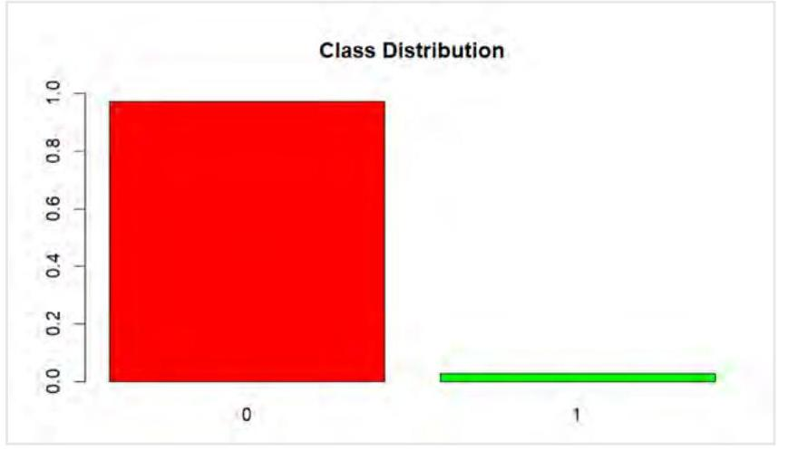

## Page 12
- SMOTE (Synthetic Minority Over-sampling Technique): SMOTE involves generating synthetic minority samples by interpolating between existing minority instances. It selects a minority instance and its $k$ nearest neighbors, creating new instances along the line segments connecting these neighbors in the feature space.
- MWMOTE (Majority Weighted Minority Over-sampling Technique): MWMOTE is a technique that selectively generates synthetic minority samples based on the weights assigned to majority instances. It gives more emphasis to generating synthetic samples in regions of the feature space where the majority class intrudes upon the minority class.
- ROSE (Random Over-Sampling Examples): ROSE operates by creating multiple bootstrap samples from the minority class, followed by introducing noise to each minority instance. This randomness helps in generating diverse synthetic samples and mitigates overfitting issues.

These techniques have been systematically implemented in our research project to ensure a robust and unbiased analysis of the data. However, we will be presenting only the work that has been done using ADASYN imbalance technique in this report while making the code for the rest available.

# 3.2 CASE STUDY MODELS 

While there are numerous complex high performing black box models available for us today, we have implemented about six machine learning models in our case study among which four can be considered as black-box models. We have implemented Decision Trees, Random Forest, eXtreme Gradiant Boosting (XGBoost), Generalized Linear Models (GLMs), Gradient Boosting Machines (GBM) and Naïve Bayes models.

To keep the report concise, we'll present results from the Random Forest, GLM, and XGBoost models for illustration purposes. The results for other models will be included in the code made available.

Random forests are a combination of tree predictors such that each tree depends on the values of a random vector sampled independently and with the same distribution for all trees in the forest (Leo Brieman). After a large number of trees is generated, they vote for the most popular class. For training each of the trees, a sample of the dataset is used instead of utilizing the entire dataset, as in the case of Decision Trees. Furthermore, in each tree, not all variables are employed for splitting the nodes. These steps ensure that model doesn't overfit.

The figure below summarizes the working of random forest.

## Page 13
Figure 3
DIAGRAMATIC REPRESENTATION OF RANDOM FOREST

Tree boosting is a highly effective and widely used machine learning method. Boosting grows trees sequentially by using information from previous trees unlike bagging methods where bootstrapping is used. XGBoost which stands for eXtreme Gradient Boosting, is an optimized distributed gradient boosting library designed for efficient and scalable training of machine learning models. It is an ensemble learning model that combines the predictions of multiple weak models to produce a stronger prediction. XGBoost was introduced by Chen and Guestrin (2016). Since then it has found lots of success in various machine learning competitions in data science platform Kaggle. To boost regression trees, we choose the number of splits we want to include in our tree. Then, we create multiple trees of that size, where each new tree is dependent on the previous tree. Each new tree after the first is created by predicting the residuals of the previous tree.

Generalized Linear Models (GLMs) are widely utilized in the field of actuarial science due to their excellent performance and ease of interpretation. Unlike complex models such as Random Forest and XGBoost, GLMs are straightforward to understand. This simplicity arises from the availability of various statistical tests that assess their performance and the clear functional relationship they establish between the response variable and explanatory variables.

First introduced by Nelder and Wedderburn in $1972^{3}$, GLMs hold a prominent place in statistical modeling. In our research report, we have included GLMs for comparative analysis. They serve as a valuable benchmark, enabling us to evaluate the effectiveness of interpretability models. Additionally, GLMs are instrumental in validating the results provided by interpretability techniques when applied to black-box models. This structured approach ensures the credibility and reliability of our research findings.

[^0]
[^0]:    ${ }^{3}$ https://www.jstor.org/stable/2344614
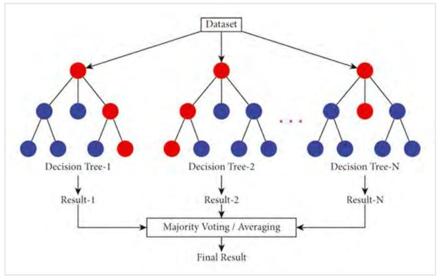

## Page 14
# Section 4: Feature Importance 

In the context of black-box models such as XGBoost and GBM, traditional methods for understanding feature importance, like chi-square tests and coefficient magnitudes, are not readily applicable due to the inherently complex nature of these models. In such cases, the concept of feature importance becomes an invaluable tool. Feature importance is a crucial measure that tells us how much each feature contributes to a model's prediction. It helps us identify which features don't really matter and can be removed. This can make our model faster and possibly even better. Feature importance scores are vital for making machine learning models easier to understand. By looking at these scores, we can figure out why a model makes a specific prediction and how we can tweak the features to change that prediction. Feature importance can be classified into two groups:

- Model Agnostic
- Model Specific

Model-agnostic methods are not tied to a specific model and can be applied to any model in general. We've employed two such methods: Permutation Feature Importance and SHAP Feature Importance. On the other hand, model-specific methods are tailored to a particular model and use measures unique to that model, which may not apply to others. For a more comprehensive understanding, we've also included model-specific measures for Random Forest and XGBoost, allowing us to explore the distinctions between model-agnostic and model-specific approaches.

Figure 4
SUMMARY OF IMPORTANT FEATURES

|  |  | Feature Importance Technique |  |  |  |  |  |
| :--: | :--: | :--: | :--: | :--: | :--: | :--: | :--: |
|  |  | Shap for Random Forest | Shap for XGBoost | SHAP for GLM | PFI for Random Forest | PFI for XGBoost | PFI for GLM |
| RANK | 1 | Claim_reported_delay_f ag | No_of_days_stay ed | $\begin{gathered} \text { claim_reported_d } \\ \text { elay_flag } \end{gathered}$ | $\begin{gathered} \text { claim_reported_delay } \\ \text { _flag } \end{gathered}$ | no_of_days_staye d | primary_procedure_cod e5100214 |
|  | 2 | Distance | Claim_reported_ delay_flag | $\begin{aligned} & \text { primary_procedur } \\ & \text { e_code5100214 } \end{aligned}$ | no_of_days_stayed | $\begin{gathered} \text { claim_reported_de } \\ \text { lay_flag } \end{gathered}$ | $\begin{gathered} \text { claim_reported_delay_f } \\ \text { ag } \end{gathered}$ |
|  | 3 | Claim_duration_days | $\begin{gathered} \text { Claim_duration_d } \\ \text { ays } \end{gathered}$ | $\begin{gathered} \text { claim_amount_flag } \\ \text { g } \end{gathered}$ | distance | distance | gender_flag |
|  | 4 | Birth_date | Distance | Gender_flag | claim_count_flag | claim_count_flag | hospital_locationmoga |
|  | 5 | Hospital_locationrupna g ar | Claim_count_flag | Primary_procedur e_codeM100068 | claim_duration_days | $\begin{gathered} \text { claim_duration_da } \\ \text { ys } \end{gathered}$ | claim_amount_flag |
|  | 6 | Approved_allowed_amo unt | Approved_allowe d_amount | Primary_procedur e_codeM100009 | gender_flag | $\begin{gathered} \text { Medical_service_p } \\ \text { rovider_idHOSP3G } \\ 81376 \end{gathered}$ | $\begin{gathered} \text { medical_service_provide } \\ \text { r_idHOSP3G81376 } \end{gathered}$ |
|  | 7 | Claim_count_flag | Hospital_location bathinda | Hospital_location honda | hospital_locationmog a | hospital_locationr upnagar | $\begin{gathered} \text { medical_service_provide } \\ \text { r_idHOSP3P12536 } \end{gathered}$ |
|  | 8 | Primary_procedure_code 5100214 | Birth_date | claim_count_flag | close_prox_flag | birth_date | primary_procedure_cod eM100068 |
|  | 9 | No_of_days_stayed | Gender_flag | $\begin{gathered} \text { Medical_service } \\ \text { provider_idHOSP3 } \\ \text { P10675 } \end{gathered}$ | hospital_locations.a.s _nagar | $\begin{gathered} \text { Medical_service_p } \\ \text { rovider_idHOSP3P } \\ 20747 \end{gathered}$ | hospital_locationrupna g ar |
|  | 10 | Hospital_locationbathind a | Close_prox_flag | $\begin{gathered} \text { Hospital_distance } \\ \text { flag } \end{gathered}$ | $\begin{gathered} \text { Medical_service_provi } \\ \text { der_idHOSP3G8137 } \end{gathered}$ | hospital_location moga | hospital_distance_flag |

The above table ranks all the features for SHAP and Permutation Feature Importance. The feature 'claim_reported_delay_flag' appears to be the most important feature in most the cases followed by 'no_of_days_stayed'. Moreover, 'claim_reported_delay_flag' ranks second whenever it doesn't rank first.

For each policy there is a treatment start date and treatment end date. The claim should be reported within the permissible days after treatment end date (discharge date). If the claim reported date is outside the permissible limit then claim_reported_delay_flag will be 1 or else it will be 0 .

## Page 15
no_of_days_stayed is another feature that appears frequently towards the top. This feature basically tells the number of days the person has stayed. We can see intuitively how it can be important in identifying fraudulent claims. The number of days a patient stays depends on the procedure the person undergoes and it will be suspicious if this number if very far off from the average.

Distance variable tells us the distance between the empaneled hospital and residence of the claimant. If this distance is too far, then it is suspicious.

# 4.1 PERMUTATION FEATURE IMPORTANCE 

Variable importance plots tell us how important each feature is in a prediction model. Permutation Feature Importance (PFI) is a model-agnostic approach designed to quantify feature importance, providing valuable insights for model interpretation, feature selection, and data-driven decision-making. PFI has its roots in paper by Brieman (2001) in which he talks about permutation feature importance in the context of Random Forest model. Fisher, Rudin \& Dominici based their Variable Importance tool based on this concept and introduced Model Class Reliance as a global agnostic measure.

### 4.1.1 THEORY AND DESCRIPTION

Conceptual Foundation: PFI operates on the fundamental principle that the permutation of feature values should substantially affect the model's performance if the feature is influential in prediction. Conversely, for less influential features, permutations should have minimal impact.

Execution Steps:

1. Establish Baseline Performance: Begin by training the machine learning model on a dataset, recording its performance metric (e.g., F1 score) as the baseline.
2. Feature Selection: Select a specific feature for evaluation of its importance.
3. Permute Feature Values: Randomly shuffle the values of the chosen feature while keeping all other features constant within the dataset.
4. Evaluate Model Performance: Apply the model to the permuted dataset and calculate the performance metric (e.g., F1 score) on the perturbed data. This represents the model's performance when the selected feature's values have lost their original meaning.
5. Importance Score Calculation: Compute the importance score for the feature as the absolute difference between the baseline performance and the performance on the permuted data.
6. Repeat and Average: To mitigate randomness, repeat steps 3-5 a minimum of 5 times for each feature, then calculate the average absolute difference as the final Permutation Feature Importance score.

Interpreting PFI results: A high score suggests the feature significantly impacts the model's predictions, indicating its importance.

Advantages:

1. Model Agnostic: PFI is compatible with a broad spectrum of machine learning models, offering versatility in feature importance assessment.
2. Interpretability: It quantifies feature importance in a comprehensible manner, promoting a clear understanding of model behavior.

## Page 16
# Disadvantages: 

1. Computational Complexity: PFI can be computationally intensive, particularly with extensive datasets, necessitating substantial computational resources.
2. Independence Assumption: PFI treats features as independent entities, neglecting potential interactions or dependencies between features.

### 4.1.2 CASE STUDY

The presented figure provides a comprehensive overview of the top 10 features, as determined by permutation feature importance analysis applied to the test data. These findings underscore the substantial influence of variables such as "claim reported delay flag" and "number of days stayed" on the model's predictive capabilities. It is important to note that while this analysis confirms the magnitude of their impact, it does not elucidate the specific directional effect, as the assessment is predicated solely on the absolute change in algorithmic performance.

Figure 5
PERMUTATION FEATURE IMPORTANCE PLOT FOR RANDOM FOREST MODEL

The figure shows bar plots for each feature's impact on predictions, separately for the training and testing data. Some features, like "distance," have similar importance in both datasets. However, other features have different values in the training and testing data. For instance, "number of days stayed" and "claim count flag" show slight variations in their importance between the two datasets. These differences highlight how features affect the model differently depending on the dataset, providing insights into their roles in various contexts.
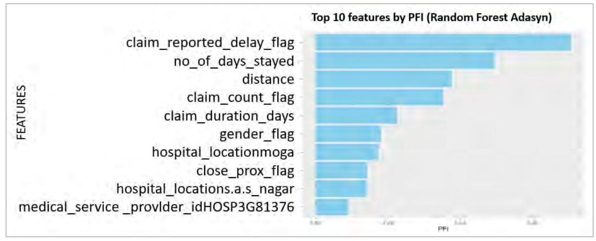

## Page 17
Figure 6
PERMUTATION FEATURE IMPORTANCE FOR TRAIN AND TEST DATA

# 4.2 SHAP FEATURE IMPORTANCE 

### 4.2.1 THEORY AND DESCRIPTION

SHAP (SHapley Additive exPlanations) emerges as an advanced interpretability framework, presenting a cohesive and mathematically rigorous method for elucidating machine learning model predictions. This framework facilitates a nuanced comprehension of the pivotal features influencing predictions. Through the assignment of SHAP values to each feature, it delineates their respective contributions to predictions. Analyzing these values enables the identification of key features, empowering informed decisions for model enhancement or elucidating the rationale behind specific predictions. This in-depth analysis aids in steering focus towards critical features, thereby enhancing the overall interpretability and decision-making capabilities of the model.

Mathematical process for SHAP feature importance:

1. Begin by computing the model's prediction for a specific instance, denoted as $f(x)$, where $x$ represents the input features.
2. Define a baseline or reference prediction, often represented as $E[f(x)]$, which serves as the expected model prediction across all instances.
3. For each feature $i$ in the input vector $x$, calculate its contribution to the difference between $f(x)$ and the baseline $E[f(x)]$. This is expressed as $S H A P_{i}(x)=f(x)-E(f(x))$
4. Aggregate these individual feature contributions across all features to obtain the final SHAP value for each feature. This is done using Shapley values, a concept borrowed from cooperative game theory, resulting in $S H A P_{i}(x)=\sum_{\text {allsubsets }} \frac{|S|!(|T|-|S|-1)!}{|T|!}[f(S \cup i)-f(S)] \quad$ where $S$ represents subsets of features, and $T$ is the set of all features.
5. After computing individual SHAP values, calculate the average absolute SHAP value for each feature across a dataset. This average provides a measure of the feature's overall importance in the model's predictions, considering both positive and negative contributions.
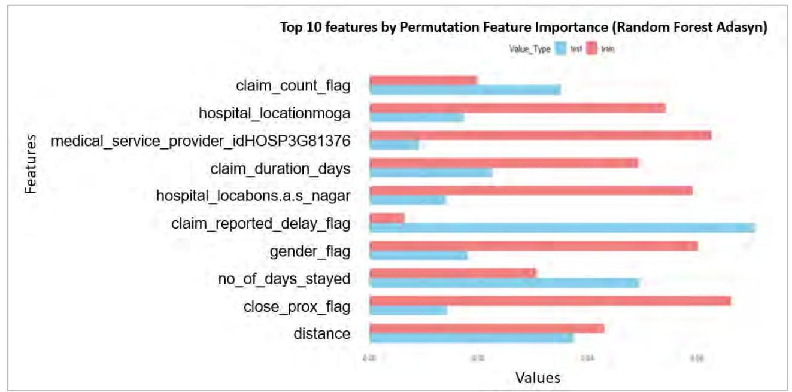

## Page 18
6. Higher average absolute SHAP values indicate features that consistently have a significant impact on model predictions, regardless of the direction of influence.

# 4.2.2 Case study 

This section explores SHAP importance plots for three distinct models-Generalized Linear Model, XGBoost, and Random Forest-employing the ADASYN imbalance technique. The ensuing feature importance plots, utilizing SHAP, delineate the top 10 features influencing the models' decision-making process.

In our investigation, a comprehensive analysis of feature importance was conducted for a logistic regression model tailored to predict binary fraud outcomes. Leveraging the Shapley values technique, we quantified each feature's contribution to the model's predictions. Notably, the "claim_reported_delay_flag" emerged as the most influential variable, evident in its highest Shapley values. This variable, reflecting the reporting of delays in the claim process, underscores the substantial impact of claim processing delays on the predicted outcome.

Following closely in significance were "primary_procedure_code5100214" and "claim_amount_flag" highlighting the importance of specific medical procedures and claim amounts in shaping predictions. Gender also held a prominent position in the hierarchy of influential features, emphasizing the role of gender-based factors in outcome prediction.

Furthermore, "primary_procedure_code_M10068", "primary_procedure_code_M100009" and "hospital_locationbathinda" were identified as pivotal variables in the logistic regression model. These features, tied to specific medical procedures and the geographical location of healthcare facilities, exerted noteworthy influences on the predicted outcome.

Additionally, "claim_count_flag", "medical_services_provider_idHOSP3P10675" and "hospital_flag" demonstrated equal importance, underscoring their comparable contributions to the model's predictions. These findings provide valuable insights into the factors steering the logistic regression model's predictions, offering guidance to decisionmakers in health insurance fraud detection.

## Page 19
Figure 7
SHAP FEATURE IMPORTANCE FOR GLM

In this study, we employed the XGBoost algorithm to construct a robust predictive model and subsequently utilized Shapley values to ascertain the significance of each feature in predicting the target variable. Notably, "no_of_days_stayed" emerged as the most pivotal feature. This finding underscores the critical role played by the duration of a patient's stay in a healthcare facility in influencing the model's predictions.

Following closely in significance was the "claim_reported_delay_flag" denoting the presence or absence of reported delays in the claim processing. Its high feature importance ranking signifies the substantial impact of claim processing delays on the predictive outcome. Moreover, "claim_duration_days" exhibited notable importance, highlighting the direct relationship between the duration of claim processing and the predictive outcome. The variable "distance" also featured prominently, emphasizing the relevance of geographical distance between healthcare facilities and patients in the prediction of the target variable.

Further down the hierarchy of influential features, "claim_count_flag" and "approved_allowed_amount" were identified as salient variables, both sharing a level of feature importance that places them among the top-ranking features. This implies that the frequency of claims and the amount approved for payment exert similar influences on the predictive model's outcome
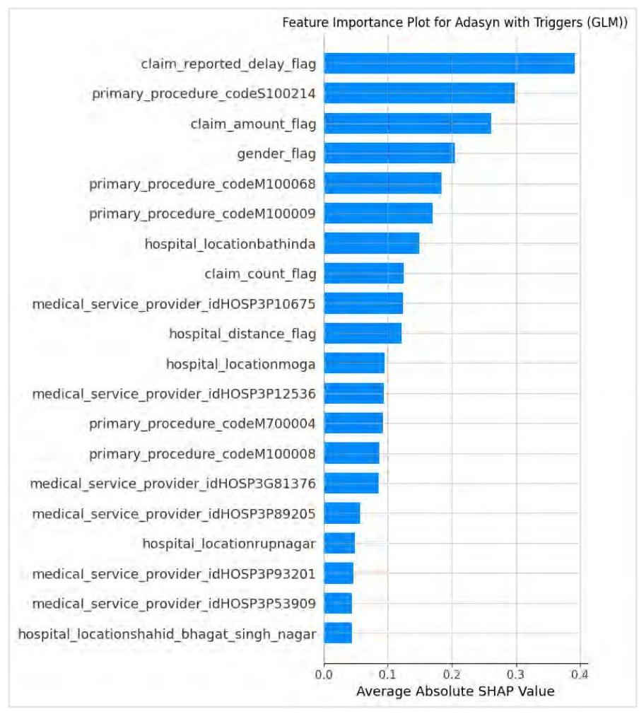

## Page 20
Figure 8
SHAP FEATURE IMPORTANCE FOR XGBOOST

The features that are most influential in Random Forest model are claim_reported_delay_flag, distance, claim_duration_days and birth_date chronologically.
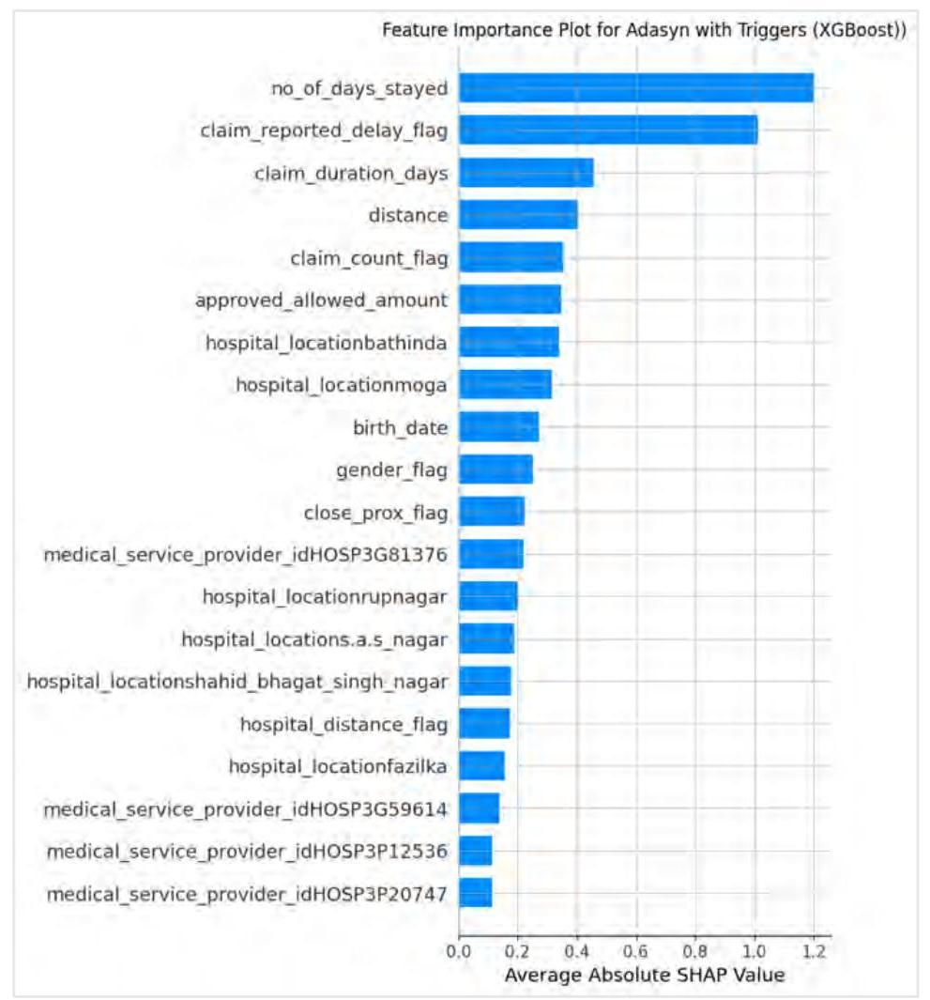

## Page 21
Figure 9
SHAP FEATURE IMPORTANCE FOR RANDOM FOREST

In the depicted graph, Class 1 denotes fraudulent cases, while Class 0 corresponds to non-fraudulent cases.
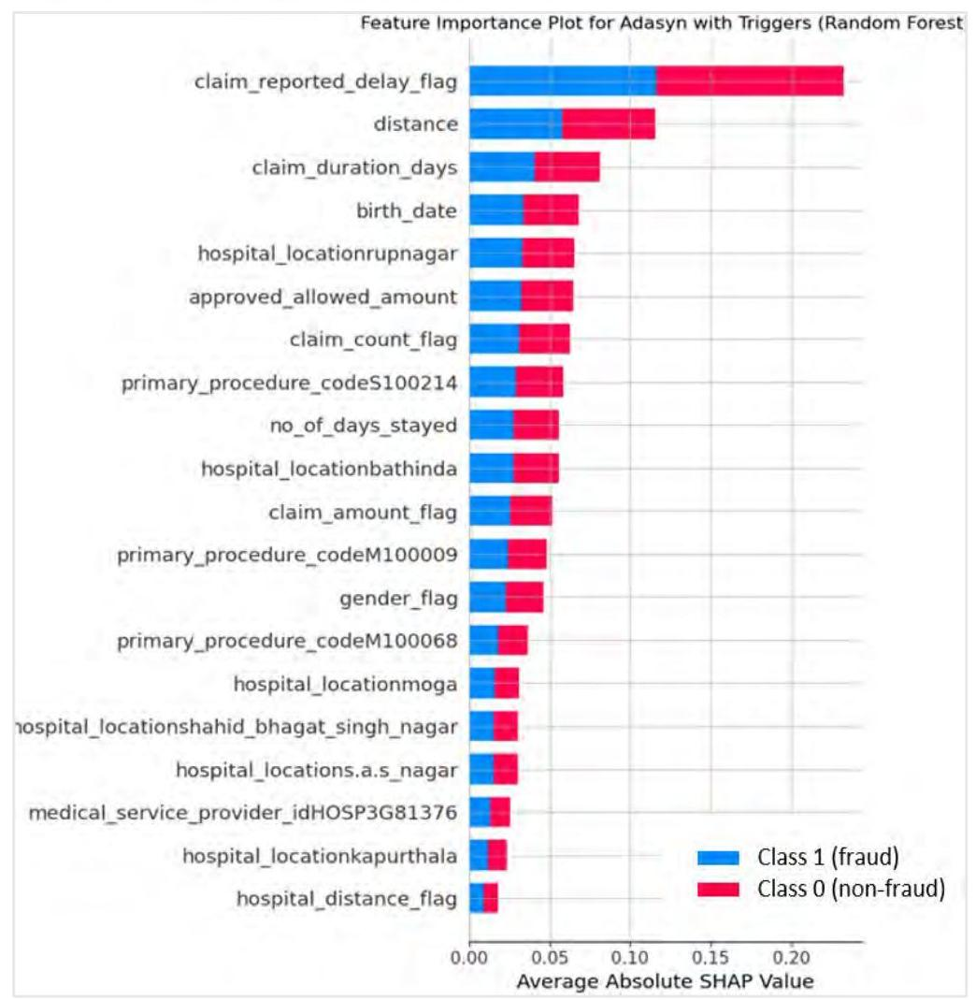

## Page 22
# Section 5: Main Effects 

### 5.1 GLOBAL MODEL AGNOSTIC METHODS

Global Model-Agnostic approach involves post-hoc explanations where the original model is regarded as a black box. It entails understanding the workings of a machine learning model after it has been trained, regardless of the specific algorithm or framework used. This model-agnostic stance stands in contrast to methods that are inherently tied to a particular model's internal mechanics. By treating the model as an opaque entity and seeking explanations beyond its inherent structure, this approach strives to provide a more universally applicable means of understanding and explaining complex machine learning systems.

In their seminal paper, Ribeiro, Singh, and Guestrin delve into an insightful exploration of several pivotal properties characterizing model-agnostic interpretability methods. These critical attributes encompass:

- Model Flexibility
- Explanation Flexibility
- Representation Flexibility
- Lower Cost to switch
- Comparing two models

By treating the machine learning models as black-box functions, these approaches provide crucial flexibility in the choice of models, explanations, and representations, improving debugging, comparison, and interfaces for a variety of users and models.

### 5.1.1 PARTIAL DEPENDENCE PLOTS

## Theory and Description

Partial dependence plots are a graphical representation of the marginal effect of a feature on the predicted outcome while holding all other features constant. They provide valuable insights into how the model perceives the importance of each feature and how it influences the predictions.

In our study, we employed Partial Dependence Plots (PDPs) to enhance the interpretability of our machine learning model. PDPs are a widely recognized technique in the field of predictive modelling that allows for a comprehensive analysis of the relationship between individual features and the model's predictions.

Methodology:

1. For each level, $\boldsymbol{i i}$, of the selected feature (continuous variables are binned):
a. For all observations, modify the value of the selected feature to $\boldsymbol{i i}$.
b. Using the modified observations and the existing model, predict the response variable value for every observation.
c. Calculate the average predicted values for all observations.
2. Plot the average predicted values for each level ( $y$-axis) against the feature levels ( $x$-axis).

Advantages of Partial dependence plot:

- PDPs provide a straightforward and intuitive way to interpret the impact of individual features on the model's predictions. They allow for a clear visualization of the relationship between a feature and the predicted outcome.
- PDPs can reveal complex and non-linear relationships between features and the target variable. This can help in identifying patterns that might not be immediately obvious from looking at the raw data.

## Page 23
- PDPs can be used to verify that the model has learned relationships that align with domain knowledge or expectations. This helps build trust in the model's predictions.
- PDPs can be used to rank features based on their impact on predictions. This information can guide feature selection or engineering efforts.
- PDPs can be used to understand both global trends across the entire dataset and local effects for specific data points.

Disadvantages of partial dependence plots:

- PDPs show the relationship between a feature and the prediction while keeping all other features constant. This means they only capture marginal relationships and might not reveal interactions between multiple features.
- PDPs assume that the features are independent. In reality, many features are correlated, and PDPs may not capture the joint effects accurately.
- In high-dimensional data, creating PDPs for every feature becomes impractical, and interpreting them can be overwhelming.
- The interpretation of PDPs can be sensitive to hyper parameters, such as the grid resolution chosen for creating the plots.
- PDPs are most used with interpretable models (e.g., decision trees, linear regression). They might not be as effective for highly complex, non-linear models like deep neural networks.
- For a basic GLM without interactions or other non-linear regressors, the PDP algorithm would yield straight-line relationships with the slope equal to the feature's coefficient

After training our machine learning models (Random Forest, XGBoost, GLM) using ADASYN data imbalance technique, we generated Partial Dependence Plots for key features identified through feature importance analysis. For each selected feature, we varied its values across a range while keeping all other features at their observed values. The resulting PDPs visually illustrate the relationship between the feature of interest and the predicted outcome.

Case Study
Figure 10
PDP OF CLAIM DURATION DAYS FEATURE IN RANDOM FOREST.
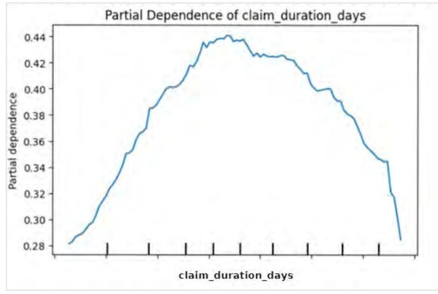

## Page 24
"claim_duration_days" is one of the top 5 contributing features of the Random Forest Model using ADASYN data imbalance technique. The X -axis represents the distribution of scaled values of the claim_duration_days. The Y -axis represents the probability of fraud [ 1 represents the fraud and 0 represents not fraud]. It shows a non-linear relation with the prediction.

Lower X-axis values are positively impacting the prediction with Y-axis values ranging from 0.28 to 0.44 i.e., increasing the chance of being fraud and from the midpoint onwards, the probability of being fraud has decreases eventually.

Figure 11
PDP OF NO OF DAYS STAYED IN XGBOOST

In the intial values of X -axis the predictions are fluctuating between the probabilities 0.00 to 0.33 . So, if the no_of_days_stayed lies in this region, then the probability of being fraud lies in between 0.00 to 0.33 and if the no_of_days_stayed increases then the probability is going to stay constant at around 0.075 .

## Page 25
Figure 12
PDP OF CLAIM REPORTED DELAY FLAG IN GLM

The above figure demonstrates that the chance of fraud is growing as the value of the feature grows, and from this we can infer that the feature is positively impacting the target variable.

In GLM, PDP demonstrates the linear relationship between the link function and predictors so that is why we get the straight-line relationship with the slope equal to the feature's coefficient. This can be considered as one of the disadvantages of PDP as it cannot find the exact relation of the feature with the prediction variable.

# 5.1.2 ACCUMULATED LOCAL EFFECTS (ALE) PLOTS 

## Theory and Description

Accumulated Local Effects (ALE) plots serve as a valuable tool for visualizing the influence of features on a machine learning model's prediction. While akin to partial dependence plots (PDP), ALE plots exhibit certain distinctions that confer unique advantages. Notably, ALE plots, as demonstrated in the work by Apley and Zhu (2016), exhibit a robustness that sets them apart from PDP plots. Moreover, ALE plots offer a notable efficiency advantage, particularly when dealing with models comprising a multitude of features. Like their PDP counterparts, ALE plots elucidate how a specific feature contributes to prediction outcomes, elucidating the average impact of that feature.

Centered ALE plots, a variant of ALE plots, are notable for their adjustment that centers the plot at zero. In this context, what transpires is the subtraction of the model's average prediction from the ALE value at each point on the plot. This centered approach significantly enhances the interpretability of the ALE plot, as the values displayed on the plot inherently reflect the disparities between the model's predictions and the model's average predictions, simplifying the process of discerning the plot's implications.

Centered ALE plots serve as a valuable tool for understanding feature impacts on machine learning model predictions, especially for features with numerous potential values. They facilitate the visualization of the overall trend in feature effects, enhancing interpretability. Centered ALE plots are still only a local approximation of the true effect of a feature. Centered ALE plots can be sensitive to the way that the feature is discretized.
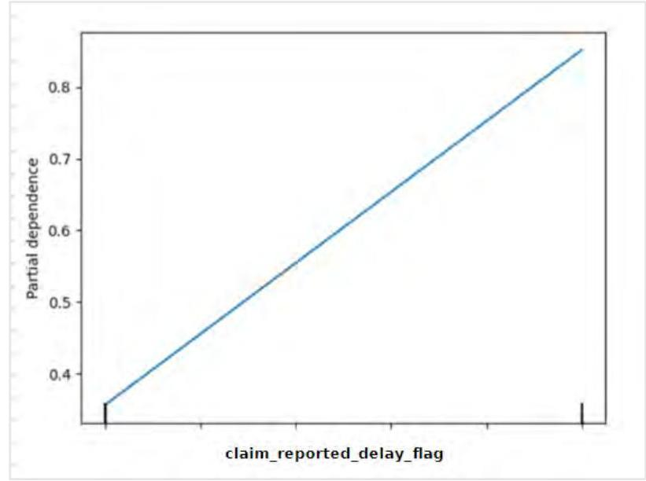

## Page 26
In the interpretation of a centered ALE plot, the $y$-axis represents the effect of the feature on predictions, while the $x$-axis displays the changes in feature values. This plot effectively captures the relationship between the feature and its impact on predictions, enabling a thorough assessment of their association.

Also, ALE advantages are observed which are ${ }^{4}$ :

- Unbiased for Correlated Features: ALE plots remain reliable even in the presence of correlated features, making them a robust choice for model interpretation.
- Efficient Computation: ALE plots are computationally efficient, outpacing PDPs, and scaling linearly with data size $(O(n))$.
- Clear Interpretation: ALE plots offer a straightforward interpretation: they reveal the relative impact of changing a feature on predictions, conditional on a specific value, enhancing their clarity and utility in model analysis.

Disadvantages of the ALE include:

- Limited Interpretation with Strongly Correlated Features: ALE plots may pose challenges in interpreting the effect consistently across intervals when features are strongly correlated.
- Divergence from Linear Regression Coefficients: ALE effects can deviate from coefficients specified in linear regression models, particularly when features interact and exhibit correlation.
- Stability vs. Complexity Trade-off: ALE plots may exhibit instability with a high number of intervals, resulting in many small fluctuations. Reducing intervals for stability might simplify the representation and obscure some of the inherent complexity within the prediction model.
- Absence of ICE Plots: Unlike PDP plots, ALE plots cannot be complemented by Individual Conditional Expectation (ICE) plots, which offer a more granular view of individual observations and their interactions with features.

# Case Study 

Figure 13
ALE PLOT FOR HOSPITAL DISTANCE FLAG IN GLM

[^0]
[^0]:    ${ }^{4}$ https://christophm.github.io/interpretable-ml-book/ale.html
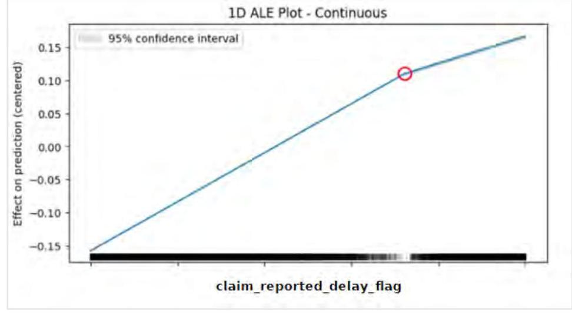

## Page 27
The provided graph depicts a centered ALE plot, focusing on the feature "claim_reported_delay_flag." This feature holds notable significance, as indicated by its high ranking in terms of feature importance.

We can discern a noteworthy observation when the feature is set to 1 , that is, the model's predictions exhibit an approximate increase of 0.15 units compared to the model's average prediction. This finding underscores the feature's influence on the model's output.

Figure 14
ALE PLOT FOR BIRTH DATE IN RANDOM FOREST

This plot, which pertains to the Random Forest model, delves into the influence of the "claim_reported_delay_flag" feature on model predictions.

A distinctive observation underscores that when the " claim_reported_delay_flag " feature is set to approximately 1, the model's predictions have an increase of approximately 0.1 units compared to the model's average prediction. This finding signifies the importance of the " claim_reported_delay_flag " feature, underscoring its capacity to substantially impact the model's predictions.

Indeed, ALE plots play a crucial role in unravelling the behavior and impact of features on the target variable, shedding light on their contribution to the model's predictions. Through ALE plots, we gain valuable insights into how specific features influence the model's decision-making process, facilitating a deeper understanding of their significance in the context of the target variable and their overall contribution to the predictive outcomes.

Figure 15
ALE PLOT FOR XGBOOST
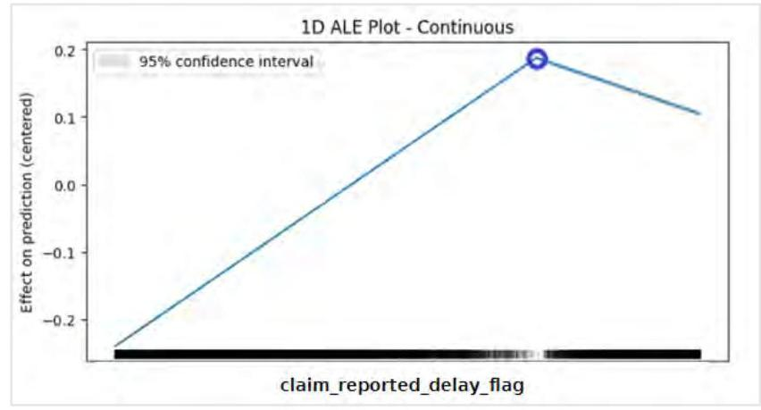
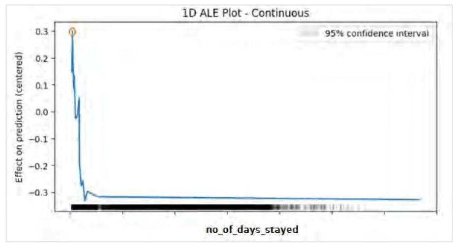

## Page 28
The provided graph represents a centered ALE plot for the XG-Boost Model, focusing on the "no_of_days_stayed" feature. This feature holds significant importance, as indicated by its high ranking in the feature importance assessment. Notably, " no_of_days_stayed " is a continuous feature.

Close to the orange circle on the plot, we can make the following inference: when the " no_of_days_stayed " feature is very less, the model's predictions demonstrate an increase of approximately 0.3 units compared to the model's average prediction. This observation highlights the feature's impact on the model's output.

# 5.1.3 GLOBAL SURROGATE 

## Theory and Description

A global surrogate model serves as a clear and explainable machine learning tool crafted to imitate the predictions of a more intricate and opaquer model. This approach allows us to uncover insights into the behavior of the complex model, even when its inner workings are not fully understood.

In engineering, surrogate models are commonly deployed to estimate results from costly or time-consuming simulations. In this context, the surrogate model is typically a simpler and faster alternative that generates predictions without the need for running the full simulation.

Contrary to surrogate models in engineering, interpretable machine learning deals with a machine learning model rather than a simulation. Moreover, the interpretable surrogate model in this scenario must be easy to understand, ensuring that its predictions are transparent and explainable.

The purpose of using interpretable surrogate models is to strike a balance between accuracy and interpretability. By approximating the predictions of the underlying model with accuracy while maintaining interpretability, these models offer valuable insights into the behavior of complex systems, aiding in making well-informed decisions.

The training of a surrogate model is a technique independent of the specific black box model in use. It only requires access to data and the prediction function of the black box model. Consequently, if the underlying machine learning model is swapped with a different type, the surrogate method remains applicable. This decoupling of black box model type and surrogate model type provides flexibility in choosing models for different needs.

The following steps are performed to obtain a surrogate model ${ }^{5}$ :

1. Select a dataset $X$. This can be the same dataset that was used for training the black box model or a new dataset from the same distribution. You could even select a subset of the data or a grid of points, depending on your application.
2. For the selected dataset $X$, get the predictions of the black box model.
3. Select an interpretable model type (linear model, decision tree, ...).
4. Train the interpretable model on the dataset $X$ and its predictions.
5. You now have a surrogate model.
6. Measure how well the surrogate model replicates the predictions of the black box model.
7. Interpret the surrogate model.
[^0]
[^0]:    ${ }^{5}$ https://christophm.github.io/interpretable-ml-book/global.html

## Page 29
# Advantages of Global Surrogate: 

- The surrogate model method is flexible, which means that any interpretable model may be used to approximate the black box.
- The fact that the approach is intuitive and straightforward makes it easy to implement and explain to others.

Disadvantages of Global Surrogate:

- There is no one-size-fits-all answer to the question of what constitutes a sufficiently close approximation between a surrogate model and a black box model. The appropriate cut-off for R-squared will depend on the specific application and the desired level of confidence.
- Interpretation of the surrogate model may not be equally valid for all data points.

## Case Study

Figure 16
DECISION TREE SURROGATE FOR XGBOOST

The decision tree shows that the most important feature for predicting fraud is distance. Claims with distance less than or equal to 0.0 are less likely to be fraudulent than claims with distance greater than 0 . The decision tree also shows that claims with hospital location of Moga are less likely to be fraudulent than claims with a hospital location of Rupnagar. Claims with an approved allowed amount of less than or equal to 10000 are less likely to be fraudulent than claims with an approved allowed amount of greater than 10000. Claims with a claim reported delay flag of less than or equal to 0.319 are less likely to be fraudulent than claims with a claim reported delay flag of greater than 0.319. Claims with a birth date of less than or equal to 0.0 are more likely to be fraudulent. Claims with a claim duration days of less than or equal to 0.001 are more likely to be fraudulent.
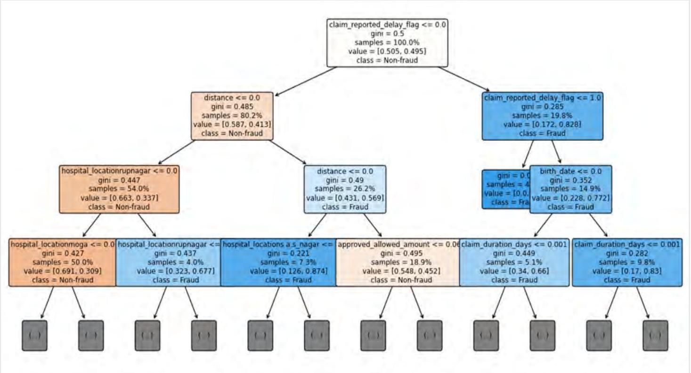

## Page 30
Figure 17
DECISION TREE SURROGATE FOR RANDOM FOREST

The decision tree shows that the most important feature for predicting fraud is claim_reported_delay_flag. Claims with a delay flag of less than or equal to 0.0 are much less likely to be fraudulent than claims with a delay flag of greater than 0.0 . The decision tree also shows that claims with a distance of less than or equal to 0.0 are much less likely to be fraudulent than claims with a distance of greater than 0.0. Claims with a hospital location of Moga or Rupnagar are more likely to be fraudulent. Claims with an approved allowed amount of greater than 10000 are more likely to be fraudulent.

# 5.1.4 SHAP 

## Theory and Description

SHAP values enable us to discern not only the importance of a feature but also the direction and magnitude of its impact. By providing a clear understanding of how each feature influences predictions, SHAP values aid in pinpointing the subtle nuances that may signal fraudulent activities within health insurance claims. A SHAP summary plot is a visual representation that provides a comprehensive overview of how individual features impact model predictions. It displays the average magnitude and direction of feature contributions across a dataset.

In a SHAP summary plot, which is often used to interpret the importance of features in a machine learning model, the colors red and blue provide essential insights into the relationships between feature values and model predictions:

1. Red Color (Positive Impact): When a feature is shown in red, it indicates that higher values of that feature have a positive impact on pushing model predictions higher. In other words, an increase in this feature's value leads to an increase in the predicted outcome.
2. Blue Color (Negative Impact): Conversely, when a feature is displayed in blue, it suggests that higher values of that feature have a negative impact on predictions. In this case, an increase in the feature's value results in a decrease in the predicted outcome.
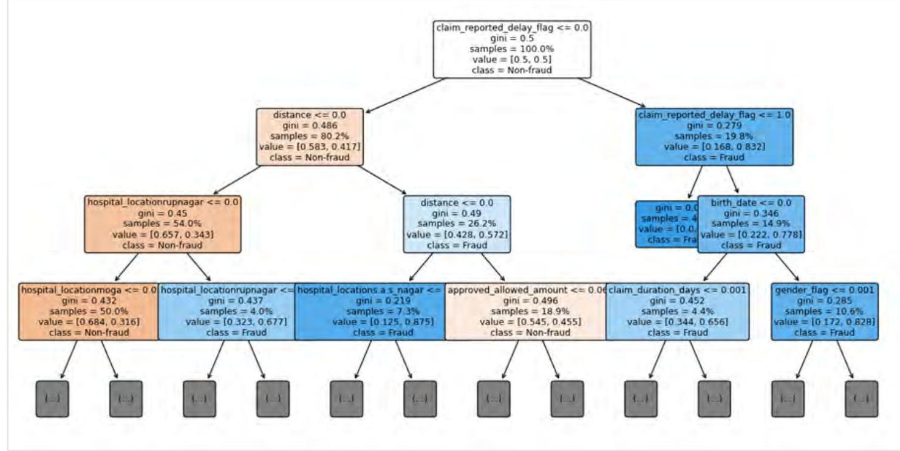

## Page 31
# Case Study 

Figure 18
SHAP SUMMARY PLOT FOR GLM

The SHAP summary plot for GLM unveils nuanced patterns in feature contributions concerning the prediction of fraudulent insurance claims. Among the salient features, "claim_reported_delay_flag" emerges as a pivotal predictor. The blue segment in its Shapley values signifies a lower likelihood of being classified as fraudulent when claim reporting is prompt. In essence, the timely submission of insurance claims is associated with a reduction in the suspicion of fraudulent activity, aligning with industry practices that emphasize the importance of timely reporting.

Turning our attention to "primary_procedure_codeS100214," a remarkable divergence is observed. The negative Shapley values' red area contrasts with the blue segment, suggesting a complex relationship. Specific medical procedures, denoted by this code, tend to trigger heightened suspicion, leading to positive Shapley values, while others diminish the likelihood of fraudulence, as indicated by the blue region. These findings underscore the significance of procedure code transparency in discerning potentially fraudulent activities within the medical insurance domain.
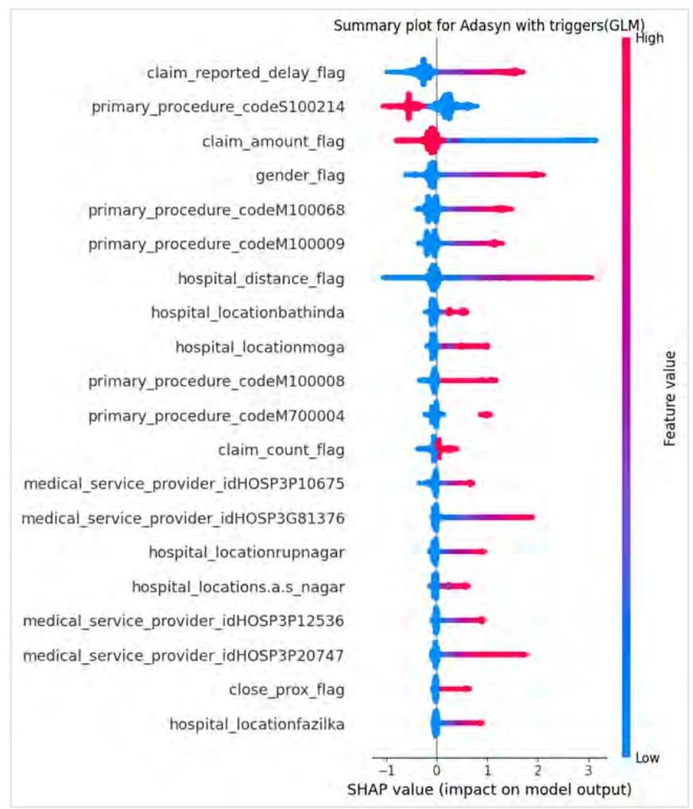

## Page 32
Figure 19
SHAP SUMMARY PLOT FOR XGBOOST
"no_of_days_stayed" feature has a predominantly negative impact on the model's predictions.
As the number of days stayed increases, the model predicts a lower likelihood of fraud. Same with claim_reported_delay_flag.
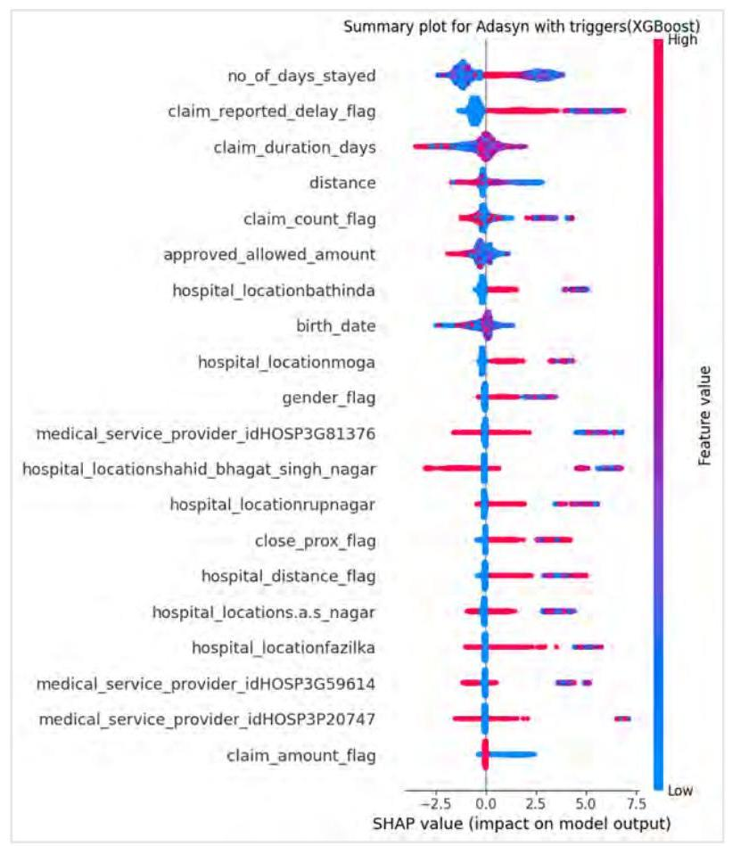

## Page 33
Figure 20
SHAP SUMMARY PLOT FOR RANDOM FOREST

In the depicted graph, Class 1 denotes fraudulent cases, while Class 0 corresponds to non-fraudulent cases.
We employed a strategic approach to compute SHAP (SHapley Additive exPlanations) values for a random forest model. Given the computational intensity associated with SHAP value calculations, we focused our efforts on a subset of instances within our dataset. This approach allowed us to gain valuable insights into the global interpretation of the model's behavior while managing computational resources efficiently.

# 5.2 LOCAL MODEL-AGNOSTIC METHODS 

### 5.2.1 INDIVIDUAL CONDITIONAL EXPECTATION (ICE)

## Theory and Description

ICE (Individual Conditional Expectation) plots are visualizations used in data analysis and machine learning. They show how a single variable's values impact model predictions while keeping other variables constant. Each line in an ICE plot represents the predicted outcome for one data point as the chosen variable changes, helping understand its influence.
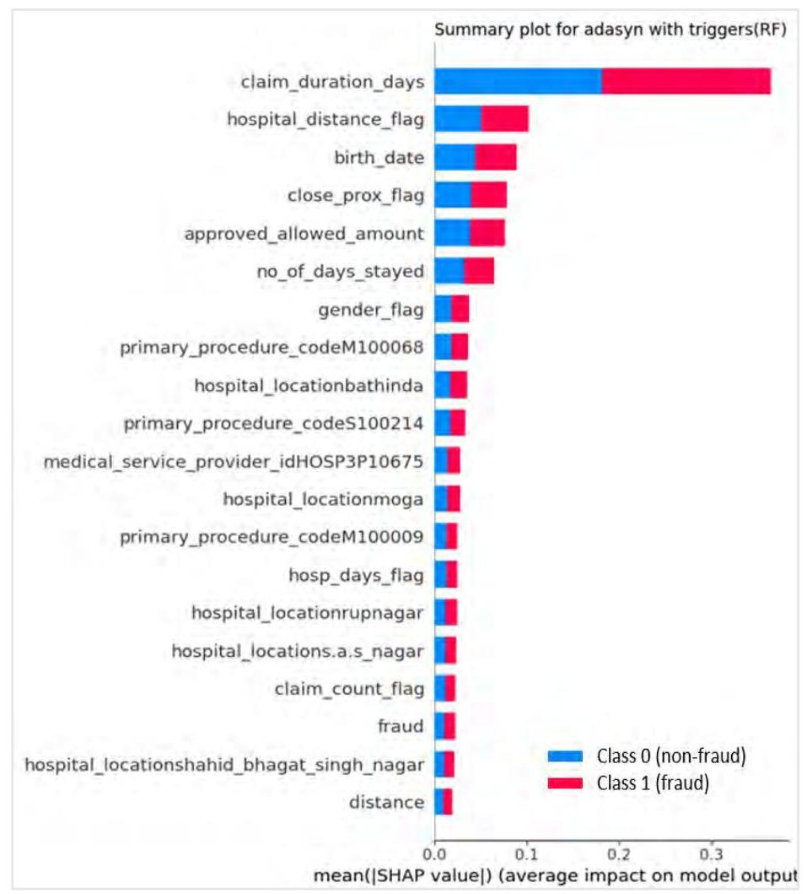

## Page 34
The partial dependence algorithm calculates the average predicted value when a feature is varied across its entire range for all data points. On the other hand, Individual Conditional Expectation (ICE) follows a similar process but doesn't average predictions. Instead, it generates predicted values for each data point as the feature changes, creating a detailed view of how the feature impacts individual observations. ICE plots offer a more nuanced understanding compared to partial dependence plots, which provide an average view of the feature's effect by combining all ICE plots. This individual-level analysis can reveal relationships that might be overlooked when using the aggregate approach of partial dependence plots.

Advantages:

- Simplicity: ICE plots are intuitive because each line on the plot represents either an individual observation or a group of similar observations. This simplicity makes them easy to understand.
- Differentiated Effects: They excel in revealing how a particular feature affects different observations uniquely. This granularity can uncover variations that might indicate complex interactions between variables, offering fresh insights.

Disadvantages:

- Limited to One Feature: ICE plots can only focus on one feature at a time, making them unsuitable for analyzing interactions between multiple variables directly.
- Correlation Challenges: When dealing with correlated features (variables that are related to each other), interpreting ICE plots can be challenging.
- Complexity with Many Lines: If there are too many lines on the plot, it can become overwhelming, making it difficult to pinpoint specific trends. In such cases, simplifying the plot through observation sampling might be necessary, though this could sacrifice some level of detail.

We will be using Centered ICE plots as main visualization type. In a centered ICE plot, each ICE curve is centered around the actual prediction made by the model for a specific observation or group of observations. This means that the ICE curve for each data point starts at zero (indicating no deviation from the model's prediction) and shows how the prediction changes as the feature of interest varies. Centered ICE plots are helpful for visualizing how individual observations or groups deviate from the model's predictions.

## Page 35
# Case Study 

Figure 21
ICE PLOT FOR CLAIM REPORTED DELAY FLAG IN GLM

The ICE plot shown above between the cliam_reported_delay_flag feature demonstrates that the chance of fraud is growing as the value of the feature grows, and from this we can infer that the feature is positively impacting the target variable. The average individual being fraudulent is about 0.5 if the cliam_reported_delay_flag is set to 1. I chose cliam_reported_delay_flag as it is the most contributing feature in SHAP summary plot in SHAP section.

With GLM we are having straight lines in our ICE as it tried find the linear relation between the feature and the target variable.

Figure 22
ICE PLOT FOR CLAIM DURATION DAYS IN RANDOM FOREST
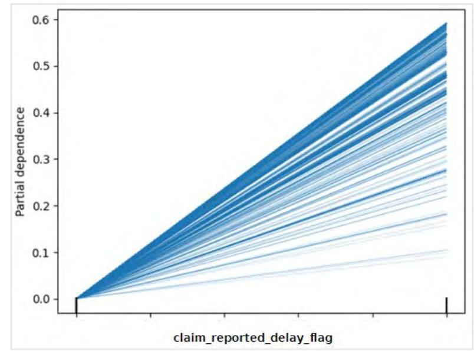
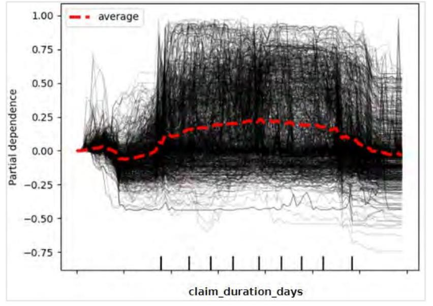

## Page 36
The ICE plot between the target variable and the feature claim_duration_days using the Random Forest algorithm is shown in the plot above. The reason for picking feature claim_duration_days is because it is having highest SHAP value for the model random forest. The red line represents the average of all ICE lines that is PDP, we covered this in the previous section. A discernible pattern appears in the plot, showing a positive shift in the partial dependency from the mean for feature values within a certain range. The partial dependency gradually decreases from the mean, particularly when the feature values are on the lower end of this range. We can see a non-linearity in ICE line as random forest is able is find the non-linear relationship between the feature and the target variable.

Figure 23
ICE PLOT FOR NO OF DAYS STAYED IN XGBOOST

The Extreme Gradient Boosting method was used to implement the ICE plot of the feature no_of_days_stayed and its partial dependency. We can see that some of the ICE lines have partial dependencies that are higher than 0.5, but because the majority of ICE lines have partial dependencies is 0 , the average is being pulled in their direction. The probability of fraud has a constant value between 0 and around as the feature value increases. However, When the feature is extremely low, specifically within the range close to zero, most ICE lines exhibit a heightened likelihood of being associated with fraudulent activity. The increase in feature value has little impact on partial dependency. We can take inference that fraudulent cases are having less no_of_days_stayed, in turn it has negative impact on target variable.

# 5.2.2 LIME 

## Theory and Description

LIME, or Local Interpretable Model-agnostic Explanations, is a method for explaining the predictions of any machine learning model in an interpretable and faithful manner. It is a local explanation method, meaning that it explains the prediction of a model for a specific instance, rather than providing a global explanation for the model's behavior.

LIME works by first creating a set of synthetic data points that are similar to the instance being explained. These synthetic data points are created by perturbing the features of the original instance in a controlled manner. LIME then trains a simple interpretable model, such as a linear regression model, on synthetic data points. The coefficients of the trained model can then be used to explain the prediction of the original model.
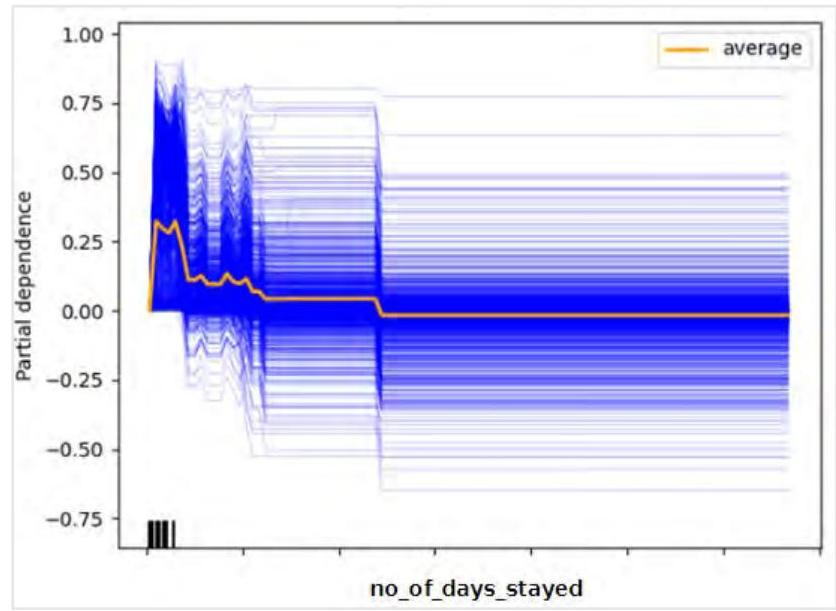

## Page 37
LIME is a powerful tool for explaining the predictions of complex machine learning models. It is particularly useful for explaining the predictions of models that are used in high-stakes applications, such as medical diagnosis and fraud detection.

# Advantages: 

- It is model-agnostic, meaning that it can be used to explain the predictions of any machine learning model.
- It is locally faithful, meaning that the explanations it provides are accurate for the specific instance being explained.
- It is interpretable, meaning that the explanations are in a form that humans can understand.

## Case Study

Figure 24
LIME PLOT FOR RANDOM FOREST

Features like distance, claim_reported_delay_flag, medical service provider_edHOSP69205 has high positive impact on predicting fraud and features like birth_date, primary procedure code_M70004 has negative impact on class fraud.
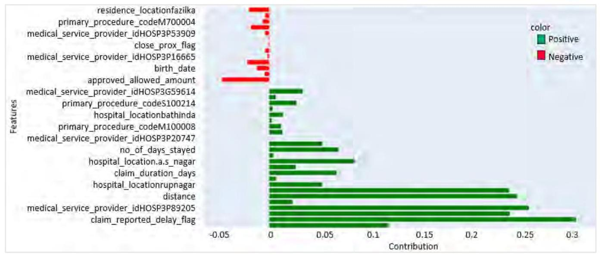

## Page 38
Figure 25
LIME PLOT FOR XGBOOST

Features like "claim_reported_delay_flag," "claim_count_flag," and "no_of_days_stayed" exhibited positive contributions towards predicting certain claims. For instance, instances with a reported delay in claim processing or a moderate claim count were more likely to be predicted positively.

Conversely, features such as "medical_service_provider_idHOSP3G59614," "distance," and "hospital_locationkapurthala" had a negative influence on the prediction probability for certain claims.

Figure 26
LIME FOR GLM

Features like gender_flag, hospital distance_flag etc have negative contribution for predicting the fraud and features like claim reported delay flag and primary procedure code have positive contribution for predicting the fraud.
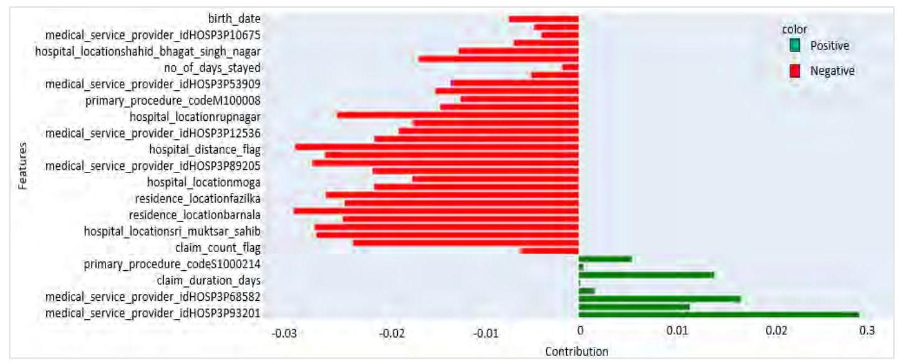
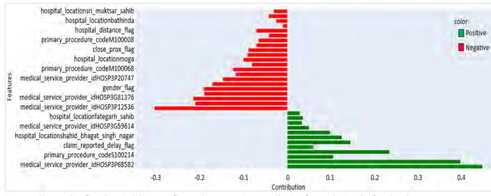

## Page 39
# Section 6: Interaction Effects 

Interaction effect refers to the phenomenon where the impact or influence of a change in one variable (feature) on the model's prediction is not consistent or uniform across all values of another feature or features. Identifying and understanding these interaction effects is crucial for interpreting machine learning models because they can provide deeper insights into how the model makes predictions and why certain variables are more influential under specific conditions. It allows us to grasp the nuanced relationships within the model, enabling better decision-making and model refinement.

### 6.1 FRIEDMAN'S H-STATISTIC

### 6.1.1 THEORY AND DESCRIPTION

When a machine learning model makes a prediction using two features (let's call them Feature A and Feature B), we can break down that prediction into four parts:

1. A constant term: This is like a baseline or starting point for the prediction.
2. A term for Feature A: This represents how Feature A alone influences the prediction.
3. A term for Feature B: Similarly, this represents how Feature B alone influences the prediction.
4. A term for the interaction between Feature A and Feature B: This part accounts for how the combination of Feature A and Feature B affects the prediction, which can sometimes be different from what you'd expect by just adding up their individual effects.

So, essentially, the "interaction" term helps us understand how the two features work together, and it shows us if there's something unique happening when they're considered together that isn't explained by looking at them separately. This is important because some relationships between features only become apparent when you consider how they influence each other, not just in isolation.

The H-statistic proposed by Friedman and Popescu for the interaction between feature $j$ and $k$ is ${ }^{6}$ :

$$
P D_{j k}\left(x_{j}, x_{k}\right)=P D_{j}\left(x_{j}\right)+P D_{k}\left(x_{k}\right)
$$

where $P D_{j k}\left(x_{j}, x_{k}\right)$ is the 2-way partial dependence function of both features and $P D_{j}\left(x_{j}\right)$ and $P D_{k}\left(x_{k}\right)$ the partial dependence functions of the single features.

The H-statistic is expensive to evaluate because it iterates over all data points and at each point the partial dependence has to be evaluated which in turn is done with all $n$ data points. In the worst case, we need 2 n 2 calls to the machine learning models predict function to compute the two-way H-statistic (j vs. k) and 3n2 for the total Hstatistic (j vs. all). To speed up the computation, we can sample from the $n$ data points. This has the disadvantage of increasing the variance of the partial dependence estimates, which makes the H-statistic unstable.

[^0]
[^0]:    ${ }^{6}$ https://christophm.github.io/interpretable-ml-book/interaction.html

## Page 40
# 6.1.2 CASE STUDY 

Figure 27
INTERACTION HEATMAP FOR FREIDMAN'S H-STATISTIC

Row and Column Indices: The rows and columns of this array represent different features. Each feature is indexed by its position in the array, starting from 0 . So, if you have N features, the array is of size $\mathrm{N} \times \mathrm{N}$. The values in the array represent the strength of interaction between pairs of features. Interaction strength can be a measure of how much one feature influences or depends on another feature in a predictive model. The off-diagonal elements of the array (the values where the row index is not equal to the column index) represent the interaction strength between pairs of features. These values are normalized between 0 and 1, indicating the strength of interaction. Higher values suggest stronger interactions. This matrix can be useful for feature selection, understanding feature importance, or even for creating new features in machine learning models. Here hosp_days_flag having higher interaction with claim_duration_days and claim_reported_delay_flag, this tells us that whenever hosp_days_flag and claim_reported_delay_flag are set to 1 there is high chance of being fraud.

Likewise, if a feature has no interaction with any of the other features, we can express the prediction function as a sum of partial dependence functions, where the first summand depends only on j and the second on all other features except j :

$$
\hat{f}(x)=P D_{j}\left(x_{j}\right)+P D_{-j}\left(x_{-j}\right)
$$

where $P D_{-j}\left(x_{-j}\right)$ is the partial dependence function that depends on all features except the j-th feature.
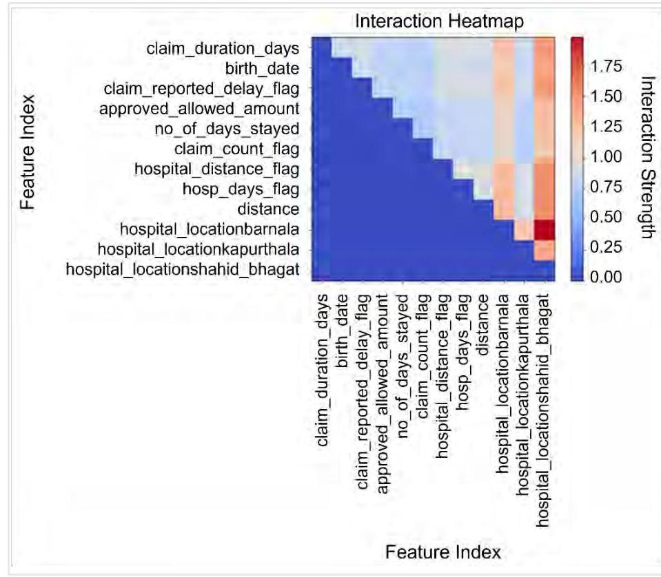

## Page 41
# 6.2 SHAP INTERACTION EFFECT 

The interpretation of machine learning models, particularly in complex scenarios, is a critical aspect of model deployment and trustworthiness. SHAP (SHapley Additive exPlanations) has emerged as a powerful framework for model interpretability. Beyond its utility in understanding feature importance, SHAP enables the investigation of interactive effects among features, shedding light on complex relationships within the model. In this context, interactive effects refer to the combined influence of two or more features on model predictions, elucidating how their joint variations impact the output.

### 6.2.1 CASE STUDY

Figure 28
SHAP INTERACTION PLOT FOR CLAIM REPORTED DELAY FLAG IN GLM

In our GLM model for health insurance fraud detection, we delved into the intrinsic relationship between the 'Claim Reported Delay Flag' and the 'Primary Procedure Code M100009' through a SHAP dependence plot. The plot unveils a clear and insightful connection. Notably, the 'Claim Reported Delay Flag' is represented as a blue linear thick line, indicating its primary influence on the prediction outcomes. Complementing this, we observe red, dotted lines that follow a linear trajectory, elucidating the intricate interplay between the delay in claim reporting and the specific medical procedure represented by 'Primary Procedure Code M100009.' The SHAP values along the $y$-axis provide a quantifiable measure of the impact, enabling a precise understanding of how variations in the delay flag influence the model's predictions concerning this specific medical procedure. This visual representation underscores the critical role of timely claim reporting and its differential impact on the assessment of various medical procedures, ultimately guiding fraud detection efforts with precision and clarity.
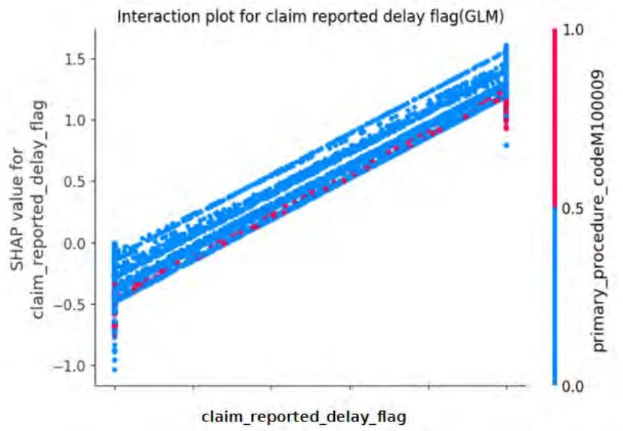

## Page 42
Figure 29
SHAP INTERACTION PLOT FOR CLAIM REPORTED DELAY FLAG IN RANDOM FOREST

The interaction plot between claim reported delay flag and claim duration days shows the relationship between these two variables, considering the interaction between them.

The plot shows that there is a significant negative interaction between the claim reported delay flag and the claim reported delay flag duration. This means that the longer a claim reported delay flag has been reported, the more negative its impact is on the claim reported delay flag.
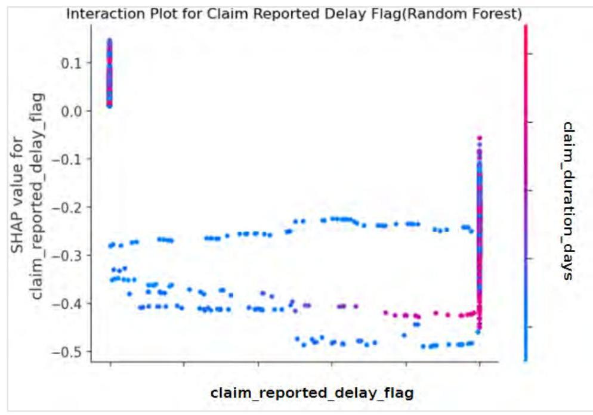

## Page 43
# Section 7: Business Interpretation for Feature Importance 

So far, we have explored several machine learning and statistical modelling methods for fraud detection. We have also shown how one can use several methods to improve interpretability of black box model algorithms.

In this section, we will use the results from prior sections to interpret why certain factors might have been ranked better compared to others. For this purpose, we will consider the results of three modelling methods - Random Forest, XGBoost, GLM. We will use the results of SHAP and PFI interpretation methods for these.

The below table consolidates the ranking of the variables in the data across these methods.
Table 2
VARIABLES RANKING

|  | SHAP |  |  | PFI |  |  |
| :--: | :--: | :--: | :--: | :--: | :--: | :--: |
| Variable | Random Forest | XGBoost | GLM | Random Forest | XGBoost | GLM |
| claim_reported_delay_flag | 1 | 2 | 1 | 1 | 2 | 2 |
| distance | 2 | 4 | 11 | 3 | 3 | 11 |
| no_of_days_stayed | 9 | 1 | 11 | 2 | 1 | 11 |
| claim_duration_days | 3 | 3 | 11 | 5 | 5 | 11 |
| claim_count_flag | 7 | 5 | 8 | 4 | 4 | 11 |
| gender_flag | 11 | 9 | 4 | 6 | 11 | 3 |
| Primary_procedure_code5100214 | 8 | 11 | 2 | 11 | 11 | 1 |
| claim_amount_flag | 11 | 11 | 3 | 11 | 11 | 5 |
| birth_date | 4 | 8 | 11 | 11 | 8 | 11 |
| Hospital_locationrupnagar | 5 | 11 | 11 | 11 | 7 | 9 |
| hospital_locationmoga | 11 | 11 | 11 | 7 | 10 | 4 |
| approved_allowed_amount | 6 | 6 | 11 | 11 | 11 | 11 |
| Medical_service_provider_idHOSP3G81376 | 11 | 11 | 11 | 11 | 6 | 6 |
| Hospital_locationbathinda | 10 | 7 | 7 | 11 | 11 | 11 |
| Primary_procedure_codeM100068 | 11 | 11 | 5 | 11 | 11 | 8 |
| Primary_procedure_codeM100009 | 11 | 11 | 6 | 11 | 11 | 11 |
| close_prox_flag | 11 | 10 | 11 | 8 | 11 | 11 |
| medical_service_provider_idHOSP3P12536 | 11 | 11 | 11 | 11 | 11 | 7 |
| hospital_distance_flag | 11 | 11 | 10 | 11 | 11 | 10 |
| Medical_service_provider_idHOSP3P10675 | 11 | 11 | 9 | 11 | 11 | 11 |
| hospital_locations.a.s_nagar | 11 | 11 | 11 | 9 | 11 | 11 |
| Medical_service_provider_idHOSP3P20747 | 11 | 11 | 11 | 11 | 9 | 11 |
| Medical_service_provider_idHOSP3G8137 | 11 | 11 | 11 | 10 | 11 | 11 |

Of the above variables, we would like to identify those that are consistently being ranked high. For this purpose, we will take an overall average of the ranks and also average under each of the interpretability methods - SHAP and PFI

## Page 44
Table 3
AVERAGE RANKINGS OF VARIABLES

|  | Average | SHAP Average | PFI Average |
| --: | --: | --: | --: |
| claim_reported_delay_flag | 1.50 | 1.33 | 1.67 |
| distance | 5.67 | 5.67 | 5.67 |
| no_of_days_stayed | 5.83 | 7.00 | 4.67 |
| claim_duration_days | 6.33 | 5.67 | 7.00 |
| claim_count_flag | 6.50 | 6.67 | 6.33 |
| gender_flag | 7.33 | 8.00 | 6.67 |
| Primary_procedure_codeS100214 | 7.33 | 7.00 | 7.67 |
| claim_amount_flag | 8.67 | 8.33 | 9.00 |
| birth_date | 8.83 | 7.67 | 10.00 |
| Hospital_locationrupnagar | 9.00 | 9.00 | 9.00 |
| hospital_locationmoga | 9.00 | 11.00 | 7.00 |
| approved_allowed_amount | 9.33 | 7.67 | 11.00 |
| Medical_service_provider_idHOSP3G81376 | 9.33 | 11.00 | 7.67 |
| Hospital_locationbathinda | 9.50 | 8.00 | 11.00 |
| Primary_procedure_codeM100068 | 9.50 | 9.00 | 10.00 |
| Primary_procedure_codeM100009 | 10.17 | 9.33 | 11.00 |
| close_prox_flag | 10.33 | 10.67 | 10.00 |
| medical_service_provider_idHOSP3P12536 | 10.33 | 11.00 | 9.67 |
| hospital_distance_flag | 10.67 | 10.67 | 10.67 |
| Medical_service_provider_idHOSP3P10675 | 10.67 | 10.33 | 11.00 |
| hospital_locations.a.s_nagar | 10.67 | 11.00 | 10.33 |
| Medical_service_provider_idHOSP3P20747 | 10.67 | 11.00 | 10.33 |
| Medical_service_provider_idHOSP3G8137 | 10.83 | 11.00 | 10.67 |

Overall, the average rank seems similar between SHAP and PFI methods for almost all the variables. We will consider the top 10 variables - these have been consistently ranked within the top 10 across almost all the methods.

It must be noted that the interpretations below are purely based on general expectation - the features are useful to red flag claims for potential fraud, warranting further investigation.

1. Claim Reported Delay Flag - This product largely has cashless claims. This means that the patient is not charged for the treatment and the claim is sent to the insurance company once a high-level approval is obtained. Essentially, the hospital has provided but has not yet received the money from the insurance company. A delay in reporting is unusual as it delays the money flow to the hospital and could indicate inadequate or problems with the claim documentation.
2. Distance - It is reasonable to expect that the policyholder gets treated in the nearest hospital provided the required treatment is available. There could however, be cases where policyholder travels for better quality treatment. This, however, has not been considered in the following analysis. As the distance between the residence location and the hospital location increases, the model indicates an increasing chance of fraud. This could be due to fraudulent agents using insured information to create fake claims or patient committing fraud by work together with someone in the hospital to profit against the insurance company
3. Number of days stayed - For each procedure there is a reasonable number of days a claimant could be admitted in the hospital. If the number of days actually admitted is higher than what is reasonable for that procedure, it could be a case for further investigation.

## Page 45
4. Claim duration days - This is the number of days within which a claim has been made since policy inception. If a claim has been made within few days of policy issuance, it could be due to anti-selection or incorrect declaration by policy holder at underwriting stage. It could also be a case of policy backdating, implying potential fraud by the sales agent.
5. Claim count flag - We don't expect the policyholder to get a given medical treatment more than few times a year, depending on the nature of the treatment. If the policy holder has taken a given treatment unreasonably high number of times, it needs to be investigated for fraud.
6. Gender flag - Some procedures are gender specific. This variable is an indicator if a procedure is performed for a claimant for a wrong gender. For example, gynecologic procedure for a male claimant will raise a red flag.
7. Primary procedure code 5100214 - As per the data, this procedure indicates hemodialysis per sitting. Though going through this procedure doesn't necessarily indicate fraud, it could be the case that there are a lot of cases in the data where fraud was committed for this specific procedure. Since this procedure is a repetitive treatment and quite small in average claim size, it is sometimes abused to commit fraud. A higher number of sittings than required could be claimed by the hospital from the insurance company.
8. Claim amount flag - For each procedure there is a specific amount that is generally agreed between the insurer and the medical service provider as part of the medical package list. This is especially the case for cashless claim processing. If the claim amount is higher than this agreed procedure specific amount by a certain extent, it could mean that the hospital is charging higher for the same procedure and is hence, worth further investigation for fraud.
9. Birth date - Some procedures might be performed for to treat ailments that often occur specific age ranges. If the age of the claimant falls outside this reasonable age ranges for the specific medical procedure, it is worth further investigation.

## Page 46
# Acknowledgments 

The researchers' deepest gratitude goes to those without whose efforts this project could not have come to fruition: the Project Oversight Group and others for their diligent work overseeing questionnaire development, analyzing and discussing respondent answers, and reviewing and editing this report for accuracy and relevance. Any opinions expressed may not reflect their opinions nor those of their employers. Any errors belong to the authors alone.

The authors also thank the Project Oversight Group for their diligent work overseeing project development and reviewing and editing this report for accuracy and relevance.

Project Oversight Group members:

- R. Dale Hall, FSA, MAAA, CERA, CFA, Managing Director, Research, Society of Actuaries
- Achilles Natsis, FSA, Health Research Actuary, Society of Actuaries

The authors would also like to thank the following members of SSSIHL Center of Excellence for Actuarial Data Science (CADS) for their significant work on this project.

- Pyla Pavan, Postgraduate in Actuarial Data Science, SSSIHL
- Hima Sai Swaroop Srisailam, Postgraduate in Actuarial Data Science, SSSIHL
- Padmanaban Aniruddha, Postgraduate in Actuarial Data Science, SSSIHL
- Reddy A. Sai Kumar, Postgraduate in Actuarial Data Science, SSSIHL
- Lalith Adithya Kalur, Postgraduate in Actuarial Data Science, SSSIHL
- Sai Kumar Varanasi, Postgraduate in Actuarial Data Science, SSSIHL
- Sai Siddhanth S, Postgraduate in Actuarial Data Science, SSSIHL
- Abhiishek Sanjeev Chugh, Postgraduate in Actuarial Data Science, SSSIHL
- Sankar Krishna, Postgraduate in Actuarial Data Science, SSSIHL
- Eswar Prem Sai Gupta, Postgraduate in Actuarial Data Science, SSSIHL
- P Sunil Kumar, Faculty in Actuarial Data Science, SSSIHL

Any opinions expressed may not reflect their opinions nor those of their employers. Any errors belong to the authors alone.

## Page 47
# References 

Breiman, L. Random Forests. Machine Learning 45, 5-32 (2001). https://doi.org/10.1023/A:1010933404324

Fisher, A., Rudin, C., Dominici, F. All Models are Wrong, but Many are Useful: Learning a Variable's Importance by Studying an Entire Class of Prediction Models Simultaneously (2019). https://doi.org/10.48550/arXiv. 1801.01489

Baeder, L., Brinkmann, P., Xu, E. Interpretable Machine Learning for Insurance (2021).
Ribiero, M, T., Singh, S., Guestrin, C. Model-Agnostic Interpretability of Machine Learning (2016). https://doi.org/10.48550/arXiv. 1606.05386
R. Y. Gupta, S. S. Mudigonda, and P. K. Baruah, "TGANs with Machine Learning Models in Automobile Insurance Fraud Detection and Comparative Study with Other Data Imbalance Techniques," International Journal of Recent Technology and Engineering, vol. 9, no. 5, pp. 236-244, Jan. 2021, doi: 10.35940/ijrte.E5277.019521.
R. Y. Gupta, S. S. Mudigonda, P. K. Baruah, and P. K. Kandala, "Implementation of Correlation and Regression Models for Health Insurance Fraud in Covid-19 Environment using Actuarial and Data Science Techniques," International Journal of Recent Technology and Engineering, vol. 9, no. 3, pp. 699-706, Sep. 2020, doi: 10.35940/ijrte.C4686.099320.
R. Y. Gupta, S. S. Mudigonda, P. K. Kandala, and P. K. Baruah, "A Framework for Comprehensive Fraud Management using Actuarial Techniques," International Journal of Scientific \& Engineering Research, vol. 10, no. 3, pp. 780-791, 2019.
R. Y. Gupta, S. Sai Mudigonda, P. K. Kandala, and P. K. Baruah, "Implementation of a Predictive Model for Fraud Detection in Motor Insurance using Gradient Boosting Method and Validation with Actuarial Models," in 2019 IEEE International Conference on Clean Energy and Energy Efficient Electronics Circuit for Sustainable Development (INCCES), Dec. 2019, pp. 1-6. doi: 10.1109/INCCES47820.2019.9167733.

Carvalho, D.V.; Pereira, E.M.; Cardoso, J.S. Machine Learning Interpretability: A Survey on Methods and Metrics. Electronics 2019, 8, 832. https://doi.org/10.3390/electronics8080832

Ribiero, M, T., Singh, S., Guestrin, C. "Why Should I Trust You?": Explaining the Predictions of Any Classifier (2016). https://doi.org/10.48550/arXiv. 1602.04938

Molnar, C. (2019). "Interpretable Machine Learning, A Guide for Making Black Boxes Explainable". https://christophm.github.io/interpretable-ml-book/.

Hall, P., Gill, N. An Introduction to Machine Learning Interpretability: Second Edition.
Apley, D. W., \& Zhu, J. (2016). "Visualizing the effects of predictor variables in black box supervised learning models.". arXiv preprint arXiv:1612.08468.

Chen, T., \& Guestrin, C. (2016). XGBoost: A Scalable Tree Boosting System. Proceedings of the 22nd ACM SIGKDD International Conference on Knowledge Discovery and Data Mining, 785-794. Retrieved from https://xgboost.readthedocs.io/en/latest/

## Page 48
# About The Society of Actuaries Research Institute 

Serving as the research arm of the Society of Actuaries (SOA), the SOA Research Institute provides objective, datadriven research bringing together tried and true practices and future-focused approaches to address societal challenges and your business needs. The Institute provides trusted knowledge, extensive experience and new technologies to help effectively identify, predict and manage risks.

Representing the thousands of actuaries who help conduct critical research, the SOA Research Institute provides clarity and solutions on risks and societal challenges. The Institute connects actuaries, academics, employers, the insurance industry, regulators, research partners, foundations and research institutions, sponsors and nongovernmental organizations, building an effective network which provides support, knowledge and expertise regarding the management of risk to benefit the industry and the public.

Managed by experienced actuaries and research experts from a broad range of industries, the SOA Research Institute creates, funds, develops and distributes research to elevate actuaries as leaders in measuring and managing risk. These efforts include studies, essay collections, webcasts, research papers, survey reports, and original research on topics impacting society.

Harnessing its peer-reviewed research, leading-edge technologies, new data tools and innovative practices, the Institute seeks to understand the underlying causes of risk and the possible outcomes. The Institute develops objective research spanning a variety of topics with its strategic research programs: aging and retirement; actuarial innovation and technology; mortality and longevity; diversity, equity and inclusion; health care cost trends; and catastrophe and climate risk. The Institute has a large volume of topical research available, including an expanding collection of international and market-specific research, experience studies, models and timely research.

Society of Actuaries Research Institute
475 N. Martingale Road, Suite 600
Schaumburg, Illinois 60173
www.SOA.org