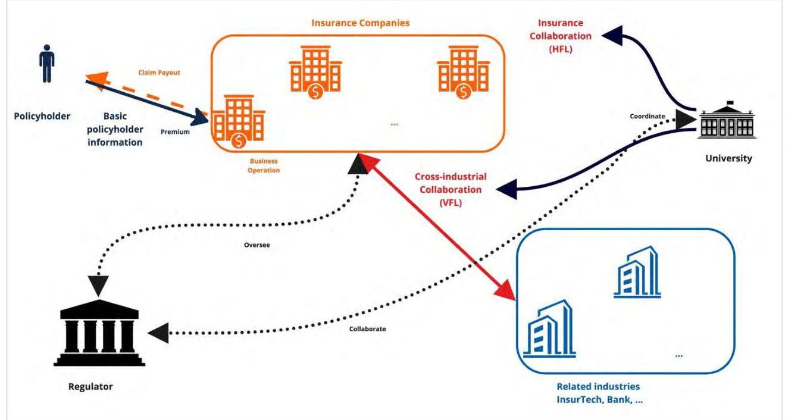
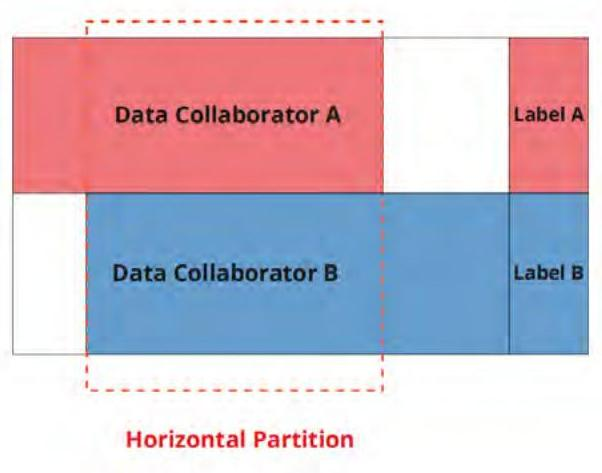
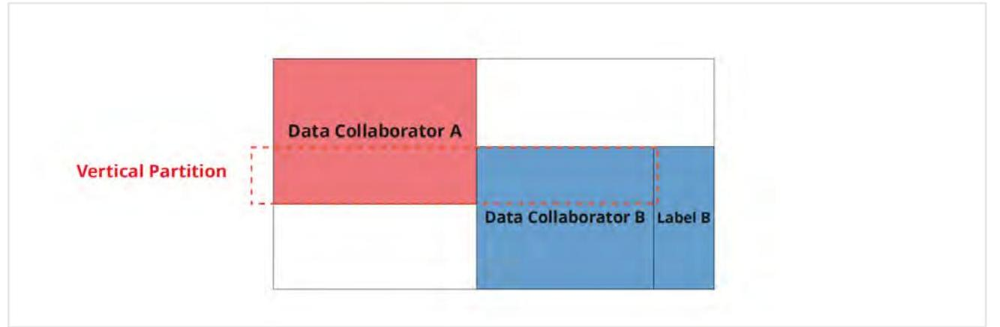
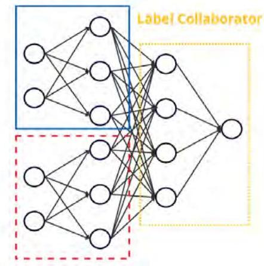

_Note: Source document was split into 3 OCR chunks (pages 1-14, pages 15-24, page 25) to stay within token limits._

# 202402 federated-learning-insurance-companies

## Page 1
# Federated Learning for Insurance Companies

## Unlocking the Potential of Privacy-Preserving Data Sharing

February | 2024

## Page 2
# 2SOA Research 

INSTITUTE

## Federated Learning for Insurance Companies

## Unlocking the Potential of Privacy-Preserving Data Sharing

AUTHORS Panyi Dong Runhuan Feng, FSA, CERA, PhD Zhiyu Quan, PhD Tianyang Wang, ASA, CFA, FRM, PhD

SPONSOR Actuarial Innovation and Technology Strategic Research Program Steering Committee

## Give us your feedback!   Take a short survey on this report.

## Caveat and Disclaimer

The opinions expressed and conclusions reached by the authors are their own and do not represent any official position or opinion of the Society of Actuaries Research Institute, the Society of Actuaries or its members. The Society of Actuaries Research Institute makes no representation or warranty to the accuracy of the information.

Copyright © 2024 by the Society of Actuaries Research Institute. All rights reserved.

## Page 3
# CONTENTS 

Executive Summary ..... 4
Section 1: Introduction ..... 5
1.1 Loss Modeling ..... 5
1.2 Shortage of Data ..... 6
1.3 Privacy Concerns ..... 8
1.4 Solution ..... 9
Section 2: Federated Learning ..... 10
2.1 Neural Network ..... 10
2.2 Federated Learning ..... 11
2.3 Horizontal Federated Learning ..... 13
2.4 Vertical Federated Learning ..... 13
Section 3: Case Study with Loss Model ..... 16
3.1 Data ..... 16
3.2 Experiment Design ..... 16
3.3 Impact of Data Volume ..... 17
3.4 Impact of Data Variety ..... 17
3.5 Empirical Results ..... 18
Section 4: More Use Cases in Insurance ..... 20
Section 5: Conclusion ..... 21
Section 6: Acknowledgments ..... 22
References ..... 23
About The Society of Actuaries Research Institute ..... 25

## Page 4
# Federated Learning for Insurance Companies Unlocking the Potential of Privacy-Preserving Data Sharing 

## Executive Summary

Data analytics are critically important for businesses, as companies can harness vast amounts of insight from data and develop competitive advantages by employing business intelligence solutions. The tremendous growth of data also offers unprecedented prospects for cross-industry data collaboration, which can enhance organizational efficiency to establish industry-level standards and best practices, including improving risk management, mitigating frauds, and fostering innovations and advance technology with business insights that can only be extracted from industry-wide data rather than company-specific data.

However, the proprietary nature of insurance data has prevented insurance companies from exchanging data. The inaccessibility of data across the boundaries of insurance firms, or even business units within a corporation, makes it challenging to conduct collaborative analysis and identify valuable business insights. The challenge calls for an innovative solution - a technology that allows open collaborations while simultaneously safeguarding against the risks of leaking proprietary and confidential client information.

Federated learning (FL) describes a distributed machine-learning framework enabling multiple devices or organizations to collaborate on a machine-learning model without having to share their raw data with each other or with a central server. One promising application of FL lies in the insurance industry, where each firm harvests a vast amount of client and claims data. There has been little to no previous literature on the applications of FL on insurance data. This paper aims to fill the gap and to offer researchers and practitioners an introduction, the pros and cons of FL, as well as potential use cases.

This report offers a concise review of technical foundations of various types of FL techniques. Section 1 lays out the background for the development of FL in the context of loss modeling. Section 2 gives a review of the fundamental philosophy of FL. We complement the discussion with detailed on a particular use case in section 3. A wide range of business use cases are presented in section 4.

## Page 5
# Section 1: Introduction 

Numerous research papers have presented compelling evidence that machine learning (ML) models can bring significant enhancements to underwriting, loss modeling, reserving, and fraud detection (c.f. Baudry and Robert, 2019; Blier-Wong, et al., 2021; Hanafy and Ming, 2021), suggesting that, as a data-driven industry, the insurance sector can benefit from the revolution of Artificial Intelligence (AI). Across the body of literature, it can be noted that, spanning from data preprocessing to model deployment, traditional ML tasks typically necessitate a centralized computing center or server responsible for aggregating all data, aligning all data sources, and overseeing the entire ML application life-cycle. Such a centralized data-sharing strategy demands the complete trust of proprietary data holders towards the central server. Nevertheless, the insurance industry's cautious approach towards potential information leakage, driven by the sensitivity and privacy concerns associated with the personal data held by each insurance company and the inherently risk-averse nature of its business operations, render centralized data collection and model training unfeasible in real-world industrial applications. Additionally, the lack of access to data across business divisions within a corporation or boundaries of insurance firms poses a significant challenge in conducting collaborative analyses and extracting valuable business insights that can only be derived from aggregated and aligned data. Hence, seeking an alternative solution that circumvents centralized data storage, while effectively mitigating the privacy and information leakage concerns held by insurance firms, can catalyze the state-of-the-art advancement of ML in the insurance industry. Such an approach holds the potential to empower the insurance sector, facilitating more accurate and comprehensive risk analysis. Moreover, it can enhance regulatory oversight, enabling better monitoring of the market dynamics, and ultimately fostering a fair pricing environment that benefits customers.

Federated learning offers a privacy-preserving solution for potentially enabling collaborations among different units within an insurance company, different insurance companies within the industry, and between insurance companies and InsurTech firms. Federated Learning (FL), first proposed by McMahan, et al. (2017), is a distributed approach for training an ML model that aims to address limitations and risks of centralized data storage, which is a critical prerequisite for standard ML solutions. As a result, FL enables ML innovations where data centers or computing servers cannot collect datasets physically. In many other disciplines and industries, researchers and practitioners joined forces to utilize FL to achieve goals that were once deemed impossible (see Niknam, et al. (2020), Rieke, et al. (2020), and Pati, et al. (2022)). Built on the work of others, this report focuses on the application of FL in loss modeling, in particular, with regard to the two most pressing concerns: data volume and data variety.

### 1.1 LOSS MODELING

In most jurisdictions, the insurance industry is tightly regulated, preventing it from disclosing its clients' private information. In addition, insurance companies, as data owners, may not necessarily have the technical capacity or budget to develop early-stage proof of concept (POC) projects with AI technologies. Hence, legal constraints and technical barriers prevent data owners from further improving their ML models.

In classic actuarial practice, loss modeling, or the claim cost prediction, is often based on frequency and severity analysis. To offer an illustration, we denote the aggregated loss by $Z$, the frequency of claims by $U$, and the independently and identically distributed severity by $V_{u},(u=1,2, \ldots, U)$. Then, the expected aggregated loss is estimated by:

$$
\mathrm{E}[Z]=\mathrm{E}[U] \mathrm{E}\left[V_{u}\right]
$$

Alternatively, aggregated loss $Z$ can be measured by a compound distribution that considers both the frequency and severity, so it can be expressed in the form:

$$
Z=V_{1}+V_{2}+\ldots+V_{u}
$$

## Page 6
One of the standard mixture models is compound Poisson-Gamma distribution and Tweedie distribution (Jørgensen and Paes De Souza, 1994), where the frequency of claims follows Poisson distribution and the severity of each claim can be described by Gamma distribution. However, with innovations in AI, powerful ML models can be trained to forecast aggregated losses directly, avoiding the two-part structure and inferior prediction. Research work with applications of ML techniques in the insurance sector emerged in the past few years. See Guelman (2012), Quan and Valdez (2018), Baudry and Robert (2019), Blier-Wong, et al. (2021), Hanafy and Ming (2021), Hu, et al. (2022) and Quan, et al. (2022).

# 1.2 SHORTAGE OF DATA 

Structured tabular datasets are organized through rows and columns. In the following, we refer to each row as an observation which, in the context of insurance applications, corresponds to the information of a policy/policyholder, and each of the columns denotes a feature, risk factor, collected by insurance companies to describe the policy and identify potential risks. A structured tabular dataset, in the following, denotes $\mathcal{D}=(\mathbf{X}, \mathbf{y})=\left(\mathbf{X}_{i}, \mathbf{y}_{i}\right)$, $(i=1,2, \ldots, \mathbf{n})$ where $\mathbf{X}$ refers to inputs (or features), $\mathbf{y}$ refers to labels (or response variables), and each of total $\mathbf{n}$ observations can be represented by the pair $\left(\mathbf{X}_{i}, \mathbf{y}_{i}\right)$. Each of the input $\mathbf{X}_{i}$ can be represented as $\mathbf{X}_{i}=$ $\left(X_{i 1}, X_{i 2}, \ldots, X_{i p}\right)$ where each of $X_{i j},(j=1,2, \ldots, p)$, indicates the cell values of total $p$ features stored in the dataset. Thus, the input $\mathbf{X}$ is $n \times p$ a matrix, where $n$ refers to the number of observations and $p$ denotes the number of features used for prediction.

In the format of such structured tabular datasets, the data quality is significantly impacted by $\boldsymbol{n}$ and $\mathbf{p}$. The foundation of insurance businesses is built upon the capability of accurately quantifying risks (potential car damages in auto insurance, costs of a lawsuit in liability insurance, mortality in life insurance, etc.) utilizing all information available to the insurance company. Two of the most promising improvements that insurance companies can benefit from through ML collaboration are the increase in the number of observations $n$, and in the number of features $p$. Claim events, usually referred to as "accidents," inherently imply the infrequency of their occurrences, but hold a significant impact on how risky policyholders can be differentiated from safe customers.

Lack of Data Volume: In the loss experience of the insurance industry, the proportion of policyholders that submit at least one claim to insurance companies can be low at $10 \%$, and in a few of the business lines that cover only catastrophic crises or extreme events, the rate can be even lower than $0.1 \%$. As a result of such rarity, the risk characteristics that help identify the risks can be under-represented by the occurred claim events or are not producing noticeable signals to be captured by loss models. Thus, most insurance companies always have a shortage of claim events to allow their loss models to better learn from the behaviors of risky policyholders without any collaborations. It is particularly true for insurance companies that enter a new market without claim experience. Further, one of the common techniques for solving a similar problem of imbalance is sampling, whose primary objective is to generate synthetic and statistically similar claim events or eliminate some of the no-claim policyholders from the database to reshape the dataset into a balanced one. However, these sampling techniques are generally considered an unacceptable approach as they distort the distribution of policyholders' behaviors, and synthetic observations, though perhaps statistically realistic, may not be the true representation of policyholders. Due to the limitation of sampling techniques in the insurance industry, a proper ML collaboration solution is in demand to solve the issue.

## Page 7
In the case of collaboration among total $K$ insurance companies, we assume company $k$ is in possession of dataset $\mathcal{D}_{k}=\left(\mathbf{X}_{k}, \mathbf{y}_{k}\right),(k=1,2, \ldots, K)$, where $\mathbf{X}_{k}$ is in the shape of $n_{k}$ and $p$ denotes the number of observations and features correspondingly. Specifically, due to the homogeneity of collaborators as insurance companies, in this case, they share the same sets of features, or at least an overlapping set of features. To solve the problem of adequacy of claim events, companies desire, through a privacy-preserving protocol, a technical solution that could simulate the state of training utilizing global datasets:

$$
\mathcal{D}_{G}=\left(\mathbf{X}_{G}, \mathbf{y}_{G}\right)=\left(\left[\begin{array}{c}
\mathbf{X}_{1} \\
\mathbf{X}_{2} \\
\ldots \\
\mathbf{X}_{K}
\end{array}\right] \cdot\left(\left[\begin{array}{c}
\mathbf{y}_{1} \\
\mathbf{y}_{2} \\
\ldots \\
\mathbf{y}_{K}
\end{array}\right]\right)
$$

where $\mathcal{D}_{G}, \mathbf{X}_{G}$ and $\mathbf{y}_{G}$ denote the global dataset, global inputs, and global labels, respectively. The matrix of global inputs $\mathbf{X}_{G}$ is concatenated through horizontal partitions. It is in the shape of $\left(\sum_{k=1}^{K} n_{k}\right) \times p$ representing the collection of policyholders from all companies. As collaboration in this scenario increases the number of observations, we refer to the case as the impact of data volume. Generally, the more companies participating in this collaboration, the larger the data volume and, correspondingly, it can provide a better characterization of risks from an industry-level perspective. In addition, a diverse and representative dataset helps to avoid biases in ML models. If the dataset used for training is biased, the resulting model will also be biased, leading to inaccurate predictions or recommendations. In subsection 2.3, in the reflection of FL categorization, this collaboration, due to its horizontal partition of the dataset, is denoted as Horizontal Federated Learning (HFL).

Lack of Data Variety: Another noteworthy potential improvement coming from the collaboration of the insurance industry lies in the expansion of feature space. To accurately predict future losses, the data utilized should comprehend all risk factors. Traditionally, the frequent usage and ease of accessibility of private information, like age, sex, jobs, and past medical records, make those features the "golden standards." However, the evolution of new technologies like the Internet of Things (IoT) (Spender, et al., 2019), smartphones (Händel, et al., 2014), telematics (Handel, et al., 2014), and social media (Mosley Jr, 2012) has challenged the common belief of these standards. The true risk factors (at least for new generations of policyholders) may lie in those additional features that traditional insurance companies are not contemplating in the modeling process. Further, the cross-industry collaboration between insurance and related fields like banking and healthcare can be beneficial as the cross-section of policyholders among these industries creates the opportunity to characterize policyholders better. Taking the example of collaboration among insurance companies, Insurtech companies, and healthcare systems to assess the risk of policyholders for health insurance policies, insurance companies, instead of utilizing only summarized medical history during underwriting procedures, can get precise characterizations authorized by licensed physicians from healthcare systems and Internet-enhancing personal information through smartphones and social media from Insurtech companies so that potential healthcare-related events can be better characterized and evaluated.

In the setting of total $K$ companies where the scope of the collaboration is to improve the capability of insurance loss modeling, we assume company 1 is the insurance company that is in possession of dataset $\mathcal{D}_{1}=\left(\mathbf{X}_{1}, \mathbf{y}_{1}\right)$ where labels of claim events are stored, while other companies $k,(k=2,3, \ldots, K)$, hold solely those additional, new-technology-empowered features in the format of dataset $\mathcal{D}_{k}=\left(X_{k}\right)$ without labels. Suppose we denote the shape of inputs company $k$ holds is $n \times p_{k},(k=1,2, \ldots, K)$, given the same notation of global dataset, global inputs and global labels, they can be expressed as $\mathcal{D}_{G}=\left(\mathbf{X}_{G}, \mathbf{y}_{1}\right)$, where $\mathbf{X}_{G}=\left[\mathbf{X}_{1}, \mathbf{X}_{2}, \ldots, \mathbf{X}_{K}\right]$. The matrix of global inputs $\mathbf{X}_{k}$ is concatenated through vertical partitions and is in the shape of $\left(\sum_{k=1}^{K} n_{k}\right) \times p$, implying the expansion of feature space for the same group of policyholders.

In the sense of risk assessment, the more features collaborators utilize, the better the characterization of potential risks the data can hold, which results in improved loss modeling in the insurance industry. The application of increased data variety, as introduced in subsection 2.4, is usually classified as Vertical Federated Learning (VFL).

## Page 8
# 1.3 PRIVACY CONCERNS 

Despite the fact that the insurance industry has long been concerned with both the shortage of volume and variety of data, there currently exists no practical solution that can effectively eliminate privacy concerns. Academic researchers and industrial practitioners have concentrated on enhancing the performance of ML models while overlooking the challenges posed by certain industries, such as banking, insurance, and healthcare, that prioritize the privacy of customer data over performance advancements and are bound by regulations forbidding the unsecured sharing of confidential data, thus hindering the implementation of centralized data collection-demanded ML collaborations. Insurance companies, which are central to the practice of risk forecasting and management, adopt a cautious and conservative approach in embracing ML collaboration due to the protection of customer privacy and the safeguarding of embedded confidential business strategies. Thus, techniques enabling privacypreserving ML collaborations that can imitate the advantages of ML collaborations, while ensuring data confidentiality, can benefit the insurance industry, offering a resolution to the persistent shortage of data volume and variety.

In this work, to connect the insurance "data silos" (Li, et al., 2020), we utilize the technique of FL as the bridge to communicate among insurance companies and allow the realization of privacy-preserving ML collaboration. Insurance companies can then take advantage of ML collaboration while maintaining data privacy. To address the two promising developments above specifically, we propose the framework of utilizing HFL to evaluate the impact of data volume through collaboration among insurance companies, and VFL to assess the effect of data variety in the scenario of collaboration among related industries. With the proposed solutions that address the privacy concern, insurance companies participating in the federation of model training can benefit from the innovations of Big Data and efficiency enhancement for their business.

Figure 1
OVERVIEW OF FEDERATED LEARNING COLLABORATIONS

## Page 9
# 1.4 SOLUTION 

FL could potentially be the next breakthrough in the insurance industry, solving data challenges with unprecedented effectiveness and efficiency by sharing knowledge and expertise while enhancing privacy. For instance, through the partnerships between insurance companies and with InsurTech companies, each private "data owner" trains a model locally using only their own data, then parameters are shared with the central "aggregation server" to create a consensus model with accumulated knowledge from all "data owners" to create a more complete picture of risk assessment of policyholders and industry-level insights. As illustrated in figure 1, such multi-institutional collaboration, without sharing data among the collaborators, is of great value to insurance companies, industrial associations, governments, and regulators.

## Page 10
# Section 2: Federated Learning 

Empirical experiments in this study employ the technique of HFL and VFL utilizing Neural Networks (NNs) as the chosen model architecture. The decision to opt for NNs as the model architecture is underpinned by two pivotal factors: their promising model performance and their inherent compatibility with the FL framework, rendering them a pragmatic choice for our experiments. NNs, widely recognized as one of the most prominent frameworks in ML in the past decade, have found extensive application across a spectrum of contemporary data-driven ML tasks, such as Computer Vision and Natural Language Processing, consistently delivering a state-of-the-art performance. Further, the adaptability of NNs to the FL framework is notably advantageous. The recursive backward propagation technique, the foundation of NNs parameter updates, can be conveniently adjusted to seamlessly integrate with the FL framework. In contrast, the incorporation of ML architectures, such as Decision Trees and Support Vector Machines, into the FL framework necessitates substantial research and modification. See Kesteren, et al. (2019), Truex, et al. (2019), Tian, et al. (2020), and Cellamare, et al. (2022).

Figure 2
NEURAL NETWORK

### 2.1 NEURAL NETWORK

NNs, as summarized by Müller, et al. (1995), consist of an ML model architecture inspired by the structure and functionality of neural cells in the human central nervous system. The NNs, demonstrated in various ML tasks, can approximate the true function $f$ with the model $f^{*}$, with connected artificial neurons, as illustrated in figure 2. The complexity of any function $f$ can be captured by stacking linear layers and non-linear activation functions.

The following notations are adopted from Goodfellow, et al. (2016). For a prediction task on dataset $\mathcal{D}=(\mathbf{X}, \mathbf{y})$, where $\mathbf{X}, \mathbf{y}$ denotes inputs and labels, respectively, the NNs are designed to approximate true mapping function $f: \mathbf{X} \rightarrow \mathbf{y}$ with $f^{*}$ through recursive forward and backward propagation procedures to update the model parameters based on batches of data samples. For a $Q$-layer NN, each of the layers can be written as $f^{(q)},\left(q=1,2, \ldots, Q\right)$. The layers, with the increase in $q$ from input layers to output layers, denote shallow layers to deep layers. In the mth iteration, forward and backward propagation of this NN, given a pair of input-label batch samples $\left(\mathbf{x}_{m}, \mathbf{y}_{m}\right)$ and loss functions $L\left(\hat{\mathbf{y}}_{m}, \mathbf{y}_{m}\right)$ of batch predictions $\hat{\mathbf{y}}_{m}$ and true labels $\mathbf{y}_{m}$ as the optimization target, can be represented as:

Forward propagation: The forward propagation phase brings the batch input $\mathbf{x}_{m}$ from shallow layers to deeper layers to calculate the regularized prediction loss $S$ of the current batch sample.

## Page 11
The batch predictions $\hat{\mathbf{y}}_{m}$, given the $Q$-layer network, can be expressed as the function composition from shallow layers to deep layers in the form of:

$$
\begin{aligned}
\hat{\mathbf{y}}_{m} & =f^{(Q)}\left(f^{(Q-1)}\left(\cdots f^{(1)}\left(\mathbf{X}_{m}\right) \cdots\right)\right) \\
& =f^{(Q)} \circ f^{(Q-1)} \circ \cdots \circ f^{(1)}\left(\mathbf{X}_{m}\right)
\end{aligned}
$$

The loss $S$ can then be calculated as:

$$
S=L\left(\hat{\mathbf{y}}_{m}, \mathbf{y}_{m}\right)+\lambda R(\theta)
$$

where $\theta$ denotes the overall model parameters, $R(\theta)$ is the regularization of model parameters $\theta$, and hyperparameter $\lambda$ controls to what extent the model is penalized by the regularization term.

Backward propagation: The backward propagation, occurring recursively after each iteration of forward propagation, denotes the procedure of model parameter optimization. The most common learning techniques of backward propagation in the domain of NN belong to the categorization of gradient-based optimization with the application of the chain rule. Instead of moving from shallow to deep layers as stated in the forward propagation phase, the backward propagation takes the inverse direction from the output layer to the input layer.

By the theory of gradient-based optimization, at time step $t$, the parameters $\theta_{t}^{(q)}$ at layer $q$, $(q=Q, Q-1, \ldots, 1)$, can be updated as:

$$
\theta_{t+1}^{(q)}=\theta_{t}^{(q)}-\gamma \nabla_{\theta_{t}^{(q)}} S
$$

where $\gamma$ denotes the hyperparameter of the learning rate.
The gradient of $\theta_{t}^{(q)}$ by loss function $L\left(\hat{\mathbf{y}}_{m}, \mathbf{y}_{m}\right)$ can be computed using the chain rule and expressed as:

$$
\nabla_{\theta_{t}^{(q)}} L=L^{\prime} \times f^{(Q)^{\prime}} \times f^{(Q-1)^{\prime}} \times \cdots \times f^{(q)^{\prime}}
$$

where $L^{\prime}$ and $f^{(q)^{\prime}}$ are the derivatives of loss function and layer $q$, respectively. The inputs of the functions are omitted for simplified representation, but all components are obtained after each forward propagation. The gradients of the regularization part are specified by the form of regularization, but straightforward given the inputs of the regularization $R$ are the parameters.

With the iterative application of forward and backward propagation iterating through all batch samples, the model can "learn" from the optimization process and can reach the certain optimal point of expected performance.

# 2.2 FEDERATED LEARNING 

The optimization diagram of general FL architecture, as summarized in Yang, et al. (2019), can be decomposed into two different stages: local updates and centralized aggregation, which are performed by the participants of the collaborators and central server, respectively. Following the notation from McMahan, et al. (2017), at the beginning of training round $t$, the central server sends the up-to-date model parameters $\theta_{t}$ (or the initialization of the model parameters at the first round, $t=1$ ) to each of the collaborators. The collaborator $k(k=1,2, \ldots, K)$, after receiving the model parameters $\theta_{t}$, updates the local model parameters utilizing locally stored private data to $\theta_{t+1}^{k}$ and then sends it to the central server. After receiving locally updated model parameters from all participating collaborators, the central server then performs certain aggregation techniques to generate the global model update

## Page 12
$\theta_{t+1}$. The procedure is applied recursively to find the optimal solution. Therefore, due to the distribution of only model parameters during the entirety of the training process, the role of the central server within the context of FL starkly contrasts with that of a traditional central server. This divergence effectively mitigates privacy concerns related to raw data, as sensitive information remains safeguarded within the confines of local collaborators.

The common categorization of FL solutions, as suggested by Yang, et al. (2019), lies in the differences in data partition and distribution through feature and observation space. In the following work, we will focus only on the cases where at least a certain overlap over feature/sample space exists, which corresponds to HFL and VFL, respectively.

Figure 3
HORIZONTAL DATA PARTITION

As depicted in figure 3, the concept of HFL addresses the challenge of heterogeneity within the observation space, under the condition of homogeneity within the feature space, indicating a commonality in the feature space shared between data collaborators A and B. Specifically, HFL leverages only the horizontal intersection for the training process. When applied to structured tabular datasets, the existence of overlapping feature space signifies the presence of shared features among the collaborators. This approach facilitates collaboration among participants who possess datasets in the same data format.

Conversely, VFL, as exemplified in figure 4, is designed for scenarios where there is homogeneity in observations, but heterogeneity in features. This is characterized by a vertical partition where partial observations are shared among data collaborators. Notably, in contrast to HFL, where all collaborators possess labels, VFL typically involves a configuration where only one collaborator holds the labels of interest, while the remaining collaborators exclusively contribute unique features from their respective domains. In practical applications, VFL caters to the need for interdisciplinary collaborations spanning multiple industries.

## Page 13
# 2.3 HORIZONTAL FEDERATED LEARNING 

To investigate the influence of data volume in collaborative learning, we employ the FedAvg technique proposed by McMahan, et al. (2017) within the context of horizontal partitioning.

The algorithm, FedAvg, modifies the traditional gradient-based model update technique by averaging the model parameters during each communication round. Following the notation from McMahan, et al. (2017), in the setting of $K$ collaborators, the local model parameter update at time $t$, denoted in subsection 2.1, can be expressed as:

$$
\theta_{k, t+1}^{(q)}=\theta_{k, t}^{(q)}-\gamma \nabla_{\theta_{k, t}^{(q)}} \mathrm{S}
$$

Figure 4
VERTICAL DATA PARTITION
where the additional subscript $k$ differentiates the collaborators $(k=1,2, \ldots, K)$. The central server, once all local model parameters are received, performs central average in the form of:

$$
\theta_{t+1}^{(q)}=\sum_{k=1}^{K} \frac{n_{k}}{n} \theta_{k, t+1}^{(q)}
$$

where $n_{k}$ and $n$ refer to the number of observations from collaborator $k$ and in total, respectively.
Thus, the equilibrium $n=\sum_{k=1}^{K} n_{k}$ always holds.
This indicates that the FedAvg algorithm can be conveniently represented as the weighted average of local model parameters during model aggregation. It should be noted that the model structures in the HFL setting are shared among all collaborators, suggesting all parameters $\theta_{k, t}^{(q)}$ have identical shapes across all collaborators, which makes the averaging possible. The updated central model parameters are then sent to each collaborator for future local updates.

### 2.4 VERTICAL FEDERATED LEARNING

To empirically comprehend the influence of data variety, we employ the Split Neural Network (SplitNN) framework, a versatile privacy-preserving NN architecture proposed by Ceballos, et al. (2020), as the solution to vertical partition challenges.

In contrast to the HFL setting, where all collaborators share identical data formats and model structures, the VFL framework involves collaborators possessing different sets of features. This diversity limits the feasibility of training

## Page 14
the exact same model and entirely eliminates the need for data sharing. As depicted in figure 5, which illustrates a VFL collaboration between two feature collaborators with distinct feature sets and one label collaborator holding only the labels, the SplitNN achieves secure synchronization by dividing the forward structure. Model updates are accomplished through the exchange of the global gradient map. Summarized by Romanini, et al. (2021), SplitNN partitions the entire network into segments, making communication among collaborators dependent on intermediate representations of inputs or hidden states rather than raw data. The following notations were adopted from Ceballos, et al. (2020). In the case of $K$ feature collaborators and one label collaborator, instead of sharing private raw data $\mathcal{D}_{k}=\left(\mathbf{X}_{k}\right)$ from feature collaborator $k,(k=1,2, \ldots, K)$ to the label collaborator following the diagram of centralized learning, each feature collaborator $k$ at time $t$ trains the corresponding segment of the SplitNN (sections like the blue and red dash-line rectangles illustrated in figure 5) denoting $f_{k, t}^{*}$ and shares only the intermediate output:

$$
\mathbf{h}_{k, t}^{\left(Q_{k}\right)}=f_{k, t}^{*}\left(\mathbf{x}_{k, m}\right)
$$

Figure 5
SPLIT NEURAL NETWORK

# Feature Collaborator 1 

Feature Collaborator 2
where $Q_{k}$ is the number of layers of network $f_{k, t}^{*}, \mathbf{x}_{k, m}$ denoting batch input sampled from $\mathcal{D}_{k}$. It's worth noting that these intermediate outputs $\mathbf{h}_{k, t}^{\left(Q_{k}\right)}$ are attached to a gradient map and then sent to the label collaborator. After receiving all intermediate outputs $\mathbf{h}_{k, t}^{\left(Q_{k}\right)}$ from all feature collaborators, the label collaborator first performs a certain aggregation procedure:

$$
\mathbf{h}_{K+1, t}^{(0)}=O\left(\mathbf{h}_{1, t}^{\left(Q_{1}\right)}, \mathbf{h}_{2, t}^{\left(Q_{2}\right)}, \ldots, \mathbf{h}_{k, t}^{\left(Q_{K}\right)}\right)
$$

where $O$ denotes a pre-defined aggregation operation like concatenation and summation. The aggregated result $\mathbf{h}_{K+1, t}^{(0)}$ is then fed to the segment $f_{K+1, t}^{*}$ belonging to the label collaborator $K+1$ (similar to the orange dash-line rectangles in figure 5) to serve as the initial hidden state of $f_{K+1, t}^{*}$, whose forward propagation can be expressed as:

$$
\hat{\mathbf{y}}_{\mathrm{m}}=f_{K+1, t}^{*}\left(\mathbf{h}_{K+1, t}^{(0)}\right)
$$

so that the loss can be calculated for optimization.

## Page 15
The model update procedure, backward propagation, benefits from the diagram of gradient-based optimization techniques, where convenient, with the transmission of a gradient map from label collaborators back to each of the feature collaborators, all locally-hosted segments of SplitNN can then be updated for all feature collaborators. The optimization of label collaborators is straightforward given the backward propagation denoted in subsection 2.1. For feature collaborators, it can be noted that the gradients at the last layer $Q_{k}$ of feature collaborator $k$, $(k=1,2, \ldots, K), \nabla_{\mathbf{h}_{k, t}^{(0)}} S$ can be inferred from the gradients at the initial hidden states of label collaborator $\nabla_{\mathbf{h}_{K+1, t}^{(0)}} S$, given the definition of aggregation operation $O$. For example, for the aggregation of summation, given the unified shape of the matrix, it can be expressed as:

$$
\nabla_{\mathbf{h}_{k, t}^{(0)}} S=\nabla_{\mathbf{h}_{K+1, t}^{(0)}} S
$$

For each feature collaborator $k$, once the gradients $\nabla_{\mathbf{h}_{k, t}^{(0)}} S$ have been received, the backward propagation becomes well-defined, and can be derived by the chain rule from $\nabla_{\mathbf{h}_{k, t}^{(0)}} S$.

Inferred from the structure of SplitNN embedded in VFL, since raw data never leaves the local data centers, privacy is preserved. In some of the real-life applications, the label collaborator, instead of holding only the labels, can also participate as a feature collaborator to fully utilize the data collected.

## Page 16
# Section 3: Case Study with Loss Model 

### 3.1 DATA

In the collaboration, we have data from three industrial partners, including two insurance companies and one InsurTech company. With their data, two types of FL could be illustrated:

- the two insurance companies can be used to illustrate the power of HFL
- each insurance company and the InsurTech firm can be used to illustrate the power of VFL

The InsurTech company, Carpe Data ${ }^{1}$, provides business-related information, such as social media data and foot traffic data. Insurance companies share the loss experiences and rating factors for actuarial loss modeling. Both parties come together to make a merged dataset, including commercial insurance historical loss experience and InsurTech features describing the business. More specifically, Carpe Data provided us with business-related information from multiple data sources. The raw data files were provided in nested JSON with hierarchical structures. We have flattened the raw data and grouped the extracted information into five categories: Business Information, Risk Characteristics, Customer Reviews, Website Contents, and Carpe Index.

Insurance companies have shared their loss data in commercial lines with their rating factors. Specifically, Company A shared their loss data in the Business Owner's Policy (BOP) insurance. A BOP bundles general liability insurance with commercial property insurance. Likewise, Company B shared its loss data in General Liability (GL) insurance. GL insurance, also called business liability insurance, is an insurance product designed to protect the business from various claims, including bodily injury, property damage, personal injury, and others that can arise from business operations. In addition to coverage for claims resulting from business operations, it also covers commercial buildings and business personal property from claims caused by fire, theft, or other covered disasters.

### 3.2 EXPERIMENT DESIGN

In the empirical study, although there are various insurance scenarios that can potentially benefit from the application of the FL framework, we specifically focus on the impact of privacy-preserving collaborative learning on insurance loss modeling in both data volume and data variety aspects. As introduced in subsection 1.1, loss modeling is a critical topic in all insurance business lines since it estimates the future losses that will incur and be reported by policyholders and serves as a lower bound of the product price to guarantee the company's reserving solvency and capability of profit. As such, it has become a popular topic among insurance academic research and industrial operation, ranging from traditional statistical distribution estimations summarized by Klugman, et al. (2012), to the applications of ML innovations suggested by Guelman (2012).

In our work, we will employ the Feedforward Neural Network (FNN) structure introduced by Svozil, et al. (1997) as our learning model architecture. FNN, as one of the initial NNs structures, comprises a series of fully-connected linear layers and non-linear activation functions. In addition, the experiments are conducted within the framework of OpenFL ${ }^{2}$ developed by Foley, et al. (2022), which is a popular open-source FL framework combining common FL algorithms with secure channeling solutions.

To simulate the environment of FL, we utilize the two real-world industrial claim datasets of liability insurance policies. Dataset $\mathcal{D}_{A}=\left(\mathbf{X}_{A}, \mathbf{y}_{A}\right)$ from company A comprises Insurtech-enhanced claim information of liability coverage in bundles of BOP, and dataset $\mathcal{D}_{B}=\left(\mathbf{X}_{B}, \mathbf{y}_{B}\right)$ from company B is a constructed tabular dataset coming from the GL business line ( $\mathcal{D}_{A}$ consists of a total of 392,726 observations with 581 features each. 210,857 observations and 594 variables in feature space are stored in dataset $\mathcal{D}_{B} .555$ features are shared across $\mathcal{D}_{A}$ and

[^0]
[^0]:    1 https://carpe.io/.
    ${ }^{2}$ Full reference of OpenFL. Retrieved from: https://github.com/intel/openfl.

## Page 17
$\mathcal{D}_{B}$.) To further distinguish the shared features from unique features company $A / B$ holds, we denote the split as $\mathbf{X}_{A}=\left(\mathbf{X}_{A, \text { shared }}, \mathbf{X}_{A, \text { unique }}\right)$ and $\mathbf{X}_{B}=\left(\mathbf{X}_{B, \text { shared }}, \mathbf{X}_{B, \text { unique }}\right)$, where $\mathbf{X}_{\text {_shared }}$ refers to the shared features between company $A / B$ and $\mathbf{X}_{\text {_unique }}$ represents the unique features that differentiates from company $A / B$. In the following, we refer to the simulated collaborator in possession of $\mathcal{D}_{A}$ as collaborator $A$ and the other with $\mathcal{D}_{B}$ as collaborator $B$.

# 3.3 IMPACT OF DATA VOLUME 

As introduced in subsection 1.2, some of the insurance business lines suffer from a shortage of claim events by the limited occurrence, which prevents companies from comprehensively studying the behaviors of risk characteristics. However, such a shortage of claim events, through a collaboration among insurance companies sharing the same concerns and selling similar insurance products, can be solved by the technique of HFL. In the setting of HFL, the intersection selected by those shared features is utilized to analyze the impact of data volume on insurance loss prediction which, when reflecting on our empirical experiments, resembles the collaboration among insurance companies in possession of the same features to increase the data volume.

Specifically, we utilize the shared features $\mathbf{X}_{A, \text { shared }}$ and $\mathbf{X}_{B, \text { shared }}$ from $\mathcal{D}_{A}$ and $\mathcal{D}_{B}$ to form a two-collaborator federation where collaborator $A$ (company $A$ ) holds private dataset $\mathcal{D}_{A, H F C}=\left(\mathbf{X}_{A, \text { shared }}, \mathbf{y}_{A}\right)$ and collaborator $B$ (company B) holds $\mathcal{D}_{B, H F C}=\left(\mathbf{X}_{B, \text { shared }}, \mathbf{y}_{B}\right)$, respectively. There also exists a central server in this federation, which instead of collecting $\mathcal{D}_{A, H F C}$ and $\mathcal{D}_{B, H F C}$ from collaborator $A / B$, functions solely as the communication center among collaborators to collect local model parameters from all collaborators and aggregate the parameters. In the entire process of collaborative training, the private datasets $\mathcal{D}_{A, H F C}$ and $\mathcal{D}_{B, H F C}$ are never shared with the other collaborator or the central server, a result of which the data privacy of company $A / B$ is secured.

The common practice of loss modeling, by the convention of local training, utilizes only the information of local datasets which, corresponding to our experiment settings, refers to $\mathcal{D}_{A, H F C}$ for company $A$ and $\mathcal{D}_{B, H F C}$ for company B. Without collaborative learning, loss modeling of Company $A / B$ can be considered as a supervised regression task so that the model can learn from the historical claim events, identify the risk characteristics and predict future liabilities from occurrences of claims. To compare with the framework of FL, we utilize the architecture of FNN for local training. As for the case of collaboration employing HFL, we adopt the structure of two-collaborator FedAvg algorithm, where the federation comprises only two insurance collaborators and the features leveraged by collaborators are identical, $\mathbf{X}_{A, \text { shared }}$ and $\mathbf{X}_{B, \text { shared }}$. The cooperated training procedure consists of iterative local training and aggregation communications. The local training in HFL, for each of the collaborators, is equivalent to the local training without the FL framework, while the rounds of communication distinguish the FL from local training through model aggregations. During the local training, both collaborators, in our experiment settings, optimize the aggregated model at time step $t$, represented by $F_{t}$, into $F_{t+1}^{1}$ and $F_{t+1}^{2}$, respectively, which are then averaged during aggregation to generate global model at time step $t+1$ through:

$$
F_{t+1}=\frac{F_{t+1}^{1}+F_{t+1}^{2}}{2}
$$

In the structure of our HFL experiments, both collaborators exploit the same structure of NN so that both the aggregation strategy and the model interpretations are straightforward. The model, upon completion of training, possesses a unified architecture structure and a common global state of parameters, suggesting that, ultimately, all collaborators share an identical model.

### 3.4 IMPACT OF DATA VARIETY

As discussed in subsection 1.2, due to the complexity and rarity of claim events, finding the features that completely characterize a risk is a difficult challenge to the insurance industry and companies are exploring all feasible options that can expand the feature space their loss models can train on. As one of the solutions, VFL allows the

## Page 18
collaboration of overlapping observations which, in our empirical experiments, corresponds to the privacypreserving collaboration between insurance companies and Insurtech companies. Summarized by Stoeckli, et al. (2018), Insurtech companies, by extracting information through various data mining, Natural Language Processing and specialized feature engineering techniques, can provide alternative technology-innovated features that insurance companies can benefit from. With the technique of VFL, the concern of potential leakage of private policyholder information or secret business strategy contained in datasets, which once prevented the collaboration between insurance and Insurtech companies, can now be alleviated.

With the datasets described above, both company A and company B can form a two-collaborator VFL federation. For company A, we construct collaborator A1 and collaborator A2, which are in possession of $\mathcal{D}_{A 1, V F L}=$ $\left(\mathbf{X}_{A, u n i q u e}\right)$ and $\mathcal{D}_{A 2, V F L}=\left(\mathbf{X}_{A, \text { shared }}, \mathbf{y}_{A}\right)$, respectively. Similarly, we define $\mathcal{D}_{B 1, V F L}=\left(\mathbf{X}_{B, u n i q u e}\right)$ for collaborator $B 1$ and $\mathcal{D}_{B 2, V F L}=\left(\mathbf{X}_{B, \text { shared }}, \mathbf{y}_{B}\right)$. Then, collaborator B2 can utilize the additional features from collaborator A1 to enhance its loss model, while extra information embedded in $\mathcal{D}_{B 1, V F L}$ can strengthen the performance of loss model collaborator B2 once it's trained. By utilizing VFL, privacy-preserving cross-industry collaborations become possible. In the following, we will focus on the expansion of feature space for the two-collaborator case, collaborator B1, $\mathcal{D}_{B 1, V F L}$, and collaborator B2, $\mathcal{D}_{B 2, V F L}$.

One of the evident structural differences that distinguishes the application of VFL from the previously discussed HFL in subsection 3.3 is that data from collaborators, $\mathbf{X}_{B, u n i q u e}$ and $\mathbf{X}_{B, \text { shared }}$, lack commonality in features, which prevents the possibility of shared model structures/parameters among collaborators. Instead, SplitNN, is implemented to attain the purpose of privacy preservation. In our experiment setting, collaborator B1 participates as a feature worker, while collaborator B2 engages as a feature-label worker. Insurance company B, represented by collaborator B2 in this experiment, retains both features $\mathbf{X}_{B, \text { shared }}$ and labels $\mathbf{y}_{B}$ while collaborator B1, by the limitation of no-labels, can only provide features $\mathbf{X}_{B, u n i q u e}$. The training progress in the experiment exists as sequential information forwarding, as opposed to completely parallel-distributed HFL training. The collaborator B1 and collaborator B2 first fed data, $\mathbf{X}_{B, u n i q u e}$ and $\mathbf{X}_{B, \text { shared }}$, to locally-hosted models, $F_{1}$ and $F_{2}$, respectively, to generate the intermediate results, $S_{1}=F_{1}\left(\mathbf{X}_{B, \text { unique }}\right)$ and $S_{2}=F_{2}\left(\mathbf{X}_{B, \text { shared }}\right)$. The intermediate hidden states, $S_{1}$ and $S_{2}$, facilitate the encoding of the information presented in the raw data into high-dimensional vectors, thus ensuring the preservation of the privacy of the raw data. The concatenated intermediate hidden states are then transmitted to the label worker, collaborator B2 in our experiment, who utilizes them to predict the claims through the final segment of SplitNN. Upon calculation of the loss at the label worker, backward propagation occurs in the inverse direction, returning the gradients to both feature collaborators for the global model update. As a result, in contrast to HFL where all collaborators share the final model, the complete model structures in the context of VFL experiments are not accessible to each of the individual feature workers or label workers. Instead, individual feature workers and label workers are unique and only possess partial segments of the model.

# 3.5 EMPIRICAL RESULTS 

In accordance with the experimental design outlined in subsections 3.3 and 3.4, this subsection presents an analysis of the impact of privacy-preserving ML collaboration on data volume and data variety. The results from experiments indicate that, while addressing data privacy concerns, the FL framework can potentially improve the accuracy of loss event prediction for insurance companies. The performance of the ML model, in our experiments, is evaluated by metrics of Percentage Error (PE). This metric embeds meaningful business intuition that measures the portfolio level accuracy.

## Page 19
The Percentage Error (PE) can be expressed as

$$
\operatorname{PE}(\mathbf{y}, \hat{\mathbf{y}})=\frac{\sum_{i}\left(y_{i}-\hat{y}_{i}\right)}{\sum_{i} y_{i}}
$$

where $\mathbf{y}$ denotes the true values and $\hat{\mathbf{y}}$ refers to the predicted values. Given the definition, $P E(\mathbf{y}, \hat{\mathbf{y}})$ has a range of $\mathbb{R}$ and the smaller the value of $|P E(\mathbf{y}, \hat{\mathbf{y}})|$, the more accurate the predictions. It's important that PE offers insights into forecasts at the portfolio level, indicating the capability of sustainability and solvency of insurance companies' estimated loss reserves and is a crucial indicator in industrial practices.

Table 1
PERFORMANCE OF HFL

| Collaborator | Split | Mode | PE |
| :--: | :--: | :--: | :--: |
| Company A | Train | Local | $-0.16$ |
|  |  | HFL | $-0.07$ |
|  | Test | Local | $-0.18$ |
|  |  | HFL | $-0.09$ |
| Company B | Train | Local | 0.22 |
|  |  | HFL | 0.13 |
|  | Test | Local | 0.23 |
|  |  | HFL | 0.16 |

Table 1 provides the evaluations of experiments in HFL collaboration. It can be noted that, in the split of the train set of company A, by introducing horizontal collaboration through HFL, the PE is improved from -0.16 to -0.07 while, in the test set, it is improved from -0.18 to -0.09 . For company B, by collaborating with company A, it can be observed that PE is improved as well in both the train set and test set, from 0.22 to 0.13 , and from 0.23 to 0.16 , respectively. Thus, company $A$ and company $B$ can both enhance their loss models through an increase in the data volume by privacy-preserving HFL collaborations, compared to the locally-trained models by company A or company B individually.

Table 2
PERFORMANCE OF VFL

| Collaborator | Split | Mode | PE |
| :--: | :--: | :--: | :--: |
| Company A | Train | Local | $-0.16$ |
|  |  | VFL | 0.07 |
|  | Test | Local | $-0.18$ |
|  |  | VFL | 0.04 |
| Company B | Train | Local | 0.22 |
|  |  | VFL | 0.12 |
|  | Test | Local | 0.23 |
|  |  | VFL | 0.16 |

Similarly, table 2 illustrates the performance of VFL collaboration in our empirical experiments. By collaborating through VFL, company A can utilize the information that it cannot access in the local training mode, so the PE is improved from -0.16 to -0.07 , and -0.18 to -0.04 , respectively, for the train set and test set. The same enhancement of PE can be observed for company B, as well, where the PE is improved from 0.22 to 0.12 for the train set and from 0.23 to 0.16 for the test set. As a result, the VFL collaborations have demonstrated universal enhancement for portfolio loss estimation and assist businesses in better risk management.

## Page 20
# Section 4: More Use Cases in Insurance 

As illustrated in the preceding discussion, FL holds the promise of enhancing loss modeling by fostering privacypreserving collaboration. This has the potential to significantly aid insurance companies in achieving more precise risk management. It is important to note that FL has a broad spectrum of applications within the insurance industry, serving as a foundational infrastructure for various actuarial modeling. It is crucial not to confine the potential of FL to a specific use case. To stimulate reader interest, we outline two potential use cases within the life and health sectors.

A life insurance company seeks to refine its longevity/mortality experience study for a deeper comprehension of the factors influencing policyholders' life expectancy. The objective is to enhance the precision of mortality predictions and provide more personalized insurance products, ultimately resulting in heightened customer satisfaction and business expansion. However, acknowledging the challenges in consolidating raw data for longevity/mortality studies, especially considering the natural inclination of reinsurance to seek aggregated information and the role of data aggregators like ClubVita ${ }^{3}$ in the longevity space, HFL emerges as a promising solution. In this collaborative approach, multiple insurance companies work together without sharing sensitive raw policyholder data. Each company independently trains its model using local historical data, focusing on diverse factors, such as demographics, lifestyle choices, and detailed health records, which are forbidden to share without being anonymized. Periodically, models from different companies share their updates, represented as model parameters or weights, rather than revealing the raw data. A central server then aggregates and refines these updates to create an improved global model. The refined global model is subsequently sent back to each company, contributing to finetuning their local models. HFL addresses privacy concerns by ensuring that sensitive raw data remains onpremise. The collaborative model-building approach minimizes the necessity for extensive raw data sharing, thus reducing potential hours spent on data cleaning. Moreover, HFL can effectively streamline the data aggregation process, potentially cutting costs associated with data transfer and storage, especially when incorporating a trusted execution environment like Intel Software Guard Extensions (Intel SGX) ${ }^{4}$, which incurs only a small additional cost. This comprehensive solution not only enhances accuracy, but also ensures privacy and cost-effectiveness in the longevity/mortality experience study.

In pursuit of advancing its services, a health insurance company aims to monitor policyholders' real-time health data through wearable devices. This data is then correlated with various insurance labels like claim information, lapse details, and customer satisfaction. However, the company is aware of privacy concerns and data ownership issues that must be addressed. To navigate these challenges, the company can choose to employ VFL to develop a robust health monitoring system, while protecting individual privacy. The system utilizes health monitoring wearables that collect vital signs, physical activity, and sleep patterns. Importantly, the private data remains on the device and is not transmitted to a centralized server. Each wearable device independently trains an ML model based on the user's health data. The collective insights from these local models contribute to a global model reflecting trends across the entire policyholder population. With this approach, the insurance company gains real-time insights into policyholders' health without compromising their personal data. This enables the provision of personalized health advice and incentives based on aggregated insights. By prioritizing privacy and offering tailored health recommendations, the company seeks to bolster customer trust and loyalty, ultimately leading to increased customer retention. Moreover, real-time health insights facilitate proactive risk management, potentially reducing the number of claims and associated costs. In the broader market context, the company sets itself apart by delivering cutting-edge, privacy-centric health monitoring. This strategy not only attracts new customers, but also solidifies the company's position within the industry.

[^0]
[^0]:    ${ }^{3}$ https://www.clubvita.net/
    ${ }^{4}$ https://www.intel.com/content/www/us/en/architecture-and-technology/software-guard-extensions.html/

## Page 21
# Section 5: Conclusion 

In this report, we provided the first comprehensive analysis of how to unlock bounded insurance data by harnessing the value of FL in the insurance industry. By sharing knowledge and expertise while enhancing privacy, the framework of FL, as demonstrated by our empirical experiments in subsection 3.5, carries the potential to improve loss modeling through privacy-preserving collaboration, which can benefit insurance companies in accurate loss forecasting. Loss modeling is one of the most apparent industrial applications. Since extreme claim events can influence companies' solvency extensively, it is critical to insurance operations suffering from the lack of sufficient data due to the relatively rare occurrence of claim events among policyholders and the difficulty of identifying responsible risk characteristics.

Furthermore, to date, FL is a relatively new technique with limited real-world applications, and its implementations in the insurance industry specifically are notably scarce as far as our knowledge goes, which indicates that the full potential of FL in the insurance industry has yet to be fully understood.

The FL framework, proposed as a general framework, inherits various potential opportunities in the insurance industry. Most insurance firms collect a substantial amount of data; however, due to privacy, ethical concerns, sovereignty, and the cost of moving data, these data are largely bound. The exploration of potential application scenarios of FL in the insurance industry can fully unleash the capability of FL to advance the growth of insurance companies.

## Page 22
# Section 6: Acknowledgments 

The researchers' deepest gratitude goes to those without whose efforts this project could not have come to fruition: the Project Oversight Group for their diligent work overseeing, reviewing and editing this report for accuracy and relevance.

Project Oversight Group members :

Syed Muhammad Razi Hasnain, ASA, ACIA

Tariq Hussain, FSA, MAAA

Blake A. Hill, FSA, FCIA

Eric Hanania Levy

Costin Oarda

Kevin J. Pledge, FSA, FIA

Tina Yang, FSA, CERA, MAAA

Joy Zhang, FSA, CERA, MAAA

At the Society of Actuaries Research Institute:

Korrel Crawford
R. Dale Hall, FSA, CERA, MAAA, Managing Director of Research

David Schraub, FSA, CERA, MAAA, AQ, Senior Practice Research Actuary

## Page 23
# References 

Baudry, M. and Robert, C. Y. (2019). A machine learning approach for individual claims reserving in insurance. Applied Stochastic Models in Business and Industry, 35(5):1127-1155.

Blier-Wong, C., Cossette, H., Lamontagne, L., and Marceau, E. (2021). Machine learning in p\&c insurance: A review for pricing and reserving. Risks, 9(1):4.

Ceballos, I., Sharma, V., Mugica, E., Singh, A., Roman, A., Vepakomma, P., and Raskar, R. (2020). Splitnn-driven vertical partitioning. arXiv preprint arXiv:2008.04137.

Cellamare, M., van Gestel, A. J., Alradhi, H., Martin, F., and Moncada-Torres, A. (2022). A federated generalized linear model for privacy-preserving analysis. Algorithms, 15(7).

Foley, P., Sheller, M. J., Edwards, B., Pati, S., Riviera, W., Sharma, M., Moorthy, P. N., Wang, S.-h., Martin, J., Mirhaji, P., Shah, P., and Bakas, S. (2022). Openfl: the open federated learning library. Physics in Medicine \& Biology, 67.

Goodfellow, I., Bengio, Y., and Courville, A. (2016). Deep learning. MIT press.
Guelman, L. (2012). Gradient boosting trees for auto insurance loss cost modeling and prediction. Expert Systems with Applications, 39(3):3659-3667.

Hanafy, M. and Ming, R. (2021). Machine learning approaches for auto insurance big data. Risks, 9(2):42.
Handel, P., Skog, I., Wahlstrom, J., Bonawiede, F., Welch, R., Ohlsson, J., and Ohlsson, M. (2014). Insurance telematics: Opportunities and challenges with the smartphone solution. IEEE Intelligent Transportation Systems Magazine, 6(4):57-70.

Hu, C., Quan, Z., and Chong, W. F. (2022). Imbalanced learning for insurance using modified loss functions in treebased models. Insurance: Mathematics and Economics, 106:13-32.

Händel, P., Ohlsson, J., Ohlsson, M., Skog, I., and Nygren, E. (2014). Smartphone-based measurement systems for road vehicle traffic monitoring and usage-based insurance. IEEE Systems Journal, 8(4):1238-1248.

Jørgensen, B. and Paes De Souza, M. C. (1994). Fitting tweedie's compound poisson model to insurance claims data. Scandinavian Actuarial Journal, 1994(1):69-93.

Kesteren, E.-J. v., Sun, C., Oberski, D. L., Dumontier, M., and Ippel, L. (2019). Privacy-preserving generalized linear models using distributed block coordinate descent. arXiv preprint arXiv:1911.03183.

Klugman, S. A., Panjer, H. H., and Willmot, G. E. (2012). Loss models: from data to decisions. John Wiley \& Sons, 4 edition.

Li, L., Fan, Y., Tse, M., and Lin, K.-Y. (2020). A review of applications in federated learning. Computers Industrial Engineering, 149:106854.

McMahan,B., Moore,E., Ramage,D.,Hampson,S., and Arcas,B. A. y. (2017). Communication-efficient learning of deep networks from decentralized data. In Singh, A. and Zhu, J., editors, Proceedings of the 20th International Conference on Artificial Intelligence and Statistics, volume 54 of Proceedings of Machine Learning Research, pages 1273-1282. PMLR.

Mosley Jr, R. C. (2012). Social media analytics: Data mining applied to insurance twitter posts. Technical report, Casualty Actuarial Society E-Forum.

## Page 24
Müller, B., Reinhardt, J., and Strickland, M. T. (1995). Neural networks: an introduction. Springer Science \& Business Media, 2 edition.

Niknam, S., Dhillon, H. S., and Reed, J. H. (2020). Federated learning for wireless communications: Motivation, opportunities, and challenges. IEEE Communications Magazine, 58(6):46- 51.

Pati, S., Baid, U., Edwards, B., Sheller, M., Wang, S. H., Reina, G. A., Foley, P., Gruzdev, A., Karkada, D., Davatzikos, C., Sako, C., Ghodasara, S., Bilello, M., Mohan, S., Vollmuth, P., Brugnara, G., Preetha, C. J., Sahm, F., Maier-Hein, K., ..., and Bakas, S. (2022). Federated learning enables big data for rare cancer boundary detection. Nature Communications, 13(7346):1-17.

Quan, Z., Gan, G., and Valdez, E. (2022). Tree-based models for variable annuity valuation: Parameter tuning and empirical analysis. Annals of Actuarial Science, 16(1):95-118.

Quan, Z. and Valdez, E. A. (2018). Predictive analytics of insurance claims using multivariate decision trees. Dependence Modeling, 6(1):377-407.

Rieke, N., Hancox, J., Li, W., Milletari, F., Roth, H. R., Albarqouni, S., Bakas, S., Galtier, M. N., Landman, B. A., MaierHein, K., et al. (2020). The future of digital health with federated learning. NPJ digital medicine, 3(119):119.

Romanini, D., Hall, A. J., Papadopoulos, P., Titcombe, T., Ismail, A., Cebere, T., Sandmann, R., Roehm, R., and Hoeh, M. A. (2021). Pyvertical: A vertical federated learning framework for multi-headed splitnn. arXiv preprint arXiv:2104.00489.

Spender, A., Bullen, C., Altmann-Richer, L., Cripps, J., Duffy, R., Falkous, C., Farrell, M., Horn, T., Wigzell, J., Yeap, W., and et al. (2019). Wearables and the internet of things: considerations for the life and health insurance industry. British Actuarial Journal, 24:e22.

Stoeckli, E., Dremel, C., and Uebernickel, F. (2018). Exploring characteristics and transformational capabilities of insurtech innovations to understand insurance value creation in a digital world. Electronic markets, 28:287-305.

Svozil, D., Kvasnicka, V., and Pospichal, J. (1997). Introduction to multi-layer feed-forward neural networks. Chemometrics and Intelligent Laboratory Systems, 39(1):43-62.

Tian, Z., Zhang, R., Hou, X., Liu, J., and Ren, K. (2020). Federboost: Private federated learning for gbdt. arXiv preprint arXiv:2011.02796.

Truex, S., Baracaldo, N., Anwar, A., Steinke, T., Ludwig, H., Zhang, R., and Zhou, Y. (2019). A hybrid approach to privacy-preserving federated learning. In Proceedings of the 12th ACM Workshop on Artificial Intelligence and Security, AISec'19, page 1-11. Association for Computing Machinery.

Yang, Q., Liu, Y., Chen, T., and Tong, Y. (2019). Federated machine learning: Concept and applications. ACM Transactions on Intelligent Systems and Technology (TIST), 10:1-19.

## Page 25
# About The Society of Actuaries Research Institute 

Serving as the research arm of the Society of Actuaries (SOA), the SOA Research Institute provides objective, datadriven research bringing together tried and true practices and future-focused approaches to address societal challenges and your business needs. The Institute provides trusted knowledge, extensive experience and new technologies to help effectively identify, predict and manage risks.

Representing the thousands of actuaries who help conduct critical research, the SOA Research Institute provides clarity and solutions on risks and societal challenges. The Institute connects actuaries, academics, employers, the insurance industry, regulators, research partners, foundations and research institutions, sponsors and nongovernmental organizations, building an effective network which provides support, knowledge and expertise regarding the management of risk to benefit the industry and the public.

Managed by experienced actuaries and research experts from a broad range of industries, the SOA Research Institute creates, funds, develops and distributes research to elevate actuaries as leaders in measuring and managing risk. These efforts include studies, essay collections, webcasts, research papers, survey reports, and original research on topics impacting society.

Harnessing its peer-reviewed research, leading-edge technologies, new data tools and innovative practices, the Institute seeks to understand the underlying causes of risk and the possible outcomes. The Institute develops objective research spanning a variety of topics with its strategic research programs: aging and retirement; actuarial innovation and technology; mortality and longevity; diversity, equity and inclusion; health care cost trends; and catastrophe and climate risk. The Institute has a large volume of topical research available, including an expanding collection of international and market-specific research, experience studies, models and timely research.

Society of Actuaries Research Institute
8770 W Bryn Mawr Ave, Suite 1000
Chicago, IL 60631
www.SOA.org