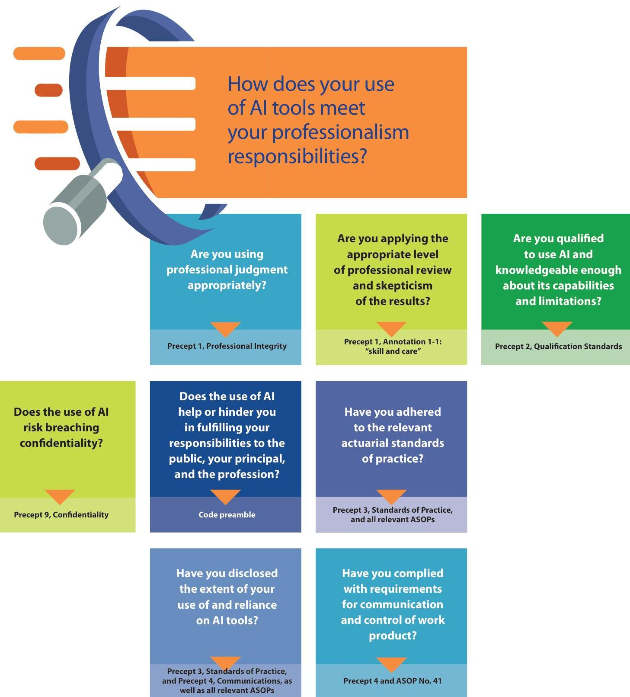

# 202409 AAA_professionalism-paper-generative-ai

## Page 1
# Actuarial Professionalism Considerations for Generative AI

## A Professionalism Discussion Paper

## Page 2
The American Academy of Actuaries is a 20,000-member professional association whose mission is to serve the public and the U.S. actuarial profession. For more than 50 years, the Academy has assisted public policymakers on all levels by providing leadership, objective expertise, and actuarial advice on risk and financial security issues. The Academy also sets qualification, practice, and professionalism standards for actuaries in the United States.

## American Academy of Actuaries

1850 M Street NW, Suite 300, Washington, D.C. 20036 202-223-8196 | www.actuary.org
(c) 2024 American Academy of Actuaries. All rights reserved.

September 2024
Any references to current laws, regulations, or practice guidelines are correct as of the date of publication.

## Page 3
# Actuarial Professionalism Considerations for Generative Al 

This professionalism discussion paper was developed by the Committee on Professional Responsibility of the American Academy of Actuaries for discretionary use by actuaries. This paper was not promulgated by the Actuarial Standards Board (ASB) and is not binding upon any actuary. No affirmative obligations are intended to be imposed on any actuary by this paper, nor should such an obligation be inferred from any of the ideas expressed or suggestions made herein.

This discussion paper is intended to stand on its own and be freely interpreted. When using or evaluating generative artificial intelligence (GenAI), actuaries should be guided by the Code of Professional Conduct, Qualification Standards for Actuaries Issuing Statements of Actuarial Opinion in the United States (USQS), and the actuarial standards of practice (ASOPs) promulgated by the ASB. To the extent any conflict exists or could be implied between this paper and the Code, the USQS, or the ASOPs, the professional standard prevails.

Actuaries, reflecting upon the professional standards that apply to them, are free to accept or reject any part or the whole of this discussion paper. While it is the Code, the USQS, and the ASOPs that govern the responsibilities of actuaries, the ideas and suggestions offered in this paper are intended to assist actuaries in applying professionalism requirements to their individual situations and to enhance the actuarial profession's use of GenAI.

Readers are encouraged to share their comments on this paper with the Committee on Professional Responsibility. Comments can be submitted to professionalism@actuary.org.

## Page 4
Committee on Professional Responsibility
Geoffrey C. Sandler, Chairperson
Brian Donovan
Richard Goehring
Laura Maxwell
Shawn Parks
Matthew Wininger
Kathleen Wong
Yukki Yeung
Paul Zeisler
Melissa Zrelack

## Artificial Intelligence Task Force

Prem Boinpally
Laura Maxwell
Shawn Parks
Fei Wang
Matt Wininger
Kathy Wong
Yukki Yeung

COPR thanks the Academy's Risk Management and Financial Reporting Council's Artificial Intelligence Subcommittee, particularly Dorothy Andrews and David Schraub, for their extremely valuable input to this paper. COPR is also grateful to Janice Gao for drafting assistance.

# Recent discussion papers by the committee on Professional Responsibility 

The Actuary's Toolbox: Peer Review—How Can It Help?
Professionalism Considerations for Working in Developing Areas of Actuarial Practice
The Roles of the Actuary in the Selection \& Application of Actuarial Models
Explaining Professionalism to Principals
Professionalism for the Solo Actuary
Self-Regulation and the Actuarial Profession

## Page 5
# Introduction and scope 

This paper describes the use and professionalism considerations for actuaries using generative artificial intelligence (GenAI) to provide actuarial services. GenAI generates text, quantitative, or image content based on training data, typically using a large language model (LLM). Examples of GenAI deployments include Open AI GPT, Google Gemini, Claude, and Meta. GenAI transforms information acquired from training data into entirely new content. In contrast, predictive AI models analyze historical quantitative data to forecast future outcomes, functioning like traditional predictive statistical models.

Actuaries have a wide range of understanding of AI. We assume the reader is broadly familiar with AI and AI model capabilities, but not necessarily a designer or expert user. In this paper, the terms "GenAI," "AI," "AI model(s)," and "AI tool(s)" are used interchangeably.

This paper covers the professionalism fundamentals of using GenAI and only briefly discusses designing, building, and customizing GenAI systems. This paper focuses on actuaries using GenAI to support actuarial conclusions, not on minor incidental use of AI that duplicates the function of tools such as plug-ins, co-pilots, spreadsheets, internet search engines, or writing aids.

GenAI is a recent development, but the actuarial professionalism framework helps actuaries use GenAI appropriately: the Code of Professional Conduct, the Qualification Standards for Actuaries Issuing Statements of Actuarial Opinion in the United States (USQS), and the actuarial standards of practice (ASOPs). Although ASOP No. 23, Data Quality; No. 41, Actuarial Communications; and No. 56, Modeling, were developed before GenAI was widely available, each applies in situations when GenAI may now be used. The following discussion comments on these topics, focusing extensively on the application of ASOP No. 56, which provides guidance for actuaries when they are designing, developing, selecting, modifying, using, reviewing, or evaluating models. GenAI is a model; thus ASOP No. 56 applies.

The paper explores use cases and addresses conventional applications, including quantitative and qualitative analysis, as of mid-2024, rather than anticipating novel uses or combinations of applications. AI tools change quickly, so the paper focuses on principles rather than the technology. The scope of this paper does not include explaining how AI models are structured or function, nor does it offer specific guidelines on AI tools or use by the actuary in professional settings. Given the rapid rate of change within this space, the paper makes no predictions about the rapidly evolving technology, nor does it speculate on future challenges to professionalism.

## Page 6
# Part 1. 

## General Professionalism Considerations When Using Al in Potential New Applications

Integrating Al tools into actuarial work demands thoughtful consideration of two key questions: whether Al is appropriate for the project, and how to meet professionalism responsibilities while using Al. When deciding whether extensive reliance upon Al to support actuarial conclusions is appropriate for a particular project, you could ask the following questions:

## Is the use of GenAl appropriate to the assignment?

- Is using a GenAI model appropriate for the assignment, given its costs and limitations? Would a simpler model suffice?
- Do you and the principal agree on whether to rely upon AI tools? If you disagree, how can you address the disagreement?
- If you use a free publicly available GenAI tool and do not own the results, can and should you use the results in your work product?
- If you rely on AI tools for your actuarial findings, how did you determine that reliance is appropriate?
- Could that reliance withstand a professional, regulatory, or audit challenge?
- How did you review pertinent legal and regulatory developments regarding your use of GenAI?
- How did you meet audit requirements especially if your GenAI is a free public version or otherwise not fully within your control?
- How are you accounting for potential bias in GenAI output due to potential biases in data or methodology?
- How are you accounting for the limits of the tool?
- How did you evaluate whether the training data for your AI tool is appropriate for your intended use?
- If your results must be reproducible, how have you secured this capability?
- If you used AI as a project planning or scoping tool, did you check the results for completeness and relevance to the project?

## Page 7
# How does your use of AI tools meet your professionalism responsibilities?

Are you using professional judgment appropriately?

- [ ] Precept 1, Professional Integrity

Are you applying the appropriate level of professional review and skepticism of the results?

- [ ] Precept 1, Annotation 1-1: "skill and care"

Are you qualified to use AI and knowledgeable enough about its capabilities and limitations?

- [ ] Precept 2, Qualification Standards

Does the use of AI help or hinder you in fulfilling your responsibilities to the public, your principal, and the profession?

- [ ] Code preamble

Have you adhered to the relevant actuarial standards of practice?

- [ ] Precept 3, Standards of Practice, and all relevant ASOPs

Have you disclosed the extent of your use of and reliance on AI tools?

- [ ] Precept 3, Standards of Practice, and Precept 4, Communications, as well as all relevant ASOPs

Have you complied with requirements for communication and control of work product?

- [ ] Precept 4 and ASOP No. 41

#

## Page 8
# How does your use of Al tools meet your professionalism responsibilities? 

- Are you using professional judgment appropriately? (Precept 1, Professional Integrity)
- Are you applying the appropriate level of professional review and skepticism of the results? (Precept 1, Annotation 1-1: "skill and care")
- Are you qualified to use AI and knowledgeable enough about its capabilities and limitations? (Precept 2, Qualification Standards)
- Does the creation, training, or use of AI risk breaching confidentiality? (Precept 9, Confidentiality)
- Does the use of AI help or hinder you in fulfilling your responsibilities to the public, your principal, and the profession? (Code preamble)
- Have you adhered to the relevant actuarial standards of practice? (Precept 3, Standards of Practice, and all relevant ASOPs)
- Have you disclosed the extent of your use of and reliance on AI tools? (Precept 3, Standards of Practice, and Precept 4, Communications, as well as all relevant ASOPs)
- Have you complied with requirements for communication and control of work product? (Precept 4 and ASOP No. 41)

## Page 9
# Part 2. 

## Practical Considerations for Actuaries Using GenAI Tools

Actuaries are responsible for any actuarial services that they provide, including the decisions whether and how to rely upon Al tools. Actuaries may control or influence whether and how to use Al, the degree of vetting or validation of Al results, and the extent of reliance upon the results in the work product. ASOP No. 23 and No. 56 offer guidance on how to review modeling inputs and outputs. Al models' potential to include biased inputs may require additional review for sources of bias.

Actuaries are also responsible for actuarial services that are provided under their supervision. Professional judgment can help actuaries determine whether supervision broadly includes AI tools used and customized by the actuary to benefit a principal. Care should be taken to ensure that actuaries are using AI to support responsible actuarial practice, not to replace analysis and decision-making.

It is important that actuaries refrain from using AI to fill a critical skill or knowledge gap, as actuaries unqualified to perform an actuarial service without AI are likely not qualified to perform it with AI. In addition, GenAI may be unreliable as a sole source of learning because its responses may be incomplete, out of date, hallucinated, ${ }^{1}$ unsuitable for the assignment, or missing nuances required to deliver actuarial services with skill and care. Actuaries may wish to study prompt engineering ${ }^{2}$ to improve responses from LLMs when exploring a topic, data source, or when evaluating results.

Actuarial professional standards apply to the actuary's work regardless of whether GenAI was involved in producing the work. ASOP No. 56 requires conclusions to be supported with sufficient validation testing and analysis, ${ }^{3}$ so the actuary must become confident using the results or output from an AI model. An actuary following the ASOPs cannot use a GenAI result without validation and say, "Well, that's what the model told me!" Using professional judgment to vet and evaluate AI recommendations before applying the AI model results is vital.

[^0]
[^0]:    1 Fabricated with no basis in fact.
    2 Creating, structuring, or improving your input (or "prompt") to optimize results from the AI.
    3 Section 3.6.2.

## Page 10
While GenAI may be used as a tool to produce results, actuaries would be wise to exercise great care when trusting GenAI with decisions where explainability and transparency are critical, because, as of this writing, GenAI results are not always accurate and reproducible.

Considerations for actuaries beginning to use AI tools: Precepts 1 and 2 of the Code of Professional Conduct require the actuary to be competent and qualified to provide actuarial services. This includes actuarial services that incorporate AI.

An actuary who is completely new to AI could consider gaining familiarity with AI concepts through reading recent technical papers, experimenting with publicly available AI tools, and consulting with other actuaries already using AI in areas similar to the actuary's focus area. Interdisciplinary collaboration between actuaries and AI specialists enhances understanding and application of AI in actuarial tasks, avoids "blind spots" from building models in silos, and improves innovation and accuracy.

When using GenAI to provide actuarial services, the actuary's professional judgment is required to choose the initial data source or starting point model, select and refine the data and model, choose the final assumptions and model, and rigorously confirm the appropriateness of results. When using AI, it is important for actuaries to constantly challenge whether the initial data source or starting model is credibly sourced.

Clear communication: To build trust in actuaries' use of AI, align expectations, and address concerns, actuaries might consider how to communicate clearly with all stakeholders, including clients, regulators, and the public. When using AI tools, actuaries would do well to determine what disclosures would benefit various stakeholders, including the public and policyholders. For example, ASOP No. 41's requirements about clarity ${ }^{4}$ and disclosures ${ }^{5}$ are helpful to actuaries when communicating the model results. As examples, related to GenAI, this could include:

- If GenAI is new to an analysis or the actuarial services, mention that and perhaps mention why GenAI is being used.
- The level of understanding of the GenAI tool the user requires to evaluate or use the work product.

## Page 11
Ethical and responsible AI use: It is important that actuaries follow ethical modeling practices when using AI by adhering to data privacy laws and avoiding biased inputs. Implementing robust data governance can help maintain data integrity and security, aligning with ethical standards and regulatory requirements. The following are examples of actions actuaries can take to use AI ethically and responsibly:

- Use a multidisciplinary review to test that models using GenAI tools comply with existing laws and respect consumer rights.
- Mind the origin and confidentiality of information used to build, train, or prompt a GenAI model, especially if such information could be inadvertently exposed to other users.
- Stay informed of evolving regulations that affect AI applications in actuarial work.
- Identify and mitigate biases in AI models to promote fairness and equity in outcomes.
- Employ robust methodologies for bias detection and adjust models as necessary to prevent discriminatory results.

Commitment to professional development: Because AI is constantly changing, continuous learning in AI and related technologies through relevant training is imperative. Remaining current with AI advancements helps actuaries remain at the forefront of innovative and effective practices and is consistent with the Code of Professional Conduct and the USQS.

# GenAI model selection 

Selecting GenAI models requires two additional steps beyond the selection process for traditional actuarial models:

1. Choice of GenAI and/or LLM: The actuary may wish to consider cost, accuracy, licensing concerns, cybersecurity, and privacy controls.
2. Configuration: The actuary may need to address limitations or control hallucinations of GenAI model using techniques such as prompting and hyperparameter tuning or RAG (retrieval augment generation) using local documents. Configuration will influence model results.

## Page 12
ASOP No. 56 requires actuaries selecting and using a model to select and use a model that reasonably meets the intended purposes. ${ }^{6}$ ASOP No. 56 also requires the actuary to understand the known weaknesses in assumptions and methods, limitations of the data, and practical considerations that could materially impact the model's ability to meet its intended purpose. ${ }^{7}$

# Reliance considerations 

ASOP No. 56 permits actuaries to rely on models, experts, or external sources, subject to specific guidance. Traditional actuarial education and experience provides only some of the knowledge and experience applicable to GenAI models, so when the actuary has a limited ability to understand how a model developed by others works, the actuary should "make a reasonable attempt to have a basic understanding of the model," and "make practical efforts to comply with other applicable sections of the standard." ${ }^{8}$

When determining an appropriate level of reliance on experts, actuaries may consider, among other things, the extent to which the model has been reviewed or validated by experts in the applicable field. ${ }^{9}$

ASOP No. 41, Actuarial Communications, requires the actuary to define the extent of reliance on other sources of data, for example, by stating whether checks for reasonableness have been applied, ${ }^{10}$ and ASOP No. 56 requires actuaries to disclose the extent of reliance on models developed by others. ${ }^{11}$ To meet these disclosure requirements, actuaries using AI may wish to disclose how they used AI: to perform a search, to summarize information or documents, to develop model inputs and/or outputs, and/or to evaluate results.

[^0]
[^0]:    6 Sections 3.1.2 and 3.1.3.
    7 Section 3.2
    8 Section 3.4.
    9 Section 3.5.
    10 Section 3.4.3. ASOP No. 41 is under revision at the time of this writing; guidance may change.
    11 Section 3.4.

## Page 13
# Part 3. 

## Evaluating and Validating GenAI Models

ASOP No. 56 calls upon the actuary to evaluate models being used, take steps to mitigate model risk (if appropriate), and validate model output. ${ }^{12}$ GenAI models may have several features that require additional model validation considerations beyond traditional actuarial models:

- Lack of control. Unlike traditional models that actuaries may use and control, the actuary may not control the training data selection or model feature updates.
- Errors. GenAI may not choose the correct or even coherent source data for an assumption or model, may not perform calculations correctly, may not identify questionable source data, and may not account for trends and externalities.
- Model drift. The AI model may drift as input data evolves and model design changes. AI models may require regular automated monitoring and assessments against objective accuracy standards.
- Validation techniques. Qualitative analysis performed by GenAI—such as categorization or synthesizing conclusions, summarizing text, or generating code-may require different validation techniques.
- Opacity. GenAI may apply one or more advanced modeling techniques and may not be transparent to the user.
- What it doesn't know. Particular attention should be placed on use cases that significantly differ from training data and on cases where the model result should be "I don't know, human needed." For example, a model trained to classify cracks' severity in construction building pictures should not provide an answer when fed with a picture of an elephant.

Adapting standard model evaluation methods when using GenAI tools may become necessary to account for their evolving design and operation. When evaluating a model, you could ask the following questions:

- How could you objectively define and test for model accuracy?
- Could you use some traditional validation tests for quantitative modeling?
- Could your validation approach have the same blind spot(s) as your GenAI tool-e.g., a GenAI tool validating another GenAI tool?
- Qualitative analysis may require new validation techniques.

## Page 14
- Does your validation approach consider the training data origin and any embedded biases? If you chose the training data, how have you evaluated it for appropriateness?
- Is your model validation approach appropriate for the modeling approach used-e.g., a public-facing end-user model, an internal-use prototyping model, or a publicly developed model with customizations? Can you meet regulatory demands to evaluate model bias or fairness?
- Have you designed sufficient model controls appropriate for your project objectives?
- If your model and supporting infrastructure must replicate all past decisions, can it do so efficiently?

Actuarial first principles can help determine the rigor required for testing or validation of AI tool output. All AI output should be tested and validated, both during model selection and for subsequent retesting. It is important that the actuary understand how the AI is evolving and when the model should be re-trained.

Evaluating or validating GenAI models encompasses several tasks. Initial model evaluation mirrors conventional statistical validation processes such as back-testing. Validation needs for AI models may surpass those of traditional actuarial models, requiring frequent assessments tailored to the model's design. These assessments may need to incorporate aspects such as outlier detection and model drift detection.

In some use cases, an actuary comprehensively evaluates an old system design. In other use cases, the actuary merely validates or duplicates key results. The actuary's professional judgment will determine which is appropriate.

In any use case, the reliability of the AI model responses should be thoroughly tested. Additionally, external standards could be used to train and validate the AI model. It is important to avoid cherry-picking validations and perform thorough checks even if the output appears reasonable, especially when the testing actuary also selected the training data.

A critical review of the model validation program itself is also important to determine the validation effectiveness.

Finally, actuaries using a GenAI model to validate output from a non-GenAI model would do well to keep in mind guidance on reliance found in the ASOPs.

## Page 15
# Validation for quantitative applications 

GenAI quantitative applications include traditional actuarial services, such as selecting data, creating models, validating results generated via GenAI tools, and evaluating the results of other models. Specific examples include summarizing results from databases, evaluating factors in a model of interest, generating a model, and running a model and evaluating the appropriateness of external results, such as a cost of insurance table, without knowing how the external results were generated.

ASOP No. 23, Data Quality, emphasizes the importance of actuaries using appropriate data in their analyses and calculations. Data, as defined in ASOP No. 23, includes numerical, census, or classification information, but not general or qualitative information. ${ }^{13}$ ASOP No. 23 is therefore relevant to certain types of information obtained through AI tools.

ASOP No. 23 lists what an actuary should consider when selecting data, including whether the data is appropriate, sufficient, and reasonable. ${ }^{14}$ An actuary using AI is not exempt from the requirements of the standard and may wish to consider whether AI is an appropriate choice for obtaining that data. ASOP No. 23 states the actuary should "make a reasonable effort to determine the definition of each data element" and to "identify data values that are questionable or relationships that are inconsistent." ${ }^{15}$

ASOP No. 23 requires the actuary to evaluate the quality of the data and take steps to address any deficiencies in the data. ${ }^{16}$ It also permits the actuary to rely on data supplied by others, subject to specific guidance. ${ }^{17}$ Reliance on the data involves trusting and depending on the accuracy, completeness, and quality of the underlying data used in a study. Required disclosures include sources of the data, limitations on the use of the work product due to uncertainty about the quality of the data, whether the data was reviewed (and if not, why), unresolved concerns about the data, the extent of reliance on data supplied by others, and the steps the actuary has taken to improve data that appears questionable. ${ }^{18}$

The discussion above covers a singular use of GenAI output. If an actuary uses a GenAI to repeatedly generate new modeling data as part of an ongoing process, the actuary should be aware that the GenAI input and output may continually change. As a result, it is important to validate refreshed GenAI data sources that feed into downstream actuarial models each time they are generated.

[^0]
[^0]:    13 Section 2.3 .
    14 Section 3.2 .
    15 Section 3.3 .
    16 Section 3.4 .
    17 Section 3.5 .
    18 Section 4.1 .

## Page 16
Relying on GenAI may require steps and approaches similar to those used when the actuary evaluates a traditional actuarial model's results without evaluating the model itself. Additional procedures may be required to adjust for GenAI's potential shortfalls.

Given the opaque nature of some GenAI models, model transparency should be a focus when using, building, and customizing GenAI tools. Explainable AI (XAI) techniques can help attribute AI decisions, improving comprehensibility to non-technical stakeholders while maintaining rigorous documentation.

When the GenAI model design is opaque, actuaries can employ robust external validation techniques to evaluate the model's outputs. Such validation techniques can involve comparing GenAI outputs with known benchmarks, historical data, or outputs from more transparent models to check that GenAI recommendations are reasonable and aligned with actuarial principles and the responsible actuary's expectations.

Actuaries can also develop simpler proxy models that approximate the GenAI's outputs. Proxy models, built on transparent and understandable algorithms, can offer insights into the relationships between a GenAI's inputs and outputs. Additionally, employing AI explainability tools can illuminate the GenAI model's decision-making process, even if the explanation is partial or simplified.

Rigorous model testing, including thorough sensitivity and scenario analyses, helps anticipate and mitigate undesirable outcomes. This approach also helps actuaries understand the broader implications of AI-driven decisions, including potential ethical, social, and economic consequences.

Conducting sensitivity analyses can help actuaries understand how changes in input data might affect GenAI outputs. By systematically varying inputs and observing the outputs, actuaries can gain some understanding about how the GenAI model might be processing data, without knowing the specific GenAI model function.

## Page 17
# Additional validation concepts for qualitative applications 

AI tools can be used for a wide variety of qualitative functions, such as code generation, document summary, project control, evaluation of another model or code, and documentation. In addition, GenAI can also:

- Perform scenario selection and counterfactual analysis.
- Aid project planning to help recommend project scope and considerations.
- Contribute to the development and customization of model governance frameworks and model risk frameworks, critical aspects of model management.
- Generate and visualize data, including synthetic data creation, fostering innovation by generating hypothetical scenarios.
- Offer support in writing actuarial reports or supporting documentation.
- Function as a collaborative interaction tool, writing coach, and audit check for completeness.

Although AI may help produce content more efficiently, such content should be validated, as traditional governance frameworks apply. In addition, as GenAI output may quote other sources verbatim without attribution, actuaries who use GenAI output containing such results could inadvertently infringe copyrights.

GenAI code generation tools can significantly enhance the efficiency of developing actuarial models and analyses by translating or transferring code from one language to another and by evaluating or translating legacy systems' code into another language. These tools can generate snippets of code based on natural language descriptions or update existing code bases to incorporate new data sources or analytical methods. This capability can reduce development time and help actuaries focus on strategic model design and interpretation. Actuaries using GenAI to generate code may wish to consider whether to validate the results of the code, the code itself, or both.

While GenAI can offer insights for project planning and scope definition, actuaries must remain vigilant to its limitations, particularly in recognizing the full breadth of required tasks. Actuaries can mitigate risks by benchmarking AI recommendations against established project management standards and incorporating strategic milestones and checkpoints to maintain project alignment and integrity.

## Page 18
GenAI's capability to tailor model governance and risk management frameworks can be invaluable. However, it is crucial to recognize AI's potential gaps in addressing risks inherent to specific business domains. The participation of subject matter experts in a thorough review and gap analysis, supplemented by referencing established standards and research, is vital.

While GenAI might support drafting actuarial reports, careful oversight is necessary to confirm that reports meet professional standards, including the inclusion of appropriate disclosures, caveats, and disclaimers. Regularly benchmarking AI-generated content against previously validated reports and external standards can help check quality and comprehensiveness and avoid errors from model hallucination or disconnects between training data and current conditions.

# Supervision of GenAI Models Built by the Actuary 

If the actuary's services include building a model that may operate semi-autonomously, by adjusting its responses over time through a feedback loop or using continually refreshed input data, with the potential for model drift, the actuary would be wise to keep in mind Precept 3 of the Code of Professional Conduct and ASOP No. 56 and consider what model supervisory actions are appropriate for the situation. Other questions the actuary could ask include:

- What exactly is the actuarial service provided? For example, is the actuary building business rules into a model?
- Who checks whether the user runs the model correctly? Should subsequent evaluation differ from initial adoption?
- How much does the model user need to know about how the model is constructed?
- Can the end-user override the results? Do they have the knowledge? Authorization?
- How can the model be evaluated for drift or accumulated bias?
- Is it clear when the actuary is responsible for the model vs. when the principal is responsible for the model?

## Page 19
# Part 4. 

## GenAI Model Documentation

When using GenAI for delivering actuarial services, actuaries are faced with balancing the need for transparency with the complexity inherent in an Al system. To enhance the credibility and reliability of Al-assisted actuarial work, actuaries may want to include documentation on model reproducibility and peer validation.

Applying traditional documentation approaches could be difficult or impossible, as many GenAI models are sophisticated and opaque by design to protect their designers' intellectual property. Until GenAI documentation approaches become efficient and practical, actuaries would do well to:

- Attempt to understand how the GenAI made its recommendation, including its source material and decision process.
- Focus on model outcomes and explain how they became comfortable with results.
- Consider reproducibility, as freely available GenAI's responses may be path-dependent on prompts or drift over time, and therefore not be reproducible. Actuaries may wish to document their prompts and the GenAI's responses.
- Consider evaluating and disclosing the GenAI model's training data so users can understand its appropriateness.
- Address explainability and evaluate the appropriateness of which variables influence results.

When documenting an AI model, documentation may focus on how the actuary:

- Confirmed the model structure meets the actuary's intended purpose.
- Evaluated model results.
- Evaluated and mitigated model risk.

## Page 20
# Part 5. 

## Conclusion

Upon their release, free GenAI tools threatened to disrupt knowledge workers everywhere. As many recent publications indicate, the actuarial profession quickly developed a nuanced understanding of GenAI's limitations and its opportunities.

GenAI has not changed our professional standards. Rigorous validation of any modelGenAI included-requires choosing credible data sources, thoroughly validating AI model results, and ensuring clear and effective communication with stakeholders.

Practicing actuaries who incorporate GenAI tools into their toolkit and work practices will need to use thoughtful professional judgment, perform thorough vetting and validation, and take ethical considerations into account. Actuaries are well-advised to thoroughly understand GenAI's biases and limitations.

As with traditional actuarial work, actuaries using GenAI tools to provide actuarial services must consider what their principals, regulators, and other stakeholders need to know to understand and evaluate the actuarial services provided. GenAI is evolving rapidly, and we expect practices for documenting GenAI modeling results to also quickly develop. Amid such rapid change, actuaries would do well to focus on reproducibility and transparency in their documentation and disclosures.

Actuaries must delicately balance leveraging GenAI's potential and maintaining our profession's rigor, integrity, and ethical standards. Responsibly using GenAI can lead to more efficient and effective actuarial practices-provided we remain vigilant and committed to maintaining our professional standards. Following the Code of Professional Conduct, satisfying the USQS, and complying with ASOPs when using GenAI are essential to meeting this goal.

## Page 21
# Part 6. 

## References

"AI and Professionalism"; Contingencies magazine; July/August 2023.
"An Actuarial View of Data Bias: Definitions, Impacts, and Considerations"; American Academy of Actuaries, July 2023.
"Understand model risk management for AI and machine learning"; EY; May 2020.

A Primer on Generative AI for Actuaries; Society of Actuaries; February 2024.

Four Principles of Explainable Artificial Intelligence; National Institute of Standards and Technology; U.S. Department of Commerce; August 2020.

## Page 22
# American Academy of Actuaries 

1850 M STREET NW, SUITE 300
WASHINGTON, D.C. 20036
202-223-8196 | ACTUARY.ORG