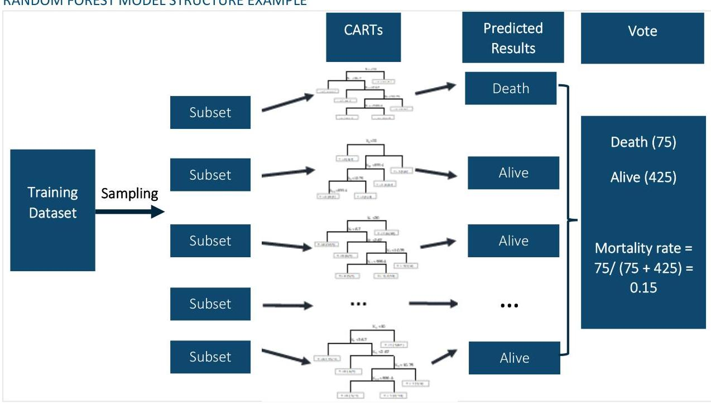
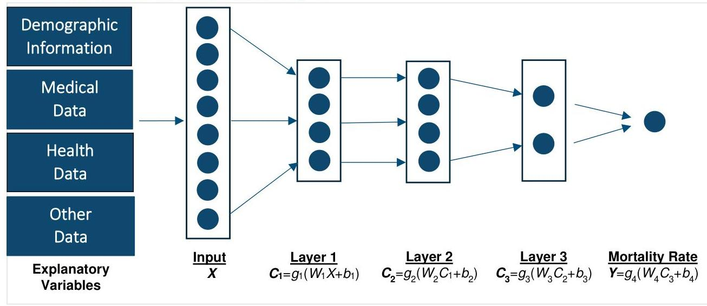
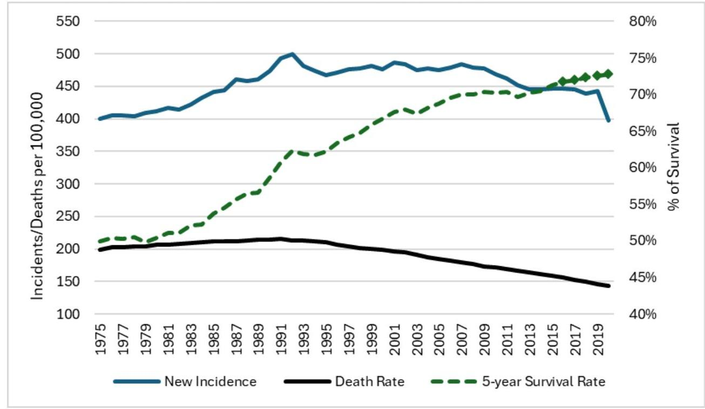
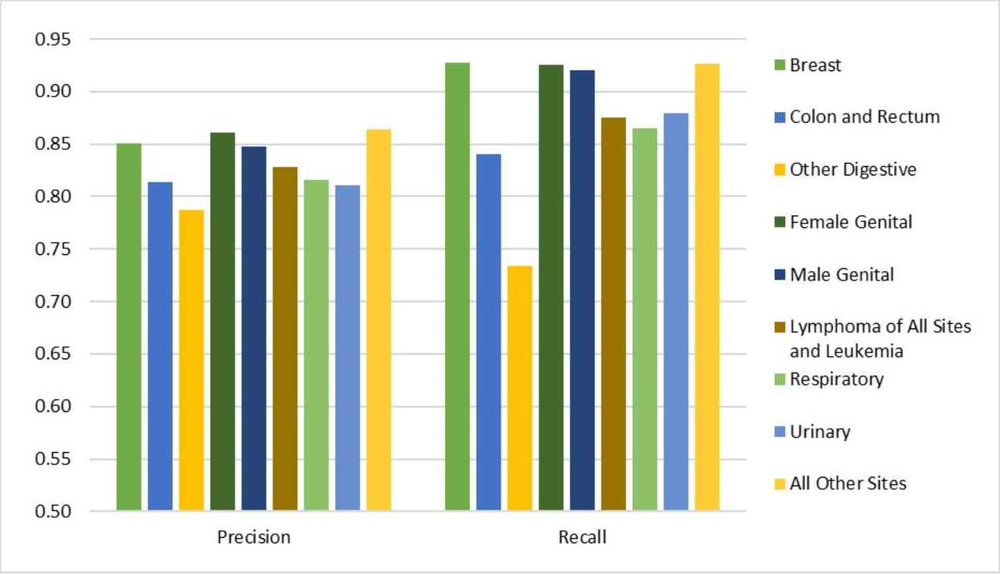
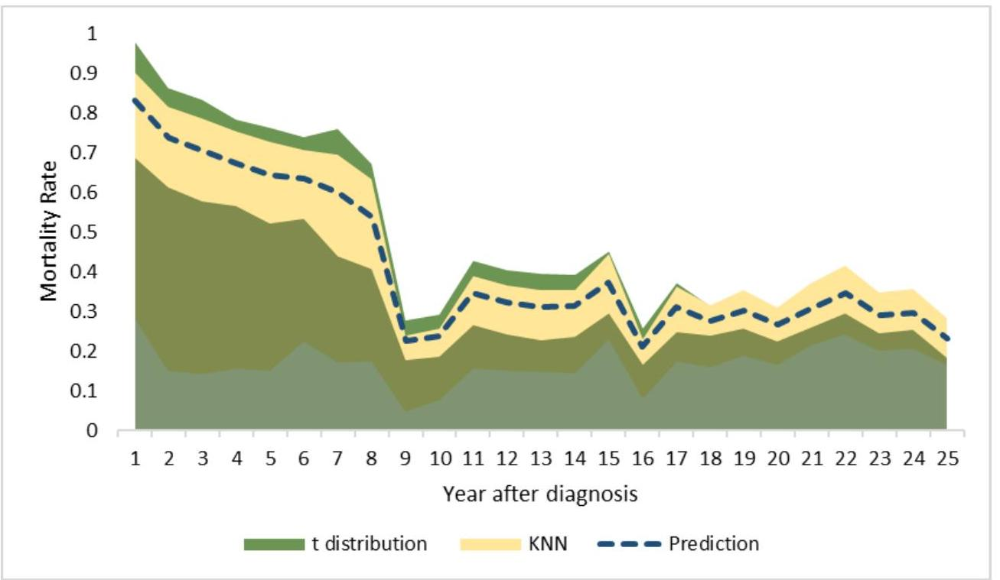

_Note: Source document was split into 3 OCR chunks (pages 1-22, pages 23-36, pages 37-41) to stay within token limits._

# 202409-the impact of ai on mortality modeling -essays

## Page 1
# The Impact of Artificial Intelligence on Mortality Modeling, Forecasting and Prediction: A Collection of Essays 

SEPTEMBER | 2024

## Page 2
# The Impact of Artificial Intelligence on Mortality Modeling, Forecasting and Prediction A Collection of Essays 

## CONTENTS

Introduction and Acknowledgments ..... 4
Introduction ..... 4
The Call for Essays ..... 4
Background and Purpose ..... 4
Sample Topics of Interest for Essays ..... 4
Acknowledgments ..... 6
Improve Insurance Accessibility via Artificial Intelligence ..... 7
Data ..... 7
AI Model ..... 9
Example: Cancer Patient Mortality Prediction ..... 11
Prediction Error Quantification ..... 14
Conclusion ..... 15
The Impact of Artificial Intelligence on Mortality Modeling and Actuaries ..... 17
Introduction ..... 17
AI in Actuarial Analysis of Mortality Modeling and Forecasting ..... 17
Nontraditional Data Sources in AI-Driven Mortality Modeling ..... 17
Risks and Challenges of Utilizing AI in Mortality Modeling ..... 18
Validation and Verification of AI Models ..... 18
Implications for Actuaries and Insurers ..... 19
Conclusion ..... 19
Exploring Nontraditional Data Sources for AI-Driven Mortality Modeling and Forecasting ..... 21
Introduction ..... 21
Nontraditional Data Sources ..... 21
Social Media Data ..... 21
Wearable Device Data ..... 22
Environmental Data ..... 22
Genetic Data ..... 23
Mobile phone data ..... 23
Electronic Health Records ..... 23
Online Search Data ..... 24
Integration of Nontraditional Data Sources into AI-Based Mortality Models ..... 24
Challenges and Future Directions ..... 24
Conclusion ..... 25
Artificial Intelligence and the Measurement and Projection of Mortality Experience ..... 26

## Page 3
# Precisions and Predictions: Leveraging Artificial Intelligence in Mortality Modeling for Actuaries

## Background and Purpose
## Enhancing Actuarial Analysis of Mortality Data with AI

## Innovative Approaches Introduced by AI to Mortality Forecasting Models
## Leveraging Nontraditional Data Sources
## Conclusion

# The Application of Artificial Intelligence in Mortality Modeling and Forecasting: GBM, Data Cleaning, and Dynamic Mortality Tables

## Gradient Boosting Machine (GBM)
## Scenario: Leveraging GBM Modeling for Enhanced Preventive Care in Healthcare
## Data Processing and Cleaning
## Elevating Data Quality in Mortality Modeling through AI Integration
## AI-Driven Data Processing and Cleaning Example
## Dynamic Mortality Tables
## Scenario: Insurance Company Using Dynamic Mortality Table to Assess Mortality Risk
## About The Society of Actuaries Research Institute

---

# Give us your feedback!

Take a short survey on this report.

---

# SCA Research Institute

---

## Caveat and Disclaimer

The opinions expressed and conclusions reached by the authors are their own and do not represent any official position or opinion of the Society of Actuaries Research Institute, Society of Actuaries, or its members. The Society of Actuaries Research Institute makes no representation or warranty to the accuracy of the information.

---

Copyright © 2024 by the Society of Actuaries Research Institute. All rights reserved.

## Page 4
# The Impact of Artificial Intelligence on Mortality Modeling, Forecasting and Predictions

## A Collection of Essays

### Introduction and Acknowledgments

#### INTRODUCTION

The Society of Actuaries (SOA) Research Institute's Mortality and Longevity Strategic Research Program Steering Committee issued a call for essays to explore the application of artificial intelligence (AI) to mortality and longevity. The objective was to gather a variety of perspectives and experiences on the use of AI in mortality modeling, forecasting, and prediction to promote discussion and future research around this topic.

The collection includes six essays that were accepted for publication from all submissions. Two essays were chosen for prizes based on their creativity, originality, and likelihood of further thought on the subject matter.

|  First Prize | Improve Insurance Accessibility via Artificial Intelligence  |
| --- | --- |
|   | Kailan Shang, FSA, CFA, PRM, SCJP  |
|  Second Prize | The Impact of Artificial Intelligence on Mortality modeling and Forecasting  |
|   | Niranjan Rajendran  |

#### THE CALL FOR ESSAYS

##### BACKGROUND AND PURPOSE

There are risks and opportunities of using artificial intelligence (AI) on mortality and longevity.

The Society of Actuaries (SOA) Research Institute's Mortality and Longevity Strategic Research Program is interested in an exploration of the application of AI to mortality and longevity from a variety of perspectives. The result of this effort is intended to provide a useful resource for readers to increase awareness and discussion around this topic and to set the stage for future research.

This is the first in a series of calls for essays on the impact of AI on mortality and longevity. For this call for essays, we are interested in the impact of AI on mortality and longevity modeling, forecasting, and prediction.

##### SAMPLE TOPICS OF INTEREST FOR ESSAYS

The Mortality and Longevity Strategic Research Program Steering Committee seeks essays that address the use of AI in actuarial practice for modeling and forecasting mortality as well as its implications. This invitation has been deliberately written broadly to allow respondents the flexibility to address this topic from one or more perspectives and approaches. Respondents are free to choose from one or more of the sample topics below or propose others that

## Page 5
fall within the scope of this area as described in the above section. Please note that the list is not meant to be exhaustive but merely examples of proposed topics that may be considered.

Sample topics include:

- What are the ways AI can be used in actuarial analysis of mortality modeling and forecasting?
- What nontraditional data sources could be used in the application of AI to mortality modeling and forecasting?
- What are the risks involved in utilizing these methods for mortality modeling and forecasting?
- What are the biases in utilizing these methods for mortality modeling and forecasting?
- How should the results of the use of these methods be validated and/or verified for reasonableness?
- What are the considerations for actuaries and insurers in applying AI to mortality modeling and forecasting in light of the current and future regulatory landscapes?
- How will the use of AI in mortality modeling and forecasting change the role of actuaries in identifying, measuring and managing mortality risks?

## Page 6
# ACKNOWLEDGMENTS 

The SOA Research Institute thanks the Mortality and Longevity Strategic Research Program Steering Committee for their careful review and judging of the submitted essays. Any views and ideas expressed in the essays are the authors' alone and may not reflect the Committee's views and ideas nor those of their employers, the authors' employers, the Society of Actuaries, the Society of Actuaries Research Institute, nor Society of Actuaries members.

Mary Bahna-Nolan, FSA, MAAA, CERA
Magali Barbieri
Mark Bye, ASA
Micah Canaday, ASA
Frank Chechel, FSA, MAAA
Carolyn Covington, FSA, MAAA, CERA
Jean-Marc Fix, FSA. MAAA
Stephen Gruber, FSA, MAAA
Sam Gutterman, FSA, MAAA, FCAS, FCA, HonFIA, CERA
Edward Hui, FSA
Joel Jones
Yutaro Kameda, FSA
Al Klein, FSA, MAAA
Tom Kukla, Vice Chair, FSA, MAAA
Johnny Li, FSA, ACIA
Erik Pickett, FCA
Marianne Purushotham, FSA, MAAA
George Silos, FSA, MAAA, CERA
Larry Stern, Chair, FSA, MAAA

## Give us your feedback!

Take a short survey on this report.

## Page 7
# First Prize Winner 

## Improve Insurance Accessibility via Artificial Intelligence

Kailan Shang, FSA, CFA, PRM, SCJP

Any views and ideas expressed in the essays are the author's alone and may not reflect the views and ideas of the Society of Actuaries, the Society of Actuaries Research Institute, Society of Actuaries members, nor the author's employer.

When underwriting a life insurance application, a risk rating is usually assigned depending on demographic, medical, and economic information of the insured. It is possible that a higher-than-expected risk rating is determined based on collected information that leads to a rejection of the application or an unaffordable premium rate. The overestimation may be caused by limited data used in the analysis. Alternatively, traditional rate setting algorithms may not be able to easily handle additional factors that may justify a lower risk rating. With the aid of artificial intelligence (AI) models and improved data availability, more refined underwriting and pricing processes can be developed to improve accessibility and affordability of insurance. In essence, for individuals with a high risk rating, AI can be used to better assess if the risk rating is indeed that high, and further categorize them into more granular risk levels that will make an economic difference. In the following discussions, our focus is on mortality risk assessment, acknowledging much wider applications of AI in other risk types.

## DATA

Life insurance carriers collect a variety of information to assess the mortality risk, with same examples listed in Table 1 under date type "Traditional underwriting/pricing factors."

## Page 8
Table 1
EXAMPLES OF DATA FOR MORTALITY RISK ASSESSMENT

| Data Type | Data Category | Example |
| :--: | :--: | :--: |
| Traditional underwriting/ pricing factors | Demographic information | - Age   - Gender   - Residence   - Race |
|  | Medical information | - Height   - Weight   - Smoking   - Use of drugs   - Medical diagnosis   - History of medical treatments |
|  | Family medical history | - Anemia   - Alzheimer's disease   - Asthma or other respiratory conditions   - Brain disorders   - Cancer   - Diabetes   - High blood pressure   - High cholesterol levels   - Immune deficiencies   - Kidney, liver, or heart disease |
|  | Occupation | - Occupation type   - High risk occupation |
|  | Lifestyle | - High risk activities |
| New underwriting/ pricing factors | Medical diagnostic data | - Age at diagnosis   - Histological type   - Insurance status   - Involvement of lymph nodes   - Primary tumor site   - Reason for no surgery   - Stage information   - Surgery procedure   - Tumor size and extension   - Tumor type (Pos/Neg) |
|  | Health data | Health monitoring data that may record heart rates, sleeping habits, physical activities. Instead of answers to a few questions, the data contains much more information to make individualized analysis of the implication on mortality risk. |
|  | Image data | In addition to medical diagnostic data, medical image data may be used directly to perform AIbacked medical diagnosis and mortality risk assessment. |
|  | Lifestyle data | Lifestyle and may be tracked and updated based on social media data. |

## Page 9
In addition, new factors such as detailed medical diagnostic data and health monitoring data may be used for refined mortality risk assessment with the support of AI models. Compared to answers to specific questions for the traditional factors, new factors usually contain more data in new formats that is difficult to use directly by underwriters or traditional pricing models. It requires AI models to analyze the new data and predict mortality risk of individuals in a more accurate way.

# AI MODEL 

In the field of AI, certain machine learning models can process large amounts of data and factors and use them in prediction. In the context of life insurance, AI models can be trained to establish the relationships between the mortality risk, or specifically the mortality rates, and the underwriting and pricing factors. Once the prediction accuracy is satisfactory, AI models can be used to automatically determine mortality risk at individual insurance coverage levels. Tree based models and deep learning models are promising candidates to improve morality rate prediction.

Unlike traditional pricing models such as linear regression models or generalized linear models, tree-based models switch from formulas to decision rules for prediction. In a tree, leaves represent different subgroups and branches represent the rules to split into subgroups based on explanatory variables. The prediction is based on the value of the leaves that are in the same subgroup. Classification and Regression Tree (CART) models are a basic form of tree-based models. CART models build trees to split the data based on explanatory variables. At each split, a variable is used to separate the data into two subgroups. The variable is chosen to provide the best split that improves the purity of the data in the subgroups. More advanced tree-based models are built upon CART. The famous Random Forest models are a random version of the CART models. Multiple subsets are sampled from the training dataset which includes both traditional and new underwriting/pricing factors and observed mortality rates. Each subset is used to build a CART model. Explanatory variables are sampled as well so that the relationship between the mortality rate and the explanatory variables will not be dominated by the most important ones. Less important explanatory variables can contribute to the final prediction as well. Figure 1 illustrates the structure of a Random Forest model that may be used for mortality rate estimation. The final prediction is calculated as the average prediction by individual CART models.

## Page 10
#### **Figure 1**

Gradient boosting machine (GBM) is another decision tree-based ensemble method. Each tree is a weak estimator trying to estimate the residual error that the estimation of previous trees has caused. Gradually with a sufficient number of decision trees, the estimation error will decline to a very low level. Unlike Random Forest models which use parallel trees to predict in aggregate, GBM is a sequential tree model.

Deep learning is a machine learning method that relies on artificial neural networks to represent the relationship between the response variable such as mortality rate and explanatory variables such as insurance pricing factors in an approximated way. "Deep" refers to multiple layers of neurons usually required in deep learning to be able to have a good approximation of the relationship. The most basic type of artificial neural network is fully connected neural networks, as illustrated in Figure 2.

## Page 11
Figure 2
ARTIFICIAL NEURAL NETWORK STRUCTURE EXAMPLE
$C_{i}$ : the value of neurons in hidden layer $i$
$g_{i}$ : the activation function for hidden layer $i . g_{k}$ is the function for the output layer. A common activation function is the sigmoid function $\frac{1}{1+e^{-x}}$ (a.k.a. logistic function). Many other activation functions are available as well.

The neural network can still be represented as a function of the input $X$. The function is a few linear layers ( $W X+b$ and $W C+b$ ) and nonlinear layers (activation function) stacked together:

$$
Y=f\left(X ; W_{1}, b_{1}, W_{2}, b_{2}, W_{3}, b_{3}, W_{4}, b_{4}\right)
$$

It is also proven that deep learning models such as recurrent neural networks and convolutional neural networks are good at utilizing text data and image data in prediction. Mortality risk assessment can potentially benefit from utilizing these nontraditional data types.

# EXAMPLE: CANCER PATIENT MORTALITY PREDICTION 

In general, it is difficult for cancer patients, whether they are under treatment or in recovery, to get individual life insurance coverages. High mortality risk leads to a low approval rate of life insurance applications. Even approved, the premium rate can be unaffordable. On the other hand, cancer incidence rate is quite stable while the overall mortality rate has been decreasing and more patients have a longer survival period. Better early detection, prevention, and medical treatment are likely to lead to lower mortality rates and longer survival periods, with the trend observed in Figure 3. Death rate has consistently dropped in the past three decades and the 5-year survival rate has increased as well.

## Page 12
Figure 3
U.S. CANCER INCIDENCE RATE, DEATH RATE AND SURVIVORSHIP (1975 - 2020)

Notes:
Data Source: National Cancer Institute, NIH, DHHS, "Cancer Trends Progress Report."
5-year Survival Rate: the rates of year 2016 to year 2020 are estimated by National Center for Health Statistics.
To improve cancer patients' and survivors' access to life insurance, it is necessary to evaluate the mortality risk of a cancer patient on an individual basis with both new data and new models. To illustrate its feasibility, medical treatment and diagnostic data ${ }^{1}$ is used to predict not only the chance of survival but also the term structure of mortality. For life insurance products such as a term life product, the term structure of mortality affects not only the amount but also the timing of death benefit and premium income.

Using both tree-based models and deep learning models, a reasonably high level of accuracy of mortality rate estimation can be achieved. The precision and recall of the most accurate models among cancer types in this example is illustrated in Figure 4. Precision measures the Type I error ${ }^{2}$ and recall measures the Type II error. The model accuracy based on validation results varies by cancer type.

[^0]
[^0]:    ${ }^{1}$ The Surveillance, Epidemiology, and End Results (SEER) research data is used in the example. The dataset includes U.S. cancer incidence and population data including age, gender, race, year of diagnosis, geographic location, tumor size, tumor location, tumor type (benign or malignant), histological information, diagnostic result, medical treatment, survival period, etc. Details can be found at https://seer.cancer.gov/.
    ${ }^{2}$ Recall from classical statistics, a Type I error is a false positive where you reject a true hypothesis. A Type II error is a false negative and occurs when you fail to reject a false hypothesis.

## Page 13
Figure 4
AI MODEL PERFORMANCE EXAMPLE

Using the AI models, mortality rate prediction can be made for individual cancer patients. Premium rate of life insurance products can be calculated and compared among individuals. Figure 5 illustrates the net single premium of a 10-year term life product for some sample breast cancer patients, diagnosed at age 40, 50, and 60. Among the sample patients, both the average premium and the minimum premium (lowest predicted mortality rates) are shown.

## Page 14
#### **Figure 5 SAMPLE 10-YEAR TERM INSURANCE NET SINGLE PREMIUMS BASED ON AI MODEL**

Relatively low risk patients can be identified, and the impact is economically meaningful based on the difference between average and minimum premium amount. With more accurate underwriting and pricing for individual patients, it could lead to a higher acceptance rate of insurance applications from cancer patients and lower premium rates for applicants with low risk.

This example only uses part of the available data to predict the mortality rate of cancer patients. Other data such as computed tomography scan of tumors may be used to further improve the accuracy of prediction.

#### **PREDICTION ERROR QUANTIFICATION**

While AI models can predict mortality rates, the uncertainty of prediction needs to be quantified for mortality risk assessment and insurance pricing. However, for many predictive models, a prediction interval is not mathematically tractable. Nonparametric methods can be used to estimate the interval using the results of similar cancer patients. To estimate the prediction interval of a cancer patient's mortality rates, similar cases in terms of explanatory variables can be searched. By finding the most similar cases (nearest neighbors), the variance of their estimates can be used to derive the prediction interval in a practical way. This can be realized by applying the *k* nearest neighbors (KNN) model, with the prediction interval constructed as follows.

$$\text{a. } \quad (\hat{y} - t_{k-1}(\frac{1-CL}{2})s_k, \hat{y} + t_{k-1}(\frac{1+CL}{2})s_k)$$

$$\hat{y}: \text{predicted mortality rate.}$$

$$t_{k-1}: \text{Student t value at the desired confidence level (CL) with a degree of freedom equals } k-1.$$

$$s_k: \text{sample standard deviation} = \sqrt{\frac{y_{i-1}^2(y_i - \bar{y})^2}{k-1}} \text{ with } y_i \text{ as the prediction for neighbor } i \text{ and } \bar{y} \text{ as the average prediction of the } k \text{ neighbors.}$$

$$\text{b. } \quad (\hat{y} - (\bar{y} - (\frac{1-CL}{2} \times 100) \text{th percentile}), \hat{y} + (\left(\frac{1+CL}{2} \times 100\right) \text{th percentile} - \bar{y})$$

The first approach assumes a Student t distribution and the second approach has no distribution assumption but uses empirical experience to determine the interval. The number of nearest neighbors to be sought can be set based on

## Page 15
experience or determined by a maximum distance threshold. Figure 6 illustrates the mortality rate prediction interval of a breast cancer patient diagnosed at age 40 with a confidence level of $95 \%$, using both approaches. For the approach using KNN, 100 nearest neighbors are used to construct the confidence interval. The interval is quite large during the first few years.

Figure 6
SAMPLE PREDICTION INTERVAL OF CANCER PATIENT MORTALITY RATES

Prediction intervals can be used to measure the robustness and credibility of individual mortality rate prediction. The upper bounds of the intervals may be more important than the estimation itself when making insurance underwriting and pricing decisions. Stress scenarios can be constructed accordingly to ensure that retained mortality risks do not exceed any risk limit. The ability to quantify prediction errors is instrumental to Al implementation in terms of getting stakeholder buy-ins and comprehensive risk assessment.

# CONCLUSION 

For high-risk life insurance applicants who may be rejected or given a high insurance quote, their risk may be overestimated by traditional data and models. Al models can help incorporate more individual factors into insurance underwriting and pricing processes in a data-driven and automated way. Non-traditional medical diagnostic data, health data, and lifestyle data are potentially new data types that can improve mortality risk assessment. Advanced Al models such as tree-based models and deep learning models may be adopted to analyze new data types that are usually more complex and of larger volume. In an example of predicting mortality rates of individual cancer patients, it is illustrated that the improvement due to Al models is financially meaningful and can potentially lead to a higher level of access to insurance. At the same time, prediction errors of Al models cannot be ignored and ideally can be quantified to ensure a robust implementation of Al in mortality risk assessment.

Al models may bring other issues that need to be addressed for a successful implementation. For example, new data may not be allowed to be used due to data privacy issues. Al models may unconsciously bring in biases to certain

## Page 16
subgroups due to data limitation and not well-designed algorithm. Feasibility study needs to consider these issues as well, in addition to the potential gain from adopting Al models.

Kailan Shang, FSA, CFA, PRM, SCJP is a Director at Aon PathWise. He can be reached at klshang81@gmail.com.

# Give us your feedback! 

Take a short survey on this report.

## Page 17
# The Impact of Artificial Intelligence on Mortality Modeling and Actuaries 

Niranjan Rajendran, B.Sc. (Hons)

Any views and ideas expressed in the essays are the author's alone and may not reflect the views and ideas of the Society of Actuaries, the Society of Actuaries Research Institute, Society of Actuaries members, nor the author's employer.

## INTRODUCTION

Artificial intelligence (AI) is revolutionizing various fields, and actuarial science is no exception. The integration of AI into mortality modeling and forecasting presents unprecedented opportunities and risks that could reshape the role of actuaries and the methodologies they employ. This essay explores the use of AI in actuarial analysis, particularly focusing on the innovative use of nontraditional data sources. The aim is to elucidate how these advancements can enhance the accuracy and reliability of mortality forecasts, while also addressing the inherent challenges and considerations for actuaries.

## AI IN ACTUARIAL ANALYSIS OF MORTALITY MODELING AND FORECASTING

Mortality modeling and forecasting are critical components of actuarial science, influencing insurance pricing, pension planning, and public health policy. Traditionally, these models have relied on historical data and statistical techniques to predict future mortality rates. However, the advent of AI offers the potential to significantly enhance these models by incorporating a wider array of data sources and more sophisticated analytical techniques.

AI, particularly machine learning (ML) algorithms, can process vast amounts of data at high speed, identifying patterns and correlations that may not be evident through traditional methods. For instance, neural networks can be trained on historical mortality data to predict future trends with high accuracy. Additionally, AI can incorporate realtime data, such as current health statistics, economic indicators, and environmental factors, providing a more dynamic and responsive approach to mortality forecasting.

## NONTRADITIONAL DATA SOURCES IN AI-DRIVEN MORTALITY MODELING

One of the most significant advantages of using AI in mortality modeling is the ability to leverage nontraditional data sources. These include electronic health records (EHRs), social media activity, wearable technology data, and environmental sensors. These data sources can provide real-time, granular insights into factors affecting mortality that traditional datasets might overlook.

- Electronic Health Records (EHRs):

EHRs contain detailed medical histories of individuals, including diagnoses, treatments, and outcomes. By analyzing EHRs, AI can identify patterns related to chronic diseases, medication adherence, and other

## Page 18
health-related behaviors that influence mortality. This can enhance the predictive accuracy of mortality models by incorporating individual health trajectories.

- Social Media Activity:

Social media platforms provide a wealth of data on individuals' lifestyles, behaviors, and mental health. Al can analyze these data to detect trends and anomalies that correlate with mortality risks. For example, changes in social media activity patterns might signal mental health issues or lifestyle changes that could impact an individual's mortality risk.

- Wearable Technology Data:

Devices like fitness trackers and smartwatches continuously monitor physiological parameters such as heart rate, physical activity, and sleep patterns. Al can aggregate and analyze this data to detect early signs of health issues, providing a proactive approach to mortality risk assessment.

- Environmental Sensors:

Environmental factors such as air quality, temperature, and pollution levels have a significant impact on public health. Al can integrate data from environmental sensors with health data to model how changes in the environment affect mortality rates. This can be particularly valuable for predicting mortality trends in response to climate change or natural disasters.

# RISKS AND CHALLENGES OF UTILIZING AI IN MORTALITY MODELING 

While the use of Al and nontraditional data sources offers considerable benefits, it also introduces several risks and challenges that must be carefully managed.

- Data Privacy and Security:

The integration of personal health data and social media information raises significant privacy concerns. Ensuring the security of these data and obtaining informed consent from individuals is paramount. There is a need for robust data governance frameworks that balance the benefits of data utilization with the protection of individual privacy.

- Bias and Fairness:

Al algorithms can inadvertently perpetuate or exacerbate existing biases in mortality modeling. For example, if the training data is not representative of the entire population, the model's predictions may be skewed. Actuaries must ensure that the data used is diverse and representative and that the Al models are tested for fairness and unbiased performance.

- Interpretability and Transparency:

Al models, particularly deep learning techniques, can be complex and opaque, making it difficult to interpret how they arrive at specific predictions. This lack of transparency can be a barrier to gaining trust and acceptance from stakeholders. Actuaries need to develop methods to interpret and explain Al models' outputs clearly and understandably.

- Regulatory Compliance:

The use of Al in mortality modeling must comply with existing and evolving regulatory frameworks. This includes data protection regulations such as the General Data Protection Regulation (GDPR) and industryspecific guidelines. Actuaries must stay informed about regulatory developments and ensure that their use of Al adheres to these requirements.

## VALIDATION AND VERIFICATION OF AI MODELS

Given the high stakes associated with mortality predictions, it is crucial to validate and verify Al models rigorously. This involves several steps:

- Data Quality Assessment:

## Page 19
Ensuring the accuracy, completeness, and reliability of the data used to train AI models is the first step in validation. This includes checking for missing values, outliers, and inconsistencies.

- Model Testing and Evaluation:

AI models should be tested on separate validation datasets to evaluate their predictive performance. Key metrics such as accuracy, precision, recall, and F1-score should be assessed. Cross-validation techniques can also be used to ensure the model's robustness.

- Sensitivity Analysis:

Conducting sensitivity analysis helps to understand how changes in input data affect the model's predictions. This can identify potential vulnerabilities and areas where the model may be prone to error.

- Scenario Analysis:

Running the Al model under different scenarios, including extreme events and outlier cases, can help assess its reliability and stability under various conditions.

- Peer Review and Auditing:

Independent peer reviews and audits of Al models can provide an additional layer of validation. This helps to ensure that the models meet industry standards and best practices.

# IMPLICATIONS FOR ACTUARIES AND INSURERS 

The integration of Al into mortality modeling and forecasting will inevitably change the role of actuaries. Actuaries will need to develop new skills in data science and Al to effectively leverage these technologies. This includes understanding Al algorithms, data engineering, and the ethical implications of Al use.

- Skill Development:

Actuaries should invest in continuous learning and professional development to stay abreast of advancements in Al and data science. This may involve pursuing additional certifications or degrees in related fields.

- Collaboration with Data Scientists:

Actuaries will need to work closely with data scientists and Al experts to develop and validate Al models. This interdisciplinary collaboration can help bridge the gap between traditional actuarial methods and modern Al techniques.

- Ethical Considerations:

Actuaries must be mindful of the ethical implications of using Al in mortality modeling. This includes ensuring fairness, transparency, and accountability in Al models and addressing potential biases and ethical dilemmas.

- Regulatory Compliance:

As mentioned earlier, actuaries must stay informed about regulatory developments and ensure that their use of Al complies with relevant laws and guidelines. This includes participating in industry discussions and contributing to the development of new regulations and standards.

- Enhanced Decision-Making:

Al can augment the decision-making process by providing more accurate and timely insights into mortality trends. This can help insurers develop better risk management strategies, price products more accurately, and improve customer service.

## CONCLUSION

The application of Al to mortality modeling and forecasting holds immense potential to transform actuarial practice. By leveraging nontraditional data sources and advanced analytical techniques, Al can enhance the accuracy and reliability of mortality predictions. However, the integration of Al also presents significant challenges, including data privacy, bias, interpretability, and regulatory compliance. Actuaries must navigate these challenges carefully,

## Page 20
developing new skills and ethical frameworks to harness the benefits of AI responsibly. As the field evolves, continued research and dialogue will be essential to fully realize the potential of AI in actuarial science and ensure its positive impact on mortality modeling and forecasting.

Niranjan Rajendran, B.Sc. (Hons) in Finance and Insurance Mathematics, Actuarial Trainee at Allianz Life Insurance Lanka Ltd. He can be reached at rajandranniranjan3@gmail.com.

## Page 21
# Exploring Nontraditional Data Sources for Al-Driven Mortality Modeling and Forecasting 

Siyu Chen, FSA

Any views and ideas expressed in the essays are the author's alone and may not reflect the views and ideas of the Society of Actuaries, the Society of Actuaries Research Institute, Society of Actuaries members, nor the author's employer.

## INTRODUCTION

Mortality modeling and forecasting have always been a critical aspect of actuarial science and risk management. These techniques allow us to estimate the likelihood of death occurrences within a specific population over a given time frame, which is essential for insurance companies, pension funds, and governments to plan their financial strategies effectively. Mortality modeling and forecasting have traditionally been domains that rely heavily on statistical techniques and data from official sources such as census records, health registries, and life insurance databases. These data sources provided a solid foundation for understanding the patterns and trends in mortality rates. However, they were limited in scope and often lacked the granularity required for more precise predictions. The emergence of artificial intelligence (AI) has revolutionized the way we approach mortality modeling and forecasting. AI algorithms, such as machine learning and deep learning, are able to process vast amounts of data and extract patterns and insights that are beyond the scope of traditional statistical techniques. With the advent of AI and the explosion of data availability from nontraditional sources, actuaries and data scientists now have access to a much wider range of information that can enhance the accuracy and precision of their models. The breadth and diversity of these sources present a wealth of untapped information that could significantly impact mortality modeling.

## NONTRADITIONAL DATA SOURCES

## SOCIAL MEDIA DATA

In the realm of mortality modeling and forecasting, social media stands out as one of the most promising nontraditional data sources. The vast arrays of unstructured data generated on social media platforms, encompassing posts, comments, and user interactions, offer a unique window into people's lifestyle choices, health habits, and overall well-being. Al algorithms, with their ability to process and analyze vast datasets, can delve deep into this information, detecting patterns in dietary habits, exercise routines, smoking and drinking behaviors, and even mental health issues. These patterns, once correlated with mortality rates, provide valuable insights into potential risk factors and predictive trends.

The real-time nature of social media data makes it an especially powerful tool for mortality modeling. It reflects people's thoughts, behaviors, and health-related discussions in near-instantaneous fashion. Al can analyze this data to identify shifts in sentiment, public awareness, and concerns about health issues. For instance, a surge in mentions of certain health symptoms or diseases could signal an outbreak or an increase in risk factors. By incorporating this real-time feedback into mortality models, Al can provide timely predictions and insights, enabling proactive healthcare interventions and optimized resource allocation.

## Page 22
Moreover, the analysis of social media data can reveal broader societal trends and patterns that may indirectly affect mortality rates. For instance, changes in the frequency of certain keywords or topics might reflect shifts in cultural norms or public policies, which in turn could influence health outcomes. By harnessing the power of AI and social media data, we can gain a deeper understanding of the complex factors that shape human mortality, paving the way for more effective and targeted healthcare strategies.

# WEARABLE DEVICE DATA 

Wearable devices have emerged as valuable nontraditional data sources, offering a unique perspective into individuals' health status and physiological parameters. Smartwatches and fitness trackers, for instance, continuously monitor heart rate, blood pressure, sleep quality, and other crucial health metrics. This rich stream of real-time data provides Al algorithms with a wealth of information that can be mined for early signs of chronic diseases or health deterioration, which may be predictive of mortality.

The integration of wearable device data into mortality models holds significant potential for actuaries and healthcare professionals. By analyzing patterns and trends in the collected data, they can identify high-risk individuals and develop targeted risk management strategies. For example, sudden changes in heart rate or sleep patterns might indicate underlying health issues that require prompt attention. Moreover, the widespread adoption of wearable devices has facilitated the seamless integration of these devices into our daily lives. The seamless flow of data from wearables to Al algorithms enables real-time monitoring of individuals' health status, allowing for proactive interventions and timely medical care.

The aggregation of wearable device data across large populations further enhances the predictive power of mortality models. By analyzing patterns and correlations across thousands or even millions of users, Al can detect subtle changes or trends that might not be apparent in smaller datasets. This allows for more accurate predictions of mortality risks and the development of more effective healthcare strategies.

Wearable devices represent a powerful tool for mortality modeling, providing real-time insights into individuals' health status and enabling the development of targeted risk management strategies. As the technology continues to evolve and the amount of data generated increases, the potential for wearables in mortality modeling will only grow.

## ENVIRONMENTAL DATA

The intricate relationships between environmental factors and human health outcomes have long been recognized, but their integration into mortality models has been limited. However, with the advent of Al and its associated algorithms, we are now able to analyze vast amounts of environmental data to assess their impact on mortality rates.

Factors such as air quality, temperature, and humidity play pivotal roles in determining the health and survival rates of individuals. High levels of air pollution, for instance, can lead to respiratory diseases and other health complications, ultimately increasing mortality rates. Al algorithms are capable of identifying regions or time periods with elevated pollution levels and correlating them with spikes in mortality rates. This analysis not only helps us understand the current situation but also enables us to forecast potential health risks in the future.

Moreover, environmental factors like climate change and natural disasters have profound impacts on human health and mortality. Al-based models can incorporate real-time environmental data to assess the potential impact of these factors on mortality rates. This information is particularly valuable in regions that are vulnerable to environmental hazards, as it allows for proactive measures to be taken to mitigate potential health risks.

## Page 23
The integration of environmental data into Al-driven mortality modeling represents a significant step forward in enhancing our understanding of the intricate links between the environment and human health outcomes. As we continue to explore and harness the potential of nontraditional data sources, we can expect to see significant improvements in the accuracy and reliability of mortality models and forecasts.

# GENETIC DATA 

With the remarkable advancements in genomic sequencing technologies, it is now feasible to collect and meticulously analyze individuals' genetic information. This genetic data holds the key to identifying genetic markers that are predictive of mortality, offering a unique perspective into the intricate links between our genetic makeup and lifespan.

AI algorithms, trained to detect and interpret these genetic markers, can seamlessly integrate this information into mortality models. This integration enables actuaries to make more precise predictions about individuals' lifespan and risk of dying, moving beyond traditional, generalized models towards a more personalized approach.

Although the utilization of genetic data in mortality modeling is still in its nascent stages, its potential is immense. By harnessing the power of AI and genetic data, we can revolutionize the field of mortality modeling, providing more accurate and tailored predictions that can inform risk management, insurance policies, and healthcare decisions. As this area continues to evolve, we can expect to see significant advancements in the precision and reliability of mortality models, leading to improved outcomes for individuals and society at large.

## MOBILE PHONE DATA

The widespread adoption of smartphones has resulted in a wealth of data being generated on individuals' daily activities, movements, and interactions. This data, which is constantly being tracked and recorded, offers a unique opportunity to gain insights into people's lifestyles and behaviors.

AI algorithms can analyze this vast amount of mobile phone data to identify patterns in individuals' physical activity levels, sleep patterns, social interactions, and even exposure to environmental hazards such as air pollution. These insights provide a comprehensive understanding of the factors that may influence mortality rates. By incorporating these factors into mortality models, actuaries can make more accurate predictions about individuals' lifespan and risk of dying.

The utilization of mobile phone data in mortality modeling has the potential to revolutionize the field by providing a more personalized and nuanced approach. It allows for a more comprehensive assessment of the impact of lifestyle factors on mortality, leading to improved predictions and risk management decisions. As the availability and quality of mobile phone data continue to improve, we can expect to see further advancements in the accuracy and reliability of Al-driven mortality models.

## ELECTRONIC HEALTH RECORDS

Electronic Health Records (EHRs) represent a rich source of comprehensive medical information, encompassing patient diagnoses, treatments, and outcomes. The availability of such detailed data offers a unique opportunity for AI algorithms to identify patterns and associations between medical conditions, treatments, and mortality rates.

By leveraging large-scale EHR datasets, Al can uncover hidden relationships and risk factors that may not be apparent through traditional statistical methods. This depth of analysis allows for a more nuanced understanding of the factors that influence mortality, enabling actuaries to make more accurate predictions and risk assessments.

## Page 24
Furthermore, Al's predictive capabilities can assist in predicting patient outcomes, optimizing treatment plans, and identifying high-risk individuals for targeted interventions. This personalized approach to mortality modeling not only improves the accuracy of predictions but also has the potential to revolutionize healthcare by enabling more targeted and effective interventions to improve patient outcomes and reduce mortality rates.

# ONLINE SEARCH DATA 

Search engines generate vast amounts of data on users' search queries, which offer a unique window into the public's health concerns and mortality-related topics. Al algorithms, with their ability to process and analyze vast datasets, can mine this search data to identify trends, patterns, and correlations between search queries and mortality rates.

For instance, spikes in searches related to specific symptoms or diseases can serve as early indicators of potential outbreaks or increased mortality risks. By incorporating online search data into mortality models, Al can provide real-time monitoring and early warning systems for public health authorities. This allows for a more proactive and timely response to potential health crises, ultimately leading to improved public health outcomes and reduced mortality rates.

The integration of online search data into Al-driven mortality modeling represents a significant step forward in harnessing the power of nontraditional data sources for improved mortality predictions and risk management.

## INTEGRATION OF NONTRADITIONAL DATA SOURCES INTO AI-BASED MORTALITY MODELS

Integrating nontraditional data sources into Al-based mortality models requires a multidisciplinary approach. Data scientists and domain experts must collaborate to understand the nuances and limitations of each data source. Preprocessing techniques, such as data cleaning, normalization, and feature extraction are crucial in converting raw data into meaningful inputs for Al models.

Furthermore, the selection of appropriate Al algorithms and techniques is essential. Machine learning algorithms, such as regression analysis, classification algorithms, and deep learning models can be tailored to leverage the unique characteristics of nontraditional data sources. Ensuring the reproducibility and validity of these models is also crucial for their widespread acceptance and adoption.

## CHALLENGES AND FUTURE DIRECTIONS

On the one hand, the inclusion of these diverse data streams presents a remarkable opportunity for actuaries. It enables them to capture a much broader range of factors that influence mortality rates, ranging from social media sentiment to environmental conditions. This broadened scope not only leads to more accurate and comprehensive models but also offers insights into previously overlooked mortality drivers.

However, this integration is not without its challenges. Nontraditional data sources often come with inherent noise and unstructured formats, necessitating sophisticated techniques for data cleaning, preprocessing, and feature extraction. This requires a significant investment in both time and resources, as well as a deep understanding of the nuances of each data source.

Furthermore, the ethical and privacy implications of using personal data for mortality modeling are paramount. Ensuring data privacy and security, obtaining necessary permissions and consents, and maintaining transparency in data usage are all crucial considerations. This demands a robust data governance framework that balances the need for accurate modeling with the protection of individual privacy.

## Page 25
Despite these challenges, the potential benefits of leveraging nontraditional data sources are too significant to ignore. Future research in this field should focus on addressing the remaining challenges, such as data heterogeneity and incompleteness, and exploring new techniques for effective integration. Collaboration with relevant stakeholders, including domain experts and privacy advocates, is also crucial to ensure that the benefits of this integration are maximized while minimizing any potential risks.

# CONCLUSION 

The exploration of nontraditional data sources for AI-driven mortality modeling and forecasting has opened new horizons in the field of healthcare analytics. The integration of these diverse data streams has the potential to significantly enhance the accuracy and precision of mortality predictions, thereby improving healthcare planning and policymaking. The vast amounts of unstructured and real-time data available from nontraditional sources provide a wealth of information that can complement traditional mortality data. By leveraging the power of AI algorithms, we can capture and analyze these data to gain deeper insights into the complex factors influencing mortality rates. This, in turn, enables us to develop more robust and personalized models that can better predict and manage mortality risks.

However, the integration of nontraditional data sources is not without its challenges. Data quality, privacy, and ethics are crucial considerations that must be addressed to ensure responsible and effective use of these data streams. It is essential to establish robust data governance frameworks that balance the need for accurate modeling with the protection of individual privacy. Collaborative efforts between healthcare professionals, data scientists, and policymakers are necessary to ensure that the integration of nontraditional data sources is done in a way that benefits all stakeholders.

Despite these challenges, the potential benefits of leveraging nontraditional data sources for AI-driven mortality modeling and forecasting are too significant to ignore. With continued advancements in AI and data science, we can expect to see further improvements in the accuracy and reliability of mortality predictions. This, in turn, will lead to better healthcare outcomes, more efficient resource allocation, and more informed policy decisions.

Siyu Chen, FSA is a product pricing and risk management supervisor at Taiping Life Insurance. He can be reached at chensy1201@tpl.cntaiping.com.

## Page 26
# Artificial Intelligence and the Measurement and Projection of Mortality Experience 

David L. Driscoll, FSA, MAAA, EA, FCA

Any views and ideas expressed in the essays are the author's alone and may not reflect the views and ideas of the Society of Actuaries, the Society of Actuaries Research Institute, Society of Actuaries members, nor the author's employer.

Few issues are so fundamentally important for the advancement of public health as the compilation of statistics on causes of death. Nonetheless, despite the development of a highly structured protocol for cause-of-death reporting in the United States, considerable evidence suggests that causes of death are frequently reported inaccurately. Causes of death reported on death certificates in the United States are compiled, along with other relevant information about decedents, for incorporation in databases contained in the WONDER (Wide-ranging ONline Data for Epidemiologic Research) system maintained by the Centers for Disease Control and Prevention (CDC) (Centers for Disease Control and Prevention, 2023), which are made freely available to researchers. Multiple studies (e.g., Cheng et al., 2012, Gamage et al., 2021, Landes and Peek, 2013, and McGivern et al., 2017) have indicated that causes of death are frequently reported with error on death certificates. There is no systematic, nationally applied protocol in place to examine death certificates for such errors before the information presented on them is collected for inclusion in CDC databases. Some studies examining the incidence of such errors also consider their effects on mortality statistics (e.g., McGivern et al., 2017).

Beyond their clear importance for public health research, statistics on mortality by cause of death play an important role in the work of actuaries. Cause-specific mortality probabilities are used in pricing insurance products and benefit programs that provide different levels of benefits for different causes of death. They are also used to assess the efficacy of insurers' underwriting. Beyond that, trends in cause-specific mortality rates may be used to forecast rates of mortality improvement, as in Villegas et al. (2024). The actuarial profession thus has a strong interest in improving the quality of reporting of causes of death on death certificates.

The existence of errors in reporting causes of death has been noted in medical and public health literature for decades. Studies published in the first half of the last century (such as Swartout, 1934, Swartout \& Webster, 1940, and Pohlen \& Emerson, 1942) focused on discrepancies between autopsy findings and reported causes of death. Perhaps because autopsies are now less common than they once were, more recent publications have focused upon apparent inconsistencies between decedents' medical records and the causes of death reported on their death certificates. A good example is provided by McGivern et al. (2017), who compared the causes of death reported on 601 death certificates submitted in the Electronic Death Registration System (EDRS) of the State of Vermont with those determined by medical examiners after reviewing the medical records of the decedents. The medical examiners completed "mock" death certificates that were compared to those filed in the Vermont EDRS. To the extent that differences pointed to errors in the original certificate, the errors were categorized as follows (McGivern et al., 2017, p. 670):

Grade 1: Minor error (limited impact on interpretation)
1a. Inappropriate information included on death certificate
1b. Abbreviations

## Page 27
Grade 2: Minor error (potential impact on interpretation)
2a. Errors of sequencing (regardless of whether an underlying cause was provided)
2b. Multiple underlying causes of death in Part I
Grade 3: Major error (impact on interpretation of contributing causes)
3a. Major comorbidities/contributing cause(s) absent or wrong
Grade 4: Major error (impact on interpretation of cause and manner of death)
4a. Underlying cause listed as contributory cause (in Part II)
4b. No underlying cause in Part I
$4 c(1)$. Wrong underlying cause
$4 c(2)$. Underlying cause not on last line of Part I
4d. Wrong manner of death
It was found that 305 of 601 death certificates reviewed contained major errors, and 59 contained minor errors. Of the 59 that had minor errors, only 14 did not contain a major error as well. It was also determined that certificates completed for deaths taking place in hospitals and non-hospital care facilities were more likely, to statistically significant degrees, to contain misspecifications of the cause of death than certificates completed for deaths in decedents' homes. Interestingly, there was no statistically significant difference between physician and nonphysician certifiers' rates of major or minor error (McGivern et al., 2017, p. 671).

Investigators have offered different explanations for this problem. Some have suggested that a lack of training is a primary cause. Lakkireddy et al. (2004), in commenting on a study in which they found very high rates of error in medical residents' specification of the cause of death in a case study, call for more and better training of physicians in this task. However, others are less sure that additional training would help. McGivern et al. (2017, p. 673) note that the State of Vermont takes many steps, including training, to foster accuracy in the completion of death certificates but seems to have little to show for it:

Inaccuracies in death certification are common, but our findings indicate that Vermont has a similar or higher percentage of major errors compared with other regions as reported in the literature. The OCME [Office of Chief Medical Examiner] takes an active role in reviewing all death certificates and providing feedback to certifiers either through email or a telephone call. The OCME offers education to medical students, pathology residents, and interns on proper death certification. Vermont's EDRS requires first-time users to complete a brief tutorial about death certification. EDRS provides feedback to certifiers through "soft" and "hard" edits when information is missing or a cause is nonspecific or suggests a nonnatural death. The edits require the certifier to stop and review the cause of death for accuracy, completeness, and Medical Examiner consideration. Despite these efforts, the error rate is still high.

Other factors that have been cited as contributing to the frequency of errors in stating causes of death include the fact that certification is often left to a hospitalist, a nursing home doctor, an emergency room physician, or another type of practitioner who has not been involved in the decedent's care at earlier stages and could therefore have difficulty specifying the chain of causation that is supposed to be shown. Hanzlick (1997, pp. 267-268) observed that physicians generally receive no compensation for completing death certificates, and the "demands of clinical

## Page 28
practice may give death-related issues a lower priority than other educational and patient-related activities." In their focus-group-based study of physicians who certify causes of death, Morgan et al. (2022) encountered opinions such as "[t]o me, it is just a piece of paper that gets you buried or cremated," which bespeaks a remarkable disregard for-or ignorance of- the importance for public health purposes of the death certification process.

Based on the scholarly literature on the subject, it appears that changing physicians' practices in ways that will significantly improve the accuracy of their certifications of causes of death could be rather difficult. However, three factors suggest that an automated system of checking involving the use of artificial intelligence tools to review death certificates could significantly improve cause-of-death reporting in the United States, as well as other countries.

First, the CDC has encouraged the development and implementation of electronic death registration systems (EDRS) in the 57 reporting entities that issue death certificates in the United States and its territories. The CDC has called attention to several advantages that an EDRS has relative to the traditional methods of submitting death certificates. Among the more important ones are their capacity to "incorporate error-checking applications to improve data quality," their enabling of "users to complete the death registration process faster and with fewer errors," and their facilitation of "electronic processing of death certificate amendments" (Centers for Disease Control and Prevention, National Center for Health Statistics, 2022, December 29). Rosenbaum et al. (2021, p. 538) reported that just four states - Connecticut, North Carolina, Rhode Island, and West Virginia - had not implemented EDRS immediately prior to the outbreak of the COVID-19 pandemic, but examination of the websites of these states' departments of health reveals that all four have since implemented EDRS (Connecticut Department of Public Health, 2021, North Carolina Department of Health and Human Services, 2023, Rhode Island Department of Health, 2022, West Virginia Department of Health \& Human Resources, 2021). Zhu et al. (2022) have written about the potential for neural networks to perform sophisticated error-checking on cause-of-death reporting. In particular, they report on the development of a tool that can check for errors in the sequence of the causes of death shown on a death certificate. This is a frequent source of error in specifying underlying causes of death. The potential to perform error-checking at this level suggests that automated error-checking of information entered in EDRSs has the potential for significant enhancement.

Second, legislation enacted in the United States over the past two decades has strongly encouraged the implementation of electronic healthcare recordkeeping. In particular, the American Recovery and Reinvestment Act (ARRA) of 2009, the Health Information Technology for Economic and Clinical Health (HITECH) Act of 2009, and the $21^{\text {st }}$ Century Cures Act of 2016 all promoted the use of electronic medical recordkeeping.

Third, and perhaps most importantly, artificial intelligence tools have shown great promise in the diagnosis of illnesses based on medical records. Kohane (2023) has described the power of ChatGPT-4 to make difficult diagnoses correctly using medical records, recounting its astonishing ability to quickly diagnose a complex - and exceedingly rare - condition in a pediatric patient. It is not hard to imagine that physicians tasked with determining causes of death in patients in whose treatment they have only been briefly involved-or in patients whose multiple medical conditions make identifying "the" underlying cause of death difficult-could be greatly aided by tools powered by artificial intelligence. Moreover, it is possible to imagine connections of both EDRSs and electronic healthcare records to such tools so that certifications of causes of death that appear inconsistent to one degree or another with decedents' clinical records could immediately be questioned. This would represent a significant advance over the tool developed by Zhu et al. (2022) described above, which checks cause-of-death sequencing based on "training" on which sequences are logical rather than through reviews of individual decedents' records.

There seems to be little question that the use of artificial intelligence tools in the medical care of the living will grow significantly in the future. While there is plenty of need for informed human oversight of such use, its "superhuman clinical performance," as described by Kohane (2023), makes this extremely likely. There is no reason why it cannot also be used, with similar human oversight, in the evaluation of decedents' causes of death, which may be expected

## Page 29
to result in the improvement of statistics on mortality by cause of death and projections of future improvements in mortality. Logistical and legal questions exist as to the extent and manner of sharing information on decedents' medical histories with artificial intelligence tools, but similar or identical issues will have to be addressed in the application of artificial intelligence to the medical care of live patients. In future writings, I-and others-will address these issues.

David L. Driscoll, FSA, MAAA, EA, FCA, is a principal and consulting actuary at Buck, a Gallagher Company. He is also a student in the Ph.D. program in the School of Information Studies at Dominican University in River Forest, Illinois. He can be reached at dldriscoll@protonmail.com.

# Give us your feedback! 

Take a short survey on this report.

## REFERENCES

Centers for Disease Control and Prevention. 2023. CDC WONDER. https://wonder.cdc.gov/.
Centers for Disease Control and Prevention, National Center for Health Statistics, Dec. 29, 2022. Modernization: Tools and Technologies. https://www.cdc.gov/nchs/nvss/modernization/tools.htm.

Cheng, T. J., Lin, C.Y., Lu, T. H., \& Kawachi, I. 2012. Reporting of incorrect cause-of-death causal sequence on death certificates in the USA: Using hypertension and diabetes as an educational illustration. Postgraduate Medical Journal, 88(1046), 690-693. https://doi.org/10.1136/postgradmedj-2012-130912.

Connecticut State Department of Public Health. 2021. Connecticut's electronic death registration system "CT-Vitals." https://portal.ct.gov/DPH/Vital-Records/CT-Vitals.

Gamage, U. S. H., Adair, T., Mikkelsen, L., Mahesh, P. K. B., Hart, J., Chowdhury, H., Li, H., Joshi, R., Senevirathna, W. M. C. K., Fernando, H. D. N. L., McLaughlin, D., \& Lopez, A. D. 2021. The impact of errors in medical certification on the accuracy of the underlying cause of death. PloS One, 16(11), e0259667-e0259667.
https://doi.org/10.1371/journal.pone. 0259667.
Hanzlick, R. 1997. Death registration: History, methods, and legal issues. Journal of Forensic Sciences, 42(2), 265269. https://doi.org/10.1520/JFS14108J.

Kohane, I. 2023. Trust but verify. In P. Lee, C. Goldberg \& I. Kohane (Eds.), The AI revolution in medicine: GPT-4 and beyond, 99-119. Pearson Education, Inc.

Lakkireddy, D. R., Gowda, M. S., Murray, C. W., Basarakodu, K. R., \& Vacek, J. L. 2004. Death certificate completion: How well are physicians trained and are cardiovascular causes overstated? The American Journal of Medicine, 117(7), 492-498. https://doi.org/10.1016/j.amjmed.2004.04.018.

## Page 30
Landes, S. D., \& Peek, C. W. 2013. Death by mental retardation? The influence of ambiguity on death certificate coding error for adults with intellectual disability. Journal of Intellectual Disability Research, 57(12), 1183-1190. https://doi.org/10.1111/j.1365-2788.2012.01614.x.

McGivern, L., Shulman, L., Carney, J. K., Shapiro, S., \& Bundock, E. 2017. Death certification errors and the effect on mortality statistics. Public Health Reports, 132(6), 669-675. https://doi.org/10.1177/0033354917736514.

Morgan, A., Andrew, T., Guerra, S. M. A., Luna, V., Davies, L., \& Rees, J. R. 2022. Provider reported challenges with completing death certificates: A focus group study demonstrating potential sources of error. PloS One, 17(5), e0268566-e0268566. https://doi.org/10.1371/journal.pone.0268566.

North Carolina Department of Health and Human Services. Dec. 12, 2023. NC vital records: NCDAVE/EDRS. https://vitalrecords.nc.gov/edrs dave.htm.

Pohlen, K. \& Emerson, H. 1942. Errors in clinical statements of causes of death. American Journal of Public Health and the Nation's Health, 32(3), 251-260. https://doi.org/10.2105/AJPH.32.3.251.

Rhode Island Department of Health. Nov. 1, 2022. Rhode Island Vital Events Registration System (RIVERS). Frequently asked questions for medical certifiers. https://health.ri.gov/publications/frequentlyaskedquestions/RIVERS.pdf.

Rosenbaum, J. E., Stillo, M., Graves, N., \& Rivera, R. 2021. Timeliness of provisional United States mortality data releases during the COVID-19 pandemic: delays associated with electronic death registration system and weekly mortality. Journal of Public Health Policy, 42(4), 536-549. https://doi.org/10.1057/s41271-021-00309-7.

Swartout, H. O. 1934. Ante mortem and post mortem diagnoses. The New England Journal of Medicine, 211(12), 539-542. https://doi.org/10.1056/NEJM193409202111203.

Swartout, H. O., \& Webster, R. G. 1940. To what degree are mortality statistics dependable? American Journal of Public Health and the Nation's Health, 30(7), 811-815. https://doi.org/10.2105/AJPH.30.7.811.

Villegas, A. M., Bajekal, M., Haberman, S., \& Zhou, L. (2024). Key drivers of long-term rates of mortality improvements in the United States: Period, cohort, and cause of death analysis, 1959-2016. North American Actuarial Journal, 28(1), 187-217. https://doi.org/10.1080/10920277.2023.2167834.

West Virginia Department of Health \& Human Resources. Dec. 21, 2021. DHHR launches new electronic death registration system. https://dhhr.wv.gov/News/2021/Pages/DHHR-Launches-New-Electronic-Death-RegistrationSystem.aspx.

Zhu, Y., Sha, Y., Wu, H., Li, M., Hoffman, R. A., \& Wang, M. D. 2022. Proposing Causal Sequence of Death by Neural Machine Translation in Public Health Informatics. IEEE Journal of Biomedical and Health Informatics, 26(4), 14221431. https://doi.org/10.1109/JBHI.2022.3163013.

## Page 31
# Precision and Prediction: Leveraging Artificial Intelligence in Mortality Modeling for Actuaries 

Tianyang Wang, PhD, ASA, CFA, FRM

Any views and ideas expressed in the essays are the author's alone and may not reflect the views and ideas of the Society of Actuaries, the Society of Actuaries Research Institute, Society of Actuaries members, nor the author's employer.

## BACKGROUND AND PURPOSE

The use of artificial intelligence (AI) in mortality and longevity modeling presents both significant opportunities and inherent risks. This essay seeks to explore the application of AI to these fields from various perspectives. By examining the impact of AI on mortality and longevity modeling, forecasting, and prediction, this essay aims to increase awareness, stimulate discussion, and lay the groundwork for future research in the actuarial profession.

## ENHANCING ACTUARIAL ANALYSIS OF MORTALITY DATA WITH AI

AI can significantly enhance actuarial analysis of mortality data through several advanced techniques and methodologies. Here are a few key ways AI can be utilized:

- Data Integration and Preprocessing: AI algorithms excel at handling and integrating large, heterogeneous datasets. By leveraging machine learning (ML) techniques, actuaries can preprocess and clean data more efficiently, ensuring higher quality inputs for mortality models. This process includes identifying and correcting errors, imputing missing values, and normalizing data, all of which are crucial for accurate mortality analysis.
- Pattern Recognition and Anomaly Detection: One of Al's strengths is its ability to recognize complex patterns within vast datasets. In mortality data, AI can detect trends and anomalies that may not be immediately apparent through traditional methods. This capability allows actuaries to identify underlying factors influencing mortality rates, such as emerging health trends, environmental impacts, or socioeconomic changes.
- Predictive Modeling: AI-driven predictive models can forecast mortality rates with greater precision by analyzing historical data and identifying correlations. These models can incorporate a wide range of variables, including demographic factors, lifestyle choices, medical histories, and even external factors like climate change. Machine learning algorithms, such as neural networks and decision trees, can continuously learn from new data, improving their accuracy over time.

## Page 32
# INNOVATIVE APPROACHES INTRODUCED BY AI TO MORTALITY FORECASTING MODELS 

AI introduces several innovative approaches that can transform mortality forecasting models:

- Deep Learning Techniques: Deep learning, a subset of machine learning, involves neural networks with multiple layers that can model complex relationships within data. Deep learning techniques can be used to create highly accurate mortality forecasting models by capturing intricate patterns and interactions among various factors influencing mortality. For instance, convolutional neural networks (CNNs) and recurrent neural networks (RNNs) can be applied to time-series mortality data, capturing temporal dependencies and trends.
- Ensemble Methods: Ensemble methods combine multiple machine learning models to improve forecasting accuracy. Techniques like boosting, bagging, and stacking allow actuaries to leverage the strengths of different models, reducing the risk of overfitting and enhancing the robustness of mortality forecasts. Ensemble methods can aggregate predictions from various algorithms, resulting in more reliable and comprehensive mortality estimates.
- Natural Language Processing (NLP): NLP can be utilized to extract valuable insights from unstructured data sources, such as medical literature, health reports, and social media. By analyzing textual data, NLP algorithms can identify emerging health risks, public health trends, and sentiments related to mortality. This information can be integrated into mortality models to provide a more holistic view of factors affecting mortality rates.
- Agent-Based Modeling (ABM): ABM is a simulation technique where individual entities, or agents, with distinct behaviors and interactions are modeled to observe their collective impact on a system. In mortality forecasting, ABM can simulate the interactions between individuals, healthcare systems, and environmental factors to predict how changes in one area might influence overall mortality rates. This approach provides a dynamic and adaptable framework for understanding complex systems.
- Transfer Learning: Transfer learning involves leveraging pre-trained models on similar tasks and finetuning them for specific mortality forecasting applications. By using models that have already learned relevant features from large datasets, actuaries can achieve better performance with limited data. Transfer learning can be particularly useful when dealing with rare events or sparse data, common challenges in mortality modeling.

## LEVERAGING NONTRADITIONAL DATA SOURCES

The integration of AI in mortality modeling and forecasting opens new avenues for utilizing nontraditional data sources. These unconventional data streams, including social media activity, wearable technology data, and electronic health records (EHRs), provide rich, granular information that significantly enhances the accuracy and precision of mortality predictions.

- Social Media Activity: Social media platforms are vast repositories of real-time data reflecting public health trends, sentiments, and behaviors. By applying Natural Language Processing (NLP) techniques to analyze posts, comments, and discussions, AI can detect emerging health concerns, track disease outbreaks, and gauge public sentiment towards health-related issues. This real-time information offers a dynamic perspective on factors influencing mortality that traditional data sources may not capture promptly.

For example, during a flu outbreak, social media analysis can provide immediate insights into the geographic spread and intensity of the virus, helping actuaries adjust mortality forecasts more responsively. Additionally, sentiment analysis can reveal public concerns about healthcare policies or emerging health threats, which can be factored into mortality models.

## Page 33
- Wearable Technology Data: Wearable devices, such as fitness trackers and smartwatches, continuously monitor users' health metrics, including heart rate, physical activity, sleep patterns, and more. This realtime, longitudinal data offers a detailed and personalized view of individuals' health status.

Al algorithms can analyze data from wearable devices to identify patterns and correlations between lifestyle factors and mortality risk. For instance, irregular heart rates or poor sleep quality detected by wearables can serve as early indicators of potential health issues, enabling more accurate and timely mortality predictions. By incorporating wearable data into mortality models, actuaries can enhance their forecasts with individualized health insights that traditional datasets may overlook.

- Electronic Health Records (EHRs): EHRs contain comprehensive patient information, including medical histories, diagnoses, treatments, and outcomes. Leveraging Al to analyze EHRs can uncover valuable insights into mortality risks associated with specific medical conditions, treatments, and patient demographics.
- Machine learning algorithms can process vast amounts of EHR data to identify trends and predict health outcomes. For example, by examining the health trajectories of patients with chronic diseases, Al can estimate their impact on mortality rates. EHR data also allows for the stratification of populations based on risk factors, leading to more precise and targeted mortality forecasts.
- Environmental and Behavioral Data: Al can integrate environmental data, such as air quality, climate conditions, and pollution levels, with behavioral data, including dietary habits, exercise routines, and substance use. These nontraditional data sources provide a broader context for understanding the factors that influence mortality.

For instance, poor air quality has been linked to increased respiratory and cardiovascular mortality. By incorporating environmental data into mortality models, Al can enhance predictions for regions affected by pollution. Similarly, analyzing behavioral data can reveal how lifestyle choices impact health outcomes, allowing actuaries to refine their mortality forecasts based on real-world behaviors.

# CONCLUSION 

The application of Al in mortality modeling and forecasting offers a transformative approach to actuarial analysis. By integrating advanced Al techniques, actuaries can enhance data preprocessing, recognize complex patterns, and build more accurate predictive models. Innovative approaches like deep learning, ensemble methods, NLP, ABM, and transfer learning can revolutionize mortality forecasting, providing more reliable and comprehensive insights into future mortality trends. As Al continues to evolve, its role in actuarial science will undoubtedly expand, offering new opportunities for improving mortality predictions and risk management.

Moreover, the use of nontraditional data sources enabled by Al represents a significant advancement in mortality modeling and forecasting. By harnessing social media activity, wearable technology data, electronic health records, and other unconventional datasets, actuaries can achieve a more nuanced and comprehensive understanding of mortality risks. These data sources provide additional context and granularity, leading to more accurate, timely, and personalized mortality predictions. As Al continues to evolve, the integration of these diverse data streams will become increasingly vital in enhancing the precision and relevance of actuarial analyses.

Tianyang Wang, PhD, ASA, CFA, FRM is a Professor of Finance at Colorado State University. He can be reached at tianyang.wang@colostate.edu.

## Page 34
**Give us your feedback!**

Take a short survey on this report.

## Page 35
# The Application of Artificial Intelligence in Mortality Modeling and Forecasting: GBM, Data Cleaning, and Dynamic Mortality Tables 

Jiaming Zuo, FSA, CERA, FCAA, FASHK

Any views and ideas expressed in the essays are the author's alone and may not reflect the views and ideas of the Society of Actuaries, the Society of Actuaries Research Institute, Society of Actuaries members, nor the author's employer.

The application of artificial intelligence (AI) in mortality rate modeling and prediction provides actuaries with powerful tools to more effectively identify, measure, and manage mortality risk. However, the application of this technology also brings challenges, including ensuring high-quality data, addressing model bias, complying with evolving regulatory requirements, and improving the transparency and interpretability of models. The role of actuaries is constantly evolving with the advancement of technology and the industry, requiring continuous learning of new technologies and methods to adapt to these changes. AI technologies, such as Gradient Boosting Machine (GBM) and Random Forest, are used to develop predictive models that delve into historical data and accurately predict mortality rates. AI algorithms play a key role in feature engineering, extracting features that have a significant impact on mortality outcomes, such as age, pre-existing conditions, lifestyle, and medical history. AI can also achieve personalized predictions by analyzing individual differences and segmenting populations into subgroups with similar characteristics, thereby improving model accuracy. Non-traditional data sources, such as wearable devices, electronic health records, social media, and environmental data, provide new dimensions for mortality rate prediction models, but also pose challenges in terms of privacy protection, quality control, and data source integration.

## GRADIENT BOOSTING MACHINE (GBM)

GBM is a popular machine learning technique known for its effectiveness in mortality modeling and forecasting within AI applications. GBM operates by iteratively combining weak predictive models to create a strong ensemble model. In the specific context of mortality modeling, GBM can be trained on a diverse range of historical data encompassing mortality rates, demographic information, medical records, lifestyle factors, and other relevant variables to accurately predict future mortality rates.

GBM operates by iteratively adding decision trees to correct residuals, enhancing the model's predictive accuracy. The process initiates with an initial model, often a simple prediction like the mean of the target variable. A loss function is then defined to quantify the discrepancy between predicted and actual values, commonly using mean squared error (MSE) for regression tasks. Subsequently, the algorithm iterates by creating new decision trees to predict residuals, which represent the differences between observed and predicted mortality rates. A learning rate is applied to regulate the impact of each new tree on the model, with a smaller learning rate promoting better generalization. For each iteration, a decision tree is built to fit the residuals from the previous iteration, with parameters like depth and number of splits optimized to minimize the loss function. The new tree's predictions are then added to the previous iteration's predictions, adjusted by the learning rate, to update the model. The process continues until a stopping criterion is met, such as a maximum number of iterations or when the improvement in the loss function falls below a certain threshold. The final model comprises an ensemble of all trees built during the iterations, collectively making predictions about mortality rates.

## Page 36
One illustrative application of employing GBM in mortality modeling involves forecasting the mortality rates of a particular demographic by considering a multitude of factors, including age, gender, existing health conditions, lifestyle choices, and environmental influences. Through the aggregation of historical data on mortality rates and pertinent variables, the GBM model is trained.

The mathematical expression of GBM can be summarized as:
$F_{m}(x)=F_{m-1}(x)+\eta h\left(x ; \theta_{m}\right)$
Among them, $F_{m}(x)$ is the prediction function of the mth iteration, $F_{m-1}(x)$ is the prediction function of the previous iteration, $\eta$ is the learning rate, $h\left(x ; \theta_{m}\right)$ is the decision tree model for the current data set $x$, and $\theta_{m}$ is the parameter of the tree.

GBM enhances the model's prediction accuracy by progressively incorporating new decision trees to rectify the residuals from the preceding iteration. This iterative refinement process plays a pivotal role in refining mortality rate predictions and can provide valuable insights for various stakeholders. The insights derived from GBM's iterative approach hold value for healthcare providers, insurance companies, policymakers, and researchers.

# SCENARIO: LEVERAGING GBM MODELING FOR ENHANCED PREVENTIVE CARE IN HEALTHCARE 

In a bid to reduce mortality rates within a specific demographic group, a healthcare provider embarks on a mission to bolster preventive care efforts. Armed with historical data encompassing demographic details, health indicators, and mortality outcomes, the provider sets out to harness the power of GBM modeling to glean actionable insights that will shape their preventive care strategies.

## Approach

The healthcare provider opts to leverage GBM modeling to delve into the data intricacies and extract pivotal insights that will steer their preventive care initiatives.

## Data Features

- Demographic Information: Age, Gender, Location
- Health Indicators: Body Mass Index (BMI), Blood pressure readings, Presence of chronic conditions
- Historical Data: Previous healthcare interactions, Medication history, Past hospitalizations, GBM Insights
- Critical Risk Factors: The GBM model unveils that individuals surpassing a specific age threshold and those grappling with particular chronic conditions face an elevated mortality risk.
- Emerging Trends: Signs of a correlation between heightened BMI levels and mortality begin to surface through the analysis.
- Optimized Resource Allocation: Insights derived from the GBM model empower the healthcare provider to allocate resources judiciously. This enables targeted interventions for high-risk individuals based on the identified risk factors.
- Tailored Preventive Care: Armed with GBM insights, the healthcare provider can craft personalized preventive care plans tailored to individuals' unique risk profiles.

## Expected Outcomes

- Tailored public health strategies tailored to the specific demographic group.
- Enhanced healthcare services honing in on high-risk individuals.
- Data-driven decision-making guiding resource allocation and intervention planning.

## Page 37
GBM's strength lies in its ability to handle complex, non-linear relationships in the data and capture interactions between different variables, providing valuable insights for researchers and actuaries in understanding mortality trends, risk factors, and patterns for informed decision-making in healthcare planning, insurance, and public policy.

# DATA PROCESSING AND CLEANING 

## ELEVATING DATA QUALITY IN MORTALITY MODELING THROUGH AI INTEGRATION

The integration of Al in data processing and cleaning represents a paradigm shift, introducing advanced automated methodologies that not only enhance efficiency but also elevate the quality of data handling to a new level. This approach lays a foundation for subsequent analyses, ensuring that the insights derived are not only reliable but also actionable, driving informed decision-making in the healthcare sector.

## AI-DRIVEN DATA PROCESSING AND CLEANING EXAMPLE

By delving into the details of Al-driven data processing, cleaning, and missing value handling in mortality modeling, stakeholders in the healthcare sector can harness the power of Al to ensure data integrity, drive accurate predictions, and make informed decisions that positively impact public health outcomes.

Methods for Outlier Identification:

- Z-scores and IQR Analysis: Utilizing Z-scores or the Interquartile Range (IQR) aids in pinpointing data points that deviate significantly from the mean.
- Model-Based Approaches: Decision trees, for instance, can discern outliers that exhibit substantial deviations from the rest of the data points.
- Visualization Tools: Leveraging visualization tools such as box plots and scatter plots facilitates the visual identification of outliers within the dataset. To ensure that data of different magnitudes and measurement units can be handled appropriately by the model, data standardization and normalization are necessary.

To guarantee that data with varying magnitudes and measurement units are appropriately handled by the model, the following techniques are imperative:

- Data Standardization: Standardizing data ensures that variables are on a similar scale, preventing biases due to differing magnitudes.
- Data Normalization: Normalizing data aids in adjusting the range of values, promoting consistency and enhancing model performance across diverse datasets.

By implementing these strategies, Al models can effectively identify and manage outliers, ensuring robust performance and accurate predictions in various applications.

Min-Max Normalization: Scales the data to be between 0 and 1, using the formula:

$$
x_{\text {norm }}=\frac{x-\min (x)}{\max (x) \min (x)}
$$

Standardization: Converts the data to have a mean of 0 and a standard deviation of 1 , using the formula:
$z=\frac{x-\mu}{\sigma}$ Where $(\mu)$ is the mean and $(\sigma)$ is the standard deviation.

## Page 38
AI can automate the entire data processing and cleaning workflow, automatically identifying patterns in the data through machine learning algorithms and applying appropriate methods for handling them. For example, unsupervised learning algorithms can be used to identify outliers in the data, or deep learning models can be used to predict missing values.

Suppose we have mortality data for a specific population, including factors like age, pre-existing conditions, and mortality outcomes. In our data analysis endeavor aimed at predicting mortality risk and mitigating the impact of outliers on model performance, we will adopt a meticulous approach utilizing AI techniques. Our strategy involves leveraging Z-scores, visualization tools, and potentially decision trees to identify and address outliers within the mortality dataset.

The dataset comprises features such as age (reflecting individuals' age), pre-existing conditions (indicating the presence of chronic illnesses like diabetes, heart disease), and mortality outcome (a binary variable denoting mortality as 1 or survival as 0 ). Our methodological steps include the process of Identifying Outliers with Z-scores or IQR, where Z-scores or IQR calculations for variables like age or pre-existing conditions will help flag data points deviating significantly from the mean. Furthermore, the Model-based Outlier Detection strategy will harness decision tree models to pinpoint data points that exert a substantial influence on mortality risk prediction, potentially uncovering outliers that could skew results. To enhance our outlier detection capabilities, we will employ Visualizing Outliers through the use of box plots or scatter plots, enabling us to visually depict the distribution of age or pre-existing conditions and effectively identify any outliers that may impact the integrity of our mortality prediction model.

The Isolation Forest model will identify outliers in the mortality data based on age and pre-existing conditions. The scatter plot will visualize the outliers, helping stakeholders in the healthcare industry to manage and understand data anomalies that could influence mortality risk predictions. This example illustrates a hypothetical use case of identifying and handling outliers in mortality data using AI techniques, emphasizing the importance of outlier detection in improving the accuracy and reliability of mortality risk predictions.

The application of AI in data processing and cleaning has greatly improved the efficiency and quality of actuarial analysis. By automating the process, AI is not only capable of handling large-scale datasets but also ensures the accuracy and consistency of the data, providing a solid foundation for mortality modeling and prediction.

# DYNAMIC MORTALITY TABLES 

Dynamic Mortality Tables are continuously updated with real-time data to provide the latest insights into mortality rates and trends. These tables are used in mortality prediction to reflect the most current mortality patterns and to adjust mortality assumptions accordingly. AI can assist in creating dynamic mortality tables that are continuously updated using real-time data to reflect the latest mortality trends. The construction of dynamic tables typically involves time series analysis, such as the ARIMA (Auto-Regressive Integrated Moving Average) model, which is mathematically represented as:
$X_{t}=c+\phi_{1} X_{t-1}+\ldots+\phi_{p} X_{t-p}-\theta_{1} \epsilon_{t-1}-\ldots-\theta_{q} \epsilon_{t-q}+\epsilon_{t}$
Where $\left(X_{t}\right)$ is the observed value at time $(t),(c)$ is a constant term, $(\varphi)$ and $(\theta)$ are the autoregressive and moving average parameters, respectively, and $\left(\epsilon_{t}\right)$ is the white noise error term.

## SCENARIO: INSURANCE COMPANY USING DYNAMIC MORTALITY TABLE TO ASSESS MORTALITY RISK

Let's consider a hypothetical scenario where an insurance company is using a dynamic mortality table to assess mortality risk for a specific demographic group.

## Page 39
Components of the Dynamic Mortality Table:

- Initial Data: The table starts with initial data including demographic information, health indicators, and mortality outcomes for a population.
- Real-Time Updates: The table receives real-time updates on mortality data, including new mortality rates, trends, and factors influencing mortality within the population.
- Adjustable Parameters: The table has adjustable parameters that can be modified based on the latest mortality data and insights obtained from ongoing updates.
- Usage: The insurance company utilizes the dynamic mortality table to determine insurance premiums, assess risk, and make informed decisions based on the most current mortality information available.

DATA REPRESENTATION (SIMPLIFIED)

|  Age Group | Health Conditions | Mortality Rate (\%)  |
| --- | --- | --- |
|  $50-60$ | Low | 1.5  |
|  $60-70$ | Moderate | 3.2  |
|  $70-80$ | High | 6.7  |

# Updates

New mortality data reveals an increase in mortality rates for the 70-80 age group due to a recent health epidemic. This new information prompts adjustments in the mortality rates for the 70-80 age group within the dynamic mortality table to reflect the current trends accurately.

## Benefits and Application

The insurance company uses the dynamic mortality table to update insurance premiums, assess risk profiles, and tailor insurance offerings based on the latest mortality insights.

In real-world applications, dynamic mortality tables provide insurers and stakeholders with up-to-date information to make informed decisions, adapt risk models, and effectively manage mortality risks based on current trends and data.

When applying AI for mortality rate prediction, it is important to consider risks such as model overfitting, data privacy and security issues, and model interpretability. To mitigate these risks, models need to be trained on diverse and representative datasets, improve model transparency and fairness, and implement strict data protection measures.

Actuaries need to consider data legality, model transparency and interpretability, compliance with ethical and legal standards, and ongoing regulatory compliance when applying AI for mortality rate modeling. They also need to continuously update their professional knowledge and skills to keep up with the development of AI and big data technologies.

Jiaming Zuo is a Senior Partner for EverBright Actuarial Consulting Limited. EverBright integrated AI into their digital platform for customizing and managing group health and insurance policies for clients. She can be reached at jzuo@ebactuary.com.

## Page 40
**Give us your feedback!**

Take a short survey on this report.

Click Here

**SOA Research Institute**

## Page 41
# About The Society of Actuaries Research Institute 

Serving as the research arm of the Society of Actuaries (SOA), the SOA Research Institute provides objective, datadriven research bringing together tried and true practices and future-focused approaches to address societal challenges and your business needs. The Institute provides trusted knowledge, extensive experience and new technologies to help effectively identify, predict and manage risks.

Representing the thousands of actuaries who help conduct critical research, the SOA Research Institute provides clarity and solutions on risks and societal challenges. The Institute connects actuaries, academics, employers, the insurance industry, regulators, research partners, foundations and research institutions, sponsors and nongovernmental organizations, building an effective network which provides support, knowledge and expertise regarding the management of risk to benefit the industry and the public.

Managed by experienced actuaries and research experts from a broad range of industries, the SOA Research Institute creates, funds, develops and distributes research to elevate actuaries as leaders in measuring and managing risk. These efforts include studies, essay collections, webcasts, research papers, survey reports, and original research on topics impacting society.

Harnessing its peer-reviewed research, leading-edge technologies, new data tools and innovative practices, the Institute seeks to understand the underlying causes of risk and the possible outcomes. The Institute develops objective research spanning a variety of topics with its strategic research programs: aging and retirement; actuarial innovation and technology; mortality and longevity; diversity, equity and inclusion; health care cost trends; and catastrophe and climate risk. The Institute has a large volume of topical research available, including an expanding collection of international and market-specific research, experience studies, models and timely research.

Society of Actuaries Research Institute
8770 W Bryn Mawr Ave, Suite 1000
Chicago, IL 60631
www.SOA.org