_Note: Source document was split into 12 OCR chunks (pages 1-15, pages 16-26, pages 27-38, pages 39-50, pages 51-65, pages 66-76, pages 77-91, pages 92-102, pages 103-116, pages 117-129, pages 130-140, pages 141-151) to stay within token limits._

# 202410 大模型技术深度赋能保险行业白皮书（2024）

## Page 1
# 大樓型技术深度賦能保险行业白皮书

## (2024)

阳光保险集团股份有限公司
清华大学五道口金融学院
中国保险学会
科大讯飞股份有限公司

2024年10月

## Page 2
# 大模型技术深度赋能保险行业白皮书 (2024) 

阳光保险集团股份有限公司
清华大学五道口金融学院
中国保险学会
科大讯飞股份有限公司

## Page 3
在人类科技发展的历史洪流中，2023年无疑是大模型技术取得突破性进展的元年。ChatGPT的问世，如同一颗石子投入平静的湖面，激起了全球科技领域的滔天巨浪。它不仅深刻改变了人机交互的方式，更预示着一个由大模型引领的智能新时代的到来。比尔·盖茨的赞誉、马斯克的断言以及马化腾的深刻洞察，都从不同角度揭示了大模型技术对于人类社会发展的深远影响。而国家网信办等七部门联合发布的《生成式人工智能服务管理暂行办法》，则为中国大模型技术的健康发展提供了坚实的政策保障和合规框架。

在保险行业，这一技术革命同样引发了深刻的变革。国内外众多保险公司和保险科技公司，如阳光、人保、平安、国寿、泰康、瑞再、安盛、安联等，纷纷投身于大模型技术的研发与应用，积极探索其在保险业务中的无限可能。阳光保险集团作为行业的先行者和探索者，于2023年初率先启动了“阳光正言GPT大模型战略工程”，旨在通过大模型技术的深度应用，推动保险业务模式的重塑与升级。

经过一年的实践与沉淀，可以看到，2024年是大模型技术在各行各业的应用落地之年。这一年，我们见证了大模型技术从理论探索走向实际应用，从概念验证进入规模化部署的关键阶段。因此，本年度《大模型技术深度赋能保险行业白皮书》的编写，不仅是对过去一年技术发展的总结与回顾，更是对未来应用前景的展望与规划，旨在为保险行业的智能化转型提供技术参考和实践建议。

## Page 4
白皮书基于阳光保险的大模型落地实践经验，深入剖析了大模型技术在保险行业的落地应用路线。我们详细阐述了数据准备、模型精调、工程化适配、模型评测等关键环节的技术要点和注意事项，为行业同仁提供理论指导和操作建议。除此之外，成功的落地应用需要保险公司和科技公司紧密合作，共同构建开放、共享、协同的创新生态。这些内容为保险行业探索大模型技术的应用提供了宝贵的经验和启示。

在优秀案例展示部分，白皮书通过一系列具有代表性的案例，充分展示了大模型技术在保险行业的广泛应用场景和显著价值。这些案例涵盖了客户服务、理赔定损、营销推广、承保核保等多个方面，它们充分证明了大模型技术在提升服务效率、优化客户体验、降低运营成本、增强风险管理能力等方面的巨大潜力，为保险行业的智能化转型提供了有力的实践支撑。

更重要的是，我们深刻认识到大模型技术与保险行业的深度融合，不仅将推动保险业务模式的深刻变革，还将重塑保险行业的竞争格局和生态体系。通过精准预知风险、主动管理风险，大模型技术将助力保险公司实现从"粗放预测"向"精准预知"、从"等量管理"向"减量管理"的转型升级。这一转变不仅将提升保险公司的核心竞争力，还将为消费者提供更加个性化、高效、便捷的保险服务，推动保险行业向更高质量、更高效率、更高附加值的方向发展。

在全球金融格局深刻调整、中国经济高质量发展的背景下，保险业作为国民经济的重要支柱和风险管理的重要力量，必须紧跟时代步伐，把握科技革命的历史机遇。我们希望通过本白皮书的发布，为保险业做好科技金融和数字金融两篇大文章提供有力支持，推动保险行业从科技赋能向科技引领的转变。同时，我们也呼吁行业同仁和合作伙伴加强交流与合作，共同推动科技保险和数字保险的发展，共创保险行业的美好未来！

最后，我们要诚挚感谢所有参与白皮书编写的专家学者、行业同仁和技术伙伴。正是大家的共同努力和无私奉献，才使得这本白皮书得以顺利问世。我们将继续秉持开放、合作、创新的精神，与各界携手共进，共同书写保险行业智能化转型的新篇章！

## Page 5
# CONTENTS 

## 目录

1.引言 ..... 9
1.1 大模型技术近一年的发展演变 ..... 9
1.1.1 数据：多措并举缓解短缺状态 ..... 10
1.1.2 算力：单芯片算力达新高，国产化初具规模 ..... 12
1.1.3 模型：多模态崛起，端侧模型影响未来终端应用 ..... 14
1.1.4 应用：日益广泛深入，多领域齐头并举 ..... 17
1.2 大模型技术在保险行业的应用现状及成效 ..... 21
1.2.1 应用现状 ..... 21
1.2.2 应用成效 ..... 23
1.2.3 面临挑战 ..... 25
2.战略视野与行业篇 ..... 27
2.1 全球保险行业的发展趋势 ..... 27
2.1.1 保险业面临前所未有的挑战 ..... 27
2.1.2 数智化转型是解决之道及不二选择 ..... 28
2.2 国内外相关政策分析 ..... 30
2.2.1 国内政策密集出台 ..... 30
2.2.2 国际政策与影响 ..... 34
2.3 保险业数智化转型进展 ..... 35
2.3.1 保险业数智化转型是一个全方位多层级的渐进过程 ..... 36
2.3.2 保险业数智化转型进展 ..... 37
3.保险业落地实践篇 ..... 43
3.1 大模型落地路线 ..... 43
3.1.1 落地路线方法论 ..... 43
3.1.2 关键环节及技术 ..... 45

## Page 6
3.2 保险垂直领域大模型构建及评测 ..... 52
3.2.1 保险垂直领域模型构建 ..... 52
3.2.2 保险垂直领域大模型评测体系 ..... 56
4. 大模型安全风险与治理篇 ..... 63
4.1 综合治理措施 ..... 65
4.2 训练数据 ..... 66
4.2.1 安全风险 ..... 66
4.2.2 治理措施 ..... 67
4.3 算法模型 ..... 68
4.3.1 安全风险 ..... 68
4.3.2 治理措施 ..... 69
4.4 系统平台 ..... 70
4.4.1 安全风险 ..... 70
4.4.2 治理措施 ..... 70
4.5 业务应用 ..... 71
4.5.1 安全风险 ..... 71
4.5.2 治理措施 ..... 72
4.6 伦理与合规 ..... 73
4.6.1 安全风险 ..... 73
4.6.2 治理措施 ..... 74
5.场景应用与效果篇 ..... 75
5.1 大模型优秀应用案例 - 国内篇 ..... 77
5.1.1 阳光保险 ..... 77
5.1.2 中国人保 ..... 81
5.1.3 中国人寿 ..... 82
5.1.4 平安保险 ..... 93
5.1.5 泰康养老 ..... 97
5.1.6 中国太保 ..... 99
5.1.7 华农保险 ..... 104
5.1.8 众安保险 ..... 113
5.1.9 信美相互人寿 ..... 114

## Page 7
5.1.10 元保 ..... 121
5.1.11 中科万国 ..... 123
5.1.12 香港富卫集团 ..... 126
5.2 大模型优秀应用案例 - 国际篇 ..... 127
5.2.1 瑞士再保险 ..... 127
5.2.2 安盛集团 ..... 128
5.2.3 安联集团 ..... 129
5.2.4 丘博保险 ..... 130
5.2.5 怡安保险 ..... 131
5.2.6 第一生命 ..... 131
5.2.7 好事达保险 ..... 132
5.2.8 奥斯卡健康 ..... 132
5.2.9 考贝尔 ..... 133
(0) 6.未来展望与建议篇 ..... 135
6.1 大模型应用趋势 ..... 135
6.1.1 应用模式：由Chatbot向AI Agent演进 ..... 135
6.1.2 应用场景：由非决策类场景向决策类场景过渡 ..... 135
6.1.3 多模态大模型：落地应用潜力巨大 ..... 136
6.1.4 大模型与小模型：互相补充，协同合作 ..... 137
6.1.5 AI代理：推动行业生产力智能升级 ..... 138
6.2 行业实践建议 ..... 139
6.2.1 明确应用场景与目标 ..... 139
6.2.2 多因素考虑选择落地技术路线 ..... 141
6.2.3 分阶段实施与长期持续优化 ..... 142
6.2.4 关注政策导向与合规要求 ..... 143
6.2.5 加强数据安全和隐私保护 ..... 144
6.2.6 强化技术合作与生态建设 ..... 145

## Page 8
6

## Page 9
# TABLE OF CONTENTS 

## 总目录

图1 大模型产业图谱 ..... 9
图2 保险业大模型应用成效初现 ..... 22
图3 国内人工智能政策 ..... 30
图4 阳光正言GPT技术架构图 ..... 53
图5 S-Eval评测体系架构图 ..... 59
图6 S-Eval评测方法示意图 ..... 60
图7 S-Eval评测层级 ..... 61
图8 大模型安全风险与治理措施总览 ..... 64
图9 应用案例全景图 ..... 76
图10 智能客服机器人技术架构图 ..... 79
图11 养老陪伴机器人功能示意图 ..... 80
图12 国寿投资大模型应用中台 ..... 83
图13 国寿投资GPT ..... 86
图14 国寿知识检索 ..... 87
图15 太保"搭台"与"唱戏" ..... 101
图16 太保项目建设蓝图 ..... 101
图17 太保项目总体技术框架 ..... 102
图18 车险出单"星驰"系统 ..... 107
图19 企微运维机器人 ..... 108
图20 华农保险大模型微调效果 ..... 111
图21 众安AIGC中台-众有灵犀 ..... 113
图22 信美大模型保险垂直应用演进 ..... 117
图23 信美大模型应用方案 ..... 118
图24 基于信美Chat-Trust3.0的知识助手 ..... 119
图25 中科万国大模型平台体系 ..... 123
图26 中科万国大模型数据建设 ..... 124
图27 中科万国大模型应用案例 ..... 124
图28 中科万国大模型应用方案 ..... 125

## Page 10
# 8

## Page 11
# 1.引言 

## 1.1 大模型技术近一年的发展演变

2023年被誉为"大模型元年"，在这一年里，中国见证了超过 200 个大模型的竞相涌现，正式拉开了"百模大战"的序幕。这一年标志着大模型技术的飞跃式发展，行业格局与趋势瞬息万变，整个领域经历了前所未有的百花齐放与创新浪潮。

图1 大模型产业图谱
资料来源：集微咨询（JW Insights）整理绘制，本图谱仅列举全球典型企业及相关大模型，排名不分先后

大模型技术在数据积累、算力支撑、模型精进及应用拓展四大维度上，均实现了显著突破。合成数据的应用，有效克服了现实世界数据在获取难度、规模限制及多样性不足等方面的挑战；图形处理单元（GPU）和张量处理单元（TPU）等高性能计算硬件的飞速发展，为算力提升提供了强有力的保障；多模态模型的突破性进展，打破了传统人工智能（AI）技术界限，实现了信息处理能力的全面升级；视频生成模型的显著进步，更是让创意与想象在数字世界中自由翱翔；而混合专家系统（MoE）架构的广泛应用，则进一步提升了模型的灵活性与效率。此外，开源模型的不断涌现，不仅加速了技术的普及与应用，也为全球开发者共同推动AI技术的进步搭建了广阔的舞台。
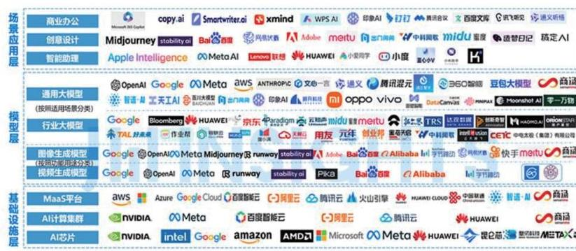

## Page 12
# 1.1.1 数据:多措并举缓解短缺状态 

大模型训练数据通常来自网络获取数据、外部付费/开源数据集、企业自有数据以及AI合成数据。大模型训练和微调所需数据量快速增长，真实世界数据将在数年内被用尽。研究机构Epoch估计，机器学习可能会在2026年前耗尽所有 "高质量语言数据"。据Gartner预测，2024年用于训练AI的数据中有 $60 \%$ 将是合成数据。以Meta今年7月发布的 LLaMA3.1模型为例，监督微调环节的数据里有相当比例是合成数据，使用合成数据确实带来了模型效果的提升。

## (1) 合成数据成有力补充

高质量的真实数据已逐渐无法满足大模型训练与精细微调的需要，这促使合成数据作为真实数据的重要补充，在人工智能领域扮演着日益关键的角色。合成数据作为算法、生成模型及模拟技术的产物，能够模仿现实世界数据的特征与模式，为大模型的训练与优化提供丰富的数据资源。

以AlphaGeometry项目为例，该项目通过生成高达一亿个精准合成的数据点，为解决复杂几何问题提供了强大的数据支撑，展现了合成数据在特定领域应用的巨大潜力。 DeepSeekMath项目则充分利用深度学习技术的优势，创造性地生成了包含多种难度级别与问题类型的复杂数学题目及其解答。这一举措不仅丰富了合成数据的维度，还显著提升了模型在处理复杂数学问题时的性能表现，尤其是在深化对数学概念的理解与应用能力上，更是展现出卓越的成效。

合成数据的应用，不仅有效克服了现实世界数据在获取难度、规模限制及多样性不足等方面的挑战，更为开发出更加健壮、可靠且公平的大模型奠定了坚实基础。具体而言，合成数据尤其适用于那些数据稀缺或难以直接获取的特定领域。此外，合成数据还能根据具体需求进行定制化设计，如确保不同类别数据的平衡表示，进一步提升模型的泛化能力。同时，合成数据还有助于缓解数据隐私保护的压力，通过创建匿名化或去标识化的数据集，为数据的安全共享与高效利用提供了保障。

## Page 13
然而，值得注意的是，尽管合成数据展现出巨大的应用潜力与优势，但其发展与应用仍面临着一系列挑战。其中，确保合成数据的真实性与保真度是首要问题，因为基于虚假或带有偏见的合成数据训练的模型，在真实世界场景中的表现将大打折扣。此外，合成数据的设计与验证环节也需高度重视，以避免因设计不当或验证不足而放大原有偏见或引入新的偏见，从而影响模型的公正性与准确性。因此，在未来的发展中，需持续加强合成数据的生成技术、验证机制及质量控制等方面的研究与实践，以充分发挥其潜力，推动大模型技术的持续进步与发展。

# (2) 多领域开源数据集相继推出 

当前，在开源数据资源的版图中，中文语料的占比显著偏低，尚不足总量的十分之一，这凸显了中文自然语言处理领域对高质量数据资源的迫切需求。为应对此挑战，国内已相继开源了多个中文预训练数据集，诸如CCI 2.0、SkyPile-150B、IndustryCorpus、Tele-AI以及MAP-CC等，这些数据集广泛覆盖了网页、书籍、官方媒体等多种信息源，经过不同程度的清洗与去重处理，为中文语言模型的训练提供了数据基础。今年6月，智源研究院推出的IndustryCorpus 1.0多行业中英双语数据集及InfinityInstruct千万级指令微调数据集，强化了预训练模型的基础能力与对话交互能力。

与开源文本数据集比较，当前开源多模态数据集面临着规模小、多样性匮乏及来源单一（主要集中于HTML文档）等显著局限，这些问题制约了开源多模态大模型的发展步伐，拉大了其与闭源多模态大模型之间的性能差距。为填补这一空白，今年7月，由华盛顿大学、 Salesforce Research、斯坦福大学等机构组成的联合研究团队成功构建了MINT-1T——个规模空前的万亿级交织多模态开源数据集。MINT-1T不仅包含了万亿级别的文本token与三十亿张图像，还实现了HTML、PDF、ArXiv等多种来源数据的综合集成，极大地丰富了数据的广度与多样性，为开源多模态大模型的突破性发展注入了新活力。

今年9月，由商汤科技携手清华大学、上海AI实验室、哈尔滨工业大学、香港中文大学、复旦大学及南京大学等多家科研机构共同推出的OmniCorpus项目，再次将开源多模态数据集的发展推向了新的高度。OmniCorpus包含86亿张图像与16,960亿个文本标记的

## Page 14
庞大数据量，相较于先前的MMC4、OBELICS等数据集实现了超过15倍的增长。更为重要的是，OmniCorpus在数据质量上同样出色，它不仅覆盖了广泛的英语及非英语网站，还纳入了视频平台的内容，确保了数据内容的全面性与丰富性。此外，OmniCorpus还具备高度的灵活性，能够轻松转换为纯文本语料库或图像文本对的形式，以满足不同领域研究与应用的多元化需求。

# 1.1.2 算力：单芯片算力达新高，国产化初具规模 

算力是推动大模型技术发展的基础。随着硬件技术的进步，算力的不断提升，为大模型的训练和应用提供了强大的支持。

## (1) GPU和TPU计算能力提升

GPU和TPU是训练大型神经网络的主要硬件。过去一年中，NVIDIA和Google等公司不断推出新的GPU和TPU产品，显著提升计算能力。具体来说，NVIDIA Blackwell B200 GPU和GB200超级芯片显著提升了AI模型的训练和推理效率同时大幅降低了能耗；而Google TPU v4则通过其优化的矩阵运算能力，为深度学习模型的训练提供了更高的效率。

## (2) 国产算力发展

为了突破算力"卡脖子"的问题，并抓住新技术带来的机遇，我国正加快国产GPU芯片生态体系的建设，包括从芯片设计、制造到封装测试的全流程加速推进。华为、寒武纪、摩尔线程、景嘉微、海光信息、沐曦科技、壁仞科技、燧原科技等企业通过加大研发投入、优化生产工艺、提升测试水平等措施，在GPU设计、制造和封装等环节均取得显著进步，国产芯片在性能、功耗、成本等方面不断取得突破，与国际巨头的差距不断缩小。

软件、系统、框架不断完善，除硬件层面的提升外，国产芯片还注重与软件、系统、框架等关键环节的协同发展。通过构建自主可控的软件生态体系，国产芯片能够更好地与国产操作系统、数据库、中间件等关键软件产品实现无缝对接和高效协同。这有助于提升国产芯片的整体性能和稳定性，降低用户的使用成本和维护难度。

## Page 15
# (3) 量子计算的探索 

虽然量子计算在商业应用中还处于早期阶段，但其在某些特定任务上展现出的巨大潜力已经开始引起关注。量子计算机具有超快的计算速度和巨大的并行处理能力，在处理复杂数学问题上具有天然的优势，这使得量子计算在未来有可能成为大模型训练的重要工具，有望为大模型的训练提供新的解决方案。例如，IBM和Google等公司已经在量子计算领域取得了一些初步的成果，展示了量子计算机在特定算法上超越传统计算机的潜力。

## (4) 云计算资源的扩展

云计算平台如AWS、Azure和Google Cloud不断扩展其计算资源，提供了更灵活、更强大的计算服务。这些平台的支持使得研究人员和企业能够更容易地访问到高性能的计算资源，加速了大模型的研发和应用。云计算的弹性扩展能力也使得资源的利用更加高效，降低了研发成本。例如，AWS推出的基于Blackwell GPU的Amazon EC2实例，将为用户提供强大的AI推理性能和便捷的接入方式。

## (5) 端侧算力发展

端侧大模型定义为运行在设备端的大规模人工智能模型，这些模型通常部署在本地设备上，如智能手机、物联网设备（IoT）、个人电脑（PC）、机器人、车机等设备。与传统的云端大模型相比，端侧大模型的参数量更小，因此可以在设备端直接使用端侧算力进行运行，无需依赖云端算力。端侧大模型在成本、能耗、可靠性、隐私和个性化方面相比云端推理具有显著优势，并能够以低能耗提供高效且安全的AI处理，减少延迟并保护用户隐私，适合个性化的AI应用。

2024年大模型端侧算力的发展呈现出强劲的增长势头，这主要得益于技术进步、市场需求增长以及应用场景的不断拓宽。2024年苹果秋季新品发布会上，苹果推出全新的 iPhone 16和iPhone 16 Pro，芯片升级为A18。苹果官网称，A18的"16核神经网络引擎针对大型生成式模型进行优化，运行机器学习模型的速度，相比A16仿生芯片提升最高可达 2倍。"可以说，iPhone 16系列是苹果为AI打造的新一代iPhone。2024年，AI PC市场迎来了快速发展时期，头部厂商如联想和华硕正在积极推动AI与PC的深度融合，以满足市场对智

## Page 16
智能化、高效化PC的需求。在产业链方面，AI PC的兴起对芯片厂商构成利好，推动其技术创新与产品迭代。例如，高通、微软推出的基于骁龙X Elite芯片的"Copilot+PC"以及英特尔的下一代酷睿Ultra 200V系列Lunar Lake处理器，都是针对AI PC市场的产品。此外，国内上市公司如春秋电子和泰嘉股份等也参与到AI PC产业链中，为AI PC的研发和生产提供支持。

# 1.1.3 模型：多模态崛起，端侧模型影响未来终端应用 

大模型技术的持续创新与更迭，为众多行业应用场景注入了前所未有的活力与可能。

## (1) 视频生成模型的进步

视频生成模型是大模型技术中的一个新兴领域，它允许从文本描述直接生成视频内容。过去一年，这一技术取得了显著的进展，生成的视频质量大幅提高，应用场景也更加广泛，包括电影制作、广告创意和虚拟现实等。

视频生成模型利用深度学习技术生成高质量的视频内容。随着算力的提升和算法的优化，视频生成模型在生成连贯、逼真的视频方面取得了显著进步。例如，2024年2月16日， OpenAI 发布的视频生成模型 Sora 惊艳全球，其突出特点包括：一是能够生成长达60秒的视频，远超之前只能自动生成 2 到3秒；二是支持多角度镜头并保持一致性，突破了以往单镜头的限制；三是能部分模拟真实世界和物理规律。这些特点预示着视频生成技术将可能很快从实验室走向实际应用。

## (2) 多模态模型的崛起

多模态模型能够处理和理解不同类型的数据，如文本、图像和声音。过去一年中，这一领域取得了显著进展，尤其是在图像和文本的联合表示学习方面。这些模型不仅提高了任务的性能，还增强了模型的泛化能力，使其能够更好地理解和生成复杂的数据模式。

今年5月，OpenAI在其春季发布会上推出了他们的最新旗舰模型：GPT-4o，该模型具备强大的多模态实时交互能力。其对音频输入的响应时间最短为 0.232 秒，平均为 0.32 秒，

## Page 17
与人类反应时间类似；能理解情感，并能以不同的情感风格生成语音。除了语音交互外，还可以通过视觉+语音的形式，如实时视频、上传图片等方式，与GPT-4o进行多模态交互。打开摄像头，GPT-4o能实时分析面部情绪；GPT-4o还可同时处理和理解图像及图像中包含的文本内容。GPT-4o近乎实时的语音和视频交互体验，标志着人机交互迎来了新的变革。

# (3) MoE架构 

混合专家系统（Mixture of Experts, MoE）架构是一种新颖的深度学习模型架构，它通过将多个"专家"子模型集成在一起来处理更大规模的数据和更复杂的任务。每个专家子模型都是一个小型的神经网络，擅长处理任务的某一方面。过去一年中，MoE架构在大规模语言模型和其他复杂任务中得到了广泛应用，显示出其在处理大规模数据和复杂问题上的巨大潜力。

MoE模型的具体工作原理可用中国的一句古语"术业有专攻"来概括，通过把任务分门别类，然后分给多个特定的"专家"进行解决，提高了模型的效率和灵活性。例如， OpenAI的GPT-4、谷歌的Gemini、Mistral AI的Mistral、xAI的Grok-1等主流大模型都采用了MoE架构，通过将不同的任务分配给不同的专家子网络，实现了用更少的计算量和内存需求来实现同样的智能水平。

## (4) 端侧模型

端侧大模型作为人工智能领域的重要分支，其核心优势在于能够直接部署于智能手机、个人电脑等终端设备之上，为用户提供高度个性化且即时响应的智能服务体验。鉴于端侧环境的资源有限性，模型的设计与训练阶段需深度融合模型压缩与优化策略，以应对性能与效率之间的挑战。通过先进的知识蒸馏、模型剪枝与量化技术，端侧大模型得以在不牺牲显著性能的前提下，大幅度削减参数量，进而提升在资源受限设备上的运行效率。随着技术的日新月异，轻量化模型的迭代速度显著加快，为端侧设备高效运行复杂AI模型开辟了新路径。

2024年，端侧模型的发展态势呈现出多维度的积极变化：市场规模持续稳健扩张，技术革新与模型优化并进，应用场景边界不断拓展，产业链上下游协同日益紧密，同时伴随

## Page 18
着深刻的行业变革与前所未有的发展机遇。
今年5月21日，面壁智能公司隆重发布了其新一代端侧多模态模型——MiniCPM-Lla-ma3-V2.5，该模型以惊人的80亿参数规模，在OCR识别、多语种支持、图像编码速度、生成内容的真实性与复杂性、复杂逻辑推理等多个维度上取得了突破性进展，其表现显著优于 Gemini Pro及GPT-4V等业界标杆模型。MiniCPM-Llama3-V2.5不仅支持包括中英德法在内的超过 30 种语言，更在图像编码速度上实现了质的飞跃，为端侧AI模型的发展树立了新的里程碑。

今年9月，面壁智能再度发力，推出了MiniCPM 3.0基座模型，该模型以仅40亿参数的规模，在自然语言理解、知识问答、代码生成、数学推理等多个核心能力上实现对GPT-3.5的超越，同时在与Qwen2-7B、Phi-3.5、GLM4-9B、LLaMa3-8B等国际知名模型的对比中脱颖而出，展现了其卓越的"以小博大"能力，进一步巩固了面壁智能在端侧AI领域的领先地位。这一系列创新成果不仅体现了技术实力的飞跃，更为端侧AI模型的广泛应用与深入发展奠定了坚实基础。

# (5) 更长的上下文 

大模型技术在处理"越来越长的上下文"方面取得了显著进展，通过不断扩展模型的上下文窗口和优化训练方法，使得模型能够理解和生成更长、更连贯的文本内容。例如，月之暗面（Moonshot AI）今年3月18日官宣，旗下产品 Kimi 智能助手在长上下文窗口技术上再次取得突破，上下文长度由 20 万字提升至 200 万字。在大模型竞争极为同质化的当下，更长的上下文长度处理能力，或将引领大模型进入差异化竞争阶段。紧接着，3月22日，阿里宣布通义千问开放1000万字长文本能力。

显著提升的长文本处理能力，允许模型在处理长文档、对话历史或复杂语境时保持连贯性和理解力。但是，增加上下文窗口也意味着模型的计算量和内存需求将大幅增加，因此在实际应用中必须权衡上下文窗口的大小和计算资源的有效利用。

## (6) 闭源与开源模型的动态平衡

随着大模型技术的普及，越来越多的企业和研究机构开始开放其模型和算法，以促进

## Page 19
更广泛的研究和应用。然而，一些领先的技术公司仍然选择保持其模型的封闭性，以确保商业竞争力和知识产权的保护。这种闭源与开源的动态平衡，带来了技术创新的快速迭代，促进了知识的共享和行业的合作。

闭源模型：一些大型科技公司继续开发和维护他们的闭源模型，如OpenAI的GPT-4和百度的文心一言等。这些模型在特定任务上表现出色，但由于其不公开的特性，限制了更广泛的研究和应用。闭源模型通常具有更好的性能和更少的公开数据泄露风险，但这也限制了学术界和中小企业的参与。例如，OpenAI的GPT-4模型在自然语言处理任务中表现出色，但其模型细节和训练数据并未完全公开，限制了其他研究人员对其进行进一步的研究和优化。

开源模型：开源模型如Meta的LLaMA3和阿里的Qwen2-72B模型，为研究人员和开发者提供了丰富的资源。通过开放访问和使用，研究人员可以更容易地掌握先进的模型架构和训练方法，为研究人员和开发者提供了一个共同的平台，以拓展人工智能技术的能力边界，并探索其在现实世界问题中的应用。这种开放性不仅加速了新技术的产生和验证，还促进了不同领域间的交叉融合，为解决复杂问题提供了更多可能性。总之，开源大模型不仅是技术创新的象征，还促进了知识的共享和协作，更是人工智能领域开放合作精神的体现。

# 1.1.4 应用：日益广泛深入，多领域齐头并举 

从深邃的科学探索到广泛的商业实践，在过去的一年中，大模型技术展现了其巨大的潜力，并开始逐步转化为现实生产力的重要驱动力。尽管整体上这些应用仍处于初期阶段，但它们在多个领域的突破已初现端倪。

### 1.1.4.1 行业应用日益深入

最近一年，大模型技术在各行各业的应用情况呈现出蓬勃发展的态势，为多个领域带来了深刻的变革和显著的效益。

## Page 20
# (1) 金融行业 

在金融领域，大模型的应用逐渐从简单的运营支持向核心业务场景延伸。各大银行和金融机构纷纷推出自己的AI大模型，如工行的AI大模型技术已实现56个新增业务场景落地应用。同时，奇富科技、蚂蚁集团等也发布了针对金融行业的专属大模型，如奇富GTP和 AntFinGLM，这些模型在数据整合与分析、风险管理、个性化产品定制、智能投顾等方面展现出强大的价值。中国人保发布"数智灵犀-人保大模型"，阳光保险发布"阳光正言GPT"，在客户服务、保险销售、核保理赔等方面展现了极大的应用价值。据报告，2024年金融AGI市场规模已达到3.8亿元，同比2023年增长7倍以上，显示出金融大模型市场的快速增长势头。

## (2) 医疗行业

在医疗领域，大模型的应用主要集中在患者问诊、医生助手、药物研发、健康科普等多个方面。医疗大模型通过理解人类语言、完成逻辑推演和生成最终结果，为医疗行业带来了天然的应用优势。尽管医疗数据的互不连通和近乎为零的容错率给医疗大模型的商业化带来了挑战，但仍有不少企业和研究机构推出了自己的医疗大模型产品，如医联的 MedGPT、腾讯和百度基于自研通用大模型打造的医疗大模型等。这些模型在提升医疗服务效率、扩大普惠金融覆盖范围等方面发挥了重要作用。

## (3) 教育行业

教育行业也是大模型应用的重要领域之一。多家科技公司如网易、百度、知乎等相继披露了旗下大模型在教育领域的最新动态，并发布了搭载AI技术的硬件产品或应用。大模型在教育领域的应用主要包括个性化教学、智能辅导、内容生成等方面。通过大模型技术，教育企业可以大幅提升教学效率、降低教学成本，并为学生提供更加个性化和精准的学习体验。例如，网易有道推出的子曰教育大模型2.0版本和虚拟人口语教练Hi Echo 2.0版本等产品，就充分展示了大模型在教育领域的应用潜力。

## (4) 制造业与服务业

在制造业和服务业领域，大模型的应用也日益广泛。在制造业中，大模型通过实现生

## Page 21
产过程的智能化控制和管理，提高了生产效率和产品质量。同时，大模型还可以应用于供应链的优化和管理，降低运营成本。在服务业中，大模型则主要应用于智能客服和个性化服务等方面。通过大模型技术，企业可以构建智能化的客服系统和服务平台，提升服务质量和客户满意度。

# (5) 智慧城市与媒体娱乐 

大模型还在智慧城市建设和媒体娱乐领域展现出广泛的应用前景。在智慧城市建设中，大模型通过数据分析和预测优化城市管理和服务流程；在媒体娱乐领域，大模型则用于智能推荐系统、内容生成等方面为用户提供更加个性化和精准的服务体验。

最近一年大模型技术在各行各业的应用情况呈现出蓬勃发展的态势。随着技术的不断进步和应用场景的不断拓展，大模型将在未来发挥更加重要的作用，为各行各业带来更加深远的影响。

### 1.1.4.2 具身智能崭露头角

具身智能作为大模型之后的下一个人工智能趋势，正在逐渐崭露头角。具身智能是指能理解、推理并与物理世界互动的智能系统，其实现离不开大模型的赋能。

## (1) 技术突破

大模型的出现，使得具身智能在感知、理解和规划任务上的泛化能力得到了显著提升。机器人接入大模型后，能够直接听懂人类指令，结合环境信息，将复杂的指令转化成具体行动规划，无需额外数据和训练。这种能力极大地降低了机器人的使用门槛，推进了机器人落地各行业场景应用。

## (2) 产业应用

具身智能在多个领域得到了广泛应用，包括智能制造、智能家居、智慧医疗等。例如，在智能制造领域，搭载大模型的机器人能够完成高精度、高效率的生产任务；在智能家居领域，具身智能技术使得家电设备更加智能化、便捷化；在智慧医疗领域，具身智能机器人能够辅助医生进行手术、护理等工作。

## Page 22
# 1.1.4.3 内容生成领域百花齐放 

随着大模型技术的不断成熟，内容生成领域也迎来了百花齐放的发展态势。大模型在文本生成、图像生成、语音生成等多个方面展现出了强大的能力。

## (1) 文本生成

大模型在文本生成领域的应用包括新闻报道、小说创作、广告文案等。通过训练大模型，可以生成高质量、符合人类写作习惯的文本内容，极大地提高了内容生产的效率和质量。

## (2) 图像生成

在图像生成领域，大模型能够生成逼真的图像、视频等内容。这种能力在艺术创作、影视制作、广告宣传等领域具有广泛的应用前景。例如，通过训练大模型，可以生成具有特定风格的绘画作品或电影场景。

## (3) 语音生成

大模型在语音生成领域的应用主要体现在语音合成方面。通过训练大模型，可以生成自然流畅的语音内容，用于虚拟主播、智能客服等领域。

### 1.1.4.4 医疗健康进入新时代

2023年被视为医疗健康AI大模型的元年，企业纷纷跑马圈地，推动大模型在医疗健康领域的应用落地。今年，大模型在医疗健康领域的应用已初见成效，涵盖了患者问诊、医院管理、医学影像等方面。

## (1) 患者问诊

大模型在患者问诊方面的应用，使得患者能够通过自然语言与智能系统进行交互，获得准确的医疗建议。这有助于缓解医疗资源紧张问题，提高医疗服务的可及性和效率。

## (2) 医院管理

大模型在医院管理方面的应用，包括病历管理、药物管理、医疗质量控制等。通过训练大模型，可以实现医疗数据的智能化分析和管理，提高医院的管理水平和运营效率。

## Page 23
# (3) 医学影像 

在医学影像领域，大模型被用于辅助医生进行疾病诊断和治疗。通过训练大模型，可以实现对医学影像的自动分析和诊断，提高诊断的准确性和效率。这种能力对于提高医疗水平、保障患者健康具有重要意义。

## 1.2 大模型技术在保险行业的应用现状及成效

2024年，大模型浪潮正式迈入应用深化与广泛落地的关键阶段。在保险行业，大模型的应用同样由初步探索逐渐走向深入发展，其成效与价值日益显现。

### 1.2.1 应用现状

自ChatGPT震撼登场以来，保险行业迅速响应，纷纷在生成式AI领域精心布局并加速实践落地。据麦肯锡观点，目前在保险价值链的各个环节，都已出现灯塔用例，大模型应用的价值和效果初步显现。

## Page 24
图2 保险业大模型应用成效初现

资料来源:生成式人工智能在保险行业的应用(研讨材料),麦肯锡。

通过深入追踪分析保险企业大模型应用的最新进展，我们观察到该技术在保险行业的应用落地展现出几大鲜明特征。

### (1) 全面渗透、重点应用

自ChatGPT等生成式AI技术的突破性进展以来，保险行业迅速认识到其潜在的巨大价值，并开始在全业务链条上广泛部署这一技术。从市场营销、承保核保、理赔定损到客户服务，几乎每一个业务环节都在探索大模型技术的应用可能。

尽管大模型在保险行业的应用已初具规模，特别是在客户服务、理赔定损及办公辅助方面展现出显著成效，但在产品设计及定价、风险评估与管理等更为核心与复杂的业务环节中，其应用仍处于起步阶段，但潜力巨大，值得深入探讨与拓展。

### (2) 初期选择试错风险低的场景

在初步接触并验证大模型技术时，保险企业普遍采取了谨慎而务实的策略，优先选择那些能够直接带来降本增效的用例进行试点。保险公司在最开始探索大模型时，可以快速落地这些用例用于大模型的价值验证，然后探索更复杂的业务场景。这些用例包括但不限于智能办公助手，它能够帮助员工高效处理日常行政事务；编码辅助工具，加速软件开发与迭代；以及员工知识问答助手，提升内部知识共享与问题解决的速度。
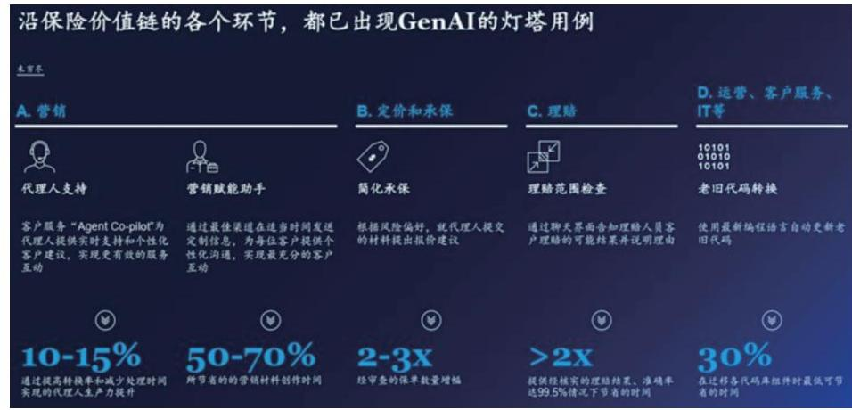

## Page 25
这些用例之所以成为首选，是因为它们技术成熟度高、实施难度相对较低，且能够迅速看到成本节约与效率提升的效果。中国人寿财险、阳光保险集团等领先企业正是通过在这些非敏感且成本可控的场景下开展探索，不仅验证了大模型技术的可行性，还为后续向更复杂、更高价值的业务场景拓展积累了宝贵经验。

# (3) 持续深耕高价值场景 

在初步验证大模型技术的价值后，保险企业开始将目光投向那些能够带来更高业务价值的场景，如营销素材生成、代理人销售助理以及销售机器人等。这些用例不仅有助于提升客户体验、优化销售流程，还能在风险管理、产品创新等方面发挥重要作用，是保险公司构建长期竞争优势的关键所在。

以销售机器人为例，它能够通过自然语言处理、情感分析等技术，与客户进行智能互动，提供个性化的产品推荐与咨询服务。这一创新应用不仅能够显著提升销售效率与转化率，还能在客户心中树立专业、贴心的品牌形象，为保险公司带来持续的市场竞争优势。尽管当前在技术实现上仍面临一定挑战，但平安保险、阳光保险、信美相互等保司已纷纷加大投入，全力推进相关技术的研发与应用，以期在未来的市场竞争中占据先机。

### 1.2.2 应用成效

大模型技术在保险业的初步应用成效，不仅为行业带来了显著的正面变化，更预示着一场深刻变革正在拉开序幕。

## (1) 效率的大幅提升

自动化流程优化：大模型技术通过深度学习算法，能够精准识别并自动化处理大量日常、重复性任务，如数据录入、文件分类、初步索赔审核等。这种自动化不仅减少了人工干预，还避免了人为错误，使保险公司能够更快速地响应客户需求，提升整体运营效率。

智能决策支持：在更复杂的业务场景中，大模型能够提供基于大数据的智能决策支持。例如，在风险评估环节，大模型能够综合分析多维度数据，快速评估风险等级，为保险公司

## Page 26
提供精准的决策依据，进一步加速业务流程，提升服务质量。

# (2) 成本结构的深刻调整 

运营成本降低：通过自动化和智能化的手段，大模型技术显著降低了保险公司在人力、物力等方面的投入。同时，减少人工错误和重复劳动也降低了因错误操作而产生的额外成本。

精准营销与成本效益：大模型在营销领域的应用更是实现了从"广撒网"到"精准捕捞"的转变。通过分析客户行为、偏好等数据，大模型能够精准定位潜在客户群体，制定个性化的营销策略，提高营销活动的针对性和有效性，从而降低营销成本，提升转化率。

## (3) 服务质量的全面升级

个性化服务体验：大模型技术能够深入分析客户需求，提供个性化的保险推荐和服务方案。这种个性化的服务体验不仅满足了客户的多样化需求，还增强了客户与保险公司之间的黏性，提升了客户满意度和忠诚度。

智能化理赔服务：在理赔环节，大模型能够自动化处理索赔申请，快速审核并给出初步处理意见。对于复杂案件，大模型还能提供智能辅助决策支持，帮助理赔人员更准确地评估损失情况，提高理赔效率和客户满意度。

## (4) 创新驱动的未来发展

产品创新：大模型技术为保险公司提供了丰富的数据资源和强大的分析能力，使其能够更准确地把握市场动态和客户需求变化。基于这些数据和分析结果，保险公司可以设计出更符合市场需求、更具创新性的保险产品，满足客户的多元化需求。

智能化转型加速：大模型技术的引入加速了保险业的智能化转型进程。通过与区块链、物联网等先进技术的结合应用，保险公司可以构建更加安全、高效、透明的数字化服务体系，提升整体服务水平和市场竞争力。

综上所述，大模型技术在保险业的初步应用成效显著，不仅提升了效率、降低了成本、优化了服务，还激发了行业的创新活力。随着技术的不断发展和应用的深入拓展，大模型技术将在保险业中发挥更加重要的作用，推动行业向更加智能化、高效化、个性化的方向发展。

## Page 27
# 1.2.3 面临挑战 

在保险科技领域，大模型技术的应用虽展现出巨大潜力，却也伴随着一系列不容忽视的挑战，需行业内外共同面对并寻求解决方案。

## (1) 推理速度瓶颈

在保险行业，特别是在线服务环境中，用户期望的是即时反馈。然而，大模型由于其复杂的计算过程和庞大的参数规模，往往在处理速度上显得力不从心。这要求技术团队在算法优化、硬件加速（如使用GPU、TPU等专用处理器）以及分布式计算等方面进行深入研究和创新，以实现推理速度的显著提升。

此外，还需要考虑系统的并发处理能力，即在高并发请求下仍能保持稳定的推理速度，这对于保障用户体验至关重要。

## (2) 精准度局限

保险业务中的某些场景，如风险评估、定价等，对结果的精准度有极高要求。然而，当前的大模型技术由于基于概率和统计原理，其输出结果往往存在一定的不确定性。这种不确定性在可接受范围内时或许可以接受，但在要求绝对精准的场景下则可能成为障碍。

因此，解决这一问题需要采用多种策略，如结合传统方法与AI技术、引入更多的先验知识、加强数据质量控制等，以提升模型的精准度和可靠性。

## (3) 监管合规挑战

保险行业受到多个监管机构的严格监管，这些监管机构对技术的使用提出了明确的要求，包括透明度、公平性、隐私数据保护等。大模型技术的应用必须确保符合这些要求，否则可能面临法律风险和声誉损失。

为此，保险公司需要建立完善的合规管理体系，包括模型审计、风险评估、合规培训等环节，以确保技术的合规应用。同时，还需要与监管机构保持密切沟通，及时了解监管动态，调整技术策略。

## Page 28
# (4) 模型解释性难题 

大模型的"黑箱"特性给监管审查、客户信任及内部决策带来了巨大挑战。为了提升模型的可解释性，保险公司可以采用多种方法，如可视化技术、特征重要性分析、局部解释等，将复杂的模型决策过程转化为易于理解的形式。

此外，还可以引入专家知识库和领域知识图谱等辅助工具，为模型决策提供可解释的依据。这些措施有助于增强用户对模型的信任度，促进技术的广泛应用。

## (5) 技术投入与运维压力

建立和维护大型模型系统需要巨大的技术投入和持续的运维支持。为了应对这一挑战，保险公司可以采取以下策略：一是合理规划技术投资预算，确保资金的有效利用；二是加强与科研机构和高校的合作与交流，引入先进技术和人才；三是建立完善的运维管理体系和应急预案，确保系统的稳定性和可用性。

同时，保险公司还需要关注技术发展趋势和市场动态，及时调整技术策略和投资方向，以保持技术的先进性和竞争力。

大模型技术在保险行业的初步应用已显现出效率提升、客户体验优化及风险管理能力增强的显著优势。然而，要全面释放这些技术的潜力，保险公司必须积极应对推理速度、精准度、监管合规、数据隐私、模型解释性及技术投资等多方面的挑战，通过技术创新与合规管理，推动保险科技的健康发展。

## Page 29
# 2.战略视野与行业篇 

## 2.1 全球保险行业的发展趋势

### 2.1.1保险业面临前所未有的挑战

在当今这个日新月异的数字时代，全球各行各业都在经历着生成式AI带来的前所未有的变革与重塑。作为传统金融行业的重要组成部分，保险业也面临着前所未有的挑战与机遇。

## (1) 行业发展转变

随着信息技术的快速发展，保险行业正从传统的"评估与服务模式"向"可预测、个性化和生态化模式"转变。这种转变要求保险公司能够利用大数据、人工智能等技术，更精准地评估风险，提供个性化产品和服务。

## (2) 客户需求的多样化与个性化

随着消费者需求的不断升级，保险业传统的产品与服务模式已难以满足现代消费者的需求。客户越来越期望获得个性化的保险解决方案，这要求保险公司能够提供定制化的产品和服务。例如，年轻消费者更倾向于通过在线渠道购买保险，他们期望获得即时的报价和便捷的理赔服务。同时，客户对保险产品的理解也在不断深化，他们需要更透明、更灵活的保险产品，以适应他们多变的生活需求。

## (3) 市场竞争的加剧

随着金融科技的快速发展，越来越多的科技公司进入保险市场，利用大数据、人工智能等技术提供创新的保险产品和服务，加剧了市场竞争。这些新兴公司通常具有更强的技术创新能力和更快的市场响应速度，对传统保险公司构成了巨大的挑战。他们通过提供更灵活的定价策略和更高效的服务流程，吸引了大量客户，迫使传统保险公司必须加快自身的创新步伐。

## Page 30
# (4) 风险管理的复杂性 

保险业是一个高度依赖风险评估和管理的行业。随着社会经济环境的变化，风险因素变得更加复杂和多变，传统的风险评估和管理方法已经难以适应新形势的需要。例如，气候变化带来的极端天气事件增加了保险业的赔付风险，而网络安全问题则给保险公司带来了新的风险类型。保险公司需要更先进的技术手段来识别和管理这些新兴风险。

## (5) 运营效率的提升需求

保险公司在运营过程中面临着大量的数据处理和分析工作，传统的手工操作不仅效率低下，而且容易出错。提升运营效率，降低成本，成为保险公司亟待解决的问题。尤其是在理赔处理环节，繁琐的流程和漫长的等待时间常常引发客户的不满。保险公司需要通过自动化和智能化手段，提高理赔处理的效率和准确性。

## (6) 数据安全与隐私保护

在数字化时代，数据安全和隐私保护成为保险公司必须面对的重大挑战。随着客户数据的日益增多，保险公司需要确保这些数据的安全，防止数据泄露和滥用。同时，保险公司还需要遵守各国的数据保护法规，保护客户的隐私权益。这不仅需要保险公司投入大量的资源，也需要他们不断提升数据安全能力。

## (7) 人才短缺问题

随着数智化转型的推进，保险公司对技术人才的需求日益增加。然而，高素质的技术人才相对短缺，尤其是在人工智能、大数据分析等领域。人才短缺不仅增加了保险公司的运营成本，也影响了他们在技术创新和市场竞争中的表现。保险公司需要通过培养和吸引技术人才，提升自身的技术创新能力。

### 2.1.2 数智化转型是解决之道及不二选择

数智化转型不仅是保险企业应对当前挑战的必然选择，更是实现长远发展的必由之路。面对日益激烈的市场竞争和不断变化的客户需求，保险企业必须加快数智化转型的步

## Page 31
伐，提升自身的竞争力。通过数字化、智能化技术的深度融合应用，重构保险业务价值链，提升运营效率，优化客户体验，增强风险管理能力，实现可持续发展。

# (1) 提升客户体验 

通过数智化转型，保险公司可以利用大数据和人工智能技术，深入分析客户需求，提供更加个性化、定制化的保险产品和服务，提升客户体验。例如，通过分析客户的驾驶习惯和行车记录，保险公司可以为不同风险水平的客户提供差异化的车险产品。

## (2) 优化风险管理

数智化转型可以帮助保险公司更好地识别和管理风险。通过大数据分析，保险公司可以更准确地评估风险，制定合理的保险费率，降低赔付率。例如，利用机器学习算法，保险公司可以预测和识别欺诈行为，减少不必要的赔付。

## (3) 提高运营效率

数智化转型可以显著提高保险公司的运营效率。通过自动化和智能化的数据处理和分析，保险公司可以减少手工操作，降低错误率，提高工作效率。例如，利用智能化工具，保险公司可以快速处理理赔申请，缩短理赔时间。

## (4) 加强合规管理

数智化转型可以帮助保险公司更好地应对监管要求。通过智能化的合规管理系统，保险公司可以实时监控业务流程，确保合规性，降低违规风险。例如，利用人工智能技术，保险公司可以自动识别和处理违规行为，提高合规管理的效率和效果。

## (5) 实现创新发展

数智化转型为保险公司提供了创新发展的机会。通过利用新技术，保险公司可以开发新的业务模式，拓展新的市场，提升竞争力。例如，利用区块链技术，保险公司可以开发去中心化的保险产品，提高透明度和安全性。

## Page 32
# 2.2 国内外相关政策分析

近一年来，人工智能相关政策在全球范围内以及中国国内都取得了显著的进展，这些政策不仅推动了AI技术的研发和应用，还促进了相关产业的创新与发展。

## 2.2.1 国内政策密集出台

近年来，中国人工智能行业发展受到各级政府、国家部委及各行各业的高度重视，纷纷出台重点支持政策及监管治理政策。

### 国家

“人工智能+”首次被写入《政府工作报告》，强调深化大数据、人工智能等研发应用，并展“人工智能+”行动，打造具有国际竞争力的数字产业集群。2024年两会

到2026年，我国标准与产业科技创新的联动水平持续提升，新制定国家标准和行业标准50项以上，引领人工智能产业高质量发展的标准体系加快形成。2024年两会

### 部委

针对“新一代信息技术”和“生成式人工智能”等领域，提出具体标准研制和应用推广要求。2024年1月18日

推动AI技术赋能产业，促进产业链新。2024年2月

明确数字中国建设的具体任务和目标，包括夯实数字基础设施、推进数字技术与经济社会深度融合等。2024年3月21日

### 地方

|  地方 |  |  |  |   |
| --- | --- | --- | --- | --- |
|  北京 | 关于加快适用人工智能产业引领发展的若干措施
北京市推动“人工智能+”行动计划
2024年1月21日
(2024—2025年) | 上海市推动人工智能大模型创新发展若干措施
上海市推进“人工智能+”行动打造“智慧时空”成果转身实施方案 | 浙江 | 广东
2024年广东在加快数字政府领域适用人工智能应用
广东
2024年广东在关注人工智能赋能平行商业的若干措施  |

### 图3 国内人工智能政策

## Page 33
# 2.2.1.1 国家部委工作要求 

中国政府高度重视人工智能领域的发展，并通过一系列政策举措推动其健康、有序、高质量发展。在2024年的全国两会上，《政府工作报告》首次将"人工智能+"纳入其中，强调要深化大数据、人工智能等技术的研发与应用，通过实施"人工智能+"行动，着力打造具有国际竞争力的数字产业集群，这一举措标志着人工智能已成为国家发展战略的重要组成部分。

为进一步规范和引导人工智能产业的发展，工业和信息化部、中央网信办、国家发展改革委、国家标准委等四部门联合启动了国家人工智能产业综合标准化体系的建设工作。经过多轮征求意见与修订，该体系于7月2日正式发布，旨在显著提升标准与产业科技创新的联动性，计划至2026年新制定超过50项国家标准和行业标准，加速构建引领人工智能产业高质量发展的标准体系。这一系列标准的制定与实施，不仅为行业提供了清晰的技术指引，也为企业的创新发展奠定了坚实基础。

2024年1月18日，工业和信息化部发布了《关于推动未来产业创新发展的实施意见》，该意见聚焦新兴产业与未来产业的标准化工作，特别针对"新一代信息技术"和"生成式人工智能"等领域，提出了具体的标准研制和应用推广要求，旨在通过标准化手段促进技术创新和产业升级。

为了进一步推动AI技术在国有企业中的应用，国资委于2024年2月召开了中央企业人工智能专题推进会，会议旨在通过AI技术赋能产业，促进传统产业焕发新的生机与活力，加速国有企业的转型升级和创新发展。

同时，为了全面推进数字中国建设，国家发改委于2024年5月21日发布了《数字中国建设2024年工作要点清单》，该清单明确了数字中国建设的具体任务和目标，包括夯实数字基础设施、推进数字技术与经济社会的深度融合等多个方面，为数字中国建设提供了全面的指导和支持。

## Page 34
此外，为充分激活数据要素潜能，推动人工智能技术的深度融合与应用，国家发改委于2023年底发布了《"数据要素 $\times$ "三年行动计划（2024—2026年）》。该计划围绕数据要素与各行各业的深度融合，部署了包括"数据要素 $\times$ 智能制造"在内的 12 项重点行动，特别支持通用及垂直领域人工智能大模型的训练与发展，为人工智能产业的创新发展注入了新的动力。

值得一提的是，2024年6月5日，工业和信息化部等四部门再次联合印发了《国家人工智能产业综合标准化体系建设指南（2024版）》，该指南进一步细化了未来两年的工作目标与任务，不仅重申了提升标准与产业科技创新联动水平、制定新标准、推动标准实施等目标，还提出了加强国际标准制定的国际合作，旨在促进人工智能产业的全球化发展。预计到2026年，将有超过 1000 家企业参与到标准的宣贯和实施推广中，标准服务企业创新发展的成效将更加显著，同时我国在国际标准制定中的参与度也将大幅提升。

2024年9月11日，《国务院关于加强监管防范风险推动保险业高质量发展的若干意见》指出，保险业应提高数智化水平。加快数字化转型，加大资源投入，提升经营管理效率。鼓励运用人工智能、大数据等技术，提高营销服务、风险管理和投资管理水平。加强网络安全防护和数据安全管理，提升突发事件应急处置和灾备水平。依法依规维护数据资产权益。

# 2.2.1.2 地方与行业政策 

最近一年，大模型技术在各行各业的应用情况呈现出蓬勃发展的态势，为多个领域带来了深刻的变革和显著的效益。

### 2.2.1.2.1 地方政策

生成式AI行业发展至今，北京市、上海市、浙江省、广东省、吉林省、湖南省等省市纷纷出台人工智能政策，包括鼓励平台企业运用生成式人工智能，将生成式AI技术充分应用于电商领域、长视频领域、医疗领域等。举例来说，北京设立1亿元支持AI发展，上海推进高质量计算基础设施建设，深圳设立1000亿元AI基金等，各地形成了激烈的"政策竞赛"。

## Page 35
在北京出台政策方面，4月27日，北京市发展改革委在2024中关村论坛年会上发布了《关于加快通用人工智能产业引领发展的若干措施》。《措施》聚焦人工智能5个领域，提出 10条措施。其中，3条措施关于算力，4条措施关于大模型，1条措施关于投融资，1条措施关于技术创新，1条措施关于国际合作。7月26日，北京市发展改革委，市经济和信息化局，市科委、中关村管委会联合发布《北京市推动"人工智能+"行动计划（2024-2025年）》，从标杆应用、示范应用、商业应用等三个维度谋划推动人工智能应用落地，构建大模型赋能经济社会发展的全景图。行动计划提出，将通过实施5个对标全球领先水平的标杆型应用工程、组织10个引领全国的示范性应用项目、推广一批具有广泛应用前景的商业化应用成果，力争到2025年底形成3至5个先进可用、自主可控的基础大模型产品、100个优秀的行业大模型产品和1000个行业成功案例。力争率先建设AI原生城市，推动北京市成为具有全球影响力的人工智能创新策源地和应用高地。

# 2.2.1.2.2 行业政策 

为了进一步支持科技金融发展，相关部门再出新政。近日，中国人民银行、科技部、国家发展改革委、工业和信息化部、金融监管总局、中国证监会、国家外汇局等七部门联合印发《关于扎实做好科技金融大文章的工作方案》（下称《工作方案》）。

《工作方案》以习近平新时代中国特色社会主义思想为指导，加强基础制度建设，健全激励约束机制，推动金融机构和金融市场全面提升科技金融服务能力、强度和水平，为各类创新主体的科技创新活动提供全链条全生命周期金融服务，精准支持国家重大科技任务、科技型企业培育发展、战略性新兴产业发展和未来产业布局、传统产业技术改造和基础再造、国家和区域科技创新高地建设等重点领域。

综上所述，近一年来人工智能相关政策在国家和地方层面均呈现出积极的发展态势，通过标准化体系建设、产业创新发展、数据安全与隐私保护，以及全球治理合作等多个方面，共同推动人工智能技术的健康发展和广泛应用。

## Page 36
# 2.2.2 国际政策与影响 

2024年是全球人工智能治理体系构建的关键节点，各大经济体在政策与立法层面取得了显著进展，以欧盟的《人工智能法案》及美国推出的《关于安全、可靠和值得信赖的人工智能的相关行政令》为代表，这些举措共同推动了全球AI治理向更加规范化、系统化的方向迈进。与人类反应时间类似；能理解情感，并能以不同的情感风格生成语音。除了语音交互外，还可以通过视觉+语音的形式，如实时视频、上传图片等方式，与GPT-40进行多模态交互。打开摄像头，GPT-40能实时分析面部情绪；GPT-40还可同时处理和理解图像及图像中包含的文本内容。GPT-40近乎实时的语音和视频交互体验，标志着人机交互迎来了新的变革。

### 2.2.2.1 联合国：推动全球共识与指导原则

2024年3月21日，联合国通过了首个专门针对人工智能的全球决议——《抓住安全、可靠和值得信赖的人工智能系统带来的机遇，促进可持续发展》。这一决议不仅彰显了国际社会对于人工智能治理的高度重视，还明确提出了构建安全、可靠、可信赖AI系统的核心原则：以人为本、可靠性、可解释性、道德性、包容性，并强调了对人权、国际法、隐私及可持续发展的尊重与保护。联合国的这一行动为全球范围内的AI治理提供了方向性的指导，促进了国际在AI伦理、安全及监管方面的合作与共识。

### 2.2.2.2 欧盟：引领AI监管新时代

2024年3月13日，欧盟议会通过了具有划时代意义的《人工智能法案》，标志着全球人工智能监管迈入了一个全新的时代。该法案旨在为AI技术的发展与应用设定严格的规范与标准，确保AI系统在设计、开发、部署及使用过程中遵循伦理、安全及法律要求。通过明确AI技术的风险等级、设立监管机构、制定问责机制等措施，《人工智能法案》为欧盟乃至全球范围内的AI治理树立了标杆，展现了欧盟在推动AI健康有序发展方面的坚定决心与领导力。

## Page 37
# 2.2.2.3 美国：全面立法与强制执行的双重策略 

美国在AI治理方面同样展现出了积极而全面的姿态。2023年初，美国商务部国家标准与技术研究院发布了《人工智能风险管理框架》，为AI系统的全生命周期风险管理提供了科学指导。同年10月，美国政府发布了具有里程碑意义的总统行政令《安全、可靠和值得信赖的人工智能开发和使用》，该行政令不仅明确了美国政府治理AI的政策法律框架，还动用了《国防生产法》的紧急权力，强制要求AI企业进行安全测试并与政府分享测试结果，体现了美国在AI监管上的强硬立场与执行力。进入2024年，随着美国参议院人工智能工作组发布《推动美国在AI领域的创新：参议院AI政策路线图》，美国进一步加速了其通过"全面立法"治理AI的战略步伐，尤其是在大选年的背景下，AI立法更是成为美国政治议程上的重要议题。

## 2.3 保险业数智化转型进展

在全球数字化浪潮的推动下，保险行业的数智化转型已成为行业发展的重要趋势。中国保险行业在这一转型过程中表现出了独特的发展脉络和驱动因素，同时也面临着一系列的挑战和机遇。本章将从全球视角出发，深入探讨中国保险业在数智化转型中的进展、特点及未来的发展方向。

首先，中国保险业的数字化转型是行业发展的必然选择。随着保费增速放缓、产品利润空间逐步压缩，保险机构迫切需要依托数字化手段升级创新、控制成本、增加收入，以实现业绩优化。这一转型不仅涉及IT系统的升级和业务模式的创新，还包括对前沿科技如大数据、人工智能、RPA/IPA技术的应用和探索。这些技术的融合赋能与契合场景需求的创新开发，已成为保险机构核心竞争力的构建共识。

其次，保险行业的数字化转型得到了国家政策的大力支持。在"十四五"阶段，数字中国顶层战略自上而下引导各行各业数字化转型，保险业作为数字经济的重要组成部分，承担着关键的转型任务。监管长期引导推动信息科技应用深化，十三五末年行业基本完成线

## Page 38
上化改造，为实现可持续发展，监管着力推动保险行业数字化转型。
再次，保险行业数字化转型的落地指南强调了战略、业务、技术三个维度的环环相扣。保险公司需要站在全局视角进行长期统筹规划，由点及面实现从局部业务的优化升级到全域数字化的整体进阶。这包括顶层数字化规划、数字化实践洞察以及底层技术支撑建设。

此外，保险行业的数字化转型也面临着数据合规问题、数字化发展不均衡和所需成本高等挑战。数字技术应用面临着合规要求下的法律和监管挑战，以及各种信息安全风险。发展不均衡的数字化技术进一步加剧数字鸿沟问题；同时，需要大量成本投入的数字化技术制约着中小企业发展，"保险+科技"这一复合型需求也带来人才培养的新挑战。

# 2.3.1 保险业数智化转型是一个全方位多层级的渐进过程 

保险行业作为金融领域的重要组成部分，正经历着前所未有的数字化转型变革。这不仅涉及技术层面的革新，还包括业务模式的创新和市场策略的调整。

## (1) 技术层面的革新

大数据与人工智能：保险公司通过利用大数据分析和人工智能技术，能够更精准地进行风险评估和定价，同时提供个性化的保险产品和服务。

互联网与移动通信：互联网和移动设备的普及使得保险服务更加便捷和实时。客户可以通过在线平台和移动应用轻松购买保险、提交理赔申请和进行咨询。

区块链：区块链技术在保险行业的应用有助于提高数据透明度和安全性，简化理赔流程，并可能降低欺诈风险。

## (2) 业务模式的创新

从传统销售到数字营销：保险公司正逐渐从传统的销售模式转向数字营销，利用社交媒体、搜索引擎和在线平台吸引潜在客户。

产品创新：随着消费者需求的多样化，保险公司推出了更加灵活和定制化的保险产品，如按里程收费的车险、按需购买的旅行保险等。

## Page 39
服务创新：保险公司通过建立在线客服平台和自助服务系统，提供 $7 \times 24$ 的客户支持，改善用户体验。

# (3) 市场策略的调整 

客户细分与精准营销：保险公司通过对客户数据的深入分析，将客户细分为不同的群体，以实现精准营销和提高转化率。

合作与生态构建：保险公司与科技公司、医疗机构和其他服务提供商建立合作关系，共同构建保险生态系统，提供一站式解决方案。

国际化与跨境服务：随着全球化的推进，保险公司开始探索跨境保险服务，为跨国企业和旅行者提供保障。

综上所述，保险行业的数字化转型是一个全方位、多层次的变革过程。保险公司需要不断适应新的市场环境，把握技术发展趋势，创新业务模式，并提供更加个性化和高效的服务。同时，保险公司还应关注数据安全和隐私保护，确保在数字化转型的过程中维护客户利益。通过这些努力，保险公司可以在竞争激烈的市场中保持领先地位，并为未来的发展奠定坚实的基础。

### 2.3.2 保险业数智化转型进展

目前，保险行业的数字化转型已经取得一定成效。众多保险公司制定了前瞻的数字化转型战略、建立了较为完善的数字化基础设施，并在产品设计、营销、承保、理赔等各个环节中广泛应用数字化技术。同时，保险行业也在积极探索与新兴技术的融合应用，如人工智能、大数据、区块链等，以进一步提升数字化水平和服务能力。

## (1) 数字化转型战略制定

一是战略明确，保险行业在数字化转型战略制定方面取得了显著进展，保险公司纷纷制定明确的数字化转型战略，明确转型目标、路径和重点任务。这些战略通常与公司的长期发展规划紧密结合，旨在通过数字化转型实现业务模式的创新和升级。中国人寿全面启

## Page 40
动金融科技数字化工程建设，制定了"科技国寿"发展战略。阳光保险"新阳光战略"的核心之一是以数据智能打造"科技阳光"。

二是高层重视，各保险公司高层普遍认识到数字化转型的重要性，将其视为提升公司核心竞争力的关键。许多公司成立了由高层领导挂帅的数字化转型委员会或领导小组，负责统筹规划和推动数字化转型工作。

三是加大科技投入，保险公司在数字化转型过程中，不断加大科技投入，提升信息技术水平。据艾瑞咨询等机构的预测，我国保险行业的信息科技投入规模持续增长，预计在未来几年内将保持稳步增长。

# (2) 基础设施全面升级 

云计算与大数据平台：保险公司纷纷构建或采用云计算平台，实现IT资源的弹性扩展和高效利用。同时，建立大数据中心，集中存储和处理海量数据，为后续的数据分析和挖掘提供基础。

人工智能与机器学习：在人工智能领域，保险公司投资建立AI研究实施机构，以探索机器学习、自然语言处理、图像识别等技术在风险评估、客户服务、产品设计等方面的应用。

区块链技术探索：部分保险公司开始探索区块链技术在保单管理、理赔流程优化、防止欺诈等方面的潜力，旨在提高透明度和效率。

## (3) 数据治理与数据应用

数据治理：保险公司认识到数据在数字化转型中的核心作用，纷纷加强数据治理工作。通过建立完善的数据治理体系，明确数据标准、提升数据质量、强化数据安全管理，确保数据的准确性和可用性。

数据应用：保险公司深入挖掘数据价值，将数据应用于产品设计、风险评估、客户服务等多个环节。通过大数据分析和人工智能技术，提供个性化的保险方案，满足客户的多样化需求。

## Page 41
# (4) 产品与服务的深度创新 

个性化保险产品：利用大数据分析客户行为、偏好和风险因素，保险公司能够设计出更加符合个人需求的保险产品，如定制化健康保险、基于使用量而定保费（UBI）的汽车保险等。

线上渠道拓展：建立或优化官方网站、移动APP、社交媒体等线上销售渠道，提供便捷的保险购买、咨询和理赔服务。同时，与第三方平台合作，拓宽销售渠道，覆盖更多潜在客户。中国人保移动销售平台"人保e通"实现保费收入过千亿，推动了车生活、家生活、健康管理等多品类客户服务线上化。

智能化客户服务：引入智能客服机器人，实现24小时不间断的客户服务。通过自然语言处理技术，机器人能够理解客户需求，提供准确的解答和建议，提升客户满意度。

## (5) 运营流程的智能化改造

自动化理赔处理：开发自动化理赔系统，利用OCR、NLP等技术自动提取理赔材料中的关键信息，进行快速审核和赔付。这大幅缩短了理赔周期，提高了理赔效率。阳光财险深化应用"一键赔"客户远程查勘工具，2023年通过"一键赔"在线视频、快速理赔的案件达到 95万次，接近车险总案件 $50 \%$ 。

智能风控与反欺诈：建立智能风控系统，运用机器学习算法对交易数据进行实时监控和异常检测，及时发现并阻止欺诈行为。同时，通过大数据分析提高风险评估的准确性，降低赔付风险。

内部流程优化：通过数字化转型，保险公司对内部流程进行梳理和优化，实现业务流程的标准化、自动化和智能化。这有助于降低运营成本，提高运营效率。

## (6) 风险管理能力的显著提升

新兴风险评估：针对气候变化、网络安全等新兴风险，保险公司利用大数据和人工智能技术建立风险评估模型，实现风险的实时监测和预警。这有助于保险公司更好地应对复杂多变的风险环境。

## Page 42
# (7) 保险科技生态圈构建 

多元化生态圈模式已形成：为了快速推动行业创新、更好地满足客户的多样化需求，各保险公司纷纷探索并构建了多元化的保险科技生态圈模式，这些模式不仅涵盖了传统保险业务的上下游产业链，还跨越了不同行业领域，实现了业务场景的拓展和产业链的延伸。具体而言，这些生态圈模式包括但不限于以下几种：
(1) "保险+医疗"生态圈：保险公司与医疗机构、健康管理公司等合作，共同为客户提供从疾病预防、健康管理到疾病治疗、康复护理的全链条健康保障服务。这种生态圈模式不仅提升了保险产品的附加值，还增强了客户黏性，促进了保险与医疗行业的深度融合。
(2) "保险+科技"生态圈：保险公司与科技企业、科研机构等合作，引入人工智能、大数据、区块链等前沿技术，推动保险业务的数字化、智能化转型。通过技术创新，保险公司能够提升业务处理效率、降低运营成本、优化客户体验，并开发出更加符合市场需求的新型保险产品。

合作共赢机制建立：在保险科技生态圈构建过程中，各保险公司之间以及保险公司与其他行业之间的合作与共赢机制逐渐建立。这种机制促进了资源共享、优势互补和协同创新，推动了整个保险行业的快速发展。具体而言，合作与共赢机制体现在以下几个方面：
(1)资源共享：各保险公司通过共享客户信息、风险数据、技术资源等，降低运营成本，提高业务处理效率。同时，这种资源共享也有助于保险公司更好地了解客户需求和市场变化，为产品创新和服务升级提供有力支持。
(2) 优势互补：不同保险公司之间以及保险公司与其他行业之间在业务模式、技术能力、客户资源等方面存在互补性。通过合作，各方能够充分发挥自身优势，共同拓展业务场景和市场空间。例如，保险公司可以与科技公司合作开发智能风控系统，提高风险评估的准确性和效率；也可以与医疗机构合作推出健康保险产品，满足客户对健康保障的需求。
(3) 协同创新：在保险科技生态圈中，各参与方通过协同创新推动整个行业的进步和发展。例如，保险公司可以与科研机构合作开展保险科技研究，探索新技术在保险领域的应

## Page 43
用场景和商业模式；也可以与行业协会、监管机构等合作制定行业标准和规范，推动行业的规范化和健康发展。

# (8) 合规与监管的强化管理 

合规管理系统：建立或升级合规管理系统，确保业务流程和产品符合监管机构的各项规定。通过实时监控和数据分析，及时发现并纠正违规行为，降低合规风险。

数据保护与隐私：加强数据保护技术的投入和应用，确保客户数据的安全性和隐私性。同时，遵守各国的数据保护法规，保护客户的隐私权益。

总的来说，保险行业的数字化转型正在不断深入推进，从技术基础设施的升级、产品与服务的创新、运营流程的智能化改造到风险管理能力的提升和合规与监管的强化管理等方面都取得了显著进展，这些进展为保险行业的可持续发展奠定了坚实基础。未来，保险行业需要在坚持战略导向的同时，不断深化业务和技术的融合，加强数据合规和安全建设，以及提升基础设施的数字化水平，推动保险行业的数字化转型向更广覆盖、更深层次、更系统性的方向发展。通过这些努力，保险行业将能够在国民经济和社会生活全面数字化的历史转折期迎来新的发展机遇。

## Page 44
大模型技术深度赋能保险行业白皮书 (2024)

## Page 45
# 3. 保险业落地实践篇 

## 3.1 大模型落地路线

### 3.1.1 落地路线方法论

不同的应用场景，其复杂程度和核心诉求都有差异。例如，面向员工的行政知识问答场景和面向客户的保险产品营销场景，后者要求大模型具有更高的知识覆盖率和回答准确率。面对差异化的需求，需要选择不同的技术方案，保障业务指标达成。经过一年多来大模型实践的探索，业界逐渐形成了一套大模型落地方法论，大致可分为直接使用大模型、大模型的工程化适配、大模型的深度研发三种路线。

我们认为，大模型最终很可能会成为一种基础设施，因此保险企业建立行业领先的大模型应用的最佳方式是在内部搭建灵活可切换的底座架构，兼容三种路线，支持内外部大模型接入和应用，聚焦具体场景、联合头部厂商完成大模型应用落地。

### 3.1.1.1 直接使用大模型服务

在保险企业寻求解决业务问题的过程中，直接采购已经训练好的大模型成为一种越来越受欢迎的策略。众多模型服务商不仅提供将自家模型部署在客户环境中的能力，而且与云平台的紧密合作，使得大模型服务可以通过云托管的方式提供，这种灵活的使用模式进一步降低了保险企业使用大模型的门槛。

采用直接使用大模型服务的方式，保险企业无需投入大量资源进行模型训练和维护，从而有效降低了使用成本。业务团队可以绕过复杂的技术细节，快速上手并直接将大模型集成到现有系统中，迅速体验到大模型带来的效率提升和业务优化。此外，一些第三方服务提供商针对市场规模较大的行业或通用性较强的业务场景，推出了特定领域的专用大模型应用解决方案，如智能客服、信息检索、代码生成等，这不仅提升了大模型的使用效果，

## Page 46
也极大丰富了用户体验。
这种直接使用大模型服务的方式，特别适合于成本预算有限、技术能力相对欠缺的中小微企业。随着基础模型能力的不断提升，结合提示词工程、检索增强生成等工程化适配方法，云端API调用的方式正日益受到企业的青睐。这种方式不仅提供了灵活性和可扩展性，还允许保险企业根据实际业务需求，按需调用大模型服务，实现资源的最优配置。

# 3.1.1.2 工程化适配 

当前，保险企业基于已有大模型服务做工程化适配已经成为一种高效且经济的解决方案。这种适配工作是在已有的大模型框架下，针对企业特定的应用场景进行技术调整和优化，以实现更好的场景适应性。用户在进行工程化适配时，常用的方法包括提示词工程、检索增强生成和模型微调。这些方法能够有效地提升大模型在特定任务上的表现，同时，通过知识蒸馏、模型剪枝和量化等技术手段，可以进一步减少模型的参数规模，降低计算需求，从而加快模型的响应速度。

选择工程化适配这一技术路线，保险企业无需承担基础大模型训练的高昂成本，这在很大程度上降低了开发门槛。此外，通过适配，保险企业可以在特定任务领域获得更优的输出效果，提高了项目成功的可能性。特别地，对于那些市场上现有产品和服务无法直接满足其特定需求的保险企业来说，基于现有基础大模型进行工程化适配几乎成为一种必然的选择。它不仅能够帮助企业快速响应市场变化，还能够在保持成本效益的同时，实现应用的创新和突破。也极大丰富了用户体验。

### 3.1.1.3 深度研发大模型

深度研发大模型包括从零开始的自主研发，亦包括基于现有开源模型的深度定制，以满足保险企业特定的业务需求。这一过程包括模型设计、数据准备、环境搭建、训练、评估和优化等多个环节，每一步都至关重要。

通过深度定制，保险企业能够针对特定场景进行优化，理论上能够更精确地解决特定问题，从而实现更优的性能表现。此外，保险企业在研发过程中能够深入掌握模型的技术

## Page 47
细节，这不仅提升了自主性，也减少了对外部供应商的依赖。
然而，深度研发大模型同样伴随着巨大的挑战。首先，它需要巨额的研发成本，包括但不限于昂贵的计算资源和顶尖技术团队。其次，从项目启动到最终应用上线，可能需要数月甚至数年的时间，且在此过程中需要持续的资金和资源投入，以跟上技术的快速迭代。此外，由于技术体系的复杂性和研发的高难度，保险企业还可能面临模型性能不达标、项目延期甚至失败的风险。

# 3.1.1.4 小结 

在保险行业中，应用大模型来提升业务效率、优化客户体验、增强风险评估能力等方面，需要根据不同的业务场景和需求，灵活选择上述三种路线之一或结合使用：

直接使用大模型服务适用于不涉及数据安全的场景，可通过引入开源大模型或租赁商业化的大模型服务，在非敏感场景下进行低成本的场景探索和应用。如营销文案生成、编程辅助等。

工程化适配这种路线涉及对大模型进行本地化部署和训练，结合自主研发，优化算法以适应特定的业务需求。当前，保险的销售、理赔、服务等核心场景都适用此路线，如销售辅助、复杂风险评估、智能客服等。

深度研发大模型这种路线适合于那些拥有较多财务资源和技术资源的大型保险公司。但是目前来看，由于大模型技术还在飞速演进中，保险公司开放场景和部分数据给专业的大模型科技公司进行深度定制研发是更为合适的选择。

### 3.1.2 关键环节及技术

通过内部搭建的灵活可切换的大模型底座，使保险企业能够快速响应市场变化，选择合适的技术路线，进而保证成本效益。然而，大模型"能用"和"用好"之间还有很多工作要做，下面将介绍大模型适配业务场景的关键环节及技术。

## Page 48
# 3.1.2.1 提示词工程 

提示词 (prompt) 工程是一种高效的技术手段，它通过精心设计的提示词来引导和优化人工智能模型的输出，使其更加准确和有用。这项技术的核心在于清晰、明确地表达用户的意图，以确保模型能够捕捉到问题的核心并生成符合预期的回应。提示工程技术主要包含角色技能设定、思维链、样本提示、输出格式设定、提示词模板等技术。

在设计提示词时，需要考虑几个关键要素。首先，提示词应该直接和具体，避免使用含糊或多义的词汇，以减少歧义。其次，一个优秀的提示词通常包含指令、上下文信息和期望的输出格式，这些元素共同构成了一个提示词模板。设计者可以根据模型的特点和擅长处理的格式来定制这些模板，并通过实验来找到最佳的提示词组合。

提示词工程的优势在于，它允许我们在不修改或重新训练大型模型的情况下，通过调整输入的方式来引导模型更精准地完成任务。这种方法有效控制了成本，同时显著提升了模型的输出质量，使其更贴近用户的期待。

然而，提示词工程也面临一些挑战。它高度依赖于设计者的用户经验，需要对相关领域知识和模型特性有深入地了解。因此，设计出优秀的提示词需要大量的人力投入和反复的试错过程。此外，如果设计不当，提示词可能会引入或强化模型的偏见，导致生成不恰当甚至有害的内容。

大模型本身的能力是提示词工程效果的上限。如果基础大模型在训练时已经纳入了充足的行业数据，那么提示词工程可以有效地引导模型进行高质量的输出。相反，如果基础大模型缺乏行业数据，提示词工程的作用就会受到限制。在这种情况下，可以采用如检索增强生成或微调等方法，对基础大模型进行数据补齐，以提高其在特定领域的性能。

### 3.1.2.2 检索增强生成

检索增强生成（RAG）技术通过从外部知识库中检索相关信息，并将其作为上下文输入给大型语言模型，从而显著提升生成内容的质量和准确性。检索增强生成技术结合了信息检索和文本生成的优势，为企业提供了一个强大的工具，以增强输出能力。

## Page 49
检索增强生成技术的核心在于构建和维护一个高质量的知识库，这个知识库应包含企业希望重点服务的业务场景数据。通过这种方式，检索增强生成能够引入外部的权威信息，从而减少生成内容中的错误和臆测。此外，生成的内容可以追溯到具体信息源，这不仅提高了内容的透明度和可解释性，也增强了用户对系统输出的信任。

检索增强生成技术的一个显著优势是，它能够在不改变大模型本身结构的基础上，快速且显著地提升大模型在特定领域的表现。这一点对于企业来说非常重要，因为它意味着可以快速部署大模型应用，而无需进行昂贵的模型重新训练或开发。因此，检索增强生成技术已成为许多企业部署大型语言模型应用的主流选择。

然而，检索增强生成技术也带来了一些挑战。首先，引入检索步骤增加了系统的复杂度，这包括建立和维护知识库、优化检索效率等。其次，生成内容的质量高度依赖于检索系统的性能和检索到的信息的质量。这意味着，为了实现高质量的输出，企业需要投入更多的成本和资源来优化检索增强生成系统。

此外，检索过程可能会影响大模型的响应速度，这对于需要快速响应的应用场景来说是一个重要的考虑因素。因此，性能优化成为检索增强生成技术实施中的一个关键点。企业需要在保证检索效率和响应速度的同时，确保检索到的信息是准确和相关的。

# 3.1.2.3 模型微调 

微调（Fine-tune）是一种在预训练的大型语言模型基础上，针对特定任务或领域进行进一步训练的技术。它通过利用特定任务的数据集，调整模型的部分或全部参数，将行业知识内化到大模型中，从而提升模型在特定任务上的表现。微调的效果直接受到数据质量和微调策略的影响。

常用的微调方法包括有监督微调和低秩微调。有监督微调在标注数据上进行模型参数的调整，而低秩微调则通过低秩矩阵减少更新参数量，从而降低计算资源的消耗。微调策略的选择应根据任务需求、数据量和计算资源等因素综合考虑。

## Page 50
微调的优势在于其能够显著提升大模型在特定任务上的准确性和泛化能力。特别是在法律、医疗、保险等专业性较强的领域，微调可以显著提升内容的专业度。此外，微调具备较强的灵活性，可以对基础大模型进行多次微调，以适应不断变化的任务需求。

然而，微调过程也存在一些挑战。首先，微调需要消耗一定的计算资源，且参数调整的难度较大，找到最优的参数组合是一个复杂且耗时的过程。这使得微调相比提示词工程和检索增强生成技术具有更高的技术门槛。其次，微调存在过拟合的风险，如果数据量太少或过度调整，可能会导致大模型的泛化能力下降。

尽管微调是一种有效的技术手段，但它并不适合所有企业，尤其是小微企业。微调所需的资源和技术水平较高，可能会对小微企业造成较大的负担。因此，企业在选择微调作为技术方案时，需要综合考虑自身的资源和需求，以确保微调能够带来预期的效果。

# 3.1.2.4 推理加速 

大模型推理加速技术是一个涉及多个层面的综合优化过程。通过数据层面、模型层面和系统层面的优化策略以及特定技术方法的应用，可以有效地提高大模型在推理阶段的效率和性能。

## (1) 数据层面的优化

输入压缩：通过去除输入中不重要的tokens、句子或元素，减少模型必须处理的数据量，从而降低计算负荷。例如，使用软提示技术，在模型输入中嵌入一小段可学习的token表示，通过Transformer的注意力机制整合整个输入，以小段token表示代替长输入token。

输出组织：优化输出内容的组织方式，提高文本生成过程的效率。例如，Skele-ton-of-Thought（SoT）方法，先生成答案的简短"骨架"，再展开骨架生成详细输出，通过并行化生成过程减少时间消耗。

## (2) 模型层面的优化

高效结构设计：设计更高效的模型结构，如改进Transformer的前馈网络（FFN）和注意力机制，以减少计算复杂性和内存占用。例如，采用MoE结构，动态地将计算资源分配给

## Page 51
输入token中的"专家"网络，提高处理能力和效率。
模型压缩：通过减少模型大小来降低推理时的资源需求。压缩技术包括剪枝、量化、知识蒸馏等，这些方法可以在保持模型性能的同时显著减少模型参数和计算量。

# (3) 系统层面的优化 

推理引擎优化：优化推理引擎的实现，提高执行效率和稳定性。这包括优化内存管理、并行计算、缓存策略等，以充分利用硬件资源。

硬件加速：利用GPU、TPU等高性能计算设备加速推理过程。这些设备具有强大的并行计算能力，可以显著缩短推理时间。

分布式推理：在多台机器或设备上并行运行模型推理任务，进一步提高推理速度。分布式推理可以通过负载均衡、数据并行等策略实现。

## (4) 特定技术方法

Speculative Decoding：一种通过并行计算多个标记来加速推理过程的算法。该方法利用猜测性执行和新颖的采样方法，在近似模型的输出上并行运行它们，从而加速从大型模型中进行精确解码。
vLLM（Vectorized Large Language Model Serving System）：一种大模型推理加速工具，通过优化内存管理、连续批处理、CUDA核心优化和分布式推理支持等技术手段，显著提高大型语言模型的推理速度和效率。

### 3.1.2.5 智能体

以智能体（AI Agent）方式将大模型能力嵌入现有业务流程，可以进一步提升业务效能。智能体可以看作是大模型能力的接口或代理，它可以与企业的业务系统无缝对接，实现自动化的决策支持、数据分析、内容生成等功能，从而提高业务流程的智能化水平。智能体的设计和实现通常依赖于以下多个关键组件和技术的集成，以实现其智能化和自主化的特性：

## Page 52
大模型（Large Models）：大模型作为AI Agent的核心驱动力，这些模型通过在大规模数据集上进行训练，能够学习到丰富的知识和表示能力，为智能体提供强大的感知、理解和推理能力。大模型能够处理复杂的输入数据（如图像、文本、语音等），并生成相应的输出或决策，为智能体的后续行动提供基础。

记忆（Memory）：记忆组件负责存储智能体在与环境交互过程中获取的信息和经验。这些信息可能包括感知到的环境状态、做出的决策、执行的动作以及产生的结果等。通过记忆，智能体能够形成对环境的长期理解和记忆，从而支持其进行更复杂的决策和规划。记忆可以是短期的（如工作记忆），也可以是长期的（如长期记忆），以支持不同时间尺度的任务和目标。

规划（Planning）：规划组件是智能体进行决策制定的关键部分。它根据当前的环境状态、智能体的目标和记忆中的信息，制定出一系列的行动计划或策略。规划过程可能涉及复杂的推理和决策算法，以确保智能体能够选择出最优或次优的行动方案，以实现其目标。规划还可以包括对未来状态的预测和模拟，以评估不同行动方案的可能结果。

工具（Tools）：工具组件是智能体执行任务和执行动作的物理或逻辑手段。这些工具可以是物理设备（如机器人手臂、传感器等），也可以是软件程序（如算法、API等）。智能体通过利用这些工具来执行具体的任务，如移动物体、处理数据、生成报告等。工具的选择和使用取决于智能体的目标和当前的环境条件。

反思总结（Reflection and Summarization）：反思总结是智能体在学习和进化过程中的重要环节。它涉及对智能体行为结果的评估和分析，以及从经验中学习新知识和技能的过程。通过反思总结，智能体能够发现其决策和行动中的不足之处，并据此调整其内部参数和行为策略，以提高其性能和适应能力。反思总结还可以促进智能体之间的知识共享和学习，形成更加智能和协同的群体行为。

智能体开发平台的出现，使得创建、训练、测试和部署智能体的工作更高效，它为开发者提供了一系列集成化环境和工具，具备模型集成、数据管理、工作流编排、测试优化、部

## Page 53
署发布等核心功能。在模型集成方面，平台集成了多种不同的人工智能模型，开发者可以根据具体需求，选择适合的模型作为智能体的基础。在数据管理方面，平台提供数据管理功能，开发者既可以使用平台内置的一些通用数据集，也可以使用自有数据集，上传平台预处理后用于智能体的训练。在工作流编排方面，平台提供了可视化的界面，开发者可以将不同的功能模块、模型和操作步骤组合起来，直观地设计智能体的工作流程和逻辑。在测试优化方面，平台提供测试工具和环境，开发者可以对智能体进行功能测试、性能测试，并根据测试结果，调整优化智能体参数，改进工作流，以提高智能体的表现。在部署发布方面，平台提供接口和工具，方便开发者将智能体集成到网页应用、移动应用、智能硬件等目标系统中，完成发布和上线。

当前，业界主流大模型厂商均已推出智能体开发平台。例如，科大讯飞推出了重点面向企业场景的星火企业智能体平台，可一键接入讯飞AI能力、提供企业场景下高频的信源、工具和技能，以开箱即用的方式快速构建企业智能体应用；并可通过打通内部信源，构建企业知识大脑，更准确地理解企业需求、合理规划步骤，让企业轻松打造懂行业、懂场景、知业务、会规划的AI助理。

# 3.1.2.6 AI可用数据 

进行垂直领域大模型的预训练、微调等技术环节，离不开领域内AI可用数据的治理和应用。面向人工智能的数据治理（DG4AI）是一个新兴的概念，它是一个在人工智能应用中管理和控制数据的过程与实践，旨在确保数据的质量、可靠性、安全性与合规性，以便数据能够被准确地用于训练和部署AI模型，同时保护数据的隐私和安全。

## AI可用数据的治理, 主要目标有以下四点:

（1）确保数据质量：通过一系列的数据治理措施，如数据清洗、去重、校验等，确保数据的准确性和一致性，为AI模型提供高质量的训练数据。
（2）保障数据安全与隐私：在数据的收集、存储、处理和传输过程中，严格遵守相关法律法规和行业标准，确保数据的隐私和安全，防止数据泄露和滥用。

## Page 54
(3) 提高数据使用效率: 通过数据治理, 优化数据的存储结构和访问方式, 提高数据的可访问性和使用效率，降低AI模型训练的成本和时间。
(4) 促进数据合规性: 确保数据的使用符合相关法律法规和行业标准的要求, 避免合规风险。

# AI可用数据的治理涉及多个关键阶段和对象, 具体包括: 

(1) 数据收集: 从可靠来源收集大量、高质量的数据, 确保数据的全面性和代表性。
(2) 数据预处理: 对收集到的数据进行清洗、去重、校验等预处理操作, 提高数据质量。
(3) 数据标注: 对监督学习任务中的数据进行标注, 确保标注的准确性和一致性。
(4) 数据增强: 通过数据增强技术生成更多的训练样本, 提高模型的泛化能力。
(5) 数据存储与访问: 建立高效、安全的数据存储和访问机制, 确保数据的可访问性和安全性。
(6) 数据使用与共享:制定数据使用政策和共享机制, 确保数据在合法、合规的前提下得到充分利用。

## 3.2 保险垂直领域大模型构建及评测

### 3.2.1 保险垂直领域模型构建

为了适应各种复杂的应用场景，保险垂直领域大模型的构建需要综合考虑业务、数据、技术、交互、合规等多方面的现状与要求。这包括精确地定位业务需求、整合来自不同来源的数据, 并建立一个从通用到专业的多层次模型体系。同时, 还需要强化智能决策和交互能力, 并确保所有的操作都符合安全和合规性要求; 此外, 还要保证这个系统能够高效地部署并进行持续的优化。通过这些步骤, 大模型才有可能全方位地赋能保险业务, 实现价值创造。

具体来说, 首先需要深入理解保险业务的需求, 包括各种不同类型的保险产品、服务以及客户需求等。然后, 需要收集和整合各种相关数据, 这些数据可能来自公司、客户、市

## Page 55
场、竞争对手等多个方面。接下来，在这些数据基础上，构建一个多层次的模型体系，这个体系能覆盖从通用到专业的各层次需求。

在构建模型的过程中，需要注重智能决策和交互能力的提升。这意味着构建的模型不仅需要能够准确地分析和预测保险业务流程中的多种情况，还需要能够与用户进行有效地交互，提供个性化的服务。同时，还需要确保所有的操作都符合安全和合规性的要求，避免出现任何可能的风险。

最后，大模型系统需要能够高效地部署并持续优化。这意味着需要不断地更新和完善模型能力，以适应不断变化的市场环境和客户需求。只有这样，才能真正地全方位地赋能保险业务，实现业务价值。

以阳光正言GPT为例，它不是一个简单类似ChatGPT的单个大模型，而是集成了多个不同类型大模型、可以满足保险全场景需求的智能平台。从架构上，阳光正言GPT包括：底座层、保险通用能力层、阳光智能大脑层、交互能力层。其核心在于利用通用保险知识和业务领域知识，构建多层次、多尺寸的大模型体系，全方位赋能业务，提升客户服务、销售、产品讲解和理赔等领域的智能服务能力。

图4 阳光正言GPT技术架构图
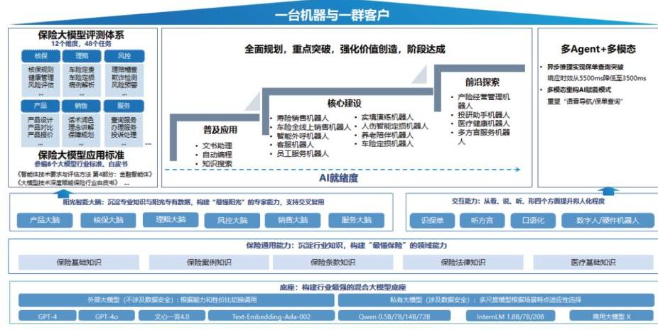

## Page 56
# 3.2.1.1 多层次大模型构建 

## (1) 第一层: 底座层

构建行业最强的混合大模型底座，既包括公有云大模型，也包括私有化大模型。
对于不涉及数据安全的场景，通过对多家商用大模型进行评测，优选市场上综合效果表现出色的大模型，直接实现云服务接入。同时搭建智能路由体系，支持根据能力和性价比自由切换调用。对于有数据安全的应用场景，采用采购商业大模型或基于开源大模型自研两种方式，需综合平衡应用场景特点、大模型的智能性、成本、实现时间，并行从两种方案进行择优选择。

## (2) 第二层:保险通用能力层

沉淀通用保险知识，构建"最懂保险"的领域能力。通用保险知识包括：涵盖保险学科、保险实务、保险市场、保险合规以及泛保险知识。阳光建立首个全面的保险领域知识体系，积累高质量问答对，使用训练和检索增强生成技术，全方位提升大模型保险通用能力。

## (3) 第三层: 阳光智能大脑层

通过各个机器人产品的研发沉淀专业知识与阳光专有数据，构建"最懂阳光"的专家能力，支持交叉复用。智能大脑能力包括：会讲产品，懂核保，懂理赔，懂风控，会销售产品，能服务客户。随着各机器人项目的推进，目前已经初步建设了产品大脑、服务大脑、销售大脑、理赔大脑，后续一方面在各业务领域继续建设核保大脑、风控大脑，另一方面要持续提升各大脑的智能化程度。

## (4) 第四层: 交互能力层

从看、说、听、形四个方面提升机器人产品的拟人化程度。具体包括：可以识别同业保单、能够听懂方言、说话自然、友好的数字人和硬件机器人形象等。

## Page 57
# 3.2.1.2 多尺寸大模型构建 

不同尺寸的大模型具有不同的性能及成本。相对来说，千亿级模型具备卓越性能，但成本及数据需求高；百亿级模型则在保持较高性能的同时，成本更为可控；而更小尺寸的模型则适用于特定任务，部署灵活且成本最低。因此，在具体应用选型时，保险公司应根据自身实际情况，评估业务需求复杂度、可获取的数据量、现有计算资源及成本效益，权衡利弊，选择最适合自身需求的大模型尺寸。

为满足内部多样化场景的需求，阳光正言GPT的建设采用了多尺寸大模型构建的思路。
（1）千亿级大模型建设采用采购商业大模型和基于开源大模型自研两种方案，根据具体业务场景择优选择。考虑到千亿级大模型训练需要的算力和数据巨大，主要研发推理加速技术，以提高模型响应速度、并发并降低硬件成本。利用提示词、检索增强生成和智能体等技术充分激活千亿级大模型的理解、推理和规划等高级能力，赋能办公文秘、应用开发、车险全线上销售机器人异议处理对话、寿险销售机器人客户引导、内容生成机器人文案改写等场景。
（2）百亿级大模型建设采用基于开源大模型自研方案，针对不同业务场景的专业性、时效性和低成本需求，基于自研大模型选取合适的模型尺寸（1.8B、7B、14B、32B），结合保险行业数据和业务场景数据进行二次训练或模型微调，研发大模型保险专业领域能力，聚焦车险全线上销售机器人意图识别、客服机器人信息抽取和工单小结、人伤理赔机器人智能定损、产险智能外呼机器人通用对话和意图识别等场景，以最具性价比的方案满足应用需求。深度优化模型结构，完善推理技术，实现多模型协同融合调度，提高模型效果、降低响应时效，使客户体验提升的同时降低模型硬件成本。

## Page 58
# 3.2.2 保险垂直领域大模型评测体系 

### 3.2.2.1 保险行业垂直领域大模型评测体系介绍

随着大模型技术的不断演进，其在金融领域的应用也在迅速扩展。如何有效地对大模型能力进行评测格外重要。目前，已形成了从大模型通用能力评估到金融行业垂直能力评估的两层体系，但是在保险领域缺少一套衡量保险大模型应用能力的统一标准。

对于大模型通用能力的评估，业内普遍使用C-Eval、CMMLU、GSM8K、HumanEval、 WMT22等评测集，它们在自然语言理解与生成、数学运算解题、代码生成等方面对模型进行全方位评测。

## 大模型的通用评测体系通常包括以下几个方面：

（1）准确性：模型对于给定输入的预测或分类的准确度。
（2）泛化能力：模型在未见过的数据上的预测能力。
（3）鲁棒性：模型对于输入数据的微小变化或异常值的抵抗能力。
（4）解释性：模型的决策过程是否能够被用户理解。
（5）效率：模型的运算速度和资源消耗。
（6）可扩展性：模型是否容易适应新的数据或任务。
以上指标为评估大模型提供了一个全面的框架，但它们不足以覆盖特定行业的需求。金融行业作为一个高度专业化和数据密集型的领域，对大模型的评测体系有着独特的需求。目前，已有PIXIU、FinEval、FinanceIQ等中文金融评测集开源，可作为大模型在金融领域能力的评测标准参考。

金融行业的评测体系在通用评测体系的基础上，增加了对以下方面的考量。金融行业对模型的准确性和合规性有着极高的要求，这在通用评测体系中没有得到足够的重视：
（1）合规性：模型是否符合金融行业的法规和标准。
（2）风险管理：模型在评估金融风险时的准确性和可靠性。

## Page 59
(3) 数据隐私：模型处理敏感金融数据时的安全性。
(4) 实时性:模型对市场变化的响应速度。
(5) 用户信任:用户对模型预测的信任度。

尽管通用和金融行业特定的评测体系为大模型的评估提供了基础，但直接应用于保险行业时仍存在一些不足：
（1）特定风险评估：保险行业需要模型能够准确评估特定风险，如生命风险、财产风险等，这通常需要行业特定的数据和知识。
（2）个性化服务：保险产品高度个性化，模型需要能够根据客户的具体情况提供定制化的服务和建议。
（3）法规和政策适应性：保险行业受到严格的法规和政策约束，模型需要能够快速适应政策变化。
（4）客户互动：保险行业强调与客户的互动，模型需要能够提供高质量的客户服务和支持。
（5）数据的多样性和质量：保险行业涉及的数据类型多样，包括医疗记录、财产评估等，模型需要能够处理和整合这些不同类型的数据。

可见，针对保险领域的特有属性，开发一套包括通用能力、专业知识、场景应用、模型安全、行业智能体驱动等在内的综合性测评体系标准，并确保标准的科学性、实用性和前瞻性，显得尤为重要。

# 保险领域大模型评估体系包括如下三方面的内容。 

（1）通用能力：保险领域中，模型的通用能力包括语言理解、数学建模、逻辑推理等，通过结合现有的评估基准，如C-Eval和CMMLU，来衡量模型在这些通用能力方面的表现。
（2）专业知识：专业知识是保险领域大模型评估的核心部分，基于阳光设计构建的保险知识体系，通过构建全面覆盖保险知识体系的测试试题，对模型的专业知识储备与知识应用能力进行度量。

## Page 60
(3) 场景应用:场景应用能力的评估是检验模型是否能够满足具体保险业务需求的重要环节。这一部分需要根据不同的保险业务场景，设计相应的应用测试。如营销、核保、合规等，场景可以不断扩充与定制化设计。

# 3.2.2.2 阳光保险行业大模型测评体系 

## (1) S-Eval简介

S-Eval是阳光保险为保险行业大模型量身定制的综合性测评基准，该测评基准致力于全面评估大模型在保险领域的通用能力及专业能力。S-Eval的作用主要体现在以下两个方面：首先，它可以被用来测评外部的商业大模型，为保险公司在选择外部厂商的大模型时提供公平、公正和公开的统一标准；其次，作为阳光保险集团内部使用的评测集， S-Eval也可以用于测评保险集团内部的自研大模型，加速提升大模型底座能力。

## S-Eval具有以下三大特征:

(1) 公平公正

S-Eval注重保持中立和客观的测评理念，评测过程完全自动化，避免了人为评估带来的不确定性，确保了评测结果的准确性和公正性。
(2) 契合保险行业大模型实际应用需求

通过构建多维度、多视角和多层次的评测体系，S-Eval真实模拟了保险行业中大模型的应用场景，全面考察了大模型的保险专业能力。此外，S-Eval还构建了多轮对话场景，更深入地评估了大模型在真实多轮对话中的表现，全面考察了上下文理解、记忆和对话能力。

## (3) 实用性

S-Eval注重为项目应用提供服务，评测集的选择、设计和推出都以服务各业务场景应用为目标，旨在真实反映保险行业大模型的差距，并考察大模型技术在保险领域的落地效果。S-Eval还充分考虑了保险行业的特点，通过保险任职资格考试、保险专项问答等方式进行评估，全面考察了模型在保险具体应用场景中的能力。

## Page 61
# (2) S-Eval评测体系 

S-Eval构建两个行业评测基准，分别从保险通用能力和保险专业能力两个不同维度对大模型进行评测。保险通用能力评测旨在帮助大模型底座团队选择性能最优的保险垂域大模型，保险专业能力旨在帮助应用项目团队选择性能最优的保险专家大模型。

图5 S-Eval评测体系架构图
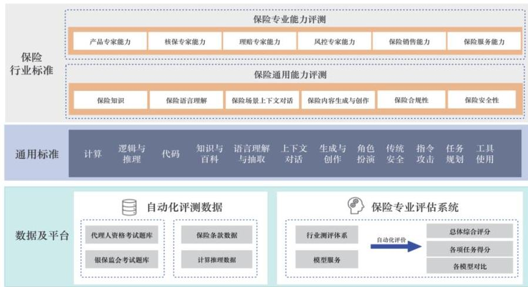

## Page 62
# (3) 评测方法 

S-Eval题库中包含 10 万条数据，其中 7 万条是保险客观选择题， 3 万条是保险相关简答题。经过抽样得到了529条原始评测集，经过人工质量审核，选取了448道高质量题目作为评测集。其中，包含 188 道简答题和 260 道客观选择题。评测样例在附录中展示，S-Eval总分 $=0.8 \times$ 简答题得分 $+0.2 \times$ 客观选择题得分，多轮简答题更能反映模型真实能力，故权重设置提高。具体评测方法如下图所示。

图6 S-Eval评测方法示意图
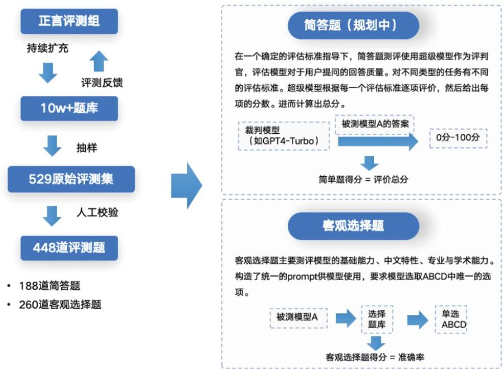

## Page 63
# (4) 评测层级 

S-Eval构建不同视角、不同范围的多层次评测基准，形成相对完善的评价大模型保险能力的测评框架，对保险公司大模型研发团队及应用项目团队，为优化模型和场景应用提供了相对全面的视角。

S-Eval 保险多层次基准

图7 S-Eval评测层级
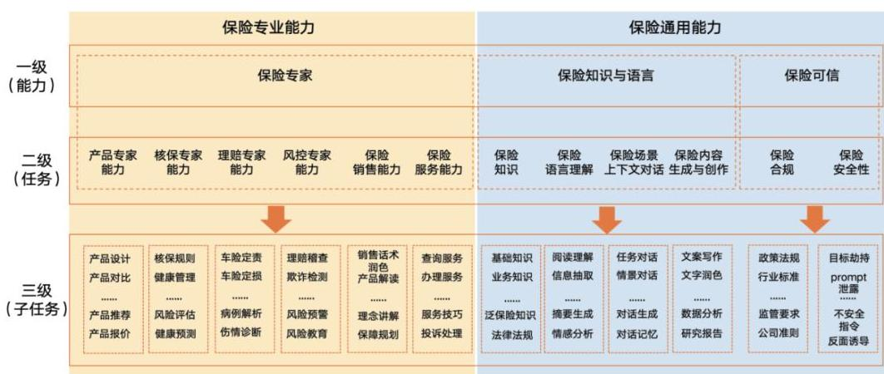

## Page 64
大模型技术深度赋能保险行业白皮书 (2024)

## Page 65
# 4. 大模型安全风险与治理篇 

大模型在保险行业等多个领域内已展现出超越传统方法的能力水平，为理赔定损、客户服务、销售支持等方面带来了革命性的改变。然而，纵观技术发展史，每一次新技术的革命性飞跃都伴随着社会的深刻变革与潜在的不确定性。随着大模型在保险行业应用的日益广泛，其安全性、可靠性及可控性方面的问题正日益凸显，成为保险行业不可忽视的重大挑战。

保险行业作为金融领域的重要组成部分，涉及大量敏感的客户信息和巨额的资金流动，对安全性和可靠性有着极高的要求。大模型在保险行业的应用，如智能核保、智能理赔等，虽然提高了业务处理效率和客户体验，但同时也带来了数据泄露、模型误判等潜在风险。因此，在保险行业进行大模型安全治理显得尤为重要。

为应对这一挑战，国家层面已出台了一系列相关政策，如《生成式人工智能服务管理暂行办法》与《科技伦理审查办法（试行）》等，明确提出了发展与安全并重的基本原则，并强调了科技伦理风险防控的重要性。这些政策从技术发展与治理、服务规范、监督检查及法律责任等多个维度，对大模型的安全发展提出了全面而具体的要求，为保险行业的大模型安全治理提供了政策指导。

在此背景下，全国网络安全标准化技术委员会遵循习近平总书记"坚持以人为本、智能向善"的核心理念与宗旨，积极响应并深入贯彻落实《全球人工智能治理倡议》，制定了《人工智能安全治理框架》（以下简称"《框架》"）。该《框架》于2024年全国网络安全宣传周期间正式发布，不仅标志着我国在人工智能安全治理领域取得了具有里程碑意义的进展，更为包括保险行业在内的社会各界提供了科学、系统的指导蓝本与实践参考。

本章将以《框架》为蓝本，阐述大模型在保险行业应用面临的安全风险及相应的治理措施，旨在通过加强大模型安全治理，确保保险行业数字化转型的持续健康发展。

## Page 66
图8 大模型安全风险与治理措施总览
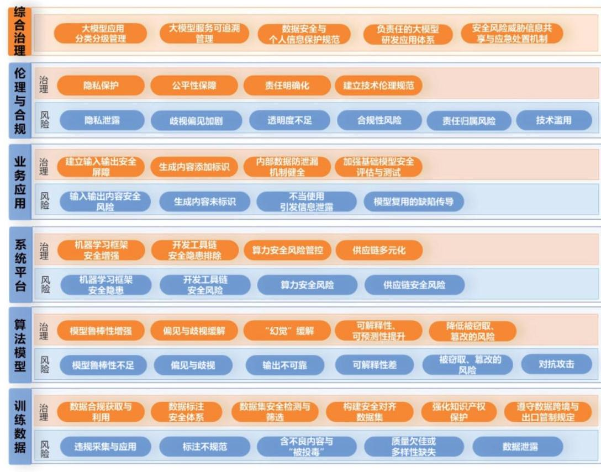

## Page 67
# 4.1 综合治理措施 

(1) 实施大模型应用分类分级管理策略。根据功能、性能以及具体应用场景，对其进行细致分类与分级管理。同时，建立一套完善的风险等级测试评估体系，确保AI技术的安全可控。在加强大模型最终用途管理方面，针对特定客户群体及业务场景，明确提出技术的使用要求与限制，防止技术滥用带来的潜在风险。对于算力大、推理能力强或专门应用于特定领域的AI系统，实行严格的登记备案制度，并要求其在设计、研发、测试、部署、使用及维护等全生命周期内，均具备高度的安全防护能力，以保障客户数据安全与业务稳定运行。
（2）构建大模型服务可追溯管理体系。针对面向C端提供服务的保险行业AI系统，应引入数字证书技术进行统一标识与管理。同时，制定并发布适用于保险领域的AIGC标识标准规范，明确显式与隐式标识的具体要求，确保从内容制作源头到传播路径、分发渠道等关键环节均得到有效监控与追溯，便于用户准确识别信息来源并判断其真实性，增强客户信任度。
（3）完善数据安全与个人信息保护规范。鉴于保险业务涉及大量敏感数据与个人信息，需针对大模型技术及应用特点，制定详细的数据安全与个人信息保护规范。明确在模型训练、数据标注、模型使用等各个环节中，对于数据安全与个人信息保护的具体要求与措施，确保客户数据的安全性与隐私性。
（4）构建负责任的大模型研发应用体系。在保险行业AI研发与应用过程中，应深入研究并践行"以人为本、智能向善"的理念，制定具体操作指南与最佳实践，推动AI设计、研发及应用的价值观与伦理观与保险行业法规相契合。同时，积极探索适应AI时代的版权保护与开发利用制度，持续推进高质量基础语料库与数据集建设，为保险行业大模型的安全发展提供有力支撑。此外，还需制定并完善大模型伦理审查准则、规范与指南，建立健全伦理审查制度，确保大模型技术的合规应用。
（5）建立AI安全风险威胁信息共享与应急处置机制。针对保险行业大模型技术在软硬件产品、服务等方面可能存在的安全漏洞、缺陷、风险威胁及安全事件等动向，应持续进行

## Page 68
跟踪分析与监测。协调相关研发者、服务提供者建立风险威胁信息通报与共享机制，及时共享安全风险信息。同时，构建完善的人工智能安全事件应急处置机制，制定详细的应急预案并定期开展应急演练活动。通过快速响应与有效处置各类AI安全威胁与事件，确保保险行业人工智能技术的安全稳定运行。

# 4.2 训练数据 

### 4.2.1 安全风险

（1）训练数据的违规采集与应用。在大模型训练数据的获取及服务交互过程中，存在未经客户同意而收集、不当使用数据和个人信息的风险，这可能导致客户隐私泄露和数据安全问题。
（2）训练数据标注不规范。在数据标注环节，标注规则的不完善、标注人员专业技能的不足以及标注错误等问题，不仅会降低模型算法的精确度、可靠性和有效性，还可能放大偏见与歧视，导致模型泛化能力不足或输出错误结果，进而影响保险业务决策的准确性和公平性。
（3）训练数据含不良内容与"被投毒"威胁。训练数据中若混入虚假信息、偏见性内容、侵犯知识产权等违法违规或有害信息，或是数据来源缺乏广泛的代表性，将直接导致模型输出违法、不良或极端化的信息。此外，训练数据还面临被攻击者恶意篡改、注入错误或误导性信息的"投毒"风险，这会"污染"模型的概率分布，进而削弱其准确性和可信度。
（4）训练数据质量欠佳或多样性缺失。训练数据集中如果存在错误数据或噪声数据，将直接影响模型训练成效。同时，若数据来源、特征和分布过于单一，未能充分覆盖保险业务中的多样应用场景，将限制模型对于复杂场景的理解和应对能力，影响应用效果。
（5）数据泄露。在大模型研发与应用过程中，由于数据处理不当、非授权访问尝试、恶意网络攻击或诱导性用户交互等因素，可能导致数据和个人信息泄露，这不仅威胁到客户的隐私安全，也可能对保险公司的信誉和业务连续性造成重大损害。

## Page 69
# 4.2.2 治理措施 

(1) 数据合规获取与利用。在训练数据的收集、存储、使用、加工、传输、提供及删除等全生命周期内，务必遵循数据收集使用和个人信息处理的严格安全规范，确保用户控制权、知情权、选择权等法定权益得到充分落实，与保险行业对数据安全和隐私保护的高标准要求相契合。
（2）构建数据标注安全体系。构建完善的保险数据标注安全体系，需明确标注任务目标、规则及要求；对标注团队实施有效管理和专业培训；保障标注环境的安全性，实施严格的权限管理，记录数据访问和操作行为；实施质量审查机制，及时发现并纠正标注错误，通过复核确保标注质量达到行业高标准。
（3）数据集安全检测与筛选。对训练数据集进行全面安全检测，包括违法不良信息筛查、数据多样性评估、数据投毒污染检测以及隐私保护检测，确保数据集中不含高危敏感信息，符合数据安全和个人信息保护的法律规范，同时保障数据的丰富性和多样性。
（4）构建安全对齐数据集。为降低大模型在保险应用中产生不真实、偏见、不道德等风险，需构建安全对齐数据集，该数据集包含丰富的有监督正样本和恶意样本，旨在确保模型输出符合保险行业的法规、道德准则及人类价值观。
（5）强化知识产权保护。在训练数据选取环节，加强知识产权保护意识，采取有效措施防止侵犯知识产权的行为。
（6）遵守数据跨境与出口管制规定。在向境外提供大模型服务时，应严格遵守数据跨境流动的相关规定，确保数据出境的合法性和安全性。同时，向境外提供大模型算法时，需符合出口管制要求，确保技术输出的合规性。

## Page 70
# 4.3 算法模型 

### 4.3.1 安全风险

(1) 模型鲁棒性不足。由于深度神经网络具有非线性和大规模的特点，大模型容易受到复杂多变的运行环境或恶意干扰的影响，可能导致性能下降、决策错误等问题。这在保险行业中尤为严重，因为错误的决策可能对客户或公司造成严重的财务损失或声誉损失。
（2）偏见与歧视。在模型训练过程中，可能有意或无意地引入个人偏见，或者由于训练数据集质量问题，导致模型输出存在偏见或歧视。这在保险行业中可能导致不公平的风险评估和理赔决策，甚至可能出现基于民族、宗教、国别、地域等的歧视性内容。
（3）输出不可靠风险。大模型可能产生"幻觉"，即生成看似合理但实际不符常理的内容，造成知识偏见与误导。在保险行业中，这种不可靠的输出可能导致错误的承保结论、理赔决策和风险评估。
（4）可解释性差的风险。大模型内部运行逻辑复杂，推理过程属于黑灰盒模式，可能导致输出结果难以预测和确切归因。这在保险行业中可能导致难以解释的承保结论、理赔决策和风险评估结果，增加客户的不满和投诉风险。
（5）被窃取、篡改的风险。大模型的核心信息如参数、结构和功能面临被逆向攻击窃取、修改甚至嵌入后门的风险，这可能导致知识产权被侵犯、推理过程不可信、决策输出错误甚至运行故障。在保险行业中，这种风险可能导致敏感信息的泄露和系统的安全漏洞。
（6）对抗攻击威胁。攻击者可能构造出高度隐蔽的对抗样本数据，通过巧妙设计误导、影响乃至完全操控大模型，使其在保险决策中产生错误输出，严重时甚至导致系统瘫痪，给保险业务带来不可估量的损失。

## Page 71
# 4.3.2 治理措施 

(1) 模型鲁棒性增强。这主要依赖于采用更加多样化的数据集、实施模型集成以及对抗训练等策略。使用多样性和代表性的数据集进行模型训练，确保覆盖各种保险场景和数据分布，从而有效增强模型的适应能力。模型集成技术则通过融合多个模型的预测结果，减少单一模型的偏差与不确定性，输出更加稳健精准的预测，提升整体鲁棒性。对抗训练则是通过引入那些经过细微调整即可导致模型误判的对抗性样本，将这些样本纳入训练数据范畴，使得模型学习到更为鲁棒的特征表达，提高其对抗样本的辨识能力。综合运用这些策略，大模型在保险业务应用中的鲁棒性将得到显著提升。
（2）偏见与歧视缓解。通过优化训练过程与模型结构加以缓解。这包括构建偏见性样本进行针对性对抗训练、调整损失函数以强化公平性考量、选择性冻结模型部分参数以减少偏见传播，以及直接移除与偏见歧视相关的神经网络节点等。在模型上线后，建立用户反馈机制，积极收集并响应关于偏见和不公平性的反馈，通过迭代优化逐步消除偏见与歧视问题，确保保险服务的公正性。
（3）"幻觉"缓解。检索增强生成（RAG）技术结合外部知识源，确保模型输出基于可靠信息；有监督微调（SFT）技术通过特定数据集提升模型对保险领域的理解和生成能力；思维链技术（CoT）通过展示详细推理过程的样例，增强模型输出的逻辑性和可信度；价值对齐技术，特别是基于人类反馈的强化学习（RLHF），确保模型决策与人类价值观和保险行业规范保持一致，同时探索基于人工智能反馈的强化学习（RLAIF），以进一步提升模型的道德和合规性。
（4）可解释性、可预测性提升。首先对模型内部机制、推理逻辑、技术接口及输出结果进行全面说明，确保透明化。此外，采用局部解释技术如LIME和SHAP，通过构建简单模型近似复杂模型在特定预测点的行为，揭示关键特征对预测结果的影响。还可以通过可视化技术，如激活映射，则直接展示模型在图像分类任务中关注的图像区域，帮助用户理解模型决策依据。这些措施共同提升了保险模型的可理解性和可预测性。

## Page 72
(5) 降低被窃取、篡改的风险。在大模型的设计、研发、部署及维护全周期中，严格实施安全开发规范，旨在从根本上降低模型被窃取或篡改的风险。通过多层次的安全措施，确保大模型的完整性和保密性，维护保险服务的稳定性和安全性。

# 4.4 系统平台 

### 4.4.1 安全风险

(1) 机器学习框架安全隐患。广泛应用的机器学习框架（例如 PyTorch、TensorFlow、 Caffe等）可能存在潜在的漏洞。这些漏洞若被攻击者利用，可能会导致保险系统遭受损害，敏感的客户数据泄露，甚至引发服务中断，严重影响保险业务的连续性和客户信任。
（2）开发工具链安全风险。在大模型应用系统的开发过程中，所使用的算法模型设计、训练和验证的标准接口、插件等开发工具链，以及开发界面和执行平台，均可能潜藏逻辑缺陷或漏洞。此外，这些工具链还可能被恶意植入后门，一旦这些脆弱点被触发，就可能成为攻击者利用的途径，对保险系统的安全性构成威胁。
（3）算力安全风险。大模型的训练和运行高度依赖算力基础设施，这些设施可能由不同类型的计算资源构成，面临着算力资源被恶意消耗的风险，以及算力层面风险跨边界传递的威胁，这些都可能对保险业务的稳定性和效率造成不良影响。
（4）供应链安全风险。保险科技产业链呈现出高度全球化的分工协作格局。然而，个别国家利用技术垄断和出口管制等单边强制措施，试图构建发展壁垒，恶意阻断全球AI供应链。这种行为给保险行业带来了显著的芯片、软件、工具等关键资源的断供风险，对保险科技的持续发展和创新构成了严峻挑战。

### 4.4.2 治理措施

（1）机器学习框架安全增强。这包括定期关注并更新机器学习框架至最新版本，以确保所有已知的安全漏洞得到及时修复。同时，对机器学习框架进行定期的安全审计，以发

## Page 73
现并修补潜在的安全隐患。在部署机器学习框架时，应遵循安全配置和最佳实践，例如启用数据加密、严格限制访问权限等。用数据加密、严格限制访问权限等。
（2）开发工具链安全隐患排除。需要严格控制暴露面，确保开发工具链中的任何工具都不直接暴露到公网，并周期性检查企业的暴露面情况。同时，要密切关注大模型系统所使用组件的更新和维护情况，及时获取并应用最新的安全补丁和更新。对于异地办公、多地协作等场景，建议采用零信任原则进行接入认证，以有效管控接入风险。此外，定期对开发工具链中的工具进行漏洞扫描，确保不存在已知的历史漏洞，并制定完善的应急响应措施，一旦供应链厂商发生安全事件，能够立即响应并妥善处理。
（3）算力安全风险管控。需要建立合理的算力资源分配机制，避免算力资源被恶意消耗或滥用。同时，对不同用户的算力资源进行严格的隔离和监控，及时发现并处理任何异常的算力消耗行为。此外，定期备份算力基础设施的数据和配置信息，以便在发生安全事件时能够迅速恢复系统，确保保险业务的连续性和稳定性。
（4）供应链多元化。针对大模型系统所采用的芯片、软件、工具、算力和数据资源等，应建立多元化的供应链体系，以降低对单一供应商或技术的过度依赖。与供应链伙伴建立长期稳定的合作关系，并加强对供应商的监督和管理，确保其产品和服务的安全性与稳定性。同时，对供应链中的各个环节进行全面的风险评估，识别并应对潜在的安全隐患。

# 4.5 业务应用 

### 4.5.1 安全风险

（1）输入输出内容安全风险。若大模型所生成或合成的内容未经严格审核，可能引发虚假信息传播、歧视偏见、隐私泄露等一系列安全问题，这些问题不仅威胁到公民的生命财产安全，还可能对国家安全、意识形态安全和伦理道德构成挑战。尤为值得警惕的是，若用户输入的提示词包含不良内容，在模型安全防护机制不健全的情况下，大模型可能会输出违法有害的信息，进一步加剧这些风险。

## Page 74
(2) 生成内容未标识的风险。大模型输出内容若未经明确标识，将给用户带来识别上的困扰。用户难以判断交互对象及生成内容的来源是否为AI系统，进而难以鉴别内容的真实性，这将直接影响用户的判断，可能导致误解或误判。此外，大模型生成的高仿真图片、音频、视频等内容，可能轻易绕过现有的人脸识别、语音识别等身份认证机制，导致认证鉴权失效，给相关业务的安全性带来严重威胁。
（3）不当使用引发信息泄露风险。在保险企业的日常业务工作中，若工作人员不规范、不当地使用大模型服务，将内部业务数据、隐私信息等敏感数据输入大模型，可能导致商业秘密和敏感业务数据泄露。这种信息泄露不仅损害了企业的利益，还可能对客户的隐私安全构成威胁，进而影响保险行业的整体信誉和客户的信任度。
（4）模型复用的缺陷传导风险。依托基础模型进行二次开发或微调是常见的大模型应用模式。然而，如果基础模型本身存在安全缺陷，这些缺陷将在模型复用的过程中被传导至下游模型。这不仅会影响下游模型的性能和安全性，还可能给整个保险科技生态系统带来连锁反应和潜在风险。

# 4.5.2 治理措施 

（1）建立输入输出安全屏障。为确保大模型的输入输出信息的安全性，需构建一套全面的安全屏障。这包括进行输入输出风险检测，通过人工维护的敏感词库和构建分类模型，精准识别用户请求及大模型生成内容中是否存在违法或不良信息，从而在源头上制止或即时阻断不良信息的生成。针对敏感而又难以避免的话题，采取安全回复策略，通过人工配置的安全答案，或利用专有数据微调训练的安全回复大模型，为这些敏感问题提供恰当且安全的回应。此外，当检测到输出内容存在安全风险时，除了中断会话，还提供内容改写建议，以确保在保障安全的同时，提升用户的服务体验。
（2）生成内容添加标识。为明确区分大模型生成的内容，可采用两种主要标识方式：显式水印和隐式水印。显式水印，如文字、Logo或背景音等，易于人类直接感知，通常被巧妙

## Page 75
地添加到生成内容的边缘位置，如图像的角落，确保既醒目又不影响内容的正常使用。而隐式水印则通过技术手段嵌入，人类无法直接察觉，但可通过特定方法提取。这种水印技术，如变换域水印、模板水印、直方图水印等，具有难以感知、安全性较高、鲁棒性较好等优势，适用于图像、视频等生成内容的标识。
（3）内部数据防泄漏机制健全。建立一套全面的数据管理政策，明确界定哪些数据可以输入大模型、哪些则不可，政策涵盖数据的收集、存储、处理、传输和销毁等全生命周期。定期对员工进行数据安全与隐私保护的培训，提升他们对数据泄露风险的警觉性，并培训他们如何在日常工作中正确使用人工智能服务。通过实施访问控制和权限管理，严格限制对敏感数据的访问，确保只有经过授权的员工才能接触特定数据集。在数据输入大模型前，进行脱敏或匿名化处理，进一步降低泄露风险。同时，建立监控系统，实时追踪数据使用情况，并定期审计，确保数据管理政策的严格执行。
（4）加强基础模型安全评估与测试。对基础模型进行全面的安全测试，包括对抗性攻击测试和隐私泄露测试等，确保模型在安全性方面没有重要缺陷。建立持续的安全监控机制，对基础模型进行定期的安全评估和测试，及时发现并修复潜在的安全漏洞。遵循行业内的安全框架和标准，如安全测评基准SafetyBench等，确保基础模型在安全性方面符合行业要求。此外，在进行二次开发或微调时，对输入的数据、代码和算法进行严格的安全审查，确保不引入新的安全缺陷。

# 4.6 伦理与合规 

### 4.6.1 安全风险

（1）隐私泄露风险。在保险行业中，大模型技术常用于处理客户的个人信息，如健康状况、财务状况等。如果数据保护措施不当，可能导致客户隐私泄露，违反相关数据保护法规。
（2）视偏见加剧的风险。利用大模型收集分析人类行为、社会地位、经济状态、个体性

## Page 76
格等, 对不同人群进行标识分类、区别对待, 可能导致不公平的决策结果, 带来系统性、结构性的社会歧视与偏见。
（3）透明度不足风险。大模型的复杂性可能导致决策过程不透明，客户难以理解保费计算或理赔决策的依据。这可能影响客户信任度，并引发投诉和纠纷。
（4）合规性风险。大模型的应用可能涉及多个法律法规领域，如《保险法》、《消费者权益保护法》等。如果处理不当，可能违反相关法规，导致法律诉讼和罚款。
（5）责任归属风险。当大模型做出错误决策时，确定责任方可能变得复杂。例如，在自动核保过程中，如果模型拒绝了一个本应被接受的保单，责任应由谁承担？这可能引发内部纠纷和外部诉讼。
（6）技术滥用风险。大模型技术可能输出不精准的内容，如欺诈检测中的错误标记合法交易为欺诈。这可能损害保险公司的声誉和客户关系。

# 4.6.2 治理措施 

（1）隐私保护措施。包括：对存储和传输的客户数据进行加密，确保即使数据被非法访问也无法轻易读取。实施严格的访问权限管理，确保只有授权人员能够访问敏感数据。在不影响分析结果的前提下，对敏感信息进行脱敏处理，降低隐私泄露风险。定期进行安全审计和风险评估，及时发现并修复潜在的安全漏洞。
（2）公平性保障措施。确保训练数据集具有广泛的代表性，避免单一群体的数据过度影响模型结果；引入公平性指标来检测和纠正模型中的偏见，确保决策的公正性；提供模型解释性工具，帮助客户理解模型的决策逻辑；建立合规性审查流程，确保大模型的开发和应用符合所有适用的法律法规要求。
（3）责任明确化。建立明确责任归属机制，规定在不同情况下的责任划分，确保在出现问题时能够迅速确定责任方。建立有效的纠错和赔偿机制，以应对可能出现的错误决策。
（4）建立技术伦理规范。制定严格的使用准则和道德标准，禁止将大模型技术用于任何不道德或非法的活动。加强员工培训，提高他们对技术滥用风险的认识。

## Page 77
# 5. 场景应用与效果篇 

自2022年11月ChatGPT横空出世以来，保险行业迅速认识到其潜在的巨大价值，并开始在全业务链条上广泛部署应用这一技术。从市场营销、承保核保、理赔定损到客户服务，几乎每一个业务环节都在探索大模型技术的应用可能性。为深入剖析大模型技术在保险行业的最新应用成效，总结并分享宝贵的实践经验，本章旨在全面呈现国内外保险公司在这一领域的积极探索与落地成果。

基于广泛而细致的案例征集与深入调研，我们精选了来自21家国内外知名保险公司的共计 55 个典型案例进行深入剖析。下图是对这些典型案例的概览。图中上半区域梳理了保险行业中各关键环节以及跨领域通用应用的大模型技术案例，旨在展现大模型的多元应用场景；而下半区域则清晰展示了这些案例与具体保险企业之间的对应关系，便于读者快速定位并深入了解每一家企业在推动大模型技术应用方面的独特贡献与创新实践。

## Page 78
图9 应用案例全景图
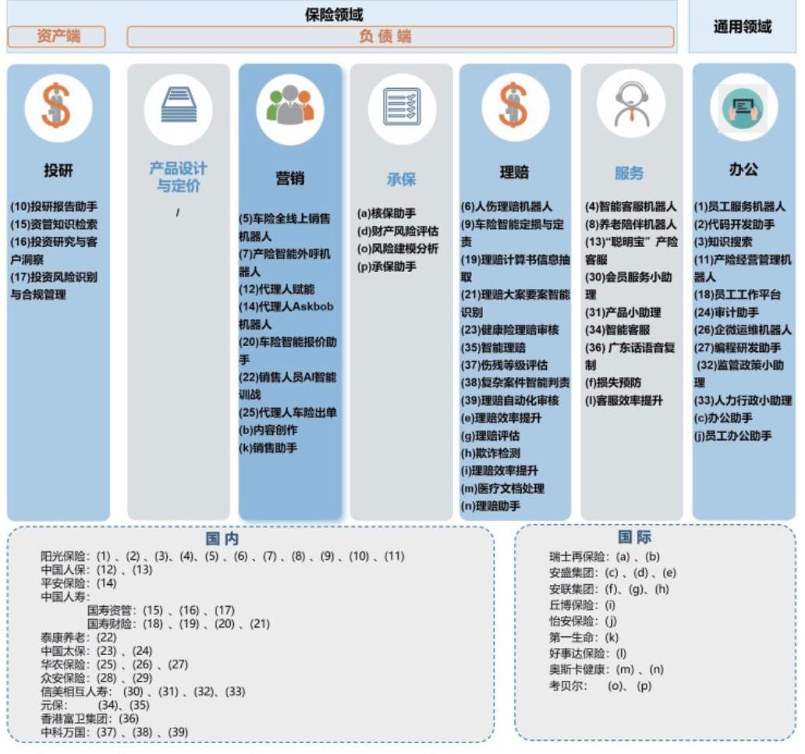

## Page 79
# 5.1 大模型优秀应用案例 - 国内篇 

### 5.1.1 阳光保险

阳光保险集团于2023年4月启动了"阳光正言GPT大模型战略工程"，积极布局大模型建设，全面规划，重点突破，强化价值创造。提出"AI就绪度"概念，从普及全员办公智能化，到客户服务、产险理赔、线上销售、内容营销等重点应用场景智能化，再到"AI+"模式下的探索和布局，全面规划，阶段性地推进场景建设。

### 5.1.1.1 普及全员办公智能化

在普及应用方面，阳光正言GPT将赋能重点落在了企业的办公领域，提高了企业的工作效率，降低了成本，为企业带来更多的潜在商业价值。

## (1) 员工服务机器人

已在企微、OA、EHR多入口上线，具有阳光人设，支持基于阳光基础知识、阳光文化进行回答；在处理客户需求、数据分析和报告撰写等方面工作效率提高 $40 \%$ 。

## (2) 代码开发助手"常青藤"

自动编程可辅助研发人员自动生成代码，提高研发效率和质量，目标成为研发人员必备的编程工具，产品能力覆盖大部分研发场景，并逐步将产品打造为在部分关键场景能完全自主的AI软件工程师。研发的辅助编程"常青藤"工具已覆盖全部研发岗位，涵盖通用编码、注释、测试多场景，具体包括生成代码片段、解释历史代码、生成注释、生成单元测试、查找bug、安全检测、性能优化、生成标准后台模块等内容。目前已形成"工具+智能体+可跨模型"的先进产品体系，正在科技条线全面推广，保险业务代码采纳率 $20 \%$ 。

## (3) 知识搜索

知识搜索是基于GPT技术的AI智能知识助手，能够基于本地和GPT通用知识库解答各类业务垂直领域咨询问题。主要应用场景如下：

## Page 80
寿险知识问答助手：全能宝APP在线客服场景，实现产品条款、投保规则、理赔规则、保全规则4类问答，问答正确率达 $70 \%$ 左右，形成了保险产品知识体系雏形，弥补了传统问答方式无法有效覆盖各种问题的不足。

人事咨询服务助手：完成初步产品构建，可为员工提供考勤休假、社保公积金、薪酬福利、医疗报销等相关问题的咨询服务。

知识管理智能检索：结合大模型技术，检索结果以生成式方式呈现，涵盖阳光文化和行政办公条线内容。

知识管理光速搜：集成OA、知识仓库、阳光百科、阳光爱问、学堂、档案等系统模块搜索，极大方便了内部员工获取和分享知识的途径。

# 5.1.1.2 重点应用场景智能化 

在核心建设方面，阳光正言GPT深入赋能销售、服务、理赔等保险领域核心场景，在寿险和车险销售、智能客服、人伤智能定损等领域取得了阶段性成果。

## (1) 智能客服机器人

智能客服机器人旨在为客户提供个性化、有温度、高品质的服务体验。当前已覆盖车险报案、产险保单查询、寿险保单查询、寿险续期回访等重要场景。充分利用95510服务场景历史音频数据多、语音转文字技术较成熟、AI训练语料标注和问答知识库基础较好的优势，智能客服机器人项目取得明显成效。上半年，累计智能服务量538万件，智能服务率 $58.09 \%$ ，比2023年提升 14 pt ，半年累计替代 545 人月工作量，在车险报案等场景精简服务环节16个，服务操作频次减少539.5万次。在车险报案环节，逐步提升轻简案件办理智能化率；在保单查询环节，逐步提升保单信息查询智能化率；在预约定损环节，实现了电话端的预约定损服务。

## Page 81
图10 智能客服机器人技术架构图

### (2) 车险全线上销售机器人

车险全线上销售机器人借助阳光正言GPT，通过人机交互的方式为客户提供车险投保咨询、产品报价、缴费出单以及增值服务讲解等全流程、无人化自助服务，并为客户提供个性化、有温度、高品质的购买体验。今年4月机器人已在线上渠道试点应用，机器人交互任务完成率目前已提升到89%，人机协同的销售模式基本形成。

### (3) 人伤理赔机器人

阳光正言GPT在人伤理赔机器人的应用，提高了人伤案件快速结案率与理赔效率，进而减少因伤者就诊、住院治疗或索赔周期延长导致索赔预期增加带来的赔付成本上升；通过机器人准确识别人伤伤情诊断，同时遵循赔偿标准，智能化出具标准赔偿建议，减少查勘员因技能不足、伤情误判带来的赔付渗漏。阳光的智能人伤理赔可以让客户享受有温度的保险服务，赋能传统保险理赔业务，带来理赔效率的大幅提升。

机器人具备定损单证分类与外表伤情识别功能，工具上线后使用率超过80%，单证分类准确率达95.6%，降低了小额人伤案件向住院案件转化，小额人伤案件（非死非残非住院）占比较2023年提升0.71pt。上半年使用工具累计处理小额人伤案件5.6万件，定损单均相较未使用工具的小额人伤案件低12.64%。
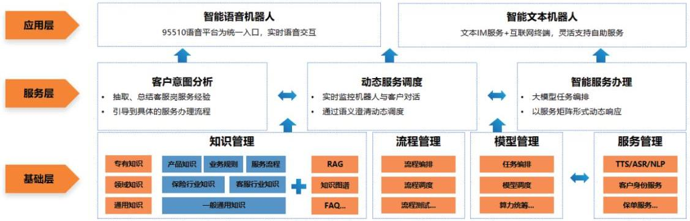

## Page 82
# (4) 产险智能外呼机器人 

产险智能外呼机器人是一款基于阳光正言GPT，通过组合不同大模型分工协作方式，实现技能水准与坐席相当的外呼机器人。训练百亿参数专用模型，做到对客顺畅交流，快速响应；利用千亿参数通用大模型编排拨打任务，持续跟进客户，最大程度挖掘和激发客户意向。系统解决了传统外呼方案需要人工设置意图和编排话术等问题，并大幅提升与客户交互能力，进而提升外呼名单的客户意向率。

### 5.1.1.3 "AI+"模式下的探索和布局

## (1) 养老陪伴机器人

养老陪伴机器人为老人提供亲情陪伴、医疗问诊、智能管家、数字遗产四大服务，核心功能如下：亲情陪伴，模拟子女形象和声音，提供全天候第二陪伴；医疗问诊，整合医疗资源，提供全天候实时音频视频问诊；智能管家，辅助康养管家进行日常照护，社区活动介绍推荐；数字遗产，结合老人生前数字信息，生成形象、语音、思维习惯类似数字人形象，减缓亲人离去带来的情感冲击。

## 养老健康生态

图11 养老陪伴机器人功能示意图
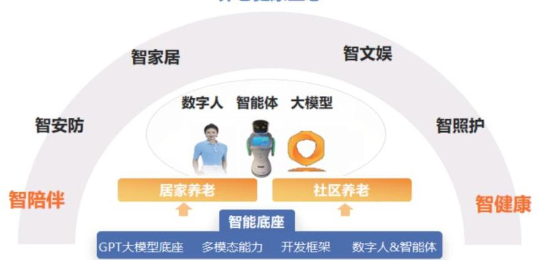

## Page 83
养老陪伴机器人以养老大模型为基础，以虚拟数字人为载体，作为老人的第二陪伴，显著提升阳光人家$\cdot$佘山社区的整体服务质量，为社区居民提供更加人性化、个性化的养老服务。体现阳光科技实力，打造阳光人家品牌形象，进一步巩固和提升其在行业内的领导地位。

# (2) 车险智能定损与定责 

借助大模型，探索建立多图像关联分析能力与风险决策模型，综合分析车辆损失影像，提升车辆外观件损失定损准确性；智能识别整案理赔单证关键信息，构建事故智能定责能力，辅助提示事故责任免除情形与理算准确性风险，提升客户体验、挤压理赔渗漏。

## (3) 投研报告助手

目前投研端面临以下问题：券商报告阅读、理解、分析耗时长且繁琐；报告质量不一，影响准确判断；金融市场快速变化，人工分析数据时效性不足；海量数据库下，人工分析深度可能不够。投研报告助手依托大模型，实现券商报告阅读、理解与分析，提升研究员研报解读与分析的效率，降低报告筛选分析难度，提高工作效率，进而提高投资决策效率，把握投资机会。

使用阳光正言GPT后，取得了以下不错的成效：单篇研报关键信息提取效率提高50\%，准确度超过 $80 \%$ ；敏锐发掘市场热点，通过快速学习每天的数据信息，对比发掘出新出现的信息趋势；提升投资决策效率：协助投研人员综合分析更全面的信息，提升决策效率；把握投资机会：实时分析路演数据信息，把握投资机会。

### 5.1.2 中国人保

人保联合科大讯飞认知智能国家重点实验室发布"数智灵犀-人保大模型"。人保大模型以深度理解保险行业的专属通用大模型为底座，面向垂直业务领域的自研场景大模型为主体，外部大模型能力为辅助，通过建立大模型安全审核机制，确保大模型生产内容合规可控，满足承保、理赔、营销、客服、软件研发、综合办公等多种应用场景需求，带来更高

## Page 84
效、更智能的业务处理能力，全面提升工作人员效率和客户体验。
对内运营方面，"人保智友"通过深度学习保险产品条款等知识，为业务人员提供保险产品知识的智能问答，提升服务质效。

对客服务方面，"聪明宝"已在财产险多个应用场景进行内测，通过提供更专业、更快速、更高效的解决方案，提升客户的满意度。

人保大模型充分利用人保海量语料、数据及行业知识的优势，通过私有化部署及近百次模型迭代优化，研发了人保首个百亿级参数的专属问答领域大模型。在通用能力基础上，人保专属问答大模型提升了多轮口语化复杂意图理解能力、情感理解与共情能力，新增了敏感问答拒识能力，并且针对保险具体应用场景，实现了条款咨询问答能力、业务逻辑推理能力、多文档多知识点融合能力的全面突破。目前人保专属问答大模型已在代理人赋能、智能客服等场景试点应用，借助大模型的语义理解、搜索增强等功能，提升知识获取效率，降低企业运营成本。

# 5.1.3 中国人寿 

### 5.1.3.1 国寿投资

## (1) 大模型技术布局

(1) 大模型方向战略布局

近年来，国寿投资公司深入贯彻落实国家数字化转型战略，不断加强新技术的研究、应用、推广和转化。对于处于萌芽期和成长期技术，采用内外联合实验室等多种方式，开展新技术研究和成果孵化；对于处于成熟期的技术，加快实现规模化应用。

2023年，随着AIGC大模型技术的火爆，国寿投资公司以业务场景的价值赋能为目标，主动拥抱大模型前沿技术，进行相关试点研究和成果孵化，自主搭建公司大模型应用中台，通过结合不同底层模型各自特点，低成本高效率的设计出匹配公司业务场景的大模型应用，并基于真实业务场景快速验证，持续寻找场景与模型之间的最佳适配组合，不断探

## Page 85
索大模型技术在公司客户服务、智能投研、辅助办公等场景中的落地。

# (2) 大模型应用中台介绍 

目前大模型技术在C端已取得了比较广泛的应用场景和成果，但是在B端的应用并非简单的"拿来即用"，而是面临着多方面的问题和挑战，例如技术侧的内容安全与可控性问题、数据安全与隐私保护问题；企业侧的算力支撑不足、科技人才缺乏问题。在这两方面都不稳定的基础上，如何理性看待大模型的能力与局限，如何避免单一模型的局限性，如何在保证数据安全的基础上进行大模型应用，如何提高大模型回答的可靠性，如何更好地平衡收益与成本，都是资管企业在实际应用中亟待解决的问题。

国寿投资公司大模型应用中台具有统一大模型接入、智能知识库分析、任务可视化编排和多渠道对接几大特点，可以保证模型端和应用端两边的灵活开放，能快速地把底层大模型通用能力传递给上层各个应用服务，方便快速试点大模型在各场景中的应用。

图12 国寿投资大模型应用中台
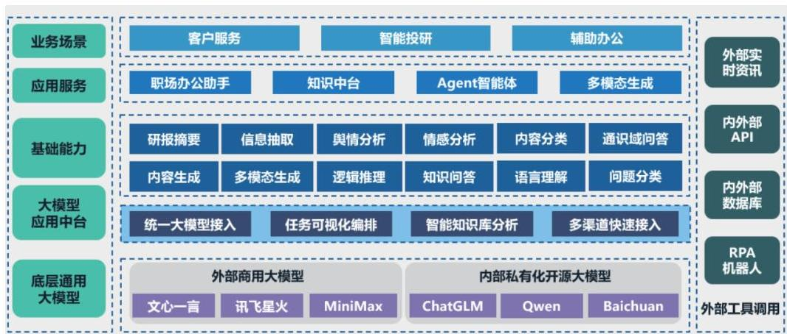

## Page 86
统一大模型接入：可以屏蔽不同底层大模型接口差异，实现各种内外部大模型的快速接入，与市场上最新技术保持一致；同时通过灵活的模型切换，可以快速匹配业务场景的数据安全要求，例如针对一些研报和资讯的分析，可以对接外部模型，而针对内部敏感数据，则可以基于私有化开源模型和专属向量知识库进行大模型技术的安全应用。

智能知识库分析：大模型结合向量数据库的方式为让其具备领域级知识理解能力提供了可能性，平台通过灵活的知识库分析框架，支持文本向量分段、大模型QA拆分、QA精准导入等多种知识录入方式；同时通过"向量+全文+重排"的方式进一步提高了答案的召回率和准确性，适应问答、阅读、生成等不同场景。

任务可视化编排：目前的企业业务需求千差万别，想让大模型完全自主地规划与完成任务是不太现实的，而通过工作流编排则可以更好地保证大模型执行的可控性；同时通过图形化界面可以轻松实现包含知识库搜索、AI对话、关键词提取、问题分类、API调用等模块的复杂工作流，无限扩展构建AI智能体。

多渠道快速接入：平台支持通过对话窗口、API等方式与企业微信、钉钉以及各业务系统快速集成，方便随时随地使用；同时支持提供图片、文档、音视频、链接等多种形式的信息反馈，为用户提供全面的知识解答。

# (3) 大模型数据建设情况 

国寿投资公司积极补充GPU算力资源，完成千亿级参数开源模型私有化部署，为公司安全开展和使用大模型技术提供了基础保障。同时，大模型与原有系统和传统AI技术之间应该是强强联合，大模型作为解决问题的中枢大脑，可以灵活组合不同工具来完成业务目标。公司在推进大模型落地的同时，也在不断加强企业内部多系统间的流程和数据互通，对内部数据和文档进行整合与治理，例如对问答知识的清洗、预处理和向量化工作，进一步让大模型理解并使用企业的工具和数据，与业务流程深度融合。

## (4) 未来规划

相比于传统的信息系统开发模式，大模型技术由于其特殊性。往往不是为了解决某一

## Page 87
领域特有问题，而是可能与多个业务场景进行融合落地，用户需求比较分散，所以大模型技术的落地和推广绝不只是一个技术问题，而是需要带动整个公司员工的认知提升，让全员了解大模型技术的优缺点，并从自身业务场景出发进行设计，因此场景共创是企业内部用好大模型的关键策略之一。

目前公司在大模型落地推广层面，已组织开展多场大模型应用宣导活动，介绍大模型的基本概念、核心能力，重点分享相关技术在金融行业和工作实践中的典型应用，加深全员对新技术的理解，同时完成各部门科技伙伴岗设立，成立跨部门结对工作小组，后续将逐步针对投资研究、客户服务、投资管理、投资运营、合规风控、协同办公、数据分析、品牌宣传等业务领域开展场景挖掘，通过科技、业务双端的不断积累，共同推动规模化应用的落地。

同时随着大模型技术的飞速发展，其可能带来的安全风险也日益凸显，大模型技术的安全治理是一个涉及技术、伦理和法律等多个层面的复杂问题，大模型在训练阶段和测试过程中都可能出现数据安全和隐私保护等多方面的问题，尤其是在处理敏感个人信息和金融投资数据时，很有可能出现越权访问，从而导致严重的数据泄露事件。

公司后续将同步强化对网络安全、内容安全以及数据安全等关键领域的研究，建立相应的理论体系和管理机制，并开展工程化的设计从而在最大限度地发挥其价值的同时，将其潜在的危害最小化，坚持发展和安全并重，促进创新和治理相结合，与行业一起共同推动大模型技术的可持续发展。

# (2) 大模型应用案例 

## (1) 国寿投资GPT平台

基于大模型应用中台相关成果，已对内发布国寿投资GPT平台，上线多模型体验官、客户全景洞察、文档智能问答、AI搜索、公司制度问答、语音克隆等十几个办公助手，通过 PC、企业微信双端对全员开放，员工可以随时随地体验最新大模型技术，大幅提升办公效率。同时基于大模型强大的自主规划能力，不断构建Agent智能体扩展大模型能力边界，完

## Page 88
成工商数据、新闻舆情、网页抓取等多智能体集成，可以灵活组合不同工具来完成业务目标，自适应进行多路由问答。

图13 国寿投资GPT

其中多模型体验官集成了11家大模型公司26个细分版本的基座模型，员工可以实时体验外部模型最新技术成果；客户全景洞察实现了内外部客户数据的深度融合，支持快速查询企业工商、评级、合作、舆情等多维度全景信息；文档智能问答支持在通识问答的基础上，与公司内部文档和数据充分融合，做总结、提摘要、会分析；AI搜索可以进行全网信息实时检索，总结归纳整理答案；多模态实验室支持AI画图、AI识图、语音克隆、语音识别，通过声音、图像等多模态方式不断扩展公司GPT应用范围。
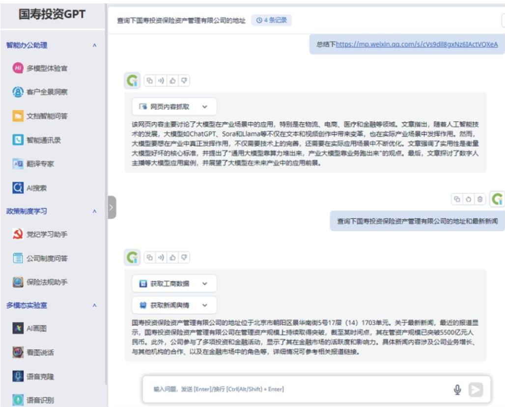

## Page 89
#### 多业务领域赋能

公司基于大模型应用中台的多渠道快速接入能力，已与知识中台、另类投管、另类投研、客户管理、财务报销等企业原有数字化基础设施进行了集成，可以更好地发挥大模型技术与传统技术各自优势。

#### (A) 基于大模型技术的知识检索

将生成式AI与传统搜索引擎打通，依托大模型更精准的意图识别和更有温度的回答，可以进一步提升用户获取信息的效率，给员工带来全新的对话式搜索问答体验。

图14 国寿知识检索

#### (B) 投资研究与客户洞察

利用大语言模型的语义分析、智能识别等多种技术，对多源、异构的研究资料进行智能化解析与融合，快速识别热点信息，进行研报行业的自动归类和摘要的自动生成，提高投资研究工作质效；同时在客户维度进行内外部数据的归集和融合，实现客户行业、评级、舆情、商机、合作等数据的穿透式管理和智能化分析，持续提高客户研究洞察力。
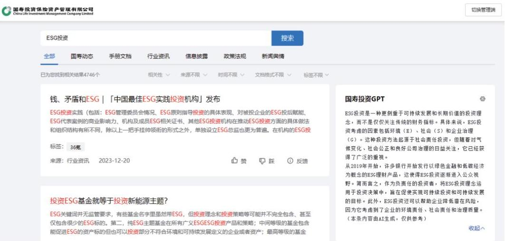

## Page 90
# (C) 风险识别与合规管理 

公司从内外规的智能问答，到投前的风险发现、投中的风险识别以及投后的风险监控，不断探索运用大模型等人工智能技术多点发力。例如通过大模型技术自动进行舆情信息的情感分析和风险分类， $\boxtimes$ 从而提高风险识别的效率和准确性，为项目风险的分析研判提供更全面的决策支持；利用大模型技术的抽取能力从各类投资报告和合同中提取关键要素信息，用于数据填报、条款对比、合同审核等业务场景，降低人为疏忽带来的操作风险。

### 5.1.3.2 国寿财险

## (1) 大模型技术布局

(1) 大模型方向战略布局

国寿财险在大模型应用领域，避免高举高打，采用精准投入，小步快跑的策略。优先尝试部署开源大模型，在各个场景开展预研和验证，优选场景进行落地。并计划构建公司自有的大模型应用开发平台能力，把大模型作为基础能力，重点关注大模型如何与场景结合，使得大模型更好地赋能公司业务发展，进一步加强公司科技服务能力，提升承保能力，提高内部经营管理的效率和质量，建成国寿财险公司以大模型及平台为核心，各应用服务、场景多点开花的大模型应用格局。
(2) 技术体系介绍

国寿财险通过私有化部署开源大模型，并利用"RAG+Prompt"的方式，为通用大模型提供公司自身知识，让大模型更懂公司业务。
(3) 大模型数据建设情况

内外部数据综合利用，并进行了权限隔离、脱敏处理、保障数据使用安全。目前内部数据主要建设了对实时业务数据的调用以及部分运维文档、营销知识文档、制度文档等数据，外部数据主要包括对外部保险类公开资讯数据。

## Page 91
(4) 未来规划

# (A) 技术体系/平台规划 

建设一个可在垂直业务场景下快速构建大模型应用的工具平台，搭建完整大模型应用架构，包括统一的入口和平台管理、统一的大模型使用和调度、统一的技术路线以及开放的技术开发生态，涵盖知识库组件、安全性检查、敏捷编排、场景化工具、模型应用管理等模型运营和模型管理功能。

## (B) 业务落地规划

基于大模型平台构建知识中心，集中管理和应用分散在各个系统的非结构化知识。实现知识与大模型的组合，并具备应用到各个场景的能力。

同步落地各部门已有的大模型场景需求，包括不限于日常办公助手场景、信息抽取场景、制度知识问答场景、政策和保险资讯类知识问答、营销热点捕捉、"OCR+大模型"票据识别、各类报告生成、各类支持场景应用的智能体建设等。

## (2) 大模型应用案例

(1) 小财大模型员工工作平台

## (A) 案例概述

本项目顺应大模型时代发展趋势，响应国家重大战略方针，在保障安全的前提下，开展大模型技术在国寿财险的首次引入和应用。建设了可直接体验大模型能力的小财大模型员工工作平台。

## (B) 应用方案

主要结合国寿财险自有业务数据、知识数据及业务场景特点，并基于小财大模型进行了相关应用场景的建设与应用，在国寿财险企业微信平台发布了小财大模型应用，为内部员工提供了一个可以便捷使用大模型能力的工具。涵盖文本写作、通用知识问答、组织客户展业助理、BI报表助理、信息抽取等多项功能。并提供小财大模型API接口调用。

## Page 92
# (C) 应用效果 

目前，小财大模型员工工作平台已覆盖国寿财险全国36家省分机构。小财大模型的累计使用次数已经突破了 40 万次，为超过 15 个团队或分公司提供API接口服务。

## (D) 落地经验

使用开源大模型和RAG框架，可以低成本地快速本地化部署大模型能力，并输出给分公司各个场景进行探索验证。通过直接对接企业微信工作台，可以直接触达内部员工日常办公场景。

## (2) 已决赔款计算书信息抽取

## (A) 案例概述

2023年，国寿财险广东省分公司启动了责意健险精细化管理分析系统建设项目。通过深入挖掘历史存档的理赔计算书，提取关于死亡、伤残、医疗等关键分项赔付金额。这些数据不仅为责意险的精细化运营提供了有力支撑，还帮助分公司根据历史及新增分项赔付情况调整承保策略。然而，理赔计算书通常以长篇大段的文字形式呈现，属于非结构化数据，处理起来相对繁琐。在过去，只能依赖人工手动逐篇阅读、提取关键信息并填写，这无疑增加了人力成本和时间消耗。在小财大模型发布之后，广东省分公司发现，凭借其出色的语义理解能力，可以快速而有效地从各种格式和长篇文字数据中提取关键信息。

## (B) 应用方案

广东省分公司根据实际信息抽取的场景，与总公司共同撰写了输出效果较为稳定的提示词，并直接让大模型以json格式返回相关数据，实现了系统与小财大模型的无缝对接，通过小财大模型的引入，系统可以从赔款计算书中高效精准地自动提取出关于死亡、伤残、医疗等各个分项的赔付金额。

## (C) 应用效果

广东分公司累计调用12万次，最高单日调用4万次，如果由人工进行筛选，预计花费 2000小时，交由大模型处理后，累计花费时间150小时，节省230人天。预计推广至全国使

## Page 93
用后，仅该场景下可节省劳效17人年。

# (D) 落地经验 

使用大模型进行信息抽取无需针对性训练，且大模型的领域适应能力强，对非结构化文本的处理能力便捷准确。在该领域，除了提取赔款支出明细外，利用大模型能力，还能提取非车常规大险种如企财、雇主、安责险的特约文本信息，通过大模型能力提取条款中的特约文本进行分析，能细化承保条件用于理赔精细化管理。

## (3) 车险智能报价助手

## (A) 案例概述

国寿财险广东省分公司积极探索业务场景，借鉴前期理赔计算书信息抽取场景积累的经验，发现小财大模型能够从一线展业人员发送给出单员的碎片信息中结构化提取出车险报价所需的必填信息，实现快速报价。这一实践减轻了人工处理工作量，提升了车险报价效率和成功率，在行业同类报价机器人中，达到了领先水平。

## (B) 应用方案

使用"小财大模型+提示词+正则匹配"来进行用户输入的语义解析，大幅提升了语义解析的正确率，从而提升了转保和续保的报价成功率。

## (C) 应用效果

有了小财大模型的加持，智能报价工具的语义理解能力得到大幅提升，对包含格式、语法和拼写不规范等非标问题的用户输入均能很好地解析。目前，广东分公司智能报价工具已调用小财大模型接口累计超过 3 万次，平均报价成功率超过 $85 \%$ ，相比原来的方式有大幅提升。从智能解析能力来看，已好于平安产险同类产品效果。预计该场景仅广东分公司就能至少节省100人年的出单人力，降低人力成本约合1000万元。

## (D) 落地经验

广东分公司根据前期大模型应用经验举一反三，主动挖掘到了类似场景。并通过"正则+大模型"混合使用的方式以及动态调整大模型提示词的输入额度，提升了稳定性和准

## Page 94
确率。

# (4) 大案要案智能识别 

## (A) 案例概述

传统的大案识别上报主要通过人工进行，面临以下三大难点问题：反应慢——识别环节滞后，往往是查勘员到现场之后才能初步识别；精度低——就公司的实际情况，大案管理人员精力有限，无法面面俱到，导致部分大案漏报、错报；耗人力——繁复型工作较多，浪费人力。

2024年，国寿财险湖北省分公司开发出理赔大案上报系统。通过小财大模型，能够比较好地识别出理赔大案，减轻人工处理的工作量，并具备较高识别准确度。

## (B) 应用方案

通过"小财大模型能力+专家经验"来进行大案的识别判断，确认大案和非大案，在原本纯人工上报的流程中加入人工智能预处理，用大模型介入相关的业务流程，给流程再增加一道防线。实际效果证明，小财大模型的介入有效提高了大案上报的时效性和准确性。

## (C) 应用效果

截至目前，湖北分公司已借助小财大模型过滤案件超1.5万件，已识别漏报大案累计金额超过200万元，节省超过 200 个工时。相比于传统识别方式，小财大模型加持下的大案识别效果得到了质的提升：

处理快——接入实时报案数据流之后，能够非常及时地给出指导性意见，时效甚至先于查勘员分配；

识别准——经过预处理之后，通常能筛选掉 $80 \%$ 以上的案件，大大节省业务人员时间；
效率高——机器代替人工，AI业务能力提升，提高效率，激活创新思路。

## (D) 落地经验

通过专家经验的加持，可以使大模型在某个场景中发挥超预期的作用。同时，在本案例中，湖北分公司使用了公司的低代码开发平台国寿易研，降低了大模型投产的成本。

## Page 95
# 5.1.4 平安保险 

### 5.1.4.1 大模型技术布局

平安集团正在研发上千亿参数的模型PingAnGPT。结合其以往在人工智能上的探索和应用经验，平安在大模型领域采取了综合性的策略，而非仅仅聚焦于提供某一类服务，如单纯的聊天或问答功能。以下以平安人寿代理人Askbob为例介绍大模型应用情况。

### 5.1.4.2 大模型应用案例

## (1) 代理人保险销售痛点

中国平安人寿保险股份有限公司（以下简称平安人寿）作为中国保险行业的头部企业，积极引领着行业的数字化转型发展，代理人Askbob应运而生，集成平安内部专业内容、培训课程、工具资讯等海量数据，打造行业首创的智能工作助理，助力解决代理人服务问题，提升代理人专业水平、合规水准、服务能力，促进代理人队伍向高质量发展转型。

在大模型创新应用浪潮下，2024年Askbob焕新升级，基于大语言模型、数字人、自然语言处理、语音语义识别等最新前沿技术，为代理人提供全新的聊天对话式智能技术应用体验和海量营销展业素材，能更准确、更高质量地解答代理人的问题，也在展业、服务、培训、管理、增员等场景为代理人提供了更专业的一站式销售解决方案。

在寿险业务中，代理人面对客户时需应对各种不同的问题，这些问题因客户的个体差异，如人群、收入、职业和家庭结构等因素而有所不同。为了提供专业且个性化的解答，代理人通常会先使用代理人Askbob机器人进行咨询，然后再向客户反馈。然而，传统的基于预设知识库的问答系统由于其知识范围有限，难以覆盖所有可能出现的客户问题，这导致约 $80 \%$ 的实际问题未能得到有效解答。例如部分问题即使得到了回答，也往往缺乏针对性，难以满足代理人和客户的具体需求。

经过深入研究，平安人寿发现大模型凭借其实时分析和推理能力，可以有效弥补传统问答系统的不足，特别是在处理复杂、多样化和个性化的问题时表现出色。为此，平安人寿

## Page 96
专门打造了一个面向寿险领域的大模型，以应对这些挑战。通过将这一大模型集成到 Askbob机器人中，显著提升了其在复杂业务场景中的解答能力，从而帮助代理人更好地满足客户需求，全面提升其在实际业务中的应对能力。

# (2) 技术难点与创新方案 

尽管通用大模型具有强大的处理能力，但在面对专业问题时，往往由于缺乏特定领域的专业知识而产生"幻觉"问题。同时，代理人提出的许多问题语义不明或意图复杂，使得模型生成的回答过于宽泛。此外，在内容合规上，面临着传统检测方法误判率高、模型无法准确识别局部违规内容、违规内容改写结果仍然违规或不通顺等问题，难以满足实际业务需求。

为了解决这些问题，平安人寿采取了一系列创新方案。

## (1) 知识库构建

首先，为了提供大模型所需的领域知识基础，平安人寿构建了一个庞大且结构化的保险知识库。这一步至关重要，因为只有在完整且准确的知识库基础上，大模型才能在领域微调和推理应用时有效应用这些领域知识。

知识体系：构建了多层次的知识模块，完成了大量语料的分类及节点挂靠。通过整合多种信息补全，包括适用人群画像、产品特征、标签生成来源以及疾病实体、人群实体等，确保知识库的全面性和准确性。

产品类知识：按照产品大类构建了全面的在售产品问题库，基于大模型完成了在售保险产品知识库的构建，涵盖了市场上所有在售产品的详细信息。

知识生产流程：搭建了高效的知识生产流水线，并建立了视频课程销售逻辑提取流水线，完成了大量课程的抽取及清洗入库，整合梳理了大量业务材料，确保知识库内容的高效更新和维护。

合规规则库：以合规人员积累的知识内容，如合规手册、风险检视表、历史审核文件等，整合建立并动态更新合规规则库，确保对高风险内容的实时干预和调整。

## Page 97
# (2) 模型训练与微调 

在构建了扎实的领域知识库之后，接下来是模型的训练与微调。
在内容生成上，为了让大模型更好地适应寿险领域的专业需求，平安人寿基于基座大模型，通过Lora微调技术，结合大量的保险领域语料，构建了寿险领域大模型。Lora微调技术的应用在保留大模型通用处理能力的同时，还能针对寿险领域的特定需求进行精准微调，从而显著提升了模型在处理保险相关问题时的专业性和准确性。这一优化过程确保了模型既具备广泛适用性，又能灵活应对复杂的业务场景。

## (3) 策略迭代优化

尽管领域知识库和模型微调提升了模型的专业性和准确性，但在实际应用中，仍然面临"大模型幻觉"、用户查询语义不明、问题复杂以及回答空泛等挑战。为此，算法专家设计了多种策略进一步优化模型，具体包括：

RAG技术缓解"幻觉"问题：针对大模型在回答中出现的"幻觉"问题，引入了RAG技术。RAG技术通过结合检索和生成的方式，显著减少了模型在回答中的错误信息。

Query改写策略：为了解决提问语义不明的问题，算法专家设计了Query改写策略。通过对原始查询进行语义分析和重构，提高了检索资料的召回率，使模型能够更准确地理解和回应复杂的用户查询。

Stepback策略：针对复杂问题，设计了Stepback策略，将复杂问题进行拆解，简化检索系统的任务。这一策略增强了模型在处理复杂查询时的表现，使其能够逐步分析和解答多层次的问题。

回答逻辑补全策略：为了提升回答的质量和针对性，设计了回答逻辑补全策略。通过生成回答的逻辑结构，指导答案生成过程，解决了回答过于宽泛的问题。

## (4) 内容合规

在违规检测方面，结合动态更新的合规规则库，算法专家设计了结合知识与模型的方法召回疑似违规文本块，并通过模型分类识别，显著提升了检测的准确率。

## Page 98
在内容改写上，通过进行特定领域的数据训练，构建了专用的改写大模型，确保改写后的内容符合合规要求，并保持原意和文本的通顺性。为应对不同的违规类型，灵活调整改写提示词，动态生成改写策略，从而提升了改写效果。实际应用测试表明，这些改进措施显著提高了内容的合规性和文本通顺性。

经过这些策略的优化，模型在准确性、丰富度以及处理边界问题方面取得了显著改善，回答中的错误和遗漏情况大幅减少，整体性能得到了明显提升。

# (3) 应用效果 

基于寿险领域大模型，代理人Askbob机器人在应对复杂和多样化客户问题时表现更加出色，不仅提升了实际问题的解答率和针对性，还显著解决了代理人Askbob机器人在覆盖客户问题和提供个性化解答方面的不足，更好地满足了代理人和客户的需求，整体用户满意度也随之得到了有效提升。

在展业方面，围绕销售展业流程为代理人发现问题、主动指导并提供实战解决方案，目前已上线销售商机及AI建议书。销售商机支持辅助经营触客，推荐讲解素材及异议话术；AI智能生成建议书，基于海量大数据精准判断客户需求，快速配置专业产品方案，智能生成最优讲解方法。2024年功能上线以来，已为超20万代理人AI生成个性化建议书，帮助代理人更专业、更高效地满足客户差异化保险需求。在服务方面，基于大模型信息理解及判断能力，结合具体客户信息及保单，查询代理人数据并解读；基于大模型意图判断，主动识别并引导代理人线上办理业务，极大提升队伍的服务专业性及合规水平，并有效支持平安人寿在咨询人力方面的降本。在培训方面，运用GPT理解和对话能力，基于代理人技能提升的需求，进行拟人化线上智能演练，同时，挖掘并生成个性化演练剧本，并模拟客群进行对练；针对代理人具体演练情况，实时反馈亮点不足，主动指导能力长短板，给出下一步建议。2024年已实现累计陪练40万人次。

未来，平安人寿代理人Askbob将持续借助大模型广泛应用的风口，借鉴国内外大模型应用的经验案例，结合AIGC语义理解、Agent、Long context等技术迭代，进一步提升准

## Page 99
确率和生成内容的效果，完善内容安全性的审核机制，确保生成内容是有效且安全合规的，并不断升级模型，提升产品智能性。同时，也将持续挖掘绩优代理人的销售经验，通过模型训练，提升大模型回答的专业性和有用性，提升销售类问题的解答效果；同时，挖掘收集各类增员及管理的经验、素材等资料供模型训练，支持个性化增员和管理问题的解答。

# 5.1.5 泰康养老 

### 5.1.5.1 大模型技术布局

在技术体系的构建过程中，泰康养老搭建了一个以GPT-4为核心的AI平台。该平台不仅包括自然语言处理、深度学习等先进技术，还结合了语音识别、情感分析等关键技术模块。平台的多层架构设计使其能够应对复杂的业务场景，并具备灵活的扩展性，以适应未来业务需求的变化。

这一AI平台具备强大的数据处理能力，能够高效处理大规模数据集。通过深度学习算法，平台可以从历史数据中自动提取特征，生成高精度的预测模型。这些模型可以在实际业务场景中自动应用，从而显著提升业务效率。例如，在保险业务中的客户需求预测、风险评估等环节，平台都能够提供高效的解决方案，帮助公司做出更加智能的决策。此外，该平台还具备强大的实时处理能力，支持批量数据处理和实时反馈。结合人性化的用户界面，平台可以为业务人员提供直观的操作体验，进一步提高了系统的可操作性和用户友好性。

在大模型选型上，泰康养老在探索初期分别使用ChatGPT系列模型、文心一言、ChatGLM等大模型，以及部署开源大模型微调的方式进行验证，根据验证结果，最终选择 OpenAI的GPT-4模型作为基础的通用大模型。

在大模型的构建过程中，数据是最为核心的要素。为了确保大模型的有效性与精准性，泰康养老投入了大量资源，建立了覆盖全行业的数据集。这些数据集不仅涵盖了养老保险的各个业务领域，还包括了客户行为数据、市场趋势数据、外部经济数据等。通过对这些数据的深度挖掘和分析，大模型能够精准地捕捉业务特征，并生成高度定制化的业务解决方

## Page 100
案。在数据建设过程中，不仅关注数据的广度和深度，还注重数据的质量。为此，泰康养老制定了一系列数据清洗、标注、校验的流程，确保数据的准确性与完整性。通过这些流程，能够确保输入模型的数据是高质量的，进而提高模型输出结果的可信度。

同时，泰康养老还积极拓展外部数据资源，整合来自不同行业、不同来源的数据，以增强模型的泛化能力。例如，引入了宏观经济数据、人口统计数据、健康数据等外部数据，这些数据为大模型在养老保险领域的应用提供了更加广泛的支持。

未来，泰康养老计划进一步优化和扩展AI平台的功能，逐步实现大模型的私有化部署。通过私有化部署，公司能够更加灵活地应对业务变更，并根据具体需求快速调整模型应用。同时，还将进一步提升平台的智能化水平，探索更多的AI应用场景，推动技术体系的全面升级。在平台优化方面，将重点关注模型的可解释性和透明性。随着AI技术的深入应用，如何让模型的决策过程变得更加透明，是公司发展的一个重要方向。通过引入可解释 AI技术，希望能够让业务人员更好地理解模型的决策逻辑，从而提升模型的信任度与应用效果。

# 5.1.5.2 大模型应用案例 

在泰康养老在数字化转型过程中，通过引入AI智能训战项目，解决训战效率低下的问题，从而提升整体业务效率和人才成长速度。

近年来，随着人口红利消失、成本高企，保险产品同质化竞争激烈等相关问题，保险行业面临着获客营销难、团队增员难、降本增效难等挑战。特别是在线上获客成本高企的情况下，如何降低成本、提高转化率成为业务发展的关键问题。

传统训战需要现场一对一的通关，然后关主点评，一次通关平均每人需要 2 到 3 个小时，效率非常低；同时关主人力匮乏，目前泰康养老销售人力 7000+，关主只有 50 人。一个新版本的展业夹安装需要六个月的时间，并且还达不到 $100 \%$ 全员覆盖，因此结合AI大模型落地AI训战，实现批量高效可复制的展业夹安装，已迫在眉睫。传统训战最大的核心矛

## Page 101
盾就是效率，主要体现在展业夹安装效率、优质内容供给效率、资料搜索与理解效率、结果监督效率。其中最为迫切的就是展业夹安装的效率。

AI训战项目引入了ChatGPT等智能化手段，相比传统训战大幅提升训战效率，从而更好地带动队伍核心技能提升，从而带动业务核心效率指标提升，在AI模式成熟后，可辅助职域模式核心效率（面谈转化率）提升 $50 \%$ 。AI训战项目解决了训战效率低下的问题，从而提升整体业务效率和人才成长速度。该项目结合ChatGPT智能化手段，融入养老职域业务框架与逻辑，配合以实战验证的最优质话术和人性化评分机制，最终实现全系统批量安装。AI训战相比传统训战大幅提升了训战效率，从而更好地带动队伍核心技能提升，从而带动业务核心效率指标提升，在AI模式成熟后，可辅助职域模式核心效率（面谈转化率）提升 $50 \%$ 。

# 5.1.6 中国太保 

### 5.1.6.1 大模型技术布局

中国太保大模型项目建设目标一是打造稳定高效的大模型基座，二是探索数字劳动力应用。具体项目范围包括四部分：一是建设保险行业首个自主可控的支撑千亿级大模型优化的全信创基础设施；二是建设百万量级高质量的保险知识运用数据壁垒，补足基础大模型在保险领域的水平；三是集约化建设包含领域专家和数字工作环境的大模型中台，为高效开发前台数字岗位提供支撑；四是建设行业首个具备服务能力和专业深度的数字劳动力Agent。

中国太保分两阶段实施。一是"搭台"阶段，即基础设施建设阶段。本阶段包括三部分工作：一是搭建高性能算力平台，支持大模型的训练与推理；二是通过建设和完善基座及领域大模型，提升大模型的综合能力；三是通过集约化建设大模型中台，沉淀可复用的能力，为高效开发数字岗位提供支撑。二是"唱戏"阶段，即应用建设阶段。本阶段旨在针对各

## Page 102
个业务条线的业务场景，完成数字劳动力岗位技能设计和研发，为业务岗位赋能，创造业务价值。

模型建设上，太保与华为、科大讯飞组成联合攻坚团队。太保联合华为形成了大模型平台" $1+2+N$ "的总体建设方案，实现整体规划、分批建设，助力数字岗位快速落地；由华为提供了大模型高效推理框架——Mindie，经太保多个项目验证，推理速度可达到A100芯片 0.9-1.1倍；同时，太保与华为在AI Agent、场景孵化、AI人才培养等方面持续开展交流，实现了联合创新。同时，太保联合科大讯飞展开了多项合作，由科大讯飞提供了私有化大模型及配套训推工具，主要包括讯飞65B、175B通用基础大模型；通过提供企微托管平台，提供基础大模型支持，合作共建产险数字劳动力；通过提供讯飞小医医学大模型能力接口，合作共建医险大模型。

大模型数据建设方面，完成105万条训练集数据建设，调优后的保险大模型相对于调优前的通用大模型，在医险能力、保险数学建模能力、保险任务规划能力、保险执行能力、保险知识5个能力胜和率达 $71.08 \%$ ；已通过《中国人身保险从业资格（CICE）》《保险从业人员资格考试》《保险代理人资格考试》等5类考试，平均分76分；通过由上海财经大学推出的 FinEval评测，平均得分 81.4 分，达到行业领先水平。

未来在项目二期（2024.09-2025.12），中国太保将通过技术升级重点解决以下三点不足：一是主要使用书本知识对保险大模型进行训练，未能邀请真正有经验的业务专家深度参与保险知识治理，导致大模型对保险实务理解不深；未来将联合业务方建立有效的工作机制，建设过程中邀请业务专家深度参与业务知识治理，沉淀场景训练数据，如保险实务。二是太保大模型评分虽高，但在实际业务场景中应答的准确率与业务期望仍存在差距，原因在于缺乏业务know-how的系统性梳理以及缺少大模型应用的营运团队来保证项目初期的端到端效果；未来将组建专业的运营团队，在应用推广初期对大模型的结果进行审核与校正，保证质量和业务使用体验。三是目前一些大模型应用仍是以大模型为路由，通过链式调用工具完成任务，本质仍是对流程建模，无法带来业务深刻变革和价值释放。未来

## Page 103
将围绕数字劳动力Agent，拟定具备通用性、泛化性和鲁棒性的Agent框架，将数字劳动力应用嵌入业务流程。

图15 太保"搭台"与"唱戏"

图16 太保项目建设蓝图
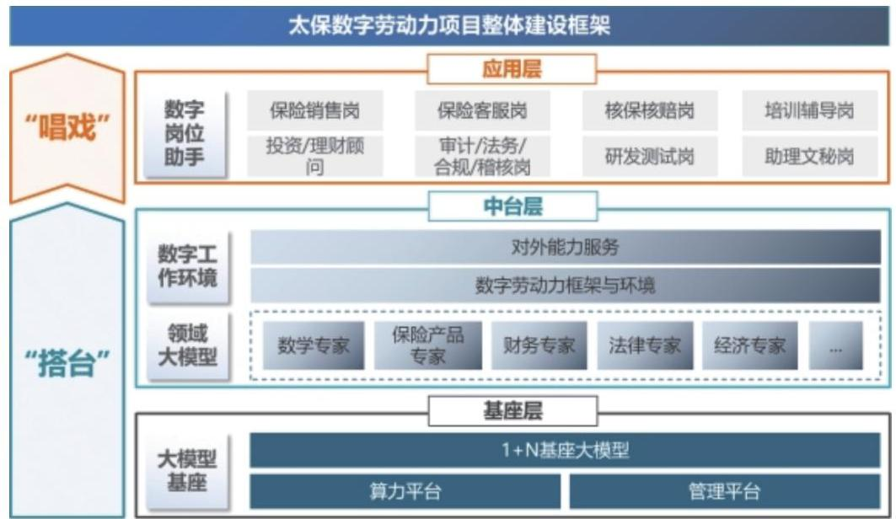
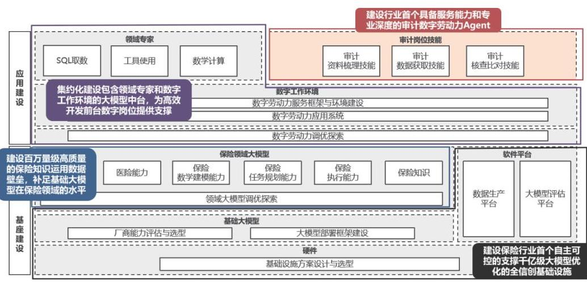

## Page 104
图17太保项目总体技术框架
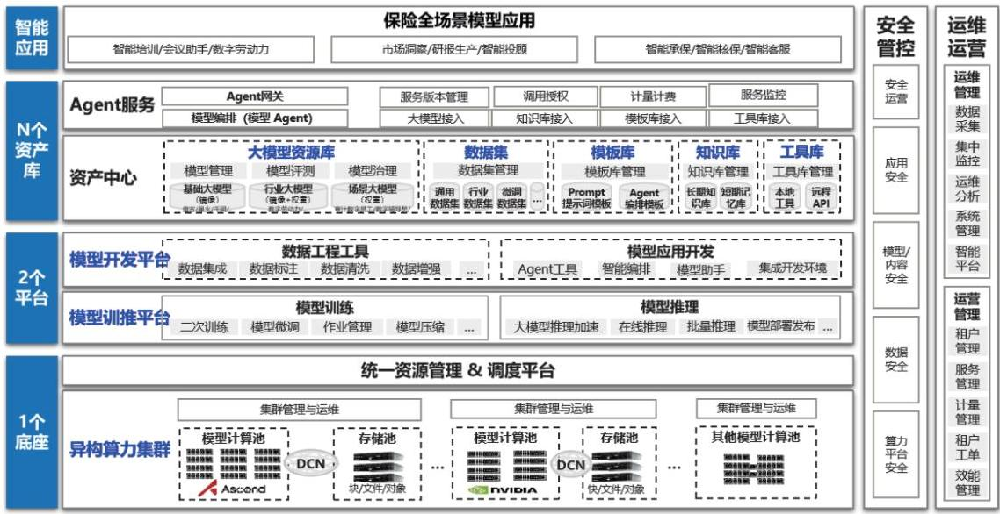

## Page 105
# 5.1.6.2 大模型应用案例 

## (1) 健康险理赔审核数字劳动力

本案例的目标是独立准确完成健康险理赔案件整案判责和明细费用审核。目前，在整案责免判定方面，健康险理赔审核数字劳动力判断准确率超过人工预审准确率5个百分点；在性能方面，可支持健康险自营年处理150万件赔案。

健康险理赔审核流程主要包括定责、判责/剔费、理算三个步骤。其中，在定责和理算阶段的系统自动化程度较高，而判责/剔费阶段则主要采用人工审核的方式，存在效率瓶颈。因此，为了进一步扩大运营规模，实现降本增效，系统自动判责能力建设的需求强烈。

健康险理赔审核数字劳动力在5月底正式上线。在试点业务中，整案判定准确率达到 $93 \%$ ，明细费用判定准确率经过多轮迭代达到 $80 \%$ ，审核案件量达到 1 万件/月，未来让大模型通过生产数据不断迭代，提升"自知之明"的水平，目标是 $99 \%$ 。达成后，一方面会减少千万级的审核成本，另一方面，理赔全自动化的实现也为医院直赔等新模式提供了可能。

## (2) 集团审计助手

辅助审计人员完成风险核查及疑点初筛。上线5个月，覆盖280名审计业务人员，月均完成2000余次审计任务，促进劳动生产率提升 $12 \%$ ，助力提高审计工作质量，提升问题揭示能力。

以往审计领域存在 4 大痛点：一是审计资源严重不足，需要通过数字员工建设代替人工。银保监会《保险公司内部审计指引》要求，保险企业审计人员配置应不低于总员工数 $5 \%$ ，保险行业都面对审计人力不足的情况，亟须转变用工模式；二是审计业务依赖于大量的人工专业经验，需要将审计专业经验固化为系统方法。建立标准化的数字审计工作流程和审计方法体系，形成可传承的技术体系。三是面对转型发展的企业，审计内容更加广泛和深入，需要通过数字员工建设来拓展审计覆盖范围，提高审计效果；四是由于新形势下企业风险的复杂性和多样性，对内部审计的要求不断提高，包括对重大问题的揭示、对企业发展的支持等领域，需要通过数字员工建设来聚焦企业核心风险，提升审计成效。

## Page 106
审计数字劳动力通过建设前台智能核查数字员工、中台综合分析数字员工以及后台质检管理数字员工，为审计中心前台、中台、后台各专业化岗位提供了全方面赋能，有效填补审计人力不足，提升审计工作质效，促进精准化监督，形成新型化的数字审计工作模式。

# 5.1.7 华农保险 

### 5.1.7.1 大模型技术布局

自2023年初以来，华农保险一直紧密跟踪大模型技术的最新进展及其在行业中的应用，同时积极挖掘这一技术与保险业务深度融合的潜在途径。经过超过一年的深耕细作，华农保险在提升日常办公效率与优化保险业务流程的双重战略方向上，稳步推进大模型战略布局。

华农的大模型体系由"星问 1.0"App、"星问V2.0大模型管理中台"和围绕上述两大应用构建的多个大模型赋能场景组成，华农员工可以通过"星问 1.0"App在移动端和PC端随时随地访问大模型服务。同时，"星问V2.0大模型管理中台"能够将大模型功能模块化拆分与迅速集成，并与现有系统集成，大幅缩短了华农大模型赋能场景的开发周期，截至目前，华农的大模型赋能场景涵盖了文档生成、面试招聘、员工关系、审计合规、条款解读、数据分析等十多个方面。华农保险不仅在通用办公辅助上深化大模型技术的应用，更在保险业务流程融合方面进行了创新探索。

在车险出单环节，华农推出了由大模型驱动的"星驰"系统，该系统通过对话式交互，能在短短5分钟内引导保险代理人完成从影像上传到保单下载的全流程，极大提升了效率。在系统运维方面，华农保险打造了企微运维机器人，融合图像大模型、文本大模型、图数据库与RPA机器人技术，实现了自动问题识别、知识库智能匹配与回答，以及知识库内容的定时更新。通过在运维场景中引入大模型技术，华农保险为运维团队的工作效率提升了超过 $10 \%$ ，显著提升了业务流程的智能化水平。

在科技研发领域，华农保险与顶尖的大模型技术供应商展开了深入合作，利用代码大

## Page 107
模型增强科技团队的日常编程能力。经过半年多的实践与测试，这一举措使得华农研发团队的整体工作效率提升了近 $20 \%$ ，同时，人均有效代码产量也实现了显著增长。此外，自 2024年下半年起，华农保险进一步拓展了大模型的应用边界，探索其在测试用例编写、研发设计文档生成等领域的潜力，致力于将大模型技术更系统地融入研发流程，以全面提升研发工作的效率和质量。

在构建大模型的数据基础方面，华农保险在代码大模型项目进行过程中，对超过 1000万行的自有系统代码进行了清洗和语料库构建，确保了模型训练的高质量和高效能。此外，华农星问中台在2024年下半年新增的大模型文本数据标注功能，将大幅助力数字人项目的数据扩展和标注工作，为华农保险在人工智能领域的深入探索提供强有力的数据支撑，进一步推动公司数字化转型和智能化升级的步伐。

# 5.1.7.2 大模型应用案例 

华农保险在过去五年的数字化转型的过程中，始终保持战略发展的前瞻性，积极探索将前沿技术融入保险业务的多种可能性。在人工智能与大数据技术飞速发展的背景下，大模型技术已成为金融行业的一大关注点，公司遵循科技与业务融合的趋势，致力于打造符合自身特点的大模型应用体系。这一举措不仅有利于提升客户体验和优化内部管理，更是为了在AIGC时代提升企业的核心竞争力，让大模型技术成为助力企业数智化转型的新质生产力之一。

2023年初，公司经过深入的研究和分析，对大模型技术的优点以及其潜在的局限性有了较为深刻地理解，在充分考虑自身作为中小型金融机构在实施大模型技术应用时可能遭遇的挑战之后，公司结合自身的实际情况和业务需求，制定了体系化的实施策略和落地路径：首先，建立覆盖公司大多数员工日常办公场景的大模型应用，为全员的日常办公提供智能化提效的同时，增强公司全员对大模型技术的认知与理解，起到大模型技术理念"布道"的作用；其次，基于对业务流程和需求的深入分析，优先在业务价值较高、受众人群较广的领域部署大模型应用；然后，构建了统一的大模型应用管理平台，该平台旨在整合

## Page 108
公司的大模型资源，提供一个集中的管理和服务接口；最终，稳步将大模型应用的领域扩展到更多复杂业务场景中。这样的策略不仅是基于公司对大模型技术应用的逐步探索和深入理解，同时也体现了对业务持续改进和创新的不懈追求。

在明确了落地方向之后，公司自2023年二季度起，陆续推出了星问1.0 APP、星问2.0大模型管理中台（星问中台）和星问浏览器插件等一系列创新的大模型产品。在持续推动大模型技术在公司实际业务场景下落地的过程中，公司实施了跨部门协作的工作模式，通过组织场景创意头脑风暴活动，邀请各业务部门深入参与，共同探讨如何将大模型的强大能力与保险业务紧密结合。此外，通过各部门联合建立的评审机制，对潜在的大模型赋能场景进行业务价值评估，筛选出其中业务价值高并具备技术实施可行性的优先落地场景。在研发阶段，各业务部门与技术团队紧密联动，确保大模型的研发工作能够紧跟业务需求，同时也确保技术解决方案的实施能够顺利进行。

凭借各参与方的紧密合作与团队努力，截至2024年上半年，"星问"系列大模型产品成功地在超过 20 个核心业务场景中得到了广泛部署和应用。这些应用场景不仅包括人力资源的招聘和员工关系管理，还涵盖了数据分析、保险条款的深度解读、智能运维支持，以及车险的投保流程等多个重要领域。同时，通过星问中台对大模型底层能力的细致解构和优化，使得大模型技术能够灵活且高效地适配各种不同的业务场景，实现了应用的快速组装和部署，将大模型应用的上线时间从原先的平均5至14个工作日大幅缩短至最快仅需 5分钟。

# (1) 车险出单 

进入到2024年，华农保险开始更加重视将大模型技术融入保险行业的日常工作流程中。"星驰"系统借助大模型的意图识别能力，将传统的表单式投保变成聊微信式的交互模式，让新人代理人可以更快地掌握华农出单工具开始拓展业务。与此同时，在构建星驰系统的过程中，通过conductor流程编排引擎，保证了即使代理人反复通过对话要求返回修改信息，大模型也不会产生流程错乱问题。

## Page 109
图18 车险出单“星驰”系统

## Page 110
# (2) 企微运维 

在系统运维方面，华农保险打造了企微运维机器人，融合图像大模型、文本大模型、图数据库与RPA机器人技术，实现了自动问题识别、知识库智能匹配与回答。同时，每天通过定时任务由大模型自主学习运维群当天新增的用户提问和真人运维的回答，不断自动丰富知识图谱，使机器人能力持续进步，从而实现机器从"学习人""模仿人"到"成为人"再到 "超越人"。截至2024年下半年，华农企微机器人回复的准确率超过 $90 \%$ ，对运维人员的综合提效也超过了 $10 \%$ ，显著提升了运维流程的智能化水平。

图19 企微运维机器人

## Page 111
华农保险在推动大模型技术对公司业务流程的持续赋能过程中，始终秉持开放合作的原则，通过定期举办OPENDAY、科技生态大会等活动，公司得以与科技、金融行业的广泛沟通和交流。截至2024年上半年，公司已经与多家行业领先的大模型企业建立了紧密的战略合作关系，并成功获得了超过 10 种不同规模的开源大模型商用许可和 2 项相关的知识产权许可，积极构建保险大模型生态合作命运共同体。

在实施大模型技术的过程中，华农保险采取了以下几个关键步骤：

# (1) 大模型集成管理 

各类商用大模型SaaS服务与私有化部署的开源大模型，从模型输入输出的参数格式，到适配的向量模型选择，均体现出多样化的技术特征。因此，对于保险公司而言，寻求一款全能型大模型产品期望能覆盖所有的业务场景，是现实而迫切的需求，同时也是一项艰巨的挑战。星问中台作为华农保险企业级的大模型应用管理核心，肩负着统一管理公司大模型底座的重要使命，其核心职能就是通过标准化不同来源大模型服务的输入与输出内容，实现了对公司多元化业务场景下大模型赋能需求的灵活切换与高效适配。通过星问中台的一体化管理能力，公司能够针对不同业务场景的需求差异化分配基座大模型资源，不仅提升了技术基础设施的统一性，更为公司扩展了智能化应用的广度。

## (2) 大模型能力拆分

2024年以来，大模型的应用场景呈现出百花齐放的局面，涵盖了文本生成、跨模态交互、信息检索强化、实时网络搜索以及远程函数调用等多元维度。星问中台通过精细化的原子拆分功能，将大模型的能力解构为一系列独立且可复用的组件，通过工程化的改造简化了这些组件的配置过程，只需通过点选式的交互界面即可实现快速部署。此外，星问中台允许用户根据具体业务需求，对这些功能组件进行高自由度的组合与定制，这种模块化的设计理念，不仅提高了大模型应用场景的适应性和复用性，而且显著降低了开发与运维的复杂性和成本。

在星问中台的架构设计中，除了对大模型能力的深度挖掘与模块化配置以外，还通过

## Page 112
引入RPA技术构建"眼\&脑\&手"互相协同的自动化机器人工作模式：其中，"眼"代表多模态大模型对外界信息的感知能力，"脑"则是大语言模型的智能决策与处理能力，"手"是RPA机器人在具体操作层面的执行能力。这种模式的有效结合，不仅极大提升了业务流程的自动化程度，而且显著减少了人工操作的环节，从而降低了业务处理过程中的错误率和相关成本。

# (3) 低代码快速对接 

保险公司在推进大模型应用的过程中，往往受限于复杂的内部系统架构，难以迅速实现高效接入与适配，针对该痛点和瓶颈，星问中台采用低代码集成的策略，极大简化了大模型应用的接入流程。通过星问中台，用户完成自定义的大模型应用配置后，系统将自动完成服务的封装，并提供H5页面嵌入代码及API对接文档，便于用户在多样化的业务场景中快速部署。星问中台兼容了多数主流的前后端框架，确保了集成的流畅性与高效性。此外，中台内置的流量管理与监控功能，能够实时追踪大模型应用过程中的token调用状况及资源消耗情况，为公司提供了对不同大模型应用成本的精准把控。

## (4) 本地化微调训练

大模型技术在提升办公效率方面的潜力已得到广泛认可，然而其具体的应用价值，尤其是资源投产比方面的量化评估，仍然是保险行业在大模型落地应用过程中面临的一大难题。相关数据显示，我国保险业在2023年总保费收入超过5.1万亿元，其中科技投入占比约为 $1.1 \%$ 。而在科技投入中，研发人力成本是重要的组成部分，具体金额接近400亿元人民币，以华农保险为例，公司2023年度研发人力成本投入超过3000万元。因此，考虑到规模效应和投产比方面的因素，公司经过反复论证和研究后认为，在研发场景下引入大模型实现工作效率的提升，将是金融保险行业务实落地大模型应用的重要场景选择。此外，开发代码在上线前已经过编译工具的检查，以及开发人员严格遵守公司的代码规范，确保代码具有高度的标准化，也符合大模型训练过程中对于数据质量的要求。

## Page 113
在具体实践中，鉴于商用代码大模型是基于开源数据集训练的，其对于保险公司内部系统的代码风格和复杂业务逻辑理解能力有限，导致其辅助生成效果并不理想。同时，考虑到信息安全方面的因素，公司采用一体机的方式实现大模型的私有化部署，对前后端共计1000万行以上的代码，通过大模型进行了LoRA微调，其模型效果在公司内部代码评测集上提升明显。

|  指标 | 释义  |
| --- | --- |
|  Rouge-1 | 检查生成文本(摘要或者翻译等)与参考文本之间的共享单词(单独的词, 没有考虑序列顺序)的重合程度。它的计算方法基于召回率(recall)和精度(precision), 通常以F1分数表示。  |
|  Rouge-2 | Rouge-2计算的是两个文本之间共享的2-gram的比例。  |
|  Rouge-L | Rouge-L计算的是两个文本之间的最长公共子序列(Longest Common Subsequence,LCS)。 LCS考虑了词序但是允许跳过一些词, 因此它是一种柔性的匹配, 被广泛用于衡量句子相似度。  |
|  Bleu-4 | BLEU-n计算的是实际生成的n-gram与参考文本n-gram之间的精度, BLEU-4是评估生成文本与参考文本在4-gram级别上的相似度。  |

# 图20 华农保险大模型微调效果

为进一步确保微调后的代码大模型能够在实际应用中发挥其赋能潜力，公司构建了一套严谨的过程评价指标体系和数据追踪机制。在落地过程中，按照每日追踪和数据复盘的方式，去引导和培养开发团队在代码开发过程中对于大模型的应用习惯。经过半年多的模型优化和落地使用，代码大模型的辅助赋能效果超过代码总数的 $20 \%$ ，很好地推进了研发效能的提升。

华农保险采取多场景试点\&重点领域聚焦的方式，探索大模型的多元化应用场景，确保对大模型应用的认知与行业水平保持同频共振。同时，结合自身实际情况专注于重点领域，希望通过资源投入实现单点突破为行业贡献样板间参考价值。聚焦于将大模型技术应用于提升研发效率，从而解决大模型业务价值难以量化的行业痛点，针对开源大模型对公

## Page 114
司业务系统代码逻辑不熟悉，导致生成代码采用率低的问题，通过对专属代码进行微调和优化的方式，显著提高了大模型在研发效能提升方面的辅助作用。

在星问中台的高效支撑下，华农保险根据自身实际并结合业务需求，于2023年成功构建了" $1+1+N$ "的大模型创新应用架构。在此框架内，大模型的场景赋能能力得到显著增强，众多业务系统已融入由星问中台提供的操作手册问答机器人，保险代理人的出单工具引入了保单条款解读及保险知识问答的智能辅助。进入2024年以来，公司对流程编排、自然语言到SQL转换（NL2SQL）等复杂大模型应用场景开展了持续的迭代工作，得益于星问中台的场景高度适配性与快速部署能力，外部业务系统与大模型应用的对接开发周期大幅缩短，平均开发工作量减少了 $90 \%$ ，显著提升了研发效率与需求响应速度。

在代码大模型的应用场景，公司经过三轮细致的模型调优实践，深入验证了大型模型在提升研发效能方面的潜力。通过不断优化样本质量，调整语料构建及训练策略，模型在验证集上的预测性能相较于调优前提升了约2.4倍，在由大模型生成的代码中，可用的代码比例高达 $70 \%$ 以上。模型调优工作完成后，公司制定了包括调用率、上屏率、采纳率、大模型赋能率、代码当量和研发时长等多项关键的过程和结果指标，对于代码大模型在时效性、准确性以及研发团队应用效果方面进行了全面的评估。通过每日高频度的数据追踪和结果复盘，逐渐推动研发团队培养了对于代码大模型的使用习惯。得益于这一系列策略的有效实施，截至2024年上半年末，华农保险的代码大模型赋能率（由大模型生成且被采纳的行数/代码当量）已从项目建设初期的不足5\%，提升至 $13.3 \%$ ，人均每日代码当量（即有效代码行数）较上年末提升了 $17 \%$ 。

经过近一年半的探索与实践，华农保险在基于AIGC技术的星问平台建设方面取得了显著成效。公司成功打造了具有自主特色的大模型应用管理体系，而且在提升业务效率、优化客户体验、增强企业核心竞争力等方面发挥了积极作用。星问平台的建设和运营，不仅给公司未来深化大模型在业务场景中的应用提供了宝贵经验，对于中小金融机构的智能化转型也具有借鉴意义。

## Page 115
展望未来，保险行业正处于数字化向智能化转型的关键阶段，正是利用大模型技术提升核心竞争力、实现智能化升级的有效时机，华农保险将继续秉持技术探索的前瞻性，积极拓展大模型技术的应用边界和场景。同时，公司也深刻认识到，合作与共赢是永恒的主题，因此华农保险将继续坚持开放合作的原则，与行业一起共同构建保险大模型生态合作命运共同体，共迎行业智能化转型的美好未来。

# 5.1.8 众安保险 

众安保险基于自研"灵犀"平台，构建了一整套基于大模型的工程化能力。通过和阿里云通义千问plus的深度合作，已基于阿里云通义大模型，在还款预提醒、客服、理赔、营销、代码辅助等多个场景全面升级，提升效率和客户满意度。

图21 众安AIGC中台-众有灵犀
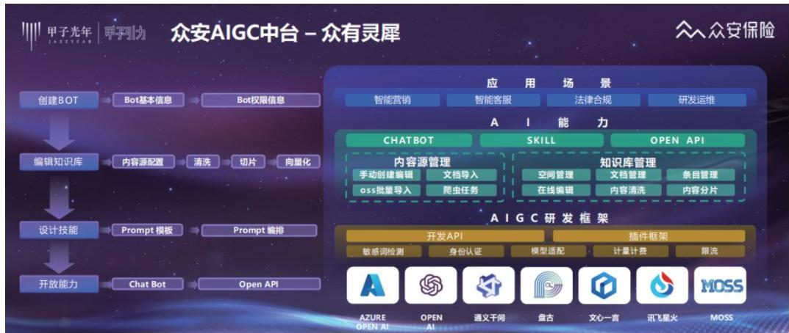

## Page 116
众安灵犀平台的代表应用如下。
易创内容运营平台：可以向运营人员提供快速、稳定、可靠的内容生成辅助能力。通过 "关键词一提纲一相关文章一生成一风格改写"的链路，有效控制内容生成过程。并引入严格筛选的知识库，基于高精度搜索引擎，提供专业文章作为参考文献，提升内容的可靠度。以及通过自动提取生成内容信息，即时生成符合要求的配图等，满足内容多样性。

业务经营分析智能化：随着企业数据积累的加厚，单一场景的业务分析已不能满足企业数据精细化运营的要求，多场景、多数据源的灵活联合分析，成为数据提升业务价值的关键。基于AIGC升级的集智经营分析平台，通过BI Lab对话分析、波动预警、一键归因等能力，可满足企业不同人群数据查询、分析和挖掘的需求，为企业管理和业务增长提供数据依据和决策支持。

众安综合考虑了数据、算力、算法、成本、安全合规等多个维度，逐步形成了适配保险行业的众安AIGC应用的三层架构。灵犀中台可以允许机构用户，在大模型内嵌入行业专业领域知识库，实现AIGC在保险垂直领域的应用快速适配，此外，灵犀也支持把企业内部应用工具包装成大模型插件，让大模型更加贴近业务应用场景。灵犀已在包括产品定制化、定价动态化、销售场景化、理赔自动化、客服人性化等场景进行深度实践。

# 5.1.9 信美相互人寿 

### 5.1.9.1 大模型技术布局

在数字化浪潮的推动下，全球正迎来一场由AI大模型技术引领的效率革命，特别是在数据密集型的保险行业，这一技术的应用显得尤为关键。保险业的数字化转型已经迈入了数智化的新阶段，这不仅意味着技术层面的升级，更标志着业务模式的全面革新。信美人寿相互保险社（以下简称"信美"）自成立之初便秉承"全面数字化"的战略方针，不断通过数字化手段来提升业务效率和客户体验。并且信美在2023年进一步明确了战略方向，坚持以"可持续、健康、发展"为三大战略支点，并将数智化作为战略布局的核心。

## Page 117
作为具有科技创新基因的相互保险组织，信美通过引入大模型技术，持续探索新的业务模式和产品，以增强自身的科技竞争力。在大模型技术的应用上，信美寻求在行业中的差异化竞争力，这也是信美数字化战略规划的核心。在中央金融工作会议提出做好数字金融等五篇大文章的指引下，信美深入洞察生成式人工智能的发展潜力，前瞻布局AI，自研大模型技术的应用，致力于实现降本增效，更好地适应市场发展变化。

为此，信美基于大模型打造保险垂直应用。保险垂直应用的核心，在于解决保险产品信息到知识转化的最后一公里。经过调研发现，传统的高成本、需要大量预训练搭建的垂直模型并不适用于所有企业，尤其是中小险企。因此，信美从低成本、小数据、快速迭代、解决具体问题的角度出发，采取了一种更为灵活和高效的形式，基于通用基础大模型，通过强化非结构化数据管理及处理能力，深度运用检索增强、模型"微调"技术，配合插件及 Agent能力建设，深耕保险垂直应用，以确保信美的解决方案既高效又经济。这样的方法论，不仅实现了技术上的突破，也为保险行业数智化发展提供了新的思路。

# (1) 技术平台介绍 

信美的大模型平台底层架构是一个综合性的解决方案，由三个关键部分组成，包括基础大模型、RAG、Fine-tune。这一架构的设计初衷是为了满足信美对于数据处理和知识应用的高标准要求，确保系统能够在不断变化的业务环境中保持领先。

首先，基础大模型作为平台的基石，扮演着至关重要的角色。信美接入了多家目前市场主流的通用大模型，具体实践来看，多个模型的组合可以实现更好的能力。具体选择会根据模型的基础能力表现、业务场景特点以及最终的调优效果选择。

在基础大模型的强大能力之上，信美引入了RAG技术。RAG结合了信息检索和文本生成，通过检索相关信息来增强模型的回答准确性。它通常包括一个生成器（如语言模型）和一个检索器，后者负责从外部来源检索信息。这种技术的运用显著提升了模型在特定任务上的表现，尤其是在需要最新信息或领域专业知识时，RAG展现了其无可比拟的优势。

接下来，为了进一步提升模型的适用性和精确度，信美采用了Fine-tune策略。微调是

## Page 118
大模型架构中的另一个重要环节，它涉及在特定任务数据上进一步训练预训练模型。这一过程使得模型能够更加精准地适应特定的业务需求和数据分布，从而提高其在特定任务上的性能。微调可以在模型的最后几层进行，以精细化调整模型的行为；也可以进行全面的微调，以适应更复杂的任务需求。这种灵活性确保了信美的大模型平台能够根据不同业务场景的需求进行定制化优化。

通过这三个层次的有机结合，信美的大模型平台在实际应用中展现出了卓越的性能和可靠性。这样的架构设计，为信美在知识管理领域的深入探索和创新提供了坚实的基础，同时也为信美的业务发展和客户服务提供了强大的支持。

# (2) 大模型数据建设情况 

大模型数据建设围绕知识管理和基准评测集两个重点开展。
企业知识管理是一个综合性的解决方案，它通过多维度采集策略，如人工采集、自动同步内容平台、同步网页发布内容等方式，来丰富知识内容。在此基础上，利用智能分类与标签化，为文本内容打上准确的分类标签和关键词，从而提高知识检索的效率。此外，系统还具备版本控制功能，对重要知识资产进行严格管理，记录每一次的修改历史，确保知识的可追溯性和准确性。为了保持知识库的活力和相关性，还建立了持续学习机制，定期对现有知识进行评估，及时更新和补充新知识，同时淘汰那些过时的信息，确保知识库始终处于最新状态。

基于大模型效果验证搭建"IUE保险大模型评测基准"。评测基准包括15个大类，内容覆盖保险业务的全链条，包括但不限于产品咨询、理赔流程、客户服务、政策法规等，确保评测的全面性。完成2098道对话问题设计，以充分暴露模型在理解和生成上的短板。采用多人标注+审核的方式，确保每道问题及其答案的准确性和一致性。对于复杂问题，可引入专家评审机制。

## Page 119
# 5.1.9.2 大模型应用案例 

## 信美Chat-Trust 3.0演进

图22 信美大模型保险垂直应用演进

信美大模型保险垂直应用历经"内部知识库"1.0阶段-"数字分身"2.0阶段-"智能代理"3.0阶段。
（1）CT1.0阶段：1.0阶段是内部知识库，这是所有后续大模型工作的基石，信美攻克了知识流通与信息安全的矛盾点，解决了非结构化数据难以有效管理的问题，使得大模型应用采集优质数据有了完整的流程和系统。
（2）CT2.0阶段：2.0阶段是数字分身，是从智能工具转为数字分身的阶段，主要解决隐性知识的挖掘和具象表达，CT1.0经过学习这些隐性知识后，在垂直领域的专业问题上会拥有更完整的先验认知，具备代表专业分工回复专业意见的能力。
（3）CT3.0阶段：3.0阶段则在2.0的基础上进一步实现由内向外的能力跨越。攻克了对口语、开放性复杂问题要求更高的意图识别难题；引入计算插件，解决更复杂的计算问题，实现端到端保险需求分析。信美的大模型应用自研"白盒化"展示，在问题回复时清晰地展示推理过程，让结果有迹可循。

## Page 120
3.0之后信美在大模型应用发展的未来规划中，致力于提供更优质的用户体验。信美将通过交互式问答和意图识别技术，提高问答的准确性，同时推荐问法以加快提问速度。此外，信美将利用图表数据增强信息的可读性，使过程更加透明，通过细化推理过程，清晰展示每一步的逻辑。在准确性方面，信美将不断优化生成的Prompt并微调基础模型，以确保结论的可靠性。同时，公司将通过合理规划架构和优化执行路径，显著减少生成耗时，确保生成过程的流畅性。这些规划将共同推动信美在大模型应用领域实现质的飞跃，为用户提供更高效、更智能的服务体验。

图23 信美大模型应用方案

# 整体应用方案分为三部分： 

一是基础大模型底座，基础大模型平台，调用SaaS大模型平台服务；企业知识加工，对知识进行输入、切片、训练；基于不同策略进行意图识别调优；基于不同业务场景，进行知识检索；基于不同场景进行prompt个性化封装。盾就是效率，主要体现在展业夹安装效
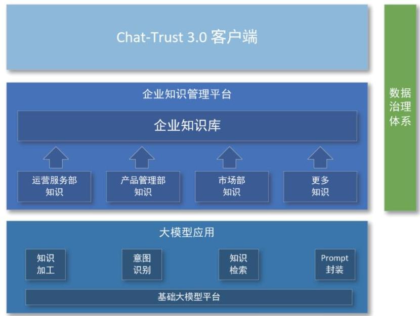

## Page 121
## 率、优质内容供给效率、资料搜索与理解效率、结果监督效率。其中最为迫切的就是展业夹

安装的效率。

二是企业知识管理平台，为各部门提供方便快捷的知识管理功能，支持各类非结构化文档管理，并提供完善的知识权限体系，保证企业知识安全可访问。

三是Chat-Trust3.0客户端，为最终用户提供方便快捷友好的问答功能，通过多端推出，适应不同业务场景需求。

### 图24 基于信美Chat-Trust3.0的知识助手

与自建大模型不同，信美基于通用基础大模型，通过强化非结构化数据管理及处理能力，深度运用检索增强、模型“微调”技术，配合插件及Agent能力建设，深耕保险垂直应用，目前已具备对外应用能力。

## Page 122
信美大模型垂直应用信美Chat-Trust3.0版本已基本实现与人类相当的保险产品专业分析能力，并且具有系统框架通用性和能力可迁移性，为赋能合作伙伴奠定了基础。在此基础上，对内部推出了多个知识助手，包括会员服务小助理、产品小助理、监管政策小助理、人力行政小助理。未来信美还会根据不同的业务场景，扩展更多的专属助理应用。

信美大模型保险垂直应用在一年内经历了1.0到3.0的快速迭代升级。通过15个大类， 2098道对话问题测试集构建"IUE保险大模型评测基准"。问答准确度快速提升，从最初的 52.7\%提升至 $81.1 \%$ 。依托企业知识库、大模型能力，优化各岗位工作流程，提升自动化水平，释放人力资源，实现降本增效。

在实施信美Chat-Trust的过程中，已对各岗位的工作流程进行了重新梳理，识别并整合了关键知识点和重复性的业务流程。利用大模型技术，实现了知识与流程的线上化，提升了效率。这一升级不仅减少了对重复性工作的资源投入，还使得更多的人力资源得以重新分配，专注于更有价值和创造性的任务。通过这种优化，企业实现了成本降低和效率提升的双重目标。

数智化发展道路还有很长的路要走。未来的数智化建设，信美将围绕新的大模型及其周边的智能技术进行深度的研究，结合企业实务，迭代、更新、重构相关流程。在数智化的实施过程中，信美注重稳健的步伐和实际效果的取得。信美致力于构建一个以数智化为平台，以价值创造为驱动力的螺旋式上升的企业管理模式。这种模式将确保信美能够持续地提升效率、优化服务，并最终实现企业的持续成长和行业的共同进步。

信美将优先着手自身的转型和升级，力求通过自身的实践和探索，为行业提供有价值的参考和借鉴。信美相信，通过信美的努力，能够为整个保险行业的数字化转型贡献力量，推动整个行业向更高效、更智能的方向发展。

## Page 123
# 5.1.10 元保 

### 5.1.10.1 大模型技术布局

元保作为保险科技领域的先行者，依托开源大模型的强大能力与元保在保险领域积累的深厚数据资源，进行了二次预训练及微调，构建了专属的保险大模型。通过确保数据的高质量及多样性，使得大模型能够理解表达更多元场景，并结合多模态技术，更好地感知理解面对的问题。基于专属的保险大模型，元保积极探索并搭建了"基于大模型的保险智能服务体系"，全面赋能保险全产业链的产研、营销、核保、理赔和客服每一个环节。

元保构建的保险大模型通过对大量保险行业文本数据、高质量提示数据进行预训练、模型微调、强化学习、专家反馈（RLHF）以及模型优化，自动生成符合要求的输出内容。利用已学习到的保险行业知识与数据处理能力，对提问者输入的文本进行深度推理和分析，提供专业且精准的答案与服务。

元保的保险大模型结合检索增强技术，同时应用了智能体Agent调度机制，能够灵活分配计算资源和任务执行策略。不同任务的智能体会根据任务复杂度、数据类型和实时性要求，动态调整模型的推理路径和资源分配，确保高效且准确地完成各类业务任务。

当前，在AI大模型的强力驱动下，元保"基于大模型的保险智能服务体系"的四大核心能力均实现了飞跃。感知力方面，通过落地多模态大模型，实现了包括文本、语音、图片在内的多模态数据的输入，识别精度显著提升；理解力方面，AI大模型加持下能够灵活捕捉新出现的用户意图，意图数量快速翻倍，实现在多轮对话和多主题切换中跟用户持续互动，对话时长最长可达 30 分钟以上；推理力方面，通过深度融合大模型与保险行业知识图谱，并运用先进的检索增强生成技术，能够进行深度推理和分析，给出更专业更准确又个性化的回答；表达力上，随着引入AI大模型，能够更好地组织语言，针对不同人群不同情绪状态等给予针对性回答，极大提升了用户交流的舒适度与满意度。

面对未来，元保将继续秉持"科技让保险更普惠"的理念，不断深化元保"基于大模型的保险智能服务体系"的应用与研发。通过持续的技术创新与服务优化，元保将进一步提

## Page 124
升保险服务的智能化水平，降低保险门槛，提升用户体验。同时，元保还将积极探索与医疗、健康等领域的跨界合作，推动保险产品与服务的多元化发展，为构建多层次医疗保障体系贡献更多力量。

# 5.1.10.2 大模型应用案例 

引入大模型后，元保的"基于大模型的保险智能服务体系"，融合运用感知、理解、表达和推理四大核心技术全面赋能保险全产业链的产研、营销、核保、理赔和客服每一个环节。在这一变革浪潮中，保险场景中的智能客服、智能理赔两大关键环节率先取得了突破，有效破解了人工客服体验参差不齐及理赔效率不高等在内的长期困扰行业的难题。

## (1) 智能客服

2023年以来，元保的智能客服体系，通过深度整合AI大模型技术，实现了理解力、表达力和专业力的显著提升，为用户带来了全新的服务体验。由于意图识别数量翻倍，智能客服能够更好地进行自然语言理解。同时，智能客服体系里的话术更丰富，可以给用户提供更加个性化的回复，此外，也能够实现保险产品对比的清晰易懂化讲解。这一升级的智能客服体系在保险专业问题解答、保险产品规划、医疗知识解答和保单管理上都有较好的应用，尤其是在保险咨询的场景下，相较之前传统机器人客户问题解决率大幅提升，用户满意度保持在 $96 \%$ 以上。面对复杂的保险规划的需求，AI大模型凭借深厚的保险领域的知识和强大的推理能力，能够准确理解用户需求，为机器人客服定制个性化的保险规划提供技术支持，从而给用户带来高效专业的保险服务。

## (2) 智能理赔

在智能理赔引入AI大模型后，在理赔资料的审核场景中，保险AI大模型可以更方便地进行各类材料的结构化抽取，省去配置大量规则的成本和复杂性。比如不同书写样式的医疗单据照片，进行OCR识别后获取的文字内容不规范，堆砌在一起难处理，以前是需要技术人员编写规则、标注数据的，现在依靠AI大模型就可以直接整理出准确可用的数据，大幅提升了效率。元保的"基于大模型的保险智能服务体系"结合了保险领域大模型和医疗

## Page 125
领域大模型等，并根据用户实际情况以及历史理赔案例数据库，对案例提出理赔建议。同时，对风险理赔案例进行预警，提升审核效率，大幅加快审核时间。

元保2024年理赔半年报显示，2024年以来，AI大模型的更多应用加速推动了智能化理赔服务的升级，2024年上半年单张医疗单据信息处理时间低至0.2秒，线上一次性审核通过率 $97 \%$ 。

# 5.1.11 中科万国 

### 5.1.11.1 大模型技术布局

中科万国主要在涉医保险领域，提供深度技术赋能。通过利用大模型的能力，结合长期积累的行业知识、业务数据、规则和作业流程，基于传统的行业痛点、业务处理流程以及服务品质，在理赔端进行多个应用的探索、挖掘以及传统流程再造和自动化处理，可以帮助保险公司实现更快速、更准确的理赔处理，包括根据客户提供的理赔申请材料和保单信息，自动化地进行理赔审核和风险评估、风险定级，实现小额的低风险案件的自动化审核，快速赔付，对于大额复杂理赔案件实现智能判责，对于涉残案件的智能伤残判定。

大模型平台体系在前端支持文本格式以及图片格式内容的输入，结合垂类领域知识库，以及对原始知识库的向量化处理和检索能力，利用大模型的推理能力输出不同业务场景的推理结果，最终为业务赋能，具体如下：

图25 中科万国大模型平台体系
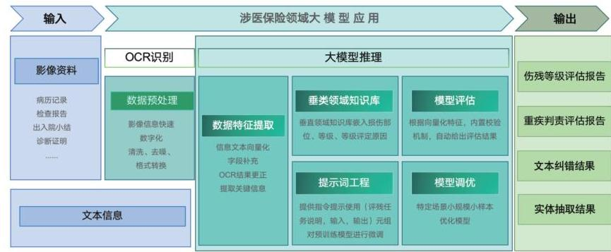

## Page 126
大模型数据建设主要集中垂直领域知识库的建设，增强大模型智能推理能力，通过验证利用大模型访问高质量和高度相关的数据，显著提高推理的效率和效果。

图26 中科万国大模型数据建设

# 5.1.11.2 大模型应用案例 

图27 中科万国大模型应用案例
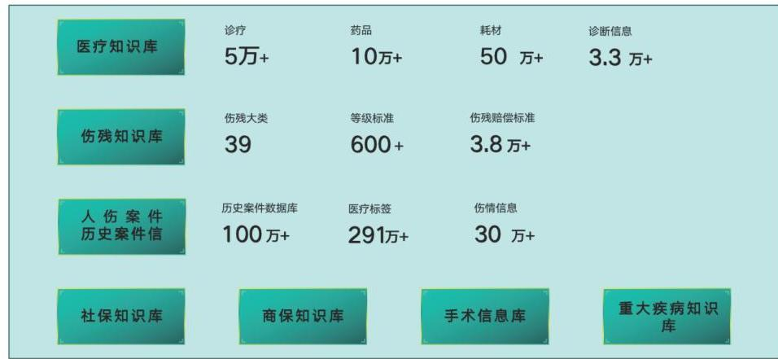
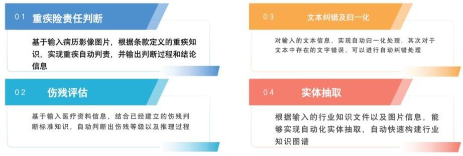

## Page 127
中科万国在应用大模型方面采用轻量级的技术方案，以私有化预训练的大模型为基础，利用中科万国多年积累的本地数据源结合大模型的能力，将不能表现具体业务能力的大模型和本地数据源进行整合，利用文本向量化的模型将文本进行向量化处理，结合用户问题提示，利用大模型的能力生成更合适的响应结果。在模型接入架构搭建上，在架构设计上具体如下：

图28 中科万国大模型应用方案

各种大模型层出不穷，不同业务场景对于模型的要求不一样、技术架构以及约束环境不同，需要各不同的场景去选择最佳的模型以及具体的落地技术方案，同时为了使模型推理的结果更符合垂类领域的标准和要求，需要获取及加工大量的垂类数据。其次，在数据召回、检索算法上也需要适配业务场景，需要进行大量的测试和验证。

目前，在重疾判责应用场景以及伤残等级应用场景，结合中科万国加工的特定知识库，根据用户输入的有效影像信息，能够达到 $90 \%$ 左右的准确率。在文本纠错、归一化以及实体抽取场景用，基本能够达到 $95 \%$ 以上的准确率。
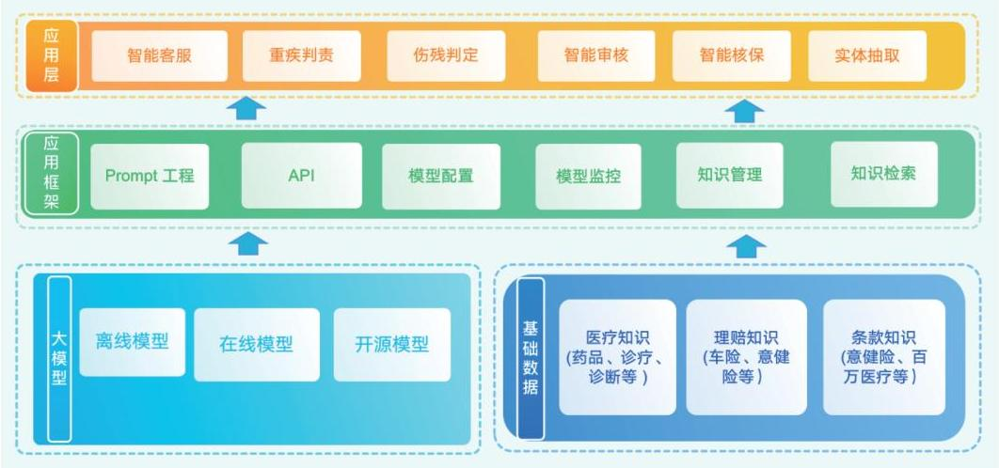

## Page 128
# 5.1.12 香港富卫集团 

富卫集团在大模型应用方面表现出了显著的前瞻性和实践成果。作为一家泛亚洲人寿保险公司，富卫集团不仅注重以客户为中心的服务理念，而且在数字化转型和技术创新方面也取得了显著成就。以下是富卫集团在大模型应用方面的一些具体情况。

选择微软作为独家AI合作伙伴：2024年2月底，富卫集团与微软签订了一份为期四年的合作伙伴协议，计划利用微软的Azure OpenAI服务以及其他企业级创新技术来推动生成式人工智能项目的发展。富卫选择微软作为其独家AI合作伙伴，共同构思和开发AI用例，以增强其在理赔、承保、代理、客户服务和市场营销等关键业务领域的能力。富卫认为数据和AI是其主要的增长驱动力。

数字化战略与技术应用：富卫集团的数字化战略着重于改变人们对保险服务的看法，通过降低客户获取保险服务的门槛，创造良好的客户、员工和分销商体验。公司已经将技术战略与业务战略紧密结合，以简单、一致的方式深入各个市场。

云基础设施与AI模型：富卫集团与亚马逊云科技（AWS）和微软（Azure）等超大规模云服务商合作，将其核心业务应用程序托管在云基础设施上。为了降低被单一云服务商锁定的风险，富卫集团采取了多云战略，将工作负载在Azure和AWS之间均等分配。公司已经部署了近200个AI模型，涵盖600多个用例。

技术人才培养与AI治理：富卫集团通过技术学院鼓励员工参加云认证培训，并建立起 AI技术学院，以培养内部技术人才。公司还认真研究AI治理，确保AI模型中不存在偏见倾向。

客户服务与营销创新：富卫集团利用AI技术提升客户服务和营销效果，通过AI模型进行欺诈检测和承保等业务，致力于提供更个性化、更高效的客户体验。

通过这些措施，富卫集团不仅加强了其在保险行业中的竞争力，也为未来的技术发展和业务扩展奠定了坚实的基础。

2024年，富卫引入了由香港中文大学电子工程学系李丹教授及其团队研发的Vocofy AI 广东话人工智能复制语音技术，专门为需要切除声带的患者提供帮助，使其获得恢复与

## Page 129
他人沟通的机会，重新拥抱正常生活。这项新技术会在患者失去声音前尽量收集他们的声音数据，全面捕捉他们的声线、发音、语调和情绪特征，然后训练人工智能模型重组声音，生成与真人一样的AI人声，患者只要在手提电话使用特别设计的App，便有机会可以重获新"声"，继续与别人沟通，恢复正常生活。

# 5.2 大模型优秀应用案例 - 国际篇 

### 5.2.1 瑞士再保险

在保险科技融合发展和行业向高质量转型的大趋势下，瑞士再保险在2023年1月成立创新解决方案事业部，利用瑞士再保险超过160年积累的数据与全球经验，为客户和合作伙伴提供包含新能源车、自动驾驶、农业天气指数、巨灾风险地图、工程数字化管理及寿险健康险自动核保引擎等一系列创新解决方案。随着大模型技术的发展，瑞士再保险也积极引入Gen AI提升效率。

## (1) 核保助手

瑞士再保险在2024年4月宣布了对其生命与健康核保手册Life Guide的增强版发布。此次升级特别引入了Swiss Re Life Guide Scout，这是一款由Generative AI驱动的承保助手，集成了微软Azure OpenAI服务，旨在通过提供AI生成的答案显著提升承保流程的效率和质量，通过快速响应承保人的问题并提供信息来源，使核保人员能够高效获取专业知识，加速风险评估过程。

Life Guide作为持续稳居全球的核保手册，其承保理念由瑞士再保险专家提供支持，内容汇集了医学和承保专业知识、精算知识，且始终紧跟最新的医疗、监管和技术发展。 Swiss Re Life Guide Scout的加入，进一步强化了Life Guide的能力，使承保人能够在几秒钟内获得基于专家知识和先进分析能力的答案，从而做出更快、更精确的决策。

此外，Swiss Re Life Guide Scout还促进了知识传递，确保承保人能够基于最新的数据和洞见进行工作。这一功能的推出，为保险公司提供了更高效、用户友好的风险评估获

## Page 130
取方式。
目前, Swiss Re Life Guide Scout以英语作为试点项目推出, 并计划在今年晚些时候进行更广泛的推广。微软瑞士的CEO Catrin Hinkel对此表示, 通过集成微软Azure OpenAI服务，瑞士再保险能够在安全、合规和可靠的云环境中，为保险市场提供新的高级分析和 Generative AI能力。

瑞士再保险通过增强版Life Guide手册和Swiss Re Life Guide Scout的推出，再次巩固了其在Life \& Health承保领域的领先地位，为保险公司提供了更先进、更智能的风险评估解决方案。这一创新不仅提升了承保效率和质量，还预示着保险行业未来技术应用的广阔前景。

# (2) 内容创作 

瑞士再保险的内容制作团队为了消除内容创作瓶颈、在社交媒体上得到更好的表现，创造性地将Lumen5的人工智能技术和文本到视频创作功能用于社交营销，增加了视频制作量，复杂视频的平均制作时间为 30 分钟，他们为每个主题制作两个及以上视频，一年内制作了约551个视频。

### 5.2.2 安盛集团

安盛集团（AXA Group）在大模型方面的布局体现在其积极采用人工智能技术来推动保险服务的创新和效率提升。2023年7月，安盛宣布推出了基于微软Azure OpenAI服务构建的内部服务AXA Secure GPT，该服务允许员工在安全、符合数据隐私的云环境中使用生成式 AI和大型语言模型来生成、总结、翻译和校正文本、图像和代码。

在保险场景应用方面，安盛集团通过其子公司AXA XL利用人工智能来增强财产风险工程能力。AXA XL与Expert System合作，使用Cogito ${ }^{\circledR}$ 平台的AI技术来识别财产现场调查报告中单词和表达的正确含义，并理解不同概念之间的关系。这项技术的应用使得风险咨询团队能够快速从工程调查报告中提取知识和洞察力，从而提高风险评估的效率和准确性。

## Page 131
此外，安盛集团还在风险管理和理赔流程中应用了机器学习工具。例如，AXA UK推出了BETSIE（Buildings Enhanced Triage Steering Intelligence Engine），这是一个使用机器学习来简化复杂财产索赔流程的工具，通过捕获关键数据点和简化索赔分诊流程来提高索赔解决的速度和准确性。

# 5.2.3 安联集团 

多年来，人工智能一直是安联的关键战略主题，该公司的全球数据科学家和人工智能专家团队一直保持对前沿科技的不断监测和探索。2022年，安联集团在全球信息技术领域的投资总额达到57亿美元，其中相当一部分专门用于人工智能（AI）技术。
"AI使保险公司能够通过更好地预测进而预防风险来增强其价值主张，"安联商业险全球风险咨询顾问服务主管迈克尔$\cdot$布鲁赫表示。"AI依赖于高质量的数据。我们一直在安联集团范围内不断发展和提高我们的数据质量——不仅在安联商业险，而是在安联集团的所有实体中——以训练我们使用的模型。这有助于我们评估和模拟极端天气事件，例如收集关于洪水等次生灾害的数据。或者，通过不断改进我们的位置数据的粒度，我们可以帮助企业客户更好地识别气候风险敞口。"布鲁赫补充道，AI可以扮演"冷静的问题解决者"的角色。"通过采用更具预测性、预防性和主动性的方法，AI可以将我们的视角从后视镜中向后看、支付索赔，转变为向前看、更敏锐地观察前方道路的情况，支持客户预防和减轻风险，避免损失。GenAI的洞察力可以帮助企业和社会变得更具韧性。"

安联商业险部门与微软合作，设立了一个GenAI探索项目，以探索并研究全球范围内的GenAI用例。用例示例包括，培训智能聊天机器人，以24/7全天候、多语言、多渠道地回答有关风险承受能力和承保的查询；以及使用GenAI汇总关键风险敞口，并引用来源和数据库生成内容，以增强风险评估。

安联积极支持员工适应人工智能的发展，其Fit4IT和安全意识计划旨在提升员工的数字技能，已有超过 7000 名员工参加了内部数据分析学院的培训。

## Page 132
安联正在实施AI和数据驱动项目来预防损失并改善理赔流程。
（1）预防：天气预警工具可预测极端天气事件的地点、时间和影响， $96 \%$ 的客户表示，他们会根据预警采取措施防止损失。该工具拥有190万名注册用户。
（2）通知：另一款AI工具可通过应用程序和风挡标签实时检测汽车事故，或通过联网汽车或智能手机的传感器检测。该工具拥有 4 万名活跃用户，可提供简单且数字化的首次损失通知，使安联能够主动与客户联系。
（3）理赔评估：AI资产工具可实现即时承保检查、更高效的理赔评估和解决方案，例如汽车保险中的自动化预先评估、小额理赔的快速评估，以实现高效的理赔。
（4）欺诈检测：基于AI的工具可有效利用现有数据检查欺诈行为，包括欺骗性语言、不一致或异常行为；篡改图像或视频证据；根据历史数据预测欺诈可能性；以及社交网络分析，以在索赔人、被保险人和证人中揭露欺诈者。
（5）海事理赔：AI工具海王星（Neptune）有效提升了北美地区的海事理赔处理和结算工作效率。海王星基于实时信息（如各部门、团队和理赔员的工作量）自动在首次损失通知 （FNOL）阶段将理赔案件分配给理赔员，并向理赔经理提供实时关键绩效指标（KPI）。在此之前，理赔团队需要根据静态业务规则和不完整的信息手动将每个新索赔分配给相应的理赔员。现在，他们只需点击几个按钮即可完成这项工作，并每天更新工作量概览。

# 5.2.4 丘博保险 

丘博保险，作为领先的商业保险提供商，已宣布与Cytora合作，Cytora是保险工作流程中生成性人工智能的先驱。这一合作伙伴关系旨在通过自动化文档处理和消除手动干预的需求，彻底改革丘博的索赔处理流程。

Cytora的平台利用生成式AI以无与伦比的性能、可配置性和可扩展性数字化保险工作流程。这意味着丘博的流程处理时间更快，准确性提高，资源分配也得到改善。
"合作的重点是使丘博索赔文件能够自动数字化，消除手动干预的需求，"丘博北美转

## Page 133
型官Amir Farid解释说。"Cytora的平台赋予丘博团队以可扩展的方式在多个市场和业务线中创建、组合和部署AI原生索赔文档流程。"
"保险行业正在迅速向数字化优先的未来转变，"Cytora的首席执行官Richard Hartley强调。"这一转变使保险公司能够高效地扩大风险量，同时获得对决策的优越控制。我们很高兴与丘博合作，丘博是这场数字化转型的先锋。"

通过采用生成式AI技术，丘博正在大胆地迈向优化其索赔处理操作，提升客户体验，并在不断演变的保险领域中为自己定位以取得未来的成功。

# 5.2.5 恰安保险 

怡安保险（Aon）正在开发一个内部的生成式人工智能平台，该平台将包括一个大型语言模型和其他工具，旨在帮助员工提高工作效率。

这个平台的一个主要功能是能够比较不同保险公司的政策措辞，快速突出显示差异，从而帮助员工为客户做出更好的决策。此外，该平台还将减少员工在准备客户演示时重新输入信息的需要，节省时间。

怡安加拿大的员工预计将在2024年年底前开始使用这个平台，而整个怡安集团将分阶段推出。这个AI平台的推出预计将为怡安在全球保险市场提供竞争优势。

### 5.2.6 第一生命

第一生命（Dai-ichi Life）开发了名为 Sophie（数字伙伴）和 Ichi（数字助理）的创新型生成式AI系统，以增强其销售业务。数字伙伴Sophie利用ChatGPT技术生成线索和推荐，协助专属代理与客户进行互动、生成潜在客户名单和促进成交。另一方面，数字助理Ichi 可通过 Line 等应用自主与客户和潜在客户互动以生成潜在客户。该 GenAI 解决方案简化了销售流程、提高了代理效率并提供了有价值的客户洞察。此外，它还使销售经理能够有效地管理和指导销售代理，通过查看电话摘要和快速审查记录来提高代理的销售技巧，最终

## Page 134
提高第一生命的整体销售业绩和客户体验。目前已在日本的6家分公司得到了应用。

# 5.2.7 好事达保险 

好事达保险（Allstate）在其客户服务中应用了名为Amelia的人工智能认知代理。 Amelia是一个经过保险专业语言训练的AI系统，能够覆盖美国50个州和50多个特种保险主题的法规，为好事达保险的员工提供客户复杂保险问题的简明答案，而无需让客户等待翻查各种文献和资料。Amelia每月可以处理超过250,000次对话，满足了超过 $75 \%$ 的呼叫中心员工的需求。

Amelia的引入不仅提高了客户服务的效率，还有助于确保每个客户的需求得到满足并且符合法规和合规性要求。好事达保险计划增加Amelia的工作量并扩大其应用范围，最终目标是让Amelia能够与客户直接互动。通过Amelia和其他人工智能程序的配合使用，好事达保险已经缩短了通话时间并提高了首次通话解决率。

好事达保险当前正致力于实现公司与客户互动的现代化，目标是将更多的互动转移至自动化渠道，如聊天机器人。他们认为人工智能将在未来几年内继续发展和变革，技术将变得更加强大，而Amelia和其他人工智能服务将面向越来越多的客户，人类员工则可以更专注于案例的管理和客户体验的人性化。

### 5.2.8 奥斯卡健康

美国健康险公司奥斯卡健康（Oscar Health）和OpenAI建立合作，将人工智能引入健康保险，通过文档自动化、理赔助手等应用，降低成本并改善客户体验。Oscar Health是第一家与OpenAI签署业务合作协议（BAA）的保险公司。

## (1) 自动化文档处理

这一功能主要集中于临床医疗文件。一般来说，记录患者和医疗团队之间的一次对话可能需要20多分钟。借助OpenAI的API，Oscar将记录医疗护理对话和审查实验室测试结

## Page 135
果所花费的时间减少了近 $40 \%$ ，在整个公司层面节省了无数时间，允许护士和临床医生专注于更高阶的任务，从而提升效率。这仅仅是开始——研发表明GPT-4在某些情况下可以将生产力提高高达 $90 \%$ 。

在此基础上，Oscar Health利用以前无法处理分析的医疗记录解锁了非常强大的用例，具体包括：
(1) 帮助临床医生找到患者的相关信息，以便更快地审查保险索赔；
(2) 总结以前的医疗记录，为医生与患者的会面做好准备，使其更加高效和个性化；
(3) 从许多医疗记录中提取信息并进行分析，回答诸如"哪些糖尿病患者适合连续血糖监测?"之类的问题；
(4) 促进公平。在医疗系统中存在一种偏见，医疗状况最严重、最复杂的患者往往拥有最长的病历，而且查询、分析和总结起来也最麻烦。借助AI的效率，可以缩短时间，从而促进公平。

# (2) 理赔助手 

了解理赔的历史是一项极其复杂的工作，原因是有数百万个合同变量在起作用。当医生对索赔有疑问时，Oscar的团队必须浏览索赔处理过程中所做每个决定的详细日志。借助OpenAI的API，Oscar构建了一个助手（Oscar Claim Assistant），可以有效追踪索赔，并自动回答有关患者索赔过程的问题。

从效果来看，理赔助手将理赔处理团队解决问题所需的时间缩短了 $50 \%$ ，其准确性与人工客服人员相当甚至更好。Oscar Health预计每月至少自动处理 4,000 张理赔单，到今年年底，预计自动处理 4.8 万张。

### 5.2.9 考贝尔

网络安全保险先驱公司Cowbell推出了人工智能驱动的承保助手MooGPT。MooGPT利用生成式人工智能和大语言模型来简化中小企业的承保流程。通过提取合同数据、生成

## Page 136
众摘要、分析潜在风险的措辞以及提供主动的技术建议，MooGPT 增强了承保人的决策能力。这一创新工具提高了准确性，增强了与经纪人和保单持有人的沟通，并加快了承保流程。MooGPT 能够从每个分析的业务中学习，使其能够随着时间的推移提供越来越相关的见解，最终使 Cowbell 的客户和公司本身受益。

MooGPT运用强化学习技术，为指定的保险代理人和活跃保单持有人在保单生命周期内提供实时对话体验。MooGPT进一步丰富了Cowbell现有的、以人工智能为核心的功能，这些功能对于提供适应性网络保险至关重要，具体包括：

Cowbell Factors：一套专有风险评级系统，持续将企业与包含3500万个实体的风险池进行基准对比；

Cowbell Scanners：自动化机器人，负责从企业的互联网足迹中收集和规范化数百个安全信号；

Cowbell Insights：为中小企业自动生成的个性化网络安全建议，旨在帮助其改善网络安全状况并增强网络韧性；

Cowbell Connectors：从Microsoft 365、AWS、Google Workspace、Google Cloud等常用技术和网络安全解决方案中收集超过 3000 个风险信号，并进行建模分析；

Moo：Cowbell的人工智能承保助手，基于动态演变的规则集自动承保类似风险。 Moo还为承保人员提供详尽、有序的见解，以简化更复杂风险的风险选择和定价流程。

MooGPT帮助保险经纪人和保单持有人按需获取风险评估指导，如Cowbell Factors和 Cowbell Insights、非约束性保费估算，并提供理赔流程的相关信息。此外，MooGPT还为保单持有人提供安全意识培训、事件响应计划制定、风险改进建议、Cowbell Academy的学习内容，以及Cowbell Rx市场上提供的激励措施。
"生成式人工智能是一种变革性技术，有望为网络保险生态系统带来更高的效率，"Cowbell的联合创始人兼首席产品官拉吉夫$\cdot$古普塔（RajeevGupta）表示。"通过MooGPT，我们的经纪合作伙伴和保单持有人将从提高生产力和效率中受益。MooGPT进一步提升了Cowbell的报价、绑定、发行和风险改进体验"。

## Page 137
# 6.未来展望与建议篇 

## 6.1 大模型应用趋势

### 6.1.1 应用模式：由Chatbot向AI Agent演进

Chatbot作为大模型应用的初级形态，以其基础的交互能力为用户提供了便捷的查询与咨询服务。然而，其"辅助"角色的定位限制了其在复杂场景下的决策与行动能力。相比之下，AI Agent则以其更高的自主性、智能性与行动力，成为大模型技术迭代与落地应用的重要方向。

AI Agent以其"超级拟人化"的形态，不仅接收并深度理解外部指令与信息，更能够自主进行任务规划、环境感知、行动执行与观察纠错，这一系列以任务目标为导向的行动，不仅极大地提升了大模型技术的实际问题解决能力，更推动了保险服务的个性化、智能化与高效化。

展望未来，AI Agent模式将成为推动保险行业智能化转型的核心动力。它不仅将为用户带来更加便捷、高效、个性化的保险服务体验，更将重塑保险公司的业务模式、服务流程与市场竞争格局，为保险行业从"以产品为中心"向"以客户为中心"的深刻转变提供技术支撑。

### 6.1.2 应用场景：由非决策类场景向决策类场景过渡

OpenAI o1模型的发布，不仅标志着大模型推理能力的重大跃迁，更为保险行业带来了前所未有的变革契机。在金融领域，尤其是保险行业中，大模型的应用正逐步跨越简单的信息处理与图文生成的范畴，深入拓展至与决策息息相关的核心业务板块。

## Page 138
保险业务的核心在于精准定价、风险度量与未来预测，这些环节无一不依赖于复杂的数据分析与精准判断。以 101 为代表的具备推理能力的大模型，将充分发挥大模型在智慧涌现与复杂信息处理方面的独特优势，为保险产品定价提供更加科学的依据，使风险度量更加精准，预测能力显著提升。

更为重要的是，随着推理能力的不断提升，大模型正逐步从非决策类场景迈向决策类场景的核心地位。在保险业务中，这意味着大模型将在产品定价策略、风险评估等多个关键环节发挥决定性作用。大模型将提供更为智能、高效的决策支持，推动保险行业向更加智能化、精准化的方向发展。

# 6.1.3 多模态大模型：落地应用潜力巨大 

多模态大模型正逐步向更高级的"世界模型"演进，这一趋势预示着其在各行业的应用将加速落地。多模态技术的本质是模拟人类世界的复杂性，涵盖从文本、图像、视频（包括2D和3D)，到声音、光线、电信号，甚至分子和原子等多种形式。这种技术的不断进步不仅在生成和迁移跨模态内容方面展现出巨大潜力，还在理解和模拟物理世界规律方面取得了显著进展。

例如，谷歌推出的Gemini模型，以其原生多模态能力，能够无缝处理文本、图像、视频、音频和代码等多种数据类型。OpenAI的Sora模型则展示了其在生成长达60秒的高质量视频方面的能力，尤其是在模拟物理规律方面，Sora已经展现出了作为世界模拟器的潜力。 Google DeepMind的Genie模型则通过互联网视频训练，能够从合成图像、照片甚至草图中生成多样化的可交互世界。

这些技术的持续进步不仅丰富了用户的多维和沉浸式体验，提高了多模态数据处理的效率，还加深了对复杂现实世界场景的理解，并推动了新产品形态和服务形式的创新。在保险领域，多模态大模型的应用将极大地提升风险评估的准确性和效率。例如，通过整合和分析来自文本、图像、视频等多种渠道的数据，模型能够更全面地了解被保险对象的

## Page 139
实际情况，从而更准确地预测潜在风险。此外，多模态大模型还能在理赔处理中发挥重要作用。它能够快速识别并验证索赔材料，如通过图像识别技术判断车辆损坏程度，或通过视频分析技术评估事故现场情况，从而显著提升理赔效率，减少欺诈行为。

展望未来，多模态大模型在保险行业的应用前景广阔。它不仅能够提升服务质量和效率，还能促进保险产品的创新和个性化发展。例如，通过结合多模态大模型和物联网技术，保险公司可以推出智能家居保险等新型保险产品，满足消费者多样化的需求。同时，多模态大模型还能帮助保险公司更好地理解和预测市场趋势，制定更为科学的定价策略和风险管理措施。

# 6.1.4 大模型与小模型：互相补充，协同合作 

在大模型横空出世之前，保险行业内早已广泛部署了包括小模型在内的众多传统AI技术产品，它们如同精密的齿轮，紧密咬合于保险业务的每一个环节之中，从风险评估到客户服务，再到理赔处理，其服务模式与应用效果历经市场考验，已达到了一个相对成熟且高效的水平。这些小模型凭借其轻量级、响应迅速的特点，在处理结构化数据、执行预设规则等方面展现出了非凡的效能，尤其是在面对那些不涉及复杂主观判断、答案相对明确的封闭式问题时，小模型展现出了极高的准确性和运行效率，为保险业务的自动化、智能化转型奠定了坚实的基础。

然而，随着人工智能技术的不断演进，保险大模型的出现为行业带来了新的可能性。大模型，以其强大的语义理解能力、深邃的信息分析洞察力以及丰富的内容生成创造力，为保险业务带来了前所未有的变革潜力。它们擅长处理那些需要深度理解、复杂推理乃至创新思考的开放式问题，这些问题往往涉及客户情感的微妙差异、市场趋势的多元预测或是复杂案件的灵活裁决，是大模型展现其独特价值的舞台。在这里，大模型的推理演绎能力、创新求解能力得到了充分地发挥，为保险业务提供了更为个性化、智能化的解决方案。

## Page 140
值得注意的是，大模型与小模型之间的关系并非简单的替代或对立，而是一种互为补充的协同合作模式。大模型凭借其全局视野和深度学习能力，可以向边缘计算设备或终端的小模型输出经过优化的模型能力，这些能力经过定制化调整后，能够更高效地适应特定场景的需求。而小模型则扮演着"最后一公里"执行者的角色，它们负责将大模型的指导转化为具体问题的精准解决方案，同时，通过实时反馈执行效果给大模型，形成了一个闭环的优化机制。这一过程不仅提升了解决问题的效率与质量，还促进了大模型自身能力的持续优化和迭代升级，形成了一种良性循环。

# 6.1.5 AI代理：推动行业生产力智能升级 

在数字化转型的浪潮中，AI代理技术的兴起正引发一场生产力的革命。AI代理，以其强大的学习和决策能力，正在逐步成为推动各行各业生产力提升的关键因素。

在保险行业，AI代理在分销和承保环节中发挥着重要作用。通过深度学习技术，AI代理能够处理大量复杂数据流，实现实时定价和购买。例如，汽车和家财保险公司已经实现即时报价，并将继续完善，向更广泛的客户人群提供保单。此外，AI代理还能够通过智能合约和区块链技术简化支付和验证流程，降低保险公司的获客成本。在理赔和客服方面，AI代理能够提供更加精准和快速的服务。例如，众安保险利用AIGC技术优化智能客服，通过自动生成回答和会话总结，提高了客服的准确率和效率。此外，AI代理还能够通过深度学习技术，识别和处理图像、声音和文本等多种数据类型，提升理赔的准确性和速度。在产品创新方面，AI代理通过分析用户行为和偏好，设计出更加个性化和灵活的保险产品。例如， UBI可以根据单个顾客的行为进行定制，提供更加精准的保障。

## AI代理的智能升级主要体现在以下几个方面：

深度学习能力：通过不断地学习和训练，AI代理能够更好地理解复杂的任务需求，提供更精准的解决方案。

自主决策能力：AI代理能够根据任务需求自主选择最合适的解决方案，并有效控制任

## Page 141
务进度，减少对人工干预的依赖。
跨模态理解能力：AI代理能够处理和理解多种数据类型，如文本、图像、视频和声音，提供更全面的服务。

AI代理的引入，不仅提升了工作效率，还降低了运营成本。通过智能优化，AI代理能够减少人力成本，提高资源利用率，从而实现成本的优化。同时，AI代理还能够通过自主学习和优化，不断提升服务质量，推动行业的创新和发展。AI代理能够自动化许多重复性和时间密集型的任务，如数据录入、报告生成和客户服务，从而提升整体的工作效率。通过减少对人工的依赖和优化资源分配，AI代理能够显著降低运营成本。

随着技术的不断进步，AI代理将被更广泛地集成到组织机构的各个层面。与人类员工、其他数字化系统及基础设施形成一个互联互通、高效运作的生态系统。这种深度整合不仅优化了组织结构和提升了运营效率，还将为企业创造前所未有的价值，推动行业生产力的指数级增长。AI代理作为行业生产力的智能升级，正在通过效率与成本的双重优化，引领着一场生产力的革命。随着技术的不断发展和应用的不断深化，AI代理将在更多领域展现出其巨大的潜力和价值。

# 6.2 行业实践建议 

### 6.2.1 明确应用场景与目标

保险公司在落地大模型时，首先需要深入剖析业务痛点与需求、评估落地路径的可行性，明确大模型落地应用场景，并设定明确可量化的应用目标。只有这样，才能确保大模型在保险业务中发挥出最大的潜力，为公司带来实质性的业务增长和客户服务质量的提升。

选择落地场景时，需对以下方面进行深入考量：

## (1) 深度剖析业务痛点与需求

首先要全面分析公司的业务流程，找出哪些环节可以通过大模型得到优化。在初步识

## Page 142
别有价值的应用环节后，公司应进一步深挖这些环节背后的业务痛点。例如，在风险评估与定价环节，传统的风险评估方法可能因主观因素导致误差较大，影响保费定价的合理性。大模型可以通过分析多维度数据，包括历史赔付记录、客户行为模式、外部数据源（如天气、经济状况）等，提供更加精准的风险评估。通过深入剖析这些痛点，保险公司能更准确地定位大模型的应用落地场景。

# (2) 分析技术实现路径的可行性 

在确认应用场景后，需要结合该场景的特点评估技术实现的可行性。这包括但不限于大模型的选择（开源模型或是闭源模型，模型尺寸等）、落地路线选择、数据预处理（清洗、标注等）、模型训练与优化（选择合适的超参数、使用合适的优化算法），以及部署与监控 （确保模型在生产环境中的稳定性和可维护性）。这需要组建跨部门的技术团队，包括人工智能专家、数据科学家、业务专家、运维人员等，共同协作完成这一复杂过程。

## (3) 衡量投入产出比

投入产出比同样是决策过程中的重要考量。保险公司需要详细分析大模型项目的成本构成，包括开发、部署、维护等各个环节的费用，并预测其可能带来的收益。通过成本效益分析，确保项目的投资回报在合理范围内。

## (4) 构建与维护数据生态

数据是驱动大模型成功的核心要素。针对落地场景，保险公司需要构建一个完善的数据生态系统，包括数据采集、存储、处理、分析，以及安全保障等各个环节。在这个过程中，保险公司需要确保数据的真实性、完整性、时效性和安全性，避免数据泄露和滥用。同时，为了保持模型的有效性，保险公司还需要定期更新和丰富数据集，以适应市场变化和客户需求的变化。

在明确应用场景后，保险公司需要明确可量化的指标来衡量项目的成功与否。例如，在降本方面，可以设定具体的成本节约比例或成本节约金额；在增效方面，可以关注业务流程的提速比例或决策准确性的提升幅度；在提升客户体验方面，可以通过客户满意度调

## Page 143
查或客户留存率等指标来评估。这些可量化的指标有助于保险公司更准确地监控项目进展并评估实施效果。

# 6.2.2 多因素考虑选择落地技术路线 

保险企业在落地大模型时，要确定使用直接使用、工程化适配还是深度研发这三种模式中的哪一种，需要综合考虑多项因素。以下是一些建议：

## (1) 考虑企业现状和需求

分析保险企业的具体业务需求，对于需求明确且标准化程度高的场景，可能适合直接使用大模型。对于需求复杂、个性化程度高或需要高度定制化的场景，则可能需要采用工程化适配或深度定制模式。举例来说，若需要丰富的外部知识支持，则选择工程化适配中的RAG路线；若涉及复杂任务处理或者多任务处理，则可选择AI智能体路线。

如果保险企业已经具备较强的技术实力和丰富的AI应用经验，且内部团队能够快速掌握大模型技术，那么可能更倾向于选择工程化适配或深度定制模式。若技术基础相对薄弱，则可能需要选择直接使用来逐步引入大模型技术，以降低实施难度和风险。

## (2) 评估大模型的特点和能力

不同类型的大模型在能力上有所差异，如语言理解、文本生成、知识问答等。保险企业应根据自身需求选择适合的模型类型。

评估大模型在处理保险行业数据时的准确性和效率。对于性能表现优异且易于优化的模型，可直接使用或进行轻度适配。若模型性能需进一步提升，或需针对特定业务场景进行深度优化，则可能需要采用工程化适配或深度定制模式。

## (3) 考虑实施成本和效益

直接使用大模型通常成本较低，因为无需进行额外的开发和适配工作。工程化适配和深度定制模式则需要投入更多的人力、物力和时间成本，包括定制开发、系统集成、测试验证等环节。

## Page 144
综合考虑大模型应用后带来的业务效益和成本投入之间的比例关系。确保所选模式能够在合理的时间内实现预期的业务目标。

# (4) 关注行业趋势和最佳实践 

关注保险行业在AI大模型应用方面的最新趋势和动态，了解行业内的成功案例和最佳实践。借鉴其他保险企业的成功经验，结合自身实际情况进行调整和优化。

与技术领先的AI企业建立合作关系，共同探索大模型在保险行业的创新应用。通过合作获取技术支持和解决方案，降低实施难度和风险。

综上所述，保险企业在落地大模型时，应综合考虑企业现状和需求、大模型的特点和能力、实施成本和效益以及行业趋势和最佳实践等因素，以确定最适合自身的落地模式。

### 6.2.3 分阶段实施与长期持续优化

大模型技术的落地实践应分阶段进行，从外围场景逐步向核心场景渗透。在初期阶段，可以选择风险较低、容易见效的场景进行试点，如客服自动化、理赔辅助等。随着技术的成熟和经验的积累，再逐步扩展到风险管理、产品设计等更复杂的场景。同时，应建立持续优化机制，根据实际应用效果不断调整和优化模型参数和算法。

## (1) 战略规划与顶层设计

制定详细的战略规划和顶层设计方案，明确大模型技术在保险行业的落地路径和发展方向。通过分阶段实施和逐步推进，确保各项任务有序进行并取得预期成果。

## (2) 试点先行与逐步推广

选择具有代表性的业务场景进行试点应用，验证大模型技术的实际效果和可行性。在试点成功的基础上，逐步将大模型技术应用到更多业务场景和流程中，实现全面推广和深度整合。

## (3) 持续改进与迭代升级

建立持续改进和迭代升级的机制，根据实际应用情况和市场反馈，不断优化大模型技

## Page 145
术的性能和效果。同时, 关注新技术的发展动态, 及时引入新技术进行迭代升级, 保持公司在技术领域的领先地位。

# 6.2.4 关注政策导向与合规要求 

随着数字金融的快速发展，监管部门对保险行业的科技应用提出了更高的合规要求。保险公司应密切关注政策导向和监管要求的变化，及时调整和优化技术应用方案。同时，加强与监管部门的沟通与合作，确保大模型技术的落地实践符合相关法律法规的规定。

## (1) 密切关注监管机构的指导原则和法律法规

需要密切关注保险监管机构发布的相关指导原则和法律法规，如偿付能力监管、产品监管、市场行为监管等。国家金融监督管理总局在2023年9月发布了《保险销售行为管理办法》，该办法在规范保险销售行为的同时，也涉及数据隐私相关的内容。它要求保险公司、保险中介机构及其销售人员应当尊重和保障投保人、被保险人、受益人的合法权益，并强调了对个人信息收集、处理行为的管控，以确保数据安全。

监管政策是动态变化的，保险公司需要持续监控政策变化，并及时更新合规策略。定期进行合规审查和压力测试，以确保大模型的部署和应用持续合规。

## (2) 满足模型透明度和可解释性要求

监管政策可能要求保险公司提供关于模型决策过程的透明度和可解释性。这要求保险公司不仅要关注模型的输出结果，还要能够解释模型是如何达成这些结论。

## (3) 确保技术合规性

确保所使用的技术和工具，包括大模型本身，符合行业标准和监管要求。与技术供应商合作，确保他们的解决方案能够满足保险行业的合规需求。

## (4) 建立问责制

在模型导致错误决策的情况下，保险公司可能需要承担责任。需建立记录和审计跟踪，以便在出现问题时可以追溯和问责。

## Page 146
综上所述，保险企业在大模型落地应用时，必须将政策导向与合规要求作为核心考量因素之一。这不仅能够避免因违规而受到的法律制裁和经济损失，还能够提高企业声誉，增强客户信任，从而在激烈的市场竞争中保持竞争优势。通过建立相应的管理流程和控制机制，保险企业可以在确保合规的同时，利用大模型技术优化业务流程，提升服务质量，实现可持续发展。

# 6.2.5 加强数据安全和隐私保护 

加强数据安全和隐私保护是保险公司在大模型技术落地实践中的重要任务。通过构建全面的数据安全管理体系、加强数据访问控制、优化数据处理流程、加强大模型技术的安全性、建立应急响应机制以及加强法律法规遵从等措施，可以有效保障数据的安全性和隐私性，为大模型的稳健落地提供有力保障。

## (1) 构建全面的数据安全管理体系

制定严格的数据安全政策，包括确立明确的数据分类标准，对敏感数据进行分级管理；制定详细的数据访问权限控制策略，确保只有授权人员才能访问相关数据：设立数据安全管理委员会，负责监督数据安全政策的执行和持续改进。

强化数据加密技术，使用国密算法对敏感数据进行加密存储和传输；实施端到端加密，确保数据在传输过程中的安全性；定期更换加密密钥，防止密钥泄露带来的风险。

## (2) 加强数据访问控制

实施多因素身份验证机制，提高用户身份识别的安全性；采用基于角色的访问控制 （RBAC）或基于属性的访问控制（ABAC），确保用户只能访问其权限范围内的数据；定期对用户权限进行审查和更新，避免权限滥用。

建立全面的数据访问审计机制，记录所有敏感数据的访问和操作行为。利用智能分析工具对审计日志进行实时监控和异常检测，及时发现并应对潜在的安全威胁。

## Page 147
# (3) 优化数据处理流程 

在数据处理过程中，遵循数据最小化原则，仅收集和处理必要的数据；对敏感数据进行匿名化或去标识化处理，降低数据泄露的风险。

## (4) 加强大模型技术的安全性

在大模型训练过程中，确保训练数据的安全性和隐私性；对模型进行安全审计和漏洞扫描，防止模型被恶意利用；在模型部署时，采用安全的容器化技术，确保模型运行环境的隔离性和安全性。

探索并应用多方计算和安全多方计算技术，允许在多个参与方之间共享和计算数据，同时不暴露原始数据给任何一方；利用加密技术，实现数据在加密状态下的计算和分析。

## (5) 建立应急响应机制

针对可能的数据泄露和安全事件，制定详细的应急预案和处置流程；定期进行应急演练，提高应对突发事件的能力和效率。一旦发生数据泄露或安全事件，立即启动应急预案，迅速进行应急处置和恢复工作：对事件进行深入分析，总结经验教训，不断完善数据安全管理体系。

## (6) 加强法律法规遵从

严格遵守国家关于数据安全和个人隐私保护的法律法规，如《网络安全法》《数据安全法》《互联网信息服务深度合成管理规定》《生成式人工智能服务安全基本要求》等；定期对员工进行法律法规培训，增强全员的数据安全意识和法律意识。

与专业法律机构合作，为公司提供数据安全和隐私保护方面的法律咨询和支持；在遇到法律纠纷时，及时寻求法律帮助，维护公司的合法权益。

### 6.2.6 强化技术合作与生态建设

大模型技术的研发和应用需要深厚的技术沉淀和广泛的资源支持，强化技术合作与生态建设是推动大模型技术在保险公司落地实践的关键。通过明确合作目标、选择合适的

## Page 148
合作伙伴、构建开放的技术合作平台、推动技术生态的协同发展以及注重合作成效的评估与反馈等措施，我们可以加速大模型技术在保险行业的创新应用。

# (1) 明确技术合作目标 

首先，我们需要明确技术合作的具体目标，如大模型技术具体应用到哪些业务场景，应用目标为提升公司的业务效率、降低成本还是增强客户体验等。这一目标应成为我们寻求合作伙伴、制定合作策略、评估合作成效的基准。

## (2) 选择合适的合作伙伴

科技公司：积极与在人工智能、大数据、云计算等领域具有领先技术的科技公司合作，共同研发适用于保险行业的大模型解决方案。这些公司通常拥有强大的技术实力和丰富的行业经验，能够为我们提供有力的技术支持。

高校及研究机构：与国内外知名高校、研究机构建立合作关系，共同开展大模型技术的基础研究和应用研究。通过产学研合作，我们可以获得最新的科研成果和技术趋势，为公司的技术创新提供源源不断的动力。

行业协会及标准组织：参与或主导相关行业协会、标准组织的活动，推动大模型技术在保险行业的标准化、规范化发展。这有助于我们与同行建立更紧密的联系，共同推动行业的进步。

## (3) 构建开放的技术合作平台

建立技术合作联盟：联合多家保险公司、科技公司、高校及研究机构，共同成立技术合作联盟。通过联盟内的资源共享、优势互补，加速大模型技术在保险行业的落地应用。

开放API接口：将公司的大模型技术以API接口的形式对外开放，吸引更多的开发者、合作伙伴参与到技术生态的建设中来。通过开放API接口，我们可以实现技术的快速迭代和应用的广泛覆盖。

举办技术交流活动：定期举办技术交流会、研讨会等活动，邀请行业内的专家、学者、企业家等共同探讨大模型技术在保险行业的应用前景和发展趋势。这些活动有助于我们

## Page 149
了解行业动态、拓展合作网络、提升技术实力。

# (4) 推动技术生态的协同发展 

促进数据共享：在遵守相关法律法规和隐私保护原则的前提下，推动保险公司之间的数据共享。通过共享数据资源，我们可以训练出更加精准、高效的大模型，提升整个行业的智能化水平。

联合研发创新：鼓励保险公司与科技公司、高校及研究机构等合作伙伴联合研发创新项目。通过联合研发，我们可以集中优势资源、攻克技术难题、推动技术创新和产业升级。

培养专业人才：加强与大专院校、职业培训机构等的合作，共同培养具备大模型技术、保险业务知识的复合型人才。这些人才将成为推动保险行业智能化转型的重要力量。

## (5) 注重合作成效的评估与反馈

建立评估机制：制定科学的评估指标和方法，对技术合作的成效进行定期评估。评估内容应包括技术创新的成果、业务效率的提升、客户体验的改善等方面。

收集反馈意见：积极收集合作伙伴、客户等各方对技术合作的反馈意见，了解合作过程中存在的问题和不足。根据收集的反馈意见，及时调整合作策略、优化合作流程、提升合作成效。

## Page 150
大模型技术深度赋能保险行业白皮书 (2024)

## Page 151
# 编委会： 

李 科 谷 伟 王 和 魏晨阳 顾青山
沈海波 杜新凯 吕 超 刘 彦 侯佳腾
韩权杰 张 晗 王红豫 姚佶超 胡 凯

## 联络支持：

陈 述 石国平 陈 希 曹 靖

## 案例支持：

中国人寿 平安保险 泰康养老 中国太保
华农保险 信美相互 元 保 中科万国