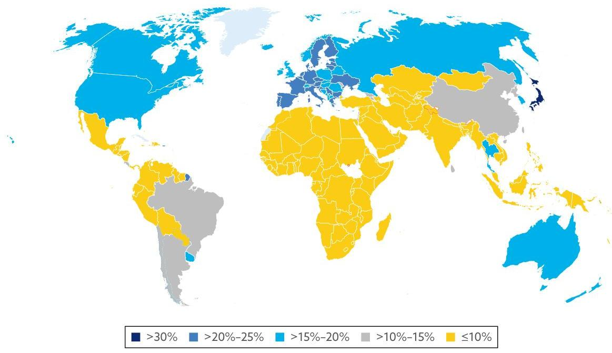
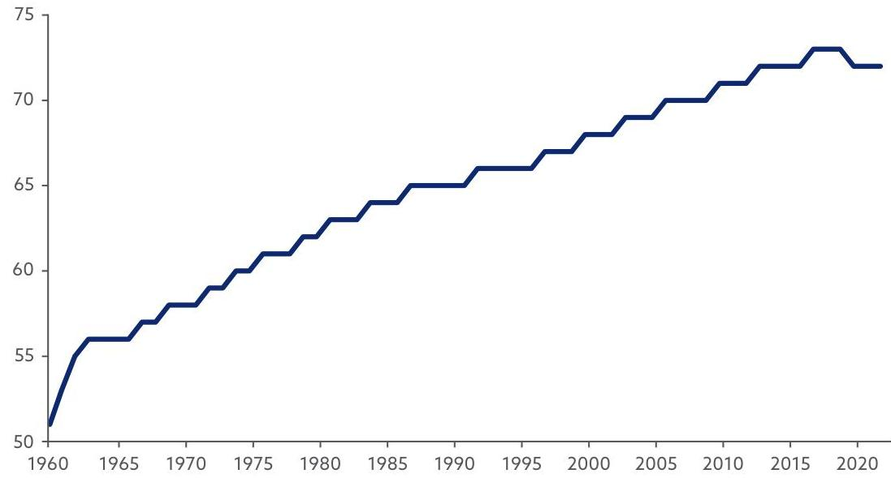
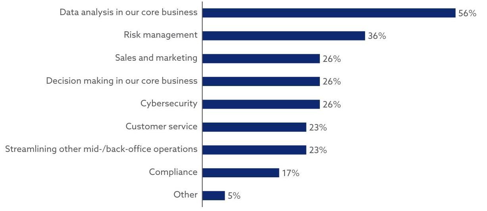
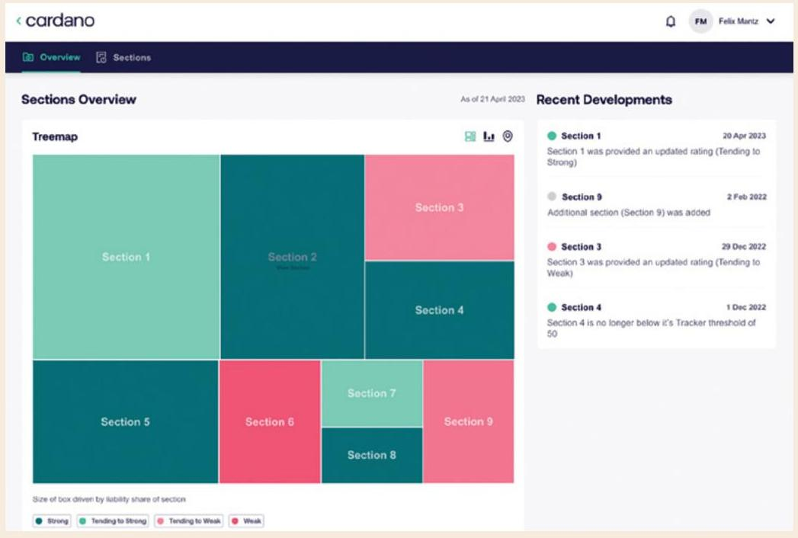
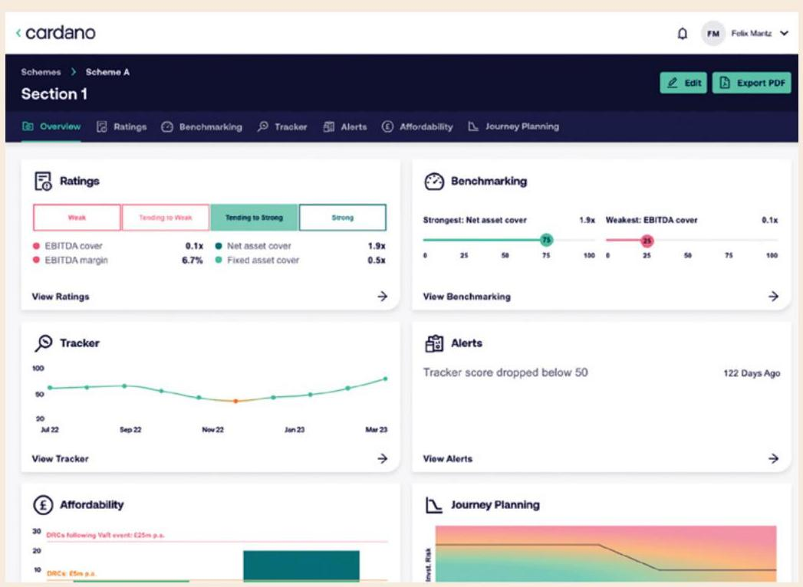
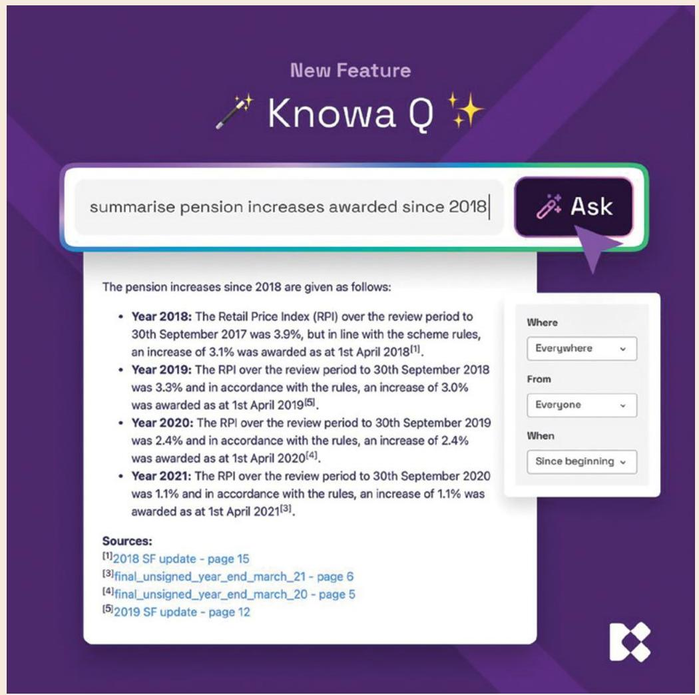
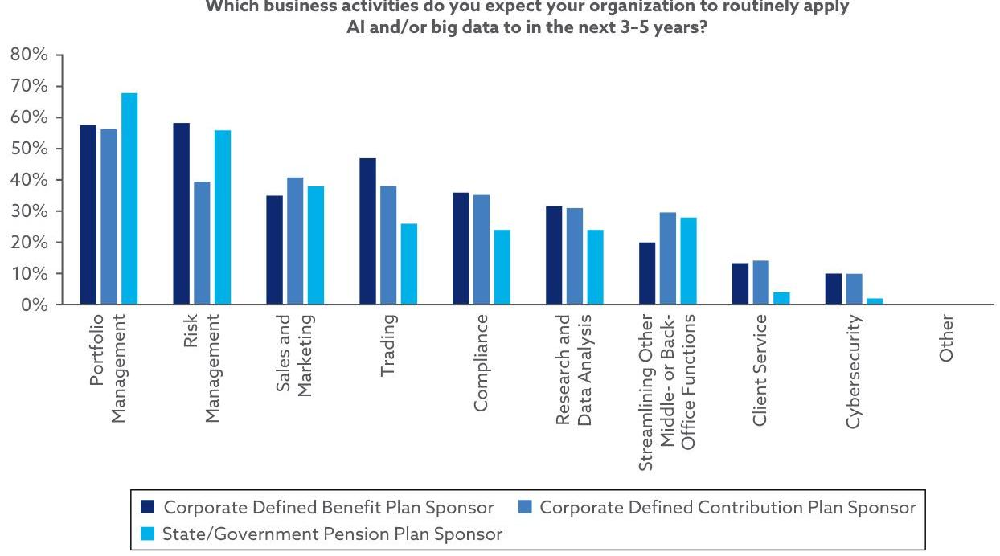
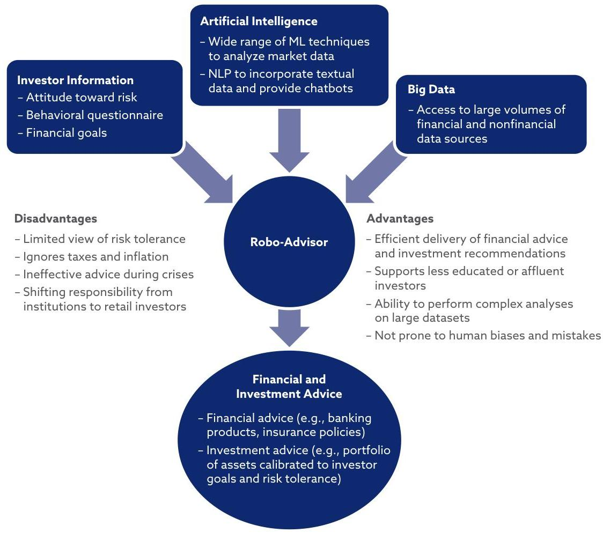
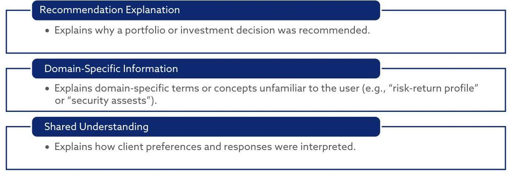

_Note: Source document was split into 6 OCR chunks (pages 1-24, pages 25-42, pages 43-59, pages 60-78, pages 79-91, pages 92-97) to stay within token limits._

# 202412 pensions-in-the-age-of-artificial-intelligence_online

## Page 1
# Pensions in the Age of Artificial Intelligence

**Genevieve Hayman**

## Page 2
.

## Page 3
# Pensions in the Age of Artificial Intelligence 

Genevieve Hayman Senior Affiliate Researcher CFA Institute

## Page 4
# ABOUT THE RESEARCH AND POLICY CENTER 

CFA Institute Research and Policy Center brings together CFA Institute expertise along with a diverse, cross-disciplinary community of subject matter experts working collaboratively to address complex problems. It is informed by the perspective of practitioners and the convening power, impartiality, and credibility of CFA Institute, whose mission is to lead the investment profession globally by promoting the highest standards of ethics, education, and professional excellence for the ultimate benefit of society. For more information, visit https://rpc.cfainstitute.org/en/.

Unless expressly stated otherwise, the opinions, recommendations, findings, interpretations, and conclusions expressed in this report are those of the various contributors to the report and do not necessarily represent the views of CFA Institute.

No part of this publication may be reproduced or transmitted in any form or by any means, electronic or mechanical, including photocopy, recording, or any information storage and retrieval system, without permission of the copyright holder. Requests for permission to make copies of any part of the work should be mailed to: Copyright Permissions, CFA Institute, 915 East High Street, Charlottesville, Virginia 22902. CFA ${ }^{\circledR}$ and Chartered Financial Analyst ${ }^{\circledR}$ are trademarks owned by CFA Institute. To view a list of CFA Institute trademarks and the Guide for the Use of CFA Institute Marks, please visit our website at www.cfainstitute.org.

CFA Institute does not provide investment, financial, tax, legal, or other advice. This report was prepared for informational purposes only and is not intended to provide, and should not be relied on for, investment, financial, tax, legal, or other advice. CFA Institute is not responsible for the content of websites and information resources that may be referenced in the report. Reference to these sites or resources does not constitute an endorsement by CFA Institute of the information contained therein. The inclusion of company examples does not in any way constitute an endorsement of these organizations by CFA Institute. Although we have endeavored to ensure that the information contained in this report has been obtained from reliable and up-to-date sources, the changing nature of statistics, laws, rules, and regulations may result in delays, omissions, or inaccuracies in information contained in this report.

Cover photo credit: Getty Images/oxygen

## Page 5
# CONTENTS 

Acknowledgments ..... 1
Executive Summary ..... 3

1. Introduction ..... 6
Current Issues Facing Pensions and Retirement Income Systems ..... 7
The Rise of AI and Relevance to Pensions ..... 13
2. Overview of the Pension Value Chain ..... 16
Defined Benefit Plan Value Chain ..... 17
Defined Contribution Plan Value Chain ..... 17
3. Membership and Payment Channels ..... 20
Onboarding ..... 20
Member Engagement ..... 22
Payment Systems ..... 24
4. Recordkeeping and Account Management ..... 26
Reporting and Disclosure ..... 27
Fraud Prevention ..... 30
5. Governance and Investment Strategy ..... 31
Enhancing Trustee Decision Making ..... 31
Determining Investment Strategy ..... 38
Manager Selection and Maintenance ..... 43
Stewardship ..... 44
6. Investment Management ..... 47
Managing the Pension Investment Portfolio ..... 47
Private Markets ..... 50
Sustainable Investing ..... 53
Robo-Advisers ..... 54
7. Payout Phase ..... 57
Risk Management for DB Plans ..... 57
Personalized Risk Analysis and Decumulation Strategies for DC Plans ..... 61

## CFA Institute

PROFESSIONAL LEARNING QUALIFIED ACTIVITY
This publication qualifies for 3.00 PL credits under the guidelines of the CFA Institute Professional Learning Program.

## Page 6
8. Addressing Pension Challenges ..... 63
9. Conclusions and Key Principles ..... 67
Glossary ..... 69
Appendix A ..... 72
References ..... 74

## Page 7
# ACKNOWLEDGMENTS 

We gratefully acknowledge the topic experts and thought leaders who contributed to the findings of this report and provided case studies, including the following:

- Abeba Birhane, Senior Fellow in Trustworthy AI, Mozilla; Member of United Nations AI Advisory Body
- Adam Boyes, Managing Director and Head of Trustee Consulting, WTW
- Amanda Burden, Director and Governance Specialist, Pi Partnership
- Beba Cibralic, Associate Fellow, Cambridge University, Leverhulme Centre for the Future of Intelligence
- Aled Davies, Chief Commercial Officer, Knowa
- Kris Elliott, Director of Implementation \& Technology, Gallagher
- Arun Kelshiker, CFA, Former Head, Asset Allocation \& Portfolio Strategy, Standard Chartered Bank; Member, CFA Society United Kingdom Pension Expert Panel
- Sarah Leslie, Partner and Director, ndapt
- Felix Mantz, Senior Director, Cardano Advisory
- Ryujiro Miki, CFA, Specially Appointed Researcher, Research Institute for Policies on Pension \& Aging
- Gill Mitchell, Company Secretary and Compliance Officer, Pi Partnership
- Ashby Monk, Executive and Research Director, Stanford Research Initiative on Long-Term Investing; Member, CFA Institute Research and Policy Center Advisory Council
- Stewart Patterson, Head of Product and Commercial Strategy, LifeSight GB, WTW
- Nga Pham, CFA, Senior Research Fellow, Monash Center for Financial Studies, Monash University; Advisory Board Member, Mercer CFA Institute Global Pension Index; Chair, Financial Capital Committee, International Corporation Network; Director, CFA Society Australia
- James Phare, CEO, Neural Alpha
- Lynn Pointon, Head of Trusteeship, Pi Partnership
- Cameron Skinner, CFA, Managing Director and Head of Americas Aladdin Solutions Engineering, Blackrock
- Zorast Wadia, CFA, Principal and Consulting Actuary, Milliman

## Page 8
- Oliver Wright, Responsible Investment Officer, Brunel Pension Partnership
- Charles Wu, CFA, Chief Investment Officer, State Super

We would also like to thank the Pensions Expert Panel of CFA Society United Kingdom for providing preliminary feedback for this report.

## Page 9
# EXECUTIVE SUMMARY 

Global pension assets account for more than $\$ 55.7$ trillion, representing approximately $69 \%$ of GDP across 22 major economies (Thinking Ahead Institute 2024). Yet pension systems face significant challenges resulting from changing demographics (e.g., longer life expectancies, increased old age dependency ratio, and declining birth rates), stretched government retirement welfare systems, and rising economic inequalities. These demographic shifts are driving fundamental changes to pension systems worldwide, including the transition from defined benefit (DB) to defined contribution (DC) plans.

At the same time, the investment industry is undergoing significant changes that will alter its trajectory. Among these changes, outlined in the CFA Institute publication "Future State of the Investment Industry" (Preece, Munson, Urwin, Vinelli, Cao, and Doyle 2023), are the rise of transformative technologies, including significant developments in artificial intelligence (AI) and machine learning (ML). Such changes will demand new levels of adaptability and forward thinking, particularly if these technologies are to address the unique challenges pension funds face in generating sustainable income for future generations.

Given that we are in a new era of technological innovation, a relevant empirical question is how these new technologies can be applied to address critical issues facing the pension industry. This report responds to this question by identifying where in the pension value chain Al and ML technologies can be implemented to enhance the overall value proposition for investors. It also highlights risks and challenges associated with integrating new technologies. Finally, it brings to light key considerations for industry professionals when developing long-term strategies to successfully meet the needs of current and future generations of investors.

## Key Takeaways

- Al has the potential to enhance personalization, efficiency, and accuracy across the pension value chain in ways that address key challenges faced by pensions and retirement income systems. Although the possible applications of Al are diverse, consideration must be given to how to best use Al to enhance overall retirement security for pension members. Such enhancements will require targeting specific areas of the pension ecosystem that will contribute the most value for the unique needs of each pension fund.
- Implementing Al within member onboarding, communications, reporting, and retirement planning could enhance overall member engagement, boost financial literacy, and support pension plan members at each point

## Page 10
in their retirement life cycle. Tools already available include chatbots, roboadvisers, interactive dashboards, automated nudges, and Al-generated account statements.

- Another area that Al will likely impact is pension plan governance. Pension governance is a collaborative process that involves coordination among a variety of stakeholders, including plan sponsors, pension trustees, investment managers, actuaries, and legal counsel. Al technologies may assist multistakeholder interactions and facilitate ease of information sharing, including significant reductions in administrative burden through report summaries, error identification, and prompt responses built on generative Al technology. Increased efficiencies in information sharing and analysis could improve pension boards' decision making, including investment strategy decisions, and produce timely resolutions to member issues.
- Within investment management, Al and ML models may improve the analytical capacities of internal and external portfolio managers, enhance actuarial analyses of pension fund risks, and maintain updated assessments of current and future market trends. Al could be particularly useful in analyzing private markets and data related to sustainable investments.
- Improvements in actuarial assumptions and predictive analytics driven by advanced ML techniques could benefit asset/liability management and strategies for pension derisking. DC plans may benefit from having ML analyses that incorporate predictions of member behavior and produce accumulation and decumulation strategies personalized to individual member characteristics.
- Using external service providers may be an effective way to incorporate Al technologies into the value chain, especially for smaller pension funds or those without appropriate resources to scale technology in-house. Pension trustees and administrators should perform due diligence when vetting technology providers to ensure adherence to privacy and data regulations and responsible use of technology. They should also ensure technology goals and strategies are appropriately aligned with the aims, values, and long-term time horizon of the pension fund.

## Page 11
# Key Principles for Pension Plans Using AI 

- Balance the need for personalization with the need for product simplicity to accommodate varying levels of financial literacy.
- Develop collaborative multistakeholder solutions between firms, industry groups, and regulators to ensure consistently high operational standards among pension plans.
- Incorporate technology into the service offering in ways that build trust and rapport with pension members-for example, by using Al to enhance, not eliminate, human decision making. Set clear objectives and benchmarks for evaluating the effectiveness of the models used, considering the ability to improve experiences or outcomes for beneficiaries.

## Page 12
# 1. INTRODUCTION 

Billions of individuals around the world rely on pension systems to fund their retirement. According to the Thinking Ahead Institute (2024), 22 of the largest pension markets have a combined asset ownership of $\$ 55.7$ trillion and account for $69 \%$ of the GDP in these economies. Yet despite the significant capital managed under pension funds and retirement accounts, retirement insecurity remains a significant challenge for countries around the world. One study of eight countries ${ }^{1}$ with the largest established pension systems or populations revealed a total retirement savings gap of $\$ 70$ trillion in 2015; the study anticipated this gap to grow to $\$ 400$ trillion by 2050 (World Economic Forum 2017). A follow-up study found retirees in six major economies were estimated to outlive their savings by an average of 8-20 years (World Economic Forum 2019). Safeguarding retirement security for future generations is integral to maintaining healthy economies and capital markets.

At the same time, the adoption of artificial intelligence, including generative AI (GenAI), continues to grow across industries worldwide. Pensions are not immune to this transition, although many have yet to fully integrate Al into their processes. Acknowledging that we are on the brink of technological transformation (see Preece et al. 2023), many governments, firms, and investors are strategizing how to successfully adapt to the changing landscape. This report aims to help investment industry stakeholders navigate this technological transition as it relates to pensions and retirement income systems.

CFA Institute conducted interviews with pension experts and industry professionals to identify key areas in which Al can be implemented across the value chain for both defined benefit and defined contribution plans. Using representative case studies, this report showcases what this implementation may look like and illuminates the likely paths forward. Although not exhaustive, these case studies offer insight into where and how emerging technologies will be implemented in the years to come. Specifically, the focus will be on Al, particularly GenAI and machine learning. Developments are also occurring in such areas as blockchain technology and cloud computing (see Bhaduri, Sabatini, and Whelan 2023), as well as the highly anticipated shift toward quantum computing. These advancements, along with forthcoming developments in Al chip technology, will drastically increase the speed and processing capacity of current models, although we have yet to observe precisely how these technologies will be fully integrated within pension systems. Nonetheless, it is likely that a range of new technologies will work in tandem to transform the current state of the industry.

[^0]
[^0]:    ${ }^{1}$ The study examined the six largest pension systems (Australia, Canada, Japan, the Netherlands, the United Kingdom, and the United States) and the top two countries by population (India and China) (World Economic Forum 2017).

## Page 13
# Current Issues Facing Pensions and Retirement Income Systems 

Although retirement income systems around the world differ in structure and governance, similar factors threaten their success and long-term efficacy in providing retirement and financial security to their constituent members. This section outlines key challenges and considerations that pensions are facing or will face in the future. More detailed information on the specific rankings and concerns of each country's system can be found in the Mercer CFA Institute Global Pension Index 2024 (see Mercer and CFA Institute 2024). Some of the key challenges facing pensions can be partially addressed with governmentimposed reforms, including raising the retirement age, imposing a minimum age for accessing retirement savings, and requiring income streams instead of lump-sum payments (Pham, Ruthbah, and Cui 2023). Gaps remain, however, where these reforms alone are insufficient to meet elevated retirement income needs produced by such factors as changing demographics, inflation, and other pressures.

## Changing Demographics

Populations around the world are aging. An estimated 1 billion people worldwide were older than 60 years of age in 2020, and this number is expected to rise to 2.1 billion by 2050 (World Economic Forum and Mercer 2024). In the United States, the percentage of the population age 65 and over has been steadily increasing and is expected to reach $22 \%$ by 2050 (Admasu, Chase, Chen, Davidson, and Malik 2023). Other jurisdictions, however, have already reached or surpassed that mark. Last year, more than one-third of Monaco's population was 65 or older, and in Japan the proportion was 30\% (see Exhibit 1). Aging populations place increased pressure on pensions and retirement income systems to support future retirees and foster a healthy economy amid changes in labor and consumption levels.

These trends are driven by increasing life expectancy and declining fertility rates. Global life expectancy has steadily increased during the past decade, with a minor decline in 2020 caused by the COVID-19 pandemic (see Exhibit 2). In 2024, global life expectancy at birth reached 73.3 years, an increase of more than 8.4 years since 1995 (United Nations Department of Economic and Social Affairs 2024, p. 14). Whereas only 17\% of deaths occurred at age 80 or older in 1995, estimates show that by the late 2050s, more than half of global deaths will occur at age 80 or higher (United Nations Department of Economic and Social Affairs 2024, p. 14). By 2054, global life expectancy is projected to reach 77.4 years (United Nations Department of Economic and Social Affairs 2024, p. 14). These numbers are markedly higher in developed markets. In the United Kingdom, for example, life expectancy for 2023 was 81.77 years and is projected to reach 90.76 years by 2100 . In the United States, life expectancy was 79.11 years in 2023 and is projected to reach 88.78 by 2100 (Admasu et al. 2023). Marked increases in global life expectancies in the coming years will significantly

## Page 14
# Exhibit 1. Percentage of Population Age 65 and Older, 2023, by Jurisdiction 

Notes: Map boundaries represent boundaries as of 2020 and do not change over time. Country borders do not necessarily reflect the World Bank Group's official position. This map is for illustrative purposes and does not imply the expression of any opinion on the part of the World Bank concerning the legal status of any country or territory or concerning the delimitation of frontiers or boundaries.
Sources: World Bank Official Boundaries; United Nations Department of Economic and Social Affairs, Population Division.

## Exhibit 2. Global Life Expectancy at Birth, 1960-2022

Sources: World Bank Group; United Nations Department of Economic and Social Affairs (2022).

## Page 15
burden pension systems, which will be forced to stretch their resources over additional retirement years.

At the same time, global fertility rates, measured as total births per woman, have steadily declined. Current estimates place the global fertility rate at around 2.25 live births per woman, down from 3.31 births in 1990 (United Nations Department of Economic and Social Affairs 2024, p. 2). More than half of recorded countries have fertility replacement rates below 2.1, which is the level designated as necessary for a population to maintain constant size, without migration (United Nations Department of Economic and Social Affairs 2024, p. 2). "Ultra-low" fertility has been identified in nearly one of every five countries measured, including China, South Korea, Spain, and Italy (United Nations Department of Economic and Social Affairs 2024, p. 2). Low fertility poses a challenge to pension systems, particularly many government plans, because of a rising old-age dependency ratio. A smaller number of workers relative to retirees also implies a rising proportion of individuals in decumulation relative to accumulation in retirement plans (Knox and Pearce 2022).

Developing markets are also affected by these concerns. Indeed, changing demographics can have an even more pronounced impact in low- and middleincome countries because of the significant reliance on state pensions to support poor and elderly individuals in those regions (World Bank Group 2023). Although the trajectory and drivers of population aging may differ across regions, pension systems around the world will have to adapt to changing demographics. Failure to address these changes may financially burden future generations, which will have significant implications for the global economy.

# Underfunding 

Given these changing demographics, many jurisdictions are concerned about the long-term fiscal sustainability of their pension funds. Underfunding remains a key challenge for stakeholders managing pension liabilities across public and private pensions. "Underfunded pensions" typically refer to DB plans in which current and future liabilities exceed assets. ${ }^{2}$ Because financial or longevity risk is generally borne by the DB plan sponsor, underfunding is a significant concern to plan sponsors who bear the responsibility of meeting any shortfall (Yermo 2002, p. 4). According to Milliman's "2024 Corporate Pension Funding Study," the 100 US public companies sponsoring the largest DB plans had a combined pension deficit of $\$ 19.9$ billion in 2023, and the combined funded percentage decreased slightly from $99.4 \%$ in 2022 to $98.5 \%$ at the end of 2023 (Wadia and Perry 2024). Although these numbers show vast improvement over previous deficits, which ranged from $\$ 188$ billion to $\$ 382$ billion from 2008 to 2020, pension funding remains a continued concern, particularly amid times of political and economic uncertainty (Wadia and Perry 2024).

[^0]
[^0]:    ${ }^{2}$ Underfunded DB plans should not be confused with unfunded pension systems or pay-as-you-go (PAYG) systems, which use contributions of current plan members to meet the liabilities of current beneficiaries. PAYG is common in public pension systems where benefits are administered by the government (Yermo 2002). PAYG systems are particularly strained by changing demographics.

## Page 16
DC pensions can also face retirement income shortfalls. Unlike DB plans, however, individual plan members take on the financial risk of running out of funds. As such, individual member contribution rates and asset allocation decisions are vital for these plans' success. In the United States and Australia, traditional 60/40 portfolios may be insufficient to meet the income needs of many future retirees (Cui, Pham, and Ruthbah forthcoming). Likewise, in the United Kingdom, contributions into DC plans have not increased sufficiently in recent years to meet projected retirement funding shortfalls (Kitson 2024).

Policy changes such as raising the retirement age, raising contribution rates, and decreasing replacement rates remain generally inadequate to address the full scope of pension underfunding (Huang and Curtin 2019).

# Inflation 

Inflation risk poses a key challenge to pension adequacy. In a study of 7,552 individual investors in 23 countries, $68 \%$ reported inflation as a significant barrier to saving for retirement (Natixis Investment Managers 2023). Rising inflation, especially over prolonged periods, can erode the purchasing power of retirement benefits, making it difficult for retirees to maintain a desired standard of living (Connolly and Hall 2024). High levels of inflation can force retirees to increase pension withdrawal rates to compensate for rising costs (Aubry and Quinby 2024a, 2024b). To help stabilize the purchasing power of retirees, many countries have shifted away from wage indexation to price indexation in their pension payouts, and more than half of OECD countries now protect pensioners fully from inflation trends over time (OECD 2023b).

Although indexation is important to maintain purchasing power for retirees, in times of elevated inflation, investment gains in nominal terms may still result in investment losses in real terms-as evidenced in 2022, when real rates of return were negative for pensions across OECD countries (OECD 2023c). This situation creates challenges for the funded status of DB plans in which liabilities (payouts) are indexed to price levels. Moreover, it also highlights the challenge for members of DC pension plans, given that plan participants bear the investment risk and thus the inflation risk.

To illustrate the importance of inflation protection, an inflation rate of 5\% over 15 years is estimated to reduce the real value of a fixed nominal annual benefit DB plan by approximately 50\% (Hurd and Rohwedder 2024, p. 1). Overall, inflation risk remains an important consideration when assessing pensions and retirement income systems, and inflation stress testing and other scenario analyses are vital for maintaining pension health and protecting current and future retirees (Connolly and Hall 2024).

## Page 17
# Rising Inequality 

According to the World Bank Group (2024), approximately 700 million people around the world live in extreme poverty (defined as living on less than $\$ 2.15$ per day). Rising inequalities resulting from the COVID-19 pandemic and economic shocks during the past decade have exacerbated vulnerabilities, particularly in low-income countries (World Bank Group 2024). Aging populations and changing demographics have also led to increased risk of poverty in old age. Growing numbers of gig workers, independent contractors, and individuals employed in informal work have left many of these workers excluded from employer-sponsored retirement plans, leading to difficulties in saving for retirement (World Economic Forum 2023). These trends call into question the adequacy of retirement income systems in providing sufficient retirement income to meet all constituents' needs. Indeed, the capacity for pension benefits to replace career wages in retirement is expected to decline for most EU member states (Economic Policy Committee and Social Protection Committee 2019).

Pension systems are both a victim to rising inequality, because capital is less distributed among plan members, and a potential contributing factor, because unequal benefits often disproportionately affect vulnerable populations. Stepping back, rising economic inequality has the potential to negatively impact regional markets and global economic health (Preece et al. 2023). Because of the significant role pensions play in capital markets and the entwinement of pension systems with inequality concerns, pensions face significant systemic challenges that require careful considerations of the broader economic picture.

## Financial Literacy and Information Gaps

Pension systems are more complex now than ever, with increasing pillars and varied incentive structures implemented around the world. In many countries, retirement requires a careful blend of pension instruments, with a rising proportion of risk being placed on individuals to fund their retirement. Future plan members will likely play a greater role in determining contribution levels, investment allocations, and drawdown strategies necessary to attain financial security in retirement.

The importance of informed pension decision making is especially salient in DC plans, which place funding risk entirely on individual members. Although DC plans generally allow for high levels of flexibility, they are complicated by a diversity of choice, including the selection of financial institutions or service providers, instruments, and investments (Barr 2002). Indeed, Bailey (2021, p. 16) notes that DC plan members today are effectively serving as their own chief investment officer. As more retirement systems shift from DB to DC, a prominent concern is that investors lack the knowledge and experience to effectively address individual underfunding risks and to invest in ways that secure adequate retirement income.

## Page 18
Given the increasing complexity of pension systems and the heightened importance of member decision making, it is vital that pension plan members are fully informed investors and are provided with reliable, accessible information, including pension forecasts and investment product disclosures (European Commission 2010, p. 26). Even with the relevant information, however, members may be overwhelmed by the decision making required in managing their pensions, or they may lack the expertise needed to curate a successful retirement plan.

# Demands for Personalization and Financial Wellness 

One way plan sponsors and pension administrators hope to improve retirement outcomes is through offering more personalized member products and services. Given the diversity among pension plan members, their attitudes and requirements regarding saving, investment, and retirement can differ significantly, even within commonly referenced demographic segments. To accurately meet an array of demands, pension plans must modify offerings to meet evolving needs. According to T. Rowe Price (2024, p. 8), analyzing plan data can help plan sponsors identify vulnerable populations disproportionately affected by financial stressors, which can then influence plan design decisions and targeted communication and engagement strategies.

At the same time, members are increasingly expecting more personalized experiences from their pension plans. A survey by Franklin Templeton (2024) revealed that $84 \%$ of US workers expressed interest in personalized DC plan investment options tailored to their unique financial situation, and $82 \%$ were interested in more personalized employee benefits overall. These results are roughly consistent with findings from a global CFA Institute study in which $78 \%$ of retail investors across markets voiced a desire for more personalized products and services to better meet investment needs (Fender and Munson 2022).

Plan sponsors have also increasingly incorporated financial wellness services in their pension plan offerings. According to a survey of plan sponsors, financial wellness involves "draw[ing] the connection between helping investors make better short-term financial decisions and putting them in a better position to save for the long term" (Cerulli Associates 2023, p. 12). Offerings that fall into the category of financial wellness include platforms or tools that help plan members budget, save, and invest (Franklin Templeton 2024). For example, the focus of a financial wellness tool may be building emergency savings, managing living expenses, budgeting for medium-term goals such as buying a home, and improving financial literacy (Adams and Curry 2023). DEI initiatives are also being integrated into financial wellness programs through enhanced personalization and community-sensitive advice to provide a more holistic and inclusive experience (Cerulli Associates 2023, p. 13).

A relevant question for the future is how pension plan sponsors will build flexibility and personalization into their plans while simultaneously addressing choice overload that hinders investor action. Plan sponsors will need to

## Page 19
determine when and where to provide personalized offerings and ensure that those offerings are suitable for their plan members. This determination includes ensuring that new strategies align with pension goals and objectives and uphold the fiduciary responsibilities of the plan sponsor.

# The Rise of AI and Relevance to Pensions 

Technology advancements could dramatically alter the investment landscape, including how we invest for retirement:

AI represents a huge potential to improve our pension and social security systems by analyzing data more quickly, improving accuracy, highlighting future risks, reducing costs, improving outcomes and communication, and helping members in a more personalized way. This should provide individuals with a much better experience as they interact with our complex retirement systems. (Mercer and CFA Institute 2023)

AI refers generally to any imitation of human cognitive functions using computers (Bartram, Branke, and Motahari 2020, p. 4). ML is considered a subset of Al in which machines produce outputs based on algorithms trained on past data. These algorithms therefore optimize by "learning" rather than by executing preprogrammed manipulations. Appendix A lists common AI/ML techniques.

The use of Al in the investment industry is not new, but recent attention surrounding generative Al has garnered increased focus on the potential for widespread technology transformations in finance. Generative AI (GenAI) refers to Al models, often large language models (LLMs), that respond to prompts by producing new content based on their training data. This content can include language/text GPTs, as seen with ChatGPT and BloombergGPT, or it can produce images (e.g., DALL-E), video (e.g., Synesthesia), audio (e.g., Speechify), or code (e.g., GitHub Copilot; see OECD 2023a).

According to Mercer and CFA Institute (2023), Al will likely have a significant impact in the areas of member engagement and retirement planning by improving communication with plan members and providing members with personalized options and recommendations. Al will also likely serve middle- and back-office functions that can optimize pension plan operations. The exact form of these integrations, however, remains to be seen. In a recent survey released by the Government Actuary's Department in the United Kingdom, actuaries working in pensions were least likely to be using AI/ML compared to actuaries in other fields, and if they were using AI/ML, it was primarily for data collection and cleaning along with alternative forms of modeling and analysis (Government Actuary's Department 2023).

The range of applications for Al is vast, however, and these technologies have the potential to be integrated across the pension value chain. A white paper by

## Page 20
Invesco (2019) pointed to Al integration in four areas of retirement plans: plan design, participant engagement, plan governance, and investment strategy. Within plan design, Al can be used to identify plan design weaknesses and adapt the plan to suit the needs of participants, both at the individual and collective level. This application of Al would include, for example, making data-driven updates to the corporate savings match options.

Al can also improve participant communication and engagement through chatbots and prompts. Within plan governance, Al can strengthen the ability of plan sponsors and trustees to fulfill their obligations. This approach includes using technology to better understand participant needs and ensure the suitability of products and services. By using Al to foster a positive experience with the retirement plan, participants may be more likely to remain in the plan and grow the participant pool, which can help to maintain low fees.

Lastly, within investment strategy, Al can tailor allocations to individual participants or recommend strategies that would suit each participant based on their personal profile. It may also be easier to incorporate alternative asset classes or expand the range of offerings, allowing participants greater flexibility.

Although we have yet to fully observe how Al will be adopted within the pension value chain, the aforementioned expectations are consistent with overall market trends. According to a CFA Institute report (Preece et al. 2023), Al and big data applications are already in use across investment management, particularly in the areas of core business data analysis and risk management (see Exhibit 3). In addition to increasing efficiency by automating repetitive activities, Al and big

# Exhibit 3. Application of Al across Investment Management Organization Business Units 

What business activities has your organization been routinely applying Al and big data to? ( $\mathrm{N}=693$ )

Source: Preece et al. (2023).

## Page 21
# Exhibit 4. Use Cases for AI and Big Data 

How has the use of AI and big data helped your firm? ( $\mathrm{N}=696$ )

Source: Preece et al. (2023).
data have allowed investment managers to improve decision making and gather additional insights, leading to better products and services (see Exhibit 4).

Many pension management firms remain in the early stages of AI/GenAI adoption, and even more are actively planning strategies for integrating Al into their processes. Rather than providing an exhaustive overview of these many possible use cases of Al , this report instead highlights key areas in the pension value chain where Al can contribute to overcoming central problems faced by pensions around the world.

## Page 22
# 2. OVERVIEW OF THE PENSION VALUE CHAIN 

A World Bank Group discussion paper (Price 2019) identified five stages of the private pension value chain. Exhibit 5 illustrates the progression of these stages.

## Exhibit 5. The World Bank Group Pension Value Chain

Source: Price (2019).

The five stages can be described as follows:

1. Membership and payment channels: Determine how members join a pension plan and make contributions to the plan. The goal in this stage is to maximize the number of individuals saving for retirement and to simplify the onboarding process for members.
2. Recordkeeping and account management: Maintain account balances and provide recordkeeping services in accordance with local laws and regulatory requirements.
3. Governance and investment strategy: Address pension fund governance and investment strategies. These strategies must adhere to legal requirements in the designated region. This stage involves pension fund asset allocation decisions, where a key goal is to develop strong default options and invest in ways that maintain the long-run interests of members.
4. Investment management: Execute investment strategies, monitor performance, and update portfolios to best align with investment goals. Considerations in this stage include identifying ways to minimize cost and improve performance.
5. Payout phase: Distribute payments to members, also referred to as decumulation. The aim in this stage is to effectively manage distribution such that postretirement income can meet the needs of beneficiaries.

Price (2019) additionally described the role of each stage in evaluating pension performance and enhancing overall pension system success. Although this breakdown was specific to private pensions aimed at supplementing a public notional defined contribution plan ${ }^{3}$ (i.e., Sweden's public pension system;

[^0]
[^0]:    ${ }^{3}$ These pensions resemble PAYG plans that mimic DC functions. They set aside a notional capital account for each member into which notional payments are made that mirror taxes and contributions, and they earn an annual rate of return that ultimately determines member benefits (Auerbach and Lee 2006).

## Page 23
see Regeringskansliet 2020), the value chain described is suitable to reflect pension systems broadly. We have adopted these five stages (Exhibit 5) for this report and added additional specificity to distinguish DB and DC pension plan ${ }^{4}$ value chains.

# Defined Benefit Plan Value Chain 

DB plans are pension plans for which benefits are paid out to plan beneficiaries, generally from the time of retirement to the end of life. Because DB plans guarantee a predetermined level of benefits (usually defined according to a formula based on wages and years of service), plan sponsors bear the financial risk of ensuring benefits are paid.

The accumulation process begins with members joining a pension plan, whether through automated channels, such as via an individual's employer, or through selected channels, as in the case of certain independent private pensions. Because DB plans generally use a benefit formula, recordkeeping can be relatively simpler than it is for DC plans (Price 2019, p. 16).

A governing body or board generally bears legal responsibility for the operation of the pension fund. These individuals, often referred to as trustees of the fund, are charged with determining the long-term strategy of investments to ensure appropriate funding levels. It is then up to investment managers, often through third-party providers, to implement the outlined strategies and manage investments on a regular basis.

Decumulation or payout refers to the process by which funds accumulated in a pension are converted into retirement income for beneficiaries (Huang and Curtin 2019). Member considerations include whether to take benefits as a lump sum, on a payment schedule, or some combination thereof. Plan sponsors and trustees must perform regular actuarial analyses to ensure that pension plan funding levels are sufficient to pay current and future beneficiaries. Exhibit 6 illustrates the value chain specific to DB plans.

## Defined Contribution Plan Value Chain

DC plans are pension plans for which benefits are determined by the amount contributed to the plan plus investment returns (Yermo 2002). For DC plans, members bear the financial or longevity risk because there is generally no plan sponsor guarantee of benefits. New employees are usually enrolled in a DC plan sponsored by the employer. The employer, the employee, or both parties make contributions or payments into the plan, often as a predetermined salary percentage.

[^0]
[^0]:    ${ }^{4}$ In some jurisdictions, including the United Kingdom, pension plans are referred to as pension schemes. Throughout this report, the term "pension plans" will be used to refer to all equivalent designations, including "pension schemes" and "superannuation funds."

## Page 24
# Exhibit 6. Defined Benefit Value Chain 

| 1. Membership and Payment Channels | 2. Recordkeeping and Account Management | 3. Governance and Investment Strategy | 4. Investment Management | 5. Payout Phase |
| :--: | :--: | :--: | :--: | :--: |
| - Members are either autoenrolled or select to enroll.   - Payments are withdrawn automatically from paycheck or a payment channel is created for members to make contributions. | - Contributions are recorded for each member.   - Investment performance is tracked and reported to members on a regular basis. | - Trustee responsibilities include determining investment strategy and selecting investment portfolio allocations. | - Regular management of the investments is often outsourced to an investment firm.   - Investments are updated and rebalanced on a regular basis. | - Members determine whether to take benefits as payments or a lump sum, or a combination.   - Plan sponsors and trustees perform analyses to ensure funding levels are sufficient to pay current and future beneficiaries. |

Plan members are generally charged with selecting investments from a menu of either funds or strategies, with default options provided by the plan sponsor. The recordkeeping process for DC plans is often more involved than for DB plans because the individual chooses which investments each contribution is paid into. Therefore, investment performance and projected payouts may vary more for DC plan members than for DB plan members, increasing the recordkeeping burden.

Because plan members generally have significant discretion over their investment strategy, DC plan governance can vary significantly. Members usually select their own choice of investment funds from a range of options, which may be managed either by the plan sponsor or by external fund managers. Because DC plan members bear the investment risk, investment selection and the array of provided options are important for pension adequacy and retirement security.

As with DB plans, daily investment management is often left to asset managers. Members may have additional control, however, through the selection of independent financial advisers who can modify investments on their behalf.

The payout of accumulated assets is a crucial component of the DC member life cycle. Decumulation strategies involve determining whether to take payments gradually or as a lump sum (or a combination of the two)-and if gradually, the optimal withdrawal rate, given retirement income needs and longevity risk, also must be determined. Decumulation strategies may also involve deciding whether to purchase an annuity to mitigate longevity risk. Ultimately, payout will be determined by a multitude of factors and preferences, from both the individual plan member and the investment environment. Exhibit 7 illustrates the value chain specific to DC plans.

## Page 25
# Exhibit 7. Defined Contribution Value Chain 

| 1. Membership and Payment Channels | 2. Recordkeeping and Account Management | 3. Governance and Investment Strategy | 4. Investment Management | 5. Payout Phase |
| :--: | :--: | :--: | :--: | :--: |
| - Members are either autoenrolled or select to enroll.   - Members determine contribution amounts, sometimes with employer contributions.   - Members select portfolio allocation. | - Member portfolio allocation selections and contribution amounts are recorded.   - Investment performance is tracked and reported to members on a regular basis. | - Plan sponsors or trustees build an investment menu of options and select default investments.   - Members can update investment strategies at their discretion. | - Portfolios are created according to investment strategy and/or predetermined options.   - Can involve advice and trade execution from financial advisers.   - Asset managers rebalance and optimize fund portfolios. | - Members determine withdrawal strategy, which generally includes options to withdraw as a lump sum, to receive regular payments (or a combination of the two), or to purchase an annuity. |

## Page 26
# 3. MEMBERSHIP AND PAYMENT CHANNELS 

In many cases, strengthening pension plans begins with improving member communication and engagement to drive member actions, starting with onboarding.

## Onboarding

Onboarding is the first opportunity for members to interact with their pension provider. Without a coordinated and user-friendly onboarding process, members may be intimidated by the complexity of offerings or left feeling uninformed about their pension investment process. Al has the potential to streamline onboarding processes, starting with the collection of new member data. This application of Al can include interactive platforms that collect name, birth date, contact information, company and employment data, date of enrollment, contribution information, investment preferences, and other investment-relevant information. Based on provided responses, members can be automatically prompted for additional details, such as information on other investments, spending patterns, or spousal income.

Al can also be used to clean and categorize submitted data. Al-powered tools are being introduced in contract analysis and legal document management with much anticipation for increased efficiency (Thirumagal, Raj, Naser, Hussien, Abbas, and Vinayagam 2024). A study by Fathima, Dhinakaran, Thirumalaikumari, Devi, Bindu, and Shanthi (2024) found that Al can improve the average accuracy of such tasks as document categorization, clause detection, and data extraction by $60 \%$, with an average time savings of $40 \%$ with Al-assisted document analysis. Similar functions could apply to pension documentation, such as the detection and elimination of duplicate documents, the automated categorization of member documents, and the ability to easily extract member data. Having complete and correct member data is central to good pension plan governance, and without good data practices, funds may not be properly invested and future benefits may be improperly calculated. In sum, Al has potential to improve the quality of member data through more efficient collection and processing of member information.

Using natural language processing (NLP) and LLMs, data held as separate documents can be transformed into databases that can be queried in natural language. ${ }^{5}$ Users could then easily compile information on plan members with certain characteristics, such as those below a certain threshold of investment or those close to retirement age. Use of these tools could make member data more accessible to internal parties and stakeholders who have limited technical expertise.

[^0]
[^0]:    ${ }^{5}$ Leveraging natural language databases could involve, for example, retrieval-augmented generation or the use of Al agents.

## Page 27
At the same time, pension administrators must ensure adequate protections in the collection, storage, and updating of member information. A recent CFA Institute survey of more than 370 investment professionals identified "protection of data privacy" as the top risk for AI/GenAI and big data technology adoption (Wilson, forthcoming). Likewise, another CFA Institute study found concerns of data privacy and security to be the be the biggest roadblock to AI/GenAI deployment in firms (CFA Institute 2024). Care must be taken to ensure that all data collected and stored are compliant with data protection laws and regulations. Additionally, data must be secured against risks of leaks and cyberattacks.

Within DC plans, because contributions and investments are generally established by plan members, those members must be fully informed of their investment options and how their investments might perform over time.
Chatbots and other tools are likely to transform the way members engage with their pension plan during onboarding, with shifts toward more personalized and responsive technology-driven interactions. Chatbots are automated response tools that allow users to hold conversations that simulate interactions with a live human agent. Earlier forms of chatbots included preset responses to certain actions or trigger words, whereas current AI chatbots use NLP to devise unique responses to novel queries based on training data. Chatbots can be implemented as text, voice, or multimedia interactions and can be accessed through websites, social media, emails, or other communication platforms (ISSA 2021).

Chatbot integration in the onboarding process can provide information relevant to individual members' specific needs. For example, Principal, a pension provider, operates across the Americas, Asia, and Europe and has assets under management (AUM) of $\$ 695$ billion. The firm noticed that pension enrollees often had similar questions about their 401(k) plans and the onboarding process. With the help of technology consultant Cantina, Principal identified onboarding as an ideal place to incorporate "hand-holding" via technology. By developing a chatbot feature, it improved the member onboarding experience and reduced call center volume. ${ }^{6}$

Similarly, in 2022, Smart Pension, a UK pension provider with AUM of more than $£ 5$ billion, partnered with Trulience to implement the Smart Avatar Virtual Assistant (SAVA), which uses AI to assist with member registration and pension management (Smart Pension 2022a). SAVA uses voice and writing recognition and can respond in more than 30 natural languages to inform members about plan features, guide them through contribution setup, and answer frequently asked questions (Smart Pension 2022b).

Questions answered by SAVA include the following: "How do I join the scheme?" "Can I make extra contributions?" "What do I do if I leave my job?" "Which funds perform best?" Because SAVA is multimodal and multilingual, it is designed

[^0]
[^0]:    ${ }^{6}$ See Cantina's case study at https://cantina.co/work/principal-financial-chatbot/.

## Page 28
to offer more accessible and equitable services to all members, in different markets and generations (Smart Pension 2022a).

# Member Engagement 

Technological enhancements have facilitated the launch of pension dashboards in multiple countries, including Australia, Belgium, Denmark, Israel, the Netherlands, Sweden, and the United Kingdom. These dashboards provide a central source of information for plan members and sponsors and facilitate member engagement and interaction. Use cases of such dashboards include collecting and updating personal details, conducting account rollovers and consolidation, transferring documents, projecting savings growth and retirement income levels, and receiving financial advice (John, Enda, Gale, and lwry 2021).

One way pension dashboards are leveraging Al is for data matching-both to ensure that the records on file match the individual member, including legal name, current address, employment status, and marital status, and to eliminate duplicate records (Jordan and Hearnshaw 2024). Beyond data cleaning, however, Al has the potential to transform these data points into personalized member insights. An interview with Smart Pension cofounder Will Wynne in Pensions Age magazine offered a useful example of Al's capabilities:

Let's say there are 30 different possible elements you may include on a dashboard. Al could be used to understand how thousands of members interact with their dashboards, and what they appear to find most useful. When a new member first logs into their dashboard, it could therefore automatically provide them with the handful of five or six elements they'd find most valuable on the basis of their profile. As their needs change over time, it could automatically suggest different dashboard elements they may find useful in reaction to that. (Blows 2018)

The increase in data availability and opportunities to collect individual data points will further drive the ability for dashboards to provide targeted analyses and recommendations. Much in the same way digital marketing has prioritized the customer journey and the network of relationships among customers, products, and services, Al can be used to enhance user profiling and better predict member preferences and behaviors (Jordan and Hearnshaw 2024).

Chatbots are also increasingly used for member engagement purposes, either through pension dashboards or on pension websites or apps. They are particularly useful where large customer or client volume may delay inquiry response times, such as for public-facing government agencies that have been primary adopters of chatbots. A 2021 Gartner study of 166 government agencies in North America; Europe, the Middle East, and Africa; and Asia Pacific found that $26 \%$ of agencies had already deployed chatbots and another $59 \%$ were planning to do so in the next three years (Moore 2021; ISSA 2022).

## Page 29
AI chatbots can already be seen in social security platforms around the world, including Brazil's National Social Security Institute (Instituto Nacional do Seguro Social), the Panamanian Social Security Fund (Caja de Seguro Social), and Uruguay's Social Insurance Bank (Banco de Previsión Social; ISSA 2024).

Stewart Patterson, head of product and commercial strategy for LifeSight GB at WTW, explained in an interview with CFA Institute that "it's exciting that tech evolutions can bring the right combination of Al and machine learning to get the right level of engagement from members-helping them build their knowledge and understanding of what their pension is, how it works, and what actions they need to take."

Increased member engagement may also lead to heightened financial literacy levels among members through ease of access to information, especially where Al chatbots can provide additional information and clarification that would otherwise be unavailable to members. For example, Finland's Social Insurance Institution (Kela) uses a multilingual chatbot, Kela-Kelpo, on its web portal to help clients find pension and other benefit information. Rather than repeating information already available on its main website or within the web portal, Kela-Kelpo uses conversational Al and NLP to identify details relevant to the specific query and provide additional examples and explanations (ISSA 2024). Human agents review responses daily to monitor and enhance the service (Kela 2022). In 2023, Kela-Kelpo had more than 130,000 client conversations (Kela 2024).

According to Adam Boyes, managing director and head of trustee consulting at WTW, "We all learn in different ways, and financial literacy isn't high around the world, the UK included. Having a tool that can converse with you and establish the way you like to interact, the level at which you're interacting, and be able to adapt, that's a game-changer in terms of personalization and engagement on financial issues." Boyes noted, however, that automated member-facing services, such as chatbots, must be thoroughly and regularly tested, with appropriate guardrails, to ensure that accurate and appropriate responses are given. In other words, Al is not a "set it and forget it" tool. It is also important that human advisers and agents are regularly integrated into the system design such that "automation" is achieved through human-machine interactions-an idea commonly referred to as "human-in-the-loop."

In fact, human pension agents can actively benefit from the information acquired through chatbots. Many customer service channels in different industries use automated screening processes through chatbots and automated call center routing. These Al-driven tools can fill out forms, input customer information, and connect customers to the appropriate department based on their responses. They can also prompt human agents with information about the customer and their requests, allowing agents to serve customers more effectively and efficiently. These tools can also help screen for scams or fraudulent activities, adding a layer of protection for customers. In effect, Al-driven functions can lessen the burden of labor placed on pension service

## Page 30
providers with the potential to enhance the cost-effectiveness and ease of access to pension services.

Sentiment analysis is another area where ML and NLP can be applied to enhance member engagement. Sentiment analysis refers to the use of NLP and text mining to gather and analyze subjective information, such as thoughts and opinions on different topics or products (Wankhade, Rao, and Kulkarni 2022). It can be used to assess member attitudes and feedback, which will ultimately allow pensions to better understand their membership and develop products and services that can meet investor needs. Pension providers can solicit feedback (e.g., through client surveys) or use available data (such as data collected through chatbot interactions) to analyze member sentiment about new products and services, as well as members' general sentiment toward the pension provider or pension sponsor. Sentiment analysis can also be used for more general topics, such as member attitudes toward environmental, social, and governance (ESG) investing, annuities, or retirement. Ultimately, sentiment analysis provides an additional tool to better understand members and their evolving needs and wants, allowing timely and tailored communication, products, and client support.

Although increased personalization is a significant benefit associated with Al adoption, we should be careful not to interpret Al as replacing the personalization that human advisers can offer. In a recent interview with Pensions \& Investments, Katie Burke, president of Allspring Global Investments ( $\$ 590$ billion in assets under advisement), noted the importance of building client relationships through human interaction, even with the advent of Al (Tomkiw 2024). Al can serve as an effective tool for advisers to collect information regarding specific clients, weigh options, and manage expectations in ways that contribute to relationship building. When it comes to building trusted relationships, however, nothing can effectively replace human-to-human interactions with clients.

Ultimately, relationship building is central to impactful pension management. Incorporating Al into the member engagement process can allow pension providers to focus more on tailored engagements and customized solutions rather than responding to general inquiries. Using Al can also enhance the capacity of human agents to facilitate more attentive and personalized interactions that enhance provider-member relationships.

# Payment Systems 

Streamlined and automated payment systems are critical to the success of pension management. The payment system should be able to facilitate efficient transactions with employers, members, and beneficiaries to appropriately determine and execute both contributions in and payments out. Although payment systems serve functions beyond pension management, we can view the evolution of payment systems as part of an overall strategy

## Page 31
to use Al to automate tasks, speed clearing and settlement, and enhance liquidity management.

ML is already used to enhance electronic payment processing and improve fraud detection (Mole and Nadeau 2016). It does so by extracting and standardizing such data items as payment amount, payment recipient, and account details for authorization and identifying anomalies in the data. Al is also capable of facilitating more efficient payment clearing and settlement by automating compliance checks and predicting settlement delays, liquidity shortfalls, or potential transaction disputes (Shamugasamy 2024). In the future, Al and ML technologies could combine with blockchain technology to further enhance transactional efficiencies (see Sarker and Datta 2022).

Digital payment improvements benefit both plan sponsors and plan members or beneficiaries. On the plan sponsor side, digital payments enable the secure and swift processing of high-volume, low-value contributions into retirement savings products and the efficient distribution of pension benefits payouts. On the member side, digital payment systems can enable such features as automatic debiting, which can improve levels of voluntary savings (Pillai 2024). For beneficiaries, greater efficiency in transactions results in more immediate access to benefits.

Advancements in payment platforms and services could have a significant impact on pension inclusion, particularly in developing markets. A report published by the Africa Pension Supervisors Association (Pillai 2024) argues that affordable, accessible, and efficient digital payment technologies are a critical enabler of pension inclusion and, ultimately, financial resilience among households. The report associates the global increase of financial inclusion (approximately 515 million adults) from 2014 to 2017 with the rise of new digital payment models around the world (Pillai 2024, p. 430). The report also notes, "Digital payments are the modern-day financial sector rails (like railway tracks) that are a critical piece of must-have infrastructure for successful pension system design and delivery" (Pillai 2024, p. 431).

## Page 32
# 4. RECORDKEEPING AND ACCOUNT MANAGEMENT 

Collecting and maintaining accurate data are essential in pension account management. This is particularly true for DB plans, which rely on large amounts of historical data contained in pension plan documents, including pension covenants, trustee notes, and member onboarding paperwork. Many of these documents are retained across various platforms and often include different file types.

According to Kris Elliott, director of implementation and technology at Gallagher (a global insurance brokerage and risk management consulting firm), Al's ability to consolidate information held in multiple formats and provide pension administrators with easy access to plan-specific details is transformative. Elliott noted that DB plans often have a long and complex history, compounded by administrator changes over the years. Plans that have switched pension administrators need to be able to easily transfer information into new systems to enable digital administration without compromising the integrity of the data.

Gallagher is currently developing Al tools to aid pension plans with data maintenance. The tools take unstructured data from across the system, whether in an administrative platform, network drives, or digital member file PDFs, and transform those data into structured insights, identifying areas that require attention. For example, it can scan through all system documents relevant to an individual and cross-reference them to determine whether any information has been incorrectly recorded, such as name misspellings or inaccurate birth dates.

According to Elliott, having confidence in baseline data is key, particularly when building on additional AI/GenAI models to evaluate those data. It also facilitates data integration with other platforms, such as the UK pension dashboard project, and improves the pension risk transfer process, because well-managed data are attractive to insurers and can result in savings of up to $4 \%$ in premiums (Smith 2023).

Beyond data maintenance, pension recordkeeping involves the timely processing of member data, including contributions, investments, reconciliations, and claims. Teams of experts must navigate critical aspects of pension administration and recordkeeping. According to Smart Pension, these tasks are traditionally time intensive, with manual procedures susceptible to human errors (Fiveash 2023). By embracing advanced digital systems, however, providers can automate and streamline processes, potentially lowering costs and passing on these savings to pension holders (Fiveash 2023).

## Page 33
# Reporting and Disclosure 

Pension supervisory authorities are also developing tools to collect regulatory data, analyze pension fund data, and improve supervisory monitoring of pensions, such as identifying areas of noncompliance with reporting and disclosure requirements (Paklina 2023, p. 10). In a 2022 survey of members of the International Organisation of Pension Supervisors (IOPS), of the 38 member authorities that responded, 6 reported using Al in the form of ML, 9 reported using NLP, 9 reported using big data solutions to support supervisory analysis, and 9 reported the use of cloud computing services (Paklina 2023, p. 17). These numbers are expected to grow in the coming years, signifying the need for pension funds to similarly subject their reporting data to increased scrutiny through Al-driven processes. Incorporating Al into recordkeeping, reporting, and account management can work to reduce human error and identify areas of concern in advance of review by pension authorities or other governing bodies.

In addition, pension reporting and disclosure to members demand maximal clarity. Pensions can be complex and difficult to understand for both plan sponsors and members. This mismatch between pension provider knowledge and member knowledge can inhibit successful communication of pension plan options and performance outcomes. The Pensions Regulator in the United Kingdom details the qualities of good communication and reporting with members of DC plans as follows:

- Accurate and relevant-the right information at the right time and in the right format
- Clear and easy to understand-written in plain English
- Accessible-to those with temporary and permanent disabilities
- Inclusive-considerate of the diverse range of backgrounds, needs, and vulnerabilities in the membership (Pensions Regulator 2024)

The following case study presents an example of how Al might be used to improve member communication and reporting.

## Page 34
# Case Study: LifeSight by WTW-AI-Generated Benefit Statements and Automated Nudges 

Background: LifeSight is WTW's multi-employer DC master trust, ${ }^{7}$ which covers approximately 400,000 pension members and manages more than $£ 20$ billion in the United Kingdom. LifeSight also has a presence in Ireland and the United States. WTW has a long history of working with pension clients and understanding their needs. It identified the communication challenge of providing relevant and targeted messaging to numerous plan members at key points in each member's life cycle. Most DC plans could benefit from personalized member communication, but manually crafting this messaging was labor intensive and impractical. When LifeSight was developed 10 years ago, WTW aimed to address these challenges using advanced technology.

Implementation: LifeSight uses Al automation in two main ways:

- Members receive an annual benefit statement that summarizes account information and changes over each year. The benefit statement includes mandatory reporting data, such as contribution amounts and fund performance. Previously, benefit statements were sent as a paper statement or report, but during the past few years, LifeSight began using Al to develop a personalized video presentation for each benefit statement. Using the same data that would be compiled into a paper benefit statement, Al transformed the benefit information into a personalized video that uses natural language. The video produces a human-sounding voice that is more approachable and personable than a written statement. It also presents the content in a way that members can easily understand. For example, rather than providing exact amounts with decimals, the Al will round the number at a reasonable cutoff: If a member contributed $£ 4,218$ in the past year, the video statement will say the member's contribution was just over $£ 4,200$. That way, members will be more likely to process and retain the information. The video is accessible to members at any time across weband app-based platforms.

[^0]
[^0]:    ${ }^{7}$ According to Mercer, a master trust is a trust-based pension plan that "is structured to look after pension savings sponsored by different employers, with their own section within the master trust"; plan sponsors generally retain the ability to make contribution and investment decisions (www.mercer.com/en-gb/insights/pensions/definedcontribution-schemes/dc-pensions-what-is-a-master-trust/). According to the Pensions Regulator, the term may also sometimes describe a group of pension plans, none of which are themselves master trusts, that are under "common control" and provide money purchase benefits (www.thepensionsregulator.gov.uk/en/master-trust-pension-schemes/check-if-your-scheme-is-a-master-trust-).

## Page 35
- Automated nudge messages are generated using ML algorithms that can identify key events in a member's investment life cycle-for instance, when individuals are nearing retirement or approaching tax limits, or when their retirement income is likely to run out. The system sends a call to action that prompts members to make relevant adjustments. For example, based on the account's drawdown pattern, the system can recognize the likelihood of depletion in the coming years. A message will then be sent to the beneficiary relaying the likelihood of running out of funds over the projected years and prompting them to review the account's drawdown rate and make changes.

Automated messages will also be sent to ensure that the account accurately reflects member information and preferences. For example, if a member has not updated her beneficiaries in several years, she may be prompted to review her account information and make any relevant modifications. According to Stewart Patterson, LifeSight account communication is fully data driven, with the system "constantly looking at the data-such as which members have and haven't taken certain actions, who has hit certain triggers, [and] who may need to be notified about changes in their pattern of behavior. The system then automatically sends the member the appropriate email to raise their awareness, as a call to action."

Both Al features were trained on internal data and tested extensively before release.

Results: At the end of the video benefits statement, members are prompted to give a satisfaction rating. According to Patterson, the video benefit statement maintains one of the highest ratings of all LifeSight features. Patterson believes obtaining a satisfaction rating is an important step for quality control and ensuring that features are both suitable and effective from the perspective of plan members. Additionally, an annual member survey asks questions about which features and services plan members use. These surveys are important to ensure that members are satisfied with the amount and frequency of contact and to determine whether they would like to receive more or fewer emails. The majority report receiving the right number of messages from the plan (including nudges), though adjustments can be made in response to survey results. Although the ultimate measure of success will be the long-term impact on retirement outcome, these interim measures can be informative along the way.

## Page 36
# Fraud Prevention 

Significant attention has been given to the potential for Al to increase rates of fraudulent activity or provide new ways of conducting fraud, particularly fraud that involves identity theft and impersonation. The Social Security Administration in the United States, for instance, has been working to address Al-generated chatbots that impersonate beneficiaries and gain access to account information and monthly benefit payments (Manganaro 2023). On the other hand, Al-driven systems can enhance the ability to identify anomalies and inconsistent behavior, particularly within pensions, which can be used to more effectively detect and prevent fraud.

Al is already being used for fraud detection across industries. Generally, this application involves training ML algorithms on large amounts of historical data that include fraudulent activity. The model adapts to accurately identify fraudulent patterns and is then used to flag new cases of fraud in data accumulated in real time (Priya and Saradha 2021). Having a sophisticated and robust fraud prevention system is essential for maintaining trust and goodwill for companies and organizations.

Al can analyze death records and nontraditional data, such as geolocation, online behavior, and biometric markers, before approving transactions (Socure 2024). The ability for Al to review hyperpersonalized data and detect anomalies offers new opportunities for threat detection and management that would otherwise be unavailable. Examples include alerts following changes in a user's contribution or withdrawal patterns and even changes in typing or device usage patterns.

According to a recent AARP survey, $42 \%$ of respondents in the United States (representing an estimated 141.5 million adults) report having had money or sensitive information stolen through fraudulent activity (Williams 2024). As a growing number of sophisticated scams target older individuals (FBI National Press Office 2024), Al will likely play a critical role in combating these consumer and investor risks.

Some fraud detection and prevention mechanisms, however, have perpetuated discriminatory practices. In Rotterdam, the Netherlands, for example, a welfare fraud detection system identified individuals as "high risk" in response to algorithms producing biased outputs. Based on the training data, such factors as being young, unemployed, a woman, a parent, or not fluent in Dutch raised an individual's fraud risk score, blocking their receipt of benefits (Braun, Constantaras, Aung, Geiger, Mehrotra, and Howden 2023). According to Abeba Birhane, a member of the United Nations Al Advisory Body and Senior Fellow in Trustworthy Al at Mozilla, it can take years to discover that these algorithms are disadvantaging vulnerable populations, so it is necessary to continually audit the systems used and diagnose problems that might exist. Auditing is particularly important when access to financial services is mediated by automated technology, including the accumulation or payment of retirement income.

## Page 37
# 5. GOVERNANCE AND INVESTMENT STRATEGY 

Plan governance requires a sponsor or trustee to exercise its fiduciary duties, including aligning plan objectives and strategies with the needs of its member population and refining governance practices based on plan data and analysis. Al has the potential to assist with plan governance by providing a comprehensive view of plan members and their personalized needs. Within DB plans, Al can help trustees maintain a thorough understanding of each plan by analyzing plan documents and highlighting relevant material for trustee review. Through leveraging Al in the governance process, trustees can more efficiently and effectively make informed decisions that are aligned with the plan's strategy and membership.

At the same time, trustees must be able to explain governance and investment decisions and support those decisions with relevant evidence. Although Al is useful in the decision-making process, human intelligence must be the ultimate deciding factor. For Al to be successfully implemented within the pensions value chain, particularly in governance and investment processes, the Al must be explainable and transparent. It is vital that trustees be able to justify the reasoning behind any suggestion they make, which is likely to require citations of information produced by the Al and the ability to expand on the factors used to weigh the information.

## Enhancing Trustee Decision Making

Governing bodies of pension plans must adhere to regulations and codes of practice in their jurisdictions. Implementing best practice, however, is not always easy because of inadequate structural support or lack of updated knowledge on the part of trustees of changing governance requirements. As stated in a publication from DB advisory provider Cardano, a business of Marsh McLennan, "Pension scheme trustee boards have never had such a tough job to do. Increasing demands are coming from all directions; whether that be from regulatory scrutiny, enhanced ESG reporting, volatile investment markets or, as the economic environment becomes more challenging, from covenant risk" (Tomlinson 2022, p. 8).

Cardano provides an example of how Al can be used to enhance pension governance. In the United Kingdom, "covenant" is the support provided by a plan sponsor to a plan (akin to the sponsor's credit strength). Covenant assessments might involve, for example, looking at a pension's current funded status, future employer cash flows and profitability levels, projected timeline for repaying a funding deficit, how much value the plan may receive following employer insolvency, and fund performance sensitivities to systemic risks, such as climate change and political and economic events. Understanding this covenant is crucial to maintaining a lawful and well-governed pension. According to Felix Mantz, senior director at Cardano, many pension administrators rely on manual, analyst-driven review processes of covenant strength, which is laborious and can be conducted only annually or semiannually with advance notice. To improve the process of pension covenant review, Cardano developed Discover Al.

## Page 38
# Case Study: ndapt Uses Discover Al by Cardano, a Business of Marsh McLennan-Covenant Analysis 

Background: Employer covenant in the United Kingdom determines employers' legal obligations to their DB pension plans. The covenant outlines the employer's financial ability to support the plan, both in the present and in the future. ${ }^{8}$ Trustees, employers, and other relevant parties must monitor the covenant and perform regular assessments to ensure its strength is understood and the plan is properly governed. Because these covenant structures can be complex and difficult to assess, however, trustees often consult with independent covenant advisers. This process takes time, which can pose challenges for the ability of trustees to make timely decisions and resolve issues in an efficient manner.

Pension trustee firm ndapt, which offers nonexecutive director and professional trustee services, reviews employer covenants on a regular basis across its clients. The firm consists of 13 partners working to serve DB and DC pension clients ranging from $£ 5$ million to more than $£ 1$ billion in AUM. Sarah Leslie, a cofounder of and partner at ndapt, serves on the trustee board of the Citrus Pension Plan, a not-for-profit DB master trust, which includes more than 35 plan sponsors.
"We were brought on board to try to drive some more efficiencies for all the different schemes that sit within Citrus, but also to enhance the governance and reduce the conflicts . . . and make sure there was more accountability," explained Leslie. Quarterly covenant reports were previously paper based, and ndapt targeted this area for added efficiency. Additionally, different projects had to be managed across the plan sponsors, and keeping track of updates via paper reporting became onerous.

According to Leslie, Discover Al was selected after asking, "What can we do on the covenant side to be more dynamic, keep abreast of change, and be aware of what's going on with employers?" Discover Al is a platform developed by Cardano Advisory, a UK-based investment advisory and management firm. The platform provides trustees with real-time covenant assessments.

Implementation: Cardano Advisory's ratings database captures a combined 300+ years of covenant rating experience. According to Felix Mantz, senior director at Cardano Advisory, most of the work has been collecting and curating data to

[^0]
[^0]:    ${ }^{8}$ See the Pensions Regulator's "Employer Covenant: Overview" webpage: www.thepensionsregulator.gov.uk/en/ trustees/investment-and-db-scheme-funding/employer-covenant-overview.

## Page 39
# Exhibit 8. Discover AI Dashboard: Sections Overview 

Notes: The exhibit provides a demonstration of Discover AI's dashboard that gives an overview of sponsors within the master trust or otherwise a portfolio of plans. Box size corresponds to size within the trust, and the color represents each sponsor's covenant strength.
Source: Cardano Advisory.
inform the kind of insights that would be desired from an ML algorithm. With this in mind, Discover AI was trained on this in-house database of covenant assessments to then be able to provide insight on the majority of future needs. Ongoing monitoring of sponsor-relevant news is also undertaken by using LLMs within a complex analysis pipeline to determine the impact on covenant strength.

The Discover AI platform provides a snapshot overview of the covenant for each plan or section in a trustee's portfolio with a traffic-light coloring system to reflect current covenant strength (see Exhibit 8). Sections are sized in proportion to their liability share. Clicking into a section box will produce a dashboard of its covenant status over time and a breakdown of the grading criteria and subratings (see Exhibit 9).

The platform was initially trialed by a select group of ndapt trustees within the Citrus master trust before rolling out to the full trustee board. Since then, it has extended to the employer oversight committee, CEOCL, which oversees the Citrus Pension Plan trustee appointments.

## Page 40
# Exhibit 9. Discover AI Dashboard: Section Sponsor's Covenant Assessment 

Note: The exhibit provides a demonstration of Discover AI's dashboard of a plan/section sponsor's covenant assessment, including breakdowns of ratings, historical covenant strength, and benchmarking analyses.
Source: Cardano Advisory.
Results: Discover AI uses ML to promote greater transparency and access to covenant assessments and reporting. For example, the integrated risk management approach delineated by the United Kingdom's Pensions Regulator suggests annual monitoring of risks at the intersection of employer covenants, investments, and funding. ${ }^{9}$ But more regular monitoring might be necessary, particularly with volatile markets or changing economic conditions. According to Leslie, adopting Discover AI means trustees now have updated information on the covenant side to keep up with the latest funding reports. Trustees can access a top-line view of all covenants at any time, and reviews have become more frequent.

[^0]
[^0]:    ${ }^{9}$ See the Pensions Regulator's "Integrated Risk Management" webpage: www.thepensionsregulator.gov.uk/en/ trustees/investment-and-db-scheme-funding/integrated-risk-management\#: :text=The\%20frequency\%20should \%20depend\%20on,at\%20least\%20once\%20a\%20year.

## Page 41
Additionally, because Discover Al allows trustees to directly engage with covenant information and performs real-time assessments, less human labor is required (including from third-party providers) to compile and analyze covenant strength, rendering the process more efficient and providing cost savings. For Citrus, ongoing costs are down 20\% and some project fees are down 50\%; these savings can ultimately be passed on to plan sponsors and plan members through lowered governance fees.

Although the previous example is specific to the United Kingdom, similar implementation may be applicable in other markets. In the United States, for example, Title I and Title IV of the Employee Retirement Income Security Act of 1974 (ERISA) requires plan sponsors to annually submit Form 5500, which discloses information about plan operations and finances (Mulholland 2023). These forms are submitted to the Department of Labor and the IRS and used as a compliance, research, and disclosure tool.

Newfront, a technology-driven insurance brokerage and retirement advisory firm, uses LLMs to analyze publicly available Form 5500 filings for its plan sponsor clients. This can include establishing plan-specific benchmarks and performing competitor analyses (Ortolani 2023). Because each Form 5500 is tens to hundreds of pages in length, reading through each document and identifying relevant information can be laborious. Newfront is leveraging AI models to automatically parse out and organize such information as total participants, contribution limits, vesting schedule, and recordkeeper information onto an accessible dashboard. A Newfront LinkedIn post states, "Powered by Al via our in-house tech team, Newfront experts can distill thousands of audit reports and 5500s in minutes, freeing up their time to focus on strategic guidance for their clients."

Although Al has the power to transform administrative functions, such as notetaking, scheduling meetings, and organizing and storing documents, it can also facilitate improved board management and oversight, as well as adherence to evolving codes and standards. Care must be taken, however, when implementing automated processes within governance and pension oversight. According to Adam Boyes, head of trustee consulting at WTW, trustees must be cautious not to use generic Al-derived policies and documents that are not sufficiently specific to each pension plan or situation or that have not had the appropriate professional input. Instead, Boyes believes Al should be used to supplement and augment capabilities rather than replace appropriate human input. Its impact on governance might eventually arrive in the form of a nonvoting "Al trustee" agent that alerts trustees to potential blind spots in decision-making environments, such as board meetings.

## Page 42
# Case Study: Pi Partnership Uses Knowa-Governance Platform 

Background: Pi Partnership is an employee-owned trustee provider. Currently, the team consists of 55 experienced individuals who provide professional trusteeship, trustee executive services, and endgame solutions for pension plans in the United Kingdom. Pi Partnership's trustee portfolio grew rapidly in recent years, particularly in sole-trustee governance, ${ }^{10}$ requiring it to transition from a primarily paper-bound workflow to a technology-driven data platform. Pi Partnership wanted a way to ensure that governance operations were consistent across pension plans and were efficiently managed. Additionally, it wanted to ensure that its governance platform could grow and adapt along with changing governance requirements and an evolving portfolio of pension plans. To address these challenges, Pi Partnership recruited Knowa, a pension governance platform provider with a client pool of more than 5,000 pension trustees and pension advisers.

Implementation: Knowa worked with Pi Partnership to better understand its client base and current processes, to determine the importance of these processes and identify time-consuming areas where Knowa and Al could improve trustee productivity. Once they agreed on a solution, Knowa designed and launched a governance platform that accommodated and complemented Pi Partnership's established processes, reducing reliance on Microsoft Excel and Microsoft Word to oversee client governance. In addition, trustees received access to Knowa Q, a generative Al tool that serves as a trustee copilot. Knowa Q responds to queries using historical pension plan-specific content, including board meeting notes, reports, and compliance logs (see Exhibit 10; Knowa 2023). Its functionality includes the following:

- Taking minutes during meetings: Those minutes will prompt for human review before finalization to ensure that all captured information is accurate and appropriate.
- Summarizing reports and responding to questions about historical content. For example, users can tell Knowa Q to "summarize the annualized performance of a fund each year since 2019" or ask it, "What conclusion did we reach when we last discussed this topic and why?" Users can also ask questions related to dates of trustee appointments or past meeting schedules.

[^0]
[^0]:    ${ }^{10}$ In sole-trustee governance, instead of a traditional trustee board, a corporate sole trustee takes responsibility for the pension plan governance, often in an effort to streamline decision making and communication.

## Page 43
- Storing documents and organizing them in order of priority based on the enquiries of the user. Key changes across versions can also be highlighted, increasing the efficiency of the decision-making process and enhancing the audit trail.
- Producing sources for all outputs, allowing for transparency and explainability.

# Exhibit 10. Demonstration of Knowa Q 

Source: Knowa (2023).

Results: Pi Partnership describes preparing for its internal governance meetings as significantly less time consuming with the automated reports and ability to respond to specific questions with relevant sources. According to Lynn Pointon,

## Page 44
head of trusteeship, "There's so much information available to us in all areas of trusteeship now that it has become difficult to filter that information and sift out what is most relevant for you. If you've got a tool that can help do that job for you, although it doesn't complete the job and you still need the trustee to add the judgment, the time saved in not having to do the research yourself frees you up to concentrate on decision making."

Pi Partnership says that Knowa's platform particularly benefited newer trustees who were less familiar with the plan's history and leveled the playing field for all trustees through ease of access to the same information. Third-party involvement and external audits were also improved because auditors could easily access a single platform.

One challenge Pi Partnership acknowledged was the different levels of engagement among the team. Some took to the new technology right away, but others had a greater learning curve and were more conservative. Despite any initial reluctance, "You do get to a point where you couldn't go back to the old way of running meetings," said Gill Mitchell, company secretary and compliance officer. "It's about making sure you bring everyone along on that journey with you."

In the future, Pi Partnership hopes to use Knowa and Al to prescreen member cases and check that all documents are available with the required information before coming to the trustees for deliberation. Doing so would ensure a streamlined and efficient enquiry process for members. Pointon emphasized that Al will not replace trustees but rather will enhance the efficiency and effectiveness of trustee decision making.

Pensions are, ultimately, a form of coordinated group decision making. This is true for DC plans in which plan sponsors, trustees, and other pension advisers are responsible for determining an investment menu and default investments, but it is likewise true for DB plans in which the entire funding and investment structure is managed by a governing board. Because group decisions are not perfectly efficient and human error and individual biases may impact fundlevel decisions (see Weiss-Cohen, Ayton, Clacher, and Thoma 2019), new technologies may provide relevant tools for addressing these inefficiencies. These may arrive in the form of information-sharing technologies between pension trustee members and advisers, or they may facilitate the collection and analysis of new information based on member, plan, or market data.

# Determining Investment Strategy 

Having a clear and defined investment strategy works to ensure that pensions are adequately and appropriately funded. Adequate funding in DB plans requires regular assessments of assets and liabilities to determine any shortfall or

## Page 45
overfunding and, importantly, to set the plan on course to meet future liabilities given projections of future assets. Such assessments require selecting a range of modeling assumptions, which will ultimately determine the success of the funding strategy. These assumptions include projected salary increases, retirement dates, member mortality, inflation rates, and investment return (i.e., discount rate).

For DB plans, conventional asset/liability management (ALM) is useful for predicting future trends based on past trends with relatively stable relationships between variables. Volatile economic environments and increasingly complex datasets, however, leave room for improvement on conventional models. Al and ML techniques-including deep learning and, in particular, deep reinforcement learning (DRL)-offer new ways of assessing nonlinear and diverse data that can capture market dynamics and provide real-time analyses across multiple evolving scenarios (Krabichler and Teichmann 2023; Wekwete et al. 2023). DRL has the potential to enhance liability-driven investing (LDI) by optimizing portfolio construction across multiple periods given fluctuations in interest rates, inflation, and other liability-relevant factors (Cui et al. 2024).

In DC plans where members bear the investment risk, members determine asset allocation strategies and investments, although these are often limited to a range of funds selected by the plan trustees or plan sponsor. Because benefits are determined by each individual member's investments, fiduciary duties for DC pension trustees generally include ensuring that the plan's investment options are appropriate and meet the needs of plan members (Pensions Regulator 2024). Developing and maintaining an investment menu that operates in the best interest of plan members is crucial for DC pension governance.

Target-date funds (TDFs) have become an increasingly popular default option in DC plans. These funds gradually adjust their equity/bond allocations based on the target retirement year of the individual, generally determined by member age. Investments in TDFs have grown considerably: In the past decade, US TDFs received $\$ 372$ billion in net inflows, reaching total net assets of $\$ 1.8$ trillion by year-end 2023 (Investment Company Institute 2024, p. 52). But they are not tailored to the investment needs of the individual. Indeed, Tang and Lin (2015) found that "one-size-fits-all" assumptions of TDFs have led to significant performance inefficiency. Instead, Konicz and Mulvey (2015) argue that investment decisions in DC plans should ideally capture elements beyond age and risk preferences, including economic characteristics (e.g., expected contributions, current pension savings value, and anticipated retirement income) and personal characteristics (e.g., life expectancy, portfolio allocation preferences, and desired payout schedule).

Al can assist by collecting detailed member information, as discussed in the earlier section on onboarding, but it can also serve to perform analyses across these variables and make investment suggestions based on the economic and personal characteristics of each investor. For example, Li and Webb (2024) used US 401(k) member data to improve "one-size-fits-all" TDF approaches

## Page 46
by offering a semipersonalized portfolio allocation option. Although their analysis used only stochastic dynamic optimization, ML techniques such as cluster analysis could be leveraged to enhance personalized offerings beyond traditional TDFs.

However, Al is capable of producing hyperpersonalized saving and investment strategies well beyond modified TDFs. Ozhamaratli and Barucca (2023, p. 4) used deep reinforcement learning to identify optimal portfolio allocation and saving strategies to maximize individual long-term wealth while accounting for income volatility, liquidity, and the tradeoff between immediate consumption and future savings. By using a dynamic optimization approach with individual behavioral parameters, the model was able to "capture the unique income profiles and decision-making styles of individuals, providing more personalized and realistic recommendations for saving and investment decisions" (Ozhamaratli and Barucca 2023, p. 23). A key question for plan sponsors and pension fiduciaries is how to properly reflect Al-generated hyperpersonalized contribution and investment strategies in the investment offerings provided to DC plan members.

Another way ML algorithms can enhance personalized member investment portfolios is by identifying patterns in current member data and using those patterns to predict preferences of future members. As an example, Envestnet's Insights Engine was able to predict when a plan participant had outside assets, including identifying asset type, with more than $75 \%$ accuracy (Carlson 2023). This information could then be used to exclude certain types of assets within the investment offerings or alter the distribution of asset classes to provide a more holistic and diversified investment strategy.

Finally, Daniel Tammas-Hastings, managing director and founder of the digital asset management firm RiskSave, argues that the same kinds of DB investment strategy calculations, such as those used in LDI, ${ }^{11}$ should be available to DC plan users. He acknowledges that some wealth managers and advisers may be unfamiliar with the kind of quantitative analyses and advanced risk management techniques used in DB plans, but he believes that robo-advisers and other technology-driven interfaces will facilitate increased access to a wider array of investment strategies in DC plans: "We do believe that, in the long term, the style of Financial Advice that is currently the domain of Investment Consultants and Pension Actuaries should be available to the retail user . . . by both lowering the cost of provision and by increasing the quality of advice proffered" (Tammas-Hastings 2021, p. 3).

[^0]
[^0]:    ${ }^{11}$ Research from Idzorek and Blanchett (2019) indicates that individual investors are better served by more balanced and diverse allocations than is suggested by LDI portfolio optimization models. In this report, I remain neutral as to which models should be used but acknowledge that advanced technology may bring a greater array of optimization models, both to institutional investors and to retail investors.

## Page 47
# Case Study: State Super-Reinforcement Learning and AI Agent Investment Tools 

Background: State Super, the New South Wales state government pension fund, is one of the oldest pension funds in Australia, with more than 80,000 members and A\$37 billion in AUM. Approximately 80\% of State Super's funds under management are in DB plans, and 20\% are in defined contribution plans.

Because State Super operates on a lean operation model, meaning that the investment team is relatively small compared with the size of the trustee office, parts of the investment process are outsourced, and communication with external managers is vital for making informed investment decisions. State Super realized that beyond structured data, a significant portion of information received from managers was in unstructured form (e.g., manager commentary and reports). The fund wanted to identify ways to use those data without carrying the many human biases that are often present in decision making.

Because much of the leading research was coming out of academia, State Super established an academic oversight body in 2019-2020 to aid in the governance and development of Al tools to optimize different objective functions, such as maximizing return, maximizing Sharpe ratio, and minimizing volatility. State Super also institutionalized the infrastructure needed to build these tools; it established an internal private server to ensure data privacy and introduced Amazon Web Services to make sure the coding environment was consistent.

Implementation: State Super has since developed two ML-driven tools: The first tool is a set of reinforcement learning (RL) models that inform asset allocation tilts and help structure trades. The second tool is a GPT agent that acts as a virtual economist and summarizes economic data from official websites and news sources. This tool is still in the beta testing phase.

- RL tool: Because of the significant time horizon of pension funds, 3-year and 10-year models are used to identify medium- and long-term drivers that fit into the fund's operational rhythm. The models are trained each month on Amazon Elastic Compute Cloud (EC2) using structured market data, and the calculated output is stored in S3. Training takes approximately 24-48 hours, after which new data are fed into the model daily, and the same parameters are used to produce outputs before being retrained the next month. Outputs are then used to inform equity and currency tilts, and the model has the potential to extend to other investment decisions. Results are also used to facilitate a richer and more focused discussion with external fund managers on investment strategy.

In the initial stages of model building, supervised learning models were used, but eventually State Super transitioned to unsupervised models to perform cluster analyses and other ML analyses. Explainability was a key consideration

## Page 48
and constraint when building these models, so data quality was tightly controlled with the use of cleaned structured data from commercial sources only. State Super also used such metrics as Shapley values and variable impact analysis to aid with explainability and generated standard internal policies to govern the coding environment when building the models.

- Al agent: Like ChatGPT, CoPilot, and other GPT applications, GPT agents use LLMs to generate new content and are thus a subset of GenAI. Whereas ChatGPT can only perform specific tasks with human prompts, GPT agents can design and automate entire workflows to accomplish a goal (Burtsev, Candelon, Jha, Sack, Zhukov, and Martínez 2023). In essence, GPT agents can provide their own prompts and recalibrate based on responses to issue a new set of prompts until the predetermined goal has been achieved. This includes iteratively prompting other digital tools through APIs.

State Super's GPT agent-named "Vision," after the Marvel superhero-is trained to scan publicly available data from websites of such organizations as the IMF and OECD and then gathers market commentary from Bloomberg, CNN, and other news sources. It compares and contrasts the information (akin to assessing intrinsic value against market price) and summarizes key insights into a table so that the information can be used internally to support investment decisions.

Results: According to State Super's chief investment officer, Charles Wu, to successfully use these technologies, firms must be very clear about what they want to achieve and what success looks like. The goal with the RL tool was to support the investment committee decision-making process and to work to mitigate human bias in investment decisions. Wu believes that the RL models nicely integrate data-driven insights into investment decision making. Although the pursuit of any particular investment strategy ultimately rests with the investment committee, the models provide a useful starting point for discussion and serve as additional indicators that can be used to support committee-level decisions.

For the GPT agent, the goal was to be more resource efficient and, at the same time, gain relevant economic insight. Wu says accessing timely economic data is important for the investment process. Having an automated GPT agent that regularly gathers data across domains and summarizes relevant economic material saves time in collecting that information before meetings and provides immediate insight into the most recent economic context during and after meetings. Additionally, because the quality of the data used by the GPT agent is high (i.e., from official government databases), some of the risks associated with LLMs can be mitigated.

Finally, Wu's advice for asset owners is to simply try out these technologies. He notes that plenty of resources are available, and once pension funds are clear on their goals for using technology, testing Al applications can be an efficient process.

## Page 49
# Manager Selection and Maintenance 

Good pension governance requires careful review and objective analysis of service providers. According to the CFA Institute Pension Trustee Code of Conduct, trustees should "review on a regular basis the efficiency and effectiveness of the scheme's success in meeting its goals, including assessing the performance and actions of scheme service providers, such as investment managers, consultants, and actuaries" (CFA Institute 2019, p. 3). In particular, the code supports quarterly reviews of investment manager performance relative to the pension plan's investment policy statement. Al has the potential to increase the accuracy of such reviews, highlighting areas in which investment managers are or are not meeting stated goals. An example of Al improving asset manager selection can be found in research conducted by Sony CSL on behalf of Japan's Government Pension Investment Fund detailed in the following case study.

## Case Study: Japan's Government Pension Investment Fund (GPIF)-Asset Manager Selection

Background: GPIF is one of the world's largest asset owners, with $¥ 246$ trillion in AUM at the end of fiscal year 2023. It uses a variety of external asset managers to manage its investments. The performance of these managers has been uneven over the past 10-15 years, and linking management fees with active return did not fully address underlying issues with manager selection (Sasaki, Koizumi, Tajiri, and Kitano 2018). Manager selection involves defining key investment characteristics for each manager, assessing performance with respect to other possible portfolio selections, and guaranteeing impartial and objective evaluations of asset managers. To improve the manager selection and assessment process, GPIF partnered with Sony Computer Science Laboratories, Inc. (Sony CSL), to develop a proof-of-concept Al system.

Implementation: In 2017, an initial pilot system called Style Detector Array (SDA) was developed. It used deep learning to identify management styles. The system used detector arrays, which are deep neural networks, in this case trained on the trading behavior of virtual fund managers. Each of these virtual managers followed one of the typical investment styles (e.g., high dividend, minimum volatility, growth, momentum, value, quality, fixed weight, and technical), and the system learned to correctly identify each style. When presented with new data, the system represented the behavior of each manager as a vector across $N$ dimensions representing the specific combination of investment styles, allowing for early detection of style and style drift (Sasaki et al. 2018).

## Page 50
In the second development phase, a new style detector called Resembler was built to go beyond detection of typical investment styles for a larger universe of funds ( 1,000 Japanese or foreign equities). Unlike SDA's use of virtual fund managers, Resembler was trained on actual trading data of existing funds. The Resembler system then compared a fund to its own past behavior characteristics for an analysis of self-resemblance; it also compared the degree of intersimilarity among multiple funds, analyzing mutual resemblance (Tajiri, Murakami, Hashido, and Kitano 2020; Tajiri, Sasaki, and Kitano 2019).

Both SDA and Resembler were deployed using the GPGPU cluster computing platform AI Bridging Cloud Infrastructure (ABCI), available from the National Institute of Advanced Industrial Science and Technology (Tajiri et al. 2019). Both systems used self-organizing maps, an ANN technique that produces low-dimensional representations of high-dimensional data, to visualize fund characteristics, thereby aiding in the interpretability of the results (Tajiri et al. 2019).

Results: At the time of the study, GPIF had a high outsourcing ratio compared with other pensions and relied heavily on a small number of internal experts to select and evaluate active managers (Sasaki et al. 2018). The SDA and Resembler studies demonstrated that an Al system would allow GPIF to more thoroughly, accurately, and efficiently evaluate fund manager investment style, providing quantitative metrics for what was previously available only as qualitative fund management descriptions.

Critically, these technologies demonstrate the potential for GPIF to access the benefits of a wider array of asset managers and funds by relying on internal data-driven analyses to judge fund manager performance, rather than relying on qualitative descriptions of performance or policies. This can serve to eliminate bias against fund managers with a history of working with GPIF and larger firms who are better placed to market their products (Tajiri et al. 2019). Moreover, the ability to precisely identify and analyze fund manager behavior allows for more thorough and detailed manager engagement overall.

# Stewardship 

CFA Institute, the Global Sustainable Investment Alliance, and the Principles for Responsible Investment (2023) define stewardship as "the use of investor rights and influence to protect and enhance overall long-term value for clients and beneficiaries, including the common economic, social, and environmental assets on which their interests depend." Within pension management specifically, stewardship refers to a pension fund's engagement with publicly listed companies to generate long-term value for its shareowners (Leung 2020). Good stewardship is considered central for well-functioning markets, responsible allocation of capital, and delivering positive outcomes for pension beneficiaries.

## Page 51
# Case Study: Brunel Pension PartnershipStewardship Tools 

Background: Brunel Pension Partnership Limited ( $£ 35$ billion in AUM) is a national Local Government Pension Scheme, which pools investments of 10 pension funds in the United Kingdom. Listed assets are managed externally by 23 different asset managers ( 22 active and one passive), with multiple managers per active portfolio. Brunel directs voting in its active portfolio voting through EOS, but its asset manager directs voting in pooled index-tracking funds.

In the last year, Al-driven tools have enabled Brunel to be more efficient in its updates to voting guidelines, have more robust conversations with its service providers, and discuss voting positions in active and passive portfolios with managers.

Updating voting guidelines ahead of the upcoming proxy seasons was made more efficient through the use of Al. Brunel observed differences between voting results in its active and passive portfolios, which would have been difficult to analyze manually because of the sheer volume of data-more than 62,000 voting resolutions were considered this year alone.

Implementation: Brunel Pension Partnership developed two Al-driven tools to enhance its stewardship efforts:

- Voting Guidelines Scanner (GPT based): This custom GPT was trained to analyze voting guidelines from 30 asset owners, helping Brunel detect trends and identify year-on-year changes in best practice, allowing Brunel to update its own voting guidelines. Oliver Wright, responsible investment officer at Brunel, commented, "It's about more than just tracking changes; it's about understanding the broader shifts in stewardship standards and ensuring our guidelines reflect best practice" (Brunel Pension Partnership 2024).
- Voting Scanner Copilot: This tool was developed to assess the implementation of Brunel's voting guidelines and identify where voting positions may be different (and why) in active and passive portfolios. By using Al to enable the analysis on such a vast dataset-more than 62,000 resolutions-it was able to highlight areas of frequent disagreement, which subsequently informed detailed conversation between Brunel and its service provider, EOS, on points of differences.

Before conducting each piece of work, Brunel evaluated whether it would introduce social bias in its recommendations and concluded that the projects would not.

## Page 52
Results: The Voting Guidelines Scanner has helped inform voting guideline refreshment. It helped the team understand trends in voting guidelines and be able to benefit from the strengths of other asset owner/manager voting guidelines. Acting akin to a research assistant, the Al tool streamlined the information-gathering and analysis process, enabling Brunel to focus on decision making.

The Voting Scanner Copilot allowed Brunel to obtain a clear view of its voting patterns and engage with service providers to understand differences. By using Al, Brunel can drive its service providers to enhance their policies, aligning voting practices with Brunel's broader sustainability goals.

## Page 53
# 6. INVESTMENT MANAGEMENT 

AI will likely play an increasing role in investment management because it could generate greater efficiency and improved outcomes by optimizing investment portfolio construction and trade execution, as well as enhancing investment analysis in alternative investments. In its Investor Trust Study, CFA Institute (2022) surveyed institutional investors, including corporate defined benefit plan sponsors, corporate defined contribution plan sponsors, and state/government pension plan sponsors. When asked about where their organizations are expected to apply Al and big data in the next three to five years, the majority of plan sponsors in all three groups identified portfolio management (Exhibit 11).

## Managing the Pension Investment Portfolio

AI and ML could enhance pension portfolio management in numerous ways, including improvements in portfolio construction, optimizing trade executions, and managing portfolio risk. Though the following descriptions are not exhaustive, they provide key examples for how AI and ML will likely play a role in portfolio management.

## Exhibit 11. Areas Where Plan Sponsors Expect the Application of Al and Big Data

Source: CFA Institute (2022).

## Page 54
# Investment Analysis and Portfolio Construction 

AI's ability to analyze large datasets containing financial information from a wide variety of sources can be used to inform asset allocation decisions based on market trends, economic indicators, and historical performance data. According to Bartram et al. (2020), Al can facilitate improved fundamental analysis and alpha generation. ML techniques are increasingly being used to predict outperforming or underperforming stocks given a range of economic or firmlevel variables (Bartram et al. 2020). For example, Cao and You (2024) found ML models could produce improved out-of-sample stock predictions compared with fundamental analysts. And Chen and Zhou (2023) used ML techniques to predict company fundamentals, worst-performing stocks, and cross-sectional stock returns.

The ability of NLP to extract insights from unstructured and unconventional data sources could significantly increase the range of information available to investment managers and enhance decision-making efficiency and effectiveness (see Pisaneschi 2024). For example, NLP can be used to scan earnings call transcripts and identify investment signals and changes in a company's positioning. Sentiment analysis can also be used to anticipate market reactions to emerging events or identify changing investor attitudes that predict sector movements.

ML is also useful for index-based investment approaches. Artificial neural networks (ANNs), support vector machines (SVMs), genetic algorithms, and other Al methods have also been documented in predicting broad stock market movements (Strader, Rozycki, Root, and Huang 2020), with ANNs and SVMs being most common (Mintarya, Halim, Angie, Achmad, and Kurniawan 2023). For forecasting long-term stock market movements, researchers have investigated the use of deep learning models (Beniwal et al. 2024). And with respect to systematic risk factor identification, Al- and ML-driven analyses allow for nonlinear and dynamic interactions between covariates, carrying the potential to improve factor identification and enhanced indexing strategies (Doyle and Hayman 2024).

Regarding portfolio optimization, several studies have demonstrated the usefulness of ML techniques in asset allocation and rebalancing (see Jiang, Ji, and Chang 2020; Chen, Zhang, Mehlawat, and Jia 2021; Chaweewanchon and Chaysiri 2022). For example, Sahu and Kumar (2024) used SVMs to identify favorable assets and perform mean-variance optimization to rebalance the portfolio under distinct time horizons, transaction costs, and other realistic constraints. Likewise, Faridi, Zaj, Daneshvar, Shahverdiani, and Roodposhti (2023) used ML techniques including SVMs, decision trees, Bayesian networks, $k$-nearest neighbors, and ANNs combined with genetic algorithms to rebalance stock portfolios according to mean-variance optimization. Reinforcement learning techniques, including deep learning, have also been used to generate buy and sell signals and modify asset allocation weights under varying transaction costs and market conditions (Lim, Cao, and Quek 2022; Almahdi and Yang 2017; Darapaneni, Basu, Savla,

## Page 55
Gururajan, Saquib, Singhavi, Kale, Bid, and Paduri 2020; Luthfianti, Saepudin, and Ihsan 2022; Ma, Han, and Wang 2021), as well as heightened risk tolerance of investors (Enkhsaikhan and Jo 2024).

# Optimizing Trade Execution 

Optimizing trade execution is another way Al can be used in pension portfolios. This application includes analyzing future transaction costs and incorporating that analysis into trading decisions. Examples of transaction costs include slippage in bid-ask spreads, market impact costs, and trading commissions (Bartram et al. 2020, p. 17). Because ML techniques such as performanceweighted random forests are nonparametric and can capture nonlinear dynamics, they can improve predictions of price changes following order book events, in some cases by more than $15 \%$ out of sample (Booth, Gerding, and McGroarty 2015). Al can also facilitate more cost-effective trade executions by determining the best times and methods for executing trades. For example, reinforcement learning techniques, including deep RL, which combines ANNs with RL, can divide trades into smaller orders that are then executed optimally over a fixed period (Lin and Beling 2021). Rather than having predetermined model parameters and environment assumptions, the algorithm learns to optimize execution strategies based on market microstructure data input (Nagy, Powrie, and Zohren 2023; Bartram et al. 2020, pp. 18-19). Deep RL is particularly valuable in high-dimensional problems, such as those of trade optimization in which multiple factors converge to impact transaction costs.

## Managing Portfolio Risk

Al has the potential to enhance portfolio risk management for both market risk and credit risk (Bartram et al. 2020). Market risk with regard to pension funds refers to "the risk of losses due to adverse movements in interest rates and other market prices-leading to underfunding in DB plans and low balances in DC accounts" (IOPS 2023b, p. 17). Al can improve the forecasting of market risk by incorporating additional data that would otherwise be excluded, including textual or image data sources, such as newspapers, corporate disclosures, and even satellite imagery (Bartram et al. 2020, pp. 20-21). Using this variety of sources, Al (particularly ANNs) can more robustly forecast the impact of shifting financial or economic variables, such as changes in interest rates (Shahvaroughi Farahani 2021) or exchange rates (Pacelli, Bevilacqua, and Azzollini 2011; Erdogan and Goksu 2014). Techniques such as random forests, SVMs, and ANNs, including deep learning, can be used to identify reliable indicators of an oncoming recession (Cantor and Shang 2021) or market price changes, such as housing market shifts (Yazdani 2021). Because market behavior is nonlinear and emergent from dynamic system-wide interactions (see Hayman 2024), Al is well-suited to capture multifactor correlations and enhance predictions of market volatility and market crashes. In addition, Al and ML techniques can be used to improve the accuracy of credit risk assessments (see Bhatore, Mohan, and Reddy 2020; Bartram et al. 2020). Credit risk refers to the "risk of loss from the failures of a counterparty to meet its obligations" and is particularly

## Page 56
relevant to LDI strategies that use derivatives to help maintain financial solvency (IOPS 2023b, p. 17).

Estimations of market movements and changes in economic variables are particularly important for managing pension fund investments. Pensions must fulfill obligations to members and beneficiaries, which rely on accurate predictions of investment performance, investment risk, and future liabilities. In some cases, pensions carry minimum investment return guarantees during accumulation (see Antolín, Payet, Whitehouse, and Yermo 2011) or defined benefits that are tied to inflation, indexes, or other economic measures. Inaccurate market price forecasts could lead to DB pension liabilities exceeding assets and threaten the solvency of the fund. For these reasons, pensions are often heavily regulated to ensure risks are adequately identified and managed and to protect members and beneficiaries. ${ }^{12}$

When using AI models to analyze future market behavior, practitioners should be attentive to potential model bias and variance. Model bias refers to discrepancies between model predictions and actual values, and variance refers to the model's generalizability and sensitivity to variations in the training data (Olorunnimbe and Viktor 2023, p. 2077). Ideally, models would have low bias and low variance, but this scenario is not always possible because there is generally a tradeoff between bias and variance. High bias signifies underfitting (i.e., the model is not complex enough to fit the training data), and high variance suggests overfitting (i.e., the model is too complex and excessively fits the training data). Because market data are often irregular over time (e.g., trade volumes fluctuate during market opening and closing) and the statistical properties of such data also change over time, it can be challenging to generate models that appropriately fit these data variations and produce accurate predictions (Olorunnimbe and Viktor 2023). As with other applications of AI and ML, it is important to subject AI-generated outputs to appropriate testing and supervision.

# Private Markets 

Private market investments typically account for a significant portion of DB pension fund assets. The backdrop of increased longevity, demand for incomeoriented strategies, and low yields on core bonds has encouraged investors to turn to alternative strategies for mitigating risk and generating inflationprotected cash flow. The growing role of private markets in ensuring retirement security for pension plan members around the world demands use cases for technology to support institutional investor information collection and analysis.

One example of where Al is supporting private market investments is APG, which serves 4.6 million pension members in the Netherlands. APG's LLM

[^0]
[^0]:    ${ }^{12}$ Actuaries can perform value at risk (VaR) calculations to better understand the net market risk exposure of DB plans or the volatility risk of DC plans (IOPS 2023a, p. 27). VaR can then be used in portfolio optimization using ML techniques (see Behera, Pasayat, Behera, and Kumar 2023).

## Page 57
digital assistant, Samuel, responds to inquiries from APG's real estate asset management team. Samuel can provide feedback on investment strategies and areas that require review, such as market focus, partner alignment, and ESG characteristics (Lee 2023). According to Kevin van der Wees, senior quantitative portfolio manager at APG, Samuel streamlines investment processes by providing immediate access to information rather than having to go through senior portfolio managers or fund managers (Lee 2023). For real estate data, this approach is particularly useful because information is often hyperlocalized and siloed within firms. Building a centralized database and digital infrastructure such as Samuel takes time and effort, but the long-term nature of pension funds makes them well suited to make such investments in Al tools and strategies (Lee 2023).

# Case Study: BlackRock's Aladdin and eFrontManaging Pension Portfolio Data across Public and Private Markets 

Background: In the not-too-distant past, pensions were able to focus on investing, and the data management side of the equation was considered a support function. Today, however, the world is more complex, more interconnected, and more data-centric. As a result, a pension fund now needs to have a very broad array of expertise, ranging from LDI to public and private market investing to data management.

Through the Aladdin platform, BlackRock provides technology solutions to more than 1,000 clients. Aladdin, through eFront and a view of the whole portfolio, has been able to help pensions uncover deeper insights from their data, manage that data at scale, and bring together private asset data and public asset data-helping funds manage risk, make better decisions on behalf of their constituencies, and take advantage of emerging technologies, such as GenAI.

Implementation: BlackRock incorporates Al technologies through Aladdin and eFront Insight.

- Aladdin is a tech platform that unifies the investment process for pension funds. The platform gives a single, consolidated view of the whole portfolio, whether the fund is managing assets in-house or overseeing third-party managers. As capital markets evolve and allocations in private markets increase, access to granular, accurate data is essential to making informed investment decisions. Through Aladdin technology, clients can access a real-time investment book of record covering the entire investment management process and accurately view risk across internally and

## Page 58
externally managed assets with automated, integrated data for analysis, oversight, and management needs.

BlackRock's cloud-native approach and strategic partnership with Microsoft Azure OpenAI Service has enabled it to further develop its AI-powered capabilities. Using generative AI, Aladdin Copilot serves to strengthen connectivity across the Aladdin platform, surfacing answers to support key business decisions in real time. It can respond to specific client questions using natural language while maintaining a walled garden when it comes to client data.

- The eFront Insight tool is designed for limited partners in private funds. It helps investors, such as pension funds, manage their data in private markets-from private equity and debt to real estate and infrastructureby extracting valuable information from structured and unstructured documents in their investment environment. Quarterly financial reports, capital account statements, and Excel files housing schedules of investments can be centralized and processed to allow pensions to understand what they own, how it is performing, and how that performance compares to benchmarks. The tool allows private market investors to identify key exposures that arise in a changing market environment.

Late in 2023, BlackRock released an eFront copilot, also built on Azure OpenAI, that enables clients to access quick analytics and key metrics and transform prompts into data visualizations of exposures, performance, and risk. To maintain data privacy and risk controls, the copilot contains content filtering and parameters to limit risk of hallucination, misinformation, or inappropriate outputs and will not give investment advice or respond to questions outside eFront Insight boundaries.

Results: BlackRock's Aladdin technology has allowed institutional investor clients to access updated, accurate, and holistic information regarding investment positions, exposures, and liquidity. Fundamentally, pensions cannot adequately understand their investment risk without understanding the data. BlackRock continues to build its Aladdin and eFront capabilities across public and private asset classes to enable institutional investors to spend less time reconciling systems and aligning datasets and more time deriving insights and driving outcomes (BlackRock 2024). Transitioning to a cloud-native approach that uses generative AI will unlock further computational potential and analytic efficiency as Aladdin's copilot ecosystem continues to grow (BlackRock 2024). Ultimately, success for funds is going to be driven by the ability to navigate complex datasets from diverse locations while managing increasingly complex instruments, emerging technologies, and longer-term outcomes.

## Page 59
# Sustainable Investing 

Given the long-term horizon of pension funds, many pensions are taking seriously the need to promote sustainable investing and be responsible stewards of capital. At the same time, DB pension fund fiduciaries must navigate the complexities of ESG risks and ensure that investment decisions serve the underlying fund members. A study by Cerulli Associates (2023) suggests that ESG products are currently incorporated into DC plans primarily as standalone options rather than as a qualified default investment alternative. However, clarifications in regulatory rulings for plan fiduciaries may encourage ESG investments in retirement portfolios in the coming years (Cerulli Associates 2023).

Sarah Leslie, a partner at ndapt, highlights the focus around sustainable investing in the United Kingdom and the stewardship responsibilities of pension funds. One significant area of interest around sustainable investing is managing risk by accessing robust and reliable data. However, the lack of standardized data as well as limited or inconsistent company disclosures with regard to sustainability practices pose challenges for fiduciaries. Another significant challenge is the subjectivity and dynamic nature of ESG metrics (Sansani and Samonov 2023). In response to these challenges, Al companies around the world have been developing tools to support the parsing and analysis of large amounts of structured and unstructured data in the service of measuring ESG impact.

Phoenix Group is the United Kingdom's largest savings and retirement business, with $£ 270$ billion in AUM and 12 million customers. In 2023, it partnered with Neural Alpha to use GenAI and LLMs to perform human rights performance assessments and develop scorecards for risk management and reporting. According to Phoenix Group, company analysis can be time consuming because of the fragmented and variable data between companies and sectors. Quantity of information does not always translate to quality of information, and in company analysis, large amounts of information must be compared, often under subjective measures (Espinoza and Phare 2024). In assessing Neural Alpha's Al, Phoenix Group compared the Al-produced ESG scorecard assessments with those of human analysts and found a difference of $9 \%$ (less than $20 \%$ was considered strongly correlated), demonstrating the potential for Al to be used to more efficiently analyze human rights measures across a larger universe of companies (Espinoza and Phare 2024). Neural Alpha has since added its tool under its ResponsibleCapital.io platform.

Al can assist not only with generating sustainability insights but also with reporting investment decisions and climate-related financial risk. The United Kingdom's Pension Schemes Act 2021, for example, mandates trustees of pension plans ${ }^{13}$ meet reporting requirements laid out by the Task Force on Climate-related Financial Disclosures (TCFD). Felix Mantz, senior director at

[^0]
[^0]:    ${ }^{13}$ This requirement holds for DB and DC plans, although it applies only to plans of a certain size.

## Page 60
Cardano Advisory, notes that Al can be useful to sense check TCFD reports, identify errors, and extract key information-tasks that could otherwise be laborious for human agents.

Ultimately, the integration of Al into the pensions value chain can aid in supporting sustainable investment practices, including more efficiently and effectively incorporating ESG risks and opportunities in investment analysis, and supporting stewardship activities. Care must also be taken, however, to ensure that technology partnerships and third-party integrations are appropriately sized to support the needs of the pension plan.

# Robo-Advisers 

Robo-advisers are automated services that use computer algorithms to manage investment portfolios and offer financial advice (Agnew and Mitchell 2019, p. 2). They are particularly relevant in DC plans in which individual members build portfolios at their own discretion, which traditionally was often done in consultation with external advisers at additional cost. In this context, roboadvisers can reduce costs associated with receiving investment advice and provide personalized insights and investment recommendations based on client inputs regarding risk tolerance and return objectives. Robo-advisers may also be less prone to certain kinds of irrational behaviors that affect human judgment, such as relying on simplistic heuristics and hasty decision making. ${ }^{14}$ Robo-advisers have gained significant traction among retail investors because they have established lower barriers to entry for financial advice (Bartram et al. 2020).

Most advanced robo-advisory services rely heavily on Al in the form of ML algorithms that analyze market data to produce portfolio recommendations optimized to investor risk preferences. Used in this way, robo-advisers transform inputs in the form of investor information and market data into tailored and optimized investment outputs (see Exhibit 12). As described by Bartram et al. (2020), Al enhances robo-adviser services by producing portfolios with better out-of-sample performance and improving the accuracy and efficiency of portfolio risk management and rebalancing. Besides being cost-effective, robo-advisers can enhance decision making by boosting computational power for highly unusual or complex retail investor portfolios or institutional investor portfolios with significant exposure to different assets or markets.

An example of Al functionality in robo-advising is Betterment, which has offered robo-advisory services since the early 2000s and uses ML algorithms to identify tax consequences of transactions, thereby optimizing for reduced tax liabilities. Likewise, SigFig determines portfolio allocations by automatically weighing tax consequences (Koksal 2020). Ellevest's investment algorithms take into account gender differences for women, such as the gender pay gap, earlier retirement ages, and longer life expectancies, leading to advice that is sensitive

[^0]
[^0]:    ${ }^{14}$ Robo-advising still has limitations as detailed in Eichler and Schwab (2024) and cannot uphold unbounded rationality.

## Page 61
# Exhibit 12. Robo-Advising with AI 

Source: Bartram et al. (2020, p. 24).
to those differences (Turner and Klein 2021). Wealthfront uses its algorithms to track a user's account activity and analyzes that behavior to derive insights for rebalancing, investment diversification, and tax-loss harvesting. According to Wealthfront CEO Adam Nash, "Actions speak louder than words," and using algorithms not only to optimize a portfolio but also to determine investor needs and preferences is changing the level of personalization that can be achieved in financial services (Neal 2016).

At the same time, robo-advisers require significant testing and supervision to ensure that any information passed on to investors is accurate and well supported and serves their best interests. Ideally, this means the advice should be fully transparent and explainable, both to the product developer and to the consumer. Naveed, Stevens, and Kern (2022) surveyed and conducted focus groups with domain experts, human-centered interaction and explainable Al experts, and common users, resulting in an explanatory taxonomy for

## Page 62
# Exhibit 13. Taxonomy of Explainability in Robo-Advisers 

Source: Naveed et al. (2022).
robo-advisers (see Exhibit 13). According to the taxonomy, robo-advisers should be able to provide the following: (1) recommendation explanations, including explanations of specific investment decisions; (2) domain-specific information, including definitions of terminology unfamiliar to the user; and (3) shared understanding, including how client preferences were interpreted. Explainability efforts are supported by research demonstrating that robo-adviser users are well equipped to understand partial but personalized overviews of Al system features, and explainability of the system is also positively correlated with user trust in the system (Deo and Sontakke 2021).

A concern of robo-advisers is the potential for overreliance on automated advice, thereby encouraging complacency among plan members and hampering financial education or engagement with the retirement plan portfolio, particularly among less experienced investors (Tan 2020). To adequately address this concern, the implementation of robo-advisory services must be considered within the wider pension value chain, including the full spectrum of investment services and offerings. Lourenço, Dellaert, and Donkers (2020) investigated the motivations for accepting automated advice in pensions and found that the way automated advice was integrated into the sales channel mediated client advice acceptance along with overall perceptions of firm trustworthiness and expertise.

Human advisers should also remain in the advisory loop (i.e., human-in-theloop), although it is possible their assumed role may be focused on monitoring portfolio decisions or identifying and responding to any issues that arise. Indeed, demand for maintaining some level of human interaction in roboadvisory platforms has led to the development of hybrid robo-adviser offerings in large firms such as Bank of America and Charles Schwab (Welsch 2024). Put simply, robo-advisers should not be considered a standalone offering that replaces human advice, but they should constitute part of a broader holistic strategy to engage with pension plan members, improve advisory services, and promote better investment decision making.

## Page 63
# 7. PAYOUT PHASE 

Selecting an appropriate decumulation strategy requires careful analysis of the future behavior of both retirees and markets. As Lussier (2019) points out, financial risk is generally greatest at retirement because when an individual retires, the present value of expected income needs has generally reached its peak. At the same time, beneficiaries are subject to sequence-of-returns risk, where drawing income during a downturn in the market can have a significant negative impact on retirement income sustainability (Lussier 2019, pp. 58-59).

Thorough and accurate analyses of future trends are challenging even for the most financially knowledgeable cohort of retirees. And research has demonstrated that even pension experts may not be successful at predicting beneficiary behavior during decumulation. Weiss-Cohen, Ayton, Clacher, and Thoma (2022) showed the income replacement rates selected by DB and DC pension trustees to be almost double the replacement rates self-selected by pension members, which implies potentially inappropriate contribution rates and risk levels. ${ }^{15}$ Inaccurate assumptions may also lead to drastically different pension fund performance over time and inappropriate withdrawal levels and risk management strategies in retirement.

Predictive analytics refers to statistical analyses used to make predictions about future or unobservable outcomes using statistical modeling and ML (Cantor and Shang 2021, p. 6). Techniques for predictive analytics have long been used for actuarial analysis, particularly in insurance markets. Only recently, however, has the rise in available data (i.e., big data) and computing power facilitated the transition to technologies capable of more efficiently identifying predictive outputs.

## Risk Management for DB Plans

Meeting benefit obligations in DB plans requires careful balancing of investment strategy, cash flow management, and liability risk. Al and ML techniques can aid in analyzing nonlinear interactions within actuarial models to enhance future scenario planning. These technologies should support plan sponsors and administrators in their need to continuously monitor a plan's funding status, adapt to changing economic conditions, and ensure compliance with regulatory requirements to safeguard the long-term sustainability of the plan.

[^0]
[^0]:    ${ }^{15}$ Although higher replacement rates may be justified if trustees do not believe members can accurately predict their retirement income needs, the findings demonstrate that trustees tended to select replacement rates that simply matched their own personal preferences, and this tendency was stronger for trustees with below-median financial literacy (Weiss-Cohen et al. 2022).

## Page 64
# Improved Assumptions 

Al can be employed to improve the valuation assumptions and parameters used in current pension risk models. Much of the data currently used to train risk models are obtained through experience studies. Experience studies are key actuarial exercises that analyze prior events in a given period and pertain to particular populations (Dunscombe and Zaidlin 2014, p. 4). These calculations usually involve assessments of pension plan demographics, including rates of employment termination, retirement, disability, and mortality (Murray and Wood 2023). They also include assessments of pension plan economic characteristics, such as rates of inflation, interest, discount rates, and assumed future investment returns (Murray and Wood 2023).

Using Al for experience studies could unpack drivers of member decision making and enhance predictions of future behavior and fund performance. For example, ML algorithms trained on data from private pension plans have been used to predict retirement age for individuals based on individual features and macroeconomic factors (Rocha Salazar and Boado-Penas 2019). ML techniques such as random forests, decision trees, gradient boosting, ANNs, and deep learning have also been applied to improve mortality forecasting (Qiao, Wang, and Zhu 2024; Nigri, Levantesi, and Marino 2021; Levantesi, Nigri, and Piscopo 2020). In one case, Marino, Levantesi, and Nigri (2023) combine deep neural networks with traditional Lee-Carter mortality density forecasts ${ }^{16}$ to improve mortality estimations in three representative countries. According to Zorast Wadia, principal and consulting actuary at Milliman, experience studies are generally conducted every 5-10 years, but Al could improve prediction ability by increasing the frequency of experience studies. With each new set of data, the models could be retrained to incorporate new information, thereby ensuring the most updated set of assumptions based on member experience.

Additionally, these processes of producing and updating ML models can themselves be incorporated into automated workflows. Given the complexities involved in determining individual future member behavior based on large amounts of past data, more-advanced Al technologies, such as Al agents, may play a significant role in further developing predictions under an array of future conditions.

## Al in Predictive Analytics

Many of the same pension risk modeling techniques are used in the insurance sector, including annuity markets. As such, Al- and ML-based risk analysis techniques used by actuaries in insurance markets could be helpful to assess pension funding risks and risk transfer projections. For example, nested stochastic calculations are common mathematical computations used by the insurance industry to forecast financial performance or financial requirements

[^0]
[^0]:    ${ }^{16}$ The Lee-Carter model is a common actuarial method for forecasting mortality rates of a population (Richman and Wüthrich 2021).

## Page 65
(Milliman 2006). These computations use random variables and probabilistic analysis to estimate the likelihood of potential outcomes. The "nested" aspect is derived from the layering of multiple interacting random parameters, such as variables of economic or human behavior (Feng, Cui, and Li 2016). As such, nested stochastic modeling is computationally taxing: "A 1,000 scenario model with reserves and capital based on 1,000 paths at each valuation point for a 30-year monthly projection requires the cash flows for each policy to be projected 360 million times" (Milliman 2006). Al and ML techniques will likely complement existing actuarial models, including nested stochastic models, to enhance the analytical speed and reduce the computing costs of such calculations (Larochelle, Carlson, Carrier Cote, Lu, Shapiro, Tam, Thusu, and Zhang 2023, p. 7).

Al can also be used to assess standard risk models and detect anomalous outputs. Risk model performance can be assessed using a variety of methods, including backtesting. Backtesting is the process by which historical model performance and predictions are compared with actual outcomes (Simonian 2024). Al techniques can be used to generate additional outputs that are then compared to outputs of the standard risk model to identify irregularities (Bartram et al. 2020). Although Al use in risk analysis is still developing, the introduction of ML models that can capture a complex array of relationships is already expanding in insurance markets, with likely future applications in pensions (for further details and use cases, see Larochelle et al. 2023; Diana, Griffin, Oberoi, and Yao 2019). ${ }^{17}$

Additionally, the ability for ML models to generate synthetic data could enhance actuarial calculations and protect member privacy. Synthetic data contain the same statistical patterns and properties as an original dataset, but unlike the original dataset, synthetic datasets are not produced based on real individuals or events (Eastwood 2023). They are produced using synthetic data generators, often in the form of ML models, such as DL architecturesfor example, generative adversarial networks or variational autoencoders. The use of synthetic data for predictive analysis in pensions has three primary benefits, as described in Jordon, Szpruch, Houssiau, Bottarelli, Cherubin, Maple, Cohen, and Weller (2022). First, it could serve to address privacy concerns regarding pension member data. By using generative algorithms that maintain correlational relations of real data without any tie to individuals, synthetic data provide a greater level of privacy than can be produced through anonymized or even encrypted datasets. Second, synthetic data can be generated in a way that removes previous biases in the historical data. For example, data can be generated that do not include correlations with protected attributes, such as race or gender. Third, generative algorithms can produce data for plausible

[^0]
[^0]:    ${ }^{17} \mathrm{Al}$ may also be implemented in analyzing derisking strategies among firms. Zhang, Tian, and Chen (2022) used text mining, ML, and NLP to identify and classify derisking strategies using company filings from the SEC's EDGAR database. Although it was an indirect application of Al to derisking, the authors provided a useful demonstration of how to create a comprehensive database of derisking for US firms that may benefit pension plans looking to compare derisking approaches or analyze past derisking strategies for similar firms.

## Page 66
future scenarios. In this way, synthetic data can be used in the context of predictive analytics. ${ }^{18}$

In the long term, the role of Al in pension actuarial analysis and predictive analytics is set to expand. Cantor and Shang (2021, p. 31) argue that adopting a semiautomated predictive analytics approach could be the future of pension actuarial processes:

To start the process, an automated email could be sent from the plan actuary to the plan sponsor requesting valuation census data. Data could be populated into a secure cloud-based portal. The actuary could extract the data and run preprogrammed automatic routines that perform data checks, impute missing values, clean the data, and elevate specific issues regarding additional assistance. The data could also be run through various exploratory data visualization tools . . . that enable the actuary and client to see trends and analyze quickly any interesting features. Programming scripts can be run that would then automatically take the cleaned data and populate valuation software. Valuations can then be performed and results automatically populated into report templates and/or online dashboards or even an application a sponsor could download on their mobile device. Dashboards would enable daily funding level monitoring and funded status attribution analysis, among other relevant metrics. Additional information could be layered in, including but not limited to pension asset information, forecasting, optimizations, and reporting modules.

Although it is true that implementing Al and ML into the risk analysis process can function to generate efficiencies and reduce human biases and error, results may nonetheless be subject to algorithmic biases and limitations based on the dataset and interpretations of ML outcomes (see Andrews et al. 2024). For example, data from the height of the COVID-19 pandemic may generate biases in mortality rate forecasts for segments of the population disproportionately affected by COVID-19. Because predictive analytics is based on historical data, it would be relevant to ensure that mortality risk assessments are not, for example, biased against frontline workers, which could lead to underestimations of longevity and retirement income needs.

Likewise, forecasting based on member demographic information may disadvantage certain groups over others. For example, as a result of the gender wage gap present in many labor markets, predictions of salary at retirement may reinforce existing biases that women will earn less than men in comparable employment positions.

[^0]
[^0]:    ${ }^{18}$ Synthetic data are not without their own set of concerns regarding ethical and responsible use. See Hao, Han, Jiang, Li, Wu, Zhong, Zhou, and Tang (2024) and Whitney and Norman (2024).

## Page 67
Although such biases may reflect real differences in the historical data, the long time horizon of pension plan projections will fail to account for future social and economic changes. Though Al has the potential to enhance the predictive accuracy of pension plan assumptions and forecasts, actuaries and pension plan decision makers must be mindful of the limitations of their analyses.

# Personalized Risk Analysis and Decumulation Strategies for DC Plans 

The shift from DB to DC in multiple markets has shifted the burden of adequately funding retirement to retirees. Although financial literacy remains a concern throughout the accumulation phase, the choices made in the decumulation phase are paramount to the well-being of beneficiaries and can carry significant consequences. Thus, it is imperative for investors to be maximally informed and have tools available to successfully plan their decumulation strategies. Considerations of what portfolio allocation is needed to outweigh longevity risk, whether withdrawal rates such as Bengen's $4 \%$ rule ${ }^{19}$ are adequate to fund beneficiaries' retirement lifestyle, and concerns about liquidity management for emergency expenses must all be expertly considered and balanced. Doing so can be challenging for individuals with limited resources or without robust financial literacy. Indeed, a study by Finke and Huston (2020) suggests that investors may be less adept at managing an investment portfolio later in life. They may also be increasingly susceptible to financial exploitation.

Al and, in particular, ML techniques can strengthen the assumptions used in analyzing longevity risk and the ability to finance retirement. As with DB plans, DC risk analysis requires assumptions to be made about member preferences, including retirement age and decumulation strategy, as well as assumptions regarding macroeconomic factors and portfolio performance. ML models can offer nuanced predictions of future behavior that are sensitive to interactions across multiple individual member characteristics.

Al-driven tools can also be used to enhance the models that DC plan members and their advisers employ to plan for their retirement, including understanding the effects of income taxes, time-varying bond yields, and uncertain life expectancies (Irlam 2020a, p. 32). Irlam (2020a; 2020b) investigated the use of RL algorithms in solving what the author calls "the portfolio problem" (i.e., determining the optimal amount of consumption and investment needed at each point in retirement to maximize lifetime well-being). Irlam demonstrates that in simple scenarios, RL performs within a few percentage points of stochastic dynamic programming ${ }^{20}$ results, and for more complex scenarios

[^0]
[^0]:    ${ }^{19}$ This refers to a "rule of thumb" drawdown strategy in which an annual withdrawal rate of $4 \%$ of retirement savings is deemed safe to fund retirement through varying economic scenarios (see Bengen 1994).
    ${ }^{20}$ Stochastic dynamic programming is an optimization technique used to solve a Markov decision problem in which uncertainty exists in the system (Marescot, Chapron, Chadès, Fackler, Duchamp, Marboutin, and Gimenez 2013).

## Page 68
where stochastic dynamic programming is not available, RL algorithms ${ }^{21}$ outperform commonly used rules of thumb (Irlam 2020a).

Likewise, Chen and Langrené (2020) used a deep neural network approach to determine optimal retirement consumption decisions that improve on commonly used deterministic drawdown rules, such as mandated age-related minimum drawdowns and the $4 \%$ rule. In addition, Chen, Shirazi, Forsyth, and $\mathrm{Li}(2023)$ showed that neural networks can be used to solve the optimal stochastic control problem described in Forsyth (2022) to determine multiperiod asset allocation and decumulation strategies for DC plans.

The ability of Al and ML techniques to analyze large variable datasets makes them effective for enhanced annuity calculations (Larochelle et al. 2023). According to Forbes Technology Council, these techniques have the potential to revolutionize the annuity industry by providing personalized offerings that suit individual needs (Jeyaseelan 2024). At the same time, Al-powered predictive analytics used, for example, to price annuity premiums based on individual risk profiles must be stringently examined for bias and fairness. Used responsibly, ML-based enhancements have the potential to generate fairer pricing models, improve product suitability, and build trust and transparency in annuity products (Perumalsamy, Althati, and Shanmugam 2022). Because annuity markets are notoriously complicated and difficult for investors to navigate, Al assistants could be used in the future to communicate how annuities function and what benefits they serve in the context of individual retirement income portfolios (Randall 2024).

Decumulation strategies should be part of a holistic approach to DC pension funding. Bailey and Winkelmann (2021) make the case that whereas DB plans necessarily draw a connection between asset accumulation and decumulation through ALM, that connection is severed in DC plans. Most DC plans focus on asset accumulation without considering how the funds will be drawn down and whether the payout of assets will be sufficient to provide income throughout the beneficiary's life.

Although advanced technology can assist with predictive analysis and drawdown strategies, the relevance of these improved assessments goes far beyond decisions made in the retirement stage. Indeed, it is a necessary component to a comprehensive strategy for managing retirement assets and aligning accumulation and decumulation strategies. But without the structural support and human initiative to generate a holistic and considered investment process that supports the entire life cycle of DC plan members, the full potential of these Al tools will go unfulfilled. It is only through the implementation of such technologies into a broader strategy for investment management across the pension value chain that financial security and wellness can be achieved.

[^0]
[^0]:    ${ }^{21}$ This process involves using RL to train a neural network to produce "optimized" actions across 2 million timesteps (Irlam 2020b).

## Page 69
# 8. ADDRESSING PENSION CHALLENGES 

The multifaceted challenges that pension funds and retirement systems currently face will require a comprehensive systemic analysis of many factors, none of which can be completely addressed by technology alone. However, AI may bring about alternative solutions and unlock new opportunities for pension management that were previously unavailable. If so, AI can be a catalyst that transforms the norms and processes surrounding pension management to better meet the evolving needs of pension members.

The following are examples of how AI could be implemented across the value chain to address the primary challenges faced by pensions today. Specifically, Exhibit 14 maps some of the Al tools and innovations identified at each stage of the value chain on to the pension challenges outlined in Chapter 1. Although not an exhaustive list, this overview may serve as a starting point for developing targeted and impactful technological transformations.

## Page 70
# Exhibit 14. How Can AI Address Pension Challenges across the Value Chain?

|   | Membership and Payment Channels | Recordkeeping and Account Management | Governance and Investment Strategy | Investment Management | Payout Phase  |
| --- | --- | --- | --- | --- | --- |
|  Changing demographics | Streamline the onboarding process so members can invest early, personalize their investments, and minimize error. | Enhance data cleaning to ensure member information is accurately documented over time and across platforms and services. | Improve trustee decision making through AI-driven collection and analysis of plan data.
Adapt to evolving investor needs and preferences with increased personalization, ensuring that trustees adhere to changing regulatory demands. | Optimize investment portfolio analyses and trade executions to enhance the longterm funded position.
Develop targeted investment products designed for specific demographics. | Provide accurate and nuanced actuarial calculations based on personalized variables.
Assess the likelihood of future behavioral patterns among different generations.  |
|  Underfunding | Support onboarding data collection and member engagement, which can better serve individual member needs.
Improve contribution and payment infrastructure and efficiency with ML. | Increase efficiencies and lower costs of account management, including enhanced data cleaning, reporting and disclosure, and fraud prevention. | Produce real-time assessments of current funded status and forecasting with multivariate ML models that capture nonlinear trends in market and portfolio data.
Reduce costs and enhance investment manager selection to improve pension investment performance. | Increase access and analytical capabilities for a wider universe of assets, including private markets and ESG investments.
Optimize trade execution to lower fees and incorporate trading costs into investment decisions. | Perform risk analyses with improved assumptions that consider long-term changes in markets, investor preferences, and economic indicators.
Integrate accumulation and decumulation strategies using advanced analyses that incorporate AI across the value chain (e.g., enhanced ALM assessments and drawdown strategies).  |

## Page 71
| Inflation | Gain a more nuanced understanding of member income needs and lifestyle changes during times of high inflation. | Alert members to changes in risk status, including inflation risk, using automated alerts that regularly track market and portfolio conditions. | Improve trustee scenario analyses and more accurately predict inflationary risk and effects using ML. | Use ML and NLP approaches to manage portfolio risk, gain a better understanding of future trends, and extract economic insights from conventional and unconventional data sources. | Generate enhanced inflation projections using ML techniques and incorporate inflation assumptions into scenario analyses and risk models. |
| :--: | :--: | :--: | :--: | :--: | :--: |
| Rising inequality | Decrease barriers to entry and enhance pension access through pension dashboards, roboadvisers, and automated payment services.   Enhance electronic payment infrastructure to increase pension inclusion. | Improve member communication and reporting by building accessible platforms that use NLP to present information at an appropriate level. | Identify populations vulnerable to pension underfunding and retirement insecurity to generate targeted and tailored investment strategies. | Develop advanced robo-advisory services that increase access to personalized investment services and advice while reducing cost. | Produce nuanced and segmented risk analyses that account for unique challenges faced by vulnerable populations.   Incorporate synthetic datasets to remove biases in the data and enhance privacy to protect underrepresented populations. ${ }^{a}$ |
| Financial literacy and information gaps | Improve member engagement and educate investors at an appropriate level through chatbots and other Al-driven interactive digital platforms. | Generate reports and nudges that engage with members at key moments and use natural language to more effectively communicate. | Respond to member inquiries in a timely manner by providing efficient and automated analyses and updates. | Offer tailored investment advice and enhance member engagement through robo-advisers and interactive platforms. | Incorporate advanced modeling techniques into projections of decumulation to better inform investors and clarify products and opportunities, including annuities or risk transfer options. |

(continued)

## Page 72
|  Exhibit 14. How Can AI Address Pension Challenges across the Value Chain? (continued) | |
| --- | --- |
|  |

|  Demands for personalization and financial wellness | Membership and Payment Channels | Recordkeeping and Account Management | Governance and Investment Strategy | Investment Management | Payout Phase  |
| --- | --- | --- | --- | --- | --- |
|   | Provide personalized holistic investment and financial wellness strategies through AI-driven improvements in data collection, segmentation, and consolidation. | Standardize data for individual members across platforms and services. Ensure information is current and accurate. | Develop personalized default investment selections and strategies (i.e., beyond target-date funds) based on member data that is cleaned and categorized through AI. | Implement ML models that incorporate client preferences and optimize asset allocations for individual risk tolerances. | Build nonlinear risk modeling techniques that can capture multiple variables and accommodate the link between accumulation and decumulation. Design digital tools that incorporate multiple aspects of financial wellness, such as robo-advisers that help with budgeting and retirement planning.  |

*The use of synthetic datasets alone does not guarantee these added protections. Rather, only when predictive analytics and actuarial analyses incorporate considerations of vulnerable populations into the underlying methodology, including the generation and use of synthetic datasets, can these protections be achieved.

## Page 73
# 9. CONCLUSIONS AND KEY PRINCIPLES 

Around the world, pensions face complex and multifaceted challenges, and the incentives to overcome those challenges are higher than ever. Retirement security for millions of individuals depends on strong and effective pension management. Traditional solutions may be insufficient, however, particularly in an age of increased geopolitical and societal fragmentation and rising inequality. At the same time, transformative technologies such as Al and ML introduce new opportunities for pension management across the value chain. These changes are likely to have multigenerational effects.

Although the potential use cases for Al and ML are highly varied, implementation must be considered within the overall evolution of the pension ecosystem. Different regions, populations, and pension systems may require specific types of enhancements or concentrated upgrades in key areas of the value chain. With this in mind, we suggest pension stakeholders consider the following key principles when determining how Al will be used in pension management:

- Balance the need for personalization with the need for product simplicity to accommodate varying levels of financial literacy.

Moving forward, successful pension funds will need to strike the right balance between customized solutions that fit member characteristics and simplified choices or defaults that prevent choice overload. Al is likely to play a key role in finding this balance because technology will make it easier to both personalize and automate solutions. Nonetheless, care must be taken to ensure that Al-generated defaults or suggestions are not too oversimplified to meet the needs of members and that customized Al-generated recommendations are accurate, appropriate, and conducive to member decision making.

- Develop collaborative multistakeholder solutions between firms, industry groups, and regulators to ensure consistently high operational standards among pension plans.

To meet the array of challenges that pension systems face, collaborative solutions will be needed, requiring coordination across multiple stakeholders, including plan sponsors, investment management firms, academics, regulatory bodies, and policymakers. At the same time, pensions must ensure that each partner or collaborator fully understands and supports the priorities, values, and responsibilities held by the pension fund, including the unique time horizons in which pension funds operate.

- Incorporate technology into the service offering in ways that build trust and rapport with pension members-for example, by using Al to enhance, not eliminate, human decision making. Set clear objectives and benchmarks for

## Page 74
evaluating the effectiveness of the models used, considering the ability to improve experiences or outcomes for beneficiaries.

Fundamental to any pension system is the need for pension constituents to trust that the system will work in the interest of its members and produce future income on which they can rely. When incorporating technology, it is vital that the technology encourages rather than compromises member trust. Trust can be built through responsible Al practices, which include transparent applications of Al models, ensuring data privacy and security, and applying appropriate governance, controls, and oversight (see Gillam and Jain 2024; Preece 2022).

Before implementing Al technologies, it is important to determine what the ultimate goal is and how to best achieve that goal given available resources. Considerations should include how to design goal-oriented systems and processes, how to determine what success looks like given system outputs and constraints, and the methods by which to test for success within these processes.

Human agents are likely to remain central to pension decision making across the pension value chain. Where humans possess domain expertise or specialized knowledge, those abilities should be enhanced and not replaced by technology. Al can function to improve information processing and identification of risks and opportunities. It can also be used to generate efficiencies in the assessment of pension plan status or future outcomes. The strong regulatory environment in which pension plans operate, however, necessitates human accountability and strong governance mechanisms. Applied responsibly, Al carries the potential to promote equity, security, and financial wellness in retirement.

## Page 75
# GLOSSARY 

Adequacy: The ability to provide sufficient retirement income to all beneficiaries (Knox 2023)

Al agents: Al systems featuring GPTs or other LLMs that can generate complex workflows and can reach outside a prespecified knowledge base to collect, plan, and act on information to achieve a specified goal or task

Annuity: An insurance product that requires the insurer to make payments to the insured for an initial premium; annuities can be used to produce lifetime income for a beneficiary

Artificial intelligence: Any imitation of human cognitive functions using computers (Bartram et al. 2020, p. 4)

Backtesting: The process by which historical model performance and predictions are compared with actual outcomes (Simonian 2024)

Beneficiaries: Individuals who receive the payout of a pension plan, whether DB or DC

Chatbots: Automated response tools that allow users to hold conversations that simulate interactions with a live human agent

Defined benefit: A pension plan in which payout is guaranteed by a plan sponsor
Defined contribution: A pension plan in which payout is determined by investment assets and the plan member bears the risk

Experience studies: Key actuarial exercises that analyze prior events in a given period and pertain to particular populations (Dunscombe and Zaidlin 2014, p. 4)

Generative AI (GenAI): Al models that respond to prompts by producing new content based on their training data (OECD 2023a)

GPTs: Generative pretrained transformers, a common architecture of LLMs that is designed for text generation

GPT agents: Al agents that rely on generative pretrained transformer architectures to perform complex workflows

Human-in-the-loop: A situation where human advisers and agents are integrated into system design, testing, and operation such that "automation" is achieved through human-machine interactions

## Page 76
Inflation risk: "Risk associated with an income that does not account for inflation, or changes in prices over time" (Huang and Curtin 2019, p. 12)

Large language models (LLMs): Deep learning models trained on large amounts of text data, often using transformer architectures (see the glossary entry for GPT), that interpret and generate human-like language

Longevity risk: "Risk associated with decreased or cessation of income as a result of having a longer than expected lifetime" (Huang and Curtin 2019, p. 12)

Machine learning: A subset of Al in which machines produce outputs based on algorithms trained on past data rather than preprogrammed manipulations

Members: Individuals who participate in a retirement plan, whether DB or DC; also referred to as plan participants

Natural language processing (NLP): A field of Al focused on enabling machines to interpret and manipulate human language

Overfitting: Used to describe a model that excessively fits the training data, identifying relationships between variables that do not hold out of sample

Payout: Drawdown or withdrawal of funds in the decumulation phase
Predictive analytics: Statistical analyses used to make predictions about future or unobservable outcomes using statistical modeling and ML (Cantor and Shang 2021, p. 6)

Reinforcement learning (RL): ML algorithms in which algorithmic parameters are updated iteratively following each action output to maximize reward and minimize penalty

Retrieval-augmented generation: Models that combine pretrained parametric and nonparametric memory for language generation (Lewis, Perez, Piktus, Petroni, Karpukhin, Goyal, Küttler, et al. 2020), linking LLMs to data repositories with specific content

Robo-advisers: Automated services that use computer algorithms to manage investment portfolios and offer financial advice (Agnew and Mitchell 2019, p. 2)

Sentiment analysis: The use of NLP and text mining to gather and analyze subjective information, such as thoughts and opinions on different topics or products (Wankhade et al. 2022)

## Page 77
Supervised learning: ML algorithms in which training data are correctly labeled examples on which the algorithm learns to accurately predict labels in subsequent datasets

Sustainability: The ability for a retirement income system to continue to function in the long term (Knox 2023)

Underfitting: Situation in which a model is not complex enough to fit the training data and cannot capture all relevant correlations

Unstructured data: Alternative data that lack a predefined data model or organized structure (Pisaneschi 2024)

Unsupervised learning: ML algorithms in which training data are unlabeled and the algorithms update based on patterns identified in the training data

## Page 78
# APPENDIX A 

Exhibit A1 provides details on some common AI/ML techniques.

## Exhibit A1. Common AI/ML Techniques

| Technique | What Is It? | Supervised or Unsupervised Learning? ${ }^{1}$ | Common Uses |
| :--: | :--: | :--: | :--: |
| Least absolute shrinkage and selection operator (LASSO) | Ordinary regression model with a penalty term to ensure minimum number of explanatory variables | Supervised | Regression |
| Tree-based models (e.g., decision trees, random forests, gradient-boosting trees) | Network of branching nodes that update node weights based on training data to produce a desired output | Supervised | Classification, regression |
| Support vector machines (SVMs) | Maps data onto a highdimensional space separated by a hyperplane classification boundary | Supervised | Classification, regression, anomaly detection |
| Cluster analysis (e.g., $k$-means clustering, mean-shift clustering, hierarchical clustering) | Creates data clusters with similar characteristics | Unsupervised | Clustering, anomaly detection |
| Artificial neural networks (ANNs), including deep neural networks | Network of connected nodes that update node weights based on training data to produce a desired output, sometimes with multiple hidden layers (i.e., deep learning) | Supervised or unsupervised | Classification, regression, clustering |
| Generative adversarial networks (GANs) | Improves data generation through the competition of two neural networks: a generator and a discriminator | Unsupervised | Data generation |
| Autoencoders | Compresses and restructures data using neural networks to achieve efficient codings | Unsupervised | Anomaly detection, dimensionality reduction |
| Natural language processing (NLP) | A field of AI focused on enabling machines to interpret and manipulate human language using the previously described techniques | Supervised and unsupervised | Text processing, text generation, speech recognition, responding to queries, sentiment analysis |

## Page 79
# Exhibit A1. Common AI/ML Techniques (continued) 

| Technique | What Is It? | Supervised or   Unsupervised Learning?a | Common Uses |
| :-- | :-- | :-- | :-- |
| Large language models   (LLMs) | Interpret and generate   human-like language using   deep learning models trained   on large amounts of text   data (often using transformer   architectures) | Supervised and   unsupervised | NLP, text generation,   summarization,   responding to   queries, code   generation,   sentiment analysis |

${ }^{a}$ In supervised learning, training data are correctly labeled examples on which the algorithm learns to accurately predict labels in subsequent datasets. In unsupervised learning, training data are unlabeled, and the algorithms update based on patterns identified in the training data. In reinforcement learning (RL), algorithmic parameters are updated iteratively following each action output to maximize reward and minimize penalty. ML algorithms can also be semi-supervised or transit between supervised and unsupervised learning (Jo 2021).
Sources: Bartram et al. (2020); Jo (2021); Jung (2022).

## Page 80
# REFERENCES 

Adams, M., and B. Curry. 2023. "Understanding Financial Wellness." Forbes Advisor (27 January). www.forbes.com/advisor/investing/financial-wellness/.

Admasu, Y., B. Chase, J. Chen, S. Davidson, and M. Malik. 2023. "We're Getting Older: The Impact of an Aging Population on Retirees and Capital Markets in the US and UK." Unpublished report commissioned by CFA Institute.

Agnew, J., and O. S. Mitchell. 2019. "How Fintech Is Reshaping the Retirement Planning Process." In The Disruptive Impact of FinTech on Retirement Systems, edited by J. Agnew and O. S. Mitchell. Oxford, UK: Oxford University Press. doi:10.1093/oso/9780198845553.003.0001.

Almahdi, S., and S. Y. Yang. 2017. "An Adaptive Portfolio Trading System: A RiskReturn Portfolio Optimization Using Recurrent Reinforcement Learning with Expected Maximum Drawdown." Expert Systems with Applications 87: 267-79. doi:10.1016/j.eswa.2017.06.023.

Andrews, M., A. Smart, and A. Birhane. 2024. "The Reanimation of Pseudoscience in Machine Learning and Its Ethical Repercussions." Patterns 5 (9). doi:10.1016/j.patter.2024.101027.

Antolín, P., S. Payet, E. Whitehouse, and J. Yermo. 2011. "The Role of Guarantees in Defined Contribution Pensions." OECD Working Papers on Finance, Insurance and Private Pensions, No. 11. https://www.oecd-ilibrary.org/finance-and-investment/the-role-of-guarantees-in-defined-contribution-pensions_ 5kg52k5b0v9s-en.

Aubry, J.-P., and L. D. Quinby. 2024a. "How Does Inflation Impact Near Retirees and Retirees?" Center for Retirement Research at Boston College Issue in Brief 24-12.

Aubry, J.-P., and L. D. Quinby. 2024b. "How Do Older Households React to Inflation?" Center for Retirement Research at Boston College Issue in Brief 24-14.

Auerbach, A. J., and R. Lee. 2006. "Notional Defined Contribution Pension Systems in a Stochastic Context: Design and Stability." National Bureau of Economic Research (December). www.nber.org/sites/default/files/2020-08/ orrc06-09.pdf.

Bailey, J. V., and K. D. Winkelmann. 2021. Defined Contribution Plans: Challenges and Opportunities for Plan Sponsors. Charlottesville, VA: CFA Institute Research Foundation. https://rpc.cfainstitute.org/en/research/foundation/2021/ defined-contribution-plans.

## Page 81
Barr, N. 2002. "The Pension Puzzle: Prerequisites and Policy Choices in Pension Design." International Monetary Fund (March). https://www.imf.org/external/ pubs/ft/issues/issues29/index.htm.

Bartram, S. M., J. Branke, and M. Motahari. 2020. "Artificial Intelligence in Asset Management." Literature review, CFA Institute Research Foundation. doi:10.2139/ssrn. 3692805.

Behera, J., A. K. Pasayat, H. Behera, and P. Kumar. 2023. "Prediction Based Mean-Value-at-Risk Portfolio Optimization Using Machine Learning Regression Algorithms for Multi-National Stock Markets." Engineering Applications of Artificial Intelligence 120 (April). doi:10.1016/j.engappai.2023.105843.

Bengen, W. P. 1994. "Determining Withdrawal Rates Using Historical Data." Journal of Financial Planning 7 (4): 171-80. https://financialplanningassociation. org/sites/default/files/2021-04/MAR04\ Determining\ Withdrawal\  Rates\%20Using\%20Historical\%20Data.pdf.

Beniwal, M., A. Singh, and N. Kumar. 2024. "Forecasting Multistep Daily Stock Prices for Long-Term Investment Decisions: A Study of Deep Learning Models on Global Indices." Engineering Applications of Artificial Intelligence 129: 107617. doi:10.1016/j.engappai.2023.107617.

Bhaduri, R., D. Sabatini, and N. Whelan. 2023. "Why Quantum Computing Has the Potential to Revolutionize Pensions." Benefits and Pensions Monitor (20 December). www.benefitsandpensionsmonitor.com/news/opinion/ why-quantum-computing-has-the-potential-to-revolutionize-pensions/382386.

Bhatore, S., L. Mohan, and Y. R. Reddy. 2020. "Machine Learning Techniques for Credit Risk Evaluation: A Systematic Literature Review." Journal of Banking and Financial Technology 4: 111-38.

BlackRock. 2024. "The Way Forward: Modern Investment Management Tech \& the Direction of Travel for Platform-as-a-Service." Aladdin. www.blackrock.com/ aladdin/discover/tech-forces.

Blows, L. 2018. "The Future Is Now." Pensions Age (October): 66-69. www.pensionsage.com/pa/images/PA_Oct_2018_Al.pdf.

Booth, A., E. Gerding, and F. McGroarty. 2015. "Performance-Weighted Ensembles of Random Forests for Predicting Price Impact." Quantitative Finance 15 (11): 1823-35. doi:10.1080/14697688.2014.983539.

Braun, J.-C., E. Constantaras, H. Aung, G. Geiger, D. Mehrotra, and D. Howden. 2023. "Suspicion Machine Methodology." Lighthouse Reports (2 March). www.lighthousereports.com/methodology/suspicion-machine/.

## Page 82
Brunel Pension Partnership. 2024. "2024 Responsible Investment and Stewardship Outcomes." www.brunelpensionpartnership.org/wp-content/ uploads/2024/05/2024-Responsible-Investment-and-Stewardship-OutcomesReport.pdf.

Burtsev, M., F. Candelon, G. Jha, D. Sack, L. Zhukov, and D. Z. Martínez. 2023. "GPT Was Just the Beginning. Here Come Autonomous Agents." Boston Consulting Group (28 November). www.bcg.com/publications/2023/ gpt-was-only-the-beginning-autonomous-agents-are-coming.

Cantor, D. R., and K. Shang. 2021. "Predictive Analytics: A Primer for Pension Actuaries." SOA Research Institute. https://www.soa.org/496395/globalassets/ assets/files/resources/research-report/2021/2021-predictive-analytics-forretirement.pdf.

Cao, K., and H. You. 2024. "Fundamental Analysis via Machine Learning." Financial Analysts Journal 80 (2): 74-98. https://rpc.cfainstitute.org/research/ financial-analysts-journal/2024/fundamental-analysis-via-machine-learning. doi:10.1080/0015198X.2024.2313692.

Carlson, D. 2023. "AI Has Potential to Improve Plan Design, Expand Retirement Plan Access." Plan Sponsor (3 July). www.plansponsor.com/ ai-has-potential-to-improve-plan-design-expand-retirement-plan-access/.

Cerulli Associates. 2023. "The Benefits of Personalization in Defined Contribution Plans: Analyzing Value in Managed Account and Financial Wellness Programs and Features." www.cerulli.com/resource/the-benefits-of-personalization-in-defined-contribution-plans.

CFA Institute. 2019. "Pension Trustee Code of Conduct and Guidance for Compliance." https://rpc.cfainstitute.org/-/media/documents/code/other-codes-standards/pension-trustee-code-of-conduct-2019.pdf.

CFA Institute. 2022. "Enhancing Investors' Trust: 2022 CFA Institute Investor Trust Study." www.cfainstitute.org/sites/default/files/-/media/documents/ article/Enhancing-Investors-Trust-Report_2022_Online.pdf.

CFA Institute. 2024. "Employer Survey on AI" (August). www.cfainstitute.org/ about/press-releases/2024/AI-in-investment-sector-survey.

CFA Institute, Global Sustainable Investment Alliance, and Principles for Responsible Investment. 2023. "Definitions for Responsible Investment Approaches." https://rpc.cfainstitute.org/en/research/reports/2023/definitions-for-responsible-investment-approaches.

Chaweewanchon, A., and R. Chaysiri. 2022. "Markowitz Mean-Variance Portfolio Optimization with Predictive Stock Selection Using Machine Learning." International Journal of Financial Studies 10 (3). doi:10.3390/ijfs10030064.

## Page 83
Chen, M., M. Shirazi, P. A. Forsyth, and Y. Li. 2023. "Machine Learning and Hamilton-Jacobi-Bellman Equation for Optimal Decumulation: A Comparison Study" (18 June). https://export.arxiv.org/abs/2306.10582.

Chen, M., and W. Zhou. 2023. "On Machine Learning Applications in Investments." In Handbook of Artificial Intelligence and Big Data Applications in Investments, edited by L. Cao, 2-19. Charlottesville, VA: CFA Institute Research Foundation. https://rpc.cfainstitute.org/-/media/documents/article/rf-brief/ ai-and-big-data-in-investments.pdf.

Chen, W., and N. Langrené. 2020. "Deep Neural Network for Optimal Retirement Consumption in Defined Contribution Pension System." Working paper (5 August). https://hal.science/hal-02909818/document.

Chen, W., H. Zhang, M. K. Mehlawat, and L. Jia. 2021. "Mean-Variance Portfolio Optimization Using Machine Learning-Based Stock Price Prediction." Applied Soft Computing 100 (March). doi:10.1016/j.asoc.2020.106943.

Connolly, S., and C. Hall. 2024. "Pension Risk Reporting Guidance Updated to Include Inflation Scenario: Recent Economic Trends Show the Value of Stress Testing to Manage Uncertainty." Pew Charitable Trusts (16 May). www.pewtrusts.org/en/research-and-analysis/articles/2024/05/16/pension-risk-reporting-guidance-updated-to-include-inflation-scenario.

Cui, B., N. Pham, and U. Ruthbah. Forthcoming. "The Future of the 60/40 Allocation Modelling the Performance of the 60/40 Portfolio in Retirement." CFA Institute.

Cui, T., D. Nanjiang, X. Yang, and S. Ding. 2024. "Multi-Period Portfolio Optimization Using a Deep Reinforcement Learning Hyper-Heuristic Approach." Technological Forecasting and Social Change 198: 122944. doi:10.1016/ j.techfore.2023.122944.

Darapaneni, N., A. Basu, S. Savla, R. Gururajan, N. Saquib, S. Singhavi, A. Kale, P. Bid, and A. R. Paduri. 2020. "Automated Portfolio Rebalancing Using Q-Learning." 2020 11th IEEE Annual Ubiquitous Computing, Electronics \& Mobile Communication Conference (UEMCON): 596-602. doi:10.1109/ UEMCON51285.2020.9298035.

Deo, S., and N. S. Sontakke. 2021. "Usability, User Comprehension, and Perceptions of Explanations for Complex Decision Support Systems in Finance: A Robo-Advisory Use Case." Computer 54 (10): 38-48. doi:10.1109/ MC.2021.3076851.

Diana, A., J. E. Griffin, J. Oberoi, and J. Yao. 2019. "Machine-Learning Methods for Insurance Applications-A Survey." Society of Actuaries. www.soa.org/ resources/research-reports/2019/machine-learning-methods/.

## Page 84
Doyle, J., and G. Hayman. 2024. "Smart Beta, Direct Indexing, and Index-Based Investment Strategies: A Framework." CFA Institute. https://rpc.cfainstitute.org/ en/research/reports/2024/smart-beta-direct-indexing-and-index-based-investment-strategies.

Dunscombe, M., and A. Zaidlin. 2014. "Experience Studies-Understanding the Past While Planning for the Future." Product Matters! 88 (February): 3-10.

Eastwood, B. 2023. "What Is Synthetic Data-and How Can It Help You Competitively?" MIT Sloan (23 January). https://mitsloan.mit.edu/ideas-made-to-matter/what-synthetic-data-and-how-can-it-help-you-competitively.

Economic Policy Committee and Social Protection Committee. 2019. "Joint Paper on Pensions 2019." https://economic-policy-committee.europa.eu/ system/files/2020-01/Joint-Paper-on-Pensions-2019.pdf.

Eichler, K. S., and E. Schwab. 2024. "Evaluating Robo-Advisors Through Behavioral Finance: A Critical Review of Technology Potential, Rationality, and Investor Expectations." Frontiers in Behavioral Economics 27 (3). doi:10.3389/ frbhe.2024.1489159.

Enkhsaikhan, B., and O. Jo. 2024. "Risk-Averse Reinforcement Learning for Portfolio Optimization." ICT Express 10 (4): 857-62. doi:10.1016/j.icte.2024. 04.010 .

Erdogan, O., and A. Goksu. 2014. "Forecasting Euro and Turkish Lira Exchange Rates with Artificial Neural Networks (ANN)." International Journal of Academic Research in Accounting, Finance and Management Sciences 4 (4): 307-16.

Espinoza, E., and J. Phare. 2024. "Automating Human Rights Assessments with AI." Webinar, Neural Alpha (29 February). www.youtube.com/ watch?v=vHrTwrKO-uA.

European Commission. 2010. "Progress and Key Challenges in the Delivery of Adequate and Sustainable Pensions in Europe." Occasional Papers 71 (November). https://ec.europa.eu/economy_finance/publications/ occasional_paper/2010/pdf/ocp71_en.pdf.

Faridi, S., M. M. Zaj, A. Daneshvar, S. Shahverdiani, and F. R. Roodposhti. 2023. "Portfolio Rebalancing Based on a Combined Method of Ensemble Machine Learning and Genetic Algorithm." Journal of Financial Reporting and Accounting 21 (1): 105-25. doi:10.1108/JFRA-11-2021-0413.

Fathima, M., D. P. Dhinakaran, T. Thirumalaikumari, S. R. Devi. M. R. Bindu, and P. Shanthi. 2024. "Effectual Contract Management and Analysis with AI-Powered Technology: Reducing Errors and Saving Time in Legal Document." 2024 Ninth International Conference on Science Technology Engineering and Mathematics (ICONSTEM): 1-6.

## Page 85
FBI National Press Office. 2024. "FBI Highlights Growing Number of Reported Elder Fraud Cases Ahead of World Elder Abuse Awareness Day" (14 June). www.fbi.gov/news/press-releases/fbi-highlights-growing-number-of-reported-elder-fraud-cases-ahead-of-world-elder-abuse-awareness-day.

Fender, R., and R. Munson. 2022. "Enhancing Investors' Trust: 2022 CFA Institute Investor Trust Study." CFA Institute. www.cfainstitute.org/-/media/documents/ article/Enhancing-Investors-Trust-Report_2022_Online.pdf.

Feng, R., Z. Cui, and P. Li. 2016. "Nested Stochastic Modeling for Insurance Companies." Society of Actuaries. https://www.soa.org/globalassets/assets/ files/static-pages/research/nested-stochastic-modeling-report.pdf.

Finke, M. S., and S. J. Huston. 2021. "Old Age and the Decline in Investment Performance." In Financial Education and Risk Literacy, edited by R. Viale, U. Filotto, B. Alemanni, and S. Mousavi. Northampton, MA: Edward Elgar Publishing. doi:10.4337/9781789908855.

Fiveash, J. 2023. "Crunch Time for Technology in Pensions." Smart Pension (18 December). www.smartpension.co.uk/news-and-media/technology-inpensions.

Forsyth, P. A. 2022. "A Stochastic Control Approach to Defined Contribution Plan Decumulation: 'The Nastiest, Hardest Problem in Finance.'" North American Actuarial Journal 26 (2): 227-51. doi:10.1080/10920277.2021.1878043.

Franklin Templeton. 2024. "Voice of the American Workplace: Great Expectations: Aligning on Workplace Benefits." https://franklintempletonprod. widen.net/s/pgwlxj7jdq/rdcio_voawp.

Gillam, C., and D. Jain. 2024. "Responsible AI Playbook for Investors." White paper, World Economic Forum (June). https://www3.weforum.org/docs/ WEF_Responsible_AI_Playbook_for_Investors_2024.pdf.

Government Actuary's Department (GAD). 2023. "GAD's Research on AI and Machine Learning in Actuarial Work" (26 October). www.gov.uk/government/ news/gads-research-on-ai-and-machine-learning-in-actuarial-work.

Hao, S., W. Han, T. Jiang, Y. Li, H. Wu, C. Zhong, Z. Zhou, and H. Tang. 2024. "Synthetic Data in AI: Challenges, Applications, and Ethical Implications." Working paper, Huazhong University of Science and Technology. https://arxiv. org/pdf/2401.01629.

Hayman, G. 2024. "What Is Systems Thinking? A Primer with Applications for Sustainable Investing." Enterprising Investor, CFA Institute (18 June). https://blogs.cfainstitute.org/investor/2024/06/18/what-is-systems-thinking-a-primer-with-applications-for-sustainable-investing/.

## Page 86
Huang, Y., and J. Curtin. 2019. International Trends and Reforms in Pension Policy and Delivery: Comparative Models for Accumulation and Decumulation. Auckland, New Zealand: Public Policy Institute.

Hurd, M., and S. Rohwedder. 2024. "Inflation and Economic Security of the Older Population." University of Michigan Retirement and Disability Research Center Working Paper 2024-480. https://mrdrc.isr.umich.edu/publications/papers/pdf/ wp480.pdf.

Idzorek, T. M., and D. M. Blanchett. 2019. "LDI for Individual Portfolios." Journal of Investing 28 (1): 31-54. doi:10.3905/joi.2019.28.1.031.

Invesco. 2019. "Using Artificial Intelligence to Power the Retirement Savings Plan of the Future." White paper (September).

Investment Company Institute. 2024. "2024 Investment Company Fact Book: A Review of Trends and Activities in the Investment Company Industry." www.icifactbook.org/pdf/2024-factbook.pdf.

IOPS. 2023a. "Module 2: Quantitative Tools for Risk Assessment." In "IOPS Risk-Based Supervision Toolkit" (December). www.iopsweb.org/rbstoolkit/ Module_2_-_IOPS_RBS_Toolkit.pdf.

IOPS. 2023b. "Module 3: Identifying Risks." In "IOPS Risk-Based Supervision Toolkit" (December). www.iopsweb.org/rbstoolkit/Module_3_-_IOPS_RBS_ Toolkit.pdf.

Irlam, G. 2020a. "Machine Learning for Retirement Planning." Journal of Retirement 8 (1): 32-39. doi:10.3905/jor.2020.1.067.

Irlam, G. 2020b. "Multi Scenario Financial Planning via Deep Reinforcement Learning AI." Working paper (8 January). https://papers.ssrn.com/sol3/papers. cfm?abstract_id=3516480. doi:10.2139/ssrn. 3516480.

ISSA. 2021. The Application of Chatbots in Social Security: Experiences from Latin America (Analysis). Geneva: International Social Security Association.

ISSA. 2022. Data-Driven Innovation in Social Security: Good Practices from Asia and the Pacific (Analysis). Geneva: International Social Security Association.

ISSA. 2024. "Artificial Intelligence in Social Security Organizations." https://unu. edu/sites/default/files/2024-06/2-AI\%20in\%20SecSoc\%202024.pdf.

Jeyaseelan, S. 2024. "Redefining Retirement: The Impact of Fully Digitized Annuities in the Age of AI and Blockchain." Forbes (24 June). www.forbes.com/ councils/forbestechcouncil/2024/06/24/redefining-retirement-the-impact-of-fully-digitized-annuities-in-the-age-of-ai-and-blockchain/.

## Page 87
Jiang, Z., R. Ji, and K. C. Chang. 2020. "A Machine Learning Integrated Portfolio Rebalance Framework with Risk-Aversion Adjustment." Journal of Risk and Financial Management 13 (7). doi:10.3390/jrfm13070155.

Jo, T. 2021. Machine Learning Foundations: Supervised, Unsupervised, and Advanced Learning. Cham, Switzerland: Springer. doi:10.1007/ 978 -3-030-65900-4.

John, D. C., G. Enda, W. G. Gale, and J. M. Iwry. 2021. "A Retirement Dashboard for the United States." In Wealth after Work, edited by W. G. Gale, J. M. Iwry, and D. C. John. Washington, DC: Brookings Institution Press.

Jordan, M., and J. Hearnshaw. 2024. "Leveraging the Power of Artificial Intelligence (AI) to Deliver Pensions Dashboards." Manchester Digital. www.manchesterdigital.com/post/6point6/pensions-dashboards.

Jordon, J., L. Szpruch, F. Houssiau, M. Bottarelli, G. Cherubin, C. Maple, S. N. Cohen, and A. Weller. 2022. "Synthetic Data-What, Why and How?" Working paper (May). https://arxiv.org/abs/2205.03257.

Jung, A. 2022. Machine Learning: The Basics. Singapore: Springer Singapore. doi:10.1007/978-981-16-8193-6.

Kela. 2022. "The Kela-Kelpo Chatbot Can Now Assist Customers Applying for Parental Allowances" (22 June). www.epressi.com/tiedotteet/hallitus-ja-valtio/ chattirobotti-kela-kelpo-avustaa-nyt-myos-vanhempainrahan-hakemisessa-chattbotten-fpa-folke-hjalper-nu-ocksa-vid-ansokan-om-foraldradagpenningar-the-kela-kelpo-chatbot-can-now-assist-customers-applying-for-parentalallowances.html.

Kela. 2024. "Kela's Chatbot Now Also Answers Questions about Military Assistance." www.sttinfo.fi/tiedote/70130462/kelan-chattirobotti-vastaa-nyt-myos-sotilasavustusta-koskeviin-kysymyksiin?publisherld= $698204268 . l a n g=f i$.

Kitson, P. 2024. "Paul Kitson-Bold Action Needed as Pensions Reach Inflection Point." Professional Pensions (6 June). www.professionalpensions.com/ opinion/4268981/paul-kitson-bold-action-pensions-reach-inflection-point.

Knowa. 2023. "Knowa Q Puts AI in the Hands of Thousands of Board Members." https://knowa.co/news/launch-of-knowa-q.

Knox, D. M. 2023. "Mercer CFA Institute Global Pension Index 2023." Mercer, CFA Institute, and Monash Business School.

Knox, D. M., and G. Pearce. 2022. "How Shrinking Populations Can Affect Pensions." Marsh McLennan (16 November). www.brinknews.com/how-shrinking-populations-can-affect-pensions/.

## Page 88
Koksal, I. 2020. "How AI Is Expanding the Applications of Robo Advisory." Forbes (18 April). www.forbes.com/sites/ilkerkoksal/2020/04/18/how-ai-is-expanding-the-applications-of-robo-advisory/.

Konicz, A. K., and J. M. Mulvey. 2015. "Optimal Savings Management for Individuals with Defined Contribution Pension Plans." European Journal of Operational Research 243:233-47. doi:10.1016/j.ejor.2014.11.016.

Krabichler, T., and J. Teichmann. 2023. "A Case Study for Unlocking the Potential of Deep Learning in Asset-Liability-Management." Frontiers in Artificial Intelligence 6: 1177702. doi:10.3389/frai.2023.1177702.

Larochelle, J.-P., P. Carlson, V. Carrier Cote, Y. Lu, N. Shapiro, A. Tam, V. Thusu, and A. Zhang. 2023. "Predictive Analytics and Machine Learning: Practical Applications for Actuarial Modeling (Nested Stochastic)." SOA Research Institute (May). www.soa.org/49ae74/globalassets/assets/files/resources/research-report/2023/predictive-analytics-and-machine-learning.pdf.

Lee, E. 2023. "Deep Dive: APG and the Pursuit of AI." PERE. https://www. perenews.com/deep-dive-apg-and-the-pursuit-of-ai/.

Leung, M. 2020. "Stewardship 2.0: Awareness, Effectiveness, and Progression of Stewardship Codes in Asia." CFA Institute. https://rpc.cfainstitute.org/en/ policy/positions/stewardship.

Levantesi, S., A. Nigri, and G. Piscopo. 2020. "Longevity Risk Management Through Machine Learning: State of the Art." Insurance Markets and Companies 11 (1): 11-20. doi:10.21511/ins.11(1).2020.02.

Lewis, P., E. Perez, A. Piktus, F. Petroni, V. Karpukhin, N. Goyal, H. Küttler, et al. 2020. "Retrieval-Augmented Generation for Knowledge-Intensive NLP Tasks." Advances in Neural Information Processing Systems 33: 9459-74. https://arxiv. org/abs/2005.11401.

Li, Z., and A. Webb. 2024. "Using Participant Data to Improve Target Date Fund Allocations." Journal of Retirement 11 (3): 6-8.

Lim, Q. Y. E., Q. Cao, and C. Quek. 2022. "Dynamic Portfolio Rebalancing through Reinforcement Learning." Neural Computing and Applications 34: 7125-39. doi:10.1007/s00521-021-06853-3.

Lin, S., and P. A. Beling. 2021. "A Deep Reinforcement Learning Framework for Optimal Trade Execution." In Machine Learning and Knowledge Discovery in Databases. Applied Data Science and Demo Track, edited by Y. Dong, G. Ifrim, D. Mladenić, C. Saunders, and S. Van Hoecke, 223-40. Cham, Switzerland: Springer. doi:10.1007/978-3-030-67670-4_14.

## Page 89
Lourenço, C. J. S., B. G. C. Dellaert, and B. Donkers. 2020. "Whose Algorithm Says So: The Relationship between Type of Firm, Perceptions of Rust and Expertise, and the Acceptance of Financial Robo-Advice." Journal of Interactive Marketing 49: 107-24. doi:10.1016/j.intmar.2019.10.003.

Lussier, J. 2019. Secure Retirement: Connecting Financial Theory and Human Behavior. Charlottesville, VA: CFA Institute Research Foundation. https://rpc.cfainstitute.org/-/media/documents/book/rf-publication/2019/ secure-retirement.pdf.

Luthfianti, B. A., D. Saepudin, and A. F. Ihsan. 2022. "Portfolio Allocation of Stocks in Index LQ45 Using Deep Reinforcement Learning." 2022 10th International Conference on Information and Communication Technology (ICoICT): 205-10. doi:10.1109/ICoICT55009.2022.9914892.

Ma, Y., R. Han, and W. Wang. 2021. "Portfolio Optimization with Return Prediction Using Deep Learning and Machine Learning." Expert Systems with Applications 165 (March). doi:10.1016/j.eswa.2020.113973.

Manganaro, J. 2023. "An AI Chatbot Duped Social Security Staffers. The SSA Has Taken Notice." ThinkAdvisor (25 July). www.thinkadvisor.com/2023/07/25/ an-ai-chatbot-duped-social-security-staffers-the-ssa-has-taken-notice/.

Marescot, L., G. Chapron, I. Chadès, P. L. Fackler, C. Duchamp, E. Marboutin, and O. Gimenez. 2013. "Complex Decisions Made Simple: A Primer on Stochastic Dynamic Programming." Methods in Ecology and Evolution 4 (9): 872-84. doi:10.1111/2041-210X. 12082.

Marino, M., S. Levantesi, and A. Nigri. 2023. "A Neural Approach to Improve the Lee-Carter Mortality Density Forecasts." North American Actuarial Journal 27 (1): 148-65. doi:10.1080/10920277.2022.2050260.

Mercer and CFA Institute. 2023. "Mercer CFA Institute Global Pension Index 2023" (17 October). https://rpc.cfainstitute.org/en/research/reports/2023/ mercer-cfa-institute-global-pension-index-2023.

Mercer and CFA Institute. 2024. "Mercer CFA Institute Global Pension Index 2024" (15 October). https://rpc.cfainstitute.org/research/reports/2024/mercer-cfa-institute-global-pension-index-2024.

Milliman. 2006. "Nested Stochastic Modeling" (1 August). www.milliman.com/ en/insight/articles/nested-stochastic-modeling/.

Mintarya, L. N., J. N. M. Halim, C. Angie, S. Achmad, and A. Kurniawan. 2023. "Machine Learning Approaches in Stock Market Prediction: A Systematic Literature Review." Procedia Computer Science 216: 96-102. doi:10.1016/j.procs. 2022.12.115.

## Page 90
Mole, K., and M. Nadeau. 2016. "Beyond the Buzz: Harnessing Machine Learning in Payments." McKinsey \& Company (1 September).

Moore, S. 2021. "Gartner Says Government Organizations Are Increasing Investment in Al, but Their Workforce Remains Apprehensive." Gartner (5 October). www.gartner.com/en/newsroom/press-releases/2021-10-05-gartner-says-government-organizations-are-increasing-.

Mulholland, P. 2023. "Form 5500 Changes for 2023." PLANSPONSOR (24 February). www.plansponsor.com/form-5500-changes-for-2023/.

Murray, S., and K. Wood. 2023. "Is It Time to Do an Experience Study? Understanding the Need for Experience Studies with Pension Plans." Milliman (2 October). www.milliman.com/en/insight/understanding-need-for-experience-studies-with-pension-plans.

Nagy, P., J. Powrie, and S. Zohren. 2023. "Machine Learning for Microstructure Data-Driven Execution Algorithms." In Handbook of Artificial Intelligence and Big Data Applications in Investments, edited by L. Cao. Charlottesville, VA: CFA Institute Research Foundation.

Natixis Investment Managers. 2023. "2023 Global Retirement Index" (10 September). Natixis Investment Managers. www.im.natixis.com/en-us/ insights/investor-sentiment/2023/global-retirement-index.

Naveed, S., G. Stevens, and D. R. Kern. 2022. "Explainable Robo-Advisors: Empirical Investigations to Specify and Evaluate a User-Centric Taxonomy of Explanations in the Financial Domain." Proceedings of the 9th Joint Workshop on Interfaces and Human Decision Making for Recommender Systems co-located with 16th ACM Conference on Recommender Systems (RecSys 2022): 85-103.

Neal, R. W. 2016. "Wealthfront Turns to Artificial Intelligence to Improve Robo Advice." WealthManagement.com (31 March). www.wealthmanagement.com/ technology/wealthfront-turns-artificial-intelligence-improve-robo-advice.

Nigri, A., S. Levantesi, and M. Marino. 2021. "Life Expectancy and Lifespan Disparity Forecasting: A Long Short-Term Memory Approach." Scandinavian Actuarial Journal (2): 110-33. doi:10.1080/03461238.2020.1814855.

OECD. 2023a. "Generative Artificial Intelligence in Finance." OECD Artificial Intelligence Papers, No. 9.

OECD. 2023b. Pensions at a Glance 2023: OECD and G20 Indicators. Paris: OECD Publishing.

OECD. 2023c. Pension Markets in Focus 2023. Paris: OECD Publishing.

## Page 91
Olorunnimbe, K., and H. Viktor. 2023. "Deep Learning in the Stock Market-A Systematic Survey of Practice, Backtesting, and Applications." Artificial Intelligence Review 56: 2057-109. doi:10.1007/s10462-022-10226-0.

Ortolani, A. 2023. "AI Tapped to Mine Form 5500s, Leverage Chatbots for Retirement." PLANSPONSOR (25 July). www.plansponsor.com/ ai-tapped-to-mine-form-5500s-and-leveraging-chatbots-for-retirement/.

Ozhamaratli, F., and P. Barucca. 2023. "Heterogeneous Retirement Savings Strategy Selection with Reinforcement Learning." Entropy 25 (7): 997. doi:10.3390/e25070977.

Pacelli, V., V. Bevilacqua, and M. Azzollini. 2011. "An Artificial Neural Network Model to Forecast Exchange Rates." Journal of Intelligent Learning Systems and Applications 3 (2): 57-69. doi:10.4236/jilsa.2011.32008.

Paklina, N. 2023. "How Can Digitalisation Make the Supervision of Pension Plans Easier and More Efficient?" IOPS Working Papers on Effective Pensions Supervision, No. 40 (July). www.iopsweb.org/WP\ 40\ IOPS\ SupTech \%20report.pdf.

Pensions Regulator. 2024. "Communicating with DC Scheme Members" (March). www.thepensionsregulator.gov.uk/en/document-library/scheme-management-detailed-guidance/communications-and-reporting-detailed-guidance/ 6 -communicating-and-reporting.

Perumalsamy, J., C. Althati, and L. Shanmugam. 2022. "Advanced AI and Machine Learning Techniques for Predictive Analytics in Annuity Products: Enhancing Risk Assessment and Pricing Accuracy." Journal of Artificial Intelligence Research 2 (2): 51-82. https://thesciencebrigade.com/JAIR/article/ view/259.

Pham, N., U. Ruthbah, and B. Cui. 2023. "How Could Pension System Design Features Help Lower Public Pension Spending?" CFA Institute (15 February). https://rpc.cfainstitute.org/-/media/documents/article/industry-research/ pension-system-design.pdf.

Pillai, R. 2024. "Digital Payments and Micro Pensions." Africa Pension Supervisors Association (27 February). www.africapsa.org/resource/ digital-payments-and-micro-pensions/.

Pisaneschi, B. 2024. "Unstructured Data and AI Fine-Tuning LLMs to Enhance the Investment Process." CFA Institute Research and Policy Center (1 May). doi:10.56227/24.1.9.

## Page 92
Preece, R. G. 2022. "Ethics and Artificial Intelligence in Investment Management: A Framework for Professionals." CFA Institute (14 October). https://rpc. cfainstitute.org/en/research/reports/2022/ethics-and-artificial-intelligence-in-investment-management-a-framework-for-professionals. doi:10.56227/22.1.15.

Preece, R. G., R. Munson, R. Urwin, A. Vinelli, L. Cao, and J. Doyle. 2023. "Future State of the Investment Industry." CFA Institute (6 September). https://rpc. cfainstitute.org/en/research/reports/2023/future-state-of-the-investmentindustry.

Price, W. 2019. "Developing Coherent Pension Systems: Design Issues for Private Pension Supplements to NDC Schemes." Social Protection and Jobs Discussion Paper No. 1929, World Bank Group. http://documents.worldbank. org/curated/en/148951556875885451/Developing-Coherent-Pension-Systems-Design-Issues-for-Private-Pension-Supplements-to-NDC-Schemes.

Priya, G. J., and S. Saradha. 2021. "Fraud Detection and Prevention Using Machine Learning Algorithms: A Review." 2021 7th International Conference on Electrical Energy Systems (ICEES): 564-68. doi:10.1109/ICEES51510.2021. 9383631 .

Qiao, Y., C. W. Wang, and W. Zhu. 2024. "Machine Learning in Long-Term Mortality Forecasting." Geneva Papers on Risk and Insurance-Issues and Practice 49: 340-62. https://link.springer.com/article/10.1057/s41288-024-00320-5. doi:10.1057/s41288-024-00320-5.

Randall, S. 2024. "Can AI Explain Annuities Better Than a Human Advisor?" InvestmentNews (5 January). www.investmentnews.com/life-insurance-and-annuities/news/can-ai-explain-annuities-better-than-a-human-advisor247634 .

Regeringskansliet. 2020. "The Swedish Pension System and Pension Projections until 2070." Report for the Economic Policy Committee Working Group on Ageing Populations and Sustainability. https://economy-finance.ec.europa.eu/ system/files/2021-05/se_-_ar_2021_final_pension_fiche.pdf.

Richman, R., and M. V. Wüthrich. 2021. "A Neural Network Extension of the Lee-Carter Model to Multiple Populations." Annals of Actuarial Science 15 (2): 346-66. doi:10.1017/S1748499519000071.

Rocha Salazar, J. de J., and M. del C. Boado-Penas. 2019. "Scoring and Prediction of Early Retirement Using Machine Learning Techniques: Application to Private Pension Plans." Anales del Instituto de Actuarios Españoles 25: 119-45. doi:10.26360/2019_6.

Sahu, B. R. B., and P. Kumar. 2024. "Portfolio Rebalancing Model Utilizing Support Vector Machine for Optimal Asset Allocation." Arabian Journal for Science and Engineering. doi:10.1007/s13369-024-08850-9.

## Page 93
Sansani, T., and M. Samonov. 2023. "Extracting Text-Based ESG Insights: A Hands-On Guide." In Handbook of Artificial Intelligence and Big Data Applications in Investments, edited by L. Cao, 70-90. Charlottesville, VA: CFA Institute Research Foundation. https://rpc.cfainstitute.org/-/media/documents/ article/rf-brief/ai-and-big-data-in-investments.pdf.

Sarker, I., and B. Datta. 2022. "Re-Designing the Pension Business Processes for Achieving Technology-Driven Reforms through Blockchain Adoption: A Proposed Architecture." Technological Forecasting and Social Change 174 (January). doi:10.1016/j.techfore.2021.121059.

Sasaki, T., H. Koizumi, T. Tajiri, and H. Kitano. 2018. "A Study on the Use of Artificial Intelligence within Government Pension Investment Fund's Investment Management Practices (Summary Report)" (March). GPIF and Sony CSL.

Shahvaroughi Farahani, M. 2021. "Prediction of Interest Rate Using Artificial Neural Network and Novel Meta-Heuristic Algorithms." Iranian Journal of Accounting, Auditing and Finance 5 (1): 1-30.

Shamugasamy, K. 2024. "Enhancing Payment Settlement Processes through Generative AI." International Journal for Multidisciplinary Research 6 (5): 1-10. www.ijfmr.com/papers/2024/5/27936.pdf.

Simonian, J. 2024. Investment Model Validation: A Guide for Practitioners. Charlottesville, VA: CFA Institute Research Foundation. https://rpc.cfainstitute. org/-/media/documents/article/rf-brief/investment-model-validation.pdf.

Smart Pension. 2022a. "Smart Pension Appoints New AI Customer Service Agent, SAVA" (16 June). www.smartpension.co.uk/news-and-media/smart-appoints-sava.

Smart Pension. 2022b. "Smart Snap: Introducing SAVA, 'Smart Avatar Virtual Assistant'-A Genuine First in the Worlds of Fintech and Pensions" (20 June). www.smart.co/news-and-media/smart-snap-sava.

Smith, S. 2023. "Buck Announces Plans for AI-Powered Data Management Tool." Pensions Age (13 October). www.pensionsage.com/pa/Buck-announces-plans-for-AI-powered-data-management-tool.php.

Socure. 2024. "Protecting Pensions from Fraud with Next-Gen Identity Verification." https://offers.socure.com/rs/570-ENG-578/images/Protecting \%20Pensions\%20from\%20Fraud\%20with\%20Next-Gen\%20Identity \%20Verification.pdf?version=0.

Strader, T. J., J. J. Rozycki, T. H. Root, and Y.-H. J. Huang. 2020. "Machine Learning Stock Market Prediction Studies: Review and Research Directions." Journal of International Technology and Information Management 28 (4). doi:10.58729/1941-6679.1435.

## Page 94
T. Rowe Price. 2024. "2024 U.S. Retirement Market Outlook: Three Themes Shaping the Retirement Landscape." www.troweprice.com/content/dam/ide/ pdfs/retirement-market-outlook/2024-us-retirement-market-outlook.pdf.

Tajiri, T., T. Murakami, M. Hashido, and H. Kitano. 2020. "A Study on the Use of Artificial Intelligence for Learning Characteristics of Funds' Behavior (Summary Report)." GPIF and Sony CSL (September). www.gpif.go.jp/en/investment/ ai_report_summary_en.pdf.

Tajiri, T., T. Sasaki, and H. Kitano. 2019. "A Step Toward a Cybernetic Whale: An Interim Report on 'A Study on the Use of Artificial Intelligence for Learning Characteristics of Funds' Behavior'." GPIF and Sony CSL (December). https://www.gpif.go.jp/en/investment/ai_interim_report_en.pdf.

Tammas-Hastings, D. 2021. Liability-Driven Investment: From Analogue to Digital, Pensions to Robo-Advice. Hoboken, NJ: Wiley. doi:10.1002/9781119441977.

Tan, G. K. S. 2020. "Robo-Advisors and the Financialization of Lay Investors." Geoforum 117 (December): 46-60. doi:10.1016/j.geoforum.2020.09.004.

Tang, N., and Y. T. Lin. 2015. "The Efficiency of Target-Date Funds." Journal of Asset Management 16: 131-48. doi:10.1057/jam.2015.8.

Thinking Ahead Institute. 2024. "Global Pension Assets Study." www.thinkingaheadinstitute.org/research-papers/global-pension-assets-study2024/.

Thirumagal, P. G., M. M. A. Raj, S. J. Naser, N. A. Hussien, J. K. Abbas, and S. Vinayagam. 2024. "Efficient Contract Analysis and Management through AI-Powered Tool: Time Savings and Error Reduction in Legal Document Review." Ninth International Conference on Science Technology Engineering and Mathematics (ICONSTEM): 1-6. doi:10.1109/ICONSTEM60960.2024.10568823.

Tomkiw, L. 2024. "AI Won't Fully Grasp Relationship Aspect of Asset Management-Allspring President." Pensions \& Investments (19 April). www.pionline.com/money-management/ai-wont-fully-grasp-relationship-aspect-money-says-allsprings-kate-burke.

Tomlinson, G. 2022. "The Evolution of Trusteeship." In A Look Ahead to 2023: A Year of Reflection, Consolidation and Recasting Strategies. Cardano. www.cardano.co.uk/perspectives/a-look-ahead-to-2023-a-year-of-reflection-consolidation-and-recasting-strategies/.

Turner, J. A., and B. W. Klein. 2021. "Improving on Defaults: Helping Pension Participants Manage Financial Market Risk in Target Date Funds." Risks 9 (4). doi:10.3390/risks9040079.

## Page 95
United Nations Department of Economic and Social Affairs. 2022. "World Population Prospects 2022." https://www.un.org/development/desa/pd/sites/ www.un.org.development.desa.pd/files/wpp2022_summary_of_results.pdf.

United Nations Department of Economic and Social Affairs. 2024.
"World Population Prospects 2024: Summary of Results" (July).
https://desapublications.un.org/publications/world-population-prospects-2024-summary-results.

Wadia, Z., and A. Perry. 2024. "2024 Corporate Pension Funding Study." White paper, Milliman (24 April). www.milliman.com/en/insight/2024-corporate-pension-funding-study.

Wankhade, M., A. C. S. Rao, and C. Kulkarni. 2022. "A Survey on Sentiment Analysis Methods, Applications, and Challenges." Artificial Intelligence Review 55 (7): 5731-80. doi:10.1007/s10462-022-10144-1.

Weiss-Cohen, L., P. Ayton, I. Clacher, and V. Thoma. 2019. "Behavioral Biases in Pension Fund Trustees' Decision Making." Review of Behavioral Finance 11 (2): 128-43. doi:10.1108/RBF-05-2018-0049.

Weiss-Cohen, L., P. Ayton, I. Clacher, and V. Thoma. 2022. "Pension Scheme Trustees as Surrogate Decision Makers." Finance Research Letters 44 (January). doi:10.1016/j.frl.2021.102043.

Wekwete, T. A., R. Kufakunesu, and G. van Zyl. 2023. "Application of Deep Reinforcement Learning in Asset Liability Management." Intelligent Systems with Applications 20: 200286. doi:10.1016/j.iswa.2023.200286.

Welsch, A. 2024. "Robo-Advisors Top \$1 Trillion in Assets. Plus, Ranking the Best Robos." Barron's (9 August). www.barrons.com/articles/ best-robo-advisors-c2b901fe.

Whitney, C. D., and J. Norman. 2024. "Real Risks of Fake Data: Synthetic Data, Diversity-Washing and Consent Circumvention." The 2024 ACM Conference on Fairness, Accountability, and Transparency: 1733-44.

Williams, A. R. 2024. "As Americans' Awareness of Fraud Grows, So Does the Threat-The Fraud Crisis in America: How Adult Consumers Feel, What They Know, and Their Actions That Pose Risks." AARP. https://www.aarp.org/pri/ topics/work-finances-retirement/fraud-consumer-protection/fraud-awareness-americans/.

Wilson, C. Forthcoming. "Creating Value from Big Data in the Investment Management Process: A Workflow Analysis." CFA Institute.

World Bank Group. 2023. "Pensions \& Aging" (3 April). www.worldbank.org/en/ topic/pensions.

## Page 96
World Bank Group. 2024. "Poverty" (15 October). www.worldbank.org/en/topic/ poverty/overview.

World Economic Forum. 2017. "We'll Live to 100-How Can We Afford It?" White paper. https://www3.weforum.org/docs/WEF_White_Paper_We_Will_Live_ to_100.pdf.

World Economic Forum. 2019. "Investing in (and for) Our Future." White paper. www.weforum.org/publications/investing-in-and-for-our-future/.

World Economic Forum and Mercer. 2023. "Living Longer, Better: Understanding Longevity Literacy" (8 June). www.weforum.org/publications/ living-longer-better-understanding-longevity-literacy/.

World Economic Forum and Mercer. 2024. "Longevity Economy Principles: The Foundation for a Financially Resilient Future" (15 January). www.weforum. org/publications/longevity-economy-principles-the-foundation-for-a-financially-resilient-future/.

Yazdani, M. 2021. "Machine Learning, Deep Learning, and Hedonic Methods for Real Estate Price Prediction." Working paper (14 October). https://arxiv.org/ abs/2110.07151v1.

Yermo, J. 2002. Revised Taxonomy for Pension Plans, Pension Funds and Pension Entities. Paris: OECD.

Zhang, L., R. Tian, and J. Chen. 2022. "Text Mining for U.S. Pension De-Risking Analysis." Risks 10 (2). doi:10.3390/risks10020041.

## Page 97
CFA Institute
Research & Policy Center
