_Note: Source document was split into 8 OCR chunks (pages 1-11, pages 12-20, pages 21-31, pages 32-41, pages 42-51, pages 52-65, pages 66-75, pages 76-79) to stay within token limits._

# 2024-02-26_DAV-Ergebnisbericht_Regulierung und Validierung von KI-Modellen

## Page 1
# $\int$ DAV 

Deutsche
Aktuarvereinigung e.V.

## Regulierung und Validierung von KIModellen

Köln, 26. Februar 2024

## Page 2
# Präambel 

Die Arbeitsgruppe Validierung komplexer Advanced Analytics Modelle der Ausschüsse Rechnungslegung und Regulierung \& Actuarial Data Science der Deutschen Aktuarvereinigung e. V. (DAV) hat den vorliegenden Ergebnisbericht erstellt. ${ }^{1}$

## Zusammenfassung

Der Ergebnisbericht befasst sich mit dem aktuellen Stand der Regulierung und Validierung von Modellen Künstlicher Intelligenz (KI) im Versicherungswesen. Ausgehend von den regulatorischen Anforderungen an KI-Modelle sowie den Prinzipien der KI-Governance und Organisation, werden detailliert Aspekte der Daten- und Modellvalidierung im KI-Kontext betrachtet. Praktische Prinzipien der Datenvalidierung werden aus regulatorischen Anforderungen abgeleitet, inklusive einer Checkliste zur Datenqualität und Metriken. Herausforderungen, Ziele und Methoden der Modellvalidierung werden erörtert und dargestellt. Zwei Anwendungsbeispiele aus dem aktuariellen Kontext bieten praktische Einblicke in die Umsetzung theoretischer Konzepte durch Aktuare ${ }^{2}$. Der Bericht schließt mit einem Ländervergleich verschiedener Regulierungsansätze zur Validierung von KI-Modellen.

Der Ergebnisbericht ist an die Mitglieder und Gremien der DAV zur Information über den Stand der Diskussion und die erzielten Erkenntnisse gerichtet und stellt keine berufsständisch legitimierte Position der DAV dar. ${ }^{3}$

## Abstract

The report deals with the status of the regulation and validation of artificial intelligence (AI) models in the insurance industry. Based on the regulatory requirements for Al models and the principles of Al governance and organization, aspects of data and model validation in the Al context are considered in detail. Practical principles of data validation are derived from regulatory requirements, including a checklist for data quality and metrics. Challenges, objectives, and methods of model validation are presented and discussed. Two actuarial use cases offer practical insights into the implementation of theoretical concepts by actuaries. The report concludes with a country comparison of different regulatory approaches to the validation of Al models.

The report is addressed to actuaries and is focused on providing an overview of the current state of discussions and the insights gained in the sub-working group. It is not a professional position of the DAV and is meant to support actuaries in actuarial teams.

[^0]
[^0]:    ${ }^{1}$ Die Ausschüsse Rechnungslegung und Regulierung sowie Actuarial Data Science danken der Arbeitsgruppe Validierbarkeit komplexer Advanced Analytics Modelle (unter Leitung von Dr. Clemens Frey und Fabian Richter Nunes) ausdrücklich für die geleistete Arbeit, namentlich Dr. Reinke Sven Isermann (Leitung der Unterarbeitsgruppe Datenvalidierung), Ulrike Parun (Leitung der Unterarbeitsgruppe Ansätze und Methoden der Validierung), Sven Rehmann (Leitung der Unterarbeitsgruppe gesetzliche und regulatorische Vorhaben), Torsten Dannenberg und Dr. Ulrich Stellmann (Leitung der Unterarbeitsgruppe Organisation und Governance), Dr. Fabian Bohnert, Dr. Matthias Fahrenwaldt, Dr. Mark Hahmeier, Christoph Höpken, Simone Jaschke, Matthias Jonsson, Prof. Dr. Mirko Kraft, Mathis Kreuzberger, Moritz Liebl, Mohammad Majidi, Dr. Mischa Pupashenko, Walid Schalesi, Prof. Dr. Tobias Schlüter, Dr. Felix Spangenberg, Simon Steinbach, Prof. Dr. Fabian Transchel und Prof. Dr. Annegret Weng.
    ${ }^{2}$ Hinweis: Aufgrund der besseren Lesbarkeit wird in diesem Ergebnisbericht das generische Maskulinum überall dort verwendet, wo das spezifische Geschlecht keine Rolle spielt. Gemeint sind jedoch immer alle Geschlechter.
    ${ }^{3}$ Die sachgemäße Anwendung des Ergebnisberichts erfordert aktuarielle Fachkenntnisse. Dieser Ergebnisbericht stellt deshalb keinen Ersatz für entsprechende professionelle aktuarielle Dienstleistungen dar. Aktuarielle Entscheidungen mit Auswirkungen auf persönliche Vorsorge und Absicherung, Kapitalanlage oder geschäftliche Aktivitäten sollten ausschließlich auf Basis der Beurteilung durch eine(n) qualifizierte(n) Aktuar DAV/Aktuarin DAV getroffen werden.

## Page 3
# Verabschiedung 

Der Ergebnisbericht ist durch die Ausschüsse Rechnungslegung und Regulierung sowie Actuarial Data Science am 26. Februar 2024 verabschiedet worden.

## Page 4
# Inhaltsverzeichnis 

1. Einleitung ..... 6
2. KI und Regulatorik ..... 7
2.1. Einleitung ..... 7
2.2. Artificial Intelligence Act (AI Act) ..... 8
2.3. Anforderungen an Organisation \& Governance ..... 9
2.3.1. KI-Governance-Prinzipien aus dem AI Act ..... 9
2.3.2. Rollen und Verantwortlichkeiten ..... 16
2.3.3. Prozesse und Standards ..... 19
2.3.4. Tools und Verantwortlichkeiten ..... 21
3. Datenvalidierung ..... 21
3.1. Bedeutung der Datenvalidierung ..... 21
3.1.1. Relevante Daten ..... 22
3.1.2. Allgemeine Anforderungen an Datenqualität ..... 23
3.1.3. Anforderungen an Daten aus regulatorischer Sicht ..... 23
3.2. Datenvalidierung mit besonderem Fokus auf KI-Systeme ..... 24
3.2.1. Prinzipien der Datenvalidierung und des Datenmanagements ..... 24
3.2.2. Vorschlag für eine Checkliste ..... 25
3.2.3. Metriken und Verfahren der Datenqualitätsmessung ..... 27
(1) Identifikation eines Bias ..... 27
(2) Sicherstellung der Güte von Training- / Test- und Validierungsdaten ..... 29
4. Validierung von KI-Modellen ..... 30
4.1. Grundlagen der Modellvalidierung ..... 30
4.2. Anwendungen von KI-Modellen, Fortschritte und Herausforderungen ..... 31
4.3. Modellvalidierung im Kontext KI ..... 33
4.3.1. Notwendigkeit für neue Validierungsmethoden ..... 33
4.3.2. Ziele und Anforderungen einer Validierung im KI-Kontext ..... 35
4.3.3. Kriterien für die Auswahl einer Validierungsmethode ..... 35
4.3.4. Checkliste für eine Modellvalidierung ..... 37
4.3.5. Ausgewählte Methoden ..... 38
4.3.6. Grenzen und Qualität einer Validierung ..... 39
4.4. Validierbarkeit vs. Erklärbarkeit ..... 39
4.4.1. Explainable Artificial Intelligence ..... 40
4.4.2. Erklärbarkeit zur Schaffung von Vertrauen und Transparenz ..... 40
4.4.3. Methoden der Erklärbarkeit ..... 41
4.5. Use Cases ..... 42
4.5.1. Customer predictive analytics am Beispiel eines Stornomodells ..... 42
4.5.2. SCR-Berechnung ..... 45

## Page 5
5. Ländervergleich verschiedener Regulierungsansätze zur Validierung von KI-Modellen ..... 46
6. Zusammenfassung ..... 48
7. Literaturverzeichnis ..... 49
8. Anhang ..... 53
8.1. Anwendung in Python und R ..... 53
8.2. Validierungsmethoden ..... 53
8.2.1. Kennzahlen für Regressionsprobleme (ohne spezifische Verteilungsannahme) ..... 53
8.2.2. Kennzahlen für Klassifikationsprobleme ..... 54
8.2.3. Train-Test-Split und Kreuzvalidierung ..... 57
8.2.4. Bootstrapping ..... 58
8.2.5. Sensitivitätsanalysen ..... 59
8.2.6. Grafischer Modellvergleich ..... 60
8.2.7. Expertenevaluierung ..... 63
8.2.8. A/B Tests ..... 64
8.3. Ausgewählte Methoden der Erklärbarkeit ..... 66
8.3.1. LIME (Local interpretable Model-Agnostic Explanations) ..... 66
8.3.2. SHAP - SHapley Additive exPlanations ..... 67
8.3.3. Weitere sinnvolle Methoden zur Erklärbarkeit ..... 69
8.4. Entwurf einer Orientierungshilfe für Organisation \& Governance angelehnt an MaG ..... 70
8.4.1. Generelle Feststellungen ..... 70
8.4.2. Spezielle Erfordernisse aufgrund des AI-Acts ..... 71

## Page 6
# 1. Einleitung 

„Künstliche Intelligenz" (KI) ${ }^{4}$ bezeichnet eine Reihe von Technologien, die sich rasant entwickeln und einen vielfältigen Nutzen hervorbringen können. Der Einsatz von KI zur Verbesserung von Prognosen, Optimierung von Abläufen und Ressourcenzuweisung sowie zur Personalisierung der Diensterbringung kann für die Gesellschaft und die Umwelt von Nutzen sein und Unternehmen Wettbewerbsvorteile verschaffen. Dieselben Faktoren und Techniken, die für den sozioökonomischen Nutzen von KI sorgen, können aber auch neue Risiken oder Nachteile für den Einzelnen oder die Gesellschaft und die Umwelt hervorbringen.

Vor dem Hintergrund des rasanten technologischen Wandels und möglicher Herausforderungen ist u.a. die EU entschlossen, Vor- und Nachteile angemessen gegeneinander abzuwägen (Kommission, 2021). Mit der geplanten Regulierung von KI-Anwendungen sollen auf europäischer Ebene harmonisierte Vorschriften für KI festgelegt werden, aus welchen sich auch Anforderungen an die Validierung ableiten. Es ist zu betonen, dass Versicherungsunternehmen neben dem Aspekt der Regulierung auch ein intrinsisches Interesse am Einsatz von Modellen haben, deren Eignung und Prognosefähigkeiten für den spezifischen Anwendungsfall ausreichend validiert wurden. Mit dem vorliegenden Ergebnisbericht sollen daher sowohl die aktuell bestehende (und entstehende) Regulierung von KI als auch die durch verschiedene Beweggründe motivierte Validierung von KI betrachtet werden, da beide Aspekte „Regulierung" und „Validierung" sehr eng zusammenstehen und folglich auch zusammen gedacht werden sollten.

Kapitel 2 leitet in die Thematik ein und setzt sich mit den regulatorischen Anforderungen an den Betrieb von KI-Modellen auseinander. Neben einer grundlegenden Einordnung, erfolgt eine vertiefende Auseinandersetzung mit den spezifischen Anforderungen an die Organisation und Governance im Kontext von KI. Dies schließt die Prinzipien der KI-Governance, Rollen und Verantwortlichkeiten, Prozesse und Standards sowie Tools und Verantwortlichkeiten ein.

Im Kapitel 3 dieses Ergebnisberichts wird detailliert auf Validierung von Daten eingegangen. Dabei werden die Bedeutung der Datenvalidierung im Kontext von KI sowie allgemeine Anforderungen an die Datenqualität behandelt. Dies umfasst spezifische regulatorische Aspekte zur Datenvalidierung aus denen praktische Prinzipien der Datenvalidierung und des Datenmanagements abgeleitet werden. Zusätzlich wird eine beispielhafte Checkliste zur Erfüllung der Anforderungen an die Datenqualität präsentiert und es werden Metriken sowie Verfahren zur Messung der Datenqualität vorgestellt.

In Kapitel 4 werden mögliche Ansätze und Methoden zur Validierung von KI-Modellen in den Fokus gerückt. Neben den Methoden selbst werden auch die besonderen Herausforderungen und die Notwendigkeit neuer Validierungsmethoden im Kontext von KI sowie die Ziele und Anforderungen an die Methoden der Validierung erörtert. Der Begriff der Erklärbarkeit von Modellen, der eng mit der Validierung von Modellen verbunden ist, wird ebenfalls erläutert und abgegrenzt. Um einen praxisnahen Bezug herzustellen, werden zwei konkrete Anwendungsbeispiele (Customer predictive analytics am Beispiel eines Stornomodells, SCR Berechnung) vorgestellt. ${ }^{5}$

Kapitel 5 beleuchtet die internationalen Bemühungen und Regelungen im Bereich der Validierung von KI-Modellen. Die Analyse umfasst eine Vielzahl von Ländern, darunter Europa, Deutschland, die Schweiz, das Vereinigte Königreich, Frankreich, die USA, Australien und Singapur.

[^0]
[^0]:    ${ }^{4}$ In dieser Ausarbeitung wird synonym zu KI auch die englische Abkürzung AI = Artificial Intelligence verwendet.
    ${ }^{5}$ Es sei darauf hingewiesen, dass sich diese Ausarbeitung auf die Fragestellung konzentriert, wie KI-Modelle validiert werden können. Umgekehrt kann man jedoch auch die Frage stellen, inwieweit KI-Modelle als Instrument der Validierung an sich eingesetzt werden können. Ansätze wie das „Challenger Tool" oder eine Proxy des „echten" Modells (BaFin, 2021) sind vielversprechend, um einerseits den Umfang und ggf. auch die Qualität der Validierung zu erhöhen und andererseits die Effizienz der Validierung zu verbessern.

## Page 7
# 2. KI und Regulatorik 

### 2.1. Einleitung

## Ausgangssituation

Versicherungsunternehmen waren praktisch schon in den Anfängen ihres Bestehens ein starker Nutzer von Daten. Das Sammeln von Daten, selbst wenn sie verfügbar waren, war teuer. Die Analyse dieser Daten war auch teuer und oft ungenau. Statt einer möglichst genauen Kenntnis der versicherten Personen und Sachwerte mussten die Versicherer mit groben Kennzahlen des jeweils inhärenten Risikos leben. Das Aufkommen von Big Data (BD) und KI ermöglicht nun genauere Kenntnisse und hat damit Einfluss auf wesentliche Bestandteile der Wertschöpfungskette. Dies betrifft insbesondere die Produktentwicklung, das Pricing und Underwriting, den Vertrieb, den Kundenservice, das Schaden-management (u. a. die Prävention) und die Schadenbearbeitung ${ }^{6}$. Zudem verändern sich die Wege der Interaktion mit den Versicherungsnehmern auf vielfältige Art und Weise.
Versicherungen haben sich während ihres ganzen Bestehens auch mit ethischen Problemen befasst, insbesondere der fairen Behandlung des versicherten Pools, des einzelnen Versicherungsnehmers sowie dem Versicherer, die unterschiedliche Interessen verfolgen. Die Erfordernisse der Versicherbarkeit und die widersprüchlichen Ziele dieser drei Interessengruppen schaffen Situationen mit ethischen Dilemmata. Entwicklungen durch BD und KI ändern grundsätzlich nichts an dieser Situation. Sie bieten aber Möglichkeiten, mit einigen Situationen besser umgehen zu können, während sich aber gleichzeitig mögliche ethische Dilemmata verschärfen können ${ }^{7}$.

## Wesentliche Risiken und Risikobewertung:

Zusätzlich zu den im Kontext von Solvency II betrachteten Risiken ergeben sich durch den Betrieb einer KI-Anwendung weitere zu berücksichtigende Aspekte, deren Relevanz von der jeweiligen Anwendung abhängt. Hierbei ist zu berücksichtigen, dass es sich vom Grundsatz her um bekannte Risiken handelt, die aber durch Betrieb einer KI-Anwendung deutlich verstärkt werden können. Die nachfolgend aufgeführten Aspekte dienen lediglich der Veranschaulichung und erheben keinen Anspruch auf Vollständigkeit.
Datenqualität, Data-Governance und Modellvalidierung: Diese Themen_sind für Unternehmen - vor allem im Finanzsektor - nicht neu, sondern ein zentraler Bestandteil ihrer Wertschöpfungsketten, die grundsätzlich auf der Verlässlichkeit von Modellen basieren und die durch den Einsatz von KI zweifellos mit neuen Herausforderungen konfrontiert werden.

## Datensicherheit:

Große Datenmengen und intensive Nutzung führen zu erhöhten Anforderungen an den Datenschutz (vgl. DSGVO). Zusätzlich ergeben sich durch ggf. neue Schnittstellen (z.B. Web-Applikationen) neue Cyber-Risiken.

## Stabilität der Ergebnisse:

Abhängig von der jeweiligen KI-Anwendung besteht das Risiko, dass die Ergebnisse instabil sind, d.h. bei vergleichbarem Input weichen die Ergebnisse signifikant voneinander ab.

## Erklärbarkeit der Ergebnisse:

Ein wesentlicher Aspekt der Verwendung einer KI-Anwendung ist, dass komplexe Zusammenhänge zwischen In- und Output - basierend auf entsprechenden Lerndaten - vom System „eigenständig" hergestellt werden. D.h. eine explizite Darstellung dieser Zusammenhänge ist in der Regel nicht verfügbar. Gleichwohl ist es möglich, den Output zu prognostizieren (siehe auch Abschnitt 4.4).

[^0]
[^0]:    ${ }^{6}$ Gemäß einer Untersuchung der EIOPA (2018) zu Big Data Analytics in Kfz- und Krankenversicherung, nutzten
    bereits 31\% der teilnehmenden Versicherungen KI und weitere 24\% befanden sich in der „Proof-of-Concept"Phase
    ${ }^{7}$ Vgl. ARTIFICIAL INTELLIGENCE GOVERNANCE PRINCIPLES: TOWARDS ETHICAL AND TRUSTWORTHY ARTIFICIAL INTELLIGENCE IN THE EUROPEAN INSURANCE SECTOR A report from EIOPA's Consultative Expert Group on Digital Ethics in insurance. (im Weiteren GDE AI)

## Page 8
# Diskriminierung: 

Abhängig von den Lerndaten und dem Ziel der KI-Anwendung kann es dazu kommen, dass bestimmte Bevölkerungsgruppen in besonderem Maße diskriminiert werden, was ggf. zu einem Verstoß gegen geltendes Recht [z.B. Artikel 21 Abs. 1 Nichtdiskriminierung der Charta der Grundrechte der EU $^{8}$, Allgemeines Gleichbehandlungsgesetz (AGG), Versicherungsvertriebsrichtlinie der EU] führt. Für die Bewertung der Risiken wird ein klassischer 2-dimensionaler Ansatz (Eintrittswahrscheinlichkeit / Auswirkung) ${ }^{9}$ empfohlen.

## Annahmen

Aufgrund der vielfältigen und zukünftig weiter ansteigenden Einsatzmöglichkeiten von KI-Systemen wird im Folgenden eine thematische Abgrenzung vorgenommen. Der Fokus dieses Kapitels liegt ausschließlich auf komplexen KI-Systemen, die eine große Relevanz für die Versicherungsunternehmen und/oder deren Versicherte haben, z.B. Bonitätsentscheidungen.

Im Folgenden gehen wir auf die regulatorischen Anforderungen des AI Acts ein. Da in der Versicherungsindustrie bereits existierende Regelwerke (z.B. MaGo ${ }^{10}$, VAIT $^{11}$ ) durch diesen ergänzt werden, führt dies zu Erleichterungen bei der Umsetzung des AI Acts, auf die wir an den entsprechenden Stellen hinweisen. Es kann davon ausgegangen werden, dass bei der Umsetzung des AI Acts auch Normen wie bspw. die ISO $42001^{12}$ einzubinden sind. Auf diese wird im Folgenden nicht eingegangen.

### 2.2. Artificial Intelligence Act (AI Act)

KI umfasst verschiedene Technologien, die sich rasant entwickeln und vielfältigen Nutzen für Wirtschaft und Gesellschaft in verschiedenen industriellen und gesellschaftlichen Bereichen anbieten können. Allerdings sind mit ihrer Anwendung, abhängig von der Situation, erhebliche Risiken verbunden.

Es gibt bereits einen umfassenden Rechtsrahmen ${ }^{13}$, der grundsätzlich auch für den Einsatz von KI zur Anwendung kommt. Die bestehenden Rechtsvorschriften bilden die Grundlage eines jeden KIGovernance-Frameworks, durch das ein umfassenderer Ansatz, als nur die Einhaltung gesetzlicher Bestimmungen, insbesondere im Hinblick auf eine ethische Verwendung von Daten und digitale Technologien als Teil der Corporate Social Responsibility von Versicherungsunternehmen, sichergestellt werden soll.

Die multidisziplinäre Expertengruppe der EIOPA für digitale Ethik (GDE) ${ }^{14}$ hat vor diesem Hintergrund sechs KI-Governance-Prinzipien entwickelt, um einen ethischen und vertrauenswürdigen Umgang mit KI im europäischen Versicherungssektor zu fördern. Durch den AI Act ${ }^{15}$ werden diese Grundprinzipien, insbesondere für Hochrisiko-KI-Systeme, vollständig adaptiert, sodass wir im Folgenden der Terminologie und dem Grundverständnis der High-Level Expert Group folgen. Hierbei handelt es sich um folgende Prinzipien, auf die im nächsten Abschnitt im Detail eingegangen wird:

## 1. Proportionalität

2. Fairness und Nichtdiskriminierung
3. Daten-Governance und Aufzeichnungspflichten
4. Transparenz und Erklärbarkeit
[^0]
[^0]:    ${ }^{8}$ Diskriminierungen insbesondere wegen des Geschlechts, der Rasse, der Hautfarbe, der ethnischen oder sozialen Herkunft der genetischen Merkmale, der Sprache, der Religion oder der Weltanschauung, der politischen oder sonstigen Anschauung, der Zugehörigkeit zu einer nationalen Minderheit, des Vermögens, der Geburt, einer Behinderung, des Alters oder der sexuellen Ausrichtung sind verboten.
    ${ }^{9}$ Vgl. GDE AI
    ${ }^{10}$ Die Mindestanforderungen an die Geschäftsorganisation von Versicherungsunternehmen, 25.01.2017 n
    ${ }^{11}$ Die versicherungsaufsichtlichen Anforderungen an die IT, 02.07.2018 (VAIT)
    12 Die am 18. 12. 2023 veröffentlichte Norm ISO/IEC 42001 macht u.a. Vorgaben zur Sicherheit, Fairness, Transparenz, Datenqualität und Qualität von KI-Systemen und soll Unternehmen und Organisationen bei der Entwicklung eines robusten Rahmens für die Steuerung künstlicher Intelligenz (KI) helfen.
    ${ }^{13}$ Z.B. die Solvency-II-Richtlinie, die Versicherungsvertriebsrichtlinie (IDD) und die Datenschutz-Grundverordnung (DSGVO)
    ${ }^{14}$ High-Level Expert Group on Artificial Intelligence, Ethics Guidelines for Trustworthy AI, 2019
    ${ }^{15}$ EUR-Lex - 52021PC0206 - EN - EUR-Lex (europa.eu); vergleiche insbesondere Kapitel 2

## Page 9
# 5. Robustheit und Leistungsvermögen   6. Menschliche Aufsicht. 

Ein wesentlicher Leitfaden für diese Art der Governance ist, dass die Prinzipien nicht losgelöst voneinander, sondern immer in ihrer Gesamtheit zu würdigen sind.

### 2.3. Anforderungen an Organisation \& Governance

### 2.3.1. KI-Governance-Prinzipien aus dem AI Act

Im Folgenden wird detaillierter auf die KI-Governance Prinzipien des AI Acts, insbesondere auf deren Besonderheiten hinsichtlich der zu implementierenden Prozesse und der zu etablierenden Standards, eingegangen. Hierbei ist zu berücksichtigen, dass die Prinzipien nicht losgelöst voneinander betrachtet werden können, sondern immer gesamthaft, bezogen auf eine wohldefinierte KI-Anwendung, gewürdigt werden müssen.

## Proportionalität

Bei dem Grundsatz der Verhältnismäßigkeit handelt es sich um ein bereits etabliertes Prinzip im europäischen Versicherungsrecht. Gemäß Artikel 41 Absatz 2 der Solvabilität-II-Richtlinie müssen Versicherungsunternehmen die erforderlichen Governance-Maßnahmen einführen, die der Art, dem Umfang und der Komplexität ihrer Geschäftstätigkeit angemessen sind. Dies umfasst auch den Einsatz von KI innerhalb der Organisation, für den die Unternehmen einen ethischen und vertrauenswürdigen Umgang zu gewährleisten haben. Da nicht alle KI-Anwendungsfälle die gleichen Auswirkungen auf Verbraucher und Versicherungsunternehmen haben und die Governance-Maßnahmen in einem angemessenen Verhältnis zu den Merkmalen (Auswirkungen) des konkreten KI-Anwendungsfalls stehen sollten, unterscheiden sich die Maßnahmen, die Unternehmen umsetzen müssen, in der Regel von einem Anwendungsfall zum anderen.

Neben der regelmäßigen Bewertung des Risikos für das Versicherungsunternehmen im Rahmen der eigenen Risiko- und Solvabilitätsbeurteilung (ORSA), wie in Artikel 44 und 45 der Solvabilität IIRichtlinie vorgesehen, ist nun aber auch die Perspektive der Versicherungsnehmer zu berücksichtigen. In diesem Zusammenhang kann beispielsweise auf die Datenschutz-Folgenabschätzung (vgl. DSGVO) zurückgegriffen werden. Diese sollte grundsätzlich immer dann durchgeführt werden, wenn die Verarbeitung von Daten voraussichtlich ein hohes Risiko für die Rechte und Freiheiten natürlicher Personen zur Folge hat.

Nach der Implementierung der Governance-Maßnahmen sollte (analog bspw. zum Vorgehen bei IKS unter SII) im Rahmen einer Folgeabschätzung die Wirksamkeit der getroffenen Maßnahmen eingeschätzt werden.

## Fairness und Nichtdiskriminierung

Die Festlegung von Fairness und Nichtdiskriminierung ist komplex, da sie stark kontextabhängig und abstrakt ist. Diese Konzepte variieren je nach Kontext, Interessengruppe und Zeit. Einige bereits etablierte Rahmenkonzepte sind:

- Datenschutzgrundverordnung (GDPR) ${ }^{16}$
- EU-Versicherungsvertriebsrichtlinie (IDD) ${ }^{17}$
- Richtlinie über unlautere Geschäftspraktiken (UCPD) ${ }^{18}$

Diese berücksichtigen Verfahrensgerechtigkeit und einen fairen Ausgleich konkurrierender Interessen, um Schäden für Verbraucher/betroffene Personen zu mindern, indem sie spezifische Garantien und Maßnahmen vorsehen, liefern jedoch keine konkrete Definition von Fairness.

[^0]
[^0]:    ${ }^{16}$ Art. 5 Grundsätze für die Verarbeitung personenbezogener Daten
    ${ }^{17}$ Art. 17(1) Versicherungsvertreiber handeln ehrlich, redlich und professionell im besten Interesse ihrer Kunden
    Art. 20(1) Jedes angebotene Produkt, sollte den Kundenanforderungen und -bedürfnissen entsprechen Art. 25(1) Laufende Produktbewertung; Übereinstimmung mit den Bedürfnissen des identifizierten Zielmarkts ${ }^{18}$ Art. 5 Verbot unlauterer Geschäftspraktiken

## Page 10
Darüber hinaus muss die Versicherungswirtschaft bereits heute diverse Antidiskriminierungsgesetze einhalten.

Zum Beispiel:

- Antirassismus-Richtlinie (2000/43/EG)
- „Gender-Richtlinie" (2002/73EG)
- Richtlinie zur Gleichstellung der Geschlechter beim Zugang zu und bei der Versorgung mit Gütern und Dienstleistungen (2004/113/EG).

Der Begriff der Fairness hat für die verschiedenen Interessengruppen, die Versicherungsunternehmen im Rahmen ihres Engagements für Corporate Social Responsibility (CSR) zu berücksichtigen haben, eine unterschiedliche Bedeutung.

- Der Verbraucher, der Versicherungsschutz zu einem akzeptablen Preis sucht.
- Das Versicherungsunternehmen und seiner Anteilseigner, bei denen die Aufrechterhaltung eines rentablen Geschäfts im Vordergrund steht.
- Der Pool versicherter Kunden, für den risikogerechte Beiträge wichtig sind.
- Die Gesellschaft, für die Versicherungen ein Mittel zur Bereitstellung von Sicherheit, Gesundheit und Wohlstand für ihre Bevölkerung darstellt.

Bei der geforderten Nichtdiskriminierung geht es vornehmlich um die Sicherstellung der finanziellen Inklusion, d.h. um den Zugang zu Versicherungsschutz zu fairen und transparenten Konditionen, der nicht durch die jeweilige KI-Anwendung beeinträchtigt werden darf. Abhängig vom Versicherungsprodukt und der KI-Anwendung besteht bereits durch Verzerrungen in den Trainings- und Testdaten die Gefahr, dass für vulnerable Personengruppen der Zugang erschwert wird. Zu diesem Personenkreis können u. a. gehören:

| Vulnerabilitäten | Beispiele (nicht abschließend) |
| :-- | :-- |
| Merkmale | Altersgruppe, geringes Einkommen oder Armut, niedriger Bildungs-   stand, Migranten, junge Leute (Studenten) |
| Lebensereignisse | Arbeits- resp. Wohnungslosigkeit, Geschieden/alleinerziehend,   überschuldete Personen, Gefängnisinsassen, Unfallopfer, Opfer   häuslicher Gewalt |
| Gesundheitszustand | Menschen mit Behinderungen, erbliche Erkrankungen (z.B. gene-   tisch bedingt), Menschen mit psychischen Erkrankungen |
| Digitale Fähigkeiten | Wenig ausgeprägte digitale Fähigkeiten, Schwierigkeiten beim Zu-   gang zu Online-Dienstleistungen/Digitaldienste |

Viele der verschiedenen Faktoren und Gruppen, die als anfällig angesehen werden können, sind korreliert (z. B. Überschuldung oder Bildungsniveau), was zu dem führt, was als „intersektionale Anfälligkeit" bezeichnen werden könnte. Dies kann bedeuten, dass sie mit zahlreichen kumulativen Hindernissen für die finanzielle Inklusion konfrontiert werden, was es für Versicherungsunternehmen schwieriger macht, entsprechende vorbeugende Maßnahmen zu treffen.

Eine solide und transparente Datenverwaltung ist der Schlüssel zur Gewährleistung einer fairen und nicht-diskriminierenden Behandlung der Verbraucher. Dies umfasst insbesondere die Data-Governance und die Transparenz und Erklärbarkeit. Darüber hinaus zielen das Prinzip der Robustheit und Leistung sowie das Prinzip zur menschlichen Aufsicht auch darauf ab, eine sinnvolle und verantwortungsvolle Arbeitsweise zu gewährleisten, die dazu beiträgt, etwaige Mängel in den Daten zu beheben.

Eine der Herausforderungen beim Versuch, Fairness oder Nichtdiskriminierung in KI-Systemen sicherzustellen, besteht darin, dass es schwierig ist, die Auswirkungen von Korrekturmaßnahmen zu verstehen und zu beobachten, die zur Verbesserung implementiert wurden. Vor diesem Hintergrund

## Page 11
ist ein neues Forschungsfeld namens „Fair Machine Learning" entstanden, um nachhaltige Lösungen für verschiedenste Anwendungsbereiche zu finden.

# Daten-Governance und Aufzeichnungspflichten 

Ähnlich wie bei anderen Governance-Maßnahmen ist auch bei der Daten-Governance- und den Aufzeichnungspflichten der Grundsatz der Verhältnismäßigkeit anzuwenden. Für diejenigen KI-Anwendungen, von denen erwartet wird, dass sie eine größere Auswirkung haben, sollten strengere Data-Governance-Maßnahmen gelten als für Anwendungen mit erwartet geringerer Auswirkung.

Die Datenschutz-Grundverordnung (DSGVO) enthält bereits umfassende Anforderungen an die Data Governance, welche selbsterklärend auch für KI-Systeme gelten. Die Verwendung nicht personenbezogener Daten (d.h. nicht durch die DSGVO geregelt), insbesondere wenn sie aufgrund ihrer Verwendung Auswirkungen auf einen Verbraucher haben könnte, sollte ebenfalls hohe Datenqualitätsstandards aufweisen. Da jede KI-Anwendung stark von Daten abhängig ist, sind für eine zuverlässige Nutzung qualitativ hochwertige Daten erforderlich.

Die Anforderung an die Datenqualität kann auch mit Blick auf den Artikel 231 der Delegierten Verordnung 2015/35 (Solvency II) wie folgt zusammengefasst werden:

| Kriterien | Anforderungen |
| :--: | :--: |
| Akkurat | - keine materiellen Fehler   - konsistente Verwendung   - zeitnahe und über die Zeit konsistente Aufzeichnung |
| Vollständig | - ausreichend historische Informationen   - alle relevanten Parameter werden verwendet   - keine relevanten Daten werden ohne Begründung ausgeschlossen |
| Geeignet | - Die Daten sind im Einklang mit den Zwecken, für die sie verwendet werden sollen   - Schätzungen auf Basis der Daten enthalten keine wesentlichen Schätzfehler   - Die Daten stimmen mit den Annahmen überein, die den Modellierungstechniken zugrunde liegen |

Fehler und Verzerrungen in der Erhebung, Verarbeitung und Anwendung von Daten sind zu vermeiden, da sie sich später in der Ausgabe von KI-Modellen widerspiegeln. Daher ist es wichtig, dass Versicherungsunternehmen in jeder Phase des Entwurfs und der Implementierung eines KI-Algorithmus über eine solide Datenverwaltung verfügen. Dies umfasst neben der Erhebung und der Aufbereitung auch die Nachbearbeitung der Daten.

Von Versicherungsunternehmen verwendete KI-Systeme nutzen typischerweise Daten aus internen und/oder externen Quellen, für die gleichermaßen die sehr hohen Datenqualitätsstandards gelten. Die Solvency-II-Anforderungen für das Outsourcing sind auch relevant, wenn auf Modelle und Daten von Drittanbietern zurückgegriffen wird.

In Anbetracht der Tatsache, dass Versicherungsunternehmen häufig mit sensiblen Arten personenbezogener Daten umgehen, ist es wichtig, dass sie über Protokolle verfügen, die Daten in einer gesicherten und sicheren Umgebung zu speichern.

In Anbetracht der Schwierigkeit, die Funktionsweise eines KI-Systems zu verstehen (sogenannter Black-Box-Effekt), sollten unter Wahrung des Grundsatzes der Verhältnismäßigkeit für KI-Anwendungen mit hoher Auswirkung die Hauptattribute des Modells, unabhängig davon, ob es intern entwickelt oder an Dritte ausgelagert wird, dokumentiert werden (s.u.). Für weitere Details wird auf Kapitel 3 verwiesen.

## Page 12
| Attribut | Dokumentation |
| :--: | :--: |
| Gründe für den   Einsatz von KI | Erläuterung des durch den Einsatz von KI verfolgten Geschäftsziels/Aufgabe   und dessen Übereinstimmung mit Unternehmensstrategien/-zielen. Erläuterung,   wie dies in das KI-System implementiert wurde.   Dies kann dazu beitragen, einen Missbrauch des KI-Systems zu vermeiden und   seine Prüfung und unabhängige Überprüfung zu ermöglichen. |
| Integration in die   IT-Infrastruktur | Beschreibung, wie das Modell in das aktuelle IT-System der Organisation inte-   griert ist, und Dokumentation aller wesentlichen Änderungen, die eventuell mög-   lich sein könnten. |
| Beteiligte   Mitarbeiter | Identifikation aller Rollen und Verantwortlichkeiten der Mitarbeiter, die an der   Gestaltung und Implementierung des KI-Modells beteiligt sind, sowie ihren Schu-   lungsbedarf.   Dies würde es ermöglichen, die Rechenschaftspflicht der verantwortlichen Per-   sonen sicherzustellen. |
| Datensammlung | Aufbau der „Ground Truth", einschließlich der Überlegungen zur Identifizierung   und Beseitigung potenzieller Verzerrungen in den Daten. Dazu gehört die Erläue-   terung, wie Eingabedaten ausgewählt, gesammelt und gekennzeichnet wurden. |
| Datenaufberei-   tung | Aufzeichnungen der zum Training des KI-Modells verwendeten Daten, also der   Variablen mit ihrem jeweiligen Domänenbereich. Dies beinhaltet die Definition   des Aufbaus von Trainings-, Test- und Vorhersagedatensätzen. Für gebaute   (konstruierte) Features sollten Aufzeichnungen darüber vorhanden sein, wie das   Feature gebaut wurde und das damit verbundene Ziel. |
| Datennachbear-   beitung | Beschreibung der vorhandenen Prozesse zur Operationalisierung der Datennut-   zung und zur Erzielung kontinuierlicher Verbesserungen (einschließlich der Be-   seitigung potenzieller Verzerrungen). Aufzeichnungen sollten den Zeitpunkt und   die Häufigkeit von Maßnahmen zur Datenverbesserung angeben. |
| Technische Ent-   scheidungen/   Schlichtung | Erläuterung, warum eine bestimmte Art von KI-Algorithmus ausgewählt wurde   und nicht ein anderer, sowie die zugehörigen Bibliotheken mit genauen Referen-   zen. Die Limitierungen/Einschränkungen des KI-Modells sollten dokumentiert   werden und wie sie - inkl. einer Begründung dafür - optimiert werden. Ethische,   Transparenz- und Erklärbarkeitskompromisse - inkl. Begründung - die dabei   eingegangen werden, sollten ebenfalls aufgezeichnet werden. |
| Code und Daten | Aufzeichnung des Codes, der zum Erstellen eines KI-Modells verwendet wird,   das in die Produktion/Nutzung geht. Ausschließlich für High-Impact-Anwendun-   gen sollten die zum Erstellen des KI-Modells verwendeten Trainingsdaten und   alle zugehörigen Hyperparameter, einschließlich pseudozufälliger Seeds, aufge-   zeichnet werden. Wenn sich diese Anforderung als zu aufwendig erweist, kön-   nen alternative Maßnahmen ergriffen werden, die die Überprüfbarkeit des KI-   Modells und die Rechenschaftspflicht des Unternehmens, das sie verwendet, si-   cherstellen. |
| Modellleistung | Die Erläuterungen sollten unter anderem beinhalten, wie Leistung gemessen   wird (KPIs) und welches Leistungsniveau als zufriedenstellend erachtet wird,   einschließlich Szenarioanalyse und Zeitpunkt und Häufigkeit von Überprüfungen   und/oder Umschulungen des Modells. Ethische, Transparenz- und Erklärbar-   keitskompromisse, die zusammen mit der Begründung gelten können, sollten   ebenfalls aufgezeichnet werden. |
| Modellsicherheit | Beschreibung der vorhandenen Mechanismen (oder entsprechende Verweise),   um sicherzustellen, dass das Modell vor Angriffen von außen und subtileren Ver-   suchen, Daten oder Algorithmen selbst zu manipulieren, geschützt ist: |

## Page 13
|  | Wie robust ist das Modell gegenüber Manipulationsangriffen (besonders wichtig   bei Auto-ML-Modellen) |
| :-- | :-- |
| Ethik und ver-   trauenswürdige   Bewertung | Beschreibung der Folgenabschätzung des KI-Anwendungsfalls, d. h. der poten-   ziellen Auswirkungen des konkreten KI-Anwendungsfalls auf Verbraucher   und/oder Versicherungsunternehmen. Erläuterung dazu, wie die während des   gesamten Lebenszyklus des KI-Systems eingeführten Governance-Maßnahmen   die Risiken berücksichtigen, die in der Folgenabschätzung des KI-Anwendungs-   falls enthalten sind, und ethische und vertrauenswürdige KI-Systeme sicherstel-   len. |

# Transparenz und Erklärbarkeit 

Konzeptionell sind Erklärbarkeit und Transparenz eng mit Fairness und Nichtdiskriminierung verbunden, da erstere in vielerlei Hinsicht notwendige Voraussetzungen sind, um Probleme in letzteren aufzudecken. Erklärbarkeit und Transparenz sind wichtige Aspekte, um das Vertrauen in KI-Systeme zu gewährleisten, was den Kern einer guten Governance bei Finanzdienstleistungen ausmacht. Daher wird Erklärbarkeit auch als zentraler Baustein für einen ethischen und vertrauenswürdigen Einsatz von KI betrachtet.

Die KI-gestützte Automatisierung bestimmter Entscheidungen und Prozesse kann sogar deren Transparenz und Erklärbarkeit erhöhen. Durch angemessene Aufzeichnungen verwendeter Daten und Methoden können Entscheidungen transparenter gemacht werden, als dies bei einem nichtautomatisierten Prozess der Fall ist. Insbesondere werden Reproduzierbarkeit und Überwachung erleichtert.

Die Begriffe Transparenz und Erklärbarkeit sind zwei miteinander verbundene Begriffe, die sich mit der Art von Informationen über ein KI-System befassen, die den verschiedenen Interessengruppen bereitgestellt werden müssen. Transparenz kann dabei als die Bereitstellung von Informationen über die Verwendung, die Art oder das Design eines KI-Systems und die verwendeten Datenvariablen und Parameter verstanden werden. Erklärbarkeit betrifft die Fähigkeit, die Ausgabe des KI-Systems einem bestimmten Publikum zu erklären, insbesondere das Gewicht / den Einfluss und die kausale Beziehung einer bestimmten Variablen (oder Gruppe von Variablen) in der endgültigen Ausgabe. Beide Begriffe stehen in engem Zusammenhang mit dem Begriff der Rückverfolgbarkeit / Aufzeichnung.

Zu bereitstellende Informationen (illustrativ) für Preisgestaltung \& Underwriting

## Page 14
|  | Informationsempfänger |  |  |
| :--: | :--: | :--: | :--: |
| Zu bereitstellende Informationen | Verbraucher | Auditor \& Aufsicht | Board |
| Wird automatisierte Entscheidungsfindung oder KI verwendet? | X | X |  |
| Welche Datensätze werden verwendet? | X | $\underline{X}$ |  |
| Warum werden bestimmte Kriterien für die Preisgestaltung und das Underwriting ausgewählt, d.h. kausale Zusammenhänge. | X | $\underline{X}$ |  |
| Kontrafaktische Erklärung - einflussreichste Bewertungsfaktoren. | $\underline{X}$ | $\underline{X}$ |  |
| Gründe für den Einsatz von KI und Konsistenz mit Unternehmens-strategien/-zielen |  | $\underline{X}$ | X |
| Wie ist das Modell in das aktuelle IT-System integriert? |  | X |  |
| Personal, das an Design und Implementierung beteiligt ist sowie Kernfunktionsgruppen. |  | X | X |
| Methoden zur Datenerfassung, -vorbereitung und -nachbearbeitung |  | X |  |
| Technische Entscheidungen / Schlichtung und Einschränkungen / |  | X |  |
| Risiken des gewählten KI-Modells |  |  |  |
| Welche Codes und Daten werden verwendet, um das Modell zu trainieren und zu testen? |  | X |  |
| Modellleistung, einschließlich KPIs |  | X | X |
| Modellsicherheitsmaßnahmen |  | X |  |
| Ethik und Vertrauenswürdigkeitsbewertung |  | X | X |
| Dokumentation zur Einhaltung von Vorschriften |  | X | X |
| Zertifizierung durch eine unabhängige Stelle, Offenlegung der Prüfung |  | X | X |
| Systemlogik erklärt für einen Nicht-Experten |  | X | X |
| Implementierte Technologien und Risiken von Drittanbietern |  | X | X |

Für weitere Details zur Erklärbarkeit wird auf Abschnitt 4.4. verwiesen.
Ungeachtet der Bedeutung detaillierter und genauer Informationen, müssen die Empfänger der Erläuterungen in der Lage sein, die ihnen gegebenen Informationen zu verstehen. In der Regel müssen dafür komplexe mathematische Logik und Ergebnisse von KI-Systemen in einfache und leicht verständliche Erklärungen umgewandelt werden.

Insbesondere im Fall der Preisgestaltung sollten die Verbraucher darüber informiert werden, welche Bewertungsfaktoren die Prämie maßgeblich beeinflussen. Dies versetzt sie in die Lage, fundierte Entscheidungen zu treffen und ihr Verhalten ggf. anzupassen. Verbraucher benötigen ein klares Verständnis der Arten von Daten, die bei den sie betreffenden Entscheidungen eine Rolle spielen, um überprüfen zu können, ob die berücksichtigten Daten relevant und korrekt sind.

# Robustheit und Leistungsvermögen 

Artikel 25 DSGVO enthält die Verpflichtung für Unternehmen den Datenschutz in alle Datenverarbeitungsaktivitäten zu integrieren. Solvency II adressiert auch Robustheit und Leistung im Zusammenhang mit internen Modellen und der Berechnung versicherungstechnischer Rückstellungen (Delegierte Verordnung 2015/35). Darüber hinaus stehen internationale Standards für die versicherungsmathematische Praxis zur Verfügung mit dem Ziel Robustheit und Genauigkeit von Modellen zu gewährleisten. Schließlich liefert die DORA-Verordnung ${ }^{19}$ ein Regelwerk zur digitalen Betriebssicherheit für den Finanzsektor.

Eine der wichtigsten Voraussetzungen für die Vertrauenswürdigkeit von KI ist, dass sie robust ist ${ }^{20}$. Dies gilt sowohl im technischen als auch im ethischen Sinne. Dazu müssen der Kontext und das Umfeld, in dem KI arbeitet, aus betrieblicher und gesellschaftlicher Sicht betrachtet werden. Leistung (einschließlich Vorhersagegenauigkeit) und der bestimmungsgemäße Einsatz spielen eine wichtige Rolle beim Erreichen einer robusten KI. Ein wesentlicher Aspekt kommt dabei den verwendeten Daten zu. Zum Zwecke der Robustheit und Leistung müssen Trainingsdaten auch repräsentativ für die Zielgruppen von KI-Modellen und für die Anwendungen des KI-Systems sein.

[^0]
[^0]:    19 VERORDNUNG (EU) 2022/2554 DES EUROPÄISCHEN PARLAMENTS UND DES RATES vom 14. Dezember 2022 über die digitale operationale Resilienz im Finanzsektor
    20 Ein leistungsstarkes KI-System schafft im Allgemeinen ein größeres Vertrauen in die Zuverlässigkeit seiner Ergebnisse.

## Page 15
Ähnlich wie bei den anderen Governance-Maßnahmen sind die festgelegten Mindestwerte für Robustheit und Leistung eines KI-Systems eng mit seiner beabsichtigten Verwendung und dem Schadenspotenzial verknüpft. Je größer das Risiko, desto strengere Leistungsanforderungen müssen eingehalten werden und umgekehrt. Bei der Festlegung ist ebenfalls zu berücksichtigen, in welchem Umfang andere Governance-Maßnahmen (z.B. die menschliche Aufsicht) implementiert sind.

Eine entscheidende Rolle für die Modellleistung spielen die verwendeten Daten. Insbesondere ob sie genau, vollständig, neutral und repräsentativ sind sowie ihre Integrität und Zweckmäßigkeit. Es ist wichtig, wesentliche Schwächen zu kennen und die potenziellen Auswirkungen auf die Verwendbarkeit des Modells zu bewerten. Daten, die für eine Aufgabe geeignet und angemessen sind, sind möglicherweise nicht für eine andere geeignet. Warum die verwendeten Daten als angemessen erachtet werden und wie etwaige Lücken geschlossen wurden, sollte begründet werden. Angemessene Datenqualitäts- und Integritätskontrollen, in die kontinuierlich die Erfahrung aus der KI-Entwicklung einfließen sollten, tragen stark zu einer guten Modellleistung bei.

Kalibrierung, Validierung und Dokumentation mathematischer Modelle sind etablierte Prozesse in der Versicherungswirtschaft. Um sicherzustellen, dass ein KI-System - hierbei handelt es sich vom Grundsatz um ein mathematisches Modell - seinen Zweck erfüllt, sollten entsprechende Prozesse implementiert werden. Hierbei ist zu berücksichtigen, dass nach einem Modell-Update eine erneute Validierung durchzuführen ist, da z.B. ein erneutes Training dazu führen kann, dass sich das Modell erheblich ändert. Der Validierungsprozess von High-Impact-KI-Systemen sollte die Verwendung von Szenarioanalysen und Stresstests umfassen. Insbesondere bei sich automatisch aktualisierenden Systemen ist der Nutzen zuvor festgelegter Re-Validierungsintervalle beschränkt. Stattdessen könnte sich hier die Validierung auf die Plausibilisierung von Modellergebnissen und den Prozess, durch den ein Modell kontinuierlich angepasst wird, konzentrieren. Eine KI-Anwendung ist robust, wenn sie sicher betrieben werden kann (IT, Datenschutz und Cyber-Sicherheit) und sich wie beabsichtigt verhält (Modellstabilität). Modellstabilität bedeutet hierbei, dass ein KI-Modell, zuverlässig und konsistent ähnliche Vorhersagen für ähnliche Eingaben liefert (Reproduzierbarkeit). Dies bedeutet auch, dass seine Parameter und Schätzungen nicht wesentlich variieren, wenn sich die für das Training verwendeten Daten ändern ${ }^{21}$. Die Modellrobustheit kann mithilfe statistischer Metriken bewertet werden, die den Abstand zwischen den Modellergebnissen messen. Diese Metriken sollten unter Berücksichtigung der beabsichtigten Verwendung des Modells und der gewünschten Ergebnisse ausgewählt werden. Ein Modell kann als robust angesehen werden, wenn seine Ausgabe ähnlich anderer, unabhängiger Modelle ist. Paralleler Modelllauf und Backtesting sind hierbei nützliche Werkzeuge.

Für an Dritte ausgelagerte Anwendungen gilt das oben gesagte gleichermaßen. Entsprechende Regelungen zum Outsourcing sind bereits über den Artikel 49 Solvabilität II für die Unternehmen verpflichtend.

# Menschliche Aufsicht 

Die Einrichtung eines angemessenen Niveaus an menschlicher Aufsicht über KI-Systeme und -Prozesse trägt dazu bei, dass ein KI-System wie vorgesehen funktioniert und keine nachteiligen Auswirkungen hat. Menschliche Aufsicht ist dabei definiert als eine Form der direkten menschlichen Beteiligung an Design, Betrieb, Wartung, Anpassung oder Anwendung von KI-Systemen. Es ist wichtig zu beachten, dass, obwohl KI zunehmend die Automatisierung von Aufgaben und Prozessen ermöglicht, es immer ein gewisses Maß an menschlicher Beteiligung an der Bereitstellung von KISystemen entlang der verschiedenen Phasen des Lebenszyklus von KI-Modellen geben wird.

Sowohl die Entscheidungen von Menschen als auch von KI-Systemen können voreingenommen sein, letztere aufgrund einer möglichen Verzerrung in den Trainingsdaten und erstere aufgrund möglicher Vorurteile. Daher ist ein angemessenes Gleichgewicht der Zusammenarbeit zwischen Menschen und KI für bestimmte Aufgaben wünschenswert.

[^0]
[^0]:    ${ }^{21}$ Das Vorhandensein von Ausreißern in den Trainingsdaten kann die Robustheit eines Modells beeinträchtigen!

## Page 16
Ein übergeordneter Aspekt ist, dass sich die zunehmende Automatisierung von Prozessen auf die Arbeits- und Beschäftigungsfähigkeit der Mitarbeiter auswirkt. Einerseits können KI-Systeme sie dabei unterstützen, bisher nicht mögliche Aufgaben zu erledigen oder ihre Arbeit effizienter zu gestalten. Andererseits können sich ihre Aufgaben grundlegend ändern und manche Mitarbeiter durch automatisierte Prozesse verdrängt werden. Beide Effekte geben Anlass dazu, dass die Mitarbeiter angemessen geschult werden müssen, um ihre digitalen Fähigkeiten zu verbessern.

Wie bei allen anderen Governance-Maßnahmen, sollte die Ausgestaltung der menschlichen Aufsicht in einem angemessenen Verhältnis zu Art, Umfang und Komplexität der Risiken stehen, die dem spezifischen KI-Anwendungsfall (vorgesehene Verwendung und potenzielle Auswirkungen) innewohnen und die Kombination der bestehenden Governance-Maßnahmen berücksichtigen.

Die Art und Weise der menschlichen Aufsicht hängt stark von der Phase ab, in dem sich die KIAnwendung befindet. Beispielsweise ist es in der Entwurfsphase wichtig, dass menschliche Entwickler angemessene Schritte unternehmen, um Verzerrungen aus den Trainingsdatensätzen zu entfernen. In der Designphase ist bei bestimmten KI-Anwendungsfällen, wie Preisgestaltung und Underwriting, der Grad der Automatisierung festzulegen, d.h. in welchen Fallkonstellationen der Vorschlag des Systems von einem Mitarbeiter überprüft werden muss. Sobald das KI-System in Betrieb ist, konzentriert sich die Aufsicht auf die täglichen Abläufe/Prozesse des KI-Systems, die Überwachung und Kontrolle des KI-Systems, Anpassungen und die Behandlung von Vorfällen gemäß den zuvor festgelegten Verfahren. Hierzu kann auch gehören, dass dafür geschulte Mitarbeiter zuvor entworfene Metriken zu den Ergebnissen der KI-Systeme überprüfen, um die Auswirkungen eines KI-Systems auf bestimmte Gruppen schutzbedürftiger Verbraucher zu überwachen. Dies kann auch dazu führen, dass die Ausgabe eines KI-Systems nur dann wirksam wird, wenn sie zuvor von einem Menschen überprüft und validiert wurde.

# 2.3.2. Rollen und Verantwortlichkeiten 

Versicherungsunternehmen sollten ihre KI-Aktivitäten in Richtliniendokumenten dokumentieren. Diese Richtliniendokumente sollten Prozesse, Rollen und Verantwortlichkeiten der verschiedenen Mitarbeiter festlegen, die an der Implementierung von KI innerhalb der Organisation und dem Betrieb des KI-Systems beteiligt sind. Hierbei ist das Prinzip der Proportionalität zu berücksichtigen. Analog zu Solvency II sollten die relevanten Richtliniendokumente regelmäßig überprüft und aktualisiert werden, insbesondere wenn es wesentliche Änderungen bei der Nutzung von KI innerhalb der Organisation gibt. KI-Anwendungsfälle mit hoher Auswirkung (wesentliche KI) bedürfen einen speziellen Rechenschaftspflichtrahmen und besondere Mechanismen, um die Verantwortung für KISysteme während ihrer Entwicklung, Implementierung und Nutzung mit Blick auf die Ergebnisse sicherzustellen.

## Gesamtverantwortung der Geschäftsleitung

Führungskräfte auf Vorstandsebene sollten über ausreichende Kenntnisse darüber verfügen, wie KI in ihren jeweiligen Organisationen eingesetzt wird und welche potenziellen Risiken bestehen. Sie tragen die letzte Verantwortung für den Einsatz von KI im Unternehmen und damit für eine angemessene Governance. Dies umfasst die Entwicklung einer KI-Strategie und/oder die Aktualisierung bestehender Strategien (z. B. IT-Strategie, Risikomanagementstrategie usw.) sowie eine klare Kommunikation über die Vision und Politik des Einsatzes von KI innerhalb der Organisation. Darüber hinaus ist durch relevante Richtliniendokumente der Rahmen für die Anwendung von KI in der Organisation vorzugeben (z. B. Ziele, Prinzipien, Werte, Prozesse, Anforderungen, Verantwortlichkeiten usw.). Der Verwaltungsrat sollte regelmäßig informiert werden, um den Einsatz und die Nutzung von KI zu verstehen, insbesondere für jene KI-Anwendungsfälle, die angesichts ihres beabsichtigten Einsatzes und ihrer potenziellen Auswirkungen von Bedeutung sind. Der vom Vorstand genehmigte Rahmen für das Risikomanagement sollte KI-Aktivitäten umfassen.

## Schlüsselfunktion und Gremien

Hinsichtlich des Governance-Systems insb. für Schlüsselfunktionen und Gremien resultieren nach derzeitigem Stand aus dem AI Act heraus für KI-Systeme keine ergänzenden Anforderungen. Der

## Page 17
Vollständigkeit halber werden die bereits bestehenden Anforderungen aus der Solvency II-Richtlinie, in die KI-Systeme zu integrieren wären, nachstehend zusammengefasst:

Artikel 41(1) der Solvency-II-Richtlinie verlangt von Versicherungsunternehmen, eine angemessene transparente Organisationsstruktur mit einer klaren Zuordnung und angemessenen Trennung der Verantwortlichkeiten sowie ein wirksames System zur Gewährleistung der Informationsübermittlung einzurichten. Genauer gesagt sehen die Governance-Anforderungen von Solvency II auch die Schaffung von Governance-Funktionen vor (d. h. die Risikomanage-, Compliance-, Audit- und versicherungsmathematische Funktion). D.h. die entsprechenden Funktionen sind bereits vorhanden.

Artikel 41(2) fordert, dass das Governance-System der Wesensart, dem Umfang und der Komplexität der Tätigkeiten des Versicherungs- oder Rückversicherungsunternehmens angemessen ist. Insofern ist hierdurch bereits der Betrieb von KI-Anwendungen inkludiert.

Die Aufgaben der oben genannten Funktionen umfassen damit auch alle zusätzlichen, für den Betrieb von KI-Anwendungen speziellen Aspekte. Gleiches gilt für bereits eingerichtete Gremien, wie z.B. Risiko-Komitee, Compliance-Komitee, Reserving-Komitee und die bereits unter Solvency II einzurichtende Prozesse, Risikomanagementprozess, ORSA, interne Kontrollen und Outsourcing.

Im Folgenden wird auf die speziellen Erfordernisse bei dem Betrieb von KI-Anwendungen für die Schlüsselfunktionen eingegangen.

# Risikomanagementfunktion 

Es ist zu überprüfen, inwieweit Kontroll-, Test- und Feedback-Loop-Kriterien des Risikomanage-ment-Frameworks für KI relevant sind und gültig bleiben oder zu erweitern sind. Insbesondere bei wesentlicher KI, die mit erheblichen Risiken behaftet sein kann, sollte Risikomanagementfunktion adäquat eingebunden werden. Darüber hinaus müssen die Kontrollen für interne und externe Daten angesichts der zunehmenden Verwendung neuartiger Datensätze verbessert werden, um sicherzustellen, dass die zugrunde liegenden Daten zweckmäßig und frei von unzulässigen Verzerrungen sind. Falls erwogen wird, einige Elemente der Modellverwaltung und -freigabe zu automatisieren, ist dies geeignet zu berücksichtigen.

## Compliance-Funktion / Rechtsabteilung

Die Gesetze und Vorschriften, die KI-Lösungen zugrunde liegen, unterliegen der rechtlichen oder Compliance-Überwachung. Es gibt eine Reihe von rechtlichen Rahmenbedingungen, die Versicherungsunternehmen bereits jetzt beim Einsatz eines KI-Tools einhalten müssen, beispielsweise Solvency II und DSGVO. Gegebenenfalls müssen weitere nationale Gesetze oder europäische Richtlinien berücksichtigt werden. Der Katalog der eingesetzten Tools ist zu überwachen und es ist sicherzustellen, dass sie den regulatorischen Anforderungen entsprechen. Richtlinien sind zu aktualisieren und entsprechend zu kommunizieren.

## Audit-Funktion

Überprüfbarkeit von KI-Anwendungen ermöglicht es, sowohl die Qualität und Wirksamkeit der Algorithmen als auch die Effektivität des Governance-Prozesses zu bewerten. Vertrauenswürdigkeit ist eine wichtige Grundlage für KI-Aktivitäten, und positive Prüfungsergebnisse können zur Vertrauenswürdigkeit der Technologie und ihrer Verwendung beitragen. Alle negativen Ergebnisse müssen erfasst, gemeldet und bewertet werden, um die Einbettung geeigneter Kontrollen zu ermöglichen.

## Versicherungsmathematische Funktion

Die Auswirkungen, die KI-Tätigkeiten auf die versicherungsmathematische Funktion oder in Bereichen haben, auf die die versicherungsmathematische Funktion wesentlich angewiesen ist, sind zu berücksichtigen. Der Rolleninhaber muss in der Lage sein, potenzielle Risiken für seinen Verantwortungsbereich, einschließlich ethischer Fragen, effektiv zu hinterfragen und zu bewerten sowie fundierte Entscheidungen in Bezug auf sie zu treffen. Eine ausreichende und umfassende Kommunikation ist zu gewährleisten. Insbesondere im Hinblick auf Validierungstätigkeiten ist zu prüfen, ob bereits existierende Grundsätze und Maßstäbe, die bereits bei komplexen Modellen verwendet werden, auch bei einer KI-Anwendung zugrunde gelegt werden können. Dies betrifft unter anderem die

## Page 18
Bewertung /Messung der Unfairness und Diskriminierung sowie die Transparenz und die Erklärbarkeit.

# Bereits existierende Gremien 

Für bereits existierende Gremien sind die Geschäftsordnungen dahingehend zu überarbeiten, dass insbesondere für KI-Anwendungsfälle mit hoher Auswirkung eine ethische und vertrauenswürdige KI sichergestellt wird (vgl. KI / Daten / Ethikkommission).

## KI / Daten / Ethikkommission

Unter Berücksichtigung der Tatsache, dass jedes Versicherungsunternehmen über die angemessene Governance-Struktur verfügen muss (vgl. Artikel 41 (2) Solvency II), die zu ihrer jeweiligen Organisation passt, ist es eine bewährte Praxis, multidisziplinäre ${ }^{22}$ und vielfältige Ausschüsse einzurichten. Einige große Organisationen haben bereits eine Ethikkommission eingerichtet. Angesichts der Überschneidung zwischen Ethik und KI-Einsatz könnte diese Kommission um die Aspekte KI und Daten erweitert werden, sofern hierdurch ein Mehrwert für den Einsatz von KI innerhalb einer Organisation geschaffen wird. Ein Ziel dieses Ausschusses ist es, die Entwicklung, den Einsatz oder die Beschaffung von KI-Systemen zu überprüfen, und als Eskalationspunkt für die Bewertung von Risiken und Abhängigkeiten zu dienen.

## Weitere wesentliche Funktionen

Aufgrund bestehender Gesetze und Governance-Anforderungen kann davon ausgegangen werden, dass Unternehmen bereits über einen Datenschutzbeauftragten (Artikel 37 DSGVO), einen Out-sourcing-Beauftragten (Artikel 49 der Solvency-II-Richtlinie) und einen IT-Beauftragten verfügen. Da die Aufgaben der jeweiligen Funktion generell geregelt sind, umfassen sie automatisch auch alle zusätzlichen, für den Betrieb von KI-Anwendungen speziellen Aspekte, auf die im Folgenden eingegangen wird.

## Datenschutzbeauftragter

Organisationen werden sich ihrer Datenschutzverpflichtungen bewusst sein, die für viele KI-Anwendungen gelten. Insbesondere müssen DSGVO-Überlegungen in das Design aller Tools, das Erstellen und Testen, die Bereitstellung der Anwendung und die erzielten Ergebnisse integriert werden. Der Datenschutzbeauftragte oder die für den Datenschutz verantwortliche Person sollte von Anfang an hinzugezogen und insbesondere für KI-Anwendungen mit hoher Auswirkung eine DatenschutzFolgenabschätzung durchgeführt werden.

## Outsourcing-Beauftragter

KI-Systeme kombinieren typischerweise die Nutzung von Daten aus internen Quellen und/oder externen Quellen. Bei der Nutzung von Daten Dritter sollten die gleichen Datenqualitätsstandards anwenden werden wie internen Datensätzen. Insbesondere bei KI-Anwendungen mit hoher Auswirkung sollte die Verwendung von Daten von Dritten (einschließlich Programmierbibliotheken, Kreditbewertungsagenturen und ähnlichen Quellen) vermieden werden, wenn sie nicht die angemessenen Anforderungen an Transparenz und Erklärbarkeit der Annahmen oder Methoden erfüllen. Wenn dennoch solche Datensätze verwendet werden, sollten eigenen Datenqualitätsprüfungen durchgeführt werden. Solvency-II-Anforderungen für das Outsourcing sind auch relevant, wenn auf Modelle und Daten von Drittanbietern zurückgegriffen wird.

## IT-Sicherheitsbeauftragter

Es müssen geeignete technische Maßnahmen ergriffen werden, um die Sicherheit der Daten und des Modells zu gewährleisten. Die für die Sicherheit verantwortliche Person (oder das Team) sollte sicherstellen, dass die Datenmodellsicherheit in das Informationssicherheits-Management-Framework eingebettet ist. Wie der Datenschutz sollte dies während des gesamten Lebenszyklus der Entwicklung und Bereitstellung der Anwendung regelmäßig bewertet werden.

[^0]
[^0]:    22 Z.B. funktionsübergreifenden Experten für Versicherungsmathematik, Risiko, Compliance, Datenschutz, Recht und Technologie

## Page 19
# Personalreferent 

Da viele der Governance-Anforderungen von geeigneten Schulungen abhängen, könnte die Personalabteilung beauftragt werden, entsprechende Schulungsmodule anzubieten und damit sicherzustellen, dass sowohl neue Mitarbeiter als auch vorhandene Mitarbeiter die entsprechende Fachkenntnis besitzen, um ihre Rolle zu erfüllen. Das erforderliche Knowhow kann auch von ausgewiesenen Experten innerhalb der Organisation oder geeigneten externen Anbietern vermittelt werden.

## KI-Beauftragter

Je nach Komplexität, Umfang, potenziellen Auswirkungen und beabsichtigter Verwendung der KIEntwicklungen der Organisation kann es sinnvoll sein, einen KI-Beauftragten oder ähnliches zu ernennen, um die Konsistenz und Kohärenz der von den Geschäfts- und Technologieteams durchgeführten Arbeiten sicherzustellen und als zentraler Ansprechpartner für die Organisation zu fungieren. Der KI-Beauftragte kann eine neue Funktion / Position sein oder in bereits bestehende Funktionen integriert werden (z. B. versicherungsmathematische Funktion, Datenschutzbeauftragter etc.) Der KI-Beauftragte müsste über ausreichende Fachkenntnisse verfügen, um alle Funktionen zu beaufsichtigen und zu beraten, und könnte die Zertifizierung von Aktivitäten koordinieren. Da der effektive Einsatz einer KI-Anwendung von der Zusammenarbeit zwischen mehreren Funktionen abhängt, hat die Ernennung eines KI-Beauftragten den Vorteil, dass sein Hauptaugenmerk darauf liegen kann, sicherzustellen, dass jedes Team die geltenden Richtlinien und Governance-Rahmenbedingungen kennt und dass sie für jeden KI-Anwendungsfall umgesetzt werden. Ein potenzieller Nachteil könnte die Einrichtung paralleler Verantwortlichkeiten sein.

## Entwickler von KI-Systemen

Teams, die KI-Aktivitäten entwickeln, sollten sicherstellen, dass alle ethischen Grundsätze berücksichtigt werden. Darüber hinaus sollten die Teams einen Katalog von KI-Tools pflegen, damit andere Funktionen die Einhaltung laufend überprüfen können. Dieser Katalog und die entsprechende Kontrolldokumentation sollten der Geschäftsleitung und den Kontrollfunktionen zur Verfügung stehen. Data Scientists, Aktuare und Verantwortliche für den Einsatz von KI-Systemen sollten über spezifische Fachkenntnisse verfügen und regelmäßig geschult werden, wie man ethische und vertrauenswürdige KI-Systeme implementiert.

## Endnutzer

Endnutzer von KI-Systemen spielen eine wichtige Rolle bei der Entwicklung und Implementierung ethischer und vertrauenswürdiger KI-Systeme, indem sie ihr Spezialwissen mit KI-Entwicklern teilen, damit diese zweckdienliche KI-Systeme entwickeln können. Während der Designphase können sie auch an der Kennzeichnung von Datensätzen beteiligt sein, die in überwachten lernenden KISystemen verwendet werden. Während der Implementierungsphase sollten sie den KI-Entwicklern auch Feedback zu etwaigen Mängeln der KI-Systeme oder Verbesserungsvorschläge geben.

## Andere Mitarbeiter

Alle relevanten Mitarbeiter innerhalb der Organisation sollten über Kenntnisse darüber verfügen, wie KI-Aktivitäten in der gesamten Organisation angewendet werden, was der Output, insbesondere sie Stärken und Schwächen, einer KI-Anwendung sind. Teams, die für den Einsatz von KI verantwortlich sind, sollten eine entsprechende Schulung erhalten haben, um die Wahrscheinlichkeit von Bereitstellungsfehlern zu verringern.

## Andere Stakeholder

In einigen Organisationen können auch die Anteilseigner des Unternehmens und/oder der Aufsichtsrat eine Rolle bei der Implementierung von KI innerhalb der Organisation spielen. Während ihre Rolle von Organisation zu Organisation unterschiedlich ist, haben sie in der Regel eine eher passive Rolle in Form der Bereitstellung angemessener Informationen über die Einführung von KI in der Organisation, beispielsweise in dem von einem Vorstand erstellten Jahresbericht.

### 2.3.3. Prozesse und Standards

Durch den Abschnitt 2 der Solvabilität-II-Richtlinie (Artikel 41 bis 49) sind bereits diverse Prozesse und Standards definiert, die auch bei Verwendung von KI-Anwendungen einzuhalten sind. Dies gilt

## Page 20
unabhängig davon, ob es sich um KI-Anwendungen mit hoher Auswirkung handelt oder nicht. Allerdings ist der Grundsatz der Verhältnismäßigkeit zu berücksichtigen (vgl. Artikel 41 Absatz 2 der Solvabilität-II-Richtlinie).

# Risikomanagement / 3-Lines-of-Defense 

Artikel 44(1) der Solvency-II-Richtlinie verlangt von Versicherungsunternehmen, dass sie über ein wirksames Risikomanagementsystem verfügen, das die Strategien, Prozesse und Meldeverfahren umfasst, die erforderlich sind, um die eingegangenen oder potenziellen Risiken kontinuierlich auf Einzelbasis und aggregierter Basis sowie ihre Interdependenzen zu erkennen, zu messen, zu überwachen, zu managen und darüber Bericht zu erstatten.

Insbesondere bei dem Betrieb einer wesentlichen KI-Anwendung, die mit erheblichen Risiken behaftet sein kann, ist daher eine angemessene Einbindung des Risikomanagements (vgl. VAIT ${ }^{23}$ ) erforderlich. Dies betrifft u. a. die regelmäßige (mindestens jährliche) Überprüfung:

- der KI-Strategie (Aufbau- und Ablauforganisation)
- der schriftlichen KI-Leitlinien
- der wesentlichen KI-Prozesse und die damit verbundenen Aufgaben, Kompetenzen, Verantwortlichkeiten, Kontrollen und Kommunikationswege
- der internen Kontrollen
- der Ressourcenausstattung, insbesondere im Informationsrisiko-management, im Informationssicherheitsmanagement, im IT-Betrieb und in der Anwendungsentwicklung.

## Daten - Modelle - Entscheidungen

Zu diesem speziellen Aspekt wird auf den Abschnitt 3.1 verwiesen.

## Internes Kontrollsystem

Artikel 46 (1) der Solvency-II-Richtlinie verlangt von Versicherungsunternehmen, dass sie über ein wirksames internes Kontrollsystem verfügen, das zumindest für die Verwaltungs- und Rechnungslegungsverfahren, einen internen Kontrollrahmen, angemessene Melderegelungen auf allen Unternehmensebenen und eine Funktion der Überwachung der Einhaltung der Anforderungen („Compli-ance-Funktion") umfasst.

Insbesondere der Betrieb einer KI-Anwendung, die mit erheblichen Risiken behaftet sein kann, erfordert den Aufbau eines KI-Governance-Rahmens, d.h. geeignete interne Kontrollen, um sicherzustellen, dass verlässliche und robuste und nachvollziehbare Ergebnisse produziert werden. Wesentlichen internen Kontrollen betreffen u. a.:

- die Methoden zur Vermeidung von Diskriminierung und deren Wirksamkeit
- den Nachweis der Datensicherheit
- den Nachweis der Zulässigkeit und Angemessenheit von Datenmanipulation
- die Nachvollziehbarkeit und die Erklärbarkeit der Ergebnisse
- die Robustheit der Ergebnisse.

Reicht das bestehende IKS nicht aus, sind entsprechende Anpassungen vorzunehmen.

## Leitlinien und Kommunikation

Artikel 41(3) der Solvency-II-Richtlinie verlangt von Versicherungsunternehmen, dass sie über schriftlich festgelegte Leitlinien zumindest für das Risikomanagement, die interne Kontrolle, die interne Revision und gegebenenfalls das Outsourcing verfügen und die Umsetzung dieser Leitlinien sicherstellen, was eine angemessene Kommunikation erfordert. Es wird ebenfalls verlangt, dass die Leitlinien zumindest einmal jährlich überprüft und bei wesentlichen Änderungen im jeweiligen System oder Geschäftsbereich anzupassen sind.

[^0]
[^0]:    ${ }^{23}$ Versicherungsaufsichtliche Anforderungen an die IT

## Page 21
Insbesondere bei dem Betrieb einer wesentlichen KI-Anwendung, die mit erheblichen Risiken behaftet sein kann, handelt es sich um eine wesentliche Änderung im davon betroffenen Geschäftsbereich. D.h., bestehende Leitlinien sind entsprechend anzupassen und die Änderungen zu kommunizieren - hierbei ist der dafür vorgesehene Prozess einzuhalten. Wesentlichen Leitlinien betreffen u. a.:

- die Klassifikation von KI-Systemen (u. a. von Hochrisiko-KI-Systemen)
- Anforderungen an Datenbeschaffenheit und Datensicherheit
- die Nachvollziehbarkeit von Ergebnissen und die Erklärbarkeit
- Leitlinien zur Fairness und Nichtdiskriminierung.

# 2.3.4. Tools und Verantwortlichkeiten 

Wie im vorstehenden Abschnitt bereits ausgeführt, umfassen die KI-Governance Anforderungen alle Prozesse, die aufgrund des Betriebs einer KI-Anwendung erforderlich sind, um sicherzustellen, dass verlässliche, robuste und nachvollziehbare Ergebnisse produziert werden. Neben den Prozessen sind auch an die verwendeten Tools erhöhte Governance Anforderungen zu stellen, insbesondere bei dem Betrieb einer wesentlichen KI-Anwendung.

Dies betrifft u. a.:

- Tools zur Unterstützung oder automatisierten Datenerfassung
- Tools zur Unterstützung oder automatisierten Datenaufbereitung
- Trainings-, Validierungs- und Dokumentationstools
- Interaktive Nutzertools
- Tools zur Unterstützung der Erklärbarkeit von Ergebnissen.

## 3. Datenvalidierung

### 3.1. Bedeutung der Datenvalidierung

Die Themen „Umgang mit Daten", „Datenqualität" und „Data-Governance" sind für Unternehmen vor allem im Finanzsektor - nicht neu. Der vorliegende Abschnitt soll herausarbeiten, dass es im Zusammenhang mit KI-Modellen aber weitergehende und teilweise auch gänzlich neue Anforderungen gibt. Es wird beschrieben, was dabei zu beachten ist und wie mit diesen neuen Erfordernissen umgegangen werden kann. Nachstehende Inhalte ergänzen damit die bereits bestehende Ausarbeitung der DAV (DAV, 2020).
Die folgenden Punkte zeigen einige der neuartigen Herausforderungen auf, denen das Datenmanagement bzw. die -validierung Rechnung tragen muss:

- KI-Systeme gehen meist mit einem größeren Automatisierungsgrad und höherer Prozessgeschwindigkeit einher, wodurch eventuell fehlerhafte Entscheidungen von KI-Systemen größere Auswirkungen haben als bei manuellen oder teil-automatisierten Prozessen. Hierdurch können auch mehr Kunden / Verbraucher von KI-Systemen betroffen sein als bei klassischen Systemen und Prozessen.
- KI-Systeme ermöglichen die Verarbeitung neuer Daten, die bisher noch nicht oder nicht in dieser Weise eingesetzt wurden (bspw. synthetische Daten). Ferner benötigen KI-Systeme unter Umständen auch deutlich mehr Daten (umfangreicher, aus verschiedenen Systemen, längere Zeitreihen) als herkömmliche Systeme, bzw. können auch mit deutlich mehr Daten umgehen.
- Die Vorhersagen von KI-Systemen können deutlich differenzierter sein und so latente (auch ungewollte) Beziehungen offenlegen.
- KI-Systeme können auf externen Lösungen basieren, die als proprietäre Produkte oftmals undurchsichtig sind, d.h. die Algorithmik und Verarbeitung der Daten ist für Nutzende nicht nachvollziehbar und Erkenntnisse können weder gegenüber Verbrauchern noch Regulatoren erklärt werden.

## Page 22
# 3.1.1. Relevante Daten 

An dieser Stelle betrachten wir nur die Qualität von Daten, die in ein Modell einfließen. Daten, die sich aus Modellen ergeben, fallen unter die Modellvalidierung (siehe Kapitel 4). Dabei können Qualitätsprobleme der Inputdaten aber auch erst durch Analyse des Outputs zu Tage treten, so dass der Gesamtprozess iterativ zu sehen ist.

Die Daten können in unterschiedlichen Formaten und sowohl strukturiert als auch unstrukturiert vorrätig sein. Sie müssen nicht bereits in einer Datenbank abgelegt sein, sondern können auch in Excel- oder csv-Dateien, als Textdokumente, Bild-, Audio- oder Videodateien vorliegen.

Mögliche Quellen für Daten bei Versicherungsunternehmen, die auch bei KI-Systemen eine Rolle spielen können, sind beispielsweise:

- Interne Daten, die ein Versicherungsunternehmen u.a. in folgenden Bereichen selbst erzeugt:

0 Versicherungstechnik
0 Vertrieb
0 Schaden
0 Controlling
0 Kapitalanlage

- Externe Daten, auf die ein Versicherer u.a. zugreifen kann:

0 Kapitalmarktdaten
0 Makro- und mikroökonomische Daten
0 öffentlich verfügbare Daten, z.B. von Behörden
0 Datenpools
0 ESG-Daten
0 CO2-Daten

- Weitere Datenquellen:

0 Ergebnisse aus anderen KI-Systemen
0 synthetische Daten
0 Expertenschätzungen
KI-Systeme können Daten verwenden, die bereits in anderem Zusammenhang validiert wurden. In diesem Fall entstehen unter Umständen keine neuen Anforderungen und es ist nur die ZweckmäBigkeit für den neuen Anwendungsfall zu prüfen.

Beispiele hierfür können sein:

- EIOPA-Zinskurven für Solvency II
- Daten aus dem Bestandsführungssystem
- Ökonomische Kennzahlen von Zentralbanken (Inflation, Leitzins, Geldmenge etc.)

Zudem können KI-Systeme aber auch Daten verwenden, die eigens für die Anwendung erstellt wurden und deren Qualität erst geprüft werden muss, wie etwa:

- Numerische Daten, die aus Rohdaten, z.B. Bilddateien, generiert wurden
- Datenabzüge aus bereits validierten Datenquellen, die aber in dem speziellen, eigens für die Anwendung aufbereiteten Format bisher nicht validiert wurden.
- Externe Daten kommerzieller Anbieter (mit potenziellen Black-Box-Charakter)
- In der Regel ist auch bei KI- Systemen eine Vorverarbeitung der Daten notwendig. So müssen z.B. kategoriale Merkmale in numerische umgewandelt werden. Dieser Prozess ist ebenso zu dokumentieren und zu validieren.

## Page 23
Es ist somit klar abzugrenzen, welche Daten ohne weitere Prüfung als valide anzusehen sind, weil sie bereits in einem anderen Zusammenhang geprüft wurden, und welche Daten bzw. Abzüge speziell für KI-Systeme verwendet werden, bei denen die Qualität noch sicherzustellen ist. Auch ist im Einzelfall zu prüfen, ob bereits vorhandene Daten für die neue Aufgabenstellung sinnvoll einsetzbar sind.

# 3.1.2. Allgemeine Anforderungen an Datenqualität 

Ganz allgemein (nicht nur bezogen auf KI-Systeme) stellen Modelle die folgenden Anforderungen an die Datenqualität (Apel, et al., 2015) (Klier, et al., 2016):

- Zeitnähe (Aktualität der vorhandenen Daten)
- Relevanz/Angemessenheit (Daten sind für das jeweilige Problem passend)
- Konsistenz (Daten weisen keine Widersprüche auf)
- Zuverlässigkeit (Entstehung der Daten ist nachvollziehbar)
- Korrektheit (Daten bilden die Realität ab)
- Vollständigkeit (Vorhandensein aller Datensätze bzw. Attribute)
- Unverzerrtheit
- Repräsentativität
- Transparenz (wie wurden die Daten erhoben)
- Sicherheit und Manipulationsfreiheit
- Zweckgebundenheiten und Wahrung des Datenschutzes: Es muss geprüft werden, ob es sich beispielweise um personenbezogene Daten handelt und ob diese genutzt werden dürfen.
- Anonymisierung und Pseudonymisierung

### 3.1.3. Anforderungen an Daten aus regulatorischer Sicht

Neben den obigen eher generischen Anforderungen an Datenqualität, gibt es eine Reihe von unterschiedlichen in der Regel anwendungsbezogenen Anforderungen. So verlangt beispielsweise das prinzipienbasierte Solvency II Regime die

- Vollständigkeit ${ }^{24}$
- Exaktheit ${ }^{25}$
- und Angemessenheit ${ }^{26}$ der verwendeten Daten.

Demgegenüber sind aufgrund der Datenschutzgrundverordnung (DSGVO) die folgenden strengen Regeln bei der Verarbeitung personenbeziehbarer Daten einzuhalten:

- Rechtmäßigkeit - Verarbeitung nach Treu und Glauben, Transparenz.
- Zweckbindung - Verarbeitung nur für festgelegte, eindeutige und legitime Zwecke.
- Datenminimierung - Verarbeitung dem Zweck angemessen und auf das Notwendigste beschränkt.
- Richtigkeit - Verarbeitung so gestaltet, dass falsche personenbeziehbare Daten gelöscht oder berichtigt werden.
- Speicherbegrenzung - Verarbeitung so, dass Daten nur so lange wie nötig vorgehalten werden.

[^0]
[^0]:    ${ }^{24}$ Es liegen genügend historische Daten vor, um Bewertbarkeit der zugrundeliegenden Risiken zu gewährleisten und Trends ableiten zu können. Ferner ist eine ausreichende Granularität gegeben, um relevante homogene Risikogruppen bilden zu können.
    ${ }^{25}$ Die verwendeten Daten weisen keine gravierenden Fehler auf und sind konsistent und einheitlich erfasst im Zeitverlauf.
    ${ }^{26}$ Daten sind für ihren Verwendungszweck geeignet, d.h. sie gewährleisten und ermöglichen Nutzbarkeit versicherungsmathematischer und statistischer Methoden und spiegeln in angemessener Weise die behandelten Risiken wieder

## Page 24
- Integrität und Vertraulichkeit - Verarbeitung so, dass die Rechte der betroffenen natürlichen Personen geschützt sind.

Artikel 25, 32 und 35 der DSGVO verlangen, dass in der Verarbeitung von Daten selbst als auch in den Mitteln für die Verarbeitung technische und organisatorische Maßnahmen ergriffen werden, so dass Datenschutzgrundsätzen automatisch Genüge getan wird. Darüber hinaus verlangt die DSGVO eine weitestgehende Pseudonymisierung von Daten, um Rechte von betroffenen Personen zu schützen („privacy by design" resp. „privacy by default"). Ferner wird verlangt, dass in der Verarbeitung von personenbezogenen Daten abgeschätzt werden muss, welche Folgen für die Rechte und Freiheiten natürlicher Personen durch die Verarbeitung der Daten selbst entstehen.

Zweifellos steht, neben einer grundsätzlich anderen Zielrichtung auch der Schutz der Rechte und Freiheiten natürlicher Personen beim EU AI ACT im Vordergrund.

Über die reinen Datenqualitätsanforderungen gibt es mannigfache Anforderungen hinsichtlich der Data-Governance, der Dokumentationspflichten und der Daten-schutzregeln hinaus. Für weitere Details wird auf das Kapitel 2 verwiesen.

# 3.2. Datenvalidierung mit besonderem Fokus auf KI-Systeme 

### 3.2.1. Prinzipien der Datenvalidierung und des Datenmanagements

Die in Abschnitt 2.2 gestellten Anforderungen werden zusammengefasst und in den Kontext von KI-Systemen gestellt.

Ganz grundlegend gesprochen ist eine für den Anwendungsfall des KI-Systems geeignete DataGovernance und ein -verwaltungsverfahren zu implementieren.

- Im Rahmen dieser Governance ist die Verwendung der Daten im konkreten Anwendungsfall zu begründen (Zweckgebundenheit) - s. auch Abschnitt 3.1.3.
- Ferner muss dargestellt werden, dass die Daten repräsentativ, fehlerfrei und vollständig sind. Auch sollte die Datenhistorie lang genug sein, um dem Anwendungsfall gerecht zu werden.
- Es muss nachvollziehbar sein, welche Daten in die Modelle eingeflossen sind. Hierzu müssen Daten geeignet abgelegt werden, um ggf. auch Ergebnisse mit den Daten später replizieren zu können.
- Die Datenhaltung hat so zu erfolgen, dass Manipulation der verwendeten Daten und damit absichtlich fehlerhaftes Trainieren des Modells verhindert wird. Dafür müssen entsprechende Sicherheitsmechanismen vorhanden sein. Zusätzlich ist auch die Reproduzierbarkeit der verwendeten Modelle sicher zu stellen, bspw. durch Setzen von Seeds oder geeigneter Versionierung.
- Daten sollen nur so lange wie nötig vorgehalten werden Dies ist aber für jeden Anwendungsfall einzeln zu prüfen, da sich je nach verwendeten Algorithmen unterschiedliche Anforderungen ergeben können.
- Es ist zu verdeutlichen, wie das KI-System die Inputdaten zur Erkenntnisgewinnung einsetzt. Dies ist im Sinne der Transparenz und Erklärbarkeit nötig, um die oben genannte Zweckgebundenheit nachzuweisen, aber auch um den Informationspflichten gegenüber Verbrauchern nachzukommen.

Bei allen obenstehenden Punkten ist eine nachvollziehbare Dokumentation unabdingbar.
Weiterführende Anforderungen, die sich aus Abschnitt 2.3. ergeben, sind:

- Die Inputdaten müssen in Form von Trainings-, Validierungs- und Testdaten zur Verfügung gestellt werden. Hieraus lässt sich in der Praxis eine Anforderung an die Datenquantität ableiten.

## Page 25
- Viele KI-Systeme setzen eine Vorverarbeitung der Daten voraus (z.B. Umwandlung von kategorialen in numerische Merkmale, Feature-Skalierung, Auffüllen von Null-Werten). Die Vorverarbeitung der Daten ist ebenfalls Teil des geforderten Qualitätsmanagements.
- Werden neben internen auch externe Daten genutzt, so sind die gleichen Qualitätsmaßstäbe anzusetzen. Bei externen Daten ist es deutlich schwieriger, die gewünschte Transparenz herzustellen bzw. stellt dies zusätzliche Anforderungen an den Lieferanten der externen Daten, die mit erhöhten Kosten verbunden sein können. Auch sind die Nutzungsrechte der Daten von externen Anbietern u.U. zeitlich begrenzt, woraus die Anforderung entsteht, dass die Datenvalidierung innerhalb des Nutzungszeitraums erfolgreich abgeschlossen werden muss.
- Es ist der Grundsatz der Fairness und Nicht-Diskriminierung zu beachten. Dies ist für KISysteme von besonderer Brisanz, da die Modelle durch ihre Mächtigkeit auch latente Zusammenhänge ausnutzen, die in den Inputdaten vorhanden sind. Zudem verstärken die meisten Algorithmen häufig sogar diskriminierende Effekte der Inputdaten. Das Training von KI-Systemen ist im Vergleich zum Einsatz des Systems, was in der Regel nur eine Auswertung mit dem trainierten Modell erfordert, aufwändig. Deshalb liegen KI-Systeme beim Einsatz meist in bereits trainierter Form vor. Wenn diese nun auf neuen Daten ausgewertet werden, ist sicherzustellen, dass das mit den Trainingsdaten kalibrierte Modell zu den neuen Daten passt.
- Datenlecks (data leakage) bezeichnen die Verwendung von Informationen im Trainingsprozess eines Models, welche im Produktivbetrieb nicht unmittelbar verfügbar sind. Sie verzerren die Evaluation von Modellen und können zu beträchtlichen Fehleinschätzungen über deren Leistungsfähigkeit führen. Es sind hierbei zwei Formen zu unterscheiden:
- Datenlecks der Zielvariable: Es befinden sich eine oder mehrere Variablen in den Trainingsdaten, welche einen Proxy der Zielvariable darstellen (z.B. „Verspätung in Minuten" für die Zielvariable „ist zu spät")
- Training/Test-Kontamination: Information aus dem Testdatensatz befindet sich auch in den Trainingsdaten (z.B. Verwendung eines Mittelwertes als Merkmal, wobei der Mittelwert auf dem Gesamtdatensatz berechnet wurde)

Um Datenlecks zu mitigieren empfiehlt es sich, Wert auf eine hohe Qualität bezüglich Zeit- und Datumsstempel in den Rohdaten zu legen. Zusätzlich sollten neue Merkmale (feature engineering) separat in jeder Iteration einer Kreuzvalidierung konstruiert werden.

# 3.2.2. Vorschlag für eine Checkliste 

Die folgende Checkliste soll eine Hilfestellung bei der Überprüfung und Dokumentation der Qualität und Quantität der verwendeten Inputdaten im Rahmen der Modellerstellung geben. Dabei wird kein Anspruch auf Vollständigkeit erhoben. Für bestimmte Unternehmen oder Anwendungen mögen einzelne Punkte nicht relevant sein, während es weitere bedeutende Fragen geben kann, die in dieser Aufzählung fehlen.

| Datenquantität | In welcher Quantität sind Daten für die KI-Anwendung erforderlich?   Wie lang muss die betrachtete Historie der Daten sein?   Welcher Aggregationsgrad sollte genutzt werden?   Wie wird sichergestellt, dass die erforderliche Datenquantität er-   reicht ist? |
| :-- | :-- |
| Data-Governance und - | Ist die bisherige Data-Governance bzw. das Datenverwaltungsver-   fahren für die neuartigen KI-Systeme geeignet oder ist es zu ergän-   zen? |

## Page 26
| Relevanz, Repräsentati-   vität, Fehlerfreiheit, Voll-   ständigkeit | Wie wird vorgegangen, wenn Daten fehlen?   Welche Verfahren oder Metriken der Datenqualitäts-messung wer-   den verwendet?   Was ist eine zulässige Abweichung?   Warum sind die Daten für die KI-Anwendung erforderlich?   Warum sind die Daten notwendig, um den gewünschten Erfolg des   Modells zu erzielen? |
| :--: | :--: |
| Persönliche Attribute | Welche Attribute sind personenbezogen bzw. personenbeziehbar?   Wie wird die Verwendung persönlicher Attribute dem Verbraucher   gegenüber transparent gemacht?   Welche persönlichen Attribute werden bei der Betrachtung von Fair-   ness einbezogen? |
| Grundsatz der Fairness   und Nicht-Diskriminie-   rung | Gibt es einen Prozess zur Identifikation von Gruppen, die potenziell   benachteiligt werden könnten?   Gibt es Individuen oder Gruppen, die von der Anwendung systema-   tisch benachteiligt werden? Lässt sich die Benachteiligung begrün-   den/rechtfertigen?   Wie lässt sich ein Bias (Verzerrtheit) in den Daten identifizieren   bzw. reduzieren? Welche algorithmischen Methoden, Verfahren   oder Kennzahlen kommen hier zu Einsatz?   Gibt es benachteiligte Personen bzw. Gruppen, deren Benachteili-   gung durch das Modell noch verstärkt wird?   Gibt es besondere Kombinationen von Merkmalen, die zu einer Be-   nachteiligung führen?   Kann es einen historisch bedingten Bias (d.h. Nicht-Repräsentativi-   tät) in den Daten geben? |
| Sicherheitsmechanis-   men | Wie wird sichergestellt, dass eine Manipulation der Daten und ein   damit fehlerhaftes Trainieren der Modelle unterbunden wird? |
| Dokumentation | Existiert eine Spezifikation der für die einzelnen Verfahren benötig-   ten Daten?   Existiert eine Dokumentation zu personenbezogenen/ personenbe-   ziehbaren Daten und dem Umgang mit diesen?   Existiert eine Dokumentation zur Sicherstellung von Fairness und   Nicht-Diskriminierung?   Ist dokumentiert, wie die Vorverarbeitung (z.B. Skalierung, Um-   wandlung von kategorialen Daten etc.) abläuft?   Wie sieht das Sicherheitskonzept aus, das z.B. Manipulation der   Daten verhindern soll?   Wie wird der Datenqualitätsprozess festgehalten?   Ist die Herkunft der Daten bekannt?   Können wir alle Daten einem Erhebungszeitraum zuordnen? |

## Page 27
|  | Sind die Rohdaten verfügbar? Wurden bereits Maßnahmen zur   Qualitätssicherung durchgeführt? Wenn ja, wurden Änderungen do-   kumentiert? |
| :-- | :-- |
| Weitere praktische As-   pekte | Spiegeln die Modellierungsdaten die aktuelle Situation wider oder   gibt es da eine Diskrepanz? (Beispiel: Verzerrung durch die   Corona-Jahre?) |
|  | Passen die Daten, mit denen das Modell trainiert wurde, zu den Da-   ten, die beim Einsatz des Modells verwendet werden? (Beispiel: Ab-   frage bisher nicht genutzter Merkmale in Produktion bspw. in der   Tarifierung) |
|  | Können die Abweichungen erklärt werden, wenn sich das Modell (z.   B. ein bereits vortrainiertes neuronales Netz) durch neue Daten   deutlich ändert? |
|  | Gibt es in den Daten Merkmale, die zukünftige Informationen ent-   halten und damit zu einer Verzerrung des Modells führen können?   (s. auch Datenlecks in Abschnitt 4.1) |

# 3.2.3. Metriken und Verfahren der Datenqualitätsmessung 

Im folgenden Abschnitt werden ausgewählte Beispiele präsentiert, die verschiedene Herangehensweisen darstellen, um Datenqualität zu quantifizieren.

## (1) Identifikation eines Bias

Bias kann allgemein eine systematische Verzerrung in Daten durch nicht repräsentative oder unvollständige Datensätze bezeichnen. Dies führt unter Umständen zu Modellergebnissen, die ebenfalls verzerrte Ergebnisse aufweisen oder gar verstärken.

Um Bias in einem Datensatz zu identifizieren, können wir den möglichen Bias visualisieren oder quantifizieren.

Als Beispiel betrachten wir einen Datensatz mit Kreditdaten aus Taiwan (UCI Machine Learning Repository, 2016), der Informationen über Kreditausfälle, demographische Faktoren, Kreditdaten, historische Zahlungen und Informationen zur Rechnung von Kreditkartenkunden in Taiwan im Jahr 2005 enthält.

Wir können nun die Ausfallwahrscheinlichkeit in Abhängigkeit vom Alter plotten.

Abbildung 1: Kreditausfallwahrscheinlichkeit gruppiert nach Alter
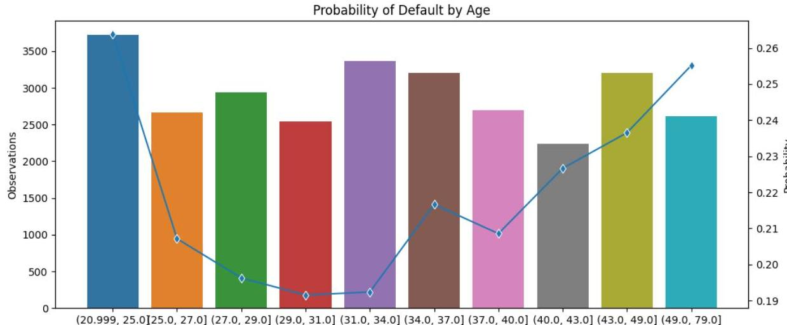

## Page 28
Dabei sind auf der linken Achse die Anzahlen der verfügbaren Beobachtungen und auf der rechten Seite die Default-Wahrscheinlichkeiten abgetragen.

Mit einer Heat Map können Kombinationen von zwei verschiedenen Merkmalen und deren Ausprägungen betrachtet werden:

Abbildung 2: Kreditausfallwahrscheinlichkeit gruppiert nach Alter / Geschlecht

Eine hellere Farbe entspricht hier einer höheren Ausfallwahrscheinlichkeit, die dunklere einer geringen. In der oben abgebildeten Grafik steht GENDER=1 für die männlichen und GENDER=2 für die weiblichen Kreditnehmer und AGE_GROUP=1 für die Altersgruppe 26-47, AGE_GROUP=0 für die restlichen Altersgruppen. Wir beobachten besonders hohe Ausfallwahrscheinlichkeiten für männliche Kreditnehmer unter 26 oder über 47 Jahren.

In der weiteren Nutzung dieser Daten muss sich zunächst die Frage gestellt werden, ob es sich bei den vorliegenden Beobachtungen in den Daten um repräsentative oder nicht-repräsentative Daten handelt - sprich: ist es realistisch, dass wir hohe Ausfallwahrscheinlichkeiten für männliche Kreditnehmer zwischen 26 und 47 Jahren sehen, oder hat das andere Gründe? Hier ist es oftmals wichtig, sich auch damit auseinanderzusetzen, wie die Daten produziert werden.

Wird ein Bias nicht hinreichend erkannt, so pflanzt er sich - wie oben erwähnt - unter Umständen in den Ergebnissen der KI Systeme fort und generiert Ergebnisse, die bestimmte Gruppen u.U. ungerechtfertigt bevorteilen oder benachteiligen können. Selbst ein in seiner Höhe eventuell berechtigter Bias gegenüber eines Teilbestands in den Inputdaten, kann durch das KI-System überproportional erhöht werden. Eine zentrale Eigenschaft von KI-Systemen ist die Suche nach Mustern und deren Verstärkung, womit sie in besonderer Weise zu „Unfairness" neigen.

Es gibt einige Kennzahlen, mit denen sich Bias quantitativ messen lässt. Die Berechnung der Kennzahlen ist z.B. in Python bereits in der Bibliothek aif360 umgesetzt (AI, 2018).

Stellt man fest, dass ein Bias vorliegt, kann es sinnvoll sein, die genutzten Daten dergestalt zu manipulieren, dass der Bias verringert oder entfernt wird.

Interessehalber seien hier zwei Kennzahlen genannt, die Bias in den Inputdaten messen:
Statistical parity difference (SPD):
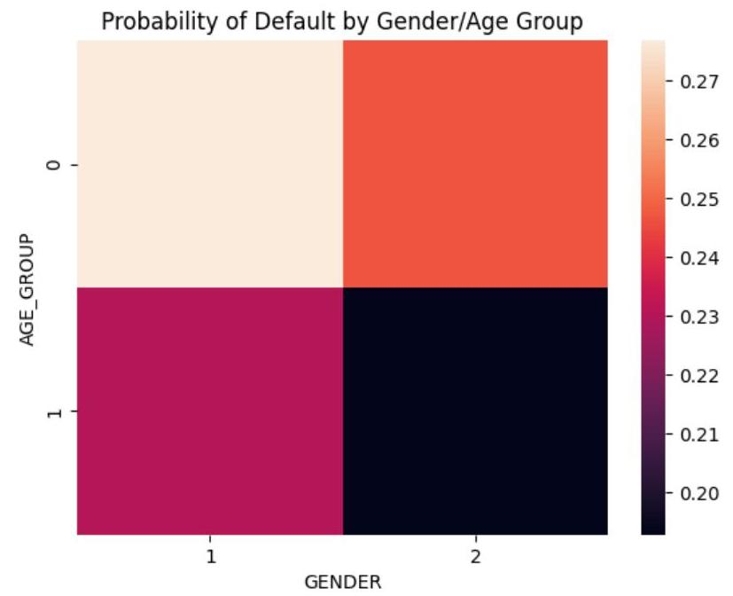

## Page 29
Diese Größe beschreibt den Unterschied zwischen den durchschnittlichen Wahrscheinlichkeiten für den positiven Ausgang eines Zufallsereignisses zwischen zwei betrachteten Gruppen. Dabei wird die eine Gruppe als unprivilegiert und die andere Gruppe als privilegiert angesehen.

$$
W s(Y=1 \mid D=\text { unprivilegiert })-W s(Y=1 \mid D=\text { privilegiert })
$$

Mit dieser Größe könnte man zum Beispiel messen, wie stark in einem Datensatz zur Vergabe von Vorstandsposten die Vergabe vom Geschlecht abhängt, wenn man Frauen als unprivilegiert und Männer als privilegiert betrachtet. Kein Bias liegt vor, wenn die Differenz den Wert 0 annimmt.

Disparate impact (DI):
Hier wird statt der Differenz der Quotient betrachtet:

$$
\frac{W s(Y=1 \mid D=\text { unprivilegiert })}{W s(Y=1 \mid D=\text { privilegiert })}
$$

Falls die Daten unbiased sind, nimmt der Quotient den Wert 1 an.
Smooth empirical differential fairness (SEDF):
Diese Kennzahl geht auf (Foulds, et al., 2019) zurück. In diesem Fall wird nicht nur zwischen einer privilegierten und nicht-privilegierten Gruppe unterschieden, sondern es werden alle Ausprägungen der geschützten (bzw. diskriminierenden) Merkmale berücksichtigt.

Eine SEDF von 0 steht für ausgeglichene Daten (kein Unterschied in den Wahrscheinlichkeiten), je größer die Kennzahl von 0 abweicht, umso unfairer sind die Daten. Für detailliertere Erläuterungen wird auf die (Foulds, et al., 2019) verwiesen.

# (2) Sicherstellung der Güte von Training- / Test- und Validierungsdaten 

Der AI Act verlangt, dass zum Training der Modelle die Inputdaten in Trainings-, Validierungs- und Testdaten aufgeteilt werden sollen. Unter Trainingsdaten versteht man die Daten zum Training eines Modells, z.B. zur Kalibrierung der Gewichte eines neuronalen Netzes. Validierungsdaten hingegen werden verwendet, um das Modell selbst (z.B. neuronales Netz, Random Forest etc.) oder die Hyperparameter (z.B. Anzahl der Schichten und Neuronen oder Tiefe der Bäume, Anzahl der Bäume) festzulegen. Die Testdaten hingegen sind zuvor ungesehene Daten, die dazu verwendet werden, das Modell zu evaluieren.

Die Standardbibliotheken für Machine Learning, wie z.B. scikit-learn für Python, sehen bereits eine Funktionalität vor, einen vorhandenen Datensatz in einen Trainings- und Testdatensatz zu splitten (z.B. train_test_split(X,y,test_size=0.2)). Diese Funktion kann dann iterativ verwendet werden, um z.B. einen Validierungsdatensatz zu erzeugen.

Das Verhältnis zwischen Trainings-, Validierungs- und Testdaten hängt vom Problem und der Datenquantität ab. Im Allgemeinen wird ein Verhältnis von 80-10-10 bis 60-20-20 gewählt. Bei Modellen mit wenigen Hyperparametern kann das Validierungsdatenset entsprechend kleiner gewählt werden.

Die Trainingsdaten müssen möglichst über alle Inputs diversifiziert sein, also auch Extremfälle berücksichtigen. Nur so kann das trainierte Modell für alle möglichen Daten möglichst gute Vorhersagen treffen. Um eine relevante Aussage über die Qualität des Modells zu treffen, sollten die Testdaten die Realität möglichst gut widerspiegeln. Beispielsweise können bei einem unausgeglichenen Klassifikationsmodell die Trainingsdaten teilweise austariert werden. Die Testdaten hingegen sollten nicht ausgeglichen werden, wenn dies eher der Realität entspricht (wie z.B. bei Betrugsfällen oder anderen seltenen Ereignissen). Dies gilt auch für das Validierungsset, das ebenfalls die Performance misst und sich deshalb am Testdatenset orientieren sollte.

Um eine unabhängige Performancemessung zu erhalten, müssen die Testdaten disjunkt zu Trai-nings- und Validierungsset sein. Es muss durch Prüfroutinen sichergestellt werden, dass es keine doppelten Einträge gibt bzw. dass doppelte Einträge entweder vollständig den Trainings-, Validie-rungs- oder Testdaten zugeordnet und nicht auf die Mengen verteilt sind. Doch dies allein ist im

## Page 30
Allgemeinen noch nicht ausreichend. So ist zudem sicherzustellen, dass die Aufteilung nicht nur nach einzelnen Elementen erfolgt, sondern nach Entitäten. Beispielsweise sollten sich verschiedene Schadenfälle einer Person nicht auf Trainings- und Testdaten verteilen, da damit Informationen aus den Testdaten bereits in den Trainingsdaten enthalten sind. Dies kann der einfache Aufruf einer Standardfunktion, wie z.B. train_test_split nicht leisten. Gegebenenfalls ist zu rechtfertigen, dass die Auswirkungen nicht materiell sind.

Ein anderes Problem ergibt sich bei Zeitreihen, bei denen eine zufällige Wahl von Trainings-, Vali-dierungs- und Testdaten nicht sinnvoll ist. Zunächst einmal würde diese die Performance auf den Testdaten zu gut darstellen: So geben in der Regel die Daten für Tag x und $x+2$ eine gute Näherung für Tag $x+1$. Zum anderen spiegelt ein solches Vorgehen nicht die Zielsetzung wider, bei der es darum geht, eine Vorhersage für die Zukunft zu treffen. Deshalb werden bei Zeitreihen häufig die älteren Daten als Trainingsdaten, die etwas Jüngeren als Validierungsdaten und die Jüngsten als Testdaten eingesetzt. Insbesondere für Daten mit starken Korrelationen entlang der Zeitachse (z.B. Kapitalmarkt) ist dabei darauf zu achten, dass entsprechende Lücken zwischen Trainings-, Validierungs- und Testdaten gelassen werden. Dies verhindert Datenlecks und Overfitting (de Prado, 2018).

# 4. Validierung von KI-Modellen 

Während sich die Datenvalidierung auf die Überprüfung von Richtigkeit, Qualität und Konsistenz von Daten bezieht, fokussiert sich die Modellvalidierung auf die Leistung und Angemessenheit des Modells.

Eine ausführliche Diskussion von KI-Modellen soll an dieser Stelle nicht stattfinden. Im Fokus dieses Ergebnisberichts stehen vielmehr die Methoden zur Validierung von KI-Modellen selbst, die natürlich auch, aber eben nicht nur vom zu validierenden Modell abhängen. Die dargestellten Validierungsmethoden eignen sich für eine Menge unterschiedlicher Modelle, insbesondere aber für die aus aktueller Sicht praxisrelevanteste - Modellgruppe, der ML-Modelle im Rahmen des überwachten Lernens. ${ }^{27}$

In diesem Kapitel soll in einem ersten Schritt ein gemeinsames Verständnis aufgebaut werden, was allgemein bzw. in diesem Abschnitt unter dem Begriff der Validierung von Modellen zu verstehen ist, gefolgt von einer näheren Diskussion, was speziell die Validierung von KI-Modellen bedeuten kann. Naturgemäß kann und will dieser Ergebnisbericht keinen Anspruch auf Vollständigkeit in den vorgestellten Validierungsmethoden erheben, auch aufgrund der dynamischen Entwicklungen bei KI. Vielmehr wurde versucht, eine sinnvolle Auswahl zu treffen und den Fokus auf Techniken zu legen, welche für aktuarielle Modelle bzw. Fragestellungen als relevant erscheinen.

### 4.1. Grundlagen der Modellvalidierung

Die Validierung von Modellen kann im Allgemeinen aus drei wesentlichen Gründen motiviert sein. Zunächst können Validierungen aufgrund regulatorischer Anforderungen verpflichtend durchzuführen sein. Ein Beispiel ist die Validierung der Berechnung der versicherungstechnischen Rückstellungen nach Solvency II, die gemäß Art. 264 DVO 2015/39 explizit gefordert und mindestens einmal jährlich durchzuführen ist.

Ebenso haben Versicherungsunternehmen ein intrinsisches Interesse daran, die Angemessenheit der im Unternehmen verwendeten Modelle durch eine angemessene Validierung sicherzustellen. In diesem Fall gibt es (bisher) keine regulatorisch begründete Notwendigkeit zu einer Validierung, dennoch basiert eine Ableitung und effiziente Durchführung von vertrieblichen Präventionsmaßnahmen im Sinne eines guten Kosten-Nutzen Verhältnisses auf möglichst guten und verlässlichen Vorhersagen und damit auf einem guten, validierten Algorithmus. Letztendlich beruhen viele zentrale (Ma-nagement-)Entscheidungen zunehmend auf Informationen und Einsichten, welche durch aufwändige Modelle erzeugt werden. Somit ist es von entscheidender Bedeutung, diese Ansätze auch zu

[^0]
[^0]:    ${ }^{27}$ Vgl. (DAV, 2019)

## Page 31
validieren (und erklären zu können), bevor Schlussfolgerungen aus ihren Ergebnissen gezogen werden.

Nicht zuletzt haben auch Aktuare ein Interesse daran, Modelle hinreichend validieren und somit auch beurteilen zu können. Daher möchten wir an dieser Stelle insbesondere auch auf den ISAP1a (IAA, 2016) hinweisen, welcher uns einen (unverbindlichen) Standard hinsichtlich der Governance von Modellen an die Hand gibt. Er zielt darauf ab, den Anwendern bzgl. der Modellergebnisse und deren Verständlichkeit Sicherheit zu geben, auch dass die gewählten Annahmen und Methoden angemessen sind.

Im DAV-Ergebnisbericht zur „Validierung der versicherungstechnischen Rückstellungen unter Solvabilität II", wird unter Validierung „im Allgemeinen die Überprüfung der Angemessenheit einer Sache verstanden" (DAV, 2018). Zeitlicher und inhaltlicher Umfang sowie Häufigkeit orientieren sich dabei an Zweck und Umständen der Validierung.

Gemäß der Artikel 264 Abs. 1 der oben erwähnten DVO 2015/39 zu Solvency II sollte eine Validierung allgemein ausgelegt folgende Punkte umfassen: die Angemessenheit, Vollständigkeit und Exaktheit der verwendeten Daten (vgl. Kapitel 3); die Angemessenheit von Maßnahmen, um einer Datenunzulänglichkeit zu begegnen; die Angemessenheit von verwendeten Näherungswerten; die Angemessenheit und Plausibilität der Annahmen, die der Berechnung zugrunde gelegt werden; die Angemessenheit, Eignung und Relevanz der angewandten Methoden sowie die Angemessenheit und Reproduzierbarkeit des Ergebnisses.

Zum Vergleich fordert ISAP1a, dass eine Modellvalidierung folgende Einschätzungen umfasst:

- „Model reasonably fits its intended purpose. Items that the actuary should consider, if applicable, include the availability, granularity, and quality of data and inputs required by the model, the appropriateness of the relationships recognized, and the model's ability to generate an appropriate range of results around expected values. "
- „Model meets its specifications."
- „Results of the model can be appropriately reproduced. "

Weiter soll Folgendes sichergestellt sein: „The validation should be performed by individual(s) who did not develop the model, unless to do so imposes a burden that is disproportionate to the model risk."

Zusammenfassend soll Validierung im Rahmen dieses Ergebnisberichts insbesondere einen dokumentierten Nachweis schaffen, dass ein Modell gewisse gewünschte Eigenschaften (wie Generalisierung und Prognosegüte) zeigt und gewisse ungewünschte (wie etwa Bias und Overfit) nicht zeigt. Hinsichtlich der zu „validierenden Sache" sollen in diesem Dokument vor allem Methoden betrachtet werden, in denen KI zum Einsatz kommen (vgl. Kapitel 4.3, „Modellvalidierung im Kontext KI").

# 4.2. Anwendungen von KI-Modellen, Fortschritte und Herausforderungen 

Im Allgemeinen ist im Versicherungswesen ein vermehrter Einsatz von KI-Modellen zu beobachten. Beispiele für KI-Anwendungen sind:

- Automatisiertes Dokumentenmanagement: Mit Hilfe KI-basierter Texterkennungssoftware („Optical Character Recognition", OCR) können Anträge oder Anfragen automatisiert bearbeitet werden. Ein Anwendungsfall ist etwa die automatische Erfassung von Arztrechnungen in der privaten Krankenversicherung;
- Digitale Schadenerkennung: Anhand von Schadenfotos können Schäden automatisiert bewertet werden. Dabei wird eine KI anhand bereits bewerteter Schadenfotos trainiert und lernt kontinuierlich dazu;
- Kapitalmarktmodell: Kalibrierung von Kapitalmarktmodellen mit Hilfe neuronaler Netze;
- Chatbots: Mit Hilfe von KI lassen sich einfache Kundenanfragen automatisiert in natürlicher Sprache beantworten;

## Page 32
- Robo-Advisor: In der Weiterentwicklung von Chatbots kommen auch digitale Versicherungsberater zum Einsatz. Diese können automatisiert den aktuellen Versorgungsgrad sowie das persönliche Risiko des (potenziellen) Versicherungsnehmers analysieren und automatisiert passende Versicherungsprodukte empfehlen;
- Customer behaviour prediction, bspw. Storno: Die Analyse historischer Kundendaten ermöglicht die Identifikation von Faktoren, die „potenziell/wahrscheinlich" das Kundenverhalten, bspw. Storno, vorhersagen. Dieses Wissen ermöglicht vertriebliche (Präventions) Maßnahmen;
- SCR-Berechnung: Einsatz neuronaler Netze zur SCR-Berechnung in Internen Modellen zur Risikokapitalberechnung als mögliche Alternative zu bisher verwendeten Methoden wie z. B. Least-Squares-Monte-Carlo-Ansätzen.
- Dennoch sollen auch weitere bemerkenswerte technologische Durchbrüche aus den vergangenen Jahren durch KI-Modelle nicht unerwähnt bleiben, die durch die Verfügbarkeit von immer größer werdenden Datensätzen („Big Data") in Verbindung mit immer leistungsstärkeren Computern ermöglicht wurden: Fortschritte in der Bilderkennung (,image recognition") (ca. 2012-2015 (Adaloglou, 2021)) ermöglich(t)en die Entwicklung autonomer Autos und autonomer Drohnen.
- Fortschritte in der Verarbeitung natürlicher Sprache („natural language processing", „speech recognition") ermöglichten virtuelle Assistenten wie Siri, Alexa, Cortana und Google Now (2010-2014), automatische Übersetzungsservices wie DeepL Translator (2017) oder für allgemeine Zwecke vortrainierte Sprachmodelle wie ELMo, BERT (The Verge, 2019) und GPT-3 (2018-2020).
- Fortschritte in der effizienten Speicherung von Wissen und dem schnellen Zugriff darauf ermöglichten Wettbewerbssiege wie IBM Watsons Sieg in der Fernsehquizshow Jeopardy (2011).

Andererseits sind KI-Modelle auch schon gescheitert, z. B.:

- Am 07.05.2016 aktivierte ein Tesla Modell S in einem Frontalcrash fälschlicherweise nicht die automatische Bremse, da es einen Sattelauflieger mit einem über der Straße hängenden Verkehrsschild verwechselte (Singhvi, et al., 2016). Ein sehr ähnlicher Unfall passierte am 01.03.2019 mit einem Tesla Modell 3 (Hawkins, 2019).
- Am 18.03.2018 tötete ein selbstfahrendes Auto von Uber eine Fußgängerin, nachdem das Auto die Fußgängerin zu lange als von einem Fußgänger verschiedenes Objekt neu klassifiziert hatte. Das System warnte zu spät, sodass nicht mehr rechtzeitig gebremst werden konnte (Holland, 2019).

Einige KI-Modelle sind leicht zu täuschen, z. B.:

- durch das Hinzufügen von zwei weißen und zwei schwarzen Rechtecken auf ein Stoppschild klassifizierte ein KI-Bilderkennungssystem dieses fälschlicherweise als Geschwindigkeitsbegrenzungsschild (45mph) (Heaven, 2019).

Einige KI-Modelle sind trügerisch in dem Sinne, dass sie zwar korrekte Vorhersagen machen, aber aus den falschen Gründen, z. B.:

- Ein KI-Bilderkennungsmodell lernte subtile Korrelationen zwischen gewissen Wasserzeichen in Bildern von Pferden. Nachdem das Wasserzeichen manuell aus dem Bild entfernt wurde, konnte das KI-Bilderkennungsmodell Bilder von Pferden nicht mehr korrekt identifizieren. Nachdem das Wasserzeichen einem Bild mit einem Auto hinzugefügt wurde, wurde das Auto als Pferd klassifiziert ("Clever Hans predictor") (Lapuschkin, et al., 2019).

## Page 33
Im weiteren Verlauf des Dokumentes wird in Kapitel 4.5 eine Auswahl an Validierungsmethoden zu den oben genannten Beispielen Customer behaviour prediction (am Beispiel Storno) sowie SCRBerechnung exemplarisch vorgestellt. ${ }^{28}$

Diese beiden Use Cases stehen hier stellvertretend für verschiedene KI-Modelle aus dem zuvor erwähnten Bereich des überwachten Lernens. So werden einerseits anhand eines Stornovorhersagemodells die möglichen Validierungsansätze für Klassifikationsprobleme beleuchtet, die z.B. mittels Gradient Boosting oder Random Forest Algorithmen auf Klassifikationsbäumen gelöst werden können. Andererseits werden Neuronale Netze zur Berechnung des Risikokapitals eines Lebensversicherers als Beispiel für KI-Modelle aus dem Bereich der Regressionsprobleme bzw. DeepLearning Methoden beleuchtet und mögliche Validierungsansätze dargestellt.

# 4.3. Modellvalidierung im Kontext KI 

### 4.3.1. Notwendigkeit für neue Validierungsmethoden

Gliedert man die Entwicklung von Modellansätzen der angewandten Statistik in drei Zeitabschnitte, kann man folgende Modellklassen unterscheiden:

- Traditionelle Modelle, wie z. B. lineare Modelle und generalisierte lineare Modelle (GLM) oder nichtlineare Modelle mit wenigen Parametern,
- Nicht-parametrische Modelle, wie z. B. generalisierte additive Modelle (GAM), die geglättete Splines verwenden, Support-Vector-Maschinen und Ensembles von Entscheidungsbäumen, sowie
- Statistische und Machine Learning Modelle, z. B. faltende ("convolutional") neuronale Netzwerke, vollständig verbundene Netzwerke mit vielen Schichten oder Transformer-Modelle wie z. B. BERT ${ }^{29}$.

Ähnlichkeiten und Unterschiede zwischen diesen drei Zeitabschnitten können wie folgt zusammengefasst werden:

| Schritt | Traditionelle Modelle   $(1965-1985)^{30}$ | Nicht-parametrische   Regressions-modelle   $(1986-2005)$ | Statistische und Ma-   chine Learning Modelle   (seit 2006) |
| :-- | :-- | :-- | :-- |
| 1. Sammeln und Aufbe-   reiten von Daten | Semi-manuell gesam-   melte Daten in weni-   gen Tabellen oder re-   lationalen Datenban-   ken | (teilweise) automati-   sierte ETL ${ }^{31}$ Prozesse   in manuell erstellten   Schemata relationaler   Datenbanken | Meist automatisiertes   Sammeln, Aufbereiten   und Transformieren von   Daten in unstrukturierte   Datenformate,   Speicherung in NoSQL-   Datenbanken |
| 2. Wahl der Modell-   klasse | Expertenwahl | Expertenwahl | Versuche der Automatisierung existieren, aber meist noch Expertenwahl |

[^0]
[^0]:    ${ }^{28}$ Anmerkung: Datenschutzrechtliche Aspekte, die in dem ein oder anderen Use Case eine kleinere oder größere Rolle spielen, werden in diesem Ergebnisbericht nicht diskutiert.
    ${ }^{29}$ Bidirectional Encoder Representations from Transformers (Aufmerksamkeitsbasierte Transformation von natürlicher Sprache)
    ${ }^{30}$ Zeitraum der Entwicklung der Methodik in der angewandten Statistik
    ${ }^{31}$ Extract, Transform, Load (Prozess zum Laden und Aufbereiten von Daten)

## Page 34
| 3. Selektion von Variablen und Reduktion der Dimension | Expertenwahl | Einfache Dimensionsreduktion (PCA) kombiniert mit Variablenselektion durch Experten | Vollautomatisch als Teil des Trainings |
| :--: | :--: | :--: | :--: |
| 4. Fitten der Modellparameter | Automatisch durch Verwendung modellspezifischer Optimie-rungs-software | Automatisch durch Verwendung modellspezifischer Optimie-rungs-software | Automatisch durch Verwendung generischer Frameworks wie Tensorflow oder Pytorch |
| 5. Kreuzvalidierung und Wahl von Glättungsund Regularisierungsparametern | Meist manuell | Meist automatisch (z. B. im R-Paket mgcv um GAMs zu fitten) | Meist automatisch |
| 6. Beurteilung der Performance ("out of sample") der spezifischen Kalibrierung. Anpassung der Variab-lenselektions- und Re-gularisierungs-Strategie, falls notwendig | Manuelle Analyse der Modelldiagnostik | Manuelle Analyse der Modelldiagnostik | Automatische Beurteilung auf Basis eines separaten Datensets, manuelle Analyse der Modelldiagnostik ("Explainable AI") |
| 7. Vergleich von Modellklassen, Neuwahl der Modellklassen, falls notwendig | Expertenwahl unter Annahme spezieller Verteilungen (z. B. NV, Student-t- oder F-Verteilung) | Expertenwahl unter Berücksichtigung von Konvergenz-sätzen nicht-parametrischer Methoden verknüpft mit praktischer Erfahrung | Expertenwissen eher auf Fallstudien basierend als auf vollständigem mathematischem Verständnis von Modellklassen |

Während sich allgemeine Maßstäbe an die strukturelle Eignung von Methoden - wie Performance, Stabilität oder Reproduzierbarkeit - im Zeitablauf nicht geändert haben, so erfordern die heutigen auf KI aufbauenden Methoden und Modelle nicht nur ein entsprechend breiteres Wissen in Entwicklung, Anwendung und Validierung, sondern auch neue, angepasste Validierungsmethoden an sich.
Die Notwendigkeit für neue Methoden, die Angemessenheit und Qualität von KI-Modellen zu beurteilen und zu bemessen, ergibt sich aus dem ansatzinhärenten Unterschied zu traditionellen Methoden, insbesondere aus folgenden Punkten:

- KI umfasst oft die Transformation unstrukturierter Daten. (Schritt 1)
- Variablenselektion und Dimensionsreduktion werden immer mehr automatisiert und in das Training der Daten integriert. (Schritt 3)
- Um die Qualität einer konkreten Kalibrierung zu beurteilen, reicht es meist nicht, die Vorhersagegüte auf Basis von Validierungsdaten ("out of sample") zu berechnen. Es erfordert viel detailliertere Modelldiagnostik, z. B. durch gewisse KI Erklärbarkeitsansätze.
- Moderne KI-Modelle sind in der Regel wesentlich dynamischer als traditionelle Modelle. Sie werden oft laufend verbessert, aktualisiert und mit neuen Daten angereichert und neu trainiert. Dadurch können sie sich auch nach bereits kurzer Zeit strukturell sehr stark ändern. Dies muss in der Validierung berücksichtigt werden und macht ggf. auch eine laufende und dynamische Validierung notwendig.
- Funktionsweise, Wirkungszusammenhänge und Ergebnisse von modernen KI-Modellen sind häufig schwieriger zu verstehen/nachzuvollziehen als die von traditionellen Modellen („Black Box-Charakter"). Daraus entstehen zusätzliche Herausforderungen für die Erklärbarkeit der Ergebnisse, auch um intern und extern entsprechende Akzeptanz für die

## Page 35
eingesetzten Modelle zu schaffen. Eine weitere Herausforderung ist, strukturell sehr unterschiedliche Modelle im Hinblick auf ihre Qualitäten vergleichbar zu machen.

- Für KI-Modelle, die in den genehmigungspflichtigen Aufsichtsbereich fallen, gelten besondere Anforderungen an die Validierung (z. B. aus der MaRisk). Insbesondere muss die Modellvalidierung deutlich machen, welche Änderungen an der Modellstruktur welchen Effekt auf die Ergebnisse des Modells haben, um ungewollte Effekte aus Modelländerungen frühzeitig zu identifizieren und zu vermeiden.

# 4.3.2. Ziele und Anforderungen einer Validierung im KI-Kontext 

Die Ziele einer Validierung von KI-Modellen unterscheiden sich unwesentlich von den Zielen der Validierung traditioneller Modelle, welche u. a. folgende Punkte umfassen:

- Verfeinerung des oft nur vage beschriebenen gewünschten Modellverhaltens - z. B. vertrauenswürdig, zuverlässig, ethisch, unter Beachtung des Gleichbehandlungsgrundsatzes und der Datenschutzanforderungen - in ein vollständiges Set von messbaren und realisierbaren Qualitätskriterien;
- Beschreibung der Stärken des Modells, so dass Beschränkungen der Eingabewerte gefunden und messbare Qualitätskriterien definiert werden können;
- Beschreibung der Schwächen des Modells durch Aufzeigen der Grenzfälle oder unzulässiger Eingabewerte, welche zu unerwünschten Ergebnissen führen würden; und
- Beschreibung der expliziten und impliziten Annahmen, die notwendig sind, um die gewünschten Eigenschaften des Modells aufrecht zu erhalten, wenn die Kalibrierung mit neuen Trainingsdaten aktualisiert wird.

Allerdings erfordert der zuvor beschriebene KI-Kontext ein besonderes Augenmerk auf die Fähigkeiten eines KI-Modells auf Basis völlig unbekannter Daten gute, unverzerrte Prognosen zu liefern. Diese Fähigkeit wird als Generalisierung bezeichnet. Eines der wesentlichen Ziele einer Validierung im KI-Kontext sollte es daher sein, die Fähigkeit eines Modells zur Generalisierung und die Prognosegüte (unter Begrenzung von Overfit und Bias) zu messen, indem z.B. völlig unbekannte Daten verwendet werden.

Wenn ein Modell zwar auf den Testdaten gute Prognoseergebnisse liefert, jedoch für neue Daten keine guten Vorhersagen macht, wird diese unerwünschte Modelleigenschaft als Overfitting (Überanpassung) bezeichnet. Overfitting kann dabei in zu kleinen Trainingsdatensätzen und/ oder zu hoher Modellkomplexität begründet sein, wodurch das Modell die Daten quasi „auswendig" lernt. Ebenso kann Overfitting durch Informationen in den Trainingsdaten hervorgerufen werden, welche im Modell berücksichtigt werden, es aber nicht sollten.

Ein weiterer wesentlicher Aspekt der Validierung im KI-Kontext liegt in dem meist hohen Automatisierungsgrad mit entsprechend dunkel arbeitenden Prozessen von KI-Modellen begründet. Es ist nicht nur wichtig, das jeweilige Modell vor dem produktiven Einsatz zu validieren, sondern auch die Validierung während des produktiven Einsatzes ist regelmäßig zu bewerten.

### 4.3.3. Kriterien für die Auswahl einer Validierungsmethode

Die für die Validierung von KI-Modellen notwendigen Tools und Methoden sind so vielfältig wie die für das Training verschiedener Modelle verwendeten Tools und Verfahren. Validierungsmethoden sollten zugeschnitten sein auf:
a) Größe und Typ der Inputdaten

Wenn die Größe der Trainingsdaten bestimmte Grenzen überschreitet, entstehen auch für die Validierung weitere Herausforderungen. Die Anforderungen an Hardware, Energieversorgung und Software-Tools unterscheiden sich grundlegend, wenn nicht mehr nur Tools wie Python

## Page 36
oder R auf einem Rechner verwendet werden können, sondern Cluster-Software wie z.B. Apache Spark ${ }^{32}$ auf einem Rechnerverbund oder gar Cloud-Lösungen erforderlich sind.

Das Training von KI-Modellen, z.B. Sprachmodelle, erfordert beachtliche Ressourcen, insbesondere Energie. Deshalb ist es vorrangig aus ökologischer Sicht angemessen, mit vortrainierten Modellen zu beginnen für:

- Sprachmodelle (NLP) (Simon, 2021),
- Bildverarbeitung mit faltenden neuronalen Netzen (Tan, et al., 2020),
- kombinierter Sprach- und Bildverarbeitung (Hahn, 2022).

Andererseits haben verschiedene vortrainierte Modelle verschiedene Selektionseffekte ("selection bias"). Deshalb sollte die Validierung eines Modells, welches auf solch einem allgemeinen vortrainierten Modell basiert, auch die Stärken, Schwächen und Grenzen dieses vortrainierten Modells berücksichtigen.
b) Anzahl und Struktur der Modellparameter

Bzgl. der Anzahl und Struktur der Modellparameter können folgende drei Kategorien unterschieden werden:

- Es gibt einen Vektor oder eine Matrix von Parametern („layer") mit einer klaren mathematischen Struktur, wie z.B. generalisierte lineare Modelle, welche neuronalen Netzen mit einem „layer" entsprechen.
- Die Anzahl der Parameter bzw. die Anzahl der Freiheitsgrade wird automatisch auf die verfügbaren Daten abgestimmt. Die Vorhersage basiert auf einem Ensemble von Modellen. Jedes Modell in dem Ensemble hat eine einfache mathematische Struktur. Dazu gehören generalisierte additive Modelle (GAMs), Support-Vektor Maschinen und Ensembles von Entscheidungsbäumen („random forests", „boosted decision trees").
- Die Struktur der Parameter ist mehrschichtig und nicht trivial, wie z. B. in tiefen neuronalen Netzen.

Für die meisten Anwendungsfälle benötigt man sowohl Stabilität in der Inferenz als auch Stabilität im Training:

- Stabilität in Inferenz: Wenn sich die Input-Daten nicht um mehr als einen gewissen Wert ändern, dann kann garantiert werden, dass sich auch das Ergebnis nicht um mehr als einen gewissen Wert ändert.
- Stabilität im Training: Wenn sich die Trainingsdaten nicht um mehr als einen gewissen Wert ändern, dann kann garantiert werden, dass sich auch das Qualitätskriterium für das Modell nicht um mehr als einen gewissen Wert ändert.

Keine der beiden Stabilitätsfragen kann beantwortet werden, wenn Modellarchitektur und Modellparameter nicht bekannt sind.

Die Frage der Stabilität im Training kann nur beantwortet werden, wenn die Trainingsstrategie explizit bekannt ist.
c) Art der Unvorhersagbarkeit,

Validierungsfragen und -ansätze hängen fundamental von der Vorhersagbarkeit ab. Man kann folgende fünf Kategorien unterscheiden:

1. Das Problem ist deterministisch, wie z. B. beim Schach oder Beweisen von mathematischen Sätzen.
2. Zufall spielt eine Rolle, aber die Wahrscheinlichkeiten sind exakt bekannt, wie z. B. bei Kartenspielen.
[^0]
[^0]:    ${ }^{32}$ Open-source Framework für Cluster Computing

## Page 37
3. Die Wahrscheinlichkeiten sind nicht bekannt, aber grundsätzlich messbar durch wiederholte Experimente, wie in der Physik (VentureBeat, 2022).
4. Die Wahrscheinlichkeiten ändern sich im Zeitverlauf, weil sich das Ökosystem ändert, wie z. B. bei Risikomodellen in der Finanzindustrie.
5. Die vom Modell verwendeten Wahrscheinlichkeiten sind nicht objektiv, sondern Schwächen des Modells werden aktiv ausgenutzt, wie z. B. Pricingmodelle für Assets (Parker, et al., 2021) oder Systeme, die vor Cyberkriminalität (Schneider, 2020) schützen sollen.
d) Häufigkeit der Modell-Neukalibrierung und Modelländerung

- Die Häufigkeit und Art der Modelländerungen ist wesentlich für die Bedeutung der (unabhängigen) Modellvalidierung im Gegensatz zur standardmäßigen Qualitätssicherung als Teil des Trainings und Neu-Trainings des Modells.
- Für Modelle, die einmalig genehmigt werden, erfolgen Änderungen des Modells in der Regel höchstens einmal pro Jahr. Eine Modellgenehmigung erfordert großen Validierungs- und Testaufwand. Typische Beispiele sind eine Erstgenehmigung für ein internes Modell oder die Homologation eines neuen Autotyps. Es gibt Modelle, die ein- bis zweimal im Jahr erneut getestet und validiert werden, wie z. B. Risikomodelle in der Versicherungsbranche oder die Zulassung eines einzelnen KFZ. Die Kalibrierung solcher Modelle kann jedoch häufiger erfolgen.
- Andere Modelle, die nicht steuerungsrelevant sind, können alle 2-3 Wochen aktualisiert werden, entsprechend der typischen Länge eines Sprints in einem Scrum-Projekt. Einige Vorhersagemodelle werden sogar mehrmals am Tag aktualisiert.
- Je häufiger ein Modell aktualisiert wird, umso mehr sollte auch die unabhängige Validierung die Berechnung und Kontrolle der Qualitätskriterien automatisieren.
e) Schweregrad der Folgen des Modellergebnisses

Die Häufigkeit der Modell-Überprüfung und Neukalibrierung ist oft mit der Schwere der Folgen des Modellergebnisses negativ korreliert, sodass sich die unabhängige Validierung zwischen

- weniger häufig, aber tiefergehende Validierung von Entscheidungsmodellen bei relativ großen ökonomischen Folgen und
- evtl. häufig, aber eher standardisierte Validierung von Modellen mit weniger schweren Folgen
bewegt.
Die Definition von Qualitätskriterien und die Kontrolle dieser Kriterien sollten dem Schweregrad der Folgen der Modellergebnisse angepasst werden.

# 4.3.4. Checkliste für eine Modellvalidierung 

Folgende Schlüsselfragen sollten im Dialog zwischen den unabhängigen Verantwortlichen für die Validierung und die Modellierung eines Modells geklärt werden:

- Sind die Optimalitätskriterien (gewünschtes Modellverhalten) sowie die Grenzen und Einschränkungen (erlaubtes Modellverhalten) genau genug definiert, so dass diese Kriterien messbar sind und die Akzeptanz entschieden werden kann?
- Berücksichtigen diese Qualitätskriterien seltene, aber potenziell schwerwiegende Fälle von unerwünschtem Modellverhalten?
- Sind die Mindestanforderungen an das Modell erfüllt? Wie gut erfüllt das Modell die Zielfunktionen, die das gewünschte Verhalten definieren?

## Page 38
- Ist der Grad der Unsicherheit im Modelloutput quantifiziert? Ist die Qualität von Vorhersagen von Wahrscheinlichkeitsverteilungen quantifiziert, für den Fall, dass das Modell Vorhersagen von Wahrscheinlichkeitsverteilungen macht? Ist der Grad der Auswirkung von Selektionseffekten ("selection bias" oder "surviver ship bias") in den Trainingsdaten quantifiziert?
- Sind adverse Tests am Modell vorgenommen worden und hat das Modell ihnen widerstanden? Sind die Grenzen der Inputdaten definiert, für welche das erlaubte Systemverhalten und eine gewisse Qualität des gewünschten Verhaltens garantiert werden kann?
- Sind die Sensitivitäten des Modellergebnisses bzgl. der Eingabedaten und Modellparameter berechnet und graphisch dargestellt? Passen diese Sensitivitäten zum erlaubten und gewünschten Modellverhalten?
- Sind Kausalitätstests (Pearl, et al., 2018) durchgeführt und ist gezeigt worden, dass es kein "Clever Hans" Verhalten ${ }^{33}$ gibt? (Puschkin et.al.2019)

# 4.3.5. Ausgewählte Methoden 

Die Beurteilung der Angemessenheit von Ereignissen kann dabei Validierungen in verschiedene Richtungen umfassen, z. B. durch einen Abgleich mit sinnvollen Vergleichswerten (bspw. im Zeitablauf) oder durch ein Backtesting (Vergleich der vorhergesagten Modellergebnisse mit den in der Realität eingetretenen Entwicklungen) oder auch durch Sensitivitätsanalysen. Prinzipiell können Validierungshandlungen top-down (vom Ergebnis ausgehend) oder bottom-up (von den Eingangsgrößen zu den Berechnungsmethoden kommend) strukturiert werden. Der Fokus der Validierungshandlungen sollte auf den (für die Angemessenheit) kritischen Modellbereichen liegen und- insbesondere im regulatorischen Kontext- sollte die Validierung unabhängig von Entwicklung und Betrieb durchgeführt werden.

Aus Gründen der Übersichtlichkeit finden sich die detaillierten Beschreibungen möglicher Validierungsmethoden im Anhang in Abschnitt 8.2. Dort wird eine Auswahl an Validierungsmethoden beschrieben, die keineswegs den Anspruch auf Vollständigkeit erhebt. Vielmehr werden häufig in der Praxis eingesetzte Methoden aus verschiedenen Klassen, wie z.B. statistische und graphische Methoden sowie Kennzahlen eingeführt, um ein möglichst breites Spektrum an Methoden darzustellen. Deren Anwendbarkeit wird anhand zweier Use Cases in Kapitel 4.5 aufgezeigt.

Entsprechend aufgezeigten Anforderungen beinhalten die Validierungsmethoden in den Abschnitten 8.2.1 und 8.2.2 zunächst Kennzahlen für Regressions- oder Klassifikationsprobleme, die genutzt werden können, um die Güte von KI zu messen. So kann man diese Kennzahlen auf den Trainings, Validierungs- und Testdaten auswerten, um z.B. ein geeignetes Modell zu finden.

Anschließend wird im Abschnitt 8.2.3 auf die Kreuzvalidierung eingegangen, welche die Fähigkeit eines Modells misst, Vorhersagen für Daten zu treffen, die nicht zum Training des Modells verwendet wurden und sich u.a. zur Begrenzung von Overfitting eignet. In der Praxis wird die Kreuzvalidierung sehr häufig eingesetzt, weswegen verschiedene Varianten der Kreuzvalidierung mit ihren jeweiligen Vor- und Nachteilen sowie den Einsatzmöglichkeiten beschrieben werden. Weitere dargestellte Validierungsmethoden mit hohem Praxisbezug sind Bootstrapping in Abschnitt 8.2.4 sowie Sensitivitätsanalysen in Abschnitt 8.2.5.

Grafische Validierungsmethoden, dargestellt in Abschnitt 8.2.6, eignen sich besonders aufgrund ihrer (für den entsprechend geschulten Anwender) intuitiven Interpretierbarkeit und relativ einfachen Implementierung für den praktischen Einsatz. Validierungen beinhalten in der Regel Experteninterviews oder Expertenevaluierungen, um realisierte Modellergebnisse mit erwarteten Ergebnissen des Fachexperten abzugleichen (siehe Abschnitt 8.2.7)

[^0]
[^0]:    ${ }^{33}$ Die KI lernt anstelle relevanter Zusammenhänge andere Korrelationen, die auch in den Daten enthalten sind.

## Page 39
Wie zuvor beschrieben, ist ein wesentliches Ziel einer Validierung im KI-Kontext die laufende Validierung und Überprüfung der Modellergebnisse im produktiven Einsatz. Hierfür werden in der Praxis häufig A/B-Tests durchgeführt, um eine Originalversion eines Prozesses oder Systems gegen eine leicht abgewandelte Version zu testen. Die Beschreibung der Validierungsmethode findet sich in Absatz 8.2.8.

# 4.3.6. Grenzen und Qualität einer Validierung 

Bisher wurde eine Übersicht über Ansätze und Methoden der Validierung im Kontext von KI gegeben. Naturgemäß kann und will dieser Ergebnisbericht keinen Anspruch auf Vollständigkeit in den vorgestellten Techniken erheben, auch aufgrund der dynamischen Entwicklungen bei KI. Vielmehr wurde versucht, eine sinnvolle Auswahl zu treffen und den Fokus auf Validierungsmethoden zu legen, welche für aktuarielle Modelle bzw. Fragestellungen als relevant erscheinen.

Letztlich misst sich auch bei der Validierung von Modellen, welche KI verwenden, die Qualität der Validierung daran, wie „gut" damit die Angemessenheit der Modelle eingeschätzt werden kann. Es muss mit Hilfe der eingesetzten Validierungsmethoden beurteilt werden können, ob das Modell tatsächlich den Zweck erfüllt, zu welchem es eingesetzt wird. Es kann weiter kein allgemeingültiges Validierungsfahren geben, welches auf alle Modelle gleichermaßen passt. Oft kann auch eine Kombination verschiedener Validierungsverfahren hilfreich sein.

Üblicherweise ist es sinnvoll, im Vorfeld der Validierung Ziele festzulegen, welche durch die Validierung erreicht werden sollen, und dann zu prüfen, ob die tatsächliche Validierung diesen Zielen gerecht wird. Eine gute Validierung zeichnet sich im Allgemeinen auch dadurch aus, dass sie in gewissem Maße unabhängig von der eigentlichen Modellierung geschieht, wodurch sie in manchen Fällen Erkenntnisse liefert, welche im Vorfeld nicht bekannt waren.

Ebenfalls ist zu beachten, dass Validierung in ausreichendem Umfang stattfindet und regulatorische Anforderungen erfüllt. Hier sind in kommender Zeit im Umfeld von KI größere Entwicklungen hinsichtlich regulatorischer Vorgaben zu erwarten. Dazu gibt Kapitel 5 eine Übersicht zu bestehenden sowie zu anstehenden Regelungen und Empfehlungen.

### 4.4. Validierbarkeit vs. Erklärbarkeit

Wie bereits in Abschnitt 4.3.2 erwähnt, besteht ein übergreifendes Ziel der Validierung in der Verbesserung des Verständnisses über die Stärken und Schwächen des Modells. Ein wesentliches Element hierfür ist es, die Zusammenhänge zwischen Eingabedaten und Modellergebnissen erklärbar zu machen. Kann man ein Modell gut erklären, kann man auch leichter dessen Angemessenheit validieren. Je komplexer das Modell, desto schwerer wird es im Allgemeinen auch, den Zusammenhang zwischen den Eingabedaten und den Modellergebnissen zu verstehen und desto wichtiger wird also auch dessen Erklärbarkeit. ${ }^{34}$

Aufgrund dieses Zusammenhangs wird im nachfolgenden Abschnitt kurz auf Erklärbarkeit eingegangen. Für weitere Details sei an dieser Stelle auf die DAV-Arbeitsgruppe zu Explainable AI verwiesen. Diese setzt sich mit dem Begriff der Erklärbarkeit sowie tiefergehenden Diskussionen zu Erklärbarkeit auseinander. Ergänzt werden sollen diese durch praktische Hinweise via Beispielskripten.

[^0]
[^0]:    ${ }^{34}$ Die Relevanz des Themas Erklärbarkeit macht die BaFin bereits in ihrer Studie „Big Data trifft auf künstliche Intelligenz" deutlich, wo neben der Transparenz auch die Erklärbarkeit eine wesentliche Rolle spielt. Man könnte an dieser Stelle sogar hineininterpretieren, dass die Nachvollziehbarkeit von Modellen durch die BaFin explizit gefordert ist, auch wenn es sich dabei derzeit noch um ein aktives Forschungsfeld handelt und die Ausgestaltung einer angemessenen Erklärung eher wenig genau definiert ist.

## Page 40
# 4.4.1. Explainable Artificial Intelligence 

Die Erklärbarkeit beschäftigt sich damit, Erklärungen zu geben, sodass der Mensch (Anwender/in) entweder versteht, wie das Ergebnis zustande kommt oder zumindest, worauf sich das Ergebnis stützt (Kraus, et al., 2021). Im ersten Fall kann das interne Verhalten des Modells direkt nachvollzogen werden. Hier besteht vollständige Transparenz hinsichtlich der Algorithmen, die dem Modell zugrunde liegen. Dies ist meist nur bei sogenannten White-Box-Modellen möglich. Im zweiten Fall ist die Erklärbarkeit indirekt gegeben, beispielsweise durch Untersuchung der Einflüsse einzelner Merkmale (Feature Importance). Bei sogenannten Black-Box-Modellen ist meist nur ein indirektes Verständnis der Funktionsweise möglich.

Unter White-Box-Modellen versteht man Modelle, die sich einfach interpretieren lassen, da das interne Verhalten des Modells direkt nachvollziehbar ist. Dazu zählen z. B.

- GLMs, bei denen man aus den Koeffizienten den direkten Zusammenhang von Inputvariablen und Outputvariablen erhält,
- Entscheidungsbäume, da die Entscheidungen in den einzelnen Knoten direkt auf die Wichtigkeit der einzelnen Merkmale und ihrer Ausprägungen hinweisen,
- Nearest Neighbors, weil direkt die nächsten Nachbarn angezeigt werden können.

Die leistungsstarken KI-Modelle wie neuronale Netze, Random Forest oder Gradient-Boosting-Verfahren sind jedoch den Black-Box-Modellen zuzuordnen. Bei diesen Modellen operiert der Algorithmus wie eine Black-Box, wobei kein KI-Modell eine reine Black-Box darstellt. Bei einem trainierten neuronalen Netz kann man zusätzlich die Gewichte beobachten, bei einem Random Forest die einzelnen Bäume, über die die Mittelung gebildet wird. Das Modell ist aber so komplex, dass eine einfache Interpretation wie bei White-Box-Modellen nicht möglich ist.

Prinzipiell ist die Black-Box-Eigenschaft keine inhärente Eigenschaft von KI-Modellen. So gibt es auch klassische Black-Box-Modelle, wie z. B. regelbasierte Monte-Carlo Simulationen oder WhiteBox KI-Modelle (siehe oben, bzw. Abbildung 3).

Explainable Artificial Intelligence (nachstehend XAI) beschäftigt sich also mit Prozessen und Methoden, die zum Ziel haben, dem Anwender das Vorgehen des Algorithmus nachvollziehbar zu erklären und ihm zu vertrauen, auch wenn es nicht möglich bzw. nicht sinnvoll ist, alle Schritte im Einzelnen nachzuvollziehen.

Abbildung 3: Erklärbarkeit von Modellen

### 4.4.2. Erklärbarkeit zur Schaffung von Vertrauen und Transparenz

Es besteht ein Trade-off zwischen Komplexität und Erklärbarkeit. Komplexere Modelle können sehr leistungsstark sein. So fitten neuronale Netze meist deutlich besser an Trainings- und Testdaten als
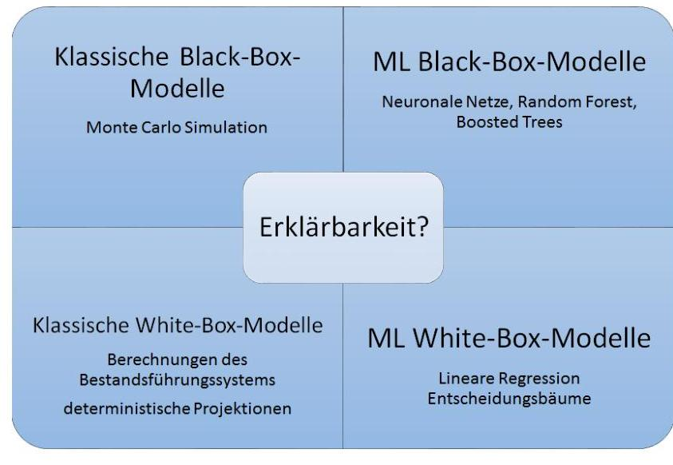

## Page 41
eine einfache lineare Regression. Bei einem nicht erklärbaren oder nur sehr eingeschränkt erklärbaren Modell kann es jedoch deutlich schwerer sein, die Einhaltung aller Anforderungen und Regularien zu prüfen - auch wenn es korrekt funktioniert und performant ist. So ist es denkbar, Performance zugunsten der Erklärbarkeit aufzugeben und in der Praxis auf ein einfaches Modell mit schlechterer, aber noch akzeptabler Performance auszuweichen.

Die Notwendigkeit der Erklärbarkeit eines Modells hängt von der konkreten Anwendung und den Konsequenzen, die ein fehlerhaftes Modell haben kann, ab. Kann ein Modell zu einer Fehlsteuerung des Unternehmens, systematischer, unbegründeter Benachteiligung von Kunden oder einer schlechten Risikoauswahl führen, spielt Erklärbarkeit eine größere Rolle als bei Modellen, die nur geringen Einfluss auf Unternehmensentscheidungen haben, die etwa zur Automatisierung von bestehenden Prozessen eingesetzt werden und bei denen Fehlentscheidungen auch nachträglich noch korrigiert werden können.

Erklärbarkeit ergibt sich auch aus den verschiedenen Adressaten, die mit dem Modell arbeiten. Modellierer möchten den Algorithmus debuggen, testen und optimieren. Validierer ${ }^{35}$ schauen auf Angemessenheit, Robustheit und Stabilität des Modells. Nutzer hingegen möchten in der Lage sein, die Effekte zu erklären, eine Movementanalyse durchzuführen, die Ergebnisse zu interpretieren und Handlungsoptionen zu bewerten, um dann Entscheidungen zu treffen.

Deshalb sollte Erklärbarkeit folgende Fragen beantworten:

- Kann die Vorhersage auf gewisse Ursachen zurückgeführt werden? Spielen beispielsweise bestimmte Merkmale und bestimmte Ausprägungen oder Kombinationen davon eine entscheidende Rolle, warum ein Datenpunkt einer gewissen Klasse zugeordnet wird?
- Wie kommt das Modell zu seinen Vorhersagen? Gibt es beispielsweise im Trainingsdatensatz ähnliche Datenpunkte, die dazu führen, dass ein bestimmter Datenpunkt einer gewissen Klasse zugeordnet wird?
- Stehen die Vorhersagen des Modells im Einklang mit der Unternehmensethik/ philosophie? Warum kann man dem Modell vertrauen?
- Ist das Modell auch auf leicht abgewandelte Aufgabenstellungen anwendbar, lernt es auch noch mehr als die konkrete Aufgabenstellung? (Transferfähigkeit)
- Können Muster, die die KI gefunden hat, erklärt werden?

Erklärbarkeit unterstützt

- die Optimierung des Modells, denn das Verständnis der Schwächen und Stärken des Modells lässt eine systematische Verbesserung zu.
- den Anwender bei der Erklärung der Ergebnisse, die für die Validierung, Regulierung und weitere Kommunikation zwingend erforderlich ist.
- die Sicherheit des Modells, denn Erklärbarkeit kann/sollte Fehlverhalten aufdecken.
- die Einhaltung der Unternehmensethik/ philosophie.
- die Robustheit des Modells gegenüber Eingriffen.
- die Klärung von Verantwortlichkeiten und Haftungsfragen.

# 4.4.3. Methoden der Erklärbarkeit 

Bei den Methoden der Erklärbarkeit unterscheidet man zwischen modellspezifischen Methoden und modellagnostischen Methoden, die im Prinzip für jedes Modell umgesetzt werden können. Für modellagnostische Methoden gibt es aber häufig auch Implementierungen, die nur für spezielle Modelle funktionieren und auf diese optimiert sind.

Bei den modellagnostischen Methoden werden folgende Verfahren unterschieden:

[^0]
[^0]:    ${ }^{35}$ Interne Validierer, BaFin, Wirtschaftsprüfer, Revision etc.

## Page 42
- Visualisierung
- Feature-Relevanz (Sensitivitäten) und
- lokale Erklärbarkeit.

Welche Methode im Einzelfall sinnvoll ist, hängt von der konkreten Anwendung und den Business Anforderungen ab. Ein hilfreiches Flussdiagramm zur Auswahl der passenden Methode findet sich z.B. auf S. 5 in (Kraus, et al., 2021).

Im Anhang 8.3 werden einige ausgewählte Methoden zur Erklärbarkeit wie u.a. LIME und SHAP vorgestellt.

# 4.5. Use Cases 

Abschließend zum Kapitel Validierung werden in diesem Abschnitt zur Veranschaulichung zwei Use Cases aus dem Bereich von KI-Modellen vorgestellt. Sie sollen aktuelle Fragestellungen sowohl aus dem Bereich Lebens- als auch Nichtlebensversicherung abdecken, indem einige der im Anhang eingeführten Validierungsmethoden sowie die weiterführenden Methoden zur Erklärbarkeit von KIModellen angewendet und veranschaulicht werden.

### 4.5.1. Customer predictive analytics am Beispiel eines Stornomodells

Customer predictive analytics beschäftigt sich mit der Vorhersage von Kundenverhalten. Die Vorhersagen können beispielsweise als Grundlage für Entscheidungen hinsichtlich mehrerer alternativer Handlungsoptionen dienen. In diesem Use Case soll aufgezeigt werden, wie Customer predictive analytics zur Vorhersage der Kündigungswahrscheinlichkeit eingesetzt werden kann.

Der Sachversicherungsmarkt ist grundsätzlich vielschichtig und in Abhängigkeit vom jeweiligen Produkt zu betrachten. Produktübergreifend charakteristisch für diesen Markt sind kurz laufende, meist 1-jährige Vertragslaufzeiten, ein einfacher Versicherungswechselprozess sowie die damit zusammenhängende hohe Wechselbereitschaft der Kunden (bspw. im Vergleich zum Lebens- oder Krankenversicherungsmarkt).

Vor diesem Hintergrund ergibt sich gerade für Sachversicherungen ein hoher Nutzen aus Informationen über die Kündigungswahrscheinlichkeit der Kunden. ${ }^{36}$

Zur Beantwortung der Fragestellung, „ob ein Kunde seinen Vertrag kündigen wird" werden Klassifikationsmodelle verwendet. ${ }^{37}$ Für binäre Klassifikationsprobleme wurden traditionell logistische Regressionsmodelle verwenden, mittlerweile sind eher auf Entscheidungs-/Klassifikationsbäumen basierende Verfahren im Einsatz. Beispielsweise basieren bekannte Gradient Boosting oder Random

[^0]
[^0]:    ${ }^{36}$ Auch für Versicherungsanfragen (also potenzielle Neukunden) kann es für Versicherer sinnvoll sein, die Kündigungswahrscheinlichkeit im Vorfeld der Vertragsschließung zu kennen. Einem Kunden mit niedriger Kündigungswahrscheinlichkeit könnten günstiger Versicherungsprämien angeboten werden, da sich Einmalaufwendungen für die erstmalige Vertragsschließung theoretisch über einen längeren Zeitraum verteilen lassen. Eine häufig angewandte Ergänzung des Use Case besteht in der Verknüpfung der Kundenstornoanalyse mit einer "Kundenwertanalyse" (Customer Lifetime Value). Eine solche Information erlaubt den noch gezielteren Einsatz von vertrieblichen Maßnahmen in Abhängigkeit von Stornowahrscheinlichkeit und Kosten der vertrieblichen Maßnahmen. Dabei kann auch der "Kundenwert", der typischerweise aus der Aggregation der Einzelbewertungen der aktuellen Verträge und einer Abschätzung des zukünftig zu erwartenden Geschäfts besteht, mittels Data Science Methoden modelliert werden.
    ${ }^{37}$ In Abhängigkeit vom Produkt kann es zusätzlich wichtig sein, den Zeitpunkt der möglichen Kündigung möglichst gut abschätzen zu können. Zur Beantwortung der Fragestellung, „wann ein Kunde seinen Vertrag kündigen wird" können sog. Survival Modelle verwendet werden, die die Wahrscheinlichkeit des „Überlebens" des Kunden bzw. des Vertrags bezogen auf die Vertragslaufzeit berechnen. Diese Modelle - ursprünglich in der Medizin- und Pharmaforschung entwickelt - finden mittlerweile eine vermehrte Anwendung auch im Versicherungsumfeld. Sind sowohl die Frage des „ob ein Vertrag gekündigt wird" als auch die Frage „wann ein Vertrag gekündigt wird" durch Modelle zu beantworten, müssen diese Modellwahrscheinlichkeiten i.d.R. auch geeignet miteinander kombiniert werden, um entsprechende Ableitungen aus den Modellwahrscheinlichkeiten treffen zu können.

## Page 43
Forest Algorithmen auf Klassifikationsbäumen (bzw. Regressionsbäumen bei Regressionsproblemen). Ein solches Klassifikationsmodell liefert Kündigungswahrscheinlichkeiten auf Einzelvertragsebene, die dann über einen Threshold in eine der beiden Klassen „kündigt wahrscheinlich nicht" respektive „kündigt wahrscheinlich" eingeteilt werden können.

In der Praxis besteht hinsichtlich vertrieblicher Maßnahmen, die auf einem Klassifikationsmodell für die Vorhersage von Vertragskündigungen (Stornomodell) basieren und eben diese verhindern sollen, häufig ein Trade-off zwischen den Kosten und dem Nutzen einer Maßnahme in Abhängigkeit der Modellfehler.

- Die Modellfehler können dazu führen, gezielte vertriebliche Maßnahmen auf einen Kunden anzuwenden, der gar nicht kündigen möchte (Fehler erster Art: falsch positiv). Dies birgt die Gefahr, den eigentlich kündigungsunwilligen Kunden durch die Maßnahme zu einer Kündigung zu bewegen. In diesem Fall hätte man besser weniger Kunden in die Maßnahme mit einbezogen oder - technisch gesprochen - die Schwelle der Kündigungswahrscheinlichkeit, ab der eine Maßnahme versendet wird, niedriger angesetzt.
- Weniger Kunden in eine Maßnahme einzubeziehen, kann allerdings den Anteil der Kunden erhöhen, auf die keine gezielte vertriebliche Maßnahme angewendet wird, die aber kündigen möchten (Fehler zweiter Art: falsch negativ). Hier hätte man besser mehr Kunden in die Maßnahme mit einbezogen und somit bereits niedrigere Kündigungswahrscheinlichkeiten als Auslöser für eine vertriebliche Maßnahme herangezogen.

Offensichtlich widersprechen sich die notwendigen Schritte zur Vermeidung von Modellfehler erster und zweiter Art. Je nach Kosten der gezielten vertrieblichen Maßnahmen (z.B. ob man einem Kunden lediglich eine kurze E-Mail sendet oder einen längeren Anruf widmet) sowie in Abhängigkeit von der von Kündigung bedrohten Vertragsprämie, wird ein Versicherungsunternehmen den einen oder den anderen Modellfehler stärker vermeiden wollen. Zu diesem Zweck kann ein Klassifikationsmodell mit unterschiedlichen Parametern angewendet werden, um den Trade-off zwischen Fehler 1. und 2. Art einmal in die eine und ein anderes Mal in die andere Richtung zu steuern.

Ein weiteres häufig bei Stornomodellen anzutreffendes praktisches Problem liegt in der geringen Ausprägung des Stornos im Datensatz, d.h. die Zielvariable „Storno" ist i.d.R. stark unterrepräsentiert (sog. unbalanced data sets). Besteht der Wunsch des Versicherungsunternehmens möglichst viele potenzielle Kündiger durch das Modell vorherzusagen, unter Inkaufnahme einer größeren Anzahl an falsch positiven Ergebnissen, wird bei Stornomodellen häufig ein möglichst hoher Recall bzw. eine möglichst hohe Precision, als harmonischeres Maß, angestrebt.

Zur Validierung eines Stornomodells eignen sich grundsätzlich alle zuvor aufgeführten Validierungsmethoden, um die Ziele der Generalisierung und Vermeidung von Overfitting zu erreichen. Ein besonderer Fokus liegt in der Praxis meist auf der Validierung des Modellverhaltens bzw. der Modellergebnisse über eine Expertenprüfung, die Betrachtung der Feature Importance, der Kreuzvalidierung sowie begleitende grafische Analysen (insbesondere mittels des Shapley-Algorithmus).
Confusion Matrix: Nach Modellentwicklung und -optimierung auf dem Trainings-/Validierungsdatensatz kann schließlich eine Modellbewertung (oder auch ein Modellvergleich mit anderen Modellen) auf einem separaten unabhängigen Testdatensatz vorgenommen werden. Dabei können viele der oben beschriebenen Methoden, z.B. eine Confusion Matrix in Kombination mit den Metriken Precision und Recall, eingesetzt werden:

- Recall = Wie viele der tatsächlichen Kündigungen werden vom Modell vorhergesagt (in Prozent)
- Precision = Wie viele der vorhergesagten Kündigungen treten tatsächlich ein

## Page 44
Vorhergesagt

# Abbildung 4: Confusion Matrix 

Feature Importance: Die wesentlichen Treiber bzw. Features des Stornomodells werden durch Feature Importance Analysen identifiziert. Dies geschieht meist über lokale (u.a. LIME) und/oder globale SHAP-Analysen, mit denen gemessen werden kann, wie hoch der Beitrag eines bestimmten Features zum Ergebnis auf Einzeldatensatzbasis oder über den gesamten Datensatz ist. Dies dient sowohl dem Verständnis des Modellverhaltens als auch zur Plausibilisierung und Validierung des Modells. Einschränkend sei an dieser Stelle darauf hingewiesen, dass es sich bei diesen Validierungsmethoden um sogenannte Surrogat-Modelle handelt, die versuchen ein komplexes Modell lokal vereinfacht nachzubilden (vgl. Abschnitt 8.3.1).

Sensitivitätsanalysen: Sensitivitätsanalysen hinsichtlich der Veränderung der Stornowahrscheinlichkeit bei Veränderung von unabhängigen Input-Merkmalen werden in der Praxis für die Prüfung des Modells auf Robustheit durchgeführt. Die Modellergebnisse sollten sich bei Änderung einzelner Features oder der dem Modelllauf/ Modellpfad zugrundeliegenden Zufallszahl („seed") nicht stark verschieben. Es kann sowohl die Sensitivität des Modells gegenüber einer Änderung an den Ausprägungen eines Features als auch gegenüber dem kompletten Entfernen eines Features aus dem Datensatz betrachtet werden. Letzterer Ansatz eignet sich in der Praxis häufig dann, wenn das Modellergebnis stark von einem Feature abhängt. Durch Weglassen dieses Features kann überprüft werden, welches Set an verbleibenden Features das entfernte Feature ersetzt.

Expertenprüfung: Ebenso häufig kommt zur Validierung eines Stornomodells eine Expertenprüfung zum Einsatz, insbesondere, wenn das Stornomodell von Entwicklerteams erstellt wurde, welche kein tiefergehendes Verständnis im Hinblick auf das Stornoverhalten der Kunden haben. Dies kann bspw. bei Entwicklerteams der Fall sein, die hauptsächlich aus dem IT-Bereich des jeweiligen Unternehmens zusammengestellt sind und die sich klassischerweise eher auf saubere Data Engineering Prozesse und einen performanten Algorithmus fokussieren. Im Rahmen einer Expertenprüfung wird dann geprüft, ob die wesentlichen Eigenschaften und Ergebnisse des Stornomodells mit den Erwartungen und Erfahrungen der Fachexperten im Einklang stehen. Häufig wird sich hierbei darauf konzentriert, ob die wesentlichen Modelltreiber (siehe obigen Punkt Feature Importance) plausibel bzw. nachvollziehbar sind. An dieser Stelle sollte es bspw. auffallen, wenn wesentliche Modelltreiber die aktuelle, veränderte Marktlage nicht mehr widerspiegeln. Es kann in diesem Schritt auch dazu kommen, dass festgestellt wird, dass die Daten, die zum Training des Modells verwendet wurden, für den produktiven Einsatz nicht oder nicht in gleicher Form vorliegen. So könnten Inputdaten zukünftige Informationen beinhalten, wodurch ein produktiver Einsatz ausgeschlossen ist („data leakage"). Weiterhin werden Stichproben zur Modellvorhersage auf Einzeldatenbasis (siehe obigen Punkt SHAP-Analysen) betrachtet. Die Expertenprüfung kommt häufig dann zum Einsatz, wenn entweder im Rahmen der Modellentwicklung Unsicherheiten hinsichtlich der Modellvorhersage auftreten oder wenn das Modell im Rahmen der Modellfinalisierung unabhängig durch einen fremden Dritten validiert werden soll.

A/B/C-Testing: Zur fortlaufenden Validierung im produktiven Betrieb und in Zusammenhang mit definierten vertrieblichen Maßnahmen kann in Ergänzung des oben vorgestellten A/B-Testing auch ein A/B/C-Testing zum Einsatz kommen, in dem sowohl die Vorhersagekraft als auch die vertrieblichen Maßnahmen getrennt voneinander beurteilt bzw. validiert werden können. Hierzu werden zum Bei-
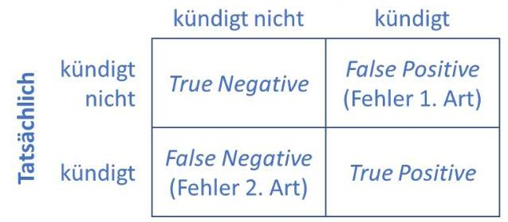

## Page 45
spiel die Kundendaten in drei Gruppen aufgeteilt: Bei einer Gruppe werden Algorithmus und vertriebliche Maßnahmen angewendet, bei einer zweiten nur die Vorhersagen (in Verbindung mit freier Wahl der Informationsnutzung durch die Vertriebsmitarbeiter) und bei einer dritten Gruppe werden weder die Vorhersagen genutzt noch vertriebliche Maßnahmen angewendet. Ein solches Vorgehen erlaubt die gezielte Nachjustierung an Algorithmus und/oder vertrieblichen Maßnahmen.

# 4.5.2. SCR-Berechnung 

Im Rahmen von Solvency II entspricht die Solvenzkapitalanforderung (SCR) eines Versicherungsunternehmens dem Value-at-Risk der Basiseigenmittel zum Konfidenzlevel von 99,5\% über einen Zeithorizont eines Jahres ${ }^{38}$. Sie bedeckt sowohl versicherungstechnische Risiken als auch Marktund Kreditrisiken.

Am Beispiel von Lebens- und Krankenversicherungsunternehmen erfolgt die Auswertung der Marktwertbilanzen üblicherweise über Monte Carlo Ansätze aufgrund der Komplexität der abhängigen Optionen, Garantien und Asymmetrien.

Für die Herleitung des SCR gilt es somit die Sensitivität der Solvenzbilanz eines Versicherungsunternehmens gegenüber verschiedener Risikotreiber zu ermitteln. In aktuell marktüblichen Ansätzen werden hierfür z.B. Regressionsmodelle verwendet, die diese Abhängigkeit auf Basis von Polynomen abbilden. Alternativ soll in dem hier vorliegenden Use Case eine Ermittlung dieses Zusammenhangs auf Basis eines Neuronalen Netzes illustriert werden.

Sei dazu im Folgenden $R F_{i j}$ die Realisierung eines Risikofaktors $j \in 1, \ldots, D$ (z.B. für Langlebigkeit, Storno, Zins, Aktien, etc.) innerhalb eines Szenarios $i \in 1, \ldots, N$. Außerdem seien $B E L_{1}, \ldots, B E L_{N}$ die korrespondierenden Ergebnisse der zugehörigen Best Estimate Liability (BEL) auf Basis einer Bewertung mittels eines Cashflow Modells in dem jeweiligen Szenario.

Die folgende Abbildung illustriert ein neuronales Netz, welches auf Basis der Realisierungen der Risikotreiber ein Ergebnis für den Eigenmittelverlust bzw. das SCR ermittelt.

Abbildung 5: Neuronales Netz zur SCR-Ermittlung

[^0]
[^0]:    ${ }^{38}$ Artikel 101, Solvency II Richtlinie 2009/138/EG
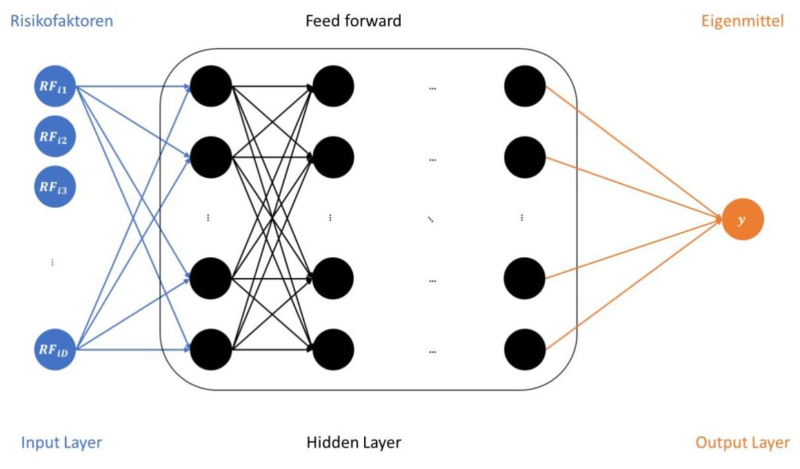

## Page 46
Die auf Basis des Cashflow Modells ermittelten Veränderungen der BEL dienen nun als Trainingsdaten ${ }^{39}$ für das Neuronale Netz und bilden mit dem trainierten Neuronalen Netz einen Zusammenhang zwischen den Risikofaktoren und dem unternehmensspezifischen Risikoprofil:

$$
y=f\left(R F_{N 1}, \ldots, R F_{N D}\right)
$$

Mögliche Validierungsmethoden zu dem hier eingeführten Use Case sind beispielsweise die folgenden:

- Kreuzvalidierung bzw. Cross Validation

Im Rahmen einer 50-50-Kreuzvalidierung kann ein Neuronales Netz beispielsweise auf Basis von 50\% des ursprünglichen Datensatzes von $N$ Szenarien hergeleitet werden. Die übrigen 50\% der ursprünglichen Daten können dann als out-of-sample Datensatz zur Validierung des neu trainierten Neuronalen Netzes herangezogen werden. Das so trainierte neuronale Netz sollte die out-of-sample Daten möglichst gut treffen. Ist das nicht der Fall, sind entsprechende Erklärungen notwendig.

- Graphischer Modellvergleich
- Anhand eines Q-Q-Plots können beispielsweise die echten Modellergebnisse auf Basis des Cashflow Modells zur Validierung mit den Ergebnissen auf Basis des trainierten Neuronalen Netzes verglichen werden. Der Plot sollte eine ähnliche Verteilung beider Ergebnisdatensätze für die Eigenmittel zeigen.
- Sensitivitätsanalysen

Im Rahmen einer Sensitivitätsanalyse können die Modellergebnisse für ein Neuronales Netz näher untersucht werden. Ausgehend von einem Basisszenario, in dem die Risikofaktoren $R F_{i j}$ jeweils die Best Estimate Annahmen widerspiegeln, können verschiedenen Sensitivitäten untersucht werden. Beispielsweise können die Risikofaktoren für Sterblichkeit, Storno oder Zins um +/- 5\% oder 10\% variiert werden und die resultierenden Veränderungen der BEL gegen die Erwartung abgeglichen werden. So sollte bei einem Lebensversicherer im Fall sinkender Zinsen der Wert der BEL typischerweise steigen.

- LIME

Im Rahmen von LIME kann das Neuronales Netz lokal interpretiert werden, d.h. der Zusammenhang zwischen den Risikofaktoren und dem unternehmensspezifischen Risikoprofil kann dadurch erklärt werden. Es soll zeigen, warum das Neuronales Netz für eine gewisse Ausprägung der Risikofaktoren einen bestimmten Wert liefert. Dafür soll die Frage beantwortet werden, welche Risikofaktoren dafür in welcher Höhe verantwortlich sind.

- SHAP-Analyse

Für die SHAP-Analyse sei an dieser Stelle auf Kapitel 8.3.2 verwiesen. Dort werden exemplarisch einige SHAP-Analysen für diesen Use Case eingeführt.

# 5. Ländervergleich verschiedener Regulierungsansätze zur Validierung von KI-Modellen 

Die Validierung von KI ist von entscheidender Bedeutung, um sicherzustellen, dass Modelle korrekt und zuverlässig arbeiten. In Europa und anderen Ländern gibt es verschiedene Regelungen und Empfehlungen, die sich mit der Validierung von KI-Modellen befassen. Im Folgenden wird ein Überblick über bestehende sowie geplante Anforderungen und Bestimmungen gegeben. Grundlage ist

[^0]
[^0]:    ${ }^{39}$ Für Beispieldaten siehe auch: GitHub - DeutscheAktuarvereinigung/insurance_scr_data: How to Work With Comprehensive Internal Model Data for Three Portfolios

## Page 47
eine Analyse der Situation auf europäischer Ebene, in Deutschland, der Schweiz, dem Vereinigten Königreich, Frankreich, den USA, Australien und Singapur. Eine detaillierte Übersicht findet sich im Anhang. Im Vergleich zur hiernach folgenden Übersicht enthält der Anhang eine Detailanalyse der einzelnen Länder sowie Links zu den wichtigsten Dokumenten.

Zwar gibt es wesentliche Unterschiede darin, wie weit die einzelnen Länder bei der Formulierung von Anforderungen an die Validierung von KI-Modellen fortgeschritten sind. Dennoch liegt den Entwicklungen in den meisten Ländern ein ähnlicher Prozess zu Grunde:

Ein erster Schritt besteht darin, die bestehenden Regelungen zu überprüfen und festzustellen, wo sich aus den Besonderheiten von KI-Modellen Regelungslücken ergeben. So betont beispielsweise EIOPA den umfangreichen Rechtsrahmen, der auch für die Entwicklung von KI-Modellen Anwendung findet. Die Schweiz schätzt ihren bestehenden Rechtsrahmen grundsätzlich als geeignet ein, um neue Anwendungen und Geschäftsmodelle im Bereich von KI zu erfassen.

In einem zweiten Schritt haben die meisten Länder allgemeine Prinzipien formuliert, die Anforderungen an die Auswirkungen vom Einsatz von KI-Modellen stellen und sich dabei häufig auf die Vereinbarkeit mit ethischen und gesellschaftlichen Werten beziehen (siehe z. B. die sieben Prinzipien der High Level Expert Group der Europäischen Kommission oder die 14 FEAT-Prinzipien der Währungsbehörde Singapurs).

Für die Einführung konkreter KI-Regulierung herrschen drei verschiedene Ansätze vor. Einerseits gibt es Länder, die eine eigene Spezialgesetzgebung für ausgewählte Aspekte des Einsatzes von KI-Modellen anstreben, wie es z. B. die EU mit dem Artificial Intelligence Act für den Verbraucherschutz plant. Andere Länder setzen dagegen darauf, bestehende Regulierung punktuell anzupassen, um den Besonderheiten von KI-Modellen gerecht zu werden. Dieser Ansatz wird beispielsweise von der Schweiz verfolgt. Schließlich gibt es auch Länder, die bisher keine Bemühungen erkennen lassen, neue Regulierung für KI-Modelle einzuführen. Ein Beispiel dafür sind die USA, die keine bundesweit einheitlichen Regelungen erarbeiten.

Grundsätzlich konzentrieren sich Regulierungsbemühungen auf folgende Bereiche:

# - Daten 

- Es wird gefordert, dass die verwendeten Daten sauber, zuverlässig und repräsentativ sind. Dafür ist eine sorgfältige Datenprüfung und -bereinigung vorgesehen.

## - Nachvollziehbarkeit/Transparenz/Überprüfbarkeit

- Mit dem Ziel, die Entscheidungsfindung eines KI-Modells zu verstehen und gegebenenfalls darauf basierend weitere Entscheidungen treffen zu können, wird die Implementation von Mechanismen zur Erklärbarkeit gefordert. Hierfür gibt es verschiedene Ansätze aus dem Gebiet der Explainable AI. Für diesen Bereich spielt auch die Reproduzierbarkeit von Ergebnissen eine große Rolle.

## - Vermeidung von Bias

- Daten und trainierte Modelle sollen darauf geprüft werden, ob sie Verzerrungen und Vorurteile beinhalten. Dies kann z. B. anhand geeigneter Fairness-Kennzahlen erfolgen. Verzerrungen in den Daten und Vorhersageergebnissen sind zu korrigieren.

## - Dokumentation

- Eine angemessene Dokumentation u. a. zur Aufbereitung der Daten und des Modellierungsprozesses wird als Voraussetzung für Nachvollziehbarkeit, Transparenz und Überprüfbarkeit angesehen.

## - Monitoring der Performance

- Es wird eine regelmäßige Überwachung und Bewertung der Leistungsfähigkeit von KIModellen gefordert, insbesondere in Bezug auf ihre Robustheit und Zuverlässigkeit. Damit

## Page 48
soll sichergestellt werden, dass die Modelle angemessen auf neue Daten reagieren und Modelladjustierungen durch erneutes Training keine unerwünschten Verhaltensweisen nach sich ziehen.

Validierung ist ein Querschnittsaspekt, der jeden dieser Bereiche tangiert. In einigen Diskussionsvorschlägen wird angeregt, dass diese unabhängig erfolgt, insbesondere unabhängig von den Anwendungsentwicklern (siehe bspw. Diskussionspapier der Bank of England (England, 2022) oder das Konsultationspapier der BaFin (BaFin, 2021)).

Neben gesetzlicher Regulierung setzen einige nationale Aufsichten auch auf die Veröffentlichung praktisch nutzbarer Instrumente, wie z. B. Checklisten, um einen weniger verbindlichen Rahmen für die Arbeit mit KI-Modellen zu schaffen. So hat die Bank of England ein Diskussionspapier mit praktischen Vorschlägen zur Validierung veröffentlicht. Die Banken- und Versicherungsaufsicht in Frankreich sowie die Finanzaufsicht Singapurs haben verschiedene Fallstudien veröffentlicht, anhand derer sie Beispiele zu Validierungshandlungen aufzeigen.

# 6. Zusammenfassung 

KI hat in jüngster Vergangenheit zunehmend Einfluss auf die Versicherungswirtschaft ausgeübt, indem sie innovative Lösungen für Herausforderungen in diesem Sektor bereitstellt. Die Nutzung von KI-Modellen ermöglicht es Versicherungsunternehmen, datengesteuerte Entscheidungen zu treffen, Risiken genauer zu bewerten und personalisierte Dienstleistungen anzubieten. Die Bedeutung von KI-Modellen wird immer deutlicher, da sie Effizienz steigern, Kosten senken und die Kundenzufriedenheit verbessern können.

In welch dynamischem Umfeld wir uns an dieser Stelle bewegen, verdeutlichen auch jüngste Entwicklungen sowohl im internationalen Gesetzgebungsprozess als auch den KI-Modellen selbst. Aus Sicht der Aktuare spielen die Aspekte der Regulierung und Validierung von KI-Modellen eine zentrale Rolle für die tägliche Arbeit, da einerseits sichergestellt werden muss, dass die regulatorischen Vorgaben durch ein KI-Modell eingehalten werden, andererseits, dass das entsprechende Modell robuste und verlässliche Vorhersagen trifft.

Es lässt sich festhalten, dass im Kontext KI der Fokus aktuarieller Arbeit an und mit Daten und Modellen erweitert wird. Entwicklungen durch BD und KI ändern grundsätzlich (bisher) nichts an den bestehenden regulatorischen Anforderungen an Versicherungsunternehmen. Zukünftig werden Themen wie Transparenz, Erklärbarkeit und „human in the loop" einen höheren Stellenwert bekommen als derzeit. Letztlich misst sich aber auch bei der Validierung von Daten und Modellen, welche KI verwenden, die Qualität der Validierung daran, wie „gut" damit die Angemessenheit der Daten und Modelle eingeschätzt werden kann. Es muss mit Hilfe der eingesetzten Validierungsmethoden beurteilt werden können, ob das Modell tatsächlich den Zweck erfüllt, zu welchem es eingesetzt wird. Es kann weiter kein allgemeingültiges Validierungsfahren geben, welches auf alle Modelle gleichermaßen passt. Oft kann auch eine Kombination verschiedener Validierungsverfahren hilfreich sein.

## Page 49
# 7. Literaturverzeichnis 

Adaloglou, Nikolas. 2021. Best deep CNN architectures and their principles: from AlexNet to EfficientNet. [Online] 21. Januar 2021.
https://theaisummer.com/cnn-architectures/.
AI, Trusted. 2018. aif360. [Online] 2018. [Zitat vom: 27. Februar 2023.] https://github.com/Trusted-AI.

Apel, Detlef, Behme, Wolfgang und Eberlein, Rüdiger. 2015.
Datenqualität erfolgreiche steuern: Praxislösungen für Business-IntelligenceProjekte. s.l. : dpunkt.verlag GmbH, 2015. überarb. u. erw. Edition.

BaFin. 2021. Big Data und künstliche Intelligenz: Prinzipien für den Einsatz von Algorithmen in Entscheidungsprozessen (Prinzipienpapier BDAI). www.bafin.de. [Online] 15. Juni 2021.
—. 2021. Maschinelles Lernen in Risikomodellen - Charakteristika und aufsichtliche Schwerpunkte. Konsultationspapier. [Online] Juli 2021.

DAA, Actuarial Data Science. 2022. Basic Skript. 2022.
Dandl, Susanne, et al. 2020. Multi-objective counterfactual explanations. Bäck T. et al. (eds) Parallel Problem Solving from Nature - PPSN XVI. PPSN 2020. Lecture Notes in Computer Science, vol 12269 : Springer, 2020.

DAV. 2020. Ergebnisbericht des Ausschusses Actuarial Data Science: Umgang mit Daten im Bereich Data Science. 2020.
—. 2018. Ergebnisbericht des Ausschusses Enterprise Risk Management zur „Validierung der versicherungstechnischen Rückstellungen unter Solvabilität II". Köln : s.n., 2018.
de Prado, Marcos Lopez. 2018. Advances in Financial Machine Learning. s.l. : John Wiley \& Sons Inc., 2018.

EBA. "Final Report on Big Data and Advanced Analytics". https://www.eba.europa.eu/file/609786/. [Online]

EIOPA. 2021. AI Governance Principles: Towards Ethical and Trustworthy AI in the European Insurance Sector A Report from EIOPA's Consultative Ex-pert Group on Digital Ethics in insurance. 2021.

England, Bank of. 2022. [Online] 11. Oktober 2022.
https://www.bankofengland.co.uk/prudential-
regulation/publication/2022/october/artificial-intelligence.
Europäische Kommission. 2014. DELEGIERTE VERORDNUNG (EU) 2015/35 DER KOMMISSION. 2014.
-. 2021. Proposal for a REGULATION OF THE EUROPEAN PARLIAMENT AND OF THE COUNCIL LAYING DOWN HARMONISED RULES ON ARTIFICIAL INTELLIGENCE (ARTIFICIAL INTELLIGENCE ACT) AND AMENDING CERTAIN UNION LEGISLATIVE ACTS. COM/2021/206. 2021.

## Page 50
Foulds, James R., et al. 2019. An Intersectional Definition of Fairness. [Online] 2019.
https://jfoulds.informationsystems.umbc.edu/papers/2020/Foulds\ (2020) $\% 20-$
\%20An\%20Intersectional\%20Definition\%20of\%20Fairness\%20(ICDE).pdf.
Good, P.I. und Hardin, J.W. 2012. Common Errors in Statistics (Fourth ed.), Chapter 15: Validation. Canada : John Wiley \& Sons, Inc., 2012.

Hahn, Silke. 2022. GPT-3 überflügeln: Quellcode des KI-Modells MAGMA steht auf GitHub. Heise Online. [Online] 16. März 2022.
https://www.heise.de/news/GPT-3-ueberfluegeln-Quellcode-des-Vision-Language-Modells-MAGMA-steht-auf-GitHub-6550590.html.

Hawkins, Andrew. 2019. Tesla didn't fix an Autopilot problem for three years, and now another person is dead. The Verge. [Online] 17. Mai 2019. https://www.theverge.com/2019/5/17/18629214/tesla-autopilot-crash-death-josh-brown-jeremy-banner.

Heaven, Douglas. 2019. No limit: AI poker bot is first to beat professionals at multiplayer game. Nature. [Online] 11. Juli 2019.
https://www.nature.com/articles/d41586-019-02156-9.
—. 2019. Why deep-learning AIs are so easy to fool. Nature. [Online] 9. Oktober 2019. https://www.heise.de/newsticker/meldung/Toedlicher-Crash-mit-autonomen-Auto-Fussgaenger-auf-Fahrbahn-nicht-vorgesehen4578931.html.

Holland, Martin. 2019. Tödlicher Crash mit autonomem Auto: Fußgänger auf Fahrbahn nicht vorgesehen. Heise Online. [Online] 6. November 2019. https://www.heise.de/newsticker/meldung/Toedlicher-Crash-mit-autonomen-Auto-Fussgaenger-auf-Fahrbahn-nicht-vorgesehen-4578931.html.

IAA, AAI. 2016. International Standard of Actuarial Practice 1A Governance of Models (ISAP 1A). 2016.

Klier, Matthias und Heinrich, Bernd. 2016. Datenqualität als Erfolgsfaktor im Business Analytics. pp. 488-494. 2016.

Kommission, Europäische. 2021. Vorschlag für eine Verordnung des Europäischen Parlaments und Rates zur Festlegung harmonisierter Vorschriften für künstliche Intelligenz. 2021/0106 /COD). Brüssel : s.n., 2021.

Kraus, Tom Dr., et al. 2021. Erklärbare KI - Anforderungen, Anwendungsfälle und Lösungen. https://www.digitaIetechnologien.de/DT/Redaktion/DE/Downloads/Publikation/KI-Inno/2021/Studie_Erklaerbare_KI.pdf;jsessionid=C94CE1AF540F11B6D64E3E B19A61A2AF?__blob=publicationFile\&v=. [Online] April 2021.

Lapuschkin, et al. 2019. Unmasking Clever Hans Predictors and Assessing What Machines Really Learn. [Online] 26. Februar 2019. https://arxiv.org/abs/1902.10178.

## Page 51
Lundberg, Scott, M. und Su-In, Lee. 2017. A unified approach to interpreting model predictions. s.I. : Advances in Neural Information Processing Systems, 2017.

Mahmood et. al. 2021. Detecting Spurious Correlations With Sanity Tests for Artificial Intelligence Guided Radiology Systems. [Online] 3. August 2021. https://www.ncbi.nlm.nih.gov/pmc/articles/PMC8521929/.

Merz, Michael und Wüthrich, Mario V. 2023.
https://doi.org/10.1007/978-3-031-12409-9. Statistical Foundations of Actuarial Learning and its Applications. [Online] Springer Actuarial, 2023. https://doi.org/10.1007/978-3-031-12409-9.

Molnar, Christopher. 2022. Interpretable Machine Learning. Abschnitt 9.3. [Online] 28. Februar 2022. https://christophm.github.io/interpretable-mlbook/.
—. 2022. Interpretable Machine Learning. Abschnitt 9.4. [Online] 28. Februar 2022. https://christophm.github.io/interpretable-ml-book/.

O'Kane, Sean. 2016. Investigators say driver in fatal Tesla Autopilot crash was speeding. The Verge. [Online] 26. Juli 2016.
https://www.theverge.com/2016/7/26/12287118/tesla-autopilot-crash-images-speed-limit-ntsb.

Parker, Will und Putzier, Konrad. 2021. What Went Wrong With Zillow? A Real-Estate Algorithm Derailed Its Big Bet. Wall Street Journal. [Online] 17. November 2021. https://www.wsj.com/articles/zillow-offers-real-estate-algorithm-homes-ibuyer-11637159261.

Parlament, Europäisches. 2009. Richtlinie 2009/138/EG des Europäischen Parlaments und des Rates vom 25. November 2009 betreffend die Aufnahme und Ausübung der Versicherungs- und der Rückversicherungstätigkeit (Solvabilität II). 2009.
—. 2016. Verordnung (EU) 2016/679 des Europäischen Parlaments und des Rates vom 27. April 2016 zum Schutz natürlicher Personen bei der Verarbeitung personenbezogener Daten, zum freien Datenverkehr und zur Aufhebung der Richtlinie 95/46/EG. 2016.

Pearl, Judea und Mackenzie, Dana. 2018. The Book of Why: The New Science of Cause and Effect. s.I. : Basic Books, 2018.

Ribeiro, Marco Tulio, Singh, Sameer und Guestrin, Carlos. 2018. Anchors: High-Precision Model-Agnostic Explanations. [https://ojs.aaai.org/index.php/AAAI/article/view/11491] Washington, Irvine : s.n., 2018.

Schneider, Bruce. 2020. The US has suffered a massive cyberbreach. It's hard to overstate how bad it is. The Guardian. [Online] 23. Dezember 2020. https://www.theguardian.com/commentisfree/2020/dec/23/cyber-attack-us-security-protocols.

## Page 52
Simon, Julien. 2021. Large Language Models: A New Moore's Law. Huggingface. [Online] 21. Oktober 2021. https://huggingface.co/blog/large-language-models.

Singhvi, Anjali und Russel, Karl. 2016. Inside the Self-Driving Tesla Fatal Accident. NY Times. [Online] 12. Juli 2016.
https://www.nytimes.com/interactive/2016/07/01/business/inside-teslaaccident.html?mtrref=undefined\&gwh=37E92E69AA052D47CC743BBA0EB667 F4\&gwt=pay\&assetType=PAYWALL.

Tan, Mingxin und V. Le, Quoc. 2020. EfficientNet: Rethinking Model Scaling for Convolutional Neural Networks. [Online] 11. September 2020. https://arxiv.org/abs/1905.11946.

The Verge. 2019. Why are so many AI systems named after Muppets? [Online] 11. Dezember 2019.
https://www.theverge.com/2019/12/11/20993407/ai-language-models-muppets-sesame-street-muppetware-elmo-bert-ernie.

UCI Machine Learning Repository. 2016. Taiwan Kreditkartendatensatz. [Online] 2016. [Zitat vom: 23. Februar 2023.]
https://archive.ics.uci.edu/ml/datasets/default+of+credit+card+clients.
VentureBeat. 2022. DeepMind applies AI to controlling nuclear fusion reactors. VentureBeat. [Online] 16. Februar 2022.
https://venturebeat.com/ai/deepmind-applies-ai-to-controlling-nuclear-fusion-reactors/.

Wachter, Sandra, Mittelstadt, Brent und Russell, Chris. 2018.
Counterfactual Explanations without Opening the Black Box: Automated Decisions and the GDPR. [https://arxiv.org/abs/1711.00399] 2018.

Wikipedia. 2022. AlphaGo versus Ke Jie. [Online] 24. März 2022. https://en.wikipedia.org/wiki/AlphaGo_versus_Ke_Jie.

Wüthrich, Mario V. und Merz, Michael. 2023. Statistical Foundations of Actuarial Learning and its Applications. https://doi.org/10.1007/978-3-031-12409-9; S. 109ff. : Springer Actuarial, 2023.

Wüthrich, Mario V.; Buser, Christoph. 2023. Data Analytics for Non-Life Insurance Pricing. Swiss Finance Institute Research Paper No. 16-68. [Online] 2023. https://ssrn.com/abstract=2870308; S. 23ff..

## Page 53
# 8. Anhang 

### 8.1. Anwendung in Python und $R$

Nachstehende Tabelle beinhaltet Pakete in Python und R, die für die im folgenden Kapitel beschriebenen Methoden verwendet werden können. Sie dienen lediglich als Vorschlag und erfüllen nicht dem Anspruch an Vollständigkeit.

| Zweck | Python | R |
| :--: | :--: | :--: |
| Leave-one-out   Kreuzvalidierung | scikit-learn (sklearn) | caret |
| k-fache Kreuzvalidierung | scikit-learn (sklearn)   sklearn.model_selection.KFold | caret |
| Stratified k -fache Kreuzvalidierung | scikit-learn (sklearn)   sklearn.model_selection.StratifiedKFold | caret, rpart |
| Bootstrapping | Funktion bootstrap aus der SciPy Bibliothek | Moving Block-Bootstrap-Verfahren im Paket boot   Funktionen tsboot und boot.ci für die Anwendung |
| A/B Tests | Praktisches Beispiel:   https://towardsdatascience.com/ab-tes-ting-with-python-e5964dd66143 | Praktisches Beispiel:   https://towardsda-   tascience.com/a-b-testing-in-   r-ae819ce30656 |
| SHAP | Shap, xgboost, LightGBM   GitHub - slundberg/shap: A game theoretic approach to explain the output of any machine learning model. | Shapper, fastshap, xgboost   GitHub - ModelOriented/treeshap: Explain your tree model with shap values efficiently |
| LIME | GitHub - marcotcr/lime: Lime: Explaining the predictions of any machine learning classifier | lime-package |

### 8.2. Validierungsmethoden

### 8.2.1. Kennzahlen für Regressionsprobleme (ohne spezifische Verteilungsannahme)

i. Summe der Abweichungsquadrate/MSE

Die Summe der Abweichungsquadrate bzw. der Mean Square Error (MSE) drückt die mittlere quadratische Abweichung der geschätzten Werte $\left(f\left(x_{i}\right)\right)$ von den beobachteten Werten $\left(y_{i}\right)$ aus:

$$
M S E=\frac{1}{n} \sum_{i=1}^{n}\left(f\left(x_{i}\right)-y_{i}\right)^{2}
$$

Der MSE ist einfach interpretierbar, kann aber durch Ausreißer dominiert werden.
ii. Summe absoluter Abweichungen/MAE

Die Summe absoluter Abweichungen bzw. der Mean Absolute Error (MAE) drückt die mittlere absolute Abweichung der geschätzten von den beobachteten Werten aus:

## Page 54
$$
M A E=\frac{1}{n} \sum_{i=1}^{n}\left|\hat{f}\left(x_{i}\right)-y_{i}\right|
$$

Im Vergleich zum MSE sind beim MAE Ausreißer weniger dominierend.
iii. Huber-Loss-Funktion

Die Huber-Loss-Funktion kombiniert den MSE und MAE:

$$
L_{\delta}\left(y_{i}, \hat{f}\left(x_{i}\right)\right)=\left\{\begin{array}{c}
\frac{1}{2}\left(\hat{f}\left(x_{i}\right)-y_{i}\right)^{2},\left|\hat{f}\left(x_{i}\right)-y_{i}\right|<\delta \\
\delta\left(\left|\hat{f}\left(x_{i}\right)-y_{i}\right|-\frac{1}{2} \delta\right), \text { sonst }
\end{array}\right.
$$

Im Vergleich zum MSE ist die Huber-Loss-Funktion weniger sensitiv in Bezug auf AusreiBer, da für große Abweichungen der Übergang von einem quadratischen Fehlermaß auf ein absolutes Fehlermaß erfolgt.
iv. Mallows $\mathrm{C}_{\mathrm{p}}$

Mallows $\mathrm{C}_{\mathrm{p}}$ basiert auf einer geeignet gewählten Teilmenge $M \subseteq\{0,1, \ldots, p\}$ der $p$ Regressoren im linearen Modell $Y=\beta_{0}+\beta_{1} X_{1}+\ldots+\beta_{p} X_{p}$. Wenn $\hat{y}_{i, M}$ die Schätzung bezeichnet, die auf Basis des reduzierten Modells mit $|M|$ Variablen entsteht, und $\hat{\sigma}^{2}$ die Schätzung auf Basis des Modells mit allen Variablen, dann ist Mallows $\mathrm{C}_{\mathrm{p}}$ definiert als
$C_{p}=\frac{1}{\hat{\sigma}^{2}} \sum_{i=1}^{n}\left(\hat{y}_{i, M}-y_{i}\right)^{2}-n+2|M|$.
$M$ sollte dabei so gewählt werden, dass $C_{p}$ möglichst klein wird.
v. AIC / BIC

Das Akaike Information Criterion (AIC) und das Bayesian Information Criterion (BIC) sind beides Methoden zur Modellauswahl. Grundidee ist dabei, dass das Modell nicht unnötig komplex sein soll. Es werden die Anpassungsgüte des geschätzten Modells an die Stichprobe und die Modellkomplexität gemessen an der Anzahl der Parameter balanciert.

Durch den Einbezug der Modellkomplexität in die Modellauswahl werden unnötig komplexe Modelle bestraft.

Das AIC hat den Nachteil, dass der Strafterm für die Modellkomplexität unabhängig von der Stichprobengröße ist. Beim BIC fließt die Stichprobengröße logarithmisch in den Strafterm ein.
vi. Adjustiertes $R^{2}$

Das adjustierte $R^{2}$ wird neben dem AIC oder BIC als Kriterium für die Modellauswahl verwendet. Das adjustierte $R^{2}$ misst, wieviel Varianz in der Gesamtpopulation, aus der die Stichprobe gezogen wurde, durch das berechnete Modell erklärt wird. Je besser das berechnete Modell ist, desto kleiner ist der Unterschied zwischen $R^{2}$ (Stichprobe) und adjustiertem $R^{2}$ (Gesamtpopulation).

Das adjustierte $R^{2}$ bestraft im Gegensatz zum nicht adjustierten $R^{2}$ die Aufnahme jeder neu hinzugenommenen erklärenden Variablen.

# 8.2.2. Kennzahlen für Klassifikationsprobleme 

Klassifikationsmodelle liefern in einem ersten Schritt häufig stetige Wahrscheinlichkeiten (z.B. Stornowahrscheinlichkeiten je Versicherungsnehmer), die in einem zweiten Schritt für eine Einteilung in

## Page 55
bspw. zwei Klassen verwendet werden. Die konkrete Einteilung wird bestimmt auf Basis eines vorzugebenden Schwellenwerts. Zum Beispiel: Einteilung in Klasse „Storno wahrscheinlich" genau dann, wenn die Stornowahrscheinlichkeit p des Versicherungsnehmers gemäß Modell größer als der Schwellenwert $s=0,75$ ist.
i. Confusion Matrix

- Die Confusion Matrix visualisiert die Performance eines Algorithmus im Fall eines binären Klassifikationsproblems (mit zwei möglichen Ausprägungen, z.B. „true" und „false") für einen vorgegebenen Schwellenwert, indem sie die folgenden vier Werte gegenüberstellt:
- Anzahl der „True positive (TP)"-Fälle, d.h. der Fälle, in denen die Vorhersage „positive" mit der Realität „positive" übereinstimmt
- Anzahl der „True negative (TN)"-Fälle, d.h. der Fälle, in denen die Vorhersage „negative" mit der Realität „negative" übereinstimmt
- Anzahl der „False negative (FN)"-Fälle, d.h. der Fälle, in denen die Vorhersage „negative" nicht mit der Realität „positive" übereinstimmt
- Anzahl der „False positive (FP)" Fälle, d.h. der Fälle, in denen die Vorhersage „positive" nicht mit der Realität „negative" übereinstimmt

Vorhergesagt

|  |  | Negativ | Positiv |
| :--: | :--: | :--: | :--: |
|  | Negativ | True Negative | False Positive (Fehler 1. Art) |
|  | Positiv | False Negative (Fehler 2. Art) | True Positive |

Abbildung 2: Confusion-Matrix
Abhängig vom Schwellenwert ändern sich typischerweise sowohl FP als auch FN (Tradeoff).
Definiert man als $P$ die Summe der „positive"-Werte in Realität $(T P+F N)$ und als $N$ die Summe der „negative"-Werte in Realität $(T N+F P)$, so ergeben sich folgende weitere Per-formance-Metriken:

- „Accuracy" („Genauigkeit"): Rate der insgesamt Richtigen
- $A C C=\frac{T P+T N}{P+N}$
- „Sensitivity" („Empfindlichkeit") oder auch „Recall": Rate der richtig Positiven oder „True Positive Rate"
- $T P R=\frac{T P}{P}=\frac{T P}{T P+F N}$
- „Specificity" („Spezifizität"): Rate der richtig Falschen oder „True Negative Rate"
- $T N R=\frac{T N}{N}=\frac{T N}{T N+F P}$
- „Precision":

$$
P R E=\frac{T P}{T P+F P}
$$

## Page 56
- Die Confusion Matrix bietet eine sehr intuitive und anschauliche bzw. leicht verständliche Per-formance-Metrik.
- Die Accuracy ist insbesondere dann ein problematisches Performance-Maß, wenn nur ein sehr geringer Anteil der Daten positiv ist: In solchen Fällen hat das triviale Modell, das alle Fälle als negativ klassifiziert, eine sehr hohe Accuracy.
ii. Receiver Operating Characteristic Curve (ROC-Kurve) und Area Under Curve (AUC) (oder AUROC)
- Um die ROC-Kurve zu berechnen, lässt man sich die Wahrscheinlichkeiten ausgeben, mit dem der Klassifikationsalgorithmus einen Datenpunkt einer bestimmten Klasse zuordnet. Nun kann man den Schwellenwert (Defaultwert: 0,5) zwischen 0 und 1 variieren und für verschiedene Schwellenwerte die Richtig-Positiv-Rate (TPR) und die Falsch-Positiv-Rate (FPR) ermitteln. Plotten der TPR auf der y-Achse gegen die FPR auf der x-Achse führt auf die ROCKurve (Grenzwertoptimierungskurve). Die optimale ROC-Kurve geht in $x=0$ senkrecht nach $y=1$ und dann waagerecht bis $x=1$, die schlechteste ROC-Kurve entspricht der 45-Grad-Linie bis $(x, y)=(1,1)$ und entspricht gedanklich einem rein „zufälligen" Klassifikationsalgorithmus.
- Eine ROC-Kurve nahe der Diagonalen deutet auf einen Zufallsprozess hin: Werte nahe der Diagonalen bedeuten eine gleiche Trefferquote und Falschpositivquote, was der zu erwartenden Trefferhäufigkeit eines Zufallsprozesses entspricht. Die ideale ROC-Kurve steigt zunächst senkrecht an (die Trefferquote liegt nahe bei $100 \%$, während die Fehlerquote anfangs noch nahe bei $0 \%$ bleibt), erst danach steigt die Falsch-Positiv-Rate an. Eine ROC-Kurve, die deutlich unterhalb der Diagonalen bleibt, deutet darauf hin, dass die Werte falsch interpretiert wurden.
- Die „Area Under Curve" (AUC) ist definiert als die Fläche unter der ROC-Kurve. Die AUC kann Werte zwischen 0 und 1 annehmen, ist im optimalen Falle 1 (Das Modell kann zwischen den beiden Klassen perfekt differenzieren), im schlechtesten Falle 0,5 (Das Modell kann nicht zwischen den beiden Klassen differenzieren). ${ }^{40}$

Abbildung 3: ROC-Kurve (DAA, 2022)

[^0]
[^0]:    ${ }^{40}$ Ein AUC von 0 bedeutet, dass das Modell die beiden Klassen vertauscht, d. h. „positive" als „negative" klassifiziert und umgekehrt.
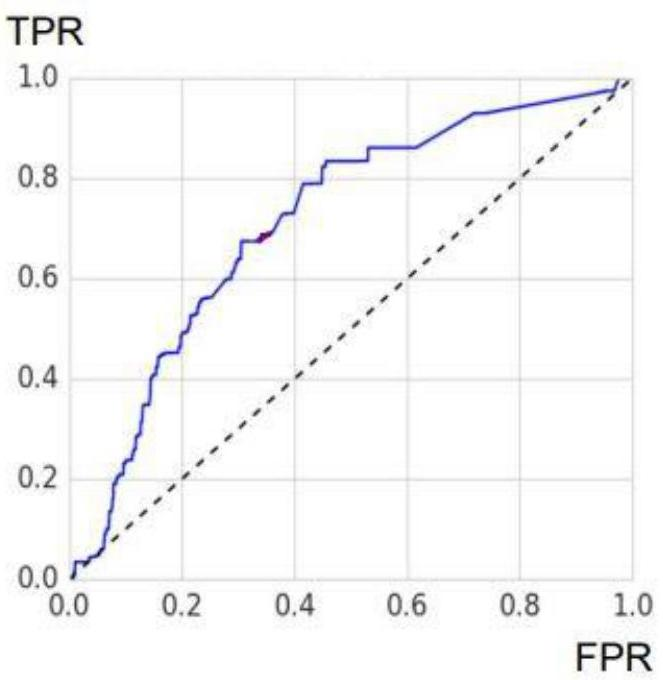

## Page 57
- Ähnlich wie die Confusion Matrix bietet die ROC-Kurve bzw. die AUC eine sehr anschauliche Performance-Metrik, allerdings sind Konstruktion und damit Interpretation allgemein schwerer zu verstehen. Ein wesentlicher Vorteil der AUC gegenüber den im Abschnitt zur Confusion Matrix beschriebenen Metriken ist, dass der AUC „parameterunabhängig" ist. Ein hoher AUC bedeutet gedanklich, dass das Modell „bei geeigneter Wahl des Parameters" gut ist. Allerdings ist zu betonen, dass ein AUC von 1 keine Accuracy von 1 garantiert!
- Zusammenfassend lässt sich die AUC als intuitiv verständliches Gütekriterium für Klassifikationsprobleme beschreiben, die relativ einfach zu implementieren ist. Der Informationsgehalt ist insgesamt jedoch gering.

# 8.2.3. Train-Test-Split und Kreuzvalidierung 

Generell wird bei der Kreuzvalidierung ein Modell mit Daten getestet, die nicht zum Training des Modells verwendet wurden. Die Modellgüte wird bei der Kreuzvalidierung über die Summe der Abweichungsquadrate/MSE bestimmt. Als Vorstufe zur Kreuzvalidierung kann der konzeptionell grundlegende Schritt der Aufteilung des Datensets in Trainings-, Validierungs- und Testdaten gesehen werden (Wüthrich, et al., 2023); (Wüthrich, Mario V.; Buser, Christoph, 2023).

## i. Leave-one-out Kreuzvalidierung

Bei der Leave-One-Out-Kreuzvalidierung wird aus dem Gesamtdatensatz pro Trainingslauf des Modells ein Datensatz (eine Zeile) weggelassen und zur Out-of-Sample Validierung des Trainingslaufs genutzt. Dies wird iterativ so lange durchgeführt, bis alle Datensätze einmal weggelassen und zur Validierung genutzt wurden. Es gehen also immer alle Datensätze $n$ in das Modelltraining ein, pro Trainingslauf werden allerdings nur n-1 Datensätze verwendet.

Eine grafische Veranschaulichung findet sich unter:
https://statologie.de/leave-one-out-kreuzvalidierung/

## Vorteile

- Intuitiv verständlich
- Ein möglicher Einsatzbereich sind Gesamtdatensätze, die zwar aus wenigen Datensätzen bestehen, bei denen jeder Datensatz aber selbst komplex ist.
- Dadurch, dass alle Datensätze einmal zur Validierung ausgewählt werden, können zufällige Einflüsse aus der Auswahl des Datensatzes auf die Bewertung der Modellgüte vermieden werden.

## Nachteile

- Rechen- und zeitintensiv bei komplexen Modellen und/ oder größeren Datenmengen, da n-mal die Trainingsmenge n-1 gefittet wird.
- Große Varianz der Validierungsergebnisse aus den einzelnen Trainingsläufen möglich.
- Nicht effizient
ii. k-fache Kreuzvalidierung

Bei der k-fachen Kreuzvalidierung werden die n Datensätzen des Gesamtdatensatzes in k (ca. gleich große) Teilmengen aufgeteilt und pro Trainingslauf eine der Teilmengen zur Out-of-Sample Validierung genutzt. Insgesamt werden k Trainingsläufe durchgeführt. Um eine Verzerrung der Validierung zu vermeiden, kann die k-fache Kreuzvalidierung auch m-mal wiederholt werden (wiederholte k-fache Kreuzvalidierung). Insofern $\mathrm{k}=\mathrm{n}$ gesetzt wird, entspricht die k -fache Kreuzvalidierung der Leave-one-out Kreuzvalidierung.

Eine grafische Veranschaulichung findet sich unter:
https://statologie.de/k-fache-kreuzvalidierung/

## Page 58
# Vorteile 

- Intuitiv verständlich
- Anwendbarkeit auch bei großen Datensätzen
- Verringerung der Varianz der Bewertung der Modellgüte aufgrund zufälliger Einflüsse aus der Auswahl des Datensatz durch Wahl eines größeren Wertes von k möglich.
- Gegenüber der Leave-one-out Kreuzvalidierung ist die k-fache Kreuzvalidierung weniger rechen- und zeitintensiv, da nur k-mal und nicht n-mal gerechnet werden muss (insofern $\mathrm{k}<\mathrm{n}$ ).

## Nachteile

- Rechen- und zeitintensiv bei komplexen Modellen und/ oder größeren Datenmengen, insofern ein großes k gewählt wird, da k -Mal die Trainingsmenge gefittet werden muss.
- Anfällig für Ausreißer im Gesamtdatensatz (wenn sich die Ausreißer zufällig in einer Teilmenge k sammeln)
iii. Stratified k-fache Kreuzvalidierung

Analog zur k-fachen Kreuzvalidierung werden bei der Stratified k-fachen Kreuzvalidierung die n Datensätzen in k (ca. gleich große) Teilmengen aufgeteilt und pro Trainingslauf eine der Gruppen zur Out-of-Sample Validierung genutzt. Allerdings wird zusätzlich darauf geachtet, dass jede der k Teilmengen eine annähernd gleiche Verteilung wie der Gesamtdatensatz besitzt.

## Vorteile

- Intuitiv verständlich
- Verringerung der Varianz der Bewertung der Modellgüte im Vergleich zur k-fachen Kreuzvalidierung.
- Ausreißer werden tendenziell auf die einzelnen Teilmengen k verteilt.

## Nachteile

- Rechen- und zeitintensiv bei komplexen Modellen und/ oder größeren Datenmengen, insofern ein großes k gewählt wird, da k -Mal die Trainingsmenge gefittet sowie zusätzlich auf die annähernde Gleichverteilung in jeder Teilmenge k im Vergleich zum Gesamtdatensatz geachtet werden muss.

### 8.2.4. Bootstrapping

Unter Bootstrapping wird eine Resampling ${ }^{41}$ Methode verstanden, um für eine Statistik von Interesse Kennzahlen wie den Standardfehler zu berechnen. Zusätzlich lässt sich die statistische Unsicherheit des Schätzers mithilfe von Konfidenzintervallen einordnen.

In der einfachsten Form kann das Verfahren folgendermaßen beschrieben werden: Aus einer Ausgangsstichprobe werden x weitere Samples durch wiederholtes Ziehen mit Zurücklegen generiert. Für jedes der Samples wird anschließend der Schätzer berechnet. Somit können Standardfehler und Konfidenzintervall angegeben werden.

[^0]
[^0]:    ${ }^{41}$ Bestimmung der statistischen Eigenschaften von Schätzern durch wiederholte Ziehungen von sogenannten Samples aus dem Originalsample (Ausgangsstichprobe).
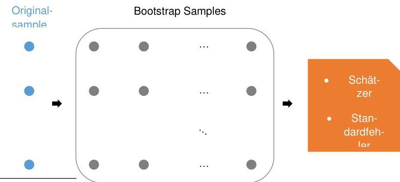

## Page 59
Das oben beschriebene Verfahren lässt sich ohne Kenntnisse über die theoretische Verteilungsfunktion F anwenden und wird daher als ein nichtparametrisches Bootstrapping verstanden. Daneben gibt es noch zahlreiche weitere Bootstrap-Verfahren ${ }^{42}$, welche zusätzliche Modellannahmen an die Originalstichprobe stellen.

Das Bootstrapping Verfahren eignet sich einerseits für deskriptive Kennzahlen wie das arithmetische Mittel oder den Median, aber auch für komplexere Methoden der Inferenzstatistik wie Regressionsmodelle. Durch die Flexibilität des Verfahrens ist es möglich, Standardfehler beliebiger Statistiken zu generieren und somit Inferenzen zu erleichtern.

# Vorteile 

- Relativ schnell und einfach in der Umsetzung.
- Resampling der Originalstichprobe ohne weitere Verteilungsannahmen.

## Nachteile

- Zuverlässigkeit ist abhängig von Größe der Stichprobe und der Anzahl der Wiederholungen, um die theoretische Verteilung möglichst gut zu approximieren.
- Ungenau, falls die theoretische Verteilung unendliche Varianz besitzt.

## Anwendbarkeit

Aufgrund der einfachen Umsetzung ist das Verfahren vielseitig anwendbar.
Ein Einsatzgebiet stellt die Analyse von Zeitreihen dar. Häufig liegen Zeitreihen nicht in der gewünschten Länge vor, um zuverlässige Schätzer inkl. der Angabe eines Konfidenzintervalls zu berechnen.

Weiterhin bringt die Zeitreihenanalyse zusätzliche Herausforderung mit sich. Meist sind die Daten nicht i.i.d. ${ }^{43}$ und weisen eine Abhängigkeitsstruktur auf. Daher wird in der Praxis das nichtparametrische Bootstrapping modifiziert. Das angepasste Verfahren findet sich unter dem Begriff BlockBootstrap.

In der Programmiersprache R ist ein Moving Block-Bootstrap-Verfahren im Paket boot implementiert. Mithilfe der Funktionen tsboot und boot.ci kann das Verfahren angewendet werden.

### 8.2.5. Sensitivitätsanalysen

Die Sensitivitätsanalyse ist ein Werkzeug zur Analyse von Modellen und Modellergebnissen. Dabei werden auf Basis eines definierten Modells die Veränderungen der Modellergebnisse aufgrund von veränderten Inputparametern untersucht.

So können beispielsweise im Fall eines Cashflow Modells eines Lebensversicherungsunternehmens die Auswirkungen von veränderten Annahmen über die Sterblichkeit oder das Zinsniveau (Inputparameter) auf die Rückstellungen des Unternehmens untersucht werden.

Im Fall von KI können sich diese Sensitivitäten auch auf modelldefinierende Parameter (Hyperparameter) beziehen. So kann beispielsweise die Güte eines Neuronalen Netzes auf Basis verschiedener Anzahlen von Neuronen innerhalb dieses Netzes untersucht werden.

## Vorteile

- Intuitiv verständlich
- Generell für jedes Modell anwendbar
- Verknüpfung von Modell und Realität

[^0]
[^0]:    ${ }^{42}$ Beim parametrischen Bootstrapping werden Kenntnisse über die theoretische Verteilung vorausgesetzt.
    ${ }^{43}$ Independent and identically distributed

## Page 60
- Keine genauen Kenntnisse des zugrundeliegenden Modells notwendig

# Nachteile 

- keine

## Anwendbarkeit

Die Anwendbarkeit ist für jedes Modell unmittelbar gegeben.

### 8.2.6. Grafischer Modellvergleich

i. Q-Q-Plot

Der Q-Q-Plot ist ein graphisches Werkzeug zum Vergleich zweier statistischer Variablen. Dafür werden die Quantile der beiden zugrundeliegenden Variablen gegeneinander abgetragen.

Sind die beiden verglichenen Variablen identisch verteilt, liegen die Punkte entlang der Winkelhalbierenden. Sind die Punkte hingegen ober- oder unterhalb der Winkelhalbierenden, tendiert eine der Variablen dazu, kleinere bzw. größere Werte zu liefern als die andere Variable.

Die zwei folgenden Beispiele zeigen zwei Q-Q-Plots für den Abgleich von jeweils 100 Realisierungen zweier Zufallsvariablen $X$ und $Y$. Im ersten Plot sind beide Variablen $N(0,1)$-verteilt. Die Tatsache, dass die Punkte entlang der Winkelhalbierenden liegen, bestätigt die Gleichverteilung.

Abbildung 5: Q-Q-Plot (Normalverteilung vs. Normalverteilung)

Der zweite Plot zeigt hingegen den Vergleich einer N(0,1)-verteilten Zufallsvariable X mit einer Lognormal(0,1)-verteilten Zufallsvariable Y.
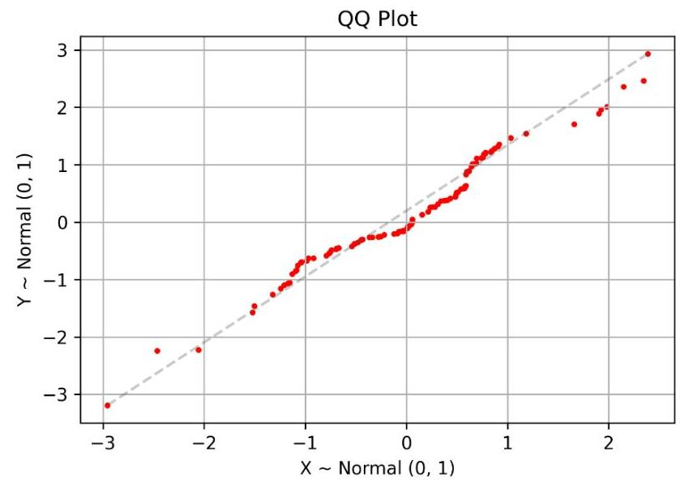

## Page 61
Abbildung 6: Q-Q-Plot (Normalverteilung vs. Lognormalverteilung)

# Vorteile 

- Intuitiv verständlich
- Einfach zu implementieren
- Keine genauen Kenntnisse des zugrundeliegenden Modells notwendig

## Nachteile

- Informationsgehalt der Analyse ist eher gering

## Anwendbarkeit

Die Methode kann überall dort angewandt werden, wo zwei statistische Variablen miteinander verglichen werden.
ii. ROC-Kurve

Vgl. Abschnitt 4.2
iii. Double-Lift-Plot

Der Double-Lift-Plot ist eine graphische Analyse, die zum Vergleich zweier Modelle herangezogen werden kann. Dafür werden die Ergebnisse zweier Modelle der Größe nach sortiert und anschlieBend gegen die relative Schadenhöhe abgetragen. Zusätzlich werden in gleicher Weise auch die tatsächlichen Ergebnisse in dem Plot aufgenommen. Schlussendlich ist dasjenige Modell besser, dessen Graph näher am Graph für das tatsächliche Ergebnis liegt.

Das folgende Beispiel vergleicht zwei Modelle m0 und m1 zur Prognose von Schadenhöhen hinsichtlich der Vorhersage der tatsächlichen Schadenhöhen.
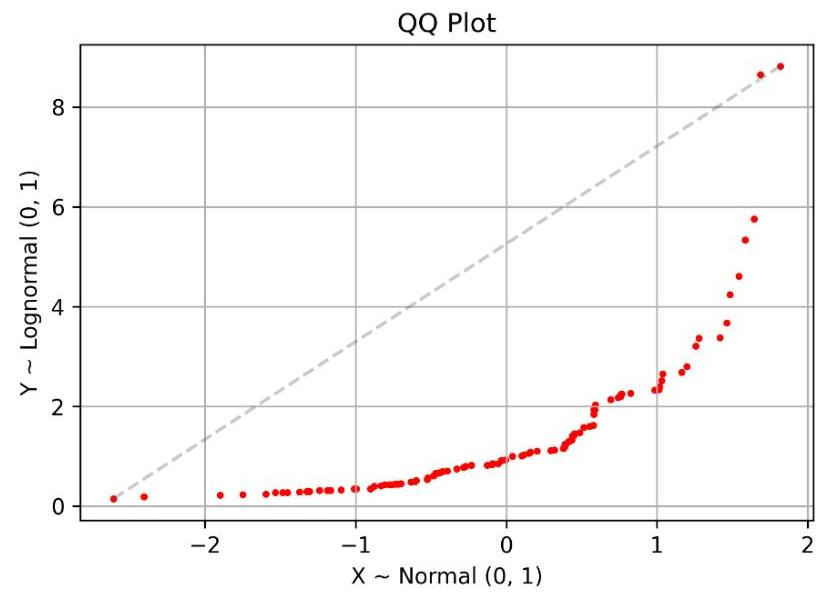

## Page 62
Abbildung 7: Double Lift Plot (DAA, 2022)

# Vorteile 

- Relativ einfach zu implementieren
- Intuitiv verständlich

## Nachteile

- Informationsgehalt ist eher gering

## Anwendbarkeit

Die Anwendbarkeit beschränkt sich auf Prognosemodelle.
iv. Lorenzkurve und Gini-Koeffizient

Die Lorenzkurve ist eine graphische Methode zur Darstellung statistischer Verteilungen und beschreibt das Ausmaß der Disparität (Ungleichheit) bzw. das Ausmaß der relativen Konzentration innerhalb einer Verteilung. Sie wurde ursprünglich entwickelt, um die Einkommensverteilung in einem Land zu verdeutlichen.

Sie ist eine Funktion im Einheitsquadranten und ordnet den Anteil an einem zugrundeliegenden Datensatz auf der Horizontalen (z.B. Bevölkerung), dem Anteil an einem bestimmten Merkmal (z.B. Einkommen) auf der Vertikalen zu, wobei die Datensätze jeweils aufsteigend sortiert sind.

Liegt die Lorenzkurve in diesem Beispiel auf der Winkelhalbierenden, bedeutet dies also, dass die Einkommen innerhalb der Bevölkerung perfekt gleichverteilt sind. Umgekehrt kennzeichnet in diesem Beispiel eine konvexe Lorenzkurve die Ungleichverteilung der Einkommensverhältnisse innerhalb eines Landes.

Das folgende Beispiel illustriert die Lorenzkurven für verschiedene KI -Modelle auf einem Trainingsdatensatz. Hier kennzeichnet die grüne Kurve (Fit Random Forest) eine höhere Ungleichverteilung der Daten als bspw. die rote Kurve (Fit GLM).
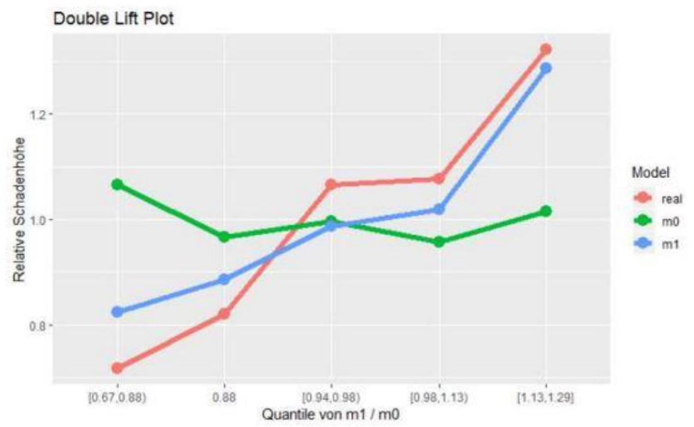

## Page 63
Abbildung 8: Lorenzkurve (DAA, 2022)
Der Gini-Koeffizient oder auch Gini-Index ist eine statistische Kennzahl zur Messung statistischer Streuung und beruht auf der Lorenzkurve. Dabei quantifiziert der Gini-Koeffizient die durch die Lorenzkurve beschriebene Disparität durch eine Zahl. Diese ist definiert als das Zweifache der Fläche zwischen der Winkelhalbierenden und der Lorenzkurve und nimmt somit Werte zwischen 0 und 1 an.

Ein Gini-Koeffizient von 0 kennzeichnet also eine perfekte Gleichverteilung und ein Gini-Koeffizient von 1 signalisiert vollkommene Ungleichverteilung.

# Vorteile 

- Intuitiv verständlich
- Einfach zu implementieren
- Keine genauen Kenntnisse des zugrundeliegenden Modells notwendig

## Nachteile

- Informationsgehalt der Analyse ist eher gering

## Anwendbarkeit

Die Anwendbarkeit beschränkt sich auf Fragestellungen, in denen die Disparität innerhalb eines Datensatzes gemessen oder beschrieben werden soll.

### 8.2.7. Expertenevaluierung

Weitere Validierungsmethoden zur Plausibilität und Stabilität von Modellergebnissen beziehen neben quantitativen Aspekten insbesondere auch die (zusätzliche) qualitative Evaluierung durch Modellexperten ein.

## Vorteile

- Zusätzliche Einbringung qualitativer/fachlicher Expertise in Ergänzung der statistischen Evaluierung.
- Einfacher Abgleich von erwarteten und realisierten Ergebnissen.
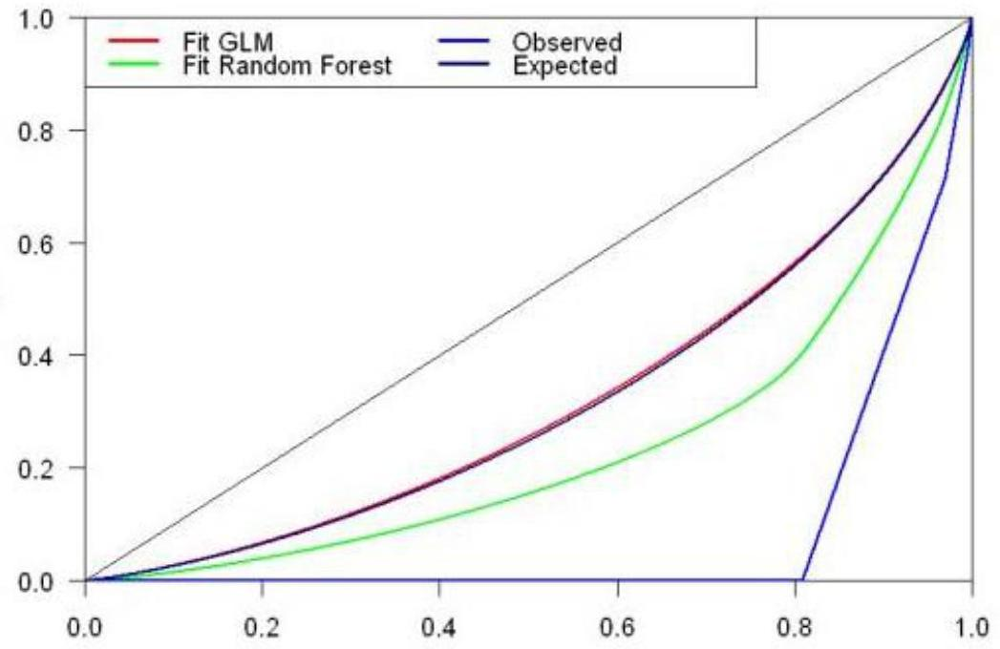

## Page 64
# Nachteile 

- Subjektive Evaluierung auf Basis des Hintergrunds und der Erfahrungen des Experten.
- Je nach Kenntnis oder Nicht-Kenntnis zu KI-Methoden des Fachexperten kann es zu Schwierigkeiten bei der Interpretation der Ergebnisse durch den Fachexperten kommen.

## Anwendbarkeit

Eine zusätzliche fachliche Evaluierung durch einen Experten oder ein Expertenteam ist grundsätzlich immer möglich.

### 8.2.8. A/B Tests

Bei diesem Ansatz wird eine Grundgesamtheit zufällig in zwei Testgruppen aufgeteilt (Kontrollgruppe mit der Originalversion und Versuchsgruppe mit der abgewandelten Version) und ein statistischer Test (Hypothese, Testverfahren) formuliert, um zwei Versionen eines Modells miteinander vergleichen zu können.

Die wesentlichen Schritte zur Durchführung eines A/B Tests werden nachfolgend beschrieben.
Schritt 1: Definition der (unabhängigen) Zielvariable sowie der Testgruppen
Um eine Aussage bzgl. der statistischen Auswirkung eines neuen Prozesses im Vergleich zur Originalversion treffen zu können, muss eine Zielvariable zur Messung definiert werden. Dies kann beispielsweise die durchschnittliche Abbrecherquote beim Berechnen einer Versicherungsprämie auf einer Website sein.

Ebenso ist vor Start des Tests der Algorithmus zur zufälligen Aufteilung auf Versuchs- und Kontrollgruppe festzulegen, um sicherzustellen, dass beide Gruppen miteinander vergleichbar sind.

## Schritt 2: Definition einer Hypothese

Weiterhin ist eine Hypothese bzgl. der Auswirkung des neuen Prozesses auf die Zielvariable zu treffen. Je nach Zielstellung des A/B Tests kann die Hypothese ein- oder zweiseitig formuliert sein.

| Formulierung | Zielvariable (im Vergleich zwischen Versuchs-   und Kontrollgruppe) ist ... |  |
| :-- | :-- | :-- |
| Einseitig | Hypothese | $\ldots$ gleich |
|  | Gegenhypothese | $\ldots$ kleiner (oder größer) |
| Zweiseitig | Hypothese | $\ldots$ gleich |
|  | Gegenhypothese | $\ldots$ ungleich |

## Schritt 3: Power-Analyse

Um eine statistische Signifikanz zu gewährleisten und verzerrte Ergebnisse zu vermeiden, muss sichergestellt werden, dass eine "ausreichende" Anzahl von Beobachtungen über eine festgelegte Mindestzeitspanne gesammelt wird. Daher muss vor der Durchführung des A/B Tests die Stichprobengröße der Kontroll- und der Versuchsgruppe sowie die Dauer der Testdurchführung bestimmt werden. Dieser Prozess wird häufig als Power-Analyse bezeichnet und umfasst drei spezifische Schritte, welche hier nicht weiter beschrieben werden:

- die Bestimmung der Power des Tests,
- die Bestimmung des Signifikanzniveaus des Tests und
- die Bestimmung eines minimalen nachweisbaren Effekts.

## Page 65
In Abhängigkeit des Testdesigns und der Daten sind eine Vielzahl an Testverfahren möglich. Zur Entscheidung, welcher Test für die eigenen Daten ggf. geeignet ist, kann folgende vereinfachende Grafik hilfreich sein:

Abbildung 9: Entscheidungsbaum zur Auswahl geeigneter Testverfahren ${ }^{44}$
Schritt 5: Durchführung des Tests und Auswertung der Ergebnisse
Zum Abschluss des Tests und zur Interpretation der Ergebnisse des A/B-Tests gibt es eine Reihe von Werten, die berechnet werden sollten, um die oben genannte statistische Hypothese zu testen (um zu prüfen, ob es einen statistisch signifikanten Unterschied zwischen Kontroll- und Versuchsgruppe gibt).

- Berechnung der Teststatistik (T)
- Berechnung des p-Wertes der Teststatistik
- Berechnung des Konfidenzintervalls
- Ablehnung oder Nichtverwerfung der statistischen Hypothese (statistische Signifikanz)

# Vorteile 

- Direkter Vergleich zweier Versionen möglich (bspw. abgewandelter Prozess basierend auf einem Modell vs. Originalprozess ohne Modell)
- Möglichkeit sehr spezielle Versionen zu testen
- Statistische Auswertbarkeit gegeben

## Nachteile

- Versionen sollten sich nur in der zu testenden Eigenschaft unterscheiden
- Versionen sollten simultan getestet werden
- Ggf. zufällige Unterteilung der Gruppen nicht leicht umsetzbar bzw. nur mit höherem ITAufwand umsetzbar
- Bei parametrischen Testverfahren Datenverteilung ggf. unklar / unsicher

[^0]
[^0]:    ${ }^{44}$ Quelle:https://towardsdatascience.com/a-b-testing-a-complete-guide-to-statistical-testinge3f1db140499
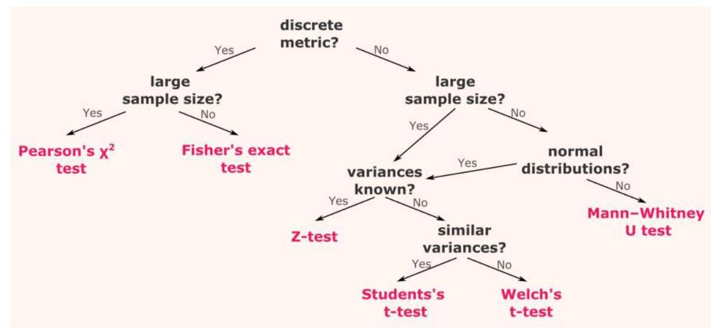

## Page 66
# 8.3. Ausgewählte Methoden der Erklärbarkeit 

### 8.3.1. LIME (Local interpretable Model-Agnostic Explanations)

LIME (Local interpretable Model-Agnostic Explanations) dienen der Erklärung von Modellen unabhängig von der Implementierung bzw. des spezifischen Problems (Klassifikations- und Regressionsprobleme).

Grundidee besteht darin, das Modell lokal zu interpretieren. Dazu zieht LIME zufällig mehrere Datenpunkte mit den vom Modell erzielten Ergebnissen und gewichtet diese entsprechend ihrer Nähe zu dem Datenpunkt, dessen Ergebnis erklärt werden soll. Mit diesen Datenpunkten wird nun ein einfaches, interpretierbares Modell (z.B. eine lineare Regression/ein Regressionsbaum) trainiert.

Als mögliches Beispiel betrachten wir den Use Case aus Abschnitt Fehler! Verweisquelle konnte nicht gefunden werden., der sich damit beschäftigt, die Höhe der Eigenmittel oder Verpflichtungen mit einem neuronalen Netz aus Risikofaktoren abzuleiten. Es soll erklärt werden, warum das Modell für eine gewisse Ausprägung der Risikofaktoren einen bestimmten Wert liefert. Dafür soll die Frage beantwortet werden, welche Risikofaktoren dafür in welcher Höhe verantwortlich sind.

Mit LIME ist es möglich, das Ergebnis lokal, also z.B. für einen einzelnen Datenpunkt, zu interpretieren. Unten wird die Ausgabe für einen Datenpunkt angezeigt, bei dem das neuronale Netz eine Vorhersage von -0.5090 liefert.

| Name: 5128, dtype: float64   -0.5089683350342702   Intercept 0.08325793696973681   Prediction_local [-0.5073033]   Right: -0.5089683350342702 |  |
| :--: | :--: |
| Predicted value |  |
| $-1.96$   (min) | 5   $-0.51$ |

| Feature | Value |
| :--: | :--: |
| RF_2 | 1.08 |
| RF_3 | 0.32 |
| RF_4 | 0.38 |
| RF_6 | 3.31 |
| RF_7 | 1.31 |

## Abbildung 10: Analyse-Output mittels LIME in Python unter Verwendung des von der DAV zur Verfügung gestellten Datensatzes zur SCR-Berechnung ${ }^{45}$

Die Abbildung zeigt einen Teil der Ausgabe der Analyse eines einzelnen Datenpunktes mittels LIME in Python. Das lokale Modell (hier eine lineare Regression) liefert einen zur Vorhersage ähnlichen Wert von -0.5073 . Der Wert des lokalen Modells kann nun erklärt werden. Der Wert -0.5073 ergibt sich aus nach der Grafik als Summe der Werte $-0.26,0.21,-0.20,-0.15,-0.16$ und dem Intercept 0.08. Es zeigt sich somit, dass die spezielle Ausprägung des Risikofaktors 8 (Risikofaktor 8 liegt zwischen -0.17 und 0.61) für den ausgewählten Datenpunkt einen positiven Impact hat, während die anderen Risikofaktoren einen negativen Einfluss auf das Ergebnis haben. Beispielsweise ist der Risikofaktor 2 für den ausgewählten Datenpunkt gleich 1.08 und damit größer als 0.89 , was das Ergebnis reduziert.

## Vorteile

- Mit entsprechender Vorbildung intuitiv verständlich
- Ergebnis leicht und schnell interpretierbar
- Einfach umzusetzen, entsprechende Bibliotheken für R und Python bereits vorhanden

[^0]
[^0]:    45 Quelle der zugrundeliegenden Daten: GitHub - DeutscheAktuarvereinigung/insurance_scr_data: How to Work With Comprehensive Internal Model Data for Three Portfolios
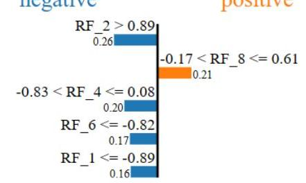

## Page 67
- Unabhängig vom gewählten Modell, für LIME ist nicht entscheidend, mit welchem Modell die Daten generiert wurden

# Nachteile 

- Definition der Umgebung (Nähe zum Datenpunkt) noch nicht abschließend geklärt
- Reproduzierbarkeit schwierig, andere Stichprobe kann zu deutlich anderen Ergebnissen führen
- Problematisch bei stark nicht-linearen Modellen
- Unter Umständen hohe Rechenzeit

### 8.3.2. SHAP - SHapley Additive exPlanations

Die SHAP (SHapley Additive exPlanations) Analyse von Lundberg und Lee (Lundberg, et al., 2017) stammt aus der Spieltheorie und stellt den relativen Einfluss einer Variablen auf den Output eines KI-Modells dar. Dazu wird der relative Effekt eines Inputs bzw. Features mit dem Mittelwert verglichen. Dieser Effekt wird als SHAP Value bezeichnet.

Das folgende Beispiel auf Basis eines fiktiven Risikomodells eines Lebensversicherungsunternehmens ${ }^{46}$ illustriert die Möglichkeiten einer SHAP-Analyse. Der Einfluss verschiedener Features oder auch Risikofaktoren $R F_{i}$ mit $i \in 1, \ldots, D$ (z.B. Langlebigkeit, Storno, Zins, Aktien, etc.) auf die Veränderung der versicherungstechnischen Rückstellungen wird in dem SHAP Summary Plot dargestellt.

## Abbildung 11: SHAP Summary Plot

Jeder Punkt auf dem Summary Plot ist ein SHAP Value, dessen Position auf der x-Achse den Einfluss auf die Modellergebnisse beschreibt. Die Farbe der Punkte hingegen beschreibt den Wert des jeweiligen Risikofaktors. So lässt sich anhand des Beispiels hier ablesen, dass der Risikofaktor $R F_{0}$ für hohe Input-Werte (rote Farbe) die Modellergebnisse bzw. die Output-Werte erhöht und für kleine Input-Werte (blaue Farbe) die Ergebnisse verringert. Der Risikofaktor $R F_{2}$ hingegen wirkt genau entgegengesetzt.

[^0]
[^0]:    ${ }^{46}$ Quelle der zugrundeliegenden Daten: GitHub - DeutscheAktuarvereinigung/insurance_scr_data: How to Work With Comprehensive Internal Model Data for Three Portfolios
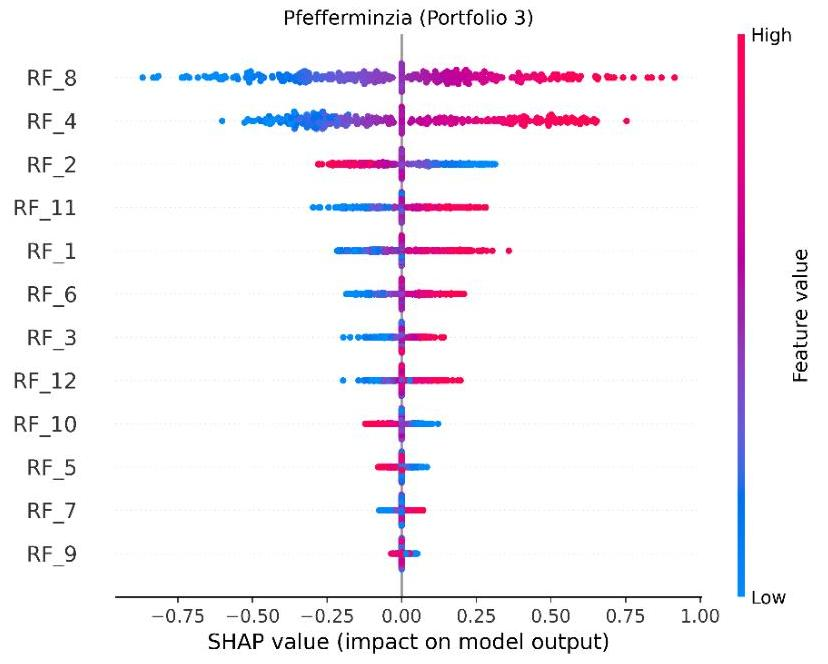

## Page 68
Zusätzlich können neben den hier dargestellten univariaten Betrachtungen auch Abhängigkeiten zwischen einzelnen Features und deren Einfluss auf die Modellergebnisse mittels der folgenden Dependency Plots untersucht werden.

# Abbildung 12: SHAP Dependency Plots 

In diesem Beispiel lässt sich eine Abhängigkeit der Features bzw. Risikofaktoren $R F_{1}$ und $R F_{8}$ beobachten, da die Modellergebnisse für hohe Werte von $R F_{1}$ und niedrige Werte von $R F_{8}$ kleiner sind, während sie für kleine Werte von $R F_{1}$ und hohe Werte von $R F_{8}$ größer sind. Für die Risikofaktoren $R F_{1}$ und $R F_{2}$ hingegen lässt sich diese Abhängigkeit nicht beobachten.

## Vorteile

- schnelle, optimierte Implementierungen vor allem für einzelne Modelle vorhanden
- Die zugrundeliegenden SHAP-Werte beruhen auf einer fundierten theoretischen Basis durch Bezug zur mathematischer Spieltheorie

## Nachteile
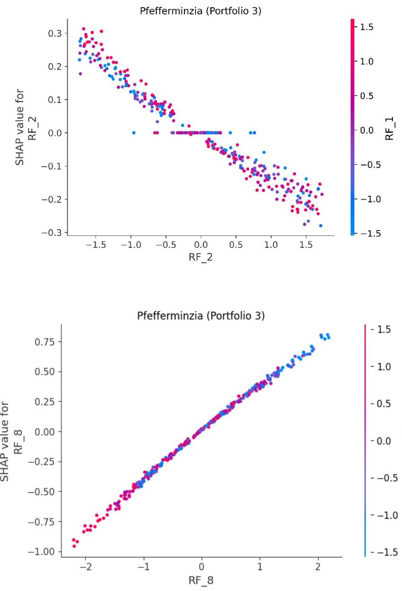

## Page 69
- Trifft keine Vorhersage wie LIME
- Lange Rechenzeit bei großen Datensätzen. Die Rechenzeit steigt exponentiell mit der Anzahl der zu erklärenden Variablen
- Alle Merkmale müssen einbezogen werden und Daten müssen vollständig vorliegen

# 8.3.3. Weitere sinnvolle Methoden zur Erklärbarkeit 

Auf jeden Fall sind in diesem Zusammenhang auch Visualisierungen zu erwähnen, wie Sie z.B. das Python-Paket mlxtend bietet. So ist es z.B. möglich, für ein Klassifikationsproblem Entscheidungsregionen zu visualisieren.

Abbildung 13: Visualisierung von Entscheidungsregionen ${ }^{47}$
Weitere interessante Verfahren sind sogenannte Counterfactual Explanations (Molnar, 2022) ${ }^{48}$ und Anchor Explanations (Molnar, 2022) ${ }^{49}$.

Eine Counterfactual Explanation einer Vorhersage für einen Datenpunkt beschreibt die kleinste Merkmalsänderung, die zu einer Änderung des Wertes der Vorhersage führt. Dadurch lassen sich Aussagen der Form treffen „Wenn der Datenpunkt nicht die Merkmalsausprägung $a_{i}$ für das Merkmal $x_{i}$ gehabt hätte, wäre die Vorhersage ein andere gewesen."
Anchor Explanations oder Scope Rules gehen konträr dazu vor. In diesem Fall wird versucht, die für die Vorhersage wesentlichen Merkmalsausprägungen eines Datenpunkts zu identifizieren.

[^0]
[^0]:    ${ }^{47}$ Quelle: Quelle: http://rasbt.github.io/mlxtend/
    ${ }^{48}$ Umgesetzt ist das z.B. in den Python-Bibliotheken mlxtend http://rasbt.github.io/mlxtend/ oder DiCE (https://github.com/interpretml/DiCE); weitere Quellen: (Wachter, et al., 2018) und (Dandl, et al., 2020) ${ }^{49}$ Umgesetzt sind sie z.B. in alibi (https://pypi.org/project/anchors/); weitere Quelle: (Ribeiro, et al., 2018)
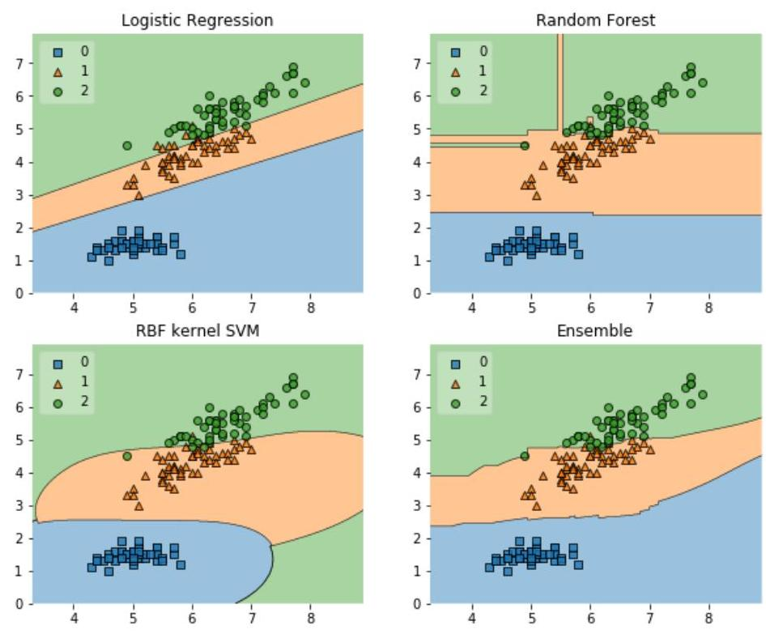

## Page 70
# 8.4. Entwurf einer Orientierungshilfe für Organisation \& Governance angelehnt an MaG 

### 8.4.1. Generelle Feststellungen

Mit der MaGo ${ }^{50}$ wurden Mindeststandards an die Ausgestaltung der Geschäftsorganisation von Versicherern gesetzt. Zur Erfüllung der Solvency II Anforderungen wurden insbesondere die Dokumentationspflichten, z.B. die Dokumentation von Prozessen, verschärft. Neben der Einrichtung von sogenannten Schlüsselfunktionen, führten die MaGo auch zur Einrichtung von Komitees (z.B. Risikokomitee, Produktkomitee) und zur Erstellung von schriftlichen Leitlinien zur systematischen Abbildung der geforderten Dokumentationstiefe einerseits sowie zur Einbindung der Geschäftsführung in risikorelevante Aspekte andererseits. Durch Solvency II und die MaGo sollte die Versicherungsindustrie relativ gut gerüstet sein, weitere z.B. aus dem AI Act resultierende Governance-Anforderungen geeignet abbilden zu können.

Relevante, d.h. Hochrisiko-KI-Systeme, die einen direkten Bezug zur Versicherungstechnik haben und die bereits heute im Pricing resp. im Underwriting im Unternehmen eingesetzt werden, unterliegen bereits heute Solvency II und damit den MaGo. D.h. die VMF ${ }^{51}$ hat bereits heute den Einsatz von KI-Systemen aus der Perspektive von Solvency II heraus kritisch zu würdigen. Dies bedeutet auch, dass entsprechende Solvency II verträgliche Regelwerke, d.h. eine angemessene Governance bereits implementiert sein müsste ${ }^{52}$. Dies bedeutet, dass die aufgrund des AI Acts zu berücksichtigenden Aspekte eine Mischung aus neuen und schon vorhandenen Aspekten (siehe illustrative Gegenüberstellung unten) sein werden.

| Solvency II / MaGo | AI Act ${ }^{53}$ |
| :--: | :--: |
| Gesamtverantwortung der Geschäftsleitung | Gesamtverantwortung der Geschäftsleitung |
| Proportionalitätsprinzip | Prinzip der Proportionalität |
| Risikomanagement (MaGo ersetzt MaRisk) | Risikomanagementsystem (Eigener Artikel) |
| Wesentliche Risiken Festlegung von Wesentlichkeitsgrenzen, separat für vt-, Markt-, Kredit, Liquiditätsrisiko und operationelles Risiko, VUSicht | Identifikation Hochrisiko KI-System   Datensicherheit, Stabilität und Erklärbarkeit der   Ergebnisse, Diskriminierung,   VU- und VN-Sicht, Reputation |
| Allgemeine Governance-Anforderungen, u. a. Aufbau- und Ablauforganisation, angemessene Trennung der Zuständigkeiten, Festlegung von Aufgaben, Verantwortlichkeiten und Berichtslinien, Umgang mit schriftlichen Leitlinien, regelmäßige Überprüfung etc. | Sicherstellung der Governance-Anforderungen zu Fairness und nichtdiskriminierend,   Daten-Governance und Aufzeichnungspflichten,   Transparenz und Erklärbarkeit,   Robustheit und Leistungsvermögen,   Menschliche Aufsicht |
| Internes Kontrollsystem | Implizit enthalten |
| Ausgliederung | Externe Anbieter |

Das Proportionalitätsprinzip ist, obwohl unterschiedlich formuliert, als vergleichbar anzusehen. Während der Fokus der MaGo darauf liegt, wann Anforderungen als erfüllt gelten können, liegt der Schwerpunkt bei dem AI Act auf der geforderten Folgeabschätzung und den zu implementierenden Governance-Maßnahmen:

[^0]
[^0]:    ${ }^{50}$ Das BaFin-Rundschreiben 2/2017 (VA) - Aufsichtsrechtliche Mindestanforderungen an die Geschäftsorganisation von Versicherungsunternehmen (MaGo) ist seit dem 1. Februar 2017 in Kraft.
    ${ }^{51}$ Versicherungsmathematische Funktion
    ${ }^{52}$ Natürlich nur, sofern eine entsprechende materielle Relevanz gegeben ist.
    ${ }^{53}$ Keine vergleichbaren Regelungen zu den Anforderungen auf Gruppenebene und in Bezug auf Eigenmittel, zu
    Schlüsselfunktionen und zum Notfallmanagement durch den AI Act.

## Page 71
| Proportionalität |  |
| :-- | :-- |
| MaGo | AI Act |
| Die Anforderungen sind auf eine Weise zu er-   füllen, die der Wesensart, dem Umfang und der   Komplexität der mit der Tätigkeit des Unterneh-   mens einhergehenden Risiken gerecht wird (§   296 Abs. 1 VAG). Das Proportionalitätsprinzip   knüpft also an das individuelle Risikoprofil eines   jeden Unternehmens an. | Die Folgenabschätzung für KI-Anwendungsfälle   und die Governance-Maßnahmen sollten in ei-   nem angemessenen Verhältnis zu den potenziell-   len Auswirkungen eines bestimmten KI-Anwen-   dungsfalls auf Verbraucher und/oder Unterneh-   men stehen. |

Beispielsweise müssen bei einem Hochrisiko-KI-System im Underwriting, dessen Betrieb bereits vom Risikokomitee im Einklang mit den MaGo unter gewissen Auflagen genehmigt wurde, nun weitere Aspekte berücksichtigt werden. D.h. in Folge des AI Acts wäre zunächst die Geschäftsordnung des Risikokomitees zu aktualisieren, um dann über die vorgeschlagenen Governance-Maßnahmen des KI-Verantwortlichen auf Basis einer aussagekräftigen Risikofolgeabschätzung zu befinden.

# 8.4.2. Spezielle Erfordernisse aufgrund des AI-Acts 

Im Folgenden diskutieren wir Anforderungen des AI Act, basierend auf den bereits bekannten Grundsätzen der MaGo. Aspekte, die von der MaGo bisher nicht oder nur unzureichend berücksichtigt wurden, werden dabei gesondert hervorgehoben.

## Proportionalitätsprinzip

Bei der Umsetzung der Anforderungen an die Geschäftsorganisation bzgl. des Einsatzes von AI spielt das Proportionalitätsprinzip eine erhebliche Rolle. Die Anforderungen sind in Analogie zu den bereits bestehenden Anforderungen an die Geschäftsorganisation auf eine Weise zu erfüllen, die der Wesensart, dem Umfang und der Komplexität der mit der Tätigkeit des Unternehmens einhergehenden Risiken der Nutzung von AI gerecht wird (§ 296 Abs. 1 VAG). Während durch die MaGo grundsätzlich die Risiken, denen das Unternehmen ausgesetzt ist, adressiert werden, zielt der AI Act darauf ab, einen ethischen und vertrauenswürdigen Einsatz von KI sicherzustellen. D.h. die geforderte Folgenabschätzung für KI-Anwendungsfälle und die Governance-Maßnahmen sollten in einem angemessenen Verhältnis zu den potenziellen Auswirkungen eines bestimmten KI-Anwendungsfalls auf Verbraucher und/oder Versicherungsunternehmen stehen. Hierbei ist die Kombination aller Maßnahmen und insbesondere die Auswirkungen auf den Verbraucher unter Berücksichtigung der Verhältnismäßigkeit zu bewerten ${ }^{54}$. Die Einschätzung, welche Ausgestaltung als proportional anzusehen ist, ist nicht als statisch anzusehen, sondern passt sich im Zeitablauf den sich verändernden Gegebenheiten an, was bei der Verabschiedung von Maßnahmen zu berücksichtigen ist.

## Gesamtverantwortung der Geschäftsleitung

Alle Geschäftsleiter sind grundsätzlich für eine ordnungsgemäße und wirksame Geschäftsorganisation verantwortlich. Hierin eingeschlossen ist auch die Nutzung von KI-Systemen. Die gesamte Geschäftsleitung ist somit auch dafür verantwortlich sein, dass das Unternehmen über ein angemessenes und wirksames Risikomanagementsystem bzgl. der Risiken aus der Nutzung von KI verfügt und dass das interne Kontrollsystem entsprechend angepasst ist. Um ihrer Gesamtverantwortung gerecht zu werden, sollten die Geschäftsleiter auch eine für das Unternehmen angemessene Risikokultur bzgl. der Risiken aus der Nutzung von KI-Systemen entwickeln, die im Unternehmen gelebt und fortlaufend weiterentwickelt wird. Beziehen sich Anforderungen ausdrücklich auf die ge-

[^0]
[^0]:    ${ }^{54}$ Beispielsweise sind auch Mitarbeiterkapazitäten, die das Unternehmen im Wege der Ausgliederung heranzieht,
    in die Betrachtung einzubeziehen.

## Page 72
samte Geschäftsleitung, kann diese ihre Verantwortung nicht delegieren, sofern nichts Abweichendes bestimmt wird. Insbesondere für Unternehmen mit einem ausgeprägten Risikoprofil bzgl. der Nutzung von KI wird empfohlen, die Verantwortung für die Geschäftsorganisation bzgl. der Nutzung von KI als eine Aufgabe der gesamten Geschäftsleitung zu betrachten. Zusätzlich empfiehlt sich die Etablierung eines KI-Beauftragten resp. einer KI-Aufsichtsfunktion (in Analogie zu den SII-Schlüsselfunktionen) bzw. eines Chief AI Officer.

# Wesentliche Risiken der KI 

Einzelne Anforderungen beziehen sich nicht auf sämtliche, sondern nur auf wesentliche Risiken der Nutzung von KI; in europäischen Rechtstexten wird in vergleichbaren Kontexten auch der - synonyme - Begriff „materielle Risiken" verwendet. Die gesamte Geschäftsleitung sollte daher zur Bestimmung aller wesentlichen Risiken der Nutzung von KI anhand geeigneter und nachvollziehbarer Kriterien dem Risikoprofil angemessene unternehmensindividuelle Wesentlichkeitsgrenzen definieren, deren Angemessenheit fortlaufend sicherzustellen ist ${ }^{55}$.

Die Wesentlichkeitsgrenzen sollten sich nicht ausschließlich an den Auswirkungen im Rahmen der Rechnungslegung oder den Auswirkungen von Rechtsverstößen orientieren, sondern sollten auch andere Aspekte, insbesondere bzgl. dem ethischen und vertrauenswürdigen Einsatz von KI und Reputation berücksichtigen.

Die gesamte Geschäftsleitung sollte sicherstellen, dass die Wesentlichkeitsgrenzen einheitlich angewandt werden. Diese Zuständigkeit kann beispielsweise auf einen oder mehrere Geschäftsleiter delegiert werden.

## Allgemeine Governance-Anforderungen

## Aufbau- und Ablauforganisation

Eine dem Risikoprofil des Unternehmens angemessene transparente Aufbauorganisation erfordert eine klare Definition und Abgrenzung von Aufgaben und Verantwortlichkeiten. Es sollte daher auch für die Nutzung von KI und für die daraus ggf. resultierenden Risiken eindeutig geregelt werden, wer im Unternehmen für die Aufgaben zuständig ist und für Entscheidungen verantwortlich zeichnet ${ }^{56}$. Darüber hinaus sind klare Vertretungsregelungen und Berichtslinien festzulegen. Hierbei ist sicherzustellen, dass alle Personen im Unternehmen die sie betreffenden Informationen unverzüglich erhalten und ihre Bedeutung erkennen können und eine Wahrnehmung der jeweiligen Aufgabe bzw. Verantwortlichkeit stets gewährleistet ist.

Bestandteil einer dem Risikoprofil des Unternehmens angemessenen Organisationsstruktur ist eine entsprechend angemessene Trennung der Zuständigkeiten (§ 23 Abs. 1 Satz 3 VAG) bis einschließlich der Ebene der Geschäftsleitung. Diese Trennung der Zuständigkeiten sollte auch auf die Nutzung von KI übertragen werden, insbesondere, sofern sich wesentliche Risiken aus dieser Nutzung ergeben. Unter anderem sind daher der Aufbau von Risiken aus der Nutzung von KI und deren Überwachung und Kontrolle in einer dem Risikoprofil angemessenen Art und Weise zu trennen. Bei stärker ausgeprägtem Risikoprofil kann eine strikte Trennung zumindest zwischen dem Aufbau wesentlicher Risiken und deren Überwachung und Kontrolle erforderlich sein.

Die Ablauforganisation hat sicherzustellen, dass mit Risiken einhergehende Prozesse und deren Schnittstellen angemessen gesteuert und überwacht werden. Dies setzt zunächst voraus, dass alle Prozesse aus Risikosicht beurteilt werden. Eine solche Beurteilung, Steuerung und Überwachung sollten insbesondere auch für Risiken aus der Nutzung von KI erfolgen ${ }^{57}$. Um eine angemessene

[^0]
[^0]:    ${ }^{55}$ Hierfür sollte sich die gesamte Geschäftsleitung sowohl regelmäßig als auch anlassbezogen einen Überblick über alle Risiken der Nutzung von Al verschaffen, denen das Unternehmen tatsächlich oder möglicherweise ausgesetzt ist.
    ${ }^{56}$ Hierfür sollte sich die gesamte Geschäftsleitung sowohl regelmäßig als auch anlassbezogen einen Überblick über alle Risiken der Nutzung von Al verschaffen, denen das Unternehmen tatsächlich oder möglicherweise ausgesetzt ist.
    ${ }^{57} \mathrm{Zu}$ den mit Risiken einhergehenden Prozessen zählen beispielsweise der Einsatz von Al bei der Berechnung der Solvabilität nach Solvabilität II und beim Kapitalanlagemanagement, aber auch der Einsatz von Al im Vertrieb, bei der Preisfestsetzung und im Underwriting.

## Page 73
Steuerung und Überwachung der identifizierten, risikobehafteten Prozesse aus der Nutzung von KI zu gewährleisten, sind die einzelnen Prozessschritte, einschließlich der erforderlichen Kontrollaktivitäten im Sinne des internen Kontrollsystems und gegebenenfalls Eskalationsschritte, die prozessspezifischen Zuständigkeiten und Verantwortlichkeiten sowie die Informationsflüsse sowie die den Modellen zugrundeliegenden Daten und Datenquellen klar festgelegt werden. Im Rahmen eines soliden und vorsichtigen Managements sind Risikomanagement- und interne Kontrollpraktiken auch bezüglich der Risiken aus der Nutzung von KI unternehmensweit angemessen sowie konsistent durchzuführen. Werden vom Unternehmen schriftliche Leitlinien erstellt, so sind auch die jeweiligen grundlegenden ablauforganisatorischen Regelungen bzgl. der Nutzung von KI in zugehörigen Leitlinien festzuhalten.

Die Aufbau- und Ablauforganisation ist angemessen gemäß internen Vorgaben zu dokumentieren und stets auf aktuellem Stand vorzuhalten. Hierbei sind die Regelungen der MaGo einzuhalten.

# Interne Überprüfung des Governance-Systems bzgl. der Nutzung von KI 

Die gesamte Geschäftsleitung bewertet die Geschäftsorganisation bzgl. der Nutzung von KI regelmäßig (§ 23 Abs. 2 VAG), wobei der Turnus der Bewertung entsprechend dem Risikoprofil festzulegen ist ${ }^{58}$, und sorgt für eine kurzfristige Umsetzung erforderlicher Änderungen. Je nach gewählter Struktur erfolgt diese Prüfung durch die gesamte Geschäftsleitung oder den für diese Aufgabe benannten Geschäftsleiter bzw. einen ggf. benannten Chief AI Officer. Die gesamte Geschäftsleitung muss im Rahmen der Gesamtverantwortung das Ergebnis dieser Bewertung kennen und die resultierenden Umsetzungen steuern ${ }^{59}$. Die regelmäßige Bewertung der gesamten Geschäftsorganisation ist durch einen Prüfplan oder ähnliche Instrumente sicherzustellen. Das Ergebnis der Bewertung sowie die Umsetzung notwendiger Änderungen sind zu dokumentieren. Bei der Bewertung sind etwaige Erkenntnisse, anderer Schlüsselfunktionen, insbesondere der internen Revision zu berücksichtigen. Sofern erforderlich, werden weitere interne Informationen und Erkenntnisse anderer Unternehmensbereiche herangezogen. Die Geschäftsleitung bzw. der für diese Aufgabe benannte Geschäftsleiter bzw. der Chief AI Officer bewertet insbesondere, ob die Risikostrategie bzgl. der Nutzung von KI und die Steuerung des Unternehmens aufeinander abgestimmt und zur Geschäftsstrategie konsistent sind und ob die Geschäftsorganisation bzgl. der Nutzung von KI die Ziele der Ge-schäfts- und der Risikostrategie unterstützt.

## Schriftliche Leitlinien zur Nutzung von KI

Die praktische Umsetzung schriftlicher Leitlinien zur Nutzung von KI erfolgt durch entsprechende Arbeitsabläufe. Es ist festzulegen, auf welcher Ebene die Verantwortung für diese Arbeitsabläufe liegt. Die für die KI-spezifischen Funktionen ${ }^{60}$ zu erstellenden schriftlichen Leitlinien stellen unter anderem die Befugnisse dieser Funktionen klar dar. Die schriftlichen Leitlinien der jeweiligen Organisationseinheiten legen klar fest, welche Informationen für die entsprechenden KI-spezifischen Funktionen relevant sind und dass solche Informationen an diese Funktionen zu übermitteln sind. Zumindest alle zum Governance-System gehörenden schriftlichen Leitlinien müssen miteinander und auf die Geschäfts- und Risikostrategie abgestimmt sein. Diese Regel sollte auch auf die Leitlinien für die Nutzung von KI übertragen werden.

Die schriftlichen Leitlinien für die Nutzung von KI müssen mindestens einmal jährlich überprüft werden ${ }^{61}$. Für die Überprüfung der schriftlichen Leitlinien sind die auszuführenden Aufgaben und die zuständigen Personen oder Organisationseinheiten zu benennen. Dabei ist zu berücksichtigen, dass Änderungen einer schriftlichen Leitlinie oder der Geschäftsstrategie direkte Auswirkungen auf die anderen schriftlichen Leitlinien, auch außerhalb der Nutzung von KI, haben können. Die Überprüfung der schriftlichen Leitlinien ist zu dokumentieren. Die Feststellungen und die sich daraus

[^0]
[^0]:    ${ }^{58}$ Anlässe für außerordentliche Bewertungen der Geschäftsorganisation bzgl. der Nutzung von Al sind von der Geschäftsleitung festzulegen
    ${ }^{59}$ Hierzu muss jeder Geschäftsleiter zumindest die wesentlichen Risiken aus der Nutzung von Al verstehen, denen das Unternehmen ausgesetzt ist.
    ${ }^{60}$ Z.B. KI-Beauftragter oder KI- Aufsichtsfunktion
    ${ }^{61}$ Anlässe für Ad-hoc-Überprüfungen einzelner Leitlinien sind vorab festzulegen

## Page 74
ergebenden Empfehlungen werden an die Geschäftsleitung berichtet. Die Entscheidungen der Geschäftsleitung aufgrund der Überprüfung sind nachvollziehbar zu begründen und einschließlich der Begründung zu dokumentieren.

Die relevanten Mitarbeiter müssen Kenntnis darüber haben, für welche Geschäftsabläufe schriftliche Leitlinien für die Nutzung von KI existieren und welche Pflichten und Aufgaben hieraus begründet werden. Änderungen der schriftlichen Leitlinien sind den Betroffenen umgehend mitzuteilen. Die Unternehmen sollten weiterhin sicherstellen, dass bei allen relevanten Mitarbeitern ein angemessenes Verständnis und Bewusstsein für die Vor- und Nachteile der Nutzung von KI sowie insbesondere für die Risiken von KI vorhanden ist. Die Unternehmen führen interne Kontrollen ein, die sicherstellen, dass entsprechend den schriftlichen Leitlinien gehandelt und nicht dagegen verstoßen wird bzw. Verstöße zeitnah bekannt werden.

# Rolle der Geschäftsleitung und des Aufsichtsrats 

Die Geschäftsorganisation umfasst Prozesse zur regelmäßigen und Ad-hoc-Übermittlung von Informationen und Berichten der Geschäftsbereiche und Funktionen an die Geschäftsleitung. Auf dieser Basis sowie aufgrund entsprechender Beratung nimmt die Geschäftsleitung ihre Leitungsaufgaben wahr und trifft Entscheidungen. Ebenso wichtig wie Prozesse zur Übermittlung von Informationen und Berichten an die Geschäftsleitung sind Prozesse, die sicherstellen, dass die bearbeitenden Stellen über die getroffenen Entscheidungen so informiert werden, dass diese vollständig umgesetzt werden können. In Bezug auf die Nutzung von KI bzw. die Risiken aus der Nutzung von KI können diese Aufgaben der Geschäftsleitung entweder von der gesamten Geschäftsleitung oder von dem hierfür benannten Geschäftsleiter bzw. dem Chief AI Officer übernommen werden.

Das Unternehmen legt eigenverantwortlich fest, welche Entscheidungen mit Blick auf das Geschäftsmodell und das individuelle Risikoprofil bzgl. der Nutzung von KI als wesentlich einzustufen sind. Für diese ist das Vier-Augen-Prinzip obligatorisch. Wesentliche Entscheidungen sind solche, die erhebliche Auswirkungen auf das Unternehmen haben werden oder haben können oder gemessen am regulären Geschäftsbetrieb außergewöhnlich sind.

Die Geschäftsleitung, der dafür benannte Geschäftsleiter oder der Chief AI Officer ist verpflichtet, die getroffenen Entscheidungen sowie die Art und Weise ihrer Berücksichtigung zu dokumentieren. Ein Mindestniveau der Ausgestaltung der Dokumentation kann nicht pauschal vorgegeben werden. Umfang und Detailtiefe der Dokumentation von Entscheidungen der Geschäftsleitung sind vom Zweck der Dokumentation und von den mit der jeweiligen Entscheidung verbundenen Risiken aus der Nutzung von KI abhängig. Daher ist die Ausgestaltung der Dokumentation im Einzelfall aufgrund einer ganzheitlichen Betrachtung unter den Gesichtspunkten Selbstkontrolle und Nutzen festzulegen. Die Dokumentation ist grundsätzlich ausreichend, wenn sie so vollständig und exakt und mit den wesentlichen Hintergrundinformationen (z.B. Formeln, Parameter, Entscheidungen, deren wesentlichen Begründungen) angereichert ist, dass eine fachkundige Person die Entscheidung inhaltlich nachvollziehen und überprüfen kann. In Bezug auf die Nutzung von KI sollte insbesondere darauf geachtet werden, dass zu jeder Entscheidung Angaben über die Herkunft und Qualität der eingeflossenen Daten, über die verwendeten KI-Modelle sowie über die Betrachtung ethischer Aspekte aufgeführt und bewertet werden. Es ist nicht zwangsläufig erforderlich, komplett neue Unterlagen zu erstellen. Verweise auf vorhandene Unterlagen und deren Beifügung können ausreichen, sofern sie nachvollziehbar und verständlich sind.

## KI Governance-Funktionen

## KI-Aufsichtsfunktion

Es wird empfohlen, analog der vier Schlüsselfunktionen der $\mathrm{MaGo}^{62}$ und gleichrangig mit diesen, eine Funktion KI-Aufsicht einzurichten. Die für diese Funktion intern verantwortliche Person unter-

[^0]
[^0]:    ${ }^{62}$ SII-Schlüsselfunktionen: Funktion der internen Revision, Compliance-Funktion, unabhängige Risikocontrollingfunktion und versicherungsmathematische Funktion (VmF)

## Page 75
liegt, sofern es sich nicht um einen Geschäftsleiter handelt, bezüglich der Wahrnehmung der Funktion nur den Weisungen der Geschäftsleitung. Dies gilt auch dann, wenn die Funktion organisatorisch nicht unmittelbar der Geschäftsleitungsebene ${ }^{63}$ nachgeordnet ist.

Die Funktion KI Aufsicht muss in angemessener Weise unter Berücksichtigung ihres Zwecks und des Proportionalitätsprinzips eingerichtet werden. Neben zentralen oder stabsstellenartigen kommen auch dezentrale oder integrierte Gestaltungen in Betracht. Abhängig von der Komplexität, dem Umfang, den möglichen Auswirkungen und der angestrebten Nutzung der KI in der Organisation kann daher beispielsweise entweder ein KI Officer oder eine vergleichbare Position ernannt werden, oder die Funktion wird an einer der vorhandenen Funktionen bzw. Schlüsselfunktionen (z.B. VmF, Datenschutzbeauftragter, Bereichsleiter IT) angegliedert.

Interessenkonflikte sind zu vermeiden. Die Funktion KI Aufsicht muss jederzeit frei von Einflüssen sein, die eine objektive, faire und unabhängige Aufgabenerfüllung verhindern könnten. Besonders bei integrierten Ansätzen zur Organisation der Funktion kommt es auf eine eindeutige und transparente Aufgabendefinition und Aufgabenzuweisung an. Diese muss in schriftlichen Leitlinien zur Funktion KI Aufsicht und zur Nutzung von KI festgehalten werden. Neben angemessenen Ressourcen und Befugnissen bedarf es einer hervorgehobenen Stellung der Funktion analog zu den SIISchlüsselfunktionen. Wie diese, berichtet die KI-Aufsichtsfunktion auch unmittelbar der Geschäftsleitung.

Analog dazu sollte die Geschäftsleitung, insbesondere der Geschäftsleiter, der für die Nutzung von KI verantwortlich ist, die intern für die KI-Aufsicht zuständige Person proaktiv, angemessen und zeitnah über alle relevanten Tatsachen informieren, die für ihre Aufgabenerfüllung von Bedeutung sein könnten. Für andere Unternehmenseinheiten besteht eine entsprechende Informationspflicht gegenüber der intern verantwortlichen Person für die KI-Aufsicht.

Neben den im Folgenden ausgeführten Aufgaben, ist es in der Regel möglich, dass die Person, die die KI-Aufsichtsfunktion ausübt, weitere Aufgaben und Tätigkeiten in der Organisation übernimmt. Etwaige Interessenkonflikte sind im Vorfeld zu analysieren und angemessene Maßnahmen zum Umgang mit ihnen zu ergreifen.

| Kernaufgaben der KI-Aufsichtsfunktion |  |
| :--: | :--: |
| KI-Anwendungen | Überblick über alle Tools, SW-Komponenten, Projekte etc. innerhalb der Organisation, die direkt oder indirekt KI nutzen. |
| Beurteilung / Klassifikation der Anwendungen | - Schweregrad etwaiger Auswirkungen   - Auswirkungen auf die Verbraucher   - Anzahl der betroffenen Verbraucher   - Interaktion und Interessen der Verbraucher   - Arten von betroffenen Verbrauchern (einschließlich besonders schützenswerter Verbraucher)   - Menschliche Autonomie   - Antidiskriminierung, Diversität und Fairness   - Bedeutung des Geschäftsfeldes/ der Branche für die Verbraucher   - Auswirkung auf Versicherungsunternehmen   - Kontinuität des Geschäftsbetriebs   - Finanzielle Auswirkungen   - Rechtliche Auswirkungen   - Auswirkungen auf die Reputation   - Eintrittswahrscheinlichkeit von Auswirkungen |

[^0]
[^0]:    ${ }^{63}$ Die gesamte Geschäftsleitung bildet zugleich die Eskalationsinstanz im Falle von Kontroversen, die sich nicht
    anderweitig auflösen lassen

## Page 76
|  | Bewertung oder Scoring, einschließlich Profilerstellung und Vorhersage   Automatisierte Entscheidungsfindung mit rechtlicher oder ähnlich signifikanter Wirkung   Systematische Überwachung   Modellkomplexität/Kombination von Datensätzen   Innovative Nutzung oder Anwendung neuer technologischer oder organisatorischer Lösungen   Art und Umfang der verwendeten Daten   Auslagerung von Datensätzen und KI-Anwendungen |
| :--: | :--: |
| Beurteilung der Datenqualität ${ }^{64}$ | Für die Beurteilung der Datenqualität werden die Ergebnisse solcher Analysen einbezogen, die im Rahmen externer oder interner Überprüfungen der Datenqualität, auch ohne Zusammenhang mit der Nutzung von KI, vorgenommen wurden. Beispielsweise   - Angemessenheit: aktuell, zuverlässig, relevant, einheitlich, verständlich, ...   - Vollständigkeit: umfassend, redundanzfrei, ... Ein Datensatz muss alle notwendigen Attribute enthalten.   - Exaktheit: korrekt, konsistent, genau, eindeutig, ...   - Aktualität: Alle Datensätze müssen jeweils dem aktuellen Zustand der abgebildeten Realität entsprechen.   - Zuverlässigkeit: Die Entstehung der Daten bzw. die Datenquelle muss nach-vollziehbar sein.   - Korrektheit: Die Daten müssen mit der Realität übereinstimmen.   - Konsistenz: Ein Datensatz darf in sich und zu anderen Datensätzen keine Widersprüche aufweisen.   - Genauigkeit: Die Daten müssen in der jeweils geforderten Exaktheit vorliegen   - Relevanz: Der Informationsgehalt von Datensätzen muss den jeweiligen Informationsbedarf erfüllen.   - Einheitlichkeit: Die Informationen eines Datensatzes müssen einheitlich strukturiert sein.   - Eindeutigkeit: Jeder Datensatz muss eindeutig interpretierbar sein.   - Verständlichkeit: Die Datensätze müssen in ihrer Begrifflichkeit und Struktur mit den Vorstellungen der Fachbereiche übereinstimmen.   - Redundanzfreiheit: Innerhalb der Datensätze dürfen keine Dubletten vorkommen.   - Schlüsseleindeutigkeit   - Referenzielle Integrität |

Die KI-Aufsichtsfunktion ermittelt wesentliche Unzulänglichkeiten der Daten sowie deren Ursachen ermitteln. Hierzu prüft sie auch interne Prozesse und konsultiert bei Bedarf zuständige Mitarbeiter. Sie schlägt der Geschäftsleitung Lösungen zur Behebung der Unzulänglichkeiten vor.

Die KI-Aufsichtsfunktion dokumentiert die wesentlichen Unzulänglichkeiten und deren Ursachen. Zudem erläutert sie mögliche wesentliche Auswirkungen dieser Unzulänglichkeiten auf die Berechnung, die durch KI erzeugten Ergebnisse und Aussagen.

Die KI-Aufsichtsfunktion formuliert gegebenenfalls Empfehlungen zur Verbesserung von internen Verfahren im Zuge des Datenmanagements, um zu gewährleisten, dass das Unternehmen in der Lage ist, die entsprechenden Anforderungen an die Verwendung von KI zu erfüllen. Sie prüft, in

[^0]
[^0]:    ${ }^{64}$ Diese beziehen sich insbesondere auf die im Rahmen des Einsatzes von AI verwendeten bzw. erzeugten Daten, die ggf. über die sonstigen Anforderungen an die Datenqualität im Sinne der MaGo hinausgehen

## Page 77
welchen Fällen zusätzlich externe Daten bzw. Marktdaten benötigt werden. Des Weiteren beurteilt sie die Qualität dieser Daten für die Nutzung der KI.

Die KI-Aufsichtsfunktion bewertet, ob eine Anpassung der verfügbaren Daten die Zuverlässigkeit der durch den Einsatz von KI erzeugten Ergebnisse und Aussagen verbessern kann.

Die KI-Aufsichtsfunktion legt der Geschäftsleitung mindestens einmal jährlich einen schriftlichen KIBericht vor (Analog VMF). Zusätzlich legt sie ad-hoc Berichte über größere Probleme, die die Nutzung von KI in der Organisation betreffen vor. Der KI-Bericht benennt klar und deutlich etwaige Mängel und Risiken bei der Nutzung von KI bzw. der Verwendung der durch KI erzeugten Ergebnisse und Aussagen Verwendung von KI in der Organisation benennen und Empfehlungen zur Behebung solcher Mängel enthalten. Er sollte dabei neben Aspekten der Datenqualität und der Angemessenheit der gewählten KI-Modelle auch Aspekte der ethischen Beurteilung der Auswirkungen aus der Nutzung von KI und Angaben zu Veränderungen mindestens in den zugrundeliegenden Annahmen, den verwendeten Daten und verwendeten Methoden enthalten. Allein der Hinweis, dass sich die Situation gegenüber dem Vorjahr nicht geändert hat, ist im Allgemeinen nicht ausreichend. Der jährliche KI-Bericht kann nicht durch einzelne Teilberichte ersetzt werden. Er muss aus sich heraus für die Geschäftsleitung verständlich sein.

Es steht der KI-Aufsichtsfunktion frei, zusätzlich zum jährlichen KI-Bericht, über einzelne Themen gesondert zu berichten. Wesentliche Aspekte aus solchen Berichten sind in den folgenden KI-Bericht aufzunehmen. Die KI-Aufsichtsfunktion erstellt jeweils einen eigenen KI-Bericht. Dies gilt auch, falls die intern verantwortliche Person gleichzeitig eine in einer weiteren Funktion (z.B. Schlüsselfunktion VmF) einen Bericht abgibt.

# Ethik-/Data-Komitee 

Jedes Versicherungsunternehmen muss seine passende (KI-)Governance-Struktur eigenverantwortlich bestimmen. Good Practice im Bereich des Data Managements sind neben einer KI-Aufsichtsfunktion disziplinübergreifende, divers besetzte Komitees aus Vertretern der Bereiche Aktuariat, Risikomanagement, Compliance, Datenschutz, Legal und IT, mit der Aufgabe, u. a. die Nutzung der KI in der Organisation und die Verwendung von Daten zu überwachen. Zur besonderen Berücksichtigung ethischer Aspekte sollten auch Vertreter aus den personen- bzw. kundennahen Fachbereichen, z.B. HR, Kundenservice und Claims, Teil dieser Komitees sein. Dabei ist zu berücksichtigen, ob und welche KI-Ausschüsse oder Datenausschüsse im Versicherungsunternehmen bereits existieren bzw. geplant sind. Ggf. ist eine Zusammenlegung mit einem bestehenden/geplanten Ethik-Komitee möglich oder die entsprechenden Aufgaben können den bestehenden/geplanten Komitees zugewiesen werden. Diese Ausschüsse sollten einen Mehrwert für den Einsatz von KI innerhalb einer Organisation bieten, ohne zu formalistisch zu werden. Sie sollten in regelmäßigen Abständen zusammentreten, um die Entwicklung, den Einsatz oder die Beschaffung von KI-Systemen zu überprüfen, und als Eskalationsstelle für die Bewertung von Risiken und Abhängigkeiten dienen.

## Risikomanagementsystem der KI

## Rolle der Geschäftsleitung im Risikomanagementsystem der KI

Die Verantwortung der gesamten Geschäftsleitung für das Risikomanagement-system, die nicht auf einen oder mehrere Geschäftsleiter delegiert werden kann, bezieht sich auf die Leitungsaufgaben. Die Leitungsaufgaben umfassen unter anderem die strategischen Entscheidungen und die Festlegungen zum organisatorischen Rahmen des Risikomanagements, somit insbesondere auch den Eingang und die Handhabe wesentlicher Risiken. Diese Leitungsaufgaben sollten auch im Hinblick auf die Nutzung von KI von der gesamten Geschäftsleitung wahrgenommen werden und nicht auf einen oder mehrere Geschäftsleiter delegiert werden. Auch für die Nutzung von KI sollte die Geschäftsleitung daher eine Risikostrategie entwickeln, mindestens einmal jährlich überprüfen und gegebenenfalls anpassen. Diese Risikostrategie, die Überprüfung und etwaige Änderungen sind gemäß den existierenden Unternehmensvorgaben zu dokumentieren. Diese Risikostrategie stellt die sich aus der Geschäftsstrategie ergebenden Risiken bei der Nutzung von KI dar. Sie ist so auszugestalten, dass sich die operative Steuerung der Risiken aus der Nutzung von KI daran anknüpfen

## Page 78
lässt. Die gesamte Geschäftsleitung bzw. der zuständige Geschäftsleiter/Chief KI Officer muss bei eigenen Entscheidungen die Informationen aus dem Risikomanagementsystem, auch bezüglich der Nutzung von KI, angemessen berücksichtigen. Dies erfordert auch eine angemessene Einbindung der KI-Aufsichtsfunktion als zentrale Stelle für das operative Risikomanagement in Bezug auf die KI.

Risikomanagementleitlinien für die Nutzung von KI
Die schriftlichen Leitlinien zum Risikomanagement der KI decken zumindest die mit wesentlichen Risiken behafteten Geschäftsabläufe mit KI-Beteiligung ab. Dabei sind insbesondere auch Risiken, die sich aus ethischen Aspekten der Nutzung von KI ergeben, und die ggf. nicht direkt quantifizierbar sind, zu berücksichtigen. Die schriftlichen Leitlinien zum Risikomanagement der KI enthalten Vorgaben zu den unternehmensindividuellen Stresstests für die KI-Prozesse, soweit Stresstests für Prozesse mit KI-Beteiligung existieren bzw. möglich sind. In diesem Zusammenhang sollten die Unternehmen beispielsweise die einzubeziehenden Bereiche, die Stichtage bzw. Auslöser, die Prozesse, die Annahmen und die möglichen Methoden benennen. Es sollte auch festgelegt werden, wie bei einer Überschreitung eines festgelegten Grenzwertes (Limit) verfahren wird. Bei Prozessen bzw. Anwendungen der KI, für die keine Stresstests, Grenzwerte o.ä. betrachtet werden können, sollten nach Möglichkeit andere Kriterien für die Beurteilung des Risikos benannt und überprüft werden.

Risikomanagementleitlinien für operationellen Risiken bzgl. KI
Zur Identifizierung und Überwachung möglicher operationeller Risiken bzgl. KI implementieren die Unternehmen einen angemessenen Prozess, mit dem zumindest die internen Schadenereignisse erfasst und ausgewertet werden. Hierfür sind in dem Risikoprofil angemessene Schwellenwerte festzulegen. Die notwendigen Prozessschritte sind angemessen zu dokumentieren ${ }^{65}$. Wesentliche „operative" Schadenereignisse ${ }^{66}$, sind ebenfalls neben der Geschäftsleitung auch unverzüglich dem Risikomanager für KI zu berichten und hinsichtlich ihrer Ursachen zu analysieren. Die gesamte Geschäftsleitung entscheidet bei wesentlichen Schadenereignissen, ob und welche zusätzlichen Maßnahmen zu ergreifen sind. Die Umsetzung der Maßnahmen ist zu überwachen.

# Unternehmensindividuelle Stresstests 

Unternehmensindividuelle Stresstests sind Bestandteil eines angemessenen Frühwarnsystems. Sie untersuchen die Widerstandsfähigkeit der Unternehmen infolge widriger Ereignisse oder Szenarien. Insbesondere für KI-Verfahren können sie zur Beurteilung der Risiken aus der Nutzung von KI hilfreich und wichtig sein. Unternehmensindividuelle Stresstests können sowohl Sensitivitätsanalysen als auch Szenarioanalysen, Reverse-Stresstests oder Schock-Szenarien für die Input-Parameter der KI-Verfahren sein.

Die Unternehmen müssen im Rahmen des ORSA nach Maßgabe des § 27 Abs. 3 Satz 2 VAG unternehmensindividuelle Stresstests durchführen. Darüber hinaus sind auch in anderen Bereichen des Risikomanagements unternehmensindividuelle Stresstests nach Maßgabe des Artikels 259 Abs. 3 DVO durchzuführen, soweit dies sachgerecht ist. Die Hinweise zu unternehmensindividuellen Stresstests im Rahmen des ALM sowie bezüglich des Anlage- und bleiben unberührt. Die Art, der Umfang und die Häufigkeit der unternehmensindividuellen Stresstests müssen dem Risikoprofil angemessen sein. Sie decken mindestens die maßgeblichen Treiber für die wesentlichen Risiken ab. Von externer Seite vorgegebene standardisierte Stresstests, zum Beispiel EIOPA-Stresstests, sind in der Regel nicht als unternehmensindividuelle Stresstests geeignet. Übertragen auf die Nutzung von KI sind entsprechende Stresstests für die wesentlichen Risiken aus der Nutzung von KI zu

[^0]
[^0]:    ${ }^{65}$ Hierbei ist zu berücksichtigen, dass im Rahmen von KI-Anwendungen die operationellen Risiken bedeutsamer als bei klassischen Methoden sein können. In diesen Fällen sollte das Unternehmen eine Ergänzung des jeweiligen Prozesses durch klassische Qualitätssicherungsmaßnahmen in Erwägung ziehen.
    ${ }^{66}$ Diese sind unternehmensindividuell festzulegen.

## Page 79
entwickeln ${ }^{67}$. Die unternehmensindividuellen Stresstests berücksichtigen die wesentlichen Risikokonzentrationen und Diversifikations-effekte zwischen den Risiken, also auch zwischen Risiken aus der Nutzung von KI und sonstigen, traditionellen Risiken.

Die unternehmensindividuellen Stresstests bilden Ereignisse oder Szenarien mit unterschiedlichen Schweregraden ab. Geeignete historische und hypothetische Ereignisse oder Szenarien bilden die Grundlage für die unternehmensindividuellen Stresstests. Die Unternehmen unterstellen insbesondere auch außergewöhnliche, aber plausible Ereignisse oder Szenarien, die die Risikotragfähigkeit des Unternehmens gefährden können. ${ }^{68}$ Die Angemessenheit der unternehmens-individuellen Stresstests einschließlich der zugrundeliegenden Annahmen ist regelmäßig zu überprüfen. Ihre Durchführung ist angemessen zu dokumentieren. Mindestens sind die Annahmen, die verwendeten KI-Modelle und Parameter, die Beurteilungen der Ergebnisse und die ergriffenen Maßnahmen anzugeben. Die Geschäftsleitung hat die Ergebnisse der unternehmensindividuellen Stresstests in Bezug auf die Nutzung von KI bei ihren Entscheidungen gleichrangig zu den sonstigen unternehmensindividuellen Stresstests, z.B. auf Grundlage des ORSA, angemessen zu berücksichtigen.

[^0]
[^0]:    ${ }^{67}$ Die betrifft beispielsweise KI-Methoden, die zur Ermittlung von Solvabiliätswerten verwendet werden oder KI-Methoden, mit denen Daten zur Vertriebssteuerung ermittelt werden
    ${ }^{68}$ Gerade bei KI-Verfahren sollten unternehmensindividuelle Stresstest sehr gut konzipiert und analysiert werden, da im Kontext mit KI relativ unvorhersehbare Ereignisse passieren können, die nach Möglichkeit analysiert und entsprechend verstanden werden sollten.