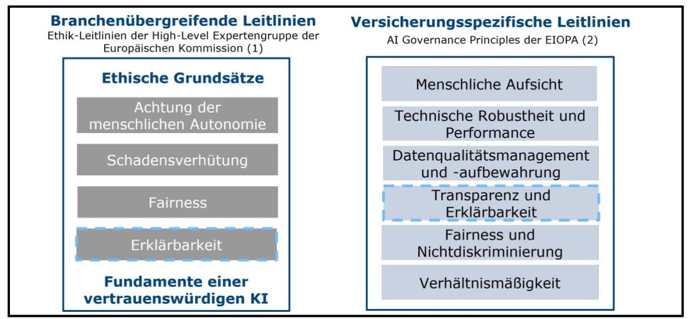
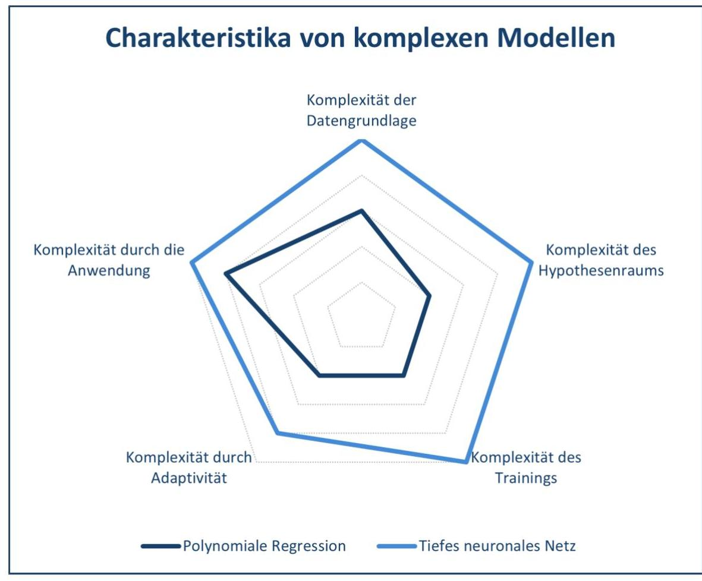
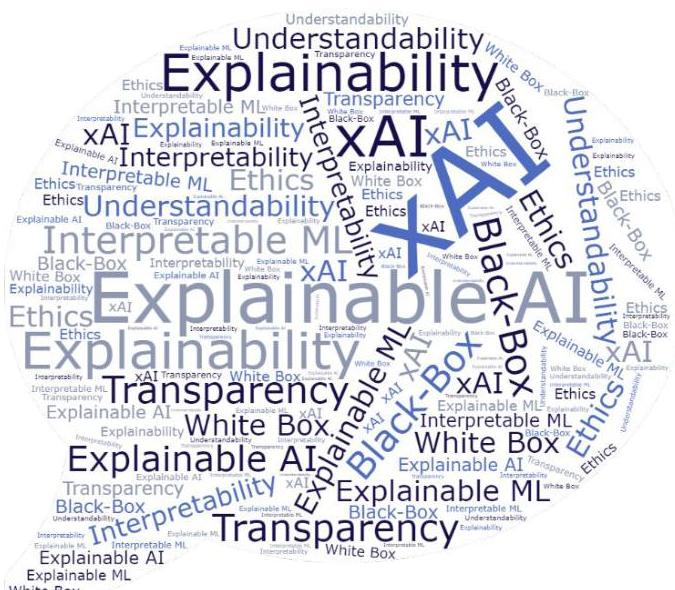
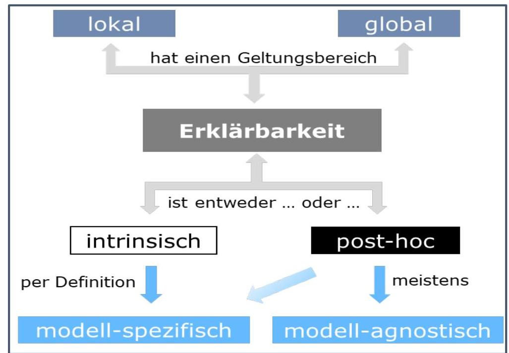

_Note: Source document was split into 3 OCR chunks (pages 1-11, pages 12-21, pages 22-30) to stay within token limits._

# 2024-05-27_DAV-Ergebnisbericht_Explainable Artificial Intelligence

## Page 1
# **Explainable Artificial Intelligence: Ein aktueller Überblick für Aktuarinnen und Aktuare**

Köln, 27.05.2024

## Page 2
# Präambel 

Die Arbeitsgruppe Explainable Artificial Intelligence des Ausschusses Actuarial Data Science der Deutschen Aktuarvereinigung e. V. hat den vorliegenden Ergebnisbericht erstellt. ${ }^{1}$

Aufgrund der besseren Lesbarkeit wird in diesem Ergebnisbericht das generische Maskulinum überall dort verwendet, wo das spezifische Geschlecht keine Rolle spielt; gemeint sind jedoch stets alle Geschlechter.

## Zusammenfassung

Der Ergebnisbericht befasst sich mit der Begrifflichkeit und mit Methoden erklärbarer künstlicher Intelligenz im Versicherungswesen. Zunächst wird die Komplexität eines Modells als Grundlage der Erklärbarkeitsdiskussion definiert, wobei Charakteristika vorgestellt werden, die die Komplexität von Modellen erfassen können. Anschließend werden Definitionsansätze und Charakteristika von Erklärbarkeit erörtert. Letztere bilden die Grundlage für eine Einordnung von Erklärbarkeitsmethoden. Erklärbarkeitsmethoden an sich sind in eine Reihe von Notebooks aufbereitet, die über das GitHub-Repository der Arbeitsgruppe zur Verfügung stehen. Der Bericht schließt in einer Diskussion prinzipienbasierter Kriterien, wann ein Modell als wesentlich erklärt gelten kann.

Der Ergebnisbericht ist an die Mitglieder und Gremien der DAV zur Information über den Stand der Diskussion und die erzielten Erkenntnisse gerichtet und stellt keine berufsständisch legitimierte Position der DAV dar. ${ }^{2}$

## Abstract

The report deals with the terminology and methods of explainable artificial intelligence in the insurance industry. The complexity of a model is defined as the basis of the explainability discussion, and characteristics that can capture the complexity of models are presented. This is followed by a discussion of definitions and characteristics of explainability. The latter form the basis for a classification of explainability methods. Explainability methods themselves are prepared in various notebooks and are available via the working group's GitHub repository. The report concludes with a discussion of principle-based criteria for when a model can be considered substantially explained.

The report is addressed to actuaries and is focused on providing an overview of the current state of discussions and the insights gained in the working group. It is not a professional position of the DAV and is meant to support actuaries in actuarial teams.

## Verabschiedung

Dieser Ergebnisbericht ist durch den Ausschuss Actuarial Data Science am 27.05.2024 verabschiedet worden.

[^0]
[^0]:    ${ }^{1}$ Der Ausschuss Actuarial Data Science dankt der Arbeitsgruppe Explainable Artificial Intelligence (unter der Leitung von Prof. Dr. Anja Schmiedt und Dr. Zoran Nikolic) ausdrücklich für die geleistete Arbeit; namentlich Prof. Dr. Anja Schmiedt, Dr. Martin Hüttemann und Dariush Sadeghi-Yam für die Erstellung des Ergebnisberichts, Dr. Guido Grützner, Dr. Simon Hatzesberger, Dr. Benjamin Müller, Corinna Walk und Florian Walla für die Erstellung von Notebooks, sowie Janusch Rentenatus und Simon Steinbach.
    ${ }^{2}$ Die sachgemäße Anwendung des Ergebnisberichts erfordert aktuarielle Fachkenntnisse. Dieser Ergebnisbericht stellt deshalb keinen Ersatz für entsprechende professionelle aktuarielle Dienstleistungen dar. Aktuarielle Entscheidungen mit Auswirkungen auf persönliche Vorsorge und Absicherung, Kapitalanlage oder geschäftliche Aktivitäten sollten ausschließlich auf Basis der Beurteilung durch eine(n) qualifizierte(n) Aktuar DAV/Aktuarin DAV getroffen werden.

## Page 3
# Inhaltsverzeichnis 

1. Einleitung ..... 4
1.1. Motivation und Kontext. ..... 4
1.2. Ziele und Ergebnisse ..... 5
2. Charakterisierung komplexer Modelle ..... 7
2.1. Definitionen von künstlicher Intelligenz ..... 7
2.2. Definitionen von maschinellem Lernen ..... 8
2.3. Charakteristika von komplexen Modellen ..... 9
3. Erklärbarkeit komplexer Modelle ..... 13
3.1. Definitionen von Erklärbarkeit ..... 13
3.2. Charakteristika von Erklärbarkeit ..... 16
3.3. Erklärbarkeitsmethoden ..... 18
3.4. Sorgfalt beim Einsatz von Erklärbarkeitsmethoden ..... 19
4. Wann gilt ein Modell als hinreichend erklärt? ..... 22
4.1. Kriterien an ein erklärbares Modell ..... 22
4.2. Determinanten des erforderlichen Grades an Erklärbarkeit ..... 23
5. Zusammenfassung und Fazit ..... 27
Literaturverzeichnis ..... 28

## Page 4
# 1. Einleitung 

### 1.1. Motivation und Kontext

Die verstärkte Anwendung von künstlicher Intelligenz (KI) bzw. von Verfahren des maschinellen Lernens (ML) in der Versicherungsindustrie im Allgemeinen und in aktuariellen Themen im Besonderen birgt Chancen und Risiken zugleich. Grundlage für eine Akzeptanz von komplexen Verfahren ist u. a. eine gewisse Transparenz und damit einhergehend eine Erklärbarkeit der zu Grunde liegenden Modelle und der darauf basierenden Entscheidungen.

Grundsätze der Transparenz und Erklärbarkeit von KI bzw. KI-Systemen werden auf europäischer Ebene seit mehreren Jahren im Kontext einer vertrauenswürdigen und ethischen KI diskutiert. So hat 2018 die Europäische Kommission eine unabhängige und hochrangige Expertengruppe für künstliche Intelligenz (HEG-KI) eingesetzt, die Ethik-Leitlinien für eine vertrauenswürdige künstliche Intelligenz erarbeitet hat (siehe hochrangige Expertengruppe für künstliche Intelligenz, 2019). Nach diesen Leitlinien zeichnet sich eine vertrauenswürdige KI durch drei Komponenten aus: Eine vertrauenswürdige KI sollte rechtmäßig, ethisch und robust sein. Die Leitlinien geben dabei eine Hilfestellung für die Verwirklichung einer vertrauenswürdigen KI, wobei die erste Komponente einer rechtmäßigen KI, die anwendbare Gesetze und Bestimmungen einhält, im Wesentlichen ausgeklammert wird (vgl. ebd., S. 2). Auch in diesem Ergebnisbericht werden rechtliche Fragestellungen nicht behandelt und normative Aussagen sind weder als explizite Rechtsberatung noch als explizite Hilfestellung zur Einhaltung geltenden Rechts zu verstehen.

Der Fokus der Ethik-Leitlinien der hochrangigen Expertengruppe für künstliche Intelligenz (2019) liegt folglich auf der ethischen und der robusten Komponente einer vertrauenswürdigen KI, wobei beide Komponenten als eng miteinander verbunden angesehen werden. Die vertrauenswürdige KI soll nicht nur mit ethischen Normen im Einklang stehen, sondern sie soll auch keinen unbeabsichtigten Schaden anrichten (vgl. ebd., S. 6 ff.). Um eine ethische (und robuste) KI sicherzustellen, wurden als Fundamente einer vertrauenswürdigen KI vier ethische Grundsätze formuliert, die schematisch in eigener Darstellung in Abbildung 1 skizziert sind. Einer der vier Grundätze ist der Grundsatz der Erklärbarkeit, der als unabdingbar gilt, wenn ein dauerhaftes Vertrauen in ein KI-System bestehen soll. Im Sinne der Ethik-Leitlinien bezieht sich Erklärbarkeit „[...] auf die Möglichkeit, sowohl die technischen Prozesse eines KISystems als auch die damit verbundenen menschlichen Entscheidungen" (ebd., S. 22) zu erklären.

Für die Umsetzung und Verwirklichung der ethischen Grundsätze werden verschiedene Anforderungen an KI bzw. KI-Systeme formuliert (vgl. ebd., S. 17 ff.). Eine Anforderung ist die der Transparenz, die eng mit dem Grundsatz der Erklärbarkeit verbunden ist, sich aber auf alle für ein KI-System relevanten Komponenten (die Daten, das System, die Geschäftsmodelle, etc.) bezieht; die Transparenz umfasst (neben Rückverfolgbarkeit und Kommunikation) dabei auch die Erklärbarkeit im engeren Sinne.

## Page 5
Abbildung 1: Schematische Darstellung der (1) Ethik-Leitlinien für eine vertrauenswürdige KI der hochrangigen Expertengruppe für künstliche Intelligenz, 2019, und (2) Grundsätze für eine ethische und vertrauenswürdige für die europäische Versicherungsbranche der EIOPA Consultative Expert Group on Digital Ethics in Insurance, 2021. (Eigene Darstellung.)

Auf die Ethik-Leitlinien der hochrangigen Expertengruppe für künstliche Intelligenz (2019) aufbauend, hat die europäische Versicherungsaufsicht EIOPA im Jahr 2021 Leitlinien für eine ethische und vertrauenswürdige KI für die europäische Versicherungsbranche formuliert (vgl. EIOPA Consultative Expert Group on Digital Ethics in Insurance, 2021). Die in den Leitlinien formulierten, versicherungsspezifischen Grundsätze sind ebenfalls schematisch in Abbildung 1 dargestellt. Die Grundsätze der Transparenz und Erklärbarkeit werden folglich im Versicherungskontext fortgeführt. Beide Begriffe sind auch hier eng miteinander verbunden und beziehen sich auf die Art der Information, die über eine KI bzw. ein KISystem zur Verfügung gestellt wird (vgl. ebd. S 41 f.). Der Begriff der Transparenz wird hier im weiteren Sinne als die Bereitstellung von Informationen über zum Beispiel die Verwendung und den Aufbau eines KI-Systems verstanden. Die Erklärbarkeit ist Teil des Konzeptes der Transparenz und bezieht sich zum Beispiel auf die Bereitstellung von Informationen, um den Output eines KI-Systems zu erklären.

Auch die jüngst erlassene KI-Verordnung des Europäischen Parlaments und des Rates der Europäischen Union (2024) verweist auf die Notwendigkeit, Transparenzpflichten für bestimme (Hochrisiko-) KI-Systeme festzulegen (vgl. ebd. S. 26, Erwägungsgrund 26), wobei u. a. auf die Ethik-Leitlinien der hochrangigen Expertengruppe für künstliche Intelligenz und die dort verwendeten Definitionen von Transparenz und Erklärbarkeit verwiesen wird (vgl. ebd. S. 26 f., Erwägungsgrund 27).

Die oben referenzierten Leitlinien der hochrangigen Expertengruppe der Europäischen Kommission und der EIOPA machen deutlich, dass es sinnvoll ist, begrifflich zwischen Erklärbarkeit und Transparenz zu unterscheiden. In diesem Ergebnisbericht befassen wir uns mit der Erklärbarkeit von Modellen, und legen dabei den Fokus auf Erklärbarkeit im engeren Sinne (vgl. Abschnitt 1.2). Transparenz von Modellen bzw. Modellierungsprozessen im weiteren Sinne würde darüber hinaus u. a. Fragestellungen der technischen Korrektheit der Implementierung, der Dokumentation und Revisionssicherheit, etc. umfassen; Transparenz im weiteren Sinne ist lediglich am Rande Gegenstand dieses Berichtes (vgl. Abschnitt 3.4).

# 1.2. Ziele und Ergebnisse 

Der Ausschuss Actuarial Data Science hat die Arbeitsgruppe Explainable Artificial Intelligence gegründet, mit dem Ziel, sich mit der Interpretierbarkeit und Erklärbarkeit von Modellen des maschinellen Lernens bzw. von sogenannten Black-Box-Modellen, die für aktuarielle Tätigkeiten eingesetzt werden, zu befassen. Neben der Erarbeitung der Erwartungen an Modelle des maschinellen Lernens sollen u. a. Fragestellungen diskutiert werden, wann ein Modell als ausreichend erklärt bezeichnet werden kann und wer derartige Modelle überblicken bzw. verstehen können muss. Außerdem sollen mathematischen Methoden zur Erklärbarkeit von (ML-)Modellen übersichtlich erfasst werden.

## Page 6
Der vorliegende Ergebnisbericht deckt die wesentlichen qualitativen Teile des Arbeitsauftrags ab. Ergänzt wird der Bericht um eine Reihe von Notebooks, die über den GitHub-Account der Deutschen Aktuarvereinigung bzw. das Repository der Arbeitsgruppe zugänglich sind. Der weitere Verlauf dieses Berichts ist wie folgt gegliedert:

In Kapitel 2 wird zunächst der Gegenstandsbereich der Erklärbarkeitsdiskussion definiert. Den Begriff der KI grenzen wir dazu auf komplexe (ML-)Modelle ein, die mithin als Komponenten einer KI bzw. eines KI-Systems verstanden werden können. Anschließend diskutieren wir einen Ansatz zur Charakterisierung der Modellkomplexität, der den Versuch einer definitorischen Abgrenzung von Modellen des maschinellen Lernens und klassischen statistischen Modellen ablösen soll.

Kapitel 3 ist der Erklärbarkeit komplexer Modelle gewidmet. Zunächst wird die Definierbarkeit von Erklärbarkeit diskutiert, gefolgt von einer in der Literatur etablierten Darstellung von Charakteristika von Erklärbarkeitsmethoden. Weiterhin wird diskutiert, dass und inwiefern die Anwendung von Erklärbarkeitsmethoden aktuarieller Sorgfalt bedarf.

Gegenstand von Kapitel 4 ist die Frage, wann ein Modell als ausreichend erklärt gelten kann. Dazu werden zunächst Kriterien an ein erklärbares Modell erörtert. Daran schließt sich eine Auseinandersetzung mit möglichen Determinanten an, die den Grad an erforderlicher Erklärbarkeit bestimmen, wobei im Wesentlichen Adressaten und Anwendungsfall beleuchtet werden.

Der Ergebnisbericht und die veröffentlichten Notebooks der Arbeitsgruppe Explainable Artificial Intelligence richten sich an Aktuare, Mathematiker, Statistiker und Datenwissenschaftler, die mit komplexen Modellen und der damit einhergehenden Herausforderung von Erklärbarkeit der Modelle und/ oder deren Ergebnisse in aktuariellen Fragestellungen betraut sind. Gleichermaßen richten sich die Ergebnisse an all diejenigen, die an den Inhalten des Ausschusses Actuarial Data Science im Allgemeinen und/ oder an einem Überblick zu Aspekten von Erklärbarkeit komplexer Modelle im aktuariellen Kontext im Besonderen interessiert sind.

## Page 7
# 2. Charakterisierung komplexer Modelle 

Bevor in den nachstehenden dritten und vierten Kapiteln Aspekte von Erklärbarkeit von Modellen diskutiert wird, widmet sich dieser Abschnitt zunächst der Begrifflichkeit eines komplexen Modells an sich. Ziel ist es zu beleuchten, was allgemeinhin unter einem Modell des maschinellen Lernens (ML-Modell) verstanden wird und warum wir eine strikte Abgrenzung zu vermeintlich klassischen statistischen Modellen in Frage stellen. Letztlich werden wir nicht zwischen klassischen und ML-Modellen unterscheiden, sondern in diesem Kapitel die Komplexität eines Modells als Grundlage der Erklärbarkeitsdiskussion definieren. Ein Vertreter eines weniger komplexen (gemeinhin klassischen) Modells ist bspw. die polynomiale Regression; ein Vertreter eines komplexen (ML-)Modells ist bspw. ein tiefes neuronales Netz.

### 2.1. Definitionen von künstlicher Intelligenz

Im allgemeinen (und aktuariellen) Sprachgebrauch wird maschinelles Lernen häufig als Synonym oder im Kontext von künstlicher Intelligenz genannt. Daher sei der oben angekündigten Diskussion zunächst ein Exkurs zur Definition von KI vorangestellt.

Eine einheitliche Definition von KI gibt es nicht. Die im ersten Kapitel bereits zitierte Ethik-Leitlinie der hochrangigen Expertengruppe für künstliche Intelligenz (2019) versteht unter KI-Systemen zum Beispiel
„[...] vom Menschen entwickelte Software- (und möglicherweise auch Hardware-) Systeme, die in Bezug auf ein komplexes Ziel auf physischer oder digitaler Ebene agieren, indem sie ihre Umgebung durch Datenerfassung wahrnehmen, die gesammelten strukturierten oder unstrukturierten Daten interpretieren, Schlussfolgerungen daraus ziehen oder die aus diesen Daten abgeleiteten Informationen verarbeiten und über die geeignete(n) Maßnahme(n) zur Erreichung des vorgegebenen Ziels entscheiden." (HEG-KI, 2019, S. 47)

Die KI-Verordnung des Europäischen Parlaments und des Rates der Europäischen Union (2024) definiert ein KI-System als
„ein maschinengestütztes System, das für einen in unterschiedlichem Grade autonomen Betrieb ausgelegt ist und das nach seiner Betriebsaufnahme anpassungsfähig sein kann und das aus den erhaltenen Eingaben für explizite oder implizite Ziele ableitet, wie Ausgaben wie etwa Vorhersagen, Inhalte, Empfehlungen oder Entscheidungen erstellt werden, die physische oder virtuelle Umgebungen beeinflussen können." (Europäisches Parlament, 2024, S. 166)

Wird KI als wissenschaftliche Disziplin aufgefasst (vgl. HEG-KI, 2019, S. 47), so umfasst sie Ansätze wie maschinelles Lernen und Robotik. Allgemeinhin kann KI als ein Teilgebiet der Informatik verstanden werden, das sich mit der Automatisierung intelligenten, menschlichen Verhaltens befasst (vgl. Lexikon der Neurowissenschaften); hierbei sei außer Acht gelassen, dass es im Prinzip bereits an einer genauen oder einheitlichen Definition von Intelligenz mangelt.

Während einige methodischen Ansätze schon seit den 1970er Jahren bekannt sind - z. B. wurde die Idee von Support Vector Machines in einem Papier von Vapnik und Chervonenkis (1974) begründet lässt sich die ab ca. 2010 bestehende Hochphase künstlicher Intelligenz durch das Zusammenspiel von drei Faktoren erklären (vgl. Seehafer et al., 2021, S. 332 ff.):

- Das Vorhandensein von großen Datenmengen (bzw. Big Data, vgl. Abschnitt 2.3),
- die Verfügbarkeit von hohen Rechenressourcen (z. B. durch GPU- und Cloud-Computing) und
- der einfache Zugang zu implementierten (ML-)Methoden (z. B. in Bibliotheken bzw. Paketen der Programmiersprachen Python und R).

Der Dreiklang aus Big Data, Rechenressourcen und (ML-)Methoden wird häufig zur Definition von KI verwendet und lässt sich auch aus dem obenstehenden Zitat der hochrangigen Expertengruppe für künstliche Intelligenz (2019, S. 47) extrahieren. Gegenstandsbereich dieses Ergebnisberichts und damit

## Page 8
Grundlage der Diskussion von Erklärbarkeit sind grundsätzlich (ML-)Methoden und die dahinterstehenden (ML-)Modelle, wobei im Sinne eines Dreiklangs die Aspekte Big Data und Rechenressourcen nicht außer Acht gelassen werden.

# 2.2. Definitionen von maschinellem Lernen 

Maschinelles Lernen wird als Teilgebiet der künstlichen Intelligenz verstanden. Für maschinelles Lernen gibt es ebenso wie für künstliche Intelligenz keine einheitliche Definition, weder in der anwendungsunspezifischen noch in der spezifisch aktuariellen Literatur.

In der anwendungsunspezifischen Literatur stellt maschinelles Lernen nach z. B. Geron (2019, S. 4) die Wissenschaft und Kunst des Programmierens dar, sodass Computer von und aus Daten lernen können. Dabei verleiht maschinelles Lernen Computern diese Fähigkeit des Lernens aus Daten, ohne explizit programmiert zu werden (Samuel 1959, nach Geron, 2019, S. 4) und stellt somit einen Paradigmenwechsel in der Programmierung hin zu einer indirekten Programmierung dar, die schon durch das Bereitstellen von Daten erfolgt (Molnar, 2020, S. 12).

Grundlage für die Anwendung von maschinellem Lernen sind Daten, in denen bekannte als auch unbekannte Muster, Zusammenhänge oder Abhängigkeiten bestehen. Ziel ist es, diese Muster, Zusammenhänge sowie Abhängigkeiten zu erkennen und auf unbekannte Daten zu übertragen, beispielsweise um Vorhersagen zu treffen. Der Einsatz von maschinellem Lernen wird insbesondere für solche Fälle motiviert, bei denen der Zusammenhang zwischen Input und Output nicht durch die Modellierer überblickt werden kann (Bundesanstalt für Finanzdienstleistungsaufsicht, 2021, Juli, S. 15). Entsprechend definiert die EIOPA im Jahre 2021 maschinelles Lernen als
„[...] the ability of computers to learn from data through appropriate algorithms. This allows them to build a model of their world and better solve their intended tasks." (EIOPA Consultative Expert Group on Digital Ethics in Insurance, 2021, S. 83)

In dem Ergebnisbericht Big Data in der Lebensversicherung der Deutschen Aktuarvereinigung e. V. (2019, September, S. 6 f.) wird ein ML-Modell mit einem Schätzer verglichen, der analog zur Statistik anhand der vorgegebenen Daten eine mögliche Abweichung zwischen dem Schätzer und dem wahren Wert minimiert. Das ML-Modell kann dabei als Ergebnis eines Algorithmus verstanden werden. Letzterer enthält ein auf ein konkretes Ziel ausgerichtetes Regelwerk und besteht in der Regel aus einer Architektur sowie erlernten Gewichten (Honegger, 2018).

Für differenziertere Definitionen von ML-Modellen ist eine Unterteilung von maschinellem Lernen in überwachtes, unüberwachtes und bestärkendes Lernen gängig (vgl. Deutsche Aktuarvereinigung e. V., 2019 September, 2020):

Beim überwachten Lernen (engl.: supervised learning) wird anhand von Eingangsdaten ein Modell trainiert, das sich anschließend auf neue Daten anwenden lässt. Dabei existieren Informationen über sowohl unabhängige als auch abhängige Variablen, sodass eine Ermittlung eines Modells direkt möglich ist, mit dem eine Prognose der abhängigen Variablen mittels Informationen der unabhängigen Variablen getroffen werden kann.

Beim unüberwachten Lernen (engl.: unsupervised learning) wird hingegen anhand der Eingangsdaten ein Modell trainiert, das intrinsische Muster in den Daten erkennen lässt. Die Problemstellung unterscheidet sich von derjenigen des überwachten Lernen allein darin, dass keine Informationen über die abhängigen Variablen vorliegen bzw. es gar keine dedizierte abhängige Variable gibt.

Darüber hinaus erlernt, anschaulich gesprochen, beim bestärkenden Lernen (engl.: reinforcement learning) ein Software-Agent durch "trial-and-error"-Interaktionen mit einer dynamischen Umwelt das Verhalten der Daten (vgl. Kaelbling et al., 1996, S. 1).

Übergreifend zu diesen drei Lernverfahren ist als eine weitere Differenzierung von ML-Modellen der Teilbereich des sogenannten Deep-Learning zu nennen. Dazu zählen tiefe neuronale Netze, die Ein-

## Page 9
gangsdaten anhand vieler nicht-linearer Transformationen verarbeiten (vgl. Deutsche Aktuarvereinigung, 2019, September, S. 7). Ein tiefes neuronales Netz fungiert im nachfolgenden Abschnitt 2.3 als klassischer Vertreter eines komplexen (ML-)Modells.

# 2.3. Charakteristika von komplexen Modellen 

Eine Abgrenzung von ML-Modellen zu klassischen statistischen Modellen gestaltet sich schwierig, nicht zuletzt, weil für beide Begrifflichkeiten keine einheitliche Definition besteht; so ist es nicht ohne weiteres möglich, eine klare Trennlinie zwischen den Lernmodellen zu ziehen (Bundesanstalt für Finanzdienstleistungsaufsicht, 2021, Juli, S. 3). Vielmehr bilden ML-Modelle und klassische Modelle ein Kontinuum, wobei bestimmte Charakteristika bei ML-Modellen stärker ausgeprägt sind als bei klassischen Modellen und vice versa (Bundesanstalt für Finanzdienstleistungsaufsicht, 2021, Juli, S. 6).

Zum Beispiel werden bei als gemeinhin klassisch bezeichneten Modellen die Eingangsdaten anhand eines bekannten und programmierten Algorithmus verarbeitet (Deutsche Aktuarvereinigung e. V., 2020, S. 7). Dabei sind die Anweisungen explizit vorgegeben und damit die Regeln zur Ableitung von Lösungen einer Aufgabe im Vorfeld definiert (Bundesanstalt für Finanzdienstleistungsaufsicht, 2021, Juni, S. 3), was eine Transparenz und Erklärbarkeit inhärent mit sich bringen kann. Jedoch kann auch bei solchen gemeinhin klassischen Modellen eine erhöhte Modellkomplexität (z. B. durch den Polynomgrad, die Anzahl an Regressionsparametern und/oder Interaktionen in einem polynomialen oder verallgemeinerten linearen Regressionsmodell) Transparenz und Erklärbarkeit erschweren.

Bei Modellen des maschinellen Lernens hingegen ist gemeinhin im Vorfeld und und/oder auch danach kein expliziter Algorithmus bekannt (Deutsche Aktuarvereinigung e. V., 2020, S. 7). Der Algorithmus lernt auf Basis von Trainingsdaten, ohne im Vorfeld vorzugeben, welche Ergebnisse aus bestimmten Datenkonstellationen wie abzuleiten sind (Bundesanstalt für Finanzdienstleistungsaufsicht, 2021, Juni, S. 3). Bei komplexen Modellen sind demnach Transparenz und Erklärbarkeit implizit schwieriger zu bewirken.

In diesem Ergebnisbericht wird der Standpunkt fortgeführt, dass eine definitorische Abgrenzung von klassischen und ML-Methoden fraglich und nicht einfach möglich ist. Vielversprechend ist hingegen der Ansatz, Charakteristika zu erörtern, die das Kontinuum zwischen maschinellen und klassischen statistischen Modellen anhand der Komplexität kennzeichnen. Dabei werden entsprechend des Gegenstandsbereiches dieses Berichtes solche Charakteristika beleuchtet, die mittelbar oder unmittelbar einen Bezug zu Aspekten von Erklärbarkeit haben.

Grundlage für die nachstehenden Charakteristika ist ein Diskussionspapier der Bundesanstalt für Finanzdienstleistungsaufsicht (2021, Juli) zu maschinellem Lernen in Risikomodellen (vgl. auch Deutsche Aktuarvereinigung e. V., 2021; Bundesanstalt für Finanzdienstleistungsaufsicht, 2022). Die dort genannten Charakteristika werden - mit Blick auf Relevanz für eine Erklärbarkeitsdiskussion von Modellen in verschiedenen aktuariellen oder versicherungsspezifischen Anwendungen - teils differenzierter betrachtet und teils zusammengefasst.

Mit Blick auf das Kontinuum von Modellen des maschinellen und klassischen Lernens ist in der Beschreibung der nachstehenden Charakteristika die Modellangabe (maschinelles vs. klassisches statistisches Lernen) jeweils plakativ und im engeren Sinne zu verstehen. So ist zum Beispiel ein (tiefes) neuronales Netz als ein Beispiel für ein ML-Modell und eine lineare oder polynomiale Regression als ein Beispiel für ein klassisches statistisches Modell im engeren Sinne zu verstehen.

## Charakteristik 1: Komplexität der Datengrundlage

Untrennbar mit der Auswahl eines Modells ist die Datengrundlage verbunden. Typisch für ein komplexes (ML-)Modell sind Eingangsdaten, die Charakteristika von Big Data aufweisen. Big Data wird häufig über vier Dimensionen definiert, die das ,Big' in Big Data beschreiben (vgl. Deutsche Aktuarvereinigung e.V., 2019, Mai, S. 8 f.; Wikipedia):

- Volume: Hohes Datenvolumen bzw. große Datenmengen

## Page 10
- Velocity: Hohe Geschwindigkeit der Daten- und Informationsentstehung sowie des Daten- und Informationsflusses
- Variety: Daten aus verschiedenen Datenquellen und in verschiedenen Formaten (z. B. strukturierte, semistrukturierte, unstrukturierte Daten)
- Veracity: Hohe Daten- und Informationsqualität im weiteren Sinne

Charakteristisch für Eingangsdaten eines komplexeren (ML-)Modells können außerdem hochdimensionale Daten sein, die in den obigen vier Dimensionen nicht explizit, aber mithin implizit enthalten sind.

Beispiele für die Anwendung von komplexeren (ML-)Modellen aus dem Versicherungskontext sind die Analyse von Kunden-E-Mails zur gezielten Einordnung von Kundenanfragen und Prozesssteuerung, die Sentimentanalyse von Kundenanfragen oder die Klassifikation von Fotos von KFZ-Schadenfällen. Hierbei werden Modelle auf der Grundlage von Text- oder Bilddaten trainiert, die in Form von großen, unstrukturierten und hochdimensionalen Daten aus verschiedenen Datenquellen vorliegen.

Ein weniger komplexes (gemeinhin klassisches) Modell verarbeitet als Eingangsdaten tendenziell geringere Datenmengen, die strukturiert und weniger dimensional sind.

Die Art der Daten kann Einfluss auf die Erklärbarkeit des Modells haben, z. B. kann sie bei unstrukturierten oder hochdimensionalen Eingangsdaten gemindert sein.

# Charakteristik 2: Komplexität des Hypothesenraum 

Bezeichnet eine Hypothese in der Modellierung eine Annahme über den kausalen Zusammenhang von Input und Output, so stellt ein Hypothesenraum alle vom Modell darstellbaren Hypothesen dar (vgl. Bundesanstalt für Finanzdienstleistungsaufsicht, 2021, Juli, S. 7).

Weniger komplexe (klassische) Modelle (im engeren Sinne) beherrschen den Hypothesenraum in der Regel durch analytische Techniken und schränken ihn aufgrund von vordefinierten Kausalitäten ein. Komplexere (ML-)Modelle erlernen eine Problemstruktur hingegen aus vorhandenen Daten, wobei in der Hypothesenbildung auch komplexe Muster generiert werden können, die beispielsweise durch mehrstufige Verkettungen in tiefen neuronalen Netzen entstehen.

Die gebildeten Hypothesen sind dabei sensitiv gegenüber dem Design des ML-Modell, einschließlich der gewählten Hyperparameter (vgl. Charakteristik 3).

Um den Hypothesenraum zu erweitern, werden auch durch den Einsatz von Ensemble-Techniken (wie Boosting oder Bagging) verschiedene (ML-)Modelle miteinander kombiniert.

Die erhöhte Komplexität des Hypothesenraumes kann letztlich zum Beispiel zur Steigerung der Prognosegenauigkeit beitragen. Gleichzeitig kann sie die Erklärbarkeit des Modells bzw. der Modellergebnisse erschweren, die ein Verständnis des Wirkungszusammenhangs zwischen Eingangsdaten und Ergebnis sicherstellen will.

## Charakteristika 3: Komplexität des Trainings

Die Komplexität des Trainingsprozesses stellt häufig einen wesentlichen Unterschied zwischen weniger komplexen und komplexeren (ML-)Modellen dar. Der Trainingsprozess von komplexeren (ML-)Modellen involviert in der Regel eine umfassende Abfolge verschachtelter Rechenvorschriften und setzt iterative Verfahren ein, was die technische Umsetzung aber auch die Erklärbarkeit des Modells und dessen Ergebnisse anspruchsvoll gestalten kann. Insbesondere gibt es etwa bei der Optimierung von nichtkonvexen Funktionen bei hochdimensionalen Daten in der Regel keine eindeutige Lösung, was eine Herausforderung für die Stabilität der Modellergebnisse und damit deren Erklärbarkeit darstellt.

Die Komplexität eines Modells ist auch geprägt durch die Vorgabe von Hyperparametern, also von solchen Modellparametern, die nicht automatisch erlernt werden. Die Optimierung bzw. Auswahl von Hyperparametern erfordert eine entsprechende Expertise und/oder ein gewisses Experimentieren, wobei sie einen erheblichen Einfluss auf die Güte des Modells haben kann und gleichermaßen einer Erklärung bedarf.

## Page 11
Als illustratives Beispiel sei die Schadenhöhenermittlung in der KFZ-Versicherung durch Bilderkennung genannt. Bei einer Schadenmeldung werden Bilddaten der Anspruchsteller mit Datenbanken abgeglichen, um die Schadenhöhe (insbesondere die Kosten für Ersatzteile) zu schätzen. Der Trainingsprozess der involvierten Modelle umfasst Rechenschritte, bei denen sowohl die Bildverarbeitung als auch die Schadensabschätzung berücksichtigt werden.

# Charakteristik 4: Komplexität durch Adaptivität 

Weniger komplexe (gemeinhin klassische) Modelle sind in der Regel statisch und benötigen manuelle Modellanpassungen bzw. Rekalibrierungen, wenn sich Modellanforderungen oder Daten ändern. Komplexere (ML-)Modelle können sich hingegen auch in hoher Frequenz an neue Daten anpassen und ihre Leistungsfähigkeit durch inkrementelles Lernen verbessern. Eine hohe Anpassungsfähigkeit der komplexeren (ML-)Modelle kann eine Abgrenzung zwischen Modellentwicklung und Modellbetrieb, sowie zwischen Modellpflege und beispielsweise aufsichtlich zu beurteilenden Modelländerungen erschweren. Gleichermaßen können auch Validierbarkeit und Reproduzierbarkeit (und damit im weiteren Sinne auch Erklärbarkeit) von Modellergebnissen durch eine hohe Adaptivität beeinträchtigt werden.

Als Beispiel für eine im obigen Sinne nicht vorhandene oder geringe (automatische) Adaptivität sei zum einen die Anomalieerkennung in Rechnungsdaten von Sach- oder Krankenversicherungen genannt: Anomalien machen in der Regel einen kleinen Teil (meist weniger als 1\%) der Daten aus, was eine hohe Datenqualität und eine kontinuierliche Einschätzung von Experten unerlässlich macht. Ein weiteres Beispiel ist die Erkennung von Regress in der Sachversicherung: Ebenso machen regressfähige Schäden nur einen kleinen Teil der (Schaden-)Daten aus, so dass deren Erkennung einen fortlaufenden Input von Experten erfordert.

Als Beispiel für eine hohe Adaptivität kann zum einen das Echtzeit-Versicherungsgeschäftsmodell gelten, bei dem personalisierter Versicherungsschutz in Echtzeit bereitgestellt wird. Eng damit verbunden ist das dynamische Pricing, bei dem Versicherungsunternehmen Preise kurzfristig auf sich ändernde Risikosituationen oder auch sich ändernden Wettbewerb adaptieren.

## Charakteristik 5: Komplexität durch die Anwendung

Die Anwendungsfälle, in denen komplexere (ML-)Modelle genutzt werden, unterscheiden sich in der Praxis von denen, in denen weniger komplexe (gemeinhin klassische) Modelle eingesetzt werden.

Weniger komplexe Modelle werden typischerweise als eigenständige Modelle für wohldefinierte, abgegrenzte Aufgabenstellungen verwendet; als Beispiel seien ein Regressionsmodell zur Modellierung und Prognose von Schadenaufwendungen oder die Modellierung und Prognose von zukünftigen Reserven genannt. Komplexere (ML-)Modelle agieren hingegen häufig in unterschiedlichen Rollen: Sie dienen z. B. als unterstützende Komponenten, um eine effektive Aufbereitung von (Big-) Data zu gewährleisten. Ebenso können sie als integrale Bestandteile eines Modells fungieren, z. B. als zentraler Baustein eines internen Risikomodells oder um Prognosen innerhalb eines Ratingverfahrens zu liefern. In der Risikomodellierung finden komplexere (ML-)Modelle auch als Instrument zur Validierung (z. B. als challenger tool) oder als Proxy des (unbekannten) echten Modells Einsatz. Komplexere Modelle bedienen somit nicht nur ein breiteres Aufgabenspektrum, sondern können auch in eine komplexere Modellabhängigkeit eingebettet sein.

Durch die komplexeren Anwendungen kann Erklärbarkeit erschwert sein. Außerdem ist der Grad der (geforderten) Erklärbarkeit abhängig von der Anwendung: Beispielsweise könnte die Aufsichtsbehörde bei einem Modell, das zur Solvenzkapitalberechnung dient, höhere Anforderungen an Erklärbarkeit stellen als wenn das Modell der Datenaufbereitung eingesetzt wird. Dass die Anforderungen an Erklärbarkeit nicht nur mit dem Anwendungsfall, sondern auch mit dem Adressaten des Modells, der Modellergebnisse und der Erklärung verbunden ist, wird weiterhin in Kapitel 4 dieses Berichts diskutiert.

Abschließend für diesen Abschnitt sind in Abbildung 2 die skizzierten Charakteristika eines Modells,

1. Komplexität der Datengrundlage,

## Page 12
2. Komplexität des Hypothesenraum,
3. Komplexität des Trainings,
4. Komplexität durch Adaptivität und
5. Komplexität durch die Anwendung
in einem Schaubild zusammengeführt. Die dargestellten Ausprägungen für komplexere (ML-)Modelle und weniger komplexe (klassische) Modelle sind hier exemplarisch und illustrativ zu verstehen: Als Beispiele sind neuronale Netze als Vertreter von ML-Modellen und polynomiale Regression als Vertreter von klassischen statistischen Modellen denkbar.

Abbildung 2: Schematische Darstellung zu den Charakteristika von Modellkomplexität illustrativ am Beispiel eines neuronalen Netzes und einer polynomialen Regression. (Eigene Darstellung.)

## Page 13
# 3. Erklärbarkeit komplexer Modelle 

Im vorangegangenen Kapitel wurden Definitionen von Modellen des maschinellen Lernens diskutiert und darüber hinaus Charakteristika eingeführt, die eine Komplexität von Modellen erfassen können. Insbesondere ist es jener Komplexität geschuldet, wenn eine Erklärbarkeit von Modellen und deren Ergebnisse erschwert ist. Allgemein gilt, dass mit der Komplexität eines Modells auch die Erklärbarkeit schwieriger wird (vgl. Adadi und Berrada, 2018).

In diesem Kapitel wird der Begriff der Erklärbarkeit diskutiert, wobei analog zu der Struktur des vorangegangenen Kapitels zunächst Definitionen und anschließend Charakteristika erörtert werden. Letztere bilden die Grundlage für eine Einordnung von Methoden zur Erklärbarkeit.

### 3.1. Definitionen von Erklärbarkeit

Gemäß dem Namen der Arbeitsgruppe Explainable Artificial Intelligence setzt sich dieser Abschnitt zunächst mit eben jenem Begriff auseinander. In der englischsprachigen Literatur sind neben Explainable Artificial Intelligence weitere übliche Schlagwörter im gleichen Kontext zu finden, z. B. Explainable Machine Learning, Interpretable Machine Learning oder auch Understandable AI, Comprehensible AI (vgl. Adadi und Berrada, 2018). Als Illustration dient die Wortwolke in Abbildung 3.

Einige Autoren verwenden vor allem die Begriffe Erklärbarkeit und Interpretierbarkeit differenziert bzw. favorisieren den Begriff der Interpretierbarkeit (vgl. Adadi und Berrada, 2018, und die dort angegebenen Referenzen):
"An interpretable system is a system where a user cannot only see but also study and understand how inputs are mathematically mapped to outputs. This term is favored over ,explainable‘ in the ML context where it refers to the capability of understanding the work logic in ML algorithms." (Adadi und Berrada, 2018, S. 52141)

In obiger Aussage erscheint der Begriff der Erklärbarkeit allgemeiner als der Begriff der Interpretierbarkeit. Die ACPR Banque de France

Abbildung 3: Wortwolke. (Eigene Darstellung.)
(2020) kommt nach einer Literaturreview zu dem Schluss, dass der Erklärbarkeit häufig in einem technischeren Sinne verwendet wird als der Begriff Interpretierbarkeit (ACPR Banque de France, 2020, S. 12):
"The term 'explainability' is often related to a technical, objective understanding of an algorithm's behaviour (and would thus be more suitable for auditing), whereas interpretability seems more closely associated with a less technical discourse (and would thus primarily target consumers and other individuals impacted by the algorithm)." (ACPR Banque de France, 2020, S.12)

Letztlich gibt es keinen einheitlichen Differenzierungsansatz. Ebenso bzw. deshalb werden die Begriffe Erklärbarkeit und Interpretierbarkeit im Kontext komplexer Modelle häufig synonym verwendet (Molnar, 2019, S. 13), was auch in diesem Ergebnisbericht so gehalten wird. Das heißt, wir sprechen im Folgenden stets von Erklärbarkeit bzw. Interpretierbarkeit von komplexen Modellen.

Ähnlich wie für Modelle des maschinellen Lernens (vgl. Kapitel 2), gibt es in Literatur und Anwendung nach aktuellem Stand keine allgemein anerkannte und damit auch keine einheitliche Definition von Erklärbarkeit bzw. Interpretierbarkeit von (ML-) Modellen (vgl. Kraus et al., 2021, S. 17). So wird z. B. in Owens et al. (2022) als Ergebnis einer strukturierten Literaturreview aufgezeigt, dass das Verständnis von Explainable Artificial Intelligence weder zwischen noch innerhalb von Industrien einheitlich ist, die

## Page 14
Versicherungsindustrie eingeschlossen. Dies erscheint erstaunlich, da das Konzept der Erklärbarkeit bzw. Interpretierbarkeit - auch in der Versicherungsindustrie und Versicherungsmathematik (vgl. Delcaillau et al., 2022; Owens et al., 2022) - zunehmend verbreitet ist.

Hingegen besteht in der Literatur Konsens darüber, dass es schwierig erscheint, Erklärbarkeit gar mathematisch zu definieren oder anderweitig zu formalisieren (vgl. Molnar, 2019, S. 13; Honegger, 2018). Es gibt jedoch eine Reihe von aus der akademischen Literatur im Kontext des maschinellen Lernens stammende, weniger formalisierte Definitionen von Erklärbarkeit bzw. Interpretierbarkeit eines Modells, zum Beispiel:
i. "[Interpretability of a model] is the degree to which an observer can understand the cause of a decision." (Miller, 2019, S. 14)
ii. "[...] systems are interpretable if their operations can be understood by a human, either through introspection or through a produced explanation" (Biran and Cotton, S. 1)
iii. "To be explainable, a ML model has to be human-understandable." (Adadi und Berrada, 2018, S. 52153)
iv. "Interpretabiliy is the degree to which a human can consistently predict the model's result." (Kim et al., 2016, nach Molnar, 2019, S. 15)
v. "[...] explainability as the interpretable approximation of the original complex Al model" (Lundberg and Lee, 2017, nach Owens et al., 2022, S. 10)
vi. "[... ] explainability as a local approximation of a complex model by another model" (Al-Shedivat et al., 2020, nach Owens et al., 2022, S. 10)
vii. "You could describe a model as interpretable if you can comprehend the entire model at once." (Lipton, 2016, nach Molnar, 2020, S. 23)

Während obige Literaturangaben aus dem Kontext des maschinellen Lernens ohne spezifischen Industriebezug stammen, werden nachstehend zwei Definitionen aus dem Versicherungs- und Bankensektor aufgeführt; die erste Definition ist, in Anknüpfung an Abschnitt 1.1 dieses Berichts, einem Report der europäischen Versicherungsaufsicht entnommen:
viii. "Explainability is part of the concept of transparency and concerns the ability to explain the output of the Al system to a particular audience, in particular the weight / influence and causal relationship of a specific variable (or group of variables) in the final output." (EIOPA Consultative Expert Group on Digital Ethics in Insurance, 2021, S. 41, S. 83)
ix. "Explainability and interpretability: a model is explainable when its internal behaviour can be directly understood by humans (interpretability) or when explanations (justifications) can be provided for the main factors that led to its output. [...]" (European Banking Authority, 2020, S. 6)

Die zum Teil verschiedenen Definitionsansätze (i) bis (ix) zur Erklärbarkeit bzw. Interpretierbarkeit von Modellen beinhalten verschiedene Aspekte, die im Folgenden kurz erläutert und im weiteren Verlauf des Berichts vertieft werden:

# Erklärbarkeit als nicht messbares und latentes Konzept 

Zunächst wird durch obige Zitate deutlich, dass kein wirklicher Konsens darüber besteht, was Erklärbarkeit oder Interpretierbarkeit von Modellen bedeutet. Ebenso besteht kein Konsens, wie man Erklärbarkeit bzw. Interpretierbarkeit quantifizieren oder messen könnte (vgl. Molnar, 2020, S. 25; Poursabzi et al., 2021). In der Ethik-Leitlinie der Europäischen Kommission (vgl. HEG-KI, 2019, S. 22) wird Erklärbarkeit gleichsam als eine Möglichkeit (im Sinne von Machbarkeit) beschrieben, die technischen Prozesse eines (KI-) Systems und die damit einhergehenden menschlichen Entscheidungen zu erklären.

## Page 15
Aber, plakativ gefragt, wann gilt ein Modell nun als hinreichend erklärt bzw. erklärbar? Oder wann gilt ein Modell als besser erklärt bzw. erklärbar als ein anderes Modell? In Molnar (2020) liest man zum Beispiel das Folgende:
"The higher the interpretability of a machine learning model, the easier it is for someone to comprehend why certain decisions or predictions have been made. A model is better interpretable than another model if its decisions are easier for a human to comprehend than decisions from the other model." (Molnar, 2020, S. 15)

Erklärbarkeit bzw. Interpretierbarkeit scheint letztlich ein wenig formalisiertes und kaum messbares Konzept zu sein. Wir folgen daher einem Ansatz von Poursabzi et al. (2021) und fassen Erklärbarkeit bzw. Interpretierbarkeit als ein latentes Konzept auf, das von verschiedenen Faktoren abhängt. Neben dem zu erklärenden (zugrundeliegenden) Modell an sich zählen dazu Faktoren wie Adressat bzw. Stakeholder oder der Anwendungsfall, die Determinanten einer Warum-Frage sind.

Zunächst gehen wir auf Erklärbarkeit bzw. Interpretierbarkeit als latentes Konzept ein, hinter dem XAI (eXplainable AI) als Prozess des Erklärens steht:

# XAI als Prozess des Erklärens eines komplexen Modells 

In obigen Definitionsansätzen (i) bis (ix) wird auch deutlich, dass eng mit dem Begriff der Erklärbarkeit eines Modells der Prozess des Erklärens verbunden ist.

Für Miller (2019) zum Beispiel steht Explainable Artificial Intelligence anschaulich für einen erklärenden Agenten, der die zu Grunde liegenden Ursachen in der Entscheidungsfindung aufdeckt:
"'Explainable AI' loosely refers to an explanatory agent revealing underlying causes to its or another agent's decision making." (Miller, 2019, S. 4)

Erklärbarkeit bzw. Interpretierbarkeit kann hier als Ziel angesehen werden, der durch einen Prozess des Erklärens bewirkt wird. In Owens (2022) wird dieser prozessuale Gedanke aufgegriffen und Explainable Artificial Intelligence spezifisch für die Versicherungsindustrie wie folgt definiert:
"XAI is the transfer of understanding to AI models' end-users by highlighting key decision-pathways in the model and allowing for human interpretability at various stages of the model's decision-process. XAI involves outlining the relationship between model inputs and prediction, meanwhile maintaining predictive accuracy of the model throughout." (Owens et al., 2022, S. 31)

Diesem Ansatz folgen wir in diesem Ergebnisbericht und verstehen Explainable Artificial Intelligence vornehmlich als Prozess des Erklärens eines (komplexen) Modells. Gegenstand eines solchen Prozesses sind Erklärungen, die als Begrifflichkeit wiederum von Erklärbarkeit zu differenzieren sind: Zum einen können wir Erklärungen als die Werkzeuge verstehen, mit denen Interpretierbarkeit bzw. Erklärbarkeit hergestellt werden kann (vgl. Honegger, 2018; Molnar, 2020). Zum anderen können wir Erklärungen als Endprodukt des Prozesses des Erklärens auffassen, etwa im Sinne von Miller (2019) als Antwort auf eine Warum-Frage. Beide Aspekte werden im Folgenden kurz beleuchtet.

## Erklärung als Werkzeuge

Die Komplexität eines Modells steht nun eng mit dessen Erklärbarkeit bzw. Interpretierbarkeit zusammen. Das heißt, dass mit der Komplexität eines Modells im Allgemeinen auch die Schwierigkeit von bzw. der Bedarf an Erklärbarkeit steigt. Der einfachste Weg zu einem interpretierbaren Modell ist die direkte Verwendung eines inhärent bzw. intrinsisch erklärbaren Modells, das mithin auch als White-BoxModell bezeichnet wird (vgl. Adadi und Berrada, 2018). Ein solches Modell verlangt im Gegensatz zu Black-Box-Modellen keine Erklärung post-hoc.

Die hier angesprochene Unterscheidung in intrinsische und Post-hoc-Erklärbarkeit ist eine mögliche und in der Literatur gängige Charakterisierung von Erklärbarkeit von Modellen. Diese Charakterisierung wird im Abschnitt 3.2 aufgegriffen und durch weitere, in der Literatur übliche Charakteristika ergänzt. In die entstehende Systematik lassen sich dann verschiedene Methoden der Erklärung eingliedern, die wir als Werkzeuge bzw. Toolbox verstehen.

## Page 16
Zuvor sei noch der zweite Aspekt skizziert, bei dem eine Erklärung eine Antwort auf eine Warum-Frage am Ende des Prozesses des Erklärens steht:

# Erklärung als Antwort auf eine Warum-Frage 

Gemäß der Ethik-Leitlinie der Europäischen Kommission (vgl. HEG-KI, 2019, S. 26 f.) ist eine Voraussetzung für die Vertrauenswürdigkeit eines (KI-) Systems, dass nachzuvollziehen ist, „warum es sich auf eine bestimmte Art und Weise verhalten hat und warum es eine bestimmte Interpretation hervorgebracht hat". Wenn wir eine Erklärung folglich als Antwort auf eine Warum-Frage auffassen (vgl. Miller, 2019), stellen sich gleichzeitig die Fragen, von wem und in welchen Kontext eine Warum-Frage formuliert wird. Vorstellungen zu Erklärbarkeit bzw. Interpretierbarkeit sind also durchaus subjektiv und insbesondere adressaten- und anwendungsspezifisch sind (vgl. Decaillau et al., 2022; Honegger, 2018; Owens et al., 2022).

Ob Informationen aus einem Prozess des Erklärens folglich relevant und hinreichend sind, hängt wesentlich vom Adressaten bzw. Anforderungssteller und damit auch vom Anwendungsfall ab. Hierbei sind Wahrnehmung und Wissenstand der Zielgruppe und die Ausrichtung ihrer Fragestellung zu berücksichtigen. Zu welchem Grad Erklärbarkeit bedeutsam bzw. ggf. sogar notwendig ist, hängt dann auch vom anwendungsspezifischen Kontext und den damit verbundenen Konsequenzen eines fehlerhaften oder anderweitig unzutreffenden Ergebnisses ab (vgl. Kraus et al., 2021; European Banking Authority, 2020, S. 6; HEG-KI, 2019, S. 14).

Der Diskussion der Frage, wann ein Modell als hinreichend erklärt gilt, wird in Kapitel 4 weiterverfolgt; dort erörtern wir, inwieweit Adressat und Anwendungsfall den erforderlichen Grad von Erklärbarkeit bestimmen können. Zuvor wird die bereits skizzierte Unterscheidung von intrinsischer und Post-hoc-Erklärbarkeit aufgegriffen und zusammen mit weiteren Charakteristika von Erklärbarkeit bzw. von Erklärbarkeitsmethoden zusammengefasst.

## 3.2. Charakteristika von Erklärbarkeit

Nicht zuletzt in Ermangelung einer einheitlichen Taxonomie von Erklärbarkeit und Interpretierbarkeit gibt es ein breites Spektrum an Methoden, die mit Erklärbarkeit bzw. Interpretierbarkeit von Modellen in Verbindung stehen (vgl. Delcaillau et al., 2022; Murdoch et al., 2019). In der Literatur haben sich Charakteristika von Erklärbarkeit bzw. von Erklärbarkeitsmethoden etabliert, die im Folgenden kurz dargestellt werden.

## Charakteristik a: Intrinsische vs. Post-hoc-Erklärbarkeit

Zum einen ist eine Differenzierung zwischen einer intrinsischen bzw. modellbasierten Erklärbarkeit und einer Post-hoc-Erklärbarkeit gängig. Während intrinsische Erklärbarkeit inhärent in der Modellentwicklung verfolgt wird, kommen Methoden der Post-hoc-Erklärbarkeit nach der Modellentwicklung und -anpassung zum Einsatz (Delcaillau et al., 2022, S. 4f.).

Ziel der modellbasierten Erklärbarkeit ist es, ein Modell und/ oder ein Verfahren anzuwenden oder zu entwerfen, das inhärent und intrinsisch interpretierbar ist (Adadi und Berrada, 2018, S. 52146). Hier wird Erklärbarkeit durch eine Verringerung der Komplexität des Modells erreicht, so dass das Modell aufgrund der einfacheren Struktur als erklärbar gilt (Molnar, 2020, S. 21). Inhärent erklärbare Modelle werden auch als White-Box-Modelle bezeichnet, da sie (unter der Annahme nachvollziehbarer Eingangsdaten) selbsterklärend und in diesem Sinne transparent sind (Kraus et al., 2021, S. 18).

Bei der Post-hoc-Erklärbarkeit kommen hingegen Modelle und Methoden zum Einsatz, die das originäre Modell nach der Modellanpassung analysieren (Molnar, 2020, S.21). Es wird also ein zweites Modell verwendet, das das Hauptmodell oder dessen Ergebnisse erklären soll (Owens et al., 2022, S. 34).

## Charakteristik b: Lokale vs. Globale Erklärbarkeit

Weiterhin wird zwischen lokaler und globaler Erklärbarkeit unterschieden.

## Page 17
Lokale Erklärbarkeit zielt darauf ab, einzelne Ergebnisse (z. B. einzelne Prognosen) zu begründen (Adadi und Berrada, 2018; Kraus et al., 2021, S. 3). Anschaulich wird dabei z. B. eine kleine Region im Variablenraum, die von Interesse ist, durch ein einfacheres Modell approximiert (Honegger, 2018, S. 27).

Globale Erklärbarkeit bezieht sich hingegen auf die gesamte Logik des Modells (Adadi und Berrada, 2018, S. 52147), die modellinternen Wirkmechanismen (Kraus et al., 2021, S. 4) bzw. das gesamte Modellverhalten (Molnar, 2020, S. 23). Ziel der globalen Erklärbarkeit ist es z. B. zu verstehen, wie angepasste Modelle Prognosen machen und welche Modellkomponenten die Prognose am meisten treiben (Honegger, 2018, S. 26). Dabei wird ein holistischer Blickwinkel auf die erklärenden Variablen sowie auf die gelernten Komponenten (wie z. B. Gewichte) eingenommen, welcher ein gewisses Wissen über den Algorithmus und die Daten voraussetzt (Molnar, 2020, S. 23).

In Kraus et al. (2022, S. 12) werden globale Erklärbarkeit entsprechend als „Modellerklärung" und lokale Erklärbarkeit als „Entscheidungserklärung" bezeichnet.

# Charakteristik c: Modellspezifische vs. modellagnostische Erklärbarkeit 

Letztlich wird zwischen modell-spezifischer und modell-agnostischer Erklärbarkeit unterschieden. Mo-dell-spezifische Erklärbarkeit beschränkt sich auf einzelne Modellklassen (z. B. auf Entscheidungsbaum basierte Modelle oder auf neuronale Netze), während Methoden der modell-agnostischen Erklärbarkeit auf verschiedene Modelle anwendbar sind (Molnar, 2020, S. 22).

Abschließend für diesen Abschnitt sind in
Abbildung 4 die skizzierten Charakteristika von Erklärbarkeit bzw. von Erklärbarkeitsmethoden,
a. intrinsisch vs. post-hoc,
b. lokal vs. global, und
c. modell-spezifisch vs. modell-agnostisch
in einem Schaubild zusammengefasst. Der anschließende Abschnitt 3.3 (bzw. vielmehr die dort referenzierten Notebooks, die in der Arbeitsgruppe entstanden sind) beschäftigt sich mit Methoden, die den verschiedenen Charakteristika zugeordnet werden können.

Abbildung 4: Schematische Darstellung zu Charakteristika von Erklärbarkeit. (Eigene Darstellung.)

## Page 18
# 3.3. Erklärbarkeitsmethoden 

In der Literatur behandeln eine Reihe von Artikeln, Manuskripten und Tutorials verschiedene Erklärbarkeitsmethoden, die sich in die in Abschnitt 3.2 vorgestellte Systematik einordnen lassen.

Für allgemeine, d. h. nicht versicherungsspezifische oder aktuarielle Literatur sei z. B. auf Adadi und Berrada (2018), Altmann et al. (2020), Molnar (2020) und die dort angegebenen Referenzen verwiesen. Literatur mit aktuariellem Bezug und aktuariellen Fallstudien ist u. a. in Baeder et al. (2021), Delcaillau et al. (2022), Lorentzen und Mayer (2020), Lorentzen et al. (2022), Mayer et al. (2023), Mudigonda et al. (2024) zu finden.

Die angegebenen Referenzen behandeln insbesondere Post-hoc-Erklärbarkeitsmethoden, die im Allgemeinen in der Literatur gut beschrieben und in Bibliotheken bzw. Paketen (z. B. in den Programmiersprachen Python und R) implementiert sind.

Für modell-spezifische Methoden sei z. B. auf Arbeiten von Schelldorfer und Wüthrich (2019), Schelldorfer und Wüthrich (2021), Wüthrich und Merz (2021, 2023) verwiesen, die sich mit tiefen neuronalen Netzen und verallgemeinerten linearen Modellen in aktuariellen Fragestellungen auseinandersetzen.

Als unmittelbares Ergebnis dieser Arbeitsgruppe wird im Folgenden eine qualitative Übersicht zu den in der Arbeitsgruppe entwickelten Notebooks gegeben, die über den GitHub-Account der Deutschen Aktuarvereinigung bzw. das Repository der Arbeitsgruppe zugänglich sind. Unter dem vorstehenden Link finden sich Katalogisierungen der Notebooks und der dort diskutierten Erklärbarkeitsmethoden. Die Übersichten sind zum einen gruppiert nach Notebooks und zum anderen nach diskutierten Erklärbarkeitsmethoden, welche überwiegend (wenn auch nicht ausschließlich) Post-hoc-Standardmethoden sind.

Die erarbeiteten Notebooks unterteilen wir entsprechend ihrer Zielsetzung in vier verschiedene Kategorien. Die Titel der Kategorien (sowie die Notebooks an sich) sind in englischer Sprache, um sie einem breiten Interessentenkreis zugänglich zu machen. Die Titel der Notebook-Kategorien und ihre Ziele werden im Folgenden beschrieben:

## Toy Example

In Notebooks dieser Kategorie werden verschiedene modell-agnostische XAI-Methoden anschaulich und verständlich anhand einfacher Datensätze für ein Regressions- bzw. ein Klassifikationsproblem im aktuariellen Kontext illustriert. Dabei liegt der Fokus auf einer einführenden Beschreibung der XAI-Methoden, ihrer praktischen Implementierung (in Python) und einer Diskussion der Ergebnisse im konkreten, aktuariellen Anwendungsbeispiel. Für eine Übersicht der verwendet XAI-Methoden und ihrer Einordnung als global bzw. lokale und modell-agnostische bzw. modell-spezifische Methoden sei auf die Katalogisierung im o. g. GitHub-Repository verwiesen.

## Reimplementation

Um einzelne Erklärbarkeitsmethoden grundlegend zu verstehen, werden in Notebooks dieser Kategorie ausgewählte XAI-Methoden aus oftmals verwendeten Python-Bibliotheken reimplementiert und auf aktuarielle Beispiele angewendet. In zwei der Notebooks wird ein Regressionsbeispiel aus der KFZ-Versicherung zugrunde gelegt und die Funktionsweise von Partial Dependence Plots (PDP), Individual Conditional Expectations (ICE) und Feature Importance bei Entscheidungsbäumen sowie Shapley Additive Explanations (SHAP) näher beleuchtet. In einem dritten Notebook wird die XAI-methoden ICE und von PDP anhand eines Klassifikationsbeispiels auch für stetige Variablen erläutert. In einem weiteren Notebook der Kategorie Simulation Study (siehe unten) wird zudem die XAI-Methode Accumulated Local Effects (ALE) reimplementiert.

## Simulation Study

## Page 19
Hier wird das Verhalten von Partial Dependence Plots und Accumulated Local Effects anhand von simulierten Daten analysiert. Insbesondere wird untersucht, welchen Einfluss unterschiedliche Korrelationen unter den erklärenden Variablen haben.

# Use Cases 

Es werden zwei Use Cases betrachtet:
Der vom Ausschuss Actuarial Data Science veröffentlichte Anwendungsfall Use (this Solvency II) case! Neural Networks Meet Least Squares Monte Carlo bzw. der dort verwendete Datensatz dient als Basis für einen Satz verschiedener R-Markdown-Notebooks. Es werden verschiedene Möglichkeiten demonstriert, die Wichtigkeit von Variablen zu bestimmen und so das Modellverhalten zu erklären. Dabei werden die Modelle bzw. XAI-Methoden jeweils zunächst beschrieben bzw. nachprogrammiert und dann angewendet; da der zugrundeliegende Datensatz durchaus komplex ist, werden dadurch auftretende Herausforderungen herausgearbeitet. Der Schwerpunkt liegt auf modell-agnostischen, globalen Standardmethoden zur Varianz-Allokation, die in Ansätzen aufsteigender Komplexität dargestellt werden. Darüber hinaus werden auch nicht-standardisierte Methoden (z. B. zum Tail-Verhalten) dargestellt, die für diesen spezifischen Use Case interessant sein können.

Außerdem dient ein von der Society of Actuaries (SOA) bereitgestellter Datensatz zur Reaktivierung bei Berufsunfähigkeit in den USA (Group Long Term Disability) als weiterer Use Case, für den Modelle trainiert und darauf verschiedene Erklärbarkeitsmethoden angewendet werden.

Die in den entstandenen Notebooks behandelten Erklärbarkeitsmethoden sind überwiegend (nicht ausschließlich) Post-hoc-Methoden sind. Einige der Post-hoc-Methoden haben sich als Standard im XAI (im Prozess des Erklärens, vgl. Abschnitt 3.1) etabliert, da sie zunächst leicht verständlich und in Paketen und Bibliotheken implementiert sind. Im Allgemeinen reicht es jedoch nicht aus, Standardmethoden ohne ein konkretes Verständnis von Methode und Anwendung und ohne Hinterfragen der Ergebnisse anzuwenden. In Bordt et al. (2022) wird z. B. diskutiert, dass Erklärungen meist in adversen Kontexten angefordert werden, und damit Erklärungsgeber und der Erklärungsempfänger entgegengesetzte Interessen haben. Weil unterschiedliche Post-hoc-Methoden zu tendenziell unterschiedlichen Erklärungen führen können, könnte der Erklärungsgeber sich die für ihn passende Erklärung heraussuchen und damit die Erklärbarkeitsmethoden für seine eigenen Zwecke missbrauchen. Damit Post-hoc-Erklärbarkeitsmethoden infolgedessen nicht per se ungeeignet sind, um Erklärbarkeit und Transparenz (vgl. Abschnitt 1.1) zu erreichen, bedarf es einiger Regeln der Sorgfalt, die im nächsten Abschnitt 3.4 aufgrund ihrer Bedeutung im aktuariellen Kontext gesondert diskutiert werden.

### 3.4. Sorgfalt beim Einsatz von Erklärbarkeitsmethoden

Komplexe Modelle erfordern eine besondere Sorgfalt bei ihrem Einsatz. Für aktuarielle Modelle sind daher je nach Anwendung eine Reihe von Regularien und Sorgfaltspflichten etabliert. Beispielsweise enthält das Versicherungsaufsichtsgesetz (VAG) für die Betreibung eines internen Modells Prinzipien u. a. zu Dokumentation, Kalibrierung, Validierung. Die Sorgfalt ist im Sinne der Definition aus dem Abschnitt 1.1 also verbunden mit dem Begriff der Transparenz.

Für komplexe Modelle des maschinellen Lernens gibt es eine solche Praxis wie für aktuarielle Risikomodelle noch nicht. Beispielhaft sollen im Folgenden Prinzipien der Sorgfalt ausschließlich für die Anwendung von Erklärbarkeitsmethoden diskutiert werden. Es gibt bereits eine Reihe von Erklärbarkeitsmethoden, die zum Verständnis der Funktionsweise und/ oder der Ergebnisse von komplexen Modellen (zumeist post-hoc) beitragen (vgl. Kapitel 3.3). Bei deren Anwendung ist Sorgfalt notwendig, z. B. damit kein falscher Eindruck bzgl. des Modellverständnisses (vgl. EIOPA Consultative Expert Group on Digital Ethics in Insurance, 2021, S. 40/41) oder in adversen Situationen kein falscher Eindruck bzgl. der Modellergebnisse (vgl. Bordt et al., 2022) entstehen könnte.

Im Folgenden formulieren wir daher mögliche Prinzipien für die sorgfältige Anwendung von Erklärbarkeitsmethoden, die insbesondere im aktuariellen Kontext dafür sensibilisieren sollen, welche Leitfragen in einem idealen Anwendungsprozess berücksichtigt bzw. beantwortet werden sollten. Die Diskussion

## Page 20
wird an dieser Stelle losgelöst von der spezifischen Methode geführt und bleibt daher allgemein. Die beispielhafte Aufarbeitung für spezielle Erklärbarkeitsmethoden wird in einigen Notebooks (vgl. Abschnitt 3.3) geführt.

# Was ist das Ziel der Erklärung? 

Es sollte Klarheit darüber bestehen, aus welchem Grund und mit welcher Zielsetzung man eine Erklärbarkeitsmethode verwenden will. Leitfragen sind z. B. Was will man erklären bzw. erfahren? und An welchen Adressaten richtet sich die Erklärung?

Gängige Gründe für den Einsatz von Erklärbarkeitsmethoden sind z. B.:

- Test bzw. Validierung des Modells: Es wird geprüft, ob die Wichtigkeit der Variablen im Modell den Erwartungen a priori entsprechen. Beispielsweise sollte in einem Modell für Todesfallversicherungen das Merkmal Alter relevant sein; ist dies nicht der Fall, könnte das Modell fehlerhaft sein.
- Variablenselektion bzw. Modellvereinfachung: Wenn man weniger relevante Variablen identifiziert, können diese im Modell weggelassen werden; dies führt zu einem einfacheren Modell und weniger Aufwand beispielsweise in der Datenaufbereitung oder der Dokumentation.
- Plausibilisierung der Modellergebnisse: Um das Vertrauen in das Modell zu erhöhen, sollen die Ergebnisse plausibilisiert bzw. plausibel aufbereitet werden, z. B. gegenüber dem Management oder der Aufsicht.
- Einhaltung gesetzlicher Anforderungen: Es soll geprüft werden, ob das Modell gesetzliche oder ethische Anforderungen verletzt. Beispielsweise darf bei der Tarifierung von Krankenversicherungen das Merkmal Geschlecht nicht verwendet werden; hier sollte geprüft und dargelegt werden, dass auch keine Variablen verwendet werden, die mit dem Merkmal Geschlecht stark korreliert sind.
- Relevanz für den Business Case: Das Verständnis der Wichtigkeit von Variablen kann unmittelbar einen Business Case definieren. Zum Beispiel lohnt sich für relevante Risikovariablen eine verbesserte Erfassung und das intensivere Management durch Hedging oder Rückversicherung eher als für eine für den Business Case weniger relevante Risikovariable.

## Warum wird genau diese Methode verwendet?

Es gibt eine Vielzahl von Erklärbarkeitsmethoden, z. B. allein für Post-hoc-Erklärung zur Relevanz von Variablen (vgl. Abschnitt 3.3). Es sollten die Methoden verwendet werden, die zum darunterliegenden Modell und Ziel der Erklärung passen. Kommen Alternativen in Frage, die nicht verwendet werden, sollten Gründe für ihren Ausschluss genannt werden. Die Entscheidung für die ein oder andere Methode sollte mit Begründung dokumentiert werden. Leitfragen wären z. B. Warum diese Methode? und Warum jene Methode nicht?. (Plakativ gesprochen, sollte eine Begründung, die allein auf der Verfügbarkeit der verwendeten Methode in einer Software-Bibliothek beruht, nicht genügen.)

Letztlich sei die Empfehlung ausgesprochen, auf ein White-Box-Modell, das inhärent erklärbar ist, zurückzugreifen, wenn dieses den Modellanforderungen genügt. Lineare oder polynomiale Regression (vgl. auch Abschnitt 2.3), logistische Regression und der Entscheidungsbaum sind häufig verwendete interpretierbare Modelle.

## Wie ist die Methode dokumentiert und implementiert?

Die eingesetzten Methoden sollten genau gekannt und verstanden werden. Dies betrifft zum einen die theoretische Grundlage einer Methode samt ihrer Voraussetzungen bzw. Annahmen (siehe unten), zum anderen die konkrete Implementierung in der verwendeten Software-Bibliothek, sofern auf vorimplementierte Verfahren zurückgegriffen wird. Eine Leitfrage wäre z. B. Ist die Dokumentation der verwendeten Methode so umfassend, dass deren Implementierung verständlich ist, ohne den dahinterliegenden Programmcode analysieren zu müssen?.

## Page 21
Zu beachten ist auch, dass verschiedene Implementierungen derselben Methode sich im Extremfall so stark unterscheiden können, dass sie zu materiell unterschiedlichen Ergebnissen führen. Eine Alternative, vor allem für wichtige Anwendungsfälle, ist es, die Methode im Idealfall unabhängig selbst zu implementieren oder die Ergebnisse der verschiedenen Implementierungen anhand einfacher Testbeispiele zu vergleichen.

# Sind die Voraussetzungen der Methode erfüllt? 

Wie andere statistischen Methoden haben auch Erklärbarkeitsmethoden Voraussetzungen, die erfüllt sein sollten, damit die Methode ohne weiteres anwendbar ist; zum Beispiel kann eine Methode die Annahme benötigen, dass alle Inputvariablen stochastisch unabhängig sind. Wie bei anderen statistischen Methoden sollten die der verwendeten Erklärbarkeitsmethode zugrundeliegenden Voraussetzungen überprüft werden. Ist eine Voraussetzung nicht erfüllt, ist dies zum einen zu benennen und zum anderen sollten die Ergebnisse entsprechend unter Vorbehalt bzw. Alternativen diskutiert werden.

## Sind die Ergebnisse plausibel und robust?

Die Ergebnisse der Erklärbarkeitsmethode sollten auf Plausibilität und Stabilität untersucht werden. Beispielsweise könnten Sensitivitätsanalysen gemacht werden, indem der Einfluss einer marginalen Veränderung der Hyperparameter der Erklärbarkeitsmethode auf dessen Output untersucht wird.

## Wie sind die Ergebnisse zu interpretieren?

Das Ergebnisformat kann je nach Erklärbarkeitsmethode unterschiedlich sein. Die Frage ist dann, wie die Ergebnisse jeweils zu interpretieren sind. Selbst wenn die weiter oben formulierten Fragen Warum diese Methode? und Wie ist die Methode dokumentiert und implementiert? gewissenhaft beantwortet werden konnten, kann es hinsichtlich der Interpretation der Ergebnisse weiterer Überlegungen bedürfen. Beispielsweise sind bei Post-Hoc-Erklärungen zur Relevanz von Variablen weitere mögliche Fragen zu stellen derart Stehen bspw. höhere Werte für eine höhere Wichtigkeit der Variable?, Welche Aussagekraft haben Unterschiede zwischen den Werten?, Haben dabei absolute Werte eine Bedeutung? und Gibt es Schwellenwerte, ab denen eine Variable relevant ist? In jedem Fall sollten die Ergebnisse mit aktuariellem Sachverstand in enger Verbindung zum Anwendungsfall interpretiert und hinterfragt werden.

## Ist eine Schätzunsicherheit berücksichtigt?

Sind die Ergebnisse einer Erklärbarkeitsmethode z. B. das Resultat einer stichprobenbasierten Schätzung, sind sie mit Unsicherheit behaftet. Diese Unsicherheit sollte bei der Interpretation der Ergebnisse berücksichtigt werden. Im Idealfall kann die Unsicherheit durch ein selbstimplementiertes Bootstrapping analysiert und entsprechend dokumentiert werden.

## Werden alle Aspekte dokumentiert?

Letztlich sollten alle diskutierten Aspekte dem Anwendungsfall und Adressaten gerecht dokumentiert werden.

Auf einen Großteil der in diesem Abschnitt diskutierten Aspekte wird in den beiden Notebooks der Kategorie Toy Examles eingegangen; entsprechende Anmerkungen finden sich zum einen direkt bei der Anwendung der XAI-Methoden als auch im Appendix tiefergehend analysiert. Darüber hinaus werden in den Notebooks der Kategorie Reimplementation einige der oben genannten Aspekte in den Abschnitten Remarks on actuarial diligence aufgegriffen.

In diesem Abschnitt wurden anhand von Leitfragen Anforderung an die Anwendung von Erklärbarkeitsmethoden diskutiert. Im folgenden Kapitel 4 werden Anforderungen an die Erklärung an sich, also das Ergebnis der Erklärbarkeitsmethoden, formuliert.

## Page 22
# 4. Wann gilt ein Modell als hinreichend erklärt? 

### 4.1. Kriterien an ein erklärbares Modell

Im Kapitel 3 wurde ersichtlich, dass Erklärbarkeit im Kontext des maschinellen Lernens ein vielschichtiges und komplexes Konzept ist und dass es schwierig ist, eine eindeutige Begriffsdefinition zu finden. Daher liegt es nahe, im Folgenden die Frage zu diskutieren, wann ein Modell als erklärbar bzw. als hinreichend erklärt bezeichnet werden kann.

Im Folgenden werden zunächst Kriterien genannt und eingeordnet, wann ein Modell als erklärbar gilt. Alle diese Kriterien sollen weniger als konkrete Anweisungen, sondern mehr als Prinzipien verstanden werden, wie Versicherungen bei komplexen Modellen eine ausreichende Erklärbarkeit sicherstellen sollen. Dabei variiert der erforderliche Grad an Erklärbarkeit je nach Adressat oder Anwendung (vgl. Abschnitt 4.2). Welche Verfahren letztlich konkret anzuwenden sind, um eine ausreichende Erklärbarkeit herzustellen, hängt stark von verschiedenen Faktoren ab, z. B. vom verwendeten Modell, von der verwendeten Code-Infrastruktur oder eben vom geforderten Grad der Erklärbarkeit, der durch den Adressaten und die Anwendung bestimmt wird. Die konkrete (den Einzelfall betreffende) Wahl der Verfahren, um die folgenden Kriterien zu erfüllen, kann deshalb nicht Inhalt dieses Berichts sein. Für eine Zusammenstellung möglicher Verfahren sei auf die Abschnitte 3.2 und 3.3. dieses Berichts (bzw. auf die in der Arbeitsgruppe entstandenen Notebooks) verwiesen.

Im Jahr 2019 wurden durch die hochrangige Expertengruppe für künstliche Intelligenz (2019, S. 22; siehe auch Abschnitt 1.1) der europäischen Kommission folgende Kriterien an Erklärbarkeit konzipiert:

1. Vom KI-System getroffenen Entscheidungen können vom Menschen verständlich und rückverfolgbar sein.
2. Beeinflusst das KI-System Menschenleben muss eine geeignete Erklärung des Entscheidungsprozesses rechtzeitig und auf die Sachkenntnisse des jeweiligen Interessententrägers angepasst, erhältlich sein.
3. Es müssen Erläuterungen darüber vorliegen, inwieweit ein KI-System die Entscheidungsprozesse einer Organisation beeinflusst und gestaltet, sowie Entwurfsentscheidungen und Gründe für die Einführung.

Als Hilfestellung und als Konkretisierung dieser Kriterien hat die HEG-KI die Pilotversion einer Bewertungsliste für vertrauenswürdige KI veröffentlicht (HEG-KI, 2019, S. 32 ff.). Unter dem Punkt Transparenz werden unter anderem zu Erklärbarkeit Fragen formuliert, die als Grundlage zur Prüfung konkreter Use Cases zu verstehen sind. Diese umfassen beispielsweise die Nachvollziehbarkeit der Entscheidungen, die Verständlichkeit für die unterschiedlichen Adressaten und der Interpretierbarkeit von Anfang an, aber auch die Abfrage, inwieweit Entscheidungen die Prozesse der Organisation beeinflussen und welcher Wert für die Organisation geschaffen wird. Die in der Bewertungsliste formulierten Fragen sind allgemein gehalten und nicht auf die Versicherungswirtschaft beschränkt. Es empfiehlt sich deshalb diese für den aktuariellen Kontext zu verfeinern und (gegebenenfalls auch im Austausch mit der Bundesanstalt für Finanzdienstleistungsaufsicht) in der Praxis zu erproben.

Lipton (2018) bleibt auf einer abstrakteren Ebene als die HEG-KI und betrachtet Erklärbarkeit als uneinheitlichen Sammelbegriff, in dem verschiedene Ansätze als auch Anforderungen vereint sind. Daher werden in Lipton (2018) und Delcaillau et al. (2022) u. a. folgende Kriterien an ein erklärbares Modell gesammelt:
a. Vertrauen ("trust'): Objektiv betrachtet sollte ein genaues Modell vertrauenswürdig sein, wodurch die Erklärbarkeit in Bezug auf das Vertrauen in ein Modell keinen Zweck erfüllt. Subjektiv empfindet ein Benutzer ein Modell verlässlicher, wenn dieses verstanden wird. Dieses schließt auch ein, dass Benutzer keine Befürchtungen im Hinblick auf einen möglichen Kontrollverlust durch die Nutzung haben (Lipton, 2018, S. 3).

## Page 23
b. Kausalität ("causality"): Auch wenn Zusammenhänge bzw. Korrelationen durch überwachte Methoden erlernt werden können, ist es nicht garantiert, dass diese auch einen kausalen Zusammenhang widerspiegeln. Es besteht vielmehr die Hoffnung, dass durch die Modellinterpretation Hypothesen zu diesen Kausalitäten aufgestellt und im Weiteren getestet werden können. Der Modellalgorithmus ermöglicht damit ein besseres Verständnis des untersuchten Gegenstandsbereichs sowie der Wechselwirkung einzelner, verschiedener Faktoren (Lipton, 2018, S. 3).

Während eine Forderung danach, Kausalitäten aufstellen zu können (vgl. b) nur problemspezifisch verstanden werden kann, ist die Forderung nach Vertrauen (vgl. a) problemübergreifend und abstrahiert im Wesentlichen die Kriterien (vgl. 1 bis 3) der hochrangigen Expertengruppe für künstliche Intelligenz.

In diesem Abschnitt wurden Kriterien genannt, wann ein Modell als erklärbar gilt. Es lässt sich nicht pauschalisieren, ob und in welchem Grad diese Kriterien erfüllt sein müssen, damit eine ausreichende Erklärbarkeit sichergestellt ist. Dieser erforderliche Grad an Erklärbarkeit hängt von verschiedenen Faktoren ab, die im folgenden Abschnitt 4.2 diskutiert werden.

# 4.2. Determinanten des erforderlichen Grades an Erklärbarkeit 

In Miller (2017) und Molnar (2020, S. 29 ff.) werden mithin psychologische und sozialwissenschaftliche Anforderungen an eine Erklärung diskutiert. Unter anderem wird der soziale Kontext als Kriterium genannt, so dass eine Erklärung dem sozialen Umfeld der ML-Anwendung und dem Zielpublikum entsprechen sollte. Diesen Gedanken aufgreifend, werden in diesem Abschnitt Faktoren diskutiert, die eine Erklärbarkeitsstrategie und den erforderlichen Grad an Erklärung determinieren.

Allen voran ist eine geeignete Erklärbarkeitsstrategie gebunden an die Adressaten und die fachliche Ausrichtung der Anwendung (Kraus et al., 2021, S. 4). Die hochrangige Expertengruppe für künstliche Intelligenz der europäischen Kommission weist darauf hin, dass der notwendige Grad der Erklärbarkeit von Kontext und Tragweite der Konsequenzen einer fehlerhaften Entscheidung abhängt (HEG-KI, 2019, S. 16). Dementsprechend diskutieren wir im Folgenden zwei Determinanten: die Adressaten und den Anwendungsfall.

## Adressaten

Adressaten besitzen häufig einen unterschiedlichen fachlichen Hintergrund und Informationsbedarf. Es gibt eine Vielzahl von Stakeholdern, die eine Erklärbarkeit von ML-Modellen erwarten (vgl. Kraus et al., 2021). Innerhalb des Unternehmens können dies KI-Experten, Modellierer, Validierer, interne Prüfer oder das Management bzw. der Vorstand sein. Außerhalb des Unternehmens seien die Endkunden bzw. Konsumenten, externe Prüfer bzw. Aufseher sowie Wissenschaftler genannt.

Je nach Zielgruppe ist eine unterschiedliche Form bzw. Art von Erklärung erforderlich. Beispielsweise benötigen Aufseher globale bzw. umfassende Informationen über ein ML-Modell, während für Endverbraucher (z. B. Kunden oder Makler) im Regelfall eine einfache Erklärung von kausalen Zusammenhängen genügt (EIOPA Consultative Expert Group on Digital Ethics in Insurance, 2021, S. 42). Auch dürften bspw. Modellentwickler oder Aufseher Interesse an einzelnen Prognosen haben, während das Management an einem generellen Verständnis interessiert ist (vgl. Bank of England, 2019, S. 2).

Darüber hinaus gibt es Unterschiede im Hinblick auf das angestrebte Ziel, das Erklärbarkeit bei den verschiedenen Adressaten verfolgt. Der Vorstand muss z. B. die aus den Modellen entstehenden Gefahren für Reputation oder Solvenzlage verstehen. Andere Beispiele für Ziele sind z. B.: für Modellierer ein Verständnis des Modells an sich (z. B. lokal oder global, intrinsisch oder post-hoc; vgl. Abschnitt 3.2); für Validierer eine Kontrollierbarkeit bzw. Reproduzierbarkeit der Ergebnisse; für Manager oder unerfahrene Nutzer eine Transparenz bzw. Darstellbarkeit des Modells bzw. der Modellergebnisse (vgl. auch Delcaillau et al., 2022, S. 445).

Die EIOPA hat 2021 beispielhaft für den Einsatz von KI im Pricing und Underwriting eine Liste von Informationen aufgestellt, die unterschiedlichen Adressaten zur Erreichung von Transparenz und

## Page 24
Erklärbarkeit vorgelegt werden sollte (EIOPA Consultative Expert Group on Digital Ethics in Insurance, 2021, S. 43). Diese Liste ordnet auch der Ergebnisbericht Regulierung und Validierung von KI-Modellen der DAV-Ausschüsse Rechnungslegung, Regulierung und Actuarial Data Science ein (Deutsche Aktuarvereinigung e. V., 2024, S. 15). Die Bank of England verdeutlicht zudem anhand von fünf Fragestellungen, wie einzelne Interessensgruppen an der unterschiedlichen Art der Erklärung interessiert sind (vgl. Bank of England, 2019, S. 3). Auf diesen beiden Quellen basierend erweitert und verallgemeinert die folgende Tabelle 1 die genannten Darstellungen: zum einen um die bereits erwähnten Adressaten (Verbraucher, Prüfer/Aufsicht, Vorstand, KI-Experten, Modellierer, Validierer), und zum anderen um weitere Informationen, insbesondere zur Modellwahl. Tabelle 1 kann als Abfrage verstanden werden, die auch auf für Aktuare typische Anwendungsfälle, z. B. im Schadenmanagement, angewendet werden kann. Im Allgemeinen enthält Tabelle 1 Informationen, die dem Konzept Transparenz (vgl. Abschnitt 1.1) zuzurechnen sind; ein Teil dieser Informationen zielt speziell auf die Teilmenge der Erklärbarkeit ab - diese Informationen sind fett markiert.

Tabelle 1: Auflistende Darstellung, welche (externen und internen) Adressaten (in den Spalten der Tabelle) welche Informationen (in den Zeilen der Tabelle) für Transparenz i. w. S. und Erklärbarkeit i. e. S. (in den fett markierten Zeilen) von KI-Systemen bzw. ML-Modellen benötigen. (Eigene Darstellung.)

|  | Extern | Intern |  |  |  |
| :--: | :--: | :--: | :--: | :--: | :--: |
| Informationen, die bereitgestellt werden sollen |  |  |  |  |  |
| Allgemein |  |  |  |  |  |
| Wird automatisierte Entscheidungsfindung oder KI/ ML eingesetzt? | $\checkmark$ | $\checkmark$ |  | $\checkmark$ | $\checkmark$ |
| Gründe für den Einsatz von KI/ ML und Konsistenz mit Unternehmensstrategien und -zielen |  | $\checkmark$ | $\checkmark$ | $\checkmark$ |  |
| Datengrundlage und -bearbeitung |  |  |  |  |  |
| Verwendete Datenquellen | $\checkmark$ | $\checkmark$ |  | $\checkmark$ | $\checkmark$ |
| Daten für das Trainieren und Testen der Modelle |  | $\checkmark$ |  | $\checkmark$ | $\checkmark$ |
| Warum bestimmte Kriterien gewählt werden, d. h. Kausalzusammenhang | $\checkmark$ | $\checkmark$ |  | $\checkmark$ | $\checkmark$ |
| Methoden zur Datengewinnung, -vorbereitung und -nachbearbeitung |  | $\checkmark$ |  | $\checkmark$ | $\checkmark$ |
| Modelwahl und Modellbewertung |  |  |  |  |  |
| Verwendetes Modell |  | $\checkmark$ |  | $\checkmark$ | $\checkmark$ |
| Wie funktioniert das verwendete Modell? |  | $\checkmark$ |  | $\checkmark$ | $\checkmark$ |
| Was sind die Unterschiede zwischen dem ML-Modell und einem linearen Modell? |  | $\checkmark$ |  | $\checkmark$ | $\checkmark$ |
| Werden vortrainierte Modelle verwendet? Wenn ja, welche? |  | $\checkmark$ |  | $\checkmark$ | $\checkmark$ |
| Welche Merkmale spielten bei den einzelnen Prognosen eine Rolle? |  | $\checkmark$ |  | $\checkmark$ | $\checkmark$ |
| Modelperformance, inklusive KPIs |  | $\checkmark$ | $\checkmark$ | $\checkmark$ | $\checkmark$ |
| Was hat die Prognosen (allg. gesprochen) getrieben? |  | $\checkmark$ | $\checkmark$ | $\checkmark$ | $\checkmark$ |
| Counterfactual Explanation - einflussreichste Bewertungsfaktoren | $\checkmark$ | $\checkmark$ |  | $\checkmark$ | $\checkmark$ |
| Wie verhält sich das Modell bei neuen Zuständen (die nicht in den Trainingsdaten erfasst sind)? |  | $\checkmark$ | $\checkmark$ | $\checkmark$ | $\checkmark$ |
| Technisch |  |  |  |  |  |
| Beschreibung wie die Modelle in das IT-System integriert werden |  | $\checkmark$ |  | $\checkmark$ |  |
| Technische Entscheidungen, Einschränkung und Risiken des Modells |  | $\checkmark$ |  | $\checkmark$ |  |

## Page 25
| Code für das Trainieren und Testen der Modelle | $\checkmark$ |  | $\checkmark$ | $\checkmark$ |  |
| :--: | :--: | :--: | :--: | :--: | :--: |
| Maßnahmen für die Modellsicherheit | $\checkmark$ |  | $\checkmark$ | $\checkmark$ |  |
| Implementierte Technologien von Drittanbietern und damit verbundene Risiken | $\checkmark$ | $\checkmark$ | $\checkmark$ |  |  |
| Organisatorisch |  |  |  |  |  |
| Mitarbeiter, die an der Konzeption und Implementierung beteiligt sind | $\checkmark$ | $\checkmark$ | $\checkmark$ |  |  |
| Ethik/Compliance |  |  |  |  |  |
| Beurteilung von Ethik und Vertrauenswürdigkeit | $\checkmark$ | $\checkmark$ |  | $\checkmark$ | $\checkmark$ |
| Dokumentation zur Einhaltung der Vorschriften | $\checkmark$ | $\checkmark$ |  | $\checkmark$ | $\checkmark$ |
| Prüfung durch Dritte |  |  |  |  |  |
| Zertifizierung durch eine unabhängige Stelle, Offenlegung des Audits | $\checkmark$ | $\checkmark$ |  |  |  |
| System- bzw. Modelllogik einem Nicht-Experten erklärt | $\checkmark$ | $\checkmark$ | $\checkmark$ |  |  |

# Anwendungsfall 

Neben den Adressaten ist auch die fachliche Ausrichtung der Anwendung bedeutend für den benötigten Grad an Erklärbarkeit.

Zum einen ist hier der Einfluss der Anwendung auf die Konsumenten oder das Unternehmen entscheidend. Besteht ein höherer Einfluss, ist ebenfalls ein höherer Grad an Erklärbarkeit notwendig. Beispielsweise hat ein Tarifierungsmodell einen großen Einfluss auf die Versicherbarkeit und die Versicherungsprämie und erfordert daher, dass die Entscheidung und die Treiber für den Tarif dem Kunden vollkommen erklärbar gemacht werden.

Zum anderen bestimmen die Art und der Inhalt (zusätzlich zum Einfluss der Anwendung) eines Anwendungsfalls dessen Risiko und damit den erforderlichen Grad an Erklärbarkeit (vgl. EIOPA Consultative Expert Group on Digital Ethics in Insurance, 2021, S. 41). Beispielsweise werden Anwendungen im Bereich des Solvenzkapitals oder im Bereich des Tradings und Stress-Testings als risikoreich angesehen, die eine hohe Erklärbarkeit erfordern (vgl. Bank of England, 2019, S. 3). Dahingegen hat ein komplexes Modell, das lediglich zur Datenaufbereitung verwendet wird, ein sehr geringes Risiko.

Beispielhafte Fragen, die den Einfluss oder das Risiko einer Anwendung bestimmen können, sind:

- Hat der Ausfall der Anwendung Auswirkungen auf das Tagesgeschäft?
- Besteht ein Reputationsschaden für das Unternehmen?
- Welche Auswirkungen auf Kunden hat die Anwendung?
- Hat die Anwendung das Risiko, gegen interne oder externe Regeln zu verstoßen?
- Trifft die Anwendung direkt Entscheidungen oder dient sie nur als Entscheidungshilfe?
- Wird mit der Anwendung ein neuer Prozess erschaffen oder lediglich ein bestehender Prozess unterstützt?
- Benutzt die Anwendung sensible Daten?

Beispielhaft benennt die EIOPA den erforderlichen Grad ab Erklärbarkeit für vier Anwendungsfälle und abhängig von den Adressaten (vgl. EIOPA Consultative Expert Group on Digital Ethics in Insurance, 2021, S. 46ff.):

- "Pricing and Underwriting": Während Versicherung unterschiedliche soziale Funktionen erfüllt, ist es für eine, im Sinne des Kollektivs, effiziente und nachhaltige Absicherung, notwendig unterschiedliche Risiken zu erkennen und geeignet zu berücksichtigen. Umso wichtiger ist es, ein hohes Maß an Transparenz und Erklärbarkeit in Bezug auf die Preisbildung herzustellen. Der Aufsicht gegenüber ist es notwendig, im Einklang mit der bestehenden Regulierung zu zeigen, dass die den Prinzipien zugrundeliegenden Methoden solide und

## Page 26
fundiert sind. Gegenüber den Verbrauchern ist es notwendig, die Versicherbarkeit und den Ausschluss von Risiken sowie die individuelle Preisgestaltung zu erklären. Im Zusammenhang mit dem Einsatz von ML-Methoden im Pricing kommen zusätzlich zu traditionellen Datenquellen, neue Daten zum Einsatz. Als Beispiel können Telematik-Daten in der KFZVersicherung genannt werden.

- "Next Best Action Modelling": Das Ziel ist es, Kundengruppen zu identifizieren, die eine höhere Wahrscheinlichkeit haben, ein bestimmtes Versicherungsprodukt zu kaufen. Die hier eingesetzten ML-Modelle beeinflussen Kundenentscheidungen eher indirekt, so dass ein geringerer Grad an Transparenz und Erklärbarkeit benötigt wird.
- "Fraud Detection": Mit Hilfe von ML-Modellen sollen der Sachbearbeitung Hinweise auf möglichen Betrug gegeben werden, um weitere individuelle Recherchen zu erstellen. Da es das Ziel ist, gewisse Vorgänge zu priorisieren und für die Aufdeckung von Betrug Beweise notwendig sind, gilt es hier wie bei dem vorherigen Use Case, dass der Grand an Transparenz und Erklärbarkeit nicht immer sehr hoch sein muss.
- "Claims Management - Optical Character Recognition and Image Processing Techniques": ML-Modelle ermöglichen es Bilder und Texte zu interpretieren und beispielsweise für die Übermittlung von Versicherungsschäden zu nutzen. Ähnlich wie bei anderen Anwendungsfällen sollten aber laut EIOPA ergänzende Governance-Maßnahmen vorhanden sein, um ethische und vertrauenswürdige KI-Systeme sicherzustellen.

Use Cases im Pricing und Underwriting bilden relevante Tätigkeitsfelder von Aktuaren ab. Zudem kommen hier sehr sensible Daten zum Einsatz und die auf Basis der Modelle abgeleiteten Entscheidungen haben eine große Tragweite. Umso wichtiger ist bei diesen Einsatzgebieten den Grad und Aufwand für die Erklärbarkeit zu erhöhen, auch wenn dies zu Lasten der Genauigkeit und der Perfomance des Modells geht.

## Page 27
# 5. Zusammenfassung und Fazit 

Der Erklärbarkeit kommt mit steigender Komplexität der Modelle eine zunehmend wichtige Rolle zu (vgl. Kapitel 2). Weil Erklärbarkeit ein vielschichtiges Konzept ist, ist eine eindeutige Begriffsdefinition schwierig (vgl. Kapitel 3). Daher wurden prinzipienbasiert Kriterien eingeordnet, wann ein Modell als ausreichend erklärbar gilt (vgl. Kapitel 4). Der erforderliche Grad der Erklärbarkeit hängt dabei von zwei Determinanten ab: der Anwendung und den Adressaten. Die konkrete Wahl der Erklärbarkeitsmethode hängt dann zusätzlich noch vor allem von verwendeten Basismodell ab. Auch bei der Anwendung von Erklärbarkeitsmethoden ist aktuarielle Sorgfalt anzuwenden (vgl. Abschnitt 3.4).

In diesem Zusammenhang sollten Aktuare eine wichtige Rolle spielen. Durch ihre Ausbildung und Erfahrung, v. a. im Umgang mit Daten und statistischen Modellen, können sie komplexe Modelle sowie Erklärbarkeitsmethoden verstehen, anwenden und einordnen. Dabei verstehen Aktuare zusätzlich das Fachgebiet. Anforderungen zur Nachvollziehbarkeit sowie zur aktuariellen Sorgfalt, die sich durch komplexe Modelle vermehrt stellen, sind Aktuaren bereits aus anderen Bereichen bekannt.

## Page 28
# Literaturverzeichnis 

Alle online verfügbaren Quellen wurden zuletzt geprüft am 06.05.2024.

## Zeitschriftenartikel, Bücher, o. ä. (alphabetisch sortiert)

Altmann, T., Bodensteiner, J., Dankers, C., Dassen, T., Fritz, N., Gruber, S., Kopper, P., Kronseder V., Wagner, M. \& Renkl E. (2019). Limitations of interpretable machine learning methods (Student Seminar, LMU). Online verfügbar unter https://slds-lmu.github.io/iml_methods_limitations/

Adadi, A. \& Berrada, M. (2018). Peeking inside the black-box: a survey on explainable artificial intelligence (XAI). IEEE access, 6, 52138-52160.

Baeder, L., Brinkmann, P. \& Xu, E. (2021). Interpretable Machine Learning for Insurance - An Introduction with Examples. Society of Actuaries. Online verfügbar unter https://www.soa.org/re-sources/research-reports/2021/interpretable-machine-learning/

Bordt, S., Finck, M., Raidl, E., \& von Luxburg, U. (2022). Post-hoc explanations fail to achieve their purpose in adversarial contexts. In Proceedings of the 2022 ACM Conference on Fairness, Accountability, and Transparency (pp. 891-905).

Biran, O. \& Cotton, C. (2017). Explanation and Justification in Machine Learning: A Survey. Online verfügbar unter http://www.cs.columbia.edu/ orb/papers/xai_survey_paper_2017.pdf

Delcaillau, D., Ly, A., Papp, A. \& Vermet, F. (2022). Model transparency and interpretability: survey and application to the insurance industry. European Actuarial Journal, 12(2), 443-484.

Geron, A. (2019). Hands-on Machine Learning with Scikit-Learn, Keras \& TensorFlow (2.Aufl.). O'Reilly.

Honegger, M. (2018). Shedding light on black box machine learning algorithms: Development of an axiomatic framework to assess the quality of methods that explain individual predictions. Online verfügbar unter https://arxiv.org/pdf/1808.05054.pdf

Kaelbling, L. P., Littman, M. L. \& Moore, A. W. (1996). Reinforcement Learning: A Survey. Journal of Artificial Intelligence Research, 4, 237-285. Online verfügbar unter https://arxiv.org/pdf/cs/9605103.pdf

Kim, B., Khanna, R. \& Koyejo, O. (2016). Examples are not enough, learn to criticize! Criticism for interpretability. Advances in neural information processing systems, 29.

Kraus, T., Ganschow, L., Eisenträger, M. \& Wischmann, S. (2021). Erklärbare KI: Anforderungen, Anwendungsfälle und Lösungen. Online verfügbar unter https://www.digitale-technolo-gien.de/DT/Redaktion/DE/Downloads/Publikation/KI-Inno/2021/Studie_Erklaerbare_KI.html

Krishnan, M. (2020). Against interpretability: a critical examination of the interpretability problem in machine learning. Philosophy \& Technology, 33(3), 487-502.

Lipton, Z. (2018). The mythos of model interpretability: In machine learning, the concept of interpretability is both important and slippery. Queue, 16(3), 31-57.

Lorentzen, C., \& Mayer, M. (2020). Peeking into the Black Box: An Actuarial Case Study for Interpretable Machine Learning. Online verfügbar unter http://dx.doi.org/10.2139/ssrn. 3595944

Lorentzen, C., Mayer, M., \& Wuthrich, M. V. (2022). Gini Index and Friends. Online verfügbar unter http://dx.doi.org/10.2139/ssrn. 4248143

Mayer, M., Meier, D., \& Wuthrich, M. V. (2023). SHAP for Actuaries: Explain any Model. Online verfügbar unter http://dx.doi.org/10.2139/ssrn. 4389797

## Page 29
Mudigonda. S. S., Baruah, P. K., Kandala, P. K., Guota, R. Y., Hedge, S. N., \& Chebrolu, S. (2024). Using Interpretable Machine Learning Methods: An Application to health Insurance Fraud Detection. Society of Actuaries Research Institute. Online verfügbar unter https://www.soa.org/48f4a5/globalassets/assets/files/resources/research-report/2024/interpretable-ml-methods.pdf

Miller, T. (2019). Explanation in artificial intelligence: Insights from the social sciences. Artificial intelligence, 267, 1-38.

Molnar, C. (2020). Interpretable machine learning - a guide for making black box models explainable. Online verfügbar unter https://christophm.github.io/interpretable-ml-book/index.html

Murdoch, W. J., Singh, C., Kumbier, K., Abbasi-Asl, R. \& Yu, B. (2019). Interpretable machine learning: definitions, methods, and applications. Online verfügbar unter https://arxiv.org/pdf/1901.04592.pdf.

Owens, E., Sheehan, B., Mullins, M., Cunneen, M., Ressel, J. \& Castignani, G. (2022). Explainable Artificial Intelligence (XAI) in Insurance. Risks, 10(12), 230.

Poursabzi-Sangdeh, F., Goldstein, D. G., Hofman, J. M., Wortman Vaughan, J. W., \& Wallach, H. (2021, May). Manipulating and measuring model interpretability. Online verfügbar unter https://arxiv.org/pdf/1802.07810.pdf

Ribeiro, M. T., Singh, S., \& Guestrin, C. (2016, August). Why should I trust you?" Explaining the predictions of any classifier. Online verfügbar unter https://arxiv.org/pdf/1602.04938.pdf

Schelldorfer, J., \& Wüthrich, Mario V. (2019). Nesting Classical Actuarial Models into Neural Networks. Online verfügbar unter http://dx.doi.org/10.2139/ssrn. 3320525

Schelldorfer, J., \& Wüthrich, M. V. (2021). LocalGLMnet: A Deep Learning Architecture for Actuaries. Online verfügbar http://dx.doi.org/10.2139/ssrn. 3900350

Seehafer, M., Nörtemann, S., Offtermatt, J., Transchel, F., Kiermaier, A., Külheim, R., \& Weidner, W. (2021). Actuarial data science: Maschinelles Lernen in der Versicherung. Walter de Gruyter GmbH \& Co KG.

Vapnik, V., \& Chervonenkis, A. (1974). Theory of pattern recognition, 1974.
Wüthrich, M. V., \& Merz, M. (2019). EDITORIAL: YES, WE CANN! ASTIN Bulletin, 49(1), 1-3.
Wüthrich, M. V., \& Merz, M. (2023). Statistical foundations of actuarial learning and its applications. Springer Nature.

# BaFin, DAV, EIOPA, o. ä. (alphabetisch sortiert) 

ACPR Banque de France (2020, Juni). Governance of Artificial Intelligence in Finance. Online verfügbar unter https://acpr.banque-france.fr/sites/default/files/me-dias/documents/20200612_ai_governance_finance.pdf

Bank of England (2019, August). Staff Working Paper No. 816 Machine learning explainability in finance: an application to default risk analysis. Online verfügbar unter https://www.bankofeng-land.co.uk/working-paper/2019/machine-learning-explainability-in-finance-an-application-to-default-risk-analysis

Bundesanstalt für Finanzdienstleistungsaufsicht (2018, Juni). Big Data trifft auf künstliche Intelligenz - Herausforderungen und Implikationen für Aufsicht und Regulierung von Finanzdienstleistungen. Online verfügbar unter https://www.bafin.de/SharedDocs/Downloads/DE/dl_bdai_studie.html;jsessionid=469FC5B447B1C9CD14BE150B90C57733.1_cid501?nn=9021442

Bundesanstalt für Finanzdienstleistungsaufsicht (2021, Juni). Big Data und künstliche Intelligenz: Prinzipien für den Einsatz von Algorithmen in Entscheidungsprozessen. Online verfügbar unter https://www.bafin.de/SharedDocs/Veroeffentlichungen/DE/Meldung/2021/meldung_210615_Prinzipienpapier_BD_KI.html

## Page 30
Bundesanstalt für Finanzdienstleistungsaufsicht (2021, Juli). Maschinelles Lernen in Risikomodellen - Charakteristika und aufsichtliche Schwerpunkte - Konsultationspapier. Online verfügbar unter https://www.bafin.de/SharedDocs/Veroeffentlichungen/DE/Meldung/2021/meldung_2021_07_15_Konsultation_Maschinelles_Lernen.html

Bundesanstalt für Finanzdienstleistungsaufsicht (2022, Februar). Maschinelles Lernen in Risikomodellen - Charakteristika und aufsichtliche Schwerpunkte - Antworte auf das Konsultationspapier. Online verfügbar unter https://www.bundesbank.de/resource/blob/832120/098e427a1944db71a90afc0d46781172/mL/2022-02-18-ml-konsultation-ergebnisse-data.pdf

Bundesbank (2020). The Use of Artificial Intelligence and Machine Learning in the Financial Sector. Online verfügbar unter https://www.bundesbank.de/resource/blob/598256/d7d26167bceb18ee7c0c296902e42162/mL/2020-11-policy-dp-aiml-data.pdf

Deutsche Aktuarvereinigung e. V. (2019, Mai). Aktuarieller Umgang mit Big Data in der Schadenversicherung. Online verfügbar unter https://aktuar.de/unsere-themen/fachgrundsaetze-oeffentlich/2019-05-17_DAV-Ergebnisbericht_Aktuarieller-Umgang-mit-Big-Data-in-der-Schadenversicherung_Update-2019.pdf

Deutsche Aktuarvereinigung e. V. (2019, September). Big Data in der Lebensversicherung. Online verfügbar unter https://aktuar.de/unsere-themen/fachgrundsaetze-oeffentlich/2019-09-19_Ergebnisbericht_Big-Data-Leben_final.pdf

Deutsche Aktuarvereinigung e. V. (2020, Februar). Anwendungen von Künstlicher Intelligenz in der Versicherungswirtschaft. Online verfügbar unter https://aktuar.de/unsere-themen/fachgrund-saetze-oeffentlich/2020-02-14_Ergebnisbericht_Anwendungen_KI_Versicherungswirtschaft.pdf

Deutsche Aktuarvereinigung e. V. (2021, September). Stellungnahme der Deutschen Aktuarvereinigung zum Konsultationspapier Maschinelles Lernen in Risikomodellen - Charakteristika und aufsichtliche Schwerpunkte. Online verfügbar unter https://aktuar.de/politik-und-presse/positionen-und-stellungnahmen/Stellungnahmen/Stellungnahme_DAV_Maschinelles_Lernen.pdf

Deutsche Aktuarvereinigung e. V. (2024, Februar). Regulierung und Validierung von KI-Modellen. Online verfügbar unter https://aktuar.de/unsere-themen/fachgrundsaetze-oeffentlich/2024-0226\%20Regulierung\%20und\%20Validierung\%20von\%20KI-Modellen.pdf

Europäisches Parlament und Rat der Europäischen Union (2024, April). Verordnung (EU) 2024 zur Festlegung harmonisierter Vorschriften für künstliche Intelligenz. Online verfügbar unter https://www.europarl.europa.eu/doceo/document/TA-9-2024-0138-FNL-COR01_DE.pdf

European Banking Authority (2020, Januar). EBA Report on Big Data and Advanced Analytics. Online verfügbar unter https://www.eba.europa.eu/sites/default/documents/files/document_library/Final Report on Big Data and Advanced Analytics.pdf

EIOPA Consultative Expert Group on Digital Ethics in Insurance (2021, Juni). Artificial intelligence governance principles: towards ethical and trustworthy artificial intelligence in the European insurance sector. Online verfügbar unter https://www.eiopa.europa.eu/publications/artificial-intelligence-governance-principles-towards-ethical-and-trustworthy-artificial_en

Unabhängige hochrangige Expertengruppe für künstliche Intelligenz eingesetzt von der Europäischen Kommission (2019, April). ETHIK-LEITLINIEN FÜR EINE VERTRAUENSWÜRDIGE KI. Online verfügbar unter https://digital-strategy.ec.europa.eu/en/library/ethics-guidelines-trustworthy-ai

# Internetseiten (alphabetisch sortiert) 

Lexikon der Neurowissenschaften. Künstliche Intelligenz. In: Spektrum der Wissenschaft. Online verfügbar unter https://www.spektrum.de/lexikon/neurowissenschaft/kuenstliche-intelligenz/6810

Wikipedia. Big Data. Online verfügbar unter https://de.wkipdia.org/wiki/Big_Data