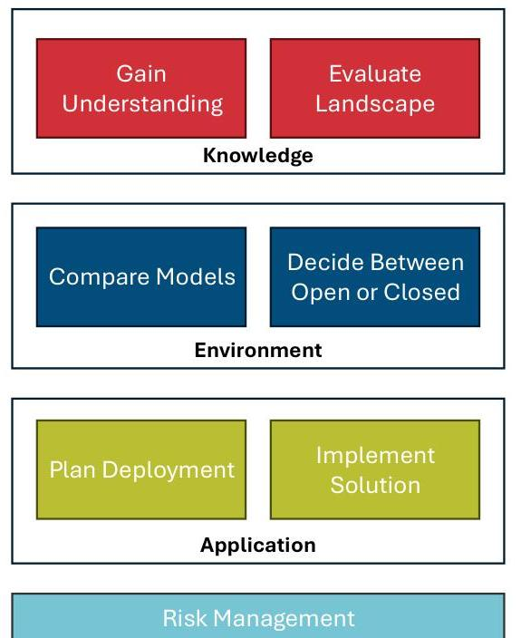
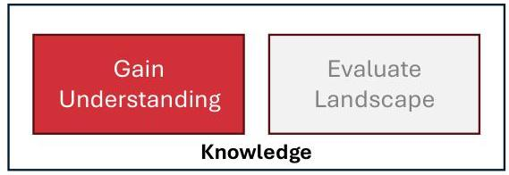
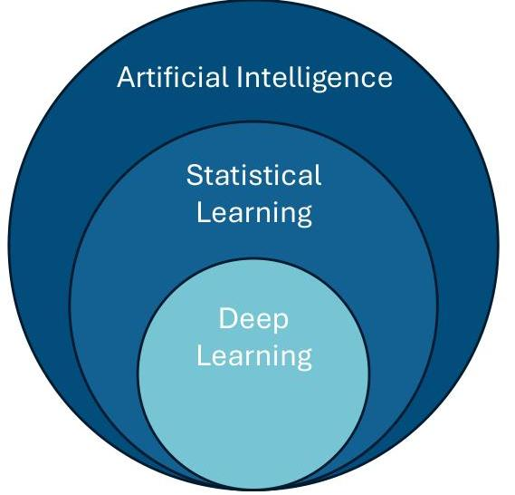
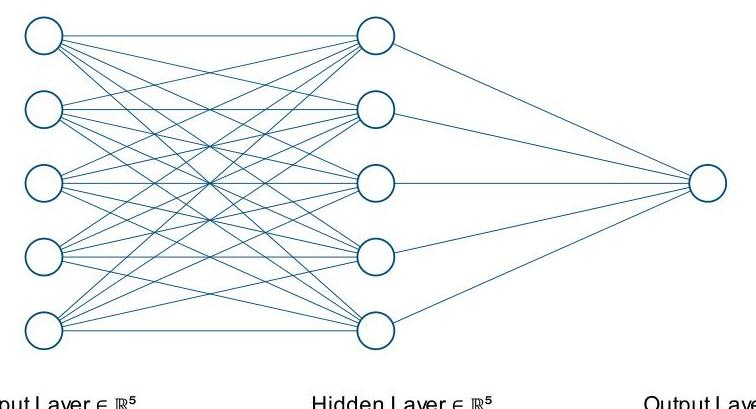
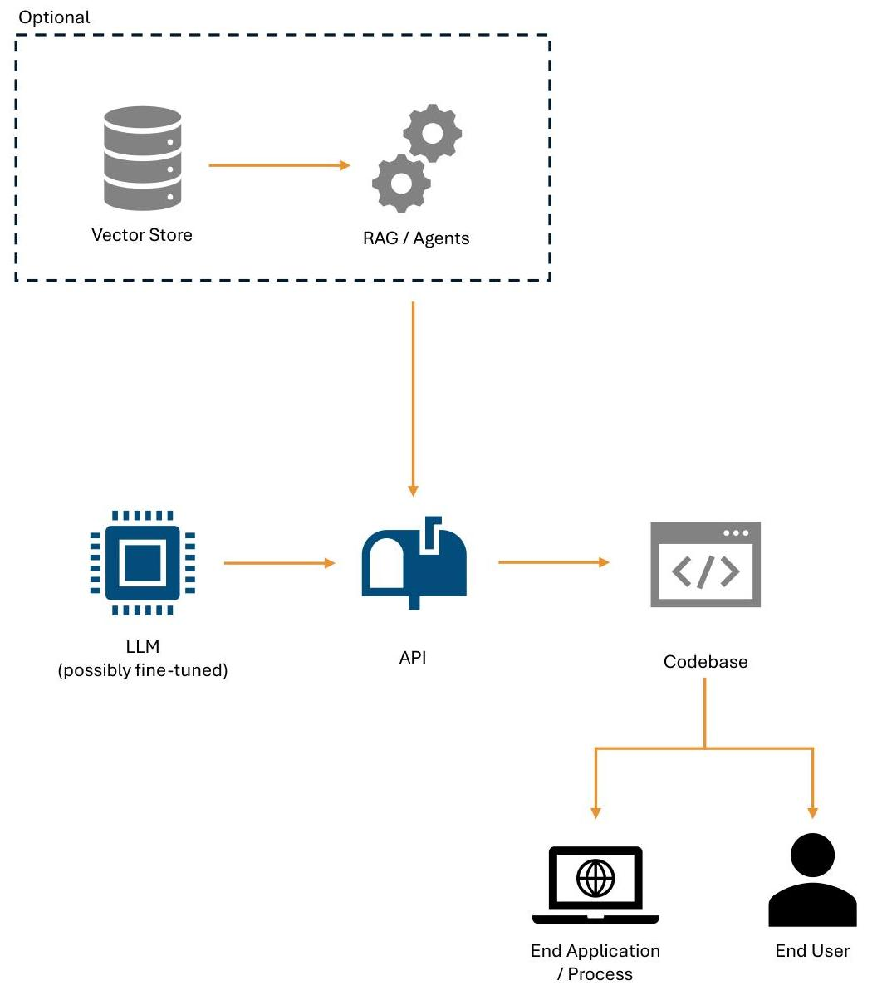
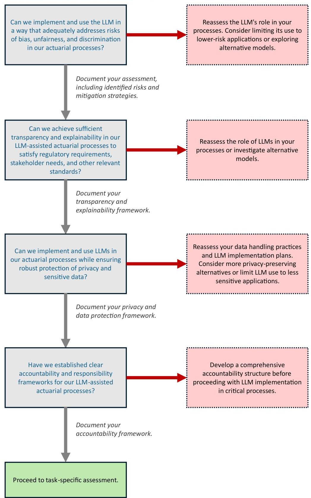

_Note: Source document was split into 4 OCR chunks (pages 1-17, pages 18-35, pages 36-52, pages 53-65) to stay within token limits._

# 202501 oper-genai-act-report-01-2025

## Page 1
# Operationalizing LLMs

## A Guide for Actuaries

**JANUARY | 2025**

## Page 2
# 2SOA Research 

INSTITUTE

## Operationalizing LLMs

## A Guide for Actuaries

AUTHOR Caesar Balona, FASSA

SPONSOR Actuarial Innovation and Technology
Strategic Research Program

## Give us your feedback! Take a short survey on this report.

## Caveat and Disclaimer

The opinions expressed and conclusions reached by the authors are their own and do not represent any official position or opinion of the Society of Actuaries Research Institute, the Society of Actuaries or its members. The Society of Actuaries Research Institute makes no representation or warranty to the accuracy of the information.

Copyright © 2025 by the Society of Actuaries Research Institute. All rights reserved.

## Page 3
# CONTENTS 

Executive Summary ..... 5
1 Introduction ..... 6
1.1 Background ..... 6
1.2 Objectives ..... 6
1.3 What is a Large Language Model? ..... 8
1.3.1 Model, or the Artificial Intelligence Part. ..... 8
1.3.2 Language ..... 10
1.3.3 Large ..... 10
1.3.4 Bring it Together: Large Language Model ..... 11
2 Landscape of LLM Providers ..... 12
2.1 Major LLM Providers ..... 13
2.1.1 OpenAI. ..... 13
2.1.2 Anthropic ..... 14
2.1.3 Meta ..... 14
2.1.4 Google ..... 15
2.1.5 Mistral AI ..... 16
2.1.6 Alibaba ..... 16
2.1.7 Tencent ..... 17
3 LLM Models, Benchmarking, and Comparison ..... 18
3.1 LLM Benchmarks and Evaluations ..... 18
3.1.1 MMLU ..... 19
3.1.2 GPQA ..... 19
3.1.3 MATH ..... 20
3.1.4 HumanEval ..... 20
3.1.5 DROP ..... 20
3.1.6 Remarks on the Shortcomings of Benchmarks ..... 20
3.2 LLM versus LLM ..... 21
3.3 Comparing and Selecting LLMs ..... 21
3.4 Task-Specific Benchmarks ..... 22
3.5 General Framework for Designing Task-Specific Benchmarks ..... 22
3.5.1 Define the Task and Objectives ..... 23
3.5.2 Gather Representative Data ..... 23
3.5.3 Create a Ground Truth ..... 23
3.5.4 Design Test Cases ..... 23
3.5.5 Define Evaluation Metrics ..... 23
3.5.6 Validation ..... 24
3.5.7 Implement the Benchmark. ..... 24
3.5.8 Benefits ..... 24
4 Open versus Closed LLMs ..... 25
4.1 Why Open LLMs? ..... 25
4.2 Drawbacks of Open LLMs ..... 26
4.2.1 Licensing ..... 26
5 Access and Deployment of LLMs ..... 28
5.1 Choosing an LLM ..... 28
5.1.1 LLM Size ..... 28
5.1.2 LLM Variants ..... 28
5.1.3 Practical Considerations ..... 29

## Page 4
5.1.4 Experimentation and Evaluation ..... 29
5.2 LLM APIs ..... 29
5.2.1 APIs for Open LLMs ..... 30
5.2.2 Typical API Parameters ..... 30
5.2.3 LLM Playgrounds ..... 31
5.3 Deploying Open LLMs ..... 31
5.3.1 The General Deployment Recipe ..... 31
5.3.2 Quantization ..... 33
5.3.3 Deployment Considerations ..... 33
6 Leveraging LLMs ..... 34
6.1 Prompt Engineering ..... 34
6.1.1 Zero-shot Prompting ..... 35
6.1.2 Few-shot Prompting ..... 35
6.1.3 Chain-of-Thought Prompting ..... 35
6.1.4 Prompt Chaining ..... 36
6.1.5 Prompt Categories by Purpose ..... 36
6.1.6 Prompt Format Patterns ..... 37
6.1.7 Structured Output ..... 37
6.1.8 Tips and Additional Resources ..... 38
6.2 Augmenting LLM Knowledge ..... 38
6.2.1 Context Dumping ..... 39
6.2.2 Retrieval Augmented Generation (RAG) ..... 40
6.2.3 Fine-tuning ..... 42
6.3 Summary ..... 43
7 Risk and Governance of LLMs in Actuarial Practice ..... 44
7.1 Introduction ..... 44
7.2 Considerations when Selecting an LLM Provider ..... 44
7.2.1 Ethics and Governance ..... 44
7.2.2 Privacy and Security ..... 45
7.2.3 Risk and Compliance ..... 47
7.2.4 Technology and Reliability ..... 48
7.3 Overarching Considerations Across Tasks ..... 50
7.3.1 Bias, Fairness, and Discrimination ..... 50
7.3.2 Transparency and Explainability ..... 52
7.3.3 Privacy and Data Protection ..... 52
7.3.4 Accountability and Responsibility ..... 53
7.4 Task-Specific Risk Considerations ..... 54
7.5 Risk Assessment Tree ..... 54
8 Acknowledgments ..... 57
Appendix A: Glossary ..... 58
References ..... 62
About The Society of Actuaries Research Institute ..... 65

## Page 5
# Operationalizing LLMs

## A Guide for Actuaries

### Executive Summary

This guide, commissioned by the Society of Actuaries (SOA) Research Institute, provides a practical roadmap for actuaries to integrate Large Language Models (LLMs) into their work effectively and responsibly. The rapid evolution of LLMs presents significant opportunities for the actuarial profession. This document helps actuaries navigate the complex LLM landscape, offering insights into their application, evaluation, deployment, and governance.

Key objectives and topics covered:

- **Understanding LLMs:** The guide demystifies LLMs, explaining their underlying technology (deep learning, neural networks, natural language processing) and key concepts like tokenization and word embedding. It emphasizes that a deep technical understanding is not required to start using LLMs, but resources for further learning are provided.
- **Navigating the LLM Landscape:** It provides an overview of major LLM providers (OpenAI, Anthropic, Meta, Google, Mistral AI, Alibaba, Tencent) and briefly outlines their role in providing LLM models.
- **Evaluating and Comparing LLMs:** The document discusses various benchmark categories (knowledge, mathematics, reasoning, reading comprehension, coding) and specific benchmarks (MMLU, GPQA, MATH, HumanEval, DROP). It critically assesses the limitations of benchmarks and advocates for task-specific benchmark design for more accurate evaluation. It introduces the LMSYS Chatbot Arena Leaderboard as a resource for selecting LLMs.
- **Open vs. Closed LLMs:** The guide explores the trade-offs between open-source and closed-source models, emphasizing the benefits of open LLMs in terms of control, transparency, and customization, particularly for sensitive data handling in insurance. It also acknowledges the performance advantages and broader feature sets often found in closed models. Licensing considerations for open LLMs are also addressed.
- **Accessing and Deploying LLMs:** Practical guidance is provided on selecting the appropriate LLM size and variant based on task complexity, latency requirements, and budget. It covers using APIs for easy access, as well as deploying open LLMs using tools like Ollama, vLLM, and Text Generation Inference. Quantization techniques for optimizing LLM performance are also explained.
- **Leveraging LLMs:** The core techniques of prompt engineering are detailed, including zero-shot, few-shot, chain-of-thought, and prompt chaining. Strategies for augmenting LLM knowledge through context dumping, Retrieval Augmented Generation (RAG), and fine-tuning are presented.
- **Risk and Governance Framework:** A robust framework for managing the risks associated with LLMs is outlined. This includes considerations for selecting an LLM provider based on ethics, governance, privacy, security, risk management, compliance, technology, and reliability. It also emphasizes the importance of addressing bias, fairness, transparency, accountability, and data protection in LLM implementations. Taskspecific risk considerations and a decision tree for risk assessment are provided.

Overall, this guide equips actuaries with the knowledge and references to confidently explore and implement LLMs, enhancing their work while mitigating potential risks. It promotes a thoughtful and responsible approach to leveraging this transformative technology within the actuarial profession.

## Page 6
# 1 Introduction 

### 1.1 BACKGROUND

The rapid advancement of generative artificial intelligence has led to the development of large language models (LLMs), opening new possibilities for various professions, including actuarial work. LLMs have already significantly impacted domains such as medicine (Sallam, 2023), education (Haleem et al., 2022), law (Lu and Wong, 2023), and, most notably for actuaries, financial services (Zaremba and Demir, 2023) and software engineering (Hou et al., 2024).
"ActuaryGPT: Applications of Large Language Models to Insurance and Actuarial Work" (Balona, 2023) laid the groundwork for understanding the potential applications of LLMs in actuarial practice. However, the LLM landscape has since expanded rapidly:

- Over 100 LLM models are now available from more than 20 companies and foundations.
- Numerous approaches to ranking and evaluating LLMs have emerged.
- Platforms and methods for LLM usage and deployment continue to evolve.
- Applications for LLMs are growing continuously.

For actuaries without formal training in generative AI and language processing, navigating this complex field can be daunting. Even for those with research experience in the area, staying completely up to date is challenging unless it is their primary field. Regardless, there is a pressing need for a practical guide on how to operationalize these powerful tools effectively and responsibly. To address this need, the Society of Actuaries (SOA) Research Institute commissioned this practical guide on Operationalizing Generative AI for Actuaries.

### 1.2 OBJECTIVES

This guide aims to provide actuaries with a practical resource for integrating LLMs into their professional practices responsibly and effectively. The primary objectives are to:

1. offer a high-level overview of the current LLM landscape at the time of this writing,
2. provide an overview of how to compare and test LLMs,
3. provide a framework for the risk and governance of LLM usage in actuarial practice,
4. provide high-level guidance on using LLMs, as well as refer readers to deeper resources on the topic,
5. discuss deployment strategies for LLMs, and
6. examine the trade-offs between open-source and closed-source models in the context of actuarial practice.

This guide focuses specifically on the operationalization of LLMs for actuarial work. While other forms of generative AI, such as image, audio, or video generation, may have potential applications in the broader insurance industry, they fall outside the scope of this study.

In the rest of this guide, we will gain knowledge on LLMs and those who provide them, understand the current environment surrounding them, and move into their application, ending on a discussion on managing the risks associated with LLMs. This journey has been summarized in Figure 1, which will appear at the start of each chapter to guide the reader.

## Page 7
Figure 1
OUR JOURNEY THROUGH OPERATIONALIZING LLMS

By the end of this guide, actuaries should have a solid foundation for integrating LLMs into their work, understanding the associated risks and benefits, and staying ahead of the curve in this rapidly evolving field.

## Page 8
# 1.3 WHAT IS A LARGE LANGUAGE MODEL?

To explain what a Large Language Model, or LLM, is, it's helpful to break down the term into its components: Large, Language, and Model. Let's reverse it to Model, Language, and Large (MLL) to build an understanding from the ground up. Note that the explanations below will be high-level. LLMs are incredibly easy to begin using, and a deeply technical understanding of their inner workings is not necessary to use them. However, further reading will be provided for those interested.

### 1.3.1 MODEL, OR THE ARTIFICIAL INTELLIGENCE PART

As actuaries, we are familiar with the concept of a mathematical model. In simple terms, a model is a mathematical representation of a real-world process. At the core of the LLM is a mathematical representation of a specific real-world process, which we will discuss in the next section.

Unlike the intuitive models we gain from the study of physics, the architecture of the model behind an LLM is a purely computational machine. It is a well-ordered mass of neurons connected in a network that allows it to *learn* its representation in a statistical manner. This idea of *learning* is key to the LLM.

We refer to LLMs as a form of artificial intelligence (AI). AI is a broad term that can be interpreted in different ways but, in our context, it refers to the ability to program machines to complete tasks. Figure 2 illustrates AI as the broadest superset of many forms of teaching machines to complete tasks.

#### Figure 2

## Page 9
Within Figure 2, we can see the terms "statistical learning" and "deep learning." Statistical learning (or machine learning) is the field of study and the process of developing models by having them learn their structure from data. An excellent introduction to this topic is provided by Géron (2024).

The LLM falls within the deep learning category. Deep learning is a subset of statistical learning using neural networks. A neural network is a network of weights (also called neurons) that interconnect to perform a computation. Mathematically, they are a mapping from Rn to Rm. Figure 3 shows an example of a single layer model.

Figure 3
EXAMPLE OF A SINGLE LAYER NEURAL NETWORK

Deep learning refers to neural networks with many layers, typically three or more. Figure 4 shows an example of a deep neural network with four hidden layers.

Figure 4
EXAMPLE OF A DEEP NEURAL NETWORK

## Page 10
The power of deep learning lies in these hidden layers, or what we call the architecture of the model. These hidden layers perform representation learning, allowing the model to create an optimal structure for a particular task through a careful selection of weights (Richman, 2022).

For a more mathematical introduction to deep learning, see Goodfellow et al. (2016). A programming-focused introduction can be found in Deep Learning with Python (2017), and applications to actuarial science can be found in Richman (2022) and Richman (2023).

# 1.3.2 LANGUAGE 

The "Language" in LLM refers to the model's specialization in understanding and generating human language. Natural language processing (NLP) is a branch of AI focused on this task. There are two core components to NLP that you need to be familiar with: tokenization and word embedding.

Deep learning models can only process numbers, but language is mostly not numbers. Word embedding is the process of assigning vectors of numbers to words, allowing us to build a model on text. More generally, embedding in the machine-learning field refers to representing non-numerical data by mapping it to numerical vectors. The embedding process of LLMs maps discrete units of words called tokens to these numerical vectors.

Tokenization involves reducing sentences and words down into tokens. Tokens are closely related to words but are often broken down further to uncover more structure from the language. One example is "subword tokenization," which breaks words into meaningful subcomponents. If we take the word, tokenization, itself, it can be broken down into the subwords "token" and "ization." That is because each of these subwords contribute to the understanding of the word.

There are numerous forms of tokenization, and one LLM may have a different tokenization approach from another. Familiarity with tokenization is important because it can guide us in our understanding of the limitations of LLMs. Further, it is the unit on which most LLM providers base their costing. The cost is typically reported as some amount of dollars per 1,000 or 1 million tokens. On average, 1,000 tokens translate to about 750 words.

LLMs generate text by predicting the next token given the previous tokens. To do this, they need to be trained on large amounts of text data, which brings us to the "large" component.

For further information on natural language processing, a great technical resource is Speech and Language Processing (2024), and a gentler introduction is provided by HuggingFace ${ }^{1}$.

### 1.3.3 LARGE

To achieve their high levels of performance, LLMs need to be trained on vast amounts of data. The underlying model must be able to learn a representation of the language in such a way that it can reliably complete its task, requiring billions, and sometimes trillions, of parameters.

LLMs are typically trained on text datasets collected from the internet or licensed from third-party providers. This data includes general website content, blog content, news articles, research papers, code repositories, social media, forums, Wikipedia, and more. In some cases, transcribed audio data can also be included. While this data is generally publicly available, it's likely that some private information and personally identifiable information are

[^0]
[^0]:    ${ }^{1}$ https://huggingface.co/learn/nlp-course/chapter0/1

## Page 11
included due to the scale of the collection process. LLM providers perform data cleaning to remove this information as much as possible, as well as to remove harmful or inappropriate content.

The scale of these datasets is immense, often comprising trillions of words and tokens. In some cases, additional synthetic data is added to supplement the training data. This process requires massive computational power, which is a major criticism of LLMs due to its environmental impact (see Patterson et al. (2021) and Wu et al. (2022) for more details).

After the initial "pre-training" phase, the model is "fine-tuned" to a specific task. For example, a chat-based LLM would be fine-tuned on dialogue to be used as a discussion model. "Instruct" models have been fine-tuned on instruction-response pairs and are geared towards receiving an instruction and completing the task.

Following this, LLMs are sometimes further tuned using reinforcement learning from human feedback (RLHF). This process involves feeding the LLM a list of prompts, having humans rank or rate the responses, and then using these ratings to further refine the model's outputs.

Pre-training of LLMs is a highly complex, time-consuming, and costly task that is likely not worth the effort for actuaries to perform. Instead, fine-tuning existing models is a much more approachable task that can yield significant benefits.

LLMs range in size from 2 billion parameters (such as Google's Gemma 2B) to an estimated 1.76 trillion parameters (OpenAI's GPT-4). In terms of disk space, these models range from 1.6GB to over an estimated 7 terabytes. While there's no strict guideline, a good consensus is that a language model becomes "large" when it has over 1 billion parameters.

LLMs typically utilize a "transformer" architecture, though other architectures exist. Understanding the actual architecture of LLMs is not necessary to use them, but more information is provided in the Attention is All You Need paper (Vaswani et al., 2017), and a gentler introduction is provided by HuggingFace ${ }^{2}$.

# 1.3.4 BRING IT TOGETHER: LARGE LANGUAGE MODEL 

With all the above, we can now define an LLM as a deep learning model consisting of many parameters, trained on large amounts of text data to complete a specific language-based task. The real power lies in choosing and applying these tasks to actuarial work. Before we get to assessing the models, we will briefly look at some of the major providers.

[^0]
[^0]:    ${ }^{2}$ https://huggingface.co/learn/nlp-course/en/chapter1/4

## Page 12
# 2 Landscape of LLM Providers 

| Gain | Evaluate |
| :--: | :--: |
| Understanding | Landscape |
| Knowledge |  |

As we embark on our exploration of Large Language Models (LLMs), it's important to begin by examining the major providers and the key considerations for selecting one. This starting point may seem unconventional, but given the scale and complexity of these models, we will inevitably rely on models developed by others. The choice of provider significantly influences an LLM's behavior, making it essential to address these considerations upfront. This approach ensures you're aware of these factors and can keep them in mind throughout this guide. In this section, we'll briefly discuss the major LLM providers. While not exhaustive, this overview will cover the most popular and widely used providers and, by extension, the most prevalent LLMs. Despite limiting our scope, you'll find there's no shortage of options.

Selecting an LLM provider goes beyond assessing their technical capabilities and brand reputation. Your choice must align with your organization's policies on data security, ethical considerations, and more. LLMs are trained on vast amounts of text that require careful curation to mitigate bias and harmful content. Additionally, humans fine-tune these models to behave in specific ways, which can impact how they complete your tasks. Moreover, your interactions with the LLM and the data you provide are not necessarily private. Therefore, it's important to understand and, to some degree, trust your chosen provider before implementing their LLM.

While the specific elements to consider will depend on your organization's policies, we can broadly categorize them into four main dimensions:

- Ethics and Governance
- Privacy and Security
- Risk and Compliance
- Technology and Reliability

Not to detract from the flow of this guide, a detailed explanation of each of these dimensions will be provided in Section 7.2.

## Page 13
# 2.1 MAJOR LLM PROVIDERS 

### 2.1.1 OPENAI

OpenAI ${ }^{3}$ is perhaps the most widely known provider of LLMs, responsible for the famous ChatGPT ${ }^{4}$ website that sparked worldwide interest in LLMs. OpenAI's founding mission ${ }^{5}$ is to build artificial general intelligence ${ }^{6}$ that is safe and beneficial to all of humanity.

Originally intended to be an independent, not-for-profit organization freely distributing its work, OpenAI has since restructured to include a capped-profit company ${ }^{7}$ and partnered with Microsoft ${ }^{8}$ to assist with and fund its exponentially increasing computation costs. In recent years, OpenAI has reduced open distribution of its research, models, and code, becoming increasingly private about its developments.

OpenAI is considered a leader, if not the leader, in the field of LLMs. The company also creates several other AI models in image ${ }^{9}$, video ${ }^{10}$, and music generation ${ }^{11}$, as well as speech-to-text ${ }^{12}$, among others. In the field of LLMs, OpenAI began its journey with GPT-1 in 2018 (Radford et al., 2018), a transformer-based model trained on the BookCorpus (Zhu et al., 2015) dataset, a collection of 7,000 unpublished fiction books. With 117 million parameters, GPT-1 would no longer be considered a large language model by today's standards.

Following GPT-1, OpenAI trained GPT-2 by scaling up GPT-1 in terms of data and size. GPT-2 was trained on data scraped from the web, consisting of 8 million documents, and had 1.5 billion parameters. GPT-2 is most famous due to OpenAI's initial refusal to release it publicly, citing potential dangers, which generated significant media attention. Eventually, OpenAI did release the model.

GPT-3, the third GPT model, continued OpenAI's tradition of creative naming. It represented a major advancement in LLM technology, scaling up massively from GPT-2. Trained on half a trillion tokens and boasting 175 billion parameters, GPT-3 made headlines for its then hard-to-believe capabilities in writing code and generating highly convincing text. Several versions of GPT-3 of differing sizes were released, aimed at various tasks and price points. GPT-3 culminated with GPT-3.5, which had an undisclosed size and powered ChatGPT during its initial release.

GPT-4 was released in March 2023 (OpenAI et al., 2024). Full details on its training data and size have not been disclosed, but it is believed to have greatly scaled up from GPT-3. The most widely-held belief is that GPT-4 has around 1.75 trillion parameters. It is also rumored to be a mixture-of-experts (MoE) model, consisting of several smaller models specialized in different aspects. This provides benefits including computational efficiency (since not all expert models are activated for each input), scalability, and accuracy. GPT-4 was also the first model to incorporate image generation abilities by translating user inputs into prompts for DALL-E to generate images.

[^0]
[^0]:    ${ }^{3}$ https://openai.com/
    ${ }^{4}$ https://chatgpt.com/
    ${ }^{5}$ https://openai.com/index/introducing-openai/
    ${ }^{6}$ Artificial general intelligence is a subfield of artificial intelligence that lacks a strict definition, but loosely means the ability of AI models to mimic human intelligence.
    ${ }^{7}$ https://openai.com/index/openai-lp/
    ${ }^{8}$ https://openai.com/our-structure/
    ${ }^{9}$ https://openai.com/index/dall-e-3/
    ${ }^{10}$ https://openai.com/index/sora/
    ${ }^{11}$ https://openai.com/index/jukebox/
    ${ }^{12}$ https://openai.com/index/whisper/

## Page 14
OpenAI broke its naming pattern with GPT-4o (or GPT-4 Omni), the next major release. The "omni" tag refers to its multi-modal capabilities, meaning it can generate images and audio in addition to text. At the time of writing, GPT40 is OpenAI's main LLM offering, along with its smaller version, GPT-4o-mini.

# 2.1.2 ANTHROPIC 

Anthropic ${ }^{13}$ was founded by former OpenAI researchers. It is an AI research and product development company with the aim to "put safety at the frontier." Anthropic established itself as a corporate "Long-Term Benefit Trust," an entity that mandates the company's directors to prioritize public benefit over profit in cases of "catastrophic risk."

Anthropic's LLM offering is Claude, which has strong performance across various tasks and an emphasis on ethical behavior. Claude 1.0 was released in March 2023, followed by Claude 2 in July 2023, with enhanced performance and longer context windows. Anthropic then released Claude 3 in March 2024, which came in three variants: Haiku, a small and cost-effective model; Sonnet, a balanced model offering good performance; and Opus, a large and powerful model. Claude 3 was well received and had performance comparable to the OpenAI models.

In June 2024, Claude 3.5 Sonnet was released, which had significantly improved performance even compared to Claude 3 Opus and is Anthropic's flagship offering.

One of Anthropic's distinguishing features is its use of "Constitutional AI" (CAI), a framework that aims to align AI systems with human values and ensure they are helpful, harmless, and honest. CAI involves providing the AI system with a set of rules or "constitution" describing desired behavior, which the system then uses to evaluate and adjust its outputs.

In terms of funding and partnerships, Anthropic has attracted significant investment. In 2023, Amazon announced a partnership with Anthropic, becoming a minority stakeholder with a total investment of USD $\$ 4$ billion. Google also invested USD $\$ 2$ billion in the company.

As of 2024, Anthropic continues to be a major player in the LLM space, known for its focus on AI safety, ethics, and high-performance models.

### 2.1.3 META

Meta ${ }^{14}$, formerly known as Facebook, is a major player in the field of large language models (LLMs) with its Llama family of models. Unlike some competitors, Meta has taken a more open approach to AI development, making its models more accessible to researchers and developers.

The Llama series was first introduced in February 202315. Meta's approach with Llama has been to focus on scaling performance by increasing the volume of training data rather than simply increasing the number of parameters.

The Llama family has evolved through several iterations:

1. Llama 1: Released in February 2023, with models ranging from 7B to 65B parameters. Initially, access was restricted to researchers and granted on a case-by-case basis.
2. Llama 2: Launched in July 2023 in partnership with Microsoft, featuring models with 7B, 13B, and 70B parameters. Llama 2 was made more freely available for commercial use.
[^0]
[^0]:    ${ }^{13}$ https://www.anthropic.com/
    ${ }^{14}$ https://ai.meta.com/
    ${ }^{15}$ https://ai.meta.com/blog/large-language-model-llama-meta-ai/

## Page 15
3. Code Llama: A specialized version of Llama 2 fine-tuned for code-related tasks, released in August 2023 with 7B, 13B, and 34B versions.
4. Llama 3: Introduced in April 2024 with 8B and 70B parameter models. Llama 3 demonstrated significant improvements over its predecessors and was competitive with other leading models like Gemini Pro 1.5 and Claude 3 Sonnet on various benchmarks.

- Llama 3.1: Released in July 2024, with expanded training and context window, as well as including a 405B parameter model.
- Llama 3.2: Launched in September 2024, with1B, 3B, 11B, and 90B parameter models.

The training datasets for Llama models have grown substantially with each iteration. Llama 1 was trained on 1.4 trillion tokens. Llama 2 increased the dataset to 2 trillion tokens, with a focus on curating more trustworthy sources and removing personal data. Llama 3 further expanded the dataset to approximately 15 trillion tokens.

By adopting an open weights approach, Meta aims to improve model safety, increase iteration speed, and boost adoption among developers and researchers. The Llama series is a significant contribution offering a more open alternative to closed models from companies like OpenAI and Anthropic.

# 2.1.4 GOOGLE 

Google's entry into the LLM space began with the announcement of LaMDA in $2021^{16}$. LaMDA was designed specifically for open-ended conversations and was trained on dialogue data. It gained widespread attention when a Google engineer claimed it was sentient, sparking debates about AI consciousness ${ }^{17}$.

In 2022, Google introduced PaLM, a 540-billion parameter model that demonstrated impressive capabilities for the time across a wide range of tasks. PaLM 2 was then released in 2023, improved upon its predecessor and became the model behind the Bard chatbot.

Google's most recent and significant advancement in the LLM space is the Gemini family of models, announced in December $2023^{18}$. Gemini is a multimodal model, capable of understanding and generating text, images, audio, and video. It comes in three sizes:

1. Gemini Nano: A compact model optimized for on-device tasks, such as in Google's Pixel smartphones.
2. Gemini Pro: A balanced model for a wide range of tasks.
3. Gemini Ultra: The largest and most capable model, designed for highly complex tasks.

In early 2024, Google rebranded its Bard chatbot to Gemini, offering free access to Gemini Pro and a paid tier for access to Gemini Ultra. The company has also released Gemma, a family of open-source language models derived from Gemini technology ${ }^{19}$. Gemini 1.5 was released in early 2024 with a focus on long-context understanding, offering up to a 10-million context window size.

[^0]
[^0]:    ${ }^{16}$ https://blog.google/technology/ai/lamda/
    ${ }^{17}$ https://www.washingtonpost.com/technology/2022/06/11/google-ai-lamda-blake-lemoine/
    ${ }^{18}$ https://blog.google/technology/ai/google-gemini-ai/
    ${ }^{19}$ https://blog.google/technology/developers/gemma-open-models/

## Page 16
# 2.1.5 MISTRAL AI 

Mistral AI ${ }^{20}$ is a French artificial intelligence company that has rapidly emerged as a significant player in the LLM space since its founding in April 2023. The company was established by former employees of Meta and Google. Mistral AI's mission is to make AI ubiquitous and focus on openness.

The company has released several LLMs, including:

1. Mistral 7B: Released in September 2023, this 7.3 billion parameter model uses the transformers architecture and grouped-query attention (GQA). Despite its relatively small size, Mistral 7B claimed to outperform larger models like LLaMA 213B on various benchmarks ${ }^{21}$.
2. Mixtral 8x7B: Introduced in December 2023, this model employs a sparse mixture of experts' architecture, consisting of eight 7B parameter models. Mixtral 8x7B demonstrated performance comparable to or exceeding much larger models like LLaMA 70B and GPT-3.5 ${ }^{22}$.
3. Mixtral 8x22B: Released in April 2024, this model scales up the Mixtral architecture to eight 22B parameter models exceeding the performance of Mixtral $8 \times 7 B^{23}$.

Mistral differentiates itself from competitors by releasing its models openly, sharing the weights under an Apache 2.0 license. In addition to these open-weight models, Mistral AI offers API-only access to models such as Mistral Small and Mistral Large.

### 2.1.6 ALIBABA

Alibaba has been actively developing LLMs through its research arm, DAMO Academy. The company's LLM efforts are focused on developing models that can serve both Chinese and English language users effectively.

Alibaba's main LLM offerings include:

1. Tongyi Qianwen (Qwen): Launched in April 2023, this was Alibaba's first major LLM release. It supports both Chinese and English languages. The model demonstrated strong capabilities. ${ }^{24}$
2. Qwen 2: Released in April 2024, Qwen 2 offered several improvements including multilingual pretraining and a larger context window. It came in five variations, from 0.5 billion parameters to 72 billion parameters using a mixture-of-experts approach. It performed on par and better than Llama 3 in several tasks ${ }^{25}$.
3. Qwen-2.5: The latest iteration of Qwen pre-trained on an expanded dataset of 18 trillion tokens exceeded prior versions in performance, scoring above 80 in MMLU, HumanEval and MATH benchmarks. A coding-specific model was also released ${ }^{26}$.

Alibaba has taken a hybrid approach to model availability, offering both API access through its cloud platform and releasing some model weights openly. The company has particularly focused on developing models that excel at

[^0]
[^0]:    ${ }^{20}$ https://mistral.ai/
    ${ }^{21}$ https://mistral.ai/news/announcing-mistral-7b/
    ${ }^{22}$ https://mistral.ai/news/mixtral-of-experts/
    ${ }^{23}$ https://mistral.ai/news/mixtral-8x22b/
    ${ }^{24}$ https://www.alibabacloud.com/blog/599877?spm=a3c0i.29367734.6737026690.1.4d7c7d3f5bgUjn
    ${ }^{25}$ https://www.scmp.com/tech/big-tech/article/3265845/alibaba-says-new-ai-model-qwen2-bests-metas-llama-3-tasks-maths-and-coding
    ${ }^{26}$ https://www.alibabacloud.com/en/solutions/generative-ai/qwen7_p_lc=1

## Page 17
understanding and generating content in Chinese, while maintaining strong capabilities in English and other languages.

# 2.1.7 TENCENT 

Tencent, one of China's largest technology companies, has developed its LLM capabilities through its Tencent AI section. The company has focused on creating models that serve its vast ecosystem of applications, while also competing in the broader AI market.

Tencent's major LLM developments include:

1. HunyuanAI: Launched in September 2023, this was Tencent's first publicly available large language model. The model was trained on a massive dataset of Chinese and English content, with particular emphasis on integrating with Tencent's extensive product ecosystem ${ }^{27}$.
2. Hunyuan-Large: Released in November 2024, this is the largest open-source transformer-based mixture-of-experts model with 389 billion parameters. It was trained with additional synthetic data to achieve richer learning capabilities ${ }^{28}$.

Tencent has primarily focused on deploying its models within its own ecosystem, particularly integrating them into WeChat and other Tencent applications.

[^0]
[^0]:    ${ }^{27}$ https://www.tencent.com/en-us/articles/2201685.html
    ${ }^{28}$ https://arxiv.org/html/2411.02265v2

## Page 18
# 3 LLM Models, Benchmarking, and Comparison 

Compare Models
Decide Between
Open or Closed
Environment

As the landscape of LLMs has rapidly expanded from a few dominant models in late 2022 to hundreds of variants today, selecting the right model for a specific task can be both daunting and deceptively simple. Our choice of LLM depends on several factors, beyond those related to the LLM provider and training process. Key considerations include:

1. Model size and computational requirements: Smaller models are more suitable for simpler tasks requiring quick responses and less powerful hardware. Larger models often excel at complex reasoning tasks but demand more computational resources.
2. Task-specific performance: Different models excel at different tasks, necessitating performance comparisons relevant to the specific application.
3. Context window size: The amount of text the model can process in a single interaction, which varies in importance depending on the task at hand.
4. Cost vs. Performance: It is also important to consider the cost of a model relative to its performance. A useful metric is the cost-to-performance ratio.

While other factors such as fine-tuning capability are relevant, these four are the primary considerations.
This chapter will explore benchmarking and performance assessment, providing insights on interpreting benchmarks and comparing LLMs. We'll present a selection of major benchmarks and discuss how to create custom benchmarks for testing LLMs.

### 3.1 LLM BENCHMARKS AND EVALUATIONS

LLM benchmarks serve as standardized tests to evaluate AI models' capabilities across different dimensions. These assessments help to inform model strengths and limitations, enabling comparisons between different models, model sizes, and variations of models. Benchmarks typically fall into the following major categories: knowledge and recall, mathematics, logical reasoning, reading comprehension and / or question and answering, and coding ability.

Knowledge benchmarks focus on testing a model's ability to recall and apply knowledge. These benchmarks are typically presented as multiple-choice questions. The knowledge can be general knowledge, or highly specific to domains such as biology or physics.

Mathematical benchmarks focus on the model's ability to answer mathematical questions. These benchmarks can be simple or may require step-by-step reasoning. The level of math can also vary from elementary to PhD level.

Logical reasoning benchmarks test the ability of the model to reason logically through problems. These can often include common sense benchmarks where the model is tasked to provide a logical solution to a problem.

Reading comprehension and question-and-answer benchmarks evaluate a model's ability to consume and analyze information. These can come in various forms, from summarization tests to basic comprehension tests, and more advanced understanding tests.

## Page 19
Coding benchmarks test the model's ability to solve problems through code, or complete code. Here, a problem or set of code is presented to the model, and the generated code, or resultant output, is compared to the expected result.

There are many ways to categorize benchmarks, and more categories than the above, however, these cover most benchmarks. We now discuss some major benchmarks.

# 3.1.1 MMLU 

## Knowledge and Recall

Massive Multitask Language Understanding (MMLU) is a widely used benchmark for LLMs, comprising approximately 16,000 multiple-choice questions across diverse domains from mathematics to law. The difficulty ranges from elementary to professional level, offering a comprehensive assessment of an LLM's knowledge breadth and depth. Scoring metrics provide context: random guessing achieves $25 \%$, an untrained human scores around $34.5 \%$, and expert-level human accuracy is estimated at $89.8 \%$. Most recent models score in the 80s (Hendrycks, Burns, Basart, et al., 2021). MMLU is primarily a general/logical reasoning benchmark aimed at assessing a model's general knowledge and reasoning capabilities.

MMLU allows for both zero-shot and few-shot (k-shot) evaluation, where k is the number of correct examples provided before the model attempts to answer. While the evaluation method isn't always clearly stated, one can typically assume a 5 -shot approach, as it tends to yield the highest scores.

Despite its widespread use, MMLU has limitations. Some questions in the dataset have incorrect answers marked as correct, and there are instances of incomplete questions and philosophical queries without clear single answers. These issues, combined with the lack of a standardized implementation, can affect the reliability and comparability of results across different models and studies.

Variations like MMLU-Pro (Wang et al., 2024) have been developed to address some of these issues, but they face similar limitations.

### 3.1.2 GPQA

## Knowledge and Recall

The graduate-level Google-Proof Question and Answering (GPQA) benchmark is designed as a highly challenging test consisting of 448 multiple-choice questions written by domain experts in biology, physics, and chemistry. Its intention is to be difficult, with experts holding PhDs in these areas reportedly achieving only 65\% accuracy. Models typically score in the 30s to 50s (Rein et al., 2023). GPQA can be considered a test of a model's expert-level knowledge.

GPQA is more carefully constructed to avoid the pitfalls of other multiple-choice benchmarks. However, implementation limitations persist. This benchmark is typically more reliable than MMLU but less widely used.

## Page 20
# 3.1.3 MATH 

## Mathematics

The MATH benchmark (Hendrycks, Burns, Kadavath, et al., 2021) evaluates the mathematical problem-solving abilities of LLMs. It consists of 12,500 problems sourced from mathematics competitions, covering a wide range of difficulty levels and mathematical topics. MATH requires models to demonstrate reasoning in their solutions, making it particularly challenging both for LLMs to solve and for researchers to score.

MATH can be relevant for actuarial applications, as actuarial work often requires mathematical reasoning. However, it is not domain specific.

### 3.1.4 HUMANEVAL

## Coding

For those interested in coding assistance, HumanEval (Chen et al., 2021) is designed to assess the code-writing capabilities of language models. The benchmark consists of 164 handwritten programming problems that the LLM is required to synthesize, providing a comprehensive assessment of coding abilities across various domains.

HumanEval also considers the pass@k metric, which measures the fraction of correct solutions generated within $k$ samples from the LLM. If one solution is correct in the k samples, the test is considered passed. This metric can provide insight into the consistency of an LLM in generating correct solutions.

However, it is also an area of variance in model results.

### 3.1.5 DROP

## Reading Comprehension

Discrete Reasoning Over the content of Paragraphs (DROP) (Dua et al., 2019) is a question-answering dataset where "...a system must resolve references in a question, perhaps to multiple input positions, and perform discrete operations over them (such as addition, counting, or sorting)." This benchmark aims to assess the LLM's ability to understand, comprehend, and extract information from inputs. Here, humans typically outperform machines, with humans achieving around $96 \%$ accuracy and the latest models scoring in the mid-80s.

This benchmark is useful for tasks requiring extraction and synthesis, such as extracting information from reinsurance documents or policy wordings, understanding claims reports, or responding to queries. It includes a variety of answer types, including numbers, dates, and short text answers.

### 3.1.6 REMARKS ON THE SHORTCOMINGS OF BENCHMARKS

There are numerous other benchmarks, too many to list, of varying quality. One notable mention, with a name exceeding all others, is HellaSwag. It is a commonsense inference benchmark that assesses the ability of LLMs to complete sentences using common sense. For example, given the prompt "The cat gets up from a nap," a commonsense continuation would be that the cat stretches, not that it grabs its car keys and heads to the shops. However, like many benchmarks, HellaSwag has been found to be quite unreliable.

The world of LLM benchmarking is, unfortunately, not as robust as it should be. Given the massive boom in LLMs, every provider wants to showcase the best benchmark performance. This often leads to them tuning their models to excel at benchmarks which, in turn, leads to the creation of new benchmarks to prevent this practice, and the cycle continues. This has led to many problems in the world of LLM benchmarking (McIntosh et al., 2024). Anthropic has addressed this issue (Ganguli et al., 2023) and listed some additional challenges of benchmarking, including how

## Page 21
the actual implementation of the test can influence the score and how subjectivity comes into play when human evaluation is involved.

The common theme is that benchmarks are not as reliable as they appear, and we cannot blindly trust them. How, then, can we assess model performance? The author proposes two alternatives that will be discussed next: a human-scored LLM arena and task-specific benchmarks.

# 3.2 LLM VERSUS LLM 

Perhaps the best, albeit imperfect, way to compare LLMs for general chat or text generation is through human voting via anonymous comparisons. The Large Model Systems Organization (LMSYS) Chatbot Arena Leaderboard (Chiang et al., 2024) ${ }^{29}$ was created by users submitting a prompt to two anonymous LLMs and voting for the best response. This method creates a blind ranking of the best LLMs, which correlates well with generally perceived experiences of models reported by users. However, it is not without flaws.

Several criticisms can be raised:

- The voting is based on a single prompt, making it more representative of zero-shot prompting.
- It is geared toward human preference, meaning it may not be a good assessment of task-specific performance.
- With humans involved in the voting and subsequent ranking, there is the possibility of subjectivity and bias. For example, a model that generates prompts more quickly (higher tokens per second) may be perceived as better simply because it was more responsive, not due to the quality of the prompt.

Despite these limitations, the leaderboard is a good quick resource for selecting LLMs for testing. One way to use it is to shortlist LLMs by a few parameters. For instance, if you want an open-source LLM of around 70 billion parameters, you can use the leaderboard to find the best LLMs meeting those conditions, then take them for your task-specific testing. Closely ranked LLMs often outperform each other in different areas.

### 3.3 COMPARING AND SELECTING LLMS

A good way to quickly assess and compare LLMs is to create a table of key benchmarks related to your task and rank the models accordingly. Table 1 shows an example of such a comparison where all scores are standardized to the range 0 to 1 (with 0 being worst, 1 being best).

Table 1
LLM BENCHMARK COMPARISON TABLE EXAMPLE

| LLM | Arena | MMUU | GPDA | ... | Cost | Cost /   Performance |
| :-- | :--: | :--: | :--: | :--: | :--: | :--: |
| Model 1 | 1 | 0.9 | 1 | ... | 10 | 10.3 |
| Model 2 | 0.8 | 1 | 0.95 | ... | 7 | 7.6 |
| ... | ... | ... | ... | ... | ... | ... |
| Model N | 0.7 | 0.5 | 0.8 | ... | 3 | 4.5 |

## Page 22
# 3.4 TASK-SPECIFIC BENCHMARKS 

The most effective way to assess LLMs is to design a benchmark specific to your task. This approach not only provides a better measure of task-specific performance, but also serves as good practice for development and offers a means to monitor performance over time. As we will see in Section 7, it also allows for other tests of LLMs, such as bias detection or stress testing your prompts to reduce hallucination or erroneous output.

### 3.5 GENERAL FRAMEWORK FOR DESIGNING TASK-SPECIFIC BENCHMARKS

Figure 5
TASK SPECIFIC BENCHMARK DESIGN PROCESS

## Page 23
# 3.5.1 DEFINE THE TASK AND OBJECTIVES 

The first step is to clearly plan and define your task and its objectives, for example, the task of extracting specific details from reinsurance policy documents. In terms of objectives, we must think carefully about what exactly we want from the task and measure accordingly. For extracting specific details, we would want a factual and concise extraction of exactly the required fields from the reinsurance document. Therefore, we would want to measure and penalize deviations from what is found in the actual document and what is extracted. If we want to summarize text concisely, we will want to measure and penalize deviations from what is found in the actual document and what is summarized, as well as penalize longer outputs.

### 3.5.2 GATHER REPRESENTATIVE DATA

Next, we need data to test against. The word "representative" is significant. We should not have a perfectly structured synthetic dataset. Instead, we should test real-world data that our models will encounter.

This means collecting data from the source on which the final model will be running. We must collect a diverse set, covering as many scenarios the model will encounter as possible. This includes common cases, rarer cases, and more challenging cases where the LLM may fail. Where the LLM may fail, we can extend the test to cover how our process fails gracefully.

The data should be as varied as the data source itself. This includes variation by time, source, jurisdiction, and possibly language, structure, formatting, etc. Finally, we must ensure the test data is processed as the true data would be, for example, anonymized or de-identified.

### 3.5.3 CREATE A GROUND TRUTH

Having collated some data, we now need to design the truth we are aiming for. This involves manually performing the process to create the output we expect of the model. This part is often overlooked, as we typically rush to input data into the LLM and then decide if we are satisfied with the output. However, the process of creating the ground truth is immensely valuable, as it forces us to think through the process carefully.

Through this, we can uncover intricacies in the process we will need to handle, such as complex or non-specific cases. Through our careful construction of the output, we must document the decisions we make and the specifics we repeatedly perform to create the output. This naturally creates a quality-control process that we can use to test and monitor our process. In more complex cases, we may even define a schema or working guideline to which we must adhere.

### 3.5.4 DESIGN TEST CASES

We can then design test cases. We may simply include all the data and their ground truths in a single benchmark suite. However, in more complicated processes that require more careful design, we may need separate and focused test suites. These could include straightforward cases; ambiguous and challenging cases; cases that test for bias, discrimination, or fairness; and other cases that test for quality control.

### 3.5.5 DEFINE EVALUATION METRICS

A challenging element is how to measure performance. In information extraction tasks, this is straightforward. We know the data we expect, and we can measure accuracy as a weighted binary accuracy measure across all items to be extracted. We may even consider other metrics such as precision and recall if our use case is more nuanced. In more complex cases, such as summarization or more generative tasks, we likely need to measure the output quality through human review or another language model comparing the output to the ground truth. Note that this doesn't specifically refer to an LLM, but to any form of language model that may even compare based on textual similarity.

## Page 24
We can also include real-world elements in the metrics, such as the financial impact of decisions.

# 3.5.6 VALIDATION 

The benchmark is a tool itself, so before we trust and apply it, we must validate it. This involves testing the benchmark against LLMs, mock test models, or even humans unfamiliar with the process. We then analyze the benchmark to ensure it is achieving its objectives, namely being discriminative of performance, reliability, repeatability, and validity.

### 3.5.7 IMPLEMENT THE BENCHMARK

We then need to implement the benchmark in a standardized way that allows us to test several LLMs easily. This is more of a software design step. It involves creating a common interface that all LLMs can adapt to, ensuring the benchmark is reproducible and consistent between LLMs, and defining the final scoring system. We can also document and version control the benchmark at this point.

### 3.5.8 BENEFITS

While this process may appear to be over-engineering, it distinguishes poor applications of LLMs from exceptional ones. Moreover, we gain several valuable outcomes:

- Comprehensive documentation of our process.
- Detailed audit trail of the solution's development.
- Robust method for monitoring our solution over time.
- Peace of mind that comes with a well-designed solution.

These benefits not only enhance the quality of our LLM implementation, but also align with best practices in actuarial work, where transparency, auditability, and ongoing monitoring are paramount.

## Page 25
# 4 Open versus Closed LLMs 

Compare Models
Decide Between Open or Closed

## Environment

### 4.1 WHY OPEN LLMS?

The LLM landscape is experiencing a significant shift towards open models. This trend is primarily driven by the desire for control, benefiting both users and providers. Open LLMs offer users extensive control over various aspects, including usage, deployment, customization, security, and training data preferences. Conversely, closed LLM providers maintain control for monetization purposes, which isn't inherently negative.

Transparency is another key factor favoring open LLMs. Given the importance of ethics and governance in the LLM space, open models provide varying degrees of transparency, offering greater assurance in these areas. It's worth noting that "openness" exists on a spectrum, with some open LLMs not fully disclosing their training data due to various constraints.

In the insurance and financial sectors, increased control and transparency are particularly valuable. When dealing with sensitive data, having more control over the LLM and how it processes and stores information is essential. Open LLMs provide this capability. Furthermore, the added transparency allows for a better understanding of the LLM's output and facilitates clearer explanations of its functioning.

The following lists summarize the benefits of open LLMs:

## Control

- Usage: Define exact LLM usage, often surpassing limitations of closed-source models.
- Deployment: Deploy on-premises or in secure cloud environments, aligning with specific requirements.
- Customization: Fine-tune LLMs securely on proprietary data, specify system prompts governing behavior, and control the inference process.
- Security: Implement tailored security measures, such as transparent audits and flexible responses to vulnerabilities
- Training: Choose LLMs trained on datasets aligned with ethical and regulatory standards.
- Privacy: Exercise complete control over processing and storage of sensitive policyholder data.
- Collaboration: Potential to work with LLM creators to modify functionality for specific needs.

## Transparency

- Ethics: Gain insight into training processes and data, facilitating alignment with ethical standards in insurance.
- Governance: Enhanced transparency may simplify governance procedures.
- Explainability: Better understand LLMs to explain output generation and decision-making processes.
- Bias: Access to model weights and architecture allows deeper control to reduce bias, discrimination, or unfairness in output.
- Trust: All aforementioned factors contribute to building trust in the LLM and its applications.

## Page 26
# 4.2 DRAWBACKS OF OPEN LLMS

Despite numerous benefits, open LLMs also have limitations. The primary drawback is the performance gap. Due to reduced monetization, open LLMs often lack the resources available to closed models, leading to consistently lower performance. However, this gap has been narrowing over time, and some companies, like Meta, provide open LLMs (albeit with limited openness) trained with substantial resources. In many cases, this performance difference shouldn't be a limiting factor, as only the most complex use cases require the most powerful LLMs.

Another challenge is the required expertise. Using an open LLM typically involves self-deployment, necessitating technical know-how for deployment and maintenance. This is closely linked to the resource intensity of running all but the smallest LLMs, requiring significant computational power. Consequently, the total cost of using open LLMs may exceed that of closed LLMs when all factors are considered.

Open LLMs often lag behind in offering the latest features and support compared to closed LLMs. With greater resources, closed providers are frequently first movers in newer technologies or training paradigms, offering more features such as code execution and structured output.

Lastly, the licensing of open LLMs may present challenges in some cases, as explained in the following section.

### 4.2.1 LICENSING

Those unfamiliar with the open-source software world may be surprised to learn that "open-source" doesn't equate to unrestricted use. Open-source software, including open LLMs, is typically distributed with licenses that limit its use. Various open-source licenses permit different levels of use, ranging from completely unrestricted to highly limited. For an excellent summary of the main licenses, refer to choosealicense.com. Below are brief summaries of the three primary licenses taken from the choosealicense.com website.

### 4.2.1.1 Apache 2.0

This is a permissive license whose main conditions require the preservation of copyright and license notices. Contributors provide an express grant of patent rights. Licensed works, modifications, and larger works may be distributed under different terms and without source code. ${ }^{30}$

Table 2 APACHE 2.0 LICENSE CONDITIONS

|  Permissions | Conditions | Limitations  |
| --- | --- | --- |
|  Commercial use allowed | License and copyright notice must
be preserved | Limitation of liability  |
|  Distribution allowed | Changes must be documented | Does not grant trademark rights  |
|  Modification allowed |  | No warranty  |
|  Patent use |  |   |
|  Private use |  |   |

## Page 27
# 4.2.1.2 MIT 

A short and simple permissive license with conditions only requiring the preservation of copyright and license notices. Licensed works, modifications, and larger works may be distributed under different terms and without source code. ${ }^{31}$

Table 3
MIT LICENSE CONDITIONS

| Permissions | Conditions | Limitations |
| :-- | :-- | :-- |
| Commercial use allowed | License and copyright notice must   be preserved | Limitation of liability |
| Distribution allowed |  | No warranty |
| Modification allowed |  |  |
| Patent use |  |  |
| Private use |  |  |

### 4.2.1.3 GPL 3.0

Permissions of this strong copyleft license are conditioned on making available the complete source code of licensed works and modifications, which include larger works using a licensed work, under the same license. Copyright and license notices must be preserved. Contributors provide an express grant of patent rights. ${ }^{32}$

Table 4
GPL 3.0 LICENSE CONDITIONS

| Permissions | Conditions | Limitations |
| :-- | :-- | :-- |
| Commercial use allowed | License and copyright notice must   be preserved | Limitation of liability |
| Distribution allowed | Changes must be documented | No warranty |
| Modification allowed | Source code must be disclosed |  |
| Patent use | License and copyright notice must   be included |  |
| Private use |  |  |

### 4.2.1.4 Custom

Some LLMs are released under custom licenses. Notably, Meta's Llama LLMs use a custom license.
These often restrict certain usage and ensure derivative work follows the same license. For instance, Llama's license requires payment for users with over 700 million users and prohibits training other LLMs using Llama's output. It's essential to understand the legal limitations of any software you use, including LLMs.

[^0]
[^0]:    ${ }^{31}$ https://choosealicense.com/licenses/mit/
    ${ }^{32}$ https://choosealicense.com/licenses/gpl-3.0/

## Page 28
# 5 Access and Deployment of LLMs 

This chapter will guide you through the essential aspects of accessing LLMs, beginning with a discussion on how to select an LLM, a brief overview of LLM APIs, and then going into the technical aspects of manual LLM deployment.

### 5.1 CHOOSING AN LLM

When selecting an LLM, consider the provider, benchmark their variants (e.g., Llama models from Meta vs. GPT models from OpenAI), and think about which specific LLM size and task variant you need. It's not always necessary or cost-effective to select the largest and best-performing LLM.

### 5.1.1 LLM SIZE

The size of an LLM impacts its performance and capabilities:

- Smaller LLMs (under 34 billion parameters) are suitable for simpler tasks:
- Very basic tasks can be handled by LLMs up to 3 billion parameters, such as classification, entity recognition, and sentiment analysis.
- Simpler, but slightly more complex tasks can be better handled by LLMs around 7 - 12 billion parameters, such as basic question-answering and summarization.
- More complex tasks require larger LLMs, such as advanced question-answering, summarization, and code generation. Up to 34 billion parameters is worthwhile unless very high quality is required.
- Smaller LLMs are more efficient in terms of inference time and computational resources, making them cost-effective for high-volume, less complex tasks.
- Larger LLMs (over 34 billion parameters) generally perform better on complex tasks but demand much higher computational resources and costs.
- Larger LLMs are preferable for complex reasoning, chat-based assistance roles, tasks requiring deep and broad contextual understanding, or work across many domains or specialized fields.

Start with a smaller LLM, measure performance, and scale up as necessary. Consider the context window size recommended by the LLM provider, as larger context windows may degrade performance in smaller models.

### 5.1.2 LLM VARIANTS

Many LLMs come in four major variants optimized for specific use cases:

- Foundational models: Raw models before task-specific tuning. Not recommended except in highly specialized cases.
- Instruct models: Fine-tuned to follow instructions more precisely. Excellent for task-oriented applications and the most commonly used variant.
- Code models: Specialized in understanding and generating code. Ideal for programming-related tasks but unlikely to be required for most actuarial applications.
- Multi-modal models: Capable of understanding and generating text, images, and audio.

## Page 29
Other variants exist but are not widely distributed or used.

# 5.1.3 PRACTICAL CONSIDERATIONS 

When choosing an LLM, consider:

- Latency requirements: Smaller LLMs generally offer faster response times, important for real-time applications.
- Budget constraints: Larger LLMs come with higher usage costs.
- Scalability: Consider how your choice will scale with increased usage or expanded functionality.
- Ethical and bias considerations: Larger LLMs might exhibit more sophisticated behavior but can amplify biases present in their training data.

### 5.1.4 EXPERIMENTATION AND EVALUATION

The best approach to choosing an LLM often involves experimentation:

1. Start with a smaller or medium-sized LLM as a baseline.
2. Evaluate its performance on your specific tasks using relevant metrics and the task-specific benchmark.
3. Consider prompt engineering and fine-tuning to improve performance.
4. If performance is still inadequate, gradually move to larger LLMs.
5. Continuously monitor and reassess as your needs evolve or as new LLMs become available.

Over time, you will gain experience on which models work best for specific tasks, and the selection process will become more intuitive.

### 5.2 LLM APIS

The most straightforward method to utilize an LLM is through an API provided by one of the major LLM developers. This approach simplifies access, requiring only a single request to interact with the model.

While there are good reasons to host your own LLM, particularly for those who enjoy full control over all aspects, using an API often proves to be the optimal approach due to its simplicity, performance, and cost-effectiveness. Provided you have thoroughly evaluated your chosen provider, you can feel confident about the security and privacy considerations.

Most major LLM providers offer API access with associated pricing. Notably, the cost of accessing LLMs has decreased significantly as the technology has evolved. Initially, providers charged per 1,000 tokens, but prices have dropped so dramatically that billing is now typically per million tokens. The table below illustrates pricing examples for some popular providers (at the time of this writing):

## Page 30
Table 5
API PRICING FOR POPULAR LLMS

| Provider | Model | Input   (USD per 1M tokens) | Output   (USD per 1M tokens) |
| :-- | :-- | --: | --: |
| OpenAI | GPT-4o | 5.00 | 15.00 |
| OpenAI | GPT-4o mini | 0.15 | 0.60 |
| Anthropic | Opus 3 | 15.00 | 75.00 |
| Anthropic | Sonnet 3.5 | 3.00 | 15.00 |
| Google | Gemini 1.5 Pro | 3.50 | 10.50 |
| Google | Gemini 1.5 Flash | 0.075 | 0.30 |

API providers typically impose daily usage limits, which can be increased as you build trust through consistent usage and payment. For users requiring additional features, higher limits, and dedicated support, most providers offer enterprise plans.

# 5.2.1 APIS FOR OPEN LLMS 

Some providers of open LLMs offer API access. Comparative costs are given in the table below:

Table 6
API PRICING FOR OPEN LLMS

| Provider | Model | Input   (USD per 1M tokens) | Output   (USD per 1M tokens) |
| :-- | :-- | --: | --: |
| Mistral | Mistral Large 24.11 | 2.00 | 6.00 |
| Mistral | Mistral Small 24.09 | 0.2 | 0.60 |
| Alibaba | Qwen-Max | 10.00 | 30.00 |
| Alibaba | Qwen-Turbo | 0.40 | 1.20 |
| Cohere | Command R+ | 2.50 | 10.00 |
| Cohere | Command R | 0.15 | 0.60 |

In cases where you don't have access to an API, users must host these models themselves. However, you can access and test many of them on the HuggingFace Hub ${ }^{33}$. This platform hosts thousands of LLMs and offers a managed hosting option through their inference endpoint ${ }^{34}$. Note that this service is priced per hour, with large LLM systems typically costing at least $\$ 25.00$ per hour.

### 5.2.2 TYPICAL API PARAMETERS

When utilizing LLMs through an API, you can often adjust various parameters that influence the outputs and overall performance. These parameters may differ among providers, so it's essential to familiarize yourself with the documentation specific to your chosen API. Experimenting with these parameters using your task-specific test suite will help you optimize performance:

[^0]
[^0]:    ${ }^{33}$ https://huggingface.co/models
    ${ }^{34}$ https://huggingface.co/pricing\#endpoints

## Page 31
- Temperature: Controls the randomness of the output. Higher values lead to more diverse responses, while lower values produce more deterministic results. Lower temperatures are generally preferred for tasks requiring precision, such as summarization or question-answering.
- Top P: An alternative to temperature that limits the number of token options considered for each step of text generation. Higher values allow for more diverse outputs, while lower values restrict the options.
- max_length / max_completion_tokens: Sets the maximum number of tokens in the output, primarily used for cost control.
- logit_bias: Allows modification of token probabilities, useful for promoting or discouraging specific terms in the output.
- n: Specifies the number of completions to generate, enabling the selection from multiple outputs.
- stop: Defines a list of strings that will halt generation, useful for limiting output length or enforcing specific structures.

# 5.2.3 LLM PLAYGROUNDS 

Many LLM providers offer web-based interfaces, known as playgrounds, for testing their models. These platforms provide a more user-friendly environment than API interactions. Some popular playgrounds include:

- OpenAI: https://platform.openai.com/playground/chat
- Anthropic: https://console.anthropic.com/workbench
- Google: https://aistudio.google.com/app/prompts/new_chat

Note that you'll need to create an account to access these playgrounds.

### 5.3 DEPLOYING OPEN LLMS

### 5.3.1 THE GENERAL DEPLOYMENT RECIPE

There are various methods to deploy open LLMs, with differing levels of complexity and capability. For beginners, software like Ollama ${ }^{35}$ offers an easy way to start testing open LLMs locally. While suitable for prototyping, Ollama is less ideal for production applications. As you progress, you'll want to transition to more robust deployment solutions like vLLM ${ }^{36}$ or Text Generation Inference ${ }^{37}$, which are better suited for production environments.

Regarding deployment location, cloud providers offer the simplest option. While building and provisioning your own server is possible, it involves greater complexity and upfront costs, which are beyond the scope of this guide.

Deploying an LLM is similar to deploying other software, with specifics varying based on the particular LLM. A general setup typically includes:

[^0]
[^0]:    ${ }^{35}$ https://github.com/ollama/ollama
    ${ }^{36}$ https://github.com/vllm-project/vllm
    ${ }^{37}$ https://github.com/huggingface/text-generation-inference

## Page 32
Figure 6
GENERAL LLM DEPLOYMENT SCHEMATIC

## Page 33
Below, we briefly outline important elements. As software deployment is a broad and complex field outside typical actuarial training, it's often advisable to rely on cloud engineers and software developers for implementation. However, understanding the basic principles is valuable.

To begin, you need a development environment including appropriate SDKs and tools for interacting with your chosen cloud platform. You'll also need a cloud account with proper permissions. Standard software development practices apply, such as version control for code and configurations. Experienced software developers and cloud engineers will be familiar with these requirements.

# 5.3.2 QUANTIZATION 

Quantization is a technique used to reduce memory and computational requirements of LLMs. It works by reducing the precision of the LLM's weights, typically from 32-bit or 16-bit floating-point numbers to 8-bit or even 4-bit integers. This can significantly reduce memory requirements and increase inference speed, often with minimal impact on performance.

Modern quantization approaches include several specialized formats:

- GGUF is a popular choice for local deployment, offering flexible quantization schemes from 16-bit down to 2-bit precision. It is quite common and likely what you will encounter when obtaining LLMs from the HuggingFace Hub.
- EXL2 supports various quantization levels, but also allows for mixing quantization levels within a model to allow for more flexible deployment.
- AWQ represents another approach that performs particularly well on multi-modal models.

Typically, LLMs are not run at full precision but rather in 16-bit floating point or quantized forms. Quantized versions of popular open LLMs are readily available. A 16-bit floating point model requires half the memory of a 32-bit model, an 8-bit quantized model uses about $55 \%$ of the 16-bit model's memory, and a 4-bit quantized model uses about $52 \%$ of that. It is normally sufficient to run a quantized model as the performance loss is unlikely to be noticeable, and users often go as far as using 2-bit quantization to extract maximum performance.

### 5.3.3 DEPLOYMENT CONSIDERATIONS

When considering deployment software, options like vLLM and TGI mentioned earlier are good choices. An accessible option is the HuggingFace LLM DLC ${ }^{38}$, designed for easy LLM deployment using TGI.

While this topic can become highly complex, the above information suffices for most cases. After deploying your LLM, ongoing work is necessary. Conduct inference tests with diverse input types and lengths to ensure robust performance. Benchmark inference performance, focusing on metrics like latency and tokens-per-second, to confirm it meets your requirements.

Implement comprehensive monitoring for cost, performance, and audit trails, including logging for inputs, outputs, and errors. LLM deployment is an ongoing process requiring continuous evaluation.

While awareness of these aspects is necessary, they are typically managed by cloud engineers and dedicated professionals.

[^0]
[^0]:    ${ }^{38}$ https://huggingface.co/blog/sagemaker-huggingface-llm

## Page 34
# 6 Leveraging LLMs 

| Plan Deployment | Implement   Solution |
| :--: | :--: |
| Application |  |

Having explored the fundamentals of LLMs, including various providers, key considerations, model comparisons, and how to access them, we now turn our attention to their practical application. This chapter will guide you through the essential aspects of using LLMs, going into the intricacies of prompts, vector storage, and output structuring.

### 6.1 PROMPT ENGINEERING

The effectiveness of an LLM largely depends on the quality of the prompt provided. This has given rise to the field of prompt engineering, which focuses on crafting prompts that maximize performance for specific tasks. While a comprehensive guide to prompt engineering could fill a book, we'll introduce key concepts and provide resources for further exploration.

To illustrate the impact of prompt engineering, consider the following examples:
Table 7
LIKELY LLM RESPONSES TO GIVEN INPUTS

| Input | Likely Output |
| :-- | :-- |
| Dog | A lengthy response about dogs and their care |
| Dog: Mammal | Correct! Dogs are indeed mammals. They belong to the   family Canidae and are known for their close   relationships with humans... |
| Dog: Mammal. Crocodile: Reptile. Eagle: | Bird |
| Identify the taxonomy of the following animal in one   word: Dog: | Mammal |

As demonstrated, the structure and content of the prompt significantly influence the model's response.
The last example showcases several key elements of effective prompt engineering:

1. Clear instruction: "Identify the taxonomy of the following animal"
2. Output format specification: "in one word"
3. Clearly defined input: "Dog"
4. Implicit output format guidance: The colon suggests a single word response

## Page 35
Additional prompt-engineering techniques include:

- Providing context: Including relevant background information or excerpts from authoritative sources.
- Few-shot prompting: Offering correct examples to guide the model's understanding of the task.
- Chain-of-thought prompting: Guiding the model's reasoning process step-by-step.

To optimize LLM interactions, it's advisable to move beyond conversational habits developed through interfaces like ChatGPT and focus on crafting clear, specific prompts. If the initial result is unsatisfactory, exploring various promptengineering techniques can often yield improvements.

# 6.1.1 ZERO-SHOT PROMPTING 

Zero-shot prompting involves specifying a task without providing examples, expecting the model to generate the desired output immediately. This approach often works for simpler tasks due to the advanced capabilities of modern LLMs. However, for more complex tasks, it may lead to inconsistent results. The key to successful zero-shot prompting lies in crafting clear, specific, and precise instructions.

To illustrate the importance of precision, consider the analogy of a parent asking their child how to make a peanut butter and jelly sandwich. If the child says, "spread the peanut butter on the bread," the parent might literally slide the unopened jar across the bagged loaf. This exaggerated scenario emphasizes the need for explicit, step-by-step instructions when working with LLMs.

While we don't need to be quite so extreme in our prompts, it's essential to provide clearer instructions than we might in human-to-human communication, explicitly defining the context and desired outcome.

### 6.1.2 FEW-SHOT PROMPTING

When zero-shot prompting proves insufficient or when greater precision is required, few-shot prompting can be employed. This technique involves providing examples to guide the LLM's understanding of the task.

Recall our earlier example: "Dog: Mammal. Crocodile: Reptile. Eagle: ." Here, we didn't provide an explicit instruction, yet the model inferred the pattern and completed the sequence with "Bird." For simple tasks like this, the context alone may suffice. However, for more complex tasks, it's advisable to craft a more comprehensive prompt following the guidelines discussed earlier.

The term " $n$-shot" in prompting refers to the number of examples provided. For instance, the taxonomy example above is considered a 2-shot prompt, as it includes two complete examples before the query.

### 6.1.3 CHAIN-OF-THOUGHT PROMPTING

Chain-of-Thought (CoT) prompting is an extension of few-shot prompting that explicitly requests and guides the LLM's reasoning process. This technique, which is a subject of ongoing research, forms the basis of OpenAI's O1 series of models, often referred to as reasoning models.

In CoT prompting, we ask the model to provide its reasoning as part of the output. Wei et al. (2023) demonstrated that this approach can significantly improve model performance. While the question of whether the model is truly reasoning remains open, the additional output allows the model to generate more specific and contextually appropriate responses by following the provided reasoning steps.

## Page 36
# 6.1.4 PROMPT CHAINING 

Prompt chaining is a valuable technique for addressing complex tasks that exceed the capabilities of a single prompt. This approach involves breaking down a complex task into discrete subtasks and chaining multiple prompts together.

An example of prompt chaining is demonstrated in (Balona, 2023), Case Study 2, which focused on creating project plans for addressing emerging cyber risks. The task is divided into three sub-tasks:

1. Summarizing articles on emerging cyber risks.
2. Generating action points based on the summaries.
3. Creating detailed project plans to address the identified risks.

In this case, independent prompts are chained sequentially, with the output of one serving as input for the next. Prompt chaining can also be applied non-sequentially for tasks that require extracting multiple pieces of information from one source, such as analyzing complex contracts.

### 6.1.5 PROMPT CATEGORIES BY PURPOSE

Beyond the structural approaches covered earlier (zero-shot, few-shot, etc.), prompts can be categorized by their intended purpose. Examples include:

1. Instruction Prompts: Direct commands that specify the desired action ("Summarize this text," "Translate to Spanish")
2. Completion Prompts: Provide context and expect the model to continue or fill in missing information.
3. Generation Prompts: Request creation of new content ("Generate an explanation for the following actuarial method...," "Create a marketing plan for the following product...")
4. Transformation Prompts: Ask for content to be modified in specific ways ("Convert this technical policy text to simple language," "Rewrite in a formal tone")
5. Analysis Prompts: Request examination and insights ("Identify key themes in..." "Compare and contrast...")
6. Atomic Command Prompts: Small, focused prompts for bite-size tasks ("Extract the main policyholder address," "What is the claim type")

It is valuable to understand the general category of your prompt as this can allow you to research approaches to improving it. For example, it may be the case that avoiding restrictions in generation prompts produces better results (saying "Generate only one sentence" instead of "Don't generate more than one sentence.")

## Page 37
# 6.1.6 PROMPT FORMAT PATTERNS 

Several established prompt format patterns have emerged as common and effective:

## Table 8

EXAMPLE PROMPT FORMATS

| Format | Example |
| :--: | :--: |
| Role-Based Format | Role: You are a [specific role] Context: [relevant background]   Task: [specific instructions]   Format: [output structure]   Additional Requirements: [constraints/preferences] |
| Input-Output Pattern | Input: [data or content]   Desired Output: [format specification]   Rules: [processing instructions] |
| Context-Question-Answer | Context: [background information]   Question: [specific query]   Required Answer Format: [structure specification] |

It is also useful to include careful formatting in your prompts. For example, bullet points, heading indicators, code indicators, etc.

### 6.1.7 STRUCTURED OUTPUT

In scenarios where the LLM's output needs to be easily parsed by other systems, structuring the output becomes essential. A common approach is to format the output as a JSON object. This technique was demonstrated in Case Study 4 of (Balona, 2023), where a JSON schema was provided as context within the prompt.

Since then, some LLM providers have introduced built-in features for structured output, and third-party software packages have been developed to ensure consistent formatting. OpenAI, for example, offers advanced support for structured output ${ }^{39}$, highlighting benefits such as:

- Reliable type-safety: Eliminating the need for validation or retries due to incorrect formatting.
- Explicit refusals: Allowing programmatic detection of safety-based model refusals.
- Simpler prompting: Reducing the need for strongly worded prompts to achieve consistent formatting.

For users of the OpenAI Python SDK, Pydantic ${ }^{40}$ can be employed to enforce structured output formats directly within the prompt.

[^0]
[^0]:    ${ }^{39}$ https://platform.openai.com/docs/guides/structured-outputs
    ${ }^{40}$ https://docs.pydantic.dev/latest/

## Page 38
# 6.1.8 TIPS AND ADDITIONAL RESOURCES 

Some good practice approaches to prompt optimization include:

- Iterative Refinement: Systematically testing and adjusting prompts based on output analysis
- A/B Testing: Comparing different prompt versions for effectiveness
- Version Control: Maintaining a repository of proven prompts with documentation of their effectiveness

There have also been approaches to programmatically improving prompts, such as that found in the DSPy Python package ${ }^{41}$.

The reality is that prompt engineering is an evolving art and science that requires experimentation and is the most important part of your interaction with LLMs. While this overview covers the most common prompting techniques, actuaries seeking more advanced methods or facing unique challenges may benefit from exploring additional resources.

The Prompting Guide ${ }^{42}$ by DAIR.AI ${ }^{43}$ offers a comprehensive exploration of prompting techniques and serves as an excellent reference for further learning.

OpenAI ${ }^{44}$ and Google ${ }^{45}$ also provide prompt-engineering guides. For a textbook, O'Reilly recently published an indepth guide into prompt engineering for generative $\mathrm{Al}^{46}$.

### 6.2 AUGMENTING LLM KNOWLEDGE

When the above prompting techniques prove insufficient or when the required context exceeds the LLM's input capacity, knowledge augmentation becomes necessary. There are three primary approaches to augmenting an LLM's knowledge base:

1. Context dumping
2. Retrieval Augmented Generation (RAG)
3. Fine-tuning
[^0]
[^0]:    ${ }^{41}$ https://github.com/stanfordnlp/dspy
    ${ }^{42}$ https://www.promptingguide.ai/
    ${ }^{43} \mathrm{https}: / /$ dair.ai/
    ${ }^{44} \mathrm{https}$ ://platform.openai.com/docs/guides/prompt-engineering
    ${ }^{45} \mathrm{https}$ ://cloud.google.com/discover/what-is-prompt-engineering
    ${ }^{46} \mathrm{https}$ ://www.oreilly.com/library/view/prompt-engineering-for/9781098153427/

## Page 39
# 6.2.1 CONTEXT DUMPING 

By far the simplest approach to adding additional information to an LLM is to add the data directly to the prompt. You have likely done this several times in your interaction with LLMs by pasting in some code or document information, and then asking your question, or vice versa.

We have loosely discussed context and context windows up to this point, but they deserve a more thorough discussion. The context represents all the information available to the LLM during a single interaction. It includes:

- The system prompt that defines the LLM's behavior and capabilities (sometimes set by the provider, and sometimes set by you)
- The conversation history (if any)
- The current query or prompt
- Any additional reference material or data provided (the information you are dumping or injecting in)

The context window is the maximum size in tokens that the context can be. Or, in other words, the maximum amount of information the LLM can handle. This limit exists for mainly two reasons: one, providing too much information can overwhelm the model, and reduce its ability to provide sensible responses; and two, more data requires more memory and processing power to compute, so limiting context helps to reduce this cost. Context windows range from 4,000 tokens to up to 10 million tokens in some models, but the more typical range is 16,000 to 128,000 tokens.

Although it is tempting to dump as much information as possible into your prompt, it is beneficial to optimize it to improve results. Keep the following in mind:

- Prioritize relevant information that directly relates to the task and omit information that is unnecessary. Sometimes it is valuable to explicitly note this (e.g. "[content omitted]").
- Remove redundant or duplicate content
- Include highly specific examples or reference cases
- Structure information from most to least important to maximize utility of limited context

Context dumping has its limitations, the main one being the limited size. The smaller the model, the smaller the context, and models with larger context windows are typically more expensive to run. To determine whether your data exceeds an LLM's context window, you can estimate the maximum document size using the following rule of thumb:

## Equation 1

MAXIMUM DOCUMENT PAGES FOR GIVEN CONTEXT WINDOW

$$
\begin{aligned}
& \text { Maximum Document Pages }=\alpha \cdot \frac{\text { Context Window } \cdot \text { Tokens per Word }}{\text { Words per Page }} \\
& =\alpha \cdot \frac{\text { Context Window } \cdot 3 / 4}{500}
\end{aligned}
$$

Where:

- $\alpha$ is a reduction factor (typically 0.5 ) to account for prompt space and reliable performance.
- Context Window is the LLM's maximum token capacity (e.g., 128,000 for some models).
- Tokens per Word is approximately 3/4 for English text.
- Words per Page is typically around 500 for standard documents.

## Page 40
For example, with a 128,000 token context window and $\alpha=0.5$, the maximum document size would be approximately 96 pages. If your data exceeds this limit, context dumping is not viable and other approaches are recommended. One such option is discussed next.

# 6.2.2 RETRIEVAL AUGMENTED GENERATION (RAG) 

Retrieval Augmented Generation (RAG) is a powerful technique that enhances Large Language Models (LLMs) by connecting them to external databases or tools. This approach allows LLMs to access and utilize vast amounts of information that may not have been part of their original training data, such as company-specific documents or up-to-date industry reports.

RAG addresses the limitations of context window size in current LLMs, which typically range from 32,000 to 128,000 tokens. For actuaries dealing with extensive datasets or complex reports, RAG offers a solution to incorporate large volumes of relevant information into LLM interactions without compromising performance.

### 6.2.2.1 The RAG Process

Implementing a basic RAG system involves three main steps:

1. Collect and prepare relevant data.
2. Create and populate a vector database using this data.
3. Connect the LLM to the vector database for querying.

While more sophisticated RAG implementations exist, involving multi-agent pipelines and various tools, this guide focuses on the fundamental approach suitable for most actuarial applications. However, the author refers the reader to either LlamaIndex ${ }^{47}$ or LangChain ${ }^{48}$ for more advanced approaches.

### 6.2.2.1.1 Creating and Populating the Vector Database

The core of RAG lies in converting textual data into vector embeddings that LLMs can efficiently process. This involves several steps:

1. Chunking: Divide the data into manageable pieces, typically 300-400 tokens each. The optimal chunk size may vary based on your specific use case and data structure.
2. Tokenization: Convert the text chunks into tokens using the LLM's specific tokenization method.
3. Embedding: Transform the tokenized chunks into vector representations using an embedding model compatible with your chosen LLM.
[^0]
[^0]:    ${ }^{47}$ https://docs.llamaindex.ai/en/stable/
    ${ }^{48}$ https://python.langchain.com/docs/introduction/

## Page 41
Many LLM providers offer SDKs and tools to simplify this process. For instance, OpenAI provides an API for generating embeddings:

# Listing 1 

OPENAI EMBEDDING API EXAMPLE

| Input |
| :-- |
| from openai import OpenAI |
| client = OpenAI() |
| response = client.embeddings.create( |
| input="Your text string goes here", |
| model="text-embedding-3-small" |
| ) |
| print(response.data[0].embedding) |
| Output |
| \{ "object": "list", |
| "data": [ |
| \{ "object": "embedding", |
| "index": 0, |
| "embedding": [ |
| -0.006929283495992422, |
| -0.005336422007530928, |
| // ... (omitted for spacing) |
| -4.547132266452536e-05, |
| -0.024047505110502243 |
| ], |
| \} |
| ], |
| "model": "text-embedding-3-small", |
| "usage": \{ |
| "prompt_tokens": 5, |
| "total_tokens": 5 |
| \} |
| \} |

For a more streamlined approach, consider using libraries like LangChain or LlamaIndex, which offer comprehensive tools for embedding, vector storage, and RAG construction.

It's important to persist our embeddings to avoid wasting the resources spent on embedding our text (note that embedding does incur a cost). We can store these locally on a disk (potentially using tools like DuckDB), in a hosted database (such as Postgres or Chroma), or through a cloud provider like Pinecone. These are all methods to store your embeddings and query them programmatically.

## Page 42
Querying and Using our Knowledge Base: We have now created an augmented knowledge base for our LLM. With the right approach, when we prompt our LLM, it will first consult this knowledge base and load the most relevant information to consider when answering our question or performing our task. It does this by comparing the prompt to the chunks in our vector database and selecting the top-k most relevant chunks. This process is known as top-k semantic retrieval.

This approach mirrors how we might use a library. If we ask a librarian a question, they will first narrow down to general broad categories, then reduce this to narrower categories, and provide us with a few relevant sources to consider. The librarian represents the semantic search, the library is the knowledge base, and we are the LLM!

With this method, we have augmented our LLM with additional knowledge. While this is the most basic case, it can become more complex depending on the task. We may choose to customize how we retrieve information, how we process the received information (e.g., only using chunks with specific keywords), and how we combine the retrieved information with our prompt. We can also customize our prompt and incorporate different LLMs, processes, and tools.

# 6.2.2.2 Benefits and Limitations 

While this approach sounds promising, it does have some limitations:

- We are not considering all our information and are only retrieving semantically. We must trust this process to fetch the correct information. We may find semantically similar matches that are irrelevant to our query. To mitigate this, we can perform post-processing or overlap our chunks to capture more context.
- There are costs associated with embedding our chunks, storing our data, and limitations on chunk sizes.
- We must consider privacy and security concerns if we use a cloud provider to store our embeddings.
- Larger databases require more computation and inference time.

However, the benefits include:

- It's a relatively simple way to add further data to our LLM compared to fine-tuning.
- It allows access to larger amounts of information.
- It's more cost-effective than fine-tuning.
- We can easily append new data to our vector database.

### 6.2.3 FINE-TUNING

Fine-tuning is the most complex method of augmenting our LLM with data (short of creating our own LLM, which is not recommended). It involves continuing to train the LLM on our specific data. Before proceeding, we must consider:

- Have we exhausted all other options and proven they cannot meet our performance needs?
- Is the task valuable enough to warrant the cost and complexity involved?

Given the complexity of this approach, we'll address it at a high level. For more detailed information, refer to the OpenAI documentation on fine-tuning ${ }^{49}$.

[^0]
[^0]:    ${ }^{49}$ https://platform.openai.com/docs/guides/fine-tuning

## Page 43
The process involves:

1. Collecting high-quality, carefully curated data.
2. Preparing the data in the format needed for fine-tuning (e.g., question-answer format for Q\&A tasks, or system-user-assistant format for chat completion).
3. Uploading the training data and invoking a fine-tuning endpoint with a specific model choice (for providers that offer this service).

A great resource to refer to for detail here is the OpenAI guide on fine-tuning ${ }^{50}$.
Fine-tuning takes time and is more costly than simply querying an LLM. The indicative cost formula from OpenAI is:

# Equation 2 

INDICATIVE FINE-TUNING COST FORMULA FROM OPENAI
$C=$ base training cost per 1 M input tokens $\cdot$ millions of tokens in the input $\cdot$ number of epochs trained

For example, 1,000,000 tokens of data trained for 10 epochs would cost:

## Equation 3

INDICATIVE FINE-TUNING COST EXAMPLE

$$
\begin{aligned}
C & =\text { USD } 25.00 \cdot 1 \cdot 10 \\
& =\text { USD } 250.00
\end{aligned}
$$

One needs to follow the general model training rules, including having validation and testing sets, monitoring performance, tuning hyper-parameters, etc. Here we can certainly see that complexity increases greatly with this approach. The benefits of fine-tuning include better performance than other approaches and a superior method for answering domain-specific questions. The drawbacks are higher costs, time consumption, complexity, and the need for further fine-tuning to add additional data.

For open-source models, fine-tuning will be cheaper provided the necessary hardware resources are available.

### 6.3 SUMMARY

By now, you should be well-versed in how to use LLMs effectively in your actuarial practice. The best approach, however, is to dive in and experiment with these powerful tools firsthand. Before that, it is important to consider their risks.

[^0]
[^0]:    ${ }^{50}$ https://cookbook.openai.com/examples/how_to_finetune_chat_models

## Page 44
# 7 Risk and Governance of LLMs in Actuarial Practice 

## Risk Management

### 7.1 INTRODUCTION

This section provides actuaries with considerations for selecting an LLM provider, as well as a practical framework for assessing and managing risks associated with LLM usage. It is designed to guide decision-making and ensure responsible implementation of LLMs in practice. While comprehensive, these considerations are not exhaustive and should be adapted to your specific company and needs. We recommend giving thorough consideration to this section and adapting it to your unique needs where necessary.

It is advisable to document all decisions and actions taken.

### 7.2 CONSIDERATIONS WHEN SELECTING AN LLM PROVIDER

In the following sections, we may use AI and LLM interchangeably, even though LLMs are a subset of AI. This is because these considerations largely apply to AI and AI providers in general.

### 7.2.1 ETHICS AND GOVERNANCE

Ethics and governance form the foundation of responsible AI development and provision. When evaluating an LLM provider, you must assess and agree with their stance on ethical AI practices and the robustness of their governance structures. While it may be tempting to overlook ethical considerations for seemingly trivial tasks, we should always take them into account, as potential ethical violations are not always apparent. A notable example includes LLMs exhibiting racial and gender bias when used to automatically shortlist CVs (Armstrong et al., 2024). Furthermore, in financial settings such as insurance and actuarial work, LLMs can perpetuate inequalities and disadvantage individuals if not properly managed.

A valuable resource for understanding AI ethics is the Recommendation on the Ethics of Artificial Intelligence (UNESCO Digital Library, 2022). This recommendation outlines several values and principles to adhere to and is primarily aimed at countries enacting AI legislation and companies and individuals developing AI. However, as endusers of AI, we can support these recommendations by choosing providers that demonstrate their commitment to ethical use and governance of their AI. Moreover, the systems we create using AI, especially those incorporating fine-tuned or in-house LLMs, should also be governed by these recommendations. Although AI ethics is still an evolving field, there are existing laws, guidelines, recommendations, and standards, with more actively being developed. In addition to the UNESCO Recommendation, other notable resources include:

- The OECD AI Principles ${ }^{51}$
- The international standard "ISO/IEC JTC 1/SC 42" on artificial intelligence
- The European Commission's Ethics Guidelines for Trustworthy AI

[^0]
[^0]:    ${ }^{51}$ https://www.oecd.org/en/topics/sub-issues/ai-principles.html

## Page 45
As expected, these documents provide high-level guidelines rather than specific practices. The ISO standard is quite complex and challenging to navigate. However, if an LLM provider is based in a country that adheres to one of these documents or, better yet, explicitly and publicly acknowledges their adherence, it's a positive indicator of their commitment to ethical AI.

More directly relevant to financial services and insurance is the National Association of Insurance Commissioners (NAIC) "Principles on Artificial Intelligence ${ }^{52}$." This document succinctly lists five guiding principles for AI development and use: fair and ethical; accountable; compliant; transparent; and secure, safe and robust. This document serves as an excellent overall guide on how to use AI ethically, and the author highly recommends following it as both a user and developer of AI.

With these considerations in mind, Table 9 presents five questions to ask when assessing an LLM provider's ethics and governance practices.

Table 9
ASSESSING ETHICS AND GOVERNANCE OF LLM PROVIDERS

|  | Question | Reasoning |
| :--: | :-- | :-- |
| 1 | Do they have their own publicly available standards,   guidelines, or recommendations for ethical AI that   they adhere to? | This demonstrates a proactive approach to ethical   AI and provides a clear framework for evaluation. |
| 2 | Do they have a dedicated AI ethics and governance   board or committee? | This shows institutional commitment and ensures   ongoing oversight of ethical practices. |
| 3 | Do they publicly state their willingness to adhere to   any industry standards, guidelines, or   recommendations for ethical AI? | This indicates alignment with broader industry   efforts and external accountability. |
| 4 | Do they provide and enforce guidelines and   restrictions on the ethical use of their AI? | This shows responsibility for how their technology   is used and helps users implement ethical practices. |
| 5 | Do they routinely discuss their approach to ethical   AI and their stance on it? | This indicates ongoing engagement with ethical   issues and transparency in their practices. |

A provider that satisfies all the above criteria is likely one we can trust to be ethically and appropriately governed. However, we can never be entirely certain that a company is acting ethically and fully committing to their ethical standards. It's worth noting that companies often receive negative press for ethical violations within their models. We must understand that this can happen occasionally even to companies that genuinely strive to act ethically. We should begin to question their ethics and governance when these exceptions become the norm rather than isolated incidents.

# 7.2.2 PRIVACY AND SECURITY 

Once we've established that a company is acting ethically and has appropriate governance structures in place, we can then evaluate their privacy and security standards. These aspects should always be key concerns, particularly in financial and insurance settings where we handle sensitive and personal data. Companies face consistent risks of data breaches and privacy violations, and incorporating an LLM only amplifies these risks. Before we use a provider, we need to be confident that their privacy and security standards meet or exceed our own.

[^0]
[^0]:    ${ }^{52}$ https://content.naic.org/sites/default/files/inline-files/NAIC\%20Principles\%20on\%20AI.pdf

## Page 46
We must consider the privacy of both our policyholders' data and our own data that we provide to the LLM. This means ensuring that the LLM provider is not using the data in ways that we or our policyholders would find uncomfortable. This includes selling the data, sharing it with third parties, or using it to train their models. While we may be aware of the risks associated with companies selling and sharing our data, the use of our data to train their models is sometimes overlooked. We might think there's no harm in them trying to improve their models, but our data often goes further than that, albeit not always in the same form.

Interactions that may seem impersonal and not contain private or sensitive information still form a piece of our digital identity. With enough data, companies can extract surprising amounts of information. Consider social media platforms like Instagram or TikTok, where our interaction is limited to what we view, like, and comment on. How often are we surprised at how well these apps seem to know us, curating content and advertisements tailored to our interests based on such limited information? Now imagine the potential if they had access to extensive conversations with us. They could potentially create entirely false, human-like interactions uniquely crafted to manipulate us in ways we might not even be aware of. Furthermore, they could sell or share access to these models with other companies, opening up an entirely new avenue to profit from our data.

Financial and insurance companies are not new to handling private and sensitive data. They typically have robust terms and conditions in place stating how data is used, and ideally have appropriate opt-out policies for policyholders to choose how their data is used. However, we must ensure that companies providing our AI, including LLMs, meet or exceed these standards.

If we believe a company is treating our data appropriately in terms of privacy, we must also be sure that they have adequate security measures to prevent that data from being accessed by third parties, stolen, or leaked at any point in our interactions with their models. IT and data security is a vast and complex area that is constantly evolving. Again, the financial institutions we work for will have these standards in place. We must ensure the provider meets or exceeds these standards.

Privacy and security standards will be related to the geographic areas we operate in, as well as our industry and company's specific standards. Therefore, a complete assessment is not possible without considering those specifics. Table 10 lists some broad questions to consider.

Table 10
ASSESSING PRIVACY AND SECURITY OF LLM PROVIDERS

|  | Question | Reasoning |
| :-- | :-- | :-- |
| 1 | Does the provider offer end-to-end encryption for   data in transit and at rest? | This ensures that sensitive information remains   protected throughout its lifecycle. |
| 2 | Do they have sufficient data location, retention,   and deletion policies, particularly for data used in   LLM interactions? | This addresses concerns about long-term data   storage and the right to be forgotten. |
| 3 | Do they comply with relevant data protection   regulations (e.g., state privacy regulations) and   industry-specific standards? | This indicates a commitment to legal compliance   and industry best practices. |
| 4 | How do they manage access controls and   authentication for their LLM services? | This helps prevent unauthorized access and ensures   proper data governance. |
| 5 | Do they provide transparency about their data   handling practices, including what data is collected   and how it's used? | This demonstrates openness and allows for   informed decision-making by users. |

## Page 47
While a provider may claim to have strong privacy and security measures in place, independent audits and certifications can provide additional assurance. Look for providers that have undergone third-party security audits or achieved relevant certifications such as ISO 27001 for information security management. It's also useful to consider the provider's track record in handling security incidents and their responsiveness to reported vulnerabilities. A provider that is transparent about past issues and demonstrates a proactive approach to security is likely to be more trustworthy.

Lastly, consider the boundaries of the provider's responsibilities versus your own. While the provider should ensure the security of their infrastructure and services, your organization will still need to implement appropriate security measures for how you integrate and use the LLM within your systems. This includes proper access management, data handling procedures, and monitoring of LLM usage to detect potential misuse or security breaches.

# 7.2.3 RISK AND COMPLIANCE 

Actuaries and insurance professionals are well-versed in risk management and compliance. However, the rapid evolution of the AI and LLM landscape makes prudent risk management and compliance even more critical. While LLM providers are not directly subject to financial and insurance-related regulations, their services can significantly impact how we as actuaries manage our risks and maintain compliance.

The primary responsibility for managing these risks lies with us. However, the sources of risks can occur on either side of the relationship. For example, using an LLM to assist with underwriting decisions can expose us to biases within the provider's models, potentially leading to regulatory scrutiny and reputational damage. Conversely, how and where we choose to use the provider's model could introduce risks that the provider has no control over. For instance, using an LLM for actuarial calculations and reasoning without fully understanding the model's limitations in respect of such tasks could lead to inaccurate results.

Underpinning all of this is the need for strict human-led guidance and review. We need to ensure that the tasks we assign to our LLMs are reasonable, and that the output is routinely reviewed and challenged. If we use an LLM to help draft policy documents, we should not blindly accept the output as it may generate text inconsistent with our regulations or introduce ambiguities that can impact our legal standing in the event of a future claim. In more automated settings, we must manage the LLM like we do any model, with robust pre-production testing and vetting to ensure it meets performance standards, as well as post-production review and testing to ensure it continues to perform as expected.

Despite the responsibilities placed on us, the choice of LLM provider can impact how easy it is for us to perform our risk management and compliance duties. We can ensure the provider we choose has risk management practices and policies that align with or exceed our own. This includes how they develop their models to reduce risk, how they regularly update their models (and what that means for us), and how transparent this process and the outputs of their LLMs are.

Furthermore, there is increasing regulation on Al in general, and in the financial services industry, as discussed in Section 7.2.1. If the provider we align with aims to comply with the regulations related to our area of work geographically and in terms of industry, it further assists with our risk management and compliance efforts.

## Page 48
Table 11 outlines some questions to consider when assessing how an LLM provider's practices might impact our risk and compliance efforts:

Table 11
ASSESSING RISK AND COMPLIANCE IMPLICATIONS OF LLM PROVIDERS

|  | Question | Reasoning |
| :--: | :--: | :--: |
| 1 | What level of transparency does the provider offer   about their model's training data, training process,   architecture, and limitations? | This can assist with understanding where risks may   arise and aid in explainability to regulators. |
| 2 | How does the provider manage model updates and   versioning, and how well are they communicated? | Understanding this helps maintain consistency in   our operations. Frequent model changes with poor   versioning can introduce variability in results and   weaken our risk management processes.   Well-documented and clearly tested updates also   give us an idea of how results may change. |
| 3 | What features or documentation does the provider   offer that could support audit and compliance   efforts? | This can aid in compliance and includes things such   as their own risk management processes, audit   logs, compliance policies, and independent reviews. |
| 4 | How does the provider address potential ethical   risks and bias in their models? | Closely linked to the ethics and governance section,   here we want to understand what they do to   reduce or prevent these issues, and how they   respond when they occur. |

Again, as with the other areas, the ultimate responsibility for managing these aspects lies with us and our organizations. The information and practices of the LLM provider should be viewed as input to our own risk management and compliance efforts. Insurance companies should already have processes in place to manage onboarding of new providers, and those processes should be followed. This includes:

- Conducting a thorough risk assessment, considering how onboarding the provider could impact various risk categories (operational, reputational, compliance, etc.).
- Developing clear policies and procedures for LLM use that align with any existing risk management and compliance frameworks.
- Implementing monitoring processes to track the LLM's performance and impact on operations over time.
- Regularly reviewing and updating risk assessments and policies as the LLM technology and regulatory landscape evolve.

The risks will never be removed and are likely higher than with other models. However, the above will ensure we are doing as much as possible to mitigate risks that can be avoided, manage those that can't and comply with any regulations.

# 7.2.4 TECHNOLOGY AND RELIABILITY 

The technological capabilities and reliability of an LLM provider are the last major areas on which to assess LLM providers and, thankfully, the easiest and most objective. This section does not consider performance or pricing of the provider's LLMs (we consider LLMs individually for this), but rather the technology related to how we interact with the models, and the reliability of the service they provide.

Here, the needs depend greatly on the task we choose. For example, using an LLM as an assistant interactively through a website does not demand low-latency response times, ultra-high uptime, and considerable customization.

## Page 49
However, using an LLM at quote stage to summarize information requires fast response times, ultra-high reliability of uptime, and sufficient customization to meet our stringent needs of repeatable and dependable responses.

Despite the needs varying with the task, we still assess the provider by the best they can offer. These all relate to how much we can depend on them (uptime, load scalability), how quickly they respond (latency, tokens per second), ability to integrate (availability of an API, SDKs), how much we can tweak the model to our needs (parameters, fine tuning), and how much help we get (technical support, documentation).

Table 12 lists the things we should look for. The questions are phrased to be adapted to the task at hand, but the reasoning column does provide some guidance on what to look for.

Table 12
ASSESSING TECHNOLOGY AND RELIABILITY OF LLM PROVIDERS

|  | Question | Reasoning |
| :--: | :--: | :--: |
| 1 | Does the provider guarantee a minimum uptime? | A good target is $99.9 \%$ uptime, which ensures operational stability at least 364.5 days of the year. |
| 2 | Can the provider handle a sufficient load of concurrent requests per second with consistent performance and/or can it scale to more as needed? | Ensures scalability for high-volume applications. Depending on the task, a value as low as 8 - 10 could suffice but, in some cases, you may need much more. |
| 3 | Is the average response time for standard queries within the acceptable range? Or alternatively, how many tokens per second are generated? | This is tricky to recommend for providers as it depends on the LLM used, as well as the size of the query. A good number to aim for is around 10 tokens per second. |
| 4 | Is there an option to use a fixed model version for at least six months? | Important to ensure sufficient time to update and test new model versions. |
| 5 | Does the provider offer 24/7 technical support with a guaranteed response time? | When you need help, you need it fast. This depends on how critical the task is, and response times as low as 1 hour may be needed. |
| 6 | Is there a comprehensive SDK available for at least two major programming languages (e.g., Python, C, Java)? | Facilitates easy integration with various systems. |
| 7 | Does the provider offer the ability to fine-tune the model? | Allows for customization of the LLM for specific use cases. |
| 8 | Are there model parameters that can ensure more deterministic responses? | Sometimes you need less creativity and more controlled answers. We will discuss this later. |

There are more items that can be considered, but the above covers the major ones.
Before integrating an LLM into our work, we should conduct testing of the performance and reliability of the platform providing it to ensure it meets our specific needs. This is more important for highly critical tasks. In addition, we should monitor performance over time. Good software design also means we need to have a plan in place for those rare moments when the service might be unavailable or performing poorly.

It is also important that we consider if the provider can scale with us. We may decide to go with a cheaper provider because we don't see the need for higher performance (at a higher cost) yet. But, if things scale quickly, we would rather be in a place where we can scale with the provider instead of having to redesign to suit a new provider.

## Page 50
# 7.3 OVERARCHING CONSIDERATIONS ACROSS TASKS 

### 7.3.1 BIAS, FAIRNESS, AND DISCRIMINATION

When implementing LLMs for our tasks, we must consider bias, fairness, and discrimination as interconnected issues. While these concepts are distinct, they often overlap in practice, especially when using pre-trained models that we do not build ourselves.

- Bias refers to systematic errors in LLM outputs that may favor or disadvantage certain groups.
- Fairness concerns equitable treatment and outcomes across different policyholder segments.
- Discrimination involves unjust treatment based on protected characteristics, whether intentional or not.

As we will almost certainly work only with pre-trained LLMs, we cannot directly alter the original training data to reduce these issues. However, we can take steps to identify, mitigate, and monitor them in our specific applications.

## Page 51
Practical considerations include:

Figure 7
PRACTICAL CONSIDERATIONS RELATED TO BIAS, FAIRNESS, AND DISCRIMINATION

Model provider selection and evaluation

- This aligns closely with the discussion on the ethics and governance of LLM providers. We should start by accepting the provider's considerations of bias, fairness, and discrimination.

## Final

Fine-tuning and prompt engineering

- If fine-tuning is used, carefully curate the dataset to reduce bias.
- Develop prompts that perform well on the created bias, fairness, and discrimination benchmarks.

## Model selection and evaluation

- Research any known limitations of the specific model.
- Conduct focused bias, fairness, and discrimination testing of the model. Use the task-specific benchmark approach, tailored to these concerns.
- Look for direct or indirect evidence of bias, unfair treatment, or discrimination.

Output filtering and post-processing

- Implement rules-based or agent-based filters to flag potentially biased or discriminatory outputs in more complex models.
- Develop protocols for handling these flagged outputs, such as human review.

Monitoring and auditing

- Implement monitoring processes to track the LLM's performance on the bias, fairness, and discrimination benchmarks over time to ensure no deviations.
- Implement human oversight and audit where necessary.

It may be necessary to implement an ethics committee to govern the assessments above and ongoing monitoring. The ethics committee should comprise diverse stakeholders (e.g., actuaries, legal experts, customer advocates, compliance officers). It should have a clear charter outlining its role, responsibilities, and decision-making process. The committee should review any LLM implementations referred to it against relevant standards of practice and implement ongoing monitoring, possibly based on an allocated oversight level.

## Page 52
# 7.3.1.1 Decision Point 

These factors can be captured in a decision point, which will be the starting decision of our risk assessment tree.
Question: Can we implement and use the LLM in a way that adequately addresses risks of bias, unfairness, and discrimination in our actuarial processes?

- If YES: Document your assessment, including identified risks and mitigation strategies. Proceed to the next decision.
- If NO: Reassess the LLM's role in your processes. Consider limiting its use to lower-risk applications or exploring alternative models.

### 7.3.2 TRANSPARENCY AND EXPLAINABILITY

Transparency refers to openness about how the LLM is used in decision-making processes, while explainability involves the ability to understand and interpret the LLM's outputs and decision rationale. In actuarial contexts, transparency and explainability are increasingly important, so it is essential to justify and explain how LLMs contribute to the task at hand.

Considerations related to the model used, the provider, and how the LLM is used in your process include:

- Documenting the model used, its specifics, and limitations.
- Documenting how the LLM is used in the process.
- Logging the outputs of the LLM and intermediate steps in the process, where possible.
- Maintaining documentation of the overall development of the process.

This essentially relates to good software development practices, including ensuring compliance with transparency and explainability regulations. Regular audits of the process should also be conducted.

### 7.3.2.1 Decision Point

Question: Can we achieve sufficient transparency and explainability in our LLM-assisted actuarial processes to satisfy regulatory requirements, stakeholder needs, and other relevant standards?

- If YES: Document your transparency and explainability framework. Proceed to the next step, ensuring ongoing monitoring and improvement.
- If NO: Reassess the role of LLMs in your processes or investigate alternative models.

### 7.3.3 PRIVACY AND DATA PROTECTION

Often, the tasks we perform will involve handling sensitive, private, and personal information. We must ensure that the process we build, including the models we use and their providers, meets privacy and data protection requirements. We must ensure secure and confidential use of this data. These considerations will follow on from the assessments of the providers performed in subsection 7.2.2.

## Page 53
Major considerations are:

1. Data security
a. Ensure appropriate encryption methods are used at rest and in transit.
b. Restrict access to these systems and processes.
c. Stay up to date with security requirements, including performing regular audits and security updates.
2. Data retention
a. Have clear retention policies for data, aligned with regulatory requirements.
b. Ensure that data is securely deleted after it is no longer needed.
c. Minimize data use by ensuring only data necessary for the task is collected and used.
3. Consent, transparency, and regulation
a. Ensure that data is collected and used in accordance with consent, transparency, and regulatory requirements.
b. Anonymize data where possible.

Of course, the above applies only if sensitive, private, and personal information is used in the model.
In some cases, only public data may be used, in which case the privacy considerations are less critical.

# 7.3.3.1 Decision Point 

Question: Can we implement and use LLMs in our actuarial processes while ensuring robust protection of privacy and sensitive data?

- If YES: Document your privacy and data protection framework. Proceed to the next step.
- If NO: Reassess your data handling practices and LLM implementation plans. Consider more privacypreserving alternatives or limit LLM use to less sensitive applications.

### 7.3.4 ACCOUNTABILITY AND RESPONSIBILITY

Clear lines of accountability and responsibility are needed to govern decisions made with LLM assistance and to ensure a clear understanding of who is responsible for outcomes.

This includes decision ownership, where an ultimately responsible individual or committee is accountable for the decisions of the LLM and the overall process. This extends to error and incident handling. If any incidents occur, the responsible individual or committee must be notified and take appropriate action. Linking back to ethics, the ethics committee could also extend its mandate to an oversight role of LLM use in critical functions. Finally, sufficient training of all involved in the development, implementation, and oversight of LLMs is required.

### 7.3.4.1 Decision Point

Question: Have we established clear accountability and responsibility frameworks for our LLM-assisted actuarial processes?

- If YES: Document your accountability framework. Proceed with implementation, ensuring regular reviews and updates.
- If NO: Develop a comprehensive accountability structure before proceeding with LLM implementation in critical processes.

## Page 54
# 7.4 TASK-SPECIFIC RISK CONSIDERATIONS 

Finally, we can manage the risk of tasks themselves by asking a few questions specific to each task.

1. Is interpretability essential for the application? Actuaries need to attest to the results of their processes, so interpreting and understanding how a model arrived at a result is often critical. If interpretability is deemed essential, determine how, whether by design or through additional processing, the results of the LLM can be explained. If not, then seek alternative models.
2. Is some variance in results acceptable? Due to their generative nature, LLMs can exhibit variability. This means that, for slightly varied or even identical inputs, the outputs might differ, depending on the initial prompt. This variability can be acceptable or problematic, depending on the application. Some LLMs provide parameters to manage variability. Ensure that the range of variation in results is adequate for the task at hand.
3. Are adversarial conditions likely, and will the data vary considerably over time? Slightly altered inputs can greatly influence an LLM's output. This could stem from differences in input data, or nefarious actors could alter their data to influence the LLM's output. This is more pertinent for LLMs with an external interface. Additionally, consider how much the data may vary and how this will impact the LLM's output. If these risks cannot be handled appropriately through design or other interventions, an alternative model may be better suited.
4. Are the frequency and severity of implications of model errors or failures acceptable? Consider the consequences when the LLM makes an error or fails. This should account for not only the possible frequency of failure but more importantly the severity. Errors may be inconsequential, such as a spelling mistake, or more significant, such as a misinterpretation of a compliance requirement or generating misinformation that influences a critical strategic decision. Consider the frequency and severity of errors, whether these are acceptable, and apply robust risk management techniques and oversight to LLMs.

### 7.5 RISK ASSESSMENT TREE

The above gives rise to a risk assessment tree with two main parts. The first relates to our overall governance of LLM tasks, and the second to the specific risks of each task.

## Page 55
Figure 8
OVERALL GOVERNANCE RISK DECISION TREE

## Page 56
Figure 9
TASK SPECIFIC RISK CONSIDERATIONS

| 0 | Is interpretability essential   for the application? | If interpretability is crucial for attestation and cannot be   achieved through design or additional processing, an LLM   may not be viable for the task. |
| :-- | :-- | :-- |

| 0 | Are adversarial conditions   likely, and will the data   vary considerably over   time? | If the risks associated with adversarial inputs or significant   data variation over time cannot be adequately mitigated   through design or other interventions, an LLM may not be   suitable for the application. |
| :-- | :-- | :-- |

| 0 | Are the frequency and   severity of implications of   model errors or failures   acceptable? | An LLM may be viable if the potential frequency and severity   of its errors or failures are deemed acceptable within the   context of robust risk management techniques and oversight. |
| :-- | :-- | :-- |

## Page 57
# 8 Acknowledgments 

The researchers' deepest gratitude goes to those without whose efforts this project could not have come to fruition: the Project Oversight Group for their diligent work overseeing, reviewing and editing this report for accuracy and relevance.

Project Oversight Group members
Blake Hill, FSA, FCIA
Nolan Kennedy, FSA, CERA, MAAA
Michael Levine, FSA, MAAA
Mark Ma, FSA, MAAA
Matthew Self, ASA, MAAA
David Wang, FSA, FIA, MAAA
Yifan Zhang, FSA
At the Society of Actuaries Research Institute:
Joe Alaimo, ASA, ACIA, Consultant - Research
Korrel Crawford, Senior Research Administrator

Acknowledgment is given to the assistance of artificial intelligence in the writing process of this guide. Artificial intelligence provided valuable assistance in drafting, editing, and reviewing the manuscript.

## Page 58
# Appendix A: Glossary 

API (Application Programming Interface): A set of rules and protocols that allows different software applications to communicate and interact with each other. It defines methods, functions, and data structures that enable developers to access and use the functionality of a software library, framework, or service. APIs provide a standardized way for applications to exchange data, request services, and perform operations, making it easier to integrate and build software systems. Actuaries can use LLMs provided by third parties through APIs without needing to understand the underlying model architecture or implementation details. APIs are typically billed based on usage.

Artificial General Intelligence (AGI): A subfield of artificial intelligence that lacks a strict definition but loosely means the ability of Al models to mimic human intelligence.

Artificial Intelligence (AI): The broadest superset of many forms of teaching machines to complete tasks.
AWQ: A format for quantizing LLMs that performs particularly well on multi-modal models.
Chain-of-Thought (CoT) Prompting: An extension of few-shot prompting that explicitly requests and guides the LLM's reasoning process.

Context: The surrounding information or environment that influences the interpretation and understanding of prompts provided to the LLM. It can include factors such as previous statements, relevant background information, user preferences, system state, or additional data explicitly provided. When we refer to loading additional data as context, this could mean providing the context as previous prompts, system prompts, or embeddings stored in an external vector database.

Context Dumping: Adding additional information directly to the prompt, utilizing the context window of the LLM.
Context Window: The maximum size in tokens that the context can be. Or, in other words, the maximum amount of information the LLM can handle in a single interaction.

Deep Learning: A subset of statistical learning using neural networks.
Embedding: The representation of words, phrases, or sentences as numerical vectors in a high-dimensional space. These vectors are derived from the underlying semantic or contextual information of the text. Embeddings capture the meaning, relationships, and semantic similarity between words or textual elements. Embeddings allow one to handle language data using a mathematical approach.

EXL2: A format for quantizing LLMs that supports various quantization levels and allows for mixing quantization levels within a model.

Few-shot Prompting: A prompting technique that involves providing a few examples to guide the LLM's understanding of the task.

Fine-tuning: A machine-learning technique used to adapt a pre-trained model to a specific task or domain. It involves taking a pre-existing model that has been trained on a large dataset and further training it on a smaller, task-specific dataset. Fine-tuning allows the model to learn task-specific patterns and improve its performance on the target task. It is commonly used in transfer learning, where knowledge gained from pre-training on a related task or domain is leveraged to accelerate learning and achieve better performance on a specific task. Certain forms of LLMs can be fine-tuned to improve their performance on domain-specific tasks.

## Page 59
GGUF: A popular choice for local deployment of LLMs, offering flexible quantization schemes from 16-bit down to 2bit precision.

Grouped-query Attention (GQA): A variation on the attention mechanism used in Transformer models. It is designed to improve efficiency by grouping multiple query vectors together and processing them simultaneously.

HuggingFaceHub: A platform that hosts thousands of pre-trained models (including LLMs) and datasets for various NLP tasks. It provides tools and libraries for using and fine-tuning these models.

Inference: The process of using a trained machine-learning model to make predictions or generate outputs on new, unseen data.

JSON (JavaScript Object Notation): A lightweight data interchange format. It is a text-based format that is easy for humans to read and write, and it is also easy for machines to parse and generate. JSON represents structured data as key-value pairs and supports various data types. It is widely used for data serialization and communication between different systems, making it a popular choice for web APIs and data storage. JSON has become an essential component in modern software development, allowing for efficient and interoperable data exchange.

Large Language Model (LLM): A deep learning model consisting of many parameters, trained on large amounts of text data to complete a specific language-based task.

Mixture-of-experts (MoE): A type of neural network architecture where multiple "expert" networks are trained to specialize in different parts of the input space. A "gating" network then determines which expert(s) should be activated for a given input.

Multi-modal Models: Models capable of understanding and generating text, images, and audio.
Natural Language Processing (NLP): A subfield of artificial intelligence aimed at enabling computers to understand, interpret, and generate human language. A wide range of techniques and methods exist within NLP for processing and analyzing textual data, most notably, named entity recognition (identifying people, places, and things in text), sentiment analysis, machine translation (translating between human languages using machines), and text generation.

Neural Network: A network of weights (also called neurons) that interconnect to perform a computation.
Open Source: Refers to software whose source code is made freely available to the public, allowing anyone to view, modify, and distribute the code. Open-source software is typically developed collaboratively by a community of developers. The limitations on the use of open-source software are determined by the license under which it is distributed.

Prompt: The initial text input provided to an LLM to elicit a response or perform a specific task.
Prompt Chaining: Breaking down a complex task into discrete subtasks and chaining multiple prompts together.
Prompt Engineering: The process of crafting effective prompts that maximize an LLM's performance for specific tasks.

Quantization: A technique used to reduce the memory and computational requirements of LLMs by reducing the precision of the model's weights.

Retrieval Augmented Generation (RAG): A technique that enhances Large Language Models (LLMs) by connecting them to external databases or tools. This approach allows LLMs to access and utilize vast amounts of information

## Page 60
that may not have been part of their original training data, such as company-specific documents or up-to-date industry reports.

SDK (Software Development Kit): A set of tools, libraries, documentation, and code samples provided by a software vendor to help developers build applications for a specific platform or system.

Sentiment Analysis: A natural language processing technique used to analyze and understand the sentiment or emotion conveyed in a piece of text, such as customer reviews, social media posts, etc. It involves automatically classifying the sentiment expressed in the text as positive, negative, or neutral for use in downstream systems.

Statistical Learning (or Machine Learning): The field of study and the process of developing models by having them learn their structure from data.

Structured Data: Data that is organized and formatted according to a predefined model or schema. It follows a consistent and well-defined structure, often represented in the form of tables, columns, and rows. Structured data is highly organized, making it easily searchable, analyzable, and processable by computer systems. Examples of structured data include data in relational databases, spreadsheets, and standardized file formats like CSV or XML. Text data, which is typically considered unstructured, can be stored in a structured way.

Subword Tokenization: A tokenization technique that breaks words into meaningful subcomponents.
System Prompt: A type of prompt that defines the LLM's behavior and capabilities.
Token: A single unit of text, typically a word or a character (in the context of large language models). It is a fundamental element used for text analysis and processing tasks such as parsing, part-of-speech tagging, and language modeling. Tokens are created by segmenting or breaking down a text into meaningful units for further analysis. One word does not necessarily correspond to one token due to how words are de-structured for tokenization. On average every 1,000 tokens represent 750 words.

Tokenization: The process of reducing sentences and words down into tokens.
Top-k Semantic Retrieval: The process of comparing a prompt to the chunks in a vector database and selecting the top-k most relevant chunks.

Transformer: A type of neural network architecture that relies heavily on the "attention" mechanism to process sequential data like text. Transformers have become the dominant architecture for many NLP tasks, including LLMs.

Unstructured Data: Data that does not have a predefined structure or format. It does not conform to a specific data model or schema, making it more challenging to organize and analyze compared to structured data. Unstructured data can take various forms, such as text documents, social media posts, emails, audio and video recordings, images, and sensor data. Extracting meaningful insights from unstructured data often requires advanced techniques like natural language processing, text mining, or machine-learning algorithms.

Vector Database: A type of database that is specifically designed to store and manipulate vector data efficiently. Vector data refers to collections of vectors, where each vector represents a data point or an object in a highdimensional space. Vector databases are optimized for fast vector similarity search and retrieval operations. They typically support various similarity metrics, such as cosine similarity or Euclidean distance, to measure the similarity between vectors. Storing embeddings in a vector database allows one to query large knowledge bases to find documents that are similar to the content of the prompt provided and, hence, reduce the context needed to be provided to the LLM.

## Page 61
Zero-shot Prompting: Specifying a task without providing examples, expecting the model to generate the desired output immediately.

## Page 62
# References 

Armstrong, L. et al. (May 7, 2024). The Silicon Ceiling: Auditing GPT's Race and Gender Biases in Hiring. Version 1. DOI: 10.48550/arXiv.2405.04412. arXiv: 2405.04412[cs]. URL: http://arxiv.org/abs/2405.04412 (visited on 08/23/2024). Pre-published.

Balona, C. (Aug. 17, 2023). ActuaryGPT: Applications of Large Language Models to Insurance and Actuarial Work. DOI: 10.2139/ssrn.4543652. URL: https://papers.ssrn.com/abstract=4543652 (visited on 08/13/2024). Prepublished.

Chen, M. et al. (July 14, 2021). Evaluating Large Language Models Trained on Code. DOI: 10.48550/ arXiv.2107.03374. arXiv: 2107.03374[cs]. URL: http://arxiv.org/abs/2107.03374 (visited on 09/04/2024). Prepublished.

Chiang, W.L. et al. (Mar. 6, 2024). Chatbot Arena: An Open Platform for Evaluating LLMs by Human Preference. DOI: 10.48550/arXiv.2403.04132. arXiv: 2403.04132[cs]. URL: http://arxiv.org/abs/2403.04132 (visited on 09/09/2024). Pre-published.

Deep Learning with Python (Nov. 2017). Manning Publications. URL: https://www.manning.com/books/deep-learning-with-python (visited on 08/17/2024).

Dua, D. et al. (Apr. 16, 2019). DROP: A Reading Comprehension Benchmark Requiring Discrete Reasoning Over Paragraphs. DOI: 10.48550/arXiv.1903.00161. arXiv: 1903.00161[cs]. URL: http://arxiv.org/abs/1903.00161 (visited on 09/04/2024). Pre-published.

Ganguli, D. et al. (Oct. 4, 2023). Challenges in Evaluating AI Systems. URL:
https://www.anthropic.com/news/evaluating-ai-systems (visited on 09/03/2024).
Géron, A. (2024). Hands-On Machine Learning with Scikit-Learn, Keras, and TensorFlow, 2nd Edition [Book]. URL: https://www.oreilly.com/library/view/hands-on-machine-learning/9781492032632/ (visited on 08/16/2024).

Goodfellow, I., Y. Bengio, and A. Courville (2016). Deep Learning. MIT Press. URL:
https://www.deeplearningbook.org/ (visited on 08/17/2024).
Haleem, A., M. Javaid, and R. P. Singh (Oct. 1, 2022). "An Era of ChatGPT as a Significant Futuristic Support Tool: A Study on Features, Abilities, and Challenges". In: BenchCouncil Transactions on Benchmarks, Standards and Evaluations 2.4, p. 100089. ISSN: 2772-4859. DOI: 10.1016/j.tbench.2023. 100089. URL: https://www.sciencedirect.com/science/article/pii/S2772485923000066 (visited on 08/13/2024).

Hendrycks, D., C. Burns, S. Basart, et al. (Jan. 12, 2021). Measuring Massive Multitask Language Understanding. DOI: 10.48550/arXiv.2009.03300. arXiv: 2009.03300[cs]. URL: http://arxiv.org/abs/2009.03300 (visited on 09/03/2024). Pre-published.

Hendrycks, D., C. Burns, S. Kadavath, et al. (Nov. 8, 2021). Measuring Mathematical Problem Solving With the MATH Dataset. DOI: 10.48550/arXiv.2103.03874. arXiv: 2103.03874[cs]. URL: http://arxiv.org/abs/2103.03874 (visited on 09/04/2024). Pre-published.

Hou, X. et al. (Apr. 10, 2024). Large Language Models for Software Engineering: A Systematic Literature Review. DOI: 10.48550/arXiv.2308.10620. arXiv: 2308.10620[cs]. URL: http://arxiv.org/abs/2308.10620 (visited on 08/13/2024). Pre-published.

## Page 63
lu, K. Y. and V. M.-Y. Wong (Jan. 26, 2023). ChatGPT by OpenAI: The End of Litigation Lawyers? DOI: 10.2139/ssrn.4339839. URL: https://papers.ssrn.com/abstract=4339839 (visited on 08/13/2024). Pre-published.

McIntosh, T. R. et al. (Feb. 15, 2024). Inadequacies of Large Language Model Benchmarks in the Era of Generative Artificial Intelligence. DOI: 10.48550/arXiv.2402.09880. arXiv: 2402.09880[cs]. URL: http://arxiv.org/abs/2402.09880 (visited on 09/03/2024). Pre-published.

OpenAI et al. (Mar. 4, 2024). GPT-4 Technical Report. DOI: 10.48550/arXiv.2303.08774. arXiv: 2303.08774[cs]. URL: http://arxiv.org/abs/2303.08774 (visited on 08/30/2024). Pre-published.

Patterson, D. et al. (Apr. 23, 2021). Carbon Emissions and Large Neural Network Training. DOI: 10. 48550/arXiv.2104.10350. arXiv: 2104.10350[cs]. URL: http://arxiv.org/abs/2104.10350 (visited on 08/20/2024). Prepublished.

Radford, A. et al. (2018). Improving Language Understanding by Generative Pre-Training. Pre-published.
Recommendation on the Ethics of Artificial Intelligence - UNESCO Digital Library (2022). Programme and meeting document. UNESCO, p. 43. URL: https://unesdoc.unesco.org/ark:/48223/pf0000381137 (visited on 08/23/2024).

Rein, D. et al. (Nov. 20, 2023). GPQA: A Graduate-Level Google-Proof Q\&A Benchmark. DOI: 10. 48550/arXiv.2311.12022. arXiv: 2311.12022[cs]. URL: http://arxiv.org/abs/2311.12022 (visited on 09/04/2024). Prepublished.

Richman, R. (Jan. 2022). "Mind the Gap - Safely Incorporating Deep Learning Models into the Actuarial Toolkit." In: British Actuarial Journal 27, e21. ISSN: 1357-3217, 2044-0456. DOI: 10.1017/ S1357321722000162. URL: https://www.cambridge.org/core/journals/british-actuarial-journal/article/mind-the-gap-safely-incorporating-deep-learning-models-into-theactuarial-toolkit/4716B70DF7B06258DBB42F068790B156 (visited on 08/17/2024).

Richman, R (Dec. 28, 2023). Applying Deep Learning in Actuarial Science. DOI: 10.2139/ssrn. 4722671. URL: https://papers.ssrn.com/abstract=4722671 (visited on 08/17/2024). Pre-published.

Sallam, M. (Jan. 2023). "ChatGPT Utility in Healthcare Education, Research, and Practice: Systematic Review on the Promising Perspectives and Valid Concerns." In: Healthcare 11.6 (6), p. 887. ISSN: 2227-9032. DOI: 10.3390/healthcare11060887. URL: https://www.mdpi.com/2227-9032/11/6/887 (visited on 08/13/2024).

Speech and Language Processing (2024). URL: https://web.stanford.edu/ jurafsky/slp3/ (visited on 08/20/2024).
Vaswani, A. et al. (June 12, 2017). Attention Is All You Need. DOI: 10.48550/arXiv.1706.03762. arXiv: 1706.03762. URL: http://arxiv.org/abs/1706.03762 (visited on 12/03/2024). Pre-published.

Wang, Y. et al. (June 23, 2024). MMLU-Pro: A More Robust and Challenging Multi-Task Language Understanding Benchmark. DOI: 10.48550/arXiv.2406.01574. arXiv: 2406.01574 [cs]. URL: http://arxiv.org/abs/2406.01574 (visited on 09/03/2024). Pre-published.

Wei, J. et al. (Jan. 10, 2023). Chain-of-Thought Prompting Elicits Reasoning in Large Language Models. DOI: 10.48550/arXiv.2201.11903. arXiv: 2201.11903[cs]. URL: http://arxiv.org/abs/2201.11903 (visited on 09/17/2024). Pre-published.

Wu, C.-J. et al. (Apr. 22, 2022). "Sustainable AI: Environmental Implications, Challenges and Opportunities." In: Proceedings of Machine Learning and Systems 4, pp. 795-813. URL:
https://proceedings.mlsys.org/paper_files/paper/2022/hash/462211f67c7d858f663355eff93b745e-Abstract.html (visited on 08/20/2024).

## Page 64
Zaremba, A. and E. Demir (Jan. 13, 2023). ChatGPT: Unlocking the Future of NLP in Finance. DOI: 10. 2139/ssrn.4323643. URL: https://papers.ssrn.com/abstract=4323643 (visited on 08/13/2024). Pre-published.

Zhu, Y. et al. (June 1, 2015). Aligning Books and Movies: Towards Story-like Visual Explanations by Watching Movies and Reading Books. arXiv e-prints. DOI: 10.48550/arXiv.1506.06724. URL:
https://ui.adsabs.harvard.edu/abs/2015arXiv150606724Z (visited on 08/30/2024). Pre-published.

## Page 65
# About The Society of Actuaries Research Institute 

Serving as the research arm of the Society of Actuaries (SOA), the SOA Research Institute provides objective, datadriven research bringing together tried and true practices and future-focused approaches to address societal challenges and your business needs. The Institute provides trusted knowledge, extensive experience and new technologies to help effectively identify, predict and manage risks.

Representing the thousands of actuaries who help conduct critical research, the SOA Research Institute provides clarity and solutions on risks and societal challenges. The Institute connects actuaries, academics, employers, the insurance industry, regulators, research partners, foundations and research institutions, sponsors and nongovernmental organizations, building an effective network which provides support, knowledge and expertise regarding the management of risk to benefit the industry and the public.

Managed by experienced actuaries and research experts from a broad range of industries, the SOA Research Institute creates, funds, develops and distributes research to elevate actuaries as leaders in measuring and managing risk. These efforts include studies, essay collections, webcasts, research papers, survey reports, and original research on topics impacting society.

Harnessing its peer-reviewed research, leading-edge technologies, new data tools and innovative practices, the Institute seeks to understand the underlying causes of risk and the possible outcomes. The Institute develops objective research spanning a variety of topics with its strategic research programs: aging and retirement; actuarial innovation and technology; mortality and longevity; diversity, equity and inclusion; health care cost trends; and catastrophe and climate risk. The Institute has a large volume of topical research available, including an expanding collection of international and market-specific research, experience studies, models and timely research.

Society of Actuaries Research Institute
8770 W Bryn Mawr Ave, Suite 1000
Chicago, IL 60631
www.SOA.org