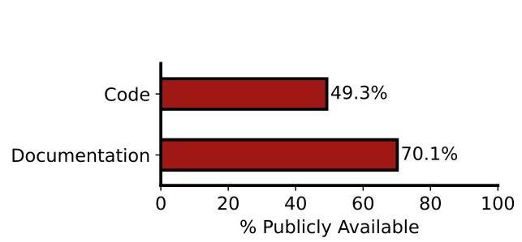
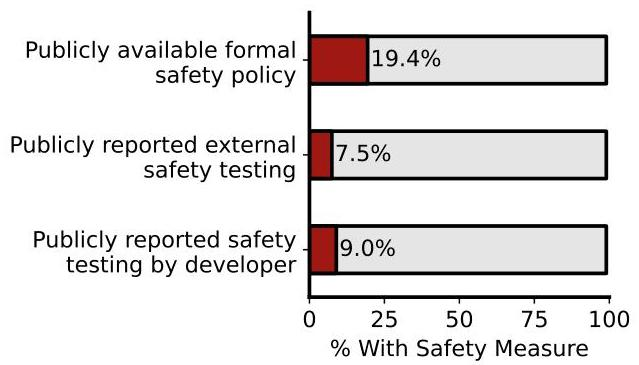
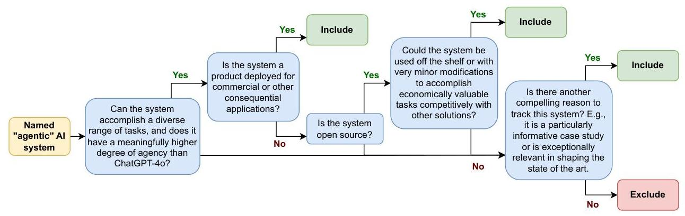
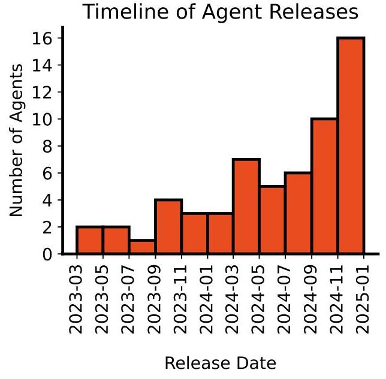
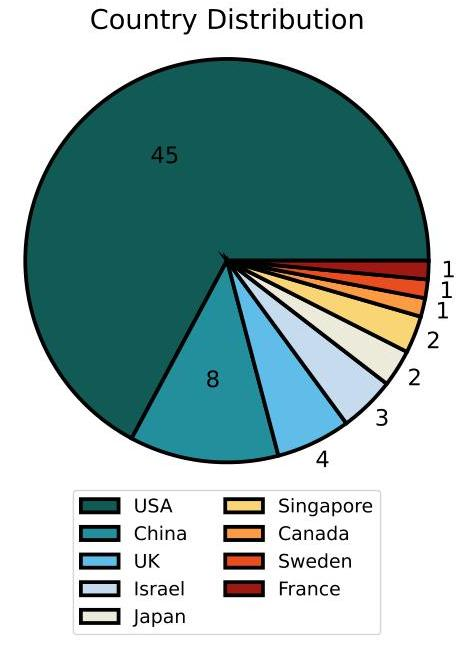
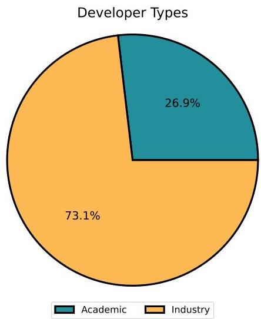
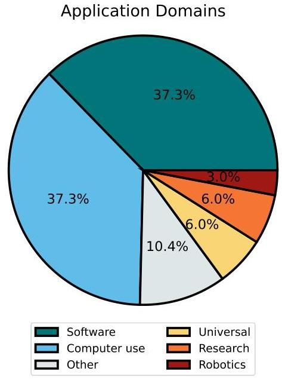

_Note: Source document was split into 2 OCR chunks (pages 1-9, pages 10-15) to stay within token limits._

# 202502.01635v1 The AI Agent Index

## Page 1
# The AI Agent Index 

Stephen Casper ${ }^{* 1}$ Luke Bailey ${ }^{2}$ Rosco Hunter ${ }^{3}$ Carson Ezell ${ }^{4}$ Emma Cabalé ${ }^{5}$ Michael Gerovitch ${ }^{1}$ Stewart Slocum ${ }^{1}$ Kevin Wei ${ }^{4}$ Nikola Jurkovic ${ }^{4}$ Ariba Khan ${ }^{1}$ Phillip Christoffersen ${ }^{1}$ A. Pinar Ozisik ${ }^{1}$ Rakshit Trivedi ${ }^{1}$ Dylan Hadfield-Menell ${ }^{1}$ Noam Kolt ${ }^{* 6}$ \section*{Abstract}

Leading AI developers and startups are increasingly deploying agentic AI systems that can plan and execute complex tasks with limited human involvement. However, there is currently no structured framework for documenting the technical components, intended uses, and safety features of agentic systems. To fill this gap, we introduce the AI Agent Index, the first public database to document information about currently deployed agentic AI systems. For each system that meets the criteria for inclusion in the index, we document the system's components (e.g., base model, reasoning implementation, tool use), application domains (e.g., computer use, software engineering), and risk management practices (e.g., evaluation results, guardrails), based on publicly available information and correspondence with developers. We find that while developers generally provide ample information regarding the capabilities and applications of agentic systems, they currently provide limited information regarding safety and risk management practices. The AI Agent Index is available online at https://aiagentindex.mit.edu/, with raw data at this link.

## 1. Introduction

'Agentic' AI systems that can be instructed to plan and directly execute complex tasks with only limited human involvement (Xi et al., 2023; Wang et al., 2024; Durante et al., 2024; Sager et al., 2025) are transitioning from research prototypes to real-world products (e.g., Devin, h2oGPTe, Simple AI, XBOW). These systems-which are generally comprised of foundation models augmented with scaffolding for reasoning, planning, memory, and tool use (Sumers

[^0]et al., 2023; Zaharia et al., 2024; Yao, 2024; Su et al., 2024)— are being deployed in a growing number of domains (see Figure 7).

The performance of agentic systems is steadily improving on benchmarks (Mialon et al., 2023b; Xie et al., 2024b; Zhou et al., 2023; Koh et al., 2024; Yoran et al., 2024; Xu et al., 2024), and these systems are being integrated into broader swathes of economic activity (Wang et al., 2024; Durante et al., 2024; Sager et al., 2025). As a result, their real-world impacts are mounting (Chan et al., 2023; Gabriel et al., 2024; Anwar et al., 2024; Kolt, 2025). Alongside the significant opportunities presented by agentic systems, researchers have also raised noteworthy concerns, including cybersecurity risks (Fang et al., 2024a;b), loss of control (Cohen et al., 2024; Bengio et al., 2025), and physical harm where agents operate robotic systems (Ruan et al., 2023).

Despite growing efforts to study trends in the development of agentic AI systems, including evaluating their performance and cost (Kapoor et al., 2024; Stroebl et al., 2025), assessing their potential harms (Andriushchenko et al., 2024; Kumar et al., 2024; U.S. AI Safety Institute, 2025), and increasing visibility into their operation (Shavit et al., 2023; Chan et al., 2024a;b; 2025; Kolt, 2025), many practical questions remain unanswered:

- Which organizations are developing agentic systems?
- In which domains are they being deployed?
- What infrastructure do agentic systems require?
- How is their performance and safety evaluated?
- What guardrails are used to mitigate risks?

To empirically answer these questions and improve public understanding of agentic AI systems, we introduce and release the AI Agent Index, a comprehensive sample of deployed agentic AI systems $(\mathrm{n}=67)$. The index, which is constructed from a combination of publicly available data and correspondence with developers, documents publiclyavailable information on the intended uses of agentic systems, their technical components (including reasoning, planning, and memory implementation, base models, observa-

[^0]:    ${ }^{*}$ Equal contribution ${ }^{1}$ Massachusetts Institute of Technology ${ }^{2}$ Stanford University ${ }^{3}$ University of Warwick ${ }^{4}$ Harvard University ${ }^{5}$ École Normale Supérieure Paris-Saclay, Université ParisSaclay ${ }^{6}$ Hebrew University. Correspondence to: Stephen Casper $<$ scasper@mit.edu $>$, Noam Kolt $<$ noam.kolt@mail.huji.ac.il $>$.

## Page 2
Figure 1. Most AI agent developers in the index provide some public documentation ( $70.1 \%$ ), while about half ( $49.3 \%$ ) release their underlying code.
tion and action space, and user interface), safety features (including accessibility of system components, usage controls and restrictions, and red-teaming practices), and details regarding the organizations developing and deploying agentic systems (including entity type and country of origin).

In addition to collecting and systematizing information about agentic AI systems, the index also sheds light on the availability of such information. Specifically, we find that while relatively detailed information is available regarding the features and applications of agentic systems (Figure 1), strikingly limited information is available regarding their safety evaluations and guardrails (Figure 2).

In this paper, we make three contributions:

1. We introduce a structured framework for documenting the technical, safety, and policy-relevant features of agentic AI systems.
2. We identify currently deployed agentic systems that meet our criteria (described below) and publicly document these systems according to our framework.
3. We discuss key findings from the index, shedding light on geographic spread, academic vs. industry development, openness, and risk management of agentic systems.

The index is available on the web at https://aiagentindex.mit.edu/ with raw data accessible here.

## 2. Background

There is no widely accepted definition of "AI agent". The notion of artificial agency has a long and contentious history, spanning multiple decades and diverse disciplines. These include cybernetics (Rosenblueth et al., 1943; Ashby, 1956;

Figure 2. Only $19.4 \%$ of indexed agentic systems disclose a formal safety policy, and fewer than $10 \%$ report external safety evaluations.

Wiener, 1961), artificial life (Maes, 1990; 1993; 1995), rational agency (Rao \& Georgeff, 1991), software engineering (Wooldridge \& Jennings, 1995; Jennings, 2000), reinforcement learning (Sutton \& Barto, 2018), and philosophy (Dennett, 1989; Dung, 2024). While there have been notable attempts to define the term "agent", including in the context of computational systems (Franklin \& Graesser, 1996; Russell \& Norvig, 2020; Kenton et al., 2023), we do not decide among these definitions or offer an alternative definition. Instead, we follow Chan et al. (2023), and loosely characterize agentic AI systems as ones that exhibit, to some significant degree, a combination of the following properties:
a) Underspecification: the system can accomplish a goal provided to it without a precise specification of how to do so.
b) Directness of impact: the system's actions can affect the world with little to no human mediation.
c) Goal-directedness: the system acts as if in the pursuit of a particular objective.
d) Long-term planning: the system can solve problems by reasoning about how to approach them, constructing plans, and executing them step by step.

### 2.1. Agentic Architectures, Applications, and Opportunities

Contemporary AI agents are generally compound systems (Zaharia et al., 2024) comprised of a foundation model augmented by external resources, known as "scaffolding", which enable effective planning, memory, and tool use (Wang et al., 2024; Xi et al., 2023; Durante et al., 2024). Planning of complex series of actions is typically facilitated through chain-of-thought-based reasoning processes (Wei et al., 2022; Yao et al., 2022c; 2023; Shinn et al., 2023; OpenAI, 2024). Memory relies on information stored in

## Page 3
the base model and/or in external storage modules (Sumers et al., 2023). Tool use is enabled through API calls and natural language dialogue between the base model and external software, databases, and other affordances (Schick et al., 2023; Mialon et al., 2023a; Qin et al., 2023).

These agentic architectures are increasingly applied to a variety of domains, including programming (Jimenez et al., 2023; Yang et al., 2024b), machine learning research (Huang et al., 2024; Wijk et al., 2024; Chan et al., 2024c), experimentation in the natural sciences (Boiko et al., 2023; Bran et al., 2024; Jansen et al., 2024), and consumer activities such as online retail (Yao et al., 2022a; Deng et al., 2023), travel planning (Xie et al., 2024a), and general-purpose web browsing (Gur et al., 2023; Wu et al., 2024). Progress in these applications is being evaluated by a growing suite of benchmarks, which measure performance in computer use (Mialon et al., 2023b; Xie et al., 2024b; Zhou et al., 2023; Koh et al., 2024; Yoran et al., 2024), software engineering (Jimenez et al., 2023; Yang et al., 2024b), and virtual work environments (Xu et al., 2024).

### 2.2. Safety Risks and Ethical Concerns

Given that agentic AI systems are built on foundation models, they are susceptible to many of the risks associated with such models, including harms arising from hallucinations, biased outputs, and leakage of private data (Bender et al., 2021; Weidinger et al., 2022; Solaiman et al., 2023). Agentic systems, however, also present new risks that stem specifically from their agentic properties, i.e., underspecification, directness of impact, goal-directedness, and long-term planning (Chan et al., 2023; Cohen et al., 2024; Ruan et al., 2023; Andriushchenko et al., 2024; Bengio et al., 2025). For example, while chatbots often cause harm by human users acting upon model outputs (e.g., deploying modelgenerated malicious code) (Phuong et al., 2024), agentic AI systems can directly cause harm (e.g., autonomously hacking websites) (Fang et al., 2024a; Jaech et al., 2024).

Additionally, as agentic AI systems undertake more complex and long-horizon tasks, with limited human oversight, users are likely to repose greater trust in those systems, potentially developing asymmetric relationships of dependence (Gabriel et al., 2024; Manzini et al., 2024b;a; Bengio et al., 2025). Moreover, agentic systems developed and operated by large platform companies could enable those companies to exert greater influence and control over users and third parties with whom they interact (e.g., vendors accessed through platform-controlled agents) (Lazar, 2024).

### 2.3. Documentation Frameworks

Many frameworks have been developed to document the features of AI systems, the resources used to build them, and the contexts in which they are deployed. These in-
clude datasheets (Gebru et al., 2018), model cards (Mitchell et al., 2019), reward reports (Gilbert et al., 2022), ecosystem graphs (Bommasani et al., 2023b), and data provenance cards (Longpre et al., 2023). In addition, several databases have been created to collect information regarding contemporary AI systems and their real-world impacts, such as the Foundation Model Transparency Index (Bommasani et al., 2023a), the AI Incident Database (McGregor, 2021), and the AI Risk Repository (Slattery et al., 2024). Currently, however, there are no equivalent frameworks for documenting agentic AI systems. This lack of structured information limits both researchers' ability to study and build agentic systems, as well as policymakers' capacity to design appropriate governance mechanisms (Winecoff \& Bogen, 2024).
The AI Agent Index fills this gap. By collecting and communicating technical, safety, and policy-relevant information concerning agentic AI systems, the index aims to inform different stakeholders in distinct ways. Specifically, the index:

1. Enables users to better understand the capabilities and limitations of agentic systems with which they interact.
2. Provides developers more comprehensive and granular information about currently deployed agentic systems.
3. Supports auditors and red-teams in deciding the scope and focus of their evaluations of agentic systems.
4. Offers an evidence base to policymakers designing governance mechanisms for agentic systems.
5. Improves public awareness and understanding of agentic systems.

## 3. Methods

What does the index include? As discussed in Section 2, there is no widely-accepted definition of "AI agent." We do not propose one here. Given our focus on the societal impacts of agentic AI systems, we draw on the four characteristics introduced by Chan et al. (2023) discussed in Section 2. Importantly, to address the practical questions outlined in Section 1, we primarily document the features of agentic AI systems that are either deployed as products or available open source.

The full decision graph we used to determine inclusion in the index is shown in Figure 3. Notably, we restricted the index to agentic systems and did not include language models themselves, or agent development frameworks (unless the framework was built around a qualifying flagship system, in which case we indexed that system). We also created a single index entry per named and versioned system. Different releases (e.g., "HelpfulAgent1.1" vs "HelpfulAgent1.2")

## Page 4
Figure 3. Decision graph for determining inclusion in the index: We focused on indexing agentic systems (as opposed to models or development frameworks) and drew on the four characteristics of agency from Chan et al. (2023): underspecification, directness of impact, goal-directedness, and long-term planning. In total, we indexed 67 systems.
and different configurations (e.g., "HelpfulAgent-Claude3.5Sonnet" vs. "HelpfulAgent-GPT4o") were indexed under the same entry. The final node in our decision graph (Figure 3) facilitates the inclusion of systems that otherwise would not strictly fit the criteria at our discretion. In practice, we only invoked this for systems from leading companies that were announced but have not (yet) been externally deployed, such as OpenAI o3 or Project Mariner. In total, we indexed 67 systems. Limitations of our methods are discussed in Section 6.

The AI Agent Index represents a snapshot in time as of December 31, 2024. New developments in the AI agent research and product ecosystem occur weekly. To improve thoroughness and consistency, we only indexed systems announced by, and available in, 2024.

What does the index not include? Our selection criteria led us to exclude the following types of systems:

- Non-"agentic" models such as Llama-3.2-90B-VisionInstruct (Dubey et al., 2024).
- Unnamed systems often comprised of simple baseline implementations introduced under frameworks or benchmarks such as CORE-Bench (Siegel et al., 2024), AgentHarm (Andriushchenko et al., 2024), or The Agent Company (Xu et al., 2024).
- Non-"agentic" development frameworks without a qualifying flagship model such as AutoGPT (Firat \& Kuleli, 2023), Beam, Dust, GumLoop, Lindy, OpenAI Swarm, Qwen-Agent, or Spell.
- Systems that cannot open-endedly accomplish a diverse range of tasks such as systems that propose solutions to git requests (e.g., MentatBot, Engine, Globant Code-Fixer Agent (Bel et al., 2024)).
- Systems that do not have a meaningfully higher degree of agency than ChatGPT-40 ${ }^{1}$ (based on the four aspects of agency from Chan et al. (2023)) such as Taskade, Vonage AI Virtual Assistant, Talkdesk, IBM WatsonX, and ActionAgents.
- Systems that are not open source or products deployed for commercial or other consequential applications such as Falcon-UI (Shen et al., 2024) or HoneyComb (Zhang et al., 2024).
- Open source systems that could not be used competitively off the shelf, often due to age or narrow scope such as GeniA, ReAct (Yao et al., 2022b), Pearl (Sun et al., 2023), or Moatlesss.
- Systems deployed after the cutoff date of December 31, 2024 such as Deepseek-R1, Doubao-1.5-pro, or OpenAI Operator.

How was information collected? From August 2024 to January 2025, we identified agentic AI systems using web searches, academic literature review, benchmark leaderboards (e.g., SWE-bench (Jimenez et al., 2023) and GAIA (Mialon et al., 2023b)), and additional resources that compile lists of agentic systems (e.g., https://aiagentslist.com/, https://vyokky.github.io/LLM-Brained-GUI-AgentsSurvey/, and https://www.letta.com/blog/ai-agents-stack).

On a rolling basis, we created the first drafts of agent cards according to the template outlined next in Section 4. After each first draft was completed, we contacted the developers of each agent to request feedback and potential corrections.

[^0]
[^0]:    ${ }^{1}$ ChatGPT-4o allows users to customize system prompts, can engage in open-ended dialogue, and can search/synthesize web searches when responding to users.

## Page 5
We received a $36 \%$ response rate. After editing each draft to incorporate feedback, we updated and finalized agent cards in January 2025 to ensure that all reflected the state of the field as of December 31, 2024. For all web sources cited in all agent cards (excluding stable papers, videos, and social media posts), we cited stable archived versions of websites preceding and as close to December 31, 2024 as possible using https://web.archive.org/ and https://perma.cc/.

## 4. Agent Card Components

Each agent card contains 33 fields of information, divided into 6 categories:

## 1. Basic information

- Website
- Short description
- Intended uses: What does the developer state that the system is intended for?
- Date(s) deployed

## 2. Developer

- Website
- Legal name
- Entity type
- Country (location of developer or first author's first affiliation)
- Safety policies: What safety and/or responsibility policies are in place?

## 3. System components

- Backend model: What model(s) are used to power the system?
- Publicly available model specification: Is there formal documentation on the system's intended uses and how it is designed to behave in them?
- Reasoning, planning, and memory implementation: How does the system 'think'?
- Observation space: What is the system able to observe while 'thinking'?
- Action space/tools: What direct actions can the system take?
- User interface: How do users interact with the system?
- Development cost and compute: What is known about the development costs?

## 4. Guardrails and oversight

- Accessibility of components:
- Weights: Are model parameters available?
- Data: Is data available?
- Code: Is code available?
- Scaffolding: Is system scaffolding available?
- Documentation: Is documentation available?
- Controls and guardrails: What notable methods are used to protect against harmful actions?
- Customer and usage restrictions: Are there know-your-customer measures or other restrictions on customers?
- Monitoring and shutdown procedures: Are there any notable methods or protocols that allow for the system to be shut down if it is observed to behave harmfully?

## 5. Evaluations

- Notable benchmark evaluations (e.g., on SWEBench Verified)
- Bespoke testing (e.g., demos)
- Safety: Have safety evaluations been conducted by the developers? What were the results?
- Publicly reported external red-teaming or comparable auditing:
- Personnel: Who were the redteamers/auditors?
- Scope, scale, access, and methods: What access did red-teamers/auditors have and what actions did they take?
- Findings: What did the red-teamers/auditors conclude?

## 6. Ecosystem

- Interoperability with other systems: What tools or integrations are available?
- Usage statistics and patterns: Are there any notable observations about usage?

## 7. Additional notes: If any

We populated each field in each card with written notes based on publicly available information. When no information was available, we recorded "None" or "Unknown."

## 5. Findings

In addition to compiling specific information regarding each of the 67 indexed systems, the AI Agent Index offers a high-level perspective of this emerging field. Noting the limitations and biases discussed next (in Section 6), here, we offer a bird's eye view of the state of the art for AI agents.

Agentic systems are being deployed at a steadily increasing rate. Systems that meet our criteria for inclusion in the index have had (initial) deployments dating back to early

## Page 6
2023. However, Figure 4 shows that they have been deployed at an increasing rate with approximately half of the indexed systems deployed in the second half of 2024.

Figure 4. Agentic systems are being deployed at a steadily increasing rate.

Most indexed systems are created by developers located in the USA. We considered the 'developer country' of each agent to be the national location of either (a) the developer organization if the developer was a company or (b) the first author's first listed affiliation if the agent was created as part of an academic research collaboration. We plot the number of agents from each country in Figure 5. Of the 67 agents, 45 were created by developers in the USA.

While most agentic systems are developed by companies, a significant fraction are developed in academia. In Figure 6, we show the developers of agents broken down based on whether they are projects from academic labs or companies in industry. 18 (26.9\%) are academic while 49 ( $73.1 \%$ ) are from companies.

The majority of indexed systems specialize in software engineering and/or computer use. We divided the 67 systems into 6 categories:

- Software: agents that assist in coding and software engineering (e.g., Yang et al., 2024a).
- Computer use: agents designed to open-endedly interact with computer interfaces (e.g., Yoran et al., 2024) (Sager et al., 2025).

Figure 5. Most agentic systems are created by developers in the USA. In this figure, some developers' countries are counted multiple times due to producing multiple indexed systems. Google DeepMind is counted 3x, while OpenAI, National University of Singapore, UC Berkeley, and Stanford University are each counted 2x.

Figure 6. Most agentic systems are developed by companies.

- Universal: agents designed to be a general-purpose reasoning engine (e.g., OpenAI, 2024).
- Research: agents designed to assist with scientific research (e.g., Lu et al., 2024).

## Page 7
- Robotics: agents designed for robotic control (e.g., Kim et al., 2024).
- Other: systems that are designed for niche applications (e.g., LinkedIn Talent Agents).

We plot the breakdown by domain in Figure 7. 50 of the 67 agents ( $74.6 \%$ ) specialize in either software engineering or computer use. We also note that there exist many 'agentic' systems for customer service, which do not meet our criteria for inclusion in the index. See Section 3 for discussion and examples.

Figure 7. The majority of indexed systems specialize in software engineering and/or computer use.

The majority of indexed systems have released code and/or documentation. Developers are relatively publicly forthcoming about details related to usage and capabilities. In Figure 1, we show results: 33 (49.3\%) release code, and 47 ( $70.1 \%$ ) release documentation. We also observed that systems developed as academic projects are released with a high degree of openness, with 16 of the 18 ( $88.8 \%$ ) releasing code.

There is limited publicly available information about safety testing and risk management practices. In contrast to the relatively high degree of openness that developers exercise around their systems' capabilities and usage, we find scant public information about safety policies, internal safety evaluations, and external safety evaluations. In Figure 2, we show that only 13 (19.4\%), 5 (7.5\%), and 6 (9\%) indexed systems have publicly available information on each of these, respectively. We also note that most of
the systems that have undergone formal, publicly-reported safety testing are from a small number of large companies (e.g., Anthropic, Google DeepMind, OpenAI).

## 6. Limitations and Concerns

Defining agentic systems. The term "AI agent" is contentious, as discussed in Section 2. In particular, the term has been criticized for inappropriately anthropomorphizing certain AI systems (Weidinger et al., 2022; Mitchell, 2021), which could potentially lead to unrealistic expectations from, or over-reliance on, such systems (Gabriel et al., 2024; Manzini et al., 2024b). Recognizing this concern, we do not weigh in on this debate, advocate a particular definition of "AI agent", or propose alternative terminology. Instead, we focus on empirically documenting a growing class of deployed AI systems that exhibit "agentic" characteristics (as described in Chan et al. (2023)) and have a potential for significant impact. Through the index, we communicate our findings as plainly and openly as possible.

Scope and timing of index. The index is not a comprehensive or exhaustive database of all agentic systems or related resources, such as language models and development frameworks for building agentic systems. The field of agentic AI is highly decentralized and poorly documented. Accordingly, there may also be systems that meet the selection criteria specified in Section 3 but do not appear in the index. In particular, the index is likely to disproportionately document agentic systems that are publicly available or publicly released, compared with systems used internally within organizations (which, by definition, are not publicly accessible). In addition, the index only includes systems described in the English language and includes relatively few systems from non-western developers. The index represents a snapshot in time on December 31, 2024 and does not include systems that were obsolete by this date or were released thereafter. Moreover, while the agent cards in the index collect 33 fields of information, these are not exhaustive and exclude, for example, records of real-world safety incidents (to the extent such incidents have occurred).

Incomplete or inaccurate information. In total, the index contains over 2,200 fields of information reviewed by multiple authors. Nonetheless, despite our best efforts to manually verify the completeness and accuracy of all agent cards, mistakes may have occurred. In addition, the response rate of developers to our requests for feedback was $36 \%$. Accordingly, it is possible that some developers may, for example, have in place internal safety documents or practices that we could not discover from publicly available documentation, or were not informed about through correspondence. Recognizing these concerns, we have established a structured process for facilitating further corrections to the index. These can be submitted at this link.

## Page 8
Promoting problematic practices. The findings we present in Section 5-particularly the lack of transparency around the safety features of agentic systems-could arguably promote problematic risk management practices. For example, developers could choose to 'game' an index like ours through perfunctory, selective disclosure of information recorded in the index (Krawiec, 2003; Marquis et al., 2016). Due in part to this concern, we do not use this index to make developer scorecards. Instead, we see our findings as offering basic information to key stakeholders, including users, developers, auditors, and policymakers. In doing so, we hope to lay the groundwork for more targeted assessments of impacts and risks from agentic systems in future work.

## 7. Discussion and Future Work

The agentic AI ecosystem is difficult to document. The extensive data collection process undertaken for the current paper (see Section 3) sheds light on the significant challenges involved in documenting agentic AI systems. During this process, we encountered a diverse range of AI systems, across multiple domains, in different places in the researchproduct spectrum, and accompanied by varying levels of information and documentation. The differences were often most stark when comparing systems developed in industry and systems developed in academia, the latter of which are typically simpler and more open. On occasion, these features of the agentic AI ecosystem made it challenging to determine whether a particular system meets our criteria for inclusion in the index. Most importantly, the fact that we ultimately produced an "AI Agent Index" should not be taken to suggest that this ecosystem lends itself to clean taxonomization and indexing (it does not). We expect these documentation challenges to persist for the foreseeable future.

Future documentation work should be appropriately scoped. Our research design-including both the selection of information fields to be collected and the methods for collecting data-offers lessons for future attempts to document the agentic AI ecosystem. From the outset, we sought to collect information on agentic systems that had been generally overlooked by previous survey papers and overviews of the field, such as the accessibility of documentation and code, information regarding red-teaming and safety policies, and the country of developers (see Section 4). Future documentation work can build on this approach, examining a broader range of technical, safety, and policy-relevant features of agentic AI systems. To ensure tractability, we recommend that future work surveying the agent ecosystem be appropriately scoped either in breadth or depth. For example, selection criteria could be revised to demand a high threshold for "agency" or anticipated societal impact.

Documentation can inform governance and policy. Our findings (discussed in Section 5) may inform the scope and methods of AI governance and policymaking:

- The majority of indexed agentic systems were developed in industry, suggesting that governance interventions should consider the incentives of corporate developers (distinct from those of academic labs).
- Most indexed systems were developed by US-based organizations, indicating that governance efforts focused on US contexts could have more leverage than efforts in other countries or regions.
- The prominence of software engineering and computeruse agents suggests that policy researchers and practitioners should prioritize these domains when designing governance frameworks.
- Very few developers disclose information about safety or risk management, underscoring the importance of establishing transparency and disclosure mechanisms as a key first step in the governance of agentic systems.

To address knowledge and accountability gaps uncovered by our findings, policymakers could consider:

- Structured bug bounties: Incentivizing external redteaming promotes the proactive discovery of vulnerabilities, adapting approaches used in cybersecurity.
- Systematic testing of agents: Governance bodies and academic labs could coordinate risk assessments of agentic systems.
- Centralized oversight of indices: Regulatory or standard-setting institutions could establish and maintain indices of agentic systems like this one.
- Integration with model registries: Incorporate indices of agentic systems into broader registry frameworks (McKernon et al., 2024), ensuring unified reporting of agentic systems, common safety benchmarks, and clearer accountability mechanisms.

## Impact Statement

This work was undertaken to improve our collective understanding of the emerging field of agentic AI. Its contributions revolve around the compilation and analysis of publicly available information, supplemented by correspondence with developers. In Section 6, we discuss how transparency standards can be 'gamed,' and note that this was one reason that we did not score developers using the index. Taken together, we hope the methodology and findings introduced by the AI Agent Index inform progress toward better risk management practices and governance frameworks for agentic AI systems.

## Page 9
## Acknowledgments

We are thankful to Alan Chan, Atoosa Kasirzadeh, Laker Newhouse, Gabe Mukobi, Rishi Bommasani, Peter Cihon, Merlin Stein, Greg Leppert, Jack Cushman, and Seth Lazar for discussions and feedback.

## References

Andriushchenko, M., Souly, A., Dziemian, M., Duenas, D., Lin, M., Wang, J., Hendrycks, D., Zou, A., Kolter, Z., Fredrikson, M., et al. Agentharm: A benchmark for measuring harmfulness of llm agents. arXiv preprint arXiv:2410.09024, 2024.

Anwar, U., Saparov, A., Rando, J., Paleka, D., Turpin, M., Hase, P., Lubana, E. S., Jenner, E., Casper, S., Sourbut, O., et al. Foundational challenges in assuring alignment and safety of large language models. arXiv preprint arXiv:2404.09932, 2024.

Ashby, W. R. An Introduction to Cybernetics. Chapman \& Hall, London, 1956.

Bel, M. A., Ríos, J. L., Carrasco, R. A. L., Michelini, J., Milano, G., Milano, G., Pérez, M., and Pasquero, G. Globant code fixer agent: Whitepaper, November 2024. URL https://ai.globant. com/wp-content/uploads/2024/11/ Whitepaper-Globant-Code-Fixer-Agent. pdf. Accessed: 2025-01-18.

Bender, E. M., Gebru, T., McMillan-Major, A., and Shmitchell, S. On the dangers of stochastic parrots: Can language models be too big? In Proceedings of the 2021 ACM conference on fairness, accountability, and transparency, pp. 610-623, 2021.

Bengio, Y., Mindermann, S., Privitera, D., Besiroglu, T., Bommasani, R., Casper, S., Choi, Y., Fox, P., Garfinkel, B., Goldfarb, D., Heidari, H., Ho, A., Kapoor, S., Khalatbari, L., Longpre, S., Manning, S., Mavroudis, V., Mazeika, M., Michael, J., Newman, J., Ng, K. Y., Okolo, C. T., Raji, D., Sastry, G., Seger, E., Skeadas, T., South, T., Strubell, E., Tramèr, F., Velasco, L., Wheeler, N., Acemoglu, D., Adekanmbi, O., Dalrymple, D., Dietterich, T. G., Felten, E. W., Fung, P., Gourinchas, P.-O., Heintz, F., Hinton, G., Jennings, N., Krause, A., Leavy, S., Liang, P., Ludermir, T., Marda, V., Margetts, H., McDermid, J., Munga, J., Narayanan, A., Nelson, A., Neppel, C., Oh, A., Ramchurn, G., Russell, S., Schaake, M., Schölkopf, B., Song, D., Soto, A., Tiedrich, L., Varoquaux, G., Yao, A., Zhang, Y.-Q., Albalawi, F., Alserkal, M., Ajala, O., Avrin, G., Busch, C., de Leon Ferreira de Carvalho, A. C. P., Fox, B., Gill, A. S., Hatip, A. H., Heikkilä, J., Jolly, G., Katzir, Z., Kitano, H., Krüger, A., Johnson, C.,

Khan, S. M., Lee, K. M., Ligot, D. V., Molchanovskyi, O., Monti, A., Mwamanzi, N., Nemer, M., Oliver, N., Portillo, J. R. L., Ravindran, B., Rivera, R. P., Riza, H., Rugege, C., Seoighe, C., Sheehan, J., Sheikh, H., Wong, D., and Zeng, Y. International ai safety report, 2025. URL https://arxiv.org/abs/2501.17805.

Boiko, D. A., MacKnight, R., Kline, B., and Gomes, G. Autonomous chemical research with large language models. Nature, 624(7992):570-578, 2023.

Bommasani, R., Klyman, K., Longpre, S., Kapoor, S., Maslej, N., Xiong, B., Zhang, D., and Liang, P. The foundation model transparency index. arXiv preprint arXiv:2310.12941, 2023a.

Bommasani, R., Soylu, D., Liao, T. I., Creel, K. A., and Liang, P. Ecosystem graphs: The social footprint of foundation models. arXiv preprint arXiv:2303.15772, 2023b.

Bran, M., Andres, Cox, S., Schilter, O., Baldassari, C., White, A. D., and Schwaller, P. Augmenting large language models with chemistry tools. Nature Machine Intelligence, pp. 1-11, 2024.

Chan, A., Salganik, R., Markelius, A., Pang, C., Rajkumar, N., Krasheninnikov, D., Langosco, L., He, Z., Duan, Y., Carroll, M., et al. Harms from increasingly agentic algorithmic systems. In Proceedings of the 2023 ACM Conference on Fairness, Accountability, and Transparency, pp. 651-666, 2023.

Chan, A., Ezell, C., Kaufmann, M., Wei, K., Hammond, L., Bradley, H., Bluemke, E., Rajkumar, N., Krueger, D., Kolt, N., et al. Visibility into ai agents. In The 2024 ACM Conference on Fairness, Accountability, and Transparency, pp. 958-973, 2024a.

Chan, A., Kolt, N., Wills, P., Anwar, U., de Witt, C. S., Rajkumar, N., Hammond, L., Krueger, D., Heim, L., and Anderljung, M. Ids for ai systems. arXiv preprint arXiv:2406.12137, 2024b.

Chan, A., Wei, K., Huang, S., Rajkumar, N., Perrier, E., Lazar, S., Hadfield, G. K., and Anderljung, M. Infrastructure for ai agents, 2025. URL https://arxiv.org/ abs/2501.10114.

Chan, J. S., Chowdhury, N., Jaffe, O., Aung, J., Sherburn, D., Mays, E., Starace, G., Liu, K., Maksin, L., Patwardhan, T., et al. Mle-bench: Evaluating machine learning agents on machine learning engineering. arXiv preprint arXiv:2410.07095, 2024c.

Cohen, M. K., Kolt, N., Bengio, Y., Hadfield, G. K., and Russell, S. Regulating advanced artificial agents. Science, 384(6691):36-38, 2024.

## Page 10
Deng, X., Gu, Y., Zheng, B., Chen, S., Stevens, S., Wang, B., Sun, H., and Su, Y. Mind2web: towards a generalist agent for the web. In Proceedings of the 37th International Conference on Neural Information Processing Systems, pp. 28091-28114, 2023.

Dennett, D. C. The intentional stance. 1989.
Dubey, A., Jauhri, A., Pandey, A., Kadian, A., Al-Dahle, A., Letman, A., Mathur, A., Schelten, A., Yang, A., Fan, A., et al. The llama 3 herd of models. arXiv preprint arXiv:2407.21783, 2024.

Dung, L. Understanding artificial agency. The Philosophical Quarterly, pp. pqae010, 2024.

Durante, Z., Huang, Q., Wake, N., Gong, R., Park, J. S., Sarkar, B., Taori, R., Noda, Y., Terzopoulos, D., Choi, Y., et al. Agent ai: Surveying the horizons of multimodal interaction. arXiv preprint arXiv:2401.03568, 2024.

Fang, R., Bindu, R., Gupta, A., Zhan, Q., and Kang, D. Llm agents can autonomously hack websites. arXiv preprint arXiv:2402.06664, 2024a.

Fang, R., Bindu, R., Gupta, A., Zhan, Q., and Kang, D. Teams of llm agents can exploit zero-day vulnerabilities. arXiv preprint arXiv:2406.01637, 2024b.

Firat, M. and Kuleli, S. What if gpt4 became autonomous: The auto-gpt project and use cases. Journal of Emerging Computer Technologies, 3(1):1-6, 2023.

Fourney, A., Bansal, G., Mozannar, H., Tan, C., Salinas, E., Niedtner, F., Proebsting, G., Bassman, G., Gerrits, J., Alber, J., et al. Magentic-one: A generalist multiagent system for solving complex tasks. arXiv preprint arXiv:2411.04468, 2024.

Franklin, S. and Graesser, A. Is it an agent, or just a program?: A taxonomy for autonomous agents. In International workshop on agent theories, architectures, and languages, pp. 21-35. Springer, 1996.

Gabriel, I., Manzini, A., Keeling, G., Hendricks, L. A., Rieser, V., Iqbal, H., Tomašev, N., Ktena, I., Kenton, Z., Rodriguez, M., et al. The ethics of advanced ai assistants. arXiv preprint arXiv:2404.16244, 2024.

Gebru, T., Morgenstern, J., Vecchione, B., Vaughan, J. W., Wallach, H., Daumé III, H., and Crawford, K. Datasheets for datasets. arXiv preprint arXiv:1803.09010, 2018.

Gilbert, T. K., Lambert, N., Dean, S., Zick, T., and Snoswell, A. Reward reports for reinforcement learning. arXiv preprint arXiv:2204.10817, 2022.

Gur, I., Furuta, H., Huang, A., Safdari, M., Matsuo, Y., Eck, D., and Faust, A. A real-world webagent with planning, long context understanding, and program synthesis. arXiv preprint arXiv:2307.12856, 2023.

Huang, Q., Vora, J., Liang, P., and Leskovec, J. Mlagentbench: Evaluating language agents on machine learning experimentation. In Forty-first International Conference on Machine Learning, 2024.

Jaech, A., Kalai, A., Lerer, A., Richardson, A., El-Kishky, A., Low, A., Helyar, A., Madry, A., Beutel, A., Carney, A., et al. Openai o1 system card. arXiv preprint arXiv:2412.16720, 2024.

Jansen, P., Côté, M.-A., Khot, T., Bransom, E., Mishra, B. D., Majumder, B. P., Tafjord, O., and Clark, P. Discoveryworld: A virtual environment for developing and evaluating automated scientific discovery agents. arXiv preprint arXiv:2406.06769, 2024.

Jennings, N. R. On agent-based software engineering. Artificial intelligence, 117(2):277-296, 2000.

Jimenez, C. E., Yang, J., Wettig, A., Yao, S., Pei, K., Press, O., and Narasimhan, K. Swe-bench: Can language models resolve real-world github issues? arXiv preprint arXiv:2310.06770, 2023.

Kapoor, S., Stroebl, B., Siegel, Z. S., Nadgir, N., and Narayanan, A. Ai agents that matter. arXiv preprint arXiv:2407.01502, 2024.

Kenton, Z., Kumar, R., Farquhar, S., Richens, J., MacDermott, M., and Everitt, T. Discovering agents. Artificial Intelligence, 322:103963, 2023.

Kim, M. J., Pertsch, K., Karamcheti, S., Xiao, T., Balakrishna, A., Nair, S., Rafailov, R., Foster, E., Lam, G., Sanketi, P., et al. Openvla: An open-source vision-languageaction model. arXiv preprint arXiv:2406.09246, 2024.

Koh, J. Y., Lo, R., Jang, L., Duvvur, V., Lim, M. C., Huang, P.-Y., Neubig, G., Zhou, S., Salakhutdinov, R., and Fried, D. Visualwebarena: Evaluating multimodal agents on realistic visual web tasks. arXiv preprint arXiv:2401.13649, 2024.

Kolt, N. Governing ai agents. arXiv preprint arXiv:2501.07913, 2025.

Krawiec, K. D. Cosmetic compliance and the failure of negotiated governance. Wash. ULQ, 81:487, 2003.

Kumar, P., Lau, E., Vijayakumar, S., Trinh, T., Team, S. R., Chang, E., Robinson, V., Hendryx, S., Zhou, S., Fredrikson, M., et al. Refusal-trained llms are easily jailbroken as browser agents. arXiv preprint arXiv:2410.13886, 2024.

## Page 11
Lazar, S. Frontier ai ethics: Anticipating and evaluating the societal impacts of generative agents. arXiv preprint arXiv:2404.06750, 2024.

Longpre, S., Mahari, R., Chen, A., Obeng-Marnu, N., Sileo, D., Brannon, W., Muennighoff, N., Khazam, N., Kabbara, J., Perisetla, K., et al. The data provenance initiative: A large scale audit of dataset licensing \& attribution in ai. arXiv preprint arXiv:2310.16787, 2023.

Lu, C., Lu, C., Lange, R. T., Foerster, J., Clune, J., and Ha, D. The ai scientist: Towards fully automated open-ended scientific discovery. arXiv preprint arXiv:2408.06292, 2024.

Maes, P. Designing autonomous agents: Theory and practice from biology to engineering and back. MIT press, 1990.

Maes, P. Modeling adaptive autonomous agents. Artificial life, 1(1_2):135-162, 1993.

Maes, P. Artificial life meets entertainment: lifelike autonomous agents. Communications of the ACM, 38(11): $108-114,1995$.

Manzini, A., Keeling, G., Alberts, L., Vallor, S., Morris, M. R., and Gabriel, I. The code that binds us: Navigating the appropriateness of human-ai assistant relationships. In Proceedings of the AAAI/ACM Conference on AI, Ethics, and Society, volume 7, pp. 943-957, 2024a.

Manzini, A., Keeling, G., Marchal, N., McKee, K. R., Rieser, V., and Gabriel, I. Should users trust advanced ai assistants? justified trust as a function of competence and alignment. In The 2024 ACM Conference on Fairness, Accountability, and Transparency, pp. 1174-1186, 2024b.

Marquis, C., Toffel, M. W., and Zhou, Y. Scrutiny, norms, and selective disclosure: A global study of greenwashing. Organization Science, 27(2):483-504, 2016.

McGregor, S. Preventing repeated real world ai failures by cataloging incidents: The ai incident database. In Proceedings of the AAAI Conference on Artificial Intelligence, volume 35, pp. 15458-15463, 2021.

McKernon, E., Glasser, G., Cheng, D., and Hadfield, G. Ai model registries: A foundational tool for ai governance. arXiv preprint arXiv:2410.09645, 2024.

Mialon, G., Dessì, R., Lomeli, M., Nalmpantis, C., Pasunuru, R., Raileanu, R., Rozière, B., Schick, T., DwivediYu, J., Celikyilmaz, A., et al. Augmented language models: a survey. arXiv preprint arXiv:2302.07842, 2023a.

Mialon, G., Fourrier, C., Swift, C., Wolf, T., LeCun, Y., and Scialom, T. Gaia: a benchmark for general ai assistants. arXiv preprint arXiv:2311.12983, 2023b.

Mitchell, M. Why ai is harder than we think. arXiv preprint arXiv:2104.12871, 2021.

Mitchell, M., Wu, S., Zaldivar, A., Barnes, P., Vasserman, L., Hutchinson, B., Spitzer, E., Raji, I. D., and Gebru, T. Model cards for model reporting. In Proceedings of the conference on fairness, accountability, and transparency, pp. 220-229, 2019.

OpenAI. Introducing openai o1-preview, September 2024. URL https://openai.com/index/ introducing-openai-o1-preview/. Accessed: 2025-01-19.

Phuong, M., Aitchison, M., Catt, E., Cogan, S., Kaskasoli, A., Krakovna, V., Lindner, D., Rahtz, M., Assael, Y., Hodkinson, S., et al. Evaluating frontier models for dangerous capabilities. arXiv preprint arXiv:2403.13793, 2024.

Qin, Y., Liang, S., Ye, Y., Zhu, K., Yan, L., Lu, Y., Lin, Y., Cong, X., Tang, X., Qian, B., et al. Toolllm: Facilitating large language models to master 16000+ real-world apis. arXiv preprint arXiv:2307.16789, 2023.

Rao, A. S. and Georgeff, M. P. Modeling rational agents within a bdi-architecture. In Proceedings of the Second International Conference on Principles of Knowledge Representation and Reasoning, pp. 473-484, 1991.

Rosenblueth, A., Wiener, N., and Bigelow, J. Behavior, purpose and teleology. Philosophy of science, 10(1):1824, 1943.

Ruan, Y., Dong, H., Wang, A., Pitis, S., Zhou, Y., Ba, J., Dubois, Y., Maddison, C. J., and Hashimoto, T. Identifying the risks of lm agents with an lm-emulated sandbox. arXiv preprint arXiv:2309.15817, 2023.

Russell, S. and Norvig, P. Artificial Intelligence: A Modern Approach. Pearson, USA, 4th edition, 2020.

Sager, P. J., Meyer, B., Yan, P., von Wartburg-Kottler, R., Etaiwi, L., Enayati, A., Nobel, G., Abdulkadir, A., Grewe, B. F., and Stadelmann, T. Ai agents for computer use: A review of instruction-based computer control, gui automation, and operator assistants. arXiv preprint arXiv:2501.16150, 2025.

Schick, T., Dwivedi-Yu, J., Dessì, R., Raileanu, R., Lomeli, M., Hambro, E., Zettlemoyer, L., Cancedda, N., and Scialom, T. Toolformer: Language models can teach themselves to use tools. Advances in Neural Information Processing Systems, 36:68539-68551, 2023.

## Page 12
Shavit, Y., Agarwal, S., Brundage, M., Adler, S., O’Keefe, C., Campbell, R., Lee, T., Mishkin, P., Eloundou, T., Hickey, A., et al. Practices for governing agentic ai systems. Research Paper, OpenAI, December, 2023.

Shen, H., Liu, C., Li, G., Wang, X., Zhou, Y., Ma, C., and Ji, X. Falcon-ui: Understanding gui before following user instructions. arXiv preprint arXiv:2412.09362, 2024.

Shinn, N., Cassano, F., Berman, E., Gopinath, A., Narasimhan, K., and Yao, S. Reflexion: Language agents with verbal reinforcement learning. arXiv preprint arXiv:2303.11366, 2023.

Siegel, Z. S., Kapoor, S., Nagdir, N., Stroebl, B., and Narayanan, A. Core-bench: Fostering the credibility of published research through a computational reproducibility agent benchmark. ArXiv, abs/2409.11363, 2024. URL https://api.semanticscholar. org/CorpusID:272694423.

Slattery, P., Saeri, A. K., Grundy, E. A., Graham, J., Noetel, M., Uuk, R., Dao, J., Pour, S., Casper, S., and Thompson, N. The ai risk repository: A comprehensive meta-review, database, and taxonomy of risks from artificial intelligence. arXiv preprint arXiv:2408.12622, 2024.

Solaiman, I., Talat, Z., Agnew, W., Ahmad, L., Baker, D., Blodgett, S. L., Chen, C., Daumé III, H., Dodge, J., Duan, I., et al. Evaluating the social impact of generative ai systems in systems and society. arXiv preprint arXiv:2306.05949, 2023.

Stroebl, B., Kapoor, S., and Narayanan, A. Hal: A holistic agent leaderboard for centralized and reproducible agent evaluation. https://github.com/ princeton-pli/hal-harness/, 2025.

Su, Y., Yang, D., Yao, S., and Yu, T. Language agents: Foundations, prospects, and risks. In Li, J. and Liu, F. (eds.), Proceedings of the 2024 Conference on Empirical Methods in Natural Language Processing: Tutorial Abstracts, pp. 17-24, Miami, Florida, USA, November 2024. Association for Computational Linguistics. doi: 10.18653/v1/2024.emnlp-tutorials. 3. URL https://aclanthology.org/2024. emnlp-tutorials.3/.

Sumers, T. R., Yao, S., Narasimhan, K., and Griffiths, T. L. Cognitive architectures for language agents. arXiv preprint arXiv:2309.02427, 2023.

Sun, S., Liu, Y., Wang, S., Zhu, C., and Iyyer, M. Pearl: Prompting large language models to plan and execute actions over long documents. ArXiv, abs/2305.14564, 2023. URL https://api.semanticscholar. org/CorpusID:258866190.

Sutton, R. S. and Barto, A. G. Reinforcement learning: An introduction. MIT press, 2018.
U.S. AI Safety Institute. Technical blog: Strengthening ai agent hijacking evaluations, January 2025. Accessed: 2025-01-19.

Wang, L., Ma, C., Feng, X., Zhang, Z., Yang, H., Zhang, J., Chen, Z., Tang, J., Chen, X., Lin, Y., et al. A survey on large language model based autonomous agents. Frontiers of Computer Science, 18(6):186345, 2024.

Wei, J., Wang, X., Schuurmans, D., Bosma, M., Xia, F., Chi, E., Le, Q. V., Zhou, D., et al. Chain-of-thought prompting elicits reasoning in large language models. Advances in neural information processing systems, 35:24824-24837, 2022.

Weidinger, L., Uesato, J., Rauh, M., Griffin, C., Huang, P.-S., Mellor, J., Glaese, A., Cheng, M., Balle, B., Kasirzadeh, A., et al. Taxonomy of risks posed by language models. In Proceedings of the 2022 ACM Conference on Fairness, Accountability, and Transparency, pp. 214-229, 2022.

Wiener, N. Cybernetics: Or Control and Communication in the Animal and the Machine. MIT Press, Cambridge, MA, 1961.

Wijk, H., Lin, T., Becker, J., Jawhar, S., Parikh, N., Broadley, T., Chan, L., Chen, M., Clymer, J., Dhyani, J., et al. Rebench: Evaluating frontier ai r\&d capabilities of language model agents against human experts. arXiv preprint arXiv:2411.15114, 2024.

Winecoff, A. A. and Bogen, M. Improving governance outcomes through ai documentation: Bridging theory and practice. arXiv preprint arXiv:2409.08960, 2024.

Wooldridge, M. and Jennings, N. R. Intelligent agents: Theory and practice. The knowledge engineering review, 10(2):115-152, 1995.

Wu, Z., Han, C., Ding, Z., Weng, Z., Liu, Z., Yao, S., Yu, T., and Kong, L. Os-copilot: Towards generalist computer agents with self-improvement. arXiv preprint arXiv:2402.07456, 2024.

Xi, Z., Chen, W., Guo, X., He, W., Ding, Y., Hong, B., Zhang, M., Wang, J., Jin, S., Zhou, E., et al. The rise and potential of large language model based agents: A survey. arXiv preprint arXiv:2309.07864, 2023.

Xie, J., Zhang, K., Chen, J., Zhu, T., Lou, R., Tian, Y., Xiao, Y., and Su, Y. Travelplanner: A benchmark for real-world planning with language agents. arXiv preprint arXiv:2402.01622, 2024a.

## Page 13
Xie, T., Zhang, D., Chen, J., Li, X., Zhao, S., Cao, R., Hua, T. J., Cheng, Z., Shin, D., Lei, F., et al. Osworld: Benchmarking multimodal agents for open-ended tasks in real computer environments. arXiv preprint arXiv:2404.07972, 2024b.

Xu, F. F., Song, Y., Li, B., Tang, Y., Jain, K., Bao, M., Wang, Z. Z., Zhou, X., Guo, Z., Cao, M., et al. Theagentcompany: benchmarking llm agents on consequential real world tasks. arXiv preprint arXiv:2412.14161, 2024.

Yang, J., Jimenez, C. E., Wettig, A., Lieret, K., Yao, S., Narasimhan, K., and Press, O. Swe-agent: Agentcomputer interfaces enable automated software engineering. arXiv preprint arXiv:2405.15793, 2024a.

Yang, J., Jimenez, C. E., Zhang, A. L., Lieret, K., Yang, J., Wu, X., Press, O., Muennighoff, N., Synnaeve, G., Narasimhan, K. R., et al. Swe-bench multimodal: Do ai systems generalize to visual software domains? arXiv preprint arXiv:2410.03859, 2024b.

Yao, S. Language Agents: From Next-Token Prediction to Digital Automation. PhD thesis, Princeton University, 2024.

Yao, S., Chen, H., Yang, J., and Narasimhan, K. Webshop: Towards scalable real-world web interaction with grounded language agents. Advances in Neural Information Processing Systems, 35:20744-20757, 2022a.

Yao, S., Zhao, J., Yu, D., Du, N., Shafran, I., Narasimhan, K., and Cao, Y. React: Synergizing reasoning and acting in language models. ArXiv, abs/2210.03629, 2022b. URL https://api.semanticscholar. org/CorpusID:252762395.

Yao, S., Zhao, J., Yu, D., Du, N., Shafran, I., Narasimhan, K., and Cao, Y. React: Synergizing reasoning and acting in language models. arXiv preprint arXiv:2210.03629, 2022c.

Yao, S., Yu, D., Zhao, J., Shafran, I., Griffiths, T. L., Cao, Y., and Narasimhan, K. Tree of thoughts: Deliberate problem solving with large language models. arXiv preprint arXiv:2305.10601, 2023.

Yoran, O., Amouyal, S. J., Malaviya, C., Bogin, B., Press, O., and Berant, J. Assistantbench: Can web agents solve realistic and time-consuming tasks? arXiv preprint arXiv:2407.15711, 2024.

Zaharia, M., Khattab, O., Chen, L., Davis, J. Q., Miller, H., Potts, C., Zou, J., Carbin, M., Frankle, J., Rao, N., and Ghodsi, A. The shift from models to compound ai systems. https://bair.berkeley.edu/blog/ 2024/02/18/compound-ai-systems/, 2024.

Zhang, H., Song, Y., Hou, Z., Miret, S., and Liu, B. Honeycomb: A flexible llm-based agent system for materials science. arXiv preprint arXiv:2409.00135, 2024.

Zhou, S., Xu, F. F., Zhu, H., Zhou, X., Lo, R., Sridhar, A., Cheng, X., Ou, T., Bisk, Y., Fried, D., et al. Webarena: A realistic web environment for building autonomous agents. arXiv preprint arXiv:2307.13854, 2023.

## Page 14
# A. Sample Agent Card 

Here, we provide a sample agent card for Microsoft's Magentic One (Fourney et al., 2024). We selected it based on its recency, degree of documentation, openness, generality, and noteworthy performance. No authors have conflicts of interest related to Microsoft or Magentic One, and this example selection was made without correspondence with Microsoft. Including Magentic One's agent card as an example is not an endorsement of the system or developer.

## Magentic One

## 1. Basic information

- Website: https://www.microsoft.com/en-us/research/publication/magentic-one-a-generalist-multi-agent-systemfor-solving-complex-tasks/
- Short description: A multiagent system introduced by Microsoft with general capabilities.
- Intended uses: What does the developer state that the system is intended for? It is used for "ad-hoc, open-ended tasks such as browsing the web and interacting with web-based applications, handling files, and writing and executing Python code" [source].
- Date(s) deployed: Announced November 4, 2023 [source].

## 2. Developer

- Website: https://web.archive.org/web/20241231232226/https://www.microsoft.com/en-us/
- Legal name: Microsoft Corporation [source].
- Entity type: Corporation [source].
- Country (location of developer or first author's first affiliation): Incorporation: Washington, USA (Microsoft Corporation (2357303)) [source]. Registration: Delaware, USA. HQ: Washington, USA [source].
- Safety policies: What safety and/or responsibility policies are in place? Model evaluations and red teaming; model reporting and information sharing; security controls [source]. Microsoft's safety policies are described online [source].

## 3. System components

- Backend model: What model(s) are used to power the system? The default model used is gpt-4o-2024-05-13, but they also experiment with using OpenAI o1 [source].
- Publicly available model specification: Is there formal documentation on the system's intended uses and how it is designed to behave in them? Available [source].
- Reasoning, planning, and memory implementation: How does the system 'think'? The system contains multiple subagents that work together to solve problems. Things are controlled at a high level by the "Orchestrator" agent and executed by the "WebSurfer," FileSurfer," "Coder," and "ComputerTerminal" agents [source].
- Observation space: What is the system able to observe while 'thinking'? It has full access to a filesystem and web browser.
- Action space/tools: What direct actions can the system take? It is able to surf (including posting) on the web, execute file system commands, and write/execute code.
- User interface: How do users interact with the system? Users can configure and experiment with it using the AutoGen package [source].
- Development cost and compute: What is known about the development costs? Unknown.

## 4. Guardrails and oversight

- Accessibility of components:
- Weights: Are model parameters available? N/A; backends various models.
- Data: Is data available? N/A; backends various models.
- Code: Is code available? Available on GitHub as part of Microsoft's AutoGen project [source].
- Scaffolding: Is system scaffolding available? Available [source].
- Documentation: Is documentation available? Available on GitHub [source], see also the technical report [source].

## Page 15
- Controls and guardrails: What notable methods are used to protect against harmful actions? The developers recommend using containers, virtual environments, log monitoring, human oversight, access limitations, and data safeguards.
- Customer and usage restrictions: Are there know-your-customer measures or other restrictions on customers? None.
- Monitoring and shutdown procedures: Are there any notable methods or protocols that allow for the system to be shut down if it is observed to behave harmfully? Logs are kept while the system runs.

# 5. Evaluations 

- Notable benchmark evaluations (e.g., on SWE-Bench Verified): GAIA (38\%), AssistantBench (27.7\%), and WebArena (32.8\%) [source].
- Bespoke testing (e.g., demos): None.
- Safety: Have safety evaluations been conducted by the developers? What were the results? They report on ad-hoc evaluations of failures and safety concerns in the technical report [source]. The developers claim: "We performed testing for Responsible AI harm e.g., cross-domain prompt injection and all tests returned the expected results with no signs of jailbreak" [source].
- Publicly reported external red-teaming or comparable auditing:
- Personnel: Who were the red-teamers/auditors? None.
- Scope, scale, access, and methods: What access did red-teamers/auditors have and what actions did they take? None.
- Findings: What did the red-teamers/auditors conclude? None.

## 6. Ecosystem

- Interoperability with other systems: What tools or integrations are available? It was not explicitly designed to interoperate with any particular systems other than the web browser and filesystem. But it presumably could integrate with others with little configuration.
- Usage statistics and patterns: Are there any notable observations about usage? Microsoft AutoGen has 36.9k stars and 5.3 k forks [source].

7. Additional notes: None.