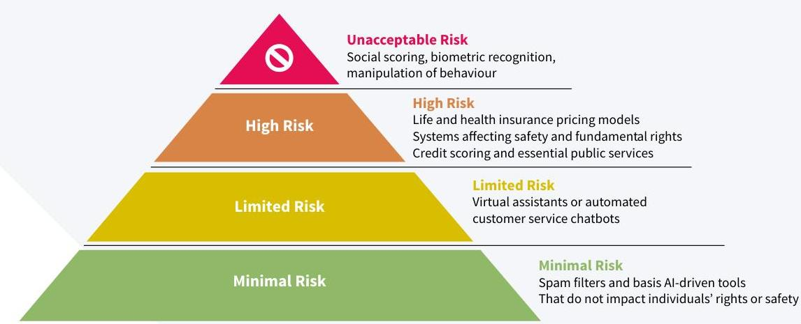

_Note: Source document was split into 2 OCR chunks (pages 1-19, pages 20-31) to stay within token limits._

# 20250324 AAE-Discussion-Paper-Navigating-Europes-AI-Act

## Page 1
# NAVIGATING EUROPE'S AI ACT: INSIGHTS FOR ACTUARIES AND THE INSURANCE SECTOR

**MARCH 2025**

## Page 2
This discussion paper explores the pioneering legislation of the European Union's AI Act, the world's first comprehensive regulatory framework for artificial intelligence. It delves into the AI Act's risk-based approach to categorising AI systems, its implications for the insurance and risk management sectors, and its specific relevance to actuarial practices. The paper highlights the intersection of the AI Act with other regulatory frameworks, such as Solvency II, GDPR, and DORA, offering actionable insights for actuaries to align compliance efforts with responsible AI deployment. The discussion emphasises the role of actuaries in ensuring AI systems are transparent, ethical, and aligned with societal and organisational goals. The insights provided aim to guide professionals in navigating the complexities of AI governance while leveraging its potential to innovate and manage risks effectively.

# CONTRIBUTORS 

ANNI HELLMAN BOGDAN TAUTAN CLAUDIO SENATORE RESO ESKO KIVISAARI JONAS HIRZ ROBERTO CARCACHE FLORES STEPHANOS HADJISTYLLIS

AAE Artificial Intelligence and Data Science Working Group

[^0]
[^0]:    This paper is a discussion paper of the Actuarial Association of Europe. Any views expressed in this paper are views to stimulate and inform further discussion and should not be read as being representative either of the authors' or contributors' individual opinions or of their employers or professional organisations or an agreed position of the Actuarial Association of Europe.

## Page 3
# CONTENTS 

1 INTRODUCTION ..... 4
2 INTERNATIONAL DEVELOPMENT AND ALIGNMENT OF DEFINITIONS ..... 6
3 AI ACT: PRESENT STATUS AND KEY DATES ..... 9
4 RISK-BASED CATEGORISATION OF AI SYSTEMS AND AI ACT REQUIREMENTS ..... 11
4.1. High-risk systems and implications for actuarial work ..... 12
4.2. Operator requirements for high-risk systems ..... 14
4.3. Requirements relating to General-Purpose AI Systems (GPAI) ..... 17
5 THE INTERCONNECTION OF THE AI ACT WITH OTHER REGULATIONS ..... 19
6 AI ACT SUPERVISION AND NON-COMPLIANCE FINES ..... 23
7 RELEVANCE TO ACTUARIES AND ACTUARIAL WORK ..... 26
8 CONCLUSION ..... 28
REFERENCES ..... 30

## Page 4
# 1 INTRODUCTION 

Artificial Intelligence (AI) has become a global focus, prompting regulators to adapt governance frameworks to ensure its responsible use. The European Union's recent AI Act, formally known as Regulation (EU) 2024/1689, (hereafter the 'AI Act' or the 'Act'), represents a groundbreaking effort to establish comprehensive governance for this rapidly evolving technology.

Unlike a directive, which requires transposition into national law, the AI Act is a directly applicable regulation, meaning it applies directly and uniformly across the EU without requiring additional national legislation. It follows a maximum harmonisation approach, preventing Member States from introducing stricter or looser AI rules at the national level. This contrasts with frameworks such as the Insurance Distribution Directive (IDD), which follows a minimum harmonisation approach, allowing Member States to introduce national requirements beyond the EU's baseline rules.

As AI technology advances, establishing robust governance, regulations, and principles is crucial for effectively managing risks and maximising benefits. Actuarial work, being deeply rooted in ethical decision-making and societal values, can uniquely contribute to AI governance by prioritising long-term risk assessment and ethical considerations. These foundations equip actuaries to promote AI systems that align with societal and organisational goals while maintaining transparency and fairness.

This discussion paper provides an overview of how European regulation helps institutions in developing and deploying AI responsibly, while highlighting areas of importance for both actuaries and the wider insurance industry. It examines the EU's AI Act, the first comprehensive legislation that establishes a framework to regulate artificial intelligence within a structured, risk-based framework.

The paper explores how the Act categorises AI systems, sets compliance requirements, and establishes governance to address societal, ethical, and legal concerns. However, this regulatory landscape continues to evolve. While the AI Act sets a foundational legal framework, further guidance is being developed to refine its implementation. The European Commission has already issued guidance on the definition of AI systems and prohibited AI practices, clarifying key aspects of the Act's scope and enforcement. Additionally, the European Insurance and Occupational Pensions Authority has launched a consultation on AI governance and risk management, signalling that further sector-specific guidance will be developed. As AI adoption grows and new challenges emerge, further regulatory refinements are expected, making it essential for professionals to stay informed of ongoing developments.

## Page 5
Consideration is given to the implications for actuarial professionals, particularly regarding high-risk systems relevant to life and health insurance. These systems require rigorous assessment and ongoing monitoring due to their potential impact on fundamental rights and societal well-being. Actuaries, with their expertise in probabilistic modelling and risk analysis, are uniquely positioned to evaluate and manage these systems, ensuring they operate ethically and within regulatory requirements.

By analysing synergies with existing frameworks such as GDPR and Solvency II, this paper provides insights for actuaries to integrate AI governance principles in their work. These steps aim to promote compliance while also enabling organisations to leverage AI for innovation and improved risk management. Through this lens, the paper aims to guide actuaries in adapting to regulatory advancements and maximising AI's potential within the European market.

## Page 6
# 2 INTERNATIONAL DEVELOPMENT AND ALIGNMENT OF DEFINITIONS 

The Organisation for Economic Co-operation and Development (OECD) has been a leader in setting global AI standards, introducing its first AI principles in 2019 as an intergovernmental benchmark. These principles, which promote human rights and democratic values, are continually updated, with the latest recommendations published in May 2024 refining AI definitions to align with current technological advancements.

Additionally, by aiming at global collaboration across jurisdictions, the OECD announced in July 2024 the Global Partnership on Artificial Intelligence (GPAI) ${ }^{1}$, a multi stakeholder initiative, guiding the responsible development and use of AI by respecting human rights and democratic values. The partnership aims to bridge the gap between AI policy development and research across countries.

The OECD proposed a universally applicable definition that encapsulates the essence of an AI system:

An AI system is a machine-based system that, for explicit or implicit objectives, infers, from the input it receives, how to generate outputs such as predictions, content, recommendations, or decisions that can influence physical or virtual environments. Different AI systems vary in their levels of autonomy and adaptiveness after deployment.

Similarly to the OECD's efforts to foster international cooperation, the Bletchley Declaration endorsed in the UK in 2023 by 28 countries, including the US, UK, China, and the EU - represents a global commitment to AI safety. While the OECD focuses on long-term policy frameworks and fostering research collaboration, the Bletchley Declaration emphasises immediate risk identification (e.g. discrimination, misinformation, cybersecurity, etc.) and mitigation strategies, particularly concerning general-purpose AI models.

Many local laws and governance frameworks are shaped by international initiatives like those from the OECD or agreements such as the Bletchley Declaration. Similarly, significant milestones include the European Commission's 2019 'Ethics Guidelines for Trustworthy AI' and the Monetary Authority of Singapore's FEAT principles, which prioritised fairness, ethics, accountability, and transparency.

## Page 7
The table below provides an overview of how AI definitions compare between the European Union, China and the US:

|  EUROPEAN UNION | CHINA | US  |
| --- | --- | --- |
|  'AI system' means a machine-based system that is designed to operate with varying levels of autonomy and that may exhibit adaptiveness after deployment, and that, for explicit or implicit objectives, infers, from the input it receives, how to generate outputs such as predictions, content, recommendations, or decisions that can influence physical or virtual environments; | China's definition of AI is more complex, relying on provisions within various security laws tailored to specific applications. Key policies such as the 'Administrative Provisions on Algorithm Recommendation for Internet Information Services', 'Administrative Provisions on Deep Synthesis (China, sd) in Internet Information Services', and 'Provisional Measures on the Management of Generative Artificial Intelligence Services' define the following terms:
Algorithm: A set of rules or procedures enabling a computer to solve problems or perform tasks.
Data Security: Safeguarding data against unauthorized access, use, disclosure, disruption, modification, or destruction.
Deep Synthesis: Al-driven creation or manipulation of audio, video, or images, making them indistinguishable from authentic content. | The 'National Artificial Intelligence Initiative Act of 2020' (US Government, sd) defines AI as a machine-based system that, for a given set of human-defined objectives, makes predictions, recommendations, or decisions that influence real or virtual environments based on human-defined objectives. Al systems utilize both machine and human inputs to:
Perceive real and virtual environments; Abstract these perceptions into models through automated analysis, and; Use model inference to generate options for information or action.
This Act is not yet approved as a standalone bill, but its key provisions were incorporated into the National Defense Authorization Act for Fiscal Year 2021.  |

TABLE 1: HOW MAJOR REGIONS DEFINE AI

While international organisations like the OECD promote AI principles based on shared democratic values, regional AI regulations remain fragmented, as discussed below:

- The EU's AI Act prioritises fundamental rights, ethics, and precautionary risk management, following a strict 'human-centric' approach. Rooted in the Ethics Guidelines for Trustworthy AI, the Act distinguishes itself as the world's first comprehensive AI law, introducing a risk-based framework that mandates impact assessments on fundamental rights. Unlike the US's innovation-driven approach or China's security-focused model, the EU places consumer protection, transparency, and accountability at the heart of its AI strategy. The Act's provisions require strong human oversight, rigorous documentation, and clear compliance

## Page 8
mechanisms—making it one of the most stringent AI governance frameworks globally. This approach is designed to ensure that AI systems deployed in Europe align with democratic values, fair treatment, and individual rights.

- The US has adopted a more innovation-driven, decentralised approach, relying on voluntary frameworks and sector-specific guidelines rather than a federal AI law. While the Congress has enacted the 'National AI Initiative Act of 2020' as part of the 'National Defense Authorization Act' in 2021, various agencies, including the National Institute of Standards and Technology, the Federal Trade Commission, and the National Association of Insurance Commissioners, are developing their own frameworks.
- China has taken a state-driven, security-focused approach, prioritising AI control mechanisms, and national security applications, with transparency and ethics remaining relevant. Key regulations, such as the 'Interim Measures for the Management of Generative AI Services', support independent innovation, encouraging sector opportunities in AI technology. While a comprehensive AI legislation does not exist yet, rules promulgated by the Chinese government involve only some specific industries and technologies.

These fundamental differences mean that full alignment and harmonisation of AI regulation at a global level remains far from ideal. As global agreements are sought, approaches like the focus on technological competitiveness in the US and China's strict state oversight of AI systems could benefit from further alignment. The current divergence presents challenges for companies operating across jurisdictions, requiring a nuanced approach to compliance.

## Page 9
# 3 AI ACT: PRESENT STATUS AND KEY DATES 

The AI Act represents a significant milestone in technology regulation. As a directly applicable regulation, the AI Act establishes a single, EU-wide legal framework for AI governance. This differs from directives, such as the Insurance Distribution Directive (IDD), which provide highlevel requirements that Member States must transpose into national law, permitting variations across jurisdictions. The AI Act follows a maximum harmonisation approach, meaning that EU countries cannot impose additional AI-related requirements beyond those set in the Act, ensuring a consistent regulatory landscape across the Single Market.

At the EU level, the foundational structure of the AI Act is now in place, marked by the establishment of the AI Office within the European Commission's Directorate-General for Communications Networks, Content, and Technology (DG Connect). This office is divided into five specialised units: Excellence in AI and Robotics, AI Regulation and Compliance, AI Safety, AI Innovation and Policy Coordination, and AI for Societal Good. Additionally, the Act calls for the creation of advisory bodies, such as the Advisory Forum and the Scientific Panel (Articles 67 and 68), which are yet to be launched. These bodies are expected to provide expert guidance, promote collaboration between stakeholders, and enhance the practical implementation of the Act by addressing technical and ethical challenges in AI governance.

Further critical tasks remain. These include setting up the AI Board (formed by Member States) and improving coordination among EU entities. Additionally, detailed guidelines must be developed for risk assessment, prohibited practices, and transparency requirements (Articles 5, 9, 52, 53, and 61). At the national level, roles for Notifying Authorities, Notified Bodies, and Market Surveillance Authorities are yet to be defined. For example, in the insurance sector, implementation oversight would involve the same authorities currently overseeing activities under Solvency II. These authorities possess extensive experience in risk management, regulatory compliance, and actuarial practices, making them well-suited to adapt their oversight capabilities to the challenges posed by AI systems. However, EU Member States have the discretion to designate a different authority for AI-specific oversight if deemed appropriate (see Section 4 for more details).

For companies operating within the European market, adhering to compliance timelines is essential for planning and aligning operational strategies with regulatory expectations. The final agreements by the European Parliament and the European Council established the following compliance timelines:

## Page 10
|  MILESTONE | KEY DATES  |
| --- | --- |
|  Codes of Practice expected to be ready, to support providers in
demonstrating compliance on time. | 2 May 2025  |
|  Establishment of competent authorities and single points of contact by
Member States; Commission will make the list of single points public for
accessibility. | 2 August 2025  |
|  Application of provisions on notified bodies and governance structures. | 2 August 2025  |
|  Provisions on penalties for non-compliance apply (See Section 5)* | 2 August 2025  |
|  Governance and conformity assessment systems are operational | 2 August 2026  |
|  Deadline to comply for high-risk AI systems under Annex I of the AI Act
(products subject to product safety legislation) that are put on the market
on or after 2 August 2026 | 2 August 2027  |
|  Deadline to comply for pre-existing high-risk systems intended for public
authority use | 2 August 2030  |

*Member States should lay down the rules on penalties, including administrative fines, to address non-compliance. These rules must be shared with the European Commission and be operational by the date of application of the regulation.

## Page 11
# 4 RISK-BASED CATEGORISATION OF AI SYSTEMS AND AI ACT REQUIREMENTS 

The AI Act is a binding EU regulation, meaning it applies to all industries and all member states. It categorises AI systems using a risk-based methodology, focusing on their potential impact on individual rights and well-being. Some activities that are not explicitly excluded from its scope might already be subject to other concurrent legislations or European directives, such as the General Data Protection Regulation (GDPR) or the Digital Operational Resilience Act (DORA). The categorisation of AI systems based on their risk depends on how they are placed within the European market. This applies to organisations or developers that can be involved in the use or distribution of a system within the European market, whether as part of a commercial activity in exchange for payment or free of charge.

The aim of the Act is to support innovation and promote the adoption of human-centric and trustworthy AI. At the same time, it seeks to promote a high level of protection for health, safety, fundamental rights, the rule of law, and environmental sustainability.

FIGURE 1: RISK-BASED CATEGORISATION OF AI SYSTEMS UNDER THE AI ACT

The Act classifies AI systems in four risk-based categories. These classifications are based on the criteria set out in the Act, which provides detailed guidance on how AI systems should be assessed to determine their risk level.

- Unacceptable Risk: These systems are generally deemed harmful and are prohibited under the AI Act. Examples of AI systems classified as unacceptable risk include social scoring systems that unjustly treat individuals, biometric recognition systems used for mass surveillance or without consent, systems exploiting psychological vulnerabilities to manipulate behaviour.
- High Risk: Systems in this category are critical to health, safety, or fundamental rights. Examples include AI applications used in life and health insurance pricing, credit scoring, education systems, and essential public services.

## Page 12
- Limited Risk: Systems that pose moderate risks and require specific transparency obligations. For instance, AI systems such as virtual assistants or automated customer service chatbots must disclose their AI nature to users.
- Minimal Risk: These systems present negligible or no risk and are not subject to additional requirements beyond existing EU regulations. Examples include spam filters and basic AIdriven tools that do not impact individuals' rights or safety.

It is noted that General Purpose AI (GPAI) Systems, such as large language models with selfsupervision, are treated as a distinct category under the AI Act. While these systems are not inherently assigned to one of the four risk categories, their specific applications may cause them to fall within a risk classification. For example, if a GPAI system is used for biometric surveillance, it would be categorised as Unacceptable Risk. Similarly, if applied in high-stakes areas like healthcare or law enforcement, it could qualify as High-Risk.

Additionally, if a GPAI system is deemed systemic, it must comply with stricter provisions, as outlined in Article 52 of the AI Act. These include enhanced transparency, accountability, and risk management obligations. Systemic risks may include widespread misinformation, bias reinforcement, or the potential for economic disruption, such as automated trading systems amplifying market volatility.

# 4.1. HIGH-RISK SYSTEMS AND IMPLICATIONS FOR ACTUARIAL WORK 

This section focuses on the high-risk category, which may be a key area of focus for actuaries, either from a risk management perspective or in ensuring compliance with systems related to their work.

While high-risk AI systems are particularly relevant to life and health insurance, actuaries' expertise extends beyond these sectors. Many of the AI Act's requirements - such as those on data governance, quality management, and risk assessment - are well aligned with actuarial skills. This positions actuaries to contribute not only in insurance but also in other fields deploying high-risk AI, such as finance and broader risk management applications.

Appendix III of the Act lists areas included in this category in more detail, such as risk assessment and pricing in life and health insurance. While only the systems used for risk assessment and pricing in relation to natural persons in life and health insurance are initially listed in the Appendix, it is quite possible that other practice areas will be included in the AI Act later, e.g. general insurance pricing, as AI technologies evolve to encompass broader applications like fraud detection, underwriting, claims management, and predictive analytics.

Recent guidance from the European Commission on the definition of AI systems has provided further clarity on which models fall within the scope of the AI Act. The guidelines indicate

## Page 13
that traditional statistical models, such as linear and logistic regression, may not meet the Act's definition of an AI system, particularly if they lack autonomy, adaptivity, or self-learning capabilities. This suggests that many actuarial models, including traditional Generalised Linear Models (GLMs), may not be classified as AI systems under the Act. However, actuaries should assess whether any models they use incorporate adaptive algorithms or automated learning processes, as these features could bring them within the scope of AI regulation.

A prudent and forward-thinking approach for actuaries involved in the risk management of systems is to consider the requirements of high-risk systems, even when engaging in practices not explicitly covered by the Act. Additionally, since actuaries may interact with AI at different stages of its lifecycle, they need to distinguish the type of operator involved when an AI system is being used or developed, as this could affect their responsibilities for ensuring compliance with relevant regulations and maintaining oversight of system performance.

The Act describes four types of operators, as follows:

- Provider: Develops the AI system and is responsible for ensuring its compliance before placing it on the EU Market. Providers must conduct conformity assessments and maintain technical documentation. They are also responsible for ensuring data quality, transparency, and continuous monitoring of AI system performance.
- Distributor: Makes the AI system available to the market, but does not modify it. ensuring compliance with standards and proper storage. Distributors must verify that AI systems they distribute meet compliance requirements and have the necessary documentation. If they become aware of risks or non-compliance, they must inform the provider, importer, or market authorities as appropriate.
- Importer: Acts as the authorised representative responsible for placing an AI system developed outside the EU onto the EU market. Importers play a key role in ensuring compliance, as they must verify that the provider (often based outside the EU) has met all regulatory requirements, including conformity assessments, documentation, and registration obligations. In practice, this means that providers outside the EU must either establish direct compliance mechanisms or work closely with importers to meet the AI Act's requirements.
- Deployer: Uses an AI system within the EU. Deployers must ensure that they use AI systems in accordance with the provider's instructions, maintain human oversight, and (for high-risk AI) conduct impact assessments where required. They are also responsible for monitoring AI system performance and reporting any serious incidents or risks to the relevant authorities.

Most areas of concern for actuaries would be expected to be addressed by the requirements applicable to Providers and Deployers, although, actuaries may find themselves working in the capacity of all four operators. For example, importers serve as a compliance gateway, and therefore actuaries advising providers outside the EU should be aware that meeting the AI Act's

## Page 14
high-risk system requirements will often be driven by importer demands. This dynamic creates both challenges and opportunities for actuaries involved in AI governance, risk management, and regulatory alignment in international contexts. For actuaries, these concerns may include ensuring transparency in AI-driven decision-making processes, mitigating potential biases in data and algorithms, and maintaining robust documentation for regulatory compliance.

The requirements for Providers focus on ensuring the development of compliant systems, while Deployers are tasked with safeguarding ethical use and continuous monitoring of AI systems to align with actuarial principles and regulatory expectations. Section 4.2 provides more detail on these aspects.

# 4.2. OPERATOR REQUIREMENTS FOR HIGH-RISK SYSTEMS 

The requirements outlined in this section form the backbone of compliance obligations for high-risk AI systems. These obligations aim to promote a high standard of safety, transparency, and accountability among both providers and deployers throughout the lifecycle of these systems. Beyond the initial risk management and conformity assessments, AI operators must also implement ongoing governance measures, ensure proper oversight, and integrate new reporting requirements into existing regulatory frameworks such as Solvency II.

The European Commission has begun issuing guidance related to the AI Act, starting with clarifications on the definition of AI Systems and prohibited AI practices. The EC Guidelines on the Definition of an AI System (February 2025) provide further clarity on what qualifies as an AI system under the Act, reinforcing the broad scope of the regulation and ensuring that AI-like decision-making systems are not excluded due to technical nuances. Additionally, the Guidelines on Prohibited AI Practices (February 2025) outline key areas where AI use is bannedsuch as manipulative systems exploiting vulnerabilities or AI used for social scoring. These clarifications are critical for providers and deployers seeking to determine their AI compliance obligations. Although, it is noted that compliance guidance specific to high-risk AI systems has not yet been published. The AI Act mandates that such guidance be issued by February 2026, providing further details on implementation and enforcement.

While different AI operators have distinct roles, they share a common responsibility: ensuring that AI systems remain compliant, fair, and transparent throughout their lifecycle. Providers must focus on development-phase obligations, such as risk assessments and conformity procedures, whereas deployers must monitor AI systems in real-world conditions and mitigate emerging risks.

This section details the key compliance responsibilities that actuaries and other stakeholders must navigate when working with high-risk AI.

## Page 15
# General Requirements 

The following requirements are general and apply to both providers and deployers:

- Data Governance: Providers must ensure training, validation and testing of data sets follow data governance practices, including the establishment of protocols for data quality checks, regular audits for bias, and adherence to ethical guidelines to detect and prevent biases that could lead to discrimination.
- Conformity Assessment: Providers should ensure that the AI system undergoes a conformity assessment based on internal controls to ensure compliance with the AI Act.
- Impact Assessment: Deployers should conduct a fundamental rights impact assessment prior to the first use of the AI system. This assessment includes evaluating potential impacts on privacy, non-discrimination, and other fundamental rights, ensuring that the system's deployment does not adversely affect individuals or groups.
- Transparency: Providers must ensure AI systems are designed to be transparent enough for users to interpret a system's output and use it appropriately. For example, this could include implementing explainable AI techniques ${ }^{2}$ that make the decision-making process of the system more understandable to non-expert users.
- Registration: Providers should register themselves and the AI system in the EU database which is administered by the European Commission, and
- Incident Reporting: Providers and deployers should inform the relevant authority and take corrective action in case they identify a serious incident. A 'serious incident' includes events such as significant breaches of security, system malfunctions causing harm to individuals, or cases of widespread unintended consequences stemming from system outputs.

## Risk management system

In addition, providers are responsible for establishing, implementing, documenting, and maintaining a risk management system. The risk management system will consist of the following elements:

- The identification of risks that the system may pose to the health, safety, or fundamental rights of individuals.
- The evaluation of risks that may arise when the high-risk AI system is used as intended or under conditions of reasonably foreseeable misuse.
- The assessment of other potential risks.
- The adoption of appropriate and targeted risk management measures.

## Page 16
# Documentation requirements 

High-risk AI systems must be thoroughly documented, with technical documentation prepared prior to placing the system on the market or putting it into service, with regular documentation updates. Documentation should be designed to demonstrate the system's compliance with regulatory requirements. These AI systems are expected to include technical features that allow for the automatic recording of events (logs) throughout their lifecycle. The systems must be designed and developed to ensure sufficient transparency, enabling deployers to interpret the system's output and use it appropriately. Usage instructions must clearly outline the system's characteristics, capabilities, and performance limitations. Additionally, these systems must include a front-end interface that allows for effective human oversight.

## Data requirements

If a high-risk system involves algorithmic training, there are specific requirements for the data used. Training, validation and testing data sets shall be subject to data governance and management practices appropriate for the intended purpose of the high-risk AI system. This includes measures such as regular data quality assessments, bias detection protocols, and ensuring representativeness of the data used to minimise risks. In addition, the data sets need to be relevant, sufficiently representative, and to the best extent possible, free of errors and complete in view of the intended purpose.

## Quality Assurance

High-risk AI systems must maintain an appropriate level of accuracy, robustness, and cybersecurity, ensuring consistent performance in these aspects throughout their lifecycle. Providers of such AI systems are required to prepare an EU declaration of conformity and affix the CE marking (Conformité Européenne) to the systems, signifying compliance with applicable standards. Additionally, providers must implement a quality management system. Before deploying a high-risk AI system, deployers must conduct an assessment of the potential impact the system may have on fundamental rights.

## Ongoing Governance and Compliance Responsibilities

Ensuring compliance with the AI Act is not a one-time obligation but an ongoing process requiring continuous monitoring, documentation, and interaction with regulatory authorities. High-risk AI systems, in particular, demand structured governance frameworks to ensure they remain aligned with evolving regulatory expectations.

Key responsibilities for AI operators include:

- Risk and Documentation Management: High-risk AI systems require extensive selfassessment, risk management, and documentation processes throughout their lifecycle. This includes logging operational performance, maintaining audit trails, and ensuring human oversight mechanisms are effective.

## Page 17
- Interaction with Regulators: Providers and deployers must be prepared to submit compliance documentation and, where necessary, grant access to AI systems for regulatory inspection. For high-risk applications, this may involve registering the system in an EU database and responding to requests from national competent authorities.
- Integration into Existing Regulatory Frameworks: AI governance should be aligned with sector-specific regulations. In industries such as insurance and finance, providers and deployers should leverage existing compliance structures under frameworks such as Solvency II, DORA, and GDPR to streamline AI-related reporting and oversight.
- Corrective Measures and Incident Handling: If risks emerge, operators must act swiftly to remedy non-compliance by updating risk assessments, adjusting algorithms, or suspending system deployment when necessary. Operators must also report serious incidents (e.g., data security breaches, algorithmic failures) to the relevant authorities.

# Compatibility with existing regulations and other considerations 

When designing systems or contracting them from providers, it is essential to evaluate compatibility with existing regulations. For instance, actuaries working in insurance already adhere to a set of principles and rules governing their field, such as those outlined by the Solvency II Directive and accompanying guidelines. It is expected that the corresponding supervisory institutions within the sector will provide additional guidance to harmonise the AI Act and resolve any overlap with existing sector-specific regulations. However, it is important to note that the starting points and goals of each regulation differ. The AI Act primarily aims to protect fundamental rights, health, and safety. In contrast, insurance legislation focuses on consumer protection, solvency, and financial stability. To address potential overlaps, the AI Act introduces limited derogations for undertakings subject to Solvency II, such as in the areas of risk management systems and post-market monitoring.

Moreover, it is also important to note that the Act does not apply to any research, testing, or development activities related to AI systems conducted prior to their production phase or placement on the market. Such activities must, however, be carried out in compliance with applicable Union law.

### 4.3. REQUIREMENTS RELATING TO GENERAL-PURPOSE AI SYSTEMS (GPAI)

General-purpose AI systems (GPAI), as defined by the Act, are likely to be the second most common area of application and interest for actuaries, with high-risk systems being the first. GPAI systems often utilise self-supervision techniques, a form of unsupervised learning where the system generates its own labels from the input data, enabling it to learn patterns without external annotations. These systems include Large Language Models (LLMs), which many actuaries already use as part of applications developed by third-party organisations. They display significant versatility, competently performing a wide range of distinct tasks

## Page 18
and integrating seamlessly into various applications. It is important to note that the systems classified under this category are those leveraging self-supervision and are trained on large datasets.

Actuaries are more likely to engage with LLMs as users rather than as providers or developers. The Act requires providers of general-purpose AI systems to supply information enhancing the safety of their use, enabling users to better understand and responsibly interact with these systems.

In addition, the Act introduces a special sub-category of AI systems that exhibit systemic risk. These systems possess high-impact capabilities and can significantly affect the European market through their extensive reach or through actual or reasonably foreseeable negative effects on public health and safety. One metric for assessing this high impact is the cumulative computation used to train the model, measured in floating point operations (FLOPS ${ }^{3}$ ). The prescribed threshold is $10^{25}$ FLOPS. Under this category, energy efficiency is also part of the monitoring process.

The AI Act regulates GPAI systems for providers located within the European Union as well as based outside the Union, if they wish to launch operations in the European Union. Such providers are required to implement policies demonstrating compliance with EU law, including compliance in areas such as copyright. They are also subject to all obligations set out in the AI Act.

For models released under a free and open-source license, similar information is often voluntarily available, even without explicit requirements imposed on the provider. However, for general-purpose AI models that exhibit systemic risk, the requirements are more extensive. These include adherence to codes of practice and future standards developed by the AI Office, which aim to simplify compliance with the AI Act.

[^0]
[^0]:    3 FLOPS is a measure of a computer's performance. This represents the number of floating-point arithmetic calculations that the processor can perform.

## Page 19
# 5 THE INTERCONNECTION OF THE AI ACT WITH OTHER REGULATIONS 

From a regulatory perspective, the EU AI Act has multiple interconnections with other regulations touching on areas such as data protection, risk management, and operational resilience. This section focuses on three key regulations that frequently intersect with actuarial work: Solvency II, GDPR, and DORA. For insurers, it is advisable to carefully review each article of the AI Act to assess its applicability and identify potential overlap with these and other relevant regulations.

## Solvency II

Many of the previously mentioned requirements for high-risk AI systems are already partially addressed under Solvency II, aligning with the AI Act's emphasis on identifying, mitigating, and monitoring risks. Actuaries, given their existing experience with Solvency II, are well-positioned to manage these AI-related requirements, as their expertise in implementing risk frameworks, performing stress testing, and monitoring compliance aligns closely with the AI Act's emphasis on risk identification and mitigation. This overlap presents a valuable opportunity for actuaries to leverage their expertise in risk management to ensure that AI systems are integrated into insurance practices in a compliant and effective manner.

The following articles from the AI Act are particularly significant in this context:

- Article 9 - Risk Management Systems: Providers of high-risk AI systems must establish a comprehensive and continuous risk management framework. This framework should identify, analyse, estimate, and evaluate risks associated with the AI system throughout its lifecycle. It must also include processes to eliminate or mitigate risks using appropriate control measures.
- Article 17 - Quality Management System: Providers are required to implement a documented quality management system. This system should ensure proper governance, risk management, data handling, testing, validation, and compliance throughout the lifecycle of the AI system.
- Article 18 - Documentation Keeping: Providers must maintain up-to-date and detailed documentation for high-risk AI systems to demonstrate compliance and provide transparency.
- Article 19 - Automatically Generated Logs: Providers need to ensure that high-risk AI systems automatically generate logs, which must be preserved for monitoring and accountability purposes.
- Article 26 - Obligations of Deployers of High-Risk AI Systems: Deployers are responsible for ensuring compliance with the provider's instructions. They must assign competent oversight, monitor the system's performance, maintain logs, report serious incidents, and fulfil data protection and worker notification requirements.

## Page 20
By embedding established Solvency II processes into the lifecycle of AI systems, actuaries not only facilitate compliance with both frameworks but also enhance the robustness, transparency, and ethical integrity of these systems. For example, Solvency II's structured approach to risk management ensures clear documentation and accountability, which directly contributes to transparency. Moreover, its principles of fairness and prudence provide a foundation for embedding ethical considerations into AI system design and implementation. This dual approach underscores the critical role actuaries can play in navigating and harmonising regulatory requirements.

# GDPR and DORA 

Another key aspect of the Act is its complementary relationship with other regulations concerning personal data, particularly the General Data Protection Regulation (GDPR) and the Digital Operational Resilience Act (DORA). While the scope and applicability of these three regulations are different, they share a common principle of ensuring the safeguarding of personal data. It is anticipated that knowledge of the interplay between these three regulations will become increasingly important for actuaries and professionals working in the financial sector.

For instance, actuaries might need to ensure that AI-driven pricing models comply with GDPR's data protection requirements, DORA's ICT resilience mandates, and the AI Act's highrisk system obligations. Another scenario could involve actuaries assessing the impact of overlapping reporting standards in the event of a data breach or ensuring risk models align with requirements for transparency and accountability under all three frameworks. Such understanding will enable actuaries to navigate complex regulatory landscapes and contribute to cohesive compliance strategies.

GDPR entered into force in 2016, and as of 25 May 2018, all organisations were expected to be compliant ${ }^{4}$. It evolved from earlier data protection regulations, with its primary objective being to protect individuals' fundamental rights and freedoms, particularly their right to the protection of personal data ${ }^{5}$. Personal data is defined in the GDPR as any information that relates to an individual who can be directly or indirectly identified. This includes names, email addresses, location data, ethnicity, gender, biometric data, religious beliefs, web cookies, and political opinions.

In Article 5, the GDPR outlines seven data protection principles concerning how personal data should be processed. Crucially, data processing is defined as any action performed on data, whether automated or manual. Thus, although not explicitly mentioned, any AI system or model which uses personal data must follow the data protection principles outlined by GDPR. The AI Act categorises any AI system with automated processing of personal data to assess various aspects of a person's life as a high-risk ${ }^{6}$ system. For example, this includes AI models used for life

[^0]
[^0]:    4 See https://gdpr.eu/what-is-gdpr/
    5 See https://www.imy.se/en/organisations/data-protection/this-applies-according-to-gdpr/the-purposes-and-scope-of-gdpr/
    6 See: https://artificialintelligenceact.eu/high-level-summary

## Page 21
or health insurance underwriting, where sensitive personal data is analysed to make decisions significantly affecting individuals. This imposes greater compliance requirements for AI systems, as highlighted in the Section 4, while also requiring compliance with GDPR. For instance, the first principle in Article 5 of GDPR states that personal data should be processed 'lawfully, fairly, and in a transparent manner in relation to the data subject ${ }^{7}$.

This principle is directly reflected in the transparency principle of the EU AI Act, which requires that users are made aware that they are interacting with an AI system, and by extension, that their personal data may also be involved. Another example can be found in the 'accountability' principle of GDPR, which establishes that data controllers (i.e., the companies) 'shall be responsible for, and be able to demonstrate compliance' with the remaining GDPR principles.

Similarly, Article 17 of the AI Act stipulates that providers of high-risk AI systems must establish an accountability framework within their 'quality management system' to 'ensure compliance with this Regulation'. Since high-risk AI systems, by their classification, are those that process personal information, compliance must be ensured with both the AI Act and GDPR to protect personal data and individual rights and freedoms.

While GDPR looks at personal data, DORA aims to strengthen the IT security of financial entities such as banks, insurance companies and investment firms to ensure the financial sector in Europe is able to stay resilient in the event of a severe operational disruption ${ }^{8}$. DORA is an EU regulation that entered into force on 16 January 2023, and applies as of 17 January 2025.

In essence, DORA mandates establishing a robust Information and Communication Technology (ICT) risk management framework which includes, but is not limited to, third-party risk management and oversight, digital operational resilience testing, reporting of major ICT-related incidents to competent authorities, and the exchange of information and intelligence on cyber threats within the financial sector.

As is the case with GDPR, DORA does not explicitly mention any requirements for AI systems as framed in the context of the EU AI Act. Instead, by focusing on risk management and digital resilience, DORA indirectly applies to any AI-powered systems in the financial sector, which are becoming increasingly integrated into various business processes. Additionally, both regulations set similar principles which overlap with the AI Act, particularly in areas like data protection, accountability and ICT resilience.

[^0]
[^0]:    7 See: https://gdpr-info.eu/art-5-gdpr/
    8 See: Global Partnership on AI

## Page 22
For example, Article 3 of DORA outlines that financial entities should conduct an ICT risk assessment to identify the 'vulnerabilities and threats that affect or may affect the supported business functions, the ICT systems and ICT assets supporting those functions'. This risk assessment is similar to the accountability framework outlined in Article 17 of the EU AI Act for high-risk AI systems but can also be applied to any AI system that affects or may affect the business functions of a financial entity.

Furthermore, DORA aligns explicitly with GDPR with regards to the protection of personal data. Article 2 of DORA stipulates that 'financial entities shall establish the ICT security policies, procedures, protocols, and tools that contain safeguards against intrusions and data misuse' and 'preserve the availability, authenticity, integrity, and confidentiality of data'. The latter part of the article clearly references the data protection principles outlined in Article 5 of GDPR.

In this sense, AI systems implemented by financial entities which process personal data must also be assessed within the ICT risk framework outlined in DORA. As a result, an AI system implemented by an insurance company which uses personal data must comply with GDPR, DORA, and the AI Act.

The challenge therefore lies in overlapping compliance requirements with different standards and reporting obligations. Data breaches in a financial entity, for example, will be reported under all three regulations, but each regulation may set out its own reporting criteria and timelines.

## Page 23
# 6 AI ACT SUPERVISION AND NON-COMPLIANCE FINES 

This section explores in more detail how companies and organisations will have to respond to the AI Act. The European Commission has established a system for conformity notices, which are formal declarations confirming compliance with the AI Act's requirements, and has outline the role of notifying authorities in each Member State to oversee and enforce these notices. These authorities will be responsible for receiving, assessing, and monitoring notifications from all four AI operators within the Member State (see Section 4.1).

As an example, relevant to the high-risk category, providers - such as developers of AI systems used for pricing products in life and health insurance - would be required to prepare a declaration of conformity. This declaration must include a detailed description of the AI system. If deployers intend to use externally developed AI systems, their obligations are somewhat reduced. However, they must still submit their own declarations regarding the AI system to be deployed, specifically for inclusion in the EU registry of high-risk AI systems.

To support sustainable and uniform conformity declarations from member states, the AI Office has issued a call for applications to participate in drafting the first General-Purpose AI Code of Practice. This initiative aims to establish clear guidelines and best practices to help operators align their systems with the AI Act's compliance requirements. The Code of Practice is expected to address critical issues such as transparency, systemic risks, and ethical considerations, ensuring that providers and deployers of AI systems can better understand and meet the Act's standards.

At the time of writing, the experts selected through this application process are collaborating with the European Commission to develop a Code of Practice for general-purpose AI (GPAI) systems. It is noted that, a 'Code of Practice for Disinformation' already exists, and if the GPAI Code of Practice follows a similar format, it would be expected to include signed commitments from providers and, possibly, users of GPAI to demonstrate their compliance with the AI Act. All these practices will be overseen by a strong governance structure.

## AI Act Governance Bodies

The AI Act establishes a multi-tiered governance structure at both the EU and national levels to oversee compliance, provide technical guidance, and enforce penalties where necessary. The key institutions introduced by the Act include:

- The AI Office (housed within the European Commission's DG CONNECT): Responsible for the overall enforcement of the AI Act, issuing guidance, monitoring compliance, and coordinating Member States' efforts. It plays a leading role in assessing General-Purpose AI (GPAI) and AI systems deemed to pose systemic risk.

## Page 24
- The Artificial Intelligence Board: Comprised of representatives from each Member State, this body supports the European Commission in the uniform implementation of the Act, advising on regulatory interpretations and best practices.
- The Advisory Forum: A consultative body that brings together experts from industry, civil society, and academia to provide insights on AI governance and innovation.
- A Scientific Panel: Composed of independent experts, this panel offers technical evaluations on AI risks, ethical concerns, and emerging technological developments.
- The AI Committee: Established under Article 98 of the Act, this Committee consists of representatives from Member States and is chaired by the European Commission (which does not have voting rights). It is responsible for assisting in the development of implementing acts, refining compliance processes, and ensuring consistent enforcement across the EU.
- National Competent Authorities: Each Member State must designate one or more national authorities responsible for AI market surveillance, enforcement, and compliance monitoring. These authorities will likely overlap with existing financial, data protection, and competition regulators, such as EIOPA for the insurance sector.

The AI Office will collaborate with DG CONNECT, which oversees digital regulation, and other relevant Directorates-General (DGs), such as DG JUST (Justice and Consumers) and DG GROW (Internal Market, Industry, Entrepreneurship, and SMEs), ensuring that AI regulation aligns with broader EU legal and industrial strategies.

For the financial sector, EIOPA and national financial supervisors will play a key role in ensuring that AI governance aligns with existing regulatory frameworks such as Solvency II and DORA. While the AI Office has primary oversight, financial supervisors may be tasked with assessing AI models used in insurance and financial risk management to ensure compliance with both AIspecific and sectoral regulations.

The EIOPA Consultation on AI Governance and Risk Management, launched in February 2025, aims to further refine expectations for AI oversight in financial services, and on how insurers and financial institutions should approach risk assessment, model validation, and AI-driven decision-making transparency. The consultation highlights potential overlaps between Solvency II and the AI Act, suggesting that insurers may need to integrate AI risk management into existing prudential frameworks. EIOPA's ongoing guidance following this consultation will be instrumental in shaping how the AI Act is enforced within the insurance sector.

At the national level, national competent authorities face the challenging task of acquiring an in-depth understanding of AI technologies, data and data computing, personal data protection, cybersecurity, fundamental rights, health and safety risks, as well as knowledge of existing standards and legal requirements. Establishing or appointing such bodies in every member state may prove challenging, given the high level of expertise required.

## Page 25
# Enforcement and Non-Compliance 

The AI Office will monitor compliance with the AI Act through reporting obligations, audits, and collaboration with national authorities. If an AI system is found to be non-compliant, national competent authorities can issue binding corrective measures, such as requiring adjustments to the system, halting its deployment, or imposing stricter monitoring requirements.

To ensure compliance with the various requirements set out in the AI Act, the Regulation outlines significant consequences for non-compliance. It will be critical to monitor how national supervisory bodies and the AI Office coordinate their efforts, particularly in enforcing the harmonisation of penalties as stipulated in the Act. Member States are required to establish penalties, warnings, and non-monetary measures to ensure effective enforcement of the Act. These penalties must be consistent with guidelines issued by the European Commission. Additionally, Member States must report their penalty frameworks to the Commission to ensure transparency and alignment.

For unacceptable risk systems, non-compliance fines can reach the greater of $\mathbf{7 \%}$ of the annual global turnover or EUR 35.000.000. Violations involving high-risk systems, can result in fines of up to $\mathbf{3 \%}$ of annual global turnover and EUR 15.000.000 (whichever is greater). Similarly, misleading information related to GPAI systems can incur fines up to $\mathbf{1 \%}$ of annual global turnover or EUR 7.500.000 (whichever is greater).

The European Commission will oversee the implementation of these fines through annual reports submitted by Member States, detailing any fines issued. The Act emphasises the importance of proportionality, ensuring that penalties for SMEs and startups consider the gravity of the offense and the specific circumstances of the enterprise. However, since Member States are responsible for establishing and implementing penalty procedures, there may be variations in how these are applied across the Union, despite the Commission's oversight.

Decisions by national authorities can be challenged through national courts, and in some cases, escalated to the Court of Justice of the European Union (CJEU) for interpretation on AI-related legal disputes.

## Page 26
# 7 RELEVANCE TO ACTUARIES AND ACTUARIAL WORK 

The European Union's AI Act is a landmark piece of legislation that not only governs the development and deployment of AI systems but also introduces obligations for industries that rely heavily on data-driven decision-making, such as insurance.

Actuaries, as professionals specialising in risk assessment, probabilistic modelling, and long-term financial sustainability, are uniquely positioned to contribute to the effective implementation of this regulation. The AI Act's risk-based approach directly intersects with actuarial practices, particularly in areas like life and health insurance, where AI models used for underwriting, pricing, and claims management are categorised as high-risk systems. Actuaries' expertise in identifying, measuring, and mitigating risks will be instrumental in ensuring these AI systems are compliant, transparent, and fair.

In the context of insurance, many requirements of the AI Act, such as the establishment of risk management systems, technical documentation, and transparency in decision-making, overlap with the principles and processes already familiar to actuaries. For example, the requirement to identify risks throughout the lifecycle of high-risk AI systems aligns closely with Solvency II's emphasis on continuous risk evaluation and reporting. Actuaries can leverage existing processes and expertise to integrate AI governance into the insurance sector while ensuring that AI models operate ethically and within regulatory expectations. Alongside Solvency II, actuaries must ensure compliance with the AI Act in the context of other regulations like GDPR and DORA. Highrisk AI systems processing personal data must align with GDPR's fairness and accountability principles, while DORA mandates ICT resilience for AI-driven models. This highlights the importance of actuaries collaborating with experts across disciplines to navigate overlapping regulatory requirements efficiently.

Beyond regulatory compliance, the AI Act presents opportunities for actuaries to expand their role as trusted advisors on AI governance. For instance, actuaries can support the implementation of explainable AI (XAI) in insurance, promoting a better understanding of the decisions made by AI systems. Additionally, their expertise can help design frameworks for monitoring AI performance and identifying biases, particularly in areas such as underwriting and claims processing, where fairness and accountability are critical. This expanded role enables actuaries to contribute to organisational strategy, bridging technical requirements and ethical governance. By developing expertise in areas such as data engineering, explainable AI (XAI), and ethical AI practices, actuaries can play an important role in promoting AI systems that are not only accurate but are also aligned with societal and organisational values.

Moreover, actuaries could have an additional role in analysing the applicability of AI Act articles, categorising organisational systems within the Act's risk framework, and contributing to system inventories. Their expertise can help establish governance structures, ensure data quality and validation, and implement robust bias detection protocols.

## Page 27
In essence, the Act's focus on transparency and human oversight resonates with the actuarial profession's emphasis on fairness, accountability, and long-term risk mitigation. The AI Act underscores the critical role actuaries play in promoting AI systems that are transparent, compliant, and ethically governed, particularly within insurance and financial sectors.

For additional information in relation to explainable artificial intelligence in insurance and the ethical and professional considerations that actuaries can contribute to, the reader can refer to the following AAE Publications:

- Explainable Artificial Intelligence for C-Level Executives in Insurance, published September 2024
- How Actuaries can provide an ethical and professional dimension to AI, published May 2024

## Page 28
# 8 CONCLUSION 

The AI Act represents a transformative step in the governance of artificial intelligence systems across the European Union, establishing a structured risk-based framework that balances technological innovation with the protection of fundamental rights. It not only affects actuarial work but also addresses broader challenges in AI governance, including systemic risk management, innovation oversight, and public trust. By setting clear standards for high-risk and general-purpose AI systems, the Act serves as a potential benchmark for global regulation.

For high-risk AI systems, such as those used in life and health insurance, the need for rigorous oversight is clear. Actuaries are well-positioned to contribute to AI governance by ensuring these systems are transparent, ethical, and aligned with regulatory requirements. Their expertise in interpreting complex models, identifying risks, and promoting fairness makes actuaries integral to the responsible deployment of AI systems that impact individuals and society. However, the skills actuaries bring - particularly in data governance, quality management, and risk assessment - are increasingly relevant beyond insurance, to support organisations that develop or deploy high-risk AI systems in other regulated industries within the financial sector.

The figure below summarises key benefits, risks, and opportunities associated with AI adoption under the AI Act. These aspects are particularly relevant for actuaries, but they also have broader implications for the insurance and financial sector, as well as for society and policymakers.

## BENEFITS

- Actuaries' contribution to society and public trust.
- Enhanced alignment of governance frameworks and actuarial standards.
- Opportunities to lead in AI transparency and fairness.
- Stronger integration with ethical AI practices.

## RISKS

- Potential liability for non-compliance with high-risk AI systems.
- Challenges in navigating overlapping regulations (GDPR,DORA,SII).
- Risk of biased or non-transparant AI models impacting actuarial judgements.

## OPPORTUNITIES

- Cross-disciplinary collaboration with data scientists and legal experts.
- Innovation in risk modelling using advanced AI.
- Increased trust through actuarial leadership in ethical AI.

FIGURE 2

## Page 29
The interconnection of the AI Act with existing regulations, such as Solvency II, GDPR, and DORA highlights the need for cohesive governance strategies. While Solvency II already provides actuaries with a robust framework for risk management and accountability, the Act's interconnection with GDPR's data protection principles and DORA's ICT resilience requirements introduces new compliance challenges. Addressing these complexities will require crossdisciplinary collaboration between actuaries, data scientists, IT professionals, and legal experts.

To remain fit for the future, actuaries must embrace continuous learning and expand their expertise into data governance, explainable AI (XAI), and bias detection. Incorporating these skills into actuarial practice will enhance their ability to oversee AI systems effectively and drive responsible innovation.

Ultimately, the AI Act provides a unique opportunity for actuaries to take a leadership role in AI governance. By combining analytical rigour with a commitment to fairness, transparency, and public trust, actuaries can help organisations harness AI's transformative potential while safeguarding fundamental rights and managing risks with integrity.

## Page 30
# REFERENCES 

Actuarial Association of Europe. (May 2024). How Actuaries can provide an ethical and professionaldimension to AI: https://actuary.eu/wp-content/uploads/2024/05/AAE-Note-How-Actuaries-can-contribute-in-the-area-of-AI-FINAL.pdf

Actuarial Association of Europe;. (September 2024). Explainable Artificial Intelligence for C-Level Executives in Insurance:
https://actuary.eu/wp-content/uploads/2024/08/AAE-Discussion-Paper-on-XAI-DEF.pdf

Artificial Intelligence Act. (February 2024). EU Artificial Intelligene Act:
https://artificialintelligenceact.eu/high-level-summary/

China, C. A. (2022). Provisions on the Management of Deep Synthesis of Internet Information Services: https://www.cac.gov.cn/2022-12/11/c_1672221949354811.htm

European Parliament and European Commission. (December 2022). Digital Operational Resilience Act https://www.eiopa.europa.eu/digital-operational-resilience-act-dora_en

European Parliament and European Commission. (May 2016). GDPR.eu:
https://gdpr.eu/what-is-gdpr/

OECD. (June 2020). Global Partnership on Artificial Intelligence:
https://www.oecd.org/en/about/programmes/global-partnership-on-artificial-intelligence.html

Swedish Authority for Privacy Protection. (n.d.). The purpose and scope of GDPR:
https://www.imy.se/en/organisations/data-protection/this-applies-according-to-gdpr/the-purposes-and-scope-of-gdpr/

US Government. (2020). National Artificial Intelligence Initiative Act of 2020:
https://www.congress.gov/bill/116th-congress/house-bill/6216

## Page 31
# THE ACTUARIAL ASSOCIATION OF EUROPE 

The Actuarial Association of Europe (AAE), founded in 1978 under the name of Groupe Consultatif Actuariel Européen, is the Brussels-based umbrella organisation, which brings together the 37 professional associations of actuaries in 36 countries of the EU, together with the countries of the European Economic Area and Switzerland and some EU candidate countries.

The AAE has established and keeps up-to-date a core syllabus of education requirements, a code of conduct and discipline scheme requirements, for all its full member associations. It is also developing model actuarial standards of practice for its members to use and it oversees a mutual recognition agreement, which facilitates actuaries being able to exercise their profession in any of the countries concerned.

The AAE also serves the public interest by providing advice and opinions, independent of industry interests, to the various institutions of the European Union - the Commission, The Council of Ministers, the European Parliament, ECB, EIOPA and their various committees - on actuarial issues in European legislation and regulation.