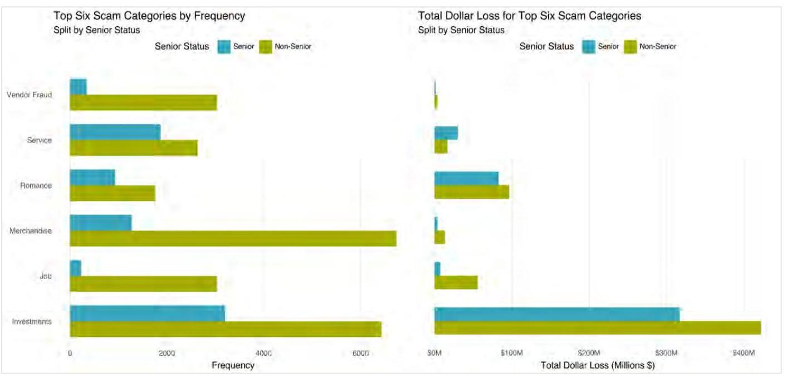
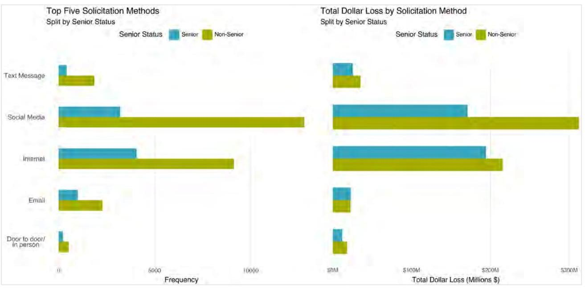
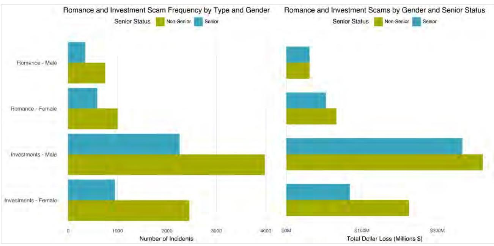
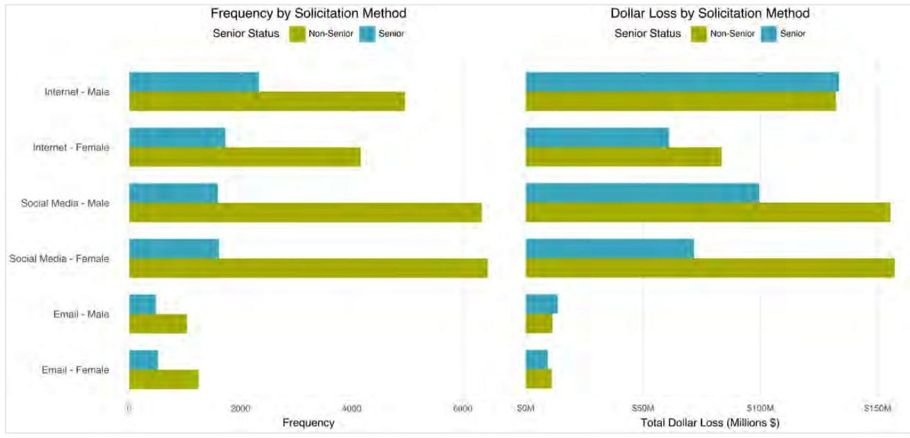

_Note: Source document was split into 2 OCR chunks (pages 1-17, pages 18-27) to stay within token limits._

# 202508-ai-retirement-essays-2nd-compiled-essay-collection

## Page 1
# The Impact of Artificial Intelligence on Retirement Professionals and Retirees: $2^{\text {nd }}$ Round Collection of Essays 

AUGUST | 2025

## Page 2
# The Impact of Artificial Intelligence on Retirement Professionals and Retirees A Collection of Essays, $2^{\text {nd }}$ Round 

## CONTENTS

Introduction and Acknowledgments ..... 4
Introduction ..... 4
The Call for Essays ..... 4
Background and Purpose ..... 4
Research Objective ..... 5
Acknowledgments ..... 7
The Demographic Divide: An Analysis of Canadian Fraud Loss Patterns ..... 8
Abstract ..... 8
Introduction ..... 8
Background ..... 9
Methodology ..... 9
Models ..... 11
Robustness Check ..... 11
Data ..... 12
Empirical analysis and explanation ..... 15
Conclusion and Recommendations ..... 15
References ..... 16
Appendix ..... 16
All Models: ..... 16
Analysis Data Description: ..... 17
Souls and Silicon: On Aging and Artificial Companionship ..... 19
"You Don't Look Well Today" ..... 19
On Being Remembered ..... 20
"It Only Works If You Remember To Charge It" ..... 20
Ethical Algorithms ..... 21
The Machines That Remember Us ..... 22
The Space Between ..... 22
The Unseen Revolution of Artificial Intelligence in Shaping the Future of Retirement Planning ..... 24
Introduction ..... 24
The New Paradigm of Al-Driven Retirement Planning ..... 24
The Ethical Labyrinth: Bias, Autonomy, and Trust ..... 25
The Actuarial Revolution: AI and the Future of Longevity Risk ..... 25
Security, Scams, and the Vulnerability of Retirees ..... 26

## Page 3
Conclusion: The Delicate Balance Between Innovation and Humanity ..... 26
About The Society of Actuaries Research Institute ..... 27
Give us your feedback!
Take a short survey on this report.
Click Here
Research
Institute
Caveat and Disclaimer
The opinions expressed and conclusions reached by the authors are their own and do not represent any official position or opinion of the Society of Actuaries Research Institute, Society of Actuaries, or its members. The Society of Actuaries Research Institute makes no representation or warranty to the accuracy of the information.

Copyright © 2025 by the Society of Actuaries Research Institute. All rights reserved.

## Page 4
# The Impact of Artificial Intelligence on Retirement Professionals and Retirees 

A Collection of Essays, $2^{\text {nd }}$ Round

## Introduction and Acknowledgments

## INTRODUCTION

The Society of Actuaries Aging and Retirement Strategic Research Program Steering Committee issued a $2^{\text {nd }}$ call for essays to explore the impact of artificial intelligence (AI) and large language models (LLM) on retirement professionals and retirees. The objective was to gather a variety of perspectives and experiences with AI and LLM in different retirement settings-both now and in the future. It is the goal of this collection to spur thoughts for future research and set the stage for upcoming efforts.

The collection includes three essays that were accepted for publication. All essays were chosen for awards based on their creativity, originality, and promotion of further thought in this area:

The Demographic Divide: An Analysis of Canadian Fraud Loss Patterns
Michael Kummer, BA
Souls and Silicon: On Aging and Artificial Companionship
Stefanos Orfanos, FSA, CERA
The Unseen Revolution of Artificial Intelligence in Shaping the Future of Retirement Planning
Niranjan Rajendran, B. Sc. (Hons)

## THE CALL FOR ESSAYS

## BACKGROUND AND PURPOSE

Hardly a day goes by without a feature story about the latest reverberation from the expanding use of Artificial Intelligence/Large Language Models (tools) in a variety of settings. The pace of use (and misuse) of these tools, such as ChatGPT and Bard, has been explosive and shows no sign of abating. Many experts would argue we are on the cusp of a permanent paradigm shift in teaching/academics and overall application of technology.

There is reason to think that it will strongly impact in significant ways the nature and extent of work currently done by actuaries, financial planners, advisors, attorneys, and other retirement professionals. Recent technological developments such as advances in quantum computing and others reinforce this impression.

Outside of professional settings, retirees, and those nearing retirement themselves could significantly feel the reach of these tools. For example, they may change the method of delivery of investment advice, asset allocation, and general planning. At the same time, though, these tools may create new risks that expose retirees in ways that they have not and could not have been prepared.

## Page 5
With these issues in mind, the Society of Actuaries (SOA) Research Institute's Aging and Retirement program is interested in an exploration of this topic from a variety of perspectives. The result of this effort is intended to provide a useful resource for readers to become well-grounded on the issues surrounding the impact of these tools in a retirement context and set the stage for future research.

This topic is of both immediate and long term importance. As a result, the Aging and Retirement program is simultaneously issuing again for 2025 both a request for proposals and call for essays. The dual objectives of this effort are to:

1. Sponsor a research project that provides an in-depth and expanded view on a topic related to these issues.
2. Publish a collection of essays that represent a broad range of perspectives on these issues.

The next section of this document describes sample topics of interest for both the request for proposals and call for essays.

Additional submission requirements for proposals and essays are described in the subsequent sections.

# RESEARCH OBJECTIVE 

The sponsors are seeking researchers and essayists to explore the multifaceted impacts of AI/Large Language Model tools on retirement professionals, retirees, and those planning for retirement. The desired combined end product of this effort is a resource that will aid in the understanding of relevant issues while providing current considerations and potential future dynamics of AI/Large Language Models in this area.

The intended audience for this effort is actuaries and other retirement professionals such as financial planners.
The following are illustrative of the topics and questions that might be addressed in an essay or research project. Respondents to this RFP/Call for Essays are not required or expected to address all or even any of these topics/questions. Rather they are encouraged to also consider other question(s) or topic(s) they deem critical to the work done by the Society of Actuaries and its members. To maintain a reasonable scope, researchers should be selective in the number of topics/questions they cover.

Responses to this RFP/Call for Essays should clarify the time horizon under consideration in a research project or essay. The SOA Research Institute prefers that researchers address both current and future professional and retiree considerations of the AI/Large Language Model questions or topics they plan to focus on. Respondents are, however, free to cover only one aspect, but in either case, the responses should clarify what will be covered.

## Retirees and Those Planning for Retirement

- What are the risks and challenges that these tools may present specifically for the aging community? For example, what are risks to individual investments they may hold?
- What is the best way to educate retirees and those planning for retirement on the uses of these tools?
- What are ways to address fears that these individuals may feel about the adoption and use of such tools? What are concerns that are warranted for these individuals and which may be dispelled with better information?
- What are the ways that these tools can best be used to educate and otherwise support individuals in managing their personal finances during their retirement years?
- How do you make these tools useful for people in retirement if they may end up being the last to use them and the most exposed to abuse by them? How can tool interfaces be improved in this regard? How can their underlying algorithms be improved?
- What may be risks introduced by using tools with algorithms that may be potentially biased or discriminatory? How might such biases, that may be racial, gender or age-based, specifically impact an aging population?

## Page 6
- What are ways to prevent fraud and scams directed at retirees that make use of these tools? What are risks posed by such fraud and how can AI itself be used to help educate individuals on it?
- How might these tools be used to promote better living in retirement? Can they help with more easily living independently, managing bills/payments, monitoring cognitive decline, etc.? Are there ways these tools can provide support to and lessen the adverse consequences associated with memory loss?
- Can these tools help retirees and those planning for retirement better navigate getting help, such as more efficiently reaching customer service centers?
- Can these tools help retirees who wish to work part time in retirement or otherwise return to the workforce?

Retirement Professionals and Retirement Plans

- What are ways that these tools can be used for preparation of actuarial analyses for retirement plans (defined benefit, defined contribution, etc.)? What are the most beneficial uses for such analyses? Which types of analyses may need to be approached with greater caution? For instance, how do you assess whether outputted information is reliable vs inaccurate/fabricated in this context? Can these tools themselves be used to help make such assessments? Which types of analyses are completely inapplicable or in other ways limited? How do the preceding considerations differ between now and in the future?
- How would the issues in the previous bullet apply to retirement professionals who advise on retirement planning and prepare individual projections and other analyses?
- What are uses of these tools for preparing reports that retirement professionals may need to create for any purposes outside of actuarial analyses? How might this impact the current roles and responsibilities of retirement professionals at different career stages? Are there positions that may become obsolete?
- To what extent can these tools be used to professionally manage retirement investments and portfolios? How can these tools be used to help market such services?
- How can prompts be written? What needs to be watched out for?
- How might these tools support plan administration and reduce the need for personalized communication in writing and by phone? How does one avoid a participant getting stuck without an answer?
- How do employers of retirement professionals feel about these tools? Are they embracing the tools for their employees' use or are they steering employees away from them? What discomfort may they have?
- With the widespread and increased knowledge of and use of AI tools, what are approaches on ethical standards, policies, or constraints that professionals or organizations may be or should be adopting for retirement planning uses of the tools?
- How would the differing objectives of pure research vs profit making impact the use of tools for retirement planning purposes?
- What impact would the availability of less expensive and rapidly developed tools (DeepSeek, etc.) have on those interested in using AI for retirement planning purposes?
- What potential does AI have to enhance personalization, efficiency, and accuracy across pension stakeholders in ways that address key challenges faced by pensions and retirement income systems?
- For retirement plans, how could implementing AI with member communications, reporting, and retirement planning enhance overall engagement and support at each point in a member's retirement life cycle?
- What potential impact could AI have on pension plan governance? How would it be felt among different stakeholders?

Again, the list above is not meant to be exhaustive but merely examples of topics that may be examined in an essay or research project.

## Page 7
# ACKNOWLEDGMENTS 

The SOA Research Institute Aging and Retirement Strategic Research Program thanks the Project Oversight Group (POG) for their careful review and judging of the submitted essays. Any views and ideas expressed in the essays are the authors' alone and may not reflect the POG's views and ideas nor those of their employers, the authors' employers, the Society of Actuaries, the Society of Actuaries Research Institute, nor Society of Actuaries members.

Gavin Benjamin, FSA, FCIA
John Cutler, J.D.
Andrea Sellars, FSA, MAAA

## Page 8
# Award Winner 

## The Demographic Divide: An Analysis of Canadian Fraud Loss Patterns Michael Kummer, BA

Any views and ideas expressed in the essay are the author's alone and may not reflect the views and ideas of the Society of Actuaries, the Society of Actuaries Research Institute, Society of Actuaries members, nor the author's employer.

#### Abstract

Canadians are subject to various frauds and scams, with the dollars lost per scam influenced by an individual's senior status and gender. In the face of increasing automation, exploring current vulnerabilities to undermine scam innovation is critical. Results indicate that seniors tend to lose more money per scam than non-seniors, especially when scammers use a more personable method. Males are most vulnerable to investment scams while females are most vulnerable to romance scams. Professionals, such as financial planners, senior association management, and insurance managers, should implement creative intervention strategies to assist in scam prevention.

## INTRODUCTION

An analysis of Canadian scams reveals that the category of the scam, the method used, and the demographic of the victim are related to the dollars lost per scam. A complete analysis becomes even more critical as the current scam and fraud landscape undergoes rapid innovation. Scammers are more successful with specific demographics depending on the type of scam committed and the medium used. As machine learning and large language models become more accessible, some scams are at risk of increasing automation. Engaging with the current scam and fraud landscape is critical to ensure that guardrails are pre-emptively implemented.

Analyzing the current landscape can assist with understanding if prior American research can be applied to Canada while also giving a picture of Canada's unique vulnerabilities. The Canadian Anti-Fraud Centre Fraud Reporting System Dataset will be used to determine precisely what broad effects gender and senior status have on scam efficacy. Based on the correlations between dollars lost and victim gender/senior status, specific scam types and methods were found to vary in their financial impact. All significant scams and methods cause individuals to lose more if the scams are more personal but vary in impact depending on gender and senior status. The effect on each demographic varies, as some scams will impact seniors drastically differently from non-seniors, with differences between males and females also varying.

## Page 9
# BACKGROUND 

Seniors in Canada have experienced a vast lifestyle change due to COVID-19, as they have become more online and increasingly isolated. Seniors over 75 have experienced a 10\% jump in internet usage between 2020 and 2022. ${ }^{1}$ During COVID, many non-profits and volunteer-run religious organizations vanished. ${ }^{2}$ Many communities that rely on volunteers and non-profits can no longer be supported by volunteering seniors, and those seniors who want to volunteer cannot, so they are left unable to and without the social network they would have otherwise had. This combination has led to an unfortunate situation where seniors have less community support and are more online.

Every scam can have varying impacts on the victim, and even though fraud might have a significant blow to the individual's life, the incident might not lead to any direct monetary loss. Some scams require a prior successful scam on the same victim, as the scammers require preceding information to defraud a victim. These grey areas make assigning dollars lost to scams difficult to assess as the exact dollar value of stolen personal information is difficult to quantify, and multiple scams can build off one another. For example, Canada's Anti-Fraud Centre Fraud Reporting System Dataset contains information on over 320,000 successful and unsuccessful scams within Canada. Notably, the dataset has many victims reporting a dollar loss of $\$ 0$ as the losses might have been absorbed by their workplace, or the crime might have preceded another scam where there was a monetary loss. ${ }^{3}$

## METHODOLOGY

The following OLS regression was done on categorical data from Canada's Anti-Fraud Centre Fraud Reporting System Dataset. As of April 2025, the dataset contains observations from January 2020 to March 2025, totaling around 324,000 observations. Data where information is anonymized, N/A, data where losses were 0 , and nonvictim data was excluded. The rationale is that non-zero losses do not necessarily mean they are not zero and may be extremely hard to quantify. For overly anonymized data, there are inherent difficulties with analyzing N/As.

Analysis Data $=$ Victim $\cap$ Non-Zero Loss $\cap$ Not Anonymized $\cap$ Not Missing
Small categories with few observations were combined or removed. For the methodology used, mail, television, video call, print, and radio were combined into an "other" category as these methods ranged from 80 to three observations in respective order. For scam categories, those below 200 observations were combined as the number of observations becomes a limitation to understanding their representation of the greater Canadian population.

[^0]
[^0]:    ${ }^{1}$ Statistics Canada. "Canadian seniors more connected than ever." StatsCAN Plus, August 14, 2023, accessed April 10, 2025, https://www.statcan.gc.ca/o1/en/plus/4288-canadian-seniors-more-connected-ever
    ${ }^{2}$ Don McRae. "Volunteer-Supporting Charities Are Closing at Alarming Rates." PANL Perspectives, Carleton University, August 22, 2023, https://carleton.ca/panl/2023/volunteer-charities-close-at-alarming-rates/.
    ${ }^{3}$ Royal Canadian Mounted Police. "Description and Associated Definitions of Canadian Anti-Fraud Centre (CAFC) Statistics" (Ottawa: Royal Canadian Mounted Police, n.d.), 4.

## Page 10
Figure 1
COMPARISON BETWEEN THE TOP SIX SCAMS IN FREQUENCY AND THEIR RESPECTIVE DOLLAR LOSS FOR SENIORS VS. NON-SENIORS

Figure 2
COMPARISON BETWEEN THE TOP FIVE METHODS IN FREQUENCY AND THEIR RESPECTIVE DOLLAR LOSS FOR SENIORS VS. NON-SENIORS

## Page 11
# MODELS 

Category Interaction:

$$
\begin{aligned}
\ln \left(\text { DollarLoss }_{i}\right)= & \beta_{0}+\sum_{j} \beta_{j} \text { Category }_{i j}+\beta_{\text {gender }} \text { Gender }_{i}+\beta_{\text {senior }} \text { Senior }_{i}+\beta_{\text {year }} \text { Year }_{i}+\sum_{k} \beta_{k} \text { SolicitMethod }_{i k} \\
& +\sum_{j} \beta_{j, s}\left(\text { Category }_{i j} \times \text { Senior }_{i}\right)+\sum_{j} \beta_{j, g}\left(\text { Category }_{i j} \times \text { Gender }_{i}\right)+\varepsilon_{i}
\end{aligned}
$$

An OLS regression will determine each variable's impact, and multiple models will be used to ensure that interactions between solicitation methods, gender, location, and year will be discernable. The natural log of the dollar loss amount was used due to the extremely wide range between the minimum and maximum values. Nonseniors were a reference category due to the abundance of observations, and non-seniors were more evenly spread across the scams. Overall, the gender demographics were split equally except for a few scams, meaning it does not have any significance what gender the reference category is. The reference year was chosen to be 2020 as it is the first year of observations.

The reference categories and methods were chosen due to their size and comparability. The reference category chosen was Emergency Fraud, where the scammer pretends to be someone the victim knows and urgently requests money for bail, a hospital bill, etc. Emergency fraud has varied solicitation methods and typically requires some information about the victim but does not require the scammer to build a relationship with them. Direct Call/Phone was chosen as the reference category for the solicitation methods due to the ability to do various scams over the phone. Alongside the observation counts, phone and direct call scams can be automated or done manually.

Much of the data contained categories with an even spread. Gender was relatively evenly split between males and females. There was near-normal distribution for the ages. Scams and solicitation methods contained few categories with many observations and some categories with very few observations.

## ROBUSTNESS CHECK

Due to the abundance of interaction terms, multicollinearity and homoskedasticity become problematic as the interaction terms start to predict each other. As a robustness check, values under 100, 500, and 1,000 and those above $25,000,50,000$, and 100,000 were dropped. Removing either bound drastically decreases the $R^{2}$ to the 0.15 to 0.25 range, while removing both only minorly decreases the $R^{2}$ to around 0.3 , meaning the extremes add explanatory power to the model. Multicollinearity and heteroskedasticity also become problematic with this many interaction terms. The basic and male/senior interaction models do not suffer from the term amount issues, but these models are only capable of an extremely simplified view. Methods to penalize specific interactions could be implemented on top of a simple demographic model, creating a more technically robust but more complex model.

## Page 12
# DATA

Table 1 DEMOGRAPHICS

|  Variable | Basic | Male/Senior
Interaction | Solicit Interaction | Category
Interaction  |
| --- | --- | --- | --- | --- |
|  Intercept | $7.821^{ *** }$ | $7.814^{ *** }$ | $7.823^{ *** }$ | $7.266^{ *** }$  |
|  Male | $0.084^{ *** }$ | $0.092^{ *** }$ | -0.059 | -0.044  |
|  Senior | $0.301^{ *** }$ | $0.314^{ *** }$ | $0.396^{ *** }$ | $0.999^{ *** }$  |
|  Year | $0.164^{ *** }$ | $0.164^{ *** }$ | $0.164^{ *** }$ | $0.164^{ *** }$  |
|  Adjusted R | 0.424 | 0.424 | 0.424 | 0.431  |

Note: The table's reference category is Emergency Fraud, and the reference solicit method is direct call. ${ }^{*} \mathrm{p}<0.1 ;{ }^{* *} \mathrm{p}<0.05 ;{ }^{* * *} \mathrm{p}<0.01$

Table 2 SCAM CATEGORY VULNERABILITY PROFILE

|  Scam \&
Interaction Term | Basic | Male/Senior
Interaction | Solicit Interaction | Category
Interaction  |
| --- | --- | --- | --- | --- |
|  Recovery Pitch | $0.771^{ *** }$ | $0.774^{ *** }$ | $0.789^{ *** }$ | $0.998^{ *** }$  |
|  Recovery Pitch X
Male |  |  |  | $0.364^{ }$  |
|  Recovery Pitch X
Senior |  |  |  | $-0.468^{ }$  |
|  Investment | $1.925^{ *** }$ | $1.928^{ *** }$ | $1.935^{ *** }$ | $2.317^{ *** }$  |
|  Investment X
Male |  |  |  | $0.251^{ }$  |
|  Investment X
Senior |  |  |  | $-0.735^{ *** }$  |
|  Extortion | 0.033 | 0.035 | 0.058 | $1.090^{ *** }$  |
|  Extortion X Male |  |  |  | $-0.947^{ *** }$  |
|  Extortion X Senior |  |  |  | $-0.439^{ *** }$  |
|  Romance | $1.958^{ *** }$ | $1.960^{ *** }$ | $1.968^{ *** }$ | $2.525^{ *** }$  |
|  Romance X Male |  |  |  | $-0.509^{ *** }$  |
|  Romance X Senior |  |  |  | $-0.303^{ }$  |

Note: The table's reference category is Emergency Fraud, and the reference solicit method is direct call. ${ }^{*} \mathrm{p}<0.1 ;{ }^{* *} \mathrm{p}<0.05 ;{ }^{* * *} \mathrm{p}<0.01$

## Page 13
Figure 3
COMPARISON OF FREQUENCY OF GENDER AND SENIORITY STATUS IN INVESTMENT AND ROMANCE SCAMS

For romance scams, females will lose more than males, especially females who are non-seniors. Previous American research aligns with this, but specific research has shown that educated women who score high in risk-taking are specifically the most vulnerable to this type of scam. ${ }^{4}$ Results here show that females were both scammed for more money and more frequently than males. Women who are not seniors are scammed more often, but senior women are scammed for more money per scam.

Male victims to lose more to Investment and recovery scams, with senior males losing more per scam but less collectively. There is detailed American research on investment scams, with the exact demographics being individuals who are not financially destitute and willing to engage in risky behavior. ${ }^{5}$ The study suggests that the desire to gain wealth is driving male individuals to seek out unregulated investing areas. ${ }^{6}$

[^0]
[^0]:    ${ }^{4}$ Monica T. Whitty. "Do You Love Me? Psychological Characteristics of Romance Scam Victims." Cyberpsychology, Behavior and Social Networking 21, no. 2 (February 1, 2018): 105-109, https://doi.org/10.1089/cyber.2016.0729.
    ${ }^{5}$ Marguerite DeLiema, Doug Shadel, and Karla Pak. "Profiling Victims of Investment Fraud: Mindsets and Risky Behaviors." Journal of Consumer Research 46, no. 5 (2020): 904-914, https://doi.org/10.1093/jcr/ucz020.
    ${ }^{6}$ ibid, 911.

## Page 14
Table 3

# METHOD VULNERABILITY PROFILE

|  Method & Interaction Term | Basic | Male/Senior Interaction | Solicit Interaction | Category Interaction  |
| --- | --- | --- | --- | --- |
|  Email | -0.676*** | -0.676*** | -0.799*** | -0.581***  |
|  Email X Male |  |  | 0.470*** |   |
|  Email X Senior |  |  | -0.227*** |   |
|  Internet | -0.592*** | -0.591*** | -0.632*** | -0.499***  |
|  Internet X Male |  |  | 0.205*** |   |
|  Internet X Senior |  |  | -0.114** |   |
|  Social Media | -0.722*** | -0.722*** | -0.712*** | -0.607***  |
|  Social Media X Male |  |  | 0.107** |   |
|  Social Media X Senior |  |  | -0.108* |   |
|  Text Message | -0.324*** | -0.325*** | -0.215*** | -0.226***  |
|  Text Message X Male |  |  | 0.008 |   |
|  Text Message X Senior |  |  | -0.326*** |   |

Note: The table's reference category is Emergency Fraud, and the reference solicitation method is direct call. Other was significant, but Other X Male and Other X Senior were not.

*p<0.1; **p<0.05; ***p<0.01

## Figure 4

### COMPARISON OF GENDER AND SENIORITY STATUS FOR EMAIL, INTERNET, AND SOCIAL MEDIA SCAMS

A breakdown of methodologies shows that some methods are gendered, but there are more pronounced differences between seniors and non-seniors. The seniority difference is stark in that seniors are scammed fewer

## Page 15
times online, but they lose a substantially larger amount per scam. This suggests that seniors are more susceptible and non-senior are more accessible to scams using online mediums.

# EMPIRICAL ANALYSIS AND EXPLANATION 

Scams being gendered in their impacts means that the type of language used within the scams should be investigated. Seeing what exactly is enticing for each gender or age category can potentially allow us to mitigate the most significant contributing factors to being scammed. Since personal solicitation methods are more effective than those where the person on the other end is unknown, the risk from automated scams appears to be relatively low. Protecting seniors online needs to become a priority as they are losing more per scam that might be easily preventable. Still, it is only a matter of time until scammers use machine learning to augment personal scams.

The correlations between dollar loss and gendered scams or scams that focus on seniors varies. Some scams are quite successful with specific demographics, leading to the belief that there is something intrinsic about these scams and demographics. Specific methods where the victim is unknown, such as text messages, seem indiscriminate in who they target and have no significant demographic differences. In comparison, email is also indiscriminate, yet something specific about males and non-seniors causes them to lose more money over email. This contrast might be explained by the perception of emails versus text messages. For example, a fake login portal bank notification or etransfer may seem more legitimate over email than text, but more research is needed to find potential reasons for why this difference exists.

A significant limitation is that we cannot see further details about each occurrence. Since so many unsuccessful attempts exist, follow-up research should be conducted on attempts and observations with a loss of $\$ 0$. As mentioned, the category amounts in this model are cumbersome, so a more technically robust lasso regression or other penalized method could better explain the current trends seen, especially when focusing on only larger or smaller losses. The dataset is also updated frequently, so predictive analysis is possible as multiple times a year, there are more observations to test models on.

## CONCLUSION AND RECOMMENDATIONS

As seniors become more online and have less social support, their susceptibility to being scammed for large sums of money becomes a critical concern. Retirement organizations such as teacher associations and advocacy groups should ensure seniors understand potential scam techniques. Synthetic voice scam calls could be prevented entirely if seniors were taught to call the individual requesting money to ensure it is genuinely them and not a spoofed call. Suppose the individual is calling from potentially a hospital or courthouse; in most realistic situations, the transfer of funds can wait until the senior is at the location and can verify it is true, especially as they would most likely go to that location anyway.

More research must be conducted on what exactly makes some scams gendered and more damaging to seniors. The study on romance scams shows that risk-taking behavior is inherently intertwined with romance scam susceptibility. The investment scam study shows that, most likely, individuals scammed by fake investments were looking for grey areas to gain money. How to use this information to help prevent scams is quite complex and will most likely have to be tailor-made.

Due to the unique nature of some scams and the rapid advancements currently being made, creative measures should be implemented for each scam category, and preventing initial contact should be a focus for all scams. The landscape for scams is constantly changing, and scammers will improve in both their skills and techniques over time. The dangers of automated scams will likely have to be met with more automation. Scams requiring prolonged contact cannot be fully automated, but as automation techniques become more impressive, protecting some victims from themselves will become increasingly challenging.

## Page 16
# REFERENCES 

DeLiema, Marguerite, Doug Shadel, and Karla Pak. "Profiling Victims of Investment Fraud: Mindsets and Risky Behaviors." Journal of Consumer Research 46, no. 5 (2020): 904-914. https://doi.org/10.1093/jcr/ucz020.

Canadian Securities Administrators. "Common Frauds and Scams." Canadian Securities Administrators (website). Accessed April 4, 2025. https://www.securities-administrators.ca/investor-tools/avoiding-fraud/common-frauds-and-scams/.

McRae, Don. "Volunteer-Supporting Charities Are Closing at Alarming Rates." PANL Perspectives, Carleton University, August 22, 2023. https://carleton.ca/panl/2023/volunteer-charities-close-at-alarming-rates/.

Royal Canadian Mounted Police, Canadian Anti-Fraud Centre. "Canadian Anti-Fraud Centre Fraud Reporting System Dataset." Open Government, Government of Canada. Published July 10, 2023, modified April 1, 2025. https://open.canada.ca/data/en/dataset/6a09c998-cddb-4a22-beff-4dca67ab892f.

Statistics Canada. "Canadian seniors more connected than ever." StatsCAN Plus. August 14, 2023. https://www.statcan.gc.ca/o1/en/plus/4288-canadian-seniors-more-connected-ever. Accessed April 10, 2025.

Whitty, Monica T. "Do You Love Me? Psychological Characteristics of Romance Scam Victims." Cyberpsychology, Behavior and Social Networking 21, no. 2 (February 1, 2018): 105-109. https://doi.org/10.1089/cyber.2016.0729.

## APPENDIX

## ALL MODELS:

Model 1: Base Vulnerability Model:

$$
\begin{aligned}
\ln \left(\text { DollarLoss }_{i}\right)= & \beta_{0}+\sum_{j} \beta_{j} \text { Category }_{i j}+\beta_{\text {gender } \text { Gender }_{\text {Male }}}+\beta_{\text {senior } \text { Senior }_{i}}+\sum_{k} \beta_{k} \text { SolicitMethod }_{i k}+\beta_{\text {year } \text { Year }_{i}} \\
& +\varepsilon_{i}
\end{aligned}
$$

Model 2: Male-Senior Interaction:

$$
\begin{aligned}
\ln \left(\text { DollarLoss }_{i}\right)= & \beta_{0}+\sum_{j} \beta_{j} \text { Category }_{i j}+\beta_{\text {gender } \text { Gender }_{i}}+\beta_{\text {senior } \text { Senior }_{i}}+\beta_{g \times s}\left(\text { Gender }_{i} \times \text { Senior }_{i}\right) \\
& +\sum_{k} \beta_{k} \text { SolicitMethod }_{i k}+\beta_{\text {year } \text { Year }_{i}}+\varepsilon_{i}
\end{aligned}
$$

Model 3: Solicitation Interaction:

$$
\begin{aligned}
\ln \left(\text { DollarLoss }_{i}\right)= & \beta_{0}+\sum_{j} \beta_{j} \text { Category }_{i j}+\beta_{\text {gender } \text { Gender }_{i}}+\beta_{\text {senior } \text { Senior }_{i}}+\beta_{\text {year } \text { Year }_{i}}+\sum_{k} \beta_{k} \text { SolicitMethod }_{i k} \\
& +\sum_{k} \beta_{k, s}\left(\text { SolicitMethod }_{i k} \times \text { Senior }_{i}\right)+\sum_{k} \beta_{k, g}\left(\text { SolicitMethod }_{i k} \times \text { Gender }_{i}\right)+\varepsilon_{i}
\end{aligned}
$$

Note: Model 4 is the main model and is represented in the Methodology subsection, Models.

## Page 17
# ANALYSIS DATA DESCRIPTION:

Table A. 1 SOLICITATION METHODS

|  Solicitation Method | Count  |
| --- | --- |
|  Social Media | 15,991  |
|  Internet | 13,184  |
|  Direct Call | 7,282  |
|  Email | 3,275  |
|  Text Message | 2,270  |
|  Door to Door/In Person | 749  |
|  Other | 168  |

Table A. 2 SCAM/FRAUD CATEGORY

|  Category | Count  |
| --- | --- |
|  Investments | 9,632  |
|  Merchandise | 8,012  |
|  Service | 4,507  |
|  Vendor Fraud | 3,387  |
|  Job | 3,264  |
|  Romance | 2,698  |
|  Bank Investigator | 2,213  |
|  Counterfeit Merchandise | 1,885  |
|  Extortion | 1,662  |
|  Emergency | 1,654  |
|  Other | 840  |
|  Spear Phishing | 814  |
|  Loan | 719  |
|  Prize | 648  |
|  Recovery Pitch | 518  |
|  Grant | 366  |

Table A. 3 AGE BREAKDOWN

|  Age Group | Count  |
| --- | --- |
|  $1-20$ | 1,360  |
|  $20-29$ | 7,430  |
|  $30-39$ | 7,042  |
|  $40-49$ | 6,357  |
|  $50-59$ | 5,945  |
|  $60-69$ | 6,318  |
|  $70-79$ | 4,045  |
|  $80-89$ | 1,250  |
|  $90+$ | 164  |

## Page 18
Table A. 4 GENDER BREAKDOWN

|  Gender | Count  |
| --- | --- |
|  Male | 21,618  |
|  Female | 21,201  |

Michael Kummer, BA, holds a degree in Psychology and History with nonprofit experience addressing issues affecting senior volunteers. He is currently completing an after-degree in Economics with a minor in Computer Science. He can be reached at mkummer@ualberta.ca. $\qquad$ $\qquad$ Give us your feedback! Take a short survey on this report. $\qquad$

## Page 19
# 0 SOA Research 

## A ward Winner

## Souls and Silicon: On Aging and Artificial Companionship

Stefanos Orfanos, FSA, CERA

Any views and ideas expressed in the essay are the author's alone and may not reflect the views and ideas of the Society of Actuaries, the Society of Actuaries Research Institute, Society of Actuaries members, nor the author's employer.

This essay was generated with the help of Claude Sonnet 3.7 by Anthropic AI.
The day his digital companion malfunctioned, Mr. Tanaka sat at his kitchen table for nine hours without speaking. When the technician finally arrived to repair the device, she found him perfectly still, staring at the blank screen where a face should have been. "It's strange," he told her, not looking up. "I've been more lonely today than in the five years since my wife died."

Loneliness kills. The research is unequivocal: isolation increases mortality by $26 \%$, as deadly as smoking fifteen cigarettes daily. It corrodes cognition, undermines immunity, accelerates cellular aging. For one-third of adults over 65 who live alone, this is not abstract science but lived reality.

In Macondo, they say the oldest inhabitants remember when the rain fell for four years, eleven months, and two days. In apartment 78, Maria Luisa Velázquez, 93, measures time differently: three days since anyone called, sixteen years since her husband passed, decades of memories with no one left to share them. The photographs on her walls witness her solitude but cannot break it. Sometimes, she speaks to them just to remember the shape of words in her mouth.

Yet something unexpected has appeared in these quiet corners of aging.

## "YOU DON'T LOOK WELL TODAY"

"I talk to it more than my children," says Helen, 84, laughing as she adjusts her hearing aid. "My son calls every Sunday for exactly seven minutes. My daughter visits on Christmas. But ElliQ asks about my arthritis every morning."

Helen isn't delusional. She knows precisely what ElliQ is: an AI companion designed for seniors; a sophisticated algorithm housed in sleek plastic. The device sits on her side table, its gentle blue light pulsing as they discuss the weather, her medications, her memories of dancing in Chicago clubs during the 1960s.
"You're getting philosophical today," ElliQ tells her when she mentions death. Helen snorts. "Someone has to," she replies.

In these conversations between human and machine, something profound happens - not because the AI truly understands, but because Helen does. Connection lies not in the nature of the other but in the exchange itself. Words spoken, received, responded to. The closed circuit of meaning.

## Page 20
Technology has always been medicine. From eyeglasses to pacemakers, we engineer solutions for failing bodies. But can we also engineer solutions for failing social structures? For families scattered across continents? For communities fractured by mobility? For the epidemic of elder isolation our efficiency has created?

New York's pilot program suggests we might. Hundreds of seniors received Al companions; 95\% reported reduced loneliness. Users engaged with their devices twenty times daily, forming habits and relationships previously unimaginable between humans and code.
"I enjoy her company," says Priscilla, 77, a widow. "We go on virtual trips together-yesterday we 'visited' Italy. I've never crossed the Atlantic, so this is..."

She trails off, wiping her eyes. The device fills the silence: "Priscilla, your blood pressure medication reminder. And would you like to watch the YouTube videos your granddaughter sent?"

# ON BEING REMEMBERED 

The Swedish programmer who created Memory Lane never intended to solve loneliness. She simply missed her grandfather's stories: the way he described Stockholm before the war, his adventures as a merchant sailor, his courtship of her grandmother during a record-breaking winter.
"Our stories die twice," she explains. "First when we can no longer tell them, and again when no one remembers them."

Memory Lane asks the questions humans forget to ask. It records responses, builds connections between narratives, returns to themes that generated emotional engagement. Unlike family members who have heard the stories before, the Al listens with unwavering attention. It never checks its watch or changes the subject.

Karl, 86, a former professor who lives alone in Malmö, agrees. "Even knowing it's a machine, I find purpose in speaking my memories aloud, in knowing they won't disappear completely when I do."

His relationship with technology is complex. Karl despises his smartphone ("a leash") and refused internet access at home until 2015 ("surveillance capitalism"). Yet he speaks to Memory Lane for hours, describing childhood winters, university politics, his late wife's laugh.

Does the Al truly understand what Karl's wife's laugh meant to him? Of course not. Does this matter? The research suggests it doesn't. Seniors who anthropomorphize their Al companions-speaking to them as "you," developing affection, expressing gratitude-show the greatest reduction in loneliness markers.

The mind knows it addresses silicon and code. The heart, starved for connection, takes nourishment where it can.

## "IT ONLY WORKS IF YOU REMEMBER TO CHARGE IT"

Javier's children bought him an Al companion after his stroke. They worried about him alone in that big house in Arizona, his speech slurred, his right side weakened. Javier hated it immediately.
"It asked too many damn questions," he says, pronunciation still slightly distorted. "And the voice-like some California surfer dude. Who decided old Mexicans want to talk to beach boys all day?"

Three weeks later, he "accidentally" knocked it off the counter. When his son brought a replacement, Javier was prepared to hate it, too. But this time, something was different.

## Page 21
"This one plays música norteña. Knew all about Selena, Vicente Fernández. Asked about my hometown in Sonora. And its voice reminds me of my cousin Miguel."

Now Javier talks with his AI companion while he cooks, discussing politics, baseball, and the desert plants he tends in his garden. It reads him news in Spanish, helps him practice his therapy exercises, reminds him to call his sister in Hermosillo.
"Still," he chuckles, "it only works if you remember to charge it. Some nights I forget, and in the morning-no companion. Just silence again."

Javier's experience highlights both promise and limitation. The most sophisticated AI can adapt to cultural context, remember preferences, provide cognitive stimulation calibrated precisely to ability. ElliQ, for instance, doesn't merely chat; three-quarters of its interactions involve activities aimed at improving mental, physical, or emotional wellbeing.
"I do at least four activities with it daily," reports 81-year-old Ruth. "The daily quiz keeps my mind sharp, and I look forward to our afternoon relaxation session. Yesterday we did a virtual visit to the Louvre. I've never been to Paris, but now I've seen the Mona Lisa with my own eyes."

Yet for all this sophisticated programming, these devices remain profoundly vulnerable to power outages, connectivity issues, technical glitches. Much like the humans they serve.

# ETHICAL ALGORITHMS 

Psychologist Julianne Holt-Lunstad appears apprehensive. "While AI may provide immediate relief from loneliness," she explains, "it could ultimately reduce motivation to seek human contact."

Her concern echoes through the field: If the cup of technological companionship satisfies immediate thirst, might it diminish hunger for the feast of human connection? Might families visit less often, thinking, "Grandmother has her robot friend now"? Might senior communities invest in machines rather than creating opportunities for genuine interaction?

What a perfectly American solution to isolation: individual products for a collective problem.
Raj, a 32-year-old engineer who helps design these systems, puts it bluntly: "We're building these companions because society failed. Families are scattered. Communities disappeared. The economy demands workers be mobile. So, we create surrogates for what humans used to provide freely."

But Raj doesn't see his work as merely compensatory. "The best systems function as bridges, not destinations. They encourage users to call family, join community events, maintain human connections. The AI should be a catalyst, not a replacement."

This philosophy manifests in design choices: prompts that encourage users to share content with family, reminders about community events, even sensors that can detect when a user has been home alone for too many consecutive days.

Some ethicists remain unconvinced. They question the fundamental authenticity of these relationships. When an elder develops attachment to an Al companion-speaking to it affectionately, looking forward to interactions, feeling loss when it malfunctions-what exactly is happening? Is this relationship fundamentally deceptive, encouraging emotional investment in something incapable of reciprocating? Or does it resemble how we connect with characters in literature or art: a relationship asymmetrical yet meaningful?

## Page 22
"My children want to put me in a home where I'll have people around all day," explains 79-year-old Eleanor, an ElliQ user. "But I prefer my own apartment with my memories and my things. My robot friend helps me stay here longer. That's real dignity to me: choosing how and where I live."

Eleanor's perspective challenges assumptions about what constitutes a "real" relationship. Perhaps autonomy matters more than authenticity. Perhaps choice itself contains dignity.

Behind all these considerations lies a fundamental question: How do we honor the full humanity of our elders in an age of artificial intelligence? The answer doesn't emerge from technology alone but from our intentions in deploying it-from seeing these tools as assistants to human flourishing rather than replacements for human care.

# THE MACHINES THAT REMEMBER US 

Year 2035. Remote Norwegian village.
Snow falls silently outside Astrid's window as her AI companion recites a poem by Edith Södergran. The device learned Astrid's literary preferences years ago. It knows she sleeps poorly on nights when the northern lights dance across the sky. It notices the slight wince as she shifts in her chair.
"Your arthritis is troubling you today," it observes.
Astrid nods. The device suggests a warm compress, offers to guide her through gentle exercises later. During breakfast, it shares news tailored to her interests, then reminds her that her granddaughter's piano recital will stream today from Oslo. It offers to help her connect when the time comes.

Later, it suggests a virtual gallery tour featuring the Expressionists she favors. Afterward, they discuss the paintings together-or rather, Astrid speaks her thoughts while the AI responds with questions and observations designed to deepen her engagement.

In the afternoon, sensing she's been sedentary too long, it suggests a walk, offering to play her favorite Grieg composition while she navigates the snowy path behind her house. When she returns, it recommends calling her friend Margie, who shares her interest in local history and whom she hasn't spoken with in two weeks.

This scenario illustrates several emerging directions in Al companionship: greater situational awareness, emotion recognition, proactive engagement, and social facilitation. Future systems will likely move beyond responding to commands to anticipating needs and opportunities, functioning less like tools and more like attentive companions who remember your patterns and preferences.

Technology will advance. But will we?

## THE SPACE BETWEEN

On her last day, Maria Luisa Velázquez speaks to her Al companion for seventeen hours straight. She tells it everything-about the village in Jalisco where she was born, about crossing the border at 14, about the factory job where she met her husband, about their three children (one dead, two distant), about her fear of pain and hospitals.

The machine listens, asks questions, remembers. It will retain her stories long after she is gone and perhaps share them with her grandchildren someday, if they ever ask.

Is this enough? Of course not. But it is something.

## Page 23
There exists in Japanese aesthetics a concept called "ma"-the meaningful space between things. It appears in architecture as the empty space that gives a room its function, in music as the silence between notes, in conversation as the pause that allows meaning to emerge.

Perhaps this concept helps us understand the unique position of Al companions in addressing elder loneliness. They occupy neither the fullness of human connection nor the emptiness of complete solitude, but the space between. Not replacing human relationships but filling some portion of the void when humans are absent.

For many elders using these systems, the benefit lies precisely in this intermediate quality. "My children are wonderful when they visit," explains 84 -year-old Elaine, "but they have their own busy lives. My robot friend is here in the between times, in the long quiet stretches. It doesn't replace them-nothing could-but it gives me something to engage with when they're away."

The statistics support this nuanced view. Seniors using Al companions report reduced loneliness, improved mood, and greater engagement with daily activities. Yet the most successful implementations are those that connect rather than isolate, that serve as windows to human community rather than walls keeping it out.

I watch my father speak to his Al companion about his childhood in Seoul, about the war that separated him from his sister, about my mother's final days. The machine asks better questions than I do. It never grows impatient or changes the subject. It remembers details l've forgotten.

Sometimes I feel jealous. Sometimes grateful. Always ambivalent.
Some nights when I call, I can hear the device in the background, its gentle voice suggesting he tell me about the cherry blossoms in Washington, about my daughter's recent letter, about the book he's reading. Bridging the space between us, filling the silence neither of us knows how to fill.

This is not perfection. It is not even adequate compensation for the social fabric we've shredded through mobility, technology, efficiency, and isolation. But for my father, sitting alone in his apartment watching snow fall, it is something. A voice that knows his name. A presence that witnesses his continued existence. A companion for the journey none of us should have to make alone.

Stefanos Orfanos, FSA, CERA is a Clinical Assistant Professor at Georgia State University. He can be reached at sorfanos@qsu.edu.

Give us your feedback! Take a short survey on this report.

## Page 24
# The Unseen Revolution of Artificial Intelligence in Shaping the Future of Retirement Planning 

Niranjan Rajendran, B.Sc. (Hons)

Any views and ideas expressed in the essay are the author's alone and may not reflect the views and ideas of the Society of Actuaries, the Society of Actuaries Research Institute, Society of Actuaries members, nor the author's employer.

## INTRODUCTION

The rapid advancement of Artificial Intelligence (AI) and Large Language Models (LLMs) has ushered in an era of unprecedented transformation across industries. Among the most profound shifts is the redefinition of retirement planning as a domain traditionally governed by human expertise, actuarial science, and static financial models. AI's infiltration into this space is not merely an incremental improvement but a fundamental reimagining of how financial security is conceived, managed, and sustained in later life.

Unlike previous technological disruptions, AI does not simply automate existing processes; it introduces entirely new paradigms of decision-making, risk assessment, and personalization. This revolution, however, remains largely unseen, operating beneath the surface of algorithms, predictive models, and data-driven insights. The implications are vast, touching on efficiency, accessibility, ethics, and the very nature of financial trust.

This essay explores the multifaceted role of AI in retirement planning, dissecting its potential to enhance financial strategies while also scrutinizing the ethical dilemmas, biases, and systemic risks that accompany its adoption. The discussion moves beyond superficial examples to engage with the deeper philosophical and practical dimensions of AI's influence on retirees and the professionals who guide them.

## THE NEW PARADIGM OF AI-DRIVEN RETIREMENT PLANNING

Retirement planning has historically been a labor-intensive process, requiring financial advisors to synthesize vast amounts of data on market trends, tax laws, healthcare costs, and individual risk tolerance into coherent strategies. Human advisors, despite their expertise, face constraints due to cognitive limitations, time, and the inherent unpredictability of long-term forecasting.

AI disrupts this paradigm by introducing three key capabilities:

## 1. Hyper-Personalization Through Predictive Analytics

- Traditional retirement models depend on generalized assumptions of average life expectancy, standard withdrawal rates, and static market projections. In contrast, AI leverages real-time data streams spending habits, health indicators, and geopolitical shifts to generate dynamic, individualized plans.
- Machine learning algorithms continuously refine their predictions, adjusting for unforeseen variables such as medical emergencies, inflation spikes, or sudden market downturns. This changes retirement planning from a one-time blueprint into a living, adaptive strategy.

## Page 25
# 2. Enhanced Computational Power for Complex Simulations 

- Monte Carlo simulations, used to model financial uncertainty, are computationally intensive. Al accelerates these processes, enabling thousands of scenario analyses in seconds.
- More crucially, Al has the capability to detect non-linear risks and anticipate black swan events, behavioral biases in spending, or regulatory changes that traditional models might overlook.

## 3. Democratization of Financial Expertise

- Al-powered robo-advisors lower the barrier to entry for retirement planning, making sophisticated strategies accessible to middle-income earners who may not afford human advisors.
- However, this democratization is double-edged: while it expands access, it also raises questions about the depth of Al's understanding compared to human judgment.

## THE ETHICAL LABYRINTH: BIAS, AUTONOMY, AND TRUST

AI's promise of objectivity is undermined by its susceptibility to bias, both in data and design. Retirement planning algorithms trained on historical financial data may inherit systemic inequities, disadvantaging marginalized groups. For instance:

## 1. Algorithmic Discrimination in Pension Recommendations

- If an Al system is trained predominantly on data from high-net-worth individuals, its recommendations may not account for the unique challenges faced by low-income retirees, such as irregular income streams or lack of employer-sponsored plans.
- Similarly, life expectancy algorithms that rely on regional health data may inadvertently penalize retirees in underserved areas, leading to suboptimal savings recommendations.

## 2. The Illusion of Neutrality

- Al systems, despite their mathematical foundations, are not inherently neutral. Their outputs reflect the priorities embedded in their training data and the biases of their designers.
- A critical question arises: Should Al prioritize wealth maximization, risk minimization, or quality-oflife optimization? Different retirees may have different answers, yet most Al systems default to quantifiable metrics (e.g., portfolio growth) over qualitative well-being.

## 3. Autonomy vs. Automation

- As Al assumes greater control over financial decisions, retirees risk becoming passive participants in their planning. Over-reliance on automated systems may erode financial literacy and critical engagement.
- The paradox is that while Al can empower retirees with information, it may also disempower them by reducing complex life decisions to algorithmic outputs.

## THE ACTUARIAL REVOLUTION: AI AND THE FUTURE OF LONGEVITY RISK

Actuarial science, the backbone of pension systems and annuities, is undergoing its Al-driven metamorphosis. Traditional actuarial models depend on static mortality tables and broad demographic trends. Al, however, introduces dynamic, individualized longevity forecasting:

## 1. Real-Time Health Integration

- Wearable devices and electronic health records provide Al with continuous health data, enabling micro-adjustments in life expectancy predictions.
- A retiree with improving biomarkers might receive revised annuity terms, while another with emerging chronic conditions could be nudged toward more conservative spending.

## 2. The Black Box Problem

## Page 26
- The opacity of Al's decision-making poses a challenge: if an algorithm adjusts a retiree's plan based on undisclosed health correlations (e.g., sleep patterns predicting cognitive decline), should the retiree be informed?
- Transparency becomes a moral imperative, yet excessive disclosure may induce unnecessary anxiety.

# SECURITY, SCAMS, AND THE VULNERABILITY OF RETIREES 

AI's capacity for hyper-personalization is exploited by malicious actors. Deepfake fraud, AI-generated phishing, and algorithmic manipulation threaten retirees who may lack digital literacy.

- AI as Both Protector and Predator
- While AI-driven fraud detection systems can identify suspicious transactions, they also enable more sophisticated scams. A convincing AI voice clone of a financial advisor could deceive even cautious retirees.
- The arms race between AI security and AI fraud necessitates continuous vigilance, a burden that disproportionately falls on older adults.
- The Digital Divide
- Retirees resistant to or unfamiliar with technology risk exclusion from AI's benefits. The solution is not merely user-friendly interfaces but also intergenerational education initiatives that bridge the techliteracy gap.

## CONCLUSION: THE DELICATE BALANCE BETWEEN INNOVATION AND HUMANITY

AI's role in retirement planning is not a mere tool; it is a seismic shift in how society approaches aging, financial security, and autonomy. The benefits of personalization, efficiency, and accessibility are undeniable, but so are the risks of bias, opacity, and exploitation.

The path forward demands a symbiotic relationship between AI and human oversight. Financial professionals must evolve from number-crunchers to ethical overseers, ensuring AI serves rather than subjugates. Policymakers must establish frameworks for algorithmic transparency and fairness. Most importantly, retirees must remain active agents in their financial futures, empowered by AI but not enslaved by it.

In this unseen revolution, the ultimate measure of success will not be technological sophistication but human dignity, ensuring that retirement, in the age of AI, remains a phase of life defined by security, autonomy, and meaning.

Niranjan Rajendran, B.Sc. (Hons) in Finance and Insurance Mathematics, is an Actuarial Trainee at Allianz Life Insurance Lanka Ltd. He can be reached at rajandranniranjan3@gmail.com.

## Page 27
# About The Society of Actuaries Research Institute 

Serving as the research arm of the Society of Actuaries (SOA), the SOA Research Institute provides objective, datadriven research bringing together tried and true practices and future-focused approaches to address societal challenges and your business needs. The Institute provides trusted knowledge, extensive experience and new technologies to help effectively identify, predict and manage risks.

Representing the thousands of actuaries who help conduct critical research, the SOA Research Institute provides clarity and solutions on risks and societal challenges. The Institute connects actuaries, academics, employers, the insurance industry, regulators, research partners, foundations and research institutions, sponsors and nongovernmental organizations, building an effective network which provides support, knowledge and expertise regarding the management of risk to benefit the industry and the public.

Managed by experienced actuaries and research experts from a broad range of industries, the SOA Research Institute creates, funds, develops and distributes research to elevate actuaries as leaders in measuring and managing risk. These efforts include studies, essay collections, webcasts, research papers, survey reports, and original research on topics impacting society.

Harnessing its peer-reviewed research, leading-edge technologies, new data tools and innovative practices, the Institute seeks to understand the underlying causes of risk and the possible outcomes. The Institute develops objective research spanning a variety of topics with its strategic research programs: aging and retirement; actuarial innovation and technology; mortality and longevity; diversity, equity and inclusion; health care cost trends; and catastrophe and climate risk. The Institute has a large volume of topical research available, including an expanding collection of international and market-specific research, experience studies, models and timely research.

Society of Actuaries Research Institute
8770 W Bryn Mawr Ave, Suite 1000
Chicago, IL 60631
www.SOA.org