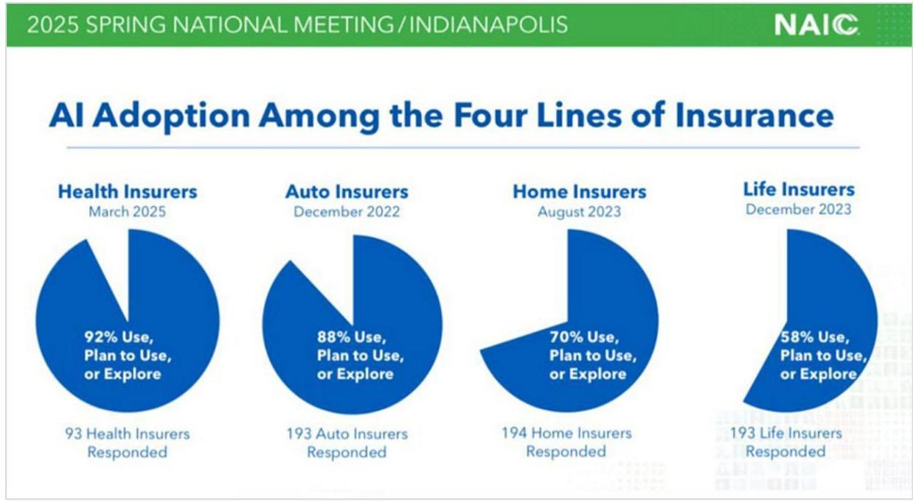

# 202510-ait182-Healthcare AI expert-panel-ai

## Page 1
# Healthcare AI—Current Applications and What’s Next: An Expert Panel Discussion

**OCTOBER | 2025**

## Page 2
# Healthcare AI—Current Applications and What's Next 

An Expert Panel Discussion

AUTHOR Ronald Poon Affat, FSA, FIA, MAAA, CFA, HIBA SPONSOR Actuarial Innovation and Technology Strategic Research Program

## Give us your feedback! Take a short survey on this report.

## Caveat and Disclaimer

The opinions expressed and conclusions reached by the authors are their own and do not represent any official position or opinion of the Society of Actuaries Research Institute, the Society of Actuaries, or its members. The Society of Actuaries Research Institute makes no representation or warranty to the accuracy of the information.

Copyright © 2025 by the Society of Actuaries Research Institute. All rights reserved.

## Page 3
# CONTENTS 

Executive Summary ..... 4
Section 1 Operational AI Successes and Persistent Challenges ..... 6
1.1 Traditional AI at Work ..... 6
1.2 New AI Workflows ..... 6
1.3 Enhancing Access and Diagnostics ..... 6
1.4 Responsible Deployment for Adoption ..... 6
1.5 Key takeaways ..... 6
Section 2 Build vs. Buy vs. Partner: Decision Criteria ..... 8
2.1 The Build, Buy, or Partner Dilemma ..... 8
2.2 When to Choose a Ready-Made Solution ..... 8
2.3 Building for Competitive Advantage ..... 8
2.4 The Collaborative Path to AI Development ..... 8
2.5 Weighing the Trade-Offs of Each Path ..... 8
2.6 Key Takeaways ..... 8
Section 3 Governance in Practice: From Development to Deployment ..... 10
3.1 Implementing AI Governance Frameworks ..... 10
3.2 Pre-Deployment Validation Steps ..... 10
3.3 Continuous Monitoring and Vendor Management ..... 10
3.4 Governance in a Regulated Environment ..... 10
3.5 Key Takeaways ..... 10
Section 4 AI's Evolving Impact Landscape ..... 12
4.1 Building on Proven AI and Advanced Infrastructure ..... 12
4.2 Emerging Capabilities and Clinical Applications ..... 12
4.3 Tools for Innovation and Realistic Boundaries ..... 13
4.4 Key Takeaways ..... 13
Section 5 Beyond Modeling: Actuarial AI Leadership ..... 14
5.1 The Actuary's Evolving Role in AI ..... 14
5.2 AI's Expanding Reach and Actuarial Responsibility ..... 14
5.3 Integrating AI into Enterprise Risk Management ..... 14
5.4 Balancing Innovation and Ethics for Society ..... 14
5.5 Key Takeaways ..... 14
Section 6 Conclusion ..... 16
6.1 AI to Improve Administrative Efficiency ..... 16
6.2 New Data Frontiers and Their Challenges ..... 16
6.3 Enabling Precision Care with Data ..... 16
6.4 Key Takeaways ..... 16
Section 7 Acknowledgments ..... 18
Appendix A: Expert Panel Discussion Questions ..... 19
About The Society of Actuaries Research Institute ..... 20

## Page 4
# Healthcare AI—Current Applications and What's Next

## An Expert Panel Discussion

### Executive Summary

The basis for this expert panel report came from the presentation at the NAIC's 2025 Spring National Meeting, where newly released survey results noted the accelerating adoption of artificial intelligence in insurance and health care.1 The NAIC's survey of 93 health insurers revealed that 92% are already using, planning to use, or actively exploring AI. This aligns with broader NAIC findings across four major lines of business—health, auto, home, and life—with health leading at 92%, followed by auto at 88%, home at 70%, and life at 58%.

#### Figure 1

**AI ADOPTION AMONG THE FOUR LINES OF INSURANCE**

Source: National Association of Insurance Commissioners.1

The NAIC survey makes clear that health insurers have been early leaders in adopting AI, applying it to areas such as claims, fraud detection, and customer service. The same transformative potential is now taking shape on the provider side, where hospitals and clinics—vital pillars of the healthcare ecosystem—are beginning to use AI not only for administrative efficiency but also in core aspects of patient care. Although adoption remains at an early

1 National Association of Insurance Commissioners. *Big Data and Artificial Intelligence (H) Working Group: Materials for March 26, 2025, Meeting*. Draft, March 21, 2025. https://content.naic.org/sites/default/files/national_meeting/Materials-Big-Data-AI-WG032625_0.pdf

## Page 5
stage, the trajectory points toward convergence between payer and provider applications, with shared opportunities and risks requiring coordinated approaches. Against this backdrop, the panel focused on how hospitals are integrating AI into clinical and operational workflows.

The panel brought together a uniquely diverse set of professionals spanning actuarial science, healthcare data science, enterprise analytics, and clinical AI governance. Their combined backgrounds encompassed research on emerging risks, deployment of predictive modeling in healthcare payer-provider settings, the creation of enterprise data strategies with rigorous governance, hands-on implementation of clinical AI oversight, and operationalization of generative AI and natural language processing tools. This breadth of expertise allowed for a multi-dimensional examination of both the opportunities and risks in integrating AI into hospital workflows.

Discussions underscored AI's measurable benefits in improving equity and efficiency. Examples included AI-assisted diagnostic tools that reduced delays in radiology workflows, models that accelerated triage accuracy, and predictive systems identifying high-risk patients earlier-often benefiting underserved communities. The panel also explored the challenges of potential bias, noting how seemingly neutral data points, such as geographic markers, can become proxies for protected attributes, risking inequitable outcomes if left unmitigated. Strategies to address these risks included embedding fairness audits into development cycles, expanding and diversifying training datasets, and establishing multi-disciplinary review processes that integrate actuarial, clinical, and technical perspectives.

A recurring theme was that the success of AI adoption depends as much on organizational readiness as on technical capability. Hospitals that achieved sustained results invested in staff education, transparent governance frameworks, and clear escalation protocols for situations where human and AI recommendations diverged. These governance structures, coupled with continuous monitoring, ensured AI tools were trusted and used consistently in practice.

# Key Takeaways 

- AI is already delivering tangible benefits in clinical environments, from faster imaging turnaround times to improved triage accuracy and earlier identification of high-risk patients. These outcomes were most impactful in settings where timely interventions addressed care gaps, improving both patient outcomes and health equity.
- Bias remains a critical risk factor that requires deliberate intervention. The panel noted that variables like ZIP codes can serve as hidden proxies for race or socioeconomic status, inadvertently reinforcing inequities. Effective safeguards include fairness testing, diverse data sourcing, and validation of models in real-world environments before full-scale deployment.
- Sustainable AI adoption is rooted in cultural and operational integration. Hospitals that paired technological implementation with staff training, clear governance processes, and protocols for resolving discrepancies between human and AI recommendations maintained the highest performance and trust in AI systems over time.

## Give us your feedback!   Take a short survey on this report.

## Page 6
# Section 1 Operational AI Successes and Persistent Challenges 

### 1.1 TRADITIONAL AI AT WORK

The panel described a multifaceted picture of Al adoption in healthcare, situating the discussion within a longer arc of technological evolution. Participants began by noting that what is now referred to as "traditional" Al-primarily machine learning applications-has been used in healthcare for years, even before the current wave of generative AI. These established tools continue to deliver tangible results, particularly in identifying high-risk patients and patterns of care. Readmission risk prediction was highlighted as a proven application, allowing providers and insurers to flag patients likely to return to the hospital soon after discharge. Mortality risk models, which estimate the likelihood of a patient passing away within specific timeframes, were also cited as important for triage, ensuring patients are directed to the right level of care at the right time in their health journey.

### 1.2 NEW AI WORKFLOWS

From there, the conversation expanded to how generative AI has accelerated adoption in newer areas. Clinical documentation was presented as a prominent example: ambient listening tools convert patient-provider conversations into text, which can then be summarized for after-visit notes and integrated into records. This not only eases administrative burdens on providers but also improves the quality of structured data available to actuaries and data scientists for risk prediction and outcome monitoring. The panel referenced workflows in which a device captures the consultation in real time, generating text that can feed both patient-facing summaries and backend analytics.

### 1.3 ENHANCING ACCESS AND DIAGNOSTICS

Operational efficiency was another focus. Al tools now triage incoming electronic messages-such as patient portal communications-by routing them to the correct care team. This accelerates responses to urgent needs and improves patient satisfaction while ensuring that clinical staff can prioritize high-impact interventions. The panel also addressed medical imaging, citing mammography screening as a long-standing Al use case. Automated detection of abnormalities shortens physician review time and prompts additional scrutiny of high-risk findings, thereby reducing diagnostic delays. These examples were presented as verifiable progress where Al has improved both efficiency and equity by making timely care more accessible.

### 1.4 RESPONSIBLE DEPLOYMENT FOR ADOPTION

While enthusiasm was evident, participants stressed that widespread adoption depends on governance and trust. The main barrier identified was not technological capability but ensuring safe, responsible deployment. This includes establishing guardrails, validation protocols, and implementation teams to reduce risk and foster confidence among both practitioners and patients. Al governance structures, policies, and oversight bodies were described as increasingly common in organizations seeking to scale these tools responsibly. The discussion concluded that while the appetite for Al in healthcare is strong, its future impact will hinge on maintaining safety, transparency, and a clear link to improved patient outcomes.

### 1.5 KEY TAKEAWAYS

- The panel emphasized that established Al methods such as machine learning remain central to healthcare operations, particularly in risk prediction for readmissions and mortality. These applications have matured over years of use and are embedded in clinical workflows, helping ensure patients receive the right care at

## Page 7
the right time. Such models not only improve efficiency but also support equitable outcomes by systematically identifying at-risk populations.

- Generative AI is enabling new efficiencies in clinical documentation and patient communication. Ambient listening systems and automated summarization reduce the administrative load on providers while producing high-quality, structured data for downstream analytics. Similarly, AI-driven triage of patient messages ensures urgent cases receive timely attention, improving both satisfaction and safety.
- Imaging remains a key domain for AI's equity and speed benefits. Automated analysis in mammography screening allows faster detection of potential abnormalities and prompts earlier intervention. These improvements, combined with governance frameworks to ensure safe deployment, illustrate how AI can deliver measurable gains in healthcare outcomes while addressing patient trust and regulatory expectations.

## Page 8
# Section 2 Build vs. Buy vs. Partner: Decision Criteria 

### 2.1 THE BUILD, BUY, OR PARTNER DILEMMA

The discussion centered around the strategic decision-making process between building Al solutions in-house, buying off-the-shelf applications, or engaging in partnerships. The panel explored this from both an operational and a resource-allocation perspective, grounding their comments in concrete examples of implementation.

### 2.2 WHEN TO CHOOSE A READY-MADE SOLUTION

The panel described situations where buying ready-made applications was the most effective route. These tools, already fully developed and tested, could be implemented in weeks rather than the months required for in-house development. They were reported to be delivering measurable value across multiple stakeholder groups, including members, brokers, and providers. This "buy" approach was framed as ideal when the solution aligned directly with an organization's needs and when time-to-value was a critical factor.

### 2.3 BUILDING FOR COMPETITIVE ADVANTAGE

In contrast, the panel discussed building Al solutions internally when the problem to be solved was novel, when proprietary data could provide a unique edge, or when in-house teams had the technical capacity to manage the full lifecycle from development to monitoring. They noted that in some cases, vendors already had similar offerings, but cost-benefit analysis and return on investment clearly favored self-development. Internal builds allowed for tailored solutions, direct oversight of performance, and strategic control over future iterations.

### 2.4 THE COLLABORATIVE PATH TO AI DEVELOPMENT

Partnerships emerged as another pathway, though the panel acknowledged these had been less frequent in practice. The key driver for considering partnerships was the scarcity of specialized Al and data science talent. Entire companies might be dedicated to developing and maintaining a single high-performing model, complete with robust production systems and update mechanisms-capabilities that are costly and complex to replicate internally. Partnering could instantly expand resource capacity while blending the partner's technical capabilities with the healthcare organization's domain expertise. This approach was seen as particularly appealing for use cases sitting in the backlog that could benefit from joint development.

### 2.5 WEIGHING THE TRADE-OFFS OF EACH PATH

Throughout the exchange, the panel emphasized that the build-versus-buy-versus-partner decision was not static; it depended on the nature of the use case, the available resources, the speed required, and the anticipated return on investment. Importantly, while progress was noted in both bought and internally built solutions, the examples given underscored that each path carried trade-offs in control, speed, and scalability.

### 2.6 KEY TAKEAWAYS

- Buying off-the-shelf Al applications can offer rapid deployment and immediate value, particularly when the solution is already market-ready and closely matches organizational needs. These implementations can be operational within weeks, benefiting diverse stakeholders without the long development cycles of in-house projects. This approach is especially useful when speed is critical and internal resources are better deployed elsewhere.
- Building Al solutions internally is often justified when addressing novel problems, leveraging proprietary data for competitive advantage, or when internal teams have the necessary expertise. While more time-

## Page 9
intensive, this approach allows for customization, control over intellectual property, and direct oversight of monitoring and maintenance. It can also be more cost-effective than licensing similar vendor solutions, particularly for long-term strategic capabilities.

- Partnerships can bridge resource gaps by combining a partner's technical specialization with the organization's domain expertise. This can accelerate development for complex use cases and allow access to mature production and update infrastructures. Although less common in the examples discussed, partnerships are a viable option when backlog priorities exceed internal capacity or when collaboration can yield a solution neither party could efficiently develop alone.

## Page 10
# Section 3 Governance in Practice: From Development to Deployment 

### 3.1 IMPLEMENTING AI GOVERNANCE FRAMEWORKS

The panel examined how AI governance is applied in real-world settings, especially when balancing speed to deployment with the need for safety, fairness, and clinical relevance. The discussion began by outlining the essential governance checkpoints for any AI tool, whether built internally or sourced from a third party. A key emphasis was placed on multidisciplinary review, ensuring that data scientists and clinical experts work together from ideation through production. This collaboration helps confirm that a tool is both mathematically sound and clinically valuable, with additional perspectives-such as cybersecurity-brought in to assess operational viability. The panel stressed that this process should be maintained throughout the lifecycle of the tool, allowing technical and clinical teams to keep each other accountable.

### 3.2 PRE-DEPLOYMENT VALIDATION STEPS

The importance of piloting emerged as another central theme. Before full-scale deployment, tools should undergo a soft pilot in real-world conditions, exposing them to actual data and workflows. The results from these pilots guide refinements, ensuring that any performance gaps are addressed before broader release. This feeds into a third element: bias review and detection. The panel described this as a non-negotiable step, noting that even models built without overtly sensitive variables can embed bias through underlying data. Evaluations should test for equal performance across relevant subgroups, with ethicists involved to assess whether the tool is clinically acceptable from a fairness standpoint.

### 3.3 CONTINUOUS MONITORING AND VENDOR MANAGEMENT

Once an Al system passes these reviews and pilots, governance responsibilities do not end. Continuous monitoring is critical—both mathematically, to detect model drift, and operationally, to ensure the tool is being used appropriately by the intended audience. If drift is detected, retraining may be necessary. These processes apply to both internally built and vendor-supplied models, though vendor relationships introduce distinct challenges. Early on, some vendors were reluctant to share development and validation details, but the panel noted a shift toward greater openness. This includes disclosure of training data sources, validation results, bias review outputs, and monitoring procedures, with especially high transparency seen in FDA-approved models, where regulatory requirements mandate full documentation.

### 3.4 GOVERNANCE IN A REGULATED ENVIRONMENT

The conversation also addressed the evolving expectations in regulated industries. Referencing regulatory bulletins, the panel observed that governance obligations apply equally to in-house and vendor models, and that reliance on vendor assurances alone is no longer sufficient. Instead, organizations must be able to document and explain their governance processes to regulators, including performance validation, bias mitigation, and ethical review. In parallel, robust internal documentation practices are vital. The panel described maintaining searchable records of all models-complete with metadata, version history, business unit ownership, and points of contact-so that tools can be quickly located, understood, and repurposed for new use cases. This transparency within the organization supports ongoing accountability and facilitates future innovation.

### 3.5 KEY TAKEAWAYS

- Effective Al governance requires sustained multidisciplinary collaboration, with data scientists, clinical experts, and cybersecurity specialists jointly involved from inception to deployment. This ensures models

## Page 11
are both technically sound and operationally impactful, with continuous checks to align mathematical performance with real-world applicability.

- Robust pre-deployment processes-including pilots and mandatory bias reviews-are essential to safeguard fairness and usability. Pilots validate real-world performance, while bias detection ensures equitable outcomes across subgroups, with ethicist involvement helping to confirm clinical acceptability before full rollout.
- Vendor relationships are shifting toward greater transparency, aided by regulatory pressure and FDA oversight. Organizations must document governance rigorously-covering lineage, metadata, version control, and ownership-so that both internal and external models can be traced, evaluated, and adapted for future needs.

## Page 12
# Section 4 Al's Evolving Impact Landscape 

The panel discussion considered which emerging AI capabilities seem most impactful in healthcare when balancing innovation, safety, and ethics. The conversation was structured around separating areas that are already in safe practice from those still more aspirational.

### 4.1 BUILDING ON PROVEN AI AND ADVANCED INFRASTRUCTURE

- Established AI applications were acknowledged, predating the recent wave of large language models (LLMs) and generative AI. These included clinical risk stratification, insurance-side analytics, and image diagnostics, all of which have benefitted from deep learning improvements in classification accuracy.
- Generative AI tools-such as synthetic image creation and advanced LLMs-were seen as natural extensions of these established applications, expanding use cases if governance safeguards are in place.

Infrastructure advances have lowered barriers:

- High-performance GPUs and CPUs, combined with secure cloud standards (e.g., HITRUST), now allow sensitive health data to be processed at scale.
- Standardized formats enable safer cross-institutional data sharing, faster model testing, and smoother deployment.
- Interoperability has improved, with models able to be swapped in and out of production environments regardless of vendor, accelerating innovation cycles.

### 4.2 EMERGING CAPABILITIES AND CLINICAL APPLICATIONS

Multimodal models were described as a major shift, capable of combining:

- Structured claims data
- Laboratory results
- Unstructured clinical notes
- Ambient audio recordings
- Medical imaging

These models can extract social determinants of health or undocumented clinical indicators from narrative notes, filling gaps that often limit full patient understanding. The importance of securely storing such data in shareable formats was stressed.

Several near-term clinical opportunities were cited:

- Retinal imaging to detect hypertension, cardiovascular disease, and potentially Alzheimer's when integrated into Al-driven workflows.
- Pharmacogenetics to personalize drug dosing in depression, cancer, and blood disorders.
- Deep learning applied to ultrasound images for breast cancer detection in resource-limited settings, functioning as "first-pass" triage to reduce delays and expand access.

## Page 13
# 4.3 TOOLS FOR INNOVATION AND REALISTIC BOUNDARIES 

Enabling technologies were also discussed:

- Synthetic data generation (e.g., realistic tabular datasets) to enable model training without exposing real patient information.
- Federated learning, which allows models to be trained on data that remains at its source institution. Both approaches were positioned as accelerators of innovation while protecting privacy.

Limitations and maturity gaps were acknowledged:

- Fully automated clinical decision-making is still aspirational, with potential far outpacing practice.
- Al should augment, not replace, clinical judgment. All prescribing and treatment decisions should remain clinician -led.
- In the meantime, generative Al tools, chatbots, and retrieval-augmented generation (RAG) systems are already helping accelerate research and streamline workflows, though human verification remains essential.
- Advances in transformer-based architectures for extracting structured features from unstructured data were identified as promising for time-series and sequential event modeling in healthcare.

### 4.4 KEY TAKEAWAYS

- From established AI to multimodal integration: The panel emphasized that healthcare AI is evolving from well-entrenched tools like risk stratification and image diagnostics toward multimodal systems capable of uniting structured, unstructured, and imaging data. This evolution promises richer patient insights, provided that data is stored and shared securely in standardized formats. The convergence of diverse data sources was seen as a driver of both accuracy and clinical utility.
- Concrete advances with measurable equity gains: Several applied use cases demonstrate Al's capacity to improve equity in care delivery. Retinal imaging for chronic disease detection, Al-guided pharmacogenetics for individualized dosing, and low-cost ultrasound cancer screening in remote areas all have the potential to reduce diagnostic delays and expand access. These examples reflect verifiable progress in bringing advanced diagnostics to underserved populations.
- Governance, augmentation, and safe innovation pipelines: While infrastructure and interoperability gains have sped up model development and deployment, the panel stressed that AI in healthcare should remain clinician augmented. Synthetic data and federated learning were identified as critical enablers for safe data sharing and innovation. Fully automated decision-making remains a distant prospect, with current focus on building systems that accelerate research and augment-not replace-professional judgment.

## Page 14
# Section 5 Beyond Modeling: Actuarial AI Leadership 

### 5.1 THE ACTUARY'S EVOLVING ROLE IN AI

The panel discussed in depth how the actuarial profession's role is expanding in the age of AI, particularly within healthcare and health insurance. It was noted that actuaries have historically functioned as a bridge between technology, data analysis, and business decision-making, and that this positioning naturally extends into the AIdriven environment. The discussion pointed out that actuarial expertise in identifying trends, quantifying uncertainty, and integrating business insights positions the profession to lead in areas such as healthcare governance and enterprise risk management. This leadership potential is supported by actuaries' existing frameworks for identifying risks, particularly those associated with over-reliance on models or misuse of inputs and outputs in automated systems.

### 5.2 AI'S EXPANDING REACH AND ACTUARIAL RESPONSIBILITY

Participants noted that AI's reach now extends beyond actuarial modeling to claims adjudication, fraud detection, workflow automation, and marketing of healthcare services. The panel noted that actuaries can contribute by ensuring AI-driven decisions are both technically sound and socially responsible. This involves applying judgment to validate model results, recognizing when outputs may be skewed, and ensuring that decision-making respects protected classes such as race, ethnicity, gender, and sexual orientation. The profession's long-standing role in forming risk classes for insurance pricing was discussed, with the caution that AI could inadvertently introduce variables that violate legal or ethical boundaries, reinforcing the need for careful oversight.

### 5.3 INTEGRATING AI INTO ENTERPRISE RISK MANAGEMENT

A further area of opportunity identified was the integration of AI into enterprise risk management. Actuaries already lead or participate in corporate ERM functions, and the panel discussed how AI should now be treated as an enterprise-level risk category. This would involve embedding AI governance into system-wide risk frameworks, ensuring that its use is aligned with corporate, regulatory, and societal objectives. The panel also stressed the value of actuaries taking a broader societal perspective when working with AI, shifting away from purely data-driven decision-making toward a more holistic view that accounts for social implications. This broader perspective would benefit from cross-disciplinary exposure to social sciences, behavioral economics, and human decision-making processes, enhancing the profession's ability to foresee secondary effects of data-driven decisions.

### 5.4 BALANCING INNOVATION AND ETHICS FOR SOCIETY

The discussion closed on the point that AI can be a powerful tool for societal benefit if deployed with an awareness of its broader consequences. Actuaries who combine their technical depth with this wider perspective will be better equipped to ensure AI serves both business and public interest.

### 5.5 KEY TAKEAWAYS

- The panel observed that actuaries are well-positioned to lead in AI applications across healthcare and insurance because of their unique blend of technical skill, risk assessment expertise, and business acumen. By extending their historical role into AI governance, actuaries can identify risks such as over-reliance on flawed models and ensure AI is used in ways that respect ethical and regulatory boundaries. This leadership role includes validating AI outputs, safeguarding against bias, and applying professional judgment to maintain fairness.

## Page 15
- Al's expansion into areas like claims processing, fraud detection, marketing, and workflow automation creates opportunities for actuaries to apply their skills beyond traditional pricing and underwriting. The panel noted that actuaries can add value by ensuring Al tools enhance operational efficiency while avoiding discrimination against protected classes. This involves monitoring input variables and outputs, embedding fairness checks, and aligning Al practices with both legal standards and public trust.
- Treating Al as a corporate-level risk within enterprise risk management was identified as a strategic priority. The panel discussed embedding Al governance within ERM frameworks, allowing actuaries to oversee its application across entire organizations. Coupled with a shift toward a broader societal perspectivesupported by exposure to social sciences and behavioral economics-this approach positions actuaries to guide Al development and deployment in ways that deliver both commercial and societal benefit.

## Page 16
# Section 6 Conclusion 

### 6.1 AI TO IMPROVE ADMINISTRATIVE EFFICIENCY

The panel's closing discussion explored a range of forward-looking applications of AI in healthcare, emphasizing both the promise of enhanced patient experiences and the need for rigorous safeguards. One strand focused on AI's ability to expedite traditionally slow administrative processes, such as prior authorizations, in order to improve access to care. The example was framed not as a means of denying coverage, but as a deliberate effort to accelerate approvals so patients could receive treatment without unnecessary delays. This tied into a broader theme around improving patient engagement with insurers and providers, using AI to shorten feedback loops and reduce the anxiety that can come with waiting for responses to medical queries.

### 6.2 NEW DATA FRONTIERS AND THEIR CHALLENGES

Another area of optimism was the integration of novel data sources into predictive modeling. The panel referenced active research into leveraging voice analysis to detect conditions such as diabetes or early-onset dementia, alongside emerging interest in using scent data for diagnostic purposes. Social media data was also highlighted as a potential lens for identifying mental health trends. Each of these advances came with a strong caveat: such data collection must be transparent, with patients fully aware of what is being captured, why it is being used, and how it will be stored and governed. The discussion acknowledged the operational and ethical complexities in securing consent, especially when data is captured through routine interactions like customer service calls.

### 6.3 ENABLING PRECISION CARE WITH DATA

The conversation also examined how historical patient data can be structured-such as through embedding models and time series frameworks-to support more precise and individualized care. Combining traditional clinical information with new data types could open avenues for earlier interventions and better treatment planning. Yet, the panel stressed that governance must evolve in parallel, with the healthcare sector carrying an extra duty to protect both patient and caregiver data. The discussion concluded with a call for more interdisciplinary collaboration, noting that actuaries, clinicians, and technologists each bring distinct expertise that, when combined, can drive safer and more effective AI-enabled healthcare solutions. In addition, there was a vision for AI-powered navigation tools-akin to conversational assistants-that could guide patients through the complexity of the healthcare system, matching them with in-network providers suited to their needs while always preserving an option for live human assistance.

### 6.4 KEY TAKEAWAYS

- Al offers tangible opportunities to enhance patient access and satisfaction, such as expediting prior authorizations and delivering faster responses to patient inquiries. These changes are framed not as costcutting measures but as targeted interventions to reduce delays and improve the overall care experience, addressing pain points that frustrate both patients and providers. The panel underscored that such improvements have the potential to meaningfully raise patient satisfaction scores.
- Expanding predictive models with unconventional data sources-voice patterns, scent profiles, and social media signals-could enable earlier detection of chronic and neurological conditions, as well as mental health trends. While technically promising, these approaches require explicit patient consent, transparent use cases, and robust data governance. The panel acknowledged that safeguarding trust is just as important as developing the algorithms themselves.
- Effective Al deployment in healthcare will depend on breaking down professional silos and fostering collaboration between actuaries, clinicians, and technology specialists. The integration of large-scale

## Page 17
historical datasets, structured through advanced modeling techniques, could transform diagnostics and care delivery. However, these benefits must be matched by rigorous oversight to ensure that innovations serve patient well-being above all else, preserving safety and ethical standards as technology adoption accelerates.

## Page 18
# Section 7 Acknowledgments 

The researchers' deepest gratitude goes to those without whose efforts this project could not have come to fruition: the expert panel participants and others for their diligent work overseeing questionnaire development, analyzing, and discussing respondent answers, and reviewing and editing this report for accuracy and relevance

Dale Hall, FSA, MAAA, CFA, CERA, Managing Director of Research at the Society of Actuaries; specializes in insurance research, actuarial science, and public policy.

Joe Dorocak ASA, MAAA Director, Enterprise BI at Medical Mutual
Joe Long ASA, MAAA, Consulting Actuary \& Data Scientist, Milliman; specializes in healthcare AI, predictive modeling, and data infrastructure

Colleen Houlahan, Data Scientist, Cleveland Clinic; part of the Artificial Intelligence Operations team implementing clinical Al governance.

Jacob Raciniewski, VP of Enterprise Data \& Analytics, Medical Mutual; oversees enterprise analytics strategy, including Al adoption for claims processing and member engagement.

Ronald Poon Affat, FSA, FIA, MAAA, CFA, Independent Board Director and Cross Continental Actuary; expert in Al governance, reinsurance and emerging market insurance.

At the Society of Actuaries Research Institute:
Korrel Crawford, Senior Research Administrator

## Page 19
# Appendix A: Expert Panel Discussion Questions 

From your vantage point, which Al use cases in healthcare have shown the most real-world traction so far? And which areas still seem to be evolving or facing barriers to adoption?

I have a two-part question for you. You're right at the intersection of data quality and Al investment. How do you decide when to build in-house, buy off the shelf, or bring in a partner? And based on what you're seeing across the organization, which type of Al application that Joe referred to is starting to deliver tangible results?

You've helped lead the charge on Al governance. What does that look like in the real world-how do you make sure a new Al tool is safe, fair, and actually helpful before it's rolled out? And when you're dealing with an outside vendor or a third-party tool, what's your team looking for before saying yes?

Your team is always scanning the horizon-both in the medium and longer term. Looking ahead, which emerging Al capabilities seem poised to deliver meaningful impact, especially when you weigh the upside of innovation against the ethical and safety risks? Which areas still feel more like potential than practice? And are there any underlying technologies or evolving methods that have particularly impressed you?

We've seen Al expand rapidly into areas like documentation, claims processing, and workflow automation-well beyond traditional actuarial modeling. How do you view the actuarial profession's role in this evolving landscape? Are there opportunities for actuaries to take on broader responsibilities, or challenges we need to address to stay at the forefront? What skills or mindset shifts might be needed to ensure actuaries remain central to Al-driven decision-making?

## Page 20
# About The Society of Actuaries Research Institute 

Serving as the research arm of the Society of Actuaries (SOA), the SOA Research Institute provides objective, datadriven research bringing together tried and true practices and future-focused approaches to address societal challenges and your business needs. The Institute provides trusted knowledge, extensive experience and new technologies to help effectively identify, predict and manage risks.

Representing the thousands of actuaries who help conduct critical research, the SOA Research Institute provides clarity and solutions on risks and societal challenges. The Institute connects actuaries, academics, employers, the insurance industry, regulators, research partners, foundations and research institutions, sponsors and nongovernmental organizations, building an effective network which provides support, knowledge and expertise regarding the management of risk to benefit the industry and the public.

Managed by experienced actuaries and research experts from a broad range of industries, the SOA Research Institute creates, funds, develops and distributes research to elevate actuaries as leaders in measuring and managing risk. These efforts include studies, essay collections, webcasts, research papers, survey reports, and original research on topics impacting society.

Harnessing its peer-reviewed research, leading-edge technologies, new data tools and innovative practices, the Institute seeks to understand the underlying causes of risk and the possible outcomes. The Institute develops objective research spanning a variety of topics with its strategic research programs: aging and retirement; actuarial innovation and technology; mortality and longevity; diversity, equity and inclusion; health care cost trends; and catastrophe and climate risk. The Institute has a large volume of topical research available, including an expanding collection of international and market-specific research, experience studies, models and timely research.

Society of Actuaries Research Institute
8770 W Bryn Mawr Ave, Suite 1000
Chicago, IL 60631
www.SOA.org