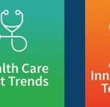

_Note: Source document was split into 2 OCR chunks (pages 1-15, pages 16-19) to stay within token limits._

# 202510-provider-use-ai-healthcare

## Page 1
# Provider Use of AI in Healthcare

## OCTOBER | 2025

## Page 2
# Provider Use of AI in Healthcare

**AUTHORS** Joe Dorocak, ASA, MAAA
Director, Enterprise Business Intelligence
Medical Mutual

**SPONSOR** Healthcare Cost Trends Strategic Research Program

Don McLellan, ASA, MAAA
Senior Director Healthcare Economics
Cleveland Clinic

## Caveat and Disclaimer

The opinions expressed and conclusions reached by the authors are their own and do not represent any official position or opinion of the Society of Actuaries Research Institute, the Society of Actuaries, or its members. The Society of Actuaries Research Institute makes no representation or warranty to the accuracy of the information.

Copyright © 2025 by the Society of Actuaries Research Institute. All rights reserved.

## Page 3
# CONTENTS 

Executive Summary ..... 4
Section 1 Introduction ..... 5
Section 2 Use Cases ..... 7
2.1 Patient Risk Stratification ..... 7
2.2 Hospital Throughput and Efficiency ..... 9
2.2.1 Skilled Nursing Facility Length of Stay ..... 9
2.2.2 Hospital Discharge Prediction Model ..... 10
2.2.3 Surgical Case Duration Model ..... 11
2.2.4 Forecasting Key Performance Indicators and Hospital Utilization ..... 12
2.2.5 Prescriptive Analytics ..... 13
2.3 Caregiver Efficiency Using Generative AI ..... 14
Section 3 Where Do We Go From Here ..... 16
Section 4 Acknowledgments ..... 18
About The Society of Actuaries Research Institute ..... 19

## Page 4
# Provider Use of AI in Healthcare 

## Executive Summary

Artificial intelligence is rapidly transforming healthcare delivery, and actuaries are uniquely positioned to guide its responsible and impactful adoption. This report highlights how AI technologies-ranging from predictive analytics to generative and agentic AI-are being used by leading health systems to improve patient outcomes, streamline operations, and reduce costs. Use cases such as patient risk stratification, hospital throughput optimization, and prescriptive analytics demonstrate how AI can enhance decision-making and resource allocation. These models rely heavily on actuarial principles: data integrity, model explainability, and risk segmentation. Actuaries can play a critical role in validating these models, ensuring fairness, and aligning them with business objectives in value-based care arrangements.

As AI systems become more autonomous and complex, actuaries would significantly benefit from expanding their influence beyond traditional forecasting and cost modeling. The rise of agentic AI introduces new dimensions of risk—ethical, operational, and regulatory-that call for actuarial oversight. Actuaries are well-equipped to contribute to model governance, bias mitigation, and scenario planning, especially as synthetic data and digital twinning reshape the data landscape. The report lays out some opportunities for actuaries to embrace collaboration across payer-provider boundaries, advocate for transparency, and help build trust in AI-driven healthcare. By doing so, actuaries can elevate their role from technical experts to strategic partners in shaping the future of healthcare.

## Page 5
# Section 1 Introduction 

The integration of artificial intelligence (AI) into healthcare represents a transformative opportunity, promising to revolutionize patient experiences, provider efficiency, and payer satisfaction. AI technologies such as predictive analytics and machine learning have shown great promise in addressing pervasive inefficiencies and waste within the healthcare system. By harnessing vast amounts of data, including clinical records, medical claims, and social determinants of health, AI has the potential to create more empathetic and efficient interactions between providers and patients.

Consider the overwhelming stress and anxiety of first-time mothers or individuals encountering new chronic conditions often face. Traditional communication channels may not provide timely answers, leading to further uncertainty and potential mental health issues. AI-powered systems can offer quick, accurate responses, provide reassurance, and ease the burden on healthcare providers. For caregivers of loved ones, navigating the complexities of healthcare can be daunting. ${ }^{1} \mathrm{Al}$ can help by automating reminders, tracking medication schedules, and offering real-time updates on patient status, potentially reducing caregiver fatigue and improving overall care quality.

Patient discharge from hospitals marks an important juncture where continued engagement with the healthcare system can have a significant impact on future patient health outcomes. However, stretched healthcare systems struggle to maintain consistent follow-up contacts. AI-driven solutions can facilitate regular check-ins and help patients stay aligned with their treatment plans, potentially reducing readmission rates and improving overall health outcomes. Moreover, AI can enhance throughput within the healthcare system, potentially reducing waste and inefficiencies. By leveraging natural language processing and large language models, AI can interpret unstructured data and develop predictive algorithms, which may support more informed decision-making and personalized care. ${ }^{2,}$

However, the adoption of AI in healthcare is not without challenges. One significant issue is the availability and quality of data. Healthcare systems often deal with disparate data sources, including electronic medical records (EMRs), medical claims, and social determinants of health data. These datasets are frequently fragmented and may contain biases that can affect the accuracy and reliability of AI predictions. For instance, skilled nursing facilities may experience different lengths of stay depending on whether patients are covered by traditional Medicare or Medicare Advantage plans. Similarly, operating room times can vary significantly based on provider demographics, which may lead to biased predictions if historical data is not sufficiently representative.

To mitigate these challenges, digital twinning and synthetic data generation have emerged as potential solutions. Synthetic data allows for the creation of diverse, unbiased datasets that can be used to train AI models to help drive more accurate and reliable predictions. ${ }^{4,5}$ Additionally, addressing systemic biases requires thoughtful consideration

[^0]
[^0]:    ${ }^{1}$ Harvard Gazette. (2025, May 2). Earlier warning on pediatric cancer recurrence. Harvard University. https://news.harvard.edu/gazette/story/2025/05/ai-tool-predicts-relapse-risk-for-children-with-brain-cancer/ (Accessed 10/15/2025)
    ${ }^{2}$ Critical Care Medicine. (2021, November). Transitions of Care After Critical Illness-Challenges to Recovery and Adaptive Problem Solving. Critical Care Medicine, 49(11), p1923-1931. https://journals.lww.com/ccmjournal/abstract/2021/11000/transitions_of_care_after_critical.9.aspx (Accessed 10/15/2025)
    ${ }^{3}$ Kaufman, D., Sheehan, B., Stetson, P., et. al. (2016, October 28). Natural Language Processing-Enabled and Conventional Data Capture Methods for Input to Electronic Health Records: A Comparative Usability Study, JMIR Medical Informatics, 4(4), e35. https://medinform.jmir.org/2016/4/e35 (Accessed 10/15/2025)
    ${ }^{4}$ American Statistical Association. (2022, August 8). A Machine Learning Solution to Predict Surgical Case Duration in a Multi-Hospital Health System. Joint Statistical Meetings (JSM) 2022 Program Abstracts.
    https://ww2.amstat.org/meetings/jsm/2022/onlineprogram/AbstractDetails.cfm?abstractid=320730 (Accessed 10/15/2025)
    ${ }^{5}$ Halamka, J, Cerrato, P. (2024, December 23). Digital twin technology has potential to redefine patient care. Mayo Clinic.
    https://www.mayoclinicplatform.org/2024/12/23/digital-twin-technology-has-potential-to-redefine-patient-care/ (Accessed 10/15/2025)

## Page 6
during data collection and analytical phases. Ensuring that all demographic groups are adequately represented in training datasets can help to mitigate future potential biases in Al-generated outcomes. ${ }^{6}$

The use cases that follow in this paper represent real-life applications at some prominent healthcare systems globally. Their collective impact is changing the way healthcare is delivered, and healthcare actuaries would benefit from being aware of the opportunities and outcomes they present. For those working on the provider side of health, the journey to deploying these technologies can help spark inspiration. For those working on the payer side of health, the applications are likely to create opportunities for collaboration. The evolution of medical economics, population health, disease management and utilization management can be accelerated in this AI age. Finally, everyone reading this paper has been or will be a patient at some point. Considering the relationship between the patient, the payer and the provider, these use cases may help to generate awareness and opportunity for better outcomes.

The integration of artificial intelligence into healthcare offers unprecedented opportunities to improve patient experiences, provider efficiency, and payer satisfaction. While challenges remain, advancements in data management, bias mitigation strategies, and synthetic data generation may provide pathways toward realizing these benefits. As healthcare providers continue to explore and implement AI technologies, they will likely contribute to a more efficient, empathetic, and effective healthcare system.

[^0]
[^0]:    ${ }^{6}$ Grinstein, D. (2025, January 21). NVIDIA and Mayo Clinic partner on AI-powered digital pathology. Genetic Engineering \& Biotechnology News. https://www.genengnews.com/topics/artificial-intelligence/nvidia-and-mayo-clinic-partner-on-ai-powered-digital-pathology/ (Accessed 10/15/2025)

## Page 7
# Section 2 Use Cases 

### 2.1 PATIENT RISK STRATIFICATION

In the complex landscape of healthcare, predictive analytics can play a pivotal role in enhancing patient outcomes by enabling more accurate and timely risk stratification. One of the classic applications of these technologies is patient risk stratification, which involves evaluating the likelihood of adverse events such as mortality or complications. This process is woven into the fabric of a patient's interaction with the healthcare system, from their initial admission to the acute care setting through various stages of treatment and recovery.

Ideally, upon entering the hospital, a patient's vital signs, laboratory values, pharmacy orders, and other clinical data are meticulously recorded in the electronic medical record (EMR), which also stores the patient's extensive medical history, including past surgeries, chronic conditions, and previous treatments. These comprehensive datasets serve as the foundation upon which predictive models are built, allowing healthcare providers to assess the patient's risk profile. Many of these data domains are either not accessible or immediately accessible to the payer, thus creating an opportunity to use the EMR to stratify patients.

One of the primary use cases for risk stratification in hospitals often revolves around addressing mortality rates. By analyzing historical data and current clinical indicators, predictive analytics algorithms can identify patterns and trends that indicate heightened risk. For instance, patients who exhibit elevated heart rate variability, low blood pressure, abnormal lab results, and frailty might be flagged as high-risk candidates. Such assessments can be instrumental in enabling healthcare providers to initiate critical conversations with patients and their families early in the hospital stay. Early intervention and discharge to appropriate care settings not only can improve patient outcomes but can also foster a more empathetic and supportive environment.

These risk stratification tools can help to facilitate nuanced discussions between healthcare providers, patients, and their loved ones about potential future health challenges. For example, if a patient is identified as being at high risk of mortality, the provider might discuss hospice care options, or palliative care. On the other hand, if a patient is found to be at moderate risk, the conversation might shift towards discussing the possibility of transitioning to a less intensive level of care, such as a skilled nursing facility or a home-based care program.

Model explainability is a key component in risk stratification as it allows healthcare providers to understand the underlying factors contributing to a patient's risk profile. This understanding helps to create actionable insights that can guide future care plans and interventions. For instance, when a patient is admitted to the hospital and a risk score is assigned upon discharge, it can provide useful information about potential future complications or adverse events. Identifying specific risk factors associated with an increased likelihood of readmission, such as comorbidities, medication adherence issues, or social determinants of health, can help healthcare providers to develop targeted interventions aimed at reducing the patient's risk over time.

Readmissions represent potentially avoidable events in healthcare, impacting both patients and healthcare providers. Patients may experience significant distress due to repeated hospitalizations, while healthcare providers can face financial burdens and increased workload from these events. Reducing readmissions not only can help to improve patient satisfaction but also can assist in optimizing resource allocation within healthcare systems. Various systemic care management initiatives have been implemented across different health systems to help address this issue. One common approach involves the delegation of transitional care management teams to focus on high-risk patients identified by predictive models. These teams are responsible for coordinating care between the hospital and community settings, with the intent of providing continuity of treatment and support post-discharge.

Health systems typically employ a range of strategies to engage with patients at various risk levels. For those at elevated risk, more intensive care management may be recommended, involving regular follow-up visits, enhanced

## Page 8
communication channels, personalized care plans and, in some cases, sending trained caregivers to the patient's home. In contrast, moderate-risk patients may receive lighter touch care through electronic medical messaging systems or chart reviews, encouraging them to take proactive steps like following up on prescriptions and addressing any concerns related to their discharge instructions.

Low-risk patients who do not require immediate intervention may continue to receive routine care via standard channels. However, these patients could still potentially benefit from ongoing monitoring and support, which can help to maintain their overall health and well-being. By leveraging predictive analytics, healthcare providers can identify patterns and trends that could be used to inform these nuanced approaches to patient care. This holistic approach can help patients receive appropriate attention based on their individual needs and risk profiles, which can help to drive improved outcomes and reduced costs.

One primary group of patients to consider targeting are those already identified as high-risk but not yet hospitalized. These individuals often exhibit frequent emergency department (ED) visits, substantial pharmacy costs, and multiple chronic conditions when managed poorly. Machine-learning models can analyze these patterns to help identify patients at high risk of adverse events, such as hospitalization or complications from their existing conditions. For instance, a model might flag patients with a history of ED visits exceeding a certain threshold, combined with high-cost prescription drug usage, as candidates for closer monitoring.

Another critical group to consider is "rising risk" patients who were previously at low or moderate risk but are now trending towards higher risk levels. Early intervention for these patients can help reduce the risk of potential deterioration in their health status. Machine-learning models can track changes in patient behavior over time, identifying trends that indicate an increased likelihood of future adverse outcomes. For example, a model might monitor a patient's ED visit frequency and cost of care over the past six months and predict whether they are likely to exceed predefined thresholds within the next 12 months.

Developing effective patient risk stratification models requires careful consideration of various factors, including data normalization, precision, and explainability. One common approach involves merging concurrent and prospective risk models. Concurrent risk models assess the immediate risk of a patient at a given point in time, while perspective risk models project future risk over a specific period (e.g., 12 months). By comparing these two values, healthcare providers can gain insights into which patients are exhibiting or likely to exhibit increasing morbidity.

To ensure the accuracy and reliability of these models, it is crucial to evaluate them using retrospective data. This process allows healthcare organizations to determine cut-off scores for classifying patients as high-risk versus low risk. For instance, if a care coordination team can handle up to 1,000 patients, they might use historical data to identify the risk score threshold above which patients would be flagged as high-risk and fall within the care coordination team's capacity.

Another important aspect of patient risk stratification is utilizing utilization-based metrics. By projecting future utilization patterns, such as hospital admissions or ED visits, healthcare providers can create algorithms to help better predict a patient's risk level. For example, a model might analyze a patient's recent history of ED visits and hospitalizations to estimate their likelihood of requiring further care within the next 12 months.

Determining appropriate threshold levels is important to help machine-learning models effectively identify high-risk patients. Healthcare organizations typically use business cases to develop these thresholds based on available resources and operational capacity. For instance, if a care coordination team can manage up to 1,000 patients, they might set a threshold where only 75% of predicted high-risk patients are expected to require intervention. This would help increase the probability that nurses and other care coordinators have sufficient confidence in the list of patients that would benefit from outreach.

## Page 9
One of the key challenges in developing effective patient risk stratification systems is creating models that are highly explainable. Care teams rely on clear, actionable insights derived from these models to inform their decision-making processes. Designing machine-learning algorithms to provide transparent explanations for predictions can help care coordinators understand why certain patients were identified as high-risk.

For example, a model might generate a list of patients with specific characteristics (e.g., frequent ED visits, high pharmacy costs) and provide detailed explanations for each prediction. These explanations could include factors such as age, gender, comorbidities, and previous medical history. By providing clear, actionable insights, care teams can more effectively target interventions with the goal of improving patient outcomes.

In the post-discharge or community setting, payers may utilize very similar risk stratification approaches, making collaboration and coordination critical. Providers and payers risk creating confusion with patients/members if numerous calls, texts or other outreach mechanisms are used.

In summary, predictive analytics for patient risk stratification represents a powerful potential tool in healthcare, enabling healthcare providers to make informed decisions about patient care and treatment pathways. Through the use of sophisticated algorithms and extensive clinical data, these tools can potentially improve patient outcomes by facilitating timely and appropriate interventions. As healthcare systems continue to evolve, the integration of predictive analytics represents an opportunity to potentially drive improvements in patient safety, quality of care, and overall health outcomes.

# 2.2 HOSPITAL THROUGHPUT AND EFFICIENCY 

### 2.2.1 SKILLED NURSING FACILITY LENGTH OF STAY

The purpose of Skilled Nursing Facilities (SNF) Length of Stay Models is to provide a benchmark length of stay (LOS) for patients admitted to SNFs. The goal is to ultimately reduce the length of stay at the SNFs by encouraging operational changes and the discharge of patients on time.

From the perspective of the payer, reducing the length of stay in SNFs is financially advantageous. Shorter stays translate to lower costs for insurance companies and other payers, as the expenses associated with prolonged care in SNFs can be substantial. By encouraging operational changes and timely discharges, payers can work towards reducing their financial burden, while still ensuring that patients receive necessary care. Additionally, shorter stays can lead to better resource allocation, allowing payers to invest in other areas of healthcare that may improve overall patient outcomes and satisfaction.

For patients, getting home faster from skilled nursing stays offers several benefits. Firstly, being in a familiar environment can significantly enhance their recovery process. Patients often feel more comfortable and less stressed at home, which can contribute to faster healing and improved mental well-being. Moreover, the risk of healthcare-associated infections is reduced when patients are not in communal settings like SNFs. Home healthcare allows for personalized attention and tailored care plans, promoting independence and enabling patients to regain control over their daily routines. This transition not only supports physical recovery but also fosters a sense of normalcy and autonomy.

For example, the use of a two-stage logistic regression can help to determine the probability of LOS falling into a certain time period category. This probability would then be used in the next stage where a linear regression is performed to obtain a prediction of LOS. The ultimate model chosen could then be a champion model based on lowest Average Squared Error (ASE). This model would also include the benefit of explainability as referenced above.

## Page 10
Importantly, what is created is just a benchmark for the expected time a patient will most likely stay in the SNF. The benchmark could be developed two times per week for new patients beginning a SNF stay. Clinicians could then be required to provide a rationale for keeping a patient in the facility past the predicted LOS.

The average length of stay for one of the populations studied was 23 days, but the average predicted length of stay was closer to 20. As a result, patients in this population were only staying as long as necessary in the SNF, so it was no longer necessarily just influenced by the benefits of the payer, but it was also based on the patients' clinical needs. The payers and hospital providers would benefit by reduced costs per patient in value-based arrangements. Patients who would have stayed for as long as they were covered by their benefits ended up being discharged sooner.

# 2.2.2 HOSPITAL DISCHARGE PREDICTION MODEL 

Predicting patient discharge within 24 to 48 hours using machine-learning models holds significant potential for enhancing hospital efficiency, particularly by reducing unnecessary patient stays and facilitating timely discharges. The development of such predictive models addresses a significant gap in current care practices, where delays in discharge often result from inadequate planning and administrative tasks. By accurately identifying patients who are likely to be discharged within the specified timeframe, healthcare providers can initiate necessary actions proactively, thereby optimizing resource allocation and improving overall operational efficiency.

The primary challenge lies in developing robust predictive models capable of handling the complexity of various factors influencing patient discharge decisions. These factors include, but are not limited to, patient demographics (age, gender, zip code, marital status), admission type, progression through the hospital stay, laboratory results, vital signs, prescribed medications, and other clinical indicators. Each of these elements contributes uniquely to the likelihood of discharge, necessitating a comprehensive approach to model design.

This binary classification problem can be addressed using traditional logistic regression techniques or more advanced machine-learning algorithms like decision trees, gradient-boosted machines, random forests, supportvector machines, or neural networks. Logistic regression, as a foundational method, provides a straightforward yet powerful framework for estimating probabilities based on input variables. However, more sophisticated models may offer enhanced accuracy and interpretability, especially when dealing with complex interactions among multiple predictors.

Patient demographics can play a crucial role in predicting discharge likelihood. For instance, younger patients might have a higher probability of being discharged due to their shorter hospital stays and quicker recovery times. Conversely, older patients or those with chronic conditions may require extended stays, thus reducing their probability of discharge within a specified timeframe. Gender differences can also be important factors; certain demographic groups may exhibit different patterns of discharge behavior. Zip codes and marital statuses can also influence these probabilities, reflecting variations in local healthcare resources and patient preferences.

Admission type is another critical factor. Patients admitted for elective procedures typically have higher probabilities of discharge compared to those admitted for emergent care. Progression through the hospital stay is equally significant, with patients nearing completion of their treatment regimens having higher chances of discharge. Laboratory results and vital signs can provide valuable insights into patient health status, with abnormal values indicating potential complications that might delay discharge. Prescribed medications, particularly those requiring close monitoring post-discharge, introduce additional considerations into the predictive model.

Additionally, the timing of medication administration plays a pivotal role in predicting discharge likelihood. New prescriptions often necessitate additional paperwork and follow-up appointments, thereby delaying discharge.

## Page 11
Understanding the interplay between prescribed medications and discharge timelines helps in refining the predictive model's accuracy.

In practical terms, a well-designed discharge prediction model can significantly impact hospital operations. When a model alerts physicians that a patient has a high probability of discharge, it triggers immediate actions such as initiating discharge orders, printing necessary documentation, and planning transportation arrangements. This proactive approach minimizes delays, ensures timely discharges, and reduces administrative burdens. Additionally, it enables healthcare staff to prepare for incoming cases by anticipating bed openings, facilitating smoother transitions between units and floors.

The concept of augmented intelligence offers the potential of integrating machine-learning models with physician intuition. Augmented intelligence leverages technology to enhance clinical decision-making while preserving human judgment. In the context of discharge prediction, this means alerting physicians when a patient is likely to be discharged but allowing them to evaluate and make final decisions based on their clinical expertise. This hybrid approach offers the opportunity for automated predictions to be complemented by the nuanced understanding of individual patients' needs.

# 2.2.3 SURGICAL CASE DURATION MODEL 

In recent years, healthcare organizations have increasingly recognized the importance of optimizing surgical case durations with the goal of improving efficiency and patient satisfaction. One frequent area of focus involves predicting the duration of surgical cases, which can potentially enhance the optimization of scheduling and resource allocation within the hospital. This predictive task is analogous to forecasting patient discharge times; both aim to enhance operational performance by minimizing delays and maximizing utilization of available resources.

The accuracy of surgical duration predictions hinges on leveraging a comprehensive dataset that includes various variables indicative of the complexity and duration of a procedure. Key factors that can influence these predictions include the type of surgery, patient demographics, clinical history, comorbidities, and the provider's experience. Each of these elements can help providers estimate the anticipated length of a surgical case.

First, the type of surgery significantly impacts its duration. Different procedures require varying levels of expertise, equipment, and time. For instance, complex surgeries such as organ transplants or major reconstructive procedures typically take longer than routine operations like appendectomies. In certain cases, a patient may be undergoing multiple procedures simultaneously or within the same admission. Therefore, understanding the specific nature of each case is vital for accurate prediction.

Patient demographics can also play a pivotal role. Factors such as age, gender, and pre-existing conditions can influence the duration of a surgical intervention. Younger patients often recover faster, whereas older patients may require additional care and monitoring. Additionally, patients with multiple chronic diseases might face increased complications during surgery, thereby extending the overall procedure duration. For example, a patient with diabetes might require more extensive anesthesia management and post-operative care due to potential hypoglycemic episodes or wound healing challenges.

Provider experience is another important variable to consider. The skill level, experience, and specialization of the surgeon directly affect the duration of a surgical case. Surgeons with extensive experience tend to perform procedures more efficiently, reducing the time required for each operation. Conversely, less experienced surgeons may encounter difficulties, leading to extended durations. Moreover, the provider's panel of specialists and ancillary support staff can impact the workflow and, ultimately, the duration of a surgical case.

## Page 12
Given these variables, developing a robust machine-learning model can be a useful tool. Such models can incorporate various data sources, including electronic health records (EHRs), administrative databases, and clinical notes. By leveraging advanced algorithms, these models can help to identify patterns and correlations between different variables and surgical outcomes.

These predictive models can offer an array of potential benefits. They can help with scheduling surgeries by seeking to optimize the flow of cases throughout the day. By eliminating overlap between surgeries and minimizing gaps in the use of operating rooms, these models can help lead to improved resource utilization. Additionally, accurate predictions can help hospitals manage backlogs more effectively. If a hospital has identified opportunities to schedule additional surgeries on a given day, it can accelerate patient admissions and prepare accordingly. This proactive approach can help to avoid delays and help patients receive more timely care.

# 2.2.4 FORECASTING KEY PERFORMANCE INDICATORS AND HOSPITAL UTILIZATION 

Forecasting key metrics for a hospital system can help executives plan effectively and make informed decisions regarding resource allocation, capacity planning, and operational efficiency. Historically, forecasting has been a challenging task due to the complexity of healthcare systems, which involve numerous variables and unpredictable factors. However, recent advancements in forecasting methodologies have created an opportunity to improve the precision and reliability of predictions, which in turn can enhance the effectiveness of hospital management.

One of the primary distinctions in forecasting models is between demand-first and supply-first forecasting. Demandfirst forecasting focuses on identifying and predicting urgent patient visits, emergency department (ED) visits, and other services that are not directly influenced by the availability of staff or resources. For instance, ED visits occur regardless of staffing levels, and patients will seek care irrespective of whether there are available physicians. Conversely, supply-first forecasting involves services such as office visits, primary care physician (PCP) visits, specialty visits, and operating room utilization, where the availability of staff and resources plays a significant role. Supply-first forecasting models generally take into account various factors such as physician availability, time off, vacations, conferences, and operating room closures.

Accurate hospital system forecasts can help organizations plan more effectively, with the goal of ensuring adequate bed availability during peak periods and managing resource allocation efficiently. During the COVID-19 pandemic, many forecasts were developed to understand the utilization patterns and bed availability across the healthcare system. Even outside of pandemics, these questions remain relevant for hospital planners. The utilization of forecasts encompasses various activities such as admissions, discharges, transfers, ED visits, PCP visits, specialty visits, and operating room utilization.

Several considerations are key to developing forecast models for hospital systems. Data aggregation and the use of different metrics and data points have the potential to impact the accuracy of forecasts. Key metrics include patient flow, bed occupancy rates, and operational performance indicators. Additionally, understanding the specific days of the week that utilization occurs is vital, along with holidays and weather patterns. These are all considerations for the model. For example, in Cleveland, OH, a solar eclipse led to a significant drop in healthcare utilization due to people taking the day off to enjoy it, like how a holiday would affect utilization.

Another important aspect of forecasting within a healthcare system is the consideration of different business dimensions. These dimensions include individual hospitals, markets, service lines, provider specialties, and encounter types. XGBoost models have emerged as an effective approach for developing forecasts, particularly for nonlinear patterns in data. While XGBoost models utilize more computational power and incorporate complex data design, they offer robust results that can be applied across multiple metrics. This versatility allows for comprehensive Key Performance Indicator (KPI) forecasts that are informative to the organization.

## Page 13
# 2.2.5 PRESCRIPTIVE ANALYTICS 

In healthcare, prescriptive analytics are another tool that can help to enhance decision-making processes for providers, enabling them to prescribe interventions tailored to individual patients based on predictive outcomes. Some healthcare systems have been able to introduce tools that go beyond prediction to prescription. ${ }^{7}$ The use of the next best action models and uplift modeling are two examples that demonstrate how advanced analytics with a prescriptive lens have the potential to improve patient care and outcomes.

Traditional predictive analytics often focus on identifying high-risk patients based on various covariates such as demographics, past utilization patterns, laboratory values, social history, and more. These models seek to predict the likelihood of certain events occurring, such as readmission within 30 days or hospital admissions over a sixmonth period. By incorporating potential interventions into these models as additional covariates, healthcare providers look to gain actionable insights. For instance, a model predicting 30-day readmission might rank interventions like follow-up phone calls, text messages, specialist visits, and prescription changes according to their impact on reducing the risk being estimated by the model without any intervention. This approach can allow providers to tailor their interactions to specific patients to help optimize resource allocation with the goal of improving patient outcomes.

Next-best action models specifically aim to determine which intervention is most effective for each patient. By designing a predictive model that includes various interventions, one can estimate the potential impact of each option. Outputs from such models could include a dashboard showing both the predicted risk and the reduction in risk associated with different interventions. For example, a provider might see that daily text messaging can reduce the risk of readmission compared to other interventions. Such insights can help providers make more informed decisions about which interventions are likely to be more beneficial for individual patients, thus providing the opportunity to enhance overall care quality.

Uplift modeling seeks to further refine this process by separating patients into two groups: those who received an intervention (e.g., care management) and those who did not. By training separate models for each group, uplift modeling seeks to identify which patients would benefit most from a particular intervention. In an example of predicting six-month hospital admissions, a team could train a model for patients enrolled in care management and another for those not enrolled. Comparing the difference in predictions between the two models can help to identify the types of patients who could benefit more from a particular care management program. Providers can then prioritize enrolling patients who stand to gain the most from the intervention, with the goal of improving the efficiency of their care management efforts.

Both the next best action models and uplift modeling leverage predictive analytics to prescribe tailored interventions, whose goal is to augment the healthcare system's capabilities. These approaches can provide actionable intelligence that can be used to guide providers in making data-driven decisions, with the goal of improved patient outcomes and more efficient use of resources. As organizations continue to advance along the spectrum of advanced analytics, integrating prescriptive analytics may play an increasing role in delivering highquality, personalized care.

[^0]
[^0]:    ${ }^{7}$ Shapiro, L. (2025, May 1). Using AI Offers Ways to Improve Fabry Diagnosis, Care: Study. Fabry Disease News. https://fabrydiseasenews.com/news/applying-artificial-intelligence-to-rare-diseases-a-literature-review-highlighting-lessons-from-fabry-disease/ (Accessed 10/15/2025)

## Page 14
# 2.3 CAREGIVER EFFICIENCY USING GENERATIVE AI 

The integration of generative artificial intelligence (AI) applications within healthcare systems can also be used to adjust the way caregivers interact with patients, with the goal of enhancing overall efficiency and patient satisfaction. One of the most notable areas where generative AI has been applied is in telemedicine and electronic medical record (EMR) interactions, whose uptake has been accelerated by the pandemic. In the context of community-based health events, patients often seek immediate communication with their healthcare providers, leading to the potential of high volumes of messages on EMRs. This situation can be dealt with more effectively through efficient and timely responses from care teams, which can be challenging due to the 24/7 nature of modern healthcare operations.

Generative AI has the potential to be a useful tool in addressing this challenge. By automating the evaluation and response to patient inquiries, it allows for the possibility of quicker feedback loops with the goal of reducing the burden on healthcare providers. For instance, AI bots can scan incoming messages, analyze them against the patient's chart, and generate concise, relevant responses. Such automation not only can reduce response times but can also help critical information to be captured. This capability can be more valuable during peak hours when providers are inundated with numerous messages.

Generative AI can also help to optimize patient-provider interactions during office visits. Pre-reads generated by AI can help providers cover essential topics before the visit, thereby providing an opportunity for the session to be more efficient and comprehensive. These pre-reads can include summaries of recent lab results, medication schedules, and any other pertinent information. In some cases, patients may have open care gaps that could be closed during the office visit, and the AI-generated pre-reads can act as a reminder or incentive for the provider to close the gaps. Additionally, AI scribes can transcribe and summarize conversations between providers and patients, reducing the need for back-and-forth communications which can improve overall efficiency. This technology can also aid in coding accuracy and completeness, helping patients to be enrolled in appropriate programs and potentially enhancing the probability that the hospital system is reimbursed correctly.

In the post-visit phase, generative AI can also contribute to enhanced care management. Care management teams often engage in extensive outreach efforts to ensure that patients adhere to treatment plans and manage their health effectively. However, these efforts often require significant resources and manpower. Generative AI technologies can automate much of this process, sending text messages or even making phone calls to provide reminders and updates. These tools not only can reduce the workload on care managers but also can contribute to improvements in patient engagement and compliance with treatment protocols.

Despite its potential, there remain several open questions regarding the use of generative AI in healthcare. One major concern is whether these AI systems can replicate the empathetic qualities of human interaction, which are crucial for building trust and rapport with patients. There is uncertainty about the extent to which these AIgenerated responses can be complete and concise, potentially leading to misunderstandings or oversights. The continued evolution of conversational AI may help to close this gap. Despite these challenges, the opportunity for generative AI to assist in healthcare remains, having the potential to improve operational efficiency, patient satisfaction, and resource utilization.

As these technologies continue to evolve and mature, they will likely become increasingly sophisticated, capable of handling more complex tasks and providing more nuanced responses. The integration of generative AI into healthcare systems represents a significant step forward in leveraging advanced technology to address the unique challenges faced by modern healthcare providers and patients alike. As research and development progress, further advancements in areas such as personalized care recommendations, predictive analytics, and continuous

## Page 15
improvement in patient outcomes are likely to emerge. This evolving technology is already very deep into Agentic AI.

Agentic AI refers to artificial intelligence systems capable of autonomous decision-making, goal-setting, and adaptive behavior in complex environments. Unlike traditional AI, which operates within predefined parameters, agentic AI exhibits initiative, reasoning, and the ability to pursue objectives with minimal human oversight. Recent advances in reinforcement learning, multi-agent systems, and large language models have accelerated the development of agentic capabilities, enabling AI to perform tasks such as strategic planning, negotiation, and dynamic resource allocation.

For actuaries, the rise of agentic AI presents both opportunities and challenges. These systems can enhance predictive modeling, automate risk assessments, and optimize processes. However, their autonomy introduces new dimensions of risk, including ethical concerns, accountability gaps, and emergent behavior that may be difficult to forecast. As agentic AI becomes more prevalent in healthcare, finance, and public policy, actuaries would be well served to consider its implications for liability modeling, regulatory compliance, and long-term scenario planning.

Understanding agentic AI can help in the development of robust actuarial frameworks that accommodate evolving technological landscapes. This provides an opportunity for future research to focus on quantifying the risks and benefits of agentic systems, ensuring transparency, and aligning AI behavior with human values and institutional goals.

## Page 16
# Section 3 Where Do We Go From Here 

One significant area of potential growth lies in strategic partnerships between tech companies and healthcare providers. Cleveland Clinic's pioneering use of quantum computing provides an example of how advanced technologies can enhance research capabilities. Quantum computers offer significantly higher processing power, enabling researchers to tackle complex problems such as molecular modeling, drug discovery, and personalized medicine. This kind of cutting-edge technology requires significant investment and expertise, which is where tech companies excel. However, they often struggle with access to high-quality, real-world patient data, which is necessary for training sophisticated AI models.

To overcome this challenge, open-source information is increasingly being leveraged. Researchers and developers can mine vast amounts of medical literature to help refine their algorithms. Synthetic data-generation techniques are also becoming more prevalent. Synthetic data allows for the creation of large datasets without compromising sensitive patient information, thereby reducing ethical concerns and regulatory hurdles. Tech companies can then use these datasets to develop more robust and accurate AI models.

While tech companies have a greater ability to build and deploy AI solutions at scale, healthcare providers still face significant challenges in acquiring the necessary talent. Developing large-scale algorithms that can transform healthcare requires specialized skills in machine learning, data science, and domain-specific knowledge. Many healthcare organizations lack the internal capacity to develop such complex systems, leading them to seek external partnerships or acquisitions.

While many small-scale wins are being achieved through incremental improvements, leaders in healthcare must focus on identifying and implementing game-changing use cases. These transformative applications could revolutionize diagnostics, personalized medicine, predictive analytics, and telemedicine. By partnering with tech companies, healthcare providers can help to accelerate the development and deployment of these advanced technologies. Agentic AI can be used to streamline defined processes and to make decisions, while oversight with built-in stops for assessment can help to minimize the possibility of undesired outcomes.

Ethical considerations will likely play a pivotal role in shaping the future of AI in healthcare. As AI becomes more integrated into clinical workflows, there is a greater potential risk of fairness, accountability, and transparency being compromised. This includes addressing issues like bias in algorithms, ensuring data privacy, maintaining patient autonomy, ${ }^{8}$ and informing patients about the potential benefits and risks associated with AI-driven healthcare solutions. Empowering patients to make informed decisions by providing transparent explanations of AI-generated recommendations can enhance trust and engagement.

Anticipated regulations remain a significant hurdle. Healthcare organizations will likely be challenged to navigate a complex landscape where patients are seeking transparency and trust while also embracing innovation. Partnerships with tech companies can help bridge this gap by leveraging their expertise in navigating regulatory requirements and staying ahead of emerging standards.

The goal of increasing trust in these AI systems with patients and providers may lead to the increase of model governance bodies within healthcare systems. These governing bodies can be made up of cross-functional teams, including members of legal, compliance, data science, and clinical. These entities can help shape the vision of the

[^0]
[^0]:    ${ }^{8}$ U.S. Senate Committee on Homeland Security \& Governmental Affairs, Permanent Subcommittee on Investigations. (2024, October 17). Refusal of Recovery: How Medicare Advantage Insurers Have Denied patients Access to Post-Acute Care (Majority Staff Report). https://www.hsgac.senate.gov/wp-content/uploads/2024.10.17-PSI-Majority-Staff-Report-on-Medicare-Advantage.pdf (Accessed 10/15/2025)

## Page 17
use of artificial intelligence at their organizations while developing standards to validate and monitor the applications.

Armed with this information, health actuaries would be well served to consider collaboration, trust, and innovation. Understanding where your organization is on its AI journey is key. Breaking down barriers between organizations to create better outcomes for patients is also something to strive for. At the same time, actuaries, with their professional standards, can lend a point of view to governance of these technologies that can accelerate trust and adoption among patients, members and physicians.

# Give us your feedback! 

Take a short survey on this report.

## 50A

Research

## Page 18
# Section 4 Acknowledgments 

The researchers' deepest gratitude goes to those without whose efforts this project could not have come to fruition: the Project Oversight Group for their diligent work overseeing, reviewing and editing this report for accuracy and relevance.

Project Oversight Group:
Ken Avner, FSA, MAAA
K. Beth Baker, FSA, MAAA

Joan Barrett, FSA, MAAA
Greg Fann, FSA, FCA, MAAA
Prashant Nayak, ASA, MAAA
David Schraub, FSA, MAAA, CERA, ACA
Sudha Shenoy, FSA, MAAA, CERA
Norman Storwick, FSA, MAAA
David Wierz, MBA

At the Society of Actuaries Research Institute:
Achilles Natsis, FSA, MAAA, FHLI, Health Research Actuary
Barbara Scott, Senior Research Administrator

## Page 19
# About The Society of Actuaries Research Institute 

Serving as the research arm of the Society of Actuaries (SOA), the SOA Research Institute provides objective, datadriven research bringing together tried and true practices and future-focused approaches to address societal challenges and your business needs. The Institute provides trusted knowledge, extensive experience and new technologies to help effectively identify, predict and manage risks.

Representing the thousands of actuaries who help conduct critical research, the SOA Research Institute provides clarity and solutions on risks and societal challenges. The Institute connects actuaries, academics, employers, the insurance industry, regulators, research partners, foundations and research institutions, sponsors and nongovernmental organizations, building an effective network which provides support, knowledge and expertise regarding the management of risk to benefit the industry and the public.

Managed by experienced actuaries and research experts from a broad range of industries, the SOA Research Institute creates, funds, develops and distributes research to elevate actuaries as leaders in measuring and managing risk. These efforts include studies, essay collections, webcasts, research papers, survey reports, and original research on topics impacting society.

Harnessing its peer-reviewed research, leading-edge technologies, new data tools and innovative practices, the Institute seeks to understand the underlying causes of risk and the possible outcomes. The Institute develops objective research spanning a variety of topics with its strategic research programs. The Institute has a large volume of topical research available, including an expanding collection of international and market-specific research, experience studies, models and timely research.

Society of Actuaries Research Institute
8770 W Bryn Mawr Ave, Suite 1000
Chicago, IL 60631
www.SOA.org