_Note: Source document was split into 2 OCR chunks (pages 1-20, pages 21-29) to stay within token limits._

# 202511-ait-172-ai-quarter-survey-report

## Page 1
# SOA Member Al Survey

## Summer 2025

**OCTOBER | 2025**

## Page 2
# SOA Member Al Survey

## Summer 2025

**AUTHORS** Joe Alaimo, ASA, ACIA

**SPONSOR** Actuarial Innovation and Technology Strategic Research Program

### Caveat and Disclaimer

The opinions expressed and conclusions reached by the authors are their own and do not represent any official position or opinion of the Society of Actuaries Research Institute, the Society of Actuaries, or its members. The Society of Actuaries Research Institute makes no representation or warranty to the accuracy of the information.

Copyright © 2025 by the Society of Actuaries Research Institute. All rights reserved.

## Page 3
# CONTENTS 

Executive Summary ..... 5
Section 1 Definitions ..... 6
Section 2 Summarized Findings ..... 7
Section 3 AI Question Details ..... 9
Section 4 Demographic Information ..... 23
Section 5 Conclusion ..... 26
Section 6 Acknowledgments ..... 27
Appendix A: Survey Design Details ..... 28
About The Society of Actuaries Research Institute ..... 29

## Page 4
# SOA Member AI Survey 

## Summer 2025

The Actuarial Innovation and Technology (AIT) Program Steering Committee of the Society of Actuaries (SOA) Research Institute developed this AI Survey to understand how actuaries are engaging with emerging technologies, such as Artificial Intelligence (AI), Machine Learning (ML), and Generative AI. As the actuarial profession evolves within an increasingly data-driven environment, the SOA Research Institute seeks to monitor how its members are learning about, applying, and perceiving these tools in their professional work.

## Survey Mission

The goal of the AI survey is to comprehensively evaluate the current state of generative AI adoption, utilization, and interest among Society of Actuaries members on an ongoing basis over many years, while identifying challenges, opportunities, and future directions to guide informed decision-making and strategic initiatives in the actuarial profession.

This mission reflects the SOA Research Institute's commitment to supporting its members as technological innovation continues to reshape analytical practice. Understanding where actuaries stand today, both in adoption and in attitude, provides a foundation for developing the education, resources, and professional guidance necessary for responsible AI integration. To learn more about the survey design, see Appendix A.

## Page 5
# Executive Summary 

The Actuarial Innovation and Technology (AIT) Program Steering Committee of the Society of Actuaries (SOA) Research Institute conducted this survey to evaluate the current state of generative AI adoption, utilization, and interest among Society of Actuaries members, while identifying challenges, opportunities, and future directions to guide informed decision-making and strategic initiatives in the actuarial profession.

The mission of the survey is to comprehensively evaluate the current state of generative AI adoption, utilization, and interest among Society of Actuaries members on an ongoing basis over many years, while identifying challenges, opportunities, and future directions to guide informed decision-making and strategic initiatives in the actuarial profession.

This survey is designed to be repeated once or twice each year to track how AI use, perceptions, and professional readiness evolve over time. Each iteration will provide updated benchmarks and highlight emerging trends across the actuarial community.

The findings of this initial survey provide a snapshot of how the actuarial profession is adapting to the rapid evolution of AI by highlighting differences in attitudes, applications, and readiness across experience levels. Respondents were grouped into three categories based on years of experience: 10 years or less, over 10 years, and unknown experience. You will find the summarized findings in section 2 with the details of the responses for each question in section 3.

## Page 6
# Section 1 Definitions 

This section summarizes the definitions provided to survey respondents to ensure a consistent understanding of key terms throughout the survey. The definitions were presented in the questionnaire to promote clarity when interpreting responses related to Al concepts and applications.

## Artificial Intelligence (AI)

Artificial Intelligence refers to the use of computer systems to perform tasks that typically require human intelligence, such as learning from data, making decisions, and recognizing patterns.

In the actuarial context, Al supports activities such as automating processes, generating insights from complex datasets, and enhancing decision-making accuracy.

## Generative AI

Generative AI is a type of artificial intelligence that creates new content-such as text, images, audio, or codebased on patterns learned from existing data.

It powers tools capable of producing realistic and creative outputs, mimicking human-like work. In actuarial applications, Generative AI can assist with drafting documentation, code generation, data summarization, and interactive analysis.

## Generative AI Agents

Generative Al agents are systems powered by artificial intelligence that can create new content and perform tasks autonomously based on learned data and user prompts.

These agents integrate generation with reasoning and goal-oriented behavior, enabling them to interact with users, make decisions, and carry out tasks such as data analysis, reporting, and content creation within professional workflows.

## Machine Learning (ML)

Machine Learning is a subset of Artificial Intelligence that enables computer systems to learn from data and improve their performance over time without being explicitly programmed.

Actuaries apply ML techniques to develop predictive models, uncover complex patterns, and strengthen decisionmaking in areas such as pricing, claims, and fraud detection.

## Page 7
# Section 2 Summarized Findings 

The survey was designed to:

- Assess the current level of AI/ML engagement within the actuarial profession;
- Identify perceived benefits, barriers, and learning interests;
- Understand how organizations support AI learning and governance;
- Gauge attitudes toward Generative AI (Gen AI); and
- Compare these results by years of actuarial experience ( $\leq 10$ years, $>10$ years, and unknown).

The insights in this report serve as a baseline measurement for tracking longitudinal change in adoption, confidence, and organizational readiness across future survey waves.

Some of the findings of this survey are:

- Most actuaries currently spend less than five hours per week using or learning about AI/ML tools.
- Experienced actuaries ( $>10$ years) are slightly more engaged, while early-career actuaries ( $\leq 10$ years) more often report no AI involvement.
- Across all experience levels, the leading benefit reported is time savings, followed by expanded work output, improved decision-making, and better results.
- Less experienced actuaries emphasize efficiency, while more experienced actuaries recognize strategic and quality-related benefits, such as improved outcomes and broader capabilities.
- The main barriers to AI adoption reported are regulatory/compliance risks, skill gaps, and unclear return on investment (ROI).
- Very few respondents report no barriers, underscoring that most organizations face tangible constraints in expanding AI use.
- Most organizations encourage self-directed learning (reported by about 60-70\% of respondents).
- Respondents reported that only about one-quarter of their employers offer formal training programs, and roughly one-third provide no formal support.
- The top concerns are data and model bias, ethics, and explainability, which reinforce actuaries' focus on integrity, fairness, and transparency in model use.
- The most common uses are learning or brainstorming ideas, writing or interpreting documents, and using chatbots.
- Early-career actuaries are more likely to experiment with code generation and other technical tools, whereas senior actuaries primarily use AI for knowledge and productivity support.
- Among actuaries who do not currently use AI, the most common reasons are a perceived lack of relevance to their work and concerns about data quality or privacy.

## Page 8
- Interest in incorporating Generative AI into workflows is strongest among experienced actuaries, where just over half indicate they are likely to do so. Meanwhile, early-career actuaries remain more cautious, with higher shares reporting neutral or unlikely adoption.

- The results suggest that, while AI awareness is widespread, practical integration into actuarial work remains limited.

- The findings highlight an opportunity for employers and professional bodies to create more structured and consistent learning frameworks.

Some of the overall themes in the results are:

1. **Growing awareness, limited depth:** AI is widely recognized but not yet deeply integrated into most actuarial workflows.

2. **Experience drives confidence:** Senior actuaries are more willing to experiment with and recommend AI tools, likely reflecting greater autonomy and exposure.

3. **Governance and education are pivotal:** Concerns about regulation, skills, and data quality suggest the need for structured learning pathways and clearer professional guidance.

Generative AI is emerging but uncertain: While interest is rising, actuaries are still exploring where these tools add clear professional value.

## Page 9
# Section 3 AI Question Details 

## How much time a week are you spending learning about and/or using Artificial Intelligence (AI) and/or Machine Learning (ML) tools in your professional role as an actuary?

Figure 1
TIME SPENT WEEKLY ON AI/ML TOOLS

Across all experience groups, the majority of actuaries reported spending less than five hours per week learning about or using AI/ML tools. Very few spent more than 20 hours, and a substantial share, particularly among less experienced actuaries, reported no Al involvement at all.

More experienced actuaries (> 10 years) are slightly more engaged overall. Two-thirds (63.4\%) spent up to five hours per week with Al, while $18.2 \%$ reported no engagement, lower than among the less experienced group. This suggests that most senior practitioners have at least some exposure to Al, though still at relatively low time investment levels.

Early-career actuaries ( $\leq 10$ years) results are more polarized. A smaller share (57.3\%) spent under five hours, but over a quarter (26.7\%) reported no use at all, the highest "Not at all" rate. This could reflect limited organizational opportunities for hands-on Al work or a stronger concentration in traditional actuarial tasks.

The unknown experience group follows the overall pattern, with minimal time devoted to Al and about one in eight not using it at all.

Overall, Al engagement remains light across all experience levels. The data shows the profession may still be in the early adoption phase, with most actuaries investing fewer than five hours per week in Al learning or application. Experience level modestly correlates with adoption as more seasoned actuaries are somewhat more likely to use Al in some capacity, possibly due to greater decision-making authority or involvement in exploratory projects. Less experienced actuaries' higher non-engagement rates might indicate the need for structured learning pathways or clearer incentives to explore Al's relevance to actuarial practice.
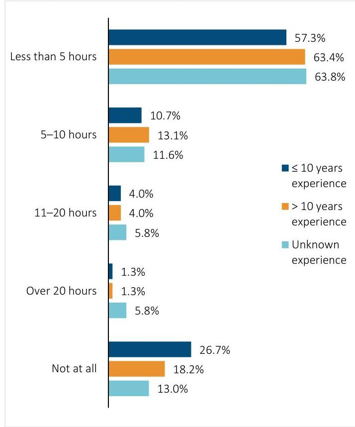

## Page 10
# How are you spending your time with AI? (Select all that apply) 

Figure 2
TIME SPENT WITH AI

Less experienced actuaries ( $\leq 10$ years) displayed broader experimentation, especially with chatbots (50\%) and code generation ( $48.1 \%$ ). This group appears more willing to explore interactive and technical uses of AI, possibly due to greater comfort with digital tools or curiosity-driven exploration.

The unknown experience group most closely aligns with the "learning/brainstorming" category, with $65 \%$ selecting it, the highest of any subgroup.

Figure 3
SUMMARY OF "OTHER" ANSWER

Respondents' "Other" write-ins reveal a broad range of activities beyond the main options. The most common theme was communication and documentation ( 12 mentions), including writing or rewording emails, preparing presentations, meeting notes, and transcription. Nearly as many described research and information retrieval (10), using AI to gather regulatory or technical sources or as a substitute for internet search engines. Another sizable group highlighted advanced analytics and technical uses (9), such as clustering, predictive analytics, OCR, coding, and integration into data science workflows.
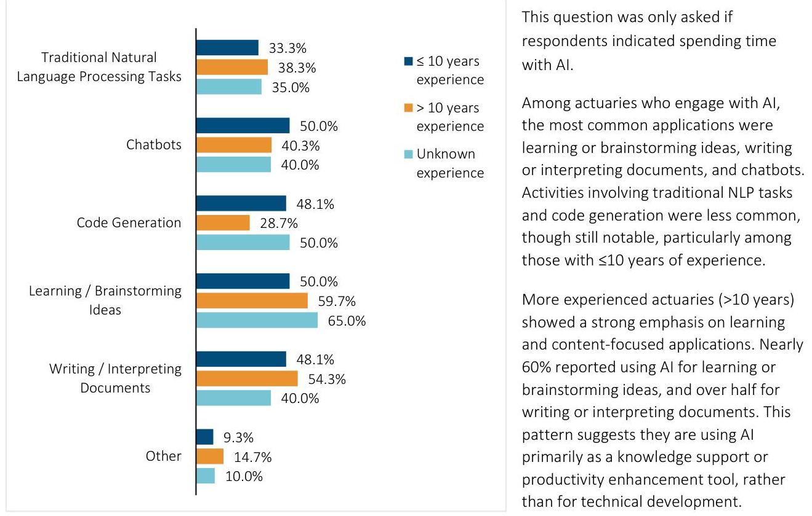
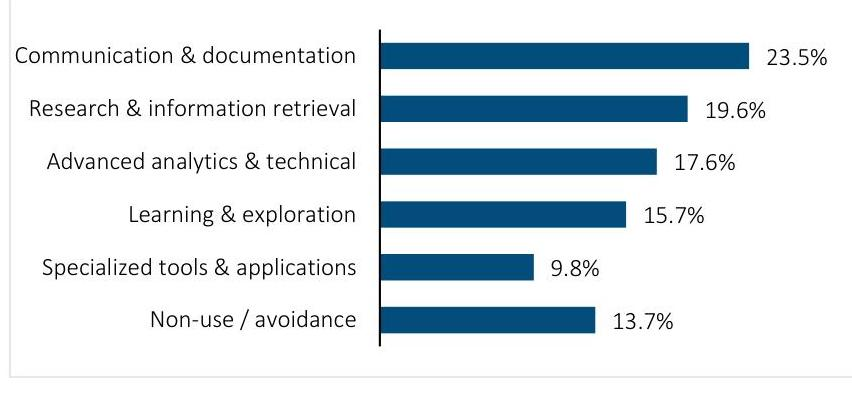

## Page 11
Learning and exploration (8) responses emphasized studying AI concepts, self-directed training, or evaluating AI risks and ethics. Smaller clusters focused on specialized tools (5), like translation, Copilot features, and lead generation. Finally, several respondents explicitly reported non-use or avoidance (7), often due to security restrictions or organizational policy. Together, these write-ins show that respondents employ AI for practical office tasks, technical analytics, and learning, while also highlighting pockets of restricted or absent adoption.

# What benefits are you getting from AI? (Select all that apply) 

Figure 4
BENEFITS FROM AI

This question was only asked if respondents indicated spending time with AI.

Across all experience levels, "Time savings" was the most frequently cited benefit, followed by expanded work product, improved decision-making, and better results. Fewer respondents identified improved accuracy or other benefits.

Time savings dominated across all groups but was most pronounced among less experienced actuaries (86.5\%), compared with $79.7 \%$ for those with over 10 years of experience. Expanded work product and better results were slightly more common among more experienced actuaries ( $34.1 \%$ and $28.4 \%$ ) than their less experienced counterparts ( $28.8 \%$ and $21.2 \%$ ). Improved accuracy shows only modest recognition overall and is the lowestranked benefit in each group. "Other" benefits appear more often among the most experienced actuaries (18.2\%), perhaps reflecting diverse use cases or leadership responsibilities.

The dominance of "Time savings" may suggest that AI is primarily viewed as a productivity enabler, reducing manual effort rather than transforming analytical output. More experienced actuaries appear to appreciate broader and qualitative impacts, such as improved results and expanded capabilities, while those earlier in their careers emphasize immediate operational efficiency. Perception of accuracy improvement remains limited, which suggests continued caution around trusting AI outputs in actuarial settings.

Figure 5
SUMMARY OF "OTHER" ANSWER

The "Other" responses to this question revealed a split between limited benefits and exploratory use. Nearly half ( 25 mentions) explicitly stated they are seeing no benefits yet, often noting "too soon to tell," "not using AI," or finding results inferior to existing tools. A smaller but notable group (10) highlighted learning and exploration as the main outcome, using AI to better understand actuarial concepts, coding, or the technology itself. Several respondents (7) reported communication support, such as improving email clarity,
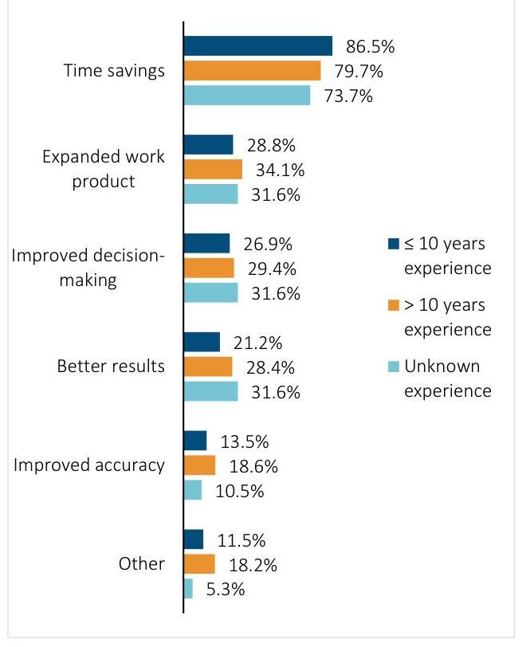
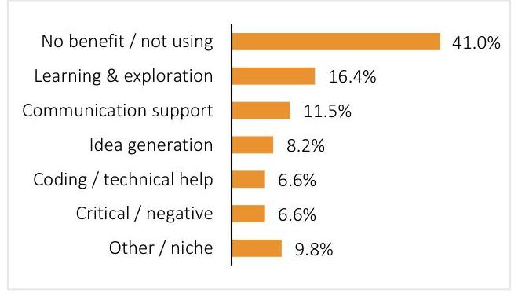

## Page 12
professional writing, or refining language for non-native speakers. Others cited idea generation (5) and coding assistance (4) as tangible benefits. A minority (4) were strongly critical, pointing to inaccuracy, hallucinations, or environmental concerns. Overall, the write-ins show that, outside of the predefined benefit categories, respondents either see little to no value yet or are using Al mainly as a learning, writing, or brainstorming aid, with occasional technical and cost-saving applications.

What barriers to broader Al adoption have you encountered in your organization? (Select all that apply)

Figure 6
BARRIERS TO BROADER AI ADOPTION

This question was only asked if respondents indicated spending time with Al.

Across all experience groups, the most commonly cited barriers were regulatory/compliance risks, skill gaps, and unclear return on investment (ROI). Fewer respondents mentioned cost concerns or indicated no barriers.

Regulatory and compliance risks were the top barrier for all groups, cited by $58.2 \%$ of less experienced and $52.5 \%$ of more experienced actuaries. Skill gaps are more frequently reported among more experienced respondents ( $50.8 \%$ ) than those with $\leq 10$ years ( $38.1 \%$ ), suggesting awareness of workforce capability challenges within larger teams or organizations. Unclear ROI was the second-highest barrier for early-career actuaries (47.3\%) but dropped to $32.3 \%$ among those with more experience, possibly reflecting differing organizational perspectives on investment outcomes. Cost concerns remained relatively minor overall but were slightly higher among actuaries with $>10$ years of experience (20.8\%).

These results show that actuaries recognize external oversight and internal expertise as primary adoption hurdles. Early-career actuaries focus more on justifying ROI than senior actuaries. The limited mention of "None" ( $<10 \%$ across all groups) indicates that most organizations face at least one meaningful barrier to scaling Al use.
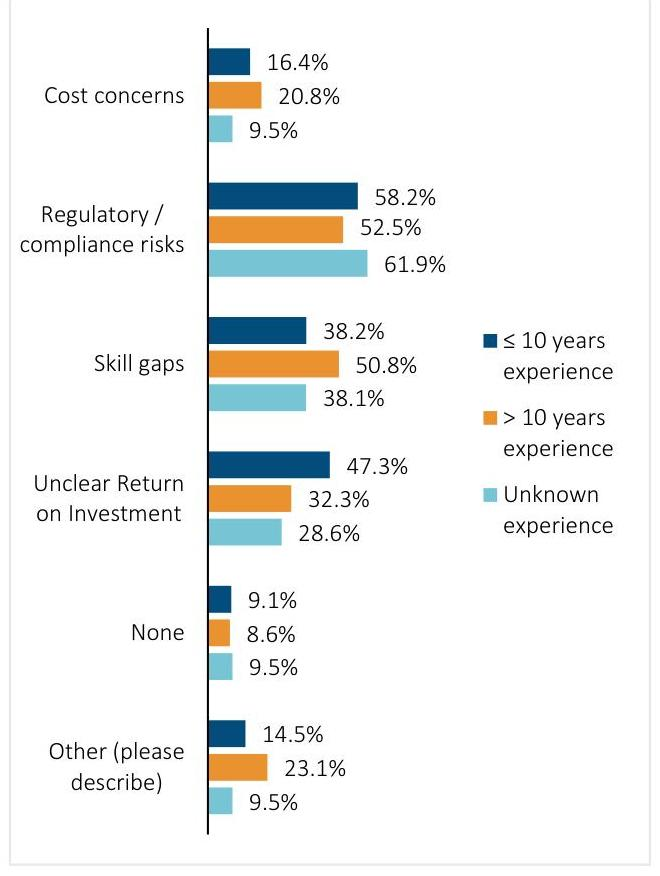

## Page 13
Figure 7
SUMMARY OF "OTHER" ANSWER

The "Other" responses to this question highlight a broad mix of barriers beyond the predefined options, dominated by concerns over accuracy and hallucinations (25\%) and confidentiality/data security (18.8\%). Many respondents described outputs as unreliable, generic, or factually incorrect, with the burden of validation outweighing potential benefits. Security risks were also prominent, including fears of confidential company data being exposed to external AI models. Organizational and management barriers (15\%) were common, such as blanket bans, hesitant leadership, and slow change management. A smaller but notable set flagged environmental/ethical issues ( $7.5 \%$ ) and lack of training or skills ( $7.5 \%$ ), including the need for better prompt engineering. Others noted a lack of meaningful value (10\%), describing AI as "not ready" or "a solution looking for a problem." Finally, a few respondents indicated they were retired, semi-retired, or otherwise not applicable (6.3\%). Overall, these responses reinforce that AI adoption is constrained not just by compliance and skills, but also by trust in quality, security, and organizational readiness.

Why are you not currently using AI/ML tools? (Select all that apply)
Figure 8
REASONS NOT USING AI

This question was only asked if respondents indicated spending no time with AI.

Among respondents not currently using AI, the leading reasons cited were perceived lack of relevance to their work and concerns about data quality or privacy. "Other" reasons were also prominent, especially among more experienced actuaries, while cost concerns and organizational resistance were less common overall.

A perceived lack of relevance was the most common reason for actuaries with $\leq 10$ years of experience ( $65 \%$ ), suggesting many earlycareer actuaries may not yet see clear connections between Al tools and their daily work. More experienced actuaries (>10 years) also cited lack of relevance frequently (42.6\%), but an even larger proportion ( $85.3 \%$ ) selected "Other," indicating more nuanced or contextspecific barriers. Data quality and privacy concerns ranked high across both primary experience groups ( $65 \%$ and $41.2 \%$ ),
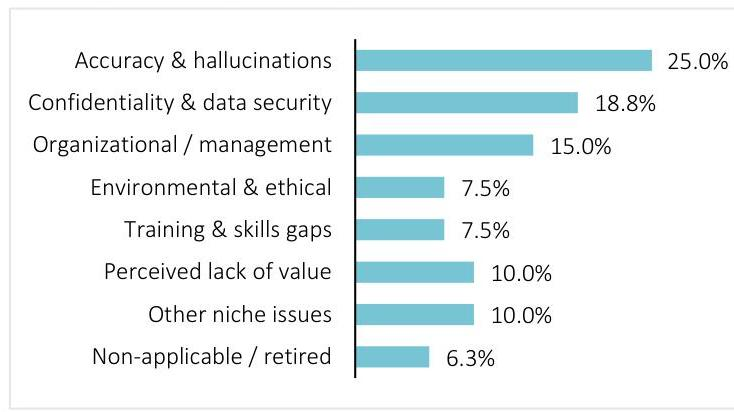
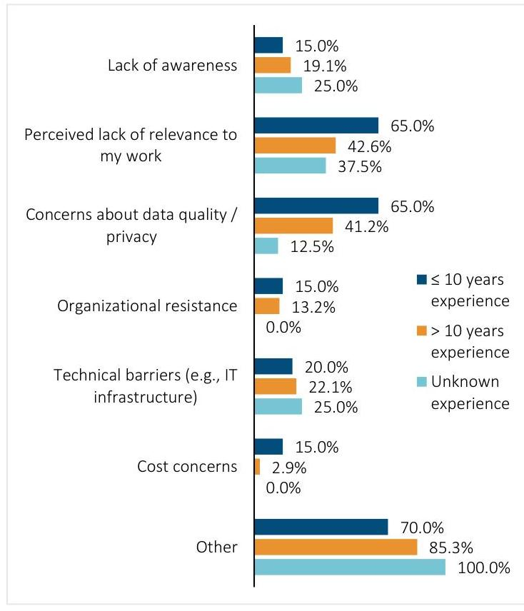

## Page 14
underscoring persistent trust and governance issues. Technical barriers (20-22.1\%) and organizational resistance (13.2-15\%) were mid-tier concerns, showing that infrastructure challenges exist but were not the dominant deterrents. Cost concerns were minor overall, particularly among the more experienced group (2.9\%).

Perceived relevance is a key adoption challenge, especially for less experienced actuaries who may have limited exposure to practical AI applications in actuarial workflows. Senior actuaries' "Other" responses may reflect deeper organizational or cultural factors. Data privacy concerns remain a universal theme, reinforcing that governance, security, and trust frameworks are critical to expanding adoption.

Figure 9
SUMMARY OF "OTHER" ANSWER

The "Other" responses for this question reflect a mix of ethical resistance, environmental worries, and skepticism about AI's reliability. A quarter (25\%) voiced moral or societal objections, with some describing Al as "pure evil" or a danger to society. Environmental costs were flagged (15\%), focusing on energy and water use in datacenters. Another group (15\%) raised accuracy and quality concerns, citing hallucinations, inconsistency, or lack of judgment. A smaller group (7.5\%) highlighted organizational or capacity barriers, such as lack of
training or board perceptions. Nearly a quarter (22.5\%) said they were retired or not applicable, reflecting personal circumstances rather than systemic barriers. The remaining group (15\%) pointed to niche issues, including AI's role in elections, independence in expert witness work, and risks of eroding human critical thinking. Overall, these responses suggest that many non-users are not simply waiting for better tools but their barriers stem from values, trust, and societal concerns.

# How interested are you in learning more about AI/ML applications for actuarial work? 

Figure 10
INTEREST IN LEARNING ABOUT ACTUARIAL AI/ML APPLICATIONS

This question was only asked if respondents indicated spending no time with Al.

Among actuaries who were not currently using Al, overall interest in learning more was moderate but varied by experience level. The majority of non-users were at least "somewhat interested," though a notable share, particularly among those early in their careers, remained disengaged.

More experienced non-users (>10 years) showed higher curiosity about Al learning-30.9\% were "very interested," compared with only 10\% among less experienced respondents. Less experienced non-users ( $\leq$ 10 years) were largely disengaged: 55\% indicated no interest, despite being in the demographic that might be
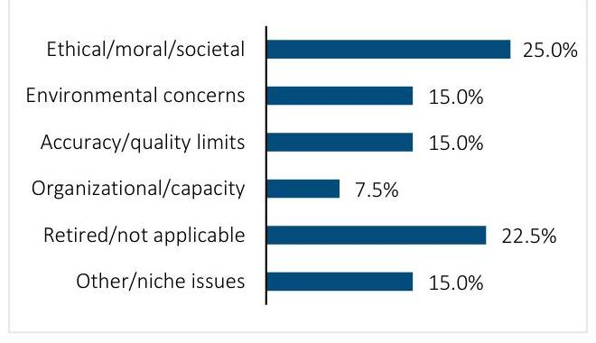
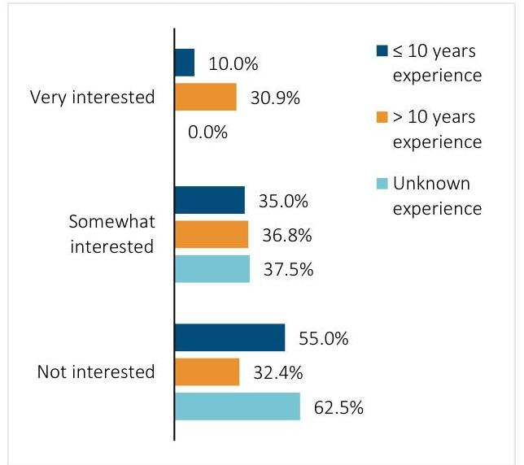

## Page 15
expected to adopt new tools more readily. Unknown-experience respondents showed limited enthusiasm overall, with $62.5 \%$ "not interested."

Because these respondents currently have no direct Al engagement, their answers reflect potential entry points for outreach and education, not general professional sentiment. The data may indicate that interest among non-users is not yet widespread, especially among early-career actuaries. They may lack awareness of practical applications or perceive Al as outside their scope of responsibility. Conversely, seasoned actuaries' higher learning interest suggests they see strategic value in Al.

## Page 16
# How does your organization support AI/ML learning? (Select all that apply) 

Figure 11
HOW DOES YOUR ORGANIZATION SUPPORT AI/ML LEARNING?

Across all experience groups, the most common form of AI/ML learning support was encouraged self-directed learning, followed by access to industry resources and formal training programs. A significant portion of respondents also reported no formal support within their organizations.

Self-directed learning was the most common across all groups, with $69.3 \%$ of less experienced and $61 \%$ of more experienced actuaries reporting this form of support. Formal training was relatively uncommon, reaching fewer than $30 \%$ of respondents in both primary experience groups. Access to industry resources was more common among less experienced actuaries (38.7\%) than among those with over 10 years of experience ( $28.5 \%$ ), possibly reflecting generational differences in how professionals
discover and engage with learning materials. Roughly one-third of actuaries in each group reported no formal organizational support, highlighting a substantial institutional gap. The unknown experience group shows a mixed pattern, with nearly equal proportions (around 43\%) citing industry resources, self-directed learning, and no formal support.

Overall, learning support was largely informal. Most organizations appeared to encourage self-directed exploration but offered limited structured programs, indicating a decentralized approach to Al skill development. Less experienced actuaries appeared more proactive in pursuing external learning resources, while senior actuaries relied more on self-guided or ad hoc approaches. The widespread absence of formal training suggests an opportunity for industry bodies and employers to introduce structured, scalable Al education initiatives tailored to actuarial needs.

Figure 12
SUMMARY OF "OTHER" ANSWER

The "Other" responses for this question showed that support for Al varies widely across organizations, ranging from formal initiatives to outright restrictions. About a fifth (20.5\%) highlighted organizational strategy efforts, such as centralized Al units, internal GPT models, or steering committees. Another group (15.4\%) described training and knowledge sharing,
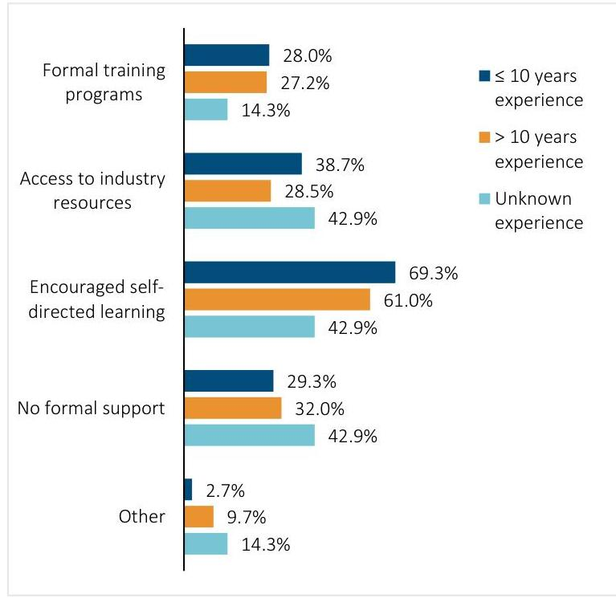
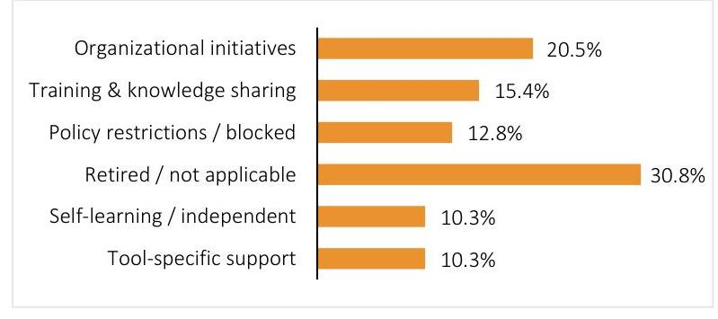

## Page 17
including lunch \& learns, DataCamp licenses, and designated AI champions. At the same time, another group (12.8\%) noted that AI use is blocked or actively discouraged within their organizations. Roughly a third (30.8\%) indicated they were retired or not applicable, limiting organizational context. A smaller share reported self-learning (10.3\%) or specific tool-based support (10.3\%), such as Copilot. Taken together, these responses emphasize that, while some organizations are building infrastructure and training, others remain in a restrictive or early-stage environment, with many individuals left to learn independently.

# Which AI/ML applications would you like to see adopted in your organization within the next 2 years? (Open Question) 

Figure 13
DESIRED ADOPTION OF AI/ML APPLICATIONS IN YOUR ORGANIZATION

Responses to this question were polarized, with a large portion (31\%) explicitly stating "None" or opposing adoption, reflecting distrust in generative AI or concerns about risks. Among those who identified specific applications, the top requested tools were Microsoft Copilot and Office integrations (19.7\%), ChatGPT and other LLMs (12.7\%), and chatbots/virtual agents (11.3\%). Technical use cases also featured, with a group (8.5\%) pointing to code generation, workflow automation, or pricing/reserving models, while another group (7.7\%) cited analytics and actuarial applications like underwriting, claims review, or fraud detection. A smaller group (4.9\%) emphasized productivity aids such as summarization, transcription, and presentation generation. Others called for more structured governance and training (2.8\%) or admitted they were unsure (1.4\%). Responses were split between a strong no-use camp and those favoring productivity and coding tools, with Copilot and ChatGPT emerging as the most frequently desired applications.
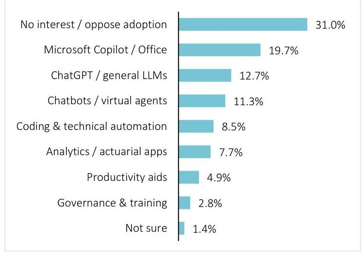

## Page 18
# Where do you draw information for an AI Risk Management \& Governance practice? (Select all that apply) 

Figure 14
SOURCES OF INFORMATION FOR AI RISK MANAGEMENT AND GOVERNANCE

Respondents most commonly relied on industry research and peer discussion as their primary sources of information, followed closely by regulatory requirements and a "wait and see" approach. Few actuaries cited "other" sources.

Experienced actuaries (>10 years) were most likely to rely on industry research (48.9\%), regulatory requirements ( $46.9 \%$ ) and peer discussion ( $45.8 \%$ ), which may show a preference for authoritative and structured sources. Less experienced actuaries ( $\leq 10$ years) reported slightly lower use of peer discussions ( $43.9 \%$ ) and a notably higher reliance on "wait and see" approaches ( $48.5 \%$ ), which may indicate more observational learning and peerdriven knowledge exchange. Unknown-experience respondents showed small sample variation but leaned strongly toward regulatory requirements (66.7\%). Few respondents in any group selected "Other," suggesting that the listed categories captured most major information sources.

Industry research and peer collaboration dominated information channels. This suggests that actuaries depend heavily on professional networks and established publications rather than internal corporate frameworks. The prevalence of "wait and see" responses (especially $48.5 \%$ among less experienced actuaries) implies that many actuaries remain in the exploratory or monitoring stage regarding formal AI risk management frameworks.

Figure 15
SUMMARY OF "OTHER" ANSWER

The "Other" responses to this question largely reflect how organizations and individuals are navigating Al governance and learning. The most common answers (28.1\%) referenced company-level policies or oversight, such as Al review boards, internal guidance, and governance frameworks. About a fifth (18.8\%) pointed to training or resources, including LinkedIn Learning, books, online articles, and webinars. At the same time, a significant share (15.6\%) explicitly rejected Al use, citing
inaccuracy or principled non-use, while another group (15.6\%) said they were retired or not applicable. A smaller group mentioned reliance on external consultants (6.3\%) or raised concerns about Al's methodology and
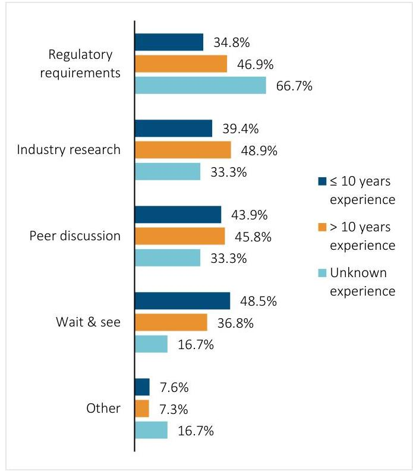
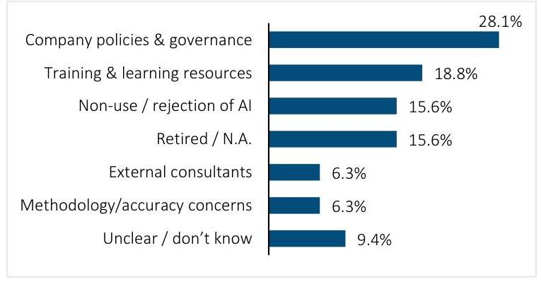

## Page 19
inconsistent results (6.3\%). Lastly, a group (9.4\%) indicated uncertainty or lack of awareness. Together, these writeins emphasize that many organizations are already putting formal governance structures in place, while individuals remain split between actively learning and rejecting use altogether.

# What are your most significant concerns with AI from a risk management and governance perspective? (Select all that apply) 

Figure 16
RISK MANAGEMENT AND GOVERNANCE CONCERNS WITH AI

Across all experience levels, the leading concerns with Al were data and model biases, ethics, and the capability to explain results. Compliance requirements and cybersecurity were also major considerations, while "other" responses remained relatively uncommon.

Less experienced actuaries ( $\leq 10$ years) exhibited strong and balanced concern across multiple dimensions-Ethics (64\%), Capability to Explain Results (64\%), Compliance (61.3\%), and Cybersecurity (60\%). This suggests a broad awareness of Al-related risks across both technical and ethical fronts. More experienced actuaries (>10 years) showed their highest concern for Data \& Model Biases (68.4\%), followed by Capability to Explain Results (52.7\%) and Cybersecurity (53.2\%). Ethical and compliance risks appeared slightly less pressing for senior actuaries, though still cited by about half of
the respondents. Unknown-experience respondents displayed smaller sample variation but consistent moderate concern across categories.

Bias and explainability led risk concerns, reflecting the actuarial profession's emphasis on model integrity and accountability. Early-career actuaries tended to highlight a broad spectrum of risks, suggesting developing awareness and sensitivity to emerging issues. Meanwhile, senior actuaries appeared more focused on technical model quality and bias mitigation, perhaps influenced by their oversight or governance responsibilities. Ethical implications remained prominent, which appears to indicate that Al adoption is being approached with caution and a clear sense of professional responsibility.
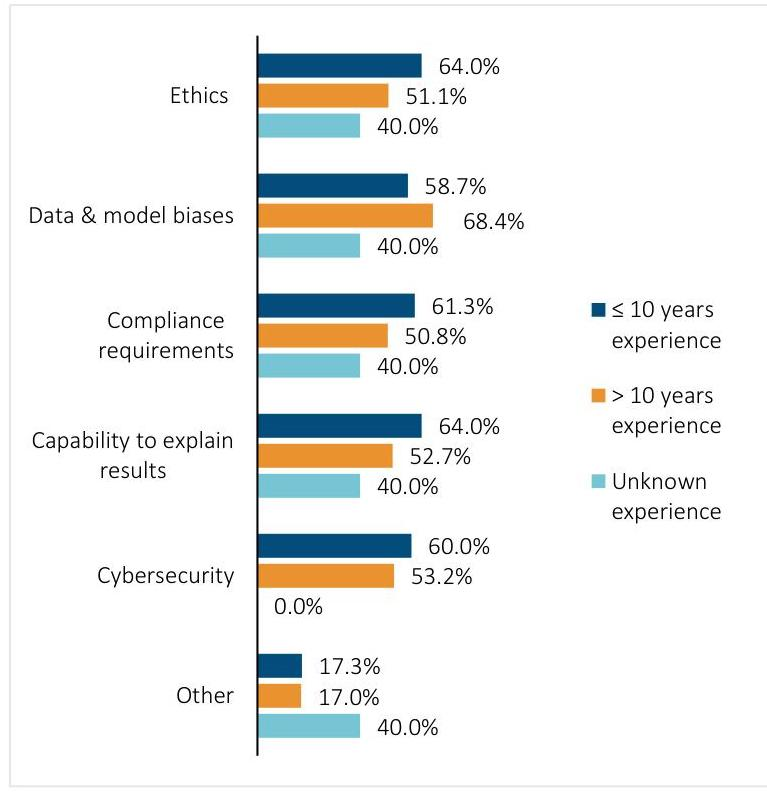

## Page 20
Figure 17
SUMMARY OF "OTHER" ANSWER

The "Other" responses to this question reinforced that responsible AI concerns extend well beyond the predefined categories. The most cited issue ( $40.6 \%$ ) was accuracy and hallucinations, with respondents worried about false results, fabricated citations, and poor reproducibility, which undermine trust. Environmental impacts were the second most common (21.9\%), with repeated references to carbon footprint, energy/water use, and data center pollution. Another set of comments focused on data security, privacy, and ownership ( $12.5 \%$ ), while an equal number highlighted workforce risks ( $12.5 \%$ ), including job loss, declining skills, and over-reliance. Smaller groups flagged governance/misuse ( $9.4 \%$ ), such as "citizen developers" building unchecked tools or management adopting AI uncritically, and one retired respondent (3.1\%) said the question was not applicable. Taken together, these responses show that respondents frame responsible AI not only as a matter of ethics and compliance (already in the survey options), but also in terms of accuracy, environmental sustainability, and workforce health.

# With the rise of generative AI agents, how likely are you to incorporate such tools into your workflows? 

Figure 18
LIKELIHOOD OF INCORPORATING AI AGENTS INTO WORKFLOWS

Overall sentiment was mixed but more experienced actuaries were more willing to incorporate AI agents into their workflow, while early-career respondents seemed more cautious.

A slim majority of more experienced actuaries indicated they're very or somewhat likely to adopt ( $52.7 \%$ ), which may signal a measured readiness among senior practitioners. Among less experienced actuaries, the largest share was Unlikely (37.3\%), with only $40 \%$ in the likely categories. This shows greater hesitancy among early-career actuaries. Actuaries with unknown experience ( $n=3$ ) were heavily positive (all likely), but the base was too small to interpret.

Perhaps senior actuaries can better see where agents fit (workflow orchestration, review, documentation) and have autonomy to try them. Caution among early-career actuaries may reflect uncertainty about professional appropriateness, lack of clear use cases, or limited access to tools/trials. The neutral mass ( $21.9 \%$ for $>10$ years; $21.3 \%$ for $\leq 10$ years) may be a prime audience for targeted demos and guardrail guidance.
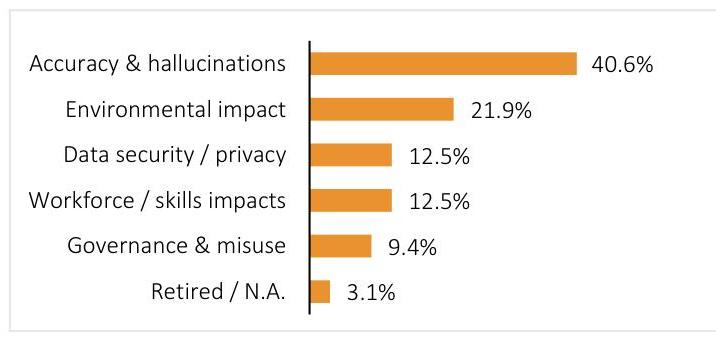
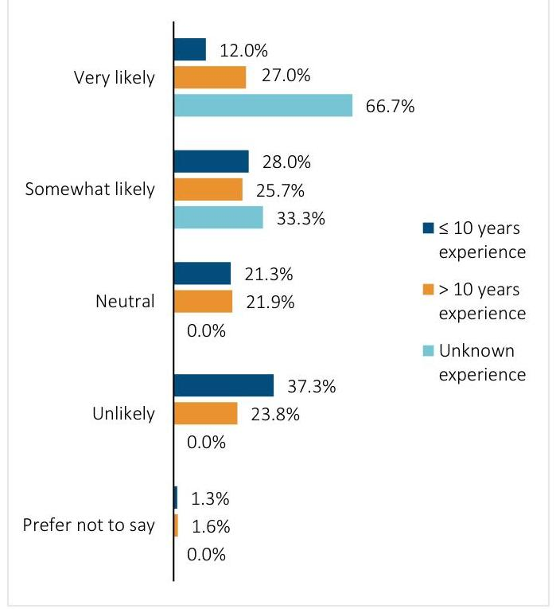

## Page 21
# Please provide an answer on your level of agreement to the following statement "I would recommend using Generative AI (Gen AI) to a co-worker." 

Figure 19
I WOULD RECOMMEND USING GENERATIVE AI TO A CO-WORKER

Opinions on recommending generative AI to colleagues remained mixed. While a narrow majority of experienced actuaries ( $53.7 \%$ ) would recommend it, early-career actuaries were more divided, with nearly equal proportions agreeing and disagreeing.

Experienced actuaries (> 10 years) leaned slightly positive, with $53.8 \%$ expressing some level of agreement (Highly + Moderately). Early-career actuaries ( $\leq 10$ years) were more divided: $46.7 \%$ agreed, while an equal $34.7 \%$ disagreed, indicating less uniform enthusiasm. Unknown-experience respondents (very small sample) were overwhelmingly favorable, though this group's size limits interpretation. Neutrality remained high, reflecting a substantial portion of actuaries who were still undecided about endorsing generative AI tools.

The results suggest that confidence in generative AI grows with exposure and experience, but many actuaries, particularly newer professionals, remain cautious, possibly awaiting clearer evidence of value, governance standards, and professional guidance before fully endorsing its use.
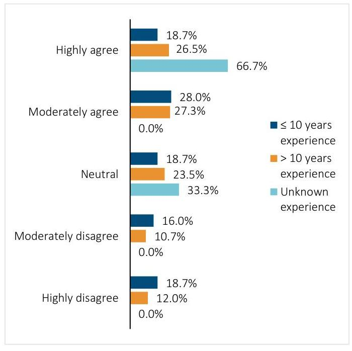

## Page 22
# Any additional comments on AI's role in actuarial practice? (Open Question) 

Figure 20
AI'S ROLE IN ACTUARIAL PRACTICE

The open responses ( $n=99$ ) revealed a three-way split in how actuaries view AI's role. About a fifth (21.2\%) expressed strong opposition, calling Al dangerous, inaccurate, or fundamentally incompatible with actuarial judgment. A slightly larger group (24.2\%) saw limited or cautious uses, appropriate only for low-stakes tasks and always requiring verification. In contrast, a quarter (25.3\%) pointed to clear efficiency gains, citing time savings in coding, presentations, and automation, while another group ( $9.1 \%$ ) described Al as transformational, comparing it to Excel or the advent of computers. Governance and training needs were also a recurring theme ( $12.1 \%$ ), with calls for SOA or regulatory guidance to ensure proper use. Smaller numbers were undecided (5.1\%) or not currently practicing (3\%). The results showed actuaries were divided, with roughly half leaning toward caution or rejection, and half toward efficiency or transformation.
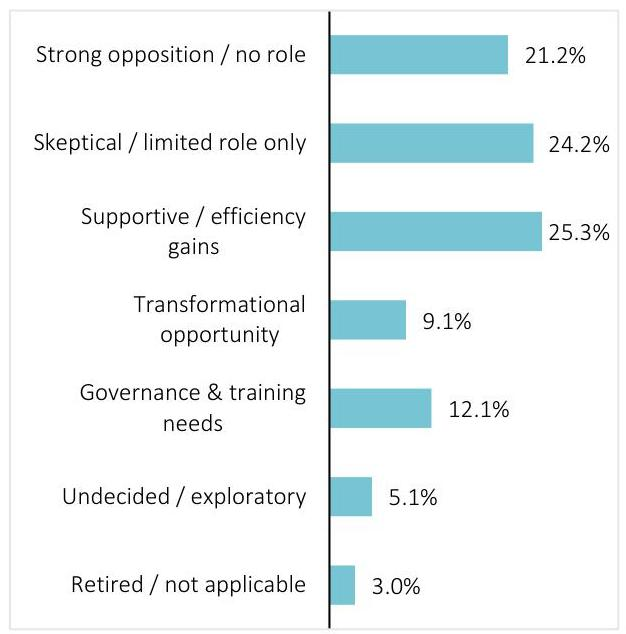

## Page 23
# Section 4 Demographic Information 

## Which actuarial practice area best describes your role?

Figure 21
AREAS OF PRACTICE

Respondents were concentrated in core actuarial domains, with Life (32.1\%) and Health (21.4\%) leading, followed by Retirement (16.9\%). All other areas were cited by fewer than $10 \%$ of respondents. Niche applications appeared in Annuities (7.6\%), General Insurance (3.1\%), Investment (2.7\%), Disability (2\%), Long-term Care (1.3\%), Property \& Casualty (0.9\%), and Climate Risk/Sustainability (0.4\%). Other (8.7\%) was material.

Figure 22
SUMMARY OF "OTHER" ANSWER

The "Other" responses to this question indicated other actuarial practice areas beyond those listed in the survey. About a quarter (23.1\%) specifically cited ERM, corporate risk, ORSA, asset adequacy, or credit rating agencies. Another sizable group (15.4\%) pointed to regulatory or public sector roles, including government social insurance, regulatory actuary, and public sector
retirement. Reinsurance ( $12.8 \%$ ) and consulting/analytics roles ( $12.8 \%$ ) were also frequently noted. A smaller cluster (10.3\%) mentioned education or specialized fields such as actuarial evidence, tax, and technology. Some (15.4\%) clarified their work within life and health extensions (group life/disability, statutory valuation, product-line risk). Finally, (10.3\%) were retired or in non-traditional roles.
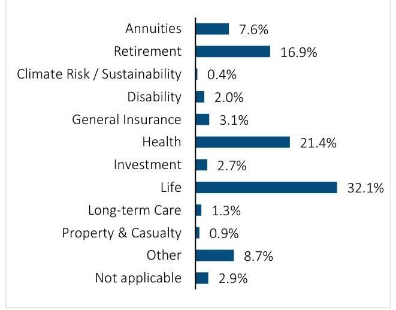
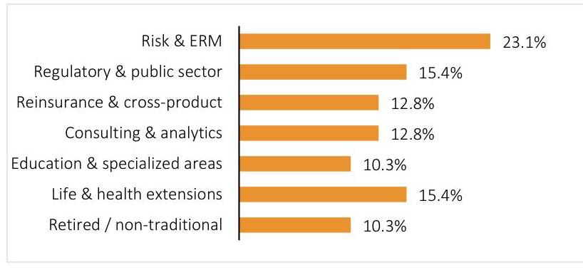

## Page 24
# How many years of actuarial experience do you have? 

Figure 23
YEARS OF ACTUARIAL EXPERIENCE

The respondent pool was heavily weighted toward senior actuaries. Over half reported more than 20 years of experience ( $53.7 \%$ ), and nearly a third had 11-20 years (29.6\%). In contrast, only $16.5 \%$ had 1-10 years, and just a single respondent reported less than 1 year ( $0.2 \%$ ). This skew toward seasoned professionals means the survey reflects perspectives of actuaries with deep
tenure in the field. It also suggests that results on AI adoption are shaped by the lens of experienced practitioners, potentially more cautious and emphasizing governance, compliance, and professional standards. Less experienced voices were underrepresented, which may limit insights into how early-career actuaries approach AI.

## In what geographic area do you currently practice?

Figure 24
GEOGRAPHIC AREA OF PRACTICE
The survey sample was overwhelmingly North American, with $84.9 \%$ of respondents based there. Other regions
were represented at much lower levels: Asia-Pacific (6.2\%), Europe (2.2\%), and India \& Middle East (1.8\%). An additional $4.9 \%$ selected "Other."
The regional imbalance means that survey findings primarily reflect North American perspectives, and results should be interpreted with caution before generalizing globally. Broader participation from other regions in future survey waves would help strengthen global insights.

Figure 25
SUMMARY OF "OTHER" ANSWER

The "Other" responses to this question showed the regions outside the predefined categories where respondents practice. The Caribbean and Bermuda dominated (52\%). Smaller groups mentioned South Asia (Sri Lanka, 5\%), Latin America (5\%), and Australia (5\%). A few respondents ( $10 \%$ ) identified as global or multiregional consultants, spanning more than one geography. About one in five (24\%) indicated they were retired, semi-retired, or not applicable. These results show that, while survey responses are concentrated in North America overall, the "Other" category surfaces meaningful representation from the Caribbean/Bermuda region, along with smaller contributions from Asia-Pacific and Latin America.
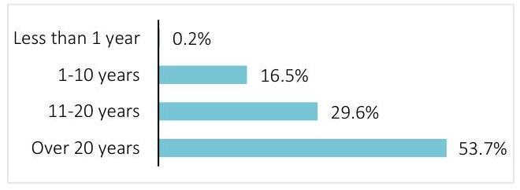
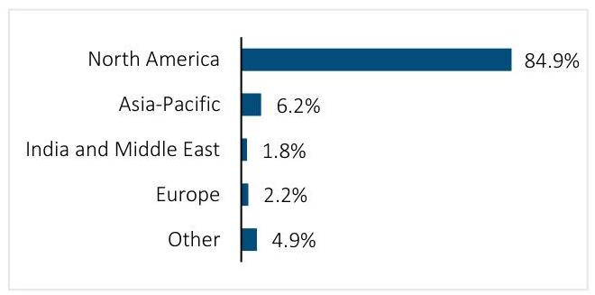
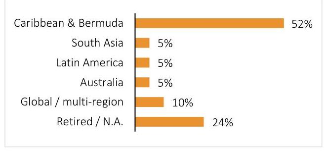

## Page 25
# Within which organization category are you currently working? 

Figure 26
ORGANIZATION CATEGORY

Respondents primarily represented insurance carriers (44.3\%), followed by consulting companies (24.1\%). Smaller shares came from reinsurance companies (7.8\%), non-profits (4.5\%), and financial institutions (3.8\%). An additional 15.6\% selected "Other." The results show that the survey sample is carrier-dominated, but with a meaningful contingent of consultants, reflecting both the provider and advisory sides of the actuarial ecosystem.

Figure 27
SUMMARY OF "OTHER" ANSWER

The "Other" responses to this question showed that respondents work in a diverse range of organizations outside the predefined categories. About a quarter (23\%) came from government or regulatory bodies, including federal/state agencies, regulators, and social security. A nearly equal share (22\%) reported being retired or semi-retired, with some still active through parttime consulting or professional
volunteering. Healthcare-related organizations (9\%), such as providers and physician groups, were also represented, as were consulting/self-employed respondents (9\%) and those in software/technology/insurtech roles (9\%). Another group (9\%) worked in the financial sector, including credit rating agencies, asset managers, and trusts. Smaller clusters included insurance startups/TPAs/MGAs (8\%), academia/education (3\%), and law/broker/communications roles (6\%). These results underscore that Al interest extends beyond carriers, reinsurers and consulting firms, reaching into government, healthcare, finance, and startups, while a large portion of respondents are retired but still engaged in the profession.
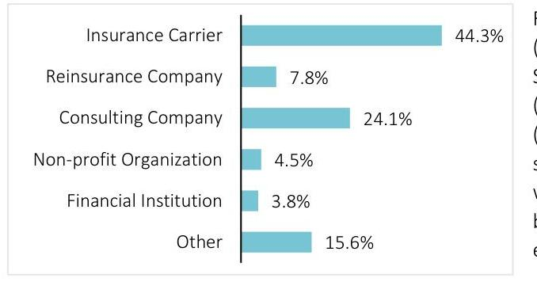
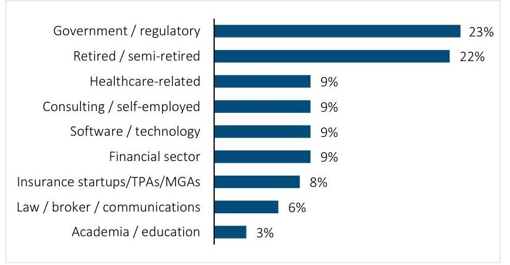

## Page 26
# Section 5 Conclusion 

The findings portray a profession that is curious, analytical, and prudent in its approach to AI. Actuaries seem to recognize the promise of AI for improving efficiency, insights, and decision quality, but show that they continue to weigh these opportunities against the need for robust governance and professional oversight.

This inaugural survey establishes an essential baseline for longitudinal tracking. Repeating the survey once or twice per year will enable the SOA Research Institute and the actuarial community to monitor:

- Growth in AI use and learning engagement,
- Shifts in perceived risks and benefits, and
- The development of organizational and educational support structures over time.

By observing these trends, the SOA Research Institute can continue to guide the profession's strategic evolution, ensuring actuaries remain at the forefront of innovation, while upholding the principles of rigor, ethics, and accountability that define their work.

## Page 27
# Section 6 Acknowledgments 

The researchers' deepest gratitude goes to those without whose efforts this project could not have come to fruition: the Project Oversight Group and others for their diligent work overseeing questionnaire development, analyzing and discussing respondent answers, and reviewing and editing this report for accuracy and relevance.

Project Oversight Group members:

Dorothy Andrews, ASA, MAAA

Frances Green, LL.M., IAPP

Dale Hall, FSA, MAAA, CERA

Michael Levine, FSA, MAAA

Ronal Poon Affat, FSA, FIA, MAAA

Lisa Schilling, FSA, EA, FCA, MAAA

Feng Sun, FSA, CERA

Tina Yang, FSA, CERA, MAAA

At the Society of Actuaries Research Institute:

Korrel Crawford, Senior Research Administrator

## Page 28
# Appendix A: Survey Design Details 

## Purpose of the Study

The AI Survey serves as a recurring measure of:

- How actuaries use, learn about, and perceive AI and ML tools;
- The benefits and barriers associated with adoption of AI;
- Interest in further learning and organizational support mechanisms;
- Perspectives on Generative AI and its potential within actuarial workflows; and
- Emerging patterns across different levels of actuarial experience.

By segmenting responses by years of experience ( $\leq 10$ years, $>10$ years, and unknown), the survey enables a deeper understanding of how AI engagement evolves across career stages.

## Survey Design

This report presents findings from the first wave of the AI Survey, establishing a baseline for longitudinal tracking. The survey was designed to take less than ten minutes to complete and was distributed to SOA members worldwide.

A total of 518 actuaries participated in this initial wave, providing representative responses across a range of practice areas, geographies, and experience levels. Their feedback offers meaningful insights into how AI is currently being used in actuarial work, what challenges exist, and where opportunities for learning and adoption may lie.

Respondents were asked both multiple-choice and open-ended questions addressing:

- Current engagement with AI and ML tools;
- Perceived benefits of AI and organizational barriers to AI adoption;
- Learning and training opportunities;
- Governance and risk management practices; and
- Perspectives on the use and recommendation of Generative AI.

## Longitudinal Intent

The SOA Research Institute intends to administer the AI Survey once or twice annually to track ongoing trends and shifts in adoption, sentiment, and organizational readiness. Over time, this approach will allow the SOA Research Institute to measure:

- Growth in AI engagement;
- Changes in perceived value and risk;
- The evolution of learning and governance frameworks; and
- The maturation of AI use within the actuarial profession.

The results of each survey wave will help guide SOA Research Institute priorities, inform educational initiatives, and support strategic planning that keeps actuaries at the forefront of technological advancement.

## Page 29
# About The Society of Actuaries Research Institute 

Serving as the research arm of the Society of Actuaries (SOA), the SOA Research Institute provides objective, datadriven research bringing together tried and true practices and future-focused approaches to address societal challenges and your business needs. The Institute provides trusted knowledge, extensive experience and new technologies to help effectively identify, predict and manage risks.

Representing the thousands of actuaries who help conduct critical research, the SOA Research Institute provides clarity and solutions on risks and societal challenges. The Institute connects actuaries, academics, employers, the insurance industry, regulators, research partners, foundations and research institutions, sponsors and nongovernmental organizations, building an effective network which provides support, knowledge and expertise regarding the management of risk to benefit the industry and the public.

Managed by experienced actuaries and research experts from a broad range of industries, the SOA Research Institute creates, funds, develops and distributes research to elevate actuaries as leaders in measuring and managing risk. These efforts include studies, essay collections, webcasts, research papers, survey reports, and original research on topics impacting society.

Harnessing its peer-reviewed research, leading-edge technologies, new data tools and innovative practices, the Institute seeks to understand the underlying causes of risk and the possible outcomes. The Institute develops objective research spanning a variety of topics with its strategic research programs: aging and retirement; actuarial innovation and technology; mortality and longevity; diversity, equity and inclusion; health care cost trends; and catastrophe and climate risk. The Institute has a large volume of topical research available, including an expanding collection of international and market-specific research, experience studies, models and timely research.

Society of Actuaries Research Institute
8770 W Bryn Mawr Ave, Suite 1000
Chicago, IL 60631
www.SOA.org