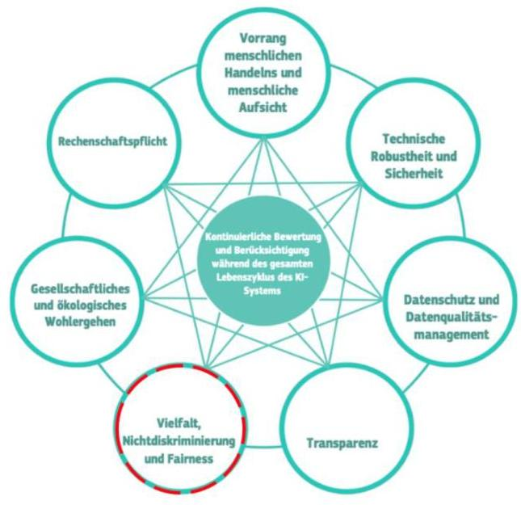
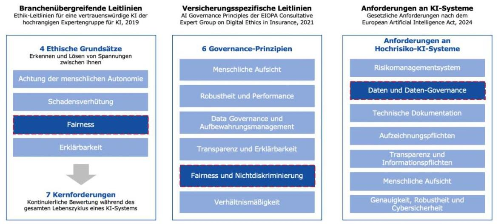
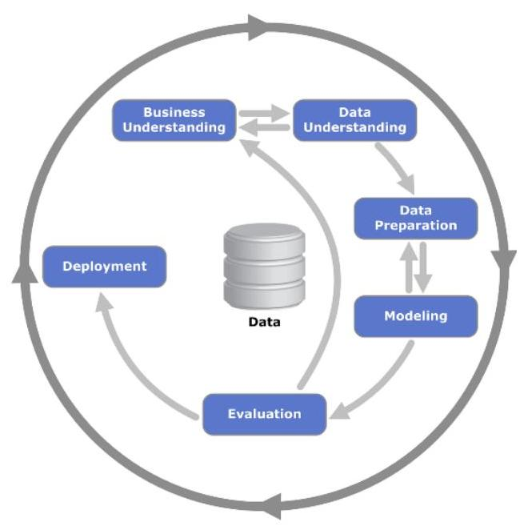
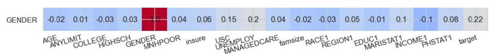
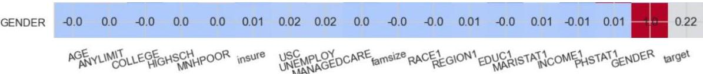
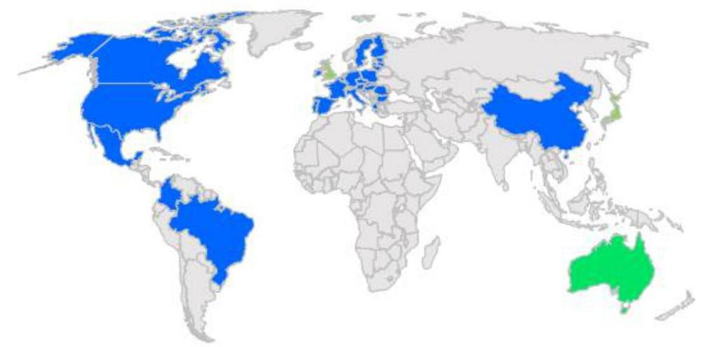

_Note: Source document was split into 6 OCR chunks (pages 1-12, pages 13-21, pages 22-31, pages 32-41, pages 42-51, pages 52-58) to stay within token limits._

# 2025-03-11_DAV_EB_Bias-Diskriminierung

## Page 1
# Ergebnisbericht des Ausschusses Actuarial Data Science

## Vermeidung von Bias und Diskriminierung im Bereich Data Science

Köln, 11.03.2025

## Page 2
# Präambel 

Die Arbeitsgruppe Vermeidung von Bias und Diskriminierung des Ausschusses Actuarial Data Science der Deutschen Aktuarvereinigung e. V. (DAV) hat den vorliegenden Ergebnisbericht erstellt. ${ }^{1}$

## Zusammenfassung

Der verstärkte Einsatz von Data Science Methoden, insbesondere Künstlicher Intelligenz (KI), bietet der Versicherungsbranche ein enormes Potenzial zur Geschäftsverbesserung, birgt gleichzeitig aber auch das Risiko, dass durch verzerrte Daten ungewollt Vorurteile verfestigt und statistische Modelle und KI-Systeme im rechtlichen Sinne diskriminieren. Einen Rahmen zum Umgang mit Fairness, Transparenz und Nichtdiskriminierung geben die Leitlinien der AI High-Level Expert Group der Europäischen Kommission, die Ausführungen von EIOPA und BaFin sowie die am 1. August 2024 in Kraft getretene Europäische KI-Verordnung.

Der Ergebnisbericht erläutert konkrete technische und organisatorische Maßnahmen, um Bias und Diskriminierung in der aktuariellen Data Science Anwendung zu erkennen und zu vermeiden. Entlang des Data Science-Standardprozesses CRISP-DM werden Handlungsempfehlungen vorgestellt und diskutiert. Praxisorientierte Notebooks ergänzen den Bericht, um die praktische Anwendbarkeit zu fördern. Eine Zusammenfassung der relevanten gesetzlichen Anforderungen sowie eine Diskussion der Anwendung von Fairness-Metriken runden den Bericht ab.

Ziel ist es, Aktuarinnen und Aktuare², die im Bereich Data Science aktiv sind oder sich für diesen Bereich interessieren, für das Risiko im Umgang mit Bias zu sensibilisieren, konkrete Hilfestellungen und Fragestellungen an die Hand zu geben und den rechtlichen Rahmen aufzufrischen, um eine langfristig faire, transparente und ethisch verantwortungsvolle Nutzung von Data Science-Methoden und KI zu gewährleisten.

Darüber hinaus dient der Ergebnisbericht allen Mitgliedern und Gremien der DAV zur Information über den Stand der Diskussion und die erzielten Erkenntnisse gerichtet und stellt keine berufsständisch legitimierte Position der DAV dar. ${ }^{3}$

## Schlagworte

Bias, Diskriminierung, Fairness, Data Science, ADS, Künstliche Intelligenz, KI, Regulierung

## Verabschiedung

Dieser Ergebnisbericht ist durch den Ausschuss Actuarial Data Science am 11.03.2025 verabschiedet worden.

[^0]
[^0]:    ${ }^{1}$ Der Ausschuss dankt der Arbeitsgruppe Vermeidung von Bias und Diskriminierung ausdrücklich für die geleistete Arbeit, namentlich Marvin Schneller (Leitung), Max Bagus, Christian Bökenheide, Maximilian Hudlberger, Olga Jungnitsch, Dr. Axel Kaiser, Marcel Meuthen, Dr. Michael Preischl, Suyang Pu, Dr. Johannes Schupp und Leonid Zeldin.
    ${ }^{2}$ Auch wenn hier und im Folgenden die Aktuarinnen und Aktuare explizit genannt werden, spricht die DAV alle Geschlechter und Identitäten gleichermaßen an. Dies gilt auch für alle anderen hier genannten Personengruppen.
    ${ }^{3}$ Die sachgemäße Anwendung des Ergebnisberichts erfordert aktuarielle Fachkenntnisse. Dieser Ergebnisbericht stellt deshalb keinen Ersatz für entsprechende professionelle aktuarielle Dienstleistungen dar. Aktuarielle Entscheidungen mit Auswirkungen auf persönliche Vorsorge und Absicherung, Kapitalanlage oder geschäftliche Aktivitäten sollten ausschließlich auf Basis der Beurteilung durch eine(n) qualifizierte(n) Aktuar DAV/Aktuarin DAV getroffen werden.

## Page 3
This abstract summarises the report on findings „Vermeidung von Bias und Diskriminierung im Bereich Data Science" which was approved by the DAV committee Actuarial Data Science on 11.03.2025.

# Avoiding bias and discrimination in data science 

The increased use of data science methods, particularly artificial intelligence (AI), presents the insurance industry with significant potential for business improvement while also raising the risk of unintentionally reinforcing biases through skewed data, potentially leading to legal discrimination within statistical models and AI systems. Guidelines from the AI High-Level Expert Group of the European Commission, along with directives from EIOPA and BaFin and the European AI Act that came into effect on August 1, 2024, provide a clear framework for addressing fairness, transparency, and non-discrimination.

This report explains specific technical and organizational measures to identify and mitigate bias and discrimination in actuarial data science applications. Recommendations are provided and discussed along the standard CRISP-DM data science process. Practical notebooks accompany the report to support applicability in practice. A summary of relevant legal requirements and a discussion on the application of fairness metrics complete the report.

The goal is to raise awareness among actuaries of the risks associated with bias, provide concrete guidance and questions for reflection, and clarify the legal framework to ensure the long-term fair, transparent, and ethically responsible use of data science methods and AI. Furthermore, it serves as information for all members and committees of the DAV on the current state of the discussion and the insights gained in the working group. The report does not represent a professionally authorized position of the DAV.

Reports on findings are summaries of the results of work carried out by DAV committees or working groups,

- where their application can be freely decided upon within the framework of the code of conduct,
- that should inform discussion of the current opinion among actuaries or also among the broader public.

As working results of a single committee, they do not, for the time being, represent any recognised position within the DAV and do not comprise any actuarial standards of practice. In this respect they are clearly distinguishable from any standards of practice.

## Page 4
# Inhaltsverzeichnis 

1. Einleitung ..... 6
1.1. Motivation und Kontext. ..... 6
1.2. Ziele und Ergebnisse ..... 8
2. Begrifflichkeiten und rechtliche Rahmenbedingungen. ..... 9
2.1. Definitionen im aktuariellen Kontext. ..... 9
2.1.1. Bias ..... 9
2.1.2. Diskriminierung ..... 11
2.1.3. Algorithmische Fairness ..... 12
2.2. Rechtliche Rahmenbedingungen in Deutschland ..... 12
2.2.1. Menschenrechte und Grundrechte ..... 13
2.2.2. Allgemeines Gleichbehandlungsgesetz (AGG) ..... 13
2.2.3. Europäische KI-Verordnung (European AI Act) ..... 14
2.2.4. Sonstiges ..... 15
3. Handlungsempfehlungen für einen verantwortungsvollen Umgang mit Bias und Diskriminierung ..... 17
3.1. Nicht-technische, organisatorische Handlungsempfehlungen ..... 17
3.2. Technische Handlungsempfehlungen entlang des CRISP-DM ..... 22
3.2.1. Geschäftsverständnis ..... 23
3.2.2. Datenverständnis ..... 24
3.2.3. Datenvorbereitung ..... 25
3.2.4. Modellierung ..... 26
3.2.5. Evaluierung ..... 27
3.2.6. Bereitstellung ..... 32
4. Praxisbeispiel aus der KFZ-Versicherung: Identifikation indirekter Diskriminierung und Diskussion des discriminiation-free pricing Ansatzes ..... 34
4.1. Datensatz ..... 34
4.2. Analyse ..... 35
4.2.1. Prüfung indirekter Diskriminierung ..... 35
4.2.2. Unawareness Modell und Best Estimate Modell ..... 36
4.2.3. Discrimination-free Modell ..... 37
4.2.4. Fairness-Metriken ..... 38
4.3. Fazit ..... 38
5. Praxisbeispiel aus der Krankenversicherung: Einfluss von Bias-
Vermeidungsstrategien im Pre-Processing auf Performance und Fairness von Klassifikationsmodellen ..... 39
5.1. Datensatz ..... 39
5.2. Analyse ..... 40
5.2.1. Performance ..... 40

## Page 5
5.2.2. Fairness ..... 42
5.3. Fazit ..... 43
6. Praxisbeispiel aus der Krankenversicherung: Einfluss von Bias- Vermeidungsstrategien im Pre-Processing auf Performance und Fairness von Regressionsmodellen ..... 44
6.1. Datensatz ..... 44
6.2. Analyse ..... 44
6.2.1. Performance ..... 45
6.2.2. Fairness ..... 45
6.3. Fazit ..... 46
7. Diskussion und weiterführende Fragen ..... 48
7.1. Umgang mit Bias und Diskriminierung und KI-Regulierungen im Ausland ..... 48
7.1.1. USA und Kanada ..... 49
7.1.2. Großbritannien ..... 50
7.1.3. Frankreich ..... 50
7.1.4. Japan ..... 51
7.2. Herausforderungen im Umgang mit Fairness-Metriken ..... 52
7.3. Gesellschaftliche Akzeptanz und die Bedeutung der Kontrolle von Bias und Diskriminierung bei der Anwendung von KI ..... 53
8. Literaturverzeichnis ..... 55

## Page 6
# 1. Einleitung 

### 1.1. Motivation und Kontext

Die zunehmende Digitalisierung bietet Versicherern durch die wachsende Menge an Daten, die durch die Interaktion zwischen Versicherten und den von Versicherern immer häufiger eingesetzten digitalen Systemen entstehen, viele Chancen zur Geschäftsverbesserung. Zur Analyse dieser Daten wird immer häufiger Künstliche Intelligenz (KI) angewandt. Je umfangreicher ein solcher Datenbestand ist, desto wichtiger wird es, diesen hinsichtlich Bias zu analysieren. Algorithmen, die auf historischen Daten trainiert werden, können unbeabsichtigt Vorurteile und Diskriminierungsmuster perpetuieren oder sogar ver-stärken. In der Anwendung können Versicherer dadurch gegen Ethik-Leitlinien und Gesetze verstoßen.

Die Europäische Kommission sah 2018 die Notwendigkeit, sich kritisch mit den ethischen Implikationen dieser Technologie auseinanderzusetzen, und setzte eine unabhängige und hochrangige Expertengruppe für Künstliche Intelligenz, kurz „AI HLEG" (High-level expert group on artificial intelligence), ein, die branchenübergreifende Ethik-Leitlinien für eine vertrauenswürdige KI erarbeitet hat. Auf deren Grundsätze greift auch die jüngst erlassene KI-Verordnung des Europäischen Parlaments und des Rates der Europäischen Union zurück. Eine vertrauenswürdige KI adressiert demnach sieben Anforderungsbereiche: Vorrang menschlichen Handelns und menschliche Aufsicht; technische Robustheit und Sicherheit; Datenschutz und Datenqualitätsmanagement; Trans-parenz; Vielfalt, Nichtdiskriminierung und Fairness; gesellschaftliches und ökologisches Wohlergehen; Rechenschaftspflicht [1]. Alle Anforderungsbereiche sind in Bezug auf ihre Bedeutung gleichwertig und unterstützen sich gegenseitig, wie Abbildung 1 verdeutlicht.

Abbildung 1: Sieben Anforderungsbereiche an eine vertrauenswürdige KI [1].

Basierend auf den Ethik-Leitlinien der AI HLEG hat die europäische Aufsichtsbehörde für das Versicherungswesen und die betriebliche Altersversorgung (European Insurance and Occupational Pensions Authority, EIOPA) im Jahr 2021 versicherungsspezifische Leitlinien für eine ethische und vertrauenswürdige KI in der europäischen Versicherungsbranche formuliert. Eine der sechs Leitlinien ist das Prinzip von „Fairness und Nichtdiskriminierung". Versicherer werden bei Anwendung von Künstlicher Intelligenz u.a. dazu aufgerufen, die finanzielle Inklusion zu fördern, bestehende

## Page 7
Ungleichheiten zu vermeiden, Verzerrungen in Daten und KI-Systemen zu überwachen und zu mindern sowie ihre Maßnahmen zur Sicherstellung von Fairness zu dokumentieren [2].

Abbildung 2: Schematische Darstellung der (1) Ethik-Leitlinien für eine vertrauenswürdige KI der hochrangigen Expertengruppe für Künstliche Intelligenz, 2019, (2) Grundsätze für eine ethische und vertrauenswürdige für die europäische Versicherungsbranche der EIOPA Consultative Expert Group on Digital Ethics in Insurance, 2021, und (3) gesetzliche Anforderungen durch den European Artificial Intelligence Act. Eigene Darstellung.

Auch die am 1. August 2024 in Kraft getretene Verordnung 2024/1689 über Künstliche Intelligenz des Europäischen Parlaments und des Rates, auch bekannt als „European AI Act", greift die möglicherweise negativen Auswirkungen von Bias in Datensätzen auf. Artikel 10 zu Daten und Daten-Governance formuliert Qualitätskriterien, denen insbesondere Hochrisiko-KI-Systeme entsprechen müssen. Es sind Maßnahmen zur Erkennung, Verhinderung und Abschwächung von Bias zu ergreifen. Bias ist besonders dann zu untersuchen, wenn er die Gesundheit und Sicherheit von Personen beeinträchtigen, sich negativ auf die Grundrechte auswirken oder zu einer nach den Rechtsvorschriften verbotenen Diskriminierung führen kann.

Die Anwender von KI stehen damit nicht nur vor der Herausforderung, die technische Leistungsfähigkeit der Verfahren zu optimieren, sondern potenzielle Verzerrungen in Datensätzen und Algorithmen zu erkennen und zu minimieren, um faire und ethisch vertretbare Versicherungspraktiken zu gewährleisten.

Aktuarinnen und Aktuare, die aufgrund ihrer vielfältigen Tätigkeitsfelder über eine breite Daten- und Modellierungsexpertise verfügen, können eine Schlüsselrolle bei der ganzheitlichen Herangehensweise an die Entwicklung von KI-Systemen spielen. Sie sind darin geschult, bei Modellierungen eine sorgfältige Datensichtung und -vorbereitung vorzunehmen. Dazu sind sie angehalten [3] und es gewohnt, gegenüber verschiedenen Stakeholdern die Funktionsweise von Modellen verständlich zu kommunizieren und die vielfältigen gesetzlichen und regulatorischen Vorgaben zu berücksichtigen. Das Allgemeine Gleichbehandlungsgesetz (AGG) regelt beispielsweise bereits heute den technologieunabhängigen Rahmen, in dem sich Aktuarinnen und Aktuare, z.B. bei der Tarifierung von Versicherungsprodukten, bewegen dürfen und welche persönlichen Merkmale der versicherten Person dabei verwendet werden dürfen.

Folgen die Data Science Methoden in der Versicherungsbranche nicht nur gesetzlichen Vorgaben, sondern auch ethischen Leitlinien, kann damit das Vertrauen in die Anwendung, insbesondere von KI, insgesamt gesteigert werden, was die Chance dafür erhöht, langfristig von den Chancen dieser Technologie entlang der gesamten Wertschöpfungskette zu profitieren.

## Page 8
# 1.2. Ziele und Ergebnisse 

Der Ausschuss Actuarial Data Science hat die Arbeitsgruppe Vermeidung von Bias und Diskriminierung mit dem Ziel gegründet, herauszuarbeiten, welche Maßnahmen bei der Anwendung von traditionellen sowie neuen Data Science Methoden und insbesondere Künstlicher Intelligenz ergriffen werden können, um Verzerrungen in Daten und Modellen und dadurch potenziell ausgelöste Diskriminierungen zu vermeiden, mindestens jedoch zu minimieren. Besonderer Fokus wird dabei auf die aktuariellen Tätigkeiten in Versicherungsunternehmen gelegt, auch weil die Bundesanstalt für Finanzdienstleistungsaufsicht (BaFin) bereits nach Versicherungsaufsichtsgesetz (VAG) §23 Absatz 1 ungerechtfertigte Diskriminierung im Kontext von Künstlicher Intelligenz aufsichtsrechtlich adressieren und deren Einhaltung einfordern kann. In ihrem Fachartikel vom 01.08.2024 betont die BaFin die Wichtigkeit, Verantwortlichkeiten im Bereich KI klar zu regeln und die Mitarbeiter für die Risiken im Umgang mit KI zu sensibilisieren und ausreichend zu schulen [4].

Der vorliegende Ergebnisbericht adressiert sowohl Aktuarinnen und Aktuare, die sich für einen verantwortungsvollen Umgang mit Künstlicher Intelligenz interessieren, als auch solche, die Data Science Methoden bereits in der Praxis anwenden und ihren Umgang mit Bias und Diskriminierung verbessern möchten. Für die Praxisanwendung wird der Bericht ergänzt um drei Notebooks, die über den GitHub-Account der Deutschen Aktuarvereinigung e.V. (DAV) zugänglich sind. Sowohl Ergebnisbericht als auch Notebooks fokussieren stark auf die aus Data Science-Sicht relevanten Facetten des Themas und haben nicht den Anspruch die aktuariellen Fragestellungen, z.B. im Bereich der Tarifierung, vollumfänglich und praxisnah zu behandeln. Dafür sei auf die Arbeiten der DAV-Spartenausschüsse verwiesen.

In Kapitel 2 werden zunächst die Begriffe Bias, Diskriminierung und Fairness voneinander abgegrenzt und definiert, um sie anschließend in den Kontext der in Deutschland bezüglich Diskriminierung geltenden Gesetze und Regulatorik zu setzen. Für die deutsche Versicherungsbranche gelten u.a. das Allgemeine Gleichbehandlungsgesetz (AGG) und das Versicherungsaufsichtsgesetz (VAG), die auch bei der Anwendung von Künstlicher Intelligenz zur Geltung kommen.

Kapitel 3 baut auf dieser Basis auf und stellt sowohl technische als auch nicht-technische Handlungsempfehlungen für den Umgang mit Bias und Diskriminierung in aktuariellen Tätigkeiten vor. Wie bereits die hochrangige Expertengruppe für Künstliche Intelligenz der Europäischen Kommission herausstellte, sind die sieben Voraussetzungen an vertrauenswürdige KI kontinuierlich zu bewerten und während des gesamten Lebenszyklus eines KI-Systems zu berücksichtigen. Deshalb wird in Kapitel 3.2 zuerst CRISP-DM, einer der bedeutendsten Data Science-Prozesse zur Aufbereitung und Modellierung von Daten, vorgestellt und in den nachfolgenden Unterkapiteln die technischen Handlungsempfehlungen anhand seiner Prozessschritte erläutert. In Kapitel 3.1 werden prozessübergreifende, organisatorische Maßnahmen wie Anforderungen an Governance und Stakeholders diskutiert.

Damit Aktuarinnen und Aktuare die vorgestellten technischen Maßnahmen zum Umgang mit Bias und Diskriminierung besser nachvollziehen und anwenden können, fassen die Kapitel 45 und 6 die Ansätze und wichtigsten Ergebnisse von drei, im Rahmen dieser Arbeitsgruppe entwickelten Notebooks zusammen, die über den GitHub-Account der DAV vollumfänglich zugänglich sind.

Abschließend diskutiert Kapitel 7 die Ergebnisse und Handlungsempfehlungen vor dem Hintergrund sich ändernder regulatorischer Voraussetzungen und gesellschaftlicher Ansprüche. Auch auf die zum Zeitpunkt der Veröffentlichung dieses Ergebnisberichts noch offenen Punkte und Grenzen vorgestellter Techniken geht das Kapitel ein. Beispielsweise mag die Nutzung von Fairness Metriken zur Bewertung von KI-Systemen im Bereich der Data Science ein bewährtes Verfahren sein, in der Versicherungsbranche hat sich hingegen noch kein einheitliches Vorgehen dahingehend etabliert. Der Blick in andere Länder und Versicherungsmärkte bestätigt dies und auch das gesellschaftliche Empfinden gegenüber Fairness und Diskriminierung unterliegt mit Blick auf vergangene Diskussionen, z.B. beim Thema Unisex, oft politischen und länderspezifischen Besonderheiten.

## Page 9
# 2. Begrifflichkeiten und rechtliche Rahmenbedingungen 

In der Versicherung werden immer häufiger Data Science Methoden, darunter Verfahren, die dem Bereich der Künstlichen Intelligenz (KI) angehören, angewandt, um präzisere Risikoanalysen, effizientere Prozesse und individuellere Produkte zu ermöglichen. Diese technologischen Fortschritte bieten große Chancen, den Zugang zu Versicherungen zu erweitern und individuelle Bedürfnisse der Versicherungsnehmer besser zu bedienen.

Gegenüber traditionellen statistischen Modellen wie z.B. Generalisierte Lineare Modelle (GLM) zeichnen sich modernere Methoden wie z.B. Random Forest oder Boosting durch höhere Komplexität, weniger Transparenz und geringere Erklärbarkeit aus. In beiden Fällen können die zugrundeliegenden Trainingsdaten oftmals ein hohes Volumen aufweisen und mehrere Hundert Merkmale über Versicherungsnehmer, ihre Verträge und andere externe Faktoren enthalten. Dies erhöht das Risiko, dass Algorithmen unbewusst in den Daten enthaltene Verzerrungen übernehmen und verstärken, was zu diskriminierenden Ergebnissen führen kann. Besonders in der Versicherung, wo Entscheidungen weitreichende finanzielle und soziale Konsequenzen für die Versicherte haben können, ist es unerlässlich, diese Risiken zu erkennen und zu minimieren. Dies zeichnet einen verantwortungsvollen Umgang mit Data Science Methoden, insbesondere KI, aus, wie ihn die 2018 von der Europäischen Kommission eingesetzte hochrangige Expertengruppe für Künstliche Intelligenz erstmalig festhielt [1] und die am 01.08.2024 in Kraft getretene Europäische KI-Verordnung gesetzlich verankert [5].

### 2.1. Definitionen im aktuariellen Kontext

Im nordamerikanisch geprägten KI-Sprachgebrauch werden Fragen zu Diskriminierung oftmals unter dem Begriff „Fairness" zusammengefasst, der ebenso vom europäischen Gesetzgeber und von der EIOPA aufgegriffen wurde [2]. Darunter werden oft drei Aspekte zusammengefasst, die nachfolgend näher beleuchtet werden, ehe die in Deutschland geltenden gesetzlichen Rahmenbedingungen in Kapitel 2.2 vorgestellt werden. Für die außerhalb Deutschlands geltenden Regularien wird auf das Kapitel 7.1 verwiesen.

### 2.1.1. Bias

Der erste Aspekt ist „Bias", was sich aus dem Englischen als „Vorurteil" und aus dem Französischen als „schief" bzw. „schräg" übersetzen lässt. Im statistischen Kontext ist gemeint, dass das Ergebnis einer Studie oder Analyse aufgrund eines systematischen Fehlers insgesamt oder bezüglich einzelner Merkmalskategorien verzerrt ist. Diese Verzerrung kann ursächlich für eine ungewollte Diskriminierung sein.

Bias kann schwer zu identifizieren sowie zu quantifizieren sein und kann entlang der gesamten Studie oder Analyse auftreten - in den Daten, in der darauf aufbauenden Analyse sowie in der späteren Interpretation der Ergebnisse.

Je nach Kontext und Wissenschaft werden mehrere Arten von Bias unterschieden (vgl. [6], [7]). Die bekanntesten Arten sind:

- Auswahlbias (Selection Bias): Ein Auswahlbias tritt auf, wenn die in einer Analyse untersuchte Stichprobe nicht repräsentativ für die Grundgesamtheit, beispielsweise die Gesamtbevölkerung, ist. Dies kann zur Folge haben, dass die Ergebnisse nicht verallgemeinerbar sind und z.B. nicht die Eigenschaften einer unterrepräsentierten Gruppe beinhalten. Häufig werden vier Unterkategorien für einen Auswahlbias unterschieden.
- Zeitlichkeit (Temporal Bias): Werden für die Analyse Daten aus einem bestimmten, nicht ausreichend großen Zeitraum ausgewählt, kann dies zu Verzerrungen führen. Dies kann z.B. bei der Herleitung von biometrischen Rechnungsgrundlagen in der

## Page 10
Lebensversicherung vorkommen, wenn der Beobachtungszeitraum des zu untersuchenden Versicherungsbestands auf einige wenige Jahre eingeschränkt wird.

- Kontext: Der Kontext, in dem Daten gesammelt werden, sollte zur Fragestellung in der späteren Analyse passen. Beispielsweise unterscheiden sich die Risikoprüfungen für eine Berufsunfähigkeitsversicherung und für eine Unfallversicherung deutlich und die jeweils erhobenen Daten werden unterschiedliche Charakteristika aufweisen. Stützt sich eine Risikoabschätzung für eine Unfallversicherung allein auf Daten aus dem Kontext der Berufsunfähigkeitsversicherung, kann dies zu verzerrten Annahmen und Ergebnissen für das Pricing der Unfallversicherung führen.
- Kultureller Hintergrund: Ein Auswahlbias kann auch Verzerrungen beschreiben, die entstehen, weil zwei Datenanalysten aufgrund unterschiedlicher Herkunft, Ausbildung, Wohnorte oder anderer Hintergründe unterschiedliche Daten auswählen, unterschiedliche Annahmen an diese stellen sowie die Analyse unterschiedlich durchführen. Bei der aktuariellen Modellierung neuer Risiken wie z.B. in der Cyberversicherung ist die eigene Erfahrung gegenüber der Datenanalyse oft entscheidender, das Ergebnis dadurch aber auch anfälliger für einen Bias.
- Verfügbarkeit (Availability bias): Ein Auswahlbias kann auch dort entstehen, wo nicht ausreichend viele Daten zur Verfügung stehen. Die Anwendung moderner Data Science Methoden oder KI erfordern oftmals eine Mindestmenge an Daten. Wird diese unterschritten, können darauf entwickelte Modelle verzerrte, nicht verallgemeinerbare Ergebnisse produzieren.
- Mess- oder Erfassungsbias (Measurement Bias): Ein Mess- oder Erfassungsbias entsteht, wenn die Datenerfassung ungenau oder fehlerhaft abläuft. Er kann auch auftreten, wenn die Datenerfassung korrekt abläuft, die Daten jedoch nicht korrekt dokumentiert und z.B. in eine Datenbank übertragen werden. In beiden Situationen kann es zu einem Bias kommen, da die Daten möglicherweise nicht die tatsächlichen Merkmalsverteilungen enthalten. Aus diesem Grund ist es für Data Science Anwendungen essenziell, die zugrundeliegenden Daten und deren Herkunft genauestens zu verstehen und etwaige Fehler auszubessern. Dabei ist darauf zu achten, durch die Bereinigungsmethoden keine neuen Verzerrungen einzubauen (Pre-Processing Bias).
- Berichts- oder Antwortbias (Reporting Bias): Ein Berichts- oder Antwortbias tritt z.B. dann auf, wenn die Teilnehmer einer Umfrage falsche oder verzerrte Antworten geben. Hierbei ist es unerheblich, ob dies beabsichtigt oder unbeabsichtigt geschieht. Ein möglicher Grund für dieses Verhalten kann die Sorge vor Sanktionierung sein. Es scheint naheliegend, dass die Frage nach Körpergewicht und Größe bei Antrag auf eine Lebensversicherung häufig unwahr oder ungenau beantwortet wird, um einen etwaigen Risikozuschlag zu vermeiden.
- Survivorship Bias: Ein Survivorship Bias tritt dann auf, wenn bestimmte Daten oder Beobachtungen unverhältnismäßig häufiger als andere erfasst oder berücksichtigt werden. Dies kann z.B. das Ergebnis einer Studie sein, die abgebrochene, nicht erfolgreiche Durchführungen ignoriert. Ein Beispiel aus der Versicherung kann die Analyse der Teilnehmer an Bonus- oder Präventionsprogrammen sein. Je länger ein solches Programm läuft, desto größer wird der Anteil an mit dem Programm zufriedenen Teilnehmern sein. Teilnehmer, die ihre Gesundheit nicht verbessern, werden ein solches Programm häufiger abbrechen.
- Bestätigungsfehler (Confirmation Bias): Ein Bestätigungsfehler tritt auf, wenn Analysten dazu neigen, Daten und Analyseergebnisse auszuwählen, die ihre bestehenden Überzeugungen oder Hypothesen bestätigen. Andere Informationen und Interpretationen werden vernachlässigt. Häufig tritt der Confirmation Bias bei der Datenauswertung auf und kann somit Analysen auf sorgfältig erhobenen, qualitativ hochwertigen Daten im Nachgang verzerren.

## Page 11
- Automation Bias beschreibt keine statistische Verzerrung im Sinne der Definition oben, sondern bezeichnet die Tendenz von Menschen, Empfehlungen und Ergebnisse automatisierter Systeme unkritisch zu akzeptieren und dabei widersprüchliche Informationen oder das eigene Urteilsvermögen zu ignorieren. Dies geschieht oft aus übermäßigem Vertrauen in die Zuverlässigkeit und Objektivität der Technologie. In der Kranken- oder Lebensversicherung kann sich ein Automation Bias zeigen, wenn Sachbearbeiter im Rahmen der Risikoprüfung die Risikoeinschätzung eines statistischen Modells ohne weitere Prüfung übernehmen, selbst wenn ihre Erfahrung eine abweichende Bewertung nahelegen würde.

# 2.1.2. Diskriminierung 

Es folgt der zweite, bereits oben erwähnte Aspekt des Fairness-Begriffs im Kontext von Data Science Methoden, die Diskriminierung, die im Folgenden sowohl eine rechtliche als auch statistische Einordnung erfährt.

Im rechtlichen Sinne bezieht sich Diskriminierung auf die Ungleichbehandlung von Personen basierend auf bestimmten geschützten Merkmalen, wie sie im Allgemeinen Gleichbehandlungsgesetz (AGG) in Deutschland definiert sind (vgl. Kapitel 2.2.2). Diese Art der Diskriminierung ist verboten. Diese Merkmale umfassen unter anderem das Geschlecht und die ethnische Herkunft. Die rechtliche Diskriminierung kann sowohl unmittelbar als auch mittelbar sein. Im rechtlichen Sinne liegt eine unmittelbare Diskriminierung vor, wenn eine Person aufgrund eines der in § 1 des AGG genannten Merkmale eine weniger günstige Behandlung erfährt als eine andere Person in einer vergleichbaren Situation. Eine mittelbare Diskriminierung liegt vor, wenn scheinbar neutrale Vorschriften, Kriterien oder Verfahren eine Person aufgrund eines in § 1 AGG genannten Merkmals benachteiligen, auch wenn dies weniger offensichtlich ist. Im Sprachgebrauch ist oft von direkter statt unmittelbarer und indirekter statt mittelbarer Diskriminierung die Rede. Ein Beispiel für eine direkte Diskriminierung nach der ethnischen Herkunft wäre im Kontext von der Versicherung die Ankündigung eines Versicherers, künftig den Zugang zu seinen Produkten für bestimmte Bevölkerungsgruppen zu verwehren.

Indirekte Diskriminierung ist oft schwieriger zu erkennen und liegt vor, wenn eine scheinbar neutrale Regelung oder Maßnahme in ihrer Anwendung dazu führt, dass bestimmte Gruppen benachteiligt werden. Beispielsweise würde die Verwendung der Schuhgröße zur Festlegung der Prämie einer Berufsunfähigkeitsversicherung zu höheren Prämien für Männer führen. Doch nicht die durchschnittlich größere Schuhgröße wäre ursächlich für eine höhere Prämie, sondern das zugrundeliegende Risiko, dass Männer durchschnittlich häufiger berufsunfähig werden als Frauen. Männer würden im Beispiel durch die Schuhgröße indirekt diskriminiert.

Die scheinbar neutrale Variable, die Schuhgröße im Beispiel, wird auch „Proxy" genannt. Ein Proxy verfügt über eine hohe Korrelation zu sensiblen oder geschützten Merkmalen und tritt dadurch als Stellvertreter für sie auf.

Gegenüber der rechtlichen Diskriminierung, die ihren Fokus auf den Schutz individueller Rechte und die Verhinderung ungerechtfertigter Ungleichbehandlung setzt, bezieht sich Diskriminierung im statistischen Sinne auf die Anwendung von Gruppenmerkmalen, um Entscheidungen über Individuen zu treffen. Mangelt es an ausreichenden Informationen über eine Person, wird eine Entscheidung, z.B. die Prädiktion eines Modells, anhand von Durchschnittswerten oder Stereotypen getroffen, die mit der Gruppe, der die Person angehört, assoziiert werden. Eine Diskriminierung im statistischen Sinne ist wertneutral.

In der Versicherung kommen beide Arten von Diskriminierung zusammen. Bei der aktuariellen Herleitung und Kalkulation von Prämien, der sogenannten Differenzierung, gibt die Diskriminierung im statistischen Sinne den Weg vor, während die rechtliche Diskriminierung gleichzeitig einen festen Rahmen setzt. Dies wird anhand folgender Beispiele deutlich.

## Page 12
Frauen leben durchschnittlich länger als Männer. Statistisch betrachtet ist eine Differenzierung der Prämie einer Risikolebensversicherung, aber ebenso einer Rentenversicherung, anhand des Geschlechts sachlich gerechtfertigt und wurde in Deutschland lange praktiziert. Doch der Europäische Gerichtshof (EuGH) entschied am 1. März 2011 unter Bezugnahme auf die Richtlinie 2004/113/EG zur Verwirklichung des Grundsatzes der Gleichbehandlung von Männern und Frauen beim Zugang zu und bei der Versorgung mit Gütern und Dienstleistungen, dass die bisherige Praxis gegen dieses Diskriminierungsverbot verstoße und daher ab dem 21.12.2012 Unisex-Tarife für alle neuen Versicherungsverträge verpflichtend sind. ${ }^{4}$ Dadurch wird in der Praxis ein geschlechterbezogener Bias eingebaut, der dazu führt, dass Männer eine systematisch zu niedrige und Frauen eine systematisch zu hohe Prämie zahlen.

Das Thema Sterblichkeit bleibt im Fokus. Je älter der Versicherungsnehmer bei Abschluss einer Risikolebensversicherung ist, desto höher fällt seine Prämie aus. Nach dem AGG ist eine Ungleichbehandlung anhand des Alters diskriminierend, es sei denn, sie beruht auf „anerkannten Prinzipien risikoadäquater Kalkulation, insbesondere auf einer versicherungsmathematisch ermittelten Risikobewertung unter Heranziehung statistischer Erhebungen" (§ 20 Absatz 2), was hier der Fall ist.

Beide Beispiele zeigen, dass die Tarifierung in der Versicherung auch bei Verwendung von Data Science Methoden in einem klar definierten Rahmen zu erfolgen hat, um nicht als eine Diskriminierung nach AGG zu gelten. Gleichzeitig zeigt die verpflichtende Einführung von Unisex-Tarifen, dass sich langjährige Praktiken ändern können, wenn der Gedanke von Fairness, Gleichbehandlung und Diskriminierung in der Gesellschaft oder beim Gesetzgeber wechselt (vgl. Kapitel 7.3).

Die beleuchtete Tarifierung ist für viele Aktuarinnen und Aktuare sicherlich eine der wichtigsten Aufgabenfelder. Doch auch in anderen Bereichen entlang der Versicherungswertschöpfungskette hat die Anwendung von Data Science Methoden gesetzlichen Rahmenbedingungen zu erfolgen, die in Kapitel 2.2 nochmal detailliert vorgestellt werden.

# 2.1.3. Algorithmische Fairness 

Der dritte und letzte Aspekt von Fairness, den es im Kontext von Data Science zu beleuchten gilt, ist die „algorithmischen Fairness".

Die Idee dahinter ist, dass statistische Modelle und KI möglichst objektive Entscheidungen treffen oder unterstützen. Durch die Anwendung quantitativer Techniken, sogenannter Fairness-Metriken, soll sichergestellt werden, dass sich zwischen verschiedenen Personen oder Gruppen entweder die Verteilung von Vorhersagen und Entscheidungen oder die Modellierungsfehler nicht anhand sensibler Merkmale, wie z.B. Geschlecht oder ethnischer Herkunft, unterscheiden.

Im Bereich der Data Science gibt es zahlreiche Fairness-Metriken, deren Zielrichtungen sich teilweise stark unterscheiden. In Kapitel 3.2.5 werden einige dieser vorgestellt und verglichen. Dass ihre Anwendung nicht allein für eine Vermeidung von Diskriminierung sorgt und einige FairnessMetriken miteinander inkompatibel sind, wird in Kapitel 7.2 näher diskutiert.

### 2.2. Rechtliche Rahmenbedingungen in Deutschland

Im vorherigen Abschnitt wurde Diskriminierung im rechtlichen Sinne im Kon-text des deutschen Allgemeinen Gleichbehandlungsgesetzes definiert. Doch nicht nur diese gesetzliche Vorgabe ist im Umgang mit Bias und Diskriminierung zu beachten, sondern weitere Gesetze. Die für den Zweck

[^0]
[^0]:    ${ }^{4}$ Zwar zielen die Vorgaben des EuGHs unmittelbar nur auf die Prämien und Leistungen, die Kunden zahlen bzw. erhalten, ab, doch wirken sich geschlechtsneutrale (unisex) Prämien und Leistungen auch mittelbar auf die handelsrechtliche Bewertung und Bilanzierung nach deutschem Rechnungslegungsstandard (HGB) aus, sodass heute beispielsweise auch die Deckungsrückstellung einer Lebensversicherung unisex kalkuliert wird. Geschlechtsabhängige Prämienkalkulationen kann es heute beispielsweise noch im Rahmen der Rückversicherung und betrieblichen Altersvorsorge geben.

## Page 13
des vorliegen-den Ergebnisberichts wichtigsten rechtlichen Rahmenbedingungen in Deutsch-land werden nachfolgend ohne einen Anspruch auf Vollständigkeit vorgestellt.

# 2.2.1. Menschenrechte und Grundrechte 

Der Schutz vor Diskriminierung gehört rechtlich zu den höchsten Gütern. Er findet sich in der Menschenrechtskonvention der Vereinten Nationen (Artikel 7) ebenso wie in der Europäischen Menschenrechtskonvention (Artikel 14) und im Grundgesetz (GG) der Bundesrepublik Deutschland (Artikel 3).

Unterschiede gibt es in der Systematik der Regelungen. So erstreckt sich die Regelung zum Diskriminierungsschutz in der UN-Menschenrechtskonvention auf alle Menschenrechte der Konvention. Die Europäische Menschenrechtskonvention übernimmt diesen Ansatz der Menschenrechtskonvention der Vereinten Nationen. Zusätzlich hebt die Europäische Konvention bestimmte Diskriminierungsgründe hervor. Dadurch ergibt sich folgender Regelungstext:
„Der Genuss der in dieser Konvention anerkannten Rechte und Freiheiten ist ohne Diskriminierung insbesondere wegen des Geschlechts, der Rasse, der Hautfarbe, der Sprache, der Religion, der politischen oder sonstigen Anschauung, der nationalen oder sozialen Herkunft, der Zugehörigkeit zu einer nationalen Minderheit, des Vermögens, der Geburt oder eines sonstigen Status zu gewährleisten."

Das deutsche Grundgesetz fokussiert sich anders als die Menschenrechtskonventionen auf konkrete Diskriminierungsgründe. In Artikel 3, GG heißt es:
„(3) Niemand darf wegen seines Geschlechtes, seiner Abstammung, seiner Rasse, seiner Sprache, seiner Heimat und Herkunft, seines Glaubens, seiner religiösen oder politischen Anschauungen benachteiligt oder bevorzugt werden. Niemand darf wegen seiner Behinderung benachteiligt werden."

All diesen Regelungen zum Diskriminierungsschutz gemein ist der hohe Grad an Abstraktion. Damit Diskriminierungsschutz praktisch umgesetzt werden kann, wurden zusätzliche Regelungen geschaffen. Sie konkretisieren, was als Diskriminierung angesehen wird und wie sie verhindert werden soll. In der Europäischen Union (EU) ist der Diskriminierungsschutz deshalb durch mehrere Antidiskriminierungsrichtlinien geregelt, welche durch die EU-Mitgliedstaaten in das jeweilige nationale Recht umgesetzt wurden.

### 2.2.2. Allgemeines Gleichbehandlungsgesetz (AGG)

In Deutschland ist der allgemeine Gleichbehandlungsgrundsatz, der die Gleichheit aller Menschen vor dem Gesetz garantiert, im Grundgesetz (GG), Artikel 3 Absatz 1 verankert. Darüber hinaus beinhaltet der Artikel 3 des GG (Absätze 2 und 3) die besonderen Diskriminierungsverbote, die verbieten, Menschen aus Gründen des Geschlechts, der Abstammung, „Rasse", Sprache, Heimat und Herkunft, Behinderung, des Glaubens sowie der religiösen oder politischen Anschauungen zu benachteiligen (siehe oben).

Die Diskriminierungsverbote in arbeits- und zivilrechtlichen Verhältnissen wurden durch das Inkrafttreten des Allgemeinen Gleichbehandlungsgesetzes (AGG), das eine Reihe von europäischen Richtlinien (2000/43/EG, 2000/78/EG, 2002/73/EG, 2004/113/EG) ins deutsche Recht umsetzt, am 18. August 2006 konkretisiert. Bei den Massengeschäften und ähnlichen Geschäften, zu denen auch Versicherungsverträge zählen, greift ein umfassendes Verbot von rassistischen Diskriminierungen und Diskriminierungen aufgrund der ethnischen Herkunft, des Geschlechts, der Religion, einer Behinderung, des Alters und der sexuellen Identität. Diese Eigenschaften dürfen grundsätzlich nicht als Risikomerkmal verwendet werden.

## Page 14
Gleichwohl kann bei der Begründung und Durchführung von Versicherungsverträgen eine unterschiedliche Behandlung, also eine sachlich begründete Differenzierung, wegen der Religion, einer Behinderung, des Alters oder der sexuellen Identität zulässig sein, „wenn diese auf anerkannten Prinzipien risikoadäquater Kalkulation beruht, insbesondere auf einer versicherungsmathematisch ermittelten Risikobewertung unter Heranziehung statistischer Erhebungen" (AGG § 20 Absatz 2).

Das Geschlecht wird nicht mehr genannt, da der EuGH die unbefristete Ausnahme zur Geschlechtsdifferenzierung bei Versicherungen in der Richtlinie 2004/113/EG zur Verwirklichung des Grundsatzes der Gleichbehandlung von Frauen und Männern beim Zugang zu und bei der Versorgung mit Gütern und Dienstleistungen für unzulässig erklärt hat. Im Ergebnis werden in Deutschland seit dem 21. Dezember 2012 Unisex-Tarife verkauft.

Auch dürfen Kosten im Zusammenhang mit Schwangerschaft und Mutterschaft nicht zu unterschiedlichen Prämien oder Leistungen, z.B. in der Krankenversicherung, führen.

Zusammenfassend bietet das AGG den Versicherern einen klaren gesetzlichen Rahmen, anhand welcher persönlichen Merkmale keinerlei Ungleichbehandlung von Versicherten erfolgen darf (Geschlecht, Abstammung, „Rasse", Sprache, Heimat und Herkunft, Glaube sowie religiöse oder politische Anschauung) und welche Ausnahmen für die Risikobewertung (Religion, Behinderung, Alter, sexuelle Identität) gelten. Dieser Rahmen gilt auch bei Anwendung von Data Science Methoden, insbesondere Künstlicher Intelligenz, sodass beispielsweise eine Bestandsanalyse, die Versicherte einer bestimmten Herkunft gegenüber Kunden anderer Herkunft einen niedrigen Customer Lifetime Value ausstellt (bei sonst gleichen Merkmalen) und darauf der Innendienst den Versicherten der bestimmten Herkunft eine Stornierung ihres Vertrages nahelegt, ein Verstoß gegen das AGG darstellen kann.

# 2.2.3. Europäische KI-Verordnung (European AI Act) 

Die am 1. August 2024 in Kraft getretene Verordnung 2024/1689 über Künstliche Intelligenz des Europäischen Parlaments und des Rates, während der Entwicklung bekannt als „European Artificial Intelligence Act", setzt einen rechtlichen Rahmen für den Einsatz von Künstlicher Intelligenz in der Europäischen Union und soll das Vertrauen in entsprechende Technologien und Anwendungen stärken und deren Akzeptanz erhöhen [5].

Die KI-Verordnung verfolgt einen risikobasierten Ansatz. KI-Systeme werden in vier verschiedene Risikokategorien eingeteilt, die von inakzeptablem Risiko bis zu geringem Risiko reichen. Je höher das Risiko für Gesundheit, Sicherheit oder Grundrechte, desto strenger sind die Vorgaben. Systeme mit inakzeptablem Risiko sind in der EU grundsätzlich verboten. Die Regelungen betreffen alle Anbieter von KI-Systemen, die in der EU entwickelt, in Verkehr gebracht oder betrieben werden, unabhängig davon, ob der Sitz des Anbieters in der EU liegt. Dies schließt Unternehmen, Forschungsinstitute und Behörden ein. ${ }^{5}$

Die hohe Bedeutung von Vielfalt, Nichtdiskriminierung und Fairness, die bereits in den Leitlinien der AI HLEG festgehalten wurde, betont auch die KI-Verordnung und fordert, dass KI-Systeme so entwickelt und eingesetzt werden, dass sie den gleichberechtigten Zugang, die Geschlechtergleichstellung und die kulturelle Vielfalt fördern. Diskriminierende Auswirkungen und unfaire Verzerrungen, die nach Unionsrecht oder nationalem Recht verboten sind, sollen vermieden werden. Die Einhaltung dieser Rechte, zu dem in Deutschland das AGG zählt, ist insbesondere bei der Einstufung eines KI-Systems als hochriskant zu beachten.

Bei KI-Systemen, welche „für die Risikobewertung und Preisbildung in Bezug auf natürliche Personen im Fall von Kranken- und Lebensversicherungen eingesetzt werden", sieht der europäische Gesetzgeber „bei nicht ordnungsgemäßer Konzeption, Entwicklung und Verwendung schwerwie-

[^0]
[^0]:    ${ }^{5}$ Ausgenommen sind KI-Systeme, die ausschließlich für militärische Zwecke entwickelt oder verwendet werden.

## Page 15
gende Konsequenzen für das Leben und die Gesundheit von Menschen [...] einschließlich Diskriminierung" (Absatz 58). Entsprechend beschreibt die KI-Verordnung in Artikel 10 konkrete Daten-Governance- und Datenverwaltungsverfahren, die zur Vermeidung von Bias und Diskriminierung genutzt werden können:
a) Einschlägig konzeptionelle Entscheidungen
b) Datenerhebungsverfahren und die Herkunft der Daten und im Falle personenbezogener Daten den ursprünglichen Zweck der Datenerhebung
c) Relevante Datenaufbereitungsvorgänge wie Annotation, Kennzeichnung, Bereinigung, Aktualisierung, Anreicherung und Aggregierung
d) Aufstellung von Annahmen, insbesondere in Bezug auf die Informationen, die mit den Daten erfasst und dargestellt werden sollen
e) Bewertung der Verfügbarkeit, Menge und Eignung der benötigten Datensätze
f) Untersuchung im Hinblick auf mögliche Verzerrungen (Bias), die die Gesundheit und Sicherheit von Personen beeinträchtigen, sich negativ auf die Grundrechte auswirken oder zu einer nach den Rechtsvorschriften der Union verbotenen Diskriminierung führen könnten, insbesondere wenn die Datenausgaben die Eingaben für künftige Operationen beeinflussen
g) Geeignete Maßnahmen zur Erkennung, Verhinderung und Abschwächung möglicher gemäß f) ermittelter Verzerrungen
h) Ermittlung relevanter Datenlücken oder Mängel, die der Einhaltung dieser Verordnung entgegenstehen, und wie diese Lücken und Mängel behoben werden können.

Während f) und g) die Untersuchung von Bias und Diskriminierung explizit einfordern, können auch die anderen Verfahren dafür sorgen, dass Verzerrungen und ungewollte Diskriminierungen reduziert werden. So können a), b) und d) einen Selection Bias reduzieren und e) dessen Unterkategorie, den Availability Bias. Ein Measurement-Bias kann durch b), c) und h) reduziert werden und ein Confirmation Bias am ehesten durch a).

Darüber hinaus fordert die KI-Verordnung insbesondere für Hochrisiko-KI-Systeme, dass die Entwicklung auf hochwertigen Trainings-, Validierungs- und Testdatensätzen erfolgt, welche „relevant, hinreichend repräsentativ und so weit wie möglich fehlerfrei und vollständig" sind (Absatz 67). Auch dies kann einen Measurement Bias reduzieren.

Anhang IV der KI-Verordnung hält fest, dass die oben erwähnten Verfahren zur Vermeidung potenziell diskriminierender Auswirkungen im Rahmen der Entwicklung sowie Überwachung, Funktionsweise und Kontrolle von KI-Systemen nach deren Entwicklung im Hinblick auf mögliche Risiken in Bezug auf Gesundheit, Sicherheit, Grundrechte und Diskriminierung dokumentiert gehören.

Für weitere Details zur KI-Verordnung wird auf den Ergebnisbericht Der Artificial Intelligence Act im aktuariellen Kontext des Ausschusses Actuarial Data Science verwiesen.

# 2.2.4. Sonstiges 

## Datenschutz-Grundverordnung (DSGVO)

Die Verordnung 2016/679 des Europäischen Parlaments und des Rates vom 27.04.2016 zum Schutz natürlicher Personen bei der Verarbeitung personenbezogener Daten, zum freien Datenverkehr und zur Aufhebung der Richtlinie 95/46/EG, kurz Datenschutz-Grundverordnung (DSGVO) befasst sich nicht direkt mit Bias und Diskriminierung und für eine ausführliche Beschäftigung wird auf den Ergebnisbericht Umgang mit Daten im Bereich Data Science des Ausschusses ADS verwiesen [8]. Dennoch ist festzuhalten, dass die DSGVO das Thema Fairness aufgreift und einige nicht nur für den Umgang mit personenbezogenen Daten, sondern auch für den Umgang mit Bias und Diskriminierung hilfreiche Prinzipien fordert.

## Page 16
Artikel 5 Absatz 1 fordert die Prinzipien von Zweckbindung und Datenminimierung. Nur für den Zweck angemessene, auf das notwendige Maß beschränkte Daten dürfen gesammelt und verarbeitet werden. Die Zweckbindung schützt vor Missbrauch personenbezogener, im Zweifel sensibler Daten. Diese Prinzipien könnten das Risiko dafür senken, dass übermäßige oder unnötige Daten gesammelt werden, die, z.B. durch einen Selection Bias ausgelöst, zu diskriminierenden Modellergebnissen führen könnten.

Artikel 13 und 14 regeln die Informationspflichten, nach denen der Verarbeiter eine der betroffenen Person gegenüber faire und transparente Datenverarbeitung zu gewährleisten hat. Zusammen mit den Artikeln 15, 16 und 17, die der betroffenen Person das Recht auf Auskunft, Berichtigung und Löschung ihrer Daten einräumen, können Fälle von Diskriminierung schneller aufgedeckt sowie unrichtige oder unvollständige Daten, die zu Verzerrungen führen können, korrigiert werden.

Artikel 22 regelt die automatisierte Entscheidungsfindung. Wenn solche Entscheidungen „rechtliche Wirkung" entfalten oder den Betroffenen „in ähnlicher Weise erheblich" beeinträchtigen, haben sie das Recht, nicht ausschließlich einer solchen Entscheidung unterworfen zu werden und eine menschliche Entscheidung einzufordern. Die DSGVO gibt den Betroffenen das Recht, Transparenz und Erklärungen über die zugrunde liegenden Logiken zu fordern. Sind die zugrundeliegenden Algorithmen nicht frei von Bias und führen eventuell zu einer Diskriminierung, kann dieses Verhalten durch das Recht auf Transparenz schneller identifiziert und behoben werden. Umgekehrt sind die Entwickler angehalten, initial möglichst diskriminierungsfreie Algorithmen zu gestalten.

Obwohl die DSGVO die Vermeidung von Bias und Diskriminierung nicht direkt verfolgt, kann sie eine wichtige Rolle bei der Minimierung dieser spielen. Die Transparenzanforderungen, die Rechte der Betroffenen und die Regulierung von automatisierten Entscheidungsprozessen tragen dazu bei, Voreingenommenheit und Diskriminierung besser zu erkennen und zu verhindern. Erfolgt die Anwendung von Data Science Methoden auf personenbezogene Daten, sind die DSGVO und die oben genannten Punkte ohnehin einzuhalten.

# Versicherungsaufsichtsgesetz (VAG) 

Der im Versicherungsaufsichtsgesetz (VAG) beschriebene Gleichbehandlungsgrundsatz steht im Zusammenhang mit Diskriminierung, da er für die Lebensversicherungen sachlich gerechtfertigte, z.B. altersbedingte Ungleichbehandlungen erlaubt. In § 138 Absatz 2 wird geregelt, dass die Prämien unter Zugrundelegung angemessener versicherungsmathematischer Annahmen kalkuliert werden müssen. Im Wortlaut:
„Bei gleichen Voraussetzungen dürfen Prämien und Leistungen nur nach gleichen Grundsätzen bemessen werden."

Darüber hinaus verlangt das VAG eine integre und faire Geschäftstätigkeit. Gemäß Artikel 23 Absatz 1 müssen Versicherungsunternehmen eine wirksame, ordnungsgemäße und angemessene Geschäftsorganisation haben, die sicherstellt, dass alle einschlägigen Gesetze und Verordnungen eingehalten werden. Dies umfasst auch die Einhaltung von Diskriminierungsverboten und Datenschutzvorschriften, um die Belange der Versicherten zu schützen.

## Page 17
# 3. Handlungsempfehlungen für einen verantwortungsvollen Umgang mit Bias und Diskriminierung 

Die Anwendung von Data Science Methoden in der Versicherungsbranche birgt das Potenzial, die Effizienz und Genauigkeit von Prognosen, Entscheidungen und Geschäftsvorfällen erheblich zu verbessern. Gleichzeitig besteht jedoch das Risiko, dass die immer komplexer werdenden Algorithmen, die in den Trainingsdaten oft vorliegenden Verzerrungen unbeabsichtigt verstärken und zu ungewünschten Diskriminierungen führen. Um dies zu vermeiden oder mindestens zu reduzieren, sind zum einen technische Maßnahmen wie Veränderungen an den Trainingsdaten oder die Anwendung von Fairness-Metriken wichtig. Zum anderen sind nicht-technische, eher der individuellen Analysefrage übergeordnete und unternehmensweite Maßnahmen erforderlich. Diese beiden unterschiedlichen Perspektiven sind entscheidend für einen verantwortungsvollen Umgang mit Bias und Diskriminierung und werden in den folgenden beiden Unterkapiteln näher beleuchtet.

### 3.1. Nicht-technische, organisatorische Handlungsempfehlungen

Zur Vermeidung von Bias und Diskriminierung bieten sich auf der unternehmensweiten Ebene einige Handlungsfelder an. Auf die folgenden sechs Maßnahmen, die nachfolgend detailliert vorgestellt werden, kommt es besonders an ${ }^{6}$ :

1) Effektive Governance und Integration von Risiken im Umgang mit Data Science Methoden in das bestehende Risikomanagementsystem
2) Ethische Leitlinien, verantwortungsvolle Nutzungskultur und menschliche Aufsicht
3) Ausbildung und Sensibilisierung der Mitarbeiter
4) Vielfalt in Entwicklungsteams, eine besondere Rolle für Aktuarinnen und Aktuare sowie rege Stakeholder-Beteiligung
5) Kontinuierliches Monitoring von Gesetzgebung und Best Practices
6) Externes Stakeholder-Engagement, Kommunikation und Transparenz

## Effektive Governance und Integration von Risiken im Umgang mit Data Science Methoden in das bestehende Risikomanagementsystem

Die europäische KI-Verordnung (vgl. Kapitel Fehler! Verweisquelle konnte nicht gefunden werden.) verpflichtet die Versicherungsunternehmen, die nötigen Anforderungen an den Einsatz von KI in ihre bestehenden Governance-Strukturen zu integrieren. Für eine erfolgreiche Integration dieser Anforderungen ist eine starke Unterstützung durch den Vorstand oder das obere Management entscheidend. Es ist wichtig, klare Verantwortlichkeiten für die Entwicklung, Implementierung und Überwachung von Data Science Anwendungen, insbesondere KI-Systemen, festzulegen, einschließlich der Verantwortung für die Identifikation und Behebung von Bias und Diskriminierung. Für letztgenannten Aspekt sind insbesondere die folgenden Aspekte wichtig:

- Klare Verantwortlichkeiten: Die Verantwortung sollte entlang des KI-Lebenszyklus klar verteilt sein, um sicherzustellen, dass alle relevanten Aspekte - von der generellen Einhaltung der KI-Verordnung bis zum konkreten Umgang mit Bias und Diskriminierung - adressiert und verfolgt werden.

[^0]
[^0]:    ${ }^{6}$ Darüber hinaus sind auch die Versicherungsaufsichtlichen Anforderungen an die IT (VAIT) zu beachten, die auch für die Entwicklung von KI-Systemen gelten und Überschneidungen mit den hier für KI-Systeme im Speziellen behandelten Handlungsempfehlungen vorweisen. Das darin verankerte Proportionalitätsprinzip ist für die weitere Ausführung für KI-Systeme im Speziellen sinnvollerweise zu übertragen [43].

## Page 18
- Transparente Entscheidungsprozesse: Entscheidungen und Verantwortlichkeiten sollten vom ersten Minimum Viable Product (MVP) ${ }^{7}$ bis zum operativen Betrieb eines KI-Modells klar dokumentiert und nachvollziehbar sein.
- Feedbackmechanismen: Mitarbeiter auf allen Ebenen sollten die Möglichkeit haben, Bedenken hinsichtlich potenzieller Bias oder diskriminierender Praktiken zu äußern, ohne negative Konsequenzen befürchten zu müssen. Ein klar definierter Eskalationsprozess stellt sicher, dass solche Bedenken angemessen adressiert werden.
- Konkrete Richtlinien: Klare Prinzipien für faire und nicht-diskriminierende Data Science Methoden und KI-Systeme, beispielsweise durch die Festlegung von Kriterien für die Auswahl von Trainingsdaten oder Vorgaben für die Überprüfung von Modellentscheidungen, sind ein wichtiger Schritt zur Prävention von Diskriminierung. Deren Definition sollte unter Einbezug vielfältiger Stakeholder im Unternehmen erfolgen.
- Flexibilität: Eine regelmäßige Überprüfung und Anpassung der Governance-Strukturen und ethischen Richtlinien sind unerlässlich. Sie sollten flexibel genug sein, um insbesondere auf neue regulatorische Änderungen und gesellschaftliche Erwartungen im Bereich Fairness und Diskriminierung reagieren zu können.

Nicht nur die bestehende Governance samt ihren Strukturen, Prozessen und Verantwortlichkeiten sollte um die Anforderungen im Umgang mit Data Science Anwendungen aktualisiert werden, auch das Management von Risiken sollte weiterhin ganzheitlich erfolgen. Dazu sollten Versicherungsunternehmen die spezifischen Risiken, die mit dem Einsatz von Data Science Methoden, insbesondere KI-Systemen, verbunden sind, systematisch erfassen, bewerten und steuern.

- Integration Data Science-spezifischer Risikokategorien: Risiken wie die unter Umständen niedrigere Erklärbarkeit, die Nichtverminderung von Bias in Daten und Modellen sowie die unbeabsichtigte Diskriminierung bestimmter Kundengruppen sollten in bestehende Risikokataloge des Enterprise Risk Managements aufgenommen und mit angemessenen Kontrollmechanismen versehen werden.
- Regelmäßige Risikoanalysen: Sowohl technische Aspekte (wie die Qualität und Repräsentativität der Trainingsdaten) als auch nicht-technische Faktoren (wie potenzielle ethische Implikationen) sollten regelmäßig erfasst und evaluiert werden. Die Ergebnisse dieser Analysen sollten dokumentiert werden und in die Weiterentwicklung der Data Science Anwendungen einfließen.
- Klare Eskalationswege: Die Definition von Eskalationswegen für identifizierte Risiken ist wichtig, um eine schnelle und effektive Reaktion auf erkannte Probleme zu ermöglichen. Es sollte klar sein, wer bei welchen Arten von Risiken zu informieren ist und welche Maßnahmen ergriffen werden müssen. Dies wird umso wichtiger, je mehr Fachbereiche und Geschäftsvorfälle entlang der Wertschöpfungskette auf Data Science Methoden zurückgreifen.
- Berichterstattung an den Vorstand: Eventuelle Risiken sollten in die reguläre Berichterstattung an das Top-Management eingebunden werden. Dies stellt sicher, dass die Unternehmensführung über potenzielle Risiken informiert ist und strategische Entscheidungen auf Basis einer umfassenden Risikobetrachtung treffen kann.

Bei der Bewertung der Risiken im Umgang mit Data Science Methoden, insbesondere KI-Systemen, kann auf die Veröffentlichungen und Fachartikel der Aufsichten zurückgegriffen werden. Es kann zusätzlich von Vorteil sein, sich bei der Risikobewertung externe Unterstützung einzuholen, auch um gleichzeitig die zugrundeliegenden Risiken weiter zu minimieren. Unabhängige Prüfungen und

[^0]
[^0]:    ${ }^{7}$ Ein Minimum Viable Product ist eine Produktversion, die gerade genug Funktionen bietet, um den ersten Kundenwert zu liefern und wertvolles Feedback für die weitere Entwicklung zu sammeln.

## Page 19
Audits von KI-Systemen können dazu beitragen, Bias und Diskriminierung aufzudecken und Empfehlungen für Verbesserungen zu erhalten. Erste Ansätze zur Zertifizierung von KI-Systemen gibt es bereits. ${ }^{8}$

# Ethische Leitlinien, verantwortungsvolle Nutzungskultur und menschliche Aufsicht 

Neben den Richtlinien und Prozessen in der Governance kann es sinnvoll sein, darüber hinaus ethische Leitlinien und einen Verhaltenskodex für den Umgang mit Data Science Methoden, insbesondere KI, zu schaffen. Diese können einen Rahmen setzen, der das Vertrauen nach innen und außen erhöht und somit die Einführung neuer Technologien und Anwendungen auch zukünftig erleichtern kann.

Vorstellbar ist, dass die Diskussion und Weiterentwicklung des unternehmenseigenen ethischen Rahmens durch ein „KI Ethik Gremium" verantwortet wird, das sich aus Fachabteilungen zusammensetzt, welche mit dem Thema assoziiert werden können, wie beispielsweise Compliance, Recht, IT, Aktuariat und Kommunikation. Ebenso denkbar ist, dass branchenweite Leitlinien für den Umgang mit KI inklusive der Aspekte Bias und Diskriminierung entwickelt werden.

Leitlinien sowie Verhaltenskodex fördern einen kulturellen Wandel innerhalb der Versicherungsunternehmen hin zu einer positiveren Einstellung gegenüber künstlicher Intelligenz und einem noch stärker datengetriebenen Geschäftsmodell. Zu dieser „KI-Kultur" gehören unter anderem eine offene Fehlerkultur, ermöglicht z.B. durch klare Eskalationsmechanismen bei Verstößen oder Bedenken hinsichtlich Bias und Diskriminierung, sowie die Weiterbildung der Mitarbeiterschaft in diesem Themenbereich.

Darüber hinaus ist das in Artikel 14 der europäischen KI-Verordnung festgelegte Prinzip der menschlichen Aufsicht entscheidend, welches insbesondere für Hochrisiko-KI-Systeme gilt. Auf der einen Seite ist es denkbar, dass gegenüber den individuellen, nicht-automatisierten Entscheidungen durch einen Menschen ein KI-System im statistischen Sinne fairere, weil weniger verzerrte, im Sinne vom Mittelwert weniger abweichende Entscheidungen trifft. Doch ist auf der anderen Seite wichtig zu bedenken, dass bereits die heutigen Algorithmen, auf denen KI-Systeme aufbauen, sehr komplex und weniger transparent sind, als es klassische statistische Modelle wie GLMs sind. Ein Automation Bias durch z.B. im Zeitverlauf unvollständige oder gegenüber den originalen Trainingsdaten veränderte Daten kann ohne menschliche Aufsicht schneller und in höherer Stückzahl zu Diskriminierungen führen.

## Ausbildung und Sensibilisierung der Mitarbeiter

Die Anwendung von Data Science Methoden erfolgt bereits heute entlang der gesamten Wertschöpfungskette der Versicherung. Sie werden in aktuariellen Funktionen wie der Preisgestaltung, der Risikobewertung oder der Entscheidung über Versicherungsansprüche eingesetzt. Genauso werden die Zentralbereiche wie Personal, Abrechnung und Kundenservice zukünftig immer stärker auf den Einsatz dieser Verfahren setzen. Das Aufkommen generativer KI hat diesen Prozess beschleunigt. Bereits heute experimentieren über 80\% der Versicherer in Deutschland mit dieser Technologie [9] und starteten damit vor allem in den Schnittstellen zwischen Service, Vertrieb und Versicherten. Entsprechend werden zukünftig nicht nur Aktuarinnen und Aktuare sowie Data Scientists, sondern auch andere Funktionen stärker mit Data Science Methoden in Berührung kommen werden und dabei mit unterschiedlichem Vorwissen über deren Funktionsweise sowie Risiken agieren.

Um die dabei entstehenden Risiken zu minimieren, sollten Versicherungsunternehmen ihre Mitarbeiter, die an der Entwicklung oder Nutzung von Data Science Methoden beteiligt sind, nicht nur

[^0]
[^0]:    ${ }^{8}$ In Deutschland arbeitet beispielsweise der TÜV an einer Zertifizierung von KI-Systemen, siehe https://www.tuvit.de/en/ai/. Auch das Land Nordrhein-Westfalen fördert im Rahmen des KI.NRW-FlagshipProjekts «ZERTIFIZIERTE KI» dieses Vorhaben, siehe https://www.zertifizierte-ki.de/.

## Page 20
initial, sondern laufend weiterbilden und hinsichtlich der Risiken sensibilisieren. Schulungsprogramme sollten explizit auf das Thema „Ethical AI" abzielen, das Bewusstsein für Bias und Diskriminierung zu schärfen und sicherzustellen, dass alle Beteiligten die möglichen Auswirkungen dieser Themen verstehen und entsprechend handeln können. Dies ist auch für die reinen Anwender wichtig, da sich die Ergebnisse operativer KI-Systeme aufgrund späterer Re-Trainings hinsichtlich Bias und Diskriminierung verändern können. Aus- oder Weiterbildungsprogramme sollten daher nicht nur die praktischen Anwender-Skills zur Entwicklung oder Operationalisierung von Data Science Methoden vermitteln, sondern auch den bestehenden rechtlichen sowie regulatorischen Rahmen auffrischen, wie er in Kapitel 2.2 vorstellt wird. Zusätzlich empfiehlt es sich, die Bildungsprogramme stets auf ihre Aktualität zu prüfen und sich bei der Ausgestaltung eventuell Unterstützung von externen Partnern und Institutionen wie z.B. Universitäten einzuholen, damit die unternehmenseigenen Best Practices stets den aktuellen Trends im Bereich Data Science folgen.

Neben den Entwicklern und Anwendern ist zu empfehlen, auch die Führungskräfte der Versicherungsunternehmen im Bereich Data Science und KI weiterzubilden. Dabei sollte weniger die Vermittlung technischer Skills im Mittelpunkt stehen, sondern das Aufzeigen von Chancen und Risiken. Das Bewusstsein für Bias und Diskriminierung gilt es zu schärfen. Gleichzeitig kann dabei verinnerlicht werden, dass ein verantwortungsvoller Umgang mit KI auch auf den nachhaltigen Unternehmenserfolg einzahlen kann. Die Glaubwürdigkeit und das Vertrauen der Kunden können gestärkt und im Rahmen der ESG-Kriterien positiv erwähnt werden (vgl. Kapitel 7.3).

Eine besondere Rolle fällt hierbei auch den Aktuarinnen und Aktuare zu, die eine intensive mathematische Grundausbildung haben, über oft praktische Erfahrungen im Bereich Data Science verfügen sowie ein hohes Verständnis des Geschäftsmodells Versicherung haben. Sie können bei der Einführung und beim dauerhaften Einsatz von Data Science Methoden und KI-Systemen vorangehen und die anderen Funktionen nicht nur bei der Modellierung, sondern auch bei der Risikoabschätzung und -überwachung unterstützen [10].

# Vielfalt in Entwicklungsteams, eine besondere Rolle für Aktuarinnen und Aktuare sowie rege Stakeholder-Beteiligung 

Die Zusammensetzung der Teams, die KI-Systeme entwickeln und moderne Data Science Methoden anwenden, sollte vielfältig sein. Durch die Einbeziehung von Personen mit unterschiedlichen persönlichen Hintergründen, theoretischen wie praktischen Erfahrungen und unterschiedlichen Rollen im Unternehmen können die verschiedenen Arten von Bias schneller erkannt und Diskriminierung besser vermieden werden. Zusammenhänge in umfangreichen Datensätzen können je nach Erfahrung und Blickwinkel anders verstanden werden und eventuelle Proxys unerkannt bleiben, da die eigenen Wertvorstellungen sich nicht mit denen decken, die Teil des untersuchten Teilbestands sind. Dazu sind die Definitionen von Fairness und Diskriminierung dynamisch und entwickeln sich mit den gesellschaftlichen Normen und Werten weiter. Es ist daher wichtig, sich im Spannungsfeld zwischen den unternehmenseigenen Zielen, den regulatorischen Rahmenbedingungen sowie den gesellschaftlichen Normen gut bewegen zu können.

Aktuarinnen und Aktuare können genau in diesem Spannungsfeld eine bedeutende Rolle in den Entwicklerteams einnehmen. Eine der Kernaufgaben ist die Entwicklung und Beurteilung der Tarife hinsichtlich Auskömmlichkeit, Angemessenheit und Fairness [11]. Dazu haben sie die Fähigkeiten, im Einklang mit der bestehenden Gesetzgebung zu operieren und komplexe Sachverhalte nachvollziehbar zu kommunizieren. Dies hilft dabei, Bias frühzeitig zu erkennen, um etwaige Diskriminierung zu vermeiden.

Denkbar ist, dass auch die Stakeholder von KI-Systemen stärker in die Entwicklung eingebunden werden, um frühzeitig ein Bewusstsein für die Risiken aufzubauen. Dies kann gleichzeitig das Vertrauen in die Modelle selbst erhöhen. Zu den Stakeholdern können nicht nur Führungskräfte von Fachabteilungen gehören, sondern auch andere Interessengruppen wie beispielsweise Compliance, IT, Risikomanagement, Betriebsrat oder auch externe Expertinnen und Experten aus den Be-

## Page 21
reichen Ethik, Technologie und Verbraucherschutz sowie Vertreterinnen und Vertreter benachteiligter Gruppen. Ähnlich wie das unternehmensinterne KI-Ethik-Gremium könnte ein Rat unter Einbezug der Versicherungsnehmer dafür sensibilisieren, Bias und Diskriminierung schneller zu erkennen und insgesamt einen verantwortungsvolleren Umgang mit diesen und anderen Risiken zu erreichen.

# Kontinuierliches Monitoring von Gesetzgebung und Best Practices 

Der Bereich der Künstlichen Intelligenz ist vielfältig und stetig in Bewegung. Dass große Sprachmodelle wie GPT in so kurzer Zeit eine solch große Verwendung im privaten sowie im beruflichen Alltag einnehmen, hätte vor zwei Jahre kaum jemand erwartet, der nicht selbst an deren Entwicklung beteiligt war. Die Ausarbeitung der europäischen KI-Verordnung wurde entsprechend verlängert und erst Ende 2023 abgeschlossen, um den Bereich der Generativen KI ebenfalls zu regulieren.

Da Versicherungen als immaterielle Produkte ein hohes Maß an gegenseitigem Vertrauen erfordern, ist es seit jeher Teil des Selbstverständnisses der Versicherer, die Gesetze und regulatorischen Vorgaben verantwortungsvoll umzusetzen, was für den Einsatz von KI ebenso gelten wird. Es ist daher wichtig, dass Versicherungsunternehmen die aktuellen und zukünftigen regulatorischen Anforderungen kontinuierlich beobachten und evaluieren. Es kann hilfreich sein, nicht nur einen Blick auf den eigenen Markt zu werfen, sondern Entwicklungen bezüglich Data Science und KI auf der einen und Fairness und Diskriminierung auf der anderen Seite auch in anderen Regionen der Welt zu verfolgen (vgl. Kapitel 7.1).

Die Versicherungsbranche hat im Vergleich zu anderen Wirtschaftsbereichen durch umfangreiche nationale sowie europäische Gesetze und Regulierungen bereits heute sehr hohe Anforderungen zu erfüllen und über Jahre Erfahrungen damit gesammelt. Neue Anforderungen in bestehende zu integrieren, kann ein Vorteil gegenüber anderen Branchen sein. Unter anderem im Versicherungsaufsichtsgesetz, im Allgemeinen Gleichbehandlungsgesetz und in der Datenschutzgrundverordnung finden sich bereits heute konkrete Anforderungen zur Vermeidung von Diskriminierung, die Versicherungsunternehmen zu erfüllen haben (vgl. Kapitel 2.2).

Dass die Geschwindigkeit, mit der sich die Künstliche Intelligenz und die damit verwandten Methoden und Technologien weiterentwickeln, weiter zunehmen dürfte, wird die größere Herausforderung sein. Es ist zu erwarten, dass die Gesetzgebungen nicht so schnell angepasst werden, wie die unternehmenseigenen Best Practices im Bereich Data Science aktuell zu halten sind. Es ist daher empfehlenswert, dedizierte Funktionen für die Weiterentwicklung der eigenen Data Science Kompetenzen und Verfahren einzurichten. Hierzu kann auch auf branchenübergreifende Netzwerke zur Identifikation von Best Practices zurückgegriffen werden.

## Externes Stakeholder-Engagement, Kommunikation und Transparenz

Nicht nur die kontinuierliche Weiterentwicklung der eigenen Data Science Best Practices sollte ein Ziel branchenweiter und -übergreifender Arbeitsgruppen sein. Durch den Austausch von Erfahrungen und Diskussion aktueller Herausforderungen können auch effektivere Lösungen gefunden werden. Nicht jeder aktuell vorliegender, vor allem aus der Data Science Community erarbeiteter Ansatz zur Vermeidung von Bias und Diskriminierung wird unmittelbar in der Versicherung erfolgreich sein, wie die Praxisbeispiele in den Kapiteln 4, 5 und 6 verdeutlichen.

Neben Arbeitsgruppen von beispielsweise der DAV und dem Gesamtverband der Versicherer (GDV) können Partnerschaften mit Forschungseinrichtungen zu KI-Ethik den Zugang zu aktuellen wissenschaftlichen Erkenntnissen und neuen Ansätzen liefern.

Aktives Stakeholder-Management ist gefragt, zu dem auch die Etablierung von Dialogformaten mit Kunden oder Verbraucherschutzorganisationen zur KI-Nutzung gehören kann. Beide können den Versicherungsunternehmen wichtige Einblicke in die Bedenken und Erwartungen hinsichtlich Fairness und Diskriminierung geben. Regelmäßige Fachvorträge auf der DAV-Jahrestagung, bei der

## Page 22
auch Presse und Politik anwesend sind, können ein Beispiel sein. Andere Beispiele sind Kundenumfragen oder öffentliche Informationsveranstaltungen.

Kommunizieren Versicherungsunternehmen aktiv über ihre KI-Governance und ihre Strategien zur Vermeidung von Bias und Diskriminierung bzw. über ihren Beitrag für mehr Fairness und soziale Gerechtigkeit, erhöht das das Vertrauen in die Versicherungsbranche und ihre Produkte.

Bereits vor Inkrafttreten der europäischen KI-Verordnung war zu empfehlen, die Nutzung von KISystemen gegenüber dem Kunden transparent zu machen und darauf aufbauende Entscheidungen verständlich zu erklären. Dies ist nach Artikel 50 nun so geregelt, dass natürliche Personen darüber informiert sein müssen, sollten sie direkt mit einem KI-System interagieren. Daneben kann es nützlich sein, Feedbackmechanismen einzubauen, die den Kunden erlauben, die Nutzung und Erfahrung mit dem KI-System selbst oder den darauf basierten Prozessen und Entscheidungen zu bewerten. So können eventuelle Verzerrungen in den Modellen schneller erkannt werden, da die Anzahl an Anwendern in der Regel deutlich größer sein wird als die Anzahl der beteiligten Entwickler.

# 3.2. Technische Handlungsempfehlungen entlang des CRISP-DM 

Wird angefangen bei der Anwendung von Data Science Methoden bis hin zur Bereitstellung von KIModellen im Sinne der europäischen KI-Verordnung nicht die nötige Sorgfalt und Expertise angewandt, so kann dies zu unvorhergesehen Verhaltensweisen, falschen Ergebnissen und ungewollter Diskriminierung führen.

Bei der Arbeit mit Daten bewegen sich Aktuarinnen und Aktuare häufig in einem Spannungsfeld zwischen verschiedenen Polen, welche durch Begriffe wie „realitätsnahe Bewertung", „Auskömmlichkeit der Tarife", „Angemessenheit für Aktionärinnen und Aktionäre" oder „Fairness gegenüber den Kundinnen und Kunden" beschrieben werden [11]. Das Aufgabenspektrum ist vielfältig und charakteristisch für die Tätigkeit ist, dass an vielen Stellen nicht nur explizite Probleme zu lösen sind, sondern oftmals auch neue, unvorhergesehene Herausforderungen und Rahmenbedingungen (z.B. verändernde Anforderungen von Stakeholdern, unsaubere Datengrundlagen, neue regulatorische Vorgaben) auftreten können.

Typische Herausforderungen beim Umgang mit größeren Datenmengen sind niedrige Datenqualität, fehlerhafte oder gar fehlende Ausprägungen und mangelnde Rechenkapazität bzw. langlaufende Aufbereitungsprozeduren. Auf Basis solcher Daten werden statistische Modelle trainiert und auf den resultierenden Ergebnissen (geschäftsrelevante) Entscheidungen getroffen. Daher setzt dieses Kapitel den Fokus darauf, die Sensibilität und Aufmerksamkeit von Aktuarinnen und Aktuare beim Umgang mit Daten und Modellen zu erhöhen, sodass sie sich den Herausforderungen und Risiken im Kontext von Bias und Diskriminierung stets bewusst sind und mit entsprechender Vorsicht agieren. Handlungsempfehlungen und Hinweise werden anhand des sogenannten „CRISPDM" erläutert, der nachfolgend vorgestellt wird.

## Cross-Industry Standard Process for Data Mining (CRISP-DM)

Im Rahmen der Entwicklung neuer Data Science-Anwendungen, insbesondere KI-Systeme, durchlaufen Daten verschiedene Phasen. Im branchenübergreifenden Standardmodell „Cross-Industry Standard Process for Data Mining" (CRISP-DM) werden sechs Phasen unterteilt [12]:

1) Geschäftsverständnis (Business Understanding)
2) Datenverständnis (Data Understanding)
3) Datenvorbereitung (Data Preparation)
4) Modellierung (Modelling)
5) Evaluierung (Evaluation)
6) Bereitstellung (Deployment)

## Page 23
Abbildung 3: Cross-Industry Standard Process for Data Mining" (CRISP-DM). Illustration von [13].

Wie nachfolgend erläutert wird, ist in jeder dieser sechs Phasen zu empfehlen, die initiale Fragestellung, die verwendeten Daten sowie die späteren Modellergebnisse und dessen Nutzung hinsichtlich der verschiedenen Arten von Bias zu prüfen. Aktuarinnen und Aktuare erhalten typische Fragestellungen, die sich selbst im Prozess stellen können, sowie Techniken zur Reduzierung von Bias an die Hand.

# 3.2.1. Geschäftsverständnis 

Der erste Schritt von CRISP-DM ist das Geschäftsverständnis. Hier wird das betriebliche Problem identifiziert und klare Ziele für das Data Science-Projekt festgelegt, um sicherzustellen, dass die spätere Analyse auf die Bedürfnisse des Unternehmens abgestimmt ist. Das Geschäftsverständnis sollte sich nicht ausschließlich auf Daten und Modelle beschränken, sondern auch die Rahmenbedingungen berücksichtigen, in dem die agierenden Mitarbeiter und die spätere Lösung agieren. Es ist deshalb zu empfehlen, folgende Aspekte zu beleuchten:

- Wie lauten die Anforderungen an die spätere Lösung?
- Was ist die Ausgangslage? Was steht zur Verfügung?
- Wurden eindeutige Akzeptanzkriterien und Metriken festgelegt, um den Erfolg des Projektes (am Ende) messen zu können?
- Welche Daten sind erforderlich? Liegen diese vor?
- Welche Art der Modellierung ist geeignet, z.B. Klassifikations- oder Regressionsproblem?
- Wurden für das Projekt ausreichend Ressourcen zur Verfügung gestellt? Besitzen die Mitarbeiter bereits die entsprechenden Kompetenzen im Data-Science Umfeld, um das vorliegende Problem lösen zu können?

## Page 24
Ein falsch gewählter Analyseansatz oder falsche Entscheidungen bei der Wahl der Daten oder während der Interpretation seitens der Akteure können zu falschen Ergebnissen und somit falschen Geschäftsentscheidungen führen [14]. Hierbei ist zu betonen, dass nicht nur durch unsachgemäßes Vorgehen der Akteure, z.B. aufgrund von mangelnder Schulung oder nicht ausreichender Sensibilisierung, Fehler entstehen können, sondern auch dadurch, dass die zugrundeliegenden Daten einen Bias aufweisen. Möglichkeiten, Bias in den (ausgewählten) Daten frühzeitig zu erkennen, werden im nächsten Schritt aufgezeigt.

# 3.2.2. Datenverständnis 

Die in der modernen Versicherungslandschaft genutzten Daten können aus internen sowie externen Quellen stammen. Zu den internen Quellen gehören Daten, welche direkt in verschiedenen Systemen des Unternehmens gespeichert sind oder unternehmensintern erhoben werden können, z.B. durch die Extraktion von Informationen aus den Schriftstücken des Versicherungsnehmers. Sowohl die Beschaffung als auch die erste Aufbereitung der Daten sollten von Experten des jeweiligen Systems begleitet, ggf. durchgeführt werden, damit Missverständnisse möglichst früh erkannt und beseitigt werden. Auch interne Daten unterliegen der Zweckbindung der DSGVO, sodass eine Abstimmung mit den Datenschützern ausdrücklich empfohlen wird.

Im Umgang mit externen Daten sind verschiedene Aspekte wichtig. Typischerweise werden als extern solche Daten bezeichnet, die von Drittanbietern angeboten werden und ursprünglich für einen gewissen Zweck erhoben wurden. Handelt es sich um personenbezogene Daten, gilt auch hier die DSGVO und die Einbindung der unternehmenseigenen Datenschützer ist ratsam. Bei möglichen Verstößen drohen drakonische Strafen. Sollte man z.B. wissentlich und unberechtigt nicht allgemein zugängliche, personenbezogene Daten vieler Personen verbreiten und dabei gewerbsmäßig handeln, drohen Geldstrafen und bis zu drei Jahren Freiheitsstrafe [15]. ${ }^{9}$

Bei der Nutzung von externen Daten ist darüber hinaus wichtig zu bedenken, dass die zugrundeliegenden Daten nicht nur für eine bestimmten Zweck erfasst wurden, sondern auch in einem bestimmten Rahmen. Für das Data Science-Projekt kann es von hoher Bedeutung sein, zu wissen, welchen Ursprung die Daten haben, um beispielsweise einen Selection Bias (vgl. Kapitel 2.1.1) auszuschlieBen oder in der späteren Modellierung entsprechend zu berücksichtigen. Beispielsweise können extern eingekaufte, sozio-ökonomische Informationen über die zukünftige Käuferschaft trügerisch sein, wenn die Daten auf einer Umfrage basieren, dessen Zweck ein anderer war und die Teilnehmer der Umfrage nicht nach bestimmten Versicherungsprodukten befragt wurden.

Unabhängig, ob es sich um interne oder externe Daten handelt, müssen die Daten ausreichend und verlässlich sein, d.h. geeignete und substanziell fehlerfreie Informationen enthalten. Eine zu schlechte Datenqualität durch z.B. Inkonsistenzen, Fehler, Ausreißer, unentdeckten Bias oder Proxys kann zur Folge haben, dass ein Data Science-Projekt scheitert [16]. Ein verantwortungsvoller Umgang sieht daher vor, möglichst früh ungewollten Bias und ungewollte Proxys zu identifizieren. Drei einfache Beispiele für Proxys in Versicherungsdatensätzen können sein:

- Die Sprachkenntnisse einer Person können ein Proxy für ihre Herkunft sein.
- Die Hobbys eines Antragstellers können ein Proxy für sein Geschlecht sein.
- Die Hautfarbe eines Antragstellers kann ein Proxy für seine ethnische Herkunft sein.

Diese Beispiele sind offensichtlich und sollten Aktuarinnen und Aktuaren gleich zu Beginn eines Data Science-Projekts ganz ohne technische Prüfung auffallen. Gleichwohl sind nicht alle sensiblen Merkmale und Proxys auf den ersten Blick erkennbar oder können schnell übersehen oder falsch

[^0]
[^0]:    ${ }^{9}$ Ein prominentes Beispiel dafür, wie konsequent die DSGVO in Deutschland verfolgt wird, zeigt die Strafe und das Bußgeld in Höhe von 14,5 Mio. Euro gegenüber dem Berliner Unternehmen Deutsche Wohnen. Hintergrund für die Strafe war nicht die allgemeine Nutzung externer Daten, sondern die Implementierung im Geschäftsprozess [42].

## Page 25
bewertet werden. Je umfangreicher und je schlechter ein Datensatz dokumentiert ist, desto größer das Risiko, dass sensible Merkmale und Proxys übersehen werden und der verwendete Datensatz einen ungewollten Bias enthält, was zu einer Diskriminierung im rechtlichen Sinne führen könnte.

Aufgrund dessen empfiehlt sich im ersten Schritt die Merkmale im Datensatz vor dem Hintergrund von AGG und anderen regulatorischen Vorgaben (vgl. Kapitel 2.2) in sensible und nicht-sensible Merkmale einzuteilen und deren Bedeutung, Qualität (z.B. Ausprägungen, Verteilung, fehlende Werte) und Beziehung untereinander (z.B. durch eine Korrelationsanalyse) zu evaluieren. Es gilt, das eigene Verständnis über die Daten mit ausgewählten Fragestellungen kritisch zu hinterfragen. Eine gute Übersicht für Fragen, die sich Aktuare und Aktuarinnen während der Verarbeitung von Daten stellen sollten, liefert Gebru et al. [17]. Die für den vorliegenden Kontext wichtigsten Fragen können sein:

- Wer hat die Daten erhoben? Zu welchem Zweck wurden die Daten erhoben?
- Auf welche Personengruppe beziehen sich die Daten? Wie repräsentativ ist der Datensatz mit Blick auf diese Gruppe?
- Auf welche Art und Weise wurden die Daten erhoben? Welches Dateiformat wurde dabei verwendet?
- Wie umfangreich ist der Datensatz?
- Sind vertrauliche / personenbezogene Daten enthalten?
- Welche Merkmale im Datensatz sind vor dem Hintergrund der gesetzlichen Vorgaben zur Diskriminierung (z.B. AGG) sensibel? Sind Proxys enthalten? Welche Merkmale sind vor beiden Hintergründen unkritisch?

Anhand dieser Liste und unter sorgfältiger Beachtung des Datenschutzes kann weitestgehend sichergestellt werden, dass im Vorfeld eines Data Science-Projektes die zugrundeliegenden Daten hinsichtlich Bias und Diskriminierung untersucht werden. Beispielsweise zielen die Fragen nach Datenherkunft und Repräsentativität des Datensatzes darauf ab, einen Selection Bias oder einen Survivorship Bias zu erkennen. Die Antworten auf die übrigen Fragen helfen dabei, einen Measurement Bias bestmöglich zu berücksichtigen oder im nächsten Schritt zu korrigieren.

# 3.2.3. Datenvorbereitung 

Der dritte Schritt im CRISP-DM ist die Datenvorbereitung. Damit Daten im Modellierungsprozess berücksichtigt werden können, müssen im Vorfeld einige Vorbereitungen durchlaufen werden. Diese betreffen zum einen den Umgang zur Steigerung der Qualität der Daten und zum anderen den in diesem Bericht im Fokus stehenden Aspekt zur Vermeidung von Bias. Bereits die bloße Bereinigung der Daten im Vorfeld der Modellierung, z.B. durch die Korrektur oder Entfernung fehlerhafter oder unvollständiger Merkmale, kann einen später auftretenden Bias vermeiden oder wenigstens reduzieren. Während der Datenvorbereitung sind idealerweise die folgenden Fragen zu beantworten:

- Sind Ausprägungen und Schlüssel der Merkmale konsistent und sinnvoll?
- Ist die Korrektheit der Merkmale gegeben?
- Wie wird mit fehlenden Werten und Ausreißern umgegangen?

## Page 26
Im Umgang mit Ausprägungen und Schlüsseln können Herausforderungen auftreten. Merkmale, bei denen die Schlüsselung über die Jahre variiert, sind möglicherweise für die Weiterverarbeitung weniger geeignet, weil die Nachvollziehbarkeit der Datensätze nicht ohne weiteres gewährleistet ist und ein Temporal Bias (vgl. Kapitel 2.1.1) durch die unterschiedliche Befüllung auftreten kann. Ursächlich dafür können die Erstellung neuer Listen oder die Erweiterung bestehender Listen in der Vergangenheit sein. Befinden diese sich teilweise in verschiedenen Systemen und unterliegen unterschiedlichen Logiken, ist eine Vereinheitlichung notwendig, bevor Analyse und Modellierung starten können.

Die obigen Fragen unterstützen die Identifizierung von sowohl Measurement Bias als auch Survivorship Bias. Es empfiehlt sich, bereits hier vorsorgliche Maßnahmen, wie z.B. das Bereinigen von Schlüsseltabellen oder das Entfernen von Ausreißern, zu treffen.

Zusammenfassend sollte sichergestellt werden, dass die zugrunde gelegten Daten hinreichend aktuell, verlässlich und frei von wesentlichen Messfehlern sind und stichhaltige Aussagen zulassen, auch um ungewollten Bias zu vermeiden. Hierfür sind Aktuarinnen und Aktuare gut geeignet. Viele ihrer Tätigkeiten inkludieren die Bewertung der Qualität von Daten für den beabsichtigten Zweck [11].

# 3.2.4. Modellierung 

Die Analyse von Daten zur Beantwortung der Fragestellung des Unternehmens kann auf verschiedene Arten ablaufen. Wird ein statistisches Modell gewählt, setzt dieses auf aufbereiteten Daten auf. Wie zuvor beschrieben, ist zu diesem Zeitpunkt die Fragestellung verstanden und die Bereitstellung und Aufbereitung der Daten ist bestmöglich erfolgt. Nun steht die Auswahl des Modells an, welche ein weiteres Risiko für Bias und Diskriminierung enthält. Unterschieden werden folgende drei Modellierungsansätze:

- Supervised Learning
- Unsupervised Learning
- Semi-supervised Learning

Das Supervised Learning dient der Schätzung von Zielvariablen. Dabei werden ein Vektor von Einflussmerkmalen und eine oder mehrere zu modellierende Zielgröße(n) (z.B. der Schadenaufwand) zur Kalibrierung des Modells verwendet. Prominente Vertreter dieses Ansatzes basieren häufig auf Entscheidungsbäumen (z.B. Random Forest oder Boosting). Die genaue Modellwahl entscheidet, in welcher Form die zugrundeliegenden Verteilungen und Beziehungen zwischen den Einflussmerkmalen und der Zielvariable modelliert, d.h. berücksichtigt werden. Wenn sensible Merkmale wie z.B. Geschlecht oder ethnische Zugehörigkeit direkt oder indirekt verwendet werden, kann dies unmittelbar zu diskriminierenden Vorhersagen führen.

Doch auch die Modellkomplexität selbst kann zur Herausforderung werden. Wird beispielsweise ein Deep Learning Verfahren gewählt, welches sich durch eine hohe Anzahl an Hyperparametern und Schichten auszeichnet, kann für die Entwickler die Nachvollziehbarkeit der Modellergebnisse stark eingeschränkt sein. Entweder bleiben Verzerrungen und diskriminierende Vorhersagen gänzlich unbemerkt oder die Entwickler tun sich schwer, die richtigen Hebel zu finden, um diese ungewollten Ergebnisse zu korrigieren.

Beim Unsupervised Learning geht es nicht um die Vorhersage einer Zielgröße in Abhängigkeit von Einflussvariablen. Stattdessen sollen die Strukturen der Merkmale im Datensatz modelliert werden, z.B. in Form von Clustern. Typische Cluster-Verfahren sind der k-Means- oder der kNN-Algorithmus. Ist kaum etwas über den Datensatz und die darin enthaltenden Merkmale bekannt, werden diesen Verfahren vermutlich wenige Vorgaben gemacht und sie liefern Ergebnisse, die schwer zu interpretieren sein könnten. Ursprünglich enthaltende Verzerrungen und diskriminierende Strukturen bleiben möglicherweise unentdeckt und werden repliziert bei Nutzung der errechneten Cluster.

## Page 27
Als Zwischenform dieser beiden Ansätze kann das Semi-supervised Learning gesehen werden. Dabei liegen anfangs nur für einen meist kleinen Anteil der Daten Informationen vor und die Zielvariable der Analyse ist befüllt oder gelabelt. Nun wird ein Supervised Learning Algorithmus trainiert und anschließend zur Klassifizierung der ungelabelten Daten genutzt. Der Gedanke dahinter ist, dass ähnliche Datenpunkte ähnliche Labels haben sollten. Es gibt verschiedene Vorgehensweisen für die sogenannte Label Propagation. Sie alle eint, dass sich Verzerrungen, die in den Ausgangsdaten enthalten sind, aber unentdeckt oder unbereinigt bleiben, leicht auf den gesamten Datensatz ausbreiten können. Das finale Semi-Supervised Modell wird durch diesen Confirmation Bias stark eingeschränkt und kann ein hohes Risiko für Diskriminierung enthalten.

Zielvariablen können ungleich verteilt sein, d.h. eine Ausprägung liegt in den Daten z.B. deutlich häufiger vor, als es der eigenen Hypothese oder der theoretischen Verteilung entspricht. In solchen Fällen können Over- oder Undersampling Verfahren helfen. Beim Oversampling wird die Anzahl der Ausprägungen in der Minderheitsklasse durch Vervielfältigung oder Generierung synthetischer Datenpunkte erhöht, während beim Undersampling die Anzahl der Ausprägungen in der Mehrheitsklasse reduziert wird. Beide Methoden zielen darauf ab, das Ungleichgewicht in den Trainingsdaten auszugleichen und so die Leistung von Supervised oder Semi-Supervised Learning Modellen bei ungleichmäßig verteilten Zielvariablen zu verbessern. Für Details wird auf den DAV-Ergebnisbericht Regulierung und Validierung von KI-Modellen des Ausschusses ADS verwiesen [18]. Wichtig ist jedoch festzuhalten, bei Anwendung dieser Techniken ebenso darauf zu achten, dass durch diese künstlich eingefügten Verzerrungen keine ungewollten Verzerrungen entstehen, die zu diskriminierenden Vorhersagen führen.

Zusammenfassend steigt das Risiko für Bias und Diskriminierung, wenn die verwendeten Data Science Verfahren und ihre Ergebnisse nicht oder nur kaum nachvollzogen und kontrolliert werden können. Aktuarinnen und Aktuare sollten sich in diesem Entwicklungsschritt daher unter anderem die folgenden Fragen stellen:

- Ist Handelt es sich um ein Klassifikations-, Regressions- oder Clustering-Problem?
- Werden die Daten in Trainings, Test- und Validierungsdaten aufgetrennt, um die Performance und Stabilität des Modells bewerten zu können?
- Werden die zugrundeliegenden Strukturen und Beziehungen zwischen den Merkmalen bestmöglich modelliert (z.B. Nichtlinearität, Interaktionen)?
- Wie erklärbar muss das Modell (mindestens) sein? Wie wichtig ist die Erklärbarkeit im Vergleich zur Performance? Was ist wichtiger?
- Wie stabil ist das Modell gegenüber Ausreißern?
- Wie geht das Modell mit fehlenden Werten um?

Oft geht nach Training der ersten Modelle, wie in Abbildung 3 illustriert, der Weg zurück zur Datenvorbereitung. Dies kann beispielsweise auch dafür ein sinnvoll sein, wenn das Supervised Learning Modell den Anwender auf Beziehungen zwischen Merkmalen hinweist, die während der Aufbereitung der Daten nicht erkennbar waren, aber die Ergebnisse gegenüber der eigenen Erwartung verzerren.

# 3.2.5. Evaluierung 

In dieser Phase des Data Science-Projekts wird das beste Modell identifiziert. Das beste Modell sollte jedoch nicht nur eine hohe Vorhersagegüte aufweisen, sondern im Sinne der Definitionen in Kapitel 2.1.3 auch möglichst faire, nichtdiskriminierende Ergebnisse liefern. Bei Nutzung besonders

## Page 28
komplexer Verfahren, z.B. Deep Learning oder generative KI, ist neben der Performance und algorithmischen Fairness zusätzlich die Komplexität des Modells abzuwägen [19] sowie in den meisten Use Cases für eine bestimmte Erklärbarkeit und Interpretierbarkeit zu sorgen [20].

# Performance-Metriken 

Ein einfaches Werkzeug, um die Güte der Vorhersage eines Klassifikationsmodells zu bestimmen, ist die Konfusionsmatrix (vgl. Tabelle 1).

|  |  | Prädiktion: Vom Modell vorhergesagte Werte |  |
| :--: | :--: | :--: | :--: |
|  |  | Predicted positive (PP) | Predicted negative (PN) |
| Realität: In den Daten vorliegende Werte | Positive (P) | True positive (TP) | False negative (FN) |
|  | Negative (N) | False positive (FP) | True negative (TN) |

Tabelle 1: Konfusionsmatrix

Zur Bewertung werden je nach Kontext oder Fragestellung weitere Metriken herangezogen. Dies lässt sich gut an folgendem Beispiel verdeutlichen. Bei einer öffentlichen Veranstaltung mit mehreren Hundert Gästen während einer Pandemie kann sich ein Test zur Feststellung Infektion stärker negativ auf das Infektionsgeschehen auswirken, wenn er eine hohe False Negative Rate (FNR) aufweist. Diese ist definiert als der Quotient von False Negative (FN) und Positive (P) und wird auch Typ 2 Fehler genannt. Solch ein Test würde also Personen, die infektiös sind, häufig nicht erkennen. Weist dieser Test hingegen eine hohe False Positive Rate (FPR) auf, welche als Quotient aus False Positives (FP) und Negatives ( N ) definiert und als Typ 1 Fehler bezeichnet wird, werden häufiger falsch positive Vorhersagen getroffen. Dies hätte zur Folge, dass gesunde Personen häufig zu Unrecht als infektiös eingestuft würden. Dieses Beispiel zeigt, wie wichtig der Kontext bei der Wahl der Metrik ist.

Aus der Konfusionsmatrix lassen sich ebenso die folgenden zwei Metriken ableiten:

- Sensitivität oder True Positive Rate $(T P R)=T P / P=1-F N R$
- Accuracy $(A C C)=(T P+T N) /(P+N)$

Insbesondere bei unbalancierten Klassifikationsproblemen, in denen die Zielvariable von einer Ausprägung dominiert wird, ist die Accuracy kein besonders geeignetes Maß, um die Modellgüte zu schätzen. Besser ist in solch einem Fall die Verwendung der Area-under-the-ROC-curve (AUC). Sie ist ein Maß für die Gesamtleistung eines binären Klassifikators, welche die Fläche unter der Receiver Operating Characteristic (ROC) Kurve berechnet und Werte zwischen 0 und 1 annimmt, wobei ein höherer Wert eine bessere Performance des Modells anzeigt. Für Details wird auf den DAVErgebnisbericht Regulierung und Validierung von KI-Modellen des Ausschusses ADS verwiesen [18], ebenso für weitere Metriken zur Güte eines Modells bei Klassifikation und Regression. Die oben vorgestellten Metriken, im Folgenden Performance-Metriken genannt, stellen nur eine Auswahl dar.

Neben einer hohen Vorhersagegüte soll das beste Modell möglichst objektive Entscheidungen treffen oder unterstützen. Dies zu quantifizieren, ist Aufgabe der sogenannten Fairness-Metriken, die unten vorgestellt werden. Einen weniger quantitativen Ansatz zur Identifizierung eines Confirmation Bias ist die „Think the Opposite"-Strategie. Dabei geht es darum, sich nicht nur auf das aktuelle Ergebnis zu versteifen und diesem die volle Aufmerksamkeit zu schenken, sondern zu versuchen, nach Gründen zu suchen, warum das Ergebnis falsch sein könnte. Erst wenn vermeintlich alle Sichtweisen gesammelt wurden und nichts oder nicht viel gegen das Ergebnis spricht, kann ein Confirmation Bias weitgehend ausgeschlossen werden [21].

## Page 29
# Fairness-Metriken 

Um die algorithmische Fairness im Sinne von Kapitel 2.1.3 zu evaluieren, wurden die sogenannten Fairness-Metriken definiert. Nachfolgend werden einige der bekanntesten Metriken eingeführt, die zu den sogenannten Group Fairness Metriken zählen. Grundlage für diesen Abschnitt bildet [22].

## Demographic Parity

Die demografische Einheitlichkeit, im Englischen „Demographic Parity", misst, ob eine Entscheidung oder ein Modell die gleiche Prognose (z.B. Schadeneintritt) unabhängig des geschützten Merkmals liefert.

Sei $\hat{Y}=h(X)$ eine Modellprognose und $A \subset X$ ein sensibles Merkmal. Dann gilt Demographic Parity, wenn

$$
E[h(X) \mid A=a]=E[h(X)], \quad \forall a \in A
$$

Die Zugehörigkeit zu einer Menge $A$ darf also keinen Einfluss auf die Prognose selbst haben. Für eine binäre Klassifikation $\hat{Y}=h(X) \in\{0,1\}$ bedeutet das beispielsweise:

$$
P(\hat{Y}=1 \mid A=0)=P(\hat{Y}=1 \mid A=1)
$$

Daraus lassen sich die folgenden zwei Fairness Metriken ableiten. Eine Demographic Parity Ratio (DPR) von 1 bzw. eine Demographic Parity Difference (DPD) von 0 impliziert vollständige Fairness im Sinne obiger Demographic Parity, d.h.:

$$
\begin{gathered}
D P R=\min _{a, b \in A} \frac{E[h(X) \mid A=a]}{E[h(X) \mid A=b]} \\
D P D=\max _{a, b \in A} E[h(X) \mid A=a]-E[h(X) \mid A=b]
\end{gathered}
$$

Etwas leichter greifbar sind die Definitionen für die binäre Klassifikation, die deshalb auch in den folgenden Definitionen verwendet wird, die Übertragung auf andere Aufgabenstellungen ist aber in der Regel möglich.

## Conditional Demographic Parity

Aufbauend auf der Demographic Parity erweitert die Conditional Demographic Parity das FairnessKonzept durch Integration nicht-sensitiver Merkmale, bei denen eine Differenzierung unabhängig vom sensitiven Attribut erwünscht ist. Diese legitimen Faktoren - oft risikotreibende Merkmale, die als Proxy für sensitive Attribute fungieren könnten - werden bewusst in die Modellierung einbezogen. Dies ermöglicht eine nuanciertere Fairness-Betrachtung, die relevante Unterschiede berücksichtigt, während ungerechtfertigte Diskriminierung verhindert wird. Für die mathematische Herleitung sei verwiesen auf Ghassemi et al. [23].

## Equalized Odds

Ein anderer Ansatz verfolgen die sogenannten ausgeglichenen Quoten, im Englischen „Equalized Odds". Dabei wird von einem Modell oder von einem Schätzer $\hat{Y}$ gefordert, für ausgeglichene Quoten, beispielsweise gleich gute Vorhersagen, in Bezug auf ein sensibles Attribut $A$ und die Zielvariable $Y$ zu sorgen, wenn $\hat{Y}$ und $A$ unabhängig sind und von $Y$ abhängig sind. Im Gegensatz zur Demographic Party kann $\hat{Y}$ von $A$ abhängen, aber nur durch die Zielvariable $Y$. Daher fördert die Definition die Verwendung von Merkmalen, die es ermöglichen, $Y$ direkt vorherzusagen, verbietet jedoch den Missbrauch von $A$ als Proxy für $Y$.

Equalized Odds können definiert werden für Zielvariablen und geschützte Attribute, die Werte in einem beliebigen Bereich annehmen, einschließlich binärer, mehrklassiger, kontinuierlicher oder

## Page 30
strukturierter Variablen. Im Fall von binären Zufallsvariablen $Y, \tilde{Y}$ und $A$ liegen Equalized Odds vor, wenn gilt:

$$
P(\tilde{Y}=1 \mid A=0, Y=y)=P(\tilde{Y}=1 \mid A=1, Y=y), y \in\{0,1\}
$$

Für das Ergebnis $y=1$ erfordert die Einschränkung, dass $\tilde{Y}$ in den beiden demografischen Merkmalen $A=0$ und $A=1$ die gleichen TPR aufweist. Bei $y=0$ gleicht die Einschränkung die FPR aus. Die Definition passt gut zu dem zentralen Ziel, hochgenaue Klassifikatoren zu erstellen, da $\tilde{Y}=$ $Y$ immer eine akzeptable Lösung ist. Ausgeglichene Quoten erzwingen, dass die Genauigkeit in allen demografischen Merkmalen gleich hoch ist, und bestraft Modelle, die nur bei der Mehrheit gut abschneiden. Diese Fairness-Metrik eignet sich also besonders dort zur Identifizierung von Bias, wo die Zielvariable nicht ausgeglichen verteilt ist und eventuell bereits ein Over- oder Undersampling stattfand.

Equalized Opportunity
Wir betrachten weiterhin ein binären Klassifikationsproblem. Häufig beschreibt das Ergebnis $Y=1$ oft das vorteilhafte oder positive Ergebnis. Eine mögliche Lockerung der Equalized Odds besteht darin, Nichtdiskriminierung nur innerhalb der "begünstigten" Ausprägung zu verlangen. Am Beispiel der Kreditvergabe bedeutet das, dass Menschen, die ihren Kredit zurückzahlen, die gleichen Chancen haben den Kredit zu erhalten. Es wird keine Anforderung für diejenigen spezifiziert, die am Ende in Verzug geraten sind. Diese Lockerung wird als Chancengleichheit, im Englischen „Equalized Opportunity" genannt.

Wir sagen, dass ein binärer Prädiktor $\tilde{Y}$ die Chancengleichheit erfüllt in Bezug auf ein sensibles Merkmal $A$ und die Zielvariable $Y$, wenn gilt

$$
P(\tilde{Y}=1 \mid A=0, Y=1)=P(\tilde{Y}=1 \mid A=1, Y=1)
$$

Equalized Opportunity ist eine stochastisch betrachtet schwächere, aber immer noch interessante Fairness-Metrik. Sie hat in der Praxis oft einen stärkeren Nutzen, wie im Praxisbeispiel in Kapitel 4 gezeigt wird.

Neben den drei vorgestellten Fairness-Metriken finden sich in der Literatur viele weitere. In der praktischen Anwendung gibt es einige Herausforderungen, welche in Kapitel 7.2 diskutiert werden. Aktuarinnen und Aktuare, die ihre statistischen Modelle hinsichtlich algorithmischer Fairness evaluieren möchten, sollten sich folgende Fragen stellen:

- In Bezug zu welchem Merkmal soll die algorithmische Fairness des Vorhersagemodells evaluiert werden?
- Welcher Fairness-Gedanke steht dahinter? Sollen die Vorhersageraten für die Ausprägungen eines sensiblen Merkmals möglichst gleich sein oder soll z.B. die False Positive Rate (FPR) für die Ausprägungen gleich sein?
- Welche Fairness-Metrik eignet sich jeweils dafür?
- Welche Gewichtung zwischen Performance und algorithmischer Fairness ist zielführend zur Erreichung des Geschäftsziels?
- Ist das Konzept der Group Fairness Metriken sinnvoll oder werden andere Ansätze benötigt (vgl. Kapitel 7.2)?
- Sind mehrere sensible Merkmale im Datensatz vorhanden und kann die algorithmische Fairness jeweils und gesamtheitlich evaluiert werden?

## Page 31
Wie die Praxisanwendung der vorgestellten Fairness-Metriken aussieht und einige der obigen Fragen diskutiert werden können, zeigen die Praxisbeispiele in den Kapiteln 4, 5 und 6.

# Bias-Mitigation 

Wird festgestellt, dass das Modell nicht ausreichend fair ist, können die zugrundeliegenden Daten (erneut) analysiert sowie die Auswahl der Merkmale für das Modell unter die Lupe genommen werden. Es erfolgt der Schritt zurück zu den ersten Schritten im CRISP-DM, wie Abbildung 3 verdeutlicht. Daneben gibt es einige technische Verfahren, um den in den Modellen auftretenden Bias zu „mitigieren", d.h. reduzieren. Dabei können vor der Modellierung, im sogenannten Pre-Processing, Änderungen vorgenommen werden oder nach der Modellierung, im sogenannten Post-Processing. Es werden beispielhaft zwei Verfahren vorgestellt, deren praktische Anwendung in den Kapiteln 4, 5 und 6 gezeigt und diskutiert wird.

## Correlation Remover

Die Ausgangsdaten werden dabei so angepasst, sodass die Korrelation zwischen dem sensiblen Merkmal und den anderen erklärenden Merkmalen minimiert wird. Hierdurch sollen die Auswirkungen von im Datensatz vorliegenden Proxys reduziert werden, damit mindestens geringere indirekte Diskriminierungen auftreten. Dieses Verfahren hat Auswirkungen auf die Performance des späteren Modells, sodass eine entsprechende Analyse und Abwägung sowie ein Vergleich mit einem Modell mit den ursprünglichen Korrelationen durchgeführt werden sollte. Die Praxisbeispiele in den Kapiteln 5 und 6 zeigen, wie dies erfolgen kann.

## Discrimination-free Model

Ein im Post-Processing, also nach der Modellierung ansetzende Methode, um die Vorhersagen anhand eines sensitiven Merkmals fairer zu gestalten, ist der Discriminiation-free Modell Ansatz von [24]. Dabei wird ein Schätzer verwendet, der das geschützte Merkmal $A$ zwar berücksichtigt, aber die Ergebnisse so gewichtet, dass sie unabhängig von diesem Merkmal sind. Mathematisch basiert dieses Modell auf dem Gesetz der totalen Wahrscheinlichkeit:

$$
\mu(X)=\sum_{a \in A} \mu(X \mid a) P(A=A)
$$

Verwendet wird dabei das sogenannte Best Estimate Modell, welches das sensitive Merkmal $A$ direkt zur Schätzung der Zielvariable $Y$ einbezieht:

$$
\mu(X, A)=\mathbb{E}(Y \mid X, A)
$$

Die Voraussagen werden anhand von $A$ so gewichtet, dass die Vorhersagen in etwa gleich hoch für die Ausprägungen von $A$ sind. Damit kann dieser Ansatz in der Versicherungspraxis z.B. dafür verwendet werden, um in der Tarifierung eine Unisex-Prämie zu erhalten. In Kapitel 4 wird dieses Praxisbeispiel anhand eines KFZ-Portfoliodatensatzes erläutert. Dabei werden auch zwei Kriterien zum Vorliegen von Proxys vorgestellt sowie das sogenannte Unawareness Modell, welches das sensitive Merkmal in der Modellierung ignoriert, um dadurch dessen Einfluss im Datensatz und auf die Zielvariable näher zu beleuchten.

Zusammenfassend ist im Evaluierungsschritt also nicht nur die Performance der trainierten Modelle zu bewerten und miteinander zu vergleichen. Es empfiehlt sich neben der Analyse zur Komplexität und Erklärbarkeit der Modelle auch eine zur algorithmischen Fairness anzustellen, damit die Modellergebnisse nicht zu einer Diskriminierung führen. Die quantitative Bewertung von Fairness kann mithilfe von Fairness-Metriken erfolgen, ihre Handhabe ist in der Praxis aber keinesfalls trivial (vgl. Kapitel 7.2). Oft wird, wie Abbildung 3 verdeutlicht, nach der ersten Evaluierung zurück zur Datenvorbereitung, mindestens zur Modellierung gegangen, um Änderungen an den Daten oder Modellen

## Page 32
vorzunehmen, da die ersten Ergebnisse nicht zufriedenstellend waren. Diese Änderungen können entweder direkt den Bias adressieren („Bias Mitigation") oder indirekt über weitere Transformationen von Daten, Feature Engineering oder die Wahl eines anderen Modells. Um dabei nicht den Überblick zu verlieren, ist neben den technischen Handlungsempfehlungen auch ein geeigneter Rahmen hilfreich (vgl. Kapitel 3.1), der klare Verantwortlichkeiten und Leitlinien von der Entwicklung bis zur Nutzung von Data Science Methoden, insbesondere KI, vorgibt. Ein vielfältiges Entwicklungsteam und das Wissen über aktuelle Best Practices aus dem Data Science-Umfeld unterstützen Aktuarinnen und Aktuare dabei, im Durchlaufen des CRISP-DM die richtigen Entscheidungen bei der Wahl von Daten, Modellen und Verfahren zu treffen und verantwortliche Abwägungen zwischen Performance, Komplexität, Erklärbarkeit und Fairness anzustellen.

# 3.2.6. Bereitstellung 

In der letzten Phase werden die Ergebnisse des Modells präsentiert und in den Entscheidungsprozess integriert. Ein Beispiel wäre die Implementierung eines statistischen Modells oder KI-Systems zur automatisierten Kundenansprache in einem CRM-System.

Die Art und Weise der Bereitstellung variiert je nach Anforderung sowie Ergebnis des Data Science -Projekts. Grundlage ist in jedem Fall eine detaillierte Beschreibung der Daten und des Vorgehens sowie der Erkenntnisse. Dies kann z.B. in Form eines Benutzerhandbuchs erfolgen, um die Wartbarkeit des Verfahrens auch langfristig gewährleisten zu können [14]. Die wichtigsten Aspekte folgen dem CRISP-DM und sollten sein:

- Beschreibung der Fragestellung und der Geschäftsziele
- Beschreibung der verwendeten Daten, inklusive Herkunft und Klassifizierung im Sinne der DSGVO
- Dokumentation über Datenumfang und erfolgter Verarbeitungsschritte
- Dokumentation über die Wahl des Modellierungsansatzes, der verwendeten Merkmale und Ansätze zur Interpretation
- Dokumentation über wichtigste Erkenntnisse und Modellergebnisse
- Dokumentation der Prüfung auf Bias und Proxys und zu eventuellen Vermeidungsstrategien von Bias und Diskriminierung
- Hinweise auf potenzielle Herausforderungen und offene Fragen
- Dokumentation aller getroffenen Entscheidungen inklusive Begründung
- Dokumentation der verwendeten Software (Pakete und Versionen)

Im Hinblick auf Bias und Diskriminierung ist sicherzustellen, dass neben den nicht-technischen, organisatorischen Maßnahmen, die in Kapitel 3.1 vorgestellt werden, auch ein geeigneter technischer Rahmen dafür vorliegt, die Modellvorhersagen, ihre Performance sowie algorithmische Fairness laufend zu überwachen. Aktuarinnen und Aktuare, die ein entsprechendes Modell zur operativen Nutzung bereitstellen, sind daher angehalten geeignete Maßnahmen zu ergreifen, deren operative Nutzbarkeit auch nachhaltig sicherzustellen. Beispielsweise kann das sogenannte A-B-Testing dafür eingesetzt zu werden, das bereits entwickelte, im Betrieb befindliche statistische Modell gegen ein auf neuen, seit Erstentwicklung eingesammelten Daten neu kalibrierte Modell zu vergleichen.

Die zur initialen Entwicklung verwendeten Metriken für Performance und Fairness sollten mit Blick auf den operativen Einsatz überprüft werden, um beispielsweise einen späteren Temporal Bias zu vermeiden oder weiter aussagekräftige Erkenntnisse ziehen zu können.

Dies erfordert in jedem Fall die fortlaufende Erfassung von neuen Daten, die nicht mit dem Data Science Projekt in Verbindung stehen, sodass eine unabhängige Bewertung möglich ist. Wird beispielsweise ein neues Routing im Leistungsbearbeitungsprozess eingeführt, so ist es ratsam eine

## Page 33
Teilmenge der Leistungsfälle weiterhin nach dem alten Verfahren (z.B. klassisch durch Sachbearbeiter) bearbeiten zu lassen. Damit kann das neue Data Science Projekt statistisch valide gemessen und bewertet werden.

Aktuarinnen und Aktuaren werden nachfolgende Fragen empfohlen zu beantworten, bevor das entwickelte Modell in den operativen Betrieb überführt wird, um Bias und Diskriminierung möglichst frühzeitig zu erkennen und zu vermeiden:

- Erfolgt eine transparente Implementierung / Operationalisierung des entwickelten Modells oder gibt es etwaige Vereinfachungen des Modells?
- Sind alle benötigten Dokumentationen verfügbar und verstanden?
- Können im operativen Betrieb die Performance- und Fairness-Metriken möglichst in Echtzeit überwacht werden?
- Bis zu welchem Grad sind Abweichungen von ursprünglich gemessener Performance sowie ursprünglich gemessener Fairness akzeptabel?
- Findet ein laufendes Re-Training des zugrundeliegenden Modells statt? Werden die neuen Daten dabei hinsichtlich Bias und die neue Modellvariante hinsichtlich algorithmischer Fairness untersucht? Ist ein Prozess implementiert, der nachhaltig die Zulieferung neuer, geeigneter Daten sicherstellt?
- Gibt es Mechanismen zur Meldung von möglicherweise verzerrten Modellergebnissen?

Die oben vorgestellten technischen Handlungsempfehlungen und Fragestellungen helfen Aktuarinnen und Aktuare dabei, die für das relevante Geschäftsziel ausgewählten Daten hinsichtlich Bias und sensiblen Merkmalen bestmöglich zu evaluieren, bei der Auswahl des besten Modells nicht nur auf die Vorhersagegüte, sondern auch auf die algorithmische Fairness zu achten und für die spätere Bereitstellung einen nachhaltigen technischen Rahmen zur Vermeidung von Bias und Diskriminierung aufzusetzen.

## Page 34
# 4. Praxisbeispiel aus der KFZ-Versicherung: Identifikation indirekter Diskriminierung und Diskussion des discriminiation-free pricing Ansatzes 

Am Beispiel der bei Kompositversicherern üblichen Risikomodellierung der Schadenhäufigkeit wird gezeigt, wie indirekte Diskriminierung identifiziert und der „discrimination-free Pricing" Ansatz von Lindholm et al. [24] angewandt werden kann. Die algorithmische Fairness der daraus resultierenden Modelle wird anhand von Demographic Parity und Equalized Odds untersucht. Die Analyse wird durchgeführt auf dem freMTPL2-Datensatz, der einen realistischen französischen KFZ-Versicherungsbestand darstellt.

Der Fokus liegt auf der Untersuchung von Bias und Diskriminierung und der Bewertung von algorithmischer Fairness. Es geht explizit nicht darum, die bestmögliche Replizierung einer bei Kompositversicherern durchgeführten Risikomodellierung zu erreichen. In der Praxis werden bei Vorliegen sensitiver Merkmale wie bspw. des Geschlechts auch andere Ansätze verfolgt. Sowohl hinsichtlich der explorativen Datenanalyse (EDA) als auch des Pre-Processings wurde eine vereinfachte Vorgehensweise gewählt. Für die vollständige Analyse und den zugrundeliegenden Python Code wird auf das Notebook Fairness Metrics Use Case I auf dem Github-Account der DAV verwiesen.

### 4.1. Datensatz

In dieser Analyse wird der Datensatz freMTPL2 - French Motor TPL Insurance Claims Data verwendet, der u.a. auf der Datenplattform Kaggle verfügbar ist und Daten über Schadenanzahl, Schadenhöhe und Risikofaktoren von 677.991 KFZ-Haftpflichtpolicen enthält. Er besteht aus zwei Tabellen. Während „freMTPL2freq" in elf Spalten Informationen über das versicherte Auto, den Fahrer sowie die Schadenfrequenz enthält, beinhaltet die Tabelle „freMTPL2sev" die Schadenhöhe zum jeweiligen Schadendatum, genauer:

- Policen-ID
- Anzahl an Schäden mit dem Fahrzeug, die jeweilige Schadenhöhe und das Exposure, also die Zeit unter Risiko
- Motorleistung, Alter und Marke des Fahrzeugs sowie Benzin vs. Diesel
- Region Frankreichs, in der das Fahrzeug gefahren wird, sowie zusätzliche Angaben zur dortigen Einwohnerdichte und einer Einordnung, ob es sich dabei eher um eine städtische oder ländliche Region handelt
- Alter des Fahrers und Angaben zum Bonus/Malus-System

Für tiefergehende Informationen über den Datensatz sowie die einzelnen Ausprägungen der Spalten wird auf das Notebook und die offizielle Datensatzbeschreibung verwiesen.

Es fällt auf, dass freMTPL2 selbst keine nach AGG sensitiven Merkmale beinhaltet. Um eine (simulierte) Fairness-Analyse inklusive Erkennung und Quantifizierung indirekter Diskriminierungen zu ermöglichen, wurden deshalb folgende Modifizierungen vorgenommen: Zum einen wurde das Geschlecht des Fahrers synthetisch angereichert. Dies stellt im weiteren Verlauf das sensitive Merkmal dar. Zum anderen wurde ein Bias in Bezug auf das Geschlecht eingeführt, der durch die bereits in freMTPL2 existierenden Variable „VehPower" für die Motorleistung des Fahrzeugs induziert wird, d.h. mit steigender Motorleistung steigt der Anteil an Männern im Datensatz. Die Korrelation zwischen beiden Merkmalen beträgt -0,2453.

Die nächsten Modifizierungen des Datensatzes betreffen die Zielvariable. Ebenfalls synthetisch angereichert wurde die binäre Spalte „ClaimsVP", welche in Beziehung zur Motorleistung „VehPower" steht und angibt, ob ein Schaden vorliegt (1) oder nicht (0). In den Daten beträgt die Korrelation

## Page 35
zwischen beiden Merkmalen $+0,2328$. Zeitgleich wurde die Zielvariable so in Abhängigkeit vom Geschlecht erzeugt, dass zwischen diesen beiden Merkmalen eine (eigene) Korrelation besteht. So wurde die Datenbasis simuliert, um eine direkte Diskriminierung (bei Verwendung des Geschlechts) oder eine indirekte Diskriminierung (bei der Verwendung der Proxy VehPower) zu veranschaulichen.

Dadurch werden die Ergebnisse im Notebook (simuliert) größer, um die Diskussion der FairnessMetriken verständlicher zu gestalten. Die berechneten Werte sind somit nicht zwingend realitätsgetreu oder repräsentativ für Ergebnisse ähnlicher aktuarieller Fragestellungen

Alle genannten Modifizierungen am „freMTPL2"-Datensatz sind in einem separaten Notebook Data enrichment of freMTPL dokumentiert und können bei Bedarf verstärkt werden.

# 4.2. Analyse 

Lindholm et al. [24] diskutierten die Problematik von Diskriminierung und Fairness im Kontext der Versicherungspreisgestaltung und untersuchen dabei, wie indirekte Diskriminierung in Modellen entstehen kann, selbst wenn geschützte Merkmale nicht explizit verwendet werden. Um dies zu adressieren, stellen sie ein statistisches Modell vor, das frei von Proxy-Diskriminierung ist (im Sinne der von Lindholm et al. [24] formulierten Definition).sei. Ihre Analyse zeigt jedoch, dass die berechneten diskriminierungsfreien Preise häufig gegen gängige Fairness-Metriken wie Demographic Parity, Equalized Odds und Predictive Parity verstoßen. Diese Erkenntnis deutet darauf hin, dass die Anwendung dieser Fairness-Kriterien in der Versicherungspreisgestaltung möglicherweise zu streng ist und die Bewertung von Fairness eine vielschichtige Herangehensweise benötigt. Darüber hinaus ist das statistische Modell geradeso gewählt, dass die Conditional Demographic Parity erfüllt ist.

Die Ansätze von Lindholm et al. [24] werden nachfolgend auf den modifizierten „freMTPL2"-Datensatz angewandt, um praktische Erfahrungen damit zu sammeln und zu diskutieren, welche Grenzen am Beispiel der Risikomodellierung eines KFZ-Versicherers bestehen. In der Praxis wird auf historische Schadenerfahrungen und Daten zurückgegriffen, die signifikante Verzerrungen enthalten können, welche zu Diskriminierungen z.B. in Bezug auf Geschlecht des Fahrzeughalters führen können.

Die binäre Zielvariable „ClaimsVP" gibt an, ob ein Schaden entstanden ist (1) oder nicht (0), und wird anhand der folgenden drei Ansätze modelliert:

1) Unawareness Modell: Ein Modell, das das sensitive Merkmal $D$ (z.B. Geschlecht) nicht explizit verwendet. Dadurch sollen direkte Formen von Diskriminierung verhindert werden, jedoch besteht die Möglichkeit indirekter Diskriminierung, wenn das sensitive Merkmal $D$ durch andere Merkmale $X$ (Proxys) indirekt einbezogen wird: $\mu(X)=\mathbb{E}(Y \mid X)$
2) Best Estimate Modell: Ein Modell, das das sensitive Merkmal $D$ in die Schätzung der Zielvariable $Y$ einbezieht. Das Modell unterscheidet explizit zwischen verschiedenen Ausprägungen des geschützten Merkmals, was zu genaueren Schätzungen führen kann, aber potenziell diskriminierend ist. Mathematisch lautet die Formel: $\mu(X, D)=\mathbb{E}(Y \mid X, D)$
3) Discriminiation-free Modell: Ein Modell, das laut Lindholm et al. eine faire Schadensprognose liefert, indem es die potenzielle Diskriminierung minimiert. Dabei wird ein Schätzer verwendet, der das geschützte Merkmal $D$ zwar berücksichtigt, aber die Ergebnisse so gewichtet, dass sie unabhängig von diesem Merkmal sind. Mathematisch basiert dieses Modell auf dem Gesetz der totalen Wahrscheinlichkeit: $\mu(X)=\sum_{d \in D} \mu(X \mid d) P(D=d)$

### 4.2.1. Prüfung indirekter Diskriminierung

Zunächst soll das Vorliegen einer indirekten Diskriminierung geprüft werden. Dazu stellen Lindholm et al. [24] zwei notwendige Kriterien auf:

## Page 36
a) Das sensitive Merkmal muss durch die anderen Merkmale geschätzt werden können, d.h. es soll gelten $P(D=d \mid X) \neq P(D=d)$ für irgendein $d \in D$.
b) Das geschützte Merkmal muss zur Vorhersage der Zielvariable nützlich sein, d.h. es soll gelten $\mu(X, d) \neq \mu(X)$ für irgendein $d \in D$.

Beide Kriterien lassen sich leicht prüfen und sind daher als Teil eines jeden Pre-Processings, welches sich dem Themenfeld Fairness widmet, zu empfehlen. In den allermeisten Fällen erfüllt das Unawareness Modell diese beiden notwendigen Bedingungen.

Im vorliegenden Praxisbeispiel wird Kriterium a) geprüft, indem ein XGBoost-Modell zur Prognose des Geschlechts durch alle anderen Merkmale aufgestellt wird. Dessen Performance, gemessen an einer Area-under-the-curve (AUC) von 0,616, ist ausreichend hoch, sodass davon ausgegangen werden kann, dass das Geschlecht durch andere im Datensatz befindliche Merkmale besser als zufällig geschätzt werden kann bzw. sogenannte Proxys vorliegen. Entsprechend ist Kriterium a) erfüllt.

Zur Prüfung von Kriterium b) wird die Performance des Best-Estimate Modelle mit der des Unawareness Modelle verglichen. Auf Basis des Koeffizienten im GLM für das Geschlecht oder auf Basis eines Feature-Importance Ansatzes für moderne ML-Verfahren kann der Einfluss des Geschlechts direkt nachgewiesen werden.

# 4.2.2. Unawareness Modell und Best Estimate Modell 

Zunächst wird der Eintritt eines Schadens modelliert ohne Berücksichtigung des Geschlechts des Fahrzeugführers. Zur Bewertung der Performance wird neben der Devianz auch auf die AUC zurückgegriffen. Es werden exemplarisch drei verschiedene Modellarten verwendet: Logistische Regression, Random Forest sowie XGBoost.

Die drei Unawareness-Modelle sind alle vergleichbar gut in der Prognose des Schadeneintritts, bspw. gemessen an einer AUC von 68-70\% (vgl. Tabelle 2).

| Modellart | Deviance Improvement | AUC |
| :-- | :-- | :-- |
| Logistische Regression | 0,069468 | 0,702084 |
| Random Forest | 0,045472 | 0,687587 |
| XGBoost | 0,062639 | 0,692411 |

Tabelle 2: Performance der Unawareness-Modelle

Weiter geht es mit den Best Estimate-Modellen. Dabei wird das sensitive Merkmal Geschlecht direkt zur Modellierung des Schadeneintritts verwendet. Wieder wird auf die drei Modellarten Logistische Regression, Random Forest und XGBoost zurückgegriffen.

Wie Tabelle 3 zu entnehmen ist, verbessert sich die Performance gemessen an der AUC durchgehend um etwa 0,7\%-Punkte. Damit kann geschlussfolgert werden, dass die zweite notwendige Bedingung erfüllt ist, d.h. das Geschlecht die Vorhersage der Zielvariable (leicht) verbessert.

| Modellart | Deviance Improvement | AUC |
| :-- | :-- | :-- |
| Logistische Regression | 0,073737 | 0,709331 |
| Random Forest | 0,046955 | 0,694792 |
| XGBoost | 0,070723 | 0,699765 |

Tabelle 3: Performance der Best Estimate-Modelle.

## Page 37
Vergleicht man bei der logistischen Regression die beitragsmäßig größten Koeffizienten miteinander (vgl. Tabelle 4), so lässt sich schlussfolgern:

- Das Merkmal „SexVP" ist ein im Best Estimate Modell relevantes Merkmal. Der Wert von 0,424 spiegelt den angereicherten, direkten Zusammenhang zwischen Geschlecht und Schadeneintritt wider (häufigerer Schadeneintritt bei Frauen).
- Wird das Merkmal „SexVP" entfernt (Übergang zum Unawareness Modell), so wird dieser Zusammenhang von den anderen Merkmalen aufgegriffen, indem die allermeisten Koeffizienten beitragsmäßig größer ausfallen. Das Merkmal, dessen Koeffizient nicht größer wird, ist das Proxy-Merkmal „VehPower". Dies illustriert den Effekt der indirekten Diskriminierung. Eigentlich ist der Einfluss von „VehPower" größer. Da nun aber der direkte Zusammenhang zu den Frauen ausgeglichen werden muss (Frauen im Datensatz versichern Fahrzeuge mit durchschnittlich kleinerer Motorleistung), wird der Koeffizient von „VehPower" reduziert. Personen mit Fahrzeugen mit höherer Motorleistung werden bevorteilt.

| Merkmal | Unawareness Model | Best Estimate Model |
| :-- | :-- | :-- |
| VehGas_Regular | -1.426 | -1.533 |
| VehGas_Diesel | -1.333 | -1.443 |
| Area_D | -0.488 | -0.528 |
| Area_A | -0.475 | -0.509 |
| Area_C | -0.473 | -0.508 |
| Area_B | -0.462 | -0.493 |
| Area_E | -0.457 | -0.490 |
| Area_F | -0.403 | -0.449 |
| SexVP | - | 0.383 |
| VehPower | 0.320 | 0.348 |
| VehBrand_B10 | -0.312 | -0.326 |

Tabelle 4: Regressionskoeffizienten im Unawareness Modell und Best Estimate Modell.
Im Beispiel ist der Effekt durch die simulierten Zusammenhänge sehr stark ausgeprägt und da der Zusammenhang nur durch eine Proxy-Variable (VehPower) getragen wird auch sehr klar ersichtlich. In der Realität ist der Effekt vielschichtig, ggf. mehrdimensional auf viele Merkmale verteilt und i.d.R. nicht derart isoliert darstellbar. Die in der Analyse betrachteten Modellvarianten sind jedoch ebenfalls anwendbar.

# 4.2.3. Discrimination-free Modell 

Nun werden die Discrimination-free Schätzungen hergeleitet. Dazu werden die Prädiktionen der Best Estimate-Modelle je Geschlecht mit dem Anteil des jeweiligen Geschlechts im Datensatz gewichtet, also im Allgemeinen ein bezüglich des sensitiven Merkmals gewichteter Durchschnitt gebildet. Die Performance ist vergleichbar mit der der Unawareness Modelle (vgl. Tabelle 5).

| Modellart | Deviance Improvement | AUC |
| :-- | :-- | :-- |
| Logistische Regression | 0,068474 | 0,702091 |
| Random Forest | 0,046149 | 0,688733 |
| XGBoost | 0,063158 | 0,694262 |

Tabelle 5: Performance der Discrimination-free-Modelle.

## Page 38
Auch beim Blick auf die Verteilung vorhergesagter Schadeneintritte weichen die Discrimination-free Modelle nur unwesentlich von den Unawareness-Modellen ab, sodass sich im vorliegenden Praxisbeispiel bei alleinigem Blick auf die Performance kein Unterschied bei Nutzung der Discriminiationfree Modelle ergibt. Es kommt jedoch nicht zur indirekten Diskriminierung durch das Proxy-Merkmal „VehPower". Dessen Einfluss wird durch die Gewichtung nicht abgeschwächt wie im Unawareness Modell. Aus der Perspektive lässt sich dieses Modell bevorzugen.

# 4.2.4. Fairness-Metriken 

Neben der Performance der Risikomodellierungen ist in der Versicherung wichtig, die algorithmische Fairness im Auge zu behalten und insbesondere Diskriminierung zu vermeiden. Aus diesem Grund werden die bisherigen Modellansätze anhand von zwei Fairness-Metriken miteinander verglichen, die in Kapitel 3.2.5 vorgestellt wurden. Sie helfen dabei, zu prüfen, wie im stochastischen Sinne gerecht die Ausprägungen des sensitiven Merkmals Geschlecht behandelt werden.

Zunächst wird die Demographic Parity Ratio berechnet. Nach dieser Metrik handelt ein Modell algorithmisch fair, wenn die Wahrscheinlichkeit eines Ereignisses für jede Ausprägung des sensitiven Merkmals gleich ist. Das bedeutet im vorliegenden Praxisbeispiel, dass der Schadeneintritt für Frauen und Männer etwa gleich häufig vorhergesagt wird. Für das XGBoost-Modell liegt die Demographic Parity Ratio beim Unawareness-Ansatz bei 0,661509, während sie beim Discrimination-free Ansatz bei 0,651287 liegt. Insgesamt weichen beide Werte stark von 1 ab. Dass insbesondere der Discrimination-free Ansatz das tut, passt zur Erkenntnis von Lindholm et al. (2023).

Die zweite Fairness-Metrik, die betrachtet wird, ist die Equalized Odds Ratio, welche die Gleichbehandlung verschiedener sensitiver Gruppen in Bezug auf die Vorhersagegenauigkeit eines Modells fordert. Liegt der Wert bei 1, werden für Frauen und Männer gleich hohe True Positive, True Negative, False Positive und False Negative Rates geschätzt. Im vorliegenden Praxisbeispiel liegt die Equalized Odds Ratio für das XGBoost-Modell beim Unawareness Ansatz bei 0,457011 und beim Discrimination-free Ansatz bei 0,431378 - jeweils für die True Positive Rate. Beide Werte liegen weit weg von der 1. Außerdem weist der Discrimination-free Ansatz keine höhere Equalized Odds Ratio auf, was auf eine begrenzte Wirksamkeit dieser Technik zur Korrektur von Bias und Fairness im vorliegenden Beispiel hindeutet.

### 4.3. Fazit

Lindholm et al. [24] bewiesen, dass ihr definiertes Discrimination-free Modell bei Vorliegen indirekter Diskriminierung in Form von Proxys nicht zwingend die bekannten Fairness-Metriken, wie zunächst erwartet, erfüllt. Dies zeigt sich auch am vorliegenden Beispiel.

Es ist ratsam, sich bei der Bewertung der algorithmischen Fairness nicht auf eine Fairness-Metrik zu verlassen. Außerdem ist es sinnvoll, die absoluten Werte von beispielsweise Demographic Parity Ratio und Equalized Odds Ratio immer in den Vergleich von verschiedenen Modellierungsansätzen zu stellen. In der Praxis wird ein Wert von 1 vermutlich selten erreicht. Es geht mehr darum, diesen Wert nach Bereitstellung zu beobachten, um eine Verschlechterung im Zeitverlauf über verschiedene Bias-Reduktionstechniken zu vermeiden.

Um eine indirekte Diskriminierung überhaupt zu identifizieren, kann der in Kapitel 4.2.1 vorgestellte Ansatz und die darin definierten notwendigen Kriterien nützlich sein, ob zum einen sich ein sensitives Merkmal durch andere vorhersagen lässt und ob zum anderen sich die Vorhersage der Zielvariable durch Zuhilfenahme des sensitiven Merkmals verbessert.

## Page 39
# 5. Praxisbeispiel aus der Krankenversicherung: Einfluss von Bias-Vermeidungsstrategien im Pre-Processing auf Performance und Fairness von Klassifikationsmodellen 

Das folgende Praxisbeispiel untersucht den Einfluss von zwei Pre-Processing Techniken zur BiasVerhinderung auf die Performance und algorithmische Fairness von Schadenhäufigkeitsmodellen für ambulante Krankenversicherungskosten. Die erste Technik ist die Entfernung des sensitiven Merkmals in der Modellierung, während die zweite Technik die Reduktion der Korrelation des sensitiven Merkmals mit den anderen erklärbaren Merkmalen vor der Modellierung ist. Die Modelle, die mit diesen beiden Techniken erzeugt werden, werden anhand der Performance und algorithmischen Fairness mit Modellen verglichen, die das sensitive Merkmal direkt beinhalten.

Nachfolgend werden die wichtigsten Ergebnisse vorgestellt und diskutiert, um den Aktuarinnen und Aktuaren einen praktischen, ersten Einblick in den Zusammenhang von Modellperformance und algorithmischer Fairness zu geben. Für die vollständige Analyse und den zugrundeliegenden Python Code wird auf das Notebook Fairness Metrics Use Case II auf dem Github-Account der DAV verwiesen. Im Vordergrund stand bei der Entwicklung die Bias-Analyse, sodass die angewandten statistischen Modelle nicht mit Blick auf die aktuarielle Fragestellung hin optimiert wurden. Es wurden bewusst einfache Modelle gewählt und keine Hyperparameter-Optimierung durchgeführt.

### 5.1. Datensatz

Der zugrundeliegende Datensatz stammt aus der Medical Expenditure Panel Survey (MEPS), die seit 1996 von der U.S. Agency of Health Research and Quality durchgeführt wird. MEPS ist eine Umfrage, die national repräsentative Schätzungen zur Inanspruchnahme von Gesundheitsleistungen, den damit verbundenen Ausgaben, den Zahlungsquellen und der Versicherungsdeckung der US-amerikanischen Bevölkerung bietet.

Die verwendeten MEPS-Daten stammen aus den Panels 7 und 8 von 2003, die ursprünglich 18.735 Personen im Alter von 18 bis 65 Jahren umfassen und aus denen eine zufällige Stichprobe von 2.000 Personen gezogen wurde. Unter den 28 Merkmalen finden sich Angaben zur Demografie (Alter, Geschlecht), Sozio-Ökonomie (Familienstand, Bildungsstand, Erwerbsstatus, Einkommen), Region sowie Angaben zu den ambulanten Arztbesuchen und stationären Krankenhausaufenthalten. Konkret basiert die Modellierung auf den folgenden Bestandteilen:

- Die Zielvariable ist binär und beschreibt, ob mindestens ein ambulanter Arztbesuch stattgefunden hat (COUNTOP > 0). Im Datensatz weist die Zielvariable für etwa 23\% der Frauen und für etwa 43\% der Männer keinen ambulanten Arztbesuch auf.
- Erklärende Merkmale sind Alter (AGE), Familienstand (MARITSTAT1, famsize), Bildungsstand (HIGHSCH, EDUC1, COLLEGE), Erwerbsstatus (UNEMPLOY), Einkommen (INCOME1), ethnische Herkunft (RACE1) ${ }^{10}$, Region (REGION1), Gesundheitszustand (PHSTAT1, ANYLIMIT, MNHPOOR) und Versicherungsart (insure, MANAGEDCARE, USC).
- Das im Fokus stehende sensitive Merkmal ist Geschlecht (GENDER).

Für eine vollständige Beschreibung der Merkmale und ihrer Ausprägungen wird auf das zugrundeliegende Notebook oder die Webseite des Anbieters verwiesen.

[^0]
[^0]:    ${ }^{10}$ Die ethnische Herkunft wird im Datensatz unterschieden nach Asian, Black, Native, White und Other und ist ebenso als sensitives Merkmal anzusehen.

## Page 40
# 5.2. Analyse 

Da der Datensatz auf den Angaben von Teilnehmern einer Umfrage basiert, kann er verschiedene Arten von Bias beinhalten (vgl. Kapitel 2.1.1).

- Ein Selection Bias kann auftreten, wenn bestimmte Bevölkerungsgruppen wie beispielsweise nicht- oder unterversicherte Personen unter- oder überrepräsentiert sind. Dadurch können darauf aufbauende Analysen weniger allgemeingültig sein.
- Sowohl ein Measurement Bias als auch ein Selection Bias (Temporal Bias) kann in den Daten enthalten sein, weil sich beispielsweise die Formulierung der Fragen der Umfragen zwischen 1996 und heute unterscheidet.
- Möglich ist bei einem Umfragedatensatz auch das Vorliegen eines Reporting Bias, d.h. die gegebenen Antworten sind verzerrt. Werden Personen zu ihrem physischen oder mentalen Gesundheitszustand befragt, könnten einige Personen aus Scham ihren Zustand positiver beschreiben, als er in Wahrheit ist. Auch kann es für einzelne Personen schwer sein, sich an die genaue Anzahl an Arztbesuchen im letzten Jahr zu erinnern.

Im Folgenden liegt der Fokus auf dem sensitiven Merkmal Geschlecht, welches oft Gegenstand von Diskriminierungsdiskussionen ist, mit vielen der anderen Merkmalen im Datensatz korreliert ist, und einen nicht unwesentlichen Einfluss auf die Zielvariable hat (vgl. Abbildung 4). Unter den 2.000 Personen sind 47,3\% Frauen.

Abbildung 4: Korrelation zwischen Geschlecht, den anderen Merkmalen und der Zielvariable.

Der Analyseansatz ist der Vergleich von Performance und algorithmischer Fairness bezüglich des Geschlechts von drei beispielhaften Modellen (Logistic Regression, XGBoost und Random Forest) ${ }^{11}$, wenn (1) das Geschlecht direkt mit modelliert wird, (2) das Geschlecht von der Modellierung ausgeschlossen wird und (3) die Trainingsdaten des Modells durch einen Correlation Remover so verändert werden, dass die Korrelation des Geschlechts zu den anderen erklärenden Merkmalen deutlich geringer ist. Nach Lindholm et al. [24] entspricht (1) dem Best Estimate Ansatz und (2) dem Unawareness Ansatz, die in den Kapitel 3.2.5 und 4.2 näher erläutert wurden.

In allen nachfolgenden Modellen beträgt das Verhältnis zwischen Trainings- und Testdaten 70:30.

### 5.2.1. Performance

In der Analyse wurde die Leistung der Modelle anhand der Metriken Accuracy (Genauigkeit), Precision (Präzision), Recall (Sensitivität) und AUC (Area-under-the-ROC-Curve) verglichen (vgl. Kapitel 3.2.5). Die Tabelle 6 zeigt die Performance-Metriken für die drei Modelle unter den drei verfolgten Ansätzen:

[^0]
[^0]:    ${ }^{11}$ Für eine ausführliche Vorstellung der verwendeten Modelle wird auf den DAV-Ergebnisbericht Regulierung und Validierung von KI-Modellen des Ausschusses ADS verwiesen [18].

## Page 41
| Modell | Ansatz | Accuracy | Precision | Recall | AUC |
| :-- | :-- | :-- | :-- | :-- | :-- |
| Logistische   Regression | (1) Mit Geschlecht | 0,763333 | 0,793991 | 0,889423 | 0,797881 |
|  | (2) Ohne Geschlecht | 0,748333 | 0,782516 | 0,882212 | 0,790989 |
|  | (3) Nach Correlation Remover | 0,753333 | 0,785106 | 0,887019 | 0,779212 |
| XGBoost | (1) Mit Geschlecht | 0,726667 | 0,791667 | 0,822115 | 0,735917 |
|  | (2) Ohne Geschlecht | 0,715000 | 0,782910 | 0,814904 | 0,726347 |
|  | (3) Nach Correlation Remover | 0,708333 | 0,784870 | 0,798077 | 0,740254 |
| Random | (1) Mit Geschlecht | 0,755000 | 0,789247 | 0,882212 | 0,759628 |
| Forest | (2) Ohne Geschlecht | 0,731667 | 0,782705 | 0,848558 | 0,756062 |
|  | (3) Nach Correlation Remover | 0,748333 | 0,786177 | 0,875000 | 0,753926 |

Tabelle 6: Performance-Metriken von Logistic Regression, XGBoost und Random Forest bei (1) Verwendung des Geschlechts, (2) Ausschluss des Geschlechts sowie (3) vorheriger Reduktion der Korrelation zwischen Geschlecht und den erklärenden Merkmalen.

Die Modelle (1), die das sensitive Merkmal Geschlecht verwenden, zeigen gegenüber den Modellen (2), die das sensitive Merkmal ausschließen, die bessere Performance in Bezug auf Accuracy und AUC. Interessanterweise zeigt der Einsatz des Correlation Removers (3) eine gemischte Wirkung auf die Performance. Bei Logistic Regression und Random Forest liegen alle Performance-Metriken in der Nähe der Modelle (1), obwohl die Korrelation zwischen Geschlecht und den anderen erklärenden Merkmalen fast vollständig auf null reduziert wurde (vgl. Abbildung 5). Beim XGBoost liegen Accuracy und Recall unter, Precision und AUC über den Werten bei Ausschluss des Geschlechts.

Abbildung 5: Korrelation zwischen Geschlecht, den anderen Merkmalen und der Zielvariable nach Anwendung des Correlation Removers.

Diese Ergebnisse verdeutlichen, dass das Entfernen oder die Modifikation des sensitiven Merkmals im Allgemeinen einen negativen Einfluss auf die Performance des Modells hat, wobei letzteres in der Regel weniger stark negativ wirkt.

Zusätzlich werden False Positive Rate und False Negative Rate je Geschlecht untersucht, dargestellt in der folgenden Tabelle 7. In allen drei Modellen liegt die False Positive Rate für Frauen deutlich über der der Männer. Das bedeutet, dass die Modellvorhersage bei Frauen, die keinen Arzt ambulant aufsuchten, häufiger falsch ist als bei Männern ohne ambulanten Arztbesuch.

| Modell | Ansatz | $\mathrm{PPR}-\mathrm{F}$ | $\mathrm{FNR}-\mathrm{F}$ | $\mathrm{PPR}-\mathrm{M}$ | $\mathrm{FNR}-\mathrm{M}$ |
| :-- | :-- | :--: | :--: | :--: | :--: |
| Logistic   Regression | (1) Mit Geschlecht | 0,770270 | 0,076336 | 0,336364 | 0,181818 |
|  | (2) Ohne Geschlecht | 0,662162 | 0,122137 | 0,481818 | 0,110390 |
|  | (3) Nach Correlation Remover | 0,594595 | 0,129771 | 0,518182 | 0,084416 |
| XGBoost | (1) Mit Geschlecht | 0,729730 | 0,137405 | 0,327273 | 0,246753 |
|  | (2) Ohne Geschlecht | 0,608108 | 0,198473 | 0,445455 | 0,162338 |
|  | (3) Nach Correlation Remover | 0,675676 | 0,156489 | 0,372727 | 0,279221 |

## Page 42
| Random   Forest | (1) Mit Geschlecht | 0,743243 | 0,064885 | 0,390909 | 0,207792 |
| :-- | :-- | :--: | :--: | :--: | :--: |
|  | (2) Ohne Geschlecht | 0,608108 | 0,156489 | 0,481818 | 0,142857 |
|  | (3) Nach Correlation Remover | 0,770270 | 0,068702 | 0,381818 | 0,220779 |

Tabelle 7: False Positive Rate (FPR) und False Negative Rate (FPR) getrennt für Frauen (F) und Männer (M) von Logistic Regression, XGBoost und Random Forest bei (1) Verwendung des Geschlechts, (2) Ausschluss des Geschlechts sowie (3) vorheriger Reduktion der Korrelation zwischen Geschlecht und den erklärenden Merkmalen.

Ohne Verwendung des Geschlechts (2) oder bei Anwendung des Correlation Removers (3) nähern sich die False Positive Rates für Frauen und Männer an, außer beim Random Forest. Dieses Verhalten kann beim Logistic Regression Modell am besten beobachtet werden. Unter Ansatz (1) wird prädiktiert, dass $89 \%$ der Frauen ambulant zum Arzt gegangen seien, während unter (2) nur noch von $83 \%$ und unter (3) von $81 \%$ ausgegangen wird. Im Trainingsdatensatz beträgt dieser Anteil 77\% (siehe Notebook). Gleichzeitig steigt die False Positive Rate für Männer an von (1) bis (3).

Sollten diese Modelle zur Prognose ambulanter Krankheitskosten verwendet werden, liegen die Fehler zwischen Frauen und Männern am ehesten beieinander, wenn das Geschlecht nicht als erklärende Variable verwendet wird.

# 5.2.2. Fairness 

Neben der Modellperformance sind Fairness-Metriken wie die in Kapitel 3.2.5 vorgestellten Demographic Parity und Equalized Odds entscheidend, um zu bewerten, wie ein Modell verschiedene Ausprägungen eines sensitiven Merkmals im stochastischen Sinne gerecht behandelt. Dies hilft bei der gesamtheitlichen Betrachtung eines Modells in Bezug auf eine möglicherweise rechtliche Diskriminierung.

Die folgende Tabelle 8 zeigt die berechneten Fairness-Metriken für die drei Modelle unter den oben beschriebenen drei Ansätzen:

| Modell | Ansatz | Demographic Parity | Equalized Odds |
| :-- | :-- | :-- | :-- |
| Logistic   Regression | (1) Mit Geschlecht | 0.272457 | 0.433907 |
|  | (2) Ohne Geschlecht | 0.110660 | 0.180344 |
|  | (3) Nach Correlation Remover | 0.059524 | 0.076413 |
| XGBoost | (1) Mit Geschlecht | 0.257576 | 0.402457 |
|  | (2) Ohne Geschlecht | 0.084686 | 0.162654 |
|  | (3) Nach Correlation Remover | 0.230790 | 0.302948 |
| Random | (1) Mit Geschlecht | 0.267857 | 0.352334 |
| Forest | (2) Ohne Geschlecht | 0.090909 | 0.126290 |
|  | (3) Nach Correlation Remover | 0.282197 | 0.388452 |

Tabelle 8: Fairness-Metriken bezüglich des Geschlechts von Logistic Regression, XGBoost und Random Forest bei (1) Verwendung des Geschlechts, (2) Ausschluss des Geschlechts sowie (3) vorheriger Reduktion der Korrelation zwischen Geschlecht und den anderen erklärenden Merkmalen.

Die Fairness-Metrik Demographic Parity zeigt die Differenz in der Rate positiver Vorhersagen zwischen den Geschlechtern. Ein niedrigerer Wert deutet auf weniger Unterschiede und damit weniger Diskriminierung hin. Alle drei Modelle ohne das sensitive Merkmal Geschlecht (2) weisen gegenüber den drei Modellen mit dem Merkmal (1) eine deutliche Reduktion der Demographic Parity auf, was

## Page 43
darauf hindeutet, dass die Ungleichbehandlung anhand des Geschlechts reduziert werden kann, wenn es nicht als erklärendes Merkmal für die Zielvariable auftritt. Der Correlation Remover führt bei XGBoost zu etwa gleich hoher und bei Random Forest sogar zu höherer Demographic Parity als bei direkter Verwendung des Geschlechts, was darauf hinweist, dass die Correlation Remover Methode im vorliegenden Beispiel zur Vermindung von Bias und Diskriminierung nicht effektiv ist.

Die Fairness-Metrik Equalized Odds misst die Unterschiede in den False Positive Rates und True Positive Rates zwischen den Frauen und Männern. Ein ähnliches Muster wie bei der Demographic Parity zeigt sich hier. Die geringsten Differenzen werden erreicht, wenn das Geschlecht ausgeschlossen wird, was darauf hinweist, dass die Modelle dann fairere, im Sinne weniger diskriminierender Vorhersagen treffen. Wiederum zeigt der Random Forest mit dem Correlation Remover eine Erhöhung der Differenzen, was auf eine nicht ausreichend effektive Anwendung hinweist. Bei XGBoost senkt der Correlation Remover die Equalized Odds Difference zwischen den Geschlechtern, das vollständige Weglassen des sensitiven Merkmals ist aber erfolgreicher.

Die Beobachtungen anhand der beiden Fairness-Metriken decken sich mit der Aussage in Tabelle 7 zur False Positive Rate für Frauen und Männer.

# 5.3. Fazit 

Die anhand des Praxisbeispiels vorliegenden Ergebnisse verdeutlichen, dass bei einem Klassifikationsproblem das Ausschließen sensitiver Merkmale wie Geschlecht aus den Modellen eine effektive Strategie zur Reduktion von Bias und Diskriminierung sein kann. Allerdings kann der Ausschluss solcher Merkmale auch die Modellleistung beeinträchtigen, wie die Abnahme der Accuracy und AUC in einigen Modellen zeigt.

Der Einsatz des Correlation Remover sollte sorgfältig abgewogen und evaluiert werden, da er nicht immer zu einer Verbesserung der algorithmischen Fairness führt. Besonders beim Random Forest zeigt das Praxisbeispiel, dass die an Demographic Parity und Equalized Odds gemessene algorithmische Fairness sogar verschlechtert werden kann.

Insgesamt empfiehlt sich daher eine sorgfältige Bewertung und Auswahl der Klassifikationsmodelle. Sie sollten je nach Anwendungsfall und im Hinblick auf die spezifischen Anforderungen an sowohl die Performance als auch die Fairness ausgewählt und optimiert werden. Das bedeutet im vorliegenden Praxisbeispiel, dass zur Vorhersage über das Vorliegen eines ambulanten Arztbesuchs die logistische Regression ohne Einbezug des Geschlechts gewählt wird. Gemessen an Demographic Parity und Equalized Odds weist dieser Ansatz (2) gegenüber dem Ansatz (1) mit Geschlecht eine um Faktor 4- bzw. 5-mal höhere algorithmische Fairness auf und mit einem AUC von 0.790989 gegenüber 0.797881 nur eine minimal niedrigere Performance.

## Page 44
# 6. Praxisbeispiel aus der Krankenversicherung: Einfluss von Bias-Vermeidungsstrategien im Pre-Processing auf Performance und Fairness von Regressionsmodellen 

Dieses Praxisbeispiel führt das vorangegangene fort, indem die beiden Ansätze zur Bias-Verhinderung - Entfernung des sensitiven Merkmals und Correlation Remover - auf ein Regressionsproblem angewandt werden. Dabei werden erneut die Einflüsse auf Performance und Fairness diskutiert.

Im Vordergrund steht, den Aktuarinnen und Aktuaren einen praktischen, ersten Einblick in den Zusammenhang von Modellperformance und algorithmischer Fairness am Beispiel der Regression zu geben und nicht die dahinterliegende aktuarielle Fragestellung vollumfänglich zu beantworten. Es wurden deshalb bewusst einfache Modelle verwendet und keine Hyperparameter-Optimierung durchgeführt. Die vollständige Analyse und der zugrundeliegenden Python Code finden sich im Notebook Fairness Metrics Use Case II auf dem Github-Account der DAV.

### 6.1. Datensatz

Verwendet wird die bereits in Kapitel 5 vorgestellte und verwendete Medical Expenditure Panel Survey (MEPS), die seit 1996 von der U.S. Agency of Health Research and Quality durchgeführt wird. Der Datensatz besteht aus derselben Stichprobe von 2.000 Personen mit 28 Merkmalen zu Demografie, Sozio-Ökonomie, Region und Gesundheitsausgaben und -zustand.

Modelliert wird in diesem Praxisbeispiel die Höhe der ambulanten Krankenversicherungskosten in Dollar. Konkret umfasst die Modellierung die folgenden drei Aspekte:

- Die Zielvariable beschreibt die Kosten aller ambulanten Arztbesuche einer Person, angegeben durch EXPENDOP. Im Datensatz betragen die durchschnittlichen Kosten etwa 1.250 US-Dollar (USD). Für Frauen weist dieser Wert 1.421 USD auf, für Männer nur 1.066 USD.
- Erklärende Merkmale sind Alter (AGE), Familienstand (MARITSTAT1, famsize), Bildungsstand (HIGHSCH, EDUC1, COLLEGE), Erwerbsstatus (UNEMPLOY), Einkommen (INCOME1), ethnische Herkunft (RACE1) ${ }^{12}$, Region (REGION1), Gesundheitszustand (PHSTAT1, ANYLIMIT, MNHPOOR) und Versicherungsart (insure, MANAGEDCARE, USC).
- Das für die Fairness-Analyse im Fokus stehende sensitive Merkmal ist das Geschlecht (GENDER).

Für eine vollständige Beschreibung der Merkmale und ihrer Ausprägungen wird auf das zugrundeliegende Notebook oder die Webseite des Anbieters verwiesen.

### 6.2. Analyse

Der Analyseansatz des vorherigen Kapitels wird auch in diesem Praxisbeispiel verfolgt, d.h. Performance und algorithmische Fairness bezüglich des Geschlechts werden anhand von drei Szenarien miteinander verglichen: (1) Das Geschlecht ist Teil des Modells, (2) das Geschlecht wird von der Modellierung ausgeschlossen und (3) die Trainingsdaten des Modells werden durch einen Correlation Remover so verändert werden, dass die Korrelation des Geschlechts zu den anderen erklärenden Merkmalen deutlich geringer ist. Nach Lindholm et al. [24] entspricht (1) dem Best Estimate Ansatz und (2) dem Unawareness Ansatz, die in den Kapiteln 3.2.5 und 4.2 näher erläutert wurden.

[^0]
[^0]:    ${ }^{12}$ Die ethnische Herkunft wird im Datensatz unterschieden nach Asian, Black, Native, White und Other und ist ebenso als sensitives Merkmal zu bewerten.

## Page 45
In diesem Praxisbeispiel beschränkt sich die Analyse auf die Anwendung eines XGBoost-Modells zur Voraussage der durchschnittlichen ambulanten Krankenversicherungskosten.

# 6.2.1. Performance 

Die Performance der drei XGBoost-Modelle wird anhand der Metrik $R^{2}$ verglichen, Bestimmtheitsmaß oder Erklärungsgehalt genannt. Es gibt an, welcher Anteil der Varianz der Zielvariable durch ein Modell erklärt wird, und liegt zwischen 0 und 1, wobei $R^{2}=1$ ein perfektes Modell beschreibt und $R^{2}=0$ aussagt, dass ein Modell keine Varianz erklärt und die Voraussage nur so gut wie der Mittelwert der Zielvariable ist.

Die folgende Tabelle 9 zeigt die Performance unter den drei verfolgten Ansätzen:

| Modell | Ansatz | Bestimmtheitsmaß R² |
| :-- | :-- | :-- |
| XGBoost | (1) Mit Geschlecht | 0,129243 |
|  | (2) Ohne Geschlecht | 0,128066 |
|  | (3) Nach Correlation Remover | 0,125168 |

Tabelle 9: Bestimmtheitsmaß R2 von XGBoost bei (1) Verwendung des Geschlechts, (2) Ausschluss des Geschlechts sowie (3) vorheriger Reduktion der Korrelation zwischen Geschlecht und den erklärenden Merkmalen.

Das XGBoost-Modell unter Verwendung des Geschlechts weist einen moderaten $R^{2}$ Wert von 12,9\% auf. Wird das sensitive Merkmal nicht berücksichtigt, sinkt die an dem Bestimmtheitsmaß gemessene Performance leicht ab auf 12,8\%.

Die Anwendung des Correlation Removers auf das Geschlecht, d.h. die Reduktion der Korrelation zwischen dem Geschlecht und den anderen erklärenden Merkmalen, führt zur geringsten Modellperformance von Modell (3) mit $R^{2}=12,5 \%$. Dabei sei erwähnt, dass die Modellperformance einigen Schwankungen in Bezug auf die zufälligen Anteile der Regression (Split in Trainings- / Testdaten, Parameterfitting im XGBoost etc.) unterworfen ist. So wurde bei anderen Random Seeds durchaus auch beobachtet, dass die stärker eingeschränkten Modelle höhere $R^{2}$ Werte aufweisen.

### 6.2.2. Fairness

Um zu prüfen, ob das Entfernen des sensitiven Merkmals oder bereits die Reduktion der Korrelation zwischen ihm und anderen Merkmalen zu höherer algorithmischer Fairness führt, werden ähnliche Metriken für die Regression benötigt, wie sie für die Klassifikation in Kapitel 3.2.5 vorgestellt wurden. Berechnet werden in diesem Praxisbeispiel deshalb die folgenden drei Metriken:

- Mean Difference misst den Unterschied in den durchschnittlich vorhergesagten Werten zwischen Frauen (F) und Männern (M): $\frac{1}{n_{F}} \sum_{i \in F} \hat{y}_{i}-\frac{1}{n_{M}} \sum_{i \in M} \hat{y}_{i}$
- Mean Squared Error (MSE) wird für Frauen und Männer miteinander verglichen: $\frac{1}{n_{F}} \sum_{i \in F}\left(\hat{y}_{i}-y_{i}\right)^{2}$ und $\frac{1}{n_{M}} \sum_{i \in M}\left(\hat{y}_{i}-y_{i}\right)^{2}$
- R² Parity vergleicht das Bestimmtheitsmaß R² der Vorhersagegenauigkeit zwischen Frauen und Männern: $R_{\text {Parity }}^{2}=\left|R_{F}^{2}-R_{M}^{2}\right|$

Keine der drei Metriken sind „Fairness-exklusiv", da beispielsweise der Mean Squared Error in der Regel zur Performance eines Modells herangezogen wird. Dennoch sind alle drei Metriken gut darin, zwischen den Ausprägungen eines sensitiven Merkmals nennenswerte Unterschiede im Hinblick

## Page 46
auf Fehler oder Vorhersage zu finden. Liefert ein Modell z.B. für Frauen deutlich höhere Vorhersagen als für Männer oder ist umgekehrt der Vorhersagefehler für Frauen größer als für Männer, kann dies auf ein Bias hindeuten, der zur ungleichen Behandlung eines Geschlechts gegenüber dem anderen führen kann, was in Deutschland nach AGG in der Regel nicht erlaubt ist (vgl. Kapitel 2.2.2).

Die folgende Tabelle 10 zeigt die berechneten Fairness-Metriken für die drei Modelle unter den oben beschriebenen drei Ansätzen:

| Modell | Ansatz | Mean   Difference | Mean Squared Error (MSE) | $R^{2}$ Parity |
| :--: | :--: | :--: | :--: | :--: |
| XGBoost | (1) Mit Geschlecht | 397,87 | F: 9.600 .218 | 0,006760 |
|  |  |  | M:16.333.438 |  |
|  | (2) Ohne Geschlecht | 217,39 | F: 9.643.774 | 0,011453 |
|  |  |  | M:16.319.867 |  |
|  | (3) Nach Correlation Remover | $-64,04$ | F: 7.732.277 | 0,054086 |
|  |  |  | M:11.282.137 |  |

Tabelle 10: Metriken zur Fairness-Bestimmung bezüglich des Geschlechts bei (1) Verwendung des Geschlechts, (2) Ausschluss des Geschlechts sowie (3) vorheriger Reduktion der Korrelation zwischen Geschlecht und den anderen erklärenden Merkmalen.

Die Mean Difference sinkt von knapp 400 USD auf absolut betrachtet 64 USD. So schätzt das XGBoost-Modell bei Verwendung des Geschlechts (1) für Frauen durchschnittliche ambulante Kosten von 1.413 USD gegenüber 1.014 USD für Männer. Ohne direkte Verwendung des Geschlechts (2) wirken andere Korrelationen, denn das Modell rechnet weiter mit einem Unterschied von 217 Dollar bei 1.327 USD für Frauen und 1.109 USD für Männer. Nach Anwendung des Correlation Removers wird die Mean Difference sogar leicht negativ. Es werden für Frauen (1.233 USD) und Männer (1.297 USD) also ähnliche Behandlungskosten geschätzt. Dies zeigt gut, dass das Modell bei Ansatz (3) weniger Diskriminierung in Bezug auf das Geschlecht enthält.

Der Mean Squared Error liegt für Männer bei allen drei Ansätzen deutlich höher. Dies könnte ein Anzeichen für einen Bias sein. Die zugrundeliegende Verteilung von EXPENDOP für die Männer hat definitiv eine höhere Standardabweichung und ein höheres Maximum als die der Frauen.

Zieht man die $R^{2}$ Parity, also den Vergleich des Bestimmtheitsmaßes anhand der beiden Geschlechter zurate, fällt auf, dass die Differenz von (1) über (2) zu (3) sinkt. Konkret sinkt das Bestimmtheitsmaß $R^{2}$ für die Frauen von 0,1246 über 0,1206 auf 0,1151, d.h. eine Verschlechterung der Vorhersage, je weniger das Modell darüber (indirekt oder direkt) weiß, welche Person im Datensatz eine Frau ist. Dem gegenüber verändert sich das Bestimmtheitsmaß für die Männer von 0,1314 über 0,1321 auf 0,1300 , zeigt also keine eindeutige Richtung.

# 6.3. Fazit 

Für das hier dargestellte Regressionsproblem - Vorhersage der ambulanten Krankenversicherungskosten - existieren viele bewährte Modellierungsansätze und Metriken zur Messung der Performance. Für die Identifikation und Bewertung von Bias und womöglich einer Diskriminierung bezüglich eines sensitiven Merkmals wie des Geschlechts finden sich in der Literatur bislang kaum dafür entwickelte Metriken. Aus diesem Grund ist die Analyse von Unterschieden bei Fehler oder Vorhersage anhand des sensitiven Merkmals die beste verfügbare Lösung. Wie das Beispiel zeigt, ist diese Analyse aber keineswegs leicht, da die drei verwendeten Metriken Mean Difference, MSE und $R^{2}$ Parity alle in unterschiedliche Richtungen in Bezug auf Fairness zeigen können.

## Page 47
Der Correlation Remover ist hier erfolgreich darin, den Bias in Bezug auf das Geschlecht zu verringern, sodass sich die durchschnittliche Vorhersage der Kosten für Frauen und Männer annähert. Bei reiner Entfernung des Geschlechts (2) reduziert sich die Mean Difference zwar, doch sorgen die weiter enthaltenen Variablen zum Versicherungsprodukt, Einkommen, Ausbildung und Erwerbsstatus dafür, dass die durchschnittliche Vorhersage weiter sehr geschlechtsabhängig ist.
Bei der Verwendung der R² Parity ist zu beachten, dass sie, wie im Beispiel, sinken kann bei Weglassen der Informationen über das sensitive Merkmal. Gleichzeitig kann sich das Bestimmtheitsmaß je Ausprägung aber verbessern. Zur Abwägung von algorithmischer Fairness und Performance sind daher immer beide Perspektiven wichtig.

## Page 48
# 7. Diskussion und weiterführende Fragen 

Durch die Implementierung der in den vorherigen Kapiteln beschriebenen Maßnahmen - umfangreiche Analysen der zugrundeliegenden Daten, Anwenden von Techniken zur Identifizierung und Minderung von Bias in Daten und Modellen, Monitoring, Human Oversight, Aufstellen ethischer Leitlinien und Einhalten regulatorischer Vorgaben - können Versicherer das Risiko von Bias und Diskriminierung in ihren Data Science Anwendungen erheblich reduzieren und fairere, ethisch vertretbare KI-Systeme entwickeln. Es ist jedoch wichtig zu beachten, dass die vollständige Vermeidung von Bias und Diskriminierung eine kontinuierliche Herausforderung bleibt, die ständige Wachsamkeit und Anpassung erfordert.

Das liegt auf der einen Seite daran, dass sich die Leistungsfähigkeit von operativen KI-Systemen auch nach der Entwicklung verändern kann, wenn sie erneut oder stetig trainiert werden. Dazu ändern sich Best Practices im Bereich Data Science laufend und neue Modelle sowie Techniken kommen hinzu, die durch die eigenen Experten auf eine verantwortungsvolle und im Einklang mit den Gesetzen stehende Anwendbarkeit im Unternehmen zu prüfen sind. Die Nutzung der erst seit der Veröffentlichung von ChatGPT im November 2022 breit diskutierten Techniken Generativer Künstlicher Intelligenz, insbesondere Large Language Models, kann mit einem hohen Risiko von Bias und Diskriminierung verbunden sein, insbesondere wenn sie von Drittanbietern bezogen werden, die ihre Trainingsdaten und -methoden nicht vollumfänglich offenlegen. Dazu werden große Sprachmodelle wie GPT4o auf dem gesamten öffentlichen Internet trainiert, das nach AGG verzerrte und diskriminierende Inhalte bezüglich sensibler Merkmale, wie z.B. Geschlecht oder ethnischer Herkunft, enthält. Damit sich diese Muster aus den Trainingsdaten nicht in den Modelloutputs wiederfinden und eventuell noch verstärken, investieren die Anbieter viel in das sogenannte Alignment ihrer Modelle. Dies ist aus Sicht der Versicherungsbranche zu begrüßen, da es die Einhaltung der gesetzlichen Rahmenbedingungen im Umgang mit Bias und Diskriminierung erleichtert.

Neben den technischen Entwicklungen können sich auf der anderen Seite auch der gesellschaftliche Gedanke von Fairness, Gleichbehandlung und Diskriminierung und im Ergebnis die regulatorischen Vorgaben ändern. Beispielsweise aktualisierte die britische Finanzaufsichtsbehörde Financial Conduct Authority (FCA) im Mai 2021 ihre Vorgaben für das Pricing von Hausrat- und Kfz-Versicherung und machte deutlich, dass sie einen höheren Preis für einen Bestandskunden gegenüber einem Neukunden bei sonst gleichen Eigenschaften, d.h. eine Differenzierung allein nach der Vertragslaufzeit, nicht länger akzeptiere [25]. In Deutschland ist die Umstellung auf geschlechtsneutrale Unisex-Tarife ab dem 21.12.2012 sicherlich das bekannteste Beispiel dafür, wie in diesem Fall ein EuGH-Urteil eine über Jahrzehnte gängige Differenzierungspraxis verändern kann.

Vor diesen Hintergründen lohnt es sich zum einen die weltweiten Entwicklungen im Bereich der KIRegulierung zu verfolgen und zum anderen die technischen Hilfsmittel im Umgang mit Bias und Diskriminierung regelmäßig kritisch zu prüfen. Ersteres nimmt Kapitel 7.17.1 auf, ehe in Kapitel 7.27.2 einige Herausforderungen im Umgang mit Fairness-Metriken vorgestellt werden und in Kapitel 7.37.3 das Änderungsrisiko in Bezug auf Diskriminierung und Fairness beleuchtet wird.

### 7.1. Umgang mit Bias und Diskriminierung und KI-Regulierungen im Ausland

Die Europäische Union ist mit ihrer am 01.08.2024 in Kraft getretenen KI-Verordnung nicht die einzige Region oder der einzige Wirtschaftsraum, der die Anwendung von Künstlicher Intelligenz reguliert. Global werden KI-Verordnungen erarbeitet oder bereits eingeführt, deren Ansätze sich teilweise stark unterscheiden.

Einen verbindlichen Ansatz, wie ihn die Europäische Union einführte und der in der Regel Strafen für die Nichteinhaltung vorsieht, verfolgen beispielsweise auch die USA, Kanada, Mexiko, Kolumbien, Brasilien und China. Einen unverbindlichen Ansatz, der oft als eine Reihe von unverbindlichen Grundsätzen verstanden werden kann, verfolgen unter anderem Australien, Japan, Singapur, die Afrikanische Union sowie das Vereinigte Königreich.

## Page 49
Abbildung 6: Weltweiter Überblick zu in Entwicklung befindlichen oder bereits eingeführten KI-Vorschriften. Blau eingefärbte Länder verfolgen einen verbindlichen Ansatz, während Grün eingefärbte Länder einen unverbindlichen Ansatz verfolgen. Eigene Darstellung, kein Anspruch auf Aktualität und Vollständigkeit.

Dazu schließen sich immer mehr Länder oder Organisationen zusammen und erarbeiten gemeinsame Leitlinien, wie es z.B. die Organisation for Economic Co-operation and Development (OECD) tat, dessen zuletzt im März 2024 überarbeitete KI-Definition sich in der europäischen KI-Verordnung größtenteils wiederfinden lässt [26].

Branchenspezifische Vorschriften beginnen sich ebenso herauszubilden, wie beispielsweise von der Versicherungsaufsicht in den USA, deren Guidance im Umgang mit künstlicher Intelligenz nachfolgend näher erläutert wird.

# 7.1.1. USA und Kanada 

Im Dezember 2023 hat die National Association of Insurance Commissioners (NAIC), als Teil des Regulierungssystems der Versicherungsbranche in den USA, die Model Bulletin on the Use of Artificial Intelligence Systems by Insurers aktualisiert und dabei besonderen Wert auf „potential inaccuracies, unfair biases leading to discrimination, and data vulnerabilities" gelegt. Die NAIC erwartet unter anderem, dass die einem KI-System zugrundeliegenden Daten hinsichtlich Verzerrungen analysiert und Bias minimiert wird. Dies sei ein elementarer Teil geeigneter Datenaufbereitungstechniken, welche die NAIC sowohl in der KI-Governance als auch im Risikomanagement verankert sieht [27].

Neben dieser Guidance gelten in den USA und Kanada weitere Bestimmungen für die Versicherungsbranche, z.B. für die Tarifierung. Die Ausrichtung von Regulierungen und der Umgang mit Bias, Diskriminierung und Fairness kann stark von kulturellen, juristischen sowie wirtschaftlichen Prägungen einer Region beeinflusst sein. Entsprechend dem föderalistischen Wesen erarbeiten die Bundesstaaten beider Länder teilweise nicht nur eigene KI-Regelungen, sondern haben bereits heute technologieunabhängige Bestimmungen, z.B. für die Verwendung bestimmter Merkmale einer versicherten Person für das Pricing von Prämien einer KFZ-Versicherung. Arthur Charpentier stellte große Unterschiede fest [28]: Während der Bundesstaat New York nicht erlaubt, die Prämie anhand der Ausbildung und des Berufs der versicherten Person zu differenzieren, machen Texas und Florida keinerlei Vorgaben. In Labrador darf das Alter des Fahrers vor 55 gar nicht verwendet werden und danach allein für einen Discount auf die Prämie. Vor diesem Hintergrund kann erwartet werden, dass sich Leitlinien und eventuelle gesetzliche Vorgaben für den Umgang mit KI zwischen den einzelnen Bundesstaaten signifikant unterscheiden werden. Am weitesten gehen Kalifornien und New York, die bereits eigene Gesetze verabschiedet haben.

## Page 50
# 7.1.2. Großbritannien 

Die britische Datenschutzbehörde Information Commissioner's Office (ICO) hat im März 2023 ihre Richtlinien überarbeitet, nachdem sich die Industrie klarere Vorgaben zum Thema „AI Fairness" wünschte. Die formulierten Leitlinien stellen keine gesetzlichen Vorgaben dar, sondern sollen als Hilfestellung verstanden werden, die beschreiben, wie das ICO das Datenschutzrecht auslegt, wenn ein KI-System personenbezogene Daten verarbeitet. Die Veröffentlichung enthält Best Practices für organisatorische und technische Maßnahmen zur Minderung der Risiken für Einzelpersonen, die KI-Systeme verursachen oder verschärfen können [29].

Das ICO begründet ebenso, warum das Beleuchten der algorithmischen Fairness alleine keinen verantwortungsvollen Umgang zur Vermeidung von Bias und Diskriminierung darstellt, und empfiehlt deshalb unter anderem die folgenden Aspekte zu bedenken:

- Durch das Untersuchen von Fairness-Metriken werden nicht alle regulatorischen Vorgaben erfüllt, auch können sie Bias, der erst durch die Kombination verschiedener Merkmale eines Modells auftritt, nur schwer messen.
- Der Kontext, in dem das KI-System eingesetzt wird, ist genauso wichtig, wie seine Funktionsweise selbst.
- Gelernte Muster werden KI-Systeme versuchen zu replizieren und können dadurch, z.B. im Falle einer generativen KI, auch zukünftige Trainingsdaten beeinflussen, wodurch vergangene Verzerrungen und Diskriminierungen einfacher fortgeführt werden können.

Neben den vom ICO veröffentlichen Leitlinien gibt es in Großbritannien Anforderungen nach der Antidiskriminierungsgesetzgebung (UK Equality Act 2010), die unter anderem regelt, anhand welcher geschützten Merkmale eine Differenzierung von Personen eine ungerechtfertigte Ungleichbehandlung von Personen darstellt [30]. Das ICO weist auch explizit darauf hin, dass eine Erfüllung der einen Vorgabe nicht automatisch die Erfüllung der anderen Vorgabe bedeute. Dies ist vergleichbar mit der Situation in Deutschland, wo ebenso mehrere Vorgaben und Gesetze gelten (vgl. Kapitel 2.2).

### 7.1.3. Frankreich

Neben der europäischen KI-Verordnung, die noch in ein nationales Gesetz überführt wird, ist im Hinblick auf den verantwortungsvollen Umgang mit Bias und Diskriminierung die Rolle der französischen Datenschutzbehörde Commission nationale de l'informatique et des libertés (CNIL) wichtig zu erwähnen. Diese hat den französischen Unternehmen im Jahr 2022 Informationsblätter und Leitfäden zur Verfügung gestellt, die dabei helfen sollen, die Herausforderungen im Bereich des Datenschutzes beim Einsatz von Künstlicher Intelligenz zu bewältigen.

Auf ihrer Webseite bietet die CNIL verschiedene Self-Assessments in Form von Fragebögen an, die die Risikoabschätzung und Vermeidung von Bias und Diskriminierung von Training bis zur Produktion eines KI-Systems erleichtern kann. CNIL führt in Bezug auf dieses Thema die nachfolgenden Checks an [31].

- Datenverständnis / -vorbereitung: Die Herkunft der Trainingsdaten und deren Erstellung ist bekannt, die Existenz von Bias und sensitiven Merkmalen sowie ihre Korrelationen zu nichtsensitiven Merkmalen sind geprüft und Maßnahmen zur Reduktion von Bias wurden ergriffen.
- Modellierung: Die Performance-Metriken sind angebracht, die Fehlerraten für Ausprägungen sensitiver Merkmale sind vergleichbar, Maßnahmen zur Vermeidung eines Model Drifts wurden ergriffen, Rahmenbedingungen sind während Entwicklung und Betrieb vergleichbar und die Anwendung findet unter menschlicher Aufsicht statt (Human Oversight).

## Page 51
- Produktion: Die Rolle des Menschen ist geklärt (Human-in-the-loop vs. Human-on-the-loop vs. Human-in-command ${ }^{13}$ ), die Menschen in Kontrolle und Verantwortung sind ausreichend geschult, das Risiko eines Automation-Bias (vgl. Kapitel 2.1.1) wird berücksichtigt und Anforderungen an Qualität sowie Transparenz werden erfüllt.
- Prozessübergreifend: Die Dokumentation über die Entwicklung bis zum Betrieb des KI-Systems ist erfolgt und ist allen nötigen Stakeholdern bekannt, das KI-System folgt Best Practices des Marktes oder der Industrie und wurde zertifiziert.

Neben den Fragebögen bewirbt die CNIL auf ihrer Webseite weitere Tools und Hilfestellungen an, z.B. werden Python Packages beworben, die Techniken zur besseren Erklärbarkeit von KI-Systemen wie z.B. LIME oder SHAP beinhalten.

# 7.1.4. Japan 

Zuletzt werfen wir einen Blick auf ein Land, welches bisher keine strengen gesetzlichen Regelungen für die Anwendung Künstlicher Intelligenz entwickelt hat. Japan verfolgt eine Politik der Selbstregulierung, die die Veröffentlichung von Leitlinien und Empfehlungen umfasst, die Unternehmen dabei helfen sollen, KI im Einklang mit bereits existierenden gesetzlichen Vorschriften zu entwickeln und zu betreiben.

Das japanische Ministerium für Wirtschaft, Handel und Industrie (METI) veröffentlichte erstmalig im Juli 2021 Governance-Leitlinien für die Umsetzung von KI-Prinzipien. Diese starten bei der Analyse von KI-Risiken und Festlegung eigener KI-Governance Ziele und geben Hilfestellungen zum Aufbau, Implementierung und laufenden Evaluierung dieser KI-Governance. Hinsichtlich Bias, Diskriminierung und Fairness verweist das METI auf die Tools for Trustworthy AI der OECD und nennt unter anderem das LinkedIn Fairness Toolkit (LiFT), welches ein Open-Source-Werkzeug des gleichnamigen Unternehmens ist, um Bias in großen KI-Systemen anhand von Fairness-Metriken zu erkennen und zu reduzieren [32].

Im April 2024 gab das METI aktualisierte KI-Leitlinien heraus und hält darin fest, dass eine verantwortungsvolle Künstliche Intelligenz die Menschenwürde respektiert und Diversität, Inklusion und Nachhaltigkeit fördert. Die soll durch insgesamt zehn Prinzipien erreicht werden, die sich in ähnlicher Form auch in der europäischen KI-Verordnung wiederfinden lassen. Zusammengefasst steht der Mensch im Mittelpunkt. KI-Systeme sollen sicher und fair sein und die Privatsphäre schützen, wofür eine ausreichende Transparenz, klare Verantwortlichkeiten, ausreichende Bildung, fairer Wettbewerb sowie Innovation nötig sind. Zur Vermeidung von unfairem Bias und Diskriminierung von Individuen und Gruppen sieht das METI zwei Handlungsfelder [33]:

1. Einflussnehmen auf technische Komponenten: Bias kann in den verwendeten Trainingsdaten, im Trainingsprozess selbst, in Prompts oder Referenzinformationen, auf die die KI zurückgreift, auftreten. Hier existieren Vermeidungsstrategien.
2. Eingreifen durch den Menschen: Statt einer automatisierten Entscheidung durch die KI selbst evaluiert der Mensch die Modellergebnisse vor Verwendung oder implementiert einen Prozess, der Mindestanforderungen an die KI-Ergebnisse erstellt und diese regelmäßig überprüft. Wichtig dabei ist, dass auch der Mensch unbewusst einem Bias folgen kann, sodass der Austausch mit Stakeholdern verschiedener Funktionen und Hintergründe zu empfehlen ist.
[^0]
[^0]:    ${ }^{13}$ Beim Ansatz „Human-in-the-loop" ist der Mensch von der Entwicklung bis zur Anwendung von KI-Systemen aktiv eingebunden, während bei „Human-on-the-loop" der Mensch nur die Möglichkeit hat, aktiv einzugreifen und die Entscheidungen des KI-Systems zu überwachen. Hat der Mensch die vollständige Kontrolle über alle Entscheidungen des KI-Systems und kann dieses jederzeit anhalten oder verändern, spricht man von „Human-in-command".

## Page 52
Die skizzierten Handlungsfelder der METI entsprechen unserer Aufteilung in Kapitel 3.2, in dem die technische Handlungsempfehlungen zur Vermeidung von Bias und Diskriminierung anhand des CRISP-DM vorgestellt werden, und Kapitel 3.1, welches die prozessübergreifenden, organisatorischen Maßnahmen erläutert, dessen Verfolgen auf Unternehmensebene zu empfehlen ist.

# 7.2. Herausforderungen im Umgang mit Fairness-Metriken 

Nicht nur die Datenschutzbehörden in Großbritannien und Frankreich betonen, dass die alleinige Anwendung von Fairness-Metriken kein ausreichend effizientes sowie verantwortungsvolles Vorgehen zur Vermeidung von Bias und Diskriminierung darstellt. Auch die BaFin äußerte sich dazu im August 2024 und gab zu bedenken, dass diese Metriken nur einen Aspekt von Fairness adressieren würden und unterschiedliche Metriken nicht unbedingt kompatibel seien. Fairness-Metriken könnten zwar helfen, algorithmische Entscheidungen zu bewerten, aber seien nicht ausreichend, um individuelle Diskriminierungen zu identifizieren. Zudem könnten sie die Komplexität der realen Diskriminierungsformen, wie etwa Mehrfachdiskriminierung, nicht vollständig erfassen. Die BaFin sieht eine Gefahr darin, dass durch das alleinige Anwenden von Fairness-Metriken andere wichtige ethische und rechtliche Anforderungen vernachlässigt werden, weshalb sie weitergehende Maßnahmen einfordert, einschließlich Techniken der Explainable Artificial Intelligence (XAI), der menschlichen Überwachung und einer transparenten Governance [4]. Die in Kapitel Fehler! Verweisquelle konnte nicht gefunden werden. vorgestellten Handlungsempfehlungen können dabei helfen, diesen Anforderungen der BaFin nachzukommen, ebenso der Ergebnisbericht Explainable Artificial Intelligence: Ein aktueller Überblick für Aktuarinnen und Aktuare des Ausschusses ADS. Dieser diskutiert das Konzept von Erklärbarkeit und Transparenz und liefert anhand mehrerer Notebooks konkrete Code-Beispiele [20].

Die Verlässlichkeit bestimmter Fairness-Metriken kann bei Vorliegen indirekter Diskriminierung eingeschränkt sein, wie Lindholm et al. anhand des „Discrimination-free Price" bewiesen [24]. Sollte dieser Ansatz in der Theorie den Einfluss eines sensitiven Merkmals auf die Modellvorhersage und damit möglicher Ungleichbehandlung seiner Ausprägungen auf null reduzieren, bewiesen die Autoren, dass Demographic Parity, Equalized Odds oder Predictive Parity dennoch nicht erfüllt sein müssen. Dies zeigte auch das Praxisbeispiel in Kapitel 4.

Eine weitere Herausforderung liegt in der gleichzeitigen Anwendung mehrerer Fairness-Metriken. Diese können miteinander inkompatibel sein, wie Kleinberg et al. zeigten [34]. In der Wissenschaft der Algorithmic Fairness wird vom „Impossibility Theorem" gesprochen, das besagt, dass die drei oben vorgestellten Fairness-Metriken Demographic Parity, Equalized Odds und Predictive Rate Parity in der Regel nicht gleichzeitig erfüllt sein können. Die Komplexität und die inhärenten Kompromisse, die bei der Definition und Messung von algorithmischer Fairness bestehen, werden daran deutlich und es stellt sich die Frage, welche Metrik am fairsten ist. Diese Frage diskutierten Hsu et al. und entwickelten einen Post-Processing Algorithmus, der das gleichzeitige Einhalten der drei Fairness-Metriken bis zu einem gewissen Grad ermöglicht [35]. Gleichzeitig bestätigten die Autoren die Empfehlung von Rodolfa et al., wonach der Anwender von Fairness-Metriken aufgerufen wird, einen kontextbezogenen Trade-off zwischen Fairness und Modellperformance einzugehen [36]. Wie dies in der Praxis aussehen kann, zeigen die Praxisbeispiele in den vorangegangenen Kapiteln 4, 5 und 6 .

Wird eine Regression verfolgt, also die Modellierung einer nicht-binären Zielvariable, zeigt sich eine weitere Herausforderung bei der Nutzung von Fairness-Metriken. In der Wissenschaft finden sich vor allem für Klassifikationsmodelle konkrete mathematische Definitionen und Implementierungen für Fairness-Metriken. Auf die Regression lässt sich das Konzept von statistisch vergleichbaren Vorhersagen oder Fehlern zwar übertragen, viele Python- oder R-Packages sehen dies aber bislang nicht vor, sodass der KI-Entwickler eigene Routinen programmieren muss. Das Praxisbeispiel in Kapitel 6 gibt hier Hilfestellungen und beleuchtet, wie ein Modell zur Projektion der durchschnittlichen ambulanten Behandlungskosten hinsichtlich Bias und Diskriminierung untersucht werden

## Page 53
kann, indem bereits bekannte Metriken wie Mean Difference, Mean Squared Error und das Bestimmtheitsmaß $R^{2}$ herangezogen werden.

Darüber hinaus ist wichtig zu beachten, dass sich die Anwendung gängiger Fairness-Metriken immer auf ein sensitives Merkmal bezieht. In der Praxis existieren in den Daten vielschichtige Abhängigkeitsverhältnisse und Korrelationen zwischen nicht selten einer zweistelligen Anzahl von Merkmalen. Es ist daher ratsam, die Entwicklung im Bereich algorithmischer Fairness eng zu verfolgen und neu entwickelte Metriken für den eigenen Anwendungsfall zu testen. Neben den in Kapitel 3.2.5Fehler! Verweisquelle konnte nicht gefunden werden. diskutierten Group Fairness Metriken, die sich auf kollektive Gleichheit über demografische Gruppen hinweg konzentrieren, können Individual Fairness Metriken ebenso einen guten Ansatz in der Versicherung bieten. Sie zielen darauf ab, dass zwei Personen mit sehr ähnlichen Merkmalen unabhängig ihrer Zugehörigkeit zu einer sensitiven Gruppe ähnliche Vorhersagen oder Ergebnisse erhalten sollten. Dieser Gedanke kann eine präzisere Anforderung an den Umgang mit Diskriminierung darstellen.

# 7.3. Gesellschaftliche Akzeptanz und die Bedeutung der Kontrolle von Bias und Diskriminierung bei der Anwendung von KI 

Die bereits diskutierten Herausforderungen im Umgang mit Bias und Diskriminierung haben nicht nur rechtliche und ethische Implikationen, sondern können auch die gesellschaftliche Akzeptanz von Versicherungspraktiken stark beeinflussen. Die Anpassung an sich wandelnde gesellschaftliche Normen und regulatorische Anforderungen ist entscheidend für das langfristige Vertrauen und den Erfolg von Versicherungsunternehmen. Nachfolgend werden die wesentlichen Aspekte zur gesellschaftlichen Akzeptanz und der Bedeutung von Fairness und der Vermeidung von Diskriminierung in der Versicherungsbranche erläutert.

## Gesellschaftliche Akzeptanz und die Wahrnehmung von Fairness

In Deutschland sind Fragen der Fairness und (sozialen) Gerechtigkeit, insbesondere in Bereichen mit direkten Auswirkungen auf das finanzielle und persönliche Wohlbefinden der Menschen, von großer Bedeutung. Die Versicherungsbranche zählt zweifellos dazu. Gleichzeitig fußt der langfristige Erfolg der Versicherungsbranche auf ihrer Glaubwürdigkeit und dem Vertrauen ihrer Kunden. Versicherungsunternehmen, die als fair wahrgenommen werden, genießen höheres Vertrauen und eine stärkere Kundenbindung. Umgekehrt kann die Wahrnehmung von Ungerechtigkeit oder Diskriminierung zu einem Vertrauensverlust führen und die langfristige Beziehung zu Kunden und der Öffentlichkeit untergraben.

Es besteht in Deutschland ein wachsendes gesellschaftliches Bedürfnis nach sozialer Gerechtigkeit und Gleichbehandlung, unabhängig von Geschlecht, ethnischer Herkunft oder anderen sensitiven Merkmalen. Versicherungsunternehmen sind daher gefordert, ihre Data Science und KI-Praktiken regelmäßig zu überprüfen und sicherzustellen, dass ihre Modelle soziale Gerechtigkeit und Fairness fördern. Die Reporting-Anforderungen im Rahmen von ESG (Environmental, Social, and Governance) können dafür ein guter Anknüpfungspunkt sein. Transparente Entscheidungsprozesse und die Offenlegung von Strategien zur Vermeidung von Bias und Diskriminierung stärken das Vertrauen der Kunden und der Öffentlichkeit in den Umgang mit Data Science Methoden, insbesondere KI, durch die Versicherungsunternehmen. Die Beachtung des sozialen Aspekts in ESG ist daher nicht nur aus ethischen Gründen, sondern auch aus strategischer Sicht essenziell für den langfristigen Erfolg der individuellen Unternehmen sowie der Nutzung künstlicher Intelligenz in der gesamten Branche.

## Page 54
# Wandel in der Wahrnehmung von Fairness und Diskriminierung 

Die Definitionen von Fairness und Diskriminierung sind nicht statisch, sondern entwickeln sich mit den gesellschaftlichen Normen und Werten weiter. Was heute als fair gilt, könnte morgen als diskriminierend angesehen werden. Ein prominentes Beispiel aus der Versicherung ist die bereits in Kapitel 2.1.2 diskutierte Einführung der Unisex-Tarife. Lange wurden Versicherungsprämien anhand des Geschlechts unterschieden, da statistische Unterschiede zwischen Frauen und Männern in verschiedenen Risikokategorien bestehen. Dies wurde lange als faire Praxis angesehen. Obwohl die Differenzierung nach dem Geschlecht zwar nach der Richtlinie 2004/113/EG zur Verwirklichung des Grundsatzes der Gleichbehandlung von Frauen und Männern beim Zugang zu und bei der Versorgung mit Gütern und Dienstleistungen unter den Tatbestand der Diskriminierung fällt, sah die Richtlinie für die Risikobewertung bei Versicherungen deshalb eine Ausnahme vom Diskriminierungsverbot vor. Doch der EuGH stellte am 1. März 2011 klar, dass die Ausgestaltung dieser Ausnahme als unbefristete Ausnahme vom Diskriminierungsverbot nicht zulässig sei. Er ordnete gleichzeitig an, dass ab dem 21.12.2012 ausschließlich Unisex-Tarife für neue Versicherungsverträge verpflichtend sind.

Zwischen der EuGH-Entscheidung und der Umstellung auf Unisex lagen nicht einmal zwei Jahre. Dies zeigt, wie schnell sich regulatorische Vorgaben und gesellschaftliche Erwartungen ändern können und wie wichtig es ist, dass Versicherungsunternehmen regulatorische sowie gesellschaftliche Entwicklungen kontinuierlich beobachten.

## Die Rolle der Regulierung und die Notwendigkeit stetiger Anpassung

Regulatorische Rahmenbedingungen spielen eine entscheidende Rolle bei der Gestaltung dessen, was als faire und diskriminierungsfreie Praxis gilt. Regulierungsbehörden werden ihre Vorgaben an neue gesellschaftliche Entwicklungen, technologische Fortschritte und wissenschaftliche Erkenntnisse anpassen, mindestens Handlungsempfehlungen aussprechen, wie die BaFin es in ihrem Fachartikel „KI bei Banken und Versicherern: Automatisch fair?" tat [4] oder andere Aufsichten und Datenschutzbehörden im Ausland (vgl. Kapitel 7.1).

Versicherungsunternehmen sollten daher proaktiv sein und ihre Modelle und Verfahren regelmäßig überprüfen und anpassen, um mit diesen Anforderungen Schritt zu halten. Unternehmen, die über bestehende Vorschriften hinausdenken und potenzielle zukünftige Anforderungen antizipieren, sind besser positioniert, um auf Veränderungen zu reagieren und eine führende Rolle in der Branche zu spielen.

## Page 55
# 8. Literaturverzeichnis 

[1] Hochrangige Expertengruppe für Künstliche Intelligenz eingesetzt von der Europäischen Kommission, „Ethics guidelines for trustworthy AI," Juni 2018. [Online]. Available: https://digital-strategy.ec.europa.eu/en/library/ethics-guidelines-trustworthy-ai.
[2] EIOPA's Consultative Expert Group on Digital Ethics in insurance, "Artificial Intelligence Governance Principles: Towards Ethical and Trustworthy Artificial Intelligence in the European Insurance Sector," Juni 2021. [Online]. Available:
https://www.eiopa.europa.eu/document/download/30f4502b-3fe9-4fad-b2a3-aa66ea41e863_en?filename=Artificial\%20intelligence\%20governance\%20principles.pdf.
[3] Deutsche Aktuarvereinigung e.V., „Standesregeln für Aktuare in der Deutschen Aktuarvereinigung e.V.," November 2020. [Online]. Available: https://aktuar.de/regularien/2020-11-16_DAV-Standesregeln.pdf.
[4] BaFin, „KI bei Banken und Versicherern: Automatisch fair?," 01 August 2024. [Online]. Available: https://www.bafin.de/SharedDocs/Veroeffentlichungen/DE/Fachartikel/2024/fa-bj_0801_KI_Finanzindustrie.html.
[5] Europäisches Parlament und Rat der Europäischen Union, „Verordnung 2024/1689 über künstliche Intelligenz," 13 Juni 2024. [Online]. Available: https://eur-lex.europa.eu/legalcontent/DE/TXT/HTML/?uri=OJ:L_202401689.
[6] G. Lawton, „9 types of bias in data analysis and how to avoid them," 2610 2020. [Online]. Available: https://www.techtarget.com/searchbusinessanalytics/feature/8-types-of-bias-in-data-analysis-and-how-to-avoid-them.
[7] Eval Academy, Sheldon Kallio, „Sampling bias: identifying and avoiding bias in data collection," [Online]. Available: https://www.evalacademy.com/articles/sampling-bias-identifying-and-avoiding-bias-in-data-collection.
[8] Deutsche Aktuarvereinigung e.V., „Ergebnisbericht: Umgang mit Daten im Bereich Data Science," 14 Februar 2020. [Online]. Available: https://aktuar.de/unsere-themen/fachgrundsaetze-oeffentlich/2020-02-
14_Umgang_mit_Daten_im_Bereich_Data_Science.pdf.
[9] msg-Gruppe, „Umfrage zur Nutzung generativer KI in Deutschland," 2024. [Online]. Available: https://www.msg.group/news/msg-umfrage-ueber-80-prozent-der-unternehmen-in-deutschland-planen-intensiveren-einsatz-von-generativer-ki.
[10] Deutsche Aktuarvereinigung e.V., „Aktuar Aktuell: Licht im Dunkel der "Black Box" - KI und Aktuare," September 2023. [Online]. Available: https://aktuar.de/politik-und-presse/aktuaraktuell/Documents/Aktuar\%20aktuell\%20Nr.63.pdf.
[11] DAV-Hinweis, „Berufspflichten der Aktuar*innen bei der Tarifgestaltung in der Schadenversicherung," 2709 2021. [Online]. Available: https://aktuar.de/ergebnisberichteundfachgrundsaetze/2021-09-27_DAVHinweis_Berufspflichten\%20Tarifierung.pdf\#search=Berufspflichten\%20der\%20Aktuar\%2A innen\%20bei\%20der\%20Tarifgestaltung\%20in\%20der\%20Schadenversicherung.
[12] C. Sheare, „CRISP-DM - The New Blueprint for Data Mining," 2000. [Online]. Available: https://www.academia.edu/42079490/CRISP_DM_The_New_Blueprint_for_Data_Mining_C olin_Shearer_Fall_2000_.

## Page 56
[13] K. Jensen, „CRISP-DM Diagramm," 26 April 2012. [Online]. Available: https://en.wikipedia.org/wiki/File:CRISP-DM_Process_Diagram.png.
[14] Schröder, Kruse und Gómez, „A Systematic Literature Review on Applying CRISP-DM Process Model," 2021. [Online]. Available:
https://www.sciencedirect.com/science/article/pii/S1877050921002416?via\ hub.
[15] Mobilitätsmagazin, Gitte H., „DSGVO: Welche Strafe droht bei Datenschutzverstößen?," 16 März 2024. [Online]. Available: https://www.bussgeldkatalog.org/dsgvo-strafe/.
[16] DAV-Richtlinie, „Berufsständische Verhaltensnormen - Allgemeine Grundsätze betreffend alle aktuariellen Tätigkeiten," 3011 2020. [Online]. Available:
https://aktuar.de/ergebnisberichteundfachgrundsaetze/2020-11-30_DAV-
Richtlinie_ISAP1_final.pdf.
[17] Gebru, Morgenstern, Vecchione, Wortman-Vaughan, Wallach, Daumé-III und Crawford, „Datasheets for Datasets," 1 Dezember 2021. [Online]. Available: https://arxiv.org/pdf/1803.09010.pdf.
[18] Deutsche Aktuarvereinigung e.V., „Ergebnisbericht: Regulierung und Validierung von KIModellen," 26 Februar 2024. [Online]. Available: https://aktuar.de/unsere-themen/fachgrundsaetze-oeffentlich/2024-02-
26\%20Regulierung\%20und\%20Validierung\%20von\%20KI-Modellen.pdf.
[19] Pohlmann, Vossen, Everding und Scheiper, „Künstliche Intelligenz, Bias und Versicherungen - Eine technische und rechtliche Analyse," 0208 2022. [Online]. Available: https://link.springer.com/article/10.1007/s12297-022-00528-1.
[20] Deutsche Aktuarvereinigung e.V., „Ergebnisbericht: Explainable Artificial Intelligence: Ein aktueller Überblick für Aktuarinnen und Aktuare," 27 Mai 2024. [Online]. Available: https://aktuar.de/unsere-themen/fachgrundsaetze-oeffentlich/2024-05-
27_Ergebnisbericht_DAV_AG_XAI.pdf.
[21] BARMER, „Confirmation Bias: Warum der Bestätigungsfehler so gefährlich ist," 19 Oktober 2023. [Online]. Available: https://www.barmer.de/gesundheit-verstehen/psyche/psychische-gesundheit/confirmation-bias-
1128000\#Was_kann_man_gegen_den_Confirmation_Bias_tun-1128000.
[22] Hardt, Price und Srebro, „Equality of Opportunity in Supervised Learning," 7 Oktober 2016. [Online]. Available: https://arxiv.org/abs/1610.02413.
[23] M. Ghassemi, A. Mishler, N. Dalmasso, L. Zhang, V. K. Potluru, T. Balch und M. Veloso, „Auditing and Enforcing Conditional Fairness via Optimal Transport," 1710 2024. [Online]. Available: https://arxiv.org/pdf/2410.14029.
[24] M. Lindholm, R. Richman, A. Tsanakas und M. V. Wüthrich, „What is fair? Proxy Discrimination vs. Demographic Disparities in Insurance Pricing," 24 Mai 2023. [Online]. Available: https://openaccess.city.ac.uk/id/eprint/30549/1/Fairness_submitted.pdf.
[25] Financial Conduct Authority (FCA), „PS21/11: General insurance pricing practices," August 2021. [Online]. Available: https://www.fca.org.uk/publications/policy-statements/ps21-11-general-insurance-pricing-practices-amendments.
[26] OECD, "Explanatory memorandum on the updated OECD definition of an AI system," März 2024. [Online].
[27] National Association of Insurance Commissioners, „NAIC Model Bulletin: Use of Artificial Intelligence Systems by Insurers," Dezember 2023. [Online]. Available:

## Page 57
https://content.naic.org/sites/default/files/inline-files/2023-12-
4\%20Model\%20Bulletin_Adopted_0.pdf.
[28] A. Charpentier, „Opinions and Débats: Insurance - Discrimination, Biases \& Fairness," Nr. 25, Juli 2022.
[29] Information Commissioner's Office (ICO), „Guidance on AI and data protection," März 2023. [Online]. Available: https://ico.org.uk/for-organisations/uk-gdpr-guidance-and-resources/artificial-intelligence/guidance-on-ai-and-data-protection/.
[30] „United Kingdom Equality Act 2010," 2010. [Online]. Available:
https://www.legislation.gov.uk/ukpga/2010/15/contents.
[31] Commission Nationale de l'Informatique et des Libertés (CNIL), „Self-assessment guide for artificial intelligence (AI) systems," [Online]. Available: https://www.cnil.fr/en/self-assessment-guide-artificial-intelligence-ai-systems.
[32] Japanese Ministry of Economy, Trade and Industry (METI), „Governance Guidelines for Implementation of AI Principles," 28 Januar 2022. [Online]. Available: https://www.meti.go.jp/english/press/2022/0128_003.html.
[33] Japanese Ministry of Internal Affairs and Communications, Japanese Ministry of Economy, Trade and Industry, „AI Guidelines for Business," 19 April 2024. [Online]. Available: https://www.meti.go.jp/shingikai/mono_info_service/ai_shakai_jisso/pdf/20240419_9.pdf.
[34] J. Kleinberg, S. Mullainathan and M. Raghavan, "Inherent Trade-Offs in the Fair Determination of Risk Scores," November 2016. [Online]. Available: https://arxiv.org/abs/1609.05807.
[35] B. Hsu, R. Mazumder, P. Nandy and K. Basu, "Pushing the limits of fairness impossibility: Who's the fairest of them all?," August 2022. [Online]. Available: https://arxiv.org/pdf/2208.12606.
[36] K. T. Rodolfa, H. Lamba and R. Ghani, "Empirical observation of negligible fairnessaccuracy trade-offs in machine learning for public policy," October 2021. [Online]. Available: https://www.nature.com/articles/s42256-021-00396-x.
[37] L. T. Smith, E. Pirchalski und I. Golbin, „Avoiding Unfair Bias in Insurance Applications of AI Models," 2022.
[38] Lindholm, Richman, Tsanakas und Wüthrich, „Discrimination-free Insurance Pricing," 7 Oktober 2021. [Online]. Available: https://www.cambridge.org/core/journals/astin-bulletin-journal-of-the-iaa/article/discriminationfree-insurancepricing/ED25C4053690E56050F437B8DF2AD117..
[39] DAV-Fachartikel_3, „Risikodifferenzierung ist keine Diskriminierung," 2804 2020. [Online]. Available: ,
https://aktuar.de/fachartikelaktuaraktuell/2020_AA49_Diskriminierung.pdf\#search=Risikodif ferenzierung\%20ist\%20keine\%20Diskriminierung.
[40] DAV-Fachartikel_2, „Prämiendifferenzierung in der Kfz-Versicherung: Willkür oder gerechtfertigte Risikoabschätzung?," 1512 2020. [Online]. Available: https://aktuar.de/fachartikelaktuaraktuell/2020_12_15_AA52_Pr\�\�miendifferenzieru ng.pdf\#search=Pr\�\�miendifferenzierung\%20in\%20der\%20Kfz\%2DVersicherung\%3 A\%20Willk\%C3\%BCr\%20oder\%20gerechtfertigte\%20Risikoabsch\%C3\%A4tzung\%3F\%E2 \%80\%9C\%29\%2E.

## Page 58
[41] DAV-Fachartikel, „Anwendung von maschinellem Lernen in der Tarifierung," 022016. [Online]. Available: https://aktuar.de/Archiv_Der_Aktuar/2016-
2_Anwendung_von_maschinellem_Lernen_in_der_Tarifierung.pdf\#search=Anwendung\%2 0von\%20maschinellem\%20Lernen\%20in\%20der\%20Tarifierung.
[42] J. Betschka, R. Kiesel und S. Christ, „Rekordbußgeld wegen Datenschutzverstößen: Deutsche Wohnen muss 14,5 Millionen Euro Strafe bezahlen," Tagesspiegel, 5 November 2019.
[43] BaFin, „Versicherungsaufsichtliche Anforderungen an die IT (VAIT)," 03 März 2022. [Online]. Available:
https://www.bafin.de/SharedDocs/Downloads/DE/Rundschreiben/dl_rs_1810_vait_va_Aktu alisierung_2022.html.
[44] Deutsche Aktuarvereinigung e.V., „Hinweis: Berufspflichten der Aktuar*innen bei der Tarifgestaltung in der Schadenversicherung," 27 September 2021. [Online]. Available: https://aktuar.de/unsere-themen/fachgrundsaetze-oeffentlich/2021-09-27_DAVHinweis_Berufspflichten\%20Tarifierung.pdf.
[45] Grundgesetz der Bundesrepublik Deutschland, „Grundgesetz der Bundesrepublik Deutschland," [Online]. Available: https://www.bundestag.de/gg/grundrechte.
[46] „Gesetz über die Beaufsichtigung der Versicherungsunternehmen (Versicherungsaufsichtsgesetz)," [Online]. Available: https://www.gesetze-iminternet.de/vag_2016/.
[47] European Union Agency for Fundamental Rights, „European Convention on Human Rights - Article 14," [Online]. Available: https://fra.europa.eu/de/law-reference/european-convention-human-rights-article-14.
[48] „Allgemeines Gleichbehandlungsgesetz (AGG)," [Online]. Available: https://www.gesetze-im-internet.de/agg/BJNR189710006.html.
[49] Vereinte Nationen, „Allgemeine Erklärung der Menschenrechte," 10 Dezember 1948. [Online]. Available: https://unric.org/de/allgemeine-erklaerung-menschenrechte/.