_Note: Source document was split into 15 OCR chunks (pages 1-23, pages 24-39, pages 40-54, pages 55-69, pages 70-83, pages 84-97, pages 98-111, pages 112-127, pages 128-140, pages 141-156, pages 157-171, pages 172-186, pages 187-202, pages 203-214, page 215) to stay within token limits._

# CAS_Monograph_02-Bahnemann

## Page 1
# CAS MONOGRAPH SERIES NUMBER 2 

## DISTRIBUTIONS FOR ACTUARIES   David Bahnemann

## Page 2
This monograph contains a brief exposition of the standard probability distributions and their applications by property/casualty actuaries. The focus is on the use of parametric distributions fitted to empirical claim data to solve standard actuarial problems, such as creation of increased limit factors, pricing of deductibles, and evaluating the effect of aggregate limits.

A native of Minnesota, David Bahnemann studied mathematics and statistics at the University of Minnesota and at Stanford University. After teaching mathematics at Northwest Missouri State University for 18 years, he joined the actuarial department at the St. Paul Companies in St. Paul, Minnesota. For the next 25 years he provided actuarial support to several excess and surplus lines underwriting departments. While at the St. Paul (later known as St. Paul Travelers, and then Travelers) he was involved in large-account and program pricing. During this time he also created several computerbased pricing tools for use by both underwriters and actuaries. During retirement he divides his time between White Bear Lake and Burntside Lake in Minnesota.

## Page 3
# DISTRIBUTIONS FOR ACTUARIES 

David Bahnemann

Casualty Actuarial Society
4350 North Fairfax Drive, Suite 250
Arlington, Virginia 22203
www.casact.org
(703) 276-3100

## Page 4
# Distributions for Actuaries 

By David Bahnemann
Copyright 2015 by the Casualty Actuarial Society.
All rights reserved. No part of this publication may be reproduced, stored in a retrieval system, or transmitted, in any form or by any means. Electronic, mechanical, photocopying, recording, or otherwise, without the prior written permission of the publisher. For information on obtaining permission for use of material in this work, please submit a written request to the Casualty Actuarial Society.

Library of Congress Cataloging-in-Publication Data
Bahnemann, David
Distributions for Actuaries / David Bahnemann
978-0-9624762-8-0 (print edition)
978-0-9624762-9-7 (electronic edition)

1. Actuarial science. 2. Distribution (Probability theory) 3. Insurance-Mathematical models. I. Bahnemann, David.

Copyright 2015, Casualty Actuarial Society

## Page 5
To Abbie,
Lisa \& Greta

## Page 6
# 2015 CAS Monograph Editorial Board 

C. K. Stan Khury, Editor in Chief Emmanuel Bardis Craig Davis Richard Fein Jesse Groman Ali Ishaq Leslie Marlo Sholom Feldblum, consultant Glenn Meyers, consultant Katya Prell, consultant

## Page 7
# Contents 

Foreword ..... vii
Preface ..... ix
Chapter 1 Introduction ..... 1
1.1 Probability Spaces ..... 1
1.2 Random Variables and Probability Distributions ..... 7
1.3 Mathematical Expectation ..... 20
1.4 Random Samples ..... 25
1.5 Fitting Distributions ..... 28
1.6 Problems ..... 33
Chapter 2 Claim Size ..... 37
2.1 Claim-Size Random Variables ..... 37
2.2 Limited Moments ..... 40
2.3 Gamma Distributions ..... 46
2.4 Lognormal Distributions ..... 52
2.5 Pareto Distributions ..... 55
2.6 Estimation with Modified Data ..... 60
2.7 Transformations ..... 64
2.8 Inflation Effects ..... 68
2.9 Problems ..... 71
Chapter 3 Claim Counts ..... 78
3.1 An Elementary Claim Process ..... 78
3.2 Poisson Claim Processes ..... 80
3.3 Parameter Uncertainty ..... 85
3.4 Negative Binomial Distributions ..... 88
3.5 Claim Contagion ..... 92
3.6 Portfolio Claims ..... 98
3.7 Problems ..... 100
Chapter 4 Aggregate Claims ..... 106
4.1 A Discrete Example ..... 106
4.2 Aggregate Distribution Properties ..... 107
4.3 Approximation by Matching Moments ..... 113
4.4 Recursion ..... 119

## Page 8
4.5 Fourier Approximation ..... 124
4.6 Discontinuities ..... 128
4.7 Simulation ..... 129
4.8 Problems ..... 137
Chapter 5 Excess Claims ..... 142
5.1 Excess Claim Size ..... 142
5.2 Excess Severity ..... 145
5.3 Layers of Coverage ..... 149
5.4 Excess Claim Counts ..... 152
5.5 Inflation Effects. ..... 153
5.6 Aggregate Layer Claims ..... 156
5.7 Problems ..... 158
Chapter 6 Limits and Deductibles ..... 162
6.1 Premium Concepts ..... 162
6.2 Increased Limit Factors ..... 165
6.3 Risk Load. ..... 171
6.4 Aggregate Limits ..... 174
6.5 Deductibles ..... 175
6.6 Problems ..... 182
Appendix ..... 188
A. 1 Distribution Approximation ..... 188
A. 2 Answers to Selected Problems ..... 191
A. 3 References ..... 200

## Page 9
# Foreword 

This is the second monograph in the recently introduced CAS Monograph Series. A CAS monograph is an authoritative, peer reviewed, in-depth work on an important topic within the property and casualty actuarial practice.

In this monograph David Bahnemann brings together two perennially important elements of actuarial practice: a solid academic presentation of parametric distributions coupled with the application of these distributions in the actuarial paradigm.

Bahnemann taught mathematics at the university level for nineteen years, thus developing an excellent appreciation for what works and what does not work in presenting and conveying technical subject matter. Following that, he worked for more than two decades in applying this knowledge to all types of real actuarial problems that actuaries face every day. Hence, we have this rare presentation of mathematics that actuaries use whenever distributions are involved.

This monograph is useful for those wishing to learn the subject matter for the first time as well as for practicing actuaries who wish to have in their bookcase a "desk reference manual" for use whenever faced with a problem involving parametric distributions.

This work clearly is a labor of love in which Bahnemann has brought together in a single volume his entire professional life experience in this field. The CAS is grateful for his effort in producing this monograph as well as the gift it represents to the CAS and its members.

## C. K. "Stan" Khury   Chairperson   Monograph Editorial Board

## Page 10
.

## Page 11
# Preface 

This monograph contains a brief exposition of the standard probability distributions-and their fundamental applications-commonly encountered by property/casualty actuaries. Specifically, it includes the basic distributional topics that I had occasion to use during the 25 years I provided actuarial support to the excess and surplus lines underwriting departments at the St. Paul Companies (now Travelers). The emphasis is on a clear, informal presentation of the basic concepts, and there has been no attempt to provide an exhaustive (and possibly, exhausting) compendium of every possible topic and technique. Moreover, the focus is clearly on the use of parametric distributions fitted to empirical claim data to solve standard actuarial problems-creation of increased limit factors, pricing of deductibles, evaluating the effect of aggregate limits, and so on.

A prerequisite for understanding this material is an upper-level undergraduate course in mathematical-that is, calculus-based—probability and statistics, and the mathematical level of this monograph is similar to that in such a course.

I envision two possible uses of this monograph—first, as a study aid when the reader is first learning the material, and later as a handy on-the-shelf reference and source of ideas when faced with a distributional problem. The work contains more than six dozen worked-out illustrative examples and more than 170 problems that can serve as a help in mastering the fundamentals, as well as extending the basic ideas and providing applications beyond those presented in the text.

Chapter 1 contains a brief review of basic concepts from probability and mathematical statistics. Moreover, this chapter also provides an introduction to the notational conventions used throughout the text. Chapters 2 and 3, respectively, introduce the most commonly used probability distributions for claim size and claim counts. Many of the examples in this pair of chapters illustrate methods of fitting a probability distribution from a given parametric distribution family to a set of claim data. Chapter 4 is devoted to the properties of aggregate loss distributions and to some of the standard techniques for approximating values of such distributions. Chapter 5 takes up the concepts of excess claims and layers of insurance, ideas which find application in Chapter 6 to the modeling of such common policy provisions as deductibles and limits.

Projects like this never see the light of day without the assistance of many individuals. I am indebted to former St. Paul/Travelers colleagues David Warren and Nancy Braithwaite, who helped bring the manuscript to the attention of the Casualty Actuarial Society and recruit persons to check the problem solutions. I am grateful to the anonymous reviewers who made valuable suggestions for improvement and to the team of volunteers who

## Page 12
verified the problem answers and identified errors: Kendall McDonald, Ira Robbin, Heidi Holtti, Su Fei Ang, Mikalai Filon, George Schuler, Patrick Filmore, Andrew Scott, Kevin Hanson, and Rachel Larson. At the CAS Donna Royston provided excellent and thoughtful editorial support. I am particularly indebted to Stan Khury, whose enthusiasm for the project was essential. All these generous contributors deserve my heartfelt thanks. Finally, above all, I owe an enormous debt of gratitude to my wife, Abbie, whose encouragement and support never faltered, and without which the manuscript would not have been completed.

David Bahnemann

## Page 13
# 1. Introduction 

Property/casualty insurance policies are written to cover policyholder losses that arise from certain unpredictable events. These events, which occur more or less randomly over time, must happen during the time period the policy is in effect in order to qualify as insured events. To cite just a few possibilities, an insured event could be property damage due to fire or storm, medical treatment due to illness, or personal injury due to accident or professional malpractice. The occurrence of such an event can trigger a claim against the policy.

In order to determine a reasonable premium charge for a policy, actuaries must be able to quantify the random aspects of the underlying claim process. In particular, they must be able to construct appropriate probability models for the incidence and size of claims, topics which are the subjects of Chapters 3 and 2, respectively. We begin here in Chapter 1 with a brief summary of basic probability concepts.

A Note on Notation. In addition to providing a review of the probability prerequisites, this chapter establishes most of the notational conventions used throughout the subsequent chapters. In general, the notation is consistent with standard usage employed by expositors of probability and mathematical statistics. Probability spaces are denoted by upper-case Greek letters and probability events are denoted by upper-case Roman letters. The probability of a general random-variable-related event is usually denoted by $\operatorname{Pr}\{\cdot\}$. As usual, cumulative probability functions are denoted by $F(\cdot)$ and probability density functions by the associated lower-case Roman letter: $f(\cdot)$. For most parametric distributional families, parameters are denoted by lower-case Greek letters. Random variables are denoted by upper-case Roman letters, with $X$ or $Y$ denoting a claim-size variable, $N$ a claim-count variable, and $S$ an aggregate-loss variable. In every case, the introduction of a concept is accompanied by sufficient mathematical display to establish the applicable notational conventions.

### 1.1. Probability Spaces

Consider an experiment of chance for which the outcome cannot be predicted in advance. For example, tossing a coin and observing whether it lands Heads $(H)$ or Tails $(T)$ is an experiment with a set of two possible, but unpredictable outcomes: $\{H, T\}$. The roll of a single die or pair of dice, the blind selection of objects from a well-mixed collection such as cards from a shuffled deck, the time to failure of an electronic or mechanical component, or the occurrence of an insurance claim—each

## Page 14
can be interpreted as an experiment of chance with outcomes that cannot be predicted in advance.

A set $\Omega$ of all possible distinct outcomes of an experiment of chance is called a sample space for the experiment. Each element $\omega$ of $\Omega$ is referred to as an elementary outcome. A performance of the experiment, obtaining one of the elementary outcomes as a result, is a trial of the experiment.

Note that different sets of elementary outcomes may be defined for any given experiment, depending on what attributes of the outcomes are of particular interest. For example, if an experiment consists of tossing a coin twice in succession, then one set of elementary outcomes could consist of all ordered pairs of Heads and Tails:

$$
\Omega_{1}=\{H H, H T, T H, T T\}
$$

If the order is unimportant, then the elementary outcomes could be the unordered pairs of Heads and Tails: $\Omega_{2}=\{\{H, H\},\{H, T\},\{T, T\}\}$. Alternatively, if only the number of Heads obtained is material, then $\Omega_{3}=\{0,1,2\}$ would suffice as a sample space. However, sometimes selecting a sample space for which the elementary outcomes can be assigned equal probabilities makes all subsequent probability calculations easiersee Example 1.2(a).

An event $E$ for an experiment of chance is a subset of the sample space: $E \subseteq \Omega$. If, at a trial of the experiment, outcome $\omega \in \Omega$ is obtained and it also happens that $\omega \in E$, then one says that event $\boldsymbol{E}$ has occurred.

Example 1.1. (a) An experiment consists of tossing a coin three times in succession and observing the resulting sequence of Heads and Tails. A sample space consists of eight elementary outcomes, each an ordered triple of $H \mathrm{~s}$ and $T \mathrm{~s}$ :

$$
\Omega=\{H H H, T H H, H T H, H H T, H T T, T H T, T T H, T T T\}
$$

Thus, if on the first and second tosses the coin falls Heads and on the third Tails, then the outcome of the trial is $H H T$. The event $E$ of obtaining at most one Heads among the three tosses is defined by the set $E=\{H T T, T H T, T T H, T T T\}$.
(b) Another experiment consists of rolling a pair of dice and observing the number of spots on each die in turn (a die being a cube whose six faces are marked with one through six spots). There are 36 elementary outcomes in the sample space:

$$
\begin{aligned}
\Omega=\{ & (1,1),(1,2),(1,3),(1,4),(1,5),(1,6),(2,1),(2,2),(2,3),(2,4),(2,5),(2,6) \\
& (3,1),(3,2),(3,3),(3,4),(3,5),(3,6),(4,1),(4,2),(4,3),(4,4),(4,5),(4,6) \\
& (5,1),(5,2),(5,3),(5,4),(5,5),(5,6),(6,1),(6,2),(6,3),(6,4),(6,5),(6,6)\}
\end{aligned}
$$

For example, if one observes five spots on the first die and two spots on the second, then the outcome of the trial is $(5,2)$.

The set $E=\{(1,6),(2,5),(3,4),(4,3),(5,2),(6,1)\}$ defines the event that the sum of the spots is seven. The event

$$
F=\{(1,4),(2,4),(3,4),(4,4),(5,4),(6,4),(4,1),(4,2),(4,3),(4,5),(4,6)\}
$$

## Page 15
occurs when four spots are obtained on at least one die. Having obtained the outcome $(5,2)$ on a trial, we observe that event $E$ has occurred because $(5,2) \in E$ and that event $F$ has not occurred because $(5,2) \notin E$
(c) An insurance policy pays at most $\$ 200,000$ for an incurred claim. The issuing of such a policy can be interpreted as a trial of an experiment of chance for which the uncertain outcome is the occurrence (or non-occurrence) of one or more claims. A reasonable set of elementary outcomes would be the number of incurred claims: $\Omega_{1}=\{0,1,2$, $3, \ldots\}$. In addition, the occurrence of a claim can be interpreted as another experiment of chance for which the size of the claim is the unpredictable outcome. For this experiment the sample space can be expressed as an interval of real numbers: $\Omega_{2}=\{0 ; 200,000\}$. ${ }^{1}$

Generally, most—but not necessarily all—subsets of $\Omega$ can be considered events for an experiment with sample space $\Omega$. In order to define probabilities for the events of an experiment of chance in a reasonable way, the set $S$ of events must have certain properties. In particular, (i) $S$ must contain $\Omega$ and (ii) $S$ must contain the complement $E^{c}=\{\omega \in \Omega: \omega \notin E\}$ whenever $E \in S$. Moreover, (iii) $S$ must contain the union of every countable collection of events in $S .{ }^{2}$ A collection of sets with these properties is called a $\sigma$-algebra or Borel field. ${ }^{3}$ When the sample space $\Omega$ is finite or countably infinite, it is customary to assume that $S$ is just the set of all subsets of $\Omega$. The alternate case for the sample space that is uncountably infinite will be discussed briefly in Section 2.

Consider now an experiment of chance with a sample space $\Omega$ and a set of events $S$. To construct a probability space $(\Omega, S, P)$ for the experiment, one must assign a real number $P(E)$ to each event $E$-the probability of the event-that serves as a measure of the likelihood of the event will occur in a trial of the experiment. An event that is certain to occur-that is, the event $\Omega$-is assigned the maximum probability of 1 , and all other events have a probability measure between 0 and 1 . A real-valued function $P$ defined on the set of events $S$ is called a probability set function if it satisfies the following three axioms:

$$
\begin{array}{ll}
\mathbf{A}_{1} & P(\Omega)=1 \\
\mathbf{A}_{2} & 0 \leq P(E) \leq 1 \text { for } E \in S \\
\mathbf{A}_{3} & \text { If }\left\{E_{1}, E_{2}, E_{3}, \ldots\right\} \text { is a countable collection of disjoint events, } \\
& \text { that is, } E_{i} \cap E_{j}=\varnothing \text { for } i \neq j, \text { then } P\left(\bigcup_{i} E_{i}\right)=\sum_{i} P\left(E_{i}\right)
\end{array}
$$

Other properties of function $P$ can be derived from axioms $\mathbf{A}_{1}, \mathbf{A}_{2}, \mathbf{A}_{3}$ and the properties of $S$. Verification of the following set of statements is requested in Problem 1.2.

[^0]
[^0]:    ${ }^{1}$ In reality the value of an insurance claim is expressed in whole monetary units (cents or dollars, for example), but it is convenient to assume that all values on the continuous interval are possible outcomes.
    ${ }^{2}$ We observe the usual convention that a countable set $A$ contains either a finite or countably infinite number of elements. Set $A$ is countably infinite if it can be put into one-to-one correspondence with the set of positive integers.
    ${ }^{3}$ After the French mathematician, Emile Borel (1871-1956). Borel was a pioneer in the development of modern measure theory and the theory of functions. Throughout the period 1905-1950, he published more than 50 papers and several longer works in probability theory.

## Page 16
# Properties of $P(x)$ 

Assume that $E, F \in S$ are events for a probability space $(\Omega, S, P)$. Then
(a) $P\left(E^{c}\right)=1-P(E)$.
(b) $P(\varnothing)=0$.
(c) $P(E)+P(F)=P(E \cup F)+P(E \cap F)$.
(d) $P(E)=P(E \cap F)+P\left(E \cap F^{c}\right)$.
(e) If $E \subseteq F$ then $P(E) \leq P(F)$.
(f) If $E=\left\{\omega_{1}, \omega_{2}, \omega_{3}, \ldots\right\}$ is a countable subset of $\Omega$, then $P(E)=\sum_{i} P\left(\left\{\omega_{i}\right\}\right)$.

There are many ways to assign the probability function $P$ for a probability space $(\Omega, S, P)$. Methods range from those founded on a priori assumptions about the underlying experiment to methods based on analyses of sample data.

In the special case in which $\Omega$ is a finite set of $n$ elementary outcomes, there are often situations in which the outcomes can be assumed, by a priori reasoning based on symmetry arguments, to have equal probabilities: $P(|\omega|)=1 / n$ for each $\omega \in \Omega$. For example, in the toss of single fair coin (that is, a coin of uniform composition with a symmetrical shape), it is reasonable to assume that outcomes Heads and Tails are equally probable: $P(H)=P(T)=1 / 2$. Similarly, single objects selected blindly ("at random") from a collection of $n$ similar objects can also be assumed to be equally probable. Thus, a specified card drawn from a well-shuffled bridge deck would have probability $1 / 52 .{ }^{4}$

In the finite case for which the $n$ elementary outcomes are assigned equal probability, the probability $P(E)$ of an event $E$ containing $m$ elementary outcomes can be calculated by the following formula based on property (1.9) above, where $\#(E)$ denotes the number of elements in the set $E$ :

$$
P(E)=\sum_{\omega \in E} P(\{\omega\})=\frac{\#(E)}{\#(\Omega)}=\frac{m}{n}
$$

Example 1.2. (a) As in Example 1.1(a), an experiment involves tossing a coin three times and observing the sequence of Heads and Tails. The sample space $\Omega$ is displayed in equation (1.1). If the coin is assumed to be fair, then it makes sense to assign equal probabilities to the eight elementary outcomes in $\Omega: P(|\omega|)=1 / 8$ for each $\omega \in \Omega$. Applying formula (1.10) to the event

$$
E=\{H T T, T H T, T T H, T T T\}
$$

yields the probability of obtaining at most one Head: $P(E)=4 / 8=0.5000$.

[^0]
[^0]:    ${ }^{4}$ A bridge deck contains 52 distinct playing cards, divided into four suits of 13 cards each: Hearts, Diamonds, Spades, Clubs. Each suit contains 10 numbered cards-Ace, 2, 3, 4, 5, 6, 7, 8, 9, 10-and three Face cards: Jack, Queen, King. Hearts and Diamonds are red cards; Spades and Clubs are black cards.

## Page 17
(b) An experiment consists of drawing a single card at random from a bridge deck, so that each of the 52 elementary outcomes is assigned probability $1 / 52$. We define events $E$ and $F$ by

$$
E: \text { card drawn is a Face card and } F: \text { card drawn is a Heart. }
$$

The probabilities of events $E, E^{c}, F, E \cap F$, and $E \cup F$ are calculated from formula (1.10):

$$
\begin{aligned}
P(E) & =\frac{\#(E)}{52}=\frac{12}{52}=0.2308 \\
P\left(E^{c}\right) & =\frac{\#\left(E^{c}\right)}{52}=\frac{52-12}{52}=0.7692 \\
P(F) & =\frac{\#(F)}{52}=\frac{13}{52}=0.2500 \\
P(E \cap F) & =\frac{\#(E \cap F)}{52}=\frac{3}{52}=0.0577 \\
P(E \cup F) & =P(E)+P(F)-P(E \cap F)=\frac{12}{52}+\frac{13}{52}-\frac{3}{52}=\frac{22}{52}=0.4231
\end{aligned}
$$

(c) An experiment consists of dealing a hand of five cards at random from a standard deck of 52 . Since the order of the cards is immaterial, the number of elementary outcomes is given by the combinatoric formula ${ }_{n} C_{k}=n!/[k!(n-k)!]$ for the number of distinct selections (or combinations) of $k$ objects from a collection of $n$ distinguishable objects:

$$
{ }_{52} C_{5}=\frac{52!}{5!47!}=2,598,960
$$

Let $E$ be the event of obtaining five cards from the same suit, and let $F$ be the event of obtaining no face cards. Thus,

$$
\begin{gathered}
P(E)=\frac{(4)\left({ }_{13} C_{5}\right)}{{ }_{52} C_{5}}=\frac{5,148}{2,598,960}=0.0020 \\
P(F)=\frac{40 C_{5}}{52 C_{5}}=\frac{658,008}{2,598,960}=0.2532 \\
P(E \cap F)=\frac{(4)\left({ }_{10} C_{5}\right)}{{ }_{52} C_{5}}=\frac{1,008}{2,598,960}=0.0004
\end{gathered}
$$

One of the most useful probability concepts is that of conditional probability. Often one has partial information about the result of an experiment of chance, information which can alter the likelihood that a particular event could occur. For instance, consider the experiment of Example 1.1(b) involving the roll of a pair of

## Page 18
dice. Assuming that each die is fair, we assign the probability $1 / 36$ to each elementary outcome in (1.2). As a result, the probability of obtaining a total of seven spots (event $E$ in that example) is $P(E)=6 / 36=0.1667$. However, this probability changes if we know that event $F$ has already occurred, namely, that at least one die shows four spots. In this case, the number of possible elementary outcomes has been reduced from 36 in $\Omega$ to only 11 in event $F$. In addition, there are only two outcomes in $E$ that are also in $F$-that is, $E \cap F=\{(3,4),(4,3)\}$-and these remain equally probable. Thus, the conditional probability of $E$ given that $F$ has occurred, denoted by $P(E \mid F)$, is

$$
P(E \mid F)=\frac{\#(E \cap F)}{\#(F)}=\frac{2}{11}=0.1818
$$

However, the first quotient in this equation could also be expressed as

$$
\frac{\#(E \cap F)}{\#(F)}=\frac{\#(E \cap F) / \#(\Omega)}{\#(F) / \#(\Omega)}=\frac{P(E \cap F)}{P(F)}
$$

which can be generalized to provide a definition for conditional probability. If $P(F)>0$, then $P(E \mid F)$, the probability of event $E$, given that event $F$ has occurred, is defined by

$$
P(E \mid F)=\frac{P(E \cap F)}{P(F)}
$$

In addition, one can express (1.11) in the following multiplicative form, which is satisfied even when $P(F)=0$ :

$$
P(E \cap F)=P(F) \cdot P(E \mid F)
$$

Equation (1.12) is occasionally useful in calculating $P(E \cap F)$, as in Example 1.3(b).
Example 1.3. (a) An experiment consists of tossing a fair coin two times in succession and observing the resulting sequence of Heads and Tails. The sample space contains four equally probable outcomes: $\Omega=\{H H, H T, T H, T T\}$.

The probability of obtaining two Tails (event $E$ ), given that at least one of the coins lands Tails (event $F$ ), is therefore

$$
P(E \mid F)=\frac{P(E \cap F)}{P(F)}=\frac{P(\{T T\})}{P(\{H T, T H, T T\})}=\frac{1 / 4}{3 / 4}=\frac{1}{3}
$$

(b) An urn contains eight white chips and five black chips. Two chips are drawn at random without replacing the first chip before drawing the second-at each draw the chips in the urn are equally likely to be drawn.

Let $E_{1}$ denote the event that the first chip is white, and let $E_{2}$ denote the event that the second chip is white. Clearly,

$$
P\left(E_{1}\right)=\frac{8}{13} \quad \text { and } \quad P\left(E_{2} \mid E_{1}\right)=\frac{8-1}{13-1}=\frac{7}{12}
$$

## Page 19
Thus, (1.12) implies that the probability $P\left(E_{1} \cap E_{2}\right)$ that both chips are white is

$$
P\left(E_{1} \cap E_{2}\right)=P\left(E_{1}\right) \cdot P\left(E_{2} \mid E_{1}\right)=\frac{8}{13} \cdot \frac{7}{12}=\frac{56}{156}=0.3590
$$

It is possible, however, that the occurrence of event $F$ does not alter the probability of $E$, that is, $P(E \mid F)=P(E)$. In this situation, we have

$$
P(E \cap F)=P(E) \cdot P(F)
$$

Events $E$ and $F$ for which equation (1.13) holds are said to be stochastically independent (or merely independent) events; otherwise, they are said to be dependent events.

Example 1.4. Consider again the experiment of Example 1.1(b), involving the roll of two fair dice. The 36 equally probable elementary outcomes are displayed in (1.2). Let $E_{7}$ denote the event of obtaining a total of seven spots, and $F_{2}$ denote the event that the first die shows two spots. Thus,

$$
P\left(E_{7}\right)=\frac{6}{36}=\frac{1}{6} \quad \text { and } \quad P\left(F_{2}\right)=\frac{6}{36}=\frac{1}{6}
$$

Since

$$
P\left(E_{7} \cap F_{2}\right)=P(\{(2,5)\})=\frac{1}{36}=P\left(E_{7}\right) \cdot P\left(F_{2}\right)
$$

events $E_{7}$ and $F_{2}$ are independent, by definition.
On the other hand, let $E_{5}$ be the event of obtaining a total of five spots, so that $P\left(E_{5}\right)=4 / 36=1 / 9$. In this case,

$$
P\left(E_{5} \cap F_{2}\right)=P(\{(2,3)\})=\frac{1}{36}
$$

Therefore, $E_{5}$ and $F_{2}$ are dependent events:

$$
P\left(E_{5}\right) \cdot P\left(F_{2}\right)=\frac{1}{9} \cdot \frac{1}{6} \neq \frac{1}{36}=P\left(E_{5} \cap F_{2}\right)
$$

# 1.2. Random Variables and Probability Distributions 

When working with a random phenomenon modeled by a probability space, one is often more concerned with some numerical function of the outcomes in the sample space than in the actual set of outcomes. For example, interpreting the occurrence of an insurance claim as the outcome of a random experiment, actuaries usually focus on the monetary amount of the claim. From another perspective, they may be primarily interested in the number of claims occurring during the policy term.

## Page 20
Assume that $(\Omega, S, P)$ is a probability space for an experiment of chance. Consider now a function $X$ defined on the sample space $\Omega$ that assigns a real number $X(\omega)$ to each outcome $\omega \in \Omega$. The function $X$ is called a random variable on $\Omega$ provided that for every real number $x$ the set $\{\omega \in \Omega: X(\omega) \leq x\}$ is an event in $S$ (such a function $X$ is a measurable function with respect to $S$ ). The range space or value space of $X$ is the range of the function $X$ :

$$
R_{X}=\{x \in \Re: x=X(\omega) \text { for some } \omega \in \Omega\}
$$

We denote random variables by upper-case letters- $X, Y, N$. Specific values that a random variable assumes are represented by lower-case letters- $x, y, n$.

Most commonly encountered random variables can be classified as one of two major types-the discrete type or the continuous type-although actuaries also meet the mixed type of variable that combines features of both the discrete and the continuous. A discrete random variable $X$ has a countable range space, $R_{X}=\left\{x_{1}, x_{2}, x_{3}, \ldots\right\}$, whereas for continuous random variables the range space consists of one or more intervals of real numbers-finite or infinite in length.

Assume now that $(\Omega, S, P)$ is a probability space and that $X$ is a random variable defined on $\Omega$. The set function $P_{X}$ defined on subsets of the real numbers $\Re$ is called a probability distribution (or merely distribution) for $X$ provided it assigns to a set $A$ of real numbers the probability that $X$ takes on a value in $A$ : ${ }^{5}$

$$
P_{X}(A)=P(\{\omega \in \Omega: X(\omega) \in A\})
$$

In particular, the probability that $X$ lies in the semi-infinite interval $(-\infty, x]$ is

$$
P_{X}((-\infty, x])=P(\{\omega \in \Omega: X(\omega) \leq x\})
$$

Example 1.5. An experiment consists of tossing three fair coins. As discussed in Examples 1.1(a) and 1.2(a), the sample space (1.1) consists of eight elementary outcomes, each with probability $1 / 8$. Let the discrete random variable $X$ denote the number of Heads obtained. There are clearly four possible values for $X: R_{X}=\{0,1,2,3\}$. Thus, variable $X$ is defined on the sample space by

$$
X(\omega)= \begin{cases}0 & \text { if } \omega=T T T \\ 1 & \text { if } \omega \in\{H T T, T H T, T T H\} \\ 2 & \text { if } \omega \in\{H H T, H T H, T H H\} \\ 3 & \text { if } \omega=H H H\end{cases}
$$

[^0]
[^0]:    ${ }^{5}$ Technically speaking, set $A$ must belong to the $\sigma$-algebra $\mathscr{B}$ generated by all the semi-infinite intervals $(-\infty, x]$. The resulting induced probability space $\left(\Re, \mathscr{B}, P_{X}\right)$ is defined on all of $\Re$. Virtually every set of real numbers encountered in practice belongs to $\mathscr{B}$. Details of this formal approach to random variables and probability distributions can be found in an advanced textbook of probability.

## Page 21
Each value of $X$ defines an event in the underlying sample space, with an associated probability. Thus, the probability set function $P$ defined on the sample space induces in a natural way a probability distribution $P_{X}$ for the random variable $X$ :

$$
\begin{aligned}
& P_{X}(\{0\})=\operatorname{Pr}\{X=0\}=P(\{T T T\})=\frac{1}{8} \\
& P_{X}(\{1\})=\operatorname{Pr}\{X=1\}=P(\{H T T, T H T, T T H\})=\frac{3}{8} \\
& P_{X}(\{2\})=\operatorname{Pr}\{X=2\}=P(\{H H T, H T H, T H H\})=\frac{3}{8} \\
& P_{X}(\{3\})=\operatorname{Pr}\{X=3\}=P(\{H H H\})=\frac{1}{8}
\end{aligned}
$$

In the final set of equations (1.16) of this example we introduced a somewhat simplified notation. If $H(X)$ is a statement about the values of $X$ that can be true or false, then $\operatorname{Pr}\{H(X)\}$ represents the more precise expression

$$
\operatorname{Pr}\{H(X)\}=P_{X}(\{x: H(x) \text { is true }\})
$$

# Probability Distribution Functions 

In practice, however, the probability distribution for a random variable $X$ is usually expressed by a function defined directly on the real-number values of $X$. Specifically, one often generates a probability distribution for $X$ by means of a probability density function $\boldsymbol{f}$ (abbreviated p.d.f.) defined on all of the real numbers $\mathfrak{R}$. (The density function for $X$ may be denoted by $f_{X}$ when it is important to distinguish the random variable from other variables in a given context.) Function $f$ has a distinctive form, depending on whether $X$ is of the discrete type or continuous type. Beginning with the discrete case, we shall in the following discussion take up these two types, as well as the mixed type, in turn.

Often $f$ depends on a set of one or more numbers $\Theta=\left\langle\theta_{1}, \theta_{2}, \ldots, \theta_{i}\right\rangle$, which can vary over a range of values, each value-set of numbers determining a specific density function. Such numbers are called parameters. The resulting distributions are then said to belong to a parametric distribution family.

Whenever $X$ has a countable range space $R_{X}=\left\{x_{1}, x_{2}, x_{3}, \ldots\right\}, X$ is said to be a discrete random variable. To serve as a probability density function in the discrete case, function $f$ must have properties (i), (ii), (iii) listed below. In the discrete case $f$ is also called a probability mass function.

$$
\begin{array}{ll}
\text { (i) } f\left(x_{i}\right) \geq 0 & \text { for } x_{i} \in R_{X} \\
\text { (ii) } f(x)=0 & \text { for } x \notin R_{X} \\
\text { (iii) } \sum_{i} f\left(x_{i}\right)=1, & i=1,2,3, \ldots
\end{array}
$$

## Page 22
Function $P_{X}$ is defined by setting $P_{X}\left(\left\{x_{i}\right\}\right)=f\left(x_{i}\right)$ for $i=1,2,3, \ldots$. Moreover, for a set $A$, $A \subseteq \mathfrak{R}$, it follows that

$$
P_{X}(A)=\sum_{x_{i} \in A} f\left(x_{i}\right)
$$

The next example describes three common families of discrete distributions.
Example 1.6. (a) The simplest non-trivial random variable takes on only two distinct values: $\{0,1\}$. Such a variable $X$ can be defined on any probability space relative to a fixed event $E$ with $P(E)=p$, where $0<p<1$ :

$$
X(\omega)= \begin{cases}1 & \text { if } \omega \in E \\ 0 & \text { if } \omega \notin E\end{cases}
$$

A trial resulting in the occurrence of $E$ is often termed a "success," whereas the occurrence of the complement $E^{\prime}$ is called a "failure." Therefore, the probability of obtaining a success is $\operatorname{Pr}\{X=1\}=p$, and the probability mass function is

$$
f(x)= \begin{cases}p & \text { if } x=1 \\ 1-p & \text { if } x=0 \\ 0 & \text { if } x \notin\{0,1\}\end{cases}
$$

The probability distribution with this function is called a Bernoulli distribution with parameter $p$, and $X$ is accordingly known as a Bernoulli random variable. ${ }^{6}$
(b) Another family of discrete distributions, related to the Bernoulli, comprises the binomial distributions with parameters $n$ and $p . X$ is a binomial random variable if $X$ equals the number $x$ of successes, each with probability $p$, obtained in $n$ independent Bernoulli trials $(n=1,2,3, \ldots){ }^{7}$ The probability of $x$ successes in $n$ trials is $\operatorname{Pr}\{X=x\}={ }_{n} C_{x} p^{x}(1-p)^{n-x}$, and the probability mass function is

$$
f(x)= \begin{cases}{ }_{n} C_{x} p^{x}(1-p)^{n-x} & \text { if } x \in\{0,1,2, \ldots, n\} \\ 0 & \text { if } x \notin\{0,1,2, \ldots, n\}\end{cases}
$$

[^0]
[^0]:    ${ }^{6}$ The Bernoulli variable is named for Jacob [James] Bernoulli (1654-1705), a prominent member of the Bernoulli family of Swiss mathematicians. His most significant work in probability, the Ars conjectandi, was published posthumously in Basel in 1713.
    ${ }^{7}$ Informally, we say that successive trials of a single experiment or trials of separate experiments are said to be independent whenever the probabilities of the outcomes in one trial do not depend on those of another. In particular, if event $E$ is associated with a certain trial and event $F$ with another trial in the sequence, then $\operatorname{Pr}\{E$ and $F\}=P(E) \cdot P(F)$. A more formal treatment of this topic can be found in a standard probability theory text.

## Page 23
The factors ${ }_{n} C_{n}$ in (1.19) are the ordinary binomial coefficients. The Binomial Theorem is used at step (2) in the following verification that the probabilities in (1.19) all sum to 1 :

$$
\sum_{x=0}^{n} f(x)=\sum_{x=0}^{n}{ }_{n} C_{x} p^{x}(1-p)^{n-x} \stackrel{(2)}{=}(p+1-p)^{n}=1
$$

(c) Consider a Bernoulli experiment with two elementary outcomes: success or failure. Independent trials with $\operatorname{Pr}[$ success $]=p$ are performed until the first success is obtained. For this experiment the elementary outcomes in $\Omega$ form a countably infinite set of sequences beginning with a number $(0,1,2, \ldots)$ of failures $(F)$ and ending with a single success $(S)$ :

$$
\Omega=\{S, F S, F F S, F F F S, F F F F S, F F F F F S, \ldots\}
$$

Let $N$ denote a random variable with value equal to the number $n$ of trials required to obtain the first success. Independence of the component Bernoulli trials implies that for $n=1,2,3, \ldots$ the probability mass function is

$$
f(n)=\operatorname{Pr}\{\text { first } S \text { obtained on the } n^{\text {th }} \text { trial }\}=(1-p)^{n-1} p
$$

Note that the sum of an infinite geometric series is used at step (2) in the following verification of the sum of all nonzero probabilities:

$$
\sum_{n=1}^{\infty} f(n)=p \sum_{n=0}^{\infty}(1-p)^{n} \stackrel{(2)}{=} p \cdot \frac{1}{1-(1-p)}=1
$$

A distribution with probability mass function (1.20) is accordingly called a geometric distribution with parameter $p$. Refer also to Problem 3.21.

A probability distribution for a random variable $X$ can also be characterized by a function related to the probability density function, the cumulative distribution function (sometimes shortened to distribution function or abbreviated c.d.f.). This function is denoted by $F$-or by $F_{X}$ whenever the dependence on $X$ must be empha-sized—and is defined for all real numbers $x$ by

$$
F(x)=\operatorname{Pr}\{X \leq x\}
$$

Therefore, if $X$ is a discrete variable with range space $R_{X}=\left\{x_{1}, x_{2}, x_{3}, \ldots\right\}$ with a probability mass function $f$ satisfying (1.17), then function $F$ is given by

$$
F(x)=\sum_{x_{i} \leq x} f\left(x_{i}\right)
$$

Example 1.7. Let $X$ be the random variable of Example 1.5. The probability density function can be expressed by the table

| \# Heads $x$ | 0 | 1 | 2 | 3 |
| :--: | :--: | :--: | :--: | :--: |
| $f(x)$ | 0.125 | 0.375 | 0.375 | 0.125 |

## Page 24
Figure 1.1. Cumulative Distribution Function $y=F(x)$ [Example 1.7]

As usual, we assume that $f(x)=0$ for $x \notin R_{X}=\{0,1,2,3\}$. A graph of the cumulative distribution function, below, is shown in Figure 1.1:

$$
F(x)= \begin{cases}0 & \text { if }-\infty<x<0 \\ 0.125 & \text { if } 0 \leq x<1 \\ 0.500 & \text { if } 1 \leq x<2 \\ 0.875 & \text { if } 2 \leq x<3 \\ 1.000 & \text { if } 3 \leq x<\infty .\end{cases}
$$

Example 1.7 illustrates the fact that for a discrete random variable $X, F(x)$ has a jump discontinuity at each value $x_{i} \in R_{X}$ for which $f\left(x_{i}\right)>0$. Moreover, the height of the jump at $x_{i}$ is just $f\left(x_{i}\right)$. Elsewhere the function is constant:

$$
F(x)= \begin{cases}0 & \text { if } x<x_{1} \\ \sum_{j=1}^{i-1} f\left(x_{j}\right) & \text { if } x_{i-1} \leq x<x_{i}, i=2,3, \ldots \\ 1 & \text { if } \max R_{X} \text { exists and } x \geq \max R_{X}\end{cases}
$$

Thus, for every probability distribution defined on a discrete random variable the cumulative distribution function $F(x)$ is a step function.

Suppose now that random variable $X$ is a non-discrete variable. This means the range space $R_{X}$ is a uncountable set, and we shall further assume that $R_{X}$ consists of one or more intervals (of finite or infinite length) of real numbers. To serve as a probability density function in this case $f$ must be defined on all of $\Re$ and be Riemann integrable there ("Riemann integrable" generally means that the function has at most a countable

## Page 25
set of points of discontinuity). ${ }^{8}$ Function $f$ must also have properties analogous to those of the discrete case (1.17):

$$
\begin{array}{cl}
\text { (i) } f(x) \geq 0 & \text { for } x \in R_{X} \\
\text { (ii) } f(x)=0 & \text { for } x \notin R_{X} \\
\text { (iii) } \int_{-\infty}^{\infty} f(x) d x=1
\end{array}
$$

If such a density function exists, the probability function $P_{X}$ is defined for a set $A$ of real numbers by the integral

$$
P_{X}(A)=\int_{A} f(x) d x
$$

Thus, for example,

$$
P_{X}([a, b])=\int_{a}^{b} f(x) d x, \quad[a, b] \subseteq \Re
$$

In particular, the cumulative distribution function is given by

$$
F(x)=\int_{-\infty}^{x} f(u) d u
$$

A basic theorem of calculus guarantees that for such an integrand $f(x)$, the function $F(x)$ is a continuous function of $x$ on all of $\Re$. Moreover, when the density function $f(x)$ is continuous at $x$, then $F(x)$ is also differentiable at $x$, with $F^{\prime}(x)=f(x)$. As a result, the random variable $X$ and its associated probability distribution $P_{X}$ are said to be continuous.

The next example illustrates a trio of important continuous distributions.
Example 1.8. (a) Random variable $X$ takes on values throughout an interval $[\alpha, \beta]$ of real numbers $(\alpha<\beta)$. Variable $X$ is said to have a uniform distribution on $[\alpha, \beta]$ if the probability density function is given by

$$
f(x)= \begin{cases}\frac{1}{\beta-\alpha} & \text { if } x \in[\alpha, \beta] \\ 0 & \text { if } x<\alpha \text { or } x>\beta\end{cases}
$$

[^0]
[^0]:    ${ }^{8}$ Named for the German professor of mathematics, Bernhard Riemann (1826-1866), who gave the first rigorous definition, the Riemann integral is the ordinary integral of elementary calculus. Riemann's approach to integration was later extended by other mathematicians, notably Henri Lebesgue (1875-1941). Although today the most general and rigorous treatments of probability are founded on the Lebesgue theory of measure and integration, the Riemann approach (and its generalization by Stieltjes, discussed in the next section) is adequate for the present work.

## Page 26
Thus, the probability that $X$ lies in a subinterval $[c, d]$, where $\alpha \leq c<d \leq \beta$, is proportional to the length of the subinterval:

$$
P_{X}([c, d])=\int_{c}^{d} f(x) d x=\frac{1}{\beta-\alpha} \int_{c}^{d} d x=\frac{d-c}{\beta-\alpha}
$$

(b) Let $X$ denote the size of an insurance claim that is unrestricted by any policy limit. Then it is reasonable to consider the nonnegative real numbers as the range space of $X: R_{X}=[0, \infty)$. When $X$ has the probability density function

$$
f(x)= \begin{cases}0 & \text { if }-\infty<x<0 \\ (1 / \beta) e^{-x / \beta} & \text { if } 0 \leq x<\infty(\beta>0)\end{cases}
$$

$X$ is said to have an exponential distribution. The cumulative distribution function is

$$
F(x)= \begin{cases}0 & \text { if }-\infty<x<0 \\ 1-e^{-x / \beta} & \text { if } 0 \leq x<\infty\end{cases}
$$

In the case $\beta=200$ the probability that $X$ falls in the interval $[300,400]$ is

$$
\operatorname{Pr}\{300 \leq X \leq 400\}=\frac{1}{200} \int_{300}^{400} e^{-x / 200} d x=F(400)-F(300)=0.0878
$$

(c) The random variable $Z$ with the important standard normal distributionknown also as the Gaussian distribution ${ }^{9}$-has a continuous nonzero density function defined on all of $\mathfrak{R}$ :

$$
f(z)=\frac{1}{\sqrt{2 \pi}} \exp \left(-\frac{1}{2} z^{2}\right), \quad-\infty<z<\infty
$$

Because $f$ is a function of $z^{2}$, the distribution is symmetric about $z=0$.
The cumulative distribution function, denoted in this case by the special notation $\Phi(z)$, is therefore

$$
\Phi(z)=\frac{1}{\sqrt{2 \pi}} \int_{-\infty}^{z} \exp \left(-\frac{1}{2} u^{2}\right) d u
$$

Because the integral in (1.28) cannot be evaluated by elementary methods of calculus, values of $\Phi$ must be obtained by some approximation method—refer to Appendix A. 1 for details. A graph of $y=\Phi(z)$ is shown in Figure 1.2.

[^0]
[^0]:    ${ }^{9}$ The German mathematician Karl Friedrich Gauss (1777-1855) is widely acknowledged as the greatest mathematician of the nineteenth century. Working at the University of Göttingen, he made significant contributions to a broad range of fields in mathematics and physics. He used the normal distribution to model the distribution of measurement errors.

## Page 27
Figure 1.2. Cumulative Distribution Function $y=\Phi(z)$ [Example 1.8(c)]

In addition to the special properties for cumulative distribution functions for discrete and continuous random variables already mentioned, the function $F(x)$ has a number of general properties, listed below.

# Properties of $F(x)$ 

Assume that c is an arbitrary real constant. Then
(a) $0 \leq F(x) \leq 1$ for all $x \in \Re$.
(b) $F\left(x_{1}\right) \leq F\left(x_{2}\right) \quad$ for $x_{1}<x_{2}$.
(c) $\lim _{x \rightarrow \infty} F(x)=1$ and $\lim _{x \rightarrow-\infty} F(x)=0$.
(d) $\operatorname{Pr}\{X=c\}=\lim _{x \rightarrow c+} F(x)-\lim _{x \rightarrow c-} F(x)=F(c+)-F(c-)$.
(e) $F(x)$ is continuous from the right, that is, $\lim _{x \rightarrow c+} F(x)=F(c)$.

## Proof:

(a) The inequality follows from the definition (1.21) of $F$ as a probability.
(b) The inequality follows from

$$
F\left(x_{2}\right)-F\left(x_{1}\right)=\operatorname{Pr}\left\{x_{1}<X \leq x_{2}\right\} \geq 0
$$

(c) Let $\left\langle x_{n}\right\rangle$ be an increasing sequence of reals with $\lim _{n \rightarrow \infty} x_{n}=\infty$. Then $\left\langle I_{n}\right\rangle=\left\langle\left(-\infty, x_{n}\right]\right\rangle$ is an ascending sequence of intervals, with $\bigcup_{n} I_{n}=(-\infty, \infty)$ and $P_{X}\left(I_{n}\right)=F\left(x_{n}\right)$. Applying the result of Problem 1.3(a):

$$
\lim _{n \rightarrow \infty} F\left(x_{n}\right)=\lim _{n \rightarrow \infty} P_{X}\left(I_{n}\right)=P_{X}\left(\bigcup_{n} I_{n}\right)=P_{X}((-\infty, \infty))=1
$$
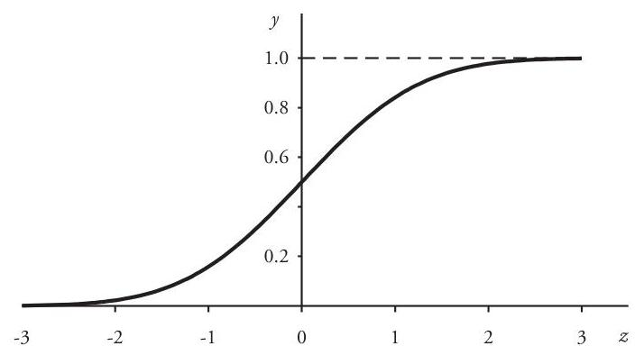

## Page 28
(d) The sequence $\left\langle I_{n}\right\rangle=\left\langle\left(c-\frac{1}{n}, c+\frac{1}{n}\right]\right\rangle$ is a descending sequence of intervals, with $\{c\}=\bigcap_{n} I_{n}$. The result of Problem 1.3(b) yields

$$
\begin{aligned}
\operatorname{Pr}\{X=c\}=P_{X}\left(\bigcap_{n} I_{n}\right) & =\lim _{n \rightarrow \infty} P_{X}\left(I_{n}\right) \\
& =\lim _{n \rightarrow \infty}\left(F\left(c+\frac{1}{n}\right)-F\left(c-\frac{1}{n}\right)\right) \\
& =F(c+)-F(c-)
\end{aligned}
$$

(e) Let $\left\langle x_{n}\right\rangle$ be a decreasing sequence of reals with $\lim _{n \rightarrow \infty} x_{n}=c$. Then $\left\langle I_{n}\right\rangle=\left\langle\left(-\infty, x_{n}\right]\right\rangle$ is a descending sequence of intervals, with $\bigcap_{n} I_{n}=(-\infty, c]$ and $P_{X}\left(I_{n}\right)=F\left(x_{n}\right)$. Again applying Problem 1.3(b):

$$
\lim _{n \rightarrow c+} F(x)=\lim _{n \rightarrow \infty} F\left(x_{n}\right)=\lim _{n \rightarrow \infty} P_{X}\left(I_{n}\right)=P_{X}\left(\bigcap_{n} I_{n}\right)=P_{X}((-\infty, c])=F(c)
$$

Note that property $(d)$ above implies that if $X$ is a continuous random variable then $\operatorname{Pr}\{X=x\}=0$ for every real $x$.

Occasionally one encounters random variables that are neither entirely discrete nor entirely continuous but whose distribution is a hybrid of these two main types. Such a random variable is said to have a mixed distribution, with a cumulative distribution function of the form described below.

A distribution function $F$ is of the mixed type if the function can be expressed as

$$
F(x)=\omega_{1} F_{1}(x)+\omega_{2} F_{2}(x)
$$

where $F_{1}(x)$ is the distribution function of a continuous variable $X_{1}, F_{2}(x)$ is the distribution function of a discrete random variable $X_{2}$ with $R_{X_{2}}=\left\{x_{i}\right\}$, and the nonnegative numbers $\omega_{1}$ and $\omega_{2}$ satisfy $\omega_{1}+\omega_{2}=1$. Here the numbers $\omega_{1}$ and $\omega_{2}$ can be interpreted as the respective probabilities of being (1) in the continuous state or (2) in the discrete state. A graph of $y=F(x)$ is continuous except at the points $\left\{x_{i}\right\}$, where it has a jump discontinuity of height $\omega_{2} f_{X_{2}}\left(x_{i}\right)$.

The next example illustrates some types of mixed distributions often encountered in the modeling of property/casualty claim processes.

Example 1.9. The distribution of an unlimited claim-size random variable $Y$ has the exponential c.d.f.

$$
F_{Y}(x)= \begin{cases}0 & \text { if }-\infty \leq x<0 \\ 1-e^{-0.01 x} & \text { if } 0 \leq x<\infty\end{cases}
$$

(a) The variable $X$ is distributed like $Y$ for positive $x$, but takes on the value 0 with probability 0.25 . Thus, the distribution of $X$ is a mixed distribution with a discrete lump of probability at $x=0$. Since

$$
\omega_{1}=\text { Probability of being in the continuous state }=1-\operatorname{Pr}\{X=0\}=0.75
$$

## Page 29
the cumulative distribution function of $X$ has the form

$$
\begin{aligned}
F(x) & =(0.75)\left\{\begin{array}{lll}
0 & \text { if }-\infty<x<0 \\
1-e^{-0.01 x} & \text { if } 0 \leq x<\infty
\end{array}+(0.25)\left\{\begin{array}{ll}
0 & \text { if }-\infty<x<0 \\
1 & \text { if } 0 \leq x<\infty
\end{array}\right.\right. \\
& =\left\{\begin{array}{lll}
0 & \text { if }-\infty<x<0 \\
1-0.75 e^{-0.01 x} & \text { if } 0 \leq x<\infty
\end{array}\right.
\end{aligned}
$$

(b) Alternatively, suppose that $X$ is distributed like $Y$, but is limited above by the value 200 -that is, claims less than or equal to 200 are paid at full value, but claims greater than 200 are paid at the maximum value of 200 . In this case, however,

$$
\omega_{1}=\text { Probability of being in the continuous state }=F_{Y}(200)=1-e^{-2}
$$

Therefore,

$$
\begin{aligned}
F(x) & =\left(1-e^{-2}\right)\left\{\begin{array}{ll}
0 & \text { if }-\infty<x<0 \\
\frac{1-e^{-0.01 x}}{1-e^{-2}} & \text { if } 0 \leq x<200 \\
1 & \text { if } 200 \leq x<\infty
\end{array}+e^{-2}\left\{\begin{array}{ll}
0 & \text { if }-\infty<x<200 \\
1 & \text { if } 200 \leq x<\infty
\end{array}\right.\right. \\
& =\left\{\begin{array}{ll}
0 & \text { if }-\infty<x<0 \\
1-e^{-0.01 x} & \text { if } 0 \leq x<200 \\
1 & \text { if } 200 \leq x<\infty
\end{array}\right.
\end{aligned}
$$

(e) Finally, again assume that $X$ is distributed like $Y$, but simultaneously has both modifications described in parts (a) and (b): it takes on the value 0 with probability $\operatorname{Pr}\{X=0\}=0.25$ and is limited above by the value 200 . Thus, the modified variable $X_{c}$ has a mixed distribution with two discrete lumps of probability mass, one at $x=0$ and another at $x=200$. Observe that

$$
\omega_{1}=\text { Probability of being in the continuous state }=0.75 F_{Y}(200)=0.75\left(1-e^{-2}\right)
$$

Variable $X$ then has the cumulative distribution function

$$
F(x)=0.75\left(1-e^{-2}\right)\left\{\begin{array}{ll}
0 & \text { if }-\infty<x<0 \\
\frac{1-e^{-0.01 x}}{1-e^{-2}} & \text { if } 0 \leq x<200 \\
1 & \text { if } 200 \leq x<\infty
\end{array}\right.
$$

## Page 30
$$
\begin{aligned}
& +\left(0.25+0.75 e^{-2}\right) \begin{cases}0 & \text { if }-\infty<x<0 \\
\frac{0.25}{0.25+0.75 e^{-2}} & \text { if } 0 \leq x<200 \\
1 & \text { if } 200 \leq x<\infty\end{cases} \\
& = \begin{cases}0 & \text { if }-\infty<x<0 \\
1-0.75 e^{-0.01 x} & \text { if } 0 \leq x<200 \\
1 & \text { if } 200 \leq x<\infty\end{cases}
\end{aligned}
$$

Graphs of $y=F(x)$ for parts $(a),(b)$, and $(c)$ are shown in Figures 1.3, 1.4, and 1.5, respectively.

Figure 1.3. Mixed Distribution Function $y=F(x)$ [Example 1.9(a)]

Figure 1.4. Mixed Distribution Function $y=F(x)$ [Example 1.9(b)]
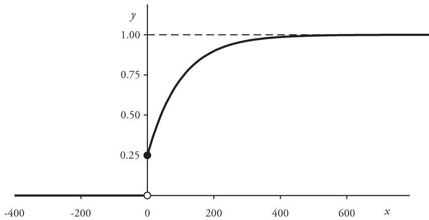
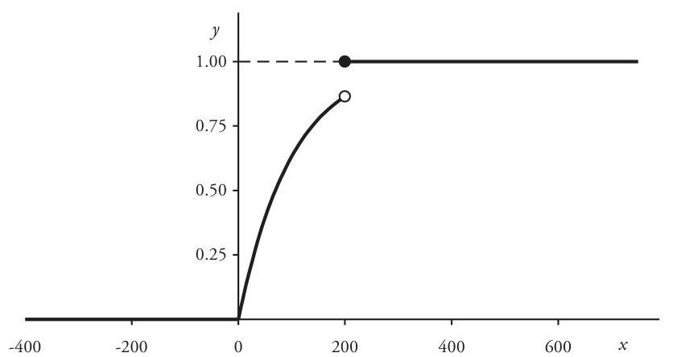

## Page 31
Figure 1.5. Mixed Distribution Function $y=F(x)$ [Example 1.9(c)]

# Joint Distributions 

It is frequently necessary to work with two or more random variables at the same time, recognizing that the values of one variable may influence the values of another. Accordingly, one must consider the probability distribution of the variables jointly. For example, suppose that $X$ and $Y$ are random variables with respective density functions $f_{X}(x)$ and $f_{Y}(y)$. We define $F(x, y)$, the joint cumulative distribution function of $X$ and $Y$, by

$$
F(x, y)=\operatorname{Pr}\{X \leq x \text { and } Y \leq y\}, \quad-\infty<x, y<\infty
$$

The joint probability density function $f(x, y)$ is a function that, in the case that $X$ and $Y$ are both discrete variables, satisfies

$$
f\left(x_{i}, y_{j}\right)=\operatorname{Pr}\left\{X=x_{i} \text { and } Y=y_{j}\right\}, \quad x_{i} \in R_{X}, y_{j} \in R_{Y}
$$

as well as

$$
\begin{array}{ll}
f_{X}\left(x_{i}\right)=\sum_{y_{j} \in R_{Y}} f\left(x_{i}, y_{j}\right), & x_{i} \in R_{X} \\
f_{Y}\left(y_{j}\right)=\sum_{x_{i} \in R_{X}} f\left(x_{i}, y_{j}\right), & y_{j} \in R_{Y}
\end{array}
$$

In this context, functions $f_{X}(x)$ and $f_{Y}(y)$ are called the marginal probability density functions of $X$ and $Y$, respectively.

In the case that $X$ and $Y$ are both continuous variables, the density function $f(x, y)$ must satisfy

$$
F(x, y)=\int_{-\infty}^{x} \int_{-\infty}^{y} f(u, v) d u d v, \quad-\infty<x, y<\infty
$$
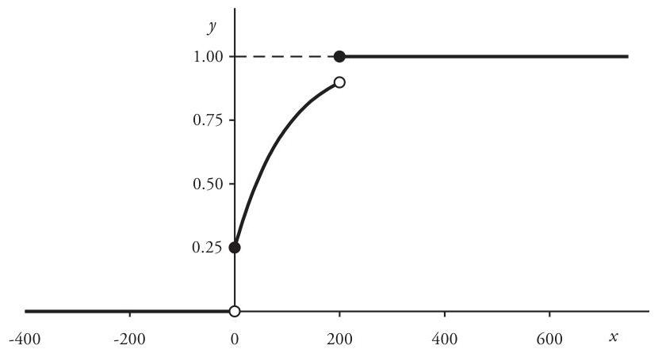

## Page 32
with the marginal density functions given by

$$
f_{X}(x)=\int_{-\infty}^{\infty} f(x, y) d y \quad \text { and } \quad f_{Y}(y)=\int_{-\infty}^{\infty} f(x, y) d x
$$

When it is true that the density functions satisfy the relation

$$
f(x, y)=f_{X}(x) \cdot f_{Y}(y), \quad-\infty<x, y<\infty
$$

we say that random variables $X$ and $Y$ are independent. For independent random variables, the probability distribution of one variable is not affected by the values of the other. In particular, the probability $\operatorname{Pr}\{X \leq x\}$ is mathematically independent of the value of $Y$, and vice versa. Consequently, we also have

$$
F(x, y)=F_{X}(x) \cdot F_{Y}(y), \quad-\infty<x, y<\infty
$$

# 1.3. Mathematical Expectation 

One of the most useful random-variable concepts is that of mathematical expectation, which we define in the following way. Assume that $X$ is a random variable with p.d.f. $f$-and range space $R_{X}=\left\{x_{i}\right\}$ if $X$ is discrete. Let $g$ be a function such that

$$
\sum_{i} g\left(x_{i}\right) f\left(x_{i}\right) \quad \text { or } \quad \int_{-\infty}^{\infty} g(x) f(x) d x
$$

depending on whether $X$ is discrete or continuous, respectively, exists as a finite number. Thus, whenever the above expression is an infinite series or improper Riemann integral, it must be convergent. The expectation or expected value of $g(X)$ is denoted by $E[g(X)]$, and it is defined by

$$
E[g(X)]= \begin{cases}\sum_{i} g\left(x_{i}\right) f\left(x_{i}\right) & \text { if } X \text { is discrete } \\ \int_{-\infty}^{\infty} g(x) f(x) d x & \text { if } X \text { is continuous }\end{cases}
$$

A Note on Integrals. Students of integration theory will recognize that the dual expressions in (1.42) can be represented by a single formula in which the integral is of the Riemann-Stieltjes type, as opposed to the ordinary Riemann integral of elementary calculus: ${ }^{10}$

$$
E[g(X)]=\int_{-\infty}^{\infty} g(x) d F(x)
$$

Without going into the theoretical details, unnecessary for the present discussion and which can be obtained from a text of real analysis, the Riemann-Stieltjes integral

[^0]
[^0]:    ${ }^{10}$ Thomas Jan Stieltjes (1856-1894) was a prominent Dutch mathematician who made contributions to continued fractions, number theory, and analysis. Appearing in his 1894 paper, "Recherches sur les fractions continues," his was the first published generalization of the Riemann integral. Details concerning the Riemann-Stieltjes integral can be found in textbooks of probability theory or advanced calculus; for example, refer to McCord and Moroney [14], pp. 82-92, or Apostol [2], pp. 140-182.

## Page 33
has the following properties which support the use of the expression in (1.43). Whenever $F(x)$ is a nondecreasing differentiable function for which $F^{\prime}(x)=f(x)$ and $f(x)$ is Riemannintegrable, the Stieltjes integral in (1.43) reduces to the Riemann integral

$$
\int_{-\infty}^{\infty} g(x) d F(x)=\int_{-\infty}^{\infty} g(x) f(x) d x
$$

In the case that $F(x)$ is a nondecreasing step function with jumps at a countable set of values $\left\{x_{i}\right\}$ and with the height of the jump at $x_{i}$ equal to $f\left(x_{i}\right)$, then

$$
\int_{-\infty}^{\infty} g(x) d F(x)=\sum_{i} g\left(x_{i}\right)\left(F\left(x_{i}\right)-F\left(x_{i-1}-\right)\right)=\sum_{i} g\left(x_{i}\right) f\left(x_{i}\right)
$$

As a result, we are justified in using the notation of (1.43) in place of (1.42), with the integral $\int_{-\infty}^{\infty} g(x) d F(x)$ interpreted as a Riemann-Stieltjes integral.

Properties (1.46) through (1.50) below are straightforward consequences of definition (1.42). Verification is requested in Problem 1.8.

# Properties of $E[g(X)]$ 

Assume that $c$ is a real constant and that $h$ and $g$ are functions for which $E[g(X)]$ and $E[h(X)]$ exist. Then
(a) $E[c]=c$.
(b) $E[c g(X)]=c E[g(X)]$.
(c) $E[g(X)+h(X)]=E[g(X)]+E[h(X)]$.
(d) $E[g(X)] \leq E[h(X)]$ whenever $g(x) \leq h(x)$ for all $x$.
(e) $|E[g(X)]| \leq E[|g(X)|]$.

One of the most important expected values for a random variable $X$ is the mean $E[X]$, obtained from (1.43) when $g(X)=X$ :

$$
E[X]=\int_{-\infty}^{\infty} x d F(x)
$$

In addition, the expectation of $g(X)=(X-E[X])^{2}$ defines the variance of $X$ :

$$
\operatorname{Var}[X]=E\left[(X-E[X])^{2}\right]
$$

The mean is a familiar measure of central tendency. For claim-size distributions, discussed in Chapter 2, the mean $E[X]$ is often called the severity. ${ }^{11}$ The variance is

[^0]
[^0]:    ${ }^{11}$ Actuaries sometimes use the term "severity" as a synonym for "claim size" when referring to claim-size distributions as "severity distributions." However, in this monograph we shall consistently use the term to denote mean claim size.

## Page 34
a standard measure of the dispersion of the distribution-the larger the variance, the more widely dispersed over the range space is the unit mass of probability. The square root of the variance is known as the standard deviation: $S D[X]=\sqrt{\operatorname{Var}[X]}$.

# Properties of $\operatorname{Var}[X]$ 

If $c$ is a real constant, then
(a) $\operatorname{Var}[c]=0$.
(b) $\operatorname{Var}[c X]=c^{2} \operatorname{Var}[X]$.
(c) $\operatorname{Var}[X]=E\left[X^{2}\right]-(E[X])^{2}$.

Proofs of these variance properties are requested in Problem 1.9.
Generalizing the expected values involved in definitions (1.51) and (1.52), we define the expectation of $g(X)=X^{m}$ for $m=1,2,3, \ldots$ :

$$
E\left[X^{m}\right]=\int_{-\infty}^{\infty} x^{m} d F(x)
$$

When the expression in (1.56) exists, the expected value $E\left[X^{m}\right]$ is called the $\boldsymbol{m}^{\text {th }}$ moment about 0 (or more simply, the $\boldsymbol{m}^{\text {th }}$ moment) of $X$. In addition, the expected value $E\left[(X-E[X])^{m}\right]$ is called the $\boldsymbol{m}^{\text {th }}$ central moment of $X$. Accordingly, $\operatorname{Var}[X]$ is the second central moment of $X$.

Although we have defined the moments, as well as the variance and other momentbased entities, as characteristics of a random variable, it is customary to refer to them interchangeably as properties of the random variable and of its associated probability distribution. In a formal treatment of probability these concepts can be defined separately, but we shall not do so here.

Example 1.10. (a) Random variable $X$ has a Bernoulli distribution with parameter $p$. Then

$$
\begin{gathered}
E[X]=(0)(1-p)+(1) p=p \\
E\left[X^{2}\right]=\left(0^{2}\right)(1-p)+\left(1^{2}\right) p=p
\end{gathered}
$$

so that equation (1.55) yields $\operatorname{Var}[X]=p(1-p)$.
(b) Variable $X$ is uniformly distributed on $[\alpha, \beta]$. Integrating over the interval, we obtain the mean and variance as functions of parameters $\alpha$ and $\beta$ :

$$
\begin{gathered}
E[X]=\frac{1}{\beta-\alpha} \int_{\alpha}^{\beta} x d x=\frac{\beta^{2}-\alpha^{2}}{2(\beta-\alpha)}=\frac{\alpha+\beta}{2} \\
\operatorname{Var}[X]=\frac{1}{\beta-\alpha} \int_{\alpha}^{\beta} x^{2} d x-(E[X])^{2}=\frac{\beta^{2}+\alpha \beta+\alpha^{2}}{3}-\frac{(\alpha+\beta)^{2}}{4}=\frac{(\beta-\alpha)^{2}}{12}
\end{gathered}
$$

## Page 35
(c) $Z$ has the standard normal distribution with p.d.f. (1.27). Then

$$
\begin{aligned}
E[Z] & =\frac{1}{\sqrt{2 \pi}} \int_{-\infty}^{\infty} z \exp \left(-\frac{1}{2} z^{2}\right) d z=0 \\
E\left[Z^{2}\right] & =\frac{1}{\sqrt{2 \pi}} \int_{-\infty}^{\infty} z^{2} \exp \left(-\frac{1}{2} z^{2}\right) d z=\frac{1}{\sqrt{2 \pi}} \sqrt{2 \pi}=1
\end{aligned}
$$

and so $\operatorname{Var}[Z]=1-0^{2}=1$.
Finally, we examine another special expected value for a random variable $X$, namely that of the function $g(X)=e^{t X}$. If there exists a positive number $K$ such that the expectation $E[g(X)]=E\left[e^{t X}\right]$ exists for all $|t|<K$, then the resulting function of $t, M(t)=E\left[e^{t X}\right]$, is called the moment-generating function of $X$. Thus,

$$
M(t)=E\left[e^{t X}\right]=\int_{-\infty}^{\infty} \exp (t x) d F(x) .^{12}
$$

Moment-generating functions play an important role in probability. When it exists, the moment-generating function of a random variable is unique and, moreover, completely characterizes the probability distribution of the variable. That is, two random variables with the same moment-generating function have the same distribution. In addition, when it exists, the $m^{\text {th }}$ derivative of $M(t)$ evaluated at $t=0$ is just the $m^{\text {th }}$ moment:

$$
\left.\frac{d^{m}}{d t^{m}} M(t)\right|_{t=0}=E\left[X^{m}\right], \quad m=1,2,3, \ldots
$$

Proofs of both these assertions about the moment-generating function can be found in a standard text of probability theory.

Example 1.11. (a) Assume that random variable $X$ has a binomial distribution with parameters $n$ and $p(n=1,2,3, \ldots$ and $0<p<1)$. Function $M(t)$ exists for all real $t$, and

$$
M(t)=\sum_{x=0}^{n} e^{t x} f(x)=\sum_{x=0}^{n} C_{x}\left(p e^{t}\right)^{x}(1-p)^{n-x}=\left(1-p+p e^{t}\right)^{n}
$$

The first two derivatives are

$$
\begin{aligned}
& \frac{d}{d t} M(t)=n\left(1-p+p e^{t}\right)^{n-1} p e^{t} \\
& \frac{d^{2}}{d t^{2}} M(t)= \begin{cases}n(n-1)\left(1-p+p e^{t}\right)^{n-2} p^{2} e^{2 t}+n\left(1-p+p e^{t}\right)^{n-1} p e^{t} & \text { if } n \geq 2 \\
p e^{t} & \text { if } n=1\end{cases}
\end{aligned}
$$

[^0]
[^0]:    ${ }^{12}$ For a continuous random variable the moment-generating function is a type of Laplace transform of its probability density function. Although useful when it exists, the moment-generating function fails to exist for a number of important distributions, notably the lognormal family discussed in Chapter 2. However, the characteristic function of a random variable $X$, defined as the complex-valued function $E[\exp (i t X)]$, always exists and has similar momentgenerating properties. The uniqueness of the moment-generating function is usually obtained from a corresponding uniqueness theorem about the characteristic function. For example, see Parzen [18], pp. 400-404. Refer also to Section 4.5 .

## Page 36
Evaluating these derivatives at $t=0$, we obtain

$$
\begin{gathered}
E[X]=M^{\prime}(0)=n p \\
E\left[X^{2}\right]=M^{\prime \prime}(0)=n(n-1) p^{2}+n p
\end{gathered}
$$

and hence $\operatorname{Var}[X]=n(n-1) p^{2}+n p-(n p)^{2}=n p(1-p)$.
(b) Assume that $X$ is exponentially distributed with parameter $\beta$. Then

$$
M(t)=\frac{1}{\beta} \int_{0}^{\infty} e^{t x} e^{-x / \beta} d x=\frac{1}{1-\beta t}, \quad-\infty<t<1 / \beta
$$

and the first two derivatives are

$$
\frac{d}{d t} M(t)=\frac{\beta}{(1-\beta t)^{2}} \quad \text { and } \quad \frac{d^{2}}{d t^{2}} M(t)=\frac{2 \beta^{2}}{(1-\beta t)^{3}}
$$

Therefore,

$$
E[X]=M^{\prime}(0)=\beta \quad \text { and } \quad E\left[X^{2}\right]=M^{\prime \prime}(0)=2 \beta^{2}
$$

so that $\operatorname{Var}[X]=2 \beta^{2}-\beta^{2}=\beta^{2}$.
For two or more random variables considered jointly, there are several useful and important results about expectations.

First, consider $g(X, Y)=X+Y$. The expectation $E[X+Y]$ is just the sum $E[X]+$ $E[Y]$. If, for example, $X$ and $Y$ are continuous variables, then

$$
\begin{aligned}
E[X+Y] & =\int_{-\infty}^{\infty} \int_{-\infty}^{\infty}(x+y) f(x, y) d x d y \\
& =\int_{-\infty}^{\infty} x\left[\int_{-\infty}^{\infty} f(x, y) d y)\right] d x+\int_{-\infty}^{\infty} y\left[\int_{-\infty}^{\infty} f(x, y) d x)\right] d y \\
& =\int_{-\infty}^{\infty} x f_{X}(x) d x+\int_{-\infty}^{\infty} y f_{Y}(y) d y \\
& =E[X]+E[Y]
\end{aligned}
$$

Secondly, assume that $X$ and $Y$ are independent random variables and that $g$ and $h$ are functions for which $E[g(X)]$ and $E[h(Y)]$ each exist. Then the expectation of the product $X Y$ is the product of the expected values:

$$
E[g(X) \cdot h(Y)]=E[g(X)] \cdot E[h(Y)]
$$

In the continuous case, we have

$$
\begin{aligned}
E[g(X) \cdot h(Y)] & =\int_{-\infty}^{\infty} \int_{-\infty}^{\infty} g(x) h(y) f_{X}(x) f_{Y}(y) d x d y \\
& =\int_{-\infty}^{\infty} g(x) f_{X}(x) d x \cdot \int_{-\infty}^{\infty} h(y) f_{Y}(y) d y \\
& =E[g(X)] \cdot E[h(Y)]
\end{aligned}
$$

and a similar argument applies in the discrete case.

## Page 37
Again, suppose that $X$ and $Y$ are independent random variables. Then

$$
\operatorname{Var}[X+Y]=\operatorname{Var}[X]+\operatorname{Var}[Y]
$$

To verify (1.61), use (1.59) and (1.60) to obtain

$$
E\left[(X+Y)^{2}\right]=E\left[X^{2}+2 X Y+Y^{2}\right]=E\left[X^{2}\right]+2 E[X] E[Y]+E\left[Y^{2}\right]
$$

and so

$$
\begin{aligned}
\operatorname{Var}[X+Y] & =E\left[X^{2}\right]+2 E[X] E[Y]+E\left[Y^{2}\right]-(E[X]+E[Y])^{2} \\
& =E\left[X^{2}\right]-(E[X])^{2}+E\left[Y^{2}\right]-(E[Y])^{2} \\
& =\operatorname{Var}[X]+\operatorname{Var}[Y]
\end{aligned}
$$

When random variable $Y$ is the sum of $n$ independent, identically distributed random variables, $Y=X_{1}+X_{2}+\cdots+X_{n}$, there is a useful result involving the momentgenerating functions. If each variable $X_{i}$ has the same distribution as some random variable $X$, the generating function of $Y$ can be expressed in terms of $M_{X}(t)$. Observe that the independence of the variables $\left\{X_{i}\right\}$ is used at step (3):

$$
\begin{aligned}
M_{Y}(t) & =E\left[\exp \left(t X_{1}+t X_{2}+\cdots+t X_{n}\right)\right]=E\left[\exp \left(t X_{1}\right) \exp \left(t X_{2}\right) \ldots \exp \left(t X_{n}\right)\right] \\
& \stackrel{(3)}{=} \prod_{i=1}^{n} E\left[\exp \left(t X_{i}\right)\right] \\
& =\left(M_{X}(t)\right)^{n}
\end{aligned}
$$

Example 1.12. Assume that random variable $Y$ is the sum of $n$ independent random variables $\left\{X_{i}\right\}$, each having the distribution of $X$, a Bernoulli random variable with parameter $p$ :

$$
Y=X_{1}+X_{2}+\cdots+X_{n}
$$

The moment-generating function of each variable $X_{i}$ exists for all real $t$, and

$$
M_{X_{i}}(t)=M_{X}(t)=E[\exp (t X)]=e^{0 t}(1-p)+e^{1 t} p=1-p+p e^{t}
$$

Thus, by (1.62) the generating function for the sum $Y$ is

$$
M_{Y}(t)=\left(1-p+p e^{t}\right)^{n}
$$

Because this is the moment-generating function of a binomial distribution with parameters $n$ and $p$, the uniqueness of the generating function implies that $Y$ is binomially distributed with parameters $n$ and $p$.

# 1.4. Random Samples 

The problem of fitting a parametric distribution to a set of claim data, discussed briefly in the next section, relies heavily on the theory of sampling from a population,

## Page 38
a collection of objects with identical distributional characteristics. For example, an actuary is often interested in inferring the distribution of sizes or numbers of claims from a set of data obtained from a portfolio of similar policies. We begin with the definition of random sample, which is fundamental to the discussion that follows.

An ordered set $\left\langle X_{1}, X_{2}, \ldots, X_{n}\right\rangle$ of independent, identically-distributed random variables is a random sample from a population random variable $X$ if each $X_{i}$ has the distribution of $X$. Thus, the distribution of $X_{i}$ does not depend on the value of any other random variable $X_{i}(i \neq j)$ in the sample. In practice, a random sample of size $n$ may be generated by performing $n$ successive independent trials of a single experiment-for example, tossing a coin $n$ times-or perhaps by making $n$ selections from a collection of similar objects, each time replacing the selected object before making the next selection, a method called selection with replacement. The set of particular values of the random variables $\left\langle X_{i}\right\rangle$, denoted by $\left\langle x_{1}, x_{2}, \ldots, x_{n}\right\rangle$, is referred to as a set of sample observations. A statistic is a function of the sample variables $\left\langle X_{1}, X_{2}, \ldots, X_{n}\right\rangle$.

The sample moments, analogs of formula (1.56) for moments of the population distribution, are useful statistics in the analysis of sample data:

$$
M_{m}=\frac{1}{n} \sum_{i=1}^{n} X_{i}^{m}, \quad m=1,2,3, \ldots
$$

The first moment is sometimes denoted by $\bar{X}$ :

$$
\bar{X}=M_{1}=\frac{1}{n} \sum_{i=1}^{n} X_{i}
$$

and the sample variance by $S^{2}$ :

$$
S^{2}=\frac{1}{n} \sum_{i=1}^{n}\left(X_{i}-\bar{X}\right)^{2}=\frac{1}{n} \sum_{i=1}^{n} X_{i}^{2}-\bar{X}^{2}=M_{2}-M_{1}^{2}
$$

Because they are functions of random variables, statistics are also random variables, with probability distributions induced by that of the population random variable. For instance, if the distribution of the population variable $X$ has mean $E[X]=\mu$ and variance $\operatorname{Var}[X]=\sigma^{2}$, then

$$
\begin{gathered}
E[\bar{X}]=E\left[\frac{1}{n} \sum_{i=1}^{n} X_{i}\right]=\frac{1}{n} \sum_{i=1}^{n} E\left[X_{i}\right]=\mu \\
\operatorname{Var}[\bar{X}]=\operatorname{Var}\left[\frac{1}{n} \sum_{i=1}^{n} X_{i}\right]=\frac{1}{n^{2}} \sum_{i=1}^{n} \sigma^{2}=\frac{\sigma^{2}}{n}
\end{gathered}
$$

In addition,

$$
\begin{aligned}
E\left[S^{2}\right] & =E\left[\frac{1}{n} \sum_{i=1}^{n}\left(X_{i}-\mu+\mu-\bar{X}\right)^{2}\right] \\
& =E\left[\frac{1}{n} \sum_{i=1}^{n}\left(X_{i}-\mu\right)^{2}-(\bar{X}-\mu)^{2}\right]
\end{aligned}
$$

## Page 39
$$
\begin{aligned}
& =\sigma^{2}-\operatorname{Var}[\bar{X}] \\
& =\frac{n-1}{n} \sigma^{2}
\end{aligned}
$$

Assume that $\left\langle x_{1}, x_{2}, \ldots, x_{n}\right\rangle$ is a set of observations from the random sample $\left\langle X_{1}, X_{2}, \ldots, X_{n}\right\rangle$ of size $n$. The sample distribution function or empirical distribution function $F_{n}(x)$ is defined for all real $x$ by

$$
F_{n}(x)=\sum_{x_{i} \leq x} \frac{1}{n}=\frac{\# \text { observations } \leq x}{n}
$$

Although it is not itself a probability distribution function, $F_{n}(x)$ has the same form as a cumulative distribution function for a discrete random variable defined on a finite set of equally probable outcomes. $F_{n}(x)$ therefore has the properties of such a function-specifically, (1.29) through (1.33). In particular, the first moment evaluated at the observations $\left\langle x_{1}, x_{2}, \ldots, x_{n}\right\rangle$ is the mean of the sample distribution:

$$
\bar{x}=\frac{1}{n} \sum_{i=1}^{n} x_{i}
$$

The variance of the sample distribution is defined similarly:

$$
s^{2}=\frac{1}{n} \sum_{i=1}^{n}\left(x_{i}-\bar{x}\right)^{2}
$$

Often, for ease of analysis, data in a set of observations from a random sample are grouped into a collection of disjoint intervals or cells: $\left\{\left(c_{k-1}, c_{k}\right)\right\}(k=1,2, \ldots, m)$. In this case, (1.69) has the form

$$
\bar{x}=\frac{1}{n} \sum_{k=1}^{m} n_{k} a_{k}
$$

where

$$
\begin{aligned}
& n_{k}=\# \text { observations in }\left(c_{k-1}, c_{k}\right] \text { and } n=\sum_{k=1}^{m} n_{k} \\
& a_{k}=\sum_{x_{i} \in\left(c_{k-1}, c_{k}\right]} \frac{x_{i}}{n_{k}}=\text { average observation in }\left(c_{k-1}, c_{k}\right]
\end{aligned}
$$

If the sum of the observations in the $k^{\text {th }}$ cell is unavailable, so that $a_{k}$ is not known exactly, one could approximate the average $a_{k}$ in formula (1.71) by the interval midpoint:

$$
a_{k}=\frac{1}{2}\left(c_{k-1}+c_{k}\right)
$$

## Page 40
# 1.5. Fitting Distributions 

Actuaries frequently find it desirable to fit a parametric distribution model to a set of claim data, both for the purpose of smoothing the empirical distribution but also for interpolating among or extrapolating beyond the existing data. The problem of extrapolation is particularly important in describing the behavior of the very large claims in a claim-size distribution-the probability of such claims is usually so small that in any given sample of claim-size data the number of large claims is insufficient to characterize adequately the right-hand tail of the underlying population distribution. In this section we review the rudimentary details of several methods used to fit probability models to data.

We begin with a finite set of claim data $\left\langle x_{1}, x_{2}, \ldots, x_{n}\right\rangle$, which can be interpreted as a set of particular values for a random sample $\left\langle X_{1}, X_{2}, \ldots, X_{n}\right\rangle$ from a population random variable $X$ with an unknown distribution. The variables $\left\langle X_{i}\right\rangle$ are independent, and each has the same distribution as $X$, representing the results of a single random selection from the population variable $X$. Here, $X$ could be either a claim-size or claim-count variable, as discussed in Chapters 2 and 3. The aim is to find a probability model for the distribution of $X$, consistent with the sample observations $\left\langle x_{1}, x_{2}, \ldots, x_{n}\right\rangle$.

In practice, in order to justify the interpretation as a random sample from a single population, claim data must often be adjusted in order that all are on the same basis. For example, claim-size data obtained from multiple policy or accident years may very well require the application of trend factors to remove the effects of monetary inflation over time.

Methods of fitting models to sample data usually depend on first selecting a distribution family, that is, a collection of distribution functions $\left\{F_{\Theta}(x)\right\}$ indexed by a finite set of numeric parameters $\Theta=\left\langle\theta_{1}, \theta_{2}, \ldots, \theta_{r}\right\rangle$. The choice of such a family can be arbitrary, but should take into consideration any known or desired properties of the distribution under investigation.

Having chosen such a family, one must next identify the particular member of the selected distribution family that, according to some selection criterion, best describes the data. This is usually done by finding an appropriate point estimate for each distribution parameter-usually in the form of a statistic, that is, a function of the sample random variables:

$$
\hat{\theta}_{i}=g_{i}\left(X_{1}, \ldots, X_{n}\right), \quad i=1,2, \ldots, r
$$

For example, the sample-moment statistics (1.63) are useful in this regard.
In a given situation there may exist several possible parameter estimators, statistics which could differ in their ease of computation or in the general properties of estimators deemed desirable by statisticians. The latter include the three estimator properties described below-bias, consistency, efficiency.

Assume that $X$ is a random variable with a distribution that depends on the unknown parameter $\theta$. Let $\left\langle X_{1}, X_{2}, \ldots, X_{n}\right\rangle$ be a random sample of $X$ of size $n$ and assume that

## Page 41
$\hat{\theta}_{n}$ is a function of the sample random variables, a statistic whose distribution depends on the parameter $\theta$.

- $\hat{\theta}_{n}$ is said to be an unbiased estimate of $\theta$ whenever the mean of $\hat{\theta}_{n}$ is just $\theta: E\left[\hat{\theta}_{n}\right]=\theta$. For example, the expected value of the sample mean $\bar{X}$ is $E[\bar{X}]=E[X]$. Thus, if $E[X]=$ $\theta$, then $\hat{\theta}_{n}=\bar{X}$ is an unbiased estimate of $\theta$. However, because $E\left[S^{2}\right]=\left(1-\frac{1}{n}\right) \operatorname{Var}[X]$, the sample variance statistic is a biased estimate of $\operatorname{Var}[X]$, although the bias $\frac{1}{n} \operatorname{Var}[X]$ is insignificant for large samples.
- $\hat{\theta}_{n}$ is said to be a consistent estimate of $\theta$ if $\hat{\theta}_{n}$ converges in probability to $\theta$, that is,

$$
\lim _{n \rightarrow \infty} \operatorname{Pr}\left\{\left|\hat{\theta}_{n}-\theta\right|<\varepsilon\right\}=1 \quad \text { for all } \varepsilon>0
$$

It can be shown that when $\operatorname{Var}[X]$ is finite $\bar{X}$ converges in probability to $E[X]$, and so, as in the above example, $\hat{\theta}_{n}=\bar{X}$ is a consistent estimate of $\theta=E[X]$. In addition, if $\hat{\theta}_{n}$ is an unbiased estimate of $\theta$ and if $\lim _{n \rightarrow \infty} \operatorname{Var}\left[\hat{\theta}_{n}\right]=0$, then $\hat{\theta}_{n}$ is also a consistent estimate of $\theta$.

- Suppose that $\hat{\theta}_{n}$ is an unbiased estimate of $\theta$ and that for all estimates $\hat{\theta}_{n}^{*}$ for which $E\left[\hat{\theta}_{n}^{*}\right]=\theta$, we have $\operatorname{Var}\left[\hat{\theta}_{n}\right] \leq \operatorname{Var}\left[\hat{\theta}_{n}^{*}\right]$ for all $\theta$. In this case $\hat{\theta}_{n}$ is said to be an unbiased, minimum variance estimate of $\theta$. Statistic $\hat{\theta}_{n}$ is also called the most efficient estimator of $\theta$.
To find an optimal fitted distribution it is often advisable to try more than one method of calculating a set of parameter estimates $\hat{\Theta}$ and sometimes work with more than one distribution family. Then, after deciding on a particular parameter estimate, one should in the final step evaluate how well the distribution $F_{\Theta}(x)$ fits the sample data. One could do this with an informal comparison of the fitted and empirical distribution functions or more rigorously by employing a standard goodness-of-fit test, such as that based on the chi-square statistic.

Briefly described below are four useful techniques of parameter estimation: the method of moments, the maximum-likelihood method, the minimum chi-square method, and minimum-distance methods. ${ }^{13}$

# Method-of-Moments Estimation 

First proposed by the English statistician Karl Pearson, this is the oldest technique of estimating parameters and perhaps the easiest to apply in practice. The method-of-moments method is based on the usually reasonable assumption that the sample moments are good estimates of the corresponding population moments. ${ }^{14}$

Accordingly, one computes successive sample moments $M_{m}=\frac{1}{n} \sum_{i=1}^{n} x_{i}^{m}$ evaluated at the sample data points $\left\langle x_{1}, x_{2}, \ldots, x_{n}\right\rangle$ and then equates them to the corresponding

[^0]
[^0]:    ${ }^{13}$ More complete discussions of estimation techniques can be found in standard mathematical statistics texts. For example, see Hogg and Craig [7], chapter 6, or Lindgren [13], chapter 5.
    ${ }^{14}$ Karl Pearson (1857-1936), founder of the field of mathematical statistics, established the world's first college department of statistics at University College London. His contributions include the foundations of statistical hypothesis testing and decision theory, and he is the eponymous inventor of the chi-square goodness-of-fit test.

## Page 42
moments of the assumed distributional model, which depend on the unknown parameters $\Theta$ :

$$
M_{m}=E_{\Theta}\left[X^{m}\right], \quad m=1,2,3, \ldots
$$

One must use as many of these equations as is necessary to determine the parameters uniquely-in general, when there are $r$ parameters to estimate use (1.74) for $m=$ $1,2, \ldots, r$. The resulting system of equations could then be solved to obtain $\hat{\Theta}=$ $\left\langle\hat{\theta}_{1}, \hat{\theta}_{2}, \ldots, \hat{\theta}_{r}\right\rangle$ in terms of the observed data values $\left\langle x_{i}\right\rangle$.

Method-of-moments estimates have the advantage of usually being very easy to calculate, but they do not always have the desirable properties indicated above-they are often consistent, but are sometimes biased.

Example 1.13. A possibly unbalanced die is rolled and the number of spots on the upper surface is observed. We define a Bernoulli random variable:

$$
X= \begin{cases}1 & \text { if } \# \text { spots }=6 \\ 0 & \text { if } \# \text { spots } \neq 6\end{cases}
$$

The probability distribution for $X$ has a single unknown parameter

$$
p=\operatorname{Pr}\{X=1\}=\operatorname{Pr}\{\# \text { spots }=6\}
$$

with the probability mass function

$$
f(x)= \begin{cases}p^{x}(1-p)^{1-x} & \text { if } x \in\{0,1\} \\ 0 & \text { if } x \notin\{0,1\}\end{cases}
$$

It is evident that $E[X]=p$.
In order to estimate parameter $p$, the die is rolled 50 times, creating a random sample of size $n=50$. Twelve sixes are observed, so that $\sum_{i=1}^{50} x_{i}=12$. The method-ofmoments estimate of parameter $p$ is obtained from the unbiased, consistent estimator $\hat{p}=\bar{x}$ :

$$
\hat{p}=\frac{12}{50}=0.2400
$$

# Maximum-Likelihood Estimation 

Simply stated, a maximum-likelihood estimator $\hat{\Theta}$ of distribution parameters $\Theta$ specifies the member $F_{\Theta}(x)$ of a distribution family which maximizes the probability of obtaining the values $\left\langle x_{1}, x_{2}, \ldots, x_{n}\right\rangle$ actually observed in a random sample $\left\langle X_{1}, X_{2}, \ldots, X_{n}\right\rangle$.

To begin, let $\left\langle X_{1}, X_{2}, \ldots, X_{n}\right\rangle$ be a random sample from a probability distribution with density function $f_{\Theta}(x)$. The joint probability density function for the sample is then $\prod_{i=1}^{n} f_{\Theta}\left(x_{i}\right)$. Evaluated at the observed sample values $\left\langle x_{1}, x_{2}, \ldots, x_{n}\right\rangle$, this product

## Page 43
can be regarded as a function of the parameters $\Theta$. As such, it is called the likelihood function of the random sample:

$$
L(\Theta)=\prod_{i=1}^{n} f_{\Theta}\left(x_{i}\right)
$$

Therefore, $\hat{\Theta}=\left\langle\hat{\theta}_{1}, \hat{\theta}_{2}, \ldots, \hat{\theta}_{r}\right\rangle$ is a maximum-likelihood estimator if it yields a maximum value for the likelihood function:

$$
L(\hat{\Theta}) \geq L(\Theta) \quad \text { for all } \Theta
$$

Because they are located at points at which the likelihood function attains an extreme value, maximum-likelihood estimators are usually, but not always, unique.

An analytic solution of the maximum-value problem can be sought by setting the $r$ partial derivatives of the likelihood function equal to 0 and solving the resulting system of equations. However, in most situations it is easier to solve the equivalent problem of maximizing the $\log$-likelihood function $\log L(\Theta)$, using the same technique: ${ }^{15}$

$$
\left\{\begin{array}{l}
\frac{\partial}{\partial \theta_{1}} \log L\left(\theta_{1}, \ldots, \theta_{r}\right)=0 \\
\vdots \\
\frac{\partial}{\partial \theta_{r}} \log L\left(\theta_{1}, \ldots, \theta_{r}\right)=0
\end{array}\right.
$$

(Recall that $\log x$ is an increasing function of $x$, so that whenever $L(\hat{\Theta})$ is a maximum value of the likelihood function, $\log L(\hat{\Theta})$ is a maximum value of $\log L(\hat{\Theta})$, and conversely.) If, as it often does, the analytic approach proves intractable, one could employ an iterative solving algorithm, available in many computer software packages.

Maximum-likelihood estimators are usually consistent and efficient, but not always unbiased, estimators of the distribution parameters.

Example 1.14. Returning to the problem of Example 1.13, we now determine the maximum-likelihood estimator of $p=\operatorname{Pr}\{X=1\}$ for a sample of size $n$. The likelihood function is

$$
L(p)=\prod_{i=1}^{n} p^{x_{i}}(1-p)^{1-x_{i}}=p^{\Sigma x_{i}}(1-p)^{n-\Sigma x_{i}}
$$

and so the log-likelihood function is

$$
\log L(p)=(\log p) \sum_{i=1}^{n} x_{i}+\log (1-p)\left(n-\sum_{i=1}^{n} x_{i}\right)
$$

[^0]
[^0]:    ${ }^{15}$ Throughout this monograph, $\log x$ denotes the natural (base $e$ ) logarithm function of $x$.

## Page 44
Therefore, the equation

$$
\frac{\partial}{\partial p} \log L(p)=\frac{1}{p} \sum_{i=1}^{n} x_{i}-\frac{1}{1-p}\left(n-\sum_{i=1}^{n} x_{i}\right)=0
$$

has the solution $\dot{p}=\frac{1}{n} \sum_{i=1}^{n} x_{i}=\bar{x}$, a maximum-likelihood estimate of $p$.

# Minimum Chi-Square Estimation 

The minimum chi-square estimator $\hat{\Theta}$ of distribution parameters $\Theta$ specifies the member $F_{\Theta}(x)$ of a selected distribution family that minimizes an associated chi-square statistic. This statistic is identical in form to that used in the classic Pearson chi-square goodness-of-fit test.

To construct the chi-square statistic one must first group the data from a random sample of size $n$ into a smaller number $m$ of classes or cells. If the population distribution is of the continuous type, like that of most size-of-loss random variables, then the cells may take the form of intervals of real numbers. Otherwise, if the distribution is discrete and the random variable is integer-valued-like that of a claim-count random variable-then the cells must be subsets of the nonnegative integers.

We then calculate the cell frequencies:

$$
n_{k}=\# \text { observations in the } k^{t h} \operatorname{cell}(k=1,2, \ldots, m) \quad \text { and } \quad n=\sum_{k=1}^{m} n_{k}
$$

The statistic $\chi^{2}(\Theta)$ is given by

$$
\chi^{2}(\Theta)=\sum_{k=1}^{m} \frac{\left|n_{k}-\phi_{k}(\Theta)\right|^{2}}{\phi_{k}(\Theta)}
$$

where $\phi_{k}(\Theta)$ is the expected number of sample observations in the $k^{\text {th }}$ cell, based on the population distribution with parameters $\Theta$. For example, if the random variable $X$ has a continuous distribution, with cells of the form $\left(c_{k-1}, c_{k}\right]$, then

$$
\phi_{k}(\Theta)=n \cdot\left(F_{\Theta}\left(c_{k}\right)-F_{\Theta}\left(c_{k-1}\right)\right)
$$

Since each expected value $\phi_{k}(\Theta)$ is a function of $\Theta$, so is $\chi^{2}(\Theta)$, and a minimum chi-square estimate of $\Theta$ is a value $\hat{\Theta}$ at which the statistic achieves a minimum value:

$$
\chi^{2}(\hat{\Theta}) \leq \chi^{2}(\Theta) \text { for all } \Theta
$$

Calculation of $\hat{\Theta}$ is complicated by the fact that both numerator and denominator of $\chi^{2}(\Theta)$ depend on $\Theta$. However, use of a computer-implemented iterative solving algorithm is a practical way of overcoming such computational complexities.

One advantage of using minimum chi-square estimation of the distribution parameters, of course, is the fact that at the end of the procedure one has a built-in

## Page 45
goodness-of-fit test available. The value of the chi-square statistic under the assumption of the fitted distribution-the null hypothesis-has already been computed. For illustrations of this method, refer to Examples 2.8 and 2.11.

# Minimum-Distance Estimation 

As with the minimum chi-square method discussed previously, minimum-distance methods are applied to grouped sample data. In particular, the method is most useful in estimating parameters for a random variable $X$ with a continuous distribution. Suppose, for example, the $n$ sample values have been assigned to $m$ cell intervals of the form $\left(c_{k-1}, c_{k}\right\}$, where

$$
n_{k}=\# \text { observations in }\left(c_{k-1}, c_{k}\right] \quad(k=1,2, \ldots, m) \quad \text { and } \quad n=\sum_{k=1}^{m} n_{k}
$$

The empirical sample distribution function at the cell boundary point $c_{k}$ is

$$
F_{u}\left(c_{k}\right)=\frac{1}{n} \sum_{i=1}^{k} n_{i}
$$

One minimum-distance estimator of parameter $\Theta$ is the value $\hat{\Theta}$ that minimizes the "distance" $D(\Theta)$ between the sample and parametric distribution functions, $F_{u}(x)$ and $F_{\Theta}(x)$, evaluated at the cell boundary points:

$$
D(\Theta)=\sqrt{\sum_{k=1}^{m}\left|F_{u}\left(c_{k}\right)-F_{\Theta}\left(c_{k}\right)\right|^{2}}
$$

Clearly, $D(\Theta)$ is a function of $\Theta$, and $\hat{\Theta}$ must satisfy $D(\hat{\Theta}) \leq D(\Theta)$ for all $\Theta$.
An analytic solution of a minimum-distance problem is unlikely to be straightforward, but as in the case of minimum chi-square estimation, $\hat{\Theta}$ can usually be obtained by applying a computer utility or software that implements an iterative solving algorithm. Minimum-distance methods in an actuarial setting are more fully discussed in a paper by Klugman and Parsa [12]. Examples of minimum-distance fitting can be found in Examples 2.9 and 2.10.

### 1.6. Problems

1.1 Let $\Omega$ be the sample space for an experiment of chance.
(a) Show that the set $\left\{\varnothing, E, E^{\prime}, \Omega\right\}$ is a $\sigma$-algebra.
(b) Assume that $S$ is a $\sigma$-algebra, with $E, F \in S$. Show that $E \cap F \in S$.
(c) Assume that $\Omega=\{a, b, c, d\}$ and that $\{a\}$ and $\{b, c\}$ are events. Find the smallest $\sigma$-algebra $S$ containing this pair of events-this is the $\sigma$-algebra generated by $\{a\}$ and $\{b, c\}$.
1.2 Assume that $(\Omega, S, P)$ is a probability space. Verify the following properties of $P$.
(a) Equation (1.4).
(b) Equation (1.5).
(c) Equation (1.6).
(d) Property (1.7).
(e) Equation (1.8).
( $\boldsymbol{f}$ ) Property (1.9).

## Page 46
1.3 Assume that $(\Omega, S, P)$ is a probability space. Verify the following properties of the probability function $P$.
(a) If $E_{1} \subseteq E_{2} \subseteq E_{3} \subseteq \cdots$ is an ascending sequence of sets in $S$, then $P\left(\bigcup_{n} E_{n}\right)=$ $\lim _{n \rightarrow \infty} P\left(E_{n}\right)$.
(b) If $E_{1} \supseteq E_{2} \supseteq E_{3} \supseteq \cdots$ is a descending sequence of sets in $S$, then $P\left(\bigcap_{n} E_{n}\right)=$ $\lim _{n \rightarrow \infty} P\left(E_{n}\right)$.
1.4 An urn contains three red and four black chips. Two chips are drawn at random without replacement. Calculate:
(a) the probability that both chips are red.
(b) the probability that both chips are black.
(c) the expected number of red chips.
1.5 For a probability space $(\Omega, S, P)$ with events $E$ and $F$ show that
(a) $P(E)=P(F) \cdot P(E \mid F)+P\left(F^{\prime}\right) \cdot P\left(E \mid F^{\prime}\right)$.
(b) If $E$ and $F$ are independent, then $P(E \cup F)=1-P\left(E^{\prime}\right) P\left(F^{\prime}\right)$.
1.6 Consider the following generalization of Example 1.4. Two fair dice are rolled. Let $E_{m}$ denote the event of obtaining a total of $m$ spots $(m=2,3, \ldots, 12)$ and $F_{n}$ the event that the first die shows $n(n=1,2, \ldots, 6)$ spots. For what values of $(m, n)$ are events $E_{m}$ and $F_{n}$ independent? Explain.
1.7 A random variable $X$ takes on five values with nonzero probability: $R_{X}=\{1,2,3$, $4,5\}$. The probability mass function is tabulated below, where $k$ is a constant.

| $x$ | 1 | 2 | 3 | 4 | 5 |
| :-- | :-- | :-- | :-- | :-- | :-- |
| $f(x)$ | $k^{2}$ | $0.50 k$ | $k$ | $0.25 k$ | 0.50 |

Calculate:
(a) $k$.
(b) $F(2)$.
(c) $\operatorname{Pr}\{X$ is odd $\}$.
(d) $E[X]$.
(e) $\operatorname{Var}[X]$.
1.8 Verify the following properties of the expected value $E[g(X)]$.
(a) Equation (1.46).
(b) Equation (1.47).
(c) Equation (1.48).
(d) Property (1.49).
(e) Property (1.50).
1.9 Verify the following properties of the variance $\operatorname{Var}[X]$.
(a) Equation (1.53).
(b) Equation (1.54).
(c) Equation (1.55).
1.10 A discrete random variable $N$ has the countably infinite range space $R_{N}=$ $\{1,2,3, \ldots\}$.
(a) Can the outcomes in $R_{N}$ be assigned equal probabilities?
(b) Find the constant $k$ such that $f(n)=k p^{n}\left(0<p<1, n \in R_{N}\right)$ is a probability mass function for $N$.
(c) Using the function of part (b), calculate $E[N]$ and $\operatorname{Var}[N]$.

## Page 47
1.11 A random variable $X$ has the cumulative distribution function

$$
F(x)= \begin{cases}0 & \text { if }-\infty<x<0 \\ 1-0.25 e^{-0.50 x} & \text { if } 0 \leq x<\infty\end{cases}
$$

Calculate:
(a) $\operatorname{Pr}\{X=0\}$.
(b) $\operatorname{Pr}\{X=1\}$.
(c) $\operatorname{Pr}\{X<1\}$.
(d) $\operatorname{Pr}\{1<X<2\}$.
(e) $E[X]$.
(f) $\operatorname{Var}[X]$.
1.12 Assume random variable $X$ has a continuous distribution, with c.d.f. $F(x)$.
(a) Show that $\operatorname{Pr}\{X=c\}=0$ for all real $c$.
(b) Show that $\operatorname{Pr}\{a<X<b\}=\operatorname{Pr}\{a \leq X \leq b\}=F(b)-F(a)$ for all $a$ and $b$.
1.13 Evaluate these Riemann-Stieltjes integrals.
(a) $\int_{0}^{1} x d\left(x^{2}\right)$.
(b) $\int_{1}^{3} x^{2} d(\log x)$.
(c) $\int_{0}^{\infty} d\left(1-e^{-x}\right)$.
(d) $\int_{0}^{5} x d(\llbracket x \rrbracket) .{ }^{16}$
1.14 Evaluate these Riemann-Stieltjes integrals, in which $F$ denotes the discrete cumulative distribution function of Example 1.7.
(a) $\int_{0}^{\infty} x d F(x)$.
(b) $\int_{0}^{\infty} x^{2} d F(x)$.
(c) $\int_{0}^{\infty} \exp (t x) d F(x)$.
1.15 Evaluate these Riemann-Stieltjes integrals, in which $F$ denotes the continuous c.d.f. of the uniform distribution of Example 1.8(a).
(a) $\int_{0}^{\infty} x d F(x)$.
(b) $\int_{0}^{\infty} x^{2} d F(x)$.
(c) $\int_{0}^{\infty} \exp (t x) d F(x)$.
1.16 A random variable $X$ has the distribution function

$$
F(x)= \begin{cases}0 & \text { if }-\infty<x<0 \\ 1-(0.20) e^{-x / 100}-(0.80) e^{-x / 200} & \text { if } 0 \leq x<\infty\end{cases}
$$

(a) Show that the distribution of $X$ can be interpreted as the mixture of two exponential distributions.
(b) Determine $E[X]$ and $\operatorname{Var}[X]$.
1.17 Calculate $E[X]$ and $\operatorname{Var}[X]$ for the random variable $X$ of Example 1.8(a).
1.18 Calculate $E[X]$ and $\operatorname{Var}[X]$ for the random variable $X_{a}$ of Example 1.9(a).
1.19 Assume that $X$ is a random variable with $E[X]=0$ and $\operatorname{Var}[X]=1$. Calculate $E[Y]$ and $\operatorname{Var}[Y]$ for $Y=\sigma X+\mu$.
1.20 Find the moment-generating functions for:
(a) the standard normal distribution.
(b) the normal distribution of $Y=\sigma Z+\mu$, where $Z$ is the standard normal random variable.
(c) the distribution of $X$, uniformly distributed on the interval $[\alpha, \beta]$.

[^0]
[^0]:    ${ }^{16} \llbracket x \rrbracket$ denotes the greatest integer function, defined for every real $x$ as the unique integer $m$ satisfying $m \leq x<m+1$. For example, $\llbracket 5 \rrbracket=5, \llbracket \pi \rrbracket=3, \llbracket-1.5 \rrbracket=-2$.

## Page 48
1.21 Random variable $N$ has the geometric distribution defined by (1.20). Determine:
(a) $M(t)$.
(b) $E[N]$.
(c) $\operatorname{Var}[N]$.
(d) the probability that an odd number of trials is required to obtain the first success.
1.22 Justify the algebraic rearrangement in the second step of (1.67).
1.23 Find the maximum-likelihood estimator of the parameter $\beta$ for the exponential distribution of Example 1.8(b).
1.24 Random variable $X$ has a mixed probability density function $f$ defined by

$$
f(x)=\sum_{k=1}^{n} \omega_{k} f_{k}(x), \text { where } 0<\omega_{k}<1 \text { and } \sum_{k=1}^{n} \omega_{k}=1
$$

Show that $E[X]$ and $\operatorname{Var}[X]$ are given by

$$
E[X]=\sum_{k=1}^{n} \omega_{k} \mu_{k} \quad \text { and } \quad \operatorname{Var}[X]=\sum_{k=1}^{n} \omega_{k} \sigma_{k}^{2}+\sum_{k=1}^{n} \omega_{k}\left(\mu_{k}-E[X]\right)^{2}
$$

where $\mu_{k}$ and $\sigma_{k}^{2}$ are the respective mean and variance of the $k^{t^{k}}$ distribution.

## Page 49
# 2. Claim Size 

Every property/casualty claim process involves two independent random variables: the claim-size random variable and the claim-count random variable. These two variables combine to create a third fundamental claim variable, the aggregate-loss random variable, values of which represent the total claim amount generated by the underlying claim process. We shall investigate each of these variables and their related distributions in turn. Distributions of claim-size variables are studied in this chapter, the claim-count variable is the subject of Chapter 3, and then aggregate-loss distributions are taken up in Chapter 4.

A claim-size variable has an associated probability distribution called a size-of-loss distribution, often shortened to loss distribution. A set of empirical claim data, being finite, always has a discrete distribution, but as we shall see, a set of claim data can be usefully interpreted as a sample drawn from an underlying claim-size population assumed to have a continuous loss distribution.

To model the size of property/casualty insurance claims, actuaries employ a variety of parametric families of continuous distributions. The most popular probability distributions used for this purpose, including the lognormal and Pareto families, are studied in this chapter.

### 2.1. Claim-Size Random Variables

A claim-size random variable, if based on a finite population of claims or on a finite sample of claims from a larger population, always has a discrete distribution. However, for many actuarial calculations it is useful to assume that the sizes of the underlying claim population are modeled by a continuous distribution, usually one of the standard parametric distributions discussed later in this chapter. Thus the task of the actuary often is to fit a continuous parametric claim-size distribution to a discrete sample of claim data. In addition, as we shall see, distributions of various derived random variables are neither wholly discrete nor continuous, but of the mixed discrete/continuous type.

Claim-size variables, by their very nature, take on only nonnegative values. Thus for all such variables $X, \operatorname{Pr}\{X<0\}=0$. That is, $F_{X}(x)=0$ for all $x<0$. The probability density function $f(x)$ for a continuous size-of-loss distribution for which claim size is unbounded (or unlimited) from above takes on positive values over a semi-infinite interval of the form $0 \leq \xi<x<\infty$. For positive $b$ in this interval, the portion of the distribution defined on the subinterval $(b, \infty)$ is called the long tail of the distribution.

## Page 50
Alternately, the part of the distribution defined on the finite subinterval $(\xi, b)$, extending to the left and bounded below by 0 , is called the short tail. Clearly, such distributions cannot be symmetric.

The skewness of the distribution, defined as the normalized third central moment, is a measure of distribution symmetry:

$$
S k[X]=\frac{E\left[(X-E[X])^{3}\right]}{(\operatorname{Var}[X])^{3 / 2}}=\frac{E\left[X^{3}\right]-3 E[X] E\left[X^{2}\right]+2(E[X])^{3}}{\left(E\left[X^{2}\right]-(E[X])^{2}\right)^{3 / 2}}
$$

The larger the absolute value $|S k[X]|$ the more asymmetric is the distribution. Symmetric random variables $X$, on the other hand, always have zero skewness-it is easy to verify that $X=-X$ implies $S k[X]=S k[-X]=-S k[X]$, that is, $S k[X]=0$. The standard normal variable $Z$, for example, has $S k[Z]=0$. However, for a continuous, unlimited loss distribution, with its infinite long tail, skewness is usually positive-corresponding to greater probability density toward the left end of the distribution. Such a distribution is said to be positively skewed.

The following three examples illustrate these fundamental properties of claim-size distributions.

Example 2.1. A discrete claim-size random variable $X$ has the finite set of values $R_{X}=\{0,50,100,200\}$, with probability mass function

| Claim Size $x$ | 0 | 50 | 100 | 200 |
| :-- | :--: | :--: | :--: | :--: |
| $f(x)$ | 0.20 | 0.40 | 0.30 | 0.10 |

A graph of the cumulative distribution function $F(x)$ is shown in Figure 2.1. The severity (mean) and variance of variable $X$ are

$$
\begin{aligned}
E[X] & =\frac{2}{10}(0)+\frac{4}{10}(50)+\frac{3}{10}(100)+\frac{1}{10}(200)=70 \\
\operatorname{Var}[X] & =\frac{2}{10}(0-70)^{2}+\frac{4}{10}(50-70)^{2}+\frac{3}{10}(100-70)^{2}+\frac{1}{10}(200-70)^{2}=3,100
\end{aligned}
$$

Figure 2.1. Discrete Cumulative Distribution Function [Example 2.1]
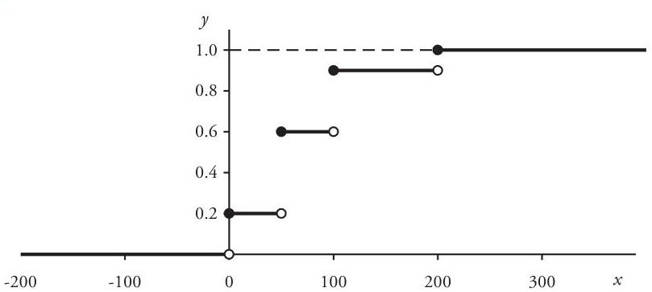

## Page 51
In addition, the third central moment is

$$
\begin{aligned}
& E\left[(X-E[X])^{3}\right] \\
& \quad=\frac{2}{10}(0-70)^{3}+\frac{4}{10}(50-70)^{3}+\frac{3}{10}(100-70)^{3}+\frac{1}{10}(200-70)^{3}=156,000
\end{aligned}
$$

so that $S k[X]=(156,000) /(3,100)^{3 / 2}=0.9038$.
Example 2.2. A continuous claim-size variable $X$ has the exponential cumulative distribution function

$$
F(x)= \begin{cases}0 & \text { if }-\infty<x<0 \\ 1-e^{-x / 250} & \text { if } 0 \leq x<\infty\end{cases}
$$

a graph of which is shown in Figure 2.2. A probability density function for $X$ is therefore given by

$$
f(x)= \begin{cases}0 & \text { if }-\infty<x \leq 0 \\ (1 / 250) e^{-x / 250} & \text { if } 0<x<\infty\end{cases}
$$

Consequently,

$$
\begin{aligned}
E[X] & =\frac{1}{250} \int_{0}^{\infty} x e^{-x / 250} d x=250 \\
\operatorname{Var}[X] & =\frac{1}{250} \int_{0}^{\infty}(x-250)^{2} e^{-x / 250} d x=62,500
\end{aligned}
$$

and the skewness is given by

$$
S k[X]=\frac{(1 / 250) \int_{0}^{\infty}(x-250)^{3} e^{-x / 250} d x}{(62,500)^{3 / 2}}=\frac{31,250,000}{15,625,000}=2.0000
$$

Figure 2.2. Continuous Cumulative Distribution Function [Example 2.2]
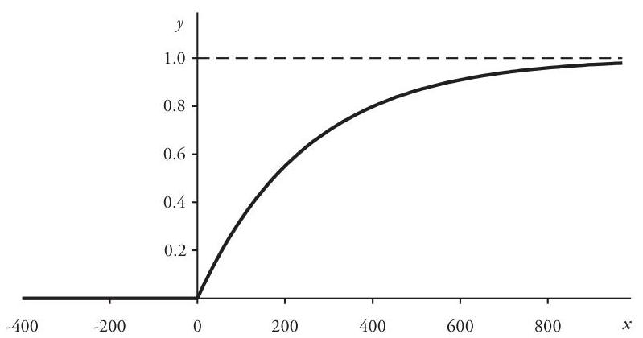

## Page 52
Figure 2.3. Mixed Cumulative Distribution Function [Example 2.3]

Example 2.3. For claim-size random variable $Y$ the probability of a claim of size zero is $\operatorname{Pr}\{Y=0\}=0.20$. But for positive values $Y$ is distributed conditionally as variable $X$ in Example 2.2-that is,

$$
\operatorname{Pr}\{Y \leq y \mid Y>0\}=\frac{\operatorname{Pr}\{0<Y \leq y\}}{0.80}=1-e^{-y / 250}, \quad 0<y<\infty
$$

Therefore, the cumulative distribution function of $Y$ (see Figure 2.3) is given by

$$
F_{Y}(y)= \begin{cases}0 & \text { if }-\infty<y<0 \\ 1-0.80 e^{-y / 250} & \text { if } 0 \leq y<\infty\end{cases}
$$

Obviously, $Y$ has a mixed discrete/continuous distribution- $F_{Y}(y)$ is continuous for all $y \neq 0$, with a jump discontinuity at $y=0$.

The mean, variance, and skewness of $Y$ are, respectively,

$$
\begin{gathered}
E[Y]=(0.20)(0)+(0.80)(250)=200 \\
\operatorname{Var}[Y]=(0.20)(0-200)^{2}+(0.80)(62,500)=58,000 \\
S k[Y]=\frac{(0.20)(0-200)^{3}+(0.80)(31,250,000)}{(58,000)^{3 / 2}}=1.9043
\end{gathered}
$$

A comparison with Example 2.2 reveals the effect of transferring 20\% of the total probability to the value $y=0$-the mean, variance, and skewness of $Y$ are all smaller than those of $X$.

# 2.2. Limited Moments 

Actuaries seldom use continuous parametric size-of-loss distributions in their pure form, that is, without restrictions placed on the size of claims. The reason for this, of course, is that property/casualty insurance policies almost always specify some type
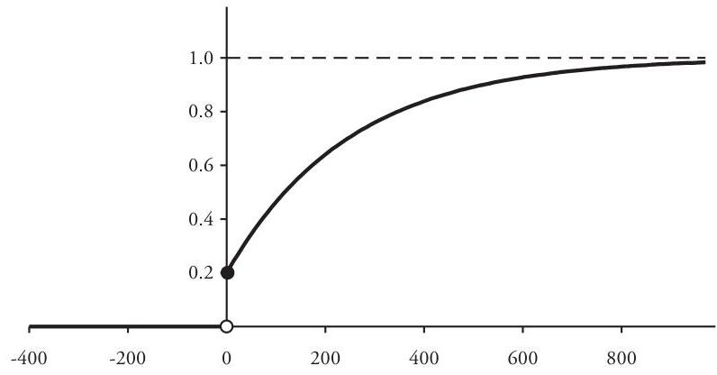

## Page 53
of limitation on the claim amount payable under the policy. Consequently, every unlimited probability distribution used to model insurance claim sizes must be modified appropriately to reflect whatever policy conditions are in place.

The most widely encountered condition of this type is a policy occurrence limit that caps each claim amount at a specified maximum value. Assume that $X$ denotes an unlimited claim-size random variable, for which $\operatorname{Pr}\{X<0\}=0$, and that individual claim amounts are then restricted by a policy limit $l$. The effective claim size from the viewpoint of the insurer is the limited random variable $Y$, defined by

$$
Y=\min \{X, l\}= \begin{cases}X & \text { if } 0 \leq X<l \\ l & \text { if } l \leq X<\infty\end{cases}
$$

The insurer pays in full those claims less than $l$ and for all other claims pays the maximum amount $l$. Because the policy limit serves to conceal the actual size of each claim larger than $l$, variable $X$ modified in this way is said to be censored at $l$. In terms of the function $F_{X}$, the cumulative distribution function of variable $Y$ is given by the formula

$$
F_{Y}(y)=\operatorname{Pr}\{Y \leq y\}= \begin{cases}F_{X}(y) & \text { if }-\infty<y<l \\ 1 & \text { if } l \leq y<\infty\end{cases}
$$

Accordingly, the distribution of $Y$ can have a discrete lump of nonzero probability at $y=l$, of size

$$
\operatorname{Pr}\{Y=l\}=F_{Y}(l)-F_{Y}(l-)=1-F_{X}(l-)
$$

In particular, if $F_{X}$ is everywhere continuous with $0<F_{X}(l)<1$, then variable $Y$ has a mixed discrete/continuous distribution- $F_{Y}$ is continuous for all $y \neq l$, and it has a single jump discontinuity at $y=l$, with $\operatorname{Pr}\{Y=l\}=1-F_{X}(l)>0$.

With respect to $X$, the mean of the censored variable $Y$ is referred to as the limited expected value or limited severity of $\boldsymbol{X}$. It is denoted by $E[X ; l]$ and represented by the Riemann-Stieltjes integral formula (refer to Section 1.3):

$$
E[X ; l]=E[Y]=\int_{0}^{\infty} y d F_{Y}(y)=\int_{0}^{l} x d F_{X}(x)+l \cdot\left(1-F_{X}(l)\right)
$$

If $X$ is continuous, then there exists a function $f_{X}$ such that $d F_{X}(x)=f_{X}(x) d x$, and

$$
E[X ; l]=\int_{0}^{l} x f_{X}(x) d x+l \cdot\left(1-F_{X}(l)\right)
$$

In the case that variable $X$ has a discrete set of values $\left\{x_{i}\right\},(2.2)$ has the form

$$
E[X ; l]=\sum_{x_{i} \leq l} x_{i} f_{X}\left(x_{i}\right)+l \cdot \sum_{x_{i}>l} f_{X}\left(x_{i}\right)
$$

## Page 54
Equation (2.2) is easily generalized to a formula for limited moments of all orders $m$, where $m=1,2,3, \ldots$ :

$$
E\left[X^{m} ; l\right]=\int_{0}^{l} x^{m} d F_{X}(x)+l^{m} \cdot\left(1-F_{X}(l)\right)
$$

In the discrete case for which the values $\left\langle x_{i}\right\rangle$ constitute $n$ observations for a random sample $\left\langle X_{1}, X_{2}, \ldots, X_{n}\right\rangle$ from a population claim-size random variable $X$, we denote by $\hat{X}$ the variable with the sample distribution $f_{x}\left(x_{i}\right)=1 / n,(1 \leq i \leq n)$. The sample limited expected value $E_{n}[\hat{X} ; l]$ is a special case of (2.4):

$$
E_{n}[\hat{X} ; l]=\frac{1}{n} \sum_{i=1}^{n} \min \left\{x_{i}, l\right\}=\frac{1}{n} \sum_{x_{i} \leq l} x_{i}+\frac{1}{n} \sum_{x_{i}>l} l
$$

Sometimes sample observations are grouped by size into a finite number $m$ of non-overlapping intervals of the form $\left(c_{k-1}, c_{k}\right]$, where $k=1,2, \ldots, m$ and for which it is possible that $c_{m}=\infty$. Often only the claim count-and occasionally the total claim amount-in each interval is known. Whenever this is the case, probabilities for the discrete sample distribution can only be calculated accurately at the finite interval endpoints $\left\{c_{k}\right\}$. This is also true for the sample limited severity $E_{n}[\hat{X} ; l]$, which is exactly computable only when $l=c_{j}, j=1,2, \ldots, m$. At such a point, formula (2.6) becomes

$$
E_{n}\left[\hat{X} ; c_{j}\right]=\frac{1}{n} \sum_{k=1}^{i} n_{k} a_{k}+\frac{c_{j}}{n} \sum_{k=j+1}^{m} n_{k}
$$

where $n_{k}$ and $a_{k}$ are, respectively, the number of claims and the average claim size in the $k^{\text {th }}$ group interval $\left(c_{k-1}, c_{k}\right]$ and where $n=\sum_{k=1}^{m} n_{k}$. If the total claim amount $\xi_{k}$ in $\left(c_{k-1}, c_{k}\right]$ is known, then it is evident that $\xi_{k}=n_{k} a_{k}$, or $a_{k}=\xi_{k} / n_{k}$. Otherwise, for group intervals of finite width, $a_{k}$ can be approximated by the interval midpoint: $a_{k} \approx \frac{1}{2}\left(c_{k-1}+c_{k}\right)$. This approximation, of course, is consistent with the assumption that claim sizes are distributed uniformly throughout each group interval $\left(c_{k-1}, c_{k}\right]-$ refer to Problem 2.5.

It is useful to consider the limited expected value $E[X ; x]$ as a function of the variable limit $x$, defined on the semi-infinite interval $0 \leq x<\infty$ by

$$
E[X ; x]=\int_{0}^{x} u d F(u)+x \cdot(1-F(x))
$$

$E[X ; x]$ exists as a finite number for all $0 \leq x<\infty$, even when $E[X]$ does not exist. Proof of this fact is requested in Problem 2.7.

The next examples illustrate the limited expected function $E[X ; x]$ in three important cases-the first with a continuous variable $X$, the second with a discrete variable, and the third with a grouped claim sample.

Example 2.4. Assume that the continuous random variable $X$ is distributed as in Example 2.2. Then the first three moments of $X$ limited at 400 are

## Page 55
Figure 2.4. Limited Severity Function $y=E[X ; x]$ [Example 2.4]

$$
\begin{aligned}
& E[X ; 400]=\frac{1}{250} \int_{0}^{400} x e^{-x / 250} d x+400 e^{-1.6}=(250)\left(1-e^{-1.6}\right)=199.53 \\
& E\left[X^{2} ; 400\right]=\frac{1}{250} \int_{0}^{400} x^{2} e^{-x / 250} d x+(400)^{2} e^{-1.6}=(125,000)\left(1-2.6 e^{-1.6}\right)=59,384 \\
& E\left[X^{3} ; 400\right]=\frac{1}{250} \int_{0}^{400} x^{3} e^{-x / 250} d x+(400)^{3} e^{-1.6}=20,310,141
\end{aligned}
$$

Therefore, the mean and variance of the censored variable $Y=\min \{X, 400\}$ are $E[Y]=$ 199.53 and $\operatorname{Var}[Y]=59,384-(199.53)^{2}=19,572$. The skewness is

$$
S k[Y]=\frac{20,310,141-(3)(199.53)(59,384)+(2)(199.53)^{3}}{(19,572)^{3 / 2}}=0.2377
$$

Censoring reduces not only the mean but also the variance and skewness of a random variable. The limited severity function for variable $X$, a graph of which is shown in Figure 2.4, is $E[X ; x]=250\left(1-e^{-x / 250}\right)$.

Example 2.5. Consider the discrete claim-size variable $X$ of Example 2.1. The limited severity function for $X$ is the continuous, piecewise-linear function

$$
E[X ; x]= \begin{cases}0.8 x & \text { if } 0 \leq x<50 \\ 0.4 x+20 & \text { if } 50 \leq x<100 \\ 0.1 x+50 & \text { if } 100 \leq x<200 \\ 70 & \text { if } 200 \leq x<\infty\end{cases}
$$

Figure 2.5 displays a graph of $y=E[X ; x]$.
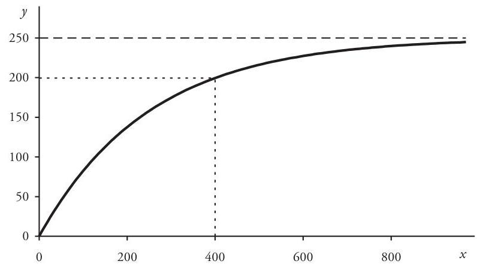

## Page 56
Figure 2.5. Limited Severity Function $y=E[X ; x]$ [Example 2.5]

| Size Group | \# Claims |
| :--: | :--: |
| $0-1,000$ | 42 |
| $1,001-1,500$ | 61 |
| $1,501-2,000$ | 47 |
| $2,001-2,500$ | 26 |
| $2,501-3,000$ | 14 |
| $3,001-3,500$ | 7 |
| $3,501-4,000$ | 2 |
| $4,001-4,500$ | 1 |
| $4,501-5,000$ | 0 |
| Total | 200 |

| $E_{200}[\hat{X} ; 2,000]$ | $\approx \frac{(42)(500)+(61)(1,250)+(47)(1,750)}{200}$ |
| :-- | :--: |
|  | $+\frac{(26+14+7+2+1)(2,000)}{200}=1,398$. |

The complete set of limited expected values at the group interval endpoints is displayed in Table 2.1, along with values of the sample cumulative distribution function $F_{200}$ at the same points. A graph of $y=E_{200}[\hat{X} ; x]$ for $x=c_{k}, 0 \leq k \leq 9$, is shown in Figure 2.6.

The limited severity functions of the previous examples exhibit some mathematical attributes that are shared by all such functions, notably those properties listed below.

[^0]
[^0]:    ${ }^{17}$ In the time-honored tradition of the textbook example, claim data used in the examples and problems throughout this monograph have been selected to illustrate clearly the concepts under study rather than obtained strictly from potentially messier real-life insurance data.
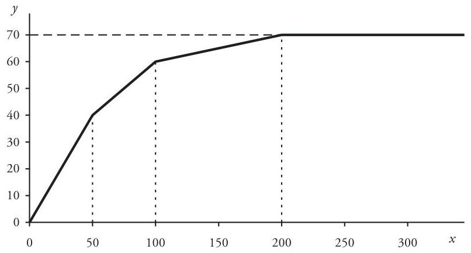

## Page 57
Table 2.1. Sample Limited Severities [Example 2.6]

| Size $x$ | $F_{200}(x)$ | $E_{200}[\hat{X} ; x]$ |
| :--: | :--: | :--: |
| 0 | 0.0000 | 0 |
| 1,000 | 0.2100 | 895 |
| 1,500 | 0.5150 | 1,214 |
| 2,000 | 0.7500 | 1,398 |
| 2,500 | 0.8800 | 1,490 |
| 3,000 | 0.9500 | 1,533 |
| 3,500 | 0.9850 | 1,549 |
| 4,000 | 0.9950 | 1,554 |
| 4,500 | 1.0000 | 1,555 |
| 5,000 | 1.0000 | 1,555 |

# Properties of $E[X ; x]$ 

Assume that $X$ is a claim-size random variable, for which $\operatorname{Pr}\{X<0\}=0$. Then
(a) $E\left[X ; x_{1}\right] \leq E\left[X ; x_{2}\right]$ for all $0 \leq x_{1}<x_{2}<\infty$.
(b) $E[X ; x]$ is continuous for all $0 \leq x<\infty$.
(c) If $E[X]$ exists, then $E[X ; x] \leq E[X]$ for all $0 \leq x<\infty$.
(d) If $E[X]$ exists, then $\lim _{x \rightarrow \infty} E[X ; x]=E[X]$.
(e) $E[X ; x]$ is a concave function on $0 \leq x<\infty$.
(f) $E[a X+b ; x]=a E[X ;(x-b) / a]+b$ for constants $a>0$ and $b$.

Figure 2.6. Sample Limited Severity Function [Example 2.6]
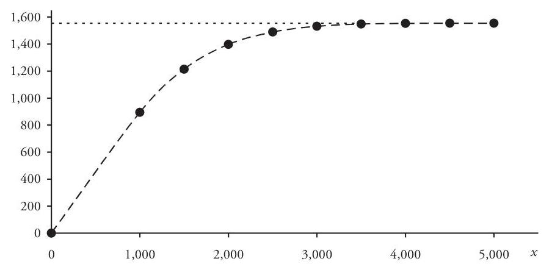

## Page 58
# Proof: 

(a) Assume that numbers $\left(x_{1}, x_{2}\right)$ satisfy the inequality $0 \leq x_{1}<x_{2}<\infty$. Then for random variables $Y_{1}=\min \left\{X, x_{1}\right\}$ and $Y_{2}=\min \left\{X, x_{2}\right\}$ we have $Y_{1} \leq Y_{2}$, so that $E\left[X ; x_{1}\right]=$ $E\left[Y_{1}\right] \leq E\left[Y_{2}\right]=E\left[X ; x_{2}\right]$.
(b) Again, assume that $0 \leq x_{1}<x_{2}<\infty$. Then

$$
0 \leq \min \left\{X, x_{2}\right\}-\min \left\{X, x_{1}\right\} \leq x_{2}-x_{1}
$$

which implies that $0 \leq E\left[X ; x_{2}\right]-E\left[X ; x_{1}\right] \leq x_{2}-x_{1}$. This means that $E[X ; x]$ is uniformly continuous-and hence continuous-on $0 \leq x<\infty$.
(c) Since $Y=\min \{X, x\} \leq X$, we have $E[X ; x]=E[Y] \leq E[X]$.
(d) Existence of $E[X]$ implies that

$$
\lim _{x \rightarrow \infty} \int_{0}^{x} u d F_{X}(u)=E[X] \quad \text { and } \quad \lim _{x \rightarrow \infty} \int_{x}^{\infty} u d F_{X}(u)=0
$$

But

$$
0 \leq x(1-F(x))=\int_{x}^{\infty} x d F_{X}(u) \leq \int_{x}^{\infty} u d F_{X}(u) \rightarrow 0 \quad \text { as } x \rightarrow \infty
$$

so that

$$
\lim _{x \rightarrow \infty} E[X ; x]=\lim _{x \rightarrow \infty} \int_{0}^{x} u d F_{X}(u)+\lim _{x \rightarrow \infty} x(1-F(x))=E[X]+0
$$

(e) Let random variable $Y(x)=\min \{X, x\}$ be a function of $x$ on $0 \leq x<\infty$.

Then, for $0 \leq x_{1}<x_{2}<\infty$ and $0 \leq t \leq 1$,

$$
t Y\left(x_{1}\right)+(1-t) Y\left(x_{2}\right) \leq Y\left(t x_{1}+(1-t) x_{2}\right)
$$

This implies that

$$
t E\left[X ; x_{1}\right]+(1-t) E\left[X ; x_{2}\right] \leq E\left[X ; t x_{1}+(1-t) x_{2}\right] \text { for } 0 \leq t \leq 1
$$

which means that $E[X ; x]$ is a concave function.
(f) Let $Y=\min \{a X+b, x\}$. Then

$$
Y=\min \{a X, x-b\}+b=a \min \{X,(x-b) / a\}+b
$$

Therefore, $E[a X+b ; x]=E[Y]=a E[X ;(x-b) / a]+b$, as required.

### 2.3. Gamma Distributions

Gamma distributions comprise a versatile family of probability distributions, with many applications in statistics and probability. Property/casualty actuaries have found them useful in constructing a variety of insurance models-parameter uncertainty for claim-count distributions, approximation of aggregate-loss distributions, and occasionally as claim-size distributions.

The gamma distribution with positive parameters $(\alpha, \beta)$ is defined by the probability density function

## Page 59
$$
f(x)= \begin{cases}0 & \text { if }-\infty<x \leq 0 \\ \frac{1}{\beta^{\alpha} \Gamma(\alpha)} x^{\alpha-1} e^{-x / \beta} & \text { if } 0<x<\infty \quad(\alpha>0, \beta>0)\end{cases}
$$

Except for a discontinuity at $x=0$ when $0<\alpha<1, f$ is an everywhere-continuous function of $x$. Thus, gamma distributions are of the continuous type.

The symbol $\Gamma$ in (2.15) denotes the gamma function, ${ }^{18}$ defined for positive $x$ by the convergent improper integral

$$
\Gamma(x)=\int_{0}^{\infty} u^{x-1} e^{-u} d u, \quad 0<x<\infty
$$

The integral formula of Problem 2.10(a) implies that $\int_{0}^{\infty} x^{\alpha-1} e^{-x / \beta} d x=\beta^{\alpha} \Gamma(\alpha)$. So $\int_{-\infty}^{\infty} f(x) d x=\int_{0}^{\infty} f(x) d x=1$, thus confirming that $f$ is indeed a density function.

The gamma function is continuous on its domain and has derivatives of all orders there. ${ }^{19}$ The following properties of the function are the most useful for our purposes. Verifications are requested in Problem 2.11.

# Properties of $\Gamma(x)$ 

(a) $\Gamma(1)=1$.
(b) $\Gamma(x+1)=x \Gamma(x), \quad 0<x<\infty$.
(c) $\Gamma(n+1)=n!, \quad n=1,2,3, \ldots$
(d) $\Gamma(x+n) / \Gamma(x)=\prod_{i=0}^{n-1}(x+i), \quad 0<x<\infty, \quad n=1,2,3, \ldots$

Property (2.19) shows that $\Gamma(x)$ is an extension, to all positive real numbers, of the factorial function $n!=1 \cdot 2 \cdot \ldots \cdot(n-1) \cdot n$ (where $n$ is a positive integer), providing continuous interpolation between successive integer factorials.

The incomplete gamma function $\Gamma(x, \alpha)$ is handy in representing gamma-related distribution functions. It is defined for positive real $x$ by the integral

$$
\Gamma(x, \alpha)=\int_{0}^{x} u^{\alpha-1} e^{-u} d u \quad(\alpha>0)
$$

This integral is an ordinary proper integral whenever $\alpha \geq 1$ and is a convergent improper integral when $0<\alpha<1$. It is obvious that $\lim _{x \rightarrow \infty} \Gamma(x, \alpha)=\Gamma(\alpha)$.

[^0]
[^0]:    ${ }^{18}$ The gamma function was introduced in 1730 by Swiss mathematician Leonhard Euler (1707-1783) as a generalization of the factorial function $x$ ! to nonintegral values of $x$. Euler proposed the integral formula $\Gamma(x)=\int_{0}^{1}[\log (1 / u)]^{-1} d u$, which is equivalent to (2.16). The traditional $\Gamma$ notation is due to French mathematician Adrien-Marie Legendre $(1752-1833)$.
    ${ }^{19}$ Proofs of continuity and differentiability can be found in a standard advanced calculus text.

## Page 60
Suppose now that random variable $X$ has a gamma distribution with density function $f$ as defined in (2.15). The cumulative distribution function for $X$ can be conveniently expressed in terms of an incomplete gamma function. To observe this, start with the integral $I(x)=\int_{0}^{x} f(u) d u(0<x<\infty)$ and apply the change-of-variable substitution $u=\beta v$ :

$$
I(x)=\frac{1}{\beta^{\alpha} \Gamma(\alpha)} \int_{0}^{x} u^{\alpha-1} e^{-u / \beta} d u=\frac{1}{\Gamma(\alpha)} \int_{0}^{x / \beta} v^{\alpha-1} e^{-v} d v=\frac{\Gamma(x / \beta, \alpha)}{\Gamma(\alpha)}
$$

The gamma $(\alpha, \beta)$ cumulative distribution function is therefore

$$
F(x)= \begin{cases}0 & \text { if }-\infty<x<0 \\ \frac{\Gamma(x / \beta, \alpha)}{\Gamma(\alpha)} & \text { if } 0 \leq x<\infty\end{cases}
$$

To derive now general formulas for the $m^{\text {th }}$ moments of $X$, both unlimited and limited, begin this time with the integral $I_{m}(x)=\int_{0}^{x} u^{m} f(u) d u$ and apply the same substitution $u=\beta v$ as before. For $m=1,2,3, \ldots$

$$
I_{m}(x)=\frac{1}{\beta^{\alpha} \Gamma(\alpha)} \int_{0}^{x} u^{m} u^{\alpha-1} e^{-u / \beta} d u=\frac{\beta^{m}}{\Gamma(\alpha)} \int_{0}^{x / \beta} v^{\alpha+m-1} e^{-v} d v=\frac{\beta^{m}}{\Gamma(\alpha)} \Gamma(x / \beta, \alpha+m)
$$

Hence,

$$
\begin{aligned}
E\left[X^{m}\right] & =\lim _{x \rightarrow \infty} I_{m}(x)=\frac{\beta^{m}}{\Gamma(\alpha)} \Gamma(\alpha+m)=\alpha(\alpha+1) \cdots(\alpha+m-1) \beta^{m} \\
E\left[X^{m} ; x\right] & =I_{m}(x)+x^{m}(1-F(x)) \\
& =E\left[X^{m}\right] \cdot \frac{\Gamma(x / \beta, \alpha+m)}{\Gamma(\alpha+m)}+x^{m}\left(1-\frac{\Gamma(x / \beta, \alpha)}{\Gamma(\alpha)}\right)
\end{aligned}
$$

From (2.23) it follows that

$$
E[X]=\alpha \beta, \quad \operatorname{Var}[X]=\alpha \beta^{2}, \quad S k[X]=\frac{2}{\sqrt{\alpha}}
$$

Random variables with the gamma $(\alpha, \beta)$ distribution also have an important reproductive property: the sum of independent gamma variables having the same $\beta$ parameter is also gamma-distributed. This result is readily obtained from an argument based on the moment-generating function for a gamma $(\alpha, \beta)$ random variable $X$ :

$$
\begin{aligned}
M_{X}(t) & =E\left[e^{t X}\right]=\frac{1}{\beta^{\alpha} \Gamma(\alpha)} \int_{0}^{\infty} x^{\alpha-1} e^{-x(1 / \beta-t)} d x \\
& =\frac{1}{\beta^{\alpha} \Gamma(\alpha)} \cdot \Gamma(\alpha)(1 / \beta-t)^{-\alpha} \\
& =(1-\beta t)^{-\alpha}, \quad-\infty<t<1 / \beta
\end{aligned}
$$

## Page 61
where the integral formula of Problem 2.10(a) was used at step (2). The restriction $-\infty<t<1 / \beta$ guarantees that, as a function of $t$, the improper integral in the first step is convergent.

Assume now that $\left\{X_{t}\right\}$ is a finite collection of independent gamma-distributed random variables, with identical $\beta$ parameters but possibly different $\alpha$ parameters: $\left\{\left(\alpha_{t}, \beta\right)\right\}$. Independence among the $X_{t}$ implies that the generating function for the sum $Y=\Sigma_{t} X_{t}$ is the product of the component generating functions. Hence,

$$
M_{Y}(t)=\prod_{i} M_{X_{t}}(t)=\prod_{i}(1-\beta t)^{-\alpha_{t}}=(1-\beta t)^{-\Sigma_{t} \alpha_{t}}, \quad-\infty<t<1 / \beta
$$

This is the generating function of a gamma random variable. The uniqueness of the generating function thus implies that $Y$ has a gamma $\left(\Sigma_{t} \alpha_{t}, \beta\right)$ distribution.

There are two important special cases of the gamma distribution worth noting.
(a) The first instance, for which the exponent parameter $\alpha$ is fixed at $\alpha=1$, is the familiar exponential distribution, ${ }^{20}$ with cumulative distribution function

$$
F(x)= \begin{cases}0 & \text { if }-\infty<x<0 \\ 1-e^{-x / \beta} & \text { if } 0 \leq x<\infty \quad(\beta>0)\end{cases}
$$

and probability density function

$$
f(x)= \begin{cases}0 & \text { if }-\infty<x \leq 0 \\ (1 / \beta) e^{-x / \beta} & \text { if } 0<x<\infty\end{cases}
$$

The mean, variance, and skewness for a random variable $X$ with an exponential distribution are likewise special cases of the general formulas (2.25):

$$
E[X]=\beta, \quad \operatorname{Var}[X]=\beta^{2}, \quad S k[X]=2
$$

Furthermore,

$$
E[X ; x]=\beta\left(1-e^{-x / \beta}\right)=E[X]\left(1-e^{-x / \beta}\right)
$$

We have already encountered an example of this distribution type-the claim-size random variable of Example 2.2 is exponentially distributed with $\beta=250$. Exponential distributions have a number of actuarial applications, but they have limited practical value as size-of-loss distributions. With only a single parameter available, the exponential family is usually not flexible enough to provide a good fit to an empirical set of sample claim data. However, it is possible to adopt the Insurance Services Office (ISO) approach

[^0]
[^0]:    ${ }^{20}$ The exponential distribution is sometimes known as the Laplace distribution, in honor of French mathematician and physicist Pierre-Simon Laplace (1749-1847). Laplace made important contributions to analysis and celestial mechanics, as well as to probability. His 1812 treatise, Théorie Analytique des Probabilités, provided an early mathematical basis for the subject. In it he wrote "the theory of probabilities is at bottom nothing but common sense reduced to calculus. . . ."

## Page 62
and work with a mixture of exponential distributions. For example, the mixture of two such distributions has a three-parameter distribution function of the form

$$
F(x)= \begin{cases}0 & \text { if }-\infty<x<0 \\ 1-\omega e^{-x / \beta_{1}}-(1-\omega) e^{-x / \beta_{2}} & \text { if } 0 \leq x<\infty \quad\left(\beta_{1}>0, \beta_{2}>0,0<\omega<1\right)\end{cases}
$$

Bureau actuaries at ISO use mixtures of up to twelve exponential distributions, involving as many as 23 parameters, to model claim size in the current ISO increased limits factor methodology. ${ }^{21}$
(b) Another important special case of the gamma distribution occurs when $\alpha=\frac{1}{2} n$ ( $n$ a positive integer) and $\beta=2$. This distribution is known as the chi-square distribution with $\boldsymbol{n}$ degrees of freedom and is denoted by $\chi^{2}(n)$. The probability density function is, accordingly,

$$
f(x)= \begin{cases}0 & \text { if }-\infty<x \leq 0 \\ \frac{1}{2^{n / 2} \Gamma\left(\frac{1}{2} n\right)} x^{n / 2-1} e^{-x / 2} & \text { if } 0<x<\infty\end{cases}
$$

A random variable $X$ with the $\chi^{2}(n)$ distribution therefore has mean, variance, and skewness

$$
E[X]=n, \quad \operatorname{Var}[X]=2 n, \quad S k[X]=2 \sqrt{\frac{2}{n}}
$$

The chi-square arises naturally as the distribution of the sum of squares of independent standard normal random variables. It figures prominently in the classic goodness-of-fit test-the so-called chi-square test, first introduced by British statistician Karl Pearson in 1900. In such a test the calculated test statistic is distributed under the null hypothesis according to a chi-square model.

Because the gamma function and the associated distribution functions are defined by integrals with integrands having no elementary antiderivatives, evaluation of these functions necessarily involves some type of approximation. Some standard approximations are discussed in Appendix A.1.

Example 2.7. Return now to the grouped sample of 200 claims of Example 2.6. We shall attempt to fit a gamma distribution model to these data.

Begin by assuming that these data represent a random sample of claims drawn from a population having a gamma distribution with unknown parameters $(\alpha, \beta)$. To use the method-of-moments technique for estimating $(\alpha, \beta)$, we compute the first and second sample moments $M_{1}$ and $M_{2}$, based on the midpoint approximation to the average

[^0]
[^0]:    ${ }^{21}$ For a description of this approach, refer to the "Explanatory Memorandum" section of a current ISO Actuarial Service Circular for increased limits data and analysis (Jersey City, NJ: Insurance Services Office, Inc.); refer also to Keatinge [11]. For a discussion of mixed probability distributions like that in formula (2.31) as probabilityweighted sums of conditional distributions, refer to Section 3.3.

## Page 63
Figure 2.7. Histogram with Gamma Density Function [Example 2.7]
claim size in each group: $M_{1}=1,555$ and $M_{2}=3,036,875$ (refer to Problem 2.6). Substituting these numbers into formulas (2.25) for the gamma mean and variance and then solving for $\alpha$ and $\beta$ yields the joint method-of-moments estimators:

$$
\begin{aligned}
& \hat{\alpha}=\frac{M_{1}^{2}}{M_{2}-M_{1}^{2}}=\frac{(1,555)^{2}}{3,036,875-(1,555)^{2}}=3.907288 \\
& \hat{\beta}=\frac{M_{2}-M_{1}^{2}}{M_{1}}=\frac{618,850}{1,555}=397.931
\end{aligned}
$$

The skewness of the resulting distribution is $2 / \sqrt{3.907288}=1.0118$.
The implied gamma probability density function is graphed in Figure 2.7 with a histogram of the sample distribution. Table 2.2 displays the limited expected values

Table 2.2. Tail Probabilities and Limited Severities [Example 2.7]

|  | $\operatorname{Pr}\langle X>x\rangle$ |  | $E[X ; x]$ |  |
| :-- | :--: | :--: | :--: | :--: |
| Size $x$ | Sample | Gamma | Sample | Gamma |
| 1,000 | 0.7900 | 0.7382 | 895 | 924 |
| 1,500 | 0.4850 | 0.4604 | 1,214 | 1,223 |
| 2,000 | 0.2500 | 0.2465 | 1,398 | 1,396 |
| 2,500 | 0.1200 | 0.1186 | 1,490 | 1,484 |
| 3,000 | 0.0500 | 0.0528 | 1,533 | 1,525 |
| 3,500 | 0.0150 | 0.0222 | 1,549 | 1,543 |
| 4,000 | 0.0050 | 0.0089 | 1,554 | 1,550 |
| 4,500 | 0.0000 | 0.0035 | 1,555 | 1,553 |
| 5,000 | 0.0000 | 0.0013 | 1,555 | 1,554 |
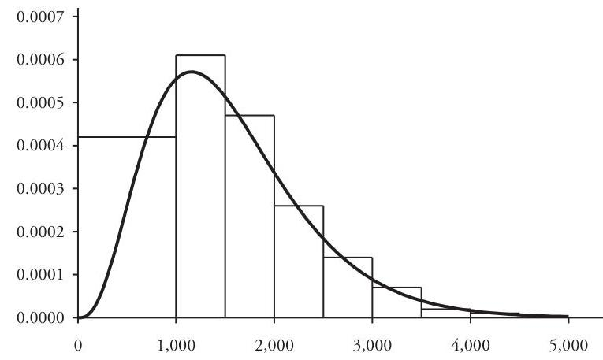

## Page 64
and tail probabilities at the group endpoints and compares the sample statistics to the corresponding gamma distribution values.

We test the goodness of fit of this gamma distribution by using the Pearson chisquare test. To implement this test, define six cells by taking the first five groups in the table of Example 2.6 and, to avoid low-frequency cells, combine the remaining four groups into a single cell. The resulting seven cell boundaries are $\left\{c_{k}\right\}=\{0,1000,1500$, $2000,2500,3000, \infty\}$, where $k=0,1,2, \ldots, 6$. The observed $k^{c k}$ cell frequency is just the tabulated sample frequency $n_{k}$ for the $k^{c k}$ cell $\left(c_{k-1}, c_{k}\right]$. The expected frequency in the $k^{c k}$ cell is implied by the selected gamma distribution: $\phi_{k}(\hat{\alpha}, \hat{\beta})=(200)\left(F_{\hat{\alpha}+\hat{\beta}}\right)\left(c_{k}\right)-$ $F_{\hat{\alpha}+\hat{\beta}}\left(c_{k-1}\right)$ ), where $F_{\hat{\alpha}+\hat{\beta}}\left(c_{k}\right)=1$. The chi-square statistic then has the value

$$
\begin{aligned}
\chi^{2}= & \sum_{k=1}^{6} \frac{\left(n_{k}-\phi_{k}(\hat{\alpha}, \hat{\beta})\right)^{2}}{\phi_{k}(\hat{\alpha}, \hat{\beta})} \\
= & \frac{(42-52.37)^{2}}{52.37}+\frac{(61-55.56)^{2}}{55.56}+\frac{(47-42.77)^{2}}{42.77} \\
& +\frac{(26-25.58)^{2}}{25.58}+\frac{(14-13.16)^{2}}{13.16}+\frac{(10-10.57)^{2}}{10.57} \\
= & 3.096
\end{aligned}
$$

When testing the fit of a distribution based on parameters estimated from a sample, $\chi^{2}$ has $q-r-1$ degrees of freedom, where $q=\#$ cells and $r=\#$ estimated parameters. In this example $d . f .=6-2-1=3$, and so the rejection limit at the $5 \%$ significance level is $\chi_{0.95}^{2}(3)=7.815$. Because $\chi^{2}<7.815$, we do not reject the null hypothesis that the fitted gamma distribution provides a reasonable description of the population claim size.

# 2.4. Lognormal Distributions 

Applications of lognormal distributions are commonly found in a variety of fieldsphysics, reliability theory, biology, economics, to name a few. Moreover, they are widely used in property/casualty insurance to model claim size. Like their gamma-distributed counterparts, lognormal random variables take on only nonnegative values, and the distribution is positively skewed. The shape of the lognormal probability density curve $y=f(x)$ is typical of many continuous claim-size distributions-the curve rises to a maximum value in the short tail of the distribution (that is, the mode occurs at a relatively small positive value of $x$ ) and then declines asymptotically to $y=0$ as $x \rightarrow \infty$.

Random variable $X$ has a lognormal distribution with parameters $(\mu, \sigma)$ if, and only if, $\log X$ is normally distributed with mean $\mu$ and variance $\sigma^{2}$. Therefore, the lognormal variable $X$ can be expressed as $X=e^{\sigma Z+\mu}$, where $Z$ is the standard normal random variable. As a consequence, the lognormal cumulative distribution function is

$$
F_{X}(x)= \begin{cases}0 & \text { if }-\infty<x \leq 0 \\ \Phi\left(\frac{\log x-\mu}{\sigma}\right) & \text { if } 0<x<\infty \quad(-\infty<\mu<\infty, \sigma>0)\end{cases}
$$

## Page 65
Again, $\log x$ denotes the natural (base $e$ ) logarithm function of $x$, and $\Phi$ denotes the standard normal distribution function:

$$
\Phi(z)=\frac{1}{\sqrt{2 \pi}} \int_{-\infty}^{z} e^{-u^{2} / 2} d u, \quad-\infty<z<\infty
$$

The continuous lognormal variable $X$ has probability density function

$$
f_{X}(x)= \begin{cases}0 & \text { if }-\infty<x \leq 0 \\ \frac{1}{\sigma \sqrt{2 \pi} x} \exp \left(-\frac{1}{2}(\log x-\mu)^{2} / \sigma^{2}\right) & \text { if } 0<x<\infty\end{cases}
$$

Keep in mind that parameters $(\mu, \sigma)$ represent the mean and standard deviation not of $X$, but that of the normally-distributed variable $\log X$. Although the lognormal variable $X$ has finite moments of all orders, it turns out that $E\left[e^{t X}\right]$ is infinite for all $t>0$, so the moment-generating function $M_{X}(t)$ does not exist. Nevertheless, the $m^{\text {th }}$ moments of $X$ are obtainable from the generating function of the standard normal variable $Z$, that is, from $M_{Z}(t)=\exp \left(\frac{1}{2} t^{2}\right)$. In fact, for $m=1,2,3, \ldots$

$$
E\left[X^{m}\right]=E\left[\left(e^{\sigma Z+\mu}\right)^{m}\right]=e^{m \mu} M_{Z}(m \sigma)=\exp \left(m \mu+\frac{1}{2} m^{2} \sigma^{2}\right)
$$

The mean, variance, and skewness follow directly:

$$
\begin{gathered}
E[X]=e^{\mu+\sigma^{2} / 2} \\
\operatorname{Var}[X]=\left(e^{\sigma^{2}}-1\right) e^{2 \mu+\sigma^{2}} \\
S k[X]=\left(e^{\sigma^{2}}+2\right) \sqrt{e^{\sigma^{2}}-1}
\end{gathered}
$$

To derive a formula for the limited $m^{\text {th }}$ moments, begin by evaluating the integral $I_{m}(x)=\int_{0}^{x} t^{m} f(t) d t$. The change-of-variable substitution $v=(\log t-\mu) / \sigma$ at step (2) does the trick:

$$
\begin{aligned}
I_{m}(x) & =\frac{1}{\sigma \sqrt{2 \pi}} \int_{0}^{x} t^{m-1} \exp \left(-\frac{1}{2}(\log t-\mu)^{2} / \sigma^{2}\right) d t \\
& \stackrel{(2)}{=} \frac{1}{\sqrt{2 \pi}} \int_{-\infty}^{(\log x-\mu) / \sigma} \exp (m \sigma v+m \mu) \exp \left(-\frac{1}{2} v^{2}\right) d v \\
& =\frac{\exp \left(m \mu+\frac{1}{2} m^{2} \sigma^{2}\right)}{\sqrt{2 \pi}} \int_{-\infty}^{(\log x-\mu) / \sigma} \exp \left(-\frac{1}{2}(v-m \sigma)^{2}\right) d v \\
& =\exp \left(m \mu+\frac{1}{2} m^{2} \sigma^{2}\right) \cdot \Phi\left(\frac{\log x-\mu-m \sigma^{2}}{\sigma}\right)
\end{aligned}
$$

## Page 66
Consequently,

$$
\begin{aligned}
E\left[X^{m} ; x\right] & =I_{m}(x)+x^{m}(1-F(x)) \\
& =E\left[X^{m}\right] \cdot \Phi\left(\frac{\log x-\mu-m \sigma^{2}}{\sigma}\right)+x^{m} \Phi\left(\frac{-\log x+\mu}{\sigma}\right)
\end{aligned}
$$

As in the case of gamma-related distributions, evaluation of the normal and lognormal functions requires some sort of approximation. Microsoft Excel users find the worksheet functions LOGNORM.DIST and LOGNORM.INV useful—refer to Appendix A.1.

Example 2.8. Returning again to the grouped claim-size data of Example 2.6, we now attempt to fit a lognormal distribution model. This time, however, we shall use the minimum chi-square technique to estimate the distribution parameters-that is, we set the lognormal parameters $\mu$ and $\sigma$ equal to the joint values for which the chi-square statistic $\chi^{2}(\mu, \sigma)$, as a function of the variable parameters $\mu$ and $\sigma$, achieves a minimum value.

Set up six cells as in Example 2.7, defined by the seven cell boundaries: $\left\{c_{k}\right\}=$ $\{0,1000,1500,2000,2500,3000, \infty\}$, where $k=0,1,2, \ldots, 6$. As usual, the observed cell frequency is just the tabulated sample frequency $n_{k}$ for the cell $\left(c_{k-1}, c_{k}\right\}$. Expected frequencies $\phi_{k}(\mu, \sigma)$ are those derived from the lognormal distribution: $\phi_{k}(\mu, \sigma)=$ (200) $\left(F_{\mu \cdot \sigma}\left(c_{k}\right)-F_{\mu \cdot \sigma}\left(c_{k-1}\right)\right)$, in which $F_{\mu \cdot \sigma}(x)$ is the lognormal cumulative distribution function (note that $F_{\mu \cdot \sigma}\left(c_{k}\right)=1$ ). The chi-square statistic then, as a function of $\mu$ and $\sigma$, is

$$
\begin{aligned}
\chi^{2}(\mu, \sigma)= & \sum_{k=1}^{6} \frac{\left(n_{k}-\phi_{k}(\mu, \sigma)\right)^{2}}{\phi_{k}(\mu, \sigma)}- \\
= & \frac{\left(42-\phi_{1}(\mu, \sigma)\right)^{2}}{\phi_{1}(\mu, \sigma)}+\frac{\left(61-\phi_{2}(\mu, \sigma)\right)^{2}}{\phi_{2}(\mu, \sigma)}+\frac{\left(47-\phi_{3}(\mu, \sigma)\right)^{2}}{\phi_{3}(\mu, \sigma)} \\
& +\frac{\left(26-\phi_{4}(\mu, \sigma)\right)^{2}}{\phi_{4}(\mu, \sigma)}+\frac{\left(14-\phi_{5}(\mu, \sigma)\right)^{2}}{\phi_{5}(\mu, \sigma)}+\frac{\left(10-\phi_{6}(\mu, \sigma)\right)^{2}}{\phi_{6}(\mu, \sigma)}
\end{aligned}
$$

To find values that minimize $\chi^{2}(\mu, \sigma)$ by analytic methods would be a daunting task, but computer software applications that use iterative algorithms often handle such problems with ease. In this example the Microsoft Excel Solver returns $(\hat{\mu}, \hat{\sigma})=$ (7.274670, 0.442525 ), corresponding to a minimum value of $\chi^{2}(\hat{\mu}, \hat{\sigma})=1.828$. The minimum chi-square estimates have a built-in goodness-of-fit test-because $\chi^{2}(\hat{\mu}, \hat{\sigma})$ is less than the $5 \%$ rejection limit $\chi_{0.95}^{2}(3)=7.815$, the fitted distribution, as in Example 2.7, is a reasonable model of the data.

The graph of the fitted probability density function is shown in Figure 2.8 along with the histogram of the observed empirical distribution. The sample and fitted lognormal limited expected values and tail probabilities at the group interval endpoints are displayed in Table 2.3.

It is instructive to compare the present lognormal model with the gamma model of Example 2.7. The two distributions have similar severities- 1,555 for the gamma model

## Page 67
Figure 2.8. Histogram with Lognormal Density Function [Example 2.8]

Table 2.3. Tail Probabilities and Limited Severities [Example 2.8]

|  | $\operatorname{Pr}\langle X>x\rangle$ |  |  | $E[X ; x]$ |  |
| :-- | :--: | :--: | :--: | :--: | :--: |
| Size $x$ | Sample | Lognormal |  | Sample | Lognormal |
| 1,000 | 0.7900 | 0.7965 |  | 895 | 958 |
| 1,500 | 0.4850 | 0.4653 |  | 1,214 | 1,273 |
| 2,000 | 0.2500 | 0.2305 |  | 1,398 | 1,441 |
| 2,500 | 0.1200 | 0.1072 |  | 1,490 | 1,522 |
| 3,000 | 0.0500 | 0.0491 |  | 1,533 | 1,559 |
| 3,500 | 0.0150 | 0.0227 |  | 1,549 | 1,576 |
| 4,000 | 0.0050 | 0.0106 |  | 1,554 | 1,584 |
| 4,500 | 0.0000 | 0.0051 |  | 1,555 | 1,588 |
| 5,000 | 0.0000 | 0.0025 |  | 1,555 | 1,590 |

and 1,592 for the lognormal—but the lognormal has the larger standard deviation and skewness: $S D=2,369.675$ and $S k=1.4959$, compared to 786.670 and 1.0118 , respectively, for the gamma. Appropriately, on the interval $0<x<3,500$ the two distributions are similar, but beyond $x=3,500$ the lognormal model consistently has the larger tail probability.

# 2.5. Pareto Distributions 

Pareto distributions bear the name of the eponymous Italian sociologist and economist Vilfredo Pareto (1843-1923), who first proposed using them in an 1896 textbook. ${ }^{22}$ The distribution has long been attractive to property/casualty actuaries.

[^0]
[^0]:    ${ }^{22}$ In his Cours d'Économie Politique (Paris, 1896-97), based on lectures in economics given at Switzerland's University of Lausanne, Pareto introduced what has become known as Pareto's Law of Income Distribution. The law asserts that within a given population the proportion of individuals with incomes larger than $x$ is modeled by a function of the general form $C / x^{x x}$.

## Page 68
The computationally simple form of the distribution function-requiring only algebraic calculations and no limit processes-and the typically heavy long tail have made the Pareto family the distributional family of choice to model claim size in a variety of actuarial applications.

The classical Pareto distribution applies only to random variables with values larger than a fixed positive number $\gamma$. Such variables have a continuous cumulative distribution function of the form

$$
F(x)= \begin{cases}0 & \text { if }-\infty<x<\gamma \\ 1-\left(\frac{\gamma}{x}\right)^{\alpha} & \text { if } \gamma \leq x<\infty \quad(\alpha>0, \gamma>0)\end{cases}
$$

and a corresponding density function

$$
f(x)= \begin{cases}0 & \text { if }-\infty<x<\gamma \\ \frac{\alpha \gamma^{\alpha}}{x^{\alpha+1}} & \text { if } \gamma \leq x<\infty\end{cases}
$$

Unlike the gamma- and lognormally-distributed random variables, which have moments of all orders, there exist for a Pareto random variable $X$ only a finite number of moments. The existence of the $m^{\text {th }}$ moment depends on the size of parameter $\alpha$. In particular, the following improper integral converges-and $E\left[X^{m}\right]$ exists-whenever $m<\alpha$ :

$$
E\left[X^{m}\right]=\alpha \gamma^{\alpha} \int_{\gamma}^{\infty} x^{m-\alpha-1} d x=\frac{\alpha \gamma^{m}}{\alpha-m} \quad(m=1,2,3, \ldots, m<\alpha)
$$

For example, the mean $E[X]$ exists if $\alpha>1$, but $\alpha>2$ is required for the variance also to exist:

$$
\begin{aligned}
E[X] & =\frac{\alpha \gamma}{\alpha-1} \quad(\alpha>1) \\
\operatorname{Var}[X] & =\frac{\alpha \gamma^{2}}{(\alpha-1)^{2}(\alpha-2)} \quad(\alpha>2)
\end{aligned}
$$

On the other hand, limited moments exist for all values of parameter $\alpha$. For example, the limited severity function is

$$
E[X ; x]= \begin{cases}\gamma+\gamma \log \left(\frac{x}{\gamma}\right) & \text { if } \alpha=1 \\ \frac{\alpha \gamma}{\alpha-1}\left[1-\frac{1}{\alpha}\left(\frac{\gamma}{x}\right)^{\alpha-1}\right] & \text { if } \alpha \neq 1\end{cases}
$$

## Page 69
For computational convenience the classical Pareto distribution is sometimes transformed into the so-called "single-parameter" Pareto distribution. If random variable $X$ has the distribution function (2.40), then dividing each claim by $\gamma$ yields the rescaled variable $Y=X / \gamma$. This transform standardizes the minimum claim size at 1 and reduces the set of parameters from $\{\alpha, \gamma\}$ to $\{\alpha\} .{ }^{23}$ The distribution function of the transformed variable is then

$$
F_{Y}(y)=\operatorname{Pr}\{X / \gamma \leq y\}=\operatorname{Pr}\{X \leq \gamma y\}=F_{X}(\gamma y)= \begin{cases}0 & \text { if }-\infty<y<1 \\ 1-\frac{1}{y^{\alpha}} & \text { if } 1 \leq y<\infty\end{cases}
$$

Not surprisingly, the distribution function of $Y$ is a special case of (2.40), for which parameter $\gamma=1$.

As a claim-size distribution the classical Pareto distribution models only those claims in excess of a specified positive amount-a disadvantage in some applications. The most widely used form of the Pareto distribution gets around this restriction by shifting the minimum claim size to 0 , as described below.

Suppose that random variable $Y$ has the single-parameter distribution function (2.45). Applied to $Y$, the linear transformation $L(Y)=\beta(Y-1)=X$, for which $\beta>0$, first shifts the lower limit to 0 and then scales the claim size by the constant multiplier $\beta$. Consequently, $F_{X}(x)$ satisfies for all $x$

$$
F_{X}(x)=\operatorname{Pr}\{L(Y) \leq x\}=\operatorname{Pr}\{\beta Y-\beta \leq x\}=\operatorname{Pr}\left\{Y \leq \frac{x+\beta}{\beta}\right\}=F_{Y}\left(\frac{x+\beta}{\beta}\right)
$$

The resulting random variable $X$ is said to have the shifted Pareto distribution, ${ }^{24}$ with distribution functions

$$
\begin{aligned}
& F_{X}(x)= \begin{cases}0 & \text { if }-\infty<x<0 \\
1-\left(\frac{\beta}{x+\beta}\right)^{\alpha} & \text { if } 0 \leq x<\infty \quad(\alpha>0, \beta>0)\end{cases} \\
& f_{X}(x)= \begin{cases}0 & \text { if }-\infty<x<0 \\
\frac{\alpha \beta^{\alpha}}{(x+\beta)^{\alpha+1}} & \text { if } 0 \leq x<\infty\end{cases}
\end{aligned}
$$

[^0]
[^0]:    ${ }^{23}$ The distribution of $Y$ is a single-parameter distribution only in the sense that function $F_{Y}$ in (2.45) formally depends on just the single parameter $\alpha$. Parameter $\gamma$ is still present, however, in the preliminary scaling of random variable $X$.
    ${ }^{24}$ When it is unnecessary to maintain the distinction between the classical Pareto distribution function (2.40) and its shifted counterpart, most actuaries refer to (2.46) simply as the Pareto distribution function.

## Page 70
To obtain the $m^{s b}$ moments ( $m=1,2,3, \ldots$ ) we first evaluate the integral $I_{m}(x)=\int_{0}^{x} u^{m} f(u) d u$ by applying the change-of-variable substitution $u=\beta / v-\beta$ :

$$
I_{m}(x)=\alpha \beta^{\alpha} \int_{0}^{x} \frac{u^{m}}{(u+\beta)^{\alpha+1}} d u=\alpha \beta^{m} \int_{\beta /(x+\beta)}^{1} v^{\alpha-m-1}(1-v)^{m} d v
$$

Then $E\left[X^{m}\right]$ is obtained as the limit

$$
E\left[X^{m}\right]=\lim _{x \rightarrow \infty} I_{m}(x)=\alpha \beta^{m} \int_{0}^{1} v^{\alpha-m-1}(1-v)^{m} d v
$$

The integral in the right member of equation (2.49) is the special beta function $\mathrm{B}(\alpha-m$, $m+1)$. After applying a well known relation linking the beta and gamma functions,

$$
\mathrm{B}(p, q)=\int_{0}^{1} x^{p-1}(1-x)^{q-1} d x=\frac{\Gamma(p) \Gamma(q)}{\Gamma(p+q)} \quad(p>0, q>0)
$$

we obtain

$$
E\left[X^{m}\right]=\alpha \beta^{m} \frac{\Gamma(\alpha-m) \Gamma(m+1)}{\Gamma(\alpha+1)}=\frac{m!\beta^{m}}{(\alpha-1)(\alpha-2) \cdots(\alpha-m)} \quad(m<\alpha)
$$

Formula (2.50) yields

$$
\begin{aligned}
E[X] & =\frac{\beta}{\alpha-1} \quad(\alpha>1) \\
\operatorname{Var}[X] & =\frac{\alpha \beta^{2}}{(\alpha-1)^{2}(\alpha-2)} \quad(\alpha>2)
\end{aligned}
$$

To develop now a formula for the limited $m^{s b}$ moments, start again with the integral $I_{m}(x)$ in equation (2.48). The binomial formula is applied at the second step in the following sequence, and the integration in the final step requires that $\alpha \neq 1,2, \ldots, m:$

$$
\begin{aligned}
I_{m}(x) & =E\left[X^{m}\right]-\alpha \beta^{m} \int_{0}^{\beta /(x+\beta)} v^{\alpha-m-1}(1-v)^{m} d v \\
& =E\left[X^{m}\right]-\alpha \beta^{m} \int_{0}^{\beta /(x+\beta)}\left(\sum_{k=0}^{m} C_{k}(-1)^{k} v^{\alpha-m-1+k}\right) d v \\
& =E\left[X^{m}\right]-\alpha \beta^{m} \sum_{k=0}^{m} C_{k}(-1)^{k} \frac{\left.v^{\alpha-m+k}\right|_{0} ^{\beta /(x+\beta)}}{\alpha-m+k} \\
& =E\left[X^{m}\right]-\alpha\left(\frac{\beta}{x+\beta}\right)^{\alpha} \sum_{k=0}^{m} C_{k} \frac{(-1)^{k} \beta^{k}(x+\beta)^{m-k}}{\alpha-m+k}
\end{aligned}
$$

## Page 71
Therefore, for $\alpha \neq 1,2, \ldots, m$

$$
\begin{aligned}
E\left[X^{m}\right] & =I_{m}(x)+x^{m}\left(\frac{\beta}{x+\beta}\right)^{\alpha} \\
& =E\left[X^{m}\right]-\alpha\left(\frac{\beta}{x+\beta}\right)^{\alpha}\left(\sum_{k=0}^{m} C_{k} \frac{(-1)^{k} \beta^{k}(x+\beta)^{m-k}}{\alpha-m+k}-\frac{x^{m}}{\alpha}\right)
\end{aligned}
$$

In particular,

$$
\begin{aligned}
& E[X ; x]=\frac{\beta}{\alpha-1}\left[1-\left(\frac{\beta}{x+\beta}\right)^{\alpha-1}\right] \quad(\alpha \neq 1) \\
& E\left[X^{2} ; x\right]=E\left[X^{2}\right]-\alpha\left(\frac{\beta}{x+\beta}\right)^{\alpha}\left(\frac{(x+\beta)^{2}}{\alpha-2}-\frac{2 \beta(x+\beta)}{\alpha-1}+\frac{\beta^{2}-x^{2}}{\alpha}\right) \quad(\alpha \neq 1,2)
\end{aligned}
$$

The limited severity in the case that $\alpha=1$ is requested in Problem 2.21.
Example 2.9. The table displays the observations from a random sample of 200 claims drawn from a population with an unknown claim-size distribution, grouped by size into ten groups. Note that in this case the right-most group interval is a semi-infinite interval: $10,000<x<\infty$.

In this example we fit a shifted Pareto $(\alpha, \beta)$ distribution to these data by minimizing, as a function of $\alpha$ and $\beta$, the "distance" between the sample limited expected values and the corresponding Pareto statistics at the finite endpoints of the sample groups: $c_{k}=1000 k$, where $k=0,2,3, \ldots, 10$. That is, the desired least-squares estimators $(\hat{\alpha}, \hat{\beta})$ are parameter values that minimize the quasi-distance function

$$
D(\alpha, \beta)=\sqrt{\sum_{i=2}^{10}\left|E_{\alpha, \beta}\left[X ; c_{i}\right]-E_{n}\left[\hat{X} ; c_{i}\right]\right|^{2}}
$$

| Size Group | \# Claims |
| :--: | --: |
| $0-2,000$ | 56 |
| $2,001-3,000$ | 22 |
| $3,001-4,000$ | 18 |
| $4,001-5,000$ | 16 |
| $5,001-6,000$ | 14 |
| $6,001-7,000$ | 12 |
| $7,001-8,000$ | 10 |
| $8,001-9,000$ | 8 |
| $9,001-10,000$ | 7 |
| $>10,000$ | 37 |
| Total | 200 |

In this equation variable $X$ has a shifted Pareto $(\alpha, \beta)$ distribution and $\hat{X}$ has the discrete sample distribution. The components of $D(\alpha, \beta)$ are thus defined by

$$
\begin{aligned}
E_{\alpha, \beta}\left[X ; c_{i}\right] & =\frac{\beta}{\alpha-1}\left[1-\left(\frac{\beta}{c_{i}+\beta}\right)^{\alpha-1}\right] \text { and } \\
E_{n}\left[\hat{X} ; c_{i}\right] & =\frac{1}{2 n} \sum_{k=2}^{i} n_{k}\left(c_{k-1}+c_{k}\right)+\frac{c_{i}}{n} \sum_{k=i+1}^{11} n_{k}, \quad i=2,3, \ldots, 10
\end{aligned}
$$

## Page 72
Figure 2.9. Histogram with Pareto Density Function [Example 2.9]
where $n_{k}=\#$ claims in the $k^{\text {th }}$ group $\left(c_{k-1}, c_{k}\right], n_{11}=37$, and $n=200$. The average claim size for each finite group interval has been set to the interval midpoint in the formula for $E_{n}\left[\bar{X} ; c_{i}\right]$. Solving iteratively yields $\bar{\alpha}=6.000000$ and $\bar{\beta}=34,355.3719 .{ }^{25}$ Figure 2.9 compares the graph of the implied Pareto density function to the histogram of the observed sample distribution.

Using the ten distribution groups as cells, we apply the chi-square test and obtain $\chi^{2}=1.793$. Since $d_{s} f_{c}=10-2-1=7$, the rejection limit is $\chi_{0.95}^{2}(7)=14.067$. The fitted Pareto distribution is therefore, at the $5 \%$ level of significance, a reasonable fit to these claim data. Table 2.4 compares the sample and Pareto limited expected values and tail probabilities.

# 2.6. Estimation with Modified Data 

The fact that most available insurance claim-size data are modified by such common policy conditions as limits and deductibles presents additional challenges to the problem of fitting a distributional model to the unknown underlying unmodified, unlimited claim-size distribution for a portfolio of policies. In this section we consider some possible techniques for parameter estimation under such conditions. Generally speaking, one must either adjust the data to remove the effects of the policy modifications or modify the parametric distribution formulas to model the data modifications-or use a combination of both approaches. We begin in Example 2.10 with a set of policy data censored by a policy limit and then in Example 2.11 take up the problem of data both censored by a policy limit and truncated by a deductible.

Example 2.10. A sample contains $n=1,500$ claims from a large portfolio of policies, each with a policy limit of $\$ 300,000$. These claim data are summarized in Table 2.5. For a sequence of selected claim sizes $x$ the number and total amount for

[^0]
[^0]:    ${ }^{25}$ The indicated solution was obtained by using the Solver utility in Microsoft Excel. To facilitate the iterative process, parameter $\alpha$ was arbitrarily fixed at $\bar{\alpha}=6$ and the corresponding $\bar{\beta}$ obtained iteratively.
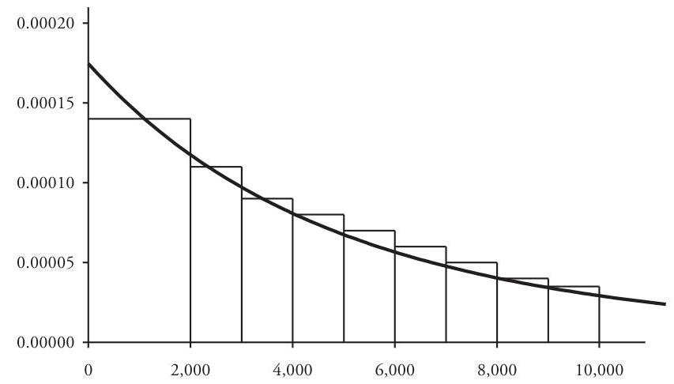

## Page 73
Table 2.4. Tail Probabilities and Limited Severities [Example 2.9]

|  | $\operatorname{Pr}(X>x)$ |  | $E[X ; x]$ |  |
| :-- | :--: | :--: | :--: | :--: |
| Size $x$ | Sample | Pareto | Sample | Pareto |
| 2,000 | 0.7200 | 0.7121 | 1,720 | 1,693 |
| 3,000 | 0.6100 | 0.6051 | 2,385 | 2,350 |
| 4,000 | 0.5200 | 0.5164 | 2,950 | 2,910 |
| 5,000 | 0.4400 | 0.4425 | 3,430 | 3,388 |
| 6,000 | 0.3700 | 0.3807 | 3,835 | 3,799 |
| 7,000 | 0.3100 | 0.3287 | 4,175 | 4,153 |
| 8,000 | 0.2600 | 0.2848 | 4,460 | 4,459 |
| 9,000 | 0.2200 | 0.2476 | 4,700 | 4,724 |
| 10,000 | 0.1850 | 0.2159 | 4,903 | 4,956 |

claims less than or equal $x$ have been tabulated. Moreover, there are 23 claims with the policy-limit value of 300,000 . We wish to use these censored data to find an unlimited lognormal distribution for the unmodified claim population underlying this portfolio. Such a distribution will be useful in creating a set of increased limit factors for pricing policy limits greater than 300,000 (this topic is discussed in detail in Chapter 6). As in Example 2.9, we shall use the method of minimum-distance estimation to obtain the desired parameters.

Note that for all claim sizes $x, x \leq 300,000$, sample limited expected values can be calculated accurately from the summarized sample data-for example, at $x=5,000$ we have

$$
E_{n}[\hat{X} ; 5,000]=\frac{1,102,272-(5,000)(1,500-1,096)}{1,500}=2,082
$$

Table 2.5. Censored Data and Limited Severities [Example 2.10]

| Size $x$ | \# Claims $\leq x$ | $\Sigma$ Claims $\leq x$ | $E_{n}[\hat{X} ; x]$ | $E_{n, n}[X ; x]$ |
| --: | :--: | :--: | :--: | :--: |
| 1,000 | 729 | 225,138 | 664 | 648 |
| 5,000 | 1,096 | $1,102,272$ | 2,082 | 2,091 |
| 10,000 | 1,208 | $1,918,947$ | 3,226 | 3,239 |
| 25,000 | 1,326 | $3,752,091$ | 5,401 | 5,410 |
| 50,000 | 1,391 | $6,007,543$ | 7,638 | 7,580 |
| 100,000 | 1,440 | $9,234,739$ | 10,156 | 10,168 |
| 200,000 | 1,468 | $13,100,561$ | 13,000 | 13,069 |
| 300,000 | 1,500 | $22,343,455$ | 14,896 | 14,850 |

## Page 74
(However, the same cannot be said for any $x>300,000$.) The lognormal limited mean $E_{\mu, \sigma}[X ; x]$ is obtained from formula (2.39) with $m=1$ :

$$
E_{\mu, \sigma}[X ; x]=\exp \left(\mu+\frac{1}{2} \sigma^{2}\right) \cdot \Phi\left(\frac{\log x-\mu-\sigma^{2}}{\sigma}\right)+x \cdot \Phi\left(\frac{-\log x+\mu}{\sigma}\right)
$$

Minimizing the quasi-distance function

$$
D(\mu, \sigma)=\sqrt{\sum_{x}\left|E_{\mu, \sigma}[X ; x]-E_{n}[\hat{X} ; x]\right|^{2}}
$$

over all parameter values yields $(\hat{\mu}, \hat{\sigma})=(6.9852,2.5850)$, and the resulting limited expected values are displayed in the fifth column of Table 2.5.

As usual with grouped claim data, we can easily apply the chi-square statistic to the nine cells defined by the sequence of claim sizes in Table 2.5:

$$
\{0,1 K, 5 K, 10 K, 25 K, 50 K, 100 K, 200 K, 300 K, \infty\}
$$

We set the observed frequency of the last cell $(300 K, \infty)$ to be 23 , the number of limit claims. The chi-square statistic $\chi^{2}=2.763$ is less than the $5 \%$ rejection limit for $d . f .=6, \chi_{0.95}^{2}(6)=12.6$, so we conclude that the lognormal with fitted parameters $(\hat{\mu}, \hat{\sigma})$ is an acceptable distribution for the underlying claim population for this portfolio.

The policy condition known as a straight deductible eliminates all claims less than or equal to the deductible amount $d$, where $d>0$, and it reduces the size of larger claims by $d$. (Section 6.5 contains a more extended discussion of deductible concepts.) Thus, a claim sample generated by a portfolio of policies with a straight deductible would be missing all original claims of size $d$ or less and sizes of the remaining claims would be reduced by the amount $d$. A sample or random variable with this property is said to be truncated below by d and shifted by d. The next example illustrates how an unlimited parametric distribution model could be fitted to an underlying claim population, given only a sample of truncated and shifted claim-size data.

Example 2.11. A sample contains 770 claims from a portfolio of identical policies, each with a policy limit of $\$ 200,000$ and a straight deductible of $\$ 1,000$. Thus, the sample data have been censored above at 200,000 and then truncated below by 1,000 and shifted by the same amount. Adding back the 1,000 deductible amount to each claim in the sample removes the shift effect of the deductible, resulting in an adjusted sample of claim sizes censored above by 200,000 and truncated below by 1,000 . These adjusted claim sizes have been sorted into 12 groups, with the observed group frequencies displayed in Table 2.6. Thirty-one claims valued at the policy limit were placed in the last group $(200 K, \infty)$.

To fit a lognormal distribution to the underlying unmodified claim population, we shall use the minimum chi-square method of parameter estimation.

## Page 75
Table 2.6. Truncated and Censored Data [Example 2.11]

| Size Group | Obs \# Claims | Exp \# Claims |
| :--: | :--: | :--: |
| $0-1 K$ | 0 | 0 |
| $1 K-5 K$ | 367 | 360 |
| $5 K-10 K$ | 112 | 122 |
| $10 K-25 K$ | 118 | 121 |
| $25 K-50 K$ | 65 | 63 |
| $50 K-75 K$ | 36 | 27 |
| $75 K-100 K$ | 13 | 16 |
| $100 K-125 K$ | 10 | 10 |
| $125 K-150 K$ | 8 | 7 |
| $150 K-175 K$ | 6 | 5 |
| $175 K-200 K$ | 4 | 4 |
| $>200 K$ | 31 | 34 |
| Total | 770 | 770 |

Note that if $X$ is a non-truncated random variable, then $X$ truncated below by 1,000 is defined only for $1,000<X<\infty$ by

$$
X_{1000}=X
$$

Thus, the expected frequency of cell $\left(c_{k-1}, c_{k}\right](k=1,2, \ldots 12)$ in terms of the cumulative distribution function $F_{\mu, \sigma}(x)$ of an unmodified, unlimited lognormal distribution is

$$
\phi_{k}(\mu, \sigma)=(770) \frac{\left(F_{\mu, \sigma}\left(c_{k}\right)-F_{\mu, \sigma}\left(c_{k-1}\right)\right)}{1-F_{\mu, \sigma}(1,000)}
$$

Minimizing the chi-square statistic

$$
\chi^{2}(\mu, \sigma)=\sum_{k=1}^{12} \frac{\left(n_{k}-\phi_{k}(\mu, \sigma)\right)^{2}}{\phi_{k}(\mu, \sigma)}
$$

over all $\mu$ and $\sigma$ yields the estimated parameters $(\hat{\mu}, \hat{\sigma})=(6.6916,2.6965)$. Corresponding expected cell frequencies are shown in the third column of Table 2.6.

The minimum chi-square statistic $\chi^{2}(\hat{\mu}, \hat{\sigma})=4.691$ is less than the $5 \%$ rejection limit $\chi_{0.95}^{2}(8)=15.5$, so we can conclude that the fitted lognormal distribution is an acceptable description of the underlying unlimited claim-size distribution.

Other examples of parameter estimation based on modified data can be found in Problems 2.39 and 2.43. In addition, we shall return to the important concept of truncated

## Page 76
random variables and data in Sections 5.1 and 6.5, as well as in Problems 2.41 and 2.42. For a slightly different approach to the estimation problem addressed in Example 2.11, refer to Example 5.3 and Problem 5.23.

# 2.7. Transformations 

With claim-size random variables, as with random variables in general, one can create new variables by transforming existing ones. This is often done in order to create claimsize models with predetermined properties or with properties somewhat different from, but related to, those of a known variable. In this section we shall focus on those functions that transform one continuous claim-size random variable into another.

Assume that $T$ is a strictly increasing-and hence invertible-continuous and differentiable function that maps a set of nonnegative real numbers into itself. If $X$ is a continuous claim-size variable, then $Y=T(X)$ is also a continuous random variable with nonnegative values. As such, $Y$ is also a possible random variable for the size of insurance claims. Because $T$ is an increasing function, distribution functions for $X$ and $Y$ are related by

$$
F_{Y}(y)=\operatorname{Pr}\{T(X) \leq y\}=\operatorname{Pr}\left\{X \leq T^{-1}(y)\right\}=F_{X}\left(T^{-1}(y)\right), \quad 0<y<\infty
$$

Moreover, if $F_{X}$ is differentiable at $x=T^{-1}(y)$, then

$$
f_{Y}(y)=\frac{d}{d y} F_{Y}(y)=\frac{d}{d y} F_{X}\left(T^{-1}(y)\right)=f_{X}\left(T^{-1}(y)\right) \frac{d}{d y} T^{-1}(y)
$$

The simplest such function is the linear transformation $L(X)=a X+b$, where $a$ and $b$ are real constants and $a>0$. For a continuous variable $X$ and $Y=L(X)=a X+b$, distribution functions (2.55) and (2.56) become, respectively,

$$
F_{Y}(y)=F_{X}\left(\frac{y-b}{a}\right) \text { and } f_{Y}(y)=\frac{1}{a} f_{X}\left(\frac{y-b}{a}\right), \quad 0<y<\infty
$$

Linear transformations appear in a variety of probability settings, where they are used to translate the values of a random variable, up or down by a fixed amount, or to rescale the values by applying a constant multiplier. For example, we previously observed in Section 2.5 that the linear transformation $L(Y)=\beta(Y-1)=X$ creates a shifted Pareto random variable $X$ from the classical single-parameter Pareto variable $Y$. In addition, we encountered in Section 2.4 the transformation $T(Z)=e^{\sigma Z+\mu}=X$, transforming the standard normal variable $Z$ first by the linear function $\sigma Z+\mu$ and then by the exponential function, to define $X$ as a lognormal claim-size random variable.

With regard to distribution characteristics, it is well known that $L(X)=a X+b$ transforms the mean of the random variable when either $a \neq 1$ or $b>0$-specifically, $E[L(X)]=L(E[X])=a E[X]+b$. It also transforms the variance whenever $a \neq 1$ : $\operatorname{Var}[L(X)]=a^{2} \operatorname{Var}[X]$. However, when $a>0$ the skewness of a distribution remains unchanged under such a linear transform: $S k[L(X)]=S k[X]$. Proof of this invariance property is requested in Problem 2.26.

## Page 77
Table 2.7. Effect of $L_{c}(X)$ on Distribution Parameters

| Distribution Family | $X$ Parameters | $L_{c}(X)$ Parameters |
| :-- | :--: | :--: |
| Normal | $\mu, \sigma$ | $c \mu, c \sigma$ |
| Gamma | $\alpha, \beta$ | $\alpha, c \beta$ |
| Exponential | $\beta$ | $c \beta$ |
| Lognormal | $\mu, \sigma$ | $\mu+\log c, \sigma$ |
| Shifted Pareto | $\alpha, \beta$ | $\alpha, c \beta$ |
| Weibull | $\beta, \delta$ | $c \beta, \delta$ |
| Burr | $\alpha, \beta, \delta$ | $\alpha, c^{c} \beta, \delta$ |

In some cases the linear transformation $L(X)$ does not change the parametric family of the initial distribution of variable $X$, but only alters the parameters within the family. For example, consider

$$
L_{c}(X)=c X, \quad c>0
$$

If random variable $X$ has a gamma $(\alpha, \beta)$ distribution, then the transformed variable $Y=L_{c}(X)$ has the cumulative distribution function

$$
F_{Y}(y)= \begin{cases}0 & \text { if }-\infty<x<0 \\ \frac{\Gamma(y /(c \beta), \alpha)}{\Gamma(\alpha)} & \text { if } 0 \leq x<\infty\end{cases}
$$

Consequently, $Y$ is also gamma-distributed, but with parameters $(\alpha, c \beta)$. A similar outcome is obtained when transformation (2.58) is applied to a random variable with one of several other common parametric distributions. The results of applying $L_{c}$ to $X$ with the normal, exponential, lognormal, and Pareto distributions-as well as with the Weibull and Burr distributions defined in Examples 2.12 and 2.14-are shown in Table 2.7.

Another class of transformations important to the study of claim-size random variables are those functions having the form

$$
T(X)=c X^{1 / \delta} \quad(c>0, \delta>0)
$$

Such a transformation can be employed to produce a variable $T(X)$ with distributional tail characteristics differing from those of $X$, as illustrated in Examples 2.12 and 2.13. Parameter $\delta$ serves to alter the thickness of the long tail of the distribution. In general, the distribution of $T(X)$ has a heavier long tail than that of $X$ whenever $0<\delta<1$. On the other hand, if $\delta>1$, then $X$ has the heavier-tailed distribution.

Example 2.12. Consider the random variable $X$, defined by

$$
X=T(Y)=\beta^{(\delta-1) / \delta} Y^{1 / \delta} \quad(\beta>0, \delta>0)
$$

## Page 78
in which transformation $T$ is a special case of (2.60). If $Y$ has an exponential ( $\beta$ ) distribution, then formula (2.55) yields for the transformed variable $X$ the cumulative distribution function

$$
F_{X}(x)= \begin{cases}0 & \text { if }-\infty<x<0 \\ 1-\exp \left(-(x / \beta)^{\delta}\right) & \text { if } 0 \leq x<\infty \quad(\beta>0, \delta>0)\end{cases}
$$

Here $X$ is said to have a Weibull distribution, after Swedish engineer E.H.W. Weibull (1887-1979). In a 1939 paper Weibull proposed the distribution as a model for the random failure time of various parts of mechanical systems, for which $F(t)=\operatorname{Pr}\{$ failure time $\leq t\}$. A later paper [22], published by Weibull in 1951, served to promote the distribution in the U.S.

The Weibull distribution is known for its exceptional ability to fit a wide variety of data, and it is widely employed in reliability engineering and failure analysis. Of course, when $\delta=1$ the distribution reduces to the special case of an exponential distribution. Otherwise-especially when $0<\delta<1$-it is useful in modeling size-ofloss distributions.

Formulas for the moments of the Weibull distribution are obtained from the integral $I_{m}(x)=\int_{0}^{x} u^{m} f(u) d u$, where the p.d.f. is $f(x)=\left(\delta / \beta^{\delta}\right) x^{\delta-1} e^{-(x / \beta)^{\delta}}$ :
$I_{m}(x)=\frac{\delta}{\beta^{\delta}} \int_{0}^{x} u^{m+\delta-1} \exp \left(-(u / \beta)^{\delta}\right) d u \stackrel{(2)}{=} \beta^{m} \int_{0}^{(x / \beta)^{\delta}} v^{m / \delta} e^{-v} d v=\beta^{m} \Gamma\left((x / \beta)^{\delta}, 1+m / \delta\right)$,
for $m=1,2,3, \ldots$ Note that the change-of-variable substitution $v=(u / \beta)^{\delta}$ was used at step (2). Therefore, the Weibull $m^{t \delta}$ moments are

$$
\begin{aligned}
E\left[X^{m}\right] & =\lim _{x \rightarrow \infty} I_{m}(x)=\beta^{m} \int_{0}^{\infty} v^{m / \delta} e^{-v} d v=\beta^{m} \Gamma(1+m / \delta) \\
E\left[X^{m} ; x\right] & =I_{m}(x)+x^{m}(1-F(x)) \\
& =E\left[X^{m}\right] \cdot \frac{\Gamma\left((x / \beta)^{\delta}, 1+m / \delta\right)}{\Gamma(1+m / \delta)}+x^{m} e^{-(x / \beta)^{\delta}}
\end{aligned}
$$

Again, because the Weibull distribution functions and moments are expressed in terms of the gamma function, evaluation necessarily involves the use of approximation techniques.

The next example, using a set of related Weibull variables, illustrates how the size of parameter $\delta$ in (2.61) affects the distribution of probability in the long tail of a claimsize distribution.

Example 2.13. Consider three related Weibull random variables: $X_{1}$ has parameters $\left(\beta_{1}, \delta_{1}\right)=(220.653,0.80), X_{2}$ has parameters $\left(\beta_{2}, \delta_{2}\right)=(250,1.00)$, and $\left(\beta_{3}, \delta_{3}\right)=$ $(265.774,1.20)$ are parameters for $X_{3}$. The means of $X_{1}, X_{2}$, and $X_{3}$ are therefore identical:

## Page 79
$$
\begin{aligned}
& E\left[X_{1}\right]=(220.653) \Gamma(1+1 / 0.80)=250 \\
& E\left[X_{2}\right]=(250) \Gamma(2)=250 \\
& E\left[X_{3}\right]=(265.774) \Gamma(1+1 / 1.20)=250
\end{aligned}
$$

Tail probabilities for these variables are compared in Table 2.8, clearly indicating the effect of parameter $\delta$ on the thickness of the long tail.

Example 2.14. As another application of transformation (2.60) consider now the random variable $X$ defined by $X=T(Y)=Y^{1 / \delta}$, where $Y$ has the shifted Pareto $(\alpha, \beta)$ distribution:

$$
\begin{aligned}
& F_{X}(x)= \begin{cases}0 & \text { if }-\infty<x<0 \\
1-\left(\frac{\beta}{x^{\delta}+\beta}\right)^{\alpha} & \text { if } 0 \leq x<\infty \quad(\alpha>0, \beta>0, \delta>0)\end{cases} \\
& f_{X}(x)= \begin{cases}0 & \text { if }-\infty<x<0 \\
\frac{\alpha \beta^{\alpha} \delta x^{\delta-1}}{\left(x^{\delta}+\beta\right)^{\alpha+1}} & \text { if } 0 \leq x<\infty\end{cases}
\end{aligned}
$$

Such a transformed distribution is called the Burr distribution, after the Purdue University statistician Irving Wingate Burr, who first proposed its use. Clearly, the Burr distribution is a generalization of the shifted Pareto, to which it reduces when $\delta=1$. Burr made numerous contributions to reliability theory, statistical quality control, and distribution theory. He introduced the distribution in 1942 as one suitable for modeling failure times in reliability engineering.

Table 2.8. Weibull Tail Probabilities [Example 2.13]

|  | $\operatorname{Pr}\left(X_{1}>x\right)$   $\delta_{1}=0.80$   $\beta_{1}=220.653$ | $\operatorname{Pr}\left(X_{2}>x\right)$   $\delta_{2}=1.00$   $\beta_{2}=250.000$ | $\operatorname{Pr}\left(X_{3}>x\right)$   $\delta_{3}=1.20$   $\beta_{3}=265.774$ |
| :--: | :--: | :--: | :--: |
| 200 | 0.3968 | 0.4493 | 0.4912 |
| 300 | 0.2784 | 0.3012 | 0.3146 |
| 400 | 0.2000 | 0.2019 | 0.1953 |
| 500 | 0.1460 | 0.1353 | 0.1183 |
| 600 | 0.1079 | 0.0907 | 0.0702 |
| 700 | 0.0806 | 0.0608 | 0.0409 |
| 800 | 0.0607 | 0.0408 | 0.0235 |
| 900 | 0.0460 | 0.0273 | 0.0133 |
| 1,000 | 0.0351 | 0.0183 | 0.0074 |

## Page 80
# 2.8. Inflation Effects 

When the claim process to be modeled is subject to some type of inflationary pressure applied over time, one must account for this in a probability model for the size of claims. Such time-dependent forces can arise from a variety of sources. Monetary inflation results from the changing, usually declining, value of the underlying currency. Social or judicial inflation occurs when changes take place in the societal or legal environment-changes that often affect the size of insurance claims. In contrast to monetary inflation, which usually gives rise to increasing claim size, social and judicial inflation could possibly result in a decrease as well as an increase in the size of claims. Of course, these types of inflationary pressure can also affect the frequency of claims, the subject addressed in Chapter 3.

Often a claim-size distribution, whether an empirical distribution based on a population of actual claims or a continuous parametric model as discussed in this chapter, must be adjusted for inflationary trend to account for past changes or to model change projected for the future. The simplest approach is to assume that all claims in the population are impacted in the same way by inflation, as is clearly the case with monetary inflation. Accordingly, we shall first study the concept of uniform trend and then take up one approach to the concept of variable trend.

Suppose that claim-size random variable $X$ is subject to a uniform inflationary trend over a period of time. This means that every claim, large and small, changes by the same percentage during the time period. That is, $X$ is transformed into a new random variable $Y=T(X)=\tau X$, where $\tau=1+r$ is the trend factor and $r$ is the inflation rate for the period.

For example, assume that claim size is increasing at the uniform rate of $5 \%$ per annum. Then the constant trend factor for a single year is $\tau_{1}=1.05$, whereas for a three-year period the factor is $\tau_{3}=(1.05)^{3}=1.1576$.

Transformation $T(X)=\tau X$ is a linear transformation of the form (2.58), and so the cumulative distribution function of the transformed variable $Y$ is a special case of formula (2.57):

$$
F_{Y}(y)=F_{X}(y / \tau), \quad 0<y<\infty
$$

For example, if $X$ has a lognormal $(\mu, \sigma)$ distribution, then

$$
F_{Y}(y)= \begin{cases}0 & \text { if }-\infty<y \leq 0 \\ \Phi\left(\frac{\log y-\log \tau-\mu}{\sigma}\right) & \text { if } 0<y<\infty\end{cases}
$$

As shown previously in Table 2.7, $Y$ also has a lognormal distribution, but with parameters $(\mu+\log \tau, \sigma)$.

When a uniform trend factor is applied to a censored random variable the nonlinearity of the limited expected value $E[X ; x]$ with respect to the random variable $X$ serves to modify the effect of inflation on the average censored claim size. For example,

## Page 81
consider a claim-size random variable $X$ subject to the fixed positive upper limit $l$. The average claim size before trending is $E[X ; l]$, and the severity after applying $\tau=1+r$ is given by equation (2.14):

$$
E[\tau X ; l]=\tau E[X ; l / \tau]
$$

If $\bar{r}$ denotes the effective rate of change on the censored variable, then

$$
1+\bar{r}=\frac{E[\tau X ; l]}{E[X ; l]}=(1+r) \frac{E[X ; l /(1+r)]}{E[X ; l]}
$$

$E[X ; x]$ is a nondecreasing function of $x$, so it follows that

$$
|\bar{r}| \leq|r|
$$

This overall reduction in the effect of inflation on claim size is due to the fact that all censored claims-those larger than $l$-are unchanged by the force of inflation. For example, if $x>l$ and $r>0$ then $x$ and $(1+r) x$ are each replaced by $l$ in the calculation of $E[X ; l]$ and $E[\tau X ; l]$.

However, if limit $l$ is subjected to the same trend factor as the claim size-so that after trending the severity is $E[\tau X ; \tau l]$ —then this leveraging effect of the upper limit disappears. Proof of this assertion is requested in Problem 2.32.

Example 2.15. Random variable $X$ has a shifted Pareto distribution with $(\alpha, \beta)$ $=(2 ; 3,000)$. The average claim size subject to a policy limit of $\$ 8,000$ is

$$
E[X ; 8,000]=(3,000)\left(1-\frac{3,000}{8,000+3,000}\right)=2,182
$$

Application of a uniform $10 \%$ trend to $X$ yields the limited severity

$$
E[1.1 X ; 8,000]=(1.1) E[X ; 8,000 / 1.1]=(3,300)\left(1-\frac{3,000}{8,000 / 1.1+3,000}\right)=2,336
$$

Consequently, the effective inflation rate for the limited variable is less than the nominal $10 \%$ rate: $\bar{r}=2,336 / 2,182-1=7.1 \%$.

If, on the other hand, $X$ is subjected to a negative annual trend of $-5 \%$ so that $\tau=0.95$, then

$$
E[0.95 X ; 8,000]=(0.95) E[X ; 8,000 / 0.95]=2,101
$$

In this case,

$$
\bar{r}=\frac{2,101}{2,182}-1=-3.7 \%
$$

## Page 82
The assumption of a uniform trend-claims of all sizes are subject to the same rate of change-is not always satisfied in practice. Empirical evidence sometimes suggests that the trend factor should in some way be an increasing function of the claim-size variable $X$. In a study of non-uniform trend models Sheldon Rosenberg and Aaron Halpert proposed an annual trend factor of the form

$$
\tau(x)=a x^{b} \quad(a>0, b>0) .^{26}
$$

Note that factor (2.70) reduces to the uniform case when $b=0$; otherwise $\tau(x)$ is an increasing function of $x$.

The trended random variable $Y$ is therefore

$$
Y=\tau(X) \cdot X=a X^{b+1}
$$

When $X$ has a lognormal $(\mu, \sigma)$ distribution the distribution function of the trended variable $Y$ is

$$
F_{Y}(y)=\Phi\left(\frac{\log \left((y / a)^{1 /(b+1)}\right)-\mu}{\sigma}\right)=\Phi\left(\frac{\log y-(b+1) \mu-\log a}{(b+1) \sigma}\right), \quad 0<y<\infty
$$

This implies that $Y$ is also lognormally distributed, with parameters

$$
(\tilde{\mu}, \tilde{\sigma})=\left((b+1) \mu+\log a,(b+1) \sigma\right)
$$

However, $X$ and $Y$ in (2.71) do not always belong to the same distribution family. If $X$ has a shifted Pareto $(\alpha, \beta)$ distribution, for example, then $Y$ has distribution function

$$
F_{Y}(y)=1-\left(\frac{\beta}{(y / a)^{1 /(b+1)}+\beta}\right)^{\alpha}=1-\left(\frac{a^{1 /(b+1)} \beta}{y^{1 /(b+1)}+a^{1 /(b+1)} \beta}\right)^{\alpha}, \quad 0 \leq y<\infty
$$

which defines a Burr distribution with parameters

$$
(\tilde{\alpha}, \tilde{\beta}, \tilde{\delta})=\left(\alpha, a^{1 /(b+1)} \beta, 1 /(b+1)\right)
$$

Example 2.16. Random variable $X$ has a lognormal distribution with parameters $(\mu, \sigma)=(7.2,0.476)$ and thus has mean

$$
E[X]=\exp \left(7.2+\frac{1}{2}(0.476)^{2}\right)=1,500
$$

Applying the variable trend factor $\tau(x)=0.96 x^{0.0183}$ yields a new lognormal variable $X_{\tau}=\tau(X) \cdot X=0.96 X^{1.0183}$ with mean

$$
E\left[X_{\tau}\right]=\exp \left((1.0183)(7.2)+\log 0.96+\frac{1}{2}(1.0183)^{2}(0.476)^{2}\right)=1,650
$$

[^0]
[^0]:    ${ }^{26}$ Rosenberg and Halpert [20], p. 466.

## Page 83
Table 2.9. Variable Trend Factor [Example 2.16]

| Claim Size $x$ | $\tau(x)=0.96 x^{0.0183}$ |
| :--: | :--: |
| 100 | 1.0444 |
| 500 | 1.0756 |
| 750 | 1.0836 |
| 1,000 | 1.0894 |
| 1,500 | 1.0975 |
| 1,650 | 1.1000 |
| 2,000 | 1.1033 |
| 3,000 | 1.1115 |
| 4,000 | 1.1173 |
| 5,000 | 1.1219 |

Trending has increased the overall unlimited mean of the distribution by $10 \%$ : $E\left[X_{\tau}\right] /$ $E[X]=1,650 / 1,500=1.10$. Table 2.9 displays values of the variable trend factor $\tau$ for several claim sizes.

# 2.9. Problems 

2.1 A continuous claim-size random variable $X$ takes on values larger than or equal to 1,000 and has the Pareto cumulative distribution function

$$
F_{X}(x)= \begin{cases}0 & \text { if }-\infty<x<1,000 \\ 1-(1,000 / x)^{3} & \text { if } 1,000 \leq x<\infty\end{cases}
$$

Evaluate:
(a) $E[X]$.
(b) $\operatorname{Var}[X]$.
(c) $\operatorname{Pr}\{X>2,000\}$.
(d) $E[X ; 2,000]$.
2.2 Claim-size random variable $Y$ has the cumulative distribution function

$$
F_{Y}(y)= \begin{cases}0 & \text { if }-\infty<y<500 \\ 1-(0.75)(500 / y)^{2} & \text { if } 500 \leq y<\infty\end{cases}
$$

Evaluate:
(a) $E[Y]$.
(b) $\operatorname{Var}[Y]$.
(c) $\operatorname{Pr}\{Y=500\}$.
(d) $E[Y ; 1,000]$.
2.3 Derive the limited severity function for random variable $Y$ with the mixed distribution of Example 2.3.

## Page 84
2.4 The table displays the grouped claim sample data of Example 2.6, but with the total claim amount in each group now included. Calculate the mean of the sample distribution, as well as the limited severities at the endpoints of each group interval. Compare these results to those obtained in Example 2.6 and explain the observed differences.

| Size Group | \# Claims | Total Claim   Amount |
| :--: | :--: | :--: |
| $0-1,000$ | 42 | 20,370 |
| $1,001-1,500$ | 61 | 74,725 |
| $1,501-2,000$ | 47 | 82,250 |
| $2,001-2,500$ | 26 | 57,200 |
| $2,501-3,000$ | 14 | 37,800 |
| $3,001-3,500$ | 7 | 22,400 |
| $3,501-4,000$ | 2 | 7,200 |
| $4,001-4,500$ | 1 | 4,400 |
| $4,501-5,000$ | 0 | 0 |
| Total | 200 | 306,345 |

2.5 Demonstrate that the midpoint approximation to $a_{k}$ in formula (2.7) is consistent with the assumption, but does not necessarily imply, that claims are distributed uniformly on each group interval of finite width.
2.6 Using the notation of formula (2.7) for grouped sample data and the midpoint approximation $a_{k} \approx \frac{1}{2}\left(c_{k-1}+c_{k}\right)$, develop formulas for approximating the sample moments $M_{1}$ and $M_{2}$.
2.7 Verify that for every claim-size random variable $X, E[X ; x]$ exists as a finite number. Cite an example for which $E[X ; x]<E[X]=\infty$.
2.8 Show that for a discrete claim-size variable $X, E[X ; x]$ is a piecewise linear function on the interval $0 \leq x<\infty$.
2.9 Assume that $X$ is a continuous claim-size random variable with a density function $f(x)=F^{\prime}(x)$ continuous on the interval $0<x<\infty$.
(a) Show that function $E[X ; x]$ is differentiable on $0<x<\infty$.
(b) Prove that the limited severity function for $X$ can be expressed as $E[X ; x]=$ $\int_{0}^{x}(1-F(u)) d u$
(c) Use the second derivative test from elementary calculus to verify that function $E[X ; x]$ is concave.
2.10 Show that the gamma function $\Gamma(x)$ defined by equation (2.16) can also be expressed by each of these integral formulas.
(a) $\Gamma(x)=c^{x} \int_{0}^{x} u^{x-1} e^{-c u} d u, c>0$.
(b) $\Gamma(x)=2 \int_{0}^{x} u^{2 x-1} e^{-u^{2}} d u$.
(c) $\Gamma(x)=\int_{0}^{1}(\log (1 / u))^{x-1} d u$.

## Page 85
2.11 Prove these properties of the gamma function $\Gamma(x)$.
(a) Equation (2.17).
(b) Equation (2.18).
(c) Equation (2.19).
(d) Equation (2.20).
2.12 Derive these values of $\Gamma(x)$.
(a) $\Gamma\left(\frac{1}{2}\right)=\sqrt{\pi}$.
(b) $\Gamma\left(n+\frac{1}{2}\right)=\frac{1 \cdot 3 \cdot 5 \cdots(2 n-1)}{2^{n}} \sqrt{\pi}, \quad n=1,2,3, \ldots$
2.13 Random variable $X$ has a gamma $(\alpha, \beta)$ distribution for which $E[X]=\sqrt{\operatorname{Var}[X]}$. What can be said about $\alpha$ and $\beta$ ?
2.14 Assume that $X$ has an exponential distribution. For $a>0$ and $b>0$ calculate $\operatorname{Pr}\{X>a+b \mid X>a\}$. Interpret the result.
2.15 Assume that $X$ has the mixed exponential distribution with cumulative distribution function (2.31). Calculate:
(a) $E[X]$.
(b) $\operatorname{Var}[X]$.
(c) $E[X ; x]$.
2.16 Use the minimum chi-square method to estimate the gamma parameters of Example 2.7. Compare the mean and variance of the resulting gamma distribution with the sample statistics. Which of the two gamma distributions, that obtained by the method-of-moments or that obtained by the minimum chi-square method, provides a better fit to the data?
2.17 In a certain claim population the claim-size random variable $X$ is distributed lognormally with $(\mu, \sigma)=(6.3210,1.6000)$. Calculate:
(a) $E[X]$.
(b) Median $[X] .{ }^{27}$
(c) $\operatorname{Var}[X]$.
(d) $\operatorname{Pr}\{X>3,000\}$.
(e) $\operatorname{Pr}\{1,000<X<3,000\}$.
(f) $E[X ; 3,000]$.
(g) $E[X \mid X>3,000]$.
2.18 (a) Calculate the mean and variance of the minimum chi-square fitted distribution of Example 2.8 and compare with the sample statistics.
(b) Calculate the method-of-moments estimators of parameters $\mu$ and $\sigma$ for fitting a lognormal distribution model to the data of Example 2.6. Compare the result with that obtained in Example 2.8.
(c) Which of the parameter estimates-the method-of-moments or the minimum chi-square-is likely to provide the better fit in Example 2.8?
2.19 A claim-size variable $X$ has a shifted Pareto distribution with parameters $(\alpha, \beta)$ $=(3 ; 4,000)$. Calculate:
(a) $E[X]$.
(b) Median $[X]$.
(c) $\operatorname{Var}[X]$.
(d) $\operatorname{Pr}\{X>3,000\}$.
(e) $\operatorname{Pr}\{1,000<X<3,000\}$.
(f) $E[X ; 3,000]$.
(g) $E[X \mid X>3,000]$.

[^0]
[^0]:    ${ }^{27}$ Recall that $m$ is the median of a continuous distribution for random variable $X$ provided that $F_{S}(m)=0.50$.

## Page 86
2.20 Show that if $\operatorname{Var}[X]$ exists for a shifted Pareto $(\alpha, \beta)$ random variable $X$, then $\operatorname{Var}[X]>(E[X])^{2}$.
2.21 Derive a formula for $E[X ; x]$ when $X$ has the shifted Pareto $(\alpha, \beta)$ distribution for which $\alpha=1$.
2.22 Claim-size variable $X$ is defined on a population from which a random sample $\left\langle X_{1}, X_{2}, \ldots, X_{n}\right\rangle$ is drawn. Let $\left\langle x_{i}\right\rangle$ be a set of observations for such a sample. Verify the following method-of-moments estimators for the indicated distribution parameters, where $M_{1}$ and $M_{2}$ are the first two sample moments.
(a) Estimator of the gamma parameter $\beta$ when $\alpha$ is known: $\hat{\beta}=M_{1} / \alpha$.
(b) Joint estimators of the lognormal $(\mu, \sigma)$ parameters:

$$
\hat{\mu}=\log \left(M_{1}^{2} / \sqrt{M_{2}}\right) \quad \text { and } \quad \hat{\sigma}=\sqrt{\log \left(M_{2} / M_{1}^{2}\right)}
$$

(c) Estimator of the lognormal parameter $\mu$ when parameter $\sigma$ is known: $\hat{\mu}=\log \left(M_{1}\right)-\frac{1}{2} \sigma^{2}$.
(d) Joint estimators of the shifted Pareto $(\alpha, \beta)$ parameters:

$$
\hat{\alpha}=\frac{2\left(M_{2}-M_{1}^{2}\right)}{M_{2}-2 M_{1}^{2}} \quad \text { and } \quad \hat{\beta}=\frac{M_{1} M_{2}}{M_{2}-2 M_{1}^{2}}
$$

2.23 Verify the following maximum-likelihood estimators for the indicated distribution parameters.
(a) Estimator of the gamma parameter $\beta$ when $\alpha$ is known: $\hat{\beta}=M_{1} / \alpha$.
(b) Joint estimators of the lognormal $(\mu, \sigma)$ parameters:

$$
\hat{\mu}=\frac{1}{n} \sum_{i=1}^{n} \log x_{i} \quad \text { and } \quad \hat{\sigma}=\sqrt{\frac{1}{n} \sum_{i=1}^{n}\left(\log x_{i}-\hat{\mu}\right)^{2}}
$$

(c) Estimator of the lognormal parameter $\sigma$ when $\mu$ is known:

$$
\hat{\sigma}=\sqrt{\frac{1}{n} \sum_{i=1}^{n}\left(\log x_{i}-\mu\right)^{2}}
$$

(d) Estimator of the shifted Pareto parameter $\alpha$ when $\beta$ is known:

$$
\hat{\alpha}=\frac{n}{\sum_{i=1}^{n} \log \left(x_{i}+\beta\right)-\log \beta}
$$

2.24 Obtain formulas for the median of each continuous distribution.
(a) exponential $(\beta)$.
(b) lognormal $(\mu, \sigma)$.
(c) shifted Pareto $(\alpha, \beta)$.
(d) Weibull $(\beta, \delta)$.
2.25 For an unlimited population of 5,000 claims the mean claim size is 1,000 with a standard deviation of 2,000 . Estimate the number of claims that are larger than 1,000 , assuming that the size-of-loss distribution is:
(a) gamma.
(b) lognormal.
(c) shifted Pareto.

## Page 87
2.26 Prove: if $S k[X]$ exists for random variable $X$, then $S k[L(X)]=S k[X]$ for all linear transformations $L(X)=a X+b$ for which $a>0$.
2.27 Assume that $X$ is distributed according to the classical Pareto distribution function (2.40) with parameters $(\alpha, \gamma)$. Find a linear transformation $L$ so that $Y$ $=L(X)$ has the shifted Pareto $(\alpha, \beta)$ distribution (2.46).
2.28 Assume that random variable $U$ is uniformly distributed on the interval $0<u$ $<1$ and that parameters $(\alpha, \beta, \delta)$ are all positive. In each case determine the distribution of the transformed variable $X$.
(a) $X=-2 \log U$.
(b) $X=\beta\left(U^{-1 / \alpha}-1\right)$.
(c) $X=\left(\beta\left(U^{-1 / \alpha}-1\right)\right)^{1 / \beta}$.
(d) $X=\beta(-\log U)^{1 / \beta}$.
(e) $X=\log (1+Y / \beta)$, where $Y$ has a shifted Pareto $(\alpha, \beta)$ distribution.
2.29 Random variable $X$ has a Burr $(\alpha, \beta, \delta)$ distribution with cumulative distribution function (2.64).
(a) Derive a formula for $E\left[X^{m}\right], m=1,2,3, \ldots$.
(b) Derive a formula for $E[X ; x]$.
2.30 Random variable $Y$ is defined by $Y=T(X)=e^{X}$, where $X$ is gamma $(\alpha, \beta)$ distributed. $Y$ is said to have the loggamma distribution.
(a) Derive the cumulative distribution function for $Y$.
(b) Derive a formula for $E\left[Y^{m}\right], m=1,2,3, \ldots$.
2.31 The coefficient of variation $\boldsymbol{C V}[\boldsymbol{X}]$ of a random variable $X$ is defined as the ratio of the standard deviation to the mean: $C V[X]=S D[X] / E[X]$. Show that an application of the uniform trend transformation $T(X)=\tau X(\tau>0)$ leaves both the coefficient of variation and the skewness invariant.
2.32 Prove that the damping effect of a positive upper limit $l$ on a uniform trend rate disappears when the limit $l$ is subjected to the same trend factor as the claim size.
2.33 Claim-size random variable $Y$ is obtained by applying to $X$ the variable trend factor $\tau(x)=a x^{b}$. Determine the distribution of $Y$ when the distribution of $X$ is:
(a) exponential $(\beta)$.
(b) shifted Pareto $(\alpha, \beta)$.
(c) Weibull $(\beta, \delta)$.
(d) $\operatorname{Burr}(\alpha, \beta, \delta)$.
2.34 For claim-size random variable $X$ let $p=\operatorname{Pr}\{X \leq E[X]\}$. Determine $p$ when $X$ has the following distributions. How does $p$ compare to 0.50 ?
(a) exponential $(\beta)$.
(b) gamma $(\alpha, \beta)$.
(c) lognormal $(\mu, \sigma)$.
(d) shifted Pareto $(\alpha, \beta), \alpha>1$.
2.35 Assume that $n$ random variables $\left\{X_{i}\right\}$ are independent and identically distributed with an exponential $(\beta)$ distribution. Show that the distribution of $Y=\sum_{i=1}^{n} X_{i}$ is gamma $(n, \beta)$.
2.36 Assume that claim-size variable $X$ has a lognormal $(\mu, \sigma)$ distribution. Verify that the conditional mean $E[X \mid X>a]$ is given by

$$
E[X \mid X>a]=E[X] \frac{\Phi\left(\left(-\log a+\mu+\sigma^{2}\right) / \sigma\right)}{\Phi((-\log a+\mu) / \sigma)} \quad(a>0)
$$

## Page 88
2.37 A parametric family of continuous probability distributions has a scale parameter $\boldsymbol{\theta}$ whenever the probability density function $f_{\theta}(x)$ depending on parameter $\theta$ can be written in the form

$$
f_{\theta}(x)=\frac{1}{\theta} f_{1}(x / \theta)
$$

For each family of distributions identify the scale parameter, if any.
(a) normal $(\mu, \sigma)$.
(b) gamma $(\alpha, \beta)$.
(c) lognormal $(\mu, \sigma)$.
(d) shifted Pareto $(\alpha, \beta)$.
(e) Weibull $(\beta, \delta)$.
(f) $\operatorname{Burr}(\alpha, \beta, \delta)$.
2.38 Assume that $X$ is a continuous random variable whose distribution has a scale parameter $\theta$. Show that $c \theta$ is a scale parameter for the distribution of variable $c X$.
2.39 The grouped data displayed in the table represent the sizes of a random sample of claims drawn from an unlimited population and then censored at the value 100,000 .
(a) Obtain estimates of parameters $(\hat{\mu}, \hat{\sigma})$ for a lognormal model fit to the underlying unlimited population distribution by minimizing the distance between the sample limited severities at the eight group endpoints 10,000 through 100,000 and those implied by the lognormal model at the same points, as in Example 2.10.
(b) Compare the sample mean $M_{1}$ to the limited severity at 100,000 implied by the lognormal $(\hat{\mu}, \hat{\sigma})$ distribution.
(c) Use the chi-square test, with eight cells, to test the goodness-of-fit of the lognormal $(\hat{\mu}, \hat{\sigma})$ distribution.
2.40 To the sample data of Problem 2.39, fit a lognormal model to the underlying claim-size distribution by using the minimum chi-square method applied to the nine cells with the boundary points
$\{0 ; 10,000 ; 20,000 ; 30,000 ; 40,000 ; 50,000 ; 60,000 ; 80,000 ; 100,000 ; \infty\}$.
Note that the observed frequency in the ninth cell $(10,000 ; \infty)$ is 22 .
2.41 For the unlimited claim-size random variable $X$ and positive limit $l$, the random variable $Y$ defined only on the interval $0 \leq X \leq l$ by

$$
Y=X, \quad 0 \leq X \leq l
$$

represents variable $X$ truncated from above at $l$.
(a) Derive the cumulative distribution and density functions for $Y$.
(b) Obtain a formula for $E[Y]$.

## Page 89
2.42 For the unlimited claim-size random variable $X$ and positive limit $a$, the random variable $Y$ defined only for $X>a$ by

$$
Y=X, \quad a<X<\infty
$$

represents variable $X$ truncated from below at $a$.
(a) Derive the cumulative distribution and density functions for $Y$.
(b) Obtain a formula for $E[Y]$.
2.43 The table displays the result of a random sample of claims drawn from an unlimited population, truncated above at size 50,000 .
(a) Using the minimum chi-square method with ten cells for estimating parameters, fit a lognormal model to the underlying non-truncated population distribution.
(b) Compare the sample mean to the severity of the fitted lognormal distribution truncated above at 50,000 .

| Size Group | \# Claims |
| :--: | --: |
| $0-5,000$ | 104 |
| $5,001-10,000$ | 120 |
| $10,001-15,000$ | 81 |
| $15,001-20,000$ | 54 |
| $20,001-25,000$ | 45 |
| $25,001-30,000$ | 32 |
| $30,001-35,000$ | 26 |
| $35,001-40,000$ | 18 |
| $40,001-45,000$ | 12 |
| $45,001-50,000$ | 8 |
| Total | 500 |

## Page 90
# 3. Claim Counts 

This chapter is devoted to probability models associated with the number of claims generated either by a single policy or by a portfolio of policies in property/casualty insurance. We study first some aspects of the basic claim process by means of a simplified example and then turn to the standard claim-count models. Our main emphasis is on the two most important parametric families, the Poisson and negative binomial distributions, with special attention paid to the modeling of both parameter uncertainty and claim contagion.

### 3.1. An Elementary Claim Process

The incidence of insurance claims is most usefully modeled as a random process, continuous throughout a fixed time interval. For a single policy this period is the length of time the policy remains in force-the policy term, typically one year. The basic random process must be endowed with a probability structure rich enough to support the essential random variables. The most important such time-dependent random variable-the claim count-is the principal focus of this chapter. Values of the claim-count variable, which we denote by $N$, are just the numbers of insured events occurring during the policy term that give rise to claims against the policy.

Begin by considering a simple discrete model of a claim process, based on the following pair of assumptions about claims arising from a single policy:
$\mathbf{B}_{1} \quad$ During a short time interval the probability of a single claim occurring is a fixed number $p(0 \leq p \leq 1)$ and the probability of two or more claims occurring is zero.
$\mathbf{B}_{2}$ The numbers of claims occurring in disjoint short time intervals, each with the probability structure described in $\mathbf{B}_{1}$, are independent random variables.

In other words, the number of claims occurring during a single short interval is a Bernoulli random variable-it takes on the value 1 with probability $p$ and the value 0 with probability $1-p$.

Now let $N_{m}$ denote the total number of claims occurring in $m$ adjacent, but nonoverlapping intervals for each of which assumptions $\mathbf{B}_{1}$ and $\mathbf{B}_{2}$ both hold. It is evident that $N_{m}$ is the sum of $m$ independent Bernoulli random variables, and so it has a binomial distribution with parameters $(m, p)$ and probability function

$$
\operatorname{Pr}\left\{N_{m}=n\right\}_{m} C_{n} p^{n}(1-p)^{m-n}, \quad n=0,1,2, \ldots, m
$$

The mean and variance of $N_{m}$ are $m p$ and $m p(1-p)$, respectively.

## Page 91
Example 3.1. The probability that an individual policyholder makes a claim in any single day is 0.003 . Assuming that at most one claim per day is possible and that claims on successive days are independent, the binomial distribution (3.1) with $p=0.003$ applies to any time period comprised of $m$ successive days.

For example, during a 30-day period the respective probabilities of no claims and a single claim are

$$
\begin{aligned}
& \operatorname{Pr}\left\{N_{30}=0\right\}_{30} C_{0}(0.003)^{0}(0.997)^{30}=0.9138 \\
& \operatorname{Pr}\left\{N_{30}=1\right\}_{30} C_{1}(0.003)^{1}(0.997)^{29}=0.0825
\end{aligned}
$$

As a result, the probability of two or more claims is $1-0.9138-0.0825=0.0037$. The expected number of claims for the 30-day period is $m p=(30)(0.003)=0.0900$.

Probabilities of claims occurring during a full year can be computed in a similar way. For example, the probability of two claims in a 365-day year is

$$
\operatorname{Pr}\left\{N_{365}=2\right\}_{365} C_{2}(0.003)^{2}(0.997)^{363}=0.2009
$$

and the expected number of claims for the year is $(365)(0.003)=1.0950$.
Example 3.1 indicates how to apply the binomial model to a policy term of reasonable length—one year, for example. In that example, this was accomplished by partitioning the policy term into disjoint short time intervals, during each of which at most one claim is possible, thereby dividing the period into discrete units with separate but identical probability structures. However, such a discrete-time approach is conceptually at variance with the intuitive view that a claim process should be a continuous one. It seems desirable, therefore, to find a continuous-time model for the process.

Passage from a discrete model to a continuous one always requires some type of limit procedure. To accomplish this in the case of the binomial model, first partition the policy period into $m$ short subintervals of equal length, each with a Bernoulli probability structure specified by $\mathbf{B}_{1}$, for which $p$ is the probability of a single claim. The total number of claims in all these subintervals then has the binomial probability function (3.1) with parameters $(m, p)$.

Next, we allow the number of subintervals to become infinite in such a way that the expected number of claims for the total policy period remains unchanged. That is, as $m \rightarrow \infty$ parameters $m$ and $p$ must always satisfy $m p=\lambda$ for some positive constant $\lambda$. This implies that the probability $p$ of a claim in each subinterval approaches zero as the number of subintervals becomes arbitrarily large-or equivalently, as the subinterval length becomes arbitrarily small. Then, for each nonnegative integer $n$, the probability of obtaining $n$ claims is

$$
\begin{aligned}
\operatorname{Pr}\{n \text { claims }\} & =\lim _{\substack{m \rightarrow \infty \\
m p=\lambda}} C_{n} p^{n}(1-p)^{m-n} \\
& =\lim _{m \rightarrow \infty} \frac{m(m-1) \ldots(m-n+1)}{n!}\left(\frac{\lambda}{m}\right)^{n}\left(1-\frac{\lambda}{m}\right)^{m-n}
\end{aligned}
$$

## Page 92
$$
\begin{aligned}
& =\lim _{m \rightarrow \infty} \frac{m}{m} \cdot \frac{m-1}{m} \cdots \frac{m-n+1}{m} \cdot \frac{\lambda^{n}}{n!} \cdot\left(1-\frac{\lambda}{m}\right)^{-n}\left(1-\frac{\lambda}{m}\right)^{m} \\
& =\frac{\lambda^{n} e^{-\lambda}}{n!}
\end{aligned}
$$

The final step is a consequence of a familiar limit theorem from elementary calculus: $\lim _{m \rightarrow \infty}(1+x / m)^{m}=e^{x}$.

Formula (3.2) expressing $\lambda^{n} e^{-\lambda} / n$ ! as the limit of binomial probabilities was first derived by Siméon-Denis Poisson (1781-1840), French mathematician and mathematical physicist extraordinaire. ${ }^{28}$ The resulting probability distribution with probabilities given by (3.2) subsequently came to be known as a Poisson distribution.

Poisson distributions have been applied to a diverse range of random events occurring throughout some time interval (or, alternatively, some type of spatial configuration). The number of alpha particles emitted from a radioactive source during a fixed time period, the number of defective products in a lot of manufactured items, the number of calls arriving at a telephone switchboard during an hour, the number of cells visible under a microscope in a certain region, the number of hurricanes striking the North American Atlantic coast in a single year-all have been successfully modeled as Poisson processes.

Because of results like (3.2) the Poisson distribution has also come to play a prominent role in modeling claim processes in property/casualty insurance. In the next section, we derive this probability distribution directly from a set of general assumptions.

# 3.2. Poisson Claim Processes 

Experience has shown that the claim process in property/casualty insurance is often a Poisson process. This means that claims occur over time in accordance with the following set of assumptions, sometimes referred to as the Poisson postulates. In statements $\left\{\mathbf{A}_{1}, \mathbf{A}_{2}, \mathbf{A}_{3}, \mathbf{A}_{4}, \mathbf{A}_{5}\right\}, P_{n}(t)$ is the probability that $n$ claims occur during a time interval of length $t, 0 \leq t<\infty$.
$\mathbf{A}_{1}$ The numbers of claims ${ }^{29}$ occurring in disjoint time intervals are independent random variables.
$\mathbf{A}_{2}$ The probability structure is time-invariant-that is, for all $a \geq 0$ the probability of $n$ claims occurring in the interval between $a$ and $a+t$ equals $P_{n}(t)$. Thus, the distribution of the number of claims occurring during an interval depends on the length of the interval but not on the endpoints.

[^0]
[^0]:    ${ }^{28}$ Poisson's derivation appeared in his 1837 treatise on probability, Recherchés sur la probabilité des jugements en matière criminelle et en matière civile [Research on the probability of criminal and civil verdicts]. Poisson published more than 300 papers on mathematics, including the fields of analysis and probability, and on a wide range of topics in physics. His memorable adage, "Life is good for only two things, discovering mathematics and teaching mathematics," is undoubtedly best appreciated by other mathematicians.
    ${ }^{29}$ In this special formulation of the Poisson postulates the underlying random event is the occurrence of an insurance claim during a specified time interval. However, as indicated above, the general Poisson process can be applied to a variety of random events occurring in time or space.

## Page 93
$\mathbf{A}_{3}$ The probability of a single claim occurring in a short interval of length $h, h>0$, is approximately proportional to $h$ :

$$
P_{1}(h)=\lambda h+o(h) \text { for some positive constant } \lambda \cdot^{30}
$$

Parameter $\lambda$ is the time density of the incidence of claims-the average number of claims per unit of time.
$\mathbf{A}_{4}$ The probability of more than one claim occurring in a short interval of length $h$ is approximately zero: $\sum_{n=2}^{\infty} P_{n}(h)=o(h)$.
$\mathbf{A}_{5}$ In an interval of length $t=0, P_{0}(0)=1$ and $P_{n}(0)=0$ for $n>0$.
Although these assumptions are often satisfied in practice, there are situations involving the incidence of insurance claims in which one or more of them fails to hold in a significant way. For example, $\mathbf{A}_{\mathbf{2}}$ and $\mathbf{A}_{\mathbf{3}}$ imply that the density $\lambda$ of claims per unit time remains constant over time, an assumption usually valid in the short run but which might fail in the long run. The assumption of independence in $\mathbf{A}_{1}$ fails whenever the occurrence of a claim alters the probability of later claims. This phenomenon of claim contagion will be explored later, in Section 3.4. Finally, $\mathbf{A}_{4}$ is incompatible with the occurrence of multiple simultaneous claims, as is the case when two or more individuals are injured in the same accident. Such a violation of postulate $\mathbf{A}_{4}$ can be avoided by always defining "claim" to refer to a single insured event, without regard to the number of claimants involved.

A general formula for the Poisson probability function $P_{n}(t)$ can be derived directly from postulates $\left\{\mathbf{A}_{1}, \mathbf{A}_{2}, \mathbf{A}_{3}, \mathbf{A}_{4}, \mathbf{A}_{5}\right\}$. First, observe that $\mathbf{A}_{3}$ and $\mathbf{A}_{4}$ together imply that the probability $P_{0}(h)$ of zero claims in a short interval of positive length $h$ is given by

$$
P_{0}(h)=1-\sum_{n=1}^{\infty} P_{n}(h)=1-\lambda h+o(h)
$$

Moreover, the independence and time-invariance properties $\mathbf{A}_{1}$ and $\mathbf{A}_{2}$ imply that the probability of zero claims in the interval $(0, t+h)$ can be expressed as

$$
P_{0}(t+h)=P_{0}(t) P_{0}(h)
$$

Extending this last equation to the case of $n$ claims, where $n \geq 1$, we obtain

$$
P_{n}(t+h)=P_{n}(t) P_{0}(h)+P_{n-1}(t) P_{1}(h)+\cdots+P_{0}(t) P_{n}(h)
$$

verification of which is requested in Problem 3.5. Finally, combining the last three equations with postulate $\mathbf{A}_{4}$ produces

$$
\begin{aligned}
& P_{0}(t+h)=P_{0}(t)(1-\lambda h+o(h)) \\
& P_{n}(t+h)=P_{n}(t)(1-\lambda h+o(h))+P_{n-1}(t)(\lambda h+o(h))+\sum_{i=2}^{n} P_{n-i}(t) o(h), \quad n \geq 1
\end{aligned}
$$

[^0]
[^0]:    ${ }^{30}$ The expression $o(h)$, pronounced "little $o h$ of $h$," denotes a function of $h$ that approaches 0 faster than $h$, so that $A=o(h)$ means $\lim _{h \rightarrow 0} A / h=0$. If $A=o(h)$ and $B=o(h)$, then $A+B=o(h)$ also.

## Page 94
These equations can now be used to obtain appropriate expressions for the derivative, with respect to $t$, of probability function $P_{n}(t)$.

The case $n=0$ yields the differential equation

$$
\frac{d}{d t} P_{0}(t)=\lim _{h \rightarrow 0} \frac{P_{0}(t+h)-P_{0}(t)}{h}=\lim _{h \rightarrow 0} \frac{P_{0}(t)(-\lambda h+o(h))}{h}=-\lambda P_{0}(t)
$$

The initial condition $P_{0}(0)=1$ supplied by $\mathbf{A}_{5}$ gives rise to the unique solution $P_{0}(t)=e^{-\lambda t}$. Similarly, the derivative in the case $n \geq 1$ is

$$
\begin{aligned}
\frac{d}{d t} P_{n}(t) & =\lim _{h \rightarrow 0} \frac{P_{n}(t+h)-P_{n}(t)}{h} \\
& =\lim _{h \rightarrow 0} \frac{P_{n}(t)(-\lambda h+o(h))+P_{n-1}(t)(\lambda h+o(h))+o(h)}{h} \\
& =-\lambda P_{n}(t)+\lambda P_{n-1}(t)
\end{aligned}
$$

When $n=1$ the solution of this differential equation is $P_{1}(t)=\lambda t e^{-\lambda t}$. Continuing inductively for $n=2,3,4, \ldots$ yields the general Poisson probability function

$$
P_{n}(t)=\frac{(\lambda t)^{n} e^{-\lambda t}}{n!}, \quad n=0,1,2, \ldots
$$

Example 3.2. The claim process for a certain liability policy is Poisson, and claims occur at a constant rate of 0.04 per year. If the policy term is one year, then formula (3.4) with $t=1$ and $\lambda=0.04$ applies. The probabilities for zero, one, and two claims against the policy are, respectively,

$$
\begin{aligned}
& P_{0}(1)=e^{-0.04}=0.9608 \\
& P_{1}(1)=(0.04) e^{-0.04}=0.0384 \\
& P_{2}(1)=\frac{(0.04)^{2} e^{-0.04}}{2!}=0.0008
\end{aligned}
$$

On the other hand, to obtain probabilities for claims arising during an 18 -month period put $t=1.5$ and $\lambda=0.04$ into the same formula. Thus

$$
\begin{aligned}
& P_{0}(1.5)=e^{-0.06}=0.9418 \\
& P_{1}(1.5)=(0.06) e^{-0.06}=0.0565 \\
& P_{2}(1.5)=\frac{(0.06)^{2} e^{-0.06}}{2!}=0.0017
\end{aligned}
$$

In property/casualty insurance applications the claim-count random variable of greatest interest is the number of claims occurring during a fixed time period, usually

## Page 95
a single policy term. It is appropriate then to take the basic time unit in the Poisson process to be the length of this fixed period and adjust the parameter $\lambda$ to represent the claim density during the selected period. We denote the resulting random variable by $N$ and use the customary $f(n)$ to denote the associated probability mass function, which has the simplified form

$$
f(n)=\frac{\lambda^{n} e^{-\lambda}}{n!}, \quad n=0,1,2, \ldots
$$

The moment-generating function $M(t)$ for claim-count $N$ with distribution (3.5) exists for all real $t$ :

$$
M(t)=E\left[e^{t N}\right]=\sum_{n=0}^{\infty} e^{n t} \frac{\lambda^{n} e^{-\lambda}}{n!}=e^{-\lambda} \sum_{n=0}^{\infty} \frac{\left(\lambda e^{t}\right)^{n}}{n!}=\exp \left(\lambda e^{t}-\lambda\right)
$$

This function has derivatives of all orders, and so all moments of $N$ can be obtained from the successive derivatives of $M(t)$ evaluated at $t=0$ :

$$
\begin{aligned}
E[N] & =M^{\prime}(0)=\left.\lambda e^{t} M(t)\right|_{t=0}=\lambda \\
E\left[N^{2}\right] & =M^{\prime \prime}(0)=\left.\left(\lambda e^{t}+\lambda^{2} e^{2 t}\right) M(t)\right|_{t=0}=\lambda+\lambda^{2} \\
E\left[N^{3}\right] & =M^{\prime \prime \prime}(0)=\left.\left(\lambda e^{t}+3 \lambda^{2} e^{2 t}+\lambda^{3} e^{3 t}\right) M(t)\right|_{t=0}=\lambda+3 \lambda^{2}+\lambda^{3}
\end{aligned}
$$

It is not surprising, given the role that $\lambda$ plays in the Poisson postulates, that $E[N]=\lambda$. In addition, the variance and skewness are

$$
\begin{gathered}
\operatorname{Var}[N]=E\left[N^{2}\right]-(E[N])^{2}=\lambda+\lambda^{2}-\lambda^{2}=\lambda \\
S k[N]=\frac{E\left[(N-E[N])^{3}\right]}{(\operatorname{Var}[N])^{3 / 2}}=\frac{\lambda}{\lambda^{3 / 2}}=\frac{1}{\sqrt{\lambda}}
\end{gathered}
$$

Poisson random variables have a distinctive property that serves to characterize this distributional family-the mean and variance are equal, each identical to the distribution parameter $\lambda$.

The next example illustrates one way to fit a Poisson distribution to a set of claim data.

Example 3.3. During a single policy period of one year a certain portfolio of 1,000 identical insurance policies generated 150 claims. These data have been summarized in the table by the number of claims per policy per year. We wish to find a Poisson distribution for the claimcount variable $N$ for an individual policy selected from the portfolio.

| \# Claims | \# Policies |
| :--: | --: |
| 0 | 868 |
| 1 | 118 |
| 2 | 11 |
| 3 | 2 |
| 4 | 1 |
| $\geq 5$ | 0 |
| Total | 1,000 |

## Page 96
Table 3.1. Claim-Count Distributions [Example 3.3]

|  | $\operatorname{Pr}(N=n)$ |  |
| :-- | :--: | :--: |
| \# Claims $n$ | Sample | Poisson $(\lambda=0.15)$ |
| 0 | 0.8680 | 0.8607 |
| 1 | 0.1180 | 0.1291 |
| 2 | 0.0110 | 0.0097 |
| 3 | 0.0020 | 0.0005 |
| 4 | 0.0010 | 0.0000 |
| $\geq 5$ | 0.0000 | 0.0000 |
| Mean | 0.1500 | 0.1500 |
| Variance | 0.1735 | 0.1500 |

To do so, one can interpret these data as observations for a sample of size 1,000 drawn from a population of policies with identical Poisson claim-count distributions and unknown Poisson parameter $\lambda$. The method-of-moments estimate of parameter $\lambda$ is just the sample average: $\hat{\lambda}=150 / 1,000=0.15$ claims per policy per year. It is also the case that $\hat{\lambda}$ is a maximum-likelihood estimator of the parameter-see Problem 3.7.

In addition, the distribution based on $\hat{\lambda}$ can be interpreted as a parametric distribution fit to the empirical distribution of the portfolio data. Table 3.1 compares the sample distribution to that implied by the Poisson formula $f(n)=(0.15)^{n} e^{-0.15} / n!$.

Visual inspection of the tabulated values shows that the Poisson probabilities are close to the sample values. However, one can test the goodness of fit in a more formal way, as with the Pearson chi-square test. First compute the Pearson statistic relative to the three cells containing policies with 0,1 , and 2 or more claims, respectivelygrouping in this way avoids creating cells with frequencies that are too small. Here $n_{k}$ denotes the observed policy frequency in the $k^{\text {th }}$ cell. The expected cell frequency $\phi_{k}(\hat{\lambda})$ predicted by the Poisson $(\hat{\lambda})$ distribution is $\phi_{k}(\hat{\lambda})=1,000 \hat{p}_{k}$, where $\hat{p}_{k}$ is the Poisson $(\hat{\lambda})$ probability of being in the $k^{\text {th }}$ cell. Then

$$
\chi^{2}=\sum_{k=1}^{3} \frac{\left(n_{k}-\phi_{k}(\hat{\lambda})\right)^{2}}{\phi_{k}(\hat{\lambda})}=\frac{(868-860.7)^{2}}{860.7}+\frac{(118-129.1)^{2}}{129.1}+\frac{(14-10.2)^{2}}{10.2}=2.43
$$

The $\chi^{2}$ statistic is approximately chi-square distributed, with degrees of freedom

$$
\text { d.f. }=\# \text { cells }- \# \text { estimated parameters }-1=3-1-1=1
$$

The $95^{\text {th }}$ percentile of the chi-square distribution with $d . f .=1$ is $\chi_{0.95}^{2}(1)=3.84$. Because $\chi^{2}=2.43<\chi_{0.95}^{2}(1)$, we conclude at the $5 \%$ significance level that the Poisson distribution is an acceptable model for these data.

## Page 97
# 3.3. Parameter Uncertainty 

It is sometimes the case that an insurance claim process is not strictly Poisson because the density parameter $\lambda$ fails to be uniform throughout a population or is itself subject to some type of random fluctuation. For example, in a portfolio of insurance policies for which the random variable $N$ is Poisson-distributed, the expected number of claims-the Poisson parameter $\lambda$-might vary from one insured to another. What is the distribution of $N$ for a policy selected at random from such a population? Or consider the situation in which the distribution of the number of wind-damage claims depends on a parameter $\lambda$ that varies with random changes in some key weather variables. How should one model the distribution of $N$ in such a case?

Answers to questions like these can be obtained by means of a mixture of Poisson distributions, in which the parameter $\lambda$ is itself taken to be a random variable. The resulting variable $N$ having such a mixed distribution is called a model of parameter uncertainty.

To model parameter uncertainty in the Poisson case, begin by assuming that a given population of policies has a finite number $m$ of parameter states $\left\{S_{i}\right\}$, where $1 \leq i \leq m$. In each state $S_{i}$ the claim process is Poisson with claim density $\alpha_{i}$ and $\operatorname{Pr}\left\{\right.$ being in state $\left.S_{i}\right\}=p_{i}$, where $p_{1}+p_{2}+\cdots+p_{m}=1$. Now let $\lambda$ denote a random variable with the set of values $\left\{\alpha_{i}\right\}$ and the associated discrete probability distribution, for which $E[\lambda]=\sum_{i=1}^{m} \alpha_{i} p_{i}$. In this context, variable $\lambda$ is called the mixing parameter for the distribution of $N$.

For example, consider a portfolio of policies comprised of $m$ disjoint subgroups, where the claim-count distribution in the $i^{\text {th }}$ subgroup is Poisson with mean $\alpha_{i}$. The probability $p_{i}$ of obtaining a single policy from the $i^{\text {th }}$ subgroup in a random selection from this mixed portfolio is just the fraction of the total number of portfolio policies that belong to the $i^{\text {th }}$ subgroup. The probability function of the claim-count variable $N$ for such a randomly selected policy is then specified for each $n=0,1,2, \ldots$ by the conditional probability formula

$$
f_{N}(n)=\sum_{i=1}^{m} \operatorname{Pr}\left\{N=n \mid \lambda=\alpha_{i}\right\} \cdot \operatorname{Pr}\left\{\lambda=\alpha_{i}\right\}=\frac{1}{n!} \sum_{i=1}^{m} \alpha_{i}^{n} e^{-\alpha_{i}} p_{i}
$$

The expected value of this mixed distribution turns out to be, quite reasonably, the probability-weighted average of the $\left\{\alpha_{i}\right\}$, that is, $E[\lambda]$ :
$E[N]=\sum_{n=0}^{\infty} n \sum_{i=1}^{m} \operatorname{Pr}\left\{n \mid \lambda=\alpha_{i}\right\} p_{i}=\sum_{i=1}^{m} p_{i} \sum_{n=0}^{\infty} n \operatorname{Pr}\left\{n \mid \lambda=\alpha_{i}\right\}=\sum_{i=1}^{m} p_{i} \alpha_{i}=E[\lambda]$.
The second moment is obtained in a similar way:

$$
E\left[N^{2}\right]=\sum_{n=0}^{\infty} n^{2} \sum_{i=1}^{m} \operatorname{Pr}\left\{n \mid \lambda=\alpha_{i}\right\} p_{i}=\sum_{i=1}^{m} p_{i} \sum_{n=0}^{\infty} n^{2} \operatorname{Pr}\left\{n \mid \lambda=\alpha_{i}\right\}=\sum_{i=1}^{m}\left(\alpha_{i}+\alpha_{i}^{2}\right) p_{i}
$$

## Page 98
As a result, one can express $\operatorname{Var}[N]$ in terms of the mean and variance of $\lambda$ :

$$
\operatorname{Var}[N]=E[\lambda]+\sum_{i=1}^{N} \alpha_{i}^{2} p_{i}-(E[\lambda])^{2}=E[\lambda]+\operatorname{Var}[\lambda]
$$

It is evident from (3.10) and (3.11) that when $N$ has a mixed Poisson distribution, $\operatorname{Var}[N]=E[N]$ if, and only if, $\operatorname{Var}[\lambda]=0$ (in which case the variable $\lambda$ is constant). Therefore, a mixture of distinct Poisson distributions-for which $\operatorname{Var}[\lambda]>0$-cannot itself be a Poisson distribution.

Example 3.4. A portfolio of 100 insurance policies for which the claim counts are Poissondistributed produces an overall average of 0.51 claims per policy per year. However, this portfolio consists of four policy subgroups, representing four parameter states, with expected claim counts ranging from 0.10 to 1.40 , as shown in the table. Also tabulated are the numbers of policies in each

| State | Density $\alpha_{i}$ | \# Policies |
| :-- | :--: | --: |
| $S_{1}$ | 0.10 | 20 |
| $S_{2}$ | 0.35 | 40 |
| $S_{3}$ | 0.70 | 30 |
| $S_{4}$ | 1.40 | 10 |
| Total | 0.51 | 100 |

subgroup. Consequently, the distribution of $N$ for a policy selected at random from this portfolio has a mixed Poisson distribution with probabilities
$f_{N}(n)=\frac{(0.10)^{n} e^{-0.10}(0.2)+(0.35)^{n} e^{-0.35}(0.4)+(0.70)^{n} e^{-0.70}(0.3)+(1.40)^{n} e^{-1.40}(0.1)}{n!}$
As expected, $E[N]=0.51$, and the variance exceeds the mean: $\operatorname{Var}[N]=0.6439>$ $E[N]$. Probabilities for $N$ are shown in Table 3.2, where they are compared with those of the single Poisson distribution for which $\lambda=0.51$.

Table 3.2. Claim-Count Distributions [Example 3.4]

|  | $\operatorname{Pr}(N=n)$ |  |
| :--: | :--: | :--: |
| \# Claims $n$ | Mixed Poisson | Poisson $(\lambda=0.51)$ |
| 0 | 0.6365 | 0.6005 |
| 1 | 0.2556 | 0.3063 |
| 2 | 0.0788 | 0.0781 |
| 3 | 0.0218 | 0.0133 |
| 4 | 0.0056 | 0.0017 |
| 5 | 0.0013 | 0.0002 |
| 6 | 0.0003 | 0.0000 |
| $\geq 7$ | 0.0001 | 0.0000 |
| Mean | 0.5100 | 0.5100 |
| Variance | 0.6439 | 0.5100 |

## Page 99
This example effectively illustrates how mixing several distinct Poisson distributions serves to increase the dispersion of the claim-count distribution over what would be expected in the case of a single Poisson distribution.

The discrete conditional probability formula (3.9) is readily generalized to the case in which the variable $\lambda$ has a continuous density function $f_{\lambda}(u)$ on the interval $0<u<\infty$ for which $\int_{0}^{\infty} f_{\lambda}(u) d u=1$. Thus, the continuous analog of (3.9) for claim counts $n=0$, $1,2, \ldots$ is given by the integral formula

$$
f_{N}(n)=\int_{0}^{\infty} \operatorname{Pr}\{N=n \mid \lambda=u\} f_{\lambda}(u) d u=\frac{1}{n!} \int_{0}^{\infty} u^{n} e^{-u} f_{\lambda}(u) d u .^{31}
$$

Formulas (3.10) and (3.11) for the mean and variance of $N$ also hold in the continuous case. For example, in the following continuous analog of (3.10) integration over the semi-infinite interval $0<u<\infty$ replaces summation over the finite set of parameter values $\left\{\alpha_{i}\right\}$ :

$$
E[N]=\sum_{n=0}^{\infty} n \int_{0}^{\infty} \frac{u^{n} e^{-u}}{n!} f_{\lambda}(u) d u=\int_{0}^{\infty}\left(\sum_{n=0}^{\infty} n \frac{u^{n} e^{-u}}{n!}\right) f_{\lambda}(u) d u=\int_{0}^{\infty} u f_{\lambda}(u) d u=E[\lambda]
$$

As before, the second moment is $E\left[N^{2}\right]=E[\lambda]+E\left[\lambda^{2}\right]$, so that

$$
\operatorname{Var}[N]=E[\lambda]+\operatorname{Var}[\lambda]=E[N]+\operatorname{Var}[\lambda]
$$

Moreover,

$$
S k[N]=\frac{E[\lambda]+3 \operatorname{Var}[\lambda]+E\left[(\lambda-E[\lambda])^{3}\right]}{(E[\lambda]+\operatorname{Var}[\lambda])^{3 / 2}}
$$

Example 3.5. Parameter $\lambda$ for a mixed Poisson distribution has an exponential density function: $f_{\lambda}(u)=4 e^{-4 u}, 0<u<\infty$. Consequently, $E[\lambda]=0.25$ and $\operatorname{Var}[\lambda]=$ 0.0625 . The claim-count probabilities for the mixed distribution follow from (3.12):

$$
f_{N}(n)=\frac{4}{n!} \int_{0}^{\infty} u^{n} e^{-5 u} d u=\frac{4}{n!} \Gamma(n+1) 5^{-(n+1)}=(0.8)(0.2)^{n}, \quad n=0,1,2, \ldots
$$

This distribution is an instance of the geometric distribution-see Problem 3.21. Table 3.3 displays probabilities for the distribution, again compared to those of the related, but less-dispersed single Poisson distribution.

[^0]
[^0]:    ${ }^{31}$ By using the Riemann-Stieltjes integral, formulas (3.9) and (3.12) can both be expressed by the single integral formula $f_{0}(n)=(1 / n!) \int_{0}^{n} u^{n} e^{-u} d P_{0(n)}$, where the function $F_{\lambda}(u)$ is the cumulative distribution function for the variable mixing parameter $\lambda$.

## Page 100
Table 3.3. Claim-Count Distributions [Example 3.5]

|  | $\operatorname{Pr}(N=n)$ |  |
| :--: | :--: | :--: |
| \# Claims $n$ | Mixed Poisson | Poisson $(\lambda=0.25)$ |
| 0 | 0.8000 | 0.7788 |
| 1 | 0.1600 | 0.1947 |
| 2 | 0.0320 | 0.0243 |
| 3 | 0.0064 | 0.0020 |
| 4 | 0.0013 | 0.0001 |
| 5 | 0.0003 | 0.0000 |
| $\geq 6$ | 0.0001 | 0.0000 |
| Mean | 0.2500 | 0.2500 |
| Variance | 0.3125 | 0.2500 |

The mixed Poisson distribution provides a powerful alternative to the single Poisson distribution in modeling insurance claim data. However, the mixed distribution approach does require that one must have some a priori knowledge of the distribution of the variable parameter $\lambda$. In cases where claim data can reasonably be partitioned into a finite number of homogenous subgroups, as in Example 3.4, there is usually no difficulty in constructing the mixed distribution. On the other hand, if one is presented with a sample of claim data for which the mean and variance are quite different, then finding an appropriate parametric distribution in the absence of additional information about the population is more challenging. A common solution to this problem, which involves a special family of distributions for the variable $\lambda$, is the topic of the next section.

# 3.4. Negative Binomial Distributions 

It is often the case that claim-count data yield a sample distribution with markedly different mean and variance and that very little is known about the actual population distribution. Nevertheless, the actuary can be faced with the problem of fitting a parametric distribution to such data in order to model the claim-count probabilities of a policy selected at random from the underlying population.

In situations like this it has proven useful to suppose that the population has a mixed Poisson distribution and, in the absence of any other information, to assume a particular distribution for the variable parameter $\lambda$. Gamma distributions are almost always used for this purpose because of the useful analytic form of the resulting mixed distribution.

We start by assuming that the mixing parameter $\lambda$ has a gamma distribution with positive parameters $\alpha$ and $\beta=v / \alpha$ and the resulting density function

$$
f_{\lambda}(u)=\frac{(\alpha / v)^{\alpha}}{\Gamma(\alpha)} u^{\alpha-1} e^{-(\alpha / v) u}, \quad 0<u<\infty
$$

## Page 101
This special choice of $\alpha$ and $\beta$ is contrived to yield convenient forms for the means and variances of $\lambda$ and $N$. In particular, $E[\lambda]=v$ and $\operatorname{Var}[\lambda]=v^{2} / \alpha$. The probability function for $N$ is then obtained by substituting (3.16) into formula (3.12) for each $n=0,1,2, \ldots$ :

$$
\begin{aligned}
f_{N}(n) & =\int_{0}^{\infty} \frac{u^{n} e^{-v}}{n!} \cdot \frac{(\alpha / v)^{\alpha}}{\Gamma(\alpha)} u^{\alpha-1} e^{-(\alpha / v) v} d u \\
& =\frac{(\alpha / v)^{\alpha}}{n!\Gamma(\alpha)} \int_{0}^{\infty} u^{\alpha+n-1} e^{-\left(\frac{v+\alpha}{v}\right) v} d u \\
& =\frac{(\alpha / v)^{\alpha}}{n!\Gamma(\alpha)} \Gamma(\alpha+n)\left(\frac{v+\alpha}{v}\right)^{-(\alpha+n)} \\
& =\frac{\Gamma(\alpha+n)}{n!\Gamma(\alpha)}\left(\frac{\alpha}{v+\alpha}\right)^{\alpha}\left(\frac{v}{v+\alpha}\right)^{v}
\end{aligned}
$$

The mean, variance, and skewness of $N$ are thus given by formulas (3.13), (3.14), and (3.15):

$$
\begin{aligned}
E[N] & =v \\
\operatorname{Var}[N] & =v+\frac{v^{2}}{\alpha} \\
S k[N] & =\frac{\alpha^{3} v+3 \alpha^{2} v^{2}+2 \alpha v^{3}}{\left(\alpha^{2} v+\alpha v^{2}\right)^{3 / 2}}
\end{aligned}
$$

The mixed probability distribution defined by (3.17) is a member of the negative binomial distribution family. Such a distribution has a probability function, with parameters $r$ and $q$, of the general form

$$
f(n)=\binom{r+n-1}{n} q^{r}(1-q)^{n} \quad(r>0,0<q<1), \quad n=0,1,2, \ldots
$$

The leading coefficient in this function is an instance of the general binomial coefficient, defined for all real $x$ and $n=0,1,2,3, \ldots$ by

$$
\binom{x}{n}=\frac{\Gamma(x+1)}{n!\Gamma(x-n+1)}= \begin{cases}1 & \text { if } n=0 \\ \frac{x(x-1)(x-2) \cdots(x-n+1)}{n!} & \text { if } n>0\end{cases}
$$

Putting $r=\alpha$ and $q=\alpha /(v+\alpha)$ into (3.19) and then applying (3.20) shows that probability function (3.17) does indeed belong to the negative binomial family.

## Page 102
The general binomial coefficient first arose in connection with Isaac Newton's binomial series, a convergent series expansion valid for all real $s$ :

$$
(1+x)^{s}=\sum_{n=0}^{\infty}\binom{s}{n} x^{n}, \quad-1<x<1
$$

When the exponent $s$ is a positive integer $m,\binom{s}{n}=\binom{m}{n}$ is identical to the standard binomial coefficient ${ }_{m} C_{n}$ of combinatorial analysis:

$$
\binom{m}{n}={ }_{m} C_{n}= \begin{cases}0 & \text { if } n>m \\ \frac{m!}{n!(m-n)!} & \text { if } 0 \leq n \leq m\end{cases}
$$

Moreover, whenever $s=m$ series (3.21) reduces to the familiar finite sum of the elementary Binomial Theorem.

The negative binomial distribution is so called because the probabilities in (3.19) are fixed multiples of terms from a convergent binomial series with negative exponent. This becomes evident after using the identity

$$
\binom{r+n-1}{n}=(-1)^{n}\binom{-r}{n}, \quad r>0
$$

to restate probability function (3.19) as

$$
f(n)=\binom{-r}{n} q^{r}(q-1)^{n}
$$

Verification of $\sum_{n=0}^{\infty} f(n)=1$ follows immediately from (3.21) with $x=q-1$ and negative exponent $s=-r$ :

$$
\sum_{n=0}^{\infty} f(n)=q^{r} \sum_{n=0}^{\infty}\binom{-r}{n}(q-1)^{n}=q^{r}(1+q-1)^{-r}=1
$$

The negative binomial moment-generating function is obtained in a similar way:

$$
M(t)=\sum_{n=0}^{\infty} e^{\alpha}\binom{-r}{n} q^{r}(q-1)^{n}=q^{r}\left(1+(q-1) e^{t}\right)^{-r}, \quad-\infty<t<-\log (1-q)
$$

Returning to the mixed distribution (3.17), one can see that for a given mean $v$ the size of $\operatorname{Var}[N]$ relative to $E[N]$ is determined by parameter $\alpha$. The larger the value of $\alpha$, the more nearly equal are $\operatorname{Var}[N]$ and $E[N]$ and conversely. One can therefore interpret $1 / \alpha$ as a measure of parameter uncertainty-of how significantly the mixed distribution deviates from a single Poisson.

## Page 103
Not surprisingly, the Poisson distribution is a limiting case-that is, for fixed mean $\nu$ the negative binomial distribution (3.17) tends to a Poisson distribution as $\alpha \rightarrow \infty$. This can be easily demonstrated using the moment-generating function. The generating function of distribution (3.17) is

$$
M(t)=\left(1-\frac{v}{\alpha}\left(e^{t}-1\right)\right)^{-\alpha}, \quad-\infty<t<\log ((\nu+\alpha) / v)
$$

obtained by substituting $r=\alpha$ and $q=\alpha /(\nu+\alpha)$ into (3.24). Passing to the limit as $\alpha \rightarrow \infty$ while holding $v$ constant yields

$$
\lim _{\alpha \rightarrow \infty} M(t)=\lim _{\alpha \rightarrow \infty}\left(1-\frac{v}{\alpha}\left(e^{t}-1\right)\right)^{-\alpha}=\exp \left(v\left(e^{t}-1\right)\right)
$$

the moment-generating function of a Poisson random variable with mean $v$. The conclusion follows from the uniqueness property of the generating function.

One of the earliest uses of the negative binomial as a mixed Poisson distribution was in modeling the concept of accident proneness. The number of accidents incurred by individual members of a population group was assumed to be Poisson-distributed, but with different parameters-the more "accident-prone" members having larger Poisson parameters and those less so having smaller expected values. In the realm of property/ casualty insurance, actuaries began to apply the negative binomial distribution to automobile liability in the 1950s and 1960s. ${ }^{32}$ Since then, the distribution has enjoyed a wide range of applicability.

Example 3.6. Claim-count data from a sample of 5,000 automobile liability policies are displayed in the table. Here the mean 0.1238 and variance 0.130074 are unequal. This inequality suggests that the policies were possibly drawn not from a homogeneous population of Poisson-distributed policies but from a mix of policies with different Poisson distributions.

To obtain the distribution of claim counts for a single policy selected at random from this population, we shall assume a negative binomial distribution of the form (3.17)

| \# Claims | \# Policies |
| :--: | --: |
| 0 | 4,429 |
| 1 | 528 |
| 2 | 39 |
| 3 | 3 |
| 4 | 1 |
| $\geq 5$ | 0 |
| Total | 5,000 |

and search for appropriate parameter estimates $(\hat{\alpha}, \hat{v})$. Derivation of maximum-likelihood parameter estimates for the negative binomial distribution involves some difficult, but not insurmountable, complexities, ${ }^{33}$ whereas the method-of-moments estimates are easily calculated. Opting

[^0]
[^0]:    ${ }^{32}$ For an example of such early applications of the negative binomial distribution in auto insurance see Hewitt [6].
    ${ }^{33}$ For example, refer to Simon [21]. In most cases the maximum-likelihood equations are solvable only by iteration, but Simon observes that the method "will usually produce answers very similar to the method-of-moments" estimates.

## Page 104
Table 3.4. Negative Binomial Distribution [Example 3.6]

|  | $\operatorname{Pr}(n$ claims $)$ |  |
| :--: | :--: | :--: |
| \# Claims $n$ | Sample | Negative binomial |
| 0 | 0.8858 | 0.8862 |
| 1 | 0.1056 | 0.1044 |
| 2 | 0.0078 | 0.0087 |
| 3 | 0.0006 | 0.0006 |
| 4 | 0.0002 | 0.0000 |
| $\geq 5$ | 0.0000 | 0.0000 |

for the latter approach, we set $\hat{v}=0.1238$ and then solve the variance formula Var $=$ $\hat{v}+\hat{v}^{2} / \hat{\alpha}=0.130074$ for $\hat{\alpha}$ :

$$
\hat{\alpha}=\frac{(0.1238)^{2}}{0.130074-0.1238}=2.44285
$$

Probabilities calculated from the resulting mass function

$$
f(n)=\frac{\Gamma(2.44285+n)}{n!\Gamma(2.44285)}(0.951766)(0.048234)^{n}, \quad n=0,1,2, \ldots
$$

are displayed in Table 3.4. The chi-square statistic based on the four cells corresponding to $0,1,2$, and 3 or more claims is $\chi^{2}=0.7753$. The degrees-of-freedom parameter is $d . f .=4-2-1=1$, so the rejection limit for a test at the $5 \%$ significance level is $\chi_{0.95}^{2}(1)=3.84$. Because $\chi^{2}<3.84$, one can conclude that the negative binomial distribution is an acceptable model.

Recall that a negative binomial distribution can be interpreted as a mixture of Poisson distributions with a variable gamma-distributed mixing parameter $\lambda$. In this case an implied gamma density function for the variable mixing parameter $\lambda$ can be obtained by putting $\hat{\alpha}$ and $\hat{v}$ into formula (3.16):

$$
f_{\lambda}(u)=(1141.264) u^{1.44285} e^{-19.7322 u}, \quad 0<u<\infty
$$

Here $E[\lambda]=0.1238=v$ and $\operatorname{Var}[\lambda]=0.006274$. A graph of this density function $y=f_{\lambda}(u)$ is shown in Figure 3.1.

# 3.5. Claim Contagion 

One of the assumptions of the Poisson claim-count process, that of independence of successive claims, is not always satisfied. This happens whenever the occurrence of a claim changes the probability of subsequent claims. For example, a successful products

## Page 105
Figure 3.1. Implied Gamma Density Function for Mixing Parameter $\lambda$ [Example 3.6]
liability claim against a manufacturer often increases the likelihood that similar claims will be brought in the future-a classic example of claim contagion. A standard approach to modeling such a contagion process is based on an urn model proposed by the Hungarian mathematician George Pólya (1887-1985). Pólya models have since been used to model a variety of contamination processes, including the spread of contagious diseases. ${ }^{34}$

In the Pólya model, an urn initially contains $w$ white balls and $b$ black balls. A trial consists of drawing one ball at random, noting its color, and then replacing it together with $c$ additional balls of the same color. Obtaining a white ball on the first trial therefore increases the probability of selecting a white ball on the next trial. The probability function for the number $W_{m}$ of white balls obtained in $m$ trials, is derived by conventional combinatorial methods:

$$
\operatorname{Pr}\left\{W_{m}=n\right\}=P_{n}(w, b, c ; m)={ }_{m} C_{n} \frac{\prod_{i=0}^{w-1}(w+i c) \prod_{i=0}^{m-b-1}(b+i c)}{\prod_{i=0}^{m-1}(w+b+i c)}, \quad n=0,1, \ldots, m
$$

A distribution with probabilities $P_{n}(w, b, c ; m)$ is known as a Pólya distribution. ${ }^{35}$ The ratio $\gamma=c / w$ is customarily called the degree of contagion. When there is no contagion-that is, when $c=\gamma=0$-the Pólya distribution is identical to the simpler binomial distribution for which the probability of drawing a white ball remains constant throughout successive trials.

[^0]
[^0]:    ${ }^{34}$ Pólya's original contamination model first appeared in a 1923 paper by Pólya and F. Eggenberger "Über die Statistik der vergetteter Vorgänge," Zeitschrift für Angewandte Mathematik und Mechanik, III, 279-289]. The present formulation is based on that presented by William Feller in his classic probability textbook: Feller [4], pp. 118-121, 142-143. Urn models have been used to model probability distributions ever since they were introduced by Swiss mathematician Jacob Bernoulli to describe the two-outcome experiment underlying the random variable now known as a Bernoulli variable.
    ${ }^{35}$ Although history and logic dictate that (3.26) should be called the Pólya distribution, some authors apply that name instead to the associated negative binomial distribution (3.27).
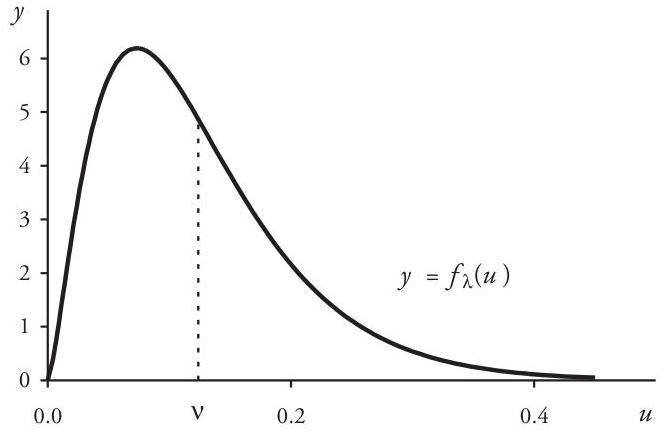

## Page 106
To derive the moments of the distribution for $W_{m}$, let $p$ denote the probability of drawing a white ball in the first Pólya trial: $p=w /(w+b)$. Then

$$
\begin{aligned}
E\left[W_{m}\right] & =\sum_{n=0}^{\infty} n P_{n}(w, b, c ; m)=\frac{m w}{w+b} \sum_{n=1}^{\infty} P_{n-1}(w+c, b, c ; m-1) \\
& =m p \sum_{k=0}^{m-1} P_{k}(w+c, b, c ; m-1) \\
& =m p
\end{aligned}
$$

Similar reasoning yields

$$
E\left[W_{m}^{2}\right]=m p+m(m-1) \frac{w+c}{w+b+c} p=m p+m(m-1) p^{2} \frac{1+\gamma}{1+p \gamma}
$$

so that

$$
\operatorname{Var}\left[W_{m}\right]=m p\left(1+(m-1) \frac{1+\gamma}{1+p \gamma} p-m p\right)
$$

It is instructive to compare these formulas to the respective mean $m p$ and variance $m p(1-p)$ of the related binomial distribution. Clearly, the two distributions have identical means, each equal to $m p$. The Pólya distribution, as one would reasonably expect, has the larger variance: $\operatorname{Var}\left[W_{m}\right] \geq m p(1-p)$.

Example 3.7. Pólya trials are conducted with an urn that initially contains $w=10$ white balls and $b=5$ black balls. Corresponding to $c=2$, the degree of contagion is $\gamma=2 / 10$. The initial probability is therefore $p=E\left[W_{1}\right]=10 / 15$. Various probabilities for drawing white balls in the first three trials are given by

$$
\begin{aligned}
\operatorname{Pr}\{\text { white on } 1 \text { st trial }\} & =\frac{10}{15}=0.6667 \\
\operatorname{Pr}\{\text { white on } 2 \text { nd trial } \mid \text { white on } 1 \text { st trial }\} & =\frac{12}{17}=0.7059 \\
\operatorname{Pr}\{\text { white on } 2 \text { nd trial } \mid \text { black on } 1 \text { st trial }\} & =\frac{10}{17}=0.5882 \\
\operatorname{Pr}\{\text { white on } 2 \text { nd trial }\} & =\frac{12}{17} \cdot \frac{10}{15}+\frac{10}{17} \cdot \frac{5}{15}=0.6667
\end{aligned}
$$

$\operatorname{Pr}\{$ white on 3rd trial $\mid$ white on 1st \& 2nd trials $\}=\frac{14}{19}=0.7368$,
$\operatorname{Pr}\{$ white on 3rd trial $\mid$ black on 1st \& 2nd trials $\}=\frac{10}{19}=0.5263$.

## Page 107
Table 3.5. Pólya and Binomial Probabilities [Example 3.7]

|  | $\operatorname{Pr}(n$ white balls in 6 trials $)$ |  |
| :-- | :--: | :--: |
| \# White Balls $n$ | Pólya $(c=2)$ | Binomial $(c=0)$ |
| 0 | 0.0115 | 0.0014 |
| 1 | 0.0462 | 0.0165 |
| 2 | 0.1066 | 0.0823 |
| 3 | 0.1809 | 0.2195 |
| 4 | 0.2412 | 0.3292 |
| 5 | 0.2481 | 0.2634 |
| 6 | 0.1654 | 0.0878 |
| Mean | 4.0000 | 4.0000 |
| Variance | 2.1176 | 1.3333 |

The probabilities $P_{n}(10,5,2 ; 6)$ for obtaining $n$ white balls in six successive Pólya trials are shown in Table 3.5 and compared with those for the related binomial distribution, for which $c=0$. The expected count for each distribution is $m p=4$, but the Pólya distribution with positive contagion has the larger variance, a fact clearly evident in Figure 3.2.

To interpret the Pólya urn model as a claim process, identify the draw of a white ball in a Pólya trial with the occurrence of a claim. However, contagion in the urn model occurs at discrete times, after each draw from the urn. Modeling a time-continuous claim process, this time with contagion, again requires some type of limit process.

We proceed as in Section 3.1, where a Poisson distribution arose as the limit of a sequence of binomial distributions. Again, partition the basic time period-the policy

Figure 3.2. Pólya and Binomial Distributions [Example 3.7]
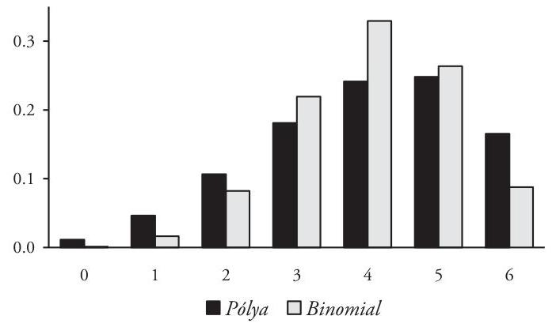

## Page 108
term—into $m$ subintervals of equal length and perform one Pólya trial per subinterval. Then let $m \rightarrow \infty$ in such a way that the expected number of white balls (that is, claims) in the time period remains constant: $m p=v>0$. Passage to the limit is carried out in such a way that the degree of contagion $\gamma$ remains constant, as well. As before, the probability structure in each subinterval changes with $m$ so that $p \rightarrow 0$ as $m \rightarrow \infty$. Whenever $\gamma>0$ the limit of the Pólya probability function (3.26) is

$$
\lim _{\substack{m \rightarrow \infty \\ m \rightarrow \infty}} P_{n}(w, b, c ; m)=\binom{1 / \gamma+n-1}{n}\left(\frac{1}{1+\gamma v}\right)^{1 / \gamma}\left(\frac{\gamma v}{1+\gamma v}\right)^{n}, \quad n=0,1,2, \ldots
$$

Comparison to formula (3.19), after setting $r=1 / \gamma$ and $q=1 /(1+\gamma v)$, reveals the limiting distribution to be negative binomial with mean $v$ and variance $v+\gamma v^{2}$.

Thus we have observed that two distinct situations-claim contagion in this section and parameter uncertainty with a gamma-distributed $\lambda$ discussed in Section 3.4-give rise to the same distribution family for the claim-count variable $N$. In fact, the negative binomial distribution in (3.27), with mean $v$ and contagion parameter $\gamma$, is identical to the negative binomial distribution (3.17) with mean $v$ and uncertainty parameter $\alpha=1 / \gamma$. It is not surprising, then, that the negative binomial distribution remains the principal alternative to the Poisson for modeling the distribution of property/casualty claim counts.

We conclude this section with an outline of the proof of limit formula (3.27) in which the negative binomial is obtained as the limiting case of the Pólya distribution for a contagion model.

Proof of (3.27): Start by expressing the Pólya probability function in terms of the general binomial coefficients, where $\gamma=c / w$ and $p=w /(w+b)$ :

$$
P_{n}(w, b, c ; m)=\binom{\frac{1}{\gamma}+n-1}{n}\binom{1-p}{p}+m-n-1}{m-n} /\left(\binom{\frac{1}{\gamma p}+m-1}{m}\right.
$$

An application of the identity in Problem 3.27(b) yields

$$
P_{n}(w, b, c ; m)=\binom{\frac{1}{\gamma}+n-1}{n} \cdot \frac{\binom{\frac{1-p}{\gamma p}+m-n-1}{m-n}}{\binom{\frac{1}{\gamma p}+m-n-1}{m-n}} \cdot \frac{\prod_{i=1}^{n}\left(1-\frac{i-1}{m}\right)}{\prod_{i=1}^{n}\left(\frac{1}{\gamma p m}+\frac{m-i}{m}\right)}
$$

To complete the proof, we evaluate the limits of quotients $A$ and $B$ in turn.

## Page 109
First, apply to quotient $A$ in equation (3.28) formula (3.20) defining the general binomial coefficient as a ratio of gamma function expressions. This yields

$$
A=\frac{\binom{1-p}{\gamma p}+m-n-1}{\binom{1}{\gamma p}+m-n-1}=\frac{\Gamma\left(\frac{1-p}{\gamma p}+m-n\right)}{\Gamma\left(\frac{1}{\gamma p}+m-n\right)} \cdot \frac{\Gamma\left(\frac{1}{\gamma p}\right)}{\Gamma\left(\frac{1-p}{\gamma p}\right)}
$$

The limit of $A$ is based on the asymptotic relation $\Gamma(x)-\sqrt{2 \pi} e^{-x} x^{x-1 / 2} .{ }^{36}$ Applying this to the gamma functions in the last equation, substituting $Q=\gamma p m-\gamma p n$, and observing that factors involving $\sqrt{2 \pi} e^{-x}$ cancel, one obtains

$$
\begin{aligned}
A & -\frac{\left(\frac{1-p+\gamma p m-\gamma p n}{\gamma p}\right)^{\frac{1+\gamma p m-\gamma p n}{\gamma p}-\frac{1}{r}-\frac{1}{2}}}{\left(\frac{1+\gamma p m-\gamma p n}{\gamma p}\right)^{\frac{1+\gamma p m-\gamma p n}{\gamma p}-\frac{1}{2}}} \cdot \frac{\binom{1}{\gamma p}^{\frac{1}{\gamma p}-\frac{1}{2}}}{\binom{1-p}{\gamma p}^{\frac{1}{\gamma p}-\frac{1}{\gamma}-\frac{1}{2}}} \\
& =\left(\frac{1-p+Q}{1+Q}\right)^{\frac{1+Q}{\gamma p}}(1-p)^{-1 /(\gamma p)}\left(\frac{1-p}{1-p+Q}\right)^{1 / \gamma} \sqrt{\frac{(1-p)(1+Q)}{1-p+Q}}
\end{aligned}
$$

An application of the limit formulas

$$
\lim _{\substack{m \rightarrow \infty \\ m p \neq \forall}} Q=\gamma \forall \quad \text { and } \quad \lim _{\delta \rightarrow 0}(1+\delta x)^{1 / \delta}=e^{x}
$$

yields the desired limit:

$$
\lim _{\substack{m \rightarrow \infty \\ m p \neq \forall}} A=e^{-1 / \gamma} \cdot e^{1 / \gamma} \cdot\left(\frac{1}{\gamma \forall+1}\right)^{1 / \gamma} \cdot 1=\left(\frac{1}{\gamma \forall+1}\right)^{1 / \gamma}
$$

For quotient $B$ in equation (3.28) we have

$$
\lim _{\substack{m \rightarrow \infty \\ m p \neq \forall}} B=\lim _{\substack{m \rightarrow \infty \\ m p \neq \forall}} \frac{\left(1-\frac{0}{m}\right)\left(1-\frac{1}{m}\right) \cdots\left(1-\frac{n-1}{m}\right)}{\left(\frac{1}{\gamma p m}+\frac{m-1}{m}\right)\left(\frac{1}{\gamma p m}+\frac{m-2}{m}\right) \cdots\left(\frac{1}{\gamma p m}+\frac{m-n}{m}\right)}
$$

[^0]
[^0]:    ${ }^{36}$ This relation is a generalization of Stirling's approximation formula: $n!-\sqrt{2 \pi n}(n / e)^{n}, n$ a positive integer; see Feller [4], pp. 52-54, 66. $f(x)-g(x)$ means that $\lim _{x \rightarrow \infty} f(x) / g(x)=1$. Therefore, $f(x)-g(x)$ and $\lim _{x \rightarrow \infty} g(x)=L$ together imply that $\lim _{x \rightarrow \infty} f(x)=L$.

## Page 110
$$
\begin{aligned}
& =\frac{1}{\left(\frac{1}{\gamma v}+1\right)^{n}} \\
& =\left(\frac{\gamma v}{1+\gamma v}\right)^{n}
\end{aligned}
$$

This completes the proof.

# 3.6. Portfolio Claims 

Up to now our focus has been on modeling the claim process for a single policy. However, it is also important to find probability models that describe the aggregate behavior of entire portfolios of similar policies. In a variety of situations it is possible to infer the distribution of the portfolio claim count from those of the individual component policies.

For example, if the claim process for each policy in a portfolio of policies is Poisson, what can be said about the distribution of $N$, the total number of portfolio claims that occur during a policy period? The answer lies in the reproductive property of Poisson variables-that is, the sum of mutually independent Poisson random variables is also Poisson-distributed. This fact follows from an argument based on the moment-generating function.

Let $N=N_{1}+N_{2}+\cdots+N_{m}$ be the sum of $m$ independent Poisson random variables. If $E\left[N_{i}\right]=\lambda_{i}$, where $1 \leq i \leq m$, then

$$
\begin{aligned}
M_{N}(t) & =E\left[\exp \left(t \sum_{i=1}^{m} N_{i}\right)\right]=\prod_{i=1}^{m} E\left[e^{t N_{i}}\right]=\prod_{i=1}^{m} \exp \left(\lambda_{i} e^{t}-\lambda_{i}\right) \\
& =\exp \left(\left(\sum_{i=1}^{m} \lambda_{i}\right)\left(e^{t}-1\right)\right)
\end{aligned}
$$

the moment-generating function for a Poisson variable with parameter $\sum_{i=1}^{m} \lambda_{i}$. The uniqueness property of the generating function implies that $N$ must be Poissondistributed with mean $\sum_{i=1}^{m} \lambda_{i}$.

In the special case that each policy in a portfolio of $m$ policies has the same Poisson distribution with expected value $\lambda$, it is evident that the portfolio claim-count variable $N$ has a Poisson distribution with parameter $m \lambda$.

One can similarly show by means of the moment-generating function that the sum $N=N_{1}+N_{2}+\cdots+N_{m}$ of mutually independent negative binomial variables, identically distributed as in (3.17) with parameters $(\alpha, v)$, has a negative binomial distribution with parameters $(m \alpha, m v)$ :

$$
\begin{aligned}
M_{N}(t) & =\prod_{i=1}^{m} E\left[e^{t N_{i}}\right]=\left(\left(1-\frac{v}{\alpha}\left(e^{t}-1\right)\right)^{-\alpha}\right)^{m} \\
& =\left(1-\frac{1}{m \alpha} m v\left(e^{t}-1\right)\right)^{-m \alpha}
\end{aligned}
$$

## Page 111
On the other hand, the sum $N$ does not necessarily have a negative binomial distribution when the $\left\{N_{i}\right\}$ have different $\alpha$ and $v$ parameters. Consequently, the sum of independent claim-count random variables, each with a contagion structure as described in Section 3.5, is not always itself a negative binomial contagion model. Nevertheless, it is often desirable to be able to treat such a distribution as if it were such a model. One can do this by defining the contagion parameter $\gamma$ for an arbitrary claim-count variable $N$ in a way that is consistent with the negative binomial case, namely,

$$
\gamma=\frac{\operatorname{Var}[N]-E[N]}{(E[N])^{2}}
$$

obtained by rearranging the negative binomial formula

$$
\operatorname{Var}[N]=E[N]+\gamma(E[N])^{2}
$$

Formula (3.29) implies that the contagion parameter for a Poisson random variable is $\gamma=0$, as one would reasonably expect.

Example 3.8. Consider a group of 100 identical policies, each with a Poisson claim process and an expected annual claim count of 0.035 per policy. What is the probability that these policies in aggregate generate five or more claims during a single year?

The portfolio claim-count variable $N$ is the sum of identically distributed Poisson variables. Under the reasonable assumption that the claim processes associated with these policies are independent, the reproductive property of the Poisson process implies that $N$ also has a Poisson distribution, with parameter $\lambda=(100)(0.035)=3.50$. Therefore,

$$
\operatorname{Pr}\{N \geq 5\}=1-e^{-3.50}\left(1+3.50+\frac{1}{2}(3.50)^{2}+\frac{1}{6}(3.50)^{3}+\frac{1}{24}(3.50)^{4}\right)=0.2746
$$

Example 3.9. A portfolio contains 20 independent, identically-distributed policies subject to claim contagion. Each policy has an expected claim count of $v=0.150$ per year and contagion parameter $\gamma=0.400$. Thus the distribution of the portfolio claim count $N$ is negative binomial, with

$$
\begin{aligned}
E[N] & =(20)(0.150)=3.000 \\
\operatorname{Var}[N] & =(20)(0.150)+(0.400)(20)(0.150)^{2}=3.180
\end{aligned}
$$

Formula (3.29) implies a portfolio contagion parameter of

$$
\gamma=\frac{3.180-3.000}{(3.000)^{2}}=0.020
$$

## Page 112
# 3.7. Problems 

3.1 Random variable $N$ has a binomial $(m, p)$ distribution.
(a) Use $M_{N}(t)$ to derive the mean, variance, and skewness for $N$.
(b) Evaluate $\lim _{m \rightarrow \infty} M_{N}(t)$, where $\lambda>0$. What conclusion can be drawn?
3.2 Verify that the Poisson probability function (3.4) satisfies $\sum_{n=0}^{\infty} P_{n}(t)=1$.
3.3 Assume that claim-count variable $N$ has probability function $f(n)=\lambda^{n} e^{-\lambda} / n$ ! What are the values of $\lambda$ and $\operatorname{Pr}\{N \leq 3\}$ in each case?
(a) $E[N]=3.20$.
(b) $\operatorname{Var}[N]=2.50$.
(c) $S k[N]=0.40$.
(d) $f(1)=f(2)$.
(e) $E\left[e^{s N}\right]=e^{A e^{s}} / e^{A}$.
(f) $f(0)=0.80$.
3.4 The policy claim count for a liability line of insurance is Poisson-distributed with constant density of 0.10 claims per policy per year. Compute the probability that a single policy has exactly two claims when the policy term is:
(a) 6 months.
(b) 15 months.
(c) 24 months.
3.5 Use mathematical induction to verify equation (3.3) for the decomposition of $P_{n}(t+h)$ in the derivation of the Poisson probability function.
3.6 Prove that the Poisson probability function $f(n)=\lambda^{n} e^{-\lambda} / n$ ! has a maximum value at $n=\llbracket \lambda \rrbracket$, where $\llbracket x \rrbracket$ denotes the greatest integer function. [Hint: show that $f$ satisfies the recursion relation $f(n)=(\lambda / n) f(n-1)$ for $n=1,2,3, \ldots$. .]
3.7 Let $\left\langle n_{i}\right\rangle$ be a set of observations for a random sample of claim counts $\left\langle N_{1}\right.$, $N_{2}, \ldots, N_{m}$ ) drawn from a Poisson-distributed population with unknown parameter $\lambda$. Prove that the sample mean $M_{1}=\frac{1}{m} \sum_{i=1}^{m} n_{i}$ is a maximum-likelihood estimator for $\lambda$.
3.8 Show that the cumulative distribution function $F(n)$ for a Poisson $(\lambda)$ random variable can be expressed at each nonnegative integer $n$ by

$$
F(n)=\sum_{k=0}^{n} \frac{\lambda^{k} e^{-\lambda}}{k!}=1-\frac{\Gamma(\lambda, n+1)}{n!}
$$

3.9 The distribution of policy-year claims in a portfolio of 6,000 identical policies is summarized in the table.
(a) Fit a Poisson model to these data to obtain a probability function for the claim-count variable $N$ for a single policy selected at random from this population.
(b) Check the goodness of fit of the resulting distribution with a chi-square test.

| \# Claims | \# Policies |
| :--: | :--: |
| 0 | 5,220 |
| 1 | 722 |
| 2 | 52 |
| 3 | 4 |
| 4 | 2 |
| $\geq 5$ | 0 |
| Total | 6,000 |

## Page 113
3.10 Derive these formulas for the moments of a random variable $N$ with a mixedPoisson distribution directly from probability function (3.12), thus verifying (3.14) and (3.15).
(a) $E\left[N^{2}\right]=E[\lambda]+E\left[\lambda^{2}\right]$.
(b) $E\left[N^{3}\right]=E[\lambda]+3 E\left[\lambda^{2}\right]+E\left[\lambda^{3}\right]$.
(c) $E\left[(N-E[N])^{3}\right]=E[\lambda]+3 \operatorname{Var}[\lambda]+E\left[(\lambda-E[\lambda])^{3}\right]$.
3.11 Assume that $N$ has a mixed-Poisson distribution for which the mixing parameter $\lambda$ has a gamma distribution with $(\alpha, \beta)=(2,1)$. Compute:
(a) $E[N]$.
(b) $\operatorname{Var}[N]$.
(c) $\operatorname{Pr}[N \leq 3]$.
3.12 $N$ is the claim-count variable for a policy selected at random from a population characterized by a mixture of Poisson distributions for which $\lambda$ has a gamma distribution with $E[\lambda]=0.100$ and $\operatorname{Var}[\lambda]=0.005$. Compute $f_{N}(n)$ for $n=$ $0,1,2,3$.
3.13 Random variable $N_{1}$ is Poisson-distributed with $\lambda=0.75$, variable $N_{2}$ has a mixed-Poisson distribution with $\operatorname{Pr}\{\lambda=0.6\}=0.75$ and $\operatorname{Pr}\{\lambda=1.2\}=0.25$, and variable $N_{3}$ has a mixed distribution for which $f_{\lambda}(u)=\frac{4}{3} e^{-(4 / 3) u}$.
(a) Show that $E\left[N_{1}\right]=E\left[N_{2}\right]=E\left[N_{3}\right]$.
(b) Compute $\operatorname{Var}\left[N_{1}\right], \operatorname{Var}\left[N_{2}\right]$, and $\operatorname{Var}\left[N_{3}\right]$.
(c) Compute $f_{N_{i}}(n)$ for $i=1,2,3$ and $n=0,1,2,3,4,5$.
3.14 To the data of Example 3.6 fit a mixed Poisson distribution of the form

$$
f(n)=\frac{1}{n!}\left(\omega_{1} \lambda_{1}^{n} e^{-\lambda_{1}}+\omega_{2} \lambda_{2}^{n} e^{-\lambda_{2}}\right), \quad \omega_{1}+\omega_{2}=1
$$

(a) Compute method-of-moments parameter estimates $\hat{\lambda}_{1}, \hat{\lambda}_{2}, \hat{\omega}_{1}, \hat{\omega}_{2}$.
(b) Compare the fit of the resulting distribution to that of the negative binomial distribution obtained in Example 3.6.
3.15 The table displays the incidence of claims from a portfolio of 10,000 annual policies. Fit a reasonable distribution model to these data. What assumptions must one make? Test the goodness of fit of the fitted distribution.
3.16 Prove identity (3.22) for the general binomial coefficient.
3.17 Prove this identity: $\prod_{i=1}^{n-1}(x+i)=\Gamma(x+n) / \Gamma(x), n=$ $2,3,4, \ldots$
3.18 Derive these formulas for the mean and variance of a random variable $N$ with the general negative binomial probability function (3.19).
(a) $E[N]=r(1-q) / q$.
(b) $\operatorname{Var}[N]=r(1-q) / q^{2}$.

## Page 114
3.19 Show that the negative binomial probability function (3.19) satisfies a recursion relation of the following form: there exist numbers $a>0$ and $b>0$ such that

$$
f(n)=\frac{n a+b}{n} f(n-1), \quad n=1,2,3, \ldots
$$

3.20 Explain how the negative binomial probability function (3.19), whenever parameter $r$ has a positive integer value, can be interpreted as $\operatorname{Pr}\{M=n\}$, where $M$ is the number of failures occurring before the $r^{i n}$ success in a sequence of independent Bernoulli trials for which $q$ is the probability of success in a single trial. The negative binomial distribution for which parameter $r$ is a positive integer is sometimes called the Pascal distribution, after French mathematician and philosopher Blaise Pascal (1623-1662). ${ }^{37}$
3.21 A random variable $N$ with probability mass function

$$
f(n)=p(1-p)^{n}, \quad 0<p<1, \quad n=0,1,2, \ldots
$$

has a geometric distribution with parameter $p$.
(a) Show that the geometric distribution is a special case of the Pascal distribution.
(b) Compute $E[N]$ and $\operatorname{Var}[N]$ in terms of $p$.
3.22 A claim-count variable $N$ is obtained as a mixture of geometric variables. Derive a formula for the probability function $f_{N}(n)$ under each of the following assumptions about the distribution of the variable parameter $p$.
(a) $p$ is uniformly distributed on the interval $0<u<1$.
(b) $p$ is distributed on the interval $0.10<u<1$ with $f_{p}(u)=1 /(u \log 10)$.
3.23 (a) Verify that the moment-generating function $M_{\lambda}(t)$ for the mixing parameter $\lambda$ with the gamma probability density function (3.16) is

$$
M_{\lambda}(t)=((\alpha-v t) / \alpha)^{-\alpha}
$$

(b) Show that the moment-generating function $M_{N}(t)$ for the mixed distribution (3.17) satisfies the equation $M_{N}(t)=M_{\lambda}\left(e^{t}-1\right)$, where $M_{\lambda}(t)$ is the generating function of part $(a)$.
(c) Prove that the relation $M_{N}(t)=M_{\lambda}\left(e^{t}-1\right)$ holds for an arbitrary (not just gamma) distribution for the variable parameter $\lambda$.

[^0]
[^0]:    ${ }^{37}$ Pascal and fellow French mathematician Pierre de Fermat (1601-1665) are credited with establishing the mathematical foundations of probability. In a remarkable correspondence during the summer of 1654 they solved a celebrated problem from the realm of gambling: how should the stakes in a game of chance be divided between two equally skilled players when the game is interrupted? Pascal's easily generalized solution made use of the array of binomial coefficients that has since become known as Pascal's Triangle.

## Page 115
3.24 Let $\left\langle n_{1}, n_{2}, \ldots, n_{m}\right\rangle$ be observations of a random sample of size $m$ drawn from a population with a negative binomial distribution (3.17) with unknown parameters $(\alpha, v)$. Find formulas for the method-of-moments parameter estimates $(\hat{\alpha}, \hat{v})$.
3.25 For the Pólya distribution of Example 3.7, compute:
(a) $\operatorname{Pr}\{$ white on 3rd trial $\mid$ white on 1st \& black on 2nd trial $\}$.
(b) $\operatorname{Pr}\{$ white on 3rd trial $\mid$ black on 1st \& white on 2nd trial $\}$.
(c) $\operatorname{Pr}\{$ white on 3 rd trial $\}$.
3.26 The number $W_{m}$ of white balls drawn from an urn in $m$ Pólya trials has probability function $P_{n}(100,25,5 ; m), n=0,1,2, \ldots, m$.
(a) What is the degree of contagion?
(b) Compute these probabilities:
$\operatorname{Pr}\{$ white on 1st trial $\}$,
$\operatorname{Pr}\{$ white on 2nd trial $\mid$ white on 1st trial $\}$,
$\operatorname{Pr}\{$ white on 2nd trial $\mid$ black on 1st trial $\}$,
$\operatorname{Pr}\{$ white on 2 nd trial $\}$.
(c) Compute the probabilities $P_{n}(100,25,5 ; 4)$ for $n=0,1,2,3,4$.
(d) What is the limiting distribution of $W_{m}$ as $m \rightarrow \infty$ such that $m p=3.2$ and the degree of contagion remain constant?
3.27 (a) Demonstrate that the Pólya probability function (3.26) can be expressed in terms of the general binomial coefficients as

$$
P_{n}(w, b, c ; m)=\binom{\frac{1}{\gamma}+n-1}{n}\binom{\frac{1-p}{\gamma p}+m-n-1}{m-n} /\binom{\frac{1}{\gamma p}+m-1}{m}
$$

where $p=w /(w+b)$ and $\gamma=c / w$.
(b) Show that the denominator in part (a) can be written as

$$
\binom{\frac{1}{\gamma p}+m-1}{m}=\binom{\frac{1}{\gamma p}+m-n-1}{m-n} \prod_{i=1}^{n}\left(\frac{1}{\gamma p m}+\frac{m-i}{m}\right) / \prod_{i=1}^{n}\left(1-\frac{i-1}{m}\right)
$$

3.28 $N$ has a negative binomial distribution with mean 1.00 and contagion parameter $\gamma=0.20$. Compute the probabilities of $N=0,1,2,3,4,5$ claims.
3.29 (a) Three independent claim-count variables $\left(N_{1}, N_{2}, N_{3}\right)$ have respective means $(10,25,5)$ and contagion parameters $(0.35,0.20,0)$. Compute the contagion parameter for $N=N_{1}+N_{2}+N_{3}$.
(b) Let $N$ be the sum of $m$ independent claim-count random variables with means $\left\{v_{i}\right\}$ and contagion parameters $\left\{\gamma_{i}\right\}$. Prove that the contagion parameter for $N$ is

$$
\gamma=\sum_{i=1}^{m} \gamma_{i} v_{i}^{2} /\left(\sum_{i=1}^{m} v_{i}\right)^{2}
$$

## Page 116
3.30 A policyholder owns a fleet of 20 insured automobiles. The claim process for each vehicle is Poisson-distributed with claim density of 0.30 per year. Assuming that the individual claim processes are independent, find the probability of incurring at least six auto claims in a single year.
3.31 The claim-count variable for a portfolio of 8,000 policies is Poisson-distributed with an expected value of 650 claims. Assuming also that the claim-count variable for each policy has the same Poisson distribution, compute the expected number of policyholders that produce at least one claim.
3.32 In a portfolio of $m$ identical policies, the claim count for every policy has the same negative binomial distribution with contagion parameter $\gamma$. If $\gamma_{m}$ is the contagion parameter of the portfolio distribution, find $\lim _{m \rightarrow \infty} \gamma_{m}$. What does this imply about the nature of the portfolio distribution for large $m$ ?
3.33 The random time of occurrence-or waiting time-for successive claims in a claim process is occasionally of interest. In the case that the process is Poisson, the distribution of the random variable $T_{n}$, the occurrence time of the $n^{\text {th }}$ claim, has a particularly simple form.

Note that $T_{n} \leq t$ is identical to the event that at least $n$ claims occur in the time interval $[0, t)$. Thus, when the claim process is Poisson with parameter $\lambda=\#$ claims per unit time, probability formula (3.4) implies that the distribution function for $T_{n}$ is

$$
F_{n}(t)=\operatorname{Pr}\left\{T_{n} \leq t\right\}= \begin{cases}0 & \text { if }-\infty<t<0 \\ \sum_{k=n}^{\infty} \frac{(\lambda t)^{k} e^{-\lambda t}}{k!} & \text { if } 0 \leq t<\infty\end{cases}
$$

(a) Show that $T_{n}$ has the gamma probability density function

$$
f_{n}(t)=\frac{\lambda^{n}}{(n-1)!} t^{n-1} e^{-\lambda t}
$$

(b) Obtain $E\left[T_{n}\right]$ and $\operatorname{Var}\left[T_{n}\right]$ in terms of $n$ and $\lambda$.
(c) Let $\hat{T}_{n}$ denote the time between successive claims:

$$
\hat{T}_{n}= \begin{cases}T_{1} & \text { if } n=1 \\ T_{n}-T_{n-1} & \text { if } n \geq 2\end{cases}
$$

Show that variables $\hat{T}_{n}$ are independent and that each has an exponential distribution with parameter $\beta=1 / \lambda$.

## Page 117
3.34 The claim-count variable for a property policy with a two-year term has a Poisson distribution with 0.215 claims per year.
(a) What is the expected time until the occurrence of the first claim?
(b) What is the probability that the first claim will occur within the first year? . . . the second year?
(c) What is the probability that the second claim will occur within the first year? . . . the second year?
3.35 For a certain claim process the claim-count variable $N$ has a Poisson distribution with parameter $\lambda$, and the probability that any given claim is fraudulent is $p$. Find the distribution of $N^{*}=#$ fraudulent claims. [Hint: for $n=1,2,3, \ldots$

$$
\begin{aligned}
f_{N^{*}}(n) & =\sum_{k=n}^{\infty} \operatorname{Pr}\{n \text { fraudulent claims } \mid N=k\} \cdot f_{N}(k) \\
& =\sum_{k=n}^{\infty}\binom{k}{n} p^{n}(1-p)^{k-n} f_{N}(k)
\end{aligned}
$$

## Page 118
# 4. Aggregate Claims 

The probability distribution of the total claim amount $S$ for a claim process is called an aggregate loss (or aggregate claim) distribution. Because $S$ depends on two independent random variables-the number of claims $N$ and the claim size $X$-the distribution of $S$ is a compound distribution, that is, an appropriate combination of the claim-count and claim-size distributions. In this chapter we describe how the aggregate distribution and its properties are derived from the component distributions of $N$ and $X$ and then discuss some practical methods for evaluating and approximating the distribution.

### 4.1. A Discrete Example

Before providing a general definition of the aggregate distribution in the next section, we illustrate the basic ideas with a simple discrete model in Example 4.1.

Example 4.1. Assume first that $n=0,1,2$ are the only possible numbers of claims and that there exist just three potential claim sizes: $\{100,200,300\}$. Associated probability functions for $N$ and $X$ are shown in the following tables.

| Claim Count $\boldsymbol{N}$ |  |
| :--: | :--: |
| \# Claims $n$ | $f_{N}(n)$ |
| 0 | 0.60 |
| 1 | 0.30 |
| 2 | 0.10 |
| $E[N]=0.50, \operatorname{Var}[N]=0.45$ |  |

| Claim Size $\boldsymbol{X}$ |  |
| :--: | :--: |
| Size $x$ | $f_{X}(x)$ |
| 100 | 0.40 |
| 200 | 0.50 |
| 300 | 0.10 |
| $E[X]=170, \operatorname{Var}[X]=4,100$ |  |

Thus, there are seven distinct total loss amounts: $\{0,100,200,300,400,500,600\}$. Probabilities for these values of $S$ are defined by

$$
f_{S}(s)=\operatorname{Pr}\{S=s\}=\sum_{n=0}^{s} \operatorname{Pr}\{S=s \mid N=n\} \cdot f_{N}(n)
$$

## Page 119
Conditional probabilities $\operatorname{Pr}\{S=s \mid N=n\}$ in this formula are displayed here for each $n$ value and all possible $s$ values.

|  | $n=0$ | $n=1$ | $n=2$ |  |  |
| :-- | :--: | :--: | :--: | :--: | :--: |
| Amount $s$ | 0 | 100 | $100+100$ | $100+200$ | $100+300$ |
|  |  | 200 | $200+100$ | $200+200$ | $200+300$ |
|  |  | 300 | $300+100$ | $300+200$ | $300+300$ |
| $\operatorname{Pr}(S=s \mid N=n)$ | 1.00 | 0.40 | 0.16 | 0.20 | 0.04 |
|  |  | 0.50 | 0.20 | 0.25 | 0.05 |
|  |  | 0.10 | 0.04 | 0.05 | 0.01 |

Inserting these tabulated probabilities into formula (4.1) yields values of the aggregate probability function. For example,

$$
\begin{aligned}
f_{S}(300)= & \operatorname{Pr}\{S=300 \mid N=0\} f_{N}(0)+\operatorname{Pr}\{S=300 \mid N=1\} f_{N}(1) \\
& +\operatorname{Pr}\{S=300 \mid N=2\} f_{N}(2) \\
= & (0)(0.60)+(0.10)(0.30)+(0.20+0.20)(0.10) \\
= & 0.0700
\end{aligned}
$$

Other probabilities are obtained in a similar way and then assembled to form the distribution of $S$, shown in the table. Figure 4.1 displays a histogram of the discrete probability mass function $f_{S}$.

The expected loss amount for such a policy is $E[S]$ $=85$. In the next section, we shall see that it is not merely coincidental that $E[S]=(0.50)(170)=E[N]$ $E[X]$. The premium charge for such a policy would therefore be $\$ 85$ plus a loading for the expense of doing business and a provision for profit and risk.

Aggregate Loss $S$

| Amount $s$ | $f_{s}(s)$ | $F_{s}(s)$ |
| :--: | :--: | :--: |
| 0 | 0.6000 | 0.6000 |
| 100 | 0.1200 | 0.7200 |
| 200 | 0.1660 | 0.8860 |
| 300 | 0.0700 | 0.9560 |
| 400 | 0.0330 | 0.9890 |
| 500 | 0.0100 | 0.9990 |
| 600 | 0.0010 | 1.0000 |
| $E[S]=85, \operatorname{Var}[S]=15,055$ |  |  |

# 4.2. Aggregate Distribution Properties 

Example 4.1 shows how values for the aggregate random variable $S$ can be generated in two steps: (i) select a number of claims $N=n$ and then (ii) choose $n$ claim-size values for $X$. The sum of these $n$ numbers is a single value for $S$. Assuming that the sizes of successive claims are mutually independent and also independent of the number of claims, one can define the aggregate random variable by

$$
S= \begin{cases}0 & \text { if } N=0 \\ X_{1}+X_{2}+\cdots+X_{N} & \text { if } N>0\end{cases}
$$

## Page 120
Figure 4.1. Aggregate Probability Mass Function [Example 4.1]
where $X_{1}, X_{2}, \ldots, X_{N}$ are independent random variables, all identical to $X$. This twostep generation of the aggregate variable $S$ suggests how to construct the probability distribution for $S$ from the component claim-count and claim-size distributions. In the discussion that follows, $f_{N}(n)$ denotes $\operatorname{Pr}\{N=n\}$, and $F(x)$ is the cumulative distribution function for $X$.

For every positive integer $n$ define $Y_{n}=\sum_{k=1}^{n} X_{k}$ as the sum of $n$ independent random variables, each identical to $X$. (For later convenience, define $Y_{0}=0$.) The distribution function of $Y_{n}$ is the convolution of $n$ replicates of $F(x)$ :

$$
F_{n}^{*}(y)=\operatorname{Pr}\left\{Y_{n} \leq y\right\}=\underbrace{(F * F * \cdots * F)}_{n \text {-fold convolution }}(y), \quad n=1,2,3, \ldots,-\infty<y<\infty
$$

The convolution of two functions is obtained by a standard integral formula, employed in the following recursive definition of the sequence $\left\langle F_{n}^{*}(y)\right\rangle:^{38}$

$$
\begin{aligned}
& F_{0}^{*}(y)= \begin{cases}0 & \text { if } y<0 \\
1 & \text { if } y \geq 0\end{cases} \text { and } \\
& F_{n}^{*}(y)=\left(F_{n-1}^{*} * F\right)(y)=\int_{-\infty}^{\infty} F_{n-1}^{*}(y-u) d F(u), \quad n=1,2,3, \ldots
\end{aligned}
$$

Finally, the aggregate variable $S$ has the compound distribution function

$$
F_{S}(s)=\sum_{n=0}^{\infty} f_{N}(n) \operatorname{Pr}\left\{Y_{n} \leq s \mid N=n\right\}=\sum_{n=0}^{\infty} f_{N}(n) F_{n}^{*}(s), \quad 0 \leq s<\infty
$$

[^0]
[^0]:    ${ }^{38}$ Development of the convolution integral formula $\left(F_{1} * F_{2}\right)(x)=\int_{-\infty}^{\infty} F_{2}(x-u) d F_{1}(u)$ for the distribution function of the sum of two independent random variables can be found in most textbooks of mathematical probability; see also Problem 4.2. In practice, it is usually easier to derive the distribution of the sum $Y_{n}$ from the momentgenerating or characteristic functions of the random variables involved than it is to perform the sequence of integrations indicated in (4.2).
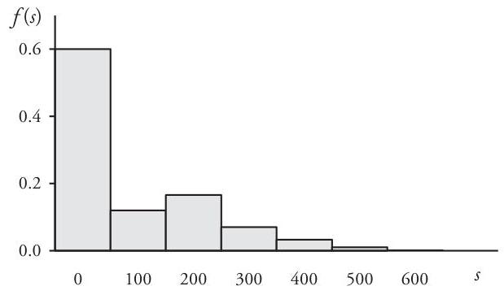

## Page 121
The $m^{\text {th }}$ moments of $S(m=1,2,3, \ldots)$ are related to the corresponding moments of the $\left\{Y_{n}\right\}$ variables by the equation

$$
\begin{aligned}
E\left[S^{m}\right] & =\int_{0}^{\infty} s^{m} d F_{S}(s) \\
& =\int_{0}^{\infty} s^{m} \sum_{n=0}^{\infty} f_{N}(n) d F_{n}^{*}(s)=\sum_{n=0}^{\infty} f_{N}(n) \int_{0}^{\infty} s^{m} d F_{n}^{*}(s) \\
& =\sum_{n=0}^{\infty} f_{N}(n) E\left[Y_{n}^{m}\right]
\end{aligned}
$$

provided the $E\left[Y_{n}^{m}\right]$ exist. Formulas for the first three moments of $Y_{n}$, displayed below, follow from the independence of the $\left\{X_{k}\right\}$ variables. Derivation of these formulas also depends on the fact that the second and third moments of a sum of independent random variables are the respective sums of the second and third moments of the summands.

$$
\begin{aligned}
E\left[Y_{n}\right] & =n E[X] \\
E\left[Y_{n}^{2}\right] & =E\left[\left(Y_{n}-E\left[Y_{n}\right]\right)^{2}\right]+\left(E\left[Y_{n}\right]\right)^{2} \\
& =n E\left[(X-E[X])^{2}\right]+(n E[X])^{2} \\
& =n \operatorname{Var}[X]+n^{2}(E[X])^{2} \\
E\left[Y_{n}^{3}\right] & =E\left[\left(Y_{n}-E\left[Y_{n}\right]\right)^{3}\right]+3 E\left[Y_{n}\right] E\left[Y_{n}^{2}\right]-2\left(E\left[Y_{n}\right]\right)^{3} \\
& =n E\left[(X-E[X])^{3}\right]+3 n^{2} E[X] \operatorname{Var}[X]+n^{3}(E[X])^{3}
\end{aligned}
$$

Combining these results with equation (4.4) yields

$$
\begin{aligned}
E[S]= & \sum_{n=1}^{\infty} f_{N}(n)(n E[X])=\left(\sum_{n=0}^{\infty} n f_{N}(n)\right) E[X]=E[N] E[X] \\
E\left[S^{2}\right]= & \sum_{n=1}^{\infty} f_{N}(n)\left(n \operatorname{Var}[X]+n^{2}(E[X])^{2}\right) \\
= & E[N] \operatorname{Var}[X]+E\left[N^{2}\right](E[X])^{2} \\
E\left[S^{3}\right]= & \sum_{n=1}^{\infty} f_{N}(n)\left(n E\left[(X-E[X])^{3}\right]+3 n^{2} E[X] \operatorname{Var}[X]+n^{3}(E[X])^{3}\right) \\
= & E[N] E\left[(X-E[X])^{3}\right]+3 E\left[N^{2}\right] E[X] \operatorname{Var}[X] \\
& +E\left[N^{3}\right](E[X])^{3}
\end{aligned}
$$

## Page 122
Therefore,

$$
\begin{aligned}
\operatorname{Var}[S]= & E[N] \operatorname{Var}[X]+\operatorname{Var}[N](E[X])^{2} \\
S k[S]= & \frac{E[N] E\left[(X-E[X])^{3}\right]+3 \operatorname{Var}[N] E[X] \operatorname{Var}[X]}{(\operatorname{Var}[S])^{3 / 2}} \\
& +\frac{E\left[(N-E[N])^{3}\right](E[X])^{3}}{(\operatorname{Var}[S])^{3 / 2}}
\end{aligned}
$$

If $N$ is distributed with mean $E[N]=\lambda$ and contagion parameter $\gamma$ so that $\operatorname{Var}[N]=$ $\lambda+\gamma \lambda^{2}$, then formulas (4.5) and (4.8) become

$$
\begin{aligned}
E[S] & =\lambda E[X] \\
\operatorname{Var}[S] & =\lambda E\left[X^{2}\right]+\gamma \lambda^{2}(E[X])^{2} \\
S k[S] & =\frac{\lambda E\left[X^{3}\right]+3 \gamma \lambda^{2} E[X] E\left[X^{2}\right]+2 \gamma^{2} \lambda^{3}(E[X])^{3}}{\left(\lambda E\left[X^{2}\right]+\gamma \lambda^{2}(E[X])^{2}\right)^{3 / 2}}
\end{aligned}
$$

In the special case that $N$ has a Poisson distribution, these formulas reduce to

$$
\begin{aligned}
E[S] & =\lambda E[X] \\
\operatorname{Var}[S] & =\lambda E\left[X^{2}\right] \\
S k[S] & =\frac{E\left[X^{3}\right]}{\sqrt{\lambda}\left(E\left[X^{2}\right]\right)^{3 / 2}}
\end{aligned}
$$

Derivations of (4.5)-(4.7) above, based on the fundamental equation (4.4) relating the moments of $S$ to those of the sequence $\left\langle Y_{n}\right\rangle$, are completely straightforward. However, as with any random variable, these formulas can also be derived from the moment-generating function of $S$ whenever that function exists.

To construct $M_{S}(t)$, start with the moment-generating function of variable $Y_{n}$. For each fixed $n, Y_{n}=\sum_{k=1}^{n} X_{k}$ is the sum of independent identical random variables, and therefore

$$
M_{Y_{n}}(t)=E\left[\exp \left(t \sum_{k=1}^{n} X_{k}\right)\right]=\prod_{k=1}^{n} E\left[\exp \left(t X_{k}\right)\right]=\left(M_{X}(t)\right)^{n}
$$

where $M_{X}(t)$ is the generating function for the common claim-size variable $X$. Accordingly, $M_{S}(t)$ is given by the series

$$
M_{S}(t)=E\left[\exp \left(t Y_{N}\right)\right]=\sum_{n=0}^{\infty} f_{N}(n) M_{Y_{n}}(t)=\sum_{n=0}^{\infty} f_{N}(n)\left(M_{X}(t)\right)^{n}
$$

## Page 123
But this last formula can be interpreted as an expected value with respect to the distribution of $N$ :

$$
M_{S}(t)=\sum_{n=0}^{\infty} f_{N}(n)\left(M_{X}(t)\right)^{n}=\sum_{n=0}^{\infty} f_{N}(n) \exp \left(n \log M_{X}(t)\right)=E_{N}\left[\exp \left(n \log M_{X}(t)\right)\right]
$$

Thus, in terms of the generating function $M_{N}$ for $N$ :

$$
M_{S}(t)=M_{N}\left(\log M_{X}(t)\right)
$$

As usual, $E[S]$ is now obtainable from (4.11) by differentiation:

$$
E[S]=M_{S}^{\prime}(0)=\left.M_{N}^{\prime}\left(\log M_{X}(t)\right) \frac{M_{X}^{\prime}(t)}{M_{X}(t)}\right|_{t=0}=M_{N}^{\prime}(0) \frac{M_{X}^{\prime}(0)}{M_{X}(0)}=E[N] E[X]
$$

Similar derivations of formulas (4.6) and (4.7) are requested in Problem 4.5.
Example 4.2. Assume that the claim-count random variable $N$ has a Poisson $(\lambda)$ distribution:

$$
f_{N}(n)=\frac{\lambda^{n} e^{-\lambda}}{n!}, \quad n=0,1,2,3, \ldots
$$

Moreover, suppose that claim size $X$ is gamma $(\alpha, \beta)$ distributed:

$$
F(x)= \begin{cases}0 & \text { if }-\infty<x<0 \\ \frac{\Gamma(x / \beta, \alpha)}{\Gamma(\alpha)} & \text { if } 0 \leq x<\infty\end{cases}
$$

Accordingly, the moment-generating function for $X$ is $M_{X}(t)=(1-\beta t)^{-\alpha}$, and the generating function for the sum of $n$ independent such gamma variables is the $n^{\alpha}$ power of $M_{X}(t)$ :

$$
\left(M_{X}(t)\right)^{n}=\left((1-\beta t)^{-\alpha}\right)^{n}=(1-\beta t)^{-n \alpha}, \quad-\infty<t<1 / \beta
$$

However, this is the generating function of a gamma variable with parameters $(n \alpha, \beta)$, so the $n$-fold convolution of identical gamma-distributed variables also has a gamma distribution:

$$
F_{n}^{B}(y)= \begin{cases}0 & \text { if }-\infty<y<0 \\ \frac{\Gamma(y / \beta, n \alpha)}{\Gamma(n \alpha)} & \text { if } 0 \leq y<\infty, \quad n=1,2,3, \ldots\end{cases}
$$

## Page 124
Note that deriving this convolution formula from the moment-generating function is considerably less onerous than carrying out the successive integrations indicated in formula (4.2). The distribution function for this combination of $N$ and $X$ can therefore be expressed in closed analytic form:

$$
F_{S}(s)= \begin{cases}0 & \text { if }-\infty<s<0 \\ \sum_{n=0}^{\infty} \frac{\lambda^{n} e^{-\lambda}}{n!} \cdot \frac{\Gamma(s / \beta, n \alpha)}{\Gamma(n \alpha)} & \text { if } 0 \leq s<\infty\end{cases}
$$

In the particular instance that $\lambda=2.5$ and $(\alpha, \beta)=(3,400)$, the Poisson formulas (4.10) imply that

$$
\begin{gathered}
E[S]=\lambda \alpha \beta=(2.5)(3)(400)=3,000 \\
\operatorname{Var}[S]=\lambda \alpha(\alpha+1) \beta^{2}=(2.5)(3)(4)(400)^{2}=4,800,000 \\
S k[S]=\frac{\alpha+2}{\sqrt{\lambda \alpha(\alpha+1)}}=\frac{5}{\sqrt{30}}=0.9129
\end{gathered}
$$

Values for the cumulative distribution function $F(s)$ in this special case are displayed in Table 4.1. The distribution has a discrete lump of probability of size $f_{N}(0)=e^{-2.5}=0.0821$ at $s=0$, but at all other $s$ values $F(s)$ is continuous. A graph of the corresponding probability density function is shown in Figure 4.2.

Table 4.1. Aggregate Distribution [Example 4.2]

| Amount $s$ | $F(s)$ |
| :--: | :--: |
| 0 | 0.0821 |
| 500 | 0.1096 |
| 1,000 | 0.1867 |
| 2,000 | 0.3755 |
| 3,000 | 0.5613 |
| 4,000 | 0.7152 |
| 5,000 | 0.8273 |
| 6,000 | 0.9013 |
| 7,000 | 0.9465 |
| 8,000 | 0.9723 |
| 9,000 | 0.9863 |
| 10,000 | 0.9934 |

## Page 125
Figure 4.2. Aggregate Density Function [Example 4.2]

In Example 4.2 we observed that the convolution of a gamma cumulative distribution function with itself is also gamma, a fact which led to an easy-to-calculate exact formula for the aggregate distribution function of that example. However, this desirable reproductive property-the distribution of a sum of identical independent random variables having the same distribution type as the components-is shared by just a few families of distributions (notably the normal distributions, which are not generally useful as claim-size distributions). In fact, sums of the ubiquitous lognormal and Pareto distributions belong neither to their respective families nor to any other familiar parametric distribution family. As a consequence, actuaries have since the mid-1900s sought to develop various procedures for calculating values of an aggregate distribution. Among these are several approximations using easily calculable parametric distributions, algorithms featuring recursive formulas, Fourier-transformbased methods, and Monte Carlo simulation. The remainder of this chapter is devoted to some of the most important of these techniques.

# 4.3. Approximation by Matching Moments 

In this section we discuss a traditional technique of approximation, the method of matching moments, similar to the method-of-moments for fitting a distribution model to sample data. This approach is based on the not-unreasonable assumption that two distributions with identical moments of order $m$, where usually $1 \leq m \leq 3$, are sufficiently similar that one distribution can be used to approximate the other. ${ }^{39}$

The method consists of two steps:
(i) Calculate from the moments of the claim-count and claim-size distributions the required mean $\mu=E[S]$, variance $\sigma^{2}=$ Var $[S]$, and skewness $\kappa=S k[S]$ according to formulas (4.5) and (4.8).
(ii) Select from a convenient parametric family of continuous distributions the particular member with matching respective first, second, and third moments.

[^0]
[^0]:    ${ }^{39}$ Although the method of matching moments usually gives reasonable results, the assumption on which it is based-that distributions with identical lowest moments are indeed comparable-could fail to hold. It is possible for distributions with identical first-, second-, and third-order moments to be significantly different. For a discussion of this "moment problem" see Pentikäinen [19] and the references cited there. However, Pentikäinen suggests that acceptable approximations are usually obtained by the method of matching moments when the variable $X$ is restricted to a finite interval, as in the case that claim size is limited by policy conditions.
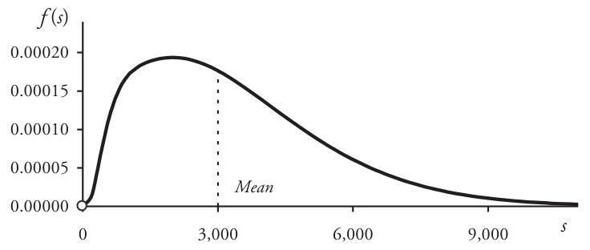

## Page 126
The cumulative distribution function of this selected parametric distribution could then serve as an approximation to $F_{S}$.

# Normal Approximation 

There are several reasons for considering a normal approximation to an aggregateloss distribution. The variables $Y_{n}$ defined in Section 4.2 are the sums of independent, identically distributed claim-size random variables. Thus, when $n$ is large, the Central Limit Theorem implies that $Y_{n}$ is approximately normally distributed. In addition, whenever the claim count is Poisson-distributed with mean $\lambda$ (but not when $N$ has a positive contagion parameter-see Problem 4.8), the Poisson formulas (4.10) imply that $S k[S]$ is small for large values of $\lambda$. In fact, in the Poisson case, one can observe that $\lim _{\lambda \rightarrow \infty} S k[S]=0$, so that the distribution of $S$ is asymptotically symmetric.

In such a case-when $N$ is Poisson-distributed and $\lambda$ is large-it is useful to try the approximation $S \approx Y=\sigma Z+\mu$, where $Z$ is the standard normal variable. This is equivalent to asserting that the standardized variable

$$
T(S)=\frac{S-\mu}{\sigma}
$$

is approximately standard normal. The normal approximation $S \approx Y=\sigma Z+\mu$ (or equivalently, $T(S) \approx Z$ ), yields

$$
\begin{aligned}
F_{S}(s) & =\operatorname{Pr}\{S \leq s\}=\operatorname{Pr}\{T(S) \leq T(s)\} \\
& \approx \operatorname{Pr}\{Z \leq T(s)\}=\Phi(T(s))=\Phi((s-\mu) / \sigma), \quad 0 \leq s<\infty
\end{aligned}
$$

Because $E[Y]=E[S]=\mu$ and $\operatorname{Var}[Y]=\operatorname{Var}[S]=\sigma^{2}$, the normal approximation (4.14) certainly involves matching the first two, but not necessarily the third, moments of the distributions. Of course, the skewness of the symmetric variable $Y=\sigma Z+\mu$ is zero, whereas $S k[S]$ is usually positive. Because of this, the normal approximation generally underestimates the probabilities of large claims. Moreover, it could assign significant probability to negative values of $s$ and thereby fail to model acceptably the short tail of the aggregate distribution (for instance, refer to Example 4.3). Obviously, the normal approximation is useful only in those cases where $S$ is nearly symmetric. In other situations one must look elsewhere for a satisfactory approximation.

## Gamma Approximation

When $S$ is notably skewed, one way to improve on the normal approximation is to match moments with a known skewed distribution. The versatile family of gamma distributions often provides a reasonable starting point.

For example, consider a gamma-distributed variable $G$ with parameters $(\alpha, \beta)$. The required mean $\mu$ and variance $\sigma^{2}$ then determine $\alpha$ and $\beta$ :

$$
\left\{\begin{array}{l}
\mu=\alpha \beta \\
\sigma^{2}=\alpha \beta^{2}
\end{array} \quad \text { implies } \quad\left\{\begin{array}{l}
\alpha=\mu^{2} / \sigma^{2} \\
\beta=\sigma^{2} / \mu
\end{array}\right.\right.
$$

## Page 127
With these parameters the distribution of $G$ has the specified mean and variance, and it is also skewed, with $S k[G]=2 \sigma / \mu>0$. However, the utility of the gamma approximation $S \approx G$ depends on how close $2 \sigma / \mu$ is to the desired skewness $\kappa$.

For a better approximation-one that matches all three parameters $\mu, \sigma$, and $\kappa-$ start again with a gamma variable $G$, except this time solve for the gamma parameters in terms of $\sigma$ and $\kappa$ :

$$
\left\{\begin{array} { l } 
{ \sigma ^ { 2 } = \alpha \beta ^ { 2 } } \\
{ \kappa = 2 / \sqrt { \alpha } }
\end{array} \quad \text { implies } \quad \left\{\begin{array}{l}
\alpha=4 / \kappa^{2} \\
\beta=\frac{1}{2} \sigma \kappa
\end{array}\right.\right.
$$

As before, the distribution of $G$ is now completely determined, but with $E[G]=\alpha \beta$ $=2 \sigma / \kappa$. In order to match the required aggregate mean $\mu$ we introduce the shifted variable $Y=G+\mu-2 \sigma / \kappa$, a random variable with all three specified properties:

$$
\begin{aligned}
E[Y] & =E[G]+\mu-2 \sigma / \kappa=\mu \\
\operatorname{Var}[Y] & =\operatorname{Var}[G]=\sigma^{2} \\
S k[Y] & =S k[G]=\kappa
\end{aligned}
$$

The distribution function of the resulting shifted gamma approximation $S \approx Y$ is

$$
\begin{aligned}
F_{S}(s) \approx F_{Y}(s) & =F_{G}(s-\mu+2 \sigma / \kappa) \\
& =\Gamma((s-\mu) / \beta+\alpha ; \alpha) / \Gamma(\alpha), \quad \mu-2 \sigma / \kappa \leq s<\infty
\end{aligned}
$$

where gamma parameters $\alpha$ and $\beta$ are given by (4.15). Depending on the sign and magnitude of the quantity $\mu-2 \sigma / \kappa$, the shift of the origin sometimes adversely affects the modeling of the short tail of the distribution, as in the case of the normal approximation (again, refer to Example 4.3).

# Normalizing Transformations 

The normal approximation to $S$ can also be improved by finding a refinement of the standardizing transformation (4.13) that allows for a better match of the third moments. Specifically, one could look for a transform $T(S)$ with not only the properties $E[T(S)]=0$ and $\operatorname{Var}[T(S)]=1$ as in (4.13), but with the additional property that the transformed variable be symmetric, or nearly so: $S k[T(S)] \approx 0$. If such a "symmetrizing" function $T$ could be found, then the assumption $T(S) \approx Z$ is more likely to provide a satisfactory approximation to $S$. Such a transformation must necessarily be more complex than that of standardizing transformation (4.13). In particular, it cannot be linear, because the skewness property of a random variable is invariant under such a transformation (refer to Problem 2.26). Two such normalizing functions, described in this section, have been used extensively-the normal power and the Wilson-Hilferty transformations.

## Page 128
For a random variable $S$ with mean $\mu$, variance $\sigma^{2}$, and skewness $\kappa$ the normal power transformation is defined by

$$
T_{N P}(S)=\sqrt{\frac{6}{\kappa} \cdot \frac{S-\mu}{\sigma}+\frac{9}{\kappa^{2}}+1}-\frac{3}{\kappa}
$$

It was proposed in 1969 by Finnish authors Lauri Kauppi and Pertti Ojantakanen, who were seeking an approximation to the Poisson case of an aggregate distribution. ${ }^{40}$ Kauppi and Ojantakanen observed that for large values of $S$ the standardized aggregate variable $(S-\mu) / \sigma$ could be approximated by a certain quadratic polynomial $Q$ in the standard normal variable $Z$ :

$$
Q(Z)=\frac{\kappa}{6}\left(Z^{2}-1\right)+Z \approx \frac{S-\mu}{\sigma}
$$

This approximation formula is based on the so-called Edgeworth series expansion of a distribution function. ${ }^{41}$ Solving the approximate equation (4.18) for $Z$ yields formula (4.17) and the approximation

$$
Z \approx T_{N P}(S)=Q^{-1}((S-\mu) / \sigma)=\sqrt{\frac{6}{\kappa} \cdot \frac{S-\mu}{\sigma}+\frac{9}{\kappa^{2}}+1}-\frac{3}{\kappa}
$$

Thus, the normal power approximation to $F_{S}$ is

$$
F_{S}(s) \approx \Phi\left(T_{N P}(s)\right)
$$

Formula (4.20) is generally applicable to the long tail of the distribution, the main region of interest in most applications. $T_{N P}$ is somewhat less successful in modeling the short tail, but a refinement of $T_{N P}(s)$ for smaller values of $s$ exists. ${ }^{42}$ The Normal Power approach can generally be relied upon to give acceptable results whenever $S$ is moderately skewed, say when $\kappa<2$.

Another classic approach to this problem is based on the work of Harvard statisticians Edwin B. Wilson and Margaret M. Hilferty. In 1931 Wilson and Hilferty developed a transformation of the chi-square variable $X=\chi^{2}(m)$ with $m$ degrees of freedom that yielded, approximately, the standard normal variable $Z$ :

$$
W(X)=\frac{\sqrt[3]{\frac{1}{m} X}-\left(1-\frac{2}{9 m}\right)}{\sqrt{\frac{2}{9 m}}} \approx Z
$$

[^0]
[^0]:    ${ }^{40}$ Kauppi and Ojantakanen [10].
    ${ }^{41}$ A detailed derivation of the normal power approximation from the Edgeworth expansion can be found in Beard, Pentikäinen, and Pesonen [3], pp. 107-110, 355-356.
    ${ }^{42}$ Ibid., pp. 116-117.

## Page 129
This transformation gave rise to a remarkably accurate approximation to the cumulative distribution function of the chi-square random variable:

$$
F_{\chi^{2}(m)}(x) \approx \Phi(W(x))
$$

illustrated in Table 4.2. Since its initial appearance the Wilson-Hilferty transformation has been successfully generalized to other random variables-including, as we shall see, moderately skewed aggregate-loss variables.

To generalize (4.21) in this way, recall that $\chi^{2}(m)$ is gamma-distributed, with parameters $\alpha=(1 / 2) m$ and $\beta=2$. Thus, $E\left[\chi^{2}(m)\right]=m$ and $\operatorname{Var}\left[\chi^{2}(m)\right]=2 m$. Thus, for the scaled variable $Y=(1 / m) \chi^{2}(m)$ we have $E[Y]=1$ and $\operatorname{Var}[Y]=2 / m$. Setting $v=\sqrt{\operatorname{Var}[Y]}$, one can express transformation $W$ in (4.21) as

$$
W(Y)=\frac{3}{v}\left(Y^{1 / 3}-1\right)+\frac{v}{3}
$$

It is a simple matter now to apply (4.23) to an arbitrary gamma random variable $G$ with parameters $(\alpha, \beta)$. In this case, set $Y=G /(\alpha \beta)$, for which $v=1 / \sqrt{\alpha}$. Consequently,

$$
W(Y)=3 \sqrt{\alpha}\left(Y^{1 / 3}-1\right)+\frac{1}{3 \sqrt{\alpha}}
$$

or in terms of the variable $G$,

$$
W(G)=3 \sqrt[3]{\alpha}\left(\frac{G-\alpha \beta}{\sqrt{\alpha \beta}}+\sqrt{\alpha}\right)^{1 / 3}-3 \sqrt{\alpha}+\frac{1}{3 \sqrt{\alpha}}
$$

Table 4.2. Wilson-Hilferty Approximation to $\chi^{2}(10)$

| $x$ | $F_{\chi^{2}(10)}(x)$ | $\Phi(W(x))$ | Relative Error |
| :--: | :--: | :--: | :--: |
| 3 | 0.0186 | 0.0193 | $+3.76 \%$ |
| 6 | 0.1847 | 0.1837 | $-0.54 \%$ |
| 9 | 0.4679 | 0.4672 | $-0.15 \%$ |
| 12 | 0.7149 | 0.7155 | $+0.08 \%$ |
| 15 | 0.8679 | 0.8686 | $+0.08 \%$ |
| 18 | 0.9450 | 0.9453 | $+0.03 \%$ |
| 21 | 0.9789 | 0.9789 | $+0.00 \%$ |
| 24 | 0.9924 | 0.9923 | $-0.01 \%$ |
| 27 | 0.9974 | 0.9973 | $-0.01 \%$ |
| 30 | 0.9991 | 0.9991 | $0.00 \%$ |

## Page 130
Replacing $G$ with $S$ and substituting $\alpha \beta=E[G]=\mu, \alpha \beta^{2}=\operatorname{Var}[G]=\sigma^{2}, 2 / \sqrt{\alpha}=$ $S k[G]=\kappa$ into (4.24) leads to a transformation of the aggregate variable $S$ :

$$
T_{W H}(S)=3\left(\frac{2}{\kappa}\right)^{2 / 3}\left(\frac{S-\mu}{\sigma}+\frac{2}{\kappa}\right)^{1 / 3}-\frac{6}{\kappa}+\frac{\kappa}{6}
$$

As in (4.22), we obtain the Wilson-Hilferty approximation to distribution function $F_{S}(s)$ :

$$
F_{S}(s) \approx \Phi\left(T_{W H}(s)\right), \quad 0 \leq s<\infty
$$

Because this approximation has been so successfully applied to gamma random variables, which in turn have provided acceptable approximations to a wide range of aggregate distributions, it is not surprising that the Wilson-Hilferty formula has proved to be useful in approximating aggregate distributions, as well.

In fact, all three approaches that take into consideration the skewness of $S$ the shifted gamma, the normal power, and the Wilson-Hilferty schemes-provide acceptable approximations to the aggregate-loss variable $S$ whenever the skewness is not too large.

Example 4.3. The result of applying the normal (4.14), shifted gamma (4.16), normal power (4.20), and Wilson-Hilferty (4.26) approximations to the moderately skewed distribution of Example 4.2 are displayed in Table 4.3. The normal approximation clearly fails to yield a reasonable result, whereas the other three methods generate quite acceptable approximations to the long tail of the distribution.

Application of these same approximations to the Poisson/gamma distribution (4.12) for which $\lambda=10, \alpha=0.05$, and $\beta=6,000$ yields the outcomes shown in Table 4.4.

Table 4.3. Approximations to $F_{S}(s): \mu=3,000, \sigma=2,191, \kappa=0.9129$ [Example 4.3]

| Amount $s$ | $F(s)$ | Normal | Relative   Error | Normal   Power | Relative   Error | Shifted   Gamma | Relative   Error | Wilson-   Hilferty | Relative   Error |
| :--: | :--: | :--: | :--: | :--: | :--: | :--: | :--: | :--: | :--: |
| 0 | 0.0821 | 0.0855 | $+4.14 \%$ | 0.0534 | $-34.96 \%$ | 0.0459 | $-44.09 \%$ | 0.0464 | $-43.48 \%$ |
| 1,000 | 0.1867 | 0.1807 | $-3.21 \%$ | 0.1900 | $+1.77 \%$ | 0.1775 | $-4.93 \%$ | 0.1765 | $-5.46 \%$ |
| 2,000 | 0.3755 | 0.3240 | $-13.72 \%$ | 0.3745 | $-0.27 \%$ | 0.3680 | $-2.00 \%$ | 0.3668 | $-2.32 \%$ |
| 3,000 | 0.5613 | 0.5000 | $-10.92 \%$ | 0.5591 | $-0.39 \%$ | 0.5607 | $-0.11 \%$ | 0.5605 | $-0.14 \%$ |
| 4,000 | 0.7152 | 0.6760 | $-5.48 \%$ | 0.7125 | $-0.38 \%$ | 0.7185 | $+0.46 \%$ | 0.7191 | $+0.55 \%$ |
| 5,000 | 0.8273 | 0.8193 | $-0.97 \%$ | 0.8245 | $-0.34 \%$ | 0.8310 | $+0.45 \%$ | 0.8318 | $+0.54 \%$ |
| 6,000 | 0.9013 | 0.9145 | $+1.46 \%$ | 0.8987 | $-0.29 \%$ | 0.9038 | $+0.28 \%$ | 0.9044 | $+0.34 \%$ |
| 7,000 | 0.9465 | 0.9661 | $+2.07 \%$ | 0.9443 | $-0.23 \%$ | 0.9475 | $+0.11 \%$ | 0.9478 | $+0.14 \%$ |
| 8,000 | 0.9723 | 0.9888 | $+1.70 \%$ | 0.9707 | $-0.16 \%$ | 0.9724 | $+0.01 \%$ | 0.9724 | $+0.01 \%$ |
| 10,000 | 0.9934 | 0.9993 | $+0.59 \%$ | 0.9927 | $-0.07 \%$ | 0.9930 | $-0.04 \%$ | 0.9929 | $-0.05 \%$ |

## Page 131
Table 4.4. Approximations to $F_{S}(s): \mu=3,000, \sigma=4,347, \kappa=2.8293$ [Example 4.3]

| Amount $s$ | $F(s)$ | Normal | Relative   Error | Normal   Power | Relative   Error | Shifted   Gamma | Relative   Error | Wilson-   Hilferty | Relative   Error |
| :--: | :--: | :--: | :--: | :--: | :--: | :--: | :--: | :--: | :--: |
| 0 | 0.00005 | 0.2451 | - | 0.4023 | - | 0.1228 | - | 0.1494 | - |
| 2,000 | 0.5922 | 0.4090 | $-30.94 \%$ | 0.5866 | $-0.95 \%$ | 0.5886 | $-0.61 \%$ | 0.5835 | $-1.47 \%$ |
| 4,000 | 0.7513 | 0.5910 | $-21.34 \%$ | 0.7108 | $-5.39 \%$ | 0.7504 | $-0.12 \%$ | 0.7519 | $+0.08 \%$ |
| 6,000 | 0.8401 | 0.7549 | $-10.14 \%$ | 0.7978 | $-5.04 \%$ | 0.8402 | $-0.01 \%$ | 0.8443 | $+0.50 \%$ |
| 8,000 | 0.8946 | 0.8750 | $-2.19 \%$ | 0.8590 | $-3.98 \%$ | 0.8949 | $+0.03 \%$ | 0.8992 | $+0.51 \%$ |
| 10,000 | 0.9294 | 0.9463 | $+1.82 \%$ | 0.9020 | $-2.95 \%$ | 0.9298 | $+0.04 \%$ | 0.9333 | $+0.42 \%$ |
| 12,000 | 0.9522 | 0.9808 | $+3.00 \%$ | 0.9322 | $-2.10 \%$ | 0.9525 | $+0.03 \%$ | 0.9552 | $+0.32 \%$ |
| 14,000 | 0.9674 | 0.9943 | $+2.78 \%$ | 0.9532 | $-1.47 \%$ | 0.9676 | $+0.02 \%$ | 0.9694 | $+0.21 \%$ |
| 16,000 | 0.9777 | 0.9986 | $+2.14 \%$ | 0.9678 | $-1.01 \%$ | 0.9778 | $+0.01 \%$ | 0.9789 | $+0.12 \%$ |
| 18,000 | 0.9846 | 0.9997 | $+1.53 \%$ | 0.9779 | $-0.68 \%$ | 0.9847 | $+0.01 \%$ | 0.9853 | $+0.07 \%$ |

This second distribution is considerably more skewed than that in Table 4.3, with $\mu=3,000, \sigma=4,347$, and $\kappa=2.8293$. Again, as expected, the normal approximation is unsuitable. The shifted gamma and Wilson-Hilferty methods, however, produce generally satisfactory results, at least to the long tail, while the normal power approximation is less accurate.

# 4.4. Recursion 

In contrast to the method of matching moments, in which the approximating distribution for the aggregate-loss random variable is selected from a family of continuous distributions, the next technique under consideration involves a discrete approximating distribution. Values of this distribution are calculated by means of a recursion formula for the aggregate probability function.

The recursion approach has been studied since the mid-1960s, when the Poisson case was first described by R.M. Adelson. It was later extended to other cases by such authors as H. H. Panjer. ${ }^{43}$ We present in this section a basic formulation of the recursion method, which rests on a pair of assumptions, one for each of the variables $N$ and $X$.

Suppose first that the claim count $N$ has a distribution for which the probability function $f_{N}(n)$ satisfies, for some constants $a$ and $b$, a recursion relation on $n$ :

$$
f_{N}(n)=\frac{n a+b}{n} f_{N}(n-1), \quad n=1,2,3, \ldots
$$

[^0]
[^0]:    ${ }^{43}$ Panjer [17].

## Page 132
Whenever $N$ is Poisson-distributed with $E[N]=\lambda$, it is easy to show that probabilities $f_{N}(n)$ satisfy (4.27) with $a=0$ and $b=\lambda$. This relation also holds in the negative binomial case—refer to Problem 3.19.

In addition, assume that claim-size variable $X$ has a discrete structure, with only a finite number of equally spaced values $x_{k}$ :

$$
\left\{x_{k}\right\}=\{k h: k=0,1,2, \ldots, \hat{m}\}, \quad \text { where } h>0 \text { is the constant step length. }
$$

We denote the probability mass function for $X$ by

$$
g(k)=\operatorname{Pr}\left\{X=x_{k}\right\}=f_{X}\left(x_{k}\right)
$$

for which, as usual, $g(k) \geq 0$ and $\sum_{k=0}^{\infty} g(k)=\sum_{k=0}^{\hat{m}} g(k)=1$. It is convenient to select $\hat{m}$ so that $\hat{m}=\max \{k: g(k)>0\}$.

Again, let $Y_{n}=\sum_{i=1}^{n} X_{i}$ be the sum of $n(n \geq 1)$ independent random variables, each identical to $X$. Because the component variables $\left\{X_{i}\right\}$ can have only values that are multiples of $h$, this is true for each $Y_{n}$ and for the aggregate loss variable $S$, as well. Probabilities for $Y_{n}$ are denoted by

$$
g_{n}(m)=\operatorname{Pr}\left\{Y_{n}=m h\right\}, \quad m=0,1,2,3, \ldots
$$

where, by convention, $g_{0}(0)=1$ and $g_{0}(m)=0$ when $m \geq 1$. Thus, the probability function $f_{S}(m)$ for $S$ has the form

$$
f_{S}(m)=\operatorname{Pr}\{S=m h\}=\sum_{n=0}^{\infty} f_{N}(n) g_{n}(m), \quad m=0,1,2,3, \ldots
$$

Because of the independence of the $\left\{X_{i}\right\}$ it is easy to verify that the convolution probabilities $g_{n}(m)$ can be expressed recursively for positive $n$ by

$$
g_{n}(m)=\sum_{k=0}^{\infty} g(k) g_{n-1}(m-k), \quad m=0,1,2,3, \ldots
$$

In addition, observe that $g_{n}(0)=g^{n}(0)$ for each positive $n$, so that

$$
f_{S}(0)=\sum_{n=0}^{\infty} f_{N}(n) g^{n}(0)= \begin{cases}f_{N}(0) & \text { if } g(0)=0 \\ M_{N}(\log g(0)) & \text { if } g(0)>0\end{cases}
$$

Finally, applying (4.27) to formula (4.29), we obtain

$$
f_{S}(m)=\sum_{n=1}^{\infty}\left(a+\frac{b}{n}\right) f_{N}(n-1) g_{n}(m), \quad m=1,2,3, \ldots
$$

Having established these preliminary results, we can now state and prove the main theorem about $f_{S}(m)$ :

## Page 133
The probability function for the aggregate-loss variable with a claim-count distribution satisfying (4.27) and a claim-size variable having the discrete structure (4.28) satisfies a recursion relation on the integer variable $m$ :

$$
f_{S}(m)=\frac{1}{1-a g(0)} \sum_{k=1}^{\infty}\left(a+\frac{b}{m} k\right) g(k) f_{S}(m-k), \quad m=1,2,3, \ldots
$$

and $f_{S}(0)$ is given by $(4.31)$.
Proof: Verification of formula (4.33) rests on an ingenious argument about conditional probabilities and expectations for the random variables involved in the sums $\left\{Y_{n}\right\}$ to create an alternative expression for $g_{n}(m)$.

Begin by considering the following conditional probability formula for $X_{n}$. Variables $X_{n}$ and $X_{1}+X_{2}+\cdots+X_{n-1}$ are independent, so for each $k$ and for each positive $m$ for which $g_{n}(m) \neq 0$

$$
\operatorname{Pr}\left\{X_{n}=k h \mid Y_{n}=m h\right\}=\frac{g(k) g_{n-1}(m-k)}{g_{n}(m)}
$$

Subject to the condition $Y_{n}=m h$, the expected value of $X_{n}$ is therefore

$$
E\left[X_{n} \mid Y_{n}=m h\right]=h \sum_{k=1}^{\infty} \frac{k g(k) g_{n-1}(m-k)}{g_{n}(m)}
$$

It is obvious that

$$
\sum_{i=1}^{n} E\left[X_{i} \mid Y_{n}=m h\right]=E\left[Y_{n} \mid Y_{n}=m h\right]=m h
$$

However, the random variables $\left\{X_{i}\right\}$ are identical and independent, and they play symmetric roles in the definition of $Y_{n}$. This means that the expected values $E\left[X_{i} \mid Y_{n}=m h\right]$ must be identical, so that the sum in equation (4.35) must also equal $n E\left[X_{n} \mid Y_{n}=m h\right]$. Consequently, $E\left[X_{n} \mid Y_{n}=m h\right]=(m / n) h$. Substituting this value into equation (4.34) yields the alternate formula

$$
g_{n}(m)=\frac{n}{m} \sum_{k=1}^{m} k g(k) g_{n-1}(m-k)
$$

But $g(k) g_{n-1}(m-k)=0$ whenever $g_{n}(m)=0$, so (4.36) is valid for all values of $m$.
To conclude, apply (4.30) and (4.36) to formula (4.32) and obtain

$$
\begin{aligned}
f_{S}(m) & =\sum_{n=1}^{\infty} a f_{N}(n-1) g_{n}(m)+\sum_{n=1}^{\infty} \frac{b}{n} f_{N}(n-1) g_{n}(m) \\
& =\sum_{n=1}^{\infty} a f_{N}(n-1) \sum_{k=0}^{\infty} g(k) g_{n-1}(m-k)+\sum_{n=1}^{\infty} \frac{b}{n} f_{N}(n-1) \cdot \frac{n}{m} \sum_{k=1}^{\infty} k g(k) g_{n-1}(m-k)
\end{aligned}
$$

## Page 134
$$
\begin{aligned}
& =a g(0) \sum_{n=1}^{\infty} f_{N}(n-1) g_{n-1}(m)+\sum_{k=1}^{m}\left(a+\frac{b}{m} k\right) g(k) \sum_{n=1}^{\infty} f_{N}(n-1) g_{n-1}(m-k) \\
& =a g(0) f_{S}(m)+\sum_{k=1}^{m}\left(a+\frac{b}{m} k\right) g(k) f_{S}(m-k)
\end{aligned}
$$

Solving this equation for $f_{S}(m)$ yields (4.33), as required.
Example 4.4. Claim-count random variable $N$ is Poissondistributed with mean $\lambda=1.75$. Variable $X$ has a discrete structure of the form (4.28), with $h=1,000, \hat{m}=5$, and the tabulated probabilities $g(k)$.

Applying formula (4.33) in succession yields the probability function for the aggregate variable $S$ :

$$
\begin{aligned}
& f_{S}(0)=e^{-1.75}=0.1738 \\
& f_{S}(1)=\frac{1.75}{1}(1)(0.20)(0.1738)=0.0608 \\
& f_{S}(2)=\frac{1.75}{2}[(1)(0.20)(0.0608)+(2)(0.40)(0.1738)]=0.1323 \\
& f_{S}(3)=\frac{1.75}{3}[(1)(0.20)(0.1323)+(2)(0.40)(0.0608)+(3)(0.20)(0.1738)] \\
& =0.1046 \\
& f_{S}(4)=\frac{1.75}{4}[(1)(0.20)(0.1046)+(2)(0.40)(0.1323)+(3)(0.20)(0.0608) \\
& +(4)(0.15)(0.1738)]=0.1170
\end{aligned}
$$

The cumulative probability function $F$ is a step function:

$$
F_{S}(\iota)=\sum_{k=0}^{\llbracket \sqrt{ } h \rrbracket} f_{S}(k)
$$

Values of the derived discrete distribution functions for $S$ are displayed in Table 4.5.
In order to use formula (4.33) to approximate the distribution of an aggregateloss variable $S$ for which the claim-size variable $X$ is continuous, or continuous almost everywhere, one must first approximate $X$ with a discrete variable of the form (4.28) by selecting parameters $h$ and $\hat{m}$ and defining probabilities $g(k)$.

## Page 135
Table 4.5. Aggregate Distribution [Example 4.4]

| Amount $s$ | $f_{2}(s)$ | $F_{2}(s)$ |
| :--: | :--: | :--: |
| 0 | 0.1738 | 0.1738 |
| 1,000 | 0.0608 | 0.2346 |
| 2,000 | 0.1323 | 0.3669 |
| 3,000 | 0.1046 | 0.4715 |
| 4,000 | 0.1170 | 0.5886 |
| 5,000 | 0.0932 | 0.6818 |
| 6,000 | 0.0786 | 0.7604 |
| 7,000 | 0.0641 | 0.8245 |
| 8,000 | 0.0499 | 0.8744 |
| 9,000 | 0.0377 | 0.9121 |
| 10,000 | 0.0274 | 0.9395 |
| 12,000 | 0.0138 | 0.9729 |
| 14,000 | 0.0063 | 0.9886 |
| 16,000 | 0.0027 | 0.9955 |

In general, greater accuracy is achieved by choosing $h$ small and $\hat{m}$ large. However, there does exist a tradeoff. The recursive nature of the method requires the calculation of all preceding values $\left\{f_{2}(1), f_{3}(2), \ldots, f_{5}(m-1)\right\}$ before $f_{5}(m)$ can be evaluated, necessitating a large number of arithmetic operations in most applications. Calculation time can be adversely affected if $\hat{m}$ becomes too large.

Whenever $X$ is censored—say, by a policy limit $l$ —one should select $h$ and $\hat{m}$ so that $\hat{m} h=l$. On the other hand, if $X$ is unlimited, then $\hat{m} h$ must be large enough to guarantee that $1-F_{X}(\hat{m} h)$ is small, as in Example 4.5.

Probabilities $g(k)$ can be defined in variety of ways. In general, one is faced with the problem of starting with a continuous probability distribution defined by $F_{X}$ for intervals of $X$ values and redistributing the total probability mass to a finite set of point values. One simple technique, often referred to as the midpoint method, is to treat the lattice points $\{k h\}$ as the midpoints of certain intervals and then assign probabilities as follows:

$$
\begin{aligned}
& g(0)=F_{X}\left(\frac{1}{2} h\right) \\
& g(k)=F_{X}\left(\left(k+\frac{1}{2}\right) h\right)-F_{X}\left(\left(k-\frac{1}{2}\right) h\right), \quad k=1,2, \ldots, \hat{m}-1 \\
& g(\hat{m})=1-F_{X}\left(\left(\hat{m}-\frac{1}{2}\right) h\right)
\end{aligned}
$$

## Page 136
One difficulty with the midpoint method is that when $h$ is large and $\hat{m}$ is small the discrete distribution may fail to have the same moments as the continuous distribution for $X$. This can often be improved by a careful selection of $h$ and $\hat{m}$.

Example 4.5. Return again to the aggregate-loss variable of Example 4.2, in which $N$ is Poisson with $E[N]=2.5$ and $X$ is gamma-distributed with $(\alpha, \beta)=(3,400)$, so that $E[X]=1,200$ and $\operatorname{Var}[X]=480,000$.

Now approximate the distribution function using recursion model (4.33), with the midpoint method for assigning claim-size probabilities and two choices for parameters $h$ and $\hat{m}$ : $(A)(h, \hat{m})=(100,60)$ and $(B)(h, \hat{m})=(20,300)$. Note that $\hat{m} h=$ 6,000 in both cases, and that $F_{X}(6,000)=0.99996$. Both sets of parameters return good approximations to $E[X]$ and $\operatorname{Var}[X]:(1,199.98 ; 480,642)$ for option $(A)$ and $(1,199.88 ; 479,846)$ for $(B)$. Nevertheless, the two options do yield materially different approximations to $F_{X}(s)$, as shown in Table 4.6.

# 4.5. Fourier Approximation 

We have already observed that the moment-generating function of a random variable is a Laplace transform of its probability density function $f$. In an analogous way, the characteristic function $\varphi$ of a random variable is defined as a Fourier transform of the density function:

$$
\varphi(t)=E\left[e^{i t X}\right]=\int_{-\infty}^{\infty} e^{i t x} f(x) d x \quad \text { for all real } t(i=\sqrt{-1})
$$

Table 4.6. Aggregate Distribution, Discrete Approximations [Example 4.5]

| Amount $s$ | $F_{X}(s)$ | Approx $(A)$   $h=100$ | Relative Error | Approx $(B)$   $h=20$ | Relative Error |
| :--: | :--: | :--: | :--: | :--: | :--: |
| 0 | 0.0821 | 0.0821 | $0.00 \%$ | 0.0821 | $0.00 \%$ |
| 500 | 0.1096 | 0.1158 | $+5.66 \%$ | 0.1108 | $+1.09 \%$ |
| 1,000 | 0.1867 | 0.1956 | $+4.77 \%$ | 0.1885 | $+0.96 \%$ |
| 2,000 | 0.3755 | 0.3852 | $+2.58 \%$ | 0.3775 | $+0.53 \%$ |
| 3,000 | 0.5613 | 0.5699 | $+1.53 \%$ | 0.5630 | $+0.30 \%$ |
| 4,000 | 0.7152 | 0.7218 | $+0.92 \%$ | 0.7165 | $+0.18 \%$ |
| 5,000 | 0.8273 | 0.8318 | $+0.54 \%$ | 0.8282 | $+0.11 \%$ |
| 6,000 | 0.9013 | 0.9042 | $+0.32 \%$ | 0.9019 | $+0.07 \%$ |
| 7,000 | 0.9465 | 0.9482 | $+0.18 \%$ | 0.9469 | $+0.04 \%$ |
| 8,000 | 0.9723 | 0.9733 | $+0.10 \%$ | 0.9725 | $+0.02 \%$ |
| 9,000 | 0.9863 | 0.9868 | $+0.05 \%$ | 0.9864 | $+0.01 \%$ |
| 10,000 | 0.9934 | 0.9937 | $+0.03 \%$ | 0.9935 | $+0.01 \%$ |

## Page 137
Whereas the moment-generating function of a random variable could fail to exist, the expected value in (4.38) exists for every random variable. Moreover, to every characteristic function there corresponds a unique probability distribution, thus establishing a one-to-one correspondence between the set of probability distributions and the set of characteristic functions.

There exists a variety of formulas that invert formula (4.38) and allow recovery of the density function $f$-or equivalently, the distribution function $F$-from $\varphi(t)$. Particularly useful in this section is the inversion formula

$$
\frac{F(x+)+F(x-)}{2}=\frac{1}{2}-\frac{1}{\pi} \int_{0}^{\infty} \frac{\Im\left(e^{-i t x} \varphi(t)\right)}{t} d t
$$

where $F(x+)$ and $F(x-)$ are the respective right- and left-hand limits of $F$ at $x .{ }^{44}$
The correspondence between distributions and characteristic functions has been exploited by several authors-notably in the early 1980s by Philip Heckman and Glenn Meyers ${ }^{45}$ —to develop methods for approximating an aggregate distribution function. These methods generally involve setting up the approximating function in a such a way that an appropriate inversion formula becomes easy to evaluate. The general approach to using characteristic functions as the basis of an approximation is outlined in this section, with particular attention paid to the Heckman-Meyers approach.

The characteristic function of an aggregate variable $S$ is defined in a manner analogous to that of the moment-generating function $M_{S}(t)$. For each positive integer $n$ the characteristic function of $Y_{n}=\sum_{k=1}^{n} X_{k}$ is given by the product

$$
\varphi_{Y_{n}}(t)=E\left[\exp \left(i t \sum_{k=1}^{n} X_{k}\right)\right]=\prod_{k=1}^{n} E\left[\exp \left(i t X_{k}\right)\right]=\left(\varphi_{X}(t)\right)^{n}
$$

where $\varphi_{X}(t)$ is that of the common claim-size distribution. Thus, $\varphi_{S}(t)$ is given by the series

$$
\varphi_{S}(t)=E\left[\exp \left(i t Y_{N}\right)\right]=\sum_{n=0}^{\infty} f_{N}(n) \varphi_{Y_{n}}(t)=\sum_{n=0}^{\infty} f_{N}(n)\left(\varphi_{X}(t)\right)^{n}
$$

Finally, $\varphi_{S}(t)$ can be expressed in terms of $M_{N}(t)$, as in (4.11):

$$
\varphi_{S}(t)=M_{N}\left(\log \varphi_{X}(t)\right)
$$

In the case that $N$ has a Poisson $(\lambda)$ distribution, this equation becomes

$$
\varphi_{S}(t)=\exp \left(\lambda \varphi_{X}(t)-\lambda\right)
$$

[^0]
[^0]:    ${ }^{44} \Im(a+i b)$ denotes the imaginary part of the complex number $a+i b: \Im(a+i b)=b$ and $|a+i b|=\sqrt{a^{2}+b^{2}}$. Also, $e^{i \theta}$ can be expressed as a complex number of the form $a+i b$ by means of Euler's Formula: $e^{i \theta}=\cos \theta+i \sin \theta$. Note that if $F$ is continuous at $x$, then $(1 / 2)(F(x+)+F(x-))=F(x)$. For a derivation of inversion formula (4.39) consult, for example, Parzen [18], pp. 400-413.
    ${ }^{45}$ Heckman and Meyers [5].

## Page 138
On the other hand, if $N$ has a negative binomial distribution with mean $\lambda$ and contagion parameter $\gamma(\gamma \neq 0)$, then

$$
\varphi_{S}(t)=\left(1+\lambda \gamma-\lambda \gamma \varphi_{X}(t)\right)^{-1 / \gamma}
$$

Example 4.6. The characteristic function for the gamma $(\alpha, \beta)$ random variable is $\varphi(t)=(1-i \beta t)^{-\alpha}$. Therefore, the aggregate variable $S$ with a Poisson-distributed claim count with mean $\lambda$ and a gamma $(\alpha, \beta)$ claim-size distribution has characteristic function $\varphi_{S}(t)=\exp \left(\lambda(1-i \beta t)^{-\alpha}-\lambda\right)$.

The Heckman-Meyers algorithm begins with the definition of a piecewiselinear approximation to the cumulative distribution function $F_{X}(x)$ for claim-size variable $X$. As we shall soon discover, this approach gives rise to a computationally tractable characteristic function for $S$. We start by assuming that $F_{X}(x)$ is continuous on an interval $0<x<l$. The Heckman-Meyers algorithm accordingly assumes that $X$ is censored at $l$. If one must use an uncensored variable, choose $l$ large enough so that $1-F_{X}(l)$ is negligibly small. After partitioning the closed interval $[0, l]$ into $m$ subintervals

$$
0=c_{0}<c_{1}<\cdots<c_{m-1}<c_{m}=l
$$

we approximate $F_{X}(x)$ by a piecewise-linear function $\hat{F}_{X}(x)$ with nodes at the points ${ }^{46}$

$$
\left(c_{k}, F_{X}\left(c_{k}\right)\right), \quad k=0,1,2, \ldots, m
$$

That is, the graph of $y=\hat{F}_{X}(x)$ on $[0, l]$ is a continuous polygonal curve connecting the endpoints $\left(0, F_{X}(0)\right)$ and $\left(l, F_{X}(l)\right)$. The associated probability density function $f_{X}(x)$ is a step function-that is, $f_{X}(x)$ is piecewise constant on $[0, l]$, with the sequence of constants defined by

$$
\delta_{k}=\frac{F_{X}\left(c_{k}\right)-F_{X}\left(c_{k-1}\right)}{c_{k}-c_{k-1}}, \quad k=1,2, \ldots, m
$$

Consequently, the characteristic function associated with the approximating distribution function $\hat{F}_{X}(x)$ is

$$
\begin{aligned}
\hat{\varphi}_{X}(t) & =\sum_{k=1}^{m} \int_{c_{k-1}}^{c_{k}} \delta_{k} e^{i t x} d x+\left(1-F_{X}\left(c_{m}\right)\right) e^{i c_{m} t} \\
& =\sum_{k=1}^{m} \int_{c_{k-1}}^{c_{k}} \delta_{k}(\cos t x+i \sin t x) d x+\left(1-F_{X}\left(c_{m}\right)\right) e^{i c_{m} t}
\end{aligned}
$$

[^0]
[^0]:    ${ }^{46}$ To improve the approximation to $F_{X}(x)$ it is advantageous to use a nonregular partition, with partition points closer together nearer $x=0$, where the graph of $y=F(x)$ is steeper, and farther apart nearer $x=l$, where the graph is flatter. For example, the formula $c_{k}=\exp (\log (l) k / m)$ for $1 \leq k \leq m$ often works well—see Example 4.7.

## Page 139
$$
\begin{aligned}
= & \frac{1}{t} \sum_{k=1}^{m} \delta_{k}\left(\sin c_{k} t-\sin c_{k-1} t\right)+\left(1-F_{X}\left(c_{m}\right)\right) \cos c_{m} t \\
& +\frac{i}{t} \sum_{k=1}^{m} \delta_{k}\left(\cos c_{k-1} t-\cos c_{k} t\right)+i\left(1-F_{X}\left(c_{m}\right)\right) \sin c_{m} t \\
= & A(t)+i B(t)
\end{aligned}
$$

where $A(t)$ and $B(t)$ denote the real and imaginary parts of $\hat{\varphi}_{S}(t)$, respectively. Note that a discrete lump of probability of size $1-F_{S}(l)$ has been incorporated at the upper limit $l=c_{m}$.

We can now use formulas (4.42) and (4.43) to develop the characteristic function for the approximating aggregate distribution. In the Poisson case

$$
\hat{\varphi}_{S}(t)=\exp (\lambda A(t)+i \lambda B(t)-\lambda)=R(t) e^{t \theta(t)}
$$

where $R(t)=e^{\lambda A(t)-\lambda}$ and $\theta(t)=\lambda B(t)$. In the negative binomial case the function is

$$
\hat{\varphi}_{S}(t)=(1+\lambda \gamma-\lambda \gamma(A(t)+i B(t)))^{-1 / \gamma}=R(t) e^{t \theta(t)}
$$

with

$$
\begin{aligned}
& R(t)=\sqrt{\left(|1+\lambda \gamma-\lambda \gamma A(t)|^{2}+|\lambda \gamma B(t)|^{2}\right)^{-1 / \gamma} \text { and }} \\
& \theta(t)=-\frac{1}{\gamma} \arctan \left(\frac{\lambda \gamma B(t)}{1+\lambda \gamma-\lambda \gamma A(t)}\right)
\end{aligned}
$$

The cumulative distribution function of $S$ is recoverable from $\hat{\varphi}_{S}(t)$ by means of inversion formula (4.39):

$$
\begin{aligned}
F_{S}(s) \approx \hat{F}_{S}(s) & =\frac{1}{2}-\frac{1}{\pi} \int_{0}^{\infty} \frac{\Im\left(e^{-i t s} \hat{\varphi}_{S}(t)\right)}{t} d t \\
& =\frac{1}{2}-\frac{1}{\pi} \int_{0}^{\infty} \frac{\Im\left(e^{-i t s} R(t) e^{t \theta(t)}\right)}{t} d t \\
& =\frac{1}{2}+\frac{1}{\pi} \int_{0}^{\infty} \frac{R(t)}{t} \sin (s t-\theta(t)) d t
\end{aligned}
$$

whenever $F_{S}(s)$ is continuous at $s$. In their paper [5], Heckman and Meyers use numerical integration to evaluate formula (4.44) at the required values of $s$.

Example 4.7. An application of the Heckman-Meyers algorithm to the aggregate distribution of Example 4.2 yields the results shown in Table 4.7. ${ }^{47}$ Here the

[^0]
[^0]:    ${ }^{47}$ These results were obtained from an implementation of the Heckman-Meyers algorithm in a Microsoft Excel workbook created by the author.

## Page 140
Table 4.7. Heckman-Meyers Approximation [Example 4.7]

| Amount $s$ | $F(s)$ | $\hat{F}(s)$ | Relative Error |
| :--: | :--: | :--: | :--: |
| 0 | 0.0821 | 0.0412 | $-49.82 \%$ |
| 500 | 0.1096 | 0.1094 | $-0.15 \%$ |
| 1,000 | 0.1867 | 0.1869 | $+0.10 \%$ |
| 2,000 | 0.3755 | 0.3757 | $+0.06 \%$ |
| 3,000 | 0.5613 | 0.5614 | $+0.01 \%$ |
| 4,000 | 0.7152 | 0.7151 | $-0.01 \%$ |
| 5,000 | 0.8273 | 0.8271 | $-0.02 \%$ |
| 6,000 | 0.9013 | 0.9011 | $-0.02 \%$ |
| 7,000 | 0.9465 | 0.9463 | $-0.02 \%$ |
| 8,000 | 0.9723 | 0.9722 | $-0.01 \%$ |
| 9,000 | 0.9863 | 0.9862 | $-0.01 \%$ |
| 10,000 | 0.9934 | 0.9934 | $0.00 \%$ |

basic claim-size interval of definition is taken as $[0 ; 20,000]$, with partition points $c_{k}=\exp (\log (20,000) k / 256), k=1,2, \ldots, 256$. This choice of partition improves the accuracy of the approximation by placing the points closer together at the left end of the interval and farther apart at the right end, where the distribution is flatter. The approximation is highly accurate, except at the single point $s=0$. At this exceptional point there is a discrete lump of probability, the probability of $N=0$ claims. Such points of discrete probability give rise to jump discontinuities in the function $F_{S}(s)$, as discussed in the next section.

# 4.6. Discontinuities 

When a generally continuous claim-size distribution has a nonzero probability amount at a positive singular point $\xi$, the corresponding aggregate distribution function has a jump discontinuity at all multiples of $\xi$. This phenomenon is always present when the continuous claim-size variable $X$ is censored at a limit value $l$. The distribution of the modified variable has a discrete lump of probability in the amount of $1-F_{X}(l)$ at $x=l$ and an aggregate distribution function based on the modified distribution would then have jump discontinuities at all positive integer multiples of $l$.

The size of the jump discontinuity in the aggregate distribution at $s=k l$, the $k^{\text {th }}$ multiple of the claim limit $l$, is given by

$$
f_{N}(k) \cdot\left(1-F_{X}(l)\right)^{k}, \quad k=1,2,3, \ldots
$$

In situations where $E[N]$ is fairly large, the probability $f_{N}(k)$-and therefore the size of the discontinuity at $k$-is comfortably small. When this occurs the error of

## Page 141
approximation by a continuous function is negligible. On the other hand, when the expected number of claims is small, then the techniques discussed in Sections 4.3 and 4.5 can fail to provide a reasonable approximation at or near such a point of discontinuity. The next example illustrates this situation.

Example 4.8. Consider a gamma-distributed claim-size variable $X$ with $(\alpha, \beta)=$ $(2.5,500)$. The unlimited mean is 1,250 , but the distribution limited at $l=2,000$ has a mean of 1,147 . The limited distribution has a single discrete amount of probability of size 0.1562 at $l=2,000$.

Compounding this claim-size variable with a Poisson claim-count variable with mean $\lambda=1.308$ yields an aggregate random variable $S$ with mean $1,500=(1.308)$ $(1,147)$. The aggregate distribution function $F_{S}$ will then have a jump discontinuity at $s=2,000$, the size of which is given by (4.45) with $k=1$ :

$$
(1.308)\left(e^{-1.308}\right)(0.1562)=0.0552
$$

Approximating the aggregate distribution function by the shifted gamma approximation (4.16) yields the continuous function shown in the graph of Figure 4.3 as the dashed curve. This approximation has considerable error throughout a fairly broad interval about the discontinuity at $s=2,000$.

By way of contrast, the Fourier approximation (4.44) based on the Heckman-Meyers algorithm does a better job of approximating the function near the singular point, but as a continuous function it also has difficulty at the point itself. This approximation is shown in Figure 4.3 as the solid curve. Note that the graph of the Heckman-Meyers function passes through the midpoint of the jump at $s=2,000$.

# 4.7. Simulation 

Methods for calculating or approximating aggregate loss distributions discussed in the previous sections all involve deterministic models-that is, numbers associated with the approximating distribution are all calculable from definite algorithms and functional

Figure 4.3. Approximations to $F(s)$ at a Point of Discontinuity [Example 4.8]
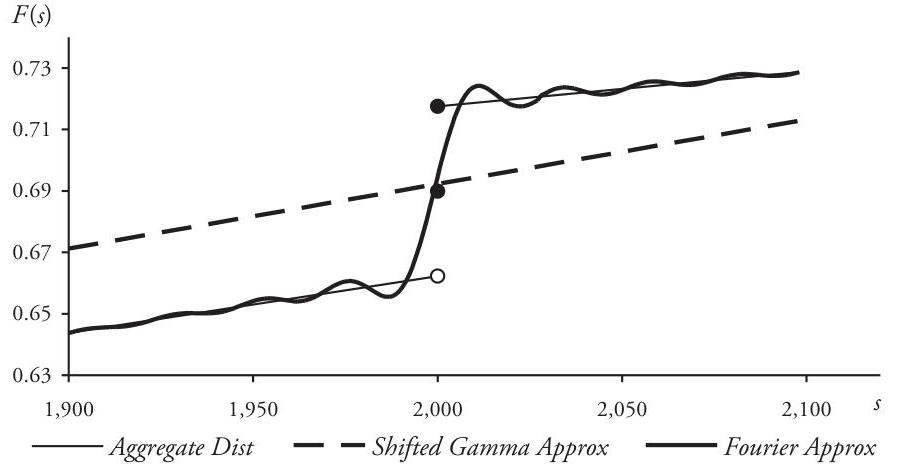

## Page 142
formulas. In this section we turn to another classic approach to the problem-the method of distribution simulation, often called Monte Carlo simulation in reference to its stochastic basis.

The simulation technique is conceptually simple and straightforward: first (i) generate a large random sample of selections from the parametric distribution in question, and then (ii) create the discrete distribution for this sample, a distribution which can be a useful approximation to the original parametric distribution. In the case of stochastic simulation, however, there is no empirical population of data from which to select a random sample. The sample points must be generated, either from a table of random numbers or by means of a computer random number generator. Such computer software packages-more accurately characterized as pseudo random number generators-typically generate numbers uniformly distributed between 0 and 1.

At the heart of the simulation method lies the following theorem, used to transform a number $u$ randomly selected from a uniform distribution on the interval $0<u<1$ to a random value of a variable with a specified distribution. Thus, if $F$ is the distribution function of random variable $Y$ and $u$ is a number randomly generated from the interval $0<u<1$, then $\tilde{F}^{-1}(u)$ —where $\tilde{F}^{-1}$ is the generalized inverse function defined at (4.46)—is a randomly generated value of variable $Y$.

Assume that $F(y)=\operatorname{Pr}\{Y \leq y\}$ is the cumulative distribution function for random variable $Y$. The generalized inverse function $\tilde{F}^{-1}$ is defined for each $u$ in the open interval $(0,1)$ by

$$
\tilde{F}^{-1}(u)=\min \{\xi: u \leq F(\xi)\}
$$

If random variable $U$ is uniformly distributed on the interval $(0,1)$, then random variable $\tilde{F}^{-1}(U)$ is identical to $Y: \tilde{F}^{-1}(U)=Y$.

Proof: Observe first that $\tilde{F}^{-1}$ has the following properties:

$$
\begin{gathered}
u \leq F\left(\tilde{F}^{-1}(u)\right) \text { for all } u \text { in }(0,1) \\
\tilde{F}^{-1}(F(y)) \leq y \text { for all real } y \\
\tilde{F}^{-1}(u) \text { is a nondecreasing function of } u
\end{gathered}
$$

(refer to Problem 4.19). The theorem will be established if we can show that for all real $y$

$$
\left\{u: \tilde{F}^{-1}(u) \leq y\right\}=\{u: u \leq F(y)\}
$$

Then, if random variable $U$ is uniformly distributed on $(0,1)$, equation (4.50) implies that

$$
\operatorname{Pr}\left\{F^{-1}(U) \leq y\right\}=\operatorname{Pr}\{U \leq F(y)\}=F(y), \quad-\infty<y<\infty
$$

As a result, random variables $\tilde{F}^{-1}(U)$ and $Y$ have the same cumulative distribution function $F(y)$, and so they must be identical: $\tilde{F}^{-1}(U)=Y$.

## Page 143
To prove equation (4.50), assume that $y$ is a fixed real number. First select $u$ in $(0,1)$ so that $\tilde{F}^{-1}(u) \leq y$. Because of (4.47) and the fact that $F$ is a nondecreasing function

$$
u \leq F\left(\tilde{F}^{-1}(u)\right) \leq F(y)
$$

Conversely, suppose that $u \leq F(y)$. Properties (4.48) and 4.49) imply that

$$
\tilde{F}^{-1}(u) \leq \tilde{F}^{-1}(F(y)) \leq y
$$

Combining (4.51) and (4.52) yields the desired result.
Example 4.9. Suppose that $X$ has the claim-size distribution of Example 4.1, with cumulative distribution function

$$
F(x)= \begin{cases}0 & \text { if }-\infty<x<100 \\ 0.40 & \text { if } 100 \leq x<200 \\ 0.90 & \text { if } 200 \leq x<300 \\ 1.00 & \text { if } 300 \leq x<\infty\end{cases}
$$

(a) The inverse (4.46) is therefore given by

$$
\tilde{F}^{-1}(u)= \begin{cases}100 & \text { if } 0<u \leq 0.40 \\ 200 & \text { if } 0.40<u \leq 0.90 \\ 300 & \text { if } 0.90<u<1.00\end{cases}
$$

If $U$ is uniformly distributed on the interval $(0,1)$, then $\tilde{F}^{-1}(U)$ takes on three possible values-100, 200, 300—with probabilities

$$
\begin{aligned}
& \operatorname{Pr}\left\{\tilde{F}^{-1}(U)=100\right\}=0.40-0=0.40 \\
& \operatorname{Pr}\left\{\tilde{F}^{-1}(U)=200\right\}=0.90-0.40=0.50 \\
& \operatorname{Pr}\left\{\tilde{F}^{-1}(U)=300\right\}=1.00-0.90=0.10
\end{aligned}
$$

This verifies, of course, that random variables $\tilde{F}^{-1}(U)$ and $X$ are identical.
(b) Suppose now that three trials of the random generation process are performed, generating random numbers $u_{1}=0.4547, u_{2}=0.9236$, and $u_{3}=0.2573$. The corresponding random values of $X$ are obtained from formula (4.53): $x_{1}=\tilde{F}^{-1}\left(u_{1}\right)=200$, $x_{2}=\tilde{F}^{-1}\left(u_{2}\right)=300$, and $x_{3}=\tilde{F}^{-1}\left(u_{3}\right)=200$.

The next three examples illustrate methods for generating random values of commonly encountered claim-size and claim-count random variables.

Example 4.10. (a) Variable $X_{1}$ is exponentially distributed, with $F_{1}(x)=1-e^{-x / \beta}$ for $0<x<\infty$. Because $F_{1}$ is strictly increasing for positive $x$, the function is invertible

## Page 144
Table 4.8. Random Values for Claim-Size Distributions [Example. 4.10(d)]

| Trial | Uniform   $u$ | Exponential   $x_{1}$ | Pareto   $x_{2}$ | Std Normal   $z$ | Lognormal   $x_{3}$ |
| :-- | :--: | :--: | :--: | :--: | :--: |
| (1) | 0.1854 | 410 | 216 | -0.8950 | 18 |
| (2) | 0.3038 | 724 | 397 | -0.5135 | 44 |
| (3) | 0.5498 | 1,596 | 981 | 0.1252 | 189 |
| (4) | 0.7953 | 3,172 | 2,420 | 0.8249 | 947 |
| (5) | 0.9774 | 7,580 | 11,304 | 2.0028 | 14,221 |

there in the ordinary sense, and the inverse defined in (4.46) is identical to the conventional inverse function:

$$
x=F_{1}^{-1}(u)=-\beta \log (1-u), \quad 0<u<1
$$

Alternatively, because $1-U$ is also distributed uniformly on the interval $(0,1)$, one can generate a random value for $x$ by the equation $x=-\beta \log u, 0<u<1$.
(b) Similarly, when random variable $X_{2}$ has a shifted Pareto distribution with distribution function $F_{2}(x)=1-(\beta /(x+\beta))^{\alpha}$ for $0<x<\infty$, the inverse function is given by

$$
x=F_{2}^{-1}(u)=\beta\left((1-u)^{-1 / \alpha}-1\right), \quad 0<u<1
$$

(c) Random variable $X_{3}$ has a lognormal distribution with parameters $(\mu, \sigma)$. Thus, if $z$ is a randomly generated value of the standard normal distribution, ${ }^{48}$ then $x=\exp (\mu+\sigma z)$ is a random value for $X_{3}$.
(d) Five values of $u$ were randomly generated from the uniform distribution on the interval $(0,1)$. Corresponding random values for $X_{1}$ when $\beta=2,000$, for $X_{2}$ when $(\alpha, \beta)=(2 ; 2,000)$, for standard normal $Z$, and for $X_{3}$ when $(\mu, \sigma)=(4.956,2.3)$ are displayed in Table 4.8.

Example 4.11. (a) Variable $X$ has a gamma distribution with probability density function

$$
f(x)=\frac{1}{\beta^{n} \Gamma(n)} x^{n-1} e^{-x / \beta} \quad(n=1,2,3, \ldots, \beta>0), \quad 0<x<\infty
$$

The reproductive property of the gamma distribution implies that $X$ has the same distribution as the sum of $n$ independent random variables $X_{i}$, each with the exponential distribution with parameter $\beta$ (refer to Section 2.3). Thus, to generate a random value

[^0]
[^0]:    ${ }^{48}$ Users of Microsoft Excel find the composite of two worksheet functions NORM.S.INV(RAND) convenient for generating random values of the standard normal variable $Z$. Refer to Appendix A. 1 and also to Problem 4.26.

## Page 145
for $X$, generate values for each of the identical random variables $X_{i}$-the sum of these values is a random value for $X$ :

$$
x=x_{1}+x_{1}+\cdots+x_{n}
$$

(b) Variable $X$ has a gamma distribution with $(\alpha, \beta)=(3,400)$. Three random values are generated from the uniform distribution on $(0,1): 0.5349,0.8762,0.2009$ (three different random values of the uniform distribution are required because the $X_{i}$ must be independent). Thus, we have a random value for $X$ :

$$
\begin{aligned}
x & =-(400) \log (1-0.5349)-(400) \log (1-0.8762)-(400) \log (1-0.2009) \\
& =1,232
\end{aligned}
$$

Example 4.12. (a) Variable $N$ has a Poisson distribution with mean $\lambda=\#$ claims per unit time:

$$
f_{N}(n)=\frac{\lambda^{n} e^{-\lambda}}{n!}, \quad n=0,1,2, \ldots
$$

The random variable $\hat{T}_{n}$, where $\hat{T}_{1}=$ occurrence time of the first claim and $\hat{T}_{n}=$ time between the occurrence of the $(n-1)^{n}$ and the $n^{\text {th }}$ claim $(n>1)$, has an exponential distribution with parameter $\beta=1 / \lambda$ [refer to Problem 3.33(c)]. Thus, the event that $N=n$ in a unit of time is equivalent to

$$
\sum_{i=1}^{n} \hat{T}_{i} \leq 1<\sum_{i=1}^{n+1} \hat{T}_{i}
$$

If $\left\{u_{i}\right\}$ are values of the random variable $U$, uniformly distributed on the interval $(0,1)$, then by the result of Example 4.10(a) above, we have corresponding values of $\hat{T}_{i}: t_{i}=-(1 / \lambda) \log u_{i}$. As a result, inequality (4.54) is satisfied whenever

$$
\sum_{i=1}^{n}-(1 / \lambda) \log u_{i} \leq 1<\sum_{i=1}^{n+1}-(1 / \lambda) \log u_{i}
$$

After multiplying by -1 and applying the exponential function, we obtain the equivalent inequality

$$
\prod_{i=1}^{n} u_{i} \geq e^{-\lambda}>\prod_{i=1}^{n+1} u_{i}
$$

Inequality (4.55) can now be used to generate a random value for $N$ in the following way, a method easily programmed for computer implementation:
(i) Assume that $\left\langle u_{i}\right\rangle, i=1,2,3, \ldots$, is a sequence of random values generated from the uniform distribution on the interval $(0,1)$.
(ii) If $u_{1}<e^{-\lambda}$, then stop and set $n=0$.

## Page 146
(iii) Otherwise, if $u_{1} u_{2}<e^{-\lambda}$, then stop and set $n=1$.
(iv) Otherwise, if $u_{1} u_{2} u_{3}<e^{-\lambda}$, then stop and set $n=2$.
(v) Otherwise, if $u_{1} u_{2} u_{3} u_{4}<e^{-\lambda}$, then stop and set $n=3$.

Continue in this way until (4.55) is satisfied by $i=m$ :

$$
\prod_{i=1}^{m+1} u_{i}<e^{-\lambda} \leq \prod_{i=1}^{m} u_{i}
$$

then stop and set $n=m$.
(b) Variable $N$ has a Poisson distribution with mean $E[N]=\lambda=1.500$. Successive products of numbers randomly generated from the uniform distribution on the interval $(0,1)$ are compared to $e^{-1.500}=0.2231$ according to the procedure developed in part (a) above. Corresponding random values of $N$ are then calculated, and the results of four such trials are displayed in Table 4.9.

The next two examples illustrate how Monte Carlo simulation methods can be used to generate random values of a compound aggregate loss random variable. To generate a single such value, one must first generate a random value for the claim-count variable $N$, say $N=n$, and then generate $n$ values for the claim-size variable $X$. The sum of these claim-size amounts is a random value for the aggregate loss variable $S$.

Example 4.13. (a) For the aggregate variable $S$ the claim-count $N$ is Poissondistributed with mean $\lambda=1.500$. Claim-size $X$ has a lognormal distribution with parameters $(\mu, \sigma)=(4.956,2.300)$. Therefore, $S$ has mean

$$
E[S]=E[N] E[X]=(1.500) \exp \left(4.956+\frac{1}{2}(2.300)^{2}\right)=3,000
$$

For each random value $n$ obtained for $N$ we generate $n$ random values for $X$, the sum of which is a random value for $S$. Table 4.10 displays the results of this procedure based on the four values for $n$ generated in Example 4.12(b).
(b) One distinct advantage that Monte Carlo simulation has over other methods of approximating an aggregate loss distribution is the fact that it is easy to model various

Table 4.9. Random Values for Poisson Distribution [Example 4.12(b)]

| Trial | $u_{1}$ | $u_{2}$ | $u_{3}$ | $u_{4}$ | $\Pi u_{i}$ | $\sigma^{-1.500}$ | $n$ |
| :-- | :--: | :--: | :--: | :--: | :--: | :--: | :--: |
| $(1)$ | 0.6791 | 0.7543 | 0.2391 |  | 0.1225 | 0.2231 | 2 |
| $(2)$ | 0.1047 |  |  |  | 0.1047 | 0.2231 | 0 |
| $(3)$ | 0.7591 | 0.4746 | 0.7205 | 0.3256 | 0.0845 | 0.2231 | 3 |
| $(4)$ | 0.5029 | 0.2874 |  |  | 0.1445 | 0.2231 | 1 |

## Page 147
Table 4.10. Random Values for Aggregate-Loss Distribution [Example 4.13]

| Trial | $n$ | Example 4.13(a) |  |  |  | Example 4.13(b) |  |
| :--: | :--: | :--: | :--: | :--: | :--: | :--: | :--: |
|  |  | $u$ | $z$ | $x$ | $s$ | $\bar{x}$ | $\bar{s}$ |
| (1) | 2 | 0.2871 | $-0.5619$ | 39 | - | 39 | - |
|  |  | 0.8945 | 1.2508 | 2,522 | 2,561 | 1,000 | 1,039 |
| (2) | 0 | - | - | - | 0 | - | 0 |
| (3) | 3 | 0.7387 | 0.6393 | 618 | - | 618 | - |
|  |  | 0.3766 | $-0.3144$ | 69 | - | 69 | - |
|  |  | 0.9411 | 1.5641 | 5,185 | 5,872 | 1,000 | 1,687 |
| (4) | 1 | 0.6982 | 0.5192 | 469 | 469 | 469 | 469 |

policy conditions imposed on the size of claims-including complex deductible and/or limit restrictions. As an example, consider the imposition of a $\$ 1,000$ policy limit on the size of claims in the claim process described in part (a) above. The results are shown in Table 4.10, where the limit has been imposed on each random claim size as it is generated, yielding the modified random values $\bar{x}$ and the associated modified aggregate loss amounts $\bar{i}$.

Example 4.14. Return now to the aggregate distribution of Example 4.2, for which $N$ has a Poisson distribution with $\lambda=2.5$ and $X$ is gamma-distributed with parameters $(\alpha, \beta)=(3,400)$. We generate 10,000 values of $N$-and for each of these a corresponding aggregate loss amount, thus creating a randomly generated sample of size 10,000 . The resulting sample cumulative distribution function is an approximation to the aggregate distribution function $F(s)$. For example, 5,599 sample points have aggregate loss amounts less than or equal 3,000 , so that

$$
F_{10 K}(3,000)=\frac{5,599}{10,000}=0.5599 \approx F_{S}(3,000)
$$

This compares favorably with the actual value of $F(3,000)=0.5613$. Values of the cumulative distribution $F_{10 K}(s)$ based on the generated sample are shown in Table 4.11 along with the exact values of $F(s)$.

Example 4.15. Consider the aggregate random variable $S$ for which the claim count $N$ is Poisson-distributed with $\lambda=3$ and claim size $X$ has a lognormal distribution with $(\mu, \sigma)=(6,1.5)$. Moreover, claim size is limited by a policy limit of 1,000 . As before, a sample of 10,000 random trials is generated, and the resulting aggregate distribution function created. A graph of $y=F_{10 K}(s)$ is displayed in Figure 4.4, in which the discontinuity at multiples of the 1,000 limit is clearly evident.

## Page 148
Table 4.11. Approximation by Monte Carlo Simulation [Example 4.14]

| Amount $s$ | $F(s)$ | $F_{10 K}(s)$ | Relative Error |
| :--: | :--: | :--: | :--: |
| 0 | 0.0821 | 0.0832 | $+1.34 \%$ |
| 500 | 0.1096 | 0.1084 | $-1.09 \%$ |
| 1,000 | 0.1867 | 0.1874 | $+0.37 \%$ |
| 2,000 | 0.3755 | 0.3796 | $+1.09 \%$ |
| 3,000 | 0.5613 | 0.5599 | $-0.25 \%$ |
| 4,000 | 0.7152 | 0.7130 | $-0.31 \%$ |
| 5,000 | 0.8273 | 0.8342 | $+0.83 \%$ |
| 6,000 | 0.9013 | 0.9042 | $+0.32 \%$ |
| 7,000 | 0.9465 | 0.9468 | $+0.03 \%$ |
| 8,000 | 0.9723 | 0.9719 | $-0.04 \%$ |
| 9,000 | 0.9863 | 0.9865 | $+0.02 \%$ |
| 10,000 | 0.9934 | 0.9935 | $+0.01 \%$ |

Figure 4.4. Cumulative Distribution Function $y=F_{10 K}(s)$ [Example 4.15]
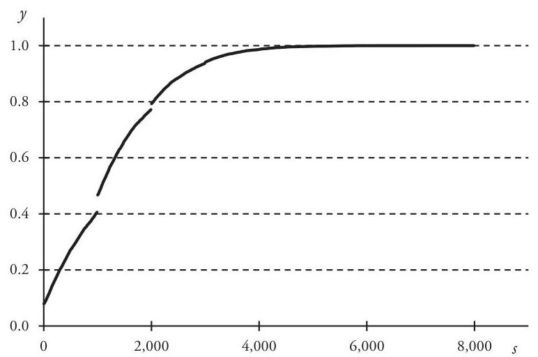

## Page 149
# 4.8. Problems 

4.1 Construct the discrete aggregate loss distribution based on these distributions for $N$ and $X$.

| Claim Count $\boldsymbol{N}$ |  | Claim Size $\boldsymbol{X}$ |  |
| :-- | :-- | :--: | :--: |
| Count $n$ | $f_{n}(n)$ | Size $x$ | $f_{x}(x)$ |
| 0 | 0.20 | 500 | 0.10 |
| 1 | 0.40 | 1,000 | 0.40 |
| 2 | 0.25 | 1,500 | 0.30 |
| 3 | 0.15 | 2,000 | 0.20 |

4.2 Assume that $Y=X_{1}+X_{2}$, where $X_{1}$ and $X_{2}$ are continuous, independent (not necessarily claim-size) random variables.
(a) $X_{1}$ and $X_{2}$ have respective probability density functions $f_{1}$ and $f_{2}$. Prove that

$$
f_{Y}(y)=\int_{-\infty}^{\infty} f_{1}(y-x) f_{2}(x) d x
$$

(b) Assume now that $X_{1}$ and $X_{2}$ are identically distributed claim-size random variables, with common distribution function $F$ and $F(x)=0$ for $x<0$. Show that $F_{Y}$ can be expressed as

$$
F_{Y}(y)= \begin{cases}0 & \text { if } y<0 \\ \int_{0}^{y} F(y-x) d F(x) & \text { if } y \geq 0\end{cases}
$$

4.3 Verify that the recursion formula (4.2) yields $F_{1}^{*}(y)=F(y)$ for all $y$.
4.4 In each of the following cases construct a formula for $F_{S}(s)$ in terms of $f_{N}(n)=$ $\operatorname{Pr}\{N=n\}$ and $F_{X}(x)$, the c.d.f. for $X$.
(a) $f_{N}(n)=0$ for $n>1$.
(b) $f_{N}(n)=0$ for $n>2$.
4.5 Derive formulas (4.6) and (4.7) for $E\left[S^{2}\right]$ and $E\left[S^{3}\right]$ from the compound moment-generating function (4.11).
4.6 $N$ is Poisson-distributed with mean $\lambda$, and $X$ has an exponential ( $\beta$ ) distribution. Derive explicit formulas for the aggregate distribution functions $f_{S}(s)$ and $F_{S}(s)$.

## Page 150
4.7 $N$ is Poisson-distributed with mean $\lambda=8$, and $X$ has a gamma distribution with $\alpha=0.2000$ and $\beta=3,750$. Calculate the indicated values for $F_{S}(s)$.

| Amount $s$ | $F_{S}(s)$ |
| :--: | :--: |
| 0 |  |
| 3,000 |  |
| 6,000 |  |
| 9,000 |  |
| 12,000 |  |
| 15,000 |  |
| 18,000 |  |
| 21,000 |  |
| 24,000 |  |
| 27,000 |  |

4.8 $\lambda$ and $\gamma$ are the claim-count mean and contagion parameter, respectively, for an aggregate loss variable $S$. Prove that for fixed $\gamma$ :
(a) $\lim _{\lambda \rightarrow \infty} C V[S]=\sqrt{\gamma}$
(b) $\lim _{\lambda \rightarrow \infty} S k[S]=2 \sqrt{\gamma}$
4.9 Verify the normal power inversion formula (4.19):

$$
Q^{-1}((S-\mu) / \sigma)=T_{N P}(S)
$$

where $T_{N P}(S)$ is given by (4.17).
4.10 Provide detailed derivations of the Wilson-Hilferty transformation formulas (4.24) and (4.25).
4.11 Derive from the Wilson-Hilferty chi-square approximation (4.22) a formula for $\chi_{0.95}^{2}(m)$, the $95^{\text {th }}$ percentile of the chi-square distribution with $m$ degrees of freedom.
4.12 Use the formula obtained in Problem 4.11 to estimate the chi-square percentiles in the following table.

| d.f. $m$ | $\chi_{0.95}^{2}(m)$ | Wilson-Hilferty | Relative Error |
| :--: | :--: | :--: | :--: |
| 5 | 11.070 |  | $\%$ |
| 10 | 18.307 |  | $\%$ |
| 15 | 24.996 |  | $\%$ |
| 20 | 31.410 |  | $\%$ |
| 25 | 37.652 |  | $\%$ |
| 30 | 43.773 |  | $\%$ |

## Page 151
4.13 Tabulate the following approximations to the Poisson/gamma distribution function of Problem 4.7.

| Amount $s$ | $F_{S}(s)$ | Normal | Relative Error | Normal Power | Relative Error | Shifted Gamma | Relative Error | Wilson-   Hilferty | Relative Error |
| :--: | :--: | :--: | :--: | :--: | :--: | :--: | :--: | :--: | :--: |
| 0 |  |  |  |  |  |  |  |  |  |
| 3,000 |  |  |  |  |  |  |  |  |  |
| 6,000 |  |  |  |  |  |  |  |  |  |
| 9,000 |  |  |  |  |  |  |  |  |  |
| 12,000 |  |  |  |  |  |  |  |  |  |
| 15,000 |  |  |  |  |  |  |  |  |  |
| 18,000 |  |  |  |  |  |  |  |  |  |
| 21,000 |  |  |  |  |  |  |  |  |  |
| 24,000 |  |  |  |  |  |  |  |  |  |
| 27,000 |  |  |  |  |  |  |  |  |  |

4.14 $\lambda$ and $\gamma$ are, respectively, the claim-count mean and contagion parameter for an aggregate loss variable $S$. Verify the following special cases of formula (4.31) for $f(0)$.
(a) If $N$ is Poisson-distributed, then $f_{S}(0)=e^{\lambda g(0)-\lambda}$.
(b) If $N$ has a negative binomial distribution, for which $\gamma \neq 0$, then

$$
f_{S}(0)=(1+\gamma \lambda-\gamma \lambda g(0))^{-1 / \gamma}
$$

4.15 Show that recursion formula (4.33) can be expressed in the following form, where $\hat{m}$ is defined by (4.28):

$$
f_{S}(m)=\frac{1}{1-a g(0)} \sum_{k=1}^{\min \{m, \hat{m}\}}\left(a+\frac{b}{m} k\right) g(k) f_{S}(m-k), \quad m=1,2,3, \ldots
$$

4.16 Use the recursion method of Section 4.4 to calculate the cumulative distribution function of the aggregate random variable for which claim size $X$ has the discrete distribution of Example 4.1 and $N$ has a Poisson distribution with $\lambda=1.35$.
4.17 Verify that the midpoint formulas of (4.37) actually define a discrete probability function.
4.18 Random variable $U$ is uniformly distributed on the interval $(0,1)$.
(a) Show that the characteristic function of $U$ is $\varphi_{U}(t)=\left(e^{t t}-1\right) /(i t)$.
(b) Use formula (4.39) to recover $F_{U}(x)$ from $\varphi_{U}(t)$.

## Page 152
4.19 Let $F$ be the cumulative distribution function for random variable $Y$. Prove these statements about the inverse function $\tilde{F}^{-1}$ defined by (4.46).
(a) $\tilde{F}^{-1}$ exists for all variables $Y$.
(b) $\tilde{F}^{-1}(u)$ is a nondecreasing function of $u$.
(c) $u \leq F\left(\tilde{F}^{-1}(u)\right)$ for all $u$ in $(0,1)$.
(d) $\tilde{F}^{-1}(F(y)) \leq y$ for all real $y$.
(e) Show by example that it is possible for the inequalities in $(c)$ and $(d)$ to be strictly less than.
(f) If $F$ is strictly increasing, then $\tilde{F}^{-1}$ is the usual inverse of function $F$.
4.20 $F$ is a strictly increasing cumulative distribution function for continuous random variable $X$. Prove: random variable $F(X)$ is uniformly distributed on the unit interval $(0,1)$.
4.21 Calculate the inverse function $\tilde{F}^{-1}(u)$ in the case that $F(x)$ is a Weibull distribution function (2.61).
4.22 Consider the following sequence of random selections from the uniform distribution on the interval $(0,1)$ :

$$
\langle 0.4695,0.2871,0.7527,0.9106,0.5538,0.1189,0.8853\rangle
$$

Calculate the random value for $N$ with a Poisson distribution $(\lambda=3)$ that is implied by the sequence.
4.23 Five random values of $U$, uniformly distributed on the interval $(1,0)$, are shown in the table. Calculate corresponding random values for $X_{1}$ (exponential with $\beta=2,000$ ), for $X_{2}$ (Pareto with $(\alpha, \beta)=(2.5 ; 3,000)$ ), for $X_{3}$ (lognormal with $(\mu, \sigma)=(5.181,2.2)$ ), and for $X_{4}$ (Weibull with $(\beta, \delta)=(1,000 ; 0.5)$ ).

| Trial | Uniform   $u$ | Exponential   $x_{1}$ | Pareto   $x_{2}$ | Lognormal   $x_{3}$ | Weibull   $x_{4}$ |
| :--: | :--: | :--: | :--: | :--: | :--: |
| (1) | 0.2097 |  |  |  |  |
| (2) | 0.3562 |  |  |  |  |
| (3) | 0.6970 |  |  |  |  |
| (4) | 0.8245 |  |  |  |  |
| (5) | 0.9882 |  |  |  |  |

4.24 (a) Random variable $N$ has a geometric distribution, with

$$
f(n)=p(1-p)^{n} \quad(0<p<1), \quad n=0,1,2, \ldots
$$

Show that random values of $N$ can be generated by the formula

$$
n=\llbracket(\log (1-u)) /(\log (1-p))-1 \rrbracket
$$

## Page 153
where $\llbracket x \rrbracket$ denotes the greatest integer function. [Hint: the cumulative distribution function at positive integer $n$ is

$$
F_{N}(n)=1-(1-p)^{n+1}
$$

(b) Use moment-generating functions to show that the sum of $m$ identical independent random variables, each distributed with a geometric distribution with parameter $p$ has the special negative binomial distribution with probability density function

$$
f(n)=\binom{m+n-1}{n} p^{m}(1-p)^{n} \quad(m=1,2,3, \ldots, 0<p<1), \quad n=0,1,2, \ldots
$$

(c) Describe a method for generating random values of a random variable with the negative binomial distribution defined in part (b).
4.25 (a) Random variables $\left\langle U_{n}\right\rangle(n=1,2, \ldots, 12)$ are independent and uniformly distributed on the interval $(0,1)$. Show that the distribution of $X=\sum_{n=1}^{12} U_{n}-6$ is approximately standard normal.
(b) Use the result of part (a) to devise a method of generating random values from a normal distribution with parameters $(\mu, \sigma)$.
(c) Use the result of part (b) to devise a method of generating random values from a lognormal distribution with parameters $(\mu, \sigma)$.

## Page 154
# 5. Excess Claims 

We investigate in this chapter claim processes in which all claims are restricted to those larger in size than some fixed positive amount-that is, to claims that penetrate an excess layer of insurance. Distributions of such excess losses are critical to the quantification of such common policy provisions as deductibles and to the pricing of successive layers of coverage lying above a first-dollar, or primary, layer of insurance.

### 5.1. Excess Claim Size

Consider first an unlimited claim-size random variable $X$ and a nonnegative constant $a$. The random variable $Y$ defined by

$$
Y= \begin{cases}0 & \text { if } 0 \leq X \leq a \\ X-a & \text { if } \mathrm{a}<X<\infty\end{cases}
$$

represents the size of claims modified by a policy condition that imposes an underlying limit amount $a$. Here the insurer pays nothing if the claim size is $a$ or less, and the sizes of all other claims are reduced by $a$. In this situation $a$ could represent an amount retained by the insured, as in the case of a policy with a deductible, or for an umbrella or excess policy it might be the limit of an underlying primary policy.

The distribution function of variable $Y$ is readily obtained from that of $X$ :

$$
F_{Y}(y)=\operatorname{Pr}\{Y \leq y\}= \begin{cases}0 & \text { if }-\infty<y<0 \\ F_{X}(y+a) & \text { if } 0 \leq y<\infty\end{cases}
$$

If $E[X]$ exists, then so does $E[Y]$. Moreover,

$$
\begin{aligned}
E[Y] & =\int_{0}^{\infty} y d F_{X}(y+a) \\
& =\int_{a}^{\infty}(u-a) d F_{X}(u) \\
& =\int_{0}^{\infty} u d F_{X}(u)-\int_{0}^{a} u d F_{X}(u)-a \int_{a}^{\infty} d F_{X}(u) \\
& =E[X]-E[X ; a]
\end{aligned}
$$

Clearly, $E[Y] \leq E[X]$ whenever both expected values exist.

## Page 155
For random variable $Y$ the probability that the insurer pays nothing,

$$
F_{Y}(0)=\operatorname{Pr}\{Y=0\}=\operatorname{Pr}\{X \leq a\}=F_{X}(a)
$$

is usually a positive number. However, insurers do not always see, nor are they usually interested in, claims for which $Y=0$. It is therefore more useful, from an insurer's standpoint, to work with a related variable $X_{a}$, defined only for $X>a$ :

$$
X_{a}=X-a, \quad a<X<\infty
$$

$X_{a}$ represents the excess of $X$ over the limit $\boldsymbol{a}$, for which claims of size $a$ or smaller are ignored and all others are reduced by the amount $a$. Thus modified, variable $X$ is said to be truncated from below and shifted by a. Variable $X_{a}$ has a distribution function obtained conditionally from that of $X$-and in this case $F_{X_{a}}(0)=0$ :

$$
F_{X_{a}}(x)=\operatorname{Pr}\{X-a \leq x \mid X>a\}= \begin{cases}0 & \text { if }-\infty<x<0 \\ \frac{F_{X}(x+a)-F_{X}(a)}{1-F_{X}()} & \text { if } 0 \leq x<\infty\end{cases}
$$

Whenever $E[X]$ exists the expected value of $X_{a}$ is

$$
E\left[X_{a}\right]=\frac{\int_{0}^{\infty} x d F_{X}(x+a)}{1-F_{X}(a)}=\frac{E[X]-E[X ; a]}{1-F_{X}(a)}
$$

[Compare this formula with that of (5.1).] Moreover, if all three moments $E[X], E\left[X^{2}\right]$, and $E\left[X^{3}\right]$ exist, then the second and third moments of $X_{a}$ are, respectively,

$$
\begin{aligned}
E\left[X_{a}^{2}\right]= & \frac{E\left[X^{2}\right]-E\left[X^{2} ; a\right]-2 a(E[X]-E[X ; a])}{1-F_{X}(a)} \\
E\left[X_{a}^{3}\right]= & \frac{E\left[X^{3}\right]-E\left[X^{3} ; a\right]-3 a\left(E\left[X^{2}\right]-E\left[X^{2} ; a\right]\right)}{1-F_{X}(a)} \\
& +\frac{3 a^{2}(E[X]-E[X ; a])}{1-F_{X}(a)}
\end{aligned}
$$

The limited expected value of the excess random variable $X_{a}$ is an obvious combination of limited severities of the unlimited claim-size variable $X$ :

$$
\begin{aligned}
E\left[X_{a} ; l\right] & =\frac{\int_{0}^{l} x d F_{X}(x+a)}{1-F_{X}(a)}+l\left(1-\frac{F_{X}(l+a)-F_{X}(a)}{1-F_{X}(a)}\right) \\
& =\frac{\int_{a}^{a+l}(u-a) d F_{X}(u)}{1-F_{X}(a)}+l\left(\frac{1-F_{X}(a+l)}{1-F_{X}(a)}\right)
\end{aligned}
$$

## Page 156
$$
\begin{aligned}
= & \frac{E[X ; a+l]-E[X ; a]-(a+l)\left(1-F_{X}(a+l)\right)+a\left(1-F_{X}(a)\right)}{1-F_{X}(a)} \\
& +\frac{l\left(1-F_{X}(a+l)\right)-a\left(F_{X}(a+l)-F_{X}(a)\right)}{1-F_{X}(a)} \\
= & \frac{E[X ; a+l]-E[X ; a]}{1-F_{X}(a)}
\end{aligned}
$$

Example 5.1. Claim-size random variable $X$ has an exponential distribution with mean $\beta$ :

$$
F_{X}(x)= \begin{cases}0 & \text { if }-\infty<x<0 \\ 1-e^{-x / \beta} & \text { if } 0 \leq x<\infty\end{cases}
$$

For the exponential distribution family it is evident that the excess c.d.f. is independent of the size of limit $a$ :

$$
F_{X_{a}}(x)=\frac{\left(1-e^{-(x+a) / \beta}\right)-\left(1-e^{-a / \beta}\right)}{e^{-a / \beta}}=1-e^{-x / \beta}, \quad 0 \leq x<\infty
$$

As a consequence, the excess claim size $X_{a}$ and unlimited claim size $X$ have the same distribution. This means that the existence of a deductible or underlying coverage does not affect the distribution of claim size. In particular, $E\left[X_{a}\right]=E[X]=\beta$ for every limit $a$.

Example 5.2. Claim-size variable $X$ has a Pareto distribution with probability density function

$$
f_{X}(x)=\frac{\alpha \beta^{\alpha}}{(x+\beta)^{\alpha+1}}, \quad 0<x<\infty
$$

Accordingly, the density function for $X_{d}$ is

$$
f_{X_{d}}(x)=\frac{f_{X}(x+d)}{1-F_{X}(d)}=\frac{\alpha \beta^{\alpha}}{(x+d+\beta)^{\alpha+1}} /\left(\frac{\beta}{d+\beta}\right)^{\alpha}=\frac{\alpha(d+\beta)^{\alpha}}{(x+d+\beta)^{\alpha+1}}, \quad 0<x<\infty
$$

Hence, $X_{d}$ is also Pareto-distributed, with parameters $(\alpha, d+\beta)$. The mean $E\left[X_{d}\right]$ exists whenever $\alpha>1$, and it is an increasing linear function of the lower limit $d$ :

$$
E\left[X_{d}\right]=\frac{d+\beta}{\alpha-1}
$$

Example 5.3. The table below displays grouped claim-size data derived from a sample of 300 claims from an unlimited population with an unknown distribution.

## Page 157
| Size Group | \# Claims |
| :--: | --: |
| $0-5,000$ | 139 |
| $5,001-10,000$ | 68 |
| $10,001-15,000$ | 32 |
| $15,001-20,000$ | 15 |
| $20,001-25,000$ | 11 |
| $25,001-30,000$ | 8 |
| $30,001-35,000$ | 5 |
| $35,001-40,000$ | 4 |
| $40,001-45,000$ | 4 |
| $45,001-48,500$ | 14 |
| Total | 300 |

Before the data were tabulated these claims were censored by a \$50,000 policy limit and then subjected to a $\$ 1,500$ straight deductible. Using the minimum chi-square approach, we wish to find a lognormal distribution function $F_{\mu, \sigma}(x)$ for the population of the unlimited-non-truncated and non-censored-claims.

We begin by defining ten cells with boundaries $c_{k}=5,000 k(k=0$, $1, \ldots, 9$ ) and $c_{10}=\infty$. The observed cell frequencies are just the tabulated group claim frequencies $n_{k}$. In particular, note that $n_{10}=14$.

The expected cell frequencies $\phi_{k}(\mu, \sigma)$ are expressed in terms of the (as yet unknown) unlimited and unmodified population lognormal c.d.f. $F_{\mu, \sigma}(x)$. The probability $P_{k}(\mu, \sigma)$ of a claim being less than or equal $c_{k}$ is

$$
P_{k}(\mu, \sigma)= \begin{cases}F_{\mu, \sigma}\left(c_{k}+1,500\right)-F_{\mu, \sigma}(1,500) & \text { if } k=1,2, \ldots, 9 \\ 1 & \text { if } k=10\end{cases}
$$

Therefore

$$
\phi_{k}(\mu, \sigma)=(300)\left(P_{k}(\mu, \sigma)-P_{k-1}(\mu, \sigma)\right)
$$

Minimizing the chi-square statistic

$$
\chi^{2}(\mu, \sigma)=\sum_{k=1}^{10} \frac{\left(n_{k}-\phi_{k}(\mu, \sigma)\right)^{2}}{\phi_{k}(\mu, \sigma)}
$$

as a function of $\mu$ and $\sigma$ yields a minimum value of $\chi^{2}(\hat{\mu}, \hat{\sigma})=1.6610$ corresponding to the parameter estimates $(\hat{\mu}, \hat{\sigma})=(8.67593,1.18109)$.

Because sample data were truncated by the 1,500 deductible, the number of claims entirely eliminated by the deductible is unknown. However, one can estimate this number by means of $F_{\hat{\mu}, \hat{\sigma}}(1,500)=0.1243$ :

$$
\text { \# population claims } \leq 1,500 \approx \frac{300}{1-0.1243}(0.1243)=(343)(0.1243)=43
$$

# 5.2. Excess Severity 

The expectation $E\left[X_{a}\right]$ obtained in (5.4), with respect to the unlimited random variable $X$, is called the mean excess claim size at a or excess severity at a. ${ }^{49}$ As with the limited expected value, we can express the mean excess claim size, when it exists,

[^0]
[^0]:    ${ }^{49}$ Illogically in the context of loss distributions, $E\left[X_{a}\right]$ is also known as the mean residual life at a. The term, however, makes sense when the random variable $X$ is a failure-time variable encountered in reliability theory. The expression apparently found its way into actuarial usage because many distributions used by actuaries have also played prominent roles in reliability theory.

## Page 158
Figure 5.1. Characteristic Excess Severity Function Graphs ${ }^{50}$
as a function of the associated limit $x$. In this context $E\left[X_{e}\right]$ is commonly denoted by $e(x)$-or by $e_{X}(x)$ when dependence on the random variable $X$ must be indicated:

$$
e_{X}(x)=\frac{E[X]-E[X ; x]}{1-F_{X}(x)}, \quad 0<x<\infty
$$

The behavior of $e(x)$ for large values of $x$ is characteristic for all distributions in a given parametric family and tends to differ from one such family to another. For example, when $X$ is exponentially distributed, $e(x)$ is a constant function of $x$, as shown in Example 5.1. Example 5.2 indicates that for Pareto-distributed $X$ with $\alpha>1, e(x)$ is an increasing linear function of $x$. In the case of the lognormal family, $e(x)$ increases without bound as $x \rightarrow \infty$, whereas for gamma-distributed $X$ the function decreases toward a horizontal asymptote as $x \rightarrow \infty$. The Weibull $e(x)$ function behaves like $a / x^{b}$ for some $a$ and $b$ and large values of $x$. Typical shapes for the graph of $y=e(x)$ are shown in Figure 5.1. Refer to Problem 5.26 for hints on verifying these results.

The asymptotic behavior of $y=e(x)$ is occasionally useful when it comes to fitting a parametric distribution to a set of sample data. The shape of the graph of the sample excess severity function $e_{x}(x)$ may suggest an appropriate family of distributions. If this graph is approximately linear with positive slope, then a Pareto distribution could be used. If it is nearly constant for large $x$, a gamma or exponential model would be indicated. Otherwise, if the graph lies between these extremes, then a lognormal or Weibull distribution could be used.

[^0]
[^0]:    ${ }^{50}$ Figure 5.1 is suggested by a similar display in Hogg and Klugman [8], p. 109.
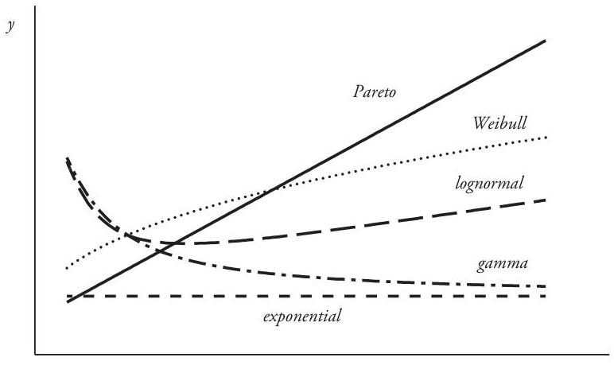

## Page 159
There is, however, a practical restriction in the use of this asymptotic test. The characteristic behavior of $y=e(x)$ becomes apparent only for large $x$, the region for which sample data is typically the most sparse. It is therefore essential that the claim data contain enough large claims so that $e_{n}(x)$ can be reliably calculated for sufficiently large values of $x$.

Example 5.4. The table displays grouped sample claim data for $n=1,000$ policies.

| Size Group | \# Claims | Total Loss | Severity |
| :--: | :--: | :--: | :--: |
| $0-100$ | 100 | 6,000 | 60 |
| $101-500$ | 300 | 95,000 | 317 |
| $501-1,000$ | 240 | 145,000 | 604 |
| $1,001-2,000$ | 185 | 260,000 | 1,405 |
| $2,001-4,000$ | 140 | 450,000 | 3,214 |
| $4,001-5,000$ | 15 | 66,000 | 4,400 |
| $5,001-10,000$ | 20 | 150,000 | 7,500 |
| Total | 1,000 | $1,172,000$ | 1,172 |

To investigate the behavior of the sample excess severity function for large $x$, begin by calculating values for the relevant sample statistics at the right-hand endpoints of the group intervals. For example, values of $F_{n}(2,000), E_{n}[\hat{X} ; 2,000]$, and $e_{n}(2,000)$ for the discrete sample variable $\hat{X}$ are, respectively,

$$
\begin{aligned}
F_{1000}(2,000)= & \frac{100+300+240+185}{1,000}=0.8250 \\
E_{1000}[\hat{X} ; 2,000]= & \frac{6,000+95,000+145,000+260,000}{1,000} \\
& +\frac{(140+15+20)(2,000)}{1,000}=856 \\
e_{1000}(2,000)= & \frac{1,172-856}{1-0.8250}=1,806
\end{aligned}
$$

The complete set of end-point values is shown in Table 5.1.
The tabulated values of $e_{n}(x)$ along with a least-squares regression line are displayed graphically in Figure 5.2. It is evident that the sample values are very nearly alignedthe coefficient of determination for the linear regression is $R^{2}=0.9823$. A Pareto model is obviously indicated. To fit such a distribution, observe that the regression function $0.257335 x+1,208.50$ can be equated with the Pareto $e(x)$ and the resulting equation solved for parameters $\alpha$ and $\beta$ :

$$
0.257335 x+1,208.50=(x+\beta) /(\alpha-1)
$$

## Page 160
Table 5.1. Sample and Pareto Excess Severity Functions [Example 5.4]

| Size $x$ | Sample Distribution $(n=1,000)$ |  |  | Pareto Distribution |  |  |
| :--: | :--: | :--: | :--: | :--: | :--: | :--: |
|  | $F_{n}(x)$ | $E_{n}[\hat{X} ; x]$ | $e_{n}(x)$ | $F(x)$ | $E[X ; x]$ | $e(x)$ |
| 0 | 0.0000 | 0 | 1,172 | 0.0000 | 0 | 1,208 |
| 100 | 0.1000 | 96 | 1,196 | 0.0978 | 95 | 1,234 |
| 500 | 0.4000 | 401 | 1,285 | 0.3900 | 393 | 1,337 |
| 1,000 | 0.6400 | 606 | 1,572 | 0.6106 | 638 | 1,466 |
| 2,000 | 0.8250 | 856 | 1,806 | 0.8233 | 904 | 1,723 |
| 4,000 | 0.9650 | 1,096 | 2,171 | 0.9507 | 1,098 | 2,238 |
| 5,000 | 0.9800 | 1,122 | 2,500 | 0.9711 | 1,136 | 2,495 |
| 10,000 | 1.0000 | 1,172 | - | 0.9962 | 1,194 | 3,782 |

Thus, $(\alpha, \beta)=(4.88599 ; 4,696.22)$. Corresponding end-point values for this Pareto distribution are shown in Table 5.1 for comparison.

The technique of estimating Pareto parameters from the slope and intercept of the regression line seems to work well in this example, but it should be used with some caution. The slope of the regression line is sensitive to the size of the largest claims, and the calculated distribution parameters could be significantly affected by changes in just a few of these numbers.

Example 5.5. Figure 5.3 shows the graph of the sample excess severities for the data of Examples 2.6 and 2.7. Superimposed on this graph are the corresponding graphs of $y=e(x)$ for the fitted gamma and lognormal distributions obtained in those examples. The graph of the gamma model reasonably approximates that of the sample function, but the lognormal function diverges significantly from the sample values for $x>1,500$. This suggests that of the two probability distributions obtained in Chapter 2 the gamma might provide the better fit.

Figure 5.2. Sample Excess Severities with
Regression Line [Example 5.4]
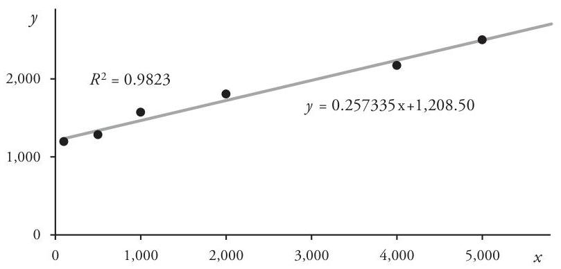

## Page 161
Figure 5.3. Excess Severity Functions [Example 5.5]

# 5.3. Layers of Coverage 

In many situations an insurance policy may impose both an upper limit and a lower limit on the claims subject to the policy. How these are applied depends on the specific policy conditions-for example, on whether the lower limit represents a deductible or whether it is the limit of underlying coverage, as in the case of an umbrella or excess liability policy. We shall be primarily concerned with the latter case in this section and leave the main discussion of the deductible case to the next chapter.

If the excess variable $X_{a}$ is subject to an upper limit $l$ (as in the case of an excess policy written over underlying coverage), then the claim amount paid by the insurer is the unrestricted amount $x$ first decreased by $a$ and then limited by $l$. Such claims are said to belong to the layer of coverage defined by $a$ and $l$. Limit $a$ is called an underlying limit or attachment point, whereas $l$ is the layer limit or the width of the layer. An unlimited claim of size $x$ is said to penetrate the layer whenever $x>a$.

If $a>0$ the layer is called an excess layer, whereas in the trivial case $a=0$ claims in the layer are referred to as first-dollar or ground-up claims. The layer defined by $a$ and $l$ is sometimes denoted by the "interval" notation $(a, a+l)$-although a layer of coverage is conceptually different from an interval of claims. This distinction is explored in Problems 5.14 and 5.15 .

In the case of a straight deductible, however, the deductible limit is generally applied after the policy limit. In this situation, the layer width is the policy limit reduced by the deductible size, $l-a$, so that the insured layer is $(a, l]$. Deductibles are explored in detail in Section 6.5.

Example 5.6 illustrates, in the context of a policy limit and deductible, how upper and lower policy limits serve to partition claims into a sequence of layers.

Example 5.6. An insurance policy with a $\$ 3,000$ limit and $\$ 100$ straight deductible defines a three-layer structure: (i) the deductible layer between 0 and 100, (ii) the insured layer of width 2,900 between 100 and 3,000, and (iii) an uninsured layer excess of 3,000 . Note that the deductible effectively reduces the policy limit from 3,000 to 2,900 .
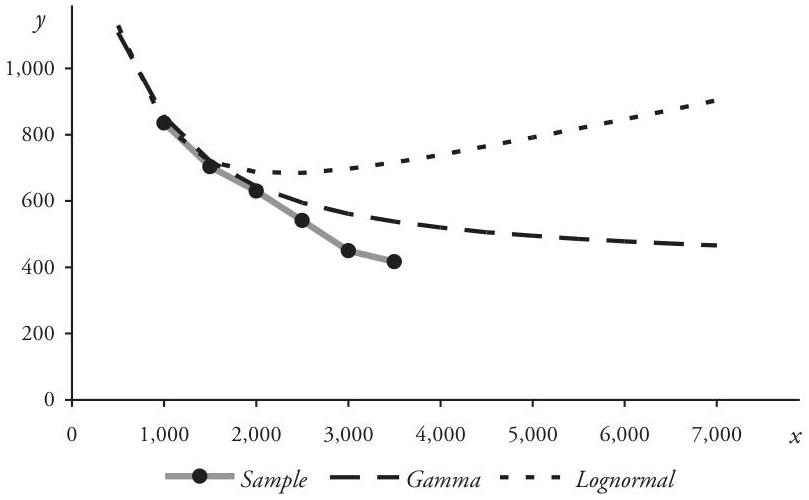

## Page 162
Suppose that the occurrence of insured events during the policy period gives rise to four claims-of sizes $50,600,1,800$, and 4,000 -for a total of 6,450 . Three claims penetrate the insured layer, and one of these is limited by the policy limit. The table shows how they are distributed among the three layers.

| Layer | Claim 1 | Claim 2 | Claim 3 | Claim 4 | Total |
| :--: | :--: | :--: | :--: | :--: | :--: |
| $[0 ; 100]$ | 50 | 100 | 100 | 100 | 350 |
| $\mathbf{( 1 0 0 ; 3 , 0 0 0 ]}$ | $\mathbf{0}$ | $\mathbf{5 0 0}$ | $\mathbf{1 , 7 0 0}$ | $\mathbf{2 , 9 0 0}$ | $\mathbf{5 , 1 0 0}$ |
| $(3,000 ; \infty)$ | 0 | 0 | 0 | 1,000 | 1,000 |
| Total | 50 | 600 | 1,800 | 4,000 | 6,450 |

Here the insurer pays 5,100 in the insured layer, whereas the policyholder retains 1,350 of the total claim amount- 350 within the deductible layer plus 1,000 in the uninsured layer above 3,000 .

The random variable for claim size $X_{a, l}$ in the layer $(a, a+l]$ is defined on the interval $a<X<\infty$ by the equation

$$
X_{a, l}= \begin{cases}X-a & \text { if } a<X \leq a+l \\ l & \text { if } a+l<X<\infty\end{cases}
$$

Accordingly, the cumulative distribution function of variable $X_{a, l}$ is

$$
F_{X_{a, l}}(x)= \begin{cases}0 & \text { if }-\infty<x<0 \\ \frac{F_{X}(x+a)-F_{X}(a)}{1-F_{X}(a)} & \text { if } 0 \leq x<l \\ 1 & \text { if } l \leq x<\infty\end{cases}
$$

It is easy to verify that the moments of the layer distribution are just the limited moments of the excess variable $X_{a}$ :

$$
\begin{aligned}
& E\left[X_{a, l}\right]=E\left[X_{a} ; l\right]=\frac{E[X ; a+l]-E[X ; a]}{1-F_{X}(a)} \\
& E\left[X_{a, l}^{2}\right]=E\left[X_{a}^{2} ; l\right]=\frac{E\left[X^{2} ; a+l\right]-E\left[X^{2} ; a\right]-2 a(E[X ; a+l]-E[X ; a])}{1-F_{X}(a)} \\
& E\left[X_{a, l}^{3}\right]=E\left[X_{a}^{3} ; l\right]=\frac{E\left[X^{3} ; a+l\right]-E\left[X^{3} ; a\right]-3 a\left(E\left[X^{2} ; a+l\right]-E\left[X^{2} ; a\right]\right)}{1-F_{X}(a)} \\
& +\frac{3 a^{2}(E[X ; a+l]-E[X ; a])}{1-F_{X}(a)}
\end{aligned}
$$

## Page 163
Example 5.7. Random variable $X$ has a Pareto distribution with parameters $(\alpha, \beta)=(2 ; 3,000)$. What is the average claim size in the layer 4,000 excess of the limit 5,000 ?

We first calculate the limited severities at the attachment point 5,000 and at $a+l=9,000$. At $a=5,000$

$$
E[X ; 5,000]=\frac{\beta}{\alpha-1}\left(1-\left(\frac{\beta}{5,000+\beta}\right)^{\alpha-1}\right)=(3,000)\left(1-\frac{3,000}{8,000}\right)=1,875
$$

A similar calculation yields $E[X ; 9,000]=2,250$. Therefore, the layer mean is

$$
\frac{E[X ; 9,000]-E[X ; 5,000]}{1-F_{X}(5,000)}=\frac{2,250-1,875}{1-0.8594}=2,667
$$

Limits imposed on the size of claims serve to decrease the variability of a claim process. To compare the dispersion of different distributions in a meaningful way, one can use the coefficient of variation. For variable $X$ the coefficient of variation $C V[X]$ is defined as the ratio of the standard deviation to the mean:

$$
C V[X]=\frac{\sqrt{V a r[X]}}{E[X]}=\frac{S D[X]}{E[X]}
$$

Because the coefficient of variation is a dimension-less ratio, calculating CVs for random variables with different means can provide a basis for an apt comparison. In addition, $C V[X]$ has the useful property of remaining invariant whenever $X$ is subjected to the linear transformation $L_{c}(X)=c X$, where $c>0$ (refer to Problem 2.31): $C V[c X]=C V[X]$.

Example 5.8. A claim-size variable $X$ has a lognormal distribution with parameters $(\mu, \sigma)=(5.9809,1.800)$. Probabilities and first and second limited moments at limits 3,000 and 8,000 for this distribution are displayed in the table.

The coefficient of variation of the

| Limit I | $F_{X}(I)$ | $E[X ; I]$ | $E\left[X^{2} ; I\right]$ |
| :--: | :--: | :--: | :--: |
| 3,000 | 0.869761 | 891 | $1,853,050$ |
| 8,000 | 0.952557 | 1,276 | $5,774,970$ |
| $\infty$ | 1.000000 | 2,000 | $102,134,385$ |

unlimited variable $X$ is

$$
C V[X]=\frac{\sqrt{102,134,385-(2,000)^{2}}}{2,000}=4.9531
$$

## Page 164
Not surprisingly, the distribution of $X_{3 K}$ has a smaller CV:

$$
\begin{aligned}
E\left[X_{3 K}\right] & =\frac{2,000-891}{1-0.869761}=8,515 \\
C V\left[X_{3 K}\right] & =\frac{\sqrt{\frac{102,134,385-1,853,050-2(3,000)(2,000-891)}{1-0.869761}-(8,515)^{2}}}{8,515} \\
& =2.9858
\end{aligned}
$$

Restricting claims to the layer between 3,000 and 8,000 by imposing on $X_{3 K}$ an upper limit of 5,000 further reduces the coefficient of variation of the claim-size variable: $C V\left[X_{3 K} ; 5,000\right]=0.6452$.

# 5.4. Excess Claim Counts 

We now investigate the distribution characteristics of the random variable $N_{a}$, the number of claims excess of an underlying limit $a$. Because the very definition of an excess claim depends upon the size of the claim, distributions of excess claim counts involve not only the distribution of the ground-up claim count $N$, but also that of the unlimited claim size $X$.

If the distribution of $X$ remains unchanged over time, then the probability of an excess claim also remains constant. Whenever this is true, the distribution of the excess claim count $N_{a}$ is related in a simple way to the distribution of the number $N$ of unrestricted, ground-up claims.

Let $F_{X}(x)$ be the cumulative distribution function for the claim-size variable $X$. The probability that a claim exceeds $a$ is $p=1-F_{X}(a)$, and the probability of obtaining $n$ such claims is given by the conditional probability formula (5.15) below. This distribution function for $N_{a}$ is derived from the fact that the number $n$ of excess claims, given the occurrence of $k$ ground-up claims $(n \leq k)$, has a binomial distribution with parameters $(k, p)$. The resulting formula is valid for every distribution of the ground-up claim-count variable $N$ :

$$
\begin{aligned}
f_{N_{a}}(n) & =\sum_{k=n}^{\infty} \operatorname{Pr}\{n \text { excess claims } \mid N=k\} \cdot \operatorname{Pr}\{N=k\} \\
& =\sum_{k=n}^{\infty}\binom{k}{n} p^{n}(1-p)^{k-n} f_{N}(k), \quad n=0,1,2, \ldots
\end{aligned}
$$

It is easy to show that $E\left[N_{a}\right]=p E[N]$ :

$$
\begin{aligned}
E\left[N_{a}\right] & =\sum_{n=0}^{\infty} n \sum_{k=n}^{\infty}\binom{k}{n} p^{n}(1-p)^{k-n} f_{N}(k) \\
& =\sum_{n=0}^{\infty} f_{N}(k) \sum_{n=0}^{k} n\binom{k}{n} p^{n}(1-p)^{k-n}
\end{aligned}
$$

## Page 165
$$
\begin{aligned}
& =\sum_{k=0}^{\infty} f_{N}(k)(k p) \\
& =p E[N]
\end{aligned}
$$

In a similar way one can obtain a formula for the second moment:

$$
E\left[N_{a}^{2}\right]=p^{2} E\left[N^{2}\right]+p(1-p) E[N]
$$

so that

$$
\operatorname{Var}\left[N_{a}\right]=p^{2} \operatorname{Var}[N]+p(1-p) E[N]
$$

If $N$ is known to have a specific parametric distribution, one can often determine the exact distribution of $N_{a}$. For example, if $N$ has a Poisson $(\lambda)$ distribution, then (5.15) becomes

$$
\begin{aligned}
f_{N_{a}}(n) & =\sum_{k=n}^{\infty}\binom{k}{n} p^{n}(1-p)^{k-n} \frac{\lambda^{k} e^{-\lambda}}{k!} \\
& =\frac{p^{n} \lambda^{n} e^{-\lambda}}{n!} \sum_{k=n}^{\infty} \frac{\lambda^{k-n}}{(k-n)!}(1-p)^{k-n} \\
& =\frac{(p \lambda)^{n} e^{-\lambda}}{n!} \sum_{i=0}^{\infty} \frac{(\lambda-p \lambda)^{i}}{i!} \\
& =\frac{(p \lambda)^{n} e^{-p \lambda}}{n!}
\end{aligned}
$$

This means that $N_{a}$ is also Poisson-distributed, with parameter $\lambda_{a}=p \lambda$.
It is likewise true that if $N$ has a negative binomial distribution of the form (3.17) with parameters $(\alpha, v)$, then $N_{a}$ has a negative binomial distribution as well, but with parameters $(\alpha, p v)$. A proof is requested in Problem 5.17.

Example 5.9. The number of claims for a ground-up claim process is Poissondistributed with $\lambda=15$. Moreover, the unlimited claim-size variable $X$ has the lognormal distribution of Example 5.8.

Consequently, the number of claims that penetrate a policy layer with attachment point 3,000 also has a Poisson distribution. The expected layer claim count is

$$
E\left[N_{3 K}\right]=\lambda\left(1-F_{X}(3,000)\right)=(15)(0.130239)=1.9536
$$

# 5.5. Inflation Effects 

In Chapter 2 we saw that the effect of a uniform inflationary trend factor applied to an unlimited claim-size variable is moderated by the presence of a policy limit. In particular, claims subjected to a positive rate of inflation $r$ and limited by an upper

## Page 166
limit increase at a rate less than $r$. In this section we continue that previous discussion and explore the effects of uniform inflationary pressure on claims excess of a fixed lower limit.

Suppose that the inflation factor $\tau=1+r$ is applied to the ground-up claim size $X$ with c.d.f. $F_{X}(x)$. Then the average claim sizes excess of the limit $a$ before and after trending are, respectively,

$$
E\left[X_{a}\right]=\frac{E[X]-E[X ; a]}{1-F_{X}(a)} \quad \text { and } \quad E\left[\tau X_{a}\right]=\frac{\tau E[X]-\tau E[X ; a / \tau]}{1-F_{X}(a / \tau)}
$$

Consequently, the effective trend factor $\tilde{\tau}$ for the excess claim size $X_{a}$ is

$$
\tilde{\tau}=\frac{E\left[\tau X_{a}\right]}{E\left[X_{a}\right]}=\tau \cdot \frac{E[X]-E[X ; a / \tau]}{E[X]-E[X ; a]} \cdot \frac{1-F_{X}(a)}{1-F_{X}(a / \tau)}
$$

Formula (5.19) for $X_{a}$ can be easily generalized to the layer claim-size variable $X_{a, l}$, as requested in Problem 5.19.

Example 5.10. Claim-size random variable $X$ is Pareto-distributed with parameters $(\alpha, \beta)=(2 ; 3,000)$ and is subject to a uniform annual inflation rate of $r=10 \%$. What is the annual trend rate for claims excess of 5,000 ?

The average excess claim size before trending is

$$
e_{X}(5,000)=\frac{5,000+3,000}{2-1}=8,000
$$

whereas the average trended claim size is

$$
e_{1.10 X}(5,000)=(1.10) \frac{5,000 / 1.10+3,000}{2-1}=8,300
$$

Therefore, the effective excess trend rate is $\tilde{r}=8,300 / 8,000-1=3.75 \%$.
Similarly, the average trended claim size in the layer $(5,000 ; 9,000]$ is

$$
\frac{(1.10) E[X ; 9,000 / 1.10]-(1.10) E[X ; 5,000 / 1.10]}{1-F_{X}(5,000 / 1.10)}=\frac{2,415-1,988}{1-0.841922}=2,701
$$

The non-trended severity in this layer was found in Example 5.7 to be 2,667, so the rate of change for the layer claims is $\tilde{r}=2,701 / 2,667-1=1.27 \%$, yet another illustration of the damping effect of an upper limit.

Having just examined what happens to the size of excess claims when the unrestricted claim size is subject to inflation, we turn now to a related question: How does such an inflationary trend affect the number of excess claims? One would reasonably expect that, all other things being equal, a positive rate of inflation applied to the claim size

## Page 167
should increase the number of claims excess of a fixed limit $a$-after trending, all claims are larger, so there ought to be more of them that exceed the limit.

In fact, if $E[N]$ is the expected number of ground-up claims and $\tau_{X}$ is the claim-size trend factor, then the expected numbers of excess claims before and after trending are, respectively, $\left(1-F_{X}(a)\right) E[N]$ and $\left(1-F_{X}\left(a / \tau_{X}\right)\right) E[N]$. The effective trend factor $\tilde{\tau}_{N}$ for the excess claim count due solely to the effect of inflation on the claim size $X$ is therefore given by

$$
\tilde{\tau}_{N}=\frac{1-F_{X}\left(a / \tau_{X}\right)}{1-F_{X}(a)}
$$

To verify that a positive inflation rate applied to the unlimited claim size generally increases the excess claim count, observe that $\tau_{X}>1$ implies that $a / \tau_{X}<a$, and so $F_{X}\left(a / \tau_{X}\right)$ $\leq F_{X}(a)$. Application of this last inequality to (5.20) yields $\tilde{\tau}_{N} \geq 1$, as expected. A similar argument shows that $\tilde{\tau}_{N} \leq 1$ whenever $\tau_{X}<1$.

Example 5.11. As in the previous example, claim-size variable $X$ has a Pareto distribution with $(\alpha, \beta)=(2 ; 3,000)$. The effective annual trend factor for the number of claims excess of 5,000 due to $10 \%$ inflation in the claim size $X$ is

$$
\tilde{\tau}_{N}=\frac{1-F_{X}(5,000 / 1.10)}{1-F_{X}(5,000)}=\frac{1-0.841922}{1-0.859375}=1.1241
$$

The $12.41 \%$ increase in the number of excess claims in the last example turned out to be larger than the basic claim-size inflation rate. But this is not always the case. Problem 5.21 shows that the rate of change in the number of excess claims can be either larger or smaller than the claim-size inflation rate.

Nevertheless, it is possible to generalize about the change in the total aggregate excess loss due to an inflationary trend applied to the unrestricted size of loss. The expected aggregate loss amount $S$ for claims excess of limit $a$ is

$$
\begin{aligned}
E[S] & =E\left[N_{a}\right] E\left[X_{a}\right] \\
& =\left(1-F_{X}(a)\right) E[N] \cdot \frac{E[X]-E[X ; a]}{1-F_{X}(a)} \\
& =E[N](E[X]-E[X ; a])
\end{aligned}
$$

Combining equations (5.19) and (5.20) yields the effective trend factor for the aggregate variable $S$ :

$$
\tilde{\tau}_{X}=\tau_{X} \frac{E[X]-E\left[X ; a / \tau_{X}\right]}{E[X]-E[X ; a]}
$$

As before, $\tau_{X}>1$ implies that $a / \tau_{X}<a$ and $E\left[X ; a / \tau_{X}\right] \leq E[X ; a]$. Consequently, the quotient expression in (5.21) cannot be less than 1 , and so $\tilde{\tau}_{S} \geq \tau_{X}$. Similarly, $\tilde{\tau}_{S} \leq \tau_{X}$ whenever

## Page 168
$\tau_{X}<1$. As we have just demonstrated, the existence of a fixed underlying limit magnifies, or leverages, the effect of the basic uniform claim-size trend on the aggregate excess loss.

Example 5.12. As before in Examples 5.10 and 5.11, claim-size $X$ has a Pareto distribution with $(\alpha, \beta)=(2 ; 3,000)$ and is subject to a uniform annual inflation rate of $10 \%$. In addition, the ground-up claim count is increasing at an annual rate of $5 \%$. What is the annual change in the total aggregate loss generated by claims excess of 5,000 ? How much of this change is due solely to claim-size inflation?

Example 5.11 showed that the claim count increases at a rate of $12.41 \%$ due to the increase in $X$, so the total increase in the claim count is

$$
r_{N}=(1.05)(1.1241)-1=18.03 \%
$$

Since the excess claim size increases at a rate of $3.75 \%$, as shown in Example 5.10, the total aggregate loss increases at the annual rate of

$$
r_{S}=(1.1803)(1.0375)-1=22.46 \%
$$

Thus, $1.2246 / 1.05-1=16.6 \%$ is the annual rate of increase due only to the claim-size inflation. This result, of course, can also be obtained directly from equation (5.21):

$$
\bar{r}_{S}=(1.10) \frac{3,000-1,807}{3,000-1,875}-1=16.6 \%
$$

# 5.6. Aggregate Layer Claims 

The aggregate-loss random variable $S$ for claims in the excess layer $(a, a+l]$ is defined just as in Section 4.2, but with the modified variables $N_{a}$ and $X_{a, l}$ as components. Formulas for the mean, variance, and skewness of $S$, in terms of the ground-up claim count $N$ and unlimited claim size $X$, are obtained by applying equations (5.11), (5.12), (5.13), (5.16), and (5.18) to the formulas of (4.9).

For example, if the distribution of $N$ has mean $E[N]=\lambda$ and contagion parameter $\gamma$ so that $\operatorname{Var}[N]=\lambda+\gamma \lambda^{2}$, then the layer mean, variance, and skewness can be obtained from the formulas

$$
\begin{aligned}
E[S]= & \lambda(E[X ; a+l]-E[X ; a]) \\
\operatorname{Var}[S]= & \lambda\left(E\left[X^{2} ; a+l\right]-E\left[X^{2} ; a\right]\right)-2 a E[S]+\gamma(E[S])^{2} \\
\operatorname{Sk}[S] \cdot(\operatorname{Var}[S])^{3 / 2}= & \lambda\left(E\left[X^{3} ; a+l\right]-E\left[X^{3} ; a\right]\right)-3 a \operatorname{Var}[S] \\
& -3 a^{2} E[S]+3 \gamma E[S] \operatorname{Var}[S]-\gamma^{2}(E[S])^{3}
\end{aligned}
$$

Example 5.13. The components of a ground-up claim process are as described in Examples 5.8 and 5.9-that is, $N$ has a Poisson distribution with mean $\lambda=15$, and the claim-size variable $X$ is lognormally distributed with parameters $(\mu, \sigma)=(5.9809$,

## Page 169
1.8000). What are the distribution characteristics for random variable $S$ for claims in the layer 5,000 excess of 3,000 ?

Formula (5.22) yields the mean

$$
E[S]=(15)(1,276-891)=5,775
$$

and the variance and skewness are calculated from (5.23) and (5.24):

$$
\begin{aligned}
\operatorname{Var}[S]= & (15)(5,774,970-1,853,050)-(6,000)(5,775)=24,178,800 \\
S k[S]= & \frac{(15)(37,049,701,689-4,790,705,259)}{(24,178,800)^{3 / 2}} \\
& -\frac{(9,000)(24,178,800)-(3)(3,000)^{2}(5,775)}{(24,178,800)^{3 / 2}}=0.92816
\end{aligned}
$$

Because the expected layer claim count $\lambda_{3 K}=1.9536$ is small, one should expect the cumulative distribution function for $S$ to have significant discontinuities at the smaller multiples of the layer limit 5,000. This is clearly evident in Figure 5.4, which displays the graph of $y=F_{S}(x)$ as well as that of the continuous shifted gamma approximation to the function.

The distribution of Example 5.13 exhibits some properties typical of the distributions of aggregate loss in an excess layer. It is often the case, especially for small portfolios of policies or even for large single policies, that the expected layer claim count is small. As we have seen, this leads to jump discontinuities of substantial size at the lower end of the distribution, thus complicating the task of approximating the distribution with one of the continuous approximation models. Nevertheless, these methods can still return reasonable results for the long tail of the distribution, usually the most important region for applications of the aggregate distribution.

Figure 5.4. Layer Aggregate Loss Distribution Function [Example 5.13]
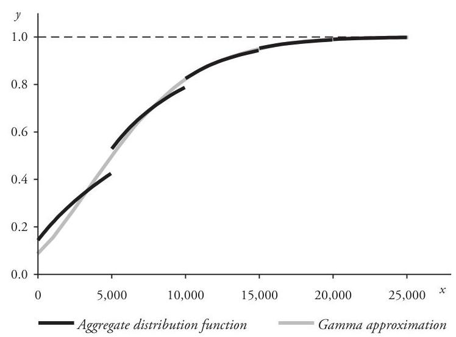

## Page 170
# 5.7. Problems 

5.1 The claim-size random variable $X$ for a claim process has an exponential distribution with mean 1,000 . The expected number of claims for the ground-up claim process is 20 . However, policy conditions limit claims to the layer between 1,000 and 3,000 .
(a) Compute the mean and variance of the layer claim size.
(b) Compute the expected number of layer claims.
(c) How do the policy conditions alter the coefficient of variation of the claim-size variable?
(d) If a uniform inflation rate of $10 \%$ per annum is applied to $X$, what is the annual percentage increase in the layer claim size? . . . the layer claim count? . . . the total layer aggregate loss?
5.2 Compute $e_{X}(3,000)$ for the following distributions of $X$. Note that the unlimited severity for each distribution is the same: $E[X]=2,000$.
(a) uniform on $[0 ; 4,000]$.
(b) gamma, $(\alpha, \beta)=(2 ; 1,000)$.
(c) exponential, $\beta=2,000$.
(d) shifted Pareto, $(\alpha, \beta)=(3 ; 4,000)$.
(e) lognormal, $(\mu, \sigma)=(5.9809,1.8000)$.
5.3 Verify formulas (5.5) and (5.6) for the second and third moments of $X_{a}$.
5.4 Verify formulas (5.11), (5.12), and (5.13) for the moments of $X_{a, l}$.
5.5 Prove: $E\left[X_{a, l}\right]=e_{X}(a)-e_{X}(a+l) \frac{1-F_{X}(a+l)}{1-F_{X}(a)}$.
5.6 Claim-size variable $X$ has the mixed cumulative distribution function $F(x)=$ $\sum_{k=1}^{m} \omega_{k} F_{k}(x)$, where $\left\{F_{k}\right\}$ are the component distribution functions and the weights $\left\{\omega_{k}\right\}$ satisfy $\omega_{k}>0$ and $\sum_{k=1}^{m} \omega_{k}=1$. Show that

$$
e_{X}(x)=\frac{\sum_{k=1}^{m} \omega_{k} e_{k}(x)\left(1-F_{k}(x)\right)}{1-\sum_{k=1}^{m} \omega_{k} F_{k}(x)}, \quad 0<x<\infty
$$

5.7 Compute $\operatorname{Pr}\left\{X_{d}>x\right\}$, where $0<d<x$, and the distribution of $X$ is:
(a) exponential $(\beta)$.
(b) shifted Pareto $(\alpha, \beta)$.
5.8 Prove: If $E[X]$ exists, then $E[X]=E[X ; x]+e(x)(1-F(x))$ for all $x>0$.
5.9 (a) Show that the excess severity function $e_{X}(x)$ can be expressed by the integral formula

$$
e_{X}(x)=\int_{x}^{\infty}(u-x) d F_{X}(u) / \int_{x}^{\infty} d F_{X}(u), \quad 0<x<\infty
$$

(b) The unlimited claim-size observations $\left\langle x_{1}, x_{2}, \ldots, x_{n}\right\rangle$ from a random sample of size $n$ are grouped into a sequence of intervals of the form $\left(c_{k-1}, c_{k}\right]$, where

## Page 171
$n_{k}=\#$ claims in the $k^{\text {th }}$ interval, $\Sigma_{k} n_{k}=n$, and $\bar{x}_{k}=$ mean claim size in the $k^{\text {th }}$ interval. Show that the sample excess severity function $e_{n}\left(c_{k}\right)$ is

$$
e_{n}\left(c_{k}\right)=\sum_{i>k} n_{i}\left(\bar{x}_{i}-c_{k}\right) / \sum_{i>k} n_{i}
$$

5.10 For the lognormal claim-size random variable $X$ of Example 5.8 calculate:
(a) $C V[X ; 3,000]$ and $C V[X ; 8,000]$. Compare these numbers to $C V[X]$.
(b) $S k[X], S k[X ; 3,000]$, and $S k[X ; 8,000]$.
5.11 Calculate $C V[X]$ in terms of the distribution parameters when the distribution of $X$ is:
(a) exponential $(\beta)$.
(b) gamma $(\alpha, \beta)$.
(c) lognormal $(\mu, \sigma)$.
(d) shifted Pareto $(\alpha, \beta)$ with $\alpha>2$.
(e) uniform on the interval $[0, a], a>0$.
5.12 Assume that the policy of Example 5.6 has a ground-up claim process with $E[N]=5$ and that the claim-size variable $X$ is Pareto-distributed with $(\alpha, \beta)=$ $(3 ; 5,000)$. For each layer $L$ defined in that example compute:
(a) probability $P_{L}$ that a claim penetrates the layer $L$.
(b) expected number of layer claims $E\left[N_{L}\right]$.
(c) expected layer claim size $E\left[X_{L}\right]$.
(d) expected aggregate layer loss $E\left[S_{L}\right]$.

| Layer $L$ | $P_{L}$ | $E\left[N_{L}\right]$ | $E\left[X_{L}\right]$ | $E\left[S_{L}\right]$ |
| :--: | :--: | :--: | :--: | :--: |
| $[0 ; 100]$ |  |  |  |  |
| $(100 ; 3,000]$ |  |  |  |  |
| $(3,000 ; \infty)$ |  |  |  |  |
| $[0 ; \infty)$ | 1.0000 | 5.0000 | 2,500.00 | 12,500 |

5.13 Assume that $E[X]$ exists and that the partition

$$
0=b_{0}<b_{1}<b_{2}<\cdots<b_{m-1}<b_{m}=\infty
$$

defines a sequence of $m$ contiguous layers. Prove: if $\mu_{k}$ is the mean claim size for the $k^{\text {th }}$ layer $\left(b_{k-1}, b_{k}\right]$ and $p_{k}=\operatorname{Pr}\left\{X>b_{k-1}\right\}$, then $E[X]=\sum_{k=1}^{m} p_{k} \mu_{k}$.
5.14 Let $X$ denote an unlimited claim-size variable with distribution function $F$, and assume that $0 \leq a<b$. The claim interval between $a$ and $b$ is just the set of claims of size $X$ such that $a<X \leq b$.
(a) Explain how the claim interval between $a$ and $b$ differs from the layer defined by $a$ and $b$.
(b) If $\lambda$ is the mean number of ground-up claims, what is the expected number of claims in the interval $a<X \leq b$ ?
(c) Prove that the average claim size in the interval $a<X \leq b$ is

$$
E[X \mid a<X \leq b]=\frac{E[X ; b]-E[X ; a]-b(1-F(b))+a(1-F(a))}{F(b)-F(a)}
$$

## Page 172
5.15 For the grouped data of Example 5.4 the indicated groups can be used to define either a sequence of claim intervals or a sequence of layers of coverage. Calculate the average claim size for each interval and each layer.

| Interval/Layer | Interval Mean | Layer Mean |
| :--: | :--: | :--: |
| $(0 ; 100]$ | - | - |
| $(100 ; 500]$ | - | - |
| $(500 ; 1,000]$ | - | - |
| $(1,000 ; 2,000]$ | - | - |
| $(2,000 ; 4,000]$ | - | - |
| $(4,000 ; 5,000]$ | - | - |
| $(5,000 ; 10,000]$ | - | - |

5.16 Verify formula (5.17) for the second moment of the excess claim-count random variable $N_{a}$.
5.17 Prove that whenever the ground-up claim count $N$ has a negative binomial distribution of the form (3.17) with parameters $(\alpha, v)$, then the distribution of the claim count $N_{a}$ excess of an underlying limit $a$ is also negative binomial, with parameters $(\alpha, p v)$, where $X$ is the claim-size variable and $p=1-F_{X}(a)$.
5.18 The ground-up claim count $N$ has mean $\lambda$ and contagion parameter $\gamma$. Prove that for the excess claim count $N_{a}$, the contagion parameter is unchanged: $\gamma_{a}=\gamma$.
5.19 Derive a generalization of formula (5.19) for the effective trend factor $\tilde{\tau}$ associated with the layer claim size $X_{a, l}$.
5.20 Show that the leveraging effect on the aggregate excess loss disappears whenever the underlying limit $a$ is also trended at the same rate as the claim-size variable $X$.
5.21 Claim-size random variable $X$ is lognormally distributed with $(\mu, \sigma)=(5.9809$, $1.8000)$ and is subject to an inflation rate of $10 \%$ per annum. Calculate the corresponding effective inflation rate on the excess claim count for each of the following underlying limits, thus demonstrating that the induced claim-count rate of change can be either more or less than the basic claim-size inflation rate. (a) $a=3,000$.
(b) $a=8,000$.
5.22 Variable $X$ has a lognormal distribution as in Problem 5.21 and is also subject to a $10 \%$ inflation rate. Calculate the effective inflation rate on the excess aggregate loss for each of the following excess layers. What can be said about the effective layer inflation rate as compared to the basic rate of inflation?
(a) $(a, a+l]=(3,000 ; 5,000]$.
(b) $(a, a+l]=(3,000 ; 8,000]$.

## Page 173
5.23 As in Example 5.3, the table summarizes grouped claim-size data from a sample of 1,000 claims. These claims are excess of a 500 straight deductible and have been censored by a policy limit of 100,000.
(a) Use the minimum chi-square method to obtain estimates of lognormal parameters for the ground-up population claim-size distribution.
(b) Estimate the number of claims eliminated by the policy deductible.
5.24 Assume that $X$ is a continuous claim-size random variable for which $E[X]$ exists as a finite number. Derive this integral formula for $e_{X}(x)$ :

| Size Group | \# Claims |
| :--: | --: |
| $0-1,000$ | 236 |
| $1,001-2,000$ | 161 |
| $2,001-3,000$ | 107 |
| $3,001-5,000$ | 135 |
| $5,001-10,000$ | 159 |
| $10,001-15,000$ | 71 |
| $15,001-25,000$ | 62 |
| $25,001-50,000$ | 43 |
| $50,001-75,000$ | 11 |
| $75,001-100,000$ | 15 |
| Total | 1,000 |

$$
e_{X}(x)=\frac{\int_{x}^{\infty}\left(1-F_{X}(u)\right) d u}{1-F_{X}(x)}
$$

5.25 Establish the following asymptotic properties of the mean excess claim size function $e_{X}(x)$. In each case it is useful to express $e_{X}(x)$ by the integral formula of Problem 5.24.
(a) If $X$ has the gamma density function

$$
f(x)=\frac{1}{\Gamma(\alpha) \beta^{\alpha}} x^{\alpha-1} e^{-x / \beta}
$$

then $e_{X}(x) \approx x /(x / \beta+\alpha-1)$ for large $x$ so that $\lim _{x \rightarrow \infty} e_{X}(x)=\beta$. [Hint: Apply l'Hôpital's Rule.]
(b) If $X$ has a Weibull density function

$$
f(x)=\frac{\alpha}{\beta^{\alpha}} x^{\alpha-1} \exp \left(-(x / \beta)^{\alpha}\right), \quad 0<x<\infty
$$

then $e_{X}(x) \approx \beta^{\alpha} /\left(\alpha x^{\alpha-1}\right)$ for large $x$. [Hint: use l'Hôpital's Rule to show that

$$
\left.\lim _{x \rightarrow \infty} \frac{e_{X}(x)}{\beta^{\alpha} /\left(\alpha x^{\alpha-1}\right)}=1.\right]
$$

## Page 174
# 6. Limits and Deductibles 

In this chapter we explore some common applications of the claim-count, claimsize, and aggregate-loss distributions in property/casualty insurance. In particular, we investigate the pricing of policies with various coverage limitations such as deductible options, and per-claim and aggregate limits with a variety of properties. We begin by reviewing some basic premium concepts and how they relate to distributional theory.

### 6.1. Premium Concepts

Every insurance policy has an associated loss process described jointly by a claim-count random variable $N$ and a claim-size variable $Y$. In the following discussion $Y$ represents the entire claim amount: the indemnity payment plus loss adjustment expense allocated to the claim, as limited by policy conditions. Allocated loss adjustment expenses (ALAE) are those incurred during the settlement process for an individual claim: attorneys' fees, investigation expense, expert witness fees, and the like. (Unallocated loss adjustment expenses, such as claim department overhead, are usually treated as general expenses and are not included in the policy aggregate loss.) The expected loss for the policy is then $E[N] E[Y]$, the mean of the policy aggregate loss distribution. Premium charged for such a policy is based on this expected loss, loaded for general expenses, underwriting profit, and a charge for risk.

The mean $E[N]$ of the claim-count variable represents the expected number of claims per policy. In most situations, the expected claim count is seen to depend on an exposure unit associated with the policy coverage. The exposure unit is usually chosen to have certain desirable characteristics: (i) it should be a meaningful indicator of the policy's expected number of claims-the more exposure units covered by the policy the greater the expected number of claims, and (ii) one should be able to determine an expected number of claims-constant over at least a moderate period of timeassociated with a single exposure unit.

For example, a single auto is the customary exposure unit for an auto liability policy with a term of one year. For such a policy the expected number of policy claims $E[N]$ is obtained by multiplying the number of autos covered by the policy for a year, referred to as the number of vehicle years, and the expected number of claims per auto per yearthat is, the number of claims per vehicle year. Other common measures of exposure include dollars of annual payroll for workers' compensation policies, the number of objects manufactured in a year or dollars of annual sales for product liability coverages, and building area measured in square feet for premises liability coverages.

## Page 175
The expected number of claims per unit exposure is called the claim frequency. If $m$ denotes the number of exposure units and $\varphi$ the claim frequency, then obviously

$$
m \varphi=E[N]
$$

In addition, the claim severity is the average claim size $E[Y]$ for the policy. The product of frequency and severity, denoted by $p$, is called the pure premium:

$$
p=\text { pure premium }=(\text { frequency })(\text { severity })=\varphi E[Y]
$$

It is clear that the pure premium represents the expected aggregate claim amount per unit of exposure. Accordingly, exposure times pure premium yields the policy expected loss:

$$
m p=m(\varphi E[Y])=E[N] E[Y]
$$

In the case that a policy involves more than a single line of business-each with its own exposure, frequency, and severity-then the policy expected loss is obtained by summing over all component coverages the corresponding products of exposure, frequency, and severity.

Example 6.1. For a certain general liability coverage the exposure unit is $\$ 1,000$ of annual sales, the claim frequency is 0.000825 claims per $\$ 1,000$ sales per year, and the claim severity is $\$ 5,200$.

An insured has $\$ 650,000$ of sales revenue per year. Consequently, the number exposure units for an annual policy is

$$
m=\frac{\$ 650,000}{\$ 1,000}=650
$$

the pure premium is $p=(0.000825)(5,200)=4.29$, and the expected loss for the policy is $m p=(650)(4.29)=2,789$.

To calculate the policy premium one must first load the pure premium amount with a provision for general expenses, underwriting profit, and risk. General expenses include acquisition expense-commission paid to agents and brokers-salaries and overhead, taxes and fees, and other costs of doing business. Underwriting profit is the expected excess of premium over paid losses and expenses. (In some lines of business the underwriting profit could be zero, or even negative, in anticipation of an offset from investment income.) The risk charge is extra premium collected by the insurer to cover such contingencies as (i) random fluctuations of losses about the expected values and (ii) uncertainty inherent in the selection of critical parameters used in modeling the underlying loss process. Insurer risk from the first source is called process risk and that from the second, parameter risk.

Provisions for expense, profit, and risk can be treated either as variable-loaded as a percent of the final premium amount-or as fixed-added as a dollar amount per unit of exposure to the pure premium. Agent and broker commission is generally a variable expense, whereas the overhead cost of issuing a policy could be loaded as a fixed expense.

## Page 176
If variable expenses, plus the load for profit and risk, constitute the fraction $v$ of the total policy premium, ${ }^{51}$ and fixed expenses are $f$ dollars per unit exposure, then the modified pure premium

$$
R=\frac{p+f}{1-v}
$$

is the rate per unit exposure. The number of exposure units $m$ times the rate $R$ yields the final policy premium $P$ :

$$
P=m R=\frac{m(p+f)}{1-v}=\frac{E[N] E[Y]+m f}{1-v}
$$

In the case that $f=0$-that is, all expense amounts are assumed to be variable and expressed by the expense ratio $v$-the factor

$$
\psi=\frac{1}{1-v}
$$

is called a loss-cost multiplier. Rate formula (6.4) then reduces to the simpler form $R=\psi p$, and the premium formula becomes

$$
P=m R=m(\psi p)=\psi E[N] E[Y]
$$

In subsequent sections we shall generally assume that expenses are loaded by means of a loss-cost multiplier $\psi$, as in (6.7).

Example 6.2. A business owner wishes to buy annual insurance coverage for general liability and auto liability for a business operation that involves premises of 20,000 square feet and four automobiles. General and auto liability premiums are rated separately, as indicated below.

For the general liability coverage the insurer has determined a claim frequency of 0.004 per 1,000 square feet per year and a claim severity of 6,500 . The general liability pure premium is therefore $p=(0.004)(6,500)=26.00$. Variable expenses plus profit load amount to $30 \%$ of the premium; fixed expenses are 4.10 per exposure unit. Therefore, the general liability annual rate is

$$
R_{G L}=\frac{26.00+4.10}{1-0.30}=43.00 \text { per } 1,000 \text { square feet. }
$$

For the auto coverage the claim frequency is 0.052 per vehicle year, with a claim severity of 2,800 and fixed expense of 9.80 per vehicle year, and so the auto liability rate is

$$
R_{A L}=\frac{(0.052)(2,800)+9.80}{1-0.30}=222.00 \text { per vehicle year. }
$$

[^0]
[^0]:    ${ }^{51}$ As we shall see in Section 6.3, the risk load is often calculated as an amount that varies with the policy limit, as well as one that varies with premium.

## Page 177
Annual liability premium $P$ is obtained by multiplying the number of exposure units and the rate for each coverage and summing the results:

$$
P=\frac{20,000}{1,000} R_{G L}+4 R_{A L}=(20)(43)+(4)(222)=\$ 1,748
$$

# 6.2. Increased Limit Factors 

The premium for many property/casualty policies is calculated first for a basic perclaim policy limit, and then this basic-limit premium is multiplied by an appropriate increased limit factor (ILF) to determine the full policy premium. A set of increased limit factors-one for each of the available policy limit options-can be obtained from an empirical loss distribution based on loss data organized around the required policy per-claim limits, or it can be derived from an appropriate parametric size-ofloss distribution. Such an analytic distribution fit to empirical sample data is often useful for obtaining factors for those higher limits for which data are either sparse or nonexistent.

Let $P_{b}$ denote the policy premium at the basic per-claim limit $b$ and $P_{l}$ the premium at a policy per-claim limit $l$. Then the increased limit factor $I(l)$ is defined by

$$
I(l)=\frac{P_{l}}{P_{b}}
$$

so that $P_{l}=P_{b} \cdot I(l)$. Note also that if the policy premium is based on formula (6.7), then $p_{l}=p_{b} \cdot I(l)$, where $p_{l}$ is the pure premium associated with the limit $l$.

In the discussion that follows, $E_{l}[Y]$ is the policy severity, including both indemnity payment and allocated loss adjustment expense, appropriately modified by the policy limit $l$. When expenses are loaded by means of a loss-cost multiplier $\psi$, ILF formula (6.8) becomes

$$
I(l)=\frac{P_{l}}{P_{b}}=\frac{\psi E[N] E_{l}[Y]}{\psi E[N] E_{b}[Y]}=\frac{E_{l}[Y]}{E_{b}[Y]}
$$

The specific form of $E_{l}[Y]$ depends on whether policy conditions stipulate that limit $l$ applies to the full claim amount, including both indemnity and allocated loss adjustment expense portions of a claim, or whether it applies only to the indemnity payment.

Consider first the case that policy limit $l$ applies to the total claim amount: indemnity loss plus loss adjustment expense. If $X_{t}$ denotes the ground-up, unlimited total claimsize random variable, then the policy severity is $E_{l}[Y]=E\left[X_{t} ; l\right]$. In these circumstances ILF formula (6.9) can be expressed as

$$
I(l)=\frac{E\left[X_{t} ; l\right]}{E\left[X_{t} ; b\right]}
$$

## Page 178
On the other hand, suppose that the limit $l$ applies only to the indemnity portion of the claim, as is usually the case. If random variable $X$ denotes just the indemnity component of the claim, then one could write

$$
E_{l}[Y]=E[X ; l]+\varepsilon
$$

where $\varepsilon$ is the average per-claim allocated loss adjustment expense, independent of the policy limit. In this case (6.9) has the form

$$
I(l)=\frac{E[X ; l]+\varepsilon}{E[X ; b]+\varepsilon}
$$

Provision for loss adjustment expense in formula (6.11) is an overall average amount $\varepsilon$ added to every claim, regardless of size. Amount $\varepsilon$ can thus be interpreted as the mean of a loss adjustment expense random variable, but in (6.11) it is unnecessary to know exactly how that variable is distributed.

As an alternative to this approach, it is sometimes useful to assume that loss adjustment expense bears some functional relationship to the size of the indemnity payment. One simple scheme is to assume that loss adjustment expense is a fixed multiple $u$ of the indemnity amount. This assumption can be approximately true provided that the indemnity payment is not too large. (An alternative, hybrid method of expense loading is described in Problem 6.6.) Again, assuming that the policy limit applies only to the indemnity portion of the claim, one can write

$$
E_{l}[Y]=E[X ; l]+u E[X ; l]=E[X ; l](1+u)
$$

Then ILF formula (6.9) becomes

$$
I(l)=\frac{E[X ; l](1+u)}{E[X ; b](1+u)}=\frac{E[X ; l]}{E[X ; b]}
$$

The three approaches to loss adjustment expense incorporated into formulas (6.12), (6.13), and (6.14) can be combined into a single general formula for the policy severity:

$$
E_{l}[Y]=(E[X ; l]+\varepsilon)(1+u)
$$

In case that limit $l$ applies to indemnity loss plus loss adjustment expense, set $X=X_{t}$ and $\varepsilon=u=0$ in (6.15). Otherwise, when the limit applies only to the indemnity payment, let variable $X$ represent the indemnity-only portion of a claim and set either $\varepsilon=0$ or $u=0$, as desired.

The Insurance Services Office (ISO) increased limits methodology treats allocated loss adjustment expense additively like the constant $\varepsilon$ in formula (6.15) and loads unallocated adjustment expense multiplicatively like the factor $1+u$ in that formula. ${ }^{52}$

[^0]
[^0]:    ${ }^{52}$ For an extended discussion of the ISO method, refer to a current ISO Actuarial Service Circular for increased limits data and analysis for General and/or Commercial Auto Liability (Jersey City, NJ: Insurance Services Office, Inc.).

## Page 179
Table 6.1. Increased Limit Factors [Example 6.3]

| Limit $l$   $(\$ 000)$ | $E[X ; I]$ | $I(I)$   ALAE $=2,200$ | $I(I)$   ALAE $=20 \%$ |
| --: | :--: | :--: | :--: |
| 100 | 8,896 | 1.0000 | 1.0000 |
| 500 | 13,626 | 1.4263 | 1.5317 |
| 750 | 14,668 | 1.5202 | 1.6488 |
| 1,000 | 15,345 | 1.5812 | 1.7249 |
| 2,000 | 16,738 | 1.7067 | 1.8815 |
| 3,000 | 17,390 | 1.7655 | 1.9548 |
| 4,000 | 17,782 | 1.8008 | 1.9989 |
| 5,000 | 18,048 | 1.8248 | 2.0288 |

Example 6.3. Indemnity losses for a portfolio of insurance policies have a lognormal claim-size distribution with parameters $(\mu, \sigma)=(7.000,2.400)$. The policy per-claim limit applies only to the indemnity portion of a claim, and the average per-claim loss adjustment expense is 2,200 . Claim frequency for these policies is $\varphi=0.0005$ per exposure unit, and variable expenses equal $35 \%$ of premium.

A set of increased limits factors based on (6.15) with $b=100,000, \varepsilon=2,200$, and $u=0$ is shown in the third column of Table 6.1. For example,

$$
I(1,000 K)=\frac{15,345+2,200}{8,896+2,200}=1.5812
$$

For a policy with 400 exposure units, so that $E[N]=(400)(0.0005)=0.2000$, the basic-limit premium is

$$
P_{100 K}=\frac{(0.2000)(8,896+2,200)}{1-0.35}=\$ 3,414
$$

The corresponding premium for a policy limit of $1,000,000$ is therefore

$$
P_{1,000 K}=P_{100 K} \cdot I(1,000 K)=(3,414)(1.5812)=\$ 5,398
$$

Alternatively, if the loss adjustment expense is treated as $20 \%$ of the indemnity portion of the claim, then the resulting increased limit factors are displayed in the fourth column of Table 6.1. For example, in this case

$$
I(1,000 K)=\frac{(15,345)(1.20)}{(8,896)(1.20)}=1.7249
$$

For the policy with 400 exposure units the basic-limit premium is

$$
P_{100 K}=\frac{(0.2000)(8,896)(1.20)}{1-0.35}=\$ 3,285
$$

## Page 180
and with a $1,000,000$ limit,

$$
P_{1,000 K}=(3,285)(1.7249)=\$ 5,666
$$

# Excess Layer Pricing 

Increased limit factors can also be applied to price an excess layer of coverage, defined by a policy limit $l$ and attachment point $a(l>0, a>0)$, as discussed in Section 5.3. If $\varphi$ and $E_{a, l}[Y]$ denote, respectively, the ground-up claim frequency and the severity for the policy layer $(a, a+l]$, then the layer pure premium is

$$
p_{a, l}=\varphi\left(1-F_{X_{t}}(a)\right) E_{a, l}[Y]
$$

where $X_{t}$ is the total ground-up claim amount. In the case that $X_{t}$ is subject to the layer limits we rearrange the pure premium formula as follows:

$$
\begin{aligned}
p_{a, l} & =\varphi\left(1-F_{X_{t}}(a)\right) \frac{E\left[X_{t} ; a+l\right]-E\left[X_{t} ; a\right]}{1-F_{X_{t}}(a)} \\
& =\varphi\left(E\left[X_{t} ; a+l\right]-E\left[X_{t} ; a\right]\right) \\
& =\varphi E\left[X_{t} ; b\right]\left(\frac{E\left[X_{t} ; a+l\right]}{E\left[X_{t} ; b\right]}-\frac{E\left[X_{t} ; a\right]}{E\left[X_{t} ; b\right]}\right)
\end{aligned}
$$

In this special case, a layer factor, applied to the basic-limit pure premium to calculate the pure premium for the excess layer, is just the difference of two ground-up increased limit factors of the form (6.9), namely,

$$
p_{a, l}=p_{b} \cdot(I(a+l)-I(a))
$$

Since $P_{a, l}=m\left(\psi p_{a, l}\right)=m\left(\psi p_{b}\right)(I(a+l)-I(a))$, premium for the excess layer $(a, a+l]$ can be calculated by using the layer formula for policy premium $P$ :

$$
P=P_{b} \cdot(I(a+l)-I(a))
$$

The simplicity of this basic formula makes it very easy to apply. Because of this, it is widely used in increased limits pricing, even in situations where it is not strictly appropriate. For example, suppose that the layer limits $l$ and $a$ apply only to the indemnity portion of a claim and ALAE is added as in formula (6.11). Then the excess-layer premium based on that model would be

$$
\begin{aligned}
P_{a, l} & =\psi E[N]\left(1-F_{X}(a)\right)\left(\frac{E[X ; a+l]-E[X ; a]}{1-F_{X}(a)}+\varepsilon\right) \\
& =\psi E[N](E[X ; a+l]-E[X ; a]+\left(1-F_{X}(a)\right) \varepsilon)
\end{aligned}
$$

## Page 181
On the other hand, the layer formula for $P$ yields

$$
\begin{aligned}
P & =\psi E[N](E[X ; b]+\varepsilon)\left(\frac{E[X ; a+l]+\varepsilon}{E[X ; b]+\varepsilon}-\frac{E[X ; a]+\varepsilon}{E[X ; b]+\varepsilon}\right) \\
& =\psi E[N](E[X ; a+l]-E[X ; a])
\end{aligned}
$$

Notice that $P=P_{a, l}$ and that the load for loss adjustment expense has dropped out of the premium calculation in (6.19) entirely. In the situation where such an excess policy is written over a primary policy providing first-dollar coverage for the primary layer $[0, a]$, this state of affairs is consistent with the assumption that allocated loss adjustment expense is paid in its entirety by the primary insurer.

On the other hand, if loss adjustment expense is loaded by means of the factor $1+u$, then

$$
P_{a, l}=\psi E[N](E[X ; a+l]-E[X ; a])(1+u)
$$

where the provision for ALAE in the excess premium is

$$
A L A E=\psi E[N](E[X ; a+l]-E[X ; a]) u
$$

The layer formula for $P$ yields the premium amount

$$
\begin{aligned}
P & =\psi E[N] E[X ; b](1+u)\left(\frac{E[X ; a+l]}{E[X ; b]}-\frac{E[X ; a]}{E[X ; b]}\right) \\
& =\psi E[N](E[X ; a+l]-E[X ; a])(1+u)
\end{aligned}
$$

In this case, for which the ALAE multiplier $u$ is the same for both primary and excess policies, the basic layer formula preserves the loss adjustment expense loading exactly and $P=P_{a, l}$.

Example 6.4. We return to the portfolio of policies described in Example 6.3 and calculate the premium for successive excess layers of insurance for a policy with $m=400$. We use the ILFs constructed in that example under the assumption that the average per-claim ALAE payment is $\varepsilon=\$ 2,200$.

The basic limit premium was calculated in the previous example to be $\$ 3,414$. Thus, premium $P$ for the layer $(1,000,000 ; 2,000,000]$ given by the layer formula (6.17) is

$$
P=(3,414)(1.7067-1.5812)=(3,414)(0.1255)=\$ 428
$$

Similarly, for the layer $(2,000,000 ; 3,000,000]$, we obtain

$$
P=(3,414)(1.7655-1.7067)=(3,414)(0.0588)=\$ 201
$$

Premium amounts for the successive million-dollar layers obtained from these layer factors applied to the basic-limit premium are displayed in Table 6.2.

## Page 182
Table 6.2. Layer Premium [Example 6.4]

| Layer (\$000) | Layer Factor | Premium |
| :--: | :--: | :--: |
| $[0 ; 100]$ | 1.0000 | 3,414 |
| $[0 ; 1,000]$ | 1.5812 | 5,398 |
| $(1,000 ; 2,000]$ | 0.1255 | 428 |
| $(2,000 ; 3,000]$ | 0.0588 | 201 |
| $(3,000 ; 4,000]$ | 0.0353 | 121 |
| $(4,000 ; 5,000]$ | 0.0240 | 82 |

# Consistency 

The premiums calculated in Example 6.4 illustrate an important and desirable characteristic of excess layer pricing-premium amounts for successively higher layers of constant width decrease as the attachment point becomes larger. In that example, premium for the ground-up million-dollar layer is $\$ 5,398$, and for successively higher layers of one-million-dollar width the calculated premium steadily declines with increasing attachment point: $\$ 428, \$ 201, \$ 121, \$ 82$. As we shall see, this is a property common to all pricing methods based on expected losses and reasonable distributions for the claim-size random variables.

Consider a set of increased limit factors based on the general severity formula (6.15). If the claim-size variable $X$ has a continuous probability density function $f_{X}(x)=F_{X}^{\prime}(x)$, then the ILF function $I(x)$ is twice differentiable with respect to the limit $x$ (refer to Problem 2.9). Specifically, for all $x>0$

$$
I^{\prime}(x)=\frac{(1+u)\left(1-F_{X}(x)\right)}{E[X ; b]+\varepsilon} \quad \text { and } \quad I^{\prime \prime}(x)=\frac{-(1+u) f_{X}(x)}{E[X ; b]+\varepsilon}<0
$$

A set of increased limit factors for which $I^{\prime \prime}(x)<0$ for all limits $x$ is said to be consistent. Thus, every set of increased limit factors based on severity formula (6.15) for which the claim-size density function is continuous is always consistent.

Consistent sets of increased limit factors share a common property: the premium $P$ calculated from the layer formula (6.17) applied to successive excess layers of constant width is a decreasing function of the attachment point limit. It is easy to verify this assertion in the case that the claim-size variable has a continuous probability density function. Assume that in the formula

$$
P=P_{b} \cdot(I(x+l)-I(x))
$$

the attachment point $x$ is variable, whereas the layer width $l$ is a fixed constant. Then the rate of change of premium $P$ with respect to $x$ is

$$
\frac{d P}{d x}=P_{b}\left(\frac{d}{d x} I(x+l)-\frac{d}{d x} I(x)\right)
$$

## Page 183
Consistency means that $I^{\prime}(x)$ is a decreasing function of $x$, so that

$$
\frac{d}{d x} I(x+l)<\frac{d}{d x} I(x) \text { and hence } \frac{d P}{d x}<0
$$

Therefore, for each fixed $l$, premium $P$ for the layer $(x, x+l]$ decreases as the attachment point $x$ increases.

# 6.3. Risk Load 

Increased limit factors based on expected-value concepts have generally been thought to be inadequate for pricing insurance policies with high limits or attachment points unless they were loaded with a charge for insurer risk. With lower claim probabilities for such policies, loss behavior associated with excess policies is more volatile and less predictable than that of primary policies with lower limits. Insurer risk due to such variability is process risk, in contrast to the parameter risk derived from estimation errors in selecting the claim-count and claim-size distributions. Process risk has long been understood by actuaries as a function of the variance of the basic stochastic claim process for a portfolio of policies or line of property/casualty insurance business.

In most approaches to risk-loaded increased limit factors, the risk load $\rho(l)$ is usually defined as an increasing function of the policy limit $l$, which is added to the expected total policy severity for the policy. The severity formula (6.15) is thus modified

$$
E_{l}[Y]+\rho(l)=(E[X ; l]+\varepsilon)(1+u)+\rho(l)
$$

and the resulting risk-loaded increased limit factors are

$$
I(l)=\frac{(E[X ; l]+\varepsilon)(1+u)+\rho(l)}{(E[X ; b]+\varepsilon)(1+u)+\rho(b)}
$$

The merits of different methods of quantifying process risk for increased limit factors have been debated since the mid-1970s. Robert Miccolis ${ }^{53}$ suggested in 1977 that process risk load be added to the policy expected aggregate loss as a constant multiple of the variance of the policy aggregate indemnity-loss random variable $S$ :

$$
\begin{aligned}
& E[N] E[X ; l]+k \operatorname{Var}[S] \\
& \quad=E[N]\left(E[X ; l]+k \frac{E[N] \operatorname{Var}[X ; l]+\operatorname{Var}[N](E[X ; l])^{2}}{E[N]}\right)
\end{aligned}
$$

The multiplier $k$ in this formula is selected arbitrarily to produce the desired level of risk loading. The risk load function $\rho(l)$ in formula (6.21) is thus given by

$$
\rho(l)=k \frac{\operatorname{Var}[S]}{E[N]}=k\left(E\left[X^{2} ; l\right]+\delta(E[X ; l])^{2}\right)
$$

[^0]
[^0]:    ${ }^{53}$ Miccolis [16].

## Page 184
where $\delta=\operatorname{Var}[N] / E[N]-1$. Setting $\delta=0$, of course, is consistent with the assumption that $N$ has a Poisson distribution. Note also that when $\delta=0$ the risk load $\rho(l)$ is independent of the claim-count random variable and dependent only upon the claimsize variable. Such a variance-based approach to process risk load was adopted by ISO in the early 1980s. ${ }^{54}$

By mid-decade, however, ISO changed to a method based on the standard deviation of the policy aggregate indemnity-loss distribution:

$$
\begin{aligned}
\rho(l) & =k \frac{\sqrt{\operatorname{Var}[S]}}{E[N]} \\
& =\frac{k}{\sqrt{E[N)}} \sqrt{E\left[X^{2} ; l\right]+\delta(E[X ; l])^{2}} \\
& =k^{\prime} \sqrt{E\left[X^{2} ; l\right]+\delta(E[X ; l])^{2}}
\end{aligned}
$$

where $\delta$ is defined as in the variance formula (6.23). ISO actuaries cited several reasons for this change. Risk-loaded factors based on (6.23) and (6.24) with thick-tailed Pareto distributions for $X$ were sometimes inconsistent (for example, refer to Problem 6.10). Moreover, it seemed preferable to express the risk load as a dollar amount rather than in terms of (dollars) ${ }^{2}$. In 1991 ISO introduced a new risk-loading method that includes a measure of parameter risk as well as process risk. But this new method returned to the earlier variance approach to process risk. ${ }^{55}$

Example 6.5. We turn again to the portfolio of policies described in Example 6.3. Indemnity losses are distributed lognormally with parameters $(\mu, \sigma)=(7.000,2.400)$, and allocated loss adjustment expense is $20 \%$ of the indemnity payment. We generate a set of risk-loaded increased limit factors by using formula (6.22) with $\varepsilon=0$ and $u=20 \%$. The risk load $\rho(l)$ is obtained by the standard deviation method (6.24) with $k^{\prime}=0.0277$ and $\delta=0$. Thus,

$$
\begin{gathered}
\rho(100,000)=(0.0277) \sqrt{512,509,058}=627 \\
\rho(1,000,000)=(0.0277) \sqrt{5,283,276,848}=2,013
\end{gathered}
$$

so that

$$
I(1,000,000)=\frac{(15,345)(1.20)+2,013}{(8,896)(1.20)+627}=1.8074
$$

Two sets of increased limit factors—risk-loaded and non-risk-loaded—are displayed in Table 6.3. The average increased limit factor in each column is obtained by using the indicated portfolio weights for the given set of limits. The ratio of these two averages

[^0]
[^0]:    ${ }^{54}$ Insurance Services Office [9].
    ${ }^{55}$ This approach is based on the paper by Glenn Meyers [15].

## Page 185
Table 6.3. Risk-Loaded Increased Limit Factors [Example 6.5]

| Limit /   (\$000) | $E[X ; I]$   $\times 1.20$ | Risk   Load   $\rho(I)$ | $I(I)$   w/o Risk   Load | $I(I)$   w/ Risk   Load | Limit   Weight |
| :--: | :--: | :--: | :--: | :--: | :--: |
| 100 | 10,675 | 627 | 1.0000 | 1.0000 | $15 \%$ |
| 500 | 16,351 | 1,473 | 1.5317 | 1.5770 | $10 \%$ |
| 1,000 | 18,414 | 2,013 | 1.7249 | 1.8074 | $30 \%$ |
| 2,000 | 20,086 | 2,663 | 1.8815 | 2.0128 | $20 \%$ |
| 3,000 | 20,868 | 3,090 | 1.9548 | 2.1197 | $10 \%$ |
| 4,000 | 21,338 | 3,410 | 1.9989 | 2.1897 | $10 \%$ |
| 5,000 | 21,658 | 3,668 | 2.0288 | 2.2407 | $5 \%$ |
| Average |  |  | 1.6938 | 1.7955 |  |

indicates an increase of $1.7955 / 1.6938-1=6.0 \%$. This means that using the riskloaded factors on a portfolio with this distribution of policy limits would generate $6 \%$ more premium than would be obtained by using the unloaded factors.

Unfortunately, both the variance and standard deviation approaches to risk load are incompatible with the layer formula (6.17) for pricing an excess layer. For example, if the risk load $\rho_{a, l}$ for the excess layer $(a, a+l]$ is defined as a multiple of the variance of the aggregate indemnity-loss variable $S$ for the layer, then $\rho_{a, l} \neq \rho(a+l)-\rho(a)$, where $\rho(l)$ is defined by (6.23).

To show this in a special case, we first calculate the layer risk load. For simplicity, assume that $N$ is the ground-up claim-count variable with $\delta=0$ and that $X$ is the ground-up claim-size variable. Then

$$
\begin{aligned}
\rho_{a, l} & =\frac{k \operatorname{Var}[S]}{\left(1-F_{X}(a)\right) E[N]} \\
& =k\left(E\left[X^{2} ; a+l\right]-E\left[X^{2} ; a\right]-2 a(E[X ; a+l]-E[X ; a])\right)
\end{aligned}
$$

But this means that

$$
\rho_{a, l}=\rho(a+l)-\rho(a)-2 k a(E[X ; a+l]-E[X ; a])<\rho(a+l)-\rho(a)
$$

That is, the risk load ascribed to the layer $(a, a+l]$ by the basic layer formula, namely $\rho(a+l)-\rho(a)$, is larger than the risk load based on the actual variance of the layer aggregate-loss random variable.

Overstatement of the risk load remains a technical problem when one uses the basic layer formula with risk-loaded ILFs to price excess layers of insurance. Ideally, one should first determine the layer premium by applying the basic formula with non-risk-loaded factors and then add on the risk load for the layer. Such an approach,

## Page 186
probably too cumbersome to be widely adopted, is more frequently used by reinsurers providing excess-of-loss coverage.

# 6.4. Aggregate Limits 

It is often the case with liability lines of insurance that policies are written not only with a per-claim limit but also with an aggregate limit as well. Whereas the perclaim limit is the maximum the insurance company would pay on a single claim, an aggregate limit is the maximum amount that would be paid during the policy term for all claims combined.

The policy expected loss under the restrictions imposed by a per-claim limit $l$ and an aggregate limit $L$ (where $L>l$ ) is just the expected value $E\left[S_{l} ; L\right]$, where $S_{l}$ is the aggregate-loss random variable based on a claim-size variable $N$ and a claim-size variable $X$ limited at $l$. Thus, the unlimited aggregate mean is

$$
E\left[S_{l}\right]=E[N] E[X ; l]
$$

It is often more efficient and accurate to calculate the expected aggregate loss eliminated by the limit $L$-namely $E\left[S_{l}\right]-E\left[S_{l} ; L\right]$-and subtract this amount from the unlimited mean (6.25) than it is to calculate $E\left[S_{l} ; L\right]$ directly. For example, if the (unlimited) aggregate distribution function $F_{S}(s)$ has been approximated by one of the deterministic models discussed in Chapter 4, then expected excess loss $E\left[S_{l}\right]-E\left[S_{l} ; L\right]$ can be obtained from the integral formula

$$
\begin{aligned}
E\left[S_{l}\right]-E\left[S_{l} ; L\right] & =\int_{0}^{\infty} s d F_{S}(s)-\int_{0}^{L} s d F_{S}(s)-L\left(1-F_{S}(L)\right) \\
& =\int_{L}^{\infty}(s-L) d F_{S}(s)
\end{aligned}
$$

In practice, the improper integral in (6.26) is most easily evaluated by numerical integration techniques. When a deterministic approximation is not practicable, then an approximation to $E\left[S_{l} ; L\right]$ could be obtained by stochastic simulation.

Thus, when $N$ is the claim-count variable, $X$ is the unlimited indemnity-only claim-size variable, and allocated loss adjustment expense is loaded multiplicatively by the factor $1+u$, the increased limit factor from the basic limit $b$ with no aggregate limit to a per-claim limit $l$ combined with an aggregate limit $L$ is given by

$$
I(l, L)=\frac{\psi E\left[S_{l} ; L\right](1+u)}{\psi E[N] E[X ; b](1+u)}=\frac{E\left[S_{l} ; L\right]}{E[N] E[X ; b]}
$$

The next example illustrates the use of formula (6.27).
Example 6.6. For a portfolio of liability policies the unlimited indemnity claim size distributed lognormally with $(\mu, \sigma)=(7.000,2.400)$. Claim count $N$ is distributed so that $E[N]=1.20$ with contagion parameter $\gamma=0.100$. Allocated loss adjustment expense is assumed to be $20 \%$ of the indemnity payment.

## Page 187
At the basic limit of 500,000 with no aggregate limit the expected policy indemnity loss is

$$
E\left[S_{0.5 M}\right]=E[N] E[X ; 500,000]=(1.20)(21,743)=26,092
$$

With a per-claim limit of 2,000,000 the expected loss is

$$
E\left[S_{2 M}\right]=E[N] E[X ; 2,000,000]=(1.20)(28,338)=34,006
$$

Consider now the case for which the per-claim limit of 2,000,000 is accompanied by an aggregate limit of $3,000,0000$. In addition to the mean 34,006 , the aggregateloss variable $S_{2 M}$ has $S D\left[S_{2 M}\right]=151,311$ and $S k\left[S_{2 M}\right]=9.4728$. A numerical integration of $\int_{3 M}^{s}(s-3,000,000) d \tilde{F}(s)$, where $\tilde{F}(s)$ is the shifted gamma approximation to $F_{S_{2 M}}(s)$, yielded

$$
E\left[S_{2 M}\right]-E\left[S_{2 M} ; 3,000,000\right]=91
$$

Thus,

$$
E\left[S_{2 M} ; 3,000,000\right]=34,006-91=33,915
$$

The ILF for the 2,000,000/3,000,000 limit combination is therefore

$$
I(2 M, 3 M)=\frac{33,915}{26,092}=1.2998
$$

Compare this result with the factor for the 2,000,000 per-claim limit with no aggregate limit:

$$
I(2 M)=\frac{34,006}{26,092}=1.3033
$$

The expected policy aggregate losses for several combinations of per-claim and aggregate limits for this portfolio, as well as the increased limit factors calculated from them, are shown in Table 6.4.

# 6.5. Deductibles 

The deductible is a coverage modification often used to decrease the policy claim count by eliminating small claims less than the deductible amount. It also serves possibly to encourage the policyholder to take steps to prevent or limit the occurrence of claims. We discuss in this section the standard straight deductible, as well as the less common franchise and diminishing deductible options.

By reducing the amount paid by the insurer for some or all claims, deductible provisions also serve to lower the premium charged for a policy. Deductible premium credits are easily calculated with the help of the claim-size limited pure premium and the loss elimination ratio concepts. In many cases, where there are sufficient data available, deductible credits can be calculated empirically. In other cases, analytic models involving parametric distributions are useful.

## Page 188
Table 6.4. Expected Aggregate Loss and ILFs with Aggregate Limits [Example 6.6]

| Per-Claim Limit | Aggregate Limit (\$000) |  |  |  |  |  |
| :--: | :--: | :--: | :--: | :--: | :--: | :--: |
|  | 1,000 | 2,000 | 3,000 | 4,000 | 5,000 | Unlimited |
| 500,000 | 26,050 | 26,092 | 26,092 | 26,092 | 26,092 | 26,092 |
| 1,000,000 | 29,702 | 30,306 | 30,333 | 30,335 | 30,335 | 30,335 |
| 2,000,000 | - | 33,524 | 33,915 | 33,988 | 34,002 | 34,006 |
| 3,000,000 | - | - | 35,421 | 35,696 | 35,781 | 35,821 |
| 4,000,000 | - | - | - | 36,604 | 36,808 | 36,949 |
| 5,000,000 | - | - | - | - | 37,428 | 37,733 |
| 500,000 | 0.9984 | 1.0000 | 1.0000 | 1.0000 | 1.0000 | 1.0000 |
| 1,000,000 | 1.1384 | 1.1615 | 1.1625 | 1.1626 | 1.1626 | 1.1626 |
| 2,000,000 | - | 1.2848 | 1.2998 | 1.3026 | 1.3032 | 1.3033 |
| 3,000,000 | - | - | 1.3575 | 1.3681 | 1.3713 | 1.3729 |
| 4,000,000 | - | - | - | 1.4029 | 1.4107 | 1.4161 |
| 5,000,000 | - | - | - | - | 1.4345 | 1.4462 |

# Straight Deductible 

The straight deductible is the most common deductible coverage modification. It eliminates, from the standpoint of the insurer, all claims less than or equal to the deductible amount $d$, and it reduces the size of larger claims by $d$. If $X$ represents the unmodified, ground-up claim-size variable, excluding allocated loss adjustment expense, then application of a straight deductible of size $d$ yields a modified random variable, truncated from below and shifted by $d$ :

$$
X_{d}=X-d, \quad d<X<\infty
$$

Clearly, claims net of such a deductible are excess over an underlying limit $d$, as discussed in Section 5.1.

For all deductible options discussed in this section we shall assume that allocated loss adjustment expense is not included in the deductible or policy limit and that the policy severity is modeled by the general formula (6.15) with ALAE parameters $\varepsilon$ and $u$. Thus, the basic-limit pure premium before application of the deductible is

$$
p_{b}=\varphi(E[X ; b]+\varepsilon)(1+u)
$$

where $b$ is the basic limit and $\varphi$ the claim frequency.
In practice, the basic-limit pure premium (6.29) is modified to reflect the presence of a deductible by applying a deductible credit factor $C(d)$ :

$$
p_{d, b}=p_{b} \cdot(1-C(d)), \quad 0<d<b
$$

## Page 189
Of course, this implies that the deductible-modified policy premium is obtained in the same way:

$$
P_{d, b}=P_{b} \cdot(1-C(d))
$$

The deductible premium credit amount is therefore $P_{b} C(d)$. Note also that the existence of the deductible reduces the basic limit policy layer width to $b-d$.

A formula for the deductible credit factor $C(d)$ is easily derived by starting with the modified basic-limit pure premium, calculated from first principles as the product of the policy frequency and severity:

$$
\begin{aligned}
p_{d, b} & =\varphi\left(1-F_{X}(d)\right)\left(\frac{E[X ; b]-E[X ; d]}{1-F_{X}(d)}+\varepsilon\right)(1+u) \\
& =\varphi\left(E[X ; b]-E[X ; d]+\left(1-F_{X}(d)\right) \varepsilon\right)(1+u)
\end{aligned}
$$

Equating the two expressions for $p_{d, b}$ in (6.30) and (6.32), we solve for $C(d)$ :

$$
C(d)=\frac{\varphi\left(E[X ; d]+F_{X}(d) \varepsilon\right)(1+u)}{p_{b}}=\frac{E[X ; d]+F_{X}(d) \varepsilon}{E[X ; b]+\varepsilon}
$$

The expression in (6.33) is merely the ratio of the pure premium eliminated by the deductible to that of the unmodified policy layer $[0, b]$. Accordingly, the ratio is referred to as a loss elimination ratio. The loss elimination ratio concept is useful in quantifying the effects of a variety of coverage modifications mandated by policy conditions.

Formula (6.31) yields the basic-limit premium modified by the straight deductible $d$, but how should the premium for a higher limit $l$ be so adjusted? Recall that $P_{l}=$ $P_{b} \cdot I(l)$, where $I(l)$ is the increased limit factor for limit $l$ with respect to the basic limit $b$, and that the premium credit amount for the existence of the deductible is $P_{b} \cdot C(d)$. Therefore,

$$
P_{d, l}=P_{l}-P_{b} C(d)=P_{b} \cdot(I(l)-C(d))
$$

Example 6.7 As in Example 6.3, consider a portfolio of policies for which the ground-up indemnity claim size $X$ has a lognormal distribution with parameters $(\mu, \sigma)=(7.000,2.400)$ and allocated loss adjustment expense is $u=20 \%$ of the indemnity amount. The basic limit is $b=100,000$. We calculate the credit factors, as well as the resulting frequency and severity, for five straight deductible options: $\{1,000 ; 2,000 ; 3,000 ; 4,000 ; 5,000 ; 10,000\}$. Results are tabulated in Table 6.5. For example, equation (6.33) with $u=20 \%$ and $\varepsilon=0$ implies that

$$
C(2,000)=\frac{E[X ; d]}{E[X ; b]}=\frac{1,111}{8,896}=0.1249
$$

## Page 190
Table 6.5. Straight Deductible Credit Factors [Example 6.7]

| Ded $d$ | $E[X ; d]$ | $F_{X}(d)$ | $C(d)$ | Frequency | Severity | Pure Prem |
| :--: | :--: | :--: | :--: | :--: | :--: | :--: |
| 0 | 0 | 0.0000 | 0.0000 | 0.000500 | 10,675 | 5.338 |
| 1,000 | 659 | 0.4847 | 0.0741 | 0.000258 | 19,182 | 4.942 |
| 2,000 | 1,111 | 0.5989 | 0.1249 | 0.000201 | 23,291 | 4.671 |
| 3,000 | 1,478 | 0.6625 | 0.1661 | 0.000169 | 26,375 | 4.451 |
| 4,000 | 1,793 | 0.7051 | 0.2016 | 0.000147 | 28,903 | 4.262 |
| 5,000 | 2,071 | 0.7364 | 0.2328 | 0.000132 | 31,070 | 4.095 |
| 10,000 | 3,144 | 0.8215 | 0.3534 | 0.000089 | 38,669 | 3.451 |

The ground-up claim frequency for this portfolio is $\varphi=0.000500$. Consequently, for a policy with deductible $d=2,000$ we have an deductible-adjusted frequency

$$
\varphi\left(1-F_{X}(d)\right)=(0.000500)(1-0.5989)=0.000201
$$

In addition, the modified severity is

$$
\frac{E[X ; b]-E[X ; d]}{1-F_{X}(d)}(1+u)=\frac{8,896-1,111}{1-0.5989}(1.20)=23,291
$$

yielding the pure premium $p=(0.000201)(23,291)=4.671$.
In Example 6.3 we calculated the basic-limit premium for a policy with 400 exposure units to be $\$ 3,285$. Accordingly, premium for this policy with a limit of $1,000,000$ and a 2,000 deductible is $P=(3,285)(1.8074-0.1249)=\$ 5,527$.

# Franchise Deductible 

The franchise deductible was one of the first coverage modifications to arise. Marine underwriters from the earliest times used it with policies insuring cargo shipments. It is now utilized in some types of workers' compensation coverages. The franchise deductible eliminates all claims less than or equal to the deductible or "franchise" amount $d$, and claims in excess of $d$ are paid in full. Consequently, application of a franchise deductible $d$ to the unlimited, ground-up random variable $X$ results in the truncated, but non-shifted variable

$$
X_{d}=X, \quad d<X<\infty
$$

In this case, the deductible-modified basic-limit pure premium is

$$
p_{b, d}=\varphi\left(E[X ; b]-E[X ; d]+\left(1-F_{X}(d)\right)(d+\varepsilon)\right)(1+u)
$$

## Page 191
It is easy to show that the deductible credit factor for a franchise deductible of size $d$ and basic limit pure premium given by (6.29) is

$$
C(d)=\frac{E[X ; d]-d\left(1-F_{X}(d)\right)+F_{X}(d) \varepsilon}{E[X ; b]+\varepsilon}
$$

Example 6.8. We recalculate the deductible credit factors of Example 6.7 in the case that $d$ is a franchise deductible. For instance,

$$
C(2,000)=\frac{E[X ; d]-d\left(1-F_{X}(d)\right)}{E[X ; b]}=\frac{1,111-(2,000)(1-0.5989)}{8,896}=0.0347
$$

Moreover, the resulting claim frequency and severity for a deductible of size 2,000 are, respectively,

$$
\varphi=0.000201 \text { and }\left(\frac{8,896-1,111}{1-0.5989}+2,000\right)(1.20)=25,691
$$

The full set of results is displayed in Table 6.6. As one would expect, the premium credit for a franchise deductible is less than that for a straight deductible of equal size-the straight deductible eliminates a larger fraction of the pure premium than is eliminated by the corresponding franchise deductible.

# Diminishing Deductible 

The diminishing (or disappearing) deductible is an alternative that incorporates features of both the straight and franchise deductibles. Such a policy modification eliminates all claims less than a positive deductible amount $d$ and pays in full all claims in excess of a larger amount $D, D>d$. Claims between $d$ and $D$ in size are paid net of a deductible amount that declines linearly from size $d$ at $X=d$ to 0 at $X=D$-that

Table 6.6. Franchise Deductible Credit Factors [Example 6.8]

| Ded $d$ | $E[X ; d]$ | $F_{X}(d)$ | $C(d)$ | Frequency | Severity | Pure Prem |
| :--: | --: | :--: | :--: | :--: | :--: | :--: |
| 0 | 0 | 0.0000 | 0.0000 | 0.000500 | 10,675 | 5.338 |
| 1,000 | 659 | 0.4847 | 0.0162 | 0.000258 | 20,382 | 5.251 |
| 2,000 | 1,111 | 0.5989 | 0.0347 | 0.000201 | 25,691 | 5.152 |
| 3,000 | 1,478 | 0.6625 | 0.0523 | 0.000169 | 29,975 | 5.058 |
| 4,000 | 1,793 | 0.7051 | 0.0690 | 0.000147 | 33,703 | 4.970 |
| 5,000 | 2,071 | 0.7364 | 0.0846 | 0.000132 | 37,070 | 4.886 |
| 10,000 | 3,144 | 0.8215 | 0.1528 | 0.000089 | 50,669 | 4.522 |

## Page 192
is, the deductible "disappears" at $D$. Thus, the deductible amount, as a function of the unrestricted claim value $x$, is

$$
\operatorname{Ded}(x)= \begin{cases}\frac{d}{D-d}(D-x) & \text { if } d \leq x \leq D \\ 0 & \text { if } D<x<\infty\end{cases}
$$

Like the franchise deductible, the diminishing deductible has the advantage of eliminating, from the standpoint of the insurer, numerous small claims while at the same time paying larger claims in full. However, the diminishing deductible can be more difficult to administer.

It is a straight-forward exercise to show that the deductible-modified random variable $X_{d, D}$ is defined for $X>d$ by

$$
X_{d, D}= \begin{cases}\frac{D}{D-d}(X-d) & \text { if } d<X \leq D \\ X & \text { if } D<X<\infty\end{cases}
$$

The distribution function for variable $X_{d, D}$ is therefore

In the case that allocated loss adjustment expense is loaded multiplicatively (with $\varepsilon=0$ in (6.29)), the credit factor $C(d, D)$ for the disappearing deductible defined by $d$ and $D$ is

$$
\begin{aligned}
C(d, D)= & \frac{1}{E[X ; b]}[E[X ; D]-D\left(1-F_{X}(D)\right) \\
& -\frac{D}{D-d}\left(E[X ; D]-E[X ; d]-D\left(1-F_{X}(D)\right)+d\left(1-F_{X}(d)\right)\right) \\
& \left.+\frac{d D}{D-d}\left(F_{X}(D)-F_{X}(d)\right)\right]
\end{aligned}
$$

Example 6.9. We now calculate the deductible credit factors for the policies of Example 6.7 with a diminishing deductible for which $D=d+1,000$. The factors are displayed in Table 6.7, compared with those obtained in Examples 6.7 and 6.8.

## Page 193
Table 6.7. Deductible Credit Factors [Example 6.9]

| Ded $d$ | Straight   $C(d)$ | Diminishing   $C(d, D)$ | Franchise   $C(d)$ |
| :-- | :--: | :--: | :--: |
| 1,000 | 0.0741 | 0.0233 | 0.0162 |
| 2,000 | 0.1249 | 0.0424 | 0.0347 |
| 3,000 | 0.1661 | 0.0599 | 0.0523 |
| 4,000 | 0.2016 | 0.0766 | 0.0690 |
| 5,000 | 0.2328 | 0.0917 | 0.0864 |

Note that for a given $d$ the straight deductible eliminates the largest percent of the total policy loss, the franchise deductible the least percentage, and the diminishing deductible eliminating an amount between the two extremes.

# Deductibles and Inflation 

Because the characteristics of claims net of a straight deductible are similar to those of excess claims, the deductible exerts a comparable leveraging effect on an inflationary trend, as discussed in Section 5.5.

Suppose, for example, that the pure premium for a policy with a fixed straight deductible of size $d$ is subjected to a uniform trend factor $\tau=1+r$. Assuming first that claim-size variable $X$ is unlimited from above by the policy conditions, we calculate the trended pure premium:

$$
p_{r}=\varphi(1+r)(E[X]-E[X ; d / \tau]+\left(1-F_{X}(d / \tau)\right) \varepsilon)
$$

The effective trend factor is therefore

$$
\tilde{\tau}=1+\tilde{r}=(1+r) \frac{E[X]-E[X ; d / \tau]+\left(1-F_{X}(d / \tau)\right) \varepsilon}{E[X]-E[X ; d]+\left(1-F_{X}(d)\right) \varepsilon}
$$

Both $E[X ; x]$ and $F_{X}(x)$ are nondecreasing functions of $x$, so that

$$
0<r \leq \tilde{r} \quad \text { or } \quad \tilde{r} \leq r<0
$$

Thus, in the absence of other policy limits, the straight deductible magnifies the effect of a uniform trend.

However, if policy claims are limited by an upper limit $b$, then

$$
\tilde{\tau}=(1+r) \frac{E[X ; b / \tau]-E[X ; d / \tau]+\left(1-F_{X}(d / \tau)\right) \varepsilon}{E[X ; b]-E[X ; d]+\left(1-F_{X}(d)\right) \varepsilon}
$$

The damping effect of the upper limit in this case sometimes prevents inequalities (6.42) from holding for certain combinations of $b, d$, and $r$. This phenomenon is illustrated in the next example.

## Page 194
Example 6.10. A policy has a straight deductible of $d=500$. The ground-up claimsize variable $X$ has a shifted Pareto distribution with $(\alpha, \beta)=(2 ; 8,000)$. Moreover, $\varphi=0.25$ and $\varepsilon=50$. If claims are unlimited by policy conditions, then the policy pure premium is

$$
\begin{aligned}
p_{0} & =\varphi(E[X]-E[X ; d]+\left(1-F_{X}(d)\right) \varepsilon) \\
& =(0.25)(8,000-471+(1-0.1142)(50)) \\
& =1,893
\end{aligned}
$$

However, if claims are subjected to a $5 \%$ uniform trend, then

$$
\begin{aligned}
p_{5 \%} & =\varphi((1.05) E[X]-(1.05) E[X ; d / 1.05]+\left(1-F_{X}(d / 1.05)\right)(1.05) \varepsilon) \\
& =(0.25)(8,400-472+(1-0.1092)(52.5)) \\
& =1,994
\end{aligned}
$$

Thus, the effective trend rate is

$$
\bar{r}=\frac{p_{5 \%}}{p_{0}}-1=\frac{1,994}{1,893}-1=5.3 \%
$$

greater than the nominal $5 \%$.
On the other hand, if policy conditions limit claims to $l=5,000$, replace $E[X]$ in the above calculations with the limited severity $E[X ; 5,000]=3,007$. Then

$$
\bar{r}=\frac{p_{5 \%}}{p_{0}}-1=\frac{677.3}{662.7}-1=2.2 \%
$$

Here the natural increase in the effective trend rate has been dampened by the presence of the policy limit.

# 6.6. Problems 

6.1 For a certain liability coverage the claim frequency is $\varphi=0.00075$ and the severity is $E[Y]=6,000$. For these policies expenses are all variable with $v=25 \%$. For a policy for an insured with 2,500 exposure units, calculate:
(a) pure premium $p$.
(b) expected \# policy claims $E[N]$.
(c) policy expected loss.
(d) loss-cost multiplier $\gamma$.
(e) rate $R$.
(f) policy premium $P$.
6.2 A product liability policy is issued for a premium of $\$ 13,000$. The insured's exposure amount is $\$ 2,100,000$ of product sales, and the exposure unit is $\$ 1,000$ of sales. For this line of business the severity at the policy limit is 9,950 , and the policy has a loss-cost multiplier $\psi=1.60$. Calculate:
(a) rate $R$.
(b) pure premium $p$.
(c) claim frequency $\varphi$.
(d) expected \# policy claims $E[N]$.
(e) policy expected loss.
( $\boldsymbol{f}$ ) variable expense ratio $v$.

## Page 195
6.3 For the policy of Problem 6.2 instead of treating all expenses as variable assume that there is fixed expense of $\$ 0.50$ per exposure unit and variable expense is $30 \%$ of premium. Calculate:
(a) rate $R$.
(b) pure premium $p$.
(c) claim frequency $\varphi$.
(d) expected \# policy claims $E[N]$.
(e) policy expected loss.
6.4 The average claim frequency for a portfolio of policies is $\varphi=0.000800$ per policy year. If the claim-count distribution is Poisson, compute the probability that an individual annual policy selected from this portfolio will give rise to more than a single claim when the number of exposure units is
(a) 1,000 .
(b) 2,000 .
6.5 Assume that the distribution of the unlimited indemnity claim size $X$ for a portfolio of policies is lognormally distributed with $(\mu, \sigma)=(6.800,2.600)$.
(a) Complete the following table of increased limit factors based on formula (6.12) with an average per-claim ALAE $=2,500$.

| Limit $I$ | $E[X ; I]$ | ALAE | $I(I)$ |
| --: | :--: | :--: | :--: |
| 100,000 | 9,178 | 2,500 | 1.000 |
| 250,000 | - | - | - |
| 500,000 | - | - | - |
| $1,000,000$ | - | - | - |
| $2,000,000$ | - | - | - |
| $5,000,000$ | - | - | - |

(b) Alternatively, assume that ALAE is $25 \%$ of the indemnity payment. Complete the following table of increased limit factors based on formula (6.14).

| Limit $I$ | $E[X ; I]$ | ALAE $=25 \%$ | $I(I)$ |
| --: | :--: | :--: | :--: |
| 100,000 | 9,178 | 2,295 | 1.000 |
| 250,000 | - | - | - |
| 500,000 | - | - | - |
| $1,000,000$ | - | - | - |
| $2,000,000$ | - | - | - |
| $5,000,000$ | - | - | - |

6.6 Consider the following alternative to the two methods of loading allocated loss adjustment expense in an ILF formula-the per-claim average amount $\varepsilon$ of formula (6.12) and the fixed multiple $u$ of the indemnity payment in formula (6.14). Here the ALAE for smaller claims is loaded as a percent of the indemnity payment, and for larger claims ALAE is fixed at a constant per-claim average.

## Page 196
Let $X$ be the unlimited claim-size (indemnity only) random variable. Assume that the allocated loss adjustment expense is a fixed multiple $r(r>0)$ of claim size $X$ whenever $X$ is not larger than the claim size $c$ and that ALAE has the constant value $r c$ when $X>c$. Thus the policy claim amount is

$$
Y= \begin{cases}X+r X & \text { if } X \leq c \\ X+r c & \text { if } X>c\end{cases}
$$

Show that in this case the policy severity at limit $l$ is

$$
E_{l}[Y]= \begin{cases}E[X ; l](1+r) & \text { if } l \leq c \\ E[X ; l]+r E[X ; c] & \text { if } l>c\end{cases}
$$

6.7 For the portfolio of policies of Example 6.3 construct an ILF table using the method of loading allocated loss adjustment expense described in Problem 6.6. Assume that $r=20 \%$ and $c=750,000$. Compare the results to those obtained in Example 6.3.

| Limit $l$   $(\$ 000)$ | $l(l)$   $\varepsilon=2,200$ | $l(l)$   $u=20 \%$ | $l(l)$   limited |
| :--: | :--: | :--: | :--: |
| 100 | 1.0000 | 1.0000 | 1.0000 |
| 500 | 1.4263 | 1.5317 |  |
| 750 | 1.5202 | 1.6488 |  |
| 1,000 | 1.5812 | 1.7249 |  |
| 2,000 | 1.7067 | 1.8815 |  |
| 3,000 | 1.7655 | 1.9548 |  |
| 4,000 | 1.8008 | 1.9989 |  |
| 5,000 | 1.8248 | 2.0288 |  |

6.8 (a) Construct the following ILF table using the risk-loaded formula (6.22). Assume that the unlimited indemnity claim size $X$ has a shifted Pareto distribution with $(\alpha, \beta)=(3 ; 6,000)$ and that $\varepsilon=0, u=20 \%$. Use the standard deviation method of risk loading (6.24) with $k^{\prime}=0.5000$ and $\delta=0.1000$.

| Limit I | $E[X ; I]$ | ALAE | $\rho(I)$ | $I(I)$   w/o RL | $I(I)$   w/ RL | Weight |
| :--: | :--: | :--: | :--: | :--: | :--: | :--: |
| 1,000 | 796 | 159 | 447 | 1.0000 | 1.0000 | $10 \%$ |
| 2,000 | - | - | - | - | - | $5 \%$ |
| 3,000 | - | - | - | - | - | $15 \%$ |
| 4,000 | - | - | - | - | - | $15 \%$ |
| 5,000 | - | - | - | - | - | $25 \%$ |
| 7,500 | - | - | - | - | - | $10 \%$ |
| 10,000 | - | - | - | - | - | $20 \%$ |

## Page 197
(b) Calculate the overall premium effect of using the risk-loaded factors in place of the unloaded factors.
6.9 Show that the risk-load parameter $\delta$ of formulas (6.23) and (6.24) can be expressed as $\delta=\gamma E[N]$, where $\gamma$ denotes the contagion parameter for the claimcount variable $N$.
6.10 Construct the following table of increased limit factors using the risk-loaded formula (6.22). Assume that the unlimited indemnity claim size $X$ has a shifted Pareto distribution with $(\alpha, \beta)=(0.780,100)$ and that $\varepsilon=u=0$. Use the variance method (6.23) for calculating the risk-load function $\rho(l)$ with $k=0.0000005$ and $\delta=0$. Calculate the layer factors for successive layers of $1,000,000$ width and thereby demonstrate the inconsistency of this set of ILFs.

| Limit $l$ | $E[X ; l]$ | $\rho(l)$ | $l(l)$ | Layer Factor |
| :--: | :--: | :--: | :--: | :--: |
| $1,000,000$ | 2,994 | 622 | 1.0000 | - |
| $2,000,000$ | 3,562 | 1,448 | 1.3858 | 0.3858 |
| $3,000,000$ | 3,936 | 2,375 | 1.7458 | 0.3600 |
| $4,000,000$ | - | - | - | - |
| $5,000,000$ | - | - | - | - |
| $6,000,000$ | - | - | - | - |
| $7,000,000$ | - | - | - | - |
| $8,000,000$ | - | - | - | - |
| $9,000,000$ | - | - | - | - |
| $10,000,000$ | - | - | - | - |

6.11 Consider a policy selected from the portfolio of Example 6.6 with per-claim limit $l$. Calculate the loss eliminated by the addition of an aggregate limit of size $l$ and obtain the resulting loss elimination ratio when $l$ equals:
(a) $1,000,000$.
(b) $2,000,000$.
(c) $3,000,000$.
(d) $4,000,000$.
(e) $5,000,000$.
6.12 (a) Assuming that variable expenses and profit load are $25 \%$ of premium, calculate the premium for a policy selected from the portfolio of Example 6.6 with a per-claim limit of $1,000,000$ and no aggregate limit.
(b) What is the premium credit if the policy in part (a) is written with an aggregate limit of $1,000,000$ ?
6.13 The following set of twelve (unadjusted) losses are incurred on a policy with a per-claim limit of $l=20,000$ and a deductible of size $d=2,000$ :

$$
\begin{gathered}
\{1,000 ; 1,550 ; 1,700 ; 2,200 ; 2,500 ; 3,000 ; \\
5,200 ; 9,000 ; 11,000 ; 12,500 ; 15,000 ; 19,800\}
\end{gathered}
$$

## Page 198
Compute the total amount paid by the insurer (exclusive of loss adjustment expense) and the empirical loss elimination ratio for this set of claims if the deductible is
(a) a straight deductible.
(b) a franchise deductible.
6.14 Repeat the calculations requested in Problem 6.13 if the policy in that problem has a per-claim limit of $l=12,000$.
6.15 Derive formula (6.33) for the franchise deductible credit factor.
6.16 (a) Calculate the straight deductible factors and corresponding pure premiums for the portfolio of policies of Example 6.7, this time with ALAE parameters $\varepsilon=500$ and $u=0$.
(b) Calculate the franchise deductible factors and corresponding pure premiums for the portfolio of policies of Example 6.8 with ALAE parameters of part (a).
6.17 A policy has a basic limit $b=5,000$ and a deductible of size $d$. Assume that the underlying claim size variable $X$ has a shifted Pareto distribution with $(\alpha, \beta)=(3.00 ; 10,000)$. Assume also that the unlimited claim frequency is $\varphi=0.005$ and $\varepsilon=250$. Compute $C(d)$, the policy frequency and severity, and the pure premium for deductibles of sizes $\{0 ; 250 ; 500 ; 750 ; 1,000\}$ in the case of
(a) a straight deductible.
(b) a franchise deductible.
6.18 Prove that on the interval $0<d<b$ the deductible credit factors (6.33) and (6.36)
(a) are increasing functions of $d$.
(b) satisfy the inequality $0<C(d)<1$.
6.19 Verify formulas (6.38), (6.39), and (6.40) for the diminishing deductible.
6.20 Verify inequalities (6.42) for a deductible-modified uniform trend rate.
6.21 A portfolio of policies described in Example 6.7 has a total expected ground-up claim count of 500 .
(a) For each of the indicated straight deductibles calculate (i) the total number of claims eliminated by the deductible and (ii) the percent of the total ground-up basic-limit loss eliminated by the deductible.

| Deductible | \# Claims   Eliminated | \% BL Premium   Eliminated |
| :--: | :--: | :--: |
| 1,000 |  |  |
| 2,000 |  |  |
| 3,000 |  |  |
| 4,000 |  |  |
| 5,000 |  |  |

## Page 199
(b) Assuming that the claim-size $X$ is subjected to a $10 \%$ uniform trend, perform the same calculations requested in part $(a)$.

| Deductible | \# Claims   Eliminated | \% BL Premium   Eliminated |
| :--: | :--: | :--: |
| 1,000 | - |  |
| 2,000 |  |  |
| 3,000 |  |  |
| 4,000 |  |  |
| 5,000 |  |  |

6.22 Verify the calculation of the pure premium amounts used in equation (6.44).

## Page 200
# Appendix 

## A.1. Distribution Approximation Normal Distributions

The cumulative distribution function of the standard normal random variable $Z$ is defined by the integral

$$
\Phi(z)=\frac{1}{\sqrt{2 \pi}} \int_{-\infty}^{z} \exp \left(-\frac{1}{2} u^{2}\right) d u, \quad-\infty<z<\infty
$$

This integral cannot be evaluated by the elementary method involving an antiderivative of the integrand. Consequently, mathematicians have developed approximation formulas involving easily calculated expressions. One such formula, based on a rational function, is cited by Abramowitz and Stegun: ${ }^{36}$

$$
\Phi(z) \approx \begin{cases}Q(-z) & \text { if }-\infty<z<0 \\ 1-Q(z) & \text { if } 0 \leq z<\infty\end{cases}
$$

where

$$
Q(z)=\frac{1}{2}\left(1+\sum_{k=1}^{6} a_{k} z^{k}\right)^{-16}
$$

and

$$
\left\{\begin{array}{ll}
a_{1}=0.0498673470 & a_{2}=0.0211410061 & a_{3}=0.0032776263 \\
a_{4}=0.0000380036 & a_{5}=0.0000488906 & a_{6}=0.0000053830
\end{array}\right.
$$

The error in approximation (A.1) is bounded by $1.50 \times 10^{-7}$.
For users of Microsoft Excel, the built-in worksheet function NORM.S.DIST provides an approximation with precision similar to that of (A.1):

[^0]
[^0]:    ${ }^{36}$ Abramowitz and Stegun [1], p. 932. Formula (A.1) is one of several approximations to $\Phi$ included in this standard reference work.

## Page 201
$$
\begin{aligned}
& \text { NORM.S.DIST }(z, \text { TRUE }) \approx \Phi(z), \quad-\infty<z<\infty \\
& \text { NORM.S.DIST }(z, \text { FALSE }) \approx \frac{1}{\sqrt{2 \pi}} \exp \left(-\frac{1}{2} z^{2}\right)
\end{aligned}
$$

In addition, Excel provides the related worksheet function NORM.DIST, which returns values of the distribution functions for the normal random variable $Y=\sigma Z+\mu$ with parameters $\mu$ and $\sigma(\mu>0, \sigma>0)$ :

$$
\begin{aligned}
& \text { NORM.S.DIST }(y, \mu, \sigma, \text { TRUE }) \approx F_{Y}(y)=\Phi((y-\mu) / \sigma), \quad-\infty<z<\infty \\
& \text { NORM.S.DIST }(y, \mu, \sigma, \text { FALSE }) \approx f_{Y}(y)=\frac{1}{\sqrt{2 \pi \sigma}} \exp \left(-\frac{1}{2}(y-\mu)^{2} / \sigma^{2}\right)
\end{aligned}
$$

For the purpose of Monte Carlo simulation it is also useful to have available an approximation to the inverse function $\Phi^{-1}(u)$. Abramowitz and Stegun offer the following rational function (as usual, $\log x$ denotes the natural logarithm function): ${ }^{57}$

$$
\Phi^{-1}(u) \approx x-\frac{b_{0} x+b_{1} x+b_{2} x^{2}}{1+c_{1} x+c_{2} x^{2}+c_{3} x^{3}}
$$

where

$$
x= \begin{cases}\sqrt{-2 \log u} & \text { if } 0<u \leq 0.5 \\ \sqrt{-2 \log (1-u)} & \text { if } 0.5<u<1\end{cases}
$$

and

$$
\left\{\begin{array}{lll}
b_{0}=2.515517 & b_{1}=0.802853 & b_{2}=0.010328 \\
c_{1}=1.432788 & c_{2}=0.189269 & c_{3}=0.001308
\end{array}\right.
$$

The error in (A.4) is bounded by $4.50 \times 10^{-4}$. Excel also provides the useful worksheet function

$$
\text { NORM.S.INV }(u) \approx \Phi^{-1}(u), \quad 0<u<1
$$

# Gamma Distributions 

The gamma function, defined by the convergent improper integral

$$
\Gamma(x)=\int_{0}^{\infty} u^{x-1} e^{-u} d u, \quad 0<x<\infty
$$

[^0]
[^0]:    ${ }^{57}$ Ibid., p. 933.

## Page 202
can be approximated on the interval $1 \leq x \leq 2$ by the polynomial

$$
\Gamma(x) \approx 1+\sum_{k=1}^{8} d_{k}(x-1)^{k}, \quad 1 \leq x \leq 2
$$

where

$$
\begin{cases}d_{1}=-0.577191652 & d_{2}=0.988205891 \quad d_{3}=-0.897056937 \\ d_{4}=0.918206857 & d_{5}=-0.756704078 \quad d_{6}=0.482199394 \\ d_{7}=-0.193527818 & d_{8}=0.035868343 .\end{cases}
$$

This approximation, of course, can be extended to all positive $x$ by use of the recursive formula $\Gamma(x)=(x-1) \Gamma(x-1)$. Error in (A.6) is bounded by $3 \times 10^{-7} .{ }^{58}$ In Microsoft Excel, $\Gamma(x)$ can be calculated by using the composition of two worksheet functions: $\operatorname{EXP}(\operatorname{GAMMALN}(x)) \approx \Gamma(x)$ for $x>0$.

In Section 2.3 we showed that the gamma cumulative distribution function (2.16) can be expressed by the formula

$$
F(x)= \begin{cases}0 & \text { if }-\infty<x<0 \\ \frac{\Gamma(x / \beta, \alpha)}{\Gamma(\alpha)} & \text { if } 0 \leq x<\infty \quad(\alpha>0, \beta>0)\end{cases}
$$

where $\Gamma(x, \alpha)$ is the incomplete gamma function:

$$
\Gamma(x, \alpha)=\int_{0}^{x} u^{\alpha-1} e^{-u} d u \quad(\alpha>0), \quad 0 \leq x<\infty
$$

The incomplete gamma function (A.8) has a power series expansion:
$\Gamma(x, \alpha)=x^{\alpha} e^{-x} \Gamma(\alpha) \sum_{k=0}^{\infty} \frac{x^{k}}{\Gamma(\alpha+k+1)}=x^{\alpha} e^{-x} \frac{\Gamma(\alpha)}{\Gamma(\alpha+1)}\left(1+\sum_{k=1}^{\infty} \frac{x^{k}}{(\alpha+1) \ldots(\alpha+k)}\right)$,
so that the gamma distribution function (A.7) has a corresponding power series representation

$$
F(x)=\frac{(x / \beta)^{\alpha} e^{-x / \beta}}{\Gamma(\alpha+1)}\left(1+\sum_{k=1}^{\infty} \frac{(x / \beta)^{k}}{(\alpha+1) \ldots(\alpha+k)}\right)
$$

An approximation to the gamma distribution function (A.7) can thus be obtained by using an appropriate partial sum of the series (A.9).

[^0]
[^0]:    ${ }^{58}$ Ibid., p. 257.

## Page 203
Again, for users of Microsoft Excel, the worksheet function GAMMA.DIST provides an approximation to both the probability density and the cumulative distribution functions:

$$
\begin{aligned}
& \text { GAMMA.DIST }(x, \alpha, \beta, \text { FALSE }) \approx f(x)=\frac{1}{\beta^{\alpha} \Gamma(\alpha)} x^{\alpha-1} e^{-x / \beta}, \quad 0 \leq x<\infty \\
& \text { GAMMA.DIST }(x, \alpha, \beta, \text { TRUE }) \approx F(x)=\int_{0}^{x} f(x) d x
\end{aligned}
$$

In addition, the worksheet function GAMMA.INV returns an approximation to the inverse cumulative distribution function:

$$
\operatorname{GAMMA} \cdot \operatorname{INV}(u, \alpha, \beta) \approx F^{-1}(u), \quad 0 \leq u<1
$$

# Lognormal Distributions 

For the lognormal distribution function Microsoft Excel provides two worksheet functions. LOGNORM.DIST approximates the lognormal density and cumulative distribution functions with parameters $\mu$ and $\sigma(\mu>0, \sigma>0)$ :

$$
\begin{aligned}
& \text { LOGNORM.DIST }(x, \mu, \sigma, \text { TRUE }) \approx F(x)=\Phi((\log x-\mu) / \sigma), \quad 0<x<\infty \\
& \text { LOGNORM.DIST }(x, \mu, \sigma, \text { FALSE }) \approx \frac{1}{\sigma \sqrt{2 \pi} x} \exp \left(-\frac{1}{2}(\log x-\mu)^{2} / \sigma^{2}\right)
\end{aligned}
$$

LOGNORM.INV provides values of the inverse c.d.f.:

$$
\operatorname{LOGNORM} . \operatorname{INV}(u, \mu, \sigma) \approx F^{-1}(u), \quad 0 \leq u<1
$$

## Weibull Distributions

As in the case of the previously mentioned distributions, the single Excel worksheet function WEIBULL.DIST provides an approximation to both the probability density and the cumulative distribution functions of the Weibull distribution with parameters $\beta$ and $\delta(\beta>0, \delta>0)$ :

$$
\begin{aligned}
& \text { WEIBULL.DIST }(x, \delta, \beta, \text { TRUE }) \approx F(x)=1-\exp \left(-(x / \beta)^{\delta}\right), \quad 0 \leq x<\infty \\
& \text { WEIBULL.DIST }(x, \delta, \beta, \text { FALSE }) \approx f(x)=\frac{\delta}{\beta^{\delta}} x^{\delta-1} \exp \left(-(x / \beta)^{\delta}\right)
\end{aligned}
$$

## A.2. Answers to Selected Problems

1.1
(b) Hint: $\left(E^{v} \cup F^{v}\right)^{v}=E \cap F$.
(c) $S=\{\varnothing,\{a\},\{d\},\{a, d\},\{b, c\},\{a, b, c\},\{b, c, d\}, \Omega\}$.

## Page 204
1.2 (a) $P(E)+P\left(E^{c}\right)=P\left(E \cup E^{c}\right)=P(\Omega)=1$.
(e) $P(F)=P(F \cap E)+P\left(F \cap E^{c}\right)=P(E)+P\left(F \cap E^{c}\right) \geq P(E)$.
1.3 (a) $\lim _{n \rightarrow \infty} P\left(E_{n}\right)=\lim _{n \rightarrow \infty} P\left(\bigcup_{k=1}^{n} E_{k}\right)=P\left(\bigcup_{n} E_{n}\right)$.
1.4 (a) 0.1429 .
(b) 0.2857 .
(c) 0.8571 .
1.5
(b) $P(E \cup F)=P(E)+P(F)-P(E) P(F)=P(E) P\left(F^{c}\right)+P(F)=$ $P(E) P\left(F^{c}\right)+1-P\left(F^{c}\right)=1-P\left(E^{c}\right) P\left(F^{c}\right)$.
1.7 (a) 0.2500 .
(b) 0.1875 .
(c) 0.8125 .
(d) 3.8125 .
(e) 1.7773 .
1.10
(b) $(1-p) / p$.
(c) $E[N]=1 /(1-p), \operatorname{Var}[N]=p /(1-p)^{2}$.
1.11
(a) 0.7500 .
(b) 0 .
(c) 0.8484 .
(d) 0.0597 .
(e) 0.5000 .
(f) 1.7500
1.12
(b) $\operatorname{Pr}\{X=x\}=0$ implies $\operatorname{Pr}\{X<x\}=\operatorname{Pr}\{X \leq x\}=F(x)$ for all $x$.
1.13
(a) $2 / 3$.
(b) 4 .
(c) 1 .
(d) 15 .
1.14
(a) 1.5 .
(b) 3 .
(c) $0.125+0.375 e^{t}+0.375 e^{2 t}+0.125 e^{3 t}$.
1.15
(a) $\frac{1}{2}(\alpha+\beta)$.
(b) $\frac{1}{3}\left(\alpha^{2}+\alpha \beta+\beta^{2}\right)$.
(c) $\left(e^{\beta t}-e^{\alpha t}\right) /((\beta-\alpha) t)$.
1.16
(b) $E[X]=180, \operatorname{Var}[X]=35,600$.
$1.17 E[X]=\frac{1}{2}(\alpha+\beta), \operatorname{Var}[X]=\frac{1}{12}(\beta-\alpha)^{2}$.
$1.18 E\left[X_{a}\right]=75.00, \operatorname{Var}\left[X_{a}\right]=9,375$.
$1.19 E[Y]=\mu, \operatorname{Var}[Y]=\sigma^{2}$.
1.20
(b) $\exp \left(\mu t+\frac{1}{2} \sigma^{2} t^{2}\right)$.
1.21 (a) $p e^{t} /\left[1-(1-p) e^{t}\right], t<\log (1-p)$.
(b) $1 / p$.
(c) $(1-p) / p^{2}$.
(d) $p /\left[1-(1-p)^{2}\right]$.
$1.23 \hat{\beta}=M_{1}$.
2.1 (a) 1,500 .
(b) 750,000 .
(c) 0.1250 .
(d) 1,375 .
2.2 (a) 875 .
(b) does not exist.
(c) 0.2500 .
(d) 687.50 .
2.3 (200) $\left(1-e^{-t / 250}\right)$.
2.4 $E[\hat{X}]=1,532 ; E[\hat{X} ; 1,000]=892, E[\hat{X} ; 1,500]=1,203$.
2.6 $M_{1} \approx \frac{1}{n} \sum_{k=1}^{m} n_{k} a_{k}$.

## Page 205
2.7 $E[X ; x] \leq \int_{0}^{x} u d F(u)+x<\infty$.
2.9 (a) $\frac{d}{d x}\left[\int_{0}^{x} u f(u) d u+x(1-F(x))\right]=1-F(x)$.
(b) Use $E[X ; 0]=0$ with $(a)$.
2.10 (b) Set $v=u^{2}$.
(c) Set $v=\log (1 / u)$.
2.11 (b) Integration by parts. (d) Apply (2.18) inductively to $\Gamma(x+1) / \Gamma(x)=x$.
$2.13 \alpha=1, \beta=E[X]$.
$2.14 \operatorname{Pr}\{X>a+b \mid X>a\}=\operatorname{Pr}\{X>b\}$.
2.15 (a) $\omega \beta_{1}+(1-\omega) \beta_{2}$.
(b) $\omega \beta_{1}^{2}+(1-\omega) \beta_{2}^{2}+\omega(1-\omega)\left(\beta_{1}-\beta_{2}\right)^{2}$.
2.16 Excel Solver yields $(\hat{\alpha}, \hat{\beta})=(4.7432,337.31) .{ }^{59}$
2.17 (b) 556. (d) 0.1461 .
(e) 0.2108 .
(f) 1,023 .
(g) 9,689 .
2.18 (b) $(\hat{\mu}, \hat{\sigma})=(7.235292,0.477366)$.
2.19 (b) 1,040 .
(d) 0.1866 .
(e) 0.3254 .
(f) 1,347 .
(g) 6,500 .
$2.20 \operatorname{Var}[X]=\frac{\alpha}{\alpha-2}(E[X])^{2}>(E[X])^{2}$.
$2.21 \beta(\log (x+\beta)-\log \beta)$.
2.24 (a) $\beta \log 2$.
(b) $e^{\mu}$.
(c) $\beta\left(2^{1 / \alpha}-1\right)$.
2.25 (a) 1,282 .
(b) 1,315 .
(c) 1,428 .
2.26 Hint: $E\left[(L(X)-E[L(X)])^{3}\right]=a^{3} E\left[(X-E[X])^{3}\right], \operatorname{Var}[L(X)]=a^{2} \operatorname{Var}[X]$.
$2.27 L(X)=\beta(X / \gamma-1)$.
2.28 (a) exponential (2).
(b) shifted Pareto $(\alpha, \beta)$.
(c) Burr $(\alpha, \beta, \delta)$.
(d) Weibull $(\beta, \delta)$.
(e) exponential $(1 / \alpha)$.
2.29 (a) $\beta^{m / \delta} \Gamma(\alpha-m / \delta) \Gamma(1+m / \delta) / \Gamma(\alpha), \alpha \delta>m$.
2.30 (a) $F_{Y}(y)= \begin{cases}0 & \text { if }-\infty<y \leq 1 \\ \frac{\Gamma((\log y) / \beta, \alpha)}{\Gamma(\alpha)} & \text { if } 1<y<\infty .\end{cases}$
(b) $E\left[Y^{m}\right]=(1-m \beta)^{-\alpha}$.
$2.31 C V[\tau X]=\sqrt{\operatorname{Var}[\tau X]} / E[\tau X]=(\mid \tau \mid / \tau) C V[X]=C V[X]$

[^0]
[^0]:    ${ }^{59}$ Results obtained by an iterative algorithm applied by the Excel Solver may vary slightly, depending on how the problem is set up in the worksheet and the process is initiated.

## Page 206
2.32 $\tilde{\tau}=\tau E[X ; \tau / / \tau] / E[X ; l]=\tau$.
2.33 (a) Weibull $\left(a \beta^{b+1}, 1 /(b+1)\right)$.
(b) $\operatorname{Burr}\left(\alpha, \alpha \beta^{b+1}, 1 /(b+1)\right)$.
(c) Weibull $\left(a \beta^{b+1}, \delta /(b+1)\right)$.
(d) $\operatorname{Burr}\left(\alpha, \alpha \beta^{b+1}, \delta /(b+1)\right)$.
2.34 (a) 0.6321 .
(b) $\Gamma(\alpha, \alpha) / \Gamma(\alpha)$.
(c) $\Phi(\sigma / 2)$.
(d) $1-(1-1 / \alpha)^{\alpha}$.
2.37 (a) none.
(b) $\beta$.
(c) none.
(d) $\beta$.
(e) $\beta$.
(f) none.
$2.38 f_{c \theta}(x)=(1 / c) f_{\theta}(x / c)=(1 / c \theta) f_{1}(x / c \theta)$.
2.39 (a) Excel Solver yields $(\hat{\mu}, \hat{\sigma})=(9.778102,1.444776)$.
(c) $\chi^{2}=5.89<\chi_{0.95}^{2}(5)=11.1$.
2.40 Excel Solver yields $(\hat{\mu}, \hat{\sigma})=(9.701968,1.535797)$.
2.41 (a) $F_{Y}(y)= \begin{cases}F_{X}(y) / F_{X}(l) & \text { if }-\infty<y<l \\ 1 & \text { if } l \leq y<\infty\end{cases}$
2.42 (a) $F_{Y}(y)= \begin{cases}0 & \text { if }-\infty<y \leq a \\ \frac{F_{X}(y)-F_{X}(a)}{1-F_{X}(a)} & \text { if } a \leq y<\infty\end{cases}$
2.43 (a) Excel Solver yields $(\hat{\mu}, \hat{\sigma})=(9.495111,1.084180)$.
(b) $M_{1}=14,840, E[Y]=14,930$.
3.1 (a) $M_{N}^{\prime \prime}(0)=m p, M_{N}^{\prime \prime}(0)=m p+m(m-1) p^{2}$.
(b) $\lim _{\substack{m \rightarrow \infty \\ m p=\lambda}} M_{N}(t)=\lim _{m \rightarrow \infty}\left(1+\frac{\lambda}{m}\left(e^{t}-1\right)\right)^{m}=\exp \left(\lambda\left(e^{t}-1\right)\right)$.
3.3 (b) $2.50,0.7576$.
(c) $6.25,0.1303$.
(d) $2.00,0.8571$.
(e) $4.00,0.4335$.
3.4 (a) 0.0012 .
(b) 0.0069 .
(c) 0.0164 .
$3.7 \frac{d}{d \lambda} \log L(\lambda)=-m+\sum_{i=1}^{\infty} n_{i} / \lambda$.
3.8 Integrate $\int_{\lambda}^{\infty} t^{n} e^{-t} d t / n$ ! by parts $n$ times.
3.10 (a) $E\left[N^{2}\right]=\sum_{n=0}^{\infty} n^{2} \int_{0}^{\infty} \frac{u^{n} e^{-u}}{n!} f_{\lambda}(u) d u=\int_{0}^{\infty}\left(\sum_{n=0}^{\infty} n^{2} \frac{u^{n} e^{-u}}{n!}\right) f_{\lambda}(u) d u$

$$
=\int_{0}^{\infty}\left(u+u^{s}\right) f_{\lambda}(u) d u=E[\lambda]+E\left[\lambda^{2}\right]
$$

3.11 (a) 2 .
(b) 4 .
(c) 0.8125 .
3.12 $0.9070,0.0864,0.0062,0.0004$.

## Page 207
3.13 (b) $0.7500,0.8175,1.3125$.

| (c) |  | (1) | (2) | (3) |
| :--: | :--: | :--: | :--: | :--: |
|  | 0 | 0.4724 | 0.4869 | 0.5714 |
|  | 1 | 0.3543 | 0.3373 | 0.2449 |
|  | 2 | 0.1329 | 0.1283 | 0.1050 |
|  | 3 | 0.0332 | 0.0365 | 0.0450 |
|  | 4 | 0.0062 | 0.0087 | 0.0193 |
|  | 5 | 0.0009 | 0.0018 | 0.0083 |

3.14 (a) Excel Solver yields $\hat{\lambda}_{1}=0.114493, \hat{\lambda}_{2}=0.797855, \hat{p}_{1}=0.986380$.
3.15 Method-of-moments estimates are $(\hat{\alpha}, \hat{v})=(0.685714,0.120000)$. Using 4 cells $\left\{0,1,2, \geq 3\right.$ claims $\}, \chi^{2}=0.3288<3.8415=\chi_{0.95}^{2}(1)$.
3.16 $\binom{-r}{n}=\frac{-r(-r-1)(-r-2) \cdots(-r-n+1)}{n!}=(-1)^{n} \frac{(r+n-1) \cdots(r+2)(r+1) r}{n!}$.
$3.19 a=1-q, b=(r-1)(1-q)$.
3.21 (a) Set $r=1, q=p$ in (3.19). $\quad$ (b) $E[N]=(1-p) / p, \operatorname{Var}[N]=(1-p) / p^{2}$.
3.22 (a) $f_{N}(n)=1 /((n+1)(n+2))$. $\quad$ (b) $f_{N}(n)=(0.9)^{n+1} /((n+1) \log 10)$.
3.23 (a) Substitute $\beta=v / \alpha$ into (2.26).
$3.24 \hat{\alpha}=M_{1}^{2} /\left(M_{2}-M_{1}^{2}-M_{1}\right), \hat{v}=M_{1}$.
3.25 (a) 0.6316 .
(b) 0.6316 .
(c) 0.6667 .
3.26 (a) $\gamma=0.05$.
(b) $0.8000,0.8077,0.7692,0.8000$.
(c) $0.0034,0.0342,0.1538,0.3761,0.4325$.
3.27 Hint: Divide numerator and denominator of (3.26) by $c^{m}$. Observe that

$$
(w+i c) / c=\frac{1}{\gamma}+i,(r+i c) / c=\frac{1-p}{\gamma p}+i,(w+r+i c) / c=\frac{1}{\gamma p}+i
$$

3.28 $0.4019,0.3349,0.1674,0.0651,0.0217,0.0065$.
$3.29(a) \gamma=0.1000$.
3.300 .5543 .
3.31624 .
$3.32 \lim _{m \rightarrow \infty} \gamma_{m}=0$.
3.33 (a) $\frac{d}{d t} F_{n}(t)=\sum_{k=n}^{\infty}\left(\frac{\lambda(\lambda t)^{k-1} e^{-\lambda t}}{(k-1)!}-\frac{\lambda(\lambda t)^{k} e^{-\lambda t}}{k!}\right)=\frac{\lambda^{n} t^{n-1} e^{-\lambda t}}{(n-1)!}$.
(b) $E\left[T_{n}\right]=n / \lambda, \operatorname{Var}\left[T_{n}\right]=n / \lambda^{2}$.
3.34 (a) 4.651 years. (b) $0.1935,0.1560 . \quad$ (c) $0.0201,0.0497$.
$3.35 N^{*}$ is Poisson-distributed with parameter $p \lambda$.

## Page 208
| 4.1 | Amount $s$ | $F_{S}(s)$ | Amount $s$ | $F_{S}(s)$ |
| :--: | :--: | :--: | :--: | :--: |
|  | 0 | 0.2000 |  |  |
|  | 500 | 0.2400 | 3,500 | 0.9047 |
|  | 1,000 | 0.4025 | 4,000 | 0.9507 |
|  | 1,500 | 0.5427 | 4,500 | 0.9781 |
|  | 2,000 | 0.6795 | 5,000 | 0.9934 |
|  | 2,500 | 0.7580 | 5,500 | 0.9988 |
|  | 3,000 | 0.8418 | 6,000 | 1.0000 |

4.4 (a) $F_{S}(s)=f_{N}(0)+f_{N}(1) F_{X}(s)$.
(b) $F_{S}(s)=f_{N}(0)+f_{N}(1) F_{X}(s)+f_{N}(2)\left(F_{X} * F_{X}\right)(s)$.
4.6 $\quad f_{S}(s)=e^{-\lambda-c / \beta} \sum_{n=1}^{\infty} \frac{\lambda^{n} s^{n}}{\beta^{n} n!(n-1)!}, \quad F_{S}(s)=e^{-\lambda-c / \beta} \sum_{n=0}^{\infty} \frac{\lambda^{n}}{n!}, \sum_{k=n}^{\infty} \frac{s^{k}}{\beta^{k} k!}, \quad s>0$.
4.7 See Problem 4.13 solution.
4.11 $\chi_{0.95}^{2}(m)=m\left(\sqrt{2 /(9 m)}\left(\Phi^{-1}(0.95)-\sqrt{2 /(9 m)}\right)+1\right)^{3}$.
4.12

| d.f. $m$ | $\chi_{0.95}^{2}(m)$ | W-H | Rel Error |
| :--: | :--: | :--: | :--: |
| 5 | 11.070 | 11.044 | $-0.24 \%$ |
| 10 | 18.307 | 18.292 | $-0.08 \%$ |
| 15 | 24.996 | 24.985 | $-0.04 \%$ |
| 20 | 31.410 | 31.402 | $-0.03 \%$ |
| 25 | 37.652 | 37.645 | $-0.02 \%$ |
| 30 | 43.773 | 43.767 | $-0.01 \%$ |

4.13

| Amount $s$ | $F_{S}(s)$ | Normal | Relative   Error | Normal   Power | Relative   Error | Shifted   Gamma | Relative   Error | Wilson-   Hilferty | Relative   Error |
| :--: | :--: | :--: | :--: | :--: | :--: | :--: | :--: | :--: | :--: |
| 0 | 0.0003 | 0.1241 | - | 0.0756 | - | 0.0263 | - | 0.0312 | - |
| 3,000 | 0.3420 | 0.2819 | $-17.57 \%$ | 0.3654 | $+6.84 \%$ | 0.3362 | $-1.70 \%$ | 0.3322 | $-2.87 \%$ |
| 6,000 | 0.6070 | 0.5000 | $-17.63 \%$ | 0.5981 | $-1.47 \%$ | 0.6054 | $-0.26 \%$ | 0.6043 | $-0.44 \%$ |
| 9,000 | 0.7774 | 0.7181 | $-7.63 \%$ | 0.7608 | $-2.14 \%$ | 0.7782 | $+0.10 \%$ | 0.7797 | $+0.30 \%$ |
| 12,000 | 0.8782 | 0.8759 | $-0.26 \%$ | 0.8642 | $-1.59 \%$ | 0.8793 | $+0.13 \%$ | 0.8810 | $+0.32 \%$ |
| 15,000 | 0.9349 | 0.9584 | $+2.51 \%$ | 0.9257 | $-0.98 \%$ | 0.9356 | $+0.07 \%$ | 0.9367 | $+0.19 \%$ |
| 18,000 | 0.9658 | 0.9895 | $+2.45 \%$ | 0.9605 | $-0.55 \%$ | 0.9661 | $+0.03 \%$ | 0.9666 | $+0.08 \%$ |
| 21,000 | 0.9823 | 0.9981 | $+1.61 \%$ | 0.9796 | $-0.27 \%$ | 0.9824 | $+0.01 \%$ | 0.9824 | $+0.01 \%$ |
| 24,000 | 0.9910 | 0.9997 | $+0.88 \%$ | 0.9896 | $-0.14 \%$ | 0.9909 | $-0.01 \%$ | 0.9908 | $-0.02 \%$ |
| 27,000 | 0.9954 | 1.0000 | $+0.46 \%$ | 0.9948 | $-0.06 \%$ | 0.9953 | $-0.01 \%$ | 0.9952 | $-0.02 \%$ |

## Page 209
4.15 All terms in the sum (4.33) for which $k>\hat{m}$ are zero.
4.16

| Amount $s$ | $F_{S}(s)$ |
| :--: | :--: |
| 0 | 0.2592 |
| 500 | 0.2942 |
| 1,000 | 0.4366 |
| 1,500 | 0.5606 |
| 2,000 | 0.6838 |
| 3,000 | 0.8306 |
| 4,000 | 0.9223 |
| 5,000 | 0.9670 |
| 6,000 | 0.9872 |

4.17 $g(0)+\sum_{k=1}^{\hat{n}-1} g(k)+g(\hat{m})=$

$$
F_{X}\left(\frac{1}{2} h\right)-\left[F_{X}\left(\frac{1}{2} h\right)+F_{X}\left(\left(\hat{m}-\frac{1}{2}\right) h\right)\right]+1-F_{X}\left(\left(\hat{m}-\frac{1}{2}\right) h\right)=1
$$

4.20 If $Y=F_{X}(X)$, then $F_{Y}(y)=\operatorname{Pr}\left\{F_{X}(X) \leq y\right\}=\operatorname{Pr}\left\{X \leq F_{X}^{-1}(y)\right\}=y$ for $0<y<1$.
4.21 $\widetilde{F}^{-1}(u)=\beta(-\log (1-u))^{1 / \beta}, 0<u<1$.
$4.22 n=5$.
4.23

| Trial | Uniform   $u$ | Exponential   $x_{1}$ | Pareto   $x_{2}$ | Lognormal   $x_{3}$ | Weibull   $x_{4}$ |
| :--: | :--: | :--: | :--: | :--: | :--: |
| (1) | 0.2097 | 471 | 296 | 30 | 55 |
| (2) | 0.3562 | 881 | 578 | 79 | 194 |
| (3) | 0.6970 | 2,388 | 1,837 | 553 | 1,426 |
| (4) | 0.8245 | 3,480 | 3,017 | 1,384 | 3,028 |
| (5) | 0.9882 | 8,879 | 14,716 | 25,871 | 19,711 |

4.25 (a) Because $E\left[U_{n}\right]=\frac{1}{2}$ and $\operatorname{Var}\left[U_{n}\right]=\frac{1}{12}, E[X]=0$ and $\operatorname{Var}[X]=1$. The Central Limit Theorem implies that $X$ is approximately normal.
5.1 (a) 865; 440,343. (b) 7.4. (d) $6.6 \%, 9.5 \%, 16.7 \%$.
5.2 (a) 500 .
(b) 1,250 .
(c) 2,000 .
(d) 3,500 .
(e) 8,518 .
5.7 (a) $e^{-x / \beta}$.
(b) $((d+\beta) /(x+d+\beta))^{\alpha}$.
5.9 (a) $e_{X}(x)=\frac{\int_{0}^{\infty} u d F(u)-\left(\int_{0}^{x} u d F(u)+x \int_{x}^{\infty} d F(u)\right)}{1-\int_{0}^{x} d F(u)}=\frac{\int_{x}^{\infty}(u-x) d F(u)}{\int_{x}^{\infty} d F(u)}$.
5.10 (a) 1.1551, 1.5959. (b) $136.38,1.1487,2.2616$.

## Page 210
5.11 (a) 1. (b) $\frac{1}{\alpha} \sqrt{\alpha}$ (c) $\sqrt{\exp \left(\sigma^{2}\right)-1}$.
(d) $\sqrt{\alpha /(\alpha-2)}$. (e) $\frac{1}{3} \sqrt{3}$.
5.12

| Layer $L$ | $P_{L}$ | $E\left[N_{L}\right]$ | $E\left[X_{L}\right]$ | $E\left[S_{L}\right]$ |
| :-- | :--: | :--: | :--: | :--: |
| $[0,100]$ | 1.0000 | 5.0000 | 97.08 | 485 |
| $(100,3000]$ | 0.9423 | 4.7116 | $1,513.66$ | 7,132 |
| $(3000, \infty)$ | 0.2441 | 1.2207 | $4,000.00$ | 4,883 |

5.13 Hint: $\mu_{1}=E\left[X ; b_{1}\right], \mu_{k}=\left(E\left[X ; b_{k}\right]-E\left[X ; b_{k-1}\right]\right) / p_{k}, 1<k<m$.
5.14 (b) $\lambda(F(b)-F(a))$. (c) $E[X \mid a<X \leq b]=\int_{a}^{b} x d F(x) / \int_{a}^{b} d F(x)$.
5.15 Interval means: $60 ; 317 ; 604 ; 1,405 ; 3,214 ; 4,400 ; 7,500$.

Layer means: 96; 339; 342; 694; 1,371; 743; 2,500.
5.16 $E\left[N_{a}^{2}\right]=\sum_{n=0}^{\infty} n^{2} \sum_{k=n}^{\infty}\binom{k}{n} p^{n}(1-p)^{k-n} \operatorname{Pr}\{N=k\}$

$$
\begin{aligned}
& =\sum_{k=0}^{\infty} \operatorname{Pr}\{N=k\} \sum_{n=0}^{k} n^{2}\binom{k}{n} p^{n}(1-p)^{k-n} \\
& =\sum_{k=0}^{\infty} \operatorname{Pr}\{N=k\}\left(k^{2} p^{2}+k p-k p^{2}\right)=E\left[N^{2}\right] p^{2}+E[N] p-E[N] p^{2}
\end{aligned}
$$

5.18 $\gamma_{a}=\frac{\operatorname{Var}\left[N_{a}\right]-E\left[N_{a}\right]}{\left(E\left[N_{a}\right]\right)^{2}}=\frac{p^{2} \operatorname{Var}[N]+p(1-p) \lambda-p \lambda}{p^{2} \lambda^{2}}=\frac{\operatorname{Var}[N]-\lambda}{\lambda^{2}}=\gamma$.
$5.20 \tilde{\tau}_{S}=\tau_{X} \frac{E[X]-E\left[X ;\left(\tau_{X} a\right) / \tau_{X}\right]}{E[X]-E[X ; a]}=\tau_{X}$.
5.21 (a) $8.9 \%$. (b) $11.5 \%$.
5.22 (a) $9.5 \%$. (b) $10.2 \%$.
5.23 (a) $(\hat{\mu}, \hat{\sigma})=(7.960294,1.428801)$. (b) 125 .
$5.24 E[X]-E[X ; x]=\int_{0}^{\infty}(1-F(u)) d u-\int_{0}^{c}(1-F(u)) d u$.
6.1 (a) 4.50 .
(b) 1.875 .
(c) 11,250 .
(d) 1.3333 .
(e) 6.00 .
( $\boldsymbol{f}) 15,000$.
6.2 (a) 6.1905 .
(b) 3.8690 .
(c) 0.0003888 .
(d) 0.8166 .
(e) 8,125 .
( $\boldsymbol{f}) 0.3750$
6.3 (a) 6.1905 .
(b) 3.8333 .
(c) 0.0003853 .
(d) 0.8090 .
(e) 8,050 .

## Page 211
6.4 (a) 0.1912 . (b) 0.4751 .
6.5

| Limit I | $E[X ; I]$ | ALAE $[a]$ | $I(I)[a]$ | ALAE $[b]$ | $I(I)[b]$ |
| :--: | :--: | :--: | :--: | :--: | :--: |
| 100,000 | 9,178 | 2,500 | 1.0000 | 2,295 | 1.0000 |
| 250,000 | 12,548 | 2,500 | 1.2885 | 3,137 | 1.3671 |
| 500,000 | 15,180 | 2,500 | 1.5139 | 3,795 | 1.6539 |
| $1,000,000$ | 17,702 | 2,500 | 1.7299 | 4,426 | 1.9288 |
| $2,000,000$ | 19,968 | 2,500 | 1.9240 | 4,992 | 2.1756 |
| $5,000,000$ | 22,404 | 2,500 | 2.1325 | 5,601 | 2.4410 |

6.7 ILFs: $1.0000,1.5317,1.6488,1.7122,1.8427,1.9038,1.9405,1.9655$.
6.8 (a)

| Limit I | $E[X ; I]$ | ALAE | $\rho(I)$ | $I(I)$ w/o RL | $I(I) \mathrm{w} / \mathrm{RL}$ |
| :--: | :--: | :--: | :--: | :--: | :--: |
| 1,000 | 796 | 159 | 447 | 1.0000 | 1.0000 |
| 2,000 | 1,313 | 263 | 778 | 1.6490 | 1.6787 |
| 3,000 | 1,667 | 333 | 1,034 | 2.0940 | 2.1645 |
| 4,000 | 1,920 | 384 | 1,238 | 2.4123 | 2.5267 |
| 5,000 | 2,107 | 421 | 1,404 | 2.6478 | 2.8055 |
| 7,500 | 2,407 | 481 | 1,710 | 3.0247 | 3.2805 |
| 10,000 | 2,578 | 516 | 1,919 | 3.2392 | 3.5759 |

6.9 $1+\delta=\operatorname{Var}[N] / E[N]=\left(E[N]+\gamma(E[N])^{2}\right) / E[N]=1+\gamma E[N]$.
6.10

| Limit I | $E[X ; I]$ | $\rho(I)$ | $I(I)$ | Layer Factor |
| :--: | :--: | :--: | :--: | :--: |
| 4,000K | 4,223 | 3,374 | 2.1014 | 0.3556 |
| 5,000K | 4,459 | 4,429 | 2.4585 | 0.3571 |
| 6,000K | 4,660 | 5,533 | 2.8194 | 0.3609 |
| 7,000K | 4,836 | 6,678 | 3.1849 | 0.3655 |
| 8,000K | 4,994 | 7,859 | 3.5553 | 0.3705 |
| 9,000K | 5,137 | 9,074 | 3.9309 | 0.3755 |
| 10,000K | 5,268 | 10,319 | 3.4114 | 0.3806 |

6.11 (a) 0.0209 .
(b) 0.0142 .
(c) 0.0112 .
(d) 0.0093 .
(e) 0.0081 .
6.12 (a) $\$ 40,447$. (b) $\$ 844$.
6.13 (a) 62,200; 0.2635 .
(b) 80,200; 0.0503 .
6.14 (a) 50,900; 0.3973 .
(b) 68,900; 0.1841 .

## Page 212
| 6.16(a) |  |  |  | (b) |  |  |  |
| :--: | :--: | :--: | :--: | :--: | :--: | :--: | :--: |
|  |  |  |  |  |  |  |  |
|  | 1,000 | 0.0959 | 4.247 |  | 1,000 | 0.0411 | 4.505 |
|  | 2,000 | 0.1501 | 3.993 |  | 2,000 | 0.0647 | 4.394 |
|  | 3,000 | 0.1926 | 3.973 |  | 3,000 | 0.0848 | 4.300 |
|  | 4,000 | 0.2283 | 3.625 |  | 4,000 | 0.1028 | 4.215 |
|  | 5,000 | 0.2596 | 3.478 |  | 5,000 | 0.1193 | 4.137 |
|  | 10,000 | 0.3783 | 2.921 |  | 10,000 | 0.1884 | 3.813 |
| 6.17(a) |  |  |  |  |  |  |  |
|  | Ded d | $C(d)$ | Frequency | Severity | Pure Prem |  |  |
|  | 0 | 0.0000 | 0.005000 | 3,028 | 15.139 |  |  |
|  | 250 | 0.0855 | 0.004643 | 2,982 | 13.845 |  |  |
|  | 500 | 0.1648 | 0.004319 | 2,928 | 12.644 |  |  |
|  | 750 | 0.2385 | 0.004025 | 2,864 | 11.528 |  |  |
|  | 1,000 | 0.3071 | 0.003757 | 2,792 | 10.489 |  |  |
| (b) |  |  |  |  |  |  |  |
|  | Ded d | $C(d)$ | Frequency | Severity | Pure Prem |  |  |
|  | 250 | 0.0088 | 0.004643 | 3,232 | 15.006 |  |  |
|  | 500 | 0.0221 | 0.004319 | 3,428 | 14.804 |  |  |
|  | 750 | 0.0391 | 0.004025 | 3,614 | 14.547 |  |  |
|  | 1,000 | 0.0590 | 0.003757 | 3,792 | 14.246 |  |  |
| 6.21(a) |  |  |  | (b) |  |  |  |
|  | Ded | \# Claims | \% BL Prem |  | Ded | \# Claims | \% BL Prem |
|  | 1,000 | 242 | 7.4\% |  | 1,000 | 234 | 7.1\% |
|  | 2,000 | 299 | 12.5\% |  | 2,000 | 292 | 12.0\% |
|  | 3,000 | 331 | 16.6\% |  | 3,000 | 324 | 16.1\% |
|  | 4,000 | 353 | 20.2\% |  | 4,000 | 346 | 19.5\% |
|  | 5,000 | 368 | 23.3\% |  | 5,000 | 362 | 22.6\% |

# A.3. References 

[1] Abramowitz, Milton, and Irene Stegun, eds. Handbook of Mathematical Functions with Formulas, Graphs, and Mathematical Tables. New York: Dover Publications, 1972 (reprint of a work originally published by the National Bureau of Standards, United States Department of Commerce, 1964).
[2] Apostol, Tom M. Mathematical Analysis, 2nd ed. Reading MA: Addison-Wesley, 1974.
[3] Beard, R. E., T. Pentikäinen, and E. Pesonen. Risk Theory: The Stochastic Basis of Insurance, 3rd ed. London: Chapman and Hall, 1984.

## Page 213
[4] Feller, William. An Introduction to Probability Theory and Its Applications, Vol. I, 3rd ed. New York: John Wiley \& Sons, Inc., 1968.
[5] Heckman, Philip E., and Glenn G. Meyers. "The calculation of aggregate loss distributions from claim severity and claim count distributions," Proceedings of the Casualty Actuarial Society, LXX (1983), 22-61. Additional exhibits and FORTRAN code are in PCAS, LXXI (1984), 49-66.
[6] Hewitt, Charles C., Jr. "The negative binomial applied to the Canadian merit rating plan for individual automobile risks," Proceedings of the Casualty Actuarial Society, XLVII (1960), 55-65.
[7] Hogg, Robert V., and Allen T. Craig. Introduction to Mathematical Statistics, 4th ed. New York: Macmillan Publishing Co., Inc., 1978.
[8] Hogg, Robert V., and Stuart A. Klugman. Loss Distributions. New York: John Wiley \& Sons, Inc., 1984.
[9] Insurance Services Office. Report of the Increased Limits Subcommittee: A Review of Increased Limits Ratemaking. New York: Insurance Services Office, Inc., 1980.
[10] Kauppi, Laurie, and Pertti Ojantakanen. "Approximations of the generalized Poisson function," ASTIN Bulletin, V (1969), 213-226.
[11] Keatinge, Clive. "Modeling losses with the mixed exponential distribution," Proceedings of the Casualty Actuarial Society, LXXXVI (1999), 654-698.
[12] Klugman, Stuart A., and A. Rahulji Parsa. "Minimum distance estimation of loss distributions," Proceedings of the Casualty Actuarial Society, LXXX (1993), 250-270.
[13] Lindgren, B. W. Statistical Theory, 2nd ed. New York: The Macmillan Company, 1968.
[14] McCord, James R., III, and Richard M. Moroney, Jr. Introduction to Probability Theory. New York: The Macmillan Company, 1964.
[15] Meyers, Glenn. The competitive market equilibrium risk load formula for increased limits ratemaking. New York: Insurance Services Office, Inc., 1991.
[16] Miccolis, Robert S. "On the theory of increased limits and excess of loss pricing," Proceedings of the Casualty Actuarial Society, LXIV (1977), 27-59.
[17] Panjer, H.H. "Recursive evaluation of a family of compound distributions," ASTIN Bulletin, XII (1981), 21-26.
[18] Parzen, Emanuel. Modern Probability Theory and Its Applications. New York: John Wiley \& Sons, Inc., 1960.
[19] Pentikäinen, T. "Approximative evaluation of the distribution function of aggregate claims," ASTIN Bulletin, XVII (1987), 15-39.
[20] Rosenberg, Sheldon, and Aaron Halpert. "Adjusting size of loss distributions for trend," Inflation Implications for Property-Casualty Insurance: Casualty Actuarial Society 1981 Discussion Paper Program, 458-494.
[21] Simon, Leroy J. "Fitting negative binomial distributions by the method of maximum likelihood," Proceedings of the Casualty Actuarial Society, XLVIII (1961), 45-53.
[22] Weibull, E.H.W. "A statistical distribution function of wide applicability," Journal of Applied Mechanics, XVIII (1951), 293-297.

## Page 214
# About the Author 

A native of Minnesota, David Bahnemann studied mathematics and statistics at the University of Minnesota and at Stanford University. After teaching mathematics at Northwest Missouri State University for 18 years, he joined the actuarial department at the St. Paul Companies in St. Paul, Minnesota. For the next 25 years he provided actuarial support to several excess and surplus lines underwriting departments. While at the St. Paul (later known as St. Paul Travelers, and then Travelers) he was involved in large-account and program pricing. During this time he also created several computerbased pricing tools for use by both underwriters and actuaries. During retirement he divides his time between White Bear Lake and Burntside Lake in Minnesota.

## Page 215
# ABOUT THE SERIES: 

CAS monographs are authoritative, peer-reviewed, in-depth works focusing on important topics within property and casualty actuarial practice. For more information on the CAS Monograph Series, visit the CAS website at www.casact.org.