_Note: Source document was split into 7 OCR chunks (pages 1-22, pages 23-39, pages 40-54, pages 55-69, pages 70-92, pages 93-108, pages 109-112) to stay within token limits._

# CAS_Monograph_03-Taylor

## Page 1
# CAS MONOGRAPH SERIES NUMBER 3 

## STOCHASTIC LOSS RESERVING USING GENERALIZED LINEAR MODELS   Greg Taylor and Gráinne McGuire

## Page 2
The purpose of the monograph is to provide access to generalized linear models for loss reserving but initially with strong emphasis on the chain ladder. The chain ladder is formulated in a GLM context, as is the statistical distribution of the loss reserve. This structure is then used to test the need for departure from the chain ladder model and to formulate any required model extensions.

The chain ladder is by far the most widely used method for loss reserving. The chain ladder algorithm itself is non-stochastic, but Mack (1993) defined a stochastic version of the model and showed how a mean square error of prediction may be associated with any loss reserve obtained from this model.

There are, however, two families of stochastic model which generate the chain ladder algorithm for the estimation of loss reserve, as discussed in Taylor (2011). They require differing treatments for the estimation of mean square error of prediction. Both families of model may be formulated as generalized linear models. This is not widely appreciated of the Mack model. The monograph commences with the identification of these two families and their respective GLM formulations.

GLM formulation naturally invites the use of a bootstrap to estimate prediction error. The bootstrap estimates the entire distribution of loss reserve rather than just the mean square error of prediction obtainable from Mack's algorithm. The monograph discusses both parametric and semi-parametric forms of the GLM bootstrap.

Emphasis is placed on the use of statistical software to implement the GLM formulation. This formulation and the associated software provide the diagnostics for testing the validity of the model. This aspect is covered by the existing literature but the monograph reviews this material in view of its importance.

Practical applications of the chain ladder often depart from the strict model. There are a number of causes but prominent among these are:

- the need to smooth the age-to-age factor tail;
- the need to give greater weight to more recent data than to older.

These two matters are considered within the GLM context. The subject of smoothing leads to a discussion of generalized additive models.

As regards the second point, the GLM structure is used to test whether or not data are time-homogeneous (as is required by the strict chain ladder model) and, if not, to suggest a procedure for recognising and accommodating time-heterogeneity in the data. This may lead to the common practice of discarding all but the last m diagonals of the claim triangle, but more general approaches are also be considered.

As time-heterogeneity is not consistent with the chain ladder model, it amounts to model failure, and is recognizable from the diagnostics introduced above. Various forms of model failure are considered and, in each case, a model extension constructed to deal with it.

Finally, extension to several models that go beyond the scope of generalized linear models is discussed.

## Page 3
# STOCHASTIC LOSS RESERVING USING GENERALIZED LINEAR MODELS 

Greg Taylor and Gráinne McGuire

Casualty Actuarial Society
4350 North Fairfax Drive, Suite 250
Arlington, Virginia 22203
www.casact.org
(703) 276-3100

## Page 4
Stochastic Loss Reserving Using Generalized Linear Models
By Greg Taylor and Gráinne McGuire
Copyright 2016 by the Casualty Actuarial Society
All rights reserved. No part of this publication may be reproduced, stored in a retrieval system, or transmitted, in any form or by any means, electronic, mechanical, photocopying, recording, or otherwise, without the prior written permission of the publisher. For information on obtaining permission for use of material in this work, please submit a written request to the Casualty Actuarial Society.

Library of Congress Cataloging-in-Publication Data
Taylor, Greg
McGuire, Gráinne
Stochastic Loss Reserving Using Generalized Linear Models / Greg Taylor and Gráinne McGuire ISBN 978-0-9968897-0-4 (print edition)
ISBN 978-0-9968897-1-1 (electronic edition)

1. Actuarial science. 2. Loss reserving 3. Insurance-mathematical models.
I. Taylor, Greg. II. McGuire, Gráinne.

## Page 5
# Contents 

Foreword ..... vii
Chapter 1 The Chain Ladder Algorithm ..... 1
1.1 Introduction ..... 1
1.2 Framework and Notation ..... 2
1.3 Data for Numerical Examples ..... 3
1.4 The Chain Ladder Algorithm ..... 4
1.5 Numerical Example ..... 5
1.6 Common Chain Ladder Extensions ..... 6
Chapter 2 Stochastic Models ..... 8
2.1 Exponential Dispersion Family ..... 8
2.2 Generalized Linear Models (GLMs) ..... 12
Chapter 3 Stochastic Models Supporting the Chain Ladder. ..... 22
3.1 Mack Models ..... 22
3.2 Cross-Classified Models ..... 24
3.3 GLM Representation of Chain Ladder Models ..... 28
3.4 Minor Variations of Chain Ladder ..... 33
Chapter 4 Prediction Error ..... 35
4.1 Parameter Error and Process Error ..... 35
4.2 Mean Square Error of Prediction ..... 37
4.3 Information Criteria ..... 38
4.4 Generalized Cross-Validation ..... 40
4.5 Model Error ..... 40
Chapter 5 The Bootstrap ..... 42
5.1 Background ..... 42
5.2 Delta Method ..... 44
5.3 The Bootstrap ..... 47
5.4 Numerical Examples ..... 53
Chapter 6 Model Validation ..... 56
6.1 Introduction ..... 56
6.2 Summary of Assumptions and Tests ..... 57
6.3 Diagnostic Graphs ..... 58
6.4 Simulated Data Set and Fitted Models ..... 64

## Page 6
6.5 Analysis of the Goodness-of-Fit ..... 65
6.6 Analysis of the Distribution Assumptions ..... 69
6.7 Model Validation for Real Data ..... 72
Chapter 7 Model Extensions ..... 76
7.1 Chain Ladder Model Revisited ..... 76
7.2 Generalized Additive Models ..... 78
7.3 Accident Year Trend ..... 79
7.4 Development Pattern ..... 79
7.5 Calendar Year Trend ..... 82
7.6 Interactions ..... 84
7.7 Tail Smoothing and Extension ..... 89
7.8 Exposure-Based Methods ..... 90
7.9 Beyond a Single Triangle ..... 91
7.10 Individual Models ..... 92
7.11 Bayesian Models ..... 94
Chapter 8 Conclusion ..... 96
References ..... 98

## Page 7
# About the Authors 

Greg Taylor holds an honorary professorial position in Risk and Actuarial Studies at the University of New South Wales. He previously spent 44 years in commercial actuarial practice and eight years as an actuarial academic. Taylor has published two books on loss reserving and numerous articles in mathematics, statistics, and actuarial science. He is an Officer of the Order of Australia, and holds a Gold Medal from the Australian Actuaries Institute and a Silver Medal from the United Kingdom Institute and Faculty of Actuaries.

Gráinne McGuire is a consulting actuary with Taylor Fry, with over 12 years' experience in that role, and has specialized in complex claim modeling and loss reserving using GLMs. She has co-authored a number of papers on various topics in loss reserving including the use of GLMs, bootstrapping and automatic reserving methods (of which one paper, co-authored with Greg Taylor, was awarded the Michelbacher prize in 2004). She has also been a member of GIRO working parties examining stochastic loss reserving and uncertainty measurement. She holds a Ph.D. in statistics and is a Fellow of the Actuaries Institute, Australia.

## Page 8
# 2015 CAS Monograph Editorial Board 

C. K. "Stan" Khury, Editor in Chief Emmanuel Bardis Craig Davis Richard Fein Jesse Groman Ali Ishaq Leslie Marlo Sholom Feldblum, consultant Glenn Meyers, consultant Katya Prell, consultant

## Page 9
# Foreword 

The oral tradition of the CAS has it that what we know today as the "chain-ladder method" was first used in the 1950s at a small Midwestern insurance company. In fact, the method during those early years was named after that small Midwestern mutual insurance company. Since that time, its name has evolved variously to the "loss development method," the "chain-ladder method," and the "link ratio" method. Since those early days, its use spread to other companies and ultimately became the most widely used actuarial methodology for estimating ultimate losses. This monograph begins at that same point, a point that, in effect, saw the chain-ladder method as a heuristic.

In this work, Taylor and McGuire note the evolution of the chain-ladder method through its various developmental stages: from the first time the estimate produced by the chain-ladder method was recognized as a maximum likelihood estimate of a stochastic model (Hachemeister and Stanard, 1975), through the development of a non-parametric model that recognized variance in the observations (Mack, 1993), and then the development of a collection of models that fit this description (Taylor, 2011), and on to the recent demonstration that all these models may be represented by generalized linear models (Taylor, 2015).

In addition to describing the various formal models for which the chain ladder algorithm provides a maximum likelihood estimate of ultimate losses, the authors show how the generalized linear model outputs may be used to estimate the associated prediction error and thus test whether the chain ladder is a reasonable representation of the claim data. The authors also show how adjustments to recognize eccentricities in the data could be made within a GLM formulation. The authors introduce two variations of the chain-ladder method that could not be contemplated within the conventional chain-ladder framework.

The authors conclude by introducing a series of model extensions that deal with a variety of conditions that are faced in the daily work of an actuary.

The authors make use of two devices that facilitate the assimilation of the content of this monograph: one is that each chapter begins with a brief abstract that describes the contents in direct simple terms and the other is that a single data set is used throughout the monograph to illustrate the results of various models and their variations. To this end, the reader is able to compare outputs and points of sensitivity among the various model presentations.

This monograph in effect covers the chain-ladder method from its humble beginnings through all the layers that ultimately identify its stochastic parent distributions in their

## Page 10
most generalized form. It makes for a complete presentation that practicing actuaries can put to good use. The Monograph Editorial Board is grateful to the authors for a valuable contribution to the casualty actuarial literature.
C. K. "Stan" Khury

Chairperson
Monograph Editorial Board

## Page 11
# 1. The Chain Ladder Algorithm 

Chapter summary. The claims triangle, and its generalization to arrays of other shapes, is introduced, along with notation and a few basic concepts such as that of outstanding losses. A data set to be used consistently through a number of numerical examples is also introduced.

Next the chain ladder algorithm is introduced, and illustrated by application to the example data set. The Bornhuetter-Ferguson and Cape Cod extensions of the chain ladder are described.

### 1.1. Introduction

The chain ladder is the most ubiquitous of loss reserving models. For much of its life it existed as an algorithm rather than a model. Here "algorithm" implies a mere calculation procedure, not necessarily subject to any rigorous theoretical foundation.

This was remedied by Hachemeister and Stanard (1975) who defined a stochastic model of claims data for which chain ladder estimation was found to be maximum likelihood ("ML"). Subsequently, the collection of models that fit this description was extended, as discussed by Taylor (2011).

It was further shown (Taylor 2015) that all of these models could be represented as generalized linear models ("GLMs"), enabling their parameter estimation by means of statistical software. The use of this software also returns a good deal of additional information about the model, particularly the dispersion of the parameter estimates. This may be used as the basis for estimation of the prediction error associated with the model.

The purpose of this monograph is to provide a brief account of these matters, specifically:

- to describe the various formal models for which the chain ladder algorithm provides an ML forecast of loss reserve;
- to discuss how these models may be used to estimate the associated prediction error;
- to discuss how the output of GLM software may be used to test whether the chain ladder is indeed a reasonable representation of the claims data; and
- to consider some natural extensions of the chain ladder that are well adapted to the GLM framework.

A prior knowledge of the chain ladder as a heuristic loss reserving algorithm, though not its theoretical properties, is assumed. Some of the latter will be discussed in Chapter 3.

## Page 12
Although the essentials of GLMs are reviewed, a nodding acquaintance of the reader with them would be distinct advantage.

In any event, the purpose of the monograph is not to provide a primer on either the chain ladder or GLMs, but rather to show that the former may be placed within the context of the latter with many beneficial results. The intention is to provide this in tight, minimalist mathematical form.

To venture into a more discursive approach to the intuition of the modeling would expand this work considerably, perhaps beyond monograph length. The reader interested in a more intuitive approach to GLMs might consult Lindsey (1997).

# 1.2. Framework and Notation 

It will be convenient to follow the framework and notation of Buchwalder, Bühlmann, Merz and Wüthrich (2006). They consider a $K \times J$ rectangle of claims observations $Y_{k j}$ with:

- accident periods represented by rows and labelled $k=1,2, \ldots, K$;
- development periods represented by columns and labelled by $j=1,2, \ldots, J \leq K$.

Within the rectangle they identify a development trapezoid of past observations

$$
\mathfrak{D}_{K}=\left\{Y_{k j}: 1 \leq k \leq K \text { and } 1 \leq j \leq \min (J, K-k+1)\right\}
$$

The complement of this subset, representing future observations is

$$
\begin{aligned}
\mathfrak{D}_{K}^{c} & =\left\{Y_{k j}: 1 \leq k \leq K \text { and } \min (J, K-k+1)<j \leq J\right\} \\
& =\left\{Y_{k j}: K-J+1<k \leq K \text { and } K-k+1<j \leq J\right\}
\end{aligned}
$$

Also let

$$
\mathfrak{D}_{K}^{*}=\mathfrak{D}_{K} \cup \mathfrak{D}_{K}^{c}
$$

On the $d$-th diagonal of $\mathfrak{D}_{K}, k+j-1=d$, and so the diagonal represents claims experience from the $d$-th calendar period contained in the trapezoid. Diagonals will be referred to as experience periods. The final diagonal of $\mathfrak{D}_{K}$ is the $K$-th diagonal, consisting of observations $Y_{k, K-k+1}, k=K-J+1, \ldots, K$.

In general, the problem is to predict $\mathfrak{D}_{K}^{c}$ on the basis of observed $\mathfrak{D}_{K}$.
At this stage the nature of the observations $Y_{k j}$ will be left unspecified. They might be defined to be paid losses, reported claim counts, etc. The mathematical structure of the chain ladder model does not require stipulation of this.

The usual case in the literature (though often not in practice) is that in which $J=K$, so that the trapezoid becomes a triangle. The more general trapezoid will be retained throughout the present monograph.

Define the cumulative row sums

$$
X_{k j}=\sum_{i=1}^{t} Y_{k i}
$$

## Page 13
Let $\sum^{\mathbb{R}(k)}$ denote summation over the entire row $k$ of $\mathfrak{D}_{K}$, i.e., $\sum_{j=1}^{\min (J, K-k+1)}$ for fixed $k$.
Similarly, let $\sum^{Z(j)}$ denote summation over the entire column $j$ of $\mathfrak{D}_{K}$, i.e., $\sum_{k=1}^{K-j+1}$ for fixed $j$.

Also define, for $k=K-J+2, \ldots, K$,

$$
\begin{gathered}
R_{k}=\sum_{j=K-k+2}^{J} Y_{k j}=X_{k J}-X_{k, K-k+1} \\
R=\sum_{k=2}^{K} R_{k}
\end{gathered}
$$

Note that $R$ is the sum of the (future) observations in $\mathfrak{D}_{K}^{\prime}$. It will be referred to as the total amount of outstanding losses. Likewise, $R_{k}$ denotes the amount of outstanding losses in respect of accident period $k$. The objective stated earlier is to forecast the $R_{k}$ and $R$.

# 1.3. Data for Numerical Examples 

A number of the developments described in subsequent chapters will be illustrated by numerical example. It will be convenient to relate all examples to the same data set. The chosen data set appears as Table 1-1. It will be referred to henceforth as "the example data set".

It is seen that the generic "observations" $Y_{k j}$ of Section 1.2 have now been particularized as incremental paid losses.

The triangle has been obtained from the data base of Meyers and Shi (2011). It is in fact the workers compensation triangle of the New Jersey Manufacturers Group.

Table 1-1. Triangle of Incremental Paid Losses for Numerical Examples

| Accident Year |  | Incremental Paid Losses in DevelopmentYear (\$000) |  |  |  |  |  |  |  |  |  |
| :--: | :--: | :--: | :--: | :--: | :--: | :--: | :--: | :--: | :--: | :--: | :--: |
|  |  | 1 | 2 | 3 | 4 | 5 | 6 | 7 | 8 | 9 | 10 |
| 1988 | 1 | 41821 | 34729 | 20147 | 15965 | 11285 | 5924 | 4775 | 3742 | 3435 | 2958 |
| 1989 | 2 | 48167 | 39495 | 24444 | 18178 | 10840 | 7379 | 5683 | 4758 | 3959 |  |
| 1990 | 3 | 52058 | 47459 | 27359 | 17916 | 11448 | 8846 | 5869 | 5391 |  |  |
| 1991 | 4 | 57251 | 49510 | 27036 | 20871 | 14304 | 10552 | 7742 |  |  |  |
| 1992 | 5 | 59213 | 54129 | 29566 | 22484 | 14114 | 10000 |  |  |  |  |
| 1993 | 6 | 59475 | 52076 | 26836 | 22332 | 14756 |  |  |  |  |  |
| 1994 | 7 | 65607 | 44648 | 27062 | 22655 |  |  |  |  |  |  |
| 1995 | 8 | 56748 | 39315 | 26748 |  |  |  |  |  |  |  |
| 1996 | 9 | 52212 | 40030 |  |  |  |  |  |  |  |  |
| 1997 | 10 | 43962 |  |  |  |  |  |  |  |  |  |

## Page 14
The "Accident year" column shows the actual accident year, and then its translated version in which the earliest accident year has been re-labelled " 1 ", as in the general framework set out in Section 1.2. This dual notation will be retained through subsequent chapters.

Although remaining chapters will be concerned with just this one type of triangle (an "incremental paid loss triangle"), it should be understood that there are many other commonly used types, namely:

- "cumulative paid loss triangles", in which each entry is equal to total payments up to and including the relevant development year of the row concerned, i.e., the entry in the $(k, j)$ cell is $X_{k j}$ instead of $Y_{k j}$ as in the above example;
- "incurred loss triangles", in which the entry in the $(k, j)$ cell is the insurer's estimate, as at the end of development year $j$, of the total claim cost incurred in accident year $k$, i.e., $X_{k j}$ plus the insurer's estimate of the claim cost remaining unpaid at the end of development year $j$.

The incurred loss triangles might reasonably be referred to as "cumulative incurred loss triangles", and one might define "incremental incurred loss triangles", obtained by differencing rows of the cumulative incurred loss triangles.

There are yet other triangles. These include triangles of claim counts, instead of claim amounts. These might contain, for example, counts of:

- Reported claims;
- Finalized claims;
- Unfinalized claims.

These data are required by the models explored in Chapter 4 of Taylor (2000).

# 1.4. The Chain Ladder Algorithm 

This section will give a statement of the chain ladder algorithm as it has been used in years past. The description below is taken largely from Mack (1993).

Define the following age-to-age factors:

$$
\hat{f}_{k j}=X_{k, j+1} / X_{k j}, \quad k=1,2, \ldots, K-1 ; j=1,2, \ldots, \min (J-1, K-k)
$$

and the weighted average age-to-age factors:

$$
\hat{f}_{j}=\sum_{k=1}^{K-j} w_{k j} \hat{f}_{k j}, \quad j=1,2, \ldots, J-1
$$

where, for each fixed $j,\left\{w_{k j}, k=1,2, \ldots, K-j\right\}$ is some set of weights, i.e., $w_{k j} \geq 0$ and

$$
\sum_{k=1}^{K-j} w_{k j}=1
$$

## Page 15
Suppose the weights are chosen as

$$
w_{k j}=X_{k j} / \sum_{k=1}^{K-j} X_{k j}
$$

Then the weighted average age-to-age factors in (1-5) become

$$
\hat{f}_{j}=\sum_{k=1}^{K-j} X_{k, j+1} / \sum_{k=1}^{K-j} X_{k j}
$$

Now define the following forecasts of the $X_{k j}$ corresponding to the $Y_{k j} \in \mathfrak{D}_{K}^{\prime}$ :

$$
\hat{X}_{k j}=X_{k, K-k+1} \hat{f}_{K-k+1} \ldots \hat{f}_{j-1}
$$

whence, by (1-4), the forecasts of the $Y_{k j}$ are:

$$
\hat{Y}_{k j}=X_{k, K-k+1} \hat{f}_{K-k+1} \ldots \hat{f}_{j-2}\left(\hat{f}_{j-1}-1\right)
$$

It follows from (1-5) that outstanding losses $R_{k}$ are estimated by

$$
\hat{R}_{k}=\hat{X}_{k f}-X_{k, K-k+1}=X_{k, K-k+1}\left(\hat{f}_{K-k+1} \ldots \hat{f}_{j-1}-1\right)
$$

Finally, denote total (over all accident years) outstanding losses by $R$ and their estimate by

$$
\hat{R}=\sum_{k=1}^{K-1} \hat{R}_{k}
$$

As the heading of the current section indicates, the estimation schema (1-8) to (1-12) is only an algorithm, not a model. No model has yet been formulated in the sense of expressing the observations in terms of a set of parameters. This will be addressed in Chapter 3.

# 1.5. Numerical Example 

The development in Section 1.4 provides the necessary background for an explanation of the choice of data set in Table 1-1. That triangle has been chosen purposefully rather than at random. The reasons for the choice can be seen in Table 1-3. This is constructed from Table 1-2, which is the table of cumulative observations $X_{k j}$ in the notation of Section 1.2. The $X_{k j}$ are obtained from Table 1-1.

Then Table 1-3 is the table of $\hat{f}_{k j}$ in the notation of Section 1.4. In this table the age-to-age factor labelled as belonging to development year $j$ is $\hat{f}_{k j}$, defined in (1-4) as relating development years $j$ and $j+1$.

The averaging of age-to-age factors over a column in (1-5) and (1-8) suggests an implicit assumption of random variation of the $f_{k j}$ about a constant parameter for fixed $j$.

## Page 16
Table 1-2. Triangle of Cumulative Paid Losses

|  |  | Cumulative Paid Losses to and Including Development Year (\$000) |  |  |  |  |  |  |  |  |
| :-- | :--: | :--: | :--: | :--: | :--: | :--: | :--: | :--: | :--: | :--: |
| Accident Year |  | 1 | 2 | 3 | 4 | 5 | 6 | 7 | 8 | 9 | 10 |
| 1988 | 1 | 41821 | 76550 | 96697 | 112662 | 123947 | 129871 | 134646 | 138388 | 141823 | 144781 |
| 1989 | 2 | 48167 | 87662 | 112106 | 130284 | 141124 | 148503 | 154186 | 158944 | 162903 |  |
| 1990 | 3 | 52058 | 99517 | 126876 | 144792 | 156240 | 165086 | 170955 | 176346 |  |  |
| 1991 | 4 | 57251 | 106761 | 133797 | 154668 | 168972 | 179524 | 187266 |  |  |  |
| 1992 | 5 | 59213 | 113342 | 142908 | 165392 | 179506 | 189506 |  |  |  |  |
| 1993 | 6 | 59475 | 111551 | 138387 | 160719 | 175475 |  |  |  |  |  |
| 1994 | 7 | 65607 | 110255 | 137317 | 159972 |  |  |  |  |  |  |
| 1995 | 8 | 56748 | 96063 | 122811 |  |  |  |  |  |  |  |
| 1996 | 9 | 52212 | 92242 |  |  |  |  |  |  |  |  |
| 1997 | 10 | 43962 |  |  |  |  |  |  |  |  |  |

This assumption will be made explicit in the model formulation of Section 3.3.1. In the meantime, the approximate constancy of the $\hat{f}_{k j}$ for fixed $j$ in Table 1-3 may be noted.

As a consequence, the chosen data set will be compatible with the formal chain ladder models formulated in Chapter 3. The data set has been selected for this reason as it is to be used for numerical illustration of various aspects of the chain ladder.

# 1.6. Common Chain Ladder Extensions 

There are a couple of extensions to the chain ladder forecast just described that will not be discussed further in this monograph but are integral to loss reserving practices

Table 1-3. Triangle of Age-to-Age Factors

|  |  | Age-to-Age Factor for Development Year |  |  |  |  |  |  |  |  |  |
| :-- | :--: | :--: | :--: | :--: | :--: | :--: | :--: | :--: | :--: | :--: | :--: |
| Accident Year |  | 1 | 2 | 3 | 4 | 5 | 6 | 7 | 8 | 9 |  |
| 1988 | 1 | 1.830 | 1.263 | 1.165 | 1.100 | 1.048 | 1.037 | 1.028 | 1.025 | 1.021 |  |
| 1989 | 2 | 1.820 | 1.279 | 1.162 | 1.083 | 1.052 | 1.038 | 1.031 | 1.025 |  |  |
| 1990 | 3 | 1.912 | 1.275 | 1.141 | 1.079 | 1.057 | 1.036 | 1.032 |  |  |  |
| 1991 | 4 | 1.865 | 1.253 | 1.156 | 1.092 | 1.062 | 1.043 |  |  |  |  |
| 1992 | 5 | 1.914 | 1.261 | 1.157 | 1.085 | 1.056 |  |  |  |  |  |
| 1993 | 6 | 1.876 | 1.241 | 1.161 | 1.092 |  |  |  |  |  |  |
| 1994 | 7 | 1.681 | 1.245 | 1.165 |  |  |  |  |  |  |  |
| 1995 | 8 | 1.693 | 1.278 |  |  |  |  |  |  |  |  |
| 1996 | 9 | 1.767 |  |  |  |  |  |  |  |  |  |

## Page 17
to the extent that they will be related here. Their origins lie in the fact that the chain ladder algorithm, at least in its incremental paid loss form, is highly sensitive to the amount of claim payments to date.

Note that, by (1-10), all forecasts in respect of accident year $k$ are directly proportional to $X_{k, K-k+1}$, the total paid losses to date for that accident year. This sensitivity can be particularly acute in the case of the more recent accident years. For example, forecasts for the most recent accident year $K$ will be directly proportional to the single observation $Y_{k j}\left(=X_{k j}\right)$.

Some variations of the chain ladder algorithm seek to reduce this sensitivity by relating the estimate ultimate claim cost of an accident year to some kind of budget (i.e., prior-to-data estimate) cost.

Let $B_{k}$ denote a budget ultimate claim cost for accident year $k$. An estimate of the portion of this paid in the future (i.e., after development year $K-k+1$ ), based on the age-to age factors (1-8) is obtained by inversion of (1-11) thus:

$$
\hat{R}_{k}^{(8)}=B_{k}-\hat{X}_{k, K-k+1}=B_{k}\left[1-\frac{1}{\hat{f}_{K-k+1} \ldots \hat{f}_{J-1}}\right]
$$

There are two common forms of this forecast used in practice, involving different budget claim costs:

- Bornhuetter-Ferguson forecast (Bornhuetter and Ferguson, 1972): $B_{k}=P_{k} \pi_{k}$, where $P_{k}$ denotes earned premium for accident year $k$, and $\pi_{k}$ budget loss ratio for the accident year; and
- Cape Cod forecast (Straub, 1988): $B_{k}=P_{k} \sum_{i=1}^{K} \omega_{i}\left[\left(X_{i, K-i+1}+\hat{R}_{i}\right) / P_{i}\right] / \sum_{i=1}^{K} \omega_{i}$, with $\omega_{i}=1 / \hat{f}_{K-i+1} \ldots \hat{f}_{J-1}$.

The Bornhuetter-Ferguson forecast uses a budget ultimate claim cost calculated according to the budget loss ratio for the relevant accident year. The Cape Cod forecast is similar but uses the same budget loss ratio for each accident year. This single loss ratio is a weighted average of the loss ratios forecast by the chain ladder for the individual accident years.

## Page 18
# 2. Stochastic Models 

Chapter summary. This chapter provides the theoretical background for GLMs. A GLM assumes observations to be subject to a distribution drawn from the Exponential Dispersion Family. This family, and its properties, are introduced. Important subfamilies, namely the Tweedie sub-family, and the over-dispersed Poisson (nested within Tweedie), are identified.

A GLM is then defined and explained. The two types of covariate, categorical and continuous, are discussed. A number of aspects of goodness-of-fit of a GLM are discussed, including deviance and residuals. The use of weights to control heteroscedasticity, and to deal with outlying observations, is explained. The use of a GLM to generate forecasts is also discussed.

### 2.1. Exponential Dispersion Family

Subsequent chapters will present the chain ladder models in terms of GLMs, which will be defined in Section 2.2. GLMs rest on the family of distributions called the exponential dispersion family ("EDF"), which is defined in the present subsection.

### 2.1.1. The Exponential Dispersion Family in General

The EDF was introduced by Nelder and Wedderburn (1972), and discussed in detail in McCullagh and Nelder (1989). It is the family of distributions with probability density function ("pdf") $\pi(y ; \theta, \phi)$ of the form

$$
\ln \pi(y ; \theta, \phi)=\frac{y \theta-b(\theta)}{a(\phi)}+c(y, \phi)
$$

where
$y$ is the value of an observation $Y$;
$\theta$ is a location parameter called the canonical parameter;
$\phi$ is a dispersion parameter, sometimes called the scale parameter;
$b($.$) is called the cumulant function, and determines the shape of the distribution ;$
$\exp c(y, \phi)$ is a normalizing factor producing unit total mass for the distribution.
It is assumed that the functions $a, b, c$ are continuous and that $b$ is one-one and twice differentiable with first derivative also one-one.

A family of distributions is specified by the selection of $a, b, c$, and members of this family are then characterised by the parameters $\theta, \phi$. A specific member of this family will be denoted $E D F(\theta, \phi ; a, b, c)$.

## Page 19
Table 2-1. Examples of Distributions from the EDF

| Distribution | $b(\theta)$ | $a(\phi)$ | $c(y, \phi)$ |
| :-- | :--: | :--: | :--: |
| Normal | $1 / 2 \theta^{2}$ | $\phi$ | $-1 / 2\left[y^{2} / \phi+I n(2 \pi \phi)\right]$ |
| Poisson | $\exp \theta$ | 1 | $-I n y!$ |
| Binomial | $I n\left(1+e^{\theta}\right)$ | $n^{-1}$ | $I n\left(\frac{n}{n y}\right)$ |
| Gamma | $-I n(-\theta)$ | $v^{-1}$ | $v \ln (v y)-I n y-\ln (\Gamma v)$ |
| Inverse Gaussian | $-(-2 \theta)^{-1 / 2}$ | $\phi$ | $-1 / 2\left[\ln \left(2 \pi \phi y^{3}+1 / \phi y\right)\right]$ |

The form (2-1) is one which includes a number of the well-known distributions, as illustrated in Table 2-1.

The selection of an EDF distribution from this table to be assumed within a model will depend on the subject of the model and its properties. For example, the Poisson and binomial cases might be suitable for a model of counts; the other cases for amounts.

It may be shown that, when $Y$ is distributed according to (2-1),

$$
\begin{gathered}
E[Y]=b^{\prime}(\theta) \\
\operatorname{Var}[Y]=a(\phi) b^{\prime \prime}(\theta)
\end{gathered}
$$

If $E[Y]$ is denoted by $\mu$, then (2-2) establishes a connection between $\mu$ and $\theta$ :

$$
\theta=\left(b^{\prime}\right)^{-1}(\mu)
$$

which justifies the above description of $\theta$ as a location parameter.
The relation (2-4) is one-one and so, with just a slight abuse of notation, one may write the pdf of $y$ as $p(y ; \mu, \phi)$, as an alternative to $p(y ; \theta, \phi)$.

Use of (2-2) converts (2-3) to the form:

$$
\operatorname{Var}[Y]=\alpha(\phi) V(\mu)
$$

where

$$
V(\mu)=b^{\prime \prime}\left(\left(b^{\prime}\right)^{-1}(\mu)\right)
$$

and $V(\mu)$ is called the variance function.
Note that the somewhat confusingly named variance function is not equal to the variance. In fact, (2-5) decomposes the variance into factors that depend on the mean and the dispersion parameter respectively. The variance function is the factor dependent on the mean.

For all practical purposes, it is sufficient to restrict (2-1) to the special case

$$
a(\phi)=\phi / w
$$

## Page 20
for some constant $u$; and this restriction will be assumed henceforth. Variation of $w$ from one observation to another creates any required variation in $a(\phi)$, as will be explained in Section 2.2.1. However, unless otherwise stated in the following, it will be assumed that $w=1$.

# 2.1.2. The Tweedie Sub-Family 

The Tweedie sub-family of the EDF was introduced by Tweedie (1984). It is obtained from the EDF by restriction of the variance function as follows:

$$
V(\mu)=\mu^{p}, p \leq 0 \text { or } p \geq 1
$$

So, according to (2-5) and (2-7), $\operatorname{Var}[Y]=\phi \mu^{p}$ and variance is proportional to a power of the mean.

It may be shown that this form of variance function implies that the cumulant function takes the form

$$
b(\theta)=(2-p)^{-1}[(1-p) \theta]^{\frac{2-p}{1-p}}
$$

and this in turn implies

$$
\begin{gathered}
\mu=[(1-p) \theta]^{\frac{1}{1-p}} \\
\ln \pi(y ; \mu, \phi)=\left[\frac{y \mu^{1-p}}{(1-p)}-\frac{\mu^{2-p}}{(2-p)}\right] / \phi+c(y, \phi)
\end{gathered}
$$

Note that several of the example distributions appearing in Table 2-1 are characterized by a cumulant function of the form (2-9). In fact all distributions in that table other than binomial satisfy this condition, or at least a limiting version of it, when it is recognized that

$$
\begin{aligned}
& \lim _{p \downarrow 1}[(1-p) \theta]^{\frac{1}{1-p}}=\exp \theta \\
& \lim _{p \uparrow 2}(2-p)^{-1} \theta^{2-p}=\ln \theta
\end{aligned}
$$

The Tweedie sub-family, which will be denoted $T w(\mu, \phi ; p)$, thus contains these distributions, as set out in Table 2-2. It also contains the over-dispersed version of the Poisson distribution. The final column here omits the term $c(y, \phi)$.

It follows from (2-8) that the tail heaviness of Tweedie distributions increases with increasing $p$. The choice of Tweedie member for a model may therefore depend on the heaviness of tail indicated by the data. If, for example, a model based on index $p$ generates more widely dispersed residuals than are consistent with that model,

## Page 21
Table 2-2. Some Well-Known Members of the Tweedie Family

| Distribution | $p$ | $b(\theta)$ | $\mu$ | $\ln \pi(y ; \mu, \phi)$ |
| :-- | :--: | :--: | :--: | :--: |
| Normal | 0 | $1 / 2 \theta^{2}$ | $\theta$ | $\left[y \mu-1 / 2 \mu^{2}\right] / \phi$ |
| Over-dispersed Poisson | 1 | $\exp \theta$ | $\exp \theta$ | $[y \ln \mu-\mu] / \phi$ |
| Gamma | 2 | $\ln (-\theta)$ | $-1 / \theta$ | $[-y / \mu-\ln \mu] / \phi$ |
| Inverse Gaussian | 3 | $-(-2 \theta)^{1 / 2}$ | $(-2 \theta)^{-1 / 2}$ | $\left[-\left(y / 2 \mu^{2}\right)+1 / \mu\right] / \phi$ |

then consideration might be given to increasing $p$. This matter is discussed further in Section 6.6.

Moreover, it has been shown (Jorgensen and Paes de Souza, 1994) that the cases $1 \leq p<2$ can be identified as compound Poisson distributions with gamma severity distributions.

# 2.1.3. The Over-Dispersed Poisson Sub-Family 

The over-dispersed Poisson ("ODP") distribution will play a central role in some subsequent chapters, and so is discussed a little further here.

As noted in Table 2-2, it is the Tweedie case $p=1$. It may be represented, as a family, by $T w(\mu, \phi ; 1)$, which will be abbreviated to $O D P(\mu, \phi)$. From the last column of that table, its pdf is

$$
\pi(y ; \mu, \phi)=\mu^{y / \phi} \exp [-\mu / \phi+c(y, \phi)], y=0, \phi, 2 \phi, \text { etc. }
$$

with $\mu=e^{\theta}$.
It may be checked that a unit total probability mass is obtained if

$$
\exp c(y, \phi)=[(y / \phi)!]^{-1}
$$

Substitution of (2-15) in (2-14) yields

$$
\pi(y ; \mu, \phi)=\frac{\mu^{y / \phi} \exp (-\mu / \phi)}{(y / \phi)!}, y=0, \phi, 2 \phi, \text { etc. }
$$

and this is recognizable as the Poisson distribution

$$
Y / \phi-\operatorname{Poiss}(\mu / \phi)
$$

From this it follows that

$$
E[Y]=\phi E[Y / \phi]=\mu
$$

## Page 22
$$
\operatorname{Var}[Y]=\phi^{2} \operatorname{Var}[Y / \phi]=\phi \mu
$$

Note that (2-18) checks with the definition of $\mu$, and (2-19) checks with (2-5), (2-7) and (2-8). Note also that, in the case $\phi=1$, (2-17) reduces to the simple Poisson

$$
Y \sim \operatorname{Poiss}(\mu)
$$

Thus, by (2-17)-(2-19), the ODP variate is similar to a Poisson variate but with the relation between variance and mean changed by the dispersion parameter $\phi$.

An ODP assumption is often a convenient one when little is known of the subject distribution. As a simple modification of the Poisson distribution, it retains much of the simplicity of that case, but its 2-parameter nature endows it with much more flexibility. Nonetheless, as in the case of any other distributional assumption, it requires validation by reference to the data (see Section 6.6). Its major relevance to this monograph will become apparent in Section 3.3.

# 2.2. Generalized Linear Models (GLMs) 

### 2.2.1. Definition

For the purpose of the current sub-section, let $\pi(.; \mu, \phi)$ denote a member of the EDF, fixed except that the parameters $\mu, \phi$ remain variable.

Consider a sample of observations $Y_{i}, i=1,2, \ldots, n$. Suppose that each $Y_{i}$ is associated with a known $q$-vector $\left(x_{i 1}, x_{i 2}, \ldots, x_{i q}\right)$ of predictors (or covariates). Let the transpose of this vector be denoted $x_{i}$. Suppose also that these observations satisfy the following conditions:
(1) $Y_{i} \sim \pi\left(.; \mu_{i}, \phi_{i}\right)$ with the $\mu_{i}$ being unknown parameters.
(2) $h\left(\mu_{i}\right)=x_{i}^{T} \beta$, where $h($.$) , known as the link function, is a given one-one function$ with range $(-\infty,+\infty), \beta$ is a $q$-vector of unknown parameters, and the upper $T$ denotes vector or matrix transposition.
(3) The observations $Y_{i}$ are stochastically independent.

The structure defined by conditions (1)-(3) is called a generalized linear model ("GLM"), discussed in depth by McCullagh and Nelder (1989). The variate $Y_{i}$ is called the response and the linear expression $x_{i}^{T} \beta$ is called the linear response. The choice of link function must be such as to transform the mean of each observation into a linear function of the parameter vector $\beta$. An example will be given in Section 3.3.2.

The dispersion parameters $\phi_{i}$ may be known but more commonly it is assumed that

$$
\phi_{i}=\phi / w_{i}
$$

with $\phi$ unknown but the $w_{i}$ (called weights) known.
The GLM is a regression model. Note that, if $\pi\left(.; \mu_{i}, \phi_{i}\right)=n\left(.; \mu_{i}, \phi_{i}\right)$, the normal density, and $h=$ identity, then conditions (1) and (2) may be expressed in the form

$$
Y_{i}=x_{i}^{T} \beta+\varepsilon_{i} \text { with } \varepsilon_{i} \sim N\left(0, \phi_{i}\right)
$$

## Page 23
This is recognizable as a weighted linear regression model. Thus a GLM may be regarded as a generalization of linear regression in which:

- The relation between observations and covariates may be non-linear;
- Error terms may be non-normal.

It will sometimes be useful to represent condition (2) in vector and matrix notation. Let $Y$ denote the vector whose $i$-th component is $Y_{i}, \mu$ denote the vector whose $i$-th component is $\mu_{i}$, and let $X$ denote the matrix whose $i$-th row is $x_{i}^{T}$. The matrix $X$ is called the design matrix of the regression. Then condition (2) is written as

$$
\mu=h^{-1}(X \beta)
$$

where $h^{-1}$ is understood to operate componentwise on its vector argument.
The parameter vector $\beta$ is related to the canonical parameters $\theta$ of (2-1) through (2-2) and (2-23). Within the GLM, there will be an $n$-vector $\left(\theta_{1}, \ldots, \theta_{n}\right)$ of canonical parameters, one corresponding to each observation. Let this vector henceforth be denoted by $\theta$. Then

$$
b^{\prime}\left(\theta_{i}\right)=E\left[Y_{i}\right]=\mu_{i}=h^{-1}\left(x_{i}^{T} \beta\right)
$$

It is evident from (2-8), (2-24) and the discussion surrounding Table 2-2 that selection of a GLM consists of:

- selection of a cumulant function, controlling the model's assumed error distribution;
- as part of this, selection of index $p$, which controls the relation between the model mean and variance;
- selection of the covariates $x_{i}^{T}$, those explanatory variables considered to influence the cell mean $\mu_{i}$;
- selection of a link function, which specifies the functional relation between the cell mean $\mu_{i}$ and the associated covariates.

Chapter 6 discusses in some detail how diagnostics derived from the data might be used to guide these selections.

One way in which the parameters of the GLM may be estimated from data is by maximum likelihood estimation ("MLE"). Usually, the MLE solutions are not expressible in closed form, and numerical solution is required. The numerical solution is nontrivial, and specialist software is required.

Well known GLM software packages are SAS, R and Emblem. These use MLE, and this form of estimation will be assumed for the remainder of this monograph.

Sections 2.2.2 to 2.2.6 discuss a number of aspects of a GLM that are essential to its meaningful formulation. As part of the present chapter, which establishes the theoretical background, these sections are abstract in nature. However, many of the features discussed are illustrated numerically in Chapter 6.

## Page 24
# 2.2.2. Categorical and Continuous Covariates 

Some covariates are discrete by nature, possibly non-numerical (e.g., gender). Such covariates are usually referred to as categorical in the regression context. Other covariates are continuous by nature (e.g., age).

Consider a categorical variate with $m$ possible values (often referred to as levels of the variate), denoted $\xi_{1}, \ldots, \xi_{m}$. This is represented in the GLM as $m$ distinct $0-1$ variates $x_{k+1}, \ldots, x_{k+m}$, where $x_{1}, \ldots, x_{k}, x_{k+m+1}, \ldots$ denote the other regression covariates. The $0-1$ variates are defined as

$$
\begin{aligned}
x_{k+r} & =1 \text { if the categorical variate assumes the value } \xi_{r} \\
& =0 \text { otherwise }
\end{aligned}
$$

Note that

$$
\sum_{r=1}^{m} x_{k+r}=1
$$

For example, if one wished to include development year as a covariate in a model, this might be done by treatment of development year as a categorical variate $\xi$ with $J$ levels $\xi=j, j=1, \ldots, J$, where the associated $0-1$ variates are defined as:

$$
\begin{aligned}
x_{k+j} & =1 \text { if } \xi=j \\
& =0 \text { otherwise }
\end{aligned}
$$

This treatment of categorical variates can sometimes lead to the introduction of redundant parameters. This will be illustrated, and the remedy given, in Sections 3.2 and 3.3.2, where representation of development year as a categorical variate will be pursued further.

A continuous variate on the other hand assumes numerical values in a continuous range (e.g., age). Such a variate may be represented in a regression as simply itself. Alternatively, it may be represented as some transformation of itself.

For example, the function

$$
L_{m M}(x)=\min [M-m, \max (0, x-m)] \text { with } m<M
$$

is linear with unit gradient between $m$ and $M$, and constant outside this range, as illustrated in Figure 2-1.

Functions of this sort may be used to incorporate linear splines (piecewise linear functions) in the regression. For example, the function

$$
\sum_{k=1}^{K} \beta_{k} L_{m_{k} m_{k+1}}(x)
$$

is a linear spline with knots at $x=m_{1}, \ldots, m_{K+1}$ and gradient $\beta_{k}$ for $x \in\left[m_{k}, m_{k+1}\right]$.

## Page 25
Figure 2-1. Illustration of the Function $L_{m M}(x)$

The functions $L_{m_{k} m_{k+1}}(x)$ are called basis functions since the spline may be constructed as a linear combination of them. If these basis functions are included as covariates in a regression, then the regression will return estimates of the gradients $\beta_{k}$. Splines of higher degree (e.g., cubic splines) may be similarly incorporated in the regression model by means of appropriately defined basis functions. Basis functions will be central to the development of generalized additive models in Section 7.2.

# 2.2.3. Goodness-of-Fit and Deviance 

Let $\hat{\beta}$ denote the MLE of $\beta$. The vector

$$
\dot{Y}=h^{-1}(X \hat{\beta})
$$

is the MLE of $\mu$ and is referred to as the vector of fitted values (c.f. (2-23)).
The principal measure of goodness-of-fit of a GLM is its scaled deviance, defined as

$$
\begin{aligned}
D(Y, \hat{Y}) & =2\left[\ln \pi\left(Y ; \hat{\theta}^{(s)}, \phi\right)-\ln \pi(Y ; \hat{\theta}, \phi)\right] \\
& =2 \sum_{s=1}^{n}\left[\ln \pi\left(Y_{s} ; \hat{\theta}^{(s)}, \phi\right)-\ln \pi\left(Y_{s} ; \hat{\theta}, \phi\right)\right]
\end{aligned}
$$

where $\theta$ is the vector of canonical parameters introduced just before (2-24), $\hat{\theta}$ is the MLE of $\theta$, and $\hat{\theta}^{(i)}$ is the estimate of $\theta$ in the saturated model, a model with a parameter for every observation so that $\hat{Y}=Y$.

It should be noted that nomenclature differs between authors. For example, McCullagh and Nelder refer to (2-30) as the scaled deviance, as is done here, whereas other authors refer to just the deviance.

It is evident from a comparison of (2-30) with (2-1) that maximization of likelihood is equivalent to minimization of deviance. A smaller scaled deviance indicates improved goodness-of-fit. The minimum achievable deviance is zero, when there is no difference between observations and fitted values (as in the saturated model).

Calculation of the scaled deviance (2-30) requires computation of a value for $\phi$. However, it is evident from (2-1) that $\phi$ will factor out of any minimisation of scaled deviance, whence its value is irrelevant to MLE of parameters.
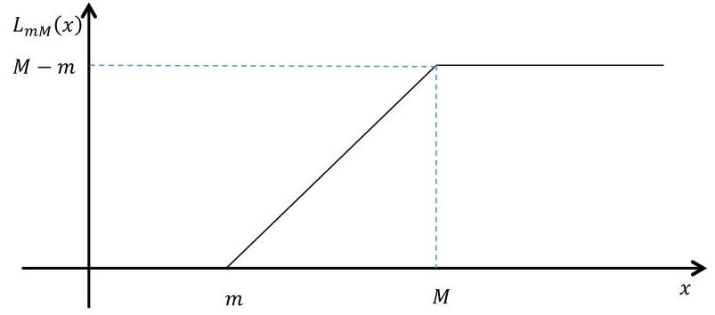

## Page 26
For this reason it is common to define an unscaled version of the deviance, referred to subsequently as just the deviance, as follows:

$$
D^{*}\left(Y, \hat{Y}\right)=2 \sum_{i=1}^{n}\left[\ln \pi\left(Y_{i} ; \hat{\theta}^{(i)}, 1\right)-\ln \pi\left(Y_{i} ; \hat{\theta}, 1\right)\right]
$$

which, in effect, ignores $\phi$. MLE is then carried out by minimization of $D^{*}(Y, \hat{Y})$ with respect to $\hat{\theta}$, equivalently $\hat{\beta}$.

The deviance can be viewed as the logarithm of a likelihood ratio and, by an application of Wilks' theorem, it is asymptotically $\chi^{2}$ distributed with $n-p$ as the number of degrees of freedom. The usual estimate of the scale parameter $\phi$ is therefore

$$
\dot{\phi}=D^{*}(Y, \hat{Y}) /(n-p)
$$

# 2.2.4. Residuals 

## Pearson Residuals

Define the standardized Pearson residual associated with observation $Y_{i}$ as

$$
R_{i}^{P}=\left(Y_{i}-\hat{Y}_{i}\right) / \hat{\sigma}_{i}
$$

where $\hat{\sigma}_{i}^{2}$ is an estimator of $\sigma_{i}^{2}=\operatorname{Var}\left[Y_{i}\right]$.
If it may be assumed that $\hat{Y}_{i}$ is approximately unbiased as an estimator of $\mu_{i}$, and that $\operatorname{Var}\left[Y_{i}-\hat{Y}_{i}\right]$ differs little from $\operatorname{Var}\left[Y_{i}\right]$ (these assumptions are often reasonable), then approximately

$$
E\left[R_{i}^{P}\right]=0 \text { and } \operatorname{Var}\left[R_{i}^{P}\right]=1
$$

It is in fact possible to correct (2-33) with a further scalar multiplier in order to ensure that $\operatorname{Var}\left[R_{i}^{P}\right]=1$ but details are not given here.

In this case a plot of the $Y_{i}$ against $i$ will produce a scatter of residuals evenly about zero (unbiasedness) and with uniform dispersion as one reads from left to right (homoscedasticity). An example appears as Figure 2-2.

In fact the homoscedasticity of Figure 2-2 is only approximate, as is indicated by Figure 2-3. This plots the standard deviation of residuals by age group (right-hand scale). The standard deviation varies from about 0.8 to about 1.1 , indicating mild heteroscedasticity. The same figure plots the lower quartile ("p_25") and upper quartile ("p_75") of the residuals in each age group (left-hand scale).

Routine model validation includes the examination of a separate residual plot against each covariate (e.g., age), checking for unbiasedness and homoscedasticity. The reason that unbiasedness is sought is obvious. The reason for the requirement of homoscedasticity will be discussed in Section 2.2.5.

## Page 27
Figure 2-2. Example of Unbiased Approximately Homoscedastic Residual Plot

Figure 2-3. Example of Biased Homoscedastic Residual Plot
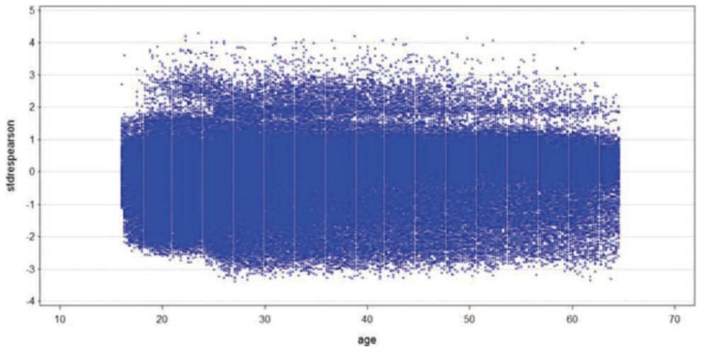
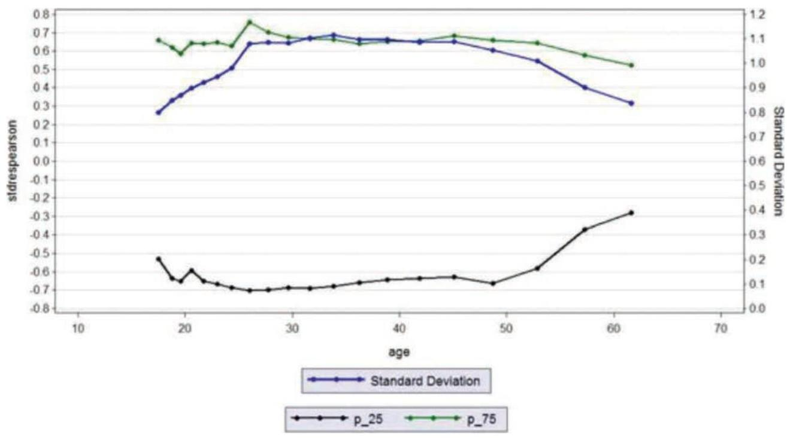

## Page 28
# Deviance Residuals 

Although Pearson residuals have a simple intuitive interpretation, they are linear transformations of the observations and will reproduce any non-normality that exists in them. For this reason it is common to use a different form of residual in the assessment of a GLM. This is the standardized deviance residual, defined in relation to the observation $Y_{i}$ as

$$
R_{i}^{D}=\operatorname{sgn}\left(Y_{i}-\hat{Y}_{i}\right)\left(d_{i} / \hat{\phi}\right)^{1 / 2}
$$

where $d_{i}$ is the contribution of the $i$-th observation to the deviance $D^{*}(Y, \hat{Y})$.
As was the case with Pearson residuals, it is possible to correct (2-35) with a further scalar multiplier in order to ensure that $\operatorname{Var}\left[R_{i}^{D}\right]=1$ but again details are not given here.

Pierce and Schafer (1986) showed that deviance residuals are normally distributed with error of order $m^{-1 / 2}$, where $m$ is a certain index derived from the specific member of the EDF associated with the GLM. As a result of this property, deviance residuals often remove much of the non-normality present in Pearson residuals and, in consequence, are often more useful.

An example of this is given in Figure 2-4 and Figure 2-5, which plot histograms of residuals from a model of individual auto bodily injury claims in one Australian state. Individual claims are modeled as gamma distributed with mean value depending on various claim characteristics but constant (and large) coefficient of variation, 1.16.

Figure 2-4. Histogram of Standardized Pearson Residuals
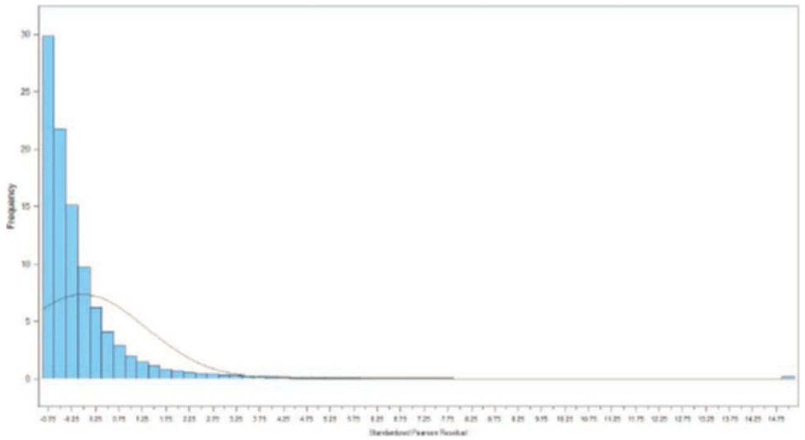

## Page 29
Figure 2-5. Histogram of Standardized Deviance Residuals

Figure 2-4 plots standardized Pearson residuals, and Figure 2-5 plots standardized deviance residuals.

In each case the best normal approximation to the histogram, calculated by the method of moments, is also shown. The Pearson residuals are seen to be highly skew and poorly fit by the normal approximation. The deviance residuals, while still exhibiting some degree of non-normality, are seen to be much closer to normal.

# 2.2.5. Outliers and the Use of Weights 

The need for homoscedasticity was discussed in Section 2.2.4. The reason for this will be discussed below. However, first a short digression on the use of variance weights (or simply weights).

If a residual plot reveals heteroscedasticity, correction may be made by means of weights. Consider the following example that is rather exaggerated but illustrates the point nonetheless. Suppose a GLM has been formulated on the assumption of homoscedasticity, specifically that (see (2-5) and (2-7))

$$
\operatorname{Var}\left[Y_{i}\right]=\phi V\left(\mu_{i}\right)
$$

with $\phi$ independent of $i$.
Suppose that standardized Pearson residuals (2-33) have been plotted by age and it appears that residuals above age 55 have double the standard deviation of those below age 55 .
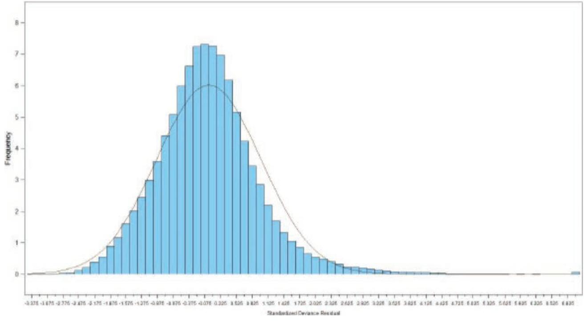

## Page 30
First use (2-5) and (2-7) to express (2-33) in the form

$$
R_{i}^{P}=\left(\dot{Y}_{i}-\dot{Y}_{i}\right) /\left[\hat{\phi} V(\dot{\mu})\right]^{1 / 2}
$$

Then the observed heteroscedasticity indicates that the value of $\phi$ for ages above 55 is in fact about four times that for lower ages. The heteroscedasticity would be removed if the model were adjusted to reflect this variation in $\phi$ over age. This may be achieved by the use of weights. By (2-21) the required result may be achieved by setting

$$
\begin{aligned}
w_{i} & =1 \text { if the } i \text {-th observation involves an age below } 55 \\
& =1 / 4 \text { if the } i \text {-th observation involves an age above } 55
\end{aligned}
$$

In the default case in which there is no explicit introduction of weights (Section 2.2.5), all observations will be equally weighted in parameter estimation. This is appropriate if all observations are subject to the same $\phi$, but undesirable otherwise. It is intuitively obvious that observations of larger variance than this should receive lesser weight than those of smaller variance.

Indeed, it can be shown that estimation efficiency will be optimized if each observation is assigned a weight that is inversely proportional to its $\phi$. As noted above, the relative values of $\phi$ for different observations are reflected in the variance of their standardized residuals.

Thus, in general, if a residual plot displays heteroscedasticity, one adjusts weights roughly in inverse proportion with variance of the residuals. A specific example of the use of weights in this way is given in Section 6.6 (see particularly Figure 6-15, Figure 6-17 and associated text).

A residual plot might also identify isolated observations with very large residuals. These are referred to as outliers. Such observations can influence the regression unduly by shifting the fitted values away from the main body of observations in favor of the outliers, as illustrated in Figure 2-6.

The solid line in the diagram is the result of linear regression using all observations, including the outlier at $x=14$, whereas the dotted line is the result of linear regression excluding this observation.

In the event that a specific observation is identified as an outlier, and its inclusion in the regression considered distorting, it may be excluded by assigning it zero weight.

Care must be taken in the exclusion of any data points. For example, if the outlier represented a major natural event, whereas the other observations represented attritional events, the exclusion of the former from the regression may be appropriate but the cost of major natural events would need to be accounted for somewhere.

Moreover, the exclusion of selected observations from parameter estimation will have consequences for the estimation of prediction error, as discussed in Sections 5.3.1 and 5.3.2.

## Page 31
Figure 2-6. Illustration of Distortion of Regression by Outlier

# 2.2.6. Forecasts 

Recall from Section 2.2.1 that

$$
E\left[Y_{i}\right]=\mu_{i}=b^{-1}\left(x_{i}^{T} \beta\right)
$$

When the GLM is to be used for forecasting, as in loss reserving, the covariate vectors $x_{i}$ will typically include information on the time of measurement. They may also contain other information. For example, in the case of workers compensation claims, the $x_{i}$ may include the type of claim (income replacement, medical only, etc.).

When the model is applied to forecast future observations, those observations will be characterized by their own covariate vectors $x_{i}$. These will be distinct from those in the data set in that, to the extent that they include time variates, their values will all relate to the future.

It will be convenient to distinguish future observations from the past $Y_{i}$ by the notation $Y_{i}^{*}$, characterised by the covariate vector $x_{i}^{*}$. In general, the addition of a star to a symbol will indicate future values of the variate represented by the corresponding unstarred symbol. Thus, for example, $Y^{*}$ will denote the vector of target random quantities $Y_{i}^{*}$ to be forecast, and the relation (2-23) is extended to future values as follows:

$$
\mu^{\star}=b^{-1}\left(X^{\star} \beta\right)
$$

where $X^{\star}$ is the matrix whose rows are the $\left(x_{i}^{*}\right)^{T}$ discussed above and may be referred to as the forecast design matrix.

A reasonable forecast of $Y^{*}$ is then

$$
\hat{Y}^{\star}=\hat{\mu}^{\star}=b^{-1}\left(X^{\star} \hat{\beta}\right)
$$
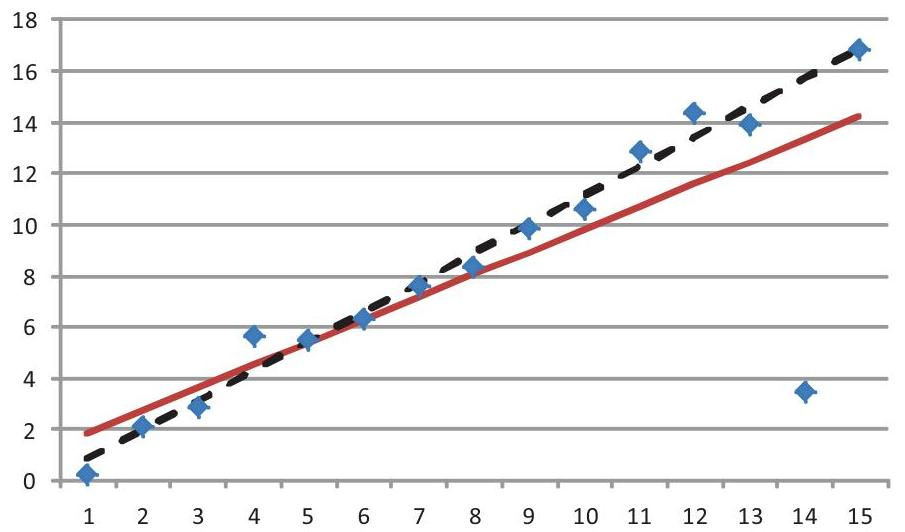

## Page 32
# 3. Stochastic Models Supporting the Chain Ladder 

Chapter summary. This chapter is concerned with the fact that the chain ladder algorithm of Chapter 1, known to many actuaries as merely a heuristic device, in fact provides the maximum likelihood forecasts of outstanding claims for a couple of formal models. Several formal chain ladder models from the literature are surveyed.

Two distinctly different stochastic models are defined whose MLEs of future claims experience are the same as the predictions of the heuristic algorithm. Moreover, these MLEs are also seen to possess certain minimum variance properties. These results are summarized in three theorems.

It is shown that these formal stochastic models are expressible as GLMs, and therefore estimates and forecasts from these GLMs will match the chain ladder estimates and forecasts. This is illustrated by numerical example.

Practical applications of the chain ladder often incorporate various ad hoc adjustments, such as omission of older diagonals from the claims triangle or omission of isolated observations that are considered rogue. It is shown that such adjustments can be accommodated within the GLM formulation, thus maintaining a formal model structure in their presence.

### 3.1. Mack Models

### 3.1.1. Non-Parametric Mack Model

Mack (1993) introduced a stochastic chain ladder model that has subsequently become known as the Mack model. It satisfies the following conditions:
(M1) Accident years are stochastically independent, i.e., $Y_{k_{1} j_{1}}, Y_{k_{2} j_{2}}$ are independent if $k_{1} \neq k_{2}$.
(M2) For each $k=1,2, \ldots, K$, the $X_{k j}$ ( $j$ varying) form a Markov chain.
(M3) For each $k=1,2, \ldots, K$ and $j=1,2, \ldots, J-1$,
(a) $E\left[X_{k, j+1} \mid X_{k j}\right]=f_{j} X_{k j}$ for some parameter $f_{j}>0$;
(b) $\operatorname{Var}\left[X_{k, j+1} \mid X_{k j}\right]=\sigma_{j}^{2} X_{k j}$ for some parameter $\sigma_{j}>0$.

The model was stochastic in the sense that it considered not only expected values but also variances of observations. However, it was non-parametric in the sense that it did not consider the distribution of observations.

## Page 33
Mack derived a number of results from this model, including the following:
Result 1: The conventional chain ladder estimators $\hat{f}_{j}$ of $f_{j}$ according to (1-8) are:
(a) unbiased; and
(b) minimum variance among estimators that are unbiased linear combinations of the $\hat{f}_{k j}$ defined by (1-4).
Result 2: The conventional chain ladder estimator $\hat{R}_{k}$ of $R_{k}$ given by (1-11) is unbiased.

# 3.1.2. Parametric Mack Models 

A parametric version of the Mack model requires that assumption (M3) be supplemented by a distributional assumption. Parametric versions of the Mack model were studied by Taylor (2011). The observations $Y_{k, j+1} \mid X_{k j}$ were assigned distributions according to a member of the EDF, creating the EDF Mack model, defined as follows.
(EDFM1) As for (M1).
(EDFM2) As for (M2).
(EDFM3) For each $\mathrm{k}=1,2, \ldots, K$ and $j=1,2, \ldots, J-1$,
(a) $Y_{k, j+1} \mid X_{k j} \sim E D F\left(\theta_{k j}, \phi_{k j} ; a, b, c\right)$; and
(b) As for (M3a).

Assumption (EDFM3a) provides the required distributional assumption, with a general requirement that conditional observations be distributed according to some specific member of the EDF. Assumption (EDFM3b) retains the same form of conditional expectation as in the Mack model. No assumption about variance has been made other than that inherent in the selected EDF member. So the form of variance allowed in the EDF Mack model is more general than in the non-parametric Mack model.

Taylor (2011) also considered the following sub-families of the EDF Mack models:
Tweedie Mack model, in which (EDFM3a) is replaced by $Y_{k, j+1} \mid X_{k j} \sim \operatorname{Tw}\left(\mu_{k j}, \phi_{k j} ; p\right)$.
ODP Mack model, in which (EDFM3a) is replaced by $Y_{k, j+1} \mid X_{k j} \sim O D P\left(\mu_{k j}, \phi_{k j}\right)$.
Taylor derived the following result.
Theorem 3.1. Suppose that the data array $\mathfrak{D}_{K}$ is a triangle $(J=K)$ with observations subject to the EDF Mack model defined by assumptions (EDFM1-3).
(a) If assumption (M3b) also holds, then the model's MLEs of the $f_{j}$ are the conventional chain ladder estimators $\hat{f}_{j}$ from (1-8). These are in turn unbiased estimators in the Mack model (see Result 1 of Section 3.1.1).
(b) If the EDF Mack model is restricted to an ODP Mack model in Assumption (EDFM3a), and if in addition the dispersion parameters $\phi_{k j}$ are just column dependent $\left(\phi_{k j}=\phi_{j}\right)$ (the condition (M3b) automatically holds in this case), then the $\hat{f}_{j}$ from (1-8) are minimum variance unbiased estimators ("MVUEs") of the $f_{j}$.
(c) Under the same conditions as in (b), the predictors $\hat{X}_{k j}, \hat{R}_{k}$ defined by (1-9) and (1-11) are also MVUEs of $X_{k j}, R_{k}$.

The results of the theorem were also shown to extend to certain cases in which the distributions of the $Y_{k j}$ were binomial or negative binomial.

## Page 34
The theorem is remarkable because it shows that estimates and forecasts that had been introduced to the actuarial literature many years earlier on an entirely heuristic basis turn out to be optimal estimators in the MLE and MVUE sense.

This MVUE result is much stronger than that of Mack referred to in Section 3.1.1 as the estimators here are minimum variance out of all unbiased estimators, not just out of the linear combinations of the $f_{k j}$.

# 3.2. Cross-Classified Models 

Consider a model of $\mathfrak{D}_{K}^{+}$defined by the following conditions:
(EDFCC1) The random variables $Y_{k j} \in \mathfrak{D}_{K}^{+}$are stochastically independent.
(EDFCC2) For each $k=1,2, \ldots, K$ and $j=1,2, \ldots, J$,
(a) $Y_{k j} \sim E D F\left(\theta_{k j}, \phi_{k j} ; a, b, c\right)$;
(b) $E\left[Y_{k j}\right]=\alpha_{k} \beta_{j}$ for some parameters $\alpha_{k}, \beta_{j}>0$; and
(c) $\sum_{j=1}^{J} \beta_{j}=1$.

Models subject to (EDFCC2b) are variously referred to in the literature as crossclassified, ANOVA, or non-recursive. This model will be referred to here as the EDF cross-classified model.

The condition (EDFCC2c) merely removes redundancy from the model's parameter set. If it were absent, all $\alpha$ 's could be doubled and all $\beta$ 's halved without any substantive change to the model. A single restriction on the parameters is required to render their values unique. Condition (EDFCC2c) is widely used for this purpose but other constraints would serve equally well, e.g., $\beta_{1}=1$ or $\alpha_{1}=1$.

It is noteworthy that the parameters of the EDF cross-classified model consist of both row and column parameters $\alpha_{k}$ and $\beta_{j}$ respectively, whereas the only parameters contained in the Mack models are the column parameters $f_{j}$. This appears to imply that the EDF cross-classified structure is more general.

There was considerable discussion of this around the turn of the century (e.g., Mack and Venter, 2000; Verrall, 2000) in which it was pointed out that, although the Mack model contains no explicit row parameters, its conditioning on prior observations (see (M3a)) in effect plays the same role. The accumulated experience $X_{k, j-k+1}$ of row $k$ serves as a row parameter in the forecast of future experience of that row.

Just as for the EDF Mack model of Section 3.1.2, Tweedie and ODP sub-families of the EDF cross-classified family may be identified. These will be referred to as the Tweedie cross-classified family and ODP cross-classified family respectively.

Let $\hat{\alpha}_{k}, \hat{\beta}_{j}$ denote MLEs of $\alpha_{k}, \beta_{j}$ and let $\hat{Y}_{k j}=\hat{\alpha}_{k} \hat{\beta}_{j}$ denote the fitted value associated with $Y_{k j} \in \mathfrak{D}_{K}$ or the forecast of $Y_{k j} \in \mathfrak{D}_{K}^{+}$. The following result was obtained by England $\&$ Verrall (2002).

Theorem 3.2. Suppose that the data array $\mathfrak{D}_{K}$ is a triangle $(J=K)$ with observations subject to the ODP cross-classified model defined by assumptions (EDFCC1-2) and the following additional conditions:
(EDFCC3a) In (EDFCC2a) $Y_{k j}$ is restricted to an ODP distribution;
(EDFCC3b) The dispersion parameters $\phi_{k j}$ are identical for all cells in $\mathfrak{D}_{K}^{+}$(i.e., $\phi_{k j}=\phi$ ).

## Page 35
Then the MLE fitted values and forecasts $\hat{Y}_{k j}$ are the same as those given by the conventional chain ladder forecasts from (1-10).

The same result had been obtained earlier for the special case of the simple Poisson distribution $(\phi=1)$ by Hachemeister and Stanard (1975) and Renshaw and Verrall (1998).

The same results are not true for EDF distributions more general than ODP. In fact, the explicit (and different) ML equations for the Tweedie case are given by Peters, Shevchenko and Wüthrich (2009) and by Taylor (2009), and for the general EDF case by Taylor (2011).

The MLEs $\hat{Y}_{k j}$ will not be unbiased in general. However, Taylor (2011) obtained the following result.

Theorem 3.3. Suppose that the data array $\mathfrak{D}_{K}^{*}$ is subject to the same conditions as in Theorem 3.2. Suppose also that the fitted values and forecasts $\hat{Y}_{k j}$ and $\hat{R}_{k}$ are corrected for bias. Then they are MVUEs of $Y_{k j}$ and $R_{k}$ respectively.

Theorems 3.2 and 3.3 together parallel Theorem 3.1 but are even more remarkable. First, they state that the forecasts obtained from the ODP Mack and ODP crossclassified models are identical (and equal to those obtained from the conventional chain ladder) despite the very different formulations of the models. Moreover, notwithstanding that the cross-classified model is formulated in terms of parameters $\alpha_{k}, \beta_{j}$, one may obtain forecasts without any consideration of them, but working as if the model were ODP Mack.

# Numerical Example 

It is instructive to illustrate this by reference to the data set in Table 1-1. It is worthy of note at the outset that the Mack models apply to cumulative data, whereas the crossclassified models apply to incremental data.

Commence by applying the chain ladder algorithm of Section 1.4 to the data. Average age-to-age factors are obtained by the application of (1-8), yielding the results in Table 3-1.

Forecasts are obtained by means of (1-9). For example, the first cell requiring forecast for accident year 1996 is that relating to development year 3 . The forecast is $\hat{X}_{1996,3}=$ $X_{1996,2} f_{2}=92242 \times 1.261=116312$. Hence $\hat{Y}_{1996,3}=116312-92242=24070$.

The full set of forecasts is given in Table 3-2, where the bold-face diagonal is merely transferred from Table 1-2, and then subsequent cells contain forecasts according to (1-9). The final column of the table contains the amounts of estimated outstanding losses $\hat{R}_{k}$, obtained by means of (1-11).

Table 3-1. Average Age-to-Age Factors

| Average Age-to-Age Factor for Development Year |  |  |  |  |  |  |  |  |
| :--: | :--: | :--: | :--: | :--: | :--: | :--: | :--: | :--: |
| 1 | 2 | 3 | 4 | 5 | 6 | 7 | 8 | 9 |
| 1.815 | 1.261 | 1.158 | 1.088 | 1.055 | 1.039 | 1.030 | 1.025 | 1.021 |

## Page 36
# Table 3-2. Estimation of Outstanding Losses

|   |  |  |  |  |  | Forecast Cumulative Paid Losses to and Including Development Year ($000) |  |  |  |  |  |  |  |  |  |  |  | Estimated Outstanding Claims ($000)  |
| --- | --- | --- | --- | --- | --- | --- | --- | --- | --- | --- | --- | --- | --- | --- | --- | --- | --- | --- |
|  Accident Year |  | 1 | 2 | 3 | 4 | 5 | 6 | 7 | 8 | 9 | 10 |  |  |  |  |  |  |   |
|  1988 | 1 |  |  |  |  |  |  |  |  |  |  |  |  |  |  |  | 144781 |   |
|  1989 | 2 |  |  |  |  |  |  |  |  |  |  |  |  |  |  |  | 162903 | 166301  |
|  1990 | 3 |  |  |  |  |  |  |  |  |  |  |  |  |  |  |  | 176346 | 180731  |
|  1991 | 4 |  |  |  |  |  |  |  |  |  |  |  |  |  |  |  | 187266 | 192924  |
|  1992 | 5 |  |  |  |  |  |  |  |  |  |  |  |  |  |  |  | 189506 | 196828  |
|  1993 | 6 |  |  |  |  |  |  |  |  |  |  |  |  |  |  |  | 175475 | 185209  |
|  1994 | 7 |  |  |  |  |  |  |  |  |  |  |  |  |  |  |  | 174108 | 183766  |
|  1995 | 8 |  |  |  |  |  |  |  |  |  |  |  |  |  |  |  | 122811 | 142227  |
|  1996 | 9 |  |  |  |  |  |  |  |  |  |  |  |  |  |  |  | 116312 | 134700  |
|  1997 | 10 |  |  |  |  |  |  |  |  |  |  |  |  |  |  |  | 43962 | 79788  |
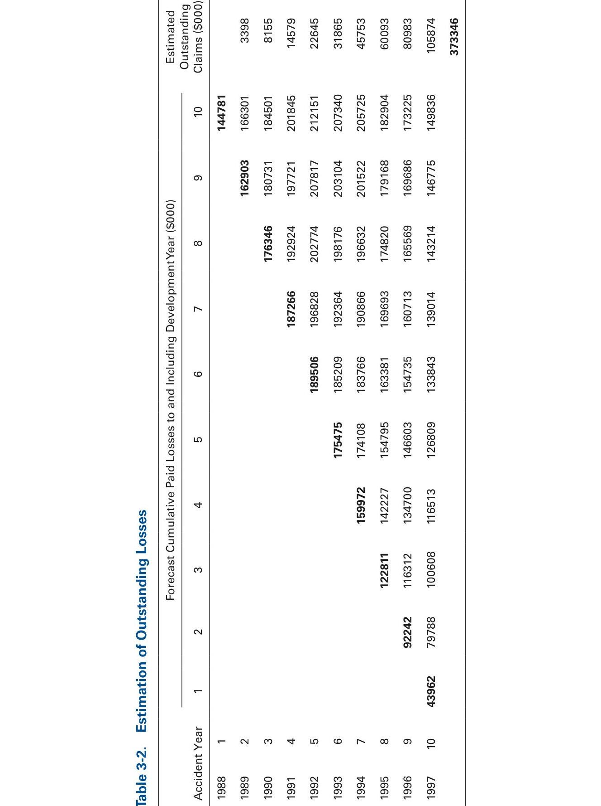

## Page 37
Now consider MLE within the ODP cross-classified model. The ML equations are well known (see any of the authors listed earlier in the present sub-section). They are merely marginal sum estimation equations (Schmidt and Wünsche, 1998), which means that they equate each row sum of observations with the corresponding sum of MLEs, and similarly for column sums. That is,

$$
\sum^{\mathcal{R}(k)} Y_{k j}=\sum^{\mathcal{R}(k)} \hat{\alpha}_{k} \hat{\beta}_{j}=\hat{\alpha}_{k} \sum^{\mathcal{R}(k)} \hat{\beta}_{j}=\hat{\alpha}_{k} \sum_{j=1}^{J-k+1} \hat{\beta}_{j}=\hat{\alpha}_{k}\left[1-\sum_{j=J-k+2}^{J} \hat{\beta}_{j}\right]
$$

the last equality following from (EDFCC2c). Also

$$
\sum^{C(j)} Y_{k j}=\sum^{C(j)} \hat{\alpha}_{k} \hat{\beta}_{j}=\hat{\beta}_{j} \sum^{C(j)} \hat{\alpha}_{k}
$$

It is further known that, for a triangular data set such as in Table 1-1, these equations are simply solved in the following order: (3-1) for $k=1$, (3-2) for $j=J$, (3-1) for $k=2$, (3-2) for $j=J-1$, etc. and with repeated use of the constraint (EDFCC2c).

The first step in this procedure yields

$$
144781=\sum^{\mathcal{R}(1)} Y_{k j}=\hat{\alpha}_{1} \sum^{\mathcal{R}(1)} \hat{\beta}_{j}=\hat{\alpha}_{1}
$$

whence $\hat{\alpha}_{1}=144781$.
The second step yields

$$
2958=\sum^{C(10)} Y_{k j}=\hat{\beta}_{10} \sum^{C(10)} \hat{\alpha}_{k}=\hat{\beta}_{10} \hat{\alpha}_{1}
$$

whence $\hat{\beta}_{10}=2958 / \hat{\alpha}_{1}=0.020$.
And so on, resulting in Table 3-3.

# Table 3-3. Parameter Estimates for ODP Cross-Classified Model 

| $j$ or $k$ | $\hat{\alpha}_{k}$ | $\hat{\beta}_{j}$ |
| :--: | :--: | :--: |
| 1 | 144781 | 0.293 |
| 2 | 166301 | 0.239 |
| 3 | 184501 | 0.139 |
| 4 | 201845 | 0.106 |
| 5 | 212151 | 0.069 |
| 6 | 207340 | 0.047 |
| 7 | 205725 | 0.035 |
| 8 | 182904 | 0.028 |
| 9 | 173225 | 0.024 |
| 10 | 149836 | 0.020 |

## Page 38
From these results, one may calculate $\hat{Y}_{1996,3}=\hat{\alpha}_{9} \hat{\beta}_{3}=173225 \times 0.139=24070$, in agreement with the estimate from the ODP Mack model. Similarly, all forecasts $\hat{Y}_{k j} \in \mathfrak{D}_{K}^{\prime}$ may be shown to reconcile with the ODP Mack model, indicating that it and the ODP cross-classified model yield the same estimates of outstanding losses (see Table 3-2).

Indeed, it follows from the identical forecasts of the ODP Mack and ODP crossclassified models that one may translate between the two by means of one-one relation. This relation, proven by Verrall (2000) using a Bayesian argument, is

$$
\hat{f}_{j}=\sum_{i=1}^{i+1} \hat{\beta}_{i} / \sum_{i=1}^{j} \hat{\beta}_{i}
$$

or its inverse

$$
\hat{\beta}_{j+1}=\left(\hat{f}_{j}-1\right) \prod_{r=1}^{i-1} \hat{f}_{r} / \prod_{r=1}^{j-1} \hat{f}_{r}
$$

subject to the convention that $\prod_{r=1}^{0} \hat{f}_{r}=1$. Table 3-1 and Table 3-3 may be reconciled by this correspondence.

# 3.3. GLM Representation of Chain Ladder Models 

### 3.3.1. ODP Mack Model

Consider the ODP Mack model of Section 3.1.2, and particularly the conditions (EDFM3a), modified to its ODP form, and (EDFM3b). Together these conditions amount to the following:

$$
Y_{k, j+1} \mid X_{k j} \sim O D P\left(\left(f_{j}-1\right) X_{k j}, \phi_{k j}\right)
$$

Add the condition

$$
\phi_{k j}=\phi_{j}, \text { independent of } k
$$

which was a pre-requisite in Section 3.1.2 for the ODP Mack model to yield the conventional chain ladder estimators as MLEs. Then

$$
Y_{k, j+1} \mid X_{k j} \sim O D P\left(\left(f_{j}-1\right) X_{k j}, \phi_{j}\right)
$$

Now replace $Y_{k, j+1}$ here by $\hat{f}_{k j}-1=Y_{k, j+1} / X_{k j}$ from (1-4). It may be checked that

$$
\begin{gathered}
E\left[\hat{f}_{k j}-1 \mid X_{k j}\right]=f_{j}-1 \\
\operatorname{Var}\left[\hat{f}_{k j}-1 \mid X_{k j}\right]=\operatorname{Var}\left[Y_{k, j+1} \mid X_{k j}\right] / X_{k j}^{2}=\phi_{j}\left(f_{j}-1\right) / X_{k j}
\end{gathered}
$$

The ODP family is known to be closed under scaling, i.e., an ODP variate, divided by a constant, produces another ODP variate. Combining this fact with (3-8) and (3-9) yields

## Page 39
$$
\hat{f}_{k j}-1 \mid X_{k j}-O D P\left(f_{j}-1, \phi_{j} / X_{k j}\right)
$$

This may be formulated as a (rather trivial) GLM by comparison of (3-10) with the definition of a GLM in Section 2.2.1. The response vector of the GLM consists of the observations $\hat{f}_{k j}-1 \mid X_{k j}$, listed in some convenient order such as dictionary order. The link function is the identity.

The parameter vector $\beta$ consists of the parameters $f_{1}, \ldots f_{9}$, and the row of the design matrix $X$ corresponding to $\hat{f}_{k j}-1 \mid X_{k j}$ is the co-ordinate 9 -vector $e_{j}$, which has unity in the $j$-th position and zeros elsewhere. In the terms usually required by GLM software for the specification of a model, this amounts to:

- Specification of development year $j(=1,2, \ldots, 9)$ as a categorical variate (referred to in some software systems as a class variate).
- Specification of the "model", i.e., the expected value, of each observation as

$$
E\left[\hat{f}_{k j}-1 \mid X_{k j}\right]=\sum_{i=1}^{9}\left(f_{i}-1\right) \delta_{j i}
$$

where $\delta_{j i}$ is the Kronecker delta, and the 9 delta functions are the $0-1$ variates associated with the categorical variate development year, as mentioned in Section 2.2.2.

It is also necessary that the model include the variance structure set out in (3-10), and, by (2-21), this requires that observation $\hat{f}_{k j}-1$ be assigned weight $X_{k j} / \phi_{j}$. The values of $\phi_{j}$ are unknown, but the following argument will show that knowledge of their values is not required.

Consider MLE of the $f_{j}$. Commence with the log-likelihood of the claims trapezoid $\mathfrak{D}_{K}$ :

$$
\begin{aligned}
\ell\left(\mathfrak{D}_{K}\right) & =\sum_{\mathfrak{D}_{K, j \neq 1}} \ell\left(\hat{f}_{k j}-1\right) \\
& =\sum_{\mathfrak{D}_{K, j \neq 1}}\left\{\frac{\left(Y_{k j} / X_{k, j-1}\right) \ln \left(f_{j-1}-1\right)-\left(f_{j-1}-1\right)}{\phi_{j-1} / X_{k, j-1}}-\ln \left[\left(Y_{k j} / \phi_{j-1}\right)!\right]\right\}
\end{aligned}
$$

where $\ell\left(f_{k j}-1\right)$ has been evaluated by substitution of (3-7)-(3-9) into (2-16).
The MLE of $f_{j-1}$ for a specific $j$, say $j=i$, is obtained by differentiating (3-12) with respect to $f_{i-1}$ and setting the result to zero. On differentiation:

- The final member within the braces is eliminated since it does not depend on $f_{i-1}$.
- The summation over $\mathfrak{D}_{K}$ is reduced to a summation over only $\mathcal{C}(i)$ since only this column depends on $f_{i-1}$.
The result is as follows:

$$
\frac{\partial \ell\left(\mathfrak{D}_{K}\right)}{\partial f_{i-1}}=\frac{1}{\phi_{i-1}} \sum_{(k, i) \in \mathcal{C}(i)} X_{k, i-1} \frac{\partial}{\partial f_{i-1}}\left\{\left(Y_{i j} / X_{k, i-1}\right) \ln \left(f_{i-1}-1\right)-\left(f_{i-1}-1\right)\right\}=0
$$

The interested reader may complete the calculation to obtain the conventional chain ladder estimator (1-8) as the MLE, verifying the result cited in Section 3.1.2. However,

## Page 40
all that is necessary for present purposes is to note that $\phi_{i-1}$ may be factored out of (3-13), in which case it does not enter into the MLE.

This means that the value of $\phi_{i-1}$ is arbitrary for the purpose of estimation of $f_{i-1}$, and so it may conveniently be set to unity. This lengthy digression thus shows that the above requirement of a weight $X_{k j} / \phi_{j}\left(\phi_{j}\right.$ unknown) to be associated with observation $f_{k j}^{*}-1$ in the GLM is reduced to a requirement of the simpler weight $X_{k j}$.

The ODP Mack model is now fully specified as a GLM. It may therefore be written in the general form of a GLM, as set out in Section 2.2.1. Specifically, the response vector $Y$ now consists of all observations $Y_{k, j+1} / X_{k j}$ for all $Y_{k, j+1}$ in $\mathbb{D}_{K}$ other than its first column, and written in some convenient order. The order is unimportant, but dictionary order is obvious and convenient: $f_{11}, \ldots, f_{1, j-1}, f_{21}, f_{22}, \ldots, f_{K-2,1}, f_{K-2,2}, f_{K-1,1}$, and this will be assumed for the purpose of illustration.

Let $\mu$ denote the vector of $\mu_{k j}$, also in dictionary order, and express it in the GLM form (2-23):

$$
\mu=h^{-1}(X \beta)
$$

where $h, X$ and $\beta$ can be determined by reference to (3-11):

$$
\begin{aligned}
& h=\text { identity } \\
& \beta=\left(f_{1}, f_{2}, \ldots, f_{9}\right)^{T}
\end{aligned}
$$

# 3.3.2. ODP Cross-Classified Model 

Consider the ODP cross-classified model of Section 3.2, and particularly the conditions (EDFCC2a), modified to its ODP form, and (EDFCC2b). Together these conditions amount to the following:

$$
Y_{k j} \sim O D P\left(\alpha_{k} \beta_{j}, \phi_{k j}\right)
$$

Add the further condition

$$
\phi_{k j}=\phi
$$
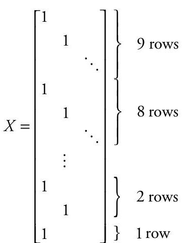

## Page 41
which was seen in Section 3.2 to be a pre-requisite for ODP cross-classified model to yield the conventional chain ladder estimators as MLEs. Then

$$
Y_{k j} \sim O D P\left(\alpha_{k} \beta_{j}, \phi\right)=O D P\left(\mu_{k j}, \phi\right)
$$

where

$$
\mu_{k j}=\exp \left(\ln \alpha_{k}+\ln \beta_{j}\right)
$$

The final equality here expresses the mean of the $(k, j)$ cell as the exponential of a linear function of $\ln \alpha_{k}$ and $\ln \beta_{j}$. Thus (3-17) may be formulated as GLM in which the response vector consists of the observations $Y_{k j}$, the error distribution is ODP, the link function is the natural logarithm and the parameter vector takes the form $\left(\ln \alpha_{1}, \ldots, \ln \alpha_{10}, \ln \beta_{1}, \ldots, \ln \beta_{10}\right)$. The scale parameter is unknown but will be estimated by the GLM software. Note how the logarithmic link function is preordained by the multiplicative form of the assumption (EDFCC2b).

Just as in Section 3.3.1, the model may be expressed in the GLM form (2-23). If the components of $Y$ are again written in dictionary order, then the design matrix is

$$
X=\left[\begin{array}{cccc}
1 & 0 \ldots 0 & 1 & 0 \ldots 0 \\
1 & 0 \ldots 0 & 0 & 1 \ldots 0 \\
& & \vdots & \\
1 & 0 \ldots 0 & 0 & 0 \ldots 1 \\
0 & 1 \ldots 0 & 1 & 0 \ldots 0 \\
0 & 1 \ldots 0 & 0 & 1 \ldots 0 \\
& & \vdots & \\
& & \vdots & \\
0 & 0 \ldots 1 & 1 & 0 \ldots 0
\end{array}\right\} \begin{cases}10 & \text { rows } \\
& \\
& 9 \text { rows }
\end{cases}
$$

Section 3.2 noted that the full parameter vector $\left(\alpha_{1}, \ldots, \alpha_{10}, \beta_{1}, \ldots, \beta_{10}\right)$ contained one degree of redundancy, which was removed by the addition of the constraint (EDFCC2c). Likewise, the full parameter vector $\left(\ln \alpha_{1}, \ldots, \ln \alpha_{10}, \ln \beta_{1}, \ldots, \ln \beta_{10}\right)$ of the GLM will contain a degree of redundancy.

In fact, this is no impediment to the fitting of the GLM for most GLM software. Most such software will remove redundancy by setting one or more (just one in the present case) parameters to zero. These parameters are said to be aliased.

Generally, this will lead to parameter estimates that differ from those obtained under condition (EDFCC2c), though the two GLMs are equivalent, simply stated differently. This is illustrated as follows.

Suppose that the GLM software chooses to set $\ln \beta_{1}=0$, i.e., $\beta_{1}=1$. Simply replace each estimate $\hat{\beta}_{j}$ by $\hat{\beta}_{j} / \sum_{i=1}^{10} \hat{\beta}_{i}$ in order to satisfy (EDFCC2c). To compensate

## Page 42
for this change, replace each $\hat{\alpha}_{k}$ by $\hat{\alpha}_{k} \sum_{i=1}^{10} \hat{\beta}_{i}$. With these replacements, the fitted value associated with $Y_{k j}$ is

$$
\hat{Y}_{k j}=\left[\hat{\alpha}_{k} \sum_{i=1}^{10} \hat{\beta}_{i}\right]\left[\hat{\beta}_{j} / \sum_{i=1}^{10} \hat{\beta}_{i}\right]=\hat{\alpha}_{k} \hat{\beta}_{j}
$$

In other words, the model fitted values are unaltered by this re-scaling of the parameters $\alpha_{k}, \beta_{j}$. Similarly for forecasts. In this sense, the alternative statements of the GLM are equivalent.

The forecast design matrix, as defined in (2-39), takes the form

$$
X^{*}=\left[\begin{array}{cccccccc}
0 & 1 & 0 & \ldots & 0 & 0 & 0 \ldots & 0 & 1 \\
0 & 0 & 1 & \ldots & 0 & 0 & 0 \ldots & 1 & 0 \\
0 & 0 & 1 & \ldots & 0 & 0 & 0 \ldots & 0 & 1 \\
& & & \vdots & & & & \\
0 & 0 & \ldots & 0 & 1 & 0 & 1 & 0 & \ldots & 0 \\
& & & & \vdots & & & \\
0 & 0 & \ldots & 0 & 1 & 0 & 0 & \ldots & 0 & 1
\end{array}\right] \begin{cases}1 & \text { row } \\
2 & \text { rows } \\
& 9 \text { rows }\end{cases}
$$

# 3.3.3. Numerical Example 

The discussion in Sections 3.3.1 and 3.3.2 is illustrated by reference to the example data set. This data set is submitted to the GLM procedure GENMOD in SAS software according to both ODP Mack and ODP cross-classified models.

## ODP Mack Model

The GLM formulation of the ODP Mack model, as described at the end of Section 3.3.1, has been applied to the example data set with the results displayed in Table 3-4. These results are seen to accord with those obtained by application of the chain ladder algorithm and set out in Table 3-1.

## ODP Cross-Classified Model

The GLM formulation of the ODP cross-classified model, as set out in (3-17) and (3-18), has been applied to the example data set with the results displayed in Table 3-5. The parameter estimates in the columns headed $l n \alpha_{k}$ and $l n \beta_{j}$ have been extracted directly from the GLM output. In the next two columns they have been exponentiated, and in final two columns re-scaled as described in the paragraph preceding (3-19) so that the $\sum_{j=1}^{10} \hat{\beta}_{j}=1$. The results are seen to agree with those found in Table 3-3 (subject to a couple of microscopic differences).

Table 3-4. GLM
Parameter Estimates for ODP Mack Model

| $j$ | $\hat{f}_{j}-1$ |
| :--: | :--: |
| 1 | 0.815 |
| 2 | 0.261 |
| 3 | 0.158 |
| 4 | 0.088 |
| 5 | 0.055 |
| 6 | 0.039 |
| 7 | 0.030 |
| 8 | 0.025 |
| 9 | 0.021 |

## Page 43
Table 3-5. GLM Parameter Estimates for ODP Cross-Classified Model

|  | Estimated Directly from GLM |  |  |  | Re-normalised |  |
| :--: | :--: | :--: | :--: | :--: | :--: | :--: |
| $j$ or $k$ | $\ln \hat{\alpha}_{k}$ | $\ln \hat{\beta}_{j}$ | $\hat{\alpha}_{k}$ | $\hat{\beta}_{j}$ | $\hat{\alpha}_{k}$ | $\hat{\beta}_{j}$ |
| 1 | 10.657 | 0.000 | 42479 | 1.000 | 144781 | 0.293 |
| 2 | 10.795 | $-0.205$ | 48793 | 0.815 | 166301 | 0.239 |
| 3 | 10.899 | $-0.747$ | 54133 | 0.474 | 184501 | 0.139 |
| 4 | 10.989 | $-1.017$ | 59221 | 0.362 | 201845 | 0.106 |
| 5 | 11.039 | $-1.452$ | 62245 | 0.234 | 212151 | 0.069 |
| 6 | 11.016 | $-1.833$ | 60834 | 0.160 | 207341 | 0.047 |
| 7 | 11.008 | $-2.140$ | 60360 | 0.118 | 205726 | 0.035 |
| 8 | 10.891 | $-2.348$ | 53664 | 0.096 | 182905 | 0.028 |
| 9 | 10.836 | $-2.513$ | 50824 | 0.081 | 173225 | 0.024 |
| 10 | 10.691 | $-2.664$ | 43962 | 0.070 | 149837 | 0.020 |
| Total |  |  |  | 3.408 |  | 1.000 |

# 3.4. Minor Variations of Chain Ladder 

Hitherto the chain ladder model has been presented as containing no flexibility; as the non-parametric Mack model, the EDF Mack model, or one of the other variations defined earlier in this chapter, but in each case fully defined without any scope for variation by the user. In practice, many variations occur. This section will consider a few of the common variations and show that they may be easily incorporated in a GLM.

### 3.4.1. Reliance on Only Recent Experience Years

It is common to view only the most recent $m$ experience years as relevant to parameter estimation. This would mean in the ODP Mack model (Section 3.3.1), for example, that the only observations used would be $\hat{f}_{k j}-1 \mid X_{k j}, k=1, \ldots, K-1$, $j=1, \ldots, J-1, K+1-m \leq k+j \leq K$.

This restriction is easily implemented within the GLM defined in Section 3.3.1 by simply setting the weight of each observation other than those above to zero, i.e., the weight $X_{k j}$ assigned to observation $\hat{f}_{k j}-1 \mid X_{k j}$ at the end of Section 3.3.1 is modified to the following:

$$
w_{k j}=X_{k j} I(K+1-m \leq k+j \leq K)
$$

where $I($.$) is the indicator function:$

$$
\begin{aligned}
I(c) & =1 \text { if the logical condition } c \text { is true } \\
& =0 \text { otherwise }
\end{aligned}
$$

## Page 44
Consider the likelihood (3-12), omitting the final member within the braces since it was seen in Section 3.1.2 to vanish in the likelihood maximization, and set weights according to (3-20). The weights are included in the model by means of (2-21). Thus log-likelihood (3-12) becomes:

$$
\begin{aligned}
\ell\left(\mathfrak{D}_{K}\right) & =\sum_{\mathfrak{D}_{k, j \neq 1}} I(K+1-m \leq k+j \leq K) \\
& \times\left\{\frac{\left(Y_{k j} / X_{k, j-1}\right) \ln \left(f_{j-1}-1\right)-\left(f_{j-1}-1\right)}{\phi_{j-1} / X_{k, j-1}}\right\}
\end{aligned}
$$

and the indicator function has the effect of simply selecting the $Y_{k j}$ from the last $m$ experience years for inclusion in the log-likelihood.

# 3.4.2. Outlier Observations 

The argument leading to the last result has been phrased in terms specific to the ODP Mack model. However, it may be generalized to any model with the conclusion that setting the weight of any observation to zero causes that observation, in effect, to be deleted from the data set.

It follows that outlier observations may be excluded from the model fitting simply by the assignment of zero weights to them.

## Page 45
# 4. Prediction Error 

Chapter summary. This chapter is concerned with the error contained in a forecast derived from a GLM in accordance with Chapter 2, as compared with the actual value of the predictand when ultimately observed. This error is decomposed into its components: parameter error, process error, and model error.

The properties of parameter and process errors follow from the model, whereas the properties of model error do not. For the main part, the chapter deals with the more tractable parameter and process errors.

Mean square error of prediction is discussed as a measure of forecast error, and it is noted that increased goodness-of-fit of a model does not necessarily imply reduced forecast error. Information criteria are introduced as simple rough proxies for forecast error to assist in the evaluation of competing models.

The literature on model error is scant, but the subject receives some discussion at the end of the chapter.

### 4.1. Parameter Error and Process Error

### 4.1.1. Individual Observations

For the purpose of the current chapter the model used for the forecast of outstanding losses will not be limited to the chain ladder. The model will be loosely specified as follows:

$$
Y_{k j}=u(k, j ; \theta)+\varepsilon_{k j} \text { for } Y_{k j} \in \mathfrak{D}_{K}^{+}
$$

for some function $u$, dependent on a parameter vector $\theta$, and centered stochastic error $\varepsilon_{k j}$, i.e.,

$$
E\left[\varepsilon_{k j}\right]=0
$$

It will be supposed that this model has been calibrated against that data set $\mathfrak{D}_{K}$. The means of calibration is left unspecified. It yields parameter estimates $\hat{\theta}$. Now define

$$
\hat{Y}_{k j}=u(k, j ; \hat{\theta}) \text { for } Y_{k j} \in \mathfrak{D}_{K}^{+}
$$

The $\hat{Y}_{k j}$ associated with $Y_{k j} \in \mathfrak{D}_{K}$ are fitted values, as in (2-29). The $\hat{Y}_{k j}$ associated with $Y_{k j} \in \mathfrak{D}_{K}^{+}$are forecasts.

## Page 46
The prediction error associated with the forecast $\hat{Y}_{k j}$ is

$$
e_{k j}=Y_{k j}-\hat{Y}_{k j}=\left[u(k, j ; \theta)-u(k, j ; \hat{\theta})\right]+\varepsilon_{k j}
$$

where the second equality follows from (4-1) and (4-3).
It may be noted from (4-1) and (4-2) that

$$
E\left[Y_{k j}\right]=u(k, j ; \theta)
$$

and so (4-4) may be represented in the alternative form

$$
e_{k j}=\left[\mu_{k j}-\hat{Y}_{k j}\right]+\varepsilon_{k j}
$$

where $\mu_{k j}$ denotes $E\left[Y_{k j}\right]$.
The square bracketed term in (4-6) (or (4-4)) is the difference between the true (but unknown) mean of the future observation and its forecast, and is referred to as the parameter error associated with forecast $\hat{Y}_{k j}$. The remaining term $\varepsilon_{k j}$ is noise or, as it is usually referred to, process error. It reflects the fact that, even if the model had been perfectly calibrated (zero parameter error), a prediction error would still arise from the stochastic nature of future observation.

Typically, parameter error and process error may be shown to be stochastically independent. Note that $\hat{Y}_{k j}$, on which parameter error depends, is necessarily some function of past data $\mathfrak{D}_{K}$, whereas the $\varepsilon_{k j}$ are components of the future data $\mathfrak{D}_{K}^{\prime}$. If the model formulation is such that the past $Y_{k j}$ and the future $\varepsilon_{k j}$ are independent, then so are the parameter and process errors.

This follows very simply in any model, such as the EDF cross-classified model of Section 3.2, which specifies that all observations are independent.

The above argument is subject to a substantial qualification that will not be pursued in the present volume. The relation (4-5) may indeed be consistent with (4-1), but both assume that the model $u$ has been correctly specified.

In fact, it is unlikely that the precise functional form of $u$ will have been correctly chosen. As a result, a further component of prediction error arises in practice. This is the difference between $E\left[Y_{k j}\right]$, as specified by (4-5), and its correct specification, usually referred to as model error. It is discussed in greater detail in Section 4.5.

Model error, by its nature, lacks amenability to rigorous statistical treatment. For this reason, it is regarded as outside the scope of this monograph. This is by no means to suggest that it is insignificant. Indeed, its magnitude may in some cases exceed the total of parametric and process errors. The interested reader might consult O'Dowd, Smith and Hardy (2005) for a suggested treatment of model error.

# 4.1.2. Loss Reserves 

For notational brevity, it will be convenient to represent the above prediction errors in vector terms. Let $Y$ denote the observations $Y_{k j} \in \mathfrak{D}_{K}$, assembled into a vector, and let $Y^{*}$ denote the observations $Y_{k j} \in \mathfrak{D}_{K}^{\prime}$, similarly assembled into a vector. The ordering of the components of these vectors is immaterial for present purposes.

## Page 47
Similarly, assemble any other quantity that depends on $k, j$ into a vector and denote that vector by the original quantity's symbol with $k$ and $j$ omitted. Add a star to the symbol if it refers to the future. Again, the ordering of components is immaterial, but it must be consistent between different vectors, e.g., the ordering of cells of $\mathfrak{D}_{k}^{\prime}$ must be the same in $Y^{*}$ and $\dot{Y}^{*}$.

In this notation, (4-6) becomes

$$
e^{*}=\left[\mu^{*}-\dot{Y}^{*}\right]+\varepsilon^{*}
$$

Now consider any linear combination of the components of $Y^{*}$, represented by $r^{T} Y^{*}$, where $r$ denotes some vector and the upper $T$ denotes vector transposition. For example, the total amount of outstanding claims is equal to $1^{T} Y^{*}$, where the vector 1 has all components equal to unity. As a second example, the amount of outstanding claims in respect of just accident year $k$ is equal to $r_{k}^{T} Y^{*}$, where the vector $r_{k}$ contains unity in those components that refer to accident year $k$, and zero for all other components.

The prediction error associated with $r^{T} Y^{*}$ will be denoted $e_{(r)}^{*}$ and, by (4-7), is

$$
e_{(r)}^{*}=r^{T} e^{*}=\left[r^{T} \mu^{*}-r^{T} \dot{Y}^{*}\right]+r^{T} \varepsilon^{*}
$$

where the members on the right can be recognized as follows:
$r^{T} \mu^{*}$ is the statistical expectation of outstanding losses;
$r^{T} \dot{Y}^{*}$ is the forecast of the quantum of these losses;
$r^{T} \varepsilon^{*}$ is the process error associated with this quantum.
The square-bracketed term in (4-8) can be identified as the parameter error associated with the forecast of outstanding losses. If $Y$ and $\varepsilon^{*}$ are stochastically independent, then, by the same argument as in Section 4.1.1, parameter error and process error will be independent.

# 4.2. Mean Square Error of Prediction 

### 4.2.1. Definition

A useful summary measure of the magnitude of prediction error $e_{(r)}^{*}$ is its mean square error of prediction, abbreviated to MSEP and denoted $M S E P\left[e_{(r)}^{*}\right]$. It is defined as

$$
M S E P\left[e_{(r)}^{*}\right]=E\left\{\left[e_{(r)}^{*}\right]^{2}\right\}
$$

In the case where parameter and process errors can be established to be stochastically independent, substitution of (4-8) into (4-9) yields

$$
M S E P\left[e_{(r)}^{*}\right]=E\left\{\left[e_{(r) \text { param }}^{*}\right]^{2}\right\}+E\left\{\left[e_{(r) \text { proc }}^{*}\right]^{2}\right\}
$$

where the following notation has been introduced:

$$
\begin{gathered}
e_{(r) \text { param }}^{*}=r^{T} \mu^{*}-r^{T} \dot{Y}^{*}=\text { parameter error } \\
e_{(r) \text { proc }}^{*}=r^{T} \varepsilon^{*}=\text { process error }
\end{gathered}
$$

## Page 48
# 4.2.2. Goodness-of-Fit and Prediction Error 

The MSEP estimates the tightness of a forecast around its target. A model generating a smaller MSEP is generally to be preferred over one generating a larger MSEP.

It is to be noted, however, that improving the goodness-of-fit of a model to a data set does not necessarily improve its MSEP. It is evident that an effective model requires some degree of goodness-of-fit, but the achievement of this by the inclusion of an excessive number of parameters in the model will in fact increase the MSEP.

In short, the inclusion of too many parameters in a model amounts to over-fitting, and destabilizes the model's predictions. The situation is summarized by Figure 4-1 (see, e.g., Hastie, Tibshirani and Friedman (2009, pp. 219-223)). The figure considers the effect of increased model complexity (number of model parameters) on the model's predictive value.

It is supposed that the available data set is divided into two subsets, a training set and a test (or holdout) set. The model is fitted to the training set. Some form of error in the fit ("model error" in the figure) of the model to the data, such as squared error, deviance, etc., is selected and plotted against model complexity. The fit of the model to the data is seen to improve monotonically as model complexity is increased.

However, the value of the model as a predictor of unseen data does not improve in the same way. The model error when the model is used to generate fitted values corresponding to the test set is also plotted in the figure. It is seen that a model with very few parameters produces a poor fit; it represents a weak attempt to extract the main characteristics of the training data set.

As complexity is added to the model, it not only fits the training data set better, but also predicts the test set better. Beyond a certain point, however, additional complexity detracts from the model; its performance in the prediction of the test set begins to deteriorate.

This indicates over-fitting. The model is beginning to parameterize the noise in the data, of no value for prediction. In the extreme case in which the model contains as many parameters as the training data set contains observations, the model will fit the data perfectly (zero error). However, this cannot be regarded as a model at all in the usual sense. It has no predictive value.

The minimum point on the "Test" curve of Figure 4-1 represents the optimum model complexity. It is the model with greatest predictive value.

### 4.3. Information Criteria

There exist statistics which function as proxies for measurement of model predictive error relative to a test data set. These are called information criteria, and take the general form:

$$
\begin{aligned}
\text { information criterion }= & \text { measure of model fit error }(\text { relative to training data set }) \\
& + \text { penalty for number of parameters }
\end{aligned}
$$

As model complexity increases the error in the fit of the model decreases but the penalty for number of parameters increases. The information criterion behaves in a manner similar to the model error relative to a test data set, as in Figure 4-1.

## Page 49
Figure 4-1. Goodness-of-Fit and Prediction Error

Model complexity
$\Rightarrow$ Training $\quad$ Test

For a GLM, a convenient form of (4-13) for a model based on data $Y$ and producing fitted values $\hat{Y}$ is:

$$
I C(Y, \hat{Y})=D(Y, \hat{Y})+f(p)
$$

where
$I C(Y, \hat{Y})$ denotes the information criterion;
$D(Y, \hat{Y})$ denotes the scaled deviance, defined by (2-30);
$p$ denotes the number of model parameters; and
$f($.$) is some monotonically increasing function.$
The two most common forms of information criterion are defined by the penalty functions set out in Table 4-1, where $n$ denotes the dimensionality of $Y$, i.e., the number of observations used in the fitting of the model.

The penalty functions of both criteria are linear in $p$, but the BIC applies the heavier penalty.

There is a modified form of the AIC, called AICc, that contains a correction for finite sample size $n$. In this case, $f(p)=2 p[1+(p+1) /(n-p-1)] \rightarrow 2 p$ as $n / p \rightarrow \infty$.

The information criteria are used for the comparison of different models of the same data set. All models involve some loss of information contained in the data. If the AIC (say) assumes a lower value for Model 1 than for Model 2, then Model 1 is indicated as the more likely of the two to have minimized the information loss, and Model 1 would be selected in preference to Model 2.

Table 4-1. Information Criteria

| Information Criterion | Function $f(p)$ |
| :-- | :--: |
| Akaike Information Criterion (AIC) | $2 p$ |
| Bayes Information Criterion (BIC) | $p \ln n$ |

## Page 50
# 4.4. Generalized Cross-Validation 

Cross validation is a frequently used method for estimating prediction error, being easily applicable to regression and non-regression models alike. For example, in K-fold cross-validation, the data is split into K equal sized parts, with the model fitted on K-1 parts and tested on the final $\mathrm{K}^{\text {th }}$ part. A common choice for K is $n$, i.e., one point is left out of the fit for each iteration of the calculation. This is also referred to as leave-oneout cross-validation.

For linear models, where the fitted value may be expressed as $\hat{y}=H \mathrm{~J}$, it may be shown that an approximation to leave-one-out validation is given by the generalized cross-validation ("GCV") measure:

$$
G C V=\frac{\sum_{i=1}^{n}\left(Y_{i}-\hat{Y}_{i}\right)^{2}}{n|1-\operatorname{trace}(H) / n|^{2}}
$$

where:
$Y_{i}$ is the $i^{\text {th }}$ observed value
$\hat{Y}_{i}$ is the $i^{\text {th }}$ fitted value
$n$ is the number of observations
H is often referred to as the hat matrix. The trace of the hat matrix, $\operatorname{trace}(\mathrm{H})$, is defined as the effective number of parameters in a model.

Further discussion of all these points is given in Hastie, Tibshirani and Friedman (2009, pp. 232-233 and 241-245), who also note that the GCV measure is related to likelihood based measures such as AIC and BIC. As with those measures, it is composed of two parts: the first relating to the measure of model fit error (the residual sum of squares in this case, i.e., $\sum_{i=1}^{n}\left(Y_{i}-\hat{Y}_{i}\right)^{2}$ ) and the second being a penalty for the number of parameters (the remainder of (4-15)).

### 4.5. Model Error

Re-consider the decomposition of prediction error into parameter and process error in Section 4.1. Recall (4-1), where the non-stochastic part of each observation is $u(k, j ; \theta)$. Now note that the fitted values of (4-3) are assumed to take the form $u(k, j ; \hat{\theta})$, i.e., the same parametric form with unknown parameters replaced by their estimates.

There is a tacit pre-supposition here that the function $u(k, j ; \theta)$ underlying the data can be accurately identified for modeling purposes. Thus was useful for didactic reasons in Section 4.1, but in fact this function will be unknown, and essentially unknowable. Not even the parameter set on which it depends will be identifiable in practice.

To recognize this, continue to suppose that (4-1) holds, but now suppose that, in ignorance of this parametric form, one has supposed for modeling purposes that

$$
Y_{k j}=v(k, j ; \xi)+\varepsilon_{k j} \text { for } Y_{k j} \in \mathfrak{D}_{K}^{*}
$$

for some different approximation function $v($.$) with a different parameter set.$

## Page 51
The fitted values from this model will be

$$
\hat{Y}_{k j}=v(k, j ; \hat{\xi}) \text { for } Y_{k j} \in \mathfrak{D}_{K}^{*}
$$

and the decomposition of prediction error corresponding to (4-4) is now

$$
e_{k j}=Y_{k j}-\hat{Y}_{k j}=\underbrace{\left[v(k, j ; \xi)-v(k, j ; \hat{\xi})\right]}_{\text {Parameter error }}+\underset{\text { Process error }}{\varepsilon_{k j}+\left[u(k, j ; \theta)-v(k, j ; \xi)\right]}
$$

The decomposition contains parameter error and process error terms as in (4-4), but now includes an additional term that has been labelled model error. This is the term $[u(k, j ; \theta)-v(k, j ; \xi)]$, which measures the difference between the parametric form assumed for the model and the true but unknown parametric form, i.e., the error introduced by the choice of model.

Since model error involves the form $u(k, j ; \theta)$, that has already been pronounced unknowable, its quantification is difficult. There is no known procedure for its estimation by reference just to the data relied on by the modeling.

There have, however, been one or two attempts to estimate model error from data and/or opinions external to the data set. Notable in this respect is the contribution by O'Dowd, Smith and Hardy (2005), which sets out:

- to identify the major potential causes of model error;
- to score each subjectively for its likely magnitude in the model under assessment;
- to map the scores to quantitative measures of error (e.g., coefficient of variation);
- to combine these measures with those for parameter and process error, with due allowance for any dependencies (also subjectively assessed) between the various components of model error.

This monograph is, as its title indicates, concerned with the application of GLMs to loss reserving. The assessment of model error will address the GLM used but, as can be seen from the description of O'Dowd, Smith and Hardy (2005), will not be carried out within the framework of that GLM. It will therefore not be discussed further here.

This is not, however, to minimize the importance of model error and the need to address it. In many cases it will represent a material, possibly even a dominant, proportion of total prediction error. For example, in the case of one large insurer, model error was assessed as representing about three-quarters of total prediction error.

## Page 52
# 5. The Bootstrap 

Chapter summary. This chapter is concerned with the estimation of the prediction error associated with outstanding losses, excluding the contribution of model error (as explained in the summary of Chapter 4). Two approaches are taken: the delta method, and the bootstrap.

Although the delta method is relatively simple computationally, its accuracy in any particular application is unknown, and may be dubious in some cases. Further, although it provides an estimate of MSEP, it provides no information on the distributional properties of prediction error, e.g., quantiles.

The bootstrap, while computationally more demanding, remedies both shortcomings. This is a device that generates many synthetic data sets with the same stochastic properties as the original one, and produces an estimate of outstanding losses from each dataset. It thus estimates the full distribution of prediction error and, with sufficient computation, its accuracy can be increased arbitrarily. Two forms of the bootstrap are examined.

The chapter concludes with numerical examples of both the delta method and the bootstrap.

### 5.1. Background

A chain ladder forecast was carried out in Table 3-2 on the basis of the chain ladder algorithm. The algorithm was merely heuristic and so the stochastic properties of the forecast were undetermined.

However, it was shown in Chapter 3 that the same algorithm, and so the same forecast, emerged from two different stochastic models. In each of those cases, the stochastic properties of the forecast follow, at least in principle.

The two stochastic chain ladder models were formulated in the form of GLMs in Section 3.3, whose parameter estimates were reported in Table 3-4 and Table 3-5. Although only the estimates themselves were reported there, the GLM software in fact also provides estimates of the associated standard errors, as in Table 5-1.

The parameter $\ln \beta_{1}$ has been aliased here in the manner described in Section 3.3.2. Since this amounts to selecting a zero (deterministic) value for this parameter, the associated standard error is zero.

The estimated correlations between parameter estimates are also provided by the GLM software. These are displayed in Table 5-2. Only the lower triangle of the correlation

## Page 53
Table 5-1. GLM Parameter Estimates and Standard Errors for ODP Cross-Classified Model

|  | $\ln \hat{\alpha}_{k}$ |  | $\ln \hat{\beta}_{j}$ |  |
| :-- | :--: | :--: | :--: | :--: |
| $j$ or $k$ | Estimate | Standard Error | Estimate | Standard Error |
| 1 | 10.657 | 0.0316 | 0.000 |  |
| 2 | 10.795 | 0.0299 | -0.205 | 0.0228 |
| 3 | 10.899 | 0.0289 | -0.747 | 0.0282 |
| 4 | 10.989 | 0.0281 | -1.017 | 0.0328 |
| 5 | 11.039 | 0.0278 | -1.452 | 0.0421 |
| 6 | 11.016 | 0.0285 | -1.833 | 0.0547 |
| 7 | 11.008 | 0.0295 | -2.140 | 0.0715 |
| 8 | 10.891 | 0.0327 | -2.348 | 0.0931 |
| 9 | 10.836 | 0.0367 | -2.513 | 0.1267 |
| 10 | 10.691 | 0.0510 | -2.664 | 0.1993 |

Table 5-2. Estimated Correlation Matrix of GLM Parameter Estimates for ODP Cross-Classified Model

|  | Parameter |  |  |  |  |  |  |  |  |  |
| :-- | :--: | :--: | :--: | :--: | :--: | :--: | :--: | :--: | :--: | :--: |
| Parameter | $\ln \hat{\alpha}_{1}$ | $\ln \hat{\alpha}_{2}$ | $\ln \hat{\alpha}_{3}$ | $\ln \hat{\alpha}_{4}$ | $\ln \hat{\alpha}_{5}$ | $\ln \hat{\alpha}_{6}$ | $\ln \hat{\alpha}_{7}$ | $\ln \hat{\alpha}_{8}$ | $\ln \hat{\alpha}_{9}$ | $\ln \hat{\alpha}_{10}$ |
| $\ln \hat{\alpha}_{1}$ | 1.00 |  |  |  |  |  |  |  |  |  |
| $\ln \hat{\alpha}_{2}$ | 0.20 | 1.00 |  |  |  |  |  |  |  |  |
| $\ln \hat{\alpha}_{3}$ | 0.20 | 0.21 | 1.00 |  |  |  |  |  |  |  |
| $\ln \hat{\alpha}_{4}$ | 0.20 | 0.21 | 0.22 | 1.00 |  |  |  |  |  |  |
| $\ln \hat{\alpha}_{5}$ | 0.19 | 0.20 | 0.21 | 0.22 | 1.00 |  |  |  |  |  |
| $\ln \hat{\alpha}_{6}$ | 0.18 | 0.19 | 0.20 | 0.20 | 0.20 | 1.00 |  |  |  |  |
| $\ln \hat{\alpha}_{7}$ | 0.16 | 0.17 | 0.18 | 0.18 | 0.18 | 0.18 | 1.00 |  |  |  |
| $\ln \hat{\alpha}_{8}$ | 0.13 | 0.14 | 0.14 | 0.15 | 0.15 | 0.14 | 0.14 | 1.00 |  |  |
| $\ln \hat{\alpha}_{9}$ | 0.09 | 0.10 | 0.10 | 0.10 | 0.10 | 0.10 | 0.10 | 0.09 | 1.00 |  |
| $\ln \hat{\alpha}_{10}$ | 0.00 | 0.00 | 0.00 | 0.00 | 0.00 | 0.00 | 0.00 | 0.00 | 0.00 | 1.00 |

(continued on next page)

## Page 54
Table 5-2. Estimated Correlation Matrix of GLM Parameter Estimates for ODP Cross-Classified Model (continued)

| Parameter | Parameter |  |  |  |  |  |  |  |  |  |
| :--: | :--: | :--: | :--: | :--: | :--: | :--: | :--: | :--: | :--: | :--: |
|  | $\ln \hat{\alpha}_{1}$ | $\ln \hat{\alpha}_{2}$ | $\ln \hat{\alpha}_{3}$ | $\ln \hat{\alpha}_{4}$ | $\ln \hat{\alpha}_{5}$ | $\ln \hat{\alpha}_{6}$ | $\ln \hat{\alpha}_{7}$ | $\ln \hat{\alpha}_{8}$ | $\ln \hat{\alpha}_{9}$ | $\ln \hat{\alpha}_{10}$ |
| $\ln \hat{\beta}_{2}$ | $-0.32$ | $-0.34$ | $-0.35$ | $-0.36$ | $-0.37$ | $-0.36$ | $-0.35$ | $-0.31$ | $-0.28$ | 0.00 |
| $\ln \hat{\beta}_{3}$ | $-0.28$ | $-0.29$ | $-0.30$ | $-0.31$ | $-0.32$ | $-0.31$ | $-0.30$ | $-0.27$ | $-0.10$ | 0.00 |
| $\ln \hat{\beta}_{4}$ | $-0.25$ | $-0.27$ | $-0.28$ | $-0.29$ | $-0.29$ | $-0.28$ | $-0.27$ | $-0.12$ | $-0.09$ | 0.00 |
| $\ln \hat{\beta}_{5}$ | $-0.21$ | $-0.22$ | $-0.23$ | $-0.24$ | $-0.24$ | $-0.24$ | $-0.12$ | $-0.10$ | $-0.07$ | 0.00 |
| $\ln \hat{\beta}_{6}$ | $-0.18$ | $-0.19$ | $-0.20$ | $-0.20$ | $-0.20$ | $-0.10$ | $-0.09$ | $-0.07$ | $-0.05$ | 0.00 |
| $\ln \hat{\beta}_{7}$ | $-0.16$ | $-0.17$ | $-0.17$ | $-0.18$ | $-0.09$ | $-0.08$ | $-0.07$ | $-0.06$ | $-0.04$ | 0.00 |
| $\ln \hat{\beta}_{8}$ | $-0.14$ | $-0.15$ | $-0.16$ | $-0.07$ | $-0.07$ | $-0.06$ | $-0.06$ | $-0.04$ | $-0.03$ | 0.00 |
| $\ln \hat{\beta}_{9}$ | $-0.14$ | $-0.15$ | $-0.05$ | $-0.05$ | $-0.05$ | $-0.04$ | $-0.04$ | $-0.03$ | $-0.02$ | 0.00 |
| $\ln \hat{\beta}_{10}$ | $-0.16$ | $-0.03$ | $-0.03$ | $-0.03$ | $-0.03$ | $-0.03$ | $-0.03$ | $-0.02$ | $-0.01$ | 0.00 |
| Parameter | Parameter |  |  |  |  |  |  |  |  |  |
|  | $\ln \hat{\beta}_{2}$ | $\ln \hat{\beta}_{3}$ | $\ln \hat{\beta}_{4}$ | $\ln \hat{\beta}_{5}$ | $\ln \hat{\beta}_{6}$ | $\ln \hat{\beta}_{7}$ | $\ln \hat{\beta}_{8}$ | $\ln \hat{\beta}_{9}$ | $\ln \hat{\beta}_{10}$ |  |
| $\ln \hat{\beta}_{2}$ | 1.00 |  |  |  |  |  |  |  |  |  |
| $\ln \hat{\beta}_{3}$ | 0.36 | 1.00 |  |  |  |  |  |  |  |  |
| $\ln \hat{\beta}_{4}$ | 0.31 | 0.27 | 1.00 |  |  |  |  |  |  |  |
| $\ln \hat{\beta}_{5}$ | 0.24 | 0.21 | 0.19 | 1.00 |  |  |  |  |  |  |
| $\ln \hat{\beta}_{6}$ | 0.19 | 0.16 | 0.15 | 0.12 | 1.00 |  |  |  |  |  |
| $\ln \hat{\beta}_{7}$ | 0.14 | 0.12 | 0.11 | 0.09 | 0.08 | 1.00 |  |  |  |  |
| $\ln \hat{\beta}_{8}$ | 0.11 | 0.09 | 0.09 | 0.07 | 0.06 | 0.05 | 1.00 |  |  |  |
| $\ln \hat{\beta}_{9}$ | 0.08 | 0.07 | 0.06 | 0.05 | 0.04 | 0.04 | 0.04 | 1.00 |  |  |
| $\ln \hat{\beta}_{10}$ | 0.05 | 0.04 | 0.04 | 0.03 | 0.03 | 0.02 | 0.02 | 0.02 | 1.00 |  |

matrix is displayed, the upper triangle being given by symmetry. Since parameter $\ln \beta_{1}$ has been fixed at zero, it is non-stochastic and does not appear in the matrix.

# 5.2. Delta Method 

From Table 5-1 and Table 5-2 all estimated second order moments of the parameter estimates are available. This is sufficient for an approximate estimate of the second moments of the estimated total outstanding losses $\hat{R}$. This is done using the so-called delta method (Kendall and Stuart, 1977).

### 5.2.1. Uni-Dimensional

This method is most easily understood for a single-dimensional variate. Here the purpose is to calculate the variance of a transformed variate when the variance of the untransformed variate is known.

## Page 55
In the interest of simplicity, the following notation will apply just to the present sub-section. It is unrelated to the notation introduced in Section 1.2.

Let $X$ denote a random variate with $E[X]=\mu, \operatorname{Var}[X]=\sigma^{2}$, and let $f$ denote a differentiable one-one transformation of $X$. The quantity $\operatorname{Var}[f(X)]$ is required.

Take the Taylor series expansion of $f(X)$ to second order about $X=\mu$ :

$$
f(X)=f(\mu)+(X-\mu) f^{\prime}(\mu)+1 / 2(X-\mu)^{2} f^{\prime \prime}(\mu)+\cdots
$$

where the primes denote differentiation.
Take expectations with respect to $X$ throughout (5-1):

$$
E[f(X)]=f(\mu)+1 / 2 E\left[(X-\mu)^{2}\right] f^{\prime \prime}(\mu)+\cdots=f(\mu)+1 / 2 \sigma^{2} f^{\prime \prime}(\mu)+\cdots
$$

as a second order approximation of $E[f(X)]$, where $E[X-\mu]$ is seen to vanish in the first equation.

Now consider $\operatorname{Var}[f(X)]=E\left\{[f(X)-E[f(X)]]^{2}\right\}$. For a second order approximation of this quantity, a first order approximation of $f(X)-E[f(X)]$ is required. This is obtained from (5-1) and (5-2) as

$$
f(X)-E[f(X)]=(X-\mu) f^{\prime}(\mu)+\cdots
$$

from which

$$
\operatorname{Var}[f(X)]=E\left[(X-\mu)^{2}\left[f^{\prime}(\mu)\right]^{2}+\cdots\right]=\sigma^{2}\left[f^{\prime}(\mu)\right]^{2}+\cdots
$$

This provides an easily calculated second order approximation of $\operatorname{Var}[f(X)]$.

# 5.2.2. Multi-Dimensional 

With Section 5.2.1 for guidance, extend to the case in which $Y=f(X)$ with $X$ now a column $n$-vector, and with $f: \mathfrak{N} \rightarrow \mathfrak{R}$ acting on $X$ componentwise (just as $h^{-1}$ did in (2-23)). Let the components of $X, Y$ be denoted $X_{i}, Y_{i}$ respectively. In parallel with (5-3),

$$
Y_{i}-E\left[Y_{i}\right]=f\left(X_{i}\right)-E\left[f\left(X_{i}\right)\right]=\left(X_{i}-\mu_{i}\right) f^{\prime}\left(\mu_{i}\right)+\cdots
$$

with $\mu_{i}=E\left[X_{i}\right]$.
Then second order approximations of covariances may be obtained as

$$
\operatorname{Cov}\left[Y_{i}, Y_{j}\right]=E\left\{\left[Y_{i}-E\left[Y_{i}\right]\right]\left[Y_{j}-E\left[Y_{j}\right]\right]\right\}=\operatorname{Cov}\left[X_{i}, X_{j}\right] f^{\prime}\left(\mu_{i}\right) f^{\prime}\left(\mu_{j}\right)
$$

This may be conveniently expressed in matrix form, thus:

$$
\operatorname{Var}[Y]=D \operatorname{Var}[X] D
$$

where $\operatorname{Var}[Y]$ now denotes the entire variance-covariance matrix of vector $Y$, similarly for $\operatorname{Var}[X]$, and $D=\operatorname{diag}\left\{f^{\prime}\left(\mu_{1}\right), \ldots, f^{\prime}\left(\mu_{n}\right)\right\}$.

## Page 56
Table 5-3. Replacements in Section 5.2.2 for Estimation of Forecast Error

| Quantity from Section 5.2.2 | Replaced By |
| :-- | :--: |
| $Y$ | $\hat{Y}^{*}$ |
| $X$ | $X^{*} \hat{\beta}$ |
| $\mu$ | $X^{*} \beta$ |
| $f$ | $h^{-1}$ |

# 5.2.3. Application to Loss Reserving 

Now replace $Y$ of Section 5.2.2 by the forecast $\hat{Y}^{*}$, defined by (2-40), in order to estimate the variance of that forecast due to variation in $\hat{\beta}$, i.e., parameter error as defined in Section 4.1. It will be assumed that the components of $\hat{Y}^{*}$ appear in dictionary order, as was illustrated in Section 3.3.2. Other quantities from Section 5.2.2 also require replacement by those relevant to (2-40). Table 5-3 lists the required replacements.

With the replacements in the table, supplemented by this last one, (5-7) becomes

$$
\operatorname{Var}_{\text {param }}\left[\hat{Y}^{*}\right]=D \operatorname{Var}\left[X^{*} \hat{\beta}\right] D=D X^{*} \operatorname{Var}[\hat{\beta}]\left(X^{*}\right)^{T} D
$$

where $\operatorname{Var}_{\text {param }}\left[\hat{Y}^{*}\right]$ has been written instead of $\operatorname{Var}\left[\hat{Y}^{*}\right]$ as a reminder that only parameter error is being estimated, $\operatorname{Var}[\hat{\beta}]$ is estimated by the GLM software and

$$
D=\operatorname{diag}\left[\left(h^{-1}\right)^{t}\left(h\left(\hat{Y}^{*}{ }_{2,10}\right)\right), \ldots,\left(h^{-1}\right)^{t}\left(h\left(\hat{Y}^{*}{ }_{10,10}\right)\right)\right]
$$

where the vector $X^{*} \beta$ of the innermost arguments has been replaced by $X^{*} \hat{\beta}=h\left(\hat{Y}^{*}\right)$.
Finally, the full prediction error of $\hat{Y}^{*}$, other than model error, may be estimated by adding process error (see (4-10)) where, for the case of the ODP distribution, process error is given by (2-19). Translation of this to the present context yields an estimated process error of

$$
\operatorname{Var}_{\text {proc }}\left[\hat{Y}^{*}\right]=\hat{\phi} D I A G\left[\hat{Y}^{*}\right]
$$

where, for a vector $v, D I A G[v]$ denotes the diagonal matrix with the components of $v$ along its diagonal, and the estimate $\hat{\phi}$ of scale parameter $\phi$ is provided by the GLM software.

The MSEP of the forecast $\hat{Y}^{*}$ is now obtainable by combination of (5-8) and (5-10) thus:

$$
\begin{aligned}
M S E P\left[\hat{Y}^{*}\right] & =D \operatorname{Var}\left[X^{*} \hat{\beta}\right] D+\hat{\phi} D I A G\left[\hat{Y}^{*}\right] \\
& =D X^{*} \operatorname{Var}[\hat{\beta}]\left(X^{*}\right)^{T} D+\hat{\phi} D I A G\left[\hat{Y}^{*}\right]
\end{aligned}
$$

## Page 57
Estimates of the prediction error of outstanding loss amounts $R_{k}$ and $R$, or for that matter sums over any other subset of $\hat{Y}^{*}$, can be obtained by the use of vectors consisting of just $0-1$ components, selecting out the relevant components of $\hat{Y}^{*}$.

For example,

$$
M S E P\left[\hat{R}_{k}\right]=M S E P\left[1_{k} \hat{Y}^{*}\right]=1_{k}^{T} M S E P\left[\hat{Y}^{*}\right] 1_{k}
$$

where $1_{\hat{Y}}^{\hat{Y}}=(0, \ldots, 0,1, \ldots, 1,0, \ldots, 0)$ with the 1's so placed as to select the components $\hat{Y}_{k, j-k+2}^{*}, \ldots, \hat{Y}_{k j}^{*}$ of $\hat{Y}^{*}$.

Similarly

$$
\operatorname{Var}[\hat{R}]=1^{T} M S E P\left[\hat{Y}^{*}\right] 1
$$

where 1 is a vector consisting entirely of unit components.
A numerical example will be given in Section 5.4.1.

# 5.3. The Bootstrap 

The delta method presents two difficulties.
First, since it is a second order approximation to covariance, it leaves an unquantified third order error. It is evident from the development in (5-1)-(5-4) that the error depends on the magnitudes of the higher derivatives $f^{(\infty)}$ (equivalently $\left(h^{-1}\right)^{(\infty)}$ in Section 5.2.3), and especially on the convexity $f^{\prime \prime \prime}$ (equivalently $\left.\left(h^{-1}\right)^{\prime \prime}\right)$. This knowledge may be insufficient, however, for the formation of a clear view of the magnitude of error.

Second, even a relatively accurate estimation of second order moments provides little distributional information. It may be necessary to estimate quantiles of $\hat{R}$ for loss reserving purposes. For example, some regulators require the loss reserve to be equal to the estimated amount of outstanding losses with $100 p \%(p>50)$ probability of adequacy (" $\mathbf{P o A}$ "). If this amount is denoted $\hat{R}_{p}$, then it is defined as follows:

$$
\operatorname{Prob}\left[R<\hat{R}_{p}\right]=p
$$

It is evident that estimation of $\hat{R}_{p}$ requires knowledge of the distribution of $R$. The delta method does not provide this. It is possible, of course, to assume some distribution. Often this is done in practice, where the lognormal distribution is often assumed for $R$. In fact, the lognormal often appears to perform quite well, but there is no guarantee of this and the procedure is at risk of producing erroneous PoA loss reserves, particularly for high $p$.

The bootstrap is a procedure which estimates the entire distribution of the estimand. It is a particularly convenient computational device since it does this without the need for any algebraic development such as in Section 5.2. Naturally, since it estimates an entire distribution, it also generates an estimate of variance (for that matter, any other moment or functional of the distribution).

There are many different approaches to the bootstrap. Shibata (1997) provides a useful classification of some of these into "non-parametric," "semi-parametric,"

## Page 58
and "parametric," with the terminology indicating the level of reliance on model and distributional assumptions. For any specific case, it is useful to consider the estimation of parameter and process separately and which of non-parametric or parametric methods are best suited to the problem in hand.

Some possible approaches to bootstrapping claims data are discussed below, following the terminology of Shibata where appropriate.

# 5.3.1. Semi-Parametric Bootstrap 

The original form of the bootstrap was introduced by Efron (1979). It is a procedure for estimation of the properties of a defined statistic, particularly when analytical computation of those properties would be complex. It falls within the general family of re-sampling methods, since it involves repeated sampling from the available data.

For regression models, Efron (1979) proposed a procedure that involved resampling residuals and constructing pseudo datasets from these and fitted values. This type of procedure is outlined here. Consider an $n$-dimensional data vector $Y$. For the moment this is a general vector, and the bootstrap will be described in a general context. Later it will be specialized to the loss reserving context. Suppose that a model has been fitted to the data vector and a prediction $\hat{Y}^{*}$ of some vector $Y^{*}$ of future observations made.

Suppose the target prediction is some function $R\left(Y^{*}\right)$ of $Y^{*}$, and it has been estimated by $R\left(\hat{Y}^{*}\right)$. The objective now is to estimate the distribution of the prediction $R\left(\hat{Y}^{*}\right)$.

Let $\hat{Y}$ denote the model's vector of fitted values corresponding to $Y$, and let $S\left(Y ; \hat{Y}\right)$ denote the vector of standardized residuals associated with $Y$. Residuals may be Pearson, deviance or any other for which the inverse $S^{-1}(.; \hat{Y})$ exists.

For example, in the case of Pearson residuals, the $i$-th component of $S(Y ; \hat{Y})$ is

$$
S_{i}(Y ; \hat{Y})=\left(Y_{i}-\hat{Y}_{i}\right) / \hat{\sigma}_{i}
$$

where $\hat{\sigma}_{i}^{2}$ is an estimator of $\operatorname{Var}\left[Y_{i}\right]$. In this case

$$
Y_{i}=S^{-1}\left(S_{i} ; \hat{Y}\right)=\hat{Y}_{i}+\hat{\sigma}_{i} S_{i}
$$

Now suppose that the $S_{i}$ are iid. In fact, the residuals from a regression will be dependent, and so the requirement is actually that the $S_{i}$ be approximately iid. The requirement of identical distribution is an essential one, as will be explained further below, and the most egregious results can be obtained if it is violated.

Now draw a random $n$-sample from $S(Y ; \hat{Y})$. The sampling can be without replacement (in which case the sample will be simply a permutation of $Y$ ), or with replacement. Let the members of the sample be denoted $\tilde{S}_{i}, i=1, \ldots, n$, and arrange these in a vector denoted $\tilde{S}$. This is the process of data re-sampling referred to earlier.

Form the vector $\tilde{Y}$ with $i$-th component

$$
\tilde{Y}_{i}=S^{-1}\left(\tilde{S}_{i} ; \hat{Y}\right)
$$

and let $\tilde{Y}$ denote the vector with components $\tilde{Y}_{i}$, ordered in the same way as the $\tilde{S}_{i}$ in $S$.

## Page 59
Since the $S_{i}$ were iid, $S$ and $\tilde{S}$ have the same stochastic properties, and then, by (5-16) and (5-17), $Y$ and $\tilde{Y}$ have the same stochastic properties. That is, $\tilde{Y}$ may be viewed as an alternative data set with the same stochastic properties as the original one. It is in fact called a pseudo-data set.

In the case in which the residuals $S_{i}$ are Pearson residuals (see (5-15) and (5-16)), the construction of the pseudo-data (5-17) takes the form

$$
\tilde{Y}_{i}=S^{-1}\left(\tilde{S}_{i} ; \hat{Y}\right)=\hat{Y}_{i}+\hat{\sigma}_{i} \tilde{S}_{i}
$$

It is possible to draw many pseudo-data sets. The number of possibilities is $n$ ! if sampling without replacement is used, and $n^{n}$ if with replacement. These are very large numbers even for $n$ of moderate size.

So draw some large number $r$ of pseudo-data sets, denoted $\tilde{Y}_{(1)}, \tilde{Y}_{(2)}, \ldots, \tilde{Y}_{(r)}$, and model each of them, using precisely the same model as was applied to $Y$ originally. Here "precisely the same model" means having precisely the same algebraic structure. Obviously, the parameters will change as the data inputs change. Call the model $\boldsymbol{M}$.

For each pseudo-data set, form the same forecasts as for the original data set. Thus, let $\hat{\beta}_{(j)}$ denote the vector of parameter estimates ("pseudo-estimates") associated with the pseudo-data set $\tilde{Y}_{(j)}$, and let $\tilde{Y}_{(j)}^{*}$ denote the forecast of $Y^{*}$ using the $j$-th pseudo-data set, and let $R\left(\tilde{Y}_{(j)}^{*}\right)$ denote the associated forecast of the target $R\left(Y^{*}\right)$. This is a pseudo-forecast of $R\left(Y^{*}\right)$, and there are now $r$ pseudo-forecasts $R\left(\tilde{Y}_{(j)}^{*}\right), j=1, \ldots, r$.

The set of pseudo-forecasts has the same stochastic properties as an $r$-sample of forecasts of $R\left(Y^{*}\right)$, obtained by application of model $\boldsymbol{M}$ to an $r$-sample of data sets. The variation between the pseudo-forecasts reflects parameter error introduced in Section 4.1, the error arising from the fact that the application of the same model to randomly varying data sets produces variation in the model parameter estimates.

As was also noted in Section 4.1, forecast error also needs to take account of the process error, or noise, contained in $R\left(Y^{*}\right)$ (see (4-6)). This may also be achieved by re-sampling, as follows.

Let the process error associated with the $i$-th component of $Y^{*}$ be denoted

$$
\varepsilon_{i}^{*}=Y_{i}^{*}-E\left[Y_{i}^{*}\right]
$$

or, equivalently,

$$
Y_{i}^{*}=E\left[Y_{i}^{*}\right]+\varepsilon_{i}^{*}
$$

Now, in the $j$-th replication (also referred to as a replicate) $E\left[Y_{i}^{*}\right]$ is estimated by the $i$-th component of $\hat{Y}_{(j)}^{*}$. To obtain a set of random drawings with the same properties as the collection $\left\{\varepsilon_{i}^{*}\right\}$, draw a second vector $\tilde{S}_{\text {proc }}$ in the same way as $\tilde{S}$ was drawn, form the pseudo-observation vector $\hat{Y}_{\text {proc }}$ in parallel with (5-17), and then define the vector

$$
\varepsilon_{p r o c}^{*}=\hat{Y}_{p r o c}-\hat{Y}
$$

## Page 60
The components of $\varepsilon_{\text {proc }}^{*}$ then have the same properties as the collection $\left\{\varepsilon_{i}^{*}\right\}$. The procedure can be repeated to obtain $r$ replicates $\varepsilon_{\text {proc(j) }}^{*}$ of $\varepsilon_{\text {proc }}^{*}$.

In the case of Pearson residuals, (5-17) is specialized to (5-18) in this process, and $(5-21)$ simplifies to

$$
\varepsilon_{p r o c, i}^{*}=\hat{\sigma}_{i} \tilde{S}_{p r o c, i}
$$

where $\varepsilon_{p r o c, i}^{*}$ and $\tilde{S}_{p r o c, i}$ are the $i$-th components of $\varepsilon_{p r o c}^{*}$ and $\tilde{S}_{p r o c}$ respectively.
Replace $E\left[Y_{i}^{*}\right]$ and $\varepsilon_{i}^{*}$ in (5-20) by the estimators just formed to define

$$
\left(\hat{\tilde{Y}}_{(j)}^{*}\right)^{+}=\hat{\tilde{Y}}_{(j)}^{*}+\varepsilon_{p r o c(j)}^{*}
$$

whereupon $\left(\hat{\tilde{Y}}_{(j)}^{*}\right)^{+}$becomes a pseudo-forecast, augmented to include process error. Pseudo-forecasts of $R\left(Y^{*}\right)$, also including process error, can now be obtained as simply $R\left(\left(\hat{\tilde{Y}}_{(j)}^{*}\right)^{+}\right), j=1, \ldots, r$.

These are iid drawings with the same distribution as $R\left(Y^{*}\right)$, and so the $r$ replicates form an empirical distribution of $R\left(Y^{*}\right)$. Any stochastic property of $R\left(Y^{*}\right)$, e.g., MSEP, may then be estimated from the distribution.

The bootstrap process just described may be represented diagrammatically as in Figure 5-1. The dashed rectangles are marked for discussion in Section 5.3.2.

Figure 5-1. Diagrammatic Representation of the Semi-Parametric Bootstrap
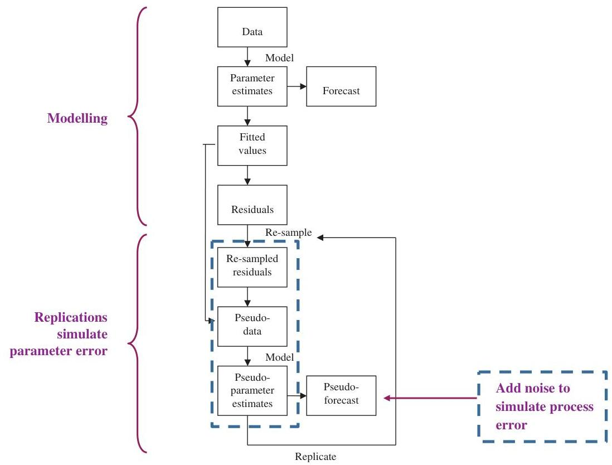

## Page 61
The version of the bootstrap just described is called semi-parametric here and in Shibata 1997 (though elsewhere in the actuarial literature, it is often referred to as nonparametric bootstrapping) because the generation of the pseudo-data sets by means of the re-sampling procedure (5-17) or (5-18) makes no distributional assumption. However, it does rely on a fitted model from which to calculate predicted values and residuals. The distribution of the pseudo-data $\hat{Y}_{i, j}$ is determined entirely by that of the residuals $S$. Similarly in the addition of process error in (5-23).

By contrast, the non-parametric bootstrap (terminology as per Shibata, 1997) does not require a fitted model prior to resampling. It simply generates a large number of pseudo-samples by repeatedly sampling the observed data with replacement. Clearly this is inappropriate for aggregated insurance loss data where the magnitude differs from one development period to the next. The use of the term "semi-parametric" for the residual resampling approach may be helpful to distinguish the two types of bootstrap, which were both proposed in Efron (1979).

It is evident from the re-sampling basis of the bootstrap that the exclusion of any outlying observations, as discussed in Section 2.2.5, will have ramifications not only for model parameter estimation (as remarked in that sub-section) but will also reduce any bootstrap estimate of dispersion. Once again, one would need to consider whether adjustment of that estimated dispersion might be required. Such adjustments are beyond the scope of this volume.

# 5.3.2. Parametric Bootstrap 

Parametric bootstrapping as defined in Shibata (1997) is functionally very similar to the semi-parametric method described above, but based on theoretical rather than empirical residuals. Thus for models such as GLMs, where the standardized deviance residuals are asymptotically normal, resampling of the actual residuals may be replaced by sampling from a normal distribution with the appropriate variance.

There are other possible ways to make use of the GLM assumptions to generate a distribution of reserves, including the approach described below which simplifies the area of Figure 5-1 in the dotted box, in which replicates of parameter estimates are obtained, and also simplifies the generation of process error. With some abuse of terminology, this is also referred to as parametric bootstrapping in this monograph.

## Parameter Estimates

It is supposed that the original parameter estimates $\hat{\beta}$ (the second box in the figure) are MLEs, as is usually the case for GLMs. It is known that an MLE is an asymptotically normal unbiased estimator for indefinitely increasing sample size in the presence of some technical conditions (Cox and Hinckley, 1974). In symbolic terms,

$$
\hat{\beta} \sim N(\beta, \operatorname{Var}[\hat{\beta}]) \text { asymptotically }
$$

## Page 62
If this asymptotic relation is assumed to hold precisely for the finite data sample under consideration, then one may assume that

$$
\hat{\beta} \sim N(\beta, \hat{C})
$$

where $\operatorname{Var}[\hat{\beta}]$ has been denoted by $C$, and $\hat{C}$ denotes the estimate of $C$ provided by the GLM software (as already mentioned just prior to (5-9)). The parameter estimate replicates $\hat{\beta}_{(j)}$ may then be sampled from the multi-normal $N(\hat{\beta}, \hat{C})$.

The sampling requires care in view of the correlations contained in $\hat{C}$. The usual sampling process consists of the following steps:

- apply a linear transformation $M$ to $\hat{\beta}$ such that the components of $M \hat{\beta}$ are uncorrelated;
- sample the each of these components from a univariate normal distribution to obtain a random vector $\gamma$;
- apply the inversion of $M$ to the sampled vector $\gamma$ to obtain the required sampling from $N(\hat{\beta}, \hat{C})$.

In mathematical terms, find $M$ such that $\operatorname{Var}[M \hat{\beta}]=\Lambda$, diagonal, i.e.,

$$
M \hat{C} M^{T}=\Lambda=\operatorname{diag}\left(\lambda_{1}, \ldots, \lambda_{p}\right)
$$

Now make random drawings

$$
\gamma_{i} \sim N\left((M \hat{\beta})_{i}, \lambda_{i}\right), i=1,2, \ldots, p
$$

where $(M \hat{\beta})_{i}$ denotes the $i$-th component of $M \hat{\beta}$.
Finally, construct replicates of $\hat{\beta}_{(j)}$ as

$$
\hat{\beta}_{(j)}=M^{-1} \gamma
$$

where $\gamma=\left(\gamma_{1}, \ldots, \gamma_{p}\right)^{T}$.
To check that $\hat{\beta}_{(j)} \sim N(\hat{\beta}, \hat{C})$, note that

$$
E\left[\hat{\beta}_{(j)}\right]=M^{-1} E[\gamma]=M^{-1} M \hat{\beta}=\hat{\beta}
$$

and

$$
\operatorname{Var}\left[\hat{\beta}_{(j)}\right]=M^{-1} \operatorname{Var}[\gamma]\left(M^{-1}\right)^{T}=M^{-1}\left[M \hat{C} M^{T}\right]\left(M^{-1}\right)^{T}=\hat{C}
$$

Central to the above sampling process is the identification of the required matrix $M$ in (5-26). this may be achieved by either Cholesky decomposition or spectral decomposition of $\hat{C}$, both of which will be available from conventional statistical software.

## Page 63
Cholesky decomposition expresses $\hat{C}$ in the form

$$
\hat{C}=L L^{T}
$$

with $L$ a lower triangular matrix. This is equivalent to (5-26) with $M=L^{-1}$ and $\Lambda=I$.
Spectral decomposition expresses $\hat{C}$ in the form

$$
\hat{C}=P \Lambda P^{T}
$$

with $P$ an orthogonal matrix and $\gamma_{1}, \ldots, \gamma_{p}$ the eigenvalues of $\hat{C}$. This is equivalent to $(5-26)$ with $M=P^{-1}=P^{T}$.

# Process Error 

The addition of process error is indicated in the bottom right box of Figure 5-1 and is described in (5-21) to (5-23). Now $\hat{Y}_{\text {proc }}$ in (5-21) is a replicate of $Y$, which the GLM will have assumed subject to some particular distribution. Hence $\hat{Y}_{\text {proc }}$ may be obtained simply as a random drawing from that distribution.

For example, if the assumed distribution of $Y_{i}$ is ODP, the $i$-th component of $\hat{Y}_{\text {proc }}$ may be obtained as a random drawing from a ODP distribution with mean $\hat{Y}_{i}$ and scale parameter $\hat{\phi} / w_{i}$, where this last quantity is the GLM's estimate of (2-21).

## Discussion

The parametric version of the bootstrap is so called because it makes use of assumed parametric forms: the normal distribution for parameter error, and the GLM's chosen distributional form for process error.

Its implementation is somewhat simpler than that of the semi-parametric form with shorter computational times, considerably so for larger data sets. Evidently, however, its validity is dependent on the assumptions just stated, and will become more dubious as:

- the sample size $n$ declines to the point where reliance cannot be placed upon the asymptotic result (5-24); and/or
- the error structure assumed within the GLM becomes a poor representation of the data.

The commentary at the end of Section 5.3.1 on the exclusion of isolated observations from the bootstrap applies equally to the parametric bootstrap.

### 5.4. Numerical Examples

### 5.4.1. Delta Method

Table 3-2 obtained the chain ladder forecasts associated with the data triangle of Table 1-1. These were obtained by application of the conventional chain ladder, but it was noted in Section 3.2 that the ODP cross-classified model produces the same forecasts.

The delta method, as described in Section 5.2.3, is now applied to estimate the forecast error associated with the ODP cross-classified model forecasts. Note that, although the

## Page 64
ODP Mack and ODP cross-classified models produce the same forecasts, they are different models and do not produce the same estimates of forecast error.

The forecast error required here is estimated by application of (5-11) to (5-13), where it was noted in Section 5.2.3. that values of $\operatorname{Var}[\hat{\beta}]$ and $\hat{\phi}$ are provided by the GLM software. These formulas required the evaluation of $D$, defined by (5-9). It is noted that, for the ODP cross-classified model, the link function is $h=l n$, and so $\left(h^{-1}\right)^{*}$ $(h())=$ identity. Thus, (5-9) simplifies to

$$
D=\operatorname{diag}\left(\hat{\mu}_{2,10}^{*}, \hat{\mu}_{3,9}^{*}, \ldots, \hat{\mu}_{10,10}^{*}\right)
$$

The results are displayed in Table 5-4. The table contains the root mean square errors of prediction ("RMSEP") and coefficient of variation of prediction ("CVP"). The first of these is simply the square root of the MSEP, and the second is defined as

$$
C V P=\frac{R M S E P}{\text { Forecast }}
$$

# 5.4.2. Bootstrap 

The parametric bootstrap, as described in Section 5.3.2, has been applied to estimate the forecast error associated with the ODP cross-classified model forecasts.

Table 5-4. Chain Ladder Forecast Error

| Accident   Year | Outstanding Losses |  |  |
| :-- | --: | --: | --: |
|  | Forecast | RMSEP | CVP |
|  | $\$ 000$ | $\$ 000$ | $\%$ |
| 1989 | 3,398 | 924 | 27.2 |
| 1990 | 8,155 | 1,363 | 16.7 |
| 1991 | 14,579 | 1,775 | 12.2 |
| 1992 | 22,645 | 2,169 | 9.6 |
| 1993 | 31,865 | 2,523 | 7.9 |
| 1994 | 45,753 | 3,036 | 6.6 |
| 1995 | 60,093 | 3,577 | 6.0 |
| 1996 | 80,983 | 4,538 | 5.6 |
| 1997 | 105,874 | 6,786 | 6.4 |
| Total | 373,346 | 14,076 | 3.8 |

It may be noted that the table reveals positive correlation between (at least some) accident years. If accident years were independent, then the MSEP of the total forecast would be simply the sum of the accident year MSEPs, and the RMSEP of the total forecast would be 10,275 (\$000), substantially less than the actual result of 14,076 . The difference is accounted for by positive correlation.

## Page 65
Table 5-5. Parametric Bootstrap Estimates of Chain Ladder Forecast Error

|  | Outstanding Losses |  |  |
| :-- | --: | --: | --: |
| Accident | Forecast | RMSEP | CVP |
|  | $\$ 000$ | $\$ 000$ | $\%$ |
| 1989 | 3,476 | 937 | 27.0 |
| 1990 | 8,269 | 1,366 | 16.5 |
| 1991 | 14,738 | 1,794 | 12.2 |
| 1992 | 22,776 | 2,186 | 9.6 |
| 1993 | 32,043 | 2,525 | 7.9 |
| 1994 | 45,963 | 3,057 | 6.7 |
| 1995 | 60,273 | 3,608 | 6.0 |
| 1996 | 81,249 | 4,589 | 5.6 |
| 1997 | 106,204 | 6,831 | 6.4 |
| Total | 374,992 | 14,286 | 3.8 |

The information required for this consists of that in Table 5-1, together with the GLM estimate of the scale parameter, which is $\phi=114.5$.

The results of 10,000 bootstrap replications are contained in Table 5-5, in which:

- "Forecast" is taken as the arithmetic mean of the 10,000 replicates of the forecast; and
- "RMSEP" is taken as the square root of the unbiased variance of these 10,000 replicates.

The results are evidently very similar to those obtained by the delta method in Table 5-4. The forecasts are slightly different, which can be accounted for by sampling error arising from the limited number of replicates.

## Page 66
# 6. Model Validation 

Chapter summary. Model validation consists of detailed checking that a fitted model is compatible with, and accounts for all features of, the data. There are many diagnostic plots available for this purpose. The present chapter discusses and illustrates a number of these.

Illustration is carried out first in the abstract, and then in relation to a simulated data set, and finally in relation to the actual data set given in Chapter 1 and used in numerical examples throughout this volume. In the case of simulated data, the target model is known, and so its effect of specific model features on some of the diagnostic plots can be clearly illustrated.

### 6.1. Introduction

Model validation is the process of examining whether the fitted model-both the distributional assumptions and the fitted parameter effects-are acceptable and adequate descriptions of the data being modeled. It is a critical part of building any model-if the assumptions underlying the model are found to be flawed, this then casts doubt on any inferences from that model.

Typically there are three aspects to a model validation:

- Analysis of the distributional assumptions;
- Analysis of the goodness-of-fit of the model; and
- Analysis of the model's predictive performance on data beyond those used in the model estimation.

Of these the third is not usually possible for claims reserving models based on simple triangles (i.e., other than individual claim models, also known as micro-models or granular models), since all the data would normally be used to build the model. Thus, out-of-sample testing is not discussed further here.

In principle, the model validation would begin by validating the choice of distribution and the link function. Of these, the link function is usually determined by the model structure as being that transformation that produces a linear predictor. For example, a multiplicative model implies a log link while an additive model uses an identity link. In terms of model validation, a link function is acceptable if the model passes the other validation tests without requiring an excessive number of interaction terms. Once the link and the distribution have been validated, the user can move onto examine the goodness-of-fit of the model.

## Page 67
One's view of the error distribution is provided by the observed residuals, which depend in turn on the fitted model. No view of the distribution can become available until some model, at least a rudimentary one, has been fitted to the data. Thus the respective forms of the error distribution and model are inter-dependent, and cannot simply be selected sequentially.

In our experience, the estimated mean of the distribution is relatively insensitive to the choice of distribution, and similar findings are reported by Lai and Shih (2003), though, of course, the same is not true of the variance. Thus, our approach to model fitting and validation is generally to select a reasonable set of distribution assumptions using common sense arguments, fit the model and test for goodness of fit, before validating the model distribution assumptions carefully. In more detail, a step-by-step description of this process is as follows:

- Select the appropriate link function (e.g., a multiplicative model implies a log link);
- Select a reasonable distribution-e.g., ODP for a cross-classified model;
- Fit the main effects in the model and any obvious interactions (see Section 7.6);
- Check the residual diagnostics for any gross violations of the distributional assumptions and make changes if necessary;
- Continue with the model fitting using goodness-of-fit tests (primarily comparisons of actual and model fitted values) until a satisfactory goodness-of-fit of cell means is obtained. This may involve the use of interactions in the model;
- Review the distributional diagnostics in detail and make any adjustments required to yield satisfactory results. After any changes, re-check the goodness-of-fit and make changes if necessary. Repeat until a satisfactory model is obtained.

The assessment of the goodness-of-fit and the distributional assumptions is covered in detail below. In practice, the tools used in this assessment are usually graphical, and definitions and examples of all the various graphical tools used are provided.

Following that, some examples of the graphs are given in cases of poor fit and good fit. To facilitate this discussion, simulated data sets are used so that the true underlying model is known with certainty. Finally, model validation will be carried out for the cross-classified model using the example data set.

# 6.2. Summary of Assumptions and Tests 

Before commencing the definition and use of the various model diagnostics later in this chapter, we have gathered together the list of model assumptions and corresponding diagnostics that will be discussed below. This is intended as a reference list that modelers may use to check the fit of their model.

## Distributional Assumptions

- The link structure is appropriate:
- Expectations regarding the modeled quantity will largely determine the choice of link-e.g., a multiplicative model structure requires the use of a log link. It is validated if the model passes the other diagnostics tests without requiring an undue number of interactions.

## Page 68
- The distribution choice is appropriate:
- Probability-Probability (P-P) plot;
- Residual plots by accident, development and calendar year periods;
- Histograms or kernel density plots of the residuals.

# Goodness-of-Fit 

- The model fits well by accident, development and calendar periods:
- Plots by accident, development and calendar periods of actual and expected (i.e., the expected value according to the fitted model) in some form, e.g.:
- actual vs. expected;
- $\log$ (actual) vs. $\log$ (expected);
- Actual/expected;
- Plots of residuals, also by accident, development and calendar periods;
- All significant interactions have been identified:
- A triangular (e.g., 2-d) heat map of actual/expected;
- Actual and expected plots for specific parts of the experience.

### 6.3. Diagnostic Graphs

All diagnostics graphs involve the comparison of actual and expected quantities, where "expected" is an abbreviation for "expected value according to the fitted model".

The most well-known comparison is that based on residuals but other comparisons such as the quotient of the actual and expected values or plots of actual and expected values are also useful. In more detail, the functions of actual and expected values used are:

- Pearson residuals—both raw and standardized. Refer to Section 2.2.4 for their definition;
- Deviance residuals—both raw and standardized. Refer to Section 2.2.4 for their definition;
- Actual values including sums of actual values across rows $\left(\Sigma^{R(k)}\right)$, columns $\left(\Sigma^{P(j)}\right)$ and diagonals $\left(\Sigma^{P(k+j-1)}\right)$. Depending on the scale of the comparison, the logs of these quantities may be more useful;
- Expected values including sums of expected values across rows, columns and diagonals (denoted by $\Sigma^{\hat{R}(k)}, \Sigma^{\hat{Y}(j)}$ and $\Sigma^{P(k+j-1)}$ respectively). Again, the logs of these quantities may be useful for many reserving problems;
- Actual/expected values in each cell of the triangle-for example $Y_{k j} / \hat{Y}_{k j}$; and
- Actual/expected marginal values by row, column and diagonal. For example, the marginal actual/expected comparison for accident period k is $\Sigma^{\hat{R}(k)} / \Sigma^{\hat{R}(k)}$.

Following from the discussion of Pearson and deviance residuals in Section 2.2.4, only deviance residuals will be used in this chapter due to their greater degree of normality when the underlying distribution (Poisson in this case) is not normal. All comments below which discuss normality and homo- and heteroscedasticity of residuals refer to standardized deviance residuals.

Based on these quantities, a number of diagnostic graphs are available to the user to carry out model validation. These graphs are discussed below in Sections 6.3.1 to 6.3.7.

## Page 69
Note that in all of the examples in these sections, the plots are drawn using a correctly specified model of simulated data so that the graphs indicate a well-fitting model.

# 6.3.1. Scatterplot 

A scatterplot of residuals is a simple graph plotting residuals against a relevant variable such as the expected value, accident period, development period or calendar period. Figure 6-1 gives an example of a scatterplot where standardized deviance residuals are plotted against development period.

Departures from a random, homoscedastic plot of deviance residuals suggests problems with the model. A trend in the residuals indicates possible goodness-of-fit issues while heteroscedasticity (e.g., fanning of residuals) often indicates that the dispersion assumptions are inappropriate. As noted above, the example here is taken from a correctly specified model leading to homoscedastic residuals.

### 6.3.2. Spread Plot

This plot shows some summary statistics of the residuals plotted against a variable of interest (e.g., development period, expected value) to provide the modeler with information on the spread and distribution of the statistics. Specifically, the 25 th and 75 th percentiles are plotted along with the standard deviation of the residuals. The spread plot is particularly useful for detecting heteroscedasticity of deviance residuals as heteroscedasticity is indicated by widening or narrowing of the inter-quartile range and by significant changes in the standard deviation.

The spread plot corresponding to Figure 6-1 is shown in Figure 6-2 below. Looking past the volatility (particularly in the higher development periods), the interquartile range is reasonably consistent while the standard deviation fluctuates around unity.

Figure 6-1. Scatterplot of Standardized Residuals

## Page 70
Figure 6-2. Spread Plot

Note that in spread plots, the green and black lines plot the 25 th and 75 th percentiles while the blue line is the standard deviation of the residuals. If standardized residuals are used, as is the case here, then the standard deviation of these residuals should vary randomly about unity and any systematic departures from this may indicate a problem with the model assumptions.

# 6.3.3. Actual and Expected Comparison Plots 

Actual and expected comparison plots display the actual and expected totals (e.g., by accident, development or calendar period). For example, such a plot by row or accident period shows the actual series $\left(\Sigma^{R(k)}\right)$ and the expected series $\left(\Sigma^{K(k)}\right)$ plotted for $1 \leq k \leq K$. Areas of poor fit correspond to consistent differences in the actual and expected values. Figure 6-3 is an example of an acceptable graph where the expected values are close to the actual values.

Depending on the scale of the data, it may be more helpful to log the quantities, i.e., $\log$ (actual) vs $\log$ (expected).

### 6.3.4. Actual and Expected Ratio Plots

These plots are similar to those in 6.3.3 except that they plot the actual/expected ratio rather than individual actual and expected lines. Systematic deviations away from $100 \%$ indicate regions of poor fit.

Figure 6-4 is the ratio plot equivalent to the comparison plot shown in Figure 6-3. Following some volatility in early calendar periods (when there is little data), the ratios fluctuate randomly around $100 \%$ indicating an adequate fit.
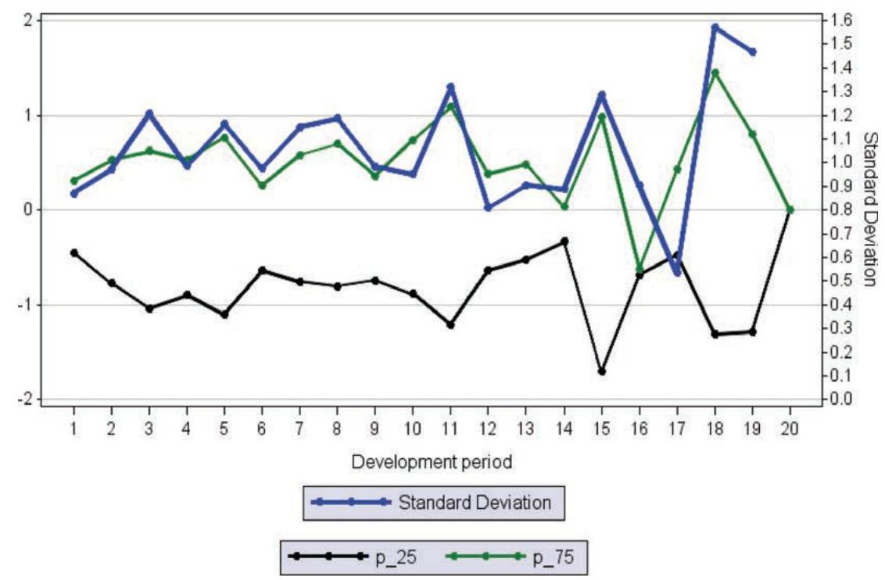

## Page 71
Figure 6-3. Actual and Expected Comparison Plot by Diagonal (calendar period)

Note that in actual and expected comparison plots, the red line shows the actual totals, the blue line the expected totals while the green dotted line (right-hand scale) shows the cumulative number of data points at each level.

# 6.3.5. Actual and Expected Ratio 2-D Heat Map 

This diagnostic is particularly useful in the loss reserving context where it can be used to look at the goodness-of-fit across a data triangle (or other 2-dimensional array). Specifically, it calculates the actual/expected ratio in each cell of the triangle and applies a formatting conditional on the deviation of the ratio from $100 \%$. In the example in

Figure 6-4. Actual and Expected Ratio Plot by Diagonal (calendar period)

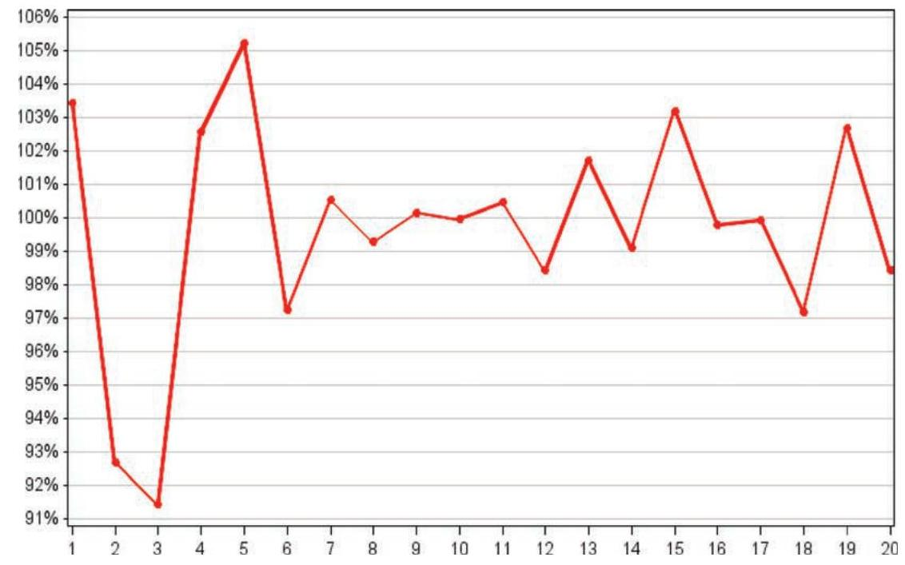

## Page 72
Figure 6-5. Actual and Expected Ratio Heat Map

Figure 6-5 pink values indicate ratios larger than $100 \%$ and blue ratios less than $100 \%$. The more intense the color, the greater the deviation from $100 \%$.

The distribution of colors should be random across the triangle. Clumps of one color indicate areas of poor fit. For example, if the model includes terms for accident and development period effects, then a clumping of colors may indicate the need for further model terms such as interactions between accident and development periods or terms involving calendar periods.

The heat map in Figure 6-5 suggests that the model is not missing interaction or calendar period terms since the blue and pink colors are randomly distributed.

# 6.3.6. Probability-Probability Plot 

A Probability-Probability plot (also known as a "P-P" plot or a percent-percent plot) is a graphical method for comparing two probability distributions. A P-P plot plots two cumulative distribution functions ("cdfs") against each other. Given an input $u$, the plotted points are $(\mathrm{F}(u), \mathrm{G}(u))$ where F and G represent the cdfs of two probability distributions. Thus, a P-P plot is a parametric graph, whose range is the unit square $[0,1] \times[0,1]$. Each pair of numbers represents the probability of being $\leq u$ under the distributions F and G respectively.

In a GLM application, one distribution will correspond to the selected error distribution (e.g., ODP as discussed in this monograph), referred to as the "theoretical" distribution while the other will correspond to the modelled data (the "empirical" distribution). If the model fits the data well, then the empirical and theoretical distributions should be similar and the resulting P-P plots should be an approximately straight line

## Page 73
Figure 6-6. Probability-Probability Plot

Note that in P-P plots, the blue line is the plot that would be obtained if the actual distribution exactly matched the assumed distribution. The red line is the plot of the assumed theoretical quantiles against the empirical quantiles.
of the form $y=x$ (see Figure 6-6). Pronounced or persistent deviations from a straight line indicate problems with the distributional assumptions.

For the model discussed in this monograph, each observation $Y_{k j}$ is assumed subject to an ODP with mean $\hat{Y}_{k j}$ and variance $\phi_{k j} \hat{Y}_{k j}$. The value of the cdf of this "theoretical" distribution is computed at $Y_{k j}$. Call it $u_{k j}$. The empirical distribution, $\hat{u}_{k j}$, may be obtained by sorting by ascending $u$ with $\hat{u}_{k j}$ being the proportion of data points $\leq u_{k j}$. In effect, the empirical readings are simply $n$ equally spaced points in $[0,1]$ where $n$ is the number of observations in the data set.

A related and perhaps better known plot is the Quantile-Quantile ("Q-Q") plot, which plots the quantiles of two distributions against each other. In more detail, the inverse function of a cumulative probability function is the quantile function, i.e., given a cdf $F$, its quantile function is $F^{-1}$. Thus, given two cdfs $F$ and $G$, with associated quantile functions $F^{-1}$ and $G^{-1}$, a Q-Q plot draws the $q^{\text {th }}$ quantile of $F$ against the $q^{\text {th }}$ quantile of $G$ for a range of values of $q$. Thus, the $Q-Q$ plot is a parametric curve indexed over $[0,1]$ with values in the real plane $\mathrm{R}^{2}$.

The Q-Q plot requires that all observations appearing within it be drawn from the same distribution. This will not usually be the case for the raw observations modeled by a GLM, where the mean may vary from one observation to another. However, a Q-Q plot may be applied to the standardized deviance residuals, which are asymptotically $\mathrm{N}(0,1)$. In this case the ordered standardized deviance residuals are plotted against the quantiles of the standard normal distribution. Augustin, Sauleau and Wood (2012) provide some further discussion on the use of Q-Q plots as GLM diagnostics.
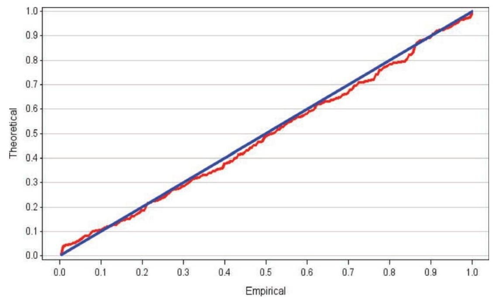

## Page 74
# 6.3.7. Histogram of Residuals 

Finally, a simple histogram of standardized deviance residuals is a further useful check on the distributional assumptions-if the model is appropriate, then these residuals should be approximately standard normal, as in Figure 6-7 where magnitude of standardized residuals is represented on the horizontal axis and frequency of their occurrence on the vertical.

### 6.4. Simulated Data Set and Fitted Models

Three simulated data sets were generated to illustrate the use of the various model diagnostics in model validation. They are described in Table 6-1. Note that the accident and development period effects used to simulate the data are specified from the formulae given in the table below.

In summary, all three simulated data sets are Poisson distributed. Simulated data set 1 has accident and development period effects only and a constant scale so may be correctly described by a cross-classified model. The second data set is similar to the first except that its scale parameter varies by development period. Thus, a cross-classified model with suitably selected weights is appropriate. Finally the third data set has development effects that vary according to accident period. Thus the cross-classified model cannot adequately model this dataset since it will not capture the interaction between accident and development effects.

A number of different models were fitted, all GLMs of the form $Y_{k j} \sim O D P\left(\mu_{k j}, \phi_{k j}\right)$. The models differ in the specifics of the definitions of $\mu_{k j}$ and $\phi_{k j}$, which are given in Table 6-2, together with the data sets to which they were applied.

Figure 6-7. Histogram

Note: the solid line overlay is a normal distribution, fitted using the method of moments, while the dotted line is a kernel density estimator, which may be helpful for small data sets such as those that typically result from reserve estimation using aggregate triangle data.
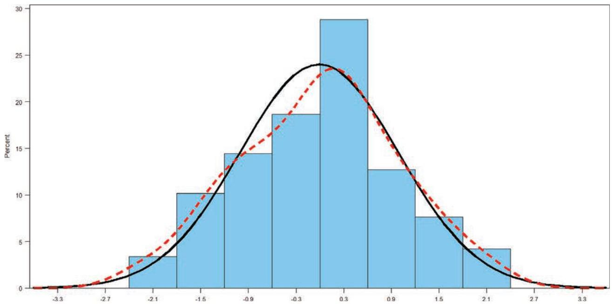

## Page 75
Table 6-1. Description of Simulated Data

| Characteristic | Simulated Data 1 | Simulated Data 2 | Simulated Data 3 |
| :--: | :--: | :--: | :--: |
| Accident periods | 20 | 20 | 20 |
| Development periods | 20 | 20 | 20 |
| Development period effect $j=1$ to 20 | $\begin{aligned} & \beta_{j}=\exp (-0.3[j-1] \\ & +1.5 \ln [j]) \end{aligned}$ | $\begin{aligned} & \beta_{j}=\exp (-0.3[j-1] \\ & +1.5 \ln [j]) \end{aligned}$ | $\begin{aligned} & \beta_{j}=\exp (-0.3[j-1] \\ & +1.5 \ln [j]) \text { for } k=1 \text { to } 10 \\ & \text { and } \beta_{j}=\exp (-0.5[j-1] \\ & +2 \ln [j]) \text { for } k=11 \text { to } 20 \end{aligned}$ |
| Accident period effect, $k=1$ to 20 | $\alpha_{4}=\exp (0.05 k+4)$ | $\alpha_{4}=\exp (0.05 k+4)$ | $\alpha_{4}=\exp (0.05 k+4)$ |
| Scale parameter | 1 | $\min (8, j+1)^{2}$ | 1 |
| Distribution | Poisson | Over-dispersed Poisson | Poisson |

# 6.5. Analysis of the Goodness-of-Fit 

This aspect of model validation examines the data to ensure that all significant drivers of the target value have been identified. In claims reserving, this corresponds to reviewing the diagnostics by accident, development and calendar period to see if there are any un-modeled trends in the data.

In other words, the model is examined for the quality of fit to the data of its cell expected values. Dispersion and distributional questions will be considered in Section 6.6.

Traditionally this would be carried out by examining the residuals (refer back to Section 2.2.4 for the definition and discussion of Pearson and deviance residuals) for evidence of non-randomness. To illustrate this, the Mean model is fitted to simulated data 1. This model fits a single average to all data points, thereby ignoring the accident

Table 6-2. Models Fitted to Simulated Data

| Model Name | Model Description | Simulated Data Set |  |  |
| :--: | :--: | :--: | :--: | :--: |
|  |  | 1 | 2 | 3 |
| Mean | $\mu_{k j}=\exp (\mu)$ | Y |  |  |
|  | $\varphi_{k j}=1$ |  |  |  |
| Development | $\mu_{k j}=\exp \left(\ln \beta_{j}\right)$ | Y |  |  |
|  | $\varphi_{k j}=1$ |  |  |  |
| Full | $\mu_{k j}=\exp \left(\ln \alpha_{4}+\ln \beta_{j}\right)$ | Y | Y | Y |
|  | $\varphi_{k j}=1$ |  |  |  |
| Full weights | $\mu_{k j}=\exp \left(\ln \alpha_{4}+\ln \beta_{j}\right)$ |  | Y |  |
|  | $\varphi_{k j}=\min (8, j+1)^{2}$ |  |  |  |

## Page 76
Figure 6-8. Standardized Deviance Residuals (Mean model)
Accident period

Development period
and development period trends that exist in the data. Figure 6-8 shows scatterplots of the deviance residuals by accident and development periods and exhibits clear trends and departures from randomness.

Alternatively actual and expected comparison (Section 6.3.3) or actual and expected ratio (Section 6.3.4) plots may be helpful in providing a clearer view of the goodness-of-fit (or lack thereof).

The trends seen in Figure 6-8 may be clearly seen in the actual and expected plots in Figure 6-9. In general actual and expected plots may often be an easier way of assessing the goodness-of-fit of the data than residual plots. However, residuals plots should not be ignored for this purpose; in particular residual plots are very useful

Figure 6-9. Actual and Expected (Mean model)
Actual and expected comparison plot by accident period

Actual and expected ratio plot by development period

Note: Left hand graph: the red line is the actual line, while the blue line represents the expected values. The green dotted line represents (right-hand scale) the number of data points underlying each plotted point.
Right hand graph: The actual/expected ratios have been truncated to a minimum value of $50 \%$ and a maximum value of $150 \%$.

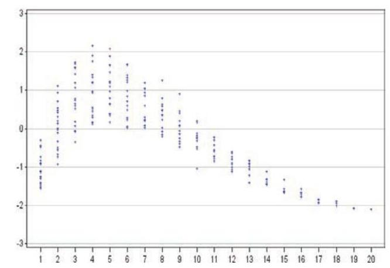
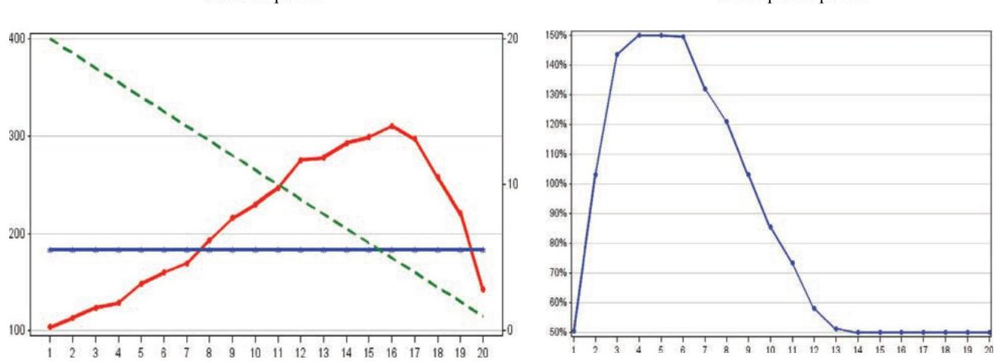

## Page 77
for identifying outliers that may need to be removed prior to fitting a model (refer to Section 2.2.5).

Suppose now that a model with development period effects has been fitted-the Development model. Residual and actual and expected plots by development period are shown in Figure 6-10. Note that, in the right-hand graph, both actual [red] and expected values [blue] have been plotted but they coincide so that only one (the expected line) is actually visible to the reader.

The residual plot no longer appears to contain trends, indicating that the model has captured the development period trends. This is confirmed by the actual and expected comparison plot, where the actual and expected totals are identical.

Note, however, that the ML equations for the ODP models are marginal sum estimation equations. Consequently, the actual and expected marginal totals associated with each model parameter are identical. The Development model contains development period (or column) parameters, and so actual and expected marginal totals by development year are identical (refer to Section 3.2 for further discussion of this point).

Thus, the actual and expected comparison and ratio plots provide no information in this case other than that development period trends have been captured in the slavish manner pre-ordained by marginal sum estimation.

On the other hand, the residual scatterplot does provide some information on the goodness-of-fit; in this case there is a suggestion of heteroscedasticity.

Figure 6-11 shows comparison plots of actual and expected for accident and calendar periods for the Development model. It is clear that the goodness-of-fit is still inadequate. The same plots are shown in Figure 6-12 but in this case for the fully specified cross-classified model, i.e., the Full model. The accident period actuals and expected overlay exactly due to marginal sum estimation in the presence of both accident and development period parameters in the model. The calendar period comparison is very close, suggesting that the model does not contain any calendar period effects.

Figure 6-10. Development Period Diagnostics (Development model)
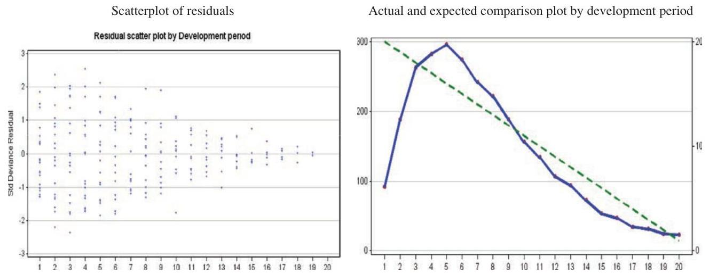

## Page 78
Figure 6-11. Accident and Calendar Period Actual and Expected Comparison Plots (Development model)

Accident period

Calendar period

Note: the red lines are the actual lines while the blue lines represent the expected values. The green dotted lines represent (right-hand scale) the number of data points underlying each plotted point.

Other plots which may be useful include the residuals plotted against linear predictor and expected values. These plots are also used later when verifying distribution assumptions.

# 6.5.1. Identifying Interactions 

So far the examples considered have been for a model where there are no interactions. Consider now a case where the development period factors $\beta_{j}$ in the cross-classified model change significantly at a point in the past as they do in simulated data 3, and consider the diagnostics under the Full model where one set of development period factors is fitted for all accident periods.

Both the accident period and development period actual and expected comparison (and ratio) graphs are not useful since the actual and expected totals are identical

Figure 6-12. Actual vs Expected for Full CC Model
Accident period

Calendar period
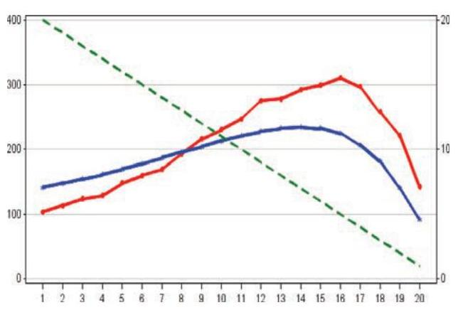
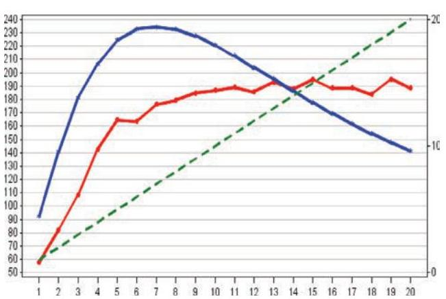
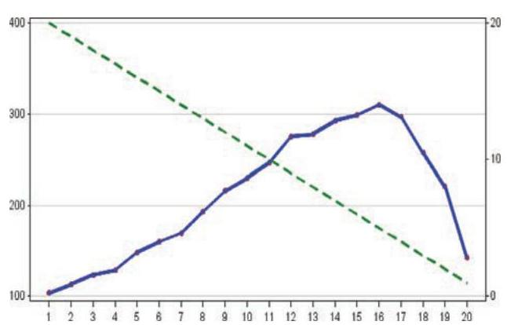
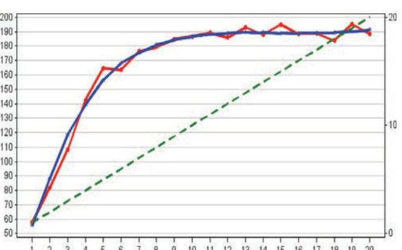

## Page 79
Figure 6-13. Diagnostic Plots—Model with Missing Interaction

Note: the red lines represent the actual observations, while the blue lines represent the expected values. The green dotted lines represent (right-hand scale) the number of data points underlying each plotted point.
due to the use of marginal sum estimation. The calendar period actual and expected comparison plot does suggest areas of poor fit (see Figure 6-13), and some of the residual plots exhibit non-randomness such as that in the development period scatterplot also shown in Figure 6-13.

Since accident and development period effects have been fitted in the model, the missing effect may be either a calendar period effect or an interaction between accident and development period (or both). To determine its nature, a heat map of actual and expected ratios may be helpful.

The heat map is shown in Figure 6-14. The distribution of actual/expected ratios is non-random with clusters of ratios greater than $100 \%$ and less than $100 \%$. The lines have been added by judgment to separate out areas that show greater concentrations of ratios greater or less than $100 \%$. Since the clusters appear to be located for specific accident and development period groups rather than along entire diagonals, this suggests that the missing effects are interactions between accident and development periods and not calendar period effects.

# 6.6. Analysis of the Distribution Assumptions 

The goodness-of-fit tests may be viewed as checking whether the model's cell means provide a good fit to the cell observations. However, in addition to the cell means, it is also important to check whether the model distribution is a good approximation to the data. This is particularly true if the model is intended to be used to assess the variability of the loss reserve estimate.

The main distributional assumptions are:

- The form of the distribution of the data;
- The scale parameter of that distribution; and
- The choice of link.
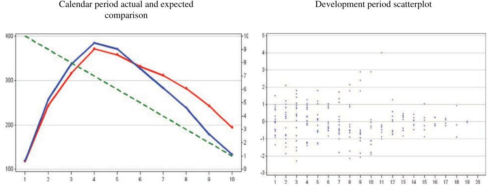

## Page 80
Figure 6-14. Actual/Expected Heat Map-Full Model for Simulated Data 3

The main tools in checking the distributional assumptions are:

- Plots of residuals; and
- Probability-Probability (P-P) plots.

As discussed in Section 6.1, the recommended approach to model validation was first to fit a simple model and check for any gross violations of the distributional assumptions. At this stage, problems such as a moderate level of heteroscedasticity could be ignored since they may result from poor estimation of the cell means. Providing the residual plots do not indicate a serious problem, the modeler may then continue to fit the model. Once the cell means fit well (based on the goodness of fit tests), the distributional assumptions may be re-examined in fine detail and adjusted as required.

Distribution diagnostics are illustrated for simulated data 2 under the Full model. For simulated data 2, the full model correctly specifies the form of the cell mean but does not correctly specify the variability/scale since it assumes a constant scale parameter rather than a scale that varies by development period. Thus, the diagnostics should show evidence of incorrect dispersion assumptions.

Recall that in the spread plot, the green and black lines represent the interquartile range while the blue line is the standard deviation of the residuals at each development period.

The residuals in Figure 6-15 are clearly heteroscedastic with a fanning out of residuals observable for development periods 1-8, as expected based on the assumptions for the scale parameter (refer to Table 6-1). From the spread plot it is seen clearly that the standard deviation of the residuals increases over the same range of development quarters.

The P-P plot is shown in Figure 6-16. Some deviations from the Poisson distribution may be seen.
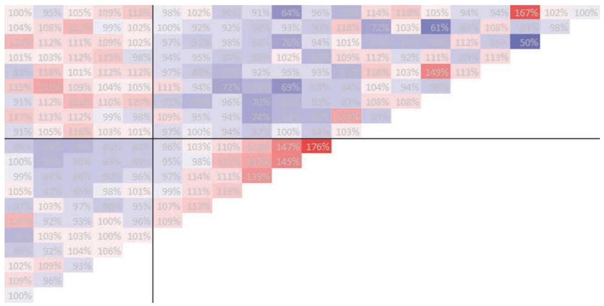

## Page 81
Figure 6-15. Diagnostic Plots—Full Model, Scale Parameter Assumed Constant
Development period scatterplot
Development period spread plot

The model was refitted using the correct formulation for the scale parameter. Strictly speaking, it is the weights, rather than the scale parameter, that require correction. Recall from (2-21) that the scale or dispersion parameter may be written as $\phi_{i}=\phi / w_{k j}$. In this case, $\phi=1$ and the weights vary only by development period $j$ and are specified by $w_{k j}=\min (8, j+1)^{2}$ (as per the data specification in Table 6-1).

The same plots as in the preceding two figures are shown below in Figure 6-17 after the model refit. The improvement is apparent.

As well as adjustments to the dispersion by means of weights, the modeler should generally consider whether the use of a different distribution, e.g., Gamma rather than Poisson, is more appropriate for the data under consideration.

Figure 6-16. P-P Plot—Full Model, Scale Parameter Assumed Constant
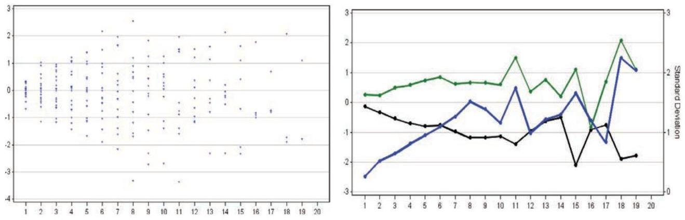
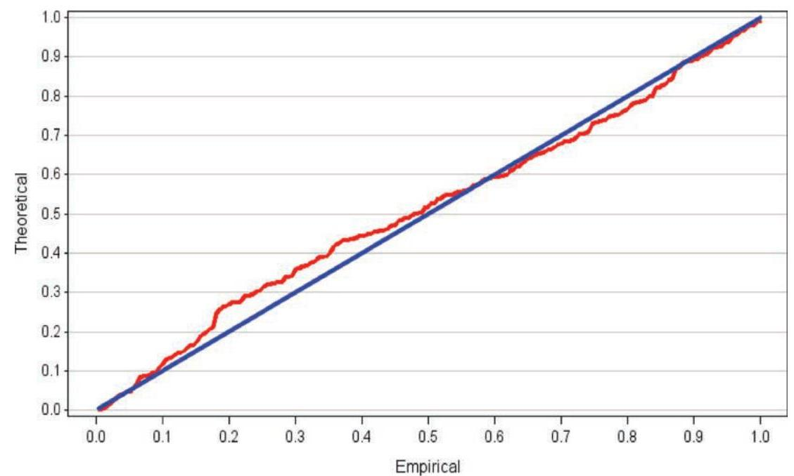

## Page 82
Figure 6-17. Diagnostic Plots for Correctly Specified Variable Scale Model
Scatterplot by development year
Spread plot by development year

Finally, there are no particular tests for the choice of the link function. Rather, the link is usually determined by the model structure (e.g., an additive model implies an identity link while a multiplicative model implies a log link), which in turn is often determined a priori by the nature of the data being modeled. Generally speaking, if the link function implies a structure that makes sense for the particular data, and if the diagnostics plots are acceptable without requiring an unreasonable number of interactions, then the link function may be considered appropriate.

# 6.7. Model Validation for Real Data 

The examples discussed to date have used simulated data so that the true underlying model is known. In practice, this is not the case, so the modeler will need to select the best model using judgment. In the following sections, diagnostics plots for the crossclassified model (Section 3.3.2) based on the data in Table 1-1 are shown together with some commentary.

### 6.7.1. Initial Check of Distribution Assumptions

As a model of main effects only, the cross-classified model may be easily fitted. Once this is done, the first step in model validation is to check that the distributional assumptions are not grossly violated.
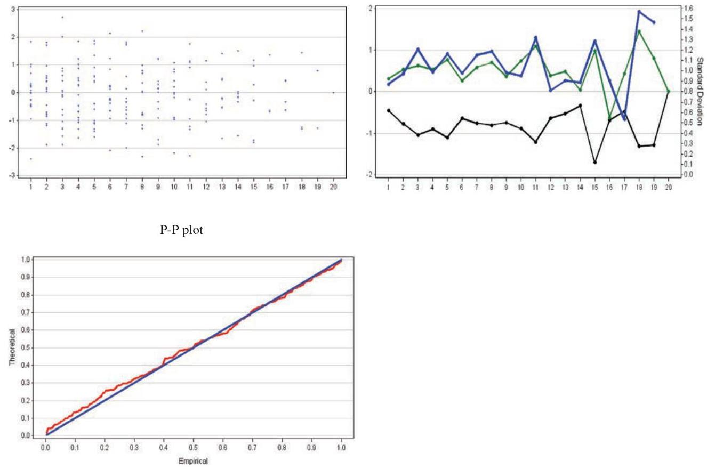

## Page 83
Figure 6-18. P-P Plot for the Cross-Classified Model

The P-P plot for the cross-classified model is shown in Figure 6-18. While there are systematic departures from the straight line, suggesting that the distributional assumptions could be improved, the distortion is not at a level that renders the Poisson $\log$ link distributional assumptions unusable as an initial set of assumptions for building a model.

The residual plots should also be checked first for any major problems with the distributional assumptions and second for indications of regions of poor fit.

Figure 6-19 shows the scatter and spread plots by development year for the crossclassified model. As above, the residuals do not suggest a major problem with the distributional assumptions.

However, the spread of the residuals in development years 1 and 2 is greater than in other years, which may suggest a less than optimal fit to the means of the development year 1 and 2 data or that the Poisson assumptions may be inadequate (e.g., perhaps the scale parameter varies by development period).

Figure 6-19. Residuals by Development Year for the Cross-Classified Model

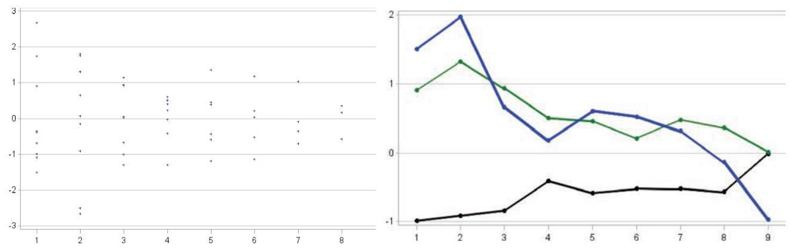

## Page 84
Figure 6-20. Residuals by Accident and Calendar Year for the Cross-Classified Model

The residuals by accident and calendar year are shown in Figure 6-20. The residuals by calendar year, in particular, suggest a problem with the model fitting that should be investigated further.

Thus the conclusions from this stage of the model validation process are that there are areas of poor fit that need further investigation and possible modeling. For the time being the distributional assumptions (Poisson model, constant scale, log link) may continue to be used, but they will need reviewing once the fit of the model has been improved.

# 6.7.2. Goodness-of-Fit 

The next step in the modeling process is to use the various goodness-of-fit diagnostic tools to identify the regions of poor fit better and determine whether these should be modeled.

Since the cross-classified model contains a parameter for each accident and development year, the marginal totals will be identical under ML estimation (Section 3.2). Therefore actual and expected plots by accident and development years will be unhelpful. The comparison plot of actual and expected by calendar year is shown in Figure 6-21 below. This appears satisfactory, even though the residuals by calendar year are problematic (Figure 6-20 above).

This suggests that the poor fit may result from some interactions, so the triangular heat map diagnostic may be useful and is shown in Figure 6-22. This indicates the presence of some missing interactions between accident year and development years 1 and 2 (see the highlighted regions in the plot below).

Even in the absence of evidence of poor fit from the various one-way residual and goodness-of-fit diagnostics, the accident/development 2-d heat map should always be checked in reserving models.

In summary, the fit of the cross-classified model is reasonably good, but there is evidence of some interactions between accident and development years. Chapter 7
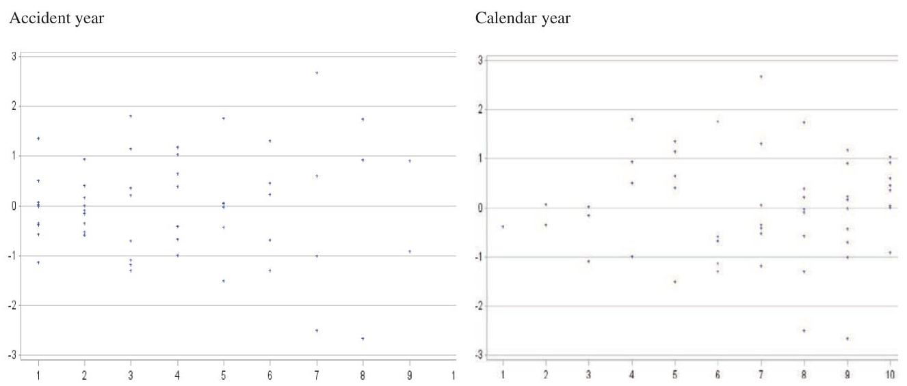

## Page 85
Figure 6-21. Actual and Expected Comparison Plot by Calendar Year

Figure 6-22. 2-D Heat Map for Cross-Classified Model

|  |  |  |  | Development |  |  |  |  |  |  |
| :--: | :--: | :--: | :--: | :--: | :--: | :--: | :--: | :--: | :--: | :--: |
| Accident | 0 | 1 | 2 | 3 | 4 | 5 | 6 | 7 | 8 | 9 |
| 1 | $98 \%$ | $100 \%$ | $100 \%$ | $104 \%$ | $113 \%$ | $87 \%$ | $96 \%$ | $92 \%$ | $100 \%$ | $100 \%$ |
| 2 | $99 \%$ | $99 \%$ | $106 \%$ | $103 \%$ | $95 \%$ | $95 \%$ | $99 \%$ | $102 \%$ | $100 \%$ |  |
| 3 | $96 \%$ | $108 \%$ | $107 \%$ | $91 \%$ | $90 \%$ | $102 \%$ | $92 \%$ | $104 \%$ |  |  |
| 4 | $97 \%$ | $103 \%$ | $96 \%$ | $97 \%$ | $103 \%$ | $111 \%$ | $111 \%$ |  |  |  |
| 5 | $95 \%$ | $107 \%$ | $100 \%$ | $100 \%$ | $97 \%$ | $100 \%$ |  |  |  |  |
| 6 | $98 \%$ | $105 \%$ | $93 \%$ | $101 \%$ | $104 \%$ |  |  |  |  |  |
| 7 | $109 \%$ | $91 \%$ | $95 \%$ | $104 \%$ |  |  |  |  |  |  |
| 8 | $106 \%$ | $90 \%$ | $105 \%$ |  |  |  |  |  |  |  |
| 9 | $103 \%$ | $97 \%$ |  |  |  |  |  |  |  |  |
| 10 | $100 \%$ |  |  |  |  |  |  |  |  |  |

deals with extensions to the cross-classified model, including the use of interactions, and the reader is referred there for further discussion concerning their use for this particular loss reserving problem.

Once interactions are included in the model (e.g., as per the discussions in Chapter 7), the modeler should then return to the tests of distributional assumptions and ensure that these are now satisfactory, making adjustments if required.
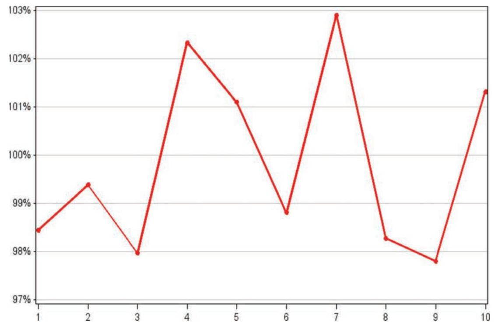

## Page 86
# 7. Model Extensions 

Chapter summary. It has often been remarked in the literature that the conventional chain ladder involves an excessive number of parameters, with a separate parameter for each accident year and for each development year. The GLM formulations of Chapter 3 follow the same parametric structure, and therefore carry the same excess of parameters.

This chapter is concerned with approaches to parameter reduction, achieved largely by means of generalized additive models. A GAM is obtained by the replacement of each of a number of categorical variates in a GLM with a parametric form that is economical in its parameters. Prime candidates for this sort of parameterization are accident year and development year trends, which are represented by categorical variates in the chain ladder.

The chain ladder assumes a multiplicative structure in the sense that the mean associated with any cell is equal to the product of a row factor and a column factor. Sometimes this model structure will not be supported by the data. The concept of calendar period effects and of interactions, required to correct the structure, is explored.

A parametric form in relation to development year also enables models to be extrapolated beyond the range of development years encompassed by the data. A smooth parametric form will ensure that the model progresses smoothly over development years, both inside and outside the bounds of the data.

Finally, models other than the chain ladder are briefly discussed. These include exposurebased models of claim numbers and payments, models that comprise of a number of sub-models and individual claim models. The chapter concludes with a brief reference to Bayesian models.

### 7.1. Chain Ladder Model Revisited

Consider the accident year parameter estimates $\ln \hat{\alpha}_{k}$ appearing in Table 5-1. Figure 7-1 plots them against accident year $k$.

There are 10 parameters plotted. However, they assume a strongly parabolic appearance, raising the question as to whether the 10 values might be adequately represented by means of a smaller number of parameters.

Consider Figure 7-2 in this context. The dotted curves here describe a confidence envelope of $\pm 2$ standard errors about the parameter estimates, where the standard errors are also obtained from Table 5-1. The solid line represents the ordinary least squares fit of a quadratic to the parameter estimates.

## Page 87
Figure 7-1. Plot of Accident Year Parameter Estimates

The quadratic curve, which is described by only 3 parameters, appears to track the parameter estimates well and does indeed lie well within the confidence envelope.

As discussed in Section 4.2.2, an excessive number of model parameters degrades a model's predictive power. A question arises therefore as to whether greater predictive power is obtained when the conventional chain ladder model is replaced by an alternative version in which the 10 accident year effects are represented by a quadratic form.

Curve fitting of this sort might have a physical motivation, or might simply amount to abstract fitting (as in the present case). In either case, one must usually be resigned to the loss of some goodness-of-fit. However, the ultimate justification for such curve fitting is reduction of prediction error as a result of reduced parameterization.

Mathematically, the use of the suggested quadratic form amounts to replacement of (3-18) in the ODP cross-classified model of Section 3.3.2 (i.e., $E\left[Y_{k j}\right]=\mu_{k j}=\exp \left(\ln \alpha_{k}+\right.$ $\left.\ln \beta_{j}\right)$ ) by the following:

$$
E\left[Y_{k j}\right]=\mu_{k j}=\exp \left(a_{0}+a_{1} k+a_{2} k^{2}+\ln \beta_{j}\right)
$$

Figure 7-2. Quadratic Fit to Accident Year Parameter Estimates
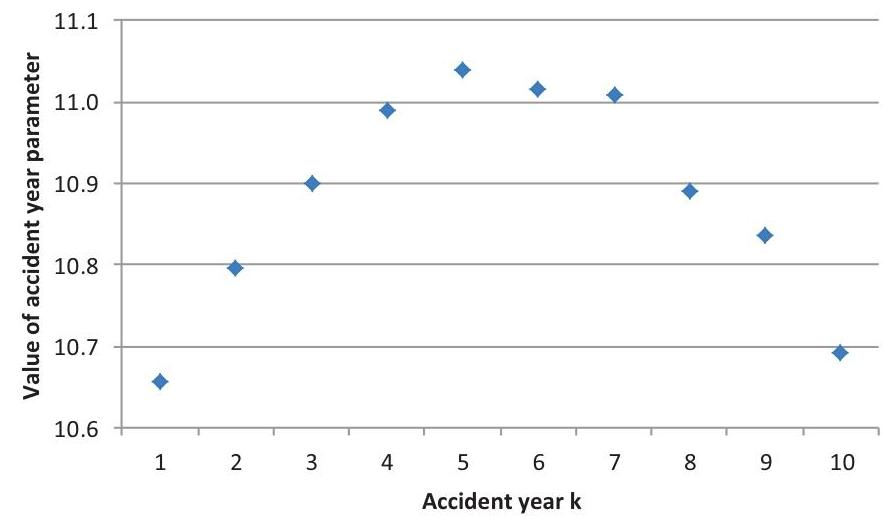
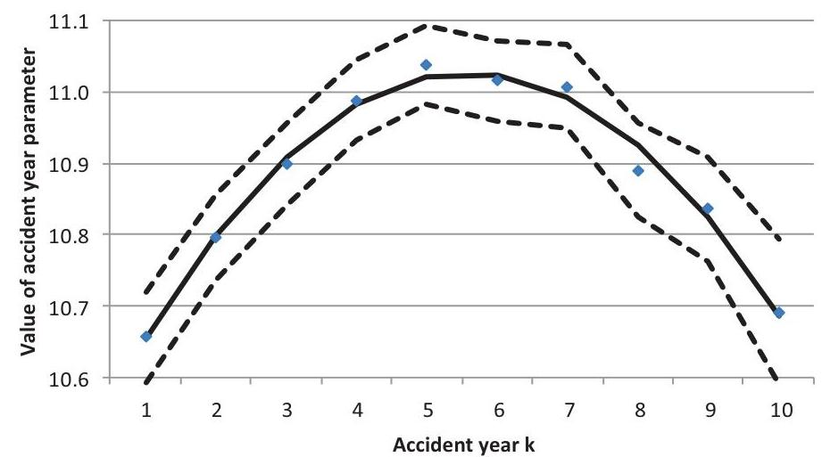

## Page 88
where there are now 12 free parameters $a_{0}, a_{1}, a_{2}, \ln \beta_{2}, \ldots, \ln \beta_{10}$. Recall that $\ln \beta_{1}$ was arbitrarily set to zero in Section 3.3.2 (see Table 3-5) due to parameter redundancy.

It is somewhat convenient to abbreviate this model a little further, thus:

$$
E\left[Y_{k j}\right]=\mu_{k j}=\exp \left(a_{1} k+a_{2} k^{2}+\ln \beta_{j}\right)
$$

where the degree of freedom lost by deletion of the parameter $a_{0}$ is compensated by restoration of $\ln \beta_{1}$ as a free parameter. Model (7-2) contains the same number (12) of parameters as (7-1) but those parameters are now $a_{1}, a_{2}, \ln \beta_{1}, \ldots, \ln \beta_{10}$.

# 7.2. Generalized Additive Models 

The model (7-2) is an example of a generalized additive model ("GAM"). A GAM is a special case of a GLM. Recall the definition of a GLM in Section 2.2.1, and in particular condition (2) of that definition:

$$
h\left(\mu_{i}\right)=x_{i}^{T} \beta
$$

with $x_{i}^{T}=\left(x_{i 1}, x_{i 2}, \ldots, x_{i p}\right)$, the vector of predictors associated with the $i$-th observation $Y_{i}$.
Now suppose that one or more of the predictors takes the form

$$
x_{i j}=u_{j}\left(z_{i}\right)
$$

where $u_{j}$ is a real-valued function, and $z_{i}$ is a vector of further covariates: $z_{i}^{T}=\left(z_{i 1}\right.$, $\left.z_{i 2}, \ldots, z_{i q}\right)$ which may include components of $x_{i}$. The $u_{j}$ might be basis functions of the type introduced in Section 2.2.2.

When the GLM is defined subject to (7-4), it is a GAM. The model defined by (7-2) provides an example. In the present case,

$$
x_{i}^{T}=\left(J_{i 1}, J_{i 2}, \ldots, J_{i, 10}, u_{1}\left(z_{i}\right), u_{2}\left(z_{i}\right)\right)
$$

where $J_{i j}$ is a $0-1$ indicator that takes the value unity if the $i$-th record relates to development year $j$ and zero otherwise (compare with the design matrix $X$ set out in Section 3.3.2);

$$
z_{i}=\left(k_{i}\right)
$$

a 1-vector in which $k_{i}$ denotes the value of $k$ associated with the $i$-th record; and

$$
u_{m}(k)=k^{m}, m=1,2
$$

The following sections will examine a few applications of GAMs to the data triangle set out in Table 1-1.

## Page 89
# 7.3. Accident Year Trend 

This model has been fitted to the data triangle set out in Table 1-1, and the resulting estimates appear in Table 7-1 under the heading "Simplified model". Those under the heading "Chain ladder" reproduce the estimates from Table 5-1 for comparison. It is evident that the simplification of the model has caused very little difference to the estimated development pattern.

The quadratic representation of the accident year effect (see (7-2)) is $10.471+$ $0.2001 k-0.0179 k^{2}$.

The simplified model has been applied to the forecast of outstanding losses, and the associated forecast error estimated by means of a parametric bootstrap. The procedure is parallel to that set out in Section 5.4.2, and its results appear in Table 7-2.

Table 7-2 may be compared with Table 5-5, which contains exactly the same information for the chain ladder model. The comparison indicates that the model simplification has affected the forecast of outstanding losses very little ( $0.4 \%$ ), but has resulted in a reduction of $8.4 \%$ in estimated forecast error. In short, the reduction in parameterization of the model has resulted in improved forecast efficiency.

Note that, in some lines of business, an exposure measure may be used as an alternative means of capturing accident period trends. This is discussed below in Section 7.8.

### 7.4. Development Pattern

Consider the development year parameter estimates $\ln \hat{\beta}_{j}$ appearing in Table 5-1. Figure 7-3 plots them against development year $j$.

There are 10 parameters plotted. However, it appears that they might be adequately represented by a linear spline with a knot at $j=7.5$, again by means of a smaller number of parameters.

Table 7-1. Parameter Estimates for Simplified Model

|  | $\ln \hat{\beta}_{j}$ |  |
| :--: | :--: | :--: |
| $j$ | Chain Ladder | Simplified Model |
| 1 | 0.000 | 0.000 |
| 2 | -0.205 | -0.206 |
| 3 | -0.747 | -0.750 |
| 4 | -1.017 | -1.015 |
| 5 | -1.452 | -1.452 |
| 6 | -1.833 | -1.830 |
| 7 | -2.140 | -2.142 |
| 8 | -2.348 | -2.353 |
| 9 | -2.513 | -2.514 |
| 10 | -2.664 | -2.661 |

## Page 90
Table 7-2. Parametric Bootstrap Estimates of Simplified Model's Forecast Error

|  | Outstanding Losses |  |  |
| :-- | --: | --: | --: |
| Accident Year | Forecast | RMSEP | CVP |
|  | $\$ 000$ | $\$ 000$ | $\%$ |
| 1989 | 3,467 | 885 | 25.5 |
| 1990 | 8,334 | 1,295 | 15.5 |
| 1991 | 14,594 | 1,659 | 11.4 |
| 1992 | 22,416 | 2,000 | 8.9 |
| 1993 | 32,340 | 2,312 | 7.1 |
| 1994 | 45,263 | 2,614 | 5.8 |
| 1995 | 62,410 | 3,076 | 4.9 |
| 1996 | 79,922 | 3,658 | 4.6 |
| 1997 | 104,895 | 4,844 | 4.6 |
| Total | 373,641 | 13,086 | 3.5 |

Consider Figure 7-4 in this context. The dotted curves here describe a confidence envelope of $\pm 2$ standard errors about the parameter estimates, where the standard errors are obtained from Table 5-1. The solid line represents the ordinary least squares fit of the following linear spline to the parameter estimates:

$$
b(j)=b_{1}(j-1)+b_{2} \max (0, j-7.5)
$$

The spline, which is described by only 2 parameters, appears to track the parameter estimates well and does indeed lie well within the confidence envelope with the exception

Figure 7-3. Plot of Development Year Parameter Estimates
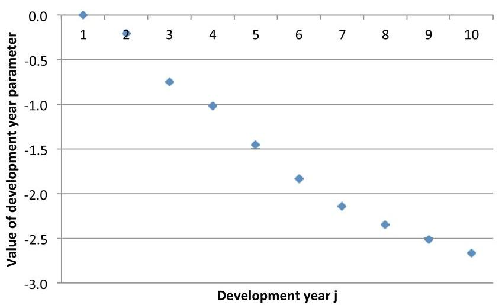

## Page 91
Figure 7-4. Fit of Linear Spline to Development Year Parameter Estimates
of the case $j=2$. This suggests a model, with the accident year simplification of Section 7.3 incorporated, of the form (7-3) with

$$
x_{i}^{T}=\left(1, k_{i}, k_{i}^{2}, j_{i}-1, \max \left(0, j_{i}-7.5\right), J_{i 2}\right)
$$

where $j_{i}$ denotes the value of $j$ associated with the $i$-th record. Note the inclusion of the unit regressor, which allows for a constant term in the regression.

Thus the final model takes the form

$$
x_{i}^{T} \beta=a_{0}+a_{1} k_{i}+a_{2} k_{i}^{2}+b_{1}\left(j_{i}-1\right)+b_{2} \max \left(0, j_{i}-7.5\right)+c J_{i 2}
$$

This model has been fitted to the data triangle set out in Table 1-1, and the resulting estimates appear in Table 7-3.

Table 7-3. Parameter Estimates for Model with Both Accident and Development Year Simplifications

| Parameter | Estimate |
| :-- | --: |
| Accident year parameters |  |
| $a_{0}$ | 10.469 |
| $a_{1}$ | 0.200 |
| $a_{2}$ | -0.018 |
| Development year parameters |  |
| $b_{1}$ | -0.358 |
| $b_{2}$ | 0.236 |
| $c$ | 0.155 |
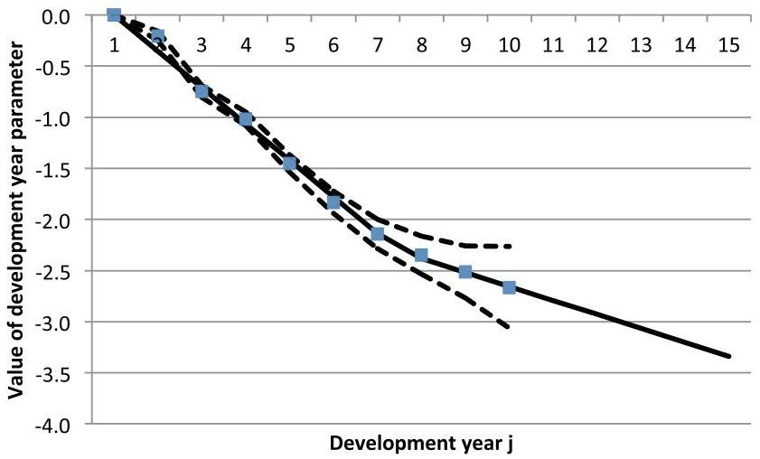

## Page 92
Table 7-4. Parametric Bootstrap Estimates of Forecast Error for Model with Both Accident and Development Year Simplifications

|  | Outstanding Losses |  |  |
| :-- | --: | --: | --: |
| Accident Year | Forecast | RMSEP | CVP |
|  | $\$ 000$ | $\$ 000$ | $\%$ |
| 1989 | 3,542 | 776 | 21.9 |
| 1990 | 8,410 | 1,295 | 15.4 |
| 1991 | 14,490 | 1,678 | 11.6 |
| 1992 | 22,201 | 1,963 | 8.8 |
| 1993 | 32,572 | 2,303 | 7.1 |
| 1994 | 45,660 | 2,658 | 5.8 |
| 1995 | 61,592 | 3,088 | 5.0 |
| 1996 | 79,975 | 3,679 | 4.6 |
| 1997 | 104,959 | 4,977 | 4.7 |
| Total | 373,403 | 13,248 | 3.5 |

This model has been applied to the forecast of outstanding losses, and the associated forecast error estimated by means of a parametric bootstrap. The procedure is parallel to that set out in Sections 5.4.2 and 7.3, and its results appear in Table 7-4.

The bootstrap estimates of prediction error in Table 7-4 are comparable with those in Table 7-2 for the model that contained only the accident year simplification. It is seen that the development year simplification of the model has caused:

- once again, virtually no change in the forecast of outstanding losses; and
- just a slight increase in the associated CVP ( $3.50 \%$ to $3.55 \%$ ).

Whether one chooses this model over the one developed in Section 7.3 is largely a matter of taste. The model of the present section reduces the number of model parameters from 12 ( 19 originally for the chain ladder) to 6 , but without any improvement (and, technically, a slight deterioration) in forecast quality. However, it does express the development pattern in parametric form, leading to a smooth tail as well as forming a basis for tail extension, so it may be preferred on this basis. Tail smoothing and extension are discussed further in Section 7.7.

# 7.5. Calendar Year Trend 

The models discussed up to this point have considered accident and development period effects only, or alternatively, the rows and columns of triangles laid out in the manner of Table 1-1. There is a third direction in this triangle-the diagonal or, equivalently, the calendar period-that should be considered.

## Page 93
In practice, calendar year trends are common in insurance data for a number of reasons. Some examples are given below:

- Many lines of business have a clear relationship with economic inflation. For example, changes in wage inflation will impact lines of business such as workers compensation or auto third party bodily injury claims as much of the cost of these claims consists of either income replacement or damages, reflecting pre-injury earnings in either case;
- Award precedents set by court decisions or other environmental change will often apply from a specific point in time, regardless of when the claim occurred;
- Changes in claims management departments such as expansion or contraction of staff numbers may impact the rate at which all claims are closed, which leads to a calendar effect on the insurance data.

A common method for dealing with economic inflation is to adjust the data so that all payments are in the same dollar values, e.g., the dollar values of the valuation date. In this case, the model forecasts will then be in the dollar values of the valuation date, so will need to be adjusted for future economic inflation. This has the advantage of producing forecasts with explicit economic assumptions, rather than an implicit assumption that the rate of economic inflation will be similar to that of the past, as is the case for the chain ladder. This may be useful for scenario tests, or if future rates are expected to be different to past rates, at least in the short term. Furthermore, for a company with multiple lines of business, carrying out a valuation in constant dollar values means that the consistent rates of future economic inflation may be applied across all LOBs. This is helpful both for scenario testing and for estimating variability of reserves since it introduces some correlation (that relating to economic variation) across the different LOBs.

Calendar period changes (both positive and negative) net of changes due to economic inflation are often referred to as superimposed inflation ("SI"), terminology introduced by Benktander (1979) and discussed in various parts of Taylor (2000). Typically SI is variable over time. For example, payments might increase at rates beyond economic inflation for a number of years, before measures are put in place to curtail the increase or even reduce claim size. This can lead to nil or even negative SI, which may last for some time, before other factors act to increase claim size once more.

Unmodeled calendar period effects can lead to distortions in the claim size models which would show up in the calendar period and triangular heat map diagnostics discussed in Chapter 6. If the diagnostics suggest calendar period effects, then as a first step, the modeler may wish to consider whether there is a natural economic inflation series for this line of business and, if so, adjust the past claim amounts to the valuation date. If unmodeled effects are still apparent after this step (or if there is no natural series to use), then the modeler should consider including calendar period effects in the model.

Adding calendar period effects to a model such as the cross-classified model must be done with due care. Accident, development and calendar period terms are not independent

## Page 94
covariates-knowledge of two of these determines the third. Thus, for the cross-classified model, replacing (3-18) with

$$
\mu_{k j}=\exp \left(\ln \alpha_{k}+\ln \beta_{j}+\ln \gamma_{k+j-1}\right)
$$

is inappropriate since the collinearity of the accident, development and calendar terms $\left(\gamma_{k+j}\right)$ means that there is no unique solution to the model, and any solutions returned by GLM software will be unstable.

Instead the modeler should impose a simple structure on the calendar period effects, based on examination of the model diagnostics. For example, if SI appears to progress at a constant rate over the first $h$ diagonals and to be flat thereafter, then (3-18) could be replaced by

$$
\mu_{k j}=\exp \left(\ln \alpha_{k}+\ln \beta_{j}+\min (h, k+j-1) \varphi\right)
$$

In practice, selection of an appropriate function should be based on model diagnostics, business knowledge and pragmatism; any calendar period trend will need to be extrapolated into the future for forecasting purposes, so the modeled trend must take this into account.

Recall that, although the Mack model formulation of the chain ladder may appear to be a development year only model, in fact the most recent diagonal of payments in the Mack model functions as accident period effects (see Section 3.2), so the same cautionary note about the addition of calendar period effects applies equally to Mack as to the cross-classified model.

# 7.6. Interactions 

Consider model (7-10). It contains some terms that depend on accident year and others that depend on development year. This means, for example, that the relation between different development years is independent of accident year. In chain ladder, parlance, age-to-age factors are constant across accident years.

Similarly, the relation between different accident years is independent of development year. In these circumstances, the individual components of the linear response are called main effects.

In some cases, however, the data may indicate that some development year effects depend on accident year. Consider, for example, Figure 7-5, which displays a heat map for model (7-10).

Features of this map are:

- for development year 1, a distinct area of blue in the earlier accident years;
- for development year 2, a distinct area of pink in the earlier accident years;
- for development year 3, a possible progression from pink to blue with increasing accident year;
- for development year 4, a preponderance of pink over the whole set of accident years.

In effect, it appears that the payment pattern has altered. Traditional actuarial methods typically deal with this by calculating chain ladder factors based on recent diagonals

## Page 95
Figure 7-5. Heat Map for Model with Both Accident and Development Year Simplifications

| Accident year | Development year |  |  |  |  |  |  |  |  |  |
| :--: | :--: | :--: | :--: | :--: | :--: | :--: | :--: | :--: | :--: | :--: |
|  | 1 | 2 | 3 | 4 | 5 | 6 | 7 | 8 | 9 | 10 |
| 1988 | $99 \%$ | $101 \%$ | $98 \%$ | $111 \%$ | $112 \%$ | $84 \%$ | $97 \%$ | $96 \%$ | $100 \%$ | $97 \%$ |
| 1989 | $99 \%$ | $99 \%$ | $102 \%$ | $109 \%$ | $93 \%$ | $90 \%$ | $99 \%$ | $106 \%$ | $99 \%$ |  |
| 1990 | $95 \%$ | $107 \%$ | $102 \%$ | $96 \%$ | $88 \%$ | $97 \%$ | $92 \%$ | $107 \%$ |  |  |
| 1991 | $97 \%$ | $103 \%$ | $94 \%$ | $104 \%$ | $102 \%$ | $107 \%$ | $113 \%$ |  |  |  |
| 1992 | $97 \%$ | $108 \%$ | $99 \%$ | $108 \%$ | $97 \%$ | $98 \%$ |  |  |  |  |
| 1993 | $97 \%$ | $104 \%$ | $89 \%$ | $106 \%$ | $101 \%$ |  |  |  |  |  |
| 1994 | $110 \%$ | $92 \%$ | $93 \%$ | $112 \%$ |  |  |  |  |  |  |
| 1995 | $102 \%$ | $87 \%$ | $99 \%$ |  |  |  |  |  |  |  |
| 1996 | $105 \%$ | $98 \%$ |  |  |  |  |  |  |  |  |
| 1997 | $101 \%$ |  |  |  |  |  |  |  |  |  |

only, e.g., the most recent 3 or 5 diagonals, etc. Essentially this corresponds to one model for older diagonals (even though the chain ladder factors may not be calculated) which is then modified for more recent experience and for projection.

The approach taken by the GLM is similar in principle in that the model is adapted to better fit the changed experience. The above features suggest testing the following additional terms in the model's linear response, listed in the order of the above dot points to which they relate:

$$
d_{1} J_{i 1} K_{i, 1-6}+d_{2} J_{i 2} K_{i, 1-6}+d_{3} J_{i 3} k+d_{4} J_{i 4}
$$

where the variate $K_{i, 1-6}$ is a $0-1$ indicator that takes the value unity if the $i$-th record relates to an accident year in the range 1 to 6 , and zero otherwise (compare with the definition of $J_{i j}$ in Section 7.2).

When these terms are added to (7-10), the complete model becomes (with a slight re-labelling and re-ordering of parameters for logicality):

$$
\begin{aligned}
x_{i}^{T} \beta & =a_{0}+a_{1} k_{i}+a_{2} k_{i}^{2}+b_{1}\left(j_{i}-1\right)+b_{2} \max \left(0, j_{i}-7.5\right) \\
& +c_{1} J_{i 2}+c_{2} J_{i 4}+d_{1} J_{i 1} K_{i, 3-6}+d_{2} J_{i 2} K_{i, 3-6}+d_{3} J_{i 3} k
\end{aligned}
$$

When this model is fitted to the data, the parameter estimates are as in Table 7-5. All parameters are significant at levels well below $5 \%$.

The number of parameters has grown to 10 , so there is a need to ensure that the additional model terms add to the predictive efficiency of the model.

A comparison of the CVP with that in Table 7-4 shows a substantial reduction of $17 \%$ (see Table 7-6). The CVP is now $23 \%$ below that of the conventional chain ladder model (see Table 5-5).

The information criteria AIC and BIC were introduced in Section 4.3, while the related measure, GCV, was introduced in Section 4.4. The progression of their values through the sequence of models developed in the present chapter is set out in Table 7-7. The corresponding progression of CVPs is also shown for comparison.

## Page 96
Table 7-5. Parameter Estimates for Model with Interactions

| Parameter | Estimate |
| :-- | :--: |
| Accident year parameters |  |
| $a_{0}$ | 10.4900 |
| $a_{1}$ | 0.2066 |
| $a_{2}$ | -0.0183 |
| Development year parameters |  |
| $b_{1}$ | -0.3685 |
| $b_{2}$ | 0.2720 |
| $c_{1}$ | 0.0375 |
| $c_{2}$ | 0.0528 |
| Interaction parameters |  |
| $d_{1}$ | -0.0671 |
| $d_{2}$ | 0.1273 |
| $d_{3}$ | -0.0113 |

Table 7-6. Parametric Bootstrap Estimates of Forecast Error for Model with Interactions

|  | Outstanding Losses |  |  |
| :-- | --: | --: | --: |
| Accident Year | Forecast | RMSEP | CVP |
|  | $\$ 000$ | $\$ 000$ | $\%$ |
| 1989 | 3,630 | 569 | 15.7 |
| 1990 | 8,557 | 935 | 10.9 |
| 1991 | 14,563 | 1,203 | 8.3 |
| 1992 | 22,193 | 1,418 | 6.4 |
| 1993 | 32,505 | 1,677 | 5.2 |
| 1994 | 45,771 | 2,018 | 4.4 |
| 1995 | 62,998 | 2,459 | 3.9 |
| 1996 | 79,601 | 3,079 | 3.9 |
| 1997 | 101,742 | 4,094 | 4.0 |
| Total | 371,559 | 10,907 | 2.9 |

## Page 97
Table 7-7. AIC, BIC and GCV for Various Models

| Model | AIC | BIC | GCV | CVP |
| :-- | :--: | :--: | :--: | :--: |
|  |  |  |  | $\%$ |
| Conventional chain ladder (ODP   cross-classified form) | $-509,392$ | $-509,354$ | $6,685,428$ | 3.8 |
| Accident year simplification only | $-509,400$ | $-509,376$ | $5,075,351$ | 3.5 |
| Both accident and development   year simplifications: |  |  |  |  |
| without interactions | $-509,397$ | $-509,385$ | $4,311,874$ | 3.5 |
| with interactions | $-509,441$ | $-509,421$ | $1,733,202$ | 2.9 |

# Notes: 

- AIC and BIC are defined in Section 4.3. The log likelihood used in their calculation is $\sum_{i=1}^{n} w_{i}\left(y_{i} \log \hat{y}_{i}-\hat{y}_{i}\right) / \theta$ where $w_{i}=1$ for all observations and the scale parameter is held constant at the value from the interactions model. The scale parameter is held constant to prevent changes in the scale from distorting the measurement of changed model fit.
- GCV is defined in Section 4.4.
- The values of AIC, BIC and GCV may differ depending on the statistical package. For AIC and BIC, this is because different packages may or may not include an additive constant (depending on the input data only) in the log likelihood expression. Thus the relativities of the scores, rather than their absolute values, are relevant. Additionally, the modeler should satisfy themselves that the measures are calculated appropriately in their package of choice.

The information criteria and GCV were introduced in Sections 4.3 and 4.4 as indicators of model predictive error. All three quantities show an improvement when accident year simplification is introduced and considerable improvement at the introduction of interactions, in line with CVP. On the other hand, the message is more mixed at the introduction of development year simplifications-AIC increases somewhat, BIC and GCV fall somewhat-while CVP remains almost unchanged. This reflects different levels of penalty placed on numbers of parameters-BIC and GCV penalize number of parameters more and therefore the trade-off between worse model predictive accuracy and fewer parameters is acceptable to these measures and not to AIC with its weaker penalty.

Empirical experience indicates that this sort of perverse behavior is not uncommon. In fact, while the information criteria are reasonable indicators of CVP behavior in the case of incremental changes to a model (such as the addition of interactions), they are frequently suspect in the case of wholesale changes (such as the shift from a categorical to a parametric representation). GCV, on the other hand, aligns better with CVP behavior for this particular data set.

## Homoscedasticity

The concepts of homoscedasticity and heteroscedasticity were introduced in Sections 2.2.4 and 2.2.5, and the need for ensuring the former before the acceptance of a model discussed in Section 2.2.5.

The above model including interactions is examined for homoscedasticity in Figure 7-6, which plots deviance residuals against accident year, and Figure 7-7, which plots them against development year. Reasonable homoscedasticity appears to have

## Page 98
Figure 7-6. Residual Plot by Accident Year for Model Including Interactions

Figure 7-7. Residual Plot by Development Year for Model Including Interactions
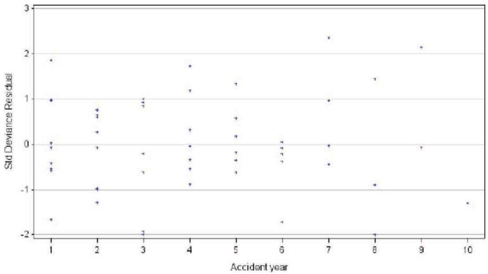
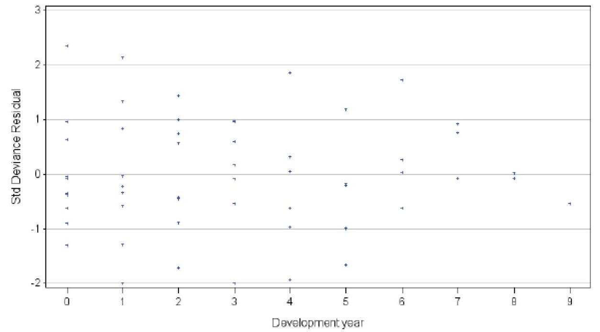

## Page 99
been achieved, though perhaps with a slight hint of tapering variance as development year advances beyond about 6 . This matter is not pursued further here.

# 7.7. Tail Smoothing and Extension 

### 7.7.1. Tail Extension

Note that the range of development year has been extended to $j=15$ in Figure 7-4. The figure indicates that the parametric form fitted to development year may be extended beyond the range of the data, providing a means of tail extension.

By (7-14), the linear response $x_{i}^{T} \beta$ is linear in $j \geq 8$ for fixed $k$, with gradient $b_{1}+$ $b_{2}=-0.097$ (by Table 7-5). According to this model, the linear response decreases by 0.122 from each development year to the next in the tail.

The link function in this example is exponential:

$$
E\left[Y_{k j}\right]=\mu_{k j}=\exp \left(x_{i}^{T} \beta\right)
$$

(see (7-2)), which implies that $E\left[Y_{k j}\right]$ decreases by a factor of $\exp (-0.097)=0.908$ from each development year to the next in the tail; the tail is pure exponential.

It is necessary to recognize this form of tail extension for what it is, namely an extrapolation beyond the range of the data. In other words there is no direct evidence for the behavior imputed to the tail beyond development year 10, and one must accept the risks of this imputation.

On the other hand, the linear behavior of the linear predictor over the range $j=8$, 9,10 gives reasonable cause to believe that the linearity is likely to persist for the next few values of $j$. The extrapolation becomes steadily more speculative as one progresses to higher development years.

### 7.7.2. Tail Smoothing

One aspect of the chain ladder that is often problematic is irregularity in the progression of estimated age-to-age factors for the higher development years. As $j$ approaches $J$ in the case of a triangular data set $(J=K)$, the number of observations contributing to the estimate $\hat{f}_{j}$ decreases, until at $j=J-1$ the estimator (1-8) depends on only the two observations $X_{1, j-1}$ and $X_{1, j}$.

It is evident that parameter estimation on the basis of such a small sample is liable to lead to an estimate with a large standard error. A more reliable estimate might be obtained by the fit of a parametric form (such as (7-8)) to the higher development years $j$.

As it happens, this was unnecessary in the present example. The development year effects delivered by the unmodified chain ladder (see Table 3-1 or Figure 7-3) were quite smooth. However, other numerical examples would not have yielded such a fortunate result, and a device for smoothing the age-to-age factors for the higher development years would have been beneficial.

An example of this can be found in Table 3.1 of Taylor (2000), where the estimated higher age-to-age factors are as set in Table 7-8.

## Page 100
Table 7-8. An Example of Non-Smooth Age-to-Age Factors

| Development   Year | Estimated Age-to-Age   Factor |
| :--: | :--: |
| 10 | 1.028 |
| 11 | 1.014 |
| 12 | 1.009 |
| 13 | 1.008 |
| 14 | 1.009 |
| 15 | 1.001 |
| 16 | 1.002 |
| 17 | 1.001 |

# 7.8. Exposure-Based Methods 

It is sometimes the case that there exists a time series $\left\{e_{k}\right\}$ by accident period to which the claims experience of accident period $k$ is expected to be at least roughly proportional. For example, the average number of motor vehicle damage claims in a year would, all else being equal, be expected to be proportional to the number of vehicles insured in that year.

If such a time series can be identified then it may be used to improve the model through the additional (known) time series data. This time series is generally referred to as the exposure, and may be incorporated into the model by (in the case of the crossclassified ODP model) substituting $e_{k}$ for $\alpha_{k}$ in (3-18):

$$
\mu_{k j}=\exp \left(\ln e_{k}+\ln \beta_{j}\right)
$$

Note that a crucial difference between (3-18) and (7-16) is that $\left\{e_{k}\right\}$ is a known series whereas $\left\{\alpha_{k}\right\}$ is a series of parameters and must be estimated. In statistical parlance, $\ln$ $e_{k}$ is an offset in the GLM.

Further, it may be shown (Frees and Derrig, 2014, Section 18.3.2) that the inclusion of an exposure offset in a log link model (such as the cross-classified model) results in the remainder of the model terms producing an estimate per unit of the exposure. For example, in a model of ultimate motor vehicle damage claim numbers, with number of vehicles as an offset, the model produces an estimate of claim frequency per vehicle.

As noted in Frees and Derrig (2014), there may be accident period effects in addition to the offset. Thus, (3-18) could be replaced by:

$$
\mu_{k j}=\exp \left(\ln e_{k}+\ln \alpha_{k}+\ln \beta_{j}\right)
$$

Simplifications to accident and development period effects as discussed in Sections 7.3 to 7.7 above apply as before, the only difference being that they would now operate per unit of exposure.

## Page 101
It is natural to think of exposure-based models for estimation of the ultimate numbers of claims reported in each accident period (i.e., including IBNR). However, such models are also useful for claim payments. Here, time series based on numbers of claims may be incorporated as an exposure measure to inform the payments model. Within Australian general insurance practice, such models are often used. These models include:

- Payments per claim incurred model ("PPCI"): $\left\{e_{k}\right\}=$ ultimate number of claims in accident period $k$. This model structure is conceptually very similar to the chain ladder model discussed in this monograph, except that the modeled payments are standardized for different numbers of claims incurred in each year. For lines of business with volatile numbers of claims, but similar average payments per claim, this model may be helpful.
- Payments per claim finalized model ("PPCF"): Here the time series varies by both accident and development period and is $\left\{e_{k j}\right\}=$ number of claims closed in accident period $k$ and development period $j$. This model is suited to those lines of business where claims tend to settle as lump sums with closure and payment happening in the same cell of the triangle. In this case, the payments would be expected to relate to the number of claims closed in that cell. For example it may be useful for auto bodily injury claims or other liability claims.
- Payments per active claim ("PPAC"): As with the PPCF model, the time series varies by both accident and development period. In this case, $\left\{e_{k j}\right\}=$ number of active claims during accident period $k$ and development period $j$. This model is suited to those lines of business where claims have ongoing payments for a number of years. An example would be weekly compensation payments from Workers' Compensation insurance.

Further discussion of the PPCI and PPCF models is given in Taylor (2000) and, in a GLM context, in Frees and Derrig (2014), and the interested reader is directed there. The PPAC model, which may also be referred to as the Payments per Claim Handled ("PPCH") model is discussed in Sawkins (1979) and in Taylor (1986).

Both references given above for the PPCF model discuss the concept of operational time, where development period in a model is replaced by the proportion of claims that have finalized to date. This is a useful tool in situations where the rates of claims closure are not constant over time, perhaps due to changes in claims departments or in the wider environment. Operational time may easily be incorporated into a GLM as outlined in Frees and Derrig (2014).

# 7.9. Beyond a Single Triangle 

The exposure measure for a model of ultimate claim numbers is usually a known quantity such as number of vehicles, policy years or wages (e.g., for workers compensation claims). However, the exposure-based payments models rely on counts of claim numbers (ultimate, closed, active) which are not fully known in advance. For example, numbers of claims in recent years may need to be adjusted for IBNR (Incurred but Not Reported) claims. Numbers of claims closed and active claims may be known in the past, but future numbers will require estimation.

## Page 102
Consequently, implementations of the PPCI model may involve two separate models:

1. A model of the ultimate number of claims so that IBNR numbers may be estimated;
2. An exposure-based model of the average payments per claim incurred.

Similarly, implementation of the PPCF model may require three separate models:

1. A model of the ultimate number of claims so that IBNR numbers may be estimated;
2. A model of the rate of closure of claims to allow the timing of future claims finalizations to be estimated;
3. An exposure-based model of the average payments per claim closed.

The prediction error of the PPCF model is the compound of the prediction errors of its component sub-models, and similarly for other models that consist of a number of submodels. The decision on whether to use models such as these must take into account the additional prediction error introduced by each component and whether this is more than offset by the model's improved representation of the data. Detailed examination of this point may be found in Taylor and Xu (2016), while Taylor (2000) and Frees and Derrig (2014) provide more detail on implementing these models.

The double chain ladder (Martínez Miranda, Nielsen and Verrall, 2012) is another multi-model approach to the estimation of claims reserves. As the name suggests, two chain ladder models are used, one for reported claim numbers and the other for claim payments.

# 7.9.1. Bootstrapping a Compound Model 

Bootstrapping a model such as the PPCI or PPCF is a straightforward extension of the bootstrap for a single triangle model. For each sub-model, $n$ bootstraps are carried out. In the case of the average payments sub-model of the PPCF outlined above, the results of bootstrap $b$ of this model are combined with the bootstrapped ultimate claim numbers from the $b$-th bootstrap of sub-model 1 and the claim closure pattern that results from the $b$-th bootstrap of sub-model 2. Further discussion of multiple bootstraps such as these is given in Taylor and Xu (2016).

Note that this process does not allow for correlations between the models apart from those that result from the forecasted value. For example, an increase in claim notifications might cause the finalization rate to slow down due to claims managers having greater numbers of claims to manage. Such an impact will not be captured in the bootstrap process outlined above. However, this type of change is arguably an aspect of model error (Section 4.5), and should be included in the allowance for that error. Scenario testing may also assist in estimating the impacts of such change.

### 7.10. Individual Models

Up to this point, the models discussed have assumed that the data are available in the form of triangles, such as that in Table 1-1. However, the data actually held by an insurance company will typically be in unit record form, with a considerable amount of information associated with each claim such as claimant information (date

## Page 103
of birth, information relevant to the particular policy type such as age, employment, earnings, etc.), claim information (peril, date of accident, notification, finalization, etc.) and transactional details on payments to date. The use of highly summarized triangles, rather than the individual data detail dates back to general insurance practice before the availability of modern computing power, and the need to summarize claims experience into a convenient form for analysis.

This restriction no longer applies, and it is possible to consider the claims experience at an individual claims level. Portfolios may contain thousands or even hundreds of thousands of claims, each associated with a possibly large number of explanatory variables. Contrast this with the small number of observations in a yearly triangle, which is likely to eliminate a considerable amount of useful predictive information. In more technical language, the triangle may not be a sufficient statistic for the mass of detail available.

Currently, there are typically two broad classes of model used in reserving and related problems:

- Aggregate or macro-models: models applied to aggregate data summarized in arrays of triangular, or some other, shape, such as those described above-the chain ladder, cross-classified model, PPCI, PPCF, etc. The aggregated data is typically aggregated over accident and development periods; and
- Individual claim, micro-models or granular models: as the name suggests these are applied to individual claim data or to data summarized at a granular level.

The use of individual claim rather than aggregate models may lead to more efficient models.

The application of GLMs to individual claims data proceeds in much the same way as to summarized triangular data. For example, a model with accident and development period effects such as (3-18) can be fitted to individual data. The difference lies in the design matrix, X , where each row corresponds to an individual observation rather than to a triangle cell as it does in Section 3.3.2. Fitting trends by accident, development and calendar periods and model validation proceeds in much the same way as before, the difference being that there are many more data points to inform the modeling process.

Merely fitting the same GLM to individual claim data as was fitted to the aggregate data (triangle) may not produce a markedly different model. However, the use of individual claims data opens up the possibility of using a number of claimant and claim related data as explanatory variables to refine estimates of average claim size. Taylor, McGuire and Sullivan (2008) classify explanatory variables as follows:

- Static variables: constant over the life of a claim (e.g., gender, pre-injury earnings);
- Dynamic variables: these may change over the life of a claim. Dynamic variables may be further categorized as:
- Time variables: these relate to the passage of time and are therefore future values are known with certainty (e.g., development period, calendar period);
- Unpredictable variables: future changes in these values are not predictable with certainty (e.g., time until a claim closes, spells off work).

## Page 104
It is evident that, if any unpredictable variables are included in a model, then any forecast of that model will require forecasts of these variables. As noted in Section 7.9, which discusses the same concept for aggregate data models, any decision on the inclusion of an unpredictable variable in a model must offset the increase to the prediction error from use of this variable due to its stochastic nature against the resulting decrease in prediction error due to more accurate modeling.

Consequently, individual reserving models tend to lie on a spectrum from those models with time variables only to models with all types of predictors including unpredictable variables.

Taylor and McGuire (2004) discuss an individual claims reserving model that lies towards the simpler end of the spectrum. This is a model of the average size of auto bodily injury claims, which depends on the time variable accident period and functions of the unpredictable variable, development time until closure of a claim.

McGuire (2007) describes an update to this model where the use of claim severity is found to greatly increase the predictive power of the model. Micro-models are also discussed in detail by Pigeon, Antonio and Denuit (2013) and Antonio and Plat (2014).

At the other end of the spectrum lies the class of individual claims models referred to as Stochastic Case Estimate ("SCE"). These are intended to provide estimates of ultimate costs of individual claims that are alternatives to the physical or manual case estimates assigned by claims experts. As such, a model with high discriminatory power is to be preferred and in general, this is achieved by considering a large number of predictors. Further details on the construction of SCE models may be found in Taylor and Campbell (2002), Brookes and Prevett (2004) (which both relate to Australian workers' compensation insurance) and Taylor, McGuire and Sullivan (2008) which applies an SCE to US medical malpractice. The latter paper also includes some discussion of applying a bootstrap to such models.

# 7.11. Bayesian Models 

Although Bayesian models and related methods such as Markov Chain Monte Carlo ("MCMC") are beyond the scope of this monograph, it is noted that they are increasingly used for stochastic reserving models.

Each GLM considered to this point of the present monograph is non-Bayesian in that its parameters are treated as fixed, though unknown, quantities. It can be transformed into a Bayesian model by representing each unknown parameter as a random quantity deriving from a particular statistical distribution. Put in an alternative manner, a Bayesian model for a particular quantity seeks to estimate the posterior distribution of that quantity based on prior distributions for the model parameters and the likelihood based on observed data.

In many ways, the Bayesian paradigm seems a natural fit to insurance-type problems. The prior distributions of the parameters may be used to codify expert knowledge or $a$ priori expectations, and combine this in an objective manner with emerging experience. The similarities with credibility theory are apparent.

For many years, Bayesian analysis was limited for computational reasons; users were forced to restrict themselves largely to combinations of prior distributions and

## Page 105
likelihoods that led to closed form analytic solutions (conjugate priors). That changed with the advent of MCMC methods into the wider statistical community, which enabled simulation of full distributions from any posterior distribution. For insurance problems, MCMC enables the modeler to combine a priori knowledge with emerging experience to produce a full distribution of the stochastic reserves.

There have been many papers in the actuarial literature discussing Bayesian models and MCMC, of which a small sample is referenced here. Verrall (2000, 2004), England and Verrall (2002, 2006), England and Verrall (2006), Wüthrich (2007), England, Verrall and Wüthrich (2012) and Taylor and Xu (2016) present various Bayesian models, most of them Bayesian versions of the chain ladder. Scollnik (2001 and 2002), Ntzoufras and Dellaportas (2002), Meyers and Shi (2011), amongst others, describe the implementation of MCMC for insurance data.

All modeling approaches discussed up to this point consist of specification of a particular model, possibly Bayesian but always with a fixed number of parameters, and then estimation of those parameters. More recently, reversible jump MCMC ("RJMCMC") methodology has been introduced as a framework containing a complete family of models with differing numbers of parameters. The calibration step then consists of selection of a specific model from the family, as well as estimation of its parameters. A strength of RJMCMC is that it enables the modeler to consider a number of different models simultaneously. For example. Ntzoufras, Katsis and Karlis (2005) use RJMCMC to fit and choose between different models for claims count data, while Verrall and Wüthrich (2012) and Verrall, Hössjer and Björkwall (2012) consider the smoothing of the development period curve in a Bayesian ODP model, allowing RJMCMC to choose the cut-off development period at which parametric functions are used rather than the individual development period parameters.

## Page 106
# 8. Conclusion 

This monograph commenced with the application of the conventional chain ladder algorithm to a data set (Section 1.5). The application was non-stochastic, as is so often the case in practice.

Certain stochastic models were then identified as producing precisely the same forecast as the conventional algorithm (Section 3.3). The stochastic view regards the quantum of outstanding losses as a random variate, and the forecast as an estimate of the mean value of that variate. The stochastic models enable the estimation of the entire distribution of outstanding losses.

The "chain ladder algorithm", as defined here, is absolutely rigid, with no scope for variation according to any eccentricities in the data to which it is applied. In practice, actuaries typically make a number of adjustments to it, such as calibration of the model on the basis of data of only recent years, or limiting in some way the influence of outlying observations.

It was shown (Section 3.4) that some of these adjustments could be formulated within the stochastic models. In consequence, the stochastic model could be made to parallel those used in practice while retaining its ability to estimate the entire distribution of outstanding losses.

Finally, Chapter 7 examined variations of the model that could not be made within the conventional chain ladder framework, but only within the formal stochastic model formulation. These variations explored the much discussed matter of whether or not the conventional chain ladder is over-parameterized, with the degradation of predictive power that comes with over-parameterization.

These model variations took two forms. First, the manner in which accident year was represented as influencing expected paid losses in individual cells of the claim triangle was changed from a separate factor for each accident year to a parametric function of accident year. For example, it was found possible to represent the effects of the 10 separate accident years by a function of only 3 parameters, rather than the 10 parameters required by the conventional chain ladder. The parameterization of development year was similarly reduced.

The second form of model variation introduced was the introduction of interactions. The conventional chain ladder assumes that age-to-age factors are independent of accident year. Frequently, this assumption is violated by data triangles encountered in practice. Violations may be highly localized, affecting only a handful of cells, or they may consist of longer term systematic changes, such as trending age-to-age factors.

## Page 107
In any event, if model interactions are warranted but ignored in the modeling (such as inevitably occurs in the application of the conventional chain ladder), then estimates of accident and development year effects will be distorted.

These changes produce two beneficial results. First, they improve the goodness-of-fit of the model. Second, they reduce the associated prediction error. The end result observed in Table 7-6 was a $17 \%$ reduction in prediction error solely by virtue of inclusion of the interactions.

The final prediction error was $23 \%$ less than that associated with the conventional chain ladder. It is emphasized that all of these modifications of the conventional chain ladder model are achievable within a GLM framework but not by the conventional approaches that depend essentially on row and column sums or averages.

The chapter concluded by giving an overview of models beyond the chain ladder, discussing exposure-based models (both as a single model, or a model consisting of a number of sub-models in cases where claim numbers form the exposure) and micro- (or granular or individual claim) models which include Stochastic Case Estimate models. A brief introduction to Bayesian models was also provided for the reader's interest.

In summary then, it has been shown that the chain ladder, together with some common variations of it, can be expressed in GLM form. Then it has been further shown that the GLM structure may be extended to a more statistically efficient model in ways that are not achievable without the GLM (or perhaps some other model of a similar level of sophistication).

In the process one has progressed from a heuristic algorithm to a fully stochastic model with diagnostics that are adequate to determine whether that model is a reasonable representation of the data. Further, since the model is fully stochastic, it is capable of producing the full stochastic properties of its forecasts, including prediction error, quantiles, etc.

That is, the GLM is capable of anything of which the conventional chain ladder is capable, but the GLM is capable of many things of which the conventional chain ladder is not.

## Page 108
# References 

Antonio, K., and R. Plat. 2014. "Micro-Level Stochastic Loss Reserving for General Insurance." Scandinavian Actuarial Journal 2014 (7): 649-669.
Augustin, N., E.-A. Sauleau, and S. Wood. 2012. "On Quantile Quantile Plots for Generalized Linear Models." Computational Statistics and Data Analysis 56 (8): $2404-2409$.
Benktander, G. 1979. "Inflation and Insurance." In Kahane, Y. 1979. New Frontiers in Insurance: Theory and Practice. Erhard Center for Higher Studies and Research in Insurance, The Graduate School of Management, Tel Aviv University, Israel.
Bornhuetter, R. L., and R. E. Ferguson. 1972. "The Actuary and IBNR," Proceedings of the Casualty Actuarial Society 59: 181-195.
Brookes, R., and M. Prevett. 2004. "Statistical Case Estimation-An Overview of the NSW WorkCover Model." Institute of Actuaries of Australian Xth Accident Compensation Seminar. http://actuaries.asn.au/Library/Statistical_Brookes_Prevett_PPT.pdf.
Buchwalder, M., H. Bühlmann, M. Merz, and M.V. Wüthrich. 2006. "The Mean Square Error of Prediction in the Chain Ladder Reserving Method (Mack and Murphy Revisited)." ASTIN Bulletin 36: 521-542.
Cox, D. R., and D. V. Hinckley. 1974. Theoretical Statistics. London: Chapman and Hall.
Efron, B. 1979. "Bootstrap Methods: Another Look at the Jackknife." Annals of Statistics 7: 1-26.
England, P. D., and R.J. Verrall. 2002. "Stochastic Claims Reserving in General Insurance." British Actuarial Journal 8 (iii): 443-518.
England, P.D., and R.J. Verrall. 2006. "Predictive Distributions of Outstanding Liabilities in General Insurance." Annals of Actuarial Science 1: 221-270.
England, P.D., R.J. Verrall, and M.V. Wüthrich. 2012. "Bayesian Over-dispersed Poisson Model and the Bornhuetter and Ferguson Claims Reserving Method." Annals of Actuarial Science 6 (2): 258-281.
Frees, E. W., and R.A. Derrig (eds.). 2014. "Predictive Modeling Applications in Actuarial Science" Volume 1, Predictive Modeling. New York: Cambridge University Press.
Hachemeister, C. A., and J. N. Stanard. 1975. "IBNR Claims Count Estimation with Static Lag Functions." Spring Meeting of the Casualty Actuarial Society.
Hastie, T., R. Tibshirani, and J. Friedman. 2009. The Elements of Statistical Learning: Data Mining, Inference and Prediction. New York: Springer.
Jorgensen, B., and M. C. Paes de Souza. 1994. "Fitting Tweedie's Compound Poisson Model to Insurance Claims Data." Scandinavian Actuarial Journal 1994 (1): 69-93.

## Page 109
Kahane, Y. 1979. New Frontiers in Insurance: Theory and Practice. Erhard Center for Higher Studies and Research in Insurance, The Graduate School of Management, Tel Aviv University, Israel.
Kendall, M. G., and A. Stuart. 1977. The Advanced Theory of Statistics, vol. 1. 4th ed. New York: Macmillan.
Lai, T.L., and M.-C. Shih. 2003. "Nonparametric Estimation in Nonlinear Mixed Effects Models." Biometrika 90 (1): 1-13.
Lindsey, J. K. 1997. Applying Generalized Linear Models. New York: Springer-Verlag.
Mack, T. 1993. "Distribution-Free Calculation of the Standard Error of Chain Ladder Reserve Estimates." ASTIN Bulletin 23: 213-225.
Mack, T., and G. Venter. 2000. "A Comparison of Stochastic Models that Reproduce Chain Ladder Reserve Estimates." Insurance: Mathematics and Economics 26 (1): $101-107$.
Martínez Miranda, M. D., H. P. Nielsen, and R. Verrall. 2012. "Double Chain Ladder." ASTIN Bulletin 42(1): 59-76.
McCullagh, P., and J. A. Nelder. 1989. Generalized Linear Models. 2nd ed. Boca Raton: Chapman and Hall.
McGuire, G. 2007. "Individual Claim Modelling of CTP Data." Institute of Actuaries of Australia XIth Accident Compensation Seminar, Melbourne, Australia. http:// actuaries.asn.au/Library/6.a_ACS07_paper_McGuire_Individual\ claim\  modellingof $\% 20$ CTP $\% 20$ data.pdf.
Meyers, G. G., and P. Shi. 2011. "The Retrospective Testing of Stochastic Loss Reserve Models." Casualty Actuarial Society E-Forum, Summer 2011. http://www.casact.org/ sites/default/files/database/forum_11sumforum_completesum11.pdf
Nelder, J. A., and R.W.M. Wedderburn. 1972. "Generalised Linear Models." Journal of the Royal Statistical Society, Series A, 135: 370-384.
Ntzoufras, I., and P. Dellaportas. 2002. "Bayesian Modelling of Outstanding Liabilities Incorporating Claim Count Uncertainty" (with discussion). North American Actuarial Journal 6: 113-128.
Ntzoufras, I., A. Katsis, and D. Karlis. 2005. "Bayesian Assessment of the Distribution of Insurance Claim Counts Using Reversible Jump MCMC." North American Actuarial Journal 9: 90-108.
O'Dowd, C., A. Smith, and P. Hardy. 2005. "A Framework for Estimating Uncertainty in Insurance Claims Cost." XVth General Insurance Seminar, 16-19 October 2005. Institute of Actuaries of Australia. http://www.actuaries.asn.au/Library/gipaper_ odowd-smith-hardy0510.pdf.
Peters, G. W., P. V. Shevchenko, and M. V. Wüthrich. 2009. "Model Uncertainty in Claims Reserving within Tweedie's Compound Poisson Models." ASTIN Bulletin 39: 1-33.
Pierce, D. A., and D.W. Schafer. 1986. "Residuals in Generalised Linear Models." Journal of the American Statistical Association 81: 977-986.
Pigeon, M., K. Antonio, and M. Denuit. 2013. "Individual Loss Reserving with the Multivariate Skew Normal Model." http://ssrn.com/abstract=1996455.
Renshaw, A.E., and R.J. Verrall. 1998. "A Stochastic Model Underlying the ChainLadder Technique." British Actuarial Journal 4 (iv): 903-923.

## Page 110
Sawkins, R.W. 1979. "Methods of Analysing Claim Payments in General Insurance." Transactions of the Institute of Actuaries of Australia, 435-519.
Scollnik, D.P.M. 2001. "Actuarial Modeling with MCMC and BUGS." North American Actuarial Journal 5(2): 96-125.
Scollnik, D. P. M. 2002. "Implementation of Four Models for Outstanding Liabilities in WinBUGS: A Discussion of a Paper by Ntzoufras and Dellaportas." North American Actuarial Journal 6: 128-136.
Schmidt, K. D., and A. Wünsche. 1998. "Chain Ladder, Marginal Sum and Maximum Likelihood Estimation." Blätter der Versicherungsmathematiker 23: 267-277.
Shibata, R. 1997. "Bootstrap Estimate of Kullback-Leibler Information for Model Selection." Statistica Sinica 7: 375-394.
Straub, E. 1988. Non-Life Insurance Mathematics. Berlin: Springer-Verlag.
Taylor, G. C. 1986. Claims Reserving in Non-Life Insurance. New York: Elsevier.
Taylor, G. 2000. Loss Reserving: An Actuarial Perspective. Dordrecht, Netherlands: Kluwer Academic Publishers.
Taylor, G. 2009. "The Chain Ladder and Tweedie Distributed Claims Data." Variance 3: $96-104$.
Taylor, G. 2011. "Maximum Likelihood and Estimation Efficiency of the Chain Ladder." ASTIN Bulletin 41: 131-155.
Taylor, G. 2015. "Bayesian Chain Ladder Models." ASTIN Bulletin 45(1): 75-99.
Taylor, G., and M. Campbell. 2002. "Statistical Case Estimation." Research paper No 104 of the Centre for Actuarial Studies, University of Melbourne. http://fbe. unimelb.edu.au/_data/assets/pdf_file/0005/806396/104.pdf.
Taylor, G., and G. McGuire. 2004. "Loss Reserving with GLMs: A Case Study." Casualty Actuarial Society 2004 Discussion Paper Program, 327-392.
Taylor, G., G. McGuire, and J. Sullivan. 2008. "Individual Claim Loss Reserving Conditioned by Case Estimates," Annals of Actuarial Science 3(1\&2): 215-256.
Taylor, G., and J. Xu. 2016. "An Empirical Investigation of the Value of Finalisation Count Information to Loss Reserving," Variance (in press).
Tweedie, M.C.K. 1984. "An Index which Distinguishes between Some Important Exponential Families," In Statistics: Applications and New Directions, Proceedings of the Indian Statistical Institute Golden Jubilee International Conference, J. K. Ghosh and J. Roy (Eds.), Indian Statistical Institute, 1984: 579-604.
Verrall, R. J. 2000. "An Investigation into Stochastic Claims Reserving Models and the Chain-Ladder Technique." Insurance: Mathematics and Economics 26(1): 91-99.
Verrall, R. J. 2004. "A Bayesian Generalised Linear Model for the Bornhuetter-Ferguson Method of Claims Reserving." North American Actuarial Journal 8: 67-89.
Verrall, R.J., O. Hössjer, and S. Björkwall. 2012. "Modelling Claims Run-Off with Reversible Jump Markov Chain Monte Carlo Methods." ASTIN Bulletin 42: 35-58.
Verrall, R. J., and M. Wüthrich. 2012. "Reversible Jump Markov Chain Monte Carlo Method for Parameter Reduction in Claims Reserving." North American Actuarial Journal 16 (2): 240-259.
Wüthrich, M.V. 2007. "Using a Bayesian Approach for Claims Reserving." Variance 1: 292-301.

## Page 111
# Author information 

Greg Taylor
School of Risk and Actuarial Studies, UNSW School of Business, UNSW Australia, NSW 2052, Australia
gregory.taylor@unsw.edu.au
Gráinne McGuire
Taylor Fry Consulting Actuaries, 55 Clarence Street, Sydney NSW 2000, Australia grainne.mcguire@taylorfry.com.au

## Page 112
# ABOUT THE SERIES: 

CAS monographs are authoritative, peer-reviewed, in-depth works focusing on important topics within property and casualty actuarial practice. For more information on the CAS Monograph Series, visit the CAS website at www.casact.org.