_Note: Source document was split into 9 OCR chunks (pages 1-21, pages 22-36, pages 37-51, pages 52-62, pages 63-81, pages 82-93, pages 94-104, pages 105-114, pages 115-126) to stay within token limits._

# CAS_Monograph_04-shapland

## Page 1
# CAS MONOGRAPH SERIES NUMBER 4 

## USING THE ODP BOOTSTRAP MODEL: A PRACTITIONER'S GUIDE

Mark R. Shapland

## Page 2
There are many papers that describe the over-dispersed Poisson (ODP) bootstrap model, but these papers are either limited to the basic calculations of the model or focus on the theoretical aspects of the model and always implicitly assume that the ODP bootstrap model is perfectly suited to the data being analyzed. In order to use the ODP bootstrap model on real data, the analyst must first test and review the assumptions of the model and may need to consider various modifications to the basic algorithm in order to put the ODP bootstrap model to practical use. This monograph starts by gathering the evolutionary changes from different papers into a complete ODP bootstrap modeling framework using a standard notation. Then it generalizes the basic model into a more flexible framework. Next it describes the adjustments or enhancements required for practical use and addresses the diagnostic testing of the model assumptions. While this monograph is focused on the ODP bootstrap model, we must recognize that it is a special subset of a larger framework of models and that there are a wide variety of other stochastic models that should also be considered. However, since no single model is perfect we also explore ways to combine or credibility weight the ODP bootstrap model results with various other models in order to arrive at a "best estimate" of the distribution, similar to how a deterministic best estimate is generally derived in practice. Finally, the monograph will also extend the model to illustrate the GLM Bootstrap and the model output to address other risk management issues and suggest areas for future research.

Keywords. Bootstrap, Over-Dispersed Poisson, Reserve Variability, Reserve Range, Distribution of Possible Outcomes, Generalized Linear Model, Best Estimate.

Availability of Excel workbooks. In lieu of technical appendices, several companion Excel workbooks are included that illustrate the calculations described in this monograph. The companion materials are summarized in the Supplementary Materials section and are available at https://www.casact.org/sites/default/ files/2021-02/practitionerssuppl-shaplandmonograph04.zip. Other sources of ODP bootstrap modeling software that could be used for educational purposes would include working parties and other industry groups in North America and Europe, including but not limited to models freely available in the R statistical software package.

## Page 3
# USING THE ODP BOOTSTRAP MODEL: A PRACTITIONER'S GUIDE 

Mark R. Shapland

Casualty Actuarial Society
4350 North Fairfax Drive, Suite 250
Arlington, Virginia 22203
www.casact.org
(703) 276-3100

## Page 4
Using the ODP Bootstrap Model: A Practitioner's Guide
By Mark R. Shapland
Copyright 2016 by the Casualty Actuarial Society
All rights reserved. No part of this publication may be reproduced, stored in a retrieval system, or transmitted, in any form or by any means, electronic, mechanical, photocopying, recording, or otherwise, without the prior written permission of the publisher. For information on obtaining permission for use of material in this work, please submit a written request to the Casualty Actuarial Society.

Library of Congress Cataloguing-in-Publication Data
Shapland, Mark R.
Using the ODP Bootstrap Model: A Practitioner's Guide
ISBN 978-0-9968897-4-2 (print edition)
ISBN 978-0-9968897-5-9 (electronic edition)

1. Actuarial science. 2. Loss reserving. 3. Insurance-Mathematical models.
I. Shapland, Mark

## Page 5
# Contents 

1. Introduction ..... 1
1.1. Objectives ..... 2
2. Notation ..... 4
3. The Bootstrap Model ..... 6
3.1. Origins of Bootstrapping ..... 7
3.2. The Over-Dispersed Poisson Model ..... 8
3.3. Variations on the ODP Model. ..... 14
3.4. The GLM Bootstrap Model ..... 16
4. Practical Issues ..... 20
4.1. Negative Incremental Values ..... 20
4.2. Non-Zero Sum of Residuals ..... 23
4.3. Using an $N$-Year Weighted Average ..... 23
4.4. Missing Values ..... 24
4.5. Outliers ..... 24
4.6. Heteroscedasticity ..... 25
4.7. Heteroecthesious Data ..... 27
4.8. Exposure Adjustment ..... 29
4.9. Tail Factors ..... 29
4.10. Fitting a Distribution to ODP Bootstrap Residuals ..... 30
5. Diagnostics ..... 31
5.1. Residual Graphs ..... 32
5.2. Normality Test ..... 33
5.3. Outliers ..... 36
5.4. Parameter Adjustment ..... 37
5.5. Model Results ..... 41
6. Using Multiple Models ..... 45
6.1. Additional Useful Output ..... 49
6.2. Estimated Cash Flow Results ..... 49
6.3. Estimated Ultimate Loss Ratio Results ..... 50
6.4. Estimated Unpaid Claim Runoff Results ..... 51
6.5. Distribution Graphs ..... 51
6.6. Correlation ..... 53

## Page 6
7. Model Testing ..... 56
7.1. Bootstrap Model Results ..... 56
7.2. Future Testing ..... 57
8. Future Research ..... 58
9. Conclusions ..... 59
APPENDICES ..... 63
Appendix A—Schedule P, Part A Results ..... 65
Appendix B—Schedule P, Part B Results ..... 78
Appendix C—Schedule P, Part C Results ..... 91
Appendix D—Aggregate Results ..... 104
Appendix E—GLM Bootstrap Results ..... 108
References ..... 111
Selected Bibliography ..... 114
Abbreviations and Notations ..... 115
About the Author ..... 116

## Page 7
# Foreword 

The concept of bootstrapping generally invokes the idea that once a process has been started, it can replicate without additional external input. Disciplines from biology and physics to business and statistics use bootstrapping to analyze numerous processes. For example, in statistics, bootstrapping involves starting with one sample and using it to derive many more subsamples drawn from the original sample. A specialized application within actuarial science involves derivation of a distribution of possible outcomes for each step in the loss development process.

Considerable literature has been developed over the past twenty-plus years regarding bootstrapping as it relates to actuarial science and the loss reserving process. In this work, Mr. Shapland collects the research from this vast literature base and frames it in one comprehensive presentation. The result is a complete over-dispersed Poisson (ODP) bootstrap model. At the same time, those who have worked with ODP bootstrapping know that these models have limitations when using real-world data. Mr. Shapland's work also proposes modifications and enhancements that allow more practical application of the ODP bootstrap model. In addition, he provides details on generalized linear models, of which the ODP bootstrap is one form.

With the knowledge that model risk is a real risk-no single model is perfectMr. Shapland further explores ways to combine the results of ODP bootstrapping with other types of models in an effort to determine a true "best estimate" of the distribution.

A set of illustrative Excel files, along with detailed instructions on how to use them, complements this monograph. With these files, the reader can follow through, step by step, the theory presented in monograph.

This monograph provides a one-stop shop for practical application of bootstrapping for the loss reserving process. The Monographs Editorial Board thanks the author for a valuable contribution to the casualty actuarial literature.

Leslie R. Marlo Chairperson Monograph Editorial Board

## Page 8
# 2016 CAS Monograph Editorial Board 

Leslie R. Marlo, Editor in Chief Emmanuel Bardis Brendan P. Barrett Craig C. Davis Ali Ishaq C. K. Stan Khury, consultant Glenn G. Meyers, consultant Katya Ellen Press, consultant

## Page 9
# 1. Introduction 

The term "bootstrap" has a colorful history that dates back to German folk tales of the 18th century. It is aptly conveyed in the familiar cliché admonishing laggards to "pull oneself up by their own bootstraps." A physical paradox and virtual impossibility, the idea has nonetheless caught the imagination of scientists in a broad array of fields, including physics, biology and medical research, computer science, and statistics.

Bradley Efron (1979), Chairman of the Department of Statistics at Stanford University, is most often associated as the source of expanding bootstrapping into the realm of statistics, with his notion of taking one available sample and using it to arrive at many others through resampling.

In actuarial science, the concept of bootstrapping has become increasingly common in the process of loss reserving. The most commonly cited examples are England and Verrall (1999; 2002), Pinheiro, et al. (2003), and Kirschner, et al. (2008), who combine the bootstrap concept with a basic chain ladder model. These papers detail a form of the model where the incremental losses are modeled as over-dispersed Poisson random variables. In this monograph, it is called the over-dispersed Poisson bootstrap model, or the ODP bootstrap. The goal of the ODP bootstrap model is to generate a distribution of possible outcomes, rather than a point estimate, providing more information about the potential results.

At the present time, the vast majority of reserving actuaries in the U.S. are focused on deterministic point estimates. This is not surprising as the American Academy of Actuaries' primary standard of practice for reserving, ASOP 36, is focused on deterministic point estimates and the actuarial opinion required by regulators is also focused on deterministic estimates. However, actuaries are moving towards estimating an unpaid claim distribution, encouraged by the following factors:

- ASOP 43 defines "actuarial central estimate" in such a way that it could include either deterministic point estimates or a first moment estimate from a distribution;
- the SEC is looking for more reserving risk information in the 10-K reports filed by publicly traded companies;
- all of the major rating agencies have built or are building dynamic risk models to help with their insurance rating process and welcome the input of company actuaries regarding unpaid claim distributions;
- companies that use dynamic risk models to help their internal risk management processes need unpaid claim distributions;

## Page 10
Figure 1.1. Stochastic Model Diagram

- The Solvency II regime in Europe is moving many insurers towards unpaid claim distributions; and
- International Financial Accounting Standards, while still being discussed, shows actuaries that the future of insurance accounting may rely on unpaid claim distributions for booked reserves.

# 1.1. Objectives 

One objective of this monograph is to provide more practical details on the Generalized Linear Model (GLM), of which the ODP bootstrap model ${ }^{1}$ is a specific form. A GLM allows the user to "fit" the model to the data, as illustrated in Figure 1.1. The benefit of a GLM is that it can be specifically tailored to the statistical features found in the data under analysis. In contrast, consider algorithms that essentially force the data to be "fit" to a static method in order to predict the future as illustrated in Figure 1.2. ${ }^{2}$

If a method does not use parameters or assumptions that fit the statistical features of the data then it may not project a reasonable point estimate. Similarly, if model assumptions and parameters do not fit the statistical features found in the data then the results of a simulation may not be a very good estimate of the distribution of possible outcomes. Thus, the modeling framework must be able to adapt to or "fit" the model to the data so this point will be elaborated on in later sections.

Another objective of this monograph is to show how the ODP bootstrap modeling framework can be used in practice, to help the wider adoption of unpaid claim distributions. Most of the papers describing stochastic models, including the ODP bootstrap model, tend to focus primarily on the theoretical aspects of the model while ignoring the data issues that commonly arise in practice. As a result the models can be quite elegantly implemented yet suffer from practical limitations such as only being useful

[^0]
[^0]:    ${ }^{1}$ Some authors define a model as having a defined structure and error distribution, so under this more restrictive definition bootstrapping would be considered to be a method or algorithm. However, using a less restrictive definition of a model as an algorithm that produces a distribution, bootstrapping would be defined as a model.
    ${ }^{2}$ For most deterministic reserving methods diagnostic tools can be used to test assumptions, adjust parameters and "fit" the method to the data, but not all assumptions can be adjusted and blindly applying a method is equivalent to a static method.
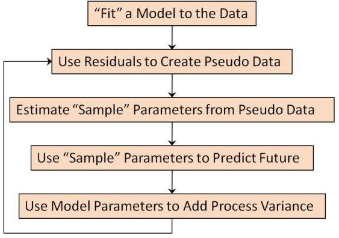

## Page 11
Figure 1.2. Static Method Diagram
for complete triangles or only for positive incremental values. Thus, while keeping as close to the theoretical foundation as possible, another objective is to illustrate how practical adjustments can be made to accommodate common data issues and allow the model to "fit" the data. As a practical matter, it is also possible that the model does not fit the data very well, or less well than other models, so the process of diagnosing the assumptions will inform the actuary's judgment when considering how much weight, if any, to give the model in relation to other models.

Another potential roadblock seems to be the notion that actuaries are still searching for the perfect model to describe "the" distribution of unpaid claims, as if imperfections in a model remove it from all consideration since it can't be "the one." This notion can also manifest itself when an actuary settles for a model that seems to work the best or is the easiest to use, or with the idea that each model must be used in its entirety or not at all. Interestingly, this notion was dispelled long ago with respect to deterministic point estimates as actuaries commonly use many different methods, which range from easy to complex, and judgmentally weight the results to arrive at their best estimate.

Model risk-the risk that the model you have chosen is not the same as the one that generates future losses-is very real and weighting or combining multiple estimates is a very practical way of addressing model risk. Thus, another objective of this monograph is to show how stochastic reserving can be similar to deterministic reserving when it comes to analyzing and using the best parts of multiple models by illustrating how the results from an ODP bootstrap model can be weighted together with other models. More importantly, the monograph hopes to illustrate the advantage of using a more complete set of risk estimation tools (which can include both stochastic models and deterministic methods) to arrive at an actuarial best estimate of the distribution of possible outcomes, rather than to focus on deterministic methods to select the "mean" and then simply "add on" a simple approximation or use only a favorite model to turn that selected mean into a distribution.
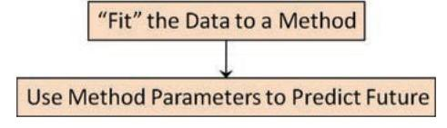

## Page 12
# 2. Notation 

The papers that describe the basic ODP bootstrap model use different notation, despite sharing common steps. Rather than pick the notation in one of the papers, the notation from the CAS Working Party on Quantifying Variability in Reserve Estimates Summary Report (CAS Working Party 2005) will be used since it is intended to serve as a basis for further research.

Many models visualize loss data as a two-dimensional array, $(w, d)$ with accident period or policy period $w$, and development age $d$ (think $w=$ "when" and $d=$ "delay"). For this discussion, we assume that the loss information available is an "upper triangular" subset for rows $w=1,2, \ldots, n$ and for development ages $d=1,2, \ldots, n-w+1$. The "diagonal" for which $w+d$ equals the constant, $k$, represents the loss information for each accident period $w$ as of accounting period $k .^{3}$

For purposes of including tail factors, the development beyond the observed data for periods $d=n+1, n+2, \ldots, u$, where $u$ is the ultimate time period for which any claim activity occurs-i.e., $u$ is the period in which all claims are final and paid in full, must also be considered.

The monograph uses the following notation for certain important loss statistics:

$$
\begin{array}{ll}
c(w, d): & \text { cumulative loss from accident } 4 \text { year } w \text { as of age } d . \\
q(w, d): & \text { incremental loss for accident year } w \text { from } d-1 \text { to } d . \\
c(w, n)=U(w): & \text { total loss from accident year } w \text { when claims are at ultimate values at } \\
& \text { time } n^{5} \text { or } \\
c(w, u)=U(w): & \text { total loss from accident year } w \text { when claims are at ultimate values at } \\
& \text { time } u . \\
R(w): & \text { future development after age } d \text { for accident year } w \text {, i.e., }=U(w)- \\
& c(w, d) . \\
f(d): & \text { factor applied to } c(w, d) \text { to estimate } q(w, d+1) \text { or can be used more } \\
& \text { generally to indicate any factor relating to age } d .
\end{array}
$$

[^0]
[^0]:    ${ }^{3}$ For a more complete explanation of this two-dimensional view of the loss information, see the Foundations of Casualty Actuarial Science (2001), Chapter 5, particularly pages 210-226.
    ${ }^{4}$ The use of accident year is used for ease of discussion. All of the discussion and formulas that follow could also apply to underwriting year, policy year, report year, etc. Similarly, year could also be half-year, quarter or month.
    ${ }^{5}$ This would imply that claims reach their ultimate value without any tail factor. This is generalized by changing $n$ to $n+t=u$, where $t$ is the number of periods in the tail.

## Page 13
$F(d)$ : factor applied to $c(w, d)$ to estimate $c(w, d+1)$ or $c(w, n)$ or can be used more generally to indicate any cumulative factor relating to age $d$.
$G(w)$ : factor relating to accident year $w$-capitalized to designate ultimate loss level.
$h(k)$ : factor relating to the diagonal $k$ along which $w+d$ is constant. ${ }^{6}$
$e(w, d)$ : a random fluctuation, or error, which occurs at the $w, d$ cell.
$E(x)$ : the expectation of the random variable $x$.
$\operatorname{Var}(x)$ : the variance of the random variable $x$.
$x^{*}$ : a randomly sampled value of the variable $x$.
What are called factors here could also be summands, but if factors and summands are both used, some other notation for the additive terms would be needed. The notation does not distinguish paid vs. incurred, but if this is necessary, capitalized subscripts $P$ and $I$ could be used.

[^0]
[^0]:    ${ }^{6}$ Some authors define $d=0,1, \ldots, n-1$ which intuitively allows $k=w$ along the diagonals, but in this case the triangle size is $n \times n-1$ which is not intuitive. With $d=1,2, \ldots, n$ defined as in this monograph, the triangle size $n \times n$ is intuitive, but then $k=w+1$ along the diagonals is not as intuitive. A way to think about this which helps tie everything together is to assume the $w$ variables are the beginning of the accident periods and the $d$ variables are at the end of the development periods. Thus, if we are using years then cell $c(n, 1)$ represents accident year $n$ evaluated at $12 / 31 / n$, or essentially $1 / 1 / n+1$.

## Page 14
# 3. The Bootstrap Model 

Although many variations of a bootstrap model framework are possible, this monograph will focus on the most common example which reproduces the basic chain ladder method-the ODP bootstrap model. Let's briefly review the assumptions of the basic chain ladder method, because these assumptions are important in understanding the distribution created by the ODP bootstrap model.

Start with a triangle array of cumulative data:

|  |  | d |  |  |  |  |  |
| :--: | :--: | :--: | :--: | :--: | :--: | :--: | :--: |
|  |  | 1 | 2 | 3 | $\ldots$ | n-1 | n |
| w | 1 | $\mathrm{c}(1,1)$ | $\mathrm{c}(1,2)$ | $\mathrm{c}(1,3)$ | $\ldots$ | $\mathrm{c}(1, \mathrm{n}-1)$ | $\mathrm{c}(1, \mathrm{n})$ |
|  | 2 | $\mathrm{c}(2,1)$ | $\mathrm{c}(2,2)$ | $\mathrm{c}(2,3)$ | $\ldots$ | $\mathrm{c}(2, \mathrm{n}-1)$ |  |
|  | 3 | $\mathrm{c}(3,1)$ | $\mathrm{c}(3,2)$ | $\mathrm{c}(3,3)$ | $\ldots$ |  |  |
|  | $\ldots$ | $\ldots$ | $\ldots$ |  |  |  |  |
|  | n-1 | $\mathrm{c}(\mathrm{n}-1,1)$ | $\mathrm{c}(\mathrm{n}-1,2)$ |  |  |  |  |
|  | n | $\mathrm{c}(\mathrm{n}, 1)$ |  |  |  |  |  |

A typical deterministic analysis of this data will start with an array of development ratios or development factors:

$$
F(w, d)=\frac{c(w, d)}{c(w, d-1)}
$$

Then two key assumptions are made in order to make a projection of the known elements to their respective ultimate values. First, it is assumed that each accident year has the same development factor. Equivalently, for each $w=1,2, \ldots, n$ :

$$
F(w, d)=F(d)
$$

Under this first assumption, one of the more popular estimators for the development factor is the weighted average:

$$
\hat{F}(d)=\frac{\sum_{w=1}^{n-d+1} c(w, d)}{\sum_{w=1}^{n-d+1} c(w, d-1)}
$$

## Page 15
Certainly there are other popular estimators in use, but they are beyond our scope at this stage yet most are still consistent with our first assumption that each accident year has the same factor. Projections of the ultimate values, or $\hat{c}(w, n)$ for $w=1,2, \ldots, n$ are then computed using:

$$
\hat{c}(w, n)=c(w, d) \prod_{i=d+1}^{n} \hat{F}(i) \text {, for all } d=n-w+1
$$

This part of the claim projection algorithm relies explicitly on the second assumption, namely that each accident year has a parameter representing its relative level. These level parameters are the current cumulative values for each accident year, or $c(w, n-w+1)$. Of course variations on this second assumption are also common, but the point is that every model has explicit assumptions that are an integral part of understanding the quality of that model.

One variation on the second assumption is to assume that the accident years are completely homogeneous. ${ }^{7}$ In this case we would estimate the level parameter of the accident years using:

$$
\frac{\sum_{w=1}^{n-d+1} c(w, d)}{n-d+1}
$$

Complete homogeneity implies that the observations $c(1, d), c(2, d), \ldots$, $c(n-d+1, d)$ are generated by the same mechanism. Thus, the column averages from (3.4) would replace the last actual values along the diagonal to calculate an estimate assuming homogeneity of accident years.

Interestingly, the basic chain ladder algorithm treats the processes generating the observations as NOT homogeneous ${ }^{8}$ and effectively that "pooling" of the data does not provide any increased efficiency. ${ }^{9}$ In contrast, it could be argued that the BornhuetterFerguson (1972) and Cape Cod methods are a "blend" of these two extremes as the homogeneity of the future expected result depends on the consistency of the a priori loss ratios and decay rate, respectively.

# 3.1. Origins of Bootstrapping 

Possibly the earliest development of a stochastic model for the actuarial array of cumulative development data is attributed to Kremer (1982) and the earliest discussion of bootstrapping is in Ashe (1986). The basic model used by Kremer is described by England and Verrall (1999) and Zehnwirth (1989), so there will be no further elaboration here. It should be noted, however, that this model can be extended by considering alternatives which are discussed in Barnett and Zehnwirth (2000) and Zehnwirth (1994), Renshaw (1989), Christofides (1990), and Verrall (1991; 2004), among others.

[^0]
[^0]:    ${ }^{7}$ Homogeneous data can have a different meaning in mathematics, but here we are defining it to mean having consistent or the same underlying exposures.
    ${ }^{8}$ Meaning the underlying exposures are changing over time and thus the current cumulative results (observation) for each year are more appropriate for projecting an estimate.
    ${ }^{9}$ For a more complete discussion of these assumptions of the basic chain ladder model see Zehnwirth (1989).

## Page 16
# 3.2. The Over-Dispersed Poisson Model 

The genesis of this model into an ODP bootstrap framework originated with Renshaw and Verrall (1994) when they proposed modeling the incremental claims $q(w, d)$ directly as the response, with the same linear predictor as Kremer (1982), but using a generalized linear model (GLM) with a log-link function and an over-dispersed Poisson (ODP) error distribution. ${ }^{10}$ Then, England and Verrall (1999) discuss how a specific form of this model is identical to the volume weighted chain ladder model, and use bootstrapping (sampling the residuals with replacement) to estimate a distribution of point estimates ${ }^{11}$ instead of simulating from a multivariate normal distribution for a GLM. More formally, the following formulas are used to parameterize the GLM.

$$
\begin{gathered}
E[q(w, d)]=m_{w, d} \text { and } \operatorname{Var}[q(w, d)]=\phi E[q(w, d)]=\phi m_{w, d}^{z} \\
\ln \left[m_{w, d}\right]=\eta_{w, d} \\
\eta_{w, d}=c+\alpha_{w}+\beta_{d}, \text { where: } w=1,2, \ldots, n ; d=1,2, \ldots, n ; \text { and } \alpha_{1}=\beta_{1}=0
\end{gathered}
$$

In this case the $\alpha$ parameters function as adjustments to the constant, $c$, level parameter and the $\beta$ parameters adjust for the development trends after the first development period. The power, $z$, is used to specify the error distribution with:
$z=0$ for Normal,
$z=1$ for Poisson,
$z=2$ for Gamma, and
$z=3$ for inverse Gaussian.
Thus, the $z$ parameter specifies not only the mean-variance relationship, but the whole shape of the distribution, including higher moments. Alternatively, we can remove the constant, $c$, which will cause the $\alpha$ parameters to function as individual level parameters while the $\beta$ parameters continue to adjust for the development trends after the first development period:

$$
\eta_{w, d}=\alpha_{w}+\beta_{d}, \text { where: } w=1,2, \ldots, n ; \text { and } d=2,3, \ldots, n
$$

Standard statistical software can be used to estimate parameters and goodness of fit measures. The parameter $\phi$ is a scale parameter that is estimated as part of the fitting procedure while setting the variance proportional to the mean (thus "over-dispersed" Poisson for $z=1)^{12}$. For educational purposes, the calculations to solve these equations

[^0]
[^0]:    ${ }^{10}$ Generalized Linear Modeling can be done with and without link functions and with a variety of error distributions. We are only describing here the particular GLM model that leads to the replication of the chain ladder results. For a more complete treatise on Generalized Linear Modeling, see McCullagh and Nelder (1989).
    ${ }^{11}$ Some authors refer to this as the standard deviation of the posterior distribution.
    ${ }^{12}$ While over-dispersed Poisson, or ODP, are commonly used terms for this model, it is certainly possible for the scale parameter to be less than one and thus "under-dispersed" Poisson would be more technically correct in that case. Alternatively, the more general term quasi-Poisson could be used. In addition, we note that the $z$ parameter in equation 3.5, and some later formulas, could be removed for simplicity since the primary focus of this monograph is the ODP Bootstrap model, but it is included so we do not lose sight of the fact that the ODP Bootstrap model is a specialized case of a larger family of models.

## Page 17
for a $10 \times 10$ triangle are included in the "Bootstrap Models.xlsm" file, but here, and in the "GLM Framework.xlsm" file, the calculations are illustrated for a $3 \times 3$ triangle for ease of exposition. Consider the following incremental data triangle:

|  | $\mathbf{1}$ | $\mathbf{2}$ | $\mathbf{3}$ |
| :--: | :--: | :--: | :--: |
| $\mathbf{1}$ | $q(1,1)$ | $q(1,2)$ | $q(1,3)$ |
| $\mathbf{2}$ | $q(2,1)$ | $q(2,2)$ |  |
| $\mathbf{3}$ | $q(3,1)$ |  |  |

In order to set up the GLM model to fit parameters to the data we need to do a log-link or transform which results in:

|  | 1 | 2 | 3 |
| :--: | :--: | :--: | :--: |
| 1 | $\ln [q(1,1)]$ | $\ln [q(1,2)]$ | $\ln [q(1,3)]$ |
| 2 | $\ln [q(2,1)]$ | $\ln [q(2,2)]$ |  |
| 3 | $\ln [q(3,1)]$ |  |  |

The model, as described in (3.8), is then specified using a system of equations with vectors of $\alpha_{w}$ and $\beta_{d}$ parameters as follows:

$$
\begin{aligned}
& \ln [q(1,1)]=1 \alpha_{1}+0 \alpha_{2}+0 \alpha_{3}+0 \beta_{2}+0 \beta_{3} \\
& \ln [q(2,1)]=0 \alpha_{1}+1 \alpha_{2}+0 \alpha_{3}+0 \beta_{2}+0 \beta_{3} \\
& \ln [q(3,1)]=0 \alpha_{1}+0 \alpha_{2}+1 \alpha_{3}+0 \beta_{2}+0 \beta_{3} \\
& \ln [q(1,2)]=1 \alpha_{1}+0 \alpha_{2}+0 \alpha_{3}+1 \beta_{2}+0 \beta_{3} \\
& \ln [q(2,2)]=0 \alpha_{1}+1 \alpha_{2}+0 \alpha_{3}+1 \beta_{2}+0 \beta_{3} \\
& \ln [q(1,3)]=1 \alpha_{1}+0 \alpha_{2}+0 \alpha_{3}+1 \beta_{2}+1 \beta_{3} .
\end{aligned}
$$

Converting this to matrix notation we have:

$$
\mathrm{Y}=\mathrm{X} \times \mathrm{A}
$$

Where:

$$
Y=\left[\begin{array}{c}
\ln [q(1,1)] \\
\ln [q(2,1)] \\
\ln [q(3,1)] \\
\ln [q(1,2)] \\
\ln [q(2,2)] \\
\ln [q(1,3)]
\end{array}\right]
$$

## Page 18
$$
\begin{gathered}
X=\left[\begin{array}{ccccc}
1 & 0 & 0 & 0 & 0 \\
0 & 1 & 0 & 0 & 0 \\
0 & 0 & 1 & 0 & 0 \\
1 & 0 & 0 & 1 & 0 \\
0 & 1 & 0 & 1 & 0 \\
1 & 0 & 0 & 1 & 1
\end{array}\right], \text { and } \\
A=\left[\begin{array}{l}
\alpha_{1} \\
\alpha_{2} \\
\alpha_{3} \\
\beta_{2} \\
\beta_{3}
\end{array}\right]
\end{gathered}
$$

In this form we can use iteratively weighted least squares or maximum likelihood ${ }^{13}$ to solve for the parameters in the A vector (3.13) that minimize the squared difference between the Y matrix (3.11) and the solution matrix (3.14):

$$
\left[\begin{array}{l}
\ln \left[m_{1,1}\right] \\
\ln \left[m_{2,1}\right] \\
\ln \left[m_{3,1}\right] \\
\ln \left[m_{1,2}\right] \\
\ln \left[m_{2,2}\right] \\
\ln \left[m_{1,3}\right]
\end{array}\right]
$$

After solving the system of equations we will have:

$$
\begin{aligned}
& \ln \left[m_{1,1}\right]=\eta_{1,1}=\alpha_{1} \\
& \ln \left[m_{2,1}\right]=\eta_{2,1}=\alpha_{2} \\
& \ln \left[m_{3,1}\right]=\eta_{3,1}=\alpha_{3} \\
& \ln \left[m_{1,2}\right]=\eta_{1,2}=\alpha_{1}+\beta_{2} \\
& \ln \left[m_{2,2}\right]=\eta_{2,2}=\alpha_{2}+\beta_{2} \\
& \ln \left[m_{1,3}\right]=\eta_{1,3}=\alpha_{1}+\beta_{2}+\beta_{3}
\end{aligned}
$$

This solution can then be shown as a triangle:

|  | 1 | 2 | 3 |
| :--: | :--: | :--: | :--: |
| 1 | $\ln \left[m_{1,1}\right]$ | $\ln \left[m_{1,2}\right]$ | $\ln \left[\dot{m}_{1,3}\right]$ |
| 2 | $\ln \left[m_{2,1}\right]$ | $\ln \left[m_{2,2}\right]$ |  |
| 3 | $\ln \left[m_{3,1}\right]$ |  |  |

[^0]
[^0]:    ${ }^{13}$ Other methods, such as orthogonal decomposition or Newton-Raphson, can also be used to solve for the parameters. Iteratively weighted least squares and maximum likelihood are both illustrated in the companion Excel files.

## Page 19
These results can then be exponentiated to produce the fitted, or expected, incremental results of the GLM model:

|  | $\mathbf{1}$ | $\mathbf{2}$ | $\mathbf{3}$ |
| :--: | :--: | :--: | :--: |
| $\mathbf{1}$ | $m_{1,1}$ | $m_{1,2}$ | $m_{1,3}$ |
| $\mathbf{2}$ | $m_{2,1}$ | $m_{2,2}$ |  |
| $\mathbf{3}$ | $m_{3,1}$ |  |  |

This monograph will refer to this as the "GLM framework" and it is illustrated for a simple $3 \times 3$ triangle in the "GLM Framework.xlsm" file. While the GLM framework is used to solve these equations for the fitted results, the usefulness of this framework is that the fitted incremental values (with the Poisson error distribution assumption) will equal the incremental values that can be derived from volume-weighted average development factors, as shown in the "GLM Framework.xlsm" file. ${ }^{14}$ That is, it can be reproduced by using the last cumulative diagonal, dividing backwards successively by each volume-weighted average development factor and subtracting to get the fitted incremental results. This monograph will refer to this method as the "simplified GLM" or "ODP Bootstrap." This has three very useful consequences.

First, the GLM portion of the algorithm can be replaced with a simpler development factor algorithm while still being based on the underlying GLM framework. Second, the use of the development factors serves as a "bridge" to the deterministic framework and allows the model to be more easily explainable to others. And, third, for the GLM algorithm the log-link process means that negative incremental values can often cause the algorithm to not have a solution, whereas using development factors will generally allow for a solution. ${ }^{15}$

With a model fitted to the data, the ODP bootstrap process involves sampling with replacement from the residuals. England and Verrall (1999) note that the deviance, Pearson, and Anscombe residuals could all be considered for this process, but the Pearson residuals are the most desirable since they are calculated consistently with the scale parameter. The unscaled Pearson residuals, $r_{w, d}$, and scale parameter, $\phi$, are calculated as follows:

$$
\begin{gathered}
r_{w, d}=\frac{q(w, d)-m_{w, d}}{\sqrt{m_{w, d}^{2}}} \\
\phi=\frac{\sum r_{w, d}^{2}}{N-p}
\end{gathered}
$$

[^0]
[^0]:    ${ }^{14}$ Using other than the Poisson assumption (i.e., $z \neq 1$ ), the incremental values may be close to the values from the development factors, but they will not be equal.
    ${ }^{15}$ More specifically, individual negative cell values may not be a problem (by using the negative of the log of the absolute value in 3.14). If the total of all incremental cell values in a development column is negative, then the GLM algorithm will fail. This situation will not cause a problem fitting the model as a link ratio less than one will be perfectly useful. However, this may still cause other problems, e.g., the "GLM framework" and "simplified GLM" may not be equivalent, which we will address in Section 4.

## Page 20
Where $N=$ the number of observations, or incremental data cells in the triangle, which is typically equal to $n \times(n+1) \div 2$, and $p=$ the number of parameters, which is typically equal to $2 \times(n-1) .{ }^{16}$ Sampling with replacement from the residuals can then be used to create new sample triangles of incremental values using formula 3.18. Sampling with replacement assumes that the residuals are independent and identically distributed, but it does not require the residuals to be normally distributed. Indeed, this is often cited as an advantage of the ODP bootstrap model since whatever distributional form the residuals have will flow through to the simulation process. Some authors have referred to this as a "semi-parametric" bootstrap model since we are not parameterizing the residuals.

$$
q^{*}(w, d)=r^{*} \times \sqrt{m_{w, d}^{*}}+m_{w, d}
$$

The sample triangle of incremental values can then be cumulated, new average development factors can be calculated for the sample and applied to calculate a point estimate for this data, resulting in a distribution of point estimates for some large number of samples. In England and Verrall (1999) this is the end of the process, but at the end of the appendix they note that you should also adjust the resulting distribution by the degrees of freedom adjustment factor (3.19) and the Scale Parameter (3.17), to effectively allow for over-dispersion of the residuals in the sampling process and add process variance to approximate a distribution of possible outcomes.

$$
f^{D e F}=\sqrt{\frac{N}{N-p}}
$$

Later, in England and Verrall (2002), the authors note that the Pearson residuals (3.16) could be multiplied by the degrees of freedom adjustment factor (3.19) to include the over-dispersion in the residuals. As calculated in (3.20), these adjusted residuals are referred to as scaled Pearson residuals. They also expand the simulation process by adding process variance to the future incremental values from the point estimates. To add this process variance, they assume that each future incremental value $m_{w, d}$ is the mean and the mean times the scale parameter, $\phi m_{w, d}$, is the variance of a gamma distribution. ${ }^{17}$ This revised model could now be described as estimating a distribution of possible outcomes, which incorporates process variance and parameter variance in the simulation of the historical and future data. ${ }^{18}$

[^0]
[^0]:    ${ }^{16}$ The number of data cells could be less than $n \times(n+1)+2$ and the number of parameters could be less than $2 \times(n-1)$. For example, if the incremental values are zeros for the last three columns in a triangle then these cells would not be included in the total for $N$ and there will be three fewer $\beta$ parameters since none are needed to fit to these zero values as the development process is completed already.
    ${ }^{17}$ The Poisson distribution could be used to remain more consistent with the underlying theory of the GLM framework, but it is considerably slower to simulate, so gamma is a close substitute that performs much faster in simulation although it can be more skewed than the Poisson. Indeed, other distributions could be used as well to better approximate the observed "skewness" of the residuals from the diagnostics.
    ${ }^{18}$ Some authors refer to this as the full predictive distribution of the cash flows.

## Page 21
$$
r_{w, d}^{S}=\frac{q(w, d)-m_{w, d}}{\sqrt{m_{w, d}^{S}}} \times f^{D e F}
$$

However, Pinheiro et al. $(2001 ; 2003)$ noted that the bias correction for the residuals using the degrees of freedom adjustment factor (3.20) does not create standardized residuals, which is an important step for making sure that the residuals all have the same variance. In order to have standardized Pearson residuals, the GLM framework requires the use of a hat matrix adjustment factor (3.23).

$$
H=X\left(X^{T} W X\right)^{-1} X^{T} W
$$

First, the hat matrix (3.21) is calculated using matrix multiplication of the design matrix (3.12) and the weight matrix (3.22).

$$
\begin{gathered}
W=\left[\begin{array}{cccccc}
m_{1,1} & 0 & 0 & 0 & 0 & 0 \\
0 & m_{2,1} & 0 & 0 & 0 & 0 \\
0 & 0 & m_{3,1} & 0 & 0 & 0 \\
0 & 0 & 0 & m_{1,2} & 0 & 0 \\
0 & 0 & 0 & 0 & m_{2,2} & 0 \\
0 & 0 & 0 & 0 & 0 & m_{1,3}
\end{array}\right] \\
f_{w, d}^{H}=\sqrt{\frac{1}{1-H_{i, i}}}
\end{gathered}
$$

The hat matrix adjustment factor (3.23) uses the diagonal of the hat matrix (3.21). In Pinheiro et al. (2003) the authors note two important points about the ODP bootstrap process as described by England and Verrall (1999; 2002). First, the sampling of the residuals should not include any zero-value residuals, which are typically in the corners of the triangle. ${ }^{19}$ The exclusion of the zero-value residuals is accounted for in the hat matrix adjustment factor (3.23), but another common explanation is that the zero-value cells will have some variance but we just don't know what it is yet so we should sample from the remaining residuals but not the zeros. Second, the hat matrix adjustment factor (3.23) is a replacement for, and an improvement on, the degrees of freedom factor (3.19). ${ }^{20}$

Thus, the scaled Pearson residuals (3.20) should be replaced by the standardized Pearson residuals:

$$
r_{w, d}^{H}=\frac{q(w, d)-m_{w, d}}{\sqrt{m_{w, d}^{S}}} \times f_{w, d}^{H}
$$

[^0]
[^0]:    ${ }^{19}$ Technically, the two "corner" residuals are zero because they each have a parameter that is unique to that incremental value which causes the fitted incremental value to exactly equal the actual incremental value.
    ${ }^{20}$ This second point was not addressed clearly in Pinheiro et al. (2001), but as the authors updated and clarified the monograph in Pinheiro et al. (2003) this issue was more clearly addressed.

## Page 22
However, the scale parameter (3.17) is still calculated as before, although the standardized Pearson residuals could be used to approximate the scale parameter as follows:

$$
\phi^{H}=\frac{\sum\left(r_{u, d}^{H}\right)^{2}}{N}
$$

At this point we have a complete basic "ODP bootstrap" model, as it is often referred to. It is also important to note that the two key assumptions mentioned earlier, each accident year has the same development factor and each accident year has a parameter representing its relative level, are equally applicable to this model.

In order for the reader to test out the different "combinations" of this modeling process the "Bootstrap Models.xlsm" file includes options to allow these historical algorithms to be simulated. The purpose for describing this evolution of the ODP bootstrap model framework is threefold: first, to allow the interested reader to better understand the details of the algorithm and how these papers and their authors have contributed to the evolution of this model framework; second, to illustrate the value of collaborative research via different published papers and the contributions of different authors; and, third, to provide a solid foundation for continuing the evolutionary process and to discuss practical adjustments.

# 3.3. Variations on the ODP Model 

When estimating insurance risk it is generally considered desirable to focus on the claim payment stream in order to measure the variability of the actual cash flows that directly affect the bottom line. Clearly, changes in case reserves and IBNR reserves will also impact the bottom line, but to a considerable extent the changes in IBNR are intended to counter the impact of the changes in case reserves. To some degree, then, the total reserve movements can act to mask the underlying changes due to cash flows. On the other hand, the case reserves contain valuable information about potential future payments so we should not ignore them and use only paid data.

### 3.3.1. Bootstrapping the Incurred Loss Triangle

The ODP bootstrap model can be used to model both paid and incurred loss data. Using incurred data incorporates case reserves, thus perhaps improving the ultimate estimates. However, the resulting distribution from using incurred data will be possible outcomes of the IBNR, not a distribution of the unpaid. ${ }^{21}$ There are two possible approaches for modeling an unpaid loss distribution using incurred loss data: modeling incurred data and convert the ultimate values to a payment pattern, or, modeling paid and case reserves separately.

Using the first approach, a convenient way of converting the results of an incurred data model to a payment stream is to run the paid data model in parallel with the

[^0]
[^0]:    ${ }^{21}$ Using incurred data will also create issues in weighting the results of different models which will be discussed in Section 6.

## Page 23
incurred data model, and use the random payment pattern from each iteration from the paid data model to convert the ultimate values from each corresponding iteration from the incurred data to a payment pattern for each iteration (for each accident year individually). The "Bootstrap Models.xlsm" file illustrates this concept. It is worth noting, however, that this process allows the "added value" of using the case reserves to help predict the ultimate results to work its way into the calculations, thus perhaps improving the ultimate estimates, while still focusing on the payment stream for measuring risk. In effect, it allows a distribution of IBNR to become a distribution of IBNR and case reserves. This process could be made more sophisticated by correlating some part of the paid and incurred models (e.g., the residual sampling and/or process variance portions), but that is beyond the scope of this monograph.

The second approach could be accomplished by applying the ODP bootstrap to the Munich chain ladder model. This has the advantage over the first approach of not modeling the paid losses twice, and of explicitly measuring and imposing a framework around the correlation of the paid and outstanding losses. Since it is so well detailed in Liu and Verrall (2010), it will not be discussed in detail here.

# 3.3.2. Bootstrapping the Bornhuetter-Ferguson and Cape Cod models 

Another common issue with using the ODP bootstrap model is that the distribution for the most recent accident years can produce results with more variance than you would expect when compared to earlier accident years. This is usually because more development factors are used to extrapolate the sampled values for the most recent accident years which, when coupled with random samples of incremental values, can result in more extreme fluctuations in point estimates. This is analogous to one of the weaknesses of the deterministic paid chain ladder method-a low, or high, initial observation can lead to an abnormally low, or high, projected ultimate, respectively.

To help alleviate this problem, the Bornhuetter-Ferguson (1972) or generalized Cape Cod (Struzzieri and Hussian 1998) deterministic methods can be worked into the underlying ODP bootstrap model, and the deterministic assumptions of these methods can also be converted to stochastic assumptions. For example, instead of using deterministic a priori loss ratios for the Bornhuetter-Ferguson model, the a priori loss ratios can be simulated from a distribution. Similarly, the Cape Cod algorithm can be applied to every ODP bootstrap model iteration to produce a stochastic Cape Cod projection that reflects the unique characteristics of each sample triangle. ${ }^{22}$

The "Bootstrap Models.xlsm" file also illustrates these Bornhuetter-Ferguson and Cape Cod ODP bootstrap models. ${ }^{23}$

[^0]
[^0]:    ${ }^{22}$ In addition to being consistent between paid and incurred data, to the extent there is commonality with deterministic methods the assumptions should also be consistent. For example, it would not make sense to use one set of a priori loss ratio assumptions for a deterministic Bornhuetter-Ferguson method and a different set of mean assumptions for a modified ODP bootstrap model.
    ${ }^{23}$ More complex implementations of these models could include modifying the underlying assumptions of the GLM framework which would result in a completely different set of residuals, but that is beyond the scope of this monograph.

## Page 24
# 3.4. The GLM Bootstrap Model 

Two limitations of the chain-ladder model, and hence the ODP bootstrap of the chain-ladder model, is that it does not measure or adjust for calendar-year effects, and it includes a significant number of parameters and many would argue that it over-fits the model to the data.

Another approach is to go back to the original GLM framework. Returning to formulas (3.5) to (3.8), the GLM framework does not require a certain number of parameters so we are free to specify only as many parameters as we need to get a robust model, which can address the over-fitting issue. Indeed, it is ONLY when we specify a parameter for EVERY accident year and EVERY development year and specify a Poisson error distribution that we end up exactly replicating the volume weighted average development factors that allow us to substitute the deterministic algorithm instead of solving the GLM fit.

Thus, using the original GLM framework, which this monograph will refer to as the "GLM Bootstrap" model, we can specify a model with only a few parameters, but there are two drawbacks to doing so. ${ }^{24}$ First, the GLM must be solved for each iteration of the bootstrap model (which may slow down the simulation process) and, second, the model is no longer directly explainable to others using development factors. ${ }^{25}$ While the impact of these drawbacks should be considered, the potential benefits of using the GLM bootstrap can be much greater.

First, having fewer parameters will help avoid over-parameterizing the model. ${ }^{26}$ For example, if we use only one accident year parameter then the model specified using a system of equations is as follows (which is analogous to formula 3.9):

$$
\begin{aligned}
& \ln [q(1,1)]=1 \alpha_{1}+0 \beta_{2}+0 \beta_{3} \\
& \ln [q(2,1)]=1 \alpha_{1}+0 \beta_{2}+0 \beta_{3} \\
& \ln [q(3,1)]=1 \alpha_{1}+0 \beta_{2}+0 \beta_{3} \\
& \ln [q(1,2)]=1 \alpha_{1}+1 \beta_{2}+0 \beta_{3} \\
& \ln [q(2,2)]=1 \alpha_{1}+1 \beta_{2}+0 \beta_{3} \\
& \ln [q(1,3)]=1 \alpha_{1}+1 \beta_{2}+1 \beta_{3}
\end{aligned}
$$

In this case we will only have one accident year parameter and $n-1$ development trend parameters, but it will only be coincidence that we would end up with the equivalent of average development factors. Interestingly, this model parameterization moves us away from one of the common basic assumptions (i.e., each accident year has its own level) and substitutes the assumption that all accident years are homogeneous.

[^0]
[^0]:    ${ }^{24}$ Using the GLM framework allows for many other variations in the specification of models and then bootstrapping as described in more detail in England and Verrall $(1999,2002)$ and others, but this monograph will focus on variations consistent with the framework underpinning the ODP bootstrap model.
    ${ }^{25}$ However, age-to-age factors could be calculated for the fitted data to compare to the actual age-to-age factors and used as an aid in explaining the model to others.
    ${ }^{26}$ Over-parameterization will be addressed more completely in Section 5.

## Page 25
Another example of using fewer parameters would be to only use one development year parameter (while continuing to use an accident-year parameter for each year), which would equate to the system of equations in (3.27).

$$
\begin{aligned}
& \ln [q(1,1)]=1 \alpha_{1}+0 \alpha_{2}+0 \alpha_{3}+0 \beta_{2} \\
& \ln [q(2,1)]=0 \alpha_{1}+1 \alpha_{2}+0 \alpha_{3}+0 \beta_{2} \\
& \ln [q(3,1)]=0 \alpha_{1}+0 \alpha_{2}+1 \alpha_{3}+0 \beta_{2} \\
& \ln [q(1,2)]=1 \alpha_{1}+0 \alpha_{2}+0 \alpha_{3}+1 \beta_{2} \\
& \ln [q(2,2)]=0 \alpha_{1}+1 \alpha_{2}+0 \alpha_{3}+1 \beta_{2} \\
& \ln [q(1,3)]=1 \alpha_{1}+0 \alpha_{2}+0 \alpha_{3}+2 \beta_{2}
\end{aligned}
$$

In this example the model parameterization moves away from the other common basic assumption (i.e., each accident year has its own level, but the same development parameter is used for all periods), and again it would be pure coincidence to end up with the equivalent of average development factors. ${ }^{27}$ It is also interesting to note that for both of these two examples there will be one additional non-zero residual that can be used in the simulations because in each case one of the incremental values no longer has a unique parameter-i.e., for (3.26) $q(3,1)$ is no longer uniquely defined by $\alpha_{3}$, and for (3.27) $q(1,3)$ is no longer uniquely defined by $\beta_{3}$.

Of course we can take this simplification to its logical extreme and use a model with only one accident year parameter and one development year parameter, which would result in the system of equations in as shown in (3.28).

$$
\begin{aligned}
& \ln [q(1,1)]=1 \alpha_{1}+0 \beta_{2} \\
& \ln [q(2,1)]=1 \alpha_{1}+0 \beta_{2} \\
& \ln [q(3,1)]=1 \alpha_{1}+0 \beta_{2} \\
& \ln [q(1,2)]=1 \alpha_{1}+1 \beta_{2} \\
& \ln [q(2,2)]=1 \alpha_{1}+1 \beta_{2} \\
& \ln [q(1,3)]=1 \alpha_{1}+2 \beta_{2}
\end{aligned}
$$

In this example the model parameterization moves away from both of the common basic assumptions (i.e., each accident year has its own level, and the different development parameter is used for all periods), and again it would be pure coincidence to end up with the equivalent of average development factors. In this most "basic" model it is interesting to note that both of the "zero residuals" will now be non-zero and can be used in the simulations because both corners no longer have a unique parameter.

This flexibility allows the modeler to use enough parameters to capture the statistically relevant level and trend changes in the data without forcing a specific number of parameters. ${ }^{28}$

[^0]
[^0]:    ${ }^{27}$ While we have only one parameter to describe the development period trends, if we convert these to development factors there will be a different factor for each period.
    ${ }^{28}$ How to determine which parameters are statistically relevant will be discussed in Section 5.

## Page 26
The second benefit, and depending on the data perhaps the most significant, is that this framework affords us the ability to add parameters for calendar-year trends. Adding diagonal, or calendar year trend, parameters to (3.8) we now have:

$$
\begin{gathered}
\eta_{w, d}=\alpha_{w}+\beta_{d}+\gamma_{k}, \text { where: } w=1,2, \ldots, n ; d=2,3, \ldots, n \\
\text { and } k=2,3, \ldots, n
\end{gathered}
$$

A complete system of equations for the (3.29) framework would look like the following:

$$
\begin{aligned}
& \ln [q(1,1)]=1 \alpha_{1}+0 \alpha_{2}+0 \alpha_{3}+0 \beta_{2}+0 \beta_{3}+0 \gamma_{2}+0 \gamma_{3} \\
& \ln [q(2,1)]=0 \alpha_{1}+1 \alpha_{2}+0 \alpha_{3}+0 \beta_{2}+0 \beta_{3}+1 \gamma_{2}+0 \gamma_{3} \\
& \ln [q(3,1)]=0 \alpha_{1}+0 \alpha_{2}+1 \alpha_{3}+0 \beta_{2}+0 \beta_{3}+1 \gamma_{2}+1 \gamma_{3} \\
& \ln [q(1,2)]=1 \alpha_{1}+0 \alpha_{2}+0 \alpha_{3}+1 \beta_{2}+0 \beta_{3}+1 \gamma_{2}+0 \gamma_{3} \\
& \ln [q(2,2)]=0 \alpha_{1}+1 \alpha_{2}+0 \alpha_{3}+1 \beta_{2}+0 \beta_{3}+1 \gamma_{2}+1 \gamma_{3} \\
& \ln [q(1,3)]=1 \alpha_{1}+0 \alpha_{2}+0 \alpha_{3}+1 \beta_{2}+1 \beta_{3}+1 \gamma_{2}+1 \gamma_{3}
\end{aligned}
$$

However, there is no unique solution for a system with seven parameters and six equations, so some of these parameters will need to be removed. A logical starting point would be to start with a "basic" model with one accident year (level) parameter, one development trend parameter and one calendar trend parameter and then add or remove parameters as needed. ${ }^{29}$ The system of equations for this basic model is as follows:

$$
\begin{aligned}
& \ln [q(1,1)]=1 \alpha_{1}+0 \beta_{2}+0 \gamma_{2} \\
& \ln [q(2,1)]=1 \alpha_{1}+0 \beta_{2}+1 \gamma_{2} \\
& \ln [q(3,1)]=1 \alpha_{1}+0 \beta_{2}+2 \gamma_{2} \\
& \ln [q(1,2)]=1 \alpha_{1}+1 \beta_{2}+1 \gamma_{2} \\
& \ln [q(2,2)]=1 \alpha_{1}+1 \beta_{2}+2 \gamma_{2} \\
& \ln [q(1,3)]=1 \alpha_{1}+2 \beta_{2}+2 \gamma_{2}
\end{aligned}
$$

A third benefit of the GLM bootstrap model is that it can be used to model data shapes other than triangles. For example, missing incremental data for the first few diagonals would mean that the cumulative values could not be calculated and the remaining values in those first few rows would not be useful for the ODP bootstrap. However, since the GLM bootstrap uses the incremental values the entire trapezoid can be used to fit the model parameters. ${ }^{30}$

[^0]
[^0]:    ${ }^{29}$ A simple algorithm to add and/or remove parameters in a search for the "optimal" set of parameters is included in the "Bootstrap Models.xlsm" file, but more complex algorithms are outside the scope of this monograph. We focus on the "mechanical" aspects of searching for the "optimal" set of parameters in Section 5 in order to enhance the educational benefits.
    ${ }^{30}$ This issue will be examined in more detail in Section 4.

## Page 27
It should also be noted that the GLM bootstrap model allows the future expected values to be directly estimated from the parameters of the model for each sample triangle in the bootstrap simulation process. However, we must solve the GLM within each iteration for the same parameters as we originally set up for the model rather than using development factors to project future expected values (which is a way of fitting the model to each sample triangle).

The additional modeling power that this flexible GLM bootstrap model adds to the actuary's toolkit cannot be overemphasized. Not only does it allow one to move away from the two basic assumptions of a deterministic chain ladder method, it allows for the ability to match the model parameters to the statistical features you find in the data, rather than "force" the data to fit the model, often with far fewer parameters and to extrapolate those features. For example, modeling with fewer development trend parameters means that the last parameter can be assumed to continue past the end of the triangle which will give the modeler a "tail" of the incremental values beyond the end of the triangle without the need for a specific tail factor.

While the monograph continues to illustrate the GLM bootstrap with a $3 \times 3$ triangle, also included in the companion Excel files are a set of "GLM Bootstrap 6__xlsm" files that illustrate the calculations for these different models using a $6 \times$ 6 triangle. Also, the "Bootstrap Models.xlsm" file contains a "GLM bootstrap" model for a $10 \times 10$ triangle that can be used to specify any combination of accident year, development year, and calendar year parameters, including setting parameters to zero. The GLM bootstrap model is akin to the incremental log model described in Barnett and Zehnwirth (2000), so we will leave it to the reader to explore this flexibility by using the Excel file.

## Page 28
# 4. Practical Issues 

Now that the basic ODP bootstrap model has been expanded in a variety of ways, it is important to address some of the key assumptions of the ODP model and some common data issues.

### 4.1. Negative Incremental Values

As noted in Section 3.2, because of the log-link used in the GLM framework the incremental values must be greater than zero in order to parameterize a model. However, a slight modification to the log-link function will help this common problem become a little less restrictive. If we use (4.1) as the log-link function, then individual negative values are only an issue if the total of all incremental values in a development column is negative, as the GLM algorithm will not be able to find a solution in that case.

$$
\begin{gathered}
\ln [q(w, d)] \text { for } q(w, d)>0 \\
0 \text { for } q(w, d)=0 \\
-\ln [a b s\{q(w, d)\}] \text { for } q(w, d)<0
\end{gathered}
$$

Using (4.1) in the GLM bootstrap will help in many situations, but it is quite common for entire development columns of incremental values to be negative, especially for incurred data. To give the GLM framework the ability to solve for a solution in this case we need to make another modification to the basic model to include a constant. Whenever a column or columns of incremental values sum to a negative value, we can find the largest negative ${ }^{31}$ in the triangle, set $\psi$ equal to the largest negative and adjust the log-link function by making all the incremental values positive.

$$
\begin{gathered}
q^{+}(w, d)=q(w, d)-\psi \\
\ln \left[q^{+}(w, d)\right] \text { for all } q(w, d)
\end{gathered}
$$

Using the adjusted log-link function (4.2) we can solve the GLM using formulas (3.7), (3.8), or (3.27). Then we use (4.3) to adjust the fitted incremental values

[^0]
[^0]:    ${ }^{31}$ The largest negative value can either be the largest negative among the sums of development columns (in which case there may still be individual negative values in the adjusted triangle) or the largest negative incremental value in the triangle.

## Page 29
and the constant $\psi$ is used to reduce each fitted incremental value by the largest negative.

$$
m_{w, d}=m_{w, d}^{*}+\psi
$$

The combination of formulas (4.2) and (4.3) allow the GLM bootstrap to handle all negative incremental values, which overcomes a common criticism of the ODP bootstrap. Incidentally, these formulas can also be used to allow the incremental log model described by Barnett and Zehnwirth (2000) to handle negative incremental values. As long as these formulas are used sparingly, the author believes that the resulting distribution will not be adversely affected.

When using the ODP bootstrap simulation process, the solution to negative incremental values needs to focus on the residuals and sampled incremental values since a development factor less than 1.00 will create negative incremental values in the fitted values. More specifically, we need to modify formulas (3.16) and (3.18) as follows: ${ }^{32}$

$$
\begin{gathered}
r_{w, d}=\frac{q(w, d)-m_{w, d}}{\sqrt{a b s\left\{m_{w, d}^{*}\right\}}} \\
q^{*}(w, d)=r^{*} \times \sqrt{a b s\left\{m_{w, d}^{*}\right\}}+m_{w, d}
\end{gathered}
$$

While the fitted incremental values and residuals using the development factor simplification (ODP bootstrap) will generally not match the GLM framework solution using (4.1) or (4.2) and (4.3) they should be reasonably close. While the purists may object to these practical solutions, we must keep in mind that every model is an approximation of reality so our goal is to find reasonably close models that replicate the statistical features in the data rather than only restrict ourselves to "pure" models. After all, the assumptions of the "pure" models are themselves approximations.

# 4.1.1. Negative Values During Simulation 

Even though we have solved problems with negative values when parameterizing a model, negative values can still affect the process variance in the simulation process. When each future incremental value (using $m_{w, d}$ as the mean and the mean times the scale parameter, $\left.\phi m_{w, d}\right)$, as the variance) is sampled from a gamma distribution to add process variance, the parameters of a gamma distribution must be positive. In this case we have two options for using the gamma distribution to simulate from a negative incremental value, $m_{w, d}$.

$$
\begin{gathered}
-\operatorname{Gamma}\left[a b s\left\{m_{w, d}\right\}, \phi a b s\left\{m_{w, d}\right\}\right] \\
\operatorname{Gamma}\left[a b s\left\{m_{w, d}\right\}, \phi a b s\left\{m_{w, d}\right\}\right]+2 m_{w, d}
\end{gathered}
$$

[^0]
[^0]:    ${ }^{32}$ The use of other types of residuals, as noted in Section 3.2, may also help address the issue of negative incremental values, but their exposition is left to the interested reader.

## Page 30
Using formula (4.6) is more intuitive as we are using absolute values to simulate from a gamma distribution and then changing the sign of the result. However, since the gamma distribution is skewed to the right, the resulting distribution using (4.6) will be skewed to the left. Using formula (4.7) is a little less intuitive, but seems more logical since adding twice the mean, $m_{w, d}$, will result in a distribution with a mean of $m_{w, d}$ while keeping it skewed to the right (since $m_{w, d}$ is negative).

Negative incremental values can also cause extreme outcomes. This is most prevalent when resampled triangles are created with negative incremental losses in the first few development periods, causing one column of cumulative values to sum close to zero and the next column to sum to a much larger number and, consequentially, produce development factors that are extremely large. This can result in one or more extreme iterations in a simulation (for example, outcomes that are multiples of 1,000s of the central estimate). These extreme outcomes cannot be ignored, even if the high percentiles are not of interest, because they may significantly affect the mean of the distribution.

In these instances, you have several options. You can 1) remove these iterations from your simulation and replace them with new iterations, 2) recalibrate your model, or 3) limit incremental values to a minimum of zero (or some other minimum value).

The first option is to identify the extreme iterations and remove them from your results. Care must be taken that only truly unreasonable extreme iterations are removed, so that the resulting distribution does not understate the probability of extreme outcomes.

The second option is to recalibrate the model to fix this issue. First you must identify the source of the negative incremental losses. The most theoretically sound method to deal with negative incremental values is to consider the source of these losses. For example, it may be from the first row in your triangle, which was the first year the product was written, and therefore exhibit sparse data with negative incremental amounts. One option is to remove this row from the triangle if it is causing extreme results and does not improve the parameterization of the model. Or, if they are caused by reinsurance or salvage and subrogation, then you can model the losses gross of salvage and subrogation, model the salvage and subrogation separately, and combine the iterations assuming the values are correlated.

The third option is to constrain the model output by limiting incremental losses to a minimum of zero, where any negative incremental is replaced with a zero incremental. ${ }^{33}$ For each of these options, keep in mind that this is a form of diagnosing a model by reviewing the simulated results and then searching for a practical solution before abandoning a model altogether. This does not mean that you should never abandon a model in favor of a practical adjustment. Indeed, the higher the frequency of the underlying issue (negative incremental values in this case) the more likely that the model does not really fit the data.

[^0]
[^0]:    ${ }^{33}$ While zero is a convenient minimum or lower bound, a small positive number could also be used, in which case any values less than the minimum are changed to the minimum.

## Page 31
# 4.2. Non-Zero Sum of Residuals 

The standardized residuals that are calculated in the ODP bootstrap model are essentially error terms, and should in theory be independent and identically distributed with a mean of zero. However, the residuals are random observations of the true residual distribution, so the average of all the residuals is usually non-zero. If significantly different than zero, then the fit of the model should be questioned. If the average of the residuals is close to zero, then the question is whether they should be adjusted so that their average is zero. For example, if the average of the residuals is positive, then re-sampling from the residual pool will not only add variability to the resampled incremental losses, but may increase the resampled incremental losses such that the average of the resampled loss will be greater than the fitted loss.

It could be argued that the non-zero average of residuals is a characteristic of the data set, and therefore should not be removed. For example, standardized residuals implies a normal distribution with zero mean, but skewness in the residuals does not necessarily imply an average of zero. However, if a zero residual average is desired, then one option is the addition of a single constant to all non-zero residuals, such that the sum of the shifted residuals is zero.

### 4.3. Using an $N$-Year Weighted Average

It is quite common for actuaries to use weighted averages that are less than all years in their chain-ladder and related methods. Similarly, both the ODP bootstrap and the GLM bootstrap can be adjusted to only consider the data in the most recent diagonals. For the GLM framework (and the GLM bootstrap model), we can use only the most recent $L+1$ diagonals (since an $L$-year average uses $L+1$ diagonals) to parameterize the model. The shape of the data to be modeled essentially becomes a trapezoid instead of a triangle, the excluded diagonals are given zero weight in the model and we have fewer calendar year trend parameters if we are using formula (3.29). When running the GLM bootstrap simulations we will only need to sample residuals for the trapezoid that was used to parameterize the model as that is all that will be needed to estimate parameters for each iteration.

For the ODP bootstrap model, we can calculate $L$-year average factors instead of all-year factors and only have residuals for the most recent $L+1$ diagonals. However, when running the ODP bootstrap simulations we would still need to create a whole resampled triangle so that we can calculate cumulative values. ${ }^{34}$ But, for consistency, we would want to use $L$-year average factors for projecting the future expected values from these resampled triangles.

The calculations for the GLM bootstrap are illustrated in the companion "GLM Bootstrap 6 with 3 yr avg.xlsm" file. Note that because the GLM bootstrap estimates parameters for the incremental data, the fitted values will no longer match the fitted values from the ODP bootstrap using volume-weighted average development factors.

[^0]
[^0]:    ${ }^{34}$ The fitted values for the "unused" diagonals would be calculated using the $L$-year average ratios, but the corresponding residuals for those diagonals are all excluded from the sampling process.

## Page 32
Depending on the data, the fitted values from the simplified GLM (ODP bootstrap) may or may not be a reasonable approximation to the GLM framework (GLM bootstrap).

Note that this discussion of using $L$-year average factors assumes volume weighted averages to be consistent with the GLM framework. This also assumes that all of the diagnostic tests will be adjusted to reflect the use of the last $L+1$ diagonals, although this is beyond the scope of the monograph. Finally, other types of averages could be used (i.e., straight average, average excluding high \& low, etc.) to be more consistent with what actuaries might use in a deterministic analysis, but these typically move further away from the GLM framework and are beyond the scope of this monograph.

# 4.4. Missing Values 

Sometimes the loss triangle will have missing values. For example, values may be missing from the middle of the triangle, or a triangle may be missing the oldest diagonals, if loss data was not kept in the early years of the book of business.

If values are missing, then the following calculations will be affected:

- Loss development factors
- Fitted triangle-if the missing value lies on the most recent diagonal
- Residuals
- Degrees of freedom

There are several solutions. The missing value may be estimated using the surrounding values. Or, the loss development factors can be modified to exclude the missing values, and there will not be a corresponding residual for those missing values. Subsequently, when triangles are resampled, the simulated incremental corresponding to the missing value should still be resampled so that the cumulative values in those rows can be calculated, but they would still be excluded from the projection process (i.e., not included with the sample age-to-age factors) to reproduce the uncertainty in the original dataset.

If the missing value lies on the most recent diagonal, the fitted triangle cannot be calculated in the usual way. A solution is to estimate the value, or use the value in the second most recent diagonal to construct the fitted triangle. These are not strictly mathematically correct solutions, and judgment will be needed as to their effect on the resulting distribution. Of course for the GLM bootstrap model, the missing data only reduces the number of observations used in the model.

### 4.5. Outliers

There may be a few extreme or incorrect values in the original triangle dataset that could be considered outliers. These may not be representative of the variability of the dataset in the future and, if so, the modeler may want to remove their impact from the model.

There are several solutions. These values could be removed, and dealt with in the same manner as missing values. Another alternative is to identify outliers and exclude them from the average development factors (either the numerator, denominator, or both) and residual calculations, as when dealing with missing values, but re-sample the

## Page 33
corresponding incremental when re-sampling triangles. In this case we have removed the extreme impact of the incremental cell, but we still want to include a non-extreme variability, which is different from a missing data cell since in that case the additional uncertainty of that missing data can be included by continuing to exclude that cell in the projection process.

The calculations for the GLM bootstrap are illustrated in the companion "GLM Bootstrap 6 with Outlier.xlsm" file. Again the GLM bootstrap fitted values will no longer exactly match the fitted values from the ODP Bootstrap using volume weighted average development factors, but they should normally be close.

If there are a significant number of outliers, then this could be an indication that the model is not a good fit to the data. With the GLM bootstrap, new parameters could be chosen, or the distribution of the error term can be changed (i.e., change the $z$ parameter). Under the ODP bootstrap model, an $L$-year weighted average could be used, instead of an all year weighted average, which may provide a better fit to the data, or, heteroscedasticity may exist. Remember, though, that for the ODP bootstrap model there is no distribution assumption for the residuals so a significant number of residual outliers could just mean that the residuals are quite skewed. One of the nice features of the ODP bootstrap is that the skewness in the residuals will be reflected in the simulation process which will result in a skewed distribution of possible outcomes. ${ }^{35}$ Thus, removing any outliers (i.e., giving them zero weight) should be done with caution and would most commonly be done only after understanding the underlying data.

# 4.6. Heteroscedasticity 

As noted earlier, the ODP bootstrap model is based on the assumption that the standardized Pearson residuals are independent and identically distributed. It is this assumption that allows the model to take a residual from one development period/accident period and apply it to the fitted loss in any other development period/ accident period, to produce the sampled values. In statistical terms this is referred to as homoscedasticity (the residuals have the same variance) and it is important that this assumption is validated.

A common problem is when some development periods have residuals that appear to be more variable than others-i.e., they appear to have different variances. This is referred to as heteroscedasticity. With heteroscedasticity, it is no longer possible to take a residual from one development/accident period and deem it suitable to be applied to any other development/accident period. In making this assessment, you must account for the credibility of the observed differences in variance, and also to note that there are fewer residuals as the development years become older, so comparing development years is difficult, particularly near the tail-end of the triangle. ${ }^{36}$

[^0]
[^0]:    ${ }^{35}$ Other methods of handling outliers could also be introduced, e.g., tempering residuals that are further away from the interquartile range, but the key to any approach is to understand what the residuals represent so an explicit assumption can be made and the "best" solution can be used.
    ${ }^{36}$ Section 5 will illustrate how to use residual graphs and other statistical tests to evaluate heteroscedasticity.

## Page 34
The existence of heteroscedasticity may suggest that the model is not a good fit for the data. Under an ODP bootstrap, there are a number of ad-hoc adjustments that can be made to address heteroscedasticity, but they may or may not improve the fit of the model to the data. They also often result in even more parameters in a model which could already be over-parameterized. In contrast, under a GLM bootstrap the flexibility of choosing the number of parameters to use, the ability to account for any calendar year trends, and the flexibility to choose the distribution of the error term mean that there are many ways within the model framework itself to improve the fit to the data. Therefore, this flexibility could remove the heteroscedasticity problem or at least reduce it.

Nevertheless, if the ODP bootstrap model is still to be used, then to adjust for heteroscedasticity in your data there are at least three options, 1) stratified sampling, 2) calculating hetero-adjustment (or variance) parameters, or 3) calculate non-constant scale parameters. Stratified sampling is accomplished by grouping those development periods with homogeneous variances and then sampling only from the residuals in each group. While this process is straightforward, some groups may only have a few residuals in them, which limits the amount of variability in the possible outcomes compared to the other two options and at least partially defeats the benefits of random sampling with replacement.

The second option is to group those development periods with homogeneous variances and calculate the standard deviation of the residuals in each of the groups. Then calculate $h_{i}$, which is the "hetero-adjustment" factor, for each group, $i$ :

$$
h_{i}=\frac{\operatorname{stdev}\left(\cup_{1}^{i} r_{w, d}^{H}\right)}{\operatorname{stdev}\left(\cup_{i} r_{w, d}^{H}\right)}, \text { for each } 1 \leq i \leq j
$$

All residuals in group $i$ are multiplied by $h_{i}$.

$$
r_{w, d}^{i H}=\frac{q(w, d)-m_{w, d}}{\sqrt{m_{w, d}}} \times f_{w, d}^{H} \times h^{i}
$$

Now all groups have the same standard deviation and we can sample with replacement from among all $r_{w, d}^{i H}$. The original distribution of residuals has been altered, but this can be remedied. When the adjusted residuals are resampled, the residual is divided by the hetero-adjustment factor, $h_{i}$, that applies to the development year of the incremental loss, as shown in (4.10).

$$
q^{i^{*}}(w, d)=\frac{r^{*}}{h^{i}} \times \sqrt{m_{w, d}}+m_{w, d}
$$

By doing this, the heteroscedastic variances we observed in the data are replicated when the sample triangles are created, but we are able to freely resample with replacement from the entire pool of heteroscedasticity adjusted residuals. Also note that these factors are new parameters so it will affect the degrees of freedom, which impacts the scale

## Page 35
parameter (3.17) and the degrees of freedom adjustment factor (3.19). ${ }^{37}$ Finally, the hetero-adjustment factors should also be used to adjust the variance by development period when simulating the future process variance.

The third option is to modify the formula for the scale parameter (3.17) so that we have a different scale parameter for each hetero group, as illustrated in (4.11) and (4.12). ${ }^{38}$ In (4.12) $n_{i}$ is the number of residuals in each hetero group.

$$
\begin{gathered}
\phi=\frac{\sum r_{w, d}^{2}}{N-p}=\frac{N}{N-p} \times \frac{\sum r_{w, d}^{2}}{N}=\frac{\sum\left(\sqrt{\frac{N}{N-p}} \times r_{w, d}\right)^{2}}{N} \\
\phi_{i}=\frac{\sum_{i=1}^{n_{i}}\left(\sqrt{\frac{N}{N-p}} \times r_{w, d}\right)^{2}}{n_{i}}
\end{gathered}
$$

For this option, the different scale parameters also amount to new parameters so the degrees of freedom adjustment factor would likewise be impacted. In this case, the scale parameters adjust the future process variance, but we also need to calculate parameters to adjust the residuals as shown in (4.13). These hetero-adjustment factors, $h_{i}$, can also be used to adjust the residuals in (4.9) and used in calculating the resampled loss in (4.10), similar to the second option.

$$
h_{i}=\frac{\sqrt{\phi}}{\sqrt{\phi_{i}}}
$$

While the hetero-adjustment factors in (4.13) are a bit more theoretically sound, in practice the factors in (4.8) are likely to be very close so the differences are not likely to have much impact. Both of these options are illustrated in the "Bootstrap Models. xlsm" file.

Of course no matter which formula is used, care needs to be exercised as hetero groups are used toward the tail of the triangle where fewer and fewer observations stretch the credibility of the resulting factors. ${ }^{39}$ Finally, while use of the GLM bootstrap should reduce the need for hetero factors, the same three options could also be used for that model too.

# 4.7. Heteroecthesious Data 

The basic ODP bootstrap model requires both a symmetrical shape (e.g., annual by annual, quarterly by quarterly, etc. triangles) and homoecthesious data (i.e., similar

[^0]
[^0]:    ${ }^{37}$ Some authors have suggested adding a factor for each development period to insure homoscedasticity. However, this adds many more parameters to a model that can already suffer from the criticism of over-parameterization. Thus, a balance between the need for hetero parameters and parsimony is appropriate. This will be discussed in more detail in Section 5.
    ${ }^{38}$ For a more detailed development of this third option see England and Verrall (2006). In particular, see Appendix A. 1 on pages 266-268.
    ${ }^{39}$ In the discussion of diagnostics in Section 5 it will be noted that the use of the AIC and BIC statistics will effectively reflect the credibility of the development periods.

## Page 36
exposures). ${ }^{40}$ As discussed above, using an $L$-year weighted average in the ODP bootstrap model or adjusting to a trapezoid shape allow us to "relax" the requirement of a symmetrical shape. Other non-symmetrical shapes (e.g., annual $\times$ quarterly data) can also be modeled with either the ODP bootstrap or GLM bootstrap, but they will not be discussed in detail in this monograph.

Most often, the actuary will encounter heteroecthesious data (i.e., incomplete or uneven exposures) at interim evaluation dates, with the two most common data triangles being either a partial first development period or a partial last calendar period. For example, with annual data evaluated as of June 30, partial first development period data would have all development periods ending at $6,18,30$, etc. months, while partial last calendar period data would have development periods as of $12,24,36$, etc. months for all of the data in the triangle except the last diagonal, which would have development periods as of $6,18,30$, etc. months. In either case, not all of the data in the triangle has full annual exposures-i.e., it is heteroecthesious data.

# 4.7.1. Partial First Development Period Data 

For partial first development period data, the first development column has a different exposure period than the rest of the columns (e.g., in the earlier example the first column has six months of development exposure while the rest have 12). In a deterministic analysis this is not a problem as the development factors will reflect the change in exposure. For parameterizing an ODP bootstrap model, it also turns out to be a moot issue, since the Pearson residuals use the square root of the fitted value to make them all "exposure independent."

The only adjustment for this type of heteroecthesious data is the projection of future incremental values. In a deterministic analysis, the most recent accident year needs to be adjusted to remove exposures beyond the evaluation date. For example, continuing the previous example the development periods at 18 months and later are all for an entire year of exposure whereas the six month column is only for six months of exposure. Thus, the 6-18 month development factor will effectively extrapolate the first six months of exposure in the latest accident year to a full accident year's exposure. Accordingly, it is common practice to reduce the projected future payments by half to remove the exposure from June 30 to December 31.41

The simulation process for the ODP bootstrap model can be adjusted similarly to the way a deterministic analysis would be adjusted. After the development factors from each sample triangle are used to project the future incremental values the last accident year's values can be reduced (in the previous example by $50 \%$ ) to remove the future exposure and then process variance can be simulated as before. Alternatively, the future incremental values can be reduced after the process variance step.

[^0]
[^0]:    ${ }^{40}$ To the author's knowledge, the terms homoecthesious and heteroecthesious are new. They are a combination of the Greek homos (or $\dot{\rho} \mu \dot{\alpha} \varsigma$ ) meaning the same or hetero (or $\dot{\varepsilon} \tau \varepsilon \rho \circ$ ) meaning different and the Greek ekthesē (or $\dot{\varepsilon} \kappa \theta \varepsilon \sigma \eta$ ) meaning exposure.
    ${ }^{41}$ Reduction by half is actually an approximation since we would also want to account for the differences in development between the first and second half years.

## Page 37
# 4.7.2. Partial Last Calendar Period Data 

For partial last calendar period data, most of the data in the triangle has annual exposures and annual development periods, except for the last diagonal which, continuing our example, only has a 6 -month development period. For a deterministic analysis, it is common to exclude the last diagonal when calculating average development factors, then interpolate those factors to project the future values. Similarly to the adjustments for partial first development period data, we can adjust the calculations and steps in the ODP bootstrap model. Instead of ignoring the last diagonal during the parameterization of the model, an alternative is to adjust or annualize the exposures in the last diagonal to make them consistent with the rest of the triangle. The fitted triangle can be calculated from this annualized triangle to obtain residuals.

During the ODP bootstrap simulation process, development factors can be calculated from the fully annualized sample triangles and interpolated. Then, the last diagonal from the sample triangle can be adjusted to de-annualize the incremental values in the last diagonal-i.e., reversing the annualization of the original last diagonal. The new cumulative values can be multiplied by the interpolated development factors to project future values. Again, the future incremental values for the last accident year must be reduced (in the previous example by $50 \%$ ) to remove the future exposure. ${ }^{42}$

### 4.8. Exposure Adjustment

Another common issue in real data is exposures that have changed dramatically over the years. For example, in a line of business that has experienced rapid growth or is being run off. If the earned exposures exist for this data, then a useful option for the ODP bootstrap model is to divide all of the claim data by the exposures for each accident year-i.e., effectively using pure premium development instead of total loss development. This may improve the fit of the model to the data.

During the ODP bootstrap simulation process, all of the calculations would be done using the exposure-adjusted data and only after the process variance step has been completed would you multiply the results by the exposures by year to restate them in terms of total values again.

When adjusting the GLM bootstrap for exposure, the model is fitted to exposure adjusted losses, similar to the ODP bootstrap model using exposure. However, under the GLM, the fit to the exposure adjusted losses are also exposure-weighted. That is, exposure adjusted losses with higher exposure are assumed to have lower variance. For more details, see Anderson et al. (2007).

For the GLM bootstrap, exposure adjustment could allow fewer accident year parameter(s) to be used.

### 4.9. Tail Factors

One of the most common data issues is that claim development is not complete within the loss triangle and tail factors are commonly used to extrapolate beyond the end of

[^0]
[^0]:    ${ }^{42}$ These heteroecthesious data issues are not illustrated in the "Bootstrap Models.xlsm" file.

## Page 38
the data triangle. There are many common methods for calculating tail factors and a useful reference in this regard is the CAS Tail Factor Working Party Report (2013). Tail factors can be added to the ODP bootstrap algorithm and converted from deterministic to stochastic by assuming that the tail factor parameter follows a distribution. Once this is added, other considerations such as process variance, hetero-adjustment factors, etc. can all be extended to include the tail factors.

A key ingredient for all of these considerations is to verify that the simulations in the tail are reasonable. For example, the tail factor itself represents the accumulation of incremental factors (i.e., an age-to-ultimate factor) and using just a single factor may not produce appropriate incremental results so the "extrapolation" of "incremental tail factors" may be more appropriate. In the "Bootstrap Models.xlsm" file, the tail factors can be extrapolated for up to 5 years so that one possibility for how these concepts can be implemented is included in the companion files.

A rough rule of thumb for the tail factor standard deviation is $50 \%$ or less of the tail factor minus one (assuming the tail factor is greater than one). However, this should be compared to the standard deviations of the age-to-age factors leading up to the tail in both the actual data triangle and in the simulated results.

As noted at the end of Section 3.4, for the GLM bootstrap model the last development parameter can continue to apply past the end of the data triangle until the trend results in no further claim activity, thus indirectly creating a tail factor. In addition to the last development parameter, the last calendar period parameter would also extend past the end of the tail until the combination of the two trends resulted in no further claim activity.

# 4.10. Fitting a Distribution to ODP Bootstrap Residuals 

Because the number of data points used to parameterize the ODP bootstrap model are limited (in the case of a $10 \times 10$ triangle to 55 data points or 53 residuals), it is hard to determine whether the most extreme observation is a one-in-100 or a one-in-1,000 event (or simply, in this example, a one-in-53 event). Of course, the nature of the extreme observations in the data will also affect the level of extreme simulations in the results. Judgment is involved here, but the modeler will either need to be satisfied with the level of extreme simulations in the results or modify the ODP bootstrap algorithm.

One way to overcome a lack of extreme residuals for the ODP bootstrap model would be to fit a distribution to the residuals and sample from the distribution instead of from the residuals themselves (e.g., use a normal distribution if the residuals are found to be normally distributed). This option is beyond the scope of the companion Excel files, but this could be referred to as parametric bootstrapping of the ODP bootstrap model. Note however, that as there are a wide variety of other types of models that can be bootstrapped, either with or without residuals, parametric bootstrapping can be done in other ways.

## Page 39
# 5. Diagnostics 

The quality of any model depends on the quality of the underlying assumptions. When a model fails to "fit" the data, it cannot produce a good estimate of the distribution of possible outcomes. ${ }^{43}$ However, a balance must be considered for parsimony of parameters and the goodness-of-fit. Over-parameterization may cause the model to be less predictive of future losses. On the other hand, no model will perfectly "fit" the data, so the best you can hope for with any model is that it reasonably represents the data and your understanding of the processes that impact the data. Therefore, diagnostically evaluating the assumptions underlying a model is important for evaluating whether it will produce reasonable results or not and whether it should stay in your selected group of reasonable models which could receive some weight.

The CAS Working Party, in the third section of their report on quantifying variability in reserve estimates (2005), identified 20 criteria or diagnostic tools for gauging the quality of a stochastic model. The Working Party also noted that, in trying to determine the optimal fit of a model, or indeed an optimal model, no single diagnostic tool or group of tools can be considered definitive. Depending on the statistical features found in the data, a variety of diagnostic tools are necessary to best judge the quality of the model assumptions and to adjust the parameters of the model. This monograph will discuss some of these tools in detail as they relate to the ODP bootstrap and the GLM bootstrap models.

The key diagnostic tests are designed for three purposes: to test various assumptions in the model, to gauge the quality of the model fit to the data, and/or to help guide the adjustment of model parameters. Some tests are relative in nature, enabling results from one set of model parameters to be compared to those of another, for a specific model, allowing a modeler to improve the fit of the model. For the most part, however, the tests can't be used to compare different models. The objective, consistent with the goals of a deterministic analysis, is not to find the one best model, but rather a set of reasonable models.

Some diagnostic measures include statistical tests, providing a pass/fail determination for some aspects of the model assumptions. This can be useful even though a "fail" does not necessarily invalidate an entire model; it only points to areas where improvements can be made to the model or its parameterization. The goal is to find the sets of models

[^0]
[^0]:    ${ }^{43}$ While the examples are different, significant portions of Sections 5 and 6 are based on Milliman (2014) and IAA (2010).

## Page 40
Figure 5.1. Residual Graphs Prior to Heteroscedasticity Adjustment
and parameters that will yield the most realistic, most consistent simulations, based on statistical features found in the data.

To illustrate some of the diagnostic tests for the ODP bootstrap model we will consider data from England and Verrall (1999). ${ }^{44}$

# 5.1. Residual Graphs 

The ODP bootstrap model does not require a specific type of distribution for the residuals, but they are assumed to be independent and identically distributed. Because residuals will be sampled with replacement during the simulations, this requirement is important and thus it is necessary to test this assumption. Graphing residuals is a good way to do this.

Going clock-wise, and starting from the lower-left-hand corner, the graphs in Figure 5.1 show the residuals (blue and red dots ${ }^{45}$ ) by calendar period, development period, and accident period and against the fitted incremental loss (in the lower-righthand corner). In addition, the graphs include a trend line (in green) that highlights the averages for each period.

At first glance, the residuals in the graphs appear reasonably random, indicating the model is likely a good fit of the data. But a closer look may also reveal potential features in the data that may indicate ways to improve the model fit.

[^0]
[^0]:    ${ }^{44}$ The data triangle was originally used by Taylor and Ashe (1983) and has been used by other authors. This data is included in the "Bootstrap Models.slsm" file.
    ${ }^{45}$ In the graphs that follow, the red dots are outliers as identified in Figure 5.7.
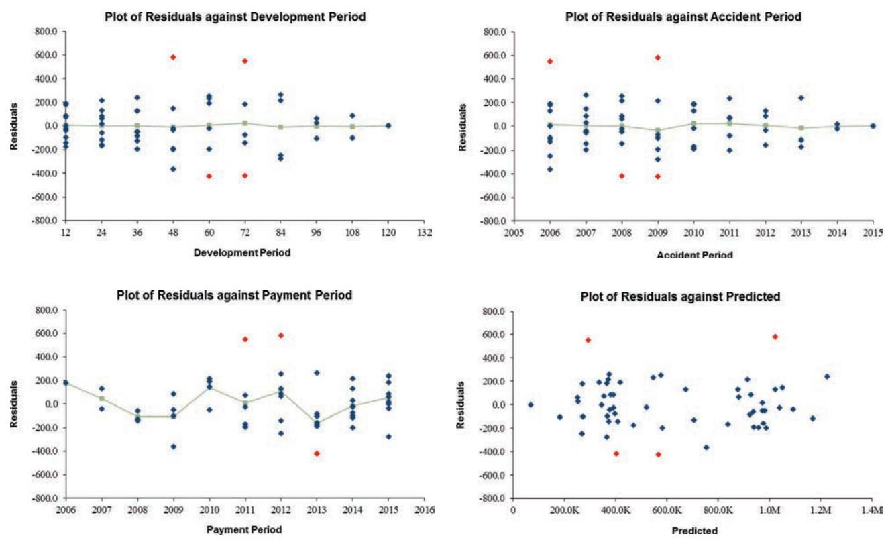

## Page 41
Figure 5.2. Residual Relativities Prior to Heteroscedasticity Adjustment

The graphs in Figure 5.1 do not appear to indicate issues with un-modeled trends by accident period or development period (that is, the green "average" lines appear flat at zero). That's because the ODP bootstrap specifies a parameter for every accident and development period. The development-period graph does, however, reveal a potential heteroscedasticity issue associated with the data-i.e., different variances. Note how the upper left graph appears to show a variance of the residuals in the first three periods that differs from those of the middle four or last two periods.

Adjustments for heteroscedasticity can be made with the "Bootstrap Models.xlsm" file, which enables us to recognize groups of development periods and then adjust the residuals to a common standard deviation value, as described in Section 4.6. As an aid to visualizing how to group the development periods into "hetero" groups, graphs of the standard deviation and range relativities can be developed. Figure 5.2 represents pre-adjusted relativities for the residuals shown in Figure 5.1 (i.e., prior to adjustment for factors calculated using either formulas 4.8 or 4.13 and 4.9).

The relativities illustrated in Figure 5.2 help to clarify the changing variability. However, further testing will be required to assess the optimal groups, which can be performed using the other diagnostic tests noted below.

The residual plots in Figure 5.3 originate from the same data model after adjusting for heteroscedasticity using the third option described in Section 4.6 (i.e., using formulas 4.13 and 4.9). The "hetero" groups chosen are for the first three, middle four, and last two development periods, respectively. Determining whether this adjustment has improved the model will require review of other diagnostic tests.

Comparing the residual plots in Figures 5.1 and 5.3 shows that the residuals now appear to exhibit the same standard deviation, or homoscedasticity. More consistent relativities may also be seen in a comparison of the residual relativities in Figures 5.2 and 5.4.

# 5.2. Normality Test 

The ODP bootstrap model does not depend on the residuals being normally distributed, but even so, comparing residuals against a normal distribution remains a useful test, enabling comparison of parameter sets and gauging skewness of the residuals. This test uses both graphs and calculated test values. Figure 5.5 is based on the data used earlier, before and after the adjustment for heteroscedasticity.
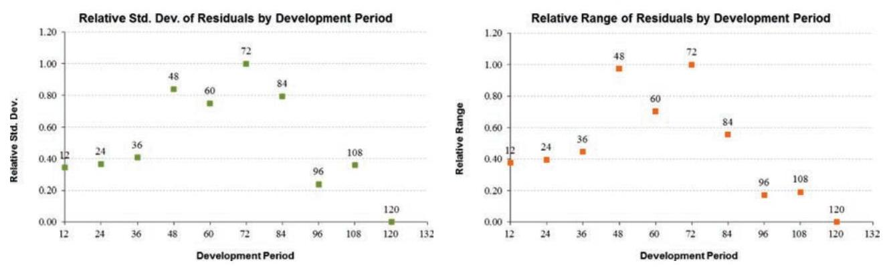

## Page 42
Figure 5.3. Residual Graphs After Heteroscedasticity Adjustment

Figure 5.4. Residual Relativities After Heteroscedasticity Adjustment

Figure 5.5. Normality Plots Prior to and After Heteroscedasticity Adjustment
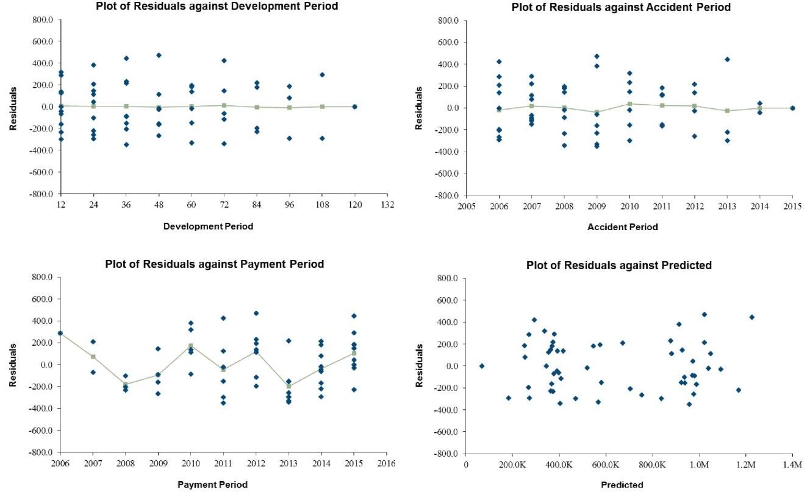
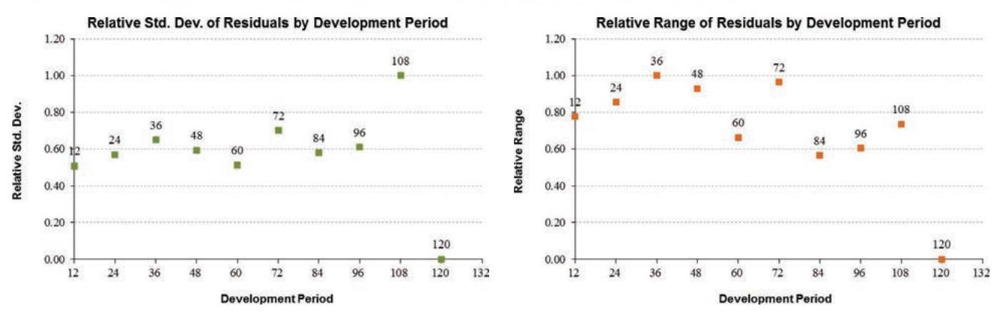
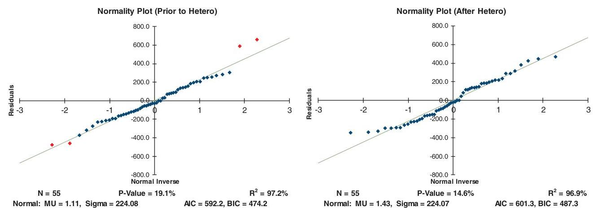

## Page 43
Even before the heteroscedasticity adjustment, the residual plots appear close to normally distributed, with the data points tightly distributed around the diagonal line. The $P$-value, a statistical pass-fail test for normality, came in at $19.1 \%$, which exceeds the value generally considered a "passing" score of the normality test, which is greater than $5.0 \% .{ }^{46}$ The graphs in Figure 5.5 also show $N$ (the number of data points) and the $R^{2}$ test. After the hetero adjustment, the $P$-value and $R^{2}$ get slightly worse, which indicates that the heteroscedasticity adjustment has not improved the results of the diagnostic tests.

While the $P$-value and $R^{2}$ tests assess the goodness of fit of the model to the data, they do not penalize for added parameters. Adding more parameters will almost always improve the fit of the model to the data, but the goal is to have a good fit with as few parameters as possible. Two other tests, the Akaike Information Criteria (AIC) and the Bayesian Information Criteria (BIC), address this limitation, using the difference between each residual and its normal counterpart from the normality plot to calculate the Residual Sum Squared (RSS) and include a penalty for additional parameters, as shown in (5.1) and (5.2), respectively. ${ }^{47}$

$$
\begin{gathered}
\text { AIC }=2 \times p+n \times\left[\ln \left(\frac{2 \times \pi \times \text { RSS }}{n}\right)+1\right] \\
\text { BIC }=n \times \ln \left(\frac{\text { RSS }}{n}\right)+p \times \ln (n)
\end{gathered}
$$

A smaller value for the AIC and BIC tests indicate residuals that fit a normal distribution more closely, and this improvement in fit overcomes the penalty of adding a parameter.

In our example, with some trial and error, a better "hetero" grouping was found with the diagnostic results shown in Figure 5.6. ${ }^{48}$ For the new "hetero" groups, all of the statistical tests improved significantly.

While it might be tempting to add a hetero group for each development column to improve normality, in general normality can be improved with far fewer groups which also helps keep the model from being over-parameterized. As an example, if we use 9 hetero groups for the Taylor and Ashe (1983) data the $P$-value is $14.3 \%$, which is worse than no groups and only slightly better than the original 3 groups, but the AIC and BIC increase significantly.

[^0]
[^0]:    ${ }^{46}$ Remember that this doesn't indicate whether the ODP bootstrap model itself passes or fails-the ODP bootstrap model doesn't require the residuals to be normally distributed. While not included in the "Bootstrap Models. xlsm" file, as discussed in Section 4.10 it could be used to determine whether to switch to a parametric bootstrap process using a normal distribution.
    ${ }^{47}$ There are different versions of the AIC and BIC formula from various authors and sources, but the general idea of each version is consistent. Other similar formulas could also be used.
    ${ }^{48}$ In the "Bootstrap Models.xlsm" file the Taylor \& Ashe data was entered as both paid and incurred. The first set of "hetero" groups are illustrated for the "paid" data and the second set of "hetero" groups are illustrated for the "incurred" data. The "best" groups were found using the optimization tool shown in the "Groups" sheet.

## Page 44
Figure 5.6. Normality Plots Prior to and After Heteroscedasticity Adjustment

# 5.3. Outliers 

Identifying outliers in the data provides another useful test in determining model fit. Outliers can be represented graphically in a box-whisker plot, which shows the inter-quartile range (the 25 th to 75 th percentiles) and the median ( 50 th percentile) of the residuals-the so-called box. The whiskers then extend to the largest values within three times this inter-quartile range. ${ }^{49}$ Values beyond the whiskers may generally be considered outliers and are identified individually with a point.

Figure 5.7 shows an example of the residuals for the second set of "hetero" groups (Figure 5.6). A pre-hetero adjustment plot returns four outliers (red dots) in the data model, corresponding to the two highest and two lowest values in the previous graphs in Figures 5.1, 5.3, 5.5, and 5.6.

Even after the hetero adjustment, the residuals still appear to contain one outlier. Now comes a very delicate and often tricky matter of actuarial judgment. If the data in those cells genuinely represent events that cannot be expected to happen again, the outlier(s) may be removed from the model (by giving it/them zero weight). But extreme caution should be taken even when the removal of outliers seems warranted. The possibility always remains that apparent outliers may actually represent realistic extreme values, which, of course, are critically important to include as part of any sound analysis.

Additionally, when residuals are not normally distributed a significant number of outliers tend to result, which may only be an artifact of the distributional shape of the residuals. In this case it is preferable to let these stand in order to enable the simulation process to replicate this shape. Finally, a significant number of residuals can also mean the underlying model is not a good fit to the data so other models should be used (see Section 4.5 for a discussion) or this model given less weight (see Section 6).

[^0]
[^0]:    ${ }^{49}$ Various authors and textbooks use widths for the whiskers which tend to span from 1.5 to 3 times the interquartile range. Changing the multiplier will therefore make the box-whisker plot more or less sensitive to outliers. It is also possible to illustrate "mild" outliers with a multiplier of 1.5 and the more "extreme" outliers with a multiplier of 3 using different colors and/or symbols in the graphs. Of course the actual multipliers can be adjusted based on personal preference.
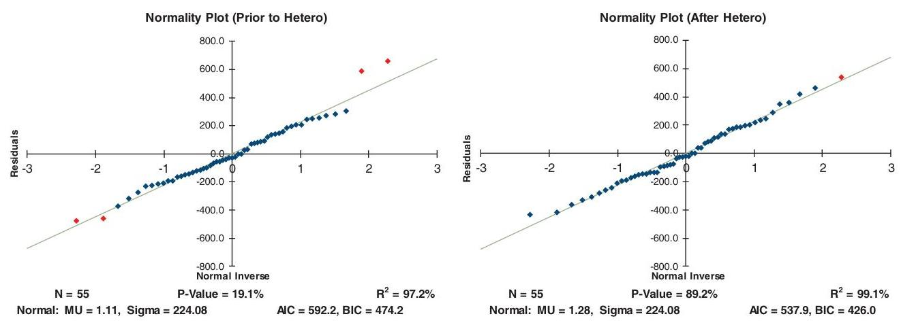

## Page 45
Figure 5.7. Box-Whisker Plots Prior to and After Heteroscedasticity Adjustment
Box-Whisker Plot (Prior to Hetero)

|  |  |
| :-- | :-- |
|  |  |

While the three diagnostic tests shown above demonstrate techniques commonly used with most types of models, they are not the only tests available. ${ }^{50}$ Next, we'll take a look at the flexibility of the GLM bootstrap and some of the diagnostic elements of the simulation results. For a more extensive list of other tests available, see the report, CAS Working Party on Quantifying Variability in Reserve Estimates (2005).

# 5.4. Parameter Adjustment 

As noted in Section 5.1 the relatively straight average lines in the development and accident period graphs are a reflection of having a parameter for every accident and development period. In most instances, this is also a strong indication that the model may be over-parameterized. Using the "GLM Bootstrap" model in the "Bootstrap Models.xlsm" file we can illustrate the power of removing some of the parameters.

Starting with a "basic" model which includes only one parameter for accident, development and calendar periods (i.e., only one $\alpha, \beta$ and $\gamma$ parameter), and adding vertical brown bars to signify a parameter and vertical red lines to signify no parameter (i.e., parameter of zero), the residual graphs for the "GLM Bootstrap" model are shown in Figure 5.8.

The brown bars in the basic model residual graphs represent the parameters and statistics shown in Table 5.1.

Now for this "basic" model the green average lines show trends in the underlying data that are not yet captured by the model as well as a parameter for calendar year trend that is not significant. For example, the overall development period trend parameter is $-11 \%$, but the underlying data shows a positive trend for the first 2 or 3 periods followed by a stronger negative trend for the remaining development periods. Another way to see that this basic model does not yet provide a good fit to the underlying data is to compare the implied development pattern with that of the ODP bootstrap model, as shown in Figure 5.9.

[^0]
[^0]:    ${ }^{50}$ For example, see Venter (1998).
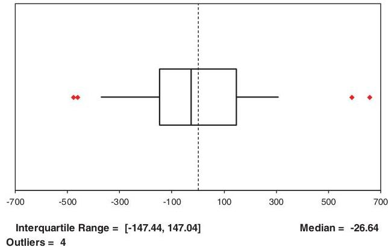
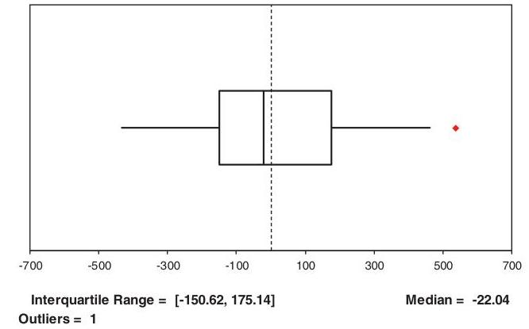

## Page 46
Figure 5.8. Residual Graphs for "Basic" GLM Bootstrap Model

Table 5.1. Parameters and Statistics for "Basic" GLM Bootstrap Model

| Parm | Value | Exp(Value) | $\boldsymbol{t}$-Stat | Periods |
| :-- | :--: | :--: | :--: | :--: |
| $\alpha_{1}$ | 13.44 | 686,938 | 73.92 | Accident Years 2006-2015 |
| $\beta_{1}$ | $(0.11)$ |  | $(3.19)$ | Development Periods 12-132 |
| $\gamma_{1}$ | 0.03 |  | 1.08 | Calendar Years 2006-2015 |

Figure 5.9. Implied Development Patterns
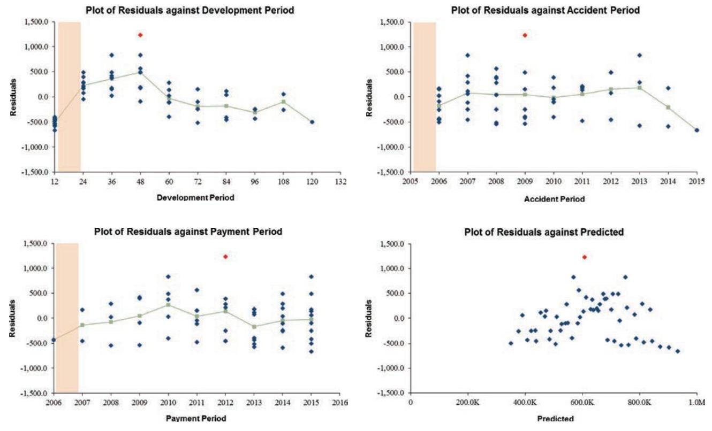
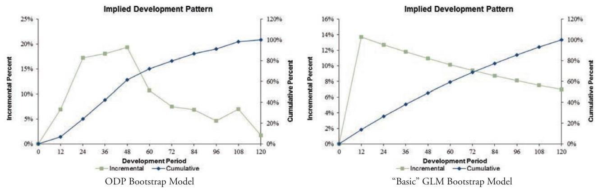

## Page 47
Figure 5.10. Residual Graphs for GLM Bootstrap Model

With a little trial and error we can find a reasonably good fit to the data using only five accident, three development and no calendar parameters as shown in Figure 5.10.51

In addition to checking the remaining trends in the data with the green average lines, $t$-statistics for each new parameter can be checked to make sure each parameter is statistically significant. ${ }^{52}$ The final parameters and statistics for the GLM Bootstrap model are shown in Table 5.2.

Using the "optimal" set of "hetero" groups we can also check the normality graphs and statistics in Figure 5.11 and outliers in Figure 5.12. ${ }^{53}$ Comparing the statistics to the ODP bootstrap values shown in Figures 5.6 and 5.7, most values improved while some did not, yet the GLM Bootstrap model is far more parsimonious.

[^0]
[^0]:    ${ }^{51}$ In the "Bootstrap Models.xlsm" file the optimization tool in the "GLM" sheet can be used to help find a good fit for the parameters of the GLM bootstrap. The algorithm for this tool starts with the ODP bootstrap parameters and then removes the least significant parameters until only significant parameters remain. Then, if there are few enough Alpha and Beta parameters, the Gamma parameters are added and removed if not significant. The tool does not test to see if a parameter should be zero, so some improvements can sometimes occur by forcing parameters to equal zero (e.g., compare the parameters from Figure 5.10 to the parameters in the optimization tool). Finally, it is possible to have a better model fit (i.e., lower AIC and/or BIC) with more parameters even though some of the parameters may not be significant, so judgment is still appropriate for selection of parameters.
    52 The $t$-statistic indicates that a parameter is statistically significant if the absolute value is greater than 2.
    ${ }^{53}$ When using the GLM bootstrap, any selected outliers and hetero groups used for the ODP bootstrap should be reset and then re-evaluated as they will likely be different for the GLM bootstrap. For the "after hetero" portions of Figures 5.11 and 5.12 the optimization tool in the "Groups" sheet was used.
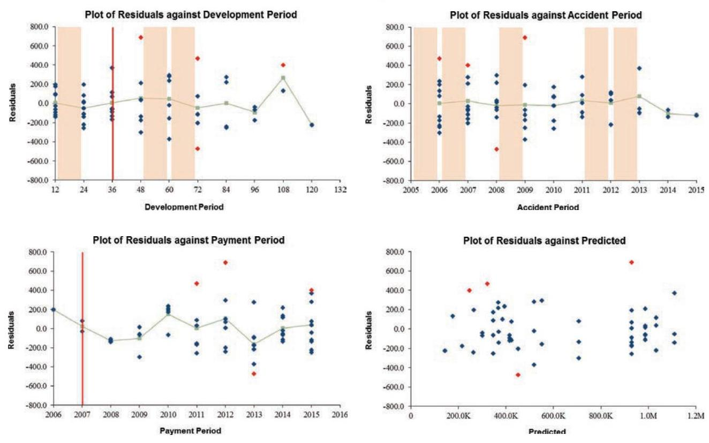

## Page 48
Table 5.2. Parameters and Statistics for GLM Bootstrap Model

| Parm | Value | Exp(Value) | $t$-Stat | Periods |
| :-- | --: | :-- | --: | :-- |
| $\alpha_{1}$ | 12.48 | 264,036 | 79.26 | Accident Year 2006 |
| $\alpha_{2}$ | 12.82 | 368,718 | 2.48 | Accident Years 2007-2008 |
| $\alpha_{3}$ | 12.76 | 347,009 | 2.11 | Accident Years 2009-2011 |
| $\alpha_{4}$ | 12.86 | 385,644 | 2.35 | Accident Year 2012 |
| $\alpha_{5}$ | 12.93 | 414,414 | 3.29 | Accident Years 2013-2015 |
| $\beta_{1}$ | 0.98 |  | 7.88 | Development Periods 12-24 |
| - | 0.00 |  |  | Development Periods 24-48 |
| $\beta_{2}$ | $(0.58)$ |  | $(4.88)$ | Development Periods 48-60 |
| $\beta_{3}$ | $(0.20)$ |  | $(3.29)$ | Development Periods 60-132 |
| - | 0.00 |  |  | Calendar Year 2006-2015 |

Figure 5.11. Normality Plots for GLM Bootstrap Model

Figure 5.12. Box-Whisker Plots for "GLM Bootstrap" Model
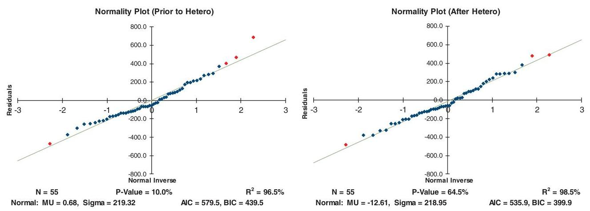
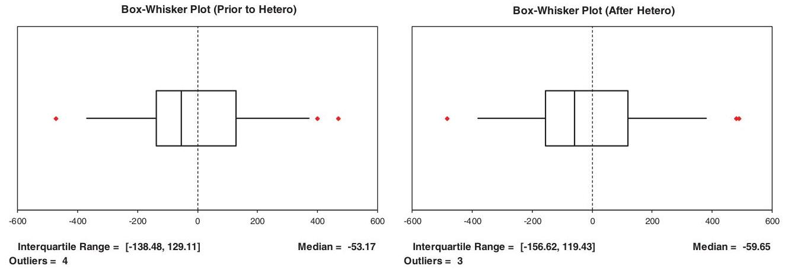

## Page 49
Figure 5.13. Implied Development Patterns

As one final check on the trends in this GLM bootstrap model, we can compare a graph of the implied development patterns with the patterns from the chain ladder in the ODP bootstrap model, as shown in Figure 5.13. Because the chain ladder model used a parameter for each development period the implied development pattern can appear a bit jagged, which is why it is often "smoothed" out in practice by selecting development factors. Interestingly, the GLM bootstrap model looks quite similar, yet with much smoother trends in the development patterns. As noted earlier, the last GLM bootstrap development (and calendar trend) parameter can be assumed to extend until the projected model incremental values equal zero which could then be compared to tail factors used in the ODP bootstrap model. ${ }^{54}$

# 5.5. Model Results 

Once the parameter diagnostics have been reviewed, simulations should be run for each model. These simulation results provide an additional diagnostic tool to aid in evaluation of the model, as described in Section 3 of CAS Working Party (2005). As an example, we will review the results for the Taylor and Ashe (1983) data using the ODP bootstrap model. The estimated-unpaid results shown in Figure 5.14 were simulated using 10,000 iterations with the hetero adjustments from Figure 5.6.

### 5.5.1. Estimated-Unpaid Results

It's recommended to start a diagnostic review of the estimated unpaid results with the standard error (standard deviation) and coefficient of variation (standard error divided by the mean), shown in Figure 5.14. Keep in mind that the standard error should increase when moving from the oldest years to the most recent years, as the standard errors (value scale) should follow the magnitude of the mean of unpaid estimates. In Figure 5.14, the standard errors conform to this pattern. At the same time, the standard error for the total of all years should be larger than any individual year.

[^0]
[^0]:    ${ }^{54}$ Results for the GLM bootstrap model, as illustrated in Figures 5.9 through 5.12, are shown in Appendix E, although no extrapolation was included to be consistent with the ODP bootstrap results.
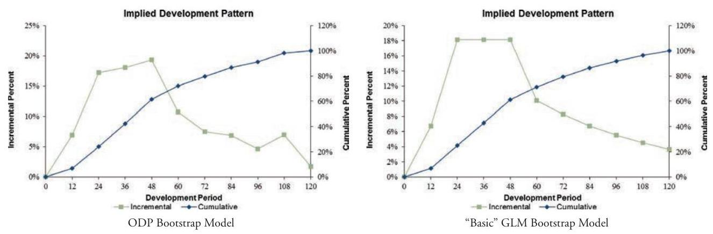

## Page 50
Figure 5.14. Estimated Unpaid Model Results

|  |  |  |  | Taylor \& Ashe Data   Accident Year Unpaid   Paid Chain Ladder Model |  |  |  |  |  |
| :--: | :--: | :--: | :--: | :--: | :--: | :--: | :--: | :--: | :--: |
| Accident   Year | Mean   Unpaid | Standard   Error | Coefficient of Variation | Minimum | Maximum | $50.0 \%$   Percentile | $75.0 \%$   Percentile | $95.0 \%$   Percentile | $99.0 \%$   Percentile |
| 2006 |  |  |  |  |  |  |  |  |  |
| 2007 | 94,649 | 96,571 | 102.0\% | (119,298) | 541,054 | 71,176 | 147,232 | 278,360 | 374,056 |
| 2008 | 473,619 | 199,302 | 42.1\% | (25,494) | 1,217,544 | 454,644 | 590,676 | 830,916 | 1,018,835 |
| 2009 | 714,763 | 250,044 | 35.0\% | 140,156 | 1,642,391 | 684,461 | 882,486 | 1,146,017 | 1,396,652 |
| 2010 | 981,305 | 271,726 | 27.7\% | 324,024 | 2,062,359 | 951,467 | 1,148,872 | 1,475,857 | 1,731,112 |
| 2011 | 1,414,007 | 364,527 | 25.8\% | 468,645 | 2,829,838 | 1,392,288 | 1,642,974 | 2,059,339 | 2,349,855 |
| 2012 | 2,173,552 | 489,442 | 22.5\% | 806,008 | 4,293,160 | 2,142,306 | 2,489,525 | 3,033,205 | 3,345,364 |
| 2013 | 3,969,749 | 768,637 | 19.4\% | 1,655,462 | 6,369,285 | 3,913,503 | 4,501,100 | 5,307,862 | 5,989,765 |
| 2014 | 4,317,349 | 887,688 | 20.6\% | 1,874,779 | 7,677,306 | 4,260,113 | 4,898,209 | 5,844,560 | 6,516,905 |
| 2015 | 4,703,420 | 2,176,343 | 46.3\% | 445,056 | 13,859,166 | 4,493,023 | 6,127,676 | 8,500,947 | 10,529,157 |
| Totals | 18,842,414 | 2,902,735 | 15.4\% | 11,312,275 | 29,464,222 | 18,594,140 | 20,734,478 | 23,885,153 | 26,388,103 |

Also, the coefficients of variation should generally decrease when moving from the oldest years to the more recent years and the coefficient of variation for all years combined should be less than for any individual year. With the exception of the 2014 and 2015 accident years, the coefficients of variation in Figure 5.14 seem to also conform, although some random fluctuations may be seen.

The main reason for the decrease in the coefficient of variation has to do with the independence in the incremental claim-payment stream. Because the oldest accident year typically has only a few incremental payments remaining, or even just one, the variability is nearly all reflected in the coefficient. For more current accident years, random variations in the future incremental payment stream may tend to offset one another, thereby reducing the variability of the total unpaid loss. ${ }^{55}$

While the coefficients of variation should go down, they could also start to rise again in the most recent years, as seen in Figure 5.14 for 2014 and 2015. Such reversals are from a couple of issues:

- With an increasing number of parameters used in the model, the parameter uncertainty tends to increase when moving from the oldest years to the more recent years. In the most recent years, parameter uncertainty can grow to overpower process uncertainty, which may cause the coefficient of variation to start rising again. At a minimum, increasing parameter uncertainty will slow the rate of decrease in the coefficient of variation.
- The model may be overestimating the uncertainty in recent accident years if the increase is significant. In that case, another model algorithm (e.g., BornhuetterFerguson or Cape Cod) may need to be used instead of a chain-ladder model.

Keep in mind also that the standard error or coefficient of variation for the total of all accident years will be less than the sum of the standard error or coefficient of variation for the individual years. This is because the model assumes that accident years are independent.

[^0]
[^0]:    ${ }^{55}$ To visualize this reducing Coefficient of Variation, recall that the standard deviation for the total of several independent variables is equal to the square root of the sum of the squares.

## Page 51
Minimum and maximum results are the next diagnostic element in our analysis of the estimated unpaid claims in Figure 5.14, representing the smallest and largest values from all iterations of the simulation. These values will need to be reviewed in order to determine their veracity. If any of them seem implausible, the model assumptions would need to be reviewed. Their effects could materially alter the mean indication. Sometimes implausible extreme iterations are the result of negative incremental values in those "rare" iterations and the limiting incremental value options discussed in Section 4.1 can be used to constrain the model simulation process.

# 5.5.2. Mean, Standard Deviation and CoV of Incremental Values 

The mean, standard deviation and coefficients of variation for every incremental value from the simulation process also provide useful diagnostic results, enabling us to dig deeper into potential coefficient of variation issues that may be found in the estimated unpaid results. Consider, for example, the mean, standard deviation and coefficient of variation results shown in Figures 5.15, 5.16 and 5.17, respectively.

The mean values in Figure 5.15 appear consistent throughout and support the increases in estimated unpaid by accident year that are shown in Figure 5.14. In fact, the future mean values, which lay beyond the stepped diagonal line in Figure 5.15, sum to the results in Figure 5.14. The standard deviation values in Figure 5.16 also

Figure 5.15. Mean of Incremental Values

Figure 5.16. Standard Deviation of Incremental Values
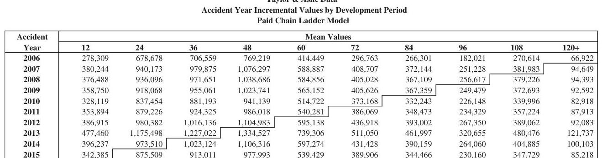
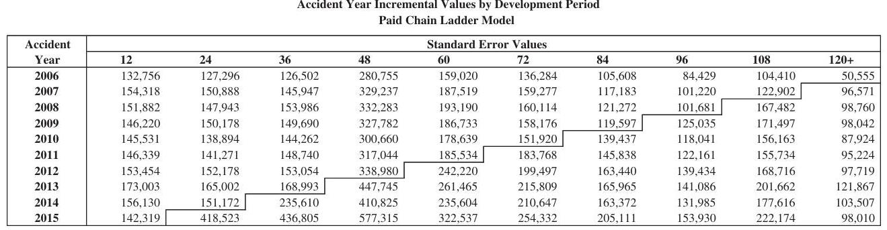

## Page 52
Figure 5.17. Coefficient of Variation of Incremental Values
appear consistent, although the future periods seem to have larger standard deviations than historical periods. But the standard deviations can't be added because the standard deviations in Figure 5.14 represent those for aggregated incremental values by accident year, which are less than perfectly correlated.

The differences between the future and historical coefficients of variation in Figure 5.17 help clarify any issues with the model results. For example, notice how the differences by development period are more significant in the bottom two rows in Figure 5.17. This is consistent with the increases in the accident year 2014 and 2015 coefficients of variation noted in Figure 5.14, so they can be used to diagnose the causes noted above when compared to the same results for different models.
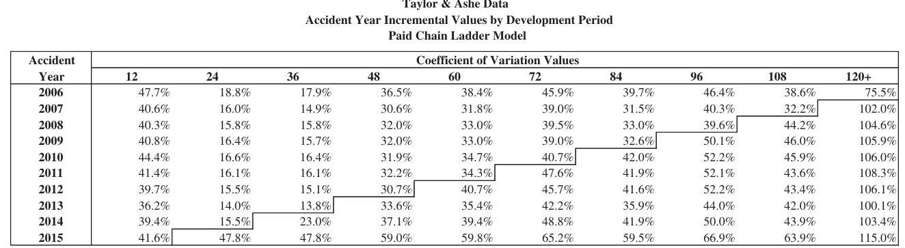

## Page 53
# 6. Using Multiple Models 

So far we have focused only on one model. In practice, multiple stochastic models should be used in the same way that multiple methods should be used in a deterministic analysis. First the results for each model must be reviewed and finalized, after an iterative process of diagnostic testing and reviewing model output to make sure the model "fits" the data, has reasonable assumptions and produces reasonable results. Then these results can be combined by assigning a weight to the results of each model.

Two primary methods exist for combining the results for multiple models:

- Run models with the same random variables. For this algorithm, every model uses the exact same random variables. In the "Bootstrap Models.xlsm" file, the random values are simulated before they are used to simulate results, which means that this algorithm may be accomplished by reusing the same set of random variables for each model. At the end, the incremental values for each model, for each iteration by accident year (that have a partial weight), can be weighted together.
- Run models with independent random variables. For this algorithm, every model is run with its own random variables. In the "Bootstrap Models.xlsm" file the random values are simulated before they are used to simulate results, which means that this algorithm may be accomplished by simulating a new set of random variables for each model. ${ }^{56}$ At the end, the weights are used to randomly select a model for each iteration by accident year so that the result is a weighted "mixture" of models.

Both algorithms are similar to the process of weighting the results of different deterministic methods to arrive at an actuarial best estimate. The process of weighting the results of different stochastic models produces an actuarial best estimate of a distribution. In practice it is also common to further "adjust" or "shift" the weighted results by year after considering case reserves and the calculated IBNR. This "shifting" can also be done for weighted distributions, either additively to maintain the exact shape and width of the distribution by year or multiplicatively to maintain the exact shape of the distribution but adjusting the width of the distribution.

[^0]
[^0]:    ${ }^{56}$ In general, in order to simulate new random values a new seed value must be selected, otherwise the same random values will be simulated. In the "Bootstrap Models.xlsm" file the seed value is incremented for each model and data type so that different seed values are being used as long as new random numbers are generated for each model and data type.

## Page 54
Figure 6.1. Model Weights by Accident Year

| Accident   Year | Model Weights by Accident Year |  |  |  |  |  |  |  |  |
| :--: | :--: | :--: | :--: | :--: | :--: | :--: | :--: | :--: | :--: |
|  | Paid CL | Ined CL | Paid BF | Ined BF | Paid CC | Ined CC | Paid GLM | Ined GLM | TOTAL |
| 2006 | $50.0 \%$ | $50.0 \%$ |  |  |  |  |  |  | $100.0 \%$ |
| 2007 | $50.0 \%$ | $50.0 \%$ |  |  |  |  |  |  | $100.0 \%$ |
| 2008 | $50.0 \%$ | $50.0 \%$ |  |  |  |  |  |  | $100.0 \%$ |
| 2009 | $50.0 \%$ | $50.0 \%$ |  |  |  |  |  |  | $100.0 \%$ |
| 2010 | $50.0 \%$ | $50.0 \%$ |  |  |  |  |  |  | $100.0 \%$ |
| 2011 | $50.0 \%$ | $50.0 \%$ |  |  |  |  |  |  | $100.0 \%$ |
| 2012 | $50.0 \%$ | $50.0 \%$ |  |  |  |  |  |  | $100.0 \%$ |
| 2013 | $16.7 \%$ | $16.7 \%$ | $16.7 \%$ | $16.7 \%$ | $16.7 \%$ | $16.7 \%$ |  |  | $100.0 \%$ |
| 2014 | $16.7 \%$ | $16.7 \%$ | $16.7 \%$ | $16.7 \%$ | $16.7 \%$ | $16.7 \%$ |  |  | $100.0 \%$ |
| 2015 | $16.7 \%$ | $16.7 \%$ |  |  | $16.7 \%$ | $16.7 \%$ | $16.7 \%$ | $16.7 \%$ | $100.0 \%$ |

The second method of combining multiple models will be illustrated using combined Schedule P data for five top 50 companies. ${ }^{57}$ Data for all Schedule P lines with 10 years of history may be found in the "Industry Data.xlsm" file, but this example will be confined to Parts A, B, and C. For each line of business ODP bootstrap models were run for paid and incurred data (labeled Chain Ladder), as well as paid and incurred data for the Bornhuetter-Ferguson and Cape Cod models described in Section 3.3 and the GLM bootstrap model described in Section 3.4. ${ }^{58}$ For this section, only the results for Part A (Homeowners/Farmowners) will be reviewed. ${ }^{59}$

By comparing the results for all eight models (or fewer, depending on how many are used) ${ }^{60}$ a qualitative assessment of the relative merits of each model may be determined. Bayesian methods can be used to determine weighting based on the quality of each model's forecasts. The weights can be determined separately for each year. The table in Figure 6.1 shows an example of weights for the Part A data. ${ }^{61}$ The weighted results are displayed in the "Best Estimate" column of Figure 6.2. As a parallel to a deterministic analysis, the means from the eight models could be used to derive a reasonable range from the modeled results (i.e., from $\$ 4,099$ to $\$ 5,650$ ) as shown in Figure 6.3. Alternatively, if we only consider results by accident year which are given some weight when deriving the best estimate, then the "weighted range" may be a more representative view of the uncertainty of the actuarial central estimate. ${ }^{62}$

When selecting weights for stochastic models, the standard deviations should also be considered in addition to the means by model since the weighted best estimate should reflect the actuary's judgments about the entire distribution not just a central

[^0]
[^0]:    ${ }^{57}$ The five companies represent large, medium and smaller companies that have been combined to maintain anonymity. For each Part, a unique set of five companies were used.
    ${ }^{58}$ An additional benefit of converting the incurred data models to a random payment stream as discussed in Section 3.3.1 is that they can be combined with other model results.
    ${ }^{59}$ Only selected weighted results are displayed and discussed in Section 6. A more complete set of results, including results for each model, are included in Appendix A.
    ${ }^{60}$ Other models in addition to the ODP bootstrap and GLM bootstrap models could also be included in the weighting process as long as the simulated results are in the form of random incremental payment streams.
    ${ }^{61}$ For simplicity, the weights are judgmental and not derived using Bayesian methods.
    ${ }^{62}$ The "modeled range" in Figure 6.3 is derived using each model that is given at least some weight for any accident year-i.e., if the model is used. In contrast, the "weighted range" is derived using only the models given weight for each accident year, which are highlighted in grey in Figure 6.2 and 6.4.

## Page 55
Figure 6.2. Summary of Mean Results by Model
Five Top 50 Companies
Schedule P, Part A -- Homeowners / Farmowners (in 000,000's)
Summary of Results by Model

| Accident   Year | Mean Estimated Unpaid |  |  |  |  |  |  |  |  |
| :--: | :--: | :--: | :--: | :--: | :--: | :--: | :--: | :--: | :--: |
|  | Chain Ladder |  | Bornhuetter Ferguson |  | Cape Cod |  | GLM Bootstrap |  | Best Est.   (Weighted) |
|  | Paid | Incurred | Paid | Incurred | Paid | Incurred | Paid | Incurred |  |
| 2006 | - | - | - | - | - | - | - | - | - |
| 2007 | 3 | 3 | 2 | 2 | 3 | 3 | 9 | 12 | 3 |
| 2008 | 41 | 42 | 28 | 27 | 32 | 33 | 27 | 27 | 41 |
| 2009 | 45 | 46 | 37 | 39 | 43 | 45 | 40 | 45 | 46 |
| 2010 | 63 | 62 | 60 | 59 | 66 | 71 | 62 | 73 | 64 |
| 2011 | 103 | 103 | 96 | 98 | 109 | 115 | 106 | 113 | 103 |
| 2012 | 222 | 226 | 169 | 168 | 191 | 199 | 213 | 169 | 224 |
| 2013 | 294 | 306 | 327 | 334 | 373 | 385 | 280 | 307 | 335 |
| 2014 | 679 | 723 | 722 | 753 | 835 | 871 | 646 | 650 | 752 |
| 2015 | 3,851 | 3,912 | 2,660 | 2,885 | 3,225 | 3,430 | 3,738 | 4,255 | 3,742 |
| Totals | 5,300 | 5,422 | 4,099 | 4,366 | 4,878 | 5,151 | 5,120 | 5,650 | 5,308 |

Figure 6.3. Summary of Ranges by Accident Year
Five Top 50 Companies
Schedule P, Part A -- Homeowners / Farmowners (in 000,000's)
Summary of Results by Model

| Accident   Year |  | Ranges |  |  |
| :--: | :--: | :--: | :--: | :--: |
|  | Best Est.   (Weighted) | Weighted |  | Modeled |
|  |  | Minimum | Maximum | Minimum |
| 2006 | - |  |  |  |
| 2007 | 3 | 3 | 3 | 2 |
| 2008 | 41 | 41 | 42 | 27 |
| 2009 | 46 | 45 | 46 | 37 |
| 2010 | 64 | 62 | 63 | 59 |
| 2011 | 103 | 103 | 103 | 96 |
| 2012 | 224 | 222 | 226 | 168 |
| 2013 | 335 | 294 | 385 | 280 |
| 2014 | 752 | 679 | 871 | 646 |
| 2015 | 3,742 | 3,225 | 4,255 | 2,660 |
| Totals | 5,308 | 4,674 | 5,992 | 4,099 |

estimate. Thus, coefficients of variation by model can be used for this purpose as illustrated in Figure 6.4.

With our focus on the entire distribution, the weights by year were used to randomly sample the specified percentage of iterations from each model. A more complete set of the results for the "weighted" iterations can be created similar to the tables shown in Section 5. The companion "Best Estimate.xlsm" file can be used to weight eight different models together in order to calculate a weighted best estimate. An example for Part A is shown in the table in Figure 6.5.

As one final check of the weighted results it would be common to review the implied IBNR to make sure there are no issues as shown in Figure 6.6. By reviewing this reconciliation, and perhaps also comparing it to deterministic results, additional adjustments could be made to various assumptions. For example, from year 2006 in Figure 6.6 it may be more realistic to revisit the tail factor assumption so that the unpaid estimate is more consistent with the case reserves. Finally, after the interactive process of reviewing results and adjusting assumptions is complete, it may still be

## Page 56
Figure 6.4. Summary of CoV Results by Model
Five Top 50 Companies
Schedule P, Part A -- Homeowners / Farmowners (in 000,000's)
Summary of Results by Model

| Accident   Year | Coefficient of Variation |  |  |  |  |  |  |  |
| :--: | :--: | :--: | :--: | :--: | :--: | :--: | :--: | :--: |
|  | Chain Ladder |  | Bornhuetter Ferguson |  | Cape Cod |  | GLM Bootstrap |  |
|  | Paid | Incurred | Paid | Incurred | Paid | Incurred | Paid | Incurred |
| 2006 |  |  |  |  |  |  |  |  |
| 2007 | 264.9\% | 309.9\% | 310.2\% | 318.6\% | 276.2\% | 326.5\% | 86.4\% | 91.5\% |
| 2008 | 74.7\% | 101.0\% | 89.2\% | 109.3\% | 86.1\% | 95.6\% | 177.0\% | 184.0\% |
| 2009 | 65.5\% | 93.2\% | 69.7\% | 93.5\% | 69.2\% | 89.0\% | 119.3\% | 118.9\% |
| 2010 | 49.4\% | 75.6\% | 52.2\% | 78.0\% | 47.2\% | 72.7\% | 78.5\% | 78.1\% |
| 2011 | 34.9\% | 62.4\% | 35.7\% | 64.6\% | 33.5\% | 59.5\% | 51.3\% | 50.9\% |
| 2012 | 26.1\% | 49.5\% | 31.3\% | 51.4\% | 28.1\% | 50.2\% | 33.6\% | 41.5\% |
| 2013 | 27.3\% | 57.5\% | 26.9\% | 59.3\% | 23.3\% | 56.2\% | 27.9\% | 34.9\% |
| 2014 | 18.9\% | 48.8\% | 21.8\% | 51.0\% | 17.1\% | 46.7\% | 20.3\% | 26.3\% |
| 2015 | 9.2\% | 39.2\% | 14.4\% | 40.5\% | 8.0\% | 39.4\% | 9.0\% | 16.0\% |
| Totals | 8.4\% | 29.0\% | 11.1\% | 28.9\% | 7.9\% | 27.5\% | 8.7\% | 13.3\% |

Figure 6.5. Estimated Unpaid Model Results (weighted)
Five Top 50 Companies
Schedule P, Part A -- Homeowners / Farmowners (in 000,000's)
Accident Year Unpaid
Best Estimate (Weighted)

| Accident   Year | Mean   Unpaid | Standard   Error | Coefficient   of Variation | Minimum | Maximum | 50.0\%   Percentile | 75.0\%   Percentile | 95.0\%   Percentile | 99.0\%   Percentile |
| :--: | :--: | :--: | :--: | :--: | :--: | :--: | :--: | :--: | :--: |
| 2006 | - | - | - | - | - | - | - | - | - |
| 2007 | 3 | 9 | 292.0\% | - | 173 | 0 | 1 | 17 | 42 |
| 2008 | 41 | 37 | 88.6\% | - | 391 | 32 | 57 | 111 | 168 |
| 2009 | 46 | 37 | 81.0\% | 1 | 522 | 36 | 60 | 114 | 175 |
| 2010 | 64 | 41 | 63.6\% | 4 | 537 | 55 | 81 | 139 | 205 |
| 2011 | 103 | 50 | 48.8\% | 10 | 636 | 94 | 125 | 193 | 276 |
| 2012 | 224 | 89 | 40.0\% | 36 | 917 | 211 | 266 | 382 | 529 |
| 2013 | 335 | 148 | 44.3\% | 25 | 1,460 | 315 | 401 | 594 | 865 |
| 2014 | 752 | 293 | 39.0\% | 106 | 2,881 | 725 | 873 | 1,265 | 1,789 |
| 2015 | 3,742 | 982 | 26.2\% | 1,094 | 10,700 | 3,654 | 4,118 | 5,392 | 7,059 |
| Totals | 5,308 | 1,044 | 19.7\% | 2,116 | 12,445 | 5,224 | 5,758 | 7,074 | 8,675 |
| Normal Dist.   logNormal Dist. | 5,308   5,309 | 1,044   1,034 | 19.7\%   19.5\% |  |  | 5,308   5,211 | 6,013   5,935 | 7,026   7,158 | 7,738   8,164 |
| Gamma Dist. | 5,308 | 1,044 | 19.7\% |  |  | 5,240 | 5,971 | 7,135 | 8,035 |
| TVaR |  |  |  |  |  | 6,035 | 6,593 | 8,140 | 10,091 |
| Normal TVaR   logNormal TVaR |  |  |  |  |  | 6,142   6,121 | 6,636   6,691 | 7,463   7,780 | 8,092   8,733 |
| Gamma TVaR |  |  |  |  |  | 6,137 | 6,688 | 7,689 | 8,516 |

Figure 6.6. Reconciliation of Total Results (weighted)
Five Top 50 Companies
Schedule P, Part A -- Homeowners / Farmowners (in 000,000's)
Reconciliation of Total Results
Best Estimate (Weighted)

| Accident   Year | Paid   To Date | Incurred   To Date | Case   Reserves | IBNR | Estimate of   Ultimate | Estimate of   Unpaid |
| :--: | :--: | :--: | :--: | :--: | :--: | :--: |
| 2006 | 5,234 | 5,237 | 3 | $(3)$ | 5,234 | - |
| 2007 | 6,470 | 6,479 | 9 | $(6)$ | 6,473 | 3 |
| 2008 | 7,848 | 7,867 | 19 | 23 | 7,890 | 41 |
| 2009 | 7,020 | 7,046 | 26 | 20 | 7,066 | 46 |
| 2010 | 7,291 | 7,341 | 50 | 13 | 7,355 | 64 |
| 2011 | 8,134 | 8,225 | 91 | 12 | 8,237 | 103 |
| 2012 | 10,800 | 11,085 | 285 | (61) | 11,023 | 224 |
| 2013 | 7,522 | 7,810 | 288 | 46 | 7,856 | 335 |
| 2014 | 7,968 | 8,703 | 735 | 17 | 8,720 | 752 |
| 2015 | 9,309 | 12,788 | 3,478 | 263 | 13,051 | 3,742 |
| Totals | 77,596 | 82,580 | 4,984 | 324 | 82,905 | 5,308 |

## Page 57
prudent to make adjustments to the best estimate of the unpaid by shifting the results as noted earlier in this section. For example, since all of the models estimated the unpaid for 2012 to be less than the case reserves, if other studies show that the case reserves are not likely to be redundant then the actuary may decide to shift the unpaid for 2012 so that it is at least 285 .

# 6.1. Additional Useful Output 

Three rows of percentile numbers for the normal, lognormal, and gamma distributions, which have been fitted to the total unpaid-claim distribution, may be seen at the bottom of the table in Figure 6.5. The fitted mean, standard deviation, and selected percentiles are in their respective columns; the smoothed results can be used to assess the quality of fit, parameterize a DFA model, or used to smooth the estimate of extreme values, ${ }^{63}$ among other applications.

Four rows of numbers indicating the Tail Value at Risk (TVaR), defined as the average of all of the simulated values equal to or greater than the percentile value, may also be seen at the bottom of Figure 6.5. For example, in this table, the 99th percentile value for the total unpaid claims for all accident years combined is 8,675 , while the average of all simulated values that are greater than or equal to 8,675 is 10,091 . The Normal TVaR, Lognormal TVaR, and Gamma TVaR rows are calculated similarly, except that they use the respective fitted distributions in the calculations rather than actual simulated values from the model.

An analysis of the TVaR values is likely to help clarify a critical issue: if the actual outcome exceeds the X percentile value, by how much will it exceed that value on average? This type of assessment can have important implications related to risk-based capital calculations and other technical aspects of enterprise risk management. But it is worth noting that the purpose of the normal, lognormal, and gamma TVaR numbers is to provide "smoothed" values-that is, that some of the random statistical noise is essentially prevented from distorting the calculations.

### 6.2. Estimated Cash Flow Results

A model's output may also be reviewed by calendar year (or by future diagonal), as shown in the table in Figure 6.7. A comparison of the values in Figures 6.5 and 6.7 indicates that the total rows are identical, because summing the future payments horizontally or diagonally will produce the same total. Similar diagnostic issues (as discussed in Section 5) may be reviewed in the table in Figure 6.7, with the exception of the relative values of the standard errors and coefficients of variation moving in opposite directions for calendar years compared to accident years. This phenomenon makes sense on an intuitive level when one considers that "final" payments, projected to the furthest point in the future, should actually be the smallest, yet relatively most uncertain.

[^0]
[^0]:    ${ }^{63}$ A random instance of an extreme percentile can be quite erratic compared to the same percentile of a distribution fitted to the simulated distribution. This random noise for extreme percentiles could be cause for increasing the number of iterations, but if the same percentiles for the fitted distributions are stable perhaps they can be used in lieu of more iterations. Of course the use of the extreme values assumes that the models are reliable.

## Page 58
Figure 6.7. Estimated Cash Flow (weighted)
Five Top 50 Companies
Schedule P, Part A -- Homeowners / Farmowners (in 000,000's)
Calendar Year Unpaid
Best Estimate (Weighted)

| Calendar   Year | Mean   Unpaid | Standard   Error | Coefficient   of Variation | Minimum | Maximum | 50.0\%   Percentile | 75.0\%   Percentile | 95.0\%   Percentile | 99.0\%   Percentile |
| :--: | :--: | :--: | :--: | :--: | :--: | :--: | :--: | :--: | :--: |
| 2016 | 3,475 | 754 | 21.7\% | 1,297 | 8,420 | 3,414 | 3,797 | 4,730 | 5,948 |
| 2017 | 865 | 208 | 24.0\% | 293 | 2,148 | 843 | 982 | 1,224 | 1,483 |
| 2018 | 403 | 118 | 29.4\% | 115 | 1,298 | 387 | 467 | 614 | 740 |
| 2019 | 204 | 67 | 32.7\% | 56 | 654 | 194 | 240 | 325 | 412 |
| 2020 | 140 | 50 | 35.9\% | 40 | 539 | 132 | 165 | 233 | 297 |
| 2021 | 90 | 43 | 47.4\% | 12 | 611 | 82 | 112 | 169 | 229 |
| 2022 | 70 | 44 | 63.2\% | 6 | 409 | 60 | 91 | 152 | 215 |
| 2023 | 51 | 58 | 112.2\% | - | 735 | 36 | 75 | 151 | 253 |
| 2024 | 10 | 15 | 146.5\% | - | 199 | 4 | 15 | 41 | 67 |
| Totals | 5,308 | 1,044 | 19.7\% | 2,116 | 12,445 | 5,224 | 5,758 | 7,074 | 8,675 |

Figure 6.8. Estimated Loss Ratio (weighted)
Five Top 50 Companies
Schedule P, Part A -- Homeowners / Farmowners (in 000,000's)
Accident Year Ultimate Loss Ratios
Best Estimate (Weighted)

| Accident   Year | Mean   Loss Ratio | Standard   Error | Coefficient   of Variation | Minimum | Maximum | 50.0\%   Percentile | 75.0\%   Percentile | 95.0\%   Percentile | 99.0\%   Percentile |
| :--: | :--: | :--: | :--: | :--: | :--: | :--: | :--: | :--: | :--: |
| 2006 | 67.7\% | 28.5\% | 42.1\% | 0.4\% | 220.8\% | 66.1\% | 71.1\% | 130.9\% | 158.2\% |
| 2007 | 79.3\% | 30.2\% | 38.1\% | 8.2\% | 262.2\% | 77.8\% | 83.1\% | 145.5\% | 178.5\% |
| 2008 | 90.5\% | 31.2\% | 34.5\% | 16.9\% | 261.3\% | 89.0\% | 94.6\% | 159.9\% | 188.9\% |
| 2009 | 72.8\% | 26.8\% | 36.7\% | 10.2\% | 215.6\% | 71.4\% | 76.1\% | 131.7\% | 180.4\% |
| 2010 | 65.3\% | 23.3\% | 35.7\% | 10.2\% | 225.0\% | 63.8\% | 68.0\% | 116.1\% | 139.7\% |
| 2011 | 64.1\% | 21.2\% | 33.1\% | 13.0\% | 190.0\% | 63.2\% | 67.0\% | 111.8\% | 130.5\% |
| 2012 | 80.5\% | 24.0\% | 29.9\% | 25.0\% | 234.6\% | 79.0\% | 83.7\% | 132.9\% | 154.6\% |
| 2013 | 54.7\% | 18.8\% | 34.4\% | 9.9\% | 157.7\% | 53.9\% | 57.4\% | 96.2\% | 115.1\% |
| 2014 | 58.0\% | 19.2\% | 33.0\% | 13.0\% | 164.8\% | 57.1\% | 60.6\% | 99.8\% | 118.8\% |
| 2015 | 88.2\% | 21.5\% | 24.4\% | 30.9\% | 232.5\% | 85.5\% | 92.5\% | 127.9\% | 158.7\% |
| Totals | 71.3\% | 7.4\% | 10.4\% | 46.6\% | 112.7\% | 70.8\% | 75.7\% | 84.4\% | 91.7\% |

# 6.3. Estimated Ultimate Loss Ratio Results 

Another output table, Figure 6.8, shows the estimated ultimate loss ratios by accident year. Unlike the estimated unpaid and estimated cash-flow tables, the values in this table are calculated using all simulated values, not just the values beyond the end of the historical triangle. Because the simulated sample triangles represent additional possibilities of what could have happened in the past, even as the "squaring of the triangle" and process variance represent what could happen as those same past values are played out into the future, we are in possession of sufficient information to enable us to estimate the variability in the loss ratio from day one until all claims are completely paid and settled for each accident year. ${ }^{64}$

Reviewing the simulated values indicates that the standard errors in Figure 6.8 should be proportionate to the means, while the coefficients of variation should be relatively constant by accident year. In terms of diagnostics, any increases in standard error and coefficient of variation for the most recent years would be consistent with the reasons

[^0]
[^0]:    ${ }^{64}$ If we are only interested in the "remaining" volatility in the loss ratio, then the values in the estimated unpaid table (Figure 6.5) can be added to the cumulative paid values by year and divided by the premiums.

## Page 59
Figure 6.9. Estimated Unpaid Claim Runoff (weighted)
Five Top 50 Companies
Schedule P, Part A -- Homeowners / Farmowners (in 000,000's)
Calendar Year Unpaid Claim Runoff
Best Estimate (Weighted)

| Calendar   Year | Mean   Unpaid | Standard   Error | Coefficient   of Variation | Minimum | Maximum | 50.0\%   Percentile | 75.0\%   Percentile | 95.0\%   Percentile | 99.0\%   Percentile |
| :--: | :--: | :--: | :--: | :--: | :--: | :--: | :--: | :--: | :--: |
| 2015 | 5,308 | 1,044 | 19.7\% | 2,116 | 12,445 | 5,224 | 5,758 | 7,074 | 8,675 |
| 2016 | 1,834 | 365 | 19.9\% | 746 | 4,128 | 1,797 | 2,030 | 2,459 | 2,957 |
| 2017 | 969 | 218 | 22.5\% | 336 | 2,316 | 946 | 1,088 | 1,353 | 1,627 |
| 2018 | 566 | 146 | 25.8\% | 159 | 1,393 | 548 | 647 | 828 | 1,004 |
| 2019 | 362 | 114 | 31.5\% | 79 | 1,171 | 347 | 424 | 565 | 718 |
| 2020 | 222 | 92 | 41.4\% | 35 | 956 | 207 | 269 | 386 | 524 |
| 2021 | 132 | 76 | 57.6\% | 6 | 863 | 117 | 166 | 268 | 394 |
| 2022 | 62 | 59 | 96.3\% | (0) | 745 | 46 | 84 | 166 | 269 |
| 2023 | 10 | 15 | 146.5\% | (0) | 199 | 4 | 15 | 41 | 67 |

previously cited in Section 5.4 for the estimated unpaid tables. Risk management-wise, the loss ratio distributions have important implications for projecting pricing riskthe mean loss ratios can be used to view any underwriting cycles and help inform the projected mean for the next few years, while the coefficients of variation can be used to select a standard deviation for the next few years. ${ }^{65}$

# 6.4. Estimated Unpaid Claim Runoff Results 

Figure 6.9, shows the runoff of the total unpaid claim distribution by future calendar year. Like the estimated unpaid and estimated cash-flow tables, the values in this table are calculated using only future simulated values, except that future diagonal results are sequentially removed so that we are left with the remaining unpaid claims at the end of future calendar periods. These results are quite useful for calculating the runoff of the unpaid claim distribution when calculating risk margins using the cost of capital method.

### 6.5. Distribution Graphs

A final model output to consider is a histogram of the estimated unpaid amounts for the total of all accident years combined, as shown in the graph in Figure 6.10. The histogram is created by counting the number of outcomes within each of 100 "buckets" of equal size spread between the minimum and maximum outcome. To smooth the histogram a kernel density function is often used, which is the green bars in Figure 6.10.

Another useful strategy for graphing the total unpaid distribution may be accomplished by creating a summary of the eight model distributions used to determine the weighted "best estimate" and distribution. An example of this graph using the kernel density functions is shown in Figure 6.11 and dots for the mean estimates, which would represent a traditional range, ${ }^{66}$ are also included.

[^0]
[^0]:    ${ }^{65}$ The coefficients of variation measure the variability of the loss ratios, given the movements by year. Without this information, it is common to base the future standard deviation on the standard deviation of the historical mean loss ratios, but this is not ideal since the variability of the mean loss ratios is not the same as the possible variation in the actual outcomes given movements in the means.
    ${ }^{66}$ A traditional range would use deterministic point estimates instead of means of the distributions, but the intent is consistent. While the points would technically have an infinitesimal probability and should therefore sit on the x -axis, they are elevated above the zero probability level purely for illustration purposes.

## Page 60
Figure 6.10. Total Unpaid Claims Distribution

Figure 6.11. Summary of Model Distributions
Five Top 50 Companies
Schedule P, Part A -- Homeowners / Farmowners (in 000,000's)
Summary of Model Distributions
(Using Kernel Densities)
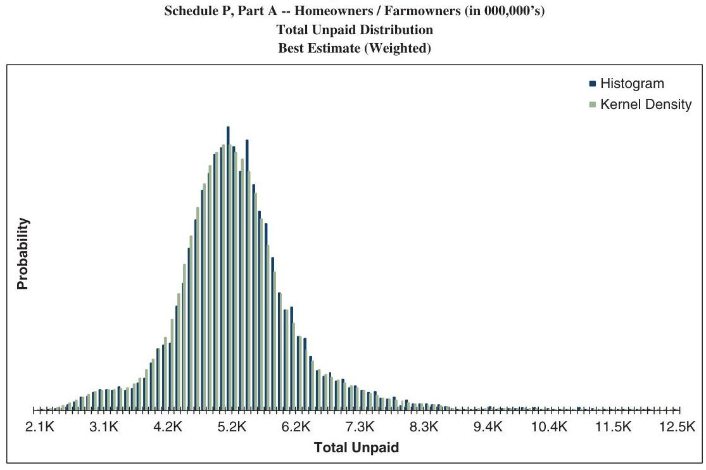
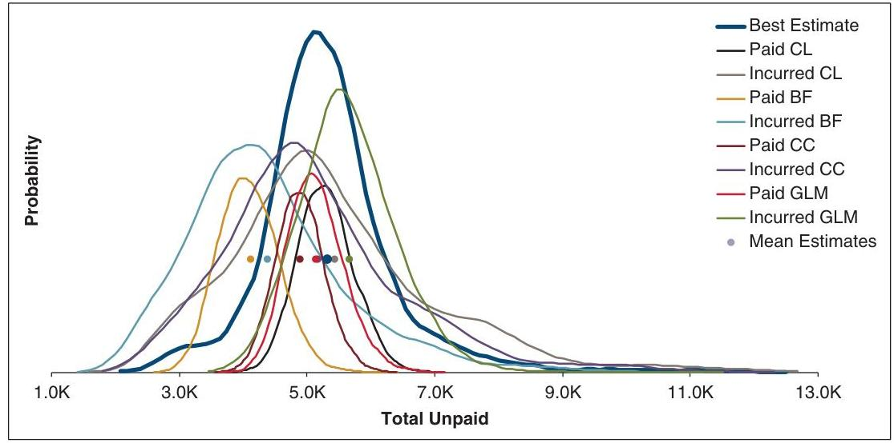

## Page 61
The corresponding tables and graphs for the Part B and Part C results are shown in Appendices B and C, respectively. ${ }^{67}$

# 6.6. Correlation 

Results for an entire business unit can be estimated, after each business segment has been analyzed and weighted into best estimates, using aggregation. This represents another area where caution is warranted. The procedure is not a simple matter of adding up the distributions for each segment. In order to estimate the distribution of possible outcomes for a company as a whole, a correlation of results between segments must be used. ${ }^{68}$

Simulating correlated variables is commonly accomplished with a multivariate distribution whose parameters and correlations have been previously specified. This type of simulation is most easily applied when distributions are uniformly identical and known in advance (for example, all derived from a multivariate normal distribution). Unfortunately, these conditions do not generally exist for the ODP bootstrap model (or other models), as quite often the modeling process does not allow us to know the characteristics of overall distributions in advance or combining distributions from different types of models is by definition not uniformly identical and known in advance. Indeed, as the shapes of different distributions are usually slightly different, another approach will be needed. ${ }^{69}$

Two useful correlation processes for the ODP bootstrap model are location mapping (or synchronized bootstrapping) and re-sorting. ${ }^{70}$

With location mapping, each iteration will include sampling residuals for the first segment and then going back to note the location in the original residual triangle of each sampled residual. ${ }^{71}$ Each of the other segments is sampled using the residuals at the same locations for their respective residual triangles. Thus, the correlation of the original residuals is preserved in the sampling process.

The location-mapping process is easily implemented in Excel and does not require the need to estimate a correlation matrix. There are, however, two drawbacks to this process. First, it requires all of the business segments to use data triangles that are precisely the same size with no missing values or outliers when comparing each location of the residuals. ${ }^{72}$ Second, the correlation of the original residuals is used in the model, and no other correlation assumptions can be used for stress testing the aggregate results.

[^0]
[^0]:    ${ }^{67}$ For Part B and Part C, tail factors were used to illustrate the results when extrapolated beyond just squaring the triangle. This also flows through to the Aggregate results in Appendix D.
    ${ }^{68}$ This section assumes the reader is familiar with correlation.
    ${ }^{69}$ It is possible to use this process with a parametric ODP bootstrap model, as described in Section 4.10, but that is beyond the scope of the monograph.
    ${ }^{70}$ For a useful reference see Kirschner, et al. (2008).
    ${ }^{71}$ For example, in the "Bootstrap Models.xlsm" file the locations of the sampled residuals are shown in Step 15, which could be replicated iteration by iteration for each business segment.
    ${ }^{72}$ It is possible to fill in "missing" residuals in another segment using a randomly selected residual from elsewhere in the triangle, but in order to maintain the same amount of correlation the selection of the other residual would need to account for the correlation between the residuals, which complicates the process.

## Page 62
Figure 6.12. Estimated Correlation and P-values

| Rank Correlation of Residuals after Hetero Adjustment - Paid |  |  |  |
| :--: | :--: | :--: | :--: |
| LOB | 1 | 2 | 3 |
| 1 | 1.00 | 0.37 | 0.19 |
| 2 | 0.37 | 1.00 | 0.24 |
| 3 | 0.19 | 0.24 | 1.00 |
| P-Values of Rank Correlation of Residuals after Hetero Adjustment - Paid |  |  |  |
| LOB | 1 | 2 | 3 |
| 1 | 0.00 | 0.01 | 0.17 |
| 2 | 0.01 | 0.00 | 0.07 |
| 3 | 0.17 | 0.07 | 0.00 |

The second correlation process, re-sorting, can be accomplished with algorithms such as Iman-Conover ${ }^{73}$ or Copulas, among others. The primary advantages of re-sorting include:

- The triangles for each segment may have different shapes and sizes,
- Different correlation assumptions may be employed, and
- Different correlation algorithms may also have other beneficial impacts on the aggregate distribution.

For example, using a $t$-distribution Copula with low degrees of freedom rather than a normal-distribution Copula, will effectively "strengthen" the focus of the correlation in the tail of the distribution, all else being equal. This type of consideration is important for risk-based capital and other risk modeling issues.

To induce correlation among different segments in the ODP bootstrap model, a calculation of the correlation matrix using Spearman's Rank Order and use of re-sorting based on the ranks of the total unpaid claims for all accident years combined may be done. The calculated correlations for Parts A, B, and C based on the paid residuals after hetero adjustments may be seen in the table in Figure 6.12. A second part of Figure 6.12 are the $P$-values for each correlation coefficient, which are an indication of whether a correlation coefficient is significantly different than zero as the $P$-value gets close to zero. ${ }^{74}$

By reviewing the correlation coefficients for each "pair" of segments, along with the $P$-values, from different sets of correlations matrices (e.g., from paid or incurred data before or after the hetero adjustment) judgment can be used to select a correlation matrix assumption. As noted above, caution is warranted as these calculated correlation matrices are limited to the data used in the calculation and the impact of other systemic issues, such as contagion, may also need to be considered.

Using these correlation coefficients, the "Aggregate Estimate.xlsm" file, and the simulation data for Parts A, B, and C, the aggregate results for the three lines of business

[^0]
[^0]:    ${ }^{73}$ For a useful reference see Iman and Conover (1982) or Mildenhall (2006). In the "Aggregate Estimate.xlsm" file the Iman-Conover algorithm is used to "Generate Rank Values" on the Inputs sheet.
    ${ }^{74}$ While judgment is clearly appropriate, the typical threshold is a $P$-value of $5 \%$-i.e., a $P$-value of $5 \%$ or less indicates the correlation is significantly different than zero, while a $P$-value greater than $5 \%$ indicates the correlation is not significantly different than zero.

## Page 63
Figure 6.13. Aggregate Estimated Unpaid

| Five Top 50 Companies   Aggregate Three Lines of Business   Accident Year Unpaid |  |  |  |  |  |  |  |  |  |
| :--: | :--: | :--: | :--: | :--: | :--: | :--: | :--: | :--: | :--: |
| Accident   Year | Mean   Unpaid | Standard   Error | Coefficient of Variation | Minimum | Maximum | $50.0 \%$   Percentile | $75.0 \%$   Percentile | $95.0 \%$   Percentile | $99.0 \%$   Percentile |
| 2006 | 67 | 25 | 37.9\% | 0 | 186 | 66 | 83 | 110 | 130 |
| 2007 | 107 | 30 | 28.1\% | 25 | 295 | 105 | 126 | 158 | 185 |
| 2008 | 199 | 49 | 24.8\% | 67 | 622 | 194 | 226 | 285 | 342 |
| 2009 | 298 | 56 | 18.8\% | 123 | 800 | 293 | 331 | 395 | 457 |
| 2010 | 480 | 69 | 14.3\% | 248 | 959 | 475 | 522 | 599 | 668 |
| 2011 | 862 | 106 | 12.3\% | 503 | 1,561 | 860 | 923 | 1,041 | 1,135 |
| 2012 | 1,666 | 187 | 11.2\% | 383 | 2,555 | 1,662 | 1,771 | 1,985 | 2,148 |
| 2013 | 3,070 | 333 | 10.8\% | 1,808 | 6,522 | 3,066 | 3,249 | 3,649 | 3,928 |
| 2014 | 5,632 | 703 | 12.5\% | 2,435 | 8,555 | 5,632 | 6,075 | 6,801 | 7,326 |
| 2015 | 13,270 | 1,788 | 13.5\% | 5,217 | 22,660 | 13,262 | 14,348 | 16,180 | 18,011 |
| Totals | 25,650 | 2,080 | 8.1\% | 16,952 | 36,085 | 25,616 | 26,949 | 29,088 | 30,991 |
| Normal Dist. | 25,650 | 2,080 | 8.1\% |  |  | 25,650 | 27,053 | 29,072 | 30,490 |
| logNormal Dist. | 25,650 | 2,088 | 8.1\% |  |  | 25,566 | 27,006 | 29,222 | 30,885 |
| Gamma Dist. | 25,650 | 2,080 | 8.1\% |  |  | 25,594 | 27,021 | 29,165 | 30,736 |

were calculated and summarized in the table in Figure 6.13. A more complete set of tables for the aggregate results is shown in Appendix D.

Note that using residuals to correlate the lines of business (or other segments), as in the location mapping method, and measuring the correlation between residuals, as in the re-sorting method, both tend to create correlations that are close to zero. For reserve risk, the correlation that is desired is between the total unpaid amounts for two segments. The correlation that is being measured is the correlation between each incremental future loss amount, given the underlying model describing the overall trends in the data. This may or may not be a reasonable approximation.

While not the direct measure we are hoping for, keep in mind that some level of implied correlation between lines of business will naturally occur due to correlations between the model parameters-e.g., similarities in development parameters, so correlation based on the correlation between the remaining random movements in the incremental values given the model parameters (i.e., residuals) may be reasonable. However, an example of an issue not particularly well suited to measurement via residual correlation is contagion between lines of business-i.e., single events that result in claims in multiple lines of business. To account for this, and to add a bit of conservatism, the correlation assumption can be easily changed based on actuarial judgment.

Correlation is often thought of as being much stronger than "close to zero", but in this case the correlation being considered is typically the loss ratio movements by line of business. For pricing risk, the correlation that is desired is between the loss ratio movements by accident year between two segments. This correlation is not as likely to be close to zero, so correlation of loss ratios (e.g., for the data in Figure 6.7) is often done with a different correlation assumption compared to reserving risk.

## Page 64
# 7. Model Testing 

Work on testing stochastic unpaid claim estimation models is still in its infancy. Most papers on stochastic models display results, and some even compare a few different models, but they tend to be void of any statistical evidence regarding how well the model in question predicts the underlying distribution. This is quite understandable since we don't know what the underlying distribution is, so with real data the best we can hope for is to retrospectively test a very old data set to see how well a model predicted the actual outcome. ${ }^{75}$

Testing a few old data sets is better than not, but ideally we would need many similar data sets to perform meaningful tests. One recent paper authored by the General Insurance Reserving Oversight Committee (GI ROC) in their papers for the General Insurance Research Organizing (GIRO) conference in 2007 titled "Best Estimates and Reserving Uncertainty" (ROC/GIRO 2007) and their updated paper in 2008 titled "Reserving Uncertainty" (ROC/GIRO 2008) took a first step in performing more meaningful statistical testing of a variety of models.

A large number of models were reviewed and tested in these studies, but one of the most interesting portions of the studies were done by comparing the unpaid liability distributions created by the Mack and ODP bootstrap model against the "true" artificially generated unpaid loss percentiles. To accomplish these tests, artificial datasets were constructed so that all of the Mack and ODP bootstrap assumptions, respectively, are satisfied. While the artificial datasets were recognized as not necessarily realistic, the "true" results are known so the Working Parties were able to test to see how well each model performed against datasets that could be considered "perfect."

### 7.1. Bootstrap Model Results

To test the ODP bootstrap model, incremental losses were simulated for a $10 \times$ 10 square of data based on the assumptions of the ODP bootstrap model. For the 30,000 datasets simulated, the upper triangles were used and the OPD bootstrap model from England and Verrall (1999; 2002) were used to estimate the expected results and various percentiles. The proportion of simulated scenarios in which the "true" outcome exceeded the 99th percentile of the ODP Bootstrap method's results was around 2.6-3.1\%. For the Mack method, the "true" outcome exceeded the 99th percentile around 8-13\%.

[^0]
[^0]:    ${ }^{75}$ For example, data for accident years 1994 to 2004 could be completely settled and all results known as of 2014. Thus, we could use the triangle as it existed at year end 2004 to test how well a model predicted the final results.

## Page 65
Thus, the ODP bootstrap model performed better than the Mack model for "perfect" data, even though the results for both models were somewhat deficient in the sense that they both seem to under-predict the extremes of the "true" distribution. In fairness, it should be noted however, that the ODP bootstrap model that was tested did not include many of the "advancements" described in Section 3.2.

# 7.2. Future Testing 

The testing done for GIRO was a significant improvement over simply looking at results for different models, without knowing anything about the "true" underlying distribution. The next step in the testing process will be to test models against "true" results for realistic data instead of "perfect" data. The CAS Loss Simulation Model Working Party (2011) has created a model that will create datasets from the claim transaction level up. The goal is to create thousands of datasets based on characteristics of real data that can be used for testing various models.

## Page 66
# 8. Future Research 

With testing of stochastic models in its infancy, much work in the area of future research is needed. Only a few such areas are offered here.

- Expand testing of the ODP bootstrap model with realistic data using the CAS loss simulation model.
- Research on how the adjustments to the ODP bootstrap and GLM bootstrap suggested in this monograph perform relative to realistic data-i.e., is there a significant improvement in the predictive power of the model given the different model configurations and adjustments.
- Expand or change the ODP bootstrap model in other ways, for example use of the Munich chain ladder (Quarg and Mack 2008) or Berquist-Sherman (1977) method with an incurred/paid set of triangles, or the use of claim counts and average severities. Other examples could include the use of different residuals, such as deviance or Anscombe residuals noted in Section 3.2.
- Research the use of a Bayesian or other approach to selecting weights for different models by accident year to improve the process of combining multiple models discussed in Section 6.
- Research other risk analysis measures and how the ODP bootstrap model can be used for enterprise risk management.
- Research how the ODP bootstrap model can be used for Solvency II requirements in Europe and the International Accounting Standards.
- Research into the most difficult parameter to estimate: the correlation matrix.

## Page 67
# 9. Conclusions 

While this monograph endeavored to show how the ODP bootstrap model can be used in a variety of practical ways, and to illustrate the diagnostic tools the actuary needs to assess whether the model is working well, it should not be assumed that the ODP bootstrap model is well suited for every data set. However, it is hoped that the ODP bootstrap and GLM bootstrap "toolsets" can become an integral part of the actuaries regular estimation of unpaid claim liabilities, rather than just a "black box" to be used only if necessary or after the deterministic methods have been used to select a point estimate. Finally, the modeling framework allows the actuary to "fit" the model to the data instead of simply accepting the model as is and essentially forcing the data to "fit" the model.

## Page 68
# Acknowledgments 

The author gratefully acknowledges the many authors listed in the References (and others not listed) that contributed to the foundation of the ODP bootstrap model, without which this research would not have been possible. He also wishes to thank the co-author of the predecessor paper, Jessica Leong, for all her support and the contributions that led to this revised monograph. He would also like to thank all the peer reviewers, Stephen Finch, Roger Hayne, Stephen Lienhard, John Major, Mark Mulvaney and Ben Zehnwirth, who helped to improve the quality of the monograph in a variety of ways. In particular, Stephen Finch is noteworthy for keeping his wits during an intoxicating discussion which led to the creation of the term "heteroecthesious" data. Finally, he is grateful to the CAS referees for their comments which also greatly improved the quality of the monograph.

## Page 69
# Supplementary Materials 

There are several companion files designed to give the reader a deeper understanding of the concepts discussed in the monograph. T he files are all in the "A Practitioners Guide. zip" file at https://www.casact.org/sites/default/files/2021-02/ practitionerssuppl-shaplandmonograph04.zip The files are:

Model Instructions.pdf—this file contains a written description of how to use the primary bootstrap modeling files.

## Primary bootstrap modeling iles:

Industry Data.xls—this file contains Schedule P data by line of business for the entire U.S.
industry and five of the top 50 companies, for each LOB that has 10 years of data. Bootstrap Models.xlsm—this file contains the detailed model steps described in this monograph as well as various modeling options and diagnostic tests. Data can be entered and simulations run and saved for use in calculating a weighted best estimate.

Best Estimate.xlsm—this file can be used to weight the results from eight different models to get a "best estimate" of the distribution of possible outcomes.
Aggregate Estimate.xlsm—this file can be used to correlate the best estimate results from 3 LOBs/segments.
Correlation Ranks.xlsm—this file contains examples of ranks used to correlate results by LOB/segment.

## Simple example calculation files:

GLM Framework.xlsm—this file illustrates the calculation of the GLM bootstrap model (framework) and the corresponding ODP bootstrap model for a simple $3 \times 3$ triangle using (3.8).
GLM Framework C.xlsm—this file illustrates the calculation of the GLM bootstrap model (framework) and the corresponding ODP bootstrap model for a simple $3 \times 3$ triangle using (3.7).
GLM Framework 6.xlsm—this file illustrates the calculation of the GLM bootstrap model (framework) and the corresponding ODP bootstrap model for a simple $6 \times 6$ triangle using (3.8).
GLM Framework 6C.xlsm—this file illustrates the calculation of the GLM bootstrap model (framework) and the corresponding ODP bootstrap model for a simple $6 \times 6$ triangle using (3.7).

## Page 70
GLM Bootstrap 6 with Outlier.xlsm—this file illustrates how the calculation of the GLM bootstrap for a simple $6 \times 6$ triangle is adjusted for an outlier. It includes different options for adjusting the ODP bootstrap model to remove an outlier.
GLM Bootstrap 6 with 3 yr avg.xlsm-this file illustrates how the calculation of the GLM bootstrap for a simple $6 \times 6$ triangle is adjusted to only use the equivalent of a three-year average (i.e., the last four diagonals).
GLM Bootstrap 6 with 1 Acc Yr Parameter.xlsm—this file illustrates the calculation of the GLM bootstrap using only one accident year (level) parameter, a development year trend parameter for every year and no calendar year trend parameter for a simple $6 \times 6$ triangle.
GLM Bootstrap 6 with 1 Dev Yr Parameter.xlsm—this file illustrates the calculation of the GLM bootstrap using only one development year trend parameter, an accident year (level) parameter for every year and no calendar year trend parameter for a simple $6 \times 6$ triangle.
GLM Bootstrap 6 with 1 Acc Yr \& 1 Dev Yr Parameter.xlsm—this file illustrates the calculation of the GLM bootstrap using only one accident year (level) parameter, one development year trend parameter and no calendar year trend parameter for a simple $6 \times 6$ triangle.
GLM 6 Bootstrap with 1 Acc Yr 1 Dev Yr \& 1 Cal Yr Parameter.xlsm—this file illustrates the calculation of the GLM bootstrap using only one accident year (level) parameter, one development year trend parameter and one calendar year trend parameter for a simple $6 \times 6$ triangle.

## Page 71
# Appendices

## Page 72
.

## Page 73
# Appendix A-Schedule P, Part A Results 

In this appendix the results for Schedule P, Part A (Homeowners/Farmowners) are shown.
Figure A.1. Estimated Unpaid Model Results (Paid Chain Ladder)
Five Top 50 Companies
Schedule P, Part A -- Homeowners / Farmowners (in 000,000's)
Accident Year Unpaid
Paid Chain Ladder Model

| Accident   Year | Mean   Unpaid | Standard   Error | Coefficient   of Variation | Minimum | Maximum | 50.0\%   Percentile | 75.0\%   Percentile | 95.0\%   Percentile | 99.0\%   Percentile |
| :--: | :--: | :--: | :--: | :--: | :--: | :--: | :--: | :--: | :--: |
| 2006 |  | - |  | - | - | - | - | - | - |
| 2007 | 3 | 7 | 264.9\% | - | 81 | 0 | 2 | 17 | 33 |
| 2008 | 41 | 31 | 74.7\% | - | 204 | 35 | 59 | 100 | 131 |
| 2009 | 45 | 30 | 65.5\% | 7 | 209 | 38 | 61 | 104 | 137 |
| 2010 | 63 | 31 | 49.4\% | 15 | 213 | 56 | 80 | 118 | 161 |
| 2011 | 103 | 36 | 34.9\% | 36 | 286 | 96 | 122 | 170 | 213 |
| 2012 | 222 | 58 | 26.1\% | 93 | 497 | 216 | 258 | 328 | 376 |
| 2013 | 294 | 80 | 27.3\% | 126 | 671 | 285 | 342 | 440 | 513 |
| 2014 | 679 | 128 | 18.9\% | 366 | 1,190 | 675 | 758 | 894 | 1,003 |
| 2015 | 3,851 | 356 | 9.2\% | 2,675 | 5,051 | 3,831 | 4,075 | 4,496 | 4,790 |
| Totals | 5,300 | 447 | 8.4\% | 4,132 | 6,907 | 5,282 | 5,579 | 6,056 | 6,421 |
| Normal Dist. | 5,300 | 447 | 8.4\% |  |  | 5,300 | 5,602 | 6,036 | 6,341 |
| logNormal Dist. | 5,300 | 448 | 8.4\% |  |  | 5,282 | 5,591 | 6,067 | 6,426 |
| Gamma Dist. | 5,300 | 447 | 8.4\% |  |  | 5,288 | 5,595 | 6,057 | 6,396 |

Figure A.2. Total Unpaid Claims Distribution (Paid Chain Ladder)
Five Top 50 Companies
Schedule P, Part A -- Homeowners / Farmowners (in 000,000's)
Total Unpaid Distribution
Paid Chain Ladder Model
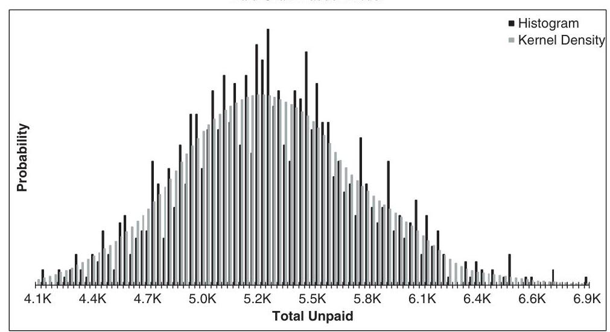

## Page 74
Figure A.3. Estimated Unpaid Model Results (Incurred Chain Ladder)

Figure A.4. Total Unpaid Claims Distribution (Incurred Chain Ladder)
Five Top 50 Companies
Schedule P, Part A - Homeowners / Farmowners (in 000,000's)
Total Unpaid Distribution
Incurred Chain Ladder Model
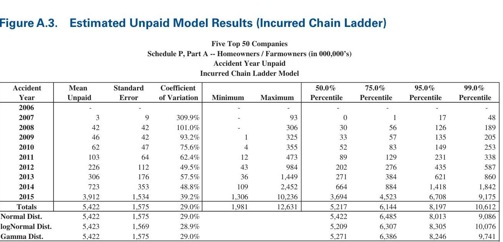
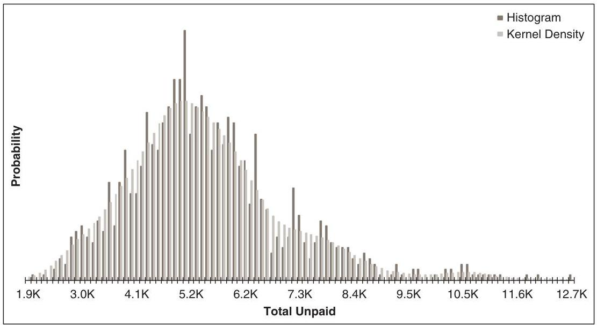

## Page 75
Figure A.5. Estimated Unpaid Model Results (Paid Bornhuetter-Ferguson)

Figure A.6. Total Unpaid Claims Distribution (Paid Bornhuetter-Ferguson)
Five Top 50 Companies
Schedule P, Part A -- Homeowners / Farmowners (in 000,000's)
Total Unpaid Distribution
Paid Bornhuetter-Ferguson Model
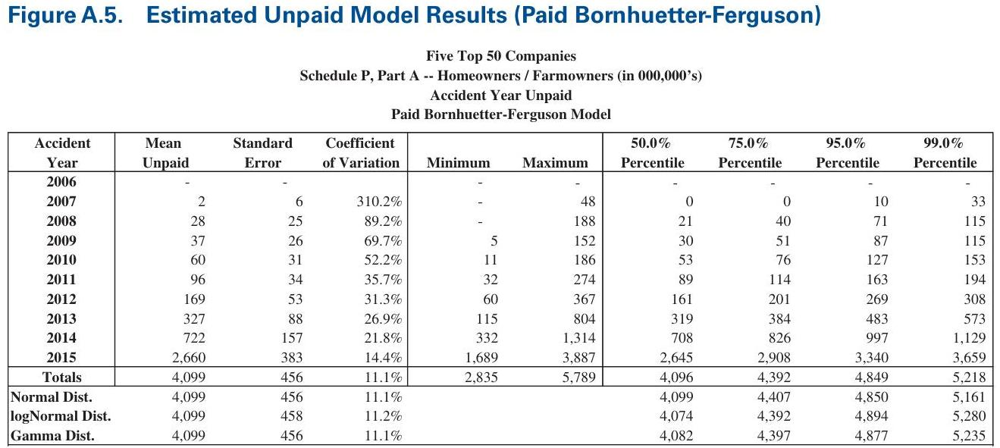

## Page 76
Figure A.7. Estimated Unpaid Model Results (Incurred Bornhuetter-Ferguson)
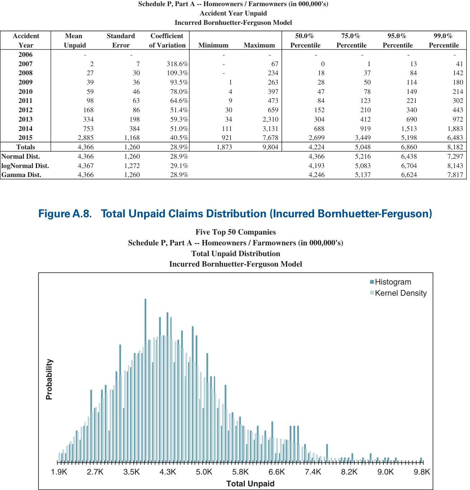

## Page 77
Figure A.9. Estimated Unpaid Model Results (Paid Cape Cod)
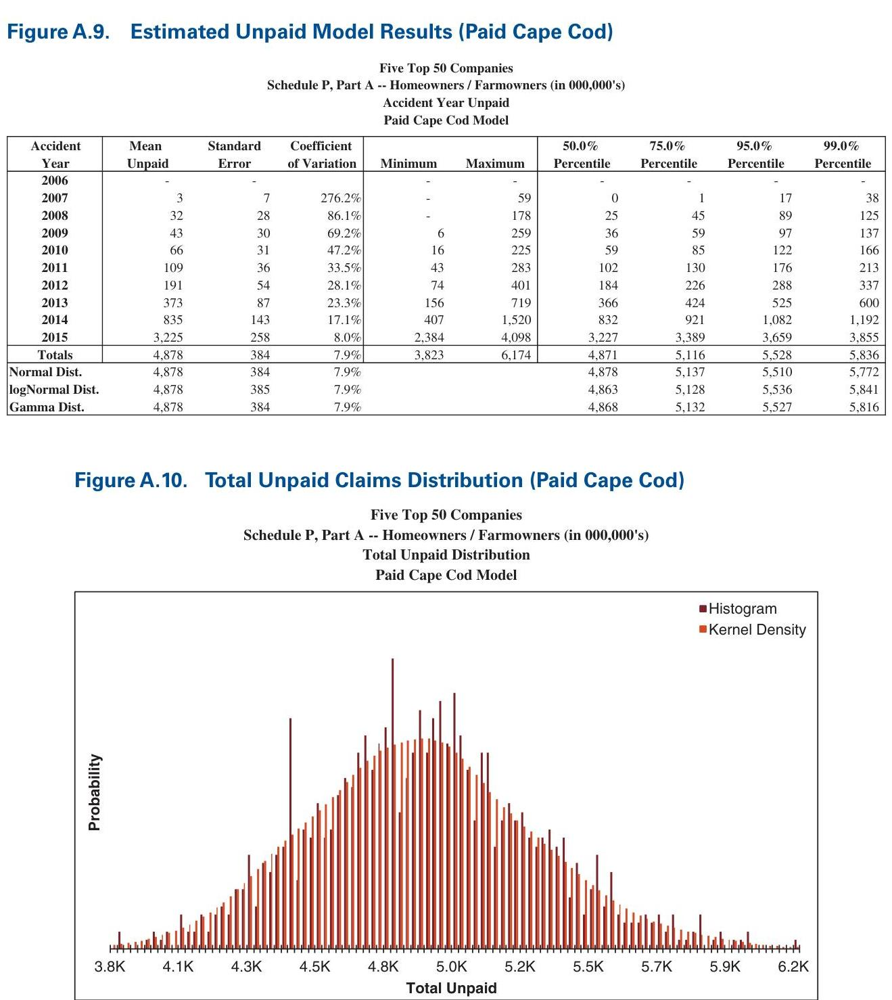

## Page 78
Figure A.11. Estimated Unpaid Model Results (Incurred Cape Cod)
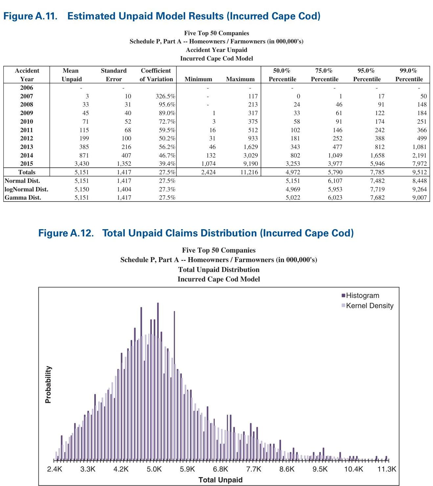

## Page 79
Figure A.13. Estimated Unpaid Model Results (Paid GLM)

Figure A.14. Total Unpaid Claims Distribution (Paid GLM)
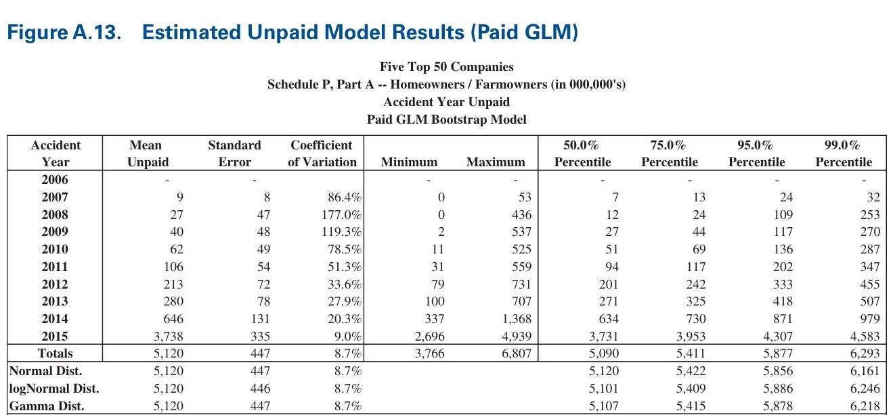
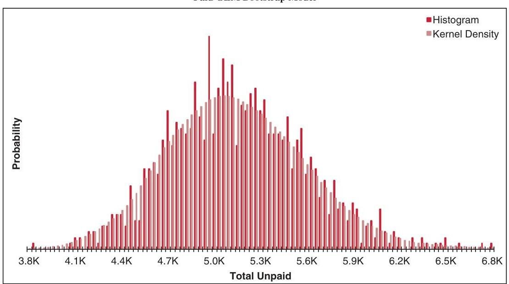

## Page 80
Figure A.15. Estimated Unpaid Model Results (Incurred GLM)
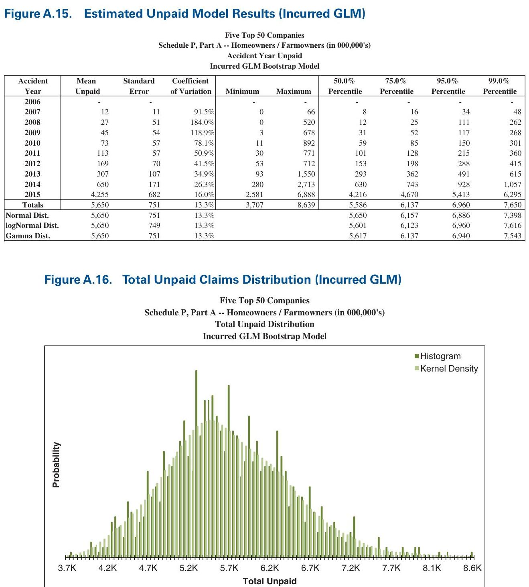

## Page 81
Figure A.17. Model Weights by Accident Year

| Accident   Year | Model Weights by Accident Year |  |  |  |  |  |  |  |  |
| :--: | :--: | :--: | :--: | :--: | :--: | :--: | :--: | :--: | :--: |
|  | Paid CL | Incd CL | Paid BF | Incd BF | Paid CC | Incd CC | Paid GLM | Incd GLM | TOTAL |
| 2006 | $50.0 \%$ | $50.0 \%$ |  |  |  |  |  |  | $100.0 \%$ |
| 2007 | $50.0 \%$ | $50.0 \%$ |  |  |  |  |  |  | $100.0 \%$ |
| 2008 | $50.0 \%$ | $50.0 \%$ |  |  |  |  |  |  | $100.0 \%$ |
| 2009 | $50.0 \%$ | $50.0 \%$ |  |  |  |  |  |  | $100.0 \%$ |
| 2010 | $50.0 \%$ | $50.0 \%$ |  |  |  |  |  |  | $100.0 \%$ |
| 2011 | $50.0 \%$ | $50.0 \%$ |  |  |  |  |  |  | $100.0 \%$ |
| 2012 | $50.0 \%$ | $50.0 \%$ |  |  |  |  |  |  | $100.0 \%$ |
| 2013 | $16.7 \%$ | $16.7 \%$ | $16.7 \%$ | $16.7 \%$ | $16.7 \%$ | $16.7 \%$ |  |  | $100.0 \%$ |
| 2014 | $16.7 \%$ | $16.7 \%$ | $16.7 \%$ | $16.7 \%$ | $16.7 \%$ | $16.7 \%$ |  |  | $100.0 \%$ |
| 2015 | $16.7 \%$ | $16.7 \%$ |  |  | $16.7 \%$ | $16.7 \%$ | $16.7 \%$ | $16.7 \%$ | $100.0 \%$ |

Figure A.18. Estimated Mean Unpaid by Model
Five Top 50 Companies
Schedule P, Part A -- Homeowners / Farmowners (in 000,000's)
Summary of Results by Model

| Accident   Year | Mean Estimated Unpaid |  |  |  |  |  |  |  |  |
| :--: | :--: | :--: | :--: | :--: | :--: | :--: | :--: | :--: | :--: |
|  | Chain Ladder |  | Bornhuetter-Ferguson | Cape Cod |  | GLM Bootstrap |  | Best Est.   (Weighted) |
|  | Paid | Incurred | Paid | Incurred | Paid | Incurred | Paid | Incurred |  |
| 2006 | - | - | - | - | - | - | - | - | - |
| 2007 | 3 | 3 | 2 | 2 | 3 | 3 | 9 | 12 | 3 |
| 2008 | 41 | 42 | 28 | 27 | 32 | 33 | 27 | 27 | 41 |
| 2009 | 45 | 46 | 37 | 39 | 43 | 45 | 40 | 45 | 46 |
| 2010 | 63 | 62 | 60 | 59 | 66 | 71 | 62 | 73 | 64 |
| 2011 | 103 | 103 | 96 | 98 | 109 | 115 | 106 | 113 | 103 |
| 2012 | 222 | 226 | 169 | 168 | 191 | 199 | 213 | 169 | 224 |
| 2013 | 294 | 306 | 327 | 334 | 373 | 385 | 280 | 307 | 335 |
| 2014 | 679 | 723 | 722 | 753 | 835 | 871 | 646 | 650 | 752 |
| 2015 | 3,851 | 3,912 | 2,660 | 2,885 | 3,225 | 3,430 | 3,738 | 4,255 | 3,742 |
| Totals | 5,300 | 5,422 | 4,099 | 4,366 | 4,878 | 5,151 | 5,120 | 5,650 | 5,308 |

Figure A.19. Estimated Ranges
Five Top 50 Companies
Schedule P, Part A -- Homeowners / Farmowners (in 000,000's)
Summary of Results by Model

| Accident   Year |  | Ranges |  |  |
| :--: | :--: | :--: | :--: | :--: |
|  | Best Est.   (Weighted) | Weighted |  | Modeled |  |
|  |  | Minimum | Maximum | Minimum | Maximum |
| 2006 | - |  |  |  |  |
| 2007 | 3 | 3 | 3 | 2 | 12 |
| 2008 | 41 | 41 | 42 | 27 | 42 |
| 2009 | 46 | 45 | 46 | 37 | 46 |
| 2010 | 64 | 62 | 63 | 59 | 73 |
| 2011 | 103 | 103 | 103 | 96 | 115 |
| 2012 | 224 | 222 | 226 | 168 | 226 |
| 2013 | 335 | 294 | 385 | 280 | 385 |
| 2014 | 752 | 679 | 871 | 646 | 871 |
| 2015 | 3,742 | 3,225 | 4,255 | 2,660 | 4,255 |
| Totals | 5,308 | 4,674 | 5,992 | 4,099 | 5,650 |

## Page 82
Figure A.20. Reconciliation of Total Results (Weighted)
Five Top 50 Companies
Schedule P, Part A -- Homeowners / Farmowners (in 000,000's)
Reconciliation of Total Results
Best Estimate (Weighted)

| Accident   Year | Paid   To Date | Incurred   To Date | Case   Reserves | IBNR | Estimate of   Ultimate | Estimate of   Unpaid |
| :--: | :--: | :--: | :--: | :--: | :--: | :--: |
| 2006 | 5,234 | 5,237 | 3 | $(3)$ | 5,234 | - |
| 2007 | 6,470 | 6,479 | 9 | $(6)$ | 6,473 | 3 |
| 2008 | 7,848 | 7,867 | 19 | 23 | 7,890 | 41 |
| 2009 | 7,020 | 7,046 | 26 | 20 | 7,066 | 46 |
| 2010 | 7,291 | 7,341 | 50 | 13 | 7,355 | 64 |
| 2011 | 8,134 | 8,225 | 91 | 12 | 8,237 | 103 |
| 2012 | 10,800 | 11,085 | 285 | $(61)$ | 11,023 | 224 |
| 2013 | 7,522 | 7,810 | 288 | 46 | 7,856 | 335 |
| 2014 | 7,968 | 8,703 | 735 | 17 | 8,720 | 752 |
| 2015 | 9,309 | 12,788 | 3,478 | 263 | 13,051 | 3,742 |
| Totals | 77,596 | 82,580 | 4,984 | 324 | 82,905 | 5,308 |

Figure A.21. Estimated Unpaid Model Results (Weighted)
Five Top 50 Companies
Schedule P, Part A -- Homeowners / Farmowners (in 000,000's)
Accident Year Unpaid
Best Estimate (Weighted)

| Accident   Year | Mean   Unpaid | Standard   Error | Coefficient   of Variation | Minimum | Maximum | 50.0\%   Percentile | 75.0\%   Percentile | 95.0\%   Percentile | 99.0\%   Percentile |
| :--: | :--: | :--: | :--: | :--: | :--: | :--: | :--: | :--: | :--: |
| 2006 | - | - |  | - | - | - | - | - | - |
| 2007 | 3 | 9 | 292.0\% | - | 173 | 0 | 1 | 17 | 42 |
| 2008 | 41 | 37 | 88.6\% | - | 391 | 32 | 57 | 111 | 168 |
| 2009 | 46 | 37 | 81.0\% | 1 | 522 | 36 | 60 | 114 | 175 |
| 2010 | 64 | 41 | 63.6\% | 4 | 537 | 55 | 81 | 139 | 205 |
| 2011 | 103 | 50 | 48.8\% | 10 | 636 | 94 | 125 | 193 | 276 |
| 2012 | 224 | 89 | 40.0\% | 36 | 917 | 211 | 266 | 382 | 529 |
| 2013 | 335 | 148 | 44.3\% | 25 | 1,460 | 315 | 401 | 594 | 865 |
| 2014 | 752 | 293 | 39.0\% | 106 | 2,881 | 725 | 873 | 1,265 | 1,789 |
| 2015 | 3,742 | 982 | 26.2\% | 1,094 | 10,700 | 3,654 | 4,118 | 5,392 | 7,059 |
| Totals | 5,308 | 1,044 | 19.7\% | 2,116 | 12,445 | 5,224 | 5,758 | 7,074 | 8,675 |
| Normal Dist.   logNormal Dist. | 5,308   5,309 | 1,044   1,034 | 19.7\%   19.5\% |  |  | 5,308   5,211 | 6,013   5,935 | 7,026   7,158 | 7,738   8,164 |
| Gamma Dist. | 5,308 | 1,044 | 19.7\% |  |  | 5,240 | 5,971 | 7,135 | 8,035 |

Figure A.22. Estimated Cash Flow (Weighted)
Five Top 50 Companies
Schedule P, Part A -- Homeowners / Farmowners (in 000,000's)
Calendar Year Unpaid
Best Estimate (Weighted)

| Calendar   Year | Mean   Unpaid | Standard   Error | Coefficient   of Variation | Minimum | Maximum | 50.0\%   Percentile | 75.0\%   Percentile | 95.0\%   Percentile | 99.0\%   Percentile |
| :--: | :--: | :--: | :--: | :--: | :--: | :--: | :--: | :--: | :--: |
| 2016 | 3,475 | 754 | 21.7\% | 1,297 | 8,420 | 3,414 | 3,797 | 4,730 | 5,948 |
| 2017 | 865 | 208 | 24.0\% | 293 | 2,148 | 843 | 982 | 1,224 | 1,483 |
| 2018 | 403 | 118 | 29.4\% | 115 | 1,298 | 387 | 467 | 614 | 740 |
| 2019 | 204 | 67 | 32.7\% | 56 | 654 | 194 | 240 | 325 | 412 |
| 2020 | 140 | 50 | 35.9\% | 40 | 539 | 132 | 165 | 233 | 297 |
| 2021 | 90 | 43 | 47.4\% | 12 | 611 | 82 | 112 | 169 | 229 |
| 2022 | 70 | 44 | 63.2\% | 6 | 409 | 60 | 91 | 152 | 215 |
| 2023 | 51 | 58 | 112.2\% | - | 735 | 36 | 75 | 151 | 253 |
| 2024 | 10 | 15 | 146.5\% | - | 199 | 4 | 15 | 41 | 67 |
| Totals | 5,308 | 1,044 | 19.7\% | 2,116 | 12,445 | 5,224 | 5,758 | 7,074 | 8,675 |

## Page 83
Figure A.23. Estimated Loss Ratio (Weighted)
Five Top 50 Companies
Schedule P, Part A - Homeowners / Farmowners (in 000,000's)
Accident Year Ultimate Loss Ratios
Best Estimate (Weighted)

| Accident   Year | Mean   Loss Ratio | Standard   Error | Coefficient   of Variation | Minimum | Maximum | $50.0 \%$   Percentile | $75.0 \%$   Percentile | $95.0 \%$   Percentile | $99.0 \%$   Percentile |
| :--: | :--: | :--: | :--: | :--: | :--: | :--: | :--: | :--: | :--: |
| 2006 | $67.7 \%$ | $28.5 \%$ | $42.1 \%$ | $0.4 \%$ | $220.8 \%$ | $66.1 \%$ | $71.1 \%$ | $130.9 \%$ | $158.2 \%$ |
| 2007 | $79.3 \%$ | $30.2 \%$ | $38.1 \%$ | $8.2 \%$ | $262.2 \%$ | $77.8 \%$ | $83.1 \%$ | $145.5 \%$ | $178.5 \%$ |
| 2008 | $90.5 \%$ | $31.2 \%$ | $34.5 \%$ | $16.9 \%$ | $261.3 \%$ | $89.0 \%$ | $94.6 \%$ | $159.9 \%$ | $188.9 \%$ |
| 2009 | $72.8 \%$ | $26.8 \%$ | $36.7 \%$ | $10.2 \%$ | $215.6 \%$ | $71.4 \%$ | $76.1 \%$ | $131.7 \%$ | $180.4 \%$ |
| 2010 | $65.3 \%$ | $23.3 \%$ | $35.7 \%$ | $10.2 \%$ | $225.0 \%$ | $63.8 \%$ | $68.0 \%$ | $116.1 \%$ | $139.7 \%$ |
| 2011 | $64.1 \%$ | $21.2 \%$ | $33.1 \%$ | $13.0 \%$ | $190.0 \%$ | $63.2 \%$ | $67.0 \%$ | $111.8 \%$ | $130.5 \%$ |
| 2012 | $80.5 \%$ | $24.0 \%$ | $29.9 \%$ | $25.0 \%$ | $234.6 \%$ | $79.0 \%$ | $83.7 \%$ | $132.9 \%$ | $154.6 \%$ |
| 2013 | $54.7 \%$ | $18.8 \%$ | $34.4 \%$ | $9.9 \%$ | $157.7 \%$ | $53.9 \%$ | $57.4 \%$ | $96.2 \%$ | $115.1 \%$ |
| 2014 | $58.0 \%$ | $19.2 \%$ | $33.0 \%$ | $13.0 \%$ | $164.8 \%$ | $57.1 \%$ | $60.6 \%$ | $99.8 \%$ | $118.8 \%$ |
| 2015 | $88.2 \%$ | $21.5 \%$ | $24.4 \%$ | $30.9 \%$ | $232.5 \%$ | $85.5 \%$ | $92.5 \%$ | $127.9 \%$ | $158.7 \%$ |
| Totals | $71.3 \%$ | $7.4 \%$ | $10.4 \%$ | $46.6 \%$ | $112.7 \%$ | $70.8 \%$ | $75.7 \%$ | $84.4 \%$ | $91.7 \%$ |

Figure A.24. Estimated Unpaid Claim Runoff (Weighted)
Five Top 50 Companies
Schedule P, Part A - Homeowners / Farmowners (in 000,000's)
Calendar Year Unpaid Claim Runoff
Best Estimate (Weighted)

| Calendar   Year | Mean   Unpaid | Standard   Error | Coefficient   of Variation | Minimum | Maximum | $50.0 \%$   Percentile | $75.0 \%$   Percentile | $95.0 \%$   Percentile | $99.0 \%$   Percentile |
| :--: | :--: | :--: | :--: | :--: | :--: | :--: | :--: | :--: | :--: |
| 2015 | 5,308 | 1,044 | 19.7\% | 2,116 | 12,445 | 5,224 | 5,758 | 7,074 | 8,675 |
| 2016 | 1,834 | 365 | 19.9\% | 746 | 4,128 | 1,797 | 2,030 | 2,459 | 2,957 |
| 2017 | 969 | 218 | 22.5\% | 336 | 2,316 | 946 | 1,088 | 1,353 | 1,627 |
| 2018 | 566 | 146 | 25.8\% | 159 | 1,393 | 548 | 647 | 828 | 1,004 |
| 2019 | 362 | 114 | 31.5\% | 79 | 1,171 | 347 | 424 | 565 | 718 |
| 2020 | 222 | 92 | 41.4\% | 35 | 956 | 207 | 269 | 386 | 524 |
| 2021 | 132 | 76 | 57.6\% | 6 | 863 | 117 | 166 | 268 | 394 |
| 2022 | 62 | 59 | 96.3\% | (0) | 745 | 46 | 84 | 166 | 269 |
| 2023 | 10 | 15 | 146.5\% | (0) | 199 | 4 | 15 | 41 | 67 |

Figure A.25. Mean Of Incremental Values (Weighted)
Five Top 50 Companies
Schedule P, Part A - Homeowners / Farmowners (in 000,000's)
Accident Year Incremental Values by Development Period
Best Estimate (Weighted)

| Accident   Year | Mean Values |  |  |  |  |  |  |  |  |  |
| :--: | :--: | :--: | :--: | :--: | :--: | :--: | :--: | :--: | :--: | :--: |
|  | 12 | 24 | 36 | 48 | 60 | 72 | 84 | 96 | 108 | $120 \cdot$ |
| 2006 | 3,776 | 1,139 | 218 | 95 | 41 | 21 | 12 | 6 | 25 | 2 |
| 2007 | 4,635 | 1,398 | 268 | 115 | 51 | 25 | 15 | 7 | 31 | 3 |
| 2008 | 5,647 | 1,701 | 327 | 141 | 61 | 31 | 17 | 9 | 38 | 4 |
| 2009 | 5,065 | 1,525 | 294 | 126 | 56 | 28 | 16 | 8 | 34 | 3 |
| 2010 | 5,318 | 1,602 | 307 | 132 | 57 | 29 | 17 | 8 | 36 | 3 |
| 2011 | 5,882 | 1,774 | 340 | 145 | 64 | 32 | 18 | 9 | 40 | 4 |
| 2012 | 7,909 | 2,378 | 457 | 197 | 86 | 43 | 25 | 12 | 53 | 5 |
| 2013 | 5,589 | 1,683 | 323 | 156 | 68 | 35 | 20 | 10 | 42 | 4 |
| 2014 | 6,197 | 1,870 | 392 | 168 | 73 | 37 | 21 | 10 | 46 | 4 |
| 2015 | 9,615 | 2,744 | 521 | 222 | 92 | 53 | 33 | 20 | 47 | 10 |

## Page 84
Figure A.26. Standard Deviation of Incremental Values (Weighted)

Figure A.27. Coefficient of Variation of Incremental Values (Weighted)
Five Top 50 Companies
Schedule P, Part A - Homeowners / Farmowners (in 000,000's)
Accident Year Incremental Values by Development Period
Best Estimate (Weighted)

| Accident   Year | 12 | 24 | 36 | 48 | 60 | 72 | 84 | 96 | 108 | 120 |
| :--: | :--: | :--: | :--: | :--: | :--: | :--: | :--: | :--: | :--: | :--: |
| 2006 | 1,597 | 502 | 119 | 64 | 33 | 11 | 7 | 2 | 23 | 4 |
| 2007 | 1,779 | 550 | 129 | 68 | 36 | 12 | 8 | 3 | 26 | 9 |
| 2008 | 1,960 | 603 | 147 | 77 | 38 | 13 | 8 | 3 | 35 | 10 |
| 2009 | 1,873 | 576 | 139 | 73 | 38 | 13 | 8 | 3 | 34 | 9 |
| 2010 | 1,906 | 596 | 143 | 75 | 38 | 13 | 9 | 3 | 34 | 9 |
| 2011 | 1,952 | 610 | 147 | 76 | 40 | 14 | 9 | 3 | 37 | 10 |
| 2012 | 2,375 | 733 | 173 | 92 | 49 | 17 | 11 | 4 | 44 | 11 |
| 2013 | 1,938 | 599 | 142 | 88 | 45 | 16 | 10 | 4 | 38 | 10 |
| 2014 | 2,054 | 639 | 173 | 90 | 47 | 16 | 10 | 4 | 41 | 11 |
| 2015 | 2,342 | 727 | 178 | 101 | 51 | 20 | 16 | 13 | 57 | 15 |

Figure A.27. Coefficient of Variation of Incremental Values (Weighted)
Five Top 50 Companies
Schedule P, Part A - Homeowners / Farmowners (in 000,000's)
Accident Year Incremental Values by Development Period
Best Estimate (Weighted)

| Accident   Year | Coefficients of Variation |  |  |  |  |  |  |  |  |  |
| :--: | :--: | :--: | :--: | :--: | :--: | :--: | :--: | :--: | :--: | :--: |
|  | 12 | 24 | 36 | 48 | 60 | 72 | 84 | 96 | 108 | $120 \cdot$ |
| 2006 | $42.3 \%$ | $44.1 \%$ | $54.4 \%$ | $67.8 \%$ | $80.8 \%$ | $52.6 \%$ | $58.8 \%$ | $43.2 \%$ | $89.8 \%$ | 157.5\% |
| 2007 | $38.4 \%$ | $39.3 \%$ | $48.2 \%$ | $59.5 \%$ | $71.1 \%$ | $47.7 \%$ | $52.9 \%$ | $38.7 \%$ | 82.4\% | 292.0\% |
| 2008 | $34.7 \%$ | $35.5 \%$ | $44.8 \%$ | $54.5 \%$ | $62.5 \%$ | $43.0 \%$ | $47.9 \%$ | 34.9\% | 92.6\% | 266.2\% |
| 2009 | $37.0 \%$ | $37.8 \%$ | $47.3 \%$ | $58.1 \%$ | $68.6 \%$ | $45.4 \%$ | 50.3\% | 37.7\% | 98.4\% | 272.2\% |
| 2010 | $35.8 \%$ | $37.2 \%$ | $46.5 \%$ | $56.8 \%$ | $66.1 \%$ | 44.8\% | $52.4 \%$ | $36.5 \%$ | 95.5\% | 279.7\% |
| 2011 | $33.2 \%$ | $34.4 \%$ | $43.1 \%$ | $52.8 \%$ | $62.4 \%$ | $42.5 \%$ | $49.3 \%$ | $34.0 \%$ | 92.6\% | 267.9\% |
| 2012 | $30.0 \%$ | $30.8 \%$ | $37.8 \%$ | 46.6\% | $57.2 \%$ | $38.4 \%$ | $44.6 \%$ | $30.6 \%$ | 82.8\% | 234.2\% |
| 2013 | $34.7 \%$ | $35.6 \%$ | 43.9\% | $56.5 \%$ | $66.6 \%$ | $45.8 \%$ | $51.2 \%$ | $37.4 \%$ | 91.1\% | 250.9\% |
| 2014 | $33.2 \%$ | 34.2\% | 44.2\% | $53.4 \%$ | $64.1 \%$ | $43.4 \%$ | $49.6 \%$ | $36.0 \%$ | 88.9\% | 253.1\% |
| 2015 | 24.4\% | 26.5\% | 34.2\% | 45.3\% | $55.8 \%$ | $37.2 \%$ | $47.4 \%$ | $66.2 \%$ | 120.2\% | 146.5\% |

Figure A.28. Total Unpaid Claims Distribution (Weighted)
Five Top 50 Companies
Schedule P, Part A - Homeowners / Farmowners (in 000,000's)
Total Unpaid Distribution
Best Estimate (Weighted)
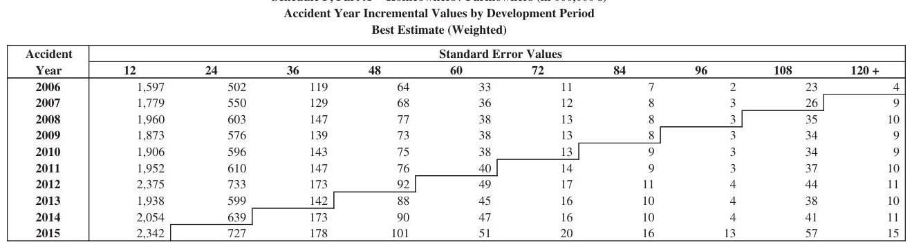
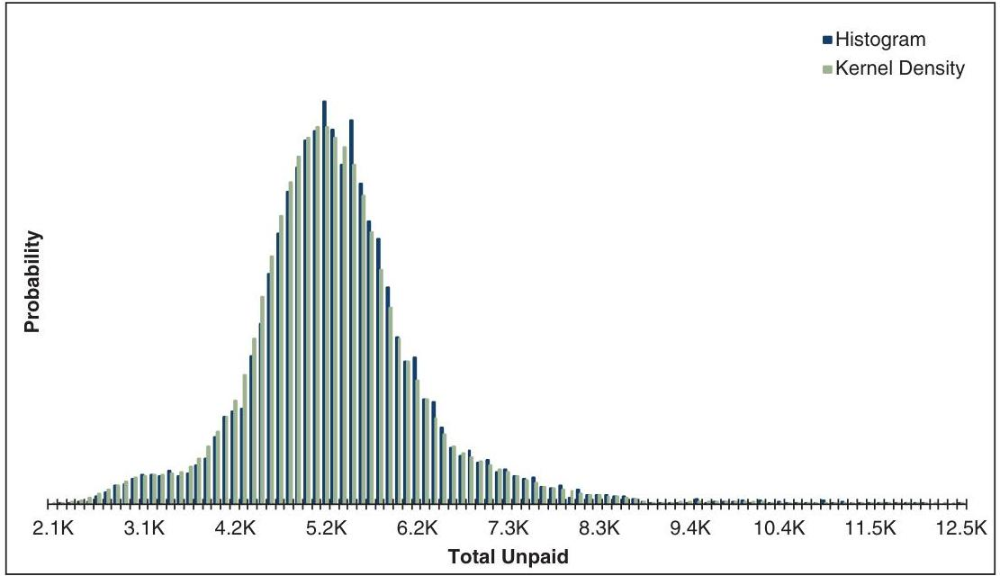

## Page 85
Figure A.29. Summary of Model Distributions
Five Top 50 Companies
Schedule P, Part A -- Homeowners / Farmowners (in 000,000's)
Summary of Model Distributions
(Using Kernel Densities)
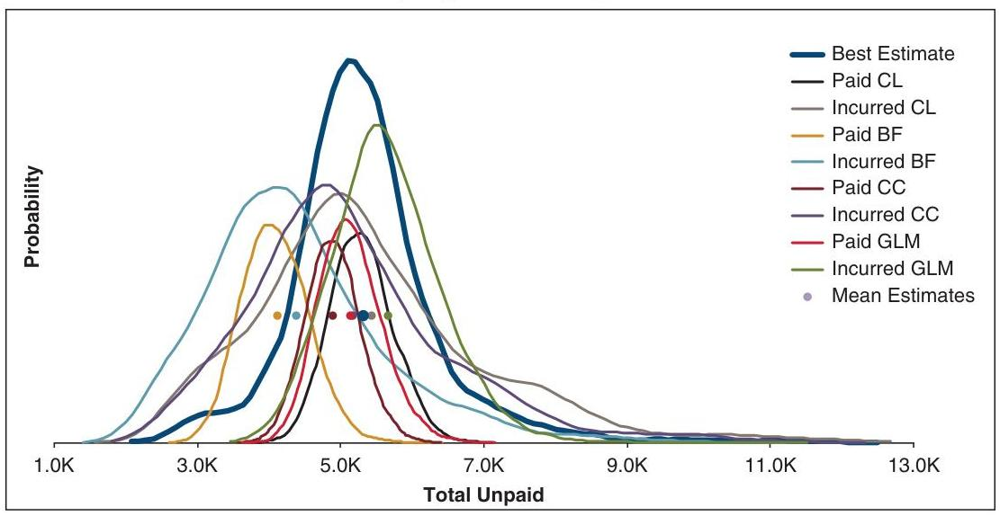

## Page 86
# Appendix B-Schedule P, Part B Results 

In this appendix the results for Schedule P, Part B (Private Passenger Auto Liability) are shown.

Figure B.1. Estimated Unpaid Model Results (Paid Chain Ladder)
Five Top 50 Companies
Schedule P, Part B - Private Passenger Auto Liability (in 000,000's)
Accident Year Unpaid
Paid Chain Ladder Model

| Accident   Year | Mean   Unpaid | Standard   Error | Coefficient   of Variation | Minimum | Maximum | 50.0\%   Percentile | 75.0\%   Percentile | 95.0\%   Percentile | 99.0\%   Percentile |
| :--: | :--: | :--: | :--: | :--: | :--: | :--: | :--: | :--: | :--: |
| 2006 | 59 | 23 | 38.8\% | - | 125 | 58 | 75 | 97 | 112 |
| 2007 | 90 | 25 | 27.3\% | 26 | 164 | 90 | 107 | 131 | 147 |
| 2008 | 135 | 27 | 19.9\% | 64 | 217 | 134 | 153 | 178 | 196 |
| 2009 | 214 | 32 | 14.8\% | 128 | 322 | 213 | 237 | 265 | 289 |
| 2010 | 339 | 31 | 9.2\% | 252 | 443 | 340 | 361 | 390 | 413 |
| 2011 | 586 | 38 | 6.6\% | 459 | 707 | 585 | 610 | 651 | 687 |
| 2012 | 1,109 | 51 | 4.6\% | 949 | 1,281 | 1,108 | 1,144 | 1,191 | 1,226 |
| 2013 | 2,089 | 75 | 3.6\% | 1,868 | 2,329 | 2,090 | 2,140 | 2,211 | 2,252 |
| 2014 | 3,917 | 127 | 3.3\% | 3,457 | 4,357 | 3,919 | 4,002 | 4,129 | 4,203 |
| 2015 | 8,033 | 219 | 2.7\% | 7,335 | 8,667 | 8,042 | 8,175 | 8,399 | 8,532 |
| Totals | 16,573 | 385 | 2.3\% | 15,252 | 17,728 | 16,581 | 16,842 | 17,192 | 17,399 |
| Normal Dist. | 16,573 | 385 | 2.3\% |  |  | 16,573 | 16,833 | 17,207 | 17,469 |
| logNormal Dist. | 16,573 | 386 | 2.3\% |  |  | 16,569 | 16,831 | 17,216 | 17,491 |
| Gamma Dist. | 16,573 | 385 | 2.3\% |  |  | 16,570 | 16,831 | 17,212 | 17,482 |

Figure B.2. Total Unpaid Claims Distribution (Paid Chain Ladder)
Five Top 50 Companies
Schedule P, Part B - Private Passenger Auto Liability (in 000,000's)
Total Unpaid Distribution
Paid Chain Ladder Model
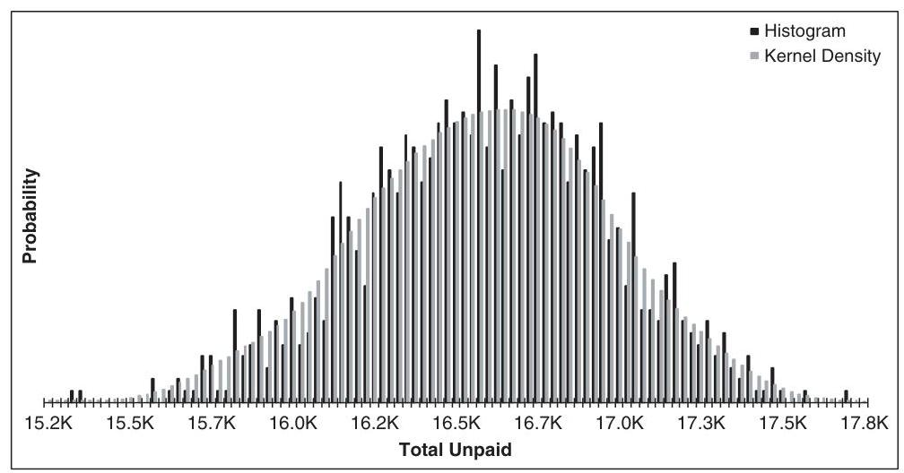

## Page 87
Figure B.3. Estimated Unpaid Model Results (Incurred Chain Ladder)

Figure B.4. Total Unpaid Claims Distribution (Incurred Chain Ladder)
Five Top 50 Companies
Schedule P, Part B -- Private Passenger Auto Liability (in 000,000's)
Total Unpaid Distribution
Incurred Chain Ladder Model
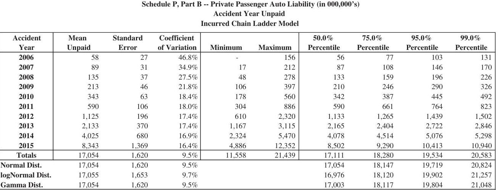

## Page 88
Figure B.5. Estimated Unpaid Model Results (Paid Bornhuetter-Ferguson)

Figure B.6. Total Unpaid Claims Distribution (Paid Bornhuetter-Ferguson)
Five Top 50 Companies
Schedule P, Part B -- Private Passenger Auto Liability (in 000,000's)
Total Unpaid Distribution
Paid Bornhuetter-Ferguson Model
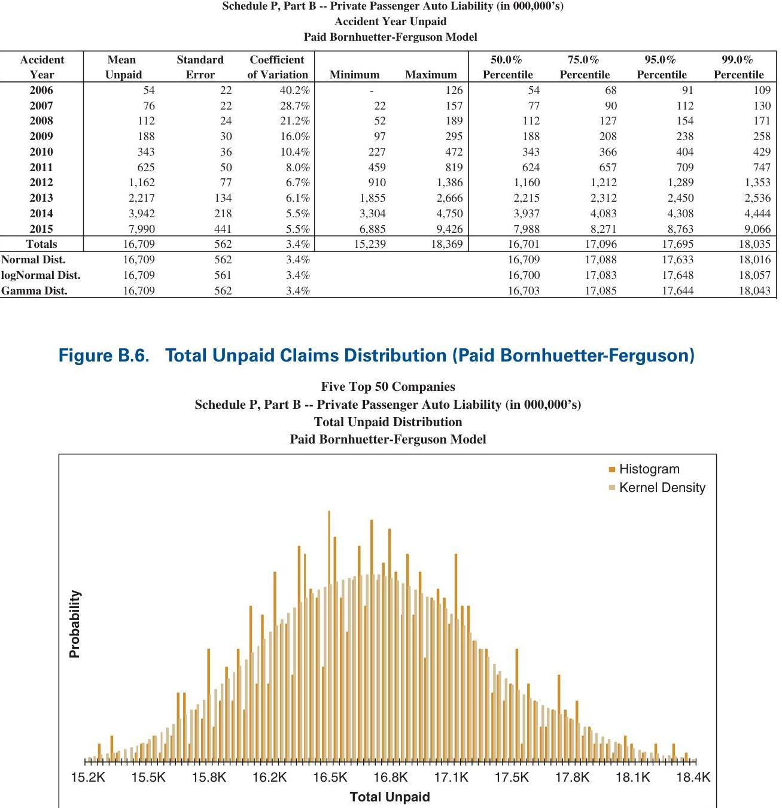
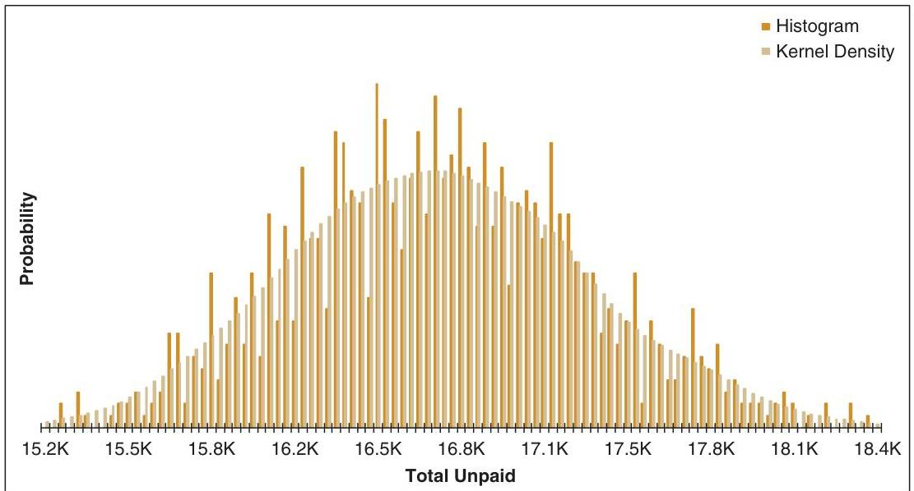

## Page 89
Figure B.7. Estimated Unpaid Model Results (Incurred Bornhuetter-Ferguson)

Figure B.8. Total Unpaid Claims Distribution (Incurred Bornhuetter-Ferguson)
Five Top 50 Companies
Schedule P, Part B -- Private Passenger Auto Liability (in 000,000's)
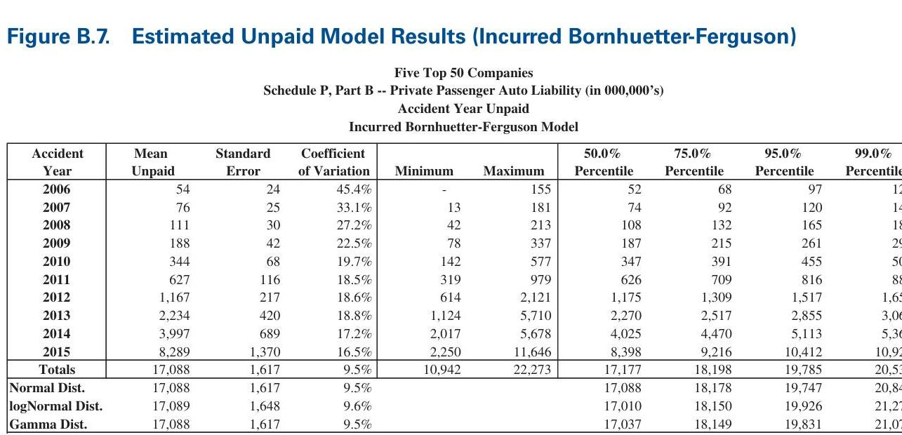

## Page 90
Figure B.9. Estimated Unpaid Model Results (Paid Cape Cod)

Figure B.10. Total Unpaid Claims Distribution (Paid Cape Cod)
Five Top 50 Companies
Schedule P, Part B -- Private Passenger Auto Liability (in 000,000's)
Total Unpaid Distribution
Paid Cape Cod Model

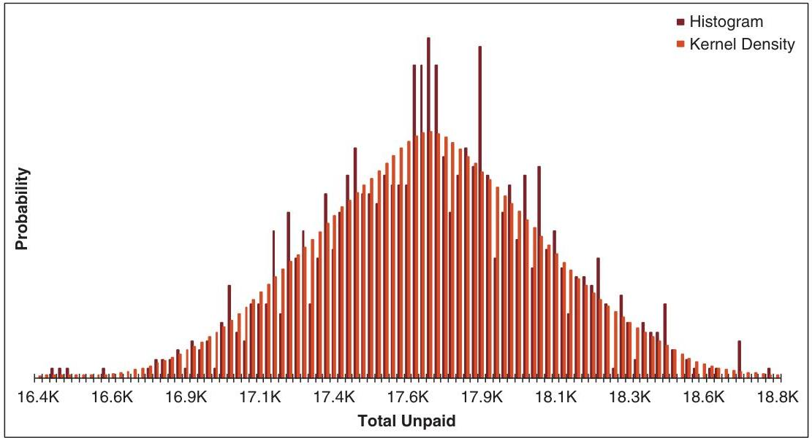

## Page 91
Figure B.11. Estimated Unpaid Model Results (Incurred Cape Cod)

Figure B.12. Total Unpaid Claims Distribution (Incurred Cape Cod)
Five Top 50 Companies
Schedule P, Part B -- Private Passenger Auto Liability (in 000,000's)
Total Unpaid Distribution
Incurred Cape Cod Model
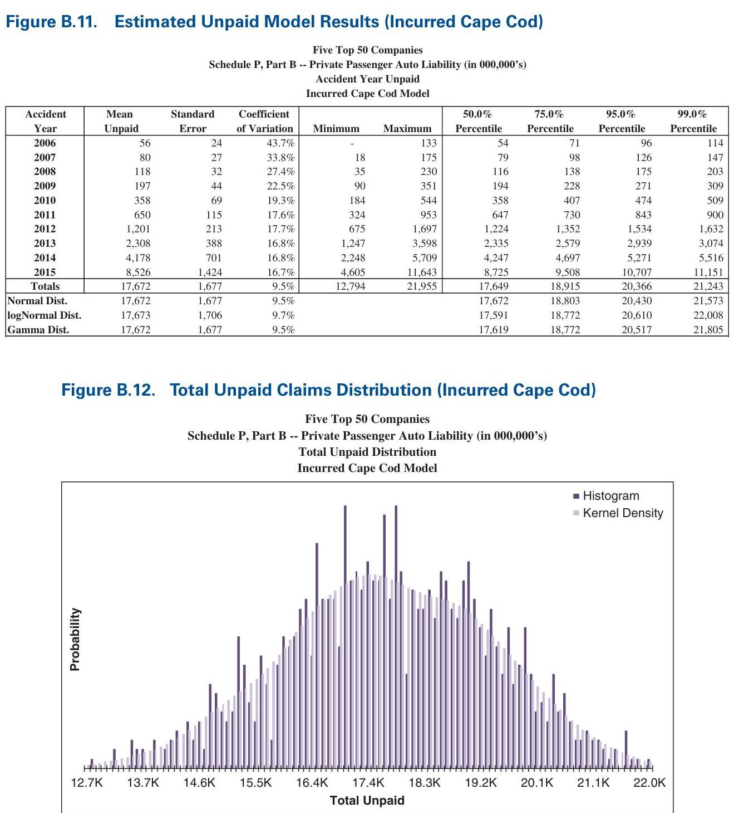
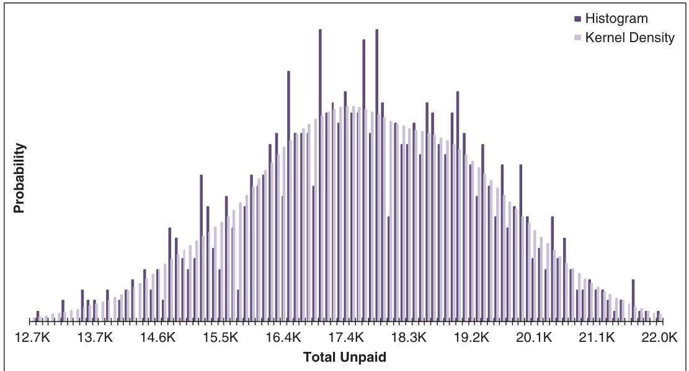

## Page 92
Figure B.13. Estimated Unpaid Model Results (Paid GLM)
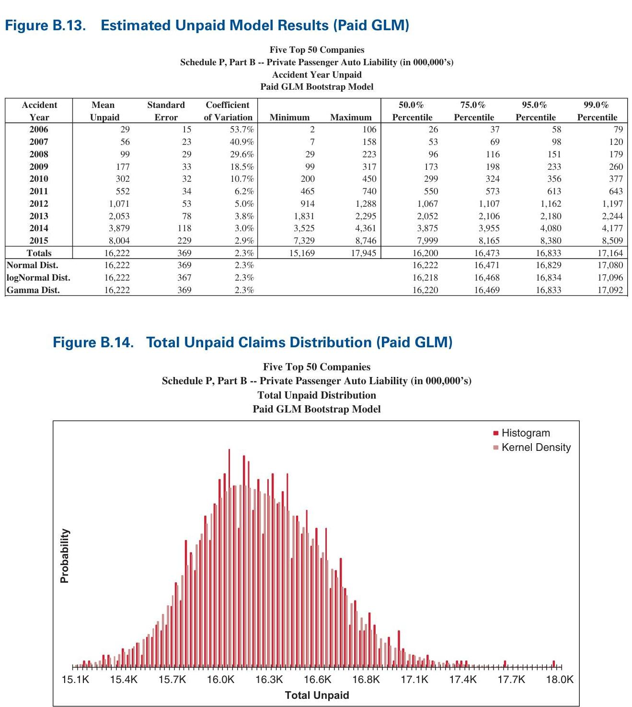

## Page 93
Figure B.15. Estimated Unpaid Model Results (Incurred GLM)
Five Top 50 Companies
Schedule P, Part B -- Private Passenger Auto Liability (in 000,000's)
Accident Year Unpaid
Incurred GLM Bootstrap Model

| Accident   Year | Mean   Unpaid | Standard   Error | Coefficient   of Variation | Minimum | Maximum | 50.0\%   Percentile | 75.0\%   Percentile | 95.0\%   Percentile | 99.0\%   Percentile |
| :--: | :--: | :--: | :--: | :--: | :--: | :--: | :--: | :--: | :--: |
| 2006 | 28 | 15 | 55.2\% | 3 | 110 | 25 | 35 | 58 | 76 |
| 2007 | 56 | 24 | 42.7\% | 7 | 178 | 53 | 69 | 102 | 138 |
| 2008 | 107 | 33 | 30.8\% | 43 | 298 | 101 | 127 | 168 | 200 |
| 2009 | 172 | 34 | 19.6\% | 91 | 301 | 169 | 191 | 235 | 263 |
| 2010 | 295 | 36 | 12.4\% | 204 | 419 | 290 | 316 | 361 | 394 |
| 2011 | 568 | 49 | 8.6\% | 434 | 764 | 565 | 597 | 652 | 702 |
| 2012 | 1,130 | 90 | 8.0\% | 857 | 1,422 | 1,126 | 1,189 | 1,285 | 1,332 |
| 2013 | 2,193 | 168 | 7.7\% | 1,738 | 2,884 | 2,193 | 2,307 | 2,468 | 2,605 |
| 2014 | 4,058 | 319 | 7.9\% | 3,096 | 5,040 | 4,063 | 4,294 | 4,573 | 4,764 |
| 2015 | 8,390 | 723 | 8.6\% | 5,922 | 10,670 | 8,375 | 8,917 | 9,524 | 9,986 |
| Totals | 16,996 | 985 | 5.8\% | 13,965 | 19,871 | 16,965 | 17,696 | 18,619 | 19,079 |
| Normal Dist. | 16,996 | 985 | 5.8\% |  |  | 16,996 | 17,660 | 18,616 | 19,287 |
| logNormal Dist. | 16,996 | 989 | 5.8\% |  |  | 16,967 | 17,645 | 18,669 | 19,424 |
| Gamma Dist. | 16,996 | 985 | 5.8\% |  |  | 16,977 | 17,649 | 18,647 | 19,371 |

Figure B.16. Total Unpaid Claims Distribution (Incurred GLM)
Five Top 50 Companies
Schedule P, Part B -- Private Passenger Auto Liability (in 000,000's)
Total Unpaid Distribution
Incurred GLM Bootstrap Model
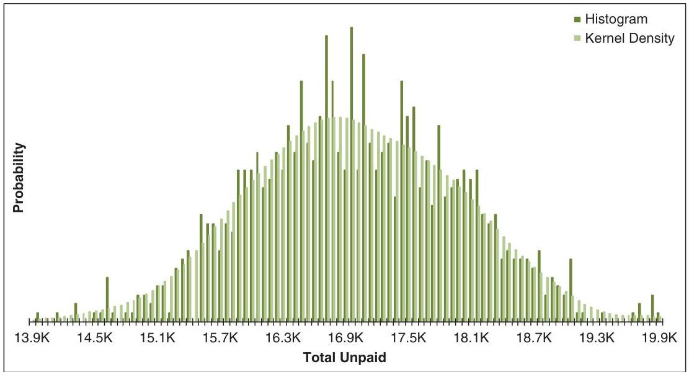

## Page 94
Figure B.17. Model Weights by Accident Year

| Accident   Year | Model Weights by Accident Year |  |  |  |  |  |  |  |
| :--: | :--: | :--: | :--: | :--: | :--: | :--: | :--: | :--: |
|  | Paid CL | Incd CL | Paid BF | Incd BF | Paid CC | Incd CC | Paid GLM | Incd GLM | TOTAL |
| 2006 | $50.0 \%$ | $50.0 \%$ |  |  |  |  |  |  | $100.0 \%$ |
| 2007 | $50.0 \%$ | $50.0 \%$ |  |  |  |  |  |  | $100.0 \%$ |
| 2008 | $50.0 \%$ | $50.0 \%$ |  |  |  |  |  |  | $100.0 \%$ |
| 2009 | $50.0 \%$ | $50.0 \%$ |  |  |  |  |  |  | $100.0 \%$ |
| 2010 |  |  | $25.0 \%$ | $25.0 \%$ | $25.0 \%$ | $25.0 \%$ |  |  | $100.0 \%$ |
| 2011 |  |  | $25.0 \%$ | $25.0 \%$ | $25.0 \%$ | $25.0 \%$ |  |  | $100.0 \%$ |
| 2012 |  |  | $25.0 \%$ | $25.0 \%$ | $25.0 \%$ | $25.0 \%$ |  |  | $100.0 \%$ |
| 2013 |  |  | $25.0 \%$ | $25.0 \%$ | $25.0 \%$ | $25.0 \%$ |  |  | $100.0 \%$ |
| 2014 |  | $25.0 \%$ |  | $25.0 \%$ |  | $25.0 \%$ |  | $25.0 \%$ | $100.0 \%$ |
| 2015 |  | $25.0 \%$ |  | $25.0 \%$ |  | $25.0 \%$ |  | $25.0 \%$ | $100.0 \%$ |

Figure B.18. Estimated Mean Unpaid by Model
Five Top 50 Companies
Schedule P, Part B -- Private Passenger Auto Liability (in 000,000's)
Summary of Results by Model

| Accident   Year | Mean Estimated Unpaid |  |  |  |  |  |  |  |  |
| :--: | :--: | :--: | :--: | :--: | :--: | :--: | :--: | :--: | :--: |
|  | Chain Ladder |  | Bornhuetter-Ferguson |  | Cape Cod |  | GLM Bootstrap |  | Best Est.   (Weighted) |
|  | Paid | Incurred | Paid | Incurred | Paid | Incurred | Paid | Incurred |  |
| 2006 | 59 | 58 | 54 | 54 | 55 | 56 | 29 | 28 | 59 |
| 2007 | 90 | 89 | 76 | 76 | 80 | 80 | 56 | 56 | 90 |
| 2008 | 135 | 135 | 112 | 111 | 117 | 118 | 99 | 107 | 134 |
| 2009 | 214 | 213 | 188 | 188 | 196 | 197 | 177 | 172 | 214 |
| 2010 | 339 | 343 | 343 | 344 | 354 | 358 | 302 | 295 | 351 |
| 2011 | 586 | 590 | 625 | 627 | 642 | 650 | 552 | 568 | 636 |
| 2012 | 1,109 | 1,125 | 1,162 | 1,167 | 1,197 | 1,201 | 1,071 | 1,130 | 1,184 |
| 2013 | 2,089 | 2,133 | 2,217 | 2,234 | 2,292 | 2,308 | 2,053 | 2,193 | 2,255 |
| 2014 | 3,917 | 4,025 | 3,942 | 3,997 | 4,145 | 4,178 | 3,879 | 4,058 | 4,077 |
| 2015 | 8,033 | 8,343 | 7,990 | 8,289 | 8,598 | 8,526 | 8,004 | 8,390 | 8,394 |
| Totals | 16,573 | 17,054 | 16,709 | 17,088 | 17,676 | 17,672 | 16,222 | 16,996 | 17,395 |

Figure B.19. Estimated Ranges
Five Top 50 Companies
Schedule P, Part B -- Private Passenger Auto Liability (in 000,000's)
Summary of Results by Model

| Accident   Year |  | Ranges |  |  |
| :--: | :--: | :--: | :--: | :--: |
|  | Best Est.   (Weighted) | Weighted |  | Modeled |
|  |  | Minimum | Maximum | Minimum | Maximum |
| 2006 | 59 | 58 | 59 | 28 | 59 |
| 2007 | 90 | 89 | 90 | 56 | 90 |
| 2008 | 134 | 135 | 135 | 107 | 135 |
| 2009 | 214 | 213 | 214 | 172 | 214 |
| 2010 | 351 | 343 | 358 | 295 | 358 |
| 2011 | 636 | 625 | 650 | 568 | 650 |
| 2012 | 1,184 | 1,162 | 1,201 | 1,109 | 1,201 |
| 2013 | 2,255 | 2,217 | 2,308 | 2,089 | 2,308 |
| 2014 | 4,077 | 3,997 | 4,178 | 3,917 | 4,178 |
| 2015 | 8,394 | 8,289 | 8,526 | 7,990 | 8,598 |
| Totals | 17,395 | 17,127 | 17,720 | 16,573 | 17,676 |

## Page 95
Figure B.20. Reconciliation of Total Results (Weighted)
Five Top 50 Companies
Schedule P, Part B -- Private Passenger Auto Liability (in 000,000's)
Reconciliation of Total Results
Best Estimate (Weighted)

| Accident   Year | Paid   To Date | Incurred   To Date | Case   Reserves | IBNR | Estimate of   Ultimate | Estimate of   Unpaid |
| :--: | :--: | :--: | :--: | :--: | :--: | :--: |
| 2006 | 11,816 | 11,863 | 47 | 12 | 11,875 | 59 |
| 2007 | 12,679 | 12,752 | 72 | 18 | 12,770 | 90 |
| 2008 | 13,631 | 13,743 | 112 | 22 | 13,765 | 134 |
| 2009 | 14,472 | 14,687 | 216 | $(1)$ | 14,686 | 214 |
| 2010 | 13,717 | 14,079 | 362 | $(11)$ | 14,068 | 351 |
| 2011 | 13,090 | 13,691 | 600 | 36 | 13,726 | 636 |
| 2012 | 12,490 | 13,683 | 1,193 | $(9)$ | 13,674 | 1,184 |
| 2013 | 11,598 | 13,912 | 2,313 | $(58)$ | 13,854 | 2,255 |
| 2014 | 10,306 | 14,625 | 4,319 | $(243)$ | 14,383 | 4,077 |
| 2015 | 6,357 | 15,188 | 8,830 | $(437)$ | 14,751 | 8,394 |
| Totals | 120,157 | 138,223 | 18,066 | $(671)$ | 137,551 | 17,395 |

Figure B.21. Estimated Unpaid Model Results (Weighted)
Five Top 50 Companies
Schedule P, Part B -- Private Passenger Auto Liability (in 000,000's)
Accident Year Unpaid
Best Estimate (Weighted)

| Accident   Year | Mean   Unpaid | Standard   Error | Coefficient   of Variation | Minimum | Maximum | 50.0\%   Percentile | 75.0\%   Percentile | 95.0\%   Percentile | 99.0\%   Percentile |
| :--: | :--: | :--: | :--: | :--: | :--: | :--: | :--: | :--: | :--: |
| 2006 | 59 | 25 | 42.2\% | - | 178 | 58 | 75 | 102 | 122 |
| 2007 | 90 | 28 | 30.8\% | 17 | 221 | 89 | 109 | 137 | 161 |
| 2008 | 134 | 32 | 24.0\% | 41 | 297 | 133 | 156 | 189 | 215 |
| 2009 | 214 | 41 | 18.9\% | 73 | 401 | 213 | 240 | 284 | 321 |
| 2010 | 351 | 55 | 15.6\% | 160 | 600 | 350 | 383 | 444 | 492 |
| 2011 | 636 | 91 | 14.2\% | 314 | 1,020 | 636 | 684 | 794 | 867 |
| 2012 | 1,184 | 157 | 13.3\% | (27) | 1,857 | 1,188 | 1,260 | 1,465 | 1,597 |
| 2013 | 2,255 | 293 | 13.0\% | 1,073 | 5,710 | 2,267 | 2,389 | 2,781 | 2,982 |
| 2014 | 4,077 | 616 | 15.1\% | 833 | 6,049 | 4,097 | 4,460 | 5,120 | 5,398 |
| 2015 | 8,394 | 1,234 | 14.7\% | 980 | 12,352 | 8,468 | 9,175 | 10,444 | 10,911 |
| Totals | 17,395 | 1,428 | 8.2\% | 10,057 | 23,150 | 17,439 | 18,375 | 19,729 | 20,525 |
| Normal Dist. | 17,395 | 1,428 | 8.2\% |  |  | 17,395 | 18,358 | 19,744 | 20,717 |
| logNormal Dist. | 17,395 | 1,451 | 8.3\% |  |  | 17,335 | 18,336 | 19,879 | 21,040 |
| Gamma Dist. | 17,395 | 1,428 | 8.2\% |  |  | 17,356 | 18,336 | 19,809 | 20,889 |

## Page 96
Figure B.22. Estimated Cash Flow (Weighted)
Five Top 50 Companies
Schedule P, Part B -- Private Passenger Auto Liability (in 000,000's)
Calendar Year Unpaid
Best Estimate (Weighted)

| Calendar   Year | Mean   Unpaid | Standard   Error | Coefficient   of Variation | Minimum | Maximum | 50.0\%   Percentile | 75.0\%   Percentile | 95.0\%   Percentile | 99.0\%   Percentile |
| :--: | :--: | :--: | :--: | :--: | :--: | :--: | :--: | :--: | :--: |
| 2016 | 8,275 | 715 | 8.6\% | 4,501 | 10,746 | 8,299 | 8,761 | 9,426 | 9,838 |
| 2017 | 4,072 | 340 | 8.4\% | 2,450 | 5,608 | 4,079 | 4,304 | 4,621 | 4,845 |
| 2018 | 2,266 | 198 | 8.7\% | 1,319 | 3,149 | 2,267 | 2,397 | 2,590 | 2,718 |
| 2019 | 1,210 | 109 | 9.0\% | 699 | 1,574 | 1,210 | 1,285 | 1,389 | 1,461 |
| 2020 | 638 | 58 | 9.1\% | 405 | 885 | 638 | 677 | 735 | 778 |
| 2021 | 358 | 35 | 9.8\% | 203 | 511 | 358 | 381 | 416 | 439 |
| 2022 | 217 | 30 | 13.7\% | 95 | 351 | 216 | 237 | 267 | 291 |
| 2023 | 144 | 25 | 17.2\% | 57 | 258 | 144 | 161 | 186 | 205 |
| 2024 | 99 | 23 | 23.4\% | 16 | 214 | 98 | 114 | 139 | 157 |
| 2025 | 67 | 22 | 33.1\% | - | 157 | 66 | 81 | 106 | 124 |
| 2026 | 32 | 13 | 40.8\% | - | 91 | 32 | 41 | 55 | 66 |
| 2027 | 16 | 9 | 57.3\% | - | 57 | 15 | 22 | 31 | 38 |
| Totals | 17,395 | 1,428 | 8.2\% | 10,057 | 23,150 | 17,439 | 18,375 | 19,729 | 20,525 |

Figure B.23. Estimated Loss Ratio (Weighted)
Five Top 50 Companies
Schedule P, Part B -- Private Passenger Auto Liability (in 000,000's)
Accident Year Ultimate Loss Ratios
Best Estimate (Weighted)

| Accident   Year | Mean   Loss Ratio | Standard   Error | Coefficient   of Variation | Minimum | Maximum | 50.0\%   Percentile | 75.0\%   Percentile | 95.0\%   Percentile | 99.0\%   Percentile |
| :--: | :--: | :--: | :--: | :--: | :--: | :--: | :--: | :--: | :--: |
| 2006 | 75.6\% | 9.7\% | 12.9\% | 38.9\% | 104.5\% | 75.8\% | 77.8\% | 94.6\% | 99.4\% |
| 2007 | 82.2\% | 10.3\% | 12.5\% | 43.9\% | 114.0\% | 82.4\% | 84.6\% | 102.2\% | 107.6\% |
| 2008 | 83.9\% | 10.2\% | 12.1\% | 45.1\% | 114.4\% | 83.9\% | 86.3\% | 103.7\% | 108.6\% |
| 2009 | 79.6\% | 9.2\% | 11.6\% | 45.2\% | 108.3\% | 79.7\% | 81.8\% | 97.8\% | 102.7\% |
| 2010 | 69.3\% | 8.2\% | 11.9\% | 37.9\% | 94.6\% | 69.1\% | 71.1\% | 85.3\% | 90.1\% |
| 2011 | 66.0\% | 8.1\% | 12.3\% | 35.2\% | 89.7\% | 66.0\% | 67.9\% | 81.7\% | 85.9\% |
| 2012 | 66.9\% | 8.1\% | 12.1\% | -1.5\% | 94.6\% | 66.9\% | 68.8\% | 82.7\% | 86.8\% |
| 2013 | 66.9\% | 8.1\% | 12.2\% | 35.2\% | 186.1\% | 66.9\% | 68.9\% | 82.4\% | 86.3\% |
| 2014 | 71.9\% | 10.6\% | 14.7\% | 14.4\% | 101.9\% | 72.7\% | 78.5\% | 89.0\% | 93.5\% |
| 2015 | 73.0\% | 10.6\% | 14.5\% | 8.4\% | 110.0\% | 73.9\% | 79.8\% | 90.3\% | 94.2\% |
| Totals | 72.9\% | 3.0\% | 4.1\% | 61.6\% | 90.9\% | 73.0\% | 75.0\% | 77.7\% | 79.5\% |

Figure B.24. Estimated Unpaid Claim Runoff (Weighted)
Five Top 50 Companies
Schedule P, Part B -- Private Passenger Auto Liability (in 000,000's)
Calendar Year Unpaid Claim Runoff
Best Estimate (Weighted)

| Calendar   Year | Mean   Unpaid | Standard   Error | Coefficient   of Variation | Minimum | Maximum | 50.0\%   Percentile | 75.0\%   Percentile | 95.0\%   Percentile | 99.0\%   Percentile |
| :--: | :--: | :--: | :--: | :--: | :--: | :--: | :--: | :--: | :--: |
| 2015 | 17,395 | 1,428 | 8.2\% | 10,057 | 23,150 | 17,439 | 18,375 | 19,729 | 20,525 |
| 2016 | 9,120 | 739 | 8.1\% | 5,556 | 12,446 | 9,136 | 9,623 | 10,325 | 10,767 |
| 2017 | 5,048 | 419 | 8.3\% | 3,106 | 6,838 | 5,054 | 5,330 | 5,738 | 6,000 |
| 2018 | 2,782 | 243 | 8.7\% | 1,709 | 3,689 | 2,781 | 2,945 | 3,184 | 3,360 |
| 2019 | 1,572 | 157 | 10.0\% | 902 | 2,165 | 1,570 | 1,675 | 1,838 | 1,951 |
| 2020 | 934 | 117 | 12.6\% | 494 | 1,387 | 930 | 1,011 | 1,131 | 1,224 |
| 2021 | 576 | 94 | 16.3\% | 247 | 988 | 573 | 638 | 733 | 807 |
| 2022 | 359 | 75 | 21.0\% | 104 | 687 | 356 | 408 | 488 | 546 |
| 2023 | 214 | 59 | 27.6\% | 30 | 467 | 211 | 252 | 317 | 365 |
| 2024 | 115 | 41 | 36.0\% | (0) | 283 | 112 | 142 | 188 | 222 |
| 2025 | 48 | 20 | 42.4\% | (0) | 137 | 47 | 62 | 84 | 101 |
| 2026 | 16 | 9 | 57.3\% | (0) | 57 | 15 | 22 | 31 | 38 |
| 2027 | (0) | 0 | -10502.4\% | (0) | 0 | (0) | 0 | 0 | 0 |

## Page 97
Figure B.25. Mean of Incremental Values (Weighted)

Figure B.26. Standard Deviation of Incremental Values (Weighted)
Five Top 50 Companies
Schedule P, Part B - Private Passenger Auto Liability (in 000,000 's)
Accident Year Incremental Values by Development Period
Best Estimate (Weighted)

| Accident   Year | Standard Error Values |  |  |  |  |  |  |  |  |  |  |  |  |
| :--: | :--: | :--: | :--: | :--: | :--: | :--: | :--: | :--: | :--: | :--: | :--: | :--: | :--: |
|  | 12 | 24 | 36 | 48 | 60 | 72 | 84 | 96 | 108 | 120 | 132 | 144 | $156 \times$ |
| 2006 | 5,232 | 3,354 | 1,456 | 842 | 457 | 224 | 113 | 58 | 32 | 25 | 50 | 15 | 15 |
| 2007 | 5,631 | 3,608 | 1,566 | 907 | 491 | 241 | 121 | 62 | 34 | 27 | 32 | 16 | 16 |
| 2008 | 6,082 | 3,902 | 1,691 | 981 | 530 | 261 | 131 | 67 | 37 | 29 | 34 | 17 | 17 |
| 2009 | 6,480 | 4,155 | 1,802 | 1,043 | 565 | 278 | 139 | 71 | 39 | 31 | 36 | 18 | 18 |
| 2010 | 6,225 | 3,992 | 1,732 | 1,002 | 543 | 267 | 138 | 71 | 39 | 31 | 36 | 18 | 18 |
| 2011 | 6,043 | 3,876 | 1,681 | 974 | 527 | 280 | 141 | 72 | 40 | 31 | 36 | 18 | 18 |
| 2012 | 6,008 | 3,851 | 1,671 | 968 | 560 | 274 | 138 | 71 | 39 | 31 | 36 | 18 | 18 |
| 2013 | 6,046 | 3,876 | 1,681 | 1,051 | 569 | 279 | 140 | 72 | 40 | 31 | 36 | 18 | 18 |
| 2014 | 6,453 | 4,136 | 1,821 | 1,055 | 572 | 281 | 141 | 72 | 41 | 30 | 32 | 17 | 16 |
| 2015 | 6,549 | 4,261 | 1,847 | 1,070 | 579 | 284 | 143 | 73 | 41 | 31 | 32 | 17 | 16 |

Figure B.27. Coefficient of Variation of Incremental Values (Weighted)
Five Top 50 Companies
Schedule P, Part B - Private Passenger Auto Liability (in 000,000 's)
Accident Year Incremental Values by Development Period
Best Estimate (Weighted)

| Accident   Year | Standard Error Values |  |  |  |  |  |  |  |  |  |  |  |  |
| :--: | :--: | :--: | :--: | :--: | :--: | :--: | :--: | :--: | :--: | :--: | :--: | :--: | :--: |
|  | 12 | 24 | 36 | 48 | 60 | 72 | 84 | 96 | 108 | 120 | 132 | 144 | $156 \times$ |
| 2006 | 677 | 440 | 199 | 115 | 65 | 35 | 15 | 12 | 4 | 3 | 12 | 6 | 6 |
| 2007 | 708 | 460 | 207 | 120 | 68 | 36 | 16 | 13 | 4 | 3 | 13 | 7 | 7 |
| 2008 | 742 | 484 | 217 | 126 | 70 | 38 | 16 | 13 | 5 | 4 | 14 | 7 | 7 |
| 2009 | 756 | 493 | 220 | 129 | 72 | 39 | 17 | 16 | 5 | 4 | 15 | 8 | 8 |
| 2010 | 745 | 485 | 218 | 127 | 71 | 38 | 18 | 16 | 5 | 4 | 15 | 8 | 8 |
| 2011 | 747 | 486 | 218 | 128 | 71 | 44 | 19 | 16 | 5 | 4 | 15 | 8 | 8 |
| 2012 | 729 | 475 | 213 | 124 | 78 | 42 | 18 | 16 | 5 | 4 | 15 | 8 | 8 |
| 2013 | 741 | 483 | 218 | 142 | 79 | 43 | 19 | 16 | 5 | 4 | 15 | 8 | 8 |
| 2014 | 955 | 616 | 282 | 165 | 92 | 47 | 22 | 18 | 8 | 7 | 17 | 9 | 9 |
| 2015 | 966 | 634 | 280 | 166 | 92 | 48 | 22 | 18 | 9 | 7 | 17 | 9 | 9 |

Figure B.27. Coefficient of Variation of Incremental Values (Weighted)
Five Top 50 Companies
Schedule P, Part B - Private Passenger Auto Liability (in 000,000 's)
Accident Year Incremental Values by Development Period
Best Estimate (Weighted)

| Accident   Year | Coefficients of Variation |  |  |  |  |  |  |  |  |  |  |  |  |
| :--: | :--: | :--: | :--: | :--: | :--: | :--: | :--: | :--: | :--: | :--: | :--: | :--: | :--: |
|  | 12 | 24 | 36 | 48 | 60 | 72 | 84 | 96 | 108 | 120 | 132 | 144 | $156 \times$ |
| 2006 | $12.9 \%$ | $13.1 \%$ | $13.6 \%$ | $13.7 \%$ | $14.2 \%$ | $15.5 \%$ | $13.4 \%$ | $21.2 \%$ | $12.9 \%$ | $12.9 \%$ | $42.1 \%$ | $42.2 \%$ | $42.3 \%$ |
| 2007 | $12.6 \%$ | $12.7 \%$ | $13.2 \%$ | $13.3 \%$ | $13.8 \%$ | $15.0 \%$ | $13.0 \%$ | $20.6 \%$ | $12.5 \%$ | $12.6 \%$ | $42.0 \%$ | $42.1 \%$ | $42.2 \%$ |
| 2008 | $12.2 \%$ | $12.4 \%$ | $12.8 \%$ | $12.8 \%$ | $13.3 \%$ | $14.5 \%$ | $12.6 \%$ | 19.9\% | $12.2 \%$ | $12.3 \%$ | $42.3 \%$ | $42.4 \%$ | $42.5 \%$ |
| 2009 | $11.7 \%$ | $11.9 \%$ | $12.2 \%$ | $12.4 \%$ | $12.7 \%$ | $13.9 \%$ | $12.1 \%$ | $22.0 \%$ | $11.7 \%$ | $11.7 \%$ | $42.0 \%$ | $42.1 \%$ | $42.2 \%$ |
| 2010 | $12.0 \%$ | $12.2 \%$ | $12.6 \%$ | $12.6 \%$ | $13.1 \%$ | $14.3 \%$ | $13.1 \%$ | $22.5 \%$ | $12.5 \%$ | $12.6 \%$ | $42.5 \%$ | $42.6 \%$ | $42.7 \%$ |
| 2011 | $12.4 \%$ | $12.5 \%$ | $13.0 \%$ | $13.1 \%$ | $13.5 \%$ | $15.6 \%$ | $13.4 \%$ | $22.5 \%$ | $12.9 \%$ | $12.9 \%$ | $42.5 \%$ | $42.7 \%$ | $42.8 \%$ |
| 2012 | $12.1 \%$ | $12.3 \%$ | $12.8 \%$ | $12.9 \%$ | $13.9 \%$ | $15.3 \%$ | $13.2 \%$ | $22.4 \%$ | $12.6 \%$ | $12.7 \%$ | $42.3 \%$ | $42.5 \%$ | $42.5 \%$ |
| 2013 | $12.3 \%$ | $12.5 \%$ | $13.0 \%$ | $13.5 \%$ | $13.9 \%$ | $15.4 \%$ | $13.2 \%$ | $22.3 \%$ | $12.7 \%$ | $12.7 \%$ | $42.0 \%$ | $42.2 \%$ | $42.2 \%$ |
| 2014 | $14.8 \%$ | $14.9 \%$ | $15.5 \%$ | $15.7 \%$ | $16.1 \%$ | $16.8 \%$ | $15.4 \%$ | $24.5 \%$ | $20.8 \%$ | $23.7 \%$ | $52.6 \%$ | $51.2 \%$ | $57.5 \%$ |
| 2015 | $14.7 \%$ | $14.9 \%$ | $15.2 \%$ | $15.5 \%$ | $15.9 \%$ | $16.7 \%$ | $15.2 \%$ | $24.4 \%$ | $20.6 \%$ | $23.4 \%$ | $52.1 \%$ | $51.1 \%$ | $57.3 \%$ |
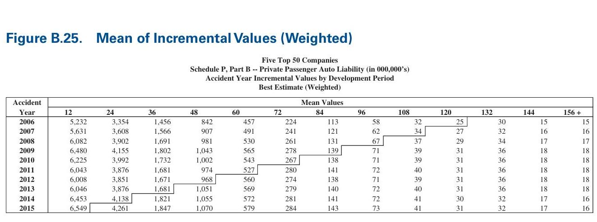

## Page 98
Figure B.28. Total Unpaid Claims Distribution (Weighted)

Figure B.29. Summary of Model Distributions
Five Top 50 Companies
Schedule P, Part B -- Private Passenger Auto Liability (in 000,000's)
Summary of Model Distributions
(Using Kernel Densities)

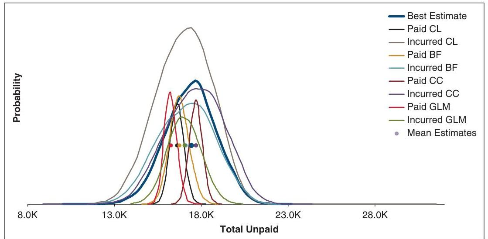

## Page 99
# Appendix C-Schedule P, Part C Results 

In this appendix the results for Schedule P, Part C (Commercial Auto Liability) are shown.

Figure C.1. Estimated Unpaid Model Results (Paid Chain Ladder)

Figure C.2. Total Unpaid Claims Distribution (Paid Chain Ladder)
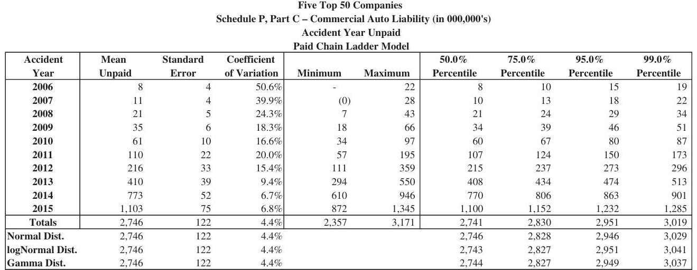
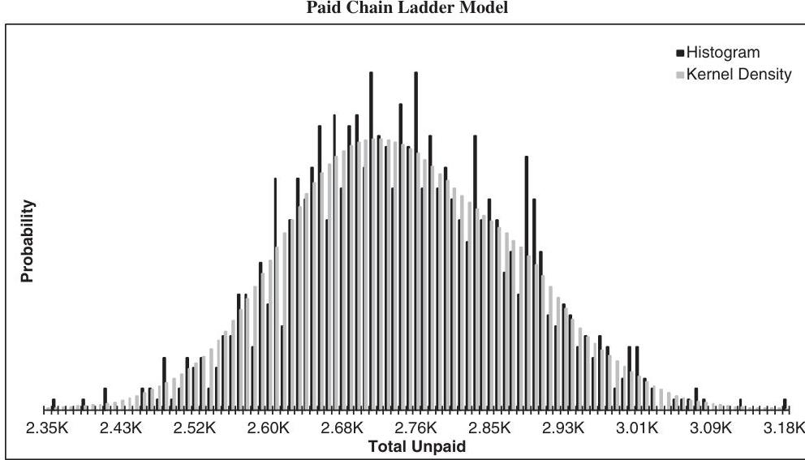

## Page 100
Figure C.3. Estimated Unpaid Model Results (Incurred Chain Ladder)

Figure C.4. Total Unpaid Claims Distribution (Incurred Chain Ladder)
Five Top 50 Companies
Schedule P, Part C - Commercial Auto Liability (in 000,000's)
Total Unpaid Distribution
Incurred Chain Ladder Model
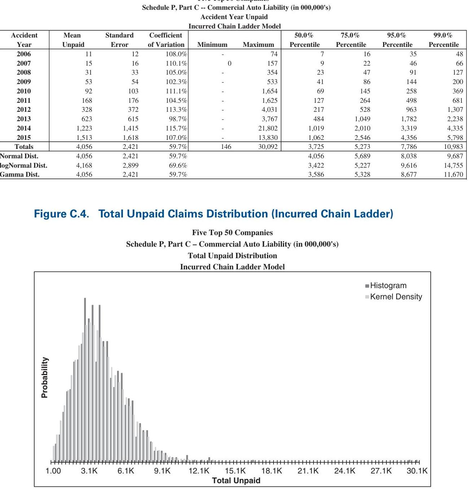
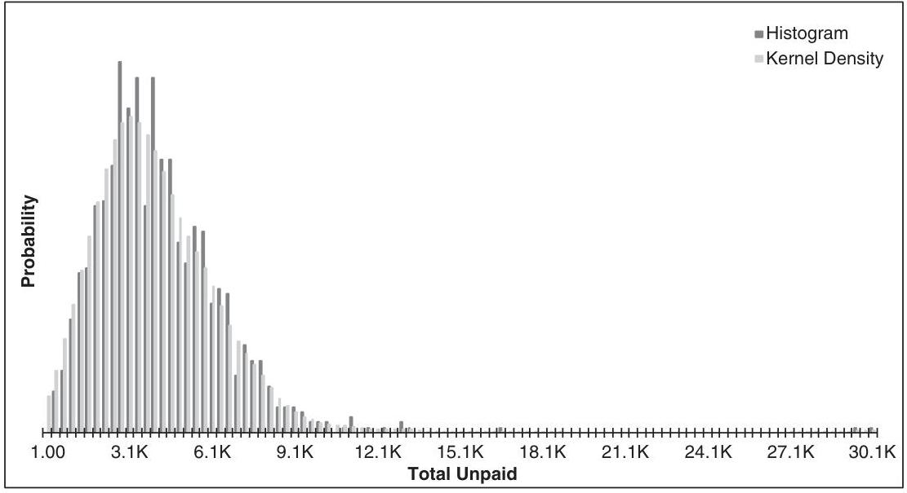

## Page 101
Figure C.5. Estimated Unpaid Model Results (Paid Bornhuetter-Ferguson)

Figure C.6. Total Unpaid Claims Distribution (Paid Bornhuetter-Ferguson)
Five Top 50 Companies
Schedule P, Part C - Commercial Auto Liability (in 000,000's)
Total Unpaid Distribution
Paid Bornhuetter-Ferguson Model
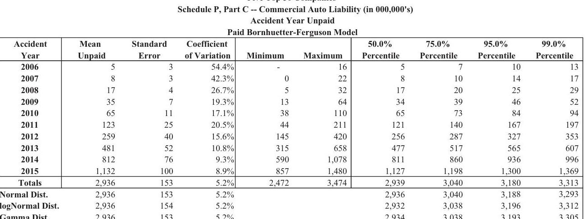
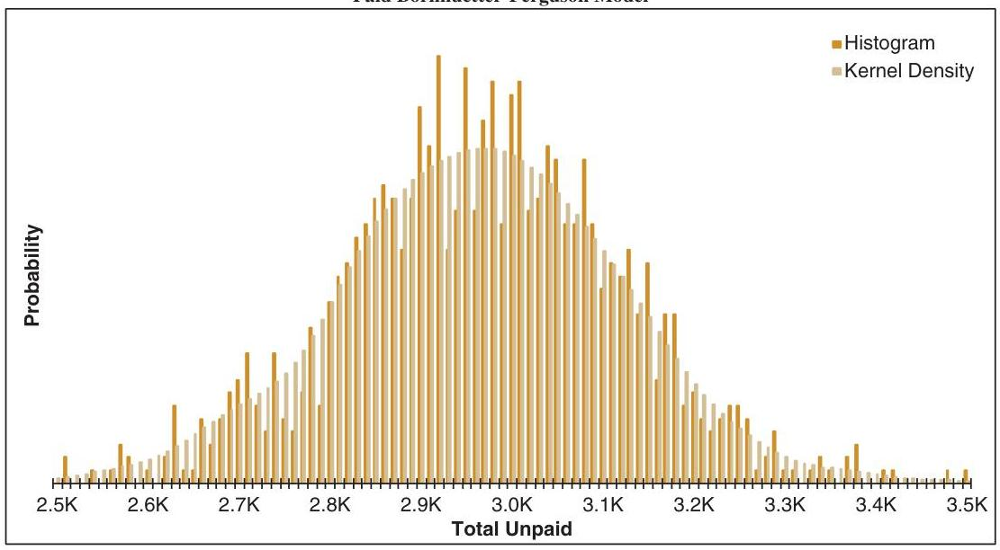

## Page 102
Figure C.7. Estimated Unpaid Model Results (Incurred Bornhuetter-Ferguson)

Figure C.8. Total Unpaid Claims Distribution (Incurred Bornhuetter-Ferguson)
Five Top 50 Companies
Schedule P, Part C -- Commercial Auto Liability (in 000,000's)
Total Unpaid Distribution
Incurred Bornhuetter-Ferguson Model
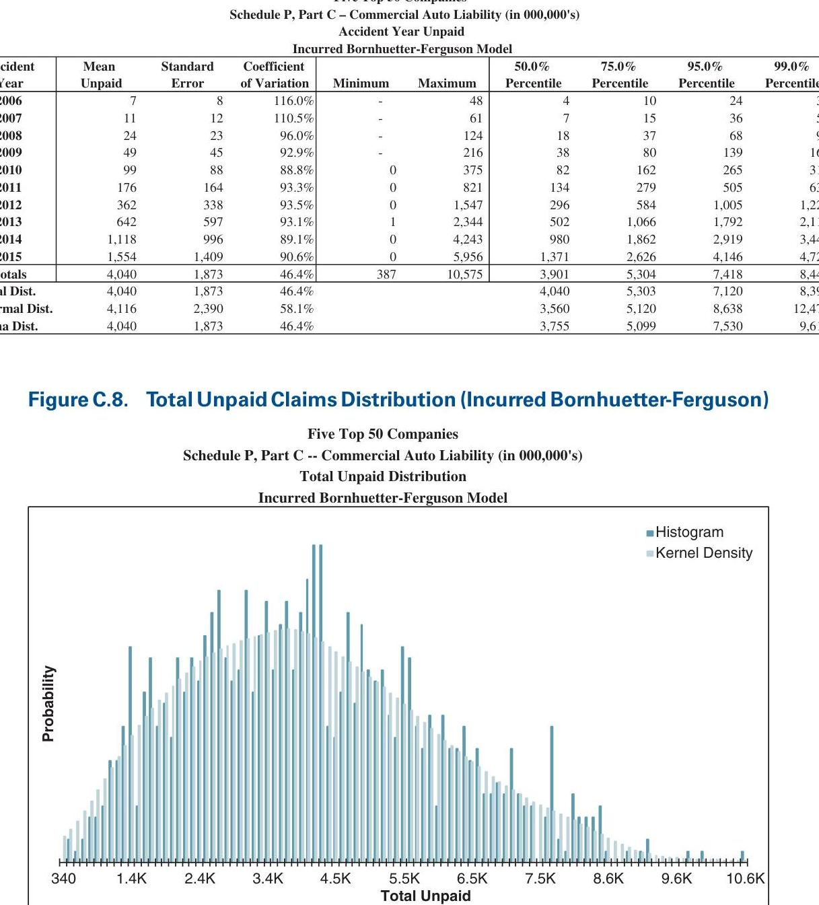
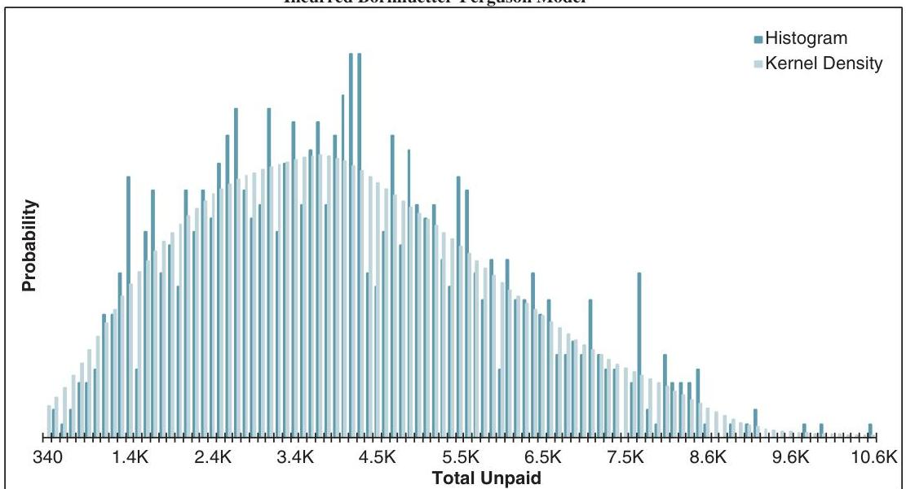

## Page 103
Figure C.9. Estimated Unpaid Model Results (Paid Cape Cod)

Figure C.10. Total Unpaid Claims Distribution (Paid Cape Cod)
Five Top 50 Companies
Schedule P, Part C - Commercial Auto Liability (in 000,000's)
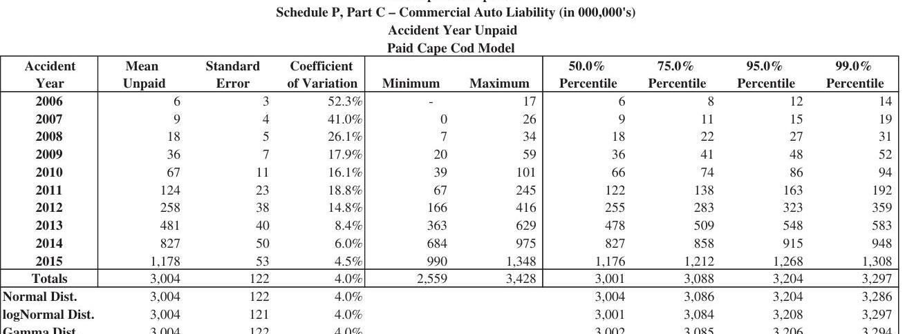
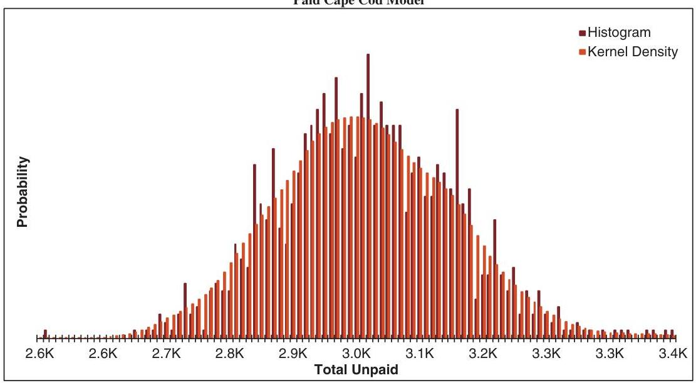

## Page 104
Figure C.11. Estimated Unpaid Model Results (Incurred Cape Cod)

Figure C.12. Total Unpaid Claims Distribution (Incurred Cape Cod)
Five Top 50 Companies
Schedule P, Part C - Commercial Auto Liability (in 000,000's)
Total Unpaid Distribution
Incurred Cape Cod Model
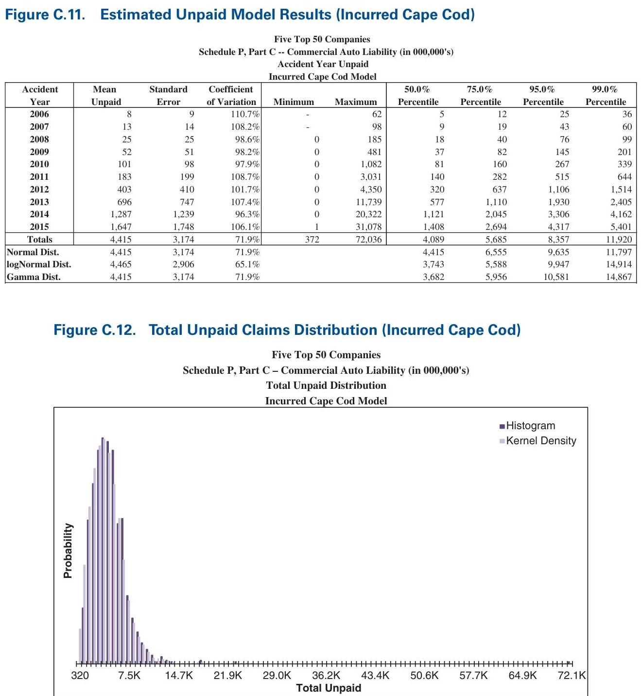
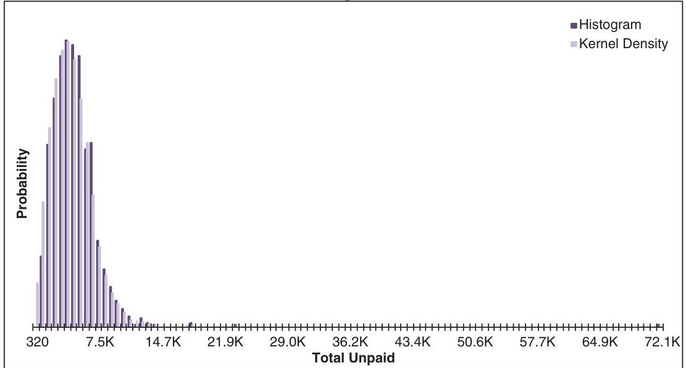

## Page 105
Figure C.13. Estimated Unpaid Model Results (Paid GLM)
Five Top 50 Companies
Schedule P, Part C - Commercial Auto Liability (in 000,000's)
Accident Year Unpaid
Paid GLM Bootstrap Model

| Accident   Year | Mean   Unpaid | Standard   Error | Coefficient   of Variation | Minimum | Maximum | 50.0\%   Percentile | 75.0\%   Percentile | 95.0\%   Percentile | 99.0\%   Percentile |
| :--: | :--: | :--: | :--: | :--: | :--: | :--: | :--: | :--: | :--: |
| 2006 | 8 | 5 | 63.7\% | (5) | 33 | 7 | 10 | 17 | 23 |
| 2007 | 14 | 7 | 52.9\% | (3) | 52 | 12 | 18 | 27 | 33 |
| 2008 | 23 | 9 | 39.9\% | (1) | 72 | 22 | 29 | 39 | 49 |
| 2009 | 38 | 12 | 30.2\% | 8 | 90 | 38 | 45 | 58 | 70 |
| 2010 | 64 | 13 | 20.8\% | 27 | 112 | 64 | 73 | 88 | 100 |
| 2011 | 123 | 17 | 13.8\% | 81 | 178 | 122 | 135 | 152 | 162 |
| 2012 | 244 | 25 | 10.4\% | 169 | 331 | 243 | 261 | 286 | 305 |
| 2013 | 457 | 37 | 8.1\% | 361 | 577 | 455 | 480 | 520 | 543 |
| 2014 | 747 | 53 | 7.1\% | 597 | 926 | 749 | 784 | 831 | 870 |
| 2015 | 1,063 | 77 | 7.3\% | 851 | 1,346 | 1,060 | 1,112 | 1,192 | 1,259 |
| Totals | 2,781 | 188 | 6.8\% | 2,234 | 3,480 | 2,775 | 2,904 | 3,097 | 3,251 |
| Normal Dist. | 2,781 | 188 | 6.8\% |  |  | 2,781 | 2,907 | 3,090 | 3,218 |
| logNormal Dist. | 2,781 | 188 | 6.8\% |  |  | 2,774 | 2,903 | 3,100 | 3,246 |
| Gamma Dist. | 2,781 | 188 | 6.8\% |  |  | 2,776 | 2,905 | 3,097 | 3,237 |

Figure C.14. Total Unpaid Claims Distribution (Paid GLM)
Five Top 50 Companies
Schedule P, Part C - Commercial Auto Liability (in 000,000's)
Total Unpaid Distribution
Paid GLM Bootstrap Model
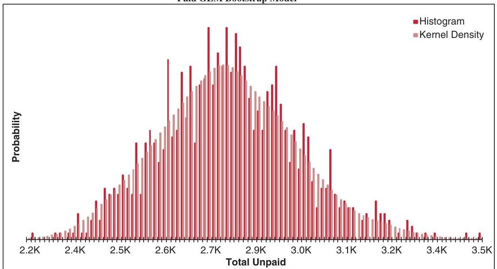

## Page 106
Figure C.15. Estimated Unpaid Model Results (Incurred GLM)
Five Top 50 Companies
Schedule P, Part C - Commercial Auto Liability (in 000,000's)
Accident Year Unpaid
Incurred GLM Bootstrap Model

| Accident   Year | Mean   Unpaid | Standard   Error | Coefficient   of Variation | Minimum | Maximum | 50.0\%   Percentile | 75.0\%   Percentile | 95.0\%   Percentile | 99.0\%   Percentile |
| :--: | :--: | :--: | :--: | :--: | :--: | :--: | :--: | :--: | :--: |
| 2006 | 10 | 8 | 81.9\% | (9) | 57 | 8 | 13 | 25 | 39 |
| 2007 | 17 | 11 | 62.4\% | (5) | 65 | 15 | 22 | 39 | 53 |
| 2008 | 31 | 17 | 53.2\% | (0) | 104 | 29 | 40 | 63 | 82 |
| 2009 | 54 | 23 | 43.3\% | 7 | 177 | 50 | 67 | 97 | 119 |
| 2010 | 92 | 35 | 38.2\% | 17 | 251 | 88 | 113 | 153 | 184 |
| 2011 | 174 | 63 | 36.1\% | 23 | 378 | 171 | 217 | 278 | 333 |
| 2012 | 363 | 119 | 32.8\% | 76 | 773 | 360 | 443 | 572 | 648 |
| 2013 | 682 | 224 | 32.9\% | 100 | 1,490 | 666 | 833 | 1,078 | 1,211 |
| 2014 | 1,097 | 366 | 33.3\% | 267 | 2,346 | 1,084 | 1,334 | 1,716 | 2,055 |
| 2015 | 1,567 | 555 | 35.4\% | 452 | 4,027 | 1,515 | 1,899 | 2,536 | 3,071 |
| Totals | 4,087 | 760 | 18.6\% | 2,190 | 6,754 | 4,018 | 4,584 | 5,485 | 6,034 |
| Normal Dist. | 4,087 | 760 | 18.6\% |  |  | 4,087 | 4,599 | 5,336 | 5,854 |
| logNormal Dist. | 4,087 | 769 | 18.8\% |  |  | 4,017 | 4,555 | 5,460 | 6,200 |
| Gamma Dist. | 4,087 | 760 | 18.6\% |  |  | 4,040 | 4,570 | 5,411 | 6,058 |

Figure C.16. Total Unpaid Claims Distribution (Incurred GLM)
Five Top 50 Companies
Schedule P, Part C - Commercial Auto Liability (in 000,000's)
Total Unpaid Distribution
Incurred GLM Bootstrap Model
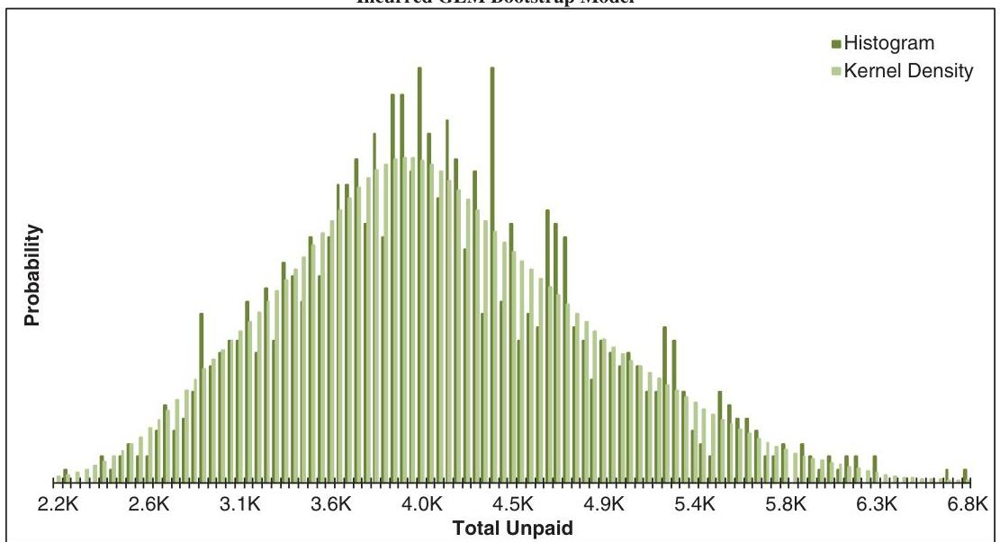

## Page 107
Figure C.17. Model Weights By Accident Year

| Accident   Year | Model Weights by Accident Year |  |  |  |  |  |  |
| :--: | :--: | :--: | :--: | :--: | :--: | :--: | :--: |
|  | Paid CL | Incd CL | Paid BF | Incd BF | Paid CC | Incd CC | Paid GLM |
| 2006 |  |  |  |  |  |  | 100.0\% |
| 2007 |  |  |  |  |  |  | 100.0\% |
| 2008 |  |  |  |  |  |  | 100.0\% |
| 2009 |  |  |  |  |  |  | 100.0\% |
| 2010 |  |  | $33.3 \%$ |  | $33.3 \%$ |  | $33.3 \%$ |
| 2011 |  |  | $33.3 \%$ |  | $33.3 \%$ |  | $33.3 \%$ |
| 2012 |  |  | $50.0 \%$ |  | $50.0 \%$ |  |  |
| 2013 |  |  | $50.0 \%$ |  | $50.0 \%$ |  |  |
| 2014 | $33.3 \%$ |  | $33.3 \%$ |  | $33.3 \%$ |  |  |
| 2015 | $33.3 \%$ |  | $33.3 \%$ |  | $33.3 \%$ |  |  |

Figure C.18. Estimated Mean Unpaid By Model
Five Top 50 Companies
Schedule P, Part C - Commercial Auto Liability (in 000,000's)
Summary of Results by Model

| Accident   Year | Mean Estimated Unpaid |  |  |  |  |  |  |  |  |
| :--: | :--: | :--: | :--: | :--: | :--: | :--: | :--: | :--: | :--: |
|  | Chain Ladder |  | Bornhoetter-Ferguson | Cape Cod |  | GLM Bootstrap |  | Best Est.   (Weighted) |
|  | Paid | Incurred | Paid | Incurred | Paid | Incurred | Paid | Incurred |  |
| 2006 | 8 | 11 | 5 | 7 | 6 | 8 | 8 | 10 | 8 |
| 2007 | 11 | 15 | 8 | 11 | 9 | 13 | 14 | 17 | 13 |
| 2008 | 21 | 31 | 17 | 24 | 18 | 25 | 23 | 31 | 23 |
| 2009 | 35 | 53 | 35 | 49 | 36 | 52 | 38 | 54 | 38 |
| 2010 | 61 | 92 | 65 | 99 | 67 | 101 | 64 | 92 | 66 |
| 2011 | 110 | 168 | 123 | 176 | 124 | 183 | 123 | 174 | 124 |
| 2012 | 216 | 328 | 259 | 362 | 258 | 403 | 244 | 363 | 258 |
| 2013 | 410 | 623 | 481 | 642 | 481 | 696 | 457 | 682 | 480 |
| 2014 | 773 | 1,223 | 812 | 1,118 | 827 | 1,287 | 747 | 1,097 | 803 |
| 2015 | 1,103 | 1,513 | 1,132 | 1,554 | 1,178 | 1,647 | 1,063 | 1,567 | 1,134 |
| Totals | 2,746 | 4,056 | 2,936 | 4,040 | 3,004 | 4,415 | 2,781 | 4,087 | 2,947 |

Figure C.19. Estimated Ranges
Five Top 50 Companies
Schedule P, Part C - Commercial Auto Liability (in 000,000's)
Summary of Results by Model

| Accident   Year | Ranges |  |  |
| :--: | :--: | :--: | :--: |
|  | Best Est.   (Weighted) | Weighted | Modeled |
|  | Minimum | Maximum | Minimum | Maximum |
| 2006 | 8 | 8 | 8 | 5 | 8 |
| 2007 | 13 | 14 | 14 | 8 | 14 |
| 2008 | 23 | 23 | 23 | 17 | 23 |
| 2009 | 38 | 38 | 38 | 35 | 38 |
| 2010 | 66 | 64 | 67 | 61 | 67 |
| 2011 | 124 | 123 | 124 | 110 | 124 |
| 2012 | 258 | 258 | 259 | 216 | 259 |
| 2013 | 480 | 481 | 481 | 410 | 481 |
| 2014 | 803 | 773 | 827 | 747 | 827 |
| 2015 | 1,134 | 1,103 | 1,178 | 1,063 | 1,178 |
| Totals | 2,947 | 2,884 | 3,018 | 2,746 | 3,004 |

## Page 108
Figure C.20. Reconciliation of Total Results (Weighted)
Five Top 50 Companies
Schedule P, Part C - Commercial Auto Liability (in 000,000's)
Reconciliation of Total Results
Best Estimate (Weighted)

| Accident   Year | Paid   To Date | Incurred   To Date | Case   Reserves | IBNR | Estimate of   Ultimate | Estimate of   Unpaid |
| :--: | :--: | :--: | :--: | :--: | :--: | :--: |
| $\mathbf{2 0 0 6}$ | 1,563 | 1,577 | 14 | $(6)$ | 1,571 | 8 |
| $\mathbf{2 0 0 7}$ | 1,469 | 1,505 | 36 | $(23)$ | 1,482 | 13 |
| $\mathbf{2 0 0 8}$ | 1,387 | 1,436 | 49 | $(26)$ | 1,410 | 23 |
| $\mathbf{2 0 0 9}$ | 1,350 | 1,417 | 67 | $(29)$ | 1,388 | 38 |
| $\mathbf{2 0 1 0}$ | 1,342 | 1,445 | 102 | $(37)$ | 1,408 | 66 |
| $\mathbf{2 0 1 1}$ | 1,198 | 1,345 | 147 | $(24)$ | 1,321 | 124 |
| $\mathbf{2 0 1 2}$ | 1,061 | 1,339 | 278 | $(20)$ | 1,318 | 258 |
| $\mathbf{2 0 1 3}$ | 853 | 1,327 | 474 | 6 | 1,333 | 480 |
| $\mathbf{2 0 1 4}$ | 645 | 1,442 | 797 | 6 | 1,448 | 803 |
| $\mathbf{2 0 1 5}$ | 294 | 1,422 | 1,128 | 6 | 1,428 | 1,134 |
| Totals | 11,162 | 14,255 | 3,093 | $(146)$ | 14,109 | 2,947 |

Figure C.21. Estimated Unpaid Model Results (Weighted)
Five Top 50 Companies
Schedule P, Part C - Commercial Auto Liability (in 000,000's)
Accident Year Unpaid
Best Estimate (Weighted)

| Accident   Year | Mean   Unpaid | Standard   Error | Coefficient   of Variation | Minimum | Maximum | 50.0\%   Percentile | 75.0\%   Percentile | 95.0\%   Percentile | 99.0\%   Percentile |
| :--: | :--: | :--: | :--: | :--: | :--: | :--: | :--: | :--: | :--: |
| 2006 | 8 | 5 | 65.8\% | (8) | 35 | 7 | 11 | 18 | 24 |
| 2007 | 13 | 7 | 51.3\% | (7) | 52 | 13 | 17 | 26 | 33 |
| 2008 | 23 | 9 | 39.4\% | (5) | 72 | 22 | 28 | 39 | 48 |
| 2009 | 38 | 11 | 28.9\% | 7 | 92 | 37 | 45 | 58 | 68 |
| 2010 | 66 | 12 | 17.8\% | 30 | 130 | 65 | 73 | 86 | 96 |
| 2011 | 124 | 22 | 17.6\% | 59 | 247 | 122 | 137 | 161 | 182 |
| 2012 | 258 | 40 | 15.4\% | 140 | 485 | 255 | 284 | 326 | 359 |
| 2013 | 480 | 47 | 9.8\% | 311 | 737 | 478 | 509 | 559 | 604 |
| 2014 | 803 | 65 | 8.1\% | 580 | 1,151 | 802 | 845 | 912 | 967 |
| 2015 | 1,134 | 83 | 7.3\% | 800 | 1,569 | 1,138 | 1,189 | 1,266 | 1,327 |
| Totals | 2,947 | 132 | 4.5\% | 2,471 | 3,532 | 2,947 | 3,036 | 3,162 | 3,257 |
| Normal Dist. | 2,947 | 132 | 4.5\% |  |  | 2,947 | 3,036 | 3,164 | 3,254 |
| logNormal Dist. | 2,947 | 132 | 4.5\% |  |  | 2,944 | 3,035 | 3,170 | 3,268 |
| Gamma Dist. | 2,947 | 132 | 4.5\% |  |  | 2,945 | 3,035 | 3,168 | 3,263 |

## Page 109
Figure C.22. Estimated Cash Flow (Weighted)
Five Top 50 Companies
Schedule P, Part C - Commercial Auto Liability (in 000,000's)
Calendar Year Unpaid
Best Estimate (Weighted)

| Calendar   Year | Mean   Unpaid | Standard   Error | Coefficient   of Variation | Minimum | Maximum | 50.0\%   Percentile | 75.0\%   Percentile | 95.0\%   Percentile | 99.0\%   Percentile |
| :--: | :--: | :--: | :--: | :--: | :--: | :--: | :--: | :--: | :--: |
| 2016 | 1,156 | 58 | 5.0\% | 937 | 1,378 | 1,155 | 1,194 | 1,254 | 1,299 |
| 2017 | 796 | 53 | 6.7\% | 611 | 993 | 795 | 832 | 886 | 927 |
| 2018 | 475 | 42 | 8.9\% | 332 | 668 | 474 | 503 | 547 | 580 |
| 2019 | 248 | 38 | 15.3\% | 129 | 410 | 246 | 273 | 315 | 342 |
| 2020 | 125 | 23 | 18.6\% | 60 | 260 | 123 | 139 | 165 | 187 |
| 2021 | 64 | 11 | 16.6\% | 25 | 110 | 63 | 71 | 82 | 91 |
| 2022 | 37 | 6 | 17.2\% | 15 | 71 | 37 | 41 | 48 | 53 |
| 2023 | 22 | 5 | 23.7\% | 5 | 52 | 21 | 25 | 30 | 35 |
| 2024 | 11 | 4 | 35.5\% | (1) | 31 | 10 | 13 | 17 | 21 |
| 2025 | 7 | 3 | 43.3\% | - | 28 | 7 | 9 | 13 | 16 |
| 2026 | 4 | 2 | 53.2\% | - | 17 | 3 | 5 | 7 | 9 |
| 2027 | 2 | 1 | 69.8\% | - | 11 | 2 | 2 | 4 | 6 |
| 2028 | 1 | 1 | 95.7\% | - | 9 | 1 | 1 | 3 | 4 |
| Totals | 2,947 | 132 | 4.5\% | 2,471 | 3,532 | 2,947 | 3,036 | 3,162 | 3,257 |

Figure C.23. Estimated Loss Ratio (Weighted)
Five Top 50 Companies
Schedule P, Part C - Commercial Auto Liability (in 000,000's)
Accident Year Ultimate Loss Ratios
Best Estimate (Weighted)

| Accident   Year | Mean   Loss Ratio | Standard   Error | Coefficient   of Variation | Minimum | Maximum | 50.0\%   Percentile | 75.0\%   Percentile | 95.0\%   Percentile | 99.0\%   Percentile |
| :--: | :--: | :--: | :--: | :--: | :--: | :--: | :--: | :--: | :--: |
| 2006 | 88.5\% | 2.7\% | 3.0\% | 79.6\% | 98.3\% | 88.5\% | 90.3\% | 92.9\% | 94.7\% |
| 2007 | 82.9\% | 2.5\% | 3.0\% | 73.9\% | 92.3\% | 82.9\% | 84.6\% | 87.0\% | 88.6\% |
| 2008 | 74.9\% | 2.3\% | 3.1\% | 65.8\% | 83.0\% | 74.9\% | 76.5\% | 78.7\% | 80.3\% |
| 2009 | 60.3\% | 1.9\% | 3.2\% | 52.4\% | 67.3\% | 60.4\% | 61.7\% | 63.5\% | 64.7\% |
| 2010 | 55.0\% | 2.1\% | 3.9\% | 47.5\% | 62.5\% | 55.0\% | 56.5\% | 58.4\% | 59.7\% |
| 2011 | 54.3\% | 1.9\% | 3.5\% | 46.8\% | 62.7\% | 54.4\% | 55.7\% | 57.5\% | 58.7\% |
| 2012 | 51.8\% | 2.0\% | 3.9\% | 44.0\% | 61.8\% | 51.8\% | 53.1\% | 55.2\% | 56.7\% |
| 2013 | 54.1\% | 2.3\% | 4.2\% | 46.9\% | 64.8\% | 54.1\% | 55.6\% | 57.9\% | 59.8\% |
| 2014 | 58.3\% | 2.8\% | 4.9\% | 48.6\% | 72.0\% | 58.3\% | 60.1\% | 63.0\% | 65.1\% |
| 2015 | 59.9\% | 3.6\% | 6.1\% | 45.7\% | 77.7\% | 60.1\% | 62.4\% | 65.7\% | 68.3\% |
| Totals | 62.4\% | 0.8\% | 1.3\% | 59.1\% | 65.8\% | 62.4\% | 63.0\% | 63.7\% | 64.3\% |

Figure C.24. Estimated Unpaid Claim Runoff (Weighted)
Five Top 50 Companies
Schedule P, Part C - Commercial Auto Liability (in 000,000's)
Calendar Year Unpaid Claim Runoff
Best Estimate (Weighted)

| Calendar   Year | Mean   Unpaid | Standard   Error | Coefficient   of Variation | Minimum | Maximum | 50.0\%   Percentile | 75.0\%   Percentile | 95.0\%   Percentile | 99.0\%   Percentile |
| :--: | :--: | :--: | :--: | :--: | :--: | :--: | :--: | :--: | :--: |
| 2015 | 2,947 | 132 | 4.5\% | 2,471 | 3,532 | 2,947 | 3,036 | 3,162 | 3,257 |
| 2016 | 1,791 | 101 | 5.6\% | 1,449 | 2,233 | 1,790 | 1,859 | 1,959 | 2,027 |
| 2017 | 995 | 73 | 7.3\% | 739 | 1,286 | 993 | 1,043 | 1,117 | 1,170 |
| 2018 | 520 | 52 | 10.0\% | 345 | 712 | 518 | 554 | 608 | 649 |
| 2019 | 271 | 31 | 11.5\% | 161 | 415 | 270 | 291 | 325 | 352 |
| 2020 | 147 | 18 | 12.6\% | 65 | 246 | 146 | 159 | 178 | 193 |
| 2021 | 83 | 13 | 16.0\% | 31 | 156 | 82 | 91 | 106 | 116 |
| 2022 | 46 | 10 | 22.2\% | 11 | 97 | 45 | 53 | 63 | 71 |
| 2023 | 24 | 7 | 30.7\% | 1 | 65 | 24 | 29 | 37 | 44 |
| 2024 | 14 | 5 | 37.9\% | (0) | 42 | 13 | 17 | 23 | 27 |
| 2025 | 6 | 3 | 45.2\% | (0) | 24 | 6 | 8 | 11 | 14 |
| 2026 | 3 | 2 | 60.2\% | (0) | 13 | 2 | 4 | 6 | 8 |
| 2027 | 1 | 1 | 95.7\% | (0) | 9 | 1 | 1 | 3 | 4 |
| 2028 | 0 | 0 | 19936.0\% | (0) | 0 | 0 | 0 | 0 | 0 |

## Page 110
Figure C.25. Mean of Incremental Values (Weighted)
Five Top 50 Companies
Schedule F, Part C - Commercial Auto Liability (in 000,000's)
Accident Year Incremental Values by Development Period
Best Estimate (Weighted)
Mean Values

Figure C.26. Standard Deviation of Incremental Values (Weighted)
Five Top 50 Companies
Schedule F, Part C - Commercial Auto Liability (in 000,000's)
Accident Year Incremental Values by Development Period
Best Estimate (Weighted)
Accident
Year
12
24
26
48
68
72
84
96
108
120
132
144
156
168
2006
326
344
335
237
124
35
27
16
10
4
4
2
1
1
2007
328
388
326
218
114
61
27
16
6
3
2
1
1
2008
331
356
299
200
125
60
27
16
9
6
3
2
1
1
2009
303
327
274
219
124
60
27
16
9
6
3
2
1
1
2010
290
328
306
218
121
38
27
16
11
4
4
2
1
1
2011
269
323
291
207
115
60
27
15
10
4
4
2
1
1
2012
269
312
281
198
130
62
28
16
11
3
4
2
1
1
2013
266
308
278
229
126
60
27
16
11
3
4
2
1
1
2014
299
346
325
228
126
60
27
15
11
3
4
2
1
1
2015
294
351
317
223
123
59
26
15
11
3
4
2
1
1

Figure C.27. Coefficient of Variation of Incremental Values (Weighted)
Five Top 50 Companies
Schedule F, Part C - Commercial Auto Liability (in 000,000's)
Accident Year Incremental Values by Development Period
Best Estimate (Weighted)
Accident
Year
12
24
26
48
68
72
84
96
108
120
132
144
156
168
2006
21
23
22
18
13
9
6
5
4
2
3
2
2
1
2007
21
23
21
17
13
9
6
5
4
2
3
2
2
1
2008
21
22
20
17
13
9
7
4
4
3
3
2
2
1
2009
21
21
19
17
13
8
4
5
4
3
3
2
2
1
2010
18
26
23
16
22
2
8
4
4
3
2
2
1
1
2011
18
17
22
15
22
18
8
4
4
3
2
2
1
1
2012
13
14
22
11
30
21
8
4
3
2
2
1
1
2013
13
14
22
18
31
21
8
4
3
2
2
1
1
1
2014
13
14
22
18
30
23
8
4
3
2
2
1
1
1
2015
13
16
21
19
30
21
8
4
3
2
2
1
1
1

Figure C.28. Coefficient of Variation of Incremental Values (Weighted)
Five Top 50 Companies
Schedule F, Part C - Commercial Auto Liability (in 000,000's)
Accident Year Incremental Values by Development Period
Best Estimate (Weighted)
Coefficients of Variation
12
24
26
48
68
72
84
96
108
120
132
144
156
168
2006
6.5%
6.9%
6.2%
7.6%
10.4%
15.9%
22.6%
29.2%
37.4%
45.6%
74.6%
85.5%
122.0%
136.9%
2007
6.4%
5.9%
6.5%
8.0%
11.0%
15.0%
22.4%
28.9%
38.1%
56.2%
73.4%
94.7%
123.1%
157.6%
2008
6.5%
6.2%
6.8%
8.3%
10.4%
15.0%
22.6%
28.3%
41.7%
56.2%
73.4%
95.5%
122.4%
160.6%
2009
6.8%
6.4%
7.1%
7.9%
10.6%
15.2%
22.7%
31.5%
42.2%
56.9%
74.2%
96.8%
121.7%
162.5%
2010
6.1%
7.9%
7.3%
6.3%
10.2%
15.4%
20.6%
26.8%
35.0%
65.1%
63.8%
81.4%
111.5%
113.7%
2011
6.6%
5.4%
7.6%
7.3%
10.7%
16.1%
29.0%
27.1%
34.8%
66.8%
64.0%
82.4%
113.2%
115.9%
2012
4.8%
6.5%
7.8%
9.6%
23.4%
34.1%
30.0%
28.4%
38.1%
60.7%
57.6%
71.7%
93.4%
94.2%
2013
4.8%
4.4%
7.9%
7.9%
24.2%
34.5%
30.4%
24.4%
30.2%
61.4%
58.2%
72.2%
94.5%
94.4%
2014
4.7%
6.1%
10.0%
8.1%
23.6%
34.6%
30.2%
24.7%
30.3%
62.0%
59.4%
73.2%
94.7%
95.6%
2015
4.6%
7.8%
10.0%
8.3%
24.3%
35.0%
31.0%
24.6%
30.6%
61.4%
59.9%
73.5%
97.0%
95.7%
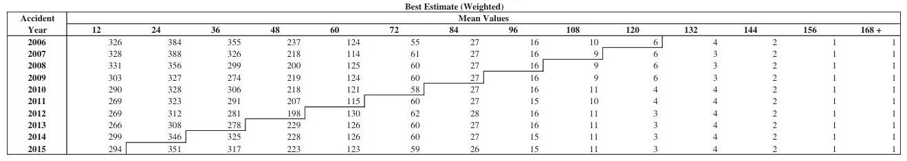

## Page 111
Figure C.28. Total Unpaid Claims Distribution (Weighted)

Figure C.29. Summary of Model Distributions
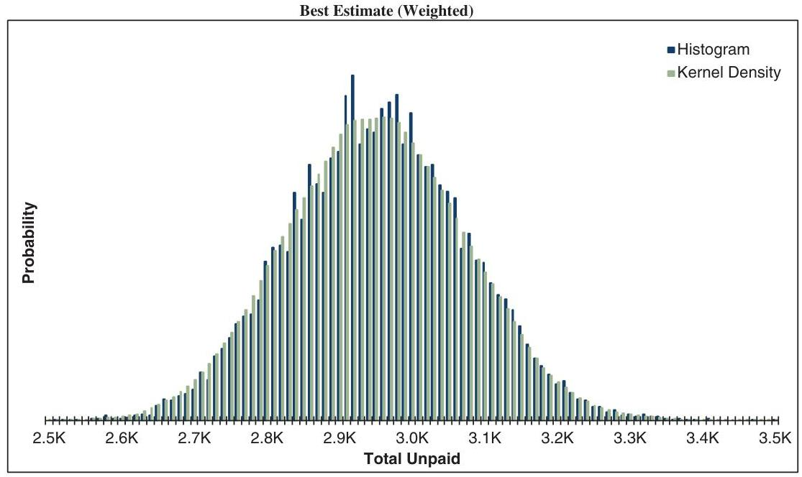
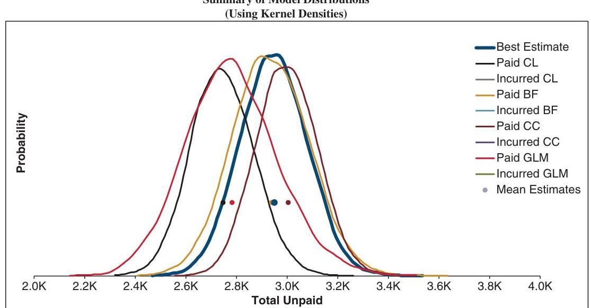

## Page 112
# Appendix D-Aggregate Results 

In this appendix the results for the correlated aggregate of the three Schedule P lines of business (Parts A, B, and C) are shown, using the correlation calculated from the paid data after adjustment for heteroscedasticity.

Figure D.1. Estimated Unpaid Model Results
Five Top 50 Companies
Aggregate Three Lines of Business
Accident Year Unpaid

| Accident   Year | Mean   Unpaid | Standard   Error | Coefficient   of Variation | Minimum | Maximum | 50.0\%   Percentile | 75.0\%   Percentile | 95.0\%   Percentile | 99.0\%   Percentile |
| :--: | :--: | :--: | :--: | :--: | :--: | :--: | :--: | :--: | :--: |
| 2006 | 67 | 25 | 37.9\% | 0 | 186 | 66 | 83 | 110 | 130 |
| 2007 | 107 | 30 | 28.1\% | 25 | 295 | 105 | 126 | 158 | 185 |
| 2008 | 199 | 49 | 24.8\% | 67 | 622 | 194 | 226 | 285 | 342 |
| 2009 | 298 | 56 | 18.8\% | 123 | 800 | 293 | 331 | 395 | 457 |
| 2010 | 480 | 69 | 14.3\% | 248 | 959 | 475 | 522 | 599 | 668 |
| 2011 | 862 | 106 | 12.3\% | 503 | 1,561 | 860 | 923 | 1,041 | 1,135 |
| 2012 | 1,666 | 187 | 11.2\% | 383 | 2,555 | 1,662 | 1,771 | 1,985 | 2,148 |
| 2013 | 3,070 | 333 | 10.8\% | 1,808 | 6,522 | 3,066 | 3,249 | 3,649 | 3,928 |
| 2014 | 5,632 | 703 | 12.5\% | 2,435 | 8,555 | 5,632 | 6,075 | 6,801 | 7,326 |
| 2015 | 13,270 | 1,788 | 13.5\% | 5,217 | 22,660 | 13,262 | 14,348 | 16,180 | 18,011 |
| Totals | 25,650 | 2,080 | 8.1\% | 16,952 | 36,085 | 25,616 | 26,949 | 29,088 | 30,991 |
| Normal Dist. | 25,650 | 2,080 | 8.1\% |  |  | 25,650 | 27,053 | 29,072 | 30,490 |
| logNormal Dist. | 25,650 | 2,088 | 8.1\% |  |  | 25,566 | 27,006 | 29,222 | 30,885 |
| Gamma Dist. | 25,650 | 2,080 | 8.1\% |  |  | 25,594 | 27,021 | 29,165 | 30,736 |

Figure D.2. Estimated Cash Flow
Five Top 50 Companies
Aggregate Three Lines of Business
Calendar Year Unpaid

| Calendar   Year | Mean   Unpaid | Standard   Error | Coefficient   of Variation | Minimum | Maximum | 50.0\%   Percentile | 75.0\%   Percentile | 95.0\%   Percentile | 99.0\%   Percentile |
| :--: | :--: | :--: | :--: | :--: | :--: | :--: | :--: | :--: | :--: |
| 2016 | 12,906 | 1,209 | 9.4\% | 8,242 | 19,475 | 12,869 | 13,611 | 14,897 | 16,182 |
| 2017 | 5,733 | 453 | 7.9\% | 3,991 | 7,589 | 5,727 | 6,024 | 6,488 | 6,836 |
| 2018 | 3,144 | 257 | 8.2\% | 2,132 | 4,373 | 3,137 | 3,310 | 3,573 | 3,781 |
| 2019 | 1,663 | 144 | 8.6\% | 1,163 | 2,415 | 1,657 | 1,757 | 1,906 | 2,018 |
| 2020 | 903 | 86 | 9.5\% | 617 | 1,331 | 900 | 958 | 1,050 | 1,122 |
| 2021 | 512 | 59 | 11.5\% | 319 | 1,064 | 508 | 546 | 613 | 678 |
| 2022 | 324 | 55 | 16.9\% | 140 | 699 | 317 | 353 | 423 | 484 |
| 2023 | 217 | 64 | 29.4\% | 86 | 931 | 205 | 245 | 328 | 431 |
| 2024 | 120 | 28 | 23.7\% | 21 | 308 | 118 | 137 | 170 | 197 |
| 2025 | 74 | 22 | 30.1\% | 7 | 165 | 73 | 89 | 113 | 131 |
| 2026 | 36 | 13 | 37.2\% | 2 | 94 | 35 | 45 | 59 | 70 |
| 2027 | 18 | 9 | 51.9\% | 0 | 58 | 17 | 24 | 33 | 41 |
| 2028 | 1 | 1 | 95.7\% | - | 9 | 1 | 1 | 3 | 4 |
| Totals | 25,650 | 2,080 | 8.1\% | 16,952 | 36,085 | 25,616 | 26,949 | 29,088 | 30,991 |

## Page 113
Figure D.3. Estimated Loss Ratio

|  Accident   Year | Mean   Loss Ratio | Standard   Error | Coefficient   of Variation | Minimum | Maximum | 50.0\%   Percentile | 75.0\%   Percentile | 95.0\%   Percentile | 99.0\%   Percentile  |
| --- | --- | --- | --- | --- | --- | --- | --- | --- | --- |
|  2006 | 74.0\% | 10.7\% | 14.5\% | 33.5\% | 132.5\% | 73.7\% | 77.5\% | 93.7\% | 109.6\%  |
|  2007 | 81.3\% | 11.5\% | 14.2\% | 38.3\% | 147.1\% | 81.0\% | 85.0\% | 102.0\% | 121.0\%  |
|  2008 | 85.4\% | 11.8\% | 13.8\% | 39.5\% | 153.1\% | 85.0\% | 89.2\% | 107.7\% | 123.9\%  |
|  2009 | 76.0\% | 10.2\% | 13.4\% | 36.8\% | 131.0\% | 75.6\% | 79.4\% | 94.7\% | 111.2\%  |
|  2010 | 66.9\% | 9.3\% | 13.9\% | 31.0\% | 119.9\% | 66.3\% | 70.1\% | 84.1\% | 97.9\%  |
|  2011 | 64.5\% | 8.9\% | 13.8\% | 30.1\% | 117.2\% | 64.2\% | 67.5\% | 81.1\% | 91.4\%  |
|  2012 | 71.0\% | 10.1\% | 14.3\% | 31.6\% | 129.3\% | 70.5\% | 74.0\% | 90.5\% | 104.6\%  |
|  2013 | 61.4\% | 8.5\% | 13.9\% | 29.3\% | 125.5\% | 61.1\% | 64.2\% | 77.3\% | 88.8\%  |
|  2014 | 65.4\% | 9.7\% | 14.8\% | 31.3\% | 115.9\% | 65.2\% | 70.3\% | 82.2\% | 94.9\%  |
|  2015 | 78.2\% | 11.5\% | 14.7\% | 39.0\% | 143.2\% | 77.8\% | 83.8\% | 97.6\% | 113.8\%  |
|  Totals | 71.6\% | 3.3\% | 4.6\% | 59.5\% | 88.1\% | 71.5\% | 73.7\% | 77.3\% | 80.3\%  |

Figure D.4. Estimated Unpaid Claim Runoff

|  Five Top 50 Companies
Aggregate Three Lines of Business
Calendar Year Unpaid Claim Runoff |  |  |  |  |  |  |  |  |  |  |   |
| --- | --- | --- | --- | --- | --- | --- | --- | --- | --- | --- | --- |
|  Calendar | Mean | Standard | Coefficient |  |  | 50.0\% | 75.0\% | 95.0\% | 99.0\% |  |   |
|  Year | Unpaid | Error | of Variation | Minimum | Maximum | Percentile | Percentile | Percentile | Percentile |  |   |
|  2015 | 25,650 | 2,080 | 8.1\% | 16,952 | 36,085 | 25,616 | 26,949 | 29,088 | 30,991 |  |   |
|  2016 | 12,744 | 944 | 7.4\% | 8,710 | 17,043 | 12,733 | 13,373 | 14,296 | 15,047 |  |   |
|  2017 | 7,012 | 536 | 7.6\% | 4,664 | 9,551 | 7,000 | 7,368 | 7,905 | 8,324 |  |   |
|  2018 | 3,868 | 319 | 8.2\% | 2,512 | 5,388 | 3,861 | 4,075 | 4,406 | 4,671 |  |   |
|  2019 | 2,205 | 213 | 9.7\% | 1,348 | 3,259 | 2,196 | 2,340 | 2,567 | 2,762 |  |   |
|  2020 | 1,302 | 158 | 12.1\% | 730 | 2,266 | 1,292 | 1,400 | 1,574 | 1,733 |  |   |
|  2021 | 790 | 126 | 15.9\% | 401 | 1,697 | 781 | 864 | 1,003 | 1,145 |  |   |
|  2022 | 466 | 99 | 21.2\% | 166 | 1,272 | 458 | 524 | 636 | 746 |  |   |
|  2023 | 249 | 62 | 24.9\% | 45 | 533 | 245 | 289 | 359 | 403 |  |   |
|  2024 | 129 | 42 | 32.4\% | 13 | 294 | 126 | 156 | 202 | 236 |  |   |
|  2025 | 55 | 21 | 37.9\% | 3 | 141 | 53 | 68 | 90 | 107 |  |   |
|  2026 | 19 | 9 | 49.6\% | 0 | 60 | 18 | 25 | 34 | 42 |  |   |
|  2027 | 1 | 1 | 95.7\% | (0) | 9 | 1 | 1 | 3 | 4 |  |   |

Figure D.5. Mean of Incremental Values

|  Accident
Year | Mean Values |  |  |  |  |  |  |  |  |  |  |  |   |
| --- | --- | --- | --- | --- | --- | --- | --- | --- | --- | --- | --- | --- | --- |
|   | 11 | 11 | 16 | 18 | 68 | 72 | 89 | 96 | 108 | 120 | 132 | 144 | 156  |
|  2006 | 9,234 | 4,878 | 2,029 | 1,175 | 621 | 500 | 151 | 79 | 67 | 21 | 33 | 17 | 16  |
|  2007 | 10,595 | 5,394 | 2,139 | 1,239 | 655 | 527 | 163 | 93 | 72 | 33 | 35 | 18 | 17  |
|  2008 | 12,060 | 5,959 | 2,317 | 1,321 | 716 | 352 | 175 | 91 | 84 | 38 | 38 | 19 | 18  |
|  2009 | 11,848 | 6,007 | 2,371 | 1,589 | 749 | 343 | 182 | 95 | 83 | 40 | 40 | 20 | 20  |
|  2010 | 11,834 | 5,923 | 2,345 | 1,351 | 721 | 354 | 182 | 95 | 85 | 38 | 40 | 20 | 19  |
|  2011 | 12,195 | 5,972 | 2,312 | 1,526 | 707 | 372 | 185 | 96 | 90 | 39 | 40 | 20 | 19  |
|  2012 | 14,186 | 6,541 | 2,409 | 1,362 | 775 | 380 | 191 | 99 | 103 | 39 | 40 | 20 | 19  |
|  2013 | 11,901 | 5,848 | 2,282 | 1,436 | 765 | 374 | 187 | 97 | 93 | 38 | 40 | 20 | 19  |
|  2014 | 12,949 | 6,354 | 2,334 | 1,451 | 771 | 378 | 189 | 98 | 98 | 38 | 36 | 19 | 17  |
|  2015 | 16,438 | 7,356 | 2,685 | 1,513 | 794 | 393 | 202 | 108 | 99 | 44 | 36 | 19 | 17  |

## Page 114
Figure D.6. Standard Deviation of Incremental Values
Five Top 50 Companies
Aggregate Three Lines of Business
Accident Year Incremental Values by Development Period

| Accident | Standard Deviation Values |  |  |  |  |  |  |  |  |  |  |  |  |  |
| :--: | :--: | :--: | :--: | :--: | :--: | :--: | :--: | :--: | :--: | :--: | :--: | :--: | :--: | :--: |
| Year | 12 | 24 | 36 | 48 | 68 | 72 | 84 | 96 | 108 | 120 | 132 | 144 | 156 | 168 |
| 2006 | 1,735 | 668 | 233 | 134 | 74 | 37 | 18 | 13 | 17 | 6 | 13 | 7 | 6 | 6 |
| 2007 | 1,909 | 712 | 244 | 140 | 77 | 39 | 18 | 14 | 20 | 39 | 14 | 7 | 7 | 10 |
| 2008 | 2,085 | 768 | 264 | 147 | 81 | 41 | 20 | 14 | 25 | 11 | 15 | 8 | 7 | 11 |
| 2009 | 2,010 | 754 | 280 | 149 | 82 | 41 | 19 | 17 | 24 | 10 | 15 | 8 | 8 | 10 |
| 2010 | 2,059 | 775 | 264 | 148 | 84 | 41 | 22 | 17 | 25 | 11 | 15 | 8 | 8 | 11 |
| 2011 | 2,085 | 777 | 261 | 150 | 84 | 49 | 22 | 17 | 27 | 11 | 16 | 8 | 8 | 11 |
| 2012 | 2,492 | 875 | 277 | 155 | 98 | 50 | 23 | 17 | 44 | 12 | 15 | 8 | 8 | 12 |
| 2013 | 2,078 | 767 | 261 | 169 | 97 | 51 | 23 | 17 | 29 | 11 | 15 | 8 | 8 | 11 |
| 2014 | 2,300 | 807 | 241 | 192 | 109 | 55 | 26 | 19 | 42 | 13 | 17 | 9 | 9 | 13 |
| 2015 | 2,728 | 1,087 | 365 | 210 | 116 | 59 | 30 | 23 | 58 | 17 | 17 | 9 | 9 | 17 |

Figure D.7. Coefficient of Variation of Incremental Values

|  | Five Top 50 Companies   Aggregate Three Lines of Business   Accident Year Incremental Values by Development Period |  |  |  |  |  |  |  |  |  |  |  |  |  |
| :--: | :--: | :--: | :--: | :--: | :--: | :--: | :--: | :--: | :--: | :--: | :--: | :--: | :--: | :--: |
| Accident | Coefficients of Variation |  |  |  |  |  |  |  |  |  |  |  |  |  |
| Year | 12 | 24 | 36 | 48 | 68 | 72 | 84 | 96 | 108 | 120 | 132 | 144 | 156 | 168 |
| 2006 | 18.6\% | 13.7\% | 11.5\% | 11.4\% | 11.9\% | 12.5\% | 11.7\% | 16.8\% | 15.6\% | 17.8\% | 18.4\% | 18.5\% | 40.0\% | 702.6\% |
| 2007 | 18.0\% | 13.2\% | 11.3\% | 11.3\% | 11.8\% | 12.0\% | 11.4\% | 16.3\% | 15.1\% | 17.8\% | 38.5\% | 38.6\% | 40.0\% | 1216.6\% |
| 2008 | 17.3\% | 12.9\% | 11.4\% | 11.1\% | 11.3\% | 11.7\% | 11.2\% | 15.7\% | 42.1\% | 28.0\% | 39.1\% | 39.2\% | 40.5\% | 1356.5\% |
| 2009 | 17.0\% | 12.6\% | 11.0\% | 10.7\% | 11.0\% | 11.3\% | 10.7\% | 17.7\% | 41.4\% | 26.2\% | 38.8\% | 39.0\% | 40.2\% | 1287.1\% |
| 2010 | 17.4\% | 13.1\% | 11.3\% | 11.0\% | 11.6\% | 11.2\% | 11.9\% | 17.7\% | 40.1\% | 27.6\% | 39.0\% | 39.4\% | 40.8\% | 1164.5\% |
| 2011 | 17.1\% | 13.0\% | 11.3\% | 11.3\% | 11.9\% | 12.3\% | 11.9\% | 17.5\% | 41.5\% | 28.2\% | 39.2\% | 39.5\% | 40.9\% | 1219.1\% |
| 2012 | 17.6\% | 13.4\% | 11.5\% | 11.4\% | 12.6\% | 13.2\% | 12.0\% | 16.9\% | 42.8\% | 31.6\% | 38.6\% | 39.0\% | 40.6\% | 1268.9\% |
| 2013 | 17.5\% | 13.1\% | 11.4\% | 11.8\% | 12.6\% | 13.6\% | 12.1\% | 17.3\% | 41.9\% | 29.1\% | 38.5\% | 38.9\% | 40.4\% | 1214.5\% |
| 2014 | 17.9\% | 14.3\% | 13.5\% | 13.3\% | 14.2\% | 14.5\% | 13.8\% | 19.0\% | 43.0\% | 34.8\% | 47.6\% | 46.7\% | 54.6\% | 1429.6\% |
| 2015 | 16.6\% | 14.8\% | 13.6\% | 13.8\% | 14.6\% | 15.0\% | 14.9\% | 21.5\% | 58.1\% | 38.8\% | 47.5\% | 46.7\% | 54.4\% | 1891.0\% |

Figure D.8. Calculation of Risk Based Capital
Five Top 50 Companies
Aggregate Three Lines of Business
Indicated Unpaid Claim Risk Portion of Required Capital

| LOB / Segment | Earned   Premium | Mean   Unpaid | 99.0\%   Unpaid | Value at Risk   Capital | Allocated   Capital | Unpaid   Ratio | Premium   Ratio |
| :-- | :--: | :--: | :--: | :--: | :--: | :--: | :--: |
| Schedule P, Part A | 15,148 | 5,308 | 8,675 | 3,367 | 2,642 | $49.8 \%$ | $17.4 \%$ |
| Schedule P, Part B | 20,467 | 17,395 | 20,525 | 3,130 | 2,456 | $14.1 \%$ | $12.0 \%$ |
| Schedule P, Part C | 2,383 | 2,947 | 3,257 | 310 | 243 | $8.3 \%$ | $10.2 \%$ |
| Total | 37,997 | 25,650 | 32,457 | 6,807 |  |  |  |
| Aggregate | 37,997 | 25,650 | 30,991 | 5,341 | 5,341 | $20.8 \%$ | $14.1 \%$ |

## Page 115
Figure D.9. Total Unpaid Claims Distribution
Five Top 50 Companies
Aggregate Three Lines of Business
Total Unpaid Distribution
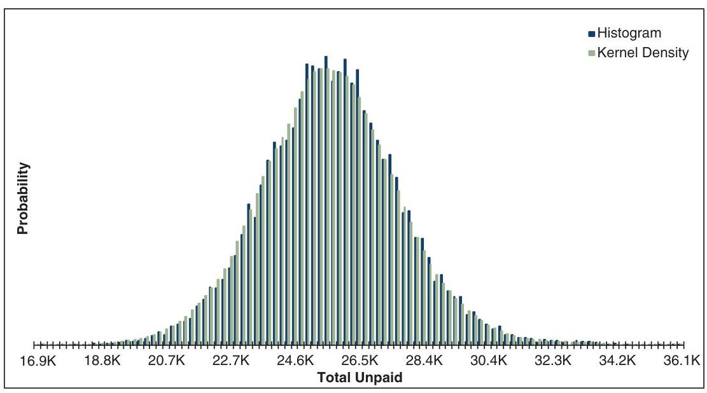

## Page 116
# Appendix E-GLM Bootstrap Results 

In this appendix the results for the GLM Bootstrap model, as illustrated in Figures 5.9 through 5.12 using the Taylor and Ashe (1983) data, are shown.

Figure E.1. Estimated Unpaid Model Results

|  |  |  |  | Taylor and Ashe Data   Accident Year Unpaid   Paid GLM Bootstrap Model |  |  |  |  |  |
| :--: | :--: | :--: | :--: | :--: | :--: | :--: | :--: | :--: | :--: |
| Accident   Year | Mean   Unpaid | Standard   Error | Coefficient of Variation | Minimum | Maximum | 50.0\%   Percentile | 75.0\%   Percentile | 95.0\%   Percentile | 99.0\%   Percentile |
| 2006 |  |  |  |  |  |  |  |  |  |
| 2007 | 201,062 | 86,944 | $43.2 \%$ | 13,857 | 542,484 | 186,940 | 254,238 | 361,288 | 438,224 |
| 2008 | 438,222 | 193,377 | $44.1 \%$ | 48,640 | 1,570,379 | 405,070 | 547,131 | 798,395 | 996,074 |
| 2009 | 701,223 | 229,176 | $32.7 \%$ | 192,462 | 1,747,698 | 679,682 | 831,657 | 1,122,868 | 1,320,964 |
| 2010 | 1,024,913 | 264,752 | $25.8 \%$ | 405,036 | 2,286,536 | 1,009,377 | 1,186,714 | 1,467,758 | 1,825,411 |
| 2011 | 1,452,650 | 315,901 | $21.7 \%$ | 619,534 | 2,544,116 | 1,424,030 | 1,660,714 | 1,996,927 | 2,261,272 |
| 2012 | 2,181,115 | 481,962 | $22.1 \%$ | 916,307 | 4,248,064 | 2,136,166 | 2,480,213 | 3,027,607 | 3,396,995 |
| 2013 | 3,468,030 | 603,268 | $17.4 \%$ | 1,751,033 | 5,598,537 | 3,424,738 | 3,862,292 | 4,553,992 | 4,965,982 |
| 2014 | 4,568,990 | 695,194 | $15.2 \%$ | 2,331,572 | 6,824,685 | 4,526,036 | 5,039,460 | 5,731,706 | 6,408,694 |
| 2015 | 5,672,877 | 744,661 | $13.1 \%$ | 3,681,244 | 8,333,062 | 5,657,952 | 6,171,074 | 6,954,411 | 7,414,615 |
| Totals | 19,709,081 | 2,176,864 | $11.0 \%$ | 13,360,401 | 27,429,908 | 19,594,207 | 21,069,822 | 23,354,466 | 24,752,422 |
| Normal Dist. | 19,709,081 | 2,176,864 | $11.0 \%$ |  |  | 19,709,081 | 21,177,353 | 23,289,703 | 24,773,224 |
| logNormal Dist. | 19,709,844 | 2,194,514 | $11.1 \%$ |  |  | 19,588,799 | 21,111,651 | 23,512,537 | 25,360,134 |
| Gamma Dist. | 19,709,081 | 2,176,864 | $11.0 \%$ |  |  | 19,628,994 | 21,130,455 | 23,421,097 | 25,123,713 |

Figure E.2. Estimated Cash Flow

|  |  |  |  | Taylor and Ashe Data   Calendar Year Unpaid   Paid GLM Bootstrap Model |  |  |  |  |  |
| :--: | :--: | :--: | :--: | :--: | :--: | :--: | :--: | :--: | :--: |
| Calendar   Year | Mean   Unpaid | Standard   Error | Coefficient of Variation | Minimum | Maximum | 50.0\%   Percentile | 75.0\%   Percentile | 95.0\%   Percentile | 99.0\%   Percentile |
| 2016 | 5,367,217 | 639,639 | 11.9\% | 3,363,863 | 7,428,225 | 5,343,203 | 5,770,597 | 6,447,544 | 6,986,539 |
| 2017 | 4,312,360 | 599,300 | 13.9\% | 2,363,704 | 6,455,658 | 4,279,059 | 4,673,264 | 5,338,534 | 5,922,511 |
| 2018 | 3,310,498 | 539,509 | 16.3\% | 1,993,107 | 5,419,760 | 3,288,209 | 3,657,889 | 4,209,239 | 4,690,515 |
| 2019 | 2,245,627 | 417,764 | 18.6\% | 1,078,000 | 4,088,770 | 2,221,086 | 2,510,176 | 2,948,019 | 3,475,039 |
| 2020 | 1,676,436 | 369,916 | 22.1\% | 619,943 | 3,157,564 | 1,644,779 | 1,921,249 | 2,318,054 | 2,614,635 |
| 2021 | 1,224,109 | 326,624 | 26.7\% | 444,913 | 2,352,525 | 1,202,484 | 1,436,029 | 1,782,066 | 2,085,204 |
| 2022 | 838,442 | 264,751 | 31.6\% | 226,969 | 2,477,444 | 803,316 | 991,076 | 1,302,125 | 1,532,640 |
| 2023 | 507,334 | 211,762 | 41.7\% | 104,873 | 1,268,302 | 480,233 | 635,243 | 889,537 | 1,135,405 |
| 2024 | 227,058 | 93,270 | 41.1\% | 32,667 | 711,619 | 213,471 | 277,710 | 403,483 | 498,676 |
| 2025 |  |  |  |  |  |  |  |  |  |
| Totals | 19,709,081 | 2,176,864 | $11.0 \%$ | 13,360,401 | 27,429,908 | 19,594,207 | 21,069,822 | 23,354,466 | 24,752,422 |

## Page 117
Figure E.3. Estimated Loss Ratio

| Taylor and Ashe Data   Accident Year Ultimate Loss Ratios   Paid GLM Bootstrap Model |  |  |  |  |  |  |  |  |  |
| :--: | :--: | :--: | :--: | :--: | :--: | :--: | :--: | :--: | :--: |
| Accident   Year | Mean   Loss Ratio | Standard   Error | Coefficient of Variation | Minimum | Maximum | $50.0 \%$   Percentile | $75.0 \%$   Percentile | $95.0 \%$   Percentile | $99.0 \%$   Percentile |
| 2006 | $54.8 \%$ | $6.4 \%$ | $11.7 \%$ | $38.1 \%$ | $74.0 \%$ | $54.7 \%$ | $59.0 \%$ | $65.7 \%$ | $70.4 \%$ |
| 2007 | $65.0 \%$ | $6.4 \%$ | $9.8 \%$ | $48.1 \%$ | $84.1 \%$ | $65.0 \%$ | $68.9 \%$ | $75.7 \%$ | $80.7 \%$ |
| 2008 | $63.1 \%$ | $6.4 \%$ | $10.1 \%$ | $42.6 \%$ | $82.0 \%$ | $63.1 \%$ | $67.3 \%$ | $73.4 \%$ | $78.6 \%$ |
| 2009 | $56.0 \%$ | $6.2 \%$ | $11.0 \%$ | $38.0 \%$ | $76.4 \%$ | $55.9 \%$ | $60.0 \%$ | $66.2 \%$ | $71.6 \%$ |
| 2010 | $53.1 \%$ | $5.9 \%$ | $11.0 \%$ | $34.7 \%$ | $74.7 \%$ | $52.8 \%$ | $57.1 \%$ | $63.1 \%$ | $66.6 \%$ |
| 2011 | $50.5 \%$ | $5.6 \%$ | $11.1 \%$ | $33.9 \%$ | $70.0 \%$ | $50.2 \%$ | $54.2 \%$ | $60.0 \%$ | $63.9 \%$ |
| 2012 | $53.8 \%$ | $7.6 \%$ | $14.2 \%$ | $31.3 \%$ | $81.3 \%$ | $53.1 \%$ | $59.1 \%$ | $66.8 \%$ | $72.8 \%$ |
| 2013 | $55.3 \%$ | $6.9 \%$ | $12.5 \%$ | $34.6 \%$ | $78.4 \%$ | $55.1 \%$ | $59.5 \%$ | $66.9 \%$ | $73.4 \%$ |
| 2014 | $52.9 \%$ | $6.8 \%$ | $12.8 \%$ | $31.7 \%$ | $74.5 \%$ | $52.4 \%$ | $57.2 \%$ | $64.5 \%$ | $70.1 \%$ |
| 2015 | $50.7 \%$ | $6.5 \%$ | $12.8 \%$ | $33.0 \%$ | $72.4 \%$ | $50.6 \%$ | $55.1 \%$ | $61.6 \%$ | $65.8 \%$ |
| Totals | $55.1 \%$ | $2.9 \%$ | $5.2 \%$ | $46.9 \%$ | $63.6 \%$ | $55.1 \%$ | $57.1 \%$ | $60.0 \%$ | $61.7 \%$ |

Figure E.4. Estimated Unpaid Claim Runoff

| Taylor and Ashe Data   Calendar Year Unpaid Claim Runoff Paid GLM Bootstrap Model |  |  |  |  |  |  |  |  |  |
| :--: | :--: | :--: | :--: | :--: | :--: | :--: | :--: | :--: | :--: |
| Calendar   Year | Mean   Unpaid | Standard   Error | Coefficient of Variation | Minimum | Maximum | $50.0 \%$   Percentile | $75.0 \%$   Percentile | $95.0 \%$   Percentile | $99.0 \%$   Percentile |
| 2015 | 19,709,081 | 2,176,864 | 11.0\% | 13,360,401 | 27,429,908 | 19,594,207 | 21,069,822 | 23,354,466 | 24,752,422 |
| 2016 | 14,341,864 | 1,839,659 | 12.8\% | 8,990,374 | 21,139,070 | 14,231,008 | 15,525,987 | 17,412,102 | 19,106,264 |
| 2017 | 10,029,504 | 1,499,062 | 14.9\% | 5,923,686 | 15,623,104 | 9,926,619 | 10,979,472 | 12,605,655 | 13,627,923 |
| 2018 | 6,719,006 | 1,188,158 | 17.7\% | 3,317,118 | 11,201,515 | 6,612,903 | 7,438,758 | 8,841,160 | 9,734,081 |
| 2019 | 4,473,380 | 922,335 | 20.6\% | 1,884,408 | 7,436,971 | 4,366,371 | 5,040,244 | 6,143,079 | 6,968,601 |
| 2020 | 2,796,943 | 678,192 | 24.2\% | 1,137,743 | 5,050,304 | 2,740,868 | 3,192,138 | 4,018,580 | 4,623,373 |
| 2021 | 1,572,834 | 443,756 | 28.2\% | 595,162 | 3,523,942 | 1,524,022 | 1,852,397 | 2,369,545 | 2,820,528 |
| 2022 | 734,392 | 257,467 | 35.1\% | 204,545 | 1,654,724 | 708,577 | 888,204 | 1,167,670 | 1,463,534 |
| 2023 | 227,058 | 93,270 | 41.1\% | 32,667 | 711,619 | 213,471 | 277,710 | 403,483 | 498,676 |
| 2024 | 0 | 0 | 4017.8\% | (0) | 0 | - | 0 | 0 | 0 |

Figure E.5. Mean of Incremental Values

| Taylor and Ashe Data   Accident Year Incremental Values by Development Period Paid GLM Bootstrap Model |  |  |  |  |  |  |  |  |  |  |
| :--: | :--: | :--: | :--: | :--: | :--: | :--: | :--: | :--: | :--: | :--: |
| Accident   Year | Mean   Unpaid | Standard   Error | Coefficient of Variation | Minimum | Maximum | $50.0 \%$   Percentile | $75.0 \%$   Percentile | $95.0 \%$   Percentile | $99.0 \%$   Percentile | $97.0 \%$   Percentile |
| 2006 | 260,293 | 698,693 | 688,850 | 704,606 | 388,809 | 311,880 | 258,794 | 214,532 | 169,749 | 142,707 |
| 2007 | 353,111 | 978,505 | 972,391 | 972,627 | 539,441 | 447,302 | 359,572 | 300,611 | 234,076 | 201,062 |
| 2008 | 355,598 | 975,396 | 989,087 | 971,633 | 541,986 | 440,002 | 357,470 | 297,335 | 237,981 | 200,241 |
| 2009 | 343,575 | 914,108 | 911,442 | 913,681 | 502,676 | 421,801 | 335,888 | 282,854 | 231,129 | 187,240 |
| 2010 | 341,295 | 923,102 | 914,709 | 919,809 | 500,195 | 420,057 | 337,719 | 275,372 | 224,883 | 186,939 |
| 2011 | 336,529 | 924,119 | 917,372 | 913,328 | 503,784 | 409,092 | 338,662 | 284,360 | 234,436 | 186,099 |
| 2012 | 381,818 | 1,028,561 | 1,036,624 | 1,025,187 | 578,558 | 451,767 | 374,253 | 312,453 | 251,461 | 212,623 |
| 2013 | 402,258 | 1,107,072 | 1,108,427 | 1,111,762 | 614,292 | 501,712 | 410,170 | 332,713 | 265,392 | 231,989 |
| 2014 | 408,511 | 1,104,124 | 1,109,649 | 1,096,598 | 616,324 | 491,960 | 408,977 | 338,285 | 274,715 | 232,482 |
| 2015 | 406,207 | 1,098,540 | 1,104,298 | 1,121,727 | 609,668 | 497,186 | 407,810 | 331,738 | 274,852 | 227,058 |

## Page 118
Figure E.6. Standard Deviation of Incremental Values

Figure E.7. Coefficient of Variation of Incremental Values

Figure E.8. Total Unpaid Claims Distribution
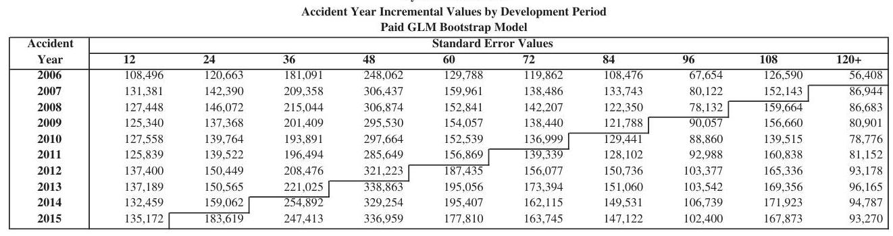
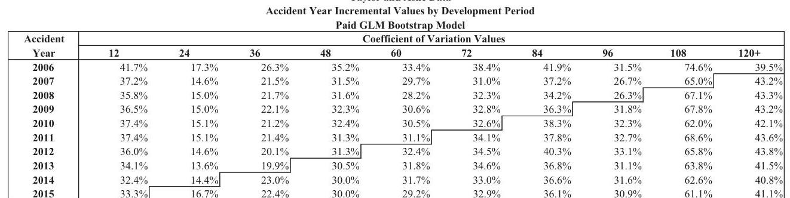
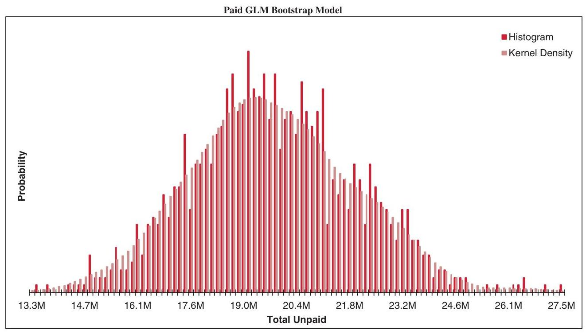

## Page 119
# References 

Anderson, Duncan, Sholom Feldblum, Claudine Modlin, Doris Schirmacher, Ernesto Schirmacher, and Neeza Thandi. 2007. "A Practitioner's Guide to Generalized Linear Models," CAS Exam Study Note, 3rd Edition: 1-116.
Ashe, Frank. 1986. "An Essay at Measuring the Variance of Estimates of Outstanding Claim Payments." ASTIN Bulletin 16:S: 99-113.
Barnett, Glen, and Ben Zehnwirth. 2000. "Best Estimates for Reserves." Proceedings of the Casualty Actuarial Society 87, 2: 245-321.
Berquist, James R., and Richard E. Sherman. 1977. "Loss Reserve Adequacy Testing: A Comprehensive, Systematic Approach." Proceedings of the Casualty Actuarial Society 64: $123-184$.
Bornhuetter, Ronald, and Ronald Ferguson. 1972. "The Actuary and IBNR." Proceedings of the Casualty Actuarial Society 59: 181-195.
CAS Loss Simulation Model Working Party Summary Report. 2011. "Modeling Loss Emergence and Settlement Processes." Casualty Actuarial Society Forum (Winter) 1: $1-124$.
CAS Working Party on Quantifying Variability in Reserve Estimates. 2005. "The Analysis and Estimation of Loss \& ALAE Variability: A Summary Report." Casualty Actuarial Society Forum (Fall): 29-146.
CAS Tail Factor Working Party. 2013. "The Estimation of Loss Development Tail Factors: A Summary Report." Casualty Actuarial Society E-Forum (Fall): 1-111.
Christofides, S. 1990. "Regression Models Based on Log-Incremental Payments." Claims Reserving Manual, vol. 2. Institute of Actuaries, London.
Efron, Bradley. 1979. "Bootstrap Methods: Another Look at the Jackknife." The Annals of Statistics 7-1: 1-26.
England, Peter D., and Richard J. Verrall. 1999. "Analytic and Bootstrap Estimates of Prediction Errors in Claims Reserving." Insurance: Mathematics and Economics 25: 281-293.
England, Peter D., and Richard J. Verrall. 2002. "Stochastic Claims Reserving in General Insurance." British Actuarial Journal 8-3: 443-544.
England, Peter D., and Richard J. Verrall. 2006. "Predictive Distributions of Outstanding Liabilities in General Insurance." The Annals of Actuarial Science 1, 2: $221-270$.

## Page 120
Foundations of Casualty Actuarial Science, 4th ed. 2001. Arlington, Va.: Casualty Actuarial Society.
Iman, R., and W. Conover. 1982. "A Distribution-Free Approach to Inducing Rank Correlation Among Input Variables." Communications in Statistics—Simulation and Computation 11(3): 311-334.
IAA (International Actuarial Association). 2010. "Stochastic Modeling-Theory and Reality from an Actuarial Perspective." Available from www.actuaries.org/ stochastic.
Kirschner, Gerald S., Colin Kerley, and Belinda Isaacs. 2008. "Two Approaches to Calculating Correlated Reserve Indications Across Multiple Lines of Business." Variance 1: 15-38.
Kremer, E. 1982. "IBNR Claims and the Two Way Model of ANOVA" Scandinavian Actuarial Journal: 47-55.
Liu, H., and R. Verrall. 2010. "Bootstrap Estimation of the Predictive Distributions of Reserves Using Paid and Incurred Claims." Variance 4: 125-135.
McCullagh, P., and J. Nelder. 1989. Generalized Linear Models, 2nd ed. Chapman and Hall.
Mildenhall, Stephen J. 2006. "Correlation and Aggregate Loss Distributions with an Emphasis on the Iman-Conover Method." Casualty Actuarial Society E-Forum (Winter): 103-204.
Milliman. 2014. "Using the Milliman Arius Reserving Model." Version 2.1.
Pinheiro, Paulo J. R., João Manuel Andrade e Silva, and Maria de Lourdes Centeno. 2001. "Bootstrap Methodology in Claim Reserving." ASTIN Colloquium: 1-13.

Pinheiro, Paulo J. R., João Manuel Andrade e Silva, and Maria de Lourdes Centeno. 2003. "Bootstrap Methodology in Claim Reserving." Journal of Risk and Insurance 70: 701-714.
Quarg, Gerhard, and Thomas Mack. 2008. "Munich Chain Ladder: A Reserving Method that Reduces the Gap between IBNR Projections Based on Paid Losses and IBNR Projections Based on Incurred Losses." Variance 2: 266-299.
ROC/GIRO Working Party. 2007. "Best Estimates and Reserving Uncertainty." Institute of Actuaries.
ROC/GIRO Working Party. 2008. "Reserving Uncertainty." Institute of Actuaries.
Renshaw, A.E., 1989. "Chain Ladder and Interactive Modelling (Claims Reserving and GLIM)." Journal of the Institute of Actuaries 116 (III): 559-587.
Renshaw, A.E., and R.J. Verrall. 1994. "A Stochastic Model Underlying the Chain Ladder Technique." Proceedings XXV ASTIN Colloquium, Cannes.
Struzzieri, Paul J., and Paul R. Hussian. 1998. "Using Best Practices to Determine a Best Reserve Estimate." Casualty Actuarial Society Forum (Fall): 353-413.
Taylor, Greg, and Frank Ashe. 1983. "Second Moments of Estimates of Outstanding Claims." Journal of Econometrics 23-1: 37-61.
Venter, Gary G. 1998. "Testing the Assumptions of Age-to-Age Factors." Proceedings of the Casualty Actuarial Society 85: 807-47.

## Page 121
Verrall, Richard J. 1991. "On the Estimation of Reserves from Loglinear Models." Insurance: Mathematics and Economics 10: 75-80.
Verrall, Richard J. 2004. "A Bayesian Generalized Linear Model for the BornhuetterFerguson Method of Claims Reserving." North American Actuarial Journal 8-3: 67-89.
Zehnwirth, Ben, 1989. "The Chain Ladder Technique-A Stochastic Model." Claims Reserving Manual vol. 2. Institute of Actuaries, London.
Zehnwirth, Ben. 1994. "Probabilistic Development Factor Models with Applications to Loss Reserve Variability, Prediction Intervals and Risk Based Capital." Casualty Actuarial Society Forum (Spring), 2: 447-606.

## Page 122
# Selected Bibliography 

Björkwall, Susanna. 2009. "Bootstrapping for Claims Reserve Uncertainty in General Insurance." Mathematical Statistics, Stockholm University. Research Report 2009:3, Licenciate thesis. http://www2.math.su.se/matstat/reports/seriea/2009/rep3/ report.pdf.
Björkwall, Susanna, Ola Hössjer, and Esbjörn Ohlsson. 2009. "Non-parametric and Parametric Bootstrap Techniques for Age-to-Age Development Factor Methods in Stochastic Claims Reserving." Scandinavian Actuarial Journal 4: 306-331.
Freedman, D.A. 1981. "Bootstrapping Regression Models." The Annals of Statistics 9-6: $1218-1228$.
Hayne, Roger M. 2008. "A Stochastic Framework for Incremental Average Reserve Models." Casualty Actuarial Society E-Forum (Fall): 174-195.
Mack, Thomas. 1993. "Distribution Free Calculation of the Standard Error of Chain Ladder Reserve Estimates." ASTIN Bulletin 23-2: 213-225.
Mack, Thomas. 1999. "The Standard Error of Chain Ladder Reserve Estimates: Recursive Calculation and Inclusion of a Tail Factor." ASTIN Bulletin 29-2: 361-366.
Mack, Thomas, and Gary Venter. 2000. "A Comparison of Stochastic Models that Reproduce Chain Ladder Reserve Estimates." Insurance: Mathematics and Economics 26: $101-107$.
Merz, Michael, and Mario V. Wüthrich. 2008. "Modeling the Claims Development Result For Solvency Purposes." Casualty Actuarial Society E-Forum (Fall): 542-568.
Moulton, Lawrence H., and Scott L. Zeger. 1991. "Bootstrapping Generalized Linear Models." Computational Statistics and Data Analysis 11: 53-63.
Murphy, Daniel M. 1994. "Unbiased Loss Development Factors." Proceedings of the Casualty Actuarial Society 81: 154-222.
Ruhm, David L., and Donald F. Mango. 2003. A Method of Implementing Myers-Read Capital Allocation in Simulation. Casualty Actuarial Society Forum (Fall): 451-458.
Shapland, Mark R. 2007. "Loss Reserve Estimates: A Statistical Approach for Determining 'Reasonableness'." Variance 1: 120-148.
Venter, Gary G. 2003. "A Survey of Capital Allocation Methods with Commentary Topic 3: Risk Control." ASTIN Colloquium.

## Page 123
# Abbreviations and Notations 

AIC: Akaike Information Criterion
APD: Automobile Physical Damage
BIC: Bayesian Information Criterion
BF: Bornhuetter-Ferguson
CC: Cape Cod
CL: Chain Ladder
CoV: Coefficient of Variation
DFA: Dynamic Financial Analysis

ELR: Expected Loss Ratio
ERM: Enterprise Risk Management
GLM: Generalized Linear Models
MLE: Maximum Likelihood Estimate
ODP: Over-Dispersed Poisson
OLS: Ordinary Least Squares
RSS: Residual Sum Squared
SSE: Sum of Squared Errors

## Page 124
# About the Author 

Mark R. Shapland is Senior Consulting Actuary in Milliman's Dubai office where he is responsible for various reserving and pricing projects for a variety of clients and was previously the lead actuary for the Property \& Casualty Insurance Software (PCIS) development team. He has a B.S. degree in Integrated Studies (Actuarial Science) from the University of Nebraska-Lincoln. He is a Fellow of the Casualty Actuarial Society, a Fellow of the Society of Actuaries and a Member of the American Academy of Actuaries. He was the leader of Section 3 of the Reserve Variability Working Party, the Chair of the CAS Committee on Reserves, co-chair of the Tail Factor Working Party, and co-chair of the Loss Simulation Model Working Party. He is also a co-developer and co-presenter of the CAS Reserve Variability Limited Attendance Seminar and has spoken frequently on this subject both within the CAS and internationally. He can be contacted at mark.shapland@milliman.com.

## Page 125
.

## Page 126
# ABOUT THE SERIES: 

CAS monographs are authoritative, peer-reviewed, in-depth works focusing on important topics within property and casualty actuarial practice. For more information on the CAS Monograph Series, visit the CAS website at www.casact.org.