_Note: Source document was split into 8 OCR chunks (pages 1-21, pages 22-36, pages 37-52, pages 53-66, pages 67-81, pages 82-99, pages 100-115, pages 116-122) to stay within token limits._

# CAS_Monograph_05-Goldburd-Khare-Tevet

## Page 1
CAS MONOGRAPH SERIES
NUMBER 5
Second Edition

# GENERALIZED LINEAR MODELS FOR INSURANCE RATING Second Edition 

Mark Goldburd, FCAS, MAAA
Anand Khare, FCAS, FIA, CPCU
Dan Tevet, FCAS
Dmitriy Guller, FCAS

## Page 2
This monograph is a comprehensive guide to creating an insurance rating plan using generalized linear models (GLMs), with an emphasis on application over theory. It is written for actuaries practicing in the property/casualty insurance industry and assumes the reader is familiar with actuarial terms and methods. The text includes a lengthy section on technical foundations that is presented using examples that are specific to the insurance industry. Other covered topics include the model-building process, data preparation, selection of model form, model refinement, and model validation. Extensions to the GLM are briefly discussed.

## Page 3
# GENERALIZED LINEAR MODELS FOR INSURANCE RATING Second Edition 

Mark Goldburd, FCAS, MAAA Anand Khare, FCAS, FIA, CPCU Dan Tevet, FCAS Dmitriy Guller, FCAS

Casualty Actuarial Society
4350 North Fairfax Drive, Suite 250
Arlington, Virginia 22203
www.casact.org
(703) 276-3100

## Page 4
Generalized Linear Models for Insurance Rating
By Mark Goldburd, Anand Khare, Dan Tevet, and Dmitriy Guller
Copyright 2020 by the Casualty Actuarial Society
All rights reserved. No part of this publication may be reproduced, stored in a retrieval system, or transmitted, in any form or by any means, electronic, mechanical, photocopying, recording, or otherwise, without the prior written permission of the publisher. For information on obtaining permission for use of the material in this work, please submit a written request to the Casualty Actuarial Society.

Library of Congress Cataloging-in-Publication Data
Generalized Linear Models for Insurance Rating / Mark Goldburd, Anand Khare, Dan Tevet, and Dmitriy Guller
ISBN 978-1-7333294-3-9 (print edition)
ISBN 978-1-7333294-4-6 (electronic edition)

1. Actuarial science. 2. Classification ratemaking. 3. Insurance-mathematical models.
I. Goldburd, Mark. II. Khare, Anand. III. Tevet, Dan.

Copyright 2019, Casualty Actuarial Society

## Page 5
# Contents 

1. Introduction ..... 1
2. Overview of Technical Foundations ..... 2
2.1. The Components of the GLM ..... 2
2.1.1. The Random Component: The Exponential Family ..... 3
2.1.2. The Systematic Component ..... 4
2.1.3. An Example ..... 5
2.2. Exponential Family Variance ..... 7
2.3. Variable Significance ..... 8
2.3.1. Standard Error ..... 8
2.3.2. p-value ..... 9
2.3.3. Confidence Interval ..... 9
2.4. Types of Predictor Variables ..... 10
2.4.1. Treatment of Continuous Variables ..... 10
2.4.2. Treatment of Categorical Variables ..... 12
2.4.3. Choose Your Base Level Wisely! ..... 15
2.5. Weights ..... 16
2.6. Offsets ..... 17
2.7. An Inventory of Distributions ..... 19
2.7.1. Distributions for Severity ..... 19
2.7.2. Distributions for Frequency ..... 21
2.7.3. A Distribution for Pure Premium: the Tweedie Distribution ..... 22
2.8. Logistic Regression ..... 25
2.9. Correlation Among Predictors, Multicollinearity and Aliasing ..... 27
2.10. Limitations of GLMs ..... 28
3. The Model-Building Process ..... 31
3.1. Setting Objectives and Goals ..... 31
3.2. Communication with Key Stakeholders ..... 32
3.3. Collecting and Processing Data ..... 32
3.4. Conducting Exploratory Data Analysis ..... 32
3.5. Specifying Model Form ..... 33
3.6. Evaluating Model Output ..... 33
3.7. Validating the Model ..... 33
3.8. Translating the Model into a Product ..... 33
3.9. Maintaining and Rebuilding the Model ..... 34

## Page 6
4. Data Preparation and Considerations ..... 35
4.1. Combining Policy and Claim Data ..... 35
4.2. Modifying the Data ..... 37
4.3. Splitting the Data ..... 38
4.3.1. Train and Test ..... 40
4.3.2. Train, Validation and Test ..... 40
4.3.3. Use Your Data Wisely! ..... 40
4.3.4. Cross Validation ..... 41
5. Selection of Model Form ..... 43
5.1. Choosing the Target Variable ..... 43
5.1.1. Frequency/Severity versus Pure Premium ..... 43
5.1.2. Policies with Multiple Coverages and Perils ..... 44
5.1.3. Transforming the Target Variable ..... 45
5.2. Choosing the Distribution ..... 46
5.3. Variable Selection ..... 47
5.4. Transformation of Variables ..... 48
5.4.1. Detecting Non-Linearity with Partial Residual Plots ..... 48
5.4.2. Binning Continuous Predictors ..... 49
5.4.3. Adding Polynomial Terms ..... 51
5.4.4. Using Piecewise Linear Functions ..... 53
5.4.5. Natural Cubic Splines ..... 55
5.5. Grouping Categorical Variables ..... 55
5.6. Interactions ..... 55
5.6.1. Interacting Two Categorical Variables ..... 56
5.6.2. Interacting a Categorical Variable with a Continuous Variable ..... 58
5.6.3. Interacting Two Continuous Variables ..... 61
6. Model Refinement ..... 62
6.1. Some Measures of Model Fit ..... 62
6.1.1. Log-Likelihood ..... 62
6.1.2. Deviance ..... 63
6.1.3. Limitations on the Use of Log-Likelihood and Deviance ..... 64
6.2. Comparing Candidate Models ..... 64
6.2.1. Nested Models and the F-Test ..... 64
6.2.2. Penalized Measures of Fit ..... 66
6.3. Residual Analysis ..... 67
6.3.1. Deviance Residuals ..... 67
6.3.2. Working Residuals ..... 70
6.4. Assessing Model Stability ..... 73
7. Model Validation and Selection ..... 75
7.1. Assessing Fit with Plots of Actual vs. Predicted ..... 75
7.2. Measuring Lift ..... 76
7.2.1. Simple Quantile Plots ..... 77
7.2.2. Double Lift Charts ..... 78

## Page 7
7.2.3. Loss Ratio Charts ..... 79
7.2.4. The Gini Index ..... 80
7.3. Validation of Logistic Regression Models ..... 81
7.3.1. Receiver Operating Characteristic (ROC) Curves ..... 82
8. Model Documentation ..... 86
8.1. The Importance of Documenting Your Model ..... 86
8.2. Check Yourself ..... 86
8.3. Stakeholder Management ..... 87
8.4. Code as Documentation ..... 88
9. Other Topics ..... 89
9.1. Modeling Coverage Options with GLMs (Why You Probably Shouldn't) ..... 89
9.2. Territory Modeling ..... 90
9.3. Ensembling ..... 91
10. Variations on the Generalized Linear Model ..... 93
10.1. Generalized Linear Mixed Models (GLMMs) ..... 93
10.2. GLMs with Dispersion Modeling (DGLMs) ..... 96
10.3. Generalized Additive Models (GAMs) ..... 98
10.4. MARS Models ..... 100
10.5. Elastic Net GLMs ..... 101
Bibliography ..... 105
Appendix ..... 107

## Page 8
# 2019 CAS Monograph Editorial Board 

Ali Ishaq, Editor in Chief Emmanuel Theodore Bardis Eric Cheung Craig C. Davis Scott Gibson Glenn Meyers Jeffrey Prince Brandon Smith Adam Vachon

## Page 9
# Acknowledgments 

The authors would like to thank the following people for their contributions:
Ali Ishaq, Leslie Marlo, Glenn Meyers, Stan Khury and the other past and present members of the Monograph Editorial Board, without whose efforts this text would not have been possible.

Jason Russ, Fran Sarrel and Delia Roberts, who coordinated with the authors on behalf of the Examination and Syllabus Committee.

The anonymous peer reviewers, whose thoughtful suggestions improved the quality of this text.

Eric Brosius, Paul Ivanovskis and Christopher Mascioli, who also served as reviewers and provided valuable feedback on earlier drafts of the text.

Josh Taub, who provided valuable feedback on the first edition of this text, which improved the quality of the second edition.

Margaret Tiller Sherwood, Howard Mahler, Jonathan Fox, Geoff Tims, Hernan Medina, and Eric Kitchens, whose thoughtful comments and suggestions for improvement further enhanced the section edition.

Donna Royston, who provided editorial support and coordinated production on behalf of the CAS.

## Page 10
.

## Page 11
# 1. Introduction 

Generalized linear models have been in use for over thirty years, and there is no shortage of textbooks and scholarly articles on their underlying theory and application in solving any number of useful problems. Actuaries have for many years used GLMs to classify risks, but it is only relatively recently that levels of interest and rates of adoption have increased to the point where it now seems as though they are near-ubiquitous. GLMs are widely used in the personal lines insurance marketplace, especially in operations of meaningful scale. But as far as the authors are aware there is no single text written for the practicing actuary that serves as a definitive reference for the use of GLMs in classification ratemaking. This monograph aims to bridge that gap. Our ultimate goal is to give the knowledgeable reader all of the additional tools they need to build a market-ready classification plan from raw premium and loss data.

The target audience of this monograph is a credentialed or very nearly credentialed actuary working in the field of property/casualty or general insurance (for example, in the United States, a member or soon-to-be member of the Casualty Actuarial Society). It is assumed that the reader will be familiar with the material covered in the earlier exams of the CAS syllabus, including all of the Actuarial Standards of Practice and the ratemaking material covered in depth in Werner and Modlin's Basic Ratemaking (2010) (or their international equivalents, for readers outside the United States). Prior knowledge of the mathematics underlying GLMs will make for faster reading but is not absolutely necessary. Familiarity with a programming language is not required to read the text, but will be necessary to implement models.

If you should have a suggestion or discover any errors in this document, please contact the authors. Current contact information can be found in the CAS directory.

## Page 12
# 2. Overview of Technical Foundations 

Generalized linear models (GLMs) are a means of modeling the relationship between a variable whose outcome we wish to predict and one or more explanatory variables.

The predicted variable is called the target variable and is denoted $y$. In property/ casualty insurance ratemaking applications, the target variable is typically one of the following:

- Claim frequency (i.e., claims per exposure)
- Claim severity (i.e., dollars of loss per claim or occurrence)
- Pure premium (i.e., dollars of loss per exposure)
- Loss ratio (i.e., dollars of loss per dollar of premium)

For quantitative target variables such as those above, the GLM will produce an estimate of the expected value of the outcome.

For other applications, the target variable may be the occurrence or non-occurrence of a certain event. Examples include:

- Whether or not a policyholder will renew their policy.
- Whether a submitted claim contains fraud.

For such variables, a GLM can be applied to estimate the probability that the event will occur.

The explanatory variables, or predictors, are denoted $x_{1} \ldots x_{p}$, where $p$ is the number of predictors in the model. Potential predictors are typically any policy terms or policyholder characteristics that an insurer may wish to include in a rating plan. Some examples are:

- Type of vehicle, age, or marital status for personal auto insurance.
- Construction type, building age, or amount of insurance (AOI) for homeowners insurance.

### 2.1. The Components of the GLM

In a GLM, the outcome of the target variable is assumed to be driven by both a systematic component as well as a random component.

The systematic component refers to that portion of the variation in the outcomes that is related to the values of the predictors. For example, we may believe that driver age influences the expected claim frequency for a personal auto policy. If driver age

## Page 13
is included as a predictor in a frequency model, that effect is part of the systematic component.

The random component is the portion of the outcome driven by causes other than the predictors in our model. This includes the "pure randomness"-that is, the part driven by circumstances unpredictable even in theory-as well as that which may be predictable with additional variables that are not in our model. As an example of this last point, consider the effect of driver age, which we describe above as being part of the systematic component-if driver age is in the model. If driver age is not included in our model (either due to lack of data or for any other reason), then, from our perspective, its effect forms part of the random component.

In a general sense, our goal in modeling with GLMs is to "explain" as much of the variability in the outcome as we can using our predictors. In other words, we aim to shift as much of the variability as possible away from the random component and into the systematic component.

GLMs make explicit assumptions about both the random component and the systematic component. We will examine each in turn, beginning with the random component.

# 2.1.1. The Random Component: The Exponential Family 

In a GLM, $y$-the target variable-is modeled as a random variable that follows a probability distribution. That distribution is assumed to be a member of the exponential family of distributions.

The exponential family is a class of distributions that have certain properties that are useful in fitting GLMs. It includes many well-known distributions, such as the normal, Poisson, gamma and binomial distributions. (It also includes a less widely known distribution-the Tweedie distribution-that is very useful in modeling insurance data; more on that later.) Selection and specification of the distribution is an important part of the model building process.

The randomness of the outcome of any particular risk (denoted $y_{i}$ ) may be formally expressed as follows:

$$
y_{i} \sim \operatorname{Exponential}\left(\mu_{i}, \phi\right)
$$

Note that "Exponential" above does not refer to a specific distribution; rather, it is a placeholder for any member of the exponential family. The terms inside the parentheses refer to a common trait shared by all the distributions of the family: each member takes two parameters, $\mu$ and $\phi$, where $\mu$ is the mean of the distribution. $\phi$, the dispersion parameter, is related to the variance (but is not the variance!) and is discussed later in this chapter.

The parameter $\mu$ is of special interest: as the mean of the distribution, it represents the expected value of the outcome. The estimate of this parameter is said to be the "prediction" generated by the model-that is, the model's ultimate output.

## Page 14
If no information about each record other than the outcome were available, the best estimate of $\mu$ would be the same for each record-that is, the average of historical outcomes. However, GLMs allow us to use predictor variables to produce a better estimate, unique to each risk, based on the statistical relationships between the predictors and the target values in the historical data. Note the subscript $i$ applied to $\mu$ in Equation 1 above, which denotes that the $\mu$ parameter in the distribution is record-specific. The subscript-less parameter $\phi$, on the other hand, is assumed to be the same for all records.

# 2.1.2. The Systematic Component 

GLMs model the relationship between $\mu_{i}$ (the model prediction) and the predictors as follows:

$$
g\left(\mu_{i}\right)=\beta_{0}+\beta_{1} x_{i 1}+\beta_{2} x_{i 2}+\cdots+\beta_{p} x_{i p}
$$

Equation 2 states that some specified transformation of $\mu_{i}$ (denoted $g\left(\mu_{i}\right)$ ) is equal to the intercept (denoted $\beta_{0}$ ) plus a linear combination of the predictors and the coefficients, which are denoted $\beta_{1} \ldots \beta_{p}$. The values for the intercept $\left(\beta_{0}\right)$ and the coefficients $\left(\beta_{1} \ldots \beta_{p}\right)$ are estimated by GLM software. The transformation of $\mu_{i}$ represented by the function $g($.$) on the left-hand side of Equation 2 is called the link$ function and is specified by the user.

The right-hand side of Equation 2 is called the linear predictor; when calculated, it yields the value $g\left(\mu_{i}\right)$-that is, the model prediction transformed by our specified link function. Of course, the value $g\left(\mu_{i}\right)$ per se is of little interest; our primary interest lies in the value of $\mu_{i}$ itself. As such, after calculating the linear predictor, the model prediction is derived by applying the inverse of the function represented by $g($.$) to the result.$

The link function $g($.$) serves to provide flexibility in relating the model prediction$ to the predictors: rather than requiring the mean of the target variable to be directly equal to the linear predictor, GLMs allow for a transformed value of the mean to be equal to it. However, the prediction must ultimately be driven by a linear combination of the predictors (hence the "linear" in "generalized linear model.")

In a general sense, the flexibility afforded by the ability to use a link function is a good thing because it gives us more options in specifying a model, thereby providing greater opportunity to construct a model that best reflects reality. However, when using GLMs to produce insurance rating plans, an added benefit is obtained when the link function is specified to be the natural $\log$ function (i.e., $g(x)=\ln (x)$ ): a GLM with that specification (called a $\log$ link GLM) has the property of producing a multiplicative rating structure.

Here's why: when a log link is specified, Equation 2 becomes

$$
\ln \mu_{i}=\beta_{0}+\beta_{1} x_{i 1}+\beta_{2} x_{i 2}+\cdots+\beta_{p} x_{i p}
$$

## Page 15
To derive $\mu_{i}$, the inverse of the natural $\log$ function, or the natural exponential function, is applied to both sides of the equation:

$$
\mu_{i}=\exp \left(\beta_{0}+\beta_{1} x_{i 1}+\beta_{2} x_{i 2}+\cdots+\beta_{p} x_{i p}\right)=e^{\beta_{0}} \times e^{\beta_{1} x_{i 1}} \times \cdots \times e^{\beta_{p} x_{i p}}
$$

As demonstrated, the use of a log link results in the linear predictor-which begins as a series of additive terms-transforming into a series of multiplicative factors when deriving the model prediction.

Multiplicative models are the most common type of rating structure used for pricing insurance, due to a number of advantages they have over other structures. To name a few:

- They are simple and practical to implement.
- Having additive terms in a model can result in negative premiums, which doesn't make sense. With a multiplicative plan you guarantee positive premium without having to implement clunky patches like minimum premium rules.
- A multiplicative model has more intuitive appeal. It doesn't make much sense to say that having a violation should increase your auto premium by $\$ 500$, regardless of whether your base premium is $\$ 1,000$ or $\$ 10,000$. Rather it makes more sense to say that the surcharge for having a violation is $10 \%$.

For these and other reasons, log link models, which produce multiplicative structures, are usually the most natural model for insurance risk.

# 2.1.3. An Example 

Suppose we construct a GLM to predict the severity of auto claims using driver age and marital status as predictors. The data we use contains 972 rows, with each row corresponding to a single claim. For each claim, the loss amount is recorded, along with several policyholder characteristics, among which are our predictors: driver age (in years, and denoted $x_{1}$ in our example) and marital status (coded as $0=$ unmarried, $1=$ married, and denoted $x_{2}$ ). We aim to produce a multiplicative rating algorithm, so a $\log$ link is used. We believe that the loss amount generated by a claim, after accounting for the effect of age and marital status, is random and follows a gamma distribution.

For this setup, our model inputs are:

- The data
- The model specifications:
- Target variable: loss amount
- Predictors: driver age $\left(x_{1}\right)$ and marital status $\left(x_{2}\right)$
- Link function: $\log$
- Distribution: gamma

The above are entered into the GLM fitting software. The outputs of the model fitting process are: estimates for the intercept, the two coefficients (for age and marital status), and the dispersion parameter $(\phi)$.

## Page 16
Suppose the software returns the following:

| Parameter | coefficient |
| :-- | :--: |
| Intercept $\left(\beta_{0}\right):$ | 5.8 |
| Coefficient for driver age $\left(\beta_{1}\right):$ | 0.1 |
| Coefficient for marital status $\left(\beta_{2}\right):$ | -0.15 |
| Dispersion parameter $(\phi):$ | 0.3 |

We then wish to use this information to predict average claim severity for a 25 -year-old married driver. We use Equation 2, plugging in the following values: $\beta_{0}=5.8, \beta_{1}=0.1$, $\beta_{2}=-0.15, x_{1}=25$, and $x_{2}=1$. We solve for $\mu_{i}$, which represents average claim severity for this driver as indicated by the model. Per Equation 2,

$$
g\left(\mu_{i}\right)=\ln \mu_{i}=5.8+(0.1) 25+(-0.15) 1=8.15 \rightarrow \mu_{i}=\mathbf{3 , 4 6 3 . 3 8}
$$

Thus, the model predicts the loss amount for a claim from this class of driver to follow a gamma distribution with parameters $\mu=3,463.38$ and $\phi=0.3$. The value $3,463.38$ is the mean, or the expected severity for this driver; that figure may then be multiplied by an estimate of frequency to derive an expected pure premium which would underlie the rate charged for that class of driver.

Equivalently, the model prediction can be represented as a series of multiplicative rating factors by exponentiating both sides of the equation above:

$$
\begin{aligned}
\mu_{i} & =\exp [5.8+(0.1) 25+(-0.15) 1]=e^{5.8} \times e^{0.1(25)} \times e^{-.15(1)} \\
& =330.30 \times 12.182 \times 0.861=\mathbf{3 , 4 6 4 . 4 2}
\end{aligned}
$$

which is similar to the result above. (The difference is due to rounding.)
The advantage of this last formulation is that it can be easily translated as a simple rating algorithm: begin with a "base" average severity of $\$ 330.30$, and apply the factors applicable to driver age 25 and married drivers ( 12.182 and 0.861 , respectively), to arrive at the expected severity for this particular class of driver: $\$ 3,464$.

We might also use this model to predict mean severity for a 35 -year-old unmarried driver; that prediction is $\exp [5.8+(0.1) 35+(-0.15) 0]=10,938$, meaning the loss amount follows a gamma distribution with parameters $\mu=10,938$ and $\phi=0.3$. Note that the $\phi$ parameter is the same as for the first driver in our example, since $\phi$ is constant for all risks in a GLM.

In this simple example, the specifications of the model-the distribution, the target variable and predictors to include-are given. In the real world, such decisions are often not straightforward. They are continually refined over many iterations of the model building process, and require a delicate balance of art and science. ${ }^{1}$ The tools and concepts

[^0]
[^0]:    ${ }^{1}$ As for the link function, it is usually the case that the desirability of a multiplicative rating plan trumps all other considerations, so the log link is almost always used. One notable exception is where the target variable is binary (i.e., occurrence or non-occurrence of an event), for which a special link function must be used, as discussed later in this chapter.

## Page 17
Table 1. The Exponential Family Variance Functions

| Distribution | Variance Function $[V(\mu)]$ | Variance $[\phi V(\mu)]$ |
| :-- | :-- | :-- |
| normal | 1 | $\phi$ |
| Poisson | $\mu$ | $\phi \mu$ |
| gamma | $\mu^{2}$ | $\phi \mu^{2}$ |
| inverse Gaussian | $\mu^{2}$ | $\phi \mu^{2}$ |
| negative binomial | $\mu(1+\kappa \mu)$ | $\phi \mu(1+\kappa \mu)$ |
| binomial | $\mu(1-\mu)$ | $\phi \mu(1-\mu)$ |
| Tweedie | $\mu^{\mu}$ | $\phi \mu^{\mu}$ |

that help guide proper model specification and selection for the purpose of building an optimal rating plan are the primary focus of this monograph.

# 2.2. Exponential Family Variance 

The particulars of the exponential family of distributions are complex, and most are not important from the viewpoint of the practitioner and will not be covered in this monograph. [For a fuller treatment, see Clark and Thayer (2004).] However, it is necessary to understand the first two central moments of this family of distributions and how they relate to the parameters.

Mean. As noted above, the mean of every exponential family distribution is $\mu$.
Variance. The variance is of the following form:

$$
\operatorname{Var}[y]=\phi V(\mu)
$$

That is, the variance is equal to $\phi$ (the dispersion parameter) times some function of $\mu$, denoted $V(\mu)$. The function $V(\mu)$ is called the variance function, and its actual definition depends on the specific distribution being used. Table 1 shows the variance functions for several of the exponential family distributions.

As shown in Table 1, for the normal distribution, the function $V(\mu)$ is a constant, and so the variance does not depend on $\mu$. For all other distributions, however, $V(\mu)$ is a function of $\mu$, and in most cases it is an increasing function. This is a desirable property in modeling insurance data, as we expect that higher-risk insureds (in GLMspeak, insureds with higher values of $\mu$ ) would also have higher variance. Recall that a constraint of GLMs that we need to live with is that the $\phi$ parameter must be a

[^0]
[^0]:    ${ }^{2}$ Note that for the negative binomial distribution, the dispersion parameter $\phi$ is restricted to be 1 . As such, although this table shows expressions for both the variance function and the variance (for the sake of completeness), they are in fact equivalent.

## Page 18
constant value for all risks. Thanks to the variance function of the exponential family, however, this doesn't mean the variance must be constant for all risks; our expectation of increasing variance with increasing risk can still be reflected in a GLM.

To illustrate this last point, recall our previous example, where we predicted the average severities for two drivers using the same model, with the predictions being $\$ 3,464$ and $\$ 10,938$. In both cases, the $\phi$ parameter was held constant at 0.3 . Following Equation 3 and the gamma entry for $V(\mu)$ in Table 1, we can calculate the variance in loss amount for the first driver as $0.3 \times 3,464^{2}=3.6 \times 10^{6}$, while the second driver has a variance of $0.3 \times 10,938^{2}=35.9 \times 10^{6}$. Thus the higher-risk driver has a higher variance than the lower-risk driver (an intuitive assumption) despite the restriction of constant $\phi$.

The third column in Table 1 reminds the reader that the variance function is not the variance. To get the actual variance, one must multiply the variance function by the estimated $\phi$, which in effect serves to scale the variance for all risks by some constant amount.

# 2.3. Variable Significance 

For each predictor specified in the model, the GLM software will return an estimate of its coefficient. However, it is important to recognize that those estimates are just that-estimates, and are themselves the result of a random process, since they were derived from data with random outcomes. If a different set of data were used, with all the same underlying characteristics but with different outcomes, the resulting estimated coefficients would be different.

An important question for each predictor then becomes: is the estimate of the coefficient reasonably close to the "true" coefficient? And, perhaps more importantly: does the predictor have any effect on the outcome at all? Or, is it the case that the predictor has no effect-that is, the "true" coefficient is zero, and the (non-zero) coefficient returned by the model-fitting procedure is merely the result of pure chance?

Standard GLM software provides several statistics for each coefficient to help answer those questions, among which are the standard error, $p$-value, and confidence interval.

### 2.3.1. Standard Error

As described above, the estimated coefficient is the result of a random process. The standard error is the estimated standard deviation of that random process. For example, a standard error of 0.15 assigned to a coefficient estimate may be thought of as follows: if this process-collecting a dataset of this size (with the same underlying characteristics but different outcomes) and putting it through the GLM software with the same specifications-were replicated many times, the standard deviation of the resulting estimates of the coefficient for this predictor would be approximately 0.15 .

A small standard deviation indicates that the estimated coefficient is expected to be close to the "true" coefficient, giving us more confidence in the estimate. On the other hand, a large standard deviation tells us that a wide range of estimates could be achieved through randomness, making it less likely that the estimate we got is close to the true value.

## Page 19
Generally, larger datasets will produce estimates with smaller standard errors than smaller datasets. This is intuitive, as more data allows us to "see" patterns more clearly.

The standard error is also related to the estimated value of $\phi$ : the larger the estimate of $\phi$, the larger the standard errors will be. This is because a larger $\phi$ implies more variance in the randomness of the outcomes, which creates more "noise" to obscure the "signal," resulting in larger standard errors.

# 2.3.2. p-value 

A statistic closely related to the standard error (and indeed derived from the standard error) is the $\boldsymbol{p}$-value. For a given coefficient estimate, the $p$-value is an estimate of the probability of a value of that magnitude (or higher) arising by pure chance.

For example, suppose a certain variable in our model yields a coefficient of 1.5 with a $p$-value of 0.0012 . This indicates that, if this variable's true coefficient is zero, the probability of getting a coefficient of 1.5 or higher purely by chance is $0.0012 .{ }^{3}$ In this case, it may be reasonable to conclude: since the odds of such a result arising by pure chance is small, it is therefore likely that the result reflects a real underlying effect-that is, the true coefficient is not zero. Such a variable is said to be significant.

On the other hand, if the $p$-value is, say, 0.52 , it means that this variable-even if it has no effect-is much more likely to yield a coefficient of 1.5 or higher by chance; as such, we have no evidence from the model output that it has any effect at all. Note that this is not to say that we have evidence that it has no effect-it may be that the effect is actually there, but we would need a larger dataset to "see" it through our GLM.

Tests of significance are usually framed in terms of the null hypothesis-that is, the hypothesis that the true value of the variable in question is zero. For a $p$-value sufficiently small, we can reject the null hypothesis-that is, accept that the variable has a non-zero effect on the expected outcome. A common statistical rule of thumb is to reject the null hypothesis where the $p$-value is 0.05 or lower. However, while this value may seem small, note that it allows for a 1-in-20 chance of a variable being accepted as significant when it is not. Since in a typical insurance modeling project we are testing many variables, this threshold may be too high to protect against the possibility of spurious effects making it into the model.

### 2.3.3. Confidence Interval

As noted above, the $p$-value is used to guide our decision to accept or reject the hypothesis that the true coefficient is zero; if the $p$-value is sufficiently small, we reject it.

[^0]
[^0]:    ${ }^{3}$ It is perhaps worth clarifying here what is meant by "the probability of getting a coefficient of 1.5 or higher." Certainly, there is no randomness in the GLM fitting process; for any given set of data and model specifications, the GLM will produce the same result every time it is run, and so the probability of getting the coefficient of 1.5 with this data is $100 \%$. However, recall that the estimates produced are random because they are derived from a dataset with random outcomes. Thus, the interpretation of the $p$-value may be stated as: if the true coefficient is zero-that is, the variable has no correlation with the outcome-there is a 0.0012 probability of the random outcomes in the data being realized in such a way that if the resultant dataset is entered into a GLM the estimated coefficient for this variable would be 1.5 or higher.

## Page 20
However, a hypothesis of zero is just one of many hypotheses that could conceivably be formulated and tested; we could just as easily hypothesize any other value and test against it, and the $p$-value would be inversely related to the degree to which the estimated coefficient differs from our hypothesized coefficient. It is then natural to ask: what range of values, if hypothesized, would not be rejected at our chosen $p$-value threshold? This range is called the confidence interval, and can be thought of as a reasonable range of estimates for the coefficient.

Confidence intervals are typically described by the complement of the $p$-value threshold used to compute them, expressed as a percentage. E.g., the confidence interval based on a $p$-value threshold of 0.05 is called the $95 \%$ confidence interval. SAS and other GLM software typically return the $95 \%$ confidence interval by default but provide the option to return a confidence interval for any chosen $p$-value threshold.

As an example: suppose, for a particular predictor, the GLM software returns a coefficient of 0.48 , with a $p$-value of 0.00056 and a $95 \%$ confidence interval of $[0.17,0.79]$. In this case, the low $p$-value indicates that the null hypothesis can be rejected. However, all values in the range 0.17 to 0.79 are sufficiently close to 0.48 such that, if set as initial hypotheses, the data would produce $p$-values of 0.05 or higher. Assuming that we are comfortable with a threshold of $p=0.05$ for accept/ reject decisions, hypotheses of values in that range would not be rejected, and so that range could be deemed to be a reasonable range of estimates.

# 2.4. Types of Predictor Variables 

Predictor variables that go into a GLM are classified as being either categorical or continuous, and each of those types of variable is given a different treatment.

A continuous variable is a numeric variable that represents a measurement on a continuous scale. Examples include age, amount of insurance (in dollars), and population density.

A categorical variable is a variable that takes on one of two or more possible values, thereby assigning each risk to a "category." A categorical variable may be numeric or non-numeric. Examples are: vehicle primary use (one of either "commute" or "pleasure"); vehicle type (one of "sedan," "SUV," "truck," or "van"); or territory (a value from 1 to 8 , representing the territory number). The distinct values that a categorical value may take on are called levels.

### 2.4.1. Treatment of Continuous Variables

The treatment of continuous variables in a GLM is straightforward: each continuous variable is input into the GLM as-is, and the GLM outputs a single coefficient for it. This results in the linear predictor holding a direct linear relationship with the value of the predictor: for each unit increase in the predictor, the linear predictor rises by the value of the coefficient (or declines, in the case of a negative coefficient). If a log link was used, this in turn results in the predicted value increasing or decreasing by some constant percentage for each unit increase in the predictor.

## Page 21
Logging Continuous Variables. When a log link is used, it is often appropriate to take the natural logs of continuous predictors before including them in the model, rather than placing them in the model in their original forms. This allows the scale of the predictors to match the scale of the entity they are linearly predicting, which in the case of a log link is the log of the mean of the outcome.

When a logged continuous predictor is placed in a log link model, the resulting coefficient becomes a power transform of the original variable. To see this mathematically, consider the simple case of a model with only an intercept term and a single continuous predictor $x$. Applying a log link, and logging predictor $x$, Equation 2 becomes:

$$
\ln \mu=\beta_{0}+\beta_{1} \ln x
$$

To derive $\mu$, we exponentiate both sides:

$$
\mu=e^{\beta_{0}} \times e^{\beta_{1} \ln x}=e^{\beta_{0}} \times x^{\beta_{1}}
$$

As demonstrated, when deriving the prediction, the coefficient $\beta_{1}$ becomes an exponent applied to the original variable $x$. To make this example more concrete, suppose $x$ represents amount of insurance (AOI) in thousands of dollars; we log AOI and place it into a log link model, and the resulting coefficient is 0.62 . We can use this information to derive a relativity factor for any AOI relative to a "base" AOI by raising the AOI to a power of 0.62 and dividing that by the base AOI raised to that same power. If our base AOI is $\$ 100,000$, the indicated relativity for $\$ 200,000$ of AOI is $200^{0.62} / 100^{0.62}=1.54$-in other words, a property with $\$ 200,000$ of AOI has an expected outcome $54 \%$ higher than that of a property with $\$ 100,000$ of AOI.

Including continuous predictors in their logged form allows a log link GLM flexibility in fitting the appropriate response curve. Some examples of the indicated response curves for different positive values of the coefficient are shown in the left panel of Figure 1. If the variable holds a direct linear relationship with the response, the estimated coefficient will

Figure 1. Indicated Response Curve for Logged Continuous Variable (left) and Unlogged Continuous Variable (right)
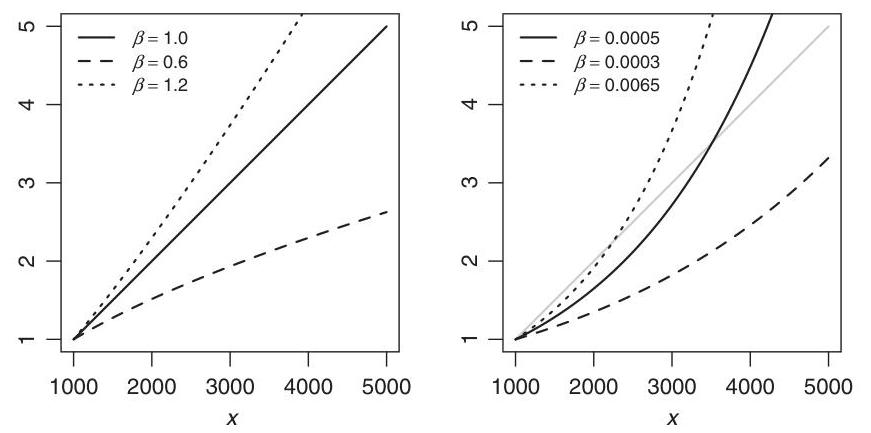

## Page 22
be near 1.0 (solid line). A coefficient between 0 and 1 (such as the 0.6 coefficient illustrated by the dashed line) would indicate that the mean response increases with the value of the predictor, but at a decreasing rate; this shape is often appropriate for predictors in insurance models. A coefficient greater than 1 -such as 1.2 , the dotted line-will yield a curve that increases at a mildly increasing rate. (Negative coefficients would yield response curves that are the "flipped" images of those illustrated here; a coefficient of -1.0 would indicate a direct inverse relationship, -0.6 would indicate a function that decreases at a decreasing rate, and the curve for -1.2 would be decreasing at an increasing rate.)

On the other hand, if the variable $x$ is not logged, the response curve for any positive coefficient will always have the same basic shape: exponential growth, that is, increasing at an increasing rate. The right panel of Figure 1 illustrates the kinds of fits that might be produced for variables similar to those in the left panel if the variable $x$ were not logged. As can be seen, a direct linear relationship (the gray line) is no longer an option. Only an exponential growth curve can be achieved; the magnitude of the growth varies with the coefficient. To be sure, there may be some instances where such a shape may be warranted; for example, if $x$ is a temporal variable (such as year) meant to pick up trend effects, it may be desirable for $x$ to yield an exponential growth relationship with the response, as trend is often modeled as an exponential function. In general, though, rather than viewing logging as a transformation of a continuous variable, it is often useful to consider the logged form of a variable the "natural" state of a predictor in a log link model, with the original (unlogged) variable viewed as a "transformation" that should only be used in certain specific cases.

Note that this suggestion is not due to any statistical law, but rather it is a rule of thumb specific to the context of insurance modeling, and is based on our a priori expectation as to the relationship between losses and the continuous predictors typically found in insurance models. For some variables, logging may not be feasible or practical. For example, variables that contain negative or zero values cannot be logged without a prior transformation. Also, for "artificial" continuous variables (such as credit scores) we may not have any a priori expectation as to whether the natural form or the logged form would better capture the loss response.

Also note that when including a logged continuous variable in a log link model, the underlying assumption is that the logged variable yields a linear relationship with the logged mean of the outcome. Certainly, there are many instances of predictors for which such will not be the case. An example is the effect of driver age on expected auto pure premium, which is typically at its highest for teen drivers and declines as drivers mature into their twenties and thirties, but rises again as the drivers enter their senior years. Regardless of whether the original variable has been logged or not, it is crucial to test the assumption of linearity and make adjustments where appropriate. Techniques for detecting and handling such non-linear effects will be discussed in Chapter 5.

# 2.4.2. Treatment of Categorical Variables 

When a categorical variable is used in a GLM the treatment is a bit more involved. One of the levels is designated as the base level. Behind the scenes, the GLM software replaces the column in the input dataset containing the categorical variable with a

## Page 23
Table 2. Input Data to the GLM

| freq | vtype | $\ldots$ other predictors $\ldots$ |
| :-- | :-- | :--: |
| 0 | SUV | $\ldots$ |
| 0 | truck | $\ldots$ |
| 1 | sedan | $\ldots$ |
| 0 | truck | $\ldots$ |
| 0 | van | $\ldots$ |
| $\ldots$ | $\ldots$ | $\ldots$ |

series of indicator columns, one for each level of that variable other than the base level. Each of those columns takes on the values 0 or 1 , with 1 indicating membership of that level. Those columns are treated as separate predictors, and each receives its own coefficient in the output. This resulting dataset is called the design matrix.

To illustrate: suppose, in an auto frequency model, we wish to include the categorical variable "vehicle type," which can be either "sedan," "SUV," "truck" or "van." We designate "sedan" as the base level.

Table 2 shows the target variable and vehicle type columns for the first five rows of our dataset. The vehicle type variable is named "vtype" in the data.

Prior to fitting the GLM, the software will transform the data to create indicator variables for each level of vtype other than "sedan," our base level. Table 3 shows the resulting design matrix.

Record 1, which is of vehicle type "SUV," has a 1 in the vtype:SUV column and zeros for all other columns relating to vehicle type. Similarly, record 2 has a 1 in the vtype:truck column and zeros in all the others. There is no column corresponding to vehicle type "sedan"; record 3's membership in that level is indicated by all three vehicle type columns being zero. Each of the newly-created vehicle type columns is treated as a separate predictor in Equation 2.

For a risk of any non-base level, when the values for the indicators columns are linearly combined with their respective coefficients in Equation 2, the coefficients

Table 3. Design Matrix

| predictor: | freq | vtype:SUV | vtype:truck | vtype:van | . . other predictors $\ldots$ |
| :-- | :--: | :--: | :--: | :--: | :--: |
| symbol: | $y$ | $x_{1}$ | $x_{2}$ | $x_{3}$ | $x_{4} \ldots x_{p}$ |
|  | 0 | 1 | 0 | 0 | $\ldots$ |
|  | 0 | 0 | 1 | 0 | $\ldots$ |
|  | 1 | 0 | 0 | 0 | $\ldots$ |
|  | 0 | 0 | 1 | 0 | $\ldots$ |
|  | 0 | 0 | 0 | 1 | $\ldots$ |
|  | $\ldots$ | $\ldots$ | $\ldots$ | $\ldots$ | $\ldots$ |

## Page 24
relating to all other levels are multiplied by zero and drop out, while the coefficient relating to the level to which it belongs is multiplied by one and remains. For a risk of the base level, all the coefficients drop out. As such, the coefficient for each non-base level indicates the effect of being a member of that level relative to the base level.

Continuing with our example, suppose the GLM returns the estimates shown in Table 4 for the three non-base vehicle types.

To use this output to derive the linear predictor for an SUV, we plug the coefficients of Table 4 and the $x$ predictors of Table 3 into Equation 2:

$$
\begin{aligned}
g(\mu) & =\beta_{0}+1.23 \times 1+0.57 \times 0+(-0.30) \times 0+\beta_{4} x_{4}+\cdots+\beta_{p} x_{p} \\
& =\beta_{0}+1.23+\beta_{4} x_{4}+\cdots+\beta_{p} x_{p}
\end{aligned}
$$

As seen, all coefficients related to vehicle type for types other than "SUV" drop out of the equation, and only the coefficient for SUVs (1.23) remains. Since for a risk of vehicle type "sedan" all the vehicle type coefficients would drop out, the positive coefficient applied to SUVs indicates that their claim frequency is greater than that of sedans. Similarly, the negative coefficient attached to "van" indicates that claims are less frequent for vans than for sedans.

If a $\log$ link was used, a factor table for vehicle type can be constructed from this output by exponentiating each of the above coefficients. For the base level (sedan in this example) the factor is 1.000 , since the effect of this vehicle type on the linear predictor is zero (and $e^{0}=1$ ). An SUV would get a rating factor of $e^{1.23}=3.421$, indicating that the expected frequency for SUVs are $242 \%$ greater than that of sedans. The rating factor for a van would be $e^{-0.30}=0.741$, indicating an expected frequency that is $25.9 \%$ lower than that of sedans.

We now turn our attention to the significance statistics for this model (that is, the rightmost two columns of Table 4). These statistics help us assess our confidence in the values the parameters being non-zero. In the context of this model-where the parameters relate each level of vehicle type to the base level-a parameter of zero would mean that the level has the same mean frequency as the base level. It follows that the significance of the parameter measures the confidence that the level is significantly different from the base level.

The low $p$-value assigned to the vtype:SUV parameter indicates that the frequency for SUVs is significantly higher than that of sedans. For vans, on the other hand, the high $p$-value tells us that there is not enough evidence in the data to conclude that the frequency for vans is indeed lower than that of sedans.

Table 4. GLM Parameter Estimates for Vehicle Type

| Parameter | Coefficient | Std. Error | $p$-Value |
| :-- | :--: | :--: | :--: |
| vtype:SUV $\left(\beta_{1}\right)$ | 1.23 | 0.149 | $<0.0001$ |
| vtype:truck $\left(\beta_{2}\right)$ | 0.57 | 0.175 | 0.0011 |
| vtype:van $\left(\beta_{3}\right)$ | -0.30 | 0.436 | 0.4871 |

## Page 25
Figure 2. Graphical representation of the parameter estimates for vehicle type, with "sedan" as the base level (left panel) and with "van" as the base level (right panel). The filled squares show the GLM estimates, and the error bars around them indicate the $95 \%$ confidence intervals around those estimates. The vertical gray bars at the bottom are proportional to the volume of data for each vehicle type.

A graphical representation of the estimates of Table 4 can be seen in the left panel of Figure 2. The filled squares show the GLM estimates, and the error bars around them indicate the $95 \%$ confidence intervals around those estimates. The vertical gray bars at the bottom are proportional to the volume of data for each vehicle type. We can see that "van," the level with the least amount of data, has the widest error bar. In general, for categorical variables, sparser levels tend to have wider standard errors, indicating less confidence in their parameter estimates, since those estimates are based on less data. The "van" error bar also crosses the zero line, indicating that this estimate is not significant at the $95 \%$ confidence level.

# 2.4.3. Choose Your Base Level Wisely! 

In the above example, we've set the base level for vehicle type to be "sedan." Table 5 shows what the output would be had we used "van" as the base level instead.

This model is equivalent to that of Table 4 in that both would produce the same predictions. To be sure, the coefficients are different, but that is only because they are relating the levels to a different base. To see this, subtract the coefficient for "sedan"

Table 5. Parameter Estimates After Setting "van" as the Base Level

| Parameter | Coefficient | Std. Error | $p$-Value |
| :-- | :--: | :--: | :--: |
| vtype:sedan $\left(\beta_{1}\right)$ | 0.30 | 0.436 | 0.4871 |
| vtype:SUV $\left(\beta_{2}\right)$ | 1.53 | 0.425 | 0.0003 |
| vtype:truck $\left(\beta_{3}\right)$ | 0.88 | 0.434 | 0.0440 |
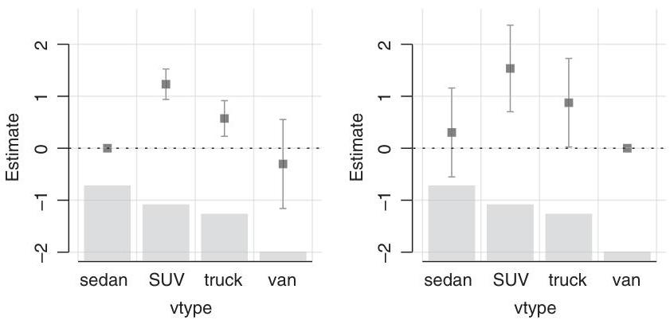

## Page 26
from that of any of the other levels (using 0 for "van"), and compare the result to the corresponding coefficient on Table 4.

What has changed, though, are the significance statistics. Whereas for the prior model the "SUV" and "truck" estimates were highly significant, after running this model the $p$-values for both have increased, indicating less confidence in their estimates. The parameters are plotted in the right panel of Figure 2. We can see that the error bars have widened compared to the prior model.

To understand why, recall that the significance statistics for categorical variable parameters measure the confidence in any level being different from the base level. As such, to be confident about that relationship, we need confidence about both sides of it-the mean response of the parameter in question, as well as that of the base level. In this case, our base level has sparse data, which does not allow the model to get a good read on its mean frequency, and so we can't be certain about the relativity of any other level to it either.

As such, when using categorical variables, it is important to set the base level to be one with populous data-and not simply take the default base assigned by the software-so that our measures of significance will be most accurate.

# 2.5. Weights 

Frequently, the dataset going into a GLM will include rows that represent the averages of the outcomes of groups of similar risks rather than the outcomes of individual risks. For example, in a claim severity dataset, one row might represent the average loss amount for several claims, all with the same values for all the predictor variables. Or, perhaps, a row in a pure premium dataset might represent the average pure premium for several exposures with the same characteristics (perhaps belonging to the same insured).

In such instances, it is intuitive that rows that represent a greater number of risks should carry more weight in the estimation of the model coefficients, as their outcome values are based on more data. GLMs accommodate that by allowing the user to include a weight variable, which specifies the weight given to each record in the estimation process.

The weight variable, usually denoted $\omega$, formally works its way into the math of GLMs as a modification to the assumed variance. Recall that the exponential family variance is of the form $\operatorname{Var}[y]=\phi V(\mu)$. When a weight variable is specified, the assumed variance for record $i$ becomes

$$
\operatorname{Var}\left[y_{i}\right]=\frac{\phi V\left(\mu_{i}\right)}{\omega_{i}}
$$

that is, the "regular" exponential family variance divided by the weight. The variance therefore holds an inverse relation to the weight.

When the weight variable is set to be the number of records that an aggregated row represents, this specification of variance neatly fits with our expectations of the variance for such aggregated records. Recall that a basic property of variances is that

## Page 27
for a random variable $\mathrm{X}, \operatorname{Var}\left[\left(\sum X_{i}\right) / n\right]=\frac{1}{n} \operatorname{Var}[X]$; in other words, the variance of the average of $n$ independent and identically distributed random variables is equal to $1 / n$ times the variance of one such random variable. As such, a row representing the average loss amount of two claims would be expected to have half the variance of a single-claim row, and so on. Setting the weight to be the number of claims allows the GLM to reflect that expectation.

# 2.6. Offsets 

When modeling for insurance rating plans, it is often the case that the scope of the project is not to update the entire plan at once; rather, some elements will be changed while others remain as-is. Some common examples:

- Rating algorithms typically begin with a base loss cost that varies by region or class, which is derived outside of the GLM-based analysis and may even be separately filed. The scope of the GLM project may be to update the rating factors only while the relative base loss costs remain static.
- When updating deductible factors, it is frequently desirable to calculate them using traditional loss elimination-based techniques, while the GLM is used for factors other than deductible. (Section 9.1 discusses this in more detail.)

In such instances, the "fixed" variable (base loss cost or deductible in the above examples) would not be assigned an estimated coefficient by the GLM. However, since it will be part of the rating plan the GLM is intended to produce, the GLM must be made aware of its existence so that the estimated coefficients for the other variables are optimal in its presence. GLMs provide the facility to do so through the use of an offset.

An offset is formally defined as a predictor whose coefficient is constrained to be 1 . Mathematically, it is an added term to Equation 2:

$$
g\left(\mu_{i}\right)=\beta_{0}+\beta_{1} x_{i 1}+\beta_{2} x_{i 2}+\cdots+\beta_{p} x_{i p}+\text { offset }
$$

When including an offset in a model, it is crucial that it be on the same "scale" as the linear predictor. In the case of a log link model, this requires the offset variable to be logged prior to inclusion in the model.

As an example, suppose the rating plan we intend to produce using a log-link GLM will include a factor for deductible, for which the base deductible level is $\$ 500$, with the other options being $\$ 1,000$ and $\$ 2,500$. The deductible factors, having been separately estimated using non-GLM methods, are 0.95 for the $\$ 1,000$ deductible and 0.90 for the $\$ 2,500$ deductible. (The $\$ 500$ deductible, being the base level, is assigned a factor of 1.00 .) As we do not wish to alter these factors-but would like to ensure that the other factors estimated by the GLM are optimized for a rating plan that includes them-we include the deductible factors in the GLM as an offset.

## Page 28
To do so, we create a new variable, set to be $\ln (1.00)=0$ for those records with the base deductible of $\$ 500, \ln (0.95)=-0.0513$ for those records with $\$ 1,000$ deductibles, and $\ln (0.90)=-0.1054$ for records with $\$ 2,500$ deductibles. That variable is set as the offset in the GLM specification. ${ }^{4}$

Multiple offsets can be included by simply adding them together (after first transforming them to the linear predictor scale). So, supposing we wish to offset a loglink model for both the territorial base loss cost and the deductible, a record for a risk in a territory with a base loss cost of $\$ 265$ having a deductible factor of 0.90 would have its offset variable set to be $\ln (265)+\ln (0.90)=5.5797+(-0.1054)=5.4744$.

Exposure Offsets. Offsets are also used when modeling a target variable that is expected to vary directly with time on risk or some other measure of exposure. An example would be where the target variable is the number of claims per policy for an auto book of business where the term lengths of the policies vary; all else equal, a policy covering two car years is expected to have twice the claims as a one-year policy. This expectation can be reflected in a log-link GLM by including the (logged) number of exposures-car years in this example-as an offset.

Note that this approach is distinct from modeling claims frequency, i.e., where the target variable is the number of claims divided by the number of exposures, which is the more common practice. In a frequency model, the number of exposures should be included as a weight, but not as an offset. In fact: a claim count model that includes exposure as an offset is exactly equivalent to a frequency model that includes exposure as a weight (but not as an offset)-that is, they will yield the same predictions, relativity factors and standard errors. ${ }^{5}$

To gain an intuition for this relationship, recall that an offset is an adjustment to the mean, while the weight is an adjustment to the variance. For a claim count model, additional exposures on a record carry the expectation of a greater number of claims, and so an offset is required. While the variance of the claim count is also expected to increase with increasing exposure-due to the exponential family's inherent expectation of greater mean implying greater variance-this is naturally handled by the GLM's assumed mean/variance relationship, and so no adjustment to variance (i.e., no weight variable) is necessary. For a claim frequency model, on the other hand, additional exposure carries the expectation of reduced variance (due to the larger volume of exposures yielding greater stability in the average frequency), but no change to the expected mean, and therefore a weight-but no offsetis needed. ${ }^{6}$

[^0]
[^0]:    ${ }^{4}$ This example is for a log-link GLM. For an example of the use of an offset in a logistic model, see CAS Exam 8, Fall 2018 Question 7. (Logistic regression is discussed later in this chapter.)
    ${ }^{5}$ Note that while this equivalence holds true for the Poisson (or overdispersed Poisson) distribution, it does not work for the negative binomial distribution since the two approaches may yield different estimates of the negative binomial parameter $\boldsymbol{\kappa}$ (These distributions are discussed in the next section.)
    ${ }^{6}$ See Yan et al [2009] for a more detailed discussion of this equivalence and its derivation.

## Page 29
The following table summarizes this equivalence.

|  | Claim Count | Frequency |
| :-- | :-- | :-- |
| Target Variable | \# of claims | \# of claims |
| Distribution | Poisson | Poisson |
| Link | $\log$ | $\log$ |
| Weight | None | \# of exposures |
| Offset | In(\# of exposures) | None |

# 2.7. An Inventory of Distributions 

The following sections describe several of the exponential family distributions available for use in a GLM, with a focus on the types of target variables typically modeled when developing rating plans: severity, frequency, pure premium and loss ratio.

### 2.7.1. Distributions for Severity

When modeling the severity of claims or occurrences, two commonly used distributions are the gamma and inverse Gaussian distributions.

Gamma. The gamma distribution is right-skewed, with a sharp peak and a long tail to the right, and it has a lower bound at zero. As these characteristics tend to be exhibited by empirical distributions of claim severity, the gamma is a natural fit (and indeed the most widely used distribution) for modeling severity in a GLM. The gamma variance function is $V(\mu)=\mu^{2}$, meaning that the assumed variance of the severity for any claim in a gamma model is proportional to an exponential function of its mean.

Figure 3 shows several examples of the gamma probability density function (pdf) curves for varying values of $\mu$ and $\phi$. The two black lines illustrate gamma with $\phi=1$, with means of 1 and 5 . The two gray lines show gamma curves with those same means

Figure 3. The Gamma Distribution
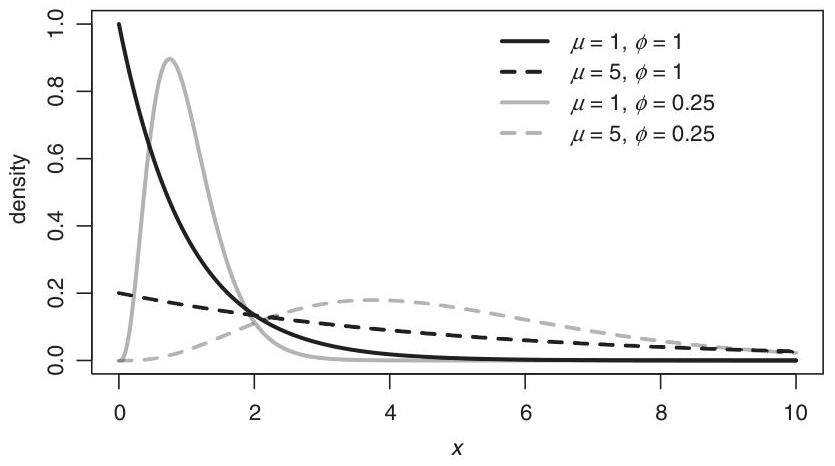

## Page 30
Figure 4. The Inverse Gaussian Distribution (as compared with the gamma distribution)
but with a lower value of $\phi$. As you would expect, the gray lines indicate lower variance than their corresponding black lines. However, also note that the value of $\phi$ does not tell the full story of the variance. Comparing the two gray lines, it is clear that gamma with $\mu=5$ (dashed line) has a much wider variance than gamma with $\mu=1$ (solid line), despite their having the same value of $\phi$. This, of course, is due to the variance function $V(\mu)=\mu^{2}$, which assigns higher variance to claims with higher expected means, and is a desirable characteristic when modeling severity in a GLM. We would expect claims with higher average severity to also exhibit higher variance in severity, and this property allows us to reflect that assumption in a GLM even though the dispersion parameter $\phi$ must be held constant for all claims.

Inverse Gaussian. The inverse Gaussian distribution, like the gamma distribution, is right-skewed with a lower bound at zero, which makes it another good choice for modeling severity. Compared to the gamma, it has a sharper peak and a wider tail, and is therefore appropriate for situations where the skewness of the severity curve is expected to be more extreme. (Later in this text we will discuss formal tests that can be applied to the data to assess the appropriateness of the various distributions.)

The variance function for the inverse Gaussian distribution is $V(\mu)=\mu^{3}$; like the gamma, the inverse Gaussian variance scales exponentially with the mean, but at a faster rate.

Figure 4 shows two examples of the inverse Gaussian distribution (the two solid lines) each compared to a gamma distribution with the same mean and variance (the dotted lines). As can be seen, the shapes of the inverse Gaussian distributions have sharper peaks and are more highly skewed than their gamma counterparts. ${ }^{7}$

[^0]
[^0]:    ${ }^{7}$ For the two $\mu=5$ curves (the gray lines) in Figure 4, a gamma distribution with $\phi=0.25$ is compared to an inverse Gaussian distribution with $\phi=0.05$. This is so that the variance of the gamma curve $\left(\phi \mu^{2}=0.25 \times 5^{2}=6.25\right)$ is equal to that of the inverse Gaussian curve $\left(\phi \mu^{3}=0.05 \times 5^{3}=6.25\right)$. The intent is to demonstrate the difference in the curves that would be yielded by the two distributions for the same data; typically, the $\phi$ parameter under the inverse Gaussian distribution will be much lower than under the gamma distribution to compensate for the much larger values of $V(\mu)$ in keeping the overall assumed variance roughly constant.
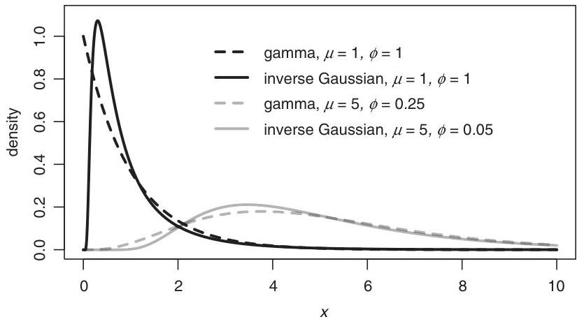

## Page 31
# 2.7.2. Distributions for Frequency 

When modeling claim frequency (e.g., expected claim count per unit of exposure or per dollar of premium), the most commonly used distribution is the Poisson distribution. Another available choice is the negative binomial distribution. Both are explained in the following sections.

Poisson. The Poisson distribution models the count of events occurring within a fixed time interval, and is widely used in actuarial science as a distribution for claim counts. Although the Poisson is typically a discrete distribution (defined only for integral values) its implementation in a GLM allows it to take on fractional values as well. This feature is useful when modeling claim frequency, where claim count is divided by a value such as exposure or premium, resulting in a non-integral target variable. (In such instances it is usually appropriate to set the GLM weight to be the denominator of frequency.)

The variance function for a Poisson distribution is $V(\mu)=\mu$, meaning that the variance increases linearly with the mean. In fact, for a "true" Poisson distribution, the variance equals the mean; stated in terms of the exponential family parameters, this would mean that $\phi=1$ and so it drops out of the variance formula, leaving $\operatorname{Var}[y]=\mu$. However, claim frequency is most often found to have variance that is greater than the mean, a phenomenon called overdispersion.

Overdispersion arises mainly because in addition to the natural variance arising from the Poisson process, there is another source of variance: the variation in risk level among the policyholders themselves. In statistical terms: in addition to the Poisson variance, there is variance in the Poisson mean $(\mu)$ among risks. To be sure, determining the appropriate mean, and thereby separating the good risks from bad risks, is precisely the purpose of our modeling exercise. However, our model will not be perfect; there will always be some variation in risk level among policyholders not explained by our model's predictors, and so the data will exhibit overdispersion.

One way to deal with this scenario is to use the overdispersed Poisson (ODP) distribution in place of the "true" Poisson. The overdispersed Poisson is similar to the Poisson distribution, with the main difference being the $\phi$ parameter: ODP allows it to take on any positive value rather than being restricted to 1 as is the case with the true Poisson.

When modeling claims frequency with the Poisson distribution, it is recommended that the overdispersed Poisson be used; otherwise, the variance will likely be understated, thereby distorting the model diagnostic measures such as standard error and $p$-value. (Note that the Poisson and ODP distributions will always produce the same estimates of coefficients, and therefore the same predictions; it is only the model diagnostics that will be affected.)

Negative Binomial. Another way of dealing with the overdispersion in the Poisson distribution resulting from random variation in the Poisson mean among risks is to treat the Poisson mean for any given risk as a random variable itself. Doing so, we would need another probability distribution to model the Poisson mean; a good

## Page 32
choice for that might be the gamma distribution. Such a setup would be stated mathematically as follows:

$$
y \sim \operatorname{Poisson}(\mu=\theta), \quad \theta \sim \operatorname{gamma}(\ldots)
$$

In words, the outcome $(y)$ is Poisson-distributed with a mean of $\theta$, where $\theta$ is itself random and gamma-distributed. This combination results in $y$ following a negative binomial distribution.

For the negative binomial distribution, the standard exponential family dispersion parameter, $\phi$, is restricted to be 1 . However, this distribution includes a third parameter, $\kappa$, called the overdispersion parameter, which is related to the variance of the gamma distribution of Equation 4.

The negative binomial variance function is

$$
V(\mu)=\mu(1+\kappa \mu)
$$

and so the $\kappa$ parameter serves to "inflate" the variance over and above the mean, which would be the variance implied by the Poisson distribution. Indeed, as $\kappa$ approaches zero, the negative binomial distribution approaches Poisson. (Note that for the negative binomial distribution, $\phi$, restricted to be 1 , drops out of the variance formula and thus the variance function $V(\mu)$ is the full expression of the variance.)

# 2.7.3. A Distribution for Pure Premium: the Tweedie Distribution 

Modeling pure premium (or loss ratio) at the policy level has traditionally been challenging. To see why, consider the properties these measures exhibit, which would need to be approximated by the probability distribution used to describe them: they are most often zero, as most policies incur no loss; where they do incur a loss, the distribution of losses tends to be highly skewed. As such, the pdf would need to have most of its mass at zero, and the remaining mass skewed to the right. Fortunately, a rather remarkable distribution that can capture these properties does exist: the Tweedie distribution.

In addition to the standard exponential family parameters $\mu$ and $\phi$, the Tweedie distribution introduces a third parameter, $p$, called the power parameter. $p$ can take on any real number except those in the interval 0 to 1 (non-inclusive: 0 and 1 themselves are valid values). The variance function for Tweedie is $V(\mu)=\mu^{p}$.

One rather interesting characteristic of the Tweedie distribution is that several of the other exponential family distributions are in fact special cases of Tweedie, dependent on the value of $p$ :

- A Tweedie with $p=0$ is a normal distribution.
- A Tweedie with $p=1$ is a Poisson distribution.
- A Tweedie with $p=2$ is a gamma distribution.
- A Tweedie with $p=3$ is an inverse Gaussian distribution.

Going further, thanks to the Tweedie distribution, our choices in modeling claim severity are not restricted to the moderately-skewed gamma distribution and

## Page 33
the extreme skewness of the inverse Gaussian. The Tweedie provides a continuum of distributions between those two by simply setting the value of $p$ to be between 2 (gamma) and 3 (inverse Gaussian).

However, the area of the $p$ parameter space we are most interested in is between 1 and 2. At the two ends of that range are Poisson, which is a good distribution for modeling frequency, and gamma, which is good for modeling severity. Between 1 and 2, Tweedie becomes a neat combination of Poisson and gamma, which is great for modeling pure premium or loss ratio-that is, the combined effects of frequency and severity. (For the remainder of this text, references to the Tweedie distribution refer to the specific case of a Tweedie where $p$ is in the range [1,2].)

A Poisson Sum of Gammas. The Tweedie distribution models a "compound Poisson-gamma process." Where events (such as claims) occur following a Poisson process, and each event generates a random loss amount that follows a gamma distribution, the total loss amount for all events follows the Tweedie distribution. In this way the Tweedie distribution may be thought of as a "Poisson-distributed sum of gamma distributions."

In fact, the Tweedie parameters $(\mu, \phi$ and $p$ ) bear a direct relationship to those of the underlying Poisson and gamma distributions; we will examine that more closely here.

Poisson has a single parameter, typically denoted $\lambda$, which is both the mean and the variance. (In prior sections we've referred to the Poisson mean by the symbol $\mu$, following the Poisson's exponential family form. For this section, we'll use the "traditional" parameterizations of the underlying distributions, saving the symbol $\mu$ for the Tweedie mean.)

The gamma distribution takes two parameters: the shape and scale parameters, usually denoted $\alpha$ and $\theta$, respectively. The mean is

$$
E[y]=\alpha \cdot \theta
$$

and the coefficient of variation is

$$
C V=1 / \sqrt{\alpha}
$$

The Tweedie mean can be related to those parameters as follows:

$$
E[y]=\mu=\lambda \cdot \alpha \cdot \theta
$$

Notice that this is the product of the Poisson mean $(\lambda)$ and the gamma mean $(\alpha \cdot \theta)$, as we would expect-pure premium equals expected frequency times expected severity.

The power parameter $(p)$ is

$$
p=\frac{\alpha+2}{\alpha+1}
$$

As seen in Equation 8, the power parameter is purely a function of the gamma parameter $\alpha$. Since $\alpha$ is itself a function of the gamma coefficient of variation (as can be seen by rearranging Equation 6 above), it follows that the $p$ parameter is a function

## Page 34
of the gamma CV. Specifically, as the gamma CV approaches zero, $p$ approaches 1 ; as the gamma CV gets arbitrarily large, $p$ approaches 2 . Values of $p$ used in insurance modeling typically range between 1.5 and 1.8 .

The left panel of Figure 5 shows an example of a Tweedie density function where $p=1.02$. A value of $p$ so close to 1 implies very little variance in the gamma (or severity) component, and so the randomness of the outcome is mainly driven by the random count of events (or, the frequency component). As such, the shape of the distribution resembles a Poisson distribution, with spikes at discrete points, but with a small amount of variation around each point. Also note that the distribution features a point mass at 0 , which allows for the (likely) possibility of no claims.

The right panel of Figure 5 illustrates a Tweedie pdf for the more realistic case of $p=1.67$. In this example, the gamma variation is considerably larger and therefore the discrete Poisson points are no longer visible. However, the distribution still assigns a significant probability to an outcome of 0 .

The formula for the Tweedie dispersion parameter $(\phi)$ is

$$
\phi=\frac{\lambda^{1-p} \cdot(\alpha \theta)^{2-p}}{2-p}
$$

Through equations 7,8 , and 9 , the Tweedie parameters can be derived from any combination of the Poisson parameter $(\lambda)$ and gamma parameters $(\alpha$ and $\theta)$ —and vice versa, with some algebraic manipulation.

In a Tweedie GLM, the $\mu$ parameter varies by record, controlled by the linear predictor, while the $\phi$ and $p$ parameters are set to be constant for all records. One important implication of this is that a Tweedie GLM contains the implicit assumption that frequency and severity "move in the same direction"-that is, where a predictor drives an increase in the target variable (pure premium or loss ratio), that increase is made up of an increase in both its frequency and severity components. (To see this, try the following exercise: begin with any set of $\mu, \phi$ and $p$, and solve for $\lambda, \alpha$ and $\theta$;

Figure 5. The Tweedie Distribution, with $p=1.02$ (left) and $p=1.67$ (right)
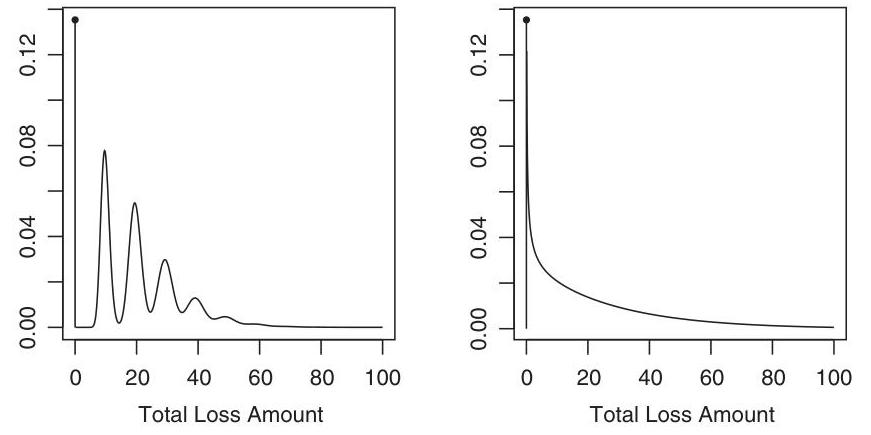

## Page 35
then, try increasing $\mu$ while holding $\phi$ and $p$ constant. Both $\lambda$ and the product $\alpha \theta$ will move upward.) This assumption doesn't always hold true, as often times variables in a model may have a positive effect on frequency while negatively affecting severity, or vice versa. However, Tweedie GLMs can be quite robust against such violations of its assumptions and still produce very strong models.

Determination of the $\boldsymbol{p}$ parameter. There are several ways the Tweedie $p$ parameter may be determined:

- Some model-fitting software packages provide the functionality to estimate $p$ as part of the model-fitting process. (Note that using this option may increase the computation time considerably, particularly for larger datasets.)
- Several candidate values of $p$ can be considered and tested with the goal of optimizing a statistical measure such as log-likelihood (discussed in Chapter 6) or using cross-validation (discussed in Chapter 4).
- Alternatively, many modelers simply judgmentally select some value that makes sense (common choices being $1.6,1.67$ or 1.7 ). This may be the most practical in many scenarios, as the fine-tuning of $p$ is unlikely to have a very material effect on the model estimates.

# 2.8. Logistic Regression 

For some models, the target variable we wish to predict is not a numeric value, but rather the occurrence or non-occurrence of an event. Such variables are called dichotomous or binary variables. Examples are:

- Whether or not a policyholder will renew their policy.
- Whether a newly-opened claim will wind up exceeding some specified loss amount threshold.
- Whether a potential subrogation opportunity for a claim will be realized.

Such a model would be built based on a dataset of historical records of similar scenarios for which the outcome is currently known. The target variable, $y_{i}$, takes on the value of either 0 or 1 , where 1 indicates that the event in question did occur, and 0 indicates that it did not.

Distribution. To model such a scenario in a GLM, the distribution of the target variables is set to be the binomial distribution. The mean of the binomial distributionthat is, the prediction generated by the model-is the probability that the event will occur.

Link Function. When modeling a dichotomous variable using the binomial distribution, a special type of link function must be used. Why not just use the log link? That's because a basic property of GLMs is that the linear predictor-that is, the righthand side of Equation 2-is unbounded, and can take on any value in the range $[-\infty,+\infty]$. The mean of the binomial distribution, on the other hand, being a measure of probability, must be in the range $[0,1]$. As such, we will need a link function that can map a $[0,1]$-ranged value to be unbounded.

## Page 36
Figure 6. The Logit Function (left) and Its Inverse, the Logistic Function (right)

There are several link function that are available for this purpose, but the most common is the logit link function, ${ }^{8}$ defined as follows:

$$
g(\mu)=\ln \frac{\mu}{1-\mu}
$$

The left panel of Figure 6 shows a graph of the logit function. As can be seen, the logit approaches $-\infty$ as $\mu$ approaches zero, and becomes arbitrarily large as $\mu$ approaches 1 .

The right-hand side of Figure 6 shows the inverse of the logit function, called the logistic function, defined as $1 /\left(1+e^{-x}\right)$. In a GLM, this function translates the value of the linear predictor onto the prediction of probability. A large negative linear predictor would indicate a low probability of occurrence, and a large positive linear predictor would indicate a high probability; a linear predictor of zero would indicate that the probability is $50 \%$.

The full specification of a logistic regression model can be summarized as follows:

$$
\begin{gathered}
y_{i} \sim \operatorname{binomial}\left(\mu_{i}\right) \\
\ln \frac{\mu_{i}}{1-\mu_{i}}=\beta_{0}+\beta_{1} x_{i 1}+\beta_{2} x_{i 2}+\cdots+\beta_{p} x_{i p}
\end{gathered}
$$

Interpreting Results of a Logistic Model. The logit function of Equation 10 can be interpreted as the log of the odds, where the odds is defined as the ratio of the probability of occurrence to the probability of non-occurrence, or $\frac{\mu}{1-\mu}$. The odds is an alternate means of describing probability, which, unlike probability-which must lie in the region $[0,1]$ —is unbounded in the positive direction. (Think of a near-certain event, which might be said to have "million-to-one" odds.)

[^0]
[^0]:    ${ }^{8}$ Others are the probit link and complementary log-log link, not covered in this text.
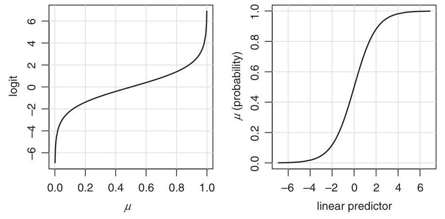

## Page 37
Exponentiating both sides of Equation 12, the logistic GLM equation becomes a multiplicative series of terms that produces the odds of occurrence. This leads to a natural interpretation of the coefficients of the GLM (after exponentiating) as describing the effect of the predictor variables on the odds. For example, a coefficient of 0.24 estimated for continuous predictor $x$ indicates that a unit increase in $x$ increases the odds by $e^{0.24}-1=27 \%$. A coefficient of 0.24 estimated for a given level of a categorical variable indicates that the odds for that level is $27 \%$ higher than that of the base level.

# 2.9. Correlation Among Predictors, Multicollinearity and Aliasing 

Frequently, the predictors going into a GLM will exhibit correlation among them. Where such correlation is moderate, the GLM can handle that just fine. In fact, determining accurate estimates of relativities in the presence of correlated rating variables is a primary strength of GLMs versus univariate analyses; unlike univariate methods, the GLM will be able to sort out each variable's unique effect on the outcome, as distinct from the effect of any other variable that may correlate with it, thereby ensuring that no information is double-counted.

As such, before embarking on a GLM modeling project, it is important to understand the correlation structure among the predictors. This will aid in interpreting the GLM output-particularly in understanding significant deviations between the GLM indications versus what would be indicated by a series of univariate analyses of individual predictors.

Where the correlation between any two predictors is very large, however, the GLM may run into trouble. The high correlation means that much of the same information is entering the model twice. The GLM-forced not to double-count-will need to apportion the response effect between the two variables, and how precisely best to do so becomes a source of great uncertainty. As such, coefficients may behave erratically; it is not uncommon to see extremely high or low coefficients result in such scenarios. Furthermore, the standard errors associated with those coefficients will be large, and small perturbations in the data may swing the coefficient estimates wildly. Such a model is said to be unstable.

Such instability in a model should be avoided. As such it is important to look out for instances of high correlation prior to modeling, by examining two-way correlation tables. Where high correlation is detected, means of dealing with this include the following.

- For any group of correlated predictors, remove all but one from the model. While this is certainly the simplest approach, a potential downside is that there may be some unique information, distinct from the common information, contained in individual predictors that will not be considered in our modeling process.
- Pre-process the data using dimensionality-reduction techniques such as principal components analysis (PCA) or factor analysis. These methods create multiple new

## Page 38
variables from correlated groups of predictors. Those new variables exhibit little or no correlation between them-thereby making them much more useful in a GLM—and they may be representative of the different components of underlying information making up the original variables. The details of such techniques are beyond the scope of this paper.

Multicollinearity. Simple correlation between pairs of predictors are easy enough to detect using a correlation matrix. A more subtle potential problem may exist where two or more predictors in a model may be strongly predictive of a third, a situation known as multicollinearity. The same instability problems as above may result, since the information contained in the third variable is also present in the model in the form of the combination of the other two variables. However, the variable may not be highly correlated with either of the other two predictors individually, and so this effect will not show up in a correlation matrix, making it more difficult to detect.

A useful statistic for detecting multicollinearity is the variance inflation factor (VIF), which can be output by most statistical packages. The VIF for any predictor is a measure of how much the (squared) standard error for the predictor is increased due to the presence of collinearity with other predictors. It is determined for each predictor by running a linear model setting the predictor as the target and using all the other predictors as inputs, and measuring the predictive power of that model.

A common statistical rule of thumb is that a VIF greater than 10 is considered high. However, where large VIFs are indicated, it is important to look deeper into the collinearity structure in order to make an informed decision about how best to handle it in the model.

Aliasing. Where two predictors are perfectly correlated, they are said to be aliased, and the GLM will not have a unique solution. Most GLM fitting software will detect that and automatically drop one of those predictors from the model. Where they are nearly perfectly correlated, on the other hand, the software may not catch it and try to run the model anyway. Due to the extreme correlation, the model will be highly unstable; the fitting procedure may fail to converge, and even if the model run is successful the estimated coefficients will be nonsensical. Such problems can be avoided by looking out for and properly handling correlations among predictors, as discussed above.

# 2.10. Limitations of GLMs 

This section discusses two important limitations inherent in GLMs that one should bear in mind when using them to construct rating plans.

1. GLMs Assign Full Credibility to the Data. The estimates produced by the GLM are fit under the assumption that the data are fully credible for every parameter. For any categorical variable in the model, the estimate of the coefficient for each level is the one which fits the training data best, with no consideration given to the thinness of the data on which it is based.

## Page 39
To gain an intuition for what this means in a practical sense, consider the following simple example. Suppose we run a GLM to estimate auto severity, and the GLM includes only one predictor: territory, a categorical variable with five levels, coded A through E. Volume of data varies greatly by territory, and the smallest territory, E, has only 8 claims.

After running this model, the prediction for each risk will simply be the overall average severity for its territory.

That's right. For a GLM with a single categorical variable as its only predictor, it actually makes no difference which distribution or link function is chosen, just so long as the GLM fitting process is able to converge. The answers will always be the same, and they will be the one-way averages of the target variable by levels of the categorical variable. (Of course, we would not need a GLM for this; we could get to the same place with a simple Excel worksheet.)

Now, continuing with our example, the indicated relativity for territory E, like the rest, will be based simply on the average severity for its 8 claims. As actuaries, if we had been using the one-way analysis to derive relativities, we would surely not select the raw indication for a territory with such little credibility with no modification; we would apply a credibility procedure, and, in absence of any additional information about the territory, probably select something closer to the statewide average. It stands to reason that for the GLM we should not just take the indicated relativity either.

To be sure, in such a scenario, the standard error for the territory E coefficient would be large, and its $p$-value high. In this way, the GLM warns you that the estimate is not fully credible-but does nothing about it.

Where multiple predictors or continuous variables are involved, the estimates are based on a more complicated procedure which could not be easily performed in Excel, and the answers would vary based on the chosen link function and distribution. However, the approach to deriving the estimates would similarly be one that gives full weight to the data at each level of each categorical variable.

Incorporating credibility into the GLM framework is generally beyond the scope of this monograph. However, Chapter 10 briefly discusses two extensions to the GLM that allow for credibility-like estimation methods: generalized linear mixed models (GLMMs) and elastic net GLMs.
2. GLMs Assume the Randomness of Outcomes is Uncorrelated. Another important assumption built into GLMs is that the random component of the outcome of the target variable is uncorrelated among the records in the training set. Note the qualification "random component" in that sentence-that's not the same thing as saying the outcomes are uncorrelated. If our auto severity model contains driver age and territory as predictors, we expect that drivers of similar ages or in the same territory would have similar outcomes, and thus be correlated in that way. After all, identifying and capturing such correlations is precisely the point of our modeling exercise. However, the assumption is that the random component of the outcome-which, from our vantage point, means the portion of the outcome driven by causes not in our model-are independent.

## Page 40
This assumption may be violated if there exist groups of records that are likely to have similar outcomes, perhaps due to some latent variable not captured by our model. The following are examples of where this may arise in insurance models:

- Frequently, the dataset going into an insurance GLM will comprise several years of policy data. Thus, there will be many instances where distinct records will actually be multiple renewals of the same policy. Those records are likely to have correlated outcomes; after all, a policyholder who is a bad driver in year 1 will likely still be a bad driver in years 2,3 and 4 .
- When modeling a line that includes a wind peril, policyholders in the same area will likely have similar outcomes, as the losses tend to be driven by storms that affect multiple insureds in the area at once.

Where the correlation is small, this is usually nothing to worry about; GLMs are quite robust against minor violations of their assumptions. However, it is important to be wary of instances of large correlation. Since the parameter estimates and significance statistics of a GLM are all derived "as if" all the random outcomes were independent, large instances of groups of correlated outcomes would cause the GLM to give undue weight to those events-essentially, picking up too much random noise-and produce sub-optimal predictions and over-optimistic measures of statistical significance.

There are several extensions to the GLM that allow one to account for such correlation in the data. One such method is the generalized linear mixed model (GLMM), briefly discussed in Section 10.1. Another is generalized estimating equations (GEE), not covered in this text.

## Page 41
# 3. The Model-Building Process 

The prior chapter has covered the technical details of model construction. While this is a very important component of the model building process, it is important to understand all of the steps involved in the construction and evaluation of a predictive model. While each project has different objectives and considerations, any predictive modeling project should include the following components:

- Setting objectives and goals
- Communicating with key stakeholders
- Collecting and processing the necessary data for the analysis
- Conducting exploratory data analysis
- Specifying the form of the predictive model
- Evaluating the model output
- Validating the model
- Translating the model results into a product
- Maintaining the model
- Rebuilding the model

### 3.1. Setting Objectives and Goals

Before collecting any data or building any models, it is important to develop a clear understanding and to gain alignment on the scope and goals of the project. Important questions to ask include:

- What are the goals of the analysis? While the examples in this text focus on the construction of a rating plan, the goal of an analysis may be to develop a set of underwriting criteria or to determine the probability of a customer renewing a policy.
- Given the goals of the project, what is the appropriate data to collect? Is this data readily available, or will it be costly and time-consuming to obtain it?
- What is the time frame for completing the project?
- What are the key risks that may arise during the project, and how can these risks be mitigated?
- Who will work on the project, and do those analysts have the knowledge and expertise to complete the project in the desired timeframe?

## Page 42
# 3.2. Communicating with Key Stakeholders 

One of the most common reasons for a project failing or falling significantly behind schedule is lack of alignment on the goals and outcomes of the project among its key stakeholders. Using the example of a rating plan, the modeler isn't just creating a predictive model, but rather constructing a new product that will (hopefully) enter the market. For this project, key stakeholders may include:

- Regulators: The goal of any predictive modeling project is to include all variables that are predictive and add lift to the model. However, many variables are considered off limits in pricing insurance risk, either due to legal and regulatory considerations or potential reputational risk. It is important to understand these limitations. These restrictions may also vary by state, as insurance is regulated at the state level.
- IT: The model results will likely need to be coded into a new rating system, and IT systems generally have limitations. Before and during model construction, it is important to communicate the desired rating structure to the programmers who will be coding the rating changes. Some components of the desired rating plan may not be feasible from an IT perspective, in which case it is important to be aware of those limitations early on and adjust the models accordingly. Furthermore, programming changes into IT systems has a cost, and so budget and availability of resources may further limit the rating plan that can be implemented.
- Agents/underwriters: Once the models are complete and turned into a product, someone will have to sell that product. If the new rating structure isn't understood by the policy producers, then it may be difficult to meet sales goals. By including agents in the discussion, the final product can better reflect their needs and concerns, which may in turn lead to a better business outcome.

### 3.3. Collecting and Processing Data

Collecting and processing data is often the most time-consuming component of a predictive modeling project, and modelers tend to underestimate the amount of time that will be required for this step. Most data is messy, so time must be spent figuring out how to clean the data, impute missing values, merge additional variables into the dataset, etc. Collecting and processing data are often iterative processes, as a modeler may discover later in the model-building process that a particular variable in the dataset is incorrect.

The data should also be split into at least two subsets, so that the model can be tested on data that was not used to build it. A strategy for validating the model should also be carefully formulated at this stage.

Chapter 4 discusses the process of collecting and preparing the data in greater detail.

### 3.4. Conducting Exploratory Data Analysis

Once the data has been collected, it is important to spend some time on exploratory data analysis (EDA) before beginning to construct models. EDA will help the modeler

## Page 43
better understand the nature of the data and the relationships between the target and explanatory variables. Helpful EDA plots include:

- Plotting each response variable versus the target variable to see what (if any) relationship exists. For continuous variables, such plots may help inform decisions on variable transformations.
- Plotting continuous response variables versus each other, to see the correlation between them.

# 3.5. Specifying Model Form 

Key questions in specifying the model form include:

- What type of predictive model works best for this project and this data? While this text is focused on generalized linear models, other modeling frameworks (e.g., decision trees) may be more appropriate for some projects.
- What is the target variable, and which response variables should be included?
- Should transformations be applied to the target variable or to any of the response variables?
- Which link function should be used?

Chapter 5 further explores considerations related to the specification of the model form for GLMs.

### 3.6. Evaluating Model Output

Once there are preliminary results, the modeler should begin evaluating the output to determine next steps. Model evaluation involves:

- Assessing the overall fit of the model, and identifying areas in which the model fit can be improved.
- Analyzing the significance of each predictor variable, and removing or transforming variables accordingly.
- Comparing the lift of a newly constructed model over the existing model or rating structure.

These steps are detailed in Chapters 6 and 7.

### 3.7. Validating the Model

Model validation is a very important component of the modeling process, and should not be overlooked or rushed. The validation process is discussed in detail in Chapter 7.

### 3.8. Translating the Model into a Product

The ultimate goal of most modeling projects is to turn the final model into a product of some kind. In the insurance industry, this product is often a rating plan. Important considerations when turning the results of a modeling project into a final product include:

- Is the product clear and understandable? In particular, there should be no ambiguity in the risk classification, and a knowledgeable person should be able to clearly understand the structure of the product.

## Page 44
- Are there items included in the product that were not included in the model? Using the example of a rating plan, there are often rating factors included in the plan that are not part of the model because there is no data available on that variable. In such cases, it is important to understand the potential relationship between this variable and other variables that were included in the model. For example, if an insurer is offering a discount for safe driving behavior for the first time, this discount may overlap with other variables that were in the model. In such cases, it may be appropriate to apply judgmental adjustments to the variables in the rating plan.

# 3.9. Maintaining and Rebuilding the Model 

The predictive accuracy of any model generally decreases over time, as the world changes and the data used to construct the model becomes less relevant. It is important to have a plan to maintain a model over time so that it does not become obsolete. Models should be periodically rebuilt in order to maximize their predictive accuracy, but in the interim it may be beneficial to refresh the existing model using newer data. This will allow model predictions to reflect the most recent experience.

## Page 45
# 4. Data Preparation and Considerations 

Data preparation is one of the most important parts of the model-building process, and is usually the part of the process that takes the most time. Although every organization has different processes and systems for collecting, storing, and retrieving the data needed to build a classification plan, there are some common themes and situations with which all actuaries should be familiar.

It's important to remember that like the rest of the modeling process, the data preparation step is iterative. Correcting one error might help you discover another, and insights gleaned from the model-building process might prompt you to step back and revisit your approach to data preparation.

### 4.1. Combining Policy and Claim Data

In almost every case, the data most appropriate for use in building a classification plan is exposure-level premium (policy demographic) and loss (claim) data. Ideally, you would like to have a dataset with one record for each risk and each time period of interest. For some lines of business, it may suffice to attach claims to policy records and model at the policy level. For other lines, it may be beneficial to model at the level of individual risks within a policy. For example, when modeling for personal auto, claims should ideally be attached to the specific vehicles and drivers to which they pertain so that their characteristics can be included in the model as well.

The immediate difficulty with assembling such a dataset is that premium and loss data tend not to be stored in the same place. In many organizations, a policy-level premium database is housed within the underwriting area, and a claims database is housed within the claims area. In the normal course of business these two databases may never be matched against each other except at a very high level. So the first task of a modeling assignment is often to locate these two datasets and merge them.

If best practices have been followed and changes to these two datasets have tracked each other over time, merging them may not be time-consuming-it may even be trivial. But when dealing with legacy systems, or with policy and claims databases that have grown or evolved independently over time, problems may arise. The number of things that can go wrong is essentially unlimited. But here are some questions that the actuary may need to ask while in the process of doing a merge:

## Page 46
Are there timing considerations with respect to the way these databases are updated that might render some of the data unusable? If the policy database is updated at the end of every month and the claims database is updated daily, for example, the most recent claims data might not be usable because corresponding exposures are not available.

Is there a unique key that can be used to match the two databases to each other in such a way that each claim record has exactly one matching policy record? The answer to this question should always be "yes." If there are multiple policy records that match a single claim, merging may cause claims to be double counted. On the other hand, if the key does not match each claim to a policy record, some claim records may be orphaned.

What level of detail should the datasets be aggregated to before merging? This is a question whose answer is informed by both the goal of the model and practical considerations around resource limitations and run times. Data must often be aggregated across multiple dimensions. For the dimension of time, policy data is most often aggregated to the level of calendar year rather than any shorter period. Calendar-year data has several distinct advantages, among them that the calendar year is the usual policy period and that seasonality need not be addressed. When policy data is aggregated in this way, care must be taken to correctly count the exposures attributable to each record and store these exposure counts on the aggregated record. For example, a policy that is issued October 1 of a certain calendar year only contributes $25 \%$ of a full exposure to that year.

Claim data is usually also aggregated to policy and calendar year. If a particular policy has two $\$ 500$ claims in a certain calendar year, the aggregated claim record would have only a claim count field with a value of 2 and a loss field with a value of $\$ 1000$. Note that this treatment is not precise and that meaningful data is lost in the aggregation-in this example, the aggregated claim record could have also represented one claim of $\$ 900$ and one claim of $\$ 100$.

Depending on the goals of the model, further aggregation may be warranted. For example, in a book of small commercial property exposures, policies may be written at the level of the business entity, but demographic and loss data may be available by location. So a policy covering a business with two locations for one year may be aggregated to the business level (one exposure) or to the location level (two exposures). It usually makes sense to keep a finer level of detail in the model so that this information can be available to use for pricing, but if there are few enough businesses in the book with multiple locations, it may be more convenient to aggregate to the business level at the start of the project, retaining information on locations only in the form of a count.

Are there fields that can be safely discarded? There may be fields in either database which for whatever reason it would not make sense to consider in the model. Removal of these fields will speed up every other part of the model-building process.

## Page 47
But removal of fields is not something that should be done lightly, since costs to re-add them may be high if it's found that they're needed later in the process. A special case is when two fields contain identical or near-identical information, resulting in aliasing or near-aliasing. As discussed in Section 2.9, if you add both of these fields to your model, it will break; and, in any case, there is no reason to preserve a field that contains no new information.

Are there fields that should be in the database but aren't? There may be policyholder data that may be predictive of future loss that is collected at the underwriting step but not stored for later use. And there may be predictive data that is not collected at all. This goes beyond just the data preparation step of the process, but the actuary should be just as cognizant of what fields may be missing as they are of the fields that are currently available for use. The actuary's feedback to management on this issue may be critical to kickstarting the process of collecting new data and successfully evolving the classification plan over time.

# 4.2. Modifying the Data 

Any dataset of sufficient size is likely to have errors. It's impossible to present a formulaic approach to error detection that will catch every possible error, and so human judgment is critical. But there are a few steps that should always be taken to attempt to catch and remedy some of the more common errors that can occur.

Check for duplicate records. If there are any records that are exactly identical, this likely represents an error of some sort. This check should be done prior to aggregation and combination of policy and claim data.

Cross-check categorical fields against available documentation. If database documentation indicates that a roof can be of type $\mathrm{A}, \mathrm{B}$, or C , but there are records where the roof type is coded as D , this must be investigated. Are these transcription errors, or is the documentation out of date?

Check numerical fields for unreasonable values. For every numerical field, there are ranges of values that can safely be dismissed as unreasonable, and ranges that might require further investigation. A record detailing an auto policy covering a truck with an original cost (new) of $\$ 30$ can safely be called an error. But if that original cost is $\$ 5,000$, investigation may be needed.

Decide how to handle each error or missing value that is discovered. The solution to duplicate records is easy-delete the duplicates. But fields with unreasonable or impossible values that cannot be corrected may be more difficult to handle. In a large enough dataset, deletion of every record that has an error might leave you with very few records from which to build a model. And, even worse, there might be something systematic about the presence of the error itself. For example, policies written out of a certain office may be consistently miscoded, while policies written out of other offices

## Page 48
aren't. In this case, deleting the offending records may leave you with no way to detect that this office also has less-skilled underwriters for a certain type of policy. A better solution is to replace erroneous or missing values with the mean or modal field value (to be used as the base level of your model), and add a new field for an error flag. The error flag can be included in the model and will proxy for the presence of the error.

Another means of handling missing or erroneous values in the data is to impute values for those predictors using information contained in the other predictors. This would involve building a second model, trained on the subset of data that is nonproblematic, with the problem predictor as the target and all the other predictors as predictors.

Errors are not the only reason to modify your data. It may be appropriate to convert a continuous variable into a categorical variable (this is called "binning"), to reduce the number of levels in a categorical variable, to combine separate fields into new fields, or to separate a single field into multiple fields. But usually these sorts of modifications are made as a part of the model building process. Some of these modifications are covered in more detail in Chapter 5.

# 4.3. Splitting the Data 

Before embarking on a modeling project, it is essential that the available data be split into at least two groups. One of those groups is called the training set. This is used to perform all the model-building steps-selecting the variables, determining the appropriate variable transformations, choosing the distribution, and so on. Another group of data, called the test set (or holdout set), will be used to assess the performance of the model and may also be used to choose among several candidate models.

Why do we do this? One reason is because attempting to test the performance of any model on the same set of data on which the model was built will produce overoptimistic results. After all, the model-fitting process optimizes the parameters to best fit the data used to train it, so we would expect it to perform better on this data than any other. Using the training data to compare our model to any model built on different data would give our model an unfair advantage.

Another reason is because, as we will see in later sections of this monograph, there are endless ways for us to make a GLM as complex as we wish. There may be many variables available to include. For any given variable, any number of polynomial terms or hinge functions can be created. We can also add interactions of any combination of variables (not to mention interactions of polynomial terms and hinge functions), and so on. As we increase the complexity, the fit to the training data will always get better. For data the model fitting process has not seen, on the other hand, additional complexity may not improve the performance of a model-in fact, it may actually make it worse.

For a GLM, model complexity is measured in terms of degrees of freedom, or the number of parameters estimated by the model-fitting procedure. Every continuous variable we include adds a degree of freedom. For a categorical variable, a degree of freedom is added for each non-base level. Furthermore, every polynomial term, every hinge function or interaction term-basically, anything for which the model will need

## Page 49
to estimate another parameter value-counts as a degree of freedom. As the name implies, each degree of freedom provides the model more freedom to fit the training data. Since the fitting procedure always optimizes the fit, additional flexibility to fit the data better means the model will fit the data better.

Figure 7 illustrates the relationship between the degrees of freedom and the performance of the model on the training set as well as on the test set (or any "unseen" data). Model performance is measured here by model error, or the degree to which the predictions "miss" the actual values, with lower error implying better model performance. As we can see, the performance on the training set is always better than on the test set. Increasing the complexity of the model improves the performance on both training set and the test set-up to a point. Beyond that point, the performance on the training set continues to improve-but on the test set, things get worse.

The reason for this deterioration of performance is because, with enough flexibility, the model is free to "explain" the randomness in the training set outcomes (called the noise) in addition to the part of the outcome driven by the systematic effects (called the signal). The noise in the training data would obviously not generalize to new data, so to the extent this information is in our model estimates this becomes a liability. A model that includes significant random noise in its parameter estimates is said to be overfit.

Our goal in modeling is to find the right balance where we pick up as much of the signal as possible with minimal noise, represented by the vertical dotted line in Figure 7. Thus, in addition to paying careful attention to the significance statistics and model fit diagnostics during the modeling process, it is critical to retain holdout data on which to test the resulting models. This out-of-sample testing allows for a truer assessment of the model's predictive power.

Since the divisions of data will remain intact throughout the entire modeling process, it is crucial to formulate a proper data splitting strategy before model building begins. The following sections discuss different approaches to splitting the data, as well as a possible alternative to splitting, called cross validation. In Chapter 7 we describe several tests that can be performed on the holdout set to choose among candidate models.

Figure 7. Illustration of the effect of model complexity (as measured by degrees of freedom, along the $x$ axis), on the performance of the model (measured by model error, along the $y$ axis) for both the training set and test set.
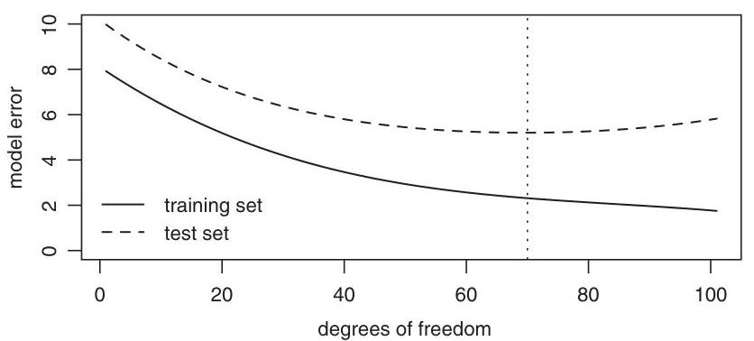

## Page 50
# 4.3.1. Train and Test 

The simplest split to create is two subsets of the data, called the training set and the test set. The training set should be used for the entire model building process, beginning with the initial exploration of variables using univariate analyses, all the way through the model refinement. The test set is used when the model building is complete, to compare the resulting model against the existing rating plan and/or to assess the relative performance of several candidate models.

Typical proportions used for this split are $60 \%$ training $/ 40 \%$ test or $70 \%$ training/ $30 \%$ test. Choice of split percentages involves a trade-off. More data available for the training set will allow for clearer views of patterns in the data. However, if too little data is left for the holdout, the final assessment of models will be have less certainty.

The split can be performed either by randomly allocating records between the two sets, or by splitting on the basis of a time variable such as calendar/accident year or month. The latter approach has the advantage in that the model validation is performed "out of time" as well as out of sample, giving us a more accurate view into how the model will perform on unseen years.

Out-of-time validation is especially important when modeling perils driven by common events that affect multiple policyholders at once. An example of this is the wind peril, for which a single storm will cause many incurred losses in the same area. If random sampling is used for the split, losses related to the same event will be present in both sets of data, and so the test set will not be true "unseen" data, since the model has already "seen" those events in the training set. This will result in over-optimistic validation results. Choosing a test set that covers different time periods than the training set will minimize such overlap and allow for better measures of how the model will perform on the completely unknown future.

### 4.3.2. Train, Validation and Test

If enough data is available, it may be useful to split the data three ways: in addition to the training and test sets, we create a validation set. The validation set is used to refine the model during the building process; the test set is held out until the end.

For example, a modeler may create an initial model using the training dataset, assess its performance on the validation dataset, and then make tweaks to the model based on the results. This is an iterative process. In this example, the validation dataset isn't really a holdout set, since the model is being adjusted based on its fit on the validation data.

Typical proportions used for this split are $40 \%$ for training, $30 \%$ for validation and $30 \%$ for test. Care should be taken that none of the subsets are too thin, otherwise their usefulness will be diminished.

### 4.3.3. Use Your Data Wisely!

A key caution regarding the use of a test set is that it be used sparingly. If toofrequent reference is made to the test set, or if too many choices of models are evaluated on it, it becomes less a test set and more of a training set; once a large part

## Page 51
of the modeling decision has been made based on how well it fits the test set, that fit becomes less indicative of how the model will behave on data that it has truly not seen.

Thus, the choice of how best to "spend" the available data throughout the refinement and validation of the model is an important part of the modeling strategy. Obviously, if a validation set is available (in addition to train and test), we have a bit more leeway, but the validation set will also diminish in usefulness if it is overused. As such, for a large part of the modeling process we will need to make use of the "in-sample" statistics-that is, the significant measures (such as $p$-values for parameter estimates and for the $F$-test, described in Section 6.2.1) derived using the training set.

As we may have many different ideas we wish to try in the course of refining and improving our model, the issue of precisely where reliance on the in-sample statistics will end and the validation or test metrics will begin should be carefully planned in advance.

An example strategy for this may be as follows. First, we might predefine a series of increasing levels of model complexity that we will evaluate as candidates for our final model. The simplest level of complexity might be to retain the current model and not change it all (yes, that should always be considered an option); as a second level, we may keep the structure of the current model intact, but change the numbers; for the third level, we may add some additional variables; the next level might add two-way interactions; subsequent levels may involve multiple-way interactions, subdivision of categorical variable groupings, and so on. Levels are ordered by the relative ease and cost of implementation. We build and refine a model at each level of complexity using the in-sample statistics (and validation set if available). When all the models are fully built, we evaluate them all on the test set, and their relative performance on this set is weighed together with all other business considerations in choosing which becomes the final model.

Once a final model is chosen, however, we would then go back and rebuild it using all of the data, so that the parameter estimates would be at their most credible.

# 4.3.4. Cross Validation 

A common alternative to data splitting often used in predictive modeling is cross validation. Cross validation provides a means of assessing the performance of the model on unseen data through multiple splits of train and test.

There are several "flavors" of cross validation, but the most widely-used is called $k$-fold cross validation, for which the procedure is as follows:

1. Split the data into $k$ groups, where $k$ is a number we choose. (A common choice is 10.) Each group is called a fold. The split can either be done randomly or using a temporal variable such as calendar/accident year.
2. For the first fold:

- Train the model using the other $k-1$ folds.
- Test the model using the first fold.

3. Repeat step 2 for each of the remaining folds.

## Page 52
The output of this procedure is $k$ estimates of model performance, each of which was assessed on data that its training procedure has not seen. Several models can be compared by running the procedure for each of them on the same set of folds and comparing their relative performances for each fold.

For most predictive modeling and machine learning applications, this is superior to a single train/test split, since all of the data is being used to test out-of-sample model performance as opposed to a single subset. However, it is often of limited usefulness for most insurance modeling applications, since cross validation has an important limitation: in order for it to be effective, the "training" phase of the procedure must encompass all the model-building steps. For a GLM, where the bulk of the modelbuilding is the variable selection and transformation, that part would need to be included as well.

The reason for this is simple: if all the data was evaluated when deciding which variables to include, then even if the GLM fitting procedure was run on a subset of data, the remaining subset cannot be considered true "unseen" data. Some of the variables in our model may be there only because of outcomes "seen" in the test set.

Thus, using cross validation in place of a holdout set is only appropriate where a purely automated variable selection process is used. In such an instance, the same selection procedure can be run for each CV fold, and CV would then yield a good estimate (in fact, the best estimate) of out-of-sample performance. However, for most insurance applications, the variables are "hand-selected," with a great deal of care and judgment utilized along the way, and so proper cross validation is nearly impossible. Therefore, splitting the data at the outset and retaining that split throughout, as described in the prior sections, is the preferred approach.

Cross validation may still have some usefulness during the model building process. For example, when evaluating some of the model's "tuning parameters"-for example, how many polynomial terms to include, whether or not to use a certain variable as a weight, etc.-performing cross validation within the training set may yield valuable information on how a change to a model would affect its out-of-sample performance. However, the final model valuation should always be done using a distinct set of data held out until the end.

## Page 53
# 5. Selection of Model Form 

Selecting the form of a predictive model is an iterative process, and is often more of an art than a science. As preliminary models are built and refined into final models, the model form is likely to evolve based on an analysis of the results.

In a generalized linear modeling framework, important decisions on the model form include:

- Choosing the target and predictor variables.
- Choosing a distribution for the target variable.
- Making decisions on the best form for the predictor variables, including whether to make them continuous or categorical, whether to apply transformations to the variables, and how best to group variables.

### 5.1. Choosing the Target Variable

Based on the scope of the modeling project, there may be several options for the target variable. When modeling a rating plan, for example, the target variable might be pure premium, claim frequency, or claim severity. If the goal of the project is instead to identify deficiencies in the existing rating plan, loss ratio may be a more appropriate target variable. Or when evaluating a set of underwriting restrictions, the probability of a large loss may be a good option.

The decision of which target variable to choose generally comes down to data availability and the preferences of the modeler. There is usually not one right answer, and it may be beneficial to try several options to see which one produces the best model.

### 5.1.1. Frequency/Severity versus Pure Premium

Where the ultimate goal of a model is to predict pure premium, there are two approaches we can use to get there.

1. Build two separate models: one with claims frequency-that is, count of claims per exposure-as the target, and another targeting claim severity, i.e., dollars of loss per claim. The individual models are then combined to form a pure premium model. Assuming log links were used for both, this combination of the two models is achieved by simply multiplying their corresponding relativity factors together.
2. Build a single model targeting pure premium, i.e., dollars of loss per exposure, using the Tweedie distribution.

## Page 54
This choice may be dictated by data constraints-for example, the data necessary to build separate models for claim frequency and severity may not be available. Furthermore, as the former approach requires building two models rather than one, time constraints may factor in as well, especially if a large number of pure premium models must be produced (e.g., when separately modeling multiple segments of the business or different perils).

However, where possible, the frequency/severity approach confers a number of advantages over pure premium modeling, some of which are as follows:

- Modeling frequency and severity separately often provides much more insight than a pure premium model, as it allows us to see the extent to which the various effects are frequency-driven versus severity-driven-information that may prove valuable in the model refinement process. Furthermore, some interesting effects may get "lost" when viewed on a pure premium basis due to counteracting effects on its components; for example, a variable that has a strong negative effect on frequency but an equally strong positive effect on severity would show up as a zero effect (and an insignificant variable!) in a pure premium model, and therefore go completely unnoticed. In such a case, while we may choose to deem the total effect of the variable a "wash" and not include it in our rating plan, that knowledge of the underlying effects may be useful in other business decisions.
- Each of frequency and severity is more stable-that is, it exhibits less random variance-than pure premium. Therefore, separating out those two sources of variance from the pure premium data effectively "cuts through the noise," enabling us to see effects in the data that we otherwise would not. For example, consider a variable that has a positive effect on frequency and no effect on severity, thereby having a positive total effect on pure premium. While this variable may show up as significant in a frequency model, when testing it in a pure premium model the high variance in severity may overwhelm the effect, rendering the variable insignificant. Thus, a predictive variable may be missed, leading to underfitting.
- Pure premium modeling can also lead to overfitting. Continuing with the above example of a variable that affects frequency only, if that variable does wind up included in our pure premium model, the model is forced to fit its coefficient to both the frequency and severity effects observed in the training data. To the extent the severity effect is spurious, that parameter is overfit.
- The distribution used to model pure premium-the Tweedie distributioncontains the implicit assumption that frequency and severity "move in the same direction"-that is, where a predictor drives an increase in the target variable (pure premium or loss ratio), that increase is made up of an increase in both its frequency and severity components. (See Section 2.7.3 for a detailed discussion on this.) Modeling frequency and severity separately frees us from this restriction.

# 5.1.2. Policies with Multiple Coverages and Perils 

Where the line of business we are modeling includes several types of coverage, it is usually a good idea to separate out the data pertaining to each coverage and model them

## Page 55
separately. For example, when modeling for a Businessowners package policy that includes building, business personal property and liability coverage, each of those items should be separately modeled. We may also consider subdividing the data further and modeling each peril (or group of perils) individually; for example, for our Businessowners building model, we may wish to create separate models for fire and lightning, wind and hail, and all other.

Even if the final rating plan must be structured on an "all perils combined" basis, there may be benefit to modeling the perils separately, as that will allow us to tailor the models to the unique characteristics of each peril. We can always combine the models at the end. A simple method for combining separate by-peril models to form a combined all-peril model is as follows:

1. Use the by-peril models to generate predictions of expected loss due to each peril for some set of exposure data.
2. Add the peril predictions together to form an all-peril loss cost for each record.
3. Run a model on that data, using the all-peril loss cost calculated in Step 2 as the target, and the union of all the individual model predictors as the predictors.

The coefficients for the resulting model will yield the all-peril relativities implied by the underlying by-peril models for the mix of business in the data. Note that since the target data fed into this new model is extremely stable, this procedure doesn't require a whole lot of data. Rather, the focus should be on getting the mix of business right. The data used for this procedure should reflect the expected mix going forward, and so using only the most recent year may be ideal.

# 5.1.3. Transforming the Target Variable 

In some modeling contexts, it may also be necessary or beneficial to transform the target variable in some way prior to modeling. Some considerations include:

- For pure premium, loss ratio or severity models, the presence of a few very large losses can have undue influence on the model results. In such cases, capping losses at a selected large loss threshold may yield a more robust and stable model. The cap point should be set high enough so that the target variable still captures the systematic variation in severity among risks, but not too high such that random large losses create excessive noise. (In Section 6.4 we discuss a formal statistical measure of a record's influence on the model results called Cook's distance. This statistic can also be used to alert the practitioner to instances where capping the target variable may be warranted.)
- In addition to the effect of individual large losses, it is also important to look out for catastrophic events that would cause a large number of losses at once, which can skew both frequency and severity effects. If possible, losses related to such events should be removed from the data entirely-thereby limiting the scope of the model to predicting non-catastrophic loss only—and a catastrophe model should separately be used to estimate the effect of catastrophes on the rating variables. If that is not an option, the effect of catastrophic losses should be tempered, either by adjusting

## Page 56
the value of the target variable downward or by decreasing the weight, so that these events should not unduly influence the parameter estimates.

- Where the data includes risks that are not at full loss maturity such that significant further loss development is to be expected (such recent accident year exposures for long-tailed lines), it may be necessary to develop the losses prior to modeling. Care should be taken so that the development factors applied match the type of entity being modeled. For example, for a severity model, the development factor should reflect only expected future development on known claims; for a pure premium or loss ratio model, the development factor should include the effect of pure IBNR claims as well.
- Where premium is used as the denominator of a ratio target variable (such as loss ratio), it may be necessary to on-level the premium.
- Where multi-year data is used, losses and/or exposures may need to be trended.

Note that for the latter three items on that list, as an alternative to applying those transformations, a temporal variable such as year can be included in the model. This variable would pick up any effects on the target related to time-such as trend, loss development and rate changes, for which the target has not been specifically adjustedall at once. This is usually sufficient for most purposes, since the individual effects of development, trend, etc. are usually not of interest in models built for the purpose of rating. Rather, we wish to control for these effects so that they do not influence the parameter estimates of the rating variables, and the temporal variable does just that. Furthermore, the "control variable" approach also has the advantage in that the assumed temporal effects will be more "in tune" with the data the model is being estimated on.

On the other hand, there may be situations where adjusting the target using factors derived from other sources may be more appropriate. For example, where loss development factors are available that have been estimated from a wider, more credible body of dataperhaps incorporating industry data sources-those may provide a truer measure of development. Also, as there may already be established factors that have been assumed in other actuarial analyses of this same line of business (such as rate change analyses or reserve reviews) it may be preferable to use those in our rating factor model as well, so that all reviews of this line will be in sync. When doing so, however, it may be a good idea to try including the temporal variable even after the target has been adjusted; any significant temporal effects would then suggest a deficiency in the assumed factors, which can then be investigated.

# 5.2. Choosing the Distribution 

Once the target variable is selected, the modeler must select a distribution for the target variable. This list of options is narrowed significantly based on the selected target variable. If modeling claim frequency, the distribution is likely to be either Poisson, negative binomial, or binomial (in the case of a logistic model). If modeling claim severity, common choices for the distribution are gamma and inverse Gaussian. The decision on which distribution to select may be based on an analysis of the deviance residuals, which is described in Section 6.3. It's important to realize, though, that the distribution

## Page 57
is very unlikely to fit the data perfectly. The goal is simply to find the distribution that fits the data most closely out of the set of possible options.

# 5.3. Variable Selection 

For some modeling projects, the objective may be to simply update the relativity factors to be used in an existing rating plan. That is, the structure of the pricing formula will remain as-is, and only the numerical factors will change to reflect what is indicated by the most recent data. For such instances, variable selection-that is, choosing which variables to include in the model-is not an issue, as the choice of variables has been fixed at the outset.

Frequently, though, a rating plan update provides the company an opportunity to revisit the rating structure. Are there additional variables-not currently rated on, but available in the data-that may provide useful information about the target variable, thereby allowing us to more finely segment risks? Or, perhaps, a rating plan is being formulated for a line of business for the first time, and no prior model exists. In such cases, the choice of which variables to include becomes an important concern in the modeling process.

Certainly, a major criteria is variable significance-that is, we would like to be confident that the effect of the variable indicated by the GLM is the result of a true relationship between that predictor and the target, and not due to noise in the data. To that end, we are guided by the $p$-value, as described in Section 2.3.2. However, it is important to bear in mind a crucial limitation of the $p$-value: it says nothing about the probability of a coefficient being non-zero; it merely informs us of the probability of an estimated coefficient of that magnitude arising if the "true" coefficient is zero. In assessing our confidence in the indicated factor, the $p$-value should be viewed as one piece of information, which we combine with intuition and knowledge of the business to arrive at a decision on whether to include the variable. As such, there is no "magic number" $p$-value below which a variable should automatically be deemed significant.

In addition to statistical significance, other considerations for variable selection include:

- Will it be cost-effective to collect the value of this variable when writing new and renewal business?
- Does inclusion of this variable in a rating plan conform to actuarial standards of practice and regulatory requirements?
- Can the electronic quotation system be easily modified to handle the inclusion of this variable in the rating formula?

In practice, many different areas of the business may need to weigh in on the practicality and acceptability of any given variable in the final rating structure.

For more complex modeling projects-particularly where external data is attached to the insurer's own data to expand the predictive power-there may be hundreds or thousands of potential predictors to choose from, and variable selection becomes much more challenging. For such scenarios, a number of automated variable selection algorithms

## Page 58
exist that may aid in the process. (They may also add lots of spurious effects to the model if not used with appropriate care!) Those methods are beyond the scope of this paper.

# 5.4. Transformation of Variables 

For any variable that is a potential predictor in our model, deciding whether or not to include it is not the end of the story. In many cases the variable will need to be transformed in some way such that the resulting model is a better fit to the data. Continuous and categorical variables each have considerations that would require transformation.

When including a continuous variable in a log-link model-logged, as discussed in Section 2.4.1-the model assumes a linear relationship between the log of the variable and the log of the mean of the target variable. However, this relationship doesn't always hold; some variables have a more complex relationship with the target variable that cannot be described by a straight line. For such instances, it is necessary to transform the variable in some way so that it can adequately model the effect.

To illustrate the ways a non-linear effect can be handled in a GLM, we will use the example of a multi-peril Businessowners building severity model that includes the building age (or age of construction) as one of its predictors. Building age is expressed in years, with a value of 1 signifying a new building.

Suppose, in this instance, the GLM returned a coefficient of -0.314 for $\log$ of building age. In log terms, this means that according to our model, each unit increase in the log of building age results in a 0.314 decline in the log of expected severity. We can also interpret this in "real terms": the expected severity for any building age relative to a new building is the age raised to -0.314 . However, this is the best log-linear fit. But is a linear fit the best way to model the relationship?

The next section presents a useful graphical diagnostic that will allow us to find out.

### 5.4.1. Detecting Non-Linearity with Partial Residual Plots

The set of partial residuals for any predictor $x_{j}$ in a model is defined as follows:

$$
r_{i}=\left(y_{i}-\mu_{i}\right) g^{\prime}\left(\mu_{i}\right)+\beta_{j} x_{i j}
$$

where $g^{\prime}\left(\mu_{i}\right)$ is the first derivative of the link function. For a log link model, Equation 13 simplifies as follows:

$$
r_{i}=\frac{y_{i}-\mu_{i}}{\mu_{i}}+\beta_{j} x_{i j}
$$

In Equation 14, the residual is calculated by subtracting the model prediction from the actual value, and then adjusted to bring it to a similar scale as the linear predictor (by dividing by $\mu_{i}$ ) ${ }^{9}$. Then, $\beta_{j} x_{i j}$-that is, the part of the linear predictor that $x_{j}$ is responsible for-is added back to the result. Thus, the partial residual may be thought

[^0]
[^0]:    ${ }^{9}$ Note that this is the "working residual" discussed in Section 6.3.2.

## Page 59
Figure 8. Partial Residual Plot of Age of Construction Variable
of as the actual value with all components of the model prediction other than the part driven by $x_{j}$ subtracted out. (Hence the "partial" in "partial residual.") The variance in the partial residuals therefore contains the variance unexplained by our model in addition to the portion of the variance our model intends to explain with $\beta_{j} x_{j}$. We can then plot them against the model's estimate of $\beta_{j} x_{j}$ to see how well it did.

Figure 8 shows the partial residual plot for our example building age variable. ${ }^{10}$ The model's linear estimate of the building age effect, or $-0.314 x$, is superimposed over the plot. While the line may be the best linear fit to the points, it is certainly not the best fit, as the points are missing the line in a systematic way. The model is clearly over-predicting for risks where log building age is 2.5 (in real terms, building age 12) and lower. It underpredicts between 2.5 and 3.25 , and once again over-predicts for older buildings. It is clear we will need something more flexible than a straight line to properly fit this data.

We present three ways such non-linearities can be accommodated within a GLM:

- binning the variable
- adding polynomial terms
- using piecewise linear functions.

Each of these approaches is discussed in the following sections.

# 5.4.2. Binning Continuous Predictors 

One possible fix for non-linearity in a continuous variable is not to model it as continuous at all; rather, a new categorical variable is created where levels are defined as intervals over the range of the original variable. The model then treats it as it would any categorical variable; a coefficient is estimated for each interval, which applies to all risks falling within it.

[^0]
[^0]:    ${ }^{10}$ Note that despite this model having been built on around 50,000 records, the plot shows only 100 points. As 50,000 points would make for a very messy (and uninformative) scatterplot, the data has been binned prior to plotting. We discuss binning plotted residuals in Section 6.3.2. When binning partial residuals, the working weights, as described in that section, should be used.
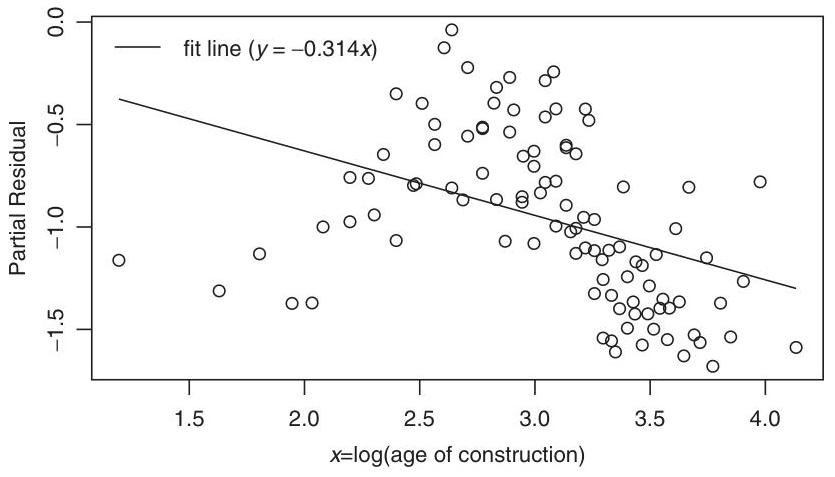

## Page 60
Figure 9. Coefficient Estimates for the Bucketed Age of Construction Variable (left) and a Graphical Representation (right)

Figure 9 shows the results of running age of construction through our model as a categorical variable. For this example, ten bins were created. Interval boundaries were designed such that the bins contain roughly equal number of records, and building ages 1 through 10 was designated as the base level.

As the graphical plot of the coefficients shows, the model picked up a shape similar to that seen in the points of the partial residual plot. Average severity rises for buildings older than ten years, reaching a peak at the 15 -to- 17 year range, then gradually declining.

Binning a continuous variable frees the model from needing to constrain its assumed relationship with the target variable to any particular shape, as each level is allowed to float freely.

There are, however, some drawbacks to this approach.
In a general sense, binning a continuous variable, and therefore giving it a large number of parameters in our model, may violate the goal of parsimony, or keeping the model simple; as a rule, we shouldn't be giving the model more degrees of freedom than is necessary to adequately fit the data. The next paragraphs describe two more specific downsides to binning versus modeling a variable continuously.

Continuity in the Estimates is Not Guaranteed. Allowing each interval to move freely may not always be a good thing. The ordinal property of the levels of the binned variable have no meaning in the GLM; there is no way to force the GLM to have the estimates behave in any continuous fashion, and each estimate is derived independently of the others. Therefore, there is a risk that some estimates will be inconsistent with others due to random noise.

This pitfall is illustrated in the results shown in Figure 9. The building age effect on severity seems to be declining past 17 years. However, the 21-23 year factor is slightly higher than the 18-20 year factor. We have no reason to believe this break in the pattern is real, and it is most likely due to volatility in the data.
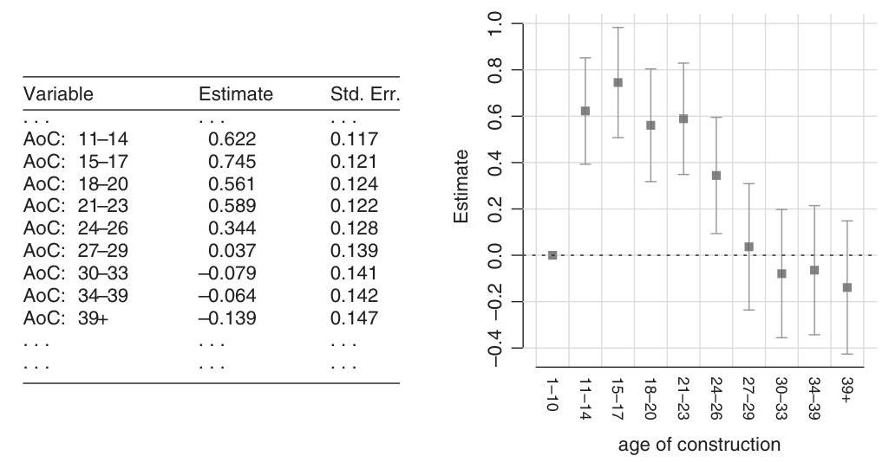

## Page 61
This issue may present an even bigger problem if the predictor variable is replacement cost of the building. The expectation is that, as the replacement cost increases, so does the expected loss cost for the policy. By including replacement cost in the model as a continuous variable (perhaps with some transformation applied), we can better ensure a monotonic relationship between replacement cost and predicted loss cost, which is a desirable outcome. If replacement cost is instead binned, there may be reversals in the variable coefficients due to volatility in the data. For example, buildings with a replacement cost of $\$ 300,000$ may have a lower predicted loss cost than buildings with a $\$ 250,000$ replacement cost, even though this result doesn't make sense.

In our building age example, note that the problem can be remedied somewhat by combining those two levels to a single level representing ages 18 through 23. Alternatively, we can manually smooth out the pattern when selecting factors.

Variation within Intervals is Ignored. Since each bin is assigned a single estimate, the model ignores any variation in severity that may exist within the bins. In our building age example, all buildings with ages between 1 and 10 years are assumed to have the same severity, which may not be the case. Of course, we could refine the interval boundaries to split that bin into two or more smaller ones. Doing so, however, would thin out the data, reducing the credibility of the estimates, thereby making them more susceptible to noise. Modeling building age as a continuous variable with a transformation (as discussed in the next sections) allows each building age to have a unique factor with no loss of credibility.

# 5.4.3. Adding Polynomial Terms 

Another means of accommodating non-linearity in a linear model is to include the square, cube, or higher-order polynomials of the variable in the model in addition to the original variable. In such a model, the original variable and the polynomial terms are all treated as separate predictors, and a separate coefficient is estimated for each. This enables the model to fit curves to the data; the more polynomial terms that are provided, the more flexible the fit that can be achieved.

The left panel of Figure 10 shows the results of adding the square of the logged building age-in addition to log building age itself-to our model. In this example, the model estimated a coefficient of 4.749 for log building age (denoted here as $x$ ) and a coefficient of -0.866 for log building age squared (denoted as $x^{2}$ ). The graph shows the partial residuals with the curve formed by both building age terms superimposed. ${ }^{11}$ Clearly this is a better fit to the data than the straight line shown in Figure 8.

In the right panel of Figure 10, a third term-the log building age cubed-was added. The additional freedom provided by this term allows the model to attenuate the downward slope on the right-hand side of the curve. This perhaps yields a better fit, as the points seem to indicate that the declining severity as building age increases does taper off toward the higher end of the scale.

[^0]
[^0]:    ${ }^{11}$ For this graph (as well as Figure 11) we extended the definition of partial residuals given in Equation 14 to include all terms related to the variable being evaluated (i.e., the $\beta_{i} x_{i j}$ 's for all polynomial terms are added back to the working residual rather than the single $\beta_{i} x_{i j}$ term).

## Page 62
Figure 10. Partial Residual Plot of Age of Construction Variable using Two Polynomial Terms (left) and Three Polynomial Terms (right)

One potential downside to using polynomials is the loss of interpretability. From the coefficients alone it is often very difficult to discern the shape of the curve; to understand the model's indicated relationship of the predictor to the target variable it may be necessary to graph the polynomial function.

Another drawback is that polynomial functions have a tendency to behave erratically at the edges of the data, particularly for higher-order polynomials. For example, Figure 11 shows the partial residual plot that would result if we were to use five polynomial terms in our age of construction example. In this model, the fitted

Figure 11. Partial Residual Plot of Age of Construction Variable using Five Polynomial Terms
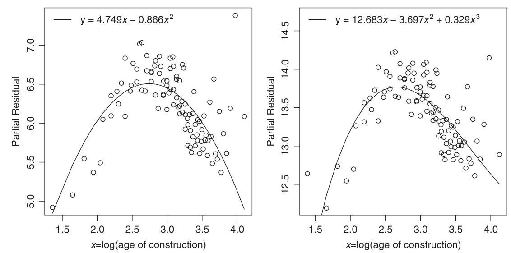
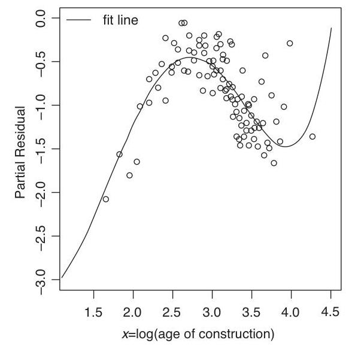

## Page 63
curve veers sharply upward near the upper bound of the data, and would most likely generate unreasonably high predictions for ages of construction higher than typical.

# 5.4.4. Using Piecewise Linear Functions 

A third method for handling non-linear effects is to "break" the line at one or more points over the range of the variable, and allow the slope of the line to change at each break point.

Looking back at the partial residual plot in Figure 8, it is apparent that severity rises and reaches a peak at around age 2.75 (in log terms) and then declines. Thus, while a single straight line does not fit this pattern, a broken line-with a rising slope up to 2.75 and then declining-will likely do the job.

We can insert a break in the line at that point by defining a new variable as $\max (0, \ln (A o C)-2.75)$, and adding it to the model. This new variable, called a hinge function, has a value of 0 for buildings with $\log$ age 2.75 or lower, and rises linearly thereafter, and so it will allow the GLM to capture the change in slope for older buildings versus newer ones.

Running the model with the addition of the hinge function breaking the line at 2.75 yields the partial output shown in Table 6.

For $\log (A o C) 2.75$ and lower, the hinge function variable has a value of zero, and only the basic $\log (A o C)$ function varies; as such, the slope of the $\log$-log response is 1.225. For $\log (A o C)$ above 2.75 , on the other hand, both variables are in play. Thus, to calculate the log-log slope for older buildings, we must add the two coefficients together, yielding a slope of $1.225+(-2.269)=-1.044$. Thus, the $\log -\log$ response is a positive slope for newer buildings and a negative slope for older buildings.

The left panel of Figure 12 shows the partial residual plot of $\log (A o C)$ under this model, with the broken line indicated by the model superimposed. This clearly does a much better job at fitting the points than the straight line of Figure 8.

As the points seem to indicate that the downward slope tapers off at the far right of the graph, we may try to improve the fit further by adding another break at $\log (A o C)=3.6$. The resulting model output is shown in Table 7, and the right panel of Figure 12 graphs the partial residual plot.

The positive coefficient estimated for the second hinge function indicates that the slope of the line to the right of $\log (A o C)=3.6$ is higher than slope to the left of it. As the graphed fit line shows, this has the effect of nearly straightening out the steep

Table 6. Model Output After Adding a Hinge Function for a Break Point at $\log (A o C)=2.75$

| Variable | Estimate | Std. Error | $p$-Value |
| :-- | :--: | :--: | :--: |
| $\ldots$ | $\ldots$ | $\ldots$ | $\ldots$ |
| $\log (A o C)$ | 1.225 | 0.163 | $<0.0001$ |
| $\max (0, \log (A o C)-2.75)$ | -2.269 | 0.201 | $<0.0001$ |
| $\ldots$ | $\ldots$ | $\ldots$ | $\ldots$ |

## Page 64
Figure 12. Partial Residual Plot of Age of Construction Variable using a Break at 2.75 (left) and Breaks at Both 2.75 and 3.6 (right)
downward slope. The $p$-value of 0.0082 indicates that the evidence for a change in slope following the 3.6 point is strong, but not as strong as for a change following the 2.75 point. However, this may simply be due to that estimate being based on a relatively small subset of the data. As this leveling-off effect comports with our intuition, we may decide to keep the third hinge function term in the model.

The use of hinge functions allows one to fit a very wide range of non-linear patterns. Furthermore, the coefficients provided by the model can be easily interpreted as describing the change in slope at the break points; and, as we have seen, the significance statistics (such as $p$-value) indicate the degree of evidence of said change in slope.

One major drawback of this approach is that the break points must be selected by the user. Generally, break points are initially "guesstimated" by visual inspection of the partial residual plot, and they may be further refined by adjusting them to improve some measure of model fit (such as deviance, which is discussed in the next section). However, the GLM provides no mechanism for estimating them automatically. (In Chapter 10 we briefly discuss a useful model called MARS, a variant of the GLM, which, among other things, fits non-linear curves using hinge functions-and does it in an automated fashion with no need for tweaking by the user.)

Table 7. Adding an Additional Break Point at $\log (A o C)=3.6$

| Variable | Estimate | Std. Error | $p$-Value |
| :-- | :--: | :--: | :--: |
| $\ldots$ | $\ldots$ | $\ldots$ | $\ldots$ |
| $\log (A o C)$ | 1.289 | 0.159 | $<0.0001$ |
| $\max (0, \log (A o C)-2.75)$ | -2.472 | 0.217 | $<0.0001$ |
| $\max (0, \log (A o C)-3.60)$ | 1.170 | 0.443 | 0.0082 |
| $\ldots$ | $\ldots$ | $\ldots$ | $\ldots$ |
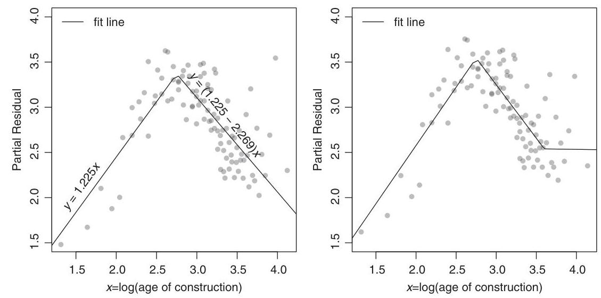

## Page 65
Another potential downside is that while the fitted response curve is continuous, its first derivative is not-in other words, the fit line does not exhibit the "smooth" quality we would expect, but rather abruptly changes direction at our selected breakpoints.

# 5.4.5. Natural Cubic Splines 

A more advanced method for handling non-linear effects-one that combines the concepts of polynomial functions and piecewise functions with breakpoints as discussed in the prior two sections-is the natural cubic spline. This is more mathematically complex than the prior two approaches, and we will not delve into the details here; the interested reader can refer to Hastie, Tibshirani \& Friedman (Section 5.2.1 of 2nd Ed.) or Harrel (Section 2.4.4). We describe here some of its characteristics:

- The first and second derivatives of the fitted curve function are continuous-which in a practical sense means that the curve will appear fully "smooth" with no visible breaks in the pattern.
- The fits at the edges of the data (i.e., before the first selected breakpoint and after the last) are restricted to be linear, which curtails the potential for the kind of erratic edge behavior exhibited by regular polynomial functions.
- The use of breakpoints makes it more suitable than regular polynomial functions for modeling more complex effect responses, such as those with multiple rises and falls.

As with polynomial functions, natural cubic splines do not lend themselves to easy interpretation based on the model coefficients alone, but rather require graphical plotting to understand the modeled effect.

### 5.5. Grouping Categorical Variables

Some categorical predictor variables are binary or can only take on a small number of values. Others, though, can take on a large number of possible values, and for these variables it is generally necessary to group them prior to inclusion in the model. Consider, for example, driver age. If ungrouped, this variable is likely to consume too many degrees of freedom, which can lead to nonsensical results and the inability of the model to converge. In deciding how to group such variables, one strategy is to start with many levels and then begin grouping based on model coefficients and significance. For example, we may start with 30 buckets, then compare the coefficients for neighboring buckets. If one bucket is, say, drivers between the ages of 26 and 27 , and another is drivers between 28 and 29 , and the coefficients for these two levels are similar, we can create a new bucket for drivers between 26 and 29. This is generally an iterative process and requires balancing the competing priorities of predictive power, parsimony, and avoiding overfitting to the data.

### 5.6. Interactions

Thus far, we have focused on optimizing the selection and transformation of variables for our model under the assumption that each variable has an individual effect on the target variable. However, we may also wish to consider the hypothesis that two or more variables may have a combined effect on the target over and above their

## Page 66
individual effects. Stated differently, the effect of one predictor may depend on the level of another predictor, and vice-versa. Such a relationship is called an interaction.

An example of an interaction is illustrated in Figure 13. In this example we have two categorical variables: variable 1 has two levels, A and B , with A being the base level; variable 2 has levels $X$ (the base) and $Y$.

The table in the left panel shows the mean response for each combination of levels with no interaction. For variable 1, the multiplicative factor for level B (relative to base level A) is 2.0 , regardless of the level of variable 2 . Similarly, the variable 2 relativity of level Y is 1.5 , regardless of the level of variable 1 . Simple enough.

The right panel shows an example of where an interaction is present. Where variable 2 is X , the relativity for level B is 2.0 , as before; however, where variable 2 is Y , the level B relativity is 2.2 . Or, we can state this effect in terms of variable 2 : the relativity for level Y is either 1.50 or 1.65 , depending on the level of variable 1 .

Another way of describing the situation in the right panel of Figure 13 is as follows: for each of the two variables, there are main effects, where the relativity of level B is 2.0 and the relativity of level Y is 1.5 ; plus, there is an additional interaction effect of being both of level Y and level B-with a multiplicative factor of 1.1. This is the setup typically used in GLMs, and it allows us to use the GLM significance statistics to test the interaction effects distinctly from the main effects in order to determine whether the inclusion of an interaction significantly improves the model.

The above example illustrates the interaction of two categorical variables. It is also possible to interact two continuous variables, or a continuous variable with a categorical variable. In the following sections, we further explore the categorical/categorical interaction in a GLM, as well as the other two interaction types.

# 5.6.1. Interacting Two Categorical Variables 

We present here a more concrete example to illustrate the handling of a categorical/ categorical interaction in a GLM.

Suppose, for a commercial building claims frequency model, which uses a Poisson distribution and a log link, we include two categorical predictors: occupancy class, coded 1 through 4 , with 1 being the base class; and sprinklered status, which can be either "no" or "yes," the latter indicating the presence of a sprinkler system in the building, with no sprinkler being the base case.

Figure 13. An Example of a Mean Response for Each Level of Two Categorical Variables Without an Interaction (left panel) and With an Interaction (right panel)

| Without Interaction |  |  |  | With Interaction |  |  |  |
| :--: | :--: | :--: | :--: | :--: | :--: | :--: | :--: |
|  | Variable 1 |  |  |  | Variable 1 |  |  |
|  | A | B |  |  | A | B |  |
| Variable 2 | X | 10 | 20 | Variable 2 | X | 10 | 20 |
|  | Y | 15 | 30 |  | Y | 15 | 33 |

## Page 67
Table 8. Model with the Main Effects of Occupancy Class and Sprinklered Status

|  | Estimate | Std. Error | $p$-Value |
| :-- | --: | :--: | --: |
| (Intercept) | -10.8679 | 0.0184 | $<0.0001$ |
| occupancy:2 | 0.2117 | 0.0264 | $<0.0001$ |
| occupancy:3 | 0.4581 | 0.0262 | $<0.0001$ |
| occupancy:4 | 0.0910 | 0.0245 | 0.0005 |
| sprinklered:Yes | -0.3046 | 0.0372 | $<0.0001$ |

Running the model with the main effects only yields the output shown in Table 8. The coefficient of -0.3046 indicated for "sprinklered:yes" indicates a sprinklered discount of $26.3 \%$ (as $e^{-0.3046}-1=-0.263$ ).

We then wish to test whether the sprinklered discount should vary by occupancy class. To do this, we add the interaction of those two variables in the model, in addition to the main effects. Behind the scenes, the model fitting software adds additional columns to the design matrix: a column for each combination of non-base levels for the two variables. Each of those columns is valued 1 where a risk has that combination of levels, and is 0 otherwise. These new columns are treated as distinct predictors in Equation 2, and so the coefficient estimated for each of those new predictors will indicate the added effect-above the main effects-of a risk having that combination of levels. In our example, this results in three additional predictors being added to our model: the combination of "sprinklered:yes" with each of occupancies 2, 3, and 4.

Running this model results in the output shown in Table 9. In this context, the coefficient of -0.2895 for the main effect "sprinklered:yes" indicates a discount of $25.1 \%$ for occupancy class 1. The three interaction effects yield the effect of having a sprinkler for the remaining three occupancy groups relative to the sprinklered effect for group 1 .

Table 9. The Model with the Addition of the Interaction Term

|  | Estimate | Std. Error | $p$-Value |
| :-- | --: | :--: | :--: |
| (Intercept) | -10.8690 | 0.0189 | $<0.0001$ |
| occupancy:2 | 0.2303 | 0.0253 | $<0.0001$ |
| occupancy:3 | 0.4588 | 0.0271 | $<0.0001$ |
| occupancy:4 | 0.0701 | 0.0273 | 0.0102 |
| sprinklered:Yes | -0.2895 | 0.0729 | 0.0001 |
| occupancy:2, sprinklered:Yes | -0.2847 | 0.1014 | 0.0050 |
| occupancy:3, sprinklered:Yes | -0.0244 | 0.1255 | 0.8455 |
| occupancy:4, sprinklered:Yes | 0.2622 | 0.0981 | 0.0076 |

## Page 68
Looking at the row for the first interaction term, the negative coefficient indicates that occupancy class 2 should receive a steeper sprinklered discount than class 1 ; specifically, its indicated sprinklered factor is $e^{-0.2895-0.2847}=0.563$, or a $43.7 \%$ discount. The low $p$-value of 0.005 associated with that estimate indicates that the sprinklered factor for this class is indeed significantly different from that of class 1.

The interaction of occupancy class 3 with sprinklered shows a negative coefficient as well. However, it has a high $p$-value, indicating that the difference in sprinklered factors is not significant. Based on this, we may wish to simplify our model by combining class 3 with the base class for the purpose of this interaction.

The interaction term for occupancy class 4 has a significant positive coefficient of nearly equal magnitude to the negative coefficient of the main sprinklered effect. This result suggests that perhaps occupancy class 4 should not receive a sprinklered discount at all.

# 5.6.2. Interacting a Categorical Variable with a Continuous Variable 

We extend the above example to add a continuous variable-amount of insurance (AOI) — to our frequency model. Following the practice discussed in Section 2.4.1, we will $\log$ AOI prior to inclusion in the model.

The main-effects model yields the estimates shown in Table 10. This model indicates a sprinklered factor of $e^{-0.7167}=0.488$. The coefficient for $\log (\mathrm{AOI})$ indicates that the $\log$ of the mean frequency increases 0.416 for each unit increase in $\log (\mathrm{AOI})$ —or, equivalently, the frequency response to AOI (in real terms) is proportional to the power curve $A O I^{0.4161}$.

We now wish to test whether the AOI curve should be different for sprinklered versus non-sprinklered properties. To do so, we specify that we would like to add the interaction of sprinklered and $\log (\mathrm{AOI})$ to our model. The GLM fitting software adds a column to our design matrix that is the product of the indicator column for "sprinklered:Yes" and $\log (\mathrm{AOI})$. Thus, the resulting new predictor is 0 where sprinklered $=$ No, and the $\log$ of AOI otherwise.

Running this GLM yields the output shown in Table 11. For this model, the coefficient for the $\log (\mathrm{AOI})$ main effect yields the AOI curve for risks of the base class

Table 10. A Model with Occupancy Class, Sprinklered Status and AOI as Main Effects

|  | Estimate | Std. Error | $p$-Value |
| :-- | --: | :--: | :--: |
| (Intercept) | -8.8431 | 0.1010 | $<0.0001$ |
| occupancy:2 | 0.2909 | 0.0248 | $<0.0001$ |
| occupancy:3 | 0.3521 | 0.0267 | $<0.0001$ |
| occupancy:4 | 0.0397 | 0.0266 | 0.1353 |
| sprinklered:Yes | -0.7167 | 0.0386 | $<0.0001$ |
| $\log (\mathrm{AOI})$ | 0.4161 | 0.0075 | $<0.0001$ |

## Page 69
Table 11. Adding the Interaction of AOI and Sprinklered Status

|  | Estimate | Std. Error | $p$-Value |
| :-- | --: | :--: | --: |
| (Intercept) | -8.9456 | 0.1044 | $<0.0001$ |
| occupancy:2 | 0.2919 | 0.0247 | $<0.0001$ |
| occupancy:3 | 0.3510 | 0.0266 | $<0.0001$ |
| occupancy:4 | 0.0370 | 0.0265 | 0.1622 |
| sprinklered:Yes | 0.7447 | 0.3850 | 0.0531 |
| $\log (\mathrm{AOI})$ | 0.4239 | 0.0078 | $<0.0001$ |
| sprinklered:Yes, $\log (\mathrm{AOI})$ | -0.1032 | 0.0272 | 0.0001 |

of "sprinklered" (that is, risks for which sprinklered = "No"). The model also estimates a coefficient of -0.1032 for the interaction term, which indicates that the rise of frequency in response to AOI is less steep for sprinklered properties than for non-sprinklered properties. The $p$-value indicates that this difference in curves is significant.

The positive coefficient estimated for "sprinklered:Yes" in this model may be a bit startling at first. Does this mean that a premium should now be charged for having a sprinkler?

Not quite. In interpreting the meaning of this, it is important to recognize that the model includes another variable that is non-zero for sprinklered properties-the interaction term, which captures the difference in the AOI slope between sprinklered and non-sprinklered risks. Thus, the main sprinklered effect may be thought of as an adjustment of the intercept of the AOI curve, or the indicated sprinklered relativity where $\log (\mathrm{AOI})=0$.

Of course, where $\log (\mathrm{AOI})$ is zero, AOI is $\$ 1$-a highly unlikely value for AOI. The left panel of Figure 14 shows a graphical interpretation of this model's indicated effects of AOI and sprinklered status. The $x$-axis is the $\log$ of AOI, and $y$-axis shows the ( $\log$ ) indicated relativity to the hypothetical case of a non-sprinklered property with an AOI of $\$ 1$. The two lines show the effect of AOI on log mean frequency: the slope of the "sprinklered" line is less steep than that of "non-sprinklered," due to the negative coefficient of the interaction term.

The vertical gray stripe at the bottom left highlights what the main sprinklered effect coefficient refers to: it raises the sprinklered AOI curve at $\log (\mathrm{AOI})=0$. However, as the AOI histogram overlaid on the graph shows, $\log (\mathrm{AOI})=0$ is way out of the range of the data, and so this "sprinklered surcharge" is just a theoretical construct, and no actual policy is likely to be charged such a premium.

An alternate way of specifying this model—one that leads to better interpretationis to divide the AOI by the base AOI prior to logging and including it in the model. Supposing our chosen base AOI (which would receive a relativity of 1.00 in our rating plan) is $\$ 200,000$, we use $\log (\mathrm{AOI} / 200,000)$ as the predictor in our model. The resulting estimates are shown in Table 12.

## Page 70
Figure 14. Illustration of the Effect of the Interaction of Sprinklered and Amount of Insurance (left panel) and the Same Model After Dividing AOI by Its Base Amount (right panel)

This model is equivalent to the prior model; that is, they will both produce the same predictions. The sprinklered coefficient (now negative) still refers to the specific case where the value of the AOI predictor is zero-however, with the AOI predictor in this form it has a more natural interpretation: it is the (log) sprinklered relativity for a risk with the base AOI.

The right panel of Figure 13 illustrates the output of this model. (The $x$-axis in that panel spans only the values actually present in the data.) The gray stripe at center shows the main effect for sprinklered status, which is to lower the mean response at $x=0$ (the base AOI) by 0.5153 for sprinklered risks.

Note that in all this discussion, we described this interaction as "the slope of the AOI curve varying based on the sprinklered status." Of course, it is just as valid to characterize it as "the sprinklered discount varying based on AOI." Which way it is presented in the rating plan is a matter of preference.

Table 12. The Model of Table 11 with log AOI Centered at the Base AOI

|  | Estimate | Std. Error | $p$-Value |
| :-- | --: | :--: | :--: |
| (Intercept) | -3.7710 | 0.0201 | $<0.0001$ |
| occupancy:2 | 0.2919 | 0.0247 | $<0.0001$ |
| occupancy:3 | 0.3510 | 0.0266 | $<0.0001$ |
| occupancy:4 | 0.0370 | 0.0265 | 0.1622 |
| sprinklered:Yes | -0.5153 | 0.0635 | $<0.0001$ |
| $\log (\mathrm{AOI} / 200000)$ | 0.4239 | 0.0078 | $<0.0001$ |
| sprinklered:Yes, $\log (\mathrm{AOI} / 200000)$ | -0.1032 | 0.0272 | 0.0001 |

## Page 71
As an aside, note that this last model form, with AOI centered at the base AOI, has an additional benefit: the intercept term (after exponentiating) yields the indicated frequency at the base case (i.e., when all variables are at their base levels). In general, for a GLM to have this property, all continuous variables need to be divided by their base values prior to being logged and included in the model.

# 5.6.3. Interacting Two Continuous Variables 

To understand the third type of interaction-a continuous variable with another continuous variable-it is useful to visualize the combined effects of the variables on the log mean response as perspective plots, with the two variables shown along the $x$ - and $y$-axes, and the relative $\log$ mean shown along the $z$-axis.

The left panel of Figure 15 graphs a scenario where two variables, $x_{1}$ and $x_{2}$, are included in a model as main effects only, and the GLM indicates coefficients for them of 0.02 and 0.04 , respectively. The response curve slopes for those two variables can be seen by following the front edge of the plane along the $x$ - and $y$-axes; clearly, $x_{2}$ has a steeper slope than $x_{1}$, which is due to its coefficient being larger. However, for any given value of $x_{2}$, the $x_{1}$ curve, while in a different position vertically, has the same slope, and vice versa. As such, the effect of the two variables are independent of each other.

If we believe the slope for each variable should depend on the value of the other variable, we may include an interaction term. This term takes the form of the product of the two predictors. The right panel illustrates the case where the main effect coefficients are the same as before, but an added interaction term has a coefficient of 0.005 . The slope of $x_{1}$ where $x_{2}=0$ (the front edge of the plane) is the same as in the left panel graph. However, moving inward, as $x_{2}$ increases, we see the slope of $x_{1}$ becomes more steep. Similarly, the slope of $x_{2}$ steepens as $x_{1}$ increases.

As with the earlier interaction types, the $p$-value estimated for the interaction term guides us in our determination of whether this effect is significant, or whether the variables should be left independent.

Figure 15. Perspective Plots of the Log Mean Response to Two Continuous Variables, both Without (left) and With (right) an Interaction Term
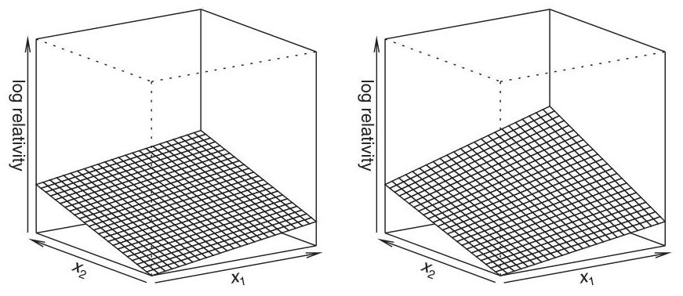

## Page 72
# 6. Model Refinement 

### 6.1. Some Measures of Model Fit

GLM software provides a number of statistical measures of how well the model fits the training data, which are useful when comparing candidates for model specifications and assessing the predictive power of individual variables. The most important such measures are log-likelihood and deviance.

### 6.1.1. Log-Likelihood

For any given set of coefficients, a GLM implies a probabilistic mean for each record. That, along with the dispersion parameter and chosen distributional form, implies a full probability distribution. It is therefore possible to calculate, for any record, the probability (or probability density) that the GLM would assign to the actual outcome that has indeed occurred. Multiplying those values across all records produces the probability of all the historical outcomes occurring; this value is called the likelihood.

A GLM is fit by finding the set of parameters for which the likelihood is the highest. This is intuitive; absent other information, the best model is the one that assigns the highest probability to the historical outcomes. Since likelihood is usually an extremely small number, the log of likelihood, or log-likelihood, is usually used instead to make working with it more manageable.

Log-likelihood by itself can be difficult to interpret. It is therefore useful to relate the log-likelihood to its hypothetical upper and lower bounds achievable with the given data.

At the low end of the scale is the log-likelihood of the null model, or a hypothetical model with no predictors-only an intercept. Such a model would produce the same prediction for every record: the grand mean.

At the other extreme lies the saturated model, or a hypothetical model with an equal number of predictors as there are records in the dataset. For such a model, Equation 2 becomes a system of equations with $n$ equations and $n$ unknowns, and therefore a perfect solution is possible. This model would therefore perfectly "predict" every historical outcome. It would also be, most likely, useless; overfit to the extreme, it is essentially nothing more than a complicated way of restating the historical data. However, since predicting each record perfectly is the theoretical best a model can possibly do, it provides a useful upper bound to log-likelihood for this data.

## Page 73
While the null model yields the lowest possible log-likelihood, the saturated model yields the highest; the log-likelihood of your model will lie somewhere in between. This naturally leads to another useful measure of model fit: deviance.

# 6.1.2. Deviance 

Scaled deviance for a GLM is defined as follows:

$$
\text { scaled deviance }=2 \times\left(l_{\text {saturated }}-l l_{\text {model }}\right)
$$

where $l_{\text {saturated }}$ is the log-likelihood of the saturated model, and $l_{\text {model }}$ is the log-likelihood of the model being evaluated. This may be more formally stated as follows (with scaled deviance denoted as $D^{*}$ ):

$$
D^{*}=2 \times \sum_{i=1}^{n} \ln f\left(y_{i} \mid \mu_{i}=y_{i}\right)-\ln f\left(y_{i} \mid \mu_{i}=\mu_{i}\right)
$$

The first term after the summation sign is the log of the probability of outcome $y_{i}$ given that the model's predicted mean is $y_{i}$-the mean that would be predicted by the saturated model. The second term is the log probability assigned to the outcome $y_{i}$ by the actual model. The difference between those two values can be thought of as the magnitude by which the model missed the "perfect" log-likelihood for that record. Summing across all records and multiplying the result by 2 yields the scaled deviance.

Multiplying the scaled deviance by the estimated dispersion parameter $\phi$ yields the unscaled deviance. ${ }^{12}$ The unscaled deviance has the additional property of being independent of the dispersion parameter and thereby being useful for comparing models with different estimates of dispersion.

However, irrespective of the type of deviance measure (i.e., scaled or unscaled), note that the fitted GLM coefficients are those that minimize deviance. Recall that the previous section stated that the GLM is fit by maximizing log-likelihood, and in fact those two statements are equivalent: maximizing log-likelihood is also minimizing deviance. It is easy to see that by examining Equation 15 above. The first term inside the parentheses, $l_{\text {saturated }}$, is constant with respect to the model coefficients, as it is purely a function of the data and the selected distribution. Since the log-likelihood of our model is subtracted from it, the coefficients yielding the maximum log-likelihood also yield the minimum deviance.

The deviance for the saturated model is zero, while the deviance for the null model can be thought of as the total deviance inherent in the data. The deviance for your model will lie between those two extremes.

[^0]
[^0]:    ${ }^{12}$ See Anderson, et al. $\$ 1.154-1.158$ for a more formal and generalized definition of the unscaled deviance. Further note that there is some discrepancy in terminology among various GLM texts, as some (e.g., Dobson \& Barnett [2008]) use the term "deviance" to refer to the measure presented here as "scaled deviance," and use "scaled deviance" to refer to that measure multiplied by the estimated dispersion parameter (i.e., the "unscaled deviance" in this text). We have followed the terminology used in Anderson et al [2007] and McCullaugh and Nelder [1989].

## Page 74
# 6.1.3. Limitations on the Use of Log-Likelihood and Deviance 

The next section discusses some statistical tests that can be used to compare the fits of different models using these measures. However, at the outset, it is important to note the following caveats:

Firstly, when comparing two models using log-likelihood or deviance, the comparison is valid only if the datasets used to fit the two models are exactly identical. To see why, recall that the total log-likelihood is calculated by summing the log-likelihoods of the individual records across the data; if the data used for one model has a different number of records than the other, the total will be different in a way that has nothing to do with model fit.

This, by the way, is something to look out for when adding variables to an existing model and then comparing the resulting model with the original. If the new variable has missing values for some records, the default behavior of most model fitting software is to toss out those records when fitting the model. In that case, the resulting measures of fit are no longer comparable, since the second model was fit with fewer records than the first.

For any comparisons of models that use deviance, in addition to the caveat above, it is also necessary that the assumed distribution must be identical as well. This restriction arises from deviance being based on the amount by which log-likelihood deviates from the "perfect" log-likelihood; changing any assumptions other than the coefficients would alter the value of the "perfect" log-likelihood as well the model log-likelihood, muddying the comparison.

### 6.2. Comparing Candidate Models

As described above, the process of building and refining a GLM is one that takes place over many iterations; frequent decisions need to be made along the way, such as: which predictors to include; the appropriate transformations, if any, to be applied to continuous variables; and the groupings of levels for categorical variables. This section presents several statistical tests, based on the measures of model fit just discussed, that can be used to compare successive model runs and guide our decision making.

### 6.2.1. Nested Models and the F-Test

Where a model uses a subset of the predictors of a larger model, the smaller model is said to be a nested model of the larger one. Comparisons of nested models frequently occur when considering whether to add or subtract predictors. We may have one model that includes the extra predictors being considered, and one that does not but includes all the other variables. We then wish to compare the model statistics to answer the question: is the larger model, with the added variables, better than the smaller one? In other words, do the added predictors enhance the predictive power of the model?

We can do that by comparing the deviance (subject to the caveats noted above). However, in doing so we must consider a basic fact: adding predictors to a model always reduces deviance, whether the predictor has any relation to the target variable

## Page 75
or not. This is because more predictors-which means more parameters available to fit-gives the model fitting process more freedom to fit the data, and so it will fit the data better. At the extreme end of that is the saturated model, where the model fitting process has enough freedom to produce a perfect fit—even if the predictors are purely random and have no predictive power at all; with $n$ unknowns and $n$ equations, a perfect fit is always mathematically possible.

Therefore the meaningful question when comparing deviances is: did the added predictors reduce the deviance significantly more than we would expect them to if they are not predictive? One way to answer that is through the $\boldsymbol{F}$-test, wherein the $\boldsymbol{F}$-statistic is calculated and compared against the $\boldsymbol{F}$ distribution.

The formula for the $F$-statistic is

$$
F=\frac{D_{S}-D_{B}}{(\# \text { of added parameters }) \times \hat{\phi}_{B}}
$$

In Equation 17, the symbol "D" refers to the unscaled deviance, and the subscripts " $S$ " and " $B$ " refer to the "small" and "big" models, respectively. The numerator is the difference in the unscaled deviance between the two models-that is, the amount by which the unscaled deviance was reduced by the inclusion of the additional parameters. As described above, this value is positive, since deviance always goes down.

The $\hat{\phi}_{B}$ in the denominator is the estimate of the dispersion parameter for the big model. As it happens, this is also a good estimate of the amount by which we can expect unscaled deviance to go down for each new parameter added to the modelsimply by pure chance-if the parameter adds no predictive power. Multiplying this value by the number of added parameters gives us the total expected drop in deviance. For the added predictors to "carry their weight," they must reduce deviance by significantly more than this amount. (If some of the added predictors are categorical, note that a categorical variable with $m$ levels adds $m-1$ parameters-one for each level other than the base level.)

Thus, the ratio in Equation 17 has an expected value of 1 . If it is significantly greater than 1 , we may conclude that the added variables do indeed improve the model.

How much greater than 1 is significant? Statistical theory says that the $F$-statistic follows an $F$ distribution, with a numerator degrees of freedom equal to the number of added parameters and a denominator degrees of freedom equal to $n-p_{B}$, or the number of records minus the number of parameters in the big model. If the percentile of the $F$-statistic on the $F$ distribution is sufficiently high, we may conclude that the added parameters are indeed significant.

As an example, suppose the auto GLM we built on 972 rows of data with 6 parameters yields an unscaled deviance of 365.8 and an estimated dispersion parameter of 1.42 . We wish to test the significance of an additional potential predictor: rating territory, a categorical variable with 5 levels.

We run the GLM with the inclusion of rating territory, thereby adding $5-1=4$ parameters to the model. Suppose the unscaled deviance of the resulting model is 352.1 , and its estimated dispersion parameter is 1.42 .

## Page 76
Using this information and Equation 17, we calculate the $F$-statistic.

$$
\frac{365.8-352.1}{4 \times 1.42}=2.412
$$

To assess the significance of this value, we compare it against an $F$ distribution with 4 numerator degrees of freedom and $972-10=962$ denominator degrees of freedom. An $F$ distribution with those parameters has 2.412 at its 95.2 percentile, indicating a $4.8 \%$ probability of a drop in deviance of this magnitude arising by pure chance. As such, rating territory is found to be significant at the $95 \%$ significance level.

# 6.2.2. Penalized Measures of Fit 

The $F$-test of the prior section is only applicable to nested models. Frequently, though we would want to compare non-nested models-that is, models having different variables, where one does not contain a subset of the variables of the other. As described above, deviance alone can not be used, since adding parameters always reduces deviance, and so selecting on the basis of lowest deviance gives an unfair advantage to the model with more parameters, which can lead to over-fitting.

A practical way to avoid the problem of over-fitting is to use a penalized measure of fit. While deviance is strictly a measure of model goodness of fit on the training data, a penalized measure of fit also incorporates information about the model's complexity, and so becomes a measure of model quality. Using one of these measures, one can compare two models that have different numbers of parameters. The two most commonly used measures of deviance are AIC and BIC.

AIC, or the Akaike Information Criterion, is defined as follows:

$$
A I C=-2 \times \log \text {-likelihood }+2 p
$$

where $p$ is the number of parameters in the model. As with deviance, a smaller AIC suggests a "better" model. The first term in the above equation declines as model fit on the training data improves; the second term, called the penalty term, serves to increase the AIC as a "penalty" for each added parameter. (The rationale for using twice the number of parameters as the penalty is grounded in information theory and out of the scope of this monograph.) Using this criterion, models that produce low measures of deviance but high AICs can be discarded.

Note that the first additive term of equation 18 is the same as the formula for scaled deviance in Equation 15 but without the $l_{s a t t o n t e d}$ term, which is constant with respect to the model predictions. As such, the AIC can also be thought of as a penalized measure of deviance, when using it to compare two models. (AIC has little meaning outside of the context of a comparison anyway.) As a matter of fact, some statistical packages occasionally take advantage of this equivalence and substitute deviance for $-2 \times \log$-likelihood where it would simplify the calculation.

## Page 77
BIC, or the Bayesian Information Criterion, is defined as $-2 \times \log$-likelihood + $p \log (n)$, where $p$ is once again the number of parameters, and $n$ is the number of data points that the model is fit on. As most insurance models are fit on very large datasets, the penalty for additional parameters imposed by BIC tends to be much larger than the penalty for additional parameters imposed by AIC.

Most statistical packages can produce either of these measures. In practical terms, the authors have found that AIC tends to produce more reasonable results. Relying too heavily on BIC may result in the exclusion of predictive variables from your model.

# 6.3. Residual Analysis 

One useful and important means of assessing how well the specified model fits the data is by visual inspection of the residuals, or measures of the deviations of the individual data points from their predicted values. For any given record, we can think of the residual as measuring the magnitude by which the model prediction "missed" the actual value. In our GLM, this is assumed to be the manifestation of the random component of the model-that is, the portion of the outcome driven by factors other than the predictors, which our model describes using Equation 1 and our assumed distribution. Therefore, it is natural to inspect these values to determine how well our model actually does at capturing this randomness.

The simplest kind of residual is the raw residual which is just the difference between actual and expected, or $y_{i}-\mu_{i}$. For GLMs, however, two measures of deviation of actual from predicted that are much more useful are the deviance residual and the working residual. These measures have many useful properties for assessing model fit, and are discussed in the following sections.

### 6.3.1. Deviance Residuals

The square of the deviance residual for any given record is defined as that record's contribution to the unscaled deviance. The deviance residual takes the same sign as actual minus predicted. Look back at Equation 16 (on page 63); the deviance residual for any record $i$ is the square root of: twice the term to the right of the summation sign multiplied by the scale parameter. We use the negative square root where actual $\left(y_{i}\right)$ is less than expected $\left(\mu_{i}\right)$, and the positive square root where $y_{i}>\mu_{i}$.

Intuitively, we can think of the deviance residual as the residual "adjusted for" the shape of the assumed GLM distribution, such that its distribution will be approximately normal if the assumed GLM distribution is correct.

In a well-fit model, we expect deviance residuals to have the following properties:

- They follow no predictable pattern. Remember, the residuals are meant to be the random, or unpredictable, part of the data. If we discover any way the residuals can be predicted, then we are leaving some predictive power on the table and we can probably improve our model to pick it up.
- They are normally distributed, with constant variance. The raw residuals are certainly not expected to follow a normal distribution (assuming we selected a distribution other than normal); furthermore, the variance of the raw residual of any

## Page 78
record would be dependent on its predicted mean, due to the variance property of Equation 3. However, as the deviance residuals have been adjusted for the shape of the underlying distribution, they are expected to be normal and with constant variance. (The latter property is called homoscedasticity.) Any significant deviations from normality or homoscedasticity may indicate that the selected distribution is incorrect.

Figure 16 shows examples of two ways we might assess the normality of deviance residuals for a model of claim severity built using the gamma distribution. The left panel shows a histogram of the deviance residuals, with the best normal curve fit super-imposed. If the random component of the outcome indeed follows a gamma distribution, we would expect the histogram and the normal curve to be closely aligned. In this case, however, the histogram appears right-skewed relative to the normal curve, which suggests that the data exhibits greater skewness than what would be captured by a gamma distribution.

Another means of comparing the deviance residual distribution to normal is the $q-q$ plot, shown on the right panel of Figure 16. In this plot, the theoretical normal quantile for each point is plotted on the $x$-axis, and the empirical (sample) quantile of the deviance residual is plotted on the $y$-axis. If the deviance residuals are indeed normal, the points should follow a straight line; a line passing through the 25 and 75 theoretical quantiles is shown for reference. We observe that at the edges of the distribution, the points lie above the line; in particular the right-most points deviate significantly upward, which means that there are many more high-valued deviance residuals than would be expected under a normal distribution. This indicates that the distribution of deviance residuals is more skewed than normal-and by extension, the data is more skewed than gamma-confirming what we observed in the histogram.

Based on these results, we may suppose that an inverse Gaussian distribution, which assumes greater skewness, may be more appropriate for this data than the gamma distribution. Figure 17 shows the diagnostic plots for the same model but with the

Figure 16. Graphical Comparisons of Deviance Residuals of a Gamma Model with the Normal Distribution
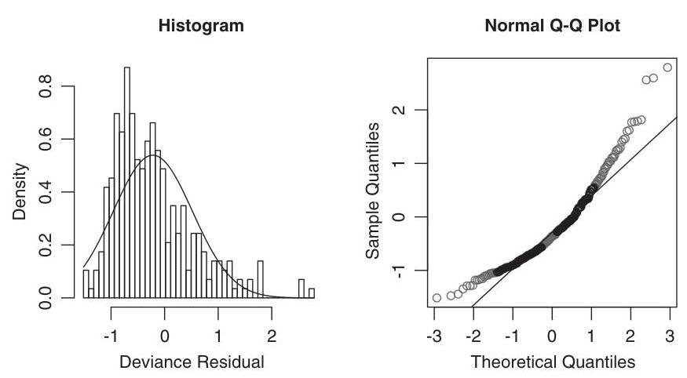

## Page 79
Figure 17. Graphical Comparisons of Deviance Residuals of the Inverse Gaussian Model with the Normal Distribution
assumption of inverse Gaussian as the underlying distribution. For this model, the histogram more closely matches the normal curve and the $q-q$ plot better approximates the straight line, confirming that this model is indeed a better fit.

Discrete Distributions. For discrete distributions (such as Poisson or negative binomial) or distributions that otherwise have a point mass (such as Tweedie, which has a point mass at zero), the deviance residuals will likely not follow a normal distribution. This is because while the deviance residuals factor in the shape of the distribution, they do not adjust for the discreteness; the large numbers of records having the same target values cause the residuals to be clustered together in tight groups. This makes deviance residuals less useful for assessing the appropriateness of such distributions.

One possible solution is to use randomized quantile residuals, which have similar properties as deviance residuals, but add random jitter to the discrete points so that they wind up more smoothly spread over the distribution. Randomized quantile residuals are described in detail in Dunn and Smyth (1996). ${ }^{13}$ Another possible solution is to use binned working residuals, as described in the next section.

Where discretely-distributed data is highly aggregated, such as for claims data where a single record may represent the average frequency for a large number of risks, the target variable will take on a larger number of distinct values, effectively "smoothing out" the resulting distribution. This causes the distribution to lose much of its discrete property and approach a continuous distribution, thereby making deviance residuals more useful for such data.

[^0]
[^0]:    ${ }^{13}$ In R, randomized quantile residuals are available via the qresiduals() function of the "statmod" package. Note, however, that for the Poisson distribution, randomized quantile residuals can only be calculated for the "true" Poisson distribution (with $\phi=1$ ) but not the overdispersed Poisson; this diminishes their usefulness for most insurance data where "true" Poisson is unlikely to yield a good fit.
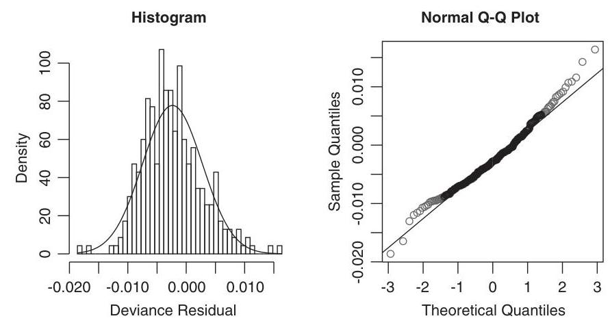

## Page 80
# 6.3.2. Working Residuals 

Another useful type of residual is called the working residual. Most implementations of GLM fit the model using the Iteratively Reweighted Least Squares (IRLS) algorithm, the details of which are beyond the scope of this monograph. Working residuals are quantities that are used by the IRLS algorithm during the fitting process. Careful analysis of the working residuals is an additional tool that can be used to assess the quality of model fit.

Working residuals are defined as follows:

$$
w r_{i}=\left(y_{i}-\mu_{i}\right) \cdot g^{\prime}\left(\mu_{i}\right)
$$

For a log link model, this simplifies to:

$$
w r_{i}=\frac{y_{i}-\mu_{i}}{\mu_{i}}
$$

For a logistic model, the working residual formula simplifies to:

$$
w r_{i}=\frac{y_{i}-\mu_{i}}{\mu_{i} \cdot\left(1-\mu_{i}\right)}
$$

The main advantage of working residuals is that they solve a key problem that arises when visually inspecting the residuals via graphical methods, such a scatterplot. Such graphical plots are a highly useful means of detecting misspecifications or other shortcomings of a model. As noted above in the discussion of deviance residuals, any predictable pattern observed in the residuals indicates that the model could (and should) be improved, and a graphical analysis is an effective means of looking out for such patterns. However, most insurance models have thousands or even millions of observations, and the quantity being modeled is usually highly skewed. It can be difficult to identify predictable patterns in the dense clouds of skewed individual residuals, even for models with gross errors in specification.

Therefore, for such models, it is critical to bin the residuals before analyzing them. That is, we group the residuals by similar values of the $x$-axis of our intended plot, and aggregate (by averaging) both the $x$-axis values and the residuals prior to plotting. Binning the residuals aggregates away the volume and skewness of individual residuals, and allows us to focus on the signal. The advantage of working residuals is that they can be aggregated in a way that preserves the common properties of residuals - that is, they are unbiased (i.e., have no predictable pattern in the mean) and homoscedastic (i.e., have no pattern in the variance) for a well-fit model. ${ }^{14}$

[^0]
[^0]:    ${ }^{14}$ See the Appendix for the mathematical derivation of these properties.

## Page 81
To accomplish this, the working residuals are aggregated into bins, where each bin has a (roughly) equal sum of working weights. Working weights are defined as: ${ }^{15}$

$$
w w_{i}=\frac{\omega_{i}}{V\left(\mu_{i}\right) \cdot\left[g^{\prime}\left(\mu_{i}\right)\right]^{2}}
$$

For each bin, the binned working residual is calculated by taking the weighted average of the working residuals of the individual observations within the bin, weighted by the working weights. Mathematically, for bin $b$, binned residual $b r_{b}$ is defined as:

$$
b r_{b}=\frac{\sum_{i \in b} w r_{i} \cdot w w_{i}}{\sum_{i \in b} w w_{i}}
$$

If, in the course of graphically analyzing the working residuals over the different dimensions of the data, we are able to find a way to sort the working residuals into bins such that binned residuals appear to be predictably biased or "fanning out", then we have identified a shortcoming in the model specification. The following are several examples of binned working residual scatterplots that may be useful in revealing flaws in the model.

Plotting Residuals over the Linear Predictor. Plotting the residuals over the value of the linear predictor may reveal "miscalibrations" in the model-that is, areas of the prediction space where the model may be systematically under- or over-predicting. Figure 18 shows examples of such plots for two example models.

Both plots use binned working residuals; the underlying models have thousands of observations, but we have binned the working residuals into 100 bins prior to plotting. Thus, for example, the left-most point of each plot represents those observations with the lowest $1 \%$ of linear predictor values, and the $x$-axis and $y$-axis values for that point are the average linear predictor and average working residual for those observations, both averages weighted by the working weights as described above.

The left-hand plot of Figure 18 reveals no structural flaws in the model. The plot points form an uninformative cloud with no apparent pattern, as they should for a well-fit model.

The right-hand plot, on the other hand, shows signs of trouble. The residuals in the left region tend to be below the zero line, indicating that the model predictions for those

[^0]
[^0]:    ${ }^{15}$ The following table shows the simplification of this formula for several common model forms:

    | Distribution | Link function | Working Weights |
    | :-- | :-- | :-- |
    | Poisson | Log | $\omega_{i} \cdot \mu_{i}$ |
    | Gamma | Log | $\omega_{i}$ |
    | Tweedie | Log | $\left(\omega_{i} \cdot \mu_{i}^{1-\mu}\right.$ |
    | Binomial | Logit | $\left(\omega_{i} \cdot \mu_{i} \cdot(1-\mu)\right.$ |

## Page 82
Figure 18. Plotting Residuals over Linear Predictor
observations are higher than they should be. The model then seems to under-predict part of the middle region, and then once again over-predict for the highest-predicted observations. This may be caused by a non-linear effect that may have been missed, and the issue may be made clearer with plots of residuals over the various predictors, as discussed below.

Plotting Residuals over the Value of a Predictor Variable. While it is good practice to check partial residual plots (discussed in section 5.4.1) during the modeling process to understand the effect of responses and adjust as necessary, plots of residuals over the various predictors in the model may also reveal non-linear effects that may have been missed or not properly adjusted for.

Figure 19 shows binned working residual plots over one of the predictor variables (labeled "Variable X") for two example models.

The left-hand plot clearly reveals that Variable X has a non-linear relationship with the target variable that is not being adequately addressed. The right-hand shows the plot that results after this issue had been fixed with a hinge function.

Plotting Residuals over the Weight. A plot of residuals over the weight variable used in the model (or over a variable that could potentially be a good choice of weight in the model) may reveal information about the appropriateness of the model weight (or lack thereof). Figure 20 shows plots of residuals over the number of exposures.

The model that generated the left-hand plot of Figure 20 did not use exposure as a weight in the model. This shows a "fanning out" effect on the left side, which violates the expectation of homoscedasticity, i.e., no pattern in the variance. Specifically, the lower-exposure records show more variance, and the higher-exposure records show less variance. This might be expected if no weight is specified; observations based on
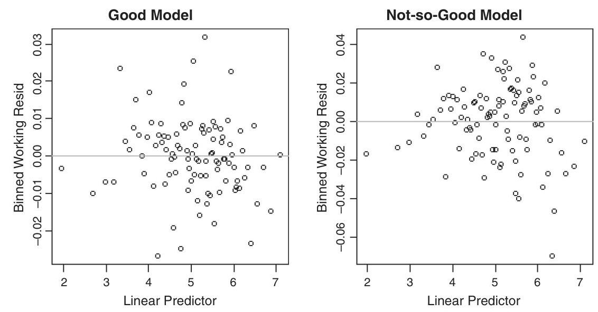

## Page 83
Figure 19. Plotting Residuals over the Value of a Predictor Variable
larger volume of exposure tend to be more stable (i.e., exhibit lower variance in the outcome) than lower-volume records, as discussed in Section 2.5.

The right-hand plot results after this issue is rectified by adding exposure as the weight in the model. In this model, the expectation of lower variance with higher exposure has already been assumed by the model, and so the residuals have this effect adjusted out, forming a homoscedastic cloud.

# 6.4. Assessing Model Stability 

Model stability refers to the sensitivity of a model to changes in the modeling data. We assume that past experience will be a good predictor of future events, but small

Figure 20. Plotting Residuals over the Number of Exposures
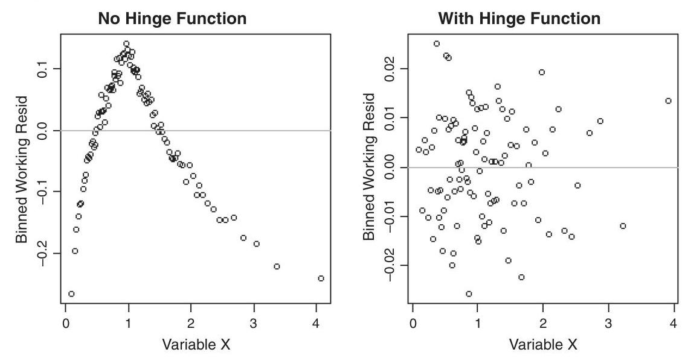
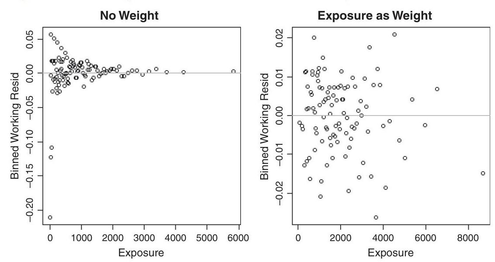

## Page 84
changes in the past that we've observed should not lead to large changes in the future we predict. The classic example of this occurring is an unusually large loss experienced by an insured in a class with few members. A model run on all of the data may tell us with a high degree of confidence that this class is very risky. But if we remove the large loss from the dataset, the model may tell us with the same degree of confidence that the class is very safe. The model is not very stable with respect to the indication for this class, and so we may not want to give full weight to its results.

In the example above, the large loss is a particularly influential record, in that its removal from the dataset causes a significant change to our modeled results. Influential records tend to be highly weighted outliers. Assessing the impact of influential records is a straightforward way to assess model stability. A common measure of the influence of a record in GLM input data, calculable by most statistical packages, is Cook's distance. Sorting records in descending order of Cook's distance will identify those that have the most influence on the model results-a higher Cook's distance indicates a higher level of influence. If rerunning the model without some of the most influential records in the dataset causes large changes in some of the parameter estimates, we may want to consider whether or not those records or the parameter estimates they affect should be given full weight.

Another way to assess model stability is via cross validation, as described in Section 4.3.4 above. In that section, we presented cross validation as a means of testing the out-of-sample model performance. However, looking at the in-sample parameter estimates across the different model runs can yield important information about the stability of the model as well. The model should produce similar results when run on separate subsets of the initial modeling dataset.

Still another way to assess model stability is via bootstrapping. In bootstrapping, the dataset is randomly sampled with replacement to create a new dataset with the same number of records as the initial dataset. By refitting the model on many bootstrapped versions of the initial dataset, we can get a sense of how stable each of the parameter estimates are. In fact, we can calculate empirical statistics for each of the parameter estimates-mean, variance, confidence intervals, and so on-via bootstrapping. Many modelers prefer bootstrapped confidence intervals to the estimated confidence intervals produced by statistical software in GLM output.

## Page 85
# 7. Model Validation and Selection 

Before diving into this section, some explanation is in order. As described above, the process of model refinement is really a process of creating two candidate models and comparing them. To put it another way, all model refinement involves model selection. But sometimes model selection can be used for goals other than model refinement. Sometimes a decision needs to be made between a number of alternate final models. If the best efforts of two modelers working independently are not identical (and they will never be), how is one to choose between them? The techniques discussed below are suitable for making this decision, while the techniques discussed in Chapter 6 are not. There are two key reasons for this:

First, one or more of the alternate models may be proprietary. Any rating plan is a model, and rating plans can come from all sorts of places: subsidiaries, consultants, competitor filings, rating bureaus, and so on. Most of the time, the data used to build these rating plans will not be available and neither will the detailed form of the underlying model. Even if this information is available, it might be impractical to evaluate it-the rating plan need not have been created using a GLM! The techniques discussed in Chapter 6 cannot be used under these circumstances, but the techniques below can. In order for the techniques below to be used, one only needs a database of historical observations augmented with the predictions from each of the competing models. The process of assigning predictions to individual records is called scoring.

Second, while the model refinement process is entirely technical, choosing between two final models is very often a business decision. Those responsible for making the final decision may know nothing about predictive modeling or even nothing about actuarial science. The techniques below compare the performance of competing models in a way that is accessible.

Some of the techniques below can also be used for model refinement, to the extent that they produce new data or insights that can be acted on.

### 7.1. Assessing Fit with Plots of Actual vs. Predicted

A very simple and easily understandable diagnostic to assess and compare the performance of competing models is to create a plot of the actual target variable (on the $y$-axis) versus the predicted target variable (on the $x$-axis) for each model. If a model fits well, then the actual and predicted target variables should follow each other closely.

Consider Figure 21, which shows plots of actual vs. predicted target variables for two competing models.

## Page 86
Figure 21. Actual vs. Predicted Plots for Two Competing Models

From these charts, it is clear that Model 2 fits the data better than Model 1, as there is a much closer agreement between the actual and predicted target variables for Model 2 than there is for Model 1.

There are three important cautions regarding plots of actual versus predicted target.
First, it is important to create these plots on holdout data. If created on training data, these plots may look fantastic due to overfitting, and may lead to the selection of a model with little predictive power on unseen data.

Second, it is often necessary to aggregate the data before plotting, due to the size of the dataset. A common approach is to group the data into percentiles. The dataset is first sorted based on the predicted target variable, then it is grouped into 100 buckets such that each bucket has the same aggregate model weight. Finally, the averages of the actual and predicted targets within each bucket are calculated and plotted, with the actual values on the $y$-axis and the predicted values on the $x$-axis.

Third, it is often necessary to plot the graph on a log scale, as was done in Figure 20. Without this transformation, the plots would not look meaningful, since a few very large values would skew the picture.

# 7.2. Measuring Lift 

Broadly speaking, model lift is the economic value of a model. The phrase "economic value" doesn't necessarily mean the profit that an insurer can expect to earn as a result of implementing a model, but rather it refers to a model's ability to prevent adverse selection. The lift measures described below attempt to visually demonstrate or quantify a model's ability to charge each insured an actuarially fair rate, thereby minimizing the potential for adverse selection.

Model lift is a relative concept, so it requires two or more competing models. That is, it doesn't generally make sense to talk about the lift of a specific model, but rather the lift of one model over another.

In order to prevent overfitting, model lift should always be measured on holdout data.
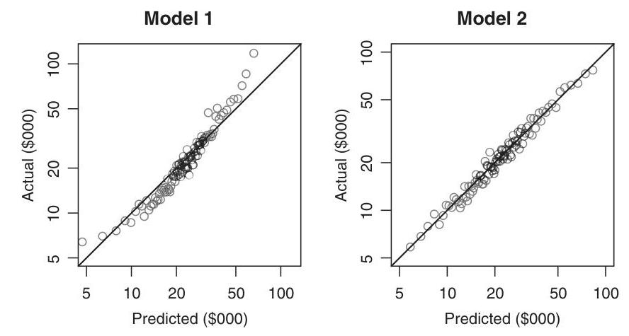

## Page 87
# 7.2.1. Simple Quantile Plots 

Quantile plots are a straightforward visual representation of a model's ability to accurately differentiate between the best and the worst risks. Assume there are two models, Model A and Model B, both of which produce an estimate of the expected loss cost for each policyholder. Simple quantile plots are created via the following steps:

1. Sort the dataset based on the Model A predicted loss cost (from smallest to largest).
2. Bucket the data into quantiles, such that each quantile has the same volume of exposures. Common choices are quintiles ( 5 buckets), deciles ( 10 buckets), or vigintiles (20 buckets).
3. Within each bucket, calculate the average predicted pure premium (predicted loss per unit of exposure) based on the Model A predicted loss cost, and calculate the average actual pure premium.
4. Plot, for each quantile, the actual pure premium and the pure premium predicted by Model A.
5. Repeat steps 1 through 4 using the Model B predicted loss costs. There are now two quantile plots-one for Model A and one for Model B.
6. Compare the two quantile plots to determine which model provides better lift. In order to determine the "winning" model, consider the following 3 criteria:
7. Predictive accuracy. How well each model is able to predict the actual pure premium in each quantile.
8. Monotonicity. By definition, the predicted pure premium will monotonically increase as the quantile increases, but the actual pure premium should also increase (though small reversals are okay).
9. Vertical distance between the first and last quantiles. The first quantile contains the risks that the model believes will have the best experience, and the last quantile contains the risks that the model believes will have the worst experience. A large difference (also called "lift") between the actual pure premium in the quantiles with the smallest and largest predicted loss costs indicates that the model is able to maximally distinguish the best and worst risks.

Figure 22 shows simple decile plots for an example comparison between the current rating plan (left panel) and a newly-constructed plan (right panel). For ease of interpretation, both the actual and predicted loss costs for each graph have been divided by the average model predicted loss cost.

In both plots, the solid line is the predicted loss cost (either by the current rating plan or by the new model) and the broken line is the actual loss cost. Which model is better?

1. Predictive accuracy-for the right panel graph, the plotted loss costs correspond more closely between the two lines than for the left panel graph, indicating that the new model seems to predict actual loss costs better than the current rating plan does.
2. Monotonicity-the current plan has a reversal in the 6th decile, whereas the model has no significant reversals.

## Page 88
Figure 22. Simple Decile Plots for Both the Current Rating Plan (left panel) and for a Newly-Constructed Plan (right panel)
3. Vertical distance between the first and last quantiles-the spread of actual loss costs for the current manual is 0.55 to 1.30 , which is not very much. That is, the best risks have loss costs that are $45 \%$ below the average, and the worst risks are only $30 \%$ worse than average. The spread of the proposed model though is 0.40 to 1.60 .

Thus, by all three metrics, the new plan outperforms the current one.

# 7.2.2. Double Lift Charts 

A double lift chart is similar to the simple quantile plot, but it directly compares two models. Assume that there are two models, Model A and Model B, both of which produce an estimate of the expected loss cost for each policyholder. A double lift chart is created via the following steps:

1. For each record, calculate Sort Ratio $=($ Model A Predicted Loss Cost $) /($ Model B Predicted Loss Cost).
2. Sort the dataset based on the Sort Ratio, from smallest to largest.
3. Bucket the data into quantiles, such as quintiles or deciles.
4. Within each bucket, calculate the Model A average predicted pure premium, the Model B average predicted pure premium, and the actual average pure premium. For each of those quantities, divide the quantile average by the overall average.
5. For each quantile, plot the three quantities calculated in the step above.

In a simple quantile plot, the first quantile contains those risks which Model A thinks are best. In a double lift chart, the first quantile contains those risks which Model A thinks are best relative to Model B. In other words, the first and last quantiles contain those risks on which Models A and B disagree the most (in percentage terms).

In a double lift chart, the "winning" model is the one that more closely matches the actual pure premium in each quantile. To illustrate this, consider the example double
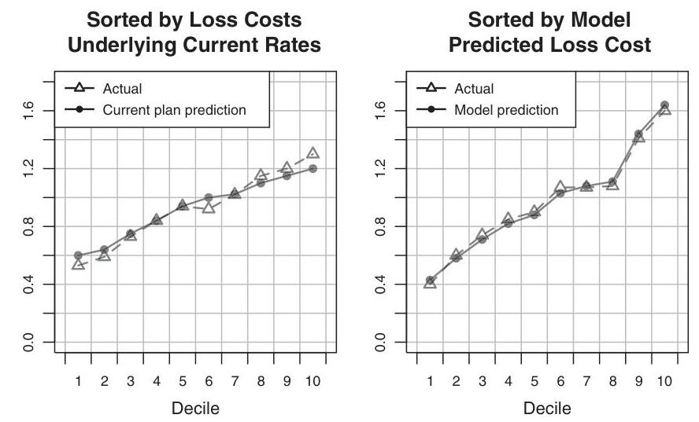

## Page 89
Figure 23. A Sample Double Lift Chart
Double Lift Chart
lift chart in Figure 23, in which we use a double lift chart to compare a proposed rating model to the current rating plan.

The solid line shows the loss costs predicted by the model, the thick broken line shows the loss costs in the current rating plan, and the dotted line shows the actual loss costs. The sort order for this graph is the model prediction divided by the current plan prediction, and the data is segmented into deciles.

It is clear that the proposed model more accurately predicts actual pure premium by decile than does the current rating plan. Specifically, consider the first decile. It contains the risks that the model thinks are best relative to the current plan. As it turns out, the model is correct. Similarly, in the 10th decile, the model more accurately predicts pure premium than does the current plan.

As an alternate representation of a double lift chart, one can plot two curves-the percent error for the model predictions and the percent error for the current loss costs, where percent error is calculated as (Predicted Loss Cost)/(Actual Loss Cost) - 1. In this case, the winning model is the one with the flatter line centered at $y=0$, indicating that its predictions more closely match actual pure premium.

# 7.2.3. Loss Ratio Charts 

In a loss ratio chart, rather than plotting the pure premium for each bucket, the loss ratio is instead plotted. The steps for creating a loss ratio chart are very similar to those for creating a simple quantile plot:

1. Sort the data based on the predicted loss ratio (= [predicted loss cost]/premium).
2. Bucket the data into quantiles, such that each quantile has the same volume of exposures.
3. Within each bucket, calculate the actual loss ratio for risks within that bucket.

Ideally, the model is able to identify deficiencies in the current rating program by segmenting the risks based on loss ratio. To illustrate this, consider Figure 24. If a
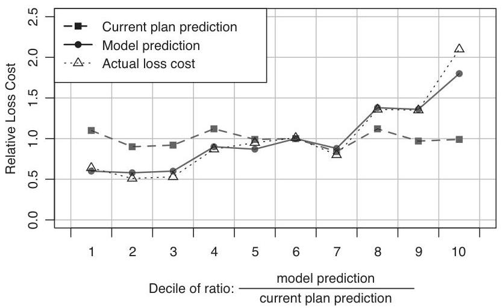

## Page 90
Figure 24. A Sample Loss Ratio Chart
rating plan is perfect, then all risks should have the same loss ratio. The fact that this model is able to segment the data into lower and higher loss ratio buckets is a strong indicator that it is outperforming the current rating plan.

The advantage of loss ratio charts over quantile plots and double lift charts is that they are simple to understand and explain. Loss ratios are the most commonly-used metric in determining insurance profitability, so all stakeholders should be able to understand these plots.

# 7.2.4. The Gini Index 

The Gini index, named for statistician and sociologist Corrado Gini, is commonly used in economics to quantify national income inequality.

The national income inequality Gini index is calculated as follows:

1. Sort the population based on earnings, from those with the lowest earnings to those with the highest earnings. (This could also be done based on wealth rather than earnings.)
2. The $x$-axis is the cumulative percentage of earners.
3. The $y$-axis is the cumulative percentage of earnings.

The locus of points created by plotting the cumulative percentage of earnings against the cumulative percentage of earners is called the Lorenz curve. The left panel of Figure 25 plots the Lorenz curve for year 2014 household income in the United States. ${ }^{16}$

The 45-degree line is called the line of equality, so named because, if every person earned the same exact income, then the Lorenz curve would be the line of equality. In that hypothetical scenario, if there are 100 people in the society, then each represents $1 \%$ of the population and would earn $1 \%$ of the income. Everyone doesn't earn the same income, though, so the Lorenz curve is bow-shaped. As the graph shows, the

[^0]
[^0]:    ${ }^{16}$ Source: https://www.census.gov/hhes/www/income/data/historical/household/
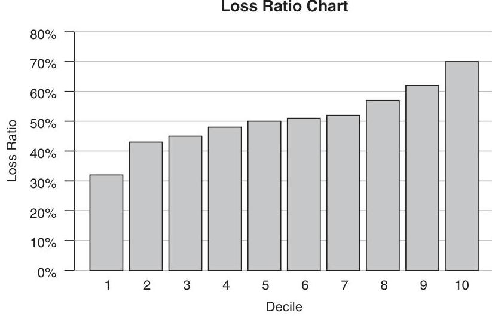

## Page 91
Figure 25. Gini Index Plots of United States 2014 Household Income (left panel) and a Sample Pure Premium Model (right panel)
poorest $60 \%$ of households earn roughly $25 \%$ of the total income. The Gini index is calculated as twice the area between the Lorenz curve and the line of equality. (In 2014, that number was $48.0 \%$ ).

The Gini index can also be used to measure the lift of an insurance rating plan by quantifying its ability to segment the population into the best and worst risks. The Gini index for a model which creates a rating plan is calculated as follows:

1. Sort the dataset based on the model predicted loss cost. The records at the top of the dataset are then the risks which the model believes are best, and the records at the bottom of the dataset are the risks which the model believes are worst.
2. On the $x$-axis, plot the cumulative percentage of exposures.
3. On the $y$-axis, plot the cumulative percentage of losses.

The locus of points is the Lorenz curve, and the Gini index is twice the area between the Lorenz curve and the line of equality.

The right panel of Figure 25 plots a sample Lorenz curve for a sample pure premium model. As can be seen, this model identified $60 \%$ of exposures which contribute only $20 \%$ of the total losses. Its Gini index is $56.1 \%$.

Note that a Gini index does not quantify the profitability of a particular rating plan, but it does quantify the ability of the rating plan to differentiate the best and worst risks. Assuming that an insurer has pricing and/or underwriting flexibility, this will lead to increased profitability.

# 7.3. Validation of Logistic Regression Models 

For logistic regression models (discussed in Section 2.8), the GLM yields a prediction of the probability of the occurrence of the modeled event. Many of the model validation diagnostics discussed in the previous sections can be applied to such models as well. For example, a quantile plot can be created by bucketing records of the
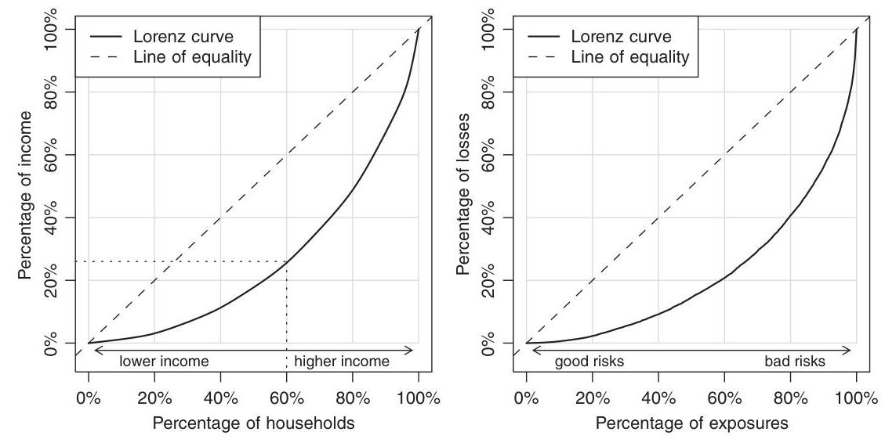

## Page 92
holdout set into quantiles of predicted probability and graphing the actual proportion of positive occurrences of the event within each quantile against the average predicted probability; a good model will yield a graph exhibiting the properties of accuracy, monotonicity and vertical distance between first and last quantiles, as described in Section 7.2.1. Similarly, a Lorenz curve can be created by sorting the records by predicted probability and graphing cumulative risks against cumulative occurrences of the event, and a Gini index can be computed from the resulting graph by taking the area between the curve and the line of equality.

For such models, a diagnostic called the receiver operating characteristic curve, or $R O C$ curve, is commonly used due its direct relation to how such models are often used in practice, as discussed in the following section.

# 7.3.1. Receiver Operating Characteristic (ROC) Curves 

While a logistic model predicts the probability of an event's occurrence, for many practical applications that probability will need to be translated into a binary prediction of occurrence vs. non-occurrence for the purpose of deciding whether to take a specific action in response. For example, suppose we build a model to detect claims fraud; for each new claim, the model yields a probability that it contains fraud. Based on this prediction, we will need to decide whether or not to assign a team to further investigate the claim.

We can make such a determination by choosing a specific probability level, called the discrimination threshold-say, 50\%-above which we will investigate the claim and below which we will not. This determination may be thought of as the model's "prediction" in a binary (i.e., fraud/no fraud) sense.

Under this arrangement, for any claim, the following four outcomes are possible:

1. The model predicts that the claim contains fraud (that is, $\mu_{i}>0.50$ ), and the claim is indeed found to contain fraud. This outcome is called a true positive.
2. The model predicts fraud, but the claim does not contain fraud (i.e., a false positive).
3. The model predicts no fraud (i.e., $\mu_{i}<0.50$ ), but the claim contains fraud (i.e., a false negative).
4. The model predicts no fraud, and the claim does not contain fraud (i.e., a true negative).

Outcome \#1-the true positive-clearly represents a success of the model, as it correctly identifies a fraudulent claim, thus preventing unnecessary payment and saving the company money. Outcome \#4, the true negative, while not as dramatic, similarly has the model doing its job by not sending us on a wild-goose chase.

Outcomes \#2 and \#3-the false positive and false negative-are failures of the model, and each comes with a cost. The false negative allows a fraudulent claim to slip by undetected, resulting in unnecessary payment. The false positive also incurs a cost in the form of unnecessary resources expended on a claims investigation as well as possible impairment of goodwill with the insured.

If the model were perfect-that is, it would predict a probability of $0 \%$ for each non-fraud and $100 \%$ for each fraud-then the true positive and true negative would be the only possible outcomes, regardless of the threshold chosen. For real-life models, on the other hand, false negatives and false positives are possible, and selection of the

## Page 93
discrimination threshold involves a trade-off: a lower threshold will result in more true positives and fewer false negatives than a higher threshold, but at the cost of more false positives and fewer true negatives.

We can assess the relative likelihoods of the four outcomes for a given model and for a specified discrimination threshold using a test set. We use the model to score a predicted probability for each test record, and then convert the predictions of probability into binary (yes/no) predictions using the discrimination threshold. We then group the records by the four combinations of actual and predicted outcomes, and count the number of records falling into each group. We may display the results in a $2 \times 2$ table called a confusion matrix. The top panel of Table 13 shows an example confusion matrix for a claims fraud model tested on a test set that contains 813 claims, using a discrimination threshold of $50 \%$.

The ratio of true positives to total positive events is called the sensitivity; in this example, that value is $39 / 109=0.358$. This ratio, also called the true positive rate or the hit rate, indicates that with a threshold of $50 \%$, we can expect to catch $35.8 \%$ of all fraud cases.

The ratio of true negatives to total negative events is called the specificity, and is $673 / 704=0.956$ in our example. The complement of that ratio, called the false positive rate, is $1-0.956=0.044$. This indicates that the hit rate of $35.8 \%$ comes at the cost of also needing to investigate $4.4 \%$ of all non-fraud claims.

We may wish to catch more fraud by lowering the threshold to $25 \%$. The bottom panel of Table 13 shows the resulting confusion matrix. As can be seen, the hit rate under this arrangement improves to $75 / 109=68.8 \%$-but it comes at the cost of an increase in the false positive rate to $103 / 704=14.6 \%$.

# Table 13. Confusion Matrices for Example Fraud Model With Discrimination Thresholds of 50\% (top) and 25\% (bottom) 

Discrimination Threshold: 50\%

|  | Predicted |  |  |  |
| :-- | :--: | :--: | :--: | :--: |
| Actual |  | Fraud | No Fraud | Total |
| Fraud | true pos.: | 39 | false neg.: | 70 |
| No Fraud | false pos.: | 31 | true neg.: | 673 |
| Total |  | 70 |  | 743 |

Discrimination Threshold: 25\%

|  | Predicted |  |  |  |
| :-- | :--: | :--: | :--: | :--: |
| Actual |  | Fraud | No Fraud | Total |
| Fraud | true pos.: | 75 | false neg.: | 34 |
| No Fraud | false pos.: | 103 | true neg.: | 601 |
| Total |  | 178 |  | 635 |

## Page 94
A convenient graphical tool for evaluating the range of threshold options available to us for any given model is the receiver operating characteristic curve, or ROC curve, which is constructed by plotting the false positive rates along the $x$-axis and the true positive rates along the $y$-axis for different threshold values along the range $[0,1]$. Figure 26 shows the ROC curve for our example claims fraud model.

The $(0,0)$ point of this graph represents a threshold of $100 \%$, with which we catch no fraudulent claims (but investigate no legitimate claims either). Moving rightward, we see that lowering the threshold and thereby incurring some false positives yields large gains in the hit rate; however, those gains eventually diminish for higher false positive rates. The two example thresholds detailed in Table 13 are plotted as points on the graph.

The ROC curve allows us to select a threshold we are comfortable with after weighing the benefits of true positives against the cost of false positives. Different thresholds may be chosen for different claim conditions-for example, we may choose a lower threshold for a large claim where the cost of undetected fraud is higher. Determination of the optimal threshold is typically a business decision that is out of the scope of the modeling phase.

The level of accuracy of the model, though, will affect the severity of the trade-off. A model that yields predictions that are no better than random will yield true positives and false positives in the same proportions as the overall mix of positives and negatives in the data, regardless of the threshold chosen. Therefore, for such a model, the ROC curve will follow the line of equality. A model with predictive power will yield true positives at a higher rate than false positives, resulting in a ROC curve that is higher than the line of equality. Improved accuracy of the model will move the ROC curve farther from equality, indicating that the model allows us a better hit rate for any level of false positive cost.

The model accuracy as indicated by the ROC curve can be summarized by taking the area under the curve, called the AUROC (for "area under ROC"). A model with no

Figure 26. ROC Curve for Example Fraud Model
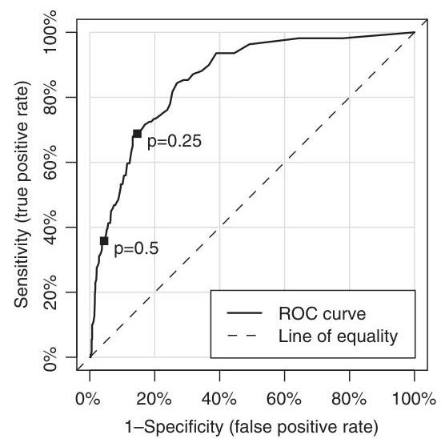

## Page 95
predictive power will yield an AUROC of 0.500 . The ROC curve of the hypothetical "perfect" model described earlier will immediately rise to the top of the graph (as any threshold below $100 \%$ would correctly identify all fraud cases and trigger no false positives), thereby yielding an AUROC of 1.000 . The ROC curve of our example model plotted in Figure 26 yields an AUROC of 0.857 .

Note, however, that the AUROC measure bears a direct relationship to the Gini index discussed in the previous section, such that one can be derived from the other. ${ }^{17}$ As such, AUROC and the Gini index should not be taken as separate validation metrics, since an improvement in one will automatically yield an improvement in the other.

[^0]
[^0]:    ${ }^{17}$ Specifically, the AUROC is equal to $0.5 \times$ normalized Gini +0.5 , where normalized Gini is the ratio of the model's Gini index to the Gini index of the hypothetical "perfect" model (where each record's prediction equals its actual value).

## Page 96
# 8. Model Documentation 

### 8.1. The Importance of Documenting Your Model

Model documentation is important enough, and overlooked enough, that it deserves its own section. This section comes with some unsolicited career advice which we hope will be helpful even for those of you who don't build models as part of your day job.

Model documentation serves at least three purposes:

- To serve as a check on your own work, and to improve your communication skills
- To facilitate the transfer of knowledge to the next owner of the model
- To comply with the demands of internal and external stakeholders

If you're a credentialed actuary working in the United States, all of the documentation you produce should comply with ASOP 41 on Actuarial Communications.

### 8.2. Check Yourself

Actuarial work tends to be complex; modeling work, even more so. You're going to make mistakes. No matter how smart you are, no matter how experienced you are, no matter how brilliant or elegant your work product appears to be-it's more likely than not that you've overlooked something. We're all just human here and that's just how it goes. As an actuary, you're obliged to own up to the mistakes that you make. The first time that someone discovers you sweeping a mistake under the rug is the last time that anyone will trust you to do anything. The better you are at identifying and correcting mistakes you've made in your own work, the easier your life will be. If you want to succeed in your career you'd be well-served to internalize this.

So how are you supposed to find mistakes in your own work? One of the best ways is to try to explain what you've done in writing. When you write down what you've done in a way that allows someone else to understand it, you're forced to revisit your work in full detail, and to think critically about all of the decisions you made along the way. This has a way of bringing errors (especially conceptual errors) to the surface. This is especially true when you share your documentation with others. It may be easy for a peer to identify a conceptual error in a narrative that they would not have been able to detect in a package of code.

Another benefit of documentation is that it serves to reinforce your understanding of the work that you're documenting. It's been said that "to teach is to learn twice over".

## Page 97
This is true! The level of understanding required to document or explain or teach a topic is greater than the level of understanding required to simply execute. When you start from a foundation of deeper understanding, your subsequent work product will be of higher quality, and will stand up better to scrutiny. This means that you should document your work as you go. Documentation isn't a task for the end of the project, so that you discover mistakes when you no longer have time to address them. On the contrary, it's a task for right this minute, so that in your very next project meeting, you'll be able to field questions that no one else has even thought of yet.

A final benefit of documentation for you, personally, is that it serves to improve your communication skills. There is nothing more important to an actuary than their ability to communicate. Our work may involve any number of complex statistical analyses, but our work product is always a report to someone else that details the work we've done. Your ability to communicate will become more important as you progress through your career, as you will find yourself increasingly responsible for presenting to stakeholders who are not also actuaries. The Casualty Actuarial Society doesn't have an exam on communication. If you'd like to improve in this area, you're going to have to find a way to do it yourself. An easy way to do this is to force yourself to document the things that you do in such a way that a non-technical person can follow along.

Nothing in this section is hypothetical. The authors of this monograph are actuaries, just like you, not too many years removed from taking exams. This monograph is a form of documentation and we've become better actuaries by writing it. (And yes, we've made our share of errors as well.)

# 8.3. Stakeholder Management 

Every modeling project you work on will eventually come to an end, but as discussed in Section 3.9, models will need to be maintained and rebuilt. The tasks of maintaining and rebuilding the model may fall to someone else, or they may fall to you. In either case, good documentation will make everyone's lives easier. Even if you retain ownership of the model forever, we can tell you from experience that it's easy to forget important details of a project after only a few months of not working on it. Creating good documentation now will make life easier for you in the future.

Others may develop an interest in the models that you build, either now or in the future. Insurance is a highly-regulated field, and there's a good chance that regulators will have questions for you, either during the filing process or during a regular examination. Internal and outside auditors and risk managers tend to have a keen interest in models and their documentation. And in a large organization, any number of internal stakeholders-including executives, underwriters, claims adjusters, other actuaries, and IT personnel—may eventually come calling with detailed questions on work that may have been done months or years ago. In all of these cases, we can tell you from experience that it's easier to have good documentation on hand ready to send to anyone who asks for it than it is to try to answer questions from first principles when your memory of what you've done may be a little fuzzy.

## Page 98
To meet the needs of these stakeholders, your documentation should:

- Include everything needed to reproduce the model from source data to model output
- Include all assumptions and justification for all decisions
- Disclose all data issues encountered and their resolution
- Discuss any reliance on external models or external stakeholders
- Discuss model performance, structure, and shortcomings
- Comply with ASOP 41 or local actuarial standards on communications

# 8.4. Code as Documentation 

Your model code serves as a form of documentation. Your code should be clearly written and commented. Moreover, it should be easy to differentiate the "production" version of your code from any draft work that led up to it. If you use R, you should use the "tidyverse" package and adhere to the tidyverse style guide. ${ }^{18}$ Even if you don't use R, we recommend that you give this style guide a read, as the philosophies that it espouses are more or less universal can be applied to work done on any platform.

[^0]
[^0]:    ${ }^{18}$ We recognize that other packages, such as data.table, may be more appropriate than tidyverse packages in some situations. However, it is generally not advisable to use base R for functionality that has been implemented in more advanced packages such as tidyverse.

## Page 99
# 9. Other Topics 

### 9.1. Modeling Coverage Options with GLMs (Why You Probably Shouldn't)

The policy variables included in a rating plan can be broadly categorized into two types: characteristics of the insured or insured entity, such as driver age or vehicle type for auto liability, building construction type or territory for homeowners insurance, or industry classification for general liability; and options selected by the insured, such as deductible, limit, or peril groups covered.

When using GLMs to formulate such rating plans, it is tempting to try and estimate factors for coverage options by simply throwing those variables in with the rest in the GLM—only to sometimes discover that GLM produces seemingly counterintuitive results. For example, consider the case of the deductible factor. When including deductible as a categorical variable in a pure premium GLM—setting the basic deductible as the base level—it is not uncommon for the GLM to produce a positive coefficient (indicating a factor above unity) for a deductible higher than the base deductible. This result—and a highly significant one, to boot!-would seem to indicate that more premium should be charged for less coverage, and may leave actuaries scratching their heads. What gives? ${ }^{19}$

The answer may lie in the basic statistical truth that correlation does not imply causation. A coefficient estimated by a GLM need not be the result of a causal effect between the predictor and the target; there may be some latent variables or characteristics not captured by our model that may correlate with the variable in question, and those effects may influence the model result. In the case of deductible, there may be something systematic about insureds with higher deductibles that may make them a worse risk relative to others in their class. Possibilities of how this may arise are:

- The choice of high deductible may be the result of a high risk appetite on the part of an insured, which would manifest in other areas as well.
- The underwriter, recognizing an insured as a higher risk, may have required the policy to be written at a higher deductible.

[^0]
[^0]:    ${ }^{19}$ We note that while a positive indication for a higher deductible may be considered counterintuitive in a frequency or pure premium model, in a severity model it is to be expected. This is because despite the deductible eliminating a portion of each loss, thereby lowering the numerator of severity, the deductible also eliminates many small claims, lowering the denominator of severity. As the latter effect is usually stronger than the former, the total effect of deductible on severity is most often positive.

## Page 100
Thus, the coefficients estimated by the GLM may be reflecting some of this increased risk due to such selection effects.

Counterintuitive results such as these have led some to believe that GLMs "don't work" for deductibles. This may not be a fair characterization; the factors estimated by the GLMs may very well be predictive-if the goal is to predict loss for an existing set of policies. But that isn't usually our objective; rather, we are trying to estimate the pricing that would make sense for policies sold in the future.

To be sure, for most other variables, potential correlation with a latent variable is not a bad thing; if a variable we have collected also yields some information about one we haven't, all the better. ${ }^{20}$ However, where the variable in question relates to a policy option selected by the insured, having its factor reflect anything other than pure loss elimination would not be a good idea. Even if the indicated result is not something as dramatically bad as charging more premium for less coverage, to the extent that the factor differs from the pure effect on loss potential, it will affect the way insureds choose coverage options in the future. Thus, the selection dynamic will change, and the past results would not be expected to replicate for new policies.

For this reason it is recommended that factors for coverage options-deductible factors, ILFs, peril group factors and the like-be estimated outside the GLM, using traditional actuarial loss elimination techniques. The resulting factors should then be included in the GLM as an offset.

# 9.2. Territory Modeling 

Territories are not a good fit for the GLM framework. Unlike other variables you might consider in your model, which are either continuous or can easily be collapsed into a manageable number of levels, you may have hundreds or thousands or hundreds of thousands of territories to consider-and aggregating them to a manageable level will cause you to lose a great deal of important signal.

So the solution is to use other techniques, such as spatial smoothing, to model territories. Discussion of these techniques is beyond the scope of this monograph. But in creating a classification plan, you must still be aware of and have access to the output of these models. Since there are usually many complicated relationships between territory and other variables, your GLM should still consider territory. This is accomplished by including territory in your model as an offset. Offsetting for territory only requires populating policy records with their indicated territory loss cost (taken from the standalone model). This way, your classification plan variables will be fit after accounting for territorial effects, and so will not proxy for them.

But, of course, it's a two-way street. Just as your classification plan model should be offset for territory loss costs, so too should the territory model be offset for the classification plan. So the process is iterative-both models should be run, using the other as an offset, until they reach an acceptable level of convergence. In theory this can

[^0]
[^0]:    ${ }^{20}$ An important exception is where a variable included in a model may correlate with a protected class or any other variable that may not be rated on. In such instances, the actuary must take care to ensure that the model is in accordance with all regulatory requirements and actuarial standards of practice.

## Page 101
be done in one pass, but in practice these models may be updated at different times and by different groups of people, so convergence may only set in over a period of years.

# 9.3. Ensembling 

Consider this scenario: your company assigns its two top predictive modelers, Alice and Bob, to develop a Homeowners pure premium model, and advises them to each work independently off the same set of data.

They get to work, and, after some time, each proposes their finished model. Naturally-since there is no one "right" way to build a model-the models are somewhat different: each has variables selected for inclusion that the other does not have; some continuous variables have been bucketed in one model while having been transformed using polynomial functions in the other; and so on. However, when testing the models, they both perform equally well: the loss ratio charts and double lift charts both show the same improvement over the existing plan, and calculating Gini indices on the holdout set and in cross validation yields very similar results between the two. We now need to make a decision: which model is better-Alice's or Bob's?

The answer, most likely, is: both. Combining the answers from both models is likely to perform better than either individually.

A model that combines information from two or more models is called an ensemble model. There are many strategies for combining models, and a full treatment of the subject is beyond the scope of this text. However, a simple, yet still very powerful, means of ensembling is to simply take the straight average of the model predictions. ${ }^{21}$ Two well-built models averaged together will almost always perform better than one, and three will perform even better-a phenomenon known as the ensemble effect. Generally, the more models the better, though subject to the law of diminishing returns. In fact, ensembling is one notable exception to the parsimony principle in modeling (i.e., the "keep it simple" rule); adding more models to an ensemble-thereby increasing the complexity-will rarely make a model worse.

An interesting example of the ensemble effect in the real world is the "guess the number of jelly beans in the jar" game sometimes used for store promotions. In this game, any individual's guess is likely to be pretty far off from the right answer; however, it is often observed that taking the average of all the submitted guesses will yield a result that is very close to correct. As individuals, some people guess too high and some guess low, but on average they get it right.

Predictive models, like people, each have their strengths and weaknesses. One model may over-predict on one segment of the data while under-predicting on another; a different model is not likely to have the same flaws but may have others. Averaged together, they can balance each other out, and the gain in performance can be significant.

[^0]
[^0]:    ${ }^{21}$ If both models are log-link GLMs, the multiplicative structure of the resulting ensemble can be preserved by taking the geometric average of the predictions. Equivalently, one can construct multiplicative factor tables that use the geometric averages of the individual model factors. (When doing so, for any variable present in one model but absent in the other, use a factor of 1.00 for the model in which it is absent.)

## Page 102
One caveat though-for the ensemble effect to work properly, the model errors should be as uncorrelated as possible; that is, the models shouldn't all be systematically missing in the same way. (Much as the averaged jelly bean guesses would not work well if everyone guessed similarly.) Thus, if ensembling is to be employed as a modelbuilding strategy, it is best if the models are built by multiple people or teams working independently, with little or no sharing of information. Done properly, though, ensembles can be quite powerful; if resources permit, it may be worth it.

## Page 103
# 10. Variations on the Generalized Linear Model 

As we have seen in the preceding sections, the GLM is a flexible, robust and highly interpretable model that can accommodate many different types of target variables and covariate relationships. However, it does have a number of shortcomings, most notably:

- Predictions must be based on a linear function of the predictors. Certainly, there are workarounds to handle non-linearity (such as polynomials or hinge functions) but those must be explicitly specified by the modeler.
- GLMs exhibit instability in the face of thin data or highly correlated predictors.
- Full credibility is given to the data for each coefficient, with no regard to the thinness on which it is based.
- GLMs assume the random component of the outcome is uncorrelated among risks.
- The exponential family parameter $\phi$ must be held constant across risks.

Many of the more advanced predictive modeling techniques used by data scientists in other disciplines, such as neural nets, random forests or gradient boosting machines, do not have these flaws, and are therefore able to produce stronger models that yield more accurate predictions. However, using those methods would entail a huge loss of interpretability, which, for many actuarial applications, is as great a necessity as predictive accuracy, if not greater.

Fortunately, a number of extensions to GLMs have been developed that address some of the limitations noted above. We briefly discuss some of them in this section. As each of the models presented here is either based on the GLM framework or something very similar, using them sacrifices little or no loss in interpretability, while potentially yielding increased flexibility, robustness and accuracy.

We caution that the discussions below are meant to be brief overviews of these models, and are intended to introduce the reader to them and motivate further learning. Each has many nuances and complexities not covered here, and the reader is urged to refer to other statistical texts that cover these methods in greater detail prior to attempting to use them in a real business scenario.

### 10.1. Generalized Linear Mixed Models (GLMMs)

In a standard GLM, the randomness of the outcome is considered to be the only source of randomness in the model; the coefficients themselves are assumed to be fixed values. To be sure, from our perspective, where the coefficients are unknown

## Page 104
and will need to be estimated from random data, the estimates of those parameters are random. (This is the randomness that statistics such as the standard error are meant to describe.) However, the underlying model assumes that some fixed set of values exist that always describe the relationship between the predictors and the expected value of the target variable. To see this, take a look back at Equation 2: the equals sign indicates a deterministic relationship involving fixed values; the only tilde (denoting randomness) appears in Equation 1.

The practical effect of this is that in seeking to maximize likelihood, the fitting procedure "moves" the coefficients as close to the data as possible, even for those where the data is thin. In other words, it gives the data full credibility, since we have not supplied it with any information to signal that the coefficients should behave otherwise.

A useful extension to the GLM is the generalized linear mixed model, or GLMM, which allows for some of the coefficients to be modeled as random variables themselves. In this context, predictors with coefficients modeled as random variables are called random effects; parameters modeled as having fixed values are called fixed effects. In practice, random effects would be estimated for categorical variables with many levels that lack the credibility for their coefficients to be estimated fully from their own data.

To illustrate, we present a simple example of an auto severity model with three predictors: driver age (a continuous variable), marital status (coded as $0=$ unmarried, $1=$ married) and territory, a categorical variable with 15 levels. Driver age and marital status will be designated as fixed effects in our model; territory, with many of its levels sparse and lacking credibility, will be designated as a random effect.

We denote driver age as $x_{1}$ and marital status as $x_{2}$. The territory variable is transformed to 15 dummy-coded ( $0 / 1$ ) variables of a design matrix, where 1 indicates membership in that territory. ${ }^{22}$ Rather than denote those 15 predictors as $x_{3} \ldots x_{17}$, we will use a new symbol—namely, $z$-to distinguish random effects from fixed effects, and so the territory variables are denoted $z_{1} \ldots z_{15}$. The coefficients for the fixed effects are denoted $\beta_{1}, \beta_{2}$, and the coefficients for the random effects are denoted $\gamma_{1} \ldots \gamma_{15}$.

A typical setup for this model might be as follows:

$$
\begin{gathered}
g\left(\mu_{i}\right)=\beta_{0}+\beta_{1} x_{1}+\beta_{2} x_{2}+\gamma_{1} z_{1}+\cdots+\gamma_{15} z_{15} \\
y \sim \operatorname{gamma}\left(\mu_{i}, \phi\right) \\
\gamma \sim \operatorname{normal}(v, \sigma)
\end{gathered}
$$

Equations 19 and 20 are the familiar fixed and random components of a regular GLM. Equation 21 introduces a probability distribution for the fifteen $\gamma$ parameters, which are taken to be independent and identically distributed random variables in this model. (The normal distribution is used here for illustrative purposes; depending on the implementation, a different distribution may be used.)

[^0]
[^0]:    ${ }^{22}$ For random effects we do not designate a base level, and so all 15 levels get a column in the design matrix.

## Page 105
In maximizing likelihood for this setup, we now have two probability distributions to simultaneously consider: the distribution of outcomes $y$ of Equation 20, and the distribution of random coefficients $\gamma$ of Equation 21. Moving any of the $\gamma$ coefficients close to the data raises the likelihood of $y$, while moving it away from the mean of the other $\gamma$ s lowers the likelihood of $\gamma$. In being forced to balance those two opposing forces, the model will produce territory relativities that are somewhere between the full-credibility estimates of a GLM and the grand mean for territory. The less data available for a territory, the closer its estimate will be to the mean. This effect is referred to as shrinkage.

Figure 27 shows an example of the estimates produced by a GLMM compared with those estimated by a standard GLM. The dotted line shows the grand mean log relativity across all territories. For territories where the data is the sparsest-and the standard errors the widest-the GLMM estimates move farther from the GLM indications and closer toward the mean.

In practice, GLMMs are estimated as a two-step process. First, estimates of all the "fixed" parameters underlying the model are produced. For the fixed effects, this stage would produce actual estimates of the coefficient; for the random effects, on the other hand, this stage produces estimates related to the probability distribution that their coefficients follow. The second stage produces estimates for all levels of categorical variables that were specified as random effects. These estimates use a Bayesian procedure that factors in the estimated randomness of the parameter as estimated by the first step as well as the volume of data available at each level.

In our example, the initial fitting procedure produces estimates for the following parameters: the intercept, $\beta_{0}$; the coefficients for the fixed effects, $\beta_{1}$ and $\beta_{2}$; the

Figure 27. A comparison of GLM and GLMM estimates. The filled squares show the GLM estimates, and the error bars indicate the $95 \%$ confidence intervals around those estimates. The unfilled squares show the GLMM estimates. The vertical bars are proportional to the volume of data within each territory.
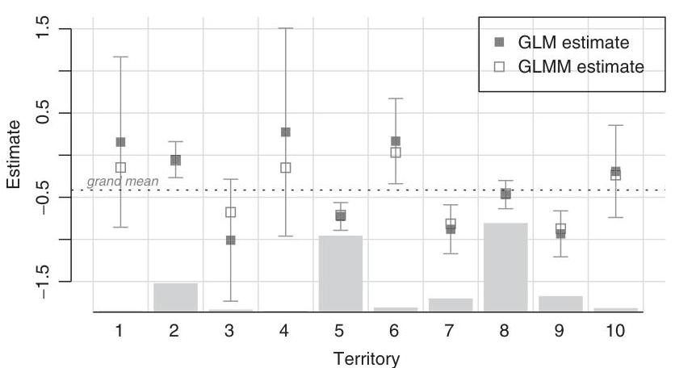

## Page 106
dispersion parameter, $\phi$; and the parameters related to the distribution of the $\gamma$ coefficients-namely, $v$ and $\sigma$. Note that at this stage, the $\gamma$ coefficients themselves have not been estimated; we've only estimated their distribution.

A second stage will produce the estimates of the $\gamma$ coefficients. Rather than basing the estimate for each territory entirely on its own data-as a regular GLM would do-the GLMM estimates will incorporate several pieces of information: the observed severity within the territory; the estimated distribution of the $\gamma$ parameters; and the estimated variance of $y$. Generally, estimates for more dense levels will be closer to those indicated by the data, while estimates for more sparse levels are driven closer to the overall mean.

If any of this seems eerily similar to Bühlmann-Straub credibility, that's because it is. In fact, the variance of the $\gamma$ distribution-denoted $\sigma$ above-is analogous to the familiar credibility concept of "between-variance" among the theoretical means; residual variance in the model—represented by $\phi$-corresponds to the "within-variance." The estimated $\gamma$ for each territory will in effect be a blend between the grand mean severity among territories $(v)$ and the territory's own observed severity, with the weighting determined based on the expected "within-variance" given the volume of data in the territory, relative to the "between-variance." Thus, the GLMM is a useful means of introducing classical credibility concepts into a GLM for multi-level categorical variables. ${ }^{23}$

Correlation Among Random Outcomes. In addition to allowing for credibility, the GLMM is also a means of inducing correlation into a model. Consider the case where a multi-year dataset may contain multiple renewals of the same policy. If we are concerned that the correlation among policy records is large enough so as distort the GLM results, we may wish to include policy ID as a random effect in a GLMM. In this instance, although the GLMM will produce an estimate for each policy ID, those are probably not of interest to us.

# 10.2. GLMs with Dispersion Modeling (DGLMs) 

Recall that a constraint built into GLMs is that the dispersion parameter of the exponential family $(\phi)$ must be held constant for all records. An extension to the GLM that loosens up this restriction is a GLM with a dispersion modeling component, which allows for each record to have a unique $\phi$ as well as $\mu$, controlled by a linear combination of coefficients and predictors. Those predictors may be the same as those that predict the $\mu$ parameter, or they may be different. This type of model is sometimes called a double-generalized linear model (or DGLM). ${ }^{24}$

The mathematical specification of a DGLM is as follows:

$$
\begin{gathered}
y_{i} \sim \operatorname{Exponential}\left(\mu_{i}, \phi_{i}\right) \\
g\left(\mu_{i}\right)=\beta_{0}+\beta_{1} x_{i 1}+\beta_{2} x_{i 2}+\cdots+\beta_{p} x_{i p}
\end{gathered}
$$

[^0]
[^0]:    ${ }^{23}$ See Klinker (2011a) for a more detailed discussion on the relationship between classical credibility and GLMMs.
    ${ }^{24}$ Smyth and Jørgensen (2002).

## Page 107
$$
g_{d}\left(\phi_{i}\right)=\gamma_{0}+\gamma_{1} z_{i 1}+\gamma_{2} z_{i 2}+\cdots+\gamma_{n} z_{i p}
$$

Equation 22 is similar to Equation 1, with a subtle difference: the $\phi$ parameter now has a subscript $i$ attached to it, indicating that it may vary by record. Equation 23 is identical to Equation 2.

The chief innovation of the DGLM is Equation 24, which specifies the relationship between the dispersion parameter and the predictors $z_{1} \ldots z_{p}$, which may or may not be the same as the $\mu$ predictors, $x_{1} \ldots x_{p}$. Coefficients for $z_{1} \ldots z_{p}$-denoted here as $\gamma_{1} \ldots \gamma_{p}$-are estimated by the model. The linear combination of those predictors and coefficients equals the dispersion parameter transformed by a link function, denoted here as $g_{d}($.$) . The subscript d$ is added to distinguish it from the link function applied$ to $\mu$ in Equation 23, since those two need not be the same; in practice, though, it is common to use a log link for both.

Implementation. DGLMs are implemented in the "dglm" package available for both the R and S-Plus statistical languages. However, where the distribution is a member of the Tweedie family (that is, either the normal, Poisson, gamma, inverse Gaussian or Tweedie distribution), the DGLM parameters can be closely approximated using any GLM estimation software with the following iterative procedure: ${ }^{25}$

1. Begin by assigning a value of 1 to all $\phi_{i}$.
2. Run a GLM to estimate the $\beta$ coefficients as usual, but with one modification: the weight variable should be the inverse of the dispersion parameter for each recordthat is, $1 / \phi_{i}$. If we wish to use a weight in the model, we must divide it by $\phi$ (i.e., set the weight variable to $\omega_{i} / \phi_{i}$ ).
3. Using the predictions generated by the model estimated in step 2, calculate the unit deviance for each record. The unit deviance is defined as:

$$
d_{i}=2 \phi_{i}\left[\ln f\left(y_{i} \mid \mu_{i}=y_{i}\right)-\ln f\left(y_{i} \mid \mu_{i}=\mu_{i}\right)\right]
$$

Note that this formula is the record's contribution to the total unscaled deviance described in Section 6.1.2. ${ }^{26}$
4. Run a GLM specified as follows:

- The target variable is the unit deviance calculated in step 3.
- The distribution is gamma.
- As predictors, use whatever variables we believe may affect dispersion. These are the $z$ variables of Equation 24, which may or may not be the same as the main GLM predictors.

[^0]where $\omega$ denotes the weight variable.

[^0]:    ${ }^{25}$ Smyth and Jørgensen (2002).
    ${ }^{26}$ For the Tweedie distribution, that formula works out to be the following:

## Page 108
5. Set the dispersion parameters $\phi_{i}$ to be the predictions generated by the model of step 4.
6. Repeat steps 2 through 5 until the model converges (that is, the model parameters cease to change significantly between iterations).

Where to Use It. In a general sense, using a DGLM rather than a GLM may produce better predictions of the mean, particularly in cases where certain classes of business are inherently more volatile than others. Allowing the dispersion parameter to "float" will in turn allow the model to give less weight to the historical outcomes of the volatile business, and more weight to the stable business whose data is more informative-thereby ignoring more noise and picking up more signal.

The following are particular scenarios where using a DGLM rather than a GLM may provide additional benefit:

- For some actuarial applications, the full distribution of the outcome variable, rather than just the mean, is desired. In such scenarios, a GLM with constant dispersion may be too simplistic to adequately describe the distribution. The DGLM, on the other hand, models two distributional parameters for each risk and thereby has greater flexibility to fit the distributional curves.
- GLMs that use the Tweedie distribution to model pure premium or loss ratio, by keeping the dispersion parameter constant, contain the implicit assumption that all predictors have the same directional effect on frequency and severity. (See Section 2.7.3 for further discussion on this.) The DGLM, on the other hand, by allowing the dispersion parameter to vary, provides the flexibility for the model to mold itself to the frequency and severity effects observed in the data.

# 10.3. Generalized Additive Models (GAMs) 

As noted in the introduction to this chapter, a hallmark assumption of the GLM is linearity in the predictors. While non-linear effects can be accommodated by adding various transformations of the predictors into the linear equation, those are workarounds that must be specified manually.

The generalized additive model (GAM) is a GLM-like model that handles nonlinearity natively. The mathematical specification of a GAM is as follows:

$$
\begin{gathered}
y_{i} \sim \operatorname{Exponential}\left(\mu_{i}, \phi\right) \\
g\left(\mu_{i}\right)=\beta_{0}+f_{1}\left(x_{i 1}\right)+f_{2}\left(x_{i 2}\right)+\cdots+f_{p}\left(x_{i p}\right)
\end{gathered}
$$

Equation 25 is identical to equation 1. GAMs, like GLMs, assume the random component of the outcome to follow an exponential family distribution.

Equation 26 is similar to equation 2, but with an important twist: the addends making up the linear predictor are no longer linear functions of the predictors-rather, they are

## Page 109
any arbitrary functions of the predictors. Those functions, denoted $f_{1}($.$) \ldots f_{n}($.$) specify the$ effects of the predictors on the (transformed) mean response as smooth curves. The shapes of these curves are estimated by the GAM software.

Note that the "additive" of "generalized additive model" refers to the fact that the linear predictor is a series of additive terms (though free from the constraint of linearity). As with a GLM, we can specify a log link, which would turn the model multiplicative.

Unlike in a GLM, where the effect of a variable on the response can be easily determined by examining its coefficient, for a GAM we are provided no such convenient numeric description of the effect. As such, predictor effects must be assessed graphically. Figure 28 shows examples of such graphs, using the example severity model discussed back in Section 5.4. For this illustration, two continuous variables-building age and amount of insurance, both logged—are included in a log link GAM, and their estimated smooth functions are graphed in the left and right panels, respectively.

For building age, the GAM estimated a clearly non-linear function, with mean severity first rising, reaching a peak at around building age $e^{2.8}=16$ years, then declining. (Compare this to Figures 10 and 11.) For amount of insurance, on the other hand, although the GAM was free to fit any arbitrary function, the one it estimated is nearly linear (albeit with some curvature), indicating that a linear fit would probably suffice for this variable.

The GAM allows us to choose from among several different methods for estimating the smooth functions; we will not delve into those details here. Each of those methods allows us to specify parameters that control the degree of smoothness for each function. Those parameters must be fine-tuned carefully, as allowing for too-flexible a function runs the risk of overfitting.

Implementation. GAMs are available through the R packages "gam" or "mgcv," or through PROC GAM in SAS.

Figure 28. Graphical Display of GAM Smoother Functions for Log of Building Age (left panel) and Log of Amount of Insurance (right panel)
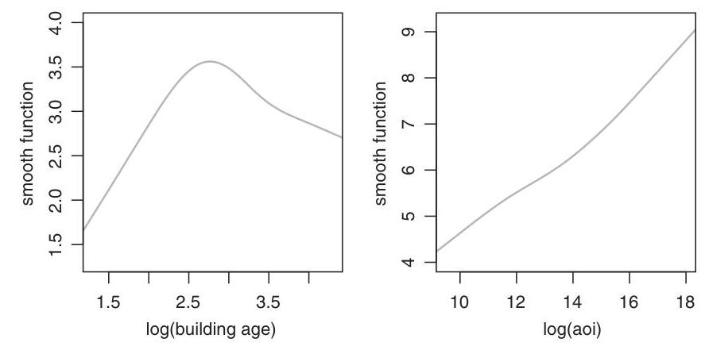

## Page 110
# 10.4. MARS Models 

Another GLM variant that is great at handling non-linearities is multivariate adaptive regression splines, or MARS. Rather than fit smooth functions for the predictors, as does the GAM discussed in the preceding section, MARS models operate by incorporating piecewise linear functions, or hinge functions, into a regular GLM. These hinge functions are the same as those discussed in Section 5.4.4. However, in that section we manually created the functions and determined cut points by eyeballing partial residual plots; MARS models create the functions and optimize the cut points automatically.

To illustrate, we continue with our example severity model of the previous section. This time, we will use a MARS model to capture potential non-linearity in the building age and amount of insurance variables. Table 14 shows the portion of the resulting coefficient table relating to those two variables.

In the output below, the function $h($.$) refers to the "hinge function" discussed in$ Section 5.4.4. For example, " $\mathrm{h}(\log (\mathrm{AoC})-1.94591$ )" is defined as $\max (\log (A o C)-$ $1.94591,0)$.

Looking at the three hinge functions for building age, notice that this handling of that variable is fairly similar to the piecewise linear functions we set up in Section 5.4.4, which had cut points at 2.75 and 3.5. The MARS model also found another cut point at 1.95. MARS did not include the unaltered $\log (\mathrm{AoC})$ term in this model, meaning that the response curve for $\log (\mathrm{AoC})$ below 1.95 is flat. (In a practical sense, that means this model would not differentiate between buildings of ages 1 to 7 years.)

Figure 29 graphs the response curves indicated by this model for those two variables. The $\times$ 's mark the locations of the cut points. Compare those to the curves indicated by the GAM output of the previous section.

As with GAMs, MARS has tuning parameters to control the flexibility of the fit. A more flexible model will create more cut points, allowing for finer segmentation. Of course, with that additional flexibility comes the risk of chasing noise.

Table 14. Partial Output of MARS Coefficient Table

| Parameter | Estimate | Std. Error | $p$-Value |
| :-- | :--: | :--: | :--: |
| $\cdots$ | $\cdots$ | $\cdots$ | $\cdots$ |
| 'h(log(AoC)-1.94591)' | 1.8977 | 0.1976 | $<0.0001$ |
| 'h(log(AoC)-2.70805)' | -2.9557 | 0.2598 | $<0.0001$ |
| 'h(log(AoC)-3.46574)' | 1.2980 | 0.3457 | 0.0002 |
| 'h(log(AOI)-9.39124)' | 0.3949 | 0.0359 | $<0.0001$ |
| 'h(log(AOI)-13.2124)' | 0.0611 | 0.0657 | 0.3526 |
| 'h(log(AOI)-15.7578)' | 0.7151 | 0.2263 | 0.0016 |
| $\cdots$ | $\cdots$ | $\cdots$ | $\cdots$ |

## Page 111
Figure 29. Graphical display of MARS indicated relativities for log of building age (left panel) and log of amount of insurance (right panel). The x's mark the locations of the cut points.

In addition to its natural ability to handle non-linearities, MARS has a number of additional highly useful features, including:

- It performs its own variable selection. Unlike a GLM—which will generate a coefficient for each predictor input by the user-MARS will keep only those that are significant. (Tuning parameters are available to control how many variables are retained.)
- It can also search for significant interactions. It is quite flexible in this regard; in addition to the 2-way interactions discussed in Section 5.6, it can search for 3-way (or higher degree) interactions, as well as interactions among the piecewise linear functions.

Even where we require our final model to be in the form of a standard GLM, MARS may still be a very valuable tool in the model refinement process: we can run a MARS model on the data, examine its output-hinge functions it created, interactions it discovered, and so on-and copy whichever terms we like into our GLM. Consider the output shown in Table 14; it is very easy to simply replicate those same hinge functions in our GLM, and get the same benefit of the non-linear fit.

Used in this way, MARS may uncover non-linear transformations or interactions we may not have thought to try. Great care needs to be taken, though, as such a "deep search" through the data can easily turn up spurious effects.

Implementation. MARS is available as commercial software from Salford Systems. Implementations of the same procedure (not called MARS, due to Salford Systems' trademark on the name) are available through the "earth" package in R and PROC ADAPTIVEREG in SAS (beginning with SAS/STAT version 13.1).

# 10.5. Elastic Net GLMs 

When modeling in situations where there are a large number of potential predictor variables, overfitting can be a real concern for GLMs. GLMs make full use of all the
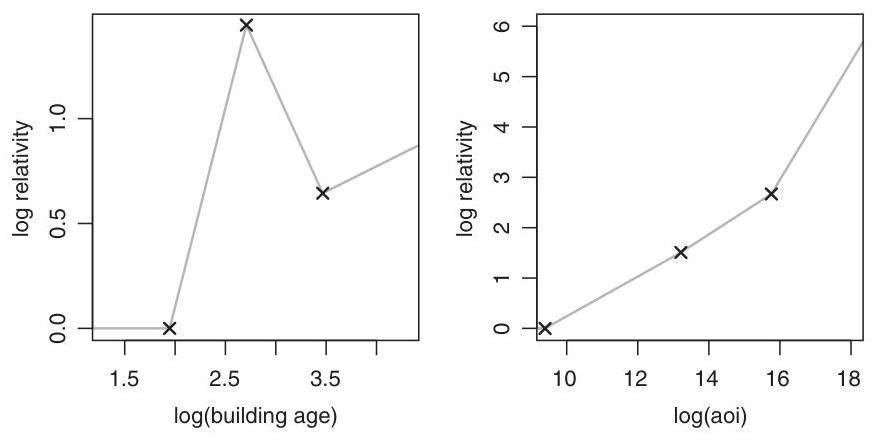

## Page 112
predictors fed into them to fit the training data as best as possible-that is, it will find coefficients for all predictors such that the deviance of the training set is minimized. Including too many predictors will cause the model to pick up random noise in the training data, yielding a model that may perform poorly on unseen data. In such a scenario, variable selection-choosing the right variables to include in the model while omitting the others-can be quite challenging.

Elastic net GLMs provide a powerful means of protecting against overfitting even in the presence of many predictors. Elastic nets GLMs are, at the core, identical to GLMs in their mathematical specification. The chief difference is in the method by which the coefficients are fit. Rather than aggressively minimizing deviance on the training set-as a regular GLM would—elastic nets enable you to constrain the fit, by minimizing a function that is deviance subject to a penalty term for the size and magnitude of the coefficients. This penalty term can be fine-tuned to allow you to find the right balance where the model fits the training data well—but at the same time, the coefficients of the model are not too large.

The function minimized by elastic nets is as follows: ${ }^{27}$

$$
\text { Deviance }+\lambda\left(\alpha \sum|\beta|+(1-\alpha) \frac{1}{2} \sum \beta^{2}\right)
$$

The first additive term of the above expression is just the GLM deviance; if this were a regular GLM, we'd be minimizing just that. The elastic net adds the part following the plus sign, called the penalty term. Let's examine that closely.

Inside the parentheses is a weighted average of the sum of the absolute values of the coefficients and the halved sum of squared coefficients, with the weights determined by $\alpha$, a parameter between 0 and 1 that we control. This use of a weighted average is primarily due to the fact that this model is a generalization of two earlier variations on this same concept: the lasso model, which uses absolute value of coefficients, and ridge model, which uses squared coefficients. The important thing to recognize, though, is that the terms inside the parentheses yield an increasing function of the magnitude of the coefficients, or the degree by which the coefficients deviate from zero. Thus, a greater penalty is applied for larger coefficients. ${ }^{28}$

The more important tuning parameter in Equation 27 is the $\lambda$ that sits outside the parentheses. This allows us to control the severity of the penalty that gets applied. The practical effect of raising $\lambda$ is that it forces coefficients to shrink closer to zero, to compensate for the increased penalty, in minimizing Equation 27. Under certain

[^0]
[^0]:    ${ }^{27}$ In Equation 27, the vector of coefficients represented by $\beta$ does not include $\beta_{0}$, the intercept term, which does not contribute to the penalty.
    ${ }^{28}$ In elastic net models, all predictor variables are automatically centered and scaled prior to running the model. This way, the resulting $\beta$ coefficients are on similar scales, and so the magnitude of deviation from zero means roughly the same thing for all variables, regardless of the scales of the original variables. Note, however, that most implementations of elastic nets will return the coefficients on the scales of the original variables, so this standardization that happens behind the scenes poses no obstacle to implementation of the resulting model.

## Page 113
Figure 30. An Illustration of the Effect of Varying $\lambda$ on Elastic Net Coefficients
conditions, some less-important predictors will be assigned coefficients of zero (effectively removing them from the model entirely).

In Figure 30 we illustrate this effect for a simple model that has five predictors, which we name A through E. Each predictor is represented by a different curve. For each, the value that the coefficient assigns to the predictor is plotted on the $y$-axis for different values of $\lambda$, with $\lambda$ decreasing from left to right along the $x$-axis.

At the far left of the graph-where $\lambda$ is at its highest-the penalty for coefficient size is severe, and so no variables make it in with a non-zero coefficient. As we move rightward, dialing down $\lambda$ and thereby easing up on the penalty, Variable E-clearly the most significant variable here-enters our model and grows in influence as $\lambda$ declines. Moving farther to the right, more variables make their way in and their coefficients grow-eventually converging toward the maximum likelihood estimates that a regular GLM would give them.

In practice, the $\lambda$ parameter is usually fine-tuned through cross validation. Doing so produces a model that is likely to perform better on unseen data than would a regular GLM. After all, a GLM is just a special case of the elastic net (where $\lambda=0$ ) and so the fine-tuning procedure has the flexibility to produce a standard GLM if in fact it is the best model. Usually, though, the model can be improved by setting a non-zero penalty.

As we have seen, a non-zero penalty causes the model parameters to exhibit the shrinkage effect that is characteristic of actuarial credibility models as well as GLMMs discussed above. In fact, it has been shown that elastic nets bear direct relationships to many classical credibility models. ${ }^{29}$ Thus, as with GLMMs discussed above, elastic nets provide a convenient means of incorporating familiar credibility concepts into the GLM framework.

[^0]
[^0]:    ${ }^{29}$ See Miller (2015) for further discussion on this equivalence and its derivation.
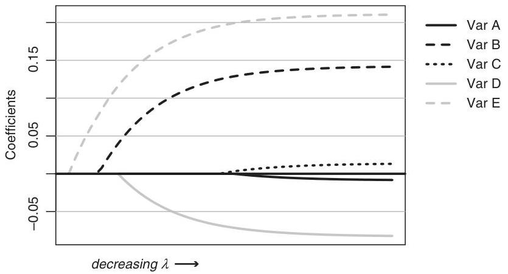

## Page 114
Elastic nets also have the advantage of being able to perform automatic variable selection, as variables that are not important enough to justify their inclusion in the model under the penalty constraint will be removed.

Furthermore, elastic nets perform much better than GLMs in the face of highly correlated predictors. The penalty term provides protection against the coefficients "blowing up" as they might in a GLM. Rather, one or two variables of a group of correlated predictors will typically be selected, and they will be assigned moderate coefficients.

The main disadvantage of elastic nets is that they are much more computationally complex than standard GLMs. The computational resources and time needed to fit elastic nets and optimize $\lambda$ may make elastic nets impractical for large datasets.

Implementation. Elastic nets are implemented in the "glmnet" package in R. ${ }^{30}$ It is also available in SAS (beginning with SAS/STAT version 13.1) using PROC GLMSELECT.

[^0]
[^0]:    ${ }^{30}$ As of this writing, the glmnet package does not support the gamma or Tweedie distributions. Fortunately, the "HDtweedie" package provides an implementation of glmnet for the Tweedie distribution; the gamma distribution is accessible through this package by setting the Tweedie $p$ parameter to be 2 .

## Page 115
# Bibliography 

Several of the items in this section reference chapters of Predictive Modeling Applications in Actuarial Science: Vol. 1, edited by Jed Frees, Richard Derrig and Glenn Meyers. In addition to providing more detailed and in-depth technical discussions of GLMs and other models discussed in this monograph, that book also provides several insurance datasets on which the reader can test and practice those models and other techniques described in this text.

Anderson, Duncan, Sholom Feldblum, Claudine Modlin, Doris Schirmacher, Ernesto Schirmacher, and Neeza Thandi. 2007. A Practitioner's Guide to Generalized Linear Models. https://www.casact.org/site/default/files/database/ dpp_04_04dpp1.pdf.
Antonio, Katrien and Yanwei Zhang. 2014. "Nonlinear Mixed Models." Predictive Modeling Applications in Actuarial Science: Vol. 1. Chap. 16. New York: Cambridge University Press.

Brockett, Patrick L., Shuo-Li Chuang and Utai Pitaktong. 2014. "Generalized Additive Models and Nonparametric Regression." Predictive Modeling Applications in Actuarial Science: Vol. 1. Chap. 15. New York: Cambridge University Press.
Clark, David R. and Charles A. Thayer. 2004. A Primer on the Exponential Family of Distributions. https://www.casact.org/sites/default/files/database/ dpp_dpp04_04dpp117.pdf.
Dean, Curtis Gary. 2014. "Generalized Linear Models." Predictive Modeling Applications in Actuarial Science: Vol. 1. Chap. 5. New York: Cambridge University Press.
Dunn, Peter K. and Gordon K. Smyth. 1996. "Randomized Quantile Residuals." Journal of Computational and Graphical Statistics 5:236-244.
Frees, Edward W., Glenn Meyers and David A. Cummings. 2011. "Predictive Modeling of Multi-Peril Homeowners Insurance." Variance 6:1, pp. 11-31.
Frees, Edward W., Glenn Meyers and David A. Cummings. 2014. "Insurance Ratemaking and a Gini Index." Journal of Risk and Insurance 81(2) pp. 335-366, 2014.
Frees, Edward W. 2014. "Frequency and Severity Models." Predictive Modeling Applications in Actuarial Science: Vol. 1. Chap. 6. New York: Cambridge University Press. Harrell, Frank E., Jr. 2015. Regression Modeling Strategies. Second Ed. New York: Springer. Hastie, Trevor, Robert Tibshirani, and J.H. Friedman. 2009. The Elements of Statistical Learning: Data Mining, Inference, and Prediction. New York: Springer.
de Jong, Piet and Gillian Z. Heller. 2008. Generalized Linear Models for Insurance Data. New York: Cambridge University Press.
Klinker, Fred. 2011a. "Generalized Linear Mixed Models for Ratemaking: A Means of Introducing Credibility into a Generalized Linear Model Setting." Casualty Actuarial Society E-Forum (Winter):2

## Page 116
Klinker, Fred. 2011b. "GLM Invariants." Casualty Actuarial Society E-Forum, Summer 2011.

Kuhn, Max and Kjell Johnson. Applied Predictive Modeling. 2013. New York: Springer. McCullagh, P. and J.A. Nelder. 1989. Generalized Linear Models. 2nd ed. London: Chapman \& Hall.
Miller, Hugh. 2015. A Discussion on Credibility and Penalised Regression, with Implications for Actuarial Work. Presented to the Actuaries Institute 2015 ASTIN, AFIR/ERM and IACA Colloquia.
Smyth, Gordon K. and Bent Jørgensen. 2002. "Fitting Tweedie's Compound Poisson Model to Insurance Claims Data: Dispersion Modelling." ASTIN Bulletin 32(1):143-157.
Werner, Geoff and Claudine Modlin. 2010. Basic Ratemaking. 2nd ed. Casualty Actuarial Society.
Yan, Jun, James Guszcza, Matthew Flynn, and Cheng-Sheng Peter Wu. 2009.
"Applicationsof the Offset in Property-Casualty Predictive Modeling." Casualty
Actuarial Society E-Forum (Winter 2009):366-385.

## Page 117
# Appendix 

In section 6.3.2, which discusses binned working residuals, we noted two properties that such residuals hold for a well-specified model, which makes them highly useful for performing residual analysis on models built from large datasets: (1) They follow no predictable pattern, as the mean of these residuals is always zero; and (2) they are homoscedastic, i.e., their variance is constant. In this appendix we show the derivation of these properties.

Given a model with $n$ observations, let $i=1, \ldots, n$ be the index of the observations. We divide the observations into $m$ bins; let $b=1, \ldots, m$ be the index of the bins.

Define working residual as

$$
w r_{i}=\left(y_{i}-\mu_{i}\right) \cdot g^{\prime}\left(\mu_{i}\right)
$$

Define working weight as

$$
w w_{i}=\frac{\omega_{i}}{V\left(\mu_{i}\right) \cdot\left[g^{\prime}\left(\mu_{i}\right)\right]^{2}}
$$

Define binned working residual as

$$
b r_{b}=\frac{\sum_{i \in b} w r_{i} \cdot w w_{i}}{\sum_{i \in b} w w_{i}}
$$

We assign observations to bins such that all bins have equal sums of working weights, i.e., $\sum_{i \in b} w w_{i}=k$. It follows that

$$
\sum_{i=1}^{n} w w_{i}=S W W=m \cdot k \rightarrow k=\frac{S W W}{m}
$$

For a properly specified model, the following holds:

$$
\begin{aligned}
E\left(y_{i}\right) & =\mu_{i} \\
\operatorname{Var}\left(y_{i}\right) & =\frac{\phi \cdot V\left(\mu_{i}\right)}{\omega_{i}}
\end{aligned}
$$

## Page 118
$$
E\left(\omega_{i} \frac{\left(y_{i}-\mu_{i}\right)}{V\left(\mu_{i}\right) g^{\prime}\left(\mu_{i}\right)}\right)=0 .^{1}
$$

Property 1: $E\left(b r_{b}\right)=0$.

$$
\begin{aligned}
E\left(b r_{b}\right) & =E\left(\frac{\sum_{i \in b} w r_{i} \cdot w w_{i}}{\sum_{i \in b} w w_{i}}\right) \\
& =\frac{1}{k} E\left(\sum_{i \in b} w r_{i} \cdot w w_{i}\right) \\
& =\frac{1}{k} E\left(\frac{\left(y_{i}-\mu_{i}\right) \cdot g^{\prime}\left(\mu_{i}\right) \cdot \omega_{i}}{V\left(\mu_{i}\right) \cdot\left[g^{\prime}\left(\mu_{i}\right)\right]^{2}}\right) \\
& =\frac{1}{k} E\left(\omega_{i} \frac{\left(y_{i}-\mu_{i}\right)}{V\left(\mu_{i}\right) g^{\prime}\left(\mu_{i}\right)}\right)=0
\end{aligned}
$$

Property 2: $\operatorname{Var}\left(b r_{b}\right)=$ Constant $=\frac{\phi \cdot m}{S W W}$

$$
\begin{aligned}
\operatorname{Var}\left(b r_{b}\right) & =\operatorname{Var}\left(\frac{\sum_{i \in b} w r_{i} \cdot w w_{i}}{\sum_{i \in b} w w_{i}}\right) \\
& =\frac{1}{k^{2}} \operatorname{Var}\left(\sum_{i \in b} w r_{i} \cdot w w_{i}\right)
\end{aligned}
$$

Assume that the working residuals are independent. Therefore,

$$
\frac{1}{k^{2}} \operatorname{Var}\left(\sum_{i \in b} w r_{i} \cdot w w_{i}\right)=\frac{1}{k^{2}} \sum_{i \in b} \operatorname{Var}\left(w r_{i} \cdot w w_{i}\right)
$$

Let's simplify the $\operatorname{Var}\left(w r_{i} \cdot w w_{i}\right)$ term:

$$
\operatorname{Var}\left(w r_{i} \cdot w w_{i}\right)=\operatorname{Var}\left(\omega_{i} \frac{y_{i}-\mu_{i}}{V\left(\mu_{i}\right) \cdot g^{\prime}\left(\mu_{i}\right)}\right)
$$

[^0]
[^0]:    ${ }^{1}$ See Klinker (2011b), who demonstrates that $\sum_{i} \omega_{i} \frac{\left(y_{i}-\mu_{i}\right)}{V\left(\mu_{i}\right) g^{\prime}\left(\mu_{i}\right)}=0$, both over the entire GLM training data as well as over any subset with the same level of a categorical variable. In a well-fit model there is no predictable pattern in the residuals, and so the expected value $E\left(\omega_{i} \frac{\left(y_{i}-\mu_{i}\right)}{V\left(\mu_{i}\right) g^{\prime}\left(\mu_{i}\right)}\right)=0$ for any individual observation as well.

## Page 119
$$
\begin{aligned}
& =\frac{\omega_{i}^{2}}{V\left(\mu_{i}\right)^{2} \cdot\left[g^{\prime}\left(\mu_{i}\right)\right]^{2}} \operatorname{Var}\left(y_{i}-\mu_{i}\right) \\
& =\frac{\omega_{i}^{2}}{V\left(\mu_{i}\right)^{2} \cdot\left[g^{\prime}\left(\mu_{i}\right)\right]^{2}} \operatorname{Var}\left(y_{i}\right) \\
& =\frac{\omega_{i}^{2}}{V\left(\mu_{i}\right)^{2} \cdot\left[g^{\prime}\left(\mu_{i}\right)\right]^{2}} \cdot \frac{\phi V\left(\mu_{i}\right)}{\omega_{i}} \\
& =\frac{\omega_{i} \cdot \phi}{V\left(\mu_{i}\right) \cdot\left[g^{\prime}\left(\mu_{i}\right)\right]^{2}}=\phi \cdot w w_{i}
\end{aligned}
$$

Plugging this simplified term back into the original equation,

$$
\begin{aligned}
\operatorname{Var}\left(b r_{b}\right) & =\frac{1}{k^{2}} \sum_{i \in b} \operatorname{Var}\left(w r_{i} \cdot w w_{i}\right)=\frac{1}{k^{2}} \sum_{i \in b} \phi \cdot w w_{i} \\
& =\frac{\phi}{k^{2}} \sum_{i \in b} w w_{i}=\frac{\phi \cdot k}{k^{2}}=\frac{\phi}{k}=\frac{\phi \cdot m}{S W W}
\end{aligned}
$$

A good rule of thumb is to select the number of bins $m$ such that $\operatorname{Var}\left(b r_{b}\right) \leq 0.01$.

## Page 120
.

## Page 121
.

## Page 122
# ABOUT THE SERIES: 

CAS monographs are authoritative, peer-reviewed, in-depth works focusing on important topics within property and casualty actuarial practice. For more information on the CAS Monograph Series, visit the CAS website at www.casact.org.