_Note: Source document was split into 4 OCR chunks (pages 1-24, pages 25-41, pages 42-61, pages 62-66) to stay within token limits._

# CAS_Monograph_06-Kunce-Chatterjee

## Page 1
# CAS MONOGRAPH SERIES NUMBER 6 

## A MACHINE-LEARNING APPROACH TO PARAMETER ESTIMATION   Jim Kunce and Som Chatterjee

## Page 2
With the recent advances in low-cost computing power, the use of machine-learning techniques to solve insurance problems is now feasible. This paper develops a model, using any regression based machine-learning algorithm, to analyze the nonlinear relationships between the parameters of statistical distributions and features that are of interest to a specific problem, thereby uncovering patterns that are hidden in the historical data. Unlike traditional stratification and segmentation, our machine-learning approach to parameter estimation (MLAPE) learns the underlying parameter groups from the data and uses validation to ensure appropriate predictive power. We present an implementation of this model for the lognormal distribution utilizing the K-nearest neighbors, kernel regression, and relevance vector machine algorithms, which incorporate the concepts of training/testing/validation data sets, parameter sweeps, outlier removal, and Bayesian maximum a posteriori estimation. We then demonstrate the ability of the machine to learn different clusters of mu and sigma from a publicly available closed claim data set. With an understanding of this machine, actuaries will be prepared to incorporate machine-learning algorithms into their actuarial work product and compete in the era of "big data."

Keywords. Machine learning; K-nearest neighbors; K-means clustering; kernel regression; relevance vector machine; predictive model; generalization error; Bayesian parameter estimation; lognormal distribution

## Page 3
# A MACHINE-LEARNING APPROACH TO PARAMETER ESTIMATION 

Jim Kunce and Som Chatterjee

Casualty Actuarial Society
4350 North Fairfax Drive, Suite 250
Arlington, Virginia 22203
www.casact.org
(703) 276-3100

## Page 4
A Machine-Learning Approach to Parameter Estimation
By Jim Kunce and Som Chatterjee
Copyright 2017 by the Casualty Actuarial Society
All rights reserved. No part of this publication may be reproduced, stored in a retrieval system, or transmitted, in any form or by any means, electronic, mechanical, photocopying, recording, or otherwise, without the prior written permission of the publisher. For information on obtaining permission for use of material in this work, please submit a written request to the Casualty Actuarial Society.

Library of Congress Cataloguing-in-Publication Data
Kunce, Jim
Chatterjee, Som
A Machine-Learning Approach to Parameter Estimation
ISBN 978-0-9968897-4-2 (print edition)
ISBN 978-0-9968897-5-9 (electronic edition)

1. Actuarial science. 2. Predictive modeling. 3. Insurance-Mathematical models.
I. Kunce, Jim II. Chatterjee, Som

## Page 5
# Contents 

1. Introduction ..... 1
2. Problem ..... 3
3. MLAPE (Machine-Learning Approach to Parameter Estimation) ..... 6
4. MLAPE Application ..... 30
5. Discussion ..... 43
6. Conclusion ..... 48
References ..... 49
Appendix I ..... 51
Appendix II ..... 53
Appendix III ..... 54

## Page 6
.

## Page 7
# About the Authors 

Jim Kunce is Senior Vice President and Chief Actuary at MedPro Group. He holds B.S. degrees in Physics and Astronomy from the University of Kansas and a M.S. in Applied Computer Science from Purdue University. He is a Fellow of the Casualty Actuarial Society and a Member of the American Academy of Actuaries. Jim began his actuarial career in 1994 and has also held positions at Kemper Insurance and GE Insurance Solutions. While at GE Insurance, he earned his Master Black Belt certification in Six Sigma Quality and was issued a patent for methods and structure for improved interactive statistical analysis.

Som Chatterjee is President and CEO of 121 Mapping Inc., a Delaware company focused on building analytics launch-pads and mobilizing data assets to better predict outcomes and prescribe actions for insurance carriers and intermediaries globally. He holds a bachelor's in statistics from the Indian Statistical Institute. He is a Fellow of the Casualty Actuarial Society and a Member of the American Academy of Actuaries. Som began his actuarial career in 2004 and has held positions at Genpact and MedPro Group. Som can be reached via email at som.chatterjee@121mapping.com, or visit www. 121 mapping.com.

## Page 8
# 2017 CAS Monograph Editorial Board 

Ali Ishaq, editor in chief Emmanuel Theodore Bardis Brendan P. Barrett Craig C. Davis Edward W. Ford Glenn G. Meyers, consultant Frances G. Sarrel, liaison

## Page 9
# Foreword 

Like other intellectual domains where pattern recognition and feature extraction is central, with the growth of machine power and machine speed, the use of machine learning in actuarial science is accelerating. And as our "mind children" (as Hans Moravec, an AI pioneer, called machines) become more capable, they can help us do things that we might not otherwise be able to do.

Parameter estimation, especially over multiple dimensions, has long been as much of an art as a science. Judgment and intuition, useful as they are, are vulnerable to the human biases that everyone is susceptible to. In addition, subjective methods, as Kunce and Chatterjee point out, fail to test for and thus may not optimize, generalization and predictive power. Machine learning can help us reduce biases and maximize predictive power while avoiding overgeneralization.

Traditionally we have used distributions with tractable mathematical forms to model the relationships between variables. The non-parametric nature of machine learning can allow us to forego these distributional assumptions and enable the shape of the model to emerge from the data. By selecting a (lognormal) distributional form and then using machine learning algorithms to generate and generalize the parameter estimates, Kunce and Chatterjee build a bridge between the traditional and machine learning approaches. Thus, A Machine-Learning Approach to Parameter Estimation is the first monograph published by the CAS that shows how to use machine learning to enhance traditional ratemaking.

The goal of the authors was to balance goodness-of-fit with parsimonious feature selection and optimal generalization from sparse data. They used three related machine learning algorithms: K-nearest neighbor (KNN), kernel regression, and relevance vector machines (RVM) to first estimate parameter sets and then to simplify the model by clustering the parameter estimates. For the sake of computational speed, the authors separate the available data for training and validation from that for testing, but, as they describe, if computational speed were not a constraint, cross-validation could be employed to further optimize this analysis. In addition, the authors, by casting parameter estimation in terms of segmentation, point to the broader scope for this technique.

This monograph lays a foundation for future development in the application of machine learning in actuarial applications and should serve as a valuable resource for students and actuarial practitioners. The CAS Monograph Editorial Board thanks the authors for this valuable contribution to the actuarial literature.

Ali Ishaq
Chairperson
Monograph Editorial Board

## Page 10
.

## Page 11
# 1. Introduction 

The problem of searching for patterns in insurance data is fundamental to the actuarial profession and has an extensive literature going back many decades. Regardless of the context, many of the solutions reduce to one of parameter estimation. Whether the needed solution is to estimate parameters of a loss distribution, a regression model, or a loss-development process, the basic problem of searching for patterns remains the same. A key decision as part of that analysis is how to segment the data. If we estimate the parameters for the entire population, the fitted model loses predictive power due to lack of specificity. Likewise, if we estimate the parameters for every possible slice of the data, the fitted model loses predictive power due to over-fitting. Regardless of the problem or the industry, the modeler must find a balance between these two extremes. While our actuarial world approaches the segmentation issue with credibility and contextual solutions, the machine-learning domain within the computer science discipline has been developing algorithms to estimate any type of parameter regardless of context. Unlike statistical modeling, which designs the relationship between variables using a mathematical equation provided by the modeler, machine learning is a type of algorithm that can learn from data, without an explicit relationship structure between variables. This shift of focus from defining a structure that adequately models the relationship to learning the structure regardless of its functional form provides the ability to infer many complex and non-linear relationships. This is also what gives the "black box" appearance to machine-learning algorithms, so extra efforts need to be made to demystify how the machine works. Combining the advances in machine learning with the foundations of actuarial science offers a new approach to the segmentation issue and the possibility for improved accuracy over standard techniques. In the last century, reliance on algorithmic learning versus domain expertise was infeasible due to computational limitations. However, algorithmic learning replacing domain expertise is a reality today that the actuarial profession faces and needs to embrace for the future.

In this paper, we introduce a number of machine-learning parameter estimation approaches and demonstrate how the integration of these techniques into a specific parameter estimation problem increases the predictive power of the solution. The practical value of this paper will equip the student and practicing actuary with refined techniques that can enhance domain knowledge. The interested practitioner can then survey other existing machine-learning literature to develop a broader understanding, while using this paper as a springboard in their exploration.

## Page 12
The motivation for the MLAPE (pronounced as "em-lape") method is an improved solution to the segmentation problem, so in Section 2 we state the specific problem we are trying to solve, the traditional approach to solving this problem, and the MLAPE approach. We also note the challenges under each of the approaches. We end the section with a set of reading options for the remainder of the paper depending on the background of the reader. In Section 3, we introduce the MLAPE method. The section starts with the general segmentation problem's mathematical form and notations, which will assist in the readability of the R and Matlab code. We then provide a description of the key concepts needed to use MLAPE. We end the section with the detailed algorithm, which brings the pieces together. In Section 4, we provide a real-world application of MLAPE on the Texas Closed Claims Database. We provide extensive diagnostic tools to measure performance and results. In Section 5, we discuss the potential applications to insurance. We conclude in Section 6 with a recap of major findings.

## Page 13
# 2. Problem 

In order to provide a practical demonstration of the MLAPE method, we use the Texas Closed Claims Data from http://www.tdi.texas.gov/reports/report4.html. The data has ten years of historical closed claims data from 2003 to 2012 by policy type, business class and injury county. We have explained this data set in detail in Section 4. We focus on the Commercial Auto Liability policy type since it has the most closed claims. Following are the goals of the insurance problem at hand, the traditional actuarial approach to solving the problem, and the MLAPE approach.

The goal is to establish Increased Limits Factors and Territory Factors for each combination of business class and county for the Commercial Auto Liability line. The factors should be stable, reasonable and ensure rate adequacy for a carrier looking to write Commercial Auto Liability insurance in Texas. Traditionally, there are many ways of setting these factors.

There is the data-driven approach where we utilize the aggregated Texas Closed Claims Data to estimate the ILFs and Territory factors for business classes and counties where loss data is credible. Following that, we use judgement to make ILF "picks" for business classes and counties where minimal loss data is available. There are also the non-data-driven approaches where factors are based on competitor filings or on expert opinion.

We demonstrate how the MLAPE approach is better when compared to the traditional data driven approach. First, we present the challenges of the traditional data-driven approach.

## Challenges with the Traditional Approach

There are two methodological challenges with the traditional data-driven approach.

1. Data Sparseness. Not every business class and county combination has losses that can be utilized to estimate ILFs and Territory factors. When such loss data is unavailable, which as we shall see later is very common, the traditional datadriven approach needs to make some adjustments. Typically, there are two types of adjustments. First, losses from "neighboring" counties and "similar" business classes can be aggregated together to form credible cohorts using judgment. Second, ILF and territory factors can be directly picked based on business knowledge and expert opinion. Regardless of the option, there is a fair amount of subjectivity, which does not test for acceptable levels of generalization and predictive power. Predictive

## Page 14
power refers to factors being accurate in their ability to estimate unseen data from county and business classes, while generalization refers to consistency of prediction accuracy across the spectrum of predictions.
2. Over-Fitting. Even for counties and business classes where there is enough data available, there is no guaranty that the resulting indicated factors do not over fit the data. The use of judgment in aggregating the data may create a model that is excessively complex. In that case, the model then works well on the data used to build the model but fails when making predictions on new data. It is important to be able to select ILFs and territory factors, which are predictive and generalizable, and the traditional approach does not address this challenge.

MLAPE Approach. The machine-learning approach enhances the traditional datadriven approach to address sparseness while ensuring the model is not excessively complex. It does so by deconstructing the problem into two sub goals shown below.

Sub Goal 1. Algorithmically find the parameters underlying the statistical distribution of losses for each business class and county combination for Commercial Auto Liability. In our Texas closed claims data example we will use the lognormal distribution with the $(\mu, \sigma)$ as its parameters (although the MLAPE method is not limited to this particular choice of distribution; see Appendix I for details).

# Advantage. 

Data sparseness: Since every business class and county does not have losses that can be used to estimate $(\mu, \sigma)$, we perform feature selection as an objective way to define similarity between counties and business classes. With feature selection, we algorithmically determine similarity of business classes and counties, which can then be used as "proxy" losses. Using proxy losses increases the credibility and homogeneity of parameter estimates and, in doing so, the sparseness issue is addressed, while the next sub goal solves the generalization and predictive power issue.

Sub Goal 2. Combine the $(\mu, \sigma)$ pairs from Sub Goal 1 into clusters, to reduce the total number of estimated lognormal distributions.

## Advantage.

Predictive power. Simplifying the model, by reducing the distinct pairs of $(\mu, \sigma)$ from Sub Goal 1 into indicated $(\mu, \sigma)$ clusters, removes the random noise in parameter estimation, thereby increasing the predictive power. To measure the improvement in predictive power we utilize a "parameter sweep" framework to split the data into three sets. Set-1 is used to build the algorithm, Set-2 is used to tune the parameters, and Set-3 is used to test the performance. This framework lets us gauge the generalization power of competing candidate models and pick the one set of ILFs and territory factors which best balances predictive and generalization requirements.

In the remainder of the paper, we will not discuss the traditional approach. There are many excellent papers on that topic in the existing body of actuarial literature on

## Page 15
Figure 1. Suggested Reading Order

| Reader's Objective | 3.1 | 3.2 | 3.3 | 4 | 5 | 6 |
| :--: | :--: | :--: | :--: | :--: | :--: | :--: |
| TX Closed Claim Application |  |  |  |  |  |  |
| MLAPE Recipe |  |  |  |  |  |  |
| Machine-learning concepts |  |  |  |  |  |  |
| Mathematical rigor |  |  |  |  |  |  |

ratemaking, Increased Limits Factors, territorial analysis techniques, etc. Instead, we will focus on the MLAPE approach and demonstrate how to use it as a standalone, balanced method for achieving the goal of parameter estimation.

The reader may skip some sections in the remainder of the paper depending on their individual machine-learning exposure and overall objective. We present some suggested reading orders in Figure 1.

- TX Closed Claim application = Assumes prior machine learning exposure and reader is only interested in full MLAPE application to one real-life example.
- MLAPE Recipe $=$ Assumes prior machine learning exposure and reader is interested in general MLAPE recipe and full application to one real-life example.
- Machine-learning concepts $=$ Assumes no prior machine learning exposure and reader is interested in general MLAPE recipe and full application to one real-life example.
- Mathematical rigor $=$ Assumes no prior machine-learning exposure and reader is interested in general MLAPE recipe and full application to one real-life example plus the mathematical rigor for generalization and understanding R and Matlab naming conventions and code.

## Page 16
# 3. MLAPE (Machine-Learning Approach to Parameter Estimation) 

Section 3 is divided into three parts. Section 3.1 provides the general segmentation problem and notations. Section 3.2 discusses the key concepts embedded within MLAPE, including both the process to be followed and an introduction to the selected machinelearning algorithms. Finally, Section 3.3 provides the step-by-step MLAPE Recipe.

### 3.1. The General Segmentation Problem and Notations

First, we restate the previously stated goals as the general segmentation problem. While not needed for the discussion on ILFs and territory factors, doing so serves two purposes.

1. It brings a wider class of insurance parameter estimation problems within the reach of the MLAPE method.
2. It demonstrates how MLAPE naturally tackles the problems of
a. Identifying similar counties or $(\mu, \sigma)$ pairs
b. Balancing data sparseness and Credibility
c. Maximizing predictive power.

## The General Segmentation Problem

Consider a process dependent on a set of features in a $|\mathbf{D}|$-dimensional space, which can give rise to $\mathbf{Y}$ (possible) output values. An example is losses originating from a set of business classes and counties, such as in the Texas Closed Claims Data example. The losses depend on the characteristics (i.e., the $|\mathbf{D}|$ dimensions) of the business classes and counties. Examples of business class dimensions are injury rates, employment metrics, goods vs. service producing, etc. Similarly, dimensions for counties may be average income, education level, latitude, longitude, etc. These losses are generated from a set of distributions $P\left(y \in \mathbf{Y} \mid \boldsymbol{\theta}_{\mathbf{d}}\right)$ where $\boldsymbol{\theta}=\left\{\boldsymbol{\theta}_{\mathbf{d}} \mid d \in \mathbf{D}\right\}$ is the set of parameters. Each distribution is characterized by parameters $\boldsymbol{\theta}_{\mathbf{d}}$ for a particular segment $d$. The $\boldsymbol{\theta}_{\mathbf{d}}$ in our application are the $(\mu, \sigma)$ pairs. In subsequent notation we will drop the explicit $y$ and $\boldsymbol{\theta}$ and use $P(d)$ and $P(y \mid d)$ interchangeably to imply $P\left(y \in \mathbf{Y} \mid \boldsymbol{\theta}_{\mathbf{d}}\right)$. Given a set of losses $\left\{y_{i j}=j\right.$-th loss from $i$-th segment $\left.d_{i}\right\}$, the goal is to model these distributions. In the case of modeling using maximum likelihood, the objective becomes find $\boldsymbol{\theta}$ to maximize (Kleinberg et al. 2004)

$$
\sum_{i}\left(\sum_{j} \log P\left(y_{i j} \mid d_{i}\right)\right)
$$

## Page 17
Restated, it is assumed that the values originate from some unknown but "true" set of distributions $P$, and the parameters of $P$ are a function of the unique realizations in $\mathbf{D}$. At the one extreme, it is not feasible to estimate each $P\left(d_{n}\right)$ where $n$ is the total number of (possible) segments. Estimating parameters for each segment is prohibitive due to computational effort, implementation costs and lack of accuracy. At the other extreme, one could assume $\boldsymbol{\theta}_{\boldsymbol{d}}=\boldsymbol{\theta}$ for all $d$, but that would miss relevant segmentations of the underlying loss data. The optimal solution lies somewhere along the continuum in between these two extremes. The segmentation problem then becomes given a set of losses $\left\{y_{i j}=j\right.$-th loss from $i$-th segment $\left.d_{i}\right\}$ and an integer $k$, find $k$ segments $s_{1}, \ldots$, $s_{k} \in \mathbf{D}$ and parameters $\theta_{1}, \ldots, \theta_{k}$ where $1 \leq k \leq n$ to maximize

$$
\sum_{(y)} \max _{1 \leq m \leq k} \log P\left(y_{i j} \mid s_{m}\right)
$$

Unfortunately, a direct optimal solution to this objective is intractable and so, in the case of our algorithm, we turn to machine-learning techniques to provide an approximate answer. Using these techniques in turn raises additional issues regarding feature selection, data sparseness, and the selection of $k$, the number of segments.

First, the "true" dimensionality $|\mathbf{D}|$ of $\mathbf{Y}$ is unknown and $\mathbf{y}$ is only observable in a subspace of lower dimensionality. For example, while in reality there are many considerations involved in defining a good county for commercial auto liability insurance business, most experts would make a small list of objective, measurable, and practically verifiable features-demographics, legal environment, business outlook, etc. The list is small and finite relative to what truly is the causal set and represents a good approximation. Essentially, they select features in a manner that explains most of the "signal" (which in this case is the county quality).

Second, the data is also sparse-only $|\mathbf{y}|$ (which is $<<|\mathbf{Y}|$ ) values can be observed (vs. all possible values $|\mathbf{Y}|)$. Some reasons for this sparseness include censoring, truncation, and the nature of low-frequency lines of business.

Third, while we would like to select a large $k$ and over-parameterize $P$ to fit every value of $\mathbf{y}$ giving us a great fit, it would be a poor generalization for other values in $\mathbf{Y}$. Any estimation process must take into account this tradeoff-training data fit vs. test data fit.

The goal of our algorithms is to solve the problem of estimating the parameters of $P$ while balancing the three main considerations-feature selection, data sparseness and goodness of fit.

In our implementation, we will assume $P$ is lognormal. There are three considerations for choosing the lognormal distribution. First, it has historically been the distribution of choice (see Dropkin (1964) and Bickerstaff (1972)) for many insurance processes, making it a good candidate for an in-depth case study. Second, the algorithms extend naturally to any specific choice of $P$ and by making this choice there is no loss of generality (see Appendix I for the changes to MLAPE needed for the Poisson distribution). Rather, we exploit the computational simplicity offered by the lognormal closed form solutions. Third, it creates a good platform for future research to extend our ideas for other choices of $P$.

## Page 18
# Notations 

In order to illustrate the method(s) we introduce a set of notations in addition to the ones introduced previously.
$\mathbf{F}_{\mathbf{d}}=\left\{\mathbf{f}_{\mathbf{i}} \mid \mathbf{1} \leq i \leq|\mathbf{D}|\right\}$ is the set of all features that are observable (examples are education level, injury rates etc.). These are the dimensions used to measure similarity or dissimilarity of business classes and counties. The algorithms will need to "decide" how many and which features to use.
$f_{i, j}$ is the $j$-th level of the $i$-th feature. So, if $\mathbf{f}_{\mathbf{1}}$ is average income level of a county then $f_{1,3}$ would be a distinct level at, say, $\$ 45,000$.
$\left|\mathbf{f}_{\mathbf{i}}\right|$ is the number of distinct levels of $\mathbf{f}_{\mathbf{i}}$.
$m=\Pi\left|\mathbf{f}_{\mathbf{i}}\right|$ is the number of unique combinations of all levels of all features in $\mathbf{F}_{\mathbf{d}}$. Note that $n \ll m$ hence the issue of data sparseness. Furthermore, there is a tradeoff involved in "deciding" between $d$ (feature selection) and the degree of sparseness. As $d$ increases, the degree of sparseness increases - "the curse of dimensionality".
$\mathbf{U}$ is an $m$ by $d$ matrix, which is an enumeration of all $d$ features across the columns and every unique combination of their levels as the rows. The data, observed $(n)$ and unobserved but possible $(N-n)$, is dependent on $\mathbf{U}$. Each row $\mathbf{U}_{\mathbf{i}}$ is assumed to generate data according to a lognormal distribution with parameters $\left(\mu_{i}, \sigma_{i}\right)$. By observing the $n$ data values, we will be able to estimate the parameters for some of the lognormals. The goal of the algorithms is to "map" the other $\mathbf{U}_{\mathbf{i}}$, where we do not have any data, to one of these lognormals.

We use two types of non-parametric machine-learning methods to do this mapping 1) A K-nearest neighbor approach (Method A) and 2) kernel based approaches (Kernel regression and RVM - Relevance Vector Machine) (Method B). Both of these methods are illustrated as process diagrams in Appendix II and III. We have developed R code using the diagrams as a blueprint. Our choice of these two methods is because, for a non-parametric estimation problem, these two approaches are two sides of the same coin (see Bishop 2006). If the problem is to measure similarity of neighbors, then the two sides of the coin are (1) how many neighboring points need to vote, or (2) how big a region should be used to count the votes. Fixing the number of neighbors while varying the volume around the central point gives rise to the K-nearest neighbor approach (Method A). Fixing the size of the region and varying the number of neighbors gives rise to the kernel regression approach (Method B). Our algorithms will let us evaluate the pros and cons of one method versus the other for a chosen data set. This is important in the context of the "No Free Lunch" ideas that no one method will be universally better across all data sets. Therefore, it is important to develop multiple algorithms and use them in accordance with the situation. In order to balance over-fitting versus generalization we will split the $n$ observed data values into training, validation, and test sets and encapsulate each of our Methods A and B within a K-means clustering algorithm to optimize the number of different lognormals we finally predict. Both methods using the K-means clustering algorithm will be compared on the same independent test data set using the negative log-likelihood of the data and other metrics.

## Page 19
# 3.2. Key Concepts 

In this section, we list and describe the key concepts used in the MLAPE procedure. Providing a full and detailed treatment of these topics is beyond the scope of this work and this section is intended to be an introduction to these vast and deep topics.

## Training and Testing

The running of any machine-learning algorithm can be described as a function $f(\mathbf{x})$. The exact form of the function $f$ is determined during the training phase (aka the learning phase). Typically, this phase involves using a set of known data pairs $\{x, y\}$ to estimate $f$. Once the model is trained, it can make predictions on a test set for $\mathbf{x}$ that it has not seen in the training phase. The ability of the model to make accurate predictions for such unseen $\mathbf{x}$ is called generalization. Since most real-world training sets represent only a small proportion of all observable data, good generalization power is central to a machine-learning algorithm. In order to achieve this, most machine-learning exercises begin with splitting the available data into a training set and a test set. Popular convention is to use between $70 \%$ and $90 \%$ of the data for the training phase and keep the remaining for either testing or for validation (described below).

## Validation and Parameter Sweeping

Usually the function $f(\mathbf{x})$ will have a set of parameters, which will need to be tuned for optimal performance. One way to tune such parameters is to use parameter sweeps on a validation data set. Parameter sweeping is the process of iterating through a domain of user-defined parameter ranges and measuring the output to pick a suitable value. The validation set is the set of data on which the results of the parameter sweep are examined. Once a model is trained using the training data set and parameters are tuned using the validation set, no more tuning is performed. At this point, the final model is tested for generalization on the test or holdout set. Common practice uses a 70/20/10 split of the data where $70 \%$ is used for training, $20 \%$ is used to validate or tune the parameters, and the final $10 \%$ is used to test generalization.

## Cost of Data

Splitting the input data into a training, validation, and test set is wasteful in realworld applications due to the limitations on data availability. Ideally, we would want to use all the available data to train or learn. One approach to get around this problem is to use cross-validation. However, cross-validation increases training time exponentially. In the MLAPE method, we will focus on splitting the data, as discussed previously, while noting that there is room for improvement with cross-validation, if training time is of lesser concern.

## Key Techniques

In order to understand the key conceptual differences between KNN, kernel regression, and RVM, we use the following diagram (Figure 2).

The blue point represents the probe, or the $\mathbf{x}$ for which we wish to make a prediction. In the KNN algorithm, we find the closest training data points (red points) and use

## Page 20
Figure 2. Feature Space Representation
them for prediction. In kernel regression, we overlay a kernel function centered on the probe and compute weights for the entire training set. We use this weighted average as the prediction.

In RVM, we use the Bayesian framework to determine the relevant vectors from the training data and then use the kernel function to make a prediction. Under this conceptual framework, these three machine-learning algorithms are similar and build on a common theme. Next, we provide descriptions and key equations of each of the three techniques.

# K-Nearest Neighbors 

If we can count and compute distances, then we can perform K-nearest neighbor (KNN) searches. KNN has the ability to make accurate predictions without making assumptions about the underlying structure of the data, errors, or distributions. In this sense, it is a non-parametric method. Given a probe, the vector for which we wish to make a prediction, the KNN algorithm says, make predictions using the $k$ most similar vectors from the training set. In order to measure similarity, we typically choose the Euclidean metric. The world of machine-learning considers KNNs to be one of the simplest machine-learning algorithms. There are many variations to the base theme (see Parvin et al. 2008) using different distance metrics, weighting points to reflect influence, evaluating measures to select a $k$. Detailed theoretical descriptions and examples are available to the interested reader in any standard introductory book on machine learning.

## K-Means Clustering

This algorithm finds $K$ clusters within a set of multidimensional data points. It is an unsupervised learning technique. Fundamental to the K-means clustering algorithm is an objective function $L$, which is the sum of squared errors of each point to its assigned cluster center, times a binary variable $r_{n k} \in\{0,1\}$, where $\mathbf{k}=1, \ldots, K$ describes which of the $K$ clusters the data point $x_{n}$ is assigned.

$$
L=\sum_{n=1}^{N} \sum_{k=1}^{K} r_{n k}\left\|x_{n}-\mu_{k}\right\|^{2}
$$

Intuitively, a good clustering plan will have tight groupings of points around their cluster center and hence, a lower objective function value. Using a two-step optimization
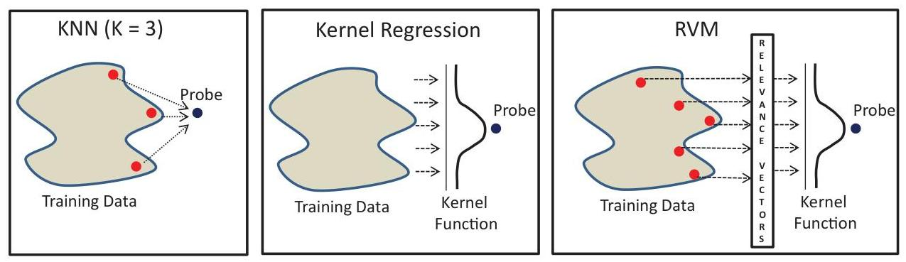

## Page 21
process, the K-means clustering converges to a cluster map where each cluster center is the mean of the points within the cluster. The solutions for $r_{u k}$ and $\mu_{k}$ are given by:

$$
\begin{gathered}
r_{u k}= \begin{cases}1 & \text { if } k=\arg \min _{j}\left\|x_{u}-\mu_{j}\right\|^{2} \\
0 & \text { otherwise }\end{cases} \\
\mu_{k}=\frac{\sum_{u} r_{u k} x_{u}}{\sum_{u} r_{u k}}
\end{gathered}
$$

The first expression says assign the $n$th data point to the closest cluster center. The second expression says set the cluster center to be the mean of all the data points assigned to the cluster, hence the name "K-means." These equations are used iteratively until convergence is achieved.

K-means clustering is a popular record reduction technique and has been studied extensively. Common variations have focused on optimizing the speed of the base algorithm to eliminate unnecessary distance computations, extensions of the algorithm to non-Euclidean distance, and guidance on selecting $K$.

# Kernel Regression 

Let us digress from the Texas Closed Claims example for a second to understand how kernel regressions work. Consider a simple data set with seven records and one feature. The data contains driver class (good and bad) and the number of traffic tickets the driver has. While we intuitively feel that the more traffic tickets a driver has, the more likely he or she is a bad driver, that relationship is not exact. There could be other features which help explain why two drivers with six and seven traffic tickets are good, but let us assume we do not know those features. The aim is to find a line, which separates the two driver classes using the only known feature - number of tickets. In Figure 3, we plot the data in one dimension and represent the good drivers as green dots and bad drivers as red dots.

Clearly, there is no one straight line which separates the two driver classes. The two driver classes are said to be linearly inseparable. In addition, we cannot manufacture new features and append to our data set. However we can transform our data set and view it in a two-dimensional space. We plot the data in a plane where the x -axis represents the number of tickets and the $y$-axis represents the square of the number of tickets.

Figure 3. Driver Class Example before Kernel Transform

| Class | \# of Tickets |
| :-- | :--: |
| Good | 1 |
| Good | 2 |
| Good | 3 |
| Bad | 4 |
| Bad | 5 |
| Good | 6 |
| Good | 7 |
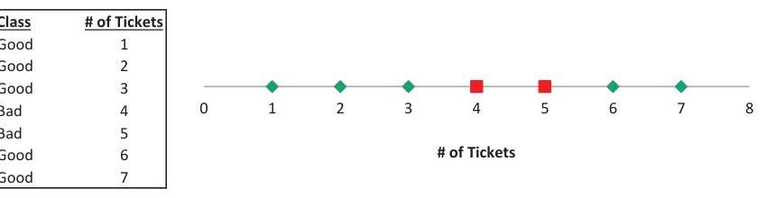

## Page 22
Figure 4 shows the plot of this transformed data set. We can now find a line in this two-dimensional space which separates the driver classes. It is the line which passes through the points $(4,16)$ and $(5,25)$. All good drivers represented by the green dots lie above this line and all bad drivers represented by red dots lie on this line.

Note that we did not need to create new features or find the true dimensionality of the driver class data. A linearly inseparable problem in a lower dimension becomes linearly separable in a higher dimension by a simple transformation of the input space. Indeed, this concept is at the heart of using kernels in machine-learning algorithms.

Returning to the Texas Closed Claims example now, we see that business classes and counties are analogous to the driver class above and that features such as education level, average income, employment rates etc. are analogous to the number of tickets. So for example, if two counties were not linearly separable based on average income, the kernel regression may find a transformation of the average income space where the counties are linearly separable. Next, we provide a formal definition of kernels and their uses.

A kernel is a function which measures similarity between two vectors. In kernel regression, we take a weighted average using evaluations of the kernel function at training data points for the prediction for the probe. The benefit of using a kernel is it eliminates the need to know the true dimensionality of the input space or to list out the high-dimensional feature vectors. Without kernels and their advantages, many machinelearning problems, which are not separable in lower dimensions, would continue to be unsolvable.

Kernels - A kernel is a non-negative real-valued integrable function $k$ that has the following properties:

$$
\begin{gathered}
\int_{-\infty}^{\infty} k(\mathbf{x}) d x=1 \\
k(-\mathbf{x})=k(\mathbf{x}) \text { for all } \mathbf{x}
\end{gathered}
$$

Figure 4. Driver Class Example after Kernel Transform
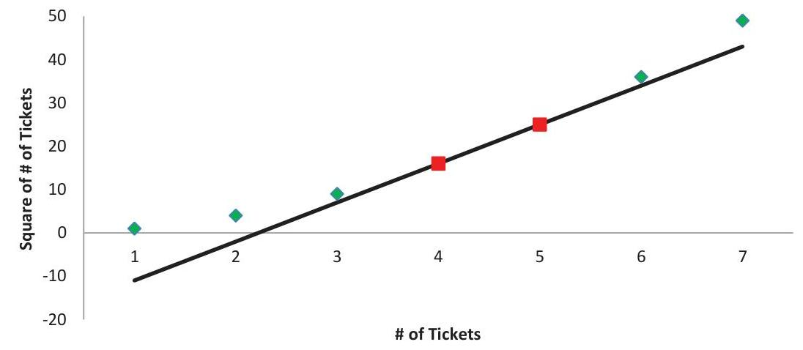

## Page 23
Kernels may be stationary (invariant to translations in input space), i.e.,

$$
k\left(\mathbf{x}_{1}, \mathbf{x}_{2}\right)=k\left(\mathbf{x}_{1}-\mathbf{x}_{2}\right), \text { or }
$$

they may be homogeneous (radial basis functions), which depend only on the magnitude of separation between two points, i.e.,

$$
k\left(\mathbf{x}_{1}, \mathbf{x}_{2}\right)=k\left(\left\|\mathbf{x}_{1}-\mathbf{x}_{2}\right\|\right)
$$

The Gaussian kernel (which is stationary and homogeneous) is

$$
\boldsymbol{k}\left(\mathbf{x}_{1}, \mathbf{x}_{2}\right)=\exp \left[\frac{-\left\|\mathbf{x}_{1}-\mathbf{x}_{2}\right\|^{2}}{2 \sigma^{2}}\right]
$$

The feature space of the Gaussian kernel has an infinite number of dimensions and therefore is a popular choice for real-world problems.

Constructing Kernels - A technique for constructing new kernels is to build them out of simpler kernels as building blocks. This can be done using the following properties.

Given valid kernels $k_{1}\left(\mathbf{x}_{1}, \mathbf{x}_{2}\right)$ and $k_{2}\left(\mathbf{x}_{1}, \mathbf{x}_{2}\right)$, the following are also valid kernels:

$$
\begin{gathered}
k\left(\mathbf{x}_{1}, \mathbf{x}_{2}\right)=c k_{1}\left(\mathbf{x}_{1}, \mathbf{x}_{2}\right) \\
k\left(\mathbf{x}_{1}, \mathbf{x}_{2}\right)=f\left(\mathbf{x}_{1}\right) k_{1}\left(\mathbf{x}_{1}, \mathbf{x}_{2}\right) f\left(\mathbf{x}_{2}\right) \\
k\left(\mathbf{x}_{1}, \mathbf{x}_{2}\right)=q\left(k_{1}\left(\mathbf{x}_{1}, \mathbf{x}_{2}\right)\right) \\
k\left(\mathbf{x}_{1}, \mathbf{x}_{2}\right)=\exp \left(k_{1}\left(\mathbf{x}_{1}, \mathbf{x}_{2}\right)\right) \\
k\left(\mathbf{x}_{1}, \mathbf{x}_{2}\right)=k_{1}\left(\mathbf{x}_{1}, \mathbf{x}_{2}\right)+k_{2}\left(\mathbf{x}_{1}, \mathbf{x}_{2}\right) \\
k\left(\mathbf{x}_{1}, \mathbf{x}_{2}\right)=k_{1}\left(\mathbf{x}_{1}, \mathbf{x}_{2}\right) * k_{2}\left(\mathbf{x}_{1}, \mathbf{x}_{2}\right) \\
k\left(\mathbf{x}_{1}, \mathbf{x}_{2}\right)=k_{3}\left(\varphi\left(\mathbf{x}_{1}\right), \varphi\left(\mathbf{x}_{2}\right)\right) \\
k\left(\mathbf{x}_{1}, \mathbf{x}_{2}\right)=\mathbf{x}_{1}^{\mathrm{T}} \mathbf{A} \mathbf{x}_{2}
\end{gathered}
$$

where $c>0$ is a constant, $f(x)$ is any function, $q(x)$ is a polynomial with non-negative coefficients, $\varphi(x)$ is function from $\mathbf{x}$ to $\mathbf{R}^{\mathbf{M}}, k_{3}$ is a valid kernel in $\mathbf{R}^{\mathbf{M}}$, and $\mathbf{A}$ is a symmetric positive semi-definite matrix.

The Kernel Trick. The idea behind the kernel trick is if the input feature vector $\mathbf{x}$ enters in the machine-learning algorithm only in the form of scalar products, then we can replace that scalar product with some other choice of kernel. For example, in the case of the simple linear regression model, $\mathbf{Y}=\mathbf{X} \boldsymbol{\beta}+\boldsymbol{\epsilon}$, with solution $\boldsymbol{\beta}=\left(\mathbf{X}^{\mathrm{T}} \mathbf{X}\right)^{-1} \mathbf{X}^{\mathrm{T}} \mathbf{Y}$, the feature vector $\mathbf{X}$ enters the solution of the parameters as just a scalar product. We

## Page 24
can then define the linear kernel function $\mathbf{K}\left(\mathbf{X}_{1}, \mathbf{X}_{2}\right)=\mathbf{X}_{1}^{\mathrm{T}} \mathbf{X}_{2}$ and recast the solution of the linear regression problem into one where the $\mathbf{X}$ 's only enter via the kernel function. Using this dual representation lets us work directly in terms of kernels while avoiding the explicit introduction of the feature vector. This implicitly lets us use feature spaces of high and, in the case of the Gaussian kernel, infinite dimensionality.

Using Kernels in Regression. Consider the general problem of estimating the conditional expectation of a random variable $E[\mathbf{Y} \mid \mathbf{X}]=M(\mathbf{X})$ where $M$ is an unknown function. Once we choose an appropriate kernel function $K$, the kernel regression model (also known as the Nadaraya-Watson model) estimates $M$ as

$$
M(\mathbf{x})=\frac{\sum K\left(\mathbf{x}-x_{i}\right) * y_{i}}{\sum K\left(\mathbf{x}-x_{i}\right)}
$$

Here $K$ is a suitable kernel (such as the Gaussian kernel defined previously) and $\left\{x_{i}, y_{i}\right\}$ are training pairs. In other words, kernel regression estimates the conditional expectation of the target around a probe as a weighted average of the training samples where the weights are calculated using a user-defined kernel function centered on the probe.

# Relevance Vector Machines 

The relevance vector machine or RVM (Tipping 2001) is a Bayesian sparse kernel technique, which leads to the algorithmic selection of "relevant vectors" from the training set to make predictions. This selection of only relevant training data is what leads to improved performance of the RVMs. Although RVMs select only the relevant training points, this is not at the cost of prediction accuracy and they have remarkably similar generalization errors to other machine-learning algorithms. We present the model and the key update equations that characterize RVMs. The underlying model for RVMs is
$p(\boldsymbol{Y} \mid \mathbf{X}, \mathbf{w}, \boldsymbol{\beta})=N\left(M(\mathbf{X}), \boldsymbol{\beta}^{-1}\right)$, i.e., the conditional distribution is Gaussian with mean $M(X)$ and precision $=\boldsymbol{\beta}$. The inverse of the variance is the precision.
$M(\mathbf{X})=\sum_{n=1}^{N} w_{n} * K\left(\mathbf{x}, x_{n}\right)$, where $w_{n}$ is the weight of each training data point and $K(x)$ is a kernel defined previously such as the Gaussian kernel.

So far, this is similar to the model structure of kernel regression. Where RVMs differ is in the next step where we first introduce a separate hyperparameter $\alpha_{i}$ for each weight parameter $w_{i}$ and then use the Bayesian framework with a suitable prior to come up with the posterior distribution of the weights. The form of the prior is assumed to be

$$
p(\mathbf{w} \mid \boldsymbol{\alpha})=\prod_{i=1}^{N} N\left(0, \alpha_{i}^{-1}\right)
$$

When we maximize the likelihood, a significant proportion of these hyperparameters $\alpha_{i}$ go to $\infty$, and the corresponding weight parameters have posterior distributions that are concentrated at zero. These are the "irrelevant" training data points, and the RVMs

## Page 25
therefore prune out only the relevant vectors. Assuming we have a set of $N$ training data points $\{\mathbf{x}, \mathbf{y}\}$ then the posterior distribution is given by

$$
p(\mathbf{w} \mid \mathbf{y}, \mathbf{x}, \boldsymbol{\alpha}, \boldsymbol{\beta})=N(\boldsymbol{\mu}, \boldsymbol{\Sigma})
$$

Where $\boldsymbol{\mu}=\boldsymbol{\beta} \boldsymbol{\Sigma} \mathbf{K}^{\mathrm{T}} \mathbf{y}, \boldsymbol{\Sigma}=\left(\operatorname{diag}\left(\boldsymbol{\alpha}_{i}\right)+\boldsymbol{\beta} \mathbf{K}^{\mathrm{T}} \mathbf{K}\right)^{-1}$ and $\mathbf{K}$ is a symmetric $(N+1) \times(N+1)$ kernel matrix with elements $K\left(X_{n}, X_{m}\right)$. Using evidence approximation (or Type-2 maximum likelihood), we have the following update equations:

$$
\begin{gathered}
\alpha_{i}^{\text {new }}=\frac{\gamma_{i}}{\mu_{i}^{2}} \\
\left(\boldsymbol{\beta}^{\text {new }}\right)^{-1}=\frac{\|\mathbf{y}-\mathbf{K} \boldsymbol{\mu}\|^{2}}{N-\Sigma_{i} \gamma_{i}}
\end{gathered}
$$

where $\mu_{i}$ is the $i$ th component of $\boldsymbol{\mu}$ and $\gamma_{i}=1-\alpha_{i} \Sigma_{i}$ where $\Sigma_{i}$ is the $i$ th component of the posterior covariance matrix $\boldsymbol{\Sigma}$. Learning proceeds by choosing initial value of $\alpha$ and $\beta$, evaluating the mean and covariance of the posterior, re-estimating the hyperparameters, re-estimating the mean and covariance and so on until a suitable convergence criterion is satisfied.

# 3.3. MLAPE Recipe 

Here we provide the details necessary to construct the MLAPE algorithm. We start by presenting the overall framework and then provide pseudo-code, required assumptions, and explanations for each of the component modules.

## Overall Framework

Regardless of the exact machine-learning methods, distributions, or assumptions employed, the MLAPE algorithm follows the same four-step modular framework. Preprocessing the data is the first step of the framework, which normalizes the features and organizes the data structure in an efficient manner for training of the machine-learning model. Machine-learning regression is the second step of the framework. Here, we train a machine-learning regression model and predict the distribution parameters for each level in $\mathbf{U}$. Since this process results in a unique set of distribution parameters for each level of $\mathbf{U}$, which we know over-fits the data and lacks optimal predictive power, the third step of the framework is clustering. In the clustering step, the individual distribution parameters are grouped together into $k$ segments using their similarity within the feature space, $\mathbf{F}_{\mathbf{d}}$. At this point the output is complete, but as previously discussed, the running of any machine-learning algorithm requires a parameter sweep to tune the model and find the "best" set of parameters to make predictions. To find this "best" set, the fourth step of the framework is validation. Here, we test the accuracy of the predictions on data the model has never seen before and assess how to improve that accuracy by changing our models or assumptions. These four steps define the MLAPE algorithm and are repeated until the modeler finds an acceptable set of "best" distribution parameters.

## Page 26
# MLAPE Algorithm 

Program Flow
1 PRE-PROCESS the data
2 PERFORM MACHINE LEARNING REGRESSION to predict the distribution parameters
3 CLUSTER the distribution parameters
4 VALIDATE the accuracy of the predictions
5 REPEAT steps 1-4 until the "best" set of distribution parameters is found

## Step 1. Pre-Processing

Pre-processing the data is an important first step in any machine-learning algorithm and, since each of the regression models ( KNN , kernel and RVM) use distance as the key metric for training and predicting, we will take special care to ensure our treatment of distance is consistent across models. In the case of the MLAPE algorithm, the purpose of the pre-processing step is four-fold. First, we standardize each of the features so that each feature contributes equally to the distance measure. Second, we assign weights to the standardized features to allow the modeler to control the relative importance of each feature. Third, we calculate revised weights to ensure that the average distance between all points are consistent between weight sets. Fourth, we split the data into sets for training, validation, and testing.

## Pre-Processing

Program Flow
1 STANDARDIZE the features
2 WEIGHT the standardized features
3 REVISE weights to balance the average distance
4 CREATE training, validation and test sets
Input Required for Parameter Sweep
Feature weights - vector of $\mathbf{d}$ weights; one for each feature

Standardizing Features. When using distance-based models, standardizing features should always be the first order of business. Since the range for one variable may be larger than another variable by many orders of magnitude, any differences in the first variable can have a significantly larger effect on a distance measure than the second variable, giving the first variable a disproportionate impact on the model predictions. To eliminate this distortion, we standardize each feature to have a mean of zero and a standard deviation of one using the following $Z$-score formula:

$$
X_{i, d, Z}=\frac{X_{i, d}-\bar{X}_{d, S}}{\sigma_{d, S}}
$$

## Page 27
where:
$X_{i, d}=$ the individual data point $i$ from the $d$ th feature
$X_{d, S}=$ the sample average of all data points from the $d$ th feature
$\sigma_{d, S}=$ the sample standard deviation of all data points from the $d$ th feature
$X_{i, d, Z}=$ the individual data point $i$ standardized to $1 \sigma$ from the $d$ th feature
The benefit of using the $Z$-score formula is it produces standardized data where each point falls in a normal distribution and can be used as an indicator for outliers.

Weighting Features. For the initial exploration of a feature set, we give equal weight to each of the standardized features in $\mathbf{U}$. We then vary the weights in subsequent rounds based on the predictive power of the feature assessed during the parameter sweep. If a weight for a feature is increased, then the models identify more items of that feature as neighbors, with differences between other features being less important. We adjust the standardized features with the following formula:

$$
X_{i, d, Z, w}=w_{d} * X_{i, d, Z}
$$

where:
$w_{d}=$ the weight given to the $d$ th feature
$X_{i, d, Z}=$ the individual data point i standardized to $1 \sigma$ from the $d$ th feature
$X_{i, d, Z, w}=$ the weighted individual data point $i$ standardized to $1 \sigma$ from the $d$ th feature
Revising Weights. The use of weights introduces distortions into the distance calculation since the average distance between all points changes for each weight set. A normalization procedure is used to compute an "effective" set of weights that provides equivalent feature discrimination while still resulting in the same average distance as the set of un-weighted features. The normalization procedure is as follows:

1. Compute the average distance between all pairs of standardized points in $\mathbf{U}$. For $m$ points, the number of distinct pairs is $m(m-1) / 2$. This result is $d_{0}$.
2. Compute the average distance between all pairs of weighted standardized points in $\mathbf{U}$. This result is $d_{w}$.
3. Compute the "effective" weights by $w_{t}=w *\left(d_{0} / d_{w}\right)$ which are then used to compute the final weighted standardized features.

Since computation of the distance between all pairs of points is computationally expensive for large $m$, we use a sampling method demonstrated to be within $0.25 \%$ of the true average.

# Step 2. Machine-Learning Regression 

Conceptually, the program flow for Step 2 is straightforward. First, estimate the distribution parameters for each level of the features in the training data. Second, train a regression model on the distribution parameters using the features. Third, predict the distribution parameters for each level within $\mathbf{U}$, which in the case of the construction

## Page 28
of the MLAPE algorithm for this paper, is an estimate of the lognormal mu and sigma. While any regression technique could be inserted into this step, we chose to implement three methods here that are widely used in modern machine-learning applications, are non-parametric, and (for kernel and RVM regression) include a Bayesian element to address credibility.

# Regression Model I. K-Nearest Neighbors (KNN) 

KNN is a straightforward and flexible method for performing regression and classification where one uses the nearest neighbors in the training data to directly predict the values in the validation and test data. This process is easy to envision. First, select a probe from the feature set. For the MLAPE algorithm, we send each level of $\mathbf{U}$ as probes to generate predictions. Second, find the $k$ nearest neighbors to the probe in the training data. For this step, there are both a variety of methods used to search the training data and a variety of ways to define the distance between two points. These selections can affect both the running time of the procedure and the accuracy of the predictions and require the modeler to understand the structure of the data when setting these inputs. Third, calculate a measure on the $k$ values that serve as the prediction. In the case of MLAPE, we are predicting distribution parameters so the "calculation" on the $k$ values is a fitting routine that returns both a point estimate and a confidence interval for each parameter.

Adjusting for Outliers. As described, the KNN regression is susceptible to distortion from outlier values. If the $k$ is relatively low and outlier values have been selected as nearest neighbors, the accuracy of the predictions is diminished. To account for this, we adjust the training data by selecting an upper limit for the value of outliers and either remove values from the training data or censor values at the upper limit. The upper limit and the method of adjustment should be based on both the judgment of the modeler and tested as part of the parameter sweep.

## K-Nearest Neighbors

Program Flow
1 ADJUST the training data for outliers
2 FOR EACH level of features in $\mathbf{U}$
3 FIND the $\mathbf{k}$ nearest neighbors in the training data
4 SELECT the $\mathbf{k}$ values
5 ESTIMATE the distribution parameters
Input Required for Parameter Sweep
adjusting for outliers - amount at which to either remove or censor training set values
$\mathbf{k}$ - the number of nearest neighbors to select
fitting weights - functional form and values

## Page 29
Finding Nearest Neighbors. Given a set of training data and a distance function, a K-nearest neighbor search finds the $k$ closest points in the training data to the probe. There are many efficient, flexible and freely available K-nearest neighbor search algorithms in R. Happily, this takes the search method question off the table, removes the need for the actuary to become an expert in designing super-efficient data structures with optimized algorithms and allows one to focus on solving the insurance problem at hand. For the distance function, we use the standard Euclidean function since we have already accounted for the variability between features during the preprocessing step. The only requirement we have for the nearest neighbor search is that it returns both the list of nearest neighbors and their distance from the probe. For our implementation, we chose the 'FNN' package by Beygelzimer et al. (2015), which meets these requirements.

The key input to the KNN search is the number of $k$ nearest neighbors to find. There is no set formula to determine the value of $k$ so we will test a range of reasonable values as part of the parameter sweep to determine the optimal value. The lower bound and the intervals tested within this range need to be selected by judgment considering the expected variability of the values being fitted and the running time of the algorithm. For values with high expected variability, the lower bound should be set such that extreme losses should not produce estimates for the distribution parameters that are considered unreasonable. For MLAPE applications where $\mathbf{U}$ is large, select fewer intervals to manage the run time and allow for a broad parameter sweep of the various settings.

Estimating the Distribution Parameters. Once the $k$ nearest neighbors have been selected we use those values in a fitting routine to estimate the distribution parameters for the probe. As mentioned in the problem definition, we are estimating lognormal parameters considering censoring, truncation and weighting by distance from the probe using an iterative maximum likelihood technique. Again, we turn to existing packages to implement this. The R package 'fitdistrplus' (see Delignette-Muller et al. 2015) provides a fitting function which will determine both the estimate and confidence interval for the mu and sigma of a lognormal distribution considering both censored and truncated data.

A Gaussian decay function, $w_{i}=1-\Phi\left(d_{i}\right) / 0.5$, is used as the weight for the losses in the density estimation. Similar to credibility, this has the effect of giving more weight to closer points and less weight to farther points and affects the width of the confidence intervals for mu and sigma. Since the weights are not considered explicitly by the fitting function, we replicate the values in proportion to the weights before estimating the distribution parameters.

# Maximum A Posteriori (MAP) Distribution Parameter Estimates 

The KNN methodology guarantees $k$ training data points will be included in each estimate of the distribution parameters and, as long as we set $k$ high enough, gives us confidence such estimates meet some credibility standard. Given the fixed volume

## Page 30
versus fixed count nature of the kernel and RVM regressions, a similar guarantee cannot be made. To account for this potential variation in sample size, we need to develop credibility weighted distribution parameter estimates for the regression and to do so we turn to Bayesian statistics. Both Mayerson (1964) and Meyers (1984) have demonstrated the equivalency between traditional actuarial credibility and the MAP estimates resulting from Bayesian statistics. In this section, we will specify the model underlying the Bayesian MAP estimate and give the distribution parameter MAP estimates in terms of the parameters of the model. Additionally, we demonstrate how to use the sequential update process to generate the estimates.

Normal-Gamma Model. As previously mentioned, for this implementation of the MLAPE algorithm we are estimating the parameters for a lognormal distribution. Let the values be represented by $X_{1}, \ldots, X_{n} \mid \mu, \sigma^{2}$ i.i.d. $\sim \operatorname{LN}\left(\mu, \sigma^{2}\right)$, where both $\mu$ and $\sigma^{2}$ are unknown. While a closed solution to the MAP estimate for a lognormal population is intractable, we can make a simple transformation of the values to a form that does have a solution. If we define $Y_{i}=\ln \left(X_{i}\right)$ then we have $Y_{1}, \ldots, Y_{n} \mid \mu, \sigma^{2}$ i.i.d. $\sim \mathrm{N}\left(\mu, \sigma^{2}\right)$, where both $\mu$ and $\sigma^{2}$ are unknown. The MAP estimates for this model are known and follow the so called normal-gamma distribution. Following the derivation in Petris et al. (2009), the prior distribution of mu and sigma has four parameters and consists of
$n_{0}$ where $n_{0}$ has the role of the "prior sample size"

$$
a_{0}=n_{0} / 2+1
$$

$m_{0}$ - the prior estimate for mu
$s_{0}$ - the prior estimate for sigma
With this model we see the likelihood of the distribution parameters is proportional to an inverse gamma density for the variance and a normal density for the mean given by

$$
\begin{gathered}
\sigma^{2} \sim \Gamma^{-1}\left(a_{0}, \frac{1}{b_{0}}\right) \text { where } b_{0}=\frac{n_{0}}{2} * s_{0}^{2} \\
\mu \mid \sigma^{2} \sim N\left(m_{0}, \frac{\sigma_{0}^{2}}{n_{0}}\right)
\end{gathered}
$$

We then observe $q$ data points with which we will update the parameters for the posterior distribution by (see Haines 2011)

$$
\begin{gathered}
n_{q}=n_{0}+q \\
a_{q}=a_{0}+\frac{n_{q}}{2}
\end{gathered}
$$

## Page 31
$$
\begin{gathered}
m_{q}=\frac{n_{0} m_{0}+q \bar{y}}{n_{0}+q} \\
b_{q}=b_{0}+\frac{1}{2} \sum_{i \in[1, q]}\left(y_{i}-\bar{y}\right)^{2}+\frac{1}{2} \frac{n_{0} q}{n_{0}+q}\left(\bar{y}-\mu_{0}\right)^{2}
\end{gathered}
$$

With this update, the posterior distribution of mu and sigma is then

$$
\begin{gathered}
\sigma^{2} \sim \Gamma^{-1}\left(a_{q}, \frac{1}{b_{q}}\right) \\
\mu \mid \sigma^{2} \sim N\left(m_{q}, \frac{\sigma_{q}^{2}}{n_{q}}\right)
\end{gathered}
$$

With this derivation, we now have the formulas needed to calculate the MAP estimate for the mu and sigma from a lognormal distribution for the set of values from each unique level of features in $\mathbf{U}$. In addition to the formulas, we are also required to provide prior estimates for mu and sigma and $n_{0}$, which represents the imaginary number of "prior observations" the mu and sigma prior estimates are based on. The selection of $n_{0}$ is arbitrary. If we select a high value then the $q$ observations receive low credibility, while if we select a low value then the $q$ observations receive high credibility. As such, we will let the data guide this selection and include $n_{0}$ as a setting for each scenario in the parameter sweep. Prior estimates for mu and sigma can either come from previous studies or use an un-informed prior, which is simply the mu and sigma for the entire training data set.

Sequential Updating. Unfortunately, the normal-gamma formulation provided above does not take into consideration the censoring and truncation of claims, which again makes a closed solution intractable. To address this issue we can turn to sequential updating and a common approach when utilizing Bayesian statistics, Monte Carlo simulation. Sequential updating is a formulation of the MAP posterior estimates which asks the question "if I were to take one more observation, $y_{n}$, how would that change my posterior estimate?" Petris et al. (2009) provide the following sequential update formulas for the normal-gamma distribution:

$$
\begin{gathered}
n_{n}=n_{n-1}+1 \\
a_{n}=a_{n-1}+\frac{1}{2} \\
m_{n}=m_{n-1}+\frac{1}{n_{n-1}+1}\left(y_{n}-m_{n-1}\right) \\
b_{n}=b_{n-1}+\frac{1}{2} \frac{n_{n-1}}{n_{n-1}+1}\left(y_{n}-m_{n-1}\right)^{2}
\end{gathered}
$$

## Page 32
Since this formulation allows us to add each point individually we can consider the effects of censoring and truncation before updating the MAP estimates. For truncation, we adjust the observation to a corresponding value that would come from the same $Z$-score of a non-truncated distribution before completing the update. Similarly for censoring, we will simulate an excess amount from above the censoring limit and add that to the observation before completing the update. This update process is repeated for each observed value within each level of $\mathbf{U}$. The final issue needing consideration with this sequential update approach is the resulting MAP estimate of the distribution parameters depends on the order the values are included in the update. This comes from using the interim mu and sigma updates while simulation adjustments are made for censoring and truncation. To address this issue, we will shuffle the values before starting the sequential update process and then repeat the process until the cumulative average estimates for the distribution parameters changes by less than a specified tolerance after each update.

# Normal-Gamma Sequential Update 

Program Flow
1 ADJUST the training data for outliers
2 FOR EACH level of features in $\mathbf{U}$
3 SELECT the values from the level
4 ASSIGN prior values for mu and sigma
5 INITIALIZE the Normal-Gamma parameters
6 SHUFFLE the values
7 FOR EACH value in the selection
$8 \quad$ if censored then SIMULATE a value from the tail
$9 \quad$ if truncated then ADJUST for the missing probability
10 UPDATE the Normal-Gamma parameters
11 CALCULATE the cumulative average of the posterior mu and sigma estimates
12 REPEAT step 3 until the change in the cumulative averages is more than a given tolerance

Input Required for Parameter Sweep
adjusting for outliers - amount at which to either remove or censor training set values
$n_{0}$ - the number of "prior observations"
tolerance - the min. difference for the updated cumulative average change in both distribution parameters

Truncated Values. Our treatment of truncated values follows the treatment of a truncated univariate normal random variable as described by Griffiths (2004). If our observed value, $x_{i}$, comes from a normal distribution truncated at $a$, and given $\left(\mu, \sigma^{2}\right)$,

## Page 33
we can calculate a corresponding value, $y_{i}$, from the non-truncated distribution with the following formulas:

$$
\begin{gathered}
T=\frac{\Phi\left(\frac{x_{i}-\mu}{\sigma}\right)-\Phi\left(\frac{a-\mu}{\sigma}\right)}{1-\Phi\left(\frac{a-\mu}{\sigma}\right)} \\
y_{i}=\mu+\sigma \Phi^{-1}(T)
\end{gathered}
$$

For truncated values within the sequential updating process, we will be using the observed value and the interim $\mu$ and $\sigma^{2}$ estimates to calculate $T, T$ to calculate the corresponding value from the non-truncated distribution $y$, and $y$ to update the parameters for the normal-gamma distribution.

Censored Values. Censored values do not have a similar closed form solution and therefore require a Monte Carlo simulation approach. For each censored value, $c_{i}$, we utilize the following simulation procedure:

1. Calculate the Z -score at $c_{i}$ using the interim $\mu$ and $\sigma^{2}$.
2. Calculate cumulative normal probability, $\Phi(Z)$.
3. Draw $p$, a uniform random variate between zero and one, and simulate the uncensored cumulative normal probability by $\Phi^{\prime}(Z)=\Phi(Z)+p(1-\Phi(Z))$.
4. Calculate the corresponding value from the non-censored distribution, $y_{i}$, by $y_{i}=\mu+\sigma \Phi^{-1}\left(\Phi\left({ }^{\prime} Z\right)\right)$.

# Regression Model II: Kernel Regression 

Kernel regression is a non-parametric method for performing regression where, in the case of the MLAPE algorithm, we use a weighting function (the "kernel") applied to the MAP distribution parameter estimates from the training data around a probe (the "bandwidth") to directly predict the values in the validation and test data. Varying both the kernel function and the bandwidth are part of the parameter sweep since either may affect the accuracy of the predictions. While non-parametric methods can handle complex data structures better than parametric methods, the modeler should be cautioned they are much more computationally demanding and may require significant runtimes.

For the MLAPE algorithm, we have selected the popular Gaussian kernel, otherwise known as a radial basis function kernel. In this case, the denominator of the kernel, $2 \sigma^{2}$, is replaced with the bandwidth, $b$. The effect of increasing $b$ is to increase the width of the kernel which increases the number of training points in the predicted value. Conversely, the effect of decreasing $b$ is to decrease the width of the kernel which decreases the number of training points in the predicted value. The optimal value for the bandwidth depends on the feature space and needs to be determined experimentally through the parameter sweep.

## Page 34
# Kernel Regression 

Program Flow
1 TRAIN a kernel regression model using the MAP distribution parameter estimates from the training data

2 PREDICT the distribution parameters for each level of features in $\mathbf{U}$
Input Required for Parameter Sweep
kernel - the functional form of the weighting function
bandwidth - the 'size' of the area to search around the probe

## Regression Model III: Relevance Vector Machine (RVM) Regression

RVM regression is a non-parametric method for performing regression where, in the case of the MLAPE algorithm, we use a weighting function (the "kernel") applied to the MAP distribution parameter estimates from the training data to identify "relevant vectors" around a probe. These vectors directly predict the values in the validation and test data. Varying both the kernel function and the corresponding kernel hyperparameters affects the accuracy of the predictions and the settings for both are part of the parameter sweep. To implement the RVM regression in R we have utilized the kernlab package. This package offers a breadth of kernel functions and settings to perform a RVM regression and we refer the reader to the kernlab vignette by Karatzoglou, Smola and Hornik (2015) for complete details.

Like the kernel regression, we have selected the Gaussian kernel for the RVM regression as well. In the RVM case, a value for the denominator of the kernel, $\sigma$, must be selected which has a similar interpretation to the bandwidth.

## RVM Regression

Program Flow
1 TRAIN a RVM regression model using the MAP distribution parameter estimates from the training data

2 PREDICT the distribution parameters for each level of features in $\mathbf{U}$
Input Required for Parameter Sweep
sigma - the width of the Gaussian function

## Step 3. Clustering

With distribution parameter predictions for each level of $\mathbf{U}$ we could immediately go to the validation step, but that is problematic for two reasons. First, from a practical standpoint there could be hundreds or thousands of unique estimates for the distribution parameters, making it difficult to implement on internal systems, explain to internal parties, or justify with regulators. Second, while the estimates may be unique, the differences between them may not be materially significant. Therefore, to reduce the number of estimates to a manageable, explainable, and material level we

## Page 35
have employed the K-means clustering procedure. The aim of the K-means procedure is to partition the $m$ levels of $\mathbf{U}$ into $k$ clusters such that each of the levels belongs to the cluster with the nearest mean. We will do this in the distribution parameter space and in such a way that produces cluster estimates of the distribution parameters that are consistent with the underlying values. One of the difficulties of implementing the K-means procedure is it does not guarantee a globally optimal cluster assignment for any given $k$. While various heuristics exist and have been employed within the MLAPE algorithm to improve the results of the K-means procedure, multiple repetitions of the procedure are required to ensure a "good" local optimum is found.

# K-Means 

Program Flow
1 DO $N$ times
2 PERFORM the K-Means clustering procedure
3 CALCULATE the Average Distance to Cluster Center (ADCC)
4 RETURN the cluster set with the lowest ADCC
Input Required for Parameter Sweep
$\mathbf{k}$ - the number of clusters to partition
distance function - functional form

Average Distance to Cluster Center. The closer the points are to each of their assigned cluster centers, the better the separation between clusters and overall coherence. The quality of the clustering can be measured by the overall average distance to the cluster center (ADCC) across all points in the data. This measure is defined as

$$
A D C C=\sum_{i=1}^{k} \sum_{j \in U_{i}}\left(x_{j}-c_{i}\right)^{2}
$$

In fact, it is this amount that the K-means procedure is attempting to minimize. As mentioned above, K-means is prone to finding local minima and does not guarantee the resulting clusters are a global optimum. To address this issue we have implemented a heuristic to refine the initial points and will restart the procedure multiple times to find the run with the lowest ADCC to use as the final clusters.

K-Means Clustering Procedure. An in-depth review of K-means clustering algorithms could fill volumes on its own right and we will not go into detail here. Instead, we focus on the adjustments we have made to the standard form of K-means to customize it for the MLAPE algorithm.

Figure 5 shows a visual representation of the distribution parameter space to which the K-means procedure is being applied. In the case of our MLAPE implementation, this is a two-dimensional space in mu and sigma from the lognormal distribution.

Note that the confidence in the mu and sigma estimates for each element of $\mathbf{U}$ are not the same. Since these confidence intervals are not symmetrical, we need an approach that allows us to consider both spherical and elliptical cluster shapes. A

## Page 36
Figure 5. Illustration of Distribution Parameter Space before Clustering
common approach for adjusting the distance measure for the variability of each point is the so-called Mahalanobis distance (see Mahalanobis 1936). The Mahalanobis distance is defined as

$$
D_{k}^{\text {Mahalanobis }}=\sqrt{\left(x-c_{k}\right)^{T} \sum^{-1}\left(x-c_{k}\right)}
$$

where $x$ represents a point in the space to be clustered, $c_{k}$ represents a cluster center, and $\Sigma^{-1}$ represents the inverse of the covariance matrix of point $x$. The Mahalanobis can be understood as a weighted Euclidean distance where the weighting is proportional to the inverse of the variance of the sample point, and in the case of uniform variances along each dimension, the Mahalanobis and Euclidean distances are equivalent. For the MLAPE algorithm, we have allowed for the option of both distance functions so the choice of Euclidean vs Mahalanobis may be determined by changing the settings as part of the parameter sweep.

The standard approach to initializing the K-means routine is to randomly select points as the starting cluster centers. An improvement over this initialization approach, called kmeans++, has been proposed by Arthur and Vassilvitskii (2007), which offers improvements in both speed and accuracy. The basic idea is to choose the initial $k$ starting points iteratively such that each point selected has the best likelihood of minimizing the ADCC. The authors found kmeans++ offered improvements of up to a $90 \%$ reduction in running time and improvements in final ADCC as well. For the MLAPE algorithm, we have implemented this addition to the K-means procedure and have found improved performance as well.

Clustering the mu and sigma require changes to the standard "average" used by K-means along each dimension. This results in different formulas for the mean and sigma of each cluster. Below are the variables and formulas that are utilized:

$$
\begin{gathered}
M-\text { the number of levels in } \mathbf{U} \\
K-\text { the number of clusters } \\
x_{n}^{m}-\text { the } n \text { th data point in the } m \text { th group } \\
N-\text { the total number of data points }
\end{gathered}
$$
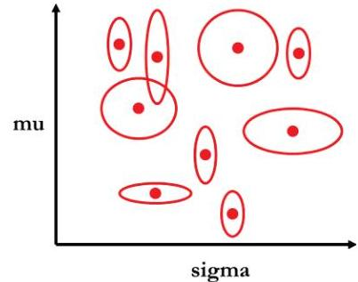

## Page 37
$$
\begin{aligned}
& N_{m}-\text { the total number of data points in level } m \\
& N_{k}-\text { the total number of data points in cluster } k \\
& M_{k}-\text { the number of levels assigned to cluster } k \\
& \text { Mean of group } m=\mu_{m}=\frac{1}{N_{m}} \sum_{m=1}^{N_{m}} x_{n}^{m} \\
& \text { Mean of cluster } k=\mu_{k}=\frac{1}{N_{k}} \sum_{m=1}^{M_{k}} N_{m} \circ \mu_{m} \\
& \text { Variance of group } m=\sigma_{m}^{2}=\frac{1}{N_{m}} \sum_{n=1}^{N_{m}}\left(x_{n}^{m}-\mu_{m}\right)^{2}
\end{aligned}
$$

Variance of cluster $k=\sigma_{k}^{2}=\left[\frac{1}{N_{k}} \sum_{m=1}^{M_{k}} N_{m} \circ \sigma_{m}^{2}+\frac{1}{N_{k}} \sum_{m=1}^{M_{k}} N_{m} \circ\left(\mu_{m}-\mu_{n}\right)^{2}\right]\left(\frac{N_{k}}{N_{k}-1}\right)$.
Since the mean and variance of the cluster can be expressed completely in terms of the mean and variance of the component groups, there is no need to revert to the individual points within the group, which are affected by censoring and truncation, when calculating the cluster centers.

# Step 4. Validation 

At this point, we have our final sets of distribution parameters that represent the best fit on the training data, but we still have to answer the following questions. Did we select the "best" model and assumptions when running the MLAPE algorithm? Do the fitted distribution parameters generalize well and provide accurate predictions on new data? To address these questions, we have held out some of the data from the training phases (the validation data) and will test the accuracy of the predictions against the actual values. With this test completed on the validation data, we compare the accuracy measures across different sets of models and assumptions in the parameter sweep.

## Validation

Program Flow
1 FOR EACH value in the validation data
2 CALCULATE the negative log likelihood of the value using the predicted distribution parameters

3 SUM the negative log likelihood in total and by cluster
4 FOR EACH cluster in the validation data
5 CALCULATE the expected mean using the predicted distribution parameters
6 CALCULATE the actual mean of the values
7 MEASURE the mean square error and number of cluster reversals

## Page 38
Negative Log Likelihood - The standard definition of a likelihood function is given by

$$
L\left(\theta \mid x_{1}, \ldots, x_{n}\right)=f\left(x_{1}, x_{2}, \ldots, x_{n} \mid \theta\right)=\prod_{i=1}^{n} f\left(x_{i} \mid \theta\right)
$$

This likelihood function tells us the probability that the final distribution parameters generated the values being tested. So, in the case of the MLAPE algorithm we want to maximize this value to find the "best" set of parameters. Due to the potential for numeric overflow from the product of many very small likelihoods, it is convenient to take the log of both sides, which converts the equation from a product of factors into a summation of factors. Further, since the natural logarithm of the individual likelihoods is negative, it is also convenient to take the negative of both sides of the equation changing the problem from one of maximizing the likelihood to minimizing the negative log likelihood. The resulting negative log likelihood equation is

$$
-\log L\left(\theta \mid x_{1}, \ldots, x_{n}\right)=-\sum_{i=1}^{n} \log f\left(x_{i} \mid \theta\right)
$$

For each scenario of methods and assumptions in the parameter sweep, we will use this statistic to measure the accuracy of the fitted distribution parameters on the validation test set. The goal of our parameter sweep is to find a scenario that minimizes this statistic. Therefore, if a scenario results in a lower negative log likelihood than previous scenarios, we consider the changes to the methods and assumptions that led to the improvement and continue to explore further changes in those directions. While one approach could be to test many random scenarios in the method and assumption space, each run through steps one to four can be computationally expensive and requires significant judgment when evaluating the effect of each scenario on model accuracy. Accordingly, we suggest selecting a range of reasonable methods and assumptions for the initial runs and then having a systematic and thorough approach to carefully select further areas to explore. Finally, the magnitude and absolute value of the negative log likelihood is irrelevant. We are only looking for changes in the negative log likelihood and the scenario resulting in the lowest value.

Mean Square Error. To further evaluate scenarios that have minimally different or identical negative log likelihoods we introduce some additional statistics measuring the performance of each cluster. If the fitted distribution parameters are robust, the expected mean for the cluster, using the fitted distribution parameters, would be equal to the observed mean for the cluster. We measure this robustness for each scenario using the mean square error across all clusters where lower values indicate tighter coherence between the model and the actual observations. While MSE measures overall goodness of fit, we are also concerned about consistency between clusters as well. If the clusters are sorted in increasing order of expected mean value the observed mean values should be in increasing order as well. To assess this, we define a cluster reversal as a case where the sign of the change in the expected mean value between each cluster does not equal the sign of the change in the observed mean value between clusters. While an

## Page 39
ideal model would have a MSE of zero and no cluster reversals, by analyzing both the MSE and number of cluster reversals for each scenario we are able to facilitate a more efficient parameter sweep than using negative log likelihood alone.

# Step 5. Repeat 

We repeat steps one through four for each scenario of the parameter sweep until the "best" set of fitted distribution parameters for the validation data is found. After that is complete, it is time to perform the final model assessment using the test data set. This data has never been seen during the training or validation stages and demonstrates the true accuracy we can expect for future predictions. To assess this generalizability, we examine the three following charts:

Negative Log Likelihood by Cluster Chart. This chart graphically represents, by cluster for the test data set, the difference in negative log likelihood between the MLAPE model and a set of prior estimates for the distribution parameters. If the MLAPE model represents an improvement over the prior model, then we expect the bars for each cluster to be negative.

Lift Chart. A lift chart graphically represents the expected improvement the MLAPE model provides by cluster and compares that against the actual improvement seen in the test data. By comparing each of the clusters in the test data on the lift chart, we can determine if the MLAPE model is better than a random guess, and which clusters in the data set benefit the most from applying the model's predictions. Since our implementation of the MLAPE algorithm involves truncated and censored losses, we chose the limited expected value (LEV) to measure the model's performance. To calculate the percentage lift for each cluster, we took the difference between LEV based on the distribution parameters for the cluster and the LEV based on the distribution parameters from all the data and then divided by the later. The same calculations are performed with the actual test data and then combined on the lift chart. Bars that range from negative to positive percentages with agreement between the expected improvement and actual improvement indicate the model generalizes well to new data and will provide accurate on-going predictions.

Actual-to-Expected Limited Expected Value Chart. A variant of the lift chart is the actual-to-expected LEV chart. Here, the model LEVs versus the actual LEVs from the test data by cluster are plotted on a scatter plot. If the MLAPE model generalizes well to new data and provides accurate predictions, we expect to see a linear relationship between points that fall randomly both above and below the identity line.

## Page 40
# 4. MLAPE Application 

The Data Set. We use the Texas Closed Claims Data from http://www.tdi.texas. gov/reports/report4.html to demonstrate a full application of the MLAPE method (Figure 6). The data has ten years of historical closed claims data from 2003 to 2012. The data includes a file with field descriptions and definitions. A key characteristic of this data is it excludes claims below $\$ 10 \mathrm{~K}$. We will address this issue in our MLAPE algorithm and not assume these are ground-up losses. We first collate the data from the ten years of unzipped files into one flat file, select the following fields and rename them.

Summarizing the collated data by POLICY_TYPE shows Commercial auto liability has the most data. We use the 49,905 records from commercial auto liability for the MLAPE application. We then analyze the data for trend and compute the average INDEMNITY_AMT by Closed Year. We select an annual trend of $9.47 \%$ and trend each of the 49,905 closed claims to 2012 (Figure 7).

Next, we cap the trended amounts by a limit, which equals the maximum of LIMIT_PER_PERSON, LIMIT_PER_OCC and LIMIT_CSL. We call the resulting variable CAPPED_TRENDED_INDEMNITY. This field is the $Y$ we are interested in. We create a new variable LOSS_CAPPED that is a binary variable and equals one if the trended indemnity has been censored due to capping and zero, if not.

Data Sparseness. There are 254 counties and 26 business classes resulting in 6,604 pairs of counties and business classes. We present a cross-tabulation of the 49,905 claims by business class and county, shown in Figure 8.

We observe that $87 \%$ of claims are from five of the 26 business classes and $52 \%$ of the claims are from six of the 254 counties. These 30 pairs of business classes and counties account for $0.5 \%$ of all possible segments $(30 / 6,604)$ but result in $48 \%$ of all losses $(23,912 / 49,905)$. A huge proportion of the data is contained in a very dense section of the possible segments leaving sparse regions with no data to make predictions on. Such sparseness is common in real world applications. The MLAPE algorithm overcomes this issue of sparseness. In order to address sparseness, we find "similar" counties and business classes and use losses from them to make predictions. To define similarity we need to enrich the counties and business classes with additional features or dimensions over which we can measure distance.

Augment County and Business Class Features. We enrich the business class feature with data from http://www.bls.gov. We identify the following seven features based on the two considerations listed and append these to the 26 business classes in Figure 9.

## Page 41
Figure 6. Texas Closed Claims Data Description

| Original Field | Rename |
| :--: | :--: |
| EXTSEQ | TDI_NUM |
| Q1G | CLOSE_DATE |
| Q6B | INJURY_COUNTY |
| Q7A | POLICY_TYPE |
| Q7C | BUSINESS_CLASS |
| Q7D1 | LIMIT_PER_PERSON |
| Q7D2 | LIMIT_PER_OCC |
| Q7D3 | LIMIT_CSL |
| Q12A7 | INDEMNITY_AMT |

| POLICY_TYPE | Description | \# of Records |
| :--: | :--: | :--: |
| 1 | 1 - Monoline general liability | 10,949 |
| 2 | 2 - Commercial auto liability | 49,905 |
| 3 | 3 - Texas commercial multiperil | 7,851 |
| 4 | 4 - Medical professional liability | 7,948 |
| 5 | 5 - Other professional liability | 612 |
| Total |  | 77,265 |

Figure 7. Texas Closed Claim Auto Liability Trend Analysis

Figure 8. Texas Closed Claims Data Sparseness

Figure 9. MLAPE Business Class
Feature Selections

|  | Selected Business Class Features |  |  |  | Consideration |  |  |  |
| :--: | :--: | :--: | :--: | :--: | :--: | :--: | :--: | :--: |
|  | 1 | Fatal Injury Rate |  |  |  |  |  |  |
| 2 | Injury Away Work Rate |  |  |  | Injury |  |  |  |
| 3 | Transport Injury Away Work Rate |  |  |  | Incidence |  |  |  |
| 4 | Non-fatal Injury Rate |  |  |  | Rates |  |  |  |
| 5 | Non-fatal Days off Injury Rate |  |  |  |  |  |  |  |
| 6 | Days off Ratio |  |  |  |  |  |  |  |
| 7 | Goods vs. service producing |  |  |  | Societal value |  |  |  |
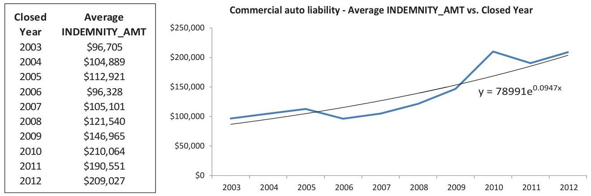
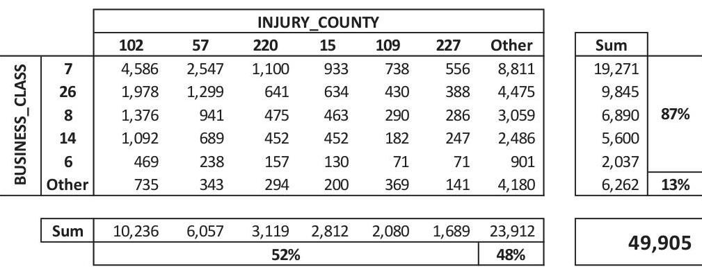

## Page 42
Figure 10. MLAPE County Feature Selections

|  | Selected County Features | Consideration |
| :-- | :-- | :--: |
| 1 | Percent bachelor's degree or higher | Cost of Living |
| 2 | Median household income (dollars) | Rural/Urban |
| 3 | Agriculture_Pct | Spatial |
| 4 | Latitude |  |
| 5 | Longitude |  |

Next, we enrich the county feature with county-level information from the U.S. Census. A quick look at http://factfinder.census.gov shows a large number of features that can be added at the county level. In a real-world application this step may be guided by expert opinion on what features are relevant to differentiate between counties. Our goal, though, is not exactness, but rather to show one way of enriching the county data. Therefore, we will limit our focus to five county-level features to demonstrate the MLAPE application. There are three considerations on why we choose the five features shown in Figure 10.

With no insights into the dynamics of the commercial automobile liability insurance market and class-plan and armed only with actuarial reasoning, we ask what characteristics make counties similar or dissimilar to each other with respect to claim costs. We identify three considerations-cost of living, rural or urban and spatial proximity or distance to other counties. We then use judgment to select the five features that support each of the three considerations and append these five features to the 254 counties.

Once we append the seven business class and five county features we end up with 49,435 claims, since the initial 49,905 claims had 470 records from county code $=299$ (Not in Texas) and are excluded. We place a data key on each claim for record-keeping purposes. It is an integer ID staring at one and ending at 49,435 . We split the data into three files to be used as inputs into the MLAPE algorithm, shown in Figure 11.

The Univ_01.csv file represents the 6,604 pairs of counties and business classes. The goal of the MLAPE algorithm is to produce $(\mu, \sigma)$ pairs for each of these county and business class combinations which characterize the respective lognormal distributions for those segments. The MLAPE algorithms will determine how many such distinct pairs of $(\mu, \sigma)$ need to be output. Regardless of the number of pairs of $(\mu, \sigma)$, our results will demonstrate that it is superior to using one $(\mu, \sigma)$ based on all claims. As a result, the MLAPE algorithm would address the general segmentation problem provided in

Figure 11. MLAPE Data Inputs

| Filename | Data_01.csv | Filename | Data_key.csv | Filename | Univ_01.csv |
| :--: | :--: | :--: | :--: | :--: | :--: |
| Rows | 49435 | Rows | 49435 | Rows | 6604 |
| Columns | 15 | Columns | 3 | Columns | 14 |
| 1 | Data_Key | 1 | Data_Key | 1 | County Code |
| 2 | Capped_Trended_Indemnity | 2 | County Code | 2 | Business Class Number |
| 3 | Loss_Capped | 3 | Business Class Number | 3 to 9 | Business class features |
| 4 to 10 | Business class features |  |  | 10 to 14 | County features |
| 11 to 15 | County features |  |  |  |  |

## Page 43
the introduction. It is still not an optimal solution in the statistical sense, but it is an improvement over using all the data to estimate one lognormal distribution or using data for each segment to estimate 6,604 lognormal distributions.

Program Flow. Our MLAPE application is implemented as a series of R scripts that run through the steps of the algorithm. A master control script runs each of the steps and tests each of the scenarios in the parameter sweep. Results from each script are saved as comma-delimited text files, which allows the results to be analyzed both during and after the parameter sweep process. Figure 12 shows the scripts and the order in which they are run for both the KNN and Kernel/RVM versions. For those seeking a deeper understanding of the MLAPE implementation, detailed comments have been included in each of the scripts.

In addition to the MLAPE data input files, the user must also specify each of the parameter sweep inputs which is comprised of settings for each of the procedures, an a priori distribution parameter file, and a feature weights file. The settings for each of the procedures were described in the MLAPE recipe section and are specified directly in the R code as arrays. The range of values for each setting should be based on both some initial experimental testing and judgment. This is an iterative process subject to local minima and, as such, we suggest setting ranges around values where the model is giving good results as well as scenarios that have random perturbations. The a priori distribution parameter file has a set of distribution parameters for each element in $\mathbf{U}$, which in the case of this example application is the 6,604 pairs of counties and business classes. These a priori distribution parameters serve two purposes. First, for the normalgamma sequential update, they will be the Bayesian prior. Second, during the validation stage, they will be the benchmark from which to measure improvements in the negative log likelihood. Typically, when one is first running the MLAPE algorithm, it is being compared against a prior review and one would set the a priori distribution parameters

Figure 12. MLAPE R Application Script Order
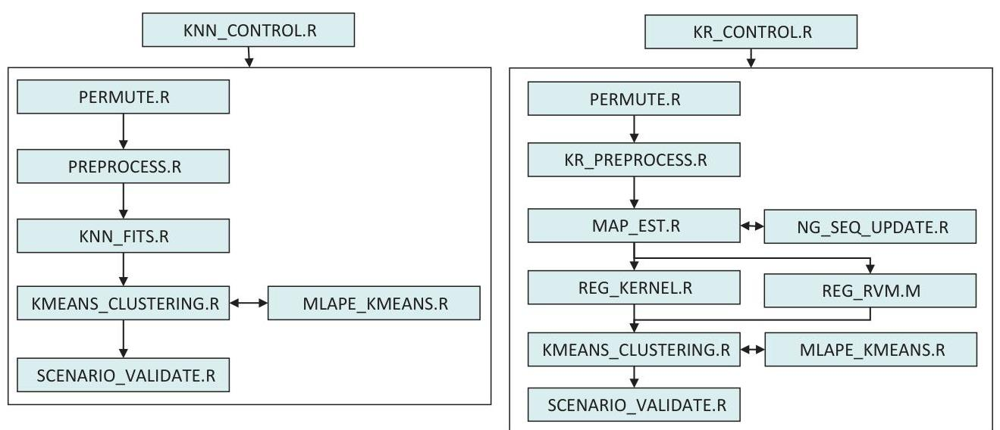

## Page 44
to those resulting from the last analysis. In our case, we did not have a prior study of the Texas commercial auto closed claims to incorporate so we chose the mu and sigma measured on the training set as the a priori distribution parameters. Last, the feature weights files controls how much influence each of the features has in the distance measure. This comma-delimited text file has one row for each of the combinations we want to test. These weights may also be set to zero to ignore a given feature.

Parameter Sweep Settings and Results. The process we used for selecting the parameter sweep settings involved some initial experimentation and establishing boundaries for what we considered reasonable values. The factors to evaluate during the initial runs are: Will the procedure even run? And is the MLAPE algorithm providing some variation in the estimates of the distribution parameters? Since KNN, kernels and RVM are smoothing techniques, it becomes evident quickly when settings have smoothed away all variation. The opposite is also true. If the parameter sweep settings provide minimal smoothing, the training data will be over fit and the predictive capability of the model on the validation data will be poor. We wish to avoid these settings. Accordingly, below are each of the settings we tested for each of the machine-learning procedures. Note, that due to the iterative nature of a parameter sweep we did not test all combinations of the values tested. Some values were added during the parameter sweep based on regions showing negative log likelihood improvement while some were discarded for poor performance.

# K-Nearest Neighbors 

| Setting | Values Tested |
| :-- | :-- |
| Number of Nearest Neighbors | $50,100,250,500,750,1000,1250,1500,1750,2000$, |
|  | $2250,2500,3000,4000$ |
| Number of Clusters | $2,4,6,8,9,10,11,12,15$ |

Kernel Regression

| Setting | Values Tested |
| :-- | :-- |
| Number of Prior Observations | $2,3,10,30,50,100$ |
| Band Width | $0.000000005,0.00000005,0.0000005,0.000005$, |
|  | $0.00005,0.0005,0.005,0.05$ |
| Number of Clusters | $2,4,6,8,9,10,11,12,15$ |

## RVM Regression

| Setting | Values Tested |
| :-- | :-- |
| Number of Prior Observations | $2,3,10,30,50,100$ |
| Sigma | $0.000000005,0.00000005,0.0000005,0.000005$, |
|  | $0.00005,0.0005,0.005,0.05,0.5,5,50,100,500$ |
| Number of Clusters | $2,4,6,8,9,10,11,12,15$ |

## Page 45
For the a priori distribution parameters, we estimated the mu and sigma on the training data only. We did not include the validation or test data in this measurement in order to determine the true potential for improvement by using the MLAPE algorithm. In this way, the final evaluation of measuring the negative log likelihood on the test data will demonstrate if the MLAPE algorithm has the power to predict unseen data better than the prior does. Based on the 34,609 observations in the training data, the estimated mu was 10.7226 and the estimated sigma was 1.4738 .

For the feature weights, we started by testing each of the features individually. Next, we added feature weight scenarios, bringing in equally weighted combinations of the better performing features from both the business class and county features. Finally, once the better combinations began to emerge, we tested varying the weights as well.

For this monograph, our parameter sweep included testing 5,646 probes from combinations of methods, settings, and feature weights. The results are shown in Figure 13. Here, the negative log likelihood as calculated on the training data using the MLAPE algorithm is shown as the blue series and measured on the primary $y$-axis and the negative log likelihood as calculated on the validation data using the MLAPE algorithm is shown as the gray dashed series and measured on the secondary $y$-axis.

Examining this chart can provide a number of insights into the parameter sweep process. First, there is general agreement between the patterns for both the training and validation data. This indicates that the structure the MLAPE algorithm was finding in the training data was generalizing well in the validation data. If the MLAPE algorithm had no predictive power, the validation data would have shown a random pattern instead. Second, there are some regions of the chart where the variation in validation data is

Figure 13. Negative Log Likelihood in Parameter Sweep Order

## Page 46
relatively greater than the training data (between 3000 and 3500) and other regions where improvement in the training data does not correspond to improvements in the validation data (between 3500 and 4000). These represent regions where the parameter sweep settings had resulted in over-fitting. Subsequently, those settings were removed from further parameter sweeps. Last, note that, in general, there is a decreasing trend in the negative log likelihood for both the training and validation data. This is to be expected since we are trying to minimize this result and our parameter sweep is guided to find this minima. While we could continue to tune the parameter sweep indefinitely and find decreases in the training data, the decreasing trend in the validation data cannot continue indefinitely. At some point, the model will begin to over-fit the training data and the error on the validation set will begin to rise. This is seen in Figure 13 at the $5,500^{\text {th }}$ probe. It is at that point we concluded our parameter sweep and selected our best set of distribution parameters. As mentioned in the validation section of the recipe, the selection of the "best" set considered the negative log likelihood, a MSE measuring the actual versus expected by cluster and a count of the number of reversals on the validation data set. Figure 14 shows the model settings and weights generating the best answer and Figure 15 shows the estimates for the distribution parameters.

Model Evaluation on Training/Validation Data. Once we have the final set of distribution parameters we can examine the model performance on the training and validation data sets. First, we examine the lift chart for the training set. To create the

Figure 14. Best Configuration of Settings from Parameter Sweep

| Type | Nearest   Neighbors | Weight Set | Clusters | Prior Validation Data   NLL | MLAPE Validation Data |  |  |
| :--: | :--: | :--: | :--: | :--: | :--: | :--: | :--: |
|  |  |  |  |  | NLL | Log(MSE) | Reversals |
| KNN | 1750 | 26 | 8 | 125660 | 125280 | 18.959 | 0 |

| Setting | Best Value |
| :--: | :--: |
| Machine Learning Procedure | KNN |
| \# of Nearest Neighbors | 1,750 |
| Number of Clusters | 8 |
| Feature and Selected Weights | Fatal Injury Rate | 0 |
|  | Injury Away Work Rate | 1 |
|  | Transport Injury Away Work Rate | 0 |
|  | Non-Fatal Injury Rate | 1 |
|  | Non-Fatal Days Off Injury Rate | 0 |
|  | Days Off Ratio | 1 |
|  | Goods vs. Service Producing | 0 |
|  | Percent Bachelor's Degree or Higher | 1 |
|  | Median Household Income (\$) | 1 |
|  | Agriculture Percentage | 0 |
|  | Latitude | 1 |
|  | Longitude | 1 |

## Page 47
Figure 15. Estimates for the Distribution Parameters

| Cluster | mu | sigma | Count |
| :--: | :--: | :--: | :--: |
| 1 | 10.825 | 0.9665 | 1458 |
| 2 | 10.514 | 1.3084 | 12253 |
| 3 | 10.811 | 1.2695 | 2212 |
| 4 | 10.731 | 1.4799 | 8173 |
| 5 | 10.958 | 1.4765 | 2172 |
| 6 | 10.868 | 1.6757 | 2931 |
| 7 | 11.048 | 1.6053 | 2794 |
| 8 | 11.253 | 1.5348 | 2616 |

lift chart, we calculate the actual LEV for each cluster and divide each cluster's LEV by the LEV for the entire data set less one. Therefore, bars on the lift chart that have negative values are clusters that have LEVs that are less than the average while bars on the lift chart that have positive values are clusters that have LEVs that are greater than the average. Next, we calculate the same set of ratios using the expected LEVs resulting from the MLAPE algorithm's mu and sigma. These results are shown in Figure 16. Here we see the MLAPE algorithm has found clusters that provide materially significant segmentation of the loss data, ranging from $43 \%$ below the average to $66 \%$ above the average, a range of more than $100 \%$. Further, this same segmentation has been predicted by the MLAPE algorithm as seen by the agreement between the two sets of bars. Of course, we should expect this result, given this is the data the model was trained on, but it is promising nonetheless.

Second, we create an Actual versus Expected LEV chart. Here we plot the expected LEVs resulting from the MLAPE algorithm's mu and sigma on the x -axis and the actual LEVs on the $y$-axis. An Identity line is added to confirm the relationship between the two values falls around this line and does not have any bias across the prediction

Figure 16. Lift Chart for the Best MLAPE Model on the Training Data
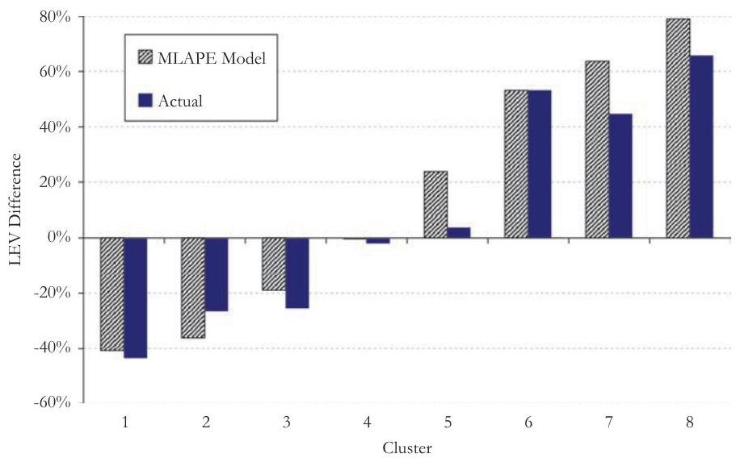

## Page 48
Figure 17. Actual vs. Expected LEV for the Best MLAPE Model on the Training Data
range. This chart provides the modeler with a way to assess the magnitude of the values being predicted and benchmark them against previous studies. The results are shown in Figure 17. Here again we see excellent agreement between the actual data and the MLAPE predictions and no apparent bias with the projected values.

Finally, we examine the negative log likelihoods for each cluster and see the MLAPE distribution parameters perform better than the a priori distribution parameters by having a lower value. To create this chart we subtract the negative log likelihood using the a priori from the negative log likelihood using the MLAPE algorithm and plot the differences by cluster. The results are shown in Figure 18. Here for the training data

Figure 18. NLL Difference by Cluster for the Best MLAPE Model on the Training Data

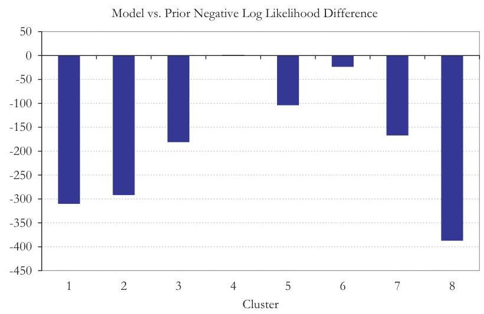

## Page 49
we see that for all clusters it is more likely that the actual data came from distributions defined by the MLAPE algorithm than the a priori estimates.

The combination of these three charts brings it all together. We can conclude for the training data that the MLAPE algorithm identifies significant segmentations of the data, provides accurate unbiased predictions across the prediction space, and performs better than our a priori assumptions. Now we turn to see if the same conclusions hold for the validation data as well.

Figure 19 shows the corresponding lift chart for the validation data. Same as the lift chart for the training data, the clusters from the MLAPE algorithm provide clear segmentation of the Texas loss data. Almost identical to the training data results, the differences range from $40 \%$ below average to $65 \%$ above average. We are seeing that the MLAPE algorithm has generalized well to data beyond the training set with tight agreement between actual versus predicted LEVs and no reversals.

Figure 20 shows the corresponding Actual versus Expected LEV chart for the validation data. Here again we see agreement between the actual data and the MLAPE predictions. While in this case there is a tendency for the MLAPE predictions to understate the actual LEVs, the linear relationship still holds.

Last, Figure 21 shows the negative log likelihood differences for the validation data. The results are again similar to the training data where the MLAPE algorithm has outperformed the a priori distribution parameters across all clusters. So, here again, we can conclude for the validation data the MLAPE algorithm has identified significant segmentations of the data; provides accurate, although potentially low, predictions across the prediction space; and performs better than our a priori assumptions.

Model Evaluation on Test Data. The examination of the model on the training and validation data was as expected. The MLAPE algorithm performed well on all three

Figure 19. Lift Chart for the Best MLAPE Model on the Validation Data
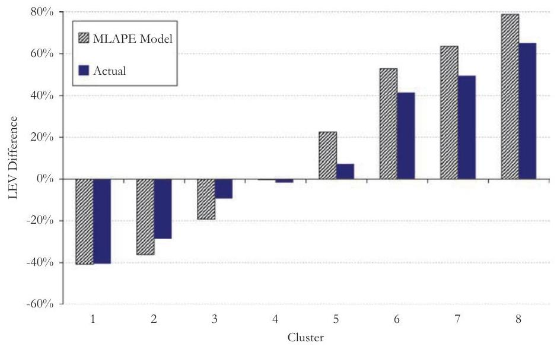

## Page 50
Figure 20. Actual vs. Expected LEV for the Best MLAPE Model on the Validation Data
tests, as it should have, since both sets were used to pick the best configuration of settings. To truly evaluate a model, one needs to evaluate the same metrics on data the model has never seen before, the test set. It is this evaluation that determines if we can achieve reliable segmentation on a go-forward basis and provide meaningful differences within our pricing and reserving analyses.

Figure 22 shows the lift chart for the test data. Convincingly, the clusters from the MLAPE algorithm provide clear segmentation for data it has never seen before. The

Figure 21. NLL Difference by Cluster for the Best MLAPE Model on the Validation Data
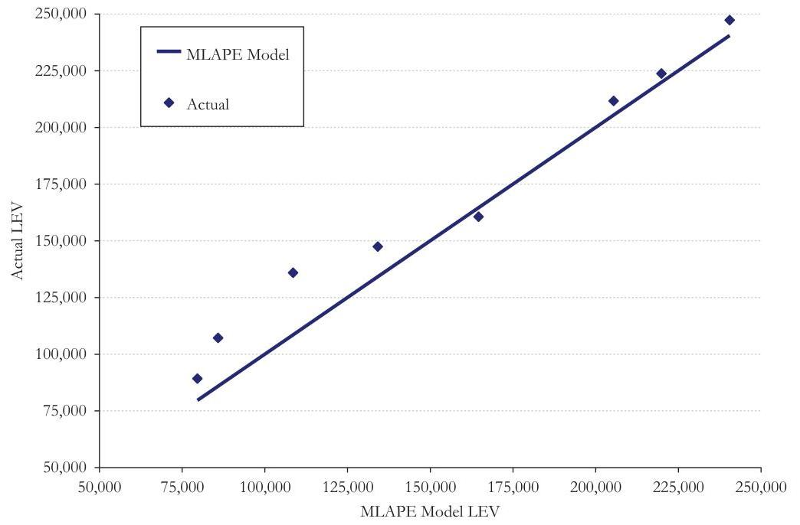
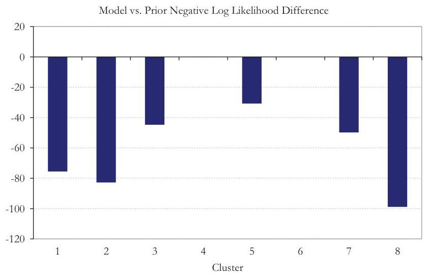

## Page 51
Figure 22. Lift Chart for the Best MLAPE Model on the Test Data
differences range from $38 \%$ below average to $60 \%$ above average. This range of $98 \%$ is only seven to eleven points below that of the training/validation data. We see the MLAPE algorithm has lost very little predictive power, and we see similar agreement between actual versus predicted LEVs and only one reversal.

Figure 23 shows the actual versus expected LEV chart for the test data. Again, convincingly, we see agreement between the actual data and the MLAPE predictions with no bias across the prediction space.

Figure 23. Actual vs. Expected LEV for the Best MLAPE Model on the Test Data
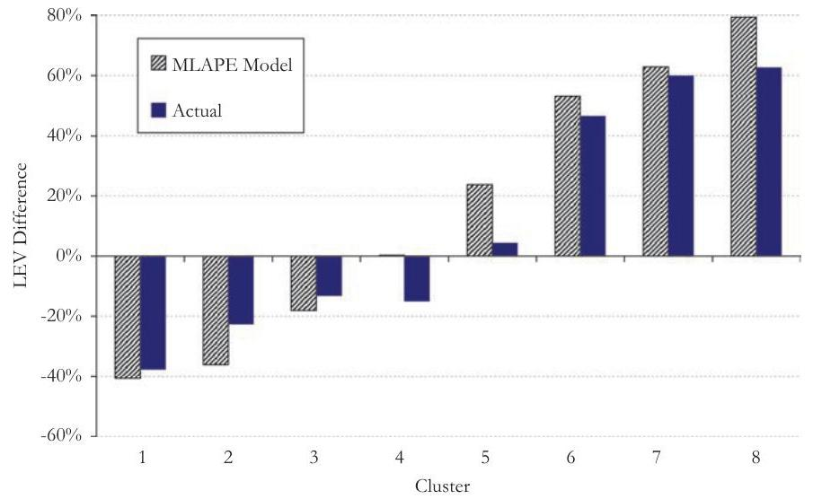
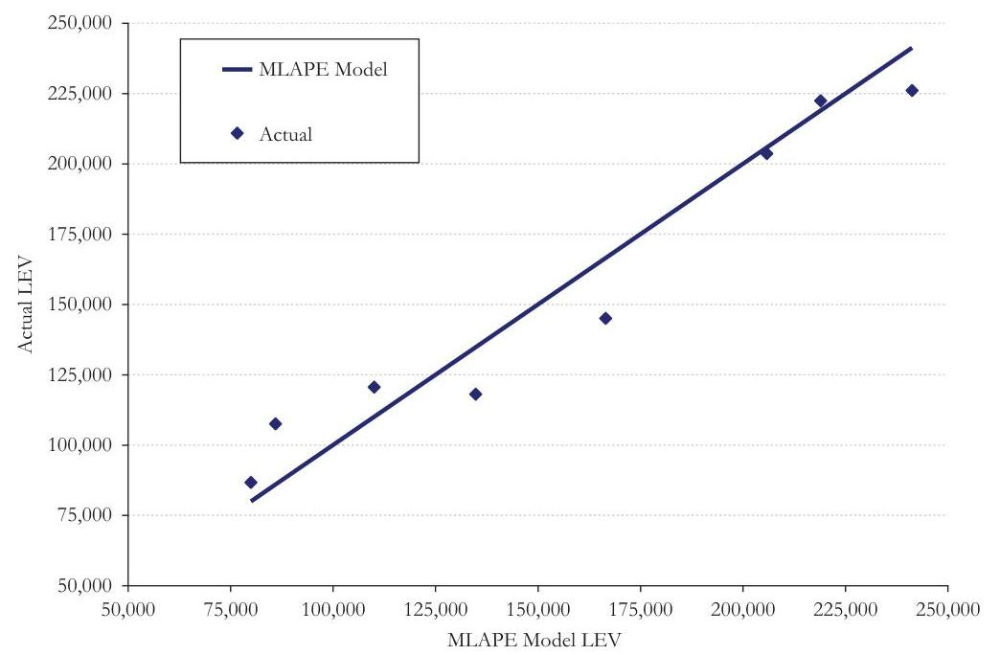

## Page 52
Figure 24. NLL Difference by Cluster for the Best MLAPE Model on the Test Data

Figure 24 shows the negative log likelihood differences for the test data. The results are again convincing where the MLAPE algorithm has outperformed the a priori distribution parameters.

As stated in the problem statement, the goal of our MLAPE algorithm is to solve the problem of estimating the parameters of $P$ while balancing the three main considerations - data sparseness, feature selection and goodness of fit. We have demonstrated with this sample implementation that the MLAPE algorithm achieves those goals. By including test data from all county and business class regions, it has demonstrated predictions are extensible to areas of data sparseness. The feature selection process has shown how the best configuration of model settings improves the likelihood the losses were generated from the MLAPE clusters versus an uninformed prior. Finally, with the goodness of fit evaluation on the test data, we conclude that the MLAPE algorithm identifies significant segmentations of the data, provides accurate predictions across the prediction space, and performs better than our a priori assumptions. With this achievement, the MLAPE algorithm offers a new tool for actuaries to provide the next level of accuracy and insights from our work product.
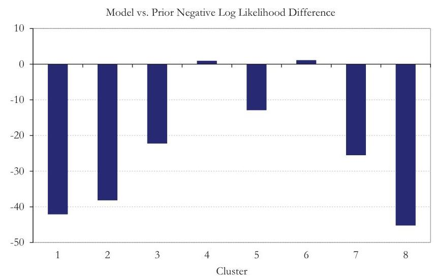

## Page 53
# 5. Discussion 

The machine-learning domain lies at the boundary of many disciplines - computer science, statistics, mathematics, and engineering. This is both an asset and a drawback. It is an asset because it draws from the best of all these disciplines. Its drawback, which is source of much of its criticism, is that it seems like a black box of algorithms, drawing on seemingly unrelated concepts and techniques, and assembling a machine at the end of it. In this paper, we did the same - pieced together different concepts and algorithms into a machine. This machine, MLAPE, had to solve a specific problem-estimate parameters-and we have shown that it succeeds with little supervision and domain knowledge. We now shift our focus and discuss three related questions. First, what is the insurance applicability of such a machine? Second, can we gain insights which are in line with traditional actuarial analysis by observing the output of this machine? And finally, how can the actuary apply this tool within the Actuarial Standards of Practice?

To answer the first question, we observe that the MLAPE machine performs in a space where data is sparse. Such environments are all too common in the insurance domain. We present two such environments. The first is for a new insurer in the marketplace. Typically, the new entrant does not have much line of business specific data of its own from which it can learn. Either it can use data from its existing but other lines of business, which may be good proxies, or it may have access to aggregated data for the specific line of business it wants to enter, such as the one from the Texas closed claims database. In both scenarios, the MLAPE machine is the bridge, which it can use to learn from, in addition to experts of its own. The benefit is that such a machine, much like experts, only improves its performance with time and more data. This approach eases the process of entry into an unknown business where data is sparse or potentially monopolized by few large incumbents. The second such environment is for an existing carrier trying to expand its business. It may have a wealth of in-house data for the specific line of business. Often this data is "chunky" - few pockets have most of the data, leaving vast segments with little or no data of its own. We saw this in the Texas closed claims data as well when analyzing the combinations of business class and county. Business segments rarely are a fine enough mesh for data. Again, the MLAPE machine is the bridge between the lines that have data and those that do not.

To answer the second question, we will use two traditional actuarial analysis - ILFs and Territorial analysis. In Figure 25, we present the $\$ 200 \mathrm{~K}$ to $\$ 1 \mathrm{M}$ increased limit factors by cluster, sorted in increasing order of ILF. Along with the point estimate of the ILF, we also show the range of ILFs for points included in the cluster.

## Page 54
Figure 25. \$200K to \$1M ILF by Cluster

We observe that although there are eight clusters, the MLAPE machine suggests four distinct levels of ILFs denoted by gray ovals. These four levels, shown in Figure 26, can be cluster 1 (ILF = 1.15), clusters 2 and 3 (ILF = 1.33), clusters 4 and 5 (ILF = 1.55), and clusters 6, 7 and 8 (ILF = 1.95). If we assume that the average statewide ILF is 1.5 , which is a simple average of the four ILFs, we have a range that varies between $23 \%$ less than the statewide average to $30 \%$ greater than the statewide average. Reflecting such a variation in pricing tiers is of tremendous value and protects long-term profitability.

In order to gain insights into territorial structure, we focus on business classes 7, 26 and 8. As shown in Figure 8, these classes represent the top three business classes with data. In Figure 27, we present two maps of Texas. The map on the left represents the ratio of the predicted ILF from the MLAPE machine for a county, to the statewide average ILF for business class 7 . Since the MLAPE machine provides a clustered output, there are six distinct predicted ILFs for business class 7 . We group the ratios resulting from these six ILFs into three groups represented by the three colors. The H-1 (yellow) group represents counties with a predicted business class 7 ILF that is $2 \%$ or $4 \%$ higher than the statewide average. The H-2 (lighter green) group represents counties with

Figure 26. Grouping of Clusters by ILF

| ILF Level | Cluster | ILF | \% of Avg. |
| :--: | :--: | :--: | :--: |
| 1 | 1 | 1.15 | $-23 \%$ |
| 2 | 2,3 | 1.33 | $-11 \%$ |
| 3 | 4,5 | 1.55 | $4 \%$ |
| 4 | $6,7,8$ | 1.95 | $30 \%$ |
|  | Average | 1.50 |  |
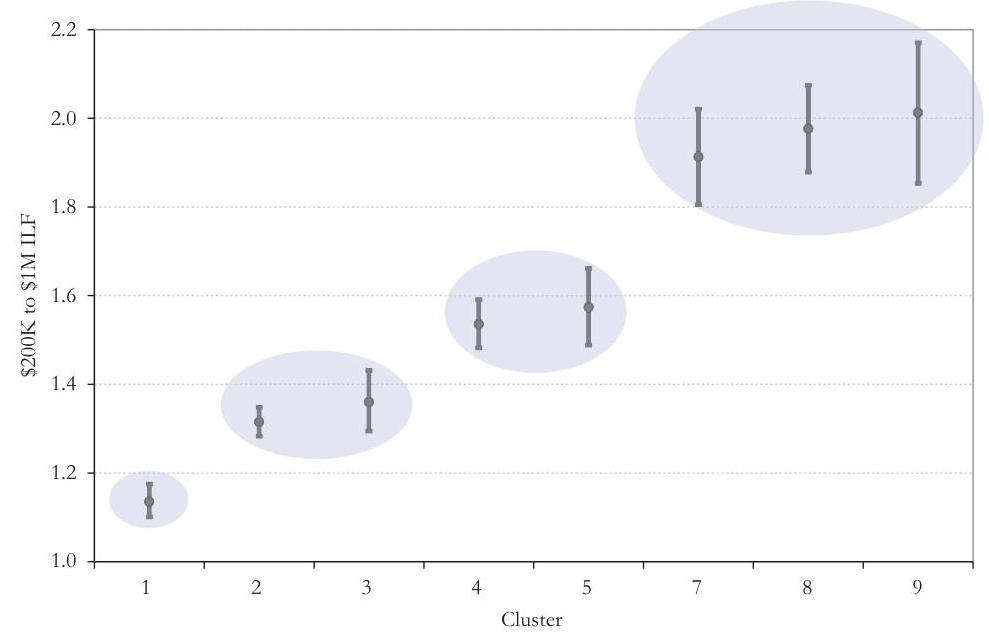

## Page 55
Figure 27. ILF Difference by County for Business Class 7
a predicted business class 7 ILF that is $8 \%$ or $13 \%$ lower than the statewide average. The H-3 (darker green) group represents counties with a predicted business class 7 ILF that is $27 \%$ or $37 \%$ lower than the statewide average. We observe that the vast majority of counties are in the $\mathrm{H}-1$ category, which is at or slightly above the statewide average.

We observe that the low ILF regions (H-2, H-3), are the areas around Dallas, Austin, San Antonio and Houston, with the exception of the area around the Big Bend National Park. Without knowing the dynamics of the commercial auto liability industry, we ask why we should expect this pattern. We note that we have used Injury County in the MLAPE machine. If more severe injuries indeed happen in rural counties represented by $\mathrm{H}-1$, then the most probable cause is vehicles that operate further away from business centers and cities. Such commercial vehicles probably represent complex business operations or are heavy vehicles. Whatever the actual reason, the class of vehicles operating in the city centers are fundamentally different from those operating in the H-1 areas and result in materially lower levels of injury. This is what the MLAPE machine recognizes as signal. Not only does this assist in territorial analysis but we can also use this to recognize loss drivers while underwriting new commercial auto liability businesses. For example, assume we want to underwrite two businesses centered in the same city. The former operates within the city while the latter operates in vast rural areas. Based on Figure 27 and the subsequent discussion, we should expect a significantly higher premium for the latter.

In Figure 28, we provide similar charts for business classes 26 and 8 on the left and right respectively. Eight distinct levels of ILF for business class 26 are output from the
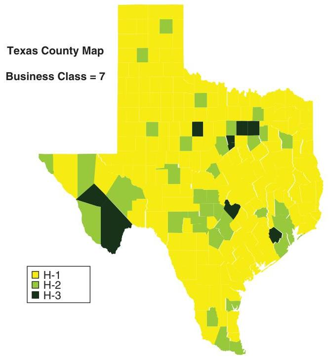

## Page 56
Figure 28. ILF Difference by County for Business Classes 26 (left) and 8 (right)

MLAPE machine. These eight ILFs result in eight ratios to the statewide average ILF for business class 26 . The $\mathrm{H}-1$ category represents the ratios $8 \%, 7 \%$, and $6 \%$ higher than the statewide average. The $\mathrm{H}-2$ category represents the ratios $4 \%$ and $9 \%$ lower than the statewide average. The $\mathrm{H}-3$ categories represent the ratios $20 \%, 24 \%$, and $30 \%$ lower than the statewide average ILF. The definitions of the $\mathrm{H}-1, \mathrm{H}-2$, and $\mathrm{H}-3$ categories for the business class 8 map on the right are $10 \%, 8 \%$, and $7 \%$ higher, $3 \%$ and $8 \%$ lower and $19 \%, 23 \%$, and $33 \%$ lower than statewide average for $\mathrm{H}-1, \mathrm{H}-2$ and $\mathrm{H}-3$ respectively. We observe that although the definitions of the $\mathrm{H}-1, \mathrm{H}-2$, and $\mathrm{H}-3$ categories are not one-to-one between the charts for business classes 7,26 , and 8 , they represent similar ranges and so are close enough for discussion. We see the enhanced impact of urban areas on ILFs as we go from business class 7 to 26 to 8 . We see many more counties classified as $\mathrm{H}-2$ and $\mathrm{H}-3$. This is due to the leveraged effect of the rural/urban phenomenon on some business classes compared to others. The MLAPE machine's task was to learn this multi-dimensional interaction between business class and county. This discussion shows how the machine's performance is not a black box when observed in light of some long-standing traditional actuarial analysis techniques.

With the promise for advancement in insurance analysis from these new techniques, it is up for debate as to who is most qualified to apply them-computer scientists, data scientists, or actuaries. We argue that actuaries, with our deep contextual understanding of insurance risk combined with our rigorous statistics training, are uniquely qualified to provide the best expert direction for these models and should take the lead on bringing this solution to the insurance field. Of course, we need to ensure incorporating this specialized knowledge meets the Actuarial Standards of Practice as
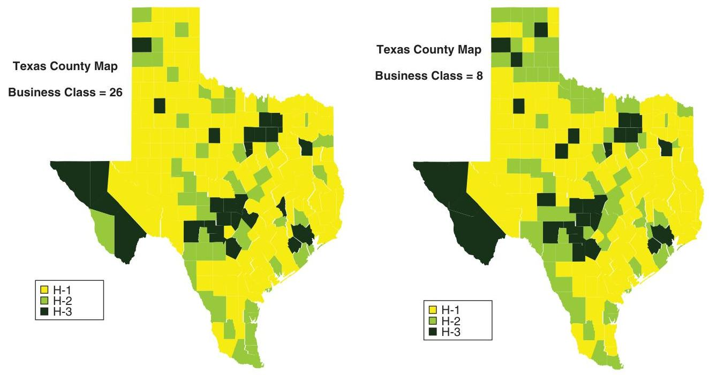

## Page 57
promulgated in ASOP No. 38 "Using Models Outside The Actuary's Area of Expertise (Property and Casualty)," which recommends:

When using such a model, the actuary should do all of the following:
a. determine appropriate reliance on experts;
b. have a basic understanding of the model;
c. evaluate whether the model is appropriate for the intended application;
d. determine that appropriate validation has occurred; and
e. determine the appropriate use of the model.

In the machine-learning domain, there exists a wealth of journals and textbooks deriving these algorithms and presenting the underlying assumptions from which we as actuaries can establish appropriate reliance on experts. From studying these materials, the actuary can develop an understanding of the model and assess the appropriateness of the application. For validation, following a process as described by the MLAPE methodology provides objective measures as to the models' predictive performance. The actuary can be confident that following such a process provides appropriate validation as to the consistency and reasonableness of the results and that the sensitivity of the model has been tested by the parameter sweep. Last, transforming the model output to create specific pricing or reserving factors (as we did with the ILF and Territory examples) allows the actuary to use professional judgement and assess the appropriate use of the model results. We hope that by presenting the MLAPE model more actuaries see the applicability of machine-learning techniques and the profession continues to adopt more of these advanced algorithms as we head into the era of big data.

## Page 58
# 6. Conclusion 

In this paper, we presented the MLAPE machine. We began by setting the stage with the general segmentation problem in parameter estimation. Since that general problem is intractable, we restated it into a learnable case. We presented a simple thought example to assist the reader in transitioning into the full application. We introduced the various parts of the MLAPE machine and provided theory and equations. We provided a recipe of pseudo-codes and demonstrated how to assemble the machine using the different parts. We then took the machine out for a test drive on the Texas Closed Claims Database and provided views of how the machine went about its task at different stages. Finally, we provided an insurance context in addition to the output. Stated simply, we have shown how machine-learning algorithms can be assembled together in a sequence, to gain knowledge about an insurance process that lacks data and/or experts. In an ideal world, such a machine will coexist, learn, and drive decisions in addition to actuaries and experts, refining and evolving with additional data (experience) and tuning (direction) just like any other business professional.

## Page 59
# References 

Arthur, David, and Sergei Vassilvitskii. 2007. "k-means++: The Advantages of Careful Seeding." Proceedings of the Eighteenth Annual ACM-SIAM Symposium on Discrete Algorithms. Society for Industrial and Applied Mathematics.
Beygelzimer, Alina, Sham Kakadet, John Langford, Sunil Arya, David Mount, and Shengqiao Li. 2015. "FNN: Fast Nearest Neighbor Search Algorithms and Applications." R package version 1.1. http://cran.r-project.org/web/packages/FNN.
Bickerstaff, David R. 1972. "Automobile Collision Deductibles And Repair Cost Groups: The Lognormal Model." Proceedings of the Casualty Actuarial Society 59, 68.
Bishop, Christopher M. 2006. Pattern Recognition and Machine Learning. Secaucus, NJ: Springer.
Borchers, Hans Werner. 2015. "Pracma: Practical Numerical Math Functions." R package version 1.8.3. http://CRAN.R-project.org/package=pracma.
Delignette-Muller, Marie-Laure, Christophe Dutang, Regis Pouillot, and Jean-Baptiste Denis. 2015. "Fitdistrplus: Help to Fit of a Parametric Distribution to Non-Censored or Censored Data." R package version 1.0-4. http://cran.r-project.org/web/packages/ fitdistrplus.
Dropkin, Lester B. 1964. "Size of Loss Distributions in Workmen's Compensation Insurance." Proceedings of the Casualty Actuarial Society 51, 198.
Genz, Alan, Frank Bretz, Tetsuhisa Miwa, Xuefei Mi, Friedrich Leisch, Fabian Scheipl, and Torsten Hothorn. 2014. "Mvtnorm: Multivariate Normal and t Distributions." R package version 1.0-2. URL http://CRAN.R-project.org/package=mvtnorm.
George, E. I., U.E. Makov, and A.F.M Smith. 1993. "Conjugate Likelihood Distributions." Scandinavian Journal of Statistics 20:2, 147-156.
Griffiths, William. 2004. "A Gibbs' Sampler for the Parameters of a Truncated Multivariate Normal Distribution." Contemporary Issues in Economics and Econometrics: Theory and Application 75-91.
Haines, Tom S.F. 2011. "Gaussian Conjugate Prior Cheat Sheet." https://www.haniotikanea.gr/media/2013/08/GaussianConjugatePriorCheatSheet.pdf.
Karatzoglou, Alexandros, Alex Smola, Kurt Hornik. 2015. "Kernlab: Kernel-Based Machine Learning Lab." R package version 0.9-20. http://cran.r-project.org/web/ packages/kernlab.
Kleinberg, Jon, Christos Papadimitriou, and Prabhakar Raghavan. 2004 "Segmentation Problems." Journal of the ACM.

## Page 60
Mahalanobis, Prasanta Chandra. 1936. "On the Generalised Distance in Statistics." Proceedings of the National Institute of Sciences of India 2:1, 49-55.
Mayerson, Allen L. 1964. "A Bayesian View of Credibility." Proceedings of the Casualty Actuarial Society 51, 65.
Meyers, Glenn G. 1984. "Empirical Bayesian Credibility For Workers' Compensation Classification Ratemaking." Proceedings of the Casualty Actuarial Society 63, 96.
Parvin, Hamid, Hosein Alizadeh, and Behrouz Minaei-Bidgoli. 2008. "MKNN: Modified K-Nearest Neighbor." Proceedings of the World Congress on Engineering and Computer Science.
Petris, Giovanni, Sonia Petrone, and Patrizia Campagnoli. 2009. Dynamic Linear Models with R. New York: Springer-Verlag.
Revolution Analytics and Steve Weston. 2014. "DoParallel: Foreach Parallel Adaptor for the Parallel Package." R package version 1.0.8. http://CRAN.R-project.org/ package=doParallel.
Tipping, Michael E. 2001. "Sparse Bayesian Learning and the Relevance Vector Machine." Journal of Machine Learning Research 1, 211-244.
Vanhatalo, Jarno, Kaakko Riihimaki, Jouni Hartikainen, and Aki Vehtari. 2013. "Bayesian Modeling with Gaussian Processes using the MATLAB Toolbox GP-stuff." $1175-1179$.

## Page 61
# Appendix I. Adaptation of MLAPE for the Poisson distribution 

As we noted in the paper, the MLAPE model extends naturally to any specific choice of $P$ and by choosing the lognormal distribution there is no loss of generality. In this appendix, we will discuss the necessary changes to each step of the recipe to adapt MLAPE for the widely used Poisson distribution. While the Poisson distribution has one parameter, again note that the MLAPE model handles distributions with any number of parameters.

## Step 1. Pre-process

There are no changes needed to this step as it involves processing the underlying data and concerns only the feature space and output variable.

## Step 2. Perform machine learning regression

In the case of the Poisson distribution, we have a one parameter probability density function where

$$
f(x)=\frac{e^{-\lambda} \lambda^{x}}{x!}
$$

and both the mean and variance of $x$ is given by $\lambda$. For the K-Nearest Neighbors regression model, we have utilized the maximum likelihood estimate of the distribution parameters from the $K$ nearest points as our predicted parameters. So, to change the MLAPE model for the Poisson here, we would replace the lognormal fitting routine, predicting mu and sigma, with the average of the selected $K$ output values, predicting lambda. Note that, in addition to the point estimates for the distribution parameters, confidence intervals are also required by the MLAPE model and we leave this as an area of future investigation.

For the Kernel regression and RVM regression models, we incorporated the Bayesian MAP estimates of the parameters and need to introduce the conjugate prior for the Poisson distribution, which is the gamma distribution. As shown in George et al. (1993), if our data $x_{0}, \ldots, x_{n}$ are IID Poisson $(\lambda)$, then a gamma $(\alpha, \beta)$ prior on $\lambda$ is a conjugate

## Page 62
prior whose posterior distribution is gamma $(\Sigma x+\alpha, n+\beta)$. As a result, the posterior mean for $\lambda$ is

$$
\lambda=\frac{\sum x_{i}+\alpha}{n+\beta}=\frac{\sum x_{i}}{n+\beta}+\frac{\alpha}{n+\beta}=\left(\frac{n}{n+\beta}\right)\left(\frac{\sum x_{i}}{n}\right)+\left(\frac{\beta}{n+\beta}\right)\left(\frac{\alpha}{\beta}\right)
$$

Here we see that, similar to the selection of $n_{0}$ for the normal-gamma MAP calculation, $\beta$ serves as the number of prior observations and $\alpha / \beta$ is the prior estimate for $\lambda$ and would be tested as part of the parameter sweep.

# Step 3. Cluster 

While the K-Means Clustering algorithm is a dynamic clustering algorithm designed to work in any $n$-dimensional space without changes to the algorithm, we had modified, specific to the lognormal, the "average" used to determine the cluster centers. This will need to be given consideration based on the selected distribution and, in the case of the Poisson distribution, a standard weighted average of the $\lambda$ 's may be used.

## Step 4. Validate

In the validation step, we proposed using the negative log-likelihood and mean square error as metrics to measure the predictive accuracy of the best model. These measures are equally valid regardless of the selected distribution and the only required change is to replace the lognormal expected value and probability density functions with the Poisson.

## Page 63
# Appendix II. Method A - K-Nearest Neighbor Based Lognormal mu/sigma Estimation Process 

| Control |
| :-- |
| Script to run the K-Nearest Neighbor based procedures |
| Permute |
| Creates a file with random indices of the data for consistent validation |
| Preprocess |
| Pre-processes the data |
| Standardize features, Weight features, Balance average distance, Create |
| Training, Validation \& Test sets |
| K-NN Fits |
| For each combination of feature levels in the universe, find the Nearest |
| Neighbors in the data and perform Lognormal MLE |
| Handle Outliers, KNN search, Gaussian distance weights for fitting, Weighted |
| \& Capped Lognormal MLE |
| K-Means Clustering |
| Run KMeans clustering until 500 iterations show no ADCC improvement |
| Iterations, Random restarts |
| MyKMeans |
| KMeans algorithm specific to clustering mu/sigma pairs |
| KMeans EM, Mahalanobis distance, kmeans++ initialization, weighted |
| averages, law of total variance |
| Validation |
| Procedure to validate training results with validation data set |
| minimize negative log likelihood |
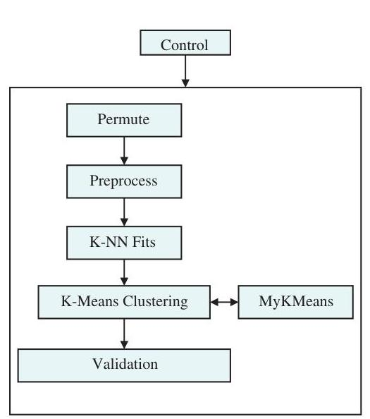

## Page 64
# Appendix III. Method B - Regression Based Lognormal mu/sigma Estimation Process 

## Control

Script to run the Regression procedures

## Preprocess

Pre-processes the data
Standardize features, Weighted and Un-Weighted features, Balance average distance, Train/Validate/Test sets

## Posterior Estimation

For each unique combination of features in the data calculate the posterior estimates of mu/sigma and sample from the posterior Handle outliers, Prior lookup, Call Normal-Gamma, Sample distribution

## Normal Gamma Sequential Update

Estimate mu/sigma based on the Normal-Gamma distribution using a sequential process
Normal-Gamma, Sequential updating, Capped values, Iterations, Monte Carlo simulation of tail \& prior, Shuffle data

## Kernel Regression

For each combination of feature levels in the universe, estimate mu/sigma using a Kernel regression of the posterior estimates Gaussian kernel, bandwidth, Mixture of Gaussians for projections, CI search

## Relevance Vector Machine

For each combination of feature levels in the universe, estimate mu/sigma using a RVM regression of the posterior estimates Relevance Vector Machine regression, bandwidth
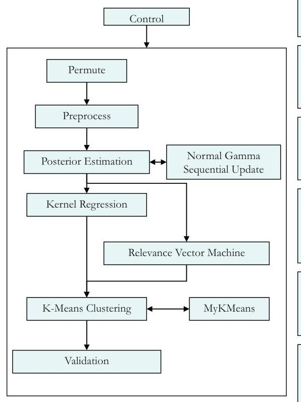

## Page 65
.

## Page 66
# ABOUT THE SERIES: 

CAS monographs are authoritative, peer-reviewed, in-depth works focusing on important topics within property and casualty actuarial practice. For more information on the CAS Monograph Series, visit the CAS website at www.casact.org.