_Note: Source document was split into 5 OCR chunks (pages 1-25, pages 26-44, pages 45-63, pages 64-84, pages 85-99) to stay within token limits._

# CAS_Monograph_08-Meyers

## Page 1
# CAS MONOGRAPH SERIES NUMBER 8 

## STOCHASTIC LOSS RESERVING USING BAYESIAN MCMC MODELS, 2ND EDITION <br> Glenn Meyers, FCAS, MAAA, CERA, Ph.D.

## Page 2
The emergence of Bayesian Markov Chain Monte-Carlo (MCMC) models has provided actuaries with an unprecedented flexibility in stochastic model development. Another recent development has been the posting of a database on the CAS website that consists of hundreds of loss development triangles with outcomes. This monograph begins by first testing the performance of the Mack model on incurred data, and the Bootstrap Overdispersed Poisson model on paid data. It then proposes Bayesian MCMC models that improve the performance over the above models. The features examined include (1) recognizing correlation between accident years in incurred data, (2) allowing for a change in the claim settlement rate in paid data, and (3) a unified model combining paid and incurred data. This monograph continues with an investigation of dependencies between lines of insurance and proposes a way to calculate a cost of capital risk margin.

Keywords. Stochastic loss reserving, Bayesian MCMC models

## Page 3
.

## Page 4
# ABOUT THE SERIES: 

CAS monographs are authoritative, peer-reviewed, in-depth works focusing on important topics within property and casualty actuarial practice. For more information on the CAS Monograph Series, visit the CAS website at www.casact.org.

## Page 5
Glenn Meyers
Stochastic Loss Reserving Using Bayesian MCMC Models, 2nd edition

## Page 6
# STOCHASTIC LOSS RESERVING USING BAYESIAN MCMC MODELS 2ND EDITION 

Glenn Meyers, FCAS, MAAA, CERA, Ph.D.

Casualty Actuarial Society
4350 North Fairfax Drive, Suite 250
Arlington, VA 22203
www.casact.org
(703) 276-3100

## Page 7
Stochastic Loss Reserving Using Bayesian MCMC Models (2nd edition)
By Glenn Meyers

Copyright 2019 by the Casualty Actuarial Society

All right reserved. No part of this publication may be reproduced, stored in a retrieval system, or transmitted, in any form or by any means, electronic, mechanical, photocopying, recording, or otherwise, without the prior written permission of the publisher. For information on obtaining permission for use of material in this work, please submit a written request to the Casualty Actuarial Society.

Library-of-Congress Cataloguing-in-Publication Data
Meyers, Glenn
Stochastic Loss Reserving Using Bayesian MCMC Models-2nd edition
ISBN 978-1-7333294-1-5 (print edition)
ISBN 978-1-7333294-2-2 (electronic edition)

1. Actuarial science 2. Loss reserving 3. Insurance-Mathematical models
I. Meyers, Glenn

## Page 8
# Contents 

Preface to the Second Edition ..... v

1. Introduction ..... 1
2. The CAS Loss Reserve Database ..... 4
3. Validating the Mack Model on Incurred Losses ..... 6
4. Validating the Bootstrap ODP and Mack Models on Paid Losses ..... 12
5. The Cross Classified Model ..... 16
6. The Stochastic Cape Cod Model ..... 23
7. The Changing Settlement Rate Model ..... 31
8. The Correlated Accident Year Model ..... 37
9. Combining the CAY and CSR Models ..... 43
10. Dependencies Between Lines of Insurance ..... 52
11. Risk Margin ..... 61
12. Summary and Conclusions ..... 77
References ..... 81
Appendix-The Data Selection Process ..... 83

## Page 9
# About the Author 

Glenn Meyers, FCAS, MAAA, CERA, and Ph.D, retired from ISO at the end of 2011 after a 37-year career as an actuary. He holds a B.S. in Mathematics and Physics from Alma College, an M.A. in Mathematics from Oakland University and a Ph.D. in Mathematics from SUNY at Albany. A frequent speaker at Casualty Actuarial Society (CAS) meetings, he has served the CAS by participating on several education and research committees. He has also served on the CAS Board of Directors. His research contributions have been recognized by the CAS through his being a three-time winner of the Woodward-Fondiller Prize, a two-time winner of the Dorweiler Prize, the Dynamic Financial Analysis Prize, the Ronald Bornhuetter Loss Reserves Prize, the American Risk and Insurance Association Prize, the Charles A. Hachemeister Prize, the Matthew Rodermund Service Award and the Michelbacher Significant Achievement Award. In retirement he continues to spend some of his time on his passion for actuarial research.

## Page 10
# Preface to the 2nd Edition 

Since the original publication of this monograph in January 2015, a number of events transpired.

- The Bayesian MCMC software, Stan, currently appears to be the software of choice by many CAS members.
- In Meyers (2017) and Meyers (2018) I have done research that applies the techniques described in the original monograph in an attempt to advance the state of the art in (1) quantifying dependencies between lines of insurance and (2) calculating a cost of capital risk margin.
- I have presented this material in over a dozen conferences and workshops. Each time that I did this, I spotted and made improvements in both the presentation and the methodology.
- I have had a number of in-depth exchanges with interested individuals. Out of these exchanges, some very good ideas have emerged.

As time progressed, it became clear that the additions and improvements generated by this ongoing research created inconsistencies between the various publications that could inhibit the adoption of this research. So I asked the CAS if a second edition of the monograph could be done and received the go-ahead. What this edition does is present the highlights of my research in this area in an integrated fashion.

Here is a summary of the major changes.

- The Bayesian MCMC modeling has been done using the Stan software instead of JAGS.
- My research on dependencies and risk margins is included.
- The set of loss triangles analyzed has changed. In the original edition, there were a number of loss triangles that, had I actually looked at them, would have been discarded. The triangle selection process for this edition was more rigorous.
- There is a different set of models. The new models include a Bayesian MCMC version of the Cape Cod model and an integrated Paid/Incurred loss model. Gone are the attempts at an incremental paid loss model. (I spent a good amount of time trying to get a new incremental paid model, but my attempts did not yield a model that validated.)
- There is a more thoughtful selection of prior distributions for the Bayesian models.

## Page 11
- The only tests on the first edition are the $p-p$ plots. This second edition adds prospective tests and an additional retrospective test for the models. These tests will include a criterion for adding/deleting a particular parameter to the model.
- While I hope that the conclusions in this monograph, and the reasoning behind these conclusions, will be understandable by most actuaries, I removed some of the text designed to introduce actuaries to the tools needed to actually perform the analyses. There is a lot of good introductory material out there that interested actuaries can find quickly. The http://mc-stan.org Stan website is a good place to start.

## Page 12
# 2019 CAS Monograph Editorial Board 

Ali Ishaq, Editor in Chief<br>Emmanuel Theodore Bardis<br>Craig C. Davis<br>Scott Gibson<br>Glenn Meyers<br>Brandon Smith

## Page 13
.

## Page 14
# 1. Introduction 

The attempts to apply enterprise risk management principles to insurance has placed a high degree of importance on quantifying the uncertainty in the various necessary estimates with stochastic models. For general insurers, the most important liability is the reserve for unpaid losses. Over the years a number of stochastic models have been developed to address this problem. Two of the more prominent nonproprietary models are those of Mack $(1993,1994)$ and England and Verrall (2002).

While these and other models provide predictive distributions of the outcomes, very little work has been done to retrospectively test, or validate, the performance of these models in an organized fashion on a large number of insurers. In 2011, with the permission of the National Association of Insurance Commissioners (NAIC), Peng Shi and I, in Meyers and Shi (2011), were able to assemble a database consisting of a large number of Schedule P triangles for six lines of insurance. These triangles came from insurer NAIC Annual Statements reported in 1997. Using subsequent annual statements we "completed the triangle" so that we could examine the outcomes and validate the predictive distribution for any proposed model.

Sections 3 and 4 attempt to validate the models of Mack $(1993,1994)$ and England and Verrall (2002). As it turns out, these models do not accurately predict the distribution of outcomes for the data included in the subject database. Explanation for these results include the following.

- The insurance loss environment is too dynamic to be captured in a single stochastic loss reserve model, i.e., there could be different "black swan" events that invalidate any attempt to model loss reserves. ${ }^{1}$
- There could be other models that better fit the existing data.
- The data used to calibrate the model is missing crucial information needed to make a reliable prediction. Examples of such changes could include changes in the way the underlying business is conducted, such as changes in claim processes or changes in the direct/ceded/assumed reinsurance composition of the claim values in triangles.

One way to rule out the first item above is to (1) find a better model; and/or (2) find better data. This monograph examines a number of different models and data

[^0]
[^0]:    ${ }^{1}$ The term "black swan," as popularized by Taleb (2007), has come to be an oft-used term representing a rare high-impact event.

## Page 15
sources that are available in Schedule P. The data in Schedule P includes net paid losses, net incurred losses, and net premiums.

A characteristic of loss reserve models is that they are complex in the sense that they have a relatively large number of parameters. A major difficulty in quantifying the uncertainty in the parameters of a complex model has been that it takes a fair amount of effort to derive a formula for the predictive distribution of outcomes. See Mack's (1993, 1994) papers and Bardis, Majidi and Murphy's (2012) paper for examples of analytic solutions. Taking advantage of ever-increasing computer speed, England and Verrall (2002) pass the work on to computers using a bootstrapping methodology with the overdispersed Poisson distribution (ODP). Not too long ago, the Bayesian models ${ }^{2}$ were not practical for models of any complexity. But with the relatively recent introduction of Bayesian Markov Chain Monte Carlo (MCMC) models, complex Bayesian stochastic loss reserve models are now practical in the current computing environment.

Although Markov chains have long been studied by probability theorists, it took a while for their application to Bayesian statistics to be recognized. Starting in the 1930s, physicists began using statistical sampling from Markov chains to solve some of the more complex problems in nuclear physics. The names associated with these efforts include Enrico Fermi, John von Neumann, Stanislaw Ulam and Nicolas Metropolis. This led to the Metropolis algorithm for generating Markov chains. Later on, W. Keith Hastings (1970) recognized the importance of Markov chains for mainstream statistics and published a generalization of the Metropolis algorithm. That paper was largely ignored by statisticians at the time as they were not accustomed to using simulations for statistical inference. Gelfand and Smith (1990) provided the "aha" moment for Bayesian statisticians. They pulled together a relevant set of existing ideas at a time when access to fast computing was becoming widely available. Sharon McGrayne sums up, "Almost instantaneously MCMC and Gibbs sampling changed statisticians' entire method of attacking problems. In the words of Thomas Kuhn, it was a paradigm shift. MCMC solved real problems, used computer algorithms instead of theorems, and led statisticians and scientists into a world where 'exact' meant 'simulated' and repetitive computer simulations replaced mathematical equations. It was a quantum shift in statistics" (McGrayne 2011, Part V).

As was the case for the other social sciences, Bayesian MCMC should eventually have a profound effect on actuarial science. And in fact, its effect has already begun. Scollnik (2001) introduced actuaries to Bayesian MCMC models. De Alba (2002), along with Ntzoufras and Dellaportas (2002), quickly followed by applying these models to the loss reserving problem. Verrall (2007) applied them to the chain ladder model. In the time since these papers were written, the algorithms implementing Bayesian MCMC models have gotten more efficient, and the associated software has gotten more user friendly.

[^0]
[^0]:    ${ }^{2}$ By a "Bayesian model" I mean a model with its parameters having a prior distribution specified by the user. By "Bayesian estimation" I mean the process of predicting the distribution of a "statistic of interest" from the posterior distribution of a Bayesian model.

## Page 16
Here is the situation we now face. First, we are able to construct a wide variety of proposed models and predict their distribution of outcomes with the Bayesian MCMC methodology. Second, we are able to validate a proposed stochastic loss reserve model using a large number of insurers on the CAS Loss Reserve Database. If the insurance loss environment is not dominated by a series of unique "black swan" events, it should be possible to systematically search for models and data that successfully validate. This monograph describes the results I have obtained to date in my pursuit of this goal.

Before introducing Bayesian MCMC models, this monograph will start with examining the Mack $(1993,1994)$ and the England and Verrall (2002) models. It will identify shortcomings based on the validation results on the holdout data. It will then apply the Bayesian MCMC methodology to proposed models that validate on the holdout data.

While I believe I have made significant progress in identifying models that do successfully validate on the data I selected from the CAS Loss Reserve Database, it should be stressed that more work needs to be done to confirm/reject these results for different data taken from different time periods.

The intended audience for this monograph consists of general insurance actuaries who are familiar with the Mack $(1993,1994)$ and the England and Verrall (2002) models. While I hope that most sections will be readable by a "generalist" actuary, those desiring a deeper understanding should work with the companion R/Stan scripts to this monograph. ${ }^{3}$

The computer script used to implement these models is written in the R programming language. To implement the MCMC calculations the R script contains another script that is written in Stan. Like R, Stan is an open source programming language one can download for free. For readers who are not familiar with R and Stan, here are some links to help the reader get started.

- http://r-project.org The home page of the R-Project.
- http://mc-stan.org A link to the Stan home page. This website provides instructions for installing and for getting started with Stan.
- http://www.rstudio.com/ A currently popular editor for R scripts.

[^0]
[^0]:    ${ }^{3}$ These scripts are available at https://www.casact.org/sites/default/files/2021-04/meyers-appendix.zip.

## Page 17
# 2. The CAS Loss Reserve Database 

In order to validate a model, one needs not only the data used to build the model, but also the data with outcomes that the model was built to predict. Schedule P of the NAIC Annual Statement contains insurer-level run-off triangles of aggregated losses by line of insurance. Triangles for both paid and incurred losses (net of reinsurance) are reported in Schedule P. ${ }^{4}$ To get the outcomes, one must look at subsequent Annual Statements.

To illustrate the calculations described in this monograph, I selected incurred and paid loss triangles from insurers in the database. The data from one of these insurers, insurer group \#353 for Commercial Auto, are in Tables 2.1, 2.2, and 2.3. The data in the loss triangles above the diagonal lines are available in the 1997 Annual Statement. These data are used to build the models discussed below. The outcome data below the diagonal lines were extracted, by row, from the Annual Statements listed in the "Source" column. These data are used to validate the models.

The database, along with a complete description of how it was constructed and how the insurers were selected, is available on the CAS website at https:// www.casact.org/publications-research/research/research-resources/loss-reserving-data-pulled-naic-schedule-p.

This monograph will fit various loss reserve models, and test the predictive distri-butions, to a set of 200 insurer loss triangles taken from four Schedule P (50 from each of Commercial Auto, Personal Auto, Workers' Compensation and Other Liability) lines of insurance. An underlying assumption of these models is that there have not been any substantial changes in the insurer's operation. In our real world, insurers are always tinkering with their operations. Schedule P provides two hints of possible insurer operational changes.

- Changes in the net premium from year-to-year
- Changes in the ratio of net to direct premium from year to year

The criteria for selecting the 200 insurer loss triangles rests mainly on controlling for changes in the above two items. The Appendix gives the group codes for the selected insurers by line of insurance and gives a detailed description of the selection algorithm.

Key summary statistics from all the models considered in the monograph will be available from the CAS website at https://www.casact.org/sites/default/ files/2021-04/meyers-appendix.zip.

[^0]
[^0]:    ${ }^{4}$ Paid losses are reported in Part 3 of Schedule P. Incurred losses are the losses reported in Part 2 minus those reported in Part 4 of Schedule P.

## Page 18
Table 2.1. Illustrative Loss Triangle Net Written Premium

| AY | 1 | 2 | 3 | 4 | 5 | 6 | 7 | 8 | 9 | 10 |
| :--: | :--: | :--: | :--: | :--: | :--: | :--: | :--: | :--: | :--: | :--: |
| Premium | 5812 | 4908 | 5454 | 5165 | 5214 | 5230 | 4992 | 5466 | 5226 | 4962 |

Table 2.2. Paid Illustrative Loss Triangle Net of Reinsurance

| AY \ Lag | 1 | 2 | 3 | 4 | 5 | 6 | 7 | 8 | 9 | 10 | Source |
| :-- | :--: | :--: | :--: | :--: | :--: | :--: | :--: | :--: | :--: | :--: | :--: |
| 1988 | 952 | 1529 | 2813 | 3647 | 3724 | 3832 | 3899 | 3907 | 3911 | 3912 | 1997 |
| 1989 | 849 | 1564 | 2202 | 2432 | 2468 | 2487 | 2513 | 2526 | 2531 | 2527 | 1998 |
| 1990 | 983 | 2211 | 2830 | 3832 | 4039 | 4065 | 4102 | 4155 | 4268 | 4274 | 1999 |
| 1991 | 1657 | 2685 | 3169 | 3600 | 3900 | 4320 | 4332 | 4338 | 4341 | 4341 | 2000 |
| 1992 | 932 | 1940 | 2626 | 3332 | 3368 | 3491 | 3531 | 3540 | 3540 | 3583 | 2001 |
| 1993 | 1162 | 2402 | 2799 | 2996 | 3034 | 3042 | 3230 | 3238 | 3241 | 3268 | 2002 |
| 1994 | 1478 | 2980 | 3945 | 4714 | 5462 | 5680 | 5682 | 5683 | 5684 | 5684 | 2003 |
| 1995 | 1240 | 2080 | 2607 | 3080 | 3678 | 2004 | 4117 | 4125 | 4128 | 4128 | 1997 |
| 1996 | 1326 | 2412 | 3367 | 3843 | 3965 | 4127 | 4133 | 4141 | 4142 | 4144 | 2005 |
| 1997 | 1413 | 2683 | 3173 | 3674 | 3805 | 4005 | 4020 | 4095 | 4132 | 4139 | 2006 |

Table 2.3. Incurred Illustrative Loss Triangle Net of Reinsurance

| AY \ Lag | 1 | 2 | 3 | 4 | 5 | 6 | 7 | 8 | 9 | 10 | Source |
| :-- | :--: | :--: | :--: | :--: | :--: | :--: | :--: | :--: | :--: | :--: | :--: |
| 1988 | 1722 | 3830 | 3603 | 3835 | 3873 | 3895 | 3918 | 3918 | 3917 | 3917 | 1997 |
| 1989 | 1581 | 2192 | 2528 | 2533 | 2528 | 2530 | 2534 | 2541 | 2538 | 2532 | 1998 |
| 1990 | 1834 | 3009 | 3488 | 4000 | 4105 | 4087 | 4112 | 4170 | 4271 | 4279 | 1999 |
| 1991 | 2305 | 3473 | 3713 | 4018 | 4295 | 4334 | 4343 | 4340 | 4342 | 4341 | 2000 |
| 1992 | 1832 | 2625 | 3086 | 3493 | 3521 | 3563 | 3542 | 3541 | 3541 | 3587 | 2001 |
| 1993 | 2289 | 3160 | 3154 | 3204 | 3190 | 3206 | 3351 | 3289 | 3267 | 3268 | 2002 |
| 1994 | 2881 | 4254 | 4841 | 5176 | 5551 | 5689 | 5683 | 5688 | 5684 | 5684 | 2003 |
| 1995 | 2489 | 2956 | 3382 | 3755 | 4148 | 4123 | 4126 | 4127 | 4128 | 4128 | 2004 |
| 1996 | 2541 | 3307 | 3789 | 3973 | 4031 | 4157 | 4143 | 4142 | 4144 | 4144 | 2005 |
| 1997 | 2203 | 2934 | 3608 | 3977 | 4040 | 4121 | 4147 | 4155 | 4183 | 4181 | 2006 |

## Page 19
# 3. Validating the Mack Model on Incurred Losses 

Probably the two most popular nonproprietary stochastic loss reserve models are those of the Mack $(1993,1994)$ chain ladder model and the England and Verrall (2002) bootstrap ODP model. This section describes an attempt to validate the Mack model on the incurred loss data from several insurers that are included in the CAS database. Validating the bootstrap ODP model will be addressed in the following section.

Let's begin with the classic chain ladder model. Let $C_{w, d}$ denote the accumulated loss amount, either incurred or paid, for accident year, $w$, and development lag, $d$, for $1 \leq w \leq K$ and $1 \leq d \leq K . C_{w, d}$ is known for the "triangle" of data specified by $w+d \leq K+1$. The goal of this model is to estimate the loss amounts in the last column of data, $C_{w, K}$ for $w=2, \ldots, K$. To use the chain ladder model, one first calculates the age-to-age factors given by

$$
f_{d}=\frac{\sum_{w=1}^{K-d} C_{w, d+1}}{\sum_{w=1}^{K-d} C_{w, d}} \quad \text { for } d=1, \cdots, K-1
$$

The chain ladder estimate of $C_{w, K}$ is the product of the latest reported loss, $C_{w, K+1-w}$, and the subsequent age-to-age factors $f_{K+1-w} \cdot \ldots \cdot f_{K-1}$. Putting this together we have

$$
C_{w, K}=C_{w, K+1-w} \cdot f_{K+1-w} \cdot \ldots \cdot f_{K-1}
$$

Taylor (1986, p.40) discusses the origin of the chain ladder model and concludes that "It appears that it probably originated in the accounting literature, and was subsequently absorbed in to, or rediscovered in, the actuarial." He goes on to say that "Of course, one must bear in mind that both the chain ladder model and estimation method are fairly obvious and might have been derived several times in past literature." Taylor believes that the rather whimsical name of the model was first used by Professor R.E. Beard as he championed the method in the early 1970s while working as a consultant to the U.K. Department of Trade.

## Page 20
Mack $(1993,1994)$ turns the deterministic chain ladder model into a stochastic model by first treating $\tilde{C}_{w, d}$ as a random variable that represents the accumulated loss amount in the $(w, d)$ cell. He then makes three assumptions: ${ }^{5}$

1. $E\left[\tilde{C}_{w, d+1} \mid C_{w, 1}, \ldots, C_{w, d}\right]=C_{w, d} \cdot f_{d}$
2. For any given $d$, the random variables $\tilde{C}_{v, d}$ and $\tilde{C}_{w, d}$ are independent for $v \neq w$.
3. $\operatorname{Var}\left[\tilde{C}_{w, d+1} \mid C_{w, 1}, \ldots, C_{w, d}\right]=C_{w, d} \cdot \alpha_{d}$

The Mack estimate for $E\left[\tilde{C}_{w, K}\right]$ for $w=2, \ldots, K$ is given by

$$
\hat{C}_{w, K}=C_{w, K+1-w} \cdot \hat{f}_{K+1-w} \cdot \ldots \cdot \hat{f}_{K-1}
$$

where

$$
\hat{f}_{d}=\frac{\sum_{w=1}^{K-d} C_{w, d+1}}{\sum_{w=1}^{K-d} C_{w, d}}
$$

Given his assumptions above, Mack then derives expressions for the standard deviations $S D\left[\tilde{C}_{w, K}\right]$ and $S D\left[\sum_{w=2}^{K} \tilde{C}_{w, K}\right]$. Table 3.1 applies Mack's expressions to the illustrative insured data in Table 2.3 using the R "ChainLadder" package.

In addition to the loss statistics calculated by the Mack expressions, Table 3.1 contains the outcomes $\left\{C_{w, 10}\right\}$ from Table 2.3. Following Mack's suggestion, I calculated the percentile of $\sum_{w=1}^{10} C_{w, 10}$, assuming a lognormal distribution with matching the mean and the standard deviation.

Taken by itself, an outcome falling in the 86th percentile gives us little information, as that percentile is not unusually high. If the percentile was, say, above the 99.5 th percentile, suspicion might be warranted. My intent here is to test the general applicability of the Mack model on incurred loss triangles. To do this I selected 200 incurred loss triangles, 50 each from four different lines of insurance, and calculated the percentile of the $\sum_{w=1}^{10} C_{w, 10}$ outcome for each triangle. My criteria for "general applicability of the model" is that these percentiles should be uniformly distributed. And for a sufficiently large sample, uniformity is testable! Klugman et. al. (2012, Section 16.3) describe a variety of tests that can be applied in this case.

Probably the most visual test for uniformity is a plot of a histogram. If the percentiles are uniformly distributed, we should expect the height of the bars to be equal. Unless the sample size is very large, this will rarely be the case because of random fluctuations. A visual test of uniformity that allows one to test for statistical significance is the $p-p$ plot combined with the Kolmogorov-Smirnov (KS) test. Here is how it works.

[^0]
[^0]:    5 Depending on the context, various quantities, such as $C_{w, d}$, will represent observations, estimates or random variables. In situations where it might not be clear, let's adopt the convention that for a quantity $X, \tilde{X}$ indicates that $X$ is being treated as a random, or simulated, variable, $\tilde{X}$ will denote an estimate of $X$, and a bare $X$ will be treated as a fixed observation or parameter.

## Page 21
Table 3.1. Mack Model Output for the Incurred Illustrative Loss Triangle

| $w$ | Estimate | SD | CV | Outcome | Percentile |
| :-- | :--: | :--: | :--: | :--: | :--: |
| 1 | 3917 | 0 | 0.000 | 3917 |  |
| 2 | 2538 | 0 | 0.000 | 2532 |  |
| 3 | 4167 | 3 | 0.001 | 4279 |  |
| 4 | 4367 | 37 | 0.009 | 4341 |  |
| 5 | 3597 | 34 | 0.010 | 3587 |  |
| 6 | 3236 | 40 | 0.012 | 3268 |  |
| 7 | 5358 | 146 | 0.027 | 5684 |  |
| 8 | 3765 | 225 | 0.060 | 4128 |  |
| 9 | 4013 | 412 | 0.103 | 4144 |  |
| 10 | 3955 | 878 | 0.222 | 4181 |  |
| Total | 38914 | 1057 | 0.027 | 40061 | 86.03 |

Suppose one has a sample of $n$ predicted percentiles ranging from 0 to 100 and sort them into increasing order. The expected value of these percentiles is given by $\left\{e_{i}\right\}=100 \cdot\{1 /(n+1)$, $2 /(n+1), \ldots, n /(n+1)\}$. One then plots the expected percentiles on the horizontal axis against the sorted predicted percentiles on the vertical axis. If the predicted percentiles are uniformly distributed, we expect this plot to lie along a $45^{\circ}$ line. According to the KS test as described by Klugman et. al. (2012, p. 331) one can reject the hypothesis that a set of percentiles $\left\{p_{i}\right\}$ is uniform at the $5 \%$ level if $D \equiv \max \left\{p_{i}-f_{i}\right\}$ is greater than its critical value, $136 / \sqrt{n}$ where $\left\{f_{i}\right\}=100 \cdot\{1 / n, 2 / n, \ldots, n / n\}$. This is represented visually on a $p$-p plot by drawing lines at a distance $136 / \sqrt{n}$ above and below the $45^{\circ}$ line. ${ }^{6}$ We reject the hypothesis of uniformity if the $p-p$ plot lies outside the band defined by those lines. For the purposes of this monograph, a model will be deemed "validated" if it passes the KS test at the $5 \%$ level.

Klugman (2012, p. 332) also discusses a second test of uniformity that is applicable in this situation. The Anderson-Darling (AD) test is similar to the KolmogorovSmirnov test, but it is more sensitive to the fit in the extreme values (near the $0^{\text {th }}$ and the $100^{\text {th }}$ percentile) of the distribution. I applied the AD test along with the KS test on the models described in this monograph with the result that almost all AD tests failed. If in the future someone develops a more refined model, we can raise the bar to the more stringent AD test. Until that happens, I think the KS test is the best tool to differentiate between models.

Figure 3.1 shows both histograms and $p-p$ plots for simulated data with $n=100$. The plots labeled "Uniform" illustrate the expected result. The KS D statistic accompanies each $p-p$ plot. The " $*$ " indicates that the D statistic is above its critical value.

[^0]
[^0]:    ${ }^{6}$ This is an approximation as $f_{i}=e_{i}$.

## Page 22
Figure 3.1. p-p plots Test for Uniformity
Uniform
Uniform

Model is Light Tailed

Model is Heavy Tailed

Model is Biased High

Uniform

Model is Light Tailed

Model is Heavy Tailed

Model is Biased High

Figure 3.1 also shows $p-p$ plots for various departures from uniformity. For example, if the predicted distribution is too light in the tails, there are more than expected high and low percentiles in the predicted outcomes and we see a $p-p$ plot that looks like a slanted " $S$ " curve. If the predicted distribution is too heavy in the tails, there are more than expected middle percentiles in the predicted outcomes and we see a $p-p$ plot that looks like a slanted backward " $S$ " curve. If the model predicts results that are in general too high, predicted outcomes in the low percentiles will be more frequent.

To validate the Mack model I repeated the calculations for the 200 selected incurred loss reserve triangles.
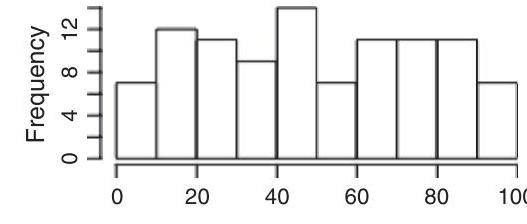
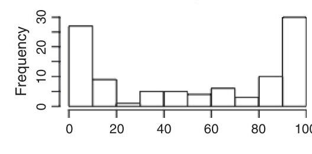
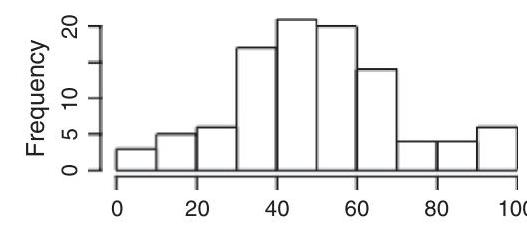
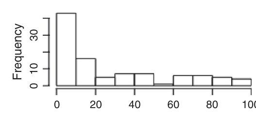
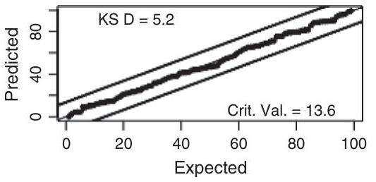
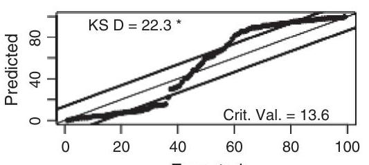
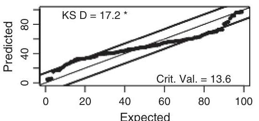
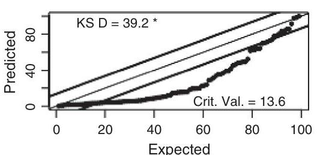

## Page 23
Figure 3.2 shows the $p-p$ plots for the Mack model. The plots were first done separately for the outcome percentiles in each line of insurance. Although the plots fall inside the KS band for three of the four lines, the plots for all four of the lines resemble the slanted " $S$ " curve that is characteristic of a light-tailed predicted distribution. When we combine the outcome percentiles of all four lines, the $p-p$ plot lies outside the KS band and we conclude that the distribution predicted by the Mack model is too light in the tails for these data. In all the validation

Figure 3.2. p-p plots for the Mack Model on Incurred Loss Triangles
CA - Mack Incurred

WC - Mack Incurred

CA+PA+WC+OL

PA - Mack Incurred

OL - Mack Incurred
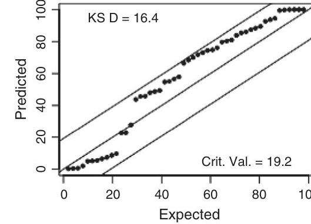
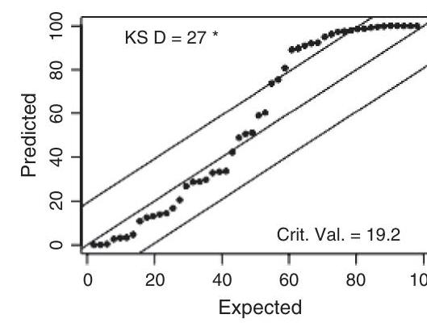
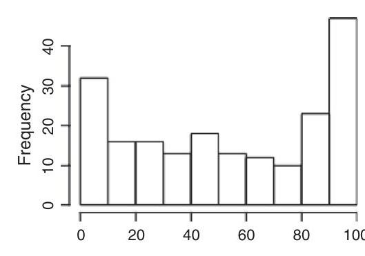
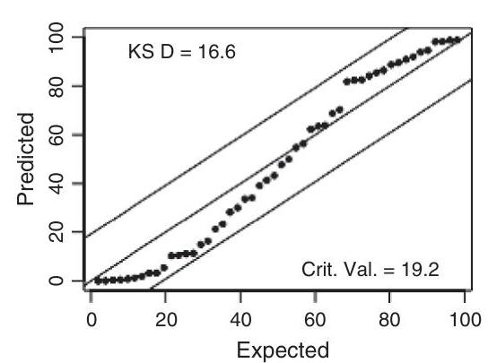
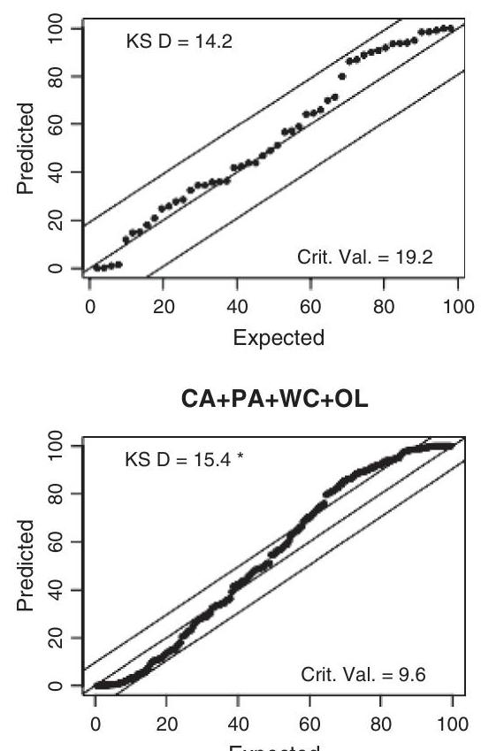

## Page 24
plots below the KS critical values are 19.2 and 9.6 for the individual lines and all lines combined, respectively.

Actuaries might justifiably complain that the performance of a model on different loss triangles from a different time period may not be relevant to their current problem. This complaint is duly noted and acknowledged. However, it has been my experience that actuaries choose a model based as much on its reputation as much as its goodness of fit to current data.

Given this history, let's define the term "reputation" to mean the result of a retrospective analysis based on the set of 200 loss triangles taken from the CAS Loss Reserve Database, within this monograph. We can then summarize the above conclusion by saying that the Mack model has a reputation for predicting light tails in the distribution of all possible outcomes.

Below, we will introduce a diagnostic for Bayesian MCMC models can be used with the upper triangle data that are available the the time the analyses are being performed.

## Page 25
# 4. Validating the Bootstrap ODP and Mack Models on Paid Losses 

This section does an analysis similar to that done in the last section for the bootstrap ODP model as described by England and Verrall (2002) and implemented by the R "ChainLadder" package. This model was designed to work with incremental losses, $I_{w, d}$, rather than the cumulative losses $C_{w, d}$, where $I_{w, 1}=C_{w, 1}$ and $I_{w, d}=C_{w, d}-C_{w, d-1}$ for $d>1$.

A key assumption made by this model is that the incremental losses are described by the overdispersed Poisson distribution with:

$$
E\left[\tilde{I}_{w, d}\right]=\alpha_{w} \cdot \beta_{d} \quad \text { and } \quad \operatorname{Var}\left[\tilde{I}_{w, d}\right]=\phi \cdot \alpha_{w} \cdot \beta_{d}
$$

The parameters of the model can be estimated by a standard generalized linear model (GLM) package. ${ }^{7}$ They then use a bootstrap resampling procedure to quantify the volatility of the estimate.

England and Verrall point out that the using the ODP model on incremental losses almost all but requires one to use paid, rather than incurred, losses since the overdispersed Poisson model is defined only for nonnegative losses. Incurred losses include estimates by claims adjusters that can (and frequently do) get adjusted downward. Negative incremental paid losses occasionally occur because of salvage and subrogation, but a feature of the GLM estimation procedure allows for negative incremental losses as long as all column sums of the loss triangle remain positive.

Table 4.1 gives the estimates of the mean, the standard deviation for both the ODP (with 10,000 bootstrap simulations) and Mack models on the data in Table 2.2. The predicted percentiles of the outcomes are also given for each model.

The validation $p-p$ plots, similar to those done in the previous section, for both the ODP and the Mack models on paid data are in Figures 4.1 and 4.2. The results for both models are quite similar. Neither model validates well on the paid triangles. A comparison of the $p-p$ plots in Figures 4.1 and 4.2 with the illustrative plots in Figure 3.1 suggests that the these models deserve a reputation for overestimating the ultimate losses.

[^0]
[^0]:    7 England and Verrall (2002) use a log link function in their GLM. They also note that the GLM for the ODP maximizes the quasi-likelihood, allowing the model to work with continuous (non-integer) losses.

## Page 26
Table 4.1. ODP and Mack Model Output for the Illustrative Loss Triangle Paid Losses

|  | ODP |  |  | Mack |  |  |  |
| :-- | --: | --: | --: | --: | --: | --: | :--: |
| $w$ | Estimate | SE | CV | Estimate | SE | CV | Outcome |
| 1 | 3912 | 0 | 0 | 3912 | 0 | 0.0000 | 3912 |
| 2 | 2532 | 21 | 0.0083 | 2532 | 0 | 0.0000 | 2527 |
| 3 | 4163 | 51 | 0.0123 | 4162 | 3 | 0.0007 | 4274 |
| 4 | 4369 | 85 | 0.0195 | 4370 | 28 | 0.0064 | 4341 |
| 5 | 3554 | 96 | 0.0270 | 3555 | 35 | 0.0098 | 3583 |
| 6 | 3211 | 148 | 0.0461 | 3213 | 157 | 0.0489 | 3268 |
| 7 | 5161 | 240 | 0.0465 | 5167 | 251 | 0.0486 | 5684 |
| 8 | 3437 | 332 | 0.0966 | 3442 | 385 | 0.1119 | 4128 |
| 9 | 4220 | 572 | 0.1355 | 4210 | 750 | 0.1781 | 4144 |
| 10 | 4635 | 1048 | 0.2261 | 4616 | 957 | 0.2073 | 4139 |
| Total | 39193 | 1389 | 0.0354 | 39177 | 1442 | 0.0368 | 40000 |
| Percentile |  | 73.91 |  |  | 72.02 |  |  |

Let's now consider the results of this and the prior section. These sections show that two popular models do not validate on outcomes of the 200 Schedule P triangles drawn from the CAS Loss Reserve Database. These models do not validate in different ways when we examine paid and incurred triangles. For incurred triangles, the distribution predicted by the Mack model has a light tail. For paid triangles, the distributions predicted by both the Mack and the bootstrap ODP models tend to produce expected loss estimates that are too high. There are two plausible explanations for these observations.

1. The insurance loss environment has experienced changes that are not observable at the current time.
2. There are other models that can be validated.

To disprove the first explanation, one can develop models that do validate. Failing to develop a model that validates may give credence to, but does not necessarily confirm, that the first explanation is true. This monograph now turns to describing some efforts to find models that do validate.

## Page 27
Figure 4.1. p-p Plots for the Bootstrap ODP Model on Paid Loss Triangles
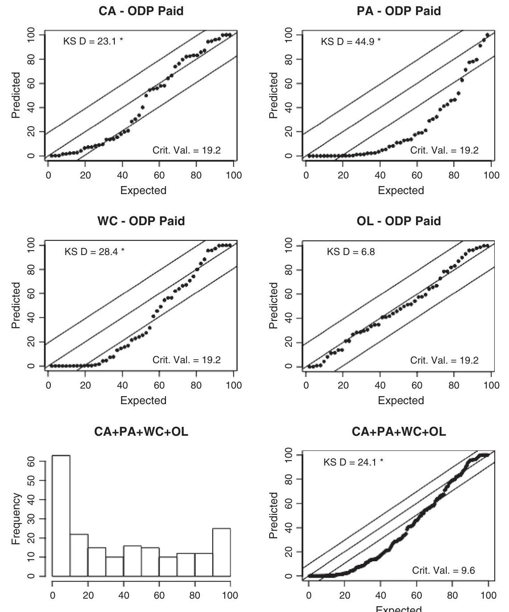

## Page 28
Figure 4.2. p-p Plots for the Mack Model on Paid Loss Triangles
CA - Mack Paid
PA - Mack Paid

WC - Mack Paid

OL - Mack Paid

OL - Mack Paid

CA+PA+WC+OL
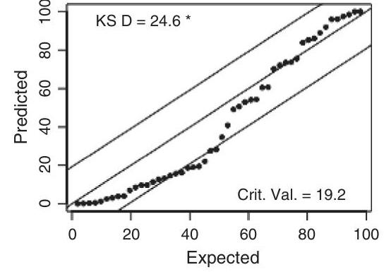
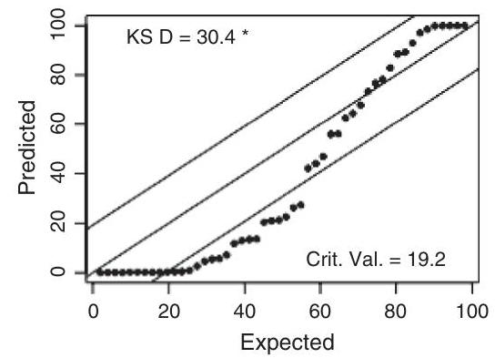
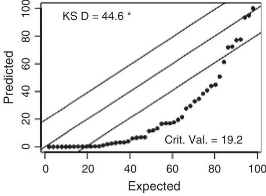

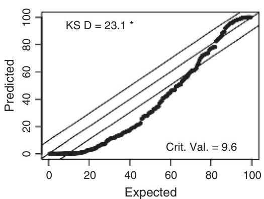

## Page 29
# 5. The Cross Classified Model 

The purpose of this section is to introduce a basic Bayesian MCMC that is appropriate for stochastic loss reserving. It assigns an independent parameter for each accident year and development year. The section will then describe some diagnostics to test the model assumptions.

## The CRoss Classified (CRC) Model

1. $\operatorname{logelr} \sim \operatorname{normal}(-0.4, \sqrt{10}$.
2. $\alpha_{w} \sim \operatorname{normal}(0, \sqrt{10})$ for $w=2, \ldots, 10$. Set $\alpha_{1}=0$.
3. $\beta_{d} \sim \operatorname{normal}(0, \sqrt{10})$ for $d=1, \ldots, 9$. Set $\beta_{10}=0$.
4. $a_{i} \sim \operatorname{uniform}(0,1)$ for $i=1, \ldots, 10$.
5. Set $\sigma_{d}^{2}=\sum_{i=d}^{10} a_{i}$ for $d=1, \ldots, 10$. Note that this forces $\sigma_{1}^{2}>\cdots>\sigma_{10}^{2}$.
6. Set $\mu_{w, d}=\log \left(\right.$ Premium $\left._{w}\right)+\operatorname{logelr}+\alpha_{w}+\beta_{d}$.
7. Then $C_{w, d} \sim \operatorname{lognormal}\left(\mu_{w, d}, \sigma_{d}\right)$.

The constraint in line 5 deserves an explanation. The losses $C_{w, d}$ consist of claims with a mixture of settlement dates. The proportion of settled claims increases as the development period, $d$, increases. Hence the decrease in the variance $\sigma_{d}^{2}$ as $d$ increases.

Note that there are 29 initial parameters (logelr, $\alpha_{w}$ for $w=2, \ldots, 10, \beta_{d}$, for $d=1, \ldots, 9$ and $a_{i}$ for $\mathrm{i}=1, \ldots, 10$ ) in this model. We will refer to the parameters $\mu_{w, d}$ and $\sigma_{d}$ for $w=1, \ldots, 10$ and $d=1, \ldots, 10$ as transformed parameters.

As this is the first Bayesian MCMC model in this monograph, let me describe my underlying philosophy that has evolved over the years as I have been building such models. This evolution came from successes, failures and advice from many sources.

- I regard the prior distributions I choose for the model are not a statement of my prior belief, but should be regarded as a feature of the model. The selection of the form of the model is every bit as subjective as the selection of the prior distributions.
- Whenever possible, I try to formulate models and model parameters in terms of quantities that are familiar to the intended users of the model. For example, I expect users will have some familiarity with the expected loss ratio. Given that $\beta_{10}=0$, the user will have no trouble in interpreting the final loss ratio in the CRC model at $w=1$ and $d=10$ as approximately $e^{\text {logelr }}$. Recall that $\alpha_{1}=0$ and, as we shall see, $\sigma_{10}$ is usually small. The magnitude of the $\alpha_{w}$ s gives an indication of how much the loss ratio varies from year to year.

## Page 30
- The prior distributions I choose are wider that what I personally believe. One should leave room for surprises.
- But on the other hand, I do not like improper priors, or priors that are heavytailed in regions that I consider impossible. Major (2017) shows examples of weird behavior that can occur with heavy-tailed priors.
- Technical note-Often for numerical purposes, I avoid the use of hard boundaries in my choice of prior distributions. Sometimes this can be tricky. As an example, Line 4 in the CRC model above may seem like a contradiction to this practice, but here is what I did in the Stan script. The initial parameter, which I call $a_{i}^{s t}$ was sampled from an inverse gamma distribution. The transformed parameter $a_{i}$ is then set equal to the cumulative probability of $1 / a_{i}^{s t}$ from the corresponding gamma distribution, with the result that the prior distribution of $a_{i}$ is uniformly distributed. The reason for this is, the $a_{i}$ can often be very close to zero, causing the Stan software to issue warnings. This transformation gives the sampler more room to work with.

Given the CRC model and the data for the illustrative insurer, I used the Stan software to produce a sample of size 10,000 from the posterior distribution of the model. Table 5.1 gives the mean and standard deviation for the posterior distribution of the key parameters in that sample.

Table 5.1. CRC Model Parameter Summary for the Paid Illustrative Loss Triangle

|  | Mean | Std. Dev. |  | Mean | Std. Dev. |
| :-- | --: | :-- | :-- | --: | --: |
| logelr | -0.3965 | 0.0233 | $\beta_{6}$ | -0.0170 | 0.0413 |
| $\alpha_{1}$ | 0.0000 | 0.0000 | $\beta_{7}$ | -0.0060 | 0.0388 |
| $\alpha_{2}$ | -0.2541 | 0.0283 | $\beta_{8}$ | -0.0038 | 0.0377 |
| $\alpha_{3}$ | 0.1217 | 0.0326 | $\beta_{9}$ | -0.0056 | 0.0351 |
| $\alpha_{4}$ | 0.2152 | 0.0395 | $\beta_{10}$ | 0.0000 | 0.0000 |
| $\alpha_{5}$ | 0.0149 | 0.0466 | $\sigma_{1}$ | 0.2965 | 0.1034 |
| $\alpha_{6}$ | -0.0343 | 0.0637 | $\sigma_{2}$ | 0.2073 | 0.0543 |
| $\alpha_{7}$ | 0.4354 | 0.0775 | $\sigma_{3}$ | 0.1334 | 0.0374 |
| $\alpha_{8}$ | -0.0199 | 0.1161 | $\sigma_{4}$ | 0.0946 | 0.0293 |
| $\alpha_{9}$ | 0.2060 | 0.1813 | $\sigma_{5}$ | 0.0730 | 0.0249 |
| $\alpha_{10}$ | 0.3435 | 0.3316 | $\sigma_{6}$ | 0.0576 | 0.0219 |
| $\beta_{1}$ | -1.1999 | 0.1156 | $\sigma_{7}$ | 0.0472 | 0.0197 |
| $\beta_{2}$ | -0.5751 | 0.0839 | $\sigma_{8}$ | 0.0384 | 0.0175 |
| $\beta_{3}$ | -0.2825 | 0.0607 | $\sigma_{9}$ | 0.0300 | 0.0152 |
| $\beta_{4}$ | -0.0954 | 0.0509 | $\sigma_{10}$ | 0.0202 | 0.0128 |
| $\beta_{5}$ | -0.0628 | 0.0461 |  |  |  |

## Page 31
Table 5.2. CRC Model Output for the Paid Illustrative Loss Triangle

| w | Premium | Estimate | SE | CV | Outcome | Percentile |
| :-- | :--: | :--: | :--: | :--: | :--: | :--: |
| 1 | 5812 | 3912 | 0 | 0.0000 | 3912 |  |
| 2 | 4908 | 2564 | 114 | 0.0445 | 2527 |  |
| 3 | 5454 | 4149 | 193 | 0.0465 | 4274 |  |
| 4 | 5165 | 4315 | 223 | 0.0517 | 4341 |  |
| 5 | 5214 | 3566 | 203 | 0.0569 | 3583 |  |
| 6 | 5230 | 3410 | 249 | 0.0730 | 3268 |  |
| 7 | 4992 | 5208 | 445 | 0.0854 | 5684 |  |
| 8 | 5466 | 3630 | 442 | 0.1218 | 4128 |  |
| 9 | 5226 | 4392 | 817 | 0.1860 | 4144 |  |
| 10 | 4962 | 4976 | 1762 | 0.3541 | 4139 |  |
| Total | 52429 | 40121 | 2487 | 0.0620 | 40000 | 51.88 |

Our initial objective is to obtain the predictive distribution of the loss outcome at development year 10, by accident year and in total for all the accident years. To to this we simulate for each of the 10,000 parameter vectors:

1. Set $\mu_{w, 10}=\log \left(\right.$ Premium $\left._{w}\right)+\operatorname{logelr}+\alpha_{w}$ for $w=2, \ldots, 10$.
2. Simulate $\widehat{C}_{w, 10} \sim \operatorname{lognormal}\left(\mu_{w, 10}, \sigma_{10}\right)$ for $w=2, \ldots, 10$.
3. Calculate $\widehat{C}_{T a s, 10}=C_{1,10}+\sum_{w=2}^{10} \widehat{C}_{w, 10}$.

Table 5.1 gives a summary of the parameters for the illustrative insurer paid losses. Tables 5.2 and 5.3 give the model output for the illustrative insurer paid and incurred

Table 5.3. CRC Model Output for the Incurred Illustrative Loss Triangle

| w | Premium | Estimate | SE | CV | Outcome | Percentile |
| :-- | :--: | :--: | :--: | :--: | :--: | :--: |
| 1 | 5812 | 3917 | 0 | 0.0000 | 3917 |  |
| 2 | 4908 | 2549 | 68 | 0.0267 | 2532 |  |
| 3 | 5454 | 4110 | 120 | 0.0292 | 4279 |  |
| 4 | 5165 | 4308 | 139 | 0.0323 | 4341 |  |
| 5 | 5214 | 3546 | 127 | 0.0358 | 3587 |  |
| 6 | 5230 | 3329 | 147 | 0.0442 | 3268 |  |
| 7 | 4992 | 5315 | 284 | 0.0534 | 5684 |  |
| 8 | 5466 | 3776 | 304 | 0.0805 | 4128 |  |
| 9 | 5226 | 4203 | 579 | 0.1378 | 4144 |  |
| 10 | 4962 | 4095 | 1216 | 0.2969 | 4181 |  |
| Total | 52429 | 39147 | 1642 | 0.0419 | 40061 | 74.75 |

## Page 32
losses respectively. Here, the term "Estimate" is defined as the mean of the corresponding simulated outcomes at development year 10 .

Our second objective is to calculate the predicted percentile of the outcome. This is done by counting the number of $\widehat{C}_{T e s, 10}$ s that are less than or equal the actual outcome. These percentiles are shown in the far right columns of Tables 5.2 and 5.3.

Figures 5.1 and 5.2 give the $p-p$ plots for the set of 200 selected paid and incurred triangles. The paid CRC model $p-p$ plots look a bit worse than the the corresponding plots for the Mack and ODP models, but they indicate a similar pattern as Mack and

Figure 5.1. p-p Plots for the CRC Model on Paid Loss Triangles
CA - CRC Paid

WC - CRC Paid

CA+PA+WC+OL

PA - CRC Paid

OL - CRC Paid

CA+PA+WC+OL
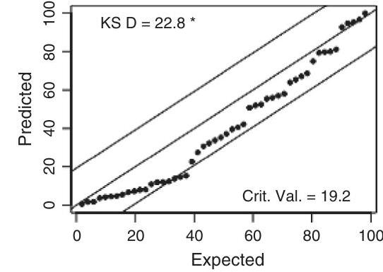
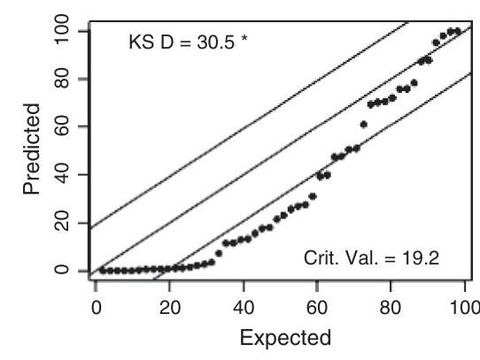
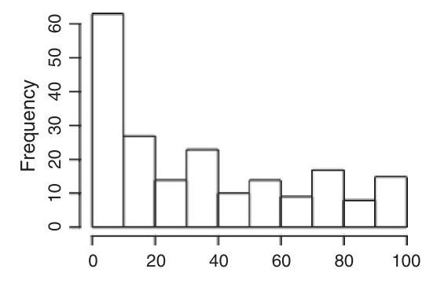
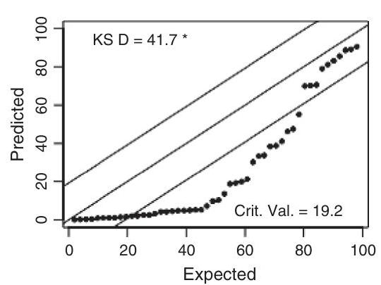
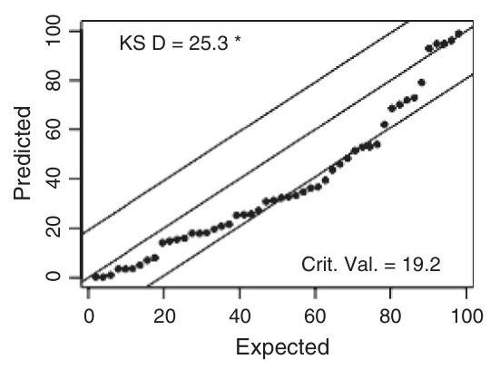
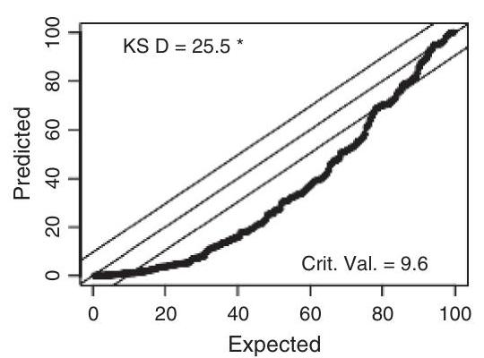

## Page 33
Figure 5.2. p-p Plots for the CRC Model on Incurred Loss Triangles
CA - CRC Incurred
PA - CRC Incurred

WC - CRC Incurred

CA+PA+WC+OL

OL - CRC Incurred

CA+PA+WC+OL

ODP-the paid CRC models share the reputation of predicting losses that are too high. The incurred CRC incurred $p-p$ plot is better than the corresponding plot for the Mack model, but it still indicates that it still understates the variability of the predicted losses.

The $p-p$ plots in Figures 3.2 - 5.2 are indicators of the reputation of a model. While the reputation of a model is good to know, the actuary who is setting reserves now will want other diagnostics such as residual plots and goodness of fit measures that are applicable to data we have now-the upper triangle. Let's now look at residual plots. We will defer our goodness of fit measure until the next section where we compare the fits of two different models.
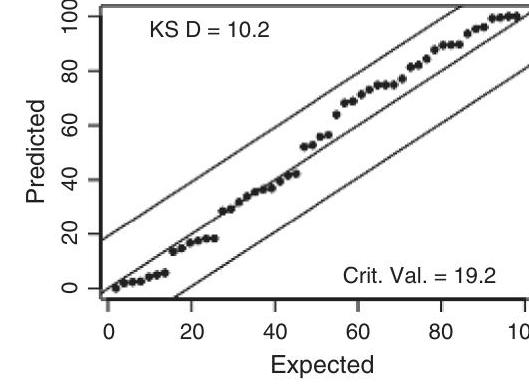
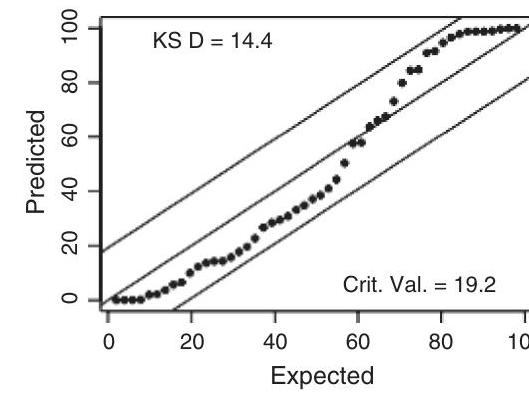
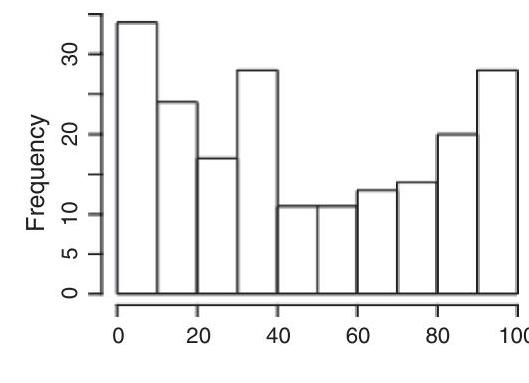
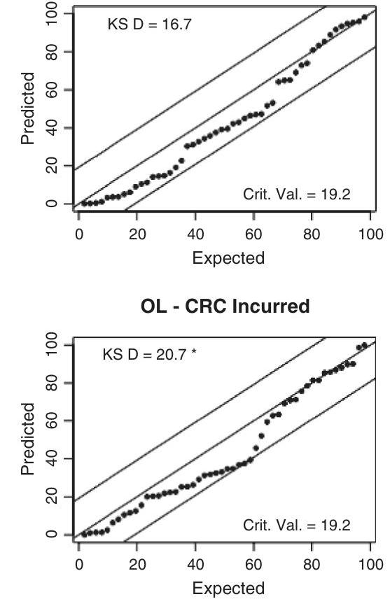

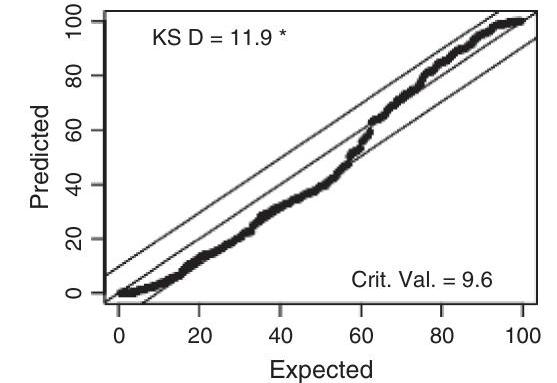

## Page 34
Bayesian MCMC models differ from the standard frequentist models in that we have a large sample of parameter vectors, rather than a single parameter vector that arises from, say, a maximum likelihood estimate. To deal with this, one can take a random sample of 100 j s and use the corresponding parameter vectors, $\mu_{w, d}^{j}$ and $\sigma_{d}^{j}$ from the posterior distribution and calculate the standardized residuals, $r_{w, d}^{j}$, for the log of all losses in the training (upper) loss triangle.

$$
r_{w, d}^{j}=\frac{\log \left(C_{w, d}\right)-\mu_{w, d}^{j}}{\sigma_{d}^{j}} \quad \text { for } w=1, \ldots, 10 \quad d=1, \cdots, 11-w \text { and for each } j
$$

There are 5,500 values of $r_{w, d}^{j}$. We then put these values into a series of Box plots, organized first by accident year, $w$, and then by development year, $d$.
In this monograph, the Box plot (a.k.a Box and whisker plot) plots the interquartile range as solid bars. The "whiskers" of the plot span the region starting with the top (bottom) plus (minus) 1.5 times the length of the interquartile range. Any points outside the range of the whiskers are plotted individually.

The expected interquartile range for standardized normal residuals are indicated by thin black lines on the plot. In general we should expect the interquartile range of the data to fall pretty close to those black lines.

Figures 5.3 and 5.4 show the standardized residual Box plots for the paid and incurred losses of the CRC model run with the illustrative insurer. They may not seem all that bad to one who has looked at similar plots for other loss reserve models. Generally, one should feel some comfort if the interquartile range contains 0 . But I suggest that the reader withhold judgment until we have seen the corresponding plots for other models.

Figure 5.3. CRC Standardized Residual Box Plots for the Paid Illustrative Loss Triangle


## Page 35
Figure 5.4. CRC Standardized Residual Box Plots for the Incurred Illustrative Loss Triangle
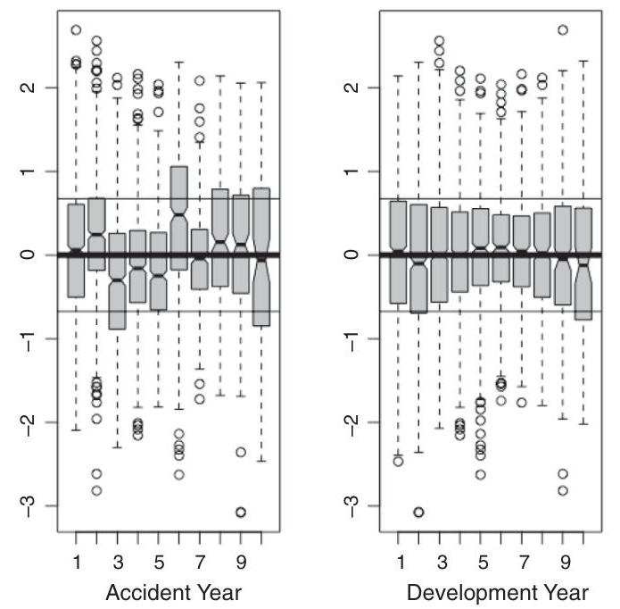

## Page 36
# 6. The Stochastic Cape Cod Model 

One of the most popular loss reserving methodologies is given by Bornhuetter-Ferguson (BF) (1972). A key input to the loss reserve formula given in that paper is the expected loss ratio, which must be judgmentally selected by the actuary. Presentations by Clark (2013) and Leong (2013) suggest that the BF method that assumes a constant loss ratio provides a good fit to industry loss reserve data.

The general idea behind BF is to first use a standard method, e.g., the chain ladder model, to estimate the proportion of losses that are not reported at the end of the most recent development period $11-w$. Call this quantity, $V_{11-w}$. Using the notation in this monograph, the projected ultimate loss for accident year $w$ is then given by

$$
\dot{C}_{w, 10}=C_{w, 11-w}+\text { Premium }_{w} \cdot E L R \cdot V_{11-w} \text { for } w=2, \cdots, 10
$$

where $E L R$ is the judgmentally selected expected loss ratio.
Over the years many actuaries have been uncomfortable with the sensitivity of the ultimate loss estimate to the judgmentally selected expected loss ratio. To address this concern, James Stanard (1985) and Hans Bühlmann independently, according to Patrik (2001), proposed a model in which the expected loss ratio is estimated from the data. As Bühlmann first proposed this model at a meeting in Cape Cod, it has come to be know as the "Cape Cod" model.

Let's now examine one way to describe a stochastic Cape Cod model.

## The Stochastic Cape Cod (SCC) Model

1. $\operatorname{logelr} \sim \operatorname{normal}(-0.4, \sqrt{10})$.
2. $\beta_{d} \sim \operatorname{normal}(1, \sqrt{10})$ for $d=1, \ldots, 9$. Set $\beta_{10}=0$.
3. $a_{i} \sim \operatorname{uniform}(0,1)$ for $i=1, \ldots, 10$.
4. Set $\sigma_{d}^{2}=\sum_{i=d}^{10} a_{i}$ for $d=1, \ldots, 10$. Note that this forces $\sigma_{1}^{2}>\cdots>\sigma_{10}^{2}$.
5. Set $\mu_{w, d}=\log \left(\right.$ Premium $\left._{w}\right)+\operatorname{logelr}+\beta_{d}$.
6. Then $C_{w, d} \sim \operatorname{lognormal}\left(\mu_{w, d}, \sigma_{d}\right)$.

Given the SCC model and the paid data for the illustrative insurer, I used the Stan software to produce a sample of size 10,000 from the posterior distribution of the model. Table 6.1 gives the mean and standard deviation for the posterior distribution of the relevant parameters in that sample.

## Page 37
Table 6.1. SCC Parameter Summary Paid Illustrative Loss Triangle

|  | Mean | Std. Dev. |  | Mean | Std. Dev. |
| :-- | --: | :--: | :-- | :--: | :--: |
| logelr | -0.4033 | 0.1123 | $\sigma_{1}$ | 0.4608 | 0.1201 |
| $\beta_{1}$ | -1.0897 | 0.1870 | $\sigma_{2}$ | 0.3691 | 0.0735 |
| $\beta_{2}$ | -0.4926 | 0.1691 | $\sigma_{3}$ | 0.3183 | 0.0585 |
| $\beta_{3}$ | -0.2155 | 0.1604 | $\sigma_{4}$ | 0.2853 | 0.0501 |
| $\beta_{4}$ | -0.0170 | 0.1577 | $\sigma_{5}$ | 0.2579 | 0.0448 |
| $\beta_{5}$ | -0.0439 | 0.1547 | $\sigma_{6}$ | 0.2351 | 0.0412 |
| $\beta_{6}$ | 0.0109 | 0.1559 | $\sigma_{7}$ | 0.2132 | 0.0385 |
| $\beta_{7}$ | 0.0214 | 0.1565 | $\sigma_{8}$ | 0.1887 | 0.0368 |
| $\beta_{8}$ | -0.0418 | 0.1586 | $\sigma_{9}$ | 0.1572 | 0.0372 |
| $\beta_{9}$ | -0.1251 | 0.1603 | $\sigma_{10}$ | 0.1051 | 0.0451 |
| $\beta_{10}$ | 0.0000 | 0.0000 |  |  |  |

Our initial objective is to obtain the predictive distribution of the loss outcome at development year 10, by accident year and in total for all the accident years. To to this we simulate for each of the 10,000 parameter vectors:

1. Set $\mu_{w, 10}=\log \left(\right.$ Premium $\left._{w}\right)+$ logelr for $w=2, \ldots, 10$.
2. Simulate $\widehat{C}_{w, 10}-\operatorname{lognormal}\left(\mu_{w, 10}, \sigma_{10}\right)-e^{\mu_{w, 11-w}+\sigma_{11-w}^{2} / 2}+C_{w, 11-w}$ for $w=2, \ldots, 10$.
3. Calculate $\widehat{C}_{7 i n, 10}=C_{1,10}+\sum_{w=2}^{10} \widehat{C}_{w, 10}$.

Step 2 in the above differs from the corresponding step in the CRC model. It first simulates a loss at development year 10. It then subtracts the expected value of the current reported loss from the SCC model ${ }^{8}$ and then adds the current reported loss from the SCC model. Tables 6.2 and 6.3 give the SCC model output for the illustrative insurer.

Figures 6.3 and 6.4 indicate a decidedly worse reputation (as defined Section 3) for the SCC model than for the other models described above. The standardized residual plots in Figures 6.1 and 6.2 suggest that the assumption of a fixed expected loss ratio across accident years may explain the poor performance of the SCC model. More will be said about this poor performance at the end of this section.

Given that we now have two models, we now discuss how we compare models using only the upper triangle data. Let's start the discussion with a review of the Akaike Information Criteria (AIC).

[^0]
[^0]:    8 Recall the mean of a lognormal distribution is $e^{\mu_{1} \sigma / 12}$

## Page 38
Table 6.2. SCC Model Output for the Paid Illustrative Loss Triangle

| w | Premium | Estimate | SE | CV | Outcome | Percentile |
| :-- | :--: | :--: | :--: | :--: | :--: | :--: |
| 1 | 5812 | 3912 | 0 | 0.0000 | 3912 |  |
| 2 | 4908 | 2905 | 640 | 0.2203 | 2527 |  |
| 3 | 5454 | 4265 | 724 | 0.1698 | 4274 |  |
| 4 | 5165 | 4199 | 703 | 0.1674 | 4341 |  |
| 5 | 5214 | 3376 | 694 | 0.2056 | 3583 |  |
| 6 | 5230 | 3097 | 690 | 0.2228 | 3268 |  |
| 7 | 4992 | 4645 | 665 | 0.1432 | 5684 |  |
| 8 | 5466 | 3180 | 700 | 0.2201 | 4128 |  |
| 9 | 5226 | 3639 | 657 | 0.1805 | 4144 |  |
| 10 | 4962 | 3506 | 591 | 0.1686 | 4139 |  |
| Total | 52429 | 36725 | 3950 | 0.1075 | 40000 | 83.38 |

Table 6.3. SCC Model Output for the Incurred Illustrative Loss Triangle

| w | Premium | Estimate | SE | CV | Outcome | Percentile |
| :-- | :--: | :--: | :--: | :--: | :--: | :--: |
| 1 | 5812 | 3917 | 0 | 0.0000 | 3917 |  |
| 2 | 4908 | 2914 | 627 | 0.2152 | 2532 |  |
| 3 | 5454 | 4273 | 704 | 0.1648 | 4279 |  |
| 4 | 5165 | 4213 | 686 | 0.1628 | 4341 |  |
| 5 | 5214 | 3420 | 675 | 0.1974 | 3587 |  |
| 6 | 5230 | 3109 | 686 | 0.2206 | 3268 |  |
| 7 | 4992 | 4907 | 671 | 0.1367 | 5684 |  |
| 8 | 5466 | 3350 | 723 | 0.2158 | 4128 |  |
| 9 | 5226 | 3514 | 709 | 0.2018 | 4144 |  |
| 10 | 4962 | 3319 | 659 | 0.1986 | 4181 |  |
| Total | 52429 | 36936 | 3941 | 0.1067 | 40061 | 82.69 |

## Page 39
Figure 6.1. SCC Standardized Residual Box Plots for the Paid Illustrative Loss Triangle

Figure 6.2. SCC Standardized Residual Box Plots for the Incurred Illustrative Loss Triangle
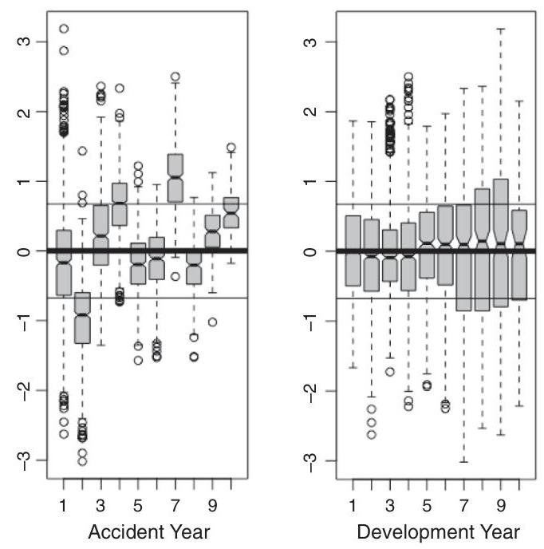
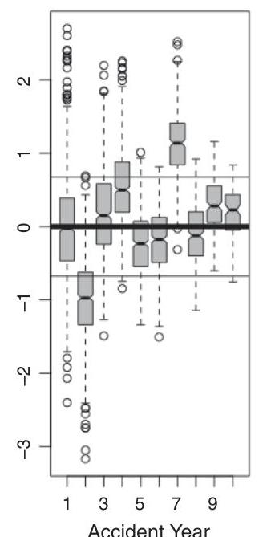
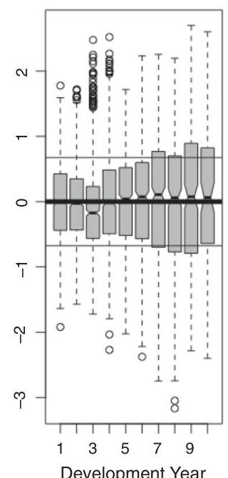

## Page 40
Figure 6.3. p-p Plots for the SCC Model on Paid Loss Triangles
CA - SCC Paid

WC - SCC Paid

CA+PA+WC+OL

PA - SCC Paid

OL - SCC Paid

CA+PA+WC+OL
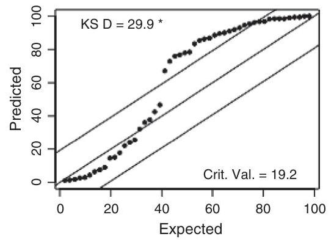
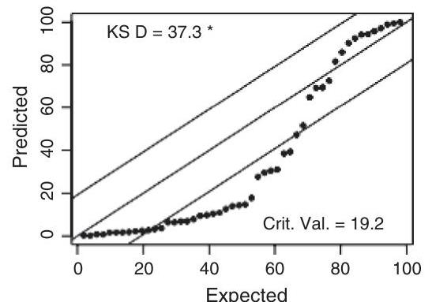
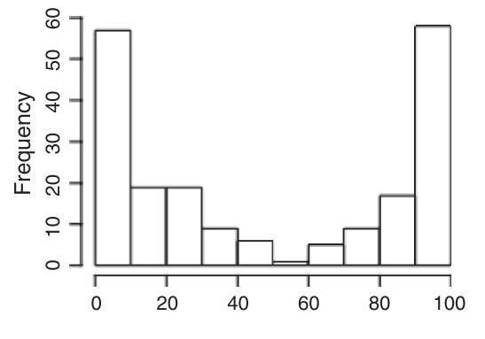
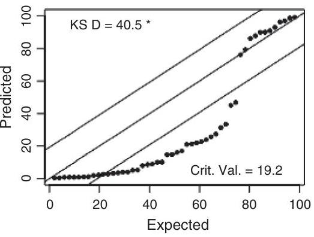
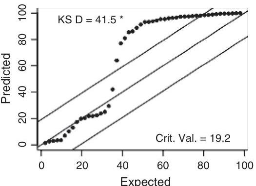
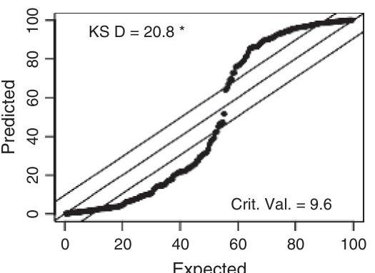

## Page 41
Figure 6.4. p-p Plots for the SCC Model on Incurred Loss Triangles
CA - SCC Incurred

WC - SCC Incurred

CA+PA+WC+OL

PA - SCC Incurred

OL - SCC Incurred

CA+PA+WC+OL
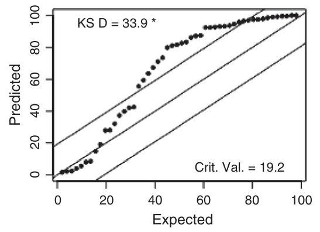
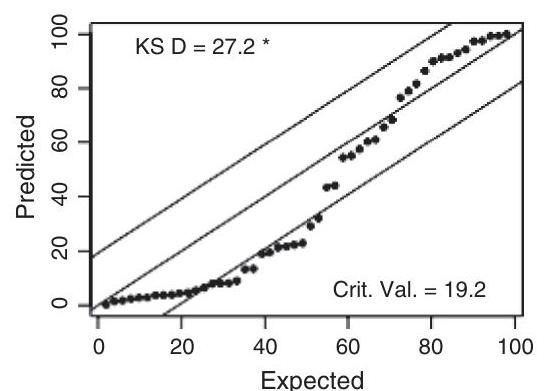
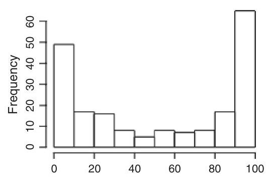
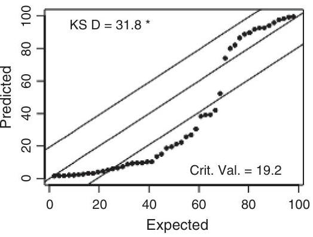
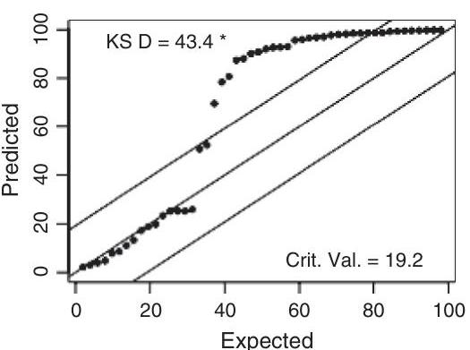


## Page 42
Suppose that we have a model with a data vector, $x=\left\{x_{i}\right\}_{i=1}^{N}$, and a parameter vector $\theta$, with $p$ parameters. Let $\hat{\theta}$ be the parameter value that maximizes the log-likelihood, $L$, of the data, $\mathbf{x}$. Then the AIC is defined as

$$
\mathrm{AIC}=2 \cdot p-2 \cdot L(\mathbf{x} \mid \hat{\theta})
$$

Given a choice of models, the model with the lowest AIC is to be preferred. This statistic rewards a model for having a high log-likelihood, but it penalizes the model for having more parameters.

There are problems with the AIC in a Bayesian environment. Instead of a single maximum likelihood estimate of the parameter vector, there is an entire sample of parameter vectors taken from the model's posterior distribution. There is also the sense that the penalty for the number of parameters should not be as great in the presence of strong prior information. To address these concerns, Gelman et. al. (2014, Chapter 7) describe statistics that generalize the AIC in a way that is appropriate for Bayesian MCMC models. Here is a brief overview of one of these statistics. ${ }^{9}$

First, given a stochastic model, $p(x \mid \theta)$, define the expected log predictive density as

$$
e l p d=\sum_{i=1}^{I} \log \left(\int p\left(x_{i} \mid \theta\right) \cdot f(\theta) d \theta\right)
$$

where $f$ is the unknown density of $\theta$.
If $\left\{\theta_{j}\right\}_{j=1}^{J}$ is a random sample from the posterior distribution of $\theta$, define the computed $\log$ predicted density as

$$
\widehat{l p d}=\sum_{i=1}^{I} \log \left(\frac{1}{J} \sum_{j=1}^{J} p\left(x_{i} \mid \theta_{j}\right)\right)
$$

Note that if we replace $\left\{\theta_{j}\right\}_{j=1}^{J}$ with the maximum likelihood estimate, $\hat{\theta}, \widehat{l p d}$ is equal to $L(x \mid \hat{\theta})$ in Equation 6.2.

If the data vector, $\mathbf{x}$, come from a holdout sample, i.e., $\mathbf{x}$ was not used to generate the parameters, $\left\{\theta_{j}\right\}_{j=1}^{J}$, then the $\widehat{l p d}$ is an unbiased estimate of elpd. But if the data vector, $\mathbf{x}$, comes from the training sample, i.e., $\mathbf{x}$ was used to generate the parameters, $\left\{\theta_{j}\right\}_{j=1}^{J}$, then we expect $\widehat{l p d}$ to be higher than elpd. The amount of that bias is called the "effective number of parameters."

Now let's consider what is called "leave one out cross validation" or "loo" for short. For the data point, $x_{i}$, one might obtain a sample of parameters $\left\{\theta^{(-i)}\right\}$ by an MCMC simulation using all values of $\mathbf{x}$ except $x_{i}$. After doing this calculation for all observed data points in $\mathbf{x}$, one can then use Equation 6.4 to calculate an unbiased estimate of the elpd.

$$
\widehat{e l p d}_{l o o}=\sum_{i=1}^{I} \log \left(\frac{1}{J} \sum_{j=1}^{J} p\left(x_{i} \mid \theta_{j}^{(-i)}\right)\right)
$$

[^0]
[^0]:    9 Other popular statistics include the Deviance Information Criterion (DIC) and the Wantanabe-Akaike Information Criterion (WAIC). Gelman et. al. (2014, Chapter 7) make the case that the LOOIC is a superior measure.

## Page 43
Table 6.4. Model Comparison Statistics for the Illustrative Loss Triangle

| Model | $\widehat{e l p d}_{\text {loc }}$ | $p_{\text {loc }}$ | LOOIC |
| :-- | :--: | --: | --: |
| CRC-Paid | 47.80 | 14.97 | -95.60 |
| SCC-Paid | -5.14 | 8.75 | 10.28 |
| CRC-Incurred | 70.97 | 15.07 | -141.93 |
| SCC-Incurred | -2.85 | 9.13 | 5.69 |

While the speed of recent MCMC software packages is impressive, rerunning an MCMC model for each data point would tax the patience of most practitioners. Methods to efficiently calculate $\widehat{e l p d}_{\text {loc }}$ have been developed. Rather than redo the MCMC simulation, these methods estimate the $\widehat{e l p d}_{\text {loc }}$ using the $I \times J$ matrix of log-likelihoods of each observation, $x_{i}$ given each parameter vector, $\theta_{i}$. Vehtari et. al. (2017) provide the most up-to-date approaches that are incorporated in the R "loo" package. That is what this monograph uses.

When comparing two models, the model with the highest $\widehat{e l p d}_{\text {loc }}$ should be preferred. For historical reasons, many prefer to state the results on the deviance scale, which similar to that of the AIC in Equation 6.2. This is done by writing

$$
\mathrm{LOOIC}=-2 \cdot \widehat{e l p d}_{\text {loc }}=2 \cdot p_{\text {loc }}-2 \cdot \widehat{l p d}_{\text {loc }}
$$

Table 6.4 provide these model comparison statistics for the illustrative insurer. These statistics strongly favor the CRC model. Moreover, when you compare the statistics for the models applied to the entire set of 200 loss triangles, the CRC model is favored for all 200 paid and incurred loss triangles.

To be fair, one should note that the Bornhuetter-Ferguson/Cape Cod literature stresses the importance of adjusting the premium a level consistent with the expected losses. No such adjustment was made in the SCC model as presented here. One should view the results above as an indication of the sensitivity of the BF method to the premium adjustment.

That being said, one should also note that the CRC model above, along with the newer models described below allow an actuary to, by the choice of prior distributions, judgmentally influence the expected loss ratio by accident year.

## Page 44
# 7. The Changing Settlement Rate Model 

The $p-p$ plots in Figure 5.1 for paid losses and Figure 5.2 for incurred losses indicate that the problem for the CRC model differs for paid and incurred losses. For paid losses, the CRC model tends to overestimate the ultimate losses. For incurred losses, the CRC model tends to understate the variability of the ultimate loss estimate. This section proposes a model that attempts to correct the overestimate of paid ultimate losses by adjusting for a change in the claim settlement rate. The next section attempts to correct for the underestimate of the variability of the ultimate loss estimate for incurred losses.

## The Changing Settlement Rate (CSR) Model

1. $\operatorname{logelr} \sim \operatorname{normal}(-0.4, \sqrt{10})$.
2. $\alpha_{w} \sim \operatorname{normal}(0, \sqrt{10})$ for $w=2, \ldots, 10$. Set $\alpha_{1}=0$.
3. $\beta_{d} \sim \operatorname{normal}(0, \sqrt{10})$ for $d=1, \ldots, 9$. Set $\beta_{10}=0$.
4. $\gamma \sim \operatorname{normal}(0,0.05)$.
5. $a_{i} \sim \operatorname{uniform}(0,1)$ for $i=1, \ldots, 10$.
6. Set $\sigma_{d}^{2}=\sum_{i=d}^{10} a_{i}$ for $d=1, \ldots, 10$. Note that this forces $\sigma_{1}^{2}>\cdots>\sigma_{10}^{2}$.
7. Set $\mu_{w, d}=\log \left(\right.$ Premium $\left._{w}\right)+\operatorname{logelr}+\alpha_{w}+\beta_{d} \cdot(1-\gamma)^{w-1}$.
8. Then $C_{w, d} \sim \operatorname{lognormal}\left(\mu_{w, d}, \sigma_{d}\right)$.

The difference between the CSR and the CRC models is seen in line 7 of the above model description. If $\gamma$ is positive the "log-development factors", i.e., $\beta_{d} \cdot(1-\gamma)^{w-1}$, move toward zero for each $d$ as $w$ increases. This indicates a speedup in the claim settlement rate over time. Conversely, a negative $\gamma$ indicates a slowdown in the claim settlement rate over time.

Note that the CSR model reduces to the CRC model when $\gamma \equiv 0$.
Table 7.1 shows a parameter summary of the CSR model applied to the illustrative insurer. The mean of the $\gamma$ parameter is 0.0446 indicating a speedup in claim settlement. Figure 7.1 shows the posterior distribution of the $\gamma$ parameter. Figure 7.2 shows that a speedup in claim settlement rates is fairly common in our set of 200 loss triangles. As we should expect, the estimated ultimate loss for the CSR model in Table 7.2 is less than the ultimate estimated ultimate loss for the CRC model in Table 5.3. Note that since $\beta_{10}=0$, the calculations of the estimates and outcome percentile are identical to that for the CRC model.

## Page 45
Table 7.1. CSR Model Parameter Summary for the Paid Illustrative Loss Triangle

|  | Mean | Std. Dev. |  | Mean | Std. Dev. |
| :-- | --: | :-- | :-- | --: | --: |
| logelr | -0.3956 | 0.0246 | $\beta_{6}$ | -0.0151 | 0.0440 |
| $\alpha_{1}$ | 0.0000 | 0.0000 | $\beta_{7}$ | -0.0057 | 0.0409 |
| $\alpha_{2}$ | -0.2541 | 0.0272 | $\beta_{8}$ | -0.0041 | 0.0396 |
| $\alpha_{3}$ | 0.1188 | 0.0308 | $\beta_{9}$ | -0.0062 | 0.0381 |
| $\alpha_{4}$ | 0.2089 | 0.0373 | $\beta_{10}$ | 0.0000 | 0.0000 |
| $\alpha_{5}$ | -0.0002 | 0.0445 | $\gamma$ | 0.0446 | 0.0282 |
| $\alpha_{6}$ | -0.0581 | 0.0617 | $\sigma_{1}$ | 0.2817 | 0.0980 |
| $\alpha_{7}$ | 0.3881 | 0.0787 | $\sigma_{2}$ | 0.1893 | 0.0497 |
| $\alpha_{8}$ | -0.1097 | 0.1166 | $\sigma_{3}$ | 0.1277 | 0.0342 |
| $\alpha_{9}$ | 0.0462 | 0.1914 | $\sigma_{4}$ | 0.0920 | 0.0271 |
| $\alpha_{10}$ | 0.0645 | 0.3467 | $\sigma_{5}$ | 0.0714 | 0.0236 |
| $\beta_{1}$ | -1.3794 | 0.1667 | $\sigma_{6}$ | 0.0568 | 0.0214 |
| $\beta_{2}$ | -0.6479 | 0.0989 | $\sigma_{7}$ | 0.0467 | 0.0194 |
| $\beta_{3}$ | -0.3032 | 0.0670 | $\sigma_{8}$ | 0.0382 | 0.0175 |
| $\beta_{4}$ | -0.0928 | 0.0549 | $\sigma_{9}$ | 0.0299 | 0.0154 |
| $\beta_{5}$ | -0.0608 | 0.0483 | $\sigma_{10}$ | 0.0201 | 0.0128 |

Figure 7.1. CSR Posterior Distribution of $\gamma$ for the Paid Illustrative Loss Triangle
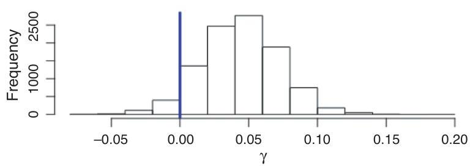

## Page 46
Figure 7.2. CSR Posterior Mean $\gamma$ for the Set of 200 Loss Triangles

Table 7.2. CSR Model Output for the Paid Illustrative Loss Triangle

| w | Premium | Estimate | SE | CV | Outcome | Percentile |
| :--: | :--: | :--: | :--: | :--: | :--: | :--: |
| 1 | 5812 | 3912 | 0 | 0.0000 | 3912 |  |
| 2 | 4908 | 2566 | 113 | 0.0440 | 2527 |  |
| 3 | 5454 | 4139 | 189 | 0.0457 | 4274 |  |
| 4 | 5165 | 4292 | 215 | 0.0501 | 4341 |  |
| 5 | 5214 | 3516 | 192 | 0.0546 | 3583 |  |
| 6 | 5230 | 3332 | 235 | 0.0705 | 3268 |  |
| 7 | 4992 | 4971 | 426 | 0.0857 | 5684 |  |
| 8 | 5466 | 3323 | 407 | 0.1225 | 4128 |  |
| 9 | 5226 | 3756 | 742 | 0.1976 | 4144 |  |
| 10 | 4962 | 3790 | 1416 | 0.3736 | 4139 |  |
| Total | 52429 | 37597 | 2401 | 0.0639 | 40000 | 86.26 |
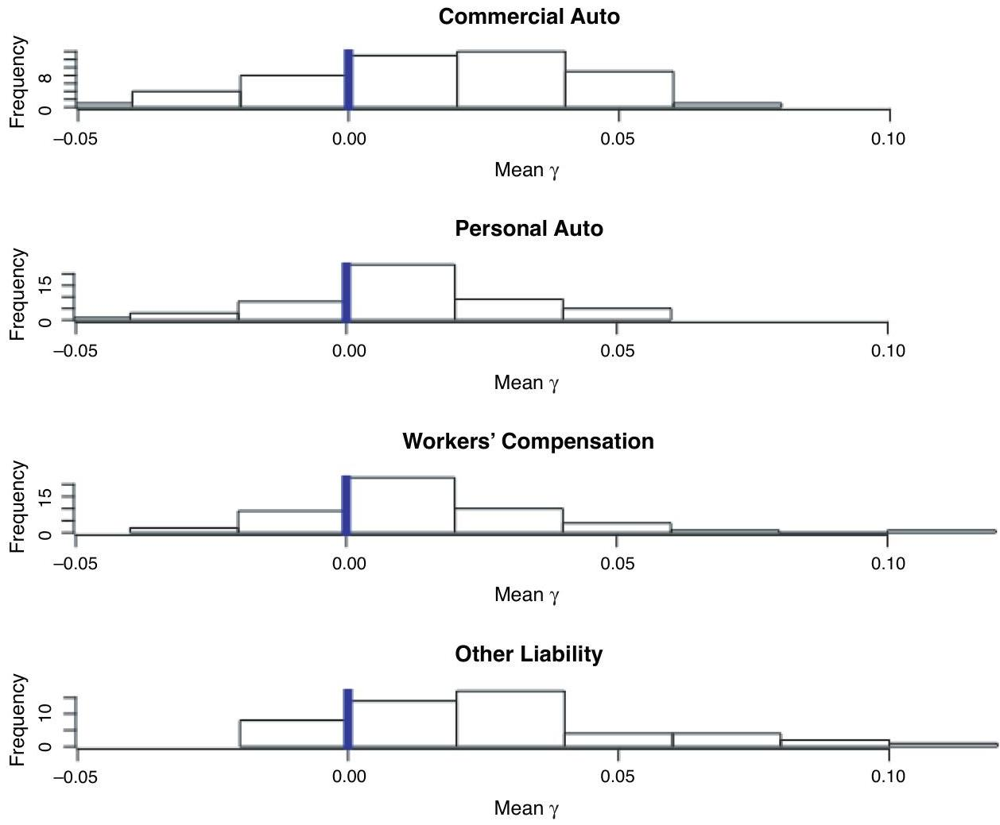

## Page 47
Table 7.3. Model Comparison Statistics for the Paid Illustrative Loss Triangle

| Model | $\widehat{e l p d}_{\text {iso }}$ | $p_{\text {iso }}$ | LOOIC |
| :-- | :--: | :--: | :--: |
| CSR-Paid | 49.76 | 15.09 | -99.53 |
| CRC-Paid | 47.80 | 14.97 | -95.60 |

Table 7.3 show that the $\widehat{e l p d}_{\text {los }}$ statistic favors the CSR model over the CRC model for the illustrative insurer. The CSR model is favored for 105 of our set of 200 loss triangles. One would expect the CRC model to be favored for those insurers that are not changing their claim settlement rate.

If one looks closely, one will see that the standardized residual Box plot for the CSR modelin Figure 7.3 is slightly better than that of the CRC model in Figure 5.3.

A comparison of the $p-p$ plot of the CSR model, Figure 7.4, with that of the CRC model, Figure 5.1, indicates that the CSR model gives a better fit to the holdout data in the lower triangles for our 200 loss triangles. That is to say, it has a better reputation.

Let's now introduce the use of the elpd statistic on test, i.e., lower triangle, data. If $\mathbf{x}$ is a vector containing outcome data that was not used in fitting the model, then the test statistic

$$
\widehat{e l p d}_{\text {test }}=\sum_{i=1}^{N} \log \left(\frac{1}{S} \sum_{j=1}^{J} p\left(x_{i} \mid \theta_{j}\right)\right)
$$

can be used to compare models.
Figure 7.3. CSR Standardized Residual Box Plots for the Paid Illustrative Loss Triangle
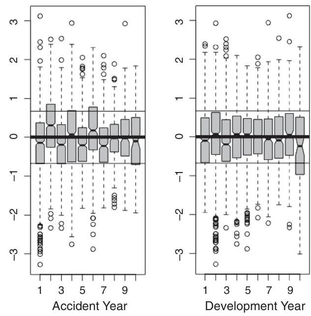

## Page 48
Figure 7.4. p-p Plots for the CSR Model on Paid Loss Triangles

For actuaries seeking to post a loss reserve liability, such a statistic cannot be used on current data since the lower triangle test data is what they are trying to predict. However we can use that statistic to our set of 200 triangles to compare the performance for each model to provide another indicator of a model's reputation. In pairwise comparisons, the more often the elpd statistic favors a model, the better its reputation.

Note that if it turns out there is not a significant change in the claim settlement rate, one should not expect the CSR model to have a better $\overline{e l p} d_{l o s}$ statistic.
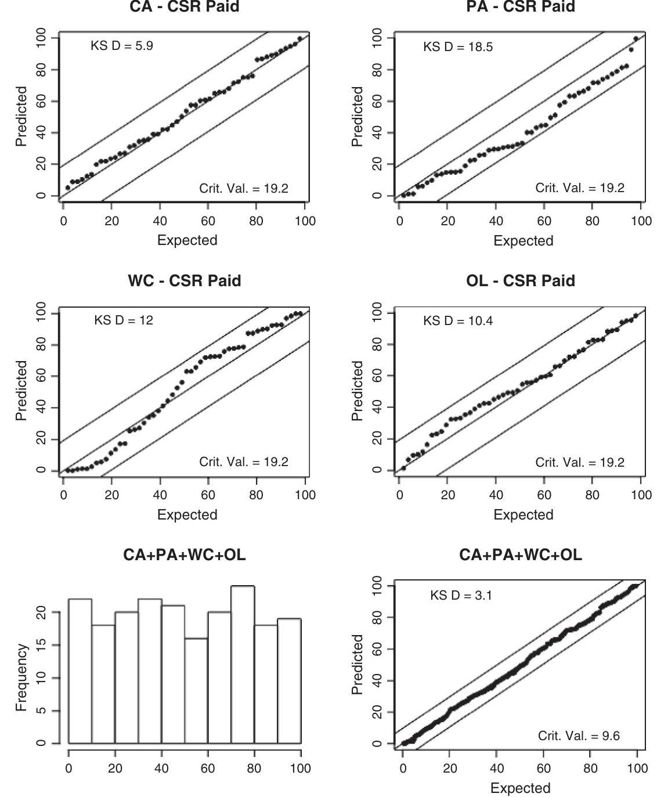

## Page 49
Table 7.4. elpd Pairwise Comparisons

| Line | CSR $>$ CRC(loo) | CSR $>$ CRC(test) |
| :-- | :--: | :--: |
| CA | 27 | 27 |
| PA | 26 | 30 |
| WC | 27 | 30 |
| OL | 26 | 32 |
| Total | 106 | 119 |

Table 7.4 counts the number of times that the elpd statistic favors the CSR model for both the "loo" (upper triangle) and the test (lower triangle) statistics. This table indicates that a significant change in the claim settlement rate occurs fairly often in all four lines of insurance.

The $\overline{e l p d}_{\text {test }}$ statistic and the $p-p$ plots offer two different perspectives of a model's reputation. This statistic looks at a model's fit to the entirety of the lower triangle's data and provide a metric to compare one model with another. The $p-p$ plots examine only the sum of the last column of the lower triangles data. But, as in the case of the CRC model on paid data, they provides hints about the model's shortcomings. Namely that the paid CRC model was biased upward.

## Page 50
# 8. The Correlated Accident Year Model 

We have seen in Figure 3.2 for the Mack model, and in Figure 5.2 for the CRC model, that these models predict a tail that is too light when applied to incurred losses. One way to thicken the tail is to allow for some correlation between the accident years. If it turns out that the correlation is positive, the tails should thicken.

## The Correlated Accident Year (CAY) Model

1. $\operatorname{logelr} \sim \operatorname{normal}(-0.4, \sqrt{10})$.
2. $\alpha_{w} \sim \operatorname{normal}(0, \sqrt{10})$ for $w=2, \ldots, 10$. Set $\alpha_{1}=0$.
3. $\beta_{d} \sim \operatorname{normal}(0, \sqrt{10})$ for $d=1, \ldots, 9$. Set $\beta_{10}=0$.
4. Set $\rho=2 \cdot \rho_{p o s}-1$, where $\rho_{p o s} \sim \operatorname{beta}(2,2)$. Note that this allows $\rho$ to take on any value in the interval $(-1,1)$.
5. $a_{i} \sim \operatorname{uniform}(0,1)$ for $i=1, \ldots, 10$.
6. Set $\sigma_{d}^{2}=\sum_{i=d}^{10} a_{i}$ for $d=1, \ldots, 10$. Note that this forces $\sigma_{1}^{2}>\cdots>\sigma_{10}^{2}$.
7. Set $\mu_{1, d}=\log \left(\right.$ Premium $\left._{1}\right)+\operatorname{logelr}+\beta_{d}$.
8. Set $\mu_{w, d}=\log \left(\right.$ Premium $\left._{w}\right)+\operatorname{logelr}+\alpha_{w}+\beta_{d}+\rho \cdot\left(\log \left(C_{w-1, d}\right)-\mu_{w-1, d}\right)$ for $w>1$.
9. Then $C_{w, d} \sim \operatorname{lognormal}\left(\mu_{w, d}, \sigma_{d}\right)$.

Note that the CAY model reduces to the CRC model when $\rho \equiv 0$. Including the $\rho$ parameter in the model creates a correlation between successive accident years.

Proposition: $\operatorname{Corr}\left[\log \left(C_{w, d}\right), \log \left(C_{w-k, d}\right)\right]=\rho /\left(1+\rho^{2}\right)$ if $k=1$ and is equal to 0 if $k>1 .{ }^{10}$
Proof. Without loss of generality, we can ignore the $\beta_{d} \mathrm{~s}$ and refer to $\sigma_{d}$ as $\sigma$. Also, refer to $\log \left(C_{w, d}\right)$ as $c_{w}, \log \left(\right.$ Premium $\left._{w}\right)+\operatorname{logelr}+\alpha_{w}$ as $\alpha_{w}$, and let $Z_{w}$ be a unit independent normally distributed random variable.

$$
\begin{aligned}
\mu_{1} & =\alpha_{1} \\
c_{1} & =\mu_{1}+\sigma \cdot Z_{1} \\
& =\alpha_{1}+\sigma \cdot Z_{1} \\
\mu_{2} & =\alpha_{2}+\rho \cdot\left(c_{1}-\mu_{1}\right) \\
& =\alpha_{2}+\rho \cdot \sigma \cdot Z_{1}
\end{aligned}
$$

[^0]
[^0]:    ${ }^{10}$ This proposition and its proof were communicated privately to me by John Major.

## Page 51
$$
\begin{aligned}
c_{2} & =\mu_{2}+\sigma \cdot Z_{2} \\
& =\alpha_{2}+\sigma \cdot\left(\rho \cdot Z_{1}+Z_{2}\right) \\
& \cdots \\
c_{w} & =\alpha_{w}+\sigma \cdot\left(\rho \cdot Z_{w-1}+Z_{w}\right)
\end{aligned}
$$

From Equation 8.1 it follows that

$$
\begin{aligned}
\operatorname{Cov}\left[c_{w}, c_{w-k}\right]= & \sigma^{2} \cdot \rho^{2} \cdot \operatorname{Cov}\left[Z_{w-1}, Z_{w-k-1}\right] \\
& +\sigma^{2} \cdot \operatorname{Cov}\left[\rho \cdot Z_{w-1}, Z_{w-k}\right] \\
& +\sigma^{2} \cdot \operatorname{Cov}\left[Z_{w}, \rho \cdot Z_{w-k-1}\right] \\
& +\sigma^{2} \cdot \operatorname{Cov}\left[Z_{w}, Z_{w-k}\right]
\end{aligned}
$$

When $k=1$, the second term of Equation 8.2 is equal to $\rho \cdot \sigma^{2}$. Since $Z_{w}$ and $Z_{w-k}$ are independent, the remaining terms are equal to zero. When $k>1$, all terms are equal to zero.

From Equation 8.1 we have that $\operatorname{Var}\left[c_{w}\right]=\sigma^{2} \cdot\left(1+\rho^{2}\right)$. Thus

$$
\begin{aligned}
\operatorname{Corr}\left[c_{w}, c_{w-k}\right] & =\frac{\rho}{1+\rho^{2}} \text { when } k=1 \\
& =0 \text { when } k>1
\end{aligned}
$$

We can obtain the predictive distribution of the loss outcomes at development year 10 , by accident year and in total for all the accident years by the following simulation for each of the 10,000 parameter vectors:

1. Set $\mu_{1,10}=\log \left(\right.$ Premium $\left._{1}\right)+$ logelr $\left(\right.$ Note that $\left.\alpha_{1}=\beta_{10}=0\right)$.
2. Set $\mu_{2,10}=\log \left(\right.$ Premium $\left._{2}\right)+$ logelr $+\alpha_{2}+\rho \cdot\left(\log \left(C_{1,10}\right)-\mu_{1}\right)$.
3. Simulate $\widehat{C}_{2,10} \sim \operatorname{lognormal}\left(\mu_{2,10}, \sigma_{10}\right)$.
4. Set $\mu_{w, 10}=\log \left(\right.$ Premium $\left._{w}\right)+$ logelr $+\alpha_{w}+\rho \cdot\left(\log \left(\widehat{C}_{w-1,10}\right)-\mu_{w-1}\right)$ for $w=3, \ldots, 10$.
5. Simulate $\widehat{C}_{w, 10} \sim \operatorname{lognormal}\left(\mu_{w, 10}, \sigma_{10}\right)$ for $w=3, \ldots, 10$.
6. Calculate $\widehat{C}_{T a s, 10}=C_{1,10}+\sum_{w=2}^{10} \widehat{C}_{w, 10}$.

Table 8.1 shows a parameter summary of the CAY model applied to the illustrative insurer. The mean of the $\rho$ parameter is 0.1709 indicating a positive correlation between accident years. Thus it should come as no surprise that the standard error of the ultimate loss estimate of the illustrative insurer in Table 8.2 is larger than that produced by the CRC model in Table 5.3. However, one should note that Figure 8.2 indicates a fairly wide posterior distribution of the $\rho$ parameter. When we look at the LOOIC statistics in Table 9.4 we see that the CRC model is favored over the CAY model for the Illustrative Loss Triangle.

This Box plot shows a slightly better fit than that of the CRC model in Figure 5.4.7.

## Page 52
Table 8.1. CAY Model Parameter Summary for the Incurred Illustrative Loss Triangle

|  | Mean | Std. Dev. |  | Mean | Std. Dev. |
| :--: | :--: | :--: | :--: | :--: | :--: |
| logelr | $-0.3945$ | 0.0150 | $\beta_{6}$ | $-0.0008$ | 0.0281 |
| $\alpha_{1}$ | 0.0000 | 0.0000 | $\beta_{7}$ | 0.0017 | 0.0269 |
| $\alpha_{2}$ | $-0.2619$ | 0.0156 | $\beta_{8}$ | 0.0050 | 0.0254 |
| $\alpha_{3}$ | 0.1105 | 0.0213 | $\beta_{9}$ | $-0.0013$ | 0.0237 |
| $\alpha_{4}$ | 0.2124 | 0.0253 | $\beta_{10}$ | 0.0000 | 0.0000 |
| $\alpha_{5}$ | 0.0083 | 0.0308 | $\rho$ | 0.1709 | 0.2071 |
| $\alpha_{6}$ | $-0.0586$ | 0.0401 | $\sigma_{1}$ | 0.2632 | 0.1002 |
| $\alpha_{7}$ | 0.4499 | 0.0521 | $\sigma_{2}$ | 0.1511 | 0.0439 |
| $\alpha_{8}$ | 0.0248 | 0.0819 | $\sigma_{3}$ | 0.0905 | 0.0280 |
| $\alpha_{9}$ | 0.1601 | 0.1453 | $\sigma_{4}$ | 0.0586 | 0.0211 |
| $\alpha_{10}$ | 0.1779 | 0.2984 | $\sigma_{5}$ | 0.0442 | 0.0178 |
| $\beta_{1}$ | $-0.5976$ | 0.1212 | $\sigma_{6}$ | 0.0357 | 0.0154 |
| $\beta_{2}$ | $-0.1896$ | 0.0699 | $\sigma_{7}$ | 0.0295 | 0.0135 |
| $\beta_{3}$ | $-0.0993$ | 0.0476 | $\sigma_{8}$ | 0.0243 | 0.0117 |
| $\beta_{4}$ | $-0.0268$ | 0.0353 | $\sigma_{9}$ | 0.0190 | 0.0100 |
| $\beta_{5}$ | $-0.0121$ | 0.0301 | $\sigma_{10}$ | 0.0128 | 0.0083 |

Table 8.2. CAY Model Output for the Incurred Illustrative Loss Triangle

| w | Premium | Estimate | SE | CV | Outcome | Percentile |
| :-- | :--: | :--: | :--: | :--: | :--: | :--: |
| 1 | 5812 | 3917 | 0 | 0.0000 | 3917 |  |
| 2 | 4908 | 2547 | 65 | 0.0255 | 2532 |  |
| 3 | 5454 | 4107 | 127 | 0.0309 | 4279 |  |
| 4 | 5165 | 4308 | 144 | 0.0334 | 4341 |  |
| 5 | 5214 | 3547 | 133 | 0.0375 | 3587 |  |
| 6 | 5230 | 3329 | 152 | 0.0457 | 3268 |  |
| 7 | 4992 | 5285 | 296 | 0.0560 | 5684 |  |
| 8 | 5466 | 3790 | 323 | 0.0852 | 4128 |  |
| 9 | 5226 | 4180 | 621 | 0.1486 | 4144 |  |
| 10 | 4962 | 4183 | 1373 | 0.3282 | 4181 |  |
| Total | 52429 | 39193 | 1859 | 0.0474 | 40061 | 73.24 |

## Page 53
Figure 8.1. CAY Standardized Residual Box Plots for the Incurred Illustrative Loss Triangle

Now let's examine some statistics calculated over the set of 200 loss triangles. Figure 8.3 shows that the positive mean $\rho$ s are in the overwhelming majority of the triangles. Figure 8.4 shows that the CAY model tends to increase the standard error of the estimates. The $p-p$ plots for the CAY model in Figure 8.5 show a noticeable improvement over the $p-p$ plots for the CRC model in Figure 5.2 for the CA, PA and WC lines of business. The $p-p$ plots for OL line of are almost identical for each figure.

The $\overline{e l p d}$ comparisons are given in Table 8.4. When comparing individual triangles with the model selection statistics, It turns out that, with the $\overline{e l p d}_{\text {los }}$ statistic, the CAY model is favored over the CRC model in only 26 of the 200 loss triangles we examined. But with the $\overline{e l p d}_{\text {test }}$ statistic, the CAY models is favored for 121 out of the 200 loss triangles. It would appear that the relatively wide posterior distribution of $\rho$ like that pictured in Figure 8.2 makes it difficult to distinguish between the CAY and the CRC models. However, in the test data, there are many instances that favor the CAY model. This backs up what we see in the $p-p$ plots in Figure 8.5.

Thus, it appears that a choice to use the CAY model rests mainly with its reputation.

Figure 8.2. CAY Model Posterior Distribution of $\rho$ for Incurred Illustrative Loss Triangle
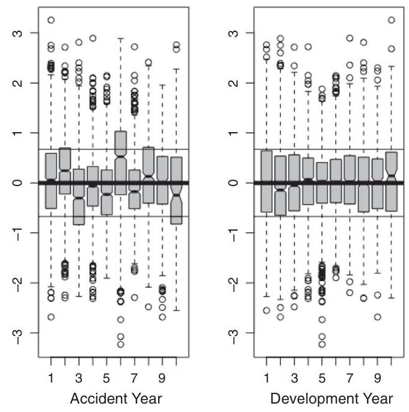
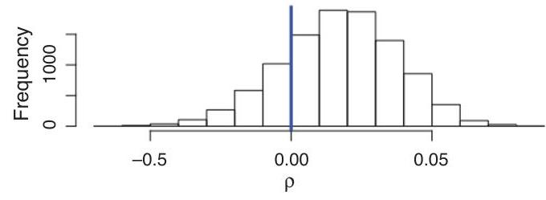

## Page 54
Table 8.3. Model Comparison Statistics for the Incurred Illustrative Loss Triangle

| Model | $\widehat{e l p d}_{\text {too }}$ | $p_{\text {too }}$ | LOOIC |
| :-- | :--: | :--: | :--: |
| CAY-Incurred | 68.65 | 15.64 | -137.30 |
| CRC-Incurred | 70.97 | 15.07 | -141.93 |

Figure 8.3. CAY Posterior Mean of $\rho$ for the Set of 200 Paid Loss Triangles

Figure 8.4. CAY to CRC Standard Error Ratios for the Set of 200 Loss Triangles


## Page 55
Figure 8.5. p-p Plots for the CAY Model on Incurred Loss Triangles

Table 8.4. elpd Pairwise Comparisons

| Line | CAY $>$ CRC(loo) | CAY $>$ CRC(test) |
| :-- | :--: | :--: |
| CA | 5 | 31 |
| PA | 7 | 28 |
| WC | 11 | 38 |
| OL | 3 | 24 |
| Total | 26 | 121 |
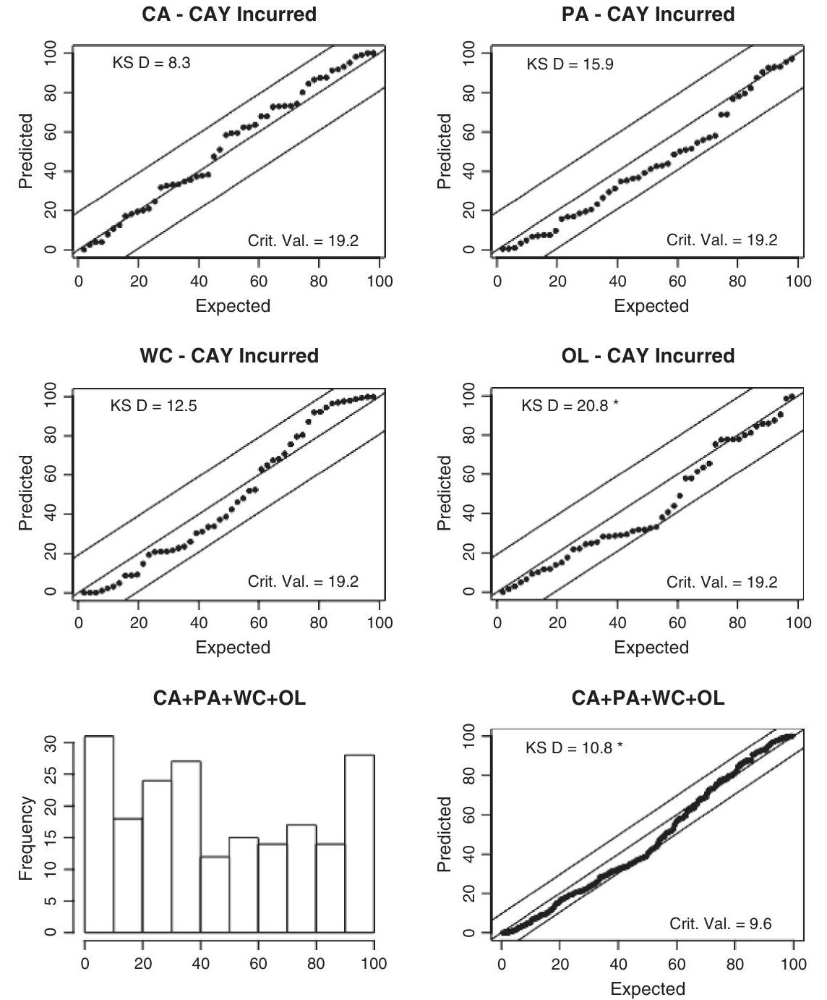

## Page 56
# 9. Combining the CAY and CSR Models ${ }^{11}$ 

Of the models we have considered, the previous sections made the case that the CSR model performs best on the paid data, and the CAY performs best on the incurred data. As one considers the structure of these models, they will notice that the logelr and the $\alpha_{w}$ parameters have the same interpretation, and possibly the same values, in both models. One should expect the remaining parameters to be different as each model is fit to a different, but related, set of losses. This section investigates the relationship between the two models with the idea that there may be some synergy that we can exploit to make more accurate estimates.

A model that does this is specified below. Notice that

- Steps 1 and 2 are the same as in the CSR and CAY model.
- Steps 4 to 8 are the same as in the CSR model, with the prefix "P" denoting the parameters specific to the paid data.
- Steps 9 to 15 are the same as steps 3 to 9 in the CAY model, with the prefix "I" denoting the parameters specific to the incurred data.

Step 3 in this model differs from the corresponding step in the CSR model in that the requirement that ${ }_{p} \beta_{10}=0$ is dropped. This reduces any distortion caused by the logelr parameter for the paid loss triangle being significantly different from the logelr parameter for the incurred loss triangle. This frequently occurs in the Workers' Compensation line of business with our data.

## The Integrated Paid and Incurred (IPI) Model

1. $\operatorname{logelr} \sim \operatorname{normal}(-0.4, \sqrt{10})$.
2. $\alpha_{w} \sim \operatorname{normal}(0, \sqrt{10})$ for $w=2, \ldots, 10$. Set $\alpha_{1}=0$.
3. ${ }_{p} \beta_{d} \sim \operatorname{normal}(0, \sqrt{10})$ for $d=1, \ldots, 10$.
4. $\gamma \sim \operatorname{normal}(0,0.05)$.
5. ${ }_{p} a_{i} \sim \operatorname{uniform}(0,1)$ for $i=1, \ldots, 10$.
6. Set ${ }_{p} \sigma_{d}^{2}=\sum_{i=d p}^{10} a_{i}$ for $d=1, \ldots, 10$. Note that this forces ${ }_{p} \sigma_{1}^{2}>\cdots>_{p} \sigma_{10}^{2}$.
7. Set ${ }_{p} \mu_{w, d}=\log \left(\right.$ Premium $\left._{w}\right)+\operatorname{logelr}+\alpha_{w}+{ }_{p} \beta_{d} \cdot(1-\gamma)^{w-1}$.
8. Then ${ }_{p} C_{w, d} \sim \operatorname{lognormal}\left({ }_{p} \mu_{w, d}, \sigma_{d}\right)$.

[^0]
[^0]:    ${ }^{11}$ The motivation for this section arose out of a series of conversations I had with Ned Tyrrell, FCAS. Mr. Tyrrell's insight was that the estimates obtained by using both paid and incurred data would have lower variability.

## Page 57
9. $\int \beta_{d} \sim \operatorname{normal}(0, \sqrt{10})$ for $d=1, \ldots, 9$. Set $\int \beta_{10}=0$.
10. Set $\rho=2 \cdot \rho_{p m}-1$, where $\rho_{p m} \sim \operatorname{beta}(2,2)$. Note that this allows $\rho$ to take on any value in the interval $(-1,1)$.
11. $\int a_{i} \sim$ uniform $(0,1)$ for $i=1, \ldots, 10$.
12. Set ${ }_{l} \sigma_{d}^{2}=\sum_{i=d}^{10} \int a_{i}$ for $d=1, \ldots, 10$. Note that this forces ${ }_{l} \sigma_{1}^{2}>\cdots>_{l} \sigma_{10}^{2}$.
13. Set ${ }_{l} \mu_{1, d}=\log \left(\right.$ Premium $\left._{1}\right)+l o g e l r+\int \beta_{d}$.
14. Set ${ }_{l} \mu_{w, d}=\log \left(\right.$ Premium $\left._{w}\right)+l o g e l r+\alpha_{w}+\int \beta_{d}+\rho \cdot\left(\log \left({ }_{l} C_{w-1, d}\right)-\int \mu_{w-1, d}\right)$ for $w>1$.
15. Then ${ }_{l} C_{w, d} \sim \operatorname{lognormal}\left(\int \mu_{w, d}, \int \sigma_{d}\right)$.

Table 9.1 gives the logelr and the $\alpha_{w}$ parameters for the IPI model with the data from the Illustrative Loss Triangle, and for reference, the corresponding parameters for the CSR and CAY models. The parameters are very similar for the earlier accident years, with some divergence in the last few accident years. What is interesting to note is that the standard deviations of the logelr and the $\alpha_{w}$ parameters are noticeably smaller for the IPI model. These lower standard deviations translate into lower standard errors of the estimates, as noted in Table 9.2 when compared with Table 7.2, and Table 9.3 when compared with Table 8.2.

This reduction in the standard errors extends to almost all of the set of 200 loss triangles as can be seen in Figure 9.3.

The standardized residual Box plots for Illustrative loss triangle with the IPI paid and incurred losses in Figures 9.1 and 9.2 are slightly worse than the corresponding plots for the CSR and CAY model, but they are still reasonable in that zero is within the interquartile range of the standardized residuals for all accident years.

Table 9.1. Summary of the logelr and $\alpha_{w}$ Parameters for the Illustrative Loss Triangle

|  | CSR Model |  | CAY Model |  | IPI Model |  |
| :--: | :--: | :--: | :--: | :--: | :--: | :--: |
|  | Mean | Std. Dev. | Mean | Std. Dev. | Mean | Std. Dev. |
| logelr | $-0.3956$ | 0.0246 | $-0.3945$ | 0.0150 | $-0.3951$ | 0.0109 |
| $\alpha_{1}$ | 0.0000 | 0.0000 | 0.0000 | 0.0000 | 0.0000 | 0.0000 |
| $\alpha_{2}$ | $-0.2541$ | 0.0272 | $-0.2619$ | 0.0156 | $-0.2618$ | 0.0090 |
| $\alpha_{3}$ | 0.1188 | 0.0308 | 0.1105 | 0.0213 | 0.1157 | 0.0119 |
| $\alpha_{4}$ | 0.2089 | 0.0373 | 0.2124 | 0.0253 | 0.2140 | 0.0153 |
| $\alpha_{5}$ | $-0.0002$ | 0.0445 | 0.0083 | 0.0308 | 0.0091 | 0.0186 |
| $\alpha_{6}$ | $-0.0581$ | 0.0617 | $-0.0586$ | 0.0401 | $-0.0657$ | 0.0263 |
| $\alpha_{7}$ | 0.3881 | 0.0787 | 0.4499 | 0.0521 | 0.4319 | 0.0383 |
| $\alpha_{8}$ | $-0.1097$ | 0.1166 | 0.0248 | 0.0819 | $-0.0207$ | 0.0619 |
| $\alpha_{9}$ | 0.0462 | 0.1914 | 0.1601 | 0.1453 | 0.1248 | 0.1056 |
| $\alpha_{10}$ | 0.0645 | 0.3467 | 0.1779 | 0.2984 | 0.1571 | 0.1947 |

## Page 58
Table 9.2. IPI Model Output for the Paid Illustrative Loss Triangle

| w | Premium | Estimate | SE | CV | Outcome | Percentile |
| :-- | :--: | :--: | :--: | :--: | :--: | :--: |
| 1 | 5812 | 3912 | 0 | 0.0000 | 3912 |  |
| 2 | 4908 | 2543 | 58 | 0.0228 | 2527 |  |
| 3 | 5454 | 4124 | 98 | 0.0238 | 4274 |  |
| 4 | 5165 | 4309 | 111 | 0.0258 | 4341 |  |
| 5 | 5214 | 3544 | 97 | 0.0274 | 3583 |  |
| 6 | 5230 | 3299 | 109 | 0.0330 | 3268 |  |
| 7 | 4992 | 5180 | 223 | 0.0431 | 5684 |  |
| 8 | 5466 | 3612 | 234 | 0.0648 | 4128 |  |
| 9 | 5226 | 4009 | 429 | 0.1070 | 4144 |  |
| 10 | 4962 | 3986 | 796 | 0.1997 | 4139 |  |
| Total | 52429 | 38518 | 1253 | 0.0325 | 40000 | 88.50 |

Table 9.3. IPI Model Output for the Incurred Illustrative Loss Triangle

| w | Premium | Estimate | SE | CV | Outcome | Percentile |
| :-- | :--: | :--: | :--: | :--: | :--: | :--: |
| 1 | 5812 | 3912 | 0 | 0.0000 | 3917 |  |
| 2 | 4908 | 2545 | 44 | 0.0173 | 2532 |  |
| 3 | 5454 | 4126 | 81 | 0.0196 | 4279 |  |
| 4 | 5165 | 4311 | 95 | 0.0220 | 4341 |  |
| 5 | 5214 | 3546 | 87 | 0.0245 | 3587 |  |
| 6 | 5230 | 3301 | 103 | 0.0312 | 3268 |  |
| 7 | 4992 | 5183 | 216 | 0.0417 | 5684 |  |
| 8 | 5466 | 3613 | 231 | 0.0639 | 4128 |  |
| 9 | 5226 | 4012 | 429 | 0.1069 | 4144 |  |
| 10 | 4962 | 3987 | 795 | 0.1994 | 4181 |  |
| Total | 52429 | 38541 | 1225 | 0.0318 | 40061 | 89.66 |

## Page 59
Figure 9.1. IPI Standardized Residual Box Plots for the Paid Illustrative Loss Triangle

Figure 9.2 IPI Standardized Residual Box Plots for the Incurred Illustrative Loss Triangle
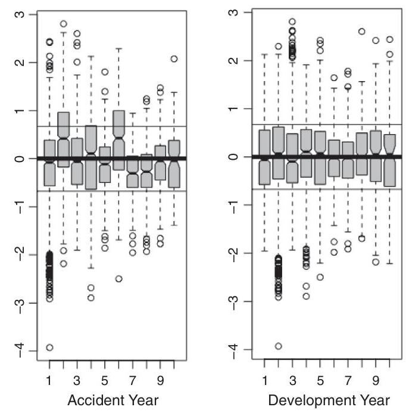
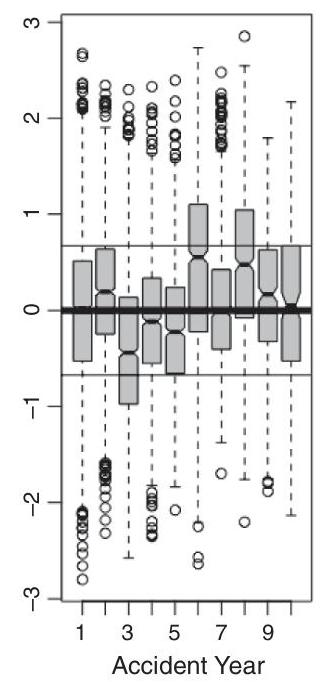
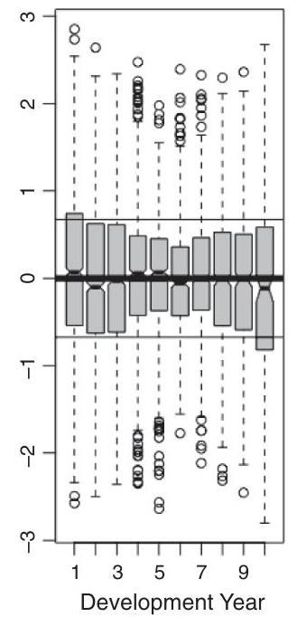

## Page 60
Figure 9.3. Standard Error Reductions by the IPI Model

To calculate the model comparison statistics for the IPI model, we first calculate the $55 \times 10,000$ log-likelihood matrices given the parameters specific to the paid, and then the incurred, data. We then use the "loo" package to get the model selection statistics. As we will not introduce any more models in this monograph, the following table gives the model selection statistics for each of the MCMC models considered above.

Now let's examine the $\overline{e l p d}$ comparisons over the set of 200 triangles. The following tables provide comparisons for all the models given in this monograph.

Tables 9.5-9.8 identify several instances where the IPI model has a better fit than the corresponding CSR, CAY or CRC models. The IPI model's advantage is stronger for the paid models than the incurred models.

Table 9.4. Model Comparison Statistics Illustrative Loss Triangles

| Model | $\overline{e l p d}_{\text {too }}$ | $p_{\text {too }}$ | LOOIC |
| :-- | :--: | --: | --: |
| IPI-Paid | 63.54 |  | -127.08 |
| CSR-Paid | 49.76 | 15.09 | -99.53 |
| CRC-Paid | 47.80 | 14.97 | -95.60 |
| SCC-Paid | -5.14 | 8.75 | 10.28 |
| IPI-Incurred | 78.36 |  | -156.72 |
| CAY-Incurred | 68.65 | 15.64 | -137.30 |
| CRC-Incurred | 70.97 | 15.07 | -141.93 |
| SCC-Incurred | -2.85 | 9.13 | 5.69 |
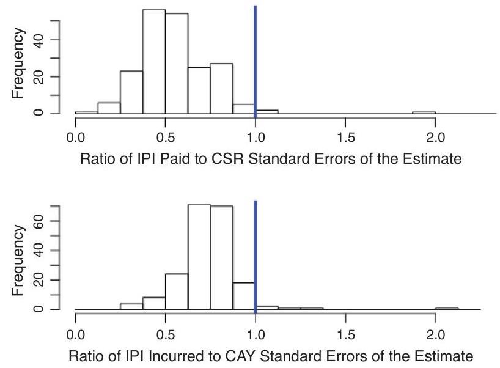

## Page 61
Table 9.5. $\widehat{e l p d}_{\text {loo }}$ Paid Model Pairwise Comparisons

| Line | IPI $>$ CSR | IPI $>$ CRC | CSR $>$ CRC | CRC $>$ SCC |
| :-- | :--: | :--: | :--: | :--: |
| CA | 46 | 45 | 26 | 50 |
| PA | 41 | 42 | 27 | 50 |
| WC | 18 | 22 | 25 | 50 |
| OL | 41 | 40 | 23 | 50 |
| Total | 146 | 149 | 100 | 200 |

Table 9.6. $\widehat{e l p d}_{\text {test }}$ Paid Model Pairwise Comparisons

| Line | IPI $>$ CSR | IPI $>$ CRC | CSR $>$ CRC | CRC $>$ SCC |
| :-- | :--: | :--: | :--: | :--: |
| CA | 43 | 44 | 27 | 49 |
| PA | 42 | 44 | 30 | 47 |
| WC | 32 | 40 | 30 | 48 |
| OL | 39 | 42 | 32 | 47 |
| Total | 156 | 170 | 119 | 191 |

Table 9.7. $\widehat{e l p d}_{\text {loo }}$ Incurred Model Pairwise Comparisons

| Line | IPI $>$ CAY | IPI $>$ CRC | CAY $>$ CRC | CRC $>$ SCC |
| :-- | :--: | :--: | :--: | :--: |
| CA | 17 | 15 | 6 | 50 |
| PA | 31 | 29 | 7 | 50 |
| WC | 37 | 37 | 10 | 50 |
| OL | 22 | 23 | 3 | 50 |
| Total | 107 | 104 | 26 | 200 |

Table 9.8. $\widehat{e l p d}_{\text {test }}$ Incurred Model Pairwise Comparisons

| Line | IPI $>$ CAY | IPI $>$ CRC | CAY $>$ CRC | CRC $>$ SCC |
| :-- | :--: | :--: | :--: | :--: |
| CA | 25 | 31 | 31 | 48 |
| PA | 35 | 34 | 28 | 50 |
| WC | 22 | 25 | 38 | 48 |
| OL | 29 | 31 | 24 | 46 |
| Total | 111 | 121 | 121 | 192 |

## Page 62
Figures 9.4 and 9.5 give the $p-p$ plots for the paid and incurred IPI models. While seven of the eight $p-p$ plots fall within the Kolmogorov-Smirnov critical values, the Workers' Compensation plot indicates that the models tend to be light-tailed. It might be worth noting that the Workers' Compensation line of business frequently provides benefits in the form of long-term annuities and it is more likely that significant differences between the incurrred and the and paid losses remain after 10 years. See Figure 9.6.

This completes the set of models that are considered in this monograph. We now turn to making use of these models to post a loss reserve liability. The current

Figure 9.4. p-p Plots for the IPI Model on Paid Loss Triangles
CA - IPI Paid

WC - IPI Paid

CA+PA+WC+OL

PA - IPI Paid

OL - IPI Paid

CA+PA+WC+OL
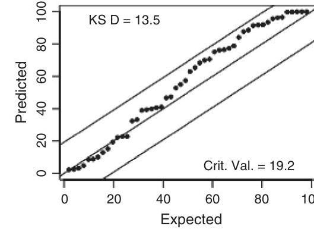
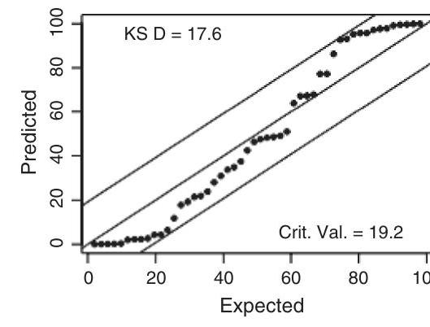
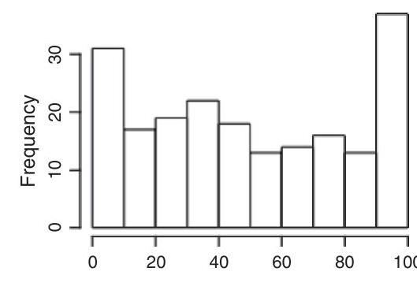
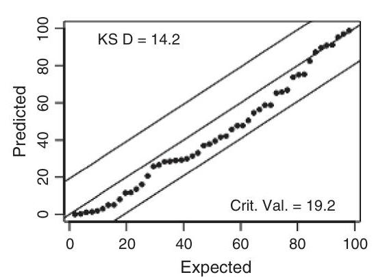
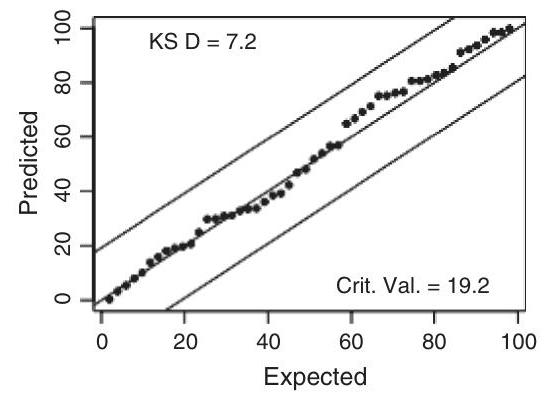
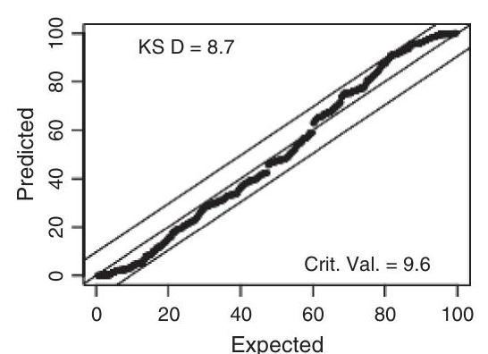

## Page 63
Figure 9.5. p-p plots for the IPI Model on Incurred Loss Triangles
CA - IPI Incurred

WC - IPI Incurred

CA+PA+WC+OL

PA - IPI Incurred

OL - IPI Incurred

CA+PA+WC+OL
consensus under IFRS 17 is that the liability should represented a discounted "best estimate" and a risk margin. To fulfill the discounting requirement, we need a model that estimates the payout pattern. To fulfill the risk margin requirement, we need a stochastic model. This monograph will turn to demonstrating how to use the CSR and the IPI models to address these needs.

An important issue with the risk margin is that of diversification. So, before discussing risk margins, we need to address the issue of dependencies between lines of insurance.
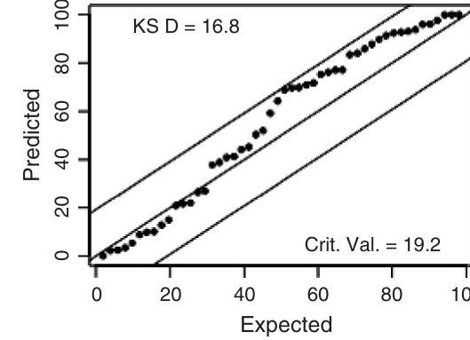
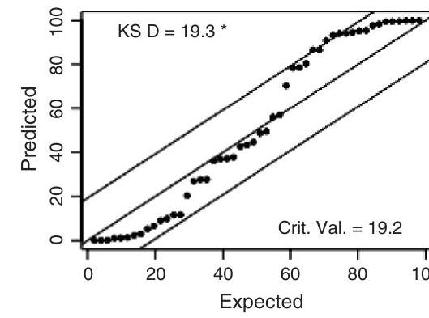
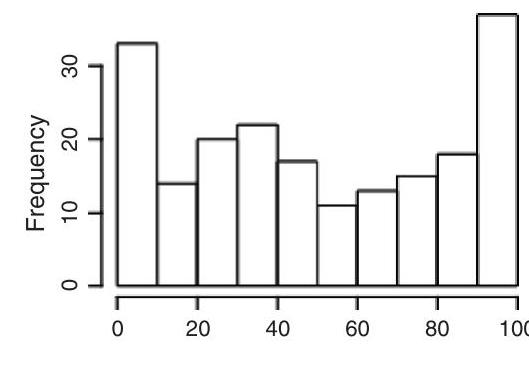
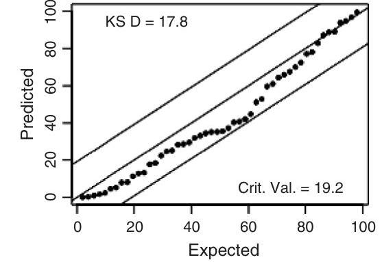
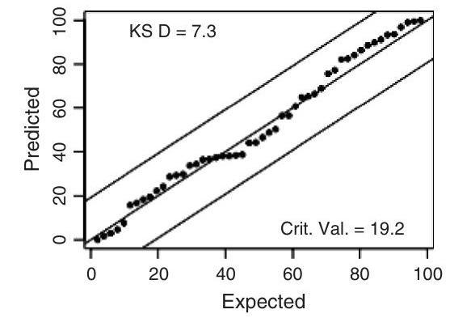
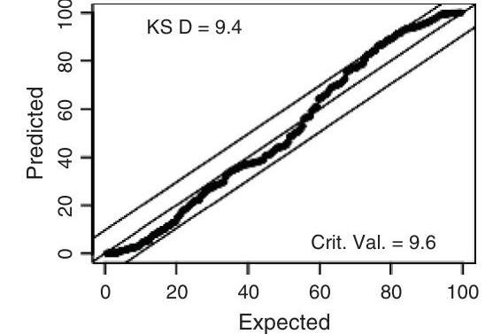

## Page 64
Figure 9.6. Differences in the logelr Parameters for the CAY and CSR Models
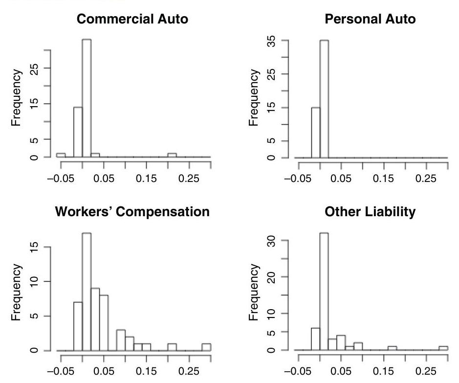

## Page 65
# 10. Dependencies Between Lines of Insurance ${ }^{12}$ 

As actuaries fit their stochastic loss reserve models to the various lines of insurance underwritten by their insurance company, they will ultimately be given the task of posting a single loss reserve liability for that company. An important consideration in evaluating this liability is that of diversification. To quantify the effect of diversification, we first need to address the issue of correlation, or to be more general, dependencies between lines of insurance.

Of interest are the dependencies that remain after a model has been fit to our data. Let's begin with the preliminary observation that dependencies are model dependent. A simple example illustrating this is in Figure 10.1. If one fits the correct parabolic model to each of the dependent $y_{1}$ and $y_{2}$ variables, we have uncorrelated residuals. But if one fits the incorrect constant model, the residuals are correlated. A similar point is made by Avanzi, Taylor and Wong (2016). To quote their abstract, "We show with some real examples that, sometimes, most (if not all) of the correlation can be 'explained' by an appropriate methodology."

Prior to considering dependencies, our models have taken the form:

$$
\log \left(C_{w, d}\right) \sim \operatorname{normal}\left(\mu_{w, d}^{j}, \sigma_{d}^{j}\right)
$$

for each $w$ and $d$, with $j$ being one of $J=10,000$ simulations. The transformed parameters $\mu_{w, d}$ and $\sigma_{d}$ can come from any of the paid SCC, CSR or IPI models. For a given simulation $j$, we can then propose the bivariate model for lines of insurance $X$ and $Y$

$$
\left(\begin{array}{l}
\log \left({ }_{X} C_{w, d}\right) \\
\log \left({ }_{Y} C_{w, d}\right)
\end{array}\right) \sim \operatorname{normal}\left(\left(\begin{array}{l}
x \mu_{w, d}^{j} \\
y \mu_{w, d}^{j}
\end{array}\right),\left(\begin{array}{cc}
\left({ }_{X} \sigma_{d}^{j}\right)^{2} & \rho^{j} \cdot{ }_{X} \sigma_{d}^{j} \cdot{ }_{Y} \sigma_{d}^{j} \\
\rho^{j} \cdot{ }_{X} \sigma_{d}^{j} \cdot{ }_{Y} \sigma_{d}^{j} & \left({ }_{Y} \sigma_{d}^{j}\right)^{2}
\end{array}\right)\right)
$$

[^0]
[^0]:    ${ }^{12}$ An earlier version of this section is in Meyers (2017).

## Page 66
Figure 10.1. Model Dependency Illustration
Line 1

Residuals for Constant Model
$y_{1}(x)-\mu_{1}$

Line 2

Residuals for Parabolic Model
where $\rho^{j}$ is a single parameter representing the coefficient of correlation between the two lines for the simulation $j$. So, to get a "posterior" distribution ${ }^{13}$ one proceeds as follows.

1. Use Bayesian MCMC to obtain a sample,

$$
\left\{{ }_{X} \mu_{w, d}^{j},{ }_{X} \sigma_{d}^{j},{ }_{Y} \mu_{w, d}^{j},{ }_{Y} \sigma_{d}^{j}\right\}_{j=1}^{10,000}
$$

from the posterior distributions for lines of insurance $X$ and $Y$.
2. For each $j$ use Bayesian MCMC to take a sample of size one from the posterior distribution of

$$
\left.\rho^{j}\right|_{X} \mu_{w, d}^{j},{ }_{X} \sigma_{d}^{j},{ }_{Y} \mu_{w, d}^{j},{ }_{Y} \sigma_{d}^{j}
$$

This process is fairly time consuming. ${ }^{14}$ But it produces 10,000 equally likely simulations for Equation 10.2.

[^0]
[^0]:    ${ }^{13}$ The term "posterior" is put in quotes to distinguish it from a one-step MCMC model with all parameters $\rho^{j},{ }_{X} \mu_{w, d}^{j},{ }_{X} \sigma_{d}^{j}, Y \mu_{w, d}^{j}$, and ${ }_{Y} \sigma_{d}^{j}$. See Meyers (2017) for a discussion of this one-step approach.
    ${ }^{14}$ While the first step runs in less than a minute on my quad core laptop, the second step takes about 12 minutes, making use of R parallel package and compiling the Stan script in advance.
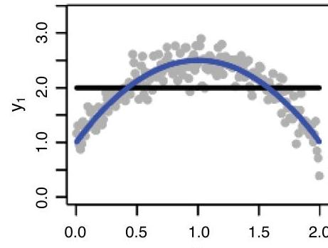

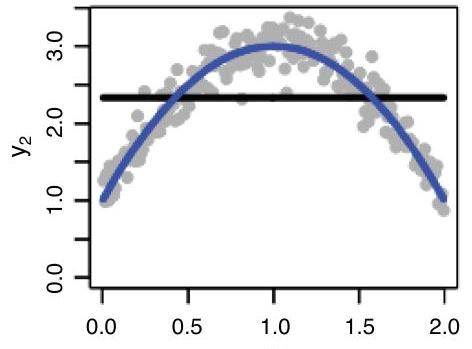
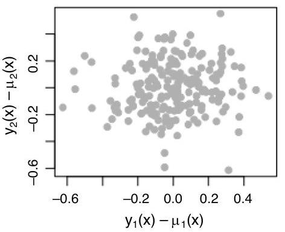

## Page 67
Figure 10.2. Summary Correlation Plots
CSR Model Correlations for Group 353 CA and PA

Standardized Residual Box Plots

Figures 10.2-10.4 summarize the posterior distributions for the illustrative insurer using the CSR, IPI and SCC models. These figures consist of a histogram of the posterior distribution of $\rho$ and side-by-side accident year standard residual Box plots. Here are some of the highlights of these figures.

- The posterior distribution of $\rho$ is fairly wide, and the point $\rho=0$ is not close to the tails of the distributions.
- One can see the effect of model dependence as we progress from the CSR model to the SCC model. The CSR model does the best at capturing the accident year effect, and the IPI model captures it nearly as well. The SCC model does not adequately capture the accident year effects. In the side-by-side accident year Box plots, the six of the corresponding medians for each line of insurance are on opposite sides
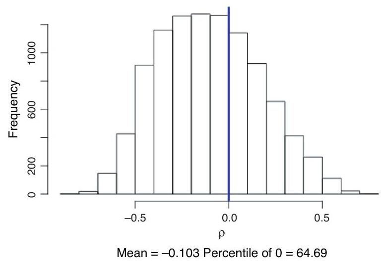
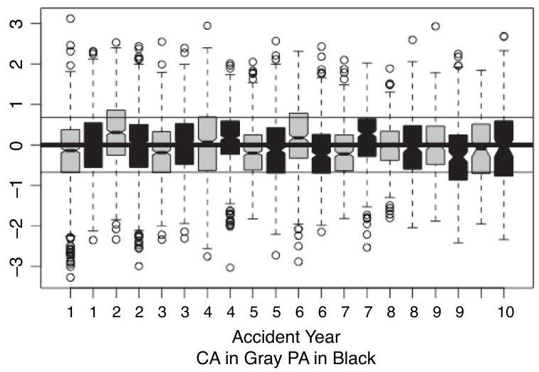

## Page 68
Figure 10.3. Summary Correlation Plots
IPI Model Correlations for Group 353 CA and PA

Mean $=-0.119$ Percentile of $0=67.71$

Standardized Residual Box Plots
of zero. For the other four, they are fairly close to zero. This results in the posterior mean of $\rho$ being negative.

Now let's turn to comparing the fits of the dependent assumption, specified by Equation 10.2 with the independent assumption specified by setting $\rho=0$ in Equation 10.2 with the $\widehat{e l p d}_{l o t}$ statistic. To do this, we need to calculate the log-likelihoods of each observation in the upper triangle using the parameters

$$
\left\{\rho^{j}, x \mu_{w, d}^{j}, x \sigma_{d}^{j}, y \mu_{w, d}^{j}, y \sigma_{d}^{j}\right\}_{j=1}^{10,000}
$$

and Equation 10.2 .
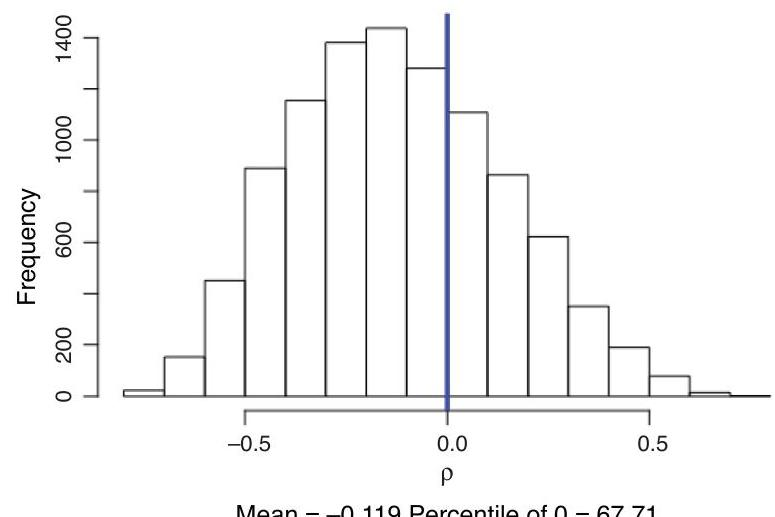
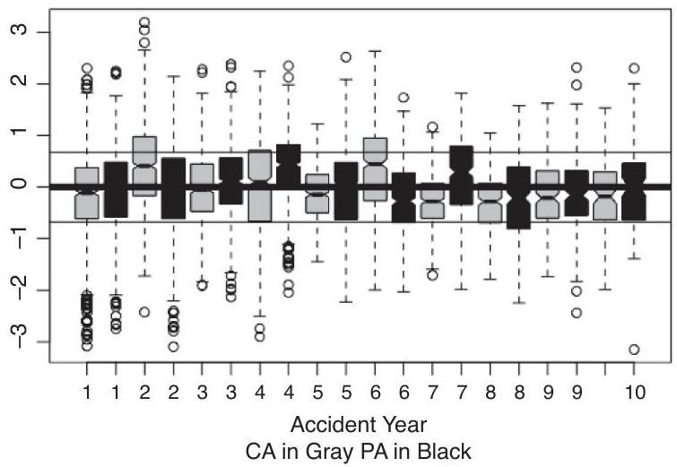

## Page 69
Figure 10.4. Summary Correlation Plots
SCC Model Correlations for Group 353 CA and PA

Standardized Residual Box Plots

In our set of 200 loss triangles, there are 119 lines of insurance pairs within the same insurer. I calculated the $\overline{e l p d}_{50}$ statistics under the dependent and independent assumptions, with the result that for the CSR and IPI models, the independent assumption was favored in all 119 cases. for the SCC model, the independent assumption was favored in all but one of the 119 cases - Insurer 715 for CA and PA. A close call, where the independent assumption was barely favored, Insurer 5185 for CA and OL has an interesting and informative summary correlation plot. See Figures 10.5-10.7.

- As we saw with the illustrative insurer, the posterior distribution of the $\rho$ parameter is quite wide. The strength of the positive correlation for this insurer decreases with the ability of the model to capture the accident year effect.
- Ignoring the accident year effect in the SCC model completely flipped the correlation from positive to negative. In looking at the standardized residual Box

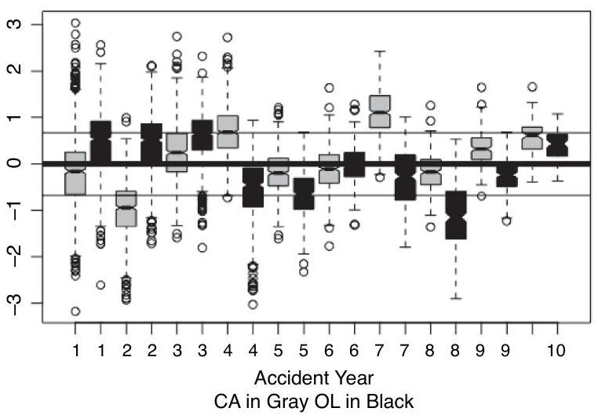

## Page 70
Figure 10.5. Summary Correlation Plots
CSR Model Correlations for Group 5185 CA and OL

Mean $=0.279$ Percentile of $0=14.35$
Standardized Residual Box Plots
plots, we see that the two lines of insurance appear to be counter-cyclical if we fail to recognize the accident year effect.

At this point, we drop any additional examination of the SCC model.
There was a reversal when comparing the $\overline{e l p d}_{\text {test }}$ statistics on the lower triangle data. The dependent assumption was favored over the independent assumption in 75 and 73 out of the 119 pairs of lines for the CSR and IPI models respectively. ${ }^{15}$ I spent a fair amount of time looking for an explanation, but found none. The only conclusion I could draw was that there were some unknown variables influencing the

[^0]
[^0]:    ${ }^{15}$ In many cases the differences were smaller than the differences for the $\overline{e l p d}_{\text {test }}$ statistics. I did a bootstrap analysis of the MCMC sampling error and found that many of the differences were too large to be explained by that error.
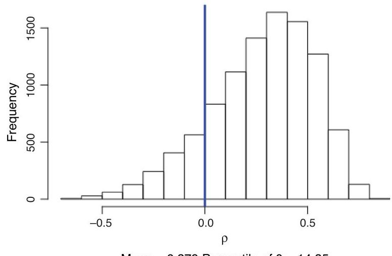
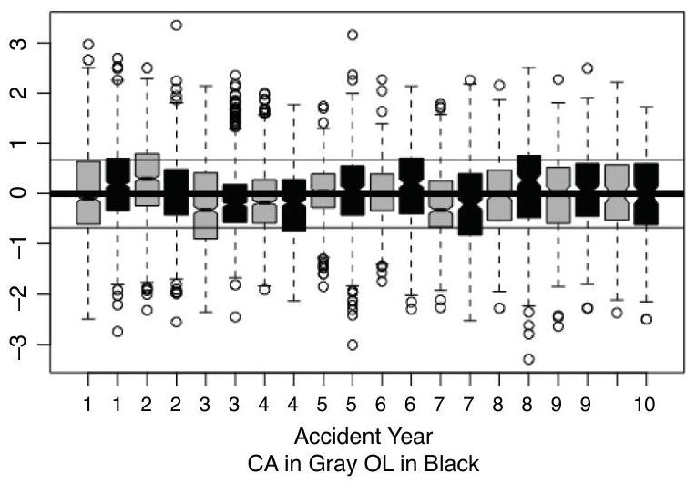

## Page 71
Figure 10.6. Summary Correlation Plots
IPI Model Correlations for Group 5185 CA and OL

Mean $=0.415$ Percentile of $0=4.64$
Standardized Residual Box Plots
lower triangle data that were not captured by the CSR and IPI models when fit to the upper triangle data.

While it is tempting to justify the independent assumption with $\widehat{e l p d}_{b o}$ statistics, in light of the $\widehat{e l p d}_{\text {soa }}$ statistics, I do not think that is prudent at this time. However, we can do some sensitivity tests to see how bad things can get.

Figure 10.8 summarizes the posterior mean of $\rho$ and the effect of the correlation of the standard error of the estimated ultimate loss. ${ }^{16}$ It turns out that the risk of a gross understatement of the standard error is fairly small for both models.

[^0]
[^0]:    ${ }^{16}$ Because of the skewness of the lognormal distribution, one should not always expect a positive $\rho$ to increase the standard error.
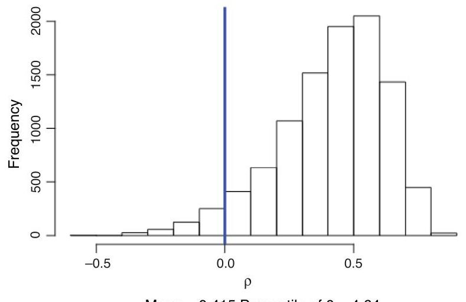
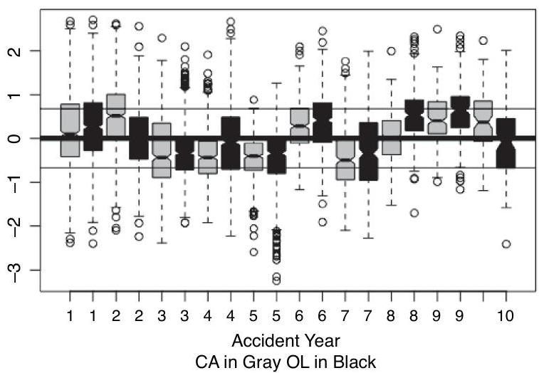

## Page 72
Figure 10.7. Summary Correlation Plots
SCC Model Correlations for Group 5185 CA and OL

Mean $=-0.393$ Percentile of $0=95.99$

Standardized Residual Box Plots

In summary, it turns out that dependencies between lines of business are very hard to detect given only the data in the upper triangle. The main source of dependency identified in this section is the failure to recognize the accident year effect. There may be other external effects. A plot similar to the side-by-side standardized residual plot along a different variable may help find other causes of dependency. If such a variable can be found, it should be included in the stochastic loss reserve model.
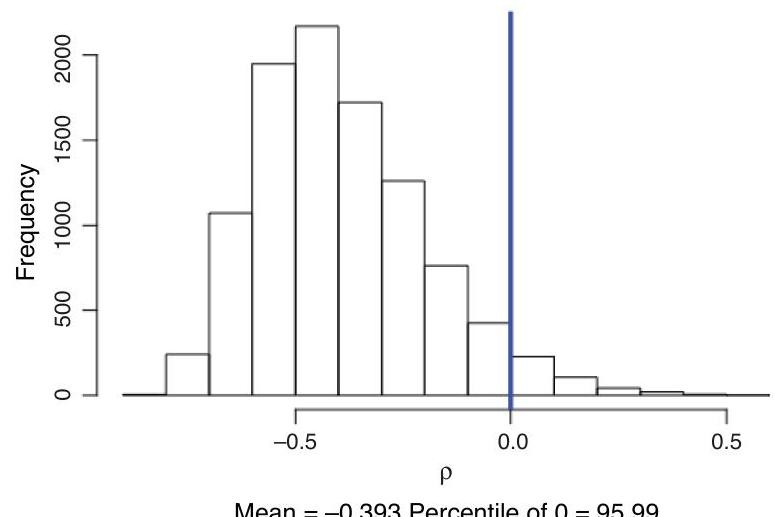
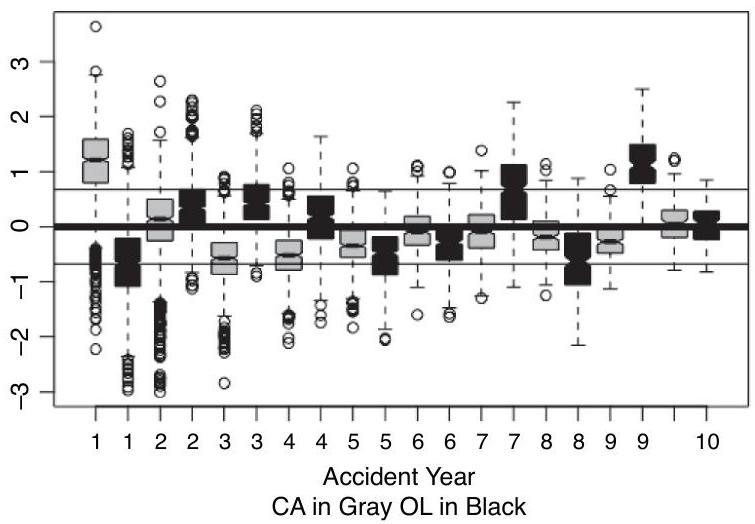

## Page 73
Figure 10.8. Summary Statistics Over 119 Lines of Business Pairs
CSR Model

CSR Model

IPI Model

IPI Model

Table 10.1. $\rho \Leftrightarrow$ Coefficient of Correlation

| $\rho$ | Coefficient of Correlation |
| :-- | :--: |
| 0.0 | 0.000 |
| 0.1 | 0.060 |
| 0.2 | 0.125 |
| 0.3 | 0.205 |
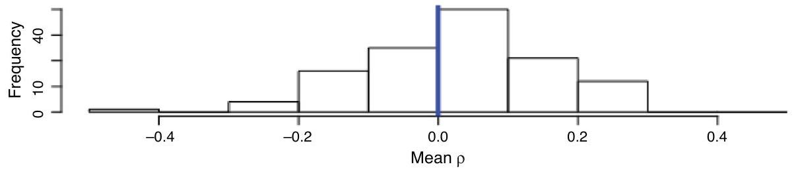
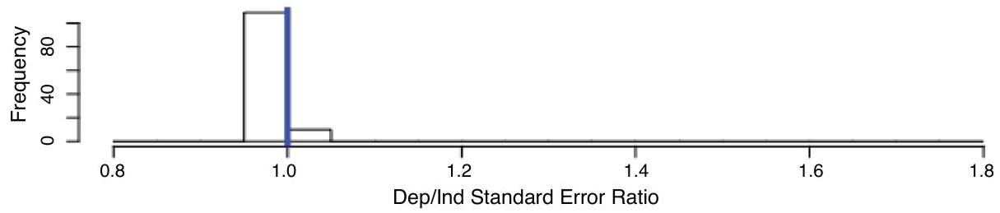
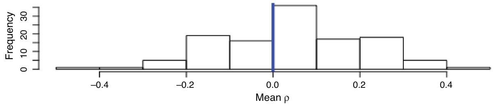
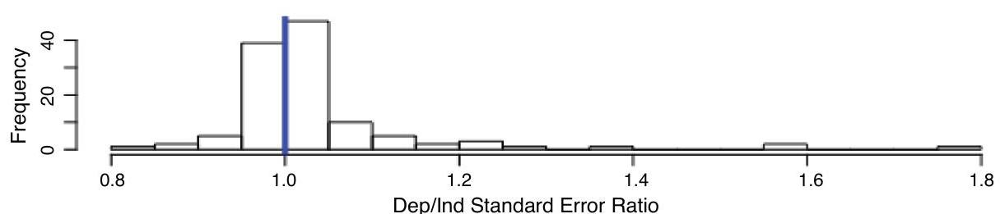

## Page 74
# 11. Risk Margin ${ }^{17}$ 

Now that we have covered a variety of models that attempt to describe a predictive distribution of possible outcomes, we now turn to a principal reason for fitting such a model—posting a liability on an insurer's balance sheet for unpaid claims.

There is a growing consensus, supported by IFRS $17,{ }^{18}$ emerging in the insurance industry that the liability should consist of the expected present value of the unpaid claims, plus a risk margin. One expression of this consensus can be found in the "technical provisions" of the European Solvency II directive. ${ }^{19}$ This directive was first published in 2009, and, after a number of amendments, was finally put into effect on January 1, 2016.

These technical provisions refer to the insurer's liability for unpaid losses. Specifically:

1. "The value of the technical provisions shall be equal to the sum of a best estimate and a risk margin."
2. "The best estimate shall correspond to the probability-weighted average of future cash flows, taking account of the time value of money using the relevant risk-free interest rate term structure."
3. "The risk margin shall be calculated by determining the cost of providing an amount of eligible own funds equal to the Solvency Capital Requirement necessary to support the insurance obligations over the lifetime thereof."
4. "Insurance undertakings shall segment their insurance obligations into homogeneous risk groups, and as a minimum by lines of business, when calculating the technical provisions."

This section illustrates a way to implement the principles expressed in the above provisions of the act. While the act goes on to provide some specific recommendations on how to implement those provisions, the scope of this section is more to show how to implement the principles underlying Solvency II using the Bayesian MCMC technology.

A Bayesian MCMC stochastic loss reserve model provides an arbitrarily large number of equally likely simulations that enable one to simulate future cash flows of the liability. From these simulations, it is possible to describe any future state in the model's time

[^0]
[^0]:    ${ }^{17}$ An earlier version of this section is in Meyers 2018.
    ${ }^{18}$ See the International Actuarial Association (2018) publication on risk adjustments.
    ${ }^{19}$ The provisions quoted here are stated in Section 2, Article 77 and Article 80, of Chapter VI of the act, p. 222. http://register.consilium.europa.eu/pdf/en/09/st03/st03643-re01.en09.pdf.

## Page 75
horizon, including those states necessary to calculate the technical provisions. That is what this section will do.

As the focus of this monograph is on the stochastic features of estimating loss liabilities, it makes simple assumptions about other relevant parameters, such as the solvency criteria, interest rates and the timing of loss payments.

Here is a high-level description of that cash flow.

1. At the end of the current calendar year (call this time $t=0$ ), the insurer posts its best estimate of the liability. The insurer also posts the amount of capital, $K_{0}$, needed to contain the uncertainty in this estimate. It invests $K_{0}$ in a fund that earns income at the risk-free interest rate $i$.
2. At the end of the next calendar year, at time $t=1$, the insurer uses its next year of loss experience to reevaluate its liability. ${ }^{20}$ It then posts its updated estimate of the liability and the capital, $K_{1}$, needed to contain the uncertainty in this estimate. The difference between $K_{0} \cdot(1+i)$ and $K_{1}$ is returned to the investor. If that difference is negative, as it occasionally will be, the investor is expected to contribute an amount to make up that difference.
3. The process continues for future calendar years, $t$, with the amount,

$$
K_{t-1} \cdot(1+i)-K_{t}
$$

being returned to (or being contributed by) the investor.
4. At some time $t=u$, the loss is deemed to be at ultimate, i.e., no significant changes in the loss is anticipated and so we set $K_{t}=0$ for $t>u$. For the examples in this section, $u=9$.

The present value, discounted at the risky rate $r$, of the amount returned is equal to

$$
\sum_{t=1}^{u+1} \frac{K_{t-1} \cdot(1+i)-K_{t}}{(1+r)^{t}}
$$

Since $r>i$, this present value will be less than the initial capital investment of $K_{0}$. To adequately compensate the investor for taking on the risk of insuring policyholder losses, the difference can be made up at time $t=0$ by what we now define as the cost of capital risk margin, $R_{C O C}$.

$$
R_{C O C} \equiv K_{0}-\sum_{t=1}^{u+1} \frac{K_{t-1} \cdot(1+i)-K_{t}}{(1+r)^{t}}=(r-i) \cdot \sum_{t=0}^{u} \frac{K_{t}}{(1+r)^{t+1}}
$$

with the second equality coming after some algebraic manipulations. ${ }^{21}$

[^0]
[^0]:    ${ }^{20}$ As the risk margin is for the current liability, the risk margin does not consider new business in future calendar years.
    ${ }^{21}$ Note that $R_{C O C}$ is similar to, but not identical to, the Solvency II risk margin: $R_{S I I} \equiv(r-i) \cdot \sum_{t=0}^{u} \frac{K_{t}}{(1+i)^{t}}$.

## Page 76
This monograph's proposed risk margin repeats this calculation for each of the 10,000 MCMC simulations produced by the CSR and IPI models. The posted risk margin will be the arithmetic average of the risk margins calculated for each cash flow.

The examples that follow assume that the risk-free rate, $i=4 \%$ and the risky rate, $r=10 \%$.

The problem that now needs to be addressed is the calculation of the $K_{r}$ s for each simulated cash flow. A straightforward way to project a future cash flow for this process would be to take a fitted Bayesian MCMC model and simulate an additional calendar year of losses for $t=1$. Then fit another Bayesian MCMC model to the original data and the simulated data to get the loss estimate and capital requirements for $t=1$. Then continue this process for $t=2, \ldots, u$.

While the execution speed of Bayesian MCMC software has significantly increased in recent years, repeating this for 10,000 simulated future cash flows would undoubtedly strain the patience of most practicing actuaries. This section will propose a faster way to simulate the future cash flows to calculate the capital requirements for this process.

Now that we have defined the cost of capital risk margin, here is an outline of the remainder of this section.

- First we show how to use the Bayesian MCMC simulations to calculate the cash flows and corresponding loss estimates implied by the model.
- Then we show how to calculate the best estimate and the risk margins from the cash flows.
- We then investigate the effect of insurer size and line of business on risk margins.
- Then we address the effect of diversification by line of business.
- The calculations above assume that the required capital was calculated for what one might call an "ultimate" time horizon. In the final part of this section, we show how to incorporate a one-year time horizon into the calculations.

The examples will use the CSR model and the parameters of the IPI model that describe paid losses. What is relevant is that, given the loss triangle, $T_{0}$, the model uses Bayesian MCMC to obtain a sample of 10,000 equally likely lognormal, $\left\{\mu_{w, d}^{j}, \sigma_{d}^{j}\right\}_{j=1}^{10,000}$, simulations from the posterior distribution, $\left\{\mu_{w, d}, \sigma_{d} \mid T_{0}\right\}$. This section uses these simulations to describe a sample from the set of possible future cash flows.

With these simulations we can calculate the best estimate of the liability, as specified by Solvency II, as the probability weighted average of the present value of expected future cash flows. Recalling that the mean of a lognormal distribution is equal to $e^{\mu+\sigma^{2} / 2}$, this will be equal to the expected value of the differences in the cumulative payments. To be specific we define the expected payment during development year $d$ for simulation $j$ as:

$$
P_{w, d}^{j}=e^{\mu_{w, d}^{j}+\left(\sigma_{d}^{j}\right)^{2} / 2}-e^{\mu_{w, d-1}^{j}+\left(\sigma_{d-1}^{j}\right)^{2} / 2} \quad \text { for } d=2, \ldots, 10
$$

## Page 77
When using the IPI model, ${ }^{22}$ we anticipate that the expected incurred loss at $d=10$ will be different from the expected paid loss. So we define $P_{w, 11}^{j}=e^{i \mu_{w, 10}^{j}+\left({ }_{j} \sigma_{10}^{j}\right) / 2}$ $-e^{\mu_{w, 10}^{j}+\left(\sigma_{10}^{j}\right) / 2}$.

For simulation $j$ the present value of the liability for the CSR (IPI) model is equal to

$$
E_{\text {best }}^{j}=\sum_{w=2(1)}^{10} \sum_{d=12-w}^{10(11)} \frac{P_{w, d}^{j}}{(1+i)^{w+d-11.5}}
$$

Then, since all simulations, $j$, are equally likely, the "probability-weighted average of future cash flows, taking account of the time value of money" is

$$
E_{\text {Best }}=\frac{1}{10,000} \sum_{j=1}^{10,000} E_{B e s t}^{j}
$$

This calculation assumes that the losses are paid one half-year before the end of future calendar year $t=w+d-11$.

For the scope of this paper, let's also select the ultimate loss, $U_{j}$, associated with the $j$ th simulation set to be the sum of the expected values of the losses for $d=10$ over all the accident years. ${ }^{23}$ I.e.,

$$
U_{j}=\sum_{w=1}^{10} e^{\left(\mu_{w, 10}^{j}+\left(\sigma_{10}^{j}\right)^{2} / 2\right)}
$$

For the lower triangle of $\left\{\tilde{C}_{w, d}^{j}\right\}_{j=1}^{10,000}$, define the simulated loss trapezoid for future calendar year $t$ that includes the upper loss triangle, $T_{0}$, and the first $t$ diagonals of from the lower loss triangle, i.e.,

$$
T_{t}^{j} \equiv \begin{cases}C_{w, d} & \text { for } w=1, \ldots, 10 \text { and } d=1, \ldots, 11-w \\ \tilde{C}_{w, d}^{j} & \text { for } w=t+1, \ldots, 10 \text { and } d=12-w, \ldots, \min (11-w+t, 10)\end{cases}
$$

where $\tilde{C}_{w, d}^{j}$ is simulated from a lognormal distribution with parameters $\mu_{w, d}^{j}$ and $\sigma_{d}^{j}$.
In practice, all we have is an observed loss trapezoid, $T_{t}$. Then using Bayes' Theorem and the fact that, initially, all $j$ are equally likely, the probability that the simulation index is equal to $j$ given $T_{t}$, for $t>0$, is given by

$$
\operatorname{Pr}\left[J=j \mid T_{t}\right]=\frac{\prod_{C_{w, d \in T_{t}}} \phi\left(\log \left(C_{w, d}\right) \mid \mu_{w, d}^{j}, \sigma_{d}^{j}\right)}{\sum_{k=1}^{10,000} \prod_{C_{w, d \in T_{t}}} \phi\left(\log \left(C_{w, d}\right) \mid \mu_{w, d}^{k}, \sigma_{d}^{k}\right)}
$$

where $\phi$ is the probability density function for the normal distribution.

[^0]
[^0]:    ${ }^{22}$ When the parameters in this section come from an incurred model, we use the left subscript "I" before the $\mu$ and $\sigma$ parameters. There will be no left subscript if the parameters come from a paid model.
    ${ }^{23}$ For the CSR model, paid $\mu_{w, 10}$ and $\sigma_{w, 10}$. For the IPI model we use incurred ${ }_{j} \mu_{w, 10}$ and ${ }_{j} \sigma_{w, 10}$.

## Page 78
At this point, there are a number of options one can choose to calculate the various statistics that are of interest to insurer risk managers. For example, given $T_{t}$, one could calculate the ultimate loss estimate, $E_{t}$ as

$$
E_{t} \equiv E\left[\sum_{w=1}^{10} C_{w, 10} \mid T_{t}\right]=\sum_{j=1}^{10,000} \operatorname{Pr}\left[J=j \mid T_{t}\right] \cdot U_{j}
$$

If one accepts that the Bayesian MCMC output is representative of all future scenarios, Equation 11.7 is exactly the right calculation for the loss estimate given $T_{t}$. But let's consider what one should do to calculate, say, the 99.5 th percentile. First one should sort the MCMC simulations in order of increasing $U_{j}$. It is not uncommon to find a case where there is a simulation, $j$, with $\operatorname{Pr}\left[J \leq j \mid T_{9}\right]=0.9900$ and $\operatorname{Pr}[J \leq j+$ $\left.1 \mid T_{9}\right]=0.9960$.

To deal with this, I decided to calculate the statistics of interest by first taking a random sample of size 10,000 (with replacement), $\left\{S_{t}\right\}$, of the $U_{j} \mathrm{~s}$ with sampling probabilities $\operatorname{Pr}\left[J=j \mid T_{t}\right]$. It was easy to implement and surprisingly fast in R. This is subject to an additional simulation error, but it should be small.

The "statistics of interest" for risk margin are, for $t=0, \ldots, 9$ :

1. The mean, $E_{t}$, which is equal to the arithmetic average of $\left\{S_{t}\right\}$.
2. The Tail Value-at-Risk at the $\alpha$ level (TVaR@ $\alpha$ ), which is equal to the arithmetic average of the $(1-\alpha) \cdot 10,000$ highest values of $\left\{S_{t}\right\} .{ }^{24}$

Let's denote the total required capital by $K_{t} \equiv \mathrm{TVaR} @ \alpha-E_{t}$.
We summarize the above in Algorithm 1.

# Algorithm 1. Calculate Capital Simulations 

```
for \(k=1, \ldots, 10,000\) do
    for \(t=0, \ldots, 9\) do
        Simulate cash flows \(\left.\{T\}\right\}\) using the \(\left\{\left(\mu_{w, d}^{k}, \sigma_{d}^{T}\right)\right\}\)
        Use Equation 11.6 to calculate \(\operatorname{Pr}[J=j \mid T\rangle]\) for each \(j=1, \ldots, 10,000\)
        Take a random sample of size 10,000 with replacement, \(\left\{S_{t}^{k}\right\}\) ， of \(\left\{U_{d}^{10,000}\right.\) with
        sampling probabilities \(\operatorname{Pr}[J=j \mid T\rangle]\).
        Set \(E\) ) equal to the arithmetic average of \(\left\{S_{t}\right\}\).
        Set \(K\) ) equal to the arithmetic average of the highest \((1-\alpha) \cdot 10,000\) highest values
        of \(\left\{S_{t}\right\}\) ，minus \(E\).
    end for
end for
```

The examples in this paper use $\alpha=97 \%$.
Calculating $E_{t}^{j}$ for $t=0, \ldots, 9$ yields the $j$ th path that the loss estimate takes as it moves toward its ultimate value. Of interest for what follows is the set of possible paths that the loss estimate can take. Figures 11.1 and 11.2 show the paths for the paths that contain the 100 th, the 300 th, . . , and the 9,900th highest $E_{9}^{j} \mathrm{~s}$ of the illustrative

[^0]
[^0]:    ${ }^{24}$ While this section does not use the Value-at-Risk (VaR) in its examples, one could calculate the VaR@ $\alpha$ as the $(1-\alpha) \cdot 10,000^{\text {st }}$ highest value of $\left\{S_{t}\right\}$.

## Page 79
Figure 11.1. CSR Model
Paths of Ultimate Loss Estimates
insurer for the CSR and IPI models. These figures illustrate that the $E_{t}^{j}$ tend to become more certain over time. These figures also show the best estimate.

Also of interest are the paths of the required capital, $K_{t}^{j}$, for $t=0, \ldots, 9$. Figures 11.3 and 11.4 show the paths of $K_{t}^{j}$ that correspond to the paths taken by $E_{t}^{j}$ in Figures 11.1 and 11.2. These figures illustrate that as the estimates of the $E_{t}^{j}$ s become more more certain, the required capital, $K_{t}^{j}$, tends to decrease over time.

What stands out in these figures is the significant reduction in the necessary capital that result from using the more accurate IPI model. Do not be distracted by the increase in the best estimate for this particular example. Note that the estimated ultimate loss produced by the IPI model is closer to the actual outcome of 40,000 .

We now apply the cost of capital risk margin formula, given by Equation 11.2, to each of the required capital paths, $\left\{K_{0}^{j}, \ldots, K_{9}^{j}\right\}_{j=1}^{10,000}$. Recall that the formula defined the cost of capital risk margin as the present value of the capital released as the loss reserve liability becomes more certain. Figures 11.5 and 11.6 show the paths of released capital that correspond to the paths taken by the $K_{t}^{j}$ in Figures 11.3 and 11.4. In general,

Figure 11.2. IPI Model
Paths of Ultimate Loss Estimates
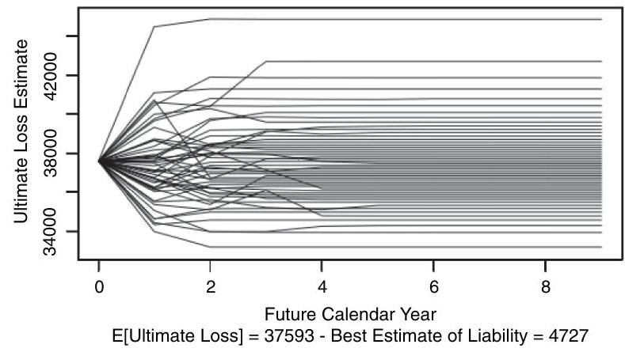
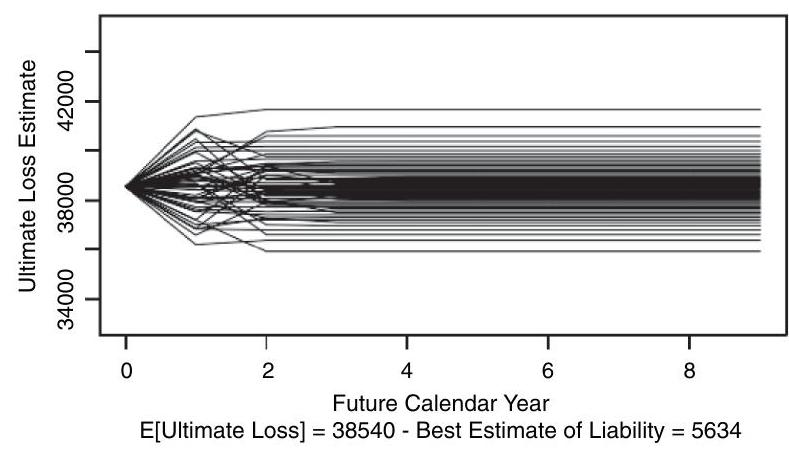

## Page 80
Figure 11.3. CSR Model
Required Capital by Calendar Year

Figure 11.4. IPI Model
Required Capital by Calendar Year

Figure 11.5. CSR Model
Path of Released Capital
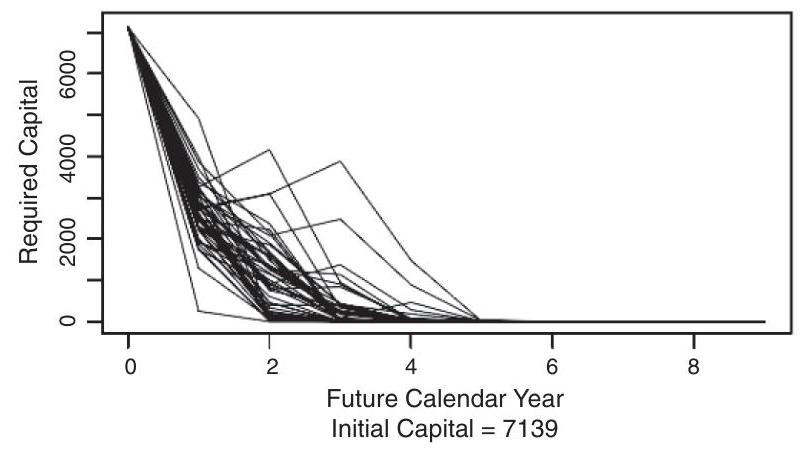
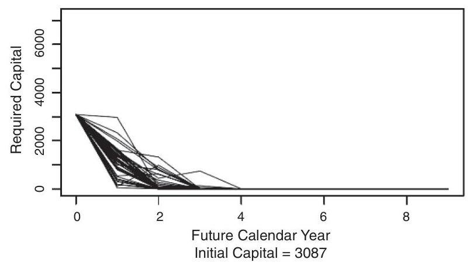
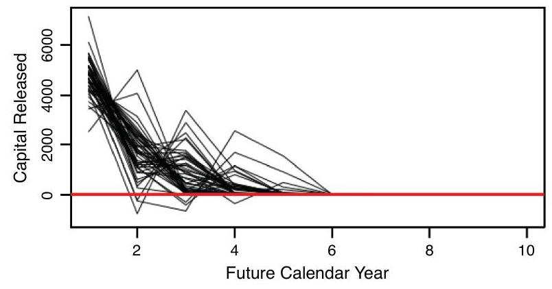

## Page 81
Figure 11.6. IPI Model
Path of Released Capital
these figures show that most of the capital gets released early on, and that occasionally it is necessary to add capital. Figures 11.7 and 11.8 show the recommended posted risk margin calculation for each model.

Of interest is the ratio of the risk margin and the size of the best estimate. To investigate, I calculated the risk margins for all 200 loss triangles in our data. After some exploratory analysis, I concluded that: (1) there are significant differences by line of business; and (2) there is an approximate linear relationship between the log of the risk margin and the $\log$ of the best estimate. Figure 11.9 shows the plots of the $\log \left(R_{C O C}\right)$ against $\log \left(E_{\text {Best }}\right)$, along with the coefficients and their standard errors of an ordinary linear regression of the form

$$
\log \left(R_{C O C}\right)=a+b \cdot \log \left(E_{\text {Best }}\right)
$$

We can rewrite Equation 11.8 in the form

$$
\frac{R_{C O C}}{E_{\text {Best }}}=e^{a} \cdot\left(E_{\text {Best }}\right)^{b-1}
$$

Figure 11.7. CSR Model
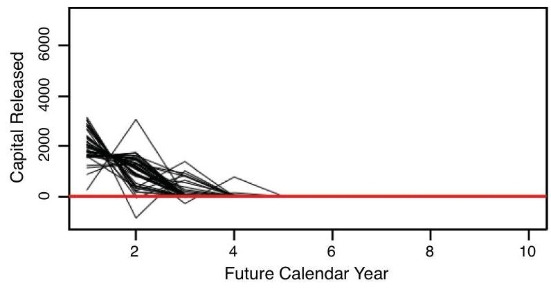
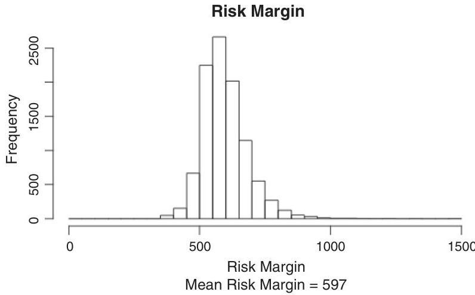

## Page 82
Figure 11.8. IPI Model

Figure 11.9. CSR Model

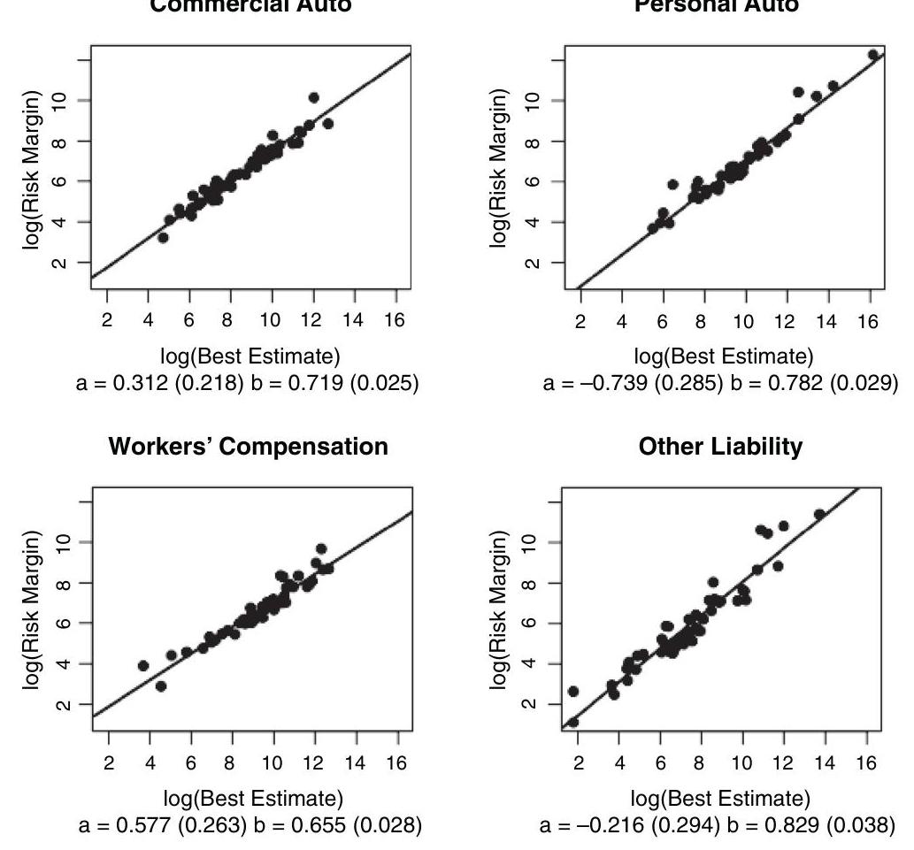

## Page 83
Note from Figure 11.8 that $b<1$ for all four lines of insurance. This implies that the risk margin to best estimate ratio decreases as the best estimate increases. As Figure 11.10 shows, the ratio can be quite high for insurers with small best estimates. Some insurers might object, especially if the line with the high ratio is a small part of the insurer's book of business.

As noted earlier, the EU Solvency II provision states explicitly that "Insurance undertakings shall segment their insurance obligations into homogeneous risk groups, and as a minimum by lines of business, when calculating the technical provisions." This means that the total risk margin for a multiline insurer is the sum of the risk margins over its individual lines of business.

Longtime observers of the insurance business have recognized that multiline insurers benefit from the diversification of their risk of loss. This being the case, they might well want to reflect the benefits of diversification in their risk margins. The problem with a formal recognition of diversification is that the benefits have been difficult to quantify. What many are afraid of is the possibility that significant losses from the different lines of business could happen at the same time. This possibility is often referred to as the "dependency problem."

As such, the Solvency II non-recognition of diversification may appear to some to be prudent. But to others, especially in light of the results in the last section, it may seem like overkill. If there is some dependency, it is likely to be noticeably less severe than what the Solvency II directive specifies. So let's look at a possible compromise approach.

Figure 11.10. CSR Model
Commercial Auto

Workers' Comp

Personal Auto

Other Liability
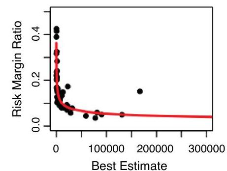
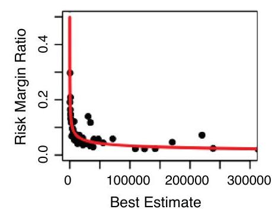
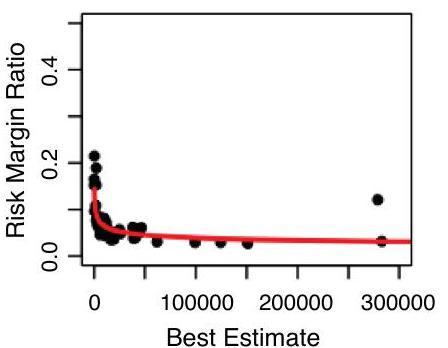
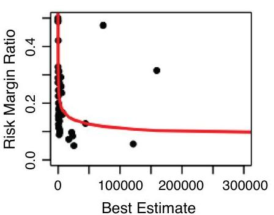

## Page 84
# Algorithm 2. Calculate Samples for Dependent Lines 

```
for \(k=1, \ldots, 10,000\) do
    for \(t=1, \ldots, 9\) do
        Simulate an \(L\)-tuple vector \(\left\langle p_{t}^{k}\right\rangle_{t-1}^{L}\) of uniform \((0,1)\) numbers from the normal copula \(\mathcal{C}\)
        with coefficient of correlation, \(\rho\).
        For each line of business, \(l\), select \(_{l} O_{t}^{k}\) to be the \(\left\langle p_{t}^{k}\right\rangle \cdot 10,000\) highest value of \(\left\langle\mathcal{S}_{t}^{k}\right\rangle\).
    end for
    Set the total ultimate loss sample \(_{T} S_{t}^{k}={ }_{1} O_{t}^{k}+\cdots+{ }_{L} O_{t}^{k}\).
end for
```

Mathematical tools that can be used to describe dependency have been available for quite some time. See, for example, Frees and Valdez (1998) and Wang (1998). The main tool described in these papers is called a copula, which is a multivariate distribution on an $L$-dimensional unit hypercube in which the marginal distributions have a uniform( 0,1 ) distribution. Given a copula $\mathcal{C}$ and samples $\left\{\mathcal{S}_{t}\right\}$, (see Algorithm 1) for each line $l$ of $L$ lines of business, one begins to calculate $R_{C O C}$ by first executing Algorithm 2.

Use the output of this algorithm to calculate $\left\{\mathcal{S}_{t}^{k}\right\}$ for $t=1, \ldots, 9$. Then place $\left\{\mathcal{S}_{t}^{k}\right\}$ into Step 5 of Algorithm 1.

There are seven insurer groups with loss triangles in each line of insurance in our set of loss triangles. Table 11.1 shows the effect of diversification for each of the seven groups. ${ }^{25}$ The combined risk margin for selected correlation coefficients, $\rho$, was calculated using the Algorithm 2 sample, ${ }_{T} S_{t}^{k}$, inserted into Algorithm 1.

One can see from Table 11.1 that the diversification effect can vary significantly by insurer. The effect depends on the line mix of the insurer. This can be best seen in the case of Insurance Group 1767, a very large personal lines insurer. This insurer's book of business is dominated by the Personal Auto. To see the effect of an individual line of insurance, I calculated marginal risk margin by subtracting the combined risk margin for all other lines, from the all-line combined risk margin. I then allocated the all-line risk margin to the individual line in proportion to the marginal risk margin. The results of this calculation are in Table 11.2.

Here we see that the dominant Personal Auto line gets allocated a very small diversification credit, whereas the minor Worker's Compensation line gets allocated a very large diversification credit.

To close out this section, we address the issue of time horizon. Required capital, as dictated by Solvency II, is determined by the value-at-risk at the 99.5 th percentile of the ultimate loss estimate after one year. To change from the TVaR criteria used in this monograph to a value-at-risk criteria is a minor input adjustment to the input of the R-scripts. It is the change to the one-year time horizon that requires some work.

A high-level description of the methodology is to use a Bayesian MCMC model to obtain 10,000 equally likely scenarios that represent the future evolution of the line of business that produced the loss triangle. Then, as new losses come in, it uses Bayes'

[^0]
[^0]:    ${ }^{25}$ The standalone risk margins will differ slightly from those calculated using Algorithm 1. They were calculated using the uniformly distributed $p_{t}^{k}$ s that came from the copula used by the other calculations in Tables 11.1 and 11.2.

## Page 85
Table 11.1. Diversification Effect-CSR Model

| Group | Risk Margin | Amount | Diversification Credit\% |
| :--: | :--: | :--: | :--: |
| 715 | Standalone Total | 5519 | - |
| - | Combined $\rho=0.0$ | 2825 | 48.8 |
| - | Combined $\rho=0.1$ | 3171 | 42.6 |
| - | Combined $\rho=0.2$ | 3491 | 36.9 |
| - | Combined $\rho=0.3$ | 3798 | 31.6 |
| 1538 | Standalone Total | 3964 | - |
| - | Combined $\rho=0.0$ | 2150 | 45.8 |
| - | Combined $\rho=0.1$ | 2372 | 40.3 |
| - | Combined $\rho=0.2$ | 2582 | 35.2 |
| - | Combined $\rho=0.3$ | 2782 | 30.3 |
| 1767 | Standalone Total | 315085 | - |
| - | Combined $\rho=0.0$ | 236532 | 24.9 |
| - | Combined $\rho=0.1$ | 245264 | 22.4 |
| - | Combined $\rho=0.2$ | 253632 | 19.9 |
| - | Combined $\rho=0.3$ | 261936 | 17.4 |
| 3240 | Standalone Total | 6256 | - |
| - | Combined $\rho=0.0$ | 4405 | 29.6 |
| - | Combined $\rho=0.1$ | 4615 | 26.4 |
| - | Combined $\rho=0.2$ | 4821 | 23.4 |
| - | Combined $\rho=0.3$ | 5022 | 20.3 |
| 5185 | Standalone Total | 6363 | - |
| - | Combined $\rho=0.0$ | 3357 | 47.2 |
| - | Combined $\rho=0.1$ | 3736 | 41.4 |
| - | Combined $\rho=0.2$ | 4091 | 36.0 |
| - | Combined $\rho=0.3$ | 4426 | 30.9 |
| 13439 | Standalone Total | 913 | - |
| - | Combined $\rho=0.0$ | 510 | 44.1 |
| - | Combined $\rho=0.1$ | 552 | 39.6 |
| - | Combined $\rho=0.2$ | 595 | 35.2 |
| - | Combined $\rho=0.3$ | 639 | 30.6 |
| 14176 | Standalone Total | 3986 | - |
| - | Combined $\rho=0.0$ | 2196 | 44.9 |
| - | Combined $\rho=0.1$ | 2404 | 39.8 |
| - | Combined $\rho=0.2$ | 2608 | 34.8 |
| - | Combined $\rho=0.3$ | 2809 | 30.1 |

## Page 86
Table 11.2. Diversification Effect By Line for Group 1767CSR Model, $\rho=0$

|  |  | Risk Margin |  |  |  |
| :-- | --: | --: | --: | --: | --: |
| Line | Best Estimate | Marginal | Allocate | Standalone | Div. Credit |
| CA | 336,301 | 660 | 927 | 6,985 | $86.7 \%$ |
| PA | $10,280,570$ | 147,566 | 207,448 | 215,633 | $3.8 \%$ |
| WC | 238,395 | 114 | 161 | 5,676 | $97.2 \%$ |
| OL | 909,123 | 19,915 | 27,996 | 86,791 | $67.7 \%$ |
| Total | $11,764,389$ | 168,255 | 236,532 | 315,085 | $24.9 \%$ |

Theorem to update the probability of each scenario. From these updated probabilities, one then calculates the statistics that are needed to calculate the risk margin.

Under a one-year time horizon capital requirement, the capital is determined by the estimate of the ultimate losses after one more calendar year of loss experience. A key step in this methodology is to determine the ultimate loss estimate associated with each MCMC simulation. For the ultimate time horizon it is simply $U_{j}$, given by Equation 11.4. However, as Figures 11.1 and 11.2 illustrate, with only one year of losses from a given MCMC simulation, there may be several MCMC simulations with a significant positive probability.

To get a good estimate, $O_{s, j}$, of the expected ultimate loss for the $j$ th MCMC simulation, one can simulate future loss experience, given the $j$ th MCMC simulation, and calculate the ultimate loss estimate $M$ times. Then set $O_{s, j}$ equal to the average of those estimates. The details are in Algorithm 3.

Both the accuracy of the estimate of $O_{s, j}$ and the computer run time increase with $M$. I experimented with different values of $M$ and found that $M=12$ obtained results that were sufficiently accurate given the intrinsic variation of the underlying MCMC simulations.

# Algorithm 3. Calculate $O_{s, j}$ Estimates by Calendar Year 

```
for \(m=1, \ldots, M\) do
    for \(j=1, \ldots, 10,000\) do
        for \(t=1, \ldots, 9\) do
            Simulate \(T_{t}\) using the parameters \(\left(\mu_{m, d t}^{\prime} \sigma_{M}^{t}\right)\).
            Use Equation 11.6 to calculate \(\left(\operatorname{Pr}\left[J=j \mid T_{t}\right]\right)_{t-1}^{10,000}\).
            Use Equation 11.7 to calculate the ultimate loss estimate, \(O_{s, k}^{m}\).
        end for
        Set \(O_{10, j}^{m}=O_{9, k}^{m}\)
    end for
end for
for \(j=1, \ldots, 10,000\) do
    for \(t=1, \ldots, 10\) do
        Set \(O_{s, j}=\operatorname{mean}\left(O_{s, k}^{m}\right)\).
    end for
end for
```

## Page 87
# Algorithm 4. Calculate Capital Scenarios for a One-Year Time Horizon 

```
for \(k=1, \ldots, 10,000\) do
    for \(t=0, \ldots, 9\) do
        Simulate cash flows \(\left\langle T_{j}^{k}\right\rangle\) using \(\left\langle\left(\mu_{m, n}^{k}, \sigma_{n}^{k}\right)\right\rangle\)
        Use Equation 11.6 to calculate \(\operatorname{Pr}\left[J=j \mid T_{j}^{k}\right]\) for each \(j=1, \ldots, 10,000\).
        Take a random sample of size 10,000 with replacement, \(\left\langle S_{i}^{k}\right\rangle\), of the \(\left(O_{i+1, j}\right)_{i=1}^{10,000}\) with
        sampling probabilities \(\operatorname{Pr}\left[J=j \mid T_{j}^{k}\right]\).
        Set \(E_{i}^{k}\) equal to the arithmetic average of \(\left\langle S_{i}^{k}\right\rangle\).
        Set \(C_{i}^{k}\) equal to the arithmetic average of the highest \((1-\alpha) \cdot 10,000\) highest values
        of \(\left\langle S_{i}^{k}\right\rangle\), minus \(E_{i}^{k}\).
    end for
end for
```

Use Algorithm 4 to calculate the risk margin for the one-year time horizon. In this algorithm, one simply substitutes $O_{i+1}, j$ for $U_{j}$ in the 5 th step of Algorithm 1. Given the output of Algorithm 4, one then calculates risk margins for each MCMC simulation by using Equation 11.2. The posted risk margin will then be the unweighted average of the risk margins for each simulation. Figures 11.11 to 11.16 are analogous to Figures 11.3 to 11.8 for the ultimate time horizon.

Figure 11.11. CSR Model
Required Capital by Calendar Year

Figure 11.12. IPI Model
Required Capital by Calendar Year
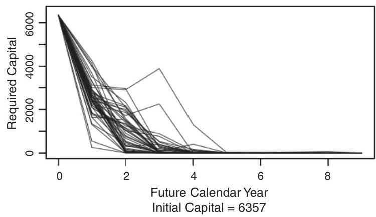
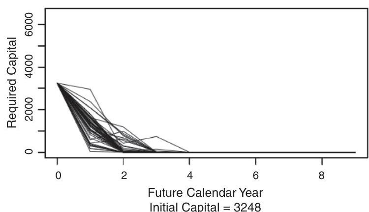

## Page 88
Figure 11.13. CSR Model
Path of Released Capital

Figure 11.14. IPI Model
Path of Released Capital

Figure 11.15. CSR Model
Risk Margin
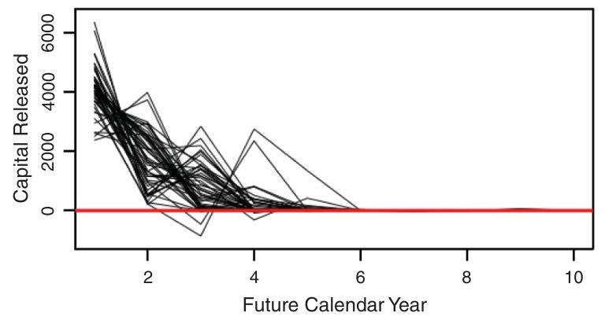
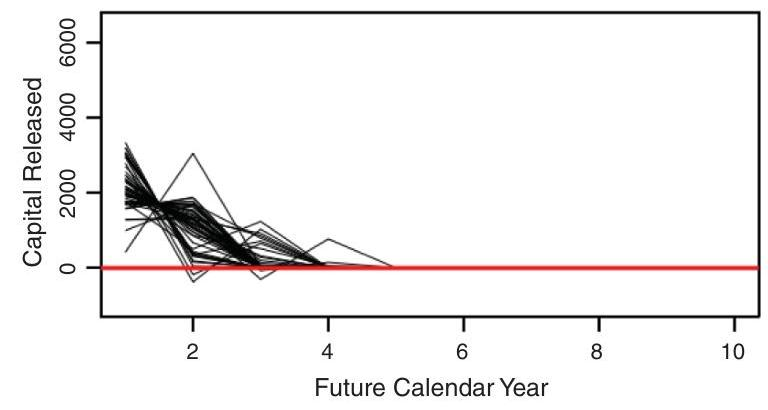
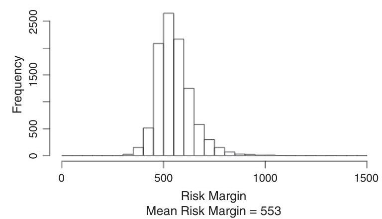

## Page 89
Figure 11.16. IPI Model

Note that initial IPI capital and the IPI risk margin are higher for the one-year time horizon than for the ultimate time horizon for the illustrative insurer, showing that we cannot automatically assume that the one-year time horizon will produce lower risk margins.
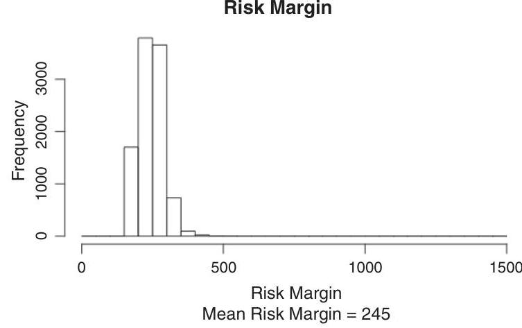

## Page 90
# 12. Summary and Conclusions 

The main ideas behind this monograph are as follows.

- It implements the idea of large-scale retrospective testing of stochastic loss reserve models on real data. The goal is not to comment on the reserves of individual insurers. Instead, the goal is to test the predictive accuracy of specific models.
- As shortcomings in existing models are identified, it proposes new Bayesian MCMC models that attempt to overcome these shortcomings.
- It proposes prospective tests of Bayesian MCMC models that can be used to choose between competing models when estimating current liabilities.
- Finally, it shows how to use the output of a Bayesian MCMC model to calculate a cost of capital risk margin.

The data used in this study comes from the CAS Loss Reserve Database. It consists of hundreds of paid and incurred loss triangles that Peng Shi and I obtained from a proprietary database maintained by the NAIC. We are grateful that the NAIC allowed us to make these data available to the public. The data we used to build the models came from the 1997 NAIC Annual Statements. The outcomes came from subsequent statements. I selected 50 loss triangles from each of four lines of insurance. Details on how I selected the loss triangles for this study are in the Appendix.

There were two ways that we retrospectively tested a model. First, we used a model to predict a distribution of outcomes that we will observe in the future. When we do observe outcomes for a large number of predictions, we expect the percentiles of the outcomes to be uniformly distributed. Testing a set of percentiles for uniformity is a standard statistical procedure. We used $p-p$ plots as a graphical test, and the Kolmogorov-Smirnov test statistic in this monograph.

The second retrospective test for comparing models was to calculate the expected log posterior density, $\widehat{e l p d}_{n s t}$, on the lower triangle data. While this test is not meaningful in isolation, it does provide a way to compare the performance of different models.

There were two prospective tests in this monograph. The first test is graphical. It consists of standardized residual Box plots using parameters from a sample of MCMC simulations from the posterior distribution. These plots were done separately for each accident year and the development year. All Bayesian MCMC models discussed in this monograph performed fairly well for the plots by development year. What distinguished the models were the Box plots by accident year.

## Page 91
The second prospective test consisted of the "leave one out" cross-validation test statistic, $\overline{e l p d}_{\text {los }}$, described by Vehtari et. al. (2017) as the expected log predictive density when each data point is left out. Like the $\overline{e l p d}_{\text {test }}$ statistic, it is used to compare the performance of different models.

Here is a high-level summary of the results obtained with these data using two currently popular models.

- The Mack model on incurred loss triangles, when tested by $p-p$ plots, tended to under-predict the variability of the outcomes.
- Both the Mack and overdispersed Poisson (ODP) models on paid loss triangles, when tested by $p-p$ plots, tended to over-predict the outcomes.
Moving on to some Bayesian MCMC models, here is a summary of results.
- The CRoss-Classified (CRC) by accident and development year model performed very similarly to the Mack and ODP models on incurred and paid loss triangles. It tended to under-predict the variability of the outcomes for incurred losses and tended to over-predict the outcomes for the paid losses.
- The Stochastic Cape Cod (SCC) model, a Bayesian MCMC version of the Bühlmann-Stanard Cape Cod model, performed very poorly on all prospective and retrospective tests. The standardized residual Box plot was the most revealing, indicating problems with the assumption of a constant expected loss ratio.
- The Changing Settlement Rate (CSR) model on paid loss triangles adjusts the development year parameters to account for a changing claim settlement rate. The result was that the CSR model performed better than the CRC model in over half the cases according to the $\overline{e l p d}_{\text {los }}$ and $\overline{e l p d}_{\text {test }}$ statistics. One should expect the CRC model to perform better if the insurer did not actually change its settlement rate. The $p-p$ plots indicated an excellent fit to the lower triangle data.
- The Correlated Accident Year (CAY) model on incurred loss triangles adjusts, on the log scale, the expected loss for the current year as a multiple of the prior year's residual. This adjustment usually generates a positive correlation between the losses of adjacent accident years. ${ }^{26}$ Prospectively, the $\overline{e l p d}_{\text {los }}$ statistic favors the CAY over the CRC model for a relatively small number of loss triangles. As was the case above, the correlation is not necessarily present in all loss triangles. But then, the CAY is favored over the CRC model for over half the the loss triangles using the $\overline{e l p d}_{\text {test }}$ statistic. The $p-p$ plots look noticeably better for the CAY model than they do for the CRC model.
- The Integrated Paid and Incurred (IPI) model assumes that the accident year parameters are the same for both the paid and incurred loss triangles. If true, this allows for more accurate estimates, as there is more data contributing to the estimation of the accident year parameters. For the development year parameters, it uses the CSR model assumptions for the paid data, and the CAY model assumptions for the incurred data. The idea works. The standard errors of the loss estimates almost always reduced by a significant amount. The $\overline{e l p d}_{\text {los }}$ and $\overline{e l p d}_{\text {test }}$

[^0]
[^0]:    ${ }^{26}$ The model does not automatically favor the sign of the correlation parameter.

## Page 92
statistics favor the IPI model over the corresponding CSR and CAY models over half the time. While the $p-p$ plots for each line of insurance are all within the $95 \%$ Kolmogorov-Smirnov critical values, the IPI model works best for the auto liability lines of insurance where the paid and incurred losses are almost equal by the tenth development year. The model works less well for Workers' Compensation where a large portion of the losses remain unpaid after 10 years.

While the focus of the preceding analyses was to evaluate the predictive accuracy of various models, the prospective tests described above can be used to evaluate models proposed for setting an insurer's current loss reserve liability. Here is how I envision a loss reserve analysis might proceed with current data. ${ }^{27}$

1. Start by fitting the Mack model using the R "ChainLadder" package for both the paid and the incurred loss data. Use the "plot" function in that package to visually check that the triangle data is reasonable.
2. Fit each of the following models. ${ }^{28}$ Initially, I suggest using wide prior distributions as described in Section 5 in order to see if any surprises are lurking.

- The CRC and CSR models for paid data.
- The CRC and CAY models for incurred data.

3. Create the standardized residual Box plots for each model.
4. Calculate the $\widehat{e l p d}{ }_{b o}$ statistics for each model.
5. Based on the standardized residual Box plots and the $\widehat{e l p d}{ }_{b o}$ statistics, select both a paid, and an incurred loss model.
6. At this point, one might want to consider changing the prior distributions to match their true prior expectations, or make other model modifications. Some examples of a modification would be to:

- Tighten the prior distributions for the logelr and the $\alpha_{w}$ parameters.
- Force the last few $\beta_{d}$ parameters to increase toward zero.
- Allow the $\rho$ parameter to exponentially move toward zero with increasing $d$ in the CAY model.
- Allow the $\gamma$ parameter to change linearly with increasing $w$ in the CSR model.

7. Redo the standardized residual Box plots and recalculate the $\widehat{e l p d}{ }_{b o}$ statistics.
8. Examine the fit of the modified model in light of the diagnostics in Step 7. If one sees a bias in the standardized residual plots and/or the $\widehat{e l p d}{ }_{b o}$ statistic decreases, when compared to the model in Step 5, one might want to reconsider the changes made in Step 6.
9. With the paid and incurred models deemed satisfactory, and in close agreement as to the ultimate loss, use these models as part of an IPI model to obtain a more accurate estimate of the ultimate liability.
[^0]
[^0]:    ${ }^{27}$ Before trying this, I suggest that you run the companion scripts that accompany this monograph for the various models. They should run as is, with the necessary R packages installed and with the CAS Loss Reserve Database downloaded.
    ${ }^{28}$ These models are my current favorites. Note that favorites can change over time. If one has other models in mind, they could, of course, substitute their own favorites.

## Page 93
As part of an ongoing loss reserving practice, one should retain the MCMC model fits and retrospectively test new data from future years with the standardized residual Box plots and the $\overline{e l p} d_{\text {test }}$ statistics as the data comes in.

Having completed an evaluation of some Bayesian MCMC stochastic loss reserve models, the focus of the monograph turns to calculating risk margins that were motivated by the principles underlying Solvency II and IFRS 17. The general idea behind the risk margin is that an insurer posts an amount of capital that is sufficient to support the business. As time goes on, claims are settled and the insurer's investors receive a cash flow consisting of capital reductions due to the decreased risk. The cost of capital risk margin is defined as the initial capital, minus the present value of that cash flow.

As we are talking about present values, the models we use for risk margins are the CSR model and the parameters of the IPI model that apply to paid losses.

When considering risk margins, the issue of diversification arises. So before addressing risk margins, the monograph addresses dependency between lines of insurance.

Given the predictive distributions of the parameters of each of two lines of insurance, the monograph shows how use Bayesian MCMC to obtain the predictive distribution of correlation coefficients between the losses, on the log scale, of the two lines of insurance. The results are surprising. Prospectively, the $\overline{e l p} d_{\text {los }}$ statistics overwhelmingly favor a model that assumes independence. But retrospectively, the $\overline{e l p} d_{\text {test }}$ statistic favors a model that allows for dependency in a solid majority of the cases. This suggests that some unknown variables may be driving the dependency in the later holdout time period.

This being the case, it seems prudent to allow for some degree of correlation between lines of insurance when calculating the diversification credits for risk margins.

The risk margin calculation for individual lines of insurance was done for all 200 loss triangles in our data. It was done for both the CSR and IPI models under a range of dependency assumptions. The IPI risk margins were noticeably less than the CSR risk margins.

There were seven insurers that have loss triangles in all four lines. Diversification credits were calculated for these insurers under a set of reasonable, in light of the results obtained for dependencies, correlation coefficients.

In preparing this monograph I have made every effort to adhere to the "open source" philosophy. The data is publicly available. The software is publicly available for free. The R and Stan scripts used in creating these models are to be made publicly available. I have purposely restricted my methods to widely used software (R, Stan and RStudio) in order to make it easy for others to duplicate and improve on these results.

The models proposed in this monograph are offered as demonstrated improvements over current models. I expect to see further improvements over time. The Bayesian MCMC methodology offers a flexible framework with which one can make these improvements.

Finally, it was the presence of the CAS Loss Reserve Database that made this monograph possible. As conditions change over time, I strongly recommend that the Casualty Actuarial Society sponsors a study such as this from time to time.

## Page 94
# References 

Avanzi, B., G. Taylor, and B. Wong. 2016. "Correlations Between Insurance Lines of Business: An Illusion or a Real Phenomenon? Some Methodological Considerations." ASTIN Bulletin 46:225-263. doi: 10.1017/asb.2015.31. https://www.cambridge.org/ core/journals/astin-bulletin-journal-of-the-iaa/article/correlations-between-insurance-lines-of-business-an-illusion-or-a-real-phenomenon-some-methodologicalconsiderations/5BBB6C52A882572B4F4D587984ED10A7
Bardis, Emmanuel Theodore, Ali Majidi, and Daniel M. Murphy. 2012. "A Family of Chain-Ladder Factor Models for Selected Link Ratios." Variance 6:143-160.
Bornhuetter, Ronald L., and Ronald E. Ferguson. 1972. "The Actuary and IBNR." Proceedings of the Casualty Actuarial Society 59:181-195.
De Alba, Enrique. 2002. "Bayesian Estimation of Outstanding Claims Reserves." North American Actuarial Journal 6(4):1-20.
Clark, David. 2013. "Where Are We In the Market Cycle?" Presentation to CAMAR, October 9. https://www.casact.org/sites/default/files/2021-04/clark-10-9-2013.pdf.
England, P. D., and R. J. Verrall. 2002. "Stochastic Claims Reserving in General Insurance." Meeting paper. Presented to the Institute of Actuaries and Faculty of Actuaries, 28 January.
Frees, Edward W., and Emiliano Andres Valdez. 1998. "Understanding Relationships Using Copulas." North American Actuarial Journal 2(1):1-25. https://www.soa.org/ Library/Journals/NAAJ/1998/january/naaj9801_1.aspx
Gelfand, A. E., and A. F. M. Smith. 1990. "Sampling-Based Approaches to Calculating Marginal Densities." Journal of the American Statistical Association 85(410): $398-409$.
Gelman, Andrew, John B. Carlin, Hal S. Stern, David B. Dunson, Aki Vehtari, and Donald B. Rubin. 2014. Bayesian Data Analysis, 3rd ed. Boca Raton: CRC Press.
Hastings, W. K. 1970. "Monte Carlo Sampling Methods Using Markov Chains and Their Applications." Biometrika 57(1):97-109.
International Actuarial Association. 2018. Risk Adjustments for Insurance Contracts under IFRS 17. 2018.
Klugman, Stuart A., Harry H. Panjer, and Gordon E. Willmot. 2012. Loss Models, From Data to Decisions, 4th edition. Hoboken, NJ: Wiley.
Leong, Jessica (Wehn Kah). 2013. "Property versus Casualty Risks." Presentation to CAMAR, October 9. https://www.casact.org/sites/default/files/2021-04/ leong-hayes.pdf.

## Page 95
Mack, Thomas. 1993. "Distribution-Free Calculation of the Standard Error of Chain Ladder Reserve Estimates." ASTIN Bulletin 23(2):213-225.
Mack, Thomas. 1994. "Measuring the Variability of Chain Ladder Reserve Estimates." Casualty Actuarial Society Forum (Spring):101-182.
Major, John A. 2017. "Bayesian Dragons: A Cautionary Note." The Actuarial Review, March/April: 37. https://ar.casact.org/wp-content/uploads/2018/02/AR_MarchApril_2017.pdf McGrayne, Sharon Bertsch. 2011. The Theory That Would Not Die. New Haven, CT: Yale University Press.
Metropolis, N., and S. Ulam. 1949. "The Monte Carlo Method." Journal of the American Statistical Association 44(247):335-341.
Meyers, Glenn G., and Peng Shi. 2011. "The Retrospective Testing of Stochastic Loss Reserve Models." Casualty Actuarial Society E-Forum (Summer): 1-37.
Meyers, Glenn G. 2017. "Dependencies in Stochastic Loss Reserve Models," Variance 11: $74-94$.
Meyers, Glenn G. 2018. https://www.variancejournal.org/articlespress/articles/ Liabilities-Meyers.pdf "A Cost of Capital Risk Margin Formula for Nonlife Insurance Liabilities." Variance 12: 186-198.
Ntzoufras and Dellaportas 2002 "Bayesian Modelling of Outstanding Liabilities Incorporating Claim Count Uncertainty" North American Actuarial Journal $6(1): 113-128$.
Patrik, Gary S. 2001. Foundations of Casualty Actuarial Sciences, 4th ed.. Arlington, VA: Casualty Actuarial Society, 343-484.
Scollnik, D. P. M. 2001. "Actuarial Modeling with MCMC and BUGS." North American Actuarial Journal 5(2): 96-124.
Stanard, James N. 1985. "A Simulation Test of Prediction Errors of Loss Reserve Estimation Techniques." Proceedings of the Casualty Actuarial Society 72, 124.
Taleb, N. N. 2007. The Black Swan: The Impact of the Highly Improbable. New York: Random House.
Taylor, G. C. 1986. Claims Reserving In Non-Life Insurance. New York: Elsevier.
Vehtari, Aki, Andrew Gelman, and Jonah Gabry. 2017. "Practical Bayesian Model Evaluation Using Leave-one-out cross-validation and WAIC." Statistics and Computing 27(5): 1413-1432. (Check for updates) https://arxiv.org/abs/1507.04544.
Verrall, Richard. 2007. "Obtaining Predictive Distributions for Reserves Which Incorporate Expert Opinion." Variance 1: 53-80.
Wang, Shaun S. 1998. "Aggregation of Correlated Risk Portfolios:Models and Algorithms." Proceedings of the Casualty Actuarial Society Casualty Actuarial Society 85: 848-939.

## Page 96
# Appendix-The Data Selection Process 

When selecting the loss triangles to use in this monograph, my overriding consideration was that the process should be mechanical and well defined. There are two potential mistakes one can make in selecting the insurers to analyze.

- If one were to take all the insurers in the database, or randomly select the insurers, there could be some insurers who made significant changes in their business operations that could violate the assumptions underlying the models.
- If one is too selective, one runs the risk of selecting only those data that best fits a chosen model. For example, let's suppose that I wanted the CAY model to fit the incurred data even better than it does. As an extreme case, noting that the CAY model still appears to be a bit light in the tails, I could have replaced some of the insurers that have outcomes in the tail, with other insurers that have outcomes in the middle.

While I did not have inside information on any changes in the business operations, Schedule P provides some hints in their reporting of both net and direct earned premium by accident year. Both of these data elements are in the CAS Loss Reserve Database.

- If an insurer makes significant changes in its volume of business over the ten-year period covered by Schedule P, a change in business operation could be inferred.
- If an insurer makes significant changes in its net to direct premium ratio over the ten-year period, a change in its reinsurance strategy could be inferred.

To carry out an analysis of this sort, I needed a large number of insurers. After looking at the quality and consistency of the data available in the CAS Loss Reserve Database, I decided to use 50 insurers in each of four major lines of insurance Commercial Auto, Personal Auto, Worker's Compensation, and Other Liability. Early on I concluded that there was an insufficient number of insurers in the Products Liability and the Medical Malpractices lines to obtain an adequately sized selection.

To implement these considerations, after preliminary exploration I decided to use the loss triangles with lines of business that were "sufficiently large." This included all loss triangles with minimum annual premium of greater than $\$ 20,000$ and minimum annual incurred loss of greater than $\$ 4,000 .{ }^{29}$ I then calculated the

[^0]
[^0]:    ${ }^{29}$ The Schedule P entries are in $\$ 1,000$ s.

## Page 97
Table A.1. CV Limits for Insurer Triangles

|  | Commercial Auto | Personal Auto | Workers' Comp | Other Liability |
| :-- | :--: | :--: | :--: | :--: |
| CV1(Premium) | $<0.795$ | $<1.003$ | $<0.772$ | $<0.628$ |
| CV2(Net/Direct) | $<0.125$ | $<0.125$ | $<0.300$ | $<0.15$ |

coefficients of variation (CV1) for the net earned premiums and CV2 for the net to direct premium ratios over the ten available years. By trial and error, I then set up limits for CV2, and took the top 50 loss triangles sorted in increasing order of CV1. This procedure should have eliminated some of the insurers that changed their business operations.

After some provisional testing, I eliminated insurer group 38997. The final CV limits are given in Table A.1. The final list of the selected insurer groups are in Table A.2.

Table A.2. Group Codes for Selected Loss Triangles

| Commercial <br> Auto | Personal Auto | Workers' Comp |  |  |  | Other Liability |
| :-- | --: | :--: | --: | :--: | :--: | :--: |
| 8672 | 43 | 13587 | 86 | 11347 | 620 | 13501 |
| 9466 | 353 | 13595 | 337 | 11703 | 671 | 13668 |
| 10022 | 388 | 13641 | 353 | 13439 | 683 | 13919 |
| 10308 | 620 | 13889 | 388 | 13501 | 715 | 13994 |
| 11037 | 692 | 14044 | 671 | 13528 | 833 | 14044 |
| 11118 | 715 | 14176 | 715 | 14176 | 1252 | 14176 |
| 13420 | 1066 | 14257 | 965 | 14320 | 1279 | 14257 |
| 13439 | 1090 | 14311 | 1066 | 14508 | 1538 | 14370 |
| 13528 | 1538 | 14443 | 1252 | 14974 | 1767 | 14451 |
| 13641 | 1767 | 15024 | 1538 | 15148 | 2003 | 14885 |
| 13889 | 2003 | 15199 | 1767 | 15199 | 2135 | 15113 |
| 14044 | 2143 | 15393 | 2135 | 15334 | 2143 | 15148 |
| 14176 | 3240 | 15660 | 2712 | 18309 | 2208 | 15210 |
| 14257 | 4839 | 15997 | 3034 | 18767 | 3000 | 15571 |
| 14311 | 5185 | 16373 | 3240 | 18791 | 3240 | 16373 |
| 14320 | 6807 | 16799 | 5185 | 21172 | 5185 | 16799 |
| 14508 | 6947 | 18163 | 6408 | 23108 | 5320 | 18163 |
| 14974 | 7080 | 18791 | 6807 | 23140 | 6459 | 18686 |

## Page 98
Table A.2. Group Codes for Selected Loss Triangles (Continued)

| Commercial <br> Auto | Personal Auto | Workers' Comp | Other Liability |  |  |  |
| :-- | --: | :-- | :-- | :-- | :-- | :-- |
| 15024 | 8427 | 23574 | 7080 | 26433 | 6947 | 26797 |
| 15199 | 8559 | 23876 | 8559 | 27529 | 7625 | 27065 |
| 18163 | 10022 | 25275 | 8672 | 30589 | 10657 | 28550 |
| 18767 | 13420 | 26808 | 9466 | 34576 | 11126 | 30139 |
| 18791 | 13439 | 27022 | 10385 | 37370 | 11150 | 30651 |
| 19020 | 13501 | 27065 | 10699 | 38687 | 11231 | 32875 |
| 19780 | 13528 | 27499 | 11126 | 38733 | 13439 | 34606 |

## Page 99
.