_Note: Source document was split into 5 OCR chunks (pages 1-23, pages 24-45, pages 46-60, pages 61-78, pages 79-86) to stay within token limits._

# CAS_Monograph_09-hall-jones-madigan-zheng_0

## Page 1
# CAS MONOGRAPH SERIES NUMBER 9 

## DATA QUALITY MANAGEMENT IN THE P\&C INSURANCE SECTOR

Graham Hall, BSc, FIA Mark Jones, BSc, MA, ACAS, MAAA Kevin Madigan, PhD, ACAS, CERA, MAAA Steve Zheng, ASA

## Page 2
.

## Page 3
# DATA QUALITY MANAGEMENT IN THE P\&C INSURANCE SECTOR 

Graham Hall, BSc, FIA Mark Jones, BSc, MA, ACAS, MAAA Kevin Madigan, PhD, ACAS, CERA, MAAA Steve Zheng, ASA

Casualty Actuarial Society
4350 North Fairfax Drive, Suite 250
Arlington, VA 22203
www.casact.org
(703) 276-3100

## Page 4
Data Quality Management in the P\&C Insurance Sector
By Graham Hall, Mark Jones, Kevin Madigan, and Steve Zheng
Copyright 2020 by the Casualty Actuarial Society
All rights reserved. No part of this publication may be reproduced, stored in a retrieval system, or transmitted, in any form or by any means, electronic, mechanical, photocopying, recording, or otherwise, without the prior written permission of the publisher. For information on obtaining permission for use of material in this work, please submit a written request to the Casualty Actuarial Society.

Library-of-Congress Cataloguing-in-Publication Data
Names: Hall, Graham, author. Jones, Mark, author. Madigan, Kevin, author. Zheng, Steve, author. Title: Data Quality Management in the P\&C Insurance Sector
ISBN 978-1-7333294-7-7 (print edition)
ISBN 978-1-7333294-8-4 (electronic edition)

1. Actuarial science. 2. Data quality management
I. Hall, Graham. II. Jones, Mark. III. Madigan, Kevin. IV. Zheng, Steve

## Page 5
# Contents 

Abstract ..... iv
About the Authors ..... v
Acknowledgments ..... vii
2020 CAS Monograph Editorial Board ..... viii

1. Introduction to Data Quality Management ..... 1
2. Implications of Data Quality on the Different Functions and Products of an Insurer ..... 8
3. Current State of Data Quality within P\&C Insurers ..... 20
4. Regulatory and Similar Requirements Surrounding Data Quality ..... 34
5. Data Architecture ..... 41
6. Anomalies and Data Quality Metrics ..... 53
7. Data Quality in Practice. ..... 58
8. References ..... 73
9. Appendices. ..... 74

## Page 6
# Abstract 

Reliable data has always been integral to $\mathrm{P} \& \mathrm{C}$ insurer operations, but the importance of data quality has increased significantly as new data sources and analytical methods, such as machine learning and artificial intelligence, have become available. The phrase "garbage in, garbage out" has never been more relevant, and actuaries increasingly must understand and quantify the impact that the quality of the data has on their work.

This monograph begins in Section 1 with an introduction to the concept of data quality management, including a discussion of what is meant by data quality. Section 2 then discusses the impact of data quality on different actuarial processes and product lines, followed by a presentation of the current state of data quality within the $\mathrm{P} \& \mathrm{C}$ insurance market as informed by a survey of CAS members in Section 3. Section 4 then analyzes the treatment of data quality by the most significant global insurance regulatory regimes.

In Section 5, the authors describe key considerations when designing a data quality management framework, including data architecture and technology/systems design; common data models, including the relational and NoSQL data models; and data governance. Building from the relational data model, the authors define a series of data anomaly types and use these to formally define data quality measures in Section 6. Finally, in Section 7, data quality improvement/imputation techniques are discussed and demonstrated on a sample insurance dataset.

The sections are ordered with the reader's intentions in mind. A focus on Sections 1 through 4 is recommended for the reader who is interested in an overview of data quality management and its importance. The reader who desires a more technical and practical overview of building a database and working with anomalous data should begin with Section 1 and then place more emphasis on Sections 5 through 7.

## Page 7
# About the Authors 

Graham Hall, BSc, FIA is a senior manager in PwC's ${ }^{1}$ Actuarial Services practice with eight years of consulting experience as an actuary and data scientist. Graham is a Fellow of the Institute and Faculty of Actuaries in the UK, and has a BSc (Hons) in Mathematics and European Studies from the University of Durham. He has previously worked in a wide variety of areas within the $\mathrm{P} \& \mathrm{C}$ insurance space, including model validation, reserving, capital modeling and catastrophe modeling. Graham also has experience working on insurance modernization projects involving the design and implementation of data science and advanced analytics solutions.

Mark Jones, BSc, MA, ACAS, MAAA is a director and leads the Advanced Analytics team within PwC's Actuarial Services practice. Mark has 25 years of experience as a credentialed actuary and data scientist working within the $\mathrm{P} \& \mathrm{C}$ industry for carriers, insurers, brokers and consultancies. He has worked extensively throughout his career with data management, quality, and infrastructure for all lines of business to improve carriers' business processes in the areas of actuarial, claims, marketing, underwriting, and finance. In these roles, Mark has managed statistical reporting units, served on data quality committees, designed data models, integrated data platforms, and implemented new data management systems. His practical experience as an actuary, data manager, and consumer of data products for modern analytics provides a holistic and current perspective on the state of best practices in the industry.

Kevin Madigan, PhD, ACAS, CERA, MAAA is a director in PwC's Actuarial Services practice who began his actuarial career in 1995. He has broad industry, consulting, research, and teaching experience. Throughout much of his insurance career he has worked in areas with prevalent data quality challenges, including large mature insurance carriers with legacy data issues, property catastrophe reinsurance exposure measurement and management, and the disposition of primary and excess direct and assumed asbestos and other mass tort claims. Kevin is a frequent writer and speaker on underwriting, actuarial, and risk management topics and has also served as a lecturer at Columbia University's School of Professional Studies where he as taught

[^0]
[^0]:    ${ }^{1}$ PwC is the brand under which the member firms of PricewaterhouseCoopers International Limited operate and provide professional services. As used herein, PwC refers to the US member firm. Each member firm is a separate legal entity. Please see www.pwc.com/structure for further details.

## Page 8
classes on underwriting, strategic communication, and insurance risk management. His background, education, and experience provide a thorough understanding of the practical challenges faced by all aspects of $\mathrm{P} \& \mathrm{C}$ insurance operations in the absence of sound data quality management.

Steve Zheng, ASA is a senior associate in PwC's Advanced Analytics team within the Actuarial Services practice. He graduated magna cum laude with a BSc in Business, with concentrations in Finance and Actuarial Science and a minor in Computer Science from the NYU Stern School of Business. Steve spent the first two years of his career working primarily in health and life insurance before moving to $\mathrm{P} \& \mathrm{C}$ in Spring 2018. His experience includes validation of rating models as well as building a claims litigation model to score claim settlement performance. Steve has a strong foundation in programming and is experienced in data cleansing, manipulation, and analysis using machine learning tools. Steve's background in life, health, and P\&C insurance has afforded him a unique perspective on data quality issues in the insurance industry.

## Page 9
# Acknowledgments 

The authors would like to extend their appreciation to the following people for their contributions:

Sangeeth Kalaichanthiran, for his contributions to the research and writing of sections 2 and 4 .

Christine Kogut, Tim Landick, and Steve Walsh, for reviewing the drafts of the monograph and providing thoughtful commentary.

David Honour, Doug Bond, Josh Schwartz, and Ritesh Ramesh, for their valuable insights around data architecture that helped improve the content in this monograph.

The respondents to the CAS Data Quality survey, without whose descriptive answers this monograph would not be complete.

## Page 10
# 2020 CAS Monograph Editorial Board 

Ali Ishaq, Editor in Chief Emmanuel Theodore Bardis Eric Cheung Craig C. Davis Scott Gibson Jeffrey Prince Brandon Smith Donna Royston, staff liaison Elizabeth Smith, staff liaison

## Page 11
# 1. Introduction to Data Quality Management 

"Better than any other professionals in the insurance industry, actuaries can become data quality protectors: They have knowledge of the data content, expertise to develop sophisticated data testing tools, and high stakes in the quality of the data."
-Actuarial I.Q. (Information Quality)
CAS Data Management Educational Materials
Working Party, CAS E-Forum Winter 2008

Actuaries have always relied on data to do their work, and the quality of data is a perennial concern. Numerous authors and working groups have observed that data is a corporate asset that must be managed, with steps taken to ensure that data is appropriate for its intended uses. As more and more data become available, the demand for analytical work products incorporating this data continues to increase. Actuaries will increasingly rely on work products of non-actuarial data experts and data gathered and accumulated by processes outside of their control. As such, actuaries should understand the basic concepts of data quality and data quality management (DQM) to determine the data on which to rely for particular activities and to inform decisions regarding data collection and data management. It is important to note that, in general, actuaries are not data experts or data managers; they are data consumers and information providers. The purpose of this monograph is to help the readerpresumably an actuary or actuarial student-to become an educated data consumer, not a DQM expert.

This monograph is focused specifically on issues of managing data quality in the $\mathrm{P} \& \mathrm{C}$ sector; other important aspects of data and data management will be touched upon only as needed to drive the discussion of DQM. We will begin this section by discussing the concept of data quality and provide a high-level overview of DQM. Subsequent sections will discuss additional details regarding DQM and supporting data concepts, while also delving into $\mathrm{P} \& \mathrm{C}$ specific issues.

An important consideration regarding data quality which merits some attention, albeit outside the scope of this monograph, is organizational priorities. Sometimes the biggest obstacle to appropriately managing data quality, from an actuarial perspective, is a lack of agreement amongst key stakeholders within an organization as to the importance of DQM to the organization. Many P\&C insurers find themselves

## Page 12
simultaneously addressing several high-priority immediate concerns. If key decision makers do not see DQM as an issue needing immediate attention, then it is very unlikely that resources will be allocated to it. Building relationships across the organization and clearly demonstrating how DQM can make meaningful contributions towards achieving the organization's short-term business plan is almost always an essential component to improving and maintaining data quality.

# What Is Data Quality? 

While definitions of, and approaches to, "data quality" vary, several common concepts appear throughout. One fundamental principle is that the quality of data depends upon its use. That is, the quality of the data may be acceptable for some purposes but not for others. The purpose of measuring and managing data quality is to help an organization, such as a $\mathrm{P} \& \mathrm{C}$ insurer, meet its business objectives, not simply to have high quality data in and of itself. To this end, one of the first questions to consider is "how will we use this data to meet the company's business objectives?"

Consider two common definitions of the term data.

- Merriam-Webster defines data as:

1) factual information (such as measurements or statistics) used as a basis for reasoning, discussion, or calculation;
2) information in digital form that can be transmitted or processed;
3) information output by a sensing device or organ that includes both useful and irrelevant or redundant information and must be processed to be meaningful.

- The Cambridge Dictionary contains similar definitions, such as: information, especially facts or numbers, collected to be examined and considered and used to help decision-making, or information in an electronic form that can be stored and used by a computer.

Data scientists commonly distinguish between "data" and "information." For example, a data scientist may contrast the two as follows: ${ }^{2}$

Information: Any type of knowledge that can be exchanged. In an exchange, it is represented by data.
Data: A reinterpretable representation of information in a formalized manner suitable for communication, interpretation, or processing.

Note that in these definitions, data is the representation of information, not the information itself, which leads one to consider that quality data is data that reliably represents the information to be used in decision-making, or that a $\mathrm{P} \& \mathrm{C}$ insurer wishes to exploit to achieve its business objectives.

Consider also the following definition of data quality: the degree to which data meets stated requirements, allowing users to trust that it is a reliable representation of the information needed for its intended purpose.

[^0]
[^0]:    ${ }^{2}$ See Reference [2].

## Page 13
This may seem self-referential, but it is not. Data quality is not intrinsic to the data itself-it is a relative concept, not an absolute one. Measuring data quality requires consideration of its intended use. Experienced $\mathrm{P} \& \mathrm{C}$ actuaries are already familiar with this concept-for example, data that is considered to be of high quality for financial reporting purposes may be inappropriate in a pricing context; data that is appropriate for an annual overall rate adequacy analysis may be inappropriate for deriving indicated rates. Predictive modeling actuaries are acutely aware that the data for their models may have been coded and processed in a way suitable for some other intended purpose that makes them unsuitable in a predictive modeling context. Trade-offs are often made regarding the stated requirements; for example, ensuring completeness and accuracy to a high level of certainty may take too long and render the data "too stale" for the decisions being made (such as in an underwriting or pricing context). The materiality of the impact that the data has on decisions should affect the targeted level of data accuracy and completeness. For example, accurate geocoding of property locations in regions with high risk of natural catastrophes is very important for homeowners' insurance pricing, underwriting, and risk management decisions, but adds minimal value to the analysis of professional liability reserves.

Actuaries have recognized these issues for decades. For example, the Actuarial Standards Board adopted Actuarial Standard of Practice No. 23, Data Quality, in 1993, and the CAS Committee on Management Data and Information published the "White Paper on Data Quality" in the CAS Forum (Winter 1997). More recently, Actuarial IQ, published by the CAS Data Management Educational Materials Working Party in 2008, provided actuaries with an introduction to data quality and DQM, and various CAS committees and working parties have focused on data management and data quality issues since at least the mid-1990s. We encourage the interested reader to seek out these and other resources to broaden and deepen their knowledge in these areas.

# High-Level Overview of Data Quality Management 

As previously mentioned, one business function may gather, capture, and use data of a quality sufficient for its intended purpose, which may not necessarily be suitable for a different, unintended use by another function. The data taxonomy and architecture may create challenges for other functions, such as claims, underwriting, pricing, reserving, and finance, that attempt to access and use the same dataset to manage their processes and support strategic decisions. In order to prevent or overcome this challenge, insurers should ensure the consistency of data taxonomy, e.g., using the same definition for data fields in all or most contexts, and store data at a level granular enough that the various functions can process data at the level of aggregation necessary for their needs. This approach requires a data architecture that supports such requirements, as well as clear management and governance of data transfer, data operations, and data security to enable the information technology (IT) infrastructure to support the insurer's desired DQM.

## Page 14
Figure 1. Components of a DQM Process

The International Organization for Standardization (ISO) has promulgated standards ${ }^{3}$ for data quality and DQM that refer to data taxonomy and architecture challenges as data-related support. That is, the IT infrastructure needed for DQM plays a supporting role-as we shall discuss below, DQM is not an IT function but a business process and strategy function, with IT a key supporting player. Many DQM efforts struggle when this distinction is not recognized, relying on IT to manage data quality without appropriate input and oversight from the business. Similarly, some organizations struggle with a lack of appropriate organizational resources (people, process, technology, governance structures, and operating models) required for successful data-related support and DQM.

A DQM process includes three basic components: quality control, quality assurance, and quality improvement, which are informed by a fourth prerequisite component, a DQM plan and strategy, as diagrammed in Figure 1 (these four components are discussed in more detail below).

Such a process is iterative and is supported by and integrated with data-related IT capabilities and organizational resources and training. Management of data quality is, fundamentally, a strategic challenge. Without input from stakeholders regarding requirements or a plan that ties data quality to the insurer's overall strategy,

[^0]
[^0]:    ${ }^{3}$ ISO 8000 is the international standard for data quality. ISO 8000-61, ISO 8000-62, ISO 8000-63, and ISO 8000-64 are international standards for DQM. Much of the discussion in this chapter on DQM frameworks is based on ISO 8000-61.
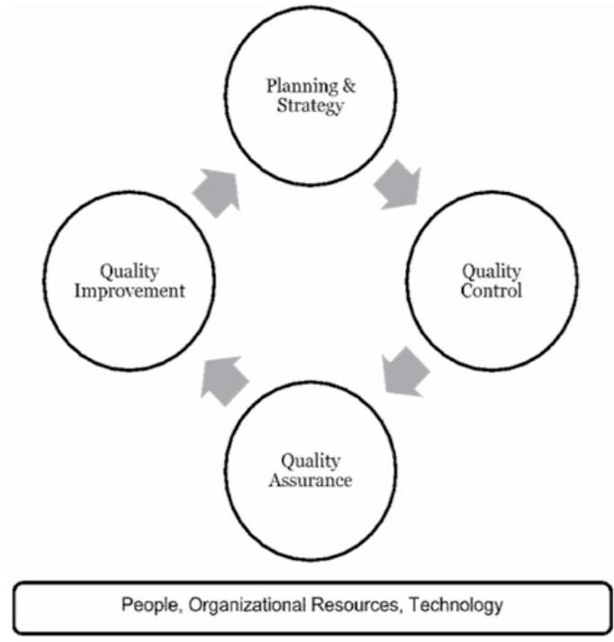

## Page 15
how can one measure and manage data quality? An insurer should capture and manage data to facilitate reporting to the various departments within the insurer on a basis consistent with the management of these departments.

When devising a DQM approach, consider the following questions:

- At what level, e.g., legal entity level, is consolidated data needed?
- Does the insurer need to aggregate data by product line, customer segment, line of business, geography/domicile, business unit, claim type, etc.?
- How will the insurer use data across the various functions? What processes and technologies can the insurer efficiently apply to enable data collection, data management, and data-driven decision making without creating obstacles related to its daily activities?
- What external data should the insurer gather, and how?
- Which data elements should the insurer capture and maintain over time (transactional, daily, monthly, etc.)?
- How should an insurer manage the massive volume of raw data enabled by new technologies (e.g., automobile telematics devices)?
- Once data is gathered, what is the best method of storage?
- What are the costs of various data strategies and are the costs justified relative to their perceived benefit and impact on the insurer's objectives?

As suggested above, a prerequisite for sound DQM is the development of a robust DQM plan and strategy that ties data quality to the insurer's overall strategy and informs the development of policies, standards, and procedures for DQM. (The potential misalignment within an organization regarding the prioritization of DQM alluded to above can be at least partially addressed via this facet of DQM.)

The traditional enterprise data warehouse (EDW) approach begins with data requirements developed after consulting with, and balancing the needs of, the various functional stakeholders. The insurer solicits expectations and the desired uses of data from the end users-including underwriting, claims, pricing, reserving, planning, financial reporting, finance, and risk management-and aggregates this feedback into an initial compendium of data requirements across all departments. In addition to gathering needed information, this facilitates the insurer's deeper understanding of the commonalities and dependencies of various functions' data requirements, which allows for a tractable analysis of the resources (people, technology, and other costs) needed to meet these data requirements. This approach also allows for transparent prioritization of these various data requirements, with the needs of all stakeholders considered, increasing the likelihood that senior and middle management support the implementation of the DQM plan and strategy. This planning process should be collaborative across functions to balance the needs of each function while promoting the insurer's ability to execute its broader strategic plan efficiently and achieve its goals. Subsequent iterations of the planning phase should consider the degree to which the DQM process satisfies these requirements, and changes should be made as necessary after consulting with representative data consumers.

## Page 16
There are, however, drawbacks to this approach. The insurer incurs costs up-front with a labor-intensive process that first determines stakeholder needs and data requirements, then gathers and stores the data, and finally makes the data available to data consumers. This time-consuming process can lead to significant delays in data accessibility and may introduce the need to revise the data architecture-due to unforeseeable changes in the context in which the data is being used that occurred between the planning stage and the time at which data is accessible - which can result in observable resistance from senior management and other stakeholders. Another approach to DQM planning and strategy can be implemented through the use of a data lake instead of an EDW. A data lake stores data in its raw format and can accommodate many different types of data. Users define their requirements, and the data is then extracted and transformed to meet the user's requirements. This eliminates the need for consensus across departments, creating potential cost efficiencies and transparent expense allocations while enabling quicker access to data. In essence, the data lake approach pushes the crucially important "determine requirements" component of DQM closer to the data consumer, increasing the likelihood that the data made available for an end user's analyses and reports are appropriate for that use. The data lake framework puts the onus of data extraction and transformation on the data consumer, necessitating a minimal level of data knowledge; by contrast, an EDW requires a significant upfront investment but facilitates readily accessible and analyzable information. The choice between the two is strategic and requires careful planning to implement. We will revisit the discussion of the advantages and challenges of using an EDW versus a data lake later in this monograph.

Once a DQM plan and strategy is in place, the insurer can focus on the other three components of quality control, quality assurance, and quality improvement.

Quality control refers to the rules for storing, using, and updating data as well as the process of delivering the data to the end users at the level of granularity required for their applications. It also includes monitoring data quality and identifying data that doesn't meet the users' requirements. In particular, data quality control is focused on the quality of the data delivered to the user, after the data has been acquired by the enterprise. "Monitoring data quality" means identifying and responding when the data delivered to the end user fails to meet the user's prespecified data requirements. Revising quality control rules and procedures can help prevent the recurrence of data anomalies.

Quality assurance consists of measuring data quality and assessing whether any data processes contribute to poor data quality. While quality control focuses on the process of ensuring that data delivered to the user is of appropriate quality and noting exceptions, quality assurance focuses on measuring the magnitude of data quality challenges and determining whether the data acquisition and data processing (prior to data delivery) can be improved to increase overall data quality. Many data experts strenuously advocate measuring data quality in addition to merely monitoring it, even using subjective measures, to provide motivation for improved data quality. There are several quality dimensions that can be measured and/or assessed. Generally speaking,

## Page 17
one should assess specific dimensions relating to data values (e.g., accuracy), the processes that produced the data (e.g., frequency of data anomalies, problems with converting data from one format into another, etc.), and dimensions that affect the appropriateness and completeness of the data for its intended use. Section 6 provides a more robust discussion of data anomalies, including how they impact data quality and various data quality metrics.

Once the insurer determines the various metrics to include in the DQM process, it can weight them together into an overall data quality index that incorporates business considerations as well as the needs and expectations of the technicians and analysts that rely on that data.

The final component is quality improvement, which includes:

- Cleansing the data;
- Analyzing why and how poor data quality is produced (based on the results of data assurance procedures);
- Taking steps to improve the data process that produced poor quality data, based on the aforementioned analysis. As noted, if an insurer does not take proactive steps, the existing process will likely continue producing poor quality data.

Subsequent sections will discuss quality control, assurance, and improvement in more detail.

In summary, DQM is an iterative framework wherein planning and strategy informs the development of a sound data quality control process, which is evaluated by a data quality assurance process that identifies areas for data quality improvement and informs a subsequent phase of data quality planning and strategy development. Each iteration is supported by stakeholder input and integrated with the insurer's organizational resources and technology.

## Page 18
# 2. Implications of Data Quality on the Different Functions and Products of an Insurer 

For most insurers, a primary hurdle to improving data quality management is convincing decision makers of this need. A first step in tackling this challenge is to understand how the quality of data can impact an insurer, which is the focus of this section. We discuss the implications of data quality for each key function and insurance product offering, namely:

- Functions: underwriting, pricing, claims, reserving, and capital modeling;
- Products: personal auto, commercial auto, property, workers' compensation, and general liability.

## Functions

## Underwriting

Underwriters use data from multiple sources to develop risk profiles for applicants. Strong data quality enables risk profiles to better target specific customer segments and allows the insurer to offer indemnification that is more reflective of the actual risk. Consequently, insurers who use high quality data to support their underwriting function are better able to match the pricing of their policies with the associated risks and make more informed underwriting decisions regarding coverage terms and conditions. Conversely, poor quality data produces an inaccurate risk profile that either leads to incorrect risk acceptance or mispriced coverages and/or inappropriate terms and conditions. This ultimately leads to underwriting losses for the insurer.

One example of insurers using higher quality data in underwriting is auto insurance companies obtaining driving data from telematics devices. Telematics technology collects real-time data about a policyholder's driving habits and relays that information to the insurer. These devices record metrics such as mileage driven, hard stops, fast starts, speed, time, location, cornering, and lane changes. Underwriters use these data points to develop risk profiles of their customers and set the prices for their policies. The quality of these data points directly determines the effectiveness of the underwriters' risk assessments and policy pricing. This particular use case of telematics in auto insurance will be further explored in a later section.

## Page 19
Loss ratio modeling-especially in commercial lines-is another example of the need for high quality data. Insurers deploy loss ratio predictive models that help underwriters determine the most adequate rate for each risk. This greatly assists with underwriting triage, helping underwriters to automatically process some policies and focus their time on more complicated risks. High quality data is needed to reliably perform this analysis with enough accuracy to produce profitable results.

# Pricing and Ratemaking 

The pricing process for insurance products is largely dependent on the quality and quantity of data available. With stronger data quality and greater amounts of data available, premiums will be more reflective of risk, which leads to sustainable profitability. Pricing pre-existing insurance products requires using internal and/or industry historical data to analyze the adequacy of current rates and project future profitability. Similarly, pricing new insurance products requires acquiring relevant external data or searching for comparable internal data.

To facilitate analysis of internal historical data, it is imperative that the insurer collects and maintains pertinent and consistent data. Types of internal historical data that insurers use include risk information such as exposures, premiums, claim amounts, losses, and other explanatory characteristics about a policy or claim. Insurers also use accounting information such as underwriting expenses and ULAE. Insurers rely on external data and industry benchmarks to the extent that internal data is not available. Types of external data that insurers use include statistical plans, competitor rate filings, census data, and credit score data. Quality data fields will enable the insurer to provide accurate ratemaking for its policies.

When data is of poor quality, rates may not be reflective of risk, leading to many undesirable outcomes. For instance, mispricing can cause adverse selection, pushing overpriced risks to competitors while attracting underpriced risks. This leads to both lower profitability and less revenue.

## Claims

The insurance function that is probably seeing the largest growth in the use of data is claims. One primary use case for data is in claims fraud detection. Text analytics find patterns in the responses given by claimants. If, over time, a claimant substantially revises the account of how a claim occurred, text analytics can detect these changes and flag the claim as potentially fraudulent. Additionally, new technologies such as motor telematics and smart home data give insurers greater ability to validate claims. High data quality helps in detecting fraudulent claims, which leads to both more effective triaging of valid claims and cost reductions from decreased payouts on invalid claims. If data quality is poor, many of these fraudulent claims could go undetected, leading to the insurer committing both financial and human resources in the form of claim payouts and claim adjuster time on illegitimate claims. Moreover, as underwriting, pricing, and reserving all rely on claims data in their work, poor data quality has a cascading negative impact on the ability of these functions to make properly informed decisions.

## Page 20
Quality data can also lead to better claims handling. When the claims data is of high quality, insurers will require less time to address data errors, leading to more efficient claims processing. Quality loss development data and claims settlement information can also be used to create precise benchmarks and metrics to evaluate adjuster performance, which incentivizes adjusters to better address their policyholders' needs. Poor quality data could result in both slower claims handling and imprecise adjuster benchmarks. Overall, the standard of policyholder service will likely deteriorate and resources will be inefficiently allocated.

# Reserving 

Reserving actuaries use a variety of methods to estimate IBNR (incurred but not reported) provisions and the resulting estimate of unpaid claims and claims adjustment expense. These methods are only as accurate as the data used. The higher the data quality and the larger the volume of data available, the more confident the actuary will be in selecting LDFs (loss development factors) and other key assumptions in the reserving process. In cases where a product line is relatively new and sufficient prior company data is not available, the insurer will likely rely on industry data or benchmarks. The insurer should validate the source of any external data used to assess its quality and suitability for its intended purpose.

Poor data quality can have different implications for the accuracy of the actuary's projection of the unpaid claims and claims adjustment expense liability, depending on the specific data error and the directional impact on actuary's estimates. Loss data errors from immature accident years may significantly impact loss reserving as actual losses are still subject to significant development. Small inaccuracies in these losses could result in large changes in the estimates of ultimate losses, rendering reserve estimates inaccurate. Even when the reserving approaches are not overly responsive to emerging loss experience on new products, the emerging experience is usually monitored closely in an effort to assess the quality of other key assumptions in the reserving (or pricing) of the business. Poor data quality can render these efforts useless or potentially produce misleading results.

If unpaid claims and claims expense reserve estimates are consistently underestimated, the insurer may fail to meet its obligations to policyholders and become insolvent. Conversely, when poor data quality results in overstated estimates, financial resources that could have been otherwise allocated to different parts of the business go underutilized. Consistent under- or over-reserving may lead to inaccurate rates, exacerbating adverse selection and/or non-competitiveness.

## Capital Modeling

Economic capital modeling is used by insurers to evaluate the amount of capital needed to provide a reasonable level of security to stakeholders that the insurer's obligations will be met, and for management to make strategic decisions based on sound economic analyses. Risks considered in economic capital modeling include insurance risk, market risk, credit risk, operational risk, and the correlation between the risks themselves. A robust economic capital model must measure the impact of many

## Page 21
different risks, which in turn requires a multitude of input fields to be of high quality. When the insurer has high quality data, the modeling is more accurate, resulting in less probability of insolvency and more informed decision-making with regard to capital allocation.

As discussed in both SR 11-7 and the North American CRO MRM guidance (see Section 4), data quality is of particular importance for economic capital models (ECMs). Model results can be very sensitive to seemingly small changes in assumptions, as well as data updates. Furthermore, the assumptions underpinning ECMs are very dependent on insurer and industry data. These models rely on data from almost all functions within an insurer (claims, actuarial, underwriting, finance, etc.), and compile and aggregate them to project both required and held capital at some point in the future. Obviously, issues of data quality (and how to combine data from disparate systems and insurer functions) are of paramount importance. Poor data quality can render the results of an otherwise excellent model unreliable, and therefore useless for its intended purpose.

# Cross-Functional 

While the above paragraphs discuss the implications of data quality on each function individually, it is important to remember that these functions never operate independently, but, rather, are closely interrelated. From a cross-functional perspective, the implications of data quality are even more far-reaching, as poor data has knock-on implications through each of the functions and throughout the insurer as a whole.

Consider the situation where claims adjusters receive inaccurate data and use it as the basis to increase their case reserve estimates from the prior year. The reserving team would use these higher case reserves in its calculations, leading to overestimated ultimate loss amounts. Seeing the larger losses, the pricing team would then increase rates to reflect increased prospective expected losses (which is based on erroneous reserve estimates driven by the inaccurate data flowing through the systems). The new pricing model would result in higher prices being quoted by the underwriters, potentially resulting in the carrier losing profitable business to competitors that more accurately price the risk. This scenario illustrates the domino effect of how poor claims data can negatively impact each of the functions, and ultimately lead to significant financial consequences for the insurer.

Sourcing high quality data, while important, does not entirely solve the issue of data quality. The insurer must also facilitate open and frequent communication across functions. Infrequent communication can result in certain functions using outdated or inappropriate data, and miscommunication between functions may lead to a misinterpretation of data fields. Even if the underlying data is of high quality, a lack of effective cross-functional communication can result in the improper use of the data.

## Products

We note that the implications of data quality on each of the different insurance products can be far-reaching. Insurers take into account many data fields (such as policyholder demographic information, geographic data, competitor analyses, etc.)

## Page 22
when developing an insurance product. To discuss the importance of data quality for each data point related to every product is not possible, given the constant evolution of both data and product. Instead, we approach this section by focusing on the key aspects of several major product lines and the impact of data quality on the insurer. As a consequence of this approach, we caveat this section by noting that there may be other implications of data quality that are not discussed below.

# Personal Auto 

For personal auto lines, the rise in usage-based insurance (UBI) has led to an increase in the risk of data quality issues. UBI refers to an approach that bases insurance premiums on the usage or behavior of the policyholder. Many auto insurers use UBI as a supplement, or even replacement, for traditional insurance ratemaking measures. With traditional ratemaking, drivers are assigned a risk tier based on how their characteristics and claims histories compare to a pool of historical drivers. Unlike traditional ratemaking, UBI calculates rates using metrics such as distance driven, when/where the user drives, average driving speed, braking behavior, etc. Telematics devices, which record driving behavior in real-time and transmit the information to the insurance company, are often used to facilitate UBI by allowing the companies to dynamically adjust each policyholder's cost of insurance based on a greater number of driver risk characteristics. For example, a policyholder who changes their commuting habits to avoid the rush hour may see a decrease in premiums as a result of UBI.

One of the first major considerations that an insurer must assess before implementing UBI is the collection and storage of the policyholder data. Below is a sample of key questions that the insurer should ask itself prior to considering UBI:

- What data points am I interested in collecting?

Insurers must trim down the seemingly limitless data available through UBI in order for the data collected to be valuable. Common data points include cumulative miles driven, and miles driven by area (urban, suburban, rural).

- Where will the data be stored?

If the insurer is implementing UBI through a vendor, the vendor may store all the data itself, eliminating the issue of data storage. However, if the insurer is in charge of storing data, there are generally two options available: the insurer's server or the cloud. Cloud storage is usually the cheaper option, but it may come with the trade-off of less security. Another major driver of storage cost is the amount of data, which relates to the prior point of limiting unnecessary data collection.

- How is data privacy addressed?

This question captures a common concern that policyholders have about UBI. While investment in data security to prevent unauthorized access is a given, the insurer must also decide the granularity of data it wants to collect with respect to the policyholder's personally identifiable information. For example, the insurer may decide to only collect aggregate mileage data, with zero location data. On the other hand, the insurer may want to be able to identify each policyholder so that it can provide offers or loss mitigation strategies to targeted insureds. In the latter

## Page 23
scenario, some personally identifiable information may need to be collected. Both options are valid, but the insurer must ensure that its policyholders are aware of all data fields collected.

Once implemented, the effectiveness of UBI as a pricing tool depends heavily on the quality of data collected. Early implementations that used apps on policyholders' smartphones to track driver behavior resulted in data collected that could vary by up to 55 percent, depending on the manufacturer of the smartphone. ${ }^{4}$ Another potential source of data quality issues is spoofing, which describes the act of policyholders hacking into their UBI app to generate fake driving data. These issues impair the quality of the UBI data sent to the insurance companies and increase the likelihood that these insurers will misprice their policies.

To combat these quality issues, auto insurance companies should take steps to validate the UBI data they collect. Insurers can correct for variations in data from different smartphone manufacturers by aggregating and analyzing UBI data by manufacturer and applying differing factors to each one to normalize. Spoofing can be mitigated by examining data logs and having a controls process in place to flag suspicious values. Alternatively, auto insurers seeking to implement UBI could utilize other data recording devices in addition to (or in lieu of) smartphones. For example, as of this writing, Progressive allows policyholders opting into its UBI program to either install a smartphone app or fit an OBD (on-board diagnostic) device provided by the company. The OBD device plugs into the car to gain access to driving data. While smartphone apps are the easiest to use, they are also the most prone to data inconsistencies, tampering, etc. Another solution to consider is partnering with thirdparty vendors (e.g., LexisNexis and Verisk Analytics) to conduct the validation of UBI data.

Through a UBI program that uses high-quality data, insurance companies are better able to manage their risks from both a pricing and reserving standpoint. UBI programs also provide incentives for policyholders to drive more safely, potentially leading to a reduction in claims. From the perspective of the insured, UBI offers custom pricing that is generally more indicative of his/her driving profile. The insured also feels more in control of the premiums paid. Auto insurers that implement UBI data should keep these benefits in mind as they make the decision of whether to invest further into their UBI data quality.

# Commercial Auto 

Commercial auto insurers often use a classification and rating system defined by the Insurance Services Office (ISO) to calculate the cost of a commercial auto policy. The rating system uses several key data fields to categorize the risk of the insured, including the type and size of the vehicle(s) and the garaging location, which denotes the geographical location where the insured entity stores its vehicle(s). Amongst these

[^0]
[^0]:    ${ }^{4}$ See Reference [10].

## Page 24
data fields, the garaging location is most prone to data errors. Many insured companies do not report this field accurately to the insurer, either due to poor internal data quality or sometimes intentionally in an effort to fraudulently secure a lower premium. In these cases, the insurer is unable to correctly assess the risk of the insured and price the policy. Additionally, the insurer may be exposed to unforeseen geographic concentration and therefore catastrophe risk. Below, we discuss these two implications in further detail, and add insights as to how commercial auto insurers can better ensure data quality.

From a pricing perspective, the garaging location of a commercial vehicle is used in the ISO rating system to map to a territory classification. The territory classification reflects the different levels of risk between geographic locations. For example, insurers will generally price a territory classified as "urban" higher than a "rural" territory, due to an increased likelihood of accidents and thefts. Inaccurate reporting of a commercial vehicle's garaging location will impact the territory classification, which in turn affects the risk assessment and pricing of the policy. If a commercial auto insured reports a garaging location that maps to a safer, less risky territory than the true location, the insurer may assess the insured as having a lower level of risk, leading to an underpricing of the policy.

The second implication of poor quality location data is the potential for unforeseen exposure to catastrophe losses due to extreme weather events. Commercial auto policies already have a high risk of catastrophe losses by default, due to their fleet of vehicles being based in one (or a few) garaging location(s). Inaccuracies in the garaging location could result in the insurer's catastrophe model incorrectly assessing the risk for the insured vehicles. For example, the actual garaging location for the fleet may be closer to the coast than reported, increasing the exposure to losses from coastal flooding. Insurers may assess exposure to losses from other perils, such as fire or theft, inaccurately as well. A fleet could be garaged in a neighborhood with a high theft rate, or in a parking lot packed with vehicles where there is a high risk of a single fire event affecting several vehicles. In each of these scenarios, if the reported garaging location does not reflect these loss exposures, the insurer may underprice the policy and incur unforeseen losses in the future.

There are steps that the insurer can take to decrease the likelihood of poor quality commercial auto location data. Telematics enable real-time tracking and reporting of vehicle locations, allowing insurers to pinpoint the garaging location of a fleet of commercial vehicles. In order to reap these benefits, however, insurers may need to convince commercial auto insureds to share information from telematics devices in their vehicles, which could leverage existing investments in fleet tracking or driver electronic logging devices. The insurer could also conduct audits of its insureds to manually validate the data fields used; however, this approach is constrained by the impracticality of auditing each vehicle. The insurer should carefully consider the costs and benefits of any solution to improving data quality before making a decision.

## Page 25
# Property 

For property insurance, encompassing both homeowner's and commercial products, data quality issues can occur due to the following:

- Many property characteristics are self-reported by the policyholders, which results in error-prone data;
- Insurers may only use location data at a zip code or even less granular level, leading to imprecise data being used.

When underwriting and pricing property insurance, many insurance companies rely on the insured (or agent/broker) to supply information such as construction type, roof type, number of occupants, and replacement value of the home. These COPE (Construction, Occupancy, Protection, and Exposure) characteristics are vital to the insurer's ability to accurately assess the loss potential of the property and adequately price the policy. In many instances, however, the insured lacks the expertise to adequately provide this information, leading to a higher risk of data errors and potential losses for the property insurer. For example, homeowners may be unaware of the materials used to build their homes, which could result in inaccurate reporting of construction type and roof type data. Additionally, the insureds may understate exposures in an attempt to reduce the total premium. In both cases, incorrect data may lead to underpricing of the policy and, consequently, higher losses.

Insurers have turned to third-party companies for property data as an alternative to using self-reported information from the insureds. Companies like CoreLogic or Verisk provide access to huge property databases with information about property characteristics, such as roof age, crime risk, and fire protection. Other firms, such as Carpe Data or Zesty AI, use computer vision and machine learning to extract commonly used data fields for ratemaking, including construction type and number of occupants from satellite images of properties. The data that these third-party vendors provide are generally much more reliable than self-reported information from homeowners and commercial insureds. However, machine learning algorithms are generally hard to understand for the insurer and even more difficult to evaluate effectively. This lack of transparency is a risk that insurers must consider when selecting data sources to rely on.

With regards to location data, the more granular and accurate the location data, the more precise the assignment of insurance loss risk to each policy. Many insurers, however, have for decades used location data that is too general; these insurers may be reluctant to invest in more precise data due to the expense and/or the lack of desire to overhaul their current data systems. For commercial property insurance, large, sprawling factory complexes and other commercial properties create challenges in defining the insured location. Operating with subpar location data may result in inaccurate risk assessment and policy premiums that are not commensurate with the actual risk, as well as higher than necessary ceded reinsurance costs, as reinsurers will charge higher rates to compensate for this uncertainty.

## Page 26
A study conducted by Perr\&Knight, an actuarial consultancy, sought to quantify the effects of using more precise location data in pricing homeowner's insurance policies. ${ }^{5}$ The study took a set of typical homeowner insurance policies and compared the premiums priced using zip codes and street segments versus using more precise parcellevel data, which includes the specific addresses of each building. The results showed significant differences in the premiums for 5 percent to 10 percent of the policies. For some policies, the study found that the insurance company could have charged an extra $\$ 2,800$ a year per policy had it used more precise location data.

The same report described an additional study conducted regarding home insurance losses during the 2017 California wildfire season, which resulted in billions of dollars in insurance claims. One top 10 insurer, which used zip-code level data to assign risks, had only identified 3 percent out of a sample of 100 properties it insured as high risk, resulting in unexpected losses from the fires. As part of the study, the insurer gave the same set of properties to Pitney Bowes, a technology company, which reassigned risks based on more precise geocoded location data. Using the more granular data, more than half of the properties would have been identified as high risk - a massive increase from the original assessment. Better identification of high-risk properties would have facilitated more accurate policy pricing, underwriting decisions, and reinsurance purchase decisions. The usage of imprecise data resulted in roughly $\$ 100$ million in losses that could have been avoided with the use of better quality data.

Investing in the collection of precise, reliable location data can lead to more accurate estimation of risk for each policy, resulting in better premium assessments, ceded reinsurance programs more closely aligned with the actual risk profile, and lowering the likelihood of unforeseen losses. Accurate pricing also reduces the insurance company's vulnerability to adverse selection; insurers that consistently underprice some policies and overprice others may find themselves left with the most risky and underpriced policies.

# Workers' Compensation 

One of the most critical drivers of claim costs for workers' compensation policies is the quality of medical provider data. Medical provider notes are used as an initial assessment of the riskiness of a claim, which aids in triaging claims to the appropriate adjuster. Additionally, insurers require medical provider facility information (e.g., provider name and address) to pay out claims. Inaccuracies in any of these fields may lead to both higher than expected claim costs and inefficient claims processing.

Medical provider notes often include data such as the International Classification of Diseases (ICD) codes that categorize the injury diagnosis, as well as provider specialty information. Providers complete many of these fields manually, which creates the potential for inaccuracies. An injury mapped to an incorrect diagnosis or provider specialty field may result in the claim being erroneously flagged as higher or lower risk, which would flow through the insurer's entire claims process. The claim could

[^0]
[^0]:    5 See Reference [11].

## Page 27
potentially be triaged to an adjuster who specializes in a different type of injury, or an adjuster with an inappropriate level of experience. In turn, inaccurate triaging could lead to delays in the claims handling process and ultimately increase loss costs.

Medical provider data quality issues can also arise in inaccurate provider information. When a provider bills a workers' compensation insurer for a medical service performed, the insurer uses provider databases to extract name and address information for payment purposes. Data errors can result either from the provider database storing erroneous and outdated information, or from human error when transferring the data into the insurer's claim system. In some instances, providers may also present inconsistent identifier information from one bill to another (e.g., inclusion/exclusion of a middle initial), which could result in the insurer storing one provider in multiple provider records. These data issues may lead to insurers paying the wrong provider or paying the same bill multiple times. While billing errors may seem immaterial individually, the aggregated amounts can result in significant losses to an insurer over time.

In order to alleviate concerns about errors in medical provider data, workers' compensation insurers should consider implementing data quality checks to tackle potential errors, such as duplicate provider information. Additionally, the provider database could be validated to ensure that the information is accurate and up-to-date. Insurers could also consider an automated process that flags potential errors in provider notes by checking any codes reported against the injury description, and/or by crossreferencing the provider specialty in the notes with the specialty listed in the database.

In addition to problematic medical provider data, inaccuracies in the class codes reported by the insured can also significantly impact the quality of the workers' compensation policy rates. The National Council on Compensation Insurance (NCCI) maintains a set of class codes used by workers' compensation insurers in most states to categorize the hazard level of specific jobs; states that don't adhere to the NCCI class codes utilize their own set of codes designed by their rating bureau. When an employer purchases a workers' compensation policy, it must report the class codes that describe the tasks performed by its employees. The insurer then uses these class codes to estimate the risk and price the policy. Because these hazard codes are reported by the insured, there are often cases where the reported codes do not match the work performed, which leads to either an underestimation or overestimation of the hazards faced by the employees. In either case, the premium charged will not reflect the risk, leading to either overpayment by the insured or potential losses for the insurer.

To identify these class code errors, the insurer should conduct annual audits of the insureds' businesses (as is standard practice) to gain a thorough understanding of the job functions performed by their employees. The insurer should also attempt to reconcile the reported class code with the insured's other data, such as claim history; for example, the insurer may observe that the frequency and/or severity of an insured's claims is unusual given the class code, prompting further investigation. To extend this point, the insurer must ensure that the claim histories of its insureds are accurately maintained, as well. This is especially true for smaller employers where the quantity of claims data is limited.

## Page 28
# General Liability 

Commercial general liability insurance is a broad type of policy purchased by businesses and contractors across a wide array of industries. In order to capture the varying risks between industries for ratemaking, the Insurance Services Office (ISO) has compiled a list of class codes that map to a specific business operation or category of operations with similar risks. ISO also matches each class code with the exposure base it believes to be the most appropriate (or convenient) for assessing the exposure to potential loss for a particular business category. For example, the exposure base for manufacturing businesses is gross sales. To effectively price general liability policies, the insurer must use the correct business category and exposure base. This section covers a few of the most common causes for why these data fields may be inaccurate, and steps that a general liability insurer can take to safeguard the quality of its data.

Exposure data may be imprecise because the insureds typically self-report business type and operation. Despite best intentions, the insured may not describe every operation of the business in sufficient detail to the insurer. This incomplete information could lead to a misclassification to the ISO class codes. In some cases, the insurer could categorize a business into a class code that implies a lower risk than is appropriate, leading to an underpriced policy (or an authorized coverage that should have been declined) and potential losses for the insurer.

While ISO suggests the exposure bases to use for every class code, insurers should still determine the most appropriate exposure bases on an individual business level. If the insured (or its agent or broker) does not adequately describe its business operations to the insurer, the wrong exposure bases could be used for ratemaking even with appropriate classification of the insured. For example, to price a campground's general liability policy, an insurance company may default to using the number of campsites or the area of the facility. However, if the campground's business is largely seasonal (i.e., the campground is full in the summer but empty in the winter), more appropriate exposure bases may be the occupancy rate or revenue. An insurer unaware of this nuance would price the policy on the number of campsites, overcharging the campground owner for the periods in which the campsites are largely empty. As a result, the campground owner might seek lower priced coverage from a competitor.

Lastly, the insurer may not validate exposure data at policy renewals, resulting in out-of-date exposure information. In many cases, insurers simply roll forward the exposure amount for small businesses year after year. If actual exposure amounts are increasing, the use of outdated exposure information could result in an underestimation of risk, an underpricing of the policy, and potential underwriting losses.

To alleviate these data quality issues, the insurer could validate self-reported descriptions provided by the insured through onsite assessment. "Red flags" that may signal the need for an assessment include vague business descriptions or exposure amounts that do not change over time. Alternatively, the insurer may purchase data from a reputable third-party vendor. The insurer should perform appropriate due diligence to ensure that the vendor selected has effectively sourced and validated the data of interest.

## Page 29
# Summary 

Insurance companies rely on a wide range of data fields from numerous sources in order to operate their business. The quality of data used directly drives the performance of their functions and the profitability of their products. There are many ways to hinder data quality, such as inaccuracies in data fields reported by the insureds due to ignorance, negligence, or fraud. Potential solutions to mitigating the risk of data quality issues include performing frequent, thorough audits of their policyholders to verify the data collected and investing in trustworthy third-party vendors, many of whom use machine learning and insuretech solutions to aggregate quality data.

## Page 30
# 3. Current State of Data Quality within P\&C Insurers 

In the previous section, we discussed the importance of data quality to $\mathrm{P} \& \mathrm{C}$ insurers. We now present an analysis and discussion of the current state of data quality throughout the $\mathrm{P} \& \mathrm{C}$ industry.

This discussion is heavily assisted by the results of a survey developed by the authors and conducted by the CAS during the first six months of 2019. We would like to thank the 200+ actuaries who responded to the survey; their responses have been instrumental in this endeavor. We have analyzed the results and extracted trends and pertinent information in order to draw overarching conclusions regarding the current data practices of the industry, which we discuss below, before concluding with some high-level takeaways and brief commentary.

Before we discuss the individual questions, it is helpful to highlight a few specifics of the survey. The survey was constructed with the intention of acting as a baseline for the current state of the $\mathrm{P} \& \mathrm{C}$ insurance industry. Thus, the questions vary their focus from high-level data quality concepts to specific steps in the data cleaning process (e.g., defined metrics for data quality, remediation when encountering data issues). The survey was answered by a broad range of industry participants, including various (re)insurance companies, consulting firms, and insurance agencies.

It is important to note that this survey is not intended to holistically or definitively critique actuaries and their data practices. There are far too many individual explanations and customized processes to be captured within a 14 -question survey. The goal from these 14 questions is to identify some common trends and potential areas for improvement.

## Page 31
# Individual Question Results Question 1: How would you rank the overall quality of data within your organization? 

The majority of respondents feel their organization has average to good data quality. The next questions analyze the areas in which organizations operate best with regard to data quality, and the areas that have the most opportunity for improvement.

## Question 2: How would you rank the quality of data available for carrying out actuarial processes relating to the following lines of business?

## a) Personal auto
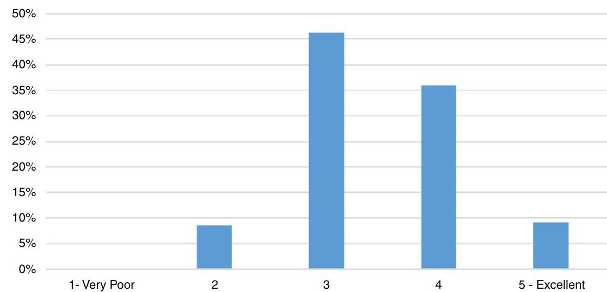
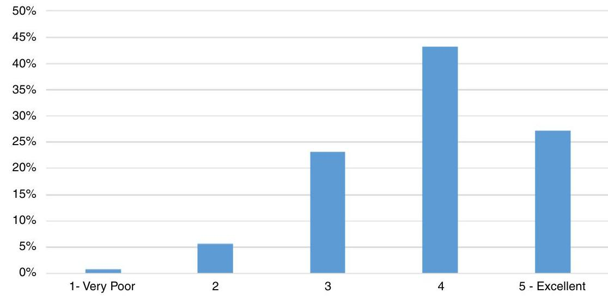

## Page 32
# b) Homeowners 

## c) Workers' Compensation

For these three lines, results are consistent. Insurers feel confident their data quality is generally good, especially for the standard personal lines. This is in line with our expectations as we would anticipate robust, well-defined processes in the most standard and heavily regulated lines.
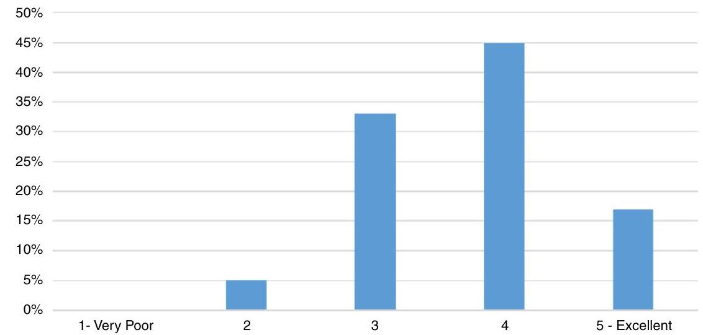
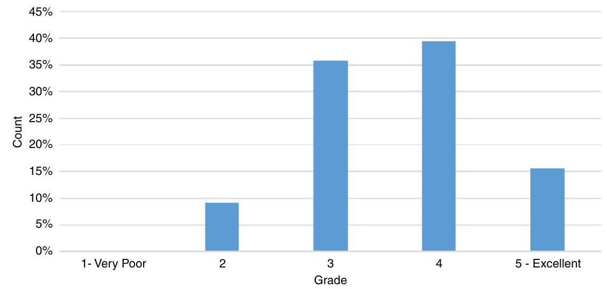

## Page 33
# d) Other Commercial Lines 

There is a significant shift in how the industry interprets its data quality in the "Other Commercial Lines" category. Replacing the skewed distribution in Auto, Homeowners, and Workers' Compensation is more of a bell shape, with a noticeable increase in the " 1 - Very Poor" section relative to the personal lines of business.

Before deriving the conclusions, it is important to consider how respondents may have interpreted the composition of "Other Commercial Lines." The authors recognize the respondents' interpretation could have a material impact on their selected answers. Some respondents may interpret "Other Commercial Lines" as larger commercial lines such as General Liability or Automobile Liability, while others may interpret a niche line like Directors and Officers Liability as the stereotypical "Other Commercial Line." We anticipate those answering with General Liability in mind would answer similarly to how they would answer for Workers' Compensation, as commercial insurers are likely to have similar processes in place for these higher profile coverages. Thus, without attempting to make too many generalizations, it's entirely plausible that the niche lines of business have an even worse distribution than that implied by the above graph.

Moving beyond the potential interpretations of this question, the next logical question then becomes, "What's causing this drop in data quality?" If we revert to the definition of "Other Commercial Lines" as any type of niche business, there's a good chance that insurers see a sparse number of policies, and even fewer claims. These lines are also traditionally dominated by non-data-driven underwriting methods, with "data" viewed as less important than "information" and "judgment," which may give rise to a perception that data quality management is just not as important as other competing priorities.

It's also plausible that as companies have merged or been acquired, these nonstandard lines were not prioritized in integration efforts and receive relatively less attention to integrate and improve their data quality. If this is the case, there would
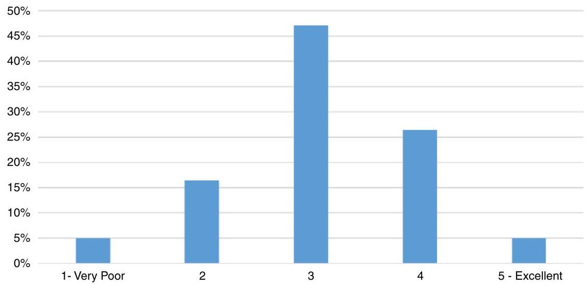

## Page 34
be a variety of legacy data sources to pull from, with potentially some platforms no longer receiving maintenance. These changes can make commercial lines exercises significantly more complicated for actuaries, and, as a result, the degree of expert judgement and uncertainty in the results of actuarial analyses is increased.

# Question 3: Have you defined quantitative metrics to measure data quality? 

We stated earlier in this section that we have no desire or intention to critique actuaries. While true, we do hope the actuarial reader of this monograph will view this question as an area for critical self-reflection. We believe there is an enormous opportunity for improvement through the use of metrics to measure data quality. Currently, only $25 \%$ of the respondents have specific, quantitative data quality metrics in place.

Having quantitative metrics in place is an important step to help recognize if actual results are meeting expectations. If the time is not being taken upfront to establish a range of reasonable results (e.g., number of missing values, number of nulls) it becomes easier to miss indications that there could be a problem with the data and to fail to make appropriate modifications.

For a more thorough discussion regarding data assessment and establishing quantitative metrics, please refer to Section 7, Subsection: Assessing Data Quality.
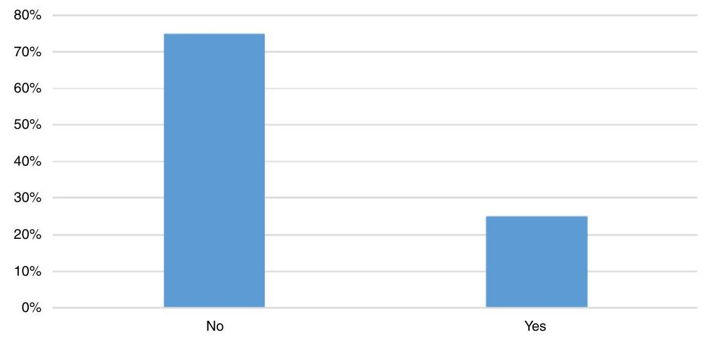

## Page 35
# Question 3a (For respondents who answered "Yes" to question 3): Which of the following concepts are included in the measurement of data quality? 

(Note: respondents were permitted to select multiple options resulting in a total $>100 \%$ )

Note: the category "Appropriateness, Accuracy, Completeness" captures responses if all three of Appropriateness AND Accuracy AND Completeness were selected, while the other categories capture any response where the individual concepts are included in the definition of data quality.

For those companies who defined data quality metrics, the majority of them develop holistic checks that verify the data's appropriateness, accuracy and completeness.

We also note that companies tend to either address all three concepts, or just accuracy and completeness-the graph demonstrates that $64 \%$ of insurers address all three concepts, and $68 \%$ address appropriateness. This means if the insurer didn't address all three concepts, there was only a $13 \%$ chance the insurer would address appropriateness, contrary to accuracy and completeness, which nearly every organization utilizing data quality metrics measured. These results demonstrate an easy way for the industry to improve data quality management as a first step. Certainly, complete and accurate data are important, but measuring appropriateness should be on the forefront of every actuary's mind when performing an analysis.
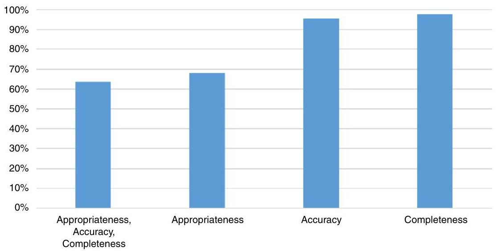

## Page 36
# Question 4: Do you have specific staff with primary responsibilities relating to data quality? 

Assigning specific staff to monitor and sign off on data quality is an important first step in assuring quality controls are in place. The individual signing off on the data quality is often a downstream user with a holistic understanding of the process. If firms do not get downstream users involved, they become susceptible to disconnects between the data cleansing team and the team performing the analysis. While some actuaries may be very much removed from the data cleansing portion of their processes, they must have sufficient understanding of the data issues to inform the results of their analysis.

## Question 4a (For those who answered "Yes" to question 4): Which staff have defined responsibilities relating to data quality?

(Note: respondents were permitted to select multiple options resulting in a total $>100 \%$ )
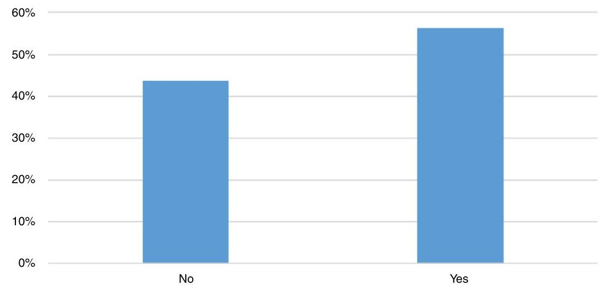
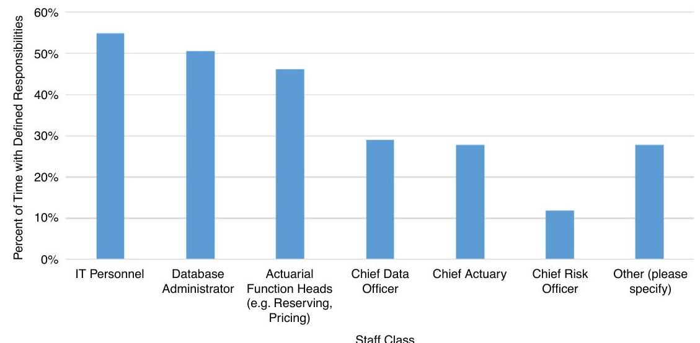

## Page 37
Expanding upon the results of Question 4, for the respondents with specific staff responsible for data quality, we see most commonly that IT Personnel and Database Administrators have defined responsibilities. This appears to be another opportunity for the industry to further involve actuaries in the data cleansing process. As the end users of that data, actuaries need to be involved at an appropriate stage in the process. Due diligence needs to be performed and actuaries should collaborate with IT upfront in order to feel comfortable about conclusions around data made later in the process.

Note: $28 \%$ of respondents replied "Other." Roughly one-quarter of these respondents were actuarial, almost all at the analyst level. Approximately two-thirds were data or business analysts. To put this in perspective, if split out individually, business/ data analyst would have been the sixth most frequent answer, slightly ahead of Chief Risk Officer, and actuarial analyst would have been eighth most frequent.

# Question 5: Do you have a formal data quality committee which meets to discuss and solve data quality issues? 

Developing a formal committee on data quality may not be required for all firms, and the graph demonstrates that the majority of firms have not defined such a committee. That said, even if formal committees meet infrequently, having the organization in place to allow issues to be elevated formally and quickly resolved may be a useful structure to implement.
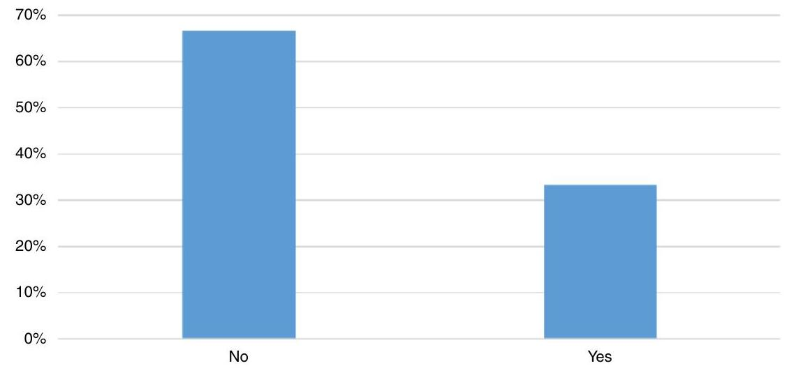

## Page 38
# Question 6: What data quality checks do you implement as a matter of course? 

(Note: respondents were permitted to select multiple options resulting in a total $>100 \%$ )

Reconciliations between data from different sources/systems is a basic primary step in the actuarial work process. We therefore find it surprising that less than $90 \%$ of respondents carry out data reconciliations between systems as a matter of course. We also note that several of these checks can be automated so would therefore require less manual intervention prior to analyses being performed.

## Question 7: To what extent are these data checks automated or manual?
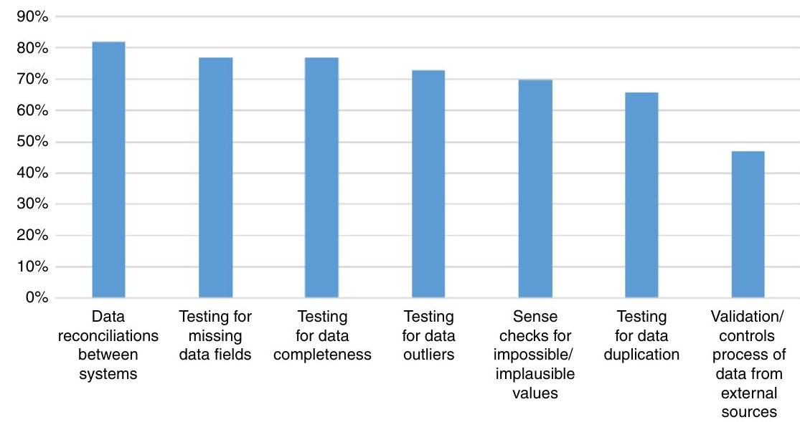
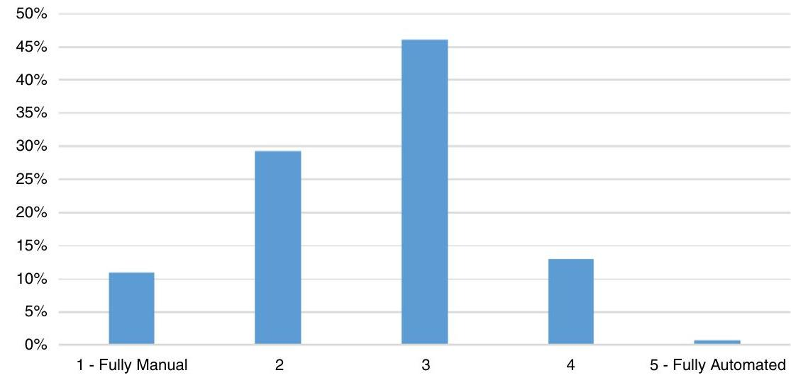

## Page 39
Respondents indicate that data checks are currently more manual than automated. This could be seen as potentially advantageous, as it may lead to a more thorough analysis of the data quality, and could be a quick fix when performing an ad-hoc analysis. However, manual data checks are time consuming over the longer term and could easily lead to errors. Due to the flaws associated with manual data checks, automatic checks are preferred for standardized or cyclical processes.

# Question 8: How often is a data quality analysis performed and data quality report issued? 

First, note "Cyclically" is the sum of "Monthly," "Quarterly," "Weekly," and "Annually." Ad-hoc by itself is the most popular individual option; however, when we combine all the cyclical answers into one category the two are approximately equal. The responses to this question link to Question 3 and Question 7, supporting the idea that most of the quality checks are relatively manual and done on an ad-hoc basis or prior to deployment, compared to primarily automated checks. For Question 8 the optimal frequency of quality checks should be determined based on a variety of factors that are specific to the individual companies. In some situations, performing checks on an ad-hoc basis may be the effective balance of ensuring quality data and utilizing resources.
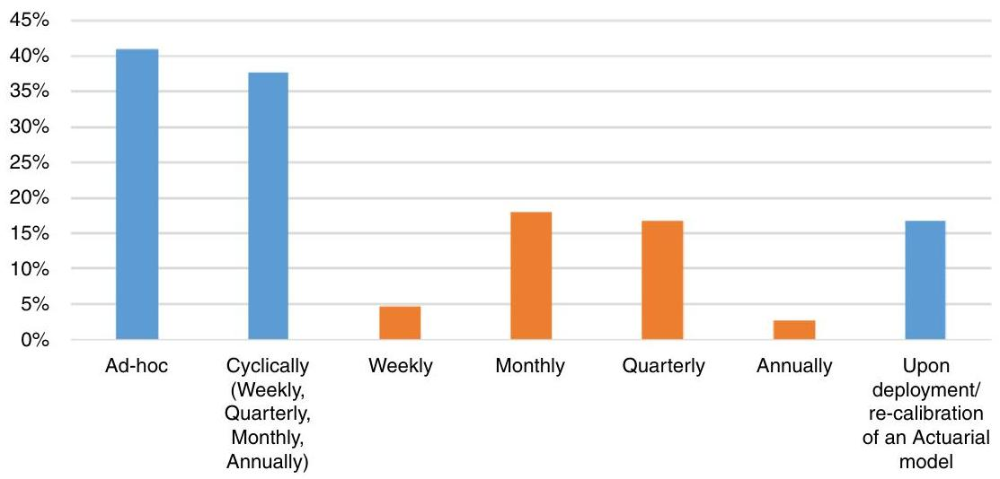

## Page 40
# Question 9: What approaches do you typically take to remediate data issues with individual records? 

(Note: respondents were permitted to select multiple options resulting in a total $>100 \%$ )

There is significant variation between actuarial processes and data generation mechanisms, and consequently, best practices for data remediation will vary. When selecting the optimal approach, insurers should consider whether the process is regularly repeatable or ad-hoc, and what the marginal benefit will be from the data remediation process and effort required to implement the fix. The majority of survey respondents correct process errors or make manual adjustments using actuarial judgement. Data imputation (as discussed in Section 7), which could be considered a more advanced fix, is used by less than half of the respondents.

## Question 10: How many different databases do you source your data from for your actuarial processes?
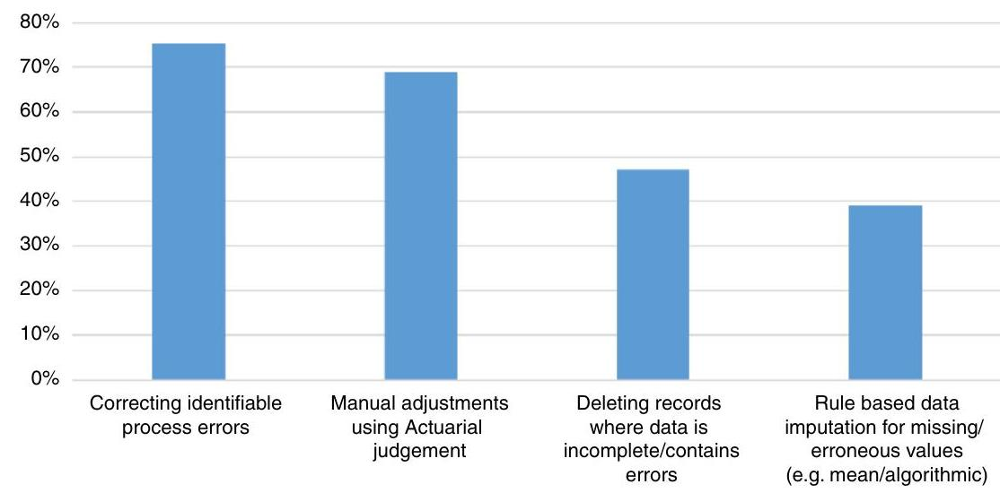
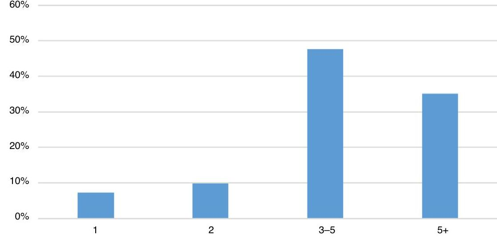

## Page 41
It's atypical for an actuarial analysis to depend on only one data source. The results of our survey show the majority of respondents use at least 3 data sources in their work. We note that as data capture mechanisms progress and volumes of data subsequently increase, this number is likely to rise as well; therefore, data management techniques and best practices will become increasingly important.

# Question 11: How effective is the data management process across systems? (e.g., combining policy/claims data) 

Approximately half of the survey respondents rated the effectiveness of their data management process as a " 3 ", out of a scale of 5 . This indicates that most respondents see the potential for improvement in their data management processes.

## Question 12: What type of data models do you use to store your data?

(Note: respondents were permitted to select multiple options resulting in a total $>100 \%$ )
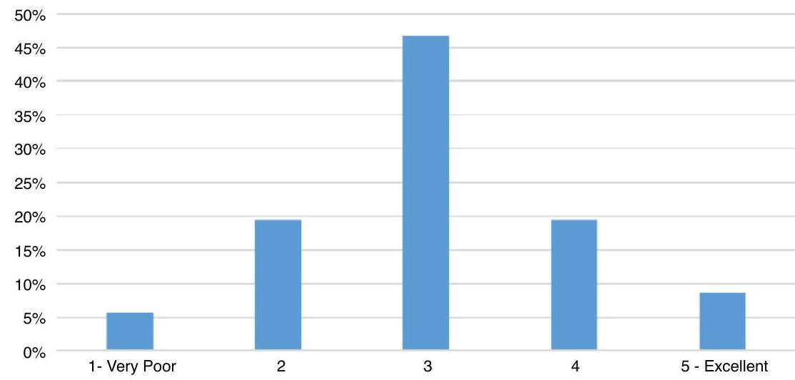
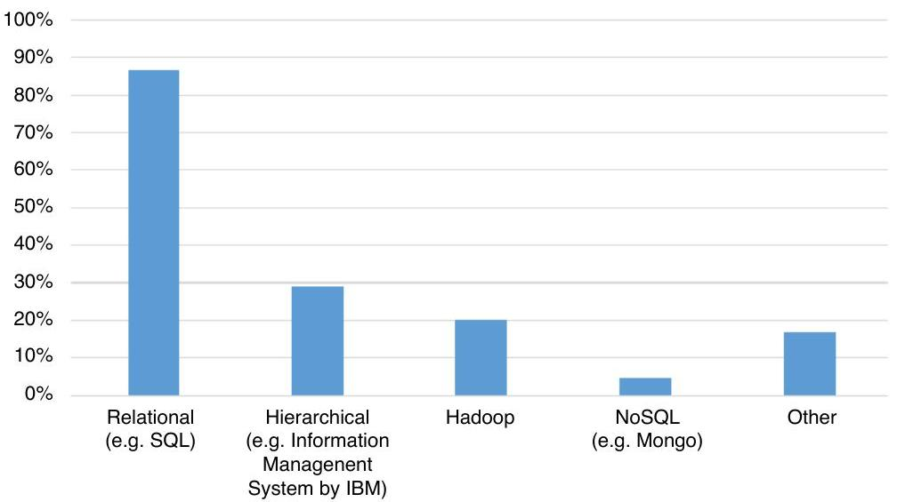

## Page 42
Of those surveyed, nearly $90 \%$ use a relational database in at least one process to store data, roughly three times more than the second most frequent answer of hierarchical databases. We note that more modern data storage models (e.g., Hadoop/NoSQL) are still only used by a small number of respondents - these are discussed in Section 5 of this monograph. Note, $17 \%$ of respondents answered "Other." Of those, approximately half utilized Excel Workbooks, which is slightly more common than "NoSQL (e.g., Mongo).

# Question 13: Please provide additional details of current systems issues and/or improvements desired from your data systems: 

Note, Question 13 was a free response question, and thus there is no accompanying graph. Current systems issues and potential improvements tended to fall into one of three general themes:

1) Eliminating inconsistencies between data sources
2) Data process automation
3) Centralizing data and eliminating legacy systems

We recognize that these are all intertwined. Effectively moving off legacy platforms will reduce the number of data sources that must be consulted for each analysis. Reducing the number of data sources will reduce the frequency of inconsistencies and the number of one-off adjustments.

## Question 14: Which regulatory data governance regimes do you seek to be guided by / comply with?
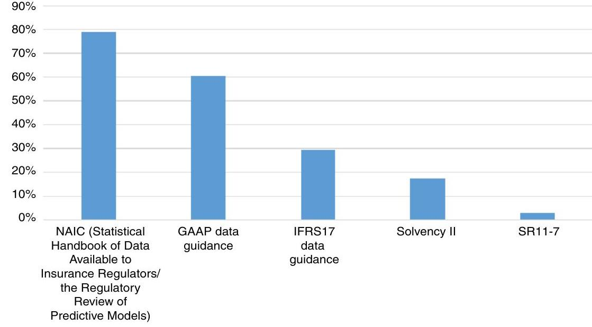

## Page 43
The majority of respondents are guided by both NAIC and GAAP, which is as expected, as the majority of CAS members and therefore survey respondents are based in the United States.

# Summary 

Based on the first two survey questions, the vast majority of survey respondents think their data is at least average, if not good, especially in personal lines. However, the survey responses also indicate a wide scope of areas that could be improved. Seventy-five percent of survey respondents do not have defined quantitative metrics to measure data quality, and $67 \%$ do not have a formal data quality committee. These represent areas where straightforward improvements can be made to the data quality management process to generate tangible improvements in data quality.

Considering the responses to the survey as a whole, there appear to be two general themes which are limiting data integrity within the industry:

1) A lack of structure and consistent procedures associated with data manipulation
2) Low utilization of automated data checks and quality controls

To expand on the first point, it is helpful to consider the data transformation process as a whole. Upon receipt and first look at data, initial requirements should be established regarding the data. If expectations aren't established, it will be difficult to address the other important points raised throughout the monograph, including generating quantitative data metrics and creating consistent protocols on how to deal with data abnormalities. By considering the desired finished product at the beginning of the process and developing a vision of what the transformed data should look like, the actuary can begin to establish a framework that will achieve high quality data.

Developing a data quality committee which understands the organization's current processes is an easy first step to generate momentum on addressing the full spectrum of data challenges. Giving this committee the authority to develop and implement best practices can organically address some of the issues discussed throughout the survey.

The second theme highlighted within the survey is that actuaries have room to improve their data quality controls, specifically through automation. Data processes are complex, evidenced by $83 \%$ of the survey respondents pulling from three or more sources. Therefore, consistent, repeatable and non-manual checks to ensure data inconsistencies and errors are identified is important so that results of analyses are reliable. The survey results show that less than $15 \%$ of respondents have fully automated or almost fully automated data checks in place, with more than $10 \%$ of respondents still relying on manual data checks.

This links smoothly to a central theme which we explore throughout this monograph. Data processes are unlikely to ever be perfect. It's unrealistic to expect that we will be able to generate an output suitable for analysis without performing any checks during the process. This doesn't mean our data quality has to suffer. If we apply certain tools and frameworks, even the most complicated processes can result in data that is complete, accurate, and appropriate for its intended use.

## Page 44
# 4. Regulatory and Similar Requirements Surrounding Data Quality 

We now turn to regulatory requirements and similar guidance and standards applicable to the P\&C industry regarding DQM. We first discuss US-based regulations such as those set forth by the NAIC, FASB (GAAP), the Federal Reserve Board, and the Office of the Comptroller of the Currency (OCC), and then turn to international regulations, including IFRS and Solvency II. We also discuss the applicable Actuarial Standards of Practice, guidance from the North American CRO Council, and rating agencies.

Overall the regulations and guidelines do not comment on data itself, but rather set standards for processes surrounding data. In doing so, these organizations encourage $\mathrm{P} \& \mathrm{C}$ insurers to improve the quality of their data.

## NAIC

The National Association of Insurance Commissioners (NAIC) is responsible for setting standards regarding state-based regulations of insurance in the United States. The Casualty Actuarial and Statistical Task Force subcommittee within the NAIC proposes regulations for the P\&C industry. With respect to data quality, the Task Force releases and maintains two main publications, the Statistical Handbook of Data Available to Insurance Regulators and the Regulatory Review of Predictive Models. Both of these publications help state insurance regulators assess the adequacy of information provided by $\mathrm{P} \& \mathrm{C}$ insurance companies. The former contains general data requirements for insurers, and the latter describes regulations specifically in the context of data used for predictive modeling.

The Statistical Handbook of Data Available to Insurance Regulators contains many requirements for insurers' data quality. For example, data reported by the entity must reconcile to information found in its annual statements. Insurers must provide explanations for differences that exceed the amounts shown in Table 1:

Table 1. Error Tolerances for Reconciliation to Annual Statement

| Line of Insurance | Written Premiums | Paid Losses |
| :-- | :-- | :-- |
| Private passenger auto | greater of $1 \%$ or $\$ 10,000$ | greater of $1 \%$ or $\$ 10,000$ |
| Homeowners | greater of $1 \%$ or $\$ 10,000$ | greater of $1 \%$ or $\$ 10,000$ |
| All other Lines $^{4}$ | greater of $1 \%$ or $\$ 10,000$ | greater of $1 \%$ or $\$ 10,000$ |

## Page 45
Table 2. Error Tolerances for Data with Incorrect or Missing Geographical Codes

|  | Error Tolerance* |  |
| :-- | :--: | :--: |
| Line of Insurance | Written Premiums | Losses (Paid + Unpaid) |
| Private passenger auto | greater of $\$ 10,000$ or $5 \%$ | greater of $\$ 10,000$ or $5 \%$ |
| Homeowners | greater of $\$ 10,000$ or $5 \%$ | greater of $\$ 10,000$ or $5 \%$ |
| All other Lines | greater of $\$ 10,000$ or $5 \%$ | greater of $\$ 10,000$ or $5 \%$ |

Similarly, written premiums or losses associated with incorrect or missing geographical codes may not exceed the thresholds in Table 2.

Lastly, whenever a data error necessitates an edit to values in the data, the insurer must analyze the error until the cause is fully understood, and there is no likelihood for it to produce further systematic errors in the data.

The Regulatory Review of Predictive Models provides requirements that pertain to the quality of data used in the predictive models of $\mathrm{P} \& \mathrm{C}$ insurers. Insurers must provide clear explanations for the entity's handling of missing data, outliers, and any other adjustments or variable transformations performed. Additionally, if the data inputted into the model came from multiple sources, guidance on the data merge between sources is required. Insurers must identify all data sources and explain the use of any external source. The entity must also disclose the means by which the consumer, or policyholder, can access his/her data and correct potential errors. These measures help ensure that the insurer has done its due diligence on the data, and that it is of sufficient quality before being used by the model.

In addition to these publications, the NAIC also issues the "Annual Financial Reporting Model Regulation," also known as the MDL 205. This regulation requires insurers operating in states that have adopted the regulation to submit:

1. An Annual Financial Statement Audit by an Independent CPA
2. Communication of Internal Control Related Matters Noted in the Audit ${ }^{6}$
3. Management's Report of Internal Control over Financial Reporting ${ }^{7}$

These submissions serve to identify potential gaps in insurers' data management processes, and require companies to provide steps to remediate these gaps.

# GAAP 

Generally Accepted Accounting Principles (GAAP), promulgated by the US-based Financial Accounting Standards Board (FASB), is the accounting standard used by many

[^0]
[^0]:    6 The Communication of Internal Control Related Matters Noted in the Audit is a report on outstanding material weaknesses in the insurer's internal controls over its financial reporting as identified in the audit.
    7 The Management's Report of Internal Control over Financial Reporting is a written communication submitted by the insurance company's board of directors that describes the ability of the entity's internal controls process to ensure the reliability of its financial statements.

## Page 46
US companies, particularly publicly traded US-based stock insurers. The Accounting Standards Codification (ASC) Topic 944 is the GAAP standard that provides accounting and financial reporting guidance for insurance contracts. A summary of some of the most relevant standards to $\mathrm{P} \& \mathrm{C}$ insurers are described below.

US GAAP requires that insurance contracts that are similar in terms of acquisition, servicing, and potential for profitability be grouped together for the purpose of measuring premium deficiency. For short duration contracts, which describes most P\&C contracts, potential for profitability is defined as unearned premiums less the sum of expected claim costs, claim adjustment expenses, and other costs associated with the contract. Additionally, premiums for short duration contracts are recognized over the contract lifetime in proportion to the insurance provided.

US GAAP mandates disclosure of all input data used to meet its standards. Relevant input data includes historical claims data used to project expected claims costs, discount rates to calculate the present value of expenses, and contract specifications such as the contract term periods. In order for the standards to be accurately met, $\mathrm{P} \& \mathrm{C}$ insurers must ensure that the input data is of high quality. Compliance with the standards also implies that controls processes be in place for the data to be reviewed periodically and updated as needed.

# The Federal Reserve Board and the Office of the Comptroller of the Currency 

The Federal Reserve Board (Fed) and Office of the Comptroller of the Currency (OCC) issued SR 11-7: Guidance on Model Risk Management (OCC 2011-12 for the OCC) on April 4, 2011, and the Federal Deposit Insurance Corporation (FDIC) adopted it as FIL-22-2017 on June 7, 2017. The letter announcing the adoption of SR 11-7 indicated that it "is intended for use by banking organizations and supervisors as they assess organizations' management of model risk," and further that the "guidance should be applied as appropriate to all banking organizations supervised by the Federal Reserve." In practice, most (if not all) insurers with banking affiliates strive to be compliant with SR 11-7, as do many other insurers.

SR 11-7 stresses the critical importance of the quality of data used in models. For example, it states that entities should perform a rigorous assessment of data quality and relevance, and document their findings appropriately. It also states that if data proxies are used, they should be carefully identified, justified, and documented. Additionally, if data and information are not representative of the organization's portfolio or other characteristics, or if assumptions are made to adjust the data and information, these factors should be properly tracked and analyzed so that users are aware of potential limitations. These principles help ensure a process is in place to assess the quality of data, thoroughly identify potential inaccuracies, and provide formal documentation.

SR 11-7 also provides guidance for developing effective frameworks for model validation and governance which maintain/improve data quality, and outlines that a strong governance framework provides explicit support and structure to risk management

## Page 47
functions through policies defining relevant risk management activities, procedures that implement those policies, allocation of resources, and mechanisms for evaluating whether policies and procedures are being carried out as specified. In other words, data quality requires support from all functions from the top of the organization all the way to the bottom.

# IFRS 

The IFRS Foundation and the International Accounting Standards Board (IASB) issue the International Financial Reporting Standards (IFRS) to provide a common global language for business affairs and to help ensure consistency and reliability in accounting practices among countries. IFRS 17 is a comprehensive standard to account for insurance contracts applicable to companies that prepare financial statements under IFRS; it replaces IFRS 4, which was not a comprehensive standard. It was developed to bring consistency to financial reporting around the globe for companies reporting under IFRS 17, and to better compare insurance companies to companies in other industries. Its goal is to bring closer alignment of the accounting to the underlying economics of insurance. According to the latest Exposure Draft, published in June 2019, the IASB's effective date is for financial statements beginning in January 1, 2022 (note that certain countries/territories have not yet determined whether to adopt the IASB's version of IFRS 17 and/or they have an endorsement process for adoption, both of which could lead to alternate adoption timelines). While adoption of IFRS 17 in the US is unlikely in the near future, many capital markets outside the US require the use of IFRS.

IFRS 17 provides guidance for the measurement of insurance contract liabilities according to required measurement objectives. While the guidance is principles-based, which allows for interpretation in establishing accounting policies, the requirements will reflect changes in the data quality standards of how companies measure, track, and disclose insurance contract liabilities today, which will be the focus of this section. Many across the insurance industry are viewing IFRS 17 as a catalyst for actuarial modernization-in systems, operational structure, and data—given the extensive reporting requirements and the level of detail at which the measurement must be initially established and subsequently tracked. The level of complexity of the insurance contracts written, as well as the extent to which the resulting IFRS 17 financial statements are utilized for regulatory requirements and performance metrics, are being considered by entities as they determine the extent of the transformational effort required.

There are three key challenges that entities implementing IFRS 17 face, which could be an impetus for modernization:

1. Level of aggregation

IFRS 17 requires the aggregation of insurance contracts according to risk type (portfolios), and the categorization of these portfolios into groupings (groups) based on the likelihood of a net cash outflow. To adequately perform this aggregation, insurance companies must accurately maintain data pertaining to the riskiness

## Page 48
of each contract and measure cash flow data frequently at a more granular level of detail than many companies currently maintain.
2. Estimating the various components of the insurance contract liabilities

IFRS 17 requires insurers to estimate and maintain various components of the insurance contract liabilities for reporting under the standard. The components include: (1) discounted cash flows, (2) risk adjustment, and (3) contractual service margin (i.e., unearned profit).

To accurately estimate discounted cash flows, insurance companies must maintain high quality data on current policyholders, current claims information, historical experience, and market data such as the yield curve to calculate the discount rate. Regarding the risk adjustment required for non-financial risk, the insurer must measure its exposure to risks such as insurance, credit, and liquidity. The accurate assessment of this risk adjustment also necessitates proper maintenance of data such as historical claims development and the credit quality of insurance contracts. The contractual service margin involves complexities in terms of maintaining and re-measuring the balance as the amount is amortized according to a schedule and the other components of the IFRS 17 measurement change over time.
3. Reinsurance contract accounting

Under IFRS 17, reinsurance contracts held by the insurer are accounted for separately from the underlying contracts written by the insurer. The approach used to measure the reinsurance contract may differ from the corresponding approach used for the underlying insurance contracts, but the core inputs are generally similar. For example, the contractual service margin is used in the measurement of both reinsurance and insurance contracts by allocating its value over the coverage period as the service is performed. However, the coverage periods may differ between the reinsurance contract and the insurance contracts, meaning that the contractual service margin will be allocated differently. Practically, this means that an insurer with reinsurance contracts must ensure proper data quality management not only on data related to the underlying contract, but on the reinsurance contracts held as well.

Overall, the many requirements of IFRS 17 will necessitate that insurers maintain a high level of data quality-perhaps in more granular detail than is currently availablein order to appropriately value their insurance and reinsurance contracts.

# Solvency II 

The Solvency II Directive is an EU-wide insurance regulation that became effective January 1, 2016, with the purpose of harmonizing the previous 14 EU insurance directives. With respect to data quality, Solvency II requires insurers to have processes and procedures to ensure the appropriateness, completeness, and accuracy of their data. Solvency II aims to improve data quality by regulating related processes such as data reporting and data governance, which will lead to higher quality data.

Supervisory authorities are concerned not only with assessing the data, but also the people, workflow, and technology supporting the data governance. There are

## Page 49
requirements that specify the format, structure, contents list and publication date of the disclosure of aggregate statistical data, which standardizes data reporting. Requirements state that insurers must have appropriate systems and structures in place to fulfill the specified regulations pertaining to producing data reports, which necessitates proper infrastructure to record and store data. Additionally, insurers must submit all necessary information to supervisory authorities for them to assess the insurer's system of governance.

# ASOP 23 

As previously mentioned, ASOP No. 23 is a set of standards on data quality from the Actuarial Standards Board that has been in effect since 1993. It provides actuaries with a list of professional standards of practices for the selection, use, review, and reliance on data.

The standards require that actuaries be prudent in their selection of data by ensuring that data is appropriate, sufficiently current, internally consistent, and reasonable, given the external information that is available, and that the limitations of the data are known. The actuary must use his or her professional judgment to review the selected data to determine the definition of each data element used in the analysis and identify values that are questionable or relationships that are significantly inconsistent. The actuary should take steps to improve the quality of the data and disclose the steps that were taken. Next, for the use of this data, the actuary should again exercise professional judgment to ensure that the data is of acceptable quality to perform analyses and determine whether to apply adjustments or assumptions. Actuaries may rely on data supplied by others, and it is the responsibility of the supplier to ensure the accuracy and completeness of the data. The actuary should disclose the reliance on external data in any appropriate communications.

## North American CRO Council

In 2012 the North American CRO Council, a council comprised of Chief Risk Officers of leading North American-based insurers, published an article titled "Model Validation Principles Applied to Risk and Capital Models in the Insurance Industry." This article provides insurers with guidance on model risk management (MRM). It outlines eight key principles for model validation, but here we focus on Principle 6, which encompasses data quality.

Principle 6 relates to validating the model components such as those related to inputs, calculations, and outputs. Principle 6 includes a number of aspects related to data quality. Specifically, insurers should validate their input components which, in risk models, will consist of policy data as well as the assumptions and parameters to apply to the data. The data should be unambiguous to promote consistency and analysis of trends. Data quality standards should include processes regarding how an insurer will handle missing data and outliers. Data proxies should support the body of the probability distribution and not the extreme tails. Insurers should compare internal data with external data (if available) as a benchmark to test its validity. Static

## Page 50
validation should be used to reconcile policy or population data to other administrative systems. Finally, insurers should employ expert judgment to better understand the limitations of the dataset.

# Rating Agencies 

AM Best states that it performs a qualitative assessment of an insurer's data quality when assessing what it refers to as "the third building block" in its rating process: an insurer's business profile. S\&P notes that it considers data quality when assessing an insurer's catastrophe risk management and enterprise risk management. One could conclude that poor data quality can have a negative impact on an insurer's ratings, and that demonstrated effective DQM could have a positive impact on such ratings.

## Comparison of US vs International Regulations and Guidance

Overall, US and international standards for data quality in P\&C insurance follow the same themes. Both sets of regulations and guidelines provide outlines for aggregating data to maintain high data quality. These standards also detail how regulators will scrutinize input data with the onus on insurers to prove that their data sufficiently meets the stated criteria. Furthermore, emphasis is placed on insurers being required to disclose all necessary data, information on the process flow of the data, and any necessary explanations to regulators for their assessment.

A point of differentiation between US and international regulations is the level of specificity in some of the data quality metrics. For example, the NAIC provides specific quantitative benchmarks to assess data quality, whereas international standards provide qualitative regulations and focus more on standardizing the processes surrounding the data.

## Summary

As highlighted throughout this section, much of the regulations and guidelines for data quality in the $\mathrm{P} \& \mathrm{C}$ insurance industry are qualitative in nature and lack quantitative measures. However, in recent years strides have been made to improve data quality regulations.

Compliance for insurers can be very costly, as many of these standards target company processes. In extreme cases, an entire system overhaul might be necessary to meet compliance. That said, there are clear benefits to meeting these regulations and guidelines. Insurers that abide by these standards are more likely to have streamlined data and reporting, efficient data validation and correction, more accurate modeling, and faster, better informed decision-making.

## Page 51
# 5. Data Architecture 

## Data Architecture Overview

A key consideration for an insurer to maintain the desired level of data quality is ensuring an appropriate design for its data system architecture. In an insurance company, data architecture can be thought of as the set of rules, policies, standards, and models that govern and define the type of data collected and its usage, storage, management, and integration within database systems.

The flow of data within an insurer consists of several stages or layers. Data originates across a number of source systems, including core insurance systems (e.g., Policy, Claims, UW, etc.), enterprise systems (e.g., Finance, Legal), and external data providers (e.g., credit scoring agencies). Data is then collected and ingested as part of Extract, Transform, Load processes (ETL), and pushed into the data storage layer. Next is the data access layer, where users consume data for use in analytics or to provide business insights through dashboard reports.

Traditional data architecture design (Figure 2) allows the generation and storage of structured data in data warehouses that comply with pre-defined structures. The insurer carries out a comprehensive exercise to assess the business requirements around data capture, to ensure the inclusion of all-important data elements, and to clearly define the permissible values for each field as part of detailed data schemas. These

Figure 2. Traditional Data Architecture Model
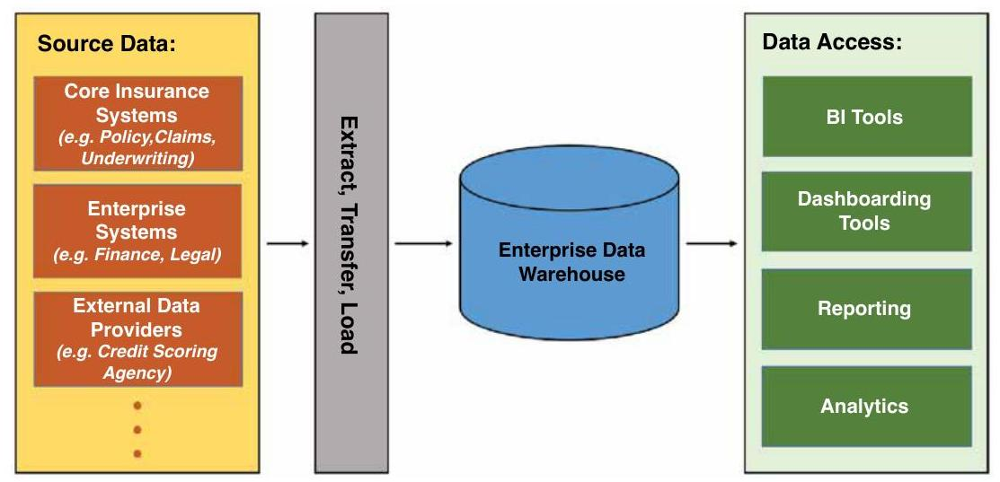

## Page 52
schemas are relatively fixed, and insurers make changes cautiously to avoid introducing errors or creating issues with existing uses of the data.

This traditional model centers on the definition of the EDW, which typically uses the relational data model (as discussed below). This approach is referred to as "schema-on-write," as the model defines the data schema when the data is written to the warehouse.

Modern computer systems are less restrictive with regard to the types of data they can accept, as well as how the data is stored and processed. Specifically, modern systems are capable of storing insurance data in both a structured and unstructured format, such as text, audio or image data. Examples of these data types include claims adjuster notes, audio recordings of sales interactions between the company and the policyholder, and images of the aftermath of accidents/events that trigger claim filings. Insurers typically gather and upload these data types to data repositories with minimal processing, and leave the decision making around how to interpret and transform the data to the time of use. Because the data schema is not defined when the data is captured, but only later when read and extracted, this approach is referred to as "schema-on-read."

Rather than using a traditional EDW, this more modern approach centers around the creation of an Enterprise Data Lake designed for flexibility and the ability to handle large volumes of data. Data lakes use a variety of data models, including the NoSQL model, as discussed below. Sometimes insurance companies may use a data lake to feed a data warehouse if required for business applications. A modernized data architecture model is shown in Figure 3.

A number of different and new challenges may result from the use of a data lake, especially with minimal oversight. Though data lakes by design do not have data schemas, defined mechanisms for cataloging, securing, and locating data may facilitate usable data and avoid a "data swamp," which describes a situation where data cannot

Figure 3. Modernized Data Architecture Model
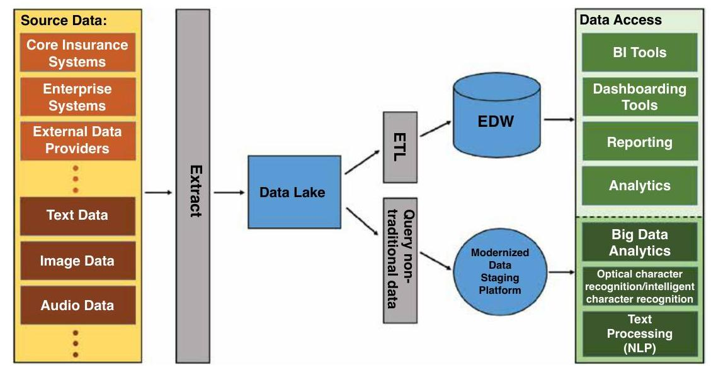

## Page 53
be found or trusted. A further technical challenge relates to providing sufficient storage capacity (especially as unstructured data is generated in much greater volumes than structured data) to enable quick and efficient access to the data. Insurers are now deploying emerging IT platform solutions, such as Spark or Hadoop, which allow for storage of larger data volumes than traditional methods and also faster access.

# Data Models 

In this section, we will cover the necessary background material to understand the main data models implemented in insurance database management systems (DBMS) that actuaries use to source their data. Actuaries should understand how these systems are designed to achieve data quality. A well-designed DBMS can not only prevent certain errors from occurring, but also detect anomalies as they arise and apply appropriate corrections.

Generally, a data model is an organizational structure imposed on data that provides the foundational logic, structure, and language necessary for a DBMS. Data models standardize the relationships between different data elements and implicitly define the necessary language to describe and interact with the system by ensuring information is organized in a consistent and logical manner. The functional goal of a data management system is to allow users to specify the information they want and enable the system to rely on the data model to locate that information and return accurate results to the user.

## Relational Data Model

The most commonly used data model is the relational data model (RDM), first introduced by Codd in 1969. ${ }^{8}$ This model should be familiar to most actuaries, as it forms the basis for one of the most widely distributed DBMS, Microsoft SQL, as well as the SQL data definition and query language. Codd developed the RDM model using the framework of first-order predicate logic and set theory, providing an intuitive conceptual model of data organization along with the ability to evaluate the truth value of statements. This created a framework to evaluate declarative statements to define data structures and retrieve data conditionally. Many actuaries will be familiar with the basic SQL "SELECT-FROM-WHERE" statements that allow users to easily access the information they need with minimal specification. These simple statements illustrate the resulting efficiency and power of Codd's approach.

Before we delve into the specifics of the RDM, we will first clarify some basic concepts regarding the logic that underlies Codd's approach. This requires a method of determining what portion of the available data satisfies the user criteria or, more suggestively, determining the formal set of individual instances of the data that meet the criteria. A useful construct from introductory logic courses is a proposition, defined as a declarative statement that can be evaluated as either true or false. Propositions are criteria that a user applies to a set of data to return the specific members of

[^0]
[^0]:    ${ }^{8}$ See Reference [5].

## Page 54
that dataset of interest. For instance, the following are examples of propositions an actuary might be interested in:

- The Accident Date of 7/5/2018 is prior to 1/1/2019
- The Line of Business 191 is a member of the set $\{191,192\}$

Each of these propositions is true by trivial inspection. This example illustrates the ease with which the concept of a proposition could apply to a single data instance. However, these propositions are too specific. Propositions are self-contained in the sense that they assert a fact that can be evaluated for its truth value. We need to state a more general form of criteria and apply it to each of the available data instances individually; this task is better suited for another logical construct called a predicate. In the simplest terms, predicates are functional generalizations of propositions allowing placeholders for objects to compare with some desired property. For our purposes here, usually the objects to consider are data values, and the properties are the criteria a user wishes to hold true for those data values. The above propositions could be instances of the following predicates:

- The Accident Date is prior to $1 / 1 / 2019$
- The Line of Business is a member of the set $\{191,192\}$

To further clarify these concepts, consider the table of insurance data shown in Figure 4, which shows a standard listing of claim level results categorized by accident date, report date, line of business, and accident state with the associated paid and case loss reserve amounts all valued as of 12/31/2018. Data tables such as this are common starting points for many actuarial analyses, including reserve projection and rate development. Typically, the actuary will have such a table stored in Excel, but it could also be a summary table provided in a DBMS such as SQL.

Going back to the two examples of predicates above, we can apply each to the individual rows of the data in Figure 4 by substituting the appropriate data values for each row into the predicates to yield a sequence of propositions as in Table 3 of Figure 5. We could then evaluate each of those propositions for their truth value as in Table 4 of Figure 5.

If we only kept the rows of data from Figure 4 that yielded a value of true for both predicates, the resulting dataset would be Table 5 of Figure 5. This is the foundation

Figure 4. Sample Insurance Data

| Policy   Number | Claim   Number | Accident   Date | Report   Date | Line of   Business | Accident   State | Paid   Loss | Case   Loss   Reserve | Valuation   Date |
| :-- | :-- | :-- | :-- | :-- | :-- | :-- | :-- | :-- |
| XXXX | PA39284963 | $7 / 5 / 2018$ | $7 / 5 / 2018$ | 191 | TX | 7399.01 | 5000 | $12 / 31 / 2018$ |
| YYYYY | PA39284964 | $9 / 3 / 2018$ | $9 / 5 / 2018$ | 192 | MS | 4741.73 | 4700 | $12 / 31 / 2018$ |
| ZZZZZ | PA39284965 | $11 / 11 / 2018$ | $11 / 21 / 2018$ | 211 | FL | 13465.39 | 6300 | $12 / 31 / 2018$ |
| ZZZZZ | PA39284966 | $12 / 18 / 2018$ | $12 / 20 / 2018$ | 211 | FL | 11953.24 | 5800 | $12 / 31 / 2018$ |

## Page 55
Figure 5. Example Application of Predicates on Data
Table 3

| Proposition \#1 | Proposition \#2 |
| :-- | :-- |
| Accident date 7/5/2018 is prior to 1/1/2019 | Line of Business 191 is a member of the set $(191,192)$ |
| Accident date 9/3/2018 is prior to 1/1/2019 | Line of Business 192 is a member of the set $(191,192)$ |
| Accident date 11/11/2018 is prior to 1/1/2019 | Line of Business 211 is a member of the set $(191,192)$ |
| Accident date 12/18/2018 is prior to 1/1/2019 | Line of Business 211 is a member of the set $(191,192)$ |

Table 4

| Proposition \#1 Truth Value | Proposition \#2 Truth Value |
| :--: | :--: |
| TRUE | TRUE |
| TRUE | FALSE |
| TRUE | FALSE |

Table 5

| Policy   Number | Claim   Number | Accident   Date | Report   Date | Line of   Business | Accident   State | Paid   Loss | Case Loss   Reserve | Valuation   Date |
| :-- | :-- | :-- | :-- | :-- | :-- | :-- | :-- | :-- |
| XXXX | PA39284963 | $7 / 5 / 2018$ | $7 / 5 / 2018$ | 191 | TX | 7399.01 | 5000 | $12 / 31 / 2018$ |
| YYYYY | PA39284964 | $9 / 3 / 2018$ | $9 / 5 / 2018$ | 192 | MS | 4741.73 | 4700 | $12 / 31 / 2018$ |

of the RDM and illustrates the meaning of the term "relation" in RDM. Formally, the resulting table shown in Figure 5 Table 5 is called a relation. It is precisely the set of objects for which the propositions generated by the predicate hold true when applying the predicate to a broader set of objects. More intuitively, we can see that the true relation is between all the columns of each row of the data. The columns are related in that they only contain data values that satisfy the original two propositions. Generalizing this example allows us to think of a database as consisting of a sequence of true propositions where every row of data satisfies the predicates.

The concepts of proposition, predicate, and relation enable us to formally define the components of the RDM. The most basic element of the RDM is the concept of an attribute or field. An attribute is a column of data values such as "Accident State" or "Line of Business" in Figure 4. The data values within each field are drawn from a domain associated with each attribute. Each domain is assumed to be composed of atomic, or indivisible, values, which means that each value of the domain is a single data value as opposed to a set of values. A tuple, or record, is a single row of data values, represented by the collection of attributes its values are drawn from.

For example, in Figure 4, the attribute "Accident State" may have a domain such as all character strings of length two or, perhaps, the formal two-letter abbreviations of all

## Page 56
US states and territories. The individual data values in this domain are atomic because there is precisely one value for each element in the domain. Tuples simply correspond to the individual rows in the table. Figure 6 illustrates the components of the RDM using the table in Figure 4.

Figure 6. Components of a Relational Database

We have established that relations define individual tables, but databases are made up of many tables, each containing their own unique data. Within any system that follows the RDM, each table is defined, populated, maintained, and queried according to the database schema. The database schema specifies the relationships connecting the tables in the database as well as integrity constraints (IC). Integrity constraints are restrictions specified on all relations included in the database schema. Integrity constraints are directly relevant to data quality. They impose limitations on data that can detect and prevent anomalies and are increasingly used to do the cleansing itself.

Figure 7 graphically depicts an example of a database schema.

Figure 7. Sample Database Schema
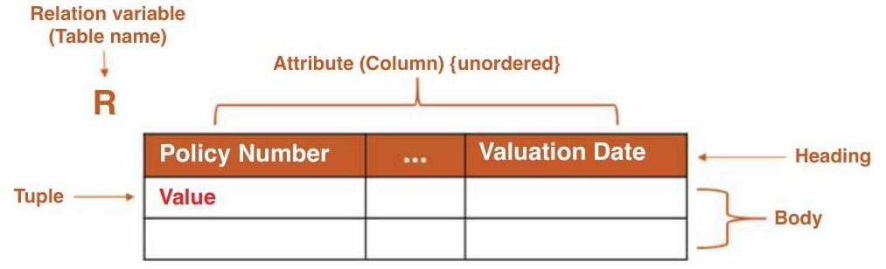
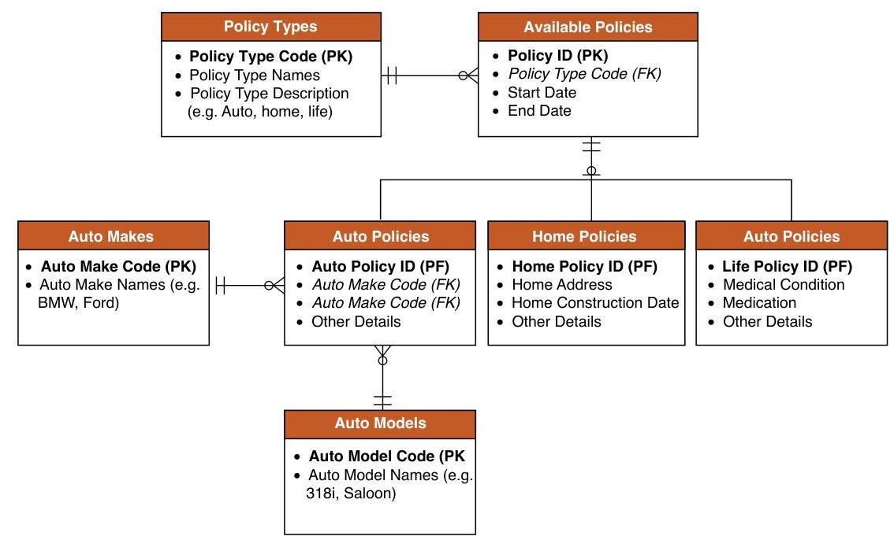

## Page 57
We have already mentioned one example of an IC earlier, when we stated that the values of an attribute must be taken from a particular domain. This type of IC is a domain constraint. DBMSs with domain constraints require an individual attribute's data values be drawn from specific data types/values. This directly contributes to data quality by preventing the attribute's data from being populated with unexpected values.

Before discussing the next three types of IC, further definitions are required. A superkey of a relation $\mathbf{R}$ is a set of attributes $\mathbf{S K}$ such that no two tuples in any valid relation instance will have the same values for $\mathbf{S K}$. A key of $\mathbf{R}$ is a superkey such that the removal of any attribute results in a set of attributes that are no longer a superkey. A key is a minimal superkey. In practical terms, a key is a combination of attributes that are unique identifiers for each tuple in a relation instance. Looking back at Figure 4, "Claim Number" could serve as a key, but not "Policy Number." Generally, in most insurance databases neither of these two fields will be sufficient as a key, as any given table will include multiple claims and policy transactions.

A set of attributes $\mathbf{F K}$ in the schema of a referencing relation $\mathbf{R}_{1}$ is a foreign key if it references a key $\mathbf{K}$ of another referenced relation $\mathbf{R}_{2}$. The set of attributes of $\mathbf{F K}$ must have the same domain(s) as $\mathbf{K}$ and there must exist a tuple in $\mathbf{R}_{2}$ with the data values of $\mathbf{K}$ equal to the data values of $\mathbf{F K}$. Simply, a foreign key is a key for another table in the database schema. In Figure 4, the "Accident State" attribute could be a foreign key if there existed another table that contained all the two-letter abbreviations as a primary key along with their associated full state/territory names as an additional attribute. These types of tables are common in insurance DBMSs as lookup tables.

Returning to different types of ICs, we can now define the key constraint. The key constraint prevents tuples from being added to a relation instance with identical key values. Obviously, this would violate the definition of a key if it were allowed, as duplicate keys would prevent the unique identification of tuples. This is also an important aspect of data quality in that any set of attributes designated as a key is assumed to have unique values within the applicable relationship. If this assumption were violated, any processing of the data that relied on that uniqueness would generate errors.

The entity integrity constraint is the requirement that no key contain a NULL value. This constraint prevents tuples from being added to the relation instance with key attributes containing a NULL. This constraint ensures that the key satisfies the requirement of uniquely identifying each tuple in the associated relation. The referential integrity constraint requires that a foreign key must refer to an existing tuple in the referenced relation. This constraint prevents tuples from being added to a relation that contain a set of foreign key attributes that refer to non-existent tuples in the referenced relation. As in the key constraint, both the entity and referential integrity constraints prevent the DBMS from containing data that violates the assumptions of keys and foreign keys. Users should be able to rely on the keys and foreign keys for processing and interpretation of data. Otherwise, errors could occur, such as duplication of tuples or missing tuples.

The ICs discussed so far are foundational for the RDM and prevent several obvious anomaly types. In addition, an RDM may contain other custom ICs that may improve data quality. Two additional types of IC that are particularly useful are functional

## Page 58
dependencies and conditional functional dependencies. A functional dependency is a constraint that restricts the values of one attribute based on the values of another attribute. For example, suppose that we had a table that contained two attributes: "Zip Code" and "State." A functional dependency for these two attributes might require the association of identical zip codes with the same state. In other words, two tuples with the same zip code could not be associated with different states.

Functional dependencies were expressly developed for schema design as opposed to data cleaning. As a result, they have two inconvenient properties that limit their applicability to data quality issues:

1. Apply to the entire relation
2. Do not accept constant values

Conditional functional dependencies are functional dependencies that are allowed to only apply to a subset of the relation and can mix both constants and logical variables. This makes conditional functional dependencies more suitable for addressing issues of data quality since they can represent more granular rules. For instance, if an insurer only wrote certain lines of business in particular states, a traditional functional dependency would be incapable of expressing the necessary dependencies between "State" and "LOB" because the correct relationship would depend on each individual state and specific lines of business. A conditional functional dependency could capture the relationships because it would be able to specify restrictions such as "In the state of Texas, the LOB written must be 192." Conditional functional dependencies are an important development in DQM and are increasingly being used to address DQM at the DBMS level.

Database normalization is a process in the construction of relational databases with the goal of designing relations that prevent data redundancies and increase data integrity. There are three main "Normal Forms," each of which contain sets of rules that specify the degree of normalization achieved:

- First Normal Form - A relation is in first normal form if every attribute in that relation is a single valued attribute, i.e., they are all atomic values.
- Second Normal Form - A relation is in second normal form if it is in first normal form and every non-key attribute in a table depends on the whole key, not just part of it. This often involves splitting a table into multiple individual tables.
- Third Normal Form - A relation is in third normal form if it is in second normal form and there are no transitive dependencies. This means that no non-key attributes in a table which can be deduced from other non-key attributes in the same table, i.e., all non-key attributes, are independent of one another.

We note that while many model variations exist, the RDM model is the most commonly used. Notable examples include the following:

- Hierarchical model - This the first formal database model and was developed by IBM in the 1960s. The hierarchical model organizes data into a tree-like structure, whereby each record has a single parent/root. Sibling records are sorted in a specific,

## Page 59
physical order, which is used for storing the database. This model is useful for describing many real-world relationships.

- Network model - The network model starts from the hierarchical model but develops it further by allowing many-to-many relationships between related records, implying multiple parent records. The model was popular in the 1970s after being formally defined at the Conference on Data Systems Languages. The model is constructed with sets of related records, based on set theory. Each set consists of one owner or parent record and one or more member or child records. A record can be a member or child in multiple sets, allowing this model to represent complex relationships. A further extension of this is the entity-relationship model.
- Object-oriented database model - This model defines a database as a collection of objects, or reusable software elements, with associated features and methods. Types of object-oriented databases include multimedia databases and hypertext databases. Because of the integration of the database with the programming language, the programmer can maintain consistency within one environment, in that both the database and the programming language will use the same model of representation.
- Object-relational model - This hybrid database model combines the simplicity of the RDM with some of the sophisticated functionality of the object-oriented database model, essentially allowing designers to incorporate objects into the familiar table structure and run queries accordingly.

# NoSql Model 

NoSQL ("Non-SQL"/"Not Only SQL"/"Non-relational") is a new and emerging category of databases, often used as an umbrella categorization for all non-tabular databases. These databases discard some of the key features of relational databases, such as the expressive query language, indexing functionality and consistency. NoSQL databases are not limited to tabular data; these databases also store unlimited free text and image and sound files. The motivations for considering such databases are varied and include the following:

- Technical - Requirement to handle new, multi-structured data types that don't fit the RDM's tabular model and/or the need to scale beyond the capacity constraints of existing systems;
- Commercial - Objective to no longer rely on expensive proprietary database software or hardware;
- Flexibility-based - Desire to rapidly adapt to the market and utilize agile development methodologies and market opportunities, as developers are freed from upfront and evolving schema specification.
As stated, NoSQL databases are a broad set of database types that use a variety of data models for accessing and managing data. The most common NoSQL data models are as follows:

1) Document Model - Unlike relational databases, which store data in rows and columns, document databases store data in documents. These documents organize

## Page 60
data in key-value pairs, where the key defines the data field (e.g., a policy ID, policyholder name, policy type) and the value stores the data associated with the field. Instead of spreading out a record across multiple columns/tables connected by foreign keys, a single document typically stores each record and its related data together. In this way, documents are analogous to objects in a programming sense, and are therefore more intuitive to use for developers accustomed to objectoriented programming languages.

The notion of schema in a document database is dynamic: each document can contain different fields, unlike in relational databases where the schema must be defined up front. This flexibility can be especially useful for modeling unstructured data and makes it easier to improve an application during its lifecycle, such as through the addition of new fields.

Document databases make it easier for developers to store and query data in a database by using the same document model format used in their application code. In an insurance application the document model works well with policy data, insured profiles, and content management systems where each document is unique and evolves over time.
2) Graph Model - The purpose of a graph database is to facilitate the ease of building and running applications that work with highly connected datasets. Graph databases use graph structures with nodes, edges, and properties to represent data. In essence, data is modeled as a network of relationships between specific elements. While the graph model may be counter-intuitive and takes some time to understand, it can be useful for a specific class of queries. This model's primary appeal is the ease with which a user can model and navigate relationships between entities.

Graph databases are useful in cases where understanding relationships is central to the analysis being performed, such as navigating social network connections, network topologies, or supply chains. In an insurance context, these data models can be useful in granular pricing exercises where linkage between data fields is key.
3) Key-Value and Wide Column Models - From a data model perspective, key-value stores are the most fundamental type of non-tabular database. Every record in the database is stored as an attribute name, or key, together with its value. The value, however, is entirely unknown by the system; the user queries data through the key. This model is useful for representing unstructured data, such as unstructured text, as the database does not enforce a set schema across key-value pairs.

Wide column stores, also known as column family stores, use a sparse, distributed multi-dimensional ordered map to store data. Each record can store a different number of columns, which may be grouped together in column families, or spread across multiple column families. The primary key retrieves data per column family.

A required function of any database is the ability to query the data. As discussed above, SQL uses the well-known "SELECT-FROM-WHERE" statements, which conform to the structured query language and are parsed and executed by the relational database. The structure of queries within NoSQL models differ significantly depending

## Page 61
on the exact data model employed. Typically, they are implemented via custom-built, object-based APIs ("Application Programming Interface"). In general, queries implemented in NoSQL models are more efficient and require less optimization than in the RDM, but the queries may take longer to run, depending on the complexity of the model.

In the above discussion, we have introduced both relational and non-relational (NoSQL) database models. Subsequent sections in this monograph focus on the relational model and the implications of anomalies/data quality in an insurance context.

# Governance 

Both a thoroughly designed and implemented data architecture and an appropriately selected data model suited to the business needs are important in ensuring the maintenance of a suitable level of data quality. In addition, insurers must design and deploy an effective set of data governance practices and procedures. A governance structure mitigates the risk of avoidable data anomalies and provides a clearly defined set of roles to the individuals responsible and accountable for data quality.

Data governance can be described as a framework of policies and processes aimed at defining and managing the quality, consistency, usability, security, and availability of information practiced at the enterprise level and across the information lifecycle. Alternately, it can be thought of as a set of guiding principles for ensuring information quality and availability via an agreed-upon process and a set of practices which describe the approach to meeting information requirements and realizing reporting objectives.

A data governance framework should achieve the following:

- Clearly define roles and responsibilities around data governance;
- Establish policies, procedures, and controls needed to efficiently manage and protect data assets;
- Establish an effective data quality control and stewardship process to proactively monitor, manage and remediate data issues;
- Provide guidance and support to business units on emerging data governance issues and trends.

Data governance and DQM are overlapping realms in the broad space of data management. Data governance can and should inform the quality control component of DQM. As noted above, quality control focuses on processes and procedures for ensuring the quality of data delivered to end users; this requires a robust governance framework. Ideally, the needs of data quality control are considered in the development and implementation of the data governance framework, which should specifically outline three key roles-custodians, owners, and stewards of the different datasets.

Data custodians are responsible for the practical day-to-day management and maintenance of the data. This role is highly technical and involves daily management of servers, backups, or networks. Data custodians are responsible for implementation of the technical processes to maintain data quality and ensure consistency of data added to the datasets. This role may be responsible for controlling access to data and

## Page 62
requires mastery of the data schema. The data custodian role is unlikely to be held by an actuary.

A data steward is responsible for using an organization's data governance processes to ensure fitness of data elements-both the content and supporting information. Data stewards have a specialist role that incorporates processes, policies, guidelines, and responsibilities for administering their organization's entire data in compliance with policy and/or regulatory obligations. Essentially, the data steward is tasked with ensuring that the meaning of the data is as intended and that it is being used for the correct purpose in the organization. Typically, the data steward will want as many people as possible to use the data and will actively encourage use as long as they are using it correctly. The data steward may share some responsibilities with a data custodian, although typically the data custodians will report to data stewards.

Data owners formalize data requirements and focus on risk and access to data. Data owners have responsibility for granting access to data and tend to be conservative in allowing numerous individuals access, erring on the side of caution to avoid the risk of data misuse. A senior actuary is likely to play the role of the data owner in relation to actuarial datasets. However, a potential conflict between the role of data steward and data owner is implicit, as the data owner typically wants access to the data to be restricted whereas the steward wants as many people as possible to have access. Despite this, it is not uncommon for the same person to be assigned both responsibilities.

We note that other designations of these roles are possible, e.g., data trustee/data manager, but the core responsibilities are best split into these three areas.

## Page 63
# 6. Anomalies and Data Quality Metrics 

## Types of Data Anomalies

Data anomalies manifest in several different ways, depending on the underlying business process, user interface, and other aspects of the data management process. For instance, within the insurance industry, it is common for fields that are not used in rating or regulatory reporting to be missing or inaccurate. A specific example is the garaging zip code of commercial autos. This variable is usually entered manually and therefore is often inaccurately recorded in the system, unless a particular process has been implemented to ensure its quality. The resulting data anomalies impede the ability of carriers to evaluate the predictive value of these fields for rating plans and limit the ability of catastrophe models to accurately forecast loss potential. We will present additional examples throughout the remainder of this section, illustrating a few of the myriad possibilities for anomalous data to occur.

Despite the diversity of data anomalies, it is still possible and useful to classify anomalies at a high level. The following discussion about anomaly classification relies heavily on the paper "Problems, Methods, and Challenges in Comprehensive Data Cleansing" by Heiko Muller and Johann-Christoph Freytag, often paraphrasing from

Figure 8. Types of Anomalies
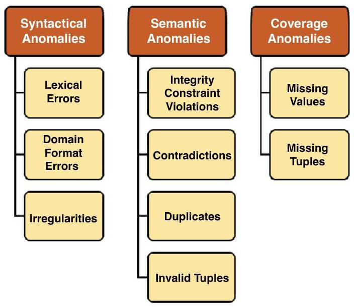

## Page 64
their work and utilizing figures contained in it. We will not specifically attribute each individual use of that work, but rather acknowledge in this paragraph that substantially all of the remainder of this section is based upon it, with the addition of our own insights to clarify its application to the insurance domain. We will refer to this paper specifically as "Muller-Freytag" where appropriate.

Muller-Freytag classify anomalies into three general categories, each with multiple subcategories, ${ }^{9}$ as illustrated in Figure 8.

Muller-Freytag describes syntactical anomalies as errors that involve the format and values of the individual data instances. They are subdivided into three areas of greater specificity as follows:

1) Lexical errors describe discrepancies that result from a disparity between the structure of the data and the specified format. An example of this is when the number of expected attributes for a relation schema is different than the actual data. This type of error frequently occurs when there has been some change to the source system, such as an agent portal, that has not been anticipated in the DBMS into which the source data is imported. This can happen, for example, if the agent portal deletes a variable that is no longer used in the policy rating and the data export no longer contains that column.
2) Domain format errors result from data values that do not conform to the specified domain for their attributes. Building off of the commercial auto garaging zip code example, a domain format error occurs when a five-digit zip code is specified as the domain and a sixth digit is erroneously included. This type of error occurs most frequently with manually entered data, particularly when user entry rules are lacking in the source application.
3) Irregularities involve the use of non-uniform values, units, and abbreviations. A common example of this error arises in the varying exposure bases utilized in the rating of general liability risks. Within general liability, depending on the classification of the risk, different exposure bases are applicable. In some cases, the exposure base is revenue and in others it can be payroll, square footage, gallons, acres, etc. Carriers often modify the exposure base for particular classes over time, resulting in different data values for the same class at different points in time.

Muller-Freytag describe semantic anomalies as those affecting the accurate representation of the underlying process. They involve errors that result in redundancy or inaccuracy in how the business process generating the data is represented. They are subdivided into four additional subcategories as follows:

1) Integrity constraint violations are tuples that do not satisfy the ICs discussed earlier, excluding the domain constraints and functional dependencies. The ICs are designed to reflect the underlying buiness process, so integrity constraint violations are generally data values that are not consistent with reality. An example of this is a policy transaction generated with a duplicate key because of a system logic error,
[^0]
[^0]:    9 See Reference [6].

## Page 65
as occasionally occurs in some systems under a policy cancellation and rewrite transaction.
2) Contradictions are when individual attribute values within or between tuples contradict one another. They are violations of functional dependencies or are duplicates with different values. These types of anomalies can be viewed simply as integrity constraint violations or as duplicates, but they are unique examples of these more general classes of anomalies due to their contradictory nature.
3) Duplicates are two or more tuples representing the same underlying fact in the business process. For example, when a dataset contains two records representing the exact same claim or policy transaction.
4) Invalid tuples are inaccurate representations that do not fit into the above three subclasses of semantic anomalies. They result from our inability to use integrity constraints to describe reality within a formal model.

Muller-Freytag define coverage anomalies as representing data shortfall. They are errors that restrict our view of the underlying business process by failing to include all relevant facts. They can be subdivided into two subcategories as follows:

1) Missing values happen when an attribute lacks the value that it is supposed to have. This assumes there are no integrity constraints disallowing NULL values.
2) Missing tuples represent missing facts about the underlying business process. This is different from a missing value in the sense that the entire tuple is not present when it should be, as opposed to simply having a NULL value for an individual attribute in a particular tuple. An example of this is a policy transaction failing to make its way into the DBMS because of an error in processing.

# Quality Measures 

Muller-Freytag also present a hierarchy of data quality measures, along with suggested metrics to quantify each on a particular relation or entire database schema. It is important to understand that underlying each of the quality metrics is an assumption that there

Figure 9. Hierarchy of Data Quality Measures
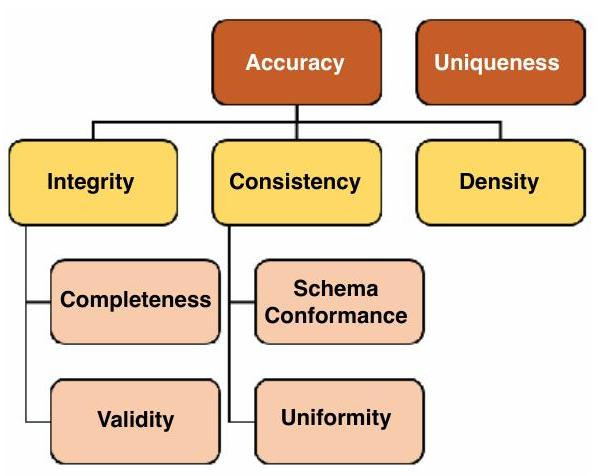

## Page 66
exists some true representation, $\mathbf{M}$, of the underlying business process that the relation is meant to accurately capture. In other words, $\mathbf{M}$ contains all of the data values and structures that should be captured in the relation through appropriate attribute specification, domain assignment and integrity constraints. We can think of $\mathbf{M}$ as containing all of the observed data generated by the real-world entities underlying the business process. In the insurance world, entities may represent policies or claims, and $\mathbf{M}$ is all the data generated by policyholder billing, coverage changes, renewals, underwriting, rating, etc., that are associated with those entities. Figure 9 depicts the hierarchy of data quality measures.

Accuracy, at the highest level, is measured by the number of correct values in the relation relative to the overall number of values. A relation that is 99 percent accurate has 1 percent of its values that are inaccurate. However, it is important to recognize that inaccuracy comes in many forms and, for measurement purposes, can be more specific. Thus, Muller-Freytag further subdivide accuracy into the additional categories of integrity, consistency, and density.

The integrity of a relation is generally the idea that it represents all of the entities of $\mathbf{M}$ and nothing more. This concept can be further subdivided into the two additional categories of completeness and validity. Completeness is the characteristic of a relation to contain all entities of $\mathbf{M}$, and quantitatively it is the quotient of the number of entities represented by tuples in relation to the true number of entities in M. Validity is measured by the number of tuples in the relation that represent true entities from $\mathbf{M}$ relative to the total number of tuples in the relation. In other words, it is the percentage of tuples that represent valid entities. If we assume that the ICs truly reflect the structure of $\mathbf{M}$, we can approximate the validity metric by the number of tuples that satisfy all of the ICs relative to the total number of tuples in the relation.

The consistency of a relation is a measure of schema conformance and uniformity. Schema conformance can be measured by the number of tuples in the relation that conform to the syntactical structure defined by the relation schema, such as the domain of each attribute, relative to the total number of tuples. Uniformity directly addresses anomalies of "type irregularity," i.e., the proper use of values within each attribute. It is measured by the number of attributes not containing irregularities relative to the total number of attributes in the relation.

The final subclass of accuracy is density. Density is measured by the number of missing values in the relation relative to the number of values that actually exist. These missing values are accurately represented by a null indicator and are not considered to be a downgrade of data quality.

Uniqueness is a measure of the duplicates in a relation. It is measured by the number of tuples representing the same entity in $\mathbf{M}$ relative to the total number of tuples in the relation. A relation that is completely accurate and unique contains none of the anomalies presented in the prior section.

# Anomalies and Data Quality 

Based upon the classification of anomalies and the data quality measures defined by Muller-Freytag and discussed in the previous sections, we can identify how anomalies

## Page 67
directly and indirectly affect specific quality measures. In some cases, the anomalies obscure the identification of other anomalies as opposed to specifically downgrading data quality. We distinguish between those cases in Figure 10, from Muller-Freytag, via the symbols:

- X - Direct downgrade;
- O - Obscures other anomalies.

Figure 10. Impact of Anomalies on Data Quality Measures ${ }^{10}$

|  | Completeness | Validity | Schema   Conformance | Uniformity | Density | Uniqueness |
| :--: | :--: | :--: | :--: | :--: | :--: | :--: |
| Lexical Error |  | 0 | X | 0 | 0 | 0 |
| Domain   Format Error |  | 0 | X | 0 |  | 0 |
| Irregularities |  | 0 |  | X |  | 0 |
| Constraint   Violation |  | X |  |  |  |  |
| Duplicates |  |  |  |  |  | X |
| Invalid Tuple |  | X |  |  |  |  |
| Missing Value |  |  |  |  | X | 0 |
| Missing Tuple | X |  |  |  |  |  |

The next section builds on the concepts previously discussed, providing some real-world illustrations of data quality considerations in practice, the methods which can be used to analyze data quality, and techniques to use to improve data quality.

[^0]
[^0]:    ${ }^{10}$ Contradictions are not included as a separate anomaly in this figure, as they are specific cases of integrity constraint violations or duplicates.

## Page 68
# 7. Data Quality in Practice 

## Overview

The insurance data that an actuary ultimately works with is produced by multiple business processes both internal and external to a carrier. Source systems execute the requisite transactions associated with each of the business processes and record specific data elements that are meant to accurately describe each transaction. For instance:

- Rating data may be produced by agents interacting with quoting engines through web-based APIs.
- Coverage and premium payment data are generated by policy management systems as policies are bound and endorsed.
- Claim status and payment information is produced by claims systems and web portals as adjusters handle and settle claims.

Additionally, external vendor data, such as credit scores and claim search results, may be integrated at different points in each of these processes, often conditionally on particular aspects of each transaction. Some, but often not all, of the source data from each of these systems is extracted, transformed according to predetermined business rules, and then loaded into data warehouse and/or data lake environments for use by the actuary and other business users within the company. The actuary may further enrich and transform the data they receive from these sources with additional external data, such as demographic or geospatial characteristics. Throughout all of these processes many factors affect the quality of the data that the actuary may use to develop an analysis, including the design of each of the source systems, latency of external vendor APIs and utilization of specific DBMS integrity constraints.

At this stage, the actuary's challenge is to determine whether the data available is of suitable quality for the intended application and, if not, apply appropriate procedures to make it so. This task involves three basic activities:

1) Assessing data quality;
2) Improving data quality;
3) Integrating data quality processes into the workflow.

The first two activities, assessment and improvement, are concerned with WHAT actuaries can do; whereas the third activity, integration, addresses HOW it can be done. In the following sections, we will discuss the first two of these activities directly while illustrating the third activity with specific examples.

## Page 69
# Software Tools 

Several available commercial software tools can assist in carrying out the three activities discussed above. At the time of writing, some of the most common tools are:

- Alteryx
- Informatica
- Paxata
- Talend
- Trifacta
- Trillium

Major insurers and entities in other industries use each of these tools, as well as many others, in varying capacities. Generally, the primary users of these tools are not actuaries. A commonly available tool, and one with which many actuaries are familiar, is the programming language R. R offers a variety of packages for actuaries to evaluate and improve data quality in addition to statistical modeling and data exploration.

For the remainder of this section we will provide practical examples using R and the dataset "wc_claims" included as part of this monograph. This dataset contains basic information on approximately 50,000 workers' compensation claims as would commonly be found in a loss run, with each row representing a single claim valued at a particular point in time (e.g., the valuation date). For some of the examples below we reduced the number of claims to 5,000 in order to allow reasonable running time for the code. The fields included are shown in Table 6.

The reader will also find associated with this monograph an R notebook containing all of the relevant code used to generate each of the examples. In order to use the notebook, the reader will need to install the following R packages, all of which are available in the CRAN repository:

- dlookr
- validate

Table 6. List of Fields in Sample Workers' Compensation Claims Dataset

| Field Name | FieldType | Description |
| :-- | :-- | :-- |
| Claim_Number | Integer | Unique identifier for each claim |
| Accident_State | Character | State where accident occurred |
| Accident_Date | Date | Date when accident occurred |
| Report_Date | Date | Date accident reported to insurer |
| Claim_Type | Character | Medical or indemnity |
| Claim_Status | Character | Open or closed |
| Body_Part | Character | Part of body where injury occurred |
| Injury_Type | Character | Type of injury |
| Incd_Med_Loss | Numeric | Dollars paid + case reserved |

## Page 70
- RecordLinkage
- dplyr
- VIM

The use of these particular packages is intended to illustrate principles of DQM and should not be considered an endorsement. The specific tools available to the actuary will change over time, but the principles remain the same. Throughout the remainder of this section, we will use these particular tools to provide concrete examples of the relevant ideas and processes; however, similar activities could be replicated with other tools.

# Assessing Data Quality 

After receiving an extraction of data from a DBMS or data lake, the actuary performs an initial data review before proceeding with any analysis. This review should consist of three general activities:

1) Balancing financial data elements to other financial accounts of record;
2) Manually inspecting individual data elements and other high-level inspections or comparisons through tabular summary or visualization;
3) Applying algorithmic methods, including machine learning and artificial intelligence, to identify anomalies.
The actuary usually performs balancing activities at an aggregate level and may sometimes include reconciliation of non-financial items to other analyses. Lack of reconciliation is an indicator of potential quality issues with the dataset, and identifying the exact anomaly (i.e., syntactical, semantic or coverage) causing the issue requires a deeper look at both the data and the process used to extract it. While many out-of-balance issues will be traced back to manual journal entries within the general ledger, it is also common to identify the anomalies of duplicate records and missing tuples. Both of these anomalies could result from errors in the SQL extraction, including incorrect join operations between tables or incorrect parameter criteria.

Missing tuples cannot be directly detected, but rather are implied by a balancing exercise that does not reconcile, that is, assuming that there are no negative entries allowed in the balancing statistic. An inspection of minimum and maximum date ranges across the comparison datasets, included geographic regions, or included lines of business can often allow detection of the exact issue.

Besides reconciliation activities, actuaries generally perform a manual inspection of the data attribute values through summary tables and visualizations. If the data is of a manageable size, these reviews are often performed in Excel. Individual attributes can be explored through filters and pivot tables while whole reports can be built using formulas. If the data is too large, then other solutions such as SQL queries can be utilized. Generally, the types of errors that can be identified by manual review are limited to domain format errors, irregularities, missing values, and sometimes contradictions.

## Page 71
Duplicate records can be directly detected by either manual inspection or use of an algorithm. Manual inspection is most likely to succeed when records are exact duplicates. For instance, aggregating and counting can easily identify when a unique identifier such as a claim number is present more than once within the dataset. Alternatively, all data elements apart from the claim number might be exactly the same, suggesting that the records and duplicates have been erroneously imported twice into the claims system.

It is more difficult to identify duplicate records where some of the attributes of the duplicated record may be different. These types of records usually represent valid entries but may be undesirable from a process perspective. For instance, consider two separate records that correspond to the exact same claim, one containing the claim payment amount and one the associated expense amount, where the desired application of the data is to build a claim level severity model. Duplicated records such as this are more difficult to identify and, once identified, may require further investigation to determine how they should be handled. For example, in this particular case it may make the most sense to combine the duplicated records into a single claim by adding the loss amounts and adopting the latest value for any other attributes that differ.

Detection of duplicate records can be approached algorithmically using stochastic models as well as machine learning methods. Probability models can be developed that represent the conditional probability of a particular tuple's attributes matching that of another tuple to greater or lesser degree given whether it is a duplicate or not. An insurer may use these probabilities to set thresholds against which individual tuples are scored to determine the likelihood that they are duplicates. Additionally, both supervised and unsupervised machine learning methods such as classification decision trees or clustering can be developed to automatically score new data. Supervised methods rely on an accurately labeled training set to be effective and therefore require additional pre-work.

Several examples of tools and techniques are discussed below.

# Example 7.1 (Using RecordLinkage Package in R) 

The RecordLinkage package provides the ability to identify and diagnose potentially duplicated pairs of records. To help identify records which are not exact duplicates, RecordLinkage includes a function which calculates weights for each pair of records based on an expectation-maximization algorithm, and, if weight thresholds are selected, classifies whether the pairs are duplicates. The mathematics of these algorithms and the methods to select thresholds are beyond the scope of this monograph, but the interested reader can learn more about these in Fellegi and A. Sunter (1969) and Haber (1984).

Figure 11 shows a sample of the output of the weight generation for our "wc_claims" dataset. This output shows the number of pairs of records which fall into each weight threshold, where the weights represent the probability that a pair is a duplicate. In our wc_claims dataset, this approach has identified 1,037 records that have computed weights between 0.95 and 1 . High weights indicate that these records are more likely than other records in the dataset to be duplicative.

## Page 72
Figure 11. Outputted Weight Distribution
Weight distribution:

| $[0,0.05]$ | $(0.05,0.1]$ | $(0.1,0.15]$ | $(0.15,0.2]$ | $(0.2,0.25]$ | $(0.25,0.3]$ | $(0.3,0.35]$ | $(0.35,0.4]$ | $(0.4,0.45]$ | $(0.45,0.5]$ |
| --: | --: | --: | --: | --: | --: | --: | --: | --: | --: |
| 2588969 | 3834146 | 3586894 | 2261369 | 1334293 | 1102876 | 570468 | 8728 | 20869 | 12890 |
| $(0.5,0.55]$ | $(0.55,0.6]$ | $(0.6,0.65]$ | $(0.65,0.7]$ | $(0.7,0.75]$ | $(0.75,0.8]$ | $(0.8,0.85]$ | $(0.85,0.9]$ | $(0.9,0.95]$ | $(0.95,1]$ |
| 9445 | 7980 | 3035 | 3060 | 1239 | 2553 | 2525 | 541 | 1194 | 1037 |

This weighting approach can be used to triage subsets of records for further procedures or research. Other functions can be run to specifically pull out record pairs with their associated weights. The output below (Figure 12) gives examples of pairs of claims which the algorithm has identified as potential duplicates and the associated weights.

The RecordLinkage package also provides the ability to use both supervised and unsupervised machine learning methods to score and detect duplicates:

- Supervised: support vector machines, recursive partitioning, boosting, bagging, neural network;
- Unsupervised: kmeans, bagging.

Missing values represent the most easily identifiable and fundamental data quality errors. Beyond simply identifying missing values within the data, it is useful to understand how the missing data occurred. This can help guide decisions about how to address the missing data in the intended use, as well as what actions might prevent its occurrence in the future. There are three basic categories of missingness:

1) Missing Completely At Random (MCAR) - The likelihood that an attribute value is missing is constant across the dataset. An example for insurance data would be if the "Injury Type" field of the sample dataset were unpopulated because claims adjusters occasionally forgot to enter it into the claims system.
2) Missing At Random (MAR) - The likelihood that an attribute value is missing depends on other attribute values within the dataset, but not the actual attribute itself. An example for insurance data would be if the "Injury Type" attribute of the sample data was unpopulated only when the "Body Part" attribute value was equal to "Head."
3) Missing Not At Random (MNAR) - The likelihood that an attribute value is missing depends on the attribute itself. An example for insurance data would be if the "Injury Type" field of the sample dataset was unpopulated whenever the actual injury type was a particular value like "Laceration."

Each of these different types of missingness have distinct implications on any analysis performed with the data. MCAR missingness generally does not introduce

Figure 12. Sample Claims Flagged as Duplicates

| id Accident_State |  | Accident_Date | Report_Date | Claim_Type | Claim_Status | Body_Part | Injury_Type | Weight |
| :--: | :--: | :--: | :--: | :--: | :--: | :--: | :--: | :--: |
| 4 | Tx | 2017-05-22 | 2017-05-24 | MED | 0 | Back | Strain |  |
| 1136 | CA | 2017-05-21 | 2017-05-24 | MED | 0 | Wrist | Strain | 0.5082398 |
| 7 | CA | 2017-05-02 | 2017-05-04 | MED | 0 | Wrist | Laceration |  |
| 4125 | Tx | 2017-05-03 | 2017-05-04 | MED | 0 | Hand | Laceration | 0.5082398 |

## Page 73
bias, whereas MAR and MNAR can, depending on how the data is used within the analysis. It is possible to perform certain statistical tests to differentiate between MAR and MCAR missingness, such as Little's test, but the details of these tests are beyond the scope of this monograph. A simple approach is to analyze the behavior of other variables separately for missing and non-missing values. In other words, if the intended use of the data was to develop a claim severity model, the actuary could consider whether the average claim varies significantly when data is missing for other variables. If the variation is large, this may imply that missingness is not MCAR, as completely random missingness should have no relation with any other variable.

Detecting missingness can be a relatively straightforward exercise of enumerating the individual missing data values within each attribute of the dataset. Unfortunately, issues can arise when the missing values are replaced upstream by a unique attribute value as opposed to more standard identifiers such as "NA." For this reason, it is important to inspect and understand the precise meaning of any unique categorical attribute values. Similarly, numerical attributes usually do not allow character values due to integrity constraints, and so a particular numerical value, such as zero, may be used to denote missingness. These values are indistinguishable from non-missing values of the same magnitude. When this occurs, it is standard practice to add an additional binary attribute that distinguishes these missing values from those that are accurate.

# Example 7.2 (Using dlookr Package in R) 

The dlookr package provides a simple interface that automatically generates a data quality report in either HTML or PDF format. The report contains tables summarizing the data types and unique values for individual attributes within the data to which the dlookr package was applied, thereby providing a high-level summary of missingness, the presence of negative values within numerical attributes and a basic evaluation of outliers. The report is easy to produce with only a single line of R code.

Figure 13 shows an example of one of the summary tables dlookr provides when applied to the "wc_claims" data. We can see that our data contains missing values

Figure 13. Sample Dlookr Output Showing Missing Data

| variables | type | missing value( $n$ ) | missing value(\%) | unique value( $n$ ) | unique value $(n / n)$ |
| :--: | :--: | :--: | :--: | :--: | :--: |
| Accident_State | character | 0 | 0.00 | 3 | 0.00 |
| Accident_Date | character | 0 | 0.00 | 351 | 0.01 |
| Report_Date | character | 0 | 0.00 | 356 | 0.01 |
| Claim_Type | character | 0 | 0.00 | 2 | 0.00 |
| Claim_Status | character | 0 | 0.00 | 2 | 0.00 |
| Body_Part | character | 1,691 | 3.07 | 5 | 0.00 |
| Injury_Type | character | 123 | 0.22 | 5 | 0.00 |
| Incd_Med_Loss | numeric | 0 | 0.00 | 53,512 | 0.97 |

## Page 74
that are concentrated in the two attributes "Body_Part" and "Injury_Type." Beyond identifying the proportion of missingness within each attribute, the report provides no additional information into whether there is any structure to the missingness or if it is completely at random.

Additional ways of analyzing missingness beyond summary tables can provide more insight into the type of missingness. In particular, visualizations can reveal underlying structure to the missingness that is not readily apparent in attribute-level summaries.

# Example 7.3 (Using VIM Package in R) 

The R package VIM provides several tools for visualizing missing data in addition to methods for imputing replacement values. The most basic visualization (Figure 14) allows the user to evaluate both the extent of missing data within individual data attributes and the frequency of co-occurrence. A high proportion of missing values within a particular attribute that concurs with missing values in other attributes may be indicative that the missingness is not MCAR. In other words, there may be some dependence of the missingness on other attributes within the data.

Along the top of the aggregation plot in Figure 14 we can see the proportion of records for which there is missing data (represented by the bars) split by variable. The "Body_Part" attribute has the highest proportion of missing values. The cells in the graphic are colored in red when those variables have missing values (e.g., these are binary indicators), and the bars on the right-hand axis represent the proportion of a

Figure 14. Aggregation Plot of Missing Values
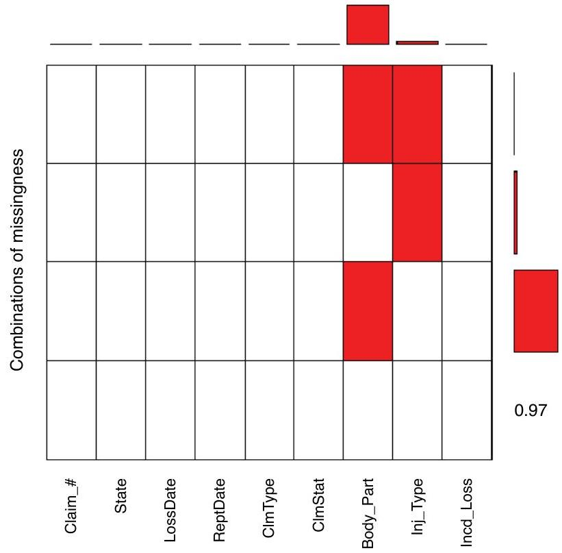

## Page 75
combination of variables which are missing. For example, the bottom row indicates instances where there are no missing variable values (as none of the cells are colored) and this encompasses 97 percent of all records. The top row represents instances where both "Body_Part" and "Injury_Type" are missing.

Another visualization offered by the VIM package, the spineplot, allows for a deeper look into the missingness of a particular attribute by crosstabbing with the categorical levels of other specified attributes. In Figure 15, we show the spineplot for missingness in the "Body_Part" attribute, broken out across different injury types. Here we can see that the missing values for "Body_Part" are evenly distributed across each of the injury types. This implies that there is no relation between "Body_Part" missingness and "Injury_Type," which supports our view that "Body_Part" may be MCAR.

While the spineplot allows for investigation of the relationship of missingness between two attributes, the parallel coordinates plot (Figure 16) provided by VIM enables the evaluation across multiple attributes. In Figure 16, we show the resulting parallel coordinates plot for missingness in the "Injury_Type" field. The parallel coordinates plot provides a visualization of the data by plotting the attributes as the row and the distinct values of each attribute as the column. Each line in the plot represents a tuple in the dataset by connecting the values of each attribute for that tuple. The red lines highlight the tuples where the "Injury_Type" value is missing. We can see that "Injury_Type" missingness is systematic in nature in that it is only

Figure 15. Spineplot of Distribution of Missing Injury Type, Given Missing Body Part
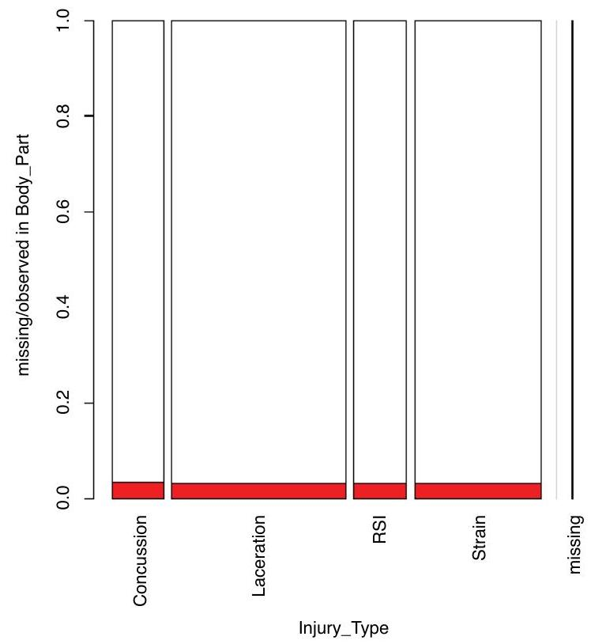

## Page 76
Figure 16. Parallel Coordinates Plot, with Missing Injury Type in Red
missing for particular accident dates in combination with a single accident state, claim type and body part. It is also associated with a few occurrences of missingness in the "Body_Part" field, but from the prior figures we know that this is a relatively small number of occurrences. We can establish that "Injury_Type" is definitely not MCAR. This may allow for a better opportunity to resolve the missingness than the MCAR case, but also may introduce bias into any use of the data.

Additional types of data anomalies can be much harder to detect and vary significantly between companies and applications. Subject matter expertise plays a significant role in identifying contradictions and integrity constraint violations. Actuaries are well aware of certain characteristics of a dataset that must exist in order for it to be a realistic representation of the underlying insurance process. For instance:

- Report dates of an accident should be subsequent to the accident date;
- Certain combinations of injuries cannot occur, such as a concussion to any other body part than the head;
- Loss amounts less than or greater than some threshold should be evaluated for accuracy and appropriateness in the intended use.

Actuarial departments will complete many analyses on different datasets, each with unique data quality characteristics, such as those above that are specific to the application. In addition, these analyses are usually repeated as part of regularly occurring processes, such as reserve reviews or the development of rating models. Unique sets of
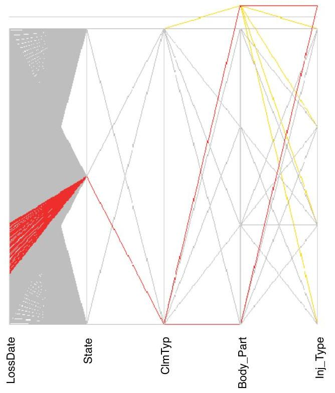

## Page 77
rules will evolve, each of which must be maintained and applied consistently to each analysis. Failing to adequately and consistently apply the same data quality checks will result in biases in the application and undermine the benefits of the collective knowledge of the organization.

While it is possible to maintain data quality checks in an Excel spreadsheet or SQL script, this practice can cause many problems due to lack of standardization and difficulty in maintenance. A more efficient and accessible approach is to maintain a distinct set of data quality rules for each analysis and apply them consistently as part of a standalone process. The following example illustrates a popular solution in R using the validate package.

# Example 7.4 (Using Validate Package in R) 

The validate package in R provides the capability to develop a self-contained data quality rules database that can easily be applied to a dataset. Any valid R statement that can be evaluated as TRUE or FALSE can be used to represent a particular rule. The rules are applied to the dataset, and the package returns a summary of tuples that either pass or fail when compared against each of the rules. Figure 17 is a summary bar plot of the result from applying the example rules mentioned above to the "wc_claims" dataset.

Inspecting the output of the validate package tells us that:

- There are a number of claims where the incurred medical loss is less than or equal to $\$ 1$;
- There are a few claims where the injury type is concussion but the body part is not the head;
- There are a few claims where the report date is before the accident date;
- There are no claims with incurred medical loss equal to or in excess of $\$ 1,000,000$.

Figure 17. Bar Plot of Validate Package Output
Validate on wc_claims
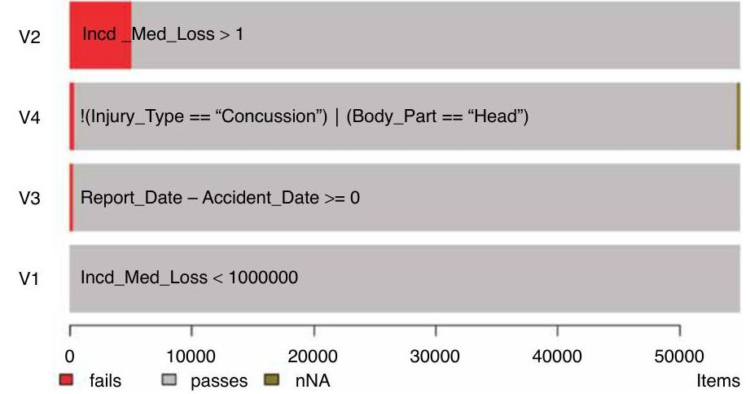

## Page 78
# Improving Data Quality 

Once the actuary has assessed the quality of the data, he must decide if and how to improve the data. Before discussing methods that can be employed to improve data quality, the actuary should consider whether data quality must be improved by performing a cost-benefit analysis and assessing the exercises for which the data would be used.

For example, consider the case where exposure data is being used to assess accumulation of risk against pre-defined risk limits for a primary reinsurer. After carrying out a data quality assessment, it was determined that the exact address information was missing for 5 percent of the policy records being assessed and only the zip codes were available. In order to obtain more granular geographic data, an investigation into the causes of missingness would need to be performed, potentially new sources of the address data located, and the new data linked to the existing data using join logic. If the exposure limits being tracked against is at the granularity of county level or higher, the additional benefit of performing this exercise would likely be negligible. However, if the data was the same and the actuarial exercise was a catastrophe modeling exercise to support a property reinsurance account pricing exercise, then this missingness could significantly affect the results; hence, it should be investigated and remediated, if possible.

We note that the approach taken to remediate data quality issues should depend on the nature of the issues and the cost-benefit analysis discussed above. In some instances, a manual adjustment is the most appropriate course of action and this can be an efficient way to deal with non-systematic, one-off problems. For example, if data inspection reveals that all of a specific adjuster's claims are concussions, independent of the body part, then the best course of action might be to raise the issue directly with the adjuster to see if there is a quick fix available. Alternatively, the actuary might want to apply rules/algorithms to improve data quality, several of which are discussed below. The best approach to improve data quality is often a combination of the manual and algorithmic methods, and will depend on how the data will be used.

Once the actuary has identified duplicate records, the duplicates should be removed so that the remaining single record is the most accurate and appropriate representation of the underlying information. The actuary may employ specific logic to select one of the records and delete the others. For example, the most recent record might be selected, or, if the duplicates come from different sources, the actuary may determine one source to be the most appropriate and use the records from that source. In other instances, the duplicates might be replaced with a single newly constructed record derived from a combination of attribute values of the duplicates based on specific rules. For example, when considering a claims dataset containing duplicates, the largest loss value might be selected amongst the duplicates as a matter of expedience or to provide a degree of prudence in a loss analysis using the dataset. Regardless of the approach used, the actuary should carefully consider the implications on the resultant actuarial analyses.

To remediate records with missing data attributes, the actuary may need to delete certain components of the dataset. The simplest approach would be to delete the

## Page 79
incomplete records from the dataset. This method may be appropriate where the missing data is limited to a small number of observations as a percentage of the total dataset and is best used where the missing data is MCAR. If the missing data is MAR or MNAR, then deleting records with missing data attributes can introduce bias into the amended dataset.

Alternately, the actuary may select records for deletion if they have missing values for certain preselected variables, typically those which are significant to the analysis exercise. Using this approach assumes that the missing data is MCAR. A further implication is that different numbers of observations are present for different variables, which can make interpretation of results challenging. Finally, the actuary may delete specific attributes for all records in a dataset. This option is likely only considered when there are a large number of missing values, e.g., more than 50 percent of the records, for a single attribute.

Instead of deleting records with missing attributes, it is common data science practice to impute values to missing data values. Imputation can be done using either basic calculated metrics such as the mean, median or mode, or sophisticated models can be developed to estimate missing values when they are not MCAR. Multiple imputation is another technique where several different types of imputation are applied and each of the imputed datasets are used in the analysis.

For continuous variables, such as a loss amount, missing values are commonly replaced by the mean, median or mode of non-missing attribute values. This is a fast and easily understandable method to apply, but takes no advantage of information contained in the other attributes. In addition, if the number of missing values is a significant proportion of the overall dataset, the constant value imputed will artificially reduce variance in the dataset.

A more sophisticated method is to use linear regression to predict the missing variables. The complete records in the dataset are used as the training data to fit a linear regression model, where the response variable is the variable with missing values. The resultant regression equation is used to predict the missing values of the target data attribute for the incomplete records. This approach can also be applied using machine learning models.

For categorical variables, beyond simply representing the missing value as its own unique categorical level, a basic approach is to impute the most frequently occurring of the non-missing categorical values. A more advanced approach would be to develop a classification model to predict the missing values based on the other data attributes. There is a risk that these predicted values are less accurate than a simpler method, and the time taken to parameterize and deploy such methods can be significant.

# Example 7.5 (Imputation of Missing Values) 

As discussed above, the "wc_claims" dataset contains missing values for both "Body_Part" and "Injury Type." Considering the missing values for "Body_Part" the use of mode imputation would result in all missing values being replaced with "Hand." Alternately, we can fit a multinomial log-linear model on our complete data records, with

## Page 80
Figure 18. Extract of Imputed Body Part Analysis Output

| Claim_Number | Accident_State | Claim_Type | Body_Part | Injury_Type | Incd_Med_Loss | Mode_BP_Imp | Classifaction_BP_Imp |
| :-- | :-- | :-- | :-- | :-- | :-- | :-- | :-- |
| 62 | NY | IND | NA | RSI | 305.18000000 | Hand | Back |
| 68 | TX | MED | NA | Laceration | 2078.78000000 | Hand | Hand |
| 93 | TX | MED | NA | Strain | 572.63000000 | Hand | Back |
| 108 | TX | MED | NA | Laceration | 454.21000000 | Hand | Hand |
| 122 | TX | MED | NA | Concussion | 4630.96000000 | Hand | Head |

"Body_Part" being the target variable and "Injury_Type," "Claim_Type" and "Incd_Med_Loss" our predictors. We then use this model to impute the values of "Body_Part" for records where it is missing. An extract from our results is displayed in Figure 18.

Comparing the final two columns we can see that our classification model often predicts different values than mode imputation, and is generally more logical. Specifically considering claim number 122 from Figure 18, we can see that the injury type is "Concussion," which is consistent with the classification model's imputation of "Body_Part" as "Head," but inconsistent with our mode imputation of "Body_Part" as "Hand."

Other imputation methods include multiple imputation, which involves imputing multiple values for each missing value, potentially using different methods, and then analyzing the results of each before combining into a "pooled result." This can be thought of as analogous to ensembling within machine learning. The attached R notebook contains an example of multiple imputation.

Other methods are available for specific data types that are missing. An example is time series data, where the actuary should consider underlying trends and the implications of potential seasonality. Linear interpolation, potentially with an adjustment for seasonality, is a commonly used method when considering time series data.

We note that these methods can also be used to adjust data that is not duplicated/ missing, but where diagnostics have indicated that the accuracy of the data is questionable. For example, a model could be built to calculate the likelihood that a value for a specific data attribute is as recorded for each record, given the values of the other variables in the record. Given selected thresholds, data values could be identified as incorrect and their values changed based on the fitted model. In general, however, it is not considered best practice to alter recorded data unless there are specific qualitative reasons to do so, and such data values could simply be outliers which contain information about the underlying processes which the actuary is attempting to understand.

# Example 7.6 (Anomaly Scoring on Non-missing Data) 

We can illustrate this concept using our "wc_claims" dataset, specifically to identify instances of "Body_Part" which do not seem reliable. Similar to the prior example, we fit a multinomial log-linear model to our complete data records, but this time use

## Page 81
Figure 19. Extract of Anomaly Scoring Body Part Analysis Output

| Claim_Number | Accident_State | Claim_Type | Body_Part | Injury_Type | Incd_Med_Loss | Probability_Body_Part |
| :-- | :-- | :-- | :-- | :-- | :-- | :-- |
| 174 | TX | IND | Hand | Concussion | 18423.1300000 | 0.00365950827 |
| 613 | NY | IND | Hand | Concussion | 55669.2700000 | 0.00223682957 |
| 1387 | NY | IND | Hand | Concussion | 40781.5100000 | 0.00272347418 |
| 1507 | CA | IND | Hand | Concussion | 3809.0600000 | 0.00443823084 |
| 1530 | TX | IND | Wrist | Laceration | 337653.8400000 | 0.00819935934 |
| 1846 | NY | IND | Wrist | Laceration | 431219.4100000 | 0.00354624381 |

it to generate the probability that the actual recorded value occurred. We can then filter the dataset to only consider records where this probability is below a certain threshold, and then consider these records for further review. Figure 19 includes an extract of the results of this analysis, with the threshold selected at 2.5 percent.

The model has identified instances where the data seems unreasonable-the first 4 claims above show instances where the injured body part is "Hand" but the type of injury is "Concussion," which is not feasible.

Although we will not include an example here, a more recent methodology that shows great promise in the detection of anomalous data is the Auto-Encoder which is a neural network trained to reconstruct its own input data. Auto-Encoders are used in anomaly detection by examining the reconstruction error associated with a particular input. Those data items with higher reconstruction error represent information that the neural network struggled to reconstruct, presumably because they manifested dissimilarities to the rest of the input data. An advantage of AutoEncoders is that they can simultaneously assess all data fields in the input dataset for anomalies and provide anomaly scores for each field separately to expedite further investigation.

Where possible, analyses should be rerun on both the original and amended dataset in order to calculate the impact of the data changes made. However, we note that caution should be exercised in linking the change in a particular metric, such as model fit, to concluding whether the data revisions were beneficial. Specifically, certain metrics might indicate improvement, whereas others might indicate model degradation. More complex analyses drawing conclusions around the impact of data improvements can be even more challenging.

# Example 7.7 (Impact of Improving Data Quality on an Actuarial Analysis) 

To illustrate the impact of improving data quality, we consider fitting a generalized linear model to the "wc_claims" dataset to model "Incd_Med_Loss." We then also fit another model to a dataset where the data quality had been improved. There is an improvement in model performance, as illustrated by comparing the model diagnostic plots in Figure 20. Specifically, we note the kink in the QQ plot and the

## Page 82
Figure 20. Diagnostic Plots for Original Dataset

Figure 21. Diagnostic Plots for Dataset with Improved Data Quality
noticeable gap/line in the residuals at the bottom of the residual plot in Figure 20 which demonstrate poor model fit-these features are removed in the plots in Figure 21.

We also calculated the Gini coefficient for the two models. The coefficient improved from 0.56 to 0.61 after the data improvements were implemented. We note that industry practice generally suggests that Gini coefficients of over 60 percent are considered to be derived from good models.
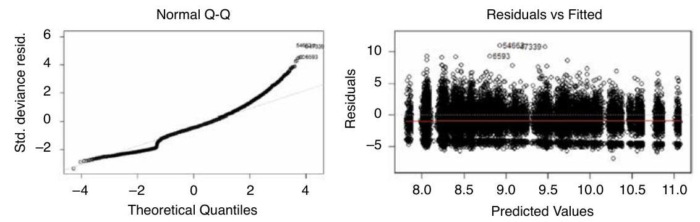
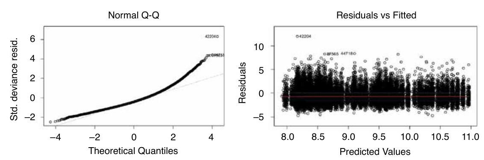

## Page 83
# 8. References 

[1] "Data." Merriam-Webster, Merriam-Webster, www.merriam-webster.com/ dictionary/data. Accessed 23 Mar. 2019.
[2] "DATA | Definition in the Cambridge English Dictionary." DATA | Definition in the Cambridge English Dictionary, dictionary.cambridge.org/us/dictionary/ english/data. Accessed 23 Mar. 2019.
[3] Giaretta, David. Advanced Digital Preservation. Springer, 2011.
[4] "What Is a Data Lake?" Amazon, Amazon, aws.amazon.com/big-data/datalakes-and-analytics/what-is-a-data-lake/. Accessed 3 May 2019.
[5] Codd, E. F. 1970. "A Relational Model of Data for Large Shared Data Banks." Communications of the ACM, vol. 13, no. 6, June 1970. https://www.seas.upenn. edu/ zives/03f/cis550/codd.pdf.
[6] Müller, Heiko \& Freytag, Johann-Christoph. Problems, Methods, and Challenges in Comprehensive Data Cleansing. Humboldt University of Berlin, 2003. http://www. dbis.informatik.hu-berlin.de/fileadmin/research/papers/techreports/2003-hub_ ib_164-mueller.pdf.
[7] Ivan P. Fellegi \& Alan B. Sunter (1969) "A Theory for Record Linkage," Journal of the American Statistical Association, 64:328, 1183-1210, DOI: 10.1080/01621459.1969.10501049.
[8] Haber, Michael. "Algorithm AS 207: Fitting a General Log-Linear Model." Journal of the Royal Statistical Society. Series C (Applied Statistics), vol. 33, no. 3, 1984, pp. 358-362. JSTOR, www.jstor.org/stable/2347724.
[9] Ijaz, Sarah. Personal Interview. 17 Apr. 2019.
[10] LexisNexis. "Data Quality is King: Key Considerations for Usage-Based Apps." Oct. 2015, https://risk.lexisnexis.com/insights-resources/white-paper/key-considerations-for-usage-based-insurance-apps
[11] Forbes Insights. "Pinpointing the Issue: Why Hyper-Accurate Location Data Can't Be Overlooked in Insurance." In Association with Pitney Bowes, 2018. http:// info.forbes.com/rs/790-SNV-353/images/PitneyBowesInsurance_BRIEF.pdf
[12] IFRS Foundation. "IFRS 17 Pocket Guide on reinsurance contracts held." Jul. 2018, https://www.ifrs.org/-/media/feature/supporting-implementation/ ifrs-17/ifrs-17-pocket-guide-on-reinsurance-contracts-held.pdf
[13] PwC. "IFRS 17: Reinsurance Needs Careful Consideration." May 2018, https:// www.pwc.co.uk/audit-assurance/assets/pdf/pwc-ifrs-17-reinsurance-guide.pdf

## Page 84
# 9. Appendices 

Data files and R code used in the examples in Section 7 can be downloaded from the CAS website at https://www.casact.org/pubs/monographs/papers/09-Madigan_ Appendix_Items.zip.

## Page 85
.

## Page 86
# ABOUT THE SERIES: 

CAS monographs are authoritative, peer-reviewed, in-depth works focusing on important topics within property and casualty actuarial practice. For more information on the CAS Monograph Series, visit the CAS website at www.casact.org.