_Note: Source document was split into 9 OCR chunks (pages 1-18, pages 19-27, pages 28-38, pages 39-52, pages 53-60, pages 61-74, pages 75-99, pages 100-124, pages 125-149) to stay within token limits._

# CAS_Monograph_10-Shapland

## Page 1
# CAS MONOGRAPH SERIES NUMBER 10 

## USING THE HAYNE MLE MODELS: A PRACTITIONER'S GUIDE

Mark R. Shapland, FCAS, FSA, MAAA

## Page 2
#### Abstract

Motivation. The Hayne MLE family of models are quite elegant in their application, but, like most models, the modeling framework needs to allow for the flexibility to deal with many different practical issues in order to address the needs of the practicing actuary. While actuaries are accustomed to making practical adjustments to their algorithms, there is motivation to stay as close to the theoretical underpinnings of the models as possible in order to maintain a sound foundation. Whenever the monograph strays a bit from the theory, those departures are noted so practitioners can adequately judge their impact. Method. This monograph starts by reviewing the Hayne MLE modeling framework using a standard notation. Then it covers a number of practical data issues and addresses the diagnostic testing of the model assumptions. Next it will explore a variety of enhancements to the basic framework to allow the models to address other issues related to reserving and pricing risk. Finally, since no single model is perfect, ways to combine or credibility weight the Hayne MLE model results with various other models are explored in order to arrive at a "best estimate" of the distribution. This is similar to how a deterministic best estimate is generally derived in practice, so ways for the practitioner to correlate models by segment in order to simulate aggregate results are also discussed. Results. The monograph will illustrate the practical implementation of the Hayne MLE modeling framework as a powerful tool for estimating a distribution of unpaid claims. Conclusions. The monograph outlines the full versatility of the Hayne MLE models for the practicing actuary. Availability. In lieu of technical appendices, several companion Excel workbooks are included that illustrate the calculations described in this monograph. The companion materials are summarized in the Supplementary Materials section and are available at https://www.casact.org/sites/default/files/2022-03/ Monograph10-ExcelFiles_0.zip.

Keywords. Maximum Likelihood Estimate, Reserve Variability, Reserve Range, Stochastic Reserving, Distribution of Possible Outcomes, Generalized Linear Model, Best Estimate.

Availability of Excel workbooks. In lieu of technical appendices, several companion Excel workbooks are included that illustrate the calculations described in this monograph. The companion materials are summarized in the Supplementary Materials section and are available at https://www.casact.org/sites/default/files/2022-03/ Monograph10-ExcelFiles_0.zip. Other sources of ODP bootstrap modeling software that could be used for educational purposes would include working parties and other industry groups in North America and Europe, including but not limited to models freely available in the R statistical software package.

## Page 3
# USING THE HAYNE MLE MODELS: A PRACTITIONER'S GUIDE 

Mark R. Shapland, FCAS, FSA, MAAA

Casualty Actuarial Society
4350 North Fairfax Drive, Suite 250
Arlington, VA 22203
www.casact.org
(703) 276-3100

## Page 4
Using the Hayne Models: A Practitioner's Guide
By Mark R. Shapland

Copyright 2021 by the Casualty Actuarial Society

All rights reserved. No part of this publication may be reproduced, stored in a retrieval system, or transmitted, in any form or by any means, electronic, mechanical, photocopying, recording, or otherwise, without the prior written permission of the publisher. For information on obtaining permission for use of the material in this work, please submit a written request to the Casualty Actuarial Society.

Library of Congress Cataloging-in-Publication Data
Using the Hayne Models: A Practitioner's Guide / Mark R. Shapland
ISBN 978-1-7333294-5-3 (print edition)
ISBN 978-1-7333294-6-0 (electronic edition)

1. Actuarial science. 2. Classification ratemaking. 3. Insurance-mathematical models.
I. Shapland, Mark R.

## Page 5
# Contents 

1. Introduction ..... 1
1.1. Objectives ..... 1
2. Notation ..... 3
3. The Hayne MLE Models ..... 5
3.1. Berquist-Sherman Model. ..... 7
3.2. Cape Cod Model ..... 8
3.3. Chain Ladder Model ..... 12
3.4. Hoerl Curve Model ..... 15
3.5. Wright Model ..... 18
3.6. The Simulation Process. ..... 20
4. Practical Issues ..... 25
4.1. Negative Incremental Values ..... 25
4.2. Standardized Residuals ..... 25
4.3. Using an $L$-Year Average ..... 26
4.4. Missing Values ..... 26
4.5. Outliers ..... 27
4.6. Heteroscedasticity ..... 27
4.7. Heteroecthesious Data ..... 28
4.8. Parameter Adjustments ..... 31
4.9. Tail Extrapolation ..... 33
4.10. Incurred Data ..... 36
4.11. Claim Count Data ..... 37
4.12. Frequency and Severity Modeling ..... 38
5. Diagnostics ..... 40
5.1. Residual Graphs ..... 41
5.2. Normality Test ..... 42
5.3. Outliers ..... 43
5.4. Model Results ..... 44
6. Using Multiple Models ..... 49

## Page 6
7. Additional Output and Results ..... 54
7.1. Additional Output ..... 54
7.2. Estimated Cash Flow Results ..... 55
7.3. Estimated Ultimate Loss Ratio Results ..... 56
7.4. Estimated Unpaid Claim Runoff Results ..... 57
7.5. Distribution Graphs ..... 57
8. Correlation and Aggregation ..... 59
9. Future Research ..... 63
10. Conclusions ..... 64
Appendix A-User Selected Parameters and Diagnostics ..... 67
Appendix B-Schedule P, Part A Results. ..... 84
Appendix C-Schedule P, Part B Results ..... 100
Appendix D-Schedule P, Part C Results. ..... 116
Appendix E-Aggregate Results. ..... 132
References and Selected Bibliography ..... 135

## Page 7
# 2021 CAS Monograph Editorial Board 

Ali Ishaq, Editor in Chief Emmanuel Theodore Bardis Eric Cheung Craig C. Davis Scott Gibson Glenn Meyers Jeffrey Prince Brandon Smith

## Page 8
# Biography of the Author 

Mark R. Shapland has a B.S. degree in Integrated Studies (Actuarial Science) from the University of Nebraska-Lincoln. He is a Fellow of the Casualty Actuarial Society, a Fellow of the Society of Actuaries, and a Member of the American Academy of Actuaries. He was the leader of Section 3 of the Reserve Variability Working Party, the Chair of the CAS Committee on Reserves, co-chair of the Tail Factor Working Party, and co-chair of the Loss Simulation Model Working Party. He is also a co-developer and co-presenter of the CAS Reserve Variability Limited Attendance Seminar and has spoken frequently on this subject both within the CAS and internationally. He can be contacted at mrshapland@netzero.com.

## Page 9
# 1. Introduction 

With the introduction of the Hayne [8] MLE family of models, the CAS membership has gained a very powerful and useful new toolset for estimating unpaid claim distributions from a data triangle. The growing need for stochastic models for use as part of enterprise risk management and the changing regulatory landscape makes these new stochastic models all the more important. However, like most papers on stochastic modeling, the Hayne [8] paper focuses primarily on the theory and development of the basic modeling framework, which of course is the critical first step. This monograph is an attempt to build and expand upon the foundation of these models by exploring different aspects of their use on a regular basis so that the practicing actuary has a more complete toolset for solving a wider variety of actuarial problems.

### 1.1. Objectives

This is the second in a series looking at distributions of loss estimates. The monographs in this series look at the theoretical foundations of stochastic unpaid claims models and practical details of implementing them.

Common objectives of the monographs in this series are:

1. Showing how the models can be used in practice to help the wider adoption of unpaid claims distribution.

Most of the papers describing stochastic models tend to focus primarily on the theoretical aspects of the model while ignoring the data issues that commonly arise in practice. As a result, the models can be quite elegantly implemented yet suffer from practical limitations such as only being useful for complete triangles or only for positive incremental values. Thus, while keeping as close to the theoretical foundation as possible, this objective is to illustrate how practical adjustments can be made to accommodate common data issues and allow the model to "fit" the data. As a practical matter, it is also possible that the model does not fit the data very well, or fits less well than other models, so the process of diagnosing the reasonability of the assumptions will inform the actuary's judgment when considering adjustments to the parameters or how much weight, if any, to give the model in relation to other models.
2. Showing how stochastic reserving can be similar to deterministic reserving when it comes to analyzing and using the best parts of multiple models.

Actuaries are still searching for the perfect model to describe "the" distribution of unpaid claims, as if imperfections in a model remove it from all consideration,

## Page 10
since it can't be "the one." This notion can also manifest itself when an actuary settles for a model that seems to work the best or is the easiest to use, or believes that each model must be used in its entirety or not at all. Interestingly, this notion was dispelled long ago with respect to deterministic point estimates, as actuaries commonly use many different methods, which range from easy to complex, and judgmentally weight the results to arrive at their best estimate.

Model risk - the risk that the model you have chosen is not the same as the one that generates future losses - is very real. Weighting or combining multiple estimates is a very practical way of addressing model risk. More importantly, the monograph hopes to illustrate the advantage of using a more complete set of risk estimation tools (which can include both stochastic models and deterministic methods) to arrive at an actuarial best estimate of the distribution of possible outcomes, rather than to focus on deterministic methods to select the "mean" and then simply "add on" a simple approximation or use only a favorite model to turn that selected mean into a distribution.

A final objective of this monograph is to review the theoretical foundation of Hayne MLE models to better understand the assumptions and parameters. If model assumptions and parameters do not fit the statistical features found in the data, then the results of a simulation may not be a very good estimate of the distribution of possible outcomes. Thus, the modeling framework must be able to adapt or "fit" the model to the data, so this point will be elaborated on in later sections.

## Page 11
# 2. Notation 

Rather than use the notation in the Hayne [8] paper, the notation from the CAS Working Party on Quantifying Variability in Reserve Estimates Summary Report [4] will be used since it is intended to serve as a "standard notation" for further research.

Many models visualize loss data as a two-dimensional array, $(w, d)$ with accident period or policy period $w$, and development age $d$ (think $w=$ "when" and $d=$ "delay"). For this discussion, it is assumed that the loss information available is an "upper triangular" subset for rows $w=1,2, \ldots, n$ and for development ages $d=1,2, \ldots$, $n-w+1$. The "diagonal" for which $w+d$ equals the constant, $k$, represents the loss information for each accident period $w$ as of accounting period $k .{ }^{1}$

For purposes of including tail factors, the development beyond the observed data for periods $d=n+1, n+2, \ldots, u$, where $u$ is the ultimate time period for which any claim activity occurs, or the period in which all claims are final and paid in full, must also be considered.

The monograph uses the following notation for certain important loss statistics:

$$
\begin{array}{ll}
c(w, d): & \text { cumulative loss from accident } 2 \text { year } w \text { as of age } d . \\
q(w, d): & \text { incremental loss for accident year } w \text { from } d-1 \text { to } d . \\
c(w, n)=U(w): & \text { total loss from accident year } w \text { when claims are at ultimate values } \\
& \text { at time } n .^{3} \\
R(w): & \text { future development after age } d \text { for accident year } w \text {, i.e., }=U(w)- \\
& c(w, d) . \\
f(d): & \text { parameter or factor applied to } c(w, d) \text { to estimate } q(w, d+1) \\
& \text { or can be used more generally to indicate any parameter or factor } \\
& \text { relating to age } d . \\
F(d): & \text { parameter or factor applied to } c(w, d) \text { to estimate } c(w, d+1) \text { or } \\
& c(w, n) \text { or can be used more generally to indicate any cumulative } \\
& \text { parameter or factor relating to age } d .
\end{array}
$$

[^0]
[^0]:    ${ }^{1}$ For a more complete explanation of this two-dimensional view of the loss information, see the Foundations of Casualty Actuarial Science [6], Chapter 5, particularly pages 210-226.
    2 The use of accident year is used for ease of discussion. All of the discussion and formulas that follow could also apply to underwriting year, policy year, report year, etc. Similarly, year could also be half-year, quarter or month. Finally, while year is implied in the formulas, in many of the tables that follow the equivalent number of months are shown.
    3 This would imply that claims reach their ultimate value without any tail factor. This is generalized by changing $\boldsymbol{n}$ to $\boldsymbol{n}+\boldsymbol{t}=\boldsymbol{n}$, where $\boldsymbol{t}$ is the number of periods in the tail.

## Page 12
$T=T(n)$ : ultimate tail factor at end of triangle data, which is applied to the estimated $c(w, n)$ to estimate $c(w, u)$.
$G(w)$ : parameter or factor relating to accident year $w$ - capitalized to designate ultimate loss level.
$h(k)$ : parameter or factor relating to the diagonal $k$ along which $w+d$ is constant. ${ }^{4}$
$M(w, d)$ : matrix factors relating to both accident year $w$ and development year $d$ parameters.
$e(w, d)$ : a random fluctuation, or error, which occurs at the $w, d$ cell.
$b(w, d)$ : cumulative claim count from accident year $w$ as of age $d$.
$p(w, d)$ : incremental claim count for accident year $w$ from $d-1$ to $d$.
$N(w)$ : the exposures for accident year $w$.
$A(w, d)$ : the incremental average for accident year $w$ from $d-1$ to $d$.
$E[x]$ : the expectation of the random variable $x$.
$\operatorname{Var}[x]:$ the variance of the random variable $x$.
$\kappa, \rho$ : variance parameters.
What are called factors here could also be summands, but if factors and summands are both used, some other notation for the additive terms would be needed. The notation does not distinguish paid vs. incurred, but if this is necessary, capitalized subscripts $P$ and $I$ could be used.

[^0]
[^0]:    4 Some authors define $\boldsymbol{d}=0,1, \ldots, \boldsymbol{n}-1$ which intuitively allows $\boldsymbol{k}=\boldsymbol{w}$ along the diagonals, but in this case the triangle size is $\boldsymbol{n} \times \boldsymbol{n}-1$ which is not intuitive. With $\boldsymbol{d}=1,2, \ldots, \boldsymbol{n}$ defined as in this monograph, the triangle size $\boldsymbol{n} \times \boldsymbol{n}$ is intuitive, but then $\boldsymbol{k}=\boldsymbol{w}+\mathbf{1}$ along the diagonals is not as intuitive. A way to think about this which helps tie everything together is to assume the $\boldsymbol{w}$ variables are the beginning of the accident periods and the $\boldsymbol{d}$ variables are at the end of the development periods. Thus, if years are used, then cell $\boldsymbol{c}(\boldsymbol{n}, \mathbf{1})$ represents accident year $\boldsymbol{n}$ evaluated at $12 / 31 / n$, or essentially $1 / 1 / n+1$.

## Page 13
# 3. The Hayne MLE Models 

The Hayne MLE models ${ }^{5}$ are based on a triangular array of incremental values:

| $w$ | 1 | d |  |  |  |  |
| :--: | :--: | :--: | :--: | :--: | :--: | :--: |
|  |  | 1 | 2 | 3 | $\ldots$ | n-1 |
|  | 1 | $q(1,1)$ | $q(1,2)$ | $q(1,3)$ | $\ldots$ | $q(1, n-1)$ |
|  | 2 | $q(2,1)$ | $q(2,2)$ | $q(2,3)$ | $\ldots$ | $q(2, n-1)$ |
|  | 3 | $q(3,1)$ | $q(3,2)$ | $q(3,3)$ | $\ldots$ |  |
|  | $\ldots$ | $\ldots$ | $\ldots$ |  |  |  |
|  | n-1 | $q(n-1,1)$ | $q(n-1,2)$ |  |  |  |
|  | n | $q(n, 1)$ |  |  |  |  |

By incorporating an exposure adjustment, the variety of methods available for analysis is widened as the focus shifts to the incremental averages:

$$
A(w, d)=\frac{q(w, d)}{N(w)}
$$

Hayne [8] notes that the exposure adjustment for average incremental values (3.1) can be based on exposure counts or premium amounts, which would commonly be referred to as an average pure premium or burning cost. In addition, the exposure adjustment can be based on an estimate of ultimate claim counts, which would be commonly referred to as an average claim severity: ${ }^{6}$

$$
A(w, d)=\frac{q(w, d)}{b(w, u)}
$$

In the case of the average claim severity, the ultimate claim counts are often only estimates and as such could be treated as random variables, which will be addressed in Section 4.

[^0]
[^0]:    5 While condensed for ease of exposition, significant portions of Section 3 are based on Hayne [8].
    ${ }^{6}$ For both premiums and exposures, their magnitude can result in very small average values that may have some disadvantages with respect to estimating the model parameters. A practical solution in either case is to use premiums or exposures in thousands or a similar value.

## Page 14
The Hayne MLE models are then based on a generalized framework that expresses each underlying method as a matrix-valued function of a parameter vector $\theta$ :

$$
A(w, d)=M(\boldsymbol{\theta})
$$

In order to turn this general framework into a stochastic model, two key assumptions are made. ${ }^{7}$ First, the variance of each incremental value is assumed to be proportional to a power of the square of the mean. It is quite common to assume the variance is proportional to a power of the expected values, but the square of the mean is used to allow incremental values to be negative. Also, the constant of proportionality is exponential, allowing the parameter to take on any value while assuring positive values for the variance. Second, as the variance of an average of a sample with a finite variance will be inversely proportional to the number of items in the sample, the constant of proportionality is assumed to vary inversely to the number of exposures.

The stochastic model is then expressed as follows:

$$
\begin{gathered}
E[A(w, d)]=\mu \\
\operatorname{Var}[A(w, d)]=\frac{e^{\kappa}\left(\mu^{2}\right)^{\rho}}{N(w)}=e^{\kappa-\ln |N(w)|}\left(\mu^{2}\right)^{\rho}
\end{gathered}
$$

Hayne [8] notes that this model includes an implicit structural heteroscedasticity and that both the expected values and variances differ by accident and development year. The two variance parameters, $\kappa$ and $\rho$, provide a mechanism to approximate the variance structure of the data without over-parameterizing the model. However, the formulae can be modified to allow $\kappa$ to vary by development period if additional control over the heteroscedasticity is desired.

Hayne [8] eloquently describes additional assumptions and processes for estimating the parameters for the stochastic model expressed in (3.4) and (3.5), including R code in the appendix. As this can't be improved upon here, it is left to the reader to review the Hayne [8] paper for further details, but the focus will turn to the five different implementations of this general framework before moving on to various practical implementation issues. For anyone not familiar with R, the implementation of the process of estimating model parameters in R is replicated in Excel in the companion "Hayne MLE Models.xlsm" file. In Excel, the MLE estimates for the parameter vector $\theta$ are found using the Solver function. Note, however, that while the Solver algorithm in Excel should estimate parameters that are very close to those estimated in R, there can be differences and in some cases constraints may need to be added to the Excel Solver algorithm.

[^0]
[^0]:    ${ }^{7}$ It is also important to understand that by appealing to the Central Limit Theorem we note that $A(w, d)$ is approximately Normal provided the number of claims is sufficiently large, since it is an average of independent events from equation (3.1) or (3.2).

## Page 15
While the monograph continues to illustrate the Hayne MLE models with the more advanced "Hayne MLE Models.xlsm" file, also included in the companion Excel files are a set of "Hayne Framework 6 __xlsm" files that illustrate the calculations for each of these different models using a $6 \times 6$ triangle. These simpler files are designed to help the reader gain a deeper understanding of each model.

# 3.1. Berquist-Sherman Model 

Berquist and Sherman [2] developed methods to recognize that incremental severities can have different "levels" by accident year as well as different trends by development year. Hayne [8] simplifies this approach by assuming a uniform trend from one accident year to the next, which replaces different levels with uniform changes in level and indirectly impacts the development for each year.

$$
E[A(w, d)]=f(d) \times e^{w G}
$$

In the Hayne Berquist-Sherman model, the $f(d)$ parameters represent an average incremental by development period. The $G$ parameter is a constant accident year trend where $w=1,2,3, \ldots, n$. Using the data from Hayne [8], the companion Excel file summarizes the Berquist-Sherman model parameters as in Table 3.1.

In addition to the mean and standard deviation of each parameter, which are nearly identical to those in Hayne [8], the coefficient of variation ("CoV") row is added so that the heteroscedastistic variance by parameter is more apparent. The decay ratios row is simply the mean of the development parameter divided by the mean of the prior

Table 3.1. Summary of Berquist-Sherman Parameters

|  | Development Period Parameters (Average Incremental) |  |  |  |  |  |  |  |  |  |
| :--: | :--: | :--: | :--: | :--: | :--: | :--: | :--: | :--: | :--: | :--: |
|  | 12 | 24 | 36 | 48 | 60 | 72 | 84 | 96 | 108 | 120 |
| Mean | 620.95 | 760.66 | 708.15 | 553.57 | 349.99 | 181.39 | 70.96 | 43.88 | 11.08 | 15.21 |
| Std Dev | 40.50 | 46.55 | 43.00 | 35.49 | 26.17 | 17.66 | 10.39 | 8.74 | 4.22 | 7.34 |
| Decay Ratios: |  | 122.5\% | 93.1\% | 78.2\% | 63.2\% | 51.8\% | 39.1\% | 61.8\% | 25.2\% | 137.3\% |
| CoV: | 6.5\% | 6.1\% | 6.1\% | 6.4\% | 7.5\% | 9.7\% | 14.6\% | 19.9\% | 38.1\% | 48.3\% |
|  | Accident Year |  |  |  |  |  |  |  |  |  |
|  | Trend | K | p | AIC | BIC |  |  |  | Parameters |  |
| Mean | 0.045 | 11.216 | 0.654 | 643.4 | 669.5 |  | Acc Period |  | 0 |  |
| Std Dev | 0.009 | 1.037 | 0.085 |  |  |  | Dev Period |  | 10 |  |
| CoV: | 18.9\% | 9.2\% | 12.9\% |  |  |  | Trend |  | 1 |  |
|  |  |  |  |  |  |  |  |  | 11 |  |

## Page 16
Table 3.2. Expected Incremental Mean Values for Berquist-Sherman Model

| Predicted Incremental Mean [Model Fitted] (Paid [= Ultimate Claims]) |  |  |  |  |  |  |  |  |  |  |  |
| :--: | :--: | :--: | :--: | :--: | :--: | :--: | :--: | :--: | :--: | :--: | :--: |
| Year | 12 | 24 | 36 | 48 | 60 | 72 | 84 | 96 | 108 | 120 | Future   Totals |
| 2008 | 649.69 | 795.86 | 740.93 | 579.17 | 366.20 | 189.78 | 74.25 | 45.91 | 11.59 | 15.92 | 0.00 |
| 2009 | 679.73 | 832.66 | 775.18 | 605.95 | 383.13 | 198.56 | 77.69 | 48.03 | 12.13 | 16.65 | 16.65 |
| 2010 | 711.16 | 871.16 | 811.03 | 633.96 | 400.84 | 207.74 | 81.28 | 50.25 | 12.69 | 17.42 | 30.11 |
| 2011 | 744.04 | 911.43 | 848.52 | 663.28 | 419.37 | 217.34 | 85.04 | 52.57 | 13.27 | 18.23 | 84.07 |
| 2012 | 778.44 | 953.57 | 887.75 | 693.94 | 438.76 | 227.39 | 88.97 | 55.00 | 13.89 | 19.07 | 176.93 |
| 2013 | 814.43 | 997.66 | 928.80 | 726.03 | 459.05 | 237.90 | 93.08 | 57.55 | 14.53 | 19.95 | 423.01 |
| 2014 | 852.08 | 1,043.79 | 971.74 | 759.59 | 480.27 | 248.90 | 97.38 | 60.21 | 15.20 | 20.88 | 922.84 |
| 2015 | 891.48 | 1,092.05 | 1,016.67 | 794.71 | 502.48 | 260.41 | 101.89 | 62.99 | 15.90 | 21.84 | 1,760.22 |
| 2016 | 932.70 | 1,142.54 | 1,063.67 | 831.46 | 525.71 | 272.45 | 106.60 | 65.90 | 16.64 | 22.85 | 2,905.28 |
| 2017 | 975.82 | 1,195.36 | 1,112.85 | 869.90 | 550.02 | 285.05 | 111.53 | 68.95 | 17.41 | 23.91 | 4,234.97 |
|  |  |  |  |  |  |  |  |  |  |  | 10,554.09 |

development parameter, which will be used in later discussions about model fit and tail extrapolation.

Using formulas (3.6) and (3.5) to calculate the expected mean and standard deviation, the results for each incremental value are shown in Tables 3.2 and 3.3, respectively.

Reviewing Table 3.2 you can see how the expected mean values for each development period relate to the model parameters for $f(d)$ in Table 3.1 by looking at each column. Also, comparing rows allows you to see how the trend parameter $G$ impacts each accident year. Reviewing Table 3.3, you can see how expected standard deviation values follow a similar pattern to the expected mean values by column and row. In addition, the standard deviations are related to the exposures (i.e., ultimate claims in this example), which can produce interesting differences, such as the values for 2017 being smaller than for 2016 due to a significantly larger estimate of ultimate claims. Table 3.4 shows the incremental coefficients of variation so that you can easily see the heteroscedasticity implied in the model.

# 3.2. Cape Cod Model 

Hayne [8] notes that the traditional Bornhuetter-Ferguson [3] method estimates future losses by accident year as a percent of an a priori estimate of the ultimate losses for that year. In contrast, a feature of the Cape Cod method is that it derives the a priori estimates directly from the data. Hayne [8] essentially combines these methods by assuming that the incremental average amounts are the product of an accident year

## Page 17
Table 3.3. Incremental Standard Deviation Values for Berquist-Sherman Model

|  | Predicted Incremental Standard Deviation [Model Fitted] (Paid [+ Ultimate Claims]) |  |  |  |  |  |  |  |  |  |   |
| --- | --- | --- | --- | --- | --- | --- | --- | --- | --- | --- | --- |
|  Year | 12 | 24 | 36 | 48 | 60 | 72 | 84 | 96 | 108 | 120 | Future
Totals  |
|  2008 | 95.13 | 108.63 | 103.66 | 88.24 | 65.39 | 42.55 | 23.04 | 16.82 | 6.84 | 8.42 | 0.00  |
|  2009 | 98.60 | 112.59 | 107.44 | 91.46 | 67.77 | 44.10 | 23.88 | 17.43 | 7.09 | 8.72 | 8.72  |
|  2010 | 97.68 | 111.54 | 106.45 | 90.61 | 67.14 | 43.69 | 23.65 | 17.27 | 7.02 | 8.64 | 11.14  |
|  2011 | 100.06 | 114.26 | 109.04 | 92.82 | 68.78 | 44.75 | 24.23 | 17.69 | 7.19 | 8.85 | 21.05  |
|  2012 | 104.03 | 118.79 | 113.36 | 96.50 | 71.51 | 46.53 | 25.19 | 18.39 | 7.48 | 9.20 | 33.37  |
|  2013 | 108.82 | 124.26 | 118.59 | 100.95 | 74.80 | 48.67 | 26.35 | 19.24 | 7.82 | 9.63 | 59.90  |
|  2014 | 107.65 | 122.92 | 117.31 | 99.86 | 74.00 | 48.15 | 26.07 | 19.03 | 7.74 | 9.52 | 94.79  |
|  2015 | 112.81 | 128.81 | 122.93 | 104.64 | 77.54 | 50.45 | 27.32 | 19.95 | 8.11 | 9.98 | 144.29  |
|  2016 | 114.36 | 130.58 | 124.62 | 106.08 | 78.61 | 51.15 | 27.69 | 20.22 | 8.22 | 10.12 | 192.16  |
|  2017 | 110.40 | 126.07 | 120.31 | 102.41 | 75.89 | 49.38 | 26.73 | 19.52 | 7.94 | 9.77 | 224.29  |
|   |  |  |  |  |  |  |  |  |  |  | 349.83  |

Table 3.4. Incremental Coefficients of Variation for Berquist-Sherman Model

|  | Predicted Incremental Coefficient of Variation [Model Fitted] (Paid [+ Ultimate Claims]) |  |  |  |  |  |  |  |  |  |  |   |
| --- | --- | --- | --- | --- | --- | --- | --- | --- | --- | --- | --- | --- |
|  Year | 12 | 24 | 36 | 48 | 60 | 72 | 84 | 96 | 108 | 120 | Future
Totals |   |
|  2008 | $14.6 \%$ | $13.6 \%$ | $14.0 \%$ | $15.2 \%$ | $17.9 \%$ | $22.4 \%$ | $31.0 \%$ | $36.6 \%$ | $59.0 \%$ | $52.9 \%$ |  |   |
|  2009 | $14.5 \%$ | $13.5 \%$ | $13.9 \%$ | $15.1 \%$ | $17.7 \%$ | $22.2 \%$ | $30.7 \%$ | $36.3 \%$ | $58.5 \%$ | $52.4 \%$ | $52.4 \%$ |   |
|  2010 | $13.7 \%$ | $12.8 \%$ | $13.1 \%$ | $14.3 \%$ | $16.8 \%$ | $21.0 \%$ | $29.1 \%$ | $34.4 \%$ | $55.4 \%$ | $49.6 \%$ | $37.0 \%$ |   |
|  2011 | $13.4 \%$ | $12.5 \%$ | $12.9 \%$ | $14.0 \%$ | $16.4 \%$ | $20.6 \%$ | $28.5 \%$ | $33.7 \%$ | $54.2 \%$ | $48.6 \%$ | $25.0 \%$ |   |
|  2012 | $13.4 \%$ | $12.5 \%$ | $12.8 \%$ | $13.9 \%$ | $16.3 \%$ | $20.5 \%$ | $28.3 \%$ | $33.4 \%$ | $53.9 \%$ | $48.3 \%$ | $18.9 \%$ |   |
|  2013 | $13.4 \%$ | $12.5 \%$ | $12.8 \%$ | $13.9 \%$ | $16.3 \%$ | $20.5 \%$ | $28.3 \%$ | $33.4 \%$ | $53.8 \%$ | $48.2 \%$ | $14.2 \%$ |   |
|  2014 | $12.6 \%$ | $11.8 \%$ | $12.1 \%$ | $13.1 \%$ | $15.4 \%$ | $19.3 \%$ | $26.8 \%$ | $31.6 \%$ | $50.9 \%$ | $45.6 \%$ | $10.3 \%$ |   |
|  2015 | $12.7 \%$ | $11.8 \%$ | $12.1 \%$ | $13.2 \%$ | $15.4 \%$ | $19.4 \%$ | $26.8 \%$ | $31.7 \%$ | $51.0 \%$ | $45.7 \%$ | $8.2 \%$ |   |
|  2016 | $12.3 \%$ | $11.4 \%$ | $11.7 \%$ | $12.8 \%$ | $15.0 \%$ | $18.8 \%$ | $26.0 \%$ | $30.7 \%$ | $49.4 \%$ | $44.3 \%$ | $6.6 \%$ |   |
|  2017 | $11.3 \%$ | $10.5 \%$ | $10.8 \%$ | $11.8 \%$ | $13.8 \%$ | $17.3 \%$ | $24.0 \%$ | $28.3 \%$ | $45.6 \%$ | $40.9 \%$ | $5.3 \%$ |   |
|   |  |  |  |  |  |  |  |  |  |  |  | $3.3 \%$  |

## Page 18
factor and lag factor, which are usually taken as ultimate loss for the year and the percentage of losses emerging that year.

$$
E[A(w, d)]=\left\{\begin{array}{cc}
G(1,1), & w=1, d=1 \\
G(1,1) \times G(w), & w>1, d=1 \\
G(1,1) \times f(d), & w=1, d>1 \\
G(1,1) \times G(w) \times f(d), & w>1, d>1
\end{array}\right.
$$

In the Hayne Cape Cod model, the $G(1,1)$ parameter, or scale, is a constant from which all other parameters are based. The $G(w)$ parameters are factors multiplied by the constant, which essentially adjust the base for average exposure changes by accident year. The $f(d)$ parameters are factors multiplied by the constant, or constant adjusted by the $G(w)$ parameters, which essentially adjust the base (by accident year) for average incremental changes by development year. Using the data from Hayne [8], the companion Excel file summarizes the Cape Cod model parameters as in Table 3.5.

Using formulas (3.7) and (3.5) to calculate the expected mean and standard deviation, the results for each incremental value are shown in Tables 3.6 and 3.7, respectively.

Table 3.5. Summary of Cape Cod Parameters

|  | Accident Period Parameters |  |  |  |  |  |  |  |  |  |
| :--: | :--: | :--: | :--: | :--: | :--: | :--: | :--: | :--: | :--: | :--: |
|  | Scale | 2009 | 2010 | 2011 | 2012 | 2013 | 2014 | 2015 | 2016 | 2017 |
| Mean | 620.067 | 1.160 | 1.123 | 1.322 | 1.376 | 1.521 | 1.533 | 1.580 | 1.169 | 1.164 |
| Std Dev | 30.048 | 0.066 | 0.064 | 0.072 | 0.075 | 0.082 | 0.084 | 0.091 | 0.082 | 0.105 |
| CoV | 4.8\% | 5.7\% | 5.7\% | 5.4\% | 5.4\% | 5.4\% | 5.5\% | 5.8\% | 7.1\% | 9.0\% |
|  | Development Period Parameters (Average Incremental) |  |  |  |  |  |  |  |  |  |
|  |  | 24 | 36 | 48 | 60 | 72 | 84 | 96 | 108 | 120 |
| Mean |  | 1.181 | 1.063 | 0.838 | 0.534 | 0.284 | 0.111 | 0.067 | 0.015 | 0.024 |
| Std Dev |  | 0.041 | 0.040 | 0.036 | 0.029 | 0.023 | 0.016 | 0.016 | 0.009 | 0.017 |
| Decay Ratios |  |  | 90.0\% | 78.8\% | 63.7\% | 53.2\% | 39.0\% | 60.7\% | 22.8\% | 158.0\% |
| CoV |  | 3.5\% | 3.8\% | 4.3\% | 5.5\% | 8.1\% | 14.8\% | 23.1\% | 61.1\% | 70.4\% |
|  |  | K | p | AIC | BIC |  |  |  | Parameters |  |
| Mean |  | 13.104 | 0.435 | 659.4 | 701.6 |  | Acc Period |  | 9 |  |
| Std Dev |  | 1.010 | 0.083 |  |  |  | Dev Period |  | 9 |  |
| CoV |  | 7.7\% | 19.0\% |  |  |  | Scale |  | 1 |  |
|  |  |  |  |  |  |  |  |  | 19 |  |

## Page 19
Table 3.6. Expected Incremental Mean Values for Cape Cod Model

|  |  |  |  |  |  |  |  |  |  |  | Predicted Incremental Mean [Model Fitted] (Paid [+ Ultimate Claims]) |  |  |  |  |
| :--: | :--: | :--: | :--: | :--: | :--: | :--: | :--: | :--: | :--: | :--: | :--: | :--: | :--: | :--: | :--: |
| Year | 12 | 24 | 36 | 48 | 60 | 72 | 84 | 96 | 108 | 120 | Future   Totals |  |  |  |  |
| 2008 | 620.07 | 732.01 | 659.04 | 519.38 | 330.98 | 176.23 | 68.79 | 41.73 | 9.53 | 15.05 | 0.00 |  |  |  |  |
| 2009 | 719.49 | 849.38 | 764.70 | 602.65 | 384.04 | 204.48 | 79.82 | 48.43 | 11.05 | 17.47 | 17.47 |  |  |  |  |
| 2010 | 696.47 | 822.21 | 740.24 | 583.37 | 371.76 | 197.94 | 77.27 | 46.88 | 10.70 | 16.91 | 27.61 |  |  |  |  |
| 2011 | 819.84 | 967.86 | 871.37 | 686.71 | 437.61 | 233.01 | 90.95 | 55.18 | 12.60 | 19.90 | 87.68 |  |  |  |  |
| 2012 | 853.00 | 1,006.99 | 906.61 | 714.48 | 455.31 | 242.43 | 94.63 | 57.41 | 13.11 | 20.71 | 185.86 |  |  |  |  |
| 2013 | 943.01 | 1,113.26 | 1,002.28 | 789.88 | 503.36 | 268.01 | 104.62 | 63.47 | 14.49 | 22.89 | 473.48 |  |  |  |  |
| 2014 | 950.77 | 1,122.42 | 1,010.52 | 796.38 | 507.50 | 270.22 | 105.48 | 63.99 | 14.61 | 23.08 | 984.87 |  |  |  |  |
| 2015 | 979.71 | 1,156.58 | 1,041.28 | 820.62 | 522.95 | 278.44 | 108.69 | 65.94 | 15.05 | 23.78 | 1,835.47 |  |  |  |  |
| 2016 | 725.16 | 856.08 | 770.74 | 607.41 | 387.08 | 206.10 | 80.45 | 48.81 | 11.14 | 17.60 | 2,129.33 |  |  |  |  |
| 2017 | 721.47 | 851.72 | 766.81 | 604.31 | 385.10 | 205.05 | 80.04 | 48.56 | 11.08 | 17.52 | 2,970.19 |  |  |  |  |
|  |  |  |  |  |  |  |  |  |  |  |  |  |  |  | 8,711.96 |  |

Table 3.7. Incremental Standard Deviation Values for Cape Cod Model

|  | Predicted Incremental Standard Deviation [Model Fitted] (Paid [+ Ultimate Claims]) |  |  |  |  |  |  |  |  |  |  |  |  |  |  |
| :-- | --: | --: | --: | --: | --: | --: | --: | --: | --: | --: | --: | --: | :--: | :--: | :--: |
| Year | 12 | 24 | 36 | 48 | 60 | 72 | 84 | 96 | 108 | 120 | Future   Totals |  |  |  |  |
| 2008 | 58.08 | 62.43 | 59.64 | 53.77 | 44.20 | 33.60 | 22.31 | 17.95 | 9.44 | 11.52 | 0.00 |  |  |  |  |
| 2009 | 62.35 | 67.02 | 64.03 | 57.73 | 47.45 | 36.07 | 23.96 | 19.28 | 10.14 | 12.37 | 12.37 |  |  |  |  |
| 2010 | 59.13 | 63.56 | 60.72 | 54.75 | 45.00 | 34.21 | 22.72 | 18.28 | 9.61 | 11.73 | 15.17 |  |  |  |  |
| 2011 | 63.13 | 67.86 | 64.83 | 58.45 | 48.04 | 36.52 | 24.26 | 19.52 | 10.26 | 12.52 | 25.36 |  |  |  |  |
| 2012 | 64.83 | 69.69 | 66.58 | 60.02 | 49.34 | 37.51 | 24.91 | 20.04 | 10.54 | 12.86 | 36.04 |  |  |  |  |
| 2013 | 68.78 | 73.94 | 70.63 | 63.68 | 52.35 | 39.79 | 26.43 | 21.26 | 11.18 | 13.64 | 55.18 |  |  |  |  |
| 2014 | 66.30 | 71.26 | 68.08 | 61.38 | 50.45 | 38.35 | 25.47 | 20.49 | 10.78 | 13.15 | 73.31 |  |  |  |  |
| 2015 | 68.34 | 73.45 | 70.17 | 63.27 | 52.01 | 39.53 | 26.26 | 21.12 | 11.11 | 13.56 | 98.55 |  |  |  |  |
| 2016 | 59.01 | 63.43 | 60.59 | 54.63 | 44.90 | 34.14 | 22.67 | 18.24 | 9.59 | 11.70 | 104.47 |  |  |  |  |
| 2017 | 55.18 | 59.32 | 56.67 | 51.09 | 42.00 | 31.92 | 21.20 | 17.06 | 8.97 | 10.95 | 114.30 |  |  |  |  |
|  |  |  |  |  |  |  |  |  |  |  |  |  |  |  | 210.79 |  |

## Page 20
Table 3.8. Incremental Coefficients of Variation for Cape Cod Model

| Predicted Incremental Coefficient of Variation (Model Fitted) (Paid [+ Ultimate Claims]) |  |  |  |  |  |  |  |  |  |  |  |
| :--: | :--: | :--: | :--: | :--: | :--: | :--: | :--: | :--: | :--: | :--: | :--: |
| Year | 12 | 24 | 36 | 48 | 60 | 72 | 84 | 96 | 108 | 120 | Future   Totals |
| 2008 | $9.4 \%$ | $8.5 \%$ | $9.0 \%$ | $10.4 \%$ | $13.4 \%$ | $19.1 \%$ | $32.4 \%$ | $43.0 \%$ | $99.1 \%$ | $76.5 \%$ |  |
| 2009 | $8.7 \%$ | $7.9 \%$ | $8.4 \%$ | $9.6 \%$ | $12.4 \%$ | $17.6 \%$ | $30.0 \%$ | $39.8 \%$ | $91.7 \%$ | $70.8 \%$ | $70.8 \%$ |
| 2010 | $8.5 \%$ | $7.7 \%$ | $8.2 \%$ | $9.4 \%$ | $12.1 \%$ | $17.3 \%$ | $29.4 \%$ | $39.0 \%$ | $89.8 \%$ | $69.4 \%$ | $54.9 \%$ |
| 2011 | $7.7 \%$ | $7.0 \%$ | $7.4 \%$ | $8.5 \%$ | $11.0 \%$ | $15.7 \%$ | $26.7 \%$ | $35.4 \%$ | $81.5 \%$ | $62.9 \%$ | $28.9 \%$ |
| 2012 | $7.6 \%$ | $6.9 \%$ | $7.3 \%$ | $8.4 \%$ | $10.8 \%$ | $15.5 \%$ | $26.3 \%$ | $34.9 \%$ | $80.4 \%$ | $62.1 \%$ | $19.4 \%$ |
| 2013 | $7.3 \%$ | $6.6 \%$ | $7.0 \%$ | $8.1 \%$ | $10.4 \%$ | $14.8 \%$ | $25.3 \%$ | $33.5 \%$ | $77.2 \%$ | $59.6 \%$ | $11.7 \%$ |
| 2014 | $7.0 \%$ | $6.3 \%$ | $6.7 \%$ | $7.7 \%$ | $9.9 \%$ | $14.2 \%$ | $24.1 \%$ | $32.0 \%$ | $73.8 \%$ | $57.0 \%$ | $7.4 \%$ |
| 2015 | $7.0 \%$ | $6.4 \%$ | $6.7 \%$ | $7.7 \%$ | $9.9 \%$ | $14.2 \%$ | $24.2 \%$ | $32.0 \%$ | $73.8 \%$ | $57.0 \%$ | $5.4 \%$ |
| 2016 | $8.1 \%$ | $7.4 \%$ | $7.9 \%$ | $9.0 \%$ | $11.6 \%$ | $16.6 \%$ | $28.2 \%$ | $37.4 \%$ | $86.1 \%$ | $66.5 \%$ | $4.9 \%$ |
| 2017 | $7.6 \%$ | $7.0 \%$ | $7.4 \%$ | $8.5 \%$ | $10.9 \%$ | $15.6 \%$ | $26.5 \%$ | $35.1 \%$ | $80.9 \%$ | $62.5 \%$ | $3.8 \%$ |
|  |  |  |  |  |  |  |  |  |  |  | $2.4 \%$ |

Reviewing Table 3.6, you can see that the scale, or constant, is the value for 2008 at 12 months of development. The $G(w)$, or accident year, parameters are used to adjust the scale in the 12 -month column and then the $f(d)$, or development year, parameters are used to adjust the scale, or scale adjusted by accident year, for each development column. Table 3.8 shows the incremental coefficients of variation so that you can easily see the heteroscedasticity implied in the model.

# 3.3. Chain Ladder Model 

For the traditional chain ladder method, average development factors are multiplied by the cumulative amounts by accident year to estimate the expected future incremental values. Hayne [8] also uses the cumulative amounts by accident year, but instead derives parameters which represent the proportion of the incremental value in each development year. The parameters are constrained so that the incremental values sum to the cumulative values. In addition, $n-1$ parameters are used with the last development year parameter derived so that the sum of all parameters is $100 \%$.

In the Hayne chain ladder model, the $G(w)$ parameters are the actual cumulative values for each accident year. The $f(d)$ parameters are factors multiplied times the cumulative values to derive the expected incremental values by development year. Only $n-1$ parameters are derived and the "parameter" for the last development period is one minus the sum of the $n-1$ parameters. In order to constrain the sum of the expected incremental values to equal the cumulative values, the $f(d)$ parameters are

## Page 21
divided by the sum of the parameters for that accident year so that the proportional factors for that accident year up to the diagonal sum to $100 \%$.

$$
E[A(w, d)]=\left\{\begin{array}{cc}
G(w) \times f(d), & w=1, d<n \\
G(w) \times\left[1-\sum_{d=1}^{d=n-1} f(d)\right], & w=1, d=n \\
\frac{G(w) \times f(d)}{\sum_{k=1}^{k=n+1-w} f(k)}, & w>1, d<n \\
\frac{G(w) \times\left[1-\sum_{d=1}^{d=n-1} f(d)\right]}{\sum_{k=1}^{k=n+1-w} f(k)}, & w>1, d=n
\end{array}\right.
$$

Using the data from Hayne [8], the companion Excel file summarizes the chain ladder model parameters as in Table 3.9.

The parameter for 120 months is greyed since it is derived by subtracting the sum of the other parameters from one. Using formulas (3.8) and (3.5) to calculate the expected mean and standard deviation, the results for each incremental value are shown in Tables 3.10 and 3.11, respectively.

Reviewing Table 3.10, it is not as obvious how the parameters relate to the incremental values compared to the Berquist-Sherman or Cape Cod models. However, if you sum the incremental values up to the diagonal for each accident year, you will discover that they sum to the cumulative value for each accident year. Thus, the $f(d)$ parameters can be seen as representing an average proportion of the incremental values compared to the cumulative values. Table 3.12 shows the incremental coefficients of variation so that you can easily see the heteroscedasticity implied in the model.

Table 3.9. Summary of Chain Ladder Parameters

|  | Development Period Parameters (Average Incremental) |  |  |  |  |  |  |  |  |  |
| :-- | --: | --: | --: | --: | --: | --: | --: | --: | --: | --: |
|  | 12 | 24 | 36 | 48 | 60 | 72 | 84 | 96 | 108 | 120 |
| Mean | 0.195 | 0.231 | 0.208 | 0.164 | 0.104 | 0.056 | 0.022 | 0.013 | 0.003 | 0.005 |
| Std Dev | 0.005 | 0.005 | 0.005 | 0.005 | 0.005 | 0.004 | 0.003 | 0.003 | 0.002 | 0.003 |
| Decay Ratios: |  | $118.1 \%$ | $90.0 \%$ | $78.8 \%$ | $63.7 \%$ | $53.2 \%$ | $39.0 \%$ | $60.8 \%$ | $22.9 \%$ | $157.7 \%$ |
| CoV: | $2.5 \%$ | $2.3 \%$ | $2.5 \%$ | $3.1 \%$ | $4.5 \%$ | $7.3 \%$ | $14.3 \%$ | $22.6 \%$ | $60.4 \%$ | $69.6 \%$ |
|  |  | K | p | AIC | BIC |  |  |  | Parameters |  |
| Mean |  | 13.074 | 0.438 | 619.4 | 661.5 |  | Acc Period |  | 10 |  |
| Std Dev |  | 1.007 | 0.082 |  |  |  | Dev Period |  | 9 |  |
| CoV: |  | $7.7 \%$ | $18.8 \%$ |  |  |  | Trend |  | 0 |  |
|  |  |  |  |  |  |  |  |  | 19 |  |

## Page 22
Table 3.10. Expected Incremental Mean Values for Chain Ladder Model

| Predicted Incremental Mean [Model Fitted] (Paid [+ Ultimate Claims]) |  |  |  |  |  |  |  |  |  |  |  |
| :--: | :--: | :--: | :--: | :--: | :--: | :--: | :--: | :--: | :--: | :--: | :--: |
| Year | 12 | 24 | 36 | 48 | 60 | 72 | 84 | 96 | 108 | 120 | Future   Totals |
| 2008 | 617.57 | 729.07 | 656.33 | 517.19 | 329.57 | 175.45 | 68.44 | 41.59 | 9.51 | 15.00 | 0.00 |
| 2009 | 715.93 | 845.18 | 760.86 | 599.56 | 382.05 | 203.39 | 79.34 | 48.21 | 11.03 | 17.39 | 17.39 |
| 2010 | 695.14 | 820.64 | 738.76 | 582.16 | 370.96 | 197.49 | 77.04 | 46.81 | 10.71 | 16.89 | 27.60 |
| 2011 | 823.53 | 972.20 | 875.21 | 689.67 | 439.47 | 233.96 | 91.26 | 55.46 | 12.69 | 20.01 | 88.15 |
| 2012 | 854.54 | 1,008.81 | 908.16 | 715.64 | 456.02 | 242.77 | 94.70 | 57.55 | 13.16 | 20.76 | 186.17 |
| 2013 | 943.04 | 1,113.29 | 1,002.22 | 789.76 | 503.25 | 267.91 | 104.51 | 63.51 | 14.53 | 22.91 | 473.37 |
| 2014 | 951.15 | 1,122.87 | 1,010.84 | 796.55 | 507.58 | 270.22 | 105.41 | 64.06 | 14.65 | 23.11 | 985.02 |
| 2015 | 981.03 | 1,158.13 | 1,042.59 | 821.57 | 523.52 | 278.70 | 108.72 | 66.07 | 15.11 | 23.83 | 1,837.53 |
| 2016 | 726.85 | 858.06 | 772.46 | 608.70 | 387.88 | 206.49 | 80.55 | 48.95 | 11.20 | 17.66 | 2,133.89 |
| 2017 | 723.30 | 853.88 | 768.69 | 605.74 | 385.99 | 205.49 | 80.16 | 48.71 | 11.14 | 17.57 | 2,977.37 |
|  |  |  |  |  |  |  |  |  |  |  | 8,726.49 |

Table 3.11. Incremental Standard Deviation Values for Chain Ladder Model

| Predicted Incremental Standard Deviation [Model Fitted] (Paid [+ Ultimate Claims]) |  |  |  |  |  |  |  |  |  |  |  |
| :--: | :--: | :--: | :--: | :--: | :--: | :--: | :--: | :--: | :--: | :--: | :--: |
| Year | 12 | 24 | 36 | 48 | 60 | 72 | 84 | 96 | 108 | 120 | Future   Totals |
| 2008 | 58.10 | 62.48 | 59.67 | 53.76 | 44.14 | 33.49 | 22.18 | 17.84 | 9.35 | 11.41 | 0.00 |
| 2009 | 62.38 | 67.08 | 64.06 | 57.72 | 47.38 | 35.96 | 23.81 | 19.15 | 10.04 | 12.25 | 12.25 |
| 2010 | 59.23 | 63.69 | 60.83 | 54.80 | 44.99 | 34.14 | 22.61 | 18.18 | 9.53 | 11.63 | 15.04 |
| 2011 | 63.44 | 68.22 | 65.15 | 58.70 | 48.19 | 36.57 | 24.22 | 19.47 | 10.21 | 12.46 | 25.27 |
| 2012 | 65.08 | 69.98 | 66.84 | 60.22 | 49.44 | 37.51 | 24.84 | 19.98 | 10.47 | 12.78 | 35.91 |
| 2013 | 69.01 | 74.21 | 70.87 | 63.86 | 52.42 | 39.78 | 26.34 | 21.18 | 11.11 | 13.56 | 55.07 |
| 2014 | 66.53 | 71.54 | 68.32 | 61.56 | 50.54 | 38.35 | 25.40 | 20.42 | 10.71 | 13.07 | 73.29 |
| 2015 | 68.61 | 73.78 | 70.46 | 63.48 | 52.12 | 39.55 | 26.19 | 21.06 | 11.04 | 13.48 | 98.71 |
| 2016 | 59.22 | 63.68 | 60.82 | 54.79 | 44.98 | 34.14 | 22.61 | 18.18 | 9.53 | 11.63 | 104.68 |
| 2017 | 55.39 | 59.56 | 56.88 | 51.25 | 42.07 | 31.93 | 21.14 | 17.00 | 8.91 | 10.88 | 114.60 |
|  |  |  |  |  |  |  |  |  |  |  | 211.05 |

## Page 23
Table 3.12. Incremental Coefficients of Variation for Chain Ladder Model

| Predicted Incremental Coefficient of Variation (Model Fitted) (Paid [+ Ultimate Claims]) |  |  |  |  |  |  |  |  |  |  |  |
| :--: | :--: | :--: | :--: | :--: | :--: | :--: | :--: | :--: | :--: | :--: | :--: |
| Year | 12 | 24 | 36 | 48 | 60 | 72 | 84 | 96 | 108 | 120 | Future   Totals |
| 2008 | $9.4 \%$ | $8.6 \%$ | $9.1 \%$ | $10.4 \%$ | $13.4 \%$ | $19.1 \%$ | $32.4 \%$ | $42.9 \%$ | $98.3 \%$ | $76.1 \%$ |  |
| 2009 | $8.7 \%$ | $7.9 \%$ | $8.4 \%$ | $9.6 \%$ | $12.4 \%$ | $17.7 \%$ | $30.0 \%$ | $39.7 \%$ | $91.0 \%$ | $70.5 \%$ | $70.5 \%$ |
| 2010 | $8.5 \%$ | $7.8 \%$ | $8.2 \%$ | $9.4 \%$ | $12.1 \%$ | $17.3 \%$ | $29.3 \%$ | $38.8 \%$ | $89.0 \%$ | $68.9 \%$ | $54.5 \%$ |
| 2011 | $7.7 \%$ | $7.0 \%$ | $7.4 \%$ | $8.5 \%$ | $11.0 \%$ | $15.6 \%$ | $26.5 \%$ | $35.1 \%$ | $80.5 \%$ | $62.3 \%$ | $28.7 \%$ |
| 2012 | $7.6 \%$ | $6.9 \%$ | $7.4 \%$ | $8.4 \%$ | $10.8 \%$ | $15.5 \%$ | $26.2 \%$ | $34.7 \%$ | $79.6 \%$ | $61.6 \%$ | $19.3 \%$ |
| 2013 | $7.3 \%$ | $6.7 \%$ | $7.1 \%$ | $8.1 \%$ | $10.4 \%$ | $14.8 \%$ | $25.2 \%$ | $33.4 \%$ | $76.4 \%$ | $59.2 \%$ | $11.6 \%$ |
| 2014 | $7.0 \%$ | $6.4 \%$ | $6.8 \%$ | $7.7 \%$ | $10.0 \%$ | $14.2 \%$ | $24.1 \%$ | $31.9 \%$ | $73.1 \%$ | $56.6 \%$ | $7.4 \%$ |
| 2015 | $7.0 \%$ | $6.4 \%$ | $6.8 \%$ | $7.7 \%$ | $10.0 \%$ | $14.2 \%$ | $24.1 \%$ | $31.9 \%$ | $73.1 \%$ | $56.6 \%$ | $5.4 \%$ |
| 2016 | $8.1 \%$ | $7.4 \%$ | $7.9 \%$ | $9.0 \%$ | $11.6 \%$ | $16.5 \%$ | $28.1 \%$ | $37.1 \%$ | $85.1 \%$ | $65.9 \%$ | $4.9 \%$ |
| 2017 | $7.7 \%$ | $7.0 \%$ | $7.4 \%$ | $8.5 \%$ | $10.9 \%$ | $15.5 \%$ | $26.4 \%$ | $34.9 \%$ | $80.0 \%$ | $61.9 \%$ | $3.8 \%$ |
|  |  |  |  |  |  |  |  |  |  |  | $2.4 \%$ |

# 3.4. Hoerl Curve Model 

The Hoerl Curve is a three-parameter exponential model that uses the development lag for all three parameters, i.e., number of periods, number of periods squared and the natural $\log$ of the number of periods. Hayne [8] combines these three parameters with a constant level parameter and an accident year trend factor.

$$
E[A(w, d)]=e^{G(1)+d \times f(1)+d^{2} \times f(2)+\ln (d) \times f(3)+w \times G(2)}
$$

In the Hayne Hoerl Curve model, the $G(1)$ parameter is the constant level on a $\log$ scale. The $G(2)$ parameter is a constant trend that adjusts the level by accident year. The $f(1), f(2)$, and $f(3)$ parameters are factors multiplied times the development lags, i.e., by $d, d^{2}$, and $\ln (d)$, respectfully. Using the data from Hayne [8], the companion Excel file summarizes the Hoerl Curve model parameters as in Table 3.13.

Using formulas (3.9) and (3.5) to calculate the expected mean and standard deviation, the results for each incremental value are shown in Tables 3.14 and 3.15, respectively.

Reviewing Table 3.14, the link to the parameters must be viewed on a log scale. Starting with the first development column, the beginning "level" for each accident year on a $\log$ scale is the $G(1)$ parameter plus the trend times the number of years, plus one of the $f(1)$ and $f(2)$ parameters. Moving from left to right across the development years, the combination of the three development parameters acts to first increase the incremental values, then to decrease the incremental values in a smooth curve. Table 3.16 shows the incremental coefficients of variation so that you can easily see the heteroscedasticity implied in the model.

## Page 24
Table 3.13. Summary of Hoerl Curve Parameters

|  | Parameters (Average Incremental) |  |  |  |  |  |  |  |
| :--: | :--: | :--: | :--: | :--: | :--: | :--: | :--: | :--: |
|  | Level | d | $d^{2}$ | $\ln (d)$ | Trend |  |  |  |
| Mean | 6.496 | 0.005 | $(0.065)$ | 0.596 | 0.043 |  |  |  |
| Std Dev | 0.220 | 0.240 | 0.019 | 0.323 | 0.008 |  |  |  |
| CoV: | $3.4 \%$ | $4687.1 \%$ | $-28.4 \%$ | $54.2 \%$ | $19.5 \%$ |  |  |  |
|  |  | K | p | AIC | BIC |  | Parameters |  |
| Mean |  | 13.147 | 0.506 | 639.7 | 653.8 | Level | 1 |  |
| Std Dev |  | 1.014 | 0.083 |  |  | Development | 3 |  |
| CoV: |  | $7.7 \%$ | $16.3 \%$ |  |  | Trend | 1 |  |
|  |  |  |  |  |  |  | 5 |  |

Table 3.14. Expected Incremental Mean Values for Hoerl Curve Model

|  | Predicted Incremental Mean [Model Fitted] (Paid [= Ultimate Claims]) |  |  |  |  |  |  |  |  |  |  |
| :--: | :--: | :--: | :--: | :--: | :--: | :--: | :--: | :--: | :--: | :--: | :--: |
| Year | 12 | 24 | 36 | 48 | 60 | 72 | 84 | 96 | 108 | 120 | Future   Totals |
| 2008 | 651.30 | 813.57 | 751.30 | 567.59 | 362.10 | 197.86 | 93.30 | 38.14 | 13.55 | 4.20 | 0.00 |
| 2009 | 679.90 | 849.29 | 784.29 | 592.51 | 378.00 | 206.55 | 97.40 | 39.81 | 14.15 | 4.38 | 4.38 |
| 2010 | 709.75 | 886.58 | 818.73 | 618.53 | 394.60 | 215.62 | 101.67 | 41.56 | 14.77 | 4.57 | 19.34 |
| 2011 | 740.92 | 925.51 | 854.68 | 645.68 | 411.93 | 225.08 | 106.14 | 43.38 | 15.42 | 4.77 | 63.58 |
| 2012 | 773.45 | 966.15 | 892.20 | 674.04 | 430.01 | 234.97 | 110.80 | 45.29 | 16.09 | 4.98 | 177.16 |
| 2013 | 807.41 | 1,008.57 | 931.38 | 703.63 | 448.90 | 245.28 | 115.66 | 47.28 | 16.80 | 5.20 | 430.22 |
| 2014 | 842.86 | 1,052.85 | 972.28 | 734.53 | 468.61 | 256.05 | 120.74 | 49.35 | 17.54 | 5.43 | 917.72 |
| 2015 | 879.87 | 1,099.08 | 1,014.97 | 766.78 | 489.18 | 267.30 | 126.04 | 51.52 | 18.31 | 5.67 | 1,724.80 |
| 2016 | 918.50 | 1,147.34 | 1,059.53 | 800.45 | 510.66 | 279.03 | 131.58 | 53.78 | 19.11 | 5.92 | 2,860.07 |
| 2017 | 958.83 | 1,197.72 | 1,106.06 | 835.59 | 533.08 | 291.28 | 137.35 | 56.14 | 19.95 | 6.18 | 4,183.37 |
|  |  |  |  |  |  |  |  |  |  |  | 10,380.64 |

## Page 25
Table 3.15. Incremental Standard Deviation Values for Hoerl Curve Model

|  | Predicted Incremental Standard Deviation [Model Fitted] (Paid [+ Ultimate Claims]) |  |  |  |  |  |  |  |  |  |   |
| --- | --- | --- | --- | --- | --- | --- | --- | --- | --- | --- | --- |
|  Year | 12 | 24 | 36 | 48 | 60 | 72 | 84 | 96 | 108 | 120 | Future
Totals  |
|  2008 | 95.72 | 107.11 | 102.88 | 89.29 | 71.14 | 52.41 | 35.84 | 22.80 | 13.51 | 7.47 | 0.00  |
|  2009 | 98.43 | 110.15 | 105.81 | 91.82 | 73.16 | 53.89 | 36.85 | 23.45 | 13.90 | 7.68 | 7.68  |
|  2010 | 96.76 | 108.28 | 104.00 | 90.26 | 71.91 | 52.98 | 36.23 | 23.05 | 13.66 | 7.55 | 15.61  |
|  2011 | 98.34 | 110.05 | 105.71 | 91.73 | 73.09 | 53.84 | 36.82 | 23.42 | 13.88 | 7.67 | 28.29  |
|  2012 | 101.45 | 113.52 | 109.04 | 94.63 | 75.39 | 55.54 | 37.98 | 24.16 | 14.32 | 7.92 | 47.90  |
|  2013 | 105.29 | 117.83 | 113.18 | 98.22 | 78.25 | 57.65 | 39.42 | 25.08 | 14.86 | 8.22 | 76.12  |
|  2014 | 103.35 | 115.65 | 111.08 | 96.40 | 76.81 | 56.58 | 38.69 | 24.61 | 14.59 | 8.06 | 107.15  |
|  2015 | 107.45 | 120.25 | 115.50 | 100.23 | 79.86 | 58.83 | 40.23 | 25.59 | 15.17 | 8.38 | 149.87  |
|  2016 | 108.08 | 120.95 | 116.18 | 100.82 | 80.33 | 59.18 | 40.47 | 25.74 | 15.26 | 8.43 | 190.32  |
|  2017 | 103.53 | 115.85 | 111.28 | 96.57 | 76.94 | 56.68 | 38.76 | 24.66 | 14.62 | 8.08 | 216.00  |
|   |  |  |  |  |  |  |  |  |  |  | 354.98  |

Table 3.16. Incremental Coefficients of Variation for Hoerl Curve Model

|  | Predicted Incremental Coefficient of Variation [Model Fitted] (Paid [+ Ultimate Claims]) |  |  |  |  |  |  |  |  |  |  |  |  |  |  |  |  |  |  |  |  |  |  |  |  |  |   |
| --- | --- | --- | --- | --- | --- | --- | --- | --- | --- | --- | --- | --- | --- | --- | --- | --- | --- | --- | --- | --- | --- | --- | --- | --- | --- | --- | --- |
|  Year | 12 | 24 | 36 | 48 | 60 | 72 | 84 | 96 | 108 | 120 | Future
Totals |  |  |  |  |  |  |  |  |  |  |  |  |  |  |  |   |
|  2008 | $14.7 \%$ | $13.2 \%$ | $13.7 \%$ | $15.7 \%$ | $19.6 \%$ | $26.5 \%$ | $38.4 \%$ | $59.8 \%$ | $99.7 \%$ | $178.0 \%$ |  |  |  |  |  |  |  |  |  |  |  |  |  |  |  |  |   |
|  2009 | $14.5 \%$ | $13.0 \%$ | $13.5 \%$ | $15.5 \%$ | $19.4 \%$ | $26.1 \%$ | $37.8 \%$ | $58.9 \%$ | $98.2 \%$ | $175.4 \%$ | $175.4 \%$ |  |  |  |  |  |  |  |  |  |  |  |  |  |  |  |   |
|  2010 | $13.6 \%$ | $12.2 \%$ | $12.7 \%$ | $14.6 \%$ | $18.2 \%$ | $24.6 \%$ | $35.6 \%$ | $55.5 \%$ | $92.5 \%$ | $165.1 \%$ | $80.7 \%$ |  |  |  |  |  |  |  |  |  |  |  |  |  |  |  |   |
|  2011 | $13.3 \%$ | $11.9 \%$ | $12.4 \%$ | $14.2 \%$ | $17.7 \%$ | $23.9 \%$ | $34.7 \%$ | $54.0 \%$ | $90.0 \%$ | $160.8 \%$ | $44.5 \%$ |  |  |  |  |  |  |  |  |  |  |  |  |  |  |  |   |
|  2012 | $13.1 \%$ | $11.7 \%$ | $12.2 \%$ | $14.0 \%$ | $17.5 \%$ | $23.6 \%$ | $34.3 \%$ | $53.4 \%$ | $89.0 \%$ | $158.9 \%$ | $27.0 \%$ |  |  |  |  |  |  |  |  |  |  |  |  |  |  |  |   |
|  2013 | $13.0 \%$ | $11.7 \%$ | $12.2 \%$ | $14.0 \%$ | $17.4 \%$ | $23.5 \%$ | $34.1 \%$ | $53.0 \%$ | $88.5 \%$ | $158.0 \%$ | $17.7 \%$ |  |  |  |  |  |  |  |  |  |  |  |  |  |  |  |   |
|  2014 | $12.3 \%$ | $11.0 \%$ | $11.4 \%$ | $13.1 \%$ | $16.4 \%$ | $22.1 \%$ | $32.0 \%$ | $49.9 \%$ | $83.2 \%$ | $148.5 \%$ | $11.7 \%$ |  |  |  |  |  |  |  |  |  |  |  |  |  |  |  |   |
|  2015 | $12.2 \%$ | $10.9 \%$ | $11.4 \%$ | $13.1 \%$ | $16.3 \%$ | $22.0 \%$ | $31.9 \%$ | $49.7 \%$ | $82.9 \%$ | $147.9 \%$ | $8.7 \%$ |  |  |  |  |  |  |  |  |  |  |  |  |  |  |  |   |
|  2016 | $11.8 \%$ | $10.5 \%$ | $11.0 \%$ | $12.6 \%$ | $15.7 \%$ | $21.2 \%$ | $30.8 \%$ | $47.9 \%$ | $79.8 \%$ | $142.5 \%$ | $6.7 \%$ |  |  |  |  |  |  |  |  |  |  |  |  |  |  |  |   |
|  2017 | $10.8 \%$ | $9.7 \%$ | $10.1 \%$ | $11.6 \%$ | $14.4 \%$ | $19.5 \%$ | $28.2 \%$ | $43.9 \%$ | $73.2 \%$ | $130.8 \%$ | $5.2 \%$ |  |  |  |  |  |  |  |  |  |  |  |  |  |  |  |   |
|   |  |  |  |  |  |  |  |  |  |  |  |  |  |  |  |  |  |  |  |  |  |  |  |  |  |  |   |

$3.4 \%$

## Page 26
# 3.5. Wright Model 

The Wright model also uses the three-parameter Hoerl curve, but instead of constant level and trend parameters, individual parameters for each accident year "level" are used.

$$
E[A(w, d)]=e^{G(w)+d \times f(1)+d^{2} \times f(2)+\ln (d) \times f(3)}
$$

In the Hayne Wright model, the $G(w)$ parameters are the individual levels for each accident year. Similar to the Hoerl Curve model, the $f(1), f(2)$, and $f(3)$ parameters are factors multiplied times the development lags, i.e., by $d, d^{2}$, and $\ln (d)$, respectfully. Using the data from Hayne [8], the companion Excel file summarizes the Wright model parameters as in Table 3.17.

Using formulas (3.10) and (3.5) to calculate the expected mean and standard deviation, the results for each incremental value are shown in Tables 3.18 and 3.19, respectively.

Reviewing Table 3.18, you can see the similarities to Table 3.14. Starting with the first development column, the beginning "level" for each accident year on a log scale is the $G(w)$ parameter plus one of the $f(1)$ and $f(2)$ parameters. Moving from left to right across the development years, the combination of the three development parameters acts to first increase the incremental values, then to decrease the incremental values in a smooth curve. Table 3.20 below shows the incremental coefficients of variation so that you can easily see the heteroscedasticity implied in the model.

Table 3.17. Summary of Wright Parameters

|  | Accident Period Parameters |  |  |  |  |  |  |  |  |  |
| :--: | :--: | :--: | :--: | :--: | :--: | :--: | :--: | :--: | :--: | :--: |
|  | 2006 | 2007 | 2008 | 2009 | 2010 | 2011 | 2012 | 2013 | 2014 | 2015 |
| Mean | 6.312 | 6.472 | 6.436 | 6.587 | 6.636 | 6.738 | 6.742 | 6.771 | 6.475 | 6.468 |
| Std Dev | 0.168 | 0.167 | 0.167 | 0.166 | 0.167 | 0.167 | 0.166 | 0.164 | 0.166 | 0.184 |
| CoV | $2.7 \%$ | $2.6 \%$ | $2.6 \%$ | $2.5 \%$ | $2.5 \%$ | $2.5 \%$ | $2.5 \%$ | $2.4 \%$ | $2.6 \%$ | $2.8 \%$ |
| Development Period Parameters (Average Incremental) |  |  |  |  |  |  |  |  |  |  |
|  |  | d | $d^{2}$ | $\ln (d)$ |  |  |  |  |  |  |
| Mean |  | 0.192 | $(0.078)$ | 0.290 |  |  |  |  |  |  |
| Std Dev |  | 0.183 | 0.015 | 0.232 |  |  |  |  |  |  |
| CoV |  | $95.4 \%$ | $-19.5 \%$ | $80.0 \%$ |  |  |  |  |  |  |
|  |  | K | p | AIC | BIC |  |  | Parameters |  |  |
| Mean |  | 14.592 | 0.319 | 612.3 | 642.4 |  | Acc Period | 10 |  |  |
| Std Dev |  | 0.909 | 0.075 |  |  |  | Dev Period | 3 |  |  |
| CoV |  | $6.2 \%$ | $23.4 \%$ |  |  |  |  | 13 |  |  |

## Page 27
Table 3.18. Expected Incremental Mean Values for Wright Model

|  |  |  |  |  |  |  |  |  |  |  | Predicted Incremental Mean [Model Fitted] (Paid [= Ultimate Claims]) |  |  |  |  |
| :--: | :--: | :--: | :--: | :--: | :--: | :--: | :--: | :--: | :--: | :--: | :--: | :--: | :--: | :--: | :--: |
| Year | 12 | 24 | 36 | 48 | 60 | 72 | 84 | 96 | 108 | 120 | Future   Totals |  |  |  |  |
| 2008 | 617.75 | 724.24 | 668.24 | 509.80 | 326.60 | 176.91 | 81.32 | 31.79 | 10.59 | 3.01 | 0.00 |  |  |  |  |
| 2009 | 724.55 | 849.44 | 783.76 | 597.94 | 383.06 | 207.49 | 95.38 | 37.29 | 12.42 | 3.52 | 3.52 |  |  |  |  |
| 2010 | 698.92 | 819.39 | 756.04 | 576.79 | 369.51 | 200.15 | 92.00 | 35.97 | 11.98 | 3.40 | 15.38 |  |  |  |  |
| 2011 | 813.22 | 953.39 | 879.68 | 671.11 | 429.93 | 232.88 | 107.05 | 41.85 | 13.94 | 3.96 | 59.74 |  |  |  |  |
| 2012 | 854.17 | 1,001.41 | 923.98 | 704.91 | 451.59 | 244.61 | 112.44 | 43.96 | 14.64 | 4.16 | 175.19 |  |  |  |  |
| 2013 | 945.66 | 1,108.66 | 1,022.94 | 780.41 | 499.95 | 270.81 | 124.48 | 48.67 | 16.21 | 4.60 | 464.77 |  |  |  |  |
| 2014 | 949.61 | 1,113.29 | 1,027.21 | 783.67 | 502.04 | 271.94 | 125.00 | 48.87 | 16.27 | 4.62 | 968.75 |  |  |  |  |
| 2015 | 977.65 | 1,146.17 | 1,057.55 | 806.81 | 516.87 | 279.97 | 128.70 | 50.31 | 16.75 | 4.76 | 1,804.17 |  |  |  |  |
| 2016 | 726.83 | 852.12 | 786.23 | 599.82 | 384.26 | 208.14 | 95.68 | 37.41 | 12.46 | 3.54 | 2,127.54 |  |  |  |  |
| 2017 | 721.95 | 846.40 | 780.95 | 595.80 | 381.68 | 206.75 | 95.04 | 37.16 | 12.37 | 3.51 | 2,959.65 |  |  |  |  |
|  |  |  |  |  |  |  |  |  |  |  |  |  |  |  | 8,578.71 |  |

Table 3.19. Incremental Standard Deviation Values for Wright Model

|  | Predicted Incremental Standard Deviation [Model Fitted] (Paid [= Ultimate Claims]) |  |  |  |  |  |  |  |  |  |  |  |  |  |  |
| :-- | :--: | :--: | :--: | :--: | :--: | :--: | :--: | :--: | :--: | :--: | :--: | :--: | :--: | :--: | :--: |
| Year | 12 | 24 | 36 | 48 | 60 | 72 | 84 | 96 | 108 | 120 | Future   Totals |  |  |  |  |
| 2008 | 57.98 | 61.00 | 59.45 | 54.53 | 47.30 | 38.89 | 30.35 | 22.48 | 15.83 | 10.59 | 0.00 |  |  |  |  |
| 2009 | 61.39 | 64.59 | 62.95 | 57.74 | 50.09 | 41.18 | 32.13 | 23.81 | 16.76 | 11.21 | 11.21 |  |  |  |  |
| 2010 | 58.37 | 61.41 | 59.86 | 54.90 | 47.63 | 39.16 | 30.55 | 22.64 | 15.93 | 10.66 | 19.17 |  |  |  |  |
| 2011 | 60.93 | 64.10 | 62.48 | 57.31 | 49.71 | 40.87 | 31.89 | 23.63 | 16.63 | 11.13 | 30.96 |  |  |  |  |
| 2012 | 62.47 | 65.73 | 64.06 | 58.76 | 50.97 | 41.91 | 32.70 | 24.23 | 17.05 | 11.41 | 45.57 |  |  |  |  |
| 2013 | 65.55 | 68.96 | 67.21 | 61.65 | 53.48 | 43.97 | 34.31 | 25.42 | 17.89 | 11.97 | 64.96 |  |  |  |  |
| 2014 | 63.03 | 66.32 | 64.64 | 59.29 | 51.43 | 42.28 | 32.99 | 24.44 | 17.21 | 11.51 | 80.91 |  |  |  |  |
| 2015 | 64.73 | 68.10 | 66.38 | 60.88 | 52.81 | 43.42 | 33.88 | 25.10 | 17.67 | 11.82 | 103.01 |  |  |  |  |
| 2016 | 57.96 | 60.98 | 59.43 | 54.51 | 47.28 | 38.88 | 30.33 | 22.47 | 15.82 | 10.58 | 109.72 |  |  |  |  |
| 2017 | 54.21 | 57.03 | 55.58 | 50.98 | 44.22 | 36.36 | 28.37 | 21.02 | 14.80 | 9.90 | 117.40 |  |  |  |  |
|  |  |  |  |  |  |  |  |  |  |  |  |  |  |  | 225.23 |  |

## Page 28
Table 3.20. Incremental Coefficients of Variation for Wright Model

| Predicted Incremental Coefficient of Variation (Model Fitted) (Paid ( = Ultimate Claims)) |  |  |  |  |  |  |  |  |  |  |
| :--: | :--: | :--: | :--: | :--: | :--: | :--: | :--: | :--: | :--: | :--: |
| Year | 12 | 24 | 36 | 48 | 60 | 72 | 84 | 96 | 108 | 120 |
| 2008 | $9.4 \%$ | $8.4 \%$ | $8.9 \%$ | $10.7 \%$ | $14.5 \%$ | $22.0 \%$ | $37.3 \%$ | $70.7 \%$ | $149.5 \%$ | $352.3 \%$ |
| 2009 | $8.5 \%$ | $7.6 \%$ | $8.0 \%$ | $9.7 \%$ | $13.1 \%$ | $19.8 \%$ | $33.7 \%$ | $63.8 \%$ | $135.0 \%$ | $318.0 \%$ |
| 2010 | $8.4 \%$ | $7.5 \%$ | $7.9 \%$ | $9.5 \%$ | $12.9 \%$ | $19.6 \%$ | $33.2 \%$ | $62.9 \%$ | $133.0 \%$ | $313.5 \%$ |
| 2011 | $7.5 \%$ | $6.7 \%$ | $7.1 \%$ | $8.5 \%$ | $11.6 \%$ | $17.6 \%$ | $29.8 \%$ | $56.5 \%$ | $119.3 \%$ | $281.2 \%$ |
| 2012 | $7.3 \%$ | $6.6 \%$ | $6.9 \%$ | $8.3 \%$ | $11.3 \%$ | $17.1 \%$ | $29.1 \%$ | $55.1 \%$ | $116.5 \%$ | $274.5 \%$ |
| 2013 | $6.9 \%$ | $6.2 \%$ | $6.6 \%$ | $7.9 \%$ | $10.7 \%$ | $16.2 \%$ | $27.6 \%$ | $52.2 \%$ | $110.4 \%$ | $260.2 \%$ |
| 2014 | $6.6 \%$ | $6.0 \%$ | $6.3 \%$ | $7.6 \%$ | $10.2 \%$ | $15.5 \%$ | $26.4 \%$ | $50.0 \%$ | $105.7 \%$ | $249.2 \%$ |
| 2015 | $6.6 \%$ | $5.9 \%$ | $6.3 \%$ | $7.5 \%$ | $10.2 \%$ | $15.5 \%$ | $26.3 \%$ | $49.9 \%$ | $105.5 \%$ | $248.5 \%$ |
| 2016 | $8.0 \%$ | $7.2 \%$ | $7.6 \%$ | $9.1 \%$ | $12.3 \%$ | $18.7 \%$ | $31.7 \%$ | $60.1 \%$ | $127.0 \%$ | $299.3 \%$ |
| 2017 | $7.5 \%$ | $6.7 \%$ | $7.1 \%$ | $8.6 \%$ | $11.6 \%$ | $17.6 \%$ | $29.9 \%$ | $56.6 \%$ | $119.6 \%$ | $281.8 \%$ |
|  |  |  |  |  |  |  |  |  |  |  |

# 3.6. The Simulation Process 

For each of the Hayne MLE models, using the parameters to calculate the expected mean and standard deviation for each incremental cell is only the starting point, since this framework allows us to use simulation to generate a distribution of possible outcomes. Additional outputs for each model are the standard deviations for each parameter (shown in Tables 3.1, 3.5, 3.9, 3.13, and 3.17) and the variance-covariance matrix of all the parameters (not shown). Using the means and variance-covariance matrix, the simulation process starts by sampling a random set of new parameters using the multi-variate normal distribution. For example, a sample iteration for the BerquistSherman model could look like Table 3.21.

Table 3.21. Sample of Berquist-Sherman Parameters

| Berquist-Sherman: Development Period Parameters (Average Incremental) |  |  |  |  |  |  |  |  |  |  |
| :-- | :--: | :--: | :--: | :--: | :--: | :--: | :--: | :--: | :--: | :--: |
| 12 | 24 | 36 | 48 | 60 | 72 | 84 | 96 | 108 | 120 |  |
| 668.32 | 704.13 | 645.21 | 559.41 | 380.69 | 165.37 | 84.01 | 33.80 | 26.55 | 15.75 |  |
| Trend | K | p |  |  |  |  |  |  |  |  |
| 0.047 | 11.268 | 0.661 |  |  |  |  |  |  |  |  |

Using the sample parameters, the next step in the simulation process is to calculate the mean and standard deviation for each cell, as in Tables 3.22 and 3.23. As a check, we can also review the coefficients of variation from the sample incremental parameters in Table 3.24.

## Page 29
Table 3.22. Sampled Incremental Mean Values for Berquist-Sherman

| Generate Incremental Mean from Random Parameters (Paid [= Ultimate Claims]) |  |  |  |  |  |  |  |  |  |  |  |
| :--: | :--: | :--: | :--: | :--: | :--: | :--: | :--: | :--: | :--: | :--: | :--: |
| Year | 12 | 24 | 36 | 48 | 60 | 72 | 84 | 96 | 108 | 120 | Future   Totals |
| 2008 | 700.40 | 737.93 | 676.18 | 586.26 | 398.96 | 173.31 | 88.05 | 35.42 | 27.82 | 16.50 | 0.00 |
| 2009 | 734.02 | 773.35 | 708.64 | 614.40 | 418.11 | 181.63 | 92.27 | 37.12 | 29.16 | 17.29 | 17.29 |
| 2010 | 769.26 | 810.47 | 742.66 | 643.89 | 438.18 | 190.35 | 96.70 | 38.90 | 30.56 | 18.12 | 48.68 |
| 2011 | 806.18 | 849.37 | 778.30 | 674.79 | 459.21 | 199.48 | 101.34 | 40.77 | 32.02 | 18.99 | 91.78 |
| 2012 | 844.88 | 890.14 | 815.66 | 707.18 | 481.25 | 209.06 | 106.21 | 42.73 | 33.56 | 19.91 | 202.40 |
| 2013 | 885.43 | 932.87 | 854.81 | 741.13 | 504.35 | 219.09 | 111.31 | 44.78 | 35.17 | 20.86 | 431.21 |
| 2014 | 927.93 | 977.65 | 895.84 | 776.70 | 528.56 | 229.61 | 116.65 | 46.93 | 36.86 | 21.86 | 980.47 |
| 2015 | 972.47 | 1,024.57 | 938.84 | 813.98 | 553.93 | 240.63 | 122.25 | 49.18 | 38.63 | 22.91 | 1,841.51 |
| 2016 | 1,019.15 | 1,073.75 | 983.91 | 853.06 | 580.52 | 252.18 | 128.11 | 51.54 | 40.48 | 24.01 | 2,913.81 |
| 2017 | 1,068.07 | 1,125.29 | 1,031.13 | 894.00 | 608.39 | 264.29 | 134.26 | 54.01 | 42.43 | 25.16 | 4,178.97 |
|  |  |  |  |  |  |  |  |  |  |  | 10,706.12 |

Table 3.23. Sampled Incremental Std. Dev. Values for Berquist-Sherman

| Generate Incremental Standard Deviation from Random Parameters (Paid [= Ultimate Claims]) |  |  |  |  |  |  |  |  |  |  |  |
| :--: | :--: | :--: | :--: | :--: | :--: | :--: | :--: | :--: | :--: | :--: | :--: |
| Year | 12 | 24 | 36 | 48 | 60 | 72 | 84 | 96 | 108 | 120 | Future   Totals |
| 2008 | 107.53 | 111.30 | 105.06 | 95.60 | 74.12 | 42.71 | 27.30 | 14.95 | 12.74 | 9.02 | 0.00 |
| 2009 | 111.61 | 115.53 | 109.04 | 99.23 | 76.93 | 44.33 | 28.33 | 15.52 | 13.23 | 9.37 | 9.37 |
| 2010 | 110.73 | 114.62 | 108.19 | 98.45 | 76.33 | 43.98 | 28.11 | 15.40 | 13.12 | 9.29 | 16.08 |
| 2011 | 113.59 | 117.58 | 110.98 | 100.99 | 78.30 | 45.12 | 28.84 | 15.79 | 13.46 | 9.53 | 22.84 |
| 2012 | 118.27 | 122.42 | 115.55 | 105.15 | 81.52 | 46.98 | 30.02 | 16.44 | 14.02 | 9.92 | 38.30 |
| 2013 | 123.90 | 128.25 | 121.05 | 110.15 | 85.40 | 49.21 | 31.45 | 17.23 | 14.69 | 10.40 | 63.50 |
| 2014 | 122.74 | 127.05 | 119.92 | 109.12 | 84.60 | 48.75 | 31.16 | 17.07 | 14.55 | 10.30 | 105.43 |
| 2015 | 128.81 | 133.33 | 125.84 | 114.51 | 88.79 | 51.16 | 32.70 | 17.91 | 15.27 | 10.81 | 159.23 |
| 2016 | 130.77 | 135.36 | 127.76 | 116.26 | 90.14 | 51.94 | 33.20 | 18.18 | 15.50 | 10.97 | 206.04 |
| 2017 | 126.42 | 130.86 | 123.52 | 112.40 | 87.14 | 50.22 | 32.09 | 17.58 | 14.98 | 10.61 | 238.34 |
|  |  |  |  |  |  |  |  |  |  |  | 376.95 |

## Page 30
Table 3.24. Sampled Incremental CoVs for Berquist-Sherman

| Incremental Coefficient of Variation from Generated Random Parameters (Paid [ + Ultimate Claims]) |  |  |  |  |  |  |  |  |  |  |  |
| :--: | :--: | :--: | :--: | :--: | :--: | :--: | :--: | :--: | :--: | :--: | :--: |
| Year | 12 | 24 | 36 | 48 | 60 | 72 | 84 | 96 | 108 | 120 | Future   Totals |
| 2008 | $15.4 \%$ | $15.1 \%$ | $15.5 \%$ | $16.3 \%$ | $18.6 \%$ | $24.6 \%$ | $31.0 \%$ | $42.2 \%$ | $45.8 \%$ | $54.7 \%$ |  |
| 2009 | $15.2 \%$ | $14.9 \%$ | $15.4 \%$ | $16.2 \%$ | $18.4 \%$ | $24.4 \%$ | $30.7 \%$ | $41.8 \%$ | $45.4 \%$ | $54.2 \%$ | $54.2 \%$ |
| 2010 | $14.4 \%$ | $14.1 \%$ | $14.6 \%$ | $15.3 \%$ | $17.4 \%$ | $23.1 \%$ | $29.1 \%$ | $39.6 \%$ | $43.0 \%$ | $51.3 \%$ | $33.0 \%$ |
| 2011 | $14.1 \%$ | $13.8 \%$ | $14.3 \%$ | $15.0 \%$ | $17.1 \%$ | $22.6 \%$ | $28.5 \%$ | $38.7 \%$ | $42.0 \%$ | $50.2 \%$ | $24.9 \%$ |
| 2012 | $14.0 \%$ | $13.8 \%$ | $14.2 \%$ | $14.9 \%$ | $16.9 \%$ | $22.5 \%$ | $28.3 \%$ | $38.5 \%$ | $41.8 \%$ | $49.9 \%$ | $18.9 \%$ |
| 2013 | $14.0 \%$ | $13.7 \%$ | $14.2 \%$ | $14.9 \%$ | $16.9 \%$ | $22.5 \%$ | $28.3 \%$ | $38.5 \%$ | $41.8 \%$ | $49.8 \%$ | $14.7 \%$ |
| 2014 | $13.2 \%$ | $13.0 \%$ | $13.4 \%$ | $14.0 \%$ | $16.0 \%$ | $21.2 \%$ | $26.7 \%$ | $36.4 \%$ | $39.5 \%$ | $47.1 \%$ | $10.8 \%$ |
| 2015 | $13.2 \%$ | $13.0 \%$ | $13.4 \%$ | $14.1 \%$ | $16.0 \%$ | $21.3 \%$ | $26.7 \%$ | $36.4 \%$ | $39.5 \%$ | $47.2 \%$ | $8.6 \%$ |
| 2016 | $12.8 \%$ | $12.6 \%$ | $13.0 \%$ | $13.6 \%$ | $15.5 \%$ | $20.6 \%$ | $25.9 \%$ | $35.3 \%$ | $38.3 \%$ | $45.7 \%$ | $7.1 \%$ |
| 2017 | $11.8 \%$ | $11.6 \%$ | $12.0 \%$ | $12.6 \%$ | $14.3 \%$ | $19.0 \%$ | $23.9 \%$ | $32.5 \%$ | $35.3 \%$ | $42.2 \%$ | $5.7 \%$ |
|  |  |  |  |  |  |  |  |  |  |  | $3.5 \%$ |

Next, using the sampled mean and standard deviation for each incremental cell, process variance is added by randomly generating an observation for each cell using the normal distribution and the sampled mean and standard deviation for that cell. Continuing the example, $U(0,1)$ random values are shown in Table 3.25 and the random observations based on the means and standard deviations by cell in Tables 3.22 and 3.23 , respectively, are shown in Table 3.26.

Since the model is typically based on average severities, the final step is to multiply the random observations times the ultimate claim counts ${ }^{8}$ by year to convert the sample to total claim values, as in Table 3.27.

Repeating these steps a large number of times, the results for all iterations can be saved and summarized by accident year as shown in Figure 3.1.

In addition to results by accident year, results by calendar year and other possibilities can also be created from the same simulations. The output will be discussed in more detail in Sections 5 and 6.

[^0]
[^0]:    8 This step depends on the original exposure basis used to parameterize the model. For example, if the model is based on pure premiums then the last step is to multiply times exposures by year.

## Page 31
Table 3.25. Random Values

|  | Simulated Random Values [Correlated] (Paid) |  |  |  |  |  |  |  |  |  |  |
| :-- | --: | --: | --: | --: | --: | --: | --: | --: | --: | --: | --: |
| Year | 12 | 24 | 36 | 48 | 60 | 72 | 84 | 96 | 108 | 120 |  |
| 2008 | 0.4009 | 0.4189 | 0.9459 | 0.3101 | 0.3192 | 0.1740 | 0.4005 | 0.0364 | 0.1201 | 0.0822 |  |
| 2009 | 0.3078 | 0.7144 | 0.5731 | 0.1989 | 0.4034 | 0.4817 | 0.3595 | 0.8254 | 0.8173 | 0.6103 |  |
| 2010 | 0.3334 | 0.8134 | 0.5619 | 0.9379 | 0.3830 | 0.0163 | 0.1479 | 0.8463 | 0.9088 | 0.9352 |  |
| 2011 | 0.9491 | 0.2084 | 0.7126 | 0.2911 | 0.4702 | 0.6269 | 0.7621 | 0.4779 | 0.1540 | 0.0921 |  |
| 2012 | 0.7837 | 0.4402 | 0.1229 | 0.8062 | 0.4995 | 0.3770 | 0.3096 | 0.5040 | 0.8820 | 0.0521 |  |
| 2013 | 0.1960 | 0.2693 | 0.0002 | 0.3931 | 0.1450 | 0.0349 | 0.1155 | 0.0600 | 0.3554 | 0.0203 |  |
| 2014 | 0.7020 | 0.0977 | 0.2878 | 0.7736 | 0.5855 | 0.0297 | 0.9950 | 0.3926 | 0.7570 | 0.6794 |  |
| 2015 | 0.5225 | 0.0925 | 0.9975 | 0.3746 | 0.1550 | 0.5164 | 0.0112 | 0.7273 | 0.1654 | 0.5295 |  |
| 2016 | 0.4272 | 0.7301 | 0.3417 | 0.6337 | 0.3146 | 0.7889 | 0.2524 | 0.8902 | 0.8295 | 0.6409 |  |
| 2017 | 0.0630 | 0.4542 | 0.8377 | 0.4535 | 0.9946 | 0.1432 | 0.5699 | 0.1098 | 0.7175 | 0.1494 |  |

Table 3.26. Sample Observations for Berquist-Sherman

| Generate Random Observation from Sampled Incremental Mean \& Variance (Paid [+ Ultimate Claims]) |  |  |  |  |  |  |  |  |  |  |  |
| :--: | :--: | :--: | :--: | :--: | :--: | :--: | :--: | :--: | :--: | :--: | :--: |
| Year | 12 | 24 | 36 | 48 | 60 | 72 | 84 | 96 | 108 | 120 | Future   Totals |
| 2008 | 667.37 | 709.01 | 844.47 | 532.84 | 359.51 | 130.00 | 79.63 | 7.10 | 11.80 | 3.16 | 0.00 |
| 2009 | 670.92 | 834.93 | 723.93 | 523.28 | 394.97 | 177.35 | 80.40 | 51.29 | 40.82 | 19.53 | 19.53 |
| 2010 | 714.78 | 909.75 | 754.66 | 794.60 | 411.07 | 91.53 | 65.10 | 54.30 | 47.90 | 32.15 | 80.05 |
| 2011 | 991.65 | 745.44 | 836.84 | 612.69 | 449.33 | 212.28 | 121.06 | 39.09 | 17.25 | 5.51 | 61.86 |
| 2012 | 934.48 | 865.17 | 672.08 | 795.40 | 477.14 | 191.62 | 89.39 | 42.09 | 49.95 | 2.84 | 184.27 |
| 2013 | 770.31 | 845.46 | 403.96 | 704.98 | 407.24 | 124.96 | 71.03 | 16.39 | 28.85 | (1.54) | 239.69 |
| 2014 | 988.80 | 802.30 | 820.93 | 855.55 | 543.17 | 132.74 | 197.56 | 41.30 | 46.56 | 26.29 | 987.63 |
| 2015 | 973.59 | 836.35 | 1,296.12 | 770.69 | 456.90 | 240.28 | 43.88 | 59.43 | 22.61 | 23.20 | 1,617.00 |
| 2016 | 988.06 | 1,152.40 | 924.07 | 888.17 | 531.34 | 292.49 | 103.72 | 73.59 | 54.89 | 27.54 | 2,895.81 |
| 2017 | 862.99 | 1,103.37 | 1,150.12 | 874.98 | 832.28 | 206.77 | 138.49 | 30.96 | 50.55 | 13.31 | 4,400.84 |
|  |  |  |  |  |  |  |  |  |  |  | 10,486.67 |

## Page 32
Table 3.27. Conversion to Total Value for Berquist-Sherman

|  | Convert Incremental Severity (Paid [+ Ultimate Claims]) to Total Incremental Value (in 000's) |  |  |  |  |  |  |  |  |  |   |
| --- | --- | --- | --- | --- | --- | --- | --- | --- | --- | --- | --- |
|  Year | 12 | 24 | 36 | 48 | 60 | 72 | 84 | 96 | 108 | 120 | Future
Totals  |
|  2008 | 26,135 | 27,766 | 33,070 | 20,866 | 14,079 | 5,091 | 3,118 | 278 | 462 | 124 | 0  |
|  2009 | 25,946 | 32,289 | 27,996 | 20,236 | 15,275 | 6,859 | 3,109 | 1,983 | 1,578 | 755 | 755  |
|  2010 | 29,878 | 38,029 | 31,546 | 33,215 | 17,183 | 3,826 | 2,721 | 2,270 | 2,002 | 1,344 | 3,346  |
|  2011 | 41,910 | 31,505 | 35,368 | 25,894 | 18,990 | 8,972 | 5,116 | 1,652 | 729 | 233 | 2,614  |
|  2012 | 38,763 | 35,888 | 27,879 | 32,994 | 19,792 | 7,948 | 3,708 | 1,746 | 2,072 | 118 | 7,643  |
|  2013 | 30,978 | 34,000 | 16,245 | 28,350 | 16,377 | 5,025 | 2,856 | 659 | 1,160 | (62) | 9,639  |
|  2014 | 43,110 | 34,979 | 35,791 | 37,301 | 23,682 | 5,787 | 8,613 | 1,801 | 2,030 | 1,146 | 43,059  |
|  2015 | 41,006 | 35,226 | 54,590 | 32,460 | 19,244 | 10,120 | 1,848 | 2,503 | 952 | 977 | 68,105  |
|  2016 | 42,960 | 50,106 | 40,178 | 38,617 | 23,103 | 12,717 | 4,510 | 3,200 | 2,387 | 1,197 | 125,908  |
|  2017 | 42,712 | 54,608 | 56,922 | 43,305 | 41,192 | 10,234 | 6,854 | 1,532 | 2,502 | 659 | 217,808  |
|   |  |  |  |  |  |  |  |  |  |  | 478,879  |

Figure 3.1. Distribution for Berquist-Sherman
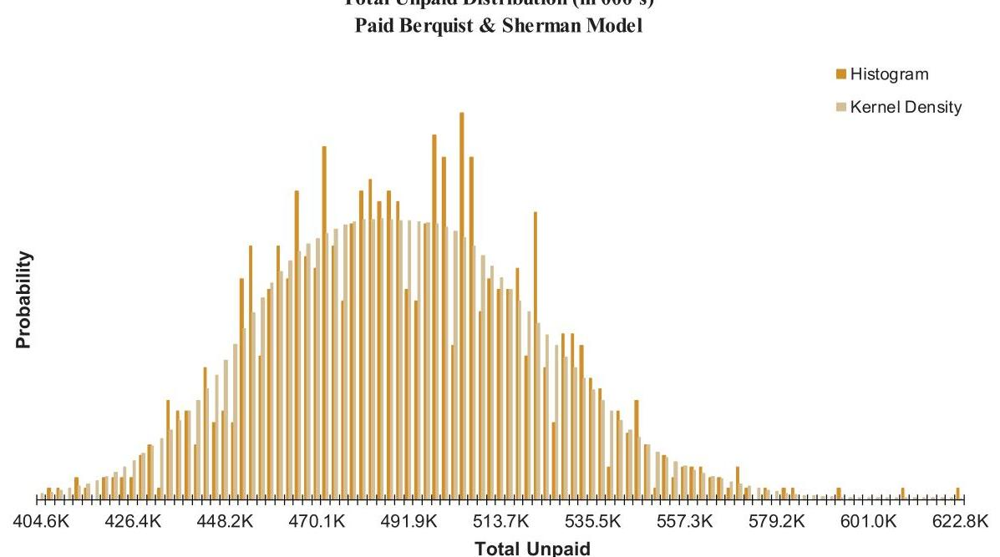

## Page 33
# 4. Practical Issues 

Now that the basic Hayne MLE framework has been described, a variety of practical issues needed for addressing many common problems can be addressed. In order to distinguish whether the underlying model has parameters associated with individual development period, the underlying models can be categorized into two families. The first family has parameters tied to individual development age-Berquist Sherman, Cape Cod, and chain ladder models fall into this family. The other family has no parameters specific to individual development periods and the parameters are more comparable to coefficient of regression on development age (operational time)Hoerl Curve and Wright models belong to this family.

### 4.1. Negative Incremental Values

In general for the Hayne MLE framework, no special care is required in modeling triangles with a few negative entries. When the total incremental values for a given development period are significantly lower than zero, models from the first family have no problem dealing with this type of triangle. Calibrated development period parameters, most likely, will turn out to be negative to reflect negative expected incremental values for the period. For models from the second family, incremental means are exponential and hence are always positive, so negative incremental values in the triangle are difficult to model, which typically implies inappropriateness of the model and resulting in a bad fit to the data. However, negative numbers can still be simulated due to the process variance during simulation, so a close fit may still work.

### 4.2. Standardized Residuals

As the Hayne MLE framework is based on an assumed distribution, i.e., the normal distribution for incremental values, this implies that the standardized residuals should be normally distributed with mean of zero and a standard deviation of one. The goodness of fit to a standard normal distribution of standardized residuals, to some degree, implies the appropriateness of the chosen model. Unlike the ODP bootstrap model, however, the standardized residuals are not used during the simulation process.

While the residuals are not sampled, the mean and standard deviation of the residuals can be used to adjust the process variance simulations. For the mean, an average of the residuals greater than zero implies that the mean of the predicted values

## Page 34
are "low" compared to means that would result in an average of zero. Thus, the adjustment for the mean is to increase the mean for each cell by the standard deviation for that cell times the average of the residuals. Similarly, a standard deviation of the residuals greater than one implies "less" variability than would be "normal," so the standard deviation for each cell can be increased by multiplying it times the standard deviation of the residuals.

Another way of thinking about this adjustment is to remember that the process variance in the simulations is based on $\mathrm{N}(0,1)$, so if the residuals exhibit a mean and standard deviation which differ from zero and one, respectively, then this adjustment allows the process variance to more closely match the residuals. In the "Hayne MLE Models.xlsm" file, the "Include Residual Adjustment" option on the Inputs sheet allows the user to use this adjustment, or not, as this will move away from the calculated Hayne MLE parameters, but it could be a way of fitting the model to the data.

# 4.3. Using an L-Year Average 

It is quite common for actuaries to use averages that are less than all years in their chain-ladder and related methods. Similarly, the Hayne MLE models can be adjusted to only consider the data in the most recent diagonals. For the Hayne MLE framework, only the most recent $L+1$ diagonals (since an $L$-year average uses $L+1$ diagonals) could be used to parameterize the model. The shape of the data to be modeled essentially becomes a trapezoid instead of a triangle and the excluded diagonals are given zero weight in the models. When running the simulations the entire triangle can still be used, since the parameterization of the model has already been constrained by the number of diagonals.

The companion "Hayne MLE Models.xlsm" file has not been specifically designed to select an $L$-year model, but that can easily be accomplished by using the outlier table to give zero weight to the prior diagonals. Another possibility for an $L$-year model includes an additional payment year term (e.g., a function set to 0 for $k<n-L$ and 1 for $k \geq n-L$ ) that would produce a similar effect (i.e., using the last $L+1$ diagonals) while allowing all of the data to be included in the model fit, perhaps enabling better diagnostic testing and parameter estimation.

### 4.4. Missing Values

Sometimes the loss triangle will have missing values. For example, values may be missing from the middle of the triangle, or a triangle may be missing the oldest diagonals, if loss data was not kept in the early years of the book of business.

If values are missing, then the following calculations will be affected:

- Fitted parameters
- Variance-Covariance Matrix
- Fitted triangle

## Page 35
- Residuals
- Degrees of freedom

There are several solutions. The missing value may be estimated using the surrounding values. Or the parameterization of the model can exclude the missing values as long as the missing value is not compromising the surrounding incremental values, or for the chain ladder model the cumulative values. In any case, zero weights are applied to corresponding entries in maximizing log-likelihood functions. The mean and standard deviation of the incremental corresponding to the missing value can be derived from simulated parameters.

If the missing value lies on the most recent diagonal, parameters can be calibrated without any issue except for the chain ladder model, which relies on paid-to-date losses to estimate average incremental values. A solution is to use the value in the second most recent diagonal to fit the triangle and the average incremental formula should be adjusted to be divided by the sum of the first $n-w$ parameters rather than $n-w+1$ parameters. Of course for other MLE models, simply using the outliers to assign zero weight to the corresponding cell will allow the model to be parameterized without disturbing the overall framework.

# 4.5. Outliers 

There may be a few extreme or incorrect values in the original triangle dataset that could be considered outliers. These may not be representative of the variability of the dataset in the future and, if so, the modeler may want to remove their impact from the model. These values could be removed and dealt with in the same manner as missing values by applying zero weight to the corresponding incremental.

If there are a significant number of outliers, then this could be an indication that the model is not a good fit to the data. For example, since the Hayne MLE models include an underlying assumption of normality, too many outliers could imply that the underlying claims distribution is too severe for the central limit theorem to applyi.e., the model may be fine but the normality assumption is not. Outliers should always be removed only after careful consideration of the underlying data to make sure it is truly an unusual event.

### 4.6. Heteroscedasticity

As noted earlier, the Hayne MLE models include variance parameters that adjust the variance for each cell instead of assuming a constant variance throughout. In essence, the modeling framework assumes heteroscedasticity. However, since the variance for the incremental value is only specified using two parameters, it is still possible that the modeled heteroscedasticity does not match up well with the variances in the data. In this case, additional variance parameters can be specified as described in Hayne [8], but that is outside the scope of this monograph.

## Page 36
# 4.7. Heteroecthesious Data 

The basic Hayne MLE framework assumes both a symmetrical shape (e.g., annual by annual, quarterly by quarterly, etc., triangles) and homoecthesious data (i.e., similar exposures). ${ }^{9}$ Other non-symmetrical shapes (e.g., annual x quarterly data) can also be modeled with the Hayne MLE framework as assumptions are independent from triangle shapes.

Most often, the actuary will encounter heteroecthesious data (i.e., incomplete or uneven exposures) at interim evaluation dates, with the two most common data triangles being either a partial first development period or a partial last calendar period. For example, with annual data evaluated as of June 30, partial first development period data would have all development periods ending at $6,18,30$, etc., months, while partial last calendar period data would have development periods as of $12,24,36$, etc., months for all of the data in the triangle except the last diagonal, which would have development periods as of $6,18,30$, etc., months. In either case, not all of the data in the triangle has full annual exposures-i.e., it is heteroecthesious data.

### 4.7.1. Partial First Development Period Data

For partial first development period data, the first development column has a different exposure period than the rest of the columns (e.g., in the earlier example the first column has six months of development exposure, while the rest have 12), as illustrated in Figure 4.1. In models such as Berquist Sherman, Cape Cod and chain ladder, where a parameter is specified for each development period, it is not an issue in the parameterization process. Likewise, for the Hoerl Curve or Wright models, development age or operational time is embedded in the model so the development age component should reflect this partial first development period and no further adjustment is required when fitting the model.

Figure 4.1. Triangle Shape for Partial First Development Period

[^0]
[^0]:    ${ }^{9}$ The terms homoecthesious and heteroecthesious are a combination of the Greek homos (or $\dot{\alpha} \rho \dot{\alpha} \zeta$ ) meaning the same or hetero (or $\dot{\varepsilon} \tau \varepsilon \rho \circ$ ) meaning different and the Greek ekthese (or $\dot{\varepsilon} \times \theta \varepsilon \sigma \eta$ ) meaning exposure. They were introduced in Shapland [16].
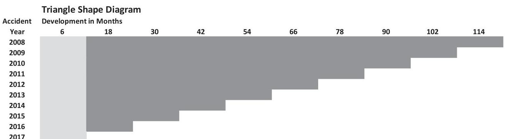

## Page 37
After simulation, an additional adjustment for this type of heteroecthesious data is applied in the projection of future incremental values. In a deterministic analysis, the most recent accident year needs to be adjusted to remove exposures beyond the evaluation date. For example, continuing the previous example, the development periods at 18 months and later are all for an entire year of exposure, whereas the six-month column is only for six months of exposure. Thus, the 18 -month incremental values will effectively extrapolate the first six months of exposure in the latest accident year to a full accident year's exposure. Accordingly, it is common practice to reduce the projected future payments by half to remove the exposure from June 30 to December $31 .{ }^{10}$

The simulation process for Hayne MLE models can be adjusted similarly to the way a deterministic analysis would be adjusted. After simulated parameters are used to project the future incremental values, the last accident year's values can be reduced (in the previous example by $50 \%$ ) to remove the future exposure and then process variance can be simulated as before. Alternatively, the future incremental values can be reduced after the process variance step. For example, Table 4.1 can be compared to Table 3.27 to see the reduction in the future exposures for the last accident year.

Table 4.1. Total Values Adjusted to Remove Future Exposures

| Adjust Total Incremental Value to Remove Future Exposures (Paid) (in 000's) |  |  |  |  |  |  |  |  |  |  |  |
| :--: | :--: | :--: | :--: | :--: | :--: | :--: | :--: | :--: | :--: | :--: | :--: |
| Year | 6 | 18 | 30 | 42 | 54 | 66 | 78 | 90 | 102 | 114 | AccYr   Unpaid |
| 2008 | 26,135 | 27,766 | 33,070 | 20,866 | 14,079 | 5,091 | 3,118 | 278 | 462 | 124 | 0 |
| 2009 | 25,946 | 32,289 | 27,996 | 20,236 | 15,275 | 6,859 | 3,109 | 1,983 | 1,578 | 755 | 755 |
| 2010 | 29,878 | 38,029 | 31,546 | 33,215 | 17,183 | 3,826 | 2,721 | 2,270 | 2,002 | 1,344 | 3,346 |
| 2011 | 41,910 | 31,505 | 35,368 | 25,894 | 18,990 | 8,972 | 5,116 | 1,652 | 729 | 233 | 2,614 |
| 2012 | 38,763 | 35,888 | 27,879 | 32,994 | 19,792 | 7,948 | 3,708 | 1,746 | 2,072 | 118 | 7,643 |
| 2013 | 30,978 | 34,000 | 16,245 | 28,350 | 16,377 | 5,025 | 2,856 | 659 | 1,160 | (62) | 9,639 |
| 2014 | 43,110 | 34,979 | 35,791 | 37,301 | 23,682 | 5,787 | 8,613 | 1,801 | 2,030 | 1,146 | 43,059 |
| 2015 | 41,006 | 35,226 | 54,590 | 32,460 | 19,244 | 10,120 | 1,848 | 2,503 | 952 | 977 | 68,105 |
| 2016 | 42,960 | 50,106 | 40,178 | 38,617 | 23,103 | 12,717 | 4,510 | 3,200 | 2,387 | 1,197 | 125,908 |
| 2017 | 42,712 | 27,304 | 28,461 | 21,653 | 20,596 | 5,117 | 3,427 | 766 | 1,251 | 329 | 108,904 |
|  |  |  |  |  |  |  |  |  |  |  | 369,975 |

[^0]
[^0]:    ${ }^{10}$ Reduction by half is actually an approximation since it would also make sense to account for the differences in development between the first and second half years.

## Page 38
# 4.7.2. Partial Last Calendar Period Data 

For a partial last calendar period data, most of the data in the triangle has annual exposures and annual development periods, except for the last diagonal that, continuing the example, only has a six-month development period as illustrated in Figure 4.2. A simple approach is to adjust the raw data incremental values along the diagonal to a full development period to make them consistent with the rest of the triangle. The parameterization process can then be done with the adjusted incremental values.

Figure 4.2. Triangle Shape for Partial Last Calendar Period

During the Hayne MLE simulation process, incremental means and standard deviations can be calculated from the fully annualized sample parameters and used to simulate incremental values. Then, the last diagonal from the sample triangle can be adjusted to de-annualize the incremental values in the last diagonal-i.e., reversing the annualization of the original last diagonal-as illustrated in Table 4.2. Note that

Table 4.2. Total Values Adjusted to De-annualize Incremental Values
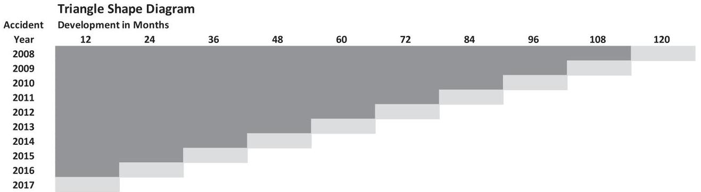
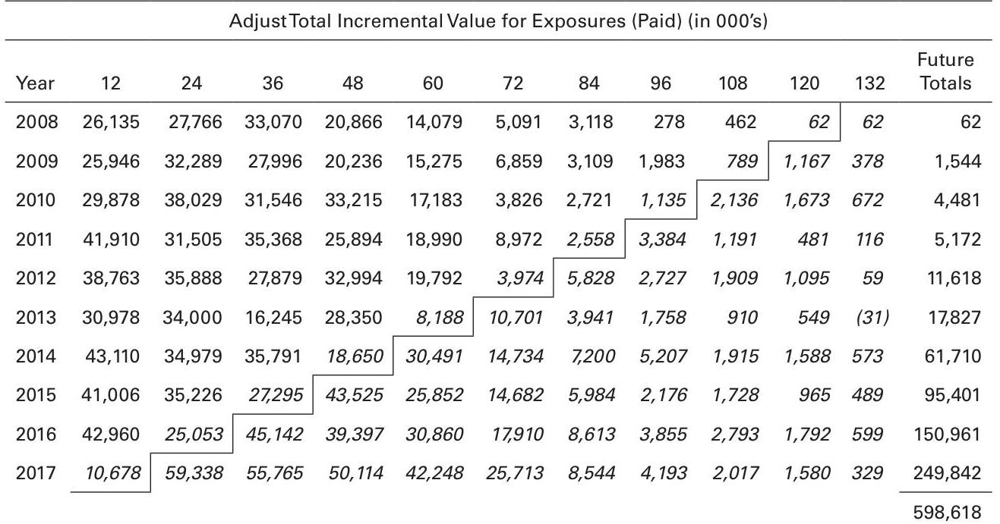

## Page 39
Table 4.3. Total Values Adjusted to Remove Future Exposures

| Adjust Total Incremental Value to Remove Future Exposures (Paid) (in 000's) |  |  |  |  |  |  |  |  |  |  |  |  |
| :--: | :--: | :--: | :--: | :--: | :--: | :--: | :--: | :--: | :--: | :--: | :--: | :--: |
| Year | 12 | 24 | 36 | 48 | 60 | 72 | 84 | 96 | 108 | 120 | 132 | AccYr   Unpaid |
| 2008 | 26,135 | 27,766 | 33,070 | 20,866 | 14,079 | 5,091 | 3,118 | 278 | 462 | 62 | 62 | 62 |
| 2009 | 25,946 | 32,289 | 27,996 | 20,236 | 15,275 | 6,859 | 3,109 | 1,983 | 789 | 1,167 | 378 | 1,544 |
| 2010 | 29,878 | 38,029 | 31,546 | 33,215 | 17,183 | 3,826 | 2,721 | 1,135 | 2,136 | 1,673 | 672 | 4,481 |
| 2011 | 41,910 | 31,505 | 35,368 | 25,894 | 18,990 | 8,972 | 2,558 | 3,384 | 1,191 | 481 | 116 | 5,172 |
| 2012 | 38,763 | 35,888 | 27,879 | 32,994 | 19,792 | 3,974 | 5,828 | 2,727 | 1,909 | 1,095 | 59 | 11,618 |
| 2013 | 30,978 | 34,000 | 16,245 | 28,350 | 8,188 | 10,701 | 3,941 | 1,758 | 910 | 549 | (31) | 17,827 |
| 2014 | 43,110 | 34,979 | 35,791 | 18,650 | 30,491 | 14,734 | 7,200 | 5,207 | 1,915 | 1,588 | 573 | 61,710 |
| 2015 | 41,006 | 35,226 | 27,295 | 43,525 | 25,852 | 14,682 | 5,984 | 2,176 | 1,728 | 965 | 489 | 95,401 |
| 2016 | 42,960 | 25,053 | 45,142 | 39,397 | 30,860 | 17,910 | 8,613 | 3,855 | 2,793 | 1,792 | 599 | 150,961 |
| 2017 | 10,678 | 29,669 | 27,883 | 25,057 | 21,124 | 12,856 | 4,272 | 2,097 | 1,009 | 790 | 165 | 124,921 |
|  |  |  |  |  |  |  |  |  |  |  |  | 473,697 |

since the model parameters are annual, the "de-annualization" process includes a partial shifting of the future incremental values to the next future period. Finally, the future incremental values for the last accident year must be reduced (in the previous example by $50 \%$ ) to remove the future exposure, as illustrated in Table 4.3. ${ }^{11}$

# 4.8. Parameter Adjustments 

The Hayne MLE framework will find the optimal parameters for the specified model. Like all models, this also means that there will be times that the noise in the data will lead to "distortions" in the parameters. This is akin to the need to select age-to-age factors to smooth the development pattern. The ability to judgmentally adjust some of the parameters is also possible with the Hayne MLE models. For example, consider the plot of the decay ratios for the Berquist-Sherman model in Figure 4.3.

In Figure 4.3, notice the "outlier" for the 120 month development period. This is an indication that the fitted or modeled parameter for 108 months may be lower than would have been expected. Reviewing the development year parameters, the choice for the modeler boils down to deciding whether to accept the parameters as reasonable or adjusting them to smooth out some of the noise in the data. For this BerquistSherman model example, the manual adjustment in Table 4.4 can be compared to the parameters in Table 3.1. ${ }^{12}$

[^0]
[^0]:    ${ }^{11}$ These heteroecthesious data issues can be addressed in the "Hayne MLE Models.xlsm" file by using the Exposure Factors sheet. While not included in the Excel file, it should be noted that these adjustments can add more uncertainty and the estimates can be highly sensitive to the adjustments. To address this, extra uncertainty could be added to the adjustment factors in the simulation process.
    ${ }^{12}$ Similar manual adjustments for each of the models are illustrated in Appendix A.

## Page 40
Figure 4.3. Decay Ratios for Berquist-Sherman Model
Berquist \& Sherman MLE Decay Ratio Plot [Paid]

Table 4.4. User Selected Parameters for Berquist-Sherman

|  | User Selected Parameters: |  |  |  |  |  |  |  |  |  |
| :--: | :--: | :--: | :--: | :--: | :--: | :--: | :--: | :--: | :--: | :--: |
|  | 12 | 24 | 36 | 48 | 60 | 72 | 84 | 96 | 108 | 120 |
| Mean | 620.96 | 760.67 | 708.16 | 553.57 | 350.00 | 181.39 | 70.97 | 43.88 | 26.00 | 15.21 |
| Std Dev | 40.50 | 46.55 | 43.00 | 35.49 | 26.17 | 17.66 | 10.40 | 8.75 | 7.60 | 7.36 |
| Decay Ratios: |  | 122.5\% | 93.1\% | 78.2\% | 63.2\% | 51.8\% | 39.1\% | 61.8\% | 59.3\% | 58.5\% |
| CoV: | 6.5\% | 6.1\% | 6.1\% | 6.4\% | 7.5\% | 9.7\% | 14.7\% | 19.9\% | 29.2\% | 48.4\% |
|  | Accident Year |  |  |  |  |  |  |  |  |  |
|  | Trend | K | p | AIC | BIC |  |  |  |  |  |
| Mean | 0.045 | 11.216 | 0.654 | 647.9 | 674.0 |  |  |  |  |  |
| Std Dev | 0.009 | 1.094 | 0.089 |  |  |  |  |  |  |  |
| CoV: | 18.9\% | 9.3\% | 13.6\% |  |  |  |  |  |  |  |

To adjust the mean for 108 months, the decay ratios were reviewed and the original mean of 11.08 was seen to be low compared to the surrounding parameters due to the low decay ratio for 108 months and high decay ratio for 120 months. The parameter of 26.00 was selected by smoothing the decay ratios for the last three development periods. ${ }^{13}$ Notice that only the mean parameters need to be adjusted since the MLE framework allows the variance-covariance parameters to be recalculated based on the

[^0]
[^0]:    ${ }^{13}$ Compared to the original parameter of 11.08 , the parameter of 26.00 is more than 3 standard deviations larger, which is quite large, but it would be consistent with a strong a priori belief that the decay should be smooth.
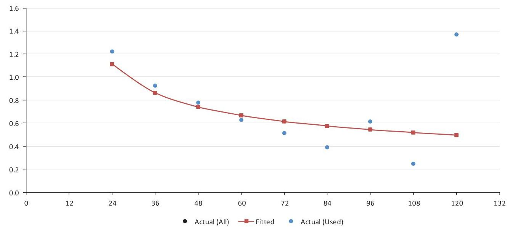

## Page 41
selected parameter. In essence, we are assuming the expected incremental losses are derived from selected parameters, or the "true" parameters for the data.

Rather than judgmentally selecting new parameters, another option would be to change the parametric setup of the model such that a group of parameters (e.g., the last 3 development periods for the Berquist-Sherman model) are not independent. The Excel companion files do not include this type of adjustment to the model setup.

As you balance the competing goals of goodness of fit and reasonability of assumption, the diagnostics will give an indication of the significance of the changes to the model parameters. Finally, while user-selected parameters will tend to move the statistics away from optimal, the goal is to reasonably replicate the statistical features of the data and other adjustments, like the residual adjustment discussed in section 4.2, can also be made if the impact on the residuals is significant.

# 4.9. Tail Extrapolation 

One of the most common data issues is that claim development is not complete within the loss triangle and tail factors are commonly used to extrapolate beyond the end of the data triangle. There are many common methods for calculating tail factors and a useful reference in this regard is the CAS Tail Factor Working Party Report [5]. However, for the Hayne MLE models a different approach is required in order to extrapolate the parameters so that a multi-variant normal distribution can continue to be used. Once extrapolation is used to extend the parameters, incremental values can all be extended to include development periods beyond the end of the trianglei.e., the tail periods.

For the first family of models (i.e., Berquist-Sherman, Cape Cod, and chain ladder) the decay ratios shown in Tables 3.1, 3.5, and 3.9 can be used as a way of extrapolating the development parameters for each model similarly to how a tail factor might be calculated for a deterministic method. In the "Hayne MLE Models.xlsm" file, five different regression models (i.e., average, linear, logarithmic, power, and polynomial) can be used to extrapolate decay ratios for up to 5 years from either the modeled or user selected parameters. ${ }^{14}$ For example, Table 4.5 illustrates the extrapolation for the Berquist-Sherman model, which is based on the user-selected parameters in Table 4.4, so the graph in Table 4.5 can be compared to Figure 4.3.

From these regression models, the implied tail decay mean is the fitted decay ratio from the regression and the decay standard deviation is the average deviation for the actual decay ratios from the regression curve. The length of the tail period can then be determined by reviewing the means of the incremental periods beyond the triangle and then including enough periods such that the means in the final development column are close to zero. Using the decay ratio statistics and selected number of periods in the tail, the Hayne MLE framework will also extend the variance-covariance

[^0]
[^0]:    ${ }^{14}$ The limit of 5 years in the "Hayne MLE Models.xlsm" file is only based on a practical need to limit the size of the file.

## Page 42
Table 4.5. Berquist-Sherman Model Tail Extrapolation

| Decay Ratio Analysis: |  |  |  |  |  |
| :--: | :--: | :--: | :--: | :--: | :--: |
| Parameters: User | Curve Type: Power | 3 | Least Squares Regression Coefficients: |  | Goodness of Fit Statistics: |
|  |  |  | $x^{a}$ | $-0.3916$ | $R^{2}$ Statistic 0.710 |
|  |  |  | coefficient | 1.1559 | Regression Deviation 13.5\% |
|  |  |  |  |  | Suggested Decay Parameters: |
|  |  |  |  |  | Mean 45.3\% |
|  |  |  |  |  | Standard Deviation 13.7\% |
| Periods | Decay Ratio | Outliers | Selected Age |  | Decay Ratio Fitted Factors |
| 12-24 | 1.225 | 0 | 1 |  | 1.225 1.156 |
| 24-36 | 0.931 | 0 | 2 |  | 0.931 0.881 |
| 36-48 | 0.782 | 0 | 3 |  | 0.782 0.752 |
| 48-60 | 0.632 | 0 | 4 |  | 0.632 0.672 |
| 60-72 | 0.518 | 0 | 5 |  | 0.518 0.615 |
| 72-84 | 0.391 | 0 | 6 |  | 0.391 0.573 |
| 84-96 | 0.618 | 0 | 7 |  | 0.618 0.539 |
| 96-108 | 0.593 | 0 | 8 |  | 0.593 0.512 |
| 108-120 | 0.585 | 0 | 9 |  | 0.585 0.489 |
| 120-132 |  |  |  |  | 0.469 |
| 132-144 |  |  |  |  | 0.452 |
| 144-156 |  |  |  |  | 0.437 |
| 156-168 |  |  |  |  | 0.423 |
| 168-180 |  |  |  |  | 0.411 |

Berquist \& Sherman MLE Decay Ratio Plot [Paid]
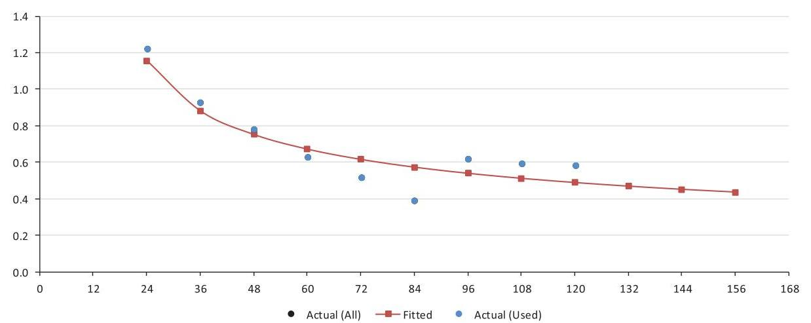

## Page 43
matrix to include the tail periods. ${ }^{15}$ Continuing the Berquist-Sherman example, the extended parameters for 3 years are illustrated in Table 4.6, which can be compared to Table 4.4. ${ }^{16}$

Table 4.6. Extended Parameters for Berquist-Sherman Model

|  | User Selected Parameters: |  |  |  |  |  |  |  |  |  |  |  |  |
| :--: | :--: | :--: | :--: | :--: | :--: | :--: | :--: | :--: | :--: | :--: | :--: | :--: | :--: |
|  | 12 | 24 | 36 | 48 | 60 | 72 | 84 | 96 | 108 | 120 | 132 | 144 | 156 |
| Mean | 620.96 | 760.67 | 708.16 | 553.57 | 350.00 | 181.39 | 70.97 | 43.88 | 26.00 | 15.21 | 6.89 | 3.12 | 1.41 |
| Std Dev | 40.50 | 46.55 | 43.00 | 35.49 | 26.17 | 17.66 | 10.40 | 8.75 | 7.60 | 7.36 | 4.05 | 2.13 | 1.09 |
| Decay   Ratios: |  | 122.5\% | 93.1\% | 78.2\% | 63.2\% | 51.8\% | 39.1\% | 61.8\% | 59.3\% | 58.5\% |  |  |  |
| CoV: | 6.5\% | 6.1\% | 6.1\% | 6.4\% | 7.5\% | 9.7\% | 14.7\% | 19.9\% | 29.2\% | 48.4\% | 58.8\% | 68.4\% | 77.6\% |
|  | Accident Year |  |  |  |  | Tail Extrapolation |  |  |  | Implied Tail Factor |  |  |  |
|  | Trend | K | p | AIC | BIC | Decay Ratio |  | Periods | Distribution | Adjusted | Actual | Tail Sampling Option |  |
| Mean | 0.045 | 11.216 | 0.654 | 647.9 | 674.0 | 45.3\% |  | 3 | Gamma | 1.0034 | 1.0034 | Conditional Variance |  |
| Std Dev | 0.009 | 1.094 | 0.089 |  |  | 13.7\% |  |  |  |  |  |  |  |
| CoV: | 18.9\% | 9.3\% | 13.6\% |  |  |  |  |  |  |  |  |  |  |

One of the interesting features of this extrapolation process is that coefficients of variation in the tail parameters are increasing, which is a statistical feature you would expect to find. The implied tail factor is also shown in the table in order to better compare with other models and traditional methods. ${ }^{17}$ Finally, two different "Tail Sampling Options" are included for use in the simulation process. For the "Conditional Variance" option, the parameters in the tail are sampled using the multivariate normal along with all the other parameters. For the "Sampling" option, a decay ratio is sampled using the mean and standard deviation from the regression and the selected distribution (i.e., Gamma, Normal, or Lognormal can be selected).

For the second family of models (i.e., Hoerl Curve and Wright), there are no parameters tied specifically to development age, so it is a simple matter to extend the "development" ages. The length of the tail period can be determined by reviewing the means of the incremental periods beyond the triangle and then including enough periods such that the means in the final development column are close to zero.

A key ingredient for all of these considerations is to verify that the simulations in the tail are reasonable. For example, the tail period represents the extension of development parameters and using just a single period may not produce appropriate incremental results.

[^0]
[^0]:    ${ }^{15}$ The extension of the variance-covariance matrix is shown below the simulated values in the "Hayne MLE" sheets in the "Hayne MLE Models.xlsm" file.
    ${ }^{16}$ The modeled parameters are also extended in the companion file, but they are not illustrated in the monograph.
    ${ }^{17}$ The "adjusted" tail factor would be for annualized data if there were exposure issues as discussed in Section 4.7, whereas the "actual" tail factor would be for the data as is.

## Page 44
# 4.10. Incurred Data 

The Hayne MLE models can be used to model both paid and incurred loss data. Using incurred data incorporates case reserves, thus perhaps improving the ultimate estimates. However, the resulting distribution from using incurred data will be possible outcomes of the IBNR, not a distribution of the unpaid. There are two possible approaches for modeling an unpaid loss distribution using incurred loss data: modeling incurred data and converting the ultimate values to a payment pattern, or modeling paid and case reserves separately.

Using the first approach, a convenient way of converting the results of an incurred data model to a payment stream is to run the paid data model in parallel with the incurred data model and use the random payment pattern from each iteration from the paid data model to convert the ultimate values from each corresponding iteration from the incurred data to a payment pattern for each iteration (for each accident year individually). The "Hayne MLE Models.xlsm" file illustrates this concept. It is worth noting, however, that this process allows the "added value" of using the case reserves to help predict the ultimate results to work its way into the calculations, thus perhaps improving the ultimate estimates, while still focusing on the payment stream for measuring risk. In effect, it allows a distribution of IBNR to become a distribution of IBNR and case reserves.

This process can also be made more sophisticated by correlating the multi-variate normal simulation of the paid and incurred models (e.g., the model parameters and/or process variance). In order to specify a correlation coefficient between the paid and incurred models, the correlation of the standardized residuals can be measured as, for example, in Figure 4.4 for the Berquist-Sherman model.

Figure 4.4. Correlation of Paid and Incurred Standardized Residuals

From Figure 4.4 observe that there is a positive correlation between the paid and incurred standardized residuals for the Berquist-Sherman model. This is not surprising, as incurred data includes paid data, but using this to correlate the paid and incurred simulations is a way of including this statistical feature of the data in the model. In the
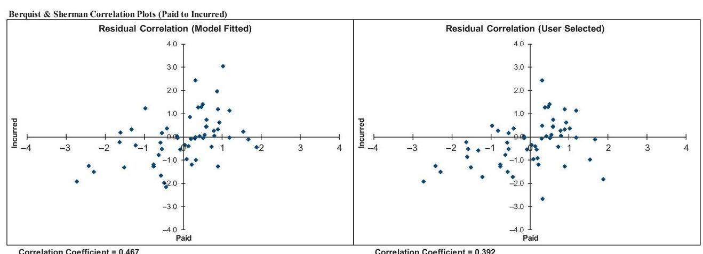

## Page 45
"Hayne MLE Models.xlsm" file the correlation assumption is specified in the Inputs sheet and it will only be used to correlate the process variance portion of the paid and incurred data models.

The second approach could be accomplished by applying the Hayne MLE models to the case reserve triangle and then "combining" the case reserve and paid claim simulations. This has the advantage over the first approach of not modeling the paid losses twice, but it would also require specifying the correlation of the paid and outstanding losses. For both approaches it may be possible to extend the Hayne MLE models to include both paid and incurred data in a combined modeling framework, but that is beyond the scope of this monograph.

# 4.11. Claim Count Data 

For a sufficient volume of claims, the count distribution can be approximated with a normal distribution and it follows that the Hayne MLE models can also be used to model claim count data. Indeed, as the models are typically based on average claim severity, this assumes that the ultimate claim count has been estimated. As a first step to estimating unpaid amounts, the Hayne MLE models can all be used to estimate unclosed and ultimate claim counts using either closed or reported claim count triangles. ${ }^{18}$ Similarly to loss amount models, models based on reported counts would result in a distribution of possible outcomes of the IBNR claim count, not a distribution of the unclosed count. The two possible approaches for modeling an unpaid loss distribution using incurred loss data also apply to modeling an unclosed count distribution using reported count data: modeling reported count data and converting the ultimate values to a closed pattern, or, modeling closed and open counts separately.

Using the first approach, the "Hayne MLE Models.xlsm" file illustrates a convenient way of converting the results of a reported count data model to a closed stream by running the closed count data model in parallel with the reported count data model and using the random closed pattern from each iteration from the closed count data model to convert the ultimate values from each corresponding iteration from the reported data to a closed pattern for each iteration (for each accident year individually). It is worth noting that this process allows the "added value" of using the open count to help predict the ultimate results to work its way into the calculations, thus perhaps improving the ultimate count estimates, while still focusing on the closed stream for measuring risk and combining model results. In effect, it allows a distribution of IBNR counts to become a distribution of IBNR and open counts.

This process can also be made more sophisticated by correlating the multi-variate normal simulation of the closed and reported models (e.g., the model parameters and/or process variance). In order to specify a correlation coefficient between the closed and reported models, the correlation of the standardized residuals can be measured as, for example, in Figure 4.5 for the Berquist-Sherman model.

[^0]
[^0]:    ${ }^{18}$ In the "Hayne MLE Models.xlsm" file, claim count data and model selections can be made on the Inputs sheet. All of the sheets with "(Cnt)" in the sheet name show model details for the claim count models.

## Page 46
Figure 4.5. Correlation of Closed and Reported Standardized Residuals

From Figure 4.5 observe that there is a strong positive correlation between the closed and reported standardized residuals for the Berquist-Sherman model. This is not surprising, as reported count data includes closed count data, but using this to correlate the closed and reported simulations is a way of including this statistical feature of the data in the model. In the "Hayne MLE Models.xlsm" file, the correlation assumption is specified in the Inputs sheet and it will only be used to correlate the process variance portion of the closed and reported data models.

The second approach could be accomplished by applying the Hayne MLE models to the open count triangle and then "combining" the open count and closed count simulations. This has the advantage over the first approach of not modeling the closed counts twice, but it would also require specifying the correlation of the closed and open counts. For both approaches it may be possible to extend the Hayne MLE models to include both closed and reported data in a combined modeling framework, but that is beyond the scope of this monograph.

Finally, as noted at the beginning of this section, the normality assumption relies on a sufficient volume of claims and, without this, the Hayne MLE models may not fit the statistical features of the data. From a practical standpoint, it stands to reason that count distributions may be less likely to be diagnostically normal, thus requiring extra care, especially for an open count model. It also follows that if the claim count distribution is not normal, then it also has implications for the quality of the average severity models.

# 4.12. Frequency and Severity Modeling 

In addition to modeling only the claim counts, including both the count and value data allows the modeler to use all of the data in the simulations. This process can also be made more sophisticated by correlating the multi-variate normal simulation of the paid claims and closed count models (e.g., the model parameters and/or process variance). In order to specify a correlation coefficient between the paid and closed models, the correlation of the standardized residuals can be measured as, for example, in Figure 4.6 for the Berquist-Sherman model.
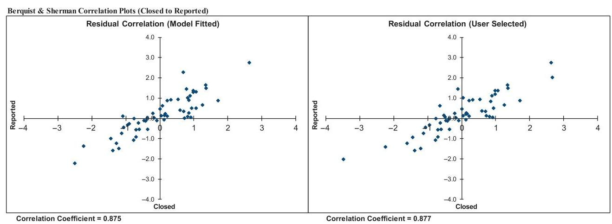

## Page 47
Figure 4.6. Correlation of Paid and Closed Standardized Residuals

From Figure 4.6 observe that there is a negative correlation between the paid and closed standardized residuals for the Berquist-Sherman model. ${ }^{19}$ This is not surprising, as average paid would tend to be lower than average when the closed count is higher than average, but using this to correlate the paid and closed simulations is a way of including this statistical feature of the data in the model. In the "Hayne MLE Models. xlsm" file the correlation assumption is specified in the Inputs sheet and it will only be used to correlate the process variance portion of the paid and closed data models when they are run jointly.

In theory it may be possible to extend the Hayne MLE models to include all of the paid, incurred, closed, and reported data in a combined modeling framework, but that is beyond the scope of this monograph. While it seems this theory would need to combine all of the data into a framework for one model at a time, without a single cohesive model it is possible to mix and match models between the value data (i.e., paid and incurred) and the count data (i.e., closed and reported). This allows for a larger number of combinations of models and allows the user to combine the best model for each data type.

[^0]
[^0]:    ${ }^{19}$ In practice, a more sophisticated approach could be used, for example, to see if there is more correlation in the later development periods.
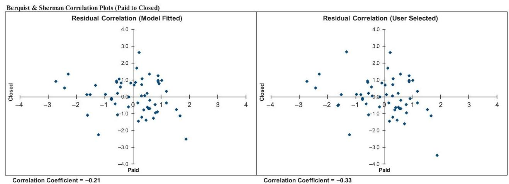

## Page 48
# 5. Diagnostics 

The quality of any model depends on the quality of the underlying assumptions. When a model fails to "fit" the data, it is unlikely to produce a good estimate of the distribution of possible outcomes. ${ }^{20}$ However, a balance must be considered between parsimony of parameters and the goodness-of-fit. Over-parameterization may cause the model to be less predictive of future losses. On the other hand, no model will perfectly "fit" the data, so the best you can hope for with any model is that it reasonably represents the data and your understanding of the processes that impact the data. Therefore, diagnostically evaluating the assumptions underlying a model is important for evaluating whether it will produce reasonable results or not and whether it should stay in your selected group of reasonable models.

The CAS Working Party [4], in the third section of their report on quantifying variability in reserve estimates, identified 20 criteria or diagnostic tools for gauging the quality of a stochastic model. The Working Party also noted that, in trying to determine the optimal fit of a model, or indeed an optimal model, no single diagnostic tool or group of tools can be considered definitive. Depending on the statistical features found in the data, a variety of diagnostic tools are necessary to best judge the quality of the model assumptions and to adjust the parameters of the model. This monograph will discuss some of these tools in detail as they relate to the Hayne MLE models.

The key diagnostic tests are designed for three purposes: to test various assumptions in the model, to gauge the quality of the model fit to the data, and to help guide the adjustment of model parameters, if needed. Some tests are relative in nature, enabling results from one set of model parameters to be compared to those of another, for a specific model, allowing a modeler to improve the fit of the model. For the most part, however, the tests can't be used to compare different models. The objective, consistent with the goals of a deterministic analysis, is not to find the one best model, but rather a set of reasonable models.

Some diagnostic measures include statistical tests, providing a pass/fail determination for some aspects of the model assumptions. This can be useful even though a "fail" does not necessarily invalidate an entire model; it only points to areas where improvements can be made to the model or its parameterization. The goal is to find the

[^0]
[^0]:    ${ }^{20}$ While the examples are different, significant portions of sections 5 and 6 are based on IAA [10] and Milliman [13]. Many of the diagnostic graphs from Hayne [8] have also been reproduced in this monograph.

## Page 49
sets of models and parameters that will yield the most realistic, most consistent simulations, based on statistical features found in the data. ${ }^{21}$

# 5.1. Residual Graphs 

As noted earlier, the Hayne MLE models rely on the normal distribution assumption for incremental values and the standardized residuals are independent and identically distributed about the standard normal distribution conditional on parameters. Graphing residuals is a good way to check this. Consider the residual graphs for the Berquist-Sherman model in Figure 5.1 for the modeled parameters.

Figure 5.1. Berquist-Sherman Residual Graphs [modeled parameters]

For each model, going clockwise, and starting from the lower-left-hand corner, the graphs in Figure 5.1 show the residuals (blue and red dots ${ }^{22}$ ) by calendar period, development period, and accident period and against the fitted incremental value (in the lower-right-hand corner). In addition, the graphs include a trend line (in green) that highlights the averages for each period.

Most residuals from the Berquist-Sherman model appear reasonably random and the averages do not deviate significantly from zero by development periods and

[^0]
[^0]:    ${ }^{21}$ Using the data from Hayne [8], diagnostic graphs and tests for all five of the Hayne MLE models are included in Appendix A.
    ${ }^{22}$ In the graphs that follow, the red dots are outliers as identified in Figure 5.3.
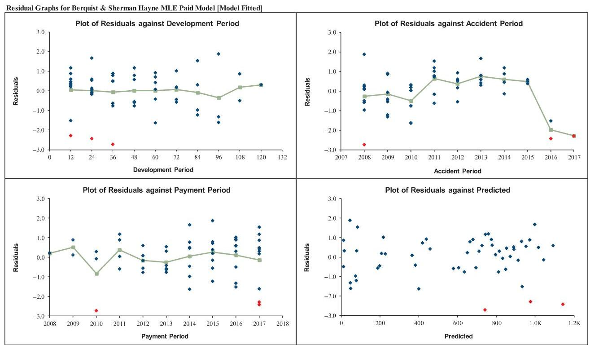

## Page 50
payment periods. The averages by development period are not surprising, since there is a parameter for each development period, but the lack of a trend by payment year is more useful since without a calendar year trend parameter this would be problematic for the Berquist-Sherman model. The averages by accident period appear significantly different from zero, which may indicate that a single trend component is not enough to model the level of incremental values by exposure periods.

Also of interest are the three large negative residuals in early development periods that are indicated in red as outliers. This could indicate the need to adjust those development period parameters, although adjustments to remove outliers is typically a last resort compared to other options.

# 5.2. Normality Test 

To see whether the standardized residuals are normally distributed, tests comparing the residuals against a normal distribution are useful. This also enables a comparison of the modeled parameters to the user-selected parameter sets and gauging the skewness of the residuals in order to further validate the suitability of the chosen model. For example, Figure 5.2 shows the normality tests for the Berquist-Sherman model comparing the modeled and user selected parameters.

Figure 5.2. Normality Plots for Berquist-Sherman

The residual plots appear close to normally distributed, with the data points tightly distributed around the diagonal line. While there is an additional outlier for the userselected parameters, the $p$-value, a statistical pass-fail test for normality, improved from $3.9 \%$ to $8.0 \%$, and the $\mathrm{R}^{2}$ improved from $95.5 \%$ to $96.3 \%$. The $p$-value is generally considered a "passing" score of the normality test when it is greater than $5.0 \% .{ }^{23}$ The graphs in Figure 5.2 also show $N$ (the number of data points).

[^0]
[^0]:    ${ }^{23}$ Note that this doesn't indicate whether the Hayne MLE model itself passes or fails, it only tests whether the residuals can be judged to be normally distributed.
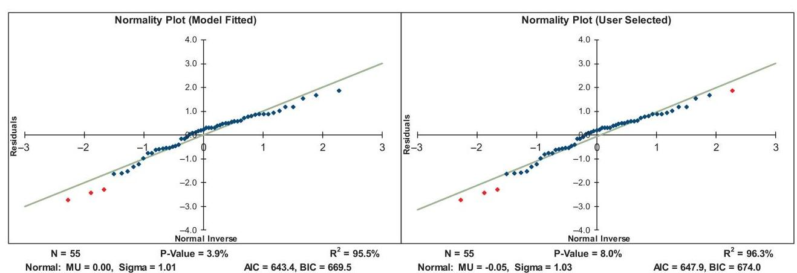

## Page 51
While the $p$-value and $\mathrm{R}^{2}$ tests assess the goodness of fit of the model to the data, they do not penalize for added parameters. Adding more parameters will almost always improve the fit of the model to the data, but the goal is to have a good fit with as few parameters as possible. Two other tests, the Akaike information criteria (AIC) and the Bayesian information criteria (BIC), address this limitation, using the difference between each residual and its normal counterpart from the normality plot to calculate the residual sum squared (RSS) and include a penalty for additional parameters, as shown in (5.1) and (5.2), respectively. ${ }^{24}$

$$
\begin{gathered}
A I C=2 \times p+n \times\left[\ln \left(\frac{2 \times \pi \times R S S}{n}\right)+1\right] \\
B I C=n \times \ln \left(\frac{R S S}{n}\right)+p \times \ln (n)
\end{gathered}
$$

A smaller value for the AIC and BIC tests indicate an improvement, especially with respect to overcoming the penalty of adding a parameter. For the Berquist-Sherman model test in Figure 5.2, there were no parameters added but the values increased a little, which is expected since the user selected parameters are not the optimal parameters. It is important to remember that the AIC and BIC tests tend to be model specific in the sense that they are less well suited for comparing different models and better suited for different parameterizations of the same model. ${ }^{25}$

# 5.3. Outliers 

Identifying outliers in the data provides another useful test in determining model fit. Outliers can be represented graphically in a box-whisker plot, which shows the inter-quartile range (the 25 th to 75 th percentiles) and the median ( 50 th percentile) of the residuals-the so-called box. The whiskers then extend to the largest values within three times this inter-quartile range. ${ }^{26}$ Values beyond the whiskers may generally be considered outliers and are identified individually with a point. For example, the box-whisker plots in Figure 5.3 compare the modeled and user selected parameters for the Berquist-Sherman model.

If the data in those outlier cells genuinely represent events that cannot be expected to happen again, the outlier(s) may be removed from the model (by giving it/them zero

[^0]
[^0]:    ${ }^{24}$ There are different versions of the AIC and BIC formula from various authors and sources, but the general idea of each version is consistent. Other similar formulas could also be used.
    ${ }^{25}$ To be clear, using diagnostic tests to compare different data sets is generally not a good idea. For the same data set and different models, using AIC and BIC (and other diagnostics) can help with model comparison, but even for similar diagnostic results the models could still produce wildly different estimates.
    ${ }^{26}$ Various authors and textbooks use widths for the whiskers that tend to span from 1.5 to 3 times the inter-quartile range. Changing the multiplier will therefore make the box-whisker plot more or less sensitive to outliers. It is also possible to illustrate "mild" outliers with a multiplier of 1.5 and the more "extreme" outliers with a multiplier of 3 using different colors and/or symbols in the graphs. Of course, the actual multipliers can be adjusted based on personal preference.

## Page 52
Figure 5.3. Berquist-Sherman Box-Whisker Plots
weight). But extreme caution should be taken even when the removal of outliers seems warranted. The possibility always remains that apparent outliers may actually represent realistic extreme values, which, of course, are critically important to include as part of any sound analysis.

Additionally, when residuals are not normally distributed, a significant number of outliers tend to result-i.e., the distributional shape of the residuals may be skewed or otherwise not normal. ${ }^{27}$ In this case, it is impossible for the Hayne MLE simulation to capture this shape, as it relies on the normality assumption, although adjusting the parameters may help "restore" normality. Finally, a significant number of residuals can also mean the underlying model is not a good fit to the data, so other models should be used or this model given less weight (see Section 6).

While the three diagnostic tests shown above demonstrate techniques commonly used with most types of models, they are not the only tests available. ${ }^{28}$ Next, we'll take a look at the flexibility of the Hayne MLE framework and some of the diagnostic elements of the simulation results. For a more extensive list of other tests available, see the report "CAS Working Party on Quantifying Variability in Reserve Estimates" [4].

# 5.4. Model Results 

Once the parameter diagnostics have been reviewed, simulations should be run for each model. ${ }^{29}$ These simulation results provide an additional diagnostic tool to aid in evaluation of the model, as described in section 3 of CAS Working Party [4]. As an example, the results for the Berquist-Sherman Hayne MLE model will be reviewed. The estimated-unpaid results shown in Table 5.1 were simulated using 10,000 iterations with the parameters from Table 4.6.

[^0]
[^0]:    ${ }^{27}$ To help assess normality, the interquartile range could be compared to a normally distributed range of $\pm 0.67$ standard deviations.
    ${ }^{28}$ For an example, see Venter [19].
    ${ }^{29}$ Throughout the monograph, all simulations include both parameter uncertainty and process uncertainty as illustrated in Tables 3.21 through 3.27.
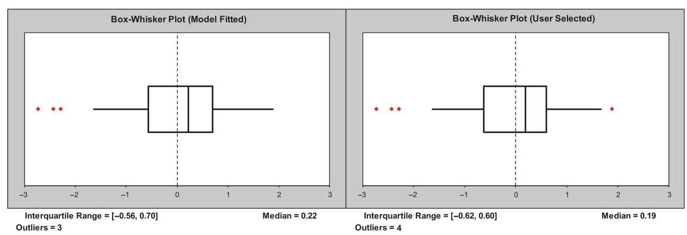

## Page 53
Table 5.1. Estimated Unpaid Results for Berquist-Sherman

|  |  |  |  | Sample Insurance Company   Hayne Paper Data   Accident Year Unpaid (in 000's)   Paid Berquist \& Sherman Model |  |  |  |  |  |  |
| :--: | :--: | :--: | :--: | :--: | :--: | :--: | :--: | :--: | :--: | :--: |
| Accident   Year | To Date | Mean   Unpaid | Standard   Error | Coefficient   of Variation | Minimum | Maximum | 50.0\%   Percentile | 75.0\%   Percentile | 95.0\%   Percentile | 99.0\%   Percentile |
| 2008 | 123,738 | 441 | 573 | 129.9\% | $(1,475)$ | 2,372 | 391 | 823 | 1,420 | 1,981 |
| 2009 | 140,983 | 1,083 | 825 | 76.2\% | $(1,675)$ | 4,401 | 1,048 | 1,611 | 2,466 | 3,113 |
| 2010 | 147,516 | 2,459 | 1,168 | 47.5\% | $(1,527)$ | 6,082 | 2,417 | 3,252 | 4,462 | 5,274 |
| 2011 | 174,349 | 4,793 | 1,595 | 33.3\% | (172) | 11,597 | 4,758 | 5,809 | 7,391 | 8,954 |
| 2012 | 173,637 | 8,629 | 1,992 | 23.1\% | 1,588 | 16,582 | 8,542 | 9,810 | 11,955 | 13,951 |
| 2013 | 174,996 | 18,214 | 3,136 | 17.2\% | 7,989 | 30,302 | 18,135 | 20,292 | 23,509 | 25,381 |
| 2014 | 169,224 | 41,402 | 5,008 | 12.1\% | 25,322 | 59,952 | 41,302 | 44,862 | 49,756 | 53,216 |
| 2015 | 134,010 | 75,281 | 7,480 | 9.9\% | 53,427 | 105,936 | 74,961 | 80,194 | 87,930 | 93,542 |
| 2016 | 68,911 | 127,141 | 11,108 | 8.7\% | 93,649 | 164,080 | 127,078 | 134,809 | 144,791 | 152,998 |
| 2017 | 35,798 | 210,599 | 16,205 | 7.7\% | 159,908 | 275,851 | 210,505 | 221,397 | 236,756 | 253,297 |
| Totals | 1,343,162 | 490,041 | 31,334 | 6.4\% | 405,127 | 622,322 | 488,329 | 510,471 | 542,250 | 566,151 |

# 5.4.1. Estimated-Unpaid Results 

It's recommended to start a diagnostic review of the estimated unpaid results with the standard error (standard deviation) and coefficient of variation (standard error divided by the mean), shown in Table 5.1. Keep in mind that for books of business with relatively stable volume the standard error should increase when moving from the oldest years to the most recent years, as the standard errors (value scale) should follow the magnitude of the mean of unpaid estimates. In Table 5.1, the standard errors conform to this pattern. At the same time, the standard error for the total of all years should be larger than any individual year.

Also, the coefficients of variation should generally decrease when moving from the oldest year to the more recent years and the coefficient of variation for all years combined should be less than for any individual year.

The main reason for the decrease in the coefficient of variation has to do with the independence in the incremental claim-payment stream. Because the oldest accident year typically has only a few incremental payments remaining, or even just one, the variability is nearly all reflected in the coefficient. For more current accident years, random variations in the future incremental payment stream may tend to offset one another, thereby reducing the variability of the total unpaid loss. ${ }^{30}$

While the coefficients of variation should go down, they could also start to rise again in the most recent years. Such reversals are from a couple of issues:

- With an increasing number of parameters used in a model, the parameter uncertainty tends to increase when moving from the oldest years to the more recent years, particularly for models with accident year parameters, where uncertainty could increase in more recent accident years.

[^0]
[^0]:    ${ }^{30}$ To visualize this reducing coefficient of variation, recall that the standard deviation for the total of several independent variables is equal to the square root of the sum of the squares.

## Page 54
- In the most recent years, parameter uncertainty can grow to overpower process uncertainty, which may cause the coefficient of variation to start rising again. At a minimum, increasing parameter uncertainty will slow the rate of decrease in the coefficient of variation.

The model may be overestimating the uncertainty in recent accident years if the increase is significant. In that case, another model may need to be used. Keep in mind that the standard error or coefficient of variation for the total of all accident years will be less than the sum of the standard errors or coefficients of variation for the individual years. This is because the model assumes that the random process generating the process uncertainty in each accident year is independent.

It is important to note that this diagnostic review of the model output should consider direction and consistency separately from magnitude of the variability. In other words, the standard error patterns are about direction and consistency (i.e., is the pattern consistent with expectations), but the standard error values are about whether the model includes enough uncertainty or not (e.g., does the magnitude indicate enough uncertainty has been incorporated).

Minimum and maximum results are the next diagnostic element in the analysis of the estimated unpaid claims in Table 5.1, representing the smallest and largest values from all iterations of the simulation. These values will need to be reviewed in order to determine their veracity. If any of them seem implausible, the model assumptions would need to be reviewed. Their effects could materially alter the mean indication.

# 5.4.2. Mean, Standard Deviation and CoV of Incremental Values 

The mean, standard deviation and coefficients of variation for every incremental value from the simulation process can also provide useful diagnostic results, enabling a deeper review into potential coefficient of variation issues that may be found in the estimated unpaid results. Consider, for example, the mean, standard deviation and coefficient of variation results shown in Tables 5.2, 5.3, and 5.4, respectively.

Table 5.2. Mean of Incremental Values for Berquist-Sherman

| Accident   Year | Sample Insurance Company   Hayne Paper Data   Accident Year Incremental Values by Development Period Paid Berquist \& Sherman Model |  |  |  |  |  |  |  |  |  |  |  |  |
| :--: | :--: | :--: | :--: | :--: | :--: | :--: | :--: | :--: | :--: | :--: | :--: | :--: | :--: |
|  | Mean Values (in 000's) |  |  |  |  |  |  |  |  |  |  |  |  |
|  | 12 | 24 | 36 | 48 | 60 | 72 | 84 | 96 | 108 | 120 | 132 | 144 | 156 |
| 2008 | 25,064 | 31,145 | 28,656 | 22,440 | 14,281 | 7,309 | 2,843 | 1,814 | 1,079 | 613 | 269 | 116 | 56 |
| 2009 | 25,835 | 32,119 | 29,703 | 23,223 | 14,691 | 7,552 | 2,961 | 1,878 | 1,113 | 617 | 278 | 134 | 54 |
| 2010 | 29,579 | 36,189 | 33,544 | 26,237 | 16,817 | 8,639 | 3,384 | 2,100 | 1,250 | 695 | 309 | 138 | 66 |
| 2011 | 31,088 | 38,234 | 35,446 | 27,737 | 17,569 | 9,087 | 3,546 | 2,182 | 1,318 | 747 | 329 | 139 | 78 |
| 2012 | 31,976 | 39,197 | 36,545 | 28,680 | 18,113 | 9,362 | 3,640 | 2,270 | 1,354 | 789 | 336 | 162 | 80 |
| 2013 | 32,175 | 39,680 | 36,868 | 29,088 | 18,350 | 9,495 | 3,691 | 2,294 | 1,384 | 767 | 343 | 162 | 78 |
| 2014 | 36,809 | 45,089 | 42,259 | 32,820 | 20,700 | 10,715 | 4,251 | 2,642 | 1,571 | 883 | 374 | 184 | 82 |
| 2015 | 36,915 | 45,693 | 42,709 | 33,487 | 20,936 | 10,886 | 4,241 | 2,615 | 1,582 | 860 | 396 | 192 | 85 |
| 2016 | 40,158 | 49,481 | 45,856 | 36,060 | 22,785 | 11,583 | 4,600 | 2,882 | 1,699 | 972 | 425 | 189 | 88 |
| 2017 | 47,924 | 58,862 | 54,790 | 43,026 | 27,063 | 13,895 | 5,533 | 3,402 | 2,037 | 1,139 | 498 | 234 | 118 |

## Page 55
Table 5.3. Standard Deviation of Incremental Values for Berquist-Sherman

|  | Sample Insurance Company   Hayne Paper Data   Accident Year Incremental Values by Development Period   Paid Berquist \& Sherman Model |  |  |  |  |  |  |  |  |  |  |  |  |
| :--: | :--: | :--: | :--: | :--: | :--: | :--: | :--: | :--: | :--: | :--: | :--: | :--: | :--: |
| Accident | Standard Error Values (in 000's) |  |  |  |  |  |  |  |  |  |  |  |  |
| Year | 12 | 24 | 36 | 48 | 60 | 72 | 84 | 96 | 108 | 120 | 132 | 144 | 156 |
| 2008 | 4,010 | 4,911 | 4,418 | 3,910 | 2,782 | 1,895 | 1,037 | 776 | 619 | 498 | 365 | 238 | 162 |
| 2009 | 4,203 | 5,015 | 4,679 | 3,993 | 2,819 | 1,920 | 1,079 | 791 | 626 | 465 | 365 | 254 | 171 |
| 2010 | 4,524 | 5,085 | 4,684 | 4,094 | 3,163 | 1,992 | 1,185 | 906 | 688 | 533 | 407 | 285 | 191 |
| 2011 | 4,337 | 5,232 | 5,277 | 4,218 | 3,313 | 2,126 | 1,228 | 929 | 743 | 544 | 439 | 286 | 190 |
| 2012 | 4,665 | 5,270 | 5,114 | 4,576 | 3,282 | 2,213 | 1,243 | 911 | 708 | 563 | 420 | 301 | 199 |
| 2013 | 4,639 | 5,546 | 5,234 | 4,562 | 3,410 | 2,243 | 1,240 | 955 | 759 | 589 | 441 | 303 | 196 |
| 2014 | 5,184 | 6,314 | 5,718 | 4,887 | 3,589 | 2,420 | 1,337 | 996 | 800 | 655 | 473 | 324 | 220 |
| 2015 | 5,169 | 6,197 | 6,028 | 5,178 | 3,800 | 2,491 | 1,415 | 1,022 | 788 | 625 | 479 | 337 | 226 |
| 2016 | 5,652 | 6,619 | 6,140 | 5,421 | 4,013 | 2,649 | 1,467 | 1,142 | 881 | 676 | 548 | 353 | 239 |
| 2017 | 6,057 | 7,346 | 7,284 | 6,284 | 4,601 | 3,062 | 1,707 | 1,244 | 982 | 789 | 605 | 416 | 288 |

Table 5.4. Coefficient of Variation of Incremental Values for Berquist-Sherman

|  | Sample Insurance Company   Hayne Paper Data   Accident Year Incremental Values by Development Period Paid Berquist \& Sherman Model |  |  |  |  |  |  |  |  |  |  |  |  |
| :--: | :--: | :--: | :--: | :--: | :--: | :--: | :--: | :--: | :--: | :--: | :--: | :--: | :--: |
| Accident | Coefficient of Variation Values |  |  |  |  |  |  |  |  |  |  |  |  |
| Year | 12 | 24 | 36 | 48 | 60 | 72 | 84 | 96 | 108 | 120 | 132 | 144 | 156 |
| 2008 | $16.0 \%$ | $15.8 \%$ | $15.4 \%$ | $17.4 \%$ | $19.5 \%$ | $25.9 \%$ | $36.5 \%$ | $42.8 \%$ | $57.3 \%$ | $81.3 \%$ | $135.7 \%$ | $204.6 \%$ | $290.1 \%$ |
| 2009 | $16.3 \%$ | $15.6 \%$ | $15.8 \%$ | $17.2 \%$ | $19.2 \%$ | $25.4 \%$ | $36.4 \%$ | $42.1 \%$ | $56.2 \%$ | $75.4 \%$ | $131.3 \%$ | $189.1 \%$ | $319.2 \%$ |
| 2010 | $15.3 \%$ | $14.1 \%$ | $14.0 \%$ | $15.6 \%$ | $18.8 \%$ | $23.1 \%$ | $35.0 \%$ | $43.2 \%$ | $55.1 \%$ | $76.6 \%$ | $131.6 \%$ | $206.4 \%$ | $291.3 \%$ |
| 2011 | $14.0 \%$ | $13.7 \%$ | $14.9 \%$ | $15.2 \%$ | $18.9 \%$ | $23.4 \%$ | $34.6 \%$ | $42.6 \%$ | $56.4 \%$ | $72.9 \%$ | $133.3 \%$ | $206.4 \%$ | $241.8 \%$ |
| 2012 | $14.6 \%$ | $13.4 \%$ | $14.0 \%$ | $16.0 \%$ | $18.1 \%$ | $23.6 \%$ | $34.1 \%$ | $40.2 \%$ | $52.3 \%$ | $71.4 \%$ | $125.1 \%$ | $186.2 \%$ | $248.6 \%$ |
| 2013 | $14.4 \%$ | $14.0 \%$ | $14.2 \%$ | $15.7 \%$ | $18.6 \%$ | $23.6 \%$ | $33.6 \%$ | $41.7 \%$ | $54.8 \%$ | $76.8 \%$ | $128.4 \%$ | $187.1 \%$ | $249.9 \%$ |
| 2014 | $14.1 \%$ | $14.0 \%$ | $13.5 \%$ | $14.9 \%$ | $17.3 \%$ | $22.6 \%$ | $31.4 \%$ | $37.7 \%$ | $50.9 \%$ | $74.2 \%$ | $126.3 \%$ | $175.8 \%$ | $267.6 \%$ |
| 2015 | $14.0 \%$ | $13.6 \%$ | $14.1 \%$ | $15.5 \%$ | $18.1 \%$ | $22.9 \%$ | $33.4 \%$ | $39.1 \%$ | $49.8 \%$ | $72.7 \%$ | $121.0 \%$ | $175.4 \%$ | $265.3 \%$ |
| 2016 | $14.1 \%$ | $13.4 \%$ | $13.4 \%$ | $15.0 \%$ | $17.6 \%$ | $22.9 \%$ | $31.9 \%$ | $39.6 \%$ | $51.9 \%$ | $69.6 \%$ | $128.8 \%$ | $187.2 \%$ | $271.3 \%$ |
| 2017 | $12.6 \%$ | $12.5 \%$ | $13.3 \%$ | $14.6 \%$ | $17.0 \%$ | $22.0 \%$ | $30.8 \%$ | $36.6 \%$ | $48.2 \%$ | $69.3 \%$ | $121.4 \%$ | $177.3 \%$ | $243.1 \%$ |

## Page 56
The mean values in Table 5.2 appear consistent throughout and support the increases in estimated unpaid by accident year that are shown in Table 5.1. In fact, the future mean values, which lie beyond the stepped diagonal line in Table 5.2, sum to the results in Table 5.1. The standard deviation values in Table 5.3 also appear consistent, but the standard deviations can't be added because the standard deviations in Table 5.1 represent those for aggregated incremental values by accident year, which are less than perfectly correlated. The coefficient of variation values in Table 5.4 help the user efficiently review both the incremental mean and standard deviation values in Tables 5.2 and 5.3, as inconsistencies in a column will highlight issues with either the means or standard deviations or both. The coefficients by column in Table 5.4 all appear consistent, so the other main use of this table is to review the progression of CoVs by development period, which should increase over time as they do in Table 5.4, indicating that the final incremental payments in the tail tend to be the most uncertain.

For comparison with the Berquist-Sherman model, Appendix A contains the model parameters, diagnostics and estimated unpaid claims for each of the Hayne MLE models using the paid data. While not included in Appendix A, it will generally be useful to include the models for incurred data in any comparison. Another possible comparison is with the combined frequency and severity models, as described at the end of Section 4. Between the various paid and incurred models, the relative variability of each model doesn't necessarily conform to any rules, as the variability tends to depend on the relative fit of each model. In contrast, the combined frequency and severity models should increase the variability of the results, all else being equal, just based on the interactions of the simulated ultimate claim counts and simulated severities. An example of this is shown in Table 5.5, which can be compared to Table 5.1.

Table 5.5. Estimated Unpaid Results for Berquist-Sherman (frequency and severity)

| Accident   Year | Sample Insurance Company Hayne Paper Data   Accident Year Unpaid (in 000's)   Paid Berquist \& Sherman Model |  |  |  |  |  |  |  |  |  |
| :--: | :--: | :--: | :--: | :--: | :--: | :--: | :--: | :--: | :--: | :--: |
|  |  |  |  |  |  |  |  |  |  |  |
|  |  | Mean | Standard | Coefficient |  |  | $50.0 \%$ | $75.0 \%$ | $95.0 \%$ | $99.0 \%$ |
|  | Paid To Date | Unpaid | Error | of Variation | Minimum | Maximum | Percentile | Percentile | Percentile | Percentile |
| 2008 | 123,738 | 308 | 402 | 130.6\% | (974) | 2,496 | 256 | 528 | 980 | 1,449 |
| 2009 | 140,983 | 948 | 790 | 83.4\% | (2,252) | 5,003 | 861 | 1,387 | 2,313 | 3,205 |
| 2010 | 147,516 | 2,483 | 1,266 | 51.0\% | (844) | 7,005 | 2,399 | 3,275 | 4,687 | 6,123 |
| 2011 | 174,349 | 5,451 | 2,029 | 37.2\% | (392) | 12,879 | 5,345 | 6,674 | 9,030 | 10,807 |
| 2012 | 173,637 | 10,316 | 3,051 | 29.6\% | 2,623 | 21,675 | 10,119 | 12,224 | 15,679 | 17,875 |
| 2013 | 174,996 | 23,281 | 5,344 | 23.0\% | 10,049 | 40,607 | 22,718 | 26,710 | 32,776 | 36,838 |
| 2014 | 169,224 | 49,206 | 9,718 | 19.7\% | 20,354 | 82,036 | 48,819 | 55,358 | 65,983 | 73,214 |
| 2015 | 134,010 | 83,591 | 16,492 | 19.7\% | 29,154 | 151,014 | 83,194 | 93,445 | 111,712 | 125,440 |
| 2016 | 68,911 | 121,920 | 25,036 | 20.5\% | 42,859 | 221,483 | 120,165 | 136,883 | 163,665 | 192,108 |
| 2017 | 35,798 | 161,577 | 33,743 | 20.9\% | 44,343 | 288,934 | 162,200 | 182,677 | 216,533 | 242,895 |
| Totals | 1,343,162 | 459,081 | 57,062 | 12.4\% | 268,331 | 687,553 | 457,132 | 496,597 | 554,955 | 603,727 |

## Page 57
# 6. Using Multiple Models 

So far the focus has only been on one model. In practice, multiple stochastic models should be used in the same way that multiple methods should be used in a deterministic analysis. First the results for each model must be reviewed and finalized, after an iterative process of diagnostic testing and reviewing model output to make sure the model "fits" the data, has reasonable assumptions, and produces reasonable results. Then these results can be combined by assigning a weight to the results of each model.

Two primary methods exist for combining the results for multiple models:

- Run models with the same random variables. For this algorithm, every model uses the exact same random variables. In the "Hayne MLE Models.xlsm" file, the random values are simulated before they are used to simulate results, which means that this algorithm may be accomplished by reusing the same set of random variables for each model. At the end, the incremental values for each model, for each iteration by accident year (that have a partial weight), can be weighted together.
- Run models with independent random variables. For this algorithm, every model is run with its own random variables. In the "Hayne MLE Models.xlsm" file, the random values are simulated before they are used to simulate results, which means that this algorithm may be accomplished by simulating a new set of random variables for each model. ${ }^{31}$ At the end, the weights are used to randomly select a model for each iteration by accident year so that the result is a weighted "mixture" of models.

Both algorithms are similar to the process of weighting the results of different deterministic methods to arrive at an actuarial best estimate. The process of weighting the results of different stochastic models produces an actuarial best estimate of a distribution. In practice it is also common to further "adjust" or "shift" the weighted results by year after considering case reserves and the calculated IBNR. For example, in an older year the weighted value could result in a negative IBNR which offsets case reserves and a reasonable adjustment could be to accept the case reserves by "shifting" the IBNR to zero. This "shifting" can also be done for weighted distributions, either

[^0]
[^0]:    ${ }^{31}$ In general, in order to simulate new random values, a new seed value must be selected (or a seed value of zero can be used), otherwise the same random values will be simulated. In the "Hayne MLE Models.xlsm" file, the seed value is incremented for each model and data type so that different seed values are being used as long as new random numbers are generated for each model and data type.

## Page 58
additively to maintain the exact shape and width of the distribution by year or multiplicatively to maintain the exact shape of the distribution but adjusting the width of the distribution.

By comparing the results for all ten models (or fewer, depending on how many are used), ${ }^{32}$ a qualitative assessment of the relative merits of each model may be determined. Bayesian methods can be used to determine weighting based on the quality of each model's forecasts. ${ }^{33}$ The weights can be determined separately for each year. The values in Table 6.1 show an example of weights for the Hayne MLE data. ${ }^{34}$ The weighted results are displayed in the "Best Estimate" column of Table 6.2.

Table 6.1. Model Weights by Accident Year

| Accident   Year | Model Weights by Accident Year |  |  |  |  |  |  |  |  |  |  |
| :--: | :--: | :--: | :--: | :--: | :--: | :--: | :--: | :--: | :--: | :--: | :--: |
|  | Paid BS | Incd BS | Paid CC | Incd CC | Paid CL | Incd CL | Paid HC | Incd HC | Paid WR | Incd WR | TOTAL |
| 2008 | 25.0\% | 25.0\% | 25.0\% | 25.0\% |  |  |  |  |  |  | 100.0\% |
| 2009 | 25.0\% | 25.0\% | 25.0\% | 25.0\% |  |  |  |  |  |  | 100.0\% |
| 2010 | 25.0\% | 25.0\% | 25.0\% | 25.0\% |  |  |  |  |  |  | 100.0\% |
| 2011 | 25.0\% | 25.0\% | 25.0\% | 25.0\% |  |  |  |  |  |  | 100.0\% |
| 2012 | 25.0\% | 25.0\% | 25.0\% | 25.0\% |  |  |  |  |  |  | 100.0\% |
| 2013 | 16.7\% | 16.7\% | 16.7\% | 16.7\% | 16.7\% | 16.7\% |  |  |  |  | 100.0\% |
| 2014 | 12.5\% | 12.5\% | 12.5\% | 12.5\% | 12.5\% | 12.5\% | 12.5\% | 12.5\% |  |  | 100.0\% |
| 2015 | 12.5\% | 12.5\% | 12.5\% | 12.5\% | 12.5\% | 12.5\% | 12.5\% | 12.5\% |  |  | 100.0\% |
| 2016 | 12.5\% | 12.5\% | 12.5\% | 12.5\% | 12.5\% | 12.5\% | 12.5\% | 12.5\% |  |  | 100.0\% |
| 2017 | 12.5\% | 12.5\% | 12.5\% | 12.5\% | 12.5\% | 12.5\% | 12.5\% | 12.5\% |  |  | 100.0\% |

Table 6.2. Summary of Mean Results by Model

| Sample Insurance Company   Hayne Paper Data   Summary of Results by Model (in 000's) |  |  |  |  |  |  |  |  |  |  |  |
| :--: | :--: | :--: | :--: | :--: | :--: | :--: | :--: | :--: | :--: | :--: | :--: |
|  | Mean Estimated Unpaid |  |  |  |  |  |  |  |  |  |  |
| Accident   Year | Berquist \& Sherman |  | Cape Cod |  | Chain Ladder |  | Hoerl Curve |  | Wright |  | Best Est.   (Weighted) |
|  | Paid | Incurred | Paid | Incurred | Paid | Incurred | Paid | Incurred | Paid | Incurred |  |
| 2008 | 441 | 528 | 485 | 488 | 168 | 177 | 86 | 91 | 64 | 65 | 471 |
| 2009 | 1,083 | 1,164 | 1,201 | 1,228 | 477 | 507 | 269 | 281 | 218 | 218 | 1,148 |
| 2010 | 2,459 | 2,494 | 2,355 | 2,427 | 1,281 | 1,389 | 919 | 937 | 694 | 718 | 2,453 |
| 2011 | 4,793 | 4,812 | 5,172 | 5,182 | 3,975 | 4,278 | 2,872 | 2,861 | 2,715 | 2,769 | 4,945 |
| 2012 | 8,629 | 8,400 | 9,239 | 8,940 | 8,073 | 8,721 | 7,681 | 7,516 | 7,597 | 7,429 | 8,642 |
| 2013 | 18,214 | 17,179 | 20,571 | 20,421 | 19,370 | 20,588 | 17,664 | 16,874 | 19,119 | 19,046 | 19,280 |
| 2014 | 41,402 | 38,115 | 44,568 | 42,079 | 43,332 | 44,793 | 40,416 | 37,923 | 42,804 | 40,657 | 41,487 |
| 2015 | 75,281 | 66,959 | 78,842 | 74,018 | 77,959 | 80,697 | 73,354 | 67,037 | 76,810 | 72,994 | 74,398 |
| 2016 | 127,141 | 110,465 | 93,698 | 93,653 | 93,147 | 101,410 | 125,089 | 112,174 | 93,415 | 94,782 | 107,115 |
| 2017 | 210,599 | 178,646 | 147,763 | 150,595 | 147,782 | 162,612 | 207,924 | 182,932 | 147,450 | 151,814 | 173,575 |
| Totals | 490,041 | 428,763 | 403,895 | 399,031 | 395,563 | 425,172 | 476,274 | 428,627 | 390,884 | 390,491 | 433,516 |

[^0]
[^0]:    ${ }^{32}$ Other models in addition to the Hayne MLE models could also be included in the weighting process as long as the simulated results are in the form of random incremental payment streams.
    ${ }^{33}$ Quality of the forecast could be defined in a number of ways, but the essential idea is to measure the relative predictive power of competing models.
    ${ }^{34}$ For simplicity, the weights are only illustrative and not derived using Bayesian methods.

## Page 59
As a parallel to a deterministic analysis, the means from the eight models given some weight could be used to derive a reasonable range from the modeled results (i.e., from $\$ 395,563$ to $\$ 490,041$ ), as shown in Table 6.3. Alternatively, if only results by accident year which are given some weight when deriving the best estimate are considered, then the "weighted range" may be a more representative view of the uncertainty of the actuarial central estimate. ${ }^{35}$ In a sense, the range of mean estimates reflects some of the uncertainty as it relates to the central estimate and then the weighted distribution represents a more complete view of the entire uncertainty. ${ }^{36}$

# Table 6.3. Summary of Ranges by Accident Year 

| Accident   Year | Best Est. (Weighted) | Sample Insurance Company Sample Hayne Paper Data Summary of Results by Model (in 000's) |  |  |  |
| :--: | :--: | :--: | :--: | :--: | :--: |
|  |  | Ranges |  |  |  |
|  |  | Weighted |  | Modeled |  |
|  |  | Minimum | Maximum | Minimum | Maximum |
| 2008 | 471 | 441 | 528 | 86 | 528 |
| 2009 | 1,148 | 1,083 | 1,228 | 269 | 1,228 |
| 2010 | 2,453 | 2,355 | 2,494 | 919 | 2,494 |
| 2011 | 4,945 | 4,793 | 5,182 | 2,861 | 5,182 |
| 2012 | 8,642 | 8,400 | 9,239 | 7,516 | 9,239 |
| 2013 | 19,280 | 17,179 | 20,588 | 16,874 | 20,588 |
| 2014 | 41,487 | 37,923 | 44,793 | 37,923 | 44,793 |
| 2015 | 74,398 | 66,959 | 80,697 | 66,959 | 80,697 |
| 2016 | 107,115 | 93,147 | 127,141 | 93,147 | 127,141 |
| 2017 | 173,575 | 147,763 | 210,599 | 147,763 | 210,599 |
| Totals | 433,516 | 380,045 | 502,488 | 395,563 | 490,041 |

When selecting weights for stochastic models, the standard deviations should also be considered in addition to the means by model since the weighted best estimate should reflect the actuary's judgments about the entire distribution, not just a central estimate. Thus, coefficients of variation by model can be used for this purpose, as illustrated in Table 6.4. In addition to the diagnostic considerations discussed in section 5.4, judgments about the magnitude of the uncertainty are also important to the weighting process as the goal is to estimate the "correct" uncertainty and not to minimize the uncertainty. ${ }^{37}$

[^0]
[^0]:    ${ }^{35}$ The "modeled range" in Figure 6.3 is derived using each model that is given at least some weight for any accident year-i.e., if the model is used. Note also that the Totals are based on the models where at least some weight is used and not the sum of the values in the respective columns. In contrast, the "weighted range" is derived using only the models given weight for each accident year, which are highlighted in grey in Tables 6.2 and 6.4.
    ${ }^{36}$ For a more complete discussion of ranges and distributions in the reserving context, see Shapland [15]. For a more complete discussion of ranges and distributions in an Enterprise Risk Management context, see Shapland and Courchene [18].
    ${ }^{37}$ Note that the selected weights in Table 6.1 are purely illustrative and are not intended to reflect a complete analysis of the means in Table 6.2 or the standard deviations in Table 6.4.

## Page 60
Table 6.4. Summary of CoV Results by Model

| Sample Insurance Company   Hayne Paper Data   Summary of Results by Model (in 000's) |  |  |  |  |  |  |  |  |  |  |
| :--: | :--: | :--: | :--: | :--: | :--: | :--: | :--: | :--: | :--: | :--: |
|  | Coefficient of Variation |  |  |  |  |  |  |  |  |  |
| Accident | Berquist \& Sherman |  | Cape Cod |  | Chain Ladder |  | Hoerl Curve |  | Wright |  |
|  | Paid | Incurred | Paid | Incurred | Paid | Incurred | Paid | Incurred | Paid | Incurred |
| 2008 | 129.9\% | 118.0\% | 131.4\% | 131.3\% | 239.3\% | 254.9\% | 279.2\% | 281.7\% | 632.5\% | 639.9\% |
| 2009 | 76.2\% | 78.5\% | 97.7\% | 98.2\% | 156.0\% | 163.8\% | 166.4\% | 168.8\% | 303.7\% | 311.0\% |
| 2010 | 47.5\% | 48.6\% | 64.5\% | 64.5\% | 78.5\% | 82.7\% | 92.4\% | 93.5\% | 146.0\% | 147.4\% |
| 2011 | 33.3\% | 33.7\% | 38.6\% | 38.3\% | 39.7\% | 45.7\% | 51.1\% | 51.4\% | 58.0\% | 58.2\% |
| 2012 | 23.1\% | 25.1\% | 27.2\% | 27.1\% | 25.0\% | 32.5\% | 32.2\% | 32.7\% | 31.1\% | 30.8\% |
| 2013 | 17.2\% | 17.0\% | 15.6\% | 15.0\% | 14.1\% | 24.0\% | 20.8\% | 20.6\% | 17.1\% | 16.3\% |
| 2014 | 12.1\% | 13.5\% | 10.0\% | 9.8\% | 9.3\% | 22.4\% | 13.4\% | 13.9\% | 10.7\% | 10.1\% |
| 2015 | 9.9\% | 10.6\% | 7.7\% | 7.0\% | 6.4\% | 20.8\% | 10.2\% | 10.5\% | 7.7\% | 6.7\% |
| 2016 | 8.7\% | 9.4\% | 8.5\% | 7.0\% | 5.9\% | 24.0\% | 8.5\% | 9.0\% | 8.2\% | 6.5\% |
| 2017 | 7.7\% | 8.4\% | 9.4\% | 5.8\% | 5.2\% | 22.0\% | 7.2\% | 7.8\% | 9.4\% | 5.4\% |
| Totals | 6.4\% | 6.1\% | 5.9\% | 4.6\% | 4.1\% | 11.8\% | 6.0\% | 5.7\% | 5.5\% | 3.9\% |

With a focus on the entire distribution, the weights by year are used to randomly sample the specified percentage of iterations from each model. A more complete set of the results for the "weighted" iterations can be created similar to the tables shown in section 5. The companion "Best Estimate.xlsm" file can be used to weight ten different models together in order to calculate a weighted best estimate. An example is shown in Table 6.5 for the Hayne [8] data.

Table 6.5. Estimated Unpaid Model Results (Weighted)

|  | Sample Insurance Company   Hayne Paper Data   Accident Year Unpaid (in 000's)   Best Estimate (Weighted) |  |  |  |  |  |  |  |  |  |
| :--: | :--: | :--: | :--: | :--: | :--: | :--: | :--: | :--: | :--: | :--: |
| Accident   Year | Paid   To Date | Mean Unpaid | Standard Error | Coefficient of Variation | Minimum | Maximum | 50.0\%   Percentile | 75.0\%   Percentile | 95.0\%   Percentile | 99.0\%   Percentile |
| 2008 | 123,738 | 471 | 644 | 136.7\% | $(2,545)$ | 4,909 | 405 | 829 | 1,576 | 2,333 |
| 2009 | 140,983 | 1,148 | 1,049 | 91.4\% | $(3,520)$ | 6,314 | 1,092 | 1,780 | 2,957 | 3,957 |
| 2010 | 147,516 | 2,453 | 1,357 | 55.3\% | $(3,302)$ | 10,083 | 2,408 | 3,290 | 4,714 | 5,954 |
| 2011 | 174,349 | 4,945 | 1,789 | 36.2\% | $(4,448)$ | 12,718 | 4,898 | 6,102 | 7,933 | 9,502 |
| 2012 | 173,637 | 8,642 | 2,208 | 25.5\% | $(1,331)$ | 19,227 | 8,654 | 10,106 | 12,319 | 14,029 |
| 2013 | 174,996 | 19,280 | 3,656 | 19.0\% | 4,625 | 39,886 | 19,143 | 21,530 | 25,382 | 28,830 |
| 2014 | 169,224 | 41,487 | 6,136 | 14.8\% | 16,382 | 75,478 | 41,413 | 45,225 | 51,128 | 58,189 |
| 2015 | 134,010 | 74,398 | 9,887 | 13.3\% | 25,947 | 157,876 | 74,300 | 79,822 | 90,176 | 104,245 |
| 2016 | 68,911 | 107,115 | 17,580 | 16.4\% | 28,733 | 187,403 | 104,724 | 120,254 | 137,020 | 148,299 |
| 2017 | 35,798 | 173,575 | 30,419 | 17.5\% | 9,842 | 285,509 | 170,237 | 197,558 | 224,280 | 240,117 |
| Totals | 1,343,162 | 433,516 | 38,243 | 8.8\% | 254,901 | 599,252 | 432,354 | 460,201 | 497,529 | 524,069 |
| Normal Dist. |  | 433,516 | 38,243 | 8.8\% |  |  | 433,516 | 459,310 | 496,420 | 522,483 |
| logNormal Dist. |  | 433,522 | 38,456 | 8.9\% |  |  | 431,826 | 458,398 | 499,520 | 530,586 |
| Gamma Dist. |  | 433,516 | 38,243 | 8.8\% |  |  | 432,392 | 458,661 | 498,279 | 527,410 |
| TVaR |  |  |  |  |  |  | 464,489 | 483,287 | 513,512 | 536,643 |
| Normal TVaR |  |  |  |  |  |  | 464,029 | 482,127 | 512,401 | 535,442 |
| logNormal TVaR |  |  |  |  |  |  | 464,105 | 483,728 | 518,630 | 546,956 |
| Gamma TVaR |  |  |  |  |  |  | 463,996 | 483,043 | 516,174 | 542,419 |

## Page 61
As one final check of the weighted results, it would be common to review the implied IBNR to make sure there are no issues, as shown in Table 6.6. By reviewing this reconciliation, and perhaps also comparing it to deterministic results, additional adjustments could be made to various assumptions. For example, from year 2008 in Table 6.6 it may be more realistic to revisit the tail factor assumptions or the weights by model so that the unpaid estimate is more consistent with the case reserves. Finally, after the interactive process of reviewing results and adjusting assumptions is complete, it may still be prudent to make adjustments to the best estimate of the unpaid by shifting the results as noted earlier in this section.

Table 6.6. Reconciliation of Total Results (Weighted)

|  | Sample Insurance Company   Hayne Paper Data   Reconciliation of Total Results (in 000's)   Best Estimate (Weighted) |  |  |  |  |  |
| :--: | :--: | :--: | :--: | :--: | :--: | :--: |
| Accident   Year | Paid   To Date | Incurred   To Date | Case   Reserves | IBNR | Estimate of Ultimate | Estimate of Unpaid |
| 2008 | 123,738 | 124,486 | 748 | (277) | 124,209 | 471 |
| 2009 | 140,983 | 141,488 | 505 | 643 | 142,131 | 1,148 |
| 2010 | 147,516 | 150,057 | 2,541 | (88) | 149,969 | 2,453 |
| 2011 | 174,349 | 180,737 | 6,388 | $(1,443)$ | 179,294 | 4,945 |
| 2012 | 173,637 | 182,952 | 9,315 | (673) | 182,279 | 8,642 |
| 2013 | 174,996 | 193,196 | 18,200 | 1,080 | 194,276 | 19,280 |
| 2014 | 169,224 | 199,879 | 30,655 | 10,832 | 210,711 | 41,487 |
| 2015 | 134,010 | 189,518 | 55,508 | 16,890 | 208,408 | 74,398 |
| 2016 | 68,911 | 132,561 | 63,650 | 43,465 | 176,026 | 107,115 |
| 2017 | 35,798 | 110,269 | 74,471 | 99,104 | 209,373 | 173,575 |
| Totals | 1,343,162 | 1,605,143 | 261,981 | 171,535 | 1,776,678 | 433,516 |

## Page 62
# 7. Additional Output and Results 

This discussion of stochastic modeling is not complete without considering some of the additional output and results that can be included as part of the modeling process. Much of the additional output and results can be derived simply by reorganizing the model output to capture results in a different way. This has important uses, such as cash flows for discounting and unpaid claim runoff for calculating risk margins using the cost of capital method, that are often obtained using very little additional effort. Finally, while the examples in this section are all based on the weighted result, they all apply equally well to any individual model.

### 7.1. Additional Output

Three rows of percentile numbers for the normal, lognormal, and gamma distributions, which have been fitted to the total unpaid-claim distribution, may be seen at the bottom of Table 6.5. ${ }^{38}$ The fitted mean, standard deviation, and selected percentiles are in their respective columns. The smoothed results can be used to assess the quality of fit, ${ }^{39}$ parameterize a dynamic financial analysis ("DFA") model, or smooth the estimate of extreme values, ${ }^{40}$ among other applications.

Four rows of numbers indicating the tail value at risk (TVaR), defined as the average of all of the simulated values greater than or equal to the percentile value, may also be seen at the bottom of Table 6.5. For example, in this table, the 99th percentile value for the total unpaid claims for all accident years combined is 524,069 , while the

[^0]
[^0]:    ${ }^{38}$ The fitted distribution values are calculated by matching the selected distribution parameters to the mean and standard deviation of the total unpaid claim distribution.
    ${ }^{39}$ Since the mean and standard deviations for each distribution are generally very close to the same measures for the simulated distribution, it makes more sense to base quality of fit considerations on the more extreme percentiles. Assuming the fitted distributions are stable, meaning new simulations with different random numbers result in similar fitted distributions, the extreme percentiles are typically of greater interest for uses such as capital requirements. For example, from Table 6.5 it appears that either the normal or gamma distributions are a better fit than the lognormal. The closeness of the normal fit could be evidence that the distribution is close to symmetrical or gamma could be the better choice to reflect some skewness.
    ${ }^{40}$ A random instance of an extreme percentile can be quite erratic compared to the same percentile of a distribution fitted to the simulated distribution. This random noise for extreme percentiles could be cause for increasing the number of iterations, but if the same percentiles for the fitted distributions are stable, perhaps they can be used in lieu of more iterations. Of course, the use of the extreme values assumes that the models are reliable.

## Page 63
average of all simulated values that are greater than or equal to the 99 th percentile is 536,643 . The normal TVaR, lognormal TVaR, and gamma TVaR rows are calculated similarly, except that they use the respective fitted distributions in the calculations rather than actual simulated values from the model.

An analysis of the TVaR values is likely to help clarify a critical issue: if the actual outcome exceeds the X percentile value, by how much will it exceed that value on average? This type of assessment can have important implications related to risk-based capital calculations and other technical aspects of enterprise risk management. But it is worth noting that the purpose of the normal, lognormal, and gamma TVaR numbers is to provide "smoothed" values-that is, that some of the random statistical noise is essentially prevented from distorting the calculations.

# 7.2. Estimated Cash Flow Results 

A model's output may also be reviewed by calendar year (or by future diagonal), as shown in Table 7.1. A comparison of the values in Tables 6.5 and 7.1 indicates that the total rows are identical, because summing the future payments horizontally or diagonally will produce the same total. Similar diagnostic issues (as discussed in Section 5) may be reviewed in Table 7.1, with the exception of the relative values of the standard errors and coefficients of variation moving in opposite directions for calendar years compared to accident years. This phenomenon makes sense on an intuitive level when one considers that "final" payments, projected to the furthest point in the future, should actually be the smallest, yet relatively most uncertain.

Table 7.1. Estimated Cash Flow (Weighted)

|  |  |  |  | Sample Insurance Company   Hayne Paper Data   Calendar Year Unpaid (in 000's)   Best Estimate (Weighted) |  |  |  |  |  |
| :--: | :--: | :--: | :--: | :--: | :--: | :--: | :--: | :--: | :--: |
| Calendar   Year | Mean   Unpaid | Standard   Error | Coefficient of Variation | Minimum | Maximum | 50.0\%   Percentile | 75.0\%   Percentile | 95.0\%   Percentile | 99.0\%   Percentile |
| 2018 | 160,184 | 14,166 | 8.8\% | 109,684 | 222,966 | 159,583 | 169,553 | 184,716 | 195,263 |
| 2019 | 116,073 | 12,102 | 10.4\% | 72,833 | 166,146 | 115,235 | 124,202 | 136,915 | 145,439 |
| 2020 | 75,084 | 8,938 | 11.9\% | 34,373 | 111,295 | 74,509 | 80,772 | 90,836 | 97,566 |
| 2021 | 42,212 | 6,021 | 14.3\% | 16,605 | 71,311 | 41,859 | 46,173 | 52,711 | 57,524 |
| 2022 | 21,143 | 3,889 | 18.4\% | 8,545 | 37,308 | 20,894 | 23,666 | 27,935 | 30,994 |
| 2023 | 9,680 | 2,613 | 27.0\% | (212) | 20,773 | 9,541 | 11,348 | 14,156 | 16,596 |
| 2024 | 4,960 | 1,802 | 36.3\% | $(2,713)$ | 13,036 | 4,900 | 6,101 | 8,021 | 9,492 |
| 2025 | 2,371 | 1,338 | 56.4\% | $(3,187)$ | 8,932 | 2,299 | 3,229 | 4,684 | 5,783 |
| 2026 | 1,102 | 992 | 90.0\% | $(2,827)$ | 6,547 | 1,003 | 1,691 | 2,847 | 3,857 |
| 2027 | 462 | 632 | 136.8\% | $(3,435)$ | 4,443 | 376 | 790 | 1,644 | 2,350 |
| 2028 | 182 | 383 | 210.8\% | $(2,728)$ | 2,866 | 122 | 357 | 865 | 1,365 |
| 2029 | 61 | 221 | 363.4\% | $(1,545)$ | 1,829 | 24 | 130 | 460 | 799 |
| Totals | 433,516 | 38,243 | 8.8\% | 254,901 | 599,252 | 432,354 | 460,201 | 497,529 | 524,069 |

## Page 64
# 7.3. Estimated Ultimate Loss Ratio Results 

Another output, Table 7.2, shows the estimated ultimate loss ratios by accident year. Similar to the estimated unpaid and estimated cash-flow tables, the values in this table are calculated using all simulated values, not just the values beyond the end of the historical triangle. Because the simulated sample triangles represent additional possibilities of what could have happened in the past, even as the "squaring of the triangle" and process variance represent what could happen as those same past values are played out into the future, there is sufficient information to enable estimation of the variability in the loss ratio from day one until all claims are completely paid and settled for each accident year. ${ }^{41}$

Table 7.2. Estimated Time Zero to Ultimate Loss Ratio (Weighted)

| Sample Insurance Company   Hayne Paper Data   Accident Year Ultimate Loss Ratios (Premiums in 000's)   Best Estimate (Weighted) |  |  |  |  |  |  |  |  |  |  |
| :--: | :--: | :--: | :--: | :--: | :--: | :--: | :--: | :--: | :--: | :--: |
| Accident   Year | Earned Premium | Mean Loss Ratio | Standard Error | Coefficient of Variation | Minimum | Maximum | $50.0 \%$   Percentile | $75.0 \%$   Percentile | $95.0 \%$   Percentile | $99.0 \%$   Percentile |
| 2008 | 184,450 | 71.9\% | 7.2\% | 10.0\% | 48.2\% | 105.4\% | 70.9\% | 76.1\% | 85.2\% | 91.9\% |
| 2009 | 237,093 | 60.5\% | 4.5\% | 7.5\% | 38.0\% | 84.3\% | 60.4\% | 63.3\% | 67.9\% | 71.8\% |
| 2010 | 297,807 | 52.3\% | 3.9\% | 7.5\% | 37.0\% | 71.5\% | 52.1\% | 54.7\% | 59.0\% | 62.6\% |
| 2011 | 349,324 | 49.3\% | 3.6\% | 7.3\% | 28.3\% | 61.3\% | 49.6\% | 51.8\% | 54.8\% | 56.9\% |
| 2012 | 361,198 | 48.1\% | 3.4\% | 7.1\% | 32.3\% | 61.8\% | 48.3\% | 50.5\% | 53.3\% | 55.2\% |
| 2013 | 374,921 | 50.0\% | 6.7\% | 13.4\% | 14.0\% | 100.2\% | 50.3\% | 52.8\% | 60.8\% | 73.3\% |
| 2014 | 370,904 | 54.2\% | 6.3\% | 11.6\% | 20.5\% | 102.4\% | 54.3\% | 57.3\% | 62.8\% | 77.2\% |
| 2015 | 345,267 | 58.3\% | 7.0\% | 12.0\% | 21.2\% | 125.7\% | 58.3\% | 61.6\% | 68.9\% | 82.2\% |
| 2016 | 301,114 | 61.4\% | 9.5\% | 15.5\% | 16.3\% | 104.4\% | 59.9\% | 68.8\% | 76.9\% | 82.8\% |
| 2017 | 277,987 | 77.0\% | 13.1\% | 17.0\% | 4.4\% | 129.2\% | 75.3\% | 87.5\% | 98.8\% | 105.2\% |
| Totals | 3,100,065 | 57.0\% | 2.2\% | 3.9\% | 48.8\% | 66.6\% | 56.9\% | 58.4\% | 60.7\% | 62.5\% |

Reviewing the simulated values indicates that the standard errors in Table 7.2 should be proportionate to the means, while the coefficients of variation should be relatively constant by accident year. In terms of diagnostics, any increases in standard error and coefficient of variation for the most recent years would be consistent with the reasons previously cited in Section 5.4 for the estimated unpaid tables. ${ }^{42}$ Risk management-wise, the loss ratio distributions have important implications for projecting pricing risk-the mean loss ratios can be used to view any underwriting cycles and help inform the projected mean for the next few years, while the coefficients of variation can be used to select a standard deviation for the next few years. ${ }^{43}$

[^0]
[^0]:    ${ }^{41}$ If one is only interested in the "remaining" volatility in the loss ratio, then the values in the estimated unpaid (Table 6.5) can be added to the cumulative paid values by year and divided by the premiums.
    ${ }^{42}$ The theoretical consistency of the coefficients of variation by accident year is based on all years having the same number of independent incremental payment periods. In practice, the increasing coefficients in Table 7.2 could be due to an increasing impact of parameter uncertainty as discussed in section 5.4.
    ${ }^{43}$ The coefficients of variation measure the variability of the loss ratios, given the movements by year. Without this information, it is common to base the future standard deviation on the standard deviation of the historical mean loss ratios, but this is not ideal, since the variability of the mean loss ratios is not the same as the possible variation in the actual outcomes given movements in the means.

## Page 65
# 7.4. Estimated Unpaid Claim Runoff Results 

Table 7.3 shows the runoff of the total unpaid claim distribution by future calendar year. Like the estimated unpaid and estimated cash-flow tables, the values in this table are calculated using only future simulated values, except that future diagonal results are sequentially removed so that only the unpaid claims at the end of each future calendar period are remaining. These results are quite useful for calculating the runoff of the unpaid claim distribution when calculating risk margins using the cost of capital method.

Table 7.3. Estimated Unpaid Claim Runoff (Weighted)

| Sample Insurance Company   Hayne Paper Data   Calendar Year Unpaid Claim Runoff (in 000's)   Best Estimate (Weighted) |  |  |  |  |  |  |  |  |  |
| :--: | :--: | :--: | :--: | :--: | :--: | :--: | :--: | :--: | :--: |
| Calendar   Year | Mean   Unpaid | Standard   Error | Coefficient of Variation | Minimum | Maximum | $50.0 \%$   Percentile | $75.0 \%$   Percentile | $95.0 \%$   Percentile | $99.0 \%$   Percentile |
| 2017 | 433,516 | 38,243 | 8.8\% | 254,901 | 599,252 | 432,354 | 460,201 | 497,529 | 524,069 |
| 2018 | 273,331 | 27,072 | 9.9\% | 142,347 | 383,736 | 272,131 | 292,254 | 319,167 | 337,111 |
| 2019 | 157,258 | 17,542 | 11.2\% | 67,252 | 220,814 | 156,499 | 169,104 | 187,514 | 200,341 |
| 2020 | 82,174 | 10,939 | 13.3\% | 32,880 | 123,782 | 81,702 | 89,376 | 100,832 | 108,855 |
| 2021 | 39,962 | 6,966 | 17.4\% | 14,345 | 69,981 | 39,632 | 44,447 | 52,029 | 57,298 |
| 2022 | 18,819 | 4,746 | 25.2\% | 1,463 | 41,958 | 18,626 | 21,805 | 27,058 | 30,892 |
| 2023 | 9,139 | 3,442 | 37.7\% | $(4,763)$ | 26,381 | 8,926 | 11,285 | 15,161 | 18,408 |
| 2024 | 4,178 | 2,466 | 59.0\% | $(5,361)$ | 15,768 | 3,933 | 5,672 | 8,598 | 11,114 |
| 2025 | 1,807 | 1,647 | 91.2\% | $(7,328)$ | 10,335 | 1,565 | 2,713 | 4,837 | 6,709 |
| 2026 | 704 | 938 | 133.2\% | $(4,654)$ | 6,189 | 539 | 1,172 | 2,474 | 3,628 |
| 2027 | 243 | 491 | 202.5\% | $(3,442)$ | 3,710 | 152 | 455 | 1,135 | 1,876 |
| 2028 | 61 | 221 | 363.4\% | $(1,545)$ | 1,829 | 24 | 130 | 460 | 799 |

### 7.5. Distribution Graphs

A final model output to consider is a histogram of the estimated unpaid amounts for the total of all accident years combined, as shown in the graph in Figure 7.1. The histogram is created by counting the number of outcomes within each of 100 "buckets" of equal size spread between the minimum and maximum outcome. To smooth the histogram, a kernel density function ${ }^{44}$ is often used, which is represented by the green bars in Figure 7.1.

Another useful strategy for graphing the total unpaid distribution may be accomplished by creating a summary of the ten model distributions used to determine the weighted "best estimate" and distribution. An example of this graph using the kernel density functions is shown in Figure 7.2 and dots for the mean estimates, which would represent a traditional range, ${ }^{45}$ are also included.

[^0]
[^0]:    ${ }^{44}$ A kernel density function uses weighed values of the surrounding values, with decreasing weight the further from the value in question, in order to smooth the values. There are many choices for kernel density functions, with whole books describing different functions.
    ${ }^{45}$ A traditional range would use deterministic point estimates instead of means of the distributions, but the intent is consistent. While the points would technically have an infinitesimal probability and should therefore sit on the x -axis, they are elevated above the zero probability level purely for illustration purposes.

## Page 66
Figure 7.1. Total Unpaid Claims Distribution

Figure 7.2. Summary of Model Distributions
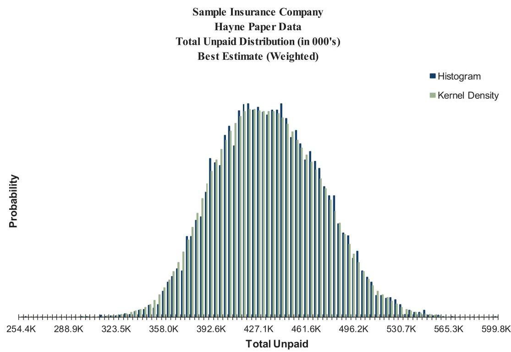
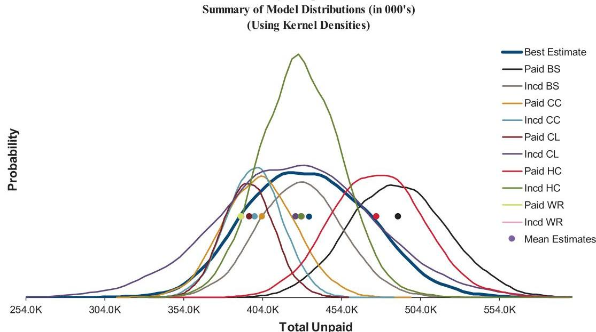

## Page 67
# 8. Correlation and Aggregation 

Results for an entire business unit can be estimated, after each business segment has been analyzed and weighted into best estimates, using aggregation. This represents another area where caution is warranted. The procedure is not a simple matter of adding up the distributions for each segment. In order to estimate the distribution of possible outcomes for a company as a whole, a correlation of results among segments must be used. To illustrate aggregation, data from the "Industry Data.xls" file for Parts A, B, and C are used. The various model tables and graphs for the Part A, Part B, and Part C results are shown in Appendices B, C, and D, respectively.

Simulating correlated variables is commonly accomplished with a multi-variate distribution whose parameters and correlations have been previously specified. This type of simulation is most easily applied when distributions are uniformly identical and known in advance (for example, all derived from a multi-variate normal distribution). Unlike the ODP bootstrap framework, in which the characteristics of the overall distribution are unknown in advance, the multi-variate normal distribution assumption in the Hayne MLE framework could allow model correlation for multiple business segments. However, the correlation among parameters from each segment has to be defined before consolidating the variance-covariance matrices to simulate parameters for all segments. Thus, a fair amount of parameters are needed for correlation and it is difficult to visualize the gigantic aggregated variance-covariance matrix, so it is beyond the scope of this monograph.

Alternatively, two useful correlation processes for the Hayne MLE model are synchronized parameter simulation and re-sorting. ${ }^{46}$

With synchronized parameter simulation, in each iteration, independent normal random values are simulated for each parameter and each segment, then correlation is applied to adjust the simulated random numbers for the second segment and beyond, and modified random numbers are used for multi-variate normal distribution sampling of the parameters used by each segment for each iteration. For each iteration, once the correlated parameters are sampled for each segment, the independent random $[0,1]$ values used for process risk could also be correlated between segments.

[^0]
[^0]:    ${ }^{46}$ For a useful reference see Kirschner, et al. [11]. The Kirschner paper is about correlation for the ODP bootstrap model, but the two processes can be used with other models.

## Page 68
The synchronized simulation process can be implemented in Excel once a correlation matrix has been estimated. There are, however, three potential drawbacks to this process. First, since multiple LOB/segments are being simulated simultaneously, either the size of the workbook needs to increase to accommodate all of the segments or the random number streams need to be correlated in a separate process. Second, it makes sense to correlate the parameters and process risk for the same model for all segments, but different triangle sizes will create "gaps" wherein some segments may have more parameters than other segments. Third, when the multiple models are weighted to get a "best estimate" for each segment the coordination of multiple models and segments is even more complex.

The second correlation process, re-sorting, can be accomplished with algorithms such as Iman-Conover ${ }^{47}$ or copulas, among others. The primary advantages of re-sorting include:

- The correlation is a combination of parameter uncertainty and process variance,
- Different correlation assumptions may be employed without re-running all of the simulations, and
- Different correlation algorithms may also have other beneficial impacts on the aggregate distribution.
For example, using a $t$-distribution copula with low degrees of freedom rather than a normal-distribution copula will effectively "strengthen" the focus of the correlation in the tail of the distribution, all else being equal. This type of consideration is important for risk-based capital and other risk modeling issues.

To induce correlation among different segments in the "Aggregation.xlsm" file, a correlation matrix can be calculated using Spearman's Rank Order for each data/ model type combination in order to select a correlation assumption. Using the selected correlation, re-sorting based on the ranks of the total unpaid claims for all accident years combined can be done. The calculated correlations for Parts A, B, and C based on the paid residuals for Berquist-Sherman may be seen in the first part of Table 8.1. A second part of Table 8.1 is the $p$-values for each correlation coefficient, which are an indication of whether a correlation coefficient is significantly different than zero as the $p$-value gets close to zero. ${ }^{48}$

By reviewing the correlation coefficients for each "pair" of segments, along with the $p$-values, from different sets of correlations matrices (e.g., from paid or incurred data for each model) judgment can be used to select a correlation matrix assumption. As noted above, caution is warranted as these calculated correlation matrices are limited to the data used in the calculation and the impact of other systemic issues, such as contagion, may also need to be considered.

[^0]
[^0]:    ${ }^{47}$ For a useful reference see Iman and Conover [9] or Mildenhall [12]. In the "Aggregate Estimate.xlsm" file the Iman-Conover algorithm is used to "Generate Rank Values" on the Inputs sheet.
    ${ }^{48}$ While judgment is clearly appropriate, the typical threshold is a $p$-value of $5 \%$-i.e., a $p$-value of $5 \%$ or less indicates the correlation is significantly different than zero, while a $p$-value greater than $5 \%$ indicates the correlation is not significantly different than zero.

## Page 69
Table 8.1. Estimated Correlation and P-values

| Rank Correlation of Residuals Paid BS Model-[Modeled] |  |  |  |  |  |
| :-- | :--: | :--: | :--: | :--: | :--: |
| LOB | HO | PPA | CA |  |  |
| HO | 1.00 | 0.26 | 0.22 |  |  |
| PPA | 0.26 | 1.00 | 0.15 |  |  |
| CA | 0.22 | 0.15 | 1.00 |  |  |
| P-Value of Rank Correlation of Residuals Paid BS Model-[Modeled] |  |  |  |  |  |
| LOB | HO | PPA | CA |  |  |
| HO | 0.00 | 0.06 | 0.11 |  |  |
| PPA | 0.06 | 0.00 | 0.29 |  |  |
| CA | 0.11 | 0.29 | 0.00 |  |  |

Using these correlation coefficients, the "Aggregate Estimate.xlsm" file, and the simulation data for Parts A, B, and C, the aggregate results for the three lines of business were calculated and summarized in Table 8.2. A more complete set of tables for the aggregate results is shown in Appendix E.

Note that using residuals to correlate the lines of business (or other segments), as in the synchronized simulation method, and measuring the correlation between residuals, as in the re-sorting method, both tend to create correlations that are close to zero.

Table 8.2. Aggregate Estimated Unpaid

|  |  |  |  | Sample Insurance Company   Aggregate Three Lines of Business   Accident Year Unpaid (in 000's) |  |  |  |  |  |  |
| :--: | :--: | :--: | :--: | :--: | :--: | :--: | :--: | :--: | :--: | :--: |
| Accident   Year | Paid   To Date | Mean   Unpaid | Standard   Error | Coefficient   of Variation | Minimum | Maximum | $50.0 \%$   Percentile | $75.0 \%$   Percentile | $95.0 \%$   Percentile | $99.0 \%$   Percentile |
| 2006 | 18,613 | 146 | 1,002 | 688.1\% | $(2,013)$ | 74,778 | 37 | 55 | 421 | 2,422 |
| 2007 | 20,618 | 198 | 993 | 500.3\% | $(1,523)$ | 37,034 | 70 | 94 | 503 | 3,069 |
| 2008 | 22,866 | 246 | 927 | 377.4\% | $(5,763)$ | 54,447 | 128 | 162 | 542 | 3,227 |
| 2009 | 22,842 | 367 | 1,286 | 350.7\% | $(2,918)$ | 90,399 | 230 | 268 | 695 | 3,778 |
| 2010 | 22,351 | 535 | 1,359 | 254.3\% | $(1,875)$ | 69,139 | 406 | 452 | 860 | 3,458 |
| 2011 | 22,422 | 869 | 1,266 | 145.7\% | $(3,632)$ | 68,690 | 760 | 826 | 1,253 | 4,003 |
| 2012 | 24,350 | 1,589 | 939 | 59.1\% | $(4,107)$ | 27,387 | 1,518 | 1,633 | 2,198 | 4,927 |
| 2013 | 19,973 | 2,814 | 1,424 | 50.6\% | $(8,046)$ | 80,667 | 2,785 | 2,963 | 3,667 | 6,153 |
| 2014 | 18,919 | 5,418 | 4,384 | 80.9\% | $(8,120)$ | 407,319 | 5,420 | 5,768 | 6,863 | 9,408 |
| 2015 | 15,961 | 13,369 | 3,352 | 25.1\% | $(11,431)$ | 98,644 | 13,319 | 14,627 | 17,722 | 21,777 |
| Totals | 208,915 | 25,550 | 9,304 | 36.4\% | (815) | 476,278 | 24,635 | 26,612 | 32,642 | 55,933 |
| Normal Dist. |  | 25,550 | 9,304 | 36.4\% |  |  | 25,550 | 31,826 | 40,854 | 47,195 |
| logNormal Dist. |  | 25,528 | 6,217 | 24.4\% |  |  | 24,803 | 29,163 | 36,812 | 43,354 |
| Gamma Dist. |  | 25,550 | 9,304 | 36.4\% |  |  | 24,430 | 31,065 | 42,526 | 52,000 |
| TVaR |  |  |  |  |  |  | 28,995 | 32,475 | 48,429 | 89,074 |
| Normal TVaR |  |  |  |  |  |  | 32,974 | 37,377 | 44,742 | 50,348 |
| logNormal TVaR |  |  |  |  |  |  | 30,371 | 33,900 | 40,865 | 47,165 |
| Gamma TVaR |  |  |  |  |  |  | 32,838 | 38,140 | 48,373 | 57,295 |

## Page 70
For reserve risk, the correlation that is desired is between the total unpaid amounts for two segments. The correlation that is being measured is the correlation between each incremental future loss amount, given the underlying model describing the overall trends in the data. This may or may not be a reasonable approximation.

While not the direct measure being sought, keep in mind that some level of implied correlation between lines of business will naturally occur due to correlations between the model parameters-e.g., similarities in development parameters-so correlation based on the correlation between the remaining random movements in the incremental values given the model parameters (i.e., residuals) may be reasonable. However, an example of an issue not particularly well suited to measurement via residual correlation is contagion between lines of business-i.e., single events that result in claims in multiple lines of business. To account for this, and to add a bit of conservatism, the correlation assumption can be easily changed based on actuarial judgment.

Correlation is often thought of as being much stronger than "close to zero," but in this case the correlation being considered is typically the loss ratio movements by line of business. For pricing risk, the correlation that is desired is between the loss ratio movements by accident year between two segments. This correlation is not as likely to be close to zero, so correlation of loss ratios (e.g., for the data in Table 7.2) is often done with a different correlation assumptions compared to reserving risk.

## Page 71
# 9. Future Research 

While common use of the Hayne MLE models may be in its infancy, the hope is that this monograph will spur more widespread use of the models. Nevertheless, there are many areas where further research can add value, but only a few key areas are offered up here.

- Use of Other Distributions - The key assumption which allows the framework for the Hayne MLE is the normal distribution that is appropriate whenever the central limit theorem is reasonable. Other distribution assumptions, while more complex mathematically, may provide useful alternatives when the central limit theorem does not apply, such as small portfolios or skewed distributions;
- Combined Models - Instead of simulating paid and incurred (or closed and reported) in parallel and then converting the incurred (reported) estimate to a random payment (closed) stream, it is possible that the Hayne MLE could be expanded to include both types of data in one combined framework with all parameters being correlated. A more ambitious undertaking would be to combine all four data types into a single modeling framework;
- A Flexible Model - Similar to the GLM bootstrap or incremental log models, it may be possible to develop a model using the Hayne MLE framework where the user can specify the place for parameters and include a diagonal parameter;
- Time Horizon Models - As other models have been adapted for calculation of the one-year time horizon for Solvency II purposes, the Hayne MLE models could also be so adapted; and
- Pricing Models - In order to expand the usefulness of the models, they could be extrapolated into future underwriting periods.

## Page 72
# 10. Conclusions 

While this monograph endeavored to show how the Hayne MLE models can be used in a variety of practical ways, and to illustrate the diagnostic tools the actuary needs to assess whether the model is working well, it should not be assumed that a given Hayne MLE model is well suited for every data set. However, it is hoped that the Hayne MLE "toolsets" can become an integral part of the actuary's regular estimation of unpaid claim liabilities, rather than just a "black box" to be used only if necessary or after the deterministic methods have been used to select a point estimate. Finally, the modeling framework allows the actuary to "adjust" the model parameters to smooth anomalies in the data instead of simply accepting the model as is and essentially forcing the data to "fit" the model.

## Page 73
# Acknowledgments 

The author acknowledges the foundational research done by Roger Hayne and the many other authors listed in the references (and others not listed) who contributed to the foundation of the stochastic modeling, without which this research would not have been possible. He also wishes to thank the co-author of the predecessor paper, Ping Xiao, for all his support and the contributions that led to this revised monograph. The author would like to thank the peer reviewers, Roger Hayne, Steve Finch, and Blair Manktelow, who helped to improve the quality of the original paper in a variety of ways. Finally, the author is also grateful to the CAS Committee on Reserves for their comments that greatly improved the predecessor paper and the CAS Monograph Committee for their comments that greatly improved the quality of the monograph.

## Page 74
# Supplementary Material 

There are several companion files designed to give the reader a deeper understanding of the concepts discussed in the monograph. The files are all in the "Hayne MLE Practitioners Guide.zip" file. The files are:
Model Instructions.pdf - this file contains a written description of how to use the primary Hayne MLE modeling files.

## Primary modeling files:

Industry Data.xls - this file contains Schedule P data by line of business for the entire U.S. industry and five of the top 50 companies, for each LOB that has 10 years of data.
Hayne MLE Models.xlsm - this file contains the detailed model steps described in this monograph as well as various modeling options and diagnostic tests. Data can be entered and simulations run and saved for use in calculating a weighted best estimate.
Best Estimate.xlsm - this file can be used to weight the results from ten different models to get a "best estimate" of the distribution of possible outcomes.
Aggregate Estimate.xlsm - this file can be used to correlate the best estimate results from 3 LOBs/segments.
Correlation Ranks.xlsm - this file contains examples of ranks used to correlate results by LOB/segment.

## Simple example calculation files:

Hayne Framework 6 BS.xlsm - this file illustrates the calculations for the Hayne MLE framework using the Berquist \& Sherman model for a simple $6 \times 6$ triangle.
Hayne Framework 6 CC.xlsm - this file illustrates the calculations for the Hayne MLE framework using the Cape Cod model for a simple $6 \times 6$ triangle.
Hayne Framework 6 CL.xlsm - this file illustrates the calculations for the Hayne MLE framework using the Chain Ladder model for a simple $6 \times 6$ triangle.
Hayne Framework 6 HC.xlsm - this file illustrates the calculations for the Hayne MLE framework using the Hoerl Curve model for a simple $6 \times 6$ triangle.
Hayne Framework 6 WR.xlsm - this file illustrates the calculations for the Hayne MLE framework using the Wright model for a simple $6 \times 6$ triangle.

## Page 75
# Appendix A-User Selected Parameters and Diagnostics 

In this appendix, the selected parameters, diagnostics, and simulated unpaid claims are shown for paid data for each model.

Figure A.1. User-selected Parameters for Berquist-Sherman
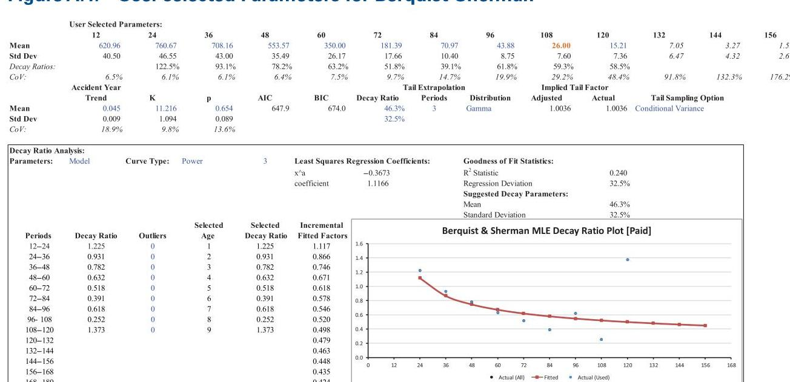

## Page 76
Figure A.2. Residual Graphs for Berquist-Sherman [Modeled Parameters]

Figure A.3. Residual Graphs for Berquist-Sherman [Selected Parameters]
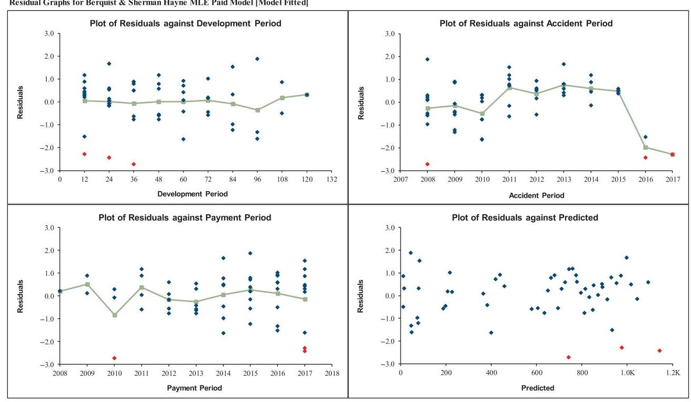
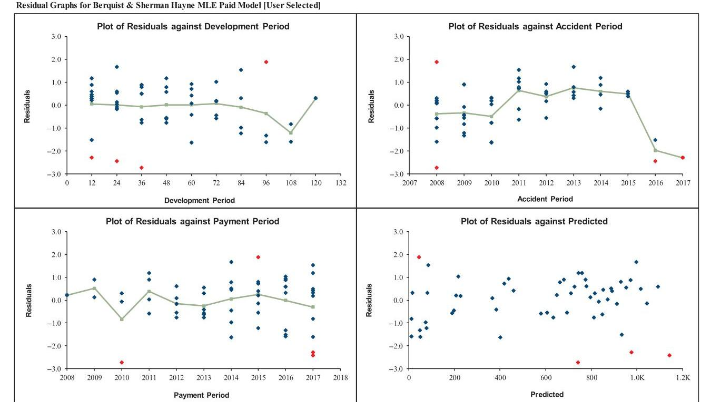

## Page 77
Figure A.4. Normality Plots for Berquist-Sherman

Figure A.5. Box-whisker Plots for Berquist-Sherman
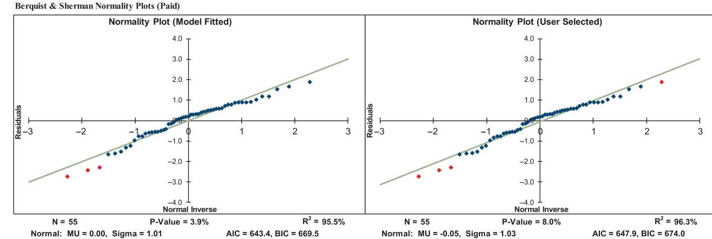
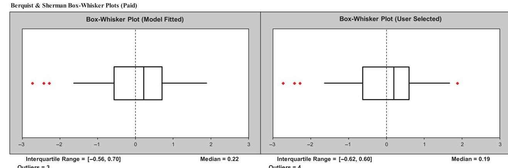

## Page 78
Figure A.6. Model Structure Graphs for Berquist-Sherman

Figure A.7. Estimated Unpaid Results for Berquist-Sherman
Sample Insurance Company
Hayne Paper Data
Accident Year Unpaid (in 000's)
Paid Berquist \& Sherman Model

| Accident   Year | To Date | Mean   Unpaid | Standard   Error | Coefficient of Variation | Minimum | Maximum | 50.0\%   Percentile | 75.0\%   Percentile | 95.0\%   Percentile | 99.0\%   Percentile |
| :--: | :--: | :--: | :--: | :--: | :--: | :--: | :--: | :--: | :--: | :--: |
| 2008 | 123,738 | 441 | 573 | 129.9\% | (1,475) | 2,372 | 391 | 823 | 1,420 | 1,881 |
| 2009 | 140,983 | 1,083 | 825 | 76.2\% | (1,675) | 4,401 | 1,048 | 1,611 | 2,466 | 3,113 |
| 2010 | 147,516 | 2,459 | 1,168 | 47.5\% | (1,527) | 6,082 | 2,417 | 3,252 | 4,462 | 5,274 |
| 2011 | 174,349 | 4,793 | 1,595 | 33.3\% | (172) | 11,597 | 4,758 | 5,809 | 7,391 | 8,954 |
| 2012 | 173,637 | 8,629 | 1,992 | 23.1\% | 1,588 | 16,582 | 8,542 | 9,810 | 11,955 | 13,951 |
| 2013 | 174,996 | 18,214 | 3,136 | 17.2\% | 7,989 | 30,302 | 18,135 | 20,292 | 23,509 | 25,381 |
| 2014 | 169,224 | 41,402 | 5,008 | 12.1\% | 25,322 | 59,952 | 41,302 | 44,862 | 49,756 | 53,216 |
| 2015 | 134,010 | 75,281 | 7,480 | 9.9\% | 53,427 | 105,936 | 74,961 | 80,194 | 87,930 | 93,542 |
| 2016 | 68,911 | 127,141 | 11,108 | 8.7\% | 93,649 | 164,080 | 127,078 | 134,809 | 144,791 | 152,998 |
| 2017 | 35,798 | 210,599 | 16,205 | 7.7\% | 159,908 | 275,851 | 210,505 | 221,397 | 236,756 | 253,297 |
| Totals | 1,343,162 | 490,041 | 31,334 | 6.4\% | 405,127 | 622,322 | 488,329 | 510,471 | 542,250 | 566,151 |
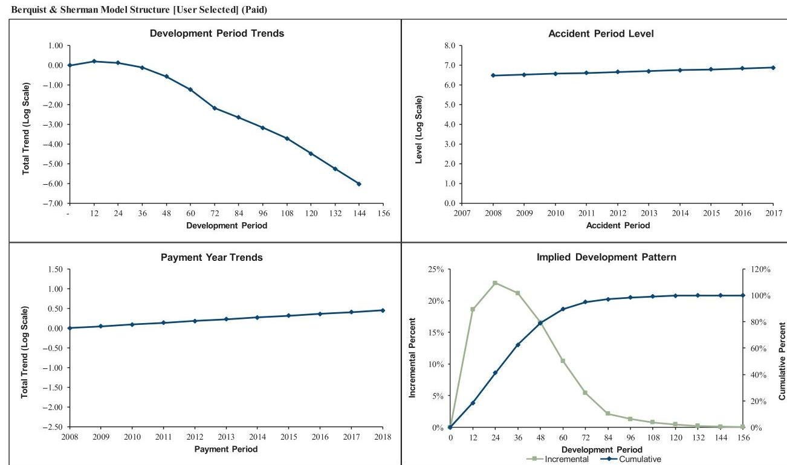

## Page 79
Figure A.8. User-selected Parameters for Cape Cod

|   | Scale | 2009 | 2010 | 2011 | 2012 | 2013 | 2014 | 2015 | 2016 | 2017  |
| --- | --- | --- | --- | --- | --- | --- | --- | --- | --- | --- |
|  Mean |  | 0.0167 | 1.100 | 1.123 | 1.222 | 1.276 | 1.321 | 1.323 | 1.390 | 1.169  |
|  Std Dev |  | 20.027 | 0.066 | 0.064 | 0.072 | 0.075 | 0.082 | 0.084 | 0.091 | 0.082  |
|  CoF |  | 2.5% | 2.7% | 2.7% | 2.4% | 2.4% | 2.4% | 2.3% | 2.8% | 7.0%  |
|   |  | Development Period Parameters (average Incremental) |  |  |  |  |  |  |  |   |
|   |  |  | 24 | 26 | 48 | 60 | 72 | 84 | 96 | 108  |
|  Mean |  |  | 1.101 | 1.063 | 0.038 | 0.234 | 0.284 | 0.111 | 0.067 | 0.048  |
|  Std Dev |  |  | 0.041 | 0.040 | 0.036 | 0.029 | 0.023 | 0.016 | 0.016 | 0.015  |
|  Decay Ratios |  |  |  | 99.9% | 79.8% | 65.7% | 52.2% | 39.0% | 69.7% | 59.4%  |
|  CoF |  |  | 3.5% | 3.9% | 4.5% | 5.5% | 8.1% | 14.9% | 25.1% | 37.8%  |
|   |  |  |  |  |  |  |  |  |  | 70.6%  |
|   |  |  | K | p | AIC | BIC | Decay Ratio | Periods | Distribution | Adjusted  |
|  Mean |  |  | 11.938 | 0.435 | 622.5 | 664.4 | 46.8% | 3 | Gamma | 1.0037  |
|  Std Dev |  |  | 1.061 | 0.087 |  |  | 11.8% |  |  |   |
|  CoF |  |  | 8.1% | 19.9% |  |  |  |  |  |   |

|  Decay Ratio Analysis |  |  |  |  |  |  |  |  |  |   |
| --- | --- | --- | --- | --- | --- | --- | --- | --- | --- | --- |
|  Parameters: | User | Curve Type: | Power | 3 | Least Squares Regression Coefficients: |  |  | Goodness of Fit Statistics: |  |   |
|   |  |  |  |  | n's | -0.3195 |  |  | 0.455 |   |
|   |  |  |  |  | coefficient | 1.0261 |  |  | Regression Deviation | 11.6%  |
|   |  |  |  |  |  |  |  |  | Suggested Decay Parameters: |   |
|   |  |  |  |  |  |  |  |  | Mean | 46.4%  |
|   |  |  |  |  |  |  |  |  | Standard Deviation | 11.4%  |
|  Periods | Decay Ratio | Outliers | Selected | Selected | Incremental |  |  | Cape Cod MLE Decay Ratio Plot [Paid] |  |   |
|  24-36 |  |  | 0.909 | 0.022 | 1.0 |  |  |  |  |   |
|  36-48 |  |  | 0.788 | 0.022 | 1.0 |  |  |  |  |   |
|  48-60 |  |  | 0.677 | 0.019 | 0.722 |  |  |  |  |   |
|  60-72 |  |  | 0.532 | 0.014 | 0.5 |  |  |  |  |   |
|  72-84 |  |  | 0.398 | 0.014 | 0.5 |  |  |  |  |   |
|  84-96 |  |  | 0.407 | 0.012 | 0.411 |  |  |  |  |   |
|  96-108 |  |  | 0.394 | 0.012 | 0.378 |  |  |  |  |   |
|  108-120 |  |  | 0.467 | 0.011 | 0.407 |  |  |  |  |   |
|  120-132 |  |  |  |  | 0.402 |  |  |  |  |   |
|  132-144 |  |  |  |  | 0.477 |  |  |  |  |   |
|  144-156 |  |  |  |  | 0.464 |  |  |  |  |   |
|  156-168 |  |  |  |  | 0.452 |  |  |  |  |   |
|  168-180 |  |  |  |  | 0.442 |  |  |  |  |   |

Figure A.9. Residual Graphs for Cape Cod [Modeled Parameters]

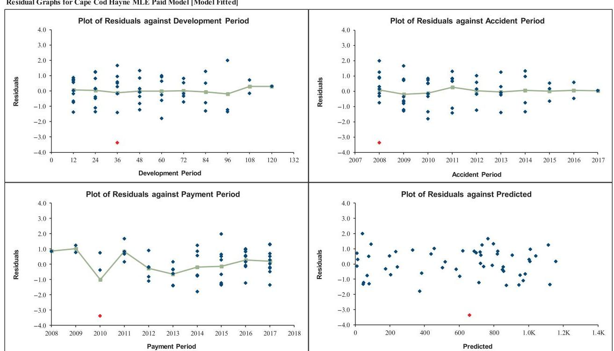

## Page 80
Figure A.10. Residual Graphs for Cape Cod [Selected Parameters]

Figure A.11. Normality Plots for Cape Cod
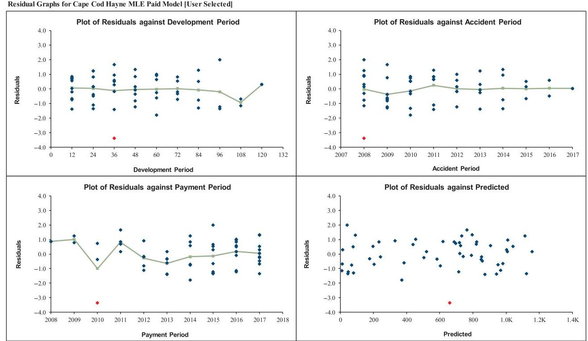
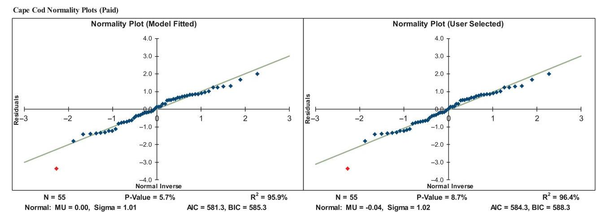

## Page 81
Figure A.12. Box-whisker Plots for Cape Cod

Figure A.13. Model Structure Graphs for Cape Cod
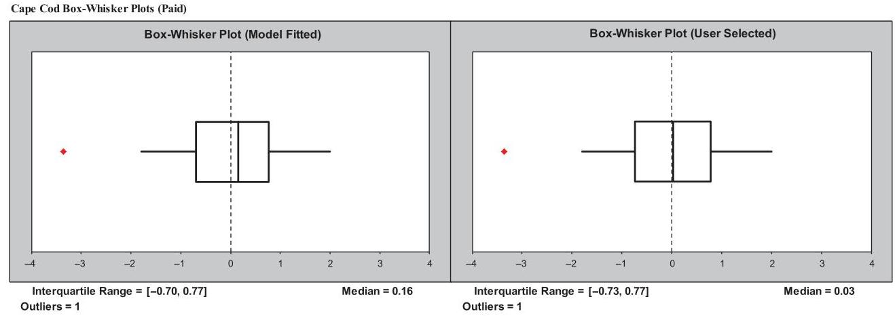
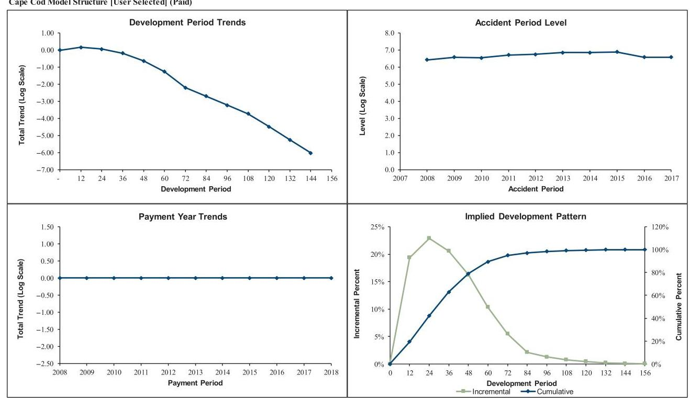

## Page 82
# Figure A.14. Estimated Unpaid Results for Cape Cod 

Figure A.15. User-selected Parameters for Chain Ladder
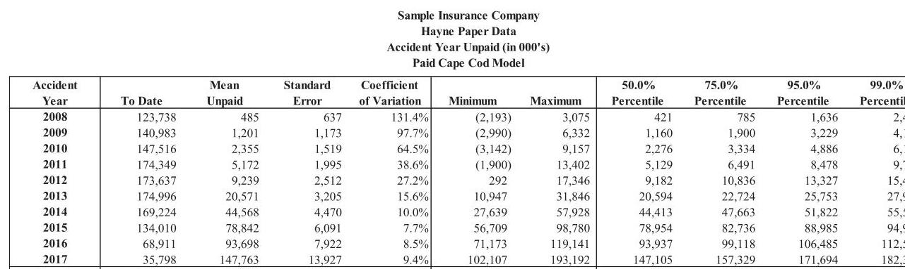
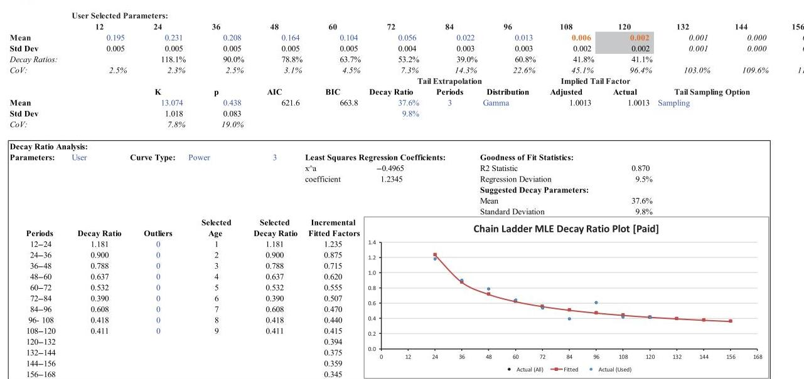

## Page 83
Figure A.16. Residual Graphs for Chain Ladder [Modeled Parameters]

Residual Graphs for Chain Ladder Hayne MLE Paid Model [Model Fitted]

Figure A.17. Residual Graphs for Chain Ladder [Selected Parameters]
Residual Graphs for Chain Ladder Hayne MLE Paid Model [User Selected]
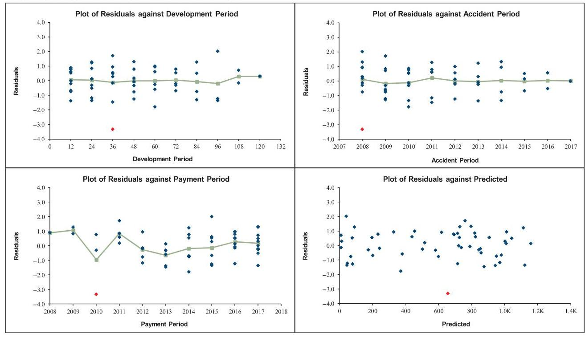
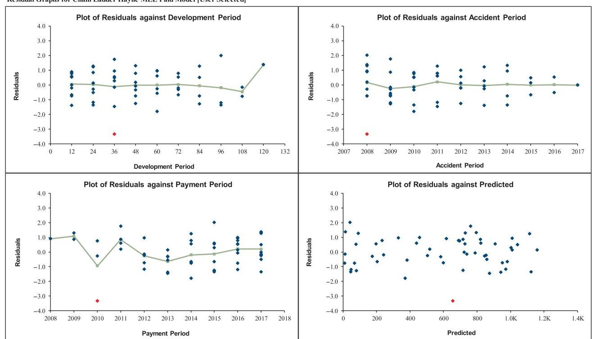

## Page 84
Figure A.18. Normality Plots for Chain Ladder

Figure A.19. Box-whisker Plots for Chain Ladder
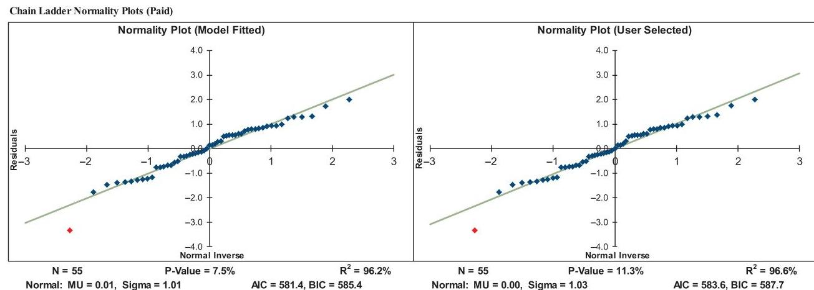
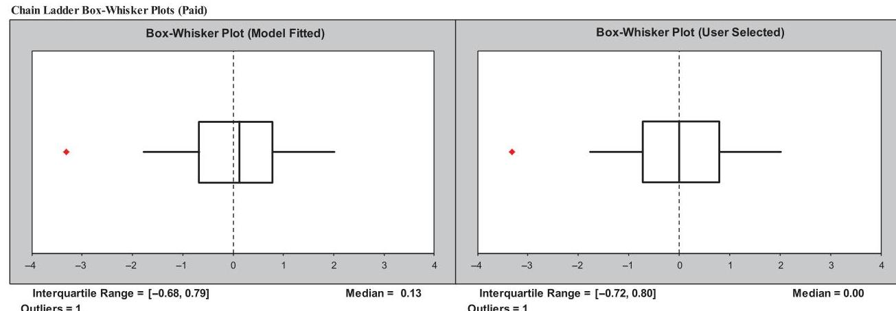

## Page 85
Figure A.20. Model Structure Graphs for Chain Ladder

Figure A.21. Estimated Unpaid Results for Chain Ladder

| Accident   Year | To Date | Mean   Unpaid | Standard   Error | Coefficient of Variation | Minimum | Maximum | 50.0\%   Percentile | 75.0\%   Percentile | 95.0\%   Percentile | 99.0\%   Percentile |
| :--: | :--: | :--: | :--: | :--: | :--: | :--: | :--: | :--: | :--: | :--: |
| 2008 | 123,738 | 168 | 402 | 239.3\% | (1,683) | 2,108 | 130 | 353 | 870 | 1,376 |
| 2009 | 140,983 | 477 | 744 | 156.0\% | (2,553) | 3,939 | 366 | 917 | 1,801 | 2,334 |
| 2010 | 147,516 | 1,281 | 1,006 | 78.5\% | (2,716) | 4,601 | 1,265 | 1,862 | 2,952 | 3,881 |
| 2011 | 174,349 | 3,975 | 1,577 | 39.7\% | (1,884) | 9,378 | 3,961 | 4,936 | 6,674 | 8,256 |
| 2012 | 173,637 | 8,073 | 2,018 | 25.0\% | 1,479 | 14,671 | 8,054 | 9,463 | 11,359 | 12,842 |
| 2013 | 174,996 | 19,370 | 2,737 | 14.1\% | 9,886 | 27,967 | 19,378 | 21,243 | 23,668 | 26,080 |
| 2014 | 169,224 | 43,332 | 4,046 | 9.3\% | 29,894 | 55,614 | 43,274 | 46,198 | 49,868 | 52,771 |
| 2015 | 134,010 | 77,959 | 5,022 | 6.4\% | 58,459 | 97,798 | 77,888 | 81,248 | 85,985 | 90,065 |
| 2016 | 68,911 | 93,147 | 5,499 | 5.9\% | 78,946 | 109,522 | 93,001 | 96,830 | 102,453 | 106,589 |
| 2017 | 35,798 | 147,782 | 7,657 | 5.2\% | 126,331 | 174,935 | 147,669 | 152,763 | 160,526 | 166,069 |
| Totals | 1,343,162 | 395,563 | 16,256 | 4.1\% | 332,424 | 451,082 | 395,463 | 405,138 | 423,244 | 436,972 |

Figure A.22. User-Selected Parameters for Hoerl Curve

|  | User Selected Parameters: |  |  |  |  |  |  |  |  |  |
| :--: | :--: | :--: | :--: | :--: | :--: | :--: | :--: | :--: | :--: | :--: |
|  | Level | d | d' | ln(d) | Trend |  |  |  |  |  |
| Mean | 6.496 | 0.005 | (0.065) | 0.596 | 0.043 |  |  |  |  |  |
| Std Dev | 0.220 | 0.240 | 0.019 | 0.323 | 0.008 |  |  |  |  |  |
| CoV: | $3.4 \%$ | 4687.1\% | $-28.4 \%$ | 34.2\% | 19.5\% |  |  |  |  |  |
|  |  | K | p | AIC | BIC |  | Tail Extrapolation |  | Implied Tail Factor |  |
| Mean |  | 13.147 | 0.506 | 635.9 | 649.9 |  | 3 |  | Adjusted | Actual |
| Std Dev |  | 1.014 | 0.083 |  |  |  |  |  |  |  |
| CoV: |  | 7.7\% | 16.3\% |  |  |  |  |  |  |  |
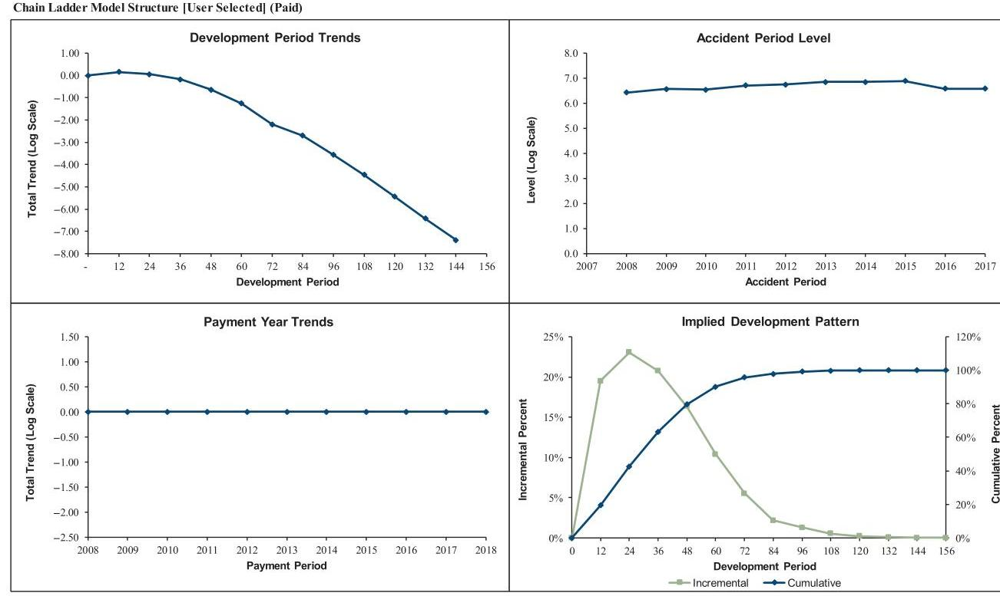

## Page 86
Figure A.23. Residual Graphs for Hoerl Curve [Modeled Parameters]

Residual Graphs for Hoerl Curve Hayne MLE Paid Model [Model Fitted]

Figure A.24. Residual Graphs for Hoerl Curve [Selected Parameters]
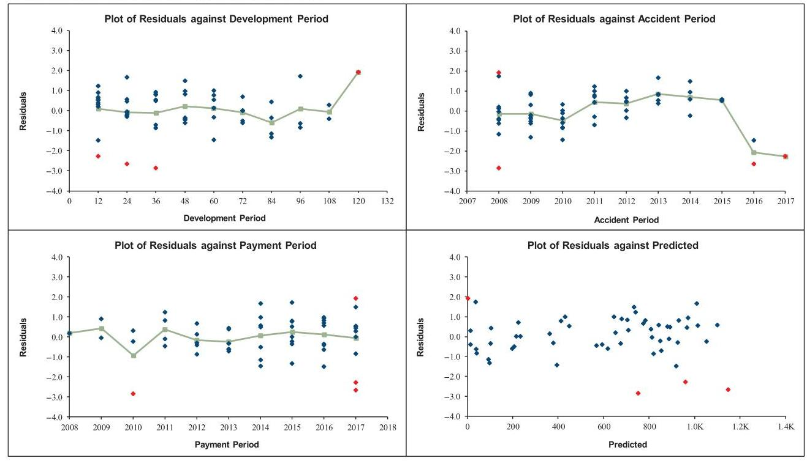
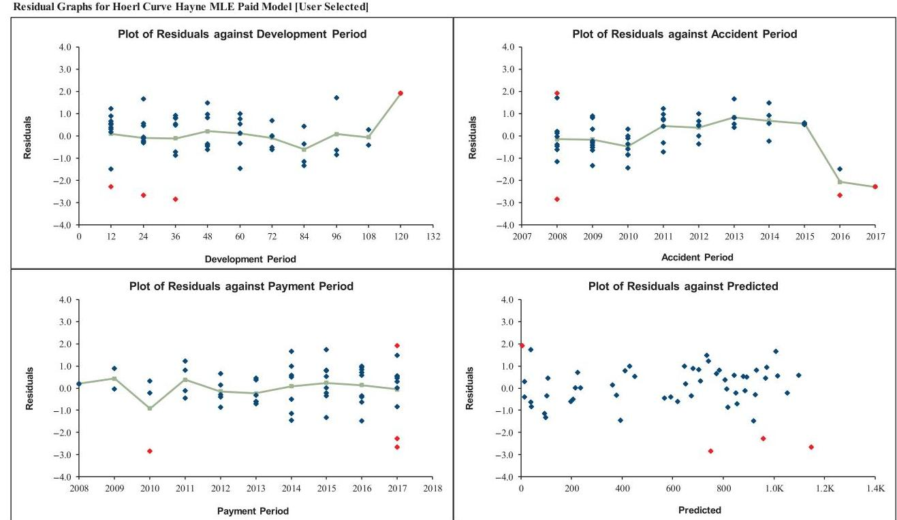

## Page 87
Figure A.25. Normality Plots for Hoerl Curve
Hoerl Curve Normality Plots (Paid)

Figure A.26. Box-Whisker Plots for Hoerl Curve
Hoerl Curve Box-Whisker Plots (Paid)
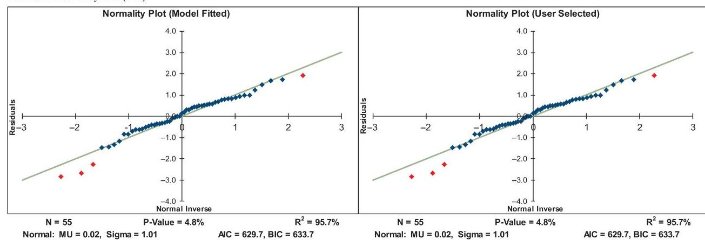
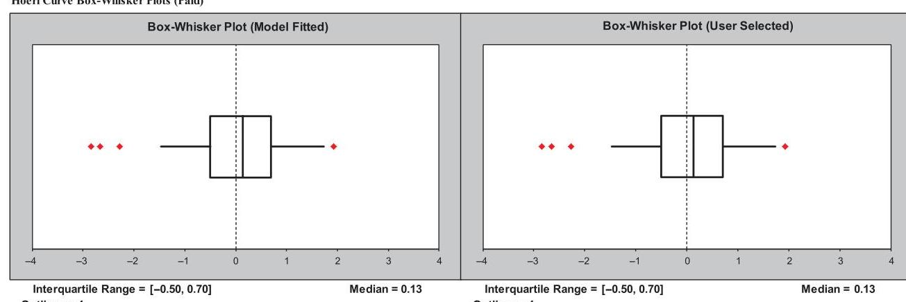

## Page 88
Figure A.27. Model Structure Graphs for Hoerl Curve

Figure A.28. Estimated Unpaid Results for Hoerl Curve
Sample Insurance Company
Hayne Paper Data
Accident Year Unpaid (in 000's)
Paid Hoerl Curve Model

| Accident   Year | To Date | Mean   Unpaid | Standard   Error | Coefficient of Variation | Minimum | Maximum | 50.0\%   Percentile | 75.0\%   Percentile | 95.0\%   Percentile | 99.0\%   Percentile |
| :--: | :--: | :--: | :--: | :--: | :--: | :--: | :--: | :--: | :--: | :--: |
| 2008 | 123,738 | 86 | 241 | 279.2\% | $(1,438)$ | 1,992 | 79 | 206 | 453 | 764 |
| 2009 | 140,983 | 269 | 447 | 166.4\% | $(1,769)$ | 2,015 | 269 | 516 | 1,001 | 1,509 |
| 2010 | 147,516 | 919 | 849 | 92.4\% | $(2,819)$ | 4,501 | 868 | 1,406 | 2,391 | 3,153 |
| 2011 | 174,349 | 2,872 | 1,469 | 51.1\% | $(1,462)$ | 7,843 | 2,871 | 3,766 | 5,234 | 6,712 |
| 2012 | 173,637 | 7,681 | 2,471 | 32.2\% | $(2,851)$ | 15,563 | 7,663 | 9,285 | 11,843 | 13,506 |
| 2013 | 174,996 | 17,664 | 3,672 | 20.8\% | 6,019 | 31,220 | 17,487 | 20,159 | 24,031 | 26,361 |
| 2014 | 169,224 | 40,416 | 5,400 | 13.4\% | 21,019 | 58,254 | 40,552 | 44,130 | 48,818 | 53,580 |
| 2015 | 134,010 | 73,354 | 7,454 | 10.2\% | 45,679 | 94,722 | 73,494 | 78,399 | 85,417 | 91,003 |
| 2016 | 68,911 | 125,089 | 10,640 | 8.5\% | 94,695 | 157,632 | 125,071 | 131,940 | 142,229 | 151,840 |
| 2017 | 35,798 | 207,924 | 15,017 | 7.2\% | 155,768 | 232,433 | 208,208 | 217,912 | 232,223 | 241,497 |
| Totals | 1,343,162 | 476,274 | 28,803 | 6.0\% | 387,439 | 571,460 | 476,387 | 494,362 | 522,640 | 546,673 |

Figure A.29. User-Selected Parameters for Wright
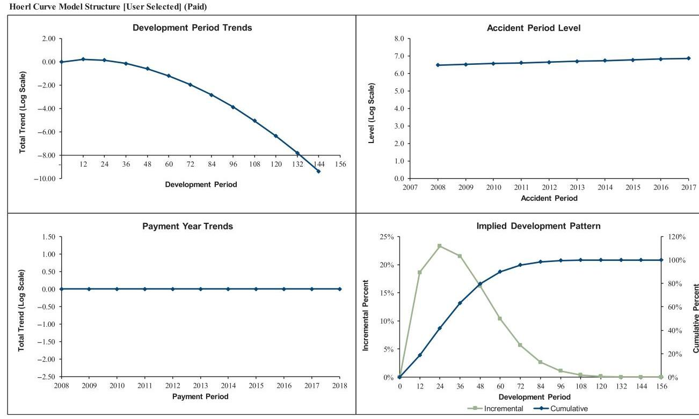
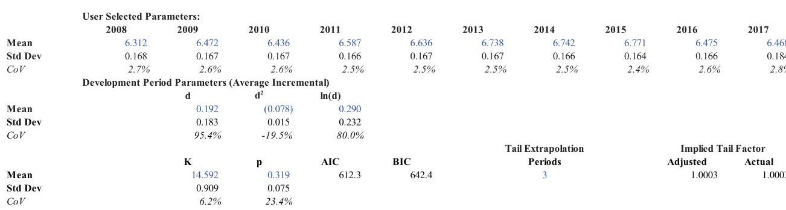

## Page 89
Figure A.30. Residual Graphs for Wright [Modeled Parameters]

Residual Graphs for Wright Hayne MLE Paid Model [Model Fitted]

Figure A.31. Residual Graphs for Wright [Selected Parameters]
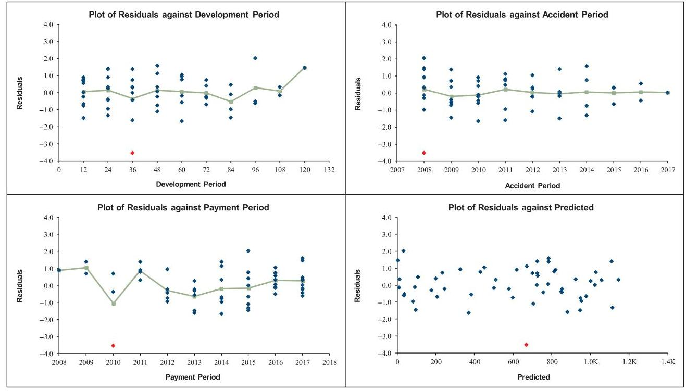
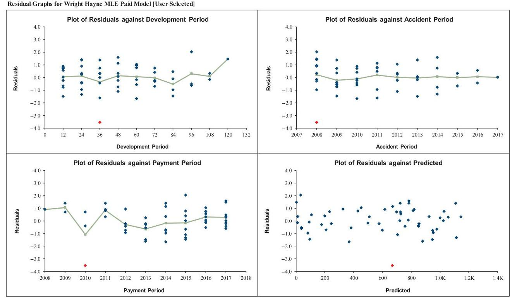

## Page 90
# Figure A.32. Normality Plots for Wright 

Figure A.33. Box-Whisker Plots for Wright
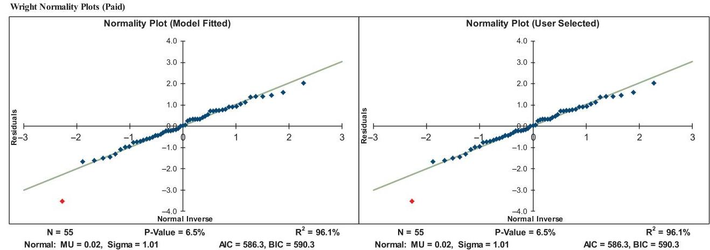
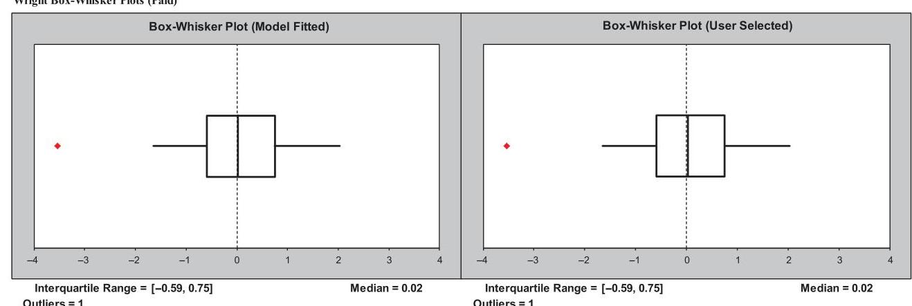

## Page 91
Figure A.34. Model Structure Graphs for Wright

Figure A.35. Estimated Unpaid Results for Wright
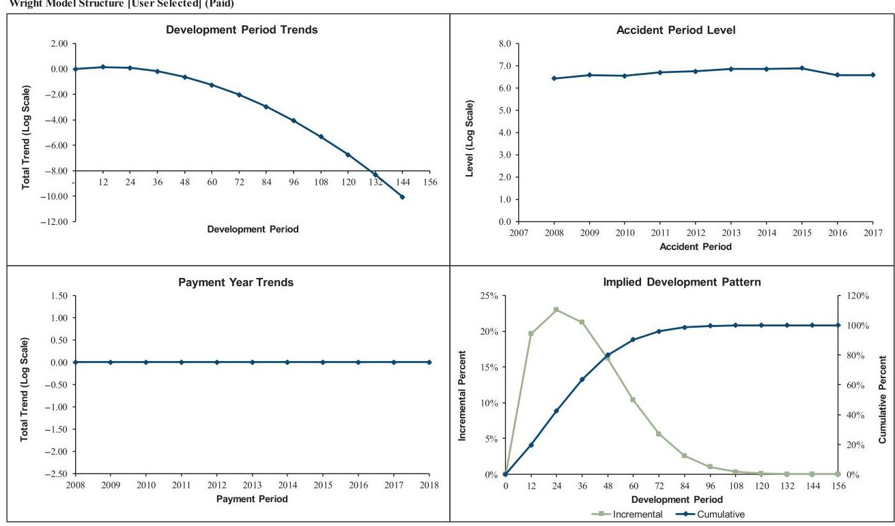

## Page 92
# Appendix B-Schedule P, Part A Results 

In this appendix the results for Schedule P, Part A (Homeowners/Farmowners) are shown.

## Page 93
Figure B.1. Estimated Unpaid Model Results (Paid Berquist-Sherman)

|  |   |   |   |   |   |   |   |   |   |   |
| --- | --- | --- | --- | --- | --- | --- | --- | --- | --- | --- |
|  |   |   |   |   |   |   |   |   |   |   |
|  |   |   |   |   |   |   |   |   |   |   |
|  |   |   |   |   |   |   |   |   |   |   |
|  |   |   |   |   |   |   |   |   |   |   |
|  |   |   |   |   |   |   |   |   |   |   |
|  |   |   |   |   |   |   |   |   |   |   |
|  |   |   |   |   |   |   |   |   |   |   |
|  |   |   |   |   |   |   |   |   |   |   |
|  |   |   |   |   |   |   |   |   |   |   |
|  |   |   |   |   |   |   |   |   |   |   |
|  |   |   |   |   |   |   |   |   |   |   |
|  |   |   |   |   |   |   |   |   |   |   |
|  |   |   |   |   |   |   |   |   |   |   |
|  |   |   |   |   |   |   |   |   |   |   |
|  |   |   |   |   |   |   |   |   |   |   |
|  |   |   |   |   |   |   |   |   |   |   |
|  |   |   |   |   |   |   |   |   |   |   |
|  |   |   |   |   |   |   |   |   |   |   |
|  |   |   |   |   |   |   |   |   |   |   |
|  |   |   |   |   |   |   |   |   |   |   |
|  |   |   |   |   |   |   |   |   |   |   |
|  |   |   |   |   |   |   |   |   |   |   |
|  |   |   |   |   |   |   |   |   |   |   |
|  |   |   |   |   |   |   |   |   |   |   |
|  |   |   |   |   |   |   |   |   |   |   |
|  |   |   |   |   |   |   |   |   |   |   |
|  |   |   |   |   |   |   |   |   |   |   |
|  |   |   |   |   |   |   |   |   |   |   |
|  |   |   |   |   |   |   |   |   |   |   |
|  |   |   |   |   |   |   |   |   |   |   |
|  |   |   |   |   |   |   |   |   |   |   |

## Page 94
Figure B.3. Estimated Unpaid Model Results (Incurred Berquist-Sherman)
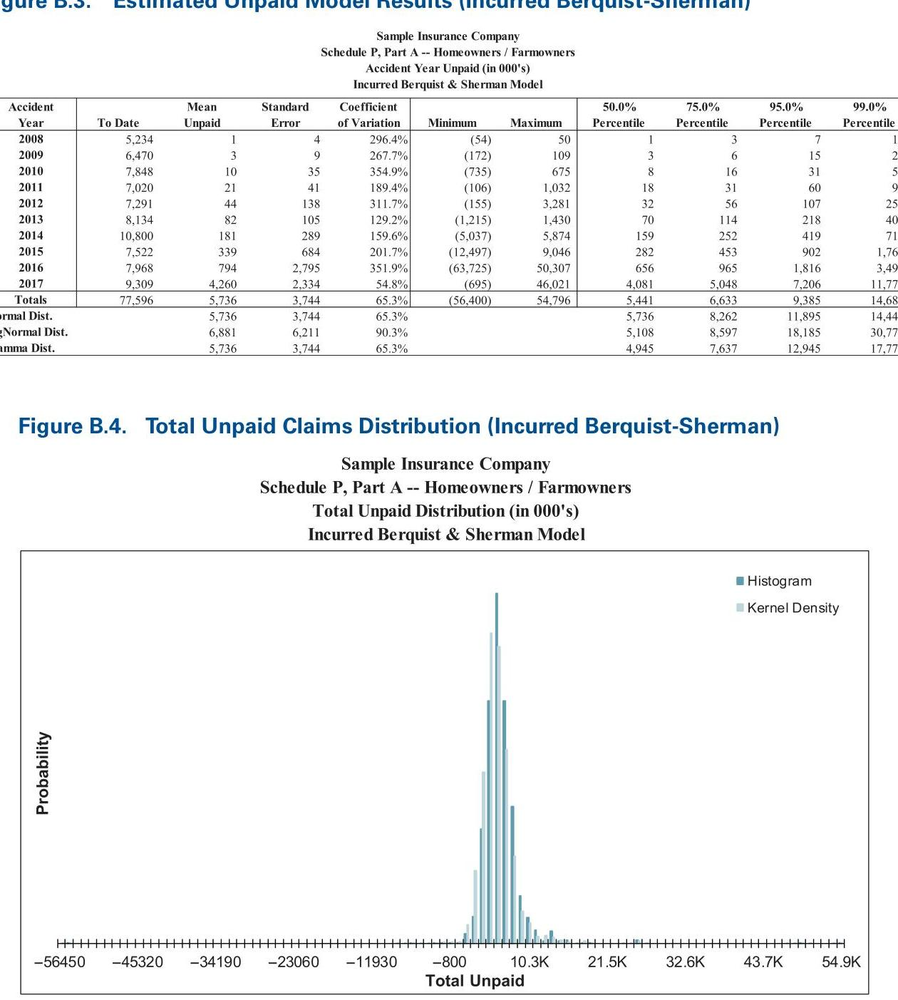

## Page 95
Figure B.5. Estimated Unpaid Model Results (Paid Cape Cod)

|  |   |   |   |   |   |   |   |   |   |   |
| --- | --- | --- | --- | --- | --- | --- | --- | --- | --- | --- |
|  |   |   |   |   |   |   |   |   |   |   |
|  |   |   |   |   |   |   |   |   |   |   |
|  |   |   |   |   |   |   |   |   |   |   |
|  |   |   |   |   |   |   |   |   |   |   |
|  |   |   |   |   |   |   |   |   |   |   |
|  |   |   |   |   |   |   |   |   |   |   |
|  |   |   |   |   |   |   |   |   |   |   |
|  |   |   |   |   |   |   |   |   |   |   |
|  |   |   |   |   |   |   |   |   |   |   |
|  |   |   |   |   |   |   |   |   |   |   |
|  |   |   |   |   |   |   |   |   |   |   |
|  |   |   |   |   |   |   |   |   |   |   |
|  |   |   |   |   |   |   |   |   |   |   |
|  |   |   |   |   |   |   |   |   |   |   |
|  |   |   |   |   |   |   |   |   |   |   |
|  |   |   |   |   |   |   |   |   |   |   |
|  |   |   |   |   |   |   |   |   |   |   |
|  |   |   |   |   |   |   |   |   |   |   |
|  |   |   |   |   |   |   |   |   |   |   |
|  |   |   |   |   |   |   |   |   |   |   |
|  |   |   |   |   |   |   |   |   |   |   |
|  |   |   |   |   |   |   |   |   |   |   |
|  |   |   |   |   |   |   |   |   |   |   |
|  |   |   |   |   |   |   |   |   |   |   |
|  |   |   |   |   |   |   |   |   |   |   |
|  |   |   |   |   |   |   |   |   |   |   |
|  |   |   |   |   |   |   |   |   |   |   |
|  |   |   |   |   |   |   |   |   |   |   |
|  |   |   |   |   |   |   |   |   |   |   |
|  |   |   |   |   |   |   |   |   |   |   |
|  |   |   |   |   |   |   |   |   |   |   |

## Page 96
Figure B.7. Estimated Unpaid Model Results (Incurred Cape Cod)

|  |   |   |   |   |   |   |   |   |   |   |
| --- | --- | --- | --- | --- | --- | --- | --- | --- | --- | --- |
|  |   |   |   |   |   |   |   |   |   |   |
|  |   |   |   |   |   |   |   |   |   |   |
|  |   |   |   |   |   |   |   |   |   |   |
|  |   |   |   |   |   |   |   |   |   |   |
|  |   |   |   |   |   |   |   |   |   |   |
|  |   |   |   |   |   |   |   |   |   |   |
|  |   |   |   |   |   |   |   |   |   |   |
|  |   |   |   |   |   |   |   |   |   |   |
|  |   |   |   |   |   |   |   |   |   |   |
|  |   |   |   |   |   |   |   |   |   |   |
|  |   |   |   |   |   |   |   |   |   |   |
|  |   |   |   |   |   |   |   |   |   |   |
|  |   |   |   |   |   |   |   |   |   |   |
|  |   |   |   |   |   |   |   |   |   |   |
|  |   |   |   |   |   |   |   |   |   |   |
|  |   |   |   |   |   |   |   |   |   |   |
|  |   |   |   |   |   |   |   |   |   |   |
|  |   |   |   |   |   |   |   |   |   |   |
|  |   |   |   |   |   |   |   |   |   |   |
|  |   |   |   |   |   |   |   |   |   |   |
|  |   |   |   |   |   |   |   |   |   |   |
|  |   |   |   |   |   |   |   |   |   |   |
|  |   |   |   |   |   |   |   |   |   |   |
|  |   |   |   |   |   |   |   |   |   |   |
|  |   |   |   |   |   |   |   |   |   |   |
|  |   |   |   |   |   |   |   |   |   |   |
|  |   |   |   |   |   |   |   |   |   |   |
|  |   |   |   |   |   |   |   |   |   |   |
|  |   |   |   |   |   |   |   |   |   |   |
|  |   |   |   |   |   |   |   |   |   |   |
|  |   |   |   |   |   |   |   |   |   |   |

## Page 97
Figure B.9. Estimated Unpaid Model Results (Paid Chain Ladder)

Figure B.10. Total Unpaid Claims Distribution (Paid Chain Ladder)
Sample Insurance Company
Schedule P, Part A -- Homeowners / Farmowners
Total Unpaid Distribution (in 000's)
Paid Chain Ladder Model
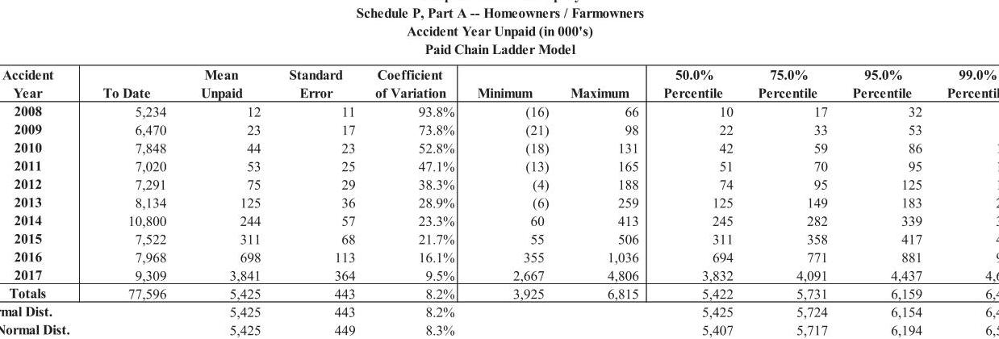
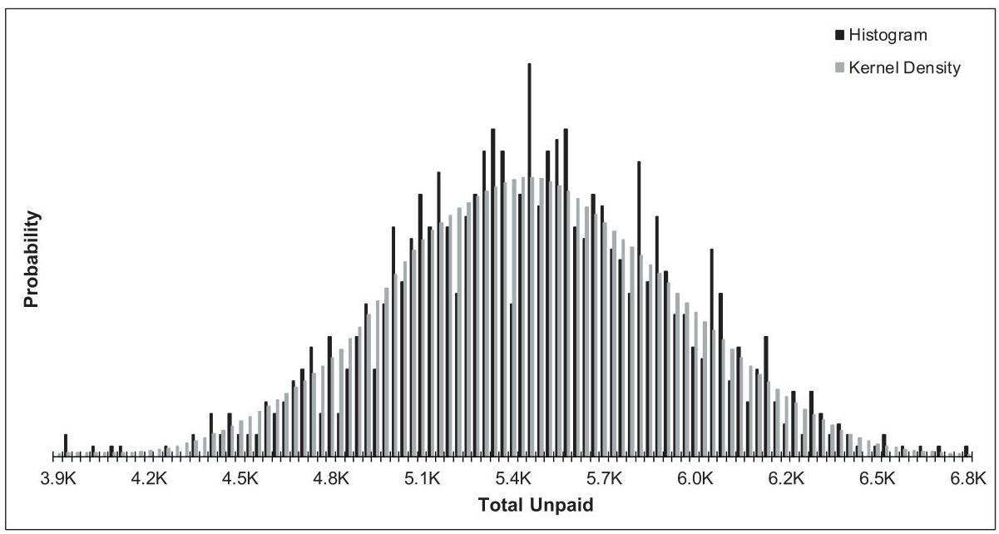

## Page 98
Figure B.11. Estimated Unpaid Model Results (Incurred Chain Ladder)

Figure B.12. Total Unpaid Claims Distribution (Incurred Chain Ladder)
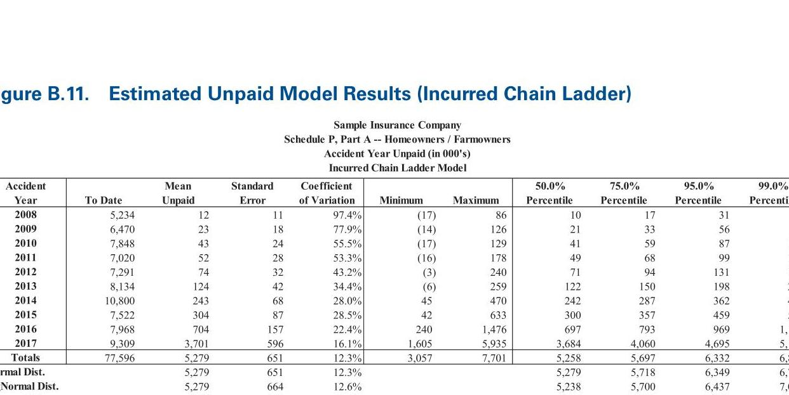
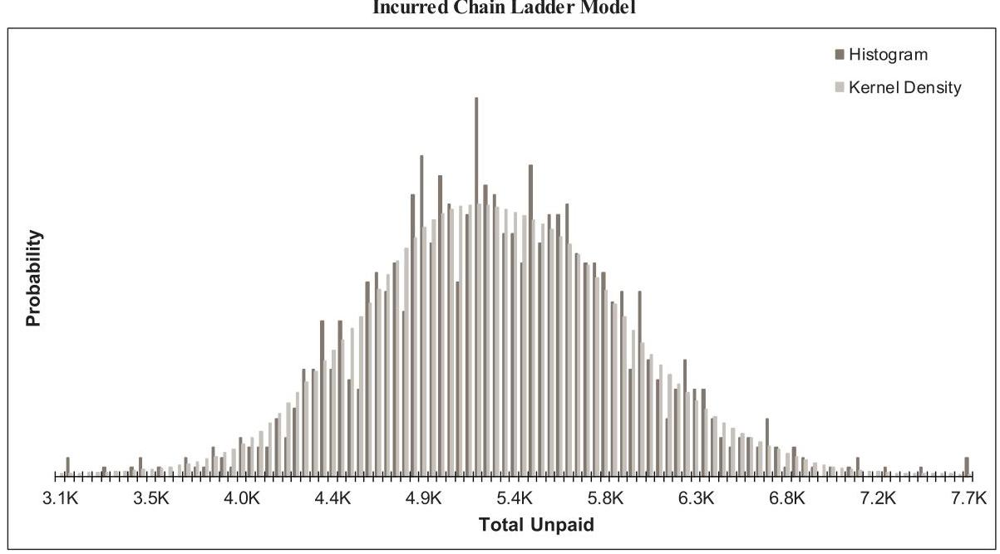

## Page 99
Figure B.13. Estimated Unpaid Model Results (Paid Hoerl Curve)

Figure B.14. Total Unpaid Claims Distribution (Paid Hoerl Curve)
Sample Insurance Company
Schedule P, Part A - Homeowners / Farmowners
Total Unpaid Distribution (in 000's)
Paid Hoerl Curve Model
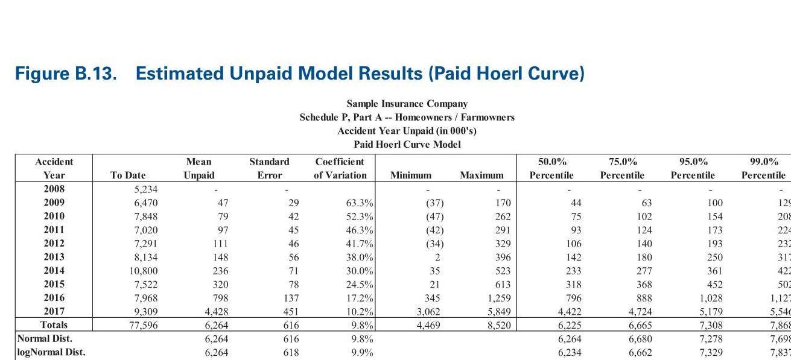
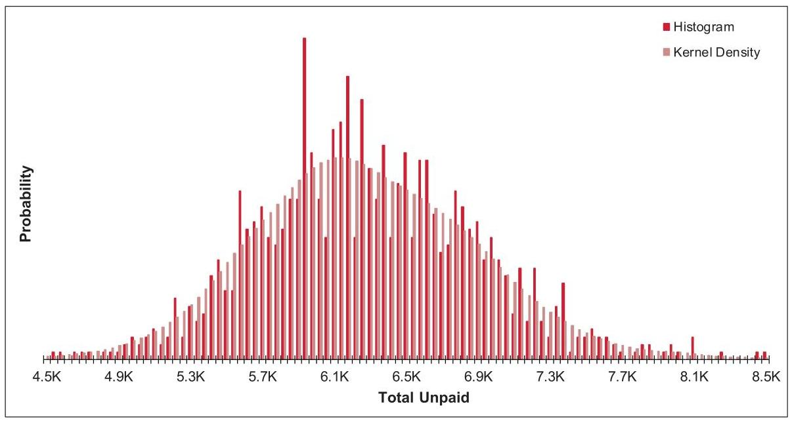

## Page 100
Figure B.15. Estimated Unpaid Model Results (Incurred Hoerl Curve)

Figure B.16. Total Unpaid Claims Distribution (Incurred Hoerl Curve)
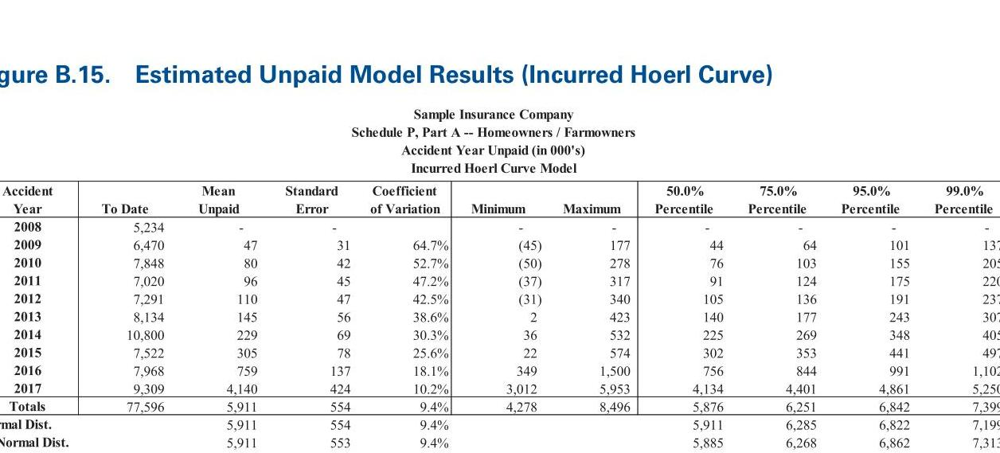
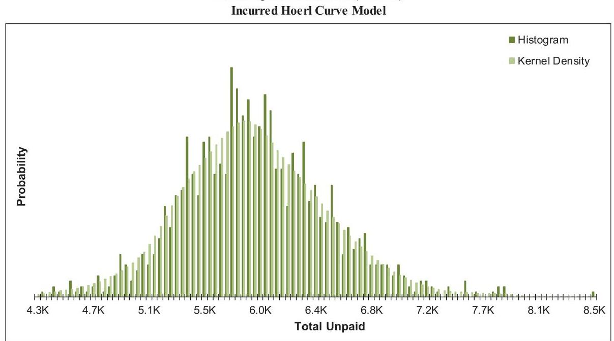

## Page 101
Figure B.17. Estimated Unpaid Model Results (Paid Wright)

Figure B.18. Total Unpaid Claims Distribution (Paid Wright)
Sample Insurance Company
Schedule P, Part A -- Homeowners / Farmowners
Total Unpaid Distribution (in 000's)
Paid Wright Model
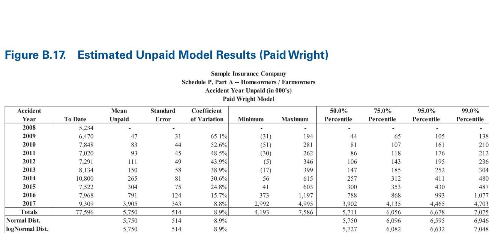
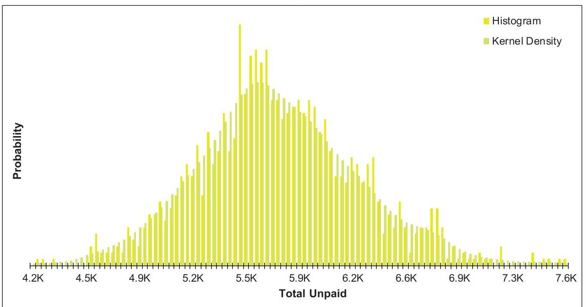

## Page 102
Figure B.19. Estimated Unpaid Model Results (Incurred Wright)

Figure B.20. Total Unpaid Claims Distribution (Incurred Wright)
Sample Insurance Company
Schedule P, Part A -- Homeowners / Farmowners
Total Unpaid Distribution (in 000's)
Incurred Wright Model
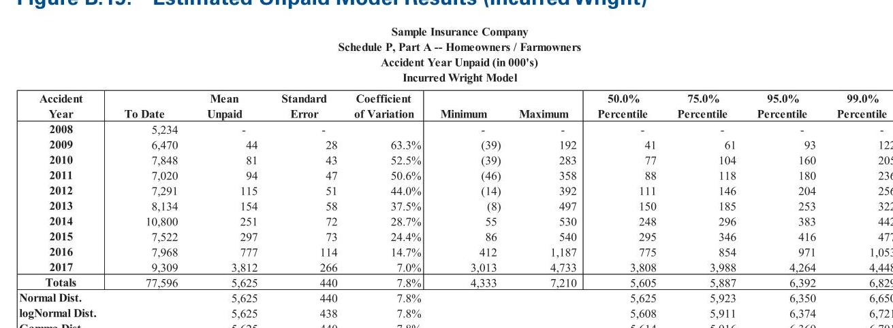
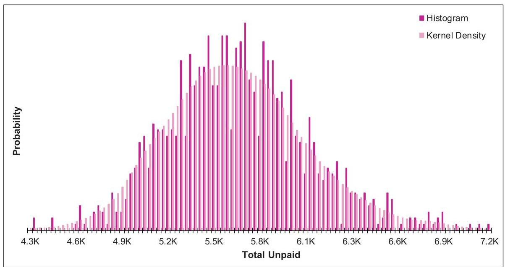

## Page 103
Figure B.21. Model Weights by Accident Year

| Accident
Year | Model Weights by Accident Year |  |  |  |  |  |  |  |  |  |  |
| :--: | :--: | :--: | :--: | :--: | :--: | :--: | :--: | :--: | :--: | :--: | :--: |
|  | Paid BS | Ined BS | Paid CC | Ined CC | Paid CL | Ined CL | Paid HC | Ined HC | Paid WH | Ined WH | TOTAL |
| 2008 | 40.0\% |  | 30.0\% |  | 30.0\% |  |  |  |  |  | 100.0\% |
| 2009 | 40.0\% |  | 30.0\% |  | 30.0\% |  |  |  |  |  | 100.0\% |
| 2010 | 40.0\% |  | 30.0\% |  | 30.0\% |  |  |  |  |  | 100.0\% |
| 2011 | 40.0\% |  | 30.0\% |  | 30.0\% |  |  |  |  |  | 100.0\% |
| 2012 | 40.0\% |  | 30.0\% |  | 30.0\% |  |  |  |  |  | 100.0\% |
| 2013 | 40.0\% |  | 30.0\% |  | 30.0\% |  |  |  |  |  | 100.0\% |
| 2014 | 40.0\% |  | 30.0\% |  | 30.0\% |  |  |  |  |  | 100.0\% |
| 2015 | 40.0\% |  | 30.0\% |  | 30.0\% |  |  |  |  |  | 100.0\% |
| 2016 | 40.0\% |  | 30.0\% |  | 30.0\% |  |  |  |  |  | 100.0\% |
| 2017 | 40.0\% |  | 30.0\% |  | 30.0\% |  |  |  |  |  | 100.0\% |

Figure B.22. Estimated Mean Unpaid by Model
Sample Insurance Company
Schedule P, Part A - Homeowners / Farmowners
Summary of Results by Model (in 000's)

| Accident
Year | Mean Estimated Unpaid |  |  |  |  |  |  |  |  |  |  |
| :--: | :--: | :--: | :--: | :--: | :--: | :--: | :--: | :--: | :--: | :--: | :--: |
|  | Berquist \& Sherman |  | Cape Cod |  | Chain Ladder |  | Hocel Curve |  | Weight |  | Best Est. (Weighted) |
|  | Paid | Incurred | Paid | Incurred | Paid | Incurred | Paid | Incurred | Paid | Incurred |  |
| 2008 | 1 | 1 | 2 | 1 | 12 | 12 | - | - | - | - | 5 |
| 2009 | 3 | 3 | 4 | 3 | 23 | 23 | 47 | 47 | 47 | 44 | 9 |
| 2010 | 9 | 10 | 10 | 11 | 44 | 43 | 79 | 80 | 83 | 81 | 20 |
| 2011 | 18 | 21 | 21 | 26 | 53 | 52 | 97 | 96 | 93 | 94 | 29 |
| 2012 | 38 | 44 | 40 | 50 | 75 | 74 | 111 | 110 | 111 | 115 | 49 |
| 2013 | 80 | 82 | 81 | 92 | 125 | 124 | 148 | 145 | 150 | 154 | 94 |
| 2014 | 181 | 181 | 240 | 211 | 244 | 243 | 236 | 229 | 265 | 251 | 217 |
| 2015 | 342 | 339 | 298 | 297 | 311 | 304 | 320 | 305 | 304 | 297 | 318 |
| 2016 | 789 | 794 | 717 | 1,315 | 698 | 704 | 798 | 759 | 791 | 777 | 739 |
| 2017 | 4,880 | 4,260 | 3,937 | 3,884 | 3,841 | 3,701 | 4,428 | 4,140 | 3,905 | 3,812 | 4,312 |
| Totals | 6,340 | 5,736 | 5,350 | 5,890 | 5,425 | 5,279 | 6,264 | 5,911 | 5,750 | 5,625 | 5,792 |

Figure B.23. Estimated Ranges
Sample Insurance Company
Schedule P, Part A - Homeowners / Farmowners
Summary of Results by Model (in 000's)

| Accident   Year | Ranges |  |  |  |
| :--: | :--: | :--: | :--: | :--: |
|  | Best Est.   (Weighted) | Weighted |  | Modeled |
|  |  | Minimum | Maximum | Minimum | Maximum |
| 2008 | 5 | 1 | 12 | 1 | 12 |
| 2009 | 9 | 3 | 23 | 3 | 23 |
| 2010 | 20 | 9 | 44 | 9 | 44 |
| 2011 | 29 | 18 | 53 | 18 | 53 |
| 2012 | 49 | 38 | 75 | 38 | 75 |
| 2013 | 94 | 80 | 125 | 80 | 125 |
| 2014 | 217 | 181 | 244 | 181 | 244 |
| 2015 | 318 | 298 | 342 | 298 | 342 |
| 2016 | 739 | 698 | 789 | 698 | 789 |
| 2017 | 4,312 | 3,841 | 4,880 | 3,841 | 4,880 |
| Totals | 5,792 | 5,166 | 6,587 | 5,350 | 6,340 |

## Page 104
Figure B.24. Reconciliation of Total Results (Weighted)
Sample Insurance Company
Schedule P, Part A - Homeowners / Farmowners
Reconciliation of Total Results (in 000's)
Best Estimate (Weighted)

| Accident   Year | Paid   To Date | Incurred   To Date | Case   Reserves | IBNR | Estimate of   Ultimate | Estimate of   Unpaid |
| :--: | :--: | :--: | :--: | :--: | :--: | :--: |
| 2008 | 5,234 | 5,237 | 3 | 2 | 5,239 | 5 |
| 2009 | 6,470 | 6,479 | 9 | 1 | 6,480 | 9 |
| 2010 | 7,848 | 7,867 | 19 | 1 | 7,868 | 20 |
| 2011 | 7,020 | 7,046 | 26 | 3 | 7,050 | 29 |
| 2012 | 7,291 | 7,341 | 50 | (1) | 7,340 | 49 |
| 2013 | 8,134 | 8,225 | 91 | 3 | 8,228 | 94 |
| 2014 | 10,800 | 11,085 | 285 | (68) | 11,017 | 217 |
| 2015 | 7,522 | 7,810 | 288 | 30 | 7,840 | 318 |
| 2016 | 7,968 | 8,703 | 735 | 4 | 8,707 | 739 |
| 2017 | 9,309 | 12,788 | 3,478 | 834 | 13,621 | 4,312 |
| Totals | 77,596 | 82,580 | 4,984 | 808 | 83,388 | 5,792 |

Figure B.25. Estimated Unpaid Model Results (Weighted)
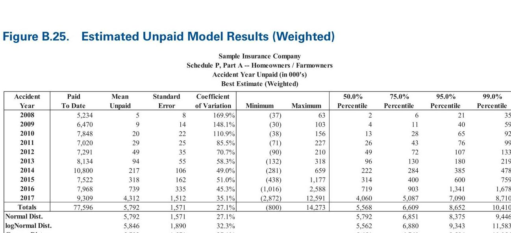

## Page 105
Figure B.26. Estimated Cash Flow (Weighted)

Figure B.27. Estimated Loss Ratio (Weighted)

Figure B.28. Estimated Unpaid Claim Runoff (Weighted)
Sample Insurance Company
Schedule P, Part A - Homeowners / Farmowners
Calendar Year Unpaid Claim Runoff (in 000's)
Best Estimate (Weighted)

| Calendar   Year | Mean   Unpaid | Standard   Error | Coefficient of Variation | Minimum | Maximum | 50.0\%   Percentile | 75.0\%   Percentile | 95.0\%   Percentile | 99.0\%   Percentile |
| :--: | :--: | :--: | :--: | :--: | :--: | :--: | :--: | :--: | :--: |
| 2018 | 5,792 | 1,571 | 27.1\% | (800) | 14,273 | 5,568 | 6,609 | 8,652 | 10,410 |
| 2018 | 1,920 | 505 | 26.3\% | (102) | 4,329 | 1,876 | 2,206 | 2,823 | 3,308 |
| 2019 | 961 | 275 | 28.6\% | (206) | 2,428 | 950 | 1,116 | 1,441 | 1,713 |
| 2020 | 515 | 159 | 30.8\% | (97) | 1,203 | 515 | 616 | 779 | 913 |
| 2021 | 301 | 110 | 36.5\% | (101) | 828 | 299 | 371 | 485 | 574 |
| 2022 | 178 | 80 | 45.3\% | (135) | 674 | 171 | 225 | 321 | 402 |
| 2023 | 106 | 62 | 58.8\% | (132) | 515 | 98 | 139 | 221 | 297 |
| 2024 | 62 | 48 | 77.6\% | (74) | 417 | 51 | 84 | 153 | 217 |
| 2025 | 34 | 35 | 102.2\% | (96) | 305 | 24 | 47 | 103 | 156 |
| 2026 | 18 | 23 | 123.2\% | (58) | 243 | 11 | 26 | 63 | 100 |
| 2027 | 9 | 14 | 154.2\% | (38) | 162 | 4 | 12 | 37 | 61 |
| 2028 | 3 | 7 | 220.4\% | (23) | 100 | 1 | 3 | 16 | 29 |
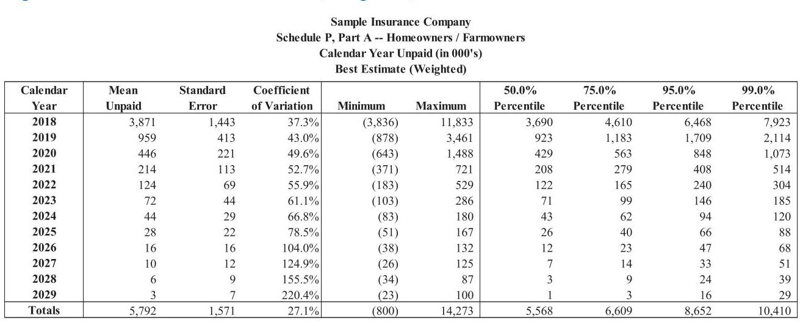
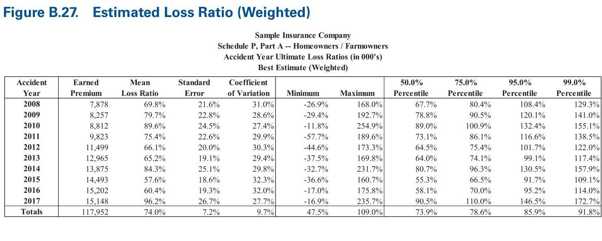

## Page 106
Figure B.29. Mean of Incremental Values (Weighted)

Figure B.30. Standard Deviation of Incremental Values (Weighted)

Figure B.31. Coefficient of Variation of Incremental Values (Weighted)
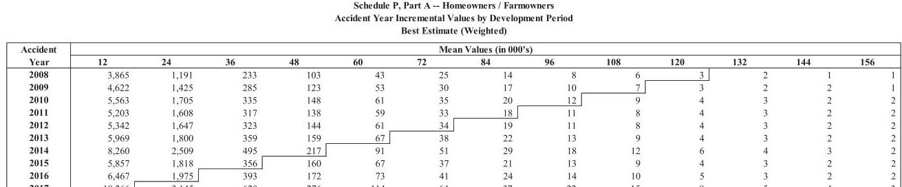
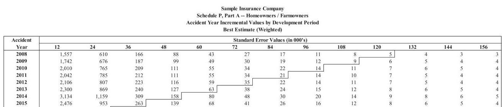
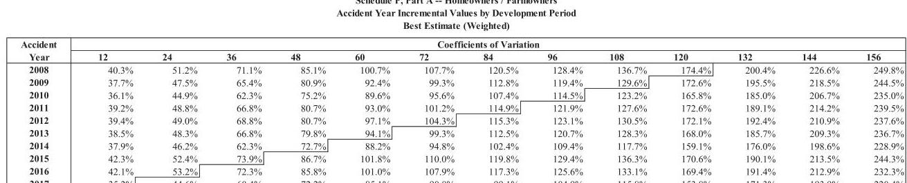

## Page 107
Figure B.32. Total Unpaid Claims Distribution (Weighted)

Figure B.33. Summary of Model Distributions
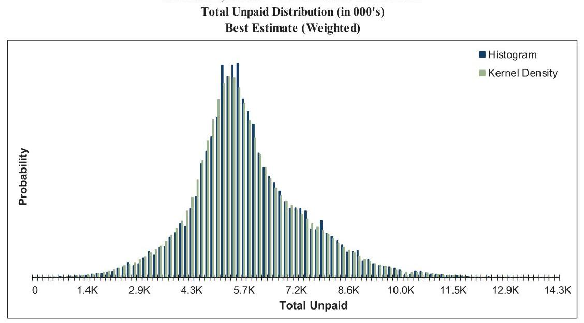
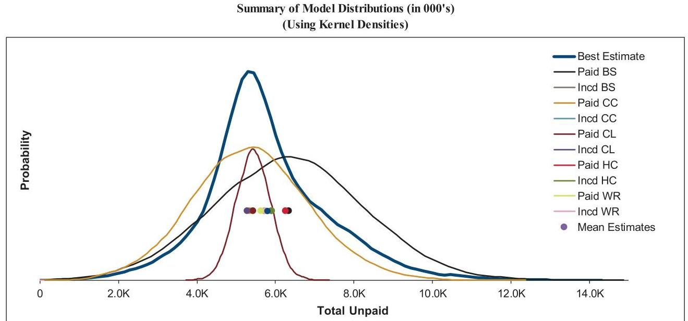

## Page 108
# Appendix C-Schedule P, Part B Results 

In this appendix the results for Schedule P, Part B (Private Passenger Auto Liability) are shown.

## Page 109
Figure C.1. Estimated Unpaid Model Results (Paid Berquist-Sherman)

Figure C.2. Total Unpaid Claims Distribution (Paid Berquist-Sherman)
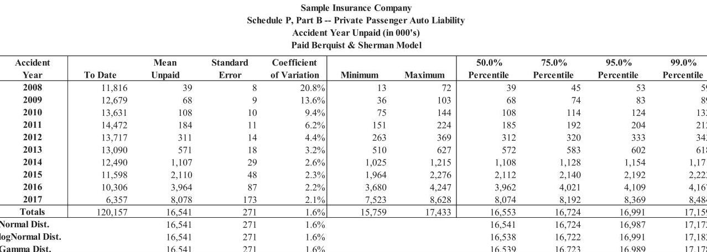
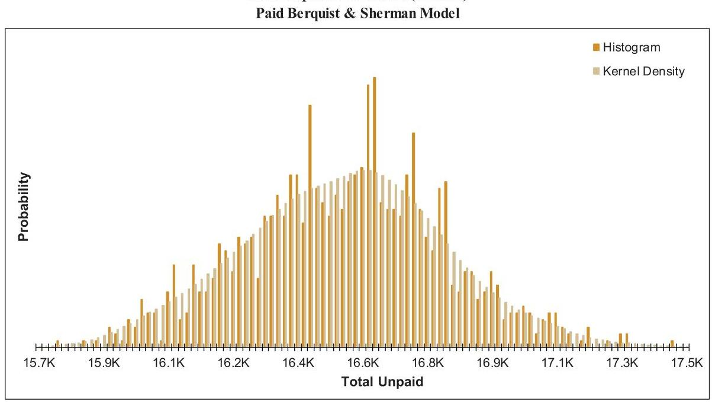

## Page 110
Figure C.3. Estimated Unpaid Model Results (Incurred Berquist-Sherman)

Figure C.4. Total Unpaid Claims Distribution (Incurred Berquist-Sherman)
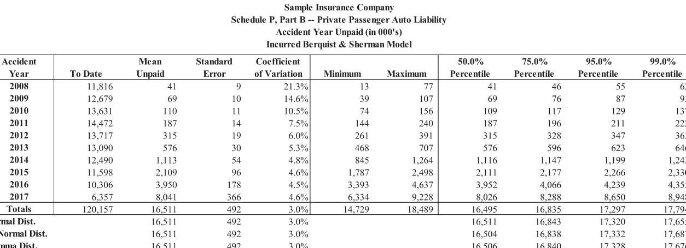
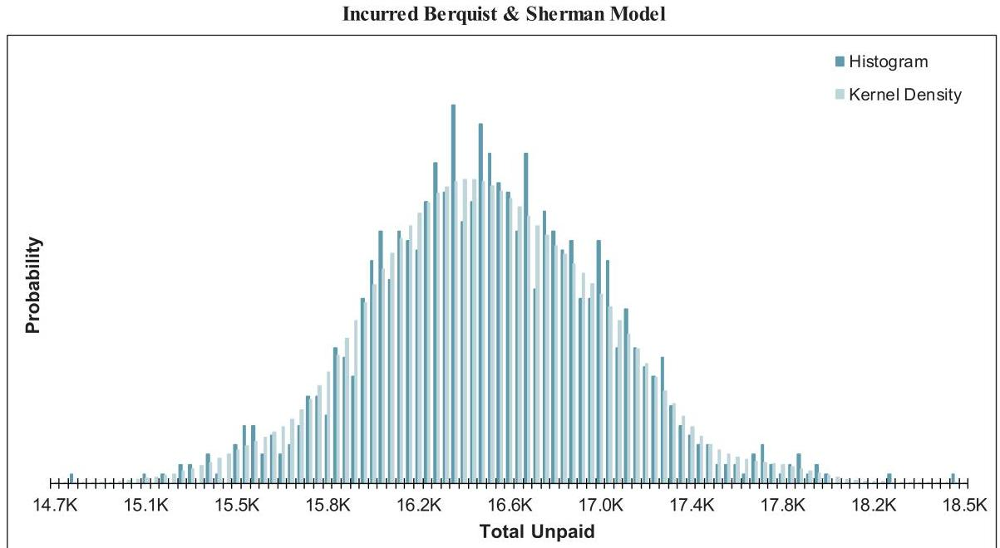

## Page 111
Figure C.5. Estimated Unpaid Model Results (Paid Cape Cod)

|  |   |   |   |   |   |   |   |   |   |   |
| --- | --- | --- | --- | --- | --- | --- | --- | --- | --- | --- |
|  |   |   |   |   |   |   |   |   |   |   |
|  |   |   |   |   |   |   |   |   |   |   |
|  |   |   |   |   |   |   |   |   |   |   |
|  |   |   |   |   |   |   |   |   |   |   |
|  |   |   |   |   |   |   |   |   |   |   |
|  |   |   |   |   |   |   |   |   |   |   |
|  |   |   |   |   |   |   |   |   |   |   |
|  |   |   |   |   |   |   |   |   |   |   |
|  |   |   |   |   |   |   |   |   |   |   |
|  |   |   |   |   |   |   |   |   |   |   |
|  |   |   |   |   |   |   |   |   |   |   |
|  |   |   |   |   |   |   |   |   |   |   |
|  |   |   |   |   |   |   |   |   |   |   |
|  |   |   |   |   |   |   |   |   |   |   |
|  |   |   |   |   |   |   |   |   |   |   |
|  |   |   |   |   |   |   |   |   |   |   |
|  |   |   |   |   |   |   |   |   |   |   |
|  |   |   |   |   |   |   |   |   |   |   |
|  |   |   |   |   |   |   |   |   |   |   |
|  |   |   |   |   |   |   |   |   |   |   |
|  |   |   |   |   |   |   |   |   |   |   |
|  |   |   |   |   |   |   |   |   |   |   |
|  |   |   |   |   |   |   |   |   |   |   |
|  |   |   |   |   |   |   |   |   |   |   |
|  |   |   |   |   |   |   |   |   |   |   |
|  |   |   |   |   |   |   |   |   |   |   |
|  |   |   |   |   |   |   |   |   |   |   |
|  |   |   |   |   |   |   |   |   |   |   |
|  |   |   |   |   |   |   |   |   |   |   |
|  |   |   |   |   |   |   |   |   |   |   |
|  |   |   |   |   |   |   |   |   |   |   |

## Page 112
Figure C.7. Estimated Unpaid Model Results (Incurred Cape Cod)

|  |   |   |   |   |   |   |   |   |   |   |
| --- | --- | --- | --- | --- | --- | --- | --- | --- | --- | --- |
|  |   |   |   |   |   |   |   |   |   |   |
|  |   |   |   |   |   |   |   |   |   |   |
|  |   |   |   |   |   |   |   |   |   |   |
|  |   |   |   |   |   |   |   |   |   |   |
|  |   |   |   |   |   |   |   |   |   |   |
|  |   |   |   |   |   |   |   |   |   |   |
|  |   |   |   |   |   |   |   |   |   |   |
|  |   |   |   |   |   |   |   |   |   |   |
|  |   |   |   |   |   |   |   |   |   |   |
|  |   |   |   |   |   |   |   |   |   |   |
|  |   |   |   |   |   |   |   |   |   |   |
|  |   |   |   |   |   |   |   |   |   |   |
|  |   |   |   |   |   |   |   |   |   |   |
|  |   |   |   |   |   |   |   |   |   |   |
|  |   |   |   |   |   |   |   |   |   |   |
|  |   |   |   |   |   |   |   |   |   |   |
|  |   |   |   |   |   |   |   |   |   |   |
|  |   |   |   |   |   |   |   |   |   |   |
|  |   |   |   |   |   |   |   |   |   |   |
|  |   |   |   |   |   |   |   |   |   |   |
|  |   |   |   |   |   |   |   |   |   |   |
|  |   |   |   |   |   |   |   |   |   |   |
|  |   |   |   |   |   |   |   |   |   |   |
|  |   |   |   |   |   |   |   |   |   |   |
|  |   |   |   |   |   |   |   |   |   |   |
|  |   |   |   |   |   |   |   |   |   |   |
|  |   |   |   |   |   |   |   |   |   |   |
|  |   |   |   |   |   |   |   |   |   |   |
|  |   |   |   |   |   |   |   |   |   |   |
|  |   |   |   |   |   |   |   |   |   |   |
|  |   |   |   |   |   |   |   |   |   |   |

## Page 113
Figure C.9. Estimated Unpaid Model Results (Paid Chain Ladder)

# Figure C.10. Total Unpaid Claims Distribution (Paid Chain Ladder) 

## Sample Insurance Company

Schedule P, Part B -- Private Passenger Auto Liability
Total Unpaid Distribution (in 000's)
Paid Chain Ladder Model
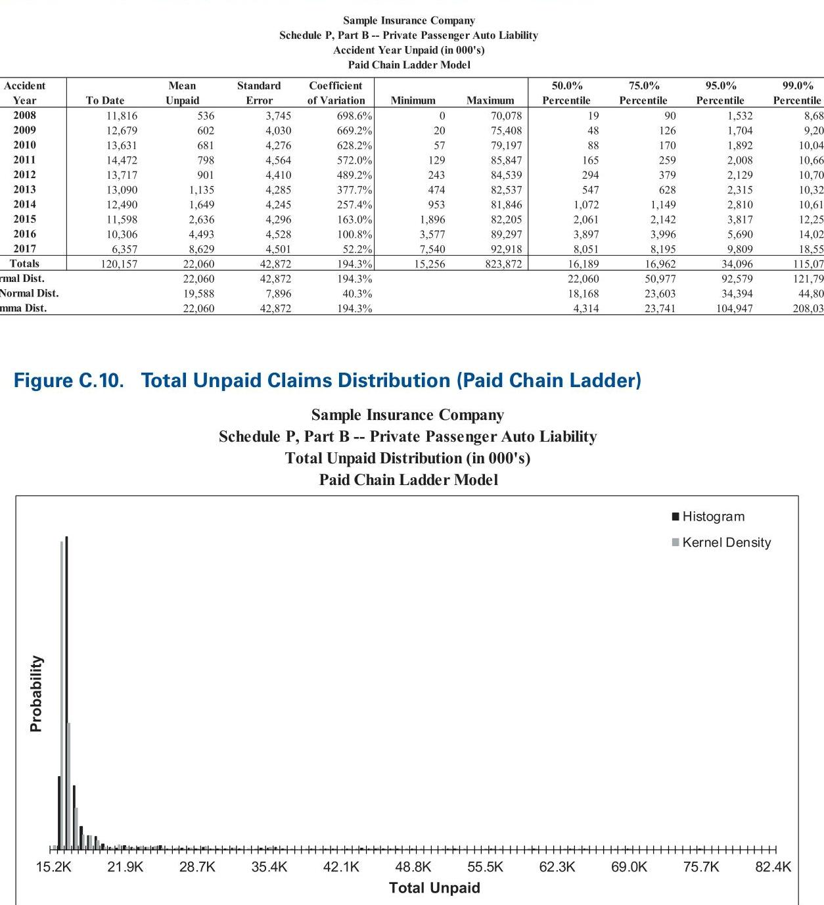
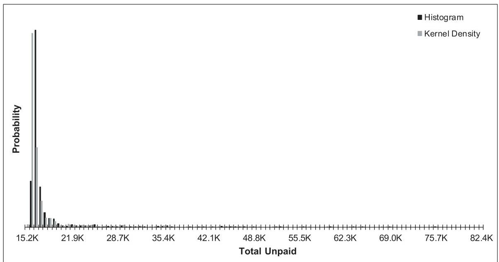

## Page 114
Figure C.11. Estimated Unpaid Model Results (Incurred Chain Ladder)

Figure C.12. Total Unpaid Claims Distribution (Incurred Chain Ladder)
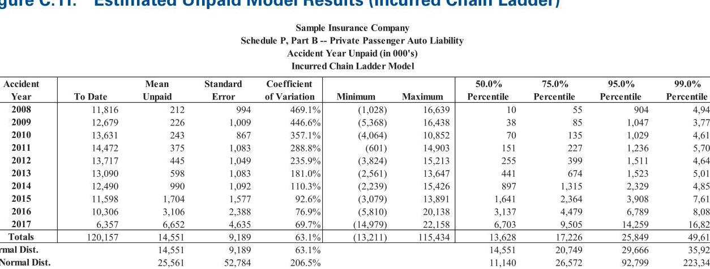
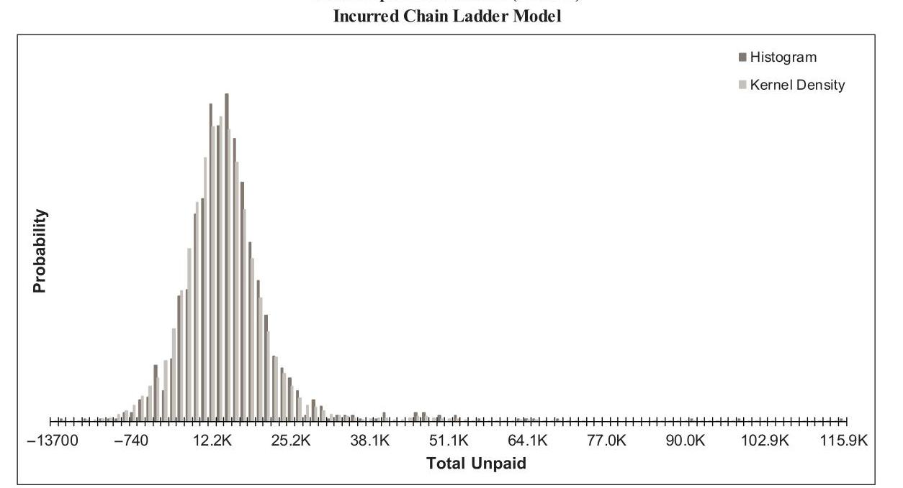

## Page 115
Figure C.13. Estimated Unpaid Model Results (Paid Hoerl Curve)

Figure C.14. Total Unpaid Claims Distribution (Paid Hoerl Curve)
Sample Insurance Company
Schedule P, Part B -- Private Passenger Auto Liability
Total Unpaid Distribution (in 000's)
Paid Hoerl Curve Model
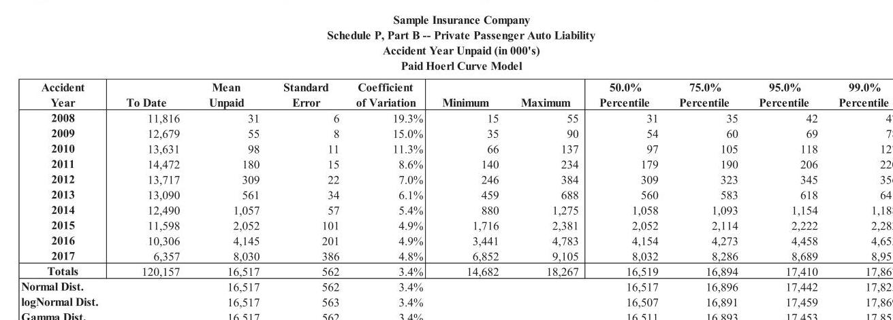
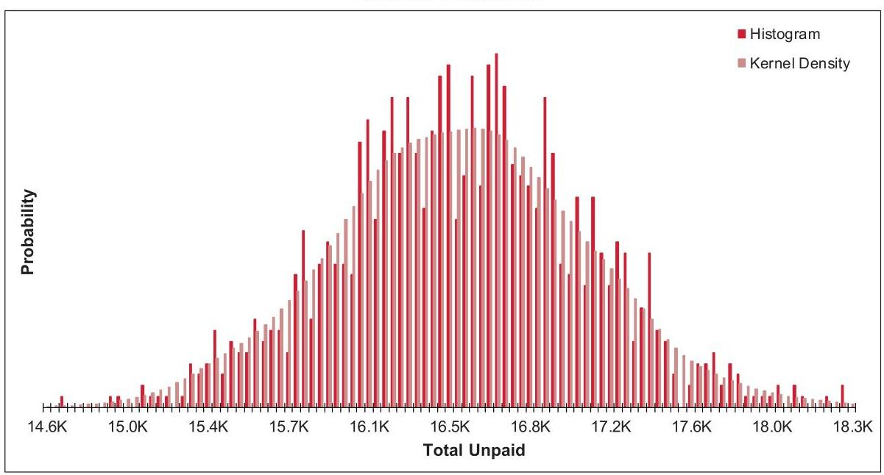

## Page 116
Figure C.15. Estimated Unpaid Model Results (Incurred Hoerl Curve)

Figure C.16. Total Unpaid Claims Distribution (Incurred Hoerl Curve)
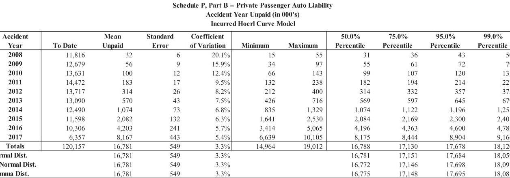
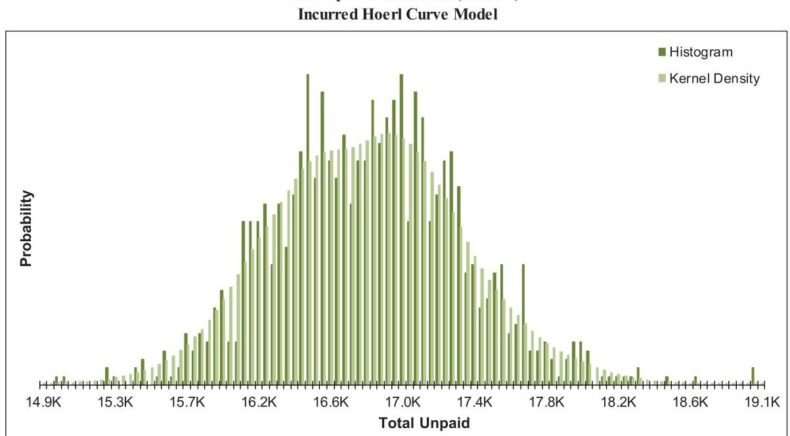

## Page 117
Figure C.17. Estimated Unpaid Model Results (Paid Wright)

Figure C.18. Total Unpaid Claims Distribution (Paid Wright)
Sample Insurance Company
Schedule P, Part B -- Private Passenger Auto Liability
Total Unpaid Distribution (in 000's)
Paid Wright Model
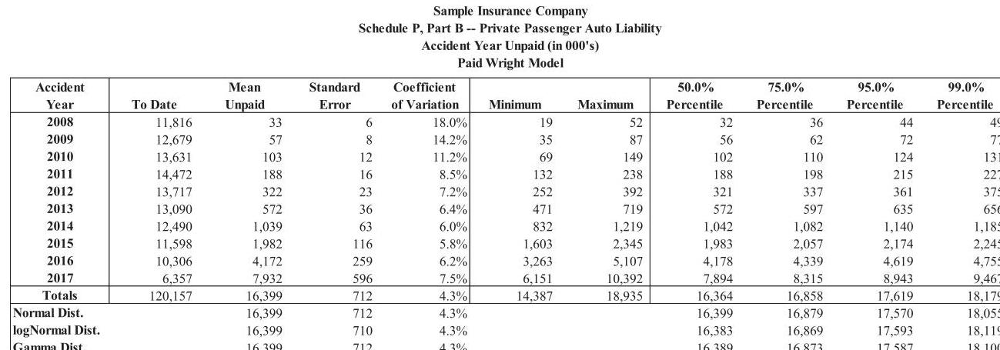
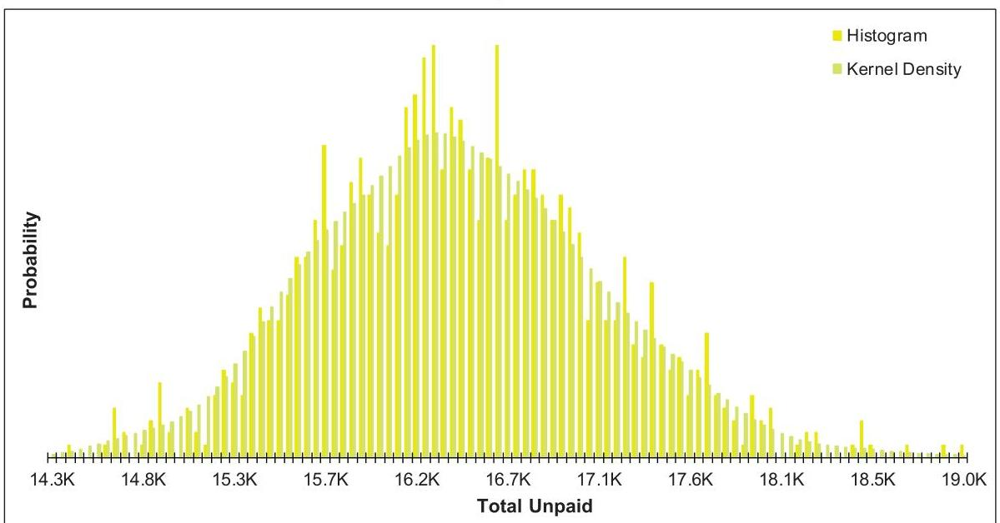

## Page 118
# Using the Hayne MLE Models: A Practitioner's Guide

Figure C.19. Estimated Unpaid Model Results (Incurred Wright)

|  |   |   |   |   |   |   |   |   |   |   |
| --- | --- | --- | --- | --- | --- | --- | --- | --- | --- | --- |
|  |   |   |   |   |   |   |   |   |   |   |

Sample Insurance Company Schedule P, Part B -- Private Passenger Auto Liability Accident Year Unpaid (in 000's) Incurred Wright Model

|  Accident
Year | To Date | Mean
Unpaid | Standard
Error | Coefficient
of Variation | Minimum | Maximum | 50.0\%
Percentile | 75.0\%
Percentile | 95.0\%
Percentile | 99.0\%
Percentile  |
| --- | --- | --- | --- | --- | --- | --- | --- | --- | --- | --- |
|  2008 | 11,816 | 3,966,020 | 89,251,382 | 2250.4\% | 11 | 2,562,613,734 | 52 | 37 | 47 | 162  |
|  2009 | 12,679 | 6,836,660 | 151,765,957 | 2220.2\% | 35 | 4,285,467,202 | 57 | 63 | 75 | 397  |
|  2010 | 13,631 | 11,394,086 | 249,064,047 | 2185.9\% | 70 | 6,902,830,083 | 105 | 114 | 130 | 631  |
|  2011 | 14,472 | 22,062,894 | 473,328,887 | 2145.4\% | (19) | 12,454,255,734 | 197 | 209 | 231 | 1,248  |
|  2012 | 13,717 | 33,137,459 | 697,879,848 | 2106.0\% | 175 | 17,782,233,386 | 332 | 349 | 382 | 2,198  |
|  2013 | 13,090 | 37,164,640 | 1,225,268,490 | 2143.4\% | 307 | 33,399,406,687 | 577 | 606 | 652 | 3,679  |
|  2014 | 12,490 | 112,525,697 | 2,407,249,389 | 2129.3\% | 479 | 64,465,798,848 | 1,066 | 1,105 | 1,196 | 6,437  |
|  2015 | 11,598 | 217,196,589 | 4,589,378,234 | 2113.0\% | 876 | 115,499,405,106 | 2,020 | 2,103 | 2,279 | 12,504  |
|  2016 | 10,306 | 393,484,469 | 8,302,943,031 | 2099.4\% | (346) | 208,307,514,180 | 4,137 | 4,283 | 4,552 | 24,508  |
|  2017 | 6,357 | 854,159,749 | 18,202,471,420 | 2131.0\% | 2,861 | 478,840,892,606 | 8,366 | 8,599 | 9,075 | 50,131  |
|  Totals | 120,157 | 1,713,928,261 | 36,360,742,828 | 2121.5\% | 6,088 | 944,500,417,566 | 16,866 | 17,188 | 17,873 | 101,915  |
|  Normal Dist. |  | 1,713,928,261 | 36,360,742,828 | 2121.5\% |  |  | 1,713,928,261 | 26,238,876,608 | 61,522,027,980 | 86,301,665,037  |
|  logNormal Dist. |  | 42,038 | 82,461 | 196.2\% |  |  | 19,093 | 44,556 | 150,791 | 355,000  |
|  Gamma Dist. |  | 1,713,928,261 | 36,360,742,828 | 2121.5\% |  |  | 0 | 0 | 41 | 4,737,757,328  |

Figure C.20. Total Unpaid Claims Distribution (Incurred Wright) Sample Insurance Company Schedule P, Part B -- Private Passenger Auto Liability Total Unpaid Distribution (in 000's) Incurred Wright Model

|  Probability |  |  |  |  |  |  |  |  |  |  |  |  |  |  |  |  |  |  |  |  |  |  |   |
| --- | --- | --- | --- | --- | --- | --- | --- | --- | --- | --- | --- | --- | --- | --- | --- | --- | --- | --- | --- | --- | --- | --- | --- |
|  |   |   |   |   |   |   |   |   |   |   |   |   |   |   |   |   |   |   |   |   |   |   |   |
|  |   |   |   |   |   |   |   |   |   |   |   |   |   |   |   |   |   |   |   |   |   |   |   |
|  |   |   |   |   |   |   |   |   |   |   |   |   |   |   |   |   |   |   |   |   |   |   |   |
|  |   |   |   |   |   |   |   |   |   |   |   |   |   |   |   |   |   |   |   |   |   |   |   |
|  |   |   |   |   |   |   |   |   |   |   |   |   |   |   |   |   |   |   |   |   |   |   |   |
|  |   |   |   |   |   |   |   |   |   |   |   |   |   |   |   |   |   |   |   |   |   |   |   |
|  |   |   |   |   |   |   |   |   |   |   |   |   |   |   |   |   |   |   |   |   |   |   |   |
|  |   |   |   |   |   |   |   |   |   |   |   |   |   |   |   |   |   |   |   |   |   |   |   |
|  |   |   |   |   |   |   |   |   |   |   |   |   |   |   |   |   |   |   |   |   |   |   |   |
|  |   |   |   |   |   |   |   |   |   |   |   |   |   |   |   |   |   |   |   |   |   |   |   |
|  |   |   |   |   |   |   |   |   |   |   |   |   |   |   |   |   |   |   |   |   |   |   |   |
|  |   |   |   |   |   |   |   |   |   |   |   |   |   |   |   |   |   |   |   |   |   |   |   |
|  |   |   |   |   |   |   |   |   |   |   |   |   |   |   |   |   |   |   |   |   |   |   |   |
|  |   |   |   |   |   |   |   |   |   |   |   |   |   |   |   |   |   |   |   |   |   |   |   |
|  |   |   |   |   |   |   |   |   |   |   |   |   |   |   |   |   |   |   |   |   |   |   |   |
|  |   |   |   |   |   |   |   |   |   |   |   |   |   |   |   |   |   |   |   |   |   |   |   |
|  |   |   |   |   |   |   |   |   |   |   |   |   |   |   |   |   |   |   |   |   |   |   |   |
|  |   |   |   |   |   |   |   |   |   |   |   |   |   |   |   |   |   |   |   |   |   |   |   |
|  |   |   |   |   |   |   |   |   |   |   |   |   |   |   |   |   |   |   |   |   |   |   |   |
|  |   |   |   |   |   |   |   |   |   |   |   |   |   |   |   |   |   |   |   |   |   |   |   |
|  |   |   |   |   |   |   |   |   |   |   |   |   |   |   |   |   |   |   |   |   |   |   |   |
|  |   |   |   |   |   |   |   |   |   |   |   |   |   |   |   |   |   |   |   |   |   |   |   |
|  |   |   |   |   |   |   |   |   |   |   |   |   |   |   |   |   |   |   |   |   |   |   |   |
|  |   |   |   |   |   |   |   |   |   |   |   |   |   |   |   |   |   |   |   |   |   |   |   |
|  |   |   |   |   |   |   |   |   |   |   |   |   |   |   |   |   |   |   |   |   |   |   |   |
|  |   |   |   |   |   |   |   |   |   |   |   |   |   |   |   |   |   |   |   |   |   |   |   |
|  |   |   |   |   |   |   |   |   |   |   |   |   |   |   |   |   |   |   |   |   |   |   |   |
|  |   |   |   |   |   |   |   |   |   |   |   |   |   |   |   |   |   |   |   |   |   |   |   |
|  |   |   |   |   |   |   |   |   |   |   |   |   |   |   |   |   |   |   |   |   |   |   |   |
|  |   |   |   |   |   |   |   |   |   |   |   |   |   |   |   |   |   |   |   |   |   |   |   |
|  |   |   |   |   |   |   |   |   |   |   |   |   |   |   |   |   |   |   |   |   |   |   |   |

## Page 119
Figure C.21. Model Weights by Accident Year

| Accident | Model Weights by Accident Year |  |  |  |  |  |  |  |  |  |
| :--: | :--: | :--: | :--: | :--: | :--: | :--: | :--: | :--: | :--: | :--: |
| Year | Paid Bt | Ined Bt | Paid CC | Ined CC | Paid CL | Ined CL | Paid DC | Paid WB |  | TOTAL |
| 2008 | 10.0\% | 20.0\% | 10.0\% | 20.0\% | 10.0\% | 20.0\% | 5.0\% | 5.0\% |  | 100.0\% |
| 2009 | 10.0\% | 20.0\% | 10.0\% | 20.0\% | 10.0\% | 20.0\% | 5.0\% | 5.0\% |  | 100.0\% |
| 2010 | 10.0\% | 20.0\% | 10.0\% | 20.0\% | 10.0\% | 20.0\% | 5.0\% | 5.0\% |  | 100.0\% |
| 2011 | 10.0\% | 20.0\% | 10.0\% | 20.0\% | 10.0\% | 20.0\% | 5.0\% | 5.0\% |  | 100.0\% |
| 2012 | 10.0\% | 20.0\% | 10.0\% | 20.0\% | 10.0\% | 20.0\% | 5.0\% | 5.0\% |  | 100.0\% |
| 2013 | 10.0\% | 20.0\% | 10.0\% | 20.0\% | 10.0\% | 20.0\% | 5.0\% | 5.0\% |  | 100.0\% |
| 2014 | 10.0\% | 20.0\% | 10.0\% | 20.0\% | 10.0\% | 20.0\% | 5.0\% | 5.0\% |  | 100.0\% |
| 2015 | 10.0\% | 20.0\% | 10.0\% | 20.0\% | 10.0\% | 20.0\% | 5.0\% | 5.0\% |  | 100.0\% |
| 2016 | 10.0\% | 20.0\% | 10.0\% | 20.0\% | 10.0\% | 20.0\% | 5.0\% | 5.0\% |  | 100.0\% |
| 2017 | 10.0\% | 20.0\% | 10.0\% | 20.0\% | 10.0\% | 20.0\% | 5.0\% | 5.0\% |  | 100.0\% |

Figure C.22. Estimated Mean Unpaid by Model
Sample Insurance Company
Schedule P, Part B - Private Passenger Auto Liability
Summary of Results by Model (in 000's)

| Accident   Year | Mean Estimated Unpaid |  |  |  |  |  |  |  |  |
| :--: | :--: | :--: | :--: | :--: | :--: | :--: | :--: | :--: | :--: |
|  | Berquist \& Sherman |  | Cape Cod |  | Chain Ladder |  | Hoecl Curve |  | Best Est.   (Weighted) |
|  | Paid | Incurred | Paid | Incurred | Paid | Incurred | Paid | Incurred |  |
| 2008 | 39 | 41 | 305 | 190 | 536 | 212 | 31 | 33 | 140 |
| 2009 | 68 | 69 | 351 | 223 | 602 | 226 | 55 | 57 | 186 |
| 2010 | 108 | 110 | 413 | 286 | 681 | 243 | 98 | 103 | 215 |
| 2011 | 184 | 187 | 511 | 384 | 798 | 375 | 180 | 188 | 314 |
| 2012 | 311 | 315 | 633 | 508 | 901 | 445 | 309 | 322 | 439 |
| 2013 | 571 | 576 | 884 | 742 | 1,135 | 598 | 561 | 572 | 677 |
| 2014 | 1,107 | 1,113 | 1,401 | 1,255 | 1,649 | 990 | 1,057 | 1,039 | 1,165 |
| 2015 | 2,110 | 2,109 | 2,374 | 2,195 | 2,636 | 1,704 | 2,052 | 1,982 | 2,093 |
| 2016 | 3,964 | 3,950 | 4,212 | 4,034 | 4,493 | 3,106 | 4,145 | 4,172 | 3,923 |
| 2017 | 8,078 | 8,041 | 8,351 | 8,415 | 8,629 | 6,652 | 8,030 | 7,932 | 7,928 |
| Totals | 16,541 | 16,511 | 19,435 | 18,232 | 22,060 | 14,551 | 16,517 | 16,399 | 17,079 |

Figure C.23. Estimated Ranges
Sample Insurance Company
Schedule P, Part B - Private Passenger Auto Liability
Summary of Results by Model (in 000's)

| Accident   Year | Ranges |  |  |  |
| :--: | :--: | :--: | :--: | :--: |
|  | Best Est.   (Weighted) | Weighted |  | Modeled |
|  |  | Minimum | Maximum | Minimum | Maximum |
| 2008 | 140 | 31 | 536 | 31 | 536 |
| 2009 | 186 | 55 | 602 | 55 | 602 |
| 2010 | 215 | 98 | 681 | 98 | 681 |
| 2011 | 314 | 180 | 798 | 180 | 798 |
| 2012 | 439 | 309 | 901 | 309 | 901 |
| 2013 | 677 | 561 | 1,135 | 561 | 1,135 |
| 2014 | 1,165 | 990 | 1,649 | 990 | 1,649 |
| 2015 | 2,093 | 1,704 | 2,636 | 1,704 | 2,636 |
| 2016 | 3,923 | 3,106 | 4,493 | 3,106 | 4,493 |
| 2017 | 7,928 | 6,652 | 8,629 | 6,652 | 8,629 |
| Totals | 17,079 | 13,687 | 22,060 | 14,551 | 22,060 |

## Page 120
Figure C.24. Reconciliation of Total Results (Weighted)
Sample Insurance Company
Schedule P, Part B - Private Passenger Auto Liability
Reconciliation of Total Results (in 000's)
Best Estimate (Weighted)

| Accident   Year | Paid   To Date | Incurred   To Date | Case   Reserves | IBNR | Estimate of   Ultimate | Estimate of   Unpaid |
| :--: | :--: | :--: | :--: | :--: | :--: | :--: |
| 2008 | 11,816 | 11,863 | 47 | 92 | 11,956 | 140 |
| 2009 | 12,679 | 12,752 | 72 | 113 | 12,865 | 186 |
| 2010 | 13,631 | 13,743 | 112 | 103 | 13,846 | 215 |
| 2011 | 14,472 | 14,687 | 216 | 99 | 14,786 | 314 |
| 2012 | 13,717 | 14,079 | 362 | 77 | 14,156 | 439 |
| 2013 | 13,090 | 13,691 | 600 | 76 | 13,767 | 677 |
| 2014 | 12,490 | 13,683 | 1,193 | (28) | 13,655 | 1,165 |
| 2015 | 11,598 | 13,912 | 2,313 | (221) | 13,691 | 2,093 |
| 2016 | 10,306 | 14,625 | 4,319 | (396) | 14,229 | 3,923 |
| 2017 | 6,357 | 15,188 | 8,830 | (902) | 14,285 | 7,928 |
| Totals | 120,157 | 138,223 | 18,066 | (987) | 137,236 | 17,079 |

Figure C.25. Estimated Unpaid Model Results (Weighted)
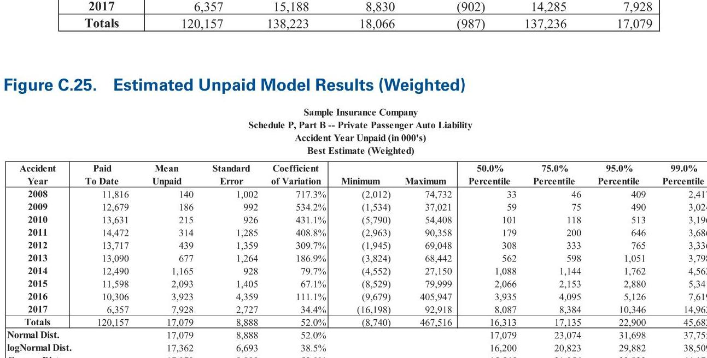

## Page 121
Figure C.26. Estimated Cash Flow (Weighted)

Figure C.27. Estimated Loss Ratio (Weighted)

|  | Sample Insurance Company   Schedule P, Part B - Private Passenger Auto Liability   Calendar Year Unpaid (in 000's)   Best Estimate (Weighted) |  |  |  |  |  |  |  |  |
| :--: | :--: | :--: | :--: | :--: | :--: | :--: | :--: | :--: | :--: |
| Accident   Year | Earned   Premium | Mean   Loss Ratio | Standard   Error | Coefficient of Variation | Minimum | Maximum | 50.0\%   Percentile | 75.0\%   Percentile | 95.0\%   Percentile | 99.0\%   Percentile |
| 2008 | 15,679 | 72.5\% | 22.1\% | 30.5\% | $-127.2 \%$ | 554.0\% | 76.2\% | 78.6\% | 87.9\% | 125.3\% |
| 2009 | 15,510 | 77.8\% | 22.5\% | 28.9\% | $-120.8 \%$ | 321.8\% | 81.5\% | 83.9\% | 94.7\% | 134.4\% |
| 2010 | 16,428 | 79.2\% | 22.7\% | 28.7\% | $-80.0 \%$ | 418.0\% | 83.0\% | 85.4\% | 94.4\% | 135.3\% |
| 2011 | 18,432 | 76.0\% | 20.6\% | 27.1\% | $-121.9 \%$ | 568.8\% | 78.9\% | 81.6\% | 90.2\% | 128.0\% |
| 2012 | 20,376 | 66.2\% | 18.8\% | 28.5\% | $-71.4 \%$ | 405.5\% | 68.9\% | 71.2\% | 79.5\% | 112.5\% |
| 2013 | 20,821 | 63.2\% | 18.2\% | 28.8\% | $-133.5 \%$ | 391.5\% | 65.9\% | 67.8\% | 76.8\% | 108.6\% |
| 2014 | 20,445 | 64.2\% | 18.6\% | 29.0\% | $-112.3 \%$ | 193.2\% | 66.9\% | 68.8\% | 78.9\% | 114.7\% |
| 2015 | 20,724 | 63.2\% | 19.0\% | 30.1\% | $-110.9 \%$ | 441.9\% | 66.1\% | 67.9\% | 76.3\% | 110.3\% |
| 2016 | 20,414 | 67.4\% | 27.9\% | 41.3\% | $-151.2 \%$ | 2038.6\% | 69.9\% | 72.0\% | 81.6\% | 118.0\% |
| 2017 | 20,467 | 68.8\% | 20.5\% | 29.8\% | $-139.5 \%$ | 485.5\% | 70.7\% | 73.2\% | 87.2\% | 128.7\% |
| Totals | 189,295 | 69.3\% | 7.0\% | 10.1\% | 30.3\% | 277.8\% | 70.1\% | 73.0\% | 78.1\% | 84.1\% |

Figure C.28. Estimated Unpaid Claim Runoff (Weighted)
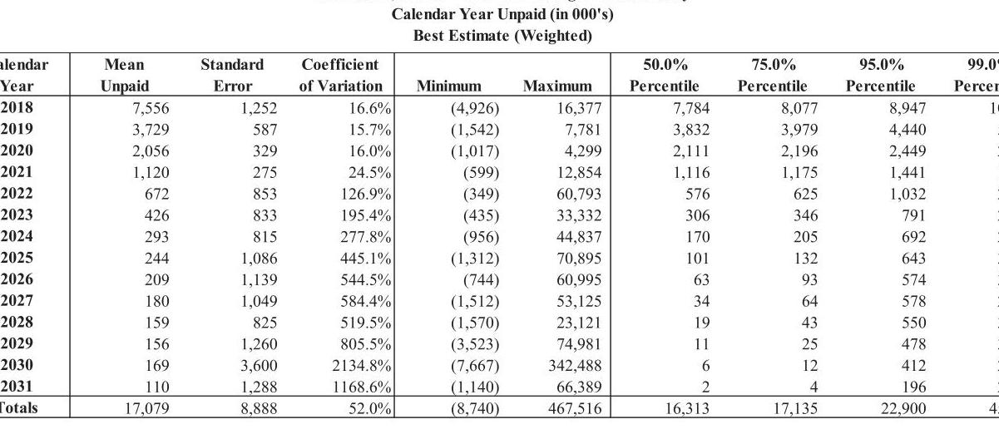
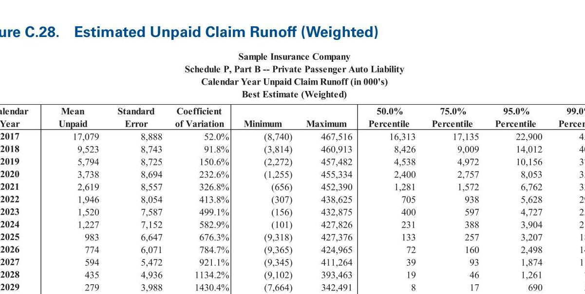

## Page 122
#### **Figure C.29. Mean of Incremental Values (Weighted)**

#### **Figure C.30. Standard Deviation of Incremental Values (Weighted)**

#### **Figure C.31. Coefficient of Variation of Incremental Values (Weighted)**
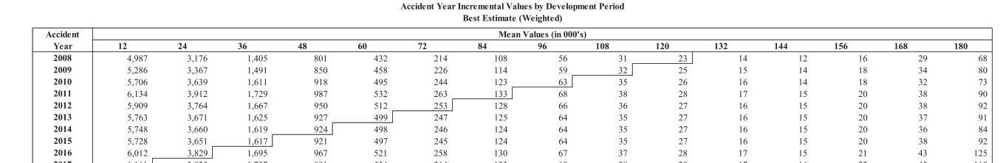
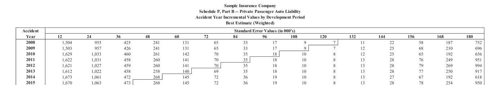
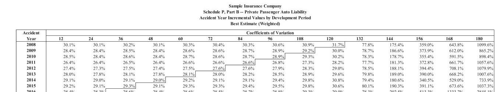

## Page 123
Figure C.32. Total Unpaid Claims Distribution (Weighted)

Figure C.33. Summary of Model Distributions
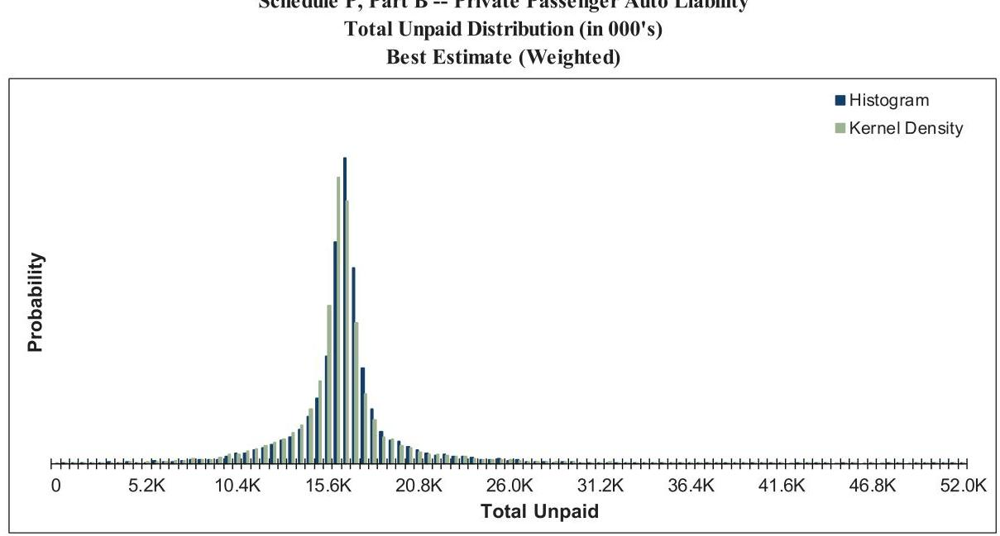
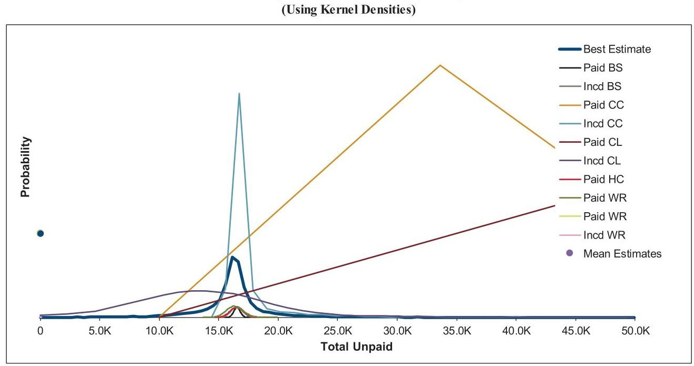

## Page 124
# Appendix D-Schedule P, Part C Results 

In this appendix the results for Schedule P, Part C (Commercial Auto Liability) are shown.

## Page 125
Figure D.1. Estimated Unpaid Model Results (Paid Berquist-Sherman)

Figure D.2. Total Unpaid Claims Distribution (Paid Berquist-Sherman)
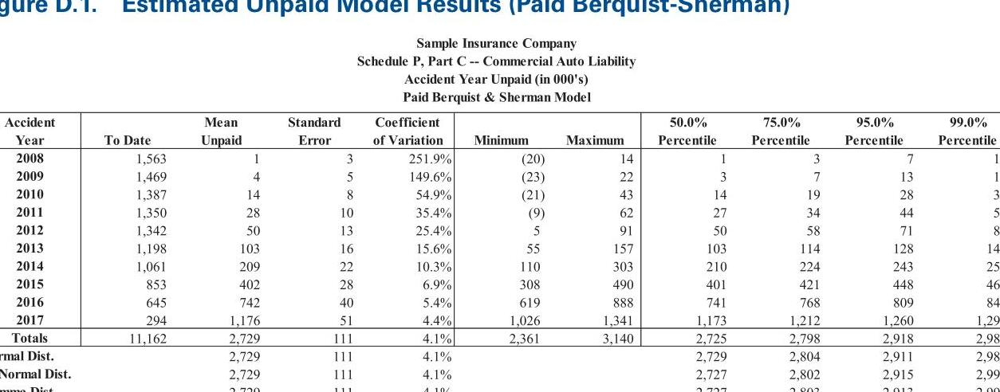
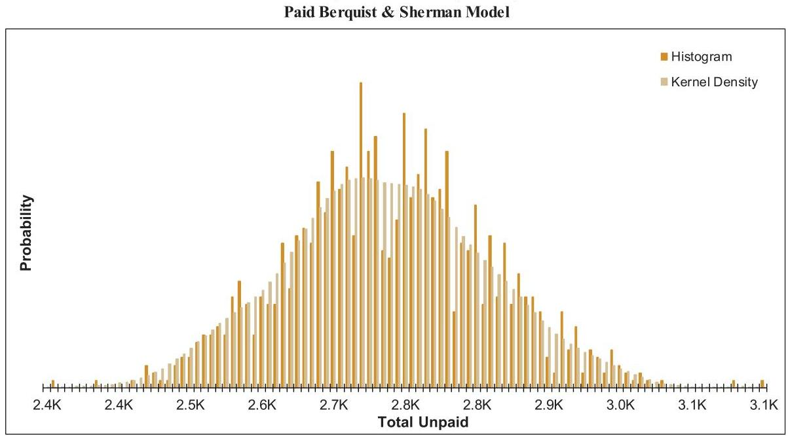

## Page 126
Figure D.3. Estimated Unpaid Model Results (Incurred Berquist-Sherman)

Figure D.4. Total Unpaid Claims Distribution (Incurred Berquist-Sherman)
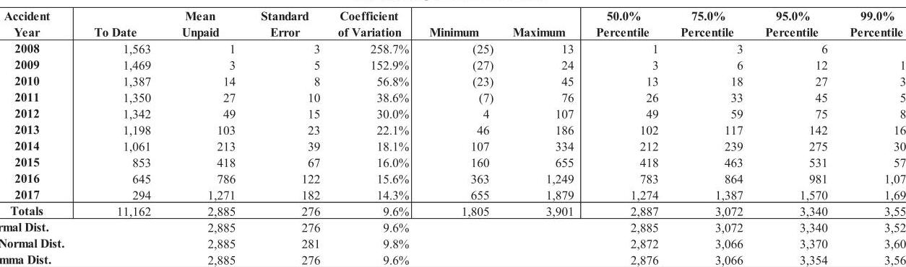
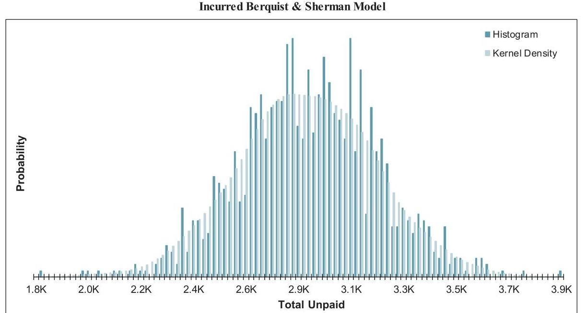

## Page 127
Figure D.5. Estimated Unpaid Model Results (Paid Cape Cod)

|  |   |   |   |   |   |   |   |   |   |   |
| --- | --- | --- | --- | --- | --- | --- | --- | --- | --- | --- |
|  |   |   |   |   |   |   |   |   |   |   |
|  |   |   |   |   |   |   |   |   |   |   |
|  |   |   |   |   |   |   |   |   |   |   |
|  |   |   |   |   |   |   |   |   |   |   |
|  |   |   |   |   |   |   |   |   |   |   |
|  |   |   |   |   |   |   |   |   |   |   |
|  |   |   |   |   |   |   |   |   |   |   |
|  |   |   |   |   |   |   |   |   |   |   |
|  |   |   |   |   |   |   |   |   |   |   |
|  |   |   |   |   |   |   |   |   |   |   |
|  |   |   |   |   |   |   |   |   |   |   |
|  |   |   |   |   |   |   |   |   |   |   |
|  |   |   |   |   |   |   |   |   |   |   |
|  |   |   |   |   |   |   |   |   |   |   |
|  |   |   |   |   |   |   |   |   |   |   |
|  |   |   |   |   |   |   |   |   |   |   |
|  |   |   |   |   |   |   |   |   |   |   |
|  |   |   |   |   |   |   |   |   |   |   |
|  |   |   |   |   |   |   |   |   |   |   |
|  |   |   |   |   |   |   |   |   |   |   |
|  |   |   |   |   |   |   |   |   |   |   |
|  |   |   |   |   |   |   |   |   |   |   |
|  |   |   |   |   |   |   |   |   |   |   |
|  |   |   |   |   |   |   |   |   |   |   |
|  |   |   |   |   |   |   |   |   |   |   |
|  |   |   |   |   |   |   |   |   |   |   |
|  |   |   |   |   |   |   |   |   |   |   |
|  |   |   |   |   |   |   |   |   |   |   |
|  |   |   |   |   |   |   |   |   |   |   |
|  |   |   |   |   |   |   |   |   |   |   |
|  |   |   |   |   |   |   |   |   |   |   |

## Page 128
Figure D.7. Estimated Unpaid Model Results (Incurred Cape Cod)

|  |   |   |   |   |   |   |   |   |   |   |
| --- | --- | --- | --- | --- | --- | --- | --- | --- | --- | --- |
|  |   |   |   |   |   |   |   |   |   |   |
|  |   |   |   |   |   |   |   |   |   |   |
|  |   |   |   |   |   |   |   |   |   |   |
|  |   |   |   |   |   |   |   |   |   |   |
|  |   |   |   |   |   |   |   |   |   |   |
|  |   |   |   |   |   |   |   |   |   |   |
|  |   |   |   |   |   |   |   |   |   |   |
|  |   |   |   |   |   |   |   |   |   |   |
|  |   |   |   |   |   |   |   |   |   |   |
|  |   |   |   |   |   |   |   |   |   |   |
|  |   |   |   |   |   |   |   |   |   |   |
|  |   |   |   |   |   |   |   |   |   |   |
|  |   |   |   |   |   |   |   |   |   |   |
|  |   |   |   |   |   |   |   |   |   |   |
|  |   |   |   |   |   |   |   |   |   |   |
|  |   |   |   |   |   |   |   |   |   |   |
|  |   |   |   |   |   |   |   |   |   |   |
|  |   |   |   |   |   |   |   |   |   |   |
|  |   |   |   |   |   |   |   |   |   |   |
|  |   |   |   |   |   |   |   |   |   |   |
|  |   |   |   |   |   |   |   |   |   |   |
|  |   |   |   |   |   |   |   |   |   |   |
|  |   |   |   |   |   |   |   |   |   |   |
|  |   |   |   |   |   |   |   |   |   |   |
|  |   |   |   |   |   |   |   |   |   |   |
|  |   |   |   |   |   |   |   |   |   |   |
|  |   |   |   |   |   |   |   |   |   |   |
|  |   |   |   |   |   |   |   |   |   |   |
|  |   |   |   |   |   |   |   |   |   |   |
|  |   |   |   |   |   |   |   |   |   |   |
|  |   |   |   |   |   |   |   |   |   |   |

## Page 129
Figure D.9. Estimated Unpaid Model Results (Paid Chain Ladder)

Figure D.10. Total Unpaid Claims Distribution (Paid Chain Ladder)
Sample Insurance Company
Schedule P, Part C -- Commercial Auto Liability
Total Unpaid Distribution (in 000's)
Paid Chain Ladder Model
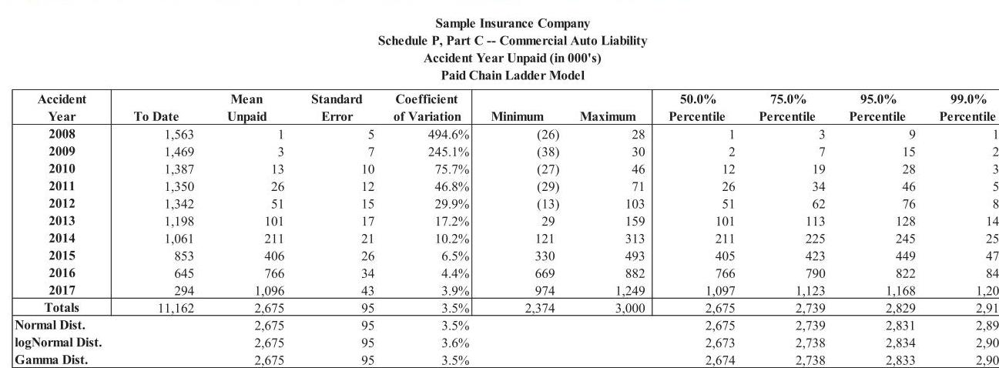
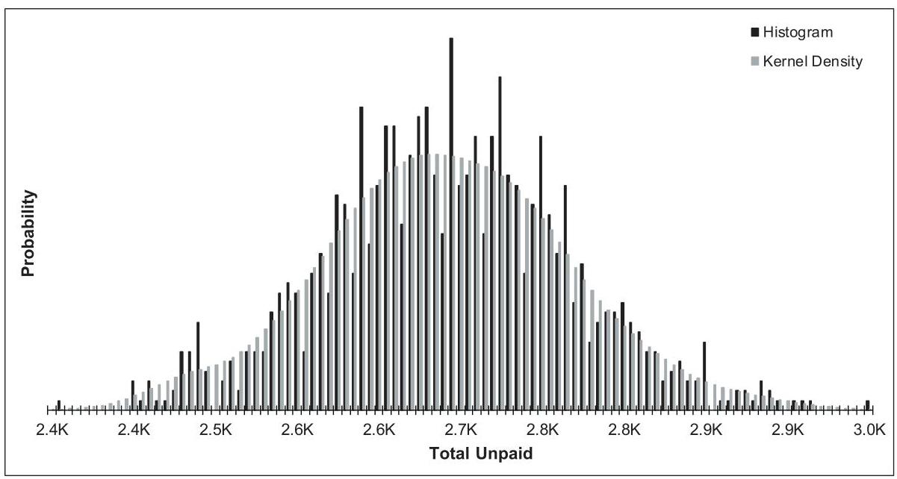

## Page 130
Figure D.11. Estimated Unpaid Model Results (Incurred Chain Ladder)

Figure D.12. Total Unpaid Claims Distribution (Incurred Chain Ladder)
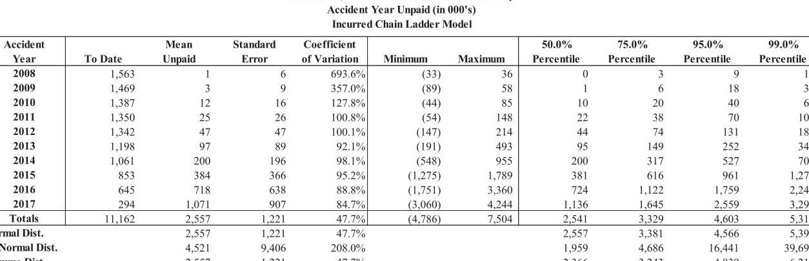
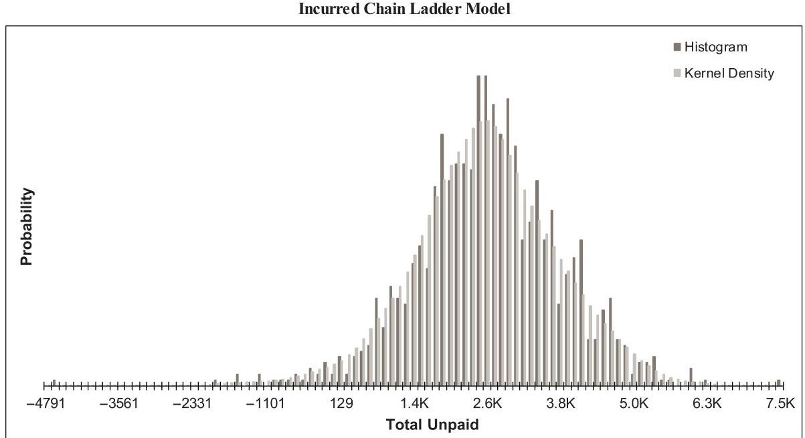

## Page 131
Figure D.13. Estimated Unpaid Model Results (Paid Hoerl Curve)

Figure D.14. Total Unpaid Claims Distribution (Paid Hoerl Curve)
Sample Insurance Company
Schedule P, Part C -- Commercial Auto Liability
Total Unpaid Distribution (in 000's)
Paid Hoerl Curve Model
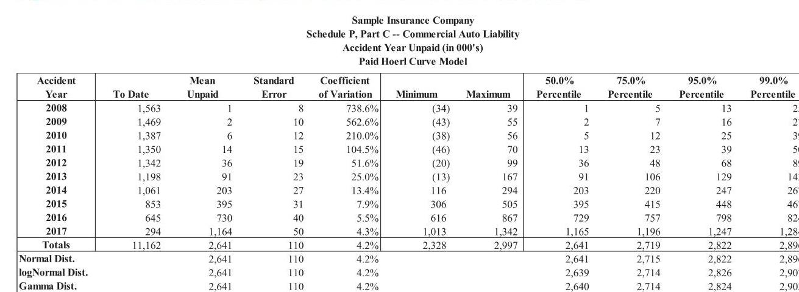
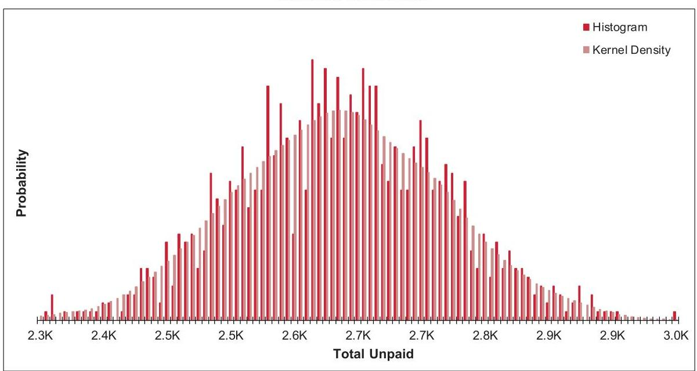

## Page 132
# Using the Hayne MLE Models: A Practitioner's Guide

## Figure D.15. Estimated Unpaid Model Results (Incurred Hoerl Curve)

|  Accident Year | To Date | Mean Unpaid | Standard Error | Coefficient of Variation | Minimum | Maximum | 50.0% Percentile | 75.0% Percentile | 95.0% Percentile | 99.0% Percentile  |
| --- | --- | --- | --- | --- | --- | --- | --- | --- | --- | --- |
|  2008 | 1,563 |  |  | -3162.3% |  |  |  |  |  |   |
|  2009 | 1,469 |  |  | -3162.3% |  |  |  |  |  |   |
|  2010 | 1,387 |  |  | -3162.3% |  |  |  |  |  |   |
|  2011 | 1,350 |  |  | -3162.3% |  |  |  |  |  |   |
|  2012 | 1,342 |  |  | -3162.3% | (51,418,906) |  |  |  |  |   |
|  2013 | 1,198 |  |  | -3162.3% | (487,667) |  |  |  |  |   |
|  2014 | 1,061 |  |  | -3162.3% | (5,299,244) |  |  |  |  |   |
|  2015 | 853 |  |  | -3162.3% | (2,019,237) |  |  |  |  |   |
|  2016 | 645 |  |  | -3162.3% | (54,398,452) |  |  |  |  |   |
|  2017 | 294 |  |  | -3162.3% | (157,144) |  |  |  |  |   |
|  Totals | 11,162 |  |  | -3162.3% | (27,682,830) |  |  |  |  |   |
|  Normal Dist. |  |  |  | 3162.3% |  |  |  |  |  |   |
|  logNormal Dist. |  |  |  | 240623181.5% |  |  |  |  |  |   |
|  Gamma Dist. |  |  |  | 3162.3% |  |  |  |  |  |   |

## Figure D.16. Total Unpaid Claims Distribution (Incurred Hoerl Curve)

|  Accident Year | To Date | Mean Unpaid | Standard Error | Coefficient of Variation | Minimum | Maximum | 50.0% Percentile | 75.0% Percentile | 95.0% Percentile | 99.0% Percentile  |
| --- | --- | --- | --- | --- | --- | --- | --- | --- | --- | --- |
|  2008 | 1,563 |  |  | -3162.3% |  |  |  |  |  |   |
|  2009 | 1,469 |  |  | -3162.3% |  |  |  |  |  |   |
|  2010 | 1,387 |  |  | -3162.3% |  |  |  |  |  |   |
|  2011 | 1,350 |  |  | -3162.3% |  |  |  |  |  |   |
|  2012 | 1,342 |  |  | -3162.3% | (51,418,906) |  |  |  |  |   |
|  2013 | 1,198 |  |  | -3162.3% | (487,667) |  |  |  |  |   |
|  2014 | 1,061 |  |  | -3162.3% | (5,299,244) |  |  |  |  |   |
|  2015 | 853 |  |  | -3162.3% | (2,019,237) |  |  |  |  |   |
|  2016 | 645 |  |  | -3162.3% | (54,398,452) |  |  |  |  |   |
|  2017 | 294 |  |  | -3162.3% | (157,144) |  |  |  |  |   |
|  Totals | 11,162 |  |  | -3162.3% | (27,682,830) |  |  |  |  |   |
|  Normal Dist. |  |  |  | 3162.3% |  |  |  |  |  |   |
|  logNormal Dist. |  |  |  | 240623181.5% |  |  |  |  |  |   |
|  Gamma Dist. |  |  |  | 3162.3% |  |  |  |  |  |   |

## Figure D.16. Total Unpaid Claims Distribution (Incurred Hoerl Curve)

|  Accident Year | To Date | Mean Unpaid | Standard Error | Coefficient of Variation | Minimum | Maximum | 50.0% Percentile | 75.0% Percentile | 95.0% Percentile | 99.0% Percentile  |
| --- | --- | --- | --- | --- | --- | --- | --- | --- | --- | --- |
|  2008 | 1,563 |  |  | -3162.3% |  |  |  |  |  |   |
|  2009 | 1,469 |  |  | -3162.3% |  |  |  |  |  |   |
|  2010 | 1,387 |  |  | -3162.3% |  |  |  |  |  |   |
|  2011 | 1,350 |  |  | -3162.3% |  |  |  |  |  |   |
|  2012 | 1,342 |  |  | -3162.3% | (51,418,906) |  |  |  |  |   |
|  2013 | 1,198 |  |  | -3162.3% | (487,667) |  |  |  |  |   |
|  2014 | 1,061 |  |  | -3162.3% | (5,299,244) |  |  |  |  |   |
|  2015 | 853 |  |  | -3162.3% | (2,019,237) |  |  |  |  |   |
|  2016 | 645 |  |  | -3162.3% | (54,398,452) |  |  |  |  |   |
|  2017 | 294 |  |  | -3162.3% | (157,144) |  |  |  |  |   |
|  Totals | 11,162 |  |  | -3162.3% | (27,682,830) |  |  |  |  |   |
|  Normal Dist. |  |  |  | 3162.3% |  |  |  |  |  |   |
|  logNormal Dist. |  |  |  | 240623181.5% |  |  |  |  |  |   |
|  Gamma Dist. |  |  |  | 3162.3% |  |  |  |  |  |   |

## Figure D.16. Total Unpaid Claims Distribution (Incurred Hoerl Curve)

|  Accident Year | To Date | Mean Unpaid | Standard Error | Coefficient of Variation | Minimum | Maximum | 50.0% Percentile | 75.0% Percentile | 95.0% Percentile | 99.0% Percentile  |
| --- | --- | --- | --- | --- | --- | --- | --- | --- | --- | --- |
|  2008 | 1,563 |  |  | -3162.3% |  |  |  |  |  |   |
|  2009 | 1,469 |  |  | -3162.3% |  |  |  |  |  |   |
|  2010 | 1,387 |  |  | -3162.3% |  |  |  |  |  |   |
|  2011 | 1,350 |  |  | -3162.3% |  |  |  |  |  |   |
|  2012 | 1,342 |  |  | -3162.3% |  |  |  |  |  |   |
|  2013 | 1,198 |  |  | -3162.3% |  |  |  |  |  |   |
|  2014 | 1,061 |  |  | -3162.3% |  |  |  |  |  |   |
|  2015 | 853 |  |  | -3162.3% |  |  |  |  |  |   |
|  2016 | 645 |  |  | -3162.3% |  |  |  |  |  |   |
|  2017 | 294 |  |  | -3162.3% |  |  |  |  |  |   |
|  Totals | 11,162 |  |  | -3162.3% |  |  |  |  |  |   |

## Figure D.17. Total Unpaid Claims Distribution (Incurred Hoerl Curve)

|  Accident Year | To Date | Mean Unpaid | Standard Error | Coefficient of Variation | Minimum | Maximum | 50.0% Percentile | 75.0% Percentile | 95.0% Percentile | 99.0% Percentile  |
| --- | --- | --- | --- | --- | --- | --- | --- | --- | --- | --- |
|  2008 | 1,563 |  |  | -3162.3% |  |  |  |  |  |   |
|  2009 | 1,469 |  |  | -3162.3% |  |  |  |  |  |   |
|  2010 | 1,387 |  |  | -3162.3% |  |  |  |  |  |   |
|  2011 | 1,350 |  |  | -3162.3% |  |  |  |  |  |   |
|  2012 | 1,342 |  |  | -3162.3% |  |  |  |  |  |   |
|  2013 | 1,198 |  |  | -3162.3% |  |  |  |  |  |   |
|  2014 | 1,061 |  |  | -3162.3% |  |  |  |  |  |   |
|  2015 | 853 |  |  | -3162.3% |  |  |  |  |  |   |
|  2016 | 645 |  |  | -3162.3% |  |  |  |  |  |   |
|  2017 | 294 |  |  | -3162.3% |  |  |  |  |  |   |
|  Totals | 11,162 |  |  | -3162.3% |  |  |  |  |  |   |

## Figure D.18. Total Unpaid Claims Distribution (Incurred Hoerl Curve)

|  Accident Year | To Date | Mean Unpaid | Standard Error | Coefficient of Variation | Minimum | Maximum | 50.0% Percentile | 75.0% Percentile | 95.0% Percentile | 99.0% Percentile  |
| --- | --- | --- | --- | --- | --- | --- | --- | --- | --- | --- |
|  2008 | 1,563 |  |  | -3162.3% |  |  |  |  |  |   |
|  2009 | 1,469 |  |  | -3162.3% |  |  |  |  |  |   |
|  2010 | 1,387 |  |  | -3162.3% |  |  |  |  |  |   |
|  2011 | 1,350 |  |  | -3162.3% |  |  |  |  |  |   |
|  2012 | 1,342 |  |  | -3162.3% |  |  |  |  |  |   |
|  2013 | 1,198 |  |  | -3162.3% |  |  |  |  |  |   |
|  2014 | 1,061 |  |  | -3162.3% |  |  |  |  |  |   |
|  2015 | 853 |  |  | -3162.3% |  |  |  |  |  |   |
|  2016 | 645 |  |  | -3162.3% |  |  |  |  |  |   |
|  2017 | 294 |  |  | -3162.3% |  |  |  |  |  |   |
|  Totals | 11,162 |  |  | -3162.3% |  |  |  |  |  |   |

## Figure D.19. Total Unpaid Claims Distribution (Incurred Hoerl Curve)

|  Accident Year | To Date | Mean Unpaid | Standard Error | Coefficient of Variation | Minimum | Maximum | 50.0% Percentile | 75.0% Percentile | 95.0% Percentile | 99.0% Percentile  |
| --- | --- | --- | --- | --- | --- | --- | --- | --- | --- | --- |
|  2008 | 1,563 |  |  | -3162.3% |  |  |  |  |  |   |
|  2009 | 1,469 |  |  | -3162.3% |  |  |  |  |  |   |
|  2010 | 1,387 |  |  | -3162.3% |  |  |  |  |  |   |
|  2011 | 1,350 |  |  | -3162.3% |  |  |  |  |  |   |
|  2012 | 1,342 |  |  | -3162.3% |  |  |  |  |  |   |
|  2013 | 1,198 |  |  | -3162.3% |  |  |  |  |  |   |
|  2014 | 1,061 |  |  | -3162.3% |  |  |  |  |  |   |
|  2015 | 853 |  |  | -3162.3% |  |  |  |  |  |   |
|  2016 | 645 |  |  | -3162.3% |  |  |  |  |  |   |
|  2017 | 294 |  |  | -3162.3% |  |  |  |  |  |   |
|  Totals | 11,162 |  |  | -3162.3% |  |  |  |  |  |   |

## Figure D.20. Total Unpaid Claims Distribution (Incurred Hoerl Curve)

|  Accident Year | To Date | Mean Unpaid | Standard Error | Coefficient of Variation | Minimum | Maximum | 50.0% Percentile | 75.0% Percentile | 95.0% Percentile | 99.0% Percentile  |
| --- | --- | --- | --- | --- | --- | --- | --- | --- | --- | --- |
|  2008 | 1,563 |  |  | -3162.3% |  |  |  |  |  |   |
|  2009 | 1,469 |  |  | -3162.3% |  |  |  |  |  |   |
|  2010 | 1,387 |  |  | -3162.3% |  |  |  |  |  |   |
|  2011 | 1,350 |  |  | -3162.3% |  |  |  |  |  |   |
|  2012 | 1,342 |  |  | -3162.3% |  |  |  |  |  |   |
|  2013 | 1,198 |  |  | -3162.3% |  |  |  |  |  |   |
|  2014 | 1,061 |  |  | -3162.3% |  |  |  |  |  |   |
|  2015 | 853 |  |  | -3162.3% |  |  |  |  |  |   |
|  2016 | 645 |  |  | -3162.3% |  |  |  |  |  |   |
|  2017 | 294 |  |  | -3162.3% |  |  |  |  |  |   |
|  Totals | 11,162 |  |  | -3162.3% |  |  |  |  |  |   |

## Figure D.21. Total Unpaid Claims Distribution (Incurred Hoerl Curve)

|  Accident Year | To Date | Mean Unpaid | Standard Error | Coefficient of Variation | Minimum | Maximum | 50.0% Percentile | 75.0% Percentile | 95.0% Percentile | 99.0% Percentile  |
| --- | --- | --- | --- | --- | --- | --- | --- | --- | --- | --- |
|  2008 | 1,563 |  |  | -3162.3% |  |  |  |  |  |   |
|  2009 | 1,469 |  |  | -3162.3% |  |  |  |  |  |   |
|  2010 | 1,387 |  |  | -3162.3% |  |  |  |  |  |   |
|  2011 | 1,350 |  |  | -3162.3% |  |  |  |  |  |   |
|  2012 | 1,342 |  |  | -3162.3% |  |  |  |  |  |   |
|  2013 | 1,198 |  |  | -3162.3% |  |  |  |  |  |   |
|  2014 | 1,061 |  |  | -3162.3% |  |  |  |  |  |   |
|  2015 | 853 |  |  | -3162.3% |  |  |  |  |  |   |
|  2016 | 645 |  |  | -3162.3% |  |  |  |  |  |   |
|  2017 | 294 |  |  | -3162.3% |  |  |  |  |  |   |
|  Totals | 11,162 |  |  | -3162.3% |  |  |  |  |  |   |

## Figure D.22. Total Unpaid Claims Distribution (Incurred Hoerl Curve)

|  Accident Year | To Date | Mean Unpaid | Standard Error | Coefficient of Variation | Minimum | Maximum | 50.0% Percentile | 75.0% Percentile | 95.0% Percentile | 99.0% Percentile  |
| --- | --- | --- | --- | --- | --- | --- | --- | --- | --- | --- |
|  2008 | 1,563 |  |  | -3162.3% |  |  |  |  |  |   |
|  2009 | 1,469 |  |  | -3162.3% |  |  |  |  |  |   |
|  2010 | 1,387 |  |  | -3162.3% |  |  |  |  |  |   |
|  2011 | 1,350 |  |  | -3162.3% |  |  |  |  |  |   |
|  2012 | 1,342 |  |  | -3162.3% |  |  |  |  |  |   |
|  2013 | 1,198 |  |  | -3162.3% |  |  |  |  |  |   |
|  2014 | 1,061 |  |  | -3162.3% |  |  |  |  |  |   |
|  2015 | 853 |  |  | -3162.3% |  |  |  |  |  |   |
|  2016 | 645 |  |  | -3162.3% |  |  |  |  |  |   |
|  2017 | 294 |  |  | -3162.3% |  |  |  |  |  |   |
|  Totals | 11,162 |  |  | -3162.3% |  |  |  |  |  |   |

## Figure D.23. Total Unpaid Claims Distribution (Incurred Hoerl Curve)

|  Accident Year | To Date | Mean Unpaid | Standard Error | Coefficient of Variation | Minimum | Maximum | 50.0% Percentile | 75.0% Percentile | 95.0% Percentile | 99.0% Percentile  |
| --- | --- | --- | --- | --- | --- | --- | --- | --- | --- | --- |
|  2008 | 1,563 |  |  | -3162.3% |  |  |  |  |  |   |
|  2009 | 1,469 |  |  | -3162.3% |  |  |  |  |  |   |
|  2010 | 1,387 |  |  | -3162.3% |  |  |  |  |  |   |
|  2011 | 1,350 |  |  | -3162.3% |  |  |  |  |  |   |
|  2012 | 1,342 |  |  | -3162.3% |  |  |  |  |  |   |
|  2013 | 1,198 |  |  | -3162.3% |  |  |  |  |  |   |
|  2014 | 1,061 |  |  | -3162.3% |  |  |  |  |  |   |
|  2015 | 853 |  |  | -3162.3% |  |  |  |  |  |   |
|  2016 | 645 |  |  | -3162.3% |  |  |  |  |  |   |
|  2017 | 294 |  |  | -3162.3% |  |  |  |  |  |   |
|  Totals | 11,162 |  |  | -3162.3% |  |  |  |  |  |   |

## Figure D.24. Total Unpaid Claims Distribution (Incurred Hoerl Curve)

|  Accident Year | To Date | Mean Unpaid | Standard Error | Coefficient of Variation | Minimum | Maximum | 50.0% Percentile | 75.0% Percentile | 95.0% Percentile | 99.0% Percentile  |
| --- | --- | --- | --- | --- | --- | --- | --- | --- | --- | --- |
|  2008 | 1,563 |  |  | -3162.3% |  |  |  |  |  |   |
|  2009 | 1,469 |  |  | -3162.3% |  |  |  |  |  |   |
|  2010 | 1,387 |  |  | -3162.3% |  |  |  |  |  |   |
|  2011 | 1,350 |  |  | -3162.3% |  |  |  |  |  |   |
|  2012 | 1,342 |  |  | -3162.3% |  |  |  |  |  |   |
|  2013 | 1,198 |  |  | -3162.3% |  |  |  |  |  |   |
|  2014 | 1,061 |  |  | -3162.3% |  |  |  |  |  |   |
|  2015 | 853 |  |  | -3162.3% |  |  |  |  |  |   |
|  2016 | 645 |  |  | -3162.3% |  |  |  |  |  |   |
|  2017 | 294 |  |  | -3162.3% |  |  |  |  |  |   |
|  Totals | 11,162 |  |  | -3162.3% |  |  |  |  |  |   |

## Figure D.25. Total Unpaid Claims Distribution (Incurred Hoerl Curve)

|  Accident Year | To Date | Mean Unpaid | Standard Error | Coefficient of Variation | Minimum | Maximum | 50.0% Percentile | 75.0% Percentile | 95.0% Percentile | 99.0% Percentile  |
| --- | --- | --- | --- | --- | --- | --- | --- | --- | --- | --- |
|  2008 | 1,563 |  |  | -3162.3% |  |  |  |  |   |

## Figure D.26. Total Unpaid Claims Distribution (Incurred Hoerl Curve)

|  Accident Year | To Date | Mean Unpaid | Standard Error | Coefficient of Variation | Minimum | Maximum | 50.0% Percentile | 75.0% Percentile | 95.0% Percentile | 99.0% Percentile  |
| --- | --- | --- | --- | --- | --- | --- | --- | --- | --- | --- |
|  2008 | 1,563 |  |  | -3162.3% |  |  |  |  |   |

## Figure D.27. Total Unpaid Claims Distribution (Incurred Hoerl Curve)

|  Accident Year | To Date | Mean Unpaid | Standard Error | Coefficient of Variation | Minimum | Maximum | 50.0% Percentile | 75.0% Percentile | 95.0% Percentile | 99.0% Percentile  |
| --- | --- | --- | --- | --- | --- | --- | --- | --- | --- | --- |
|  2008 | 1,563 |  |  | -3162.3% |  |  |  |  |   |

## Figure D.28. Total Unpaid Claims Distribution (Incurred Hoerl Curve)

|  Accident Year | To Date | Mean Unpaid | Standard Error | Coefficient of Variation | Minimum | Maximum | 50.0% Percentile | 75.0% Percentile | 95.0% Percentile | 99.0% Percentile  |
| --- | --- | --- | --- | --- | --- | --- | --- | --- | --- | --- |
|  2008 | 1,563 |  |  | -3162.3% |  |  |  |  |   |

## Figure D.29. Total Unpaid Claims Distribution (Incurred Hoerl Curve)

|  Accident Year | To Date | Mean Unpaid | Standard Error | Coefficient of Variation | Minimum | Maximum | 50.0% Percentile | 75.0% Percentile | 95.0% Percentile | 99.0% Percentile  |
| --- | --- | --- | --- | --- | --- | --- | --- | --- | --- | --- |
|  2008 | 1,563 |  |  | -3162.3% |  |  |  |  |   |

## Figure D.30. Total Unpaid Claims Distribution (Incurred Hoerl Curve)

|  Accident Year | To Date | Mean Unpaid | Standard Error | Coefficient of Variation | Minimum | Maximum | 50.0% Percentile | 75.0% Percentile | 95.0% Percentile | 99.0% Percentile  |
| --- | --- | --- | --- | --- | --- | --- | --- | --- | --- | --- |
|  2008 | 1,563 |  |  | -3162.3% |  |  |  |  |   |

## Figure D.31. Total Unpaid Claims Distribution (Incurred Hoerl Curve)

|  Accident Year | To Date | Mean Unpaid | Standard Error | Coefficient of Variation | Minimum | Maximum | 50.0% Percentile | 75.0% Percentile | 95.0% Percentile | 99.0% Percentile  |
| --- | --- | --- | --- | --- | --- | --- | --- | --- | --- | --- |
|  2008 | 1,563 |  |  | -3162.3% |  |  |  |  |   |

## Figure D.32. Total Unpaid Claims Distribution (Incurred Hoerl Curve)

|  Accident Year | To Date | Mean Unpaid | Standard Error | Coefficient of Variation | Minimum | Maximum | 50.0% Percentile | 75.0% Percentile | 95.0% Percentile | 99.0% Percentile  |
| --- | --- | --- | --- | --- | --- | --- | --- | --- | --- | --- |
|  2008 | 1,563 |  |  | -3162.3% |  |  |  |  |   |

## Figure D.33. Total Unpaid Claims Distribution (Incurred Hoerl Curve)

|  Accident Year | To Date | Mean Unpaid | Standard Error | Coefficient of Variation | Minimum | Maximum | 50.0% Percentile | 75.0% Percentile | 95.0% Percentile | 99.0% Percentile  |
| --- | --- | --- | --- | --- | --- | --- | --- | --- | --- | --- |
|  2008 | 1,563 |  |  | -3162.3% |  |  |  |   |

## Figure D.34. Total Unpaid Claims Distribution (Incurred Hoerl Curve)

|  Accident Year | To Date | Mean Unpaid | Standard Error | Coefficient of Variation | Minimum | Maximum | 50.0% Percentile | 75.0% Percentile | 95.0% Percentile | 99.0% Percentile  |
| --- | --- | --- | --- | --- | --- | --- | --- | --- | --- | --- |
|  2008 | 1,563 |  |  | -3162.3% |  |  |  |   |

## Figure D.35. Total Unpaid Claims Distribution (Incurred Hoerl Curve)

|  Accident Year | To Date | Mean Unpaid | Standard Error | Coefficient of Variation | Minimum | Maximum | 50.0% Percentile | 75.0% Percentile | 95.0% Percentile | 99.0% Percentile  |
| --- | --- | --- | --- | --- | --- | --- | --- | --- | --- | --- |
|  2008 | 1,563 |  |  | -3162.3% |  |  |  |   |

## Figure D.36. Total Unpaid Claims Distribution (Incurred Hoerl Curve)

|  Accident Year | To Date | Mean Unpaid | Standard Error | Coefficient of Variation | Minimum | Maximum | 50.0% Percentile | 75.0% Percentile | 95.0% Percentile | 99.0% Percentile  |
| --- | --- | --- | --- | --- | --- | --- | --- | --- | --- | --- |
|  2008 | 1,563 |  |  | -3162.3% |  |  |  |   |

## Figure D.37. Total Unpaid Claims Distribution (Incurred Hoerl Curve)

|  Accident Year | To Date | Mean Unpaid | Standard Error | Coefficient of Variation | Minimum | Maximum | 50.0% Percentile | 75.0% Percentile | 95.0% Percentile | 99.0% Percentile  |
| --- | --- | --- | --- | --- | --- | --- | --- | --- | --- | --- |
|  2008 | 1,563 |  |  | -3162.3% |  |  |  |   |

## Figure D.38. Total Unpaid Claims Distribution (Incurred Hoerl Curve)

|  Accident Year | To Date | Mean Unpaid | Standard Error | Coefficient of Variation | Minimum | Maximum | 50.0% Percentile | 75.0% Percentile | 95.0% Percentile | 99.0% Percentile  |
| --- | --- | --- | --- | --- | --- | --- | --- | --- | --- | --- |
|  2008 | 1,563 |  |  | -3162.3% |  |  |  |   |

## Figure D.39. Total Unpaid Claims Distribution (Incurred Hoerl Curve)

|  Accident Year | To Date | Mean Unpaid | Standard Error | Coefficient of Variation | Minimum | Maximum | 50.0% Percentile | 75.0% Percentile | 95.0% Percentile | 99.0% Percentile  |
| --- | --- | --- | --- | --- | --- | --- | --- | --- | --- | --- | --- |
|  2008 | 1,563 |  |  | -3162.3% |  |  |  |   |

## Figure D.40. Total Unpaid Claims Distribution (Incurred Hoerl Curve)

|  Accident Year | To Date | Mean Unpaid | Standard Error | Coefficient of Variation | Minimum | Maximum | 50.0% Percentile | 75.0% Percentile | 95.0% Percentile | 99.0% Percentile  |
| --- | --- | --- | --- | --- | --- | --- | --- | --- | --- | --- | --- |
|  2008 | 1,563 |  |  | -3162.3% |  |  |  |   |

## Figure D.41. Total Unpaid Claims Distribution (Incurred Hoerl Curve)

|  Accident Year | To Date | Mean Unpaid | Standard Error | Coefficient of Variation | Minimum | Maximum | 50.0% Percentile | 75.0% Percentile | 95.0% Percentile | 99.0% Percentile  |
| --- | --- | --- | --- | --- | --- | --- | --- | --- | --- | --- | --- |
|  2008 | 1,563 |  |  | -3162.3% |  |  |  |   |

## Figure D.42. Total Unpaid Claims Distribution (Incurred Hoerl Curve)

|  Accident Year | To Date | Mean Unpaid | Standard Error | Coefficient of Variation | Minimum | Maximum | 50.0% Percentile | 75.0% Percentile | 95.0% Percentile | 99.0% Percentile  |
| --- | --- | --- | --- | --- | --- | --- | --- | --- | --- | --- | --- |
|  2008 | 1,563 |  |  | -3162.3% |  |  |  |   |

## Figure D.42. Total Unpaid Claims Distribution (Incurred Hoerl Curve)

|  Accident Year | To Date | Mean Unpaid | Standard Error | Coefficient of Variation | Minimum | Maximum | 50.0% Percentile | 75.0% Percentile | 95.0% Percentile | 99.0% Percentile  |
| --- | --- | --- | --- | --- | --- | --- | --- | --- | --- | --- | --- | --- |
|  2008 | 1,563 |  |  | -3162.3% |  |  |  |   |

## Figure D.43. Total Unpaid Claims Distribution (Incurred Hoerl Curve)

|  Accident Year | To Date | Mean Unpaid | Standard Error | Coefficient of Variation | Minimum | Maximum | 50.0% Percentile | 75.0% Percentile | 95.0% Percentile | 99.0% Percentile  |
| --- | --- | --- | --- | --- | --- | --- | --- | --- | --- | --- | --- | --- | --- |
| 2008 | 1,563 |  |  | -3162.3% |  |  |  |   |

## Figure D.44. Total Unpaid Claims Distribution (Incurred Hoerl Curve)

| 2008 | 1,563 |  | -3162.3% |  |  |  |   |

## Figure D.44. Total Unpaid Claims Distribution (Incurred Hoerl Curve)

| 2008 | 1,563 |  | -3162.3% |  |  |  |   |

## Figure D.45. Total Unpaid Claims Distribution (Incurred Hoerl Curve)

| 2010 | 1,563 |  | -3162.3% |  |  |  |   |

## Figure D.46. Total Unpaid Claims Distribution (Incurred Hoerl Curve)

| 2010 | 1,563 |  | -3162.3% |  |  |  |   |

## Figure D.47. Total Unpaid Claims Distribution (Incurred Hoerl Curve)

| 2010 | 1,563 |  | -3162.3% |  |  |  |   |

## Figure D.48. Total Unpaid Claims Distribution (Incurred Hoerl Curve)

| 2010 | 1,563 |  | -3162.3% |  |  |  |   |

## Figure D.50. Total Unpaid Claims Distribution (Incurred Hoerl Curve)

| 2010 | 1,563 |  | -3162.3% |  |  |  |   |

## Figure D.51. Total Unpaid Claims Distribution (Incurred Hoerl Curve)

| 2010 | 1,563 |  | -3162.3% |  |  |  |   |

## Figure D.52. Total Unpaid Claims Distribution (Incurred Hoerl Curve)

| 2010 | 1,563 |  | -3162.3% |  |  |  |   |

## Figure D.53. Total Unpaid Claims Distribution (Incurred Hoerl Curve)

| 2010 | 1,563 |  | -3162.3% |  |  |  |   |

## Figure D.54. Total Unpaid Claims Distribution (Incurred Hoerl Curve)

| 2010 | 1,563 |  | -3162.3% |  |  |  |   |

## Figure D.55. Total Unpaid Claims Distribution (Incurred Hoerl Curve)

| 2010 | 1,563 |  | -3162.3% |  |  |  |   |

## Figure D.56. Total Unpaid Claims Distribution (Incurred Hoerl Curve)

| 2010 | 1,563 |  | -3162.3% |  |  |  |   |

## Figure D.57. Total Unpaid Claims Distribution (Incurred Hoerl Curve)

| 2010 | 1,563 |  | -3162.3% |  |  |  |   |

## Figure D.58. Total Unpaid Claims Distribution (Incurred Hoerl Curve)

| 2010 | 1,563 |  | -3162.3% |  |  |  |   |

## Figure D.59. Total Unpaid Claims Distribution (Incurred Hoerl Curve)

| 2010 | 1,563 |  | -3162.3% |  |  |  |   |

## Figure D.60. Total Unpaid Claims Distribution (Incurred Hoerl Curve)

| 2010 | 1,563 |  | -3162.3% |  |  |  |   |

## Figure D.61. Total Unpaid Claims Distribution (Incurred Hoerl Curve)

| 2010 | 1,563 |  | -3162.3% |  |  |  |   |

## Figure D.62. Total Unpaid Claims Distribution (Incurred Hoerl Curve)

| 2010 | 1,563 |  | -3162.3% |  |  |  |   |

## Figure D.62. Total Unpaid Claims Distribution (Incurred Hoerl Curve)

| 2010 | 1,563 |  | -3162.3% |  |  |  |   |

## Figure D.62. Total Unpaid Claims Distribution (Incurred Hoerl Curve)

| 2010 | 1,563 |  | -3162.3% |  |  |  |   |

## Figure D.63. Total Unpaid Claims Distribution (Incurred Hoerl Curve)

| 2010 | 1,563 |  | -3162.3% |  |  |  |   |

## Figure D.63. Total Unpaid Claims Distribution (Incurred Hoerl Curve)

| 2010 | 1,563 |  | -3162.3% |  |  |  |   |

## Figure D.64. Total Unpaid Claims Distribution (Incurred Hoerl Curve)

| 2010 | 1,563 |  | -3162.3% |  |  |  |   |

## Figure D.62. Total Unpaid Claims Distribution (Incurred Hoerl Curve)

| 2010 | 1,563 |  | -3162.3% |  |  |  |   |

## Figure D.62. Total Unpaid Claims Distribution (Incurred Hoerl Curve)

| 2010 | 1,563 |  | -3162.3% |  |  |  |   |

## Figure D.63. Total Unpaid Claims Distribution (Incurred Hoerl Curve)

| 2010 | 1,563 |  | -3162.3% |  |  |  |   |

## Figure D.64. Total Unpaid Claims Distribution (Incurred Hoerl Curve)

| 2010 | 1,563 |  | -3162.3% |  |  |  |   |

## Figure D.65. Total Unpaid Claims Distribution (Incurred Hoerl Curve)

| 2010 | 1,563 |  | -3162.3% |  |  |  |   |

## Figure D.65. Total Unpaid Claims Distribution (Incurred Hoerl Curve)

| 2010 | 1,563 |  | -3162.3% |  |  |  |   |

## Figure D.65. Total Unpaid Claims Distribution (Incurred Hoerl Curve)

| 2010 | 1,563 |  | -3162.3% |  |  |  |   |

## Figure D.66. Total Unpaid Claims Distribution (Incurred Hoerl Curve)

| 2010 | 1,563 |  | -3162.3% |  |  |  |   |

## Figure D.67. Total Unpaid Claims Distribution (Incurred Hoerl Curve)

| 2010 | 1,563 |  | -3162.3% |  |  |  |   |

## Figure D.68. Total Unpaid Claims Distribution (Incurred Hoerl Curve)

| 2010 | 1,563 |  | -3162.3% |  |  |  |   |

## Figure D.69. Total Unpaid Claims Distribution (Incurred Hoerl Curve)

| 2010 | 1,563 |  | -3162.3% |  |  |  |   |

## Figure D.70. Total Unpaid Claims Distribution (Incurred Hoerl Curve)

| 2010 | 1,563 |  | -3162.3% |  |  |  |   |

## Figure D.70. Total Unpaid Claims Distribution (Incurred Hoerl Curve)

| 2010 | 1,563 |  | -3162.3% |  |  |  |   |

## Figure D.70. Total Unpaid Claims Distribution (Incurred Hoerl Curve)

| 2010 | 1,563 |  | -3162.3% |  |  |   |

## Figure D.70. Total Unpaid Claims Distribution (Incurred Hoerl Curve)

| 2010 | 1,563 |  | -3162.3% |  |  |   |

## Figure D.70. Total Unpaid Claims Distribution (Incurred Hoerl Curve)

| 2010 | 1,563 |  | -3162.3% |  |  |   |

## Figure D.70. Total Unpaid Claims Distribution (Incurred Hoerl Curve)

| 2010 | 1,563 |  | -3162.3% |  |  |   |

## Figure D.70. Total Unpaid Claims Distribution (Incurred Hoerl Curve)

| 2010 | 1,563 |  | -3162.3% |  |  |   |

## Figure D.70. Total Unpaid Claims Distribution (Incurred Hoerl Curve)

| 2010 | 1,563 |  | -3162.3% |  |  |   |

## Figure D.70. Total Unpaid Claims Distribution (Incurred Hoerl Curve | 2010 | 1,563 |  | -3162.3% |  |  |   |

## Figure D.70. Total Unpaid Claims Distribution (Incurred Hoerl Curve | 2010 | 1,563 |  | -3162.3% |  |  |   |

## Figure D.70. Total Unpaid Cl |  |  |  |   |

## Figure D.70. Total Unpaid Cl |  |  |   |

## Figure D.70. Total Unpaid Cl |  |  |  |   |

## Figure D.70. Total Unpaid Cl |  |  |   |

## Figure D.70. Total Unpaid Cl |  |  |   |

## Figure D.70. Total Unpaid Cl |  |  |   |

## Figure D.70. Total Unpaid Cl |  |  |   |

## Figure D.70. Total Unpaid Cl |  |  |   |

## Figure D.70. Total Unpaid Cl |  |   |

## Figure D.70. Total Unpaid Cl |  |  |   |

## Figure D.70. Total Unpaid Cl |  |  |   |

## Figure D.70. Total Unpaid Cl |  |   |

## Figure D.70. Total Unpaid Cl |  |   |

## Figure D.70. Total Unpaid Cl |  |  |   |

## Figure D.70. Total Unpaid Cl |  |   |

## Figure D.70. Total Unpaid Cl |  |  |   |

## Figure D.70. Total Unpaid Cl |  |   |

## Figure D.70. Total Unpaid Cl |  |   |

## Figure D.70. Total Unpaid Cl |  |   |

## Figure D.70. Total Unpaid Cl |  |   |

## Figure D.70. Total Unpaid Cl |  |   |

## Figure D.70. Total Unpaid Cl |  |   |

## Figure D.70. Total Unpaid Cl |  |   |

## Figure D.70. Total Unpaid Cl |  |   |

## Figure D.70. Total Unpaid Cl |  |   |

## Figure D.70. Total Unpaid Cl |  |   |

## Figure D.70. Total Unpaid Cl |  |   |

## Figure D.70. Total Unpaid Cl |  |   |

## Figure D.70. Total Unpaid Cl |  |   |

## Figure D.70. Total Unpaid Cl |  |   |

## Figure D.70. Total Unpaid Cl |  |   |

## Figure D.70. Total Unpaid Cl |  |   |

## Figure D.70. Total Unpaid Cl |  |   |

## Figure D.70. Total Unpaid Cl |  |   |

## Figure D.70. Total Unpaid Cl |  |   |

## Figure D.70. Total Unpaid Cl |  |   |

## Figure D.70. Total Unpaid Cl |  |   |

## Figure D.70. Total Unpaid Cl |  |   |

## Figure D.70. Total Unpaid Cl |  |   |

## Figure D.70. Total Unpaid Cl |  |   |

## Figure D.70. Total Unpaid Cl |  |   |

## Figure D.70. Total Unpaid Cl |  |   |

## Figure D.70. Total Unpaid Cl |  |   |

## Figure D.70. Total Unpaid Cl |  |   |

##  |  |   |

## Figure D.70. Total Unpaid Cl |  |   |

## Figure D.70. Total Unpaid Cl |  |   |

##  |

## Page 133
Figure D.17. Estimated Unpaid Model Results (Paid Wright)

Figure D.18. Total Unpaid Claims Distribution (Paid Wright)
Sample Insurance Company
Schedule P, Part C -- Commercial Auto Liability
Total Unpaid Distribution (in 000's)
Paid Wright Model
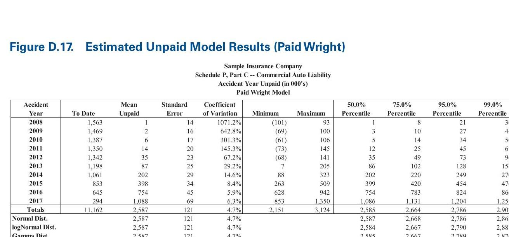
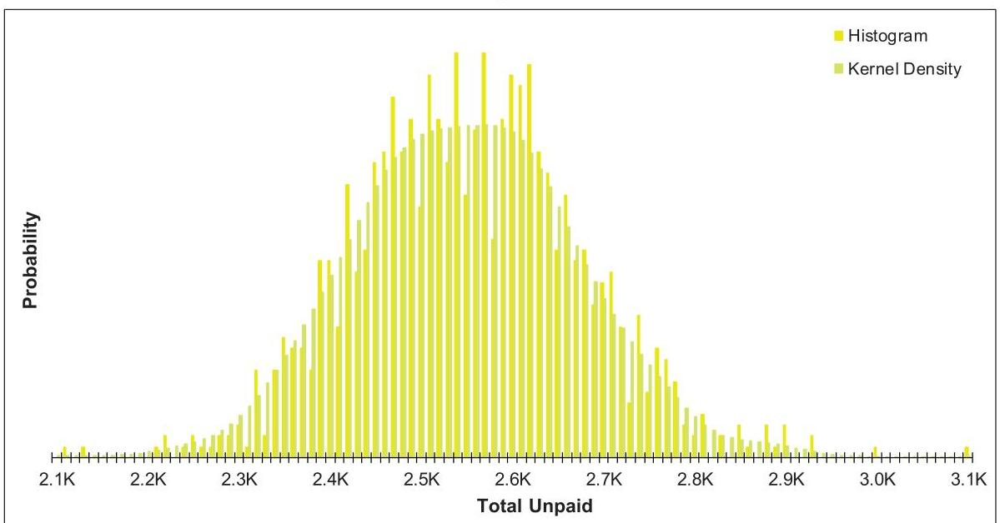

## Page 134
Figure D.19. Estimated Unpaid Model Results (Incurred Wright)

Figure D.20. Total Unpaid Claims Distribution (Incurred Wright)
Sample Insurance Company
Schedule P, Part C -- Commercial Auto Liability
Total Unpaid Distribution (in 000's)
Incurred Wright Model
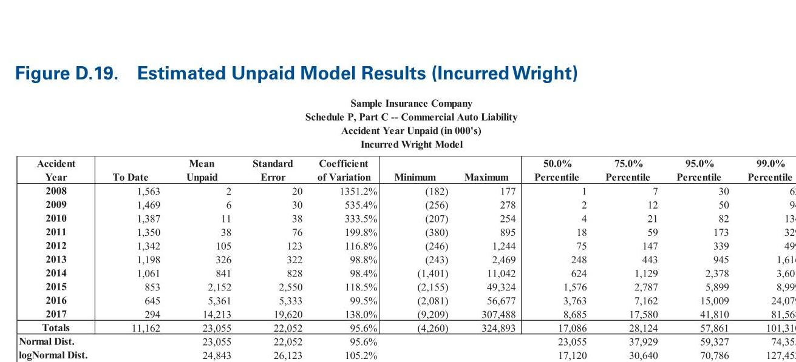
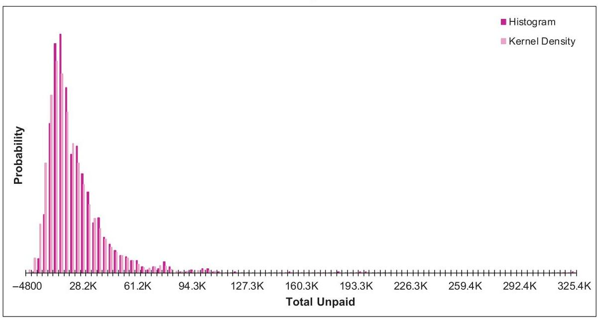

## Page 135
Figure D.21. Model Weights by Accident Year

| Accident
Year | Model Weights by Accident Year |  |  |  |  |  |  |  |  |
| :--: | :--: | :--: | :--: | :--: | :--: | :--: | :--: | :--: | :--: |
|  | Paid BS | Ined BS | Paid CC | Paid CL | Ined CL | Paid HC | Paid WR |  | TOTAL |
| 2008 | 14.3\% | 14.3\% | 14.3\% | 14.3\% | 14.3\% | 14.3\% | 14.3\% |  | 100.0\% |
| 2009 | 14.3\% | 14.3\% | 14.3\% | 14.3\% | 14.3\% | 14.3\% | 14.3\% |  | 100.0\% |
| 2010 | 14.3\% | 14.3\% | 14.3\% | 14.3\% | 14.3\% | 14.3\% | 14.3\% |  | 100.0\% |
| 2011 | 14.3\% | 14.3\% | 14.3\% | 14.3\% | 14.3\% | 14.3\% | 14.3\% |  | 100.0\% |
| 2012 | 14.3\% | 14.3\% | 14.3\% | 14.3\% | 14.3\% | 14.3\% | 14.3\% |  | 100.0\% |
| 2013 | 14.3\% | 14.3\% | 14.3\% | 14.3\% | 14.3\% | 14.3\% | 14.3\% |  | 100.0\% |
| 2014 | 14.3\% | 14.3\% | 14.3\% | 14.3\% | 14.3\% | 14.3\% | 14.3\% |  | 100.0\% |
| 2015 | 14.3\% | 14.3\% | 14.3\% | 14.3\% | 14.3\% | 14.3\% | 14.3\% |  | 100.0\% |
| 2016 | 14.3\% | 14.3\% | 14.3\% | 14.3\% | 14.3\% | 14.3\% | 14.3\% |  | 100.0\% |
| 2017 | 14.3\% | 14.3\% | 14.3\% | 14.3\% | 14.3\% | 14.3\% | 14.3\% |  | 100.0\% |

Figure D.22. Estimated Mean Unpaid by Model
Sample Insurance Company
Schedule P, Part C - Commercial Auto Liability
Summary of Results by Model (in 000's)

| Accident   Year | Mean Estimated Unpaid |  |  |  |  |  |  |  |
| :--: | :--: | :--: | :--: | :--: | :--: | :--: | :--: | :--: |
|  | Berquist \& Sherman |  | Cape Cod |  | Chain Ladder |  | Hoerl Curve | Best Est.   (Weighted) |
|  | Paid | Incurred | Paid | Incurred | Paid | Incurred | Paid |  |
| 2008 | 1 | 1 | 2 | 1 | 1 | 1 | 1 | 1 |
| 2009 | 4 | 3 | 5 | 3 | 3 | 2 | 2 | 3 |
| 2010 | 14 | 14 | 15 | 13 | 12 | 6 | 6 | 11 |
| 2011 | 28 | 27 | 29 | 26 | 25 | 14 | 14 | 23 |
| 2012 | 50 | 49 | 53 | 51 | 47 | 36 | 35 | 47 |
| 2013 | 103 | 103 | 101 | 101 | 97 | 91 | 87 | 99 |
| 2014 | 209 | 213 | 212 | 211 | 200 | 203 | 202 | 207 |
| 2015 | 402 | 418 | 407 | 406 | 384 | 395 | 398 | 403 |
| 2016 | 742 | 786 | 767 | 766 | 718 | 730 | 754 | 756 |
| 2017 | 1,176 | 1,271 | 1,093 | 1,096 | 1,071 | 1,164 | 1,088 | 1,130 |
| Totals | 2,729 | 2,885 | 2,684 | 2,675 | 2,557 | 2,641 | 2,587 | 2,679 |

Figure D.23. Estimated Ranges
Sample Insurance Company
Schedule P, Part C - Commercial Auto Liability
Summary of Results by Model (in 000's)

| Accident   Year |  | Ranges |  |  |
| :--: | :--: | :--: | :--: | :--: |
|  | Best Est.   (Weighted) | Weighted |  | Modeled |
|  |  | Minimum | Maximum | Minimum |
| 2008 | 1 | 1 | 2 | 1 | 2 |
| 2009 | 3 | 2 | 5 | 2 | 5 |
| 2010 | 11 | 6 | 15 | 6 | 15 |
| 2011 | 23 | 14 | 29 | 14 | 29 |
| 2012 | 47 | 35 | 53 | 35 | 53 |
| 2013 | 99 | 87 | 103 | 87 | 103 |
| 2014 | 207 | 200 | 213 | 200 | 213 |
| 2015 | 403 | 384 | 418 | 384 | 418 |
| 2016 | 756 | 718 | 786 | 718 | 786 |
| 2017 | 1,130 | 1,071 | 1,271 | 1,071 | 1,271 |
| Totals | 2,679 | 2,517 | 2,894 | 2,557 | 2,885 |

## Page 136
Figure D.24. Reconciliation of Total Results (Weighted)
Sample Insurance Company
Schedule P, Part C - Commercial Auto Liability
Reconciliation of Total Results (in 000's)
Best Estimate (Weighted)

| Accident   Year | Paid   To Date | Incurred   To Date | Case   Reserves | IBNR | Estimate of   Ultimate | Estimate of   Unpaid |
| :--: | :--: | :--: | :--: | :--: | :--: | :--: |
| 2008 | 1,563 | 1,577 | 14 | $(12)$ | 1,565 | 1 |
| 2009 | 1,469 | 1,505 | 36 | $(33)$ | 1,472 | 3 |
| 2010 | 1,387 | 1,436 | 49 | $(38)$ | 1,398 | 11 |
| 2011 | 1,350 | 1,417 | 67 | $(44)$ | 1,373 | 23 |
| 2012 | 1,342 | 1,445 | 102 | $(56)$ | 1,389 | 47 |
| 2013 | 1,198 | 1,345 | 147 | $(48)$ | 1,297 | 99 |
| 2014 | 1,061 | 1,339 | 278 | $(71)$ | 1,267 | 207 |
| 2015 | 853 | 1,327 | 474 | $(71)$ | 1,256 | 403 |
| 2016 | 645 | 1,442 | 797 | $(41)$ | 1,401 | 756 |
| 2017 | 294 | 1,422 | 1,128 | 1 | 1,424 | 1,130 |
| Totals | 11,162 | 14,255 | 3,093 | $(413)$ | 13,841 | 2,679 |

Figure D.25. Estimated Unpaid Model Results (Weighted)
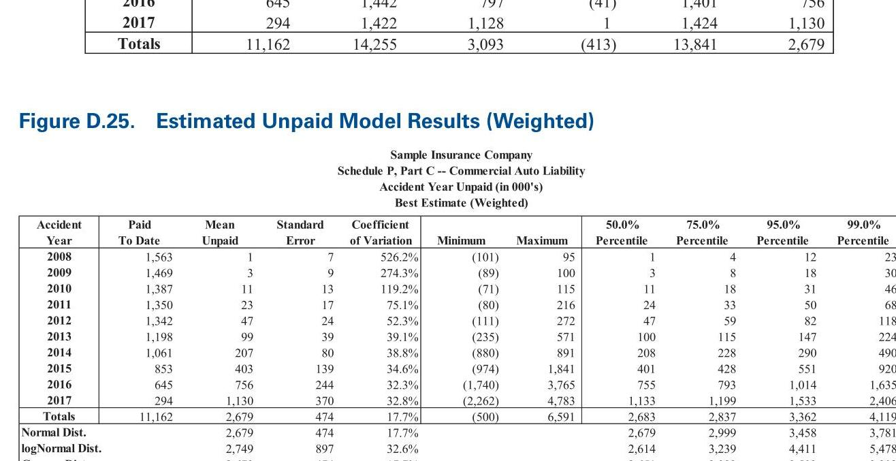

## Page 137
Figure D.26. Estimated Cash Flow (Weighted)

Figure D.27. Estimated Loss Ratio (Weighted)

Figure D.28. Estimated Unpaid Claim Runoff (Weighted)
Sample Insurance Company
Schedule P, Part C - Commercial Auto Liability
Calendar Year Unpaid (in 000's)
Best Estimate (Weighted)

| Accident   Year | $\begin{gathered} \text { Earned } \\ \text { Premium } \end{gathered}$ | $\begin{gathered} \text { Mean } \\ \text { Loss Ratio } \end{gathered}$ | Standard   Error | Coefficient of Variation | Minimum | Maximum | $\begin{gathered} \text { 50.0\% } \\ \text { Percentile } \end{gathered}$ | $\begin{gathered} \text { 75.0\% } \\ \text { Percentile } \end{gathered}$ | $\begin{gathered} \text { 95.0\% } \\ \text { Percentile } \end{gathered}$ | $\begin{gathered} \text { 99.0\% } \\ \text { Percentile } \end{gathered}$ |
| :--: | :--: | :--: | :--: | :--: | :--: | :--: | :--: | :--: | :--: | :--: |
| 2008 | 1,748 | 86.6\% | 27.2\% | 31.4\% | $-264.5 \%$ | 340.5\% | 88.5\% | 91.5\% | 108.2\% | 180.7\% |
| 2009 | 1,810 | 80.6\% | 24.5\% | 30.5\% | -193.1\% | 335.3\% | 81.8\% | 84.5\% | 101.8\% | 166.6\% |
| 2010 | 1,915 | 73.5\% | 22.2\% | 30.3\% | -139.9\% | 287.7\% | 74.4\% | 77.5\% | 93.9\% | 149.7\% |
| 2011 | 2,275 | 60.3\% | 19.4\% | 32.2\% | -126.9\% | 245.5\% | 60.6\% | 62.7\% | 78.5\% | 128.9\% |
| 2012 | 2,524 | 53.4\% | 18.0\% | 33.6\% | -107.9\% | 232.9\% | 54.0\% | 56.1\% | 70.8\% | 116.8\% |
| 2013 | 2,445 | 53.0\% | 17.4\% | 32.9\% | -132.3\% | 248.4\% | 53.2\% | 55.0\% | 69.9\% | 116.6\% |
| 2014 | 2,543 | 49.5\% | 18.2\% | 36.9\% | -190.8\% | 224.8\% | 49.7\% | 51.4\% | 67.2\% | 117.4\% |
| 2015 | 2,461 | 51.1\% | 17.5\% | 34.2\% | -117.8\% | 240.1\% | 50.9\% | 52.7\% | 69.3\% | 116.5\% |
| 2016 | 2,485 | 56.2\% | 18.1\% | 32.2\% | -132.1\% | 278.3\% | 56.1\% | 58.3\% | 75.8\% | 123.2\% |
| 2017 | 3,383 | 60.2\% | 19.8\% | 32.9\% | -118.2\% | 257.3\% | 60.3\% | 63.7\% | 81.5\% | 130.0\% |
| Totals | 22,588 | 60.8\% | 6.2\% | 10.2\% | 20.4\% | 93.6\% | 61.1\% | 63.8\% | 70.9\% | 77.6\% |

# Figure D.28. Estimated Unpaid Claim Runoff (Weighted) 

Sample Insurance Company
Schedule P, Part C - Commercial Auto Liability
Calendar Year Unpaid Claim Runoff (in 000's)
Best Estimate (Weighted)

| Calendar   Year | Mean   Unpaid | Standard   Error | Coefficient of Variation | Minimum | Maximum | $\begin{gathered} \text { 50.0\% } \\ \text { Percentile } \end{gathered}$ | $\begin{gathered} \text { 75.0\% } \\ \text { Percentile } \end{gathered}$ | $\begin{gathered} \text { 95.0\% } \\ \text { Percentile } \end{gathered}$ | $\begin{gathered} \text { 99.0\% } \\ \text { Percentile } \end{gathered}$ |
| :--: | :--: | :--: | :--: | :--: | :--: | :--: | :--: | :--: | :--: |
| 2017 | 2,679 | 474 | 17.7\% | (500) | 6,591 | 2,683 | 2,837 | 3,362 | 4,119 |
| 2018 | 1,610 | 308 | 19.1\% | (590) | 4,201 | 1,612 | 1,714 | 2,049 | 2,557 |
| 2019 | 865 | 179 | 20.7\% | (445) | 2,522 | 866 | 933 | 1,114 | 1,419 |
| 2020 | 422 | 97 | 23.0\% | (268) | 1,247 | 422 | 465 | 561 | 715 |
| 2021 | 193 | 54 | 28.1\% | (119) | 634 | 193 | 222 | 277 | 342 |
| 2022 | 88 | 35 | 39.9\% | (86) | 339 | 87 | 108 | 143 | 179 |
| 2023 | 40 | 25 | 62.0\% | (65) | 204 | 39 | 54 | 80 | 105 |
| 2024 | 16 | 17 | 105.8\% | (80) | 113 | 16 | 26 | 45 | 64 |
| 2025 | 5 | 12 | 222.4\% | (77) | 93 | 5 | 11 | 25 | 38 |
| 2026 | 2 | 8 | 387.7\% | (83) | 81 | 2 | 6 | 15 | 28 |
| 2027 | 1 | 5 | 694.5\% | (49) | 62 | 0 | 3 | 9 | 18 |
| 2028 | 0 | 3 | 1416.3\% | (27) | 40 | 0 | 1 | 4 | 9 |
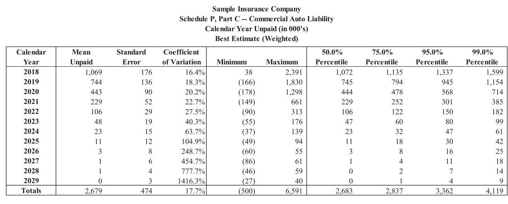
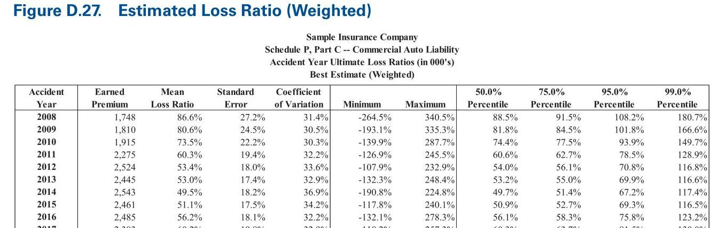

## Page 138
# Figure D.29. Mean of Incremental Values (Weighted) 

Figure D.30. Standard Deviation of Incremental Values (Weighted)

Figure D.31. Coefficient of Variation of Incremental Values (Weighted)
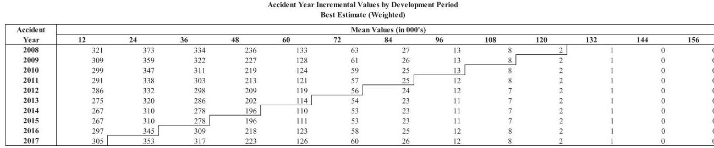
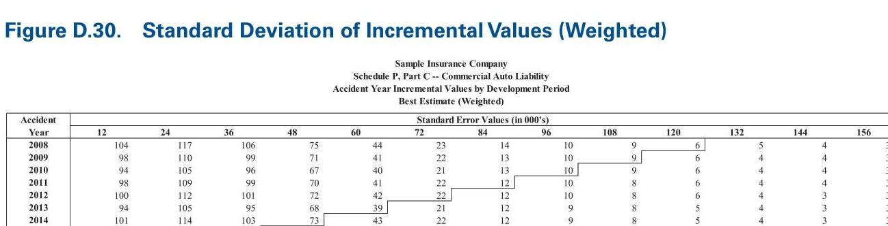
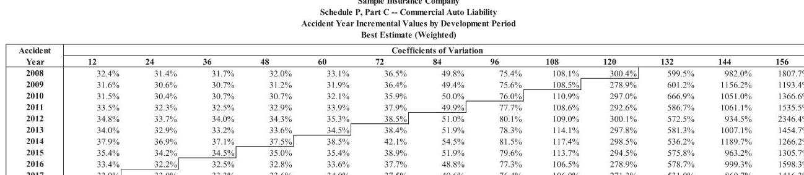

## Page 139
Figure D.32. Total Unpaid Claims Distribution (Weighted)

Figure D.33. Summary of Model Distributions
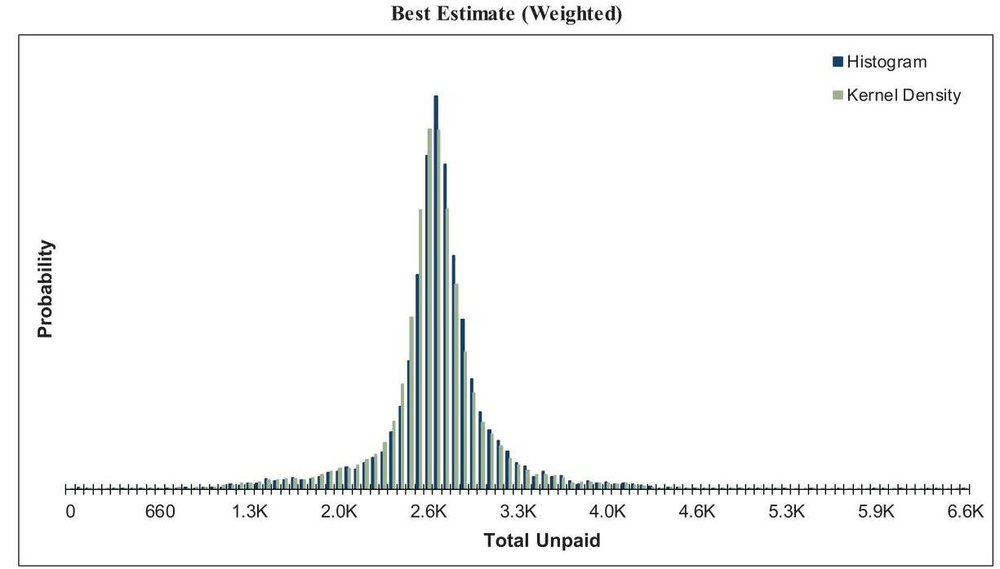
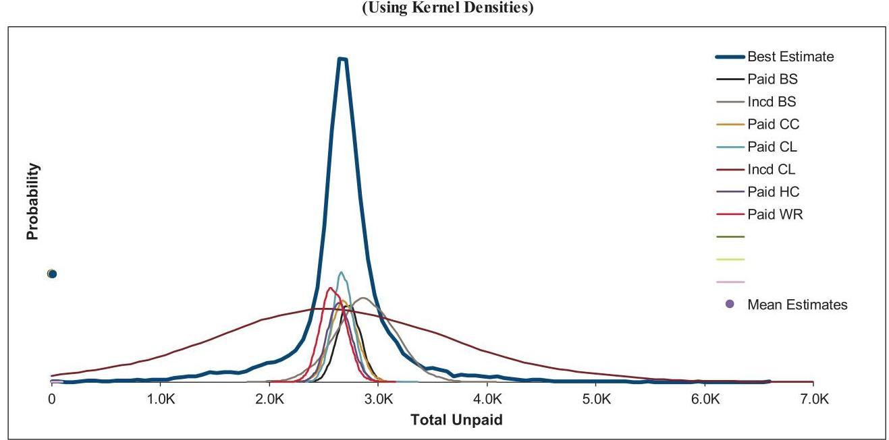

## Page 140
# Appendix E-Aggregate Results 

In this appendix the results for the correlated aggregate of the three Schedule P lines of business (Parts A, B, and C) are shown, using the correlation calculated from the paid data for the Berquist-Sherman model.

Figure E.1. Estimated Unpaid Model Results

Figure E.2. Estimated Cash Flow
Sample Insurance Company
Aggregate Three Lines of Business
Calendar Year Unpaid (in 000's)

| Calendar   Year | Mean   Unpaid | Standard   Error | Coefficient   of Variation | Minimum | Maximum | 50.0\%   Percentile | 75.0\%   Percentile | 95.0\%   Percentile | 99.0\%   Percentile |
| :--: | :--: | :--: | :--: | :--: | :--: | :--: | :--: | :--: | :--: |
| 2018 | 12,497 | 2,095 | 16.8\% | (797) | 23,980 | 12,494 | 13,633 | 15,903 | 17,708 |
| 2019 | 5,432 | 760 | 14.0\% | 175 | 10,046 | 5,475 | 5,859 | 6,587 | 7,241 |
| 2020 | 2,945 | 423 | 14.4\% | (100) | 5,390 | 2,965 | 3,176 | 3,586 | 3,989 |
| 2021 | 1,562 | 310 | 19.8\% | (95) | 13,391 | 1,553 | 1,674 | 1,959 | 2,463 |
| 2022 | 902 | 857 | 95.0\% | (102) | 60,941 | 810 | 893 | 1,281 | 3,189 |
| 2023 | 546 | 835 | 153.0\% | (320) | 33,504 | 431 | 490 | 928 | 3,022 |
| 2024 | 361 | 817 | 226.4\% | (880) | 44,982 | 242 | 289 | 756 | 2,813 |
| 2025 | 283 | 1,087 | 384.4\% | (1,221) | 70,925 | 144 | 183 | 681 | 3,090 |
| 2026 | 228 | 1,139 | 499.5\% | (714) | 61,008 | 84 | 120 | 590 | 3,055 |
| 2027 | 190 | 1,049 | 551.1\% | (1,481) | 53,144 | 46 | 79 | 587 | 3,006 |
| 2028 | 165 | 825 | 499.4\% | (1,571) | 23,126 | 27 | 54 | 554 | 3,206 |
| 2029 | 160 | 1,260 | 789.6\% | (3,531) | 74,987 | 14 | 33 | 480 | 3,172 |
| 2030 | 169 | 3,600 | 2134.8\% | (7,667) | 342,488 | 6 | 12 | 412 | 2,742 |
| 2031 | 110 | 1,288 | 1168.6\% | (1,140) | 66,389 | 2 | 4 | 196 | 2,239 |
| Totals | 25,550 | 9,304 | 36.4\% | (815) | 476,278 | 24,635 | 26,612 | 32,642 | 55,933 |
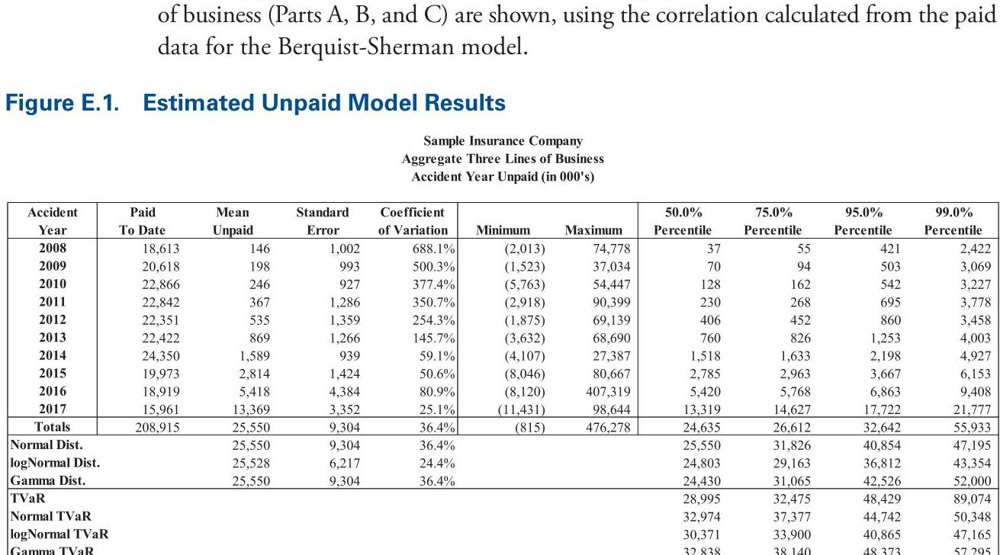

## Page 141
Figure E.3. Estimated Loss Ratio

| Accident | Earned | Mean | Standard | Coefficient |  |  | 50.0\% | 75.0\% | 95.0\% | 99.0\% |
| :--: | :--: | :--: | :--: | :--: | :--: | :--: | :--: | :--: | :--: | :--: |
| Year | Premium | Loss Ratio | Error | of Variation | Minimum | Maximum | Percentile | Percentile | Percentile | Percentile |
| 2008 | 25,305 | 72.6\% | 15.3\% | 21.1\% | $-52.5 \%$ | 368.8\% | 74.2\% | 79.3\% | 91.2\% | 108.2\% |
| 2009 | 25,577 | 78.6\% | 15.6\% | 19.8\% | $-34.7 \%$ | 224.3\% | 80.3\% | 85.5\% | 97.6\% | 114.8\% |
| 2010 | 27,155 | 82.2\% | 16.0\% | 19.5\% | $-18.6 \%$ | 276.9\% | 84.0\% | 89.3\% | 102.3\% | 119.9\% |
| 2011 | 30,529 | 74.6\% | 14.5\% | 19.4\% | $-59.9 \%$ | 373.8\% | 75.7\% | 80.8\% | 93.3\% | 109.0\% |
| 2012 | 34,399 | 65.2\% | 13.0\% | 19.9\% | $-24.3 \%$ | 269.8\% | 66.3\% | 70.9\% | 81.9\% | 94.6\% |
| 2013 | 36,231 | 63.2\% | 12.5\% | 19.8\% | $-47.2 \%$ | 251.4\% | 64.2\% | 68.8\% | 79.9\% | 92.2\% |
| 2014 | 36,863 | 70.7\% | 14.1\% | 20.0\% | $-37.8 \%$ | 146.6\% | 70.7\% | 77.5\% | 92.4\% | 107.1\% |
| 2015 | 37,678 | 60.2\% | 12.8\% | 21.3\% | $-34.6 \%$ | 271.2\% | 60.8\% | 65.9\% | 77.7\% | 89.1\% |
| 2016 | 38,101 | 63.9\% | 16.8\% | 26.2\% | $-54.2 \%$ | 1115.7\% | 64.2\% | 69.8\% | 82.1\% | 95.7\% |
| 2017 | 37,997 | 79.2\% | 15.9\% | 20.1\% | $-36.7 \%$ | 313.1\% | 78.0\% | 86.8\% | 104.4\% | 121.2\% |
| Totals | 329,835 | 70.4\% | 4.9\% | 6.9\% | 47.9\% | 195.6\% | 70.5\% | 73.2\% | 77.3\% | 81.3\% |

Figure E.4. Estimated Unpaid Claim Runoff

|  | Sample Insurance Company   Aggregate Three Lines of Business   Calendar Year Unpaid Claim Runoff (in 000's) |  |  |  |  |  |  |  |  |  |  |  |  |  |
| :--: | :--: | :--: | :--: | :--: | :--: | :--: | :--: | :--: | :--: | :--: | :--: | :--: | :--: | :--: |
| Calendar   Year | Mean   Unpaid | Standard   Error | Coefficient of Variation | Minimum | Maximum | 50.0\%   Percentile | 75.0\%   Percentile | 95.0\%   Percentile | 99.0\%   Percentile |  |  |  |  |  |
| 2017 | 25,550 | 9,304 | 36.4\% | (815) | 476,278 | 24,635 | 26,612 | 32,642 | 55,933 |  |  |  |  |  |
| 2018 | 13,054 | 8,804 | 67.4\% | (18) | 464,252 | 11,965 | 12,832 | 17,870 | 43,814 |  |  |  |  |  |
| 2019 | 7,621 | 8,748 | 114.8\% | (193) | 459,695 | 6,389 | 6,960 | 12,059 | 39,214 |  |  |  |  |  |
| 2020 | 4,676 | 8,706 | 186.2\% | (93) | 456,649 | 3,366 | 3,757 | 8,953 | 36,003 |  |  |  |  |  |
| 2021 | 3,113 | 8,561 | 275.0\% | 2 | 452,976 | 1,799 | 2,096 | 7,305 | 33,834 |  |  |  |  |  |
| 2022 | 2,212 | 8,057 | 364.3\% | 67 | 439,029 | 986 | 1,225 | 5,912 | 30,057 |  |  |  |  |  |
| 2023 | 1,665 | 7,588 | 455.6\% | 21 | 433,153 | 557 | 758 | 4,879 | 25,743 |  |  |  |  |  |
| 2024 | 1,305 | 7,152 | 548.1\% | 14 | 427,965 | 318 | 480 | 3,998 | 21,821 |  |  |  |  |  |
| 2025 | 1,022 | 6,647 | 650.3\% | (9,274) | 427,465 | 177 | 304 | 3,245 | 18,524 |  |  |  |  |  |
| 2026 | 794 | 6,071 | 764.6\% | (9,339) | 425,019 | 94 | 187 | 2,507 | 14,898 |  |  |  |  |  |
| 2027 | 604 | 5,472 | 906.6\% | (9,336) | 411,276 | 49 | 108 | 1,873 | 11,341 |  |  |  |  |  |
| 2028 | 438 | 4,936 | 1126.0\% | (9,105) | 393,463 | 23 | 52 | 1,269 | 7,908 |  |  |  |  |  |
| 2029 | 279 | 3,988 | 1430.4\% | (7,664) | 342,491 | 8 | 17 | 690 | 5,233 |  |  |  |  |  |
| 2030 | 110 | 1,288 | 1168.6\% | (1,140) | 66,389 | 2 | 4 | 196 | 2,239 |  |  |  |  |  |

Figure E.5. Mean of Incremental Values
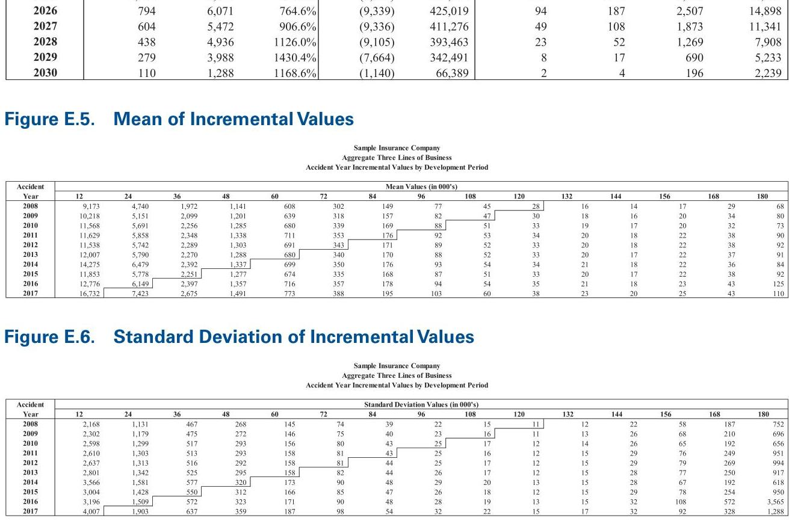

## Page 142
Figure E.7. Coefficient of Variation of Incremental Values

Figure E.8. Calculation of Risk Based Capital
Sample Insurance Company
Aggregate Three Lines of Business
Indicated Unpaid Claim Risk Portion of Required Capital (in 000's)

| LOB / Segment | Earned Premium | Mean Unpaid | 99.0\% Unpaid | Value at Risk   Capital | Allocated   Capital | Unpaid   Ratio | Premium   Ratio |
| :--: | :--: | :--: | :--: | :--: | :--: | :--: | :--: |
| Homeowners / Farmowners | 15,148 | 5,792 | 10,410 | 4,618 | 4,048 | 69.9\% | 26.7\% |
| Private Passenger Auto Liabilil | 20,467 | 17,079 | 45,682 | 28,602 | 25,072 | 146.8\% | 122.5\% |
| Commercial Auto Liability | 2,383 | 2,679 | 4,119 | 1,439 | 1,262 | 47.1\% | 52.9\% |
| Total | 37,997 | 25,550 | 60,210 | 34,660 |  |  |  |
| Aggregate | 37,997 | 25,550 | 55,933 | 30,382 | 30,382 | 118.9\% | 80.0\% |

Figure E.9. Total Unpaid Claims Distribution
Sample Insurance Company
Aggregate Three Lines of Business
Total Unpaid Distribution
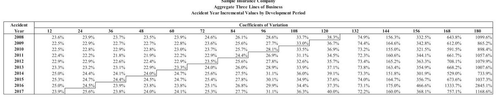
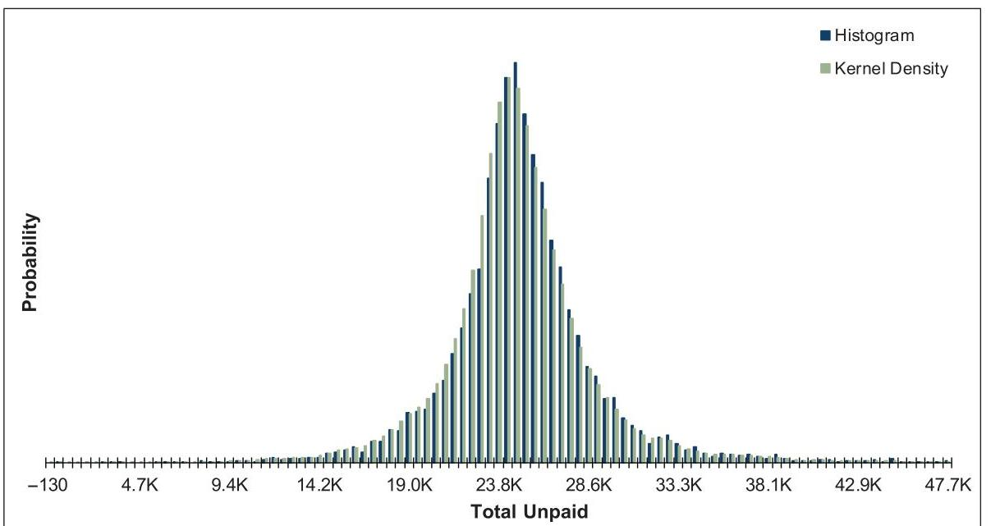

## Page 143
# References and Selected Bibliography 

[1] Barnett, Glen and Ben Zehnwirth. 2000. "Best Estimates for Reserves." PCAS LXXXVII, 2: 245-321.
[2] Berquist, James R., and Richard E. Sherman. 1977. "Loss Reserve Adequacy Testing: A Comprehensive, Systematic Approach." PCAS LXIV: 123-184.
[3] Bornhuetter, Ronald, and Ronald Ferguson. 1972. "The Actuary and IBNR." Proceedings of the Casualty Actuarial Society LIX: 181-195.
[4] CAS Working Party on Quantifying Variability in Reserve Estimates. 2005. "The Analysis and Estimation of Loss \& ALAE Variability: A Summary Report." CAS Forum (Fall): 29-146.
[5] CAS Tail Factor Working Party. 2013. "The Estimation of Loss Development Tail Factors: A Summary Report." Casualty Actuarial Society E-Forum (Fall): $1-111$.
[6] Foundations of Casualty Actuarial Science, 4th ed. 2001. Arlington, Va.: Casualty Actuarial Society.
[7] Hayne, Roger M. 2008. "A Stochastic Framework for Incremental Average Reserve Models." CAS E-Forum (Fall): 174-195.
[8] Hayne, Roger M. 2013. "A Flexible Framework for Stochastic Reserving Models." Variance Vol. 7, No. 2, 123-151.
[9] Iman, R., and W. Conover. 1982. "A Distribution-Free Approach to Inducing Rank Correlation Among Input Variables." Communications in Statistics— Simulation and Computation 11(3): 311-334.
[10] IAA (International Actuarial Association). 2010. "Stochastic Modeling-Theory and Reality from an Actuarial Perspective." Available from www.actuaries.org/ stochastic.
[11] Kirschner, Gerald S., Colin Kerley, and Belinda Isaacs. 2008. "Two Approaches to Calculating Correlated Reserve Indications Across Multiple Lines of Business." Variance 1: 15-38.
[12] Mildenhall, Stephen J. 2006. "Correlation and Aggregate Loss Distributions with an Emphasis on the Iman-Conover Method." Casualty Actuarial Society E-Forum (Winter): 103-204.
[13] Milliman. 2014. "Using the Milliman Arius Reserving Model." Version 2.1.
[14] Quarg, Gerhard, and Thomas Mack. 2008. "Munich Chain Ladder: A Reserving Method that Reduces the Gap between IBNR Projections Based on Paid Losses and IBNR Projections Based on Incurred Losses." Variance 2: 266-299.

## Page 144
[15] Shapland, Mark R. 2007. "Loss Reserve Estimates: A Statistical Approach for Determining 'Reasonableness'." Variance Vol. 1, No. 2, 120-148.
[16] Shapland, Mark R. 2016. "Using the ODP Bootstrap Model: A Practitioner's Guide." CAS Monograph 4.
[17] Shapland, Mark, and Jeff Courchene. 2022 (forthcoming). "The Actuary and Enterprise Risk Management: Integrating Reserve Variability." CAS monograph.
[18] Struzzieri, Paul J., and Paul R. Hussian. 1998. "Using Best Practices to Determine a Best Reserve Estimate." Casualty Actuarial Society Forum (Fall): 353-413.
[19] Venter, Gary G. 1998. "Testing the Assumptions of Age-to-Age Factors." Proceedings of the Casualty Actuarial Society LXXXV: 807-47.
[20] Zehnwirth, Ben. 1994. "Probabilistic Development Factor Models with Applications to Loss Reserve Variability, Prediction Intervals and Risk Based Capital." CAS Forum (Spring), 2: 447-606.

## Page 145
# Abbreviations and Notations 

Collect here in alphabetical order all abbreviations and notations used in the monograph

| AIC, akaiki information criteria | CoV, coefficient of variation |
| :-- | :-- |
| BIC, bayesian information criteria | HC, hoerl curve |
| BS, berquist-sherman | CC, cape cod |
| WR, wright | CL, chain ladder |
| TVaR, tail value at risk | VaR, value at risk |

## Page 146
15663-04_AppC-E,Refs-3rdPgs.indd 138 1/7/22 10:52 AM

## Page 147
15663-00a_Cover-3rdPgs.indd 3

## Page 148
# ABOUT THE SERIES: 

CAS monographs are authoritative, peer-reviewed, in-depth works focusing on important topics within property and casualty actuarial practice. For more information on the CAS Monograph Series, visit the CAS website at www.casact.org.

## Page 149
Mark R. Shapland

Using the Hayne MLE Models: A Practitioner's Guide