_Note: Source document was split into 4 OCR chunks (pages 1-13, pages 14-24, pages 25-36, pages 37-41) to stay within token limits._

# CS1 Case Study French Motor Third-Party Liability Claims

## Page 1
# Case Study: French Motor Third-Party Liability Claims 

Alexander Noll* Robert Salzmann ${ }^{\dagger}$ Mario V. Wüthrich ${ }^{\ddagger}$<br>Prepared for:<br>Fachgruppe "Data Science"<br>Swiss Association of Actuaries SAV

Version of March 3, 2020


#### Abstract

This tutorial compares classical generalized linear models for claim frequency modeling to regression tree, boosting machine and neural network approaches. We explore these methods, discuss their calibration and study their predictive performance on an explicit motor third-party liability insurance data set. The results of the case study show that a simple generalized linear model does not capture interactions of feature components appropriately (unless manual feature engineering is done), whereas the other methods are able to address these interactions more successfully.


Keywords. data science, machine learning, predictive modeling, claim frequency, motor insurance, regression trees, boosting machine, neural network, generalized linear models, feature engineering, covariate selection.

## 0 Introduction and overview

This data analytics tutorial has been written for the working group "Actuarial Data Science" of the Swiss Association of Actuaries SAV, see
https://www.actuarialdatascience.org/
The main purpose of this tutorial is to introduce the most popular supervised learning methods for predictive modeling. We do this with an explicit actuarial problem at hand, namely, we explore these methods on a French motor third-party liability insurance data set. The methods considered are regression trees, boosting machines and feed-forward neural networks. These three modeling approaches are benchmarked with a classical Poisson generalized linear model. For (more statistically and machine learning oriented) literature we refer to the classical books of Hastie et al. [12], James et al. [15] and Goodfellow et al. [10]. A detailed description of the supervised learning methods used in this case study is given in the lecture notes of WüthrichBuser [35].

[^0]
[^0]:    *PartnerRe Holdings Europe Limited, alexander.noll.a@gmail.com
    ${ }^{\dagger}$ SIGNAL IDUNA Reinsurance Ltd, robert.salzmann@alumni.ethz.ch
    ${ }^{\ddagger}$ RiskLab, Department of Mathematics, ETH Zurich, mario.wuethrich@math.ethz.ch

## Page 2
# 1 Data and descriptive statistics 

We consider the data freMTPL2freq included in the R package CASdatasets ${ }^{1}$ for claim frequency modeling, see also Charpentier [3]. This data comprises a French motor third-party liability (MTPL) insurance portfolio with corresponding claim counts observed in one accounting year. We do not incorporate claim sizes which would also be available through freMTPL2sev.

The necessary R packages are installed, loaded and displayed by the following commands:

```
> install.packages("CASdatasets",repos="http://dutangc.free.fr/pub/RRepos/", type="source")
> library(CASdatasets)
> ?CASdatasets # we use version CASdatasets_1.0-8
> data(freMTPL2freq)
```

This data freMTPL2freq is described in detail in Listing 1.

Listing 1: output of command str(freMTPL2freq)

```
1 > str(freMTPL2freq)
2 'data.frame': 678013 obs. of 12 variables:
    $ IDpol : num 1 3 5 10 11 13 15 17 18 21 ...
    $ ClaimNb : num [1:678013(1d)] 1 1 1 1 1 1 1 1 1 1 ...
    ..- attr(*, "dimnames")=List of 1
    ... . .$ : chr "139" "414" "463" "975" ...
    $ Exposure : num 0.1 0.77 0.75 0.09 0.84 0.52 0.45 0.27 0.71 0.15 ...
    $ Area : Factor w/ 6 levels "A","B","C","D",..: 4 4 2 2 2 2 5 5 3 3 2 ...
    $ VehPower : int 5 5 6 7 7 6 6 7 7 7 ...
    $ VehAge : int 0 0 2 0 0 2 2 0 0 0 ...
    $ DrivAge : int 55 55 52 46 46 38 38 33 33 41 ...
    $ BonusMalus: int 50 50 50 50 50 50 50 68 68 50 ...
    $ VehBrand : Factor w/ 11 levels "B1","B10","B11",..: 4 4 4 4 4 4 4 4 4 4 4 ...
    $ VehGas : Factor w/ 2 levels "Diesel","Regular": 2 2 1 1 1 1 2 2 1 1 1 1 ...
    $ Density : int 1217 1217 54 76 76 3003 3003 137 137 60 ...
    $ Region : Factor w/ 22 levels "R11","R21","R22",..: 18 18 3 15 15 8 8 20 20 12 ...
```

We briefly describe this data provided in Listing 1. We have $678^{\prime} 013$ individual car insurance policies ${ }^{2}$ (see line 2 of Listing 1) and for each policy we have 12 variables ${ }^{3}$ (provided on lines $3-16$ of Listing 1):

1. IDpol: policy number (unique identifier);
2. ClaimNb: number of claims on the given policy;
3. Exposure: total exposure in yearly units;
4. Area: area code (categorical, ordinal);
5. VehPower: power of the car (categorical, ordinal);
[^0]
[^0]:    ${ }^{1}$ CASdatasets website http://cas.uqam.ca; the data is described on page 55 of the reference manual [2]; we use version CASdatasets_1.0-8.
    ${ }^{2}$ Observe that this number differs by 22 claims from the one stated in [2].
    ${ }^{3}$ The data does not show any missing values.

## Page 3
6. VehAge: age of the car in years;
7. DrivAge: age of the (most common) driver in years;
8. BonusMalus: bonus-malus level between 50 and 230 (with reference level 100);
9. VehBrand: car brand (categorical, nominal);
10. VehGas: diesel or regular fuel car (binary);
11. Density: density of inhabitants per $\mathrm{km}^{2}$ in the city of the living place of the driver;
12. Region: regions in France (prior to 2016), these are illustrated in Figure 1 (categorical).

Figure 1: the 22 regions in France (source: internet).
We start by providing descriptive and exploratory statistics of the data. This comprises the portfolio structure in terms of volumes and observed (marginal) frequencies, as well as possible dependence structures between the feature components.

Figure 2: (lhs) histogram of the exposures Exposure, (middle) boxplot of the exposures Exposure, (rhs) number of observed claims ClaimNb.
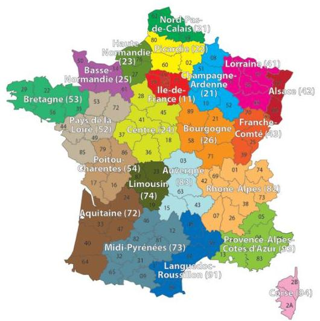
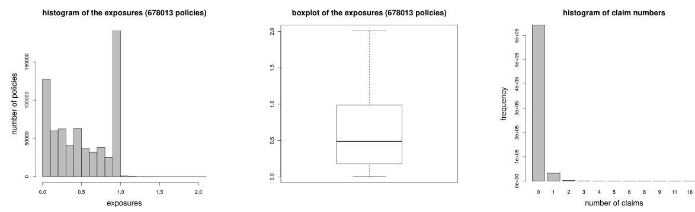

## Page 4
| number of claims | 0 | 1 | 2 | 3 | 4 | 5 | 6 | 8 | 9 | 11 | 16 |
| :-- | --: | --: | --: | --: | --: | --: | --: | --: | --: | --: | --: |
| number of policies | $643^{\prime} 953$ | $32^{\prime} 178$ | $1^{\prime} 784$ | 82 | 7 | 2 | 1 | 1 | 1 | 3 | 1 |
| total exposures | $336^{\prime} 616$ | $20^{\prime} 671$ | $1^{\prime} 153$ | 53 | 3 | 1 | 0.3 | 0.4 | 0.1 | 1.1 | 0.3 |

Table 1: split of the portfolio w.r.t. number of claims.

Figure 3: (lhs) histogram of exposures per area code Area, (middle) average area code Area per region Region, (rhs) observed frequency per area code Area.

Figure 4: (lhs) histogram of exposures per vehicle power group VehPower, (middle) average vehicle power VehPower per region Region, (rhs) observed frequency per vehicle power VehPower.

Table 1 provides an overview of the claims and policy data. Figure 2 shows a histogram and a boxplot of the exposures and a histogram of the number of observed claims. From these statistics, we observe that we have many exposures that are less than 1 year-at-risk, 1'224 exposures are bigger than 1 year and the smallest exposure is 1 day. We correct for the exposures bigger than one year (by setting them equal to 1 ) because we believe that this is caused by data error (since all observations are within one accounting year). ${ }^{4}$ For the number of claims we observe 9 policies having more than 4 claims, the maximal number of claims being 16, see Table 1. We will also correct for these entries (by setting them equal to 4) because these big values are likely data errors. The resulting portfolio frequency (w.r.t. Exposure) is given by $10.06 \%$.

[^0]
[^0]:    ${ }^{4}$ Based on further analysis of the data, we believe that policy renewals that have taken place during the year have been accounted for as two policies in the data. Of course, this seems unfortunate but we do not have the necessary information to merge such policies (belonging to the same driver).
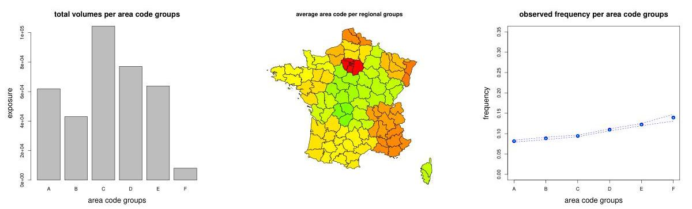
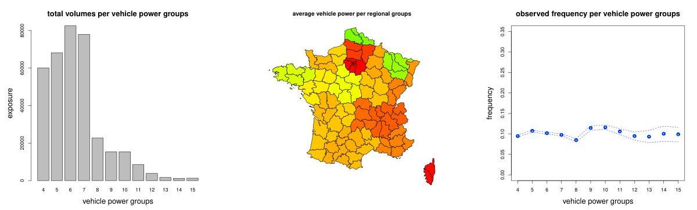

## Page 5
Figure 5: (lhs) histogram of exposures per vehicle age VehAge (capped at 20), (middle) average vehicle age VehAge per region Region, (rhs) observed frequency per vehicle age VehAge.

Figure 6: (lhs) histogram of exposures per driver age DrivAge (capped at 90), (middle) average driver age DrivAge per region Region, (rhs) observed frequency per driver age DrivAge.

Figure 7: (lhs) histogram of exposures per bonus-malus level BonusMalus (capped at 150), (middle) average bonus-malus level BonusMalus per region Region, (rhs) observed frequency per bonus-malus level BonusMalus (note that the $y$-scale is different compared to the other frequency plots).

In Figure 3 we provide exposures per area code on the left-hand side (lhs) and the marginal empirical frequency per area code (w.r.t. Exposure) in the plot on the right-hand side (rhs). This
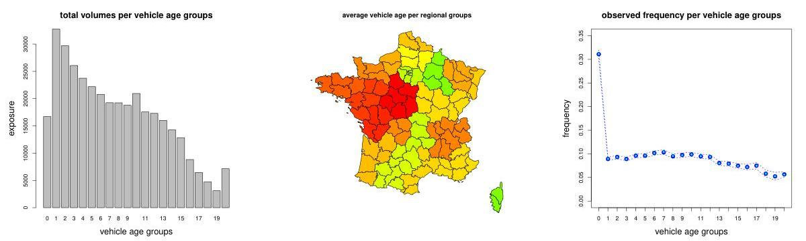
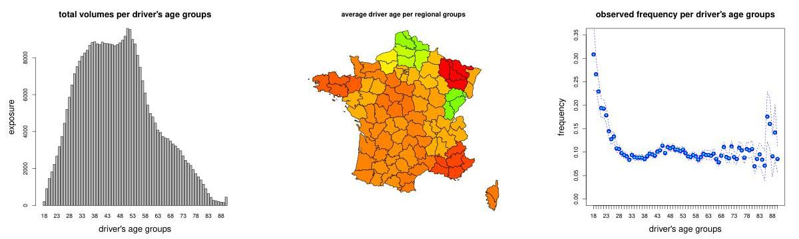


## Page 6
Figure 8: (lhs) histogram of exposures per vehicle brand group VehBrand, (rhs) observed frequency per vehicle brand group VehBrand

Figure 9: (lhs) histogram of exposures per vehicle gas group VehGas, (middle) average vehicle gas VehGas per region Region (diesel is green and regular red), (rhs) observed frequency per vehicle gas group VehGas.

Figure 10: (lhs) histogram of exposures per population density Density (on log-scale), (middle) average population density Density per region Region, (rhs) observed frequency per population density Density.
marginal empirical frequency is supplemented by an estimated confidence bound of 2 standard deviations (based on a Poisson model assumption). This marginal empirical frequency is mono-
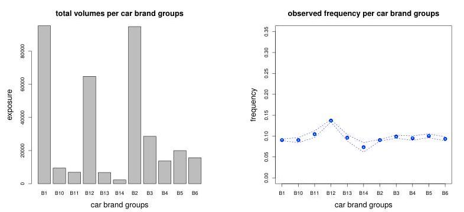
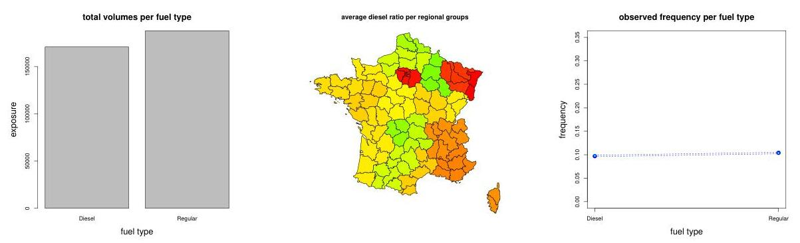
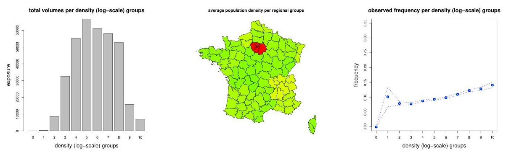

## Page 7
Figure 11: (lhs) histogram of exposures Exposure, and (middle, rhs) observed claim frequencies per region Region in France (prior to 2016).
tonically increasing for the area code, suggesting that the feature component Area is ordinal. Finally, we plot the average area code per French region ${ }^{5}$ where we replace the ordinal feature components for area codes by integer values. This plot is provided in the middle of Figure 3. In general, in the French map figures a more green color means a lower numerical value and a more red color means a higher numerical value. Thus, from Figure 3 (middle) we see that the Paris area has in average the highest area code whereas the center of France has the lowest one. We repeat these plots for all other feature components provided in Figures 4-10. ${ }^{6}$ The marginal frequency of vehicle power in Figure 4 (rhs) does not seem to have a clear trend. The marginal frequency is decreasing in vehicle age, and it has a "U" shape in driver's age (until age 50), see Figures 5 and 6 (rhs). By far the most explanatory feature component for frequency modeling is the bonus-malus level provided in Figure 7 (rhs). Note that the $y$-axis has a different scale in this plot. Moreover, we see that the frequency is monotonically increasing in the density of the population, see Figure 10 (rhs) which supports intuition.
Interestingly, there is a clear negative dependence of the bonus-malus level and driver's age, i.e. older drivers tend to have lower bonus-malus levels, this can be seen from the mirrored colors in Figures 7 and 6 (middle).
Finally, in Figure 11 we consider the regional differences in volumes and marginal frequencies. The gray columns in Figure 11 (lhs) give the volumes of our portfolio (the blue line indicates the distribution of the French population, scaled to the same volume as our portfolio). We see that we have (by far) the biggest volume in region R24 ("Centre") whereas the French people most likely live in region R11 ("Ile de France") that includes the city of Paris. Marginal frequencies fluctuate between the regions, which may be explained by various factors such as the different densities of population.
In Figure 12 we provide the two-dimensional plots of the portfolio distribution (number of policies) of the variables Area, VehPower, VehAge, DrivAge, BonusMalus, Density. These plots are useful to detect collinearity in the feature components; the corresponding Pearson's correlations and Spearman's $\rho$ 's are given in Table 2. We observe strong positive collinearity between the area code and the density of the population, i.e., it is almost obvious from this plot that the area

[^0]
[^0]:    ${ }^{5}$ We acknowledge the use of UNESCO (1987) database through UNEP/GRID-Geneva for the French maps.
    ${ }^{6}$ Note that VehAge, DrivAge and BonusMalus have been capped for the plots at age 20, age 90 and bonus-malus level 150, respectively, to improve visualization.
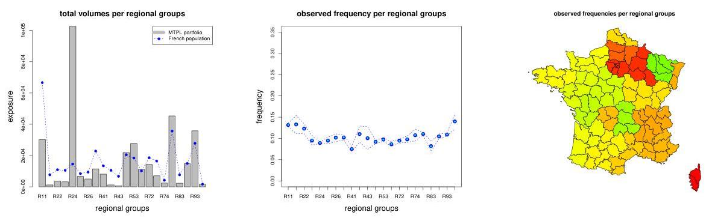

## Page 8
Figure 12: two-dimensional contour plots of the portfolio distribution of the variables Area, VehPower, VehAge, DrivAge, BonusMalus, Density.
code is given according to the population density. Further observations are (in an unstructured form): (a) the area code has a slight positive dependence with the bonus-malus level and a slight negative dependence with the vehicle age and driver's age, (b) the vehicle power has a slight positive dependence with driver's age, (c) the vehicle power has a slight negative dependence with the bonus-malus level, (d) younger people drive newer cars, (e) the age of car is positively dependent with the bonus-bonus malus level, (f) older people have a lower bonus-malus level, already mentioned above, and (g) the bonus-malus level is (slightly) increasing in the population density. Note that some of these observations can only be detected on the original plots where
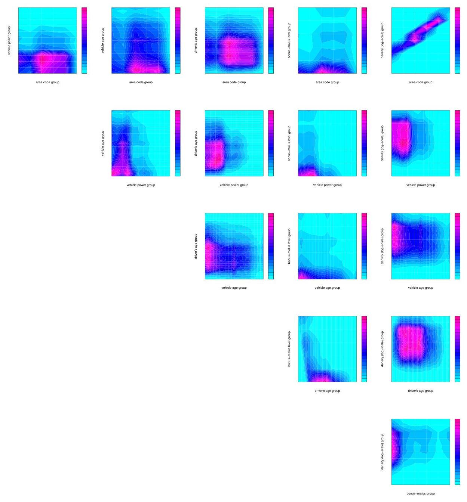

## Page 9
Figure 13: distribution of the variables Area, VehPower, VehAge, DrivAge, BonusMalus, VehGas for each car brand VehBrand individually.
the quality of the graphs is better, and they are also based on Table 2.

|  | Area | VehPower | VehAge | DrivAge | BonusMalus | Density |
| :-- | --: | --: | --: | --: | --: | --: |
| Area |  | 0.00 | -0.10 | -0.05 | 0.12 | $\mathbf{0 . 5 9}$ |
| VehPower | -0.01 |  | -0.01 | 0.03 | -0.08 | 0.04 |
| VehAge | -0.10 | 0.00 |  | -0.06 | 0.08 | -0.09 |
| DrivAge | -0.05 | 0.04 | -0.08 |  | $\mathbf{- 0 . 4 8}$ | 0.00 |
| BonusMalus | 0.14 | -0.07 | 0.08 | $\mathbf{- 0 . 5 7}$ |  | 0.08 |
| Density | $\mathbf{0 . 9 8}$ | -0.01 | -0.10 | -0.04 | 0.14 |  |

Table 2: correlations in feature components: top-right shows Pearson's correlation; bottom-left shows Spearman's $\rho$.

Finally, we analyze the different car brands in Figure 13. Keep in mind that we have big volumes in car brands B1, B12 and B2. We observe quite some heterogeneity in these plots: (a) car brand B2 has the lowest area code, (b) car brand B11 has high vehicle power cars and car brand B14 low ones, (c) car brand B12 has by far the newest cars, and (d) car brand B10 is more likely a diesel car, driven by older people with a lower bonus-malus level. Note that we believe that car brand B12 is special: it has more than 45 '000 cars with an exposure of less than 50 days (almost $30 \%$ of all policies of car brand B12). This is a sign that many of these car belong to a car fleet, possibly a car rental company. Moreover, most of these cars are domiciled in region R11 (Paris region) and region R93 (Côte d'Azur).
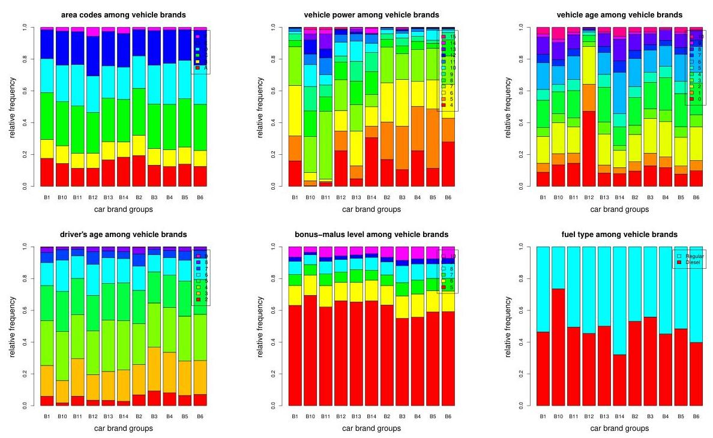

## Page 10
This finishes our descriptive analysis and we turn to the statistical modeling part. This statistical modeling part will consider different supervised learning methods to explore underlying regression structure. Alternatively, not done here, we could also apply unsupervised learning methods to compress feature information in a first step, and in a second step we could then analyze regression structures on the compressed feature information. For unsupervised learning methods we refer to our tutorial Rentzmann-Wüthrich [22].

# 2 Claim frequency model and loss function 

### 2.1 Basic statistical model

We start by introducing a statistical modeling framework for claim frequency modeling. For each of the $678^{\prime} 013$ individual car insurance policies we consider the 9 -dimensional feature vector (also called covariate, explanatory variable, predictors, independent variable), see Listing 1,

$$
\boldsymbol{x}_{i}=\left(\text { Area }_{i}, \text { VehPower }_{i}, \text { VehAge }_{i}, \text { DrivAge }_{i}, \text { BonusMalus }_{i}, \text { VehBrand }_{i}, \text { VehGas }_{i}, \text { Density }_{i}, \text { Region }_{i}\right)^{\prime}
$$

where the lower index indicates that this information belongs to policy $i=1, \ldots, 678^{\prime} 013$. Moreover, we have claim information $N_{i}=\operatorname{ClaimNb}_{i} \geq 0$ and exposure information $v_{i}=\operatorname{Exposure}_{i} \in$ $(0.00273,1]$. Note that we drop variable IDpol as it does not have any explanatory power. The goal is to explain and predict the number of claims $N_{i}$ via its expected value $\mathbb{E}\left[N_{i}\right]$ using all relevant feature information $\boldsymbol{x}_{i}$ and the exposure $v_{i}$ for each individual policy $i$.
We denote by $\hat{\mathcal{X}}$ the feature space that contains all (potential) insurance policies $\boldsymbol{x}_{i} \in \hat{\mathcal{X}}$. Note that we use notation $\hat{\mathcal{X}}$ on purpose, here, and later on we are going to introduce modified feature spaces $\mathcal{X}$. Feature space $\hat{\mathcal{X}}$ contains the features $\boldsymbol{x}_{i}$ in its original form (as they are given in Listing 1). For the models studied below this original feature information is going to be pre-processed, for instance, we will build categorical age classes for certain regression models.

Assumptions 2.1 (basic Poisson model) Choose a probability space $(\Omega, \mathcal{F}, \mathbb{P})$ and a regression function

$$
\lambda: \hat{\mathcal{X}} \rightarrow \mathbb{R}_{+}, \quad \boldsymbol{x} \mapsto \lambda(\boldsymbol{x})
$$

such that all insurance policies $i=1, \ldots, 678^{\prime} 013$ can be described by independent claim counts $N_{i}$ on that probability space having distribution

$$
N_{i} \stackrel{\text { ind. }}{\sim} \operatorname{Poi}\left(\lambda\left(\boldsymbol{x}_{i}\right) v_{i}\right)
$$

That is, we assume that claim counts can be modeled by independent Poisson distributions, and the aim is to estimate (infer) the regression function $\lambda(\cdot)$, describing the expected frequency w.r.t. $v_{i}>0$, from the available data.

### 2.2 Loss function and comparison of models

Eventually, we will choose many different models and compare their predictive performance. We therefore partition our data set into two sets: a learning data set denoted by $\mathcal{D}$ and a test data set denoted by $\mathcal{T}$. For fitting individual models (and choosing their hyperparameters) we will only use the learning data set $\mathcal{D}$. Typically, this is done by minimizing an in-sample loss of an

## Page 11
objective function (where in-sample refers to data $\mathcal{D}$ here). Because in-sample losses are prone to over-fitting, model comparison and performance analysis is done by calculating out-of-sample losses on the test data set $\mathcal{T}$. That is, typically a model is favored over another if it has a smaller out-of-sample loss on $\mathcal{T}$ than the other because it generalizes better to the (unseen) test data set. The explicit definitions of in-sample and out-of-sample losses are provided in formulas (2.3) and (2.4), below.

Listing 2: choice of learning and test sample

```
> set.seed(100)
> 11 <- sample(c(1:nrow(freMTPL2freq)), round(0.9*nrow(freMTPL2freq)), replace = FALSE)
> learn <- freMTPL2freq[11,]
> test <- freMTPL2freq[-11,]
```

Listing 2 describes our choices of the learning data set $\mathcal{D}$ and the test data set $\mathcal{T} .{ }^{7}$ That is, we allocate at random $90 \%$ of the $678^{\prime} 013$ policies to $\mathcal{D}$ and the remaining $10 \%$ of the policies to $\mathcal{T}$. We denote

$$
\mathcal{D}=\left\{\left(N_{i}, \boldsymbol{x}_{i}, v_{i}\right): i=1, \ldots, n=610^{\prime} 212\right\}
$$

and

$$
\mathcal{T}=\left\{\left(N_{t}, \boldsymbol{x}_{t}, v_{t}\right): t=1, \ldots, n_{\mathcal{T}}=67^{\prime} 801\right\}
$$

We illustrate the difference in the learning cases $\left(N_{i}, \boldsymbol{x}_{i}, v_{i}\right) \in \mathcal{D}$ and the test cases $\left(N_{t}, \boldsymbol{x}_{t}, v_{t}\right) \in$ $\mathcal{T}$ only by the lower indexes $i$ and $t$, respectively.
Remark that we choose a comparably large learning data set $\mathcal{D}$ of $90 \%$ of all available data. The reason for this large choice is that for regression tree modeling we specify the minimal number of policies within disjoint groups typically as 10 '000 policies. Thus, our learning data set $\mathcal{D}$ can be partitioned into at most 61 such disjoint groups under these choices. For more details we refer to Section 4.2, below. It is also worthwhile mentioning that all our results are rather sensitive in the explicit choices of the learning and test data sets, thus, for replication purposes exactly the seed of Listing 2 needs to be chosen.

|  | numbers of observed claims |  |  |  |  | empirical <br> frequency |
| :--: | :--: | :--: | :--: | :--: | :--: | :--: |
|  | 0 | 1 | 2 | 3 | 4 |  |
| empirical probability on $\mathcal{D}$ | $94.99 \%$ | $4.74 \%$ | $0.26 \%$ | $0.01 \%$ | $0.002 \%$ | $10.02 \%$ |
| empirical probability on $\mathcal{T}$ | $94.83 \%$ | $4.85 \%$ | $0.31 \%$ | $0.01 \%$ | $0.004 \%$ | $10.41 \%$ |

Table 3: comparison of $\mathcal{D}$ and $\mathcal{T}$ : the last column provides the empirical frequency on these two data sets and the other columns the split of the policies according to the numbers of observed claims.

In Table 3 we provide the comparison of the learning data set $\mathcal{D}$ and the test data set $\mathcal{T}$. The last column gives the empirical frequencies on these two data sets and the remaining columns give the corresponding partitions of the portfolio w.r.t. the numbers of observed claims on individual policies. We observe a slight bias, which could be further analyzed w.r.t. the available features

[^0]
[^0]:    ${ }^{7}$ The partition received from Listing 2 has been done under R version 3.5.0 (2018-04-23). In the upgrade from $R$ version 3.5.x to $R$ version 3.6.x the function sample which is used to generate this partition has been changed. For reproducability under the new version one should set RNGversion(''3.5.0'').

## Page 12
(i.e. whether we also have a feature shift), and one could also consider a stratified choice of learning and test data sets. Here, we refrain from doing so.

As objective function we choose the average Poisson deviance loss (under the given independence assumption in the basic model), we refer to Section 2.4 in [35]. The average Poisson deviance loss is given by

$$
\mathcal{L}(\mathcal{D}, \lambda)=\frac{1}{n} \sum_{i=1}^{n} 2 N_{i}\left[\frac{\lambda\left(\boldsymbol{x}_{i}\right) v_{i}}{N_{i}}-1-\log \left(\frac{\lambda\left(\boldsymbol{x}_{i}\right) v_{i}}{N_{i}}\right)\right] \geq 0
$$

where the right-hand side is set equal to $2 \lambda\left(\boldsymbol{x}_{i}\right) v_{i}$ for indexes $i$ with $N_{i}=0$. The optimal regression function estimate $\boldsymbol{x} \mapsto \widehat{\lambda}(\boldsymbol{x})$ w.r.t. the learning data set $\mathcal{D}$ is then found by minimizing this objective function $\mathcal{L}(\mathcal{D}, \lambda)$ in $\lambda$. Remark that minimizing the deviance loss in $\lambda$ is equivalent to determining the maximum likelihood estimator (MLE) of $\lambda$ w.r.t. the data $\mathcal{D}$. This loss function minimization provides in-sample loss on the learning data set $\mathcal{D}$ for estimator $\widehat{\lambda}$ given by

$$
\mathcal{L}(\mathcal{D}, \widehat{\lambda})=\frac{1}{n} \sum_{i=1}^{n} 2 N_{i}\left[\frac{\widehat{\lambda}\left(\boldsymbol{x}_{i}\right) v_{i}}{N_{i}}-1-\log \left(\frac{\widehat{\lambda}\left(\boldsymbol{x}_{i}\right) v_{i}}{N_{i}}\right)\right] \geq 0
$$

The out-of-sample loss on the test data set $\mathcal{T}$ of $\widehat{\lambda}$ is defined by

$$
\mathcal{L}(\mathcal{T}, \widehat{\lambda})=\frac{1}{n_{\mathcal{T}}} \sum_{t=1}^{n_{\mathcal{T}}} 2 N_{t}\left[\frac{\widehat{\lambda}\left(\boldsymbol{x}_{t}\right) v_{t}}{N_{t}}-1-\log \left(\frac{\widehat{\lambda}\left(\boldsymbol{x}_{t}\right) v_{t}}{N_{t}}\right)\right] \geq 0
$$

We emphasize that the estimate $\widehat{\lambda}$ has been obtained on the learning data set $\mathcal{D}$, and the out-ofsample loss takes this estimate and evaluates the loss on the (disjoint) test data set $\mathcal{T}$. The latter can be seen as a performance indicator in a predictive analysis that describes generalization of the model to unseen data $\mathcal{T}$. For more on this context we refer to Chapter 2 in Wüthrich-Buser $[35]$.
The lower bound in (2.2) is obtained from the fact that each summand in (2.2) is positive since it compares the saturated log-likelihood to a general one, the latter typically having less parameters than observations.

# 3 Benchmark: generalized linear models 

As benchmark model we use (several) generalized linear models (GLMs). GLMs are state-of-the-art in insurance pricing. Therefore, we refer to the corresponding literature, see e.g. Frees [7] and Ohlsson-Johansson [21], for a detail discussion of GLMs in actuarial science. We only remark that they are easily manageable and quite straightforward in interpretation.

### 3.1 Feature pre-processing for generalized linear models

As previously mentioned, typically features $\boldsymbol{x}_{i}$ need pre-processing before being used for a specific model. In our Poisson GLM the regression function is modeled by a log-linear shape in the continuous feature components; we use the canonical link function for the Poisson GLM here, for more information about canonical link functions we refer to Wüthrich [34]. From the marginal empirical frequency plots in Figures 3-10 we see that such a log-linear form is not always appropriate. We make the following choices here:

## Page 13
- Area: we choose a continuous (log-linear) feature component for $\{\mathrm{A}, \ldots, \mathrm{F}\} \mapsto\{1, \ldots, 6\}$;
- VehPower: we choose a categorical feature component where we merge vehicle power groups bigger and equal to 9 (totally 6 classes);
- VehAge: we build 3 categorical classes $[0,1),[1,10],(10, \infty)$;
- DrivAge: we build 7 categorical classes $[18,21),[21,26),[26,31),[31,41),[41,51),[51,71)$, $[71, \infty)$
- BonusMalus: continuous log-linear feature component (we cap at value 150);
- VehBrand: categorical feature component (totally 11 classes);
- VehGas: binary feature component;
- Density: log-density is chosen as continuous log-linear feature component (note that we have very small volumes for small log-densities);
- Region: categorical feature component (totally 22 classes).

Thus, we consider 3 continuous feature components (Area, BonusMalus, log-Density), 1 binary feature component (VehGas) and 5 categorical feature components (VehPower, VehAge, DrivAge, VehBrand, Region). The categorical classes for VehPower, VehAge and DrivAge have been done based on expert opinion, only. This expert opinion has tried to find homogeneity within class labels (levels) and every class label should receive a sufficient volume (of observations), we also refer to (4.3), below. A reference for a data-driven approach is given in Remarks 3.1, below. To use GLMs we need to transform categorical feature components to numerical values. This can be achieved by dummy coding; note that dummy coding is different from one-hot encoding used in machine learning because the latter does not use a reference level. If, for instance, we transform the 7 categorical driver's age classes by one-hot encoding, we receive the binary table given in Table 4 (lhs). Since these 7 driver's age classes are completely determined by a 6 -

| $[18,21)$ | 1 | 0 | 0 | 0 | 0 | 0 | 0 |
| :-- | :-- | :-- | :-- | :-- | :-- | :-- | :-- |
| $[21,26)$ | 0 | 1 | 0 | 0 | 0 | 0 | 0 |
| $[26,31)$ | 0 | 0 | 1 | 0 | 0 | 0 | 0 |
| $[31,41)$ | 0 | 0 | 0 | 1 | 0 | 0 | 0 |
| $[41,51)$ | 0 | 0 | 0 | 0 | 1 | 0 | 0 |
| $[51,71)$ | 0 | 0 | 0 | 0 | 0 | 1 | 0 |
| $[71, \infty)$ | 0 | 0 | 0 | 0 | 0 | 0 | 1 |

Table 4: example one-hot encoding (lhs) and dummy coding (rhs) for categorical driver's age classes and choosing $[41,51)$ as reference level for dummy coding.
dimensional feature vector having only 0 's and at most one component equal to 1 , we can replace the categorical driver's age classes by such a 6-dimensional feature vector with an initialization to a reference level. Choosing the driver's age class $[41,51)$ as reference level, we receive the dummy coding scheme illustrated in Table 4 (rhs). We note that dummy coding is necessary in GLMs to receive full rank design matrices, as we will see below.

## Page 14
Applying dummy coding to all categorical feature components and collecting all terms we obtain the following feature space (in the same order as the components in $\tilde{\mathcal{X}}$ ):

$$
\mathcal{X} \subset[1,6] \times\{0,1\}^{5} \times\{0,1\}^{2} \times\{0,1\}^{6} \times[50,150] \times\{0,1\}^{10} \times\{0,1\} \times[0,11] \times\{0,1\}^{21}
$$

that is, we have a $d=1+5+2+6+1+10+1+1+21=48$ dimensional feature space $\mathcal{X}$, and the feature components in $\{0,1\}^{k}$ add up either to 0 or 1 , this side constraint is the reason for using the subset symbol " $\subset$ " in formula (3.1).

Listing 3: feature pre-processing for GLM regression

```
learn$AreaGLM <- as.integer(learn$Area)
learn$VehPowerGLM <- as.factor(pmin(learn$VehPower,9))
VehAgeGLM <- cbind(c(0:110), c(1, rep(2,10), rep(3,100)))
learn$VehAgeGLM <- as.factor(VehAgeGLM[learn$VehAge+1,2])
learn[,"VehAgeGLM"] <-relevel(learn[,"VehAgeGLM"], ref="2")
> DrivAgeGLM <- cbind(c(18:100), c(rep(1,21-18),rep(2,26-21),rep(3,31-26),rep(4,41-31),...
> learn$DrivAgeGLM <- as.factor(DrivAgeGLM[learn$DrivAge-17,2])
> learn[,"DrivAgeGLM"] <-relevel(learn[,"DrivAgeGLM"], ref="5")
> learn$BonusMalusGLM <- as.integer(pmin(learn$BonusMalus, 150))
> learn$DensityGLM <- as.numeric(log(learn$Density))
> learn[,"Region"] <-relevel(learn[,"Region"], ref="R24")
```

This feature pre-processing is achieved by the R code provided in Listing 3. We remark that for categorical variables we use the data type factor in R. This data type automatically considers dummy coding in the corresponding R procedures. As mentioned above, categorical variables are initialized to one class (reference level). We typically initialize to the class with the biggest volume. This initialization is achieved by the command relevel, see for instance line 5 in Listing 3. This initialization does not influence the fitted means but provides a unique parametrization. In the next section we introduce Model GLM1 which will use exactly this dummy coding.

# Remarks 3.1 

- Depending on the purpose also other feature encoding schemes may be useful, for instance, Helmert's contrast coding for comparing different classes of a given categorical feature component. The only important thing is that the encoding provides a full rank design matrix for unique identifiability of model parameters.
- If we want to have interactions between feature components in a non-multiplicative way (we choose the canonical log-link function in our Poisson GLM) we may need different feature pre-processing.
- The choices of the categorical classes for VehPower, VehAge and DrivAge in Listing 3 have been done based on expert opinion, only. We could also make a data-driven choice by using a (marginal) regression tree for different feature components, for details we refer to Section 6.1.6 in Wüthrich-Buser [35].


### 3.2 Generalized linear model estimators

Assume that the feature space $\mathcal{X}$ is given by (3.1), and thus, all feature components have been pre-processed appropriately. We then make the following model assumptions.

## Page 15
Model Assumptions 3.2 (Model GLM1) Choose feature space $\mathcal{X}$ as in (3.1) and define the regression function $\lambda: \mathcal{X} \rightarrow \mathbb{R}_{+}$by

$$
\boldsymbol{x} \mapsto \log \lambda(\boldsymbol{x})=\beta_{0}+\sum_{l=1}^{d} \beta_{l} x_{l}
$$

for parameter vector $\boldsymbol{\beta}=\left(\beta_{0}, \ldots, \beta_{d}\right)^{\prime} \in \mathbb{R}^{d+1}$. Assume that for $i \geq 1$

$$
N_{i} \stackrel{\text { ind. }}{\sim} \operatorname{Poi}\left(\lambda\left(\boldsymbol{x}_{i}\right) v_{i}\right)
$$

# Remarks 3.3 

- In general, we assume that the same model assumptions apply equally to the learning data set $\mathcal{D}$ and the test data set $\mathcal{T}$. We calibrate the model on the learning data $\mathcal{D}$ and we analyze how well it generalizes to the test data $\mathcal{T}$.
- The Poisson GLM of Model Assumptions 3.2 leads to a multiplicative structure in the feature components. In particular, we use the log-link function here which is the canonical link for the Poisson model, see Wüthrich [34].
- We emphasize that the categorical feature components have been pre-processed with dummy coding. As a consequence the resulting design matrix has full rank $d+1 \leq n$, which provides us with a unique MLE for $\boldsymbol{\beta}$, because minimization of (2.2) describes a convex optimization problem.

We fit Model GLM1 to the learning data set $\mathcal{D} .^{8}$ The results are presented in Listings 4 and 5 (and they are stored in the object d.glm1). A detailed analysis of the output provides that all considered feature components are significant, except the area code Area. The same result is obtained if we consider the area code as a categorical variable instead of a continuous one. In Listing 5 we provide the sequential reduction in in-sample loss by adding one feature component after the other (ANOVA analysis). This also shows that the area code is not needed, after having already included all other feature components. From this we conclude that we may drop the area code which is not a surprise because of the strong collinearity with the feature component Density, see Figure 12 and Table 2. ${ }^{9}$ Similarly, we also explore whether we can drop the feature component VehBrand (because it only provides a comparably small decay in in-sample loss in Listing 5 compared to the number of parameters used). This suggests the consideration of the following three models:

| Model GLM1 | all feature components considered as in Model Assumptions 3.2 |
| :-- | :-- |
| Model GLM2 | drop feature component Area compared to Model GLM1 |
| Model GLM3 | drop feature components Area and VehBrand compared to Model GLM1 |

We present the results of these three models in Table 5. These results are obtained by first fitting the three models to the learning data set $\mathcal{D}$, which provides the corresponding MLEs $\widehat{\lambda}$. These MLEs are then used to calculate the in-sample loss (2.3) on $\mathcal{D}$, see line 7 of Listing 6 for the results of Model GLM1, and the out-of-sample loss (2.4) on the test data set $\mathcal{T}$, see line 12 of

## Page 16
Listing 4: GLM results of Model GLM1

```
Call:
glm(formula = ClaimNb ~ VehPowerGLM + VehAgeGLM + DrivAgeGLM +
    BonusMalusGLM + VehBrand + VehGas + DensityGLM + Region +
    AreaGLM, family = poisson(), data = learn, offset = log(Exposure))
Deviance Residuals:
    Min 1Q Median 3Q Max
-1.7036 -0.3777 -0.2886 -0.1626 6.9026
Coefficients:
    Estimate Std. Error z value Pr(>!z!)
(Intercept) -4.0237251 0.0387027 -103.965 < 2e-16 ***
VehPowerGLM5 0.1994946 0.0192540 10.361 < 2e-16 ***
VehPowerGLM6 0.2281708 0.0191569 11.911 < 2e-16 ***
VehPowerGLM7 0.1440153 0.0189593 7.596 3.05e-14 ***
VehPowerGLM8 -0.0798514 0.0287445 -2.778 0.00547 **
VehPowerGLM9 0.2159906 0.0211925 10.192 < 2e-16 ***
VehAgeGLM1 1.1679454 0.0171983 67.910 < 2e-16 ***
VehAgeGLM3 -0.1994063 0.0141042 -14.138 < 2e-16 ***
DrivAgeGLM1 0.0429243 0.0455867 0.942 0.34640
DrivAgeGLM2 -0.3069262 0.0278745 -11.011 < 2e-16 ***
DrivAgeGLM3 -0.4253654 0.0232287 -18.312 < 2e-16 ***
. 
. 
. 
. 
. 
. 
. 
. 
. 
. 
. 
. 
. 
. 
. 
. 
. 
. 
. 
. 
. 
. 
. 
. 
. 
. 
. 
. 
. 
. 
. 
. 
. 
. 
. 
. 
. 
. 
. 
. 
. 
. 
. 
. 
. 
. 
. 
. 
. 
. 
. 
. 
. 
. 
. 
. 
. 
. 
. 
. 
. 
. 
. 
. 
. 
. 
. 
.

## Page 17
Listing 5: ANOVA analysis of GLM results of Model GLM1

```
anova(d.glm1)
Analysis of Deviance Table
Model: poisson, link: log
Response: ClaimNb
Terms added sequentially (first to last)
    Df Deviance Resid. Df Resid. Dev
    NULL 610211 200974
VehPowerGLM 5 154.1 610206 200820
VehAgeGLM 2 4818.8 610204 196002
DrivAgeGLM 6 977.5 610198 195024
BonusMalusGLM 1 3815.2 610197 191209
VehBrand 10 59.1 610187 191150
VehGas 1 59.5 610186 191090
DensityGLM 1 123.4 610185 190967
Region 21 169.4 610164 190798
AreaGLM 1 0.2 610163 190797
```

Listing 6: in-sample and out-of-samples losses of Model GLM1 (note $\log 0^{0}=\log 1=0$ )

```
> learn$fit <- fitted(d.glm1)
test$fit <- predict(d.glm1, newdata=test, type="response")
(in_sample <- 2*(sum(learn$fit)-sum(learn$ClaimNb)
    *sum(log((learn$ClaimNb/learn$fit)^(learn$ClaimNb)))))
[1] 190797.3
> (average_in_sample <- in_sample / nrow(learn))
[1] 0.3126738
> (out_of_sample <- 2*(sum(test$fit)-sum(test$ClaimNb)
    *sum(log((test$ClaimNb/test$fit)^(test$ClaimNb)))))
[1] 21812.42
> (average_out_of_sample <- out_of_sample / nrow(test))
[1] 0.3217123
```

we will stick to Model GLM1 as benchmark model. Note that Model GLM3 is not competitive, and the component VehBrand is needed, in particular, for car brand B12.

Remarks 3.4 If models are nested we could also do likelihood ratio tests for model selection (we refer to the relevant literature). Note that our Models GLM1-3 are nested.

To accelerate calculations one could round feature values and then aggregate over rounded features. Aggregation can be achieved by the command ddply from the R package plyr. The GLM fitting procedure is then applied to the aggregated data. This can be done because the aggregate data is a sufficient statistics (up to the errors from rounding) and resulting predictive model is the same, we also refer to Section 2.5.2 in Wüthrich-Buser [35]. This improves computational speed and one typically only loses a little bit of precision due to the rounding of the feature values.

## Page 18
|  | run time | \# param. | AIC | in-sample loss | out-of-sample loss |
| :-- | :--: | :--: | :--: | :--: | :--: |
| homogeneous model | - | 1 | $263^{\prime} 143$ | 32.93518 | 33.86149 |
| Model GLM1 | 20 s | 49 | $253^{\prime} 062$ | 31.26738 | $\mathbf{3 2 . 1 7 1 2 3}$ |
| Model GLM2 | 17 s | 48 | $253^{\prime} 060$ | 31.26742 | 32.17196 |
| Model GLM3 | 14 s | 38 | $253^{\prime} 108$ | 31.27852 | 32.18196 |

Table 5: run times, number of parameters, AICs, in-sample and out-of-samples losses (units are in $10^{-2}$ ) of the three GLMs.

# 3.3 Extensions of generalized linear models 

The models studied in Table 5 consider feature components independently on a log-linear scale. Of course, we could also consider other functions, for instance, we could consider the square-root of Density or we could consider interactions between, say, the fuel type and the power of the car. Another way to use more general functions would be to use generalized additive models (GAMs) with natural cubic splines, see Ohlsson-Johansson [21] and Wood [32]. Yet, another extension could be to model the French regions through spatial models, see Shi-Shi [27] and Henckaerts et al. [13]. We refrain from doing these extensions because our main focus here lies on presenting machine learning methods.

## 4 Regression trees

We study regression tree models in this section. Regression tree models were introduced in 1984 by Breiman et al. [1], and they are still used in its original form today. Regression tree models are based on partitioning the feature space in an optimal way to receive (more) homogeneity on the resulting subsets. On each subset, one then chooses the homogeneous MLE. As such, regression tree models are non-parametric models. The optimal partition of the feature space is determined recursively by searching for the stage-wise optimal split among all standardized binary splits (SBS), for details we refer to Chapter 6 of Wüthrich-Buser [35].

### 4.1 Feature pre-processing for regression trees

The features do not need pre-processing for the classical regression tree algorithm, and we can directly choose $\mathcal{X}=\overline{\mathcal{X}}$. Nevertheless, there are some points that should be considered for categorical (and binary) feature components to improve computational efficiency (but not only). If there is a natural order in a categorical feature component, like "bad", "average", "good", "excellent", which is directly related to the response variable, then this feature component should be replaced by an increasing sequence of real numbers. For any other categorical feature component, the SBS regression tree algorithm replaces (internally) the categorical feature values by their (individual) empirical means of the responses, and this is done on each leaf of the current regression tree, to determine the optimal SBS. This can be computationally very expensive if we have many (unordered) categorical feature components with many possible values and/or many leaves of the current tree. Binary feature components should simply be replaced by zeros and ones.

## Page 19
# 4.2 Standardized binary split regression tree estimator 

We directly work under the basic Poisson model given in Assumptions 2.1. The goal is to find a good SBS regression tree estimator

$$
\widehat{\lambda}: \mathcal{X} \rightarrow \mathbb{R}_{+}
$$

to approximate the (true but unknown) regression function (2.1). The SBS regression tree algorithm looks for the optimal partition $\left(\mathcal{X}_{k}\right)_{k=1, \ldots, K}$ of the feature space $\mathcal{X}$ for a given complexity $K \in \mathbb{N}$. SBS means that we restrict to a standardized binary split partition, see Section 6.1.2 in Wüthrich-Buser [35], and optimally means that we choose the SBS that stage-wise minimizes the given objective function (which is the Poisson deviance loss in our case). The SBS regression tree estimator $\widehat{\lambda}$ is then for feature $\boldsymbol{x} \in \mathcal{X}$ defined by

$$
\widehat{\lambda}(\boldsymbol{x})=\sum_{k=1}^{K} \widehat{\lambda}_{k} \mathbb{1}_{\left\{\boldsymbol{x} \in \mathcal{X}_{k}\right\}}
$$

for MLE on $\mathcal{X}_{k}$ given by

$$
\widehat{\lambda}_{k}=\frac{\sum_{i=1}^{n} \mathbb{1}_{\left\{\boldsymbol{x}_{i} \in \mathcal{X}_{k}\right\}} N_{i}}{\sum_{i=1}^{n} \mathbb{1}_{\left\{\boldsymbol{x}_{i} \in \mathcal{X}_{k}\right\}} v_{i}}
$$

Listing 7: rpart for regression trees of Poisson models

```
library(rpart)
library(rpart.plot)
tree1 <- rpart(cbind(Exposure,ClaimNb) ^ Area + VehPower + VehAge + DrivAge
    + BonusMalus + VehBrand + VehGas + Density + Region,
    data=learn, method="poisson",
    control=rpart.control(xval=1, minbucket=10000, cp=0.0005))
rpart.plot(tree1)
```

Figure 14 illustrates the resulting SBS regression tree of complexity $K=12$ (number of leaves of the tree) and 11 SBSs, respectively. This SBS regression tree is obtained from the R function rpart as illustrated in Listing 7. We give a few remarks. (i) The binary response vector cbind(Exposure, ClaimNb) on line 3 of Listing 7 is directly related to the method method="poisson" on line 5 of the listing: this is the way how the function rpart considers volumes in the Poisson model. (ii) The regression tree could also result in leaves with estimators $\widehat{\lambda}_{k}=0$. Of course, this would lead to a degenerate Poisson model. To avoid a degenerate model a shrinkage estimator (empirical credibility estimator) is applied with the observed overall frequency (last column of Table 3) as (empirical) prior mean, for more details see Therneau et al. [28]. (iii) The control variables on line 6 of Listing 7 have the following meaning: xval=1 means that we do not perform cross-validation (to speed up the algorithm), we come back to this below. minbucket $=10000$ implies that we only consider SBS such that each leaf receives at least $10^{\prime} 000$ policies. We give some arguments for this choice: assume that these $10^{\prime} 000$ policies give a total exposure of $\sum_{l} v_{l}=5^{\prime} 000$ years-at-risk (note that the average exposure per policy is roughly 0.5 years-at-risk). Estimated confidence bounds of 2 standard deviations for a claim frequency of $\widehat{\lambda}_{k}=10 \%$ on leaf $\mathcal{X}_{k}$ are then obtained by

$$
\left[\widehat{\lambda}_{k}-2 \sqrt{\frac{\widehat{\lambda}_{k}}{5^{\prime} 000}}, \widehat{\lambda}_{k}+2 \sqrt{\frac{\widehat{\lambda}_{k}}{5^{\prime} 000}}\right]=[9.1 \%, 10.9 \%]
$$

## Page 20
Figure 14: SBS regression tree of complexity $K=12$ resulting in Model RT1.

This gives a rule-of-thumb for the size of the precision that can be achieved on the leaves by our parameter choices. Note that this choice minbucket $=10000$ can be rather restrictive, for instance, the number of policies in $\mathcal{D}$ with a bonus-malus level bigger than 100 is $7^{\prime} 029$. Requiring at least 10'000 policies in each leaf, the SBS is not able to distinguish different malus levels. Similar considerations apply to other feature components, and we also refer to the building of the categorical classes in the GLM, see Listing 3.
Finally, cp=0.0005 is the so-called cost-complexity parameter that controls the size (complexity) of the resulting tree. A smaller value gives a bigger tree. For the explicit definition of the costcomplexity parameter we refer to Section 6.2.2 in Wüthrich-Buser [35]. Our choice cp=0.0005 provides a SBS regression tree with 11 splits and 12 leaves, see Figure 14 (the cost-complexity parameter choice is discussed further in Section 4.3). We call this SBS regression model as Model RT1. In Listing 8 we give the resulting splits and the corresponding statistics of that tree called Model RT1, also illustrated in Figure 14. The first split considers whether VehAge is bigger or equal to 0 , and the second split analyzes whether BonusMalus is bigger or less than 57.5. These two splits are by far the most efficient ones to get more homogeneity on the leaves, this can be seen from Figure 15 (top, lhs) which shows the decrease in in-sample loss provided
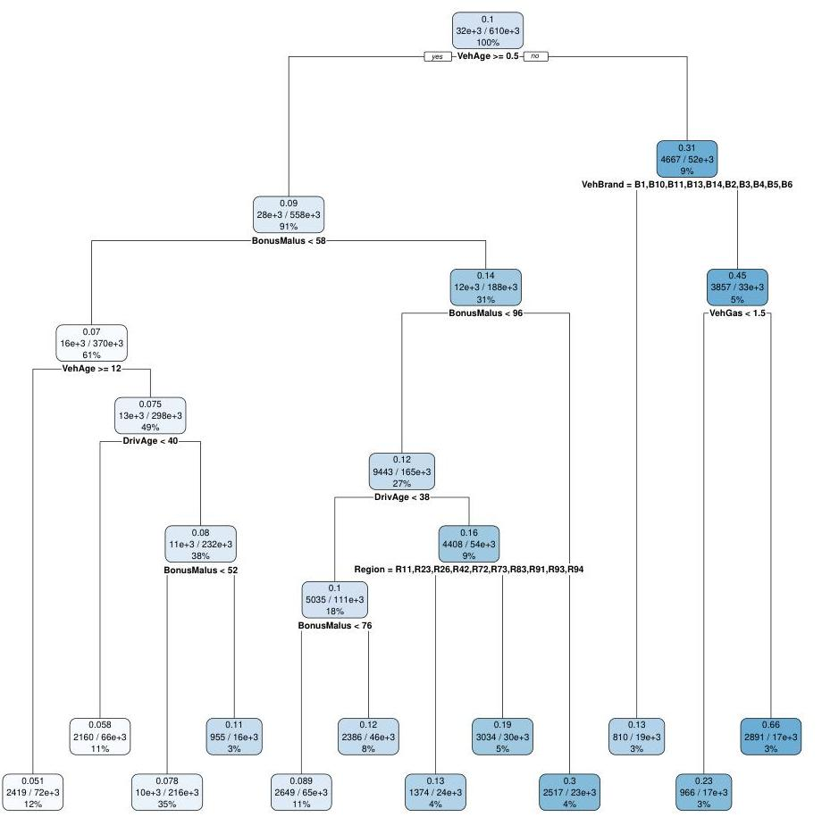

## Page 21
```
tree1
n= 610212
node), split, n, deviance, yval
    * denotes terminal node
    1) root 610212 200974.400 0.10022330
2) VehAge>=0.5 558151 169743.500 0.08994809
    4) BonusMalus< 57.5 370362 101461.700 0.07024715
            8) VehAge>=12.5 72064 16973.530 0.05143503 *
            9) VehAge< 12.5 298298 84164.510 0.07526847
            18) DrivAge< 39.5 66270 15226.200 0.05807216 *
            19) DrivAge>=39.5 232028 68740.990 0.07986978
            38) BonusMalus< 51.5 216422 63318.180 0.07771273 *
            39) BonusMalus>=51.5 15606 5310.746 0.11330850 *
5) BonusMalus>=57.5 187789 65065.950 0.14230450
    10) BonusMalus< 95.5 164996 52995.230 0.12486610
            20) DrivAge< 38.5 110593 31486.910 0.10321170
            40) BonusMalus< 76.5 64794 16984.520 0.08940581 *
            41) BonusMalus>=76.5 45799 14365.620 0.12456460 *
            21) DrivAge>=38.5 54403 21010.770 0.16420810
            42) Region=R11,R23,R26,R42,R72,R73,R83,R91,R93,R94 24398 7499.395 0.13033440 *
            43) Region=R21,R22,R24,R25,R31,R41,R43,R52,R53,R54,R74,R82 30005 13386.480 0.18607910 *
11) BonusMalus>=95.5 22793 10803.010 0.29872660 *
3) VehAge< 0.5 52061 26669.690 0.30997600
6) VehBrand=B1,B10,B11,B13,B14,B2,B3,B4,B5,B6 18594 5266.245 0.12600480 *
7) VehBrand=B12 33467 20036.520 0.44689270
14) VehGas< 1.5 16751 6140.352 0.22761110 *
15) VehGas>=1.5 16716 12955.010 0.65810310 *
```

by each split: the first split reduces the in-sample loss from $32.93518 \cdot 10^{-2}$ to $32.18770 \cdot 10^{-2}$, and the second split leads to a further reduction in in-sample loss to $31.66069 \cdot 10^{-2}$. The final tree with the 12 leaves has an in-sample loss of $30.84654 \cdot 10^{-2}$, see Table 6 . This is substantially less than the in-sample loss in the GLMs.
Listing 8 also gives the number of policies in each leaf, the biggest one having 216 ' 422 and the smallest one having 15,606 policies (note that the leaves are marked by $*$ ). Moreover, the Poisson deviance loss and the MLEs $\widehat{\lambda}_{k}$ on each leaf are provided. Note that the root tree has exactly the homogeneous MLE of $10.02 \%$ (provided in Table 3).
The class with the lowest estimated claim frequency has a value of $5.14 \%$ (VehAge $\geq 12.5$ and BonusMalus $<57.5$ ) and the class with the highest estimated claim frequency a value of $65.81 \%$ (VehAge $=0$, VehBrand $=$ B12 and VehGas $=2$ (regular gas fuel)). Thus, there seems to be an issue with new regular fuel cars of brand B12. Note that this leaf contains 16 ' 716 cars ( $3 \%$ of all policies), and also note that brand B12 is the one which has by far the biggest ratio of new cars, see Figure 13 (top, rhs). As mentioned at the end of Section 1, this gives evidence that this leaf refers to rental cars. Moreover, it illustrates that these feature components interact in a non-trivial way, which is one of the reasons why the regression tree outperforms the GLM, here.
Also interestingly, Listing 8 shows that the feature components Area and Region are not too important, because there is not a single split decision done with one of these two components. This is in line with the findings in the GLM approach.

## Page 22
# 4.3 Cross-validation for the selection of hyperparameters 

The last open question is the appropriate tree size (complexity $K$ ). This question is usually answered by 10 -fold cross-validation. Cross-validation is a widely used concept in statistics, for

Figure 15: (top, lhs) successive reduction in in-sample loss provided by each SBS in the tree of Model RT1, (top, rhs) 10 -fold cross-validation errors $\mathrm{CV}^{(10)}$ and the corresponding 1 standard error bars for trees with complexities $K=2, \ldots, 33$, (bottom) Model RT3 with 6 leaves (1-SD rule model).
this reason we only give a brief introduction and refer to Section 7.10 in Hastie et al. [12] for more details. The learning data set $\mathcal{D}$ is partitioned randomly into 10 equally sized subsets $\mathcal{D}_{1}, \ldots, \mathcal{D}_{10}$. The regression tree estimator $\widehat{\lambda}^{(-v)}$, for $v=1, \ldots, 10$, is then constructed on the learning subset $\mathcal{D} \backslash \mathcal{D}_{v}$ and validated on the validation set $\mathcal{D}_{v}$ which provides out-of-sample loss

$$
\mathcal{L}\left(\mathcal{D}_{v}, \widehat{\lambda}^{(-v)}\right)=\frac{1}{\left|\mathcal{D}_{v}\right|} \sum_{\boldsymbol{x}_{i} \in \mathcal{D}_{v}} 2 N_{i}\left[\frac{\widehat{\lambda}^{(-v)}\left(\boldsymbol{x}_{i}\right) v_{i}}{N_{i}}-1-\log \left(\frac{\widehat{\lambda}^{(-v)}\left(\boldsymbol{x}_{i}\right) v_{i}}{N_{i}}\right)\right] \geq 0
$$

Note that we do not use the test data set $\mathcal{T}$, but model fitting and model selection is done only based on the learning data set $\mathcal{D}$ by splitting this into a learning subset $\mathcal{D} \backslash \mathcal{D}_{v}$ and a validation set $\mathcal{D}_{v}$. Repeating this for all $v=1, \ldots, 10$, we receive the 10 -fold cross-validation error

$$
\mathrm{CV}^{(10)}=\frac{1}{10} \sum_{v=1}^{10} \mathcal{L}\left(\mathcal{D}_{v}, \widehat{\lambda}^{(-v)}\right)
$$

and we can calculate the corresponding empirical standard deviation of the out-of-sample losses over the different validation sets.
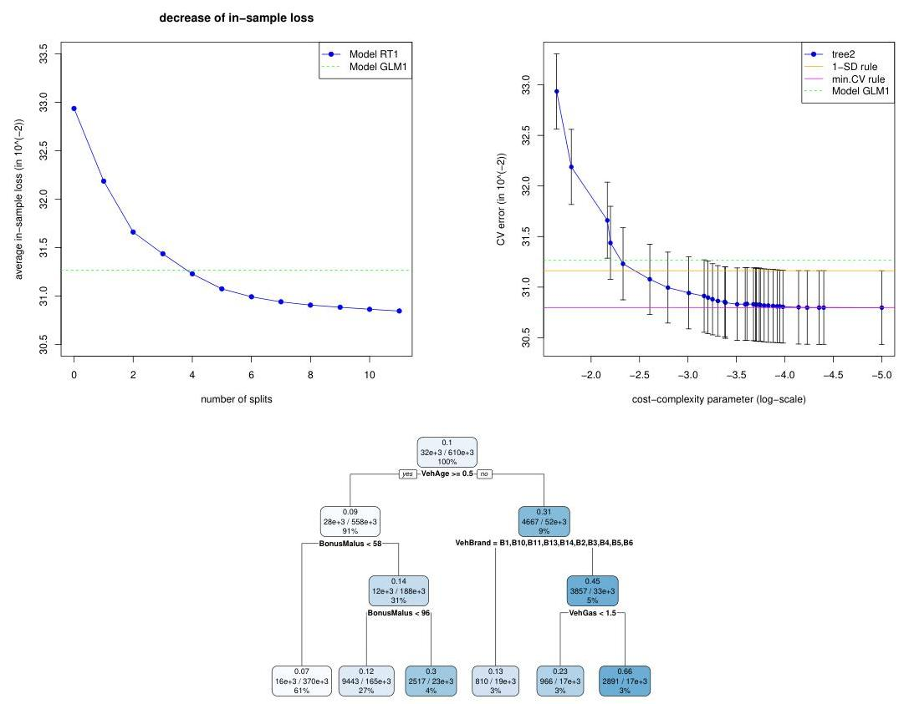

## Page 23
We construct a large SBS regression tree called tree2 by choosing a cost-complexity parameter of size $\mathrm{cp}=0.00001=10^{-5}$. This results in a tree with $K=33$ leaves. The 10 -fold crossvalidation errors $\mathrm{CV}^{(10)}$ and the corresponding 1 standard error bars are then determined for all trees with $K=2, \ldots, 33$, these are provided in Figure 15 (top, rhs). The tree with $K=33$ leaves (at position $\log _{10}(\mathrm{cp})=-5$ ) has the smallest 10 -fold cross-validation error (magenta line). The selection of this tree is called minimal cross-validation (CV) rule. We call this minimal CV rule model as Model RT2. The tree with 6 leaves is just within 1 standard deviation of the minimal CV rule tree (orange line). It corresponds to a cost-complexity parameter of roughly $\mathrm{cp}=0.003$. The selection of a tree with this cost-complexity parameter is called 1 SD rule model. It can be obtained from the large tree (tree2) by the R command tree3 $<$ prune(tree2, cp=0.003). We call this 1-SD rule model as Model RT3. It is plotted in Figure 15 (bottom). Note that for this 1-SD rule tree we only decide according to 5 split questions and only the feature components VehAge, BonusMalus, VehBrand and VehGas are considered in these splits. The biggest leaf contains more than $60 \%$ of all policies and it has an average frequency of $7 \%$. However, even this crude model has a better in-sample and out-of-sample performance than the benchmark Model GLM1, see Table 6. This might be surprising, but it

|  | run time | \# param. | in-sample loss | out-of-sample loss |
| :-- | :--: | :--: | :--: | :--: |
| homogeneous model | - | 1 | 32.93518 | 33.86149 |
| Model RT1 | 23 s | 12 | 30.84654 | 31.79307 |
| Model RT2 (min. CV rule) | 25 s | 33 | 30.70841 | $\mathbf{3 1 . 6 9 3 2 6}$ |
| Model RT3 (1-SD rule) | 25 s | 6 | 31.07469 | 31.97508 |
| Model GLM1 | 20 s | 49 | 31.26738 | 32.17123 |

Table 6: run times (this includes 10 -fold CV for trees), number of parameters, in-sample and out-of-samples losses; regression tree leaves have minimal size 10'000, units are in $10^{-2}$.
may indicate that feature selection and pre-processing has not been done properly for the GLM approach, in particular, we have not been studying interactions in feature components in the GLM model. The regression tree approach however has shown that such interactions exist, for instance, between VehAge, VehBrand and VehGas to select rental cars. Remark that customers with private cars maybe priced as rental cars if they have an unlucky feature combination (and we do not include a feature component indicating rental versus private car).
We also observe from Table 6 that even for the biggest tree Model RT2 we do not get overfitting, measured by the out-of-sample loss. This has mainly to do with the fact that we choose minbucket=10000 comparably large, which supports a small confidence interval according to our rule-of-thumb (4.3).
In the above approach one could argue that cross-validation is not needed because the minimal leave size of 10'000 already takes care of potential over-fitting. Indeed, this is the case here. If we decrease the minimal leave size to 1000 we obtain the cross-validation picture illustrated in Figure 16. This looks much more typical, having a minimum and afterwards cross-validation losses start to increase which indicates in-sample over-fitting. If we choose the tree with the smallest cross-validation loss (minimal CV rule), we obtain the results given in Table 7, which give an out-of-sample improvement. We call this tree Model RT 1000.

## Page 24
|  | run time | \# param. | in-sample loss | out-of-sample loss |
| :-- | :--: | :--: | :--: | :--: |
| homogeneous model | - | 1 | 32.93518 | 33.86149 |
| Model RT 1000 | 62 s | 65 | 30.37084 | $\mathbf{3 1 . 5 0 3 7 4}$ |
| Model GLM1 | 20 s | 49 | 31.26738 | 32.17123 |

Table 7: run times (this includes 10 -fold CV for the tree), number of parameters, in-sample and out-of-samples losses, regression tree leaves have minimal size 1000, units are in $10^{-2}$.

Figure 16: 10 -fold cross-validation errors $\mathrm{CV}^{(10)}$ and the corresponding 1 standard error bars for trees based on a minimal size of leaves of 1000 policies.

# 4.4 Extensions of regression trees 

Extensions include bootstrap aggregation (called bagging) where bootstrapping from the estimated (large) SBS regression tree model allows for averaging. This extension mainly reduces the estimation variability, but not the possible estimation bias. Another extension is random forest, which is related to bagging, but for the regression tree constructions on the bootstrap samples only randomly chosen subsets of feature components are used for making split decisions. Of course, in the latter case we may miss the optimal SBS, but repeating this sufficiently often leads to more stability in the estimators. Both methods bagging and random forest belong to the family of ensemble learning methods.
Another extension is to consider so-called model trees that replace the homogeneous MLE on each leaf (4.2) by linear regression functions, see Wang-Witten [30].

## 5 Boosting machines

We consider a Poisson boosting machine for our claim frequency modeling problem. The Poisson boosting machine is based on the SBS regression tree algorithm with the Poisson deviance loss as objective function (presented in the previous section). The idea behind boosting is to combine many weak learners in a stage-wise adaptive fashion to receive a (more) powerful learner, where
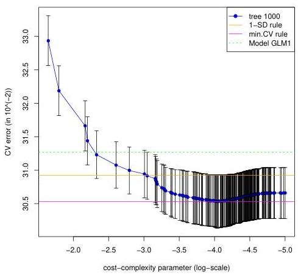

## Page 25
weak learner means that we have a predictive model that is just slightly better than random guessing. In a nutshell, we will construct a SBS regression tree estimator having only very few leaves. This crude tree provides a weak estimator. Based on this weak estimator, we calculate (a form of) residuals. These residuals are then used as new responses for constructing a next weak estimator. Iterating this procedure (in a stage-wise adaptive way) leads to a powerful estimator, called boosting machine estimator. Boosting machines go back to Valiant [29], Kearns-Valiant $[16,17]$, Schapire [25], Freund [8] and Freund-Schapire [9], for more details we refer to Section 7.4 in Wüthrich-Buser [35]. The boosting approach taken here may not seem to be classical for boosting because one typically considers generic gradient boosted regression trees, however, having the Poisson model we can (more) directly explore boosting, see also Lee-Lin [18]. For a broader overview on different boosting algorithms we refer to the SAV tutorial of FerrarioHämmerli [5].

# 5.1 Feature pre-processing for boosting machines 

The features do not need pre-processing, and we can directly choose $\mathcal{X}=\check{\mathcal{X}}$. We also refer to the remark in Section 4.1.

### 5.2 Poisson boosting machine estimators

We construct the regression tree estimator given in (4.1), say, for $K=2$ as starting value of the boosting algorithm. That is, we derive an estimator with $K=2$ leaves (and with one split; this is also called tree stump). We denote this regression tree estimator (starting value) by

$$
\widehat{\lambda}^{(1)}(\boldsymbol{x})=\widehat{\lambda}_{1} \mathbb{1}_{\left\{\boldsymbol{x} \in \mathcal{X}_{1}\right\}}+\widehat{\lambda}_{2} \mathbb{1}_{\left\{\boldsymbol{x} \in \mathcal{X}_{2}\right\}}
$$

with $\widehat{\lambda}_{k}$ being the empirical mean on $\mathcal{X}_{k}$ for $k=1,2$. We call this first regression tree estimator $\widehat{\lambda}^{(1)}: \mathcal{X} \rightarrow \mathbb{R}_{+}$a weak learner because we have partitioned the feature space $\mathcal{X}$ only once. This weak learner is (slightly) better than the homogeneous estimator on $\mathcal{X}$ because we consider one partition of the feature space that leads to slightly more homogeneity w.r.t. our objective function. Estimator $\widehat{\lambda}^{(1)}$ initializes the Poisson boosting machine, and it provides an estimated Poisson regression model

$$
N_{i} \stackrel{\text { ind. }}{\sim} \operatorname{Poi}\left(\widehat{\lambda}^{(1)}\left(\boldsymbol{x}_{i}\right) v_{i}\right), \quad \text { for } i=1, \ldots, n
$$

We can now back-test and refine this model by testing whether we need another (multiplicative) regression function to improve $\widehat{\lambda}^{(1)}(\cdot)$. For this we define the working weights

$$
w_{i}^{(2)}=\widehat{\lambda}^{(1)}\left(\boldsymbol{x}_{i}\right) v_{i}, \quad \text { for } i=1, \ldots, n
$$

We then replace the regression assumption (2.1) in the basic model as follows

$$
\mu: \mathcal{X} \rightarrow \mathbb{R}_{+}
$$

such that all insurance policies $i=1, \ldots, n$ have distributional property

$$
N_{i} \stackrel{\text { ind. }}{\sim} \operatorname{Poi}\left(\mu\left(\boldsymbol{x}_{i}\right) w_{i}^{(2)}\right)
$$

## Page 26
The (unknown) regression function can again be estimated by a SBS regression tree estimator having $K=2$ leaves, and where we use the working weights $w_{i}^{(2)}$ as new volumes. Denote the resulting regression tree estimator (weak learner) by

$$
\widehat{\mu}^{(2)}(\boldsymbol{x})=\widehat{\mu}_{1}^{(2)} \mathbb{1}_{\left\{\boldsymbol{x} \in \mathcal{X}_{1}^{(2)}\right\}}+\widehat{\mu}_{2}^{(2)} \mathbb{1}_{\left\{\boldsymbol{x} \in \mathcal{X}_{2}^{(2)}\right\}}
$$

with $\widehat{\mu}_{k}^{(2)}$ being the empirical means on the resulting partition $\left(\mathcal{X}_{k}^{(2)}\right)_{k=1,2}$ given by

$$
\widehat{\mu}_{k}^{(2)}=\frac{\sum_{i=1}^{n} \mathbb{1}_{\left\{\boldsymbol{x}_{i} \in \mathcal{X}_{k}^{(2)}\right\}} N_{i}}{\sum_{i=1}^{n} \mathbb{1}_{\left\{\boldsymbol{x}_{i} \in \mathcal{X}_{k}^{(2)}\right\}} w_{i}^{(2)}}
$$

This then gives an improved regression function estimator $\widehat{\lambda}^{(2)}: \mathcal{X} \rightarrow \mathbb{R}_{+}$defined by

$$
\boldsymbol{x} \mapsto \widehat{\lambda}^{(2)}(\boldsymbol{x})=\widehat{\mu}^{(2)}(\boldsymbol{x}) \widehat{\lambda}^{(1)}(\boldsymbol{x})
$$

Thus, the resulting regression estimator $\widehat{\lambda}^{(2)}(\cdot)$ is a product of two weak learners. Of course, this can now be iterated, say, $M$ times. Therefore, we define recursively for $m=3, \ldots, M$ the working weights

$$
w_{i}^{(m)}=\widehat{\mu}^{(m-1)}\left(\boldsymbol{x}_{i}\right) w_{i}^{(m-1)}=\widehat{\lambda}^{(m-1)}\left(\boldsymbol{x}_{i}\right) v_{i}, \quad \text { for } i=1, \ldots, n
$$

The weak learner $\widehat{\mu}^{(m)}: \mathcal{X} \rightarrow \mathbb{R}_{+}$is then found by a SBS regression tree partition with working weights $\left(w_{i}^{(m)}\right)_{i=1, \ldots, n}$ and resulting in $K=2$ new leaves. This weak learner allows us to update the regression function $\widehat{\lambda}^{(m-1)}(\cdot)$ recursively as follows

$$
\widehat{\lambda}^{(m)}(\boldsymbol{x})=\widehat{\mu}^{(m)}(\boldsymbol{x}) \widehat{\lambda}^{(m-1)}(\boldsymbol{x})=\prod_{j=2}^{m} \widehat{\mu}^{(j)}(\boldsymbol{x}) \widehat{\lambda}^{(1)}(\boldsymbol{x})
$$

This algorithm, called Poisson boosting machine, provides an estimator

$$
\widehat{\lambda}^{(M)}: \mathcal{X} \rightarrow \mathbb{R}_{+}
$$

which is a product of $M$ weak learners, each coming from one split of $\mathcal{X}$.
Remarks 5.1 More from a statistical viewpoint, we can interpret the above boosting machine as an iterated improvement of an offset variable. Note that the canonical link function for the Poisson model is the log-link. Therefore, the logarithmized working weights $\log \left(w_{i}^{(m)}\right)$, see (5.2), play the role of offsets in the canonical parameter scale. The recursive procedure then leads to a successive refinement of these offsets, until no further regression model is needed.

The Poisson boosting algorithm is provided in Listing 9 (observe that on line 1 we choose a tree of depth $J=1$ which corresponds to $K=2$ leaves). We iterate the construction of a weak learner $M=30$ times, and the working weights are stored in learn\$fit. We call this model as Model PBM1. Note from Listing 9 that we do the calculation in parallel for the test data set $\mathcal{T}$ so that we can easily calculate the out-of-sample loss. In Figure 17 (top, lhs) we report the decrease in in-sample loss for each iteration $m=1, \ldots, M=30$ of the algorithm. After 30 iterations we have an in-sample loss of $31.12215 \cdot 10^{-2}$. This in-sample loss is in between the one of the regression tree Model RT2 (min. CV rule, 33 leaves) and the one of Model GLM1,

## Page 27
Figure 17: decrease of in-sample loss of the Poisson boosting machine for parameters (top, lhs) $K=2$ (depth $J=1$ ) and $M=30$, (top, rhs) $J=2$ and $M=50$, (bottom) $J=3$ and $M=50$.
blue and green dotted lines in Figure 17. Thus, for the boosting machine Model PBM1 we consider $M=30$ splits (for a SBS tree with $K=2$ ) which is of similar size as the 32 SBS for the regression tree Model RT2 with 33 leaves, but the performance is slightly worse.
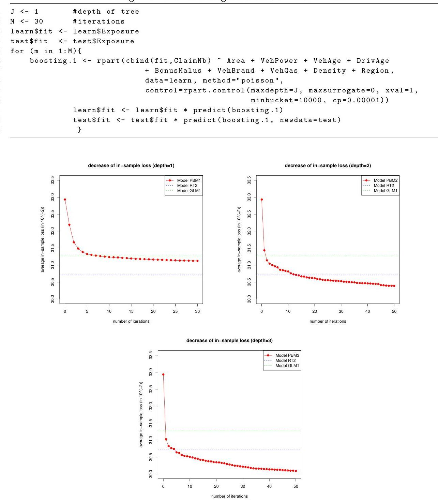

## Page 28
To improve the in-sample loss, we can now either increase the number of iterations $M$ or we can increase the depth $J$ of the weak learner (or also both of them). The former does not lead to much improvement because the decrease of in-sample loss in Figure 17 (top, lhs) is rather slow, we also refer to Remarks 5.2, below. Therefore, we also need to increase the depth $J$ of the tree, i.e. make the weak learner slightly less weak by choosing bigger regression trees. Note, however, that we do not want too big trees because the calculation should still be fast, and the learner still weak, otherwise we may run into over-fitting problems. The latter also holds true if $M$ is chosen too large.
We analyze two models of depths $J=2$ and 3 (distance between root node and leaves), and each having $M=50$ iterations. We call these models Model PBM2 and Model PBM3, respectively. Note that in the R function rpart we can easily control the depth of the resulting tree by the control variable maxdepth $=J$, but we cannot easily control the number of leaves. A tree of depth $J=2$ has either 3 or 4 leaves, all at distance 2 of the root node. Whether we receive 3 or 4 leaves depends on the explicit choice of the cost-complexity parameter cp. The results are presented in Figure 17 (top, rhs and bottom). We see that Model PBM2 of depth $J=2$ outperforms (in-sample) after 15 iterations the regression tree estimator Model RT2 with 33 leaves, Figure 17 (middle). In Table 8 we also report the corresponding out-of-sample losses. This shows

|  | run time | in-sample loss | out-of-sample loss |
| :-- | :--: | :--: | :--: |
| Model PBM1 (depth $J=1$, iter. $M=30$ ) | 26 s | 31.12215 | 32.08332 |
| Model PBM2 (depth $J=2, M=50$ ) | 48 s | 30.39588 | 31.57577 |
| Model PBM3 (depth $J=3, M=50$ ) | 55 s | 30.13151 | $\mathbf{3 1 . 4 6 8 4 2}$ |
| Model RT2 (min. CV rule, 33 leaves) | 25 s | 30.70841 | 31.69326 |
| Model RT 1000 | 62 s | 30.37084 | 31.50374 |
| Model GLM1 | 20 s | 31.26738 | 32.17123 |

Table 8: run times, in-sample and out-of-samples losses of the three boosting machine predictions, the regression tree and of the GLM approach, units are in $10^{-2}$.
that we should go for Model PBM3 which has $M=50$ boosting iterations of weak learners of depth $J=3$. An out-of-sample analysis shows that this model starts to over-fit after 40 to 50 iterations, thus, we should rather decrease $M$ for depth $J=3$.

Remarks 5.2 We emphasize that the results of Model PBM1 are rather close to the ones of Model GLM1. There is a special reason for this. Trees of depth $J=1$ (tree stumps) only allow to split the feature space once in each iteration, and as a result, the product in (5.4) leads to a regression function that only has multiplicative interaction terms between the feature components. This property also holds true in the Poisson GLM because we have an additive structure on the canonical scale. Thus, to have more general interactions than GLMs we need to use trees that go beyond tree stumps, and otherwise the Poisson boosting machine leads to results comparable to GLMs (if features are appropriately pre-processed).

## Page 29
# 5.3 Extensions of boosting machines 

### 5.3.1 Shrinkage of weak learners

The above Poisson boosting machine has two hyperparameters $K$ and $M$ that control the complexity of the estimator and over-fitting. Often, one introduces a third hyperparameter $\nu \in(0,1]$, called shrinkage factor. This shrinkage factor $\nu$ is used to make the weak learners $\widehat{\mu}^{(m)}, m \geq 2$, even weaker. We explain this for $m=2$, see (5.3). The initial estimator $\widehat{\lambda}^{(1)}$ given in (5.1) is the optimal estimator (MLE) on the initial partition $\left(\mathcal{X}_{1}^{(1)}, \mathcal{X}_{2}^{(1)}\right)=\left(\mathcal{X}_{1}, \mathcal{X}_{2}\right)$. Therefore, the weak learner (5.3) modifies the root tree estimator being equal to 1 under working weights (5.2). This modification can be made weaker (moved more towards 1) by replacing the estimator (5.3) by

$$
\widehat{\mu}^{(2, \nu)}(\boldsymbol{x})=\left(\widehat{\mu}_{1}^{(2)} \mathbb{1}_{\left\{\boldsymbol{x} \in \mathcal{X}_{1}^{(2)}\right\}}+\widehat{\mu}_{2}^{(2)} \mathbb{1}_{\left\{\boldsymbol{x} \in \mathcal{X}_{2}^{(2)}\right\}}\right)^{\nu}
$$

This, of course, can then be iterated for $m=3, \ldots, M$, replacing working weights and estimators in Section 5.2 by their shrinkaged counterparts to receive $\widehat{\mu}^{(m, \nu)}$ and $\widehat{\lambda}^{(m, \nu)}$, respectively. Note that the choice $\nu=1$ means that we do not apply shrinkage.

|  | in-sample loss | out-of-sample loss |
| :-- | :--: | :--: |
| Model PBM3 (depth $J=3$, iterations $M=50$ ) | 30.13151 | 31.46842 |
| Shrinkage $\nu=0.75$ (depth $J=3$, iterations $M=50$ ) | 30.13530 | 31.29794 |
| Shrinkage $\nu=0.50$ (depth $J=3$, iterations $M=50$ ) | 30.19737 | 31.33977 |

Table 9: in-sample and out-of-samples losses of the boosting machine Model PBM3 compared to the shrinkaged counterparts with shrinkage factors $\nu=0.75,0.50$ for hyperparameters $J=3$ and $M=50$ units are in $10^{-2}$.

In Table 9 we compare the Poisson boosting machine Model PBM3 (depth $J=3$, iterations $M=50$ ) to its shrinkaged counterparts with shrinkage factors $\nu=0.75,0.50$. We observe a slightly bigger in-sample loss (for the same model complexity), but a smaller out-of-sample loss for the shrinkaged counterparts. Based on a cross-validation analysis we could now choose optimal hyperparameters $(K, M, \nu)$, and an other option that we have not explored, yet, is the optimal size of the leaves of the trees. We refrain from providing an explicit analysis and continue with Model PBM3, below.

### 5.3.2 Boosting the GLM

We could also apply this technique to other weak learners or regression models. Another interesting application of boosting is that it can be used to back-test models, for instance, the GLM can be back-tested with a Poisson regression tree boosting machine. In Figure 18 we apply the boosting machine to Model GLM1, i.e. we use the GLM estimate as starting value of the boosting algorithm, replacing starting value (5.1). We then run $M=50$ iterations of SBS regression trees of depth $J=3$. The in-sample and out-of-sample performance is shown (for each iteration) in Figure 18, and the results are summarized in Table 10 under Model GLMBoost. We observe that for our example the resulting estimate is even slightly better than the Model PBM3 estimate. From Figure 18 (rhs) we see that we could further iterate the boosting procedure because we do not over-fit, yet. However, this picture is not allowed to be used for that question, because the test data should not be used for fine-tuning hyperparameters.

## Page 30
Figure 18: decrease of in-sample (lhs) and out-of-sample (rhs) loss of the Poisson boosting machine of depth $J=3$ applied to Model GLM1.

|  | in-sample loss | out-of-sample loss |
| :-- | :--: | :--: |
| Model GLMBoost | 30.15295 | 31.40935 |
| Model PBM3 (depth $J=3$, iterations $M=50$ ) | 30.13151 | 31.46842 |
| Model RT2 (min. CV rule, 33 leaves) | 30.70841 | 31.69326 |
| Model RT 1000 | 30.37084 | 31.50374 |
| Model GLM1 | 31.26738 | 32.17123 |

Table 10: in-sample and out-of-samples losses of the GLMBoost prediction, the boosting machine, the regression tree and of the GLM approach, units are in $10^{-2}$.

Remarks 5.3 An issue in regression tree applications is that estimates are not stable over time, i.e. collecting more information (of new accounting years) may heavily distort the old estimates. This may be the case because new information may lead to a completely different SBS near the root of the regression tree. Of course, this is not a desired property in insurance pricing because it may imply that insurance premiums are very volatile over time. An idea to smooth prices over time is to use a boosting step for the update from one year to the next, i.e. to use the old estimate as prior value, so to say, and then refine this old estimate with the new information applying a boosting step. This idea has been proposed in Wüthrich [33].

# 6 Neural networks 

In this section we introduce feed-forward neural networks. There are two types of feed-forward neural networks: shallow neural networks which have one hidden layer, and deep neural networks which have more than one hidden layer. An illustration of a shallow and a deep neural network (with two hidden layers) is given in Figure 19. For simplicity, we only consider shallow neural networks here. For a general overview on neural networks we refer to LeCun et al. [19] and the references therein. An applied introduction to the use of feed-forward neural networks is given
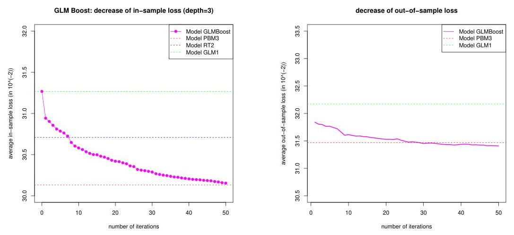

## Page 31
Figure 19: (lhs) shallow neural network with $q=20$ neurons in the hidden layer; (rhs) deep neural network with $q_{1}=10$ and $q_{2}=7$ hidden neurons in the first and second hidden layer.
by Nielsen [20], and we treat neural networks in depth in our tutorials Ferrario et al. [6] and Schelldorfer-Wüthrich [26].

# 6.1 Feature pre-processing for neural networks 

For unordered categorical feature components one usually starts with dummy coding or one-hot encoding to get numerical features, see Table 4 for an example of one-hot encoding and dummy coding, respectively. ${ }^{10}$ In neural network calibrations also continuous feature components need pre-processing. The reason is that one often uses the gradient descent method for model fitting. This method requires that all feature components live on a similar scale, otherwise it does not work properly. Therefore, we apply appropriate strictly monotone transformations to all feature components. The simplest strictly monotone transformation is provided by the following mapping (called MinMaxScaler)

$$
x_{l} \mapsto x_{l}^{*}=2 \frac{x_{l}-\min x_{l}}{\max x_{l}-\min x_{l}}-1 \in[-1,1]
$$

where the minimum and the maximum in (6.1) correspond to the minimal and maximal value of the domain of $x_{l}$ (assumed that it is bounded). In practice, one often chooses the minimal and maximal value of $x_{l}$ on the considered portfolio for $\min x_{l}$ and $\max x_{l}$, respectively. ${ }^{11}$ If $x_{l}$ allows for outliers, then transformation (6.1) will not provide a useful transformation for the application of the gradient descent method. In that case one should apply a different monotone transformation, for instance, a log-transformation might be helpful. The resulting transformed feature components $x_{l}^{*}$ should look similar to uniformly distributed samples on $[-1,1]$.

[^0]
[^0]:    ${ }^{10}$ In our tutorial Schelldorfer-Wüthrich [26] we promote that categorical features should be implemented by embedding layers, similar to natural language processing (NLP).
    ${ }^{11}$ Note that the SAME minimal and maximal value needs to be applied to both learning data AND test data.
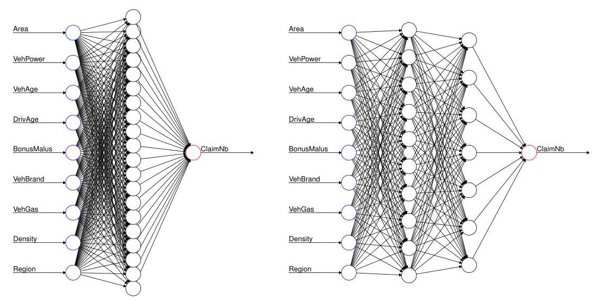

## Page 32
Assume that we have transformed all feature components accordingly. By an abuse of notation, we again denote the transformed feature space by $\mathcal{X}$, where now all feature components are numerical and in $[-1,1]$.

# 6.2 Shallow neural network estimators 

For neural network predictive modeling we make the following assumptions.
Model Assumptions 6.1 (Poisson shallow neural network model) Choose feature space $\mathcal{X}$ as described in Section 6.1. Fix $q \in \mathbb{N}$ and define the regression function $\lambda: \mathcal{X} \rightarrow \mathbb{R}_{+}$by

$$
\boldsymbol{x} \mapsto \log \lambda(\boldsymbol{x})=\beta_{0}+\sum_{j=1}^{q} \beta_{j} z_{j}(\boldsymbol{x})
$$

with hidden neurons $z_{j}(\boldsymbol{x})$, for $j=1, \ldots, q$, given by

$$
\boldsymbol{x} \mapsto z_{j}(\boldsymbol{x})=\phi\left(w_{j, 0}+\sum_{l=1}^{d} w_{j, l} x_{l}\right)
$$

and with network parameter $\boldsymbol{\theta}=\left(\beta_{0}, \ldots, \beta_{q}, w_{1,0}, \ldots, w_{q, d}\right)^{\prime} \in \mathbb{R}^{q+1+q(d+1)}$ and (non-linear) activation function $\phi: \mathbb{R} \rightarrow \mathbb{R}$. Assume that for $i \geq 1$

$$
N_{i} \stackrel{\text { ind. }}{\sim} \operatorname{Poi}\left(\lambda\left(\boldsymbol{x}_{i}\right) v_{i}\right)
$$

## Remarks 6.2

- Parameter $q \in \mathbb{N}$ can be considered as a hyperparameter that determines the architecture and the complexity of the network. Model selection may optimize over this hyperparameter, often it is just chosen "sufficiently" large.
- The most popular activation functions are given by the following choices

$$
\phi(x)=\left\{\begin{array}{cl}
\frac{1}{1+e^{-x}} & \text { sigmoid activation function, } \\
\tanh (x) & \text { hyperbolic tangent activation function, } \\
\mathds{1}_{\{x \geq 0\}} & \text { step function activation, } \\
x \mathbb{1}_{\{x \geq 0\}} & \text { rectified linear unit (ReLU) activation function. }
\end{array}\right.
$$

The sigmoid and the hyperbolic tangent activation functions are differentiable which is an advantage in calibration because the gradient descent method requires calculation of gradients. Step function activation is useful in interpretations since it leads to partitions of the feature space. This is in analogy to regression trees, however, the splits are more general than the SBS of Section 4.2.

- Function (6.3) is sometimes called ridge function: first, we apply a scalar product (projection) to reduce the (large) dimension $d$ to 1 ; second, we apply a non-linear transformation $\phi$ to the projection. Since in the dimension reduction step we loose a lot of information, we apply several different projections in parallel which results in different neurons $z_{1}(\boldsymbol{x}), \ldots, z_{q}(\boldsymbol{x})$. These neurons are then used as "new features" for the log-linear regression (6.2) of GLM type. Thus, we can interpret this shallow neural network as a GLM on newly learned features $z_{1}(\boldsymbol{x}), \ldots, z_{q}(\boldsymbol{x})$. The latter is sometimes also called a learned representation (that is similar to data pre-processing).

## Page 33
- The power of (shallow) neural networks is explained by the following crucial theorem of Cybenko [4] and Hornik et al. [14]. Choose the sigmoid activation function. Any compactly supported and continuous function $f: \mathcal{X} \rightarrow \mathbb{R}$ can be approximated arbitrarily well (in supremum norm) by a shallow neural network function if we allow for arbitrary $q \in \mathbb{N}$.
This means that the family of shallow neural networks provides a dense basis for compactly supported continuous regression functions. Similar results hold for other (non-polynomial) activation functions. These results are commonly called universality theorems.
These universality theorems also explain that from an approximation point of view, shallow neural networks are sufficient. However, from a computational point of view deep neural networks may have better convergence properties in calibrations compared to shallow ones, in particular, because they can capture interactions more efficiently. We may think of increasing $q$ in shallow neural networks is similar to super-imposing more basis functions. On the other hand, by adding more hidden layers we start to compose functions and recent results show that composition of functions can improve polynomial approximation rates to exponential ones, see Grohs et al. [11].

There remains the estimation of the network parameter $\boldsymbol{\theta}=\left(\beta_{0}, \ldots, \beta_{q}, w_{1,0}, \ldots, w_{q, d}\right)^{\prime} \in$ $\mathbb{R}^{q+1+q(d+1)}$ (for given hyperparameter $q$ ). The corresponding Poisson deviance loss of observations $\mathcal{D}$ and under Model Assumptions 6.1 is given by

$$
\mathcal{L}(\mathcal{D}, \boldsymbol{\theta})=\frac{1}{n} \sum_{i=1}^{n} 2 N_{i}\left[\frac{\lambda\left(\boldsymbol{x}_{i}\right) v_{i}}{N_{i}}-1-\log \left(\frac{\lambda\left(\boldsymbol{x}_{i}\right) v_{i}}{N_{i}}\right)\right]
$$

Minimization of $\mathcal{L}(\mathcal{D}, \boldsymbol{\theta})$ in $\boldsymbol{\theta}$ provides the MLE. Typically, this MLE cannot be found because the function $\boldsymbol{\theta} \mapsto \mathcal{L}(\mathcal{D}, \boldsymbol{\theta})$ is too complex (and non-convex). Importantly, in general, we are not interested in finding the (in-sample) MLE (for general $q$ ) because typically this leads to a highly over-fitted model, i.e. the resulting in-sample loss may be very small but predictive power as well (see remark on universality theorems, above). Thus, the challenging part in neural network calibration is to find a good balance between minimizing in-sample losses and not over-fitting to the observations. The method usually used for finding optimal network parameters is the gradient descent method, and the task of not over-fitting is the art of stopping the gradient descent algorithm at the right time point (sometimes also called early stopping). Other methods used to prevent from over-fitting are penalty terms (like ridge or LASSO penalizing) or dropout layers, for more details see Ferrario et al. [6].
We briefly explain the methodology behind the gradient descent algorithm. It is based on the Taylor expansion and aims at locally improving the loss function by performing adaptive optimal steps in the parameter space. Assume that we are at position $\boldsymbol{\theta}^{(t)}$ after the $t$-th step of the algorithm. The locally optimal move in the next step is given by

$$
\boldsymbol{\theta}^{(t)} \mapsto \boldsymbol{\theta}^{(t+1)}=\boldsymbol{\theta}^{(t)}-\varrho_{t} \nabla_{\boldsymbol{\theta}} \mathcal{L}\left(\mathcal{D}, \boldsymbol{\theta}^{(t)}\right)
$$

for a tempered learning rate $\varrho_{t}>0$ such that the first order term still being the dominant one in the Taylor expansion of $\mathcal{L}\left(\mathcal{D}, \boldsymbol{\theta}^{(t)}\right)$. Iteration of this algorithm (for appropriately tempered learning rates) will converge to a local minimum of $\boldsymbol{\theta} \mapsto \mathcal{L}(\mathcal{D}, \boldsymbol{\theta})$; and different starting points of the algorithm may be explored to analyze potential different local minimas. Starting points are usually chosen at random, in fact, we are in a situation, here, where we have infinitely many

## Page 34
comparably good models and the explicit choice is (a) less important and (b) subjective, for more on this topic we refer to Ferrario et al. [6] and Schelldorfer-Wüthrich [26].

# Remarks 6.3 

- The gradient descent algorithm as described above should not be iterated until convergence. As soon as the decrease in the loss function is no longer substantial the algorithm starts to potentially over-fit (in-sample) and it should be stopped (early stopping), see Section 4 in Ferrario et al. [6]. Over-fitting may be monitored using a validation sample.
- The gradient descent method (6.4) requires calculation of the gradients. For deep neural networks this is done efficiently using the back-propagation method of Werbos [31]; Nielsen [20] provides a tutorial on back-propagation. For a shallow neural network the gradients can easily be obtained (without back-propagation) from

$$
\frac{\partial}{\partial \beta_{j}} \log \lambda(\boldsymbol{x})=z_{j}(\boldsymbol{x}), \quad \text { for } j=0, \ldots, q
$$

and

$$
\frac{\partial}{\partial w_{j, l}} \log \lambda(\boldsymbol{x})=\beta_{j} \phi^{\prime}\left(w_{j, 0}+\sum_{l^{\prime}=1}^{d} w_{j, l^{\prime}} x_{l^{\prime}}\right) x_{l}, \quad \text { for } j=1, \ldots, q \text { and } l=0, \ldots, d
$$

where we set $z_{0}(\boldsymbol{x})=x_{0}=1$ and assume that the activation function $\phi$ is differentiable. Note that for the sigmoid activation function we have $\phi^{\prime}=\phi(1-\phi)$ and for the hyperbolic tangent activation function we have $\phi^{\prime}=1-\phi^{2}$.

- One might be tempted to consider higher order Taylor expansions in (6.4). However, usually this is computationally not feasible. Therefore, one rather applies a momentumbased gradient descent method which is inspired by mechanics in physics, see Rumelhart et al. [24]. Consider a momentum vector $\boldsymbol{v}^{(t)}$ of the same dimension as $\boldsymbol{\theta}$ and a momentum coefficient $\kappa \in[0,1)$. The momentum vector is a weighted average of the previously observed gradients and is updated in the $(t+1)$-st step by

$$
\boldsymbol{v}^{(t)} \mapsto \boldsymbol{v}^{(t+1)}=\kappa \boldsymbol{v}^{(t)}-\varrho_{t} \nabla_{\boldsymbol{\theta}} \mathcal{L}\left(\mathcal{D}, \boldsymbol{\theta}^{(t)}\right)
$$

Update (6.4) is then replaced by

$$
\boldsymbol{\theta}^{(t)} \mapsto \boldsymbol{\theta}^{(t+1)}=\boldsymbol{\theta}^{(t)}+\boldsymbol{v}^{(t+1)}
$$

Remark that in many optimization packages such momentum improved gradient descent algorithms are available with pre-chosen parameters (like adam, nadam or rmsprop optimizers).

- Evaluation of the gradient in (6.4) may still be time consuming because it involves highdimensional matrix multiplications. If we calculate the gradient on the entire data $\mathcal{D}$ and use (6.4) then we apply the so-called steepest gradient descent method. Often for big data, one first chooses a random sub-sample $\mathcal{D}^{b} \subset \mathcal{D}$ of, for instance, $10 \%$ of the entire data $\mathcal{D}$ and then one applies a locally optimal move w.r.t. $\mathcal{L}\left(\mathcal{D}^{b}, \boldsymbol{\theta}^{(t)}\right)$. Iterating this algorithm for $b \geq 1$ is called stochastic gradient descent method. These random sub-samples are often called mini-batches. The corresponding code with sigmoid activation function is given in Listing 10. This example neither considers a momentum nor a tempered learning rate.

## Page 35
Listing 10: gradient descent method for a shallow neural network with sigmoid activation

```
for (b in 1:B){ # number B of random mini-batches runs
    set.seed(100*b)
    ll <- sample(c(1:nrow(X)), round(size.B*nrow(X)), replace = FALSE)
    X.t <- X[ll,] # choice of mini-batch design matrix for size.B in (0,1]
    Y.t <- Y[ll,] # choice of mini-batch volumes and claims
    n.t <- nrow(X.t) # size of mini-batch (size.B of n)
    z.t <- array(1, c(q+1, n.t))
    z.t[-1,] <- (1+exp(-W %*% t(X.t)))^(-1) # neurons for matrix W
    lambda.t <- exp(t(beta) %*% z.t) # frequencies for beta
    for (s in 1:S){ # number S of gradient descent steps per b
        delta.2 <- 2*(lambda.t*Y.t[,1] - Y.t[,2])
        grad.beta <- z.t %*% t(delta.2) # gradient beta
        delta.1 <- (beta[-1,] %*% delta.2) * z.t[-1,] * (1 - z.t[-1,])
        grad.W <- delta.1 %*% as.matrix(X.t) # gradient W
        beta <- beta - rho[2] * grad.beta/sqrt(sum(grad.beta^2)) # learning rate rho[2]
        W <- W - rho[1] * grad.W/sqrt(sum(grad.W^2)) # learning rate rho[1]
        z.t[-1,] <- (1+exp(-W %*% t(X.t)))^(-1)
        lambda.t <- exp(t(beta) %*% z.t)
```

In Table 11 we provide the results obtained from a shallow neural network with $q=20$ hidden neurons. We observe a similar out-of-sample performance as for the boosting method, though

|  | in-sample loss | out-of-sample loss |
| :-- | :--: | :--: |
| Model NN (shallow with $q=20$ ) | 30.45048 | 31.58770 |
| Model PBM3 (depth $J=3$, iterations $M=50$ ) | 30.13151 | 31.46842 |
| Model RT2 (min. CV rule, 33 leaves) | 30.70841 | 31.69326 |
| Model RT 1000 | 30.37084 | 31.50374 |
| Model GLM1 | 31.26738 | 32.17123 |

Table 11: in-sample and out-of-samples losses of the neural network predictions, the boosting machine, the regression tree and of the GLM approach, units are in $10^{-2}$.
slightly worse. These results are obtained after roughly 1'000 iterations of a momentum-based (steepest) gradient descent method with tempered (decreasing) learning rates and fixed momentum coefficients, for simplicity not illustrated in Listing 10. Note that we do not want to describe the latter in more detail because in practice one typically uses an off-the-shelf gradient descent algorithm, which is easily available in TensorFlow, Keras and similar software.

Remarks 6.4 In Listing 10 and Table 11 we have only provided an example, but we have not answered the important questions about a good network architecture and well-designed learning strategies, yet. We give some remarks and leave the answers to open questions to further case studies:

- The hyperparameter of the number of hidden layers has to be determined. Here, we have chosen 1 hidden layer (shallow neural network) because the dimension of the feature space $\mathcal{X}$ is comparably small (we have dimension 39 using dummy coding for categorical feature components). As mentioned above, this is clearly insufficient because this shallow neural network does not allow us to capture interactions in an efficient way.

## Page 36
- We have the freedom to optimize over the hyperparameter $q$ determining the number of hidden neurons in the shallow neural network. Often this is not of particular use: as mentioned above, we usually choose a large $q$ such that the gradient descent algorithm works properly (and does not get trapped in saddle points of the loss function). The iteration of the algorithm is stopped as soon as it tends to over-fit, thus, typically we do not stop the algorithm in a local minimum of the loss function (because of over-fitting in an over-parametrized model). If we choose another starting point (or even a different hyperparameter q) we (early) stop the gradient descent algorithm in another network parameter (as soon as we have a sign of over-fitting). In this way, we obtain several different competing models and parametrizations. These models and parametrizations have in common that they are obtained by an early stopping of the gradient descent algorithm. Often, it turns out that all these competing models are of a similar quality (though they are different) and, thus, the particular model choice $q$ does not lead to a very different prediction compared to another choice. In particular, we refer to Figure 5 in Ferrario et al. [6] that illustrates the multiplicity of equally good models.
Of course, this means that in these competing models we may have a lot of redundancy. Optimally, we would project these models to a simpler model, however, in neural networks this is not feasible due to complexity. If we choose the step function activation $\phi(x)=$ $\mathbb{1}_{\{x \geq 0\}}$ and a shallow neural network with $q$ neurons, then we receive a partition of the feature space $\mathcal{X}$ (having dimension $d$ ) of maximal complexity, see Zaslavsky [37],

$$
\sum_{j=0}^{\min \{q, d\}}\binom{q}{j}
$$

This shows that we can obtain fairly complex functions already for smaller values of $q$.

- The choice of the activation function $\phi$ may influence the results.
- Pre-processing of features influences the results. For instance, we have been considering the feature component Density on the log-scale and we have been applying dummy coding to VehBrand. Also here, we may explore different versions of feature pre-processing.
- In the gradient descent algorithm we may explore: initialization of weights and algorithm, learning rate $\varrho_{t}$, momentum coefficient $\kappa$, size and methodology of mini-batch choices, batch normalization in multi-layer networks, stopping rule, etc.
- We may also explore different loss functions. Note that we have capped the claim counts at 4 , so that our models are not disturbed by outliers. Moreover, low frequencies (imbalanced sets in classification) are notoriously difficult in network calibrations, and this particularly applies to general insurance with low claim frequencies.

We close this section with two important remarks:

- We have used dummy coding for categorical feature components. Recent analysis shows that categorical features may efficiently be integrated into regression models using so-called embedding layers. The use of such embedding layers brings the modeling of categorical feature components onto the same level as their treatment in GLMs, see Richman-Wüthrich [23] and Schelldorfer-Wüthrich [26].

## Page 37
- For using neural networks within an R environment we recommend the R interface to Keras which is a user-friendly API to TensorFlow, for an in-depth use of this environment we refer to our tutorial Ferrario et al. [6].


# 7 Comparison and summary 

We conclude by comparing the results of the different methods and by giving further remarks.

Figure 20: (lhs) out-of-sample predictions on the test data set $\mathcal{T}$ : comparison of Models GLM1, PBM3 and NN to the observed marginal frequency per label.

In Figure 20 we plot the marginal frequencies of each feature component. We calculate the predicted frequency per label using Model GLM1 (generalized linear model), Model PBM3 (Poisson boosting machine model) and Model NN (shallow neural network model); note that we drop Model RT2. We compare these predicted frequencies out-of-sample to the observed
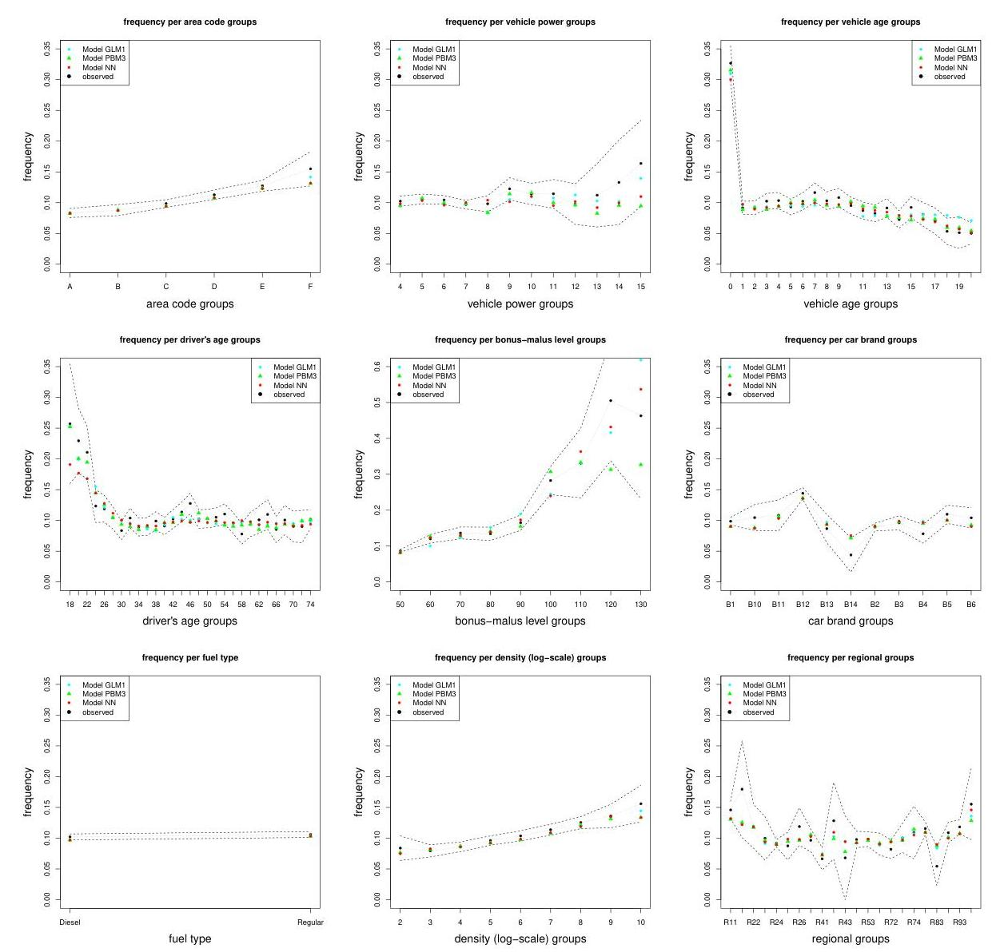

## Page 38
Figure 21: (lhs) marginal out-of-sample loss per label on test data set $\mathcal{T}$ : comparison of Models GLM1, PBM3 and NN, units on the $y$-axes are in $10^{-2}$.
ones on the test data set $\mathcal{T}$ (using exactly the same portfolios consisting of the 67 ' 801 insurance policies set aside according to Listing 2). The confidence bounds are obtained by considering twice the empirical standard deviations on the corresponding labels. The general observation is that the predictions from Models PBM3 and NN are rather similar, see for instance the feature components Area, VehAge, VehBrand or Density in Figure 20. We only observe differences in the predictions of these two models on labels which have small volumes, e.g. small driver's ages or large bonus-malus levels. Model GLM1 deviates more often from the other two models, either because it cannot cope with the marginal functional form or with the interaction of feature components. We also note that the differences between the predictions and the observations can be explained in most cases by the randomness involved (confidence bounds).
Next, we study the contributions to the out-of-sample losses stated in Table 11. We therefore
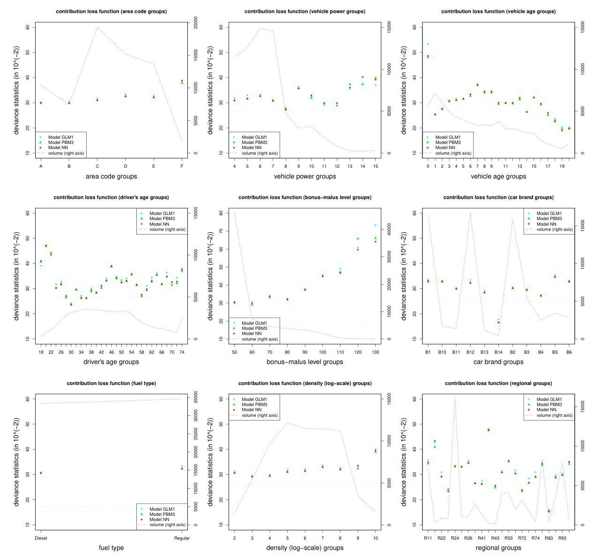

## Page 39
consider again the three Models GLM1, PBM3 and NN. We calculate for each feature component the marginal out-of-sample loss per label, see also (2.4),

$$
\frac{1}{\sum_{t=1}^{n_{\mathcal{T}}} \mathbb{1}_{\left\{x_{t, l}=x\right\}}} \sum_{t=1}^{n_{\mathcal{T}}} 2 N_{t}\left[\frac{\widehat{\lambda}\left(\boldsymbol{x}_{t}\right) v_{t}}{N_{t}}-1-\log \left(\frac{\widehat{\lambda}\left(\boldsymbol{x}_{t}\right) v_{t}}{N_{t}}\right)\right] \mathbb{1}_{\left\{x_{t, l}=x\right\}}
$$

for $x$ being in the domain of the $l$-th component of $\boldsymbol{x}$. These results are provided in Figure 21. Since these out-of-sample losses are averages per label, we also provide the volumes for each label in Figure 21 (dotted darkgray line with scale on the right-hand axis). The first observation is that the GLM contributes almost on all labels a higher value to the out-of-sample loss than the other two methods, which means that it is a bit worse overall. The biggest discrepancy is observed for VehAge $=0$ (Figure 21, top right), which says that the GLM has substantial difficulties to predict this label appropriately. In fact, this seems to be a difficult label (though we have sufficient volume). This is also illustrated by the fact that this is the most efficient split in the SBS regression tree construction, see Figure 14. The contributions of Models PBM3 and NN to the out-of-sample losses are very similar, in particular, on labels that contain at least 5'000 insurance policies (illustrated by the darkgray dotted horizontal line). From this we conclude that the boosting machine calibration and the shallow neural network calibration provide very similar predictions. The boosting machine model is easier (and faster) in calibration, the neural network model is more flexible in allowing for extrapolation because we have a (continuous) functional form of the the expected frequency $\boldsymbol{x} \mapsto \lambda(\boldsymbol{x})$, and the neural network can also be more easily be stored.

Last but not least we would like to defend the good old GLM. We must admit that we did not properly pre-process the features for the GLM benchmark analysis in Section 3. In fact, GLMs require extended manual feature pre-processing for variable selection, functional forms and interactions. Compared to the available amount of data, we have not sufficiently investigated these options and, therefore, our GLM performs poorly compared to the other approaches. Thus, the resulting comparison is not completely fair. Starting from a more reasonable GLM (were we invest all our available capacity in feature pre-processing), we could challenge this advanced GLM with 'neural network boosting' by embedding the GLM into a bigger neural network. This nesting seems a promising approach in further enhancing the classical GLM by neural network features, for more details we refer to Wüthrich-Merz [36] and the subsequent analysis in Wüthrich [34].

Acknowledgment. We would like to kindly thank Andrea Ferrario (Mobiliar Lab for Analytics, ETH Zurich), Guangyuan Gao (Renmin, University of China), Christian Lorentzen (Mobiliar), Ronald Richman (QED Actuaries and Consultants), Caroline Ronner (ETH Zurich), Jürg Schelldorfer (Swiss Re) for their detailed comments that have helped us to substantially improve this tutorial.

# References 

[1] Breiman, L., Friedman, J.H., Olshen, R.A., Stone, C.J. (1984). Classification and Regression Trees. Wadsworth Statistics/Probability Series.

## Page 40
[2] CASdatasets Package Vignette (2016). Reference Manual, May 28, 2016. Version 1.0-6. Available from http://cas.uqam.ca.
[3] Charpentier, A. (2015). Computational Actuarial Science with R. CRC Press.
[4] Cybenko, G. (1989). Approximation by superpositions of a sigmoidal function. Mathematics of Control, Signals, and Systems 2, 303-314.
[5] Ferrario, A., Hämmerli, R. (2019). On boosting: theory and applications. SSRN Manuscript ID 3402687 .
[6] Ferrario, A., Noll, A., Wüthrich, M.V. (2018). Insights from inside neural networks. SSRN Manuscript ID 3226852.
[7] Frees, E.W. (2010). Regression Modeling with Actuarial and Financial Applications. Cambridge University Press.
[8] Freund, Y. (1995). Boosting a weak learning algorithm by majority. Information and Computation 121/2, 256-285.
[9] Freund, Y., Schapire, R.E. (1997). A decision-theoretic generalization of online learning and an application to boosting. Journal of Computer and System Sciences 55/1, 119-139.
[10] Goodfellow, I., Bengio, Y., Courville, A. (2016). Deep Learning. MIT Press, http://www.deeplearningbook.org
[11] Grohs, P., Perekrestenko,D., Elbrächter, D., Bölcskei, H. (2019). Deep neural network approximation theory. Submitted to IEEE Transactions on Information Theory (invited paper).
[12] Hastie, T., Tibshirani, R., Friedman, J. (2009). The Elements of Statistical Learning. Data Mining, Inference, and Prediction. 2nd edition. Springer Series in Statistics.
[13] Henckaerts, R., Antonio, K., Clijsters, M., Verbelen, R. (2018). A data driven binning strategy for the construction of insurance tariff classes. Scandinavian Actuarial Journal 2018/8, 681-705.
[14] Hornik, K., Stinchcombe, M., White, H. (1989). Multilayer feedforward networks are universal approximators. Neural Networks 2, 359-366.
[15] James, G., Witten, D., Hastie, T., Tibshirani, R. (2015). An Introduction to Statistical Learning. With Applications in R. Corrected 6th printing. Springer Texts in Statistics.
[16] Kearns, M., Valiant, L.G. (1988). Learning Boolean formulae or finite automata is hard as factoring. Technical Report TR-14-88. Harvard University Aiken Computation Laboratory.
[17] Kearns, M., Valiant, L.G. (1994). Cryptographic limitations on learning Boolean formulae and finite automata. Journal of the Association for Computing Machinery ACM 41/1, 67-95.
[18] Lee, S.C.K., Lin, S. (2018). Delta boosting machine with application to general insurance. North American Actuarial Journal 22/3, 405-425.
[19] LeCun, Y., Bengio, Y., Hinton, G. (2015). Deep learning. Nature 521/7553, 436-444.
[20] Nielsen, M. (2017). Neural Networks and Deep Learning. Online book available on http://neuralnetworksanddeeplearning.com
[21] Ohlsson, E., Johansson, B. (2010). Non-Life Insurance Pricing with Generalized Linear Models. Springer.
[22] Rentzmann, S., Wüthrich, M.V. (2019). Unsupervised learning: What is a sports car? SSRN Manuscript, ID 3439358.
[23] Richman, R., Wüthrich, M.V. (2018). A neural network extension of the Lee-Carter model to multiple populations. SSRN Manuscript, ID 3270877. To appear in Annals of Actuarial Science.

## Page 41
[24] Rumelhart, D.E., Hinton, G.E., Williams, R.J. (1986). Learning representations by backpropagating errors. Nature 323/6088, 533-536.
[25] Schapire, R.E. (1990). The strength of weak learnability. Machine Learning 5/2, 197-227.
[26] Schelldorfer, J., Wüthrich, M.V. (2019). Nesting classical actuarial models into neural networks. SSRN Manuscript ID 3320525.
[27] Shi, P., Shi, K. (2017). Territorial risk classification using spatially dependent frequency-severity models. ASTIN Bulletin 47/2, 437-465.
[28] Therneau, T.M., Atkinson, E.J., Foundation, M. (2015). An introduction to recursive partitioning using the RPART routines. $R$ Vignettes, version of June 29, 2015.
[29] Valiant, L.G. (1984). A theory of learnable. Communications of the Association for Computing Machinery ACM 27/11, 1134-1142.
[30] Wang, Y., Witten, I.H. (1997). Inducing model trees for continuous classes. Proceedings of the Ninth European Conference on Machine Learning, 128-137.
[31] Werbos, P. (1982). Applications of advances in nonlinear sensitivity analysis. System modeling and optimization 1982, 762-770.
[32] Wood, S.N. (2017). Generalized Additive Models: An Introduction with R. 2nd edition. Chapman and Hall/CRC.
[33] Wüthrich, M.V. (2017). Price stability in regression tree calibrations. In: Proceedings of 2017 China International Conference on Insurance and Risk Management, Chen, B., Powers, M.R. (eds.), Tsinghua University Press, 749-762. http://www.ccirm.org/conference/2017/cicirm2017.pdf
[34] Wüthrich, M.V. (2019). From generalized linear models to neural networks, and back. SSRN Manuscript ID 3491790.
[35] Wüthrich, M.V., Buser, C. (2016). Data Analytics for Non-Life Insurance Pricing. SSRN Manuscript ID 2870308.
[36] Wüthrich, M.V., Merz, M. (2019). Editorial: Yes, we CANN!. ASTIN Bulletin 49/1, 1-3.
[37] Zaslavsky, T. (1975). Facing up to arrangements: face-count formulas for partitions of space by hyperplanes. Memoirs of the American Mathematical Society 154.