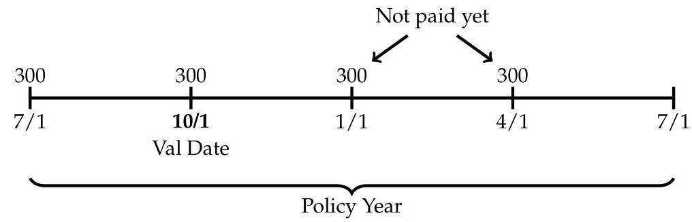
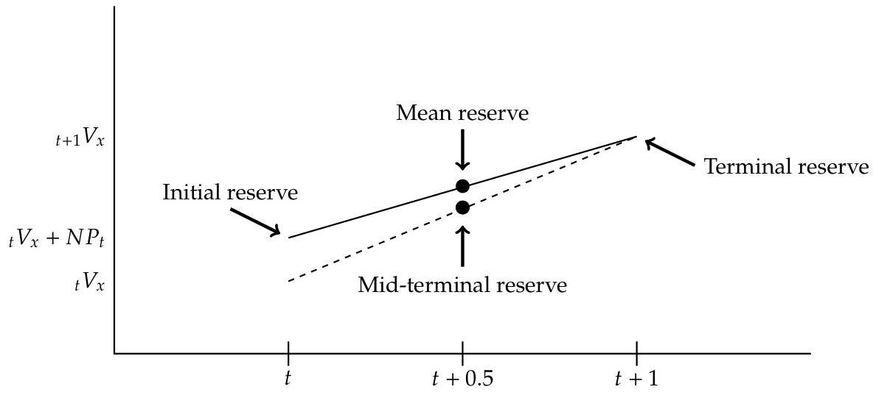

_Note: Source document was split into 8 OCR chunks (pages 1-21, pages 22-41, pages 42-59, pages 60-77, pages 78-98, pages 99-116, pages 117-134, pages 135-152) to stay within token limits._

# ILA-201-U_DSM_SecA_F2025_v2

## Page 1
# TheInfiniteActuary 

## ILA-201-U Section A

## US Statutory Valuation and Reporting

J. Eddie Smith, IV, FSA

Nov 2025 / Mar 2026 / Jul 2026

## Page 2
# Section A: US Statutory Valuation and Reporting 

A. 1 Formula-Based US Statutory Reserves ..... 2
SVILAC Ch. 1: Overview of Valuation Concepts ..... 3
SVILAC Ch. 2: Product Classifications ..... 8
SVILAC Ch. 10: Valuation Assumptions ..... 11
SVILAC Ch. 11: Valuation Methodologies ..... 18
SVILAC Ch. 3: NAIC Annual Statement ..... 30
SVILAC Ch. 12: Whole Life ..... 38
SVILAC Ch. 13: Term Life Insurance ..... 46
SVILAC Ch. 14: Universal Life ..... 52
SVILAC Ch. 16: Indexed Universal Life ..... 60
SVILAC Ch. 18: Fixed Deferred Annuities ..... 68
SVILAC Ch. 20: Indexed Deferred Annuities ..... 78
SVILAC Ch. 21: Immediate Annuities ..... 84
A. 2 US Statutory PBR Topics ..... 88
SVILAC Ch. 5: The Valuation Manual ..... 89
SVILAC Ch. 23: PBR for Life Products ..... 96
Interactive Principle-Based Reserves Model ..... 113
SVILAC Ch. 24: VM-21 - PBR for VAs (Revised) ..... 124
SVILAC Ch. 25: Principle-Based Reserve Report ..... 143

## Page 3
# Section A. 1 

## Formula-Based US Statutory Reserves

## Page 4
# Statutory Valuation of ILA Contracts, 5th ed. 

Source Author: Claire, Lombardi, and Summers (2018)

## Chapter 1: Overview of Valuation Concepts

Pages Included on Syllabus: 27-31

## Overview of This Reading

This chapter introduces fundamental reserve concepts and briefly describes major types of accounting regimes and insurance regulations

A number of the SVILAC chapters only have a subset of their pages included on syllabus. If all pages of the chapter are not included on syllabus, we will indicate which pages are included as we have above. It's generally a good idea to only spend time on these page ranges because your study time is finite, and there is a tremendous amount of material to cover for the exam. That said, for Ch. 1, I actually think it's useful for you to skim over the preceding sections of this chapter to get a brief introduction to many concepts that we will cover in much more depth in other readings.

I also recommend watching "An Introduction to Reserves" in the online seminar to get a conceptual introduction to reserve concepts that will appear over and over throughout the syllabus material

SVILAC Ch. 2 also re-covers and repeats some of the NAIC Manual material from this chapter, so the video lesson merges all of this material into a single lesson

## Key topics for the exam include:

- NAIC Manual and important SSAPs for actuaries
- Basic stat reserve terminology
- Basic overview of Risk-Based Capital requirements
- Basic description of ORSA

The first two sections in the detailed study manual below (Introduction and Role of Reserves) are not included in the testable page range on the syllabus, but I'm including them for background

## Introduction

Three important characteristics of individual life insurance and annuity products

1. Insurer enters a long-term contractual commitment to pay certain benefits and provide certain services in exchange for policyholder's premium

- Creates long-term fiduciary responsibilities for the insurer

2. Based on events with uncertain timing and occurrence
3. Industry has developed specialized accounting and actuarial principles that involve a considerable degree of training, estimation and judgment

## Page 5
Reserves - Liabilities for amounts an insurance company is obligated to pay under a life or annuity contract

Policy reserves - reserves for future insured events (that haven't occurred), but company is obligated to pay if the event does happen

- Makes up significant amount of total insurance company liabilities
- Determined using an actuarial valuation

Claims reserves or loss reserves - reserves for events that have occurred but amount isn't yet known

# Role of Reserves 

Typical life insurance policies have a mismatch between revenue and costs

- Premium is often level, but benefits are much higher in later durations than early durations
- Result: net cash flow $>0$ in early durations, then turns very negative in later durations

## Reserves help match revenues and costs

1. Reserves are backed by assets purchased by policyholder premiums
2. Reserves rise in early durations $\Rightarrow$ creates an accounting expense that partially offsets excess premium revenue
3. Reserves fall ("release") in later durations $\Rightarrow$ creates accounting revenue to partially offset higher costs

Without reserves, an insurer's reported earnings would resemble the cash flow pattern-very positive in early durations, then very negative in later durations

The remainder of the detailed study manual for Ch. 1 includes the sections within the testable page range

## NAIC Accounting Practices and Procedures Manual

In 1994, NAIC codified SAPs into an NAIC Manual

- Comprehensive guide used as foundation of state regulations
- Also may be subject to modification by a state's insurance commissioner
- Contains 3 main parts: a Preamble, Statements of Statutory Accounting Principles (SSAPs), and Appendices

## Important SSAPs for Valuation Actuaries to Understand

- SSAP No. 50
- Classifies insurance contracts into 4 broad categories

1. Life contracts

## Page 6
2. Accident and health
3. P\&C
4. Deposit-type

- Classification determines the recognition of revenue and costs and the methodologies and assumptions used to determine policy reserves
- SSAP No. 51 - SAP for income recognition and reserves for all life contracts (as classified by SSAP No. 50)
- Paragraph 5: States that premium recognized on a gross basis
- Paragraph 14: requires stat reserves for all unmatured contractual obligations of the reporting entity arising out of the provisions of the insurance contract
- Paragraph 15: reserving methodologies and assumptions should be based on Appendices A-820 and A-822 and C
* Appendices A-820 and A-822 contain excerpts from Standard Valuation Law (SVL) and the Actuarial Opinion and Memorandum Regulation (AOMR), respectively. Appendix C contains many Actuarial Guidelines that clarify how to apply SVL to unique products and situations.

See the video lesson for a diagram that will help you visualize the relationship of these SSAPs. SVILAC Ch. 2 also re-covers these SSAPs and adds a little more detail.

# Statutory Minimum Reserve Requirements 

Valuation standard - the methodology and assumptions used to determine the policy reserves under a statutory valuation

Standard Valuation Law (SVL) and Actuarial Opinion and Memorandum Regulation are the 2 most important NAIC model regs related to stat valuation

- A number of chapters of the SVILAC book are devoted to product-specific aspects of the SVL

The Valuation Manual is also important: sets minimum reserve requirements pursuant to SVL for principles-based reserves

- The VM will be covered in SVILAC Ch. 5, but we will finish all of the SVL-specific chapters first before going into principles-based reserves in the online seminar. The VM marks a major change in statutory reserving, and I think it's best to cover all of the original formula-based methods under the SVL first in Section A.1.

## Risk-Based Capital Requirements

The RBC for Life and Health Insurers Model Act significantly increased minimum capital requirements for life insurers and increased state regulators' authority over life insurers with deteriorating financial conditions

## Page 7
- Before this act, insurers were allowed to hold as little as $\$ 5$ million in capital, regardless of size

The RBC model act contains an RBC formula that determines minimum capital required to avoid "regulatory attention"

- Addresses 5 major risks (listed next) and reflects correlations among them
- RBC ratio $=\frac{\text { Total Adjusted Capital }}{\text { Life Insurer's RBC }}$
- If the RBC ratio falls below a specified level, it triggers "action levels" resulting in additional requirements and even regulator intervention
- The components of the RBC formula will be defined and explained more thoroughly in later readings

# 5 major categories of risk addressed by the RBC formula: 

1. Asset Risk - Affiliates (C-0) - intended to default risk in affiliated investments (e.g. an investment in another company)
2. Asset Risk - Other (C-1) - covers default risk in debt instruments and market losses in equity instruments
3. Insurance Risk (C-2) - covers risk of losses due to adverse mortality and morbidity
4. Interest Rate Risk, Health Risk and Market Risk (C-3)

- Risk of reinvestment when market yields fall below levels guaranteed to policyholders
- Risk of capital losses (i.e. having to sell assets when market values < cost of purchase)
- Risk of loss on variable products with guarantees (e.g. VA guarantees) due to changes in market returns

5. General Business Risk (C-4) - covers risk of losses due to fraud, mismanagement, and other business risks

## Risk Management and Own Risk and Solvency Assessment (ORSA) Model Act

A key result of the NAIC's 2008 Solvency Modernization Initiative was developing the Risk Management and Own Risk and Solvency Assessment Model Act (ORSA)

ORSA requires insurers above a certain premium threshold to follow the NAIC ORSA Guidance Manual and submit an ORSA Summary Report

The ORSA Summary Report includes 4 major areas of the insurer:

1. Risk management framework
2. Assessment of risk exposure
3. Assessment of risk capital at group level

## Page 8
4. Prospective solvency assessment

The NAIC also established regulatory guidance for states reviewing ORSA Summary Reports

## Page 9
# Statutory Valuation of ILA Contracts, 5th ed. 

Source Author: Claire, Lombardi, and Summers (2018)

## Chapter 2: Product Classifications

Pages Included on Syllabus: 35-38

## Overview of This Reading

The testable page range for this chapter builds on the NAIC Manual material covered in Ch. 1 and focuses on SSAP No. 50, 51, and 52

Key topics for the exam include:

- Why product classification is important
- Be able to describe SSAP No. 50, 51, and 52

## Introduction

Product classification is important because it determines:

1. How a contract's revenue and costs are reported in the income statement
2. Methodologies and assumptions used to determine policy reserves
3. Supporting information reported in the statutory annual statement (exhibits, schedules, and supplemental reports)

Actuaries responsible for calculating ILA stat reserves should have a sound understanding of SSAPs 50-52

- SSAP No. 50: Classifications and Definitions of Insurance or Managed Care Contracts In Force
- SSAP No. 51: Life Contracts
- SSAP No. 52: Deposit-Type Contracts

These SSAPs are contained in the NAIC Manual

## SSAP No. 50: Classifications and Definitions

SSAP No. 50 classifies insurance contracts into 4 broad categories, which have premium patterns and benefits that are "fundamentally different and, therefore, require different income recognition and reserving methods"

## 1. Life contracts

- Primary purpose: provide financial assistance to a beneficiary at the insured's death
- Distinguishing characteristic: "long coverage period underlying risk of death," which increases with age

## Page 10
- Examples: WL, endowments, term, UL, variable life, annuity contracts

2. Deposit-type contracts

- Distinguishing characteristic: No insurance risk (more like financial or investment instruments issued by banks, etc.)
- Examples: annuities certain, lottery payouts, policyholder dividend accumulations

3. Accident and health contracts

- Distinguishing characteristic: protection involving economic loss resulting from a medical condition

4. Property and casualty contracts

- Distinguishing characteristic: protection against physical/financial damage to property by an insured peril or damage/injury to the insured

# SSAP No. 51: Life Contracts 

SSAP No. 51 establishes income recognition and policy reserving for contracts classified as life contracts by SSAP No. 50

- Premiums should be recognized on a gross basis when due from policyholder under the terms of the insurance contracts
- Gross basis = amount actually charged to policyholder
- Net premium ${ }^{1}=$ premium amount used in the determination of the statutory reserve
- Loading = Gross Premium - Net Premium
- "Statutory policy reserves shall be established for all unmatured contractual obligations of the reporting entity arising out of the provisions of the insurance contract"
- Refers to NAIC Manual Appendices A-820 (SVL), A-822 (AOMR), and Appendix C (Actuarial Guidelines) for reserve methodologies and assumptions
- Requires that policy reserves comply with ASOPs promulgated by the ASB

## SSAP No. 52: Deposit-Type Contracts

SSAP No. 52 establishes income recognition and policy reserving for contracts classified as deposit-type by SSAP No. 50

- Amounts paid into these contracts are NOT reported as revenue
- Revenue $=$ charges assessed to the account balance (e.g. monthly expense charge of $\$ 5$ ) for services provided in current period

[^0]
[^0]:    ${ }^{1}$ The concept of a net premium will make more sense when we cover valuation methodologies in SVILAC Ch. 11. The net premium is essentially the portion of the gross premium needed to fund future benefits under statutory assumptions.

## Page 11
- If charges are for future services, or if charges will be refunded on policy termination:
- Do not include charges in revenue
- Establish an unearned liability
- Recognize the charge in income during the period when the services are provided

## Page 12
# Statutory Valuation of ILA Contracts, 5th ed. 

Source Author: Claire, Lombardi, and Summers (2018)

## Chapter 10: Valuation Assumptions

Pages Included on Syllabus: 193-200, 203-208

## Overview of This Reading

This chapter expands on SVL Section 4: mortality and interest assumptions required for contracts issued before the operative date of the VM

Ch. 10 provides more detail on the mortality and interest rates required for life and annuity contracts issued before the VM operative date

The mortality and interest assumptions in this chapter will be the assumptions used in the reserve methods covered in Ch. 11 next

## Key topics for the exam include:

- Understand the concept of a prevailing mortality table
- Be familiar with each prevailing CSO and IAM table
- Be familiar with how the structure of CSO and IAM tables have changed
- Understand and know how to calculate a generational mortality rate
- Understand the purpose and main idea with dynamic valuation interest rates
- Be able to describe the criteria that affect dynamic valuation interest rates

## Mortality Assumptions for Policies Issued Prior to the Operative Date

The required mortality assumption for a given policy is based on the CSO mortality table prevailing when the policy is issued

For a new CSO table to become prevailing, at least 26 states must adopt it
When a new CSO table becomes prevailing, 2 dates are set:

1. When the actuary may use the table
2. When the actuary must use the table

Between the 1st and 2nd date, the actuary can continue using the previously prevailing table if desired

## Page 13
# CSO Mortality Tables for Life Insurance 

These are used for ordinary life insurance (WL, limited pay life, endowment, term, UL, and variable life) ${ }^{2}$

- 1941 CSO (issue years 1948-1960) - attained age, aggregate level, covering ages 0-99
- "Aggregate" means males and females use the same mortality rates at each age
- "Level" means "not select" (explained more under 1980 CSO below)
- 1958 CSO (issue years 1961-1982) - introduced an age setback for females
- Originally, the 1958 CSO table had a 3-year age setback for females age 15 and above

$$
q_{x}^{\mathrm{F}}=q_{x-3}^{\mathrm{M}} \text { for } x \geq 15
$$

E.g. the mortality rate for a 50-year-old female $=$ the mortality rate of a 47-year-old male

- Has gender-distinct rates for $x<15$
- Later, the age setback was changed to 6 years to reflect that female life expectancy was increasing faster than for males
- 1980 CSO (issue years 1983-2008) - introduced originally with the 1980 SVL amendments
- 1980 CSO did away with age setbacks and began including distinct rates for females and also distinct rates for smokers and nonsmokers
* Male/female versions (no smoker distinction)
* Smoker/nonsmoker versions for male and female (4 total variations)
* A unisex version (no smoker distinction)
* Unisex with smoker/nonsmoker versions
- The valuation actuary can choose among the above versions (depending on state law) and also these additional variations:
* Each table has an age nearest and age last birthday version
* Each can be modified with 10-year select factors
- Results in lower mortality rates during the 10-year select period to reflect that these lives were recently underwritten and should have lower mortality
- Rates after the select period are known as "ultimate rates" (same as "level" rates)
- 2001 CSO (issue years 2009-2019)
- The set of 2001 CSO tables initially adopted in 2002 were similar to the 1980 CSO in structure but had updated mortality rates and also the following changes:

2 "Ordinary" excludes "industrial" policies, which have separate valuation mortality tables and are not addressed by this book.

## Page 14
- Extended the max age from 99 to 120
- Increased select period from 10 to 25 years
- Another set of 2001 CSO tables was adopted in 2006 that had variations for different preferred underwriting classes:
- Super preferred nonsmoker
- Preferred nonsmoker
- Residual standard nonsmoker
- Preferred smoker
- Residual standard smoker
- To use the preferred versions in place of the previous versions, the actuary must:
- Demonstrate that at least $20 \%$ of the business being valued has premiums based on a preferred class
- Annually certify that each of the following PV of death benefits (PVDB) are less than what you would get using the valuation basic table ${ }^{3}$ corresponding to the valuation table for that class (do this for each preferred class separately)
- PVDB over the next 10 years using anticipated mortality without mortality improvement beyond the valuation date
- PVDB over future life of contracts using anticipated mortality without mortality improvement beyond the valuation date
- 2017 CSO (issue years 2020-?) - amended to the VM in 2016 (same structure as 2001 CSO, just with updated mortality rates)
- Valuation actuary may use for policies issued after the operative date (Jan 1, 2017)
- Must use for policies issued in 2020 and beyond

See the video lesson for a compact table summarizing all of these into a single grid view by prevailing issue year

# Individual Annuity Mortality (IAM) Tables 

Used in reserves for immediate life contingent annuities sold to individuals

- Immediate life contingent annuity - an annuity contract that makes benefit payments until the annuitant dies (e.g. life only annuities or certain and life annuities)

[^0]
[^0]:    ${ }^{3}$ The SVILAC book does not define what a valuation basic table is, so I don't think you should be expected to know what it is for the exam. But for clarification, a VBT table reflects the actual experience in the company mortality data used by the NAIC when developing new industry mortality tables. Margins are added to the VBT to produce the final CSO tables that become adopted by states. So VBTs are more like "best estimate" mortality tables in a sense. They are made available to companies for various purposes, including the certification here.

## Page 15
# AG 9 and 9-B definition of an immediate annuity: 

- First payment is due $<13$ months from the issue date
- Succeeding payments are due at least annually for at least 5 years
- Each payment $\leq 115 \%$ of the payment in the prior contract year

## IAM tables by year:

- 1937 IAM (issue years 1948-1962) - attained age, aggregate level, ages 0-109
- Using 1937 IAM male mortality for female life annuities was not conservative (females should live longer and receive more annuity benefits)
- 1949 IAM (issue years 1963-1974) - introduced separate tables for males and females (otherwise, same structure as 1937 IAM)
- 1971 IAM (issue years 1975-1984) - no description is provided in the SVILAC book for this table
- 1983 IAM (issue years 1985-1999) - changed age range to 5-115
- Also introduced a mortality improvement scale ("Scale G"), but it was not required for reserves
- 2000 IAM (issue years 2000-2011) - an interim table developed by applying Scale G to 1983 IAM and also subtracting a $10 \%$ loading
- Initially, a 1996 Basic Table was developed by applying improvement rates $\left(i_{x}\right)$ from Scale G for 13 years after 1983:

$$
q_{x}^{1996}=q_{x}^{1983} \cdot\left(1-i_{x}\right)^{13}
$$

- The book does not illustrate or explain the subtraction of the 10\% loading, but conceptually just think of it as another way they lowered mortality rates to be more conservative. The book also doesn't explain how the final 2000 IAM was actually developed, but just know that it was also calculated using a similar approach (essentially just applying Scale G to the old 1983 rates to bring them up to 2000). This quirky bit of mortality table history is probably not that important for the exam.
- 2012 IAM (issue years 2012-?) - included in the 2012 "NAIC Model Rule (Regulation) for Recognizing a New Mortality Table for Use in Determining Reserve Liabilities for Annuities"
- The Model Rule defined a new concept called a generational mortality table: a mortality table whose rates decrease for a given age from one year to the next based on a combination of:
* A Period table (the 2012 IAM mortality rates)
* A projection scale (G2) containing rates of mortality improvement
- Projection Scale G2 is required to be used with 2012 IAM (unlike G, which was optional with 1983 IAM)

## Page 16
- Therefore, the required valuation mortality rate for issue age $[x]$ at duration $t$ is:

$$
q_{[x]+t}=q_{x+t}^{2012} \cdot\left(1-i_{x+t}\right)^{n+t}
$$

where:
$x=$ annuitant's issue age
$n=$ number of years from 2012 to the contract issue date
$t=$ years after issue (e.g. $t=2$ corresponds to EOY 2 after issue)
$q_{x+t}^{2012}=$ mortality rate from 2012 IAM (the period table)
$i_{x+t}=$ mortality improvement rate for age $x+t$ (taken from Scale G2)
See the video lesson for a numerical example of how to develop these valuation mortality rates

# Valuation Interest Rates 

Before the 1980 Amendments, states had to individually adopt interest rate changes
Between 1947 and 1974, most states used the original SVL valuation interest rate of $3.5 \%$
In the 1970s and 1980s, market interest rates rose dramatically, which increased the need for a dynamic interest rate formula that could keep pace with the changing interest rate environment

Dynamic valuation interest rate formula - introduced with the 1980 SVL amendments to adjust the required valuation interest rate for changes in market interest rates
$i_{C Y}=$ max valuation interest rate for calendar year $C Y$ (round to nearest $0.25 \%$ )

$$
i_{C Y}=0.03+w_{1}\left(r_{C Y}^{1}-0.03\right)+0.50 w_{2}\left(r_{C Y}^{2}-0.09\right)
$$

The formula is a function of the following criteria:

- Reference rate $\left(r_{C Y}\right)$

$$
\begin{aligned}
& -r_{C Y}^{1}=\min \left(r_{C Y}, 0.09\right) \\
& -r_{C Y}^{2}=\max \left(r_{C Y}, 0.09\right) \text { if the product is classified as "other annuities"; else } r_{C Y}^{2} \text { is zero }^{4}
\end{aligned}
$$

[^0]
[^0]:    ${ }^{4}$ This is the exact definition of $r_{C Y}^{2}$ provided in the SVILAC book on p. 205, but it is not correct. In reality, $r_{C Y}^{2}$ is always zero for SPIAs and is sometimes zero for "other annuities" depending on other factors. It is always non-zero for life insurance. Even in the cases where $r_{C Y}^{2}$ is zero, it is actually more accurate to say that $r_{C Y}^{2}$ is irrelevant because the SVL prescribes a simpler formula for those cases that doesn't involve $r_{C Y}^{2}$ or $w_{2}$ at all. We will stay with the book's definition since that's on the syllabus, but we will correct the formula if/when errata are posted. We also notified the source author and exam committee so they are aware of this typo. It's worth noting that the Ch. 10 Excel spreadsheet included with the textbook does work correctly and produces valuation interest rates consistent with the SVL, so feel free to play with that for more clarification.

## Page 17
- The reference rate $r_{C Y}$ is determined using one of these methods depending on the product classification: ${ }^{5}$

1. $r_{C Y}=$ lesser of 36 - and 12 -month average of the Moody's composite yield on seasoned corporate bonds
2. $r_{C Y}=12$-month average of the Moody's composite yield on seasoned corporate bonds

- $w_{1}, w_{2}=$ weighting factors prescribed in the SVL that vary by the following criteria:
- Product classification
* Life insurance
* Single premium immediate annuities (SPIA)
- Has the simplest formula for $i_{C Y}$ (not shown in the book)
* Other annuities
- Guarantee duration
* Affects weights for life insurance and other annuities ${ }^{6}$
* For life insurance, guarantee duration $=$ max number of years policy can remain in force on a guaranteed basis
* For other annuities, guarantee duration = number of years that the contract guarantees an interest rate $>i_{C Y}$ for life insurance policies with a guaranteed duration $>20$ years
* Example: Suppose $i_{C Y}=4.5 \%$ for a life insurance policy with guarantee duration $>20$ years. And suppose an "other annuity" guarantees 5\% for 10 years, followed by 3\% for all years after. The other annuity's guarantee duration would be 10.
- Existence of cash settlement options and/or future interest guarantees (affects other annuities only)
* The following contract features will result in a lower $i_{C Y}$ (higher reserves):
- Contracts that allow the owner to surrender for cash before maturity
- Contracts that guarantee interest rates on deposits received after the first year that are $>i_{C Y}$ for life insurance policies with a guaranteed duration $>$ 20 years

5 The SVILAC book does not actually say which product classifications go with each method, so I don't think you will be tested on that. However, the 1st method is always used for life insurance, and the 2nd method is always used for SPIAs. Other annuities depend on other factors.
${ }^{6}$ The SVILAC book does not mention this, but the weighting factors fall as guarantee duration increases. Generally speaking, a higher guarantee duration poses more risk to the insurer because the insurer is guaranteeing an interest rate for a longer period of time. Lower $w$ 's result in a lower $i_{C Y}$, which increases reserves. Hopefully this helps make the concept of guarantee easier to remember/rationalize for the exam.

## Page 18
- Plan type - reflects disintermediation risk on other annuities only

Type A - most restrictive to policyholder $\rightarrow$ least risky to insurer $\rightarrow$ highest $i_{C Y}$

* Withdrawal is either prohibited entirely or permitted only in the following situations:

1. With adjustment to reflect changes in interest rates or asset values (e.g. MVA)
2. Without adjustment but in installments over 5+ years
3. As an immediate life annuity

# Type B 

* During the interest rate guarantee period, withdrawal is either prohibited entirely or permitted only under conditions 1 and 2 under Type A above
* After the guarantee expires, withdrawal is permitted as either:

1. Without an adjustment in a single sum
2. In installments over $<5$ years

Type C - least restrictive to policyholder $\rightarrow$ riskiest to insurer $\rightarrow$ lowest $i_{C Y}$

* May withdraw funds before interest rate guarantee expires in a single sum or in installments over $<5$ years either:
- Without adjustment to reflect changes in interest rates or asset values
- Subject only to a fixed surrender charge
- Issue year method vs. change in fund method (affects other annuities only)
* Issue Year: use interest rate in effect at contract issue
* Change in Fund: interest rate varies by CY (more responsive to interest rate changes, but more complex to administer)
- Year 1: $i_{C Y}$ is associated with the fund balance at the end of the CY
- Next CY: $i_{C Y}$ is associated with the change in the fund balance during the CY, etc.
- Example: Suppose the original fund balance is 100 at issue in 2018. By 2019, the fund balance is 120. The first 100 of fund balance will be valued using $i_{2018}$, while the next 20 will be valued using $i_{2019}$.

As I said in the Overview section for this chapter, it will be clearer how mortality and interest rates are used in reserve calculations in SVILAC Ch. 11, which covers valuation methods for life insurance. Annuities will be addressed in several chapters after Ch. 11 as well.

## Page 19
# Statutory Valuation of ILA Contracts, 5th ed. 

Source Author: Claire, Lombardi, and Summers (2018)

## Chapter 11: Valuation Methodologies

Pages Included on Syllabus: 215-242

## Overview of This Reading

This is one of the most critical and foundational chapters on the entire syllabus
Even though we're very much in a statutory reserving context-specifically SVL Section 5-the reserve mechanics covered here "ripple" into other areas of the syllabus like the GAAP material

I strongly recommend watching the previous Actuarial Math Review video lesson before working through the reserve formulas in this chapter-doing so will refresh you on basic first principles concepts and allow you to focus more energy on the terminology and methods in this chapter

The first half of this chapter covers net premium reserve methods used for statutory reserving
The second half of the chapter describes various approximations and additional liabilities that companies implement in practice

The detailed study manual is very thorough for this material, but based on my experience as an instructor, it is impossible to learn these reserve methods without working actual numerical examples. The video lesson provides extensive examples for this purpose.

## Key topics for the exam include:

1. Common reserve methodologies-be able to compare each and perform calculations for each

- Net level premium method
- Modified reserve method
- Full preliminary term method
- CRVM

2. Common approximations and other liabilities

- Mean reserves
- Mid-terminal reserves
- Deferred premium asset vs. unearned premium liability
- Continuous reserves-semi-, fully, and discounted
- Immediate payment of claims reserves

## Page 20
# Terminology and Notation 

Valuation methodology - the particular net premium method used to determine the policy reserve

The 2 most common net premium methods are the net level premium method (NLP) and Commissioners Reserve Valuation Method (CRVM)

Both center around the basic formula:
Reserve $=$ Present value of benefits - Present value of net premiums

## Key Dates

1. Issue date - start date of policy
2. Maturity date - end date of policy
3. Valuation date - date on which policy reserve is measured

- Must be the same as the financial statement (balance sheet) date
- Policy data may require adjustments if not "as of" the valuation date

## Time periods and symbols

1. Benefit period $=$ Maturity Date - Issue Date $=n$
2. Premium paying period $=m \leq n$

- Sometimes the premium-paying period is less than the benefit period (e.g. a 20-pay whole life policy)

3. Policy year $=$ number of years from the issue date to a specific valuation date, rounded up to the nearest whole year

Starts at 1: For example, immediately after policy issue, you're already in the first policy year
4. Policy duration $=$ number of years from the issue date to a specific valuation date, rounded down ${ }^{7}$

- Same example as before: policy duration $=0$ until you reach the first anniversary

5. Issue age $=[x]$

- Contrast this with attained age $x$

## About the SVILAC Textbook Examples

The examples in this chapter are very long. The tables you see in this and other chapters are generated from spreadsheet programs that ship with the 5th edition of the book.

[^0]
[^0]:    ${ }^{7}$ In practice, many companies define policy duration the same as policy year, so throw out anything you know from the "real world" and stick with Lombardi's definition for this material

## Page 21
The current syllabus notes that you are not required to use or know the spreadsheet content for the exam, but it encourages you to use the spreadsheets for extra clarification. Just be aware that the spreadsheets that come with the SVILAC book do not really contain any Excel formulas. Most of the spreadsheet runs on VBA code that is hidden away. The cells are pretty much values-only. Therefore, you likely won't gain any additional Excel-specific insight by using the spreadsheets. If you do go into the spreadsheets, be careful with your time and don't lose hours on things that are not explicitly covered in the textbook itself!

The video lessons for this chapter and other SVILAC chapters are based on shorter versions of the book examples that are closer in scope to what you'll be dealing with in exam problems.

# Reserve Notation 

The actuarial notation in SVILAC is very technical and can be distracting at times because it's generalized for limited-pay products and term products. We're going to use simpler (but generally accepted) versions in the detailed study manual and video lessons to avoid distracting you from the key concepts.

Primary terms using the SVILAC book notation:

$$
\begin{aligned}
{ }_{t}^{m} V_{[x] \mid \bar{n}} & =\text { NLP reserve at duration } t \text { for an } m \text {-pay product } \\
A B_{[x]+t: \bar{n}-t} & =\text { PV future benefits at duration } t \\
\bar{a}_{[x]+t: \bar{m}-t} & =\text { PV of annuity-due at duration } t \\
{ }_{m} P B_{[x] \bar{n}} & =\text { Net level benefit premium for an } m \text {-pay product } \\
{ }_{m} P E_{[x] \bar{n}} & =\text { Net level expense premium for an } m \text {-pay product }
\end{aligned}
$$

In the online seminar, we will generally use simpler notation:

$$
\begin{aligned}
x & =\text { issue age (no brackets for simplicity) } \\
x+t & =\text { attained age at duration } t \\
t V_{x} & =\text { Reserve at time } t \text { for issue age } x \\
\mathrm{PVFB}_{t} & =\text { PVFB at time } t\left(=A_{x} \text { for a level } \$ 1 \mathrm{DB}\right) \\
\bar{a}_{x+t} & =\mathrm{PV} \text { of an annuity-due at time } t \\
P B_{t} & =\text { Net benefit premium at duration } t \\
P E_{t} & =\text { Net expense premium at duration } t \\
N P_{t} & =\text { Total net premium }\left(P B_{t}+P E_{t}\right) \\
\mathrm{PVNP}_{t} & =\mathrm{PV} \text { of future net premiums at duration } t \\
\mathrm{PVGP}_{t} & =\mathrm{PV} \text { of future gross premiums at duration } t
\end{aligned}
$$

On the exam, using simpler notation is fine. Please don't lose precious time on the exam trying to reproduce all of the superscripts and subscripts in the SVILAC book! In the video lesson, we give more tips.

## Page 22
# Common Methodologies 

There are 4 methodologies covered in the next few sections, but they are not mutually exclusive High level summary:

1. Net level premium (NLP) method

- Reserve net premium is a level $\%$ of GPs
- No explicit recognition of expenses (of any kind) or lapses
- Typically largest reserve of the 3 methods

2. Modified reserve method

- Any NLP method that also includes an expense allowance (EA), which lowers reserves
- FPT and CRVM are modified methods that are different only in the way they define the EA

These methods are discussed in more detail below, and the video lesson has a numerical example for each

## Net Level Premium Method (NLP)

For a basic WL policy with $\$ 1 \mathrm{DB}$ and level premiums payable for life, the NLP reserve is:

$$
{ }_{t} V_{x}^{N L P}=A_{x+t}-\frac{A_{x}}{\bar{a}_{x}} \bar{a}_{x+t}
$$

More general case when DBs and/or GPs vary by year:

$$
\begin{aligned}
{ }_{t} V_{x}^{N L P} & =\operatorname{PVFB}_{t}-\operatorname{PVNP}_{t} \\
& =\operatorname{PVFB}_{t}-N P_{0} \cdot \bar{a}_{x+t} \\
r_{t}^{G P} & =\text { gross premium ratio }=\frac{G P_{t}}{G P_{0}} \\
N P_{0} & =\left(\frac{\mathrm{PVFB}_{0}}{\bar{a}_{x}}\right)=\mathrm{NP} \text { for first policy year } \\
\bar{a}_{x} & =1+v \cdot{ }_{1} p_{x} \cdot r_{1}^{G P}+v^{2} \cdot{ }_{2} p_{x} \cdot r_{2}^{G P}+\cdots \\
\bar{a}_{x+t} & =r_{t}^{G P}+v \cdot{ }_{1} p_{x+t} \cdot r_{t+1}^{G P}+v^{2} \cdot{ }_{2} p_{x+t} \cdot r_{t+2}^{G P}+\cdots
\end{aligned}
$$

## Important things to understand from these formulas:

- $r_{t}^{G P}$ is the ratio of the GP at duration $t$ to the GP at issue (even for $\bar{a}_{x+t}$ !)
- The net premium is a constant $\%$ of GPs

$$
\frac{N P_{t}}{G P_{t}}=\frac{N P_{0} \cdot r_{t}^{G P}}{G P_{0} \cdot r_{t}^{G P}}=\frac{N P_{0}}{G P_{0}}
$$

- The formula for $\bar{a}_{x+t}$ reflects the GP pattern

## Page 23
- Therefore you always multiply $N P_{0}$, which is determined at issue for the NLP method
- BUT the net premium does vary in dollars: $N P_{t}=N P_{0} \cdot r_{t}^{G P}$, which is effectively the first term in the $\mathrm{PVNP}_{t}$ calculation

All of the other methods can also have varying GPs, so remember to use this definition of an annuity-due in general for any method. Even for methods like FPT that determine a NP at $x+1$, you still "anchor" $r^{G P}$ at issue. All of this is demonstrated using examples in the video lesson.

# Modified Reserves 

A net level premium method that includes an expense allowance (EA)

- EA = a formula that reflects that most life insurance contracts require large first year expenses (acquisition costs, etc.)
- Under SVL, the EA does NOT represent actual expenses (very different from the way U.S. GAAP recognizes first year acquisition expenses using a DAC asset-we will cover that in the GAAP material later)

The EA is amortized over the premium paying period and has the effect of lowering the stat reserve

$$
\begin{aligned}
\text { Modified Reserve }_{t} & =\text { NLP Reserve }- \text { Unamortized EA } \\
t V_{x}^{\text {Mod }} & ={ }_{t} V_{x}^{\text {NLP }}-{ }_{t} V E_{x} \\
& =\mathrm{PVFB}_{t}-\left[\mathrm{PVPB}_{t}+\mathrm{PVPE}_{t}\right] \\
t V E_{x} & =P E_{0} \times \bar{a}_{x+t} \\
P E_{0} & =\frac{E A_{x}}{\bar{a}_{x}} \\
P B_{0} & =\frac{\mathrm{PVFB}_{0}}{\bar{a}_{x}} \\
N P_{t} & =P B_{t}+P E_{t}
\end{aligned}
$$

## Describing the above equations in words:

Equation 5: Determine a net expense premium (PE) for the EA using the same mechanics we used to calculate a NP for future benefits $\Rightarrow \mathrm{PV}$ of PEs must equal the EA at issue

- Think of the PE as an additional "slice" of the GP that you're claiming for the EA
- PE is an additional "allocation" of the GP over and above the portion allocated for the benefit net premium, PB
- The annuity-due is exactly the same as the NLP Method (reflects GP pattern, etc.)

Equation 4: The unamortized EA is always equal to the PV of future PEs remaining

- The unamortized EA is essentially an "asset" that partially offsets the NLP reserve (equation 2)

## Page 24
- Equation 7: Since you're effectively using a higher net reserve premium, the reserve must be lower
- The term in brackets in equation 3 is the PV of total NPs
- If GPs vary, multiply $P B_{0}$ and $P E_{0}$ by $r_{t}^{G P}$

Remember: The EA is simply a formulaic mechanism that results in lower NLP reserves

- This section simply introduces the concept of having an EA $>0$
- The actual EA will vary depending on the type of modified reserve method (FPT vs. CRVM)
- EA $\neq$ actual first year expenses (worth repeating!)

# Full Preliminary Term Reserve (FPT) 

FPT is a modified reserve with an expense allowance defined as

$$
\begin{aligned}
E A_{x}^{F P T} & =\left(\frac{\mathrm{PVFB}_{1}}{\bar{a}_{x+1}}\right)-c_{x} \\
& =N P_{1}-c_{x} \\
c_{x} & =v \cdot q_{x} \cdot \mathrm{DB}=\text { first-year cost of insurance }
\end{aligned}
$$

Conceptually, the NP for $t \geq 1$ is calculated as though the policy was sold at age $x+1$

$$
N P_{t}= \begin{cases}c_{x} & \text { for } t=0 \\ \frac{\mathrm{PVFB}_{1}}{\bar{a}_{x+1}} \cdot r_{t}^{G P} & \text { for } t \geq 1\end{cases}
$$

At the end of the first year, the FPT reserve is zero because $N P_{1}=N P_{0}$ for the same policy issued to $x+1$ under the NLP Method

$$
\begin{aligned}
{ }_{1} V_{x}^{F P T} & =\mathrm{PVFB}_{1}-N P_{1} \cdot \bar{a}_{x+1} \\
& =\mathrm{PVFB}_{1}-\left(\frac{\mathrm{PVFB}_{1}}{\bar{a}_{x+1}}\right) \cdot \bar{a}_{x+1} \\
& =0
\end{aligned}
$$

## Page 25
Alternatively, using a retrospective approach:

$$
\begin{aligned}
{ }_{1} V_{x}^{F P T} & =\frac{\left({ }_{0} V_{x}^{F P T}+N P_{0}\right)(1+i)-q_{x}}{p_{x}} \\
& =\frac{\left(0+c_{x}\right)(1+i)-q_{x}}{p_{x}} \\
& =\frac{\left(0+v q_{x}\right)(1+i)-q_{x}}{p_{x}} \\
& =\frac{q_{x}-q_{x}}{p_{x}} \\
& =0
\end{aligned}
$$

In other words, the first year's NP is exactly enough to pay the mortality cost for the first year, so the reserve is completely exhausted by EOY 1

# More general notation: 

- $\alpha=$ the first year's net premium $=c_{x}$ under FPT
- $\beta=$ net premiums for all other years

## Commissioners Reserve Valuation Method (CRVM)

CRVM is just like FPT, only it limits the EA that can be used
AG 27 defines the CRVM EA as the smaller of:

1. EA under FPT for the contract
2. EA under FPT assuming 20-pay WL contract

If the 20-pay EA limitation applies, the CRVM reserve will be greater than zero at EOY 1

- This also means the first year NP $>c_{x}$ in these situations

Additional rules for the 20-pay EA limitation:

1. If the actual contract has non-level DBs, calculate the 20-pay EA using a level $\mathrm{DB}=$ average actual DB for policy years $2-10$

- This would affect $N P_{1}$, which you need to calculate $E A=N P_{1}-c_{x}$
- Example: suppose contract's DB increases from 100,000 to 150,000 at $t=5$ :

$$
\text { Level DB to Assume }=\frac{4(100,000)+5(150,000)}{9}=127,778
$$

2. If the EA is negative, set equal to zero (per AG 21)

- May occur if GPs increase steeply resulting in $N P_{1}<c_{x}$
- I.e. the more steeply GPs rise, the lower early NPs will be because they will "catch up" in later years as $r_{t}^{G P}$ rises

## Page 26
FAQ: Does the same EA limitation apply to term insurance? Yes! It applies to all life insurance subject to SVL. However, term policies often cover short benefit periods (e.g. 10-year term). This will often result in a lower $N P_{1}$ than a WL policy. As a result, many term policies will naturally have an $E A<$ than a 20-pay WL policy. You still have to do the test to be sure.

# CRVM key takeaways: 

- Smallest reserves allowable by SVL
- Usually same as FPT unless contract can be paid up more quickly than 20 years

$$
{ }_{t} V_{x}^{C R V M} \geq{ }_{t} V_{x}^{F P T}
$$

- If premium payment period $<20$ years, CRVM reserves will be higher than FPT reserves because the CRVM EA is capped

## Other Methods

One common alternative to holding only CRVM reserves is to grade from CRVM to net level reserves over a period of time

- Allows a company to offer products with 20th-year CSVs $>$ minimum required CSVs but not greater than the reserve held (avoids having to hold an excess CSV liability)

## Common Approximations and Other Liabilities

The primary theme of the remaining material in this chapter is how to address various practical issues that arise in the real world. This usually involves either adjusting the reserve based on previously discussed methods and/or adding additional liabilities.

Stat valuations include many policies at once, so the valuation date often does not occur precisely on a policy's anniversary

Terminal reserve $=$ reserve at end of policy year $={ }_{t} V_{x}$
This is what we've focused on so far
Initial reserve $=$ reserve at beginning of policy year $=$ prior year's terminal reserve + net premium

$$
{ }_{t-1} V_{x}+N P_{t}
$$

Mean and mid-terminal reserves are equivalent ways of determining a reserve for a policy when the valuation date is between anniversaries

## Mean Reserves

Interpolated mean reserve $=$ weighted average of initial and terminal reserve

$$
(1-h)\left({ }_{t-1} V_{x}+N P_{t}\right)+h\left({ }_{t} V_{x}\right)
$$

## Page 27
where $h=$ fraction of the policy year between previous anniversary and valuation date

- Example: If the policy anniversary is July 1 and the valuation date is October 1, $h=3 / 12$

If the policyholder pays premiums more frequently than annually, subtract a deferred premium asset (DPA) from the interpolated mean reserve above

The DPA reflects that not all of the reserve net premium has been collected
DPA $=$ sum of modal premiums due between valuation date and next anniversary

- If the annual NP is 1200 and the policyholder pays quarterly, modal net premium $=300$
- Using the dates in the previous example: DPA at October $1=600=$ the 2 modal premiums that will be paid on January 1 and April 1
- Note that the DPA would also be 600 if the valuation date was $11 / 1$ or $12 / 1$

As an approximation for a group of policies, most companies assume any given valuation date falls in the middle of each policy year on average $(h=0.5)$, which allows calculation of mean reserve factors

Mean reserve $=$ interpolated mean reserve with $h=0.5$

$$
\text { MeanV }=\frac{\left({ }_{t-1} V_{x}+N P_{t}\right)+\left({ }_{t} V_{x}\right)}{2}
$$

Commonly, when exam questions ask you to calculate a "mean reserve," the above formula is what they have in mind.

# Mid-Terminal Reserves 

Interpolated terminal reserve $=$ weighted average of previous and next terminal reserve

$$
(1-h)\left({ }_{t-1} V_{x}\right)+h\left({ }_{t} V_{x}\right)
$$

Since the interpolated terminal reserve doesn't reflect the net premium at all, must add an unearned premium liability (UPL)

UPL $=$ portion of collected premium that hasn't been earned in the current policy year

$$
\text { UPL }=\frac{\text { \# months until next premium }}{\text { \# months between premium payments }} \times \text { Modal NP }
$$

## Page 28
Extending the previous example with a 300 modal net premium. .

- If val date $=$ Oct $1: \mathrm{UPL}=3 / 3 \times 300=300$
- If val date $=$ Nov $1: \mathrm{UPL}=2 / 3 \times 300=200$
- If val date $=$ Dec $1: \mathrm{UPL}=1 / 3 \times 300=100$

Mid-terminal reserve $=$ interpolated reserve at mid-year $(h=1 / 2)$

$$
\operatorname{MidV}=\frac{t-1 V_{x}+t V_{x}}{2}
$$

For mid-terminal reserves, the UPL is usually approximated as $1 / 2 \times$ Modal NP
Similar to my comments on mean reserves, when exam problems ask for "mid-terminal reserves," the above approximation is usually what they have in mind.

# Comparing Mean and Mid-Terminal Reserves 

In all cases: Mean Reserve - DPA = Mid-Terminal Reserve + UPL

- For annual mode policies, the correct reserve would travel along the mean reserve line $(\mathrm{DPA}=0)$

Mean Reserve $=$ Mid-Terminal Reserve + UPL
The UPL would exactly "correct" the mid-terminal reserve, bringing it up to the mean reserve line

For example, for an annual mode policy at mid-year $(h=1 / 2)$ :

$$
\begin{gathered}
\text { Mean Reserve }=\text { Mid-Terminal Reserve }+ \text { UPL } \\
\frac{1}{2}\left(t-1 V_{x}+N P_{t}\right)+\frac{1}{2}\left(t V_{x}\right)=\frac{t-1 V_{x}+t V_{x}}{2}+\frac{6}{12} N P_{t}
\end{gathered}
$$

## Page 29
- For non-annual modes, the correct reserve would fall somewhere between the mean and mid-terminal lines

# Immediate Payment of Claims Reserve (IPCR) 

Required by AG 32 for any method that assumes curtate EOY DBs (which all the methods have so far)

IPCR reflects that DBs are actually paid at the time of death rather than at the EOY
If the contract provides for payment of DB immediately upon receipt of due proof of death without interest from the date of death:

$$
\mathrm{IPCR}_{t}=\frac{i}{3} \times \mathrm{PVFB}_{x+t}
$$

If interest is paid on the DB:

$$
\mathrm{IPCR}_{t}=\frac{i}{2} \times \mathrm{PVFB}_{x+t}
$$

AG 32 refers to $\mathrm{PVFB}_{x+t}$ as the "death portion of the reserve" (i.e. the part of the reserve for curtate DBs)

$$
\mathrm{PVFB}_{x+t}=\mathrm{DB} \times A_{x+t}
$$

## Continuous Reserves

All of the preceding formulas were curtate-they assumed that premiums were paid BOY and death benefits paid EOY

Semi-continuous reserves assume death benefits are payable at moment of death and NPs are payable annually at BOY

$$
\begin{aligned}
{ }_{t} V_{x} & =\bar{A}_{x+t}-N P_{t} \cdot \bar{a}_{x+t} \\
N P_{0} & =\frac{\bar{A}_{x}}{\bar{a}_{x}} \\
\bar{A}_{x} & =\frac{i}{\delta} A_{x}=\mathrm{APV} \text { of continuous DBs } \\
\frac{i}{\delta} & =\text { "continuous reserve adjustment" } \\
\delta & =\ln (1+i)=\text { force of interest }
\end{aligned}
$$

Fully continuous reserves assume both continuously payable death benefits and premiums

- Only difference with semi-continuous: use a continuous annuity factor, $\bar{a}_{x}$

$$
\text { Fully Continuous } \mathrm{NP}=\frac{\bar{A}_{x}}{\bar{a}_{x}}
$$

- While the assumption that DBs are payable continuously is realistic, assuming that premiums are payable continuously "does not necessarily have a basis in fact"

## Page 30
- In practice, reserve factors are mid-terminals with UPL

Discounted continuous reserves $=$ semi-continuous reserves with a refund of unearned portion of premium at death

- In widespread use (more practical than fully continuous)
- Uses a net premium equal to:

Fully Continuous NP $\cdot \bar{a}_{\overline{1}}$
where $\bar{a}_{\overline{1}}=$ 1-year continuous annuity certain $=\frac{1-\underline{v}}{\partial}$

- The only difference with fully continuous is that discounted continuous discounts the premium with one year of interest
- Discounted continuous terminal reserves = fully continuous terminal reserves
- The premium adjustment allows mean reserves to be calculated
- DPA is calculated if mode is not annual

## Page 31
# Statutory Valuation of ILA Contracts, 5th ed. 

Source Author: Claire, Lombardi, and Summers (2018)

## Chapter 3: NAIC Annual Statement

## Overview of This Reading

Now that we've covered the policy-level reserve calculations in SVILAC Ch. 11, this chapter will be easier to digest

Ch. 3 illustrates and briefly describes various statements/exhibits that appear in the statutory annual statement, which insurers are required to file annually in each state where the insurer has policies in force

The NAIC determines general format of the annual statement, but states may have specific requirements

Many of the statement values for the financial statements are simply grand totals of the policylevel values covered in other product-specific SVILAC chapters

Key topics for the exam include:

- Be able to list and describe the primary financial statements, schedules, and exhibits in this chapter
- Be able to do basic calculations to arrive at various totals, subtotals, etc. in the statements

## Statutory Annual Statement

## Primary Financial Reports

1. Balance Sheet
2. Summary of Operations
3. Capital and Surplus Account
4. Cash Flow Statement
5. Analysis of Operations by Line of Business

## Primary Schedules and Exhibits

- Analysis of Increase in Reserves during the Year
- Exhibit 1, Part 1: Premiums and Annuity Considerations For Life and A\&H Contracts
- Exhibit 5: Aggregate Reserve for Life Policy
- Exhibit 7: Deposit-Type Contracts
- Exhibit 8: Policy and Contract Claims

## Page 32
- Exhibit of Life Insurance
- Exhibit of Number of Policies

Various financial statements and exhibits demonstrate how various quantities changed between accounting periods using a successive equation:

Value at End of Period $=$ Beginning Value + Increases - Decreases
Successive equations are used to develop various controls/procedures with stat valuation
The remainder of the chapter has sections for each of the above statements, exhibits, etc. discussing the format and purpose of each. You will also see the successive equation concept for various statements. I highly recommend looking at the examples of these statements in the SVILAC book to get a better image in your mind of what they look like.

# Statutory Balance Sheet 

Summarizes the assets, liabilities, and surplus (i.e., stat equity) as of a particular point in time

$$
\text { Assets }=\text { Liabilities }+ \text { Surplus }
$$

Assets = bonds, stocks, mortgage loans, cash, real estate, etc.
Liabilities = mostly policy reserves, but includes other items shown below

## Page 33
Abridged version of balance sheet:

|  | Current Year | Prior Year |
| :-- | :-- | :-- |
| Assets   Bonds   Stocks   Mortgages   Real Estate   Cash   Total Cash and Invested Assets   Investment income due and accrued   Uncollected premiums   Deferred premiums   Other assets (excluding separate accounts)   Separate account assets |  |  |
|  |  |  |
| Total Assets |  |  |
| Liabilities   Policy reserves   Claims reserves   Policyholder dividends due and unpaid   Provision for policyholder dividends payable in the following year   Advance premiums   Miscellaneous liabilities   Separate account liabilities |  |  |
| Total Liabilities |  |  |
| Surplus |  |  |
| Total Liabilities and Surplus |  |  |

The premium items above will be defined in the Exhibit 1 section discussed later

# Summary of Operations 

This is the stat annual statement equivalent of the income statement under GAAP
Presents the operating results for the company for a period of time (usually 1 year)
Major revenue items: premiums and net investment income
Major costs: benefit payments, increase in reserves, commissions and expenses

## Page 34
|  | Current Year | Prior Year |
| :-- | :-- | :-- |
| Revenue   Premiums and annuity considerations   Net investment income   IMR Amortization   Separate account net gain excluding unrealized gains/losses |  |  |
|  |  |  |
| Costs   Death Benefits   Maturities   Annuity Benefits   Surrender Benefits   Increase in aggregate reserves |  |  |
| Subtotal, Benefit Costs   Commissions   General expenses   Increase in loading on deferred and uncollected premiums   Net transfers to separate account |  |  |
| Total Benefits and Costs |  |  |
| Net Gain from Operations Before FIT   Dividends to Policyholders |  |  |
| Net Gain from Operations After Dividends and Before FIT   FIT |  |  |
| Net Gain After FIT and Before Realized Capital Gains   Net Realized Capital Gains - Capital Gains Taxes |  |  |
| Net Income |  |  |

Note that the dividends mentioned in this statement are policyholder dividends, not stockholder dividends. Stockholder dividends are paid out of the surplus account and are based on net income (from above) that is available to pay out to stockholders.

# Capital and Surplus Account 

Shows how surplus has changed from one year to the next
Ending Surplus = Beginning Surplus + Net Income - Stockholder Dividends + Other Changes

## Page 35
More detailed format:
Capital and Surplus, December 31, prior year
Net Income
Change in Unrealized Gains
Change in reserve on account of change in valuation basis
Dividends to stockholders
Other changes
Capital and Surplus, December 31, current year
The net income component shows the relationship between the balance sheet and income statement

- Net income is the primary driver of long-term surplus growth

# Cash Flow Statement 

Reconciles cash and short-term investments from one accounting date to a subsequent accounting date

First section: Demonstrates the 3 primary sources of cash inflow

1. Cash from operations

Net Premium Collected + Net Investment Income - Commissions and Expenses

- Policyholder Dividends - FIT

2. Cash from investment activities

Sales + Maturities + Repayments - Investments Acquired $\pm$ Policy Loans
3. Cash from financing activities

Cash Provided + Surplus Notes + (Capital Paid-In - Treasury Stock)
Last section: shows how the liquidity of the life insurance company changed during the accounting period using a successive equation:

Ending Cash $=$ Beginning Cash + Cash from Operations

+ Cash from Investments + Cash from Financing

## Analysis of Operations by LOB

A.k.a. "Gain and Loss Exhibit"

Primary purpose: statutory profit analysis at the LOB level
Breaks the Summary of Operations down by line of business (LOB) for the major business segments of a life insurance company (life, annuity, etc.)

The line items are identical to the main Summary of Operations statement discussed earlier. The only difference is that there are separate columns for each major line so that you can see the Summary of Operations by LOB instead of in aggregate.

## Page 36
# Analysis of Increase in Reserves during the Year 

Shows how the policy reserve changed from one accounting period to the next using a successive equation

Reserve December 31, prior year
Tabular net premiums or considerations
Tabular interest
Tabular cost
Reserves released by death
Reserves released by other terminations (net)
Other changes
Reserve December 31, current year
The items above are essentially the grand totals of the various stat reserve components that are covered at the policy level in other product-specific SVILAC chapters. "Tabular" refers to the item used in determining the reserve for the period (e.g. tabular net premium $=$ total net premiums used in reserves).

## Exhibit 1, Part 1: Premiums and Annuity Considerations

Shows how the premium in the Summary of Operations has been adjusted from a cash basis to an accrual basis and effects of reinsurance

Splits the total premium into:

1. Premium earned on policies in the first policy year (indication of sales)
2. Single premium (an indication of nonrecurring premium)
3. Premium earned on policies after the first policy year (renewal premium)

For \#1 and \#3 above, Exhibit 1, Part 1 shows the following detail for each:
Deferred, accrued and uncollected:
Direct
Reinsurance assumed
Reinsurance ceded
Net
Collected during the year:
Direct
Reinsurance assumed
Reinsurance ceded
Net
Prior year (uncollected + deferred and accrued - advance)
Premiums and considerations:
Direct
Reinsurance assumed
Reinsurance ceded
Net

## Page 37
For \#2, only the single premium subsection is needed
Exhibit 1, Part 1 also has individual columns for each major LOB
Exhibit 1 is based on the following equations

1. Premium $=$ Direct Premium + Reinsurance Assumed - Reinsurance Ceded
2. Direct Premium $=$ Premium Collected $+\Delta$ Deferred Premium $-\Delta$ Advanced Premium

- Direct Premium $=$ premium due from policies issued
- Collected premium $=$ premium collected during the current reporting period
- $\Delta$ Deferred Premium $=$ change in deferred premium asset (defined in SVILAC Ch. 11 on p. 26 of the detailed study manual.)
- $\Delta$ Advanced Premium $=$ change in advance premium liability
$=$ Premiums received before the valuation date that aren't due until on or after next policy anniversary

Future product-specific chapters like SVILAC Ch. 12 (Whole Life) will add more detail on the calculation of deferred and advance premiums. Also see the video lesson for an example of these premium calculations.

# Exhibit 5: Aggregate Reserve for Life Policies and Contracts 

Shows the policy reserves for the current period by major product line and valuation standard
Valuation standard $=$ methodology and assumptions used to determine the policy reserves

## Exhibit 7: Deposit-Type Contracts

Shows the account balance for the current period for deposit-type contracts (GICs, certain annuities, supplementary contracts, dividend accumulations, premium deposit funds)

Ending Balance $=$ Beginning Balance + Deposits + Interest - Fees - Withdrawals + Other Items
This exhibit is like the deposit contract version of the Analysis of Increase in Reserves for life and annuity contracts

## Exhibit 8: Contract Claims

Shows how certain benefit payments in the Summary of Operations have been adjusted from a cash basis to an accrual basis

Accrual adjustments reflect that certain claims have been

1. Due and unpaid
2. In course of settlement
3. Incurred but not reported

## Page 38
Each of the above are shown before and after reinsurance, if any
There are columns for each major LOB

# Exhibit of Life Insurance 

Shows the number of policies and the amount of insurance in force
Demonstrates how these values changed from one accounting date to the next
Ending In-Force $=$ Beginning In-force + Issues - Deaths - Other Terminations + Other Changes

## Exhibit of Annuities

Similar to the exhibit of life insurance, but for annuities
Ending In-Force $=$ Beginning In-force + Issues + Other Increases - Decreases
Also shows amount of income payable total current account balance
The SVILAC book also lumps supplementary contracts, A\&H policies, and "other" policies into this same category-i.e. it's essentially the exhibit for contracts other than life insurance for the purposes of this textbook.

## Page 39
# Statutory Valuation of ILA Contracts, 5th ed. 

Source Author: Claire, Lombardi, and Summers (2018)

## Chapter 12: Whole Life

## Overview of This Reading

We have already seen how to calculate stat reserves for WL products since the methods covered in SVILAC Ch. 11 (SVL Section 5) were all originally designed with WL and term products in mind

Ch. 12 adds more product-specific detail for WL, including features that are unique to WL and also annual statement items that are unique to WL

WL products in this chapter include WL with premiums payable for life, limited-pay WL, and endowment contracts

## Key topics for the exam include:

- Product classification for WL
- Understand minimum CSV and RPU requirements under Standard Nonforfeiture Law
- Understand how policyholder dividends are determined
- Understand how policyholder dividends affect guaranteed policy values
- Be able to construct an analysis of increase in reserves for a WL policy
- Be able to describe and calculate deficiency reserves

It is critical to work numerical examples so that you fully understand many of the above concepts, and that is the focus on the video lesson in the online seminar. The video lessons also demonstrate how SNL values and policyholder dividends interact with key stat reserve concepts covered in Ch. 11. Even though the textbook itself does not point out these connections in Ch. 12, it is very likely that exam questions will expect you to make those connections.

## Product Classification

WL contracts have terms that are fixed and guaranteed - premiums must be paid when due for a specified number of years or to a specified age

The DB and nonforfeiture benefits are guaranteed at issue for life as long as premiums are paid

- Nonforfeiture benefits $=$ cash value paid out on premium lapse or reduction in DB or coverage period so that additional premiums aren't necessary
- Minimum nonforfeiture benefits are prescribed by Standard Nonforfeiture Law (SNL)

COLA riders and/or PUAs purchased with policyholder dividends can also increase the guaranteed DB and nonforfeiture values after issue

- COLA rider $=$ cost of living adjustment rider that increases the DB based on a consumer price index (inflation)

## Page 40
For WL policies that pay policyholder dividends, the dividends can be:

1. Paid in cash
2. Used to pay next year's premium
3. Left to accumulate with the company
4. Used to purchase PUAs
5. Used to purchase term insurance

# Standard Nonforfeiture Law (SNL) for Life Insurance 

It's worth emphasizing the SNL is an entirely different law than SVL. SNL prescribes minimum nonforfeiture values. However, SNL does reference the SVL and VM for the interest rate assumption.

SNL defines the minimum guaranteed cash surrender value and reduced paid-up insurance that an insurer can offer

## Minimum Cash Surrender Value

$$
\operatorname{MinCV}_{t}=\max \left[\operatorname{PVFB}_{t}-\operatorname{PVAdjPrem}_{t}, 0\right]
$$

where:

$$
\begin{aligned}
\text { AdjPrem } & =\text { adjusted premium for the first policy year } \\
& =\frac{\mathrm{EA}_{x}+\mathrm{PVFB}_{0}}{\bar{a}_{x}} \\
\mathrm{EA}_{x} & =0.01 \times \text { Face }+1.25 \times \min [0.04 \times \text { Face, NFNLP }] \\
\text { NFNLP } & =\text { nonforfeiture net level premium } \\
& =\frac{\mathrm{PVFB}_{0}}{\bar{a}_{x}}
\end{aligned}
$$

For a level face policy, just use the actual level face amount, but if the face amount is non-level, then use the average face amount over the first 10 years only

$$
\text { Face }=\frac{1}{10} \sum_{t=0}^{9} \text { Face }_{t}
$$

## A few extra notes:

It's important to note that the "EA" term above is NOT the same as the FTP EA we saw in SVILAC Ch. 11. SNL defines a different EA for purposes of the formula above, but it is conceptually similar to the EA for FTP: both are prescribed formulas for an expense allowance, and neither has anything to do with the actual expenses on the policy. This is just another uniform formula that ensures all companies use precisely the same amount. The video lesson in the online seminar has more information and examples of how the CSV formula compares to CRVM.

## Page 41
If you were perceptive, you noticed that the adjusted premium in the book is defined as "adjusted premium for the first policy year." This subtlety was probably included to generalize the formula for non-level premiums even though the authors never mention non-level GPs in this chapter like they do in Ch. 11. But just be aware that in reality, the SNL defines adjusted premiums as a level $\%$ of GPs. This means that the annuity factors above would need to include the same type of $r$ pattern described in Ch. 11 if GPs are non-level. A sneaky question writer might try to exploit the lack of detail on this in the book, so be forewarned.

# Mortality and Interest Assumptions for Minimum CSV 

- Mortality: use the prevailing CSO table at policy issue
- Maximum nonforfeiture interest rate
- Pre-operative date: ${ }^{8}$
$i=125 \% \times$ maximum valuation interest rate under SVL rounded to nearest $0.25 \%$
- Post-operative date:

$$
i=\max [4 \%, 125 \% \times \text { CY stat valuation interest rate for the NPR }]
$$

When we get into the VM material later, the NPR will make more sense. The NPR is the formulaic component of PBRs and is very similar to CRVM before the operative date.

## Reduced Paid-Up (RPU) Insurance

$$
\mathrm{RPU}_{x+t}=\frac{\operatorname{MinCSV}_{x+t}}{A_{x+t}}
$$

All PVs are calculated with the same mortality and interest as the minimum CSV

## Policyholder Dividends

Life insurance policies that pay policyholder dividends are called participating policies ${ }^{9}$
Most participating policies are sold by mutual life insurance companies, which are insurance companies owned by their policyholders

- Contrast with a stock life insurance company, which is owned by shareholders ${ }^{10}$

## Dividend options offered to participating policyholders:

[^0]
[^0]:    ${ }^{8}$ The current SNL also places a $4 \%$ floor on the nonforfeiture interest rate for pre-operative date policies, but SVILAC Ch. 12 does not mention it in their formula.
    9 "Participating" means that the policyholder participates in the experience of the block by receiving a portion of the block's surplus as dividends over time. This is essentially a complicated "return of premium" mechanism because the surplus is generated by excess premiums that were not needed to pay for mortality, expenses, etc. This also means that participating policies will tend to charge higher premiums than non-participating.
    ${ }^{10}$ Stock life insurance companies can still issue participating life insurance within specific participating blocks of the company.

## Page 42
1. Receive the dividend in cash
2. Apply dividend to some or all of the next premium due
3. Deposit the dividend with the insurer to earn interest
4. Purchase paid-up additional (PUA) insurance coverage without evidence of insurability
5. Purchase one-year term (OYT) insurance without evidence of insurability

No. 4 is the most common

# Dividend Scale 

Dividend scale - set of rates that details how divisible surplus will be distributed participating policies

Divisible surplus - aggregate amount of capital to be distributed as policy dividends
Division of surplus is at the sole discretion of the board, but they have a duty to be "fair and equitable"

The board is advised by a senior dividend actuary with extensive experience in determining policyholder dividends

## Duties of the dividend actuary when developing the dividend scale:

1. Review experience of the each dividend class: expense, policy loan, mortality and policy termination
2. Determine investment earnings of the assets supporting the participating policies: interest, dividends, capital gains/losses
3. Determine amount of earnings from other lines of business that will be reflected in the dividend scale
4. Develop dividend factors for allocating divisible surplus to individual participating policies
5. Perform various analyses to confirm compliance with applicable law, ASOPs, and the insurer's dividend policy
6. Issue a report documenting the processes used in the development of the dividend scale Developing a dividend scale is a tedious, year-round process (takes a full CY to develop the scale for the next CY)

The board strives to strike a balance between:

1. Withholding enough surplus to absorb:

- Unexpected future losses
- Fund future growth of the company
- Maintain strong financial ratings

## Page 43
2. Distributing surplus to its owners (the participating policyholders who contributed to the surplus)

# Contribution Principle 

ASOP 15 requires the dividend actuary to use the contribution principle for determining dividends unless a different basis is preferable, reasonable, and appropriate based on the actuary's judgment

- Must be applied annually or over an extended period of time

Fundamental concept underlying the contribution principle: allocate divisible surplus to policies proportionally based on each policy's contribution

3-factor dividend formula - common formula for determining policyholder dividends

- Assumptions for expense, mortality, and interest are set at policy issue, and dividends arise based on 3 components ("factors"):

1. Expense factor - difference between assumed and actual expenses
2. Mortality factor - difference between assumed and actual mortality cost
3. Interest factor - difference between actual and assumed investment earnings

- Expense and mortality are usually the largest factors overall
- Mortality is the largest in early years
- The interest factor can become significant in later policy years when accumulated assets are much higher
- Factors are generally based on the experience of a group of policies but also vary based on age, gender, and policy year

The SVILAC book does not provide an explicit mathematical formula for dividends. It only explains it verbally as we have above. In the spreadsheet screenshots shown on pp. 255-257 of SVILAC Ch. 12, the dividends simply "appear" in the output with no explanation. Neither the book or the accompanying spreadsheet expose the dividend calculation. Therefore, I don't think you will be expected to calculate dividends in an exam problem unless a problem provides a specific formula. I think it is better to understand conceptually how dividends arise and also how they can be used. Our video lesson further illustrates the reserve implications of dividends.

As noted in SVILAC Ch. 3, the insurer must hold a "Provision for Policyholders' Dividends Payable in the Following Year" on the balance sheet

- E.g. if a policy's dividend will be 5000 on July 1, 2019, the insurer must hold a liability for 5000 on the 12/31/2018 balance sheet included in the 2018 annual statement

## Statutory Annual Statement

Section 12.5 of SVILAC Ch. 12 shows the various statements, schedules, and exhibits originally discussed in Ch. 3 in the context of a WL policy. There is really nothing new here that we did not discuss in Ch. 3,

## Page 44
but I think it's helpful to look over those examples to firm up annual statement concepts.
One bit of detail that is worth spending extra time on, however, is the analysis of increase in reserves. SVILAC Ch. 12 provides just enough detail that I think the exam committee will expect you to know how to carry out these calculations (even though the mechanics are somewhat hidden in the book). If anything, this is a good opportunity to firm up concepts from SVILAC Ch. 11.

Recall from SVILAC Ch. 3 that the analysis of increase in reserves during the year is:

# Reserve December 31, prior year 

+ Tabular net premiums or considerations
+ Tabular interest
- Tabular cost
- Reserves released by death
- Reserves released by other terminations (net)
$\pm$ Other changes
Reserve December 31, current year
And recall from SVILAC Ch. 11 that we can calculate successive stat reserves as follows:

$$
p_{x+t}\left({ }_{t+1} V_{x}\right)=\left({ }_{t} V_{x}+N P_{x}\right)(1+i)-q_{x+t}
$$

We can break this formula down into various pieces:

$$
\begin{aligned}
{ }_{t} V_{x} & =\text { terminal reserve at prior anniversary } \\
N P_{x} & =\text { tabular net premium (constant for a level premium policy) } \\
i \times\left({ }_{t} V_{x}+N P_{x}\right) & =\text { tabular interest for the policy year } \\
q_{x+t} & =\text { tabular cost for the policy year } \\
{ }_{t+1} V_{x}-{ }_{t} p_{x}\left({ }_{t+1} V_{x}\right) & =\text { reserves released on death } \\
& =\frac{\left[\left({ }_{t} V_{x}+N P_{x}\right)(1+i)-q_{x+t}\right]}{{ }_{t} P_{x}}-\left[\left({ }_{t} V_{x}+N P_{x}\right)(1+i)-q_{x+t}\right] \\
{ }_{t+1} V_{x} & =\text { terminal reserve at the next anniversary }
\end{aligned}
$$

At the policy level, the values for each item are based on the average values between policy years for the purpose of filling out the analysis of increase in reserves

In other words, for a calendar year-end between policy year $t$ and $t+1$, use the average values of each of the above

Suppose a year-end is between a policy's 4th and 5th anniversary:

$$
\text { Tabular Interest }=\frac{\text { Tabular Interest at } t=4+\text { Tabular interest at } t=5}{2}
$$

This process is also demonstrated with a numerical example in the video lesson

## Page 45
# Deficiency Reserves 

Deficiency reserves $=$ reserves required in addition to basic reserves when the guaranteed gross premium ${ }^{11}$ is less than a net premium calculated using

1. The valuation method actually used and
2. Using minimum standards of mortality and interest

For example, if the company uses CRVM and already uses the minimum standards of mortality and interest under SVL, then you would compare the GP to the NP in the actual reserve held

## Total reserves $=\max (a, b)$

(a) Reserve calculated according to method, mortality table, and interest used for policy
(b) Reserve calculated by method used for policy, but using minimum valuation standard of mortality and interest, and replacing the valuation NP by actual GP in each year when GP $<\mathrm{NP}$

## Deficiency reserve $=$ excess (if any) of (b) over (a)

Unlike basic stat reserves that follow a rising, then falling pattern, deficiency reserves typically start at their highest value at issue, then fall toward zero over time

Because deficiency reserves are highest at issue, they can greatly contribute to the already high strain in the first year of a life insurance policy

In other words, they are not desirable and companies will price products to avoid deficiency reserves when possible
$\mathrm{GP}=$ total annualized guaranteed gross premium for the base policy, including modal loading and policy fee

Companies typically have to calculate deficiency reserves on a seriatim basis because of the inclusion of the policy fee

Deficiency reserve for a WL policy when $N P>G P$ :

$$
{ }_{t} V_{x}^{D e f}=\left(A_{x+t}^{M i n}-G P \cdot \bar{a}_{x+t}^{M i n}\right)-\left(A_{x+t}-N P \cdot \bar{a}_{x+t}\right)
$$

If the company is already using minimum standards in their reserve, this reduces to:

$$
{ }_{t} V_{x}^{D e f}=(N P-G P) \bar{a}_{x+t}
$$

Conceptually, this is just the PV of the difference in reserve premiums used
Deficiency reserves are not part of tax reserves
See the video lesson for an example of deficiency reserve calculations
${ }^{11}$ Some policies may charge a current premium that is less than a guaranteed premium, but deficiency reserves are always based on the guaranteed premium.

## Page 46
# Excess Cash Surrender Value 

If the cash surrender value (CSV) exceeds the stat reserve that would otherwise be held, the company must hold the excess

Total policy reserve must be $\geq$ CSV

## Page 47
# Statutory Valuation of ILA Contracts, 5th ed. 

Source Author: Claire, Lombardi, and Summers (2018)

## Chapter 13: Term Life Insurance

## Overview of This Reading

Some aspects of statutory reserving for term life insurance are more complex than WL because of regulations designed to prevent companies from holding very low or even negative reserves when term premium scales increase steeply

This chapter is mainly based on the framework required under Guideline XXX (pronounced "triple X") for calculating basic term life statutory reserves and deficiency reserves

As with previous chapters of the SVILAC book covered in this section of the online seminar, we are still focused on formula-based reserves (pre-operative date)

Key topics for the exam include:

- Term product classification
- Why Guideline XXX exists
- Steps for applying Guideline XXX
- Segmented vs. unitary reserves
- Basic reserves
- Deficiency reserves for term life

## Introduction and Product Classification

Term life insurance constitutes the vast majority of life insurance sold in the U.S. today

- Nearly $70 \%$ of all individual life insurance sold
- Over $90 \%$ of term sold today is level term

Term life insurance is covered under the Valuation of Life Insurance Policies Model Regulation ("Guideline XXX")

Guideline XXX was developed by the NAIC to deal specifically with applying SVL to level premium term life insurance and UL with secondary guarantees (this chapter does not get into ULSG)

Term Life Product Classification (4 broad, common categories)
In each case, there is a certain expiry age (e.g. age 70 or $n$ years from issue)

1. Yearly renewable and convertible term

- Level DB with premiums payable over entire benefit period
- Premiums increase on anniversary reflecting increasing mortality cost

## Page 48
- "Renewable" means that the policy will automatically renew each anniversary as long as the premium is paid
- "Convertible" = right for policyholder to convert to a WL policy without any underwriting

# 2. N -year renewable and convertible term 

- Level DB until expiry age, then terminates without value
- Premiums payable over entire benefit period and increase every $n$ years (e.g. every 5)

3. $N$-year level premium term

- Level DB until expiry age, then terminates without value
- Premiums level $n$ years, then increase annually
- May also be convertible

4. $N$-year decreasing term

- DB decreases over benefit period
- DB often used to payoff a mortgage on death
- Premiums are typically level, but may end 2 years before end of benefit period

Graded premium whole life - WL policy with level DB but premiums increase annually for the first $n$ years, then level

- Increasing premiums typically result in zero CSV, which makes the product functionally like term life
- Hence, the concepts in this chapter apply even though this is technically not a term policy

## Valuation of Life Insurance Policies Model Regulation

Before Guideline XXX, companies could hold low or negative stat reserves for term life because of increasing premiums

- Even with a level term product, companies could set premiums high enough in the postlevel period so that reserves would be low or negative (by increasing the PV of NPs)

Regulators became concerned about negative reserves because most policyholders would not be paying the artificially high future YRT premiums

Remember that there is no explicit lapse assumption prescribed under SVL, so the basic reserve framework covered in Ch. 11 would assume YRT premiums are paid subject to survivorship, no matter how high. This leads to a very large PV of premiums in the reserve formula.

## Steps for Applying Guideline XXX to Term Life

1. Determine contract segments

## Page 49
2. Calculate segmented net premiums
3. Calculate segmented reserves
4. Calculate unitary reserves
5. Calculate basic reserves $=$ greater of (3) and (4)

These steps are covered in more detail in the next several sections. The video lesson contains a thorough example that will make these concepts clearer.

Terminology note: the "contract segmentation method" is also sometimes called the "term method." SVILAC Ch. 13 uses the phrase "term method" only once and then sticks with "contract segmentation method" later. Just be aware that these are interchangeable phrases.

# Contract Segmentation Method 

Goal: divide the premium paying period into segments based on the slope of the GPs
A new segment $i$ is formed $k$ years from issue whenever the premium ratio $r_{t}^{P}$ is greater than the mortality ratio $r_{t}^{q}$

$$
\begin{aligned}
r_{t}^{P} & =\frac{G P_{t}}{G P_{t-1}} \\
r_{t}^{q} & =\max \left[1, \frac{q_{x+t}}{q_{x+t-1}}\right] \\
i & =\text { segment beginning } k_{i} \text { years from issue if } r_{k}^{P}>r_{k}^{q} \\
k_{1} & =0 \text { (i.e. first segment starts immediately) } \\
n_{i} & =\text { length of segment } i \text { in years }
\end{aligned}
$$

$q_{x+t}=$ valuation mortality for deficiency reserves excluding $X$-factors (discussed later)
Remember this " $r$ " is different from the gross premium ratio $r_{t}^{G P}$ defined in Ch. 11 (more on this later)
The mortality ratio can be increased or decreased $1 \%$ in any policy year to prevent creating "irrational segments" due to rounding (but still can't be less than 1)

## Page 50
# Example of Determining Contract Segments 

| $t$ | $1000 q_{x+t}$ | $G P_{t}$ | $r_{t}^{q}$ | $r_{t}^{p}$ | Segment |
| :--: | :--: | :--: | :--: | :--: | :--: |
| 0 | 6.57 | 5 |  |  | 1 |
| 1 | 7.25 | 5 | 1.10 | 1.00 | 1 |
| 2 | 8.07 | 5 | 1.11 | 1.00 | 1 |
| 3 | 8.86 | 8 | 1.10 | 1.60 | 2 |
| 4 | 9.75 | 8 | 1.10 | 1.00 | 2 |
| 5 | 10.75 | 8 | 1.10 | 1.00 | 2 |
| 6 | 11.99 | 13 | 1.12 | 1.63 | 3 |
| 7 | 13.54 | 13 | 1.13 | 1.00 | 3 |
| 8 | 15.67 | 13 | 1.16 | 1.00 | 3 |

## Segmented Net Premiums and Segmented Reserves

NPs are a uniform percentage of GPs within each segment
At the beginning of each segment, PVNPs $=$
PV DB within segment

+ PV unusual guaranteed CV at end of segment
- Unusual guaranteed CV at start of segment

Guaranteed CV is "unusual" if any future guaranteed CV exceeds the prior value by more than the sum of:

1. $110 \% \times G P_{t}$
2. $110 \% \times\left(C V_{t-1}+G P_{t}\right) \times$ Nonforfeiture Interest Rate
3. $5 \%$ of the first policy year surrender charge, if any

If using CRVM, the CRVM method only applies in the first segment $(i=1)$ : NP is calculated at EOY 1 (same as Ch. 11 method) ${ }^{12}$

$$
N P_{1}=\frac{\operatorname{PVDB}\left(t=1 \text { to } n_{1}\right)+\text { PV Unusual Ending CV }- \text { Unusual Beginning CV }}{\bar{a}_{x+1: \overline{n_{1}-1}}} \times r_{t}^{G P}
$$

For $i>1$ :

$$
N P_{k_{i}}=\frac{\operatorname{PVDB}\left(t=k_{i} \text { to } n_{i}\right)+\text { PV Unusual Ending CV }- \text { Unusual Beginning CV }}{\bar{a}_{x+k_{i} \mid \overline{n_{i}}}} \times r_{t}^{G P}
$$

In the vast majority of cases, you'll be working with a term product with no CSVs, and the unusual CV won't apply

To reflect non-level GPs, scale NPs with $r_{t}^{G P}$ defined in Ch. 11

[^0]
[^0]:    ${ }^{12}$ This is a very common point of confusion, so just to reiterate: You should only calculate the EA based on the first segment and amortize the EA over the first segment only. All segments after the first segment will use a NLP method.

## Page 51
- The annuity due's above would also include the $r_{t}^{G P}$ pattern (same as Ch. 11 method)
- $r_{t}^{G P}$ is relative to the first GP in each segment $\left(r_{t}^{G P}=1\right.$ all years in the previous example $)$

The segmented reserves are:
${ }_{t} V_{x}^{\text {Seg }}=$ PVFB remaining in current segment - PVNPs remaining in current segment

# Unitary Reserves 

Unitary reserves are simply the reserves over the entire period, treating it as one segment using CRVM (or other method that leads to reserves $\geq$ CRVM)

In other words, just do exactly what we did in Ch. 11 ignoring all the segment stuff in this chapter!

## Basic Reserve

Basic Reserve $=\max ($ Unitary, Segmented)
Also can not be less than

1. Tabular mortality cost for remainder of year if using mean reserves
2. Tabular mortality cost between val date and next premium due date if using mid-terminal reserves

For example, in a YRT period where each segment is one year long, the terminal reserves will be zero. The mean reserve would be $0.5 c_{x+t}$ each year.

## Optional Segmented Reserve Calculation

Companies may elect to determine segmented reserves as
PVFB in segment - unitary reserve at beginning of segment
Or
PVFB in segment - guaranteed CSV at beginning of segment
These approaches may avoid unusually large increases in the minimum reserve at the start of new segments

## Deficiency Reserves

May be required if the gross premiums are less than the net premiums (same concept as WL in Ch. 12)

For term life, NPs (for both the segmented and unitary methods) can be recalculated using one of two sets of select mortality factors:

1. 10-year select factors adopted in the 1980 Amendments to SVL

## Page 52
2. 20-year select factors in Guideline XXX (25-year if using 2001 CSO or 2017 CSO)

Companies may also use $X \%$ of the select factors for the first segment

- Called " $X$-factors," which are based on company experience and subject to Guideline XXX criteria

Deficiency reserve $=$ excess, if any, of (a) over (b)
(a) Basic reserve using the GP when GP < NP calculated above (also using select factors and $X$-factors)
(b) Basic reserve

# Requirements and Guidance for the Appointed Actuary 

- AA must opine annually on mortality rates used for $X$-factors (Guideline XXX, Section 5.B.3)
- ASOP 40 provides guidance for the AA who issues the above opinion (published by the ASB)
- Model Reg XXX Practice Note - assists actuaries who required to satisfy XXX (published by the Academy)

## Exemptions from Guideline XXX

Guideline XXX is not required for attained age YRT or $n$-year renewable term
Most companies calculate mean reserves for YRT as $0.5 c_{x}$ and deficiency reserves as the PV of the excess, if any, of $0.5 c_{x}$ over the GP

- This approach is allowed

## Page 53
# Statutory Valuation of ILA Contracts, 5th ed. 

Source Author: Claire, Lombardi, and Summers (2018)

## Chapter 14: Universal Life

Pages Included on Syllabus: 299-341, 346-351, 355-358

## Overview of This Reading

In this chapter, we learn about yet another key piece of statutory legislation: the UL Model Reg, which describes how to calculate CRVM reserves for UL policies

Because UL is a much more dynamic product than term or WL, the CRVM process is quite different

The key difference between WL and UL is that UL contracts have contract terms that are not fixed and guaranteed

Therefore, we have to incorporate a more retrospective view into the UL stat reserve calculationi.e. reflect performance that actually transpired since issue

As with other stat reserve concepts we've covered, UL CRVM is best learned through examples, and that's the emphasis of the video lesson for this chapter

## Key topics for the exam include:

- Understand key differences between UL and WL
- Understand UL fund value mechanics
- Know the basic premium and death benefit designs for UL
- Know the process for determining CRVM reserves under the UL Model Reg
- Differences with fixed premium UL reserving
- Concept of UL secondary guarantees and reserve treatment
- Other practical issues: minimum reserve for low fund values, excess CSV

## Product Classification

UL contracts have terms that are not fixed and guaranteed, which means one or more of the following conditions exists:

1. UL policyholders can vary amount and timing of premium payments
2. Company can vary current expense and cost of insurance (COI) charges up to guaranteed amounts
3. Benefits are not guaranteed at issue-vary based on premium, charges, and investment performance

UL contracts have a current set of expense charges, COI rates, and credited rates

## Page 54
- "Current" refers to the actual amounts charged or credited
- "Guaranteed" refers to the maximum charges or minimum interest credited rates in the contract

Flexible premium UL - policyholder may vary the amount or timing of their premium payments

- Develop cash values based on the retrospective accumulation of premiums, less charges; therefore they are not compatible with prospective WL valuation methods

Fixed premium UL - policyholder must pay a specified premium when due

- These function more like WL, but still fall under the UL Model Reg

# UL Death Benefit Options 

Most UL contracts offer at least two death benefit options

1. Option 1 (or A): level death benefit ( $\mathrm{DB}=$ Face Amount)
2. Option 2 (or B): level net amount at risk ( $\mathrm{DB}=$ Face Amount + Cash Value)

To qualify for favorable tax treatment as life insurance under Internal Revenue Code Section 7702, the relationship between the DB and FV must satisfy either the guideline level premium test or the cash value accumulation test (CVAT)

Under the guideline premium test, the contract must also satisfy the cash value corridor test:

$$
\mathrm{DB}_{t} \geq \mathrm{CSV}_{t} \times \text { Corridor Factor }_{t}
$$

Corridor factors are set by law: Ages 0-40 factor $=250 \%$; for ages 41-95, factors grade to $100 \%$
Key implication for reserving: if a policyholder pays enough premium, it will cause the DB to increase so that it satisfies the corridor test above-this in turn increases the guaranteed DB and reserves

- Example: suppose the actual CSV is 50,000 for an option 1 UL contract on a 30-year-old that was originally issued for 100,000. The minimum DB allowed by the corridor test would be $2.5 \times 50,000=$ 125,000. Therefore, the company would be required to increase the DB to 125,000 to maintain the minimum "corridor" between the DB and CSV.

## UL Fund Value

The fund value of a UL contract is the accumulated cash value before any surrender charges, loans, etc.

$$
\begin{aligned}
\mathrm{FV}_{t} & =\mathrm{FV}_{t-1}+\mathrm{GP}_{t}-\mathrm{EC}_{t}-\mathrm{COI}_{t}+\text { InterestCredit }_{t}-\text { PartialWd }_{t} \\
\mathrm{CSV}_{t} & =\max \left[0, \mathrm{FV}_{t}-\text { SurrCharge }_{t}\right]
\end{aligned}
$$

## Page 55
There is a current $\mathrm{FV}\left(\mathrm{FV}^{\mathrm{C}}\right)$ based using current parameters and a guaranteed $\mathrm{FV}\left(\mathrm{FV}^{\mathrm{G}}\right)$ using guaranteed values for expenses, COI, interest, etc.

Note that the above formula for $F V$ is analogous to the recursive reserve formulas we've seen in prior chapters for traditional life insurance. One nuance to be aware of though: COI charges are beginning-of-period (BOP) cash flows because COI charges are essentially premiums paid for coverage for the next month (or year if assessed annually). Interest credits and partial withdrawals EOP amounts. This will be clearer after seeing the numerical examples in the video lesson.

# Expense Charges (EC) 

$\mathrm{EC}=\%$ of premium charge ("load") + a policy administrative charge
Premium charge $=\%$ of GP and is made up of 2 parts to satisfy UL SNL

1. Premium charge on GP up to target premium (TP):

$$
\mathrm{EC}^{\mathrm{GPUTP}} \times \min [\mathrm{GP}, \mathrm{TP}]
$$

2. Premium charge on GP above the target premium (TP): ${ }^{13}$

$$
\mathrm{EC}^{\mathrm{GPATP}} \times \max [\mathrm{GP}-\mathrm{TP}, 0]
$$

The policy admin charge $=$ charge per policy (e.g. fixed $\$ 5$ per month)

## Cost of Insurance Charges

COI charges $=$ charges assessed for the DB

$$
\mathrm{COI}_{t}= \begin{cases}\mathrm{NAR}_{x+t} \times \frac{\text { COIRate }_{x+t}}{1-\text { COIRate }_{x+t}} & \text { for Option 1 (A) } \\ \mathrm{NAR}_{x+t} \times \text { COIRate }_{x+t} & \text { for Option 2 (B) }\end{cases}
$$

where $\mathrm{NAR}=$ net amount at risk

$$
\mathrm{NAR}_{x+t}= \begin{cases}\frac{\text { Face }_{x+t}}{1+i_{t}^{c}}-\underbrace{\left[\mathrm{FV}_{t-1}+\mathrm{GP}_{t}-\mathrm{EC}_{t}\right]}_{\text {BOP FV before COI }} & \text { for Option 1 (A) } \\ \frac{\text { Face }_{x+t}}{1+i_{t}^{c}} & \text { for Option 2 (B) }\end{cases}
$$

where $i_{t}^{c}=$ credited interest rate
The authors note that most UL FV calculations are done on a monthly basis in practice. In these cases, $i_{t}^{c}$ should be the effective monthly credited rate. For example, if the annual credited rate is $6 \%$, use $1.06^{1 / 12}-$ $1 \approx 0.5 \%$. That said, exam questions are often simplified to be on an annual basis. Key point: use the correct "effective" interest rate based on the actual frequency of the COI charges. See the video lesson for more intuition behind the COI and NAR formulas.

[^0]
[^0]:    ${ }^{13}$ The "min" in the book's version is a typo

## Page 56
# Interest Credited 

Interest credited $=$ interest credited on the monthly processing day for interest earned during the month

$$
\text { InterestCredit }_{t}=i_{t}^{c} \times \underbrace{\left[\mathrm{FV}_{t-1}+\mathrm{GP}_{t}-\mathrm{EC}_{t}-\mathrm{COI}_{t}\right]}_{\text {BOP FV after COI }}
$$

## Partial Withdrawals

Partial withdrawal $=$ amount withdrawn from FV at the policyholder's request

- Typically processed on the monthly processing day following the request

Free partial withdrawal $=$ a partial withdrawal where surrender charges are waived

- Often expressed as a percentage ("free partial withdrawal percentage")
- Example: allow 10\% of FV to be withdrawn annually without incurring a surrender charge

## Secondary Guarantees

Planned annual premium - premium based on current assumptions that will mature the policy for the face amount if paid

- May not be sufficient to mature the policy because current assumptions could change (expense, COI, credited interest)

UL policies issued in the early 1980s had planned premiums based on very high current credited rates

- As interest rates fell and current credited rates also fell, these policyholders got notices that their FV was insufficient :(

In response, insurers began offering UL with secondary guarantees (ULSG), which offers a guaranteed DB regardless of FV performance

Early ULSG designs were fairly simple (e.g. DB guaranteed to remain inforce as long as a stated premium is paid-even if FV or CSV becomes negative)

Today's ULSG is more complicated and falls under 2 types:

1. Stipulated premium design (a.k.a. specified premium design, minimum premium design, and cumulative premium design)

- Guarantees the policy will not terminate if both conditions satisfied:
- Policyholder's paid premium $>$ stipulated amount
- No partial withdrawals or loan taken
- The guarantee may expire at a certain age or duration (e.g. guarantee lasts for 20 years)

## Page 57
- Some designs have a catch-up provision - allows the policyholder to "catch-up" on premium payments if the stipulated premium was not paid for one or more time periods
- Catch-up premium $=(\mathrm{a})-(\mathrm{b})$
(a) Accumulated value of past stipulated premiums using a specified interest rate
(b) Accumulated value of actual premiums using a specified interest rate

# 2. Shadow account design 

- Guarantees that the policy will not terminate as long as the shadow account $>0$
- Shadow account = a different fund value that uses an alternate set of expense charges, COI rates, or credited interest
- The SA is not the CSV and is used solely for the SG
- The guarantee may expire at a certain duration (e.g. 20)
- Some designs have multiple shadow accounts, each with a different guarantee period and charge structure

There can also be combinations of the above (e.g. stipulated premium design for 10 years, then shadow account design for life)

## Illustration for Chapter 14

Pages 312-322 of SVILAC Ch. 14 provide instructions for using the Excel spreadsheet that comes with the book. As noted earlier, the syllabus recommends using the spreadsheets to gain a better understanding of the material, but I would caution against spending too much time in these spreadsheets, which contain many more rows of numbers than you will be working with in exam problems. The spreadsheets also do not expose the formulas and calculations. I recommend using the examples and quizzes in the online seminar's video lessons to learn the mechanics in the format you'll likely be tested on.

## Universal Life Insurance Model Regulation (UL CRVM)

The next several sections of the detailed study manual focus on UL CRVM, which is more relevant to UL without SGs. At the end of the detailed study manual material for Ch. 14, you will see one more section that briefly describes stat valuation for ULSG, which is based on AG 38.

For UL valuation, we can't simply calculate PVFB - PVFP since we don't know either in advance In the early days of UL, companies held the CSV as the reserve since they felt the CSV was a conservative proxy for a retrospective reserve

The Universal Life Insurance Model Regulation (adopted 1983) set forth a minimum valuation standard for UL (i.e. UL CRVM)

UL CRVM essentially assumes that all UL contracts are permanent plans at issue

## Page 58
At each valuation date, the company develops a ratio $(r)$ from $0-100 \%$ that determines whether the policy is "on track" with the original permanent plan reserve schedule determined from issue

At each valuation date, the closer the actual FV is to the "planned" fund value on a guaranteed basis (i.e. the GMF explained below), the closer the reserve will be to a WL policy with the same characteristics

The calculation itself is lengthy. The video lesson for this reading provides a thorough illustrative example that will make the process much clearer in terms of what you need to be prepared to do numerically for the exam.

# Steps for Determining Flexible Premium UL CRVM Reserves 

1. Calculate a Guaranteed Maturity Premium (GMP)

- GMP = level gross premium (during premium paying period) that endows contract at the latest maturity date under contract
- Use policy guarantees (guaranteed expense charges, COIs, and interest rates)
- The GMP is always calculated as of the issue date

2. Calculate the Guaranteed Maturity Fund (GMF)

- GMF = projected future guaranteed fund values from the issue date forward
- Assume the GMP is paid and use guaranteed values (expenses, COI, interest rates, etc.)
- The GMF is always calculated as of the issue date

3. At each valuation date, project future FVs starting with max(Current FV, GMF)

- Starting FV $=\max (\mathrm{AV}, \mathrm{GMF})$
- Use guaranteed values and assume the GMP is paid
- This projection results in a stream of projected guaranteed death and endowment (maturity) benefits
Example: If $D B=250,000$ and you pay GMP and use all guaranteed assumptions, $F V=$ 250,000 at maturity. If $\max (F V, G M F)=G M F$, then projection will give 250,000 at maturity. On the other hand, if $F V>G M F$ at the valuation date, then projection will result in a larger value at maturity.

4. Calculate a net level premium (NLP) on a guaranteed basis from issue assuming GMP is paid

$$
\mathrm{NLP}=\frac{\text { PVFB From Issue Date }}{\text { PVGMP From Issue Date }} \times \mathrm{GMP}
$$

- Future benefits include both death and maturity benefits on a guaranteed basis assuming GMP is paid
- Interest and mortality used to discount in the NLP = valuation assumptions

## Page 59
5. Calculate PV(GuarBen) using step 3 projected values and valuation mortality/interest
6. At the val date, calculate an $r$-ratio

$$
r=\min \left(1, \frac{\mathrm{FV}}{\mathrm{GMF}}\right)
$$

7. Calculate the Net Level Reserve $=r \times($ PV(GuarBen) - PVNLP $)$

- PV(GuarBen) is from step 5
- The NLP in the PVNLP calculation is from step 4
- Mortality and interest used in the PV calculations = valuation assumptions

# 8. Calculate CRVM Reserve 

$$
\text { CRVM Reserve }=\text { Net Level Reserve }-r \times \text { Unamortized CRVM EA }
$$

- The formula for the UL CRVM EA is exactly like the traditional formula in SVILAC Ch. 11
- For UL, use the projected guaranteed values from issue (see steps 1 and 2) to determine the "alpha" and "beta" premiums

$$
\mathrm{EA}=\frac{\mathrm{PV}_{1}(\text { GuarBen })}{\bar{a}_{x+1}}-c_{x}
$$

- Just like the NLP in step 4, the EA is calculated only at issue using valuation assumptions to discount guaranteed benefits (use valuation assumptions for $c_{x}$ )

## Successive Reserves for UL

The $r$-ratio and the projection of $\max (\mathrm{GMF}, \mathrm{FV})$ each valuation date mean that we need to modify the successive reserve formula that we saw in SVILAC Ch. 12 for WL

This also relates to the Analysis of Increase in Reserves covered in SVILAC Ch. 12
For UL, the successive formula is:
Prior reserve $\left({ }_{t} V_{x}\right)$

+ Tabular net premium
+ Tabular interest
- Tabular cost
- Reserves released by death
- Change in reserve due to changes in guaranteed values since prior val date

Ending reserve $\left({ }_{t+1} V_{x}\right)$
All values above are the same as we saw in SVILAC Ch. 12, except for these:

- Tabular net premium $=r_{t} \times N P_{0}$ (i.e. reflect the $r$-ratio in the NP)

## Page 60
- Change in reserve due to changes in guaranteed values between val date $[t]$ and previous val date $[t-1]=$

$$
[t-1]+1 V_{x} \times\left(\frac{r_{t}}{r_{t-1}}-1\right)+\left(\operatorname{PVFB}_{t}-\operatorname{PVFB}_{[t-1]+1}\right)
$$

$\operatorname{PVFB}_{[t-1]+1}=\operatorname{PVFB}$ at time $t$ determined at time $t-1$
Conceptually, the change in reserve due to changes in guaranteed values is doing two things: 1) adjusting for a new r-ratio at the val date and 2) capturing the change in PVFB resulting from a new pattern of future guaranteed DBs. The first item will always come into play unless $r=1$ at successive val dates. The second item will be zero unless something causes future guaranteed DBs to change since the previous val date (e.g. higher FV leads to corridor effects).

# Other Minimum Reserve Requirements 

## One-Half Cost of Insurance Minimum Reserve

If the FV is very low or zero $(r \approx 0)$, reserve should be $\geq 0.5 c_{x+t}$

## Excess Cash Surrender Value

As with other product types, UL reserves must be $\geq$ CSV
Hold an excess CSV reserve in Exhibit 5G if CSV $>$ (basic + deficiency + rider reserves)

## Valuation of Secondary Guarantees

ULSG falls within the scope of Guideline XXX (discussed in SVILAC Ch. 13)
Guideline XXX Section 7 states that reserves for a SG should be $\geq$ reserve for the type of insurance implied by the SG

Example: if a UL policy guarantees that the contract will not terminate in the first 20 years as long as stipulated premium is paid, this SG implies a 20-year level premium term contract

- Reserve $=\max [U L$ CRVM reserves, Reserve for 20-yr LT following SVILAC Ch. 13]

Because many ULSG designs are complex, AG 38 clarifies how to apply Guideline XXX to various ULSG designs

Other guidance on the valuation of ULSG:

1. ASOP 40: Compliance with the NAIC Valuation of Life Insurance Policies Model Regulation with Respect to Deficiency Reserve Mortality (ASB)
2. AG 38 Practice Note (Academy)

AG 38 is an extremely complex $A G$ containing 8 examples of term and ULSG products that are in its scope, but the current syllabus only briefly mentions the material above.

## Page 61
# Statutory Valuation of ILA Contracts, 5th ed. 

Source Author: Claire, Lombardi, and Summers (2018)

## Chapter 16: Indexed Universal Life

Pages Included on Syllabus: 375-398 (Exclude Sections 16.4.2-16.4.3)

## Overview of This Reading

Some background: After indexed annuities (a.k.a. EIAs) became popular, insurers began creating an indexed version of UL called indexed UL (IUL). Even though EIAs came first in history, we can't cover those until later in the book after we get out of the CRVM world and into CARVM in Ch. 18 and beyond.

Indexed UL (IUL) is functionally like the regular UL covered in SVILAC Ch. 14 in every way except how interest is credited

With regular UL, there is a known, fixed guaranteed crediting rate; with IUL, part of the guaranteed crediting rate is based on the performance of an index like the S\&P 500

As we will see, AG 36 was created to address the issue of uncertain IUL guaranteed crediting rates so that we can carry out the same UL CRVM process from Ch. 14

## Key topics for the exam include:

- Understand the terminology and methods related to IUL index credit calculations
- Be able to calculate successive IUL fund values, including excess index credits
- Contract features that govern index credits
- Understand the purpose of AG 36 and why it's needed for IUL stat valuation
- Be able to describe/differentiate the 3 methods for determining implied guaranteed rates under AG 36
- Be prepared to calculate IGRs under IGRM if given the input values

## IUL vs. Regular UL

## Similarities with regular UL:

- Terms are not fixed and guaranteed (same conditions listed in SVILAC Ch. 14)
- Uses the same methodologies for stat valuation
- Universal Life Insurance Model Regulation for reserving (UL CRVM)
- Guideline XXX applies if there are secondary guarantees
- Has current expense and COI charges that can vary up to guaranteed levels
- Has a guaranteed minimum crediting rate
- Assets supporting the liabilities are held in the general account

## Page 62
Key difference with regular UL: Policyholder can choose how the fund value is invested in an indexed account vs. a fixed account

- Funds in the indexed account are credited interest based on the performance of an index like the S\&P 500
- This extra uncertainty in credited interest requires guidance from AG 36
- Funds in the fixed account are treated like a regular UL policy's account value

# Contract features that govern index credits: 

- Indexing method
- Participation rate
- Participation cap
- Participation floor
- Participation margin
- Participation period

Each of these contract features are addressed in the following sections

## Common Indexing Methods

Indexing method - specifies how additional interest will be credited on the indexed fund value

1. Annual Reset method - based on the annual gain in index from beginning to end of the policy year

$$
\operatorname{IndexGain}_{t}=\frac{\text { Index }_{t}}{\text { Index }_{t-1}}-1
$$

Example: if the BOY and EOY index is 1100 and 1000, respectively, the index interest is $10 \%$
2. Point-to-Point (PTP) method - like annual reset except the participation period can be multiple years instead of just one year at a time

$$
\text { IndexGain }=\frac{\text { Index }_{n}}{\text { Index }_{t-n}}-1
$$

Example: if the initial index is 1000, and the participation period is 5 years, at the end of which the index is 1300 , the index interest is $30 \%$ for the 5 -year period
3. High-Water Mark method - based on the highest occurring index value over the participation period (could be annual or multi-year)

$$
\text { IndexGain }=\frac{\text { Max Index Value }}{\text { Index }_{0}}-1
$$

## Page 63
Typically any dividends paid by the index are excluded from the index values used in the above calculations

Other features specified in the contract:

- Methods 1 and 2 may use the average index value instead of the actual closing value at the end of the participation period
- Contracts will specify whether index credits are based on compound or simple interest ${ }^{14}$
- Percentage of additional interest credited if the policyholder withdraws money from the indexed FV before the end of the participation period

# Participation Rate 

Participation rate - proportion of the change in the underlying index that is reflected in the determination of the additional credited interest rate

Example based on the previous annual reset example: if the participation rate had been $80 \%$, only $8 \%$ of the index gain would be used for the index credited rate

Contracts usually allow the insurer to change the participate rate on each reset date within limits

- Allows company to adjust the cost of derivatives used to hedge the index credits

## Participation Cap

Participation cap $=$ annual effective limit on how much final index gain can be credited to the policy

Building on the previous example, if the cap had been $6 \%$, the participation-adjusted $8 \%$ would be capped at $6 \%$

For the PTP method, the cap is an annual effective limit (e.g. $1.06^{5}-1=33.82 \%$ would be the limit over a 5-year period using a $6 \%$ cap)

## Participation Floor

Participation floor - minimum index credit allowed by the contract (the annual guaranteed minimum interest rate for the index fund)

Example: if the floor is $1 \%$, and the index gain is $-10 \%$ after the previous adjustments, the policy will still credit $1 \%$ to the index fund value

This rate is also treated as the guaranteed credited interest rate on the indexed FV
${ }^{14}$ I would assume compound interest for the exam since that is the only kind illustrated and described in the book.

## Page 64
# Participation Margin 

Participation margin - a rate subtracted from the index gain
May be used in place of a participation rate or in combination with one
Annual reset example with $80 \%$ participation and $1 \%$ margin:

$$
0.80 \times\left(\frac{1100}{1000}-1\right)-0.01=7 \%
$$

## General Formulas

Combining the previously discussed features, we have the following formula for the index credited interest rate, $i_{t}^{c}$ :

$$
i_{t}^{c}=\min \left[\text { Cap }, \text { PartRate } \times \text { IndexGain }_{t}-\text { Margin }\right]
$$

where IndexGain is based on 1 of the 3 methods described earlier

- If PTP, you would only calculate $i^{c}$ at the end of the participation period (e.g. every 5th year for a 5-year PTP)

Guaranteed interest based on the floor rate should be calculated for every year (regardless of index method):

$$
\text { GuarInterestCredit }_{t}=\text { FloorRate } \times \underbrace{\left[\mathrm{IFV}_{t-1}+\mathrm{GP}_{t}-\mathrm{EC}_{t}-\mathrm{COI}_{t}\right]}_{\text {BOP IFV after COI }}
$$

Note that the above formula is exactly the same math as what we saw in SVILAC Ch. 14 for calculating annual credited interest.

Additional index credited interest $=$ final index credit based on the excess of $i_{t}^{c}$ over the guaranteed interest credited for the period

$$
\text { ExcessIndexCredit }_{t}=i_{t}^{c} \times \mathrm{IFV}_{t}-\sum_{s=1}^{t} \text { GuarInterestCredit }_{t}
$$

For example, if doing 5-year PTP, you would only credit the excess of $i_{5}^{c} \times I F V_{5}$ over the sum of the past 5 guaranteed interest credits using the floor rate. This is because the guaranteed interest rate credits will be applied no matter what, so we only need to credit the index performance in excess of that. For this calculation, the guaranteed interest is just the guaranteed interest on the IFV that you are tracking (i.e. do not count any guaranteed interest on the fixed $F V$ ).

The ongoing IFV calculation gets extremely complex for PTP designs because each premium begins a new 5-year period. The values in the SVILAC Ch. 16 illustrations are difficult to reproduce without digging into the accompanying Excel spreadsheets because there are multiple fund values being tracked in the background. This complexity is well beyond what you should expect to have to do on the exam. I think it's more likely that you'll be working with an annual reset design if you have to calculate the IFV over more

## Page 65
than a year or two.
Technical note: the book doesn't say to floor the excess at zero, but you should do that. You would never credit a negative amount.

Ultimately, the indexed IFV works like regular UL once you've determined the excess credits:

$$
\begin{aligned}
\mathrm{IFV}_{t} & =\mathrm{IFV}_{t-1}+\mathrm{GP}_{t}-\mathrm{EC}_{t}-\mathrm{COI}_{t}+\text { GuarIntCredit }_{t}+\text { ExcessIndexCredit }_{t}-\text { PartialWd }_{t} \\
\mathrm{CSV}_{t} & =\max \left[0, \mathrm{IFV}_{t}-\text { SurrCharge }_{t}\right]
\end{aligned}
$$

Any money that the policyholder has in the fixed fund will work exactly like a regular UL FV (just credit the fixed fund's crediting rate)

Total FV = Indexed FV + Fixed FV
See the video lesson for numerical examples of both annual reset and PTP

# Actuarial Guideline 36 

IUL is subject to Universal Life Insurance Model Reg just like regular UL, so IUL follows the same UL CRVM process covered in SVILAC Ch. 14

The key complication with IUL, however, is that it does not have a fixed guaranteed rate because IUL guarantees future index credits in addition to the guaranteed floor credit

- In other words the guaranteed floor plus the excess index credit is analogous to the total guaranteed rate on a regular UL contract (because the insurer is guaranteeing those index credits subject to index performance). But the problem is that we can't know what the indexed portion will be until the future.

AG 36 was created to address the crediting rate problem by providing 3 ways of determining an implied guaranteed rate (IGR) for use in the UL CRVM process

- The IGR is used in UL CRVM as the guaranteed crediting rate for the purpose of projecting guaranteed benefits, etc.

## AG 36 Valuation Methods That Are Consistent With CRVM

- If "Hedged as Required" criteria are met:
- Type 1: IGRM (Implied Guarantee Rate Method)
- If "Hedged as Required" criteria are not met:
- Type 2a: CRVM with UAMV (CRVM with Updated Average Market Value)
* IGR after first term must be $\leq$ valuation interest rate
* Each index-based benefit term must be $\leq 1$ year
* AA must demonstrate that above conditions are met
- Type 2: CRVM with UMV (CRVM with Updated Market Value)

## Page 66
Type 2a and 2 also require the AA to file quarterly certifications regarding the "correctness" of reserves ${ }^{15}$

These essentially go from simplest to more complicated (1, 2a, 2). In other words, Type 1 is the easiest to implement and maintain. It will also result in the most stable pattern of reserves. However, it has the strictest requirements (the HaR criteria), which will be described later.

# Type 1: Implied Guaranteed Rate Method (IGRM) 

## Issue Date Calculations

The IGRs below are used to determine the GMP and GMF for UL CRVM
Once calculated based on the IGRs below, the GMP and GMF are never recalculated (i.e. just continuing the same GMF schedule for valuation dates)

- Only exception: Unscheduled changes in the policy (e.g. decrease in the face or change in DB option) require recalculation

There are two IGRs that must be calculated at issue:

1. Calculate an IGR for the initial participation period (as of $t=0$ ) equal to:

$$
\operatorname{IGR}_{0}=\text { GuarRate }_{0}+\text { OptCost }_{0} \times(1+\text { ValRate })
$$

where:

- GuarRate ${ }_{0}=$ guaranteed interest rate on the indexed FV at issue (i.e. the "participation floor" from the first part of the chapter)
- $\mathrm{OptCost}_{0}=$ current market value of option cost expressed as a $\%$ of the indexed FV on the issue date ${ }^{16}$
- ValRate $=$ valuation interest rate

2. Calculate an IGR for future participation periods equal to:

$$
\operatorname{IGR}_{t}=\text { GuarRate }_{t}+\text { OptCost }_{t}^{\mathrm{ma}} \times(1+\text { ValRate })
$$

where:

- GuarRate ${ }_{t}=$ guaranteed interest rate on the indexed FV at time $t$
- OptCost ${ }_{t}^{\mathrm{ma}}=$ historical moving average option cost expressed as a $\%$ of the indexed FV at time $t$

[^0]
[^0]:    ${ }^{15}$ We've preserved this sentence from the book on p. 390, but it isn't $100 \%$ correct. AG 36 requires the AA to file a quarterly certifications regarding the reasonableness of reserve assumptions for all 3 methods. AG 36 never uses the term "correctness of reserves," but that's presumably what the authors are referring to here.
    ${ }^{16}$ If you've studied EIAs before (especially the annual reset variety), this is the same concept. The option cost $=$ cost of call options needed to hedge the EOY index payoff, and it is expressed as a $\%$ of the BOY FV.

## Page 67
Historical moving average option cost (HMAOC) = "the cost of the option whose term begins at the beginning of the term, which will provide the index-based benefit in excess of any other interest rate guarantee for the term, accumulated for the length of the term at the appropriate maximum valuation rate"

# Steps to Calculate the HMAOC 

1. Specify observation period: 60 months ending at the last year-end before the issue date

- Example: If the policy is issued March 15, 2018, the observation period = January 2013, February 2013, ..., December 2017

2. Determine the daily return for each trading day in the observation period for the underlying index, dividend rate, and risk free-rate
3. Calculate the annualized monthly volatility for each month $i$ in the observation period

$$
\bar{\sigma}_{i}=\sqrt{252} \times \sqrt{\frac{\sum_{d=1}^{n_{i}}\left(r_{d}-\bar{r}_{i}\right)^{2}}{n_{i}-1}}
$$

where

- $252=$ assumed number of trading days per year
- $d=d$ th trading day of month $i$
- $n_{i}=$ number of trading days in month $i$
- $r_{d}=$ index return on the $d$ th trading day of month $i$
- $\bar{r}_{i}=$ average daily index return in month $i$

4. Calculate the historical average implied volatility using the $60 \bar{\sigma}_{i}$ 's from step 3: ${ }^{17}$

$$
\sigma^{\text {Index }}=\frac{1}{60}\left(\sum_{i=1}^{60} \bar{\sigma}_{i}\right)+0.03
$$

5. Calculate the historical average of the dividend rate and the risk-free rate in a similar manner as steps 3 and 4 (except don't add the extra 0.03 to these)

## SVILAC Ch. 16 Illustrations

Starting on p. 394 of the book, they describe how to use the one of the spreadsheets included with this chapter. I recommend reviewing the numbers in the output shown in the book, but I don't think there is much that can be tested numerically. I would focus on understanding how to calculate the moving averages above conceptually.

## Hedged as Required Criteria

${ }^{17}$ You'll notice they also tack on an extra 0.03 in the formula. This is essentially a margin hard coded in the formula. Higher volatility $=$ higher option costs, which will lead to a higher IGR (increased conservatism).

## Page 68
These criteria must be met in order to use the Type 1 method (IGRM)

1. Options actually bought by the insurer are consistent with the contract (index used, averaging feature, option type, strike price, and term)
2. Amounts used to hedge equity risk must substantially cover max(FV, Reserve)
3. Company must have all of the following:

- A specific plan for hedging risks associated with interim death benefits, early surrenders, etc.
- A system in place that is used to monitor the effectiveness of the company's hedging strategy
- A stated max tolerance for measuring differences between the expected performance of the hedge and the actual results of the hedge

The main idea with these criteria is that insurer must have a very good hedge program in place in order to use IGRM.

This is the end of the syllabus page range for this chapter. The last 2 sections of the chapter (16.4.2 and 16.4.3) describe the Type 2 methods in more detail, but these sections are explicitly excluded from the current syllabus.

## Page 69
# Statutory Valuation of ILA Contracts, 5th ed. 

Source Author: Claire, Lombardi, and Summers (2018)

## Chapter 18: Fixed Deferred Annuities

## Overview of This Reading

In this chapter, we finally leave CRVM behind in SVL Section 5 and move to CARVM in SVL Section 5a because this chapter is about statutory reserving for deferred annuities

Until the 1970s, insurers actually sold very few annuities, and most companies held the fund value as the reserve

As interest rates rose rapidly in the 1970s, accumulation products became much more popular, and deferred annuity reserves became more substantial

Note that even though "CARVM" shares four letters with "CRVM," the two approaches are very different in how they are applied-but the one thing they have in common is that both are designed to prescribe a very conservative method for calculating statutory reserves

## Key topics for the exam include:

- Deferred annuity product designs-have a basic understanding of each
- Insurance features and other features that could be attached to deferred annuities
- Standard Nonforfeiture Law for annuities
- Settlement options offered on deferred annuities
- Understand CARVM and the general steps

It's unlikely you will fully grasp CARVM without working examples, and that's where the video lesson is a big help

- CARVM benefit streams and terminology
- Elective vs. non-elective benefits
- Integrated benefit streams
- Incidence rates
- Determination of valuation interest rates
- Applying CARVM to common product features
- CARVM for fixed and flexible premium contracts

## Definitions and Product Classification

Annuity contract = an insurance contract that guarantees to pay a series of annuity payments beginning immediately (immediate annuity) or at some future date (deferred annuity)

Accumulation period $=$ period before payments begin
Payout period $=$ period during which payments are paid to contractholder

## Page 70
Considerations - the typical name given to "premiums" paid into an annuity contract
The fund of a deferred annuity works much like a UL contract (considerations and interest credits in, charges out)

# Deferred Annuity Product Designs 

These are not necessarily mutually exclusive

1. Single premium deferred annuity (SPDA) - premiums are paid upfront
2. Flexible premium deferred annuity (FPDA) - premiums are flexible
3. Fixed deferred annuity - minimum guaranteed interest rate credited to fund value
4. Variable deferred annuity - contractholder has choice to invest in variety of separate accounts (equity funds, bond funds, etc.)
5. Modified guaranteed annuity $=$ Fixed deferred annuity with a market value adjustment (MVA)

- MVA adjusts the surrender value based on interest rate levels to reduce interest rate risk to the company
- A typical MVA formula will result in a lower surrender value as interest rates rise relative to the guaranteed rate:

$$
\mathrm{MVA}_{t}=-\left[\left(\frac{1+i^{G}}{1+i_{t}^{\mathrm{MVA}}}\right)^{n-t}-1\right]
$$

where:

- $\mathrm{MVA}_{t}=$ MVA charge as a $\%$ of fund value
* Reduce surrender value by MVA $\times$ FV
- $n=$ number of years the initial guaranteed interest rate is guaranteed
$-t=$ years from issue
$-i^{G}=$ initial guaranteed interest rate
- $i_{t}^{\mathrm{MVA}}=$ reference interest rate used as a proxy for the overall level of interest rates

6. Indexed annuity (a.k.a. "equity indexed annuity") - fixed deferred annuity with interest credits based on $X \%$ of the increase in a specified equity market index over a specified period

- $\mathrm{X} \%=$ "participation rate"
- Example: annual interest credit $=\max (0,60 \%$ of S\&P 500 equity index's annual return)
- Also offers a guaranteed maturity value (i.e. minimum return on net considerations)

## Page 71
- Indexed annuities will be covered in SVILAC Ch. 20

# Insurance Features of Deferred Annuities 

Typical life insurance products offer a blend of savings potential and insurance protection
The primary emphasis of a deferred annuity is savings, but deferred annuities can also have insurance features attached to them

1. Living benefits - insurance features that can be exercised by living contractholders

- Annuitization options (certain, life-contingent, certain and life, etc.)
- Guaranteed minimum accumulation benefits (GM $\underline{A} B$ )
- Guaranteed minimum income benefits (GMJB)
- Guaranteed minimum withdrawal benefits (GMWB)
- Guaranteed payout annuity floor (guarantees a minimum annuitization value)

2. Death benefits - you know what you have to do to get these!

- Return of premium
- Resets - DBs that reset on certain dates based on FV level
- Roll-ups and ratchets - DBs that grow at $X \%$ per year or step up to FV if FV higher

## Other Possible Deferred Annuity Product Features

1. Nursing home waiver rider - waives the SC if the contractholder enters a nursing home
2. Bailout provision - waives some or all of the surrender charge if the current credited interest rate falls more than a specified amount below the initial guaranteed credited interest rate
3. Market value adjustments (MVAs) - modifies the CSV to reflect the impact of interest rate changes on the assets supporting the contract

- As interest rates rise, asset MVs fall
- The MVA would lower the CSV as interest rates rise to protect the company from lapses when interest rates rise
- If interest rates fall, the MVA may also increase the CSV—but not all companies allow the MVA to adjust CSVs upward

4. Free partial withdrawals (e.g. a contract may offer $10 \%$ of FV to be withdrawn free of surrender charge)
5. Annuity purchase rate enhancements - designed to encourage annuitization:

- Purchase rates more favorable than guarantees
- Waiver of surrender charge in the event of annuitization

## Page 72
- Two-tier interest credits - contract has 2 separate funds: one for nonforfeiture values (surrender) and another that can only be used for annuitization

6. Interest index - contract guarantees to credit a minimum interest rate, and also guarantees that the rate credited will not be less than a specified market interest rate index
7. Equity index - this one was described earlier

# Standard Nonforfeiture Law for Annuities 

This material is covered at the end of the video lesson. Sorry for being slightly out of order, but in the lesson, it's better to just dive into CARVM, which is more important! The final part of the video has a quiz covering the key aspects of SNL, however.

Like the SNL for life insurance covered in SVILAC Ch. 12 for WL, there is also a separate SNL for annuities that defines minimum guaranteed values that the insurer must provide (paid-up annuity benefits, CSVs, and DBs)

The value of any paid-up annuity benefit or CSV offered by the contract must be no less than the SNL minimum nonforfeiture value:

$$
\begin{aligned}
\text { Min NF Amount }_{t}= & \left(\text { Min NF Amount }_{t-1}+(87.5 \%)\left(\text { Consideration }_{t}\right)-50-\text { PremTax }_{t}\right)(1+i) \\
& -\text { PartialWd }_{t}-\text { PolicyLoan }_{t}
\end{aligned}
$$

$i=$ minimum SNL Interest Rate $=5$-Year CMT $-1.25 \%$

- 5-Year CMT $=5$-year Constant Maturity Treasury reported by the Federal Reserve rounded to the nearest $0.05 \%$
- $i$ is capped at $3 \%$ and floored at $1 \%$
- Can subtract an additional 1\% for indexed annuities (EIAs)

$$
i=5 \text {-Year CMT }-2.25 \%
$$

- The $1 \%$ floor still applies

The minimum nonforfeiture amount above essentially regulates the amount of surrender charges the insurer can apply on surrender. As with UL, the CSV of the DA contract at any point in time is the current FV - surrender charges. This CSV can't be less than the minimum nonforfeiture amount above.

## Settlement Options

Settlement option - the option to convert the accumulated value into some type of payout annuity

Most deferred annuities offer these common settlement options (i.e. types of payout or immediate annuities):

1. Annuity certain - makes periodic payments for a specified period of time even if the annuitant dies (not life contingent)

## Page 73
2. Straight-life annuity - makes periodic payments only while the annuitant is alive (life contingent)
3. Life annuity with a period certain - makes periodic payments for life but guarantees payments for a certain period (even if annuitant dies before end of certain period)
4. Refund annuity - a life annuity that makes additional payments on or after death

- Cash refund annuity - pays a lump sum payment $=\max (0$, Purchase Price $-\sum$ Annuity Payments Made Through Death)
- Installment refund annuity - continues making payments to a beneficiary after the annuitant's death until sum of all payments = purchase price

5. Joint and survivorship annuity - a life annuity on two annuitants that continues making payments to the survivor after one person dies (payments stop completely on 2nd death)

- Payment is usually reduced after first death however (e.g. $70 \%$ of original)

If the annuitant dies during the accumulation phase (i.e. before electing one of the above settlement options), the contract must provide a $\mathrm{DB} \geq$ minimum nonforfeiture value at the time of death

- Common practice is to waive any surrender charges and pay the full FV on death

# Commissioners Annuity Reserve Valuation Method (CARVM) 

CARVM Reserve $=$ greatest of the respective excesses of the PV Future Guaranteed Benefits at the end of each policy year over the PV of any required future premiums payable prior to the end of the respective policy year

In other words:

- CARVM Reserve $=$ Greatest (PVFB - PVFP) for any future policy year
- Assume benefits occur at the end of each policy year, then discount each back to valuation date

## CARVM Steps

1. Project the fund value to calculate future guaranteed benefits

- Include all benefits (DB, annuitization benefits, withdrawals, etc.)
- Accumulate the FV using guaranteed assumptions

2. Calculate the PV of each guaranteed benefit - PV of any required premiums

- Calculate a PV at val date for every future policy year
- Use valuation assumptions to calculate PVs (valuation interest-and valuation mortality if applicable)
- For flexible premium deferred annuities, assume zero future premiums

## Page 74
3. CARVM reserve $=$ the greatest of the present values-i.e. greatest (PVFB - PVFP) quantity Example: For a SPDA, calculate the PV of the CSV at the end of each of future remaining policy year-the largest $P V$ is the CARVM reserve

See video lesson for a more in-depth numerical example.

# CARVM Benefit Streams 

To calculate CARVM, we have to determine every possible future death benefit, nonforfeiture value, and annuity payment at the end of each contract year

Examples of future events that might occur under the contract:

- Partial withdrawal
- Full withdrawal by surrendering the contract
- Annuitization of contract
- Annuitant may become disabled and receive benefits under a disability rider
- Annuitant may enter a nursing home and receive benefits under a nursing home rider
- Annuitant may die

## Elective vs. Non-Elective Benefits

AG 33-which gives guidance on how to apply CARVM—classifies the benefits into two categories:

1. Non-elective benefits $=$ benefits that are payable after the occurrence of a contingent or scheduled event independent of a contract owner's election of an option in the contract

- Includes death, disability, and nursing home benefits

2. Elective benefits $=$ benefit options that might be elected by the contractholder solely at the contractholder's discretion within the rights offered in the contract

- Includes partial withdrawals, full withdrawals, and annuitization

These are super easy to remember if you think about it—people don't "elect" to die or get a disability. OK, we all have that one weird friend, but...

## Integrated Benefit Streams

Integrated benefit stream (IBS) - a series of possible combinations of benefit payments
Example: A single IBS may contain the possibility (and interactive effects) of partial withdrawals, death benefits, and full surrenders

Future benefits would reflect any decrements occurring up through that point
Integrated benefit streams are classified into 3 types based how they end:

## Page 75
1. Cash value benefit stream $=$ series of partial withdrawals that terminate in full withdrawal
2. Annuitization benefit stream $=$ series of partial or full withdrawals that end in full annuitization
3. Other elective benefit streams $=$ series of possible other guaranteed elective benefits ending via those other elected benefits

# Incidence Rates 

Incidence rate $=$ the probability that an elective or non-elective event will occur in a particular contract year

A mortality rate, probability of withdrawal, etc.
For all mortality-based benefits, the incident rate is based on the annuity mortality table permitted under SVL

For elective benefits, all possible elective benefit incidence rates between $0 \%$ and $100 \%$ must be considered to determine the greatest PV for CARVM

AG 33 states that in practice, companies will calculate using both $0 \%$ and $100 \%$ (and not values in between)

## Determination of Valuation Interest Rates

See SVILAC Ch. 10 for a refresher on factors that affect dynamic valuation interest rates
AG 33 defines the level at which dynamic valuation interest rates will be determined

- Determined at the contract level
- Method of valuation (issue year vs. change in fund)
- Whether or not the contract permits cash settlement options
- Whether interest is guaranteed on premiums received 12 months following the issue date
- Determined at the benefit level
- Interest guarantee period
- Plan type

## Interest Guarantee Period

AG 33 specifies how to determine guarantee duration for the different benefits
First, split the integrated benefit stream into an elective portion and a non-elective portion
Then, identify the following separate portions of the integrated benefit streams:

- Portions of the IBS attributable to withdrawals

## Page 76
Guarantee duration $=$ number of years that the guaranteed credited interest rate exceeds the valuation interest rate for life insurance policies with guarantee duration in excess of 20 years

- Portions of IBS attributable to annuitization

Guaranteed duration $=$ number of years from issue date to the assumed date of annuitization

- Portions of the IBS attributable to non-elective benefits

Guarantee duration $=$ number of years from the issue date to the date that the first non-elective benefit may first be paid

Example: Withdrawals (an elective benefit) might have a valuation interest rate of $4 \%$, while DBs (a non-elective benefit) might have a valuation interest rate of $5 \%$

Result: Discount the withdrawals at $4 \%$ and the DBs at $5 \%$

# Plan Type (A, B, C) 

AG 33 states that different benefits under a single contract may be valued assuming different plan types

Example: Might use Plan Type C rates for withdrawal benefits without MVA, but might use Plan Type A rates for annuitization or non-elective benefits

## A Note About the CARVM Example in Book

The SVILAC book has an extensive example of how to perform CARVM on a 10-year deferred annuity beginning on page 445 of the book. I recommend reviewing the example in the book, but the video lesson for this chapter includes more concise examples that focus on the critical aspects of the CARVM calculation that you will need to know for actual exam problems.

The book example has problems in terms of preparing you for the exam. For one thing, it's difficult to visually compare the large spreadsheet-generated tables across pages, and it covers a length of time (20+ years) that is much longer in length than what the typical exam problem would cover. More importantly, despite the quantity of values in the book example, it oversimplifies things in a sense because it does not illustrate the "trial and error" approach that is often needed to determine the worst case scenario under CARVM.

It also falls short of showing the myriad mixtures of valuation rates, credited rates, surrender charges, and partial withdrawal levels that can end up "hiding" the true "greatest PV" within a rigid spreadsheet approach.

CARVM exam problems are much more concise than the book example. They are really more like logic puzzles that require you to rule out possibilities based on intuition, and that is the focus of the video lesson examples.

## Page 77
# Handling Common Product Features 

The description of these appeared earlier in the chapter, but the following deals specifically with how these features affect CARVM

1. Nursing Home Waiver Rider

- Considered a non-elective benefit
- Apply incidence rates to the full nursing home benefits paid upon incidence
- These are part of integrated benefit stream

2. Bailout Provision

- Calculate the CARVM reserve by setting surrender charges equal to 0 in any year in which the bailout can be triggered
- NY law requires the reserve to be max(Current AV, CARVM reserve ignoring all SC)

3. Market Value Adjustments

- If the annuity is in the general account, exclude the MVA from the reserve calculations

4. Annuity Purchase Rates

- If purchase rates more favorable than guarantees: reserve must be $\geq 93 \%$ of the amount used to purchase annuitization benefits at the time of valuation
- Two-tiered Interest Credits: perform separate projections for CSV and annuitizations, reflecting the appropriate fund value for each benefit
- Reserve $=$ larger of the two PVs

## Change-In-Fund Valuation Basis

SVL allows the use of either an issue year basis or a change-in-fund basis for calculating the policy reserve under CARVM

Issue year basis: the valuation interest rate is determined at the issue date and never changes
Change-in-fund basis: discount future benefits using different interest rates based on the date at which the increase in the FV generated the specific benefits

The change-in-fund basis may result in lower reserves, but is significantly more complicated to use

## Fixed and Flexible Premium Deferred Annuities

## Fixed Premium Deferred Annuities

- Follow the same procedure described earlier, but subtract the PV of appropriate future premiums from the PV of each of the future benefits

## Page 78
# Flexible Premium Deferred Annuities 

- CARVM only allows CARVM future premiums required by the contract to be subtracted
- Therefore for a flexible premium contract, you would assume no future premiums paid (get a higher reserve obviously)

## Page 79
# Statutory Valuation of ILA Contracts, 5th ed. 

Source Author: Claire, Lombardi, and Summers (2018)

## Chapter 20: Indexed Deferred Annuities

## Overview of This Reading

Indexed annuities work just like the fixed deferred annuities covered in SVILAC Ch. 18 in every way except that indexed annuities have a credited rate based on the performance of an index (e.g. S\&P 500)

It's important to remember that an indexed annuity is not a variable annuity; rather, indexed annuities are just another type of fixed deferred annuity because the assets backing the liability are held in the insurer's general account (similar to IUL, which is also a general account product)

We will put off covering variable annuities in SVILAC Ch. 19 until we get into the PBR material in Section A. 2 since VAs are subject to PBRs under AG 43 (even before the VM operative date)

Indexed annuities became popular in the 1990s-before the invention of indexed UL-and were called "equity indexed annuities" (EIAs) for many years

In recent years, insurers have begun dropping the word "equity" because the index doesn't necessarily have to be an equity index (e.g. could be a bond index or anything)

The good news is that we have already covered all of the key concepts related to index calculations in SVILAC Ch. 16 when we covered IUL, and many of those concepts apply and get repeated in this chapter

And much like AG 36 for IUL, we have AG 35 for indexed annuities to clarify how to apply CARVM to indexed annuities

## Key topics for the exam include:

- Anatomy of an indexed annuity: GMAV and indexed fund value
- Contract features that govern index credits (same as IUL)
- Be able to describe/differentiate the 3 methods for carrying out CARVM for indexed annuities under AG 35
- Be prepared to do various calculations related to each of the AG 35 methods

The AG 35 methods will make more sense after going through the examples in the video lesson

## Anatomy of an Indexed Annuity

Indexed annuities provide policyholders with both:

1. A guarantee minimum maturity value (GMAV) based on a minimum guaranteed interest rate credited to a portion of premium payments ("considerations")

## Page 80
- Example: $90 \%$ of single premium accumulated at $3 \%$ per year until maturity date $T$

$$
\text { GMAV }=0.90 \times \text { Prem } \times 1.03^{T}
$$

- Must be $\geq$ minimum SNL value (covered in SVILAC Ch. 18 for deferred annuities)

2. An opportunity to receive a portion of any growth in an index (e.g. S\&P 500)

The policyholder is guaranteed to receive at least the GMAV at maturity regardless of index performance

- To hedge the GMAV, the insurer purchases bonds equal to:

$$
\frac{\mathrm{GMAV}_{T}}{(1+r)^{T}}
$$

where $r=$ net earned rate on the bonds

- These bonds will mature for the GMAV at time $T$

The index credits are a form of call option because they "pay off" if the index rises above a certain level (a strike price)

- To hedge the index credits, the insurer purchases call options based on the index method and features of the contract (participation, cap, etc.)

Indexed annuities also offer a fixed account option that credits interest based on a conventional deferred annuity (similar to the fixed fund described in Ch. 16 for IUL)

# Contract Features That Govern Index Credits 

The same 6 features described in SVILAC Ch. 16 for IUL are also listed and described in this chapter. See p. 61 of the detailed study manual for a review of this material, which is summarized below. In fact, if you simply ignore COI charges in the IUL FV calculation, you have the math you need for an indexed annuity's FV.

1. Participation period - term over which index gains are calculated ( $n$ )
2. Indexing method - specifies how index gain is calculated

$$
\text { IndexGain }_{t}= \begin{cases}\frac{\text { Index }_{t}}{\text { Index }_{t-1}}-1 & \text { for annual reset }(n=1 \text { year }) \\ \frac{\text { Index }_{t}}{\text { Index }_{t-1}}-1 & \text { for PTP at end of each } n \text {-year period } \\ \frac{\text { Max Index Value }}{\text { Beginning Index }}-1 & \text { for high water mark }\end{cases}
$$

3. Participation rate $-\%$ of index gain reflected in calculation
4. Participation cap - annual effective limit on index credits

- Cap $=(1+$ CapRate $)^{n}-1$ for $n$-year participation periods

5. Participation floor - min index credit allowed by contract (also IFV guaranteed rate)

## Page 81
6. Participation margin - a rate subtracted from the index gain

All of the FV mechanics are also essentially the same as IUL (actually simpler since we don't have to deal with COI!)

$$
\begin{aligned}
& \mathrm{IFV}_{t}=\mathrm{IFV}_{t-1}+\text { Consideration }_{t}-\mathrm{EC}_{t}+\text { GuarIntCredit }_{t}+\text { ExcessIndexCredit }_{t}-\text { PartialWd }_{t} \\
& \mathrm{CSV}_{t}=\mathrm{IFV}_{t}-\text { SurrCharge }_{t}
\end{aligned}
$$

The guaranteed and excess index credits are also calculated identically to IUL:

$$
\begin{aligned}
& \text { GuarInterestCredit }_{t}=\text { FloorRate } \times \underbrace{\left[\text { IFV }_{t-1}+\text { Consideration }_{t}-\mathrm{EC}_{t}\right]}_{\text {BOP IFV }} \\
& \text { ExcessIndexCredit }_{t}=i_{t}^{c} \times \mathrm{IFV}_{t}-\sum_{s=1}^{t} \text { GuarInterestCredit }_{t} \\
& i_{t}^{c}=\min \left[\text { Cap, PartRate } \times \text { IndexGain }_{t}-\text { Margin }\right]
\end{aligned}
$$

# Actuarial Guideline 35 

AG 35 is to indexed annuities what AG 36 was to IUL ${ }^{18}$
Just like AG 36 gives us methods for determining a guaranteed crediting rate for IUL projections in the UL CRVM process, AG 35 gives us methods for determining a guaranteed crediting rate for indexed annuity CARVM projections

The methods under AG 35 are divided into 2 categories:

## 1. Type 1: Enhanced Discounted Intrinsic Method (EDIM)

- Used when "hedged as required" (HaR) criteria are met (identical to AG 36 HaR criteria)
- EDIM only requires one CARVM calculation done at issue
- After issue, the reserve is based on 2 components that do not require updated market values or CARVM calculations

2. Type 2: used when HaR criteria are not met

- CARVM with Updated Market Values (CARVM with UMV)
- Market Value Reserve Method (CARVM with MVRM)

The Type 2 methods result in pattern of future index benefits that can be used within the usual CARVM process in SVILAC Ch. 18 (i.e. you still have to carry out CARVM every valuation date)

The AA is required to file quarterly certifications for all 3 methods
The remaining sections of the detailed study manual describe each of the 3 methods, but I think it is very difficult to visualize how these work without seeing a numerical example. Even though the SVILAC

[^0]
[^0]:    ${ }^{18}$ Memory tip: Since indexed annuities came first in history, AG 35 was created before AG 36.

## Page 82
book provides no examples at all, the video lesson has numerical examples of each so that you can better understand how they work and how they differ.

# Type 1: Enhanced Discounted Intrinsic Method (EDIM) 

"Philosophically," EDIM is like the Type 1 method for IUL in AG 36-EDIM is more of a "book value" approach that results in the most stable reserves

## EDIM Reserve $=$ Fixed Component + Equity Component

1. The Fixed Component is interpolated between the initial reserve and the GMAV at the end of the term
2. An Equity Component based on the intrinsic value of the call option(s) each valuation date

## EDIM Steps

1. At issue, Fixed Component $=$ CARVM reserve determined using one of the Type 2 methods (UMV or MVRM)

- At issue, the Fixed Component will be based on the current and projected market value of the options needed to fund the index credits offered by the contract
- The Fixed Component at the end of the term $=$ projected GMAV

2. On valuation dates, determine intermediate values of the Fixed Component by solving for an interest rate that would accumulate the initial value to the ending value
3. On valuation dates, calculate the Equity Component $=$ discounted intrinsic value of the options

- First calculate the intrinsic value of the call options at the val date
- Intrinsic value of a call option $=$ current in-the-moneyness of the option $=$ Current Index Price - Strike Price (floored at zero)
- Then, discount that value from the end of the term back to the val date using a Plan Type C valuation interest rate $i$

$$
\text { Equity Component }_{t}=\frac{(\text { Intrinsic Value of One Call Option }) \times(\text { Number of Options })}{(1+i)^{n-t}}
$$

- Essentially, EDIM is assuming the in-the-moneyness will not change over the remainder of the term (participation period)

EDIM is more stable than Type 2 methods because the actual MV of the options is never updated after issue-it just grades from the CARVM reserve at issue to the ultimate value of the contract at maturity, which will be the greater of the GMAV and IFV at maturity. See the video lesson for a numerical example, which starts with the Type 2 methods since you really need to understand how to perform those before you can do EDIM anyway.

## Page 83
Since EDIM never updates the MV of the options, it potentially masks asset/liability mismatch problems

# Therefore, AA must certify quarterly that the HaR criteria are met 

1. Options actually bought by the insurer are consistent with the contract (index used, averaging feature, option type, strike price, and term)
2. Amounts used to hedge equity risk must substantially cover max(FV, Reserve)
3. Company must have all of the following:

- A specific plan for hedging risks associated with interim death benefits, early surrenders, etc.
- A system in place that is used to monitor the effectiveness of the company's hedging strategy
- A stated max tolerance for measuring differences between the expected performance of the hedge and the actual results of the hedge

Again, these HaR criteria are identical between AG 36 and AG 35, so they are the same as those listed on $p$. 66 of the detailed study manual

The Hedging Policy of the Company must provide: ${ }^{19}$

1. Description of responsibilities (who does what)
2. Description of risks
3. Description of hedging instruments
(a) Liquidity risk
(b) Credit risk
(c) Market risk
(d) Pricing Risk
(e) Legal risk
(f) Operations risk

## Type 2 Methods

## CARVM with Updated Market Value (CARVM with UMV)

CARVM with UMV looks at the MV of the required options at any future point and values these

[^0]
[^0]:    ${ }^{19}$ This list is actually not found anywhere in the actual AG 35 or AG 36 documents, so it's possible the author is just mentioning it as a recommendation or pulling it from some other NAIC regulation that is not cited in the book. Either way, it's in the book, so it's on the syllabus!

## Page 84
The goal is to produce a reserve based on the cost of buying the assets (options) that would exactly offset the risk in the index benefits

CARVM with UMV will result in the most volatile reserves of all the methods

# CARVM with UMV Steps: 

1. Determine MV of call option at each duration when indexed benefit is available

- Call option should exactly hedge benefit floor
- Call Option Payoff $=$ Benefit - Guaranteed Floor

2. Project MV of call options through their expiration date
3. Future Guaranteed Benefits $=$ Guaranteed Floor + Call Option MVs
4. Do CARVM using Step 3 results

## CARVM with Market Value Reserve Method (CARVM under MVRM)

MVRM is a simplification of the UMV method that reduces option value calculations (and potentially reserve volatility)

Unlike UMV, which reflects the term structure of interest rates and volatility through the valuation of call options at each future point, MRVM uses the interest rate and volatility for a single point in time, and calculates benefits at other points in time based on the same interest rate and volatility assumptions

## CARVM with MVRM Steps:

1. Determine ending index level that would produce a benefit equal to the sum of:

- Guaranteed value
- Value of call option required to fully hedge index benefit

2. Calculate the implied compound interest rate to get from the current index level and the index at the end of the term

$$
\left(\frac{\text { Step }(1) \text { Future Index Value }}{\text { Current Index Value }}\right)^{(1 / n)}-1
$$

- Use this rate to project intermediate index values

3. Calculate future annuity benefits using projected index levels
4. Do CARVM using Step 3 results

## Page 85
# Statutory Valuation of ILA Contracts, 5th ed. 

Source Author: Claire, Lombardi, and Summers (2018)

## Chapter 21: Immediate Annuities

## Overview of This Reading

In this chapter, we are still on the subject of CARVM, but the good news is that immediate annuities are relatively straightforward

Key topics for the exam include:

- NAIC definition of an immediate annuity
- Types of immediate annuities
- Variable immediate annuities
- Valuation steps and assumptions for immediate annuities

## Introduction

Life annuities have become a major source of revenue for the life insurance industry, as the number of people entering retirement has increased

Compared to bonds or other possible retirement investments, life annuities have several advantages:

- Annual payment is higher than a bond due to survivorship effects (as much as 50\% higher)
- Payments are guaranteed for life
- Diversification - life annuities have different characteristics than other investments

## Disadvantages of life annuities vs. other investments:

- Lack of liquidity (hard to sell a life annuity after purchase)
- No value after death
- Payment may not adjust for inflation (becomes less valuable over time)

## Product Classification

Immediate annuity - an insurance contract that provides for benefit payments at regular intervals for a specified period

Since immediate annuities have higher valuation interest rates, the NAIC requires:
AG 9 and 9-B definition of an immediate annuity:

1. First payment is due not more than 13 months from annuity issue date
2. Succeeding payments are paid at least annually for 5+ years

## Page 86
3. Each payment $\leq 115 \%$ of prior year's payment

# Different Types of Immediate Annuities 

These are the same as the settlement options listed in SVILAC Ch. 18 on p. 71 of the detailed study manual.

1. Life annuity - makes payment while one or more annuitants are alive

- Called a "joint and survivor annuity" if payments are made until last death

2. Certain annuity - makes a payment for a certain period regardless of whether annuitant is alive
3. Life annuity with a period certain - functions as a certain annuity during certain period, then continues payment as long as annuitant remains alive
4. Refund annuity - a life annuity that guarantees that the total payments received will be $\geq$ purchase price

## Fixed vs. Variable Immediate Annuities

Fixed immediate annuity - payment amount is guaranteed
Variable immediate annuity - Payments vary with the investment performance of the separate accounts selected

$$
\operatorname{Pmt}_{t}=\operatorname{Pmt}_{t-1} \cdot \frac{1+i_{t}^{\text {actual }}}{1+i_{t}^{\text {AIR }}}
$$

where AIR $=$ assumed investment return
This formula essentially "replaces" the assumed interest in the payment each period with the actual growth in the assets. If the actual growth $>$ assumed, the payment will be higher (and vice versa).

By adjusting the payment, the contractholder "bears most of the investment risk"
Some product designs guarantee that the payment will not fall below some minimum

## Supplementary Contracts

Issued when the contractholder elects a settlement option within a life insurance or deferred annuity contract

Example: the beneficiary of a life insurance policy may decide to annuitize the DB rather than take a lump sum

Can be with our without life contingencies (i.e. life or certain payout)

## Structured Settlements

Immediate annuities with "customized payment patterns"
Often issued in conjunction with personal injury settlements

## Page 87
Example: You sue someone and win and decide to take a stream of payments rather than a lump sum

May be priced assuming substandard mortality, which can be assumed in valuation subject to Guidelines IX-A and IX-B

# Valuation of Immediate Annuities 

Immediate annuities use the same CARVM methodology as deferred annuities

## Valuation Steps

1. PV the future annuity benefits using the appropriate valuation mortality table and interest rate
2. If there is no CSV, reserve $=$ Step 1
3. If there is a CSV, do CARVM on projected CSVs and hold the greatest PV of CSV if higher than Step 1

## Valuation Assumptions

As discussed in SVILAC Ch. 10, the NAIC adopted a new Model Rule in 2012 that requires use of a generational mortality table (2012 IAM with Projection Scale G2)

$$
q_{[x]+t}=q_{x+t}^{2012} \cdot\left(1-i_{x+t}\right)^{n+t}
$$

where $i_{x+t}=$ mortality improvement rate for age $x+t$ (taken from Scale G2)
See p. 14 of the detailed study manual and the SVILAC Ch. 10 video lesson for more details on how to use this formula.

## Valuation Methodology

The mechanics for calculating recursive annuity reserves are identical to the mechanics used for life annuities involved in the life insurance chapters

One nuance to be aware of: an immediate annuity makes a payment at the end of the period, so we don't want to use "annuity-dues" for the PVs

To convert an annuity-due $\left(\bar{a}_{x}\right)$ to an immediate annuity $\left(a_{x}\right)$ :

$$
\begin{aligned}
a_{x} & =\bar{a}_{x}-1 \\
& =v_{1} p_{x}+v^{2}{ }_{2} p_{x}+v^{3}{ }_{3} p_{x}+\cdots
\end{aligned}
$$

And since payments are made end of period, we can use this recursive equation:

$$
a_{x+1}=\frac{a_{x} \cdot(1+i)}{p_{x}}-1
$$

## Page 88
More generally, for non-level payments the recursive reserve for a life immediate annuity is:

$$
{ }_{t+1} V_{x}=\frac{{ }_{t} V_{x} \cdot(1+i)}{p_{x}}-\operatorname{Pmt}_{t}
$$

Note that for a level payment life immediate annuity, the reserve is simply:

$$
{ }_{t} V_{x}=\operatorname{Pmt} \cdot a_{x+t}
$$

For continuous benefit payments, multiply the benefit payments by a continuous reserve adjustment (CRA):

$$
\operatorname{Pmt}_{x+t}=\operatorname{CRA}_{x+t} \cdot \operatorname{Pmt}_{t}
$$

where:

$$
\operatorname{CRA}_{x+t}=\frac{\delta-d}{\delta^{2}}+v p_{x+t}\left(\frac{i-\delta}{\delta^{2}}\right)
$$

where $\delta=\ln (1+i)$ and $d=\frac{i}{1+i}$
Note that unlike the CRA for life products in SVILAC Ch. 11 on p. 28 of the detailed study manual ( $\frac{i}{\delta}$ ), the CRA above varies with age due to the inclusion of survivorship. This would result in a non-level Pmt term after applying the CRA to all years even if the payment was level before the adjustment.

The reserve for an $n$-year certain annuity is the same conceptually (just no mortality: set all $q_{x+t}=0$ and $p_{x+t}=1$ in the formulas above and only PV the remaining years in the certain period)

$$
{ }_{t} V_{x}=\operatorname{Pmt} \cdot a_{\overline{n-t}}
$$

The reserve for an $n$-year certain and life annuity would be:

$$
{ }_{t} V_{x}= \begin{cases}\operatorname{Pmt} \cdot\left(a_{\overline{n-t}}\right)+v^{n-t}{ }_{n-t} p_{x} \cdot a_{x+n} \quad & \text { during the certain period }(t<n) \\ \operatorname{Pmt} \cdot a_{x+t} & \text { after the certain period }(t \geq n)\end{cases}
$$

The video lesson for this chapter contains more numerical practice for annuities-including life, certain, and "certain and life" annuities-and don't forget to watch the Actuarial Math Review near the beginning of the stat reserve section of the online seminar for more annuity practice.

## Page 89
# Section A. 2 

## US Statutory PBR Topics

## Page 90
# Statutory Valuation of ILA Contracts, 5th ed. 

Source Author: Claire, Lombardi, and Summers (2018)

## SVILAC Ch. 5: The Valuation Manual

## Overview of This Reading

Now that we've finally finished covering formula-based stat reserves in previous readings, we will turn our attention to principles-based reserves, starting with SVILAC Ch. 5, which provides a very summarized description of major VM sections

Recall that SVL Section 11 points to the VM for the minimum reserve standard for policies issued after the VM operative date of January 1, 2017

We will see much more detail on how to actually calculate PBRs for life insurance products under VM-20 and PBRs for variable annuities under VM-21 in the readings that follow this one in the online seminar. This chapter is really just an introduction to what lies ahead.

Terminology note: In this chapter, the authors use the terms "formula-based valuation" and "principlesbased valuation," but these are synonymous with "formula-based reserves" and "principles-based reserves" (PBRs) used in other readings.

## Key topics for the exam include:

- Be able to contrast a principles-based valuation with a formula-based valuation
- Understand the general contents of each of the 5 VM sections
- Section 1: Introduction
- Section 2: Reserve Requirements
- Section 3: Actuarial Opinion and Report Requirements
- Section 4: Experience Reporting Requirements
- Section 5: Valuation Minimum Standards
- Have a basic understanding of the key subsections of Section 5 covered in this chapter
- VM-20: PBR for Life Products
- VM-21: PBR for Variable Annuities
- VM-31: PBR Reporting Requirements
- VM-50: Experience Reporting
- VM-G: Corporate Governance

## Underlying Principles of the VM

The VM is based on principles-based valuation methods, which are different from the formulabased methods used before the VM

Formula-based valuation - methods used before the VM and AG 43

## Page 91
- Involves prescribed assumptions and formulas for all companies to use based on when the policy was issued
- Uses a simplified model of cash flows and a single set of assumptions
- Expenses are not explicitly recognized in the formulas

The simple model of cash flows reflected the state of the life insurance industry when the SVL was originally created in 1943:

- Primary products were par WL, LP WL, and endowments
- Primary actuarial risks were interest and mortality
- Par contracts generally had higher gross premiums than non-par, but were otherwise similar
- Life insurers mainly purchased bonds, mortgages, and private placements that earned an interest rate $>$ reserve interest rate
- Life insurers generally held investments to maturity
- Assets were reported at amortized cost (book value)

Principles-based valuation - a more realistic cash flow model based on explicit assumptions for such things as:

- Premiums
- Expenses
- Investment income and capital gains
- Asset defaults
- Death and morbidity benefits
- Partial and full withdrawals
- Policyholder behavior (lapses, etc.)

Other key aspects of PB valuation that are different from formula-based:

- Sometimes uses stochastic methods in addition to deterministic
- Focus is surplus under a wide range of scenarios
- Cash flow models involve 30+ years of projected assets and liabilities under a range of scenarios

# Overview of Major VM Sections 

The VM has 5 major sections:

1. Introduction

## Page 92
2. Reserve Requirements
3. Actuarial Opinion and Report Requirements
4. Experience Reporting Requirements
5. Valuation Minimum Standards (largest section by far)

- Contains specific requirements by product type (VM-20 for life, VM-21 for VAs, etc.)

The remaining sections of the detailed study manual cover these 5 sections only at the level of detail covered in this chapter.

# Section 1: Introduction 

Establishes the regulatory authority and scope of the VM
Describes reasons for developing the VM:

1. Insurance products' risk profiles have changed due to increased complexity and innovation-new valuation methodologies are needed
2. Enhance uniformity across states using PB valuation
3. Facilitate future changes in valuation requirements on a more uniform, timely basis (AG system wasn't desirable)

Discusses the NAIC's goals for the VM:

- Consolidate SVL minimum reserve requirements for life, A\&H, and deposit-type contracts into one document
- Promote uniformity among states' valuation requirements
- Efficient, consistent, and timely process to update valuation requirements
- Mandate and facilitate specific reporting requirements of experience data
- Enhance industry compliance with the revisions to the SVL

Provides an overview of the reserve concept and emphasizes that the primary reason for SAP financial statements is to help regulators assess a life insurer's ability to satisfy its contractual obligations to policyholders

States that a PB valuation must only reflect risks that are:

1. Associated with the contracts being valued or their supporting assets
2. Capable of materially affecting the reserve

Other risks should not be included:

- General business risks
- Risks best viewed from the company perspective (instead of contract level)

## Page 93
PB valuation is more closely aligned with asset adequacy analysis, RBC, and evolving risk management practices

# Section 2: Reserve Requirements 

Discusses the minimum reserve requirements, which are defined by the major product types described in SSAP No. 50 (discussed in SVILAC Ch. 2)

- Life, annuity, A\&H, deposit-type, etc.

Currently, the VM contains PB valuation requirements for life insurance (VM-20) and variable annuities (VM-21)

Appendices VM-A and VM-C contain minimum reserve requirements for life insurance and fixed annuity contracts that are excluded from the principle-based reserve requirements in VM20 and VM-21

- VM-A is based on NAIC model regulations
- VM-C contains actuarial guidelines adopted by the NAIC

Claim reserves (waiver or premium claims) are not subject to a PB valuation (keep using formulabased reserves)

## Section 3: Actuarial Opinion and Report Requirements

Recognizes the Actuarial Opinion and Memorandum Regulation and its associated reporting requirements in VM-30

## Section 4: Experience Reporting Requirements

Recognizes the Experience Reporting Requirements in VM-50 and VM-51

## Section 5: Valuation Minimum Standards

Section 5 makes up most of the VM and includes the following subsections:

- VM-01: Definitions of Terms
- VM-02: Minimum Nonforfeiture Mortality and Interest
- VM-05: Standard Valuation Law
- VM-20: PBR for Life Products
- VM-21: PBR for Variable Annuities
- VM-25: Health Insurance
- VM-26: Credit Life \& Disability
- VM-30: Actuarial Opinion and Memorandum

## Page 94
- VM-31: PBR Reporting Requirements
- VM-50: Experience Reporting
- VM-51: Experience Reporting Formats
- VM-A: Appendix A, Requirement for Policies Not Covered by Other VMs
- VM-C: Appendix C, Actuarial Guidelines
- VM-G: Corporate Governance
- VM-M: Mortality Tables

Only the 5 bold subsections above are further described in this chapter (covered in the remaining detailed study manual sections)

# VM-20: Life Insurance Products 

VM-20 contains the minimum stat reserve requirements for individual life policies

- Also applies to individual life contracts within a group contract

## VM-20 sections:

Section 1. Purpose and Definitions
Section 2. Minimum Reserve
Section 3. Net Premium Reserve
Section 4. Deterministic Reserve
Section 5. Stochastic Reserve
Section 6. Stochastic and Deterministic Modeling Exclusion
Section 7. Cash Flow Models
Section 8. Reinsurance
Section 9. Assumptions
The VM-20 minimum reserve is based on 3 components:

1. Net Premium Reserve (NPR) - formula-based reserve similar to CRVM before the operative date (uses prescribed mortality and interest)

- Must be calculated for every policy on a seriatim basis
- Floored at the CSV

2. Deterministic Reserve (DR) - involves projection of assets and liabilities using a single interest rate and/or equity scenario
3. Stochastic Reserve (SR) - involves projection of assets and liabilities using a stochastic interest and equity rates

Both the DR and SR use the company's prudent estimates of certain assumptions (e.g. expenses, mortality and lapses) and capital market assumptions (e.g., credit spreads and default rates)

## Page 95
- Prudent estimate $=$ expected experience plus a margin

The formulas for the minimum VM-20 reserve as well as all components will be covered in detail in SVILAC Ch. 23 and other readings ahead.

There are 3 tests that may simplify the valuation process:

1. Companywide exemption - excludes well-capitalized small insurers from the scope of VM-20 (small insurers that don't have a material amount of business in scope of VM-20)
2. Stochastic exclusion test - exempts insurers from having to calculate the SR for products that are not exposed to interest rate or market risks that would manifest in a stochastic projection of cash flows

- Example: a UL policy without an interest rate guarantee, surrender penalties, and no-lapse guarantee

3. Deterministic exclusion test - exempts insurers from having to calculate the DR if the sum of valuation NP for all future years < sum of guaranteed GP for all future years

# VM-21: Variable Annuities 

## VM-21 = minimum statutory reserve requirements for variable annuities

VM-21 is mentioned briefly in this chapter in section 5.4. This section is excluded from the syllabus because the description of VM-21 in this chapter is based on the original VM-21. After the SVILAC book was published, VM-21 was significantly revised. The revised version of VM-21 is covered later in the course.

## VM-31: Reporting and Documentation

Establishes minimum reporting and documentation requirements for contracts subject to PB valuation under SVL

Principles-based reserve actuarial report (PBR Actuarial Report) - must be prepared annually as of $12 / 31$ by one or more qualified actuaries

- Must contain an overview section (VM-31 specifies the minimum contents for this overview)
- Overview section must be submitted to the insurer's domicile state commissioner no later than April 1

## VM-50: Experience Reporting Requirements

Establishes requirements pursuant to SVL Section 13 (Experience Report Submission)
Purpose is to:

- Assist regulators, reviewing actuaries, auditors, and other parties with authorized access to the PBR actuarial reports
- Perform reasonableness checks on the appropriateness of PB methods and assumptions

## Page 96
# VM-G: Corporate Governance 

Provides guidance to the board, senior management, and actuaries on their roles in a PB valuation

- PB valuations significantly increase the responsibility of these parties

## Page 97
# Statutory Valuation of ILA Contracts, 5th ed., Volume 2 

Source Author: Claire, Lombardi, and Summers (2018)

## Chapter 23: PBR for Life Products

Pages Included on Syllabus: 3, 22-89

## Overview of This Reading

Ch. 5 introduced us to key VM sections at a high level, and now Ch. 23 will provide us with a more detailed discussion of VM-20 specifically

The on-syllabus portion of Ch. 23 first describes the scope of VM-20, then gives a more detailed description of the 9 VM-20 sections listed in Ch. 5:

Section 1. Purpose and Definitions
Section 2. Minimum Reserve
Section 3. Net Premium Reserve
Section 4. Deterministic Reserve
Section 5. Stochastic Reserve
Section 6. Exclusion Tests
Section 7. Cash Flow Models
Section 8. Reinsurance
Section 9. Assumptions
The detailed study manual follows the sections in the same order as the book, which is basically following the layout of VM-20 itself. The video lesson takes a more practical approach and attempts to blend various overlapping concepts across the sections to help you absorb what you need to know for exam prep purposes.

## Key topics for the exam include:

- Know how to express the VM-20 minimum reserve in terms of NPR, DR, and SR
- Be able to describe and calculate the NPR
- Be able to describe the components of the DR and how to calculate the various PVs
- Be able to describe the SR process and be able to do single-scenario calculations
- Be able to describe each exclusion test
- Understand how reinsurance is reflected
- Be able to describe all model and assumption requirements for the DR and SR

## Scope of VM-20

This was mostly covered in SVILAC Ch. 5 already

## Page 98
Life insurance policies issued on or after the VM operative date of $1 / 1 / 2017$ are subject to VM$20^{20}$

- Exception: Insurers granted the companywide exemption mentioned in Ch. 5 are not subject to VM-20

There are 3 types of reserves under VM-20:

1. Aggregate Net Premium Reserve (NPR) - required for all policies subject to VM-20

- The NPR should be calculated net of any reinsurance credit

2. Deterministic Reserve (DR) - required for policies that do not pass the deterministic exclusion test
3. Stochastic Reserves (SR) - required for policies that do not pass the stochastic exclusion test

# VM-20 Section 1: Purpose and Definitions 

States that the purpose of the VM is to establish a minimum reserve standard for policies issued on or after the VM operative date

Also states that the VM requirements constitute CRVM for these polices

- This essentially means that you should use this as the basis for tax reserves ${ }^{21}$

## VM-20 Section 2: Minimum Reserve

Defines the minimum reserve for a group of individual life insurance policies
First, perform stochastic exclusion test
Fail: Reserve $=\mathrm{NPR}+\max [0, \max (\mathrm{DR}, \mathrm{SR})-(\mathrm{NPR}-\mathrm{DPA})]$
Pass: Perform deterministic exclusion test
Fail: Reserve $=$ NPR $+\max [0, \mathrm{DR}-(\mathrm{NPR}-\mathrm{DPA})]$
Pass: Reserve $=$ NPR - DPA
The above schematic is a simplified description based on this section of the book. More details and exceptions related to the exclusion tests are discussed later. The video lesson also has a handy slide that blends these sections into a single "algorithm" to follow for the exclusion tests.

[^0]
[^0]:    ${ }^{20}$ You may have noticed a sentence on p. 23 that says "As was discussed in Chapters 13 and 14, a term insurance policy or a universal life insurance policy with secondary guarantees may be subject to calculations based on VM-20 even if it was issued prior to January 1, 2017." This probably seems confusing since these things were not actually discussed in Ch. 13 and 14! The author is just making a brief reference to the fact that ULSG policies subject to AG 38 Section 8D are technically required to use VM-20 methods even though they were issued before 2017. This is definitely an edge case, but probably worth filing somewhere in your memory bank for the exam. Might be worth half a point in a sneaky exam question.
    ${ }^{21}$ More on tax reserves later in Section C

## Page 99
The NPR is calculated at the policy level, but the SR and DR are done at a grouped level The NPR is used to allocate any excess SR or DR to the policy level:

$$
\text { Excess SR or DR for Policy } i=\frac{\text { NPR for Policy } i}{\text { NPR for Group }} \times \max [0, \max (\mathrm{DR}, \mathrm{SR})-(\mathrm{NPR}-\mathrm{DPA})]
$$

# VM-20 Section 3: Net Premium Reserve 

The NPR method depends on whether a policy is:

## 1. Term or ULSG

- NPR must be $\geq \max \left(c_{x}\right.$, CSV $)$ for each policy

2. Other individual life products (WL, UL without SGs, etc.)

- For these, Section 3 generally points to the pre-VM formula-based standards

## NPR for Term Insurance

The NPR at any year $t$ for an individual policy issued to age $x$ can be expressed as:

$$
{ }_{t} V_{x}^{\mathrm{NPR}}= \begin{cases}\mathrm{PVFB}_{0}+\mathrm{EA}_{0}-\mathrm{PVNP}_{0} & \text { if } t=0 \\ \mathrm{PVFB}_{t}-\mathrm{PVNP}_{t} & \text { if } t>0\end{cases}
$$

The above values are calculated similarly to the methods in SVILAC Ch. 11 but with the following key differences:

- Prescribed lapse rates should be reflected in the PVs

$$
\operatorname{Surv}_{t}=\operatorname{Surv}_{t-1} \times\left(1-q_{x+t-1}^{d}-q_{x+t-1}^{w}\right)=\text { alive and in-force EOY } t
$$

- Reflect the PV of any withdrawal benefits in the PVFB term (this would be very rare for term)
- Adjusted gross premiums (AGPs) used in PV calculations:

$$
\mathrm{AGP}_{t}= \begin{cases}0 & \text { if } t=0 \\ 0.90 \times \mathrm{GP}_{t} & \text { if } 0<t<5 \\ \mathrm{GP}_{t} & \text { if } t \geq 5\end{cases}
$$

- The VM-20 term expense allowance is EA $=0.0025 \times$ Face

## 135\% Cap on Post-Shock Net Premiums

Many term policies charge increasing ART premiums after a level premium period, and shock lapses typically occur at the end of the level period

VM-20 requires that the PV of NPs for the post-shock period (PS) be capped at 135\% of the PV of

## Page 100
PS benefits

$$
\mathrm{PVNP}^{\mathrm{PS}} \leq 1.35 \times \mathrm{PVFB}^{\mathrm{PS}}
$$

If the above constraint is not met, VM-20 requires that the NPs for the PS period be capped at $135 \%$ of the PVFB in the PS period-this means that the level period (LP) NPs have to be increased so that the PV of all NPs still equals all PVFB and the EA at issue: If the above constraint is not met, cap PVNPs at $135 \%$ in the PS period:

$$
\begin{aligned}
\text { Scalar }^{\mathrm{LP}} \times \mathrm{PVNP}_{0}^{\mathrm{LP}}+\text { Scalar }^{\mathrm{PS}} \times \mathrm{PVNP}_{0}^{\mathrm{PS}} & =\mathrm{PVFB}_{0}+\mathrm{EA} \\
\text { Scalar } \%^{\mathrm{PS}} & =\frac{1.35 \times \mathrm{PVFB}_{0}^{\mathrm{PS}}}{\mathrm{PVNP}_{0}^{\mathrm{PS}}} \\
\text { Scalar } \%^{\mathrm{LP}} & =\frac{\mathrm{PVFB}_{0}+\mathrm{EA}-1.35 \times \mathrm{PVFB}_{0}^{\mathrm{PS}}}{\mathrm{PVNP}_{0}^{\mathrm{LP}}}
\end{aligned}
$$

The point of the $135 \%$ cap is to limit the size of NPs in the PS period and redistribute the reserve more evenly life of the policy. Recall that Regulation XXX was created in part because the very steep premium slope in the post-level period would cause term reserves to be insufficient from a regulator perspective. This is just another (albeit very different) way to address that issue and also limit the amount of profit assumed in the post-level period. Please see the video lesson for a numerical example and graphical illustration that will make this concept much easier to grasp and also focus on aspects of the calculation that are testable.

# NPR for ULSG 

For ULSG, VM-20 follows the same UL CRVM steps covered in SVILAC Ch. $14^{22}$ with the following modifications:

1. Calculate a level GMP such that the GMF $=0$ at maturity (i.e. there is no assumed maturity benefit)
2. The EA is now defined as:

$$
\mathrm{EA}_{t}= \begin{cases}\mathrm{GP}+0.0025 \times \text { Face } & \text { if } t=0 \\ 0.10 \times \mathrm{GP} & \text { if } 0<t<5 \\ 0 & \text { if } t \geq 5\end{cases}
$$

where GP = level GMP calculated in step 1 (same all years)
Separate net premiums for the EA and NLP reserve (i.e. "PE" and "PB") can be calculated similarly to the methods in SVILAC Ch. 11 and 14

NPs are defined as a \% of gross premiums and are also a function of an expense premium (PE)
${ }^{22}$ See p. 57 of the DSM for a review of the UL CRVM process.

## Page 101
that varies in the first 5 years

$$
\begin{aligned}
& \mathrm{PB}_{0}=\frac{\mathrm{PVFB}_{0}}{\bar{a}_{x}} \\
& \mathrm{PE}_{t}= \begin{cases}r^{P} \cdot \frac{\mathrm{EA}_{0}}{\bar{a}_{x}} & \text { if } t=0 \\
\mathrm{PE}_{t-1}+r^{P} \cdot \frac{\mathrm{EA}_{t}}{\bar{a}_{x+t}} & \text { if } t>0\end{cases} \\
& \mathrm{NP}_{t}=\mathrm{PB}_{t}+\mathrm{PE}_{t}
\end{aligned}
$$

where $r^{P}=$ valuation net premium ratio $=\frac{\mathrm{PVFB}_{0}}{\mathrm{PVGP}_{0}}$
Note that the ULSG EA is somewhat similar in concept to the term EA. However, for ULSG the \% of premium pieces are included directly in the EA definition, while for term, the GP is adjusted to create AGPs. This will result in a different pattern of NPs, so it is important to follow the correct EA definition for each type of product.

The ULSG NPR reserve is similar in concept to the term NPR formula:

$$
{ }_{t} V_{x}^{\mathrm{NPR}}= \begin{cases}\mathrm{PVFB}_{0}+\mathrm{EA}_{0}-\mathrm{PVNP}_{0} & \text { if } t=0 \\ \mathrm{PVFB}_{t}-\mathrm{PVNP}_{t} & \text { if } t>0\end{cases}
$$

There are a few more noteworthy points that this chapter does not make clear:

- The NPR above should be further adjusted based on the ratio of current FV to GMF (same idea as UL CRVM in SVILAC Ch. 14). In other words, the NPR on any valuation date after issue is:

$$
\mathrm{NPR}_{t}=\min \left(1, \frac{\mathrm{FV}_{t}}{\mathrm{GMF}_{t}}\right) \times\left(\mathrm{PVFB}_{t}-\mathrm{PVNP}_{t}\right)
$$

- The ULSG NPR method described in this chapter is based on VM-20 Section 3.B.5, which is only half the story. VM-20 actually requires the calculation of 2 reserves if the ULSG policy is within the SG period: an NPR ignoring the SG (Section 3.B. 5 method) and an NPR that takes the SG into account (Section 3.B. 6 method). The Section 3.B. 6 NPR is not covered at all on the current syllabus. The final ULSG NPR is the greater of the Section 3.B. 5 NPR and the Section 3.B. 6 NPR.

# NPR for Other Types of Life Insurance 

For policies other than term and ULSG, VM-20 points to sections VM-A and VM-C, which essentially point to the formula-based stat reserve methods and actuarial guidelines that existed before the VM

In other words, for WL and UL without secondary guarantees, follow the applicable CRVM methods in SVILAC Ch. 11, 12, 14, and 16) that we have already covered in depth

## NPR Reserve Floor

The NPR is floored at the greater of the policy's CSV and the policy's cost of insurance $\left(c_{x}\right)$ $c_{x}$ is based on mortality prescribed in Section 3.C

## Page 102
For UL policies, $c_{x}=$ COI required through the next processing date (usually monthly)
For term, $c_{x}=$ COI through next paid-to-date

# VM-20 Section 4: Deterministic Reserve 

If a policy is required to have a DR (i.e. failed the deterministic exclusion test), an insurer can choose to use either a prospective method or a retrospective method (both described next)

Terminology notes: these two methods are called the "gross premium valuation method" and the "direct iteration method," respectively, in the actual VM and in other readings, but this chapter uses its own terminology for each.

## Prospective Method

1. Project asset and liability cash flows using a prescribed single interest rate scenario (deterministic scenario) ${ }^{23}$
2. Determine discount rates using asset cash flows from Step 1

- Net asset earned rate ${ }^{24}$ for period $s$ :

$$
i_{s}=\frac{\text { Total Net InvInc and Realized Capital Gains }}{\text { BOP Invested GA Assets + BOP Net Cash Flow }}
$$

Net InvInc excludes interest on explicitly modeled policy loans and separate account asset earnings

- Discount factor for cash flows at future time $t$ :

$$
\begin{aligned}
v_{t} & =\prod_{s=1}^{t} \frac{1}{1+i_{s}} \\
& =\mathrm{PV}(\text { as of the val date }) \text { of } \$ 1 \text { occuring at future time } t
\end{aligned}
$$

3. PV the liability cash flows from Step 1 using the discount rates from Step 2
4. Calculate the deterministic reserve (DR) using the PVs determined in Step 3
[^0]
[^0]:    ${ }^{23}$ This step requires software (or at least a really fancy spreadsheet like the one included with the book.) The book shows various screenshots from the included spreadsheet, but keep in mind that the spreadsheet is based on a VUL model, and the VUL material in Section 23.1 of the chapter is explicitly excluded from the syllabus. I've also had some difficulty getting that spreadsheet to work, and one version of it requires Microsoft Access. All that to say, please don't lose too much study time in that spreadsheet. I would make it a priority to focus on the general process.
    ${ }^{24}$ This is an easier-to-read version of the formula that appears on p. 75 of the book. There is also a screenshot of a spreadsheet on p. 49 that shows a very detailed derivation of the "net investment earnings rate," which is what this chapter calls the "net asset earned rate" in VM-20. In that example, the authors simply divide NII and CGs by the BOY asset balance because they included net BOY cash flow in the BOY asset balance. The key point is to make sure net cash flow is accounted for somewhere in the denominator.

## Page 103
The DR on any valuation date for a group of policies is: ${ }^{25}$

$$
\mathrm{DR}=\underbrace{\text { PVFB }+ \text { PVFE }}_{\text {PV Outflows }}-\underbrace{(\text { PVGP }+ \text { PV }(\text { LoanPmts })+\text { PV }(X S A))}_{\text {PV Inflows }}-\text { PIMR }
$$

PIMR $=$ amount of pre-tax IMR allocated to the group of policies (can be positive or negative) ${ }^{26}$
I would not get too bogged down in the book's notation for each term in the DR formula above. The book is trying to generalize for a group of policies, so the summation formulas get messy. I think it's easier to focus on the calculation for an individual policy at a given valuation date, which is what we are showing below. The DR is really just a type of gross premium valuation, and if you can follow it for a single policy, it's easy to repeat it for any number of policies in a group, and just add up the PVs for all policies. On the exam, it's very likely you'll be working with a single policy or a cohort of policies that have been summarized in terms of subtotals.

- PVFB = PV of future death benefits, scheduled partial withdrawals (PW), and future withdrawal benefits (CSV, maturity benefits, etc.) on policy lapse

$$
\mathrm{PVFB}=\sum_{t} v_{t} \times \operatorname{Surv}_{t-1} \times\left(q_{t}^{d} \mathrm{DB}_{t}+q_{t}^{w} \mathrm{WB}_{t}+\mathrm{PW}_{t}\right)
$$

- PVFE = PV of future maintenance expenses and commissions (incurred BOY)

$$
\mathrm{PVFE}=\sum_{t} v_{t} \times \operatorname{Surv}_{t} \times\left(\operatorname{Comm}_{t}+\operatorname{Exp}_{t}\right)
$$

- PVGP $=$ PV of future premiums (BOY)

$$
\text { PVGP }=\sum_{t} v_{t} \times \operatorname{Surv}_{t} \times \mathrm{GP}_{t}
$$

- $\mathrm{PV}($ LoanPmts $)=\mathrm{PV}$ of future loan payments from the policyholder to the insurer (reflects both interest and repayment of principal)

$$
\mathrm{PV}(\text { LoanPmts })=\sum_{t} v_{t} \times\left(\operatorname{Surv}_{t-1} \times \mathrm{LV}_{t-1}-\operatorname{Surv}_{t} \times \mathrm{LV}_{t}\right)
$$

If the quantity in parentheses above is positive, it means that the policyholder made a loan payment at least as large as any interest charged to the loan, causing the loan balance to fall. In other words,

[^0]
[^0]:    ${ }^{25}$ This reading omits 2 other key items that should be included in the DR using this approach: you should also add any existing policy loan balance and also any existing separate account fund balance (for variable life products). We will see those items included in later readings.
    ${ }^{26}$ IMR is a statutory liability that spreads interest-related realized capital gains into future stat net income. The PIMR balance is included with reserves when determining the starting asset balance required for asset-liability projection (covered later in this chapter). Therefore, it needs to be subtracted back out of reserves before the final DR is reported. IMR will ultimately be reported separately on the balance sheet. Unfortunately, some of the spreadsheet screenshots show PIMR being added. I confirmed with the authors that these are typos in the spreadsheet, so I would ignore them.

## Page 104
there was a net inflow from the policyholder to the insurer. This has the same sign as a premium payment in the DR formula, so that's a good way to remember it!

- $\mathrm{PV}(\mathrm{XSA})=\mathrm{PV}$ of future transfers from the separate account (SA) to the general account (GA)

$$
\mathrm{PV}(\mathrm{XSA})=\sum_{t} v_{t} \times\left(\operatorname{Surv}_{t-1} \times \mathrm{SA}_{t-1}-\operatorname{Surv}_{t} \times \mathrm{SA}_{t}\right))
$$

This piece would only be relevant for something like a VUL product, but the VUL material in this chapter has been excluded from the syllabus.

See the video lesson for numerical example designed to focus on the level of detail you'll need to know for the exam.

The formula for PV(LoanPmts) and PV(XSA) in the source material has a typo on the time subscripts, but we showing the correct version above.

# Retrospective Method 

Under the retrospective method, the $\mathrm{DR}=a-b$, where ${ }^{27}$
$a=$ starting asset amount that results in liquidation of all projected future benefits and expenses by end of projection horizon
$b=$ allocated PIMR
The retrospective method uses the same deterministic scenario as the prospective method and will result in the same reserve

## VM-20 Section 5: Stochastic Reserve

Insurers must calculate the SR for any policy that does not pass the stochastic exclusion test

1. Project cash flows under a range of stochastically generated scenarios
2. Calculate the scenario reserve for each stochastically generated scenario
(a) Discount (PV) the negative of the projected statement value of assets at each future projection year using 1-year US Treasury scenario rates $\times 1.05$
(b) Sum the amounts in step (2) across all model segments for each projection year
(c) Scenario reserve $=$ sum of the starting assets across all model segments and the maximum of the values above

- Each scenario reserve can be positive or negative

Since we are negating the future asset values, years when the company's assets have become negative will be positive amounts. We're essentially looking for worst case "insolvency" situations. These will end up in the CTE tail below and contribute to the liability.

[^0]
[^0]:    ${ }^{27}$ The book has a typo on p. 57 where it says the reserve is $a b$. It's simply missing the minus sign.

## Page 105
3. Rank scenario reserves from lowest to highest
4. Calculate the CTE $70=$ average of $30 \%$ worst outcomes
5. Determine any additional amount needed to capture any material risk not reflected in the Step (1) projection
6. $\mathrm{SR}=\operatorname{Step}(4)+\operatorname{Step}(5)-\operatorname{PIMR}^{28}$

See the video lesson for a numerical illustration of the scenario reserve calculation and how it fits into the final SR result.

# VM-20 Section 6: Exclusion Tests 

## Life PBR Exemption (Companywide Exemption)

A.k.a. "small company exemption"

Insurers who qualify for the companywide exemption are allowed to calculate reserves according to VM-A and VM-C (formula-based standards)

To qualify for the companywide exemption, an insurer must satisfy all of these:

1. Have less than $\$ 300$ million of ordinary life premiums

- Insurance groups: have less than $\$ 600$ million combined ordinary life insurance premiums

2. Total Adjusted Capital $\geq 450 \%$ of Authorized Control Level RBC

- Exception: Not required if the insurer has less than $\$ 50$ million of ordinary life premiums

3. Appointed actuary has provided an unqualified opinion for the prior year
4. Any ULSG policies issued in 2020 or later have met the definition of a non-material secondary guarantee ULSG product

## Stochastic Exclusion Test (SET)

An insurer must always calculate the SR for policies with clearly defined hedging strategies (not eligible for the SET)

There are 3 ways that a group of policies can pass the SET:

1. Perform the SERT show that the ratio $<6 \%$ (described next)

In the first year that the test is passed and at least once every 3 years thereafter:
2. The insurer provides a demonstration in the PBR Actuarial Report that the SR does not materially increase reserves

[^0]
[^0]:    ${ }^{28}$ The book has a typo for this step (incorrectly says to add PIMR). PIMR should be subtracted just like for the DR whether it's positive or negative.

## Page 106
3. Certification method - the insurer provides a certification that the policy group is not subject to material interest rate risk or asset return volatility

* This method is NOT allowed for variable life or ULSG

If a group passes the SET, the insurer does not have to calculate the SR

# Stochastic Exclusion Ratio Test (SERT) 

For groups of policies eligible for the SET, calculate the ratio:

$$
\frac{b-a}{c}
$$

where:

- $a=$ an adjusted DR using a baseline economic scenario described in VM-20 Appendix 1
- $b=$ largest adjusted DR under any of the 15 other stochastic exclusion scenarios described in VM-20 Appendix $1^{29}$
- $c=$ PV of benefits net of reinsurance

The adjusted DR for each stochastic exclusion scenario is based on the same DR methodology covered earlier with the following exceptions:

- Use anticipated experience assumptions with no margins
- Interest rates and equity return assumptions should be specific to each scenario
- Use net asset earned rates specific to each scenario to PV the cash flows

The adjusted DR is essentially a best estimate gross premium valuation
Insurers are allowed to use gross premium reserves from the company's Asset Adequacy Analysis instead of the adjusted DRs

Additional rules when performing the stochastic exclusion ratio test:

- Use dynamically adjusted experience assumptions as appropriate (e.g. dynamic lapse rates should vary with scenario)
- Do not group contract types with significantly different risks
- Do not reflect mortality improvement beyond the projection start date ${ }^{30}$

[^0]
[^0]:    ${ }^{29}$ There are 16 total stochastic exclusion scenarios in VM-20 Appendix 1. The baseline scenario is one of the 16 , so the " $b$ " value is the max of the other 15 . We will get a closer look at these scenarios in the Interactive PBR Model later in the course.
    ${ }^{30}$ This was a true statement when this source reading was written, but in 2022, the VM was amended to allow for mortality improvement beyond the valuation date in response to anticipated effects of COVID-19. Unfortunately, none of the current syllabus material clarifies this, so it should be technically fine to say that future mortality improvement is still not allowed.

## Page 107
# Deterministic Exclusion Test (DET) 

An insurer must always calculate the DR in the following situations (not eligible for the DET)

- Groups that fail the SET (or aren't eligible for the SET)
- Term or UL with material SGs (most ULSG)

A group of policies passes the DET if:
$\sum$ valuation NPs for all future years $<\sum$ guaranteed GPs

- The valuation NP is based on SVL Section 2.A (use the pre-VM approach)
- The guaranteed GP is based on the guaranteed GP specified in the contract
- UL policies: use the GMP if no guaranteed GP is specified in the contract

## VM-20 Section 7: Cash Flow Models for DR and SR

This section contains requirements for the cash flow models used for both the DR and SR

## Model Structure Requirements

- Comply with applicable ASOPs
- Model segments must be consistent with the insurer's asset segment plan, investment strategies, or approach used to allocate statutory investment income
- Model segments are basically sub-groupings of policies within the 3 product groups (term, ULSG, and other life)
- Assign each policy to only one model segment and use a separate cash flow model for each model segment
- Projection period should extend far enough into the future so that no obligations remain

Simplifications (approximations, model efficiency techniques, etc.) are allowed as long as they do not materially underestimate reserves

## General Description of Cash Flow Projections

- Ignore federal income tax
- Project both liabilities and assets, including derivatives
- Use explicit assumptions for all material contract and asset features
- Subgroups used for the SR should be consistent with how the company manages different product types

## Non-Guaranteed Elements Requirements

NGEs include crediting rates and policyholder dividends

## Page 108
- Reflect the insurer's past practices and policies
- Be consistent with the experience assumptions used in each scenario
- Anticipate changes in policyholder behavior that are consistent with any changes in NGEs

Insurers can choose to include or exclude the liability for policyholder dividends declared but not paid

# Starting Assets for Each Model Segment 

## Starting assets should equal estimated reserve + PIMR

- Include any due, accrued, or unearned investment income
- Include all SA assets and policy loans in the model segment
- Include all derivatives allocated to the model segment
- Include other GA assets selected on a consistent basis from year to year

Starting assets should be $98 \%$ to $102 \%$ of the reported reserve

- If not, the PBR Actuarial Report should provide assurance that reserves are not materially understated

## Reinvestment Assets and Disinvestment

- Reinvest net cash flow in a manner consistent with the company's practices
- Reinvestment strategy can be relatively complex or simple
- Strategy should not produce a lower reserve than an alternative investment strategy:
- 50/50 mix of A and AA corporate bonds
- Essentially floors the quality of the reinvestment assets assumed

## Cash Flows from Invested Assets

- Requirements for fixed income assets (bonds, etc.):
- Cash flows should be consistent with contractual provisions of each asset and each scenario
- Grouping of assets is allowed if it doesn't materially understate reserves
- Use prescribed asset default rates (more on these in the Assumptions section)
- Model the proceeds arising from asset sales
- Reflect uncertainty in cash flow timing based on each scenario (calls, prepayments, etc.)
- Requirements for equity assets (stocks, etc.):
- Allocate specific assets to each category (large cap, international, etc.)

## Page 109
- Called "proxy funds" in VM-20
- Project gross investment returns, including realized and unrealized capital gains
- Modeled asset sales should be consistent with the insurer's investment policy for that type of asset
- Policy loans can be modeled explicitly at the policy level or by using a proxy asset

# Economic Scenarios 

Deterministic economic scenario - used for the DR

- Scenario 12 in the 16 stochastic exclusion scenarios (described earlier)

Stochastic economic scenarios - used to calculate the SR

- Based on a prescribed economic scenario generator (the Academy's)
- The number of scenarios required depends on the nature of the insurer's assets and liabilities

## Modeling of Derivative Programs

Modeled derivative programs should reflect the insurer's investment policies and procedures
Include appropriate costs/benefits of:

- Derivatives currently held
- Anticipated future derivative transactions associated with:
- Clearly defined hedging strategies
- Non-hedging derivative programs in the insurer's investment strategy, provided they are normally modeled in the insurer's risk assessment and valuation processes

## Clearly Defined Hedging Strategy Requirements

The clearly defined hedging strategy must identify:

- Risks being hedged
- Hedge objectives
- Risks NOT being hedged
- Financial instruments used in the strategy
- Hedge trading rules
- Metrics for measuring hedging effectiveness
- Criteria used to determine hedge effectiveness
- Frequency of measuring hedge effectiveness

## Page 110
- Conditions under which hedging will not take place
- Person(s) responsible for implementing the hedging strategy
- Any known basis, gap, or assumption risk with hedging strategy
- Circumstances under which hedging strategy will not be effective in hedging the risks

The clearly defined hedging strategy can be dynamic, static, or a combination

# VM-20 Section 8: Reinsurance 

## General Considerations

- Includes retrocessions
- Assume all current laws/regulations remain in effect throughout the projection period
- For reinsurance that does not qualify for a reinsurance credit: Only reflect impact on surplus if it is unfavorable to the insurer

## Reinsurance Ceded

Final NPR = NPR Before Reinsurance - Reinsurance Credit
Reinsurance credits are based on SSAP No. 61R and are based on the same assumptions as the NPR

## Reflection of Reinsurance in Projected Cash Flows

The insurer should explicitly reflect reinsurance agreements (assumed and ceded) directly in the cash flow projections

For the DR, certain reinsurance agreements (e.g. stop loss) may need separate stochastic Analysis Consider all possible counterparty actions, including ability to modify terms of policies If either party believes the other is in financial distress, it should establish a margin for the risk of default

## Minimum Reserve before Reinsurance

VM-20 requires the reserve to be determined with and without reinsurance

## VM-20 Section 9: Assumptions

## General Assumption Requirements

- Use prudent estimates for non-prescribed assumptions that are not modeled stochastically
- Prudent estimate $=$ best estimate plus a risk margin
- Stochastically model interest and equity rates unless the SET was passed

## Page 111
- SR should use prudent estimates consistent with those used for the DR
- Modify appropriately to reflect each scenario
- Use own company experience if relevant and credible
- Review emerging experience annually to determine appropriateness of prudent estimates
- Perform sensitivity testing to understand materiality of assumptions

# Assumption Margins 

Establish risk margins for all non-prescribed assumptions that are not modeled stochastically

- Determine margin independently for each assumption
- Account for correlation between assumptions
- Greater uncertainty $\Rightarrow$ larger margin $\Rightarrow$ larger reserve
- More sensitive assumptions require more analysis and justification for their margins
- Reflect the magnitude of fluctuations in historical experience

## Prudent Estimate Mortality Assumptions

VM-20 Section 9.C contains various procedures for developing the prudent mortality assumptions:

- Developing own experience data
- Using industry experience data
- Determining credibility
- How to add the prescribed margins to experience mortality rates
"The procedures for setting prudent estimate mortality assumptions are extensive and a detailed discussion is beyond the scope of this book"

## Prudent Estimate Policyholder Behavior Assumptions

Primary policyholder behavior assumptions are:

- Premium persistency
- Investment allocations
- Loan utilization
- Partial withdrawals
- Full withdrawals
- Annuitization

Requirements for prudent estimate policyholder behavior assumptions:

## Page 112
- Reflect material drivers of policyholder behavior (gender, age, duration, AV, SCs, etc.)
- Should be appropriate for the block and give consideration to other assumptions and to the scenario
- Base on actual experience for the policy group if available or data for a group
- Reflect historical experience
- Model policyholder reactions to an increase in value of product options (e.g. term conversion options or policy loans)
- Use an appropriate level of granularity
- Use a dynamic or scenario-dependent model unless static assumptions are sufficient

Insurers are NOT required to model extreme/cat forms of policyholder behavior unless they have evidence supporting it

# Requirements for policyholder behavior margins: 

- Shift toward conservative end of plausible range if there is no relevant/credible data
- Assume policyholder behavior efficiency increases over time unless there is evidence against
- Use higher margins if experience data are based on similar but not identical policies
- Use higher margins when marketing or admin practices encourage anti-selection

## Prudent Estimate Expense Assumption Requirements

- Use the same expense assumptions for the DR and SR except for the inflation rate, which should vary by scenario
- Spread capital expenditures (e.g. IT costs) over a reasonable number of years in accordance with SSAPs
- Assume the insurer is a going concern
- Use appropriate units for expense assumptions
- Reflect inflation
- Do not assume future expense improvements/efficiencies until they have been realized
- Include taxes, licenses, and fees (but no FIT)
- Be consistent with other assumptions
- Use fully allocated expenses (indirect and overhead costs)
- Allocate expenses consistently across the company

## Page 113
# Asset Assumption Guidance 

"The procedures for setting asset assumptions are extensive and a detailed discussion is beyond the scope of this book"

Section 9.F provides guidance and procedures related to:

- Annual default cost assumptions
- Prescribed gross asset spreads
- Modeling embedded options in assets (e.g. prepayments, calls)

## Revenue Sharing Assumptions

Revenue sharing - when an investment management firm pays a portion of asset management fees back to the insurer for SA asset management

Net Revenue Sharing = Gross Revenue Sharing Income (GRSI) - Applicable Expenses
Net Revenue Sharing may be included as income in the projection provided that:

- Insurer receives the revenue
- There is a signed contractual agreement
- Not already counted as an asset directly or indirectly

## Page 114
# Interactive Principle-Based Reserves Model 

## Overview of This Reading

This reading is a spreadsheet developed by the SOA to illustrate various concepts related to the NPR and deterministic reserve (DR) required by VM-20

The spreadsheet is based on a hypothetical 20-year term policy with a $\$ 100,000$ face amount, where premiums are level during the first 20 years then follow an ART structure in the post-level period

The Instructions tab of the spreadsheet makes it clear that pretty much anything in the spreadsheet if fair game to be tested-formulas and all. However, most of the framework in this spreadsheet is far, FAR more advanced than what you'll be expected to do in Excel on exam day. In particular, don't get too bogged down in all the cross-tab lookups and month-level calculations. The examples built into the previous course lessons as well as practice exam questions in the course are more representative of the scope of calculations you'll have to do in the exam room.

Therefore, I think this spreadsheet is useful for reinforcing those concepts and also seeing patterns over a longer time scale. Just be careful with your time and avoid getting bogged down in the Excel-specific technical aspects of the spreadsheet.

The video lesson walks through all key aspects of the spreadsheet.

## Key topics for the exam include:

- Be aware of the 6 "expectations for exam candidates" listed on the Instructions tab
- Try to reproduce various values in the spreadsheet

## Instructions Tab

This tab describes the general purpose of the spreadsheet and also lists key expectations for exam candidates:

1. Identify and understand different types of margins - mechanically how they work and conceptually how they impact reserves
2. Understand how inputs drive changes in the level and patterns for the NPR and DR reserves (premiums, margins, credibility, assumptions, etc.).
3. Have a deep understanding of the mechanics for both the term NPR and DR calculations.
4. Understand mechanics and concepts of the stochastic exclusion ratio test.
5. Have a general understanding of all formulas in the workbook and be able to recreate calculations as needed.
6. Responsible for understanding the questions and answers provided in the spreadsheet assignments.

## Page 115
- We will cover each of those one by one in the Spreadsheet Assignments section on p. 119 of the DSM after we cover the other key tabs.

# Summary Tab 

The Summary tab summarizes annual key results from the DR tab and the NPR tab, which each contain highly detailed monthly calculations of the DR and NPR

1. Projected VM-20 Reserve $=\max (\mathrm{NPR}, \mathrm{DR})$

- The spreadsheet ignores the SR and assumes DPA $=0$
- NPR and DR values come from their respective tabs

2. Projected Gross Premium Reserve $=$ DR without any margins

- This is simply a best estimate gross premium valuation

3. $\%$ of Aggregate Margin $=$ DR $/$ GPR -1

- This quantifies the conservatism in the DR relative to a best estimate reserve

The line graph on this tab is helpful for visualizing the pattern in VM-20 reserve over time

- The DR and GPR both start negative because they are both gross premium valuations, and the PV of future premiums exceeds the PV of future benefits in early years
- The VM-20 reserve is never negative thanks to the NPR floor
- Over time, the DR is always higher than the GPR but they converge over time

The Summary tab also allows you to show DR results with and without any combination of the 7 margins VM-20 requires for the DR

1. Mortality margin - combined effect of prescribed margins on company-specific and industry mortality

- See Mortality Margins \& Grading tab section for more details

2. Mortality improvement margin - since VM-20 does not allow assumed mortality improvement beyond the valuation date, when this "margin" is turned on, it means that zero mortality improvement is used ${ }^{31}$
3. Lapse margin - this is a company-specific margin (selected and documented by each company)

- Lapse margins can be positive or negative
- Often negative for term and other lapse-supported products
- The spreadsheet assumes a $-10 \%$ lapse margin
${ }^{31}$ This spreadsheet is based on the original VM-20, which did not allow for mortality improvement beyond the valuation date. In 2022, the VM was amended to allow for mortality improvement beyond the valuation date in response to anticipated effects of COVID-19. Therefore, this "margin" in the spreadsheet has less meaning now. More on COVID-19 and mortality improvement later in the course.

## Page 116
- Since the base lapse rate is $2 \%$, the prudent estimate lapse assumption is $0.90 \times$ $2 \%=1.8 \%$ in the level period

4. Expense margin - this is a company-specific margin (selected and documented by each company)

- This spreadsheet assumes a $2 \%$ expense margin

5. Expense inflation margin - this is a company-specific margin (selected and documented by each company)

- This spreadsheet assumes a $0.25 \%$ expense margin

6. Interest margin - this spreadsheet applies an explicit decrease to assumed investment returns as a simplification

- In reality, VM-20 prescribes default margins and other asset assumptions that serve to create an implicit margin on investment returns
- Turning this margin off is essentially like ignoring those prescribed default margins, etc. in VM-20 to get a best estimate earned rate for use in discounting

7. Post-level term profits margin - VM-20 does not allow the DR to assume profits in the post-level period (i.e. you can't assume expected post-level premiums will exceed postlevel benefits)

- This margin not covered in any of the other syllabus readings, but the authors of this spreadsheet follow the common industry practice of assuming a $100 \%$ shock lapse at the end of the level term when this margin is turned on. This is a simplification that causes the DR on the valuation date to disregard any business beyond the post-level period. It also causes the $D R$ to fall precisely to zero at the end of the level term.
- When this margin is turned off, the regular $80 \%$ shock lapse applies, and then annual lapses return to $1.8 \%$ in subsequent post-level period years
- Results in a lower reserve because it assumes the company will collect post-level premiums in excess of expected post-level benefits

# Deterministic Reserve Tab 

We've already including a lot of key details from this tab related to the 7 margins just discussed. I recommend looking around this tab and reading through the comments in the various fields to reinforce concepts we've covered in previous readings. Just don't lose too much time tracing through the monthly calculations. The level of detail on this tab is fairly overwhelming, and it can be time consuming to trace some of the formulas. It's far more likely you'll have to carry out calculations covering a handful of policy years rather than the time span shown on this tab.

## Net Premium Reserve Tab

This tab contains very detailed monthly calculations of the NPR, but there is nothing here we haven't already covered in the SVILAC Ch. 23 material. I just recommend reading through the fields of this tab and looking over the values as a refresher.

## Page 117
# Input Tab 

This tab shows all of the many user assumption inputs for the spreadsheet. Most of the specific values on this tab are not important to know, but it's instructive to read over them.

## NPR prescribed assumptions:

- Level period annual lapse rate $=6 \%$
- Shock lapse rate at end of level period $=80 \%$
- Post-level annual lapse rate $=10 \%$
- EA $=0.25 \%$ of face amount
- Adjusted gross premiums (AGPs) used in PV calculations:

$$
\mathrm{AGP}_{t}= \begin{cases}0 & \text { if } t=0 \\ 0.90 \times \mathrm{GP}_{t} & \text { if } 0<t<5 \\ \mathrm{GP}_{t} & \text { if } t>5\end{cases}
$$

The Input tab also lists out all 16 stochastic exclusion test scenarios. Remember from SVILAC Ch. 23 that these are used in the stochastic exclusion test. It's unlikely you'll be asked to list these out, but we're listing them below nonetheless:

## Stochastic Exclusion Test Scenarios

The general format of these is "interest rate movement / equity rate movement." Note that many pairs of scenarios (e.g. 1 and 2) have the same interest rate movement and only vary the equity rates. For a term product like the one in this spreadsheet, the equity rates are irrelevant.

1. Pop up, high equity
2. Pop up, low equity
3. Pop down, high equity
4. Pop down, low equity
5. Up / down, high equity
6. Up / down, low equity
7. Down / up, high equity
8. Down / up, low equity
9. Baseline scenario
10. Inverted yield curves
11. Volatile equity returns
12. Deterministic scenario for valuation

## Page 118
13. Delayed pop up, high equity
14. Delayed pop up, low equity
15. Delayed pop down, high equity
16. Delayed pop down, low equity

# Mortality Tables Tab 

This tab contains 3 mortality tables:

1. Industry Mortality Table $=2015$ Valuation Basic Table $(\mathrm{VBT})^{32}$
2. Company Experience Mortality Table $=80 \%$ of the industry table above

- This is meant to represent the company's actual best estimate experience

3. 2017 CSO - this is the valuation mortality used for the NPR only

Margins will be added to the company and industry rates to get the final mortality used in the DR

The industry and company mortality rates are developed on the next tab

## Mortality Margins \& Grading Tab

VM-20 requires company mortality to grade to industry mortality over time in the DR calculation VM-20 also prescribes margins that must be applied to both company and industry mortality In both cases, margins are multiplicative

- E.g. if the best estimate rate is 5 per 1000 and the margin is $10 \%$, the final mortality rate is $5 \times 1.10=5.5$ per 1000

The prescribed company mortality margins depend on:

- The credibility of company data (higher credibility $\Rightarrow$ lower margin)
- The spreadsheet uses the Limited Fluctuation method tp determine credibility ${ }^{33}$
- Attained age of the policyholder (margins fall with age beginning after age 45)

The prescribed industry mortality margins depend only on policyholder attained age

- Margins fall with age beginning after age 45

[^0]
[^0]:    ${ }^{32}$ A VBT table essentially represents aggregate best estimate industry mortality. It' what the SOA and Academy start with when working on a new CSO table. The CSO table is a "loaded" (more conservative) version of the VBT.
    ${ }^{33}$ VM-20 allows either the Limited Fluctuation Method or Buhlmann Empirical Bayesian Method for determining credibility. Neither credibility method is explained in this reading, but we will see a bit more on credibility in a future lesson. Credbility factors are usually expressed as a percentage from $0 \%$ (no credibility) to $100 \%$ (full credibility).

## Page 119
- The industry margins are generally higher than the company margins because industry mortality is used more in later years as the VM-20 mortality assumption grades from company to industry experience

# PBR prudent estimate grading 

Once prudent estimates for both company mortality and industry mortality have been developed (after applying the margins), the next step is to grade company experience to industry experience using the process prescribed by VM-20

The steps below are my attempt at translating the various tables on the Mortality Margins \& Grading tab into an algorithm you could describe/follow on the exam. This is also illustrated with an example in the video lesson.

1. Identify the company's sufficient data period

- Sufficient data period $=$ last duration in the company's mortality experience data where there are at least 50 claims
- The max sufficient data period allowed by VM-20 is 50
- The sufficient data period assumed in the spreadsheet is 20

2. Identify the maximum number of years to begin grading after the sufficient data period

- These values are prescribed by VM-20 and vary from 0 (for no credibility) to 10 if very high credibility
- Since the credibility of the company data in the spreadsheet is fairly high ( $94 \%$ ), the value is 10
- Therefore the grading should begin at duration $20+10=30$

3. Identify the maximum duration where the grading should end (measured in years from end of sufficient data period)

- These values are also prescribed and vary from 0 (for no credibility) to 25 if very high credibility
- Since the credibility of the company data in the spreadsheet is fairly high ( $94 \%$ ), the value is 25
- Therefore, the grading should end at duration $20+25=45$

This means that company experience for durations 1-29 will get a weight of 1.0, and industry will get zero weight

Since company experience should get zero weight by duration 45 , the company weighting factor must fall by $\frac{1}{45-29}=\frac{1}{16}=0.0625$ each duration starting in duration 30

- Company weight for duration $30=1-\frac{1}{16}=0.9375$, then $1-\frac{2}{16}=0.875$ for duration $31, \ldots$, and finally $1-\frac{16}{16}=0$ for duration 45 and beyond
- Industry weights are simply 1 - Company Weight, so industry rates rise as company weights fall

## Page 120
- By duration 45 , company weight is 0 , and industry weight is 1 for all future durations

The DR tab pulls the company and industry weights for each year and uses them to develop the final mortality rate for each year

See the video lesson for a numerical example structure in a more exam-question-like context

# Spreadsheet Assignments (Summary Tab) 

We've copied in the questions in the Spreadsheet Assignments section of the Summary tab below. I recommend working through these on your own and also reading the answer key in the spreadsheet itself. Our comments under each question generally follow the SOA solution key, but we also make some additional points. I also walk through these visually in the video lesson.

1. After exploring the worksheet, fill out grey shaded cells in the "Margin Analysis" tab using the "Summary" tab.

- If you set all 7 margins to "no margin" you get the best estimate GPV
- Key observations in results/graphs on Margin Analysis tab:
- Mortality is by far the largest margin (typical for term)
- Lapse is 2nd but pretty far behind mortality

1.a. When comparing the projected deterministic reserve and projected gross premium reserve, what is the total margin percentage at the peak of the reserves?

- See Summary tab
- Peak happens at year 12: $\max \mathrm{DR}=574.42$ and margin $\%=46 \%$
- Why does the percentage decrease at future durations?
- Most of the total margin is from the mortality margin
- The mortality margin \% declines with policyholder attained age
* The spreadsheet solution does not point this out this fact, but I think it is a key reason why the $\%$ is falling
- Over time, the reserve transitions to being mostly PVFBs in later durations since PVGPs becomes less and less

## 1.b. Which margin has the largest impact? Why do you think this is?

- Mortality is typically the largest for term product like this
- Mortality is the single most significant risk for a term product
1.c. Which impact is greater on the total margin percentage - the mortality margin or mortality improvement? What is the reasoning behind this? How much does the mortality margin need to change for the two to have similar impacts?

## Page 121
- In this specific example, improvement has a bigger impact because the mortality margin is fairly low given the relatively high credibility of the company experience
- The cumulative effect of the annual $0.5 \%$ improvement rate is substantial over the life of the policy
- If company credibility were lower, the mortality margin would be higher and possibly greater than the improvement margin
- This relationship will be different from policy to policy depending on the age of the policyholder and company credibility
1.d. Why is lapse margin expressed as a decrease to the lapse rate? What type of life insurance product would you expect to see the lapse margin expressed as an increase? What other type of product would you expect to see the lapse margin expressed as a decrease?
- This is probably a lapse supported product since most of the benefits occur late and there is no CSV
- When policies lapse, the reserve is released, creating profit for the company as long as acquisition costs were recovered
- A basic WL or accumulation UL product is more likely to have a positive lapse margin due to the presence of nonforfeiture values
1.e. What happens to the deterministic reserve and gross premium reserve if you increase the "Gross Annual Premium (per 1000) - Level Period" to 5.00? What if you decrease it to 0.50 ? When do you expect the gross premium reserve to be negative and why? Can the deterministic reserve be negative in practice?
- Since the DR is a gross premium valuation, it counts the entire actual GP in the PV of future premiums
- Therefore increasing the actual GP will cause the DR to be more negative in early years.
- The negative DR quantifies the PV of expected profit (more premium expected than benefits)
- The DR can be negative and often will be in early years
- Remember the final VM-20 reserve would be floored at the NPR, however; the NPR will never be negative
1.f. Do the sum of individual margin impacts need to necessarily equal the total impact of turning off all margins? Why do you think this is the case?
- No because of assumption correlation (e.g. lapse and mortality are correlated)
- The order the margins are removed will impact the size of each margin quantified in dollars

What happens to the mortality margin as attained age increases? Does this pattern change as credibility changes? Does this pattern apply to margins on the other assumptions in this model?

## Page 122
- As attained age increases, the mortality margin declines due to lower VM-20 prescribed mortality margin percentages
- This occurs irrespective of credibility level, except that the margin will eventually increase upon grading to the industry mortality at the end of the sufficient data period
- This is unique to the mortality margin (other margins aren't required to vary by age, but it's possible the actuary would decide to)

Change the interest scenario input on the "Input" tab and use the "Reserve" tab to fill out the grey shaded cells in the "Exclusion Test" tab at end of projection year 10 for the purposes of this exercise. Follow instructions on the Margin Analysis tab for more details.

- See comments below below

# 2.a. Did the policy pass the exclusion test? 

- Yes because the SET ratio $<6 \%$
2.b. Which scenario(s) produces the highest reserve for this policy in performing the stochastic exclusion ratio test? Why do you think this?
- Highest reserves occur in down interest rate scenarios (increases PVFB)
- Scenarios 3 and 4 are highest (immediate shock)
- Scenarios 15 and 16 also result in higher reserves (delayed downward shock)
2.c. Do you think this product contains material interest rate risk? Why or why not do you think this?
- No-this is what the SET is designed to test
- There is not much variation in adjusted DR across the interest rate scenarios
2.d. If there are any scenarios that produce the same reserve level in some cases, why do you think this is the case? What do you think this indicates about the assets contained in the company portfolio supporting this product?
- Yes-Scenarios 1 and 2 have the same interest rate path and only vary equity, but there is no equity risk for this product
2.e. What are the outcomes of passing or failing this test for a company? Why would a company want to take this test? Are there any situations in which a company could be incentivized to forgo this test?
- If the SET is failed, the insurer must calculate a SR for the group of policies
- An insurer who wants to avoid the extra work/cost/complexity of calculating an SR would want to perform the SET
- The spreadsheet authors also note that it's possible that term policies could be aggregated with other term policies and get a diversification benefit from the $\mathrm{SR}^{34}$

[^0]
[^0]:    ${ }^{34}$ Keep in mind that VM-20 explicitly prohibits aggregation across term, ULSG, and other life groups, so

## Page 123
Change the "Gross Annual Premium (per 1000) - Level Period" input in the cell C25 of the "Input" tab from 2.30 to 2.70 . Review the table and graph for the net premium reserve and deterministic reserve on the "Summary" tab to see the impact.

- See comments below
3.a. Is the net premium reserve or the deterministic reserve generally greater when the gross annual premium during the level period is set to 2.30 ? How does this compare to when set to 2.70 ? Why do you think this changed?
- As we saw before, increasing the GP will make the DR fall in early years
- The NPR is a net premium reserve, however, so changes in the GP only affect the NP ratio
- If the GP goes up, the NP\% would just come down so it carves out the same NP in dollars
- There could be some subtle time value effects in the PL vs. PS period, however since those NPs get rescaled
3.b. If Company A and Company B sell identical products to identical insurable populations, but company B has a more competitive product (i.e., lower premium), whereas Company A has a less competitive product (i.e., higher premium), which will more likely have the net premium reserve dominate?
- Company A will have a lower DR since the premium is higher; therefore A is more likely to have the NPR dominate
- NPR should be the same as long as the premium slope is the same
3.c. Assuming no changes to the mortality and expense assumptions, what do you think are product features that companies can change to influence the level of the net premium reserve calculation (ignoring the deterministic reserve calculation)? How do these features influence the net premium reserve calculation?
- Can change level period length
- Affects timing of NPs since NPs in post-level period will be different
- Affects how quickly the $135 \%$ cap kicks in
- May impact prescribed lapse rates ${ }^{35}$
- Can change relationship of premium level in the LP vs. PS level period
3.d. The $135 \%$ post-level premium to benefit ratio for the term net premium reserve is prescribed in VM-20. If you change this number from $135 \%$ to $175 \%$, what happens to the net premium reserve? Why do you think this is and what does this say about what the $135 \%$ represents in the net premium reserve calculation?

[^0]
[^0]:    the SR for term groups would always have to be done on a standalone basis.
    ${ }^{35}$ Generally a $6 \%$ lapse rate is prescribed in the level period, but there are some exceptions for very short level term periods.

## Page 124
- The $135 \%$ constraint increases reserves in the PL period compared to if there was no constraint
- Effectively limits PL profit margin to $35 \%$
- Therefore, if you increase it to $175 \%$, reserves will fall in the PL period
3.e. Does the net premium reserve include mortality improvement in the calculation? Will there be any changes to the comparison between the net premium reserve and deterministic reserve if mortality improvement starts to materialize for the insurable population over time?
- Never use mortality improvement in the NPR since the NPR is always based on prevailing CSO mortality
- If mortality improves in company experience, it will likely lower the DR over time as this new experience is reflected in the company mortality experience in the DR calculation
- No impact on NPR though

# Margin Analysis Tab 

This tab allows you to collect the DR results under various combinations of on/off margins. The key points from these results have been covered in earlier sections. This tab is also discussed in the video lesson.

## Exclusion Test Tab

This tab is used for the stochastic exclusion test Q\&A we covered earlier.

## Page 125
# Statutory Valuation of ILA Contracts, 5th ed. 

Source Author: Claire, Lombardi, and Summers (2018)

## Chapter 24: VM-21 - PBR for VAs (Revised)

## Overview of This Reading

VM-21 defines the minimum reserve (CARVM approach) for VAs issued on or after the VM operative date

The original version of VM-21 in the 2018 Valuation Manual was mostly a direct copy of AG 43, which became effective in 2009 and applied to VAs issued both before and after that date ${ }^{36}$

In 2020, the NAIC adopted a major revision to VM-21, causing it to depart in a number of ways from the original version of VM-21 but also aligned VM-21 more closely with certain aspects of VM-20

As the authors note, VM-21 is "one of the most complex statutory valuations an actuary will encounter"

It requires sophisticated stochastic modeling techniques and technologies, and is based on a number of principles-based and prescribed methods and assumptions

Important: All course materials in 2021 and later are based on the revised version of this chapter. In 2020, the authors of the SVILAC book completely rewrote Ch. 24 to reflect major revisions to VM-21 that went into effect in the 2020 Valuation Manual. For a period of time, the revised version of Ch. 24 was only available in a non-printable digital format on Actex's website under your account if you purchased volume 2 of the SVILAC book there. At some point, Actex began shipping volume 2 with the updated chapter. Therefore if you have an older copy of the book, it's more likely that you have the original version of the chapter, which you should completely disregard.

How can you tell if you have the correct version of the chapter? The revised printed chapter has the following note on the very first page:
"This chapter is based on the 2020 Valuation Manual. The 2020 Valuation Manual contains extensive revisions to VM-21. The new revisions were adopted by the NAIC on August 6, 2019, and apply to valuation dates on or after January 1, 2020."

Another nuance that is not mentioned in the chapter, but noteworthy in my opinion: Even though AG 43 technically still applies to VAs issued before the original VM went into effect, AG 43 was also amended in 2020 so that it essentially points to VM-21 for most major aspects of CARVM. Therefore, in practical terms, you can consider the 2020 version of VM-21 covered in this chapter to be the CARVM approach for all VAs issued before or after the VM. This is of course very different than the world of life insurance where VM-20 only applies to products issued on or after the VM, while pre-VM CRVM methods still apply to policies issued before the VM. Clearly, this represents the NAIC's belief that a common PBR approach is necessary for all VAs in force.

[^0]
[^0]:    ${ }^{36}$ AG 43 itself was also heavily influenced by C-3 Phase II, which came just before AG 43 and created a principles-based capital standard for VAs. We will see more on C-3 Phase II later in the course.

## Page 126
Finally (and unfortunately), there are some major mistakes in the numerical examples shown in this chapter-mainly related to the Additional Standard Projection Amount (ASPA). Those examples will confuse you greatly if you try to work through them as-is. We created a custom example in the video lesson that covers the ASPA framework in the correct way, so please work through that.

# Key topics for the exam include: 

- Understand the high level steps and reserve components of VM-21
- Principles of VM-21
- Risks reflected and not reflected
- Scope and effective date
- Determination of stochastic reserve components
- How to reflect reinsurance
- Additional standard projection amount methods
- Prescribed assumptions
- Maintenance expenses
- Guarantee actuarial present value (GAPV)
- Partial withdrawal assumptions
- Assumptions for full surrenders
- Annuitization assumptions
- Assumptions for account transfers and future deposits
- Mortality
- Alternative methodology
- Scenario generation requirements
- Modeling of hedges under a CDHS
- Contractholder behavior considerations
- Prudent mortality assumptions

## Summary of Key VM-21 Steps

The book starts with a "simple example" to provide a high level understanding of the key VM-21 components and then goes into greater detail in later sections. The outline below provides more detail on the key steps than the authors show in this part of the chapter, and we will go into even more detail on these steps in later sections. As noted earlier, there are unfortunately some mistakes in the "simple example" shown by the authors because their ASPA calculation uses CTE values based entirely on prescribed assumptions when in fact only the PPA should be based on prescribed assumptions. I have made the authors and exam committee aware of these mistakes, and I would disregard the book's examples. The framework below is correct.

The VM-21 reserve is based primarily on a Stochastic Reserve (SR) plus an "Additional Standard Projection Amount" (ASPA)

## Page 127
# SR = CTE 70 amount using company-specific assumptions 

- Similar in concept to the CTE 70 under VM-20
- Based on greatest PV of accumulated deficiency (GPVAD) for each scenario
- Deficiencies are based on the negative of projected asset amounts
- Uses company prudent estimate assumptions
- Scenario reserve $=$ Starting Assets + GPVAD
- Floored at $\mathrm{CSV}^{37}$
- CTE 70 (adjusted) = average of $30 \%$ highest scenario reserves
- CTE 70 (adjusted) $=$ CTE 70 ignoring future hedging impacts ${ }^{38}$

ASPA $=\max (0$, Unbuffered ASPA - Buffer)

- Unbuffered ASPA = Prescribed Projections Amount (PPA) - CTE 70 (adjusted)
- PPA can be determined 2 ways
- Most common way: "CTE with Prescribed Assumptions (CTEPA) Method"
- Equals CTE 70 (adjusted) using prescribed assumptions instead of company assumptions
- Scenario reserves are floored at CSV
- Less common way: Company-Specific Market Path (CSMP) Method
- Very complex and will be described more later
- Buffer = CTE 70 (adjusted, unfloored) - CTE 65 (adjusted, unfloored)
- Based on company assumptions (same as SR framework)
- Scenario reserves are not floored at the CSV
- Essentially provides some relief by offsetting the unbuffered ASPA ${ }^{39}$

[^0]
[^0]:    ${ }^{37}$ The book's "simple example" disregards CSV entirely in the SR calculation, while showing it in the ASPA calculation. This may lead you to believe the CSV floor does not apply in the SR calculation, but it does. The authors just don't show it explicitly in the "simple example." However, they correctly apply it in later examples. This is also a difference with VM-20, which does not require a CSV floor on scenario reserves.
    ${ }^{38}$ Terminology note: The VM (as well as many places in the chapter) refer to this CTE as "CTE 70 (adjusted)." The word "adjusted" has been carried forward from the days of AG 43 to indicate the treatment of hedges. If you see "CTE 70 (adjusted)," it means the company did not account for the impact of hedging strategies on future cash flows. "CTE 70 (best efforts)" means the benefits and costs of future hedges were included. We will talk about how CTE 70 (best efforts) affects the final reported SR later later in the detailed study manual on p. 140. All SR concepts described up until that point are based on "CTE 70 (adjusted)."
    ${ }^{39}$ Neither the authors or the VM itself explains the rationale for these percentiles and the size of this buffer, but the primary purpose is to limit the final ASPA to provide some relief based on the shape of a company's scenario reserve distribution. The purpose of the ASPA seems to be to impose additional

## Page 128
Final VM-21 minimum reserve $=\max (\mathrm{SR}+$ ASPA $-\mathrm{PIMR}, \mathrm{CSV})$

- The final reported SR above is based on additional calculations to reflect hedging (will be explained later)

After the "simple example," the next 20 or so pages talk mostly about how to run the large spreadsheet included with the revised chapter on Actex's website. These pages are essentially an instructions manual that explains how the spreadsheet works. The spreadsheet is very sophisticated and goes lightyears beyond what you'll be doing with Excel in the exam room, so I don't think there's any testable information here. The cells in the spreadsheet are values-only since everything runs on VBA code buried deeply in the workbook. Moreover, since the ASPA algorithm programmed into the spreadsheet is wrong, I don't think there is much value in looking the numbers anyway.

With that said, we will move ahead to page 122 to get into the meat of VM-21...

# Overview of VM-21 

VM-21 has 12 major sections:

1. Background
2. Scope and Effective Date
3. Reserve Methodology
4. Stochastic Reserve
5. Reinsurance Ceded
6. Additional Standard Projection Amount
7. Alternative Methodology
8. Scenario Generation
9. Modeling of Hedges
10. Contractholder Behavior
11. Prudent Mortality Assumptions
12. Allocation of Aggregate Reserve

The remainder of the chapter discusses each of the sections in the order listed above

## Background

Purpose of VM-21: establish CARVM for all contracts subject to VM-21

## Principles of VM-21

1. Objective: determine the amount of stat reserves needed based on a company's contractual obligations and risk exposure
reserve on insurers with assumptions that are a lot more aggressive than overall industry since the prescribed assumptions in the PPA are calibrated to the industry level.

## Page 129
2. The SR is based on an analysis of asset and liability cash flows

- Reflects prudent estimate assumptions for deterministic variables and is performed in aggregate
- Based on a CTE measure deemed to be reasonably conservative

3. Model implementation requires decisions about experience assumptions and modeling techniques

- The actuary should be conservative with the goal that the CTE represents results reflecting the joint probability distribution of all future outcomes

4. Any disconnect between the model and reality should be reflected in setting prudent estimate assumptions if not addressed by other means
5. Approximations used should be appropriate and not for the purpose of exploiting the methodology

Central role played by actuaries with respect to Principle 5:

1. Insurers have a long-term contractual commitment to policyholders
2. The commitment is based on uncertain events
3. Accounting methods are based on the long-term fiduciary responsibility insurers have to policyholders

Therefore, actuaries should seek to improve accounting standards if they believe those standards need improving (don't look for loopholes)

# Risks Reflected 

Risks reflected in VM-21 calculations arise from actual or potential events that are both:

- Directly related to the contracts falling under the scope of these requirements or their supporting assets
- Capable of materially affecting the reserve

## Risks that should be reflected in the VM-21 Calculations

- Asset Risks
- Separate Account fund performance
- Credit risks
- Mortgage loan rollover rates
- Asset duration risks
- Performance of equities and real estate
- Call risk
- Hedging risks

## Page 130
- Currency risk
- Liability Risks
- Reinsurer default, impairment or rating downgrade known to have occurred before or on the valuation date
- Mortality/longevity, persistency/lapse, partial withdrawal and premium payment risks
- Utilization risk associated with GLBs
- Trends in mortality
- Annuitization risks
- Additional premium dump-ins
- Combination Risks
- Disintermediation risk
- Risks associated with Revenue Sharing Income

# Risks that should NOT be Reflected in VM-21 Calculations: 

- Reinsurer default, impairment or rating downgrade occurring after the valuation date
- Liquidity risks associated with "run on the bank" events
- Catastrophic events (e.g., epidemics or terrorist events)
- Major medical breakthroughs that affect mortality
- General business risks (e.g. reputation risk, fraud)

## Definitions

The chapter lists various definitions from VM-21, but they are generally all things we have covered earlier.
Total asset requirement (TAR) = VM-21 Reserve + RBC Requirement (C3) for products subject to VM-21

## Scope and Effective Date

The following are within scope of VM-21:

- Variable deferred annuities subject to CARVM with or without GMxBs
- Variable immediate annuities subject to CARVM with or without GMxBs
- Group annuities that are not subject to CARVM, but contain guarantees similar in nature to GMxBs
- All other products that contain guarantees similar in nature to GMxBs

## Page 131
Products not in scope:

- Contracts in scope of the Modified Guaranteed Annuity Model Regulation
- Separate account products that guarantee an index but don't have GMxBs

The revised version of VM-21 applies for valuation dates on or after January 1, 2020

- Companies can elect a 3-year phase-in and can request an even longer phase-in period (up to 7 years) from the domiciliary commissioner

# Reserve Methodology 

VM-21 allows the company to group VAs for the purpose of calculating results
Under VM-21, all VAs with GLBs are required to calculate the minimum aggregate reserve for a group of contracts as:

$$
\text { VM-21 min reserve }=\max (\mathrm{SR}+\text { ASPA }- \text { PIMR Allocated to Group, CSV })
$$

For VAs without GLBs, VM-21 allows an alternative methodology that does not require calculating the SR and ASPA

- This only applies to VAs with no guarantees or VAs with only GMDBs
- Floored at the aggregate CSV for the contracts subject to the alternative methodology

The alternative methodology uses a factor-based approach with factors that reflect different types of asset exposures (fixed account, bond, equities, etc.), types of GMDBs (ROP, roll-up, etc.], and other attributes (age, duration, etc.)

The chapter does not explain the alternative methodology any further than this. You simply need to know that an alternative methodology exists for VAs without GLBs.

The total company VM-21 reserve is the sum of reserves calculated under the SR/ASPA approach and alternative methodology reserves

- Since reserves are all floored at the CSV for each group, the total can never be less than the total CSV inforce

Because stochastic results are calculated at a contract group-level, if the VM-21 min reserve > CSV for the group, VM-21 requires the excess over the CSV to be allocated to each individual contract in the group

- VM-21 says that the allocation must reflect the "risk of that product relative to its cash surrender value," but it leaves the risk assessment to the insurer

The revised version of SVILAC Ch. 24 does not describe the allocation procedure in any more detail than this and does not show an example, so I don't think it's likely that you'll be tested numerically on how to allocate reserves (which exam problems did in the past based on AG 43 and the original VM-21, which were more concrete on the allocation procedure.)

## Page 132
# Determination of Stochastic Reserve 

## Projection of Accumulated Deficiencies

- Ignore federal income tax (FIT) in cash flows and discount rates
- Reflect all product features and cash flows
- Reflect hedging and reinsurance
- Reflect any revenue sharing
- Assets can be grouped into proxy funds for modeling purposes (large cap, etc.)
- Contracts can be grouped into model cells
- Projection period should be long enough so that the reserve would not increase materially if a longer projection was run
- Accumulated deficiencies are determined EOY and summed across all contracts within each model segment
- IMR should be handled consistently with the CFT model but adjusted to a pre-tax basis

## Determination of Scenario Reserve

For a given scenario, the Scenario Reserve $=$ Starting Assets + GPVAD
GPVAD discount rate $=$ net asset earned rate (NAER) specific to each scenario
The NAER is determined only on general account assets in excess of starting assets (i.e. ignore starting assets in the NAER calculation) ${ }^{40}$

To determine the NAER on additional invested assets for a given scenario:

1. Project the additional invested asset portfolio to the end of the projection period

- Invest cash generated by the portfolio according to the company's investment policy
- Exclude all liability cash flows
- Incorporate the appropriate returns, defaults, and investment expenses for the given scenario

2. If the projected asset portfolio for a given EOY < projected accumulated deficiencies for that EOY, increase the size of the initial additional invested asset portfolio as of the valuation date, and repeat the preceding step
3. Determine a vector of annual earned rates that replicates the growth in the additional invested asset portfolio from the valuation date to the end of the projection period for the scenario
${ }^{40}$ In the authors' spreadsheet examples, they do not attempt to carry out this process exactly as described here. They instead just assume NAERs $=$ reinvestment rates from the modeled reinvestment strategy.

## Page 133
- This vector will be the NAER for the given scenario

VM-21 also allows an alternative to the NAER approach called direct iteration

- Solve for the starting assets that result in no projected accumulated deficiencies at the end of the projection period or at any EOY within the projection period
- Scenario Reserve $=$ solved-for starting assets

Terminology notes: At this point, it's easy to start seeing parallels with VM-20, but there are some caveats to be aware of. There are still major differences. Note that the use of scenario reserves and GPVADs aligns VM-21 more with VM-20. However, recall that under VM-20, the SR discount rate is $1.05 \times$ US Treasury rates, not NAERs. Moreover, there is no concept of a DR under VM-21, but VM-21 does borrow language like "NAER" and "direct iteration" from VM-20's DR framework. However, VM-21 is more strict on not allowing interim deficiencies before the end of the projection period, so the NAER calculation is quite different. Similarly, the direct iteration approach under VM-21 is more complex because of the restriction on interim deficiencies.

# Projection Scenario Requirements 

1. The company can choose the number of scenarios to run

- However the number should be such that if more scenarios were run, the reserve would not increase materially

2. Companies may use their own generator provided that it meets VM-21 requirements

## Projection of Assets

Starting Assets $=$ approximate value of starting stat reserves + allocated PIMR

- Include all separate account (SA) assets supporting the VAs
- Add general account (GA) assets until starting assets $\approx$ stat reserves
- GA assets "added" may be negative, especially for young VA blocks that are not significantly ITM
- Model as a projected interest expense

When projecting assets:

- Values should be consistent with values at the start of the projection
- Reflect projected defaults
- Modeled reinvestment strategy:
- Reinvest asset maturities according to the company's investment policy
- Should not produce a lower reserve than an alternative investment strategy:
* 50/50 mix of A and AA corporate bonds
* Similar to VM-20's reinvestment strategy "floor"

## Page 134
# Projection of Annuitization Benefits 

This is relevant to GMIBs, GMWBs, etc.
Projected annuitization rates must be based on market interest rates available at the time of election

- Use the same interest rates used to project general account assets

When projecting election of GMIBs, GMWBs, etc., 2 methods are allowed:

1. Assume contract is fully surrendered at an amount equal to the stat reserve that would be required for the payout annuity benefits
2. Contract is assumed to stay inforce, projected annuity benefits paid going forward

If assuming mortality improvement, it should be reflected consistently in any of the above methods ${ }^{41}$

## Frequency of Projection and Time Horizon

- Annual is acceptable unless the results are sensitive to more frequent time steps
- Actuary should document sensitivity to projection frequency
- Take care in simulating fee income when using annual time steps
- Projection horizon should be long enough so that a longer horizon would not increase reserves

## Compliance with ASOPs and Other Principles

The company must provide the actuary with necessary information to fulfill the responsibilities set forth in VM-21 and applicable ASOPs

## Illustration of Determination of SR

Pages 142-159 return to the sophisticated spreadsheet model that accompanies the chapter and serve mainly as a manual for running the spreadsheet without adding any additional VM-21 knowledge. The example shown in the spreadsheet also isn't very interesting in terms of the CTE dynamics because every scenario reserve is floored at the CSV, so all scenario reserves $=\mathrm{CSV}=\mathrm{CTE} 70$ (or CTE at any other percentile!). The video lesson includes examples that show more of the dynamics and also designed more with the exam in mind.

## Reinsurance Ceded

The aggregate VM-21 reserve should be determined with and without reinsurance

[^0]
[^0]:    ${ }^{41}$ Remember that assuming mortality improvement would be conservative for any product with longevity risk.

## Page 135
Therefore, all components of the VM-21 reserve (SR, ASPA, etc.) must be calculated twice if there is reinsurance: with and without reinsurance ${ }^{42}$

When determining reserves post-reinsurance, include all reinsurance premiums, recoveries, and other features of the reinsurance treaty

# Additional Standard Projection Amount 

ASPA $=\max (0$, Unbuffered ASPA - Buffer)

- Unbuffered ASPA $=$ Prescribed Projections Amount (PPA) - CTE 70 (adjusted)
- The PPA can be determined 2 ways (company can choose): CTEPA or CSMP
- Buffer = CTE 70 (adjusted, unfloored) - CTE 65 (adjusted, unfloored)
- Based on company assumptions (same as SR framework)
- Scenario reserves are not floored at the CSV
- Essentially provides some relief by offsetting the unbuffered ASPA

## CTE with Prescribed Assumptions (CTEPA) Method

Most common and easiest to understand
PPA $=$ CTE 70 (adjusted) using the same routine used by the SR except using prescribed assumptions instead of company assumptions

Under this method, the same model cells used by the SR can be used

## Company-Specific Market Path (CSMP) Method

Much less common and very difficult to understand ${ }^{43}$

1. Calculate scenario reserves following the same company assumptions and routine used for the SR but with 2 key differences:

- Calculation is seriatim (no model cells allowed)
- Scenarios are specific prescribed market paths specified by VM-21

The result of this first step is called the "Company Standard Projection Set"
2. Select the path that results in a scenario reserve closest to CTE 70 (adjusted) from the SR routine

- This path is called Path A, and the scenario reserve is called Company Amount A

3. Identify the 2 paths with the same starting interest rate as Path A, but equity shocks that are $5 \%$ lower and $5 \%$ higher from that of Path A
${ }^{42}$ Actuarial job security!
${ }^{43}$ As you will you will realize after the first 10 times you read through the algorithm!

## Page 136
4. Identify the 2 paths with the same equity fund returns as Path A, but the next higher and next lower interest rate shocks
5. Calculate scenario reserves for the 4 paths identified in the previous 2 steps and identify Path B

- If Company Amount A is lower than CTE 70 (adjusted), Path B = path from steps 3 and 4 with the smallest scenario reserve that is greater than CTE 70 (adjusted)
- Else, if the Company Amount A is higher than CTE 70 (adjusted), Path B = path from steps 3 and 4 with the greatest scenario reserve that is less than CTE 70 (adjusted)
- Else, if none of the 4 paths satisfy the above conditions, disregard Path A and redo steps 3-5 using the next closest scenario to CTE 70 from the SR routine (until you find a Path B)
- The scenario reserve resulting from Path B is called Company Amount B

6. Recalculate scenario reserves for Path A and Path B using prescribed assumptions instead of company assumptions

- These are called Prescribed Amount A and Prescribed Amount B

7. Calculate the PPA as:

$$
\text { Presc. Amt A }+(\text { CTE } 70(\text { adj })-\text { Co. Amt A }) \times \frac{\text { Presc. Amt B }- \text { Presc. Amt A }}{\text { Co. Amt B }- \text { Co. Amt A }}
$$

- This formula is effectively a linear interpolation that adjusts the CTE 70 amount that is calculated using the prescribed standard assumptions (Prescribed Amount A)
- The interpolation is based on the sensitivity of the CTE 70 (adjusted) from the SR to changes in the underlying market paths

# Illustration of Determination of Additional Amount 

Pages 167-172 go through a spreadsheet example of the ASPA calculation using the CTEPA method. Unfortunately the results are incorrect because the CTEs used to calculate the unbuffered ASPA and the buffer are based on prescribed assumptions when they should be based on company assumptions. Only the PPA should use prescribed assumptions in the ASPA calculation. I would not spend much time with the spreadsheet values since they will likely confuse you a great deal. The video lesson shows the correct approach.

## Prescribed Assumptions

This section describes Section 6.C of the VM-21, which specifies the prescribed assumptions to use for the Prescribed Projection Amount (PPA)

VM-21 specifies prescribed assumptions for common benefit types (GMxBs)
If a contract has a GLB that can be described by more than one of the benefit types in VM-21, the company should select the benefit type that is most applicable and use that same benefit type on each valuation date

## Page 137
- E.g. a contract might offer a lifetime GMWB ("GMWBL") and non-lifetime GMWB (just "GMWB") ${ }^{44}$
- The company needs to decide which is more "prominent"
- If the lifetime version is more prominent, use the GMWBL assumptions as though the GMWB did not exist

If a contract cannot be classified into any of the VM-21 benefit type categories, determine the defined benefit type with the most similar benefits and risk profile

# Prescribed Maintenance Expenses 

Maintenance expense assumptions depend on whether the insurer is responsible for policy admin or if it's outsourced to other party (e.g. reinsurer)

|  | Responsibility for Policy Admin |  |
| :-- | :--: | :--: |
|  | Insurer | Other Party |
| Annual per policy admin expense per contract | $\$ 100$ | $\$ 35$ |
| Inflation on admin expense | $2 \%$ | $2 \%$ |
| Annual fund value expense | 7 bps | None |

The $2 \%$ inflation compound annual inflation is applied to the policy admin expense

## Guarantee Actuarial Present Value (GAPV)

GAPV = actuarial PV of the lump sum or income payments associated with a guaranteed benefit (withdrawals, annuitization, etc.)

The GAPV is used (along with other characteristics) to determine which prescribed assumptions to use for a given GMxB

Assume the contractholder is rational and will maximize his/her utility
If a GLB has not been exercised, the current value of GLB $=\mathrm{PV}$ of guaranteed annuity or withdrawal benefits (using appropriate life annuity factors)

- Prescribed mortality is based on 2012 IAM improved to 12/31/2017 and no improvement after
- Discount rate $=10$-year Treasury rate on the valuation date
- If the GLB is beyond the waiting period, assume immediate exercise
- GAPV = PV of withdrawal or annuity benefits payable
- If the GLB is still in the waiting period, assume GLB will be exercised at the earliest possible date in the future
- GAPV = PV of withdrawal or annuity benefits payable assuming survival to the earliest exercise date

[^0]
[^0]:    ${ }^{44}$ Other readings on the syllabus commonly use "GLWB" to denote the lifetime version. It's the same thing as what this chapter calls "GMWBL."

## Page 138
For GMDBs, GAPV = actuarial PV of the guaranteed DB at the start of the projection period

- Guaranteed DB = entire amount paid on the death, not just the NAR
- Use the same mortality and interest as GLBs

# Prescribed Partial Withdrawal Assumptions 

For contracts with automatic withdrawals that exceed the guaranteed max annual withdrawal, revise the withdrawals so that they equal to he guaranteed annual max withdrawal

For contracts not on an automatic withdrawal provision, the prescribed partial withdrawal assumption is based on the following characteristics:

- Presence of guaranteed growth rate (e.g. roll-up)
- Presence and type of of GLBs
- Whether the fund balance is positive
- Whether any partial withdrawals been taken prior to the valuation date

Any partial withdrawal is capped so that it does not exceed the free partial withdrawal amount above which surrender charges are incurred

Prescribed partial withdrawal rates for GMABs, GMDBs and GMIBs:

|  | Has guaranteed growth? |  |
| :-- | :--: | :--: |
| Benefit Type | Yes | No |
| GMAB | $2.0 \%$ | $2.0 \%$ |
| GMDB | $2.0 \%$ | $3.5 \%$ |
| GMIB | $1.5 \%$ | $2.0 \%$ |

Prescribed partial withdrawal rates for GMWBs and hybrid GMIBs ${ }^{45}$ depend on whether the FV has been exhausted as of the valuation date

- If the FV $=0$, prescribed partial withdrawal $=$ guaranteed max annual withdrawal
- If the FV $>0$ :
- GMWBLs or hybrid GMIBs: prescribed withdrawal amount $=90 \%$ of guaranteed annual max
- Non-lifetime GMWBs: prescribed withdrawal amount $=70 \%$ of guaranteed annual max
- If contract is already taking withdrawals assume the prescribed withdrawal above continues

[^0]
[^0]:    ${ }^{45}$ The chapter mentions hybrid GMIBs in several places but does not define the term. Hybrid GMIBs are essentially traditional GMIBs + a GMWBL option that allows the contractholder to take partial withdrawals that reduce the GMIB benefit base dollar-for-dollar. From VM-21's perspective, the presence of a the GMWBL component basically makes it subject to the same requirements as a GMWBL.

## Page 139
- If contract has not started taking withdrawals, do not project the prescribed withdrawal amount until after the "the initial withdrawal period" determined by the "withdrawal delay cohort method," which is a complex process that splits each contract into cohorts and modeling different withdrawal periods for each ${ }^{46}$
- In all cases, only project withdrawals up until the future point were $\mathrm{FV}=0$ (then assume guaranteed max withdrawals thereafter)

If a company has data limitations with respect to withdrawal activity/history, the company can use a proxy method as long as it doesn't understate reserves

# Prescribed Assumptions for Full Surrenders 

Prescribed full surrender rates for all non-403(b) VAs are based on the "Standard Table for Full Surrender" and vary based on the following factors:

- Whether contract in the surrender charge period
- Presence and type of GMxBs
- Whether GMxBs are ITM and degree to which they are ITM

For non-hybrid GMxBs, the level of ITM'ness is determined by:

$$
\text { ITM }=\text { Factor } \times\left(\frac{\text { GAPV of the GMxB }}{\text { FV }}\right)
$$

where:

| GMxB Type | Factor |
| :-- | :--: |
| GMDB | 0.75 |
| GMAB | 1.50 |
| GMIB, GMWB, GMWBL | 1.00 |

Hybrid GMIB ITM $=\max [G M I B$ ITM, GMWB(L) ITM $]$
Additional adjustments made to the rates from the Standard Table for Full Surrender before arriving at the final prescribed full surrender rates:

- Contracts with both GLBs and a GMDB: use whichever GMxB has the lowest surrender rate from the Standard Table
- GMWB(L) or hybrid GMIBs: use $60 \%$ of the rate in the Standard Table for all contract years when a withdrawal is projected
- Contracts with no GMxBs: Use ITM $=0 \%$ when looking up the rate in the Standard Table
- GMWBs: assume zero full surrenders if the $\mathrm{FV}=0$
- GMABs without any other GLBs: full surrender rate $=50 \%$ in the contract year immediately following the maturity of the guaranteed benefit

[^0]
[^0]:    ${ }^{46}$ This method is only mentioned briefly in the chapter, and the authors say that it is "a fifteen-step process and is beyond the scope of this book."

## Page 140
# Prescribed Annuitization Assumptions 

Assume zero annuitizations for all non-GMIBs and for GMIBs that are not exercisable
For GMIBs that are exercisable, the annuitization election rate depends on:

- Whether it's a traditional GMIB or hybrid
- Whether FV $>0$
- Whether the actuarial PV of the GMIB is greater than other GMxBs present

For traditional GMIBs that immediately exercisable and FV $>0$, follow the "Standard Table for Traditional GMIB Annuitization"

For hybrid GMIBs that are immediately exercisable

- Assume annual annuitization $=0.25 \%$ if all of the following are true:
- Withdrawal GAPV $>$ annuitization GAPV
- Annuitization GAPV $>$ FV
- Contract is not in the last 3 years when the GMIB is exercisable
- Otherwise, the annuitization rate is based on a looked-up rate in tables contained in VM21

The rate above is reduced by $50 \%$ if other GMxBs are present and their actuarial PVs are greater than the GMIB

- The annuitization rate must also be $\leq 12.5 \%$

Assume annuitization rate for all GMIBs $=100 \%$ immediately after FV $=0$

## Prescribed Assumptions for Account Transfers and Future Deposits

VM-21 specifies prescribed assumptions for transfers between the different investment options and additional deposits

- Do not assume any fund transfers in the projection unless required by the contract (e.g. automatic re-balancing)
- When transfers must be modeled, maintain the same proportional fund mix that exists at the valuation date
- Assume zero future deposits unless required by the terms of the contract to prevent contract or guaranteed benefit lapse
- When future deposits must be modeled, the deposit should be allocated across funds based on the fund mix that exists at the valuation date

## Prescribed Mortality

Mortality rates are based on 2012 IAM with the G2 Projection Scale adjusted by a factor:

$$
q_{x+t}=q_{x+t}^{2012} \cdot\left(1-i_{x+t}\right)^{n+t} \cdot F_{x+t}
$$

## Page 141
- $x=$ issue age
- $n=$ number of years from 2012 to issue date of the contract
- $t=$ number of years from issue date to some future date
- $q_{x+t}=$ valuation mortality rate at time $t$
- $q_{x+t}^{2012}=$ mortality rate from 2012 IAM for age $x+t$
- $i_{x+t}=$ mortality improvement rate for age $x+t$
- $F_{x+t}=$ factor in a VM-21 table that varies by attained age and whether the mortality is for a GLB or GMDB

# Alternative Methodology 

This brief section mentions the alternative methodology again, but we've already covered what little detail there is in the chapter on the alternative methodology on p. 130 of the detailed study manual.

## Scenario Generation Requirements

VM-21 prescribes the same scenario generator that VM-20 prescribes (Academy ESG)
However, VM-21 also allows use of another generator as long as it does not materially reduce the TAR that results from using the Academy ESG

- Compliance is based only on SR calculations (don't have to consider the ASPA or alternative methodology)

VM-21 requires at least 1000 scenarios (Monte Carlo paths with equal probability)

- Fewer scenarios can be used if reserves are not materially lower than if the company used $1000+$ scenarios

## Modeling of Hedges Under a CDHS

A company may reflect hedges in the CTE calculations if they follow a clearly defined hedging strategy (CDHS)

However, regulators believe that companies may "overstate the impact of the hedging strategy" when they include it in CTE calculations

Therefore, companies must calculate CTE 70 with and without the CDHS reflected:

- CTE 70 (best efforts) $=$ CTE 70 amount including the future costs and benefits of hedging ${ }^{47}$
- CTE 70 (adjusted) $=$ CTE 70 amount excluding the future costs and benefits of hedging

[^0]
[^0]:    ${ }^{47}$ Page 197 of the book has a typo here and basically gives the same definition for the "best efforts" and "adjusted" versions, but to be clear, "best efforts" is the one that includes the future impact of the CDHS.

## Page 142
The final stochastic reserve is calculated as follows:

$$
\mathrm{SR}=\mathrm{CTE} 70 \text { (best efforts) }+E \times \max [0, \text { CTE } 70 \text { (adjusted) }- \text { CTE } 70 \text { (best efforts) }]
$$

where $E=$ an "error factor" 48 that can be any value between $5 \%$ and $100 \%$

- Set by the company and reflects its view of the potential error in the hedging strategy within the stochastic cash flow model (i.e. ability to accurately calculate the "Greeks")
- The greater the ability of the stochastic model to capture all risks and uncertainties, the lower the value of $E$

Note that all preceding CTE references in the chapter were based on "CTE 70 (adjusted)" (i.e. the CTE ignoring the future impact of any CDHS). Also, to be clear, the ASPA calculation always involves only CTE 70 (adjusted). The "best efforts" version is only relevant when determining the reported SR.

# Contractholder Behavior Considerations 

## 2018 GLB Utilization Study

In 2018, the SOA and LIMRA conducted a GLB utilization study to on GLB contractholder behavior

Key findings:

- GLWB and GMIB surrender rates are relatively low, especially for owners age 65+ who are taking withdrawals
- Surrender rates are lower if the owner is using systematic withdrawal methods compared to occasional or non-systematic withdrawals
- Surrender rates are very low for owners under age 65 who have not started taking withdrawals
- Surrender rates are highest for owners under 60 taking withdrawals

## VM-21 Requirements for Contractholder Behavior

## Considerations for the actuary:

- Behavior can vary by product, market, distribution channel, fund performance, time/product duration, etc.
- Options embedded in the product may impact behavior
- Options may be elective (GLBs) or non-elective in nature (GMDBs)

[^0]
[^0]:    ${ }^{48}$ Page 197 has a typo where it calls this the "effectiveness factor" in one place. That's actually the old name for it under the original VM-21 and also AG 43. However, it's called the "error factor" now and is also used differently in the final SR calculation than it used to be. All formulas in our materials are correct and correctly labeled.

## Page 143
- Elective contractholder options may be more driven by economic conditions than nonelective options
- As the value of an option increases, contractholders are more likely to maximize their financial interest (e.g. lower lapses, higher benefit utilization, etc.)
- Behavior formulas may have both rational and irrational components
- Rational component should be dynamic
- "Rationality" isn't strict in a financial sense and may change over time
- Ancillary options may not be significant drivers of contractholder behavior
- External influences (e.g. viatical / life settlements) companies may impact behavior

Principle 3 should be applied to contractholder behavior assumptions: the chosen assumptions should result in a CTE that approximates a calculation done over the joint distribution of future outcomes

Additional requirements:

- Sensitivity testing for contractholder behavior assumptions that vary dynamically with parameters like age, tax status, ITM, and surrender charges
- All contractholder behavior assumptions should be consistent with scenarios
- Non-dynamic assumptions (that don't vary by scenario) should have margins
- Companies should track experience for all assumptions that materially affect their risk profiles

# Prudent Mortality Assumptions 

VM-21 specifies the following procedures related to setting prudent estimate mortality assumptions:

- Overall procedures for setting prudent estimate mortality assumptions
- How to develop an experience mortality table if the company has enough experience data
- Determining credibility of mortality experience
- Reflecting future mortality improvement to the experience mortality rates

## Allocation of Aggregate Reserve

This final section briefly describes the concept of allocating excess CTE, but we've already blended these details with the material on on p. 130 of the detailed study manual.

## Page 144
# Statutory Valuation of ILA Contracts, 5th ed. 

Source Author: Claire, Lombardi, and Summers (2018)

## SVILAC Ch. 25: Principle-Based Reserve Report

## Overview of This Reading

This chapter outlines VM-31: "PBR Actuarial Report Requirements for Business Subject to a PB valuation"

As its name says, VM-31 spells out the requirements for the PBR Actuarial Report, which we've seen referenced in prior chapters of the book

## Key topics for the exam include:

- General requirements and format of the PBR Actuarial Report
- Executive summary requirements and writing best practices
- Sub-report topics
- Sub-report best practices for writing, formulas, and visuals
- VM-G guidance related to VM-31
- Issues to address with model design, development, and testing
- How to indicate roles and responsibilities with RACI charts

Note: This chapter is from volume 2 of the SVILAC book, which comes with a sample PBR Actuarial Report (separate PDF). This chapter mentions the sample report and suggests looking at it while reading this chapter. While that may be helpful, that sample report is not included on the current syllabus and is not necessary to look at for exam purposes.

## Overview of VM-31

VM-31 has 3 major sections:

1. Purpose: to establish the minimum reporting requirements for contracts subject to PB valuation under SVL
2. General requirements for the PBR Actuarial Report
3. Specific requirements for the PBR Actuarial Report

## General Requirements for the PBR Actuarial Report

This section of the chapter outlines key items in VM-31, Section 2

- Required if the company computes a DR or SR
- Consists of sub-reports covering policies in one or more model segments

## Page 145
- Each must be prepared by the qualified actuary/actuaries (QAs) responsible for the segment
- Include documentation sufficient for another actuary qualified in the same practice area to evaluate the work
- Include descriptions of all material decisions/information used to comply with minimum reserve requirements
- Must comply with the minimum documentation/reporting requirements in Section 3
- Submit the executive summary to the domiciliary commissioner no later than April 1 of the year following the year that the report applies ${ }^{49}$
- Retain a copy of the entire report for 7 years, ${ }^{50}$ plus sufficient documentation to determine procedures followed, analyses, assumption bases, and results

# PBR Actuarial Report Format 

The report is made up of an executive summary at the beginning followed by sub-reports
The report must include a TOC, page numbers, and follow the requirements outlined in Section 3 (detailed in the next few sections)

Include an explanatory statement for any requirement that is not applicable to the insurer

## Executive Summary Requirements

The executive summary must address all sub-reports and include the following at a minimum:

- Opening paragraph identifying the QA who prepared the report
- Description of the contracts in scope of VM-20 and VM-21's PBR requirements
- Summary of critical contents in all sub-reports:
- Materiality rationale
- Material risks
- Changes in reserve amounts
- Changes in methods
- Assets and risk management
- Closing section with signature, credentials, and other information about the QA
- Copies of VM-20 reserve supplements to the statutory annual statement

[^0]
[^0]:    ${ }^{49}$ For example, if preparing the report for 2023, be sure to click send by April 1, 2024.
    ${ }^{50}$ Or else have bad luck! Or is that when you break a mirror? Or maybe it's when you walk under a ladder. Anyway. . .

## Page 146
The QA should include any other information that would help the insurance department assess reserve adequacy

The executive summary must be submitted to the domiciliary commissioner no later than April 1 after the year of the report

# Executive Summary Illustration (Tips) 

This section of the chapter contains tips or best practices for writing the executive summary

- Length of executive summary
- Rule of thumb: should be $10 \%$ or less of the entire report
- Varies with the size/complexity of the insurer
- Thesis sentence or mission statement
- Include as the first sentence of the report ${ }^{51}$
- The rest of the report should be written with this sentence in mind
- Target audience
- Executive summary target audience: state insurance department personnel
- Using insurance terminology is OK, but avoid:
* Technical actuarial terms (e.g. "Limited Fluctuation Method")
* Other technical jargon like "metadata" when a simpler word like "documentation" will suffice ${ }^{52}$
- Style and structure
- Begin with a TOC
- Use short, concise paragraphs
- Use a clear numbering scheme for sections
- Avoid more than 3 levels of sections

[^0]
[^0]:    ${ }^{51}$ We're simply relaying what the authors of the book say here, but it's a little confusing because the first paragraph of the executive summary is supposed to be an opening paragraph describing the QA according to earlier in the chapter and also based on the sample report that comes with the book. The authors provide an example of a mission statement that they put on the cover of the sample report: "The purpose of this sample report is to illustrate how to write an executive summary in accordance with the requirements of VM-31." Clearly, that's not a good example of what you would put in an actual executive summary for a real PBR Actuarial Report, but perhaps they are suggesting that you put a single sentence before the QA paragraph that says something about the insurer and its PBR business at a high level (even though they don't explain it that way in the book).
    ${ }^{52}$ The authors seem to believe the word "metadata" means "all documentation that defines and describes the structure, operation, and contents of the entire IT system." That's why they say the word "documentation" is better. I just wanted to point this out because the New Oxford American Dictionary, Wikipedia, and other reference sources you may have seen don't define "metadata" like this in real life. That's probably another good reason to keep the language as simple as possible!

## Page 147
- Graphics, bullets, and lists can be helpful, but don't overdo them
- Peer review
- Let a non-actuary peer review the executive summary before finalizing

# Sub-Reports 

The remainder of the chapter focuses on content related to the sub-reports
The sub-reports' purpose is to support the executive summary
The sub-reports do not have to be submitted by April 1 with the executive summary (just prepare and keep in case they are requested)

VM-31 contains 14 major sections with topics that must be addressed in the PBR Actuarial Report:

1. Assumptions and margins
2. Cash flow models
3. Mortality
4. Policyholder behavior
5. Expenses
6. Assets
7. Revenue sharing
8. Reinsurance
9. Non-guaranteed elements
10. Exclusion tests
11. Additional information
12. Reliance statements
13. Certifications
14. Closing paragraphs

## Tips for Writing Good Sub-Reports

- Target audience: other actuaries
- Unlike the executive summary, sub-reports are intended for other actuaries
- Technical actuarial terms are OK, but jargon should still be avoided
- Use a thesis/mission statement for each sub-report

## Page 148
- Style and structure
- More technical than the executive summary
- OK to use longer paragraphs with more formulas, tables, and graphs
- Sections within each sub-report should follow a clear numbering scheme
- Include a TOC in the PBR Actuarial Report that shows the page of each sub-report

# Sub-Report Formulas 

- Include all critical formulas such as:
- Dynamic lapse formulas
- Dynamic utilization formulas
- MVA formulas
- Public securities association (PSA) prepayment formulas
- Scenario formulas if Academy scenarios are not used
- Standard formulas do not have to be defined (e.g. Black-Scholes, Limited Fluctuation Method)
- Write the general form of a formula, then define its terms underneath ${ }^{53}$

## High-Level Flowcharts

- Key goal: provide a general understanding of how each model is used without overwhelming the reader
- The cash flow model sub-report should include a flowchart describing the following items, which are required to the described by VM-31:
- Modeling systems
- Model segments
- DR grouping
- SR grouping
- Model validation
- For example, a VUL model might be divided into 5 processes that could be illustrated in a flowchart:

1. Gathering data
2. Preparing the model
[^0]
[^0]:    ${ }^{53}$ Like you typically see in TIA study materials.

## Page 149
3. Running the model
4. Storing results
5. Analyzing reports

# Key Reports and Graphs 

- Include examples of key reports in sub-reports
- E.g. show A/E mortality analysis for a term block
- Visualization (graphs, etc.) can be very effective for explaining concepts, relationships, trends, etc.

## VM-G: Corporate Governance Guidance for PBRs

In this section of the chapter, the authors describe various requirements from VM-G, which is an appendix in the VM that contains governance requirements. The outlines/lists here are from VM-G, not VM-31. However, there are a few places in VM-31 where the actuary has to certify compliance with VM-G (but the details of where/how that's done in VM-31 are not covered in the chapter). Since this connection between VM-31 and VM-G is not explicitly explained by the authors, we just wanted to clear up any confusion.

## VM-G contains 4 sections:

1. Introduction, Definition and Scope

## 2. Guidance for the Board

- Oversee the senior management's process to identify / correct any material weakness in internal controls with respect to PB valuation
- Oversee policies, procedures, controls, and resources in place to implement a PB valuation
- Receive/review the reports and certifications
- Interact with senior management to resolve questions
- Document the Board's review and actions

## 3. Guidance for Senior Management

- Ensure establishment of adequate policies, procedures, controls, and resources
- Review elements of the PB valuation
- Review/address significant or unusual issues
- Ensure adoption of internal controls
- Determine that:
- Resources are adequate

## Page 150
- Processes exist to validate the data, model input, and limit material errors/weaknesses
- Review procedures have been established for reliance on PB valuation processes
- Report to the Board at least annually

Additional certifications related to senior management:

- A senior officer must certify that the above requirements were met
- Investment officer certifications:
- Modeled asset investment strategy is consistent with the company's current investment strategy
- Actuarial certification regarding the modeling of CDHS

# 4. Responsibilities of Qualified Actuaries 

- Oversee their policy group's PBR calculation
- Verify appropriateness of:
- Assumptions, methods, and models used for PBR
- Standards, controls, and documentation relative to VM requirements
- Provide a summary report to the Board and senior management on the:
- PB valuation processes
- Results
- General level of conservatism
- Materiality of PBR relative to the insurer's overall liabilities
- Significant and unusual issues
- Prepare the PBR Actuarial Report for their policy group
- Disclose any significant unresolved issues to external auditors and regulators

## Model Design, Development, and Testing

It's helpful to create a sub-report that discusses the insurer's practices/procedures for each of the following

- Model development environment - initial development of a model or modifications to an existing model

1. Design and development phase
2. Test and validate phase
3. Documentation

## Page 151
4. Train and deploy phase
5. Post-implementation review

- Model design and how it addresses questions related to:
- Specific purpose of the model
- How the model will be used
- Who will use the model
- Primary results of the model
- Model testing
- Testing should ensure that the model:
* Has a clear purpose
* Uses appropriate methodology
* Reflects relevant regulation and industry practice
* Uses reliable data
* Produces results that are reasonable
* Provides relevant/understandable information for knowledgeable users
* Has well-articulated and understood limitations
- The model should be segmented into functional units and tested to determine that each of the following is correct:
* Data gathering/storage
* UI operation
* Formulas
* Model result storage
* Report preparation
- Examine the entire modeling environment, including:
* User security
* Run-time
* Storage requirements
* Back-up procedures
- Address any governance (VM-G) requirements related to modeling testing

## Page 152
# Roles and Responsibilities 

Some insurers use a RACI chart to clarify roles and responsibilities

- Responsible - person responsible for doing the work
- Accountable - person with the authority to approve/disapprove the task and is held responsible for this decision
- Consulted - person who must be kept informed about the task or action and provides input to the decision
- Informed - person who is informed about the task or action and the decision
- Has less influence than the "consulted" person

The chart could also indicate the level of interaction the person has with others on each key activity (from low to high)

On p. 233 of the chapter, the authors show an example of a RACI chart for 5 roles related to UL valuation. Here are a few rows from that table so you can see how it's dimensioned. In this example, the UL Actuary is the actuary responsible for PBRs for the UL block. This would also be the QA responsible for the PBR Actuarial Report for the UL block. Hence, this person has an " $R$ " in every row.

| Key   Activities | Level of   Interaction | Roles |  |  |  |  |
| :--: | :--: | :--: | :--: | :--: | :--: | :--: |
|  |  | UL   Actuary | Product   Actuaries | IT | Appointed   Actuary | CFO |
| Gathers Data | High | R | C | C | I | n/a |
| Runs Models | Low | R | n/a | I | I | n/a |
| Analyzes Results | Medium | R | I | C | C | I |

The level of interaction indicates that the UL Actuary has to interact a lot with others to gather data, but not so much when running the model since that's very contained within the actuarial function.

RACI charts may be especially helpful for clarifying roles in large, complex organizations
They can also help individuals in the "second and third lines of defense"54

- Helps assess the completeness of procedures, responsible/accountable party, and who is kept informed

[^0]
[^0]:    ${ }^{54}$ I believe this refers to lower-level staff who are actually carrying out the work, but the authors don't really define this phrase in concrete terms.