_Note: Source document was split into 3 OCR chunks (pages 1-18, pages 19-41, pages 42-47) to stay within token limits._

# LTAM_II_Chapter10_Long-Term Health Products——20240528

## Page 1
# Chapter 10 Long-Term Health Products 

## Learning Outcomes

The student will be able to:
Describe long-term health insurance products.
Describe multistate populations, transitions, and models.
Calculate multistate populations by status and transition probabilities.
Construct and apply deterministic discrete multistate cash flow models to insurance products including disability insurance and long-term care products forming subpopulation cohorts by month of disability.

Previously, LTAM Part I Chapter 4.4 described long-term health products including disability income (DI) and long-term care (LTC). Related products include riders such as waiver of premium or waiver of charges.

Recall, morbidity is the state of being subject to disease or health deterioration and also refers to the incidence of disease in a population. Similar to mortality rates, a morbidity rate is the proportion of deteriorated health to a population over a time period, usually one year.

For example, a disability insurance policy provides a benefit upon the insured becoming disabled, typically to replace some income lost by not being able to work, and while disabled continue to provide benefits until coverage or benefit limits are reached. Many employers offer short- and/or long-term DI as an employee benefit or subsidize for individual purchase. Many governments have disability benefits associated with retirement programs, for example, U.S. Social Security.

Like previous Chapters, Chapter 10 consists of long "show \& tell" examples with explanations along the way.

Chapter 10's model design focus is forming subpopulation cohorts within the projection.
We form a cohort for each projection month consisting of the subpopulation that became disabled that month. Our first basic model building block in earlier Chapters and LTAM Part I was to project the population and its decrements. For multistate models, we refine and expand this first building block to project subpopulations and their transitions and decrements. Each cohort is projected separately. The total population's projected values are the sum of the cohorts' values.

Chapter 10.1 reviews long-term health coverages. Chapter 10.2 introduces and provides an overview of DI and LTC cash flow models. Chapter 10.3 provides a discussion on assumptions and product parameters followed by specifications for our examples. Chapters 10.4-10.5 illustrate a multistate model for an active life and a disabled life as of the valuation date

## Page 2
respectively. We translate Chapter 10.2's models into a spreadsheet by modifying previous spreadsheet models. Chapter 10.6 introduces claim cost models, which were used historically and prevalent until recent accounting standards such as GAAP LDTI and IFRS 17 were adopted. Chapter 10.7 provides background on related mathematics implicit in our cash flow models. Chapter 10.8 consider other contexts in which long-term actuarial models use subpopulation cohorts.

# 10.1 Long-Term Health Coverages 

We cover disability income, longer-term care, critical illness, and chronic illness. These are similar in many regards but different in the details; the most obvious being that the insured event is different - benefits are related to being unhealthy, impaired, injured, disabled, having a specified illness, or having a specified condition.

### 10.1.1 Disability Income (DI)

Disability income (DI) insurance provides income as a benefit payment when the insured becomes disabled due to illness or injury and can no longer work. Coverages provide income payments for a specified number of months, income paid to a specified age, or income paid for life depending on the policy. Payments could be made monthly, bi-weekly, or weekly.

There are two types of coverages: short-term DI and long-term DI. Short-term DI provides coverage for temporary disabilities and usually replaces $60 \%-80 \%$ of the insured's after-tax income when unable to work. Benefits usually last 3-6 months but sometimes last up to a maximum of two years - or until the insured recover.

Long-term DI provides coverage for more severe and/or permanent disabilities and usually replaces $50 \%-80 \%$ of the insured's after-tax income when totally disabled. Benefits usually last for many years, such as through retirement or later. Aside from the length of time benefits are paid, there are several distinctions between the two. DI policies will also define what it means to be disabled as well as exclusions or exceptions (e.g., self-inflicted) and will specify the elimination period and benefit amount.

There are two broad types of disability definitions:

1) "own occupation": benefits are paid if the insured is disabled due to illness or injury and unable to perform the material and substantial duties of their present occupation.
2) "any occupation": benefits are paid if the insured is disabled due to illness or injury and unable to perform the material and substantial duties of any occupation for which the insured is qualified for by their education, training, and experience.
Typically, short-term DI uses own occupation, while long-term DI starts out with own occupation for the first 12-24 months of benefits and then switches to any occupation. Insurers usually offer different kinds of own-occupation coverage to tailor benefits. What is disabled is carefully and legally defined in the policy.

## Page 3
A waiting period or elimination period is the length of time from the onset of disability until the insurer begins making benefit payments, i.e., the amount of time the insured must wait. Policyholders choose from various elimination periods offered by the insurer. Short-term DI elimination periods are typically between 0-90 days, such as 14 days, and long-term periods are between 2 weeks and 9 months, such as 30,90 , or 180 -day elimination periods. Shorter elimination periods have higher premiums. Elimination periods act as a deductible or out-ofpocket amount. When a disabled insured recovers but then has a recurrence (becoming disabled again), the policy will specify how the length of recovery determines if the recurrence is viewed as a continuation or a new occurrence.

Benefit amounts typically replace $60 \%$ to $80 \%$ of income and may or may not have an annual cost-of-living increase. A DI's benefits could be integrated with other sources of disability income the insured might have such as workers comp and social security. A targeted total income thereby reduces the DI benefit. Depending on the jurisdiction, benefits may be tax free depending on whether premiums were paid with pre-tax or after-tax dollars. The higher the benefit, the higher the premium. Premiums may be increased, but in many jurisdictions, insurers must first obtain approval from regulatory agencies.

The benefit coverage period is usually until a normal retirement age or a few years prior. The benefit payment period is either a fixed length of time such as 2,5 , or 10 years or up to a specified age such as up to age 65 or to age 67 (which is Social Security Normal Retirement Age in the U.S.). Typically, benefit periods are limited (shortened) for disabilities close to age 65 or 67 , for example,

Age Disability Begins
$<61$
61
62
63
64
$65-70$

## Max Benefit Period

to 65
48 months
42 months
36 months
30 months
24 months

Alternative schedules may be stated as the longer of the above and to Social Security Normal Retirement Age.

DI policies have additional product features either offered as part of the base policy or through a rider such as:

- Enhanced Benefits (Total, partial, or presumptive income benefits): pays a partial benefit if insured has an illness or injury that limits their ability to perform certain job functions but does not cause total disability.
- Waiver of premium: waives premiums while disabled.
- Non-cancelable provision: the insurer cannot raise premiums as long as the premiums are paid (i.e., has not surrendered the policy).

## Page 4
- Guaranteed renewability: the insurer cannot cancel the policy or change the terms and features as long as the premiums are paid - but the insurer can raise premiums unless the policy is also non-cancelable.
- Cost of living adjustments (COLA): increase the income while on disability each year by a specified amount to offset inflation.
These features can be part of the base policy but are also often available as riders.
Premiums are affected by occupation, income, and policy features including benefit amount, benefit period, elimination period, definition of disability, and additional features or riders and the insured's age, sex, health, and activities (e.g., risky hobbies).

Disability incidence is higher and disability duration is longer during recessions and when unemployment is high than in strong economic cycles.

# 10.1.2 Long-Term Care (LTC) 

Long-term care (LTC) provides a monthly benefit while the insured needs long-term daily care in assisted living facilities and in in-home care, such as nursing-home care and home-health care for individuals age 65 or older or with a chronic or disabling condition requiring constant supervision.

Like DI, LTC has an elimination period such as 30-90 days, what "needs daily care" is carefully and legally defined in the policy, and premiums may be increased subject to regulatory approval. LTC policies usually have a total benefit maximum benefit stated either as a cumulative maximum amount or a maximum number of monthly payments. Policies also usually have maximums that are paid for specific expense categories or types of services, such as nursing home care, home care (for a home health aide), adult day care, or services in an assisted living facility.

Activities of daily living (ADLs) are basic self-care tasks an individual does on a day-to-day basis that are fundamental in caring for oneself and maintaining independence. The six common ADLs are:
meal prep/eating
dressing
bathing
toileting/incontinence, cleaning oneself, and personal hygiene
continence (bladder and bowel control)
functional mobility (getting in and out of bed and/or mobility tools such as wheelchairs).
In addition to the six ADLs, many policies include cognitive impairment that affects short- or long-term memory, reasoning, judgment, or related factors. "Needs daily care" is usually based on being unable to perform 2-3 ADLs and/or is cognitively impaired. Policies might make distinctions between mild, moderate, and severe care needs, i.e., the degree to which assistance is needed.

## Page 5
Accordingly, there are different levels of care provided by LTC policies, for example,

- Home Health Care (or Home-Based Care)
- Assisted Living Facility
- Continuing Care Retirement Community
- Residential Care Facility
- Nursing Home
- Skilled Nursing Facility

The above are loosely in order of level of care from least to most, but there is considerable overlap in categories and various facilities.

Policies typically have a daily benefit maximum and a lifetime maximum stated in the contract. A daily benefit maximum is the maximum dollar amount the insurer will pay for any single day's covered expenses. A lifetime maximum is the maximum dollar amount the insurer will pay over the insured's lifetime for covered expenses. Lifetime maximums can be a specified dollar amount or determined as 356 times the number of years elected in the policy. When applying, policies often provide policyholders a choice as to maximum amounts, e.g., \$100/day up to $\$ 400 /$ day for daily maximums and a choice of 3,5 , or 10 years for the lifetime maximum. In addition, policies often have percentage limits applied to actual costs, e.g., covered expense up to $100 \%$ for a nursing home, $80 \%$ for a residential care facility, etc.

LTC costs are expensive and vary widely by country. According to Genworth's annual survey Cost of Care Trends \& Insights (2021), the average cost in the U.S. of a nursing home private room was about $\$ 110,000$ a year and a home health aide costs about $\$ 60,000$ a year. LTC costs have been increasing significantly over the past years and decades.

LTC has proven to be challenging to manage as a sustainable or profitable business in many countries. Historically, issues such as contractual definitions not being as tight as they needed to be, greater risks than anticipated, uncontrolled costs, and policyholder behavior including adverse selection all led to various LTC blocks of business being underpriced by many insurers. For example, in the U.S. in the 1970s-80s, nursing homes were not usually a desirable destination. With LTC policies covering the costs, a sufficient number of nursing homes competed by adding upgraded amenities and services. As a result, the cost for a disabled insured increased and the incidence rate also increased as some nursing homes became highly desirable places to live. Insurers learned a costly lesson as products were re-designed. Many insurers exited the LTC business.

# 10.1.3 Critical Illness (CI) and Chronic Illnesses (CI) 

Unfortunately, both critical illness and chronic illness are abbreviated as CI, so in this book we will always spell out the full words for clarity.

Critical illness (CI) pays a benefit if the insured is diagnosed with a qualifying critical illness specified on a list in the policy, such as cancer and heart diseases - heart attack and strokes, coronary bypass, or organ failure/transplant. The list could range from 5-50 critical illnesses.

## Page 6
Like DI and LTC, insurers carefully and legally define coverages, the conditions covered, and their specific circumstances to qualify for critical illness benefits, as well as exclusions or exceptions. Policies may require the insured to survive a minimum number of days (survival period) from the time the critical illness was first diagnosed, usually about 14 days. There may be benefit limits as the insured reaches certain ages, such as 75 , the insured becomes ineligible for payment, or the benefit amount is reduced according to a specified schedule with the reduction varying by attained age.

Chronic illness insurance is similar to critical illness insurance except what the insured event is chronic vs. critical. Chronic illness (CI) pays a benefit if the insured is diagnosed with a qualifying chronic condition specified on a list in the policy, such as diabetes, arthritis, high blood pressure, and heart disease. Chronic will be carefully defined in the policy but means an illness that is long-term and from which the insured is not expected to recover.

Some insurers combine critical illness and chronic illness coverages into a single policy. Some critical illness and chronic illness policies require or incentivize the insured to receive preventive care, periodic labs tests for early diagnosis, and/or prescription drugs.

Many life policies offer one or both critical illness or chronic illness insurance as a rider.

# 10.2 Multistate Models 

In previous models, there were two possible states on each life - alive or dead - and only one possible transition. The transition was only one way - from alive to dead. Products with a single life had two possible states and as we saw in Chapter 6, joint life and joint annuity policies had four possible states ( 2 states on each life). In the context of insurance policies, another decrement in addition to death is lapsation and the policy's status is lapsed. Policies also expire or mature (i.e., reach the end of the policy period) which can be added as additional states and transitions.

Chapter 10 makes two generalizations to contexts we have modeled so far. First, there is more than two possible states on a life. Second, there is a two-way transition between at least two states. Chapter 10 considers three states as in Figure 10.1:

State 0) alive and healthy; State 1) disabled or not healthy; and State 2) dead.
Figure 10.1
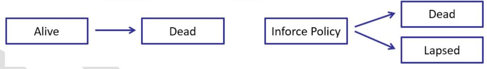

## Page 7
Model cash flows including premiums and benefits are determined by a policy's status and transitions between states. Figures 10.2a adds a state for Lapsed and labels the transitions. Active lives do not recover. Disabled lives do not lapse. To calculate populations by state in our models, we need assumptions for each transition.

Figure 10.2a Same Mortality/Incidence Rates for Actives and Recovered Actives

We can view previous models in Chapters 1-9 and in LTAM Part I as special cases of multi-state models by taking the perspective that decrements such as deaths and lapses are transitions from one state to another, e.g., a lapse is a transition from "Active" to "Lapsed". We can also split the state Dead into additional states for causes of death, e.g. Accident, Cardiovascular, etc.

Some people that become disabled or non-healthy from sickness or accidents recover. Some do not recover and are permanently in State 1, disabled. Figure 10.2b's model makes a further distinction in transition rates between initially active lives (AL) and recovered active lives (RAL).

Figure 10.2b Different Mortality/Incidence Rates for Actives and Recovered Actives
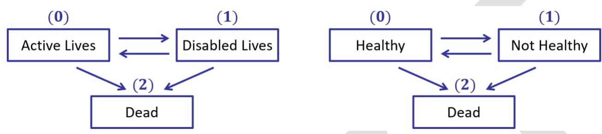
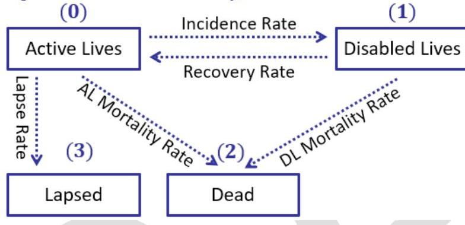
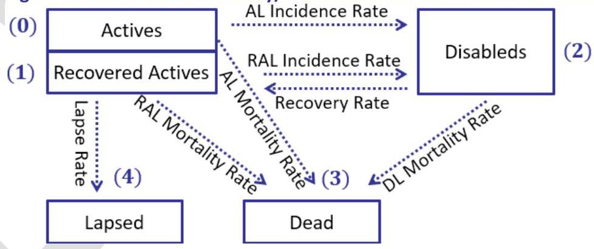

## Page 8
The number of states, N , can be readily extended to $\mathrm{N}>3$ states by expanding the number of disabled or non-healthy states. In Python or C\# we use single arrays [0..N] for state variables and double-arrays $[0 . . \mathrm{N}, 0 . . \mathrm{N}]$ for transition variables with $(i, j)$ indicating a transition from state $i$ to state $j$. The model is not necessarily quickly and easily extended as developing assumptions as well as storing and retrieving inputs at high levels of granularity becomes increasingly challenging. Spreadsheet-based models are significantly impacted by the structural demands to as N increases.

For example, many injuries, diseases and illnesses are tracked by stages such as Stage I, Stage II, ..., for example, cancer. Accordingly, epidemic and medical research models split disabled lives or unhealthy lives to reflect states or stages of interest. The SIR epidemic model has three groups: susceptible (S), infectious (I) and recovered (R). At each stage, the person could improve and recover one or more stages or the disease could progress. The total population is $S$ $+I+R$. A SIR model is parametrized by the infectious period $1 / \gamma$, the basic reproduction number $R 0$ and the contact rate $\beta=\gamma R 0$. There is a lag between being infected and becoming infectious which is the exposed group (E). Upon being infected, individuals will transition to $E$, remaining in $E$ for an average duration and transition to $E$ at rate $\beta S I / N$ before transitioning to $I$.

Figure 10.3

We narrow Chapter 10's possible scope and keep the context for examples simple as in Figure 10.2a. Chapter 10 has a two-way transition from active to/from disabled or healthy to/from not healthy.

In this book, we use Active and Disabled to denote states for all contexts. Disabled lives denote alive in the state of being disabled, injured, sick, or satisfies the policy's activities of daily living (ADL) criteria and thus qualified to receive benefit payments for DI and LTC policies. Active lives denote the state of being healthy or not disabled, that is, does not satisfy all the conditions to be Disabled. Morbidity rate or incidence rate is the probability of transitioning from (0) to (1). Recovery rate is the probability of transitioning from (1) to (0). We have separate mortality
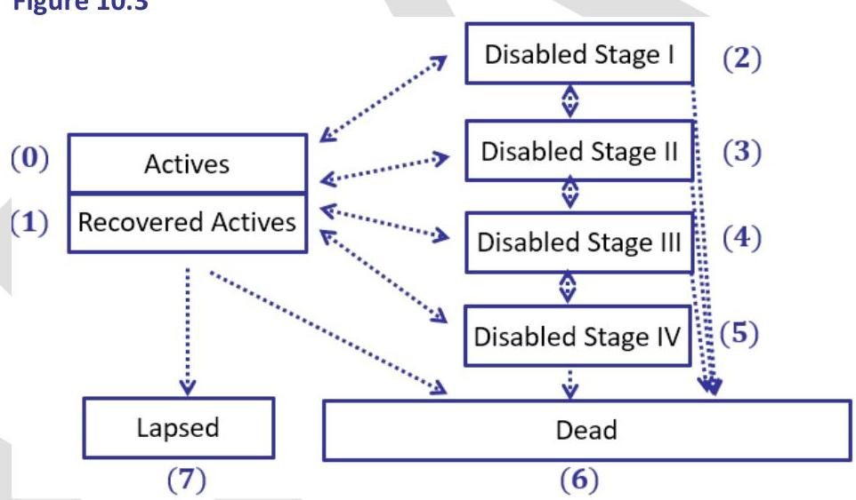

## Page 9
assumptions for the transition from (0) to (2) and the transition from (1) to (2). For DI and LTC, we use the words "continuance" or "prevalence" rather than persistence to indicate the number of disabled lives that continue to be disabled. Claim termination is the ceasing of benefit payments and causes includes disabled deaths and recoveries.

# Cash Flows 

Once we have projected subpopulations by state and number of transitions, we can project cash flows. Cash flows may correspond to remaining in a state or correspond to a transition between states. For example, DI policies only pay premiums while in Active status and not while in Disabled status. Benefits are paid while remaining in a Disabled state (after the transition period). Death benefits are paid upon death (i.e., transition to a Dead state and surrender benefits are paid when transitioning to a Lapsed state.

### 10.3 Model Assumptions and Considerations

Constructing a DI model entails many choices and an LTC model even more choices. We refrain from attempting to enumerate all or many alternatives. Rather, we discuss assumptions and a few design choices followed by the choices made in Chapter 10's model.

Legacy claim cost DI and LTC models typically do not vary mortality or lapse rates based on status - active or disabled - instead, total life mortality rates are used. In reality, lapses only occur on active lives and are not applicable to disabled lives. Ignoring distinction by status is a simplification for both developing assumptions and in model designs and calculations.

These simplifications can result in crude approximations that deteriorate over time. For example, claim experience demonstrates disabled lives have significantly higher mortality. Furthermore, lapse assumptions typically start out at higher rates and decrease becoming level after a number of policy years. As the proportion of disabled total lives increases over time, a constant lapse rate applied to total lives results in lapse rates increasing when measured on the active lives subpopulation.

Multi-state first principles models for DI, LTC, and CCRCs that reflect more granularity and detailed assumptions in projecting population states and transitions including time since events or transitions occurred,

1) enable more accurate projections of cash flows, reserves, and capital for pricing, reporting, and financial planning. In addition, first principles models; and
2) improve analysis comparing actual cash flows to expected cash flows.

However, first principles models introduce challenges such as developing detailed assumptions with limited credible data and navigating the complexities of a detailed model including disabled vs. healthy life mortality, morbidity and lapse assumptions, model construction and validation, and model run time.

Chapter 10's first-principles multi-state cash flow model shares much in common with models from previous chapters. Our LTAM Part I model's first building block projected populations and

## Page 10
decrements. Now, we modify the building block to project subpopulations and transitions. In addition, we make modifications in determining cash flows to reflect different contractual features of DI and LTC products as well as assumptions. For example, DI policies only pay premiums while in Active status and not while in Disabled status.

Chapter 10.4-5 present models on a first-principles basis using distinct assumptions for active and disabled lives. DI and LTC first-principles models are complex with lots of interrelated components, computationally intensive, and model assumptions are challenging to develop and set with transition assumptions requiring large amounts of data. Claim cost models were used historically due to computer and data constraints. The adoption of accounting standards such as GAAP LDTI and IFRS 17 necessitated modernized models based on first-principles.

# 10.3.1 Rates and Assumptions 

In Figures 10.1-2, key transition rates to/from active and disabled states include disability/incidence, recovery, disabled mortality, active mortality, and active lapses. These rates exhibit significant differences based on numerous covariate factors including sex, age, occupation, disablement age, timing of the disability onset, and elimination period.

For life insurance, the selection event is policy underwriting and issuance and 'select' rates are lower than ultimate rates. For DI and LTC, the selection event is disability and 'select' rates for disability contexts have exceptionally high mortality rates immediately following the onset of disability. Initially, monthly mortality rates might be as high as $10 \%$, decreasing substantially after 24 months yet remaining significantly higher than those for non-disabled, healthy individuals during select periods which often range up to 10 years. Likewise, recovery rates start out higher and then decrease over time.

The elimination period is crucial, representing the duration from the onset of disability to when the insured starts receiving benefits. This period can vary from 7 to 180 days or longer. The length of this period significantly impacts the probability of claiming benefits, as longer periods increase the likelihood that an insured individual might either recover or die, reducing potential claims.

LTAM Part I Chapter 5 stated, "Select tables require significantly more data than ultimate tables - sufficient data for many policy years and by other covariates. Many countries do not have enough data to construct S\&U tables." Supporting DI transition assumptions including mortality assumptions that vary rates for disabled lives based on months since disability and for active lives based on initially active vs. recovered active and the months since recovery, requires even more data. LTC, which has degrees of being disabled and the corresponding level of care, adds another layer of challenges.

Developing assumptions is beyond this book's scope. We consider factors affecting transition rates and assumption and model granularity by reviewing several reports as well as providing additional commentary.

## Page 11
# Incidence and Claim Termination Rates

As an illustrative example of covariate factors, consider the 2015 Individual Disability Valuation Standard Report of the Joint American Academy of Actuaries/Society of Actuaries Individual Disability Tables Work Group ("2015 Report") which presents a statutory valuation standard basis for morbidity along with a description of the factors and observations. We provide excerpts and paraphrase the 2015 Report.

Similar to insurers' use of risk classes for life insurance, insurer's classify occupation by class. The 2013 IDI Base Table (Individual disability income) has five occupation (occ) classes:

|  Occ | Class Description  |
| --- | --- |
|  Class M | All medical occupations - doctors, surgeons, dentists, nurses, podiatrists, veterinarians, psychologists, psychiatrists, pharmacists, etc.  |
|  Class 1 | All other white collar and professional occupations  |
|  Class 2 | Skilled labor occupations and most sales related occupations  |
|  Class 3 | Blue collar occupations with light manual duties  |
|  Class 4 | Blue collar occupations with heavy manual duties  |

Incidence rates vary by:

- Elimination Period (in days): 0, 7, 14, 30, 60, 90, 180, 360, and 720
- Occupation Class: 1, 2, 3, 4, and M (for Medical)
- Sex: Female and Male
- Attained Age: 20-69
- Cause: Accident Rates and Sickness Rates

If smoker status is known, there are modifiers by non-smoker vs. smoker that vary by EP, class and sex to adjust base rates. Claim incidence rates vary by benefit period. For accident and sickness policies there are modifiers by benefit period: lifetime, to age 65-70, and short-term. There are also modifiers for market: employer-sponsored and individual-billed. The base tables are for accident and sickness policies – there are modifiers for business contract type including overhead expense, disability buy-out, and key person.

Claim termination rates during select durations vary by:

- Select Claim Durations: Months 1-60, Years 6-10
- Elimination Period (in days): 0, 7, 14, 30, 60, 90, 180, 360, and 720
- Occupation Class: 1, 2, 3, 4, and M (for Medical)
- Sex: Female and Male
- Attained Age: 20-69
- Cause

Claim termination rates during ultimate durations vary by:

- Select Claim Durations: Years 11+

## Page 12
- Occupation Class: Non-Medical and Medical
- Sex: Female and Male
- Attained Age: 30-119
- Cause: No distinction

Claim termination rates also have modifiers for benefit period as well as with vs. with-out cost-of-living adjustments (COLA). The 2015 Report states, "Claim termination rates vary significantly by the claim diagnosis. Diagnoses have been grouped and then mapped to five sets of claim termination modifiers: 1) very high, 2) high, 3) mid, 4) low, and 5) very low. The claim termination modifiers by diagnosis are utilized only in the calculation of DLRs. ALRs generally take into account incurred claims from all diagnoses in the aggregate." A table mapping of claim diagnosis is provided, for example, diabetes is very low, back is low, circulatory is mid, alcohol and drug is high, and cancer and maternity is very high.

# Disabled Lives: Mortality 

In the 2015 Report, industry experience data did not differentiate between claim terminations from recovery and claim terminations from death.

Mortality experience studies as previously described in LTAM Part I were on the total population split by numerous factors such as sex and risk class. With DI and LTC, mortality can be viewed as a total life assumption or separately on active lives and disabled lives.

Given the mortality assumption for two of active, disabled, and total lives, we can impute the third's rates, that is, active and disabled views of mortality should be consistent with total mortality. One method is to conduct experience studies separately on active lives and on disabled lives and impute the total. A challenge is having sufficient data especially for disabled lives and at desired levels of granularity. The imputed totals might be inconsistent with existing total life mortality tables including level and year-by-year slopes and mortality relationships between ages and sex.

Another method is to choose an existing mortality table for total lives and calculate various A/E factors at desired granularity levels. We can then conduct an independent study on active lives and impute the disabled rates or conduct an independent study on disabled lives and impute the active lives. Imputed rates might not be smooth or follow expected relationships between ages. Over time, active-disabled-total relationships change due to shifts in the in force proportion of disableds, higher ages, or level of care for LTC or CCRC.

Relevant, credible, and accurate data especially regarding transitions is critical. There are challenges due to sparse data on disabled lives, advanced ages, and interrelated transitions including recoveries, lapses, timing, and some data needed to develop granular assumptions was not always captured contemporaneously, for example, claim termination cause (lapse vs. death) or transitions between levels of care.

## Page 13
# PONDER 

How should a policy that dies in the elimination period be treated? Is it an active lives death or a disabled lives death?

## Mortality Improvement

Some models apply MI to total lives, that is, the same MI assumption to active and disabled lives. Many models apply separate MI assumptions to active vs. disabled lives. Many models apply MI only to active lives with the premise that nearly all MI is the result from improvements in active lives mortality.

Using active lives MI factors developed using total lives data may understate MI developed using only active lives. Models, such as in previous Chapters' models often cap the number of years MI is applied - the cap is based on considerable actuarial judgment. As a DI and LTC cohort matures the ratio of disabled to active lives increases. With a multistate context, using the same maximum number of years of projected improvement for both active and disabled can produce inconsistencies with active-disabled-total mortality relationships.

## Disabled Lives: Recovery

Disabled lives may recover from their disabling condition or return to work for an extended period. Disabled-worker beneficiaries who return to substantial work for an extended period are deemed to have recovered. Recovery rates start out high and then decease rapidly over the first 10 years.

A 2017 SOA Report, Predicting Group Long Term Disability Recovery and Mortality Rates Using Tree Models stated, "... using tree modeling capabilities available in most statistical packages (we used $R$ for this study), we were able to quickly develop recovery and mortality rates that appear to fit the data extremely well. Additionally, the tree modeling methodology avoids the possibility of producing unreasonable rates ..."

The 2017 Report provided the following graph comparing recovery rates by claim duration, including maternities:

Figure 10.4

## Page 14
The predictive model used 7 independent variables:

|  Variable | Importance (\%)  |
| --- | --- |
|  Duration | 63  |
|  Disability Category | 17  |
|  Age Band | 6  |
|  Own to Any Occ Transition | 6  |
|  STD Integration | 5  |
|  Gross Indexed Benefit Amount | 2  |
|  Gender | 1  |

The study found that taxability of benefits, elimination period, and region, case size, industry and company group did not significantly improve model. For recoveries, duration starts one month after the elimination period, so the elimination period is implicit in duration.

# U.S. Social Security Projection Assumptions

Each year the U.S. Social Security Administration Office of Chief Actuary publishes a Trustees Report along with data, files and documentation of key assumptions, for example, including The Long-Range Disability Assumptions For The 2024 Trustees Report. The assumption document includes the following, "Incidence rates have generally declined since the peak in 2010. The disability death rates for the 2024 Trustees Report are dependent on general population mortality and actual 2023 disabled worker death experience.
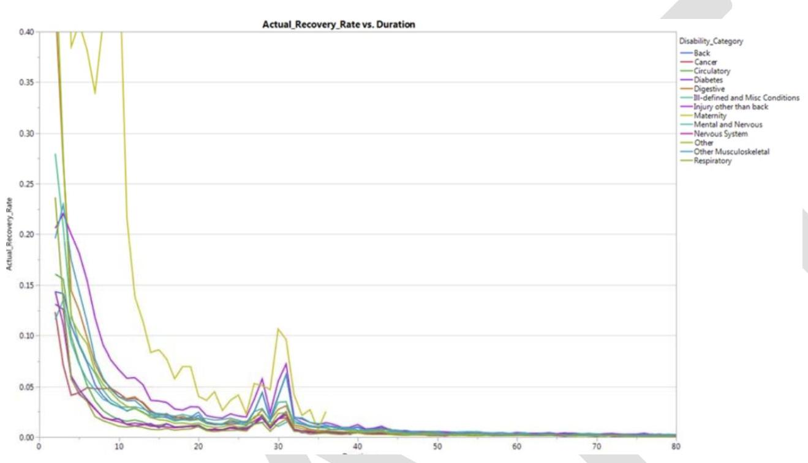

## Page 15
The historical changes in incidence and recovery rates have led to disability prevalence rates for men reaching their lowest level since 1989. Prevalence rates for women are at a similarly low level.
The changing nature of work, which was accelerated by the pandemic, allows more people with significant impairments to continue employment. Many companies have been expanding accommodations in recent years, giving workers more flexibility including the option to telework.
The disability incidence and recovery rates reach ultimate values for the tenth projection year and thereafter.
Incidence rates tend to increase temporarily in bad economic times.
Death rates are much higher for the disabled population than the general population.
For the rest of the projection period, death rate improvement factors are applied to the base probabilities of death to reflect the same rate of improvement as the general population for that age group and sex."

Chart 5 shows that from 1975 to 2020, age-sex adjusted DI death rates have been about $400 \%$ to $550 \%$ that of the general population and are projected to be slightly more than $400 \%$ from 2020 to 2100 .

# LTC Assumptions 

LTC assumptions share general similarities with DI but increase the number of dimensions due to additional states. Whereas DI benefits depend on being disabled, LTC benefits additionally reflect different levels of care, i.e., splits the state of being disabled into substates.
Transition rates are needed to/from each level of care, for example,

- Home Health Care (or Home-Based Care)
- Assisted Living Facility
- Continuing Care Retirement Community
- Residential Care Facility
- Nursing Home
- Skilled Nursing Facility

Incidence, subsequent recoveries, mortality, and transitions between care levels differ by level of care.

A significant difference from DI is that LTC benefit amounts reflect level of care costs. Projecting benefit amounts reflect additional assumption regarding benefit utilization rates, benefit exhaustion rates (i.e., reaching maximum lifetime benefits), and claim cost inflation. For example, LTC claim costs have experience significant inflation over the last two decades.

Higher LTC incidence begins at ages in late 70s and early 80s but can occur much earlier such as ages 40 s and 50 s . Utilization is often associated with medical conditions and end-of-life contexts - with death occurring within 5-10 years or much sooner.

## Page 16
Depending on jurisdiction, insurers often have the ability to increase premium rates usually subject to prior regulatory approval.

# Additional Factors 

There are other factors affecting transition rates related to policyholder behavior. Incidence rates increase and recovery rates decrease during poor economic conditions such as recessions. Dynamic assumptions can be used to modify transition rates reflecting the underlying projection scenario(s).

Similar to level term products with graded designs, premium rate increases result in higher lapse rates. Recall, a much higher lapse rate associated with a premium increase is called a shock lapse and the period following a rate increase is called the shock year. Making a distinction between DI and LTC products without increases vs. those with approved or planned premium increases and their magnitudes is crucial in setting lapse assumptions. After premium rate increases, instead of lapsing policyholders may choose to reduce benefits, for example, keep their premium amount the same but at a lower benefit amount. As with life products, product features such as limited pay, return of premium, cash values, and survivorship benefits should also be reflected in setting assumptions.

### 10.3.2 Model Considerations

First principles DI models typically track policyholder status - active, disabled, and active following recovery. LTC models also track levels of care such as SNF (skilled nursing facility) or RCF (retirement community facility). Choices must be made as to assumption structure and granularity. Will distinctions be made between active and disable mortality? Will disabled mortality and recovery use select and ultimate tables? If so, how long are select periods and which durations are measured in days, weeks, months vs. years?

## Model Time Step

Since time immediately following disability is a critical factor and to support EPs smaller than 30 days such as 7 or 14 days, many models use model time steps smaller than a month such as days for the first few weeks and/or weeks for the first several months of disability and then use a monthly time thereafter.

Figure 10.5 Time Since Disability: Model Time Steps

## Page 17
| Disabled |
| :--: |
| Day 1 |
| Day 2 |
| ... |
| Day 7 |
| Week 2 |
| Week 3 |
| ... |
| Week 8 |
| Month 3 |
| Month 4 |
| ... |

# Timing, Sequential Events, and Their Impact on Modeling 

In modeling DI and LTC, the timing and sequence of events-deaths, lapses, and claims-is crucial. A common simplification is to restrict the sequence of transitions and the number of transitions during a single time step.

For example, we can assume deaths occur first, followed by lapses and then new claims. This ordering affects the calculation of exposures, how many are in a given state when transitions occur, and the resulting cash flows. If we assume that half of the deaths occur at the beginning of the month, those individuals never had a chance to become disabled, affecting the monthly number of incidence calculations. Recoveries are computed for those who are disabled, adjusting for the number of lives at the start minus those who have died. End-of-period active lives are then adjusted for deaths, lapses, and new claims, plus additions for recoveries from disabled to active status.

There are numerous other alternative assumptions for timing and order of events.

### 10.3.3 Examples' Product and Model

Chapter 10 illustrates a DI policy with fixed level premiums and benefit payments. The premium period is to age 65 . The benefit coverage period, the time period in which becoming disabled is covered, is to age 65 . The benefit payment is payable while disabled up to but not including age 67 (no matter when disabled). As in previous Chapters, all examples' policies are issued on the first of the month. Thus, our models do not need to consider intra-month calculations such as mortality or lapse rates changings as policy years or attained ages change during a month.

The elimination period is 30 days. As with our life models, we assume benefits are paid in the middle of the period. This means the number of disabled policies still in the EP equals the number that became disabled during the month, no benefit is paid during the month of disability and the first benefit payment is made the following month.

Figure 10.6 Disability: Elimination Period and Benefit Payment

## Page 18
Chapter 10 does not consider $E P \leq 30$ days so that a benefit payment does not occur in the month of becoming disabled which could happen with short EPs.

For incidence rates, we use combined rates from the IDI Tables, that is, the sum of the accident rates and sickness rates. We assume active mortality follows 2015 VBT Ult. We assume disabled mortality and recovery rates are select and ultimate with a 24 -month select period from time of disability - monthly rates are provided in the Examples. As a simplification, we do not differentiate between an original active status and a recovered active status in regards to mortality or lapses.

# 10.3.4 Projecting Subpopulations and Number of Transitions 

Projecting the population by states is similar to previous Chapters with some slight adaptations. By making assumptions as to the order, timing, and number of transitions during a time step, we can derive relationships as to the population's states and number of transitions.

Figure 10.2a Same Mortality/Incidence Rates for Actives and Recovered Actives

## Timing and Independence

First, we do not allow two events in same month in our model. For example, if an active life were to become disabled and then die, our model treats this as the disability did not occur or was not known and treat as a death. Since both disabled mortality and recovery rates are initially high, our assumptions as to timing, order and only one event per period, may not appear to be a good approximation. Accordingly, many models use smaller time steps such as weeks or days which makes one-event-per-period requirement and the timing assumptions reasonable and practical.

An active live may die or become disabled (new claim) throughout the period (month). Active lives do not recover. As in previous models, lapses are discrete occurring when premiums are due. At the end of the month, active live lapses occur followed by recoveries from disabled lives. From the perspective of the active live population, since we have assumed only one event
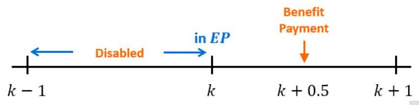
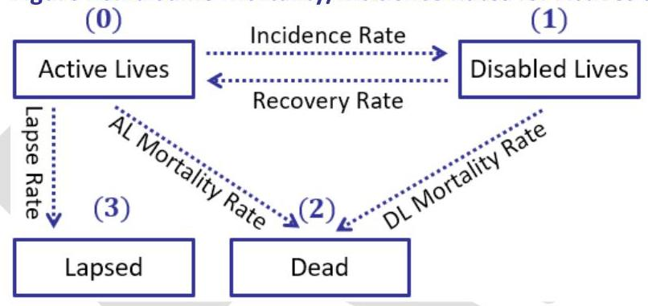

## Page 19
occurs during a month, a disabled live recovering does not die or lapse. Equivalently, recoveries occur EOP a recovered active has no exposure to death during the month of recovery.

Figure 10.7a Active Lives

Figures 10.2a and 10.7a imply the following relationships in Equations Set 1 where all rates are monthalized rates, rates are either select and ultimate or ultimate as applicable, and we use "\#" as short for "number of".

# Equations Set 10.1 

As in previous models, number of deaths is the mortality rate multiplied by BOP subpopulation.
(10.1) \#Active Deaths = Active Mortality Rate $\times$ BOP \#Actives

Using our usual uniform death assumption, we assume half of the deaths occur BOP and half occur MOP. Actives that die BOP never have a chance to become disabled affecting the number of incidence calculation, i.e., half the number of deaths are never exposed and have zero exposure to becoming disabled.
(10.2) \#New Claims $=$ Incidence Rate $\times$ (BOP \#Actives -0.5 half $\times \#$ Deaths)

The number of lapses as Column M's monthly lapse rate multiplied by the BOP \#of active lives that remained active at the end of the period, that is, did not die or become disabled)
(10.3) \#Lapses = Lapse Rate $\times$ BOP \#Actives $\times(1-$ Mortality Rate $) \times(1-$ Incidence Rate $)$

End-of-period active lives are then adjusted for deaths, lapses, and new claims, plus additions for recoveries from disabled to active status.
(10.4) EOP \#Actives = BOP \#Actives - \#Active Deaths - \#New Claims - \#Lapses + \#Recoveries

We assume a disabled live may die throughout the period but that recoveries occur EOP. From the perspective of the disabled live population, since we have assumed only one event occurs during a period, an active live becoming disabled does not die or recover. Equivalently, new claims occur EOP and a newly disabled has no exposure to death or recovery during the first period of disability. However, we assume disabled benefit payments occur MOP for PV timing purposes. Disabled lives do not lapse.
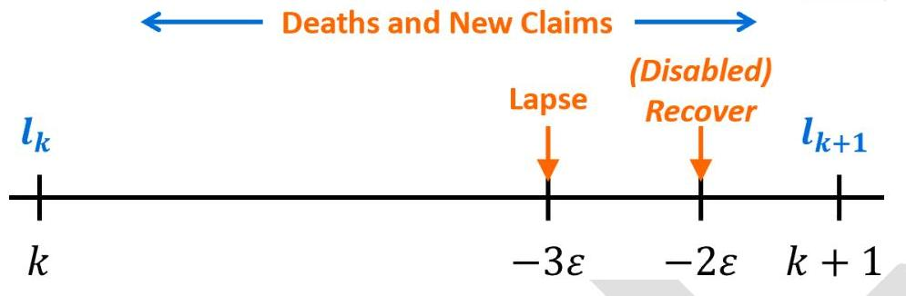

## Page 20
Figure 10.7b Disabled Lives

Figures 10.2a and 10.7b imply the following relationships in Equations Set 2.

# Equations Set 10.2 

Number of deaths is the mortality rate multiplied by BOP subpopulation.
(10.5) \#Disabled Deaths = Disabled Mortality Rate $\times$ BOP \#Disableds

Recoveries are computed for those who are disabled, adjusting for the number of lives at the start minus those who have died.
(10.6) \#Recoveries = (\#BOP Disableds - \#Disabled Deaths) $\times$ Recovery Rate
(10.7) \#In EP = \#New Claims
(10.8) EOP \#Disableds = BOP \#Disableds - \#Disabled Deaths - \#Recoveries

Alternatively, we could assume a disabled live may die or recover throughout the period (month). In that case, as with active lives, we would use:
(10.9) \#Recoveries $=(\# B O P$ Disableds $-0.5 \times \#$ Disabled Deaths $) \times$ Recovery Rate

## Model Subpopulation Cohorts

Previous models, projected decrement rates, population, and decrements (e.g., number of deaths and lapses). We adapt and extend previous models by tracking the life's status at each model time step, i.e., projection month as well as the decrements and transitions. Since transition and decrement rates including mortality, morbidity, and recovery depend on status and when a transition occurred, e.g., date of disability, we deconstruct Figure 10.2a's populations into Active Lives (AL) and Disabled Lives (DL) subpopulations which we will track separately in spreadsheet columns. Furthermore, we create separate sub-cohorts for disabled subpopulations corresponding to each month of disability.

Because status at valuation date - active or disabled - as well as incidence date - affect cash flows and hence what we have to track, we have slightly different models for active lives (AL Model) and disabled lives (DL Model). See Example 10.1's Figure 10.10 and Example 10.2's Figure 10.15.
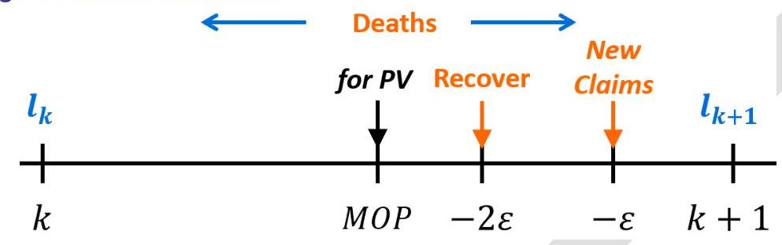

## Page 21
# 10.4 Active Lives Model: Example 

Chapter 10.4 consists of one long example presenting our Active Lives Model (AL Model).

## Example 10.1

Patrick, male age 40, bought a DI policy on 1/1/2019 with product specifications as in Chapter 10.3.3 that provides a $\$ 4,000$ monthly benefit upon disability. Inputs are in cells A2..B23 and Columns J-K. Active mortality rates follow the 2015 VBT MNS Ult ALB table. Incidence rates follow the 2013 IDI Male Occupation 1 EP30 Base Table. Mortality rates for active and disabled lives, incidence rates, recovery rates, are in tabs LifeAssump, S\&U, and DIAssump.

Similar to other examples' projecting the population and decrements, we project the multistate subpopulations and transitions, specifically we track active and disabled lives and their transitions. Second, we project the policy's projected premiums, benefits, and present values.

### 10.4.1 Storing and Staging Inputs

Similar to other Chapters, Chapter 10 Examples' input data is stored in various worksheets or tabs for later retrieval. The tabs LifeAssump, S\&U, and DIAssump store assumption data. We manually input policy data and some assumptions such as $A / E$ and MI factors directly in tab Input. We focus on inputs new for Chapter 10, i.e., tab DIAssump, and briefly cover the other inputs. To simplify the model's Input stage, we bypass storing and retrieving inventory data and product data from as we did in Chapters 2 and 5. Instead, we manually input policy data some assumptions such as $A / E$ and MI factors directly in tab Input.

## Inputs: tabs LifeAssump and S\&U

Tab LifeAssump contains various ultimate mortality tables, tables, forward rates, and premium mode premium and lapse patterns similar to earlier Chapters' tab Assumption1. Tab S\&U is identical to previous Chapters and LTAM Part I's same named tab and contains various select and ultimate mortality tables.

## Inputs: tab DIAssump (DI Assumptions)

This worksheet contains disabled lives assumption data that will be retrieved in Chapter 10 examples. The data represents a very small excerpt from what is typically a very large assumption data base.

Columns A- M contain Disability Rates or Incidence Rates for IDI Occupation 1 split into Accident, Sickness, and Combined. Columns B-D contain rates for Male, Elimination Period 30 Days. Columns E-G contain rates for Male, Elimination Period 90 Days, Columns H-J contain rates for Female, Elimination Period 30 Days. Columns K-M contain rates for Female, Elimination Period 90 Days. See Figure 10.8a for Columns A-G.

Figure 10.8a

## Page 22
|  | A | B | C | D | E | F | G |
| :--: | :--: | :--: | :--: | :--: | :--: | :--: | :--: |
| 1 | Disability Rates |  |  |  |  |  |  |
| 2 | Attained Age | IDI Occ Class 1, Male, EP30 |  |  | IDI Occ Class 1, Male, EP90 |  |  |
| 3 |  | Accident | Sickness | Combined | Accident | Sickness | Combined |
| 4 | 20 | $0.52 \%$ | $0.56 \%$ | $1.08 \%$ | $0.05 \%$ | $0.10 \%$ | $0.16 \%$ |
| 5 | 21 | $0.52 \%$ | $0.56 \%$ | $1.08 \%$ | $0.05 \%$ | $0.10 \%$ | $0.16 \%$ |
| 6 | 22 | $0.52 \%$ | $0.56 \%$ | $1.08 \%$ | $0.05 \%$ | $0.10 \%$ | $0.16 \%$ |
| 49 | 65 | $0.50 \%$ | $3.19 \%$ | $3.69 \%$ | $0.11 \%$ | $1.17 \%$ | $1.28 \%$ |
| 50 | 66 | $0.52 \%$ | $3.36 \%$ | $3.88 \%$ | $0.11 \%$ | $1.24 \%$ | $1.35 \%$ |
| 51 | 67 | $0.54 \%$ | $3.53 \%$ | $4.07 \%$ | $0.12 \%$ | $1.31 \%$ | $1.43 \%$ |
| 52 | 68 | $0.56 \%$ | $3.70 \%$ | $4.27 \%$ | $0.12 \%$ | $1.38 \%$ | $1.50 \%$ |
| 53 | 69 | $0.58 \%$ | $3.88 \%$ | $4.46 \%$ | $0.12 \%$ | $1.45 \%$ | $1.57 \%$ |

Columns O-P contain Recovery Rates by months since disability. We do not vary rates by any variables. The table contains rates for months 1-24 expressed as monthly rates. Thereafter, we assume there are no recoveries. Columns S-T contain Lapse Rates which vary by Issue Ages 2549 and 50+. Lapse rates are expressed as annual rates as usual.

Figure 10.8b

|  | 0 | $P$ | Q | R | S | T |
| :--: | :--: | :--: | :--: | :--: | :--: | :--: |
| 1 | Recovery Rates |  |  | Lapse Rates |  |  |
| 2 | Disability |  |  |  | Low Issue Age |  |
| 3 | Month | Recovery |  | Policy |  |  |
| 4 | 1 | 0.60\% |  | Year | 25 | 50 |
| 5 | 2 | 1.20\% |  | 1 | 10.0\% | 10.0\% |
| 6 | 3 | 1.80\% |  | 2 | 10.0\% | 10.0\% |
| 7 | 4 | 2.40\% |  | 3 | 8.0\% | 10.0\% |
| 8 | 5 | 3.00\% |  | 4 | 8.0\% | 10.0\% |
| 9 | 6 | 3.60\% |  | 5 | 6.0\% | 15.0\% |
| 10 | 7 | 4.20\% |  | 6 | 6.0\% | 15.0\% |
| 27 | 24 | 0.10\% |  | 11 | 5.0\% | 25.0\% |
| 28 | 25 | 0.00\% |  |  |  |  |

Columns V-AB contain Disabled Lives Mortality Rates. Columns V-W contain select rates by month since disability. Rates are expressed as monthly rates and are unisex. The select period is 24 months. Columns Z-AB contain Ultimate Rates based on attained age and expressed as annual rates as usual.

Figure 10.8c

## Page 23
|  | V | W | X | Y | Z | AA | AB |
| :--: | :--: | :--: | :--: | :--: | :--: | :--: | :--: |
| 1 | Disabled Select Mortality Rates |  |  |  | Disabled Ultimate Mortality Rates |  |  |
| 2 | First 24 Months Disability Monthly |  |  |  | Annual Mortality Beyond 24 Months |  |  |
| 3 | Month | Mortality |  |  | Attained |  |  |
| 4 | 1 | 10.00\% |  |  | Age | Male | Female |
| 5 | 2 | 8.00\% |  |  | 32 | 0.03025 | 0.02025 |
| 6 | 3 | 6.00\% |  |  | 33 | 0.03050 | 0.02038 |
| 27 | 24 | 0.75\% |  |  | 34 | 0.03075 | 0.02063 |
|  |  |  |  |  | 55 | 0.02280 | 0.01608 |

# Inputs: tab Input 

The tab Input contains policy and other data we directly input manually rather than retrieve from inventory files and a product parameter database.

Figure 10.9a presents model valuation and projection related inputs in Cells A3..B4.
Figure 10.9a

|  | A | B |
| :-- | :-- | :-- |
| 1 | Input |  |
| 2 | Projection |  |
| 3 | Valuation Date | $12 / 31 / 24$ |
| 4 | Years Since Mortality Table Date | 9.5 |

As in previous Chapters and Examples, B3, range named Valuation_Date, is the valuation date. Cell B4, range named Years_Since_Mortality_Table_Date, is the number of years from the valuation date to the mortality table date.

## Policy and Product Parameter Inputs

Figure 10.9 b presents the policy's inventory data and some related product parameters and assumptions. Cells A7..B24 are similar to what were provided as model inputs in previous Chapters and Examples. Two inputs new to DI and LTC are in rows 12-12: Benefit Cease Age and Monthly Benefit Payment.

Figure 10.9 b

## Page 24
|  | A | B |
| :-- | :-- | :--: |
| 6 | Inventory |  |
| 7 | Issue Date | $1 / 1 / 19$ |
| 8 | Issue Age | 40 |
| 9 | Sex | F |
| 10 | Gross Premium | 2,800 |
| 11 | Premium Mode | 12 |
| 12 | Benefit Cease Age | 67 |
| 13 | Monthly Benefit Payment | 4,000 |
| 14 | Months Since Disability |  |
| 15 | Policy Period | 27 |
| 16 | Benefit Period | 25 |
| 17 | Premium Period | 25 |
| 18 | Mode Pattern Row | 4 |
| 19 | Modal Factor | $8.59 \%$ |
| 20 | Months Since Issue | 72 |
| 21 | A/E Factor | 1.00 |
| 22 | HMI Factor | $0.20 \%$ |
| 23 | FMI Factor | $0.30 \%$ |
| 24 | FMI Years Max | 20 |

# 10.4.2 Disabled Cohort Prototype 

For active lives as of the valuation date, we deconstruct Figure 10.2a's active and disabled states into two subpopulations which we track separately in spreadsheet columns as in Figure 10.10: Active Lives (AL) and Disabled Lives (DL). Furthermore, we split the Disabled Lives subpopulation into cohorts - one cohort for each month of disability in the projection. We also present a summary of the population's states (the right-most group).

Figure 10.10

Consider a cohort consisting of a single life that becomes disabled in projection month N. We want to model this cohort's population and transitions, i.e., deaths, and recoveries. The cohort is closed - new claims in subsequent months belong to separate cohorts. If we can model one cohort's population, we can then model all the disabled cohorts corresponding to the subpopulations that become disabled each projection month $N=1,2,3, \ldots$. The total disabled
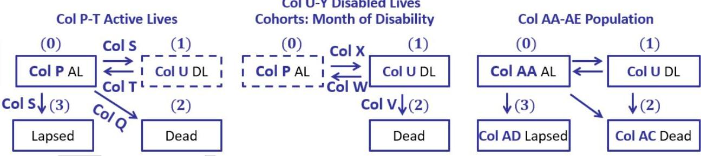

## Page 25
lives population, deaths and recoveries are the sum of all the cohorts' populations, deaths, and recoveries. We do this in tabs $l, d$, and $r$ respectively.

First, we build a prototype for a cohort consisting of a single life that becomes disabled. Figure 10.11 presents the disabled-in-projection-month $\mathrm{N}=3$ 's cohort projection.

Figure 10.11

|  | A | B | C | D | E |
| :--: | :--: | :--: | :--: | :--: | :--: |
| 1 | Prototype Calculation |  |  |  |  |
| 2 | Disabled In Proj Month |  | 3 |  |  |
| 3 | BOM Age | Disabled   Month | lx | Deaths | Recoveries |
| 4 | 46 | 1 | 1.0 |  |  |
| 5 | 46 | 2 | 0.894600 | 0.10000 | 0.00540 |
| 6 | 46 | 3 | 0.813156 | 0.07157 | 0.00988 |
| 13 | 46 | 10 | 0.544387 | 0.00571 | 0.02092 |
| 14 | 47 | 11 | 0.521697 | 0.00544 | 0.01725 |

Cell C2 indicates the projection month the subpopulation became disabled. Column A is age at the beginning of the month. Column B is the number of months since disability which starts with month 1 similar to policy year starting at 1.

Columns C-E apply equations from Equations Sets 1-2.
Column C calculates the number of disabled lives in the cohort. Cell C4 = 1. Thereafter, EOP \# Disabled Lives equals BOP \# Disabled Lives - \# Deaths - \# Recoveries. New claims from future projection months are excluded from the $\mathrm{N}=3$ cohort as these form new cohorts.

$$
C 5=C 4-E 5-D 5, \text { etc. }
$$

Column D calculates the number of cohort deaths as the disabled lives mortality rate multiplied by the BOP \# of disabled lives. Our mortality assumption for disabled lives mortality follows a select \& ultimate mortality table. We lookup both the S\&U and Ult rates and use an IF statement to use the applicable rate based on months since disability (Column B). The select period is 24 months and the table rates are expressed as monthly rates. Rates in the ultimate table are annual mortality rates which we monthalize.

$$
\begin{aligned}
& \text { D5 = C4 * IF(B5 - B\$4<25, VLOOKUP(B4, Mortality_Disabled_Select, 2, TRUE), } \\
& 1-(1-\text { VLOOKUP(A5, Mortality_Disabled_Ult, 2, TRUE) })^{\wedge}(1 / 12)) \text {, etc. }
\end{aligned}
$$

Column E calculates the number of cohort recoveries as the recovery rate multiplied the BOP \# of disabled lives that have not died.

$$
\mathrm{E} 5=(\mathrm{C} 4-\mathrm{D} 5) * \text { VLOOKUP(B4, Recovery_Rate, 2, TRUE), etc. }
$$

## Page 26
Next, we consider that only a subpopulation of the projection's population became disabled in projection month 3, namely, the number of new claims. In Chapter 10.4.3, we calculate new claims in tab p Column R.

|  | A | B | C | D | E | F | G |
| :--: | :--: | :--: | :--: | :--: | :--: | :--: | :--: |
| 1 | Prototype Calculation |  |  |  |  |  |  |
| 2 | Disabled In Projection Month 3 |  |  |  |  |  |  |
| 3 | BOM Age | Disabled   Month | 1x | Deaths | Recoveries | 161 Value | Difference |
| 4 | 46 | 1 | 0.001055 |  |  | 0.001055 | 0.00000000 |
| 5 | 46 | 2 | 0.000943 | 0.00011 | 0.00001 | 0.000943 | 0.00000000 |
| 6 | 46 | 3 | 0.000858 | 0.00008 | 0.00001 | 0.000858 | 0.00000000 |
| 13 | 46 | 10 | 0.000574 | 0.00001 | 0.00002 | 0.000574 | 0.00000000 |
| 14 | 47 | 11 | 0.000550 | 0.00001 | 0.00002 | 0.000550 | 0.00000000 |

Rather than typing in " 1 ", we modify cell C 4 to retrieve the tab p Column R's number of new claims in the projection month specified in Cell C2, i.e., 3.

$$
C 4=I N D E X(p!\$ R \$ 4: \$ R \$ 483, C 2,1)
$$

To validate that we implemented our prototype correctly in tab I, we compare Column C to tab I's Column E which corresponds to disabled-in-projection-month- $\mathrm{N}=3$ 's cohort.

$$
\begin{aligned}
& \mathrm{F} 4=\operatorname{INDEX}(1!\$ C \$ 6: \$ P F \$ 449, \mathrm{C} \$ 2+\mathrm{B} 4-1, \mathrm{C} \$ 2) \\
& \mathrm{G} 4=\mathrm{C} 4-\mathrm{F} 4
\end{aligned}
$$

We can also compare tab d and tab r's deaths and recoveries with our prototype's values as well as cohorts for different values of N . The reader should type in different values in Cell C2 and validate Column G's differences are all zero.

# 10.4.3 Projection Calculation Engine: tab p 

We apply equations from Equations Sets 1-2 and move the prototype's columns to separate tabs.

Interest, Decrement, and Transition rates
Figure 10.12a presents interest, decrement, and transition rates. Column G-M formulas are identical to previous chapters and examples.

Figure 10.12a

## Page 27
|  | A | $B$ | C | D | E | F | G | H | I | J | K | L | M | N | 0 |
| :--: | :--: | :--: | :--: | :--: | :--: | :--: | :--: | :--: | :--: | :--: | :--: | :--: | :--: | :--: | :--: |
| 1 | DI - Active Life |  |  |  |  |  | Input |  |  | Decrements and Transitions |  |  |  |  |  |
|  | Proj | Proj |  | Policy | Policy | Age |  | Active |  | Monthly |  |  | Monthly | Annual | Monthly |
| 2 | Year | Month | Date | Year | Month | BOP |  | Mortality |  | Mortality | Annual | Lapse | Lapse | Incidence | Incidence |
| 3 | 0 | 0 | 12/31/24 | 6 | 12 |  |  |  |  |  |  |  |  | Rate | Rate |
| 4 | 1 | 1 | 1/31/25 | 7 | 1 | 46 | 3.10\% | 0.165\% | 98.1\% | 0.0135\% | 6.0\% | 1 | 0.51\% | 1.27\% | 0.11\% |
| 5 | 1 | 2 | 2/28/25 | 7 | 2 | 46 | 3.10\% | 0.165\% | 98.1\% | 0.0135\% | 6.0\% | 1 | 0.51\% | 1.27\% | 0.11\% |
| 6 | 1 | 3 | 3/31/25 | 7 | 3 | 46 | 3.10\% | 0.165\% | 98.1\% | 0.0135\% | 6.0\% | 1 | 0.51\% | 1.27\% | 0.11\% |

Column H uses the 2015 VBT MSN Ult mortality table.

$$
\mathrm{H} 4=\mathrm{IF}(\mathrm{~F} 4>120,1, \text { INDEX}(\text { VBT_MNS_Ult, } \mathrm{F} 4+1,1))
$$

Column N retrieves the combined incidence rate from the IDI Male Occupation 1, 30-day Elimination Period table. Column O nonthalizes the incidence rate.

$$
\begin{aligned}
& \mathrm{N} 4=\mathrm{IF}(\mathrm{~F} 4>69,0, \text { INDEX(IDI_M_O1_EP30, } \mathrm{F} 4-19,3)) \\
& 04=1-(1-\mathrm{N} 4)^{\wedge}(1 / 12)
\end{aligned}
$$

# Active Lives 

Columns P-T track the population's Active Lives: EOP number of lives in the Active status and the number of transitions to/from the Active status during each period. See Figure 10.12b.

Figure 10.12b

|  | D | E | P | Q | R | S | T |
| :--: | :--: | :--: | :--: | :--: | :--: | :--: | :--: |
| 1 |  |  | Active Lives |  |  |  |  |
| 2 | Policy   Year | Policy   Month | EOP \#Lives | \#Deaths | \# New Claims | \#Lapses | \#   Recoveries |
| 3 | 6 | 12 | 1.0 |  |  |  |  |
| 4 | 7 | 1 | 0.99366 | 0.00014 | 0.00107 | 0.00514 | 0.00000 |
| 5 | 7 | 2 | 0.98737 | 0.00013 | 0.00106 | 0.00510 | 0.00001 |
| 6 | 7 | 3 | 0.98112 | 0.00013 | 0.00105 | 0.00507 | 0.00002 |

Column P calculates the active lives population. We start with a subpopulation of 1 since our policy status is active on the valuation date. Subsequently, EOP \# Active Lives equals BOP \# Active Lives - \# Deaths - \# New Claims - \# Lapses + \# Recoveries.

$$
\mathrm{P} 4=\mathrm{IF}(\mathrm{~F} 5<\text { Benefit_Cease_Age, } \mathrm{P} 3-\mathrm{Q} 4-\mathrm{R} 4-\mathrm{S} 4+\mathrm{T} 4,0)
$$

Column Q calculates the number of active lives deaths as Column J's monthly active life mortality rate multiplied by the BOP \# of active lives.

$$
\mathrm{Q} 4=\mathrm{J} 4^{*} \mathrm{P} 3
$$

## Page 28
As described after Chapter 10.3.4 Figure 10.7b, Column R calculates the number of claims as Column O's monthly incidence rate multiplied by the BOP \# of active lives less half the number of deaths.

$$
R 4=I F(D 4<\text { Benefit_Period, }(P 3-Q 4^{*} 0.5)^{*} 04,0)
$$

Column S calculates the number of lapses as Column M's monthly lapse rate multiplied by the BOP \# of active lives that remained active at the end of the period, that is, did not die or lapse.

$$
S 4=P 3 *(1-J 4) *(1-04) * M 4
$$

Column T is the number of recoveries which is calculated in Column W (since recoveries are transitions from the Disabled status).

$$
\mathrm{T} 4=\mathrm{W} 4
$$

Although Column T is redundant, it allows Columns P-T to provide a full picture on Active Lives.

# Disabled Lives 

Columns U-Z track the population's Disabled Lives: EOP number of lives in the Disabled status and the number of transitions to/from the Disabled status during each period. See Figure 10.12 c .

Figure 10.12c

| 1 | D | E | U | V | W | X | Y | Z |
| :--: | :--: | :--: | :--: | :--: | :--: | :--: | :--: | :--: |
|  |  |  | Disabled Lives |  |  |  |  |  |
| 2 | Policy   Year | Policy   Month | EOP \# Lives | \# Deaths | \#   Recoveries | \#New   Claims | \# Still in EP | EOP \# Lives |
| 3 | 6 | 12 | 0.0 |  |  |  |  | 0.0 |
| 4 | 7 | 1 | 0.00107 | 0.00000 | 0.00000 | 0.00107 | 0.00107 | 0.00107 |
| 5 | 7 | 2 | 0.00202 | 0.00011 | 0.00001 | 0.00106 | 0.00106 | 0.00202 |
| 6 | 7 | 3 | 0.00287 | 0.00018 | 0.00002 | 0.00105 | 0.00105 | 0.00287 |

We start with a subpopulation of 0 in Cell U3 since our policy status is active on the valuation date. As described in Chapter 10.3 we form a cohort for each disability month and track each cohort's population and transitions. The totals are the sum of the cohorts' number of disabled lives, deaths, and recoveries calculated in tabs $I, d$, and $r$ respectively.

$$
\begin{aligned}
& \mathrm{U} 4=\mathrm{IF}(\mathrm{~F} 5<\text { Benefit_Cease_Age, } \mathrm{SUM}(\mathrm{I!C6:PF6}), 0) \\
& \mathrm{V} 4=\mathrm{IF}(\mathrm{~F} 5<\text { Benefit_Cease_Age, } \mathrm{SUM}(\mathrm{~d!C6:PF6}), 0) \\
& \mathrm{W} 4=\mathrm{IF}(\mathrm{~F} 5<\text { Benefit_Cease_Age, } \mathrm{SUM}\left({ }^{\prime} \mathrm{r}^{\prime}!\mathrm{C} 6: \mathrm{PF} 6\right), 0)
\end{aligned}
$$

Column X is the number of new claims previously calculated in Column R (since new claims are transitions from the Active status).

## Page 29
$\mathrm{X} 4=\mathrm{R} 4$
Column $Y$ is the number of disableds still in the elimination period (EP) which equals the number of new claims since our product's EP is 30 days.

$$
Y 4=R 4
$$

We did not make Column's $Y$ formula robust to handle EPs other than 30 days and Column Y's formula would need to be modified accordingly. Model time steps to accommodate weeks might be needed, e.g., 7-day EPs.

We can also calculate EOP \# Disabled Lives as equal to BOP \# Disabled Lives - \# Deaths - \# Recoveries + \# New Claims.

$$
\mathrm{Z} 4=\mathrm{Z} 3-\mathrm{V} 4-\mathrm{W} 4+\mathrm{X} 4
$$

Observe Columns U and Z are equal.

# Population, Cash Flows, and Present Values 

Figure 10.12d's Columns AA-AE summarize the total population by state including lapsed. We omit expired policies - that is, policies past the benefit coverage period. Columns AA and AB were calculated in Columns $P$ and $U$ respectively. Column $A C$ is cumulative totals of the period's active lives deaths and disabled lives deaths calculated in Columns Q and V. Column AD is cumulative totals of the period's lapses calculated in Column S.

$$
\mathrm{AA} 4=\mathrm{P} 4, \mathrm{AB} 4=\mathrm{U} 4, \mathrm{AC} 4=\mathrm{AC} 3+\mathrm{V} 4+\mathrm{Q} 4, \text { and } \mathrm{AD} 4=\mathrm{AC} 3+\mathrm{S} 4
$$

Figure 10.12d

| 1 | D | E | AA | AB | AC | AD | AE | AF | AG | AH | Al |
| :--: | :--: | :--: | :--: | :--: | :--: | :--: | :--: | :--: | :--: | :--: | :--: |
|  |  |  | EOP Population By State |  |  |  |  | Insurer CF |  | Insurer PV |  |
| 2 | Policy   Year | Policy   Month | Active | Disabled | Dead | Lapsed | Total | Premium | Benefit | EOP   PV(Premium) | EOP   PV(Benefit) |
| 3 | 6 | 12 | 1.0 | 0.0 | 0.0 | 0.0 | 1.0 |  |  | 22,092 | 24,285 |
| 4 | 7 | 1 | 0.9937 | 0.0011 | 0.00014 | 0.0051 | 1.000 | 241 | 0 | 21,907 | 24,347 |
| 5 | 7 | 2 | 0.9874 | 0.0020 | 0.00038 | 0.0102 | 1.000 | 239 | 0 | 21,724 | 24,409 |
| 6 | 7 | 3 | 0.9811 | 0.0029 | 0.00069 | 0.0153 | 1.000 | 237 | 4 | 21,541 | 24,467 |

Columns AF-Al calculate the insurer's cash flows - premiums and benefits - and their present values. Premium is paid by the BOP \# of active lives.

$$
\mathrm{AF} 4=\mathrm{IF}(\mathrm{D} 4<\text { Premium_Period, P3*Gross_Premium*Modal_Factor, } 0)
$$

Benefits are paid to the BOP \# of disabled lives less those policies still in the EP.

$$
\mathrm{AG} 4=\mathrm{IF}(\mathrm{~F} 4<\text { Benefit_Cease_Age, (U3 - Y3)*Monthly_Benefit_Payment, } 0)
$$

## Page 30
Columns AH-Al are standard recursive present value formulas for AF's premiums paid BOP and AG's benefits which we assume are paid MOP.

$$
\begin{aligned}
& \mathrm{AH} 3=\mathrm{AH} 4 /(1+\$ \mathrm{G} 4)^{\wedge}(1 / 12)+\mathrm{AF} 4 \\
& \mathrm{Al} 3=\mathrm{Al} 4 /(1+\mathrm{G} 4)^{\wedge}(1 / 12)+\mathrm{AG} 4 /(1+\mathrm{G} 4)^{\wedge}(1 / 24)
\end{aligned}
$$

# 10.4.4 Projection Calculation Engine: tabs I, d, r 

We convert Chapter 10.4.3's prototype to handle subpopulations that become disabled any projection month $N=1,2,3, \ldots$ In our prototype, the rows were months since disability and Columns C-E were lx, deaths, and recoveries. To accommodate multiple cohorts, we calculate lx, deaths, and recoveries in separate tabs, namely, tabs I, d, and r respectively, each tab having the same structure. See Figures 10.13a-c. Columns are the month of disability. However, we change rows to be the projection month. Accordingly, each months' cohort begins on the diagonal, i.e., C6, D7, E8, ... The cohort is null before the month of disability and the cells above the diagonal are empty - we chose to have these cells appear blank rather than equal to 0 .

Figure 10.13a presents the disabled EOP number of lives. Our prototype formula used BOP age and months since disability to look up the mortality rates to calculate deaths. Each cohort's population starts with the corresponding projection months' number of new claims. For convenience, we calculate these values in rows 3-4.

Figure 10.13a

|  | A | B | C | D | E | F | G | H | I |
| :--: | :--: | :--: | :--: | :--: | :--: | :--: | :--: | :--: | :--: |
| 1 | Disabled EOP \# Lives |  |  |  |  |  |  |  |  |
| 2 | Proj Month Disabled |  | 1 | 2 | 3 | 4 | 5 | 6 | 7 |
| 3 |  | BOP Age | 46 | 46 | 46 | 46 | 46 | 46 | 46 |
| 4 |  | \# New Claims | 0.00107 | 0.00106 | 0.00105 | 0.00105 | 0.00104 | 0.00103 | 0.00103 |
| 5 | Proj Month | BOP Age | Disabled EOP \# Lives |  |  |  |  |  |  |
| 6 | 1 | 46 | 0.00107 |  |  |  |  |  |  |
| 7 | 2 | 46 | 0.00096 | 0.00106 |  |  |  |  |  |
| 8 | 3 | 46 | 0.00087 | 0.00095 | 0.00105 |  |  |  |  |
| 9 | 4 | 46 | 0.00080 | 0.00086 | 0.00094 | 0.00105 |  |  |  |
| 10 | 5 | 46 | 0.00075 | 0.00080 | 0.00086 | 0.00094 | 0.00104 |  |  |
| 11 | 6 | 46 | 0.00071 | 0.00075 | 0.00079 | 0.00085 | 0.00093 | 0.00103 |  |
| 12 | 7 | 46 | 0.00068 | 0.00071 | 0.00074 | 0.00079 | 0.00085 | 0.00093 | 0.00103 |

Row 2 is an index for the cohort's projection month of disability.
Row 3 retrieves tab p Column F's BOP age.

$$
\mathrm{C} 3=\operatorname{INDEX}(\mathrm{p}!\$ \mathrm{~F} \$ 4: \$ \mathrm{~F} \$ 915, \mathrm{C} 2,1)
$$

## Page 31
Row 3 retrieves tab p Column R's number of new claims which is each disabled cohort's starting population.

$$
C 4=\operatorname{INDEX}(p!\$ R \$ 4: \$ R \$ 483, C 2,1)
$$

Columns C-PF, Rows 6-449 calculate each cohort's population for each projection month. In order to have the same formula in all cells, we use IF statements. The cell is blank prior to a cohort's formation (Column A < Row 2) or if attained age is beyond the benefit cease age. As in the prototype, we want a cohort's population to start with Row 4 and thereafter we want EOP \# Disabled Lives equals BOP \# Disabled Lives - \# Deaths - \# Recoveries. Deaths and recoveries are calculated in tabs $d$ and $r$ respectively.

$$
\begin{aligned}
& \text { C6 = IF(OR(\$A6<C\$2,\$B6>Benefit_Cease_Age - 1),"", IF(\$A6=C\$2,C\$4,C5 - 'r'!C6 - } \\
& \text { d!C6)), etc. }
\end{aligned}
$$

We copy C6 across rows and columns to Cell PF449.
Figure 10.13b presents the number of disabled deaths. The structure is the same as tab I and Rows 2-3 are identical. We do not need number of new claims in row 4 so we left it blank.

Figure 10.13b

|  | A | B | C | D | E | F | G | H | I |
| :--: | :--: | :--: | :--: | :--: | :--: | :--: | :--: | :--: | :--: |
| 1 | Disabled EOP \# Deaths |  |  |  |  |  |  |  |  |
| 2 | Proj Month Disabled |  | 1 | 2 | 3 | 4 | 5 | 6 | 7 |
| 3 |  | BOP Age | 46 | 46 | 46 | 46 | 46 | 46 | 46 |
| 4 |  |  |  |  |  |  |  |  |  |
| 5 | Proj Month | BOP Age | Disabled EOP | \# Deaths |  |  |  |  |  |
| 6 | 1 | 46 |  |  |  |  |  |  |  |
| 7 | 2 | 46 | 0.000107 |  |  |  |  |  |  |
| 8 | 3 | 46 | 0.000076 | 0.000106 |  |  |  |  |  |
| 9 | 4 | 46 | 0.000052 | 0.000076 | 0.000105 |  |  |  |  |
| 10 | 5 | 46 | 0.000032 | 0.000052 | 0.000075 | 0.000105 |  |  |  |
| 11 | 6 | 46 | 0.000015 | 0.000032 | 0.000051 | 0.000075 | 0.000104 |  |  |
| 12 | 7 | 46 | 0.000011 | 0.000015 | 0.000032 | 0.000051 | 0.000075 | 0.000103 |  |
| 13 | 8 | 46 | 0.000007 | 0.000011 | 0.000015 | 0.000031 | 0.000051 | 0.000074 | 0.000103 |

Cell C6 calculates each cohort's number of deaths during each projection month with similar IF statements. The prototype had

Tab Proto D5 = C4 * IF(B5 - B\$4<25, VLOOKUP(B4, Mortality_Disabled_Select, 2, TRUE), 1 - (1 - VLOOKUP(A5, Mortality_Disabled_Ult, 2, TRUE))^(1/12)), etc.

We modify C6's formula to use the applicable inputs,

## Page 32
C6 = IF(OR(\$A6<=C\$2,\$B6>Benefit_Cease_Age - 1), "", I!C5 * IF(\$A6 - C\$2<25, VLOOKUP(\$A6 - C\$2, Mortality_Disabled_Select, 2, TRUE), 1 - (1 - VLOOKUP(\$B6, Mortality_Disabled_Ult, 2, TRUE))^ $(1 / 12))$ ), etc.

We again copy C6 across rows and columns to Cell PF449.
Figure 10.13c presents the number of recoveries. The structure is identical to tab I and d's structure.

Figure 10.13c

|  | A | B | C | D | E | F | G | H | I |
| :--: | :--: | :--: | :--: | :--: | :--: | :--: | :--: | :--: | :--: |
| 1 | Disabled EOP \# Recoveries |  |  |  |  |  |  |  |  |
| 2 | Proj Month Disabled |  | 1 | 2 | 3 | 4 | 5 | 6 | 7 |
| 3 |  | BOP Age | 46 | 46 | 46 | 46 | 46 | 46 | 46 |
| 4 |  |  |  |  |  |  |  |  |  |
| 5 | Proj Month | BOP Age | Disabled EOP | \# Recoveries |  |  |  |  |  |
| 6 | 1 | 46 |  |  |  |  |  |  |  |
| 7 | 2 | 46 | 5.8E-06 |  |  |  |  |  |  |
| 8 | 3 | 46 | 1.1E-05 | 5.7E-06 |  |  |  |  |  |
| 9 | 4 | 46 | 1.5E-05 | 1.0E-05 | 5.7E-06 |  |  |  |  |
| 10 | 5 | 46 | 1.8E-05 | 1.5E-05 | 1.0E-05 | 5.7E-06 |  |  |  |
| 11 | 6 | 46 | 2.2E-05 | 1.8E-05 | 1.5E-05 | 1.0E-05 | 5.6E-06 |  |  |
| 12 | 7 | 46 | 2.5E-05 | 2.2E-05 | 1.8E-05 | 1.4E-05 | 1.0E-05 | 5.6E-06 |  |
| 13 | 8 | 46 | 2.8E-05 | 2.5E-05 | 2.2E-05 | 1.8E-05 | 1.4E-05 | 1.0E-05 | 5.6E-06 |

Cell C6 calculates each cohort's number of recoveries during each projection month. The prototype had

Tab Proto E5 = (C4 - D5) * VLOOKUP(B4, Recovery_Rate, 2, TRUE), etc.
We modify C6's formula to use the applicable inputs,
C6 = IF(OR(\$A6<=C\$2, \$B6>Benefit_Cease_Age - 1), "", (I!C5 - d!C6)*VLOOKUP(\$A6 C\$2, Recovery_Rate, 2, TRUE)), etc.

We copy C6 across rows and columns to Cell PF449.

# End Example 10.1 

### 10.5 Disabled Lives Model: Example

Like Chapter 10.4, Chapter 10.5 consists of one long example presenting our Disabled Lives Model (DL Model).

## Page 33
# PONDER 

To model a life disabled as of the valuation date, we use our AL Model and change the inputs for the starting number of lives, that is, change P3's number of active lives to 0 and U3's number of disabled lives to 1 as in Figure 10.14a. Will that work?

Figure 10.14a

Our DL Model will look much the same as our AL Model. However, try typing in 0 and 1 into Cells P3 and U3 per the Ponder question and see what happens.

You should get all 0's as in Figure 10.14b

Figure 10.14b

|  | D | E | $P$ | Q | R | S | T | U | V | W | X |
| :--: | :--: | :--: | :--: | :--: | :--: | :--: | :--: | :--: | :--: | :--: | :--: |
| 1 |  |  | Active Lives |  |  |  |  | Disabled Lives |  |  |  |
| 2 | Policy   Year | Policy   Month | EOP \# Lives | \# Deaths | \# New Claims | \# Lapses | \# Recoveries | EOP \# Lives | \# Deaths | \# Recoveries | \# New Claims |
| 3 | 6 | 12 | 0.0 |  |  |  |  | 1.0 |  |  |  |
| 4 | 7 | 1 | 0.000 | 0.000 | 0.000 | 0.000 | 0.000 | 0.000 | 0.000 | 0.000 | 0.000 |
| 5 | 7 | 2 | 0.000 | 0.000 | 0.000 | 0.000 | 0.000 | 0.000 | 0.000 | 0.000 | 0.000 |
| 6 | 7 | 3 | 0.000 | 0.000 | 0.000 | 0.000 | 0.000 | 0.000 | 0.000 | 0.000 | 0.000 |
| 7 | 7 | 4 | 0.000 | 0.000 | 0.000 | 0.000 | 0.000 | 0.000 | 0.000 | 0.000 | 0.000 |

In the AL model, the disabled population is driven by Column R's number of new claims. Aside from Cell U3, Column $U$ is the sum of the disabled cohorts in tab I. When P3 = 0, Column R is 0 , so tab I is all 0 which means tabs d and rare also all 0 which means Columns U-W are 0 which means Columns P-T are all 0.

To construct our DL Model, we made a copy of the AL Model and then made a few modifications we describe in Example 10.2

## Example 10.2

We repeat Example 10.1 except Patrick became disabled 14 months ago and is disabled as of the valuation date.
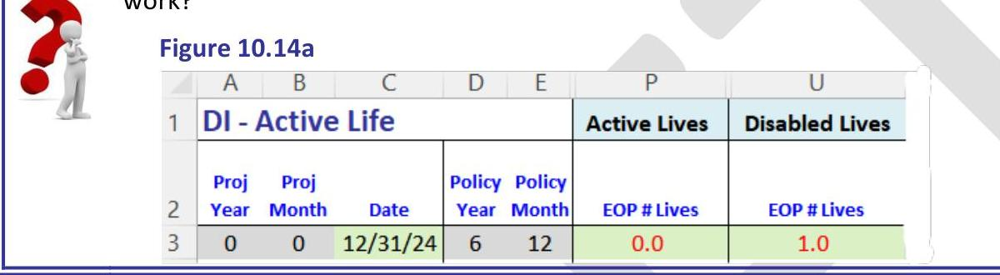

## Page 34
Similar to Example 10.1, we project the multistate subpopulations and transitions, specifically we track active and disabled lives and then project the policy's projected premiums, benefits, and present values.

We have a new input in Cell B14 - months since disability - that was null in Example 10.1. Typically, liability inventory file contains the data as a date and time since disability to the valuation date is calculated. As an expedient, we avoid date calculations and our input is in months. B14 tells us how far the disabled life is into the select period, or in the ultimate period, as the case may be. Depending on the product features, it may also determine time remaining for benefit payments.

Next, we consider the "flow" of lives from one state to another. As of the valuation date, the policy starts in disabled status. A subpopulation recovers each projection month and becomes active. These actives lives can then become re-disabled forming new disabled cohorts in tabs I, d, and r as in our AL Model. We thus track three subpopulations as in Figure 10.15: Active Lives, Disabled Lives, and Re-Disabled Lives with starting a count of 0,1 , and 0 respectively.

Figure 10.15

Accordingly, we made structural changes to the AL Model. We changed Column U-Z Row 1's label from "Disabled Lives" to "Re-disabled Lives" (becoming Example 10.2's Columns X-AC). We then inserted three columns for "Disabled Lives" which are now Example 10.2's Columns U-W. See Figure 10.16a.

Figure 10.16a

Additional changes need to be made. We modified the recovery transition calculation into the Active Lives subpopulation Recoveries into the AL subpopulation (Col T) is now the sum of recoveries from Re-disableds (Col Z) and from the initial Disableds (Col W).
$\mathrm{T} 4=\mathrm{W} 4+\mathrm{Z} 4$, etc.
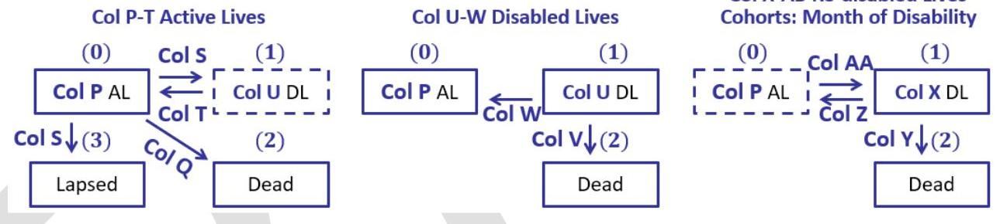
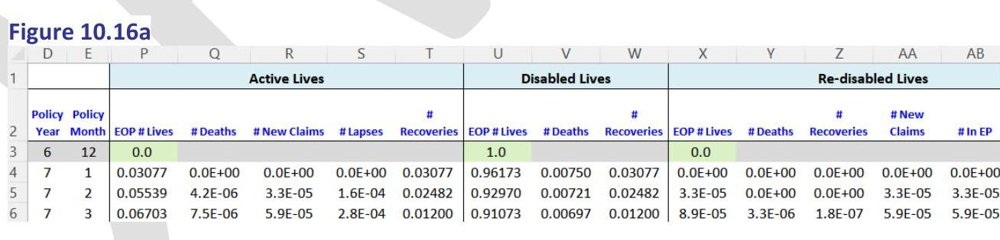

## Page 35
Next, we constructed the formulas for the newly inserted Columns U-W for Disabled Lives. Note the Disabled Lives subpopulation is missing a new claims column. Column U-W's Disabled Lives subpopulation is closed. The only transitions to/from Disabled Lives are Deaths (Col V) and Recoveries (Col W). There are no new entrants into the Disabled population as new claims enter cohorts of the Re-Disabled Lives subpopulation.

U4 = U3 - V4 - W4, etc.
We copied tab Proto's formulas for deaths and recoveries to Columns U-V but then modified the lookup index to equal months since disability plus number of projection months, namely, Months_Since_Disability $+12 *(\operatorname{Col} A-1)+\operatorname{Col} B$, in order to retrieve the appropriate select and ultimate recovery and mortality rates.

V4 = U3 * IF(Months_Since_Disability $+12^{*}(\mathrm{~A} 4-1)+\mathrm{B} 4<25$,
VLOOKUP(Months_Since_Disability $+12^{*}(\mathrm{~A} 4-1)+$ B4, Mortality_Disabled_Select, 2, TRUE), 1 - (1 - VLOOKUP(F4, Mortality_Disabled_Ult, 2, TRUE) )^ (1/12)), etc.

W4 = (U3 - V4) * VLOOKUP(Months_Since_Disability $+12^{*}(\mathrm{~A} 4-1)+\mathrm{B} 4$, Recovery_Rate, 2, TRUE), etc.

Finally, we modified Column AE-AF's EOP Population by State to include all three subpopulations.

AE4 $=$ U4 + X4, etc.
AF4 $=$ AF3 $+Q 4+V 4+Y 4$, etc.
The remaining formulas for EOP Population by State, Active Lives and Re-Disabled Lives columns remain the same as do the formulas in tab's $I, d$, and $r$.

Figure 10.16b

|  |  | D | E | P | Q | R | S | T | U | V | W |
| :--: | :--: | :--: | :--: | :--: | :--: | :--: | :--: | :--: | :--: | :--: | :--: |
| 1 |  |  |  | Active Lives |  |  |  |  | Disabled Lives |  |  |
| 2 | Policy   Year | Policy   Month | EOP \#Lives | \#Deaths | \# New Claims | \#Lapses | \#   Recoveries | EOP\#Lives | \#Deaths | \#   Recoveries |  |
| 3 | 6 | 12 | 0.0 |  |  |  |  | 1.0 |  |  |  |
| 4 | 7 | 1 | 0.03077 | $0.0 \mathrm{E}+00$ | $0.0 \mathrm{E}+00$ | $0.0 \mathrm{E}+00$ | 0.03077 | 0.96173 | 0.00750 | 0.03077 |  |
| 5 | 7 | 2 | 0.05539 | 4.2E-06 | 3.3E-05 | 1.6E-04 | 0.02482 | 0.92970 | 0.00721 | 0.02482 |  |
| 6 | 7 | 3 | 0.06703 | 7.5E-06 | 5.9E-05 | 2.8E-04 | 0.01200 | 0.91073 | 0.00697 | 0.01200 |  |

Compared to Example 10.2, the Active Lives subpopulation is small and the Re-Disabled Lives subpopulation even smaller. This is because Active Lives start at 0 instead of 1 . The number of lapses is much lower and the number of deaths is much higher.

Figure 10.16c

## Page 36
|  | D | E | X | Y | Z | AA | AB | AC |
| :--: | :--: | :--: | :--: | :--: | :--: | :--: | :--: | :--: |
| 1 | Re-disabled Lives |  |  |  |  |  |  |  |
|  | Policy   Year | Policy   Month | EOP \# Lives | \# Deaths | Recoveries | \#New   Claims | \# Still in EP | EOP \# Lives |
| 3 | 6 | 12 | 0.0 |  |  |  |  | 0.0 |
| 4 | 7 | 1 | $0.0 \mathrm{E}+00$ | $0.0 \mathrm{E}+00$ | $0.0 \mathrm{E}+00$ | $0.0 \mathrm{E}+00$ | $0.0 \mathrm{E}+00$ | $0.0 \mathrm{E}+00$ |
| 5 | 7 | 2 | $3.3 \mathrm{E}-05$ | $0.0 \mathrm{E}+00$ | $0.0 \mathrm{E}+00$ | $3.3 \mathrm{E}-05$ | $3.3 \mathrm{E}-05$ | $1.6 \mathrm{E}-04$ |
| 6 | 7 | 3 | $8.9 \mathrm{E}-05$ | $3.3 \mathrm{E}-06$ | $1.8 \mathrm{E}-07$ | $5.9 \mathrm{E}-05$ | $5.9 \mathrm{E}-05$ | $2.8 \mathrm{E}-04$ |

Column AI-AL formulas for cash flows and PVs are the same, however, the premiums are significantly smaller and the benefits are significantly larger when compared to Example 10.1's Active Life.

Figure 10.16d

|  | D | E | AD | AE | AF | AG | AH | AI | AJ | AK | AL |
| :--: | :--: | :--: | :--: | :--: | :--: | :--: | :--: | :--: | :--: | :--: | :--: |
| 1 |  |  | EOP Population By State |  |  |  |  | Insurer CF |  | Insurer PV |  |
| 2 | Policy   Year | Policy   Month | Active | Disabled | Dead | Lapsed | Total | Premium | Benefit | EOP   PV[Premium] | EOP   PV[Benefit] |
| 3 | 6 | 12 | 0.00000 | 1.00000 |  |  | 1.00000 |  |  | 3,169 | 441,262 |
| 4 | 7 | 1 | 0.03077 | 0.96173 | 0.00750 | 0.00000 | 1.00000 | 0 | 4,000 | 3,177 | 438,381 |
| 5 | 7 | 2 | 0.05539 | 0.92973 | 0.01472 | 0.00016 | 1.00000 | 7 | 3,847 | 3,178 | 435,646 |
| 6 | 7 | 3 | 0.06703 | 0.91082 | 0.02170 | 0.00044 | 1.00000 | 13 | 3,719 | 3,173 | 433,032 |

As a result, on a typical DI or LTC block of business, although the number of disabled lives is a small percentage of the total number of policies, the super-majority of reserves arise from disabled lives. The split between active lives reserves and disabled lives reserves will depend on numerous factors such as the block's average policy year, attained age, claim experience, and benefit utilization.

# End Example 10.2 

### 10.6 Claim Cost Model

Chapter 10.6 consists of one example illustrating a DI net premium reserve calculation using a claim cost model. Claim cost models separately model claim costs as the present value of benefits. Recovery and death transitions are combined as claim termination rates. Claims costs are then incorporated into the cash flow model combining incidence and severity components.

The claim cost model looks and feels like LTAM Part I Chapter 8's net premium reserve models for traditional life products using annual time steps, except instead of Face as the benefit we use and substitute a lump sum to pay for the claim cost calculated as the present value of monthly benefits.

## Page 37
# Example 10.3 

Stephen, male age 40, bought a DI policy with benefit coverage period to age 65 with a benefit cease age of 67 (same product specifications as in Examples 10.1-2) that provides a \$40,000 annual benefit upon disability. Calculate mean net premium reserves using a claim cost model. The valuation basis is the 2017 CSO MNS Ult ALB mortality table with a 4\% valuation interest rate.

### 10.6.1 Storing Inputs

Tabs LifeAssump and S\&U are identical to Examples 10.1-2. We made a few changes to tab DIAssump to emphasize that claim cost models do not model active lives and disabled lives subpopulations nor model recoveries and deaths separately. We started with Example 10.1-2's tabs and then deleted the columns corresponding to Recovery Rates and Disabled Mortality Rates. We then inserted Disabled Claim Termination Rates which for convenience we set equal to Example 10.1-2's Disabled Ultimate Mortality Rates.

Figure 10.17

|  | S | T | U | V |
| :--: | :--: | :--: | :--: | :--: |
| 1 | Disabled Claim Termination Rates |  |  |  |
| 2 |  |  |  |  |
|  | Attained |  |  |  |
| 3 | Age | Male | Female |  |
| 4 | 32 | 0.03025 | 0.02025 |  |
| 5 | 33 | 0.03050 | 0.02038 |  |
| 6 | 34 | 0.03075 | 0.02063 |  |

### 10.6.2 Calculation Engine: tab NLP

We copied LTAM Part I Chapter 8's model into tab NLP, changed the label "Face" in Column G to "Claim Cost Per Disabled". We then modified Column G to retrieve the claim cost values calculated in tab ClaimCost. The remainder of the formulas remain unchanged and are identical to the previous net premium reserve model.

Figure 10.18 presents Inputs. As in previous examples, Cells B3..B12 are range named reflecting Column A's labels.

Figure 10.18

## Page 38
|  | A | B | C | D | E | F | G | H |
| :--: | :--: | :--: | :--: | :--: | :--: | :--: | :--: | :--: |
| 1 | DI - Claim Cost |  |  |  | Input |  |  |  |
|  |  |  | Policy   Year | Age   BOP | Annual   Mortality   Rate | Annual   Policy   Premium | Claim Cost   Per Disabled | Annual   Incidence   Rate |
| 2 | Input |  |  |  |  |  |  |  |
| 3 | Issue Age | 40 | 0 |  |  |  |  |  |
| 4 | Sex | M | 1 | 40 | $0.120 \%$ | 6,000 | 521,533 | $1.11 \%$ |
| 5 | Gross Premium | 6,000 | 2 | 41 | $0.127 \%$ | 6,000 | 516,102 | $1.13 \%$ |
| 6 | Policy Period | 27 | 3 | 42 | $0.135 \%$ | 6,000 | 508,749 | $1.15 \%$ |
| 7 | Benefit Cease Age | 67 | 4 | 43 | $0.143 \%$ | 6,000 | 501,750 | $1.17 \%$ |
| 8 | Annual Benefit Payment | 40,000 | 5 | 44 | $0.150 \%$ | 6,000 | 492,644 | $1.20 \%$ |
| 9 | Benefit Period | 25 | 6 | 45 | $0.154 \%$ | 6,000 | 482,170 | $1.24 \%$ |
| 10 | Premium Period | 25 | 7 | 46 | $0.160 \%$ | 6,000 | 470,235 | $1.27 \%$ |
| 11 | Interest Rate Annual | $4.00 \%$ | 8 | 47 | $0.166 \%$ | 6,000 | 457,609 | $1.32 \%$ |
| 12 | Interest Rate Monthly | $0.33 \%$ | 9 | 48 | $0.173 \%$ | 6,000 | 444,242 | $1.37 \%$ |

To calculate claim costs, we need the nonthalized interest rate which for convenience we calculate in Cell B12. Columns E, F, and H retrieve rates from input tabs as usual.
$\mathrm{E} 4=\mathrm{IF}(\mathrm{D} 4>120,1, \mathrm{INDEX}(\mathrm{CSO} \_\mathrm{MNS} \_\mathrm{Ult}, \mathrm{D} 4-17,1))$, etc.
F4 = IF(C4>Premium_Period, 0, Gross_Premium), etc.
$\mathrm{H} 4=\mathrm{IF}(\mathrm{C} 4>$ Benefit_Period, 0, INDEX(IDI_M_O1_EP30, D4 - 19, 3)), etc.
Column G calculates the policy's claim cost by retrieving the Claim Cost Per Disabled for a \$1 monthly benefit from tab ClaimCost (see Chapter 10.6.3) and multiplies by the policy's monthly benefit.

G4 = IF(C4 > Benefit_Coverage_Period, 0, HLOOKUP(D4, ClaimCost!E\$2:AC\$3, 2 ,FALSE) * Annual_Benefit_Payment/12), etc.

Figure 10.19 presents the NLP calculations. We provide formulas without explanation (see LTAM Part I for details).

Figure 10.19

|  | C | I | J | K | L | M | N | 0 | $P$ | Q |
| :--: | :--: | :--: | :--: | :--: | :--: | :--: | :--: | :--: | :--: | :--: |
| 1 |  | Calculation |  |  |  |  |  |  |  |  |
| 2 | Policy   Year | p | Claim Cost | BOP   PV[Gross   Premium] | BOP   PV[Claim   Cost] | k-Factor | Net   Premium | BOP   PV[Net   Premium] | BOP   Terminal   Reserve | Mean   Reserve |
| 3 | 0 |  |  |  |  |  |  |  |  |  |
| 4 | 1 | 0.9877 | 5,794 | 83,587 | 82,221 | $98.4 \%$ | 5,902 | 82,221 | 0 | 3,067 |
| 5 | 2 | 0.9875 | 5,816 | 81,695 | 80,592 |  | 5,902 | 80,360 | 232 | 3,294 |
| 6 | 3 | 0.9872 | 5,840 | 79,721 | 78,872 |  | 5,902 | 78,418 | 453 | 3,509 |

$\mathrm{I} 4=(1-\mathrm{E} 4)^{*}(1-\mathrm{H} 4)$, etc.

## Page 39
$\mathrm{J} 4=\mathrm{G} 4^{*} \mathrm{H} 4$, etc.
$\mathrm{K} 4=\mathrm{K} 5^{*} \mathrm{I} 4 /(1+$ Interest_Rate_Annual $)+\mathrm{F} 4$, etc.
L4 = L5*I4 / (1 + Interest_Rate_Annual) + G4*H4 / (1+Interest_Rate_Annual)^(0.5), etc.
$\mathrm{M} 4=\mathrm{L} 4 / \mathrm{K} 4$, etc.
$\mathrm{N} 4=\mathrm{M} \$ 4 * \mathrm{~F} 4$, etc.
$04=05 * \mathrm{I} 4 /(1+$ Interest_Rate_Annual $)+\mathrm{N} 4$, etc.
$\mathrm{P} 4=\mathrm{L} 4-04$, etc.
$\mathrm{Q} 4=0.5^{*}(\mathrm{P} 4+\mathrm{P} 5+\mathrm{N} 4)$, etc.

# 10.6.3 Claim Cost Cohort Prototype 

Similar to Chapter 10.4.2's disabled lives prototype, we consider a cohort consisting of a single life that becomes disabled at integer age N . We want to calculate this cohort's claim cost by modeling the cohort's population and terminations using monthly time steps. We then calculate number of payments and the PV of benefits. The cohort is closed - new claims at subsequent ages belong to separate cohorts. If we can model one cohort's population, we can then model all the disabled cohorts corresponding to the subpopulations that become disabled each age $\mathrm{N}=$ Issue Age, Issue Age $+1, \ldots, 64$.

The total disabled lives population, deaths and recoveries are the sum of all the cohorts' populations, deaths, and recoveries. We do this in tabs I, d, and r respectively.

First, we build a prototype for a cohort consisting of a single life that becomes disabled. Figure 10.20 presents the disabled-at-age $\mathrm{N}=50$ 's cohort projection. The prototype calculates the claim cost per disabled, which is the PV of a $\$ 1$ monthly benefit.

Figure 10.20

|  | A | B | C | D | E | F | G | H |
| :--: | :--: | :--: | :--: | :--: | :--: | :--: | :--: | :--: |
| 1 | Prototype Calculation |  |  |  |  |  |  |  |
| 2 | Age at Disability |  | 50 |  |  |  |  |  |
| 3 | Disabled   Year | Disabled   Month | Discount   Factor | Benefit | $\begin{gathered} \text { Monthalized Claim } \\ \text { Termination Rate } \end{gathered}$ | \#   disableds | \#   payments | PV(\$1 Benefit) |
| 4 |  |  | 1 |  |  | 1.0 |  | 124.7 |
| 5 | 1 | 1 | 0.9967 | 0 | 0.00171 | 0.9983 | 0.9991 |  |
| 6 | 1 | 2 | 0.9935 | 1 | 0.00171 | 0.9966 | 0.9974 |  |
| 7 | 1 | 3 | 0.9902 | 1 | 0.00171 | 0.9949 | 0.9957 |  |
| 207 | 17 | 11 | 0.5151 | 1 | 0.00275 | 0.6499 | 0.6508 |  |
| 208 | 17 | 12 | 0.5134 | 1 | 0.00275 | 0.6481 | 0.6490 |  |
| 209 | 18 | 1 | 0.5117 | 0 | 1.00000 | 0.0000 | 0.3241 |  |

## Page 40
Cell C2 indicates the age the subpopulation became disabled. Columns A-B are the year and month since disability starting at year 1, month 1 similar indexing policy years.

Column C calculates the discount factor which is the PV of 1. Cell C4 = 1. Thereafter,

C5 = C4 /(1 + Interest_Rate_Monthly), etc.
Column D calculates the benefit paid. The benefit is 1 after the elimination period through and including age 66 and 11 months, otherwise the benefit is 0 . Cell D4 = 1 since the policy is in the elimination period. Thereafter,

D5 = IF(A6 + C\$2 - 1 < Benefit_Cease_Age, 1, 0), etc.
Column E retrieves and monthalizes the annual claim termination rate.

E5 = IF(A5 + C\$2 - 1 < Benefit_Cease_Age, 1, 1 - (1 - VLOOKUP(C\$2 + \$A5 - 1, Claim_Termination_Rate, 2, FALSE) )^(1/12), 1), etc.

Column F projects the disabled population, that is, calculates the number of disableds. We start with a population of 1 since we are calculating the claim cost per disabled.

F4 = 1. F5 = F4*(1 - E5), etc.
Column G calculates the number of payments as the average of the BOP and EOP number of disableds. We reflect that some disableds will terminate prior to receiving their benefit which we assume is paid MOP.

G5 = 0.5*(F4 + F5), etc.
Cell H4 calculates the PV of benefits summing the discounted number of $\$ 1$ payments (discounting each payment by its discount factor).

H4 = SUMPRODUCT(C:C, D:D, G:G), etc.

# 10.6.4 Projection Calculation Engine: tabs ClaimCost, ctr, ben, \#dis, pay 

We convert Chapter 10.6.2's prototype to handle subpopulations that become disabled any age N during the benefit coverage period. As with Chapter 10.4.2's prototype, we calculate the columns in separate tabs, namely, tabs ClaimCost, ctr, ben, \#dis, and \#pay respectively. The latter four tabs have the same structure where columns are the age at disability. See Figures 10.21a-e. The reader should compare the prototype formulas with the corresponding tab's formula.

Figure 10.21a presents the per disabled claim cost calculation.
Figure 10.21a

## Page 41
|  | A | B | C | D | E | F | G | H | I |
| :--: | :--: | :--: | :--: | :--: | :--: | :--: | :--: | :--: | :--: |
| 1 | Per Disabled Claim Cost for \$1/month |  |  |  |  |  |  |  |  |
|  | Disabled | Disabled | Discount | BOP Disability Age | 40 | 41 | 42 | 43 | 44 |
| 2 | Year | Month | Factor | PV(Benefits) | 156.5 | 154.8 | 152.9 | 150.5 | 147.8 |
| 3 |  |  | 1 |  |  |  |  |  |  |
| 4 | 1 | 1 | 0.9967 |  |  |  |  |  |  |
| 5 | 1 | 2 | 0.9935 |  |  |  |  |  |  |

Columns A-C replicated the prototype's Columns A-C.
Row 2 is an index for the cohort's age at disability.
Row 3 calculates claim cost which is the PV of benefits. Our prototype formula took the sumproduct of the discount factor, the benefit, and the number of payments. The benefit is calculated in tab ben Column C. The number of payments is calculated in tab \#pay Column C.

$$
\mathrm{E} 3=\text { SUMPRODUCT( } \$ \mathrm{C}: \$ \mathrm{C} \text {, ben!C:C,' \#pay'!C:C) }
$$

We copy E3 across row 3 to Column AC (age 64).
Figure 10.21 b presents the claim termination rate calculated in tab ctr.
Figure 10.21b

|  | A | B | C | D | E | F | G | H | Z | AA |
| :--: | :--: | :--: | :--: | :--: | :--: | :--: | :--: | :--: | :--: | :--: |
| 1 | Claim Termination Rate Disability Age |  |  |  |  |  |  |  |  |  |
|  | Disabled   Year | Disabled   Month | 40 | 41 | 42 | 43 | 44 | 45 | 63 | 64 |
| 3 |  |  |  |  |  |  |  |  |  |  |
| 4 | 1 | 1 | 0.002236 | 0.002117 | 0.001993 | 0.001862 | 0.001732 | 0.001596 | 0.00245 | 0.002543 |
| 5 | 1 | 2 | 0.002236 | 0.002117 | 0.001993 | 0.001862 | 0.001732 | 0.001596 | 0.00245 | 0.002543 |
| 6 | 1 | 3 | 0.002236 | 0.002117 | 0.001993 | 0.001862 | 0.001732 | 0.001596 | 0.00245 | 0.002543 |

Columns A-B are indices for disability year/month. Columns C-AA retrieve and monthalize the claim termination rate at each disabled year/month (rows) at each age of disability (columns).

$$
\begin{aligned}
& \mathrm{C} 4=1-(1-\text { VLOOKUP }(\mathrm{C} \$ 2+\$ \mathrm{~A} 4-1 \text {, Claim_Termination_Rate, 2, FALSE) })^{\wedge}(1 / 12) \text {, } \\
& \text { etc. }
\end{aligned}
$$

We copy C 4 across rows and columns to Cell AA447.

Figure 10.21c presents the benefit pattern calculated in tab ben. The structure is identical to tab ctr.

Figure 10.21c

## Page 42
|  | A | B | C | D | E | F | G | AA |
| :--: | :--: | :--: | :--: | :--: | :--: | :--: | :--: | :--: |
| 1 | Benefit Pattern Disability Age |  |  |  |  |  |  |  |
|  | Disabled   Year | Disabled   Month | 40 | 41 | 42 | 43 | 44 | 64 |
| 3 |  |  |  |  |  |  |  |  |
| 4 | 1 | 1 | 0 | 0 | 0 | 0 | 0 | 0 |
| 5 | 1 | 2 | 1 | 1 | 1 | 1 | 1 | 1 |
| 279 | 23 | 12 | 1 | 1 | 1 | 1 | 1 | 0 |
| 280 | 24 | 1 | 1 | 1 | 1 | 1 | 0 | 0 |
| 291 | 24 | 12 | 1 | 1 | 1 | 1 | 0 | 0 |
| 292 | 25 | 1 | 1 | 1 | 1 | 0 | 0 | 0 |
| 303 | 25 | 12 | 1 | 1 | 1 | 0 | 0 | 0 |
| 304 | 26 | 1 | 1 | 1 | 0 | 0 | 0 | 0 |
| 315 | 26 | 12 | 1 | 1 | 0 | 0 | 0 | 0 |
| 316 | 27 | 1 | 1 | 0 | 0 | 0 | 0 | 0 |
| 327 | 27 | 12 | 1 | 0 | 0 | 0 | 0 | 0 |
| 328 | 28 | 1 | 0 | 0 | 0 | 0 | 0 | 0 |

Columns C-AA calculates the benefit pattern at each disabled year/month (rows) at each age of disability (columns).

$$
\mathrm{C} 4=0 . \mathrm{C} 5=\mathrm{IF}(\mathrm{C} \$ 2+\$ \mathrm{~A} 5-1<\text { Benefit_Cease_Age, } 1,0) \text {, etc. }
$$

Figure 10.21d presents the projected disabled population, i.e., number of disableds, calculated in tab \#dis. The structure is identical to tabs ctr and ben.

Figure 10.21d

|  | A | B | C | D | E | F | G | H | Z | AA |
| :--: | :--: | :--: | :--: | :--: | :--: | :--: | :--: | :--: | :--: | :--: |
| 1 | Number Disableds Disability Age |  |  |  |  |  |  |  |  |  |
|  | Disabled   Year | Disabled   Month | 40 | 41 | 42 | 43 | 44 | 45 | 63 | 64 |
| 3 |  |  |  |  |  |  |  |  |  |  |
| 4 | 1 | 1 | 1 | 1 | 1 | 1 | 1 | 1 | 1 | 1 |
| 5 | 1 | 2 | 0.9978 | 0.9979 | 0.9980 | 0.9981 | 0.9983 | 0.9984 | 0.9975 | 0.9975 |
| 6 | 1 | 3 | 0.9955 | 0.9958 | 0.9960 | 0.9963 | 0.9965 | 0.9968 | 0.9951 | 0.9949 |

Columns C-AA calculates the number of disableds at each disabled year/month (rows) at each age of disability (columns).

$$
\mathrm{C} 4=1 . \mathrm{C} 5=\mathrm{C} 4^{*}(1-\mathrm{ctr}!\mathrm{C} 4) \text {, etc. }
$$

Figure 10.21e presents the projected disable population, i.e., number of disableds, calculated in tab \#dis. The structure is identical to tabs ctr and ben.

Figure 10.21e

## Page 43
|  | A | B | C | D | E | F | G | H | Z | AA |
| :--: | :--: | :--: | :--: | :--: | :--: | :--: | :--: | :--: | :--: | :--: |
| 1 | Number of Payments |  |  | Disability Age |  |  |  |  |  |  |
|  | Disabled | Disabled |  |  |  |  |  |  |  |  |
| 2 | Year | Month | 40 | 41 | 42 | 43 | 44 | 45 | 63 | 64 |
| 3 |  |  |  |  |  |  |  |  |  |  |
| 4 | 1 | 1 | 0.9989 | 0.9989 | 0.9990 | 0.9991 | 0.9991 | 0.9992 | 0.9988 | 0.9987 |
| 5 | 1 | 2 | 0.9966 | 0.9968 | 0.9970 | 0.9972 | 0.9974 | 0.9976 | 0.9963 | 0.9962 |
| 6 | 1 | 3 | 0.9944 | 0.9947 | 0.9950 | 0.9954 | 0.9957 | 0.9960 | 0.9939 | 0.9937 |

Columns C-AA calculates the number of payments at each disabled year/month (rows) at each age of disability (columns).

$$
\mathrm{C} 4=0.5^{*}\left(' \# \text { dis'!C5 + '\#dis'!C4), etc. }\right.
$$

# End Example 10.3 

### 10.7 Mathematical Background

Examples 10.1-2 recursively applied equations from Equations Sets 1-2. The recursion and the Equation Sets can be cast in a mathematical framework known as Markov chains after Russian mathematician Andrey Markov.

## Finite-state Markov Chains

A Markov chain or Markov process is a stochastic model describing a sequence of possible events in which the probability of moving to the next state only depends on the current state and not on previous states. Markov chains can be discrete or continuous. We only consider the discrete case. A Markov chain is called homogeneous if and only if the transition probabilities are independent of time $t$. A Markov chain is called nonhomogeneous if the transition probabilities change over time. We can frame transitional probabilities as a transition matrix and the distribution amongst the states as a state vector.

We now provide a more formal mathematical definition. A discrete-time stochastic process with discrete random variables is called a Markov chain, if given any finite sequence $x_{0}, x_{1}, \ldots$, $x_{k}$ where $x_{i}$ is a possible value of random variable $X_{i}$ (recall, $P$ () denotes "probability"),

$$
P\left(X_{k}=x_{k} \mid X_{k-1}=x_{k-1}, \ldots, X_{0}=x_{0}\right)=P\left(X_{k}=x_{k} \mid X_{k-1}=x_{k-1}\right)
$$

The transition probability from state $i$ to state $j$ at time $k$ is $Q_{k}^{(i, j)}=P\left(X_{k+1}=j \mid X_{k}=j\right)$.
Let the possible states be indexed by $0,1, \ldots, m$. The transition matrix $\boldsymbol{Q}_{\boldsymbol{k}}$ is

## Page 44
$$
Q_{k}=\left(\begin{array}{cccc}
Q_{k}^{(0,0)} & Q_{k}^{(0,1)} & \ldots & Q_{k}^{(0, m)} \\
Q_{k}^{(1,0)} & Q_{k}^{(1,1)} & \ldots & \vdots \\
\vdots & \vdots & \ddots & \vdots \\
Q_{k}^{(m, 0)} & \ldots & \ldots & Q_{k}^{(m, m)}
\end{array}\right)
$$

Suppose at $t=k$ we are in state N and wish to predict future states at $t=k+1, k+2, \ldots$

# PONDER 

Do we only need to know the present state or do we need to know history, i.e., previous states?

## Two-State Alive-Dead Model Recast

Consider our life insurance Alive-Dead model as a two-state homogeneous Markov chain where age $(x)$ is in state 0 (alive) or state 1 (deceased) at any time.

In the nonhomogeneous case, let transition matrix $\boldsymbol{T}_{\boldsymbol{k}}$ at time $t=k$ be

$$
\boldsymbol{T}_{k}=\left(\begin{array}{cc}
p_{k} & q_{k} \\
0 & 1
\end{array}\right)
$$

Denote the population's state vector at $t=k$ by $\boldsymbol{L}_{\boldsymbol{k}}$. At $t=k+n$, the state vector $\boldsymbol{L}_{\boldsymbol{k}+\boldsymbol{n}}=$ $\boldsymbol{T}_{n-1} \ldots \boldsymbol{T}_{1} \boldsymbol{T}_{0} \boldsymbol{L}_{\boldsymbol{k}}$

In the homogeneous case, let the probability of living and dying for any age $(x)$ be the constants $p$ and $q$, respectively. Let the transition matrix $\boldsymbol{T}$ be

$$
\boldsymbol{T}=\left(\begin{array}{ll}
p & q \\
0 & 1
\end{array}\right)
$$

At $t=k+n$, the state vector $\boldsymbol{L}_{\boldsymbol{k}+\boldsymbol{n}}=\boldsymbol{T}^{\mathrm{n}} \boldsymbol{L}_{\boldsymbol{k}}$.

## Multi-State Notation

We can use actuarial notation rather than use standard Markov chain notation for the transition matrix and transition probabilities. We extend our decrement notation ${ }_{t} p_{x},{ }_{t} q_{x}, l_{x}$, and ${ }_{t} d_{x}$ to multiple states. We continue to index statuses or states as $0,1, \ldots, m$ and denote each state as $(i)$ and transitions from state $i$ to state $j$ as $(i, j)$. Ignoring notational distinctions between ultimate rates and select and ultimate rates:
$q_{x}^{(i, j)} \quad$ probability of age $x$ transitioning from state $i$ to $j$ during one time period
$p_{x}^{(i)} \quad$ probability of age $x$ remaining (surviving) in state $i$ one time period
$l_{x}^{(i)} \quad$ number of persons in state $i$ at exact age $x$
$d_{x}^{(i, j)} \quad$ number of transitions from state $i$ to $j$ during one time period

## Page 45
$n_{x} \quad$ the state number at exact age $x$
$Q_{x}^{(i, i)}$ is the probability of remaining in state $i$ and hence equals $p_{x}^{(i)}$. As with previous models, we use recursive relationships from one model time step to the next.

We can attempt to reframe Chapter 10's long-term health insurance product cash flow model using Markov chains. Discrete and continuous Markov chains is the usual approach found in numerous Life Contingency textbooks and papers. However, transition rates are not history independent. Furthermore, the number of transition matrices becomes unwieldy when we consider the granularity of transition rates that vary by numerous factors such as age, sex, occupation, and time since disability. As with single state continuous parametric models, the mathematical closed-form equation multi-state model is quite lossy, inflexible, and not able to support real-world business contexts.

# 10.8 Other Product Contexts and Subpopulation Cohorts 

Chapter 10's primary model design focus was the formation of subpopulation cohorts. Forming subpopulation cohorts in cash flow projection models is also used in other insurance product contexts. For example,

Level term: forming cohorts for each shock lapse (post-level period)
Pensions: forming cohorts for each month of retirement
GLWBs: forming cohorts for each month of first withdrawal

### 10.9 Exercises

## Describe or explain briefly

1 Describe the different purposes of short-term DI and long-term DI?
2 Compare own occupation and any occupation definitions of disability.
3 What is an elimination period? Does increasing the elimination period increase or decrease a policy's premium?
4 What are the six common activities of daily living?
5 Describe critical illness and chronic illness insurance.

## Spreadsheets

Exercises 6 and later are in spreadsheets named LTAM_II_Example_Ch10.6, etc.

## I have to make some small changes to the spreadsheets - some problems are below.

6. Stephen bought a DI policy with a 30-day elimination period that provides a $\$ 6,000$ monthly income benefit upon disability payable until age 67 . The coverage period is to age 65 . Inputs are in cells A2.. B23 and Columns J-K. Active and disabled mortality rates, incidence rates,

## Page 46
recovery rates, and interest rates are in tabs LifeAssump, S\&U, and DIAssump. Disabled life mortality follows a 2-year select period with rates varying by month since disability. A partially completed first principles cash flow model is Columns A-R. Assume only one transition event can occur per month. Assume that for active lives, deaths and claims occur during the month but that the disability incidence exposure is reduced by half the number of deaths; and also assume lapses occur EOP but before disabled recoveries. Assume that for disabled lives, deaths occur during the month and recoveries occur EOP but after active live lapses.
a) Calculate the active and disabled lives populations and decrements in Columns S-AB.
b) Calculate the disabled lives population, deaths, and recoveries by month of disability cohort in tabs I, d, and r cells C4..LB341.
c) Calculate the insurer's premiums, benefits, and present values in Columns AC-AF.
7. Marcus bought a DI policy with a 30-day elimination period that provides a $\$ 3,000$ monthly income benefit upon disability payable until age 67. Marcus become disabled 11 months ago. The coverage period is to age 65. Inputs are in cells A2.. B23 and Columns J-K. Active and disabled mortality rates, incidence rates, recovery rates, and interest rates are in tabs LifeAssump, S\&U, and DIAssump. Disabled life mortality follows a 2-year select period with rates varying by month since disability. A partially completed first principles cash flow model is Columns A-R. Assume only one transition event can occur per month. Assume that for active lives, deaths and claims occur during the month but that the disability incidence exposure is reduced by half the number of deaths; and also assume lapses occur EOP but before disabled recoveries. Assume that for disabled lives, deaths occur during the month and recoveries occur EOP but after active live lapses.
a) Calculate the active and disabled lives populations and decrements in Columns S-AE.
b) Calculate the disabled lives population, deaths, and recoveries by month of disability cohort in tabs I, d, and r cells C4..HJ245.
c) Calculate the insurer's premiums, benefits, and present values in Columns AF-AI.
8. Wynton bought a DI policy with a 30-day elimination period that provides a $\$ 5,000$ monthly income benefit upon disability payable until age 67. Wynton become disabled 7 months ago. The coverage period is to age 65. Inputs are in cells A2.. B23 and Columns J-K. Active and disabled mortality rates, incidence rates, recovery rates, and interest rates are in tabs LifeAssump, S\&U, and DIAssump. Disabled life mortality follows a 2-year select period with rates varying by month since disability. A partially completed first principles cash flow model is Columns A-R. Assume only one transition event can occur per month. Assume that for active lives, deaths and claims occur during the month but that the disability incidence exposure is reduced by half the number of deaths; and also assume lapses occur EOP but before disabled recoveries. Assume that for disabled lives, deaths occur during the month and recoveries occur EOP but after active live lapses.
a) Calculate the active and disabled lives populations and decrements in Columns S-AE.

## Page 47
b) Calculate the disabled lives population, deaths, and recoveries by month of disability cohort in tabs I, d, and r cells C4..GX233.
c) Calculate the insurer's premiums, benefits, and present values in Columns AF-AI.
9. Clifford bought a DI policy with a 30-day elimination period that provides a $\$ 4,500$ monthly income benefit upon disability payable until age 67. The coverage period is to age 65. Inputs are in cells A2.. B23 and Columns J-K. Active and disabled mortality rates, incidence rates, recovery rates, and interest rates are in tabs LifeAssump, S\&U, and DIAssump. Disabled life mortality follows a 2-year select period with rates varying by month since disability. A partially completed first principles cash flow model is Columns A-R. Assume only one transition event can occur per month. Assume that for active lives, deaths and claims occur during the month but that the disability incidence exposure is reduced by half the number of deaths; and also assume lapses occur EOP but before disabled recoveries. Assume that for disabled lives, deaths occur during the month and recoveries occur EOP but after active live lapses.
a) Calculate the active and disabled lives populations and decrements in Columns S-AB.
b) Calculate the disabled lives population, deaths, and recoveries by month of disability cohort in tabs I, d, and r cells C4..LB341.
c) Calculate the insurer's premiums, benefits, and present values in Columns AC-AF.