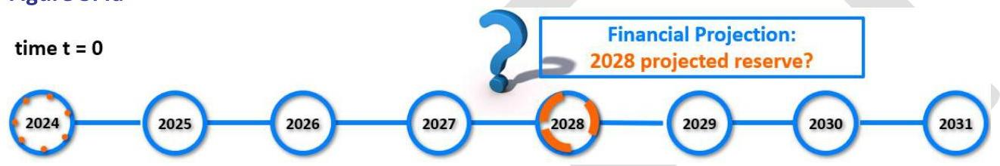
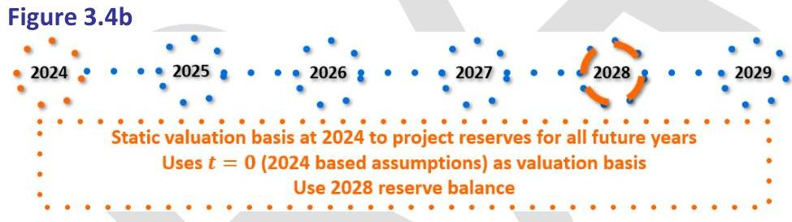
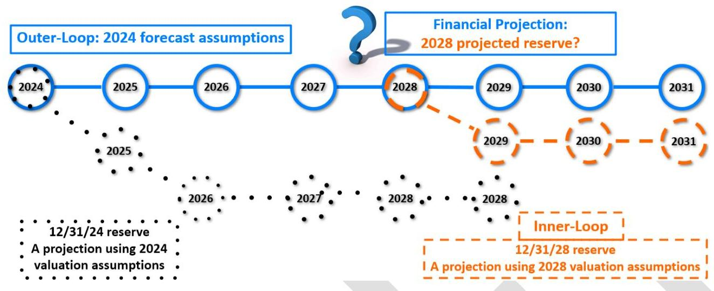
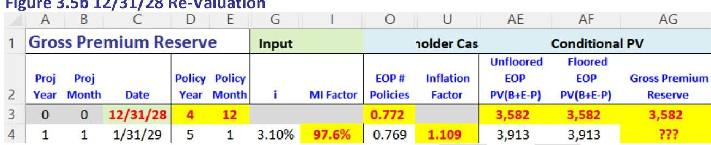
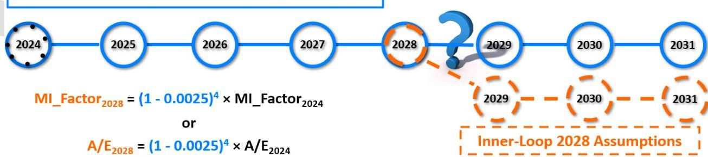
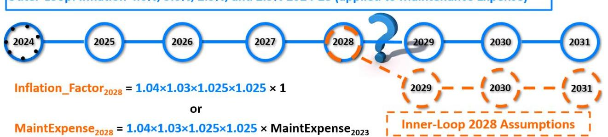
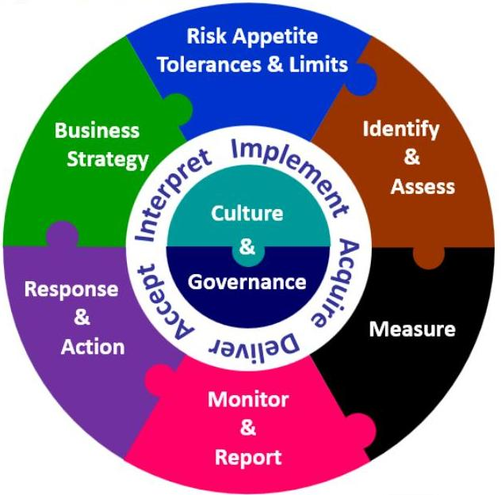
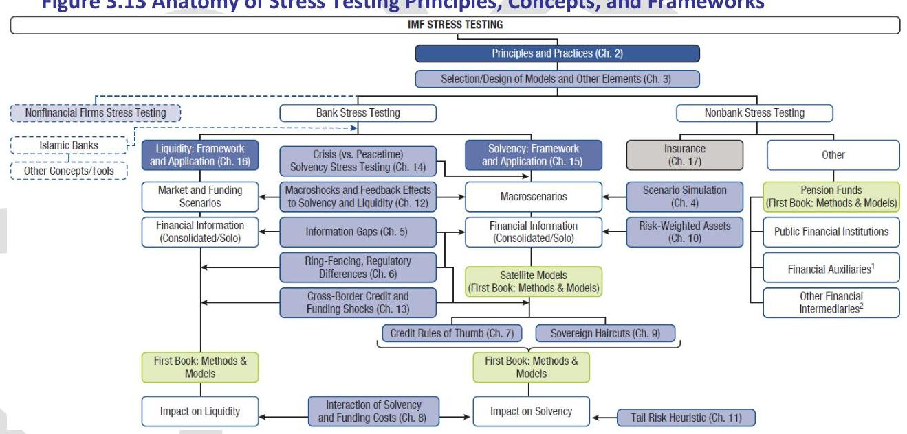

_Note: Source document was split into 3 OCR chunks (pages 1-18, pages 19-35, pages 36-40) to stay within token limits._

# LTAM_II_Chapter3_Principle-Based Projections and Nested Methods_20240610

## Page 1
# Chapter 3 Principle-Based Projections and Nested Methods 

## Learning Outcomes

The student will be able to:
Construct and apply gross premium valuation models using anticipated assumptions with or without risk margins to value level term and non-par whole life policies for a single policy.

Define sensitivity tests, scenario analysis, and stress tests.
Apply gross premium valuation models to sensitivity tests.
Describe outer-inner loop nested methods. Determine outer and inner loop assumption values.

Construct gross premium valuation models with outer-inner-loops to project principlebased modeled values.

Describe concepts and principles underlying stress tests.

Chapter 3 expands Chapter 2's context to project financial statements using gross premium reserves (LTAM Part I Chapter 7). Recall, a gross premium valuation method is a method that determines a liability as the present value of future benefits and expense less gross premiums (i.e., future cash outflows less inflows) on a prospective basis. A gross premium reserve is the present value of future benefits, expenses, and related amounts less gross premiums and related amounts on a prospective basis. A gross premium reserve is a reserve using a gross premium valuation method. "On a prospective basis" means only cash flows after the projection start date are included.

Gross Premium Reserve $=\mathrm{PV}($ benefits $)+\mathrm{PV}($ expenses $)-\mathrm{PV}($ gross premiums $)$
Gross premium reserves based on stochastic scenarios can use a slight variation and set reserves equal to the greatest present value of accumulated deficiencies at a specified VaR or CTE. See Chapter 4.3.

Gross premium valuations use a range of assumptions including anticipated assumptions, prudent assumptions, regulatory prescribed assumptions, stochastic assumptions, and dynamic assumptions. Anticipated assumptions, often called best-estimate assumptions, are neutral, not conservative or aggressive. The historical connotation is that gross premium reserves use anticipated assumptions. Prudent assumptions typically add risk margins.

Modern reserve standards such as VM-20 use gross premium valuation methods with prudent or conservative assumptions along with prescribed and other assumptions. However, the name of the reserve will be called something else, e.g., a Deterministic Reserve. Gross premium reserves are often a liability-only perspective and do not include investment income from

## Page 2
underlying assets. Assets and investment income are manifested through the discount rates used to calculate present values, for example, discount rates could be equal to net earned asset rates.

More generally, modeled reserves are reserves calculated using models. In this book, we use gross premium reserves using anticipated assumptions with or without margins as a substitute for accounting bases such as IFRS 17, GAAP LDTI, and VM-20's modeled reserves or principlebased reserves.

LTAM Part I Chapter 7 calculated present values and gross premium reserves as of the input valuation date. We now consider how to project reserves or values at future points in time. A gross premium reserve's valuation basis changes over time, so projecting reserves has the added challenge of also projecting valuation assumptions.

Chapter 3's model design focus is

1) review a gross premium valuation model with risk margins,
2) introducing principle-based projections of modeled values using the nested method outer-inner-loops

Chapter 3.1 briefly reviews a re-formatted version of LTAM Part I Example 7.14 which illustrated a gross premium valuation with a valuation basis consisting of anticipated assumptions with risk margins. Chapter 3.2 considers what the valuation basis assumptions are at future valuation dates. Projecting modeled reserves entails a projection within a projection at the point in time of each projected reserve. The projections within a projection structure is described as a nested method called outer-inner-loops. Chapter 3.3 covers sensitivity and scenario analysis. Chapter 3.4 covers stress tests which are a special case of scenario analysis. Chapter 3.5 covers dynamic assumptions.

# 3.1 Gross Premium Valuations 

Chapter 2's examples supported gross premium valuations. However, Chapter 2's examples did not support gross premium reserve projections. LTAM I Example 7.14a was copied into tab GPR similar to how we copied Examples 8.8 and 8.4 into tabs Stat_NPR and Stat_CRVM respectively. We then modified input locations and cell references.

Recall, many companies start with anticipated rates - an anticipated assumption is neutral and not biased to be intentionally conservative or aggressive. A company may apply a margin. A margin is an amount that reflects an assessment of uncertainty associated with risk. There is uncertainty from parameter estimation as well as possible adverse deviations or outcomes. A margin's magnitude is related to a confidence interval on outcomes. A margin might be applied to reflect the cost/price of bearing risk. Regulators might require a margin but may or may not specify the size of the margin. Typically, the greater the uncertainty the greater the margin.

A margin can be either a multiplicative or an additive factor. The direction of the margin - to increase or decrease - is contextual. For example, suppose an insurer wants a conservative

## Page 3
mortality assumption and uses a 15\% multiplicative margin. For life insurance death benefits mortality would be increased by $15 \%$ whereas for income annuity benefit payments (which are living benefits) mortality would be decreased by $15 \%$. For some assumptions such as lapses and withdrawals it is not always apparent which direction is conservative and it may vary by policy year. For example, a conservative level term margin usually increases the lapse rate up to a certain policy year and then decreases it in subsequent policy years. Initially level premiums exceed mortality costs and acquisition costs are being covered. In later years, mortality costs and expenses exceed level premiums and investment income. Thus, the insurer benefits when lapse rates are lower in early years and higher in later years.

Example 3.1 repeats Example 2.5 except we change to reserve method from WholeLifeCRVM to GrossPremiumReserve. Example 3.1 includes a review of LTAM Part I's gross premium valuation model with risk margins.

# PONDER 

By changing the method to GrossPremiumReserve, what further model changes need to be made for projections?

## Example 3.1

We modify Example 2.5 as follows. First, we enable the drop-down the Input's Reserve Method (tab Input cell B4) to include GrossPremiumReserve, which we then select.

| A | B |
| :-- | :-- |
| 1 | Input |
| 2 | Valuation \& Projection |
| 3 | Valuation Date |
| 4 | Reserve Method |
| 5 | Tax Reserve - Stat Method |

Recall, in the U.S., the tax reserve is a factor applied to statutory reserves. Column AZ's tax liability needs to retrieve Whole Life CRVM or Term NPR reserves not the gross premium reserve. This is why we created separate inputs for the reported reserve method and the tax reserve's statutory method in Chapter 2.

Similar to tabs Stat_NPR and Stat_CRVM, tab GPR serves as a subroutine from which reserves are retrieved in tab Proj's Column AG Liability. Tab Proj Column AG is robust with an IF statement to retrieve reserves from tab TermNPR, WholeLifeCRVM, or GPR as applicable.

Figure 3.1

## Page 4
|  | D | E | AG |
| :--: | :--: | :--: | :--: |
| 1 |  |  | 8/5 |
|  | Policy | Policy |  |
| 2 | Year | Month | Liability |
| 3 | 0 | 0 | 0 |

Tab Proj AG4 = 04 * IF(Reserve_Method = "TermNPR", INDEX(Term_NPR_PH, D4, 1), IF(Reserve_Method = "WholeLifeCRVM", INDEX(WholeLife_CRVM_PH, D4, 1), INDEX(GPR_PH, 12*D4+E4-11, 1))), etc.

Tab GPR uses a monthly model time step whereas tabs Stat_NPR and Stat_CRVM use an annual time step.

Tab Proj Column AG's Liability retrieves tab GPR Column AA's gross premium reserves (nameranged GPR_PH) and multiples by Column O's EOP number of policies. Variable values dependent on Liability such as Liability Increase, Cost, and EBIT change accordingly.

Tab Proj Column AZ's Tax Liability retrieves the applicable statutory reserve since the IF statement uses Reserve_Tax_StatMethod as the criterion. No formulas in the projection (tab Proj) are changed. Target capital is often based on statutory reserves. However, our examples use Liability as one of the three factor-based components. Hence Chapter 4's examples use gross premium reserves in Column AS's Target Capital calculation.

However, we have a challenging complication.

# PONDER 

Why are Column AG's row 4+ not the correct projected GPR? By "correct" we mean appropriate or a good approximation.

## Review: Gross Premium Valuation with Risk Margins

As the case for the reader may be, we review or introduce the gross premium reserve valuation "subroutine" in tab GPR. Proj and GPR's Column A-Z's headings (i.e., variables) for decrements and policyholder undecremented or conditional cash flows are identical.

Figure 3.2

## Page 5
1 Gross Premium Reserve Input | | Proj | Proj | | Policy | Policy | Age | | Annual | | | | | | | | | | | | | | | | | | | | | | | | | | | | | | | | | | | | | | | | | | | | | | | | | | | | | | | | | | | | | | | | | | | | | | | | | | | | | | | | | | | | | | | | | | | | | | | | | | | | | | | | | | | | | | | | | | | | | | | | | | | | | | | | | | | | | | | | | | | | | | | | | | | | | | | | | | | | | | | | | | | | | | | | | | | | | | | | | | | | | | | | | | | | | | | | | | | | | | | |

## Page 6
Figure 3.3 presents the calculated undecremented conditional present values in Columns AAAF.

Figure 3.3

| 1 | Gross Premium Re |  |  |  |  |  |  |  |  |  |
| :--: | :--: | :--: | :--: | :--: | :--: | :--: | :--: | :--: | :--: | :--: |
|  |  |  |  |  |  | Conditional PV |  |  |  |  |
|  | Proj   Year | Proj   Month | Date | EOP   PV(Premium) | EOP   PV(Death   Benefit) | EOP   PV(Surrender   Benefit) | EOP   PV(Expense) | Unfloored   EOP   PV(B+E-P) | Floored   EOP   PV(B+E-P) | Gross Premium   Reserve |
| 3 | 0 |  | 12/31/24 | 62,197 | 26,873 | 16,921 | 7,495 | $(10,908)$ | 0 | 0 |
| 15 | 1 | 12 | 12/31/25 | 63,137 | 30,072 | 19,057 | 3,095 | $(10,914)$ | 0 | ??? |
| 27 | 2 | 12 | 12/31/26 | 62,984 | 32,872 | 21,076 | 3,048 | $(5,988)$ | 0 |  |
| 39 | 3 | 12 | 12/31/27 | 62,673 | 35,725 | 23,138 | 2,989 | (820) | 0 |  |
| 51 | 4 | 12 | 12/31/28 | 62,238 | 38,719 | 25,037 | 2,918 | 4,436 | 4,436 |  |
| 63 | 5 | 12 | 12/31/29 | 61,598 | 41,858 | 26,785 | 2,832 | 9,876 | 9,876 |  |

Column AF (name-ranged GPR_PH) is the gross premium reserve floored at 0.

$$
\mathrm{AF} 3=\mathrm{MAX}(0, \mathrm{AE} 3)=\mathrm{MAX}(0, \mathrm{SUM}(\mathrm{AB} 3: \mathrm{AD} 3)-\mathrm{AA} 3)
$$

The 12/31/24 undecremented gross premium reserve is 0 (Cell AF3) and before flooring at 0 is $\$ 10,908$ (Cell AE3). We can calculate a best-estimate gross premium reserve by setting margins equal to zero.

# PONDER 

In the gross premium reserve calculation, Column AE calculates unfloored present values. Is the projected undecremented gross premium reserve at 12/31/28 $\$ 4,436$ in Cell AF51?

## Assets and Investment Income

Our whole life and level term gross premium reserve is a liability-only calculation and does not incorporate asset cash flows or investment income. For modeled reserves or products that do include investment income we can apply a risk margin as follows:

INDEX(Portfolio_Net_Earned_Rate, A4, 1) - Margin_EarnedRate, etc.
or we could apply a margin to the target spread.

## End Example 3.1

Observe that tab Proj and tab GPR's numeric values including the present values of premiums, benefits and expenses are not equal. For example, consider the future date 12/31/28. The

## Page 7
financial projection is a best-estimate projection using anticipated assumptions, i.e., no risk margin (or setting risk margins equal to zero). The gross premium reserve calculation applies risk margins but the gross premium projection begins as of the valuation date, 12/31/24 not the date under consideration, 12/31/28.

We expect using anticipated assumptions that there will be 0.769 policies in force at 12/31/28. But in the 12/31/24 valuation there are 0.762 policies projected to be in force at 12/31/28 due to the inclusion of margins. We can similarly compare the mortality improvement factor and inflation factor at the beginning of 2029. We explore these implications and the preceding ponder question in the next sub-chapter.

# 3.2 Projections: Nested Methods 

PONDER
Recall, from LTAM Part I Chapter 7, for the 12/31/24 valuation's projected cash flows to be equal to a future valuation dates' projected cash flows for the same calendar periods, we required the valuation assumptions to be identical at the valuation date (at $t=0$ ) and future valuation dates. We further required identical discount rates for equal present values. What happens when we relax these requirements? For example, will equality still hold if valuation assumptions change such as mortality or lapses or discount rates change? How do we project values at future valuation dates?

A challenging issue is how to project reserves at a future valuation date when the valuation assumptions vary at future valuation dates. For example, consider projecting reserves for pricing or for business planning financial projections. A nested model is a projection model where one or more of the projected values is itself a modeled value, for example a modeled reserve. In a valuation or projection, a re-valuation date, also called a node or a pivot date, is a future valuation date at which projected values are modeled values. That is, a re-valuation date's projection model to calculate the modeled value is a projection model within a projection model. We rephrase the Ponders as:

## PONDER

As of 12/31/24, an insurer is running a best-estimate financial projection for business forecast purposes assuming the rate curve does not change. The insurer holds gross premium reserves using anticipated assumptions plus risk margins as in Example 3.1. How do we project reserves at re-valuation dates?

Our context is a business plan financial projection on a single best estimate scenario. The bestestimate projection assumes the macro-economic environment does not change. The interest rate curve (and if we were modeling assets, spreads and default rates, etc.) remain unchanged.

## Page 8
The projection could also be a pricing projection. We could use any other single scenario or a set of stochastic scenarios. The projection scenario is often called an outer-loop for reasons that will become apparent in our discussion.

Before diving into the ponder we revisit observations made in LTAM Part I Example 7.1 which had a 12/31/23 valuation date. Recall, we compared the 12/31/23 projection's present values at future points in time 12/31/24, 12/31/25, ... with present values at re-valuation dates of 12/31/24, 12/31/25 .... We observed in Figure 7.1d and 7.1e below that the two sets of present values were equal since all of the valuation assumptions at each re-valuation date were identical to 12/31/23 assumptions prospectively from each re-valuation date.

LTAM Part I Figure 7.1d Conditional Projected PVs as of the 12/31/2023 Valuation Date

|   | F | G | H | S | AB | AC | AD | AE  |
| --- | --- | --- | --- | --- | --- | --- | --- | --- |
|  1 |  |  |  |  | Conditional PV of Expected PH CFs |  |  |   |
|  2 | EOP Date | Policy
Year | Policy
Month | EOP #
Policies | EOP
PV(Premium) | EOP
PV(Benefit) | EOP
PV(Expense) | EOP
PV(B+E-P)  |
|  3 | 12/31/23 | 0 | 0 | 1.000 | 5,712 | 3,746 | 1,265 | (701)  |
|  15 | 12/31/24 | 1 | 12 | 0.950 | 5,604 | 4,028 | 440 | $(1,136)$  |
|  27 | 12/31/25 | 2 | 12 | 0.902 | 5,486 | 4,295 | 431 | (760)  |
|  39 | 12/31/26 | 3 | 12 | 0.857 | 5,358 | 4,530 | 421 | (407)  |
|  51 | 12/31/27 | 4 | 12 | 0.814 | 5,218 | 4,736 | 410 | (72)  |
|  63 | 12/31/28 | 5 | 12 | 0.773 | 5,065 | 4,909 | 398 | 242  |
|  75 | 12/31/29 | 6 | 12 | 0.733 | 4,899 | 5,073 | 385 | 559  |

We then manually typed in six different future valuation dates in succession corresponding to 12/31/24 to 12/31/29. At each valuation date we start with cell S3's number of policies in force equal to 1 - this is the given condition that the policy is in force on future date.

LTAM Part I Figure 7.1e Conditional PVs at Future Valuation Dates

|   | F | G | H | S | AB | AC | AD | AE  |
| --- | --- | --- | --- | --- | --- | --- | --- | --- |
|  1 |  |  |  |  | Conditional PV of Expected PH CFs |  |  |   |
|  2 | EOP Date | Policy
Year | Policy
Month | EOP #
Policies | EOP
PV(Premium) | EOP
PV(Benefit) | EOP
PV(Expense) | EOP
PV(B+E-P)  |
|  3 | 12/31/24 | 1 | 12 | 1.000 | 5,604 | 4,028 | 440 | $(1,136)$  |
|  3 | 12/31/25 | 2 | 12 | 1.000 | 5,486 | 4,295 | 431 | (760)  |
|  3 | 12/31/26 | 3 | 12 | 1.000 | 5,358 | 4,530 | 421 | (407)  |
|  3 | 12/31/27 | 4 | 12 | 1.000 | 5,218 | 4,736 | 410 | (72)  |
|  3 | 12/31/28 | 5 | 12 | 1.000 | 5,065 | 4,909 | 398 | 242  |
|  3 | 12/31/29 | 6 | 12 | 1.000 | 4,899 | 5,073 | 385 | 559  |

## Page 9
For example, whether we use a valuation date of 12/31/23, 12/31/24, 12/31/25, or 12/31/26, 2027's interest rate (4\%), mortality rate ( $0.043 \%$ ), lapse rate (5\%) and so forth were identical.

In LTAM Part I Example 7.1, valuation assumptions including decrement rates and discount rates are identical at the valuation date and at every future valuation date.

Thus, we only needed one projection as in Figure 3.4a: the initial $t=0$ or 12/31/23 projection to project present values or reserves at all re-valuation dates.

Figure 3.4a

Next, we explore the ponder question. LTAM Part I Example 7.14 had a 12/31/23 valuation date and a 12/31/26 re-valuation date. The best-estimate 12/31/23 projection and gross premium 12/31/26 valuation did not have equal projected mortality and lapse assumption rates or number of policies at corresponding calendar periods.

Figure 3.4b

The projected valuation assumptions underlying the 12/31/28 reserve will not be the same as the 12/31/24 valuation assumptions. Thus, to calculate the 2028 reserve, the 2024 business plan projection model needs to

1) project the 2028 liability inventory, e.g., number of policies,
2) project the 2028 valuation assumptions, and
3) perform a 12/31/2028 valuation which entails projecting cash flows using 2028 valuation assumptions which include risk margins.

Step 3)'s 12/31/2028 valuation's projection is "inside" the 12/31/2024 business plan projection. Hence, we call the projection starting at any projected valuation date such as 12/31/2028 the inner-loop and we call time $t=0$ 's 12/31/24 projection scenario the outer-loop.

Figure 3.4c Re-Valuation as of 12/31/28

## Page 10
Example 3.2 repeats Example 3.1 but this time we incorporate outer-inner-loops to project gross premium reserves at future re-valuation dates. The valuation date is 12/31/24. We illustrate a 12/31/28 re-valuation date. By using present values as of future dates based on a 12/31/24 projection, Example 3.1 simply used $t=0$ valuation assumptions at all future revaluation dates, that is, Example 3.1 did not use inner-loops.

# Example 3.2 

We assume that the forward rate curve remains unchanged over time. We made a copy of Example 3.1's spreadsheet. We then made a number of changes which we now describe.

For reference, Figure 3.5a presents selected columns from Example 3.1's 12/31/24 business plan financial projection from tab Proj.

Figure 3.5a Example 3.1's 12/31/24 Financial Projection - No Inner-loops

| 1 | C | D | E | F | G | H | I | K | N | 0 | U | AH |
| :--: | :--: | :--: | :--: | :--: | :--: | :--: | :--: | :--: | :--: | :--: | :--: | :--: |
|  |  |  |  |  | Input |  |  | Decrements |  |  | 3olicyhole | B/S |
| 2 | Date | Policy   Year | Policy   Month | Age   BOP | i | Annual Mortality Rate | MI   Factor | Lapse   Rate | BOP 8   Policies | EOP 8   Policies | Inflation   Factor | Liability |
| 3 | 12/31/24 | 0 | 0 |  |  |  |  |  |  | 1.0 |  | 0 |
| 4 | 1/31/25 | 1 | 1 | 55 | $3.10 \%$ | $0.058 \%$ | $98.6 \%$ | 8.00\% | 1.000 | 0.993 | 1.000 | 0 |
| 51 | 12/31/28 | 4 | 12 | 58 | 4.20\% | 0.201\% | 97.8\% | 5.00\% | 0.776 | 0.772 | 1.082 | 3.426 |
| 52 | 1/31/29 | 5 | 1 | 59 | 4.50\% | 0.219\% | 97.6\% | 4.50\% | 0.772 | 0.769 | 1.109 | 3,746 |

Observe that for a 12/31/28 valuation, the 12/31/24 projection projects that there will be 0.772 policies in force and the mortality improvement factor and inflation factor start at $97.6 \%$ and 1.109 respectively. These are the values that we need to use at the start the gross premium inner-loop 12/31/28 re-valuation date! We implement this into the model's tab GPR by retrieving the appropriate tab Proj values. Figure 3.5b presents selected columns from tab GPR.

## Page 11
Figure 3.5b 12/31/28 Re-Valuation

Let's consider each 12/31/28 inner-loop valuation assumption. First, we re-purpose C3 by range-naming it Re-Valuation Date and manually type in 12/31/28. Note the policy is now in policy year 4 , month 12 as of the re-valuation date and the gross premium projection starts with policy year 5 .

We start with 0.772 policies in Cell O3 which we calculate by retrieving tab Proj's projected EOP \# of Polices at 12/31/28,

$$
03=\text { INDEX(Proj!03:01035, MATCH(C3, Proj!C3:C1035, 1)). }
$$

The MATCH function determines which row the re-valuation date (Cell C3) occurs in tab Proj's Column C and then uses INDEX to retrieve that row's EOP \# of Policies (Column O). The remainder of Column O's formulas remain the same, e.g.,

$$
04=03^{*} M 4 \text {, etc. }
$$

For mortality, the outer-loop expects 4 years of $0.25 \%$ future improvement which is the FMI without a margin. The starting 12/31/28 MI Factor is tab Proj Cell L40's 97.6\% which has 9.5 years of $0.15 \%$ HMI further improved by 4 years of $0.25 \%$ FMI, or $(1-0.0015)^{\wedge} 9.5^{*}(1-$ $0.0025)^{\wedge} 4$. Thus, the inner-loop starts with an MI Factor of $97.6 \%$ in Cell I4.

Figure 3.6a 12/31/28 Re-Valuation Projection Assumptions: Mortality
Outer-Loop: Mortality Improvement $0.25 \%$ each year

For the inner-loop's revaluation date, we retrieve tab Proj's projected 1/1/29's MI Factor,

$$
14=\text { INDEX(Proj!I3:I1035, MATCH(C4, Proj!C3:C1035, 1)). }
$$

## Page 12
Alternatively, we could also apply HMI from the table date to the 12/31/24 valuation date and apply FMI without margin from the valuation date to the 12/31/28 re-valuation date. The remainder of Column I's formulas remain the same, e.g.,

$$
15=1 F(B 5=1,1-F M I \text { Factor }- \text { Margin_FMI, } 1) * 14, \text { etc. }
$$

There was nothing in the outer-loop that would cause a change in the base mortality rate, mortality margin, anticipated lapse rate, or the lapse margin. What about expenses? The mechanics of reflecting both inflation (and productivity gains if modeled) are exactly the same as changing the MI Factor.

For inflation, the outer-loop expects 4 years of projected inflation using the anticipated assumptions without a margin: $4.0 \%, 3.0 \%, 2.5 \%$, and $2.5 \%$ for years 1-4 respectively. Note at the 12/31/24 valuation date Inflation Factor equals 1. The starting 12/31/28 Inflation Factor is tab Proj Cell U52's 1.109, or $1.04 \times 1.03 \times 1.025 \times 1.025$. Thus, the inner-loop starts with an Inflation Factor of 1.109 in Cell U4.

Figure 3.6b 12/31/28 Re-Valuation Projection Assumptions: Inflation
Outer-Loop: Inflation 4.0\%, 3.0\%, 2.5\%, and 2.5\% 2024-28 (applied to Maintenance Expense)

For the inner-loop's revaluation date, we retrieve tab Proj's projected 1/1/29's Inflation Factor,
U4 = INDEX(Proj!U3:U1035, MATCH(C4,Proj!C3:C1035, 1)).

Alternatively, we could also apply the anticipated inflation rates from the valuation date to the 12/31/28 re-valuation date. The remainder of Column U's formulas remain the same, e.g.,

$$
U 5=U 4^{*} I F(B 5=1,1+\text { INDEX(Assump! } \$ A I \$ 4: \$ A I \$ 99, A 5,1) *(1+\text { Margin_Inflation), 1), etc. }
$$

We assumed the interest rate curve remains the same over time. 2029's interest rate is the first forward rate $3.10 \%$. 2030's rate is the second forward rate, $3.5 \%$ and so forth. Since Column G's formula uses Column A's Projection Year in the INDEX function to retrieve rates, no change is necessary to the formula.

Finally, let's consider the output. The inner-loop gross premium reserve calculated in Cell AF3 is passed back to the outer-loop tab Proj Cell AH 51, that is, tab Proj Cell AH 51 retrieves tab GPR Cell AF3. The only inner-loop valuation's gross premium reserve that GPR calculates is the re-

## Page 13
valuation date's Cell AF3. Reserves at other future re-valuation dates are not calculated. We need to utilize program code or a macro that loops through all the re-valuation dates specified by the model user.

# End Example 3.2 

So far, Example 3.2 only projected the gross premium reserve at a single re-valuation date, 12/31/28. The last change we made was to add a macro with a FOR LOOP to project gross premium reserves at all re-valuation dates.

## Example 3.2 Continued

The macro loops through the re-valuation dates specified in Column AL, writes each date to Cell C3 (ReValuation_Date), then writes Cell AE3-AF3's values (Unfloored GPR and GPR) to Columns AI-AJ in the row corresponding to the loop index's re-valuation date. See Figure 3.7. tab Proj Column AH's Liability retrieves the gross premium reserve in Column AJ.

For convenience, we range-named:
AF3 as GrossPremiumReserve_ReValuationDate
AH3 as ReValuationDate_Set_Anchor
AJ3 as GPR_PH_Anchor
AK3 as MaxNum_ReVal_Date

Figure 3.7 Macro Inner-Loop Output and Comparison

|  | A | B | C | AE | AF | AG | AH | AI | AJ | AK | AL | AM |
| :--: | :--: | :--: | :--: | :--: | :--: | :--: | :--: | :--: | :--: | :--: | :--: | :--: |
| 1 | Gross Premium Re Conditional PV |  |  |  |  |  | Inner-Loop Reserves |  |  |  | Example 4.1 | Ratio |
|  | Proj | Proj |  | Unfloored | Floored |  | Re-Valuation | Unfloored | Gross Premium | \# ReVal | Unfloored EOP |  |
| 2 | Year | Month | Date | $\mathrm{PV}(\mathrm{B}+\mathrm{E}-\mathrm{P})$ | $\mathrm{PV}(\mathrm{B}+\mathrm{E}-\mathrm{P})$ |  | Date | $\mathrm{PV}(\mathrm{B}+\mathrm{E}-\mathrm{P})$ | Reserve | Dates | $\mathrm{PV}(\mathrm{B}+\mathrm{E}-\mathrm{P})$ | $4.2 / 4.1$ |
| 3 | 0 | 0 | 12/31/28 | 3,582 | 3,582 | 12/31/24 | (10,908) | 0 | 793 | (10,908) |  | 1.000 C |
| 4 | 1 | 1 | 1/31/29 | 3,913 | 3,913 | 1/31/25 | (11,114) | 0 |  | (11,185) |  | 0.9937 |
| 5 | 1 | 2 | 2/28/29 | 4,246 | 4,246 | 2/28/25 | (11,021) | 0 |  | (11,162) |  | 0.9874 |
| 50 | 4 | 11 | 11/30/32 | 20,234 | 20,234 | 11/30/28 | 3,260 | 3,260 |  | 3,978 |  | 0.8194 |
| 51 | 4 | 12 | 12/31/32 | 20,612 | 20,612 | 12/31/28 | 3,582 | 3,582 |  | 4,436 |  | 0.8075 |
| 52 | 5 | 1 | 1/31/33 | 20,967 | 20,967 | 1/31/29 | 3,916 | 3,916 |  | 4,870 |  | 0.8042 |
| 53 | 5 | 2 | 2/28/33 | 21,325 | 21,325 | 2/28/29 | 4,251 | 4,251 |  | 5,307 |  | 0.8005 |

The macro's main code is:
Dim iMaxNum_ReVal_Date, i, j, k As Integer
Dim sOuterLoopTab, sInnerLoopTab As String
sOuterLoopTab = ThisWorkbook.Sheets("Control").Range("OuterLoop_Tab")
sInnerLoopTab = ThisWorkbook.Sheets("Control").Range("InnerLoop_Tab")
iMaxNum_ReVal_Date $=$
ThisWorkbook.Sheets(sInnerLoopTab).Range("MaxNum_ReVal_Date").Value

## Page 14
ThisWorkbook.Sheets(sInnerLoopTab).Range("GPR_PH").ClearContents
ThisWorkbook.Sheets(sInnerLoopTab).Range("GPR_Unfloored_PH").ClearContents
'Loop through Inner-loop Re-Valuation Dates. Copy and paste the calculated cell values to output
For i = 0 To iMaxNum_ReVal_Date - 1
With ThisWorkbook.Sheets(sInnerLoopTab)
.Range("ReValuation_Date") = .Range("ReValuationDate_Set_Anchor").Offset(i, 0)
.Range("GPR_PH_Anchor").Offset(i, 0) =
.Range("GrossPremiumReserve_ReValuationDate").Value
.Range("GPR_PH_Anchor").Offset(i, -1) =
.Range("GrossPremiumReserve_ReValuationDate").Offset(0, -1).Value
End With
Next i
For example, when $i=0$, the re-valuation date is $12 / 31 / 24$ which is also the valuation date. The macro writes Cell AH3's "12/31/24" to Cell C3 (ReValuation_Date) and writes the values in Cells AE3-AF3 of -10,908 and 0 to Cells AI3-AJ3. When i = 49, the re-valuation date is 12/31/28. The macro writes Cell AH51's "12/31/28" to Cell C3 (ReValuation_Date) and writes the values in Cells AE3-AF3 of 3,582 and 3,582 to Cells AI51-AJ51.

For comparison purposes, we copied Example 3.1's Decremented Unfloored Gross Premium Reserve to Column AL, i.e., we multiplied tab Proj Column O's \#EOP Policies by tab GPR Column AE's Unfloored EOP PV(B+E-P).

Column AM calculates the ratio of Example 3.2's Inner-Loop Gross Premium Reserve to Example 3.1's valuation date projection of present value with no inner-loops, that is, AM3 = AI3/AL3, etc.

The ratio is 1 for the valuation date since the inner-loop and $t=0$ projections are identical. For the remaining inner-loops the ratios start out larger than 1, then begin decreasing to be smaller than 1, and then begin increasing to become larger than 1. This illustrates the dynamic between the cash flows, discount rates, and present value of cash flows. One on hand, the inner-loop only applies margins after the re-valuation date. However, we have assumed the rate curve remains constant over time so each inner-loop re-valuation date's rate curve is the same as the initial curve. Since the rate curve is upward sloping, the discount rates are smaller than the discount rates applied to the same calendar years in Example 3.1.

End Example 3.2 Continued

## Page 15
# 3.2.1 Projection Considerations 

Below are three excerpts from the Academy of Actuaries 2019 Principle-Based Approach Projections Practice Note (the author was a committee member). This book puts defined words in bold blue.

## Q 1.2: What is an outer-loop and inner-loop?

A: The outer-loop determines the projection path for which expected cash flows are being estimated. The inner-loop calculates modeled values at various re-valuation points, using the outer-loop result as the starting point for each of the inner-loop scenarios. Assumptions and scenarios may differ between the inner and outer-loops. For instance, the outer-loop could contain best estimate assumptions required for forecasting the expected cash flows arising from a block of business, while the inner-loop could contain assumptions required in accordance with a specific valuation standard, such as prudent estimate assumptions for a principle-based reserve calculation.

## Q 1.9: What is a Gross Premium Valuation Reserve?

A: A Gross Premium Valuation (GPV) Reserve is calculated as the actuarial present value of benefits, expenses, and related amounts less the actuarial present value of premiums and related amounts. The deterministic reserve under VM-20 is a specific example of a GPV calculated using a prescribed scenario. The cash flows are projected under the prescribed economic scenario and discounted using the Net Asset Earned Rate, as defined in VM-20. Assumptions for GPV calculations in actuarial practice can use best estimate assumptions, depending on the intended objective, but for statutory reserve calculations (such as VM-20 or VM-21), liability assumptions can include margins or be prescribed.

## Q 2.1: When are projections with outer-loops and inner-loops applicable?

A: Outer-loops and inner-loops can be used for projecting future reserves or risk-based capital that require a different assumption basis than that used for the broader projection purpose (e.g., when performing a projection using best estimate assumptions where the reserve or RBC requires the use of prudent estimate assumptions). Some examples of applications include projecting VM-20, VM-21, RBC C3 Phase II, GAAP for fixed indexed annuities, or economic reserves within broader projection functions such as product pricing, cash flow appraisals, or business forecasts and planning projections. These applications can be used to produce projected outer-loop values, such as distributable earnings or a statement of financial position, which are dependent on inner-loop calculations. Assumptions for these inner-loop calculations can use prudent estimates or prescribed, whereas an outer-loop for pricing or plan projection can use best estimate assumptions.

We can extend Example 3.2. The steps to calculate outer-loop balance sheet values at revaluation dates using an inner-loop entail,

## Page 16
1) Project the outer-loop liability and asset inventories, cash flows and related items
2) Project the specified re-valuation assumptions including the discount rates
3) Project the inner-loop and calculate values as of the re-valuation date

In Example 3.2, projecting the liability inventory only entailed projecting the number of policies at a re-valuation date. All of the policy's other undecremented values such as premium, death benefit, and cash value are invariant and do not depend on the outer-loop projection. This is not the case for more complex products such as Universal Life, Deferred Annuities including Variable Annuities and Index Annuities in which policy values such as account values, cash values, guarantee bases are path dependent on the outer-loop.

Modeling assets is beyond this book's scope, however, we can mention a few challenges posed by inner-loops. There is the calculation part but there is also a decision as to what is being projected. Often times the assets corresponding to liability cohorts or blocks being modeled are a subset of a larger asset segment or portfolio. First, how is the subset of assets at the valuation date selected? Second, what will the re-valuation date's asset portfolio look like? It not only depends on the outer-loop assets and economic scenario assumptions but on all liability and asset cash flows of the entire asset portfolio for the line of business. Consequently, to project the assets in a re-valuation date's reserve projection, we need to make many modeling choices.

When the outer-loop scenario incorporates and reflects more macro-level changes such as changes in the interest rate curve, changes in spreads and default rates, incorporating the outer-loop into the inner-loop valuation assumptions become even more challenging. Additional challenges include asset-liability interdependence and whether or not assumptions are completely determined at time zero or depend on future values as of the re-valuation date.

Modeling inner-loops and projecting valuation assumptions at re-valuation dates is not "free" in either model building or model run time. In practice, re-valuation dates are chosen judiciously. Consider if each inner-loop projection only takes 10 minutes to run all insurance policies in a block's liability inventory. A re-evaluation at each month in a 100-year projection would take 200 hours or 8.3 days of computer processing time. A modeler will apply judgment in determining re-valuation dates, for example, every quarter (3-months) in the first year, every year in projection years 2-19, and every 5 years thereafter.

Valuation assumptions underlying accounting standards such as VM-20, VM-21, GAAP LDTI, and IFRS 17 include a mixture of anticipated, prudent, prescribed, and stochastic assumptions. These may be challenging to determine. For inner-loops, not all re-valuation date assumptions are re-determined as of the valuation date. Some assumptions may continue to use $t=0$ valuation date assumption. A modeler will apply judgment based on materiality, run time and other factors as how to handle inner-loop re-valuation date assumptions.

## Page 17
# 3.3 Sensitivity and Scenario Analysis 

Consider the following.

## PONDER

What is the impact on capital if future mortality is $1 \%$ higher than expected in all years? If future mortality in projection years 2-4 is $30 \%$ higher than expected (e.g., due to a pandemic)?

We can ponder many more "what ifs". Collectively, simulations, scenario analysis, sensitivity analysis, and stress testing are critical elements of a financial institution's risk management framework and are major tools used to develop a company's performance and risk profiles. They are core tools used by financial regulators to supervise individual banks and insurers and by macro-prudential authorities to monitor the entire system.

Scenario analysis is a process analyzing possible future events by considering alternative sets of future assumptions. Each set is called a scenario. A scenario specifies inputs and assumptions. A scenario can be deterministic where all inputs and assumptions are fixed and determined or stochastic where one or more variables are randomly generated. Remaining variables are either fixed or dependent on other variables. Deterministic scenarios can consist of most likely, pessimistic, or optimistic assumptions. Stress tests are a specific case of scenario analysis covered in Chapter 3.4.

A Monte Carlo simulation is a risk analysis technique in which probable future events are simulated to produce a distribution of possible outcomes. Chapter 4 reviews (or introduces) simulations and illustrates simulation results. We apply simulations in Chapters 7-8.

Recall (LTAM Part I Chapter 1), risk is the effect of uncertainty on objectives. Actuaries view predictions with a probabilistic perspective versus a single outcome. Classical corporate finance reflects the risk in the required rate of return (that is, increases the required return) and hence in NPV (Net Present Value). The widely-used NPV decision criterion translates a multidimensional decision into a single one-dimensional metric criterion, i.e., NPV, that is useful and appropriate for many business contexts. A challenge is how to determine the discount rate and adjust for risk - how is as much art as science.

However, NPV may not fully capture or reflect the risk profile for some contexts such as large tail risk especially if NPV is calculated over a single scenario. We can remedy limitations by considering multiple scenarios, for example, using Monte Carlo simulation. We can then calculate various risk statistical-based measures for any KPI including NPV - standard deviations, value at risk or VaR (i.e., percentiles of values), or conditional tail expectations (CTE) which is the average of the worst $N \%$ of outcomes. In many jurisdictions, numerous insurance products' reserves and capital are calculated as CTEs or VaRs of stochastic simulations.

## Page 18
Sensitivity analysis is a process of taking one or more key assumptions and estimating a range of uncertainty concerning these assumptions on outcomes. A robust analysis explores the impact various factors have on target objectives often related to impact on capital and earnings. In this way, sensitivity analysis measures an investments or project's uncertainty such as downside and upside financial risk due to specific assumptions manifesting differently than expected. We can measure the impacts on a single output variable or multiple output variables. First, a baseline model input and output is established which acts as the basis for comparisons and quantifications.

Sensitivities can be run on a spectrum of inputs pertinent to the context measuring impacts from assumptions being either higher or lower than projected. See Figure 3.8 for some life insurance product sensitivities.

Figure 3.8 Sample Sensitivities

|  Sensitivities | Up/Down | Change  |
| --- | --- | --- |
|  Mortality (all years) | $1 \%$ | Multiplicative  |
|  Mortality Shock (e.g., for 1-3 years) | $10 \%$ | Multiplicative  |
|  Future Mortality Improvement | $0.25 \%$ | Additive  |
|  Inflation | $1 \%$ | Additive  |
|  Expenses | $5 \%$ | Multiplicative  |
|  Lapses | $10 \%$ | Multiplicative  |
|  Partial Withdrawals | $1 \%$ | Additive  |
|  Premium Persistency | $1 \%$ | Additive  |
|  Interest Rates | 25 bps | Additive  |
|  Default Rates | 25 bps | Additive  |
|  Credit Spreads | 25 bps | Additive  |
|  Equity Returns | $1 \%$ | Additive  |
|  Sales Growth | $10 \%$ | Additive  |

In Figure 3.8 the column "Change" indicates whether the underlying assumption is changed by the amount in "Up/Down" multiplicatively or additively. We incorporate shocks as follows

Additive: base value + shock Multiplicative: base value * ( $1+$ shock) For example, Figure 3.8's sensitivities would use Mortality Up $=$ Mortality * $(1+0.01)$ Mortality Down $=$ Mortality * $(1-0.01)$ FMI Up $=$ FMI $+0.0025$ FMI Down $=$ FMI -0.0025

## Page 19
Many additional sensitivities are possible, for example, market related assumptions such as volatility. Sensitivities can also be run on parameters and functional form. For example, assumptions such as mortality, lapses, interest rates, and equity returns are also modeled. Consider assumption $y$ which might be modeled as $a x^{b}+c$. An analysis might perturb $b$ rather than $y$, e.g., $b+0.1$, or might consider an alternative function.

Common practice quantifies sensitivities by changing a single input one at a time, that is, we shock or perturb the model input by a small amount. The impact is the difference as measured on the output variable(s) compared to the baseline. Typically, $X$ 's impact is measured as:

Model(Baseline inputs with $X$ shocked) - Model(Baseline inputs)
Model(Scenario $N$ ) - Model(Baseline Scenario)
More generally we measure impact from a change as:
Model(with the change) - Model(without the change)
Calculus is the study of change. Mathematically a sensitivity can be viewed as a partial derivative. Recall, a partial derivative is defined as the change in a function relative to the change in one of the input multi-variables. A sensitivity on Model_Input_x as measured by the impact on Model_Output_y can be viewed as:

$$
\frac{\partial \text { Model_Output_y }}{\partial \text { Model_Input_x }}
$$

However, typically models are too complex to take derivatives mathematically and in practice, sensitivities are quantified by running the model with shocked values as described above. Using a derivative's definition, $\frac{f(x+h)-f(x)}{h}$, we apply a small shock $h$ to the sensitivity tested variable $x$ where " $f$ " is the model. If there is directional bias, we shock both up and down to minimize directional bias versus a standard calculus definition of change which only shocks in one direction. In this case we make an adaption and use $\frac{f(x+h)-f(x-h)}{h-(-h)}$.

The financial Greeks are a set of risk metrics measuring the price sensitivity of financial products including derivatives such as options to a change in underlying parameters. Price or value is the outcome being measured by the model. As applicable, insurers calculate the Greeks for insurance products and managing existing business. See Chapter 4.2.

Typically, impacts from up/down changes are in opposite directions but the magnitudes are not always symmetrical. For example, we can ask and observe, is

FMI Up $<,>$ or $=\quad-$ FMI Down?
Another aspect of sensitivity analysis explores marginal impacts - the impact from additional up/down changes. For example, is the impact of FMI increasing by 50 bps less than, equal to, or more than twice the impact from increasing FMI by 25 bps? We can ask, is

## Page 20
# FMI $2 \times$ Up $<,>$ or $=\quad 2 \times($ FMI + Up $)$ ? 

We measure correlation effects by shocking multiple or all key input variables and quantifying the simultaneous impact. The total impact reflects the effect of correlations and provides insights into interactions between factors. It is unlikely that the sum of the individual sensitivities equals the impact shocking all key variables: the difference is the impact from correlations.

Sensitivity analysis facilitates discovering insights into relationships and drivers between inputs and outputs. Many business contexts entail hundreds of factors that affect outcomes. Not all are equally important. Which factors drive outcomes? By ranking the sensitivity impacts we can identify and select the most important factors which are often called drivers or key factors or key risk factors since sensitivities are measuring uncertainty or risk.

Sensitivities inform model designers, model builders, model users, and managers where to focus resources. For example,

- In designing and constructing model, improving a model's predictive power as well as decisions for model simplifications, and variables to ignore altogether (e.g., or set to zero).
- In setting assumptions and decision related to data analytical methods, parameter estimation processes and determining resources devoted to capturing and managing which data.
- For managers and decision makers in managing outcomes: identifying and understanding drivers that have the most significant impact on outcomes and identifying what metrics to measure and monitor as well as the frequency to monitor and escalation procedures to senior management and the Board.
- Risk identification and assessment allows companies to focus risk management efforts, allocate capital more effectively.
- Inform decisions on investment strategies, asset allocation, risk management, underwriting practices, and overall business strategy.
- During product research and development, provide insights into setting premium rates, and designing products and guarantees to have acceptable KPI under different conditions.
- Allows for the development of contingency plans when a project does not go as intended or an insurance product does perform as intended.

Scenario and sensitivity analysis is typically performed by blocks and lines of business as well as in aggregate. Doing so allows managers to measure their natural hedging or diversification of benefits. For example, increased mortality harms life insurance business but benefits pension business, thus the two lines of business inherently hedge each other. One lever companies use to manage risks associated with liabilities and assets are through acquisition, growth, purchase and sales of liabilities and assets with different risk profiles.

## Page 21
Example 3.3 presents sensitivity analysis on the whole life policy from Example 2.3. We quantify the sensitivity impact on PV(Premiums - Benefits - Expenses).

# PONDER 

Prior to reading Example 3.3a, for the following risk factors 1\% Mortality all years, 0.25\% FMI, 0.25\% Interest Rate, 10\% Lapse Rate, 10\% Expenses, and 1\% Inflation,
a) hypothesize the direction of the impact, that is, will increasing the assumption increase or decrease the PV(P-B-E), and
b) rank the risk factors in order of magnitude from largest to smallest.

## Example 3.3

We modify Example 3.2 to incorporate sensitivity shocks to the gross premium reserve with risk margins. We describe only what we modified and not the spreadsheet cells that were not changed.

First, we inserted rows to accommodate the possible sensitivities: Rows 3-8.
Figure 3.9a

|  | A | B | C | F | G | H | I |
| :--: | :--: | :--: | :--: | :--: | :--: | :--: | :--: |
| 1 | Whole Life Sensitivities |  |  |  |  |  |  |
| 2 | Sensitivity Inputs |  |  | Shocks | PV(P-B-E) | Baseline | Impact |
| 3 | Mortality | 0.00\% |  | $1 \%$ | 3,823 | 3,823 | 0 |
| 4 | FMI | 0.00\% |  | 0.25\% |  |  |  |
| 5 | Interest | 0.00\% |  | 0.25\% |  |  |  |
| 6 | Lapses | 0.00\% |  | 10\% |  |  |  |
| 7 | Expenses | 0.00\% |  | 10\% |  |  |  |
| 8 | Inflation | 0.00\% |  | $1 \%$ |  |  |  |

We initialized sensitivity input shock values in Column B to 0 . For convenience, we input the desired shock values for sensitivity tests in cells F3..F8. To make it easy to see the impact, we set cell G3 to be the output variable measuring the sensitivity impact PV(Premiums - Benefits - Expenses). H3 is the baseline value with zero shocks and I3 the impact.

$$
\mathrm{G} 3=-\mathrm{BB} 10, \quad \mathrm{H} 3=3,823, \quad \mathrm{I} 3=\mathrm{H} 3-\mathrm{G} 3
$$

Second, we modified the interest, MI Factor, adjusted mortality, lapse rate, Inflation Factor, and Maintenance Expense formulas in Cols J, M-N, and AA-AB respectively to incorporate sensitivity shocks.

Figure 3.9b

## Page 22
|  | G | H | J | L | M | N | AA | AB |
| :--: | :--: | :--: | :--: | :--: | :--: | :--: | :--: | :--: |
| 8 |  |  | Input |  |  |  |  |  |
|  | Policy   Year | Policy   Month | i | MI Factor | Annual   Mortality | Annual   Lapse   Rate | Inflation   Factor | Maint   Expense |
| 10 | 0 | 0 |  |  |  |  |  |  |
| 11 | 1 | 1 | 2.85\% | 95.83\% | 0.015\% | 7.6\% | 1.000 | 2.75 |
| 12 | 1 | 2 | 2.85\% | 95.77\% | 0.015\% | 7.6\% | 1.000 | 2.75 |

Column J: we modify to reflect an additive sensitivity shock (B\$5)

$$
J 11=\text { VLOOKUP(D11, ForwardRateCurve1, 2) }-B \$ 38+\$ B \$ 5 \text {, etc. }
$$

Column L: we calculate the MI Factor and reflect an additive FMI sensitivity shock (B\$4)

$$
\text { L11 }=(1-\text { B32 })^{\wedge} \text { B34 and } \text { L12 }=\text { L11* }(1-(B \$ 33-B \$ 37+B \$ 4))^{\wedge}(1 / 12) \text {, etc. }
$$

Note we do not shock HMI in L11. We could if we wish to quantify uncertainty from misestimation of historical improvement.

Column M: we modify mortality for the A/E Factor (B\$31), MI Factor (Col L), and to reflect a multiplicative mortality shock

$$
\text { M11 }=\operatorname{MIN}\left(1, \text { K11 * B } \$ 31 * \text { L11 * }(1+\mathrm{B} \$ 36)^{*}(1+\mathrm{B} \$ 3)\right) \text {, etc. }
$$

Column N: we modify the lapse rate to reflect a multiplicative lapse shock

$$
\text { N11 }=\text { VLOOKUP(G11, Lapse_WholeLife, 2, TRUE) } /(1+B \$ 39)^{*}(1+B \$ 6) \text {, etc. }
$$

Column AA: we modify the inflation factor to reflect an additive inflation sensitivity shock (B\$8)

$$
A A 11=(1+B \$ 35+B \$ 41+B \$ 8)^{\wedge}(D 11-1) \text {, etc. }
$$

Column AB: we modify maintenance expense to reflect a multiplicative expense sensitivity shock (B\$7)

$$
A B 11=I F(G 11>B \$ 15,0, B \$ 25 / 12) * A A 11(1+B \$ 40)^{*}(1+B \$ 7) \text {, etc. }
$$

LTAM_II_Example_3.3.xlsx has the sensitivity shocks initialized to 0 . The baseline PV in cell G3 equals 3,823 . In succession, we manually type in the shock in cells B3, B4, etc., each time restoring the non-shocked variables to 0 . Figure 3.9 c illustrates a $1 \%$ mortality up shock.

Figure 3.9c

## Page 23
|  | A | B | C | F | G | H | I |
| :-- | :-- | :-- | :-- | :-- | :-- | :-- | :-- |
| 1 | Whole Life Sensitivities |  |  |  |  |  |  |
| 2 | Sensitivity Inputs |  |  | Shocks | PV(P-B-E) | Baseline | Impact |
| 3 | Mortality | $1.00 \%$ |  | $1 \%$ | 3,738 | 3,823 | $(85)$ |
| 4 | FMI | $0.00 \%$ |  | $0.25 \%$ |  |  |  |
| 5 | Interest | $0.00 \%$ |  | $0.25 \%$ |  |  |  |
| 6 | Lapses | $0.00 \%$ |  | $10 \%$ |  |  |  |
| 7 | Expenses | $0.00 \%$ |  | $10 \%$ |  |  |  |
| 8 | Inflation | $0.00 \%$ |  | $1 \%$ |  |  |  |

For each shocked input, we record cell G3's numeric value in tab Summary's corresponding row Column C as in Figure 3.10a

Figure 3.10a

|  | A | B | C | D | E |
| :-- | :-- | :-- | :--: | :--: | :--: |
| 1 | Whole Life Sensitivities: Summary |  |  |  |  |
| 2 | \# | Description | PV(P-B-E) | \$ Impact | \% Impact |
| 3 | 0 | Baseline | 3,823 | 0 | $0 \%$ |
| 4 | 1a | Mortality Up 1\% | 3,738 | $(85)$ | $-2 \%$ |
| 5 | 2a | Mortality Improvement Down 0.25\% | 3,237 | $(586)$ | $-15 \%$ |
| 6 | 3a | Interest Rates Down 0.25\% | 2,294 | $(1,530)$ | $-40 \%$ |
| 7 | 4a | Lapses Down 10\% | 3,774 | $(49)$ | $-1 \%$ |
| 8 | 5a | Expenses Up 10\% | 3,771 | $(53)$ | $-1 \%$ |
| 9 | 6a | Inflation Up 1\% | 3,737 | $(87)$ | $-2 \%$ |
| 10 | 7a | All | 1,086 | $(2,738)$ | $-72 \%$ |
| 11 |  | Correlation Impact |  | $(348)$ | $-9 \%$ |

For example, we type $1 \%$ in tab Proj B3 and copy G3's numeric value of 3,738 to tab Summary cell C4. We restore B3 to 0 . We then repeat the process by changing B4 to $-0.25 \%$ and record G3's numeric value of 3,237 .

Tab Summary Column D: calculates the sensitivity's impact as the shocked output value less the baseline value,

$$
\mathrm{D} 4=\mathrm{C} 4-\mathrm{C} \$ 3 \text {, etc. }
$$

Tab Summary Cell D11: calculates the correlation impact as the impact from all shocks less the sum of the individual shocks,

$$
\mathrm{D} 11=\mathrm{D} 10-\operatorname{SUM}(\mathrm{D} 3: \mathrm{D} 9) \text {, etc. }
$$

We then repeat the entire process but switch the direction of the shocks and record G3's numeric values in tab Summary cells C15..C21 as in Figure 3.10b,

## Page 24
Figure 3.10b

|  | A | B | C | D | E |
| :-- | :-- | :-- | :--: | :--: | :--: |
| 13 | \# | Description | PV(P-B-E) | \$ Impact | \% Impact |
| 14 | 0 | Baseline | 3,823 | 0 | $0 \%$ |
| 15 | 1 b | Mortality Down 1\% | 3,909 | 86 | $2 \%$ |
| 16 | 2 b | Mortality Improvement Up 0.25\% | 4,403 | 580 | $15 \%$ |
| 17 | 3 b | Interest Rates Up 0.25\% | 5,172 | 1,348 | $35 \%$ |
| 18 | 4 b | Lapses Up 10\% | 3,860 | 37 | $1 \%$ |
| 19 | 5 b | Expenses Down 10\% | 3,876 | 53 | $1 \%$ |
| 20 | 6 b | Inflation Down 1\% | 3,891 | 67 | $2 \%$ |
| 21 | 7 b | All | 5,722 | 1,899 | $50 \%$ |
| 22 |  | Correlation Impact |  | $(272)$ | $-7 \%$ |

The reader should validate a few of Figure 3.10a-b's impacts. Quantifying all of them is manually intensive and prone to error. Typically, sensitivity analysis is automated by running the model in succession with the applicable inputs, capturing the desired output value(s), and quantifying the impacts in a summary report, e.g., by a batch job. Each run's output could be stored for audit purposes.

# PONDER 

Next, consider the following. Which factors' impacts are close to symmetric? If shock values are doubled, can you guess which factors' impacts are about double? Less than double? More than double?

## End Example 3.3

Example 3.3 was a liability-only model and sensitivity analysis. A model including assets and completing the income statement and balance sheet (capital) enables assessment on KPI, KRI and assessment of robustness of financial strategies and risk mitigation under different conditions

### 3.4 Stress Tests

Stress testing is a crucial tool in risk management in all industries providing valuable insights into potential vulnerabilities and enabling proactive risk mitigation strategies, but especially in financial and insurance sectors which is Chapter 3.4's context. Stress tests are hypothetical what-if scenarios designed to assess the vulnerability, resilience, and robustness of a portfolio, an institution or a financial system as a whole. In part, a stress test is a scenario analysis assessing the impact on solvency/capital, liquidity, earnings, cash flows, and sustainability of their business model in aggregate (enterprise) and on legal entities (subsidiaries).

## Page 25
Stress tests are a process within a larger risk management framework, incorporating risk identification and scenario definition, assessment including risk analysis and scenario analysis, risk reporting and communication, and management actions including informing risk mitigation strategies and contingency plans. Figure 3.11 illustrates a visual portrayal of risk framework components

Figure 3.11 Risk Framework

Stress testing enables market confidence by demonstrating to stakeholders that the institution is well-prepared to handle adverse economic conditions. Stress tests typically focus on solvency and liquidity. Many liquidity stress tests are conducted independently of solvency tests. For example, liquidity stress tests link market and funding liquidity by assuming significant liability withdrawals (e.g., 30-50\%) in tandem with simultaneous declines in liquid asset values and shocks to market liquidity associated with large haircuts. Insurers use stress testing to understand the impact of catastrophic events, such as natural disasters or pandemics, on their liabilities and solvency positions. Stress testing also helps identify weaknesses in operational processes. For example, a financial institution might simulate a cybersecurity breach to evaluate its preparedness and response mechanisms.

Financial institutions conduct their own internal stress testing as part of their enterprise risk management (ERM). Models and methodologies use advanced cash flow, reserve, and capital models to simulate the impact of stress scenarios on various aspects of an organization, including capital adequacy, liquidity, and operational performance. These models help in quantifying potential losses and identifying risk exposures. The models are more sophisticated, robust, and encompassing versions than the models presented in this book and are customized to their economic business requirements and regulatory and rating agency requirements regarding reserves and capital.

## Page 26
In addition, financial institutions are often required by regulators, supervisors, and prudential regulatory authorities to conduct regular stress tests. Sensitivity analysis and stress testing help supervisors ensure that institutions maintain sufficient capital and liquidity buffers to absorb potential losses and ensure the stability of the financial system.

Stress testing has evolved considerably over the last two decades and continues to evolve. Various risk management organizations and regulatory authorities have issued white papers that cover stress testing principles, best practices, or requirements. Figure 3.12 provides links to resources comprising several thousand pages.

Figure 3.12
CRO Forum: CRO ORSA Stress and Scenario Testing (2023)
EIOPA-BoS-19/241: Opinion on sustainability within Solvency II
EIOPA-BoS-19/274: Discussion Paper on Methodological Principles of Insurance Stress Testing

EIOPA-BoS-20/341: Second Discussion Paper on Methodological Principles of Insurance Stress Testing

EIOPA-BoS-23/258: Methodological Principles of Insurance Stress Testing Cyber Component
Bank of England Prudential Regulation Authority SS19/16: Solvency II: ORSA (2016)
International Association of Insurance Supervisors: Insurance Capital Standard (2019)
A Guide to IMF Stress Testing: Methods and Models (2014) (IMF Guide)
A Guide to IMF Stress Testing II: Principles, Concepts and Frameworks (2020) (IMF Guide II)
Basel Committee on Banking Supervision: The Basel Framework (2023)
Basel Committee on Banking Supervision: Stress testing principles (2018)
Bank of England: Model risk management principles for stress testing (2018)
The use of stress and scenario testing has become embedded through Solvency II's Own Risk and Solvency Assessment (ORSA) process. Similar ORSA requirements are also present in most other global supervisory regimes for banking as well as insurance. The Basel IV framework mandates stress testing for banks to ensure they maintain sufficient capital buffers. The U.S Federal Reserve conducts annual stress tests for large banks under the Comprehensive Capital Analysis and Review (CCAR) program. Central banks typically focus on macroprudential tests and regulators on micro-prudential tests. The European Insurance and Occupational Pensions Authority (EIOPA) which contributes to shaping policies and regulations in the EU has published numerous whitepapers and discussion papers.

The IMF Guide II Chapter II enumerates and describes implications of seven principles, stating, "These principles are mainly focused on stress tests for macroprudential surveillance but they also contain elements that are generally applicable to all types of stress tests.

## Page 27
1) Coverage. Define appropriately the institutional perimeter for the tests.
2) Risk transmission. Identify all relevant channels of risk propagation.
3) Scope. Include all material risks and buffers based on the total balance sheet.
4) Interpretation. Make use of the investors' viewpoint in the design of stress tests.
5) Calibration. Focus on tail risks.
6) Communication. When communicating stress test results, speak smarter, not just louder.
7) Limitations. Beware of the "black swan."

# Scenarios 

Simulations and sensitivities are typically focused best estimates with or without risk margins. Their very nature does not necessarily fully capture extreme or tail events that might be considered 3 - to 6 -sigma events or 1 -in-20 or 1 -in-50 years events.

## PONDER

How should scenarios combine risk factors, e.g., market shocks in tandem with insurance shocks and institution-specific shocks?

Stress testing is a forward-looking exercise. In addition to being severe/extreme and plausible, a set of scenarios should be comprehensive and directly relevant to the business.

Stress scenarios are synthetically constructed based on a combination of historical data and events, expert judgment, externally-provided parameters and current/future concerns such as catastrophes, economic downturns, market crashes, geopolitical tensions, and operational or technological disruptions. Historical events include the 1918-20 Spanish Flu, 2011 tsunami and Fukushima Daiichi nuclear disaster, 2019-23 COVID-19 pandemic, market crashes of October 1929 and October 1987, 1997 Asian financial crisis, and 2007-08 global financial crisis. "Based on" does not make historical events worst-case scenarios but rather provide starting points to consider what could have happened or might happen.

Scenarios include single-factor stresses or simultaneous stresses across multiple risk factors. Important systemic risk factors that are stressed include
credit risk, liquidity and funding risk, asset price risks (e.g., equity and property), macroeconomic and interest rate shocks, catastrophe risks, foreign exchange risks, contagion effects, cyclical effects, sovereign risks, underwriting risks, operational risks, low profitability, regulation-related risks, credit crunches, insurance risks including mortality risk, longevity risk, morbidity/disability risk, lapse risk, and expense risk, cyber risks, climate risks, correlations, dependencies, and interconnectedness.

Reflecting interconnectedness and integrating systemic risk elements is challenging to specify and to model. Indirect impacts arise from potential changes in consumer behavior. Correlations increase substantially in times of crisis. Stress testing models may only reflect first-order effects of tail risks and not fully capture second-order or non-linear impacts. It is also important to

## Page 28
analyze by enterprise and legal entities since capital and funds are not always fungible across legal entities.

EIOPA-BoS-19/274 states,
"The severity criterion refers to the fact that scenarios should not be based on expectations or likely future developments. Instead, scenarios are defined with the aim to test resilience of insurers against adverse developments. The plausibility criterion refers to the requirement that the scenario could potentially happen in practice and should be in conformity with economic scenario and the economy as a whole. Please not that this does not preclude scenarios that have not materialized before, as these may be justified based on a forward-looking approach."

The paper then focuses on four important aspects in the context of scenario development:

- Historical or forward-looking scenarios
- The consistency with the Solvency II framework versus the need to move towards more market compatible scenarios
- Single risk factors, single scenarios, or combined scenarios
- The level of granularity of shocks

Scenario construction should consider both idiosyncratic and systemic risk factors. Systemic risks are macro driven affecting all organizations, for example, market crashes or Brexit. Idiosyncratic risks are micro driven specific to a particular institution or sector, such as Eurozone insurers operating under regulatory restrictions.

A bottom-up test is an exercise implemented by individual institutions using their internal data and models and either institution-specific assumptions (conducted for their own internal risk management purposes) or based on common assumptions provided by a central authority (e.g., central bank, supervisory agency). Most supervisory bottom-up tests are conducted using common scenarios, assumptions, key parameters, and data templates but institutions' own internal data and models. A top-down test is conducted by the supervisor either using aggregated industry data or using confidential institutional data (e.g., bank-by-bank data) available to the authority, publicly available institution-by-institution data, or both.

The two tests are complementary. Top-down tests utilize a uniform methodology but lack context specific information and detailed data. A bottom-up test better reflects each institutions risk management practices, risk profiles, context-specific information, and detailed data.

When constructing scenarios, the narrative can start with the cause(s) and then build the effects or can start straight with the effects. For example, the stress can be geopolitical tension in the Middle East. The effect can be a spike in oil prices and interest rates with a decrease in market returns resulting in large withdrawals. On the other hand, one can just start with the effects/shocks to various variables.

## Page 29
# Exposure 

Primary exposure is when an institution is directly affected by a risk factor, e.g., asset holdings such as a corporate bond that defaults. Secondary exposures exist from holding assets such as bonds or equity which are in turn are exposed to risk factors via direct holdings or counterparty risk. Secondary exposure arises from: $X$ does not own any of $Y$ 's bonds or stock but owns $Z$ which has asset holdings in $Y$.

## Lehman Brothers (2008)

Lehman Brothers, holding $\$ 600$ billion in assets, filed for bankruptcy on September 15, 2008. Their bankruptcy and underlying factors fueled the 2008-2009 global financial crisis. By 2008, Lehman Brothers was a major player in the subprime lending market, a sector marked by unsustainable economic growth and risky loans to low-income consumers with poor credit histories. Despite closing its subprime mortgage lender in 2007, Lehman retained exposure to high-risk assets. The firm securitized vast mortgage packages, selling the best mortgages while retaining the riskiest, a decision that led to catastrophic losses. Lehman Brothers' stock value plummeted as huge losses were reported, rumors of a failed takeover circulated, and clients withdrew en masse. Credit agencies downgraded the firm's assets, and the federal government refused intervention.

The bankruptcy of Lehman Brothers had significant and enduring effects on worldwide financial markets, epitomizing the turmoil of the financial crisis. When the collapse occurred, the ripple effect and ensuing uncertainty intensified globally. Many institutions that did not have primary exposure had large losses as they had secondary exposure by owning assets which had significant Lehman holdings. Financial institutions spent several months evaluating their overall exposure to Lehman's bonds, as well as the secondary impacts stemming from other institutions' bond portfolios that were heavily concentrated with Lehman's bonds.

## Reverse Stress Testing

Scenario and sensitivity analysis can be reverse engineered to determine boundary conditions. How much does a risk factor(s) need to change by to cause the institution or system to fail. For example, how much do interest rates need to increase, market values decrease, or mortality have to increase to decrease to cause a bank or insurer to break down in regards to solvency, liquidity, or operations? Reverse stress testing identifies and assesses scenarios that lead to failure by starting with the outcome - such as insolvency or breaching solvency, liquidity, or financial ratios - and works backward to determine what events or conditions could cause this outcome

Reverse stress testing helps identify previously unrecognized blind spots or under-appreciated vulnerabilities. Analysis enables the development and implementation strategies to mitigate the identified risks, e.g., increasing capital buffers, diversifying investment portfolios, enhancing liquidity management practices, modifying product offerings. By identifying potential points of

## Page 30
failure and understanding the scenarios that could lead to these outcomes, institutions can develop robust risk management strategies to enhance resilience and long-term stability.

Reverse stress testing is often mandated by regulatory bodies as part of comprehensive risk management practices. For example, the Basel Committee on Banking Supervision (BCBS) and the European Banking Authority (EBA) include reverse stress testing in their regulatory guidelines. Reverse stress tests are not used for macroprudential purposes and instead are applicable for internal use and regulatory review of individual institutions.

# Balance Sheet Methods 

Stress testing may reflect a static approach or a dynamic approach to modeling institutional behavior. The constrained balance sheet method uses a dynamic approach to institutional behavior by permitting and modeling reactive management actions in the projection. The fixed balance sheet method uses a static approach and does not incorporate management actions.

Assessments allow senior management and supervisors to compare pre- and post-stress profiles. In a best-case outcome the institution emerges a smaller and/or better version of its pre-stress profile. Imagine due to an unfounded rumor, $40 \%$ of a bank's depositors or an insurer's policyholders lapse. Being well managed the institutions are able to sell assets and pay all withdrawals without a loss, in fact, with the collection of surrender charges, their capital ratios increase. The institutions are simply smaller versions of their prior selves but retain their pre-stress financial strength and profile in regards to capital ratios, profit margins, etc.

Even if misfortune results in losses causing large decreases in capital ratios, an institution with a solid book of business is still attractive to investors and the institution can access the market to raise funds and capital.
B. John Manistre's paper Down but not Out: A Cost of Capital Approach to Fair Value Risk Margins "develops a conceptually rigorous formulation of the cost of capital method for estimating margins for mortality, lapse, expense and other forms of underwriting risk. For any risk situation we develop a three step modeling approach which starts with i) a best estimate model and then adds ii) a static margin for contagion risk (the risk that current experience differs from the best estimate) and iii) a dynamic margin for parameter risk (the risk that the best estimate is wrong and must be revised)."

The paper's first theme is, "Down but not Out: The idea is that if a 1 in N year event wipes out the economic capital of a risk enterprise there should still be enough risk margin on the balance sheet that the company can either attract a new investor to replace the lost capital or, equivalently, pay a similar healthy enterprise to take on its obligations."

## Page 31
# 3.4.1 A Case Study: Silicon Valley Bank (2023) 

Mandated regulatory stress testing has not prevented failure. Next we consider a failure resulting from a singular event - a rapid large increase in interest rates - which then triggered a mass lapse (withdrawal) event.

Silicon Valley Bank (SVB), the $16^{\text {th }}$ largest bank in the U.S., 2022 financials reported $\$ 209$ billion in assets, $\$ 194$ billion in liabilities, $\$ 15$ billion in equity, and $\$ 2$ billion in net income. In midFebruary 2023, SVB made Forbe's list of best U.S. banks. SVB collapsed in the timespan of two days. On March 8, 2023 SVB announced the loss of $\$ 1.8$ billion on the sale of $\$ 21$ billion in securities. On March 10, SVB was shut down by regulators making it the second largest bank failure in U.S. history. The Federal Deposit Insurance Corporation (FDIC) estimated the failure would cost its Deposit Insurance Fund about $\$ 20$ billion.

The direct cause was a liquidity crisis (a run on the bank) preceded by months of large interest rate increases, however, underlying causes were years of taking on a high-risk profile coupled with poor risk management to the point of abdication. Only one of the seven board members assigned to SVB's risk committee had any background remotely related to risk management. SVB did not have a Chief Risk Officer for most of 2022.

SVB had high concentration risk in its customers, liabilities, and investment securities. SVB concentrated in the tech industry, start-ups, venture capital, and private equity. By the end of 2022, about $90 \%$ of deposits were from accounts exceeding $\$ 250,000$, mostly from the venture capital sector, thus, not insured by the FDIC. This concentration heightened the risk of largescale withdrawals.

SVB decided to invest heavily in debt securities during a period of historically low interest rates. SVB's total assets grew from $\$ 70$ billion in 2019 to $\$ 209$ billion in 2022, with investments in debt securities constituting 60\% (up from 37\%). SVB took on extreme interest rate risk by investing short-term deposits in long-term bonds and mortgage-backed securities. This greatly increased the risk from interest rate increases.

During 2022, the Federal Reserve Board increased the Federal Funds Rate by 4\%: from 0.25\%$0.50 \%$ to $4.25 \%-4.50 \%$. The impact was a one-two punch on SVB's customers (liabilities) and its investment assets. The increase in interest rates led to a substantial decrease in the market value of $\$ 91$ billion in held-to-maturity securities, and SVB's equity capital was hit hard due to its increased interest rate risk with a reported exposure (duration) of 4 . What this means in terms of risk outcomes is that each $1 \%$ increase in interest rates translated to about a $\$ 3.65$ billion economic loss representing $23.6 \%$ of its equity. While on a regulatory book-value accounting basis SVB had $\$ 15$ billion in equity, it was in fact, economically out of equity.

Rate increases significantly affected SVB's primary clientele, technology startups, by dampening the risk appetite among investors for initial public offerings and making private funding more expensive. Some SVB clients withdrew money to meet their liquidity needs.

## Page 32
This culminated in SVB managing increased client withdrawals by selling a $\$ 21$ billion bond portfolio at a loss of $\$ 1.8$ billion, which it announced March 8 in tandem with an attempt to raise capital through a $\$ 2.25$ billion stock sale. However, this move backfired, leading to a $60 \%$ plunge in SVB's share price, a run on the bank, and the FDIC ultimately stepped in, shutting down SVB and placing it under receivership. On March 26, the FDIC announced that First Citizens BancShares would acquire SVB's commercial banking business purchasing around \$119 billion in deposits and $\$ 72$ billion of SVB's loans discounted by $\$ 16.5$ billion. SVB was not only down but was also out. The $\$ 1.8$ billion loss was a red flag resulting in swift and severe market actions followed by regulatory actions.

SVB's collapse highlights the importance of diversification of client bases, depositors, asset portfolios, robust equity bases and underscores the need for rigorous risk management and regulatory oversight in the financial sector. Risky strategies, can work and be extremely profitable until the risk event occurs, which is often a matter of when, not if.

Imagine if SVB had been well managed without the risky products, concentrations, large duration mismatch, etc. With effective risk management including asset-liability management, SVB would have been able to fund the $\$ 19$ billion in withdrawals by selling $\$ 19$ billion in assets with minimal loss. SVB's post-stress profile would be smaller but capital ratios and profit margins would be similar to the pre-stress profile.

# 3.4.2 Regulatory Stress Tests 

This subchapter excerpts and quotes (without quotation marks) a few of Figure 3.12's sources.

## CRO Forum: CRO ORSA Stress and Scenario Testing

The Executive Summary states the following.
Stress testing and scenario analysis are an integral part of the Own Risk and Solvency Assessment process. At its core, the ORSA process including the stresses and scenarios selected by re(insurers), should reflect their 'Own' view and assessment of the risks faced.

We start in Section 2 by laying out the background and purpose of ORSA scenarios and stress testing. This includes the regulatory framework, the role of stress testing and scenario analysis and their place in the overall Enterprise Risk Management (ERM) process. In its simplest form, the objective of stress and scenario testing encourages the Management and the Board to think about what might happen in the future and to assess how adverse developments might impact the business planning of the company.

The ORSA will analyse a range of scenarios to assess how material risks could impact the company and its solvency position. Typically, most ORSA scenarios will be less extreme than those used for recovery planning. Stress testing and scenario analysis also play an important part in assessing the appropriateness of the capital requirements and setting internal capital targets.

## Page 33
Finally, in Section 5 we consider the important topic of the management action toolkit and how these may be considered within the ORSA scenarios. Management actions cover a range of objectives including reducing capital resource outflow, sourcing new capital, de-risking the balance sheet and adjusting capital deployment. Based on the survey results of CRO Forum members a description of the types of management actions used is provided along with considerations of their feasibility, desirability and diversity.

Section 5 outlines 13 typical actions companies have in their toolkit. The actions are categorized as:

1) Actions to reduce capital resource outflows, e.g., adjust dividends, share-buy-backs, debt redemption, and project expenditures
2) Actions to source new capital, e.g., external credit lines/loans, capital and share issuance
3) Actions to de-risk balance sheet, e.g., modify investment strategy and hedging strategy, utilize reinsurance, and adjust products,
4) Actions to adjust capital deployment, e.g., modify insurance portfolio management such as sales targets, sell blocks, and increase renewal premium rates

# European Insurance and Occupational Pensions Authority (EIOPA) 

We previously quoted from EIOPA's discussion papers. We instead quote from the 2021 Stress Test Exercise FAQ and Report - links are below. The exercise assessed the impact on solvency ratio, solvency capital requirement, eligible own funds, asset over liability ratio, and excess of assets over liabilities.

## EIOPA 2021 Insurance Stress Test FAQ

## EIOPA 2021 Insurance Stress Test Report

The 2021 stress test exercise aimed to assess the resilience of the participants to the adverse scenario(s) by a capital and liquidity perspective in order to provide supervisors with information on whether these insurers are able to withstand severe but plausible shocks. While not being a pass/fail exercise, the 2021 exercise had a mainly microprudential approach.

The microprudential assessment is complemented by the estimation of potential spillover from the insurance sector triggered by widespread reactions to the prescribed shocks.

The 2021 stress test exercise focused on a prolonged COVID-19 scenario in a "lower for longer" interest rate environment and evaluated its impact on the capital and liquidity position of the entities in scope. For the 2021 Stress Test exercise, EIOPA designed a twofold structure to assess the capital and the liquidity position of the entities in scope from a micro- and macroprudential perspective.

## Page 34
EIOPA conducted a capital and solvency assessment and, for the first time, also examined participants' pre- and post-stress liquidity positions. The test allowed participants to calculate their post-stress position using two distinct approaches: the fixed balance sheet approach without management actions and the constrained balance sheet approach, where reactive management actions were permitted.

The prescribed shocks were modelled on prevailing risks to the financial system and are deemed to be severe but plausible. They include a so-called "double-hit" effect where the riskfree rate and risk premia move in diverging directions, complemented by a set of insurance specific shocks stemming from the outbreak of the pandemic

The liquidity component of the stress test showed that the liquidity position of participants appears to be a less significant concern than solvency positions given the sector's large holdings of liquid assets. Still, outcomes show that insurers cannot rely solely on their cash holdings to cover unexpected outflows

Insurance specific shocks included mass lapse, mortality, pandemic morbidity and increase in claim costs due to increase in frequency and severity, reinsurance in-flows, and reduction in written premia

# Approach 

The 2021 Stress Test exercise assessed the resilience of the European insurance industry by a capital and liquidity perspective:

- the capital assessment relies on the Solvency II framework;
- the liquidity assessment is based on the estimation of the sustainability of the liquidity position.

Participants are requested to estimate their position under two assumptions:

- Fixed balance sheet;
- Constrained balance sheet.

## Results

Despite the grave economic and financial implications of the COVID-19 pandemic, the European insurance industry entered the stress test exercise with a strong level of capitalisation.

- This robust buffer allowed participants to absorb the shock of the adverse scenario.
- The capital component of the exercise confirmed that the main vulnerabilities for the sector stem from market shocks, and, specifically, from the decoupling of the risk free rate and risk premia, the so-called double-hit scenario.
- The insurance industry demonstrated that it has tools at its disposal to cope with adverse market and economic effects (reactive management actions)
- Long-term guarantees measures, which are part of the Solvency II regulation, helped absorb part of the severe but plausible shocks, limiting the drop in participants' solvency ratio.
- Nevertheless, the stress test also revealed that a section of the market still heavily relies on transitional measures, which, unlike long-term guarantees, are to be phased out by 2032

## Page 35
The liquidity component of the stress test showed that the liquidity position of participants appears to be a less significant concern than solvency positions given the sector's large holdings of liquid assets. Still, outcomes show that insurers cannot rely solely on their cash holdings to cover unexpected outflows.

# Bank of England PRA SS19/16: Solvency II: ORSA 

Solvency II is a Directive in European Union law which went into effect in 2016 pertaining to the amount of capital the EU insurers must hold to reduce insolvency risk. Solvency II mandates an Own Risk and Solvency Assessment (ORSA) including stress testing. The ORSA Report is provided to supervisors. Selected excerpts are below.
6.1 The PRA expects the ORSA to include an assessment of the risks it faces or may face in the future. Key risks would not be limited to quantifiable risks and would include nonquantifiable risks such as reputational, strategic, and group risks.
6.4 For groups, the PRA expects firms to consider group-specific risks (such as leverage, dividend sustainability, access to funding, and liquidity) as well as group-wide risks (those risks associated with businesses owned by the group) including the risks from nonregulated, non-financial and non-EEA entities
8.1 The PRA expects the ORSA to include a sufficiently wide range of plausible stress tests derived from the strategy and key risks identified during the process, to include a summary of the outputs from these tests and to describe how they affect firms' solvency positions before and after proposed management actions.
8.2 The PRA expects firms to apply reverse stress testing as part of their ORSA process. The ORSA report should define what constitutes business failure and then detail what events could drive that outcome.
8.3 Firms are expected to perform sensitivity tests as part of stress testing. Within this assessment, firms are expected to identify key model assumptions and parameters used, given changes in parameters and its impact on capital.
8.4 The PRA expects firms to consider the quality and volatility of own funds with consideration of the capital's loss absorbing capacity under different scenarios

## Bank of England: Model risk management principles for stress testing

The Prudential Regulatory Authority (PRA) Supervisory Statements sets out the PRA's expectation as to the model risk management practices firms should adopt when using stress test models. Adopting a proportionate approach, the PRA introduces four principles along with accompanying details to address the risks posed to effective stress testing by inadequate models.

- Principle 1 - Banks have an established definition of a model and maintain a model inventory.
- Principle 2 - Banks implement an effective governance framework, policies, procedures and controls to manage their model risk.
- Principle 3 - Banks implement a robust model development and implementation process and ensure appropriate use of models.

## Page 36
- Principle 4 - Banks undertake appropriate model validation and independent review activities to ensure sound model performance and greater understanding of model uncertainties.

# Basel Committee on Banking Supervision (BCBS): Basel IV 

The Basel IV framework includes updated principles for stress testing that build upon the previous guidelines established in Basel III and II. These principles enhance the resilience of banks by ensuring they are better prepared for adverse economic conditions. Basel IV's Principle 15 - Risk Management makes reference to BCBS's whitepaper Stress testing principles (2018). The whitepaper enumerates nine principles and states, "These principles cover sound stress testing practices and are formulated with a view towards application to large, internationally active banks and to supervisory and other relevant financial authorities in Basel Committee member jurisdictions." and then points out the principles do not constitute Standards but instead are Guidelines.

1. Stress testing frameworks should have clearly articulated and formally adopted objectives
2. Stress testing frameworks should include an effective governance structure
3. Stress testing should be used as a risk management tool and to inform business decisions
4. Stress testing frameworks should capture material and relevant risks and apply stresses that are sufficiently severe
5. Resources and organisational structures should be adequate to meet the objectives of the stress testing framework
6. Stress tests should be supported by accurate and sufficiently granular data and by robust IT systems
7. Models and methodologies to assess the impacts of scenarios and sensitivities should be fit for purpose
8. Stress testing models, results and frameworks should be subject to challenge and regular review
9. Stress testing practices and findings should be communicated within and across jurisdictions

The principles are intended to be applied on a proportionate basis, depending on size, complexity and risk profile of the bank or banking sector for which the authority is responsible. This recognises that smaller banks and authorities in all jurisdictions can benefit from considering in a structured way the potential impact of adverse scenarios on their business, even if they are not using a formal stress testing framework but are instead using simpler methods

Banks are encouraged to consider reverse stress scenarios and other stress testing scenarios as appropriate (for example, the impact of natural disasters, currency crisis, etc). In addition, banks should use these stress testing scenarios to inform their intraday liquidity risk tolerance and contingency funding plans.

## International Monetary Fund (IMF)

## Page 37
The IMF Guides are 612 and 304 pages respectively and the eBooks are publicly available in their eLibrary. IMF Guide II states,
"Stress testing at the IMF has evolved into an integral aspect of financial sector surveillance over the past two decades. It is a key component of the Financial Sector Assessment Program (FSAP) and was used during the global financial crisis (GFC) to support estimations of banking system recapitalization needs of countries with the IMF's crisis programs. Stress testing has also become an important forward-looking risk-management tool for financial supervisors and macroprudential authorities to identify vulnerabilities of individual banks and financial systems to the impact of adverse changes to the operational and market environment."

The authors provide as a visual an anatomy of stress testing principles, concepts, and frameworks. The visual also indicates coverage by book chapters. See Figure 3.13. They outline and describe details for four types of stress tests differentiated by their ultimate objectives.

- Stress testing as an internal risk- management tool.
- Microprudential/supervisory stress testing (supervisory mandated testing)
- Macroprudential/surveillance stress testing (assess systemwide risks on financial system)
- Crisis management stress testing (assess whether key financial institutions need to be recapitalized or not, possibly with public support)

Figure 3.13 Anatomy of Stress Testing Principles, Concepts, and Frameworks

# 3.5 Exercises 

## Describe or explain briefly

1 Why can a valuation basis and a projection basis be different?

## Page 38
2 What is a gross premium reserve?
3 What is a re-valuation date in a nested model?
4 What are outer loops and inner loops? What do inner loops calculate?
5 What is scenario analysis?
6 What is sensitivity analysis?
7 What is a stress test?

# Calculations 

15. At $12 / 31 / 23$, an insurer is projecting a $12 / 31 / 28$ life gross premium reserve. The business forecast uses anticipated assumptions. The anticipated mortality rate in 2031 without future mortality improvement is 0.0029 . Anticipated FMI is $0.5 \%$. The gross premium reserve valuation basis at the valuation and re-valuation dates applies a multiplicative $10 \%$ mortality risk margin and an additive $0.1 \%$ FMI risk margin.
a) What is an inner-loop? (type your answer in tab=Answers)
b) Calculate the $12 / 31 / 23$ valuation date's valuation mortality rate for 2031.
c) Calculate the business forecast's mortality rate for 2031.
d) Calculate the $12 / 31 / 28$ re-valuation date's valuation mortality rate for 2031.
16. For a $12 / 31 / 24$ business forecast, an insurer projects life gross premium reserves. The business forecast uses anticipated assumptions. The anticipated mortality rate in 2039 without future mortality improvement is 0.00489 . Anticipated FMI is $0.2 \%$. The gross premium reserve valuation basis at the valuation and re-valuation dates applies a multiplicative $9 \%$ mortality risk margin and an additive $0.1 \%$ FMI risk margin.
a) Calculate the business forecast's mortality rate for 2039.
b) Calculate the $12 / 31 / 24$ valuation date's valuation mortality rate for 2039.
c) Calculate the $12 / 31 / 29$ re-valuation date's valuation mortality rate for 2039.

## Solution

a) The business forecast uses anticipated mortality and FMI and does not apply either margin. $q=0.00489 \times(1-0.2 \%)^{14}=0.004755$
b) The $t=0$ valuation assumption applies both the mortality margin and FMI margin. There are 14 years between $12 / 31 / 24$ and $12 / 31 / 38$ (or from 2025 to 2039).
$q=0.00489 \times(1-(0.2 \%-0.1 \%))^{14} \times(1+9 \%)=0.005256$
c) The inner-loop re-valuation assumption uses anticipated mortality and FMI in the outer-loop and then applies mortality and FMI margins in the inner-loop. There are 5 years in the outerloop from 12/31/24 to 12/31/29 and 9 years in the inner-loop from 12/31/29 to 12/31/38.

## Page 39
$$
q=0.00489 \times(1-0.2 \%)^{5} \times(1-(0.2 \%-0.1 \%))^{9} \times(1+9 \%)=0.005230
$$

17. For a $12 / 31 / 24$ business forecast, an insurer projects life gross premium reserves. The business forecast uses anticipated assumptions. Anticipated maintenance expenses are $\$ 55$ per policy in 2025. Anticipated inflation is $2.5 \%$ applied annually. The gross premium reserve valuation basis at the valuation and re-valuation dates applies a multiplicative $10 \%$ expense margin and an additive $1 \%$ risk margin.
a) Calculate the business forecast's maintenance expense for 2035.
b) Calculate the $12 / 31 / 24$ valuation date's valuation maintenance expense for 2035.
c) Calculate the $12 / 31 / 31$ re-valuation date's valuation maintenance expense for 2035.

# Solution 

In order to increase reserves, margins increase expenses. We add the risk margin to increase inflation thereby increasing maintenance expenses.
a) The business forecast uses anticipated inflation does not apply a margin. 2026 is the first year that inflation is applied since inflation is not applied to 2025, inflation occurs during 2025. Anticipated inflation is applied for 10 years from 12/31/24 to 12/31/34 (2035-2025).
expense $=55 \times(1+0.025)^{10}=70.40$
b) The $t=0$ valuation assumption applies both the $10 \%$ expense risk margin and the $0.5 \%$ inflation risk margin.
expense $=55 \times(1+0.025+0.01)^{10} \times 1.10=85.34$
c) The inner-loop re-valuation assumption uses anticipated inflation in the outer-loop up to the re-valuation date. Anticipated inflation is applied for 7 years from 12/31/24 to 12/31/31 (20322025).

5 years). We then apply expense and inflation margins in the inner-loop from the re-valuation date to the projection year. Inflation with the risk margin is applied for 3 years from 12/31/31 to $12 / 31 / 34$.
expense $=55 \times(1+0.025)^{7} \times(1+0.025+0.01)^{3} \times 1.10=79.73$

## Spreadsheets

Exercises 19 and later: See LTAM_II_Exercises.xlsx.
19. An insurer projects the sale of a fully underwritten $\$ 600,000$ 10-year level term policy on January 1, 2023 to a male age 45. The valuation date is December 31, 2022. Product data and inputs are in tabs ProductData and Input. Tab = GPR calculates gross premium reserves for an undecremented policy. Tab = Stat_NPR calculates the statutory reserve in order to calculate tax reserves. A gross premium financial projection is partially completed in tab = Proj Columns A-AF. All distributable profit is paid to Corporate and no profit are retained by the Line of Business. Complete the gross premium financial projection in Columns AG-BB.

## Page 40
20-21. An insurer projects the sale of a fully underwritten $\$ 250,000$ UL policy with a 20-year secondary guarantee with a Type B death benefit option on April 1, 2020 to a male age 45. The valuation date is December 31, 2022. Product data and inputs are in tabs ProductData and Input. A financial projection is partially completed in tab = Proj Columns A-Q. All distributable profit is paid to Corporate and no profit are retained by the Line of Business.
20. Construct the projected policyholder account balance in tab = AV_PH Columns E-Z, SG values in Columns A-AE, and Insurer policy expenses in Columns AG-AM.
21. Complete the financial projection in tab = Proj Columns R-AX and the Source of Earnings in Columns AZ-BE