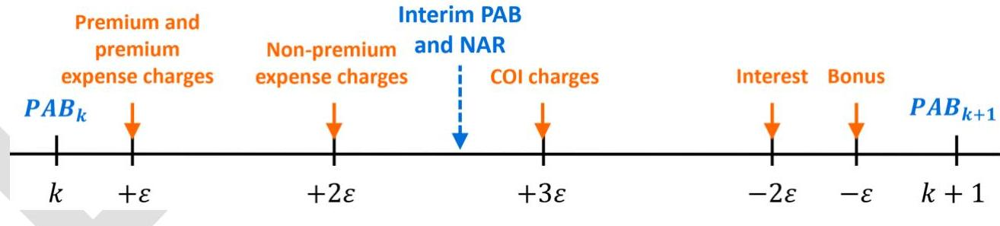
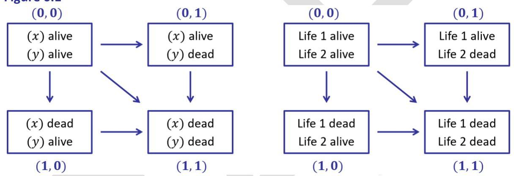

_Note: Source document was split into 3 OCR chunks (pages 1-21, pages 22-43, pages 44-63) to stay within token limits._

# LTAM_II_Chapter5-6_Universal Life_20240611

## Page 1
# Chapter 5 Universal Life 

## Learning Outcomes

The student will be able to:
Describe universal life (UL) products.
Construct and apply deterministic discrete cash flow models for fixed UL policies including specified premium secondary guarantee UL (SGUL) products to project policyholder account balances, cash flows, and financial statements and calculate KPI.
Construct UL models with dynamic assumptions and policyholder behavior.

Previously, LTAM Part I Chapter 4.2.3 described Universal Life (UL) product features. Recall, Universal life (UL) provides flexible death benefits and premium payments in amount and timing. Premiums are treated as deposits by insurer and accumulated in a notional account. This account balance is increased when applicable at an interest rate called the credited rate or the credited interest rate which is declared by the insurer and changes based on investment returns. The account balance is decreased by various charges for mortality and expenses. We use the words "account balance" and "account value" interchangeably. Policy expenses charges are also call policy loads, and we use "charges" and "loads" interchangeably.

The UL policyholder account balance (PAB), also commonly referred to as an account value (AV), works like a savings account earning investment income that the policyholder sees and receives account statements.

UL Account Balance
Premiums
Bonuses
Policy Expense Charges
Cost of Insurance Charges
Interest
Cash Value
"Like" a Bank Savings Account
Deposits
Deposits
Withdrawals
Withdrawals
Interest
Account Balance less a Surrender Charge

We turn the above translation into Equation 5.1 which rollforwards the BOP PAB to the EOP PAB:

Equation 5.1
BOP Account Value

+ Total Premium
- Premium Load
- Unit Load
- Policy Fee

## Page 2
- Cost Of Insurance (COI)
+ Interest
+ Bonus
= EOP Account Value
- Surrender Charge
= Cash Surrender Value
Cost of insurance (COI) is a mortality charge deducted from the account to pay for that month's mortality cost. The COI is based on a) contractual COI rates determined by the insured's sex, attained age, risk class and other attributes such as face amount, and b) the current net amount at risk which is usually discounted to the beginning of the month. Thus, COIs are the monthly premiums for the death benefit in excess of the account value.

UL has two types of death benefit options from which a policyholder chooses at issue. Type A provides a level death benefit equal to the face amount. For Type $A_{i}$ the insurer retains the account value upon death, so the net amount at risk is the face less the account value. Type B provides a death benefit equal to the face plus the account value. For Type B, the net amount at risk is a constant equal to the face since (face + account value) - account value $=$ face.

Furthermore, in the U.S. to qualify as life insurance rather than an investment product, life insurance contracts must meet one of two tests prescribed by Internal Revenue Code $\S 7702$ : either 1) the guideline premium and corridor test (GPT) or 2) the cash value accumulation test (CVAT). We limit this book's scope to the first test. Tax regulations require the death benefit exceeds the account value by a specified ratio called the corridor factor which varies by attained age. The death benefit for a given month is the greater of 1) face if Type A or the face + account value if Type B and 2) corridor factor $\times$ account value. We say the policy is in the corridor if 2) is larger than 1), otherwise we say the policy is out of the corridor. There is a second component to GPT which is out of scope: GPT limits cumulative premiums at each policy year. It suffices to say that tax regulations are quite complicated and important but beyond scope.

Secondary guarantee UL (SGUL) provides a second guarantee (the death benefit being the first) that if a condition specified in the contract is met, the policy remains in force even if there is insufficient cash value to cover the monthly charges, that is, the insurer will pay the full death benefit even if the cash value is zero. SGUL names append a suffix to indicate the length of the secondary guarantee period, e.g., SGUL 25 years, SGUL 100 (i.e., to age 100), or SGUL Lifetime.

Specified-premium secondary guarantees required the cumulative premiums paid by the policyholder to be at least equal to cumulative premiums specified by the SG. The SG applies provided the SG condition has always been satisfied. Once breached, the SG is cancelled. However, many products have "catch-up" provisions that allow a SG to be reinstated provided additional premiums are paid so that the cumulative premiums would then meet the requirement.

## Page 3
Many policies specify planned premiums, which, if paid and if all other assumptions are met, illustrate how the account values, credited interest, charges, and benefits will develop by policy year to meet the policyholder's target (objectives). However, actually paying the planned premiums are the policyholder's option. Planned premiums allow the consumer to customize the planned coverage period, funding levels and emergence of accumulated values.

Target premiums are premium amounts that are targeted to achieve a desired product performance for the insurer. Target premiums often also serve to tier first year commissions. The higher first year commission rate is paid up to the annual target premium and lower renewal commission rate is paid on any excess premium above the target. Target premiums are also used to tier policy loads. For SGUL, the commission tier may be determined by the target premium or by the SG specified premium, however, these are often equal. First year expenses, especially commissions, affect the product performance profile and the KPI calculated in Chapter 2 such as IRR and first year strain.

Many product designs set target premiums equal to a level premium that would provide life coverage (i.e., approximately an equivalent whole life premium). For early UL products circa 1980s, target premiums were equal to planned premiums since early generation UL products were designed to mimic whole life coverage and cash values. Many UL product designs in the 1990s began to have unequal planned premiums and target premiums. Doing so allows designs that range from minimal funding to high or accelerated funding. Target premiums are typically level. Secondary guaranteed specified premiums are also typically level.

Pour-in premiums also called dump-in premiums are premiums larger than the target premium. Pour-in premiums are typically received in the first year. Some policies roll-over funds from other sources such as other existing policies. Pour-in premiums may be deposited at issue or shortly thereafter in the following months. Other policyholders such as small business owners use UL as a retirement vehicle or to shelter income from taxes and premiums can vary considerably according to their income. Depending on business income, tax planning, and proximity to retirement, dump-in premiums can occur in later policy years.

Chapters 2-3 and LTAM Part I restricted contexts to life products with premiums and benefits scheduled and determined at issue. UL's flexibility means there are many more moving parts which are dynamically calculated. It also means we need assumptions to model the interdependent parts and reflect policyholder behavior. However, a UL model's basic building blocks are the same as illustrated in Chapter 2 and LTAM Part I Chapter 7-9's LTAM Model,

1) Calculate decrements
2) Calculate policyholder perspective undecremented cash flows
3) Calculate policyholder perspective undecremented values
4) Calculate insurer perspective decremented cash flows
5) Calculate insurer perspective decremented values

Item 3) is expanded to reflect the UL account balance and its mechanics of deposits of withdrawals per Equation 5.1. We still utilize the following key relationship

## Page 4
Insurer's EOP values $=$ Policyholder EOP values $\times$ EOP \# of policies
Decremented CFs and values $=$ Decrements $\times$ Undecremented CFs and values

Like Chapters 2-3, Chapter 5 consists of a long "show \& tell" example with explanations along the way. Chapter 5.1 first illustrates the basic mechanics related to account balances. Chapter 5.2 discusses a number of modeling considerations. Chapter 5.3 illustrates projections starting with the policyholder's view of the PAB and the insurer's view of PAB, cash flows, income statement, source of earnings, and KPI.

Chapter 5's model design focus is

1) modeling UL, account balances, and guarantees
2) introducing policyholder behavior.

We illustrate both current assumption UL (CAUL) and secondary guarantee UL (SGUL). We chose product parameters and rates to illustrate various UL product features and modeling considerations. Examples are not meant to be indicative of viable product designs.

Our UL model has a degree robustness to illustrate and aid the reader's appreciation of UL's expansion of parameters and interdependent variables but is still significantly scaled down.

# 5.1 Policyholder Account Balances 

We revisit LTAM Part I Example 4.1 in its entirety which we rename as Example 5.1.

## Example 5.1

Figure 5.1 illustrates the account value, credits, and charges for a UL policy in the first three months of policy year 13. The UL policy is a $\$ 500,000$ face amount issued to a female, age 65, nonsmoker standard risk class with a type A death benefit option. The applicable product parameters are input in cells A3..B10. In policy year 13, the monthly COI rate is $0.1464 \%$. The monthly credited interest rate is $0.351 \%$. Policy charges consist of a $2.5 \%$ percent of premium load, 0.4 annual per unit load charged monthly, and an annual per policy fee of $\$ 84$ charged monthly. The NAR is calculated by discounting the Face to the BOP using a $2 \%$ discount rate. The surrender charge rate is $1.03 \%$, which is applied to the Face.

Figure 5.1a UL Account Values by Policy Month


## Page 5
|  A | B | C | D | E | F | G  |
| --- | --- | --- | --- | --- | --- | --- |
|  1 UL Policyholder Account Balance: Type A |  |  |  |  |  |   |
|  2 | Input |  | Calculation |  |  |   |
|  3 | Face | 500,000 | Policy Year & Month | Yr 13 Mo 1 | Yr 13 Mo 2 | Yr 13 Mo 3  |
|  4 | COI Rate | 0.1464% | BOP Account Value | 80,707 | 80,871 | 81,036  |
|  5 | Credited Interest Rate | 0.351% | + Total Premium | 531 | 531 | 531  |
|  6 | Policy Load: % of Premium | 2.5% | - Premium Load | 13 | 13 | 13  |
|  7 | Policy Load: Per Unit | 0.4 | - Unit Load | 17 | 17 | 17  |
|  8 | Policy Load: Per Policy | 84 | - Policy Fee | 7 | 7 | 7  |
|  9 | NAR Discount Rate | 2.0% | - Cost Of Insurance (COI) | 612 | 612 | 611  |
|  10 | Surrender Charge Rate | 1.03% | + Interest | 283 | 283 | 284  |
|  11 |  |  | EOP Account Value | 80,871 | 81,036 | 81,203  |
|  12 |  |  | - Surrender Charge | 5,150 | 5,150 | 5,150  |
|  13 |  |  | Cash Surrender Value | 75,721 | 75,886 | 76,053  |
|  14 |  |  |  |  |  |   |
|  15 |  |  | Interim Account Value | 81,200 | 81,365 | 81,530  |
|  16 |  |  | Death Benefit | 500,000 | 500,000 | 500,000  |
|  17 |  |  | NAR | 417,975 | 417,811 | 417,645  |

Calculations are in cells D2..G17 Before getting into details. Observe that in Column E:

$$ \text{EOP AV} = \text{BOP AV} + \text{Premium} - \text{Policy Charges} + \text{Interest} $$

$$ \text{E11} = \text{E4} + \text{E5} - \text{SUM}(\text{E6:E9}) + \text{E10} $$

$$ 80,871 = 80,707 + 531 - 13 - 17 - 7 - 612 + 283 $$

Row 2 indicates the policy year and the policy month. Columns E-G correspond to policy year 13, months 1-3.

We assume the premium is paid BOP; however, premium can occur on any day during the period. Likewise, we assume policy charges and COIs are charged BOP. The timing order of credits and charges is important. The order is specified by the contract and varies by company and by product.

We assume policy charges are charged first, followed by COIs. Interest credited is calculated at the end of the policy month. Cell E4 is an input and is the EOP AV at Year 12 Month 12.

Row 5 calculates premium paid each month, which we hardcoded with the assumed amount:

$$ \text{E5} = 530.83, \text{ etc. } $$

Row 6 calculates percent of premium policy load:

$$ \text{E6} = \$B6 \times \text{E5}, \text{ etc. } $$

Row 7 calculates monthly per unit load:

$$ \text{E7} = \$B7 \times \$B3 / 1000 / 12, \text{ etc. } $$

Row 8 calculates monthly per policy fee:

$$ \text{E8} = \$B8 / 12, \text{ etc. } $$

## Page 6
Row 9 calculates the monthly COI as the monthly COI rate multiplied by the NAR (the NAR at the moment the charges are assessed):
$\mathrm{E} 9=\$ \mathrm{~B} 4 * \mathrm{E} 17$, etc.
Row 10 calculates credited interest as the monthly effective rate multiplied by the account value after premiums, loads, and COIs, that is, E4 + E5 - SUM(E6:E9).

As an expedient, we calculate an interim account value in row 15 equal to the account value after premiums and policy loads but before COIs or interest:

$$
\begin{aligned}
& \mathrm{E} 15=\mathrm{E} 4+\mathrm{E} 5-\operatorname{SUM}(\mathrm{E} 6: \mathrm{E} 8) \text {, etc. } \\
& \mathrm{E} 10=\$ \mathrm{~B} 5^{*}(\mathrm{E} 15-\mathrm{E} 9) \text {, etc. }
\end{aligned}
$$

Row 11 calculates the end of the month account value using Equation 5.1:
$\mathrm{E} 11=\mathrm{E} 4+\mathrm{E} 5-\operatorname{SUM}(\mathrm{E} 6: \mathrm{E} 9)+\mathrm{E} 10$, etc.
Row 12 is the surrender charge, which is a rate which varies by policy year multiplied by Face:
$\mathrm{E} 12=\$ \mathrm{~B} 10 * \$ \mathrm{~B} 3$, etc.
Row 13 calculates the cash surrender value, which is the account value less the surrender charge:

$$
\mathrm{E} 13=\mathrm{E} 11-\mathrm{E} 12 \text {, etc. }
$$

Row 4 calculates the beginning of the policy month's account value, which is the prior month's ending balance:

$$
\mathrm{F} 4=\mathrm{E} 11 \text {, etc. }
$$

Row 16 calculates the death benefit. For Type A, the death benefit equals Face.

$$
\mathrm{E} 16=\$ \mathrm{~B} 3 \text {, etc. }
$$

Row 17 calculates the net amount at risk (NAR), which is the death benefit discounted to BOP less interim account value, i.e., the account value after premiums and loads.

$$
\mathrm{E} 17=\mathrm{E} 16 /(1+\$ \mathrm{~B} 9)^{\wedge}(1 / 12)-\mathrm{E} 15 \text {, etc. }
$$

There are several different definitions used in practice to calculate NAR.
Observe that the death benefit is constant and the NAR decreases as the account balance grows.

# Example 5.1b: Type B 

We modify the policy - suppose at issue, the policyholder elected a Type B Death Benefit Option. Rather than making the model robust by using IF statements, we modify the death benefit calculation formula in cells E16..G16

Figure 5.1b UL Account Values by Policy Month: Type B

## Page 7
|  A | B | C | D | E | F | G  |
| --- | --- | --- | --- | --- | --- | --- |
|  1 UL Policyholder Account Balance: Type B |  |  |  |  |  |   |
|  2 | Input |  | Calculation |  |  |   |
|  3 | Face | 500,000 | Policy Year \& Month | Yr 13 Mo 1 | Yr 13 Mo 2 | Yr 13 Mo 3  |
|  4 | COI Rate | $0.1464 \%$ | BOP Account Value | 80,707 | 80,752 | 80,798  |
|  5 | Credited Interest Rate | $0.351 \%$ | + Total Premium | 531 | 531 | 531  |
|  6 | Policy Load: \% of Premium | $2.5 \%$ | - Premium Load | 13 | 13 | 13  |
|  7 | Policy Load: Per Unit | 0.4 | - Unit Load | 17 | 17 | 17  |
|  8 | Policy Load: Per Policy | 84 | - Policy Fee | 7 | 7 | 7  |
|  9 | NAR Discount Rate | $2.0 \%$ | - Cost Of Insurance (COI) | 731 | 731 | 731  |
|  10 | Surrender Charge Rate | $1.03 \%$ | + Interest | 282 | 282 | 282  |
|  11 |  |  | EOP Account Value | 80,752 | 80,798 | 80,843  |
|  12 |  |  | - Surrender Charge | 5,150 | 5,150 | 5,150  |
|  13 |  |  | Cash Surrender Value | 75,602 | 75,648 | 75,693  |
|  14 |  |  |  |  |  |   |
|  15 |  |  | Interim Account Value | 81,200 | 81,246 | 81,292  |
|  16 |  |  | Death Benefit | 581,200 | 581,246 | 581,292  |
|  17 |  |  | NAR | 499,041.68 | 499,041.61 | 499,041.53  |

For Type B, the death benefit equals Face plus the account value. The model assumes that the premiums and expense charges are BOP before any deaths can occur; that is, deaths can occur between a nano-second into the policy month and the end of the policy month. Row 16 calculates the death benefit.

Row 16 calculates the death benefit.

$$ \mathrm{E} 16=\$ \mathrm{~B} 3+\mathrm{E} 15 \text {, etc. } $$

We could make the calculation robust: $\mathrm{E} 16=\$ \mathrm{~B} 3+$ IF(Death_Benefit_Option $=$ "A", 0, E15). Observe that the death benefit grows as the account balance grows. However, the NAR is not quite constant due to this policy's contractual NAR definition; we only discount the death benefit and not the interim account value.

# End Example 5.1

Although Example 5.1 is long, it is highly simplified for convenience and instructive purposes. For example, we have ignored the secondary guarantee, the corridor factor (the policy was not in the corridor, so not applicable), and how inputs were determined.

### 5.2 UL Modeling Considerations

In Example 5.1 all the inputs to determine the PAB were provided. One of the challenges in modeling UL is determining the inputs and assumptions. Examples 5.2-4 greatly expand Chapter 2-3's traditional life inputs and process steps to determine many additional inputs and assumptions. However, the model's basic building blocks are similar to previous chapters. We first determine the .4policyholder's view of the PAB under the given condition that the policy

## Page 8
remains in force, i.e., is a conditional or undecremented perspective. Second, we calculate projected decrements, insurer's decremented cash flows, and complete the income statement.

In this book we make a number of simplifications regarding UL's flexibility. For example, the policyholder can increase or decrease the face amount. These and other changes add more layers of complexity. The insurer needs to track those changes administratively since they affect the PAB, surrender charges, secondary guarantee specified premiums, and benefits. Face increases followed by decreases need to define order changes are applied such as LIFO (last in, first out) or FIFO (first in, first out). Contractually, how companies and UL products treat face increases (called additions) and face decreases (called partial withdrawals) can be quite different. We need to choose how to model these details. Post-issue changes are beyond this book's scope.

Chapter 5's models strive to balance educational purposes, transparency, robustness, and simplicity. UL products and models can be like Chinese menus. Product and model dimensions mirror ingredients which for example have $4,8,3,12,5,6,10$, and 8 choices respectively. Altogether there are 2,764,800 possibilities. Although simplifications are made, the LTAM's UL model's product data and inputs are structured to illustrate a degree of complexity including some flexibility to model policyholder behavior.

Before diving into the examples we expand upon LTAM Part I Chapter 4 and Chapter 5.1's coverage of UL products.

# Timing of Credits and Charges 

UL products differ as to the sequence and timing of when credits and charges are calculated and applied to the PAB - these are defined contractually in the policy. The products in this book use the following order. Charges are calculated each monthiversary at the BOP, expense charges are calculated first, then COI charges. Interest is calculated and credited at the EOP. Our examples do not have persistency bonuses but typically these occur after interest has been credited. Premium is reflected the day it is deposited. In our model, we assume it occurs BOP prior to the assessment of any charges. Percent of premium loads are assessed simultaneously with premiums. Figure 5.2 illustrates the order.

Figure 5.2

To calculate COI charges we calculate an interim account value after expense charges. The interim PAB is used calculate NAR.


## Page 9
Order of operations on calculations matter because COIs are based on NAR and NAR is based on account values at the moment the calculations are made. If expense charges are calculated second, then the account value is increased which lowers the NAR and lowers the COI charges.

# Net Amount At Risk (NAR) 

For calculating COI charges, most products discount NAR to the BOP at an interest rate specified in the contract. However, there are several rules used in practice as to when the NAR is calculated, specifically, which charges and credits are included or excluded from the interim PAB used in the calculation and hence NAR. We use the following,
(Discounted) NAR = Death Benefit /(1+NAR_Discount_Rate)^(1/12) - Interim PAB COI Charges $=$ Monthly COI Rate $\times$ NAR

Additional complexities arise from riders and negative account values. If the BOP PAB and/or the interim PAB is negative, does the COI charge calculation floor at zero or not, i.e., does it apply $\max \{0, \mathrm{PAB}\}$ ? This book floors both the PAB and the interim PAB at zero.

## Monthalizing Annual COI Rates

There are several rules used in practice. We describe four rules and compare their values for various annual COI rates, $q$, in Figure 5.3.

The first COI Rate rule applies our standard monthalization of mortality rates,
Monthly COI Rate $=1-(1-$ Annual COI Rate $)^{1 / 12}$.
A second rule is,
Monthly COI Rate $=(1-(1-$ Annual COI Rate $)^{1 / 12}) /(1-$ Annual COI Rate $)^{1 / 12}$
A third COI Rate rule simply divides by 12 ,
Monthly COI Rate $=$ Annual COI Rate $/ 12$.
A fourth COI Rate rule is,
Monthly COI Rate $=$ Annual COI Rate $/(12-$ Annual COI Rate $)$.
Figure 5.3 compares numerical values for annual COI rates of $0.1 \%, 0.3 \%, 1 \%$ and $5 \%$.
Figure 5.3

## Page 10
|  A | B | C | D | E  |
| --- | --- | --- | --- | --- |
|  **Monthly COI Rates** |  |  |  |   |
|  **COI Rate Annual** | 0.10% | 0.30% | 1.00% | 5.00%  |
|  **COI Rate** |  |  |  |   |
|  **COI Rate** |  |  |  |   |
|  **COI Rate** |  |  |  |   |
|  **Rule 1: 1-(1-q)^(1/12)** | 0.0083372% | 0.0250344% | 0.0837177% | 0.4265319%  |
|  **Rule 2: (1-(1-q)^(1/12)) / (1-q)^(1/12)** | 0.0083379% | 0.0250407% | 0.0837879% | 0.4283590%  |
|  **Rule 3: q/12** | 0.0083333% | 0.0250000% | 0.0833333% | 0.4166667%  |
|  **Rule 4: q/(12-q)** | 0.0083340% | 0.0250063% | 0.0834028% | 0.4184100%  |

Rules 1 and 3 respectively set the monthly rate as the standard nonchalized decrement rate and a simply dividing by 12. You may be wondering where rules 2 and 4 come from. The monthly COI charge affects PAB which affects NAR which affects the COI charge. Which of course is saying COIs affect COIs, which is circular. We write the circular relationship as,

$$COI = \left(\frac{Death\ Benefit}{v - (PAB - Expense\ Charge - COI)}\right) \times q^{month}$$

where $v$ is the monthly NAR discount factor and $q^{month}$ is the monthly COI rate. Some algebra shows that,

$$COI = \left(\frac{Death\ Benefit}{v - PAB - Expense\ Charge}\right) \times q^{month} \times (1 - q^{month})$$

$$Death\ Benefit \times v - PAB - Expense\ Charge$$ is how we defined the NAR.

Rule 2 is derived from Rule 1 as, Rule 2's $q^{month}$ = Rule 1's $q^{month}$ / (1-Rule 1's $q^{month}$)

Rule 4 is derived from Rule 3 as, Rule 4's $q^{month}$ = Rule 3's $q^{month}$ / (1-Rule 3's $q^{month}$)

We can simplify Rule 4: $(q/12) / (1-q/12) = q / (12-q)$.

Rule 2 is commonly found in practice, however, in Chapter 5 we only use Rule 4, $q / (12-q)$, due to its simplicity.

Contracts will also state how many decimals are used in the monthly rate and whether the rate is rounded or truncated, for example, rounded to 8 decimals.

**Premiums, Commissions, and Premium Loads**

UL flexibility as to both premium amounts and timing needs to be considered in product design and in models. Premiums paid affect commissions and percent of premium policy loads. Models for product design and pricing and models for valuation and projections typically assume policyholders fall into one of several behavior groups exhibiting various premium payment patterns. Pricing often has more granularity, i.e., more patterns varying by several characteristics, than valuation projections.

Behavior pattern examples are:

- Level paying the target or specified premium

## Page 11
- Level paying the target or specified premium except the first year pays a multiple of target or specified premium
- A level premium for $N$ years that is sufficient to provide expected coverage to age $X$. For several reasons including U.S. tax law, $N=7$ is a common limited-pay pattern.

We can compare the premium paid on year-over-year basis. Premium persistency is the amount of premium paid over time. In LTAM Part I Chapter 2's context of population and survival models, premium persistency indicates the amount of premium surviving over time on an in force policy. For example, suppose in policy year $8, \$ 1,000$ in premium was paid. If in year $9, \$ 1,000$ was paid, $100 \%$ of the premium persisted in year 9 whereas if $\$ 900$ was paid, $90 \%$ of the premium persisted in year 9. Premium persistency varies by factors including product (such as CAUL vs. SGUL) and by policy year.

Chapter 5's projection assumption is 100\% premium persistency except for Example 5.4 we illustrate the impact of a $97 \%$ premium persistency. Common assumptions in practice are 100\% for SGUL products and less than $100 \%$ for CAUL products.

Many product designs reflect tiered percent of premium loads, these are also often expressed as multiples of target or specified premium. For example, premium paid up to the specified premium has a $5 \%$ load and amounts in excess have a $2 \%$ load.

# Account Value Reaches 0 or Cumulative Premium Reaches Required Premium 

When the account value reaches zero, the account no longer has sufficient funds to cover charges. In the absence of a secondary guarantee, the policy would lapse unless the policyholder decides to pay additional premium to keep the policy in force. In the model, we need to reflect policyholder behavior - some percentage of policyholders will let the policy lapse and some will pay a minimum amount of premium to retain coverage for a month or for year.

Likewise, when an SGUL's cumulative paid premium reaches or goes below the cumulative required premium, policyholders must decide whether to pay additional premium or lose the SG. Experience data shows that for SGUL lifetime, policyholders elect to pay additional premium to keep the SG.

In Examples 5.2-4 we let the policy lapse, however, our model has a placeholder allowing the model to include additional premium. We illustrate this in Example 5.4 Part 3.

## Liabilities

Throughout this book (Chapter 5) we set the reserve equal to PAB. We do not calculate additional reserves for secondary guarantees and ignore their impact. SG reserves are critical to a UL product's risk and performance profiles, however, the methods and technical details under U.S. statutory, U.S. GAAP, and IFRS 17 are all beyond scope.

## Page 12
# Source of Earnings 

Source of earnings (see LTAM Part I Chapter 4.5) presents earnings by its sources. Sources for this book's UL products are,

Underwriting earnings are mortality charges less mortality costs
Investment earnings are investment income less interest credited
Expense or fee earnings are policy loads less policy expenses
Surrender charges

We algebraically re-arrange Earnings Before Income Taxes (EBIT) to present source of earnings. Recall that after a termination the insurer no longer holds a reserve and that we call these the reserves released on death or released on surrender. The net cost upon death is death benefits paid less the account value released on death. The net cost upon surrender is the surrender benefits paid less the account value released on surrender, which equals the surrender charge collected.

EBIT $=$ Revenue - Cost
$=$ Premium + Investment Income - Increase in Liability (PAB) - Death Benefits Surrender Benefits - Policy Expenses

However,
$-($ EOP AV - BOP AV $)=-$ Premium + Expense Charges + COIs - Credited Interest + AV released on death + AV released on surrender

Substituting and rearranging,
EBIT $=$ COI - Death Benefit + AV released on death
$+$ investment income - credited interest
$+$ policy charges - policy expenses
$+$ AV released on surrender - surrender benefit

Mortality Earnings
Investment Earnings
Expense Earnings
Surrender Charges

In the model's source of earnings we split investment income into interest earned on PAB and interest earned on surplus.
$+$ investment income on PAB - credited interest
Investment Earnings
$+$ investment income on surplus
Interest on Surplus

## Examples and Simplifications

Examples 5.2-4 illustrate a CAUL policy, a SGUL policy with a 20-year secondary guarantee, and a SGUL policy with a lifetime secondary guarantee respectively. The examples make product and model simplifications including but not limited to the following,

## Page 13
- We only consider one product method for PAB calculations: one NAR rule, one COI charge rule, and one timing of credits and charges rule
- Face amounts are constant, there are no post-issue changes such as increases, decreases, or partial withdrawals
- Premium paid is monthly and based on target premiums for CAUL and specified premiums for SGUL
- COI rates are parallel to the base anticipated mortality rates, that is, a multiplicative factor applied to the anticipated base mortality table - all the examples have the same underwriting margin base COI rates
- All products have the same surrender charge rates
- Account values and interim PABs for NAR calculations are not allowed to be negative
- We do not model riders or policy loans

However, no matter how complex a model becomes the basic building blocks will be similar to this book's examples.

# 5.3 UL Projections 

The examples use policies from the following inventory "file" in tab Inv,

Figure 5.4

|  | B | C | D | E | F | G | H | I | J | K | L | M | N | 0 | $P$ |
| :--: | :--: | :--: | :--: | :--: | :--: | :--: | :--: | :--: | :--: | :--: | :--: | :--: | :--: | :--: | :--: |
| 5 | Issue Date | Plancode | Issue |  | Risk |  | Death Benefit | Account | Cash |  | Target | Cumulative | Cumulative |  | Behavior |
|  |  |  | Age | Sex | Class | Face | Option | Value | Value | SG Premium | Premium | Premium Required | SG Period |  | Group |
| 6 | $1 / 1 / 2023$ | 3100 | 65 | F | 4 | 500,000 | A |  | 0 | 0 | 6,370 | 0 | 0 | 5 | 1 |
| 7 | 4/1/2020 | 3101 | 55 | M | 4 | 500,000 | A | 14,957 | 0 | 2,050 | 2,460 | 6,765 | 5,638 | 20 | 1 |
| 8 | 4/1/2020 | 3102 | 45 | F | 4 | 500,000 | A | 32,636 | 14,870 | 4,000 | 4,300 | 11,825 | 11,000 | 76 | 2 |

## Example 5.2

## LTAM UL Model

An insurer projects the sale of a fully underwritten $\$ 500,000$ current assumption UL (CAUL) policy on January 1, 2023 to a female age 65. The valuation date is December 31, 2022. Figures 5.5-5.9 present the inputs and calculations.

## Inputs: tab ProductData

Similar to Chapter 2's traditional life products, this worksheet contains data that will be retrieved in the examples and act as "data files" or a "data base" that stores premium rates, cash value rates, maturity ages, and other data related to products. We also range name the variables in Product Data. The examples have partial data. For example, we only have rates for risk class 4.

Cells A3..B10 are inputs related to product parameters. Cell B5's NAR annual discount rate is used to discount the death benefit by one month to the BOP in the COI charge calculation. We set the COI Rates equal to a underwriting margin factor applied to the 2015 VBT RR100 tables where the factor is ( $1+$ cell B7's COI UW Margin). We can think of the underwriting margin as providing a spread for profit and a risk charge for the mortality risk protection. Cell B9's SG

## Page 14
accumulation factor is applied to both paid premiums and required SG premiums to accumulate premiums paid since issue. Cells B3..B10 are named following their column A label, e.g., Policy_Fee and Surrender_Charge_Period.

Figure 5.5a

|  | A | B |
| :-- | :-- | :-- |
| 1 | Product Data |  |
| 2 | Inputs |  |
| 3 | Maturity Age | 121 |
| 4 | Guaranteed Interest Rate | $3.0 \%$ |
| 5 | NAR Discount Rate | $2.0 \%$ |
| 6 | Policy Fee | 84 |
| 7 | COI UW Margin | $6.0 \%$ |
| 8 | Surrender Charge Period | 15 |
| 9 | SG Accumulation Factor | $100.2 \%$ |
| 10 | COI Rate Rule | 4 |

Chapter 5's COI rates vary by sex, issue age, and risk class. We only show rates for risk class 4 and issue ages $35,45,55$, and 65 . Chapter 5 's examples have S\&U rates. Some products are attained age only and hence follow an Ult table. Some products use a reverse S\&U table (reverse means the rates are initially higher at issue). Cells E6..L91 are named COI_Current_Base.

Figure 5.5b

|  | D | E | F | G | H | I | J | K | L |
| :--: | :--: | :--: | :--: | :--: | :--: | :--: | :--: | :--: | :--: |
| 2 | Sex | F | F | F | F | M | M | M | M |
| 3 | Issue Age | 35 | 45 | 55 | 65 | 35 | 45 | 55 | 65 |
| 4 | Current COls Base |  |  |  |  |  |  |  |  |
| 5 | Policy Year | 1 | 2 | 3 | 4 | 5 | 6 | 7 | 8 |
| 6 | 1 | 0.00011 | 0.00022 | 0.00034 | 0.00105 | 0.00016 | 0.00040 | 0.00063 | 0.00194 |
| 7 | 2 | 0.00017 | 0.00029 | 0.00093 | 0.00218 | 0.00019 | 0.00053 | 0.00126 | 0.00323 |
| 8 | 3 | 0.00027 | 0.00048 | 0.00128 | 0.00333 | 0.00031 | 0.00069 | 0.00181 | 0.00394 |
| 9 | 4 | 0.00033 | 0.00071 | 0.00157 | 0.00382 | 0.00036 | 0.00085 | 0.00215 | 0.00490 |

Current COI rates cannot be larger than the guaranteed COI rates in Columns O-P which we set equal to the 2017 CSO Ult mortality rates. Insurers provide policy illustrations prior to sale on both a current basis and a guaranteed basis including COI rates, credited interest rates, and policy loads. Chapter 5 only uses current rates and Columns O-P are not used.

The product has the two policy loads in addition to the $\$ 84$ annual policy fee in cell B6. Column $S$ is a percent of premium load and Column $T$ is a per unit, that is, a per 1000 face load. Cells S6..S91 and T6..T91 are named Load_Premium_Rate and Load_Per_Unit_Rate respectively. We keep the load structure simple and do not tier the percent of premium load, i.e., a higher rate for premium up to target premium and a lower rate for premium in excess of target.

Figure 5.5c

## Page 15
|  | N | 0 | P | Q | R | S | T |
| :--: | :--: | :--: | :--: | :--: | :--: | :--: | :--: |
| 2 |  | F | M |  | * | * |  |
| 3 |  | * | * |  | * | * |  |
| 4 |  | Guaranteed COls |  |  | Policy Loads |  |  |
| 5 | Attained Age | 1 | 2 |  | Policy Year | \% Premium | Per Unit |
| 6 | 35 | 0.00074 | 0.00075 |  | 1 | 2.5\% | 0.4 |
| 7 | 36 | 0.00084 | 0.00088 |  | 2 | 2.5\% | 0.4 |
| 8 | 37 | 0.00092 | 0.00120 |  | 3 | 2.5\% | 0.4 |
| 15 | 44 | 0.00105 | 0.00181 |  | 10 | 2.5\% | 0.4 |
| 16 | 45 | 0.00107 | 0.00187 |  | 11 | 2.5\% | 0 |

Chapter 5's specified secondary guarantee premium rates, target premium rates, first year surrender charge rates, and 7-pay premium rates vary by sex, issue age, and risk class. To avoid IF statements in the model calculations we input 0 for the CAUL plancode 3100's SG premium rates. We only show rates for risk class 4 and issue ages $35,45,55$, and 65 . The ranges W5..AD7, W10..AD12, W15..AD15, and W18..AD18 are range named SG_Premium_Rates, Target_Premium_Rates, Surrender_Charge_Rate_FY, and Premium_7Pay_Rates.

Figure 5.5d

|  | V | W | X | Y | Z | AA | $A B$ | $A C$ | $A D$ |
| :--: | :--: | :--: | :--: | :--: | :--: | :--: | :--: | :--: | :--: |
| 2 |  | F | F | F | F | M | M | M | M |
| 3 |  | 35 | 45 | 55 | 65 | 35 | 45 | 55 | 65 |
| 4 | Plancode | SG Premium Rates |  |  |  |  |  |  |  |
| 5 | 3100 | 0 | 0 | 0 | 0 | 0 | 0 | 0 | 0 |
| 6 | 3101 | 0.0007 | 0.0012 | 0.0030 | 0.0091 | 0.0008 | 0.0014 | 0.0041 | 0.0106 |
| 7 | 3102 | 0.0060 | 0.0080 | 0.0120 | 0.0230 | 0.0070 | 0.0090 | 0.0160 | 0.0260 |
| 8 |  |  |  |  |  |  |  |  |  |
| 9 |  | Target Premium Rates |  |  |  |  |  |  |  |
| 10 | 3100 | 0.00084 | 0.00144 | 0.00360 | 0.01274 | 0.00096 | 0.00168 | 0.00492 | 0.01272 |
| 11 | 3101 | 0.00084 | 0.00144 | 0.00360 | 0.01274 | 0.00096 | 0.00168 | 0.00492 | 0.01272 |
| 12 | 3102 | 0.00645 | 0.00860 | 0.01290 | 0.02473 | 0.00753 | 0.00968 | 0.01720 | 0.02795 |
| 13 |  |  |  |  |  |  |  |  |  |
| 14 |  | First Year Surrender Charge Rates |  |  |  |  |  |  |  |
| 15 |  | 0.0205 | 0.0270 | 0.0360 | 0.0515 | 0.0220 | 0.0300 | 0.0410 | 0.0550 |
| 16 |  |  |  |  |  |  |  |  |  |
| 17 |  | 7-Pay Premium Rates |  |  |  |  |  |  |  |
| 18 |  | 3.84 | 3.52 | 3.09 | 2.55 | 3.78 | 3.43 | 2.99 | 2.45 |

# Inputs: tab Input 

Cells A2..B28 are valuation and projection related inputs similar to Chapter 2-3's LTAM model and are likewise range named according to Column A's label. B3 is the valuation date. B5 is the number of years to apply historical mortality improvement (HMI) to the projection mortality table.

Figure 5.6a

## Page 16
|  | A | B |
| :--: | :--: | :--: |
| 1 | Input |  |
| 3 | Valuation Date | 12/31/22 |
| 4 | Years Since Mortality Table Date | 7.5 |
| 5 |  |  |
| 6 | Inventory | 1 |
| 7 | Issue Date | $1 / 1 / 23$ |
| 8 | Plancode | 3100 |
| 9 | Issue Age | 65 |
| 10 | Face | 500,000 |
| 11 | Sex | F |
| 12 | Risk Class | 4 |
| 13 | Account Value | 0 |
| 14 | Death Benefit Option | A |
| 15 | Cumulative Premium | 0 |
| 16 | Cumulative Premium Required | 0 |
| 17 | SG Premium | 0 |
| 18 | SG Period | 5 |
| 19 | Target Premium | 6,370 |
| 20 | Behavior Group | 1 |

Cell B6 specifies the policy in the inventory - we are valuing the first policy. Cells B7..B20 retrieve information from the inventory in tab Inv cells A6..P13 using INDEX,

B8 = INDEX(Inv!A\$6:P\$13, B\$6, MATCH(A8, Inv!\$A\$5:\$P\$13,0))
MATCH is used to determine the Inventory column for the variable specified by the label in Column A.

Cells B8..B20's formulas are the same (copies).
Variables in cells A21..B28 are the same as Chapter 2's LTAM spreadsheet with same range names.

Figure 5.6b

|  | A | B |
| :-- | :-- | --: |
| 21 | SexAgeIndex | 4 |
| 22 | Policy Period | 56 |
| 23 | Benefit Period | 56 |
| 24 | Premium Period | 56 |
| 25 | Months Since Issue | 0 |
| 26 | A/E Factor | 1.02 |
| 27 | HMI Factor | $0.20 \%$ |
| 28 | FMI Factor | $0.30 \%$ |

# Inputs: Product Parameters

## Page 17
Columns E-F are the policy's COI rates and surrender charge rates used to project the PAB. We retrieve COI rates and the first year surrender charge rate. We calculate the remaining surrender charge rates based on the product specification that the charge grades linearly to 0 from year 1 to the end of the surrender charge period.

Figure 5.6c

|  | D | E | F |
| :-- | :-- | :-- | :-- |
| 1 | Product Parameters |  |  |
|  | Policy | Surrender Charge |  |
| 2 | Year | COI | Rate |
| 3 | 1 | 0.00105 | $5.15 \%$ |
| 4 | 2 | 0.00218 | $4.81 \%$ |
| 5 | 3 | 0.00333 | $4.46 \%$ |
|  |  |  |  |
| 15 | 13 | 0.01754 | $1.03 \%$ |
| 16 | 14 | 0.02056 | $0.69 \%$ |
| 17 | 15 | 0.02419 | $0.34 \%$ |
| 18 | 16 | 0.02913 | $0.00 \%$ |

E3 = INDEX(COI_Current_Base, \$D3, SexAgeIndex)
F3 = INDEX(Surrender_Charge_Rate_FY, \$D3, SexAgeIndex)
F4 = IF(D3>=Surrender_Charge_Period, 0, F3 - F\$3/Surrender_Charge_Period), etc.

# Inputs: Projection Assumptions 

The variables in Columns G-N are the same as Chapter 2's spreadsheet and similarly range named, e.g., range G3..G88 is named Commission_Rate. However, Column N's surrender rates are retrieved from Columns Y-AB described shortly. Column O's Premium Persistency is new to UL and not applicable to whole life or term life. We do not apply premium persistency in Examples 5.1-3. In Example 5.4, for CAUL we assume the year-over-year premium persistency is $100 \%$ in years 1-3 and $97 \%$ thereafter and for SGUL we assume is $100 \%$.

$$
03=\operatorname{IF}(D 3<4,1, \operatorname{IF}(\text { Plancode }=3100,0.97,1))
$$

Figure 5.6d

|  | D | G | H | I | J | K | L | M | N | 0 |
| :--: | :--: | :--: | :--: | :--: | :--: | :--: | :--: | :--: | :--: | :--: |
| 1 | Anticipated Assumptions |  |  |  |  |  |  |  |  |  |
|  | Policy |  |  | Maintenance |  | Base |  | Before MI | Base | Premium |
| 2 | Year | Commission | Acquisition | Per Policy | \%Premium | Mortality | Factors | Mortality | Surrender | Persistency |
| 3 | 1 | $60 \%$ | 300 | 30 | $2 \%$ | 0.00099 | 1.02 | 0.00101 | $8.0 \%$ | $100.0 \%$ |
| 4 | 2 | $2 \%$ |  | 30 | $2 \%$ | 0.00206 | 1.02 | 0.00210 | $7.0 \%$ | $100.0 \%$ |
| 5 | 3 | $2 \%$ |  | 30 | $2 \%$ | 0.00314 | 1.02 | 0.00320 | $6.0 \%$ | $100.0 \%$ |
| 6 | 4 | $2 \%$ |  | 30 | $2 \%$ | 0.00360 | 1.02 | 0.00367 | $5.0 \%$ | $97.0 \%$ |
| 7 | 5 | $2 \%$ |  | 30 | $2 \%$ | 0.00418 | 1.02 | 0.00426 | $5.0 \%$ | $97.0 \%$ |
| 16 | 14 | $2 \%$ |  | 30 | $2 \%$ | 0.01940 | 1.02 | 0.01979 | $3.0 \%$ | $97.0 \%$ |
| 17 | 15 | $2 \%$ |  | 30 | $2 \%$ | 0.02282 | 1.02 | 0.02328 | $3.0 \%$ | $97.0 \%$ |

## Page 18
The A/E mortality and mortality improvement factors are the same as Chapter 2-3.
Figure 5.6e

|  | Q | R | S | T | U | V | W |
| :--: | :--: | :--: | :--: | :--: | :--: | :--: | :--: |
| 1 | A/E Experience Study Factors |  |  |  | Mortality Improvement |  |  |
|  | Risk |  |  |  |  |  |  |
| 2 | Class | Female | Male |  |  | Female | Male |
| 3 | 1 | $90 \%$ | $93 \%$ |  | HMI Factor | $0.20 \%$ | $0.15 \%$ |
| 4 | 2 | $94 \%$ | $102 \%$ |  | FMI Factor | $0.30 \%$ | $0.25 \%$ |
| 5 | 3 | $96 \%$ | $97 \%$ |  |  |  |  |
| 6 | 4 | $102 \%$ | $99 \%$ |  | FMI Years Max | 20 |  |
| 7 | 5 | $95 \%$ | $91 \%$ |  |  |  |  |
| 8 | 6 | $105 \%$ | $101 \%$ |  |  |  |  |

Columns Y-AB are the input surrender rates which vary by plancode. For simplicity we do not vary rates by other factors. We model three premium patterns which are in Columns AE-AG: the factors are applied to either the target premium (CAUL) or the specified premium (SGUL). We assume behavior group 1 pays first year premium equal to $4 \times$ target or specified premium followed by level premiums thereafter. Behavior group 2 pays a level premium. Behavior group 3 makes seven payments.

Figure 5.6f

|  | Y | Z | AA | $A B$ | $A C$ | $A D$ | $A E$ | $A F$ | $A G$ |
| :--: | :--: | :--: | :--: | :--: | :--: | :--: | :--: | :--: | :--: |
| 1 | Base Surrender Rates |  |  |  |  | Premium Behavior Groups |  |  |  |
|  |  |  | Plan Code |  |  |  | Pour In | Level | 7-Pay |
| 3 | Policy Year | 3100 | 3101 | 3102 |  | Policy Year | 1 | 2 | 3 |
| 4 | 1 | 8.00\% | 8.00\% | 5.00\% |  | 1 | 4 | 1 | 2.55 |
| 5 | 2 | 7.00\% | 7.00\% | 4.00\% |  | 2 | 1 | 1 | 2.55 |
|  |  |  |  |  |  |  |  |  |  |
| 10 | 7 | 5.00\% | 5.00\% | 1.50\% |  | 7 | 1 | 1 | 2.55 |
| 11 | 8 | 5.00\% | 5.00\% | 1.50\% |  | 8 | 1 | 1 | 0 |
|  |  |  |  |  |  |  |  |  |  |
| 19 | 16 | 3.00\% | 3.00\% | 0.50\% |  | 16 | 1 | 1 | 0 |

With the exception of cell AM 11, the variables in Columns AL-AS are the same corporate, asset, and economic assumptions as Chapters 2-3 and for convenience, the same numerical values.

Cell AM11 is the insurer's interest credited spread target, that is, the portfolio net asset earned rate (NAER) less the interest rate credited to the PAB. In the model, we assume the target is exactly achieved and hence set credited rate equal to the earned rate less the target spread.

Figure 5.6g Corporate and Asset Assumptions

## Page 19
|  | AL | AM | AN | AO | AP | AQ | AR | AS |
| :--: | :--: | :--: | :--: | :--: | :--: | :--: | :--: | :--: |
| 1 | Corporate and Asset Assumptions |  |  | Economic Assumptions |  |  |  |  |
|  |  |  |  | Projection | Portfolio Net | Annual | Cumulative | Inflation Factor |
| 2 | Income Tax Rate | $35 \%$ |  | Year | Earned Rate | Inflation Rate | Inflation Factor | With Margin |
| 3 |  |  |  | 1 | $5.50 \%$ | $7.0 \%$ | 1.00 | 1.00 |
| 4 | Target Surplus Factors |  |  | 2 | $5.50 \%$ | $5.0 \%$ | 1.07 | 1.07 |
| 5 | Target Surplus Reserve | $1.50 \%$ |  | 3 | $5.54 \%$ | $4.0 \%$ | 1.12 | 1.13 |
| 6 | Target Surplus NAR | $0.20 \%$ |  | 4 | $5.53 \%$ | $3.0 \%$ | 1.17 | 1.18 |
| 7 | Target Surplus Annual Premium | $2.00 \%$ |  | 5 | $5.52 \%$ | $2.5 \%$ | 1.20 | 1.21 |
| 8 |  |  |  | 6 | $5.50 \%$ | $2.5 \%$ | 1.23 | 1.25 |
| 9 | Required Rate of Return | $10 \%$ |  | 7 | $5.50 \%$ | $2.5 \%$ | 1.26 | 1.28 |
| 10 |  |  |  | 8 | $5.48 \%$ | $2.5 \%$ | 1.30 | 1.31 |
| 11 | Interest Credited Spread Target | $1.25 \%$ |  | 9 | $5.50 \%$ | $2.5 \%$ | 1.33 | 1.35 |

# Projection Part I 

Tab $=$ AV_PH is the policyholder's view of the policy account balances and transactions. The PAB calculations are similar to Example 5.1, however, similar to Chapter 2-3's examples, we need to either retrieve or calculate inputs and monthly rates whereas in Example 5.1 these were given. We enhance the model to reflect UL features and increase model flexibility.

We need a mechanism within the model to lapse the policy when the PAB reaches zero or lapse the SG when the SG criteria is failed. Since we using a spreadsheet rather than program code, we introduce a variable in Columns Z and AE to ascertain account value sufficiency and whether the SG criteria is satisfied.

For some variable calculations (column formulas) such as Column H's premium, we multiply by 0 when the account value is 0 , and no more planned premium is paid in succeeding periods. We execute this by using Column Z which equals 1 if the EOP AV is greater than 0 , else it is 1 .

Figure 5.7a

|  | A | B | C | D | E | F | G | H | I | J |
| :--: | :--: | :--: | :--: | :--: | :--: | :--: | :--: | :--: | :--: | :--: |
| 1 | Policyholder Account Balance |  |  |  |  |  |  |  |  |  |
|  | Proj | Proj |  | Policy | Policy | Age | BOP Account |  | Premium to | Total |
| 2 | Year | Month | Date | Year | Month | BOP | Value | Premium | Keep Policy/SG | Premium |
| 3 | 0 |  | 12/31/22 | 0 | 12 |  |  |  |  |  |
| 4 | 1 | 1 | 1/31/23 | 1 | 1 | 65 | 0 | 2,123 | 0 | 2,123 |
| 5 | 1 | 2 | 2/28/23 | 1 | 2 | 65 | 2,010 | 2,123 | 0 | 2,123 |
| 6 | 1 | 3 | 3/31/23 | 1 | 3 | 65 | 4,027 | 2,123 | 0 | 2,123 |
| 7 | 1 | 4 | 4/30/23 | 1 | 4 | 65 | 6,052 | 2,123 | 0 | 2,123 |

The BOP account value is equal to the prior period's EOP account value.

$$
\mathrm{G} 4=\mathrm{Y} 3
$$

Columns H-J calculate premiums paid. Column H retrieves either the target or specified premium, multiplies by the premium pattern according to behavior group, divides by 12 for monthly premiums. Column I is premium paid to reflect policyholder behavior as to if and how much premium is paid to keep the policy or the SG from lapsing. In the initial examples, Column I is a placeholder to model policyholder behavior - for now, we have hardcoded the values as 0 .

## Page 20
H4 = IF(Plancode=3100, Target_Premium, SG_Premium) *
INDEX(Behavior_Group_Pattern, D4, Behavior_Group) /12 * Z3
$\mathrm{I} 4=0$
$\mathrm{J} 4=\mathrm{H} 4+\mathrm{I} 4$
Columns K-O calculate policy expense charges and.

Figure 5.7b

|  | D | E | K | L | M | N | 0 |
| :--: | :--: | :--: | :--: | :--: | :--: | :--: | :--: |
| 2 | Policy <br> Year | Policy <br> Month | Premium <br> Load | Unit <br> Load | Fee | Total Policy <br> Charges | Interim <br> Account Value |
| 3 | 0 | 12 |  |  |  |  |  |
| 4 | 1 | 1 | 53 | 17 | 7 | 77 | 2,047 |
| 5 | 1 | 2 | 53 | 17 | 7 | 77 | 4,057 |
| 6 | 1 | 3 | 53 | 17 | 7 | 77 | 6,074 |

Column K retrieves and applies the policy year's percent of premium load,

$$
\text { K4 = J4 * INDEX(Load_Premium_Rate, D4, 1) }
$$

Column L retrieves and applies the policy year's load per unit which is assessed monthly. By multiplying by Column Z, the load is only collected if the prior period's account value is positive.

J4 = Face * INDEX(Load_Per_Unit_Rate, D4, 1)/1000/12 * Z3
Column M retrieves the annual policy fee and divides by 12 .

$$
\text { M4 = Policy_Fee/12 * X3 }
$$

Column N calculates the total policy expenses charges. Column O calculates the BOP interim account value as the BOP PAB after premium and expense charges which all occur BOP,

$$
\mathrm{N} 4=\operatorname{SUM}(\mathrm{K} 4: \mathrm{M} 4) \quad 04=\mathrm{G} 4+\mathrm{J} 4-\mathrm{N} 4
$$

Figure 5.7c' s Columns P-V calculate the death benefit and COI charges.

Figure 5.7c

|  | D | E | P | Q | R | S | T | U | V |
| :--: | :--: | :--: | :--: | :--: | :--: | :--: | :--: | :--: | :--: |
| 2 | Policy <br> Year | Policy <br> Month | Corridor <br> Factor | Death Benefit | COI Rate <br> Annual | COI Rate Mode | COI Rate <br> Monthly | NAR | COI |
| 3 | 0 | 12 |  | 0 |  |  |  | 0 |  |
| 4 | 1 | 1 | 1.20 | 500,000 | 0.00105 | 0.000087 | 0.000087 | 497,129 | 43.48 |
| 5 | 1 | 2 | 1.20 | 500,000 | 0.00105 | 0.000087 | 0.000087 | 495,119 | 43.30 |
| 15 | 1 | 12 | 1.20 | 500,000 | 0.00105 | 0.000087 | 0.000087 | 474,620 | 41.51 |
| 16 | 2 | 1 | 1.19 | 500,000 | 0.00218 | 0.000182 | 0.000182 | 474,083 | 86.28 |

## Page 21
Column P retrieves the corridor factor according to Column F's attained age.

```
P4 = VLOOKUP(F4, Corridor, 2)
```

Column Q calculates the death benefit which pre-corridor is the face for death benefit option type $A$ and face plus the account value for type $B$. We then apply the corridor by taking the greater of the pre-corridor death benefit and the corridor factor times Column O's interim account balance.

$$
\mathrm{Q} 4=\mathrm{MAX}(\text { Face }+(\text { Death_Benefit_Option }=\mathrm{B})^{*} 04, \mathrm{P} 4^{*} 04)
$$

Column R retrieves the annual COI rate.

$$
\mathrm{R} 4=\text { INDEX }(\mathrm{COI} \_\text {Rate, } \mathrm{D} 4,1)
$$

Column S calculates COI Rule 2's monthly rate $1-(1-$ annual COI rate $)^{\wedge}(1 / 12)$.

$$
\mathrm{S} 4=1-(1-\mathrm{R} 4)^{\wedge}(1 / 12)
$$

Column T calculates the monthly COI rate using COI Rule 4, annual COI rate / (12 - annual COI rate). The MIN(_, $1 / 12$ ) is a monthly equivalent to not letting the annual COI or mortality rate exceed $100 \%$. For example, this is possible for substandard polices applying a table rating.

$$
\mathrm{T} 4=\operatorname{MIN}(\mathrm{R} 4 /(12-\mathrm{R} 4), 1 / 12)
$$

Column U calculates NAR as Column Q's death benefit discounted one month less the interim account value. We multiply by Column Z which is 0 if charges cannot be collected.

$$
\mathrm{U} 4=\operatorname{MAX}(0, \mathrm{Q} 4 /(1+\text { NAR_Discount_Rate })^{\wedge}(1 / 12)-04)^{*} \mathrm{Z} 3
$$

Column V calculates COI charges as COI Rate $\times$ NAR but the charges collected cannot be more than the interim account value

$$
\mathrm{V} 4=\operatorname{MIN}\left(\mathrm{T}^{4} * \mathrm{U} 4,04\right)
$$

Figure 5.7d

| 2 | D | E | W | X | Y | Z | AA | AB |
| :--: | :--: | :--: | :--: | :--: | :--: | :--: | :--: | :--: |
|  | Policy <br> Year | Policy <br> Month | Credit Rate | Interest | EOP Account <br> Value | AV Sufficient | Surrender <br> Charge | Cash Surrender <br> Value |
| 3 | 0 | 12 |  |  | 0 | 1 | 0 | 0 |
| 4 | 1 | 1 | $0.347 \%$ | 7 | 2,010 | 1 | 25,750 | 0 |
| 5 | 1 | 2 | $0.347 \%$ | 14 | 4,027 | 1 | 25,750 | 0 |
| 15 | 1 | 12 | $0.347 \%$ | 85 | 24,599 | 1 | 25,750 | 0 |
| 16 | 2 | 1 | $0.347 \%$ | 87 | 25,094 | 1 | 24,033 | 1,060 |
| 17 | 2 | 2 | $0.347 \%$ | 89 | 25,590 | 1 | 24,033 | 1,556 |

The credited rate equals the portfolio net asset earned rate (NAER) less the target spread. Portfolio rates are based on column A's projection year. The interest credited is the rate applied

## Page 22
to the account balance after premium and expense and COI charges, which is also the interim account value after COI charges

W4 $=(1+\operatorname{MAX}($ Guaranteed_Interest_Rate, INDEX(Portfolio_Net_Earned_Rate, A4, 1) -Interest_Credited_Spread_Target) $) \wedge(1 / 12)-1$

$$
X 4=W 4 *(O 4-V 4)
$$

Columns Y-AB calculate the EOP account value and cash surrender value. The EOP account value is the BOP value plus premium less charges plus interest or the interim value less COI charges plus interest. However, we do not let the account values go negative.

$$
Y 4=\operatorname{MAX}(0,04-V 4+X 4)
$$

Columns Z equals 1 if the EOP account value is positive, or equivalently, the interim account value was sufficient to pay the COI charges else it is 0 . We set Column Z to 0 at and beyond the maturity age.

$$
Z 4=I F(F 5>=\text { Maturity_Age, } 0, I F(Y 4>0,1,0))
$$

Column AA retrieves the surrender charge rate and applies it to the face (AA3 adds an IF statement to set it to 0 if policy year is 0 ),

$$
\text { AA4 }=\text { Face } * \text { INDEX }(\text { Surrender_Charge_Rate, D4, 1) }
$$

Column AB calculates the EOP cash surrender value as the EOP PAB less the surrender charge,

$$
\mathrm{AB} 4=\mathrm{MAX}(0, \mathrm{Y} 4-\mathrm{AA} 4)
$$

# Funding Level 

Example 5.2's policy is underfunded. The AV over time grows to a peak of \$84,421 at policy year 15 but then deceases as COI rates increase and reaches 0 in policy year 22. The AV is never a large percentage of face and the NAR is large relative to the AV.

Figure 5.7e

| 2 | D Policy Year | $\begin{gathered} \text { Policy } \\ \text { Month } \end{gathered}$ | $\begin{gathered} \text { E } \\ \text { Age } \\ \text { BOP } \end{gathered}$ | F <br> BOP | G <br> P | H <br> Premium | I Premium to Keep Policy/SG | Total Premium | Total Policy Charges | Interim Account Value | COI | Interest | EOP Account Value | AV Sufficient |
| :--: | :--: | :--: | :--: | :--: | :--: | :--: | :--: | :--: | :--: | :--: | :--: | :--: | :--: | :--: |
| 263 | 22 | 8 | 86 | 5,908 | 531 | 0 | 531 | 20 | 6,418 | 2,820 | 12 | 3,610 | 1 |
| 264 | 22 | 9 | 86 | 3,610 | 531 | 0 | 531 | 20 | 4,120 | 2,834 | 4 | 1,291 | 1 |
| 265 | 22 | 10 | 86 | 1,291.05 | 531 | 0 | 531 | 20 | 1,801.62 | 1,801.62 | 0 | 0.00 | 0 |
| 266 | 22 | 11 | 86 | 0 | 0 | 0 | 0 | 0 | 0 | 0 | 0 | 0 | 0 |
| 267 | 22 | 12 | 86 | 0 | 0 | 0 | 0 | 0 | 0 | 0 | 0 | 0 | 0 |

The policy year 22 month 10's calculated COI charges are $\$ 2,846.92$ which being more than the interim account value and hence cannot be fully collected. The policy lapses as the AV is insufficient to cover charges. Example 5.2's assumption is that the policyholder elects not to pay additional premium to keep the policy.

Columns AA-AG pertain to SG criteria which we defer covering until Example 5.3. Columns AIAO calculate the insurer's policy expenses.

## Page 23
Figure 5.7f

|  | D | E | Al | AJ | AK | AL | AM | AN | AO |
| :--: | :--: | :--: | :--: | :--: | :--: | :--: | :--: | :--: | :--: |
| 2 | Policy <br> Year | Policy <br> Month | Maint <br> Expense | Commission | \% Premium | Acq <br> Expense | Total Policy Expense | Premium To Date | Commission To Date |
| 3 | 0 | 12 |  |  |  |  |  |  |  |
| 4 | 1 | 1 | 3 | 1,274 | 42 | 300 | 1,619 | 2,123 | 1,274 |
| 5 | 1 | 2 | 3 | 1,274 | 42 |  | 1,319 | 4,247 | 2,548 |
| 6 | 1 | 3 | 3 | 1,274 | 42 |  | 1,319 | 6,370 | 3,822 |
| 7 | 1 | 4 | 3 | 42 | 42 |  | 87 | 8,493 | 3,864 |
| 14 | 1 | 11 | 3 | 42 | 42 |  | 87 | 23,357 | 4,162 |
| 15 | 1 | 12 | 3 | 42 | 42 |  | 87 | 25,480 | 4,204 |
| 16 | 2 | 1 | 3 | 11 | 11 |  | 24 |  |  |

Columns Al, AL and AM for maintenance expenses with inflation, percent of premium expense, acquisition expense, and total expense are the same as Chapters 2 and 4 and LTAM Part I Chapter 7. Inflation is based on projection year. We rely on the fact that the product's premium load is not tiered. Otherwise the calculation would resemble the commission calculation in the next paragraph.

$$
\begin{aligned}
& \text { AI4 = IF(D4>Policy_Period, 0, INDEX(Maintenance_PerPolicy, D4, 1) * } \\
& \text { INDEX(Cumulative_Inflation_Factor, A4, 1)/12) } \\
& \text { AK4 = INDEX(Percent_Premium, D4, 1) * J4 } \\
& \text { AL4 }=\text { IF(D3 = 0, Acquistion_PerPolicy, 0) } \\
& \text { AM4 = SUM(AI4:AL4) }
\end{aligned}
$$

We need to track the cumulative premiums paid year-to-date since commissions are paid at a higher rate up to the target premium and a lower rate thereafter. We track year-to-date premiums in Column AN. Column AO calculates the cumulative commission paid year-to-date by applying the first year commission rate up to target premium and the second year (renewal) rate to the excess.

$$
\begin{aligned}
& \text { AN4 = SUM(J\$4:J4) } \\
& \text { AO4 = INDEX(Commission_Rate, D4, 1) * MIN(AN4, Target_Premium) + } \\
& \text { INDEX(Commission_Rate, 2, 1) * MAX(AN4 - Target_Premium, 0) }
\end{aligned}
$$

Column AJ calculates the commission paid each month as the difference in year-to-date commissions in column AO,

$$
A J 4=A O 4-A O 3
$$

Since the pour-in premium assumption is four times target premium, year-to-date premium is exactly equal to target at the end of three months.

# Projection Part II: Financial Statement Items

## Page 24
The bulk of the financial projection is similar to Chapter 2. We highlight what is new or different.

The calculation of decrements and number of policies in Columns A-P use the same formulas as Chapter 2 and LTAM Part I Chapters 7-8. Later, when we model policyholder behavior to allow or avoid lapsation due to insufficient account value or SG cumulative premium, we will modify the formulas for number of policies.

Figure 5.8a

|  | A | B | C | D | E | F | G | H | I | J | K | L | M | N | 0 | $P$ |
| :--: | :--: | :--: | :--: | :--: | :--: | :--: | :--: | :--: | :--: | :--: | :--: | :--: | :--: | :--: | :--: | :--: |
| 1 | Projection |  |  |  |  |  | Input |  |  |  | Decrements |  |  |  |  |  |
|  |  |  |  |  | Policy | Policy | Age |  | Annual |  | Monthly | Monthly |  |  |  |  |
| 2 | Proj | Proj |  |  |  |  |  | Mortality |  | Mortality | Surrender |  | BOP \# | EOP \# |  | \# |
|  | Year | Month | Date | Year | Month | BOP | I | Rate | Ml Factor | Rate | Rate | p | Policies | Policies | Deaths | Surrenders |
| 3 | 0 |  | 12/31/22 | 0 | 12 |  |  |  |  |  |  |  |  | 1.0 |  |  |
| 4 | 1 | 1 | 1/31/23 | 1 | 1 | 65 | 3.10\% | 0.101\% | 98.5\% | 0.0083\% | 0.69\% | 0.9930 | 1.000 | 0.993 | 0.0001 | 0.007 |
| 5 | 1 | 2 | 2/28/23 | 1 | 2 | 65 | 3.10\% | 0.101\% | 98.5\% | 0.0083\% | 0.69\% | 0.9930 | 0.993 | 0.986 | 0.0001 | 0.007 |
| 6 | 1 | 3 | 3/31/23 | 1 | 3 | 65 | 3.10\% | 0.101\% | 98.5\% | 0.0083\% | 0.69\% | 0.9930 | 0.986 | 0.979 | 0.0001 | 0.007 |

Columns Q-X calculate the decremented PAB and PAB transactions.

Figure 5.8b

|  | D | E | Q | R | S | T | U | V | W | X |
| :--: | :--: | :--: | :--: | :--: | :--: | :--: | :--: | :--: | :--: | :--: |
| 1 |  |  | Insurer PAB and Cash Flow |  | I/S | I/S | I/S | I/S | I/S | B/S |
|  | Policy | Policy | BOP Account |  |  |  |  |  |  |  |
| 2 | Year | Month | Value | Premium | Policy Charges |  | COI | Interest | $\begin{aligned} & \text { AV } \\ & \text { Released } \\ & \text { on Death } \end{aligned}$ | AV Released on Surrender | EOP Account Value |
| 3 | 0 | 12 |  |  |  |  |  |  |  |  | 0 |
| 4 | 1 | 1 | 0 | 2,123 | 77 | 43 | 7 | 0 | 14 | 1,996 |
| 5 | 1 | 2 | 1,996 | 2,108 | 76 | 43 | 14 | 0 | 28 | 3,971 |
| 6 | 1 | 3 | 3,971 | 2,094 | 76 | 43 | 21 | 0 | 41 | 5,925 |

Columns Q-W are the undecremented PAB values multiplied by the BOP number of policies and decrements as applicable.

$$
\begin{array}{ll}
\mathrm{Q} 4=\$ \mathrm{M} 4 * \mathrm{AV} \_\mathrm{PH}!\mathrm{G} 4 & \mathrm{R} 4=\$ \mathrm{M} 4 * \mathrm{AV} \_\mathrm{PH}! \mathrm{~J} 4 \quad \mathrm{~S} 4=\$ \mathrm{M} 4 * \mathrm{AV} \_\mathrm{PH}!\mathrm{~N} 4 \\
\mathrm{~T} 4=\$ \mathrm{M} 4 * \mathrm{AV} \_\mathrm{PH}! \mathrm{~V} 4 & \mathrm{U} 4=\$ \mathrm{M} 4 * \mathrm{AV} \_\mathrm{PH}! \mathrm{X} 4
\end{array}
$$

The account value released upon death and surrender equal the BOP view of the EOP PAB, which is AV_PH's column Y multiplied by the month's deaths and surrenders respectively

$$
\mathrm{V} 4=\mathrm{J} 4 * \$ \mathrm{M} 4 * \mathrm{AV} \_\mathrm{PH}!\mathrm{Y} 4 \quad \mathrm{~W} 4=(1-\mathrm{J} 4) * \mathrm{~K} 4 * \$ \mathrm{M} 4 * \mathrm{AV} \_\mathrm{PH}! \mathrm{Y} 4
$$

The EOP account value is the undecremented PAB values multiplied by the BOP number of policies,

$$
\mathrm{X} 4=\$ \mathrm{~N} 4 * \mathrm{AV} \_\mathrm{PH}! \mathrm{~W} 4
$$

The reader should validate that the decremented PAB rolls forward, that is,

## Page 25
Columns Q + R - S - T + U - V - W = Column X
Columns Y-AE calculate insurer benefit and expense cash flows.
Figure 5.8c

|  | D | E | Y | Z | AA | AB | AC | AD | AE |
| :--: | :--: | :--: | :--: | :--: | :--: | :--: | :--: | :--: | :--: |
| 1 |  |  | B/S | B/S | B/S | B/S | I/S | I/S | I/S |
| 2 | Policy <br> Year | Policy <br> Month | BOP <br> Death Benefit | EOP <br> Death Benefit | EOP Cash Surrender Value | NAR | Death <br> Benefit | Surrender <br> Benefit | Total Policy Expense |
| 3 | 0 | 12 |  | 0 | 0 | 0 |  |  |  |
| 4 | 1 | 1 | 500,000 | 496,497 | 0 | 494,501 | 41 | 0 | 1,619 |
| 5 | 1 | 2 | 496,497 | 493,018 | 0 | 489,047 | 41 | 0 | 1,310 |
| 15 | 1 | 12 | 462,785 | 459,542 | 0 | 436,934 | 38 | 0 | 81 |
| 16 | 2 | 1 | 459,542 | 456,693 | 968 | 433,773 | 79 | 6 | 22 |
| 17 | 2 | 2 | 456,693 | 453,861 | 1,413 | 430,633 | 79 | 9 | 22 |

Columns Y-Z calculate the BOP and EOP death benefit in force - BOP is used to calculate paid death benefits and EOP is used in the target capital calculation. Column AA similarly calculates EOP cash surrender value.

$$
\text { Y4 = \$M4 * AV_PH!Q4 } \quad \text { Z4 = \$N4 * AV_PH!Q4 } \quad \text { AA4 = \$N4 * AV_PH!AB4 }
$$

Columns AB calculates the EOP NAR,

$$
\mathrm{AB} 4=\mathrm{Z} 4-\mathrm{X} 4
$$

Columns AC-AE calculate the insurer's cash flows for death benefits, surrender benefits, and expenses,

$$
\mathrm{AC} 4=\$ \mathrm{I} 4 * \mathrm{Y} 4 \quad \mathrm{AD} 4=\mathrm{P} 4 * \mathrm{AV} \_\mathrm{PH}!\mathrm{AB} 4 \quad \mathrm{AE} 4=\$ \mathrm{M} 4 * \mathrm{AV} \_\mathrm{PH}!\mathrm{AM} 4
$$

Column AF sets the liability equal the PAB. Columns AG-AW calculate the remaining income statement and balance sheet items using the same formulas as Chapter 2's monthly time step model.

Figure 5.8d

|  | D | E | AF | AG | AH | AI | AJ | AK | AL | AM | AN |
| :--: | :--: | :--: | :--: | :--: | :--: | :--: | :--: | :--: | :--: | :--: | :--: |
| 1 |  |  | B/S |  | I/S | I/S | I/S | I/S | I/S | I/S | I/S |
| 2 | Policy <br> Year | Policy <br> Month | Liability | Monthly Proxy Portfolio Earned Rate | Liability <br> Increase | Insurance Investment Income | $\begin{gathered} \text { Surplus } \\ \text { Investment } \\ \text { Income } \end{gathered}$ | Investment Income | Revenue | Cost | EBIT (PreTax Income) |
| 3 | 0 | 12 | 0 |  |  |  |  |  |  |  |  |
| 4 | 1 | 1 | 1,996 | 0.45\% | 1,996 | 2 | 0 | 2 | 2,125 | 3,656 | $(1,531)$ |
| 5 | 1 | 2 | 3,971 | 0.45\% | 1,975 | 12 | 3 | 15 | 2,123 | 3,326 | $(1,203)$ |
| 6 | 1 | 3 | 5,925 | 0.45\% | 1,954 | 21 | 3 | 24 | 2,117 | 3,296 | $(1,178)$ |
| 7 | 1 | 4 | 7,859 | 0.45\% | 1,934 | 35 | 3 | 38 | 2,117 | 2,060 | 57 |

$\mathrm{AF} 4=\mathrm{Y} 4$

## Page 26
AG4 $=(1+$ INDEX(Portfolio_Net_Earned_Rate, A4, 1 $))^{\wedge}(1 / 12)-1$
$\mathrm{AH} 4=\mathrm{AF} 4-\mathrm{AF} 3$
$\mathrm{AI} 4=(\mathrm{AF} 3+\mathrm{R} 4-\mathrm{AE} 4)^{*} \mathrm{AG} 4-\mathrm{AC} 4^{*}\left((1+\mathrm{AG} 4)^{\wedge}(1 / 2)-1\right)$
$\mathrm{AJ} 4=\mathrm{AV} 3^{*}\left((1+\mathrm{AG} 4)^{\wedge}(1 / 2)-1\right)$
$\mathrm{AK} 4=\mathrm{AI} 4+\mathrm{AJ} 4$
$\mathrm{AL} 4=\mathrm{R} 4+\mathrm{AK} 4$
AM4 $=\mathrm{AH} 4+\operatorname{SUM}(\mathrm{AC} 4: \mathrm{AE} 4)$
$\mathrm{AN} 4=\mathrm{AL} 4-\mathrm{AM} 4$

Figure 5.8e

|  | D | E | AO | AP | AQ | AR | AS | AT | AU | AV | AW |
| :--: | :--: | :--: | :--: | :--: | :--: | :--: | :--: | :--: | :--: | :--: | :--: |
| 1 |  |  | I/S | I/S | B/S | I/S | I/S | I/S | I/S | B/S | B/S |
| 2 | Policy <br> Year | Policy <br> Month | Tax Paid | Net Income | Target Capital | $\begin{aligned} & \text { Target } \\ & \text { Capital } \end{aligned}$ | Distributable Profit | Profit Paid To Corporate | Retained Profits | Surplus | Asset |
| 3 | 0 | 12 |  |  | 0 |  |  |  |  | 0 | 0 |
| 4 | 1 | 1 | (536) | (995) | 1,145 | 1,145 | $(2,141)$ | $(2,141)$ | 0 | 1,145 | 3,141 |
| 5 | 1 | 2 | (421) | (782) | 1,163 | 18 | (799) | (799) | 0 | 1,163 | 5,134 |
| 6 | 1 | 3 | (412) | (766) | 1,181 | 18 | (783) | (783) | 0 | 1,181 | 7,106 |
| 7 | 1 | 4 | 20 | 37 | 1,198 | 17 | 20 | 20 | 0 | 1,198 | 9,057 |

A04 $=$ Income_Tax_Rate * AN4
AP4 $=$ AN4 - AO4
AQ4 $=$ Target_Surplus_Reserve_Factor * AF4 + Target_Surplus_NAR_Factor * (Z4 - X4)

+ Target_Surplus_Annual_Premium_Factor * IF(Plancode $=3100$,
Target_Premium, SG_Premium) * N4
AR4 $=$ AQ4 - AQ3
AS4 $=$ AP4 - AR4
AT4 $=$ AS4
$\mathrm{AU} 4=\mathrm{AU} 3+\mathrm{AS} 4-\mathrm{AT} 4 \quad \mathrm{AV} 4=\mathrm{AQ} 4+\mathrm{AU} 4 \quad \mathrm{AW} 4=\mathrm{AF} 4+\mathrm{AV} 4$
Columns AY-BD calculate source of earnings.

Figure 5.8 f

|  | D | E | AN | AY | AZ | BA | BB | BC | BD |
| :--: | :--: | :--: | :--: | :--: | :--: | :--: | :--: | :--: | :--: |
| 1 |  |  | I/S |  |  | Source of Earnings |  |  |  |
| 2 | Policy <br> Year | Policy <br> Month | EBIT (PreTax <br> Income) | Mortality | Interest | Expense | Surrender Charge | Interest on Surplus | Total |
| 3 | 0 | 12 |  | 0 | 0 | 0 | 0 |  | 0 |
| 4 | 1 | 1 | $(1,531)$ | 2 | (5) | $(1,542)$ | 14 | 0 | $(1,531)$ |
| 5 | 1 | 2 | $(1,203)$ | 2 | (1) | $(1,234)$ | 28 | 3 | $(1,203)$ |
| 6 | 1 | 3 | $(1,178)$ | 2 | 1 | $(1,225)$ | 41 | 3 | $(1,178)$ |
| 7 | 1 | 4 | 57 | 2 | 8 | (10) | 55 | 3 | 57 |
| 8 | 1 | 5 | 72 | 2 | 10 | (10) | 68 | 3 | 72 |

Mortality earnings are COIs (Col T) less death benefit paid (Col AC) plus account value released upon death (Col V),

$$
\text { AY4 = T4 - (AC4 - V4) }
$$

## Page 27
PAB interest earnings are investment income (Col AI) less interest credited to the PAB (Col U),

$$
\mathrm{AZ} 4=\mathrm{AI} 4-\mathrm{U} 4
$$

Expense earnings are expense charges (Col S) less policy expenses (Col AE),

$$
\mathrm{BA} 4=\mathrm{S} 4-\mathrm{AE} 4
$$

Earnings form surrender charges equal the account released upon surrender (Col W) less the surrender benefits paid (Col AD),

$$
\mathrm{BB} 4=\mathrm{W} 4-\mathrm{AD} 4
$$

Investment earnings include investment income on surplus (Col AJ),

$$
\mathrm{BC} 4=\mathrm{AJ} 4
$$

Total earnings is the sum of each source,

$$
\mathrm{BD} 4=\operatorname{SUM}(\mathrm{AY} 4: \mathrm{BC} 4)
$$

Observe that Column BD's total source of earnings equals Column AN's EBIT.
KPI are calculated in Columns BF-BR using the same formulas as Chapter 2.
Figure 5.8g

|  | 0 | E | BF | BG | BH | BI | BJ | BK | BL <br> Calculation | BM | BN | BO | BP | BQ | BR |
| :--: | :--: | :--: | :--: | :--: | :--: | :--: | :--: | :--: | :--: | :--: | :--: | :--: | :--: | :--: | :--: |
| 1 | Policy <br> Year | Policy <br> Month | PV(Premium) | NPV(EBIT) | Profit Margin |  | Finance <br> Rate | PV @ GIRR | Generalized <br> IRR | Strain | Strain/YY <br> Premium | Policy <br> Year | Cumulative <br> Earnings | Breakaven |  |
| 2 |  |  |  |  |  |  |  |  |  |  |  |  |  |  |  |
| 3 | 0 | 12 | 56,661 | 7,317 | 12.91\% |  | 7.0\% | 0 | 46.0\% | (3,615) | $-16 \%$ | 0 |  |  | 3 |
| 4 | 1 | 1 | 54,972 | 8,918 |  |  |  | 0 |  |  |  | 1 | (1,859) |  | 999 |
| 5 | 1 | 2 | 53,285 | 10,201 |  |  |  | 1,580 |  |  |  | 2 | (517) |  | 999 |
| 6 | 1 | 3 | 51,600 | 11,470 |  |  |  | 2,872 |  |  |  | 3 | 594 |  | 3 |
| 7 | 1 | 4 | 49,916 | 11,504 |  |  |  | 4,180 |  |  |  | 4 | 1,521 |  | 4 |

# End Example 5.2 

## Example 5.3

## LTAM UL Model

We project the second policy in the inventory - an in force \$500,000 SGUL policy with a 20-year secondary guarantee issued April 1, 2020 to a male age 55. The valuation date is December 31, 2022.

All the mechanics of inputs and calculations are the same as Example 5.2 with the exception of the secondary guarantee. We illustrate evaluating whether the SG is in force and what happens when the AV reaches zero with a secondary guarantee.

## Page 28
Figure 5.9a

|  | A | B |
| :-- | :-- | :-- |
| 6 | Inventory | 2 |
| 7 | Issue Date | $4 / 1 / 20$ |
| 8 | Plancode | 3101 |
| 9 | Issue Age | 55 |
| 10 | Face | 500,000 |
| 11 | Sex | M |
| 12 | Risk Class | 4 |
| 13 | Account Value | 14,957 |
| 14 | Death Benefit Option | A |
| 15 | Cumulative Premium | 6,765 |
| 16 | Cumulative Premium Required | 5,638 |
| 17 | SG Premium | 2,050 |
| 18 | SG Period | 20 |
| 19 | Target Premium | 2,460 |
| 20 | Behavior Group | 1 |

For valuations and projections we need to know on the valuation date the policy's account value (cell B13), how much cumulative premium has been paid (cell B15) and was required to have been paid (cell B16) where both premium fields have been accumulated at the SG interest rate.

Figure 5.9b

|  | D | E | J | Y | AC | AD | AE | AF | AG |
| :--: | :--: | :--: | :--: | :--: | :--: | :--: | :--: | :--: | :--: |
| 1 | 3unt Balance |  |  |  | Secondary Guarantee |  |  |  |  |
| 2 | Policy <br> Year | Policy <br> Month | Total <br> Premium | EOP Account <br> Value | Cumulative <br> Premium | Cumulative Premium <br> Required | Satisfy <br> Guarantee | First Year <br> Zero AV | First Age <br> Zero AV |
| 3 | 3 | 9 |  | 14,957 | 6,765 | 5,638 | 1 |  |  |
| 4 | 3 | 10 | 171 | 15,079 | 6,947 | 5,818 | 1 | 19 | 73 |
| 5 | 3 | 11 | 171 | 15,201 | 7,130 | 5,999 | 1 | 19 | 73 |
| 194 | 19 | 8 | 171 | 1,073 | 47,660 | 46,115 | 1 | 19 | 73 |
| 195 | 19 | 9 | 171 | 534 | 47,910 | 46,362 | 1 | 19 | 73 |
| 196 | 19 | 10 | 171 | 0 | 48,160 | 46,610 | 1 | 19 | 73 |
| 197 | 19 | 11 | 0 | 0 | 48,240 | 46,858 | 1 | 19 | 73 |
| 198 | 19 | 12 | 0 | 0 | 48,320 | 47,107 | 1 | 19 | 73 |
| 205 | 20 | 7 | 0 | 0 | 48,881 | 48,858 | 1 | 20 | 74 |
| 206 | 20 | 8 | 0 | 0 | 48,962 | 49,109 | 0 | 20 | 74 |

Column AC accumulates premium paid (Column J) at the SG interest rate. Recall, tab ProductData cell B9 is the input monthly accumulation factor (equal to $1.02^{\wedge}(1 / 12)$ ) and range named SG_Accumulation_Factor.

$$
\mathrm{AC} 4=(\mathrm{AC} 3+\mathrm{J} 4)^{*} \mathrm{SG} \text { Accumulation_Factor }
$$

## Page 29
Column AD accumulates the required specified premium

$$
\mathrm{AD} 4=(\mathrm{AD} 3+\mathrm{SG} \_\text {Premium/12) } * \text { SG_Accumulation_Factor }
$$

Column AE accumulates the required specified premium
Columns AE equals 1 if the policy is within the SG period and the SG is satisfied, i.e., accumulated paid premium is greater than or equal to requirement, else it is 0 .

$$
\mathrm{AE} 4=\mathrm{IF}(\mathrm{D} 4<=\mathrm{SG} \_\text {Period, } \mathrm{IF}(\mathrm{AC} 4>=\mathrm{AD} 4,1,0), 0)
$$

Columns AG-AG are informational as to if and what policy year and attained does SG criteria fail? We use backward recursion setting the Column AF and AG equal to the policy year and age if the SG criteria is not satisfied else we set it the next period's value if the SG is satisfied.

$$
\begin{aligned}
& \mathrm{AF} 4=\mathrm{IF}(\mathrm{Y} 4=0, \mathrm{D} 4, \mathrm{IF}(\mathrm{~F} 4=121,121, \mathrm{AF} 5)) \\
& \mathrm{AG} 4=\mathrm{IF}(\mathrm{Y} 4=0, \mathrm{~F} 4, \mathrm{IF}(\mathrm{~F} 4=121,121, \mathrm{AG} 5))
\end{aligned}
$$

We deliberately set the SG specified premium to reach a zero account value while in the SG period. Observe the reaches 0 at policy year 19 month 10. The SG criteria is satisfied so the policy stays in force. Our model assumption is that the policyholder stops paying premium when the AV is 0 . At the valuation date, the cumulative premium exceeds the requirement by $\$ 1,128$ and grows to $\$ 1,550$ by policy year 19 . Without any premium the SG criteria is satisfied and provides cover for 10 more months at which time the SG is lost and the policy lapses.

# End Example 5.3 

## Example 5.4

We project the third policy in the inventory - an in force $\$ 500,000$ SGUL policy with a lifetime secondary guarantee issued April 1, 2020 to a female age 45. The premium paid is the level specified premium. The valuation date is December 31, 2022. The model mechanics of inputs and calculations are the same as Example 5.3. However, the lifetime guarantee affords better exploration of the guarantee benefit's richness.

We start with a required SG Premium Rate Per 1000 of 0.0080 . The specified premium is $\$ 4,000$ and the PAB peaks at $\$ 304,336$ in policy year 44 but then decreases reaching 0 in policy year 53.

Figure 5.10

## Page 30
|  | D | E | J | V | Y | AC | AD | AE |
| :--: | :--: | :--: | :--: | :--: | :--: | :--: | :--: | :--: |
| 1 Dunt Balance |  |  |  |  | Secondary Guarantee |  |  |  |
| 2 | Policy <br> Year | Policy <br> Month | Total <br> Premium | COI | EOP Account <br> Value | Cumulative <br> Premium | Cumulative Premium <br> Required | Satisfy <br> Guarantee |
| 601 | 53 | 7 | 333 | 9,864 | 75 | 369,689 | 369,689 | 1 |
| 602 | 53 | 8 | 333 | 393 | 0 | 370,633 | 370,633 | 1 |
| 603 | 53 | 9 | 0 | 0 | 0 | 371,245 | 371,579 | 0 |

# End Example 5.4 

## Example 5.4 Part 2

We consider the same policy as Example 5.4 but priced at a time with much higher market interest rates. With higher earned rates, we lower the required SG Premium Rate Per 1000 to 0.004 which changes the specified premium to $\$ 2,000$.

|  | V | X |
| :-- | :--: | :--: |
| 2 |  | F |
| 3 |  | 45 |
| 4 | Plancode |  |
| 7 | 3102 | 0.0040 |

At issue, projection assumptions indicated the account value would reach 0 in policy year 43. Using the same surrender rate assumption as the 20-year SGUL, product, about $11 \%$ of the policies issues would be in force.

Figure 5.11

|  | D | E | J | V | Y | AC | AD | AE | AF | AG |
| :--: | :--: | :--: | :--: | :--: | :--: | :--: | :--: | :--: | :--: | :--: |
| 1 Dunt Balance |  |  |  |  | Secondary Guarantee |  |  |  |  |  |
| 2 | Policy <br> Year | Policy <br> Month | Total <br> Premium | COI | EOP Account <br> Value | Cumulative <br> Premium | Cumulative Premium <br> Required | Satisfy <br> Guarantee | First Year <br> Zero AV | First Age <br> Zero AV |
| 471 | 42 | 9 | 167 | 2,815 | 4,613 | 129,639 | 129,639 | 1 | 42 | 86 |
| 472 | 42 | 10 | 167 | 2,830 | 1,945 | 130,020 | 130,020 | 1 | 42 | 86 |
| 473 | 42 | 11 | 167 | 2,101 | 0 | 130,401 | 130,401 | 1 | 42 | 86 |
| 474 | 42 | 12 | 0 | 0 | 0 | 130,617 | 130,784 | 0 | 42 | 86 |

The account value reaches 0 in policy year 42 month 11 and not all of the COIs are collectible as the account value is insufficient. The month prior to the account value reaches 0 the COI is $\$ 2,815$ but the premium is $\$ 167$, significantly less than the cost!

The secondary guarantee has significant value. Why would the policyholder surrender or let the policy lapse. Indeed, third-party companies are willing and do step in with a contract to pay the

## Page 31
policyholder a lump-sum and takeover paying the specified premiums and receiving the death benefit.

The timing of what year the account value reaches 0 depends on credit rates. If the 12/31/2022 the net portfolio earned rate is $1.5 \%$ lower than Examples 5.1-3, the policy would credited the $3 \%$ guaranteed rate and the account value reaches 0 more than two years earlier.

# End Example 5.4 Part 2 

In Example 5.2 Part 2, we consider a policy's level of funding. In Example 5.2 Part 3 and Example 5.4 Part 2, we consider policyholder behavior - paying the minimum amount of premium to keep the policy or the SG from lapsing.

### 5.3.1 Funding Levels

Example 5.2 Part 2 considers a policyholder that overfunds the policy by paying much higher premiums. Part 3 considers policyholder behavior - that once the AV is insufficient the policyholder pays an additional premium (Column H) such that the interim account exactly cover COls.

## Example 5.2 Part 2

We modify the premium paid to overfund the policy so that it hits the corridor. We change the premium pattern factors such that the pour-in premium $24 \times$ target premium and the renewal premium is $2 \times$ target premium.

|  | AD | AE |
| :-- | :--: | :--: |
| 1 | Premium Behavior Groups |  |
|  |  |  |
| 2 |  | Pour In |
| 3 | Policy Year | $\mathbf{1}$ |
| 4 | 1 | 24 |
| 5 | 2 | 2 |
| 6 | 3 | 2 |

Now the AV approaches $\$ 500,000$ by policy year 16 or attained age 80 and keeps growing to age 121. The NAR is very small relative to PAB earning interest, thus the credited interest exceeds the expense charges plus COls. The corridor factor at age 80 is 1.05 and 1.05 multiplied by the interim account value is greater than the $\$ 500,000$ face, so the policy is in the corridor.

Figure 5.12

## Page 32
|  | D | E | F | G | H | 0 | P | Q | U |
| :--: | :--: | :--: | :--: | :--: | :--: | :--: | :--: | :--: | :--: |
| 2 | Policy <br> Year | Policy <br> Month | Age <br> BOP | BOP Account <br> Value | Premium | Interim <br> Account Value | Corridor <br> Factor | Death Benefit | NAR |
| 182 | 15 | 11 | 79 | 472,236 | 1,062 | 473,264 | 1.05 | 500,000 | 25,912 |
| 183 | 15 | 12 | 79 | 474,856 | 1,062 | 475,884 | 1.05 | 500,000 | 23,292 |
| 184 | 16 | 1 | 80 | 477,490 | 1,062 | 478,518 | 1.05 | 502,444 | 23,097 |
| 185 | 16 | 2 | 80 | 480,124 | 1,062 | 481,153 | 1.05 | 505,210 | 23,225 |
| 186 | 16 | 3 | 80 | 482,768 | 1,062 | 483,796 | 1.05 | 507,985 | 23,352 |

# End Example 5.2 Part 2 

### 5.3.2 SGUL Lifetime Policyholder Behavior

We have assumed policyholders have let their SGs lapse rather than pay premium. Insurer experience shows when the AV reaches 0 , policyholders will pay the specified SG premium to keep the lifetime secondary guarantee and retain coverage.

In previous examples, we hardcoded Column I's Premium to Keep Policy/SG to 0 as a placeholder.

## Example 5.4 Part 3

We consider the same policy as Example 5.4 Part 2 with a \$2,000 annual specified premium. In Part 2, the account value reached 0 at the end of policy year 42 month 11 and we let the policy lapse even though the SG was in force. To keep the SG, the policyholder only needs to pay $\$ 2,000 / 12$ each month which we populate in Column I.

Figure 5.13a

|  | D | E | G | H | I | J | N | U | V | X | Y | Z |
| :--: | :--: | :--: | :--: | :--: | :--: | :--: | :--: | :--: | :--: | :--: | :--: | :--: |
| 2 | Policy <br> Year | Policy <br> Month | BOP Account <br> Value | Premium | Premium to <br> Keep Policy/SG | Total <br> Premium | Total Policy <br> Charges | NAR | COI | Interest | BOP Account <br> Value | AV Sufficient |
| 472 | 42 | 10 | 4,613 | 167 | 0 | 167 | 11 | 494,407 | 2,830 | 6 | 1,945 | 1 |
| 473 | 42 | 11 | 1,945 | 167 | 0 | 167 | 11 | 497,075 | 2,101 | 0 | 0 | 0 |
| 474 | 42 | 12 | 0 | 0 | 167 | 167 | 11 | 499,020 | 156 | 0 | 0 | 0 |
| 475 | 43 | 1 | 0 | 0 | 167 | 167 | 11 | 499,020 | 156 | 0 | 0 | 0 |
| 476 | 43 | 2 | 0 | 0 | 167 | 167 | 11 | 499,020 | 156 | 0 | 0 | 0 |

We modify Column I to continue paying the required monthly SG premium when the account value reaches 0 and the policy is still within the SG Period,

$$
I 4=I F\left(A N D\left(D 4<S G \_P e r i o d, G 4=0\right), S G \_P r e m i u m, 0\right) / 12
$$

By changing Column I, we need to modify a few other columns for consistency. When we assumed the policy would lapse, we wanted several values to be zero, now we want them to be non-zero.

## Page 33
Since premium is being paid, we need to calculate unit loads and fees after the account value reaches zero - previously we multiplied by column Z which would have a value of 0 . We modify these to incur charges if the BOP AV plus Total Premium is non-zero,

$$
\begin{aligned}
& \text { L4 = Face*INDEX(Load_Per_Unit_Rate, D4,1 )/ } 1000 / 12 * \text { IF }(\mathrm{G} 4+14=0,0,1) \\
& \text { M4 = Policy_Fee/ } 12 * \text { IF }(\mathrm{G} 4+14=0,0,1)
\end{aligned}
$$

We also modify NAR to be non-zero if the SG is in force, i.e., Column AE's SG criteria is satisfied and has a value of 1 ,

$$
U 4=\operatorname{MAX}(0, Q 4 /(1+\text { NAR_Discount_Rate })^{\wedge}(1 / 12)-04) * \operatorname{IF}(\mathrm{AE} 3=1,1, \mathrm{Z} 3)
$$

The policy now stays in force through maturity even though the account value is 0 since the SG criteria is satisfied,

Figure 5.13b

| 2 | D | E | AC | AD | AE | AF | AG |
| :--: | :--: | :--: | :--: | :--: | :--: | :--: | :--: |
|  | Policy <br> Year | Policy <br> Month | Cumulative <br> Premium | Cumulative Premium <br> Required | Satisfy <br> Guarantee | First Year <br> Zero AV | First Age <br> Zero AV |
| 472 | 42 | 10 | 130,914 | 130,020 | 1 | 42 | 86 |
| 473 | 42 | 11 | 131,297 | 130,401 | 1 | 42 | 86 |
| 474 | 42 | 12 | 131,681 | 130,784 | 1 | 42 | 86 |
| 475 | 43 | 1 | 132,065 | 131,167 | 1 | 43 | 87 |
| 476 | 43 | 2 | 132,450 | 131,550 | 1 | 43 | 87 |

# End Example 5.4 Part 3 

## SGUL Reserves

Excess death benefits are amounts paid by the insurer in the absence of the SG. Recall, when the AV is 0 we say the SG is in-the-money and when AV>0 we say the SG is out-of-the-money. While the SG is out-of-the-money, the AV keeps the policy in force and the excess benefit is 0 . While the SG is in-the-money, all the death benefits paid by the insurer are excess benefits.

Accounting and regulatory rules regarding establishing reserves for SGUL are beyond scope. The basic idea is to reflect the PV of the excess death benefits less the PV of necessary specified premiums. When the AV reaches 0 depends on current rates most notably current credited rates which depends on portfolio earned rates. Rules vary as to the use of deterministic scenarios or stochastic scenarios and which percentile or CTE, the discount rates used, and assumptions such as surrender rates.

## Page 34
# 5.3.3 CAUL Policyholder Behavior 

Most policyholders will let their CAUL policy lapse when the account value becomes insufficient to cover charges, but some may not. We calculate the minimum amount of monthly premium that needs to be paid to exactly cover charges and thus end with a zero account value. The UL policy becomes a pay-as-you go or monthly renewable term. We consider a Type A death benefit option, type B is similar.

Figure 5.14

|  | D | E | F | G | H | I | J | N | 0 | V | X | Y | Z |
| :--: | :--: | :--: | :--: | :--: | :--: | :--: | :--: | :--: | :--: | :--: | :--: | :--: | :--: |
| 2 | Policy <br> Fear | Policy <br> Month | Age <br> BOP | BOP Account <br> Value | Premium | Premium to <br> Keep Policy/5G | Total <br> Premium | Total Policy <br> Charges | Interim <br> Account Value | COI | Interest | EOP Account <br> Value | AV Sufficient |
| 263 | 22 | 8 | 86 | 5,908 | 531 | 0 | 531 | 20 | 6,418 | 2,820 | 12 | 3,610 | 1 |
| 264 | 22 | 9 | 86 | 3,610 | 531 | 0 | 531 | 20 | 4,120 | 2,834 | 4 | 1,291 | 1 |
| 265 | 22 | 10 | 86 | 1,291.05 | 531 | 0 | 531 | 20 | 1,801.62 | 1,801.62 | 0 | 0.00 | 0 |
| 266 | 22 | 11 | 86 | 0 | 0 | 0 | 0 | 0 | 0 | 0 | 0 | 0 | 0 |
| 267 | 22 | 12 | 86 | 0 | 0 | 0 | 0 | 0 | 0 | 0 | 0 | 0 | 0 |

We could solve for the value in cell 1265 such that the interim AV equals the COIs, or that the EOP AV is 0 prior to flooring it a 0 . We could use GoalSeek or manually iterate and determine that an additional $\$ 1,066.03$ keeps the policy from lapsing. We could then repeat for the next policy month and determine that $\$ 2,920.99$ is the minimum premium is needed. Using GoalSeek or a numerical method on each remaining policy month would be significantly inefficient on block of many policies.

We derive the formula algebraically by using the undecremented PAB rollforward. In the following, all variables are monthly, q is the monthly COI rate, Discount_Rate is the monthalized discount rate, \% Load is the percent of premium load, Unit_Load and Fee are the monthly policy unit loads and fees. Premium is total premium paid (Column J), i.e., what would have been paid (Col H) plus the additional amount (Col I).

We want,
(a) BOP_AV + Premium $=$ Premium_Load + Unit_Load + Fee + COI

Note we exclude Interest_Credited. If the above equation holds, then the account value just before crediting interest is zero, and hence Interest_Credited $=0$.

Since,
Premium_Load $=$ \%_Load $\times$ Premium
Premium - Premium_Load $=$ Premium $\times(1-\%$ Load $)$
We rewrite as,
(b) Premium $\times(1-\%$ Load $)=$ Unit_Load + Fee + COI - BOP_AV

We have the following relationships,

$$
\mathrm{COI}=\mathrm{q} \times \mathrm{NAR}=\mathrm{q} \times(\text { Death_Benefit/(1 + Discount_Rate) }- \text { Interim_AV })
$$

## Page 35
Death_Benefit $=$ Face
Interim_AV = BOP_AV + Premium - Premium_Load - Unit_Load - Fee
We substitute in (b),
(c) Premium $\times(1-\%$ Load $)=q \times($ Face $/(1+$ Discount_Rate $)-(B O P A V+$ Premium $\times(1-\%$ Load $)-$ Unit_Load - Fee $))+$ Unit_Load + Fee - BOP_AV
and simplify and then solve for Premium,
(d) Premium $\times(1-\%$ Load $)+q \times$ Premium $\times(1-\%$ Load $)=q \times($ Face $/(1+$ Discount_Rate) - (BOP_AV - Unit_Load - Fee $))+$ Unit_Load + Fee - BOP_AV
(e) Premium $=[q \times($ Face $/(1+$ Discount_Rate $)-(B O P A V-$ Unit_Load - Fee $))+$ Unit_Load + Fee - BOP_AV] / [(1-\%_Load) $\times(1+\mathrm{q})]$

# Example 5.2 Part 3 

We consider the same policy as Example 5.2 Part 1 in which the account value reached 0 at the end of policy year 22 month 10 and we let the policy lapse. We now assume the policyholder pays the minimum amount of premium to keep the policy in force.

Observe the right-hand side of (e) has unit loads and fees. But we want to calculate unit loads and fees if the BOP AV plus total premium is non-zero. To avoid circular formulas in the spreadsheet we always calculate the unit load and policy fee,

$$
\begin{aligned}
& \text { L4 = IF(F4<Maturity_Age, Face * INDEX(Load_Per_Unit_Rate, D4, 1)/1000/12, 0) } \\
& \text { M4 = IF(F4<Maturity_Age, Policy_Fee/12, 0) }
\end{aligned}
$$

We translate Equation (e) into an Excel formula to pay additional premium when the BOP AV is 0 or if the BOP AV plus planned premium is insufficient to cover charges,

I5 = IF(AND(F5<Maturity_Age, OR(G5 = 0,N4+V4-X4>G5)),
((T5*(Face/(1+NAR_Discount_Rate)^(1/12) - G5 + L5 + M5) + L5 + M5 - G5)/(1INDEX(Load_Premium_Rate, D5, 1))/(1+T5) - H5), 0)

For 14 we also multiply by $\operatorname{IF}(\mathrm{D} 3=0,0,1)$ to prevent paying an additional negative premium so that total premium exactly covers charges in the first policy month after issue.

Figure 5.15

## Page 36
| 4 | D | E | F | G | H | I | J | N | 0 | U | V | X | Y | Z  |
| --- | --- | --- | --- | --- | --- | --- | --- | --- | --- | --- | --- | --- | --- | --- |
|  2 | Policy
Year | Policy
Month | Age
BOP | BOP Account
Value | Premium | Premium to
Keep Policy/50 | Total
Premium | Total Policy
Charges | Interim
Account Value | NAR | COI | Interest | EOP Account
Value | AV Sufficient  |
|  264 | 22 | 9 | 86 | 3,610 | 531 | 0 | 531 | 20 | 4,120 | 495,055 | 2,834 | 4 | 1,291 | 1  |
|  265 | 22 | 10 | 86 | 1,291 | 531 | 1,066 | 1,597 | 47 | 2,841 | 496,335 | 2,841 | 0 | 0 | 0  |
|  266 | 22 | 11 | 86 | 0 | 0 | 2,921 | 2,921 | 80 | 2,841 | 496,335 | 2,841 | 0 | 0 | 0  |
|  267 | 22 | 12 | 86 | 0 | 0 | 2,921 | 2,921 | 80 | 2,841 | 496,335 | 2,841 | 0 | 0 | 0  |
|  268 | 23 | 1 | 87 | 0 | 0 | 3,320 | 3,320 | 90 | 3,230 | 495,946 | 3,230 | 0 | 0 | 0  |
|  269 | 23 | 2 | 87 | 0 | 0 | 3,320 | 3,320 | 90 | 3,230 | 495,946 | 3,230 | 0 | 0 | 0  |

# End Example 5.2 Part 3

Once a CAUL policy's account value reaches 0 , it is identical in nature to a level term policy reaching the end of the level period. What Example 5.4 Part 3 does is calculate the contractual monthly post-level premiums. Recall from LTAM Part I Chapter 6 that level term policies exhibit a large shock lapse rate and the insurer experiences mortality deterioration from persisting policyholders. A comparable assumption for CAUL would be reasonable.

### 5.4 Ponderings

We mention some product feature variations. There are many more not mentioned.

## NAR Rules

Additional NAR complexities arise from riders and negative account values. Variations include

- For Type B NAR always = Face. Death Benefit Reflects 7702
- DeathBenefit - (Account Value)
- DeathBenefit - (Account Value + Premium - PremiumLoad)
- DeathBenefit - (Account Value + Premium - PremiumLoad - ExpenseCharge)
- DeathBenefit - (Account Value + Premium - PremiumLoad - ExpenseCharge - RiderCharge)

There a variations on rules for how to treat negative account values such as

- Floor Account Value at 0
- Allow negative Account Value

## Lapse Rules

Products vary as to the criteria causing a lapse such as

- Lapse if Account Value - Policy Loan $<0$
- Lapse if Cash Value - Policy Loan $<0$
- Lapse if Account Value - Policy Loan $<0$ at anniversary
- Lapse if Cash Value - Policy Loan $<0$ at anniversary

We need to choose whether to model and reflect an Auto Premium Loan feature if applicable or reflect a grace period. We need to choose how to model lapse behavior and what percentage of policyholders will pay additional premium to keep the SG or keep the policy from lapsing.

## Page 37
- pay minimum additional premium monthly or annually
- take policy loan to pay minimum additional premium monthly or annually
- let the policy lapse
- let the policy lose SG

Assumptions for CAUL policies or SGUL policies beyond the SG period would likely vary by policy year and other factors.

# Reinstatements 

Under limited circumstances the DBG can be reinstated. Some products require a face increase to be reinstated.

## Pour-In Premiums and Strain

In the U.S., the pre-VM-20 method was UL CRVM and AXXX for secondary guarantees. The amount of dump-in premium significantly alter the level and pattern of reserves, namely first year strain.

## Substandard Risks

Recall substandard insureds are assigned a table rating either using letters or numbers such as Table A, B, C, D, E, F, etc. As with traditional life, each table is an additional $25 \%$ which we apply multiplicatively to COI rates. For example, a table B insured's COI rate is $1.5 \times$ standard COI rate. Flat extras are typically an additive factor after table ratings are applied. How substandard ratings and flat extras affect specified premiums and commissions varies by insurer and by product.

## Non-Guaranteed Elements

The insurer declares a credited interest rate which may vary from time to time, however, the rate may not be lower than the guaranteed interest rate specified in the policy. These are expected to and have changed as market interest rates change.

Expense charge rates and COI rates are also declared by the insurer. In the U.S., changing COI rates has proved difficult as insurers attempting to increase COI rates have been met with class action lawsuits.

In the U.S., in UL CRVM and in VM-20 UL NPR, the guaranteed rates including the guaranteed COI rates and credited interest rates are used in calculating statutory and tax reserves. Thus, guarantee rates affect statutory reserves but not expected PAB using current rates.

In the 1980s a common guaranteed interest rate was 5\% and then by 1990 guaranteed rates were commonly $4 \%$. As market rates continued to fall, guaranteed rates were changed to $3 \%$ which was the lowest rate permitted by law. After the global financial crisis are rates fell further. Throughout this time many insurers faced spread compression, i.e., were not able to achieve targeted interest rates spreads and many products' current credited interest rates were

## Page 38
at guarantees. Laws and regulations were modernized to allow lower guaranteed rates but these were prospective only on new products.

# 5.5 Exercises 

## Describe or explain briefly

1 How can a UL policy look like and function similar to an ART policy? To a 30-year level term policy? To a whole life policy?

2 Consider two identically purchased UL Type A policies with \$500,000 face. After issue, different premiums are paid over the next few years. Explain why credited interest on the policy with a smaller NAR will be larger than the other policy's credited interest. How might this trade-off impact a UL policies' source of earnings of the life of a policy?

3 Describe UL with a lifetime secondary guarantee (SGUL Lifetime).
4 Describe three possible credited interest/investment mechanisms associated with account value products such as UL.

5 What is a non-guaranteed element? Describe UL non-guaranteed elements.

## Calculations

## Spreadsheets

Exercises 11 and later: See LTAM_II_Exercises.xlsx.
11. For a UL Type A policy in year 15, inputs are in cells A4..B11 and E5. Assume the policyholder pays $\$ 500$ in premium in each month and that no NGEs are changed. The COI rate and credited interest rate are monthly rates. Complete the PAB rollforward in Cells E4..H18.
12. For a UL Type B policy in year 8, inputs are in cells A4..B11 and E5. Assume the policyholder pays $\$ 700$ in premium in each month and that no NGEs are changed. The COI rate and credited interest rate are monthly rates. Complete the PAB rollforward in Cells E4..I18.
13. For a UL Type A policy in year 9, inputs are in cells A4..B11 and E5. Assume the policyholder pays $\$ 500$ in premium in each month and that no NGEs are changed. The COI rate and credited interest rate are monthly rates. Per Unit and Policy charges are assessed monthly. Complete the PAB rollforward in Cells E4..H18.
14. An insurer projects the sale of a fully underwritten $\$ 300,000$ UL policy with a lifetime secondary guarantee with a Type A death benefit option on April 1, 2020 to a male age 45.

## Page 39
The valuation date is December 31, 2022. Product data and inputs are in tabs ProductData and Input. Assume premiums are paid monthly. Assume that if the account value reaches zero the policyholder will let their policy lapse. Construct the projected undecremented policyholder account balance in tab = AV_PH Columns E-Z, and SG values in Columns AA-AE.
15. An insurer projects the sale of a fully underwritten $\$ 250,000$ UL policy with a lifetime secondary guarantee with a Type A death benefit option on April 1, 2020 to a male age 55. The valuation date is December 31, 2022. Product data and inputs are in tabs ProductData and Input. Assume premiums are paid monthly. Assume that if the account value reaches zero the policyholder will let their policy lapse. Construct the projected undecremented policyholder account balance in tab = AV_PH Columns E-Z, and SG values in Columns AA-AE.

## Page 40
# Chapter 6 Joint Life Products 

## Learning Outcomes

The student will be able to:
Describe joint life and survivor life insurance and payout annuity products.
Calculate joint life populations by life status and joint-life first-to-die and second-to-die probabilities.

Construct and apply deterministic discrete cash flow models with mortality and lapse decrements to life and annuity products on two lives, specifically, joint and survivor payout annuities, first-to-die life, second-to-die life.

There are contexts in which an object continues to "live" even if one or more parts "fail". Consider a building with a primary and a backup power source. The building's power functions if only one of the sources has failed - the building's power "lives". However, if both power sources have failed, the building's power has failed. Similar contexts apply to other objects such as machines.

In previous chapters and LTAM Part I, insurance products were on a single life. The LTAM model and its components - population, decrements, and cash flows depended on the status of one life. Chapter 6 considers the context of more than one life, and in particular, we restrict our attention to the case of two lives. Examples of risks associated with the status of multiple lives include,

- A married couple providing financial protection for dependents after both have died,
- A married couple wanting income to be paid while at least one of them is alive, and
- Business partners providing financial protection to the business upon death of one of the partners.

Previously, LTAM Part I Chapter 4 briefly described joint life and joint and survivor payout annuities. Joint life depends on the deaths of two people, usually spouses. A first-to-die life policy pays a death benefit on the first death as compared to a second-to-die life policy which pays the death benefit on the second death. A joint life UL product is often called Survivorship UL. Multiple life depends on the deaths of multiple people, for example, business partners.

Joint and N\%-Survivor Annuity: Joint annuity pricing and payments depend on the joint life status of two (or more) annuitants, that is, both or either of the two is alive. One annuitant is designated as the primary annuitant and the other as the joint annuitant. For example, a participant in a pension plan is the primary annuitant and a spouse is the joint annuitant. The full amount is paid if both annuitants are alive. There are two types of joint and survivor annuities. The more common type makes full payments as long as the primary annuitant is alive even if the joint annuitant dies. If the primary annuitant dies first, the surviving joint annuitant

## Page 41
receives $N \%$ of the full amount. The second type reduces the payment to $N \%$ of the full amount upon the first death, that is, the death of either annuitant.

Joint life policies are typically permanent products such as whole life or UL. For term, typically insurance on another person is done through spousal riders or other insured riders. The first-todie life products are used where there are large debts such as a mortgage or for small businesses with two partners. A first-to-die policy ceases at first death as with a death on single life policy - there are no more premiums due nor further coverage on the second life.

Second-to-die or survivorship policies are commonly used in estate planning strategies to pass wealth to heirs and cover estate taxes and inheritance taxes. The survivor in a second-to-die life policy continues to pay premiums after the first death policyholder dies while still in the premium period.

Chapter 6 covers material similar to LTAM Part I's Chapters 2, 4, and 7 but in contexts for joint life.

Chapter 6's model design focus is modeling joint life populations, decrements, and joint life insurance product cash flows.

# 6.1 Joint Population and Survival 

Chapter 6.1 mirrors LTAM Part I Chapter 2 Populations, Survival, and Decrements for two lives. Previously, in LTAM Part I Chapter 2 we explored the probability of an event, namely, persisting or not persisting over a period of time. Recall, an event is an object or experience of interest such as death, disease occurrence or recurrence, recovery, disability, machine part failure. We started with death as the event where mortality is the only decrement. We introduced the following definitions and notation,

| $x$ | age |
| :-- | :-- |
| $(x)$ | a life/person aged $x$ |
| ${ }_{t} p_{x}$ | probability of age $x$ living at least $t$ years |
| ${ }_{t} q_{x}$ | probability of age $x$ dying within $t$ years |
| $l_{x}$ | number of persons surviving to exact age $x$ |
| ${ }_{t} d_{x}$ | number of deaths between exact ages $x$ and $x+t$ |

There are two possible states - alive or dead - and only one possible transition.

$$
(x) \text { alive } \longrightarrow(x) \text { dead }
$$

We extend definitions and notation to two lives. Consider two lives aged $(x)$ and $(y)$. Throughout Chapter 6 and in spreadsheets we refer to $(x)$ as Life 1 and $(y)$ as Life 2.

## Page 42
In Figure 6.1 we label each pair's state as $(i, j)$ where 0 denotes alive and 1 denotes death (the event) with $x$ 's status as the first number and $y$ 's status the second number.

At time $t$ years, as a pair of lives there are four possible states or statuses as illustrated in Figure 6.1 where boxes are states and arrows are transitions between states,
$(0,0)$ both are alive,
$(0,1)$ Life $1(x)$ is alive but Life $2(y)$ has died,
$(1,0)$ Life $1(x)$ has died but Life $2(y)$ is alive, and
$(1,1)$ both have died.
$(0,1)$ and $(1,0)$ together are equivalent to at least one of $(x)$ and $(y)$ have died. There are five possible transitions between states.

Figure 6.1

Over time, and in particular a model time step, we are interested in

1) the probability of transitioning between states during the period, and
2) each state's population at the BOP and EOP.

In Chapter 6, we assume the mortality for lives $(x)$ and $(y)$ are independent.

Mortality independence is a common model assumption used in practice. Recall, from LTAM Part I Chapter 1.4, if $A$ and $B$ are independent events the probability of both $A$ and $B$ occurring is

$$
\operatorname{Pr}(A \cap B)=\operatorname{Pr}(A) \times \operatorname{Pr}(B)
$$

Note that $A$ and $B$ are independent if and only if

$$
\operatorname{Pr}(A \mid B)=\operatorname{Pr}(B)
$$

or that $B$ 's outcome has no effect on $A$ 's outcome.
In reality, the mortality for Life 1 and Life 2 reflect a small dependency. Married couples' mortality reflects connected causes, for example,


## Page 43
- share socioeconomic factors such as wealth and access to healthcare
- may share a similar lifestyle,
- are often exposed to the same life-threatening natural disasters or accidents due to frequently traveling together, and
- reflect the broken-heart or widow effect.

The broken-heart effect or widow effect is that after the loss of a spouse, the survivor's mortality rates increase substantially especially during the first 6-12 months. This is a phenomenon observed globally.

Throughout Chapter 6 we present equations for two lives using notation for ultimate mortality rather than select and ultimate mortality or showing equations for both. Recall from LTAM Part I Chapter 5, we denote probabilities for selection at age $x$ with brackets, e.g., ${ }_{t} p_{[x]}$. In Chapter 6's spreadsheet models, the columns' labels are simply "Life 1 Mortality" and "Life 2 Mortality" for both ultimate mortality and select and ultimate mortality and there is no need for notational distinction.

For two lives, we introduce the following definitions and notation. Joint-life status means the pair survives when both are alive and the pair fails when one of the pair dies (or fails in a more general survival model context). In the context of life insurance, joint-life is commonly called joint life first-to-die. Let $x y$ denote the joint-life pair of lives $(x)$ and $(y)$.
${ }_{t} p_{x y} \quad$ probability both $(x)$ and $(y)$ are living at least $t$ years
${ }_{t} q_{x y} \quad$ probability at least one of $(x)$ and $(y)$ die within $t$ years
When numerical values are used, we insert a colon for separation, that is, 40:35 instead of 4035, for example, ${ }_{10} p_{40: 35}$.

Last-survivor status means the pair survives when at least one life is alive and the pair fails upon the second death. In the context of life insurance, last-survivor is commonly called joint life second-to-die. Let $\overline{x y}$ denote the joint-life pair of lives $(x)$ and $(y)$.
${ }_{t} p_{x y} \quad$ probability at least one of $(x)$ and $(y)$ are living at least $t$ years
${ }_{t} q_{x y} \quad$ probability both $(x)$ and $(y)$ die within $t$ years
We can derive relationships on the joint-life and last-survivor status by applying Equation 6.1 and paying attention to the italicized emphasis in the definitions. The probability both are alive is the product of the probabilities that each is alive.

$$
{ }_{t} p_{x y}={ }_{t} p_{x} \times{ }_{t} p_{y}
$$

The probability both are dead is the product of the probabilities that each is dead.

$$
{ }_{t} q_{\overline{x y}}={ }_{t} q_{x} \times{ }_{t} q_{y}
$$

We can substitute $p=1-q$ and $q=1-p$.

## Page 44
$$
\begin{aligned}
& t q_{x y}=1-\left(1-t q_{x}\right) \times\left(1-t q_{y}\right)=t q_{x}+{ }_{t} q_{y}-t q_{x} \times t q_{y} \\
& t p_{x y}=1-\left(1-t p_{x}\right) \times\left(1-t p_{y}\right)=t p_{x}+{ }_{t} p_{y}-t p_{x} \times t p_{y}
\end{aligned}
$$

Some benefit payments depend on the order of deaths, that is, which life dies first and which dies second.

First-death contingent event means the specified life dies first, say life $x$. This also means that life $y$ is alive at the time of $x$ 's death. Let
${ }_{t} q_{x y}^{1} \quad$ probability that $(x)$ dies within $t$ years and that $(y)$ is alive.
The " 1 " above the $x$ denotes that life $x$ is the first to die.
Second-death contingent event means the specified life dies second, say life $x$. This also means that life $y$ is dead at the time of $x$ 's death. Let
${ }_{t} q_{x y}^{2} \quad$ probability that $(x)$ dies within $t$ years and is the second of two lives to die.
The " 2 " above the $x$ denotes that life $x$ is the second to die.
The probability that within $t$ years $(x)$ dies and $(y)$ is alive is the product of the probability $(x)$ dies and the probability that $(y)$ lives.

$$
{ }_{t} q_{x y}^{1}={ }_{t} q_{x} \times{ }_{t} p_{y}
$$

The probability that within $t$ years $(x)$ is the second death is the product of the probability $(x)$ dies and the probability that $(y)$ died first.

$$
{ }_{t} q_{x y}^{2}={ }_{t} q_{x} \times{ }_{t} q_{y x}^{1}
$$

Example 6.1 illustrates joint probability calculations.

# Example 6.1 

Given ${ }_{t} q_{x}=0.003$ and ${ }_{t} q_{y}=0.004$
Calculate: i) ${ }_{t} p_{x y} \quad$ ii) ${ }_{t} p_{x y} \quad$ iii) ${ }_{t} q_{x y}^{1} \quad$ iv) ${ }_{t} q_{x y}^{2}$

## Solution

i) Apply Equation 6.1a: ${ }_{t} p_{x y}={ }_{t} p_{x} \times{ }_{t} p_{y}=(1-0.003) \times(1-0.004)=0.993012$
ii) Apply Equation 6.3a or 6.3b: ${ }_{t} p_{x y}=1-{ }_{t} q_{x y}=1-{ }_{t} q_{x} \times{ }_{t} q_{y}=0.999988$
iii) Apply Equation 6.4a: ${ }_{t} q_{x y}^{1}={ }_{t} q_{x} \times{ }_{t} p_{y}=0.003 \times(1-0.004)=0.002988$
iv) Apply Equation 6.5a: ${ }_{t} q_{x y}^{2}={ }_{t} q_{x} \times{ }_{t} q_{y x}^{1}=0.003 \times 0.002988=0.000008964$

## End Example 6.1

## Page 45
Second, let's consider a joint pair population. Let $L_{k}(i, j)$ denote the number of pairs in state $(i, j)$ at time $k$. If mortality is the only decrement, at any point in time the sum of the number of pairs in each state is equal to the total starting population of pairs.

$$
\text { total starting pair population }=L_{k}(0,0)+L_{k}(1,0)+L_{k}(0,1)+L_{k}(1,1)
$$

Furthermore, each $L_{k}(i, j)$ equals the product of the two life's number of alive or dead corresponding to $(i, j)$.

$$
\begin{aligned}
& L_{k}(0,0)={ }_{k} l_{x} \times{ }_{k} l_{y} \\
& L_{k}(0,1)={ }_{k} l_{x} \times{ }_{k} d_{y} \\
& L_{k}(1,0)={ }_{k} d_{x} \times{ }_{k} l_{y} \\
& L_{k}(1,1)={ }_{k} d_{x} \times{ }_{k} d_{y}
\end{aligned}
$$

We are interested in the number of pairs when payments depend on the survival or failure of the pair, for example, for payout annuity payments. Equations 6.7a-d imply we can calculate the number of pairs by first calculating each life's population.

We are also interested in the number of individual deaths and whether it was a first-to-die death or a second-to-die death. These can be calculated by applying each individual's mortality rate to $L_{k}(i, j)$. The total number of deaths during period $k$ is,

$$
\begin{aligned}
& k^{\prime} \text { s total deaths }={ }_{k} d_{x}+{ }_{k} d_{y}={ }_{k} l_{x}-{ }_{k+1} l_{x}+{ }_{k} l_{y}-{ }_{k+1} l_{y} \\
& =L_{k}(0,0)-L_{k+1}(0,0)+L_{k+1}(1,1)-L_{k}(1,1)
\end{aligned}
$$

We can derive the last part with algebra and Equations 6.7a-d. We can also intuit the relationship as follows. Suppose both Life 1 and 2 are alive. If Life 1 or Life 2 die then $L(0,0)$ decreases by the number of deaths except for the case when both die during the same period, in which case $L(1,1)$ increases. Suppose only one of Life 1 and 2 is alive. If that life dies then $L(1,1)$ increases by the number of deaths.

Our model building blocks for joint life remain the same as previously. We first project the population and number of decremented events, except, now the events and decrements reflect two lives. Before modeling joint-life and last-survivor life insurance and payout annuities, we focus on the first building block - projecting a two-life population with mortality as the only decrement. How many joint-life pairs are in each state at the end of period and how many lives transition between the states?

Model inputs continue to be single life mortality tables. Due to sheer number of combinations and presentation issues, joint-life tables and last-survivor tables are not developed nor used in practice as inputs.

## Page 46
Example 6.2 illustrates projecting a two-life population. To project a joint pair population by status we apply Equations 6.2a, 6.3a, 6.4a, and 6.5a. To calculate number of deaths by transition event we apply Equations 6.7a-d and Equation 6.8.

# Example 6.2 

Consider two lives, a female age 67 and a male age 65 . The mortality assumption is the 2015 VBT RR100 ALB table.
a) Project each individuals' population
b) Calculate the projected joint population by status
c) Calculate the projected number of deaths by transition between states

## Solution

Inputs are in Cells B3..B7.
Figure 6.2a

|  | A | B |
| :-- | :-- | :-- |
| 1 | Joint Population |  |
| 2 | Input |  |
| 3 | Issue Date | $1 / 1 / 24$ |
| 4 | Life 1 Issue Age | 67 |
| 5 | Life 1 Sex | F |
| 6 | Life 2 Issue Age | 65 |
| 7 | Life 2 Sex | M |

Figure 6.2b presents the mortality rates and EOP \# alive for each life.
Figure 6.2b

|  |  |  |  |  |  |  |  |  |  |  |  |  |  |
| :--: | :--: | :--: | :--: | :--: | :--: | :--: | :--: | :--: | :--: | :--: | :--: | :--: | :--: |
| 1 |  |  |  |  | Input |  | Individual Decrements |  |  |  |  |  |  |
|  | Policy <br> Year | Policy <br> Month | BOP Age <br> Life 1 | Age <br> Life 2 | Annual Mortality Rate Life 1 |  | Monthly Mortality Rate Life 2 |  | p <br> Life 1 |  | EOP \# Alive Life 1 |  | Total |
| 2 |  |  |  |  | Life 1 | Life 2 |  | Life 1 |  | Life 2 | Life 1 | Life 2 |  |
| 3 | 0 | 0 | 0 | 0 |  |  |  |  |  |  | 1.0 | 1.0 | 2.000 |
| 4 | 1 | 1 | 67 | 65 | $0.121 \%$ | $0.183 \%$ | $0.0101 \%$ | $0.0153 \%$ | 99.99\% | 99.98\% | 0.9999 | 0.9998 | 2.000 |
| 5 | 1 | 2 | 67 | 65 | $0.121 \%$ | $0.183 \%$ | $0.0101 \%$ | $0.0153 \%$ | 99.99\% | 99.98\% | 0.9998 | 0.9997 | 1.999 |
| 147 | 12 | 12 | 78 | 76 | 1.861\% | 1.799\% | 0.1564\% | 0.1512\% | 99.84\% | 99.85\% | 0.9061 | 0.9024 | 1.809 |
| 148 | 13 | 1 | 79 | 77 | 2.158\% | 2.097\% | 0.1816\% | 0.1765\% | 99.82\% | 99.82\% | 0.9045 | 0.9009 | 1.805 |

The formulas are identical to previous chapters - all we have done is duplicate the columns.
$\mathrm{H} 4=\operatorname{INDEX}\left(\right.$ VBT_FNS_RR100, B\$4-17 + MAX(0, D4-26), MIN(26, D4))
$\mathrm{I} 4=\operatorname{INDEX}\left(\right.$ VBT_MNS_RR100, B\$6-17 + MAX(0, D4-26), MIN(26, D4))
$\mathrm{J} 4=1-(1-\mathrm{H} 4)^{\wedge}(1 / 12) \quad \mathrm{K} 4=1-(1-\mathrm{I} 4)^{\wedge}(1 / 12)$
$\mathrm{L} 4=1-\mathrm{J} 4 \quad \mathrm{M} 4=1-\mathrm{K} 4$
$\mathrm{N} 4=\mathrm{N} 3^{*} \mathrm{~L} 4 \quad 04=03^{*} \mathrm{M} 4$

## Page 47
Column $P$ calculates the total EOP number of individual lives.

$$
P 4=N 4+O 4
$$

Figure 6.2c presents the joint population by state and the numbers of deaths by transition, that is, the order of death.

Columns Q-T calculates the joint population EOP number of life pairs by state.
Column Q calculates EOP number where both are alive by applying Equation 6.2a,

$$
R 4=N 4^{*} 04
$$

Column S calculates EOP number where Life 1 is alive and Life 2 is dead by applying Equation 6.4 a ,

$$
S 4=N 4^{*}(1-O 4)
$$

Column S calculates EOP number where Life 2 is alive and Life 1 is dead by applying Equation 6.4 a (and by reversing the roles of $x$ and $y$ )

$$
S 4=(1-N 4)^{*} 04
$$

Column T calculates EOP number where both are alive by applying Equation 6.3a,

$$
\mathrm{T} 4=(1-\mathrm{N} 4)^{*}(1-\mathrm{O} 4)
$$

Figure 6.2c

|  |  |  |  |  |  |  |  |  |  |  |  |  |
| :--: | :--: | :--: | :--: | :--: | :--: | :--: | :--: | :--: | :--: | :--: | :--: | :--: |
|  |  |  |  |  |  |  | U | V | W | $x$ | $Y$ | Z |
| 1 |  |  | EOP Joint Population By State |  |  |  |  |  |  |  |  |  |
|  | Policy <br> Year | Policy <br> Month | Both Alive | Life 1 Alive Life 2 Dead | Life 1 Dead Life 2 Alive | Both Dead | Life 1 <br> First Death | Life 2 <br> First Death | Life 1 <br> 2nd Death | Life 2 <br> 2nd Death | Life 1 \& 2 <br> Both Die | $\begin{gathered} \text { # Total } \\ \text { Deaths } \end{gathered}$ |
| 2 |  |  |  |  |  |  |  |  |  |  |  |  |
| 3 | 0 | 0 | 1 | 0 | 0 | 0 |  |  |  |  |  | 2.000 |
| 4 | 1 | 1 | 1.000 | 0.0002 | 0.0001 | 1.5E-08 | 0.0001 | 0.0002 | 0 | 0 | 3.1E-08 | 0.000254 |
| 5 | 1 | 2 | 0.999 | 0.0003 | 0.0002 | 6.2E-08 | 0.0001 | 0.0002 | 1.54E-08 | 1.54E-08 | 3.1E-08 | 0.000253 |
| 147 | 12 | 12 | 0.818 | 0.0884 | 0.0847 | 9.2E-03 | 0.0013 | 0.0012 | 1.37E-04 | 1.26E-04 | 3.9E-06 | 0.002786 |
| 148 | 13 | 1 | 0.815 | 0.0897 | 0.0860 | 9.5E-03 | 0.0015 | 0.0014 | 1.61E-04 | 1.49E-04 | 5.2E-06 | 0.003238 |

Columns U-Y calculate number of individual deaths each month by transition between joint life status. There are five possible transitions. Numbers are small so we use scientific notation for Columns T and W-Y.

Column $Y$ includes the number of deaths when both occur in the same month whether simultaneously (from $(0,0)$ to $(1,1)$ ) or sequentially (e.g., $(0,0)$ to $(1,0)$ to $(1,1)$ ). Columns U-V include cases when both are alive BOP but there is only one death during the month. Column $U$ is when only Life 1 dies but Life 2 does not die. Column V is when only Life 2 dies but Life 1 does not die. In Part B, we remove Column $Y$ and include these deaths in Columns U-V.

Column U calculates the number of Life 1's first-to-die deaths by multiplying the BOP number of both alive by the probability Life 1 dies (Col J) and Life 2 lives (1 - Col K),

$$
U 4=Q 3^{*} 4^{*}(1-K 4)=Q 3^{*} 4^{*} M 4
$$

## Page 48
Column V calculates the number of Life 2's first-to-die deaths by multiplying the BOP number of both alive by the probability Life 2 dies (Col K and Life 1 lives ( $1-\mathrm{Col} \mathrm{J})$,

$$
\mathrm{V} 4=\mathrm{Q} 3^{*} \mathrm{~K} 4^{*}(1-\mathrm{J} 4)=\mathrm{Q} 3^{*} \mathrm{~K} 4^{*} \mathrm{~L} 4
$$

Columns W-X calculate the number of second-to-die deaths where only one of Life 1 or Life 2 was alive BOP but does not include cases when both were alive BOP and both deaths occur during the month.

Column W calculates the number of Life 1's second-to-die deaths by multiplying the population's BOP number for state Life 2 Dead, Life 1 Alive (Col R) by Life 1's mortality rate (Col J),

$$
\mathrm{W} 4=\mathrm{R} 3^{*} \mathrm{~J} 4
$$

Column X calculates the number of Life 2's second-to-die deaths by multiplying the population's BOP number for state Life 1 Dead, Life 2 Alive (Col R) by Life 2's mortality rate (Col J),

$$
\mathrm{X} 4=\mathrm{S} 3^{*} \mathrm{~K} 4
$$

Column Y calculates the number of deaths when both Life 1 and 2 die in the same month by the total less the sum of the other four transitions,

$$
\mathrm{Y} 4=\mathrm{Z} 4-\operatorname{SUM}(\mathrm{U} 4: \mathrm{X} 4)
$$

Column Z calculates the total EOP number of deaths as the decrease in number of total lives

$$
\mathrm{Z} 4=\mathrm{P} 3-\mathrm{P} 4
$$


Y4 $\neq \mathrm{Q} 3^{*} \mathrm{~J} 4^{*} \mathrm{~K} 4$ - it is a close approximation but not equal. See Example 6.2 Part B.

We can alternatively calculate as the sum of the decrease in each Life's EOP alive

$$
\mathrm{Z} 4=(\mathrm{N} 3-\mathrm{N} 4)+(03-04)
$$

or as the sum of the decrease in $L(0,0)$ plus the increase in $L(1,1)$

$$
\mathrm{Z} 4=(\mathrm{Q} 3-\mathrm{Q} 4)+(\mathrm{T} 4-\mathrm{T} 3)
$$

Column AA calculates EOP number of total lives (not pairs) as the BOP number less the total number of deaths,

$$
A A 4=A A 3-Z 4
$$

Observe Column AA equals Column P.
Figure 6.2d Mapping Figure 6.1 To Spreadsheet Columns


## Page 49
| $\mathrm{Col} \mathrm{Q}=\mathrm{L}(0,0)$ <br> Life 1 alive <br> Life 2 alive | $\mathrm{Col} \mathrm{V}$ <br> $=L(0,0) \times p_{1} \times q_{2}$ | $\mathrm{Col} \mathrm{R}=\mathrm{L}(0,1)$ <br> Life 1 alive <br> Life 2 dead |
| :--: | :--: | :--: |
| $\mathrm{Col} \mathrm{U}$ <br> $=L(0,0) \times q_{1} \times p_{2}$ | $\mathrm{Col} \mathrm{W}$ <br> $=L(0,1) \times q_{1}$ |  |
| $\mathrm{Col} \mathrm{S}=\mathrm{L}(1,0)$ <br> Life 1 dead <br> Life 2 alive | $\mathrm{Col} \mathrm{X}$ <br> $=L(1,0) \times q_{2}$ | $\mathrm{ColT}=\mathrm{L}(1,1)$ <br> Life 1 dead <br> Life 2 dead |

# Example 6.2 Part B 

In the above, Column $Y$ included all deaths where both Life 1 and Life 2 die in the same month whether deaths occur simultaneously or sequentially. For some products, the death benefit depends on the specified order of deaths, e.g., Life 1 dies second. We determined Column $Y$ by first calculating the total number of deaths. However, to split Column $Y$ into parts for the three transitions when deaths occur in the same month is an approximation since our model is discrete,
from $(0,0)$ to $(1,1)$, or
from $(0,0)$ to $(1,0)$ to $(1,1)$, or
from $(0,0)$ to $(0,1)$ to $(1,1)$.
We assume the first death occurs MOP and the second death occurs in the middle of the second half of the month.

In Example 6.2 Part B we allocate Column Y's number of deaths when both deaths occur in the same month to Columns W-X. When do the two deaths occur?

Figure 6.3

| 1 |  |  | U | V | W | X | Y | Z | AA |
| :--: | :--: | :--: | :--: | :--: | :--: | :--: | :--: | :--: | :--: |
|  |  |  | \# of Deaths By Transition |  |  |  |  |  |  |
| 2 | Policy <br> Year | Policy <br> Month | Life 1 <br> First Death | Life 2 <br> First Death | Life 1 <br> 2nd Death* | Life 2 <br> 2nd Death* | Approximation Error | \# Total <br> Deaths | EOP \# <br> Total Lives |
| 3 | 0 | 0 |  |  |  |  |  |  | 2.000 |
| 4 | 1 | 1 | 0.0001 | 0.0002 | 1.54E-08 | 1.54E-08 | 3.9E-12 | 0.000254 | 2.000 |
| 5 | 1 | 2 | 0.0001 | 0.0002 | 3.08E-08 | 3.08E-08 | 3.9E-12 | 0.000253 | 1.999 |
| 46 | 12 | 11 | 0.0013 | 0.0012 | 1.37E-04 | 1.26E-04 | 6.0E-09 | 0.002790 | 1.811 |
| 47 | 12 | 12 | 0.0013 | 0.0012 | 1.38E-04 | 1.28E-04 | 6.0E-09 | 0.002786 | 1.809 |

We could assume for Column W where Life 1 is the second death that Life 2 dies MOP and Life 1 dies in the middle of the remaining period. We can make a similar assumption for Column X. We could then adjust Columns W-X,

## Page 50
$$
\begin{aligned}
& \mathrm{W} 4=\mathrm{R} 3^{*} \mathrm{~J} 4+\mathrm{V} 4^{*}\left(1-(1-\mathrm{J} 4)^{\wedge}(1 / 2)\right) \\
& \mathrm{X} 4=\mathrm{S} 3^{*} \mathrm{~K} 4+\mathrm{U} 4^{*}\left(1-(1-\mathrm{K} 4)^{\wedge}(1 / 2)\right.
\end{aligned}
$$

However, another way to view the occurrence of the two deaths is that both deaths occur MOP. For Column W, Life 1 dies a nano-second after Life 2, and in Column X Life 2 dies a nanosecond after Life 1.

$$
\begin{aligned}
& \mathrm{W} 4=\mathrm{R} 3^{*} \mathrm{~J} 4+\mathrm{V} 4^{*} \mathrm{~J} 4 \\
& \mathrm{X} 4=\mathrm{S} 3^{*} \mathrm{~K} 4+\mathrm{U} 4^{*} \mathrm{~K} 4
\end{aligned}
$$

Columns Z-AA are as before

$$
\mathrm{Z} 4=\mathrm{P} 3-\mathrm{P} 4 \text { and } \mathrm{AA} 4=\mathrm{AA} 3-\mathrm{Z} 4
$$

However, the sum of deaths in Columns U-X does not equal Column Z. Column Y calculates the approximation error,

$$
\mathrm{Y} 4=\mathrm{Z} 4-\operatorname{SUM}(\mathrm{U} 4: \mathrm{X} 4)
$$

which numerically starts out at $4 \times 10^{-12}$. The error is smaller for lower mortality rates and larger for higher mortality rates. For example, at ages 90 and 88 the error is $4 \times 10^{-7}$.

If as in practice, the approximation is considered sufficient, we can set

$$
\mathrm{Z} 4=\operatorname{SUM}(\mathrm{U} 4: \mathrm{X} 4)
$$

and delete Column Y.

# End Example 6.2 

### 6.2 Joint \& Survivor Payout Annuities

A joint and survivor annuity payout annuity payment depends on the status of the two lives. We combine LTAM Part I Chapter 7's single life payout annuity model with Example 6.2's number of lives by joint status.

## Example 6.3

Moya retires from a pension plan at age 67 and elects a Joint \& Survivor 75\% life annuity with BOP monthly payments. Moya's spouse is 65 . Upon the primary's (Moya) death, the payment is reduced by $25 \%$ and the spouse receives $75 \%$. The initial payment is $\$ 3,000$. The mortality assumption is the 2014-RP ALB table healthy annuitant rates. Inputs are is in Cells B3..B12 and Columns J-L.
a) Calculate the projected joint population by status
b) Calculate the plan's payments and present values.

## Page 51
# Solution 

We extend the LTAM payout annuity model. Cells B3..B12 are inputs. There are inputs for two lives.

Figure 6.4a

|  | A | B |
| :-- | :--: | --: |
| 1 | Joint \& Survivor N\% Payout |  |
|  |  |  |
| 2 | Input |  |
| 3 | Issue Date | $1 / 1 / 24$ |
| 4 | Life 1 Age | 67 |
| 5 | Life 1 Sex | F |
| 6 | Life 2 Issue Age | 65 |
| 7 | Life 2 Sex | M |
| 8 | Maturity Age | 121 |
| 9 | Guarantee Period | 0 |
| 10 | Benefit Period | 56 |
| 11 | Survivor \% | $75 \%$ |
| 12 | Valuation Date | $12 / 31 / 23$ |

Payments are made if at least one life is alive. The benefit period is for the longer of each life's lifetime.

$$
\text { B10 = MAX(B8 - B4, B8 - B6) }
$$

Figure 6.4 b calculates the payments by status of the two lives.

Figure 6.4b

|  | A | B |
| :-- | :--: | :--: |
| 17 | Payments |  |
| 18 | Both Alive | 3,000 |
| 19 | Life 1 Alive, Life 2 Dead | 3,000 |
| 20 | Life 2 Alive, Life 1 Dead | 2,250 |

For this Joint \& 75\% Survivor annuity, the payment is the same when both are alive and when Life 1 (Moya) is alive and Life 2 (spouse) is dead.

$$
\text { B18 }=3,000 \quad \text { B19 = B18 } \quad \text { B20 = B11*B18 }
$$

Cells B3..B12 are inputs.
Figure 6.4c

## Page 52
|  | C | D | E | F | G | H | I | J | K | L |
| :--: | :--: | :--: | :--: | :--: | :--: | :--: | :--: | :--: | :--: | :--: |
| 1 | Annuity |  |  |  |  |  |  | Input |  |  |
| 2 | Proj <br> Year | Proj <br> Month | Date | Policy <br> Year | Policy <br> Month | BOP Age <br> Life 1 | Age <br> Life 2 | i | Annual Mortality Rate Life 1 |  |
| 3 | 0 | 0 | 12/31/23 | 0 | 0 | 0 | 0 |  |  |  |
| 4 | 1 | 1 | 1/31/24 | 1 | 1 | 67 | 65 | 3.10\% | 0.968\% | 1.101\% |
| 5 | 1 | 2 | 2/29/24 | 1 | 2 | 67 | 65 | 3.10\% | 0.968\% | 1.101\% |
| 40 | 4 | 1 | 1/31/27 | 4 | 1 | 70 | 68 | 4.20\% | 1.287\% | 1.407\% |
| 41 | 4 | 2 | 2/28/27 | 4 | 2 | 70 | 68 | 4.20\% | 1.287\% | 1.407\% |

We use an IF statement in Life 1 and Life 2's input Sex to determine whether to use the female or male 2014-RP table.

K4 = IF(H4>120, 1, IF(B\$5 = "F", VLOOKUP(H4, RP2014_F, 3, FALSE), VLOOKUP(H4, RP2014_M, 3, FALSE)))

L4 =IF(I4>120, 1, IF(B\$7 = "F", VLOOKUP(I4, RP2014_F, 3, FALSE), VLOOKUP(I4, RP2014_M, 3, FALSE)))

The formulas for Columns M-R's single life decrements and populations.

Figure 6.4d

|  | F | G | M | N | 0 | $P$ | Q | R | S | T | U | V |
| :--: | :--: | :--: | :--: | :--: | :--: | :--: | :--: | :--: | :--: | :--: | :--: | :--: |
| 1 |  |  | Decrements |  |  |  |  |  | Population |  |  |  |
| 2 | Policy <br> Year | Policy <br> Month | Monthly Mortality Rate Life 1 |  | $\begin{gathered} p \\ \text { Life } 1 \end{gathered}$ | Life 2 | EOP \# Alive Life 1 |  | Both <br> Alive | Life 1 Alive Life 2 Dead Life 2 Alive |  | Both <br> Dead |
| 3 | 0 | 0 |  |  |  |  | 1.0 | 1.0 | 1.000 | 0.0000 | 0.0000 | 0.0000 |
| 4 | 1 | 1 | 0.0810\% | 0.0922\% | 99.92\% | 99.91\% | 0.9992 | 0.9991 | 0.998 | 0.0009 | 0.0008 | 0.0000 |
| 5 | 1 | 2 | 0.0810\% | 0.0922\% | 99.92\% | 99.91\% | 0.9984 | 0.9982 | 0.997 | 0.0018 | 0.0016 | 0.0000 |
| 40 | 4 | 1 | 0.1079\% | 0.1180\% | 99.89\% | 99.88\% | 0.9673 | 0.9634 | 0.932 | 0.0354 | 0.0315 | 0.0012 |
| 41 | 4 | 2 | 0.1079\% | 0.1180\% | 99.89\% | 99.88\% | 0.9662 | 0.9623 | 0.930 | 0.0364 | 0.0325 | 0.0013 |

Columns S-V's joint pair population by life status are identical to Example 6.2.

$$
\begin{array}{ll}
S 4=Q 4 * R 4 & T 4=Q 4 *(1-R 4) \\
U 4=(1-Q 4) * R 4 & V 4=(1-Q 4) *(1-R 4)
\end{array}
$$

Columns W-Z calculate the undecremented payments. Like the single life context, we split payments into guaranteed and life contingent payments. For joint life, we further split the life contingent payments according to the joint life status.

Column W are payments that are within the guarantee period (certain-only period) - the payment is the amount paid when both are alive (cell B18).

$$
W 4=I F(F 4<=B \$ 9, B \$ 18,0)
$$

Columns X-Z are payments that are life contingent. The first IF statement is to stop payments after the benefit period (cell B10). The second IF statement reflects life contingent payments are beyond the guarantee period (cell B6) but are 0 beforehand. The payments in Columns Y-AA are B18, B19, or B20 corresponding to life status.

## Page 53
$$
\begin{aligned}
& \mathrm{X} 4=\operatorname{IF}(\mathrm{F} 4>\mathrm{B} \$ 10,0, \mathrm{IF}(\mathrm{~F} 4>\mathrm{B} \$ 9, \mathrm{~B} \$ 18,0)) \\
& \mathrm{Y} 4=\operatorname{IF}(\mathrm{F} 4>\mathrm{B} \$ 10,0, \operatorname{IF}(\mathrm{~F} 4>\mathrm{B} \$ 9, \mathrm{~B} \$ 19,0)) \\
& \mathrm{Z} 4=\operatorname{IF}(\mathrm{F} 4>\mathrm{B} \$ 10,0, \operatorname{IF}(\mathrm{~F} 4>\mathrm{B} \$ 9, \mathrm{~B} \$ 20,0))
\end{aligned}
$$

Figure 6.4e

|  | F | G | W | X | Y | Z | AA | AB | AC | AD | AE |
| :--: | :--: | :--: | :--: | :--: | :--: | :--: | :--: | :--: | :--: | :--: | :--: |
| 1 |  |  | Undecremented Payments |  |  |  | Plan CF |  | Plan PV |  |  |
| 2 | Policy <br> Year | Policy <br> Month | Guar Monthly Benefit | Both Alive | Life 1 Alive Life 2 Dead | Life 1 Dead Life 2 Alive | Guar Monthly Benefit | Life Monthly Benefit | Guar: EOP PV(Benefit) | Life: EOP PV(Benefit) | EOP <br> PV(Benefit) |
| 3 | 0 | 0 |  |  |  |  |  |  | 0 | 504,785 | 504,785 |
| 4 | 1 | 1 | 0 | 3,000 | 3,000 | 2,250 | 0 | 3,000 | 0 | 503,063 | 503,063 |
| 5 | 1 | 2 | 0 | 3,000 | 3,000 | 2,250 | 0 | 2,999 | 0 | 501,338 | 501,338 |
| 40 | 4 | 1 | 0 | 3,000 | 3,000 | 2,250 | 0 | 2,974 | 0 | 443,975 | 443,975 |
| 41 | 4 | 2 | 0 | 3,000 | 3,000 | 2,250 | 0 | 2,973 | 0 | 442,517 | 442,517 |

Columns AA-AB calculate the Plan's (or Insurer) cash flows by multiplying the undecremented cash flows by the applicable number of policies.

Column AA calculates the guaranteed payout amounts. As in the single life context, during the guarantee period the number of lives is 1 ,

$$
A A 4=1 * W 4
$$

Column AB calculates the total life contingent payout amounts. We calculate the total as the sum of the BOP number of policies in each status multiplied by its corresponding undecremented payment.

$$
A B 4=S 3 * X 4+T 3 * Y 4+U 3 * Z 4
$$

Columns AC-AE calculate the expected PV of the decremented BOP benefit payments Col AAAB. The formulas are identical to the single life case - the number of lives don't matter, only the amounts and timing of the cash flows.

$$
\begin{aligned}
& \mathrm{AC} 3=A \mathrm{C} 4 /(1+\$ \mathrm{~J} 4)^{\wedge}(1 / 12)+\mathrm{AA} 4 \\
& \mathrm{AE} 3=\mathrm{AC} 3+\mathrm{AD} 3
\end{aligned}
$$

# End Example 6.3 

### 6.3 Joint Life First-To-Die Life Insurance

Chapter 6.3 illustrates first-to-die whole life. We extend LTAM Part I Chapter 7 Example 7.6's model to a first-to-die joint life model. The single life and joint life models are the same except that instead of using a single life mortality rate we use the first-to-die mortality rate ${ }_{t} q_{x y}$. The first-to-die mortality determines the death benefit incidence and also the number of policies in force. We add additional inputs for Life 1 and Life 2 inputs and add joint life decrement

## Page 54
calculations. The rest of the calculations are the same with the appropriate interpretation and application of $q$ and $p$.

For a joint life first-to-die, we apply Equation $6.2 b,{ }_{t} q_{x y}={ }_{t} q_{x}+{ }_{t} q_{y}-{ }_{t} q_{x} \times{ }_{t} q_{y}$. We can also think of the relationship in terms of the number of deaths. Let q_1 and q_2 denote Life 1 and Life 2 mortality rates respectively.

$$
\begin{aligned}
& \text { q_1stToDie } \times \text { BOP\# Both Alive }= \\
& \text { q_1 } \times \text { BOP\# Both Alive }+q \_2 \times \text { BOP\# Both Alive }-q_{-} 1 \times q_{-} 2 \times \text { BOP\# Both Alive }
\end{aligned}
$$

# Example 6.4 

A couple, a female age 37 and a male age 40, purchase a first-to-die whole life policy. The risk class is Standard for each life. The mortality assumption is the 2015 VBT RR100 ALB table. Inputs are as in Figures 6.5a.
a) Calculate the joint life first-to-die probabilities
b) Calculate the undecremented and decremented cash flows and present values.

## Solution

Cells B3..B22 are inputs. The input variables are the same as single life except we have inputs for Life 1 and Life 2. The policy ceases upon first death. The policy, premium, and benefit periods are for the shorter of each life's lifetime.

$$
\mathrm{B} 10=\operatorname{MIN}(\mathrm{B} 9-\mathrm{B} 4, \mathrm{~B} 9-\mathrm{B} 6)
$$

Figure 6.5a

## Page 55
|  | A | B |
| :--: | :--: | :--: |
| 1 | Joint Life First-To-Die |  |
| 2 | Input |  |
| 3 | Issue Date | $1 / 1 / 24$ |
| 4 | Life 1 Issue Age | 37 |
| 5 | Life 1 Sex | F |
| 6 | Life 2 Issue Age | 39 |
| 7 | Life 2 Sex | M |
| 8 | Face | 200,000 |
| 9 | Maturity Age | 121 |
| 10 | Policy Period | 82 |
| 11 | Benefit Period | 82 |
| 12 | Premium Period | 82 |
| 13 | Annual Premium | 2,500 |
| 14 | Premium Frequency | 12 |
| 15 | Modal Factor | 8.59\% |
| 16 | Mode Pattern Row | 4 |
| 17 | FY Commission | 70\% |
| 18 | Renewal Commission | 2\% |
| 19 | Acquisition Expense Per Policy | 400 |
| 20 | Annual Maintenance Per Policy | 40 |
| 21 | Valuation Date | $12 / 31 / 23$ |
| 22 | Months Since Policy Issue | 0 |

Cells B25..B106 are inputs for cash values per unit by policy year. Recall, a unit is \$1,000 Face.

Figure 6.5b

|  | A | B |
| :-- | :--: | :--: |
| 24 | Policy Year \& Cash Value Per Unit |  |
| 25 | 1 | 0.00 |
| 26 | 2 | 0.00 |
| 27 | 3 | 0.00 |
| 28 | 4 | 7.32 |
| 29 | 5 | 18.67 |
| 30 | 6 | 30.37 |

Columns J-O are inputs for interest, mortality, lapse, premiums, and face.

Figure 6.5c

|  | F | G | H | I | J | K | L | M | N | 0 |
| :--: | :--: | :--: | :--: | :--: | :--: | :--: | :--: | :--: | :--: | :--: |
| 1 |  |  |  |  |  | Input |  |  |  |  |
| 2 | Policy Year | Policy Month | BOP Age Life 1 | Life 2 | i | Annual Mortality Rate Life 1 |  | Annual <br> lapse <br> Rate | Annual Policy Premium | Face |
| 3 | 0 | 0 | 0 | 0 |  |  |  |  |  |  |
| 4 | 1 | 1 | 37 | 39 | 3.10\% | 0.011\% | 0.016\% | 8.0\% | 2,500 | 200,000 |
| 5 | 1 | 2 | 37 | 39 | 3.10\% | 0.011\% | 0.016\% | 8.0\% | 2,500 | 200,000 |
| 6 | 1 | 3 | 37 | 39 | 3.10\% | 0.011\% | 0.016\% | 8.0\% | 2,500 | 200,000 |

## Page 56
Columns P-W calculate the decrements.

Figure 6.5d

|  | F | G | P | Q | R | S | T | U | V | W |
| :--: | :--: | :--: | :--: | :--: | :--: | :--: | :--: | :--: | :--: | :--: |
| 1 |  |  | Decrements |  |  |  |  |  |  |  |
| 2 | Policy <br> Year | Policy <br> Month | Monthly Mortality Rate Life 1 |  | Joint 1stToDie q | Monthly <br> Lapse <br> Rate | p | EOP <br> \# Policies |  | Deaths | \# Lapses |
| 3 | 0 | 0 |  |  |  |  |  | 1.0 |  |  |
| 4 | 1 | 1 | 0.0009\% | 0.0013\% | 0.002\% | 0.69\% | 0.9931 | 0.993 | 0.0000 | 0.007 |
| 5 | 1 | 2 | 0.0009\% | 0.0013\% | 0.002\% | 0.69\% | 0.9931 | 0.986 | 0.0000 | 0.007 |
| 6 | 1 | 3 | 0.0009\% | 0.0013\% | 0.002\% | 0.69\% | 0.9931 | 0.979 | 0.0000 | 0.007 |

Columns P-Q calculate Life 1 and Life 2's nonthalized mortality rates identical to other examples.

$$
P 4=1-(1-K 4)^{\wedge}(1 / 12) \text { and } Q 4=1-(1-L 4)^{\wedge}(1 / 12)
$$

Column R calculates the joint life first-to-die probability q_Life1 + q_Life2 - q_Life1 $\times$ q_Life2,

$$
\mathrm{R} 4=\mathrm{P} 4+\mathrm{Q} 4-\mathrm{P} 4^{*} \mathrm{Q} 4
$$

Column S-AV formulas for Policyholder Cash Flow, Conditional PVs, Insurer's Cash Flows, and Insurer's PVs are identical to the single life's formulas.

Column T is the probability the policy persists, that is, the pair jointly survives (using Column R's q) and does not lapse.

$$
\mathrm{T} 4=(1-\mathrm{R} 4)^{*}(1-\mathrm{S} 4)
$$

Conditional present values in Columns AE-AH continue to use Column T's $p$, for example,

$$
\mathrm{AE} 3=\mathrm{AE} 4^{*} \$ \mathrm{~T} 4 /(1+\$ 14)^{\wedge}(1 / 12)+\mathrm{X} 4
$$

Figure 6.5 f

|  | F | G | AE | AF | AG | AH | Al |
| :--: | :--: | :--: | :--: | :--: | :--: | :--: | :--: |
| 1 |  |  | Conditional PV |  |  |  |  |
| 2 | Policy <br> Year | Policy <br> Month | EOP <br> PV(Premium) | EOP <br> PV(Death <br> Benefit) | EOP <br> PV(Surrender <br> Benefit) | EOP <br> PV(Expense) | EOP <br> PV(B+E-P) |
| 3 | 0 | 0 | 26,509 | 9,320 | 8,044 | 3,006 | $(6,139)$ |
| 4 | 1 | 1 | 26,546 | 9,405 | 8,121 | 2,475 | $(6,545)$ |
| 5 | 1 | 2 | 26,583 | 9,490 | 8,198 | 2,344 | $(6,550)$ |
| 6 | 1 | 3 | 26,620 | 9,577 | 8,277 | 2,211 | $(6,556)$ |

# End Example 6.4 

### 6.4 Last-Survivor Life Insurance and Payout Annuities

## Page 57
Like first-to-die, we can think of second-to-die relationship in terms of the number of deaths.

$$
\begin{aligned}
& \text { q_2ndToDie } \times \text { BOP\# Life } 1 \text { or } 2 \text { Alive }= \\
& \text { q_1 } \times \text { BOP\# Life1 Alive }+q \_2 \times \text { BOP\# Life2 Alive }+q \_1 \times q \_2 \times \text { BOP\# Both Alive }
\end{aligned}
$$

The left-hand side is the number of $2^{\text {nd }}$-to-die deaths expressed as the probability of transitioning to the dead-dead state multiplied by the number of pairs where at least one life is alive. The right-hand side is the sum of the number of transitions from alive-dead to dead-dead plus dead-alive to dead-dead plus alive-alive to dead-dead.

It follows that

$$
\begin{aligned}
& \text { q_2ndToDie }= \\
& \frac{\text { q_1 } \times \text { BOP\# Life1 Alive }+q \_2 \times \text { BOP\# Life2 Alive }+q \_1 \times q \_2 \times \text { BOP\# Both Alive }}{\text { BOP\# Life } 1 \text { or } 2 \text { Alive }}
\end{aligned}
$$

Using notation, consider period $k$,

$$
q \_2 n d T o D i e=\frac{q_{-} 1 \times L_{k-1}(0,1)+q_{-} 2 \times L_{k-1}(1,0)+q_{-} 1 \times q \_2 \times L_{k-1}(0,0)}{L_{k-1}(0,0)+L_{k-1}(1,0)+L_{k-1}(0,1)}
$$

# Example 6.5 

A couple, a female age 55 and a male age 58, purchase a second-to-die whole life policy. The female risk class is Preferred and the male risk class is Standard. The mortality assumption is the 2015 VBT RR80 ALB and 2015 VBT RR100 ALB table respectively. Inputs are as in Figures 6.6a.
a) Calculate the joint second-to-die probabilities
b) Calculate the undecremented and decremented cash flows and present values.

## Solution

Inputs are in Cells B3..B22 the same as Example 6.4. Payments are made if at least one life is alive. The benefit period is for the longer of each life's lifetime.

$$
B 10=\operatorname{MAX}(B 9-B 4, B 9-B 6)
$$

Figure 6.6a

## Page 58
|  | A | B |
| :-- | :-- | :-- |
| 1 | Joint Life Second-To-Die |  |
| 2 | Input |  |
| 3 | Issue Date | $1 / 1 / 24$ |
| 4 | Life 1 Issue Age | 55 |
| 5 | Life 1 Sex | F |
| 6 | Life 2 Issue Age | 58 |
| 7 | Life 2 Sex | M |
| 8 | Face | 200,000 |
| 9 | Maturity Age | 121 |
| 10 | Policy Period | 66 |
| 11 | Benefit Period | 66 |
| 12 | Premium Period | 66 |

Cells B25..B90 are inputs for cash values per unit by policy year. Recall, a unit is \$1,000 Face.

Figure 6.6b

|  | A | B |
| :-- | :--: | :--: |
| 24 | Policy Year \& Cash Value Per Unit |  |
| 25 | 1 | 0.00 |
| 26 | 2 | 0.00 |
| 27 | 3 | 3.26 |
| 28 | 4 | 19.76 |
| 29 | 5 | 36.85 |

Columns J-O are inputs for interest, mortality, lapse, premiums, and face.

Figure 6.6c

|  | F | G | H | I | J | K | L | M | N | 0 |
| :--: | :--: | :--: | :--: | :--: | :--: | :--: | :--: | :--: | :--: | :--: |
| 1 |  |  |  |  |  | Input |  |  |  |  |
|  | Policy <br> Year | Policy <br> Month | BOP Age <br> Life 1 | Life 2 | I | Annual Mortality Rate Life 1 | Rate Life 2 | Annual <br> lapse <br> Rate | Annual <br> Policy <br> Premium | Face |
| 3 | 0 | 0 | 0 | 0 |  |  |  |  |  |  |
| 4 | 1 | 1 | 55 | 58 | 3.10\% | 0.026\% | 0.105\% | 8.0\% | 1,500 | 200,000 |
| 5 | 1 | 2 | 55 | 58 | 3.10\% | 0.026\% | 0.105\% | 8.0\% | 1,500 | 200,000 |
| 6 | 1 | 3 | 55 | 58 | 3.10\% | 0.026\% | 0.105\% | 8.0\% | 1,500 | 200,000 |

Columns P-X calculate single life decrements and populations.
Figure 6.6d

## Page 59
|  | F | G | P | Q | R | S | T | U | V | W | X |
| :--: | :--: | :--: | :--: | :--: | :--: | :--: | :--: | :--: | :--: | :--: | :--: |
| 1 |  |  | Decrements |  |  |  |  |  | Population |  |  |
|  | Policy <br> Year | Policy <br> Month | Monthly Mortality Rate Life 1 |  | Life 1 | p <br> Life 2 | EOP \# Alive Life 1 |  | Both Alive | Life 1 Alive Life 2 Dead | Life 1 Dead Life 2 Alive |
| 3 | 0 | 0 |  |  |  |  | 1.0 | 1.0 | 1 | 0 | 0 |
| 4 | 1 | 1 | 0.002\% | 0.009\% | 100.00\% | 99.99\% | 1.0000 | 0.9999 | 1.000 | 0.0001 | 0.0000 |
| 5 | 1 | 2 | 0.002\% | 0.009\% | 100.00\% | 99.99\% | 1.0000 | 0.9998 | 1.000 | 0.0002 | 0.0000 |
| 6 | 1 | 3 | 0.002\% | 0.009\% | 100.00\% | 99.99\% | 0.9999 | 0.9997 | 1.000 | 0.0003 | 0.0001 |

Columns V-X's joint pair population by life status are identical to Example 6.2 and 6.3.
$\mathrm{V} 4=\mathrm{T} 4^{*} \mathrm{U} 4$
$\mathrm{W} 4=\mathrm{T} 4^{*}(1-\mathrm{U} 4)$
$\mathrm{W} 4=(1-\mathrm{T} 4)^{*} \mathrm{U} 4$
Column $Y$ calculates the joint life second-to-die probability
q_1 $\times$ BOP\# Life1 Alive + q_2 $\times$ BOP\# Life2 Alive + q_1 $\times$ q_2 $\times$ BOP\# Both Alive
BOP\# Life 1 or 2 Alive
$\mathrm{Y} 4=\operatorname{IF}(\operatorname{SUM}(\mathrm{V} 3: \mathrm{X} 3)=0,0,\left(\mathrm{~W} 3^{*} \mathrm{P} 4+\mathrm{X} 3^{*} \mathrm{Q} 4+\mathrm{V} 3^{*} \mathrm{P} 4^{*} \mathrm{Q} 4\right) / \operatorname{SUM}(\mathrm{V} 3: \mathrm{X} 3))$

Figure 6.6e

|  | F | G | Y | Z | AA | AB | AC | AD |
| :--: | :--: | :--: | :--: | :--: | :--: | :--: | :--: | :--: |
| 1 | Decrements |  |  |  |  |  |  |  |
|  | Policy <br> Year | Policy <br> Month | Joint <br> 2ndToDie q | Monthly <br> Lapse <br> Rate | p | EOP <br> \# Policies | \# Deaths | \# Lapses |
| 3 | 0 | 0 |  |  |  | 1.0 |  |  |
| 4 | 1 | 1 | 1.9E-09 | 0.69\% | 0.9931 | 0.993 | 0.0000 | 0.007 |
| 5 | 1 | 2 | 5.7E-09 | 0.69\% | 0.9931 | 0.986 | 0.0000 | 0.007 |
| 6 | 1 | 3 | 9.5E-09 | 0.69\% | 0.9931 | 0.979 | 0.0000 | 0.007 |

Column Z-AV formulas for remaining decrements, Policyholder Cash Flow, Conditional PVs, Insurer's Cash Flows, and Insurer's PVs are identical to the single life's formulas and to Example 6.4.

# End Example 6.5 

### 6.5 Ponderings

In Chapter 6.5, we ponder four issues.

## Page 60
# Order of Joint Calculation 

In our examples, we first monthalized each Life's mortality rates and then, second, calculated joint population by life status, first-to-die probabilities, and second-to-die probabilities. We could using annual mortality rates, first calculate joint population by life status, first-to-die probabilities, and second-to-die probabilities and then, second monthalized the first-to-die probabilities, and second-to-die probabilities. The numerical results will be close but not identical.

## Post-Issue

Our examples have been at issue policies. What about post-issue valuations? With a single life policy, if the policy is in force at a post-issue valuation date, the insured is alive and the policy count is 1 . For a joint life first-to-die product, if the policy is in force at a post-issue valuation date, we can make a similar conclusion - both insureds are alive and the policy count is 1.

For a joint life second-to-die product, if the policy is in force at a post-issue valuation date, we cannot make a similar conclusion - all we know is that the policy count is 1 and that at least one insured is alive. Typically, the insurer does not know whether one of the insureds has died or not.

For a joint and survivor payout annuity, all that is known is the amount being paid. If the payment is not reduced for the first death, the plan or insurer does not know whether or not one of the annuitants has died or not. Typically for defined benefit plans, a joint and $N \%$ survivor payment for $N<100$ is reduced if the retiree dies but not if the spouse dies and for $N=100$ is not reduced upon first death - either retiree or spouse - and payments cease upon second death.

For a projection, at a valuation date we can either assume that

1) if a life could be alive that the life is alive, i.e., the EOP number of lives at valuation is 1 , or
2) if a life could be alive or dead but its status cannot be determined and is not known, that the EOP number of lives at valuation is the number projected from the issue date using current assumptions.

Examples 6.3-6.5 are structurally using the first assumption and are mechanically like the single life model - we simply input the issue date and valuation date and input the population counts are 1 as applicable.

The second assumption requires an additional step to calculate. We first calculate from issue the single and joint mortality rates by policy year (or by policy year and policy month). Second, the applicable decremented populations counts and probabilities are retrieved by the model starting at the valuation date.

## Page 61
# PONDER 

What should a plan or insurer's actuary assume if life status is not known at valuation?

## Dependency

Aside from same-month death approximations, we can modify the model to reflect mortality dependency. In practice, reflecting dependency between Life 1 and Life 2 is commonly done by adjusting the joint life probability by an additive factor, e.g.,
6.2c $\quad{ }_{t} q_{x y}={ }_{t} q_{x}+{ }_{t} q_{y}-{ }_{t} q_{x} \times{ }_{t} q_{y}+$ Dependency FactorA
6.3c $\quad{ }_{t} p_{x y}={ }_{t} p_{x}+{ }_{t} p_{y}-{ }_{t} p_{x} \times{ }_{t} p_{y}-$ Dependency FactorB

We do not model dependency in this book. To modify the spreadsheet, add the dependency assumptions to inputs and then modify joint life probability calculations.

## Single and Joint Policy Relationships

For a joint pair of lives, the joint insureds could purchase two separate single life policies or they could purchase first-to-die and second-to-die polices. We can relate separate policies vs. joint policies by comparing the events and resulting benefit payments.

Consider the four possible death events and the death benefit, if any, upon the event occurring.

| Event | Life 1 | Life 2 | First-To-Die | Second-To-Die |
| :-- | :--: | :--: | :--: | :--: |
| Life 1 Dies First | Face | 0 | Face | 0 |
| Life 1 Dies Second | Face | 0 | 0 | Face |
| Life 2 Dies First | 0 | Face | Face | 0 |
| Life 2 Dies Second | 0 | Face | 0 | Face |

In each of the four events, the sum of two separate single life policy payoffs equals the sum of the first-to-die and second-to die policy payoffs. It follows that

Single Policies on Life 1 and Life $2=$ Joint Life First-To-Die + Joint Life Second-To-Die
Likewise, consider two single life annuities and annuities that pay until the first death and an annuity that pays until the second death. A similar enumeration of events shows that

Annuities on Life 1 and Life $2=$ Annuity until First-To-Die + Annuity until Second-ToDie

### 6.6 Exercises

## Page 62
# Describe or explain briefly 

## Calculations

## Spreadsheets

Exercises 1 and later: See LTAM_II_Exercises.xlsx.

1. Mairead retires from a pension plan at age 63 and elects a Joint \& Survivor $50 \%$ life annuity with BOP monthly payments. Mairead's spouse is 62 . Upon the primary's (Mairead) death, the payment is reduced by $50 \%$ and the spouse receives $50 \%$. The initial payment is $\$ 4,000$. The mortality assumption is the 2014-RP ALB table healthy annuitant rates. Inputs are is in Cells B3..B12 and Columns J-L.
a) Calculate the payment amounts by status in Cells B21..B22.
b) Calculate the projected joint decrements and population by status in Columns M-V.
c) Calculate the plan's payments and present values in Columns W-AE.
2. A couple, a female age 43 and a male age 41 , purchase a first-to-die whole life policy. The risk class is Preferred and Standard for the female and male respectively. The mortality assumption is the 2015 VBT RR80 and RR100 ALB table respectively. Inputs are as in Cells A4..B104. A cash flow model is partially completed in Columns C-O.
a) Calculate the joint life first-to-die probabilities and decrements in Columns P-W.
b) Calculate the undecremented and decremented cash flows and present values in Columns XAJ.
3. A couple, a female age 57 and a male age 55, purchase a second-to-die whole life policy. The risk class is Standard for the for both female and male. The mortality assumption is the 2015 VBT RR100 ALB table. Inputs are as in Cells A4..B104. A cash flow model is partially completed in Columns C-O.
a) Calculate the singgle life and joint life second-to-die probabilities, decrements, and populations in Columns P-AD.
b) Calculate the undecremented and decremented cash flows and present values in Columns AE-AX.

## Page 63
4. Sergei retires from a pension plan at age 65 and elects a Joint \& Survivor 75\% life annuity with BOP monthly payments. There is no guarantee period. Sergei's spouse is 63 . Upon the Sergei's death, the payment is reduced by $25 \%$ and the spouse receives $75 \%$. The initial payment is $\$ 3,000$. The mortality assumption is the 2014-RP ALB table healthy annuitant rates. Inputs are is in Cells B3..B12 and Columns J-L.
a) Calculate the payment amounts by status in Cells B21..B22.
b) Calculate the projected joint decrements and population by status in Columns M-V.
c) Calculate the plan's payments and present values in Columns W-AE.
5. A couple, a female age 46 and a male age 44, purchase a first-to-die whole life policy. The risk class is Preferred and Standard for the female and male respectively. The mortality assumption is the 2015 VBT RR80 and RR100 ALB table respectively. Inputs are as in Cells A4..B101. A cash flow model is partially completed in Columns C-O.
a) Calculate the joint life first-to-die probabilities and decrements in Columns P-W.
b) Calculate the undecremented and decremented cash flows and present values in Columns X-AJ.
6. A couple, a female age 62 and a male age 64, purchase a second-to-die whole life policy. The risk class is Preferred for the female and the mortality assumption is the 2015 VBT RR80 ALB table. The risk class is Standard for the male and the mortality assumption is the 2015 VBT RR100 ALB table. Inputs are as in Cells A4..B81. A cash flow model is partially completed in Columns C-O.
a) Calculate the single life and joint life second-to-die probabilities, decrements, and populations in Columns P-AD.
b) Calculate the undecremented and decremented premium and benefit cash flows and present values in Columns AE-AN.