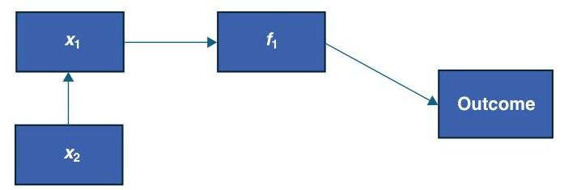
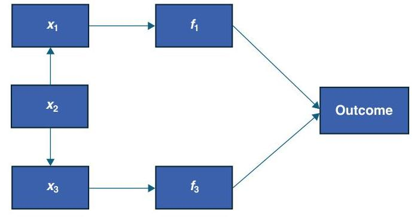

_Note: Source document was split into 3 OCR chunks (pages 1-19, pages 20-35, pages 36-46) to stay within token limits._

# Potential-Unintended-Impacts-of-Bias-Mitigation-in-a-Competitve-Insurance-Market-Wang-Chen (1)

## Page 1
# CAS RESEARCH PAPER SERIES ON RACE AND INSURANCE PRICING 

## POTENTIAL UNINTENDED IMPACTS OF BIAS MITIGATION IN A COMPETITIVE INSURANCE MARKET

Gary Wang, FCAS, CSPA, MAAA;
Michael K. Chen, FCAS, CSPA, MAAA

## Page 2
The CAS Research Paper Series on Race \& Insurance Pricing was created to guide the insurance industry toward proactive, quantitative solutions that address potential racial bias in insurance pricing. These reports explore different aspects of unintentional potential bias in insurance pricing, address historical foundations and offer forward-looking solutions to quantify and handle possible bias. Through these reports, the CAS aims to encourage actuaries to discuss this topic with their stakeholders across all areas of insurance pricing and operations. For more information on the series, visit casact.org/raceandinsuranceresearch.

The Casualty Actuarial Society (CAS) is a leading international organization for credentialing, professional education and research. Founded in 1914, the CAS is the world's only actuarial organization focused exclusively on property-casualty risks and serves over 10,000 members worldwide. CAS members are sought after globally for their insights and ability to apply analytics to solve insurance and risk management problems. As the world's premier P\&C actuarial research organization, the CAS reaches practicing actuaries across the globe with thought-leading concepts and solutions. The CAS has been conducting research since its inception. Today, the CAS provides thousands of open-source research papers, including its prestigious publication, Variance - all of which advance actuarial science and enhance the P\&C insurance industry. Learn more at casact.org.
(c) 2025 Casualty Actuarial Society. All rights reserved.

# Caveat and Disclaimer 

This research paper is published by the Casualty Actuarial Society (CAS) and contains information from various sources. The study is for informational purposes only and should not be construed as professional or financial advice. The CAS does not recommend or endorse any particular use of the information provided in this study. The CAS makes no warranty, express or implied, or representation whatsoever and assumes no liability in connection with the use or misuse of this study. The views expressed here are the views of the authors and not necessarily the views of their current or former employers.

## Page 3
# CAS RESEARCH PAPER SERIES ON RACE AND INSURANCE PRICING 

## POTENTIAL UNINTENDED IMPACTS OF BIAS MITIGATION IN A COMPETITIVE INSURANCE MARKET

Gary Wang, FCAS, CSPA, MAAA, and Michael K. Chen, FCAS, CSPA, MAAA

Casualty Actuarial Society
4350 North Fairfax Drive, Suite 250
Arlington, VA 22203
www.casact.org
(703) 276-3100

## Page 4
# Contents 

Executive Summary ..... 1
Introduction ..... 3

1. Background ..... 3
2. Definitions ..... 4
3. Data Simulation ..... 6
4. Models ..... 9
5. Risk Effect and Correlation Parameters ..... 11
6. Discussion of Scenario Results ..... 13
6.1. Base Scenario (Case 201) ..... 13
6.2. Confusion Scenario (Case 202) ..... 24
6.3. Opposing Correlations Scenario (Case 203) ..... 33
7. Conclusion ..... 35
8. Suggested Future Research ..... 36
Appendix 1. Full Data Simulation Parameters List ..... 37
Appendix 2. A Technical Discussion of the Correlation Inducement Approach ..... 38
References ..... 41

## Page 5
# Potential Unintended Impacts of Bias Mitigation in a Competitive Insurance Market 

By Gary Wang, FCAS, CSPA, MAAA, and Michael K. Chen, FCAS, CSPA, MAAA

## Executive Summary

The paper investigates the balance between maintaining accurate risk differentiation and ensuring equitable treatment among various classes of interest when the use of certain rating variables is restricted or banned by insurance regulatory law. The research is inspired by the simulated data exploration and the definitions set forth by Weiss in the paper "Considerations for Managing Potential Bias in Pricing Models" (Weiss 2024).

Using a collection of foundational synthetic examples, we investigate a spectrum of scenarios involving imposed regulatory actions.

Within these simulated scenarios we review models reflecting traditional regulatory constraints, such as the following:

- Limiting the range a rating variable is allowed to differentiate. An example of such "capping" is limiting the territorial differentiation.
- Prohibiting the use of a certain rating variable. An example is regulation that prohibits the use of credit-based insurance scores.

These scenarios examine

- how the competitive market reacts to multiple companies with different portfolio mixes relative to the market population; and
- how the competitive market reacts when two classes of interest have opposite correlations with the regulated rating variable under consideration.

The simulated scenarios demonstrate the following:

- Traditional regulatory approaches such as capping or prohibiting the use of a variable may lead to a premium that varies between companies for similar risks - a result of the differences in the regulation-induced subsidization effects.
- In scenarios where two classes of interest exist and are correlated in opposite directions with the regulated rating variable, traditional

## Page 6
approaches that improve the demographic parity along the main class of interest may disrupt the demographic parity of the additional class of interest.

- Mitigation approaches that proactively make use of the main class of interest information appear to improve on traditional regulation approaches.

These scenarios illustrate the classic tension that often exists between the objectives of achieving demographic parity and achieving error parity. Given two groups in the main class of interest with a differing average pure premium experience, a model that strives to have a matching average predicted pure premium between the two groups would move away from reflecting the gap between the differing average pure premium experience.

Recent proposed insurance regulation and industry discussions involve the use of class of interest information, or an imputation of it, for purposes of analysis. For example, in 2021 Colorado's governor signed Senate Bill 21-169 into law, prohibiting insurance companies from using external consumer data and information sources (ECDIS), as well as algorithms and predictive models relying on ECDIS, in a manner that leads to "unfair discrimination" against customers based on protected characteristics that include race, color, national or ethnic origin, religion, sex, sexual orientation, disability, gender identity, and gender expression. Colorado has been exploring adopting additional governance, reporting, and testing regulations that may require the use of class of interest information. The scenarios explored in this paper show that while regulatory approaches may moderate the disruption to the competitive balance, they do not necessarily fully remove it.

## Page 7
# Introduction 

Insurance classification plans are developed under the assumption of appropriate risk classifications. That is, rates are predicted in a manner that reflects the expected loss cost associated with the individual being rated. Under fairness considerations, regulators may impose constraints on what variables may be used or they may restrict the extent the variable can differentiate between risks. While such actions are often taken with respect to a specific class of interest, there are a multitude of classes to consider under the topic of fairness.

With this research, we aim to provide insight to the following question: given a set of meaningful rating variables for differentiating risk and a collection of classes of interest with respect to fairness, how does regulation restricting the differential allowed in one rating variable (with no differential allowed being the case of prohibiting its use) affect accuracy and fairness across multiple classes of interest? For tractability, we will assume that the regulation aims to achieve fairness along a main class of interest, and we research the consequences of this one action on an additional class of Interest.

We begin with a collection of simple but foundational synthetic examples associated with one or a few rating elements and similarly one or a few classes of interest. Using these scenarios and differing defined contributions the rating elements and the classes of interest have on risk differential, we create a spectrum of scenarios that impose regulatory actions on

- multiple classes of interest, and
- multiple companies and biased portfolios relative to market population.

This paper also provides a simulation framework for the use of practitioners for the purpose of extended fairness research.

## 1. Background

Our research is inspired by observed historical regulations. We highlight two commonly regulated rating variables.

## Capping Territory Differentials

Michigan, for example, over the years, has enacted various regulations aimed at addressing issues of availability and affordability of auto and home insurance throughout the state. Legislation enacted through Chapter 21 of the Michigan Insurance Code (Michigan Compiled Laws 500.2111) imposed restrictions on rating by territory - a form of regulation called territory capping. The imposed restrictions stated that a company could have no more than 20 different territorial rates, that the lowest rate based on territory could not be less than $45 \%$ of the highest such rate, and that a territorial rate could not be less than $90 \%$ of the rate in an adjacent territory (Michigan House Bill 5177 Analysis). In essence, these regulatory restrictions limited the number of territories, limited the range of relativities from lowest to highest, and imposed restrictions on adjacent territory relativities.

## Page 8
Subsequent legislation suspended the territory-capping restrictions from February 28, 1986, to April 1, 1992. House Bill 5177 would eliminate the territory-capping restrictions. Insurance companies argued that the restrictions were not having the intended effect but were producing unintended harmful effects. A company with a larger presence in the higher-cost urban territories was at a disadvantage when competing in lower-cost areas because the capping requirements limited the high rates it needed to charge in the higher-cost territories, thus limiting its ability to charge lower rates elsewhere. The companies that wrote a higher proportion of higher-cost urban risks claimed that the territory-capping regulation made them uncompetitive.

# Prohibiting the Use of Credit-Based Insurance Scores 

Some regulatory jurisdictions forbid or limit home and auto insurance companies from using credit-based insurance scores when offering or renewing a policy or deciding how much to charge in premiums. Jurisdictions that have banned credit-based scoring argue that the process is not transparent enough and may result in negative impacts on a disproportionate number of low-income consumers and people of color. Supporters of prohibiting credit-based insurance scoring argue that a disparate impact occurs as a matter of public policy whenever this practice is employed.

Supporters of the use of credit-based insurance scoring argue that the use of such scores to underwrite and rate policies can result in improved rating accuracy. This improved accuracy may result in decreased premiums for lower-risk insureds and in increased premiums for higher-risk insureds. Enhanced accuracy also may have broader effects in the marketplace. The American Insurance Association, for example, argued that "more precise pricing enables insurers to accept greater risk by ensuring that both good risks and more marginal risks are properly priced to reflect the exposure they represent" (Federal Trade Commission 2007, page 46).

## 2. Definitions

A key to our data simulation setup involves the idea of paths of correlation and association. This idea is formally introduced in Weiss's (2024) e-forum paper. We provide the general definition first, as illustrated in Figure 1, before connecting it with two of the key definitions Weiss introduced. For the original discussion and illustrative examples please review the presentation of the ideas in the referenced Weiss paper.

Consider a variable $x_{i}$, meaningfully associated with differentiating potential risk outcomes. If there is a variable $x_{2}$, such that $x_{1}$ and $x_{2}$ are correlated, then by the strength of that correlation, $x_{2}$ would have an association with the differentiating factor.

We can say, in this scenario, that $x_{2}$ associates with risk factor $f_{1}$ indirectly, through $x_{1}$. Conversely, $x_{1}$ associates with risk factor $f_{1}$ directly, with respect to $x_{2}$. That is, the association between $x_{1}$ and $f_{1}$ does not include an intermediate association with $x_{2}$.

For our research, we are interested in a main class of interest variable that is not to be used as a rating variable, and we are interested in a regulated rating variable that is correlated

## Page 9
Figure 1. Illustration of Association of Rating Variables with Risk Factor and Risk Outcome
with the main class of interest variable. The Weiss definitions for predilection and confusion describe the direct and indirect associations above, in the context of the regulated rating variable and the main class of interest variable.

Predilection is characterized by a rating variable directly associated with the risk effect, and the correlation between the main class of interest variable and the regulated rating variable being the only means of association between the main class of interest variable and the risk effect. That is, $x_{1}=$ regulated rating variable and $x_{2}=$ main class of interest variable.

Confusion is then characterized by the reverse assignment. That is, the main class of interest variable is directly associated with the risk effect, and the correlation between the regulated rating variable and the main class of interest variable is the only means of association between the regulated rating variable and the risk effect. That is, $x_{1}=$ main class of interest variable and $x_{2}=$ regulated rating variable.

Note that the predilection and confusion effects are defined pairwise. It is possible to create a confusion effect through an indirect manner, as Figure 2 illustrates.

In Figure 2, $x_{2}$ is indirectly associated with both risk effects $f_{1}$ and $f_{3}$. However, by the characterization as laid out in this paper, $x_{2}$ is directly related to $f_{3}$ with respect to $x_{1}$. This is highlighted to show that the intent of a characterization as direct does not imply proximityin the sense of being the closest existing feature to associate with the risk factor. This is important in insurance, where variables are curated for classification plans based on a variety

Figure 2. Illustration of Hypothetical Multivariable Scenario with Predilection and Confusion Effects

## Page 10
of reasons, such as completeness of data and ease of data capture and validation, in addition to meaningful correlation to differences in expected outcome.

A hypothetical example may help add some clarity to the phenomenon described above. Suppose a territory is known to be high risk, in part because of heavier late-night driving activities in the area. Suppose further that racial and ethnic minorities in this territory are more likely to take on second- and third-shift jobs, which put them out on the road during late-night hours. In this scenario,

$$
\begin{aligned}
& x_{1}=\text { territory, } \\
& x_{2}=\text { race and ethnicity, } \\
& x_{3}=\text { hours of driving. }
\end{aligned}
$$

In this hypothetical exercise, part of the association between territory and risk pattern flows through the association between race and ethnicity and late-night driving patternsthus this is considered a confusion effect that territory picks up through race and ethnicity. However, should the company employ telematics and capture time-of-driving patterns, it would pick up the relevant association, and time of driving would pick up the risk differences in a more direct association, relative to race and ethnicity. This is just a thought exercise, and to prove the hypothetical would require studies demonstrating the various statements above, in addition to measuring the confusion and predilection effects.

Furthermore, in our research we will at times use confusion in our features and risk effects setup. This by no means implies a close proximity between the main class of interest and the risk effects. Rather, it is a way to provide scenarios where there are some differentiations associated with the main class of interest factor that do not require intermediate associations with features available for rating. Thus, with respect to the regulated rating variable and the other rating features, the relationship between the main class of interest variable and the component risk factor is direct.

# 3. Data Simulation 

Our research explores the effects of insurance regulatory activity in a business environment, with two particular interests:

- Although disparate impact discussions about the use of regulated rating variables may be focused on a main class of interest, there are potentially other additional classes of interest correlated with the regulated rating variable. Disparate impact discussions refer to conversations about how to identify and address unintentional discrimination against protected groups. For example, the use of credit-based insurance scores is often regulated due to the intuitive correlation between racial and ethnic minorities (main class of interest) and low credit-based insurance scores; however, there may be a positive correlation between older adults (additional class of interest) and high credit-based insurance scores.
- Not all companies write the same portfolio mix. When a regulatory action affects model building and implementation, different companies have access only to their own portfolio and the associated experience data.

## Page 11
For the research, the population scenario is set up as follows. We simulate 1.5 million records in the following manner. We create 13 features:

- Classes of interest: main class of interest (COI), additional class of interest (ACOI)
- Regulated rating variable: regulated rating variable (RRV)
- Other features: variables $v_{1}$ through $v_{10}$

All variables are binary. For correlations, we build mechanisms to correlate

- the regulated rating variable with the main class of interest and the additional class of interest, and
- other features with the main class of interest and an additional class of interest.

We then associate each of the 13 variables with risk effects. The net risk differential is set to be the product of the 13 component risk differentials. The net risk differential is treated as a lambda $(\lambda)$ parameter for a Poisson draw. For each record, with its respective $\lambda$, we draw a claim counts outcome. For simplicity, we introduce a constant severity term. This choice enables the outcome to be in the form of pure premium, which has intuitive appeal for researchers working with insurance pricing. The constant nature of the introduced severity limits the variations of the outcomes and the amount of the noise we need to navigate through in reviewing results. Interested readers can explore on their own and introduce, for example, a gamma draw for loss size of each simulated claim. In so doing, they can further introduce risk differentials as desired based on their research objectives.

The code utilizes adjustments of the various delta ( $\delta$ ) parameters to induce correlation between variables. The $\delta$ parameter changes the relative likelihood that a record with positive value in one variable is also of positive value in the second variable. When $\delta>0$, the relative likelihood is increased. Conversely, when $\delta<0$, the relative likelihood is decreased. A technical discussion of the correlation-inducing process can be found in Appendix 2. The correlations between the regulated rating variable, the main class of interest, and the additional class of interest can be found in Section 5.

To explore potential differences in predictions - and thus differences in pricing similar risks - among companies with different portfolio profiles, we allocate the 1.5 million records to three companies, with different distributions with respect to the regulated rating variable. A higher proportion of records with regulated rating variable $=1$ is allocated to Company 1 (high-risk company), while a lower proportion is allocated to Company 3 (low-risk company). The propensity is reversed, where a lower proportion of records with regulated rating variable $=0$ is allocated to the high-risk company, while a higher proportion is allocated to the low-risk company. Company 2 (balanced-risk company) has an even split between policies with regulated rating variable $=1$ and regulated rating variable $=0$, comparable to the market portfolio. Table 1 shows the distributions of records to each company, segmented by the regulated rating variable, from the base scenario.

## Page 12
Table 1. Composition of High-Risk, Balanced-Risk, and Low-Risk Companies

|  | Regulated Rating Variable |  |
| :-- | :--: | :--: |
| Company | 1 | 0 |
| 1. High risk | 374,135 | 125,473 |
| 2. Balanced risk | 250,837 | 249,573 |
| 3. Low risk | 125,027 | 374,955 |

A detailed walkthrough of the R code for developing the simulated data follows.

1. First, we randomly assign to each record a level from $\{0,1\}$ to represent the main class of interest. The probability of belonging to level 1 is set at 0.25 .
2. Next, we simulate a level for the additional class of interest in $\{0,1\}$, using the correlation-inducing adjustment described above. The probability threshold is set at $p=0.25$, so $25 \%$ of the records belong to additional class of interest $=1$.
3. The regulated rating variable is generated to correlate to the main class of interest and the additional class of interest. The probability threshold is $p=0.50$, resulting in $50 \%$ of the records to belong to regulated rating variable $=1$.
4. Variables $v_{1}$ through $v_{10}$ are each developed with the same correlating effect setup as the main class of interest and the additional class of interest. Thus, any correlation to the regulated rating variable is not directly introduced, but rather through the induced correlation to the main class of interest and the additional class of interest.
5. Once the 13 features are populated, a parameter lambda $(\lambda)$ is computed based on the risk differentials assigned to the 13 variables. For variable $v_{i}$, we use the factor $\left(1+v_{i} *\left(\right.\right.$ factor. $\left.v_{i}-1\right)$ ) in the formula to allow parameters to be set as relativities, and not as (relativities -1 ) for convenience.
6. For each record, a Poisson draw is made to simulate claims experience for the record, based on the $\lambda$ from step 5 . Each claim is assumed to have constant loss value of $\$ 10,000$.
7. The records are allocated to three companies in the following manner. For a record with regulated rating variable $=1$, there is a $3 / 6$ probability of being assigned to the high-risk company (Company 1), a $2 / 6$ probability of being assigned to the balanced-risk company (Company 2), and a $1 / 6$ probability of being assigned to the low-risk company (Company 3). The records with regulated rating variable $=0$ have the reversed probabilities. That is, there is a $1 / 6$ probability of being assigned to the high-risk company (Company 1), a $2 / 6$ probability of being assigned to the balanced-risk company (Company 2), and a $3 / 6$ probability of being assigned to the low-risk company (Company 3). Thus, as illustrated in Table 1, with respect to the regulated rating variable, the high-risk company has $75 \%$ of its portfolio being of high risk, the balanced-risk company has $50 \%$ of its portfolio being of high risk, and the low-risk company has $25 \%$ of its portfolio being of high risk.

## Page 13
# 4. Models 

For evaluation of predictions, we consider five different model structures:

- Unrestricted generalized linear model (GLM)
- Capping GLM
- Prohibited variable GLM
- Control variable GLM
- Residualized variables GLM

## Unrestricted GLM

The unrestricted GLM represents the typical actuarial exercise in pricing risk. The modeler does not have access to and is not interested in using the main class of interest and the additional class of interest variables to differentiate risk. The modeler uses the regulated rating variable, variables $v_{t}$ through $v_{10}$, and the GLM structure with the log-link function and the Poisson distribution assumptions to develop a model to predict the claims outcome based on the 11 features.

## Capping GLM

In every scenario discussed here, the unrestricted GLM model produces a regulated rating variable factor significantly greater than 1.50. A constraint commonly found in territory regulation is to cap the amount of difference within a geographic region or limit differences between nearby regions, rather than fully prohibiting the use of the regulated rating variable. We incorporate this regulatory constraint in the capping GLM model structure by introducing an offset term:
offset $=\log 1.5$, if regulated rating variable $=1$; else 0

The modeler then models the claims counts as a relation to the 10 variables $v_{t}$ through $v_{10}$, plus the offset term. The rating factor cap of 1.50 (50\% surcharge) was judgmentally selected at half the full simulation difference of 2.0 ( $100 \%$ surcharge). This reflects a constraint that allows for some differentiation while at the same time capping the differentiation to be meaningfully below the true difference between risks.

## Prohibited Variable GLM

Sometimes, an insurance regulation prohibits the use of a rating variable outright. The most common example of a statistically meaningful variable that has nonetheless been prohibited in some states is the credit-based insurance score. To reflect this constraining situation, we use the prohibited variable GLM model, in which the modeler uses only variables $v_{t}$ through $v_{10}$ to predict the claims experience and excludes the regulated rating variable.

## Page 14
# Control Variable GLM 

In recent discussions, the use of the main class of interest variables in evaluation and in mitigation of fairness concerns has been advanced. The research is generally intended for broader consideration, and it is not an endorsement for or against use in any given industry without further consideration. Such an approach is included here for research purposes to demonstrate an evaluation of impacts, and to demonstrate, within the scope of this review, that it presents some consequences worth worrying through. Furthermore, any improvement it may bring relative to classical methods acting directly on the regulated rating variables must be weighed against the uncomfortable practice of using the main class of interest information in developing the model and/or implementing of the model.

The control variable GLM is one way by which a modeler may use the main class of interest information in the model design without requiring it in implementation. In addition to the regulated rating variable and variables $v_{i}$ through $v_{i, j}$, the main class of interest variable is introduced into the model. However, in implementation (prediction), the model always enters main class of interest as 0 , thus eliminating its influence in the prediction. Generally, this creates an imbalance between the total predicted claim experience and the actual experience, and an on-balancing factor (total historical claim counts/total predicted claim counts) is applied to every prediction to ensure that the total claims predicted is unbiased relative to the actual claims in experience data. This model form does not require the main class of interest information in implementation, which distinguishes it from the final GLM model form described below.

## Residualized Variables GLM

The residualized variables GLM represents a way by which the modeler can strip the correlation to the main class of interest from the variables, before developing the pricing model. For each variable, the modeler first determines the observable relationship between the rating feature $v_{i}$ (including the regulated rating variable) and the main class of interest. That is, the modeler models a simple linear regression between the two. The modeler then replaces $v_{i}$ with its residual from this model, $r_{i}$. That is,

- Build model $E\left[v_{i}\right]=\beta_{0}+\beta_{i}^{*} \mathrm{COI}$
- Set $r_{i}=v_{i}-E\left[v_{i}\right]$
- Use $r_{i}$ 's instead of $v_{i}$ 's for the GLM model

To implement this model, one must determine $r_{i}$, which requires the main class of interest information or an imputation of it to be used in implementation. As a model form that requires the main class of interest information both in development and in production, this approach is presented for purposes of exploring the theoretical extent to which different objectives can be achieved, such as demographic parity and error parity with respect to the classes of interest, and competitive balance of model predictions. It is likely that most research along this direction will take place in industries outside insurance where the direct consideration and use of classes of interest is more accepted.

## Page 15
Table 2. Variable Correlations to COI Before and After Residualization

| Rating Variables | Correlation with Main Class of Interest |  |
| :-- | :--: | :--: |
|  | Unresidualized Form   of Variables | Residualized Form   of Variables |
| RRV | 0.1912 | 0.0000 |
| $v_{1}$ | 0.0587 | 0.0000 |
| $v_{2}$ | 0.0581 | 0.0000 |
| $v_{3}$ | 0.0586 | 0.0000 |
| $v_{4}$ | 0.0599 | 0.0000 |
| $v_{5}$ | 0.0589 | 0.0000 |
| $v_{6}$ | 0.0584 | 0.0000 |
| $v_{7}$ | 0.0584 | 0.0000 |
| $v_{8}$ | 0.0585 | 0.0000 |
| $v_{9}$ | 0.0599 | 0.0000 |
| $v_{10}$ | 0.0594 | 0.0000 |

Table 2 shows the correlation of the residuals $(r)$ with the main class of interest.
As intended, the residualization process decorrelates the rating variables used in the model from the main class of interest.

# 5. Risk Effect and Correlation Parameters 

A wide array of parameters is associated with the data simulation setup. As we describe below, most of the parameters are kept fixed, but there are two sets of parameters that vary, reflecting conditions we are interested in:

- We toggle risk effects associated with the main class of interest and the additional class of interest between 1.0 and 1.5 .
- When set to 1.0, no risk effects are directly associated with the classes of interest. That is, any lack of parity in aggregate results is due to predilection effects, or effects that were directly represented by the regulated rating variable or $v_{1}$ through $v_{10}$. We observe the difference in the classes of interest through their correlation with the rating variables.
- When set to 1.5, we introduce a confusion effect. A meaningful amount of risk effects are directly associated with the classes of interest. The rating variables are not intended to capture any part of this risk effect but do so through their correlation with the classes of interest.

## Page 16
Table 3. Partial Correlation Matrix with COI Delta 0.5 and ACOI Delta 0.5

|  | var.coi | var.acoi | var.rrv | $v_{1}$ | $v_{2}$ | $v_{3}$ |
| :-- | --: | --: | --: | --: | --: | --: |
| var.coi | 1.0000 | -0.0020 | 0.1912 | 0.0587 | 0.0581 | 0.0586 |
| var.acoi | -0.0020 | 1.0000 | 0.1928 | 0.0594 | 0.0583 | 0.0593 |
| var.rrv | 0.1912 | 0.1928 | 1.0000 | 0.0229 | 0.0228 | 0.0224 |
| $v_{1}$ | 0.0587 | 0.0594 | 0.0229 | 1.0000 | 0.0054 | 0.0074 |
| $v_{2}$ | 0.0581 | 0.0583 | 0.0228 | 0.0054 | 1.0000 | 0.0063 |
| $v_{3}$ | 0.0586 | 0.0593 | 0.0224 | 0.0074 | 0.0063 | 1.0000 |

Note: $v_{4}$ through $v_{10}$ are not shown, as they behave similarly to $v_{1}$ through $v_{3}$.

- We toggle the correlation-inducing parameter delta.acoi.on.rrv ("delta") between 0.5 and -0.4 .
- When both deltas are set to 0.5 , the main class of interest and the additional class of interest are positively correlated with the regulated rating variable.
- When set to -0.4 , the additional class of interest is now negatively correlated with the regulated rating variable. The magnitude of the delta is chosen so that the resulting correlations between the classes of interest and the regulated rating variable are comparable in magnitude.

Table 3 shows the partial correlation matrix when the correlation-inducing parameter deltas are set to 0.5 for both the main class of interest and the additional class of interest.

Table 4 shows the partial correlation matrix when the correlation-inducing parameter deltas are set to 0.5 and -0.4 for the main class of interest and the additional class of interest, respectively.

Table 4. Partial Correlation Matrix with COI Delta 0.5 and ACOI Delta -0.4

|  | var.coi | var.acoi | var.rrv | $v_{1}$ | $v_{2}$ | $v_{3}$ |
| :-- | --: | --: | --: | --: | --: | --: |
| var.coi | 1.0000 | -0.0020 | 0.1932 | 0.0587 | 0.0581 | 0.0586 |
| var.acoi | -0.0020 | 1.0000 | -0.1932 | 0.0594 | 0.0583 | 0.0593 |
| var.rrv | 0.1932 | -0.1932 | 1.0000 | 0.0002 | -0.0003 | -0.0016 |
| $v_{1}$ | 0.0587 | 0.0594 | 0.0002 | 1.0000 | 0.0054 | 0.0074 |
| $v_{2}$ | 0.0581 | 0.0583 | -0.0003 | 0.0054 | 1.0000 | 0.0063 |
| $v_{3}$ | 0.0586 | 0.0593 | -0.0016 | 0.0074 | 0.0063 | 1.0000 |

Note: $v_{4}$ through $v_{10}$ are not shown, as they behave similarly to $v_{1}$ through $v_{3}$.

## Page 17
Comparing the highlighted cells in Table 4 with the corresponding cells in Table 3 shows that the choice of the delta parameter in this scenario led to a correlation between the additional class of interest and the regulated rating variable that is equal in magnitude but opposite in direction as the correlation between the main class of interest and the regulated rating variable, as desired.

The base scenario and the two toggles form the three cases we review and discuss in Section 6.

# 6. Discussion of Scenario Results 

We ran a combination of three cases, which vary by whether there are risk effects directly represented by the main class of interest and the additional class of interest, and whether the relation of the additional class of interest with the regulated rating variable is positively or negatively correlated.

### 6.1. Base Scenario (Case 201)

The base scenario (Table 5) reflects the assumption that the main class of interest and the additional class of interest are not directly associated with risk effects. All risk effects are directly associated with either the regulated rating variable or one of the 10 additional variables $v_{1}$ through $v_{10}$. In keeping with the definitions, we introduced predilection effects through a 2.00 risk effect associated with the regulated rating variable, and no confusion effects through the main class of interest or the additional class of interest.

We begin by studying the overall results for Company 2, which contains roughly one-third of the total population records with a balance of $50 \%$ regulated rating variable $=1$ and $50 \%$ regulated rating variable $=0$. The company portfolio thus mirrors the population distribution, with respect to the regulated rating variable. In this scenario, the experience (actual) average pure premium and the five-model average pure premium, by the regulated rating variable, the main class of interest variable, and the additional class of interest variable, are shown in Tables 6 and 7.

Table 5. Case 201: Base Scenario Parameters

| Parameter | Description | Value |
| :-- | :-- | :--: |
| delta.coi.on.rrv | Correlation-inducing parameter of the main class of interest on   regulated rating variable | 0.50 |
| delta.acoi.on.rrv | Correlation-inducing parameter of the additional class of interest   on regulated rating variable | 0.50 |
| riskeffect.coi | Risk effect associated with the main class of interest | 1.00 |
| riskeffect.acoi | Risk factor associated with the additional class of interest | 1.00 |

## Page 18
Table 6. Average Pure Premium by Regulated Rating Variable (Balanced Company)

| Regulated   Rating   Variable | Exposure | Actual   Pure   Premium | Unrestricted   GLM | Regulatory Adjusted Models |  |  |  |
| :-- | :--: | :--: | :--: | :--: | :--: | :--: | :--: |
|  |  |  |  | Capping   GLM | Prohibited   Variable   GLM | Control   Variable   GLM | Residualized   Variables   GLM |
| 1 | $50 \%$ | 681.20 | 681.20 | 614.10 | 515.07 | 682.37 | 670.00 |
| 0 | $50 \%$ | 322.67 | 322.67 | 390.11 | 489.64 | 321.50 | 333.92 |
| Ratio 1/0 |  | 2.11 | 2.11 | 1.57 | 1.05 | 2.12 | 2.01 |

In this scenario, the unrestricted GLM reflects a net 2.11 difference between the groups with regulated rating variable $=1$ and regulated rating variable $=0$. This is slightly stronger than the 2.00 risk factor associated with the regulated rating variable by design and is the consequence of the correlation between variables $v_{1}$ through $v_{10}$ and the regulated rating variable.

When reviewing the average prediction by the main class of interest, one observes a 1.32 differential in the average predictions from the unrestricted GLM between the two groups within the main class of interest. Given the correlation between the regulated rating variable and the main class of interest, the regulators may step in and impose a cap on the relativity for the regulated rating variable in the rating plan or prohibit the use of the variable as part of the rating plan. Each of these two regulatory approaches indeed narrows the difference between the two groups in the main class of interest - to 1.26 through capping and 1.16 through prohibition. From the perspective of improving demographic parity, the regulations would indeed be working as intended. However, from a business perspective, certain imbalances are introduced.

In the case of the control variable GLM approach, the resulting difference between the two segments in the main class of interest is 1.33 , comparable to the 1.32 from the unrestricted GLM results. That is, the control variable GLM approach failed to improve the demographic parity with respect to the main class of interest. This is, in retrospect, to be expected. The model did not directly associate an effect with the main class of interest variable, and

Table 7. Average Pure Premium by Main Class of Interest (Balanced Company)

| Main   Class of   Interest | Exposure | Actual   Pure   Premium | Unrestricted   GLM | Regulatory Adjusted Models |  |  |  |
| :-- | :--: | :--: | :--: | :--: | :--: | :--: | :--: |
|  |  |  |  | Capping   GLM | Prohibited   Variable   GLM | Control   Variable   GLM | Residualized   Variables   GLM |
| 1 | $25 \%$ | 603.67 | 615.55 | 593.14 | 559.85 | 616.43 | 501.08 |
| 0 | $75 \%$ | 468.65 | 464.69 | 472.16 | 483.25 | 464.40 | 502.82 |
| Ratio 1/0 |  | 1.29 | 1.32 | 1.26 | 1.16 | 1.33 | 1.00 |

## Page 19
Table 8. Main Class of Interest Relativity by Company (Control Variable GLM)

|  | Relativity |  |  |
| :-- | :--: | :--: | :--: |
| Variable | Company 1 (High) | Company 2 (Balanced) | Company 3 (Low) |
| Main class of interest | 0.997 | 0.970 | 1.006 |

so the GLM algorithm did not reflect the main class of interest variable as significant when introduced. For the three companies, the relativities for the main class of interest variable are shown in Table 8.

Finally, for the residualized GLM, the results are compelling from a numbers perspective. The $1 / 0$ ratio for the main class of interest is at 1.00 , demonstrating full demographic parity. The $1 / 0$ ratio for the regulated rating variable is at a robust 2.01 , only a moderate reduction from the unrestricted GLM differential of 2.11.

To consider the idea of equal accuracy, or error parity, we compute the actual pure premium-to-predicted pure premium ratios from the various GLM results from Tables 6 and 7, respectively, and show these results in Tables 9 and 10.

In reviewing these ratios, $100 \%$ would represent the average prediction matching the average actual pure premium. Greater than $100 \%$ reflects underprediction, and pricing to this level

Table 9. Ratio of Actual to Predicted Pure Premium by Regulated Rating Variable (Balanced Company)

| Regulated   Rating   Variable | Exposure | Unrestricted   GLM | Regulatory Adjusted Models |  |  |  |
| :-- | :--: | :--: | :--: | :--: | :--: | :--: |
|  |  |  | Capping   GLM | Prohibited   Variable   GLM | Control   Variable   GLM | Residualized   Variables   GLM |
| 1 | $50 \%$ | $100 \%$ | $111 \%$ | $132 \%$ | $100 \%$ | $102 \%$ |
| 0 | $50 \%$ | $100 \%$ | $83 \%$ | $66 \%$ | $100 \%$ | $97 \%$ |

Table 10. Ratio of Actual to Predicted Pure Premium by Main Class of Interest (Balanced Company)

| Main Class   of Interest | Exposure | Unrestricted   GLM | Regulatory Adjusted Models |  |  |  |
| :-- | :--: | :--: | :--: | :--: | :--: | :--: |
|  |  |  | Capping   GLM | Prohibited   Variable   GLM | Control   Variable   GLM | Residualized   Variables   GLM |
| 1 | $25 \%$ | $98 \%$ | $102 \%$ | $108 \%$ | $98 \%$ | $120 \%$ |
| 0 | $75 \%$ | $101 \%$ | $99 \%$ | $97 \%$ | $101 \%$ | $93 \%$ |

## Page 20
leads to expected economic losses for the company from a pricing perspective. Less than $100 \%$ reflects overprediction, and companies would expect to make a profit from pricing to this level from the pricing inaccuracy.

Recall that earlier we observed improved demographic parity in three of the four regulatory adjusted approaches - the capping, the prohibited variable, and the residualized variables GLMs. To achieve the demographic parity observed earlier, we note that the actual-to-predicted pure premium ratios for main class of interest $=1$ go from $98 \%$ to $102 \%, 108 \%$, and $120 \%$, respectively. Offsetting this, we see the pure premium ratios for main class of interest $=0$ move from $101 \%$ to $99 \%, 97 \%$, and $93 \%$, respectively. That is, for each group, the ratios move away from $100 \%$, in opposite directions. The observed over- and underpredictions indicate worsening error parity, where the errors have increased in magnitude and in opposite directions for the two groups.

With respect to the regulated rating variable groups, traditional capping and prohibition of the regulated rating variables lead to $111 \%$ and $132 \%$ for regulated rating variable $=1$, and to $83 \%$ and $66 \%$ for regulated rating variable $=0$. The clearly divergent pattern shows that the regulatory constraints lead to poor accuracy along the regulated rating variable dimension. The control variable GLM approach, as expected from the prior discussion, does not change the accuracy results when compared with the unrestricted GLM results, due to the limited risk effect attributed to the main class of interest in the models.

A key consequence we wish to review in this particular scenario is the nature of pricing among the three companies when the companies are under the various regulatory or mitigation actions. To evaluate that, we consider the actual experience and the average unrestricted GLM predicted pure premium, segmented by the main class of interest, the additional class of interest, and the regulated rating variable. First, in Table 11, we recall the portfolio distribution of the three companies.

The average simulated experience pure premium, segmented by the main class of interest, the additional class of interest, and the regulated variable, is shown in Table 12.

We start with the unrestricted GLM, computing the average model predicted pure premium by these eight segments, and then computing the actual-to-predicted pure premium ratio for the eight segmented combinations for each of the three companies, as shown in Table 13.

Table 11. Composition of High-Risk, Balanced-Risk, and Low-Risk Companies

|  | Regulated Rating Variable |  |
| :-- | :--: | :--: |
| Company | 1 | 0 |
| 1. High risk | 374,135 | 125,473 |
| 2. Balanced risk | 250,837 | 249,573 |
| 3. Low risk | 125,027 | 374,955 |

## Page 21
Table 12. Average Simulated Pure Premium by Company, COI, ACOI, and RRV

| Main Class   of Interest | Additional Class   of Interest | Regulated   Rating Variable | Actual Pure Premium |  |  |
| :-- | :--: | :--: | :--: | :--: | :--: |
|  |  |  | Company 1   (High) | Company 2   (Balanced) | Company 3   (Low) |
| 0 | 0 | 0 | 310.13 | 311.00 | 312.92 |
| 0 | 0 | 1 | 617.53 | 621.99 | 604.98 |
| 0 | 1 | 0 | 333.77 | 368.02 | 343.05 |
| 0 | 1 | 1 | 697.28 | 709.60 | 696.35 |
| 1 | 0 | 0 | 354.27 | 326.26 | 358.40 |
| 1 | 0 | 1 | 697.75 | 689.67 | 686.78 |
| 1 | 1 | 0 | 394.29 | 355.13 | 403.24 |
| 1 | 1 | 1 | 823.27 | 845.86 | 817.47 |

Despite the differences in company portfolio makeup, the average actual-to-predicted ratios are near $100 \%$ across the eight segments for all three companies. For each company, portfolio shifts with respect to the main class of interest and the additional class of interest or to the regulated rating variable should have minimal impact on profitability, from a pure actual versus predicted losses perspective. The pricing for the three companies would be comparable for the various groups, in a manner appropriately covering the losses expected.

Table 13. Predicted Pure Premium and Actual-to-Predicted Ratio by Company, COI, ACOI, and RRV (Unrestricted GLM)

| Main Class of Interest | Additional   Class of Interest | Regulated   Rating   Variable | Unrestricted GLM Pure Premium |  |  | Actual/Unrestricted GLM Ratio |  |  |
| :--: | :--: | :--: | :--: | :--: | :--: | :--: | :--: | :--: |
|  |  |  | Comp 1   (High) | Comp 2   (Bal) | Comp 3   (Low) | Comp 1   (High) | Comp 2   (Bal) | Comp 3   (Low) |
| 0 | 0 | 0 | 307.10 | 308.27 | 311.51 | $101 \%$ | $101 \%$ | $100 \%$ |
| 0 | 0 | 1 | 614.58 | 620.80 | 608.55 | $100 \%$ | $100 \%$ | $99 \%$ |
| 0 | 1 | 0 | 348.26 | 350.54 | 353.03 | $96 \%$ | $105 \%$ | $97 \%$ |
| 0 | 1 | 1 | 700.91 | 705.64 | 689.65 | $99 \%$ | $101 \%$ | $101 \%$ |
| 1 | 0 | 0 | 352.35 | 350.72 | 353.99 | $101 \%$ | $93 \%$ | $101 \%$ |
| 1 | 0 | 1 | 700.14 | 705.30 | 690.79 | $100 \%$ | $98 \%$ | $99 \%$ |
| 1 | 1 | 0 | 405.29 | 412.51 | 411.01 | $97 \%$ | $86 \%$ | $98 \%$ |
| 1 | 1 | 1 | 822.98 | 827.09 | 808.63 | $100 \%$ | $102 \%$ | $101 \%$ |

## Page 22
Next, in Table 14, we compare the unrestricted GLM model predictions among the companies.
The three companies are competitive with each other in each of the eight segments, with average pricing within a couple of percentage points of each other.

With the traditional regulatory approaches, there is an intuitive recognition of the correlation between the main class of interest variable and the regulated rating variable. The regulatory constraint is based on straightforward and direct action to limit the difference the regulated rating variable can reflect (in the data simulation, capped at 1.50 relativity) or to prohibit the use of the regulated rating variable. The constraint or prohibition means the model cannot properly capture the full range of experience differences. In honoring the constraint while being statistically unbiased - i.e., the total predicted matches total actual claim counts inaccuracies result in an offsetting manner. When the companies' portfolio distributions are different, the offsetting manifests in different ways.

Table 15 shows the capping GLM predicted pure premium by segment and the actual-topredicted pure premium ratios across the segments.

As can be seen, whereas the actual-to-predicted ratio is above $100 \%$ for the segments with regulated rating variable $=1$, it is below $100 \%$ for those with regulated rating variable $=0$. In particular, the high-risk company (Company 1) capping GLM model yields the largest overprediction for groups with regulated rating variable $=0$ and the least underprediction (i.e., closest to $100 \%$ of the three companies) for the segments with regulated rating variable $=1$. Company 3 , with a larger pool of policies with regulated rating variable $=0$ to draw from, needed the least amount of overprediction for segments with regulated rating variable $=0$ to offset the largest observed underpredictions for groups with regulated rating variable $=1$. Company 2 , with a balanced portfolio, sits between the two in terms of the over- and underpredictions. Because of the varying offsetting effects from the models

Table 14. Comparison of Predicted Pure Premiums Between Companies (Unrestricted GLM)

| Main Class   of Interest | Additional   Class of   Interest | Regulated   Rating   Variable | Unrestricted GLM Pure Premium Comparisons |  |  |
| :-- | :--: | :--: | :--: | :--: | :--: |
|  |  |  | Comp 1 (High)   vs. Comp 2 (Bal) | Comp 1 (High)   vs. Comp 3 (Low) | Comp 2 (Bal)   vs. Comp 3 (Low) |
| 0 | 0 | 0 | $0 \%$ | $-1 \%$ | $-1 \%$ |
| 0 | 0 | 1 | $-1 \%$ | $1 \%$ | $2 \%$ |
| 0 | 1 | 0 | $-1 \%$ | $-1 \%$ | $-1 \%$ |
| 0 | 1 | 1 | $-1 \%$ | $2 \%$ | $2 \%$ |
| 1 | 0 | 0 | $0 \%$ | $0 \%$ | $-1 \%$ |
| 1 | 0 | 1 | $-1 \%$ | $1 \%$ | $2 \%$ |
| 1 | 1 | 0 | $-2 \%$ | $-1 \%$ | $0 \%$ |
| 1 | 1 | 1 | $0 \%$ | $2 \%$ | $2 \%$ |

## Page 23
Table 15. Predicted Pure Premium and Actual-to-Predicted Ratio by Company, COI, ACOI, and RRV (Capping GLM)

| Main Class   of Interest | Additional   Class of   Interest | Regulated   Rating   Variable | Capping GLM Pure   Premium |  |  | Actual/Capping   GLM Ratio |  |  |
| :-- | :--: | :--: | :--: | :--: | :--: | :--: | :--: | :--: |
|  |  |  | Comp 1   (High) | Comp 2   (Bal) | Comp 3   (Low) | Comp 1   (High) | Comp 2   (Bal) | Comp 3   (Low) |
| 0 | 0 | 0 | 390.54 | 372.11 | 343.19 | $79 \%$ | $84 \%$ | $91 \%$ |
| 0 | 0 | 1 | 586.72 | 557.89 | 514.80 | $105 \%$ | $111 \%$ | $118 \%$ |
| 0 | 1 | 0 | 443.94 | 424.91 | 390.51 | $75 \%$ | $87 \%$ | $88 \%$ |
| 0 | 1 | 1 | 670.79 | 636.77 | 585.78 | $104 \%$ | $111 \%$ | $119 \%$ |
| 1 | 0 | 0 | 449.26 | 425.14 | 391.62 | $79 \%$ | $77 \%$ | $92 \%$ |
| 1 | 0 | 1 | 670.03 | 636.46 | 586.78 | $104 \%$ | $108 \%$ | $117 \%$ |
| 1 | 1 | 0 | 518.10 | 502.68 | 456.87 | $76 \%$ | $71 \%$ | $88 \%$ |
| 1 | 1 | 1 | 789.97 | 750.19 | 690.35 | $104 \%$ | $113 \%$ | $118 \%$ |

for the different companies, the resulting pricing based on the predictions would place the companies in different competitive positions.

Under the capping scenario, the resulting pricing would have Company 1 predicting higher pure premiums than Companies 2 and 3 across all eight segments, while Company 2 would predict higher pure premiums than Company 3 across the eight segments (Table 16). While the demographic parity improves with the capping regulation, it comes at the cost

Table 16. Comparison of Predicted Pure Premiums between Companies (Capping GLM)

| Main Class   of Interest | Additional   Class of   Interest | Regulated   Rating   Variable | Capping GLM Pure Premium Comparisons |  |  |
| :-- | :--: | :--: | :--: | :--: | :--: |
|  |  |  | Comp 1 (High)   vs. Comp 2 (Bal) | Comp 1 (High)   vs. Comp 3 (Low) | Comp 2 (Bal)   vs. Comp 3 (Low) |
| 0 | 0 | 0 | $5 \%$ | $14 \%$ | $8 \%$ |
| 0 | 0 | 1 | $5 \%$ | $14 \%$ | $8 \%$ |
| 0 | 1 | 0 | $4 \%$ | $14 \%$ | $9 \%$ |
| 0 | 1 | 1 | $5 \%$ | $15 \%$ | $9 \%$ |
| 1 | 0 | 0 | $6 \%$ | $15 \%$ | $9 \%$ |
| 1 | 0 | 1 | $5 \%$ | $14 \%$ | $8 \%$ |
| 1 | 1 | 0 | $3 \%$ | $13 \%$ | $10 \%$ |
| 1 | 1 | 1 | $5 \%$ | $14 \%$ | $9 \%$ |

## Page 24
Table 17. Predicted Pure Premium and Actual-to-Predicted Ratio by Company, COI, ACOI, and RRV (Prohibited Variable GLM)

| Main Class   of Interest | Additional   Class of   Interest | Regulated   Rating   Variable | Prohibited Variable   GLM Pure Premium |  |  | Actual/Prohibited Variable   GLM Ratio |  |  |
| :-- | :--: | :--: | :--: | :--: | :--: | :--: | :--: | :--: |
|  |  |  | Comp 1   (High) | Comp 2   (Bal) | Comp 3   (Low) | Comp 1   (High) | Comp 2   (Bal) | Comp 3   (Low) |
| 0 | 0 | 0 | 537.02 | 465.95 | 386.64 | $58 \%$ | $67 \%$ | $81 \%$ |
| 0 | 0 | 1 | 537.89 | 465.71 | 386.66 | $115 \%$ | $134 \%$ | $156 \%$ |
| 0 | 1 | 0 | 613.04 | 535.41 | 442.44 | $54 \%$ | $69 \%$ | $78 \%$ |
| 0 | 1 | 1 | 617.68 | 534.88 | 442.46 | $113 \%$ | $133 \%$ | $157 \%$ |
| 1 | 0 | 0 | 620.67 | 535.71 | 443.76 | $57 \%$ | $61 \%$ | $81 \%$ |
| 1 | 0 | 1 | 616.96 | 534.61 | 443.25 | $113 \%$ | $129 \%$ | $155 \%$ |
| 1 | 1 | 0 | 719.01 | 638.41 | 521.15 | $55 \%$ | $56 \%$ | $77 \%$ |
| 1 | 1 | 1 | 731.29 | 634.96 | 525.15 | $113 \%$ | $133 \%$ | $156 \%$ |

of inaccurate pricing (i.e., breakdown of error parity) and the introduction of imbalanced competitive positions when the companies in the market have different portfolio distributions relative to the regulated rating variable.

The trade-off is amplified if the regulated rating variable is prohibited - in essence, requiring the model to have no differentiating factor directly associated with the regulated rating variable. Tables 17 and 18 show the resulting breakdown in error parity and the pricing imbalances.

Table 18. Comparison of Predicted Pure Premiums Between Companies (Prohibited Variable GLM)

| Main Class   of Interest | Additional   Class of   Interest | Regulated   Rating   Variable | Prohibited Variable GLM Pure Premium Comparisons |  |  |
| :-- | :--: | :--: | :--: | :--: | :--: |
|  |  |  | Comp 1 (High)   vs. Comp 2 (Bal) | Comp 1 (High)   vs. Comp 3 (Low) | Comp 2 (Bal)   vs. Comp 3 (Low) |
| 0 | 0 | 0 | $15 \%$ | $39 \%$ | $21 \%$ |
| 0 | 0 | 1 | $16 \%$ | $39 \%$ | $20 \%$ |
| 0 | 1 | 0 | $14 \%$ | $39 \%$ | $21 \%$ |
| 0 | 1 | 1 | $15 \%$ | $40 \%$ | $21 \%$ |
| 1 | 0 | 0 | $16 \%$ | $40 \%$ | $21 \%$ |
| 1 | 0 | 1 | $15 \%$ | $39 \%$ | $21 \%$ |
| 1 | 1 | 0 | $13 \%$ | $38 \%$ | $23 \%$ |
| 1 | 1 | 1 | $15 \%$ | $39 \%$ | $21 \%$ |

## Page 25
Table 19. Main Class of Interest Relativity by Company (Control Variable GLM)

|  | Relativity |  |  |
| :-- | :--: | :--: | :--: |
| Variable | Company 1 (High) | Company 2 (Balanced) | Company 3 (Low) |
| Main class of interest | 0.997 | 0.970 | 1.006 |

The effects are similar to what we observed with the capping regulation, but the magnitude is amplified.

In the control variable GLM approach, the main class of interest variable is introduced and used in the model development process, but such information is not used in prediction. In the base scenario, no direct risk factor was introduced in association with the main class of interest, and as expected the control variable GLM model produces factors close to 1.0 attributed to the variable (Table 19).

The model results were similar in aggregate for the eight segments between the unrestricted GLM model and the control variable GLM model, where, in prediction, the formula replaces the relativities with 1.0 - that is, where the companies use the same 1.0 relativity for all records regardless of the main class of interest attribute.

A comparison of the average predictions in Table 20 against those of the unrestricted GLM model in Table 13 shows the predictions would be largely unchanged (Table 21). This means,

Table 20. Predicted Pure Premium and Actual-to-Predicted Ratio by Company, COI, ACOI, and RRV (Control Variable GLM)

| Main Class of Interest | Additional   Class of   Interest | Regulated   Rating   Variable | Control Variable GLM Pure Premium |  |  | Actual/Control Variable GLM Ratio |  |  |
| :--: | :--: | :--: | :--: | :--: | :--: | :--: | :--: | :--: |
|  |  |  | Comp 1   (High) | Comp 2   (Bal) | Comp 3   (Low) | Comp 1   (High) | Comp 2   (Bal) | Comp 3   (Low) |
| 0 | 0 | 0 | 306.96 | 307.02 | 311.67 | $101 \%$ | $101 \%$ | $100 \%$ |
| 0 | 0 | 1 | 614.58 | 621.37 | 608.24 | $100 \%$ | $100 \%$ | $99 \%$ |
| 0 | 1 | 0 | 348.13 | 349.50 | 353.14 | $96 \%$ | $105 \%$ | $97 \%$ |
| 0 | 1 | 1 | 700.98 | 707.03 | 689.16 | $99 \%$ | $100 \%$ | $101 \%$ |
| 1 | 0 | 0 | 352.22 | 349.68 | 354.11 | $101 \%$ | $93 \%$ | $101 \%$ |
| 1 | 0 | 1 | 700.20 | 706.68 | 690.30 | $100 \%$ | $98 \%$ | $99 \%$ |
| 1 | 1 | 0 | 405.20 | 411.82 | 411.05 | $97 \%$ | $86 \%$ | $98 \%$ |
| 1 | 1 | 1 | 823.16 | 829.78 | 807.87 | $100 \%$ | $102 \%$ | $101 \%$ |

## Page 26
Table 21. Comparison of Predicted Pure Premiums Between Companies (Control Variable GLM)

| Main Class   of Interest | Additional   Class of   Interest | Regulated   Rating   Variable | Control Variable GLM Pure Premium Comparisons |  |  |
| :-- | :--: | :--: | :--: | :--: | :--: |
|  |  |  | Comp 1 (High)   vs. Comp 2 (Bal) | Comp 1 (High)   vs. Comp 3 (Low) | Comp 2 (Bal)   vs. Comp 3 (Low) |
| 0 | 0 | 0 | $0 \%$ | $-2 \%$ | $-1 \%$ |
| 0 | 0 | 1 | $-1 \%$ | $1 \%$ | $2 \%$ |
| 0 | 1 | 0 | $0 \%$ | $-1 \%$ | $-1 \%$ |
| 0 | 1 | 1 | $-1 \%$ | $2 \%$ | $3 \%$ |
| 1 | 0 | 0 | $1 \%$ | $-1 \%$ | $-1 \%$ |
| 1 | 0 | 1 | $-1 \%$ | $1 \%$ | $2 \%$ |
| 1 | 1 | 0 | $-2 \%$ | $-1 \%$ | $0 \%$ |
| 1 | 1 | 1 | $-1 \%$ | $2 \%$ | $3 \%$ |

however, that whereas the companies enjoy the error parity that exists across the eight groups, the lack of demographic parity remains.

The final model form we explore is the residualized variables GLM. In this scenario, we remove the correlation between the main class of interest variable and the rating variables and use the residualized form of the rating variables for the GLM model. This is a research construct whereby the main class of interest information is employed directly in both building the model and making the prediction. Any pricing decisions based on this model would in effect directly use the main class of interest information both in development and in production. As such, we illustrate this as a purely theoretical exercise, as an extension of Weiss's recent work that inspired our research.

While error parity deteriorates (Table 22), the deterioration is introduced across the three companies in a more consistent manner than under the historical practice of capping the differentiation or prohibiting the use of the regulated rating variable. The competitive position summary in Table 23 reinforces the observation.

With our relatively simple simulation setup, this approach is sufficient to achieve demographic parity for each of the three companies (Table 24).

To achieve this level of demographic parity, some deterioration of error parity and imbalance of premiums across the companies are introduced. However, they are milder than under the historical approaches of capping or prohibiting the use of variables. A major limitation is the direct use of the main class of interest information to build the model and predict outcomes.

## Page 27
Table 22. Predicted Pure Premium and Actual-to-Predicted Ratio by Company, COI, ACOI, and RRV (Residualized Variables GLM)

| Main Class   of Interest | Additional   Class of   Interest | Regulated   Rating   Variable | Residualized Variables   GLM Pure Premium |  |  | Actual/Residualized   Variables GLM Ratio |  |  |
| :-- | :--: | :--: | :--: | :--: | :--: | :--: | :--: | :--: |
|  |  |  | Comp 1   (High) | Comp 2   (Bal) | Comp 3   (Low) | Comp 1   (High) | Comp 2   (Bal) | Comp 3   (Low) |
| 0 | 0 | 0 | 337.26 | 334.01 | 329.37 | $92 \%$ | $93 \%$ | $95 \%$ |
| 0 | 0 | 1 | 659.48 | 670.01 | 647.65 | $94 \%$ | $93 \%$ | $93 \%$ |
| 0 | 1 | 0 | 382.87 | 380.64 | 373.57 | $87 \%$ | $97 \%$ | $92 \%$ |
| 0 | 1 | 1 | 752.95 | 763.22 | 734.55 | $93 \%$ | $93 \%$ | $95 \%$ |
| 1 | 0 | 0 | 305.65 | 286.55 | 291.54 | $116 \%$ | $114 \%$ | $123 \%$ |
| 1 | 0 | 1 | 593.39 | 573.98 | 572.64 | $118 \%$ | $120 \%$ | $120 \%$ |
| 1 | 1 | 0 | 351.99 | 337.95 | 338.81 | $112 \%$ | $105 \%$ | $119 \%$ |
| 1 | 1 | 1 | 698.45 | 674.88 | 670.99 | $118 \%$ | $125 \%$ | $122 \%$ |

Table 23. Comparison of Predicted Pure Premiums Between Companies (Residualized Variables GLM)

| Main Class   of Interest | Additional   Class of   Interest | Regulated   Rating   Variable | Residualized Variables GLM Pure Premium Comparisons |  |  |
| :-- | :--: | :--: | :--: | :--: | :--: |
|  |  |  | Comp 1 (High)   vs. Comp 2 (Bal) | Comp 1 (High)   vs. Comp 3 (Low) | Comp 2 (Bal)   vs. Comp 3 (Low) |
| 0 | 0 | 0 | $1 \%$ | $2 \%$ | $1 \%$ |
| 0 | 0 | 1 | $-2 \%$ | $2 \%$ | $3 \%$ |
| 0 | 1 | 0 | $1 \%$ | $2 \%$ | $2 \%$ |
| 0 | 1 | 1 | $-1 \%$ | $3 \%$ | $4 \%$ |
| 1 | 0 | 0 | $7 \%$ | $5 \%$ | $-2 \%$ |
| 1 | 0 | 1 | $3 \%$ | $4 \%$ | $0 \%$ |
| 1 | 1 | 0 | $4 \%$ | $4 \%$ | $0 \%$ |
| 1 | 1 | 1 | $3 \%$ | $4 \%$ | $1 \%$ |

## Page 28
Table 24. Average Pure Premiums by Main Class of Interest and Company (Residualized Variables GLM)

|  | Actual Pure Premium |  |  | Residualized Variables   GLM Pure Premium |  |  |
| :-- | :--: | :--: | :--: | :--: | :--: | :--: |
| Main Class   of Interest | Comp 1   (High) | Comp 2   (Bal) | Comp 3   (Low) | Comp 1   (High) | Comp 2   (Bal) | Comp 3   (Low) |
| 1 | 684.44 | 603.67 | 508.98 | 582.37 | 501.75 | 419.08 |
| 0 | 546.85 | 468.65 | 385.29 | 588.85 | 502.60 | 408.99 |
| $1 / 0$ Ratio | 1.25 | 1.29 | 1.32 | 0.99 | 1.00 | 1.02 |

# 6.2. Confusion Scenario (Case 202) 

## Introducing Risk Effects that Associate Directly with the Classes of Interest

With Case 202 (Table 25), we introduce the confusion phenomenon, or risk effects associated directly with the main class of interest and the additional class of interest. That is, these effects are discoverable by the regulated rating variable and the other rating variables $v$, through $v_{v_{0}}$ only because those rating variables are correlated with the classes of interest. Recall from the earlier discussion that this does not necessarily imply that the main class of interest or the additional class of interest is the most proximate association to these risk effects in some absolute sense. Rather, they represent risk effects that the 10 explicitly created rating variables and the regulated risk variable do not directly associate with. For the explicitly defined rating variables in this simulation, their association to these component risk effects flows through associations with the classes of interest variables.

First, we observe that when the regulated rating variable is made available to the companies, in the aggregate the companies are able to predict accurately relative to the pure experience (Table 26).

Table 25. Case 202: Confusion Scenario Parameters

| Parameter | Description | Value |
| :-- | :-- | :-- |
| delta.coi.on.rrv | Correlation-inducing parameter of the main class of interest on   regulated rating variable | 0.50 |
| delta.acoi.on.rrv | Correlation-inducing parameter of the additional class of interest   on regulated rating variable | 0.50 |
| riskeffect.coi | Risk effect associated with the main class of interest | 1.50 |
| riskeffect.acoi | Risk factor associated with the additional class of interest | 1.50 |

## Page 29
Table 26. Average Pure Premium by Regulated Rating Variable and Company (Unrestricted GLM)

| Regulated   Rating Variable | Actual Pure Premium |  |  | Unrestricted GLM Pure   Premium |  |  |
| :-- | :--: | :--: | :--: | :--: | :--: | :--: |
|  | Comp 1   (High) | Comp 2   (Bal) | Comp 3   (Low) | Comp 1   (High) | Comp 2   (Bal) | Comp 3   (Low) |
| 1 | 713.83 | 713.89 | 704.81 | 713.83 | 713.89 | 704.81 |
| 0 | 286.99 | 289.73 | 291.45 | 286.99 | 289.73 | 291.45 |
| $1 / 0$ Ratio | 2.49 | 2.46 | 2.42 | 2.49 | 2.46 | 2.42 |

However, unlike before, inaccuracies now become apparent when we review with the eight main class of interest, additional class of interest, and regulated rating variable segments (Tables 27 and 28).

This is due to the imperfect associations that now exist through the risk effects associated with the main class of interest and the additional class of interest that the unrestricted GLM model rating variables have only indirect and imperfect correlations with. This inaccuracy is relatively consistent across the three companies, such that when they price with predictions from unrestricted GLM models built on their respective portfolios, the net result, illustrated in Table 29, is a balanced and competitive market across these eight segments.

Table 27. Average Simulated Pure Premium by Company, COI, ACOI, and RRV

| Main Class   of Interest | Additional Class   of Interest | Regulated   Rating Variable | Actual Pure Premium |  |  |
| :-- | :--: | :--: | :--: | :--: | :--: |
|  |  |  | Company 1   (High) | Company 2   (Balanced) | Company 3   (Low) |
| 0 | 0 | 0 | 234.85 | 235.31 | 236.00 |
| 0 | 0 | 1 | 466.76 | 464.79 | 457.78 |
| 0 | 1 | 0 | 372.08 | 418.24 | 389.31 |
| 0 | 1 | 1 | 785.69 | 800.06 | 777.52 |
| 1 | 0 | 0 | 399.98 | 369.85 | 405.85 |
| 1 | 0 | 1 | 788.65 | 775.50 | 777.27 |
| 1 | 1 | 0 | 662.86 | 659.96 | 667.57 |
| 1 | 1 | 1 | 1,409.25 | 1,421.88 | 1,403.55 |

## Page 30
Table 28. Predicted Pure Premium and Actual-to-Predicted Ratio by Company, COI, ACOI, and RRV (Unrestricted GLM)

| Main Class   of Interest | Additional   Class of   Interest | Regulated   Rating   Variable | Unrestricted GLM   Pure Premium |  |  | Actual/Unrestricted   GLM Ratio |  |  |
| :-- | :--: | :--: | :--: | :--: | :--: | :--: | :--: | :--: |
|  |  |  | Comp 1   (High) | Comp 2   (Bal) | Comp 3   (Low) | Comp 1   (High) | Comp 2   (Bal) | Comp 3   (Low) |
| 0 | 0 | 0 | 270.46 | 273.43 | 276.00 | $87 \%$ | $86 \%$ | $86 \%$ |
| 0 | 0 | 1 | 632.28 | 634.66 | 630.24 | $74 \%$ | $73 \%$ | $73 \%$ |
| 0 | 1 | 0 | 317.04 | 321.19 | 320.97 | $117 \%$ | $130 \%$ | $121 \%$ |
| 0 | 1 | 1 | 746.18 | 745.14 | 732.94 | $105 \%$ | $107 \%$ | $106 \%$ |
| 1 | 0 | 0 | 321.87 | 321.38 | 322.03 | $124 \%$ | $115 \%$ | $126 \%$ |
| 1 | 0 | 1 | 745.07 | 744.69 | 734.44 | $106 \%$ | $104 \%$ | $106 \%$ |
| 1 | 1 | 0 | 383.40 | 393.82 | 385.53 | $173 \%$ | $168 \%$ | $173 \%$ |
| 1 | 1 | 1 | 912.94 | 908.56 | 887.79 | $154 \%$ | $156 \%$ | $158 \%$ |

Table 29. Comparison of Predicted Pure Premiums Between Companies (Unrestricted GLM)

| Main Class   of Interest | Additional   Class of   Interest | Regulated   Rating   Variable | Unrestricted GLM Pure Premium Comparisons |  |  |
| :-- | :--: | :--: | :--: | :--: | :--: |
|  |  |  | Comp 1 (High)   vs. Comp 2 (Bal) | Comp 1 (High)   vs. Comp 3 (Low) | Comp 2 (Bal)   vs. Comp 3 (Low) |
| 0 | 0 | 0 | $-1 \%$ | $-2 \%$ | $-1 \%$ |
| 0 | 0 | 1 | $0 \%$ | $0 \%$ | $1 \%$ |
| 0 | 1 | 0 | $-1 \%$ | $-1 \%$ | $0 \%$ |
| 0 | 1 | 1 | $0 \%$ | $2 \%$ | $2 \%$ |
| 1 | 0 | 0 | $0 \%$ | $0 \%$ | $0 \%$ |
| 1 | 0 | 1 | $0 \%$ | $1 \%$ | $1 \%$ |
| 1 | 1 | 0 | $-3 \%$ | $-1 \%$ | $2 \%$ |
| 1 | 1 | 1 | $0 \%$ | $3 \%$ | $2 \%$ |

## Page 31
In reviewing the relativities from the unregulated model, we observe the model factors for the regulated rating variable and for $v_{1}$ through $v_{10}$ are greater than 2.00 and 1.25 , respectively (Table 30).

That is, in addition to capturing the differentiation as designed in the simulation setup, these 11 variables are representing additional risk effects from their correlations with the main class of interest and the additional class of interest.

Capping or prohibiting the use of the regulated rating variable does not always result in pure premiums that match the actual risk effect, but those regulatory approaches may have some mathematical justification where confusion effects are present (Tables 31 and 33). However, much like in Case 201, the introduction of capping or prohibiting the use of the regulated rating variable can lead to a disruption in the pricing consistency across companies in the market, as seen in Table 32 for the capping GLM and Table 34 for the prohibited variable GLM.

The control variable GLM in this case produces relativities for the main class of interest that are reflective of the confusion effect we introduced (Table 35).

Along with that, we also see observable shrinking of the model relativities for the three companies, associated with the regulated rating variable and the other rating variables $v_{1}$ through $v_{10}$ (Table 36).

Table 30. Rating Variable Relativities by Company (Unrestricted GLM)

| Variable | Relativity |  |  |
| :-- | :--: | :--: | :--: |
|  | Company 1 (High) | Company 2 (Balanced) | Company 3 (Low) |
| Intercept | $1.4 \%$ | $1.4 \%$ | $1.5 \%$ |
| RRV | 2.333 | 2.323 | 2.283 |
| $v_{1}$ | 1.319 | 1.316 | 1.298 |
| $v_{2}$ | 1.334 | 1.345 | 1.322 |
| $v_{3}$ | 1.301 | 1.303 | 1.300 |
| $v_{4}$ | 1.292 | 1.302 | 1.241 |
| $v_{5}$ | 1.348 | 1.310 | 1.292 |
| $v_{6}$ | 1.328 | 1.316 | 1.282 |
| $v_{7}$ | 1.321 | 1.285 | 1.338 |
| $v_{8}$ | 1.307 | 1.337 | 1.267 |
| $v_{9}$ | 1.350 | 1.318 | 1.326 |
| $v_{10}$ | 1.328 | 1.324 | 1.293 |

## Page 32
Table 31. Predicted Pure Premium and Actual-to-Predicted Ratio by Company, COI, ACOI, and RRV (Capping GLM)

| Main Class   of Interest | Additional   Class of   Interest | Regulated   Rating   Variable | Capping GLM Pure   Premium |  |  | Actual/Capping   GLM Ratio |  |  |
| :-- | :--: | :--: | :--: | :--: | :--: | :--: | :--: | :--: |
|  |  |  | Comp 1   (High) | Comp 2   (Bal) | Comp 3   (Low) | Comp 1   (High) | Comp 2   (Bal) | Comp 3   (Low) |
| 0 | 0 | 0 | 393.51 | 364.28 | 324.77 | $60 \%$ | $65 \%$ | $73 \%$ |
| 0 | 0 | 1 | 591.60 | 546.05 | 487.17 | $79 \%$ | $85 \%$ | $94 \%$ |
| 0 | 1 | 0 | 462.95 | 430.59 | 380.25 | $80 \%$ | $97 \%$ | $102 \%$ |
| 0 | 1 | 1 | 700.78 | 645.10 | 570.40 | $112 \%$ | $124 \%$ | $136 \%$ |
| 1 | 0 | 0 | 470.19 | 430.86 | 381.56 | $85 \%$ | $86 \%$ | $106 \%$ |
| 1 | 0 | 1 | 699.70 | 644.71 | 571.62 | $113 \%$ | $120 \%$ | $136 \%$ |
| 1 | 1 | 0 | 562.18 | 532.12 | 460.44 | $118 \%$ | $124 \%$ | $145 \%$ |
| 1 | 1 | 1 | 861.22 | 792.55 | 696.77 | $164 \%$ | $179 \%$ | $201 \%$ |

Table 32. Comparison of Predicted Pure Premiums Between Companies (Capping GLM)

| Main Class   of Interest | Additional   Class of   Interest | Regulated   Rating   Variable | Capping GLM Pure Premium Comparisons |  |  |
| :-- | :--: | :--: | :--: | :--: | :--: |
|  |  |  | Comp 1 (High)   vs. Comp 2 (Bal) | Comp 1 (High)   vs. Comp 3 (Low) | Comp 2 (Bal)   vs. Comp 3 (Low) |
| 0 | 0 | 0 | $8 \%$ | $21 \%$ | $12 \%$ |
| 0 | 0 | 1 | $8 \%$ | $21 \%$ | $12 \%$ |
| 0 | 1 | 0 | $8 \%$ | $22 \%$ | $13 \%$ |
| 0 | 1 | 1 | $9 \%$ | $23 \%$ | $13 \%$ |
| 1 | 0 | 0 | $9 \%$ | $23 \%$ | $13 \%$ |
| 1 | 0 | 1 | $9 \%$ | $22 \%$ | $13 \%$ |
| 1 | 1 | 0 | $6 \%$ | $22 \%$ | $16 \%$ |
| 1 | 1 | 1 | $9 \%$ | $24 \%$ | $14 \%$ |

## Page 33
Table 33. Predicted Pure Premium and Actual-to-Predicted Ratio by Company, COI, ACOI, and RRV (Prohibited Variable GLM)

| Main Class   of Interest | Additional   Class of   Interest | Regulated   Rating   Variable | Prohibited Variable   GLM Pure Premium |  |  | Actual/Prohibited Variable   GLM Ratio |  |  |
| :-- | :--: | :--: | :--: | :--: | :--: | :--: | :--: | :--: |
|  |  |  | Comp 1   (High) | Comp 2   (Bal) | Comp 3   (Low) | Comp 1   (High) | Comp 2   (Bal) | Comp 3   (Low) |
| 0 | 0 | 0 | 541.52 | 456.64 | 366.18 | $43 \%$ | $52 \%$ | $64 \%$ |
| 0 | 0 | 1 | 542.80 | 456.32 | 366.20 | $86 \%$ | $102 \%$ | $125 \%$ |
| 0 | 1 | 0 | 639.88 | 543.27 | 431.25 | $58 \%$ | $77 \%$ | $90 \%$ |
| 0 | 1 | 1 | 645.89 | 542.58 | 431.28 | $122 \%$ | $147 \%$ | $180 \%$ |
| 1 | 0 | 0 | 650.19 | 543.63 | 432.80 | $62 \%$ | $68 \%$ | $94 \%$ |
| 1 | 0 | 1 | 644.87 | 542.24 | 432.24 | $122 \%$ | $143 \%$ | $180 \%$ |
| 1 | 1 | 0 | 780.98 | 676.86 | 525.87 | $85 \%$ | $98 \%$ | $127 \%$ |
| 1 | 1 | 1 | 798.08 | 671.83 | 530.69 | $177 \%$ | $212 \%$ | $264 \%$ |

Table 34. Comparison of Predicted Pure Premiums Between Companies (Prohibited Variable GLM)

| Main Class   of Interest | Additional   Class of   Interest | Regulated   Rating   Variable | Prohibited Variable GLM Pure Premium Comparisons |  |  |
| :-- | :--: | :--: | :--: | :--: | :--: |
|  |  |  | Comp 1 (High)   vs. Comp 2 (Bal) | Comp 1 (High)   vs. Comp 3 (Low) | Comp 2 (Bal)   vs. Comp 3 (Low) |
| 0 | 0 | 0 | $19 \%$ | $48 \%$ | $25 \%$ |
| 0 | 0 | 1 | $19 \%$ | $48 \%$ | $25 \%$ |
| 0 | 1 | 0 | $18 \%$ | $48 \%$ | $26 \%$ |
| 0 | 1 | 1 | $19 \%$ | $50 \%$ | $26 \%$ |
| 1 | 0 | 0 | $20 \%$ | $50 \%$ | $26 \%$ |
| 1 | 0 | 1 | $19 \%$ | $49 \%$ | $25 \%$ |
| 1 | 1 | 0 | $15 \%$ | $49 \%$ | $29 \%$ |
| 1 | 1 | 1 | $19 \%$ | $50 \%$ | $27 \%$ |

## Page 34
Table 35. Main Class of Interest Relativity by Company (Control Variable GLM)

|  | Relativity |  |  |
| :-- | :--: | :--: | :--: |
| Variable | Company 1 (High) | Company 2 (Balanced) | Company 3 (Low) |
| Main class of interest | 1.471 | 1.418 | 1.462 |

We also observe in the same table that the relativities remain above 2.000 for the regulated rating variable and 1.250 for $v_{1}$ through $v_{10}$, reflecting effects from the additional class of interest that are still being represented indirectly by these variables, in addition to the direct risk effects associated by design. While the control variable GLM introduces breakdown of error parity between segments (Table 37), the approach results in only a slight disruption in the competitive pricing environment (Table 38).

We round out the discussion with a comparison of predicted pure premiums for the three companies under the residualized variables GLM model. Table 39 shows the deterioration in error parity, and Table 40 shows imbalances in predictions between

Table 36. Rating Variable Relativities by Company (Control Variable and Unrestricted GLMs)

|  | Relativity - Control   Variable GLM |  |  | Relativity - Unrestricted GLM |  |  |
| :-- | :--: | :--: | :--: | :--: | :--: | :--: |
| Variable | Comp 1   (High) | Comp 2   (Bal) | Comp 3   (Low) | Comp 1   (High) | Comp 2   (Bal) | Comp 3   (Low) |
| Intercept | $1.3 \%$ | $1.4 \%$ | $1.4 \%$ | $1.4 \%$ | $1.4 \%$ | $1.5 \%$ |
| RRV | 2.177 | 2.181 | 2.131 | 2.333 | 2.323 | 2.283 |
| COI | 1.471 | 1.418 | 1.462 |  |  |  |
| $v_{1}$ | 1.286 | 1.289 | 1.270 | 1.319 | 1.316 | 1.298 |
| $v_{2}$ | 1.301 | 1.317 | 1.294 | 1.334 | 1.345 | 1.322 |
| $v_{3}$ | 1.267 | 1.274 | 1.274 | 1.301 | 1.303 | 1.300 |
| $v_{4}$ | 1.259 | 1.275 | 1.214 | 1.292 | 1.302 | 1.241 |
| $v_{5}$ | 1.312 | 1.282 | 1.265 | 1.348 | 1.310 | 1.292 |
| $v_{6}$ | 1.295 | 1.287 | 1.255 | 1.328 | 1.316 | 1.282 |
| $v_{7}$ | 1.288 | 1.257 | 1.310 | 1.321 | 1.285 | 1.338 |
| $v_{8}$ | 1.274 | 1.309 | 1.239 | 1.307 | 1.337 | 1.267 |
| $v_{9}$ | 1.315 | 1.290 | 1.296 | 1.350 | 1.318 | 1.326 |
| $v_{10}$ | 1.295 | 1.295 | 1.265 | 1.328 | 1.324 | 1.293 |

## Page 35
Table 37. Predicted Pure Premium and Actual-to-Predicted Ratio by Company, COI, ACOI, and RRV (Control Variable GLM)

| Main Class   of Interest | Additional   Class of   Interest | Regulated   Rating   Variable | Control Variable GLM   Pure Premium |  |  | Actual/Control Variable   GLM Ratio |  |  |
| :-- | :--: | :--: | :--: | :--: | :--: | :--: | :--: | :--: |
|  |  |  | Comp 1   (High) | Comp 2   (Bal) | Comp 3   (Low) | Comp 1   (High) | Comp 2   (Bal) | Comp 3   (Low) |
| 0 | 0 | 0 | 290.77 | 288.33 | 286.56 | $81 \%$ | $82 \%$ | $82 \%$ |
| 0 | 0 | 1 | 634.16 | 628.47 | 610.62 | $74 \%$ | $74 \%$ | $75 \%$ |
| 0 | 1 | 0 | 335.63 | 334.20 | 328.89 | $111 \%$ | $125 \%$ | $118 \%$ |
| 0 | 1 | 1 | 736.59 | 728.14 | 700.82 | $107 \%$ | $110 \%$ | $111 \%$ |
| 1 | 0 | 0 | 340.18 | 334.38 | 329.87 | $118 \%$ | $111 \%$ | $123 \%$ |
| 1 | 0 | 1 | 735.61 | 727.71 | 702.10 | $107 \%$ | $107 \%$ | $111 \%$ |
| 1 | 1 | 0 | 398.70 | 402.94 | 388.83 | $166 \%$ | $164 \%$ | $172 \%$ |
| 1 | 1 | 1 | 884.14 | 873.53 | 834.99 | $159 \%$ | $163 \%$ | $168 \%$ |

Table 38. Comparison of Predicted Pure Premiums Between Companies (Control Variable GLM)

| Main Class   of Interest | Additional   Class of   Interest | Regulated   Rating   Variable | Control Variable GLM Pure Premium Comparisons |  |  |
| :-- | :--: | :--: | :--: | :--: | :--: |
|  |  |  | Comp 1 (High)   vs. Comp 2 (Bal) | Comp 1 (High)   vs. Comp 3 (Low) | Comp 2 (Bal)   vs. Comp 3 (Low) |
| 0 | 0 | 0 | $1 \%$ | $1 \%$ | $1 \%$ |
| 0 | 0 | 1 | $1 \%$ | $4 \%$ | $3 \%$ |
| 0 | 1 | 0 | $0 \%$ | $2 \%$ | $2 \%$ |
| 0 | 1 | 1 | $1 \%$ | $5 \%$ | $4 \%$ |
| 1 | 0 | 0 | $2 \%$ | $3 \%$ | $1 \%$ |
| 1 | 0 | 1 | $1 \%$ | $5 \%$ | $4 \%$ |
| 1 | 1 | 0 | $-1 \%$ | $3 \%$ | $4 \%$ |
| 1 | 1 | 1 | $1 \%$ | $6 \%$ | $5 \%$ |

## Page 36
Table 39. Predicted Pure Premium and Actual-to-Predicted Ratio by Company, COI, ACOI, and RRV (Residualized Variables GLM)

| Main Class   of Interest | Additional   Class of   Interest | Regulated   Rating   Variable | Residualized Variables   GLM Pure Premium |  |  | Actual/Residualized   Variables GLM Ratio |  |  |
| :-- | :--: | :--: | :--: | :--: | :--: | :--: | :--: | :--: |
|  |  |  | Comp 1   (High) | Comp 2   (Bal) | Comp 3   (Low) | Comp 1   (High) | Comp 2   (Bal) | Comp 3   (Low) |
| 0 | 0 | 0 | 337.92 | 320.89 | 303.25 | $69 \%$ | $73 \%$ | $78 \%$ |
| 0 | 0 | 1 | 680.10 | 678.96 | 660.59 | $69 \%$ | $68 \%$ | $69 \%$ |
| 0 | 1 | 0 | 391.31 | 373.25 | 349.13 | $95 \%$ | $112 \%$ | $112 \%$ |
| 0 | 1 | 1 | 792.56 | 789.40 | 760.53 | $99 \%$ | $101 \%$ | $102 \%$ |
| 1 | 0 | 0 | 305.52 | 272.37 | 263.65 | $131 \%$ | $136 \%$ | $154 \%$ |
| 1 | 0 | 1 | 609.49 | 575.38 | 573.65 | $129 \%$ | $135 \%$ | $135 \%$ |
| 1 | 1 | 0 | 359.29 | 329.67 | 311.92 | $184 \%$ | $200 \%$ | $214 \%$ |
| 1 | 1 | 1 | 735.49 | 693.64 | 684.85 | $192 \%$ | $205 \%$ | $205 \%$ |

Table 40. Comparison of Predicted Pure Premiums Between Companies (Residualized Variables GLM)

| Main Class   of Interest | Additional   Class of   Interest | Regulated   Rating   Variable | Residualized Variables GLM Pure Premium Comparisons |  |  |
| :-- | :--: | :--: | :--: | :--: | :--: |
|  |  |  | Comp 1 (High)   vs. Comp 2 (Bal) | Comp 1 (High)   vs. Comp 3 (Low) | Comp 2 (Bal)   vs. Comp 3 (Low) |
| 0 | 0 | 0 | $5 \%$ | $11 \%$ | $6 \%$ |
| 0 | 0 | 1 | $0 \%$ | $3 \%$ | $3 \%$ |
| 0 | 1 | 0 | $5 \%$ | $12 \%$ | $7 \%$ |
| 0 | 1 | 1 | $0 \%$ | $4 \%$ | $4 \%$ |
| 1 | 0 | 0 | $12 \%$ | $16 \%$ | $3 \%$ |
| 1 | 0 | 1 | $6 \%$ | $6 \%$ | $0 \%$ |
| 1 | 1 | 0 | $9 \%$ | $15 \%$ | $6 \%$ |
| 1 | 1 | 1 | $6 \%$ | $7 \%$ | $1 \%$ |

## Page 37
companies that are worse than under the control variable GLM. This provides motivation for exploring circumstances where one approach would maintain market pricing competitiveness better than the other, as well as asking whether other approaches might exist that would improve on the two that we have reviewed.

# 6.3. Opposing Correlations Scenario (Case 203) 

## Opposing Correlations of the Main Class of Interest and the Additional Class of Interest to the Regulated Rating Variable

A point of interest, and one of the inspirations for this research, is the idea of a regulated rating variable having opposing correlations with two classes of interest. A real-world example is one in which the regulated rating variable is the credit-based insurance score and the two classes of interest are race and ethnicity on the one hand and driver age on the other. The intuition historically is that some minority groups are more heavily represented in lower-credit-score ranges while older drivers are more able to establish higher credit scores. We abstract this relation into the setup for Case 203, where we take the base scenario and introduce reversed correlation effects for the regulated rating variable with the main class of interest and with the additional class of interest (Table 41).

We begin by reviewing the demographic parity of the unrestricted GLM predictions with respect to each of the two classes of interest, shown in Tables 42 and 43, respectively.

Table 41. Case 203: Opposing Correlations Scenario Parameters

| Parameter | Description | Value |
| :-- | :-- | :-- |
| delta.coi.on.rrv | Correlation-inducing parameter of the main class of interest on   regulated rating variable | 0.50 |
| delta.acoi.on.rrv | Correlation-inducing parameter of the additional class of interest   on regulated rating variable | -0.40 |
| riskeffect.coi | Risk effect associated with the main class of interest | 1.00 |
| riskeffect.acoi | Risk factor associated with the additional class of interest | 1.00 |

Table 42. Average Predicted Pure Premiums by Main Class of Interest (Balanced Company)

| Main Class   of Interest | Exposure | Unrestricted   GLM | Regulatory Adjusted Models |  |  |  |
| :-- | :--: | :--: | :--: | :--: | :--: | :--: |
|  |  |  | Capping   GLM | Prohibited   Variable   GLM | Control   Variable   GLM | Residualized   Variables   GLM |
| 1 | $25 \%$ | 618.09 | 595.01 | 559.31 | 618.57 | 501.72 |
| 0 | $75 \%$ | 465.28 | 472.97 | 484.86 | 465.12 | 504.05 |
| Ratio 1/0 |  | 1.33 | 1.26 | 1.15 | 1.33 | 1.00 |

## Page 38
Table 43. Average Predicted Pure Premiums by Additional Class of Interest (Balanced Company)

|  |  |  |  |  |  |  |
| :-- | :--: | :--: | :--: | :--: | :--: | :--: |
| Additional   Class of   Interest | Exposure | Unrestricted   GLM | Capping   GLM | Prohibited   Variable   GLM | Control   Variable   GLM | Residualized   Variables   GLM |
| 1 | $25 \%$ | 498.69 | 522.38 | 559.03 | 498.69 | 500.46 |
| 0 | $75 \%$ | 505.06 | 497.15 | 484.91 | 505.06 | 504.47 |
| Ratio 1/0 |  | 0.99 | 1.05 | 1.15 | 0.99 | 0.99 |

For the main class of interest, the unrestricted GLM indicates a disparity between the two groups, with a prediction differential of 1.33. As in Case 201, capping or prohibiting the use of the regulated rating variable improves the demographic parity, lowering the differential to 1.26 and 1.15, respectively. However, as we see in Table 43, the improvement in demographic parity with respect to the main class of interest comes at a cost to the demographic parity with respect to the additional class of interest, where the prediction differential increases from 0.99 to 1.05 and 1.15 , respectively.

As for mitigations that incorporate the use of the main class of interest, it is of interest to note that under the residualized variables GLM, we are able to achieve demographic parity for both the main class of interest and for the additional class of interest.

In the control variable GLM, however, we note little effect. Because no risk effect is directly associated with the main class of interest, no effect is allocated to the variable in the control variable GLM (Table 44). The parity results for the control variable GLM are comparable to those of the unrestricted GLM, as shown in Tables 42 and 43.

A review of the actual and predicted pure premium under the residualized variables GLM shows a worsening of error parity in the main class of interest (Table 45), a result of achieving demographic parity in predictions while the actual loss experience has a differential of 1.31 (Table 46).

Table 44. Main Class of Interest Relativity by Company (Control Variable GLM)

|  | Relativity |  |  |
| :-- | :--: | :--: | :--: |
| Variable | Company 1 (High) | Company 2 (Balanced) | Company 3 (Low) |
| Main class of interest | 1.007 | 0.984 | 0.981 |

## Page 39
Table 45. Ratio of Actual to Predicted Pure Premium by Main Class of Interest (Balanced Company)

| Main Class   of Interest | Exposure | Unrestricted   GLM | Regulatory Adjusted Models |  |  |  |
| :-- | :--: | :--: | :--: | :--: | :--: | :--: |
|  |  |  | Capping   GLM | Prohibited   Variable   GLM | Control   Variable   GLM | Residualized   Variables   GLM |
| 1 | $25 \%$ | $99 \%$ | $103 \%$ | $109 \%$ | $99 \%$ | $122 \%$ |
| 0 | $75 \%$ | $100 \%$ | $99 \%$ | $96 \%$ | $100 \%$ | $93 \%$ |

Table 46. Actual Pure Premium by Main Class of Interest (Balanced Company)

| Main Class of Interest | Exposure | Actual Pure Premium |
| :-- | :--: | :--: |
| 1 | $25 \%$ | 611.82 |
| 0 | $75 \%$ | 467.37 |
| Ratio 1/0 |  | 1.31 |

# 7. Conclusion 

In our review of model outcomes under various simulations and enforced regulatory restrictions, we observe various imbalances in the resulting market pricing environment. In particular, where companies write with different portfolio distributions relative to each other and to the total market, the imbalances lead to varying pricing from different companies. This could lead to customer shifting that could further unbalance the market with respect to pricing, as companies update their pricing on the shifting data while adjusting their indications to make sure they continue to operate without loss.

Where confusion effects exist, we find that traditional approaches such as capping or prohibiting the use of the regulated rating variables create prediction imbalances that are similar to those in scenarios where confusion effects do not exist. However, mitigation approaches that proactively use the main class of interest information appear to improve on those traditional regulatory approaches.

For rating variables under regulatory consideration, our experimentation with introducing an additional class of interest shows that care should be taken. Where correlations exist among these varying classes of interest, regulatory actions intended to reduce disparities within the main class of interest may lead to greater disparity in other classes of interest.

Given the myriad of directions one might take, it is always worth keeping in mind the objective of the research. The data simulation is meant to support the study, without

## Page 40
becoming more complicated than the needs of the study, unless such extra complications and their study are part of the intent of the research.

Through this playful research exercise, we hope to have demonstrated some phenomena for consideration in discussions of regulatory restrictions applied to pricing, while offering a framework that other researchers can take and adjust for their own research in these and related topics.

# 8. Suggested Future Research 

Further research would likely help us better understand the nature of the relationships among the rating variables, the classes of interest, and the risk effects, which could in turn provide guidance in setting regulations that more formally take consequent subsidizations and market competitive balance into consideration. Additionally, follow-up research that explores the effects across multiple years would likely add value to this discussion.

Our data simulation setup is intentionally limited and relatively light on volatility. We believe a study that incorporates more of the natural volatilities - such as stochasticity in claim loss amounts and even variations in class loss distribution parameters based on the features - could offer insight into the difficulties smaller companies may encounter under various regulatory restrictions. Variations in company size could also be introduced in a continuing study.

Further research ideas of interest include complexities in variables, such as introducing multiclass and numeric variables, and missing data and labeling bias. As for correlations, additional complexities in correlations, such as more complicated and multivariate correlations, might be introduced and studied. Finally, the risk factors we introduced are deterministic in nature. It would be interesting to introduce the relation of a feature and its associated risk factor as a distributional draw rather than a fixed value. Variations on the correlations to each other, the regulated rating variable, and the classes of interest variables as well as variations in the strength of risk-differentiating effects are all interesting phenomena to introduce and explore.

## Page 41
# Appendix 1. Full Data Simulation Parameters List 

| Variable | Description | Value(s) |
| :--: | :--: | :--: |
| N | Number of records | 1,500,000 |
| pct.coi | Percentage of records where main class of interest (COI) $=1$ | 0.25 |
| pct.acoi | Percentage of records where additional class of interest (ACOI) $=1$ | 0.25 |
| pct.rrv | Percentage of records where regulated rating variable (RRV) $=1$ | 0.5 |
| delta.coi.on.rrv | Parameter correlating COI with RRV | 0.5 |
| delta.acoi.on.rrv | Parameter correlating ACOI with RRV | $0.50,-0.40$ |
| pct.vi | Percentage of records where $v_{i}=1$ | 0.25 |
| delta.coi.on.vi | Parameter correlating COI with $v_{i}$ | 0.25 |
| delta.acoi.on.vi | Parameter correlating ACOI with $v_{i}$ | 0.25 |
| prob.base | Frequency parameter | 0.05 |
| riskeffect.coi | Risk effect associated with COI | $1.00,1.50$ |
| riskeffect.acoi | Risk effect associated with ACOI | $1.00,1.50$ |
| riskeffect.var.rrv | Risk effect associated with RRV | 2 |
| riskeffect.var.rrv.cap | Cap applied to risk effect for RRV under the capping regulation | 1.5 |
| riskeffect.V1 | Risk effect associated with $v_{1}$ | 1.25 |
| riskeffect.V2 | Risk effect associated with $v_{2}$ | 1.25 |
| riskeffect.V3 | Risk effect associated with $v_{3}$ | 1.25 |
| riskeffect.V4 | Risk effect associated with $v_{4}$ | 1.25 |
| riskeffect.V5 | Risk effect associated with $v_{5}$ | 1.25 |
| riskeffect.V6 | Risk effect associated with $v_{6}$ | 1.25 |
| riskeffect.V7 | Risk effect associated with $v_{7}$ | 1.25 |
| riskeffect.V8 | Risk effect associated with $v_{8}$ | 1.25 |
| riskeffect.V9 | Risk effect associated with $v_{9}$ | 1.25 |
| riskeffect.V10 | Risk effect associated with $v_{10}$ | 1.25 |
| claim.loss | Severity constant for claims | 10,000 |

## Page 42
# Appendix 2. A Technical Discussion of the Correlation Inducement Approach 

Recall in all cases the simulated features are binary in nature. Given records with variable $x_{1}$ already populated, the simulation algorithm assigns a random number from uniform distribution with range $(0,1)$ without consideration for the $x_{1}$ value. Then, the records with random value below $p$ are assigned $x_{2}=1$, and the other records $x_{2}=0$. Given $N$ records with expected $q$ percent of the records having value $x_{1}=1$, a random draw of $p$ percent of records independent of $x_{1}$ to assign $x_{2}=1$ should result in an expected distribution as shown in Table A2.1.

Observe

$$
\begin{gathered}
\sum x_{1} x_{2}=p q N \\
\sum x_{1}=\sum x_{1}^{2}=q N \\
\sum x_{2}=\sum x_{2}^{2}=p N
\end{gathered}
$$

The Pearson correlation $r$ is

$$
\begin{aligned}
r & =\frac{N * \sum x_{1} x_{2}-\sum x_{1} x_{2}}{\sqrt{\left(N * \sum x_{1}^{2}-\left(\sum x_{1}\right)^{2}\right)\left(N * \sum x_{2}^{2}-\left(\sum x_{2}\right)^{2}\right)}} \\
& =\frac{N * p q N-(q n)(p n)}{\sqrt{(N(q N)-(q N)^{2})(N(p N)-(p N)^{2})}} \\
& =\frac{p q N^{2}-p q N^{2}}{\sqrt{\left(\left(q N^{2}\right)-(q N)^{2}\right)\left(\left(p N^{2}\right)-(p N)^{2}\right)}}
\end{aligned}
$$

The correlation induction works as follows. Consider a parameter delta ( $\delta$ ) that, for records with $x_{1}=1$, adjusts the assigned uniform random number $v_{\text {md }}$ with $v_{\text {md }}^{\prime}=v_{\text {md }} /(1+\delta)$, while

Table A2.1. Theoretical Distributions of $x_{1}$ and $x_{2}$ - Independence Scenario

|  | $x_{1}=0$ | $x_{1}=1$ |
| :--: | :--: | :--: |
| $x_{2}=0$ | $(1-p)(1-q) N$ | $(1-p) q N$ |
| $x_{2}=1$ | $p(1-q) N$ | $p q N$ |

## Page 43
keeping $v_{r n d}^{\prime}=v_{r n d}$ for records with $x_{1}=0$. This has the equivalent effect of drawing uniformly from $(0,1)$ if $x_{1}=0$, and uniformly from $(0,1 /(1+\delta))$ if $x_{1}=1$.

The level assignment algorithm sets a threshold $p$, reflecting an objective of setting $p N$ records with $x_{2}=1$. Given the random number assignment has been adjusted, an alternative $p^{\prime}$ needs to be determined first to reach this same objective. For a selected $p^{\prime}$ and labeling all records having $x_{2}=1$ with $v_{r n d}^{\prime}<p^{\prime}$ would result in the distribution of expected assignments shown in Table A2.2.

Conceptually, a way to think about this is to recognize when $\delta>0$, the uniform distribution range shrinks and a higher proportion of records with $x_{1}=1$ falls under any given threshold $p^{\prime}$ relative to the records with $x_{1}=0$. Conversely, when $\delta<0$, a lower proportion of records with $x_{1}=1$ will fall under the given threshold $p^{\prime}$.

From Table A2.2, the expected total assigned would be $p^{\prime}(1-q) N+p^{\prime}(1+\delta) q N$, leading to the equation

$$
p N=p^{\prime}(1-q) N+p^{\prime}(1+\delta) q N
$$

Solving for $p^{\prime}$ :

$$
\begin{aligned}
& p^{\prime}=\frac{p N}{(1-q) N+(1+\delta) q N} \\
& p^{\prime}=\frac{p}{1+\delta q}
\end{aligned}
$$

Armed with this information, it is not possible to derive the correlation as a function of $\delta, p$, and $q$ :

Observe

$$
\begin{gathered}
\sum x_{1} x_{2}=p^{\prime}(1+\delta) q N=\frac{p q N(1+\delta)}{1+\delta q} \\
\sum x_{1}=\sum x_{1}^{2}=q N \\
\sum x_{2}=\sum x_{2}^{2}=p N
\end{gathered}
$$

Table A2.2. Theoretical Distributions of $x_{1}$ and $x_{2}$-Correlation Scenario

|  | $x_{1}=0$ | $x_{1}=1$ |
| :--: | :--: | :--: |
| $x_{2}=0$ | $\left(1-p^{\prime}\right)(1-q) N$ | $\left(1-p^{\prime}(1+\delta)\right) q N$ |
| $x_{2}=1$ | $p^{\prime}(1-q) N$ | $p^{\prime}(1+\delta) q N$ |

## Page 44
The Pearson correlation $r$ with the $\delta$ adjustment is

$$
\begin{aligned}
r & =\frac{N * \sum x_{1} x_{2}-\sum x_{1} x_{2}}{\sqrt{\left(N * \sum x_{1}^{2}-\left(\sum x_{1}\right)^{2}\right)\left(N * \sum x_{2}^{2}-\left(\sum x_{2}\right)^{2}\right)}} \\
& =\frac{N *\left(\frac{p q N(1+\delta)}{1+\delta q}\right)-(q N)(p N)}{\sqrt{(N(q N)-(q N)^{2})(N(p N)-(p N)^{2})}} \\
& =\frac{p q N^{2}\left(\frac{1+\delta}{1+\delta q}\right)-p q N^{2}}{\sqrt{\left(\left(q N^{2}\right)-(q N)^{2}\right)\left(\left(p N^{2}\right)-(p N)^{2}\right)}} \\
& =\frac{p q\left(\frac{1+\delta}{1+\delta q}\right)-p q}{\sqrt{\left(q-q^{2}\right)\left(p-p^{2}\right)}}
\end{aligned}
$$

In the paper's scenarios, for the correlation between the additional class of interest (acoi) and the regulated rating variable (rrv), $\delta=0.5$ for Case 201 and $\delta=-0.4$ for Case 203. Setting

$$
\begin{aligned}
& x_{1}=\text { acoi } \\
& q=0.25 \\
& x_{2}=\text { rrv } \\
& p=0.5
\end{aligned}
$$

The formula and the calculated case specific correlation coefficients are

$$
r(\delta)=\frac{0.125\left(\frac{1+\delta}{1+0.25 \delta}\right)-0.125}{\sqrt{(0.25)(0.1875)}}
$$

Case 201: $r(0.5)=0.1925$
Case 203: $r(-0.4)=-0.1925$
Matching approximately what is shown in Section 5, Tables 3 and 4. Slight differences exist due to the algorithm setting $x_{2}=1$ for exactly the $p N$ records with the lowest $v_{\text {ind }}^{\prime}$, instead of determining $p^{\prime}$ based on $p, q$, and $\delta$, and setting $x_{2}=1$ for the records with $v_{\text {ind }}^{\prime}<p^{\prime}$. The latter would lead to an expected $p N$ records with $x_{2}=1$, rather than exactly $p N$ records. Practitioners can use the above formula to guide selection of $\delta$ to achieve the desired correlation.

## Page 45
# References 

Federal Trade Commission. 2007. Credit-Based Insurance Scores: Impacts on Consumers of Automobile Insurance. https://www.ftc.gov/sites/default/files/documents/reports/credit-based-insurance-scores-impacts-consumers-automobile-insurance-report-congress-federal-trade/ p044804facta_report_credit-based_insurance_scores.pdf.
Michigan House Bill 5177. 1995. (November 30, 1995). https://www.legislature.mi.gov/documents/ 1995-1996/billanalysis/House/pdf/1995-HLA-5177-A.pdf.
Weiss, Jim. 2024. "Considerations for Managing Potential Bias in Pricing Models." CAS E-Forum Winter. https://eforum.casact.org/article/91188-considerations-for-managing-potential-bias-in-pricing-models.

## Page 46
.
