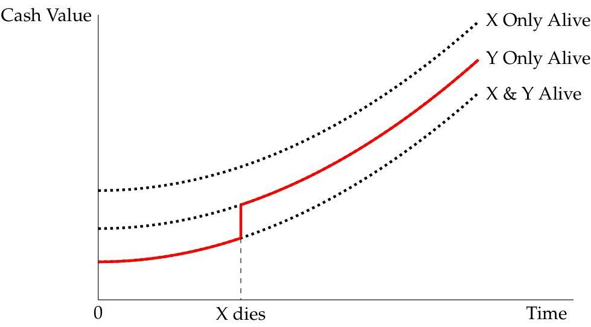
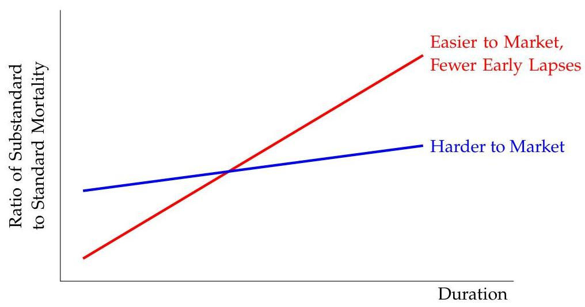
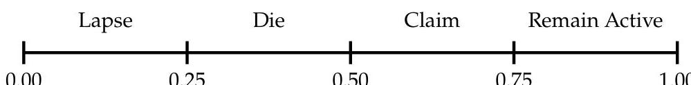

_Note: Source document was split into 6 OCR chunks (pages 1-22, pages 23-47, pages 48-71, pages 72-93, pages 94-115, pages 116-120) to stay within token limits._

# TIA_LPM_DSM_SecA_F2024-v2

## Page 1
# Section A 

A.1. Life and LTCI Products ..... 2
LPM-165: Life Products and Features ..... 3
Introduction ..... 3
Chapter 1: Term Insurance ..... 4
Chapter 2: Whole Life ..... 16
Chapter 3: Universal Life ..... 18
Chapter 4: Variable Life Insurance ..... 26
Chapter 5: Survivorship Insurance ..... 28
Chapter 6: Extra Premiums for Substandard Life Insurance Risks ..... 35
Understanding the Volatility of Experience and Pricing Assumptions in LTCI ..... 41
Long-Term Care Insurance: The SOA Pricing Project ..... 56
Life Insurance Acceleration Riders ..... 61
A. 2 Annuity Products ..... 64
LPM-166: Annuity Products and Features ..... 65
Chapter 1: Fixed Deferred Annuities ..... 65
Chapter 2: Variable Annuities ..... 74
Chapter 3: Indexed Annuities ..... 80
Chapter 4: Income Annuities ..... 86
LPM-142: Malcolm Life Enhances Its Variable Annuities ..... 89
Registered Index-Linked Annuities ..... 98
Structured Settlement Annuities ..... 107
Pension Risk Transfer in Canada and the US ..... 115

## Page 2
# Section A. 1 

## Life and LTCI Products

## Page 3
# LPM-165: Life Products and Features 

Source Author: ILA Curriculum Committee (2020)

## Introduction to LPM-165 and LPM-166

LPM-165 and LPM-166 are authored by the ILA exam committee, and they are formatted much like a textbook. These study notes (and past versions of them) have been on ILA syllabi for many years. Most of the chapters in LPM-165 and LPM-166 describe types of life and annuity products. The only exception is LPM-165 Ch. 6, which looks specifically at substandard life insurance risks. These two study notes are the primary readings in Section A, but you will also see other (mostly newer) readings in Section A that cover additional ILA product designs.

Most chapters of LPM-165 and LPM-166 are structured into two broad parts: 1) characteristics/features of the product and 2) pricing considerations/assumptions for the product. However, the same topics often appear in both sections, and I've made every effort to consolidate similar material. Several chapters also include appendices, which I've blended with the body material where appropriate.

## Page 4
# LPM-165: Life and Annuity Products and Features 

Source Author: ILA Curriculum Committee (2020)

## Chapter 1: Term Insurance

## Overview of This Reading

This chapter is split into 2 main parts: 1) characteristics of term insurance and 2) pricing considerations, but they are closely related and contain overlapping material

In this chapter, you will notice several comparisons between "permanent" insurance (e.g. whole life) and term. WL is covered briefly in chapter 2, so feel free to peek ahead at that if you want more context.

## Key topics for the exam include:

- Primary characteristics of term insurance:
- Coverage periods and patterns
- Possible premium patterns and guarantees
- Challenges of different premium schedules
- Par vs. non-par term
- Term and non-term riders
- Term conversion options and pricing approaches
- Primary pricing considerations for term insurance:
- Mortality
- Persistency (lapse)
- Underwriting
- Compensation
- Expenses and inflation
- Profit objectives
- Legal and regulatory issues

## Characteristics of Term Insurance

## Coverage Periods and Face Amount Patterns

Provides death benefit (DB) coverage for definite, limited period of time
If the insured does not die during the coverage period, the policy expires

1. Level term provides coverage for a stated number of years (e.g. 10) or to a specific age (e.g. 65)

- Coverages of 10-30 years are the most common

## Page 5
2. Decreasing term has a DB pattern tied to the insurance need (e.g. to payoff a mortgage balance or business loan)

- DBs usually change annually for simplicity, then levels off at some point (e.g. at $20 \%$ of original face)

3. Increasing term may have benefits tied to an index (e.g. CPI to cover inflation)

- Commonly sold as supplementary 1-year term riders on whole life (permanent) products

Term insurance can be sold as a rider on other types of policies (e.g. attached to a whole life policy)

- Example: preliminary (a.k.a. interim term) allows policyholder to pay a term premium for first year, then begins paying (higher) premiums for the WL policy

# Premium Patterns and Premium Guarantees 

## Patterns for level term insurance:

1. Level for entire period
2. Modified - one or two increases over the entire term of the policy (e.g. premium is lower for the first 3-5 years, then increases to a higher amount for remainder of term)
3. Increasing every $n$ years - keeps initial cost lower to policyholder and also has lower commission

- Reduces chance of requiring a cash surrender value (CSV), even for long terms ${ }^{1}$
- Premium usually = one-year term (OYT) rate $\times$ annual DB

4. Level for a period, then ART (annual renewable term)

## Possible premium schedules:

1. Attained age - everyone age $x$ pays same premium no matter what duration the policy is in

- Key advantage: simplest to administer

2. Select scale - unique schedule of future annual premiums for every issue age (vary by duration)

- "Select" refers to the fact that the insurer has "selected" lives based on underwriting criteria. Therefore, the insurer know more about the select life's health than a policyholder paying attained age premiums.

3. Select and ultimate (S\&U) - usually starts with a select scale for 5 or 10 years, then blends to an attained age scale
[^0]
[^0]:    ${ }^{1}$ Most term policies are exempt from having to provide cash values under US standard nonforfeiture law. However, certain designs may require CSV, but those details are beyond the scope of the current syllabus.

## Page 6
- The main idea here is that the "select" status wears off the farther you get from the issue date. A select life that was healthier than average 10 years ago, may have average health today.

# Challenges of Different Premium Patterns and Schedules 

- Attained age scales - difficult to create scales that are competitive for a wide range of ages (generally results in a higher premium than select or S\&U)
- Possible solution: Limit coverage period to a short period (e.g. 7 years)
- Select and S\&U - have lower premiums, which encourage persistency, but mortality may worsen in the future
- Decreasing term - Level premiums may become high relative to DBs in later years (expect higher lapses as a result)
Partial solutions for decreasing term (but each have problems)
- Offer limited payment decreasing term
* Problem: may require CSVs under law (higher premiums more likely to build a CSV)
- Use decreasing premium scales
* Problem: higher 1st year premiums are harder to market
- Floor future DB at some percentage of initial DB (most common approach)
* Problem: "isn't a perfect solution" the author says
- Increase premiums annually (e.g. annual premium = one-year term (OYT) rate)
* Problem: this results in the lowest initial premiums, but will result in erratic premiums if OYT rates have a different slope than DBs
* Also has admin challenges

## Participating vs. Non-Participating Term

- Both guarantee premiums over the entire term
- Par term is usually more expensive (to fund dividends)
- Par term hasn't been as popular due to cost
- To mitigate cost of par term, companies offer increasing premiums so that higher future premium are offset by dividends:
- Modified premium plans
- Annually increasing premium patterns

## Advantages of Par Term:

- Lower deficiency reserves because of higher premiums
- Higher premiums provide cushion against adverse experience

## Page 7
- Insured's net outlay (premium - dividend) can fall over time
- Higher persistency due to insured's declining cost
- Increasing premium scale can minimize CSVs

# Indeterminate (Non-Guaranteed) Premium Plans 

- Allow company to raise premiums in the future
- Initial premiums may be guaranteed 3-5 years
- Premium changes must be done prospectively based on expected future experience (can't change premiums to recoup past losses)
- Key advantage: ability to raise future premiums allows for aggressive pricing
- Disadvantage: raising future premiums will cause the healthiest lives to lapse, leaving higher mortality risks in force

## Premium Differences by Policy Size and Underwriting Class

- Size - premiums per 1000 usually decline as the issue face increases because of declining average costs
- Size discounts are larger for term insurance than WL
- Lapse rates increase with policy size and can be quite different than WL
- The highest term bands are usually reinsured
- Sophisticated term buyers often need large policies for brief periods $\Rightarrow$ more likely to lapse early
- Risk class
- Higher premiums for smokers than non-smokers
- Lower premiums for select risks
- Gender - Can have separate rates for males and females or the same (unisex)

Lapse-supported design - relies on higher lapse rates to achieve higher profitability targets

- Key challenge: term product profits can be harmed by high early lapse rates (makes it hard to recoup acquisition costs)

Sometimes an insurer will have to price certain cells more aggressively to compete with other insurers

- Results in cross-subsidization of profits across pricing cells

## Term Riders

Term insurance may be available as a rider on a permanent plan

## Page 8
Term riders can cover the base insured, spouse, or a child of the base insured (e.g. until the child is 21)

One-year term riders are sometimes available on par plans (purchased with dividends)

- Dividends can be applied to a mix of OYT coverage and other options (e.g. OYT + paid-up additions)

# Non-Term Riders 

These offer insurers another way to differentiate their term products

1. Waiver of Premium (WOP) rider - waives policyholder's premium on qualified disability

- Disability is usually based on insured's ability to work in his/her occupation
- Waiver terminates at specified age (e.g. 65) or on recovery from disability
- Usually requires a minimum length of disability (e.g. 6 months)

2. Return of Premium (ROP) rider - refunds premiums as either a persistency bonus or on death tax-free
3. Accelerated Death Benefit (ADB) rider - pays a portion of the DB if the policyholder becomes terminally ill

- Life expectancy must be less than an specified period (e.g. 12 months)
- Premiums continue after acceleration
- On death, the DB is reduced for any accelerated DBs death benefits already paid

4. Guaranteed Insurability rider - allows policyholder to buy additional coverage without additional underwriting or proof of insurability
5. Other Living Benefits riders - expand on the original ADB design

- Chronic illness benefit - pays a portion of the DB upon chronic illness
- Chronic illness = inability to perform certain activities of daily living ("ADL")
- 6 common ADLs: eating, bathing, dressing, toileting, transferring, and continence
- Critical illness benefit - pays a portion of the DB if the insured experiences a qualified CI
- Common qualified CIs: heart attack, stroke, cancer, and coronary bypass surgery
- Disability income benefit - pays monthly income as a $\%$ of the original face amount
- Qualified disabilities are similar to WOP
- Long-term care (LTC) benefit - provides additional coverage without reducing the original DB (unlike ADB)
- Qualifications are usually based on inability to perform certain ADLs and expenses tied to LTC (e.g. assisted living)

## Page 9
# Other Types of Term Products 

1. Joint life - pays DB on the death of the 1st insured
2. Second-to-die (survivorship) - pays DB on death of 2nd insured (covered in Ch. 5)
3. Hybrid term - blend of term and permanent insurance
4. Deposit term - charges high early premium and pays an endowment at end of, say, 10th year (not common due to regulatory scrutiny)

The next topic that appears in the chapter is term conversions, but since there are also other sections and appendices in the chapter that cover term conversions, we've consolidated all of that in a single section on term conversions in the detailed study manual that follows the next section on pricing considerations.

## Pricing Considerations for Term Insurance

## Term Mortality

The net amount at risk (NAR) for a term product is higher than permanent (term reserves are lower since they don't have to fund a cash value typically)

- $\mathrm{NAR}=$ Face - Reserve

In aggregate, term mortality is usually lower than permanent insurance mortality

1. Term has a higher average size than permanent, (overall mortality is usually lower on large policies)
2. Term mortality exposure is weighted more to the select period (recently underwritten) when mortality is lower

- Term has higher ultimate lapse rates than permanent, so less exposure to higher ultimate mortality

3. Less healthy lives that choose to convert will shift worst mortality experience from term business to permanent

## Results from the most recent SOA High Face Amount Mortality Study:

1. Changes to reserve requirements (VM-20) will cause product design to change, which could affect mortality experience
2. Large face term experience was worse than large face permanent experience
3. Mortality improvement varies by gender and smoker status

- Males have higher mortality improvement rates than females and smokers ${ }^{2}$

4. Large policy mortality was more favorable than for "all amounts"
[^0]
[^0]:    2 The exact sentence in the reading on p. 13 is very difficult to parse and says "Mortality improvement varies by gender and smoker status with higher mortality improvement rates among males than females and smokers with overall low mortality improvement rates."

## Page 10
5. Female experience was higher in aggregate for large-amount than for all policies
6. Experience varied by amount band, with the best experience in the $\$ 1 \mathrm{M}+$ category (likely due to stricter underwriting)

Healthy lives tend to lapse term policies when the need for insurance goes away

- Creates a challenge for increasing premiums (e.g. ART)
- Mortality can deteriorate quickly in the post-level period as healthy lives shock lapse, leaving only the highest mortality risks in force
- Can be modeled with the Dukes-MacDonald selective lapsation model, which is based on the conservation of deaths principle
- Conservation of deaths assumes the weighted average of the mortality across multiple groups is equal to the normal mortality

The study note shows a brief example of the Dukes-MacDonald method with very little explanation of each key term. This method was once covered in more detail in other readings that are no longer on the syllabus. Even so, I'm going to show the values given in the reading and solve it using the actual D-M framework that is no longer covered on the syllabus. I think this will allow the mortality ratio shown in the reading to make more sense (hopefully). I wouldn't get bogged down here, however.

Assume:

- Base lapse rate $=10 \%$
- Total lapse rate $=85 \%$
- $80 \%$ effectiveness - reflecting percent of lapsers that are fully select
- Select mortality rate $=0.01$
- Point-in-scale mortality (PISM) rate $=0.03$

From this we can calculate:

- Excess lapse rate $=0.85-0.10=0.75$ (aka shock lapse rate)
- Select excess lapses $=0.80 \times 0.75=0.60$
- Non-select excess lapses $=0.75-0.60=0.15$

Using the conservation of deaths principle (not presented in this reading), we can express total PISM in terms of 3 mortality rates weighted by their respective lapse rates:

$$
\begin{aligned}
0.03 & =\text { Mortality of select lapsers }+ \text { mortality of all other lapses }+ \text { mortality of persisters } \\
& =0.010(0.60)+0.03(0.15+0.10)+q^{\text {pers }}(1-0.85) \\
q^{\text {pers }} & =0.11=\text { mortality rate of remaining inforce } \\
\frac{q^{\text {pers }}}{\text { PISM }} & =\frac{0.11}{0.03}=367 \%
\end{aligned}
$$

## Page 11
Key point: higher mortality lives tend to remain inforce, which results in a much higher mortality multiple for the inforce population after healthy lives leave.

# Considerations for older ages (85+): 

- Lack of credibility in mortality experience for ages 85+
- Policy size is much larger and underwriting is more extensive
- "Widow effect" - proportion of females tends to be higher since males die earlier
- Select period may wear off

## Term Persistency (Lapse)

Very important pricing considerations for term

- Lapse rates can affect mortality (anti-selection)
- High early lapses make it harder to recover acquisition costs
- High late lapses may erode expected profits

Steeply sloped premium scales can encourage lapses (healthier lives likely to lapse and buy a cheaper policy, leaving only the worst mortality risks)

First year term lapses are slightly lower than permanent, but renewal lapse rates are higher

## Underwriting

Similar to permanent insurance underwriting
Insureds may be underwritten for amounts larger than the issue face if there is a chance of future increases in coverage

Select and super-select rating classes are becoming more common
Substandard insurance is less available for term than permanent
More insurers are using accelerated underwriting (AUW) to minimize underwriting time, cost, and intrusion

AUW relies more on predictive analytics than experience results
Key findings from an SOA Delphi Study on AUW:

- Most of the new techniques waive fluids and use additional data sources instead
- AUW has increased mortality $5-10 \%$, experts think this will drop when more applicants qualify for AUW in the future
- Current data sources: prescription drug data (Rx) and Medical Information Bureau (MIB)
- Future data may also come from Electronic Health Records (EHR)

## Page 12
# Compensation 

Varies a lot from company to company
Typically, term has lower compensation than permanent insurance since term premiums are lower

- Lower renewal commissions also
"Recycling" commissions are sometimes paid to agents each time a policy renews
- Example: each time a 5-year term policy renews, pay the first year commission

Agents may have incentive to encourage policyholders to lapse and then sell them a policy with a different company

## Term Expense and Inflation Assumptions

Large percentage of premium (greater than permanent because term premiums are lower)
Term profitability is very sensitive to expense allocation

- The more overhead allocated to term premiums, the lower profits
- Profit as a percent of first-year premium will look high for ART plans and low for level and decreasing term plans
- ART = annually renewable term (usually at OYT rates), so early premiums are much lower than an equivalent level or decreasing premium policy

High inflation can erode term profits since term has minimal assets backing it

- Permanent insurance builds more assets (to fund the CSV), and the asset yield helps protect against inflation

## Reserving

Reserves have a significant impact on term profitability
Historically, many term products were subject to overly conservative statutory reserving rules under regulation XXX

Principles-based reserves (VM-20) adopted in 2017 and beyond are thought to be more appropriate and should eliminate the need for the complex financing mechanisms insurers used to fund XXX reserves

The study note provides an extremely brief, yet technical, overview of how VM-20 will impact insurer profitability in this section, but I think it will be impossible to understand without studying it more in later readings, so just keep moving here.

## Common Term Profit Objectives

- Profit Margin $=\frac{\text { PV(Profits) }}{\text { PV(Premiums) }}$
- Return on equity $(\mathrm{ROE})=\frac{\text { Net Income }}{\text { Equity }}$ (can be discounted or undiscounted)

## Page 13
- IRR $=$ discount rate such that $\operatorname{PV}($ Profits $)=0$
- Surplus strain $=\frac{\text { First Year Income }}{\text { First Year Premium }}$
- Year 1 income is typically negative due to high first year costs
- Break-even year $(\mathrm{BEY})=$ year when accumulated assets $\geq$ reserves

These measures can be very sensitive to changes in pricing assumptions (mortality, lapse, etc.)

# Term Legal and Regulatory Issues 

Various aspects of the term insurance market are regulated by states:

- Coverage length (e.g. NY does not allow coverage beyond age 70)
- Advertising, disclosure, and marketing practices
- Actuarial certifications for policy filings
- Contestibility period (typically limited to 2 years from issue)
- Many states allow insurers to contest claims where the policyholder misrepresented information in the application

Note on re-entry term: You may have noticed several places in the chapter that refer to "re-entry" term. This probably seems confusing since the chapter never defines re-entry term. Re-entry term was a product that allowed insurers to charge higher rates if insured doesn't meet future underwriting requirements, but it is not very common anymore. The previous version of this study note had a section in the early part of the chapter that described re-entry term, but when LPM-165 was created from that previous study note, the authors removed that section, but they left various references to re-entry term in the chapter. Leaving the remaining references to re-entry term in the chapter was probably an oversight, and I wouldn't worry too much about it.

## Term Conversion Options

Term conversions are a major topic on the syllabus, and we will see several other readings that cover them later in Section B. This section of the detailed study manual consolidates all of the term conversion material in chapter 1 of LPM-165.

Conversion - when a policy is converted from one type of policy to another (normally the face amount stays the same)

- Most common option is to convert a term plan to a permanent plan (WL) with the same rating (without additional underwriting)
- May be at the policyholder's discretion, limited to specific time frame, or automatic
- Much more common for level term than decreasing term, which is prone to anti-selection (sick people keep the small policies)

## Managing the cost of conversions:

## Page 14
- The policyholder's cost can be reduced by using the terminal reserve to fund part of the premium
- I.e. the company puts the reserve released from the original policy toward the premium for the new policy
- The company's cost can be offset by only paying a commission on the discounted premium (but some companies pay a commission on entire new permanent plan premium, treating it like any other new "sale")

# Benefits of conversions: 

- Can help increase sales (makes product more attractive)
- Can promote persistency by keeping healthy lives with the company
- Generally permanent insurance is more profitable than term

Guaranteed insurability option (GIO) - gives policyholder option to increase face amount without additional underwriting

- Has higher anti-selection risk than conversions, so GIO exercise is usually limited to specific times

## Three Philosophical Approaches to Charging for Options

This comes from $p .18$ of the reading.

1. Only policyholders who exercise the option bear the cost

- People pay a higher premium only if and when they exercise the option

2. All policyholders who want the option available pay a higher premium from the start (even if they never exercise)
3. All policyholders pay a higher premium whether they have any interest in the option or not

- This dilutes the cost the most by spreading it over the entire in-force
- Potential undesirable result: people who convert no longer pay the term premium, so no longer pay for the option, while those who do not convert continue paying for it

Therefore, \#1 would be the most expensive to those who exercise the option, while \#3 would be the cheapest

## Assumptions Needed to Price for Options

- Proportion of insureds expected to elect the option
- Percentage of coverage available to be exercised
- Lapse assumption - typically low for insureds after they exercise options
- Mortality - usually high when election rate is low or if it is a "last chance" conversion

## Page 15
- "Last chance" means the conversion took place at the last minute before the option expired (as opposed to an earlier conversion)

# Conversion Formulas from Appendix 1-I 

Now we jump ahead to the appendix material on p. 22 of the reading so we can capture the last chunk of conversion material in this chapter. The formulas in the detailed study manual here are what I think amounts to the most practical takeaway from the appendix material. The video lesson also has numerical quizzes to make these more concrete.

Present value at age $x$ of the extra mortality cost of a policy converted at policy year $r$ :

$$
A_{x, r}={ }_{r} p_{x} \times e_{x, r} \times K_{x, r} \times v^{r}
$$

where:

$$
\begin{aligned}
K_{x, r} & =\sum_{t=1}^{\infty}\left(t_{t-1} p_{x+r}\right)\left(v^{t}\right)\left(q_{x+r+t-1}^{C}-q_{x+r+t-1}^{S}\right) \overline{A R}_{x+r+t} \\
q^{C} & =\text { mortality rate for converted policy } \\
q^{S} & =\text { mortality rate for standard policy } \\
\overline{A R} & =\text { amount at risk each year } \\
e_{x, r} & =\text { probability a policy converts in duration } r \\
r & =\text { duration since policy issue } \\
t & =\text { duration since conversion date }
\end{aligned}
$$

This is a basic actuarial present value of future benefits; you're just using the "excess" conversion mortality as the decrement

## Option Pricing Formulas from Appendix 1-II

The total cost of options at issue is the sum of

1. The company's cost of options elected for any single duration:

$$
\text { Credits to Policyholders }+\left(\frac{\text { Option Handling Expense }}{\text { Avg Units Issued Per Policy }}\right)\left(\frac{\text { Units Electing Option }}{\text { Radix }}\right)
$$

2. The cost associated with prior years:

$$
\sum\left(\frac{\text { Units Electing Options }}{\text { Radix }} \times \text { Percent of Face Converted } \times \text { Option Charge }\right)
$$

Radix $=$ total number of units issued

## Page 16
# LPM-165: Life Products and Features 

Source Author: ILA Curriculum Committee (2020)

## Chapter 2: Whole Life

## Overview of This Reading

This is a very brief chapter on whole life insurance, which is a type of permanent insurance
Key topics for the exam include:

- Characteristics: differences with term, par vs. non-par, premium patterns
- Pricing considerations: mortality, persistency, underwriting

## Characteristics of Whole Life

WL is a type of permanent life insurance
Premiums remain fixed over the premium-paying period

## Key differences with term:

- WL stays in force over the insured's life as long as premiums are paid
- WL provides a tabular cash value based on premiums paid less expense and mortality charges

## Participating vs Non-Participating WL

Participating WL - allows policyholder to share in insurer's profits through dividend payments to policyholder

Common dividend options available to policyholders:

1. Receive in cash
2. Apply against premiums
3. Purchase paid-up additions and/or OYT insurance

## Premium Patterns

1. Ordinary level premium WL (most common)

- Level premiums determined at issue and payable for life

2. Indeterminate premium WL - non-par WL with annually adjustable premiums

- Insurer can adjust premiums to reflect experience
- Premiums cannot exceed predetermined guaranteed maximum rates
- Generally offers a lower initial premium than ordinary level premium WL

## Page 17
# 3. Limited payment WL 

- Premiums are payable over a shorter period than life (e.g. 20 years)
- Coverage is paid-up after limited pay period
- Single premium WL: all premium is paid at issue
- Used for retirement or estate planning needs

## Pricing Considerations for Whole Life

## Mortality

The lack of flexibility in a typical WL plan's premium creates significant mortality risk because coverage can last for many decades (50+ years)

## Persistency (Lapse)

Lapse experience may affect other assumptions like mortality and expense
A 2012 SOA persistency study found that:

- WL lapse rates have generally been declining
- Lapses increase in poor economic conditions (e.g. 2008 crisis)
- Small vs. large policies
- Smaller policies lapse more in early years
- Larger policies lapse more in later years
- Male and female lapses are similar
- Less underwriting leads to higher premiums, which cause higher early lapses
- Non-medical and simplified issue have higher early lapses than full or paramedical

## Underwriting

Like term, WL is trending toward more AUW

## Page 18
# LPM-165: Life Products and Features 

Source Author: ILA Curriculum Committee (2020)

## Chapter 3: Universal Life

## Overview of This Reading

The first part of this chapter, Characteristics of UL, focuses on the flexible premium individual UL plan

Later, in the "Other UL Products" section, they introduce other variations: SGUL, IUL, fixed premium UL, single premium UL, and group UL

The Characteristics of UL section is the longest and discusses key features of UL and how they differ from a "traditional" life insurance like WL and term

## Key topics for the exam include:

- UL policy mechanics: how the fund value works, etc.
- Characteristics of flexible premium UL
- Death benefit options
- Partial withdrawals
- Policy loans
- Common riders
- Compare nonforfeiture with WL
- Approaches for UL crediting rates
- UL cost of insurance scales
- Expense and surrender charges
- Other UL products: SGUL, IUL, FPUL, SPUL, GUL
- Key pricing assumptions for UL: mortality, lapse (persistency), expenses, interest
- UL sources of profit

## Characteristics of Universal Life

## UL Cash Values

Mortality and expense charges are explicitly deducted from the policy's fund (cash value) on a monthly basis

Interest is credited to the fund (i.e. cash value, CV) each month

$$
\mathrm{CV}_{t}=\left(\mathrm{CV}_{t-1}+\operatorname{Prem}_{t}-\text { Charges }_{t}\right)(1+r)
$$

UL policies have a minimum guaranteed interest rate (e.g. 2-4\%) and guarantee maximum cost of insurance (COI) mortality charges

## Page 19
- Often the company will credit something higher than the guaranteed interest rate and charge COI lower than guaranteed

Investment spread $=$ Investment Earned Rate - Credited Rate

- Spread compression occurs if interest rates fall, squeezing the insurer's spread

Newer UL contracts allow the insurer to adjust COI charges in response to other factors (e.g. persistency and low interest rates)

- Regulators are putting more scrutiny on this (e.g. NY Reg 210)

If policyholder surrenders for cash in the first 10-20 years, surrender charges are deducted from cash value

- Covers acquisition costs and/or other risks

Cash surrender value (CSV) - UL account value - surrender charges

# UL Death Benefit Options 

1. Face amount only
2. Face amount plus cash value

Tax laws require a minimum amount of insurance, so death benefits may have to increase if the cash value grows large enough

- "Corridor" factors are prescribed by law
- DBs cannot be less than Corridor Factor $\times$ Cash Value

Unlike traditional life insurance, UL face amounts can be increased or decreased; the DB option can also be changed

## UL Premium Flexibility

The amount and frequency of payments is at the policyholder's discretion
The premium for the first few years may be subject to a minimum
Anything that causes the crediting rate to fall and/or charges to rise will indirectly require more premium because the fund value will not grow as fast

## Partial Withdrawals

The policyholder can cash surrender a portion of the cash value
The DB is also reduced to maintain the same net amount at risk

- New CV = Old CV - Partial Withdrawal - Admin Fee
- New Face Amount = Old Face Amount - Partial Withdrawal

## Page 20
Partial withdrawals for UL are easier administratively than for traditional life insurance

# UL Policy Loans 

Unlike traditional products, UL policies allow loans against the cash value
The full cash value (gross of loan) continues to receive credited interest, but the loaned portion of the cash value usually receives a lower credited rate

Usually the credited rate on loaned funds is set below the loan rate

- Allows the company to continue earning a spread on loaned funds which would otherwise be invested in bonds, etc. backing the product

## UL Riders

Common examples include:

- Waiver (waives COI or a stipulated payment)
- Accidental death
- Guaranteed insurability
- Spouse or other insured rider
- Child rider

Like term insurance, living benefit riders are increasingly being sold with UL

- LTC, disability income, critical illness, chronic illness
- These can significantly increase persistency

## UL Nonforfeiture Options

UL policies do not have the same explicit nonforfeiture options as WL policies (e.g. extended term, reduced paid-up, etc.), but a UL policy behaves like extended term when the policyholder stops paying premiums ${ }^{3}$

A UL policyholder can resume paying premiums anytime, effectively reinstating the policy

## UL Interest Rates

Current rates are at the company's discretion (may be declared monthly)
Sometimes rates are guaranteed for one year

## Approaches for Declaring Rate:

1. Portfolio rate - all fund values on all policies get the same rate
[^0]
[^0]:    3 "Extended term" is a WL nonforfeiture option that allows the policyholder to stop paying premiums without changing the DB. As long as the cash value can support the DB, the policy stays in force. This is why UL policy where the policyholder has stopped paying premiums behaves like a WL policy on extended term: the CSV for both generally falls until it reaches zero and the policy expires worthless.

## Page 21
- Essentially this is just a single weighted average yield on the entire portfolio

2. New money rate - the timing of premium payments determines which rate that portion of the fund value receives

- Requires tracking the assets associated with each premium premium payment (often tracked by "investment year" or "investment generation" which is how other readings sometimes refer to it)

The portfolio approach is the simplest to explain and administer
Policyholders will favor the portfolio approach when rates are falling and favor the new money approach when rates are rising

- The portfolio rate falls more slowly since it is heavily influenced by yields on existing assets purchased in the past

# UL Mortality (COI) Charges 

Guaranteed COI rates are based on attained age
Current COI rates can be attained age or S\&U
Using attained age mortality for "select" risks can increase revenue in early years (use for profit or to offset acquisition costs)

- Called a "reverse S\&U scale"

S\&U mortality is used when UL is sold to compete with term insurance (keeps early COI down to compete with low term premiums)

## UL Expense and Surrender Charges

- Front-end charges - deducted from premiums paid (not as popular anymore)
- Surrender charges - deducted if/when policyholder surrenders some or all of the cash value (more popular today)
- Can be large but grade to zero after 10-20 years
- Monthly expense charges - fixed charge deducted monthly

## UL Persistency Bonuses

Credited to fund values on policies that stay in force to a certain point
May serve to effectively refund prior years' charges
Can be guaranteed or non-guaranteed
Some states don't allow non-guaranteed bonuses because of the tontine risk

- A tontine occurs when a relatively small number of survivors end up with a relatively large benefit in the end

## Page 22
# Other UL Products 

## Universal Life with Secondary Guarantees (ULSG)

Became popular in the early 2000s as a way to emphasize death protection over cash value buildup and allow for a smaller premium

Secondary guarantee $=$ policy is guaranteed not to lapse if a minimum premium funding requirement is met

Minimum no-lapse premium (MNLP) - most basic ULSG design

- SG is based on whether cumulative minimum premiums have been paid
- MNLP premiums generate little or no CSV

Shadow account design (more complex)

- Guarantees the policy will stay in force if the shadow account $>0$
- Shadow account: like a cash value with its own set of charges/credits
- NOT available as a surrender value though
- A policy can have a positive shadow account while the CSV is negative
- Designs have become extremely complex, sometimes with multiple shadow accounts
- May be lapse-supported

Reserve Implications: Model Regulation 830 ("XXX") and AG 38 ("AXXX")

- Before XXX/AXXX, ULSG stat reserves were too low for regulators' liking
- AXXX increased reserves for ULSG so much that insurers needed financing mechanisms for reserve relief (e.g. captive reinsurance)
- AG 48 was created to provide uniform standards for AXXX reserve relief
- VM-20 should replace XXX and AXXX and result in simpler ULSG designs

## ULSG is also impacted by the settlement / investor-owned market

- If an investor buys a policy, the investor will pay absolute minimum premiums until death of the insured

## Indexed Universal Life (IUL)

IUL offers a minimum guaranteed crediting rate similar to UL but also additional index-based interest based on an index like the S\&P 500

Index-based interest is often subject to a participation rate (e.g. 60\%), cap, and floor
Index Crediting Rate $=\max [\min ($ Index Change $\times$ Participation Rate, Cap), Floor $]$
Common methods for calculating the index change:

## Page 23
1. Point-to-point - based on index change between previous and current segment

$$
\text { Index Change }=\frac{\text { Index at End of Segment }}{\text { Index at Beginning of Segment }-1}
$$

2. Averaging - annual index change is based on average monthly index level

$$
\text { Index Change }=\frac{\frac{1}{12} \sum_{m=1}^{12} \text { Index }_{m}}{\text { BOY Index }}-1
$$

AG 49 was created to provide guidelines for crediting rates used in IUL sales illustrations

# Fixed Premium UL (FPUL) 

A.k.a. "Interest-sensitive whole life"

FPUL is functionally like a whole life policy with a credited rate that can change
Premium payments are fixed (not at policyholder's discretion)
The accumulation account (fund) is usually credited interest annually
Cash surrender value is the greater of

1. Minimum guaranteed cash value
2. Accumulation account net of surrender charge

## Vanishing Premium FPUL

- Most popular FPUL design
- Premiums are comparable to a par WL policy
- Premiums are no longer required if
- Actual CV > minimum guarantee, or
- Actual CV > a net single premium based on current assumptions
- Company may or may not pay commissions on vanished premiums

## Advantages of FPUL Over Flexible Premium UL:

1. Policyholder perspective: Contract is more similar to WL (offers more guarantees)
2. Agent perspective: FPUL pays commission on higher premiums
3. Company perspective: Fixed premiums encourage persistency

## Disadvantages of FPUL Over Flexible Premium UL:

1. Lack of premium flexibility
2. Administrative complexity of accepting additional premiums

## Page 24
3. Vanishing premiums don't always vanish due to low interest rates

# Single Premium UL (SPUL) 

Policyholder pays a large lump sum upfront (but can make additional payments later)
More of an investment-oriented sale
Single premium FPUL offers guaranteed tabular cash values and DBs regardless of fund performance
"Net rate products" don't have an explicit current COI charge but instead use a high interest rate margin

Tax legislation in the 1980s greatly limited the amount of money that could be deposited in a UL contract up front

## Group UL (GUL)

Marketed to a broad segment of employees or large employers
Premiums are commonly paid by payroll deduction

## Advantages of GUL over Individual UL:

- Regulations allow company to change expenses on a group basis
- Offer coverage in over 30 states without separate filings if a multiple employer trust is used
- Group features like experience ratings and guaranteed issue underwriting

## Pricing Considerations for UL

Pricing UL is challenging due to the flexible nature of UL (changing DBs, partial withdrawals, changing interest rates, etc.)

Sensitivity testing: A pricing actuary should test various scenarios to understand how assumption changes affect profitability

## UL Sources of Profit

1. Investment: Interest Earned - Interest Credited
2. Mortality: Cost of Insurance Charges - DBs Paid
3. Expenses: Expense Charges + Surrender Charges - (Expenses + Commissions)

## UL Asset/Liability Analysis

If rates rise, companies may suffer capital losses as they sell depressed assets to fund higher surrenders (often called disintermediation risk)

- Rising rates may cause policyholders to withdraw cash values an invest elsewhere
- As rates rise, the market value of assets backing UL liabilities falls

## Page 25
The actuary should analyze different interest rate scenarios to understand this interest rate risk

## Page 26
# LPM-165: Life Products and Features 

Source Author: ILA Curriculum Committee (2020)

## Chapter 4: Variable Life Insurance

## Overview of This Reading

This brief chapter introduces variable life insurance with an emphasis on flexible premium variable UL (VUL) and fixed premium variable life

## Key topics for the exam include:

- Understand how VUL works in relation to regular UL
- Understand how fixed premium variable life works in relation to WL

## Characteristics of Variable Life Insurance

Variable life products are subject to securities regulation by the SEC
Sales have been increasing since the early 1990s due to:

1. Low interest rates, which make non-variable products less attractive
2. Growth in fund options available to policyholders

Variable universal life (VUL) products have a lot of similarities with UL products:

- Premiums can be flexible or fixed
- DB types: face only or face plus CV
- Changes in DB allowed
- Similar monthly charges (mortality, riders)
- Similar commissions
- Treatment of policy loans

## Differences with UL:

- VUL premiums are invested in the insurer's separate account into asset classes like stocks, bonds, and money market
- Assets backing non-variable products are held in the company's general account
- The separate account is held in a bank separate from the company's general account assets
- VUL cash values vary directly with separate account performance, whereas UL cash values are based on declared credited rates
- VUL does not have guaranteed cash values; UL products do

## Page 27
- VUL sales loads are more limited by regulation in the US

# Fixed Premium Variable Life 

Fixed premium variable life (FPVL) is similar to WL except for the following differences:

- FPVL cash values are uncertain and vary directly with separate account, whereas WL cash values are predetermined
- FPVL cash values have no guaranteed minimum
- FPVL DBs vary by intervals (monthly or yearly)

Equitable Design - most common fixed premium design

- Gross premiums are fixed
- Uses excess investment performance to buy paid-up additions (PUAs) to increase the DB
- If separate account earns less than AIR, negative PUAs are purchased
- The DB can never be less than the guaranteed minimum

## Page 28
# LPM-165: Life Products and Features 

Source Author: ILA Curriculum Committee (2020)

## Chapter 5: Survivorship Insurance

## Overview of This Reading

This chapter discusses characteristics and pricing considerations for survivorship insurance, which is insurance that pays a death benefit on the death of the last insured

The typical market is married couples, so the policy will pay a DB when the 2nd spouse dies
Most survivorship products take the form of whole life (require a fixed premium and build a cash value)

## Key topics for the exam include:

- Understand the market for survivorship insurance and how consumers use it
- Single vs. dual-status mortality
- Methods for calculating dual-status mortality
- Substandard and uninsurable lives
- Survivorship insurance riders
- Pricing assumptions: mortality, lapse, expense, reinsurance, and taxes

## Characteristics of Survivorship Insurance

Joint and survivor - pays benefit on death of second insured in a pair of lives
Common use/market: wealth preservation/transfer post-retirement

- Can be used to pay estate taxes-particularly useful when the estate's assets are illiquid (e.g. a business that can't be readily sold)

Often involves high face amount, high premium policies sold to sophisticated buyers
Most survivorship insurance is in the form of participating WL where dividends pay for a mixture of term and paid-up additions (PUAs) to provide a sufficient total death benefit

- Each dividend is used as a single premium to buy another "piece" of DB (PUAs), causing the total DB to increase over time without increasing the premium required

UL and interest-sensitive survivorship products also exist but they tend to mimic the mechanics of par WL

## Joint Life Mortality Methods

## Single Versus Dual Status

## Page 29
1. Single Status - Based on a blend of a "one-alive and two-alive" statuses

- Results in smoother cash values and reserves because values don't change markedly after first death

2. Dual Status - Status changes depending on whether 1) $X$ and $Y$ are alive, 2) only $X$ is alive, or 3) only Y is alive

- PV of future benefits and cash values jump after first death

Illustration of cash value "jump" when one life dies under a dual-status design:

# Factors Affecting Decision to Use Single- or Dual-Status 

- Perceived marketability
- Administrative feasibility
- Regulators' attitudes
- Perceived risk profile
- Implications of increased dual-status term rider costs

Early product designs tended to use dual-status, while later designs used single-status

- Agents tended to prefer single status since only one set of CSVs had to be illustrated
- Single status was less of an administrative burden to companies

Some companies still use dual-status because of anti-selection risk with single-status

- Once the first person dies, the mortality charge is much more favorable for the 2nd life on a single-status policy (i.e. if one person in a couple is in very poor health at issue, single-status is more advantageous to the policyholder)

## 3 Methods for Calculating Dual-Life Statuses

## Page 30
# 1. Exact Age 

Values are determined from first principles using exact age and characteristics of each life
May require pre-calculating of all possible combinations of lives at each duration

- Storing and validating all of the calculation results can be cumbersome

Other companies use formulas to calculate values when needed

- Key disadvantage: can't preview as many rates to check for consistency

## 2. Joint Equal Age

Values are based on the mortality of two lives of equal age that are similar to the actual ages of the two lives
Example: For a male age 55 and female age 52, the joint single age is $52+1=53$

| Age Difference | Add to Lower Age |
| :--: | :--: |
| 0 | 0 |
| 1 | 0 |
| 2 | 1 |
| 3 | 1 |
| 4 | 2 |

JEA is much simpler than exact age, but regulators may require certifications showing that JEA CSVs are $\geq$ exact age CSVs

## 3. Equivalent Single Age

Equates the 2 ages to an equivalent single age
Tends to overcharge for mortality in early years, then undercharge in later years

## Other Characteristics of Survivorship Insurance

## Substandards and Uninsurables

Underwriting is generally more rigorous for survivorship insurance since the face amounts are higher

Substandard ratings are more common with survivorship insurance since many sales are to older couples

- The combination of a fully standard life and a substandard life does not increase the premium significantly
- Joint premium for a standard + substandard life $<<$ sum of single standard policy and single substandard policy

## Substandard Rating Methods

1. Age Rateup - assigns a higher age to a substandard insured

- Much more commonly used for survivorship insurance than single life coverage

## Page 31
- Example: a Table D44 substandard couple where both are age 55 might be issued a policy assuming they are both age 63 standard lives

2. Extra Premium - calculate a higher premium using a higher multiple of mortality for substandards (e.g. $200 \%$ of standard)

- Easy for single lives, but can be difficult for joint lives (combined multiple may be unreasonably high)

UL plans can apply either of the above methods to COI charges

# Uninsurable Lives 

Companies will issue a joint life policy even if one life is uninsurable (because the combined risk is insurable)

## Requirements for Uninsurable Lives:

- Must not be terminally ill
- Must undergo standalone underwriting
- Must have have life expectancy of at least 1-2 years
- Must not increase contagion factors
- Must not be highly rated (Table D max)

## Competitive Measures in the Survivorship Market

Products often compete on the following measures:

1. Rate of return on death at specified duration
2. Minimum premium payable to fund benefits
3. Minimum premium to vanish ${ }^{5}$ in specified number of years
4. Minimum cash value needed to vanish premiums

Consumers in the survivorship market generally value the death benefit more than cash values

- However, sophisticated buyers are still aware of the cash value, so it should be competitive

## Survivorship Insurance Riders

Many policies include paid-up additions riders and term insurance riders

[^0]
[^0]:    ${ }^{4}$ Substandard multiples are expressed as a $\%$ of standard in a commonly used table that increments by $25 \%$. Each level is assigned a letter: A is $+25 \%$ of standard, B is $+50 \%$, etc. Table D is the 4 th level in the table. This table is not on the syllabus, so this is just some additional explanation to explain what the references to Table D in the reading mean.
    5 "Vanish" is a term insurers generally avoid using today, but it was common back when interest rates were much higher. Once a participating policy's dividends were high enough to offset the premium, the premiums were said to "vanish."

## Page 32
An early first death on a dual-status policy can cause higher-than-expected term costs (because the mortality cost jumps on first death)

- This may not allow the policy to build the desired total DB
- Solution: term cost should be single-status

# Specialized Survivorship Riders 

- Policy Split Rider - allows the joint policy to be split into two single life policies in the future
- Few of these are sold but end up being highly valued to insureds who do buy them (e.g. divorce, change in tax law)
- May or may not have an explicit charge
* If no charge, evidence of insurability usually required at split
- Estate Preservation Rider - roughly doubles the DB in the first 4 years of the policy to cover U.S. taxes that would be incurred during that time
- In certain situations, an early death can trigger estate taxes
- May or may not have an explicit charge
- Insurer may require both lives to be Table D or better
- First-to-Die Term Rider - pays a benefit when first person dies Uses:
- Pay-up the policy after first death (declining DB)
- Pay estate taxes on first death
- Recover premiums paid before first death
* May be used for "split-dollar" plans where a company shares in the cost with a key employee

Advantages of charging an explicit charge for the above riders:

- Avoids questions related to valuation (reserving)
- Sophisticated policyholders may perceive "free" as low value or deceptive
- The cost is relatively to small to those willing to pay for it

## Pricing Considerations for Survivorship Insurance

## Survivorship Mortality Assumptions Factors

- Single life mortality of targeted policyholders in survivorship market (may be very different than single life market)
- Degree of underwriting concessions

## Page 33
# - Contagion risk 

- Joint accident risk - risk of couples dying together in an accident
- Broken heart syndrome - risk of surviving spouse dying soon after the first
- Can reflect by multiplying the mortality assumption by a contagion factor to increase the expected mortality
- Contagion risk is even higher because of low lapse rates after the first death
- Impact of medical underwriting (more intensive underwriting than may be reflected in typical single life mortality)
- Socio-economic class of insured lives (higher than typical single life business)
- Impact of very low lapses on mortality
- Implications of issuing many policies to married couples
- Low credibility of female mortality at advanced ages

I think it's a good idea to "code" the above considerations in your mind as differences with single life mortality. These are all reasons you may not be able to simply use mortality rates from a single life study to price survivorship insurance without doing adjustments.

## Persistency

Survivorship product lapse rates can be very low (much lower than single life business)

- Commonly $<3 \%$

## Avoid lapse-supported pricing

If using lapse-supported pricing and actual lapses are lower than expected, the company will suffer losses because death claims will be higher than expected at later durations. Lapse-supported pricing assumes that reserves released on lapses can help fund the DBs on the remaining in-force, so if those lapses don't happen, the company is on the hook for those funds.

## Expenses

Typically express expenses on a per policy basis
Maintenance expenses are typically higher than corresponding single life business
Underwriting expenses are also higher than single life business

- Should reflect the cost of underwriting 2 lives
- Insureds are older, requiring more underwriting

## Reinsurance

Very important in pricing due to the high face amounts of survivorship policies
Companies may be willing to retain more risk on survivorship policies

## Page 34
- The direct company may believe its mortality estimate is more accurate than the reinsurer's (e.g. due to heavy underwriting)
- Another view: if a company is willing to retain $\$ 500 \mathrm{~K}$ per single life, they should be willing to retain more than $50 \%$ of a $\$ 1 \mathrm{M}$ survivorship policy

Retention may also be based on the retention needed to keep claims volatility in a tolerable range

# Tax Considerations 

Even though survivorship policyholders are usually willing to accept less CSV for a higher DB, the insurer can be better off offering products with higher CSV

This is because higher CSV leads to higher tax reserves, allowing the company to reduce its taxable income more

- Especially true if lapse rates are low (larger in-force CSV builds)

## Page 35
# LPM-165: Life Products and Features 

Source Author: ILA Curriculum Committee (2020)

## Chapter 6: Extra Premiums for Substandard Life Insurance Risks

## Overview of This Reading

This chapter discusses approaches for increasing the premiums charged substandard insureds, which are insureds who don't qualify for standard rates because of poorer health and other risk factors

Substandard premiums can apply to any life insurance product (assuming the insurer offers the product to substandard insureds)

## Key topics for the exam include:

- 2 approaches for increasing the premium
- Methods for determining the extra level of mortality
- Other assumptions: not-taken rates, lapse rates, and expense considerations
- Setting and subdividing substandard classes
- How the level of substandard premiums relative to standard premiums affects lapse rates
- Formula for calculating gross premiums for substandard business
- Asset share and profit testing

## Characteristics of Substandard Business

When mortality is worse than the standard class, extra charges and/or premiums are needed 2 Approaches:

1. Flat extra - an additional premium per 1000

- May be temporary (e.g. for 10 years)
- May be used to cover hazardous situations/occupations

2. Table rating - an additional percentage of standard mortality (e.g. increase standard mortality $200 \%$ )

The table rating is the most common

## Methods for Determining the Level of Extra Mortality

## 1. Numerical Rating System

Assigns credits and debits for various underwriting factors

## Page 36
The net sum of all credits and debits determines the level of extra mortality required (after applying judgment to make sure it's reasonable)
Criticisms:

- Too arbitrary
- Debits and credits don't properly evaluate risk

# 2. Advance in Age 

Issue a policy for a higher age

## 3. Lien Method

Death benefit starts as a fraction of the face amount and increases over time

## 4. Return of Premiums

Death Benefit $=$ Return of Premiums if death occurs during first $n$ years
5. Charge Extra Premiums and have Different Nonforfeiture Values

Only suitable for companies with sufficient experience to justify

## Substandard Rating Classes

Must first decide on the number of classes and mortality range for each class
For example, a company might have 5 classes for a given age:

| Substandard Class | Mortality Range |
| :--: | :--: |
| 1 | $145-185 \%$ |
| 2 | $190-250 \%$ |
| 3 | $255-350 \%$ |
| 4 | $355-500 \%$ |
| 5 | $505-750 \%$ |

After establishing mortality ranges, the actuary can calculate the gross premiums for each class

## Substandard Mortality Considerations

Start with the tables used for the company's standard business
Reflect number of classes and distribution within each class
Modify the mortality table to reflect that the ratio of substandard to standard mortality is not constant all years

- Constant multiples tend to overstate mortality at higher ages

## Subdividing Substandard Business

Since substandard business is a small percentage of total business, creating subdivisions for gender, smoking status, etc. may not make sense (credibility too low)

Methods for Subdividing:

## Page 37
- By Male/Female
- Female rates can be created from male rates using a setback period
- Evidence suggests gender differential is less for survivorship than single life (e.g. 3-5 years may be more appropriate than the usual 6-8 year setback)
- By Smoker/Non-Smoker
- The company may develop a schedule of smoker premiums, then "forgive" 1-2 classes for non-smokers
- By Plan
- The higher substandard rates are relative to standard rates, the higher lapse rates and not taken rates
- Steeply sloped substandard scales will result in higher sales (since initial premiums are lower)

Methods for UL:

1. Charge higher premium
2. Reduce coverage

Methods for single premium life:

1. Increase percentage limit for standard to absorb first few substandard classes
2. Reduce coverage

# Expenses for Substandard Business 

## Approaches for Allocating Extra Expenses on Substandard Business:

1. Allocate across all business (standard and substandard)
2. Allocate only to substandard

## Page 38
3. Some combination of 1 and 2 (most common)

# Types of Expenses: 

- Premium taxes and commissions
- Allocate directly to substandard since these are a percent of premium
- Acquisition expenses
- Substandard business generally requires more underwriting, and the expense increases with issue age
- Maintenance expenses
- Generally the same as standard business
- Additional expenses may be incurred for frequent requests to reduce/remove ratings

## Substandard Not-Taken and Lapse Rates

Not-taken rates ${ }^{6}$ and lapse rates are higher for substandard
The higher the ratio of substandard to standard premiums, the higher the not-taken rate
Some companies reflect the higher not-taken rates by allocating those expenses directly to substandard policies (of course this increases the premiums making not-taken rates even higher)
High lapses are generally bad if they occur early, but may be favorable if they occur late

## Extra Cost of Extended Term and Reduced Paid-Up Insurance

Extended term and reduced paid-up are nonforfeiture options on traditional (WL) policies

- Extended term - stop paying premium, but preserve DB; policy stays in force as long as cash value can support the DB (like a UL policy where the policyholder is not paying premiums)
- Reduced paid-up - stop paying premium and reduce DB until current CSV = single premium for new DB (results in a smaller paid-up policy)

Extended term experiences the highest anti-selection (insureds in poor health will prefer the higher DB)

- Therefore this option may not be offered at for highly substandard risks
- If offered, the insurer may use a higher mortality assumption for the extended term period (CSV will erode more quickly)

## Substandard Premium Paying Period

For public relations, it can be good to limit the substandard premium period to age 65 or 20 years, whichever is longer, so that total premiums paid don't exceed the face value of the policy

[^0]
[^0]:    6 "Not-taken" refers to a situation were someone applies for an insurance policy and is accepted (even underwritten), but the policyholder changes their mind and never pays the first premium.

## Page 39
For hazardous activities, it makes sense to remove the rating after a period of years

# Substandard Gross Premium Calculations 

The extra gross premium (GP) charged to substandard insureds is the difference between the rated GP and the standard GP:

$$
\mathrm{GP}_{\mathrm{R}}-\mathrm{GP}
$$

where both GPs are calculated as:

$$
\begin{aligned}
\mathrm{GP}= & \mathrm{NP}(1+\text { ClaimCost } \%)+\frac{\text { AcqExp }}{\bar{a}_{x: n}} \\
& + \text { OtherMaintExp }+\mathrm{GP}(\% \text { Prem Exp })
\end{aligned}
$$

Use the rated and standard versions of each term when calculating the respective GPs (e.g. higher mortality and expenses used for rated GP)

- $\mathrm{NP}=$ net annual premium for future death benefits only $=\frac{1000 A_{x}}{\bar{a}_{x: n}}$
- $n=$ premium-paying period (if not for life)
- ClaimCost\% = per policy cost to process death claims
- OtherMaintExp = recurring dollar expenses to administer the policy
- \%Prem Exp = recurring maintenance expenses that are a \% of premium (premium tax, commissions)
- $\frac{\text { AcqExp }}{\bar{a}_{x: n}}=$ upfront acquisition expenses converted to level premium (increase policyholder premium to recover acquisition costs)

## Substandard Cash Values

Substandard cash values are only slightly higher than standard

- Prevents the premium from being any higher than it needs to be to cover the substandard mortality cost

To further reduce the cash value of substandard cash values, a company can reduce substandard premiums

## Substandard Asset Share Tests

The concept of an "asset share" is mentioned in several places in LPM-165 but is never actually defined for you. Asset share refers the assets accumulated by a policy at a given duration. It's essentially a profit measure because asset share is higher for policies where cumulative premium inflows exceed cumulative outflows.

- Evaluate product provisions (e.g. nonforfeiture)
- Modify premiums to produce desired surplus/profit goals
- E.g. target having asset share $\geq$ CSV by EOY 20

## Page 40
- Fit premiums to target surplus objectives at various ages
- Check premiums for accuracy and reasonableness

# Other Considerations 

Supplementary benefits (e.g. waiver) may be offered to moderately substandard risks, but not highly substandard risks

- Typically charge a multiple of the basic charge

Some companies allow ratings to be removed in the future if the insured qualifies with evidence of insurability

- This means you should assume insureds with improved mortality will exit the substandard pool in the future, leaving only the worst substandard risks

## Page 41
# Understanding the Volatility. . in LTCI 

Source Author: SOA (May 2014)

## Pages 4-46 Only

## Overview of This Reading

Full article title: "Understanding the Volatility of Experience and Pricing Assumptions in LongTerm Care Insurance" (pages 4-46 only)

This a well-written paper rich with testable topics
This paper exists because, as the authors note, standalone LTCI "is among the riskiest insurance products sold" and insurers are only now coming to terms with how complicated the risks are

## Key topics for the exam include:

- Difference between "risk" and "uncertainty"
- Why standalone LTCI is such a risky product
- Process risk vs. parameter risk. vs economic scenario risk
- Understand the importance of being able to discern between these 3 key risks
- Understand methods for and aspects of analyzing process risk
- Lapse rate process risk
- Paid claims analysis
- Incurred loss ratio analysis
- Profit analysis
- Effect of time on process risk
- Parameter risk
- Types/causes of parameter risk
- Incidence rate parameter risk - estimating and explaining
- Parameter risk and credibility
- Interest rate (economic scenario) risk - why it is so important for LTCI
- Key risk measures: LRM, PRM, SDLR, and SDLRsr
- Be able to express/evaluate the riskiness of different product designs in terms of these measures
- 5 recommended steps for pricing LTCI in the industry

## Risk vs. Uncertainty

Uncertainty - events with probability distributions that cannot be objectively measured
Risk - involves events with KNOWN probability distributions

## Page 42
# This paper focuses on risk 

## Stochastic models and analysis

- Provide a framework to help understand LTCI volatility and compare with other other types of products
- Does NOT determine real world probability distributions

## 3 Sets of Risks the Authors Consider

These are each covered in more detail in the sections that follow

## 1. Process risk

Even if we know an event's true probability distribution, we might not know precisely how many times it will occur in limited trials
Roulette (casino game) example given by the authors:
... in casino games where the probabilities of every event are perfectly known, the only risk left is process risk; while the casino knows that the roulette ball will land on 00 one out of every thirty-eight spins on average, it does not know how many times it will land on 00 in the next thirty-eight spins.
Process variance - variance of random variables with process risk

## 2. Parameter risk

Risk that a probability rate estimated from data samples may not be the true probability
Example: if 10 of 1000 policies lapse, that's a $1 \%$ lapse rate, but it may not be the true rate (all we know is that this sample had 10 lapses)
Use confidence intervals to express uncertainty around parameter estimates

## 3. Economic scenario risk

Risk with unknown future interest rates and other economic variables

## Prediction Intervals

The range in which projected values are expected to fall, with a stated level of confidence
Models that incorporate parameter risk and economic scenario give a more realistic view of the risks insurers face

## Why LTCI Is One of the Riskiest Insurance Products Sold

- Driven by more assumptions than most insurance products (incidence rates, recovery rates, lapse rates, death rates, utilization rates, inflation scenarios, interest rates)
- LTCI products are new; risks are not well understood
- Little public data available

## Page 43
- Significant market changes have occured since early products appeared
- Long-duration, level premium product with steeply increasing benefits
- Requires large reserves
- Relies heavily on investment returns (adds significant interest rate risk)
- No CSV means that the company's insurance risk does not decline in the future like a permanent life insurance product
- Policyholders have a "use it or lose it" mentality - causes anti-selection
- Insurer gains when policyholder dies or lapses

# About the Authors' Stochastic Model 

The only stochastic elements are the transition probabilities (incidence, recovery, lapse, and death) and economic scenarios

Each time step policyholder is either alive or disabled:

- Active events: Lapse, die, claim, remain active
- Disabled events: Die, recover, remain on claim, terminate if ultimate benefit reached

The model draws a random number between 0 and 1 each period to determine the next event depending on where it falls along a number line

For example, for active policies:

Example using this specific setup: if the random number drawn is 0.60 , the policy would pay a claim

Note that the intervals may not be equal or in the order above; this illustration is just intended to help you see what their stochastic model is doing each period using a simple random number draw. It's possible an exam problem could give you a table of intervals like this along with random number draws and you would have to use that in some sort of sequential calculation.

## Process Risk

For financial and operational metrics, process risk is driven by

1. Probability distributions that drive mortality, morbidity, and lapse
2. Benefits of the insurance contract
3. Number of policies
4. Demographics of the insured population

## Page 44
5. Length of the reporting period

Management should have an accurate understanding of the process variance of every operational and financial metric they analyze

Key point: If an observed value is different than its expected value but still within the expected range, the discrepancy from the expected value is due to process variance, NOT incorrect assumptions or business issues

To analyze process risk, the authors started with a basic policy in their model

- "Indemnity" LTCI benefit = pay the full cash benefit, regardless of care setting
- Original benefit amount $=\$ 3050$ per month
- Elimination period: 90 days
- Benefit period: 5 years
- Inflation protection: $5 \%$ compounded annually
- Population $(N): 40,000$, of which $74 \%$ were male
- Issue age distribution: over half were middle aged, with the balance younger and older

The authors then discuss the following aspects of process risk, which are covered in the next few sections:

- Lapse rate process risk
- Paid claims process risk using paid claims analysis
- Incurred loss ratio analysis
- Profit analysis
- How process risk changes over longer time periods

# Analyzing Lapse Rate Process Risk 

The authors assume the annual probability of lapsing in the first year is known to be exactly $5.5 \%$ for all policies $\Rightarrow$ monthly lapse rate $=0.4703 \%$ (Binomial with $p=0.004703$ )

$$
\begin{aligned}
\text { Mean } & =(0.004703)(40,000)=188.12 \\
\text { Variance } & =(0.004703)(1-0.004703)(40,000)=187.24 \\
\text { Standard Deviation } & =\sqrt{\text { Variance }}
\end{aligned}
$$

Using the normal distribution, the $90 \%$ confidence interval is:

$$
\begin{aligned}
& \text { Mean } \pm 1.64 \times \text { Standard Deviation } \\
& 188.12 \pm 22.4410
\end{aligned}
$$

## Page 45
Key Interpretation: if actual lapses fall within the range [165, 210], the deviation from the expected value is due to process risk (this should happen $90 \%$ of the time)

# Paid Claim Analysis (Process Risk for Claims) 

The authors analyzed the process variance of paid claims by running simulations
From the simulated results, the authors calculated the mean paid claims and estimated the standard deviation (i.e. the standard error of the results distribution)

Using these results, they calculated relative standard error (RSE)

$$
\mathrm{RSE}=\frac{\text { Standard Error }}{\text { Expected Value of Claims }}
$$

95th Percentile Claims Margin:

$$
\mathrm{PCM}_{95}=1.64 \times \mathrm{RSE}
$$

## Key Interpretations:

From the authors' simulations, $\mathrm{RSE}=10.93 \%$ and $\mathrm{PCM}_{95}=17.92 \%$

- If actual claims are more than $17.92 \%$ higher than best estimate, the experience is beyond moderate
- There is a $5 \%$ probability that claims will exceed $\mathrm{PCM}_{95}$ in any given month (or should happen in 1 out of 20 months)

PCM Caveat: Unique to specific block of business; may be quite different for others

## Hypothesis testing

If the results of a single trial fall beyond the critical value, the null hypothesis $\left(H_{0}\right)$ is rejected
$H_{0}$ : best estimate claims are correct

## PCM vs. Hypothesis Testing

With PCM, the process is continuously monitored
Occasional periods with extreme experience are to be expected (e.g. 1 out of 20 months)
With hypothesis testing, you are only evaluating the best estimate at a single point in time
Reject $H_{0}$ if claims come out higher than $\mathrm{PCM}_{95}$

## Successive Time Periods

Probability that extreme experience occurs 2 months in a row $=0.05 \times 0.05=0.0025$ if independent

Often NOT independent though—policies with high claims one month often have high claims the next

## Page 46
# Incurred Loss Ratio (ILR) Analysis 

Alternative to paid claims analysis for analyzing claims process risk

$$
\text { ILR }=\frac{\text { Paid Claims }+ \text { Change in Claims Reserve }}{\text { Earned Premium }}
$$

Can do the same confidence interval analysis that was done in the previous section
Compared to paid claims, incurred claims are significantly more volatile (check out the graphs on $p$. 14 of the source reading!)

- Claims are established when policy goes into claim status
- Claim reserves can be very high
- Claims reserves get released if policy goes off claim
- Claim reserve changes "dominate" paid claims

A/E ratio for ILR may look high compared to A/E ratio for paid claims because the ILR includes the increase in claim reserve

Quoting the authors:
... although a single month of high loss ratios should raise a flag, it is not enough to statistically prove that the underlying assumptions are not valid. The question is, how many extreme months should be required before the null hypothesis that the best-estimate assumptions are correct is rejected?

## Analyzing Process Risk in Profit

The process risk of profit can be analyzed just like the components of profit, but profit has much more variability since it is a function of multiple variables

$$
\text { Profit }=\text { Premium }+ \text { InvInc }- \text { IncPolRes }- \text { IncClaimRes }- \text { Claims }
$$

Expected profit $=$ zero in the authors' analysis since they used a net premium (no profit margin built in)

The authors ran model simulations to get the expected value and standard deviation of profit

$$
\begin{aligned}
\operatorname{Var}(\text { Profit })= & \operatorname{Var}(\text { Premium })+\operatorname{Var}(\text { InvInc })+\operatorname{Var}(\text { IncPolRes })+\operatorname{Var}(\text { IncClaimRes }) \\
& +\operatorname{Var}(\text { Claims })+\text { Covariance }
\end{aligned}
$$

"Covariance" = the total of all of the covariance terms in the full formula
The authors looked at the variance of each piece of the profit formula and found that the increase in claim reserve was the largest component by far ( $83 \%$ of total standard deviation)

Key point: Fluctuations in the claims reserve are responsible for much of the process risk in earnings (profit)

## Page 47
# Process Risk Over Longer Time Periods 

The results can be substantially different if we look at longer reporting periods (instead of only 1 month like previous analysis)

Quoting the authors:
A deterministic model could tell us the expected value of the profit margin for different time periods, but we need a stochastic model to see the risk. The process risk for the profit margin is proportional to its standard deviation.

Standard deviation falls dramatically if you look at it over longer time periods
In general, if a sample size is increased by a factor of 4 , the RSE decreases by $50 \%$
Example: if RSE is $\pm 10 \%$ at the quarterly level, it should be $\pm 5 \%$ annually

## Key takeaways:

- Companies should expect more volatility in results if they do monthly earnings analysis compared to quarterly or annually
- Process risk evens out over long periods

## Parameter Risk

Parameter risk - risk that the parameters in the forecasting model are not appropriate for what we are trying to model

Parameter risk is more serious than process risk because parameter risk cannot be diversified away with time

LTCI is prone to 2 types of parameter risk

1. Sampling risk - result of differences between the sample and the population

- Most LTCI risk is concentrated at high ages, where there is little historical data
- Underwriting standard changes and claims adjudication (court rulings) distort experience data
- Censoring - most policies have been in force for a limited time and haven't reached higher ages

2. Data bias - the risk that the parameters are wrong because they are not trended properly If mortality continues to improve, will the additional years of life be generally healthy, or will they be additional poor health years, prone to longer periods of care? We simply do not know.

## Page 48
Authors' model uses a Beta distribution to model parameter risk for claims

$$
\begin{aligned}
\text { Mean } & =\frac{\alpha}{\alpha+\beta} \\
\text { Variance } & =\frac{\alpha \beta}{(\alpha+\beta)^{2}(\alpha+\beta+1)}
\end{aligned}
$$

where $\alpha=$ number of "successes" and $\beta=$ number of failures out of series of I.I.D. Bernoulli trials with an unknown probability of success $P$

Example: observe 100 claims out of 10,000 policies

$$
\begin{aligned}
\text { Mean } & =\frac{100}{100+9900}=0.01 \\
\text { Variance } & =\frac{(100)(9900)}{(100+9900)^{2}(100+9900+1)}=0.00000099
\end{aligned}
$$

This means the best estimate claim probability is $1 \%$ with standard deviation $0.1 \%$

# Parameter Risk and Model Misspecification 

A misspecified model can show a lower parameter risk (incorrectly)
Example in reading on p. 21: Estimating parameters in aggregate may misspecify model if there are differences in subgroups like gender

Should specific separate parameter estimates for male and female if they are in fact different
Instructor's note: This is essentially like making the mistake of thinking you have a single large data set when in fact you have 2 or more smaller data sets. The smaller data sets naturally have higher standard deviations when analyzed individually.

## Parameter Risk: Basic Incidence Rates

Authors used a Generalized Linear Model (GLM) to model incidence rates and related factors for 2 reasons

1. Gives objective statistical indication about whether or not the various factors considered in the model are significant
2. Provides standard errors and correlations between the various factors, which helps determine the level of sample risk inherent in the data

## Effect of Parameter Risk in the Model

The authors introduced parameter risk into their model by adding 3 additional actions at the beginning of each simulation:

1. Randomly choose a base incidence rate table
2. Randomly choose a set of extrapolation risk factors

## Page 49
3. Choose a lapse table by randomly drawing from the Beta distribution

Adding parameter risk to the model "flattens" the distribution of results

- More variance (risk) in results
- Fatter tails

# Parameter Risk and Credibility 

If the assumptions are $100 \%$ credible, the only risk remaining would be process risk
Instructor's note: I think it's important to be able to relate this to other credibility concepts on the syllabus. The idea is that even if you know the true probability of death, lapse, or anything else, you can still expect to see deviations from this true value, but this is due to process risk, not parameter risk.

Parameter risk expresses the level of risk for assumptions that are not fully credible

## Interest Rate Risk

In the base model, nearly half of benefits are funded by earned interest (major amount)
Results will vary substantially across companies, liability characteristics, and investment strategies

Short-term interest rate risk can be mitigated with asset portfolio management

## Long-term interest rate risk cannot be diversified away

Key takeaway: LTC products will either need very large margins (i.e. prices based on very low interest rates), or product designs that transfer some of the investment risk (including upside potential) to policyholders

## Key Risk Measures

There are 4 key risk measures presented here. LRM and PM would be calculated monthly (or over a specific period of time), while SLDR and SLDRsr are present values of projected amounts. The idea of each one is to measure the variability (i.e. risk) in a key variable. In all cases, larger values indicate more risk.

## LRM: Loss Ratio Margin

Stochastic elements: process risk and parameter risk
LRM is based on the random variable loss ratio, LR:

$$
\mathrm{LR}=\frac{\text { Incurred Claims }}{\text { Earned Premium }}
$$

95th Percentile Loss-Ratio Margin $\left(\mathrm{LRM}_{95}\right)$ :

$$
\mathrm{LRM}_{95}=1.64 \times s_{L R}
$$

## Page 50
where $s_{L R}$ is the standard deviation of LR
$\mathrm{LRM}_{95}$ is the margin that can be added to the expected loss ratio such that:

$$
\operatorname{Pr}\left[\text { Actual LR }<\text { Expected LR }+\mathrm{LRM}_{95}\right]=0.95
$$

In other words, what's the total loss level that we can be $95 \%$ confident that actual losses will be under?

Can also do hypothesis testing
$H_{0}$ : Assumptions that effect incurred claims are correct
$H_{1}$ : Actual morbidity is higher than assumptions

# Key quote from the authors: 

If the pricing assumptions are correct, process variance and parameter variance can be expected to cause the loss ratio to be higher than that range about once out of every 20 years.

## PRM: Profit Ratio Margin

Stochastic elements: process risk, parameter risk, interest rate risk

$$
\mathrm{PR}=\frac{\text { Profit }}{\text { Earned Premium }}
$$

Can do the same $95 \%$ confidence approach as with LR

## SDLR: Standard Deviation of Lifetime Loss Ratio

Stochastic elements: process risk and parameter risk
Calculated by running simulations and calculating the LLR for each scenario

$$
\mathrm{LLR}=\frac{\mathrm{PV}(\text { Claims })}{\mathrm{PV}(\text { Premiums })}
$$

Instructor's note: The term "loss ratio" is used more in the P\&C world, but you can think of it as being analogous to the concept of a "benefit premium" in the life insurance world. That is, the percentage of premium expected to cover benefit costs.

PV discount rate $=$ valuation rate (same for all scenarios)
SDLR = Standard deviation of the distribution of LLRs

## SDLRsr: Standard Deviation of Lifetime Loss Ratio Discounted at Short Rate

SDLRsr is calculated just like SDLR except discount at a short rate specific to each scenario
SDLRsr reflects interest rate risk (unlike SDLR)

## Page 51
# Other Product Designs 

All previous analysis was based on the basic policy
In this section, the authors looked at 4 other product designs and analyzed the riskiness of the other products compared to the basic product design

Reminder: The basic product had a 5-year benefit period with 5\% compound inflation protection

## 2-Year Benefit Period With 3\% Simple Inflation Protection

Risk is similar using SDLR and SDLRsr analysis
2-year product shows lower risk looking at LRM on a year-by-year basis
Claims reserve causes lower LRM for products with shorter benefit periods (claims reserve changes aren't as volatile with the benefit period is shorter)

## Add ROP Rider to Basic Product

The ROP rider returns all premiums on death (remember with a normal standalone LTCI policy, the policy terminates without value on death)

Adding ROP makes SDLR slightly lower but increases SDLRsr slightly
SDLR is lower because the ROP benefit means that policyholders get a benefit even on death, so variance of benefits falls (even though expected benefits are higher)

ROP rider adds interest rate risk:

- ROP rider makes product susceptible to interest rate fluctuations, which is why the SDLRsr increases
- ROP makes premium larger, so leads to heavier investment, magnifying interest rate risk

Real world risk would be higher for ROP since authors only looked at net premium (did not price for other expenses, which would only make the premium bigger magnifying the investment risk)

Profit margin increases with policy age for ROP rider compared to basic policy alone (more evidence of higher risk)

## Add a DB to Basic Product (Life/LTC Combo Product)

The combo product has much less claims risk (lower SDLR) than standalone product

- Combo benefit creates a natural hedge between death benefits and LTC benefits
- Policyholder will receive either DB, LTC benefit, or some combo of that as long as they do not lapse

LRM is a substantially lower ( $\sim 50 \%$ lower) for combo product by year
Reducing the lapse rate assumption would reduce the LRM even more for the combo product

## Page 52
Authors note that this would be more realistic in the real world since would expect lower lapses for a combo product

The combo product has a longer liability duration (DBs increase duration)
PM is still lower but doesn't fall that much due to the interest rate risk added by the longer duration

SDLRsr is higher for combo product
Higher premium $\Rightarrow$ higher interest rate / investment risk

# Index Benefits and Premium to Inflation 

LRM is only slightly higher for inflation indexed product since inflation is offset by premiums and benefits

PM is significantly lower for inflation indexed product
Inflation indexing lowers investment risk (higher returns in high inflation scenarios and vice versa)

SDLR is much higher for inflation indexed product
SDLRr is much lower for indexed product because of inflation indexing
Investing in inflation indexed bonds would theoretically eliminate all inflation risk

## Product Design Summary

Comparing the key risk measures to the basic policy design:

| Alternative Design | SDLR | SDLRsr |
| :-- | :--: | :--: |
| Shorter Benefit Period, Simple Inflation | Slightly Higher | Lower |
| Add ROP Rider | Lower | Slightly Higher |
| Life/LCT Combo Product | Significantly Lower | Higher |
| Premiums and Benefits Inflation Indexed | Significantly Higher | Significantly Lower |

## Key Conclusions:

- Adding a DB or ROP decreases claim risk assuming a constant interest rate
- Removes the "use it or lose it" feature that might incentivize policyholders to file a claim more often
- There are more benefits paid in more scenarios since dying policyholders get ROP
- Inflation indexing reduces overall risk for both the insurer and insured
- Policyholder gets appropriate coverage as inflation changes
- Insurer receives a constant premium adjusted for inflation
- Non-indexed products have much more interest rate risk
- The designs depend more on investment returns to fund benefits

## Page 53
# Pricing Margins and Rate Increases 

These are steps the authors recommend for pricing LTCI in the industry
This is more of a recommendation to the entire industry than a recommendation to any specific pricing actuary or company

## Step 1: Define Risk Tolerance Up Front

Draft model regulation to help insurers determine a uniform set of risks they are willing to accept as an industry

Develop standards to determine how much of a deviation from expected experience would trigger a rate increase

Example: accept all process risk plus a moderate amount of parameter risk

## Step 2: Set Annual Performance Expectations

Company could run a simulation model to create a prediction interval of key risk measures each year

Authors give an example of what a company might state:
Our expected loss ratio for 2020 is $25 \%$, with a loss ratio margin (LRM) of $4 \%$. Thus, we are $95 \%$ confident that given the model assumptions, our actual loss ratio will be less than $31.56 \%$.

Similar prediction intervals could be created for other key operational and financial metrics
Prediction intervals can be used for hypothesis tests, which would indicate whether or not a rate increase should be considered

## Step 3: Monitor Experience

At the end of the year, compare the actual loss ratio to the prediction interval that was forecasted a year earlier

If the experience is within the expected range, the experience is moderate
If the experience is outside of the range, a company could inform regulators that its loss ratio was higher than moderate

- Not a problem if happens occasionally
- If happens 2 years in a row, it could warrant a rate increase

## Step 4: Investigate Assumptions

If loss ratio exceeds critical value 2 years in a row, it likely means the model assumptions are incorrect

Do analysis to determine how model assumptions should be updated
Review ALL model assumptions $\Rightarrow$ Assumptions should make sense in total

## Page 54
Don't necessarily increase one assumption if another has been very favorable

# Step 5: Re-Price Business 

If necessary, re-price the premium using the updated models and parameters

## Summary

Simulation models allow companies to better understand the risk of their business, design products that minimize risk, and set appropriate margins

- Allows a company to set clear performance expectations with prediction intervals
- Allows modeling path dependent variables that cannot easily be modeled deterministically
- Provides a way to determine if the variation in financial results is statistically credible

## Process Risk Summary

- Premiums have low process variance while claims have high process variance
- Important to compare the emerging results to more than just their expected values
- Actual results falling outside of process variance range are statistically significant deviations from expectations-results in a need for updated assumptions
- Insurance companies should be expected to absorb all process risk

## Parameter Risk Summary

- Measures the level of confidence in the model assumptions
- Can be objectively evaluated using statistical techniques
- Incorporate distributions into forecasts, evaluating against emerging experience
- Insurers should be expected to absorb a moderate amount of parameter risk

## Interest Rate Risk Summary

- Investment earnings are an important source of earnings for LTCI
- Cannot be diversified across policies
- Can be mitigated through product design and investment strategies
- Measure interest rate risk using scenario analysis and stochastic models

## Product Design Summary

- Product design has a major impact on product riskiness (and variance in the prediction intervals)

## Page 55
- Less risky products can have smaller pricing margins, smaller triggers for rate increases, and smaller capital requirements
- Regulation should encourage less risky products

# Defining Moderate Experience Summary 

- Should be objectively defined using the predication interval paradigm
- Experience falling outside the prediction interval is therefore considered adverse

## Margins and Rate Increases Summary

- If results fall outside prediction interval 2 years in a row, the company should reevaluate model assumptions and consider a rate increase
- Criteria for rate increases should be consistent across companies

## Key Risk Measures Summary

- Looking at monthly risk measures creates so much volatility that it is hard to learn anything useful from it
- Care must be taken when analyzing experience metrics that incorporate changes in reserves

## Page 56
# LTCI: The SOA Pricing Project 

Source Author: Robert Eaton and other SOA members (November 2016)

## Overview of This Reading

Despite a very high need for LTC services among consumers, many insurers have exited the LTCI market

Early LTCI products were under-priced, so insurers had to raise rates substantially, and this made consumers unhappy

This paper looks at the history of LTCI to date and presents an argument that that insurers should be more optimistic about the future

## Key topics for the exam include:

- Consumer perspective of LTCI
- Trends in LTCI pricing and profit measures
- Implications to company risks
- Current pricing perspective and market landscape
- Producer perspective
- Key finding of the SOA's LTC study

## Executive Summary

Early LTCI products were underpriced because of lack of claims experience and historically low interest rates

Factors that should encourage insurers to offer more LTCI in the future:

- LTCI buyers have higher income and asset-protection needs than ever before
- Much more claims experience exists today (2016)
$-6 \times$ the exposure compared to 2009
- $70 \times$ the exposure compared to 2000
- Interest rates are approaching the lower bound
- Voluntary lapse rates are assumed to be close to $0 \%$

## Consumer Perspective of LTCI

LTC costs can vary and be very high

- Home health care expected monthly cost $=\$ 3800$
- Assisted living facility expected monthly cost $=\$ 3600$

## Page 57
- Nursing home expected monthly cost $=\$ 7700$

Consumers facing LTC want to protect their assets
Characteristics of LTC buyers in 2010:

- Median income $=\$ 87.5 \mathrm{~K}$
- $77 \%$ had income of $\$ 50 \mathrm{~K}+$
- $79 \%$ had liquid assets of $\$ 100 \mathrm{~K}+$

Early LTCI plans provided the stability that LTC buyers wanted: charged a level premium and paid certain LTC costs

When insurers had to increase premiums in response to poor experience (as much as $100 \%$ in a single year), consumers were upset (stability was gone)

Insurers also introduced LTCI combo products (e.g. WL + LTCI rider)

# Insurer Perspective of LTCI 

While insurers will have to continue raising rates on original LTCI products in force, future LTCI products should be priced more accurately and therefore require fewer rate increases after issue

New LTCI products are priced with higher profit margins and IRRs due to stricter underwriting and higher margins for adverse claims

- In 2000, profit margin $=\operatorname{IRR}=10 \%$
- By 2014, profit margin $=13 \%$ and $\operatorname{IRR}=25 \%$

## Implications to Company Risks

Pricing risks should be lower since there is much more data to use for voluntary lapse rates, morbidity, mortality, etc.

- The next main section ("Current Pricing Perspective") expands on pricing assumptions/risks

## Greater rate stability should lower the following risks:

- Operational risk: insurers should need fewer resources for premium rate management (less admin cost and risk)
- Regulatory risk: should improve relationships with regulators, but regulators may not be sympathetic to future rate increases
- Legal risk: less litigation from unhappy policyholders
- Reputational risk: will begin to undo the expectation of future rate increases

## Current Pricing Perspective

The authors looked at experience from 3 distinct pricing periods:

## Page 58
1. 2000: baseline year, prior to the NAIC's LTC Model Reg (2000) (a.k.a. "rate stability regulation")
2. 2007: A period of accelerating LTCI sales before the financial crisis
3. 2014: The most recent period at the time of the study, after a 2014 revision to the LTC Model Reg

# Morbidity 

Claim credibility has increased dramatically since 2000, especially at older ages ( $70 \times$ greater than in 2000)

- Expected ultimate claims are $15 \%$ to $45 \%$ higher in 2014 vs. 2000 pricing assumptions

Changes in underwriting:

- The select period in 2014 was 7 years compared to 5 years in 2000 and 2007
- Select factors were $25 \%$ in 2014 compared to $50 \%$ in 2000 and 2007 (i.e. stronger underwriting)

## Mortality, Morbidity, and Lapse Interactions

Mortality has improved since 2000

- $10 \%$ lower in 2007 compared to 2000
- $20 \%$ lower in 2014 compared to 2007 (suggests that 2014 ultimate mortality is almost $30 \%$ less than in 2000)

Early LTCI products overestimated lapse rates and mortality rates

- Policyholders held the policies longer than expected
- Policyholders lived longer than expected

This is obviously a bad combination for an LTCI product!
Morbidity studies suggest that morbidity will continue to improve for LTCI policyholders

- Should offset some of the cost of mortality improvement

## Voluntary Lapse

LTCI profits are hurt when actual lapses are lower than assumed ${ }^{7}$
Early LTCI products overestimated lapses (assumed they would be similar to an annuity)
Ultimate lapse rates have declined from $2.8 \%$ in 2000 to $0.7 \%$ in 2014

## Investment Income

Early premiums are invested to build active life reserves (ALR) for claims in later durations
${ }^{7}$ Products with this characteristic are said to be "lapse supported."

## Page 59
The low interest rate environment makes it harder to accumulate sufficient reserves
Average investment earned rates have declined from $6.4 \%$ in 2000 to $4.6 \%$ in 2014
Lower investment income assumptions lead to higher premiums

# Expenses 

Early LTCI products paid a 70\% upfront commission on premiums and 7-10\% commission on renewal premiums

When insurers realized how low lapse rates were going to be, they reduced renewal commissions to $5-9 \%$ and increased upfront commissions to $105 \%$

LTCI underwriting and claims processing is more complex than life insurance
The cost of LTCI policy admin has declined as a PV of premium since 2000 ${ }^{8}$

- $16 \%$ in 2014 compared to $20 \%$ in 2000

## Market Pricing Landscape

Explicit margins for adverse claims experience have increased from zero in 2000 to 5-17\% in 2014

- The 2014 LTC NAIC Model Reg now sets the minimum at $10 \%$

Competition has declined, and premiums in 2014 are more than $2 \times$ the level in 2000

- However, the "spread" of premiums across insurers has narrowed

The key finding in the SOA's LTC Pricing Project is that premium stability is now greater, which should reduce the probability of future premium increases

- $10 \%$ probability in 2014 compared to $40 \%$ probability in 2000

Implications of greater rate stability:

1. Lower risk of policyholder disruption
2. Less regulatory risk
3. Higher profit

## Producer Perspective

Agents selling LTCI have felt "disillusionment and betrayal" in the last 15 years as insurers broke the "promises" agents made to policyholders

Many agents have turned away because of insurers' actions:

- Products dropped benefits policyholders most desired

[^0]
[^0]:    8 The authors don't elaborate on whether this was driven by lower expenses or higher premiums, but given that all signs seems to suggest premiums are being set higher than ever, I'm guessing it's the latter.

## Page 60
- Agents didn't have the patience to learn innovative products
- Tighter underwriting (agents like easy sales)
- Sex-distinct pricing, "which hits the target market the hardest" ${ }^{9}$

# Technical Appendix 

The appendix starting on p. 18 contains technical details about the SOA's LTC study. I recommend skimming over this appendix but not worrying too much about the really technical aspects of the assumptions. We've listed a few key points below.

Key question addressed: what is the probability of a rate increase on new issues of LTCI?
Key finding: the probability and size of a rate increase is lower now than in the past

1. The probability of a rate increase declined from $40 \%$ in 2000 to $10 \%$ in 2014
2. The size of rate increase declined from $34 \%$ in 2000 to $10 \%$ in 2014

## Points to keep in mind:

1. There is no $20 / 20$ hindsight: the model would produce the same probabilities even if used at past pricing years
2. Rate increases are highly correlated across insurers: the probability represents the industry as a whole
3. Actual future results may be different
4. Morbidity was based on a normal distribution, but this is inappropriate for very long horizons

In each simulation, if PV profit $<0$, a rate increase was required for that simulation

- PV Profit $=\operatorname{PV}($ Premiums + Risk Margin $)-\operatorname{PV}($ Claims $)$
- Average rate increase $=$ average of rate increases for simulations requiring a rate increase

## Including a risk margin lowers the probability of a rate increase

- In 2000, risk margins were essentially zero, meaning assumptions were best estimate
- The probability of a rate increase using best estimate claims is $50 \%$
- Including a risk margin reduces the number of simulations requiring a rate increase

[^0]
[^0]:    ${ }^{9}$ The authors don't explain what they mean by this, but it's possible they're saying that one gender is more likely to need LTC than the other. However, there is no data in the paper to back that, so I'm speculating.

## Page 61
# Life Insurance Acceleration Riders 

Source Author: Jim Filmore, Reinsurance News (July 2013)

## Overview of This Reading

An "acceleration" rider pays some portion of the base policy's face amount before death
These riders are similar to the LTCI riders covered in previous readings in that both are a type of living benefit (i.e. the insured is alive when the benefits are paid); however, the acceleration riders covered in this article are mainly based on a chronic illness trigger that causes the face of a life insurance policy to be paid early-usually in a lump sum

The primary focus of this article is on chronic and critical illness riders, with a particular emphasis on chronic illness

## Key topics include:

- Compare the criteria (triggers) for terminal, chronic and critical illness
- Common chronic illness benefit designs (3 total)
- Risk control measures for chronic illness acceleration riders (10 total)
- Reinsurance participation
- Terminal vs. chronic illness riders
- Permanent vs. term base policies

## Types of Acceleration Riders

Each of the following riders allow the policyholder to accelerate a portion of the base policy's face amount if certain criteria are met (triggered)

| Rider | Trigger |
| :-- | :-- |
| Terminal Illness | Life expectancy is less than 12 or 24 months |
| Chronic Illness | Unable to perform 2+ ADLs without assistance (e.g. bathing) |
| Critical Illness | Meet criteria for a critical illness (e.g. heart attack) |

Traditionally, life insurer's have offered terminal illness riders, but now some insurers are also offering chronic and critical illness riders

## Common Chronic Illness Benefit Designs

Chronic illness riders are designed to qualify for favorable tax treatment

1. Actuarial discounting of the face amount

Acceleration Benefit = actuarial PV of accelerated portion of face
Assumptions and methodology are "keys to a well-designed chronic illness rider"
2. Lien method

## Page 62
Lien $=$ Acceleration benefit paid to policyholder
Policyholder continues to pay premium for full face amount
Death Benefit $=$ Face - Lien
The policyholder is essentially receiving a loan (the $A B$ ); by paying the full premium, the policyholder is paying interest on this loan
3. Chronic Illness Rider

Policyholder pays an explicit additional premium for the rider

# Risk Control Measures on Chronic Illness Acceleration Riders 

1. Supplemental underwriting

- Policyholder fills out separate application for rider
- Identify conditions resulting in higher-than-normal probability of ADL
- Identify current ADL losses or disabilities
- Identify over-insured individuals (anti-selection risk)

2. Limit issue ages
3. Use a lien or actuarial discounting approach
4. Limit acceleration amount

- Limit on both an annual basis and max amount
- Helps ensure tax-free benefits

5. Require certification for ADLs

- Must be certified by an approved licensed health care practitioner
- Company pays cost of examination

6. Exclude temporary losses of ADLs

- ADL loss must be permanent
- Temporary loss shouldn't affect life expectancy

7. List explicit exclusions in trigger criteria

- Mirror base policy language

8. Limit to a maximum table rating
9. Contestability rights should follow base policy
10. Limit max benefit to LESS than $100 \%$ of base DB

## Page 63
# Reinsurance Participation 

## Terminal Illness Rider Reinsurance Participation

Standard in the life insurance marketplace
Rider participation is proportional to base policy participation

## Chronic Illness Rider Reinsurance Participation

More varied that terminal illness riders

- Permanent products

If acceleration is triggered, the policyholder is VERY likely to ultimately get a DB
Lapse rate for a chronically ill insured will be $\sim 0 \%$
Must consider when determining APV of accelerated face
How reinsurers participate:

- May participate in full stream of benefit payments to policyholder
- May limit participation to a one-time payment on death or lapse
- May not want to participate at all (too much uncertainty and risk)

## - Term products

Calculations are similar to permanent products
Cost of rider is MUCH higher and uncertain compared to a permanent product

- Much fewer ultimate death claims will result since the coverage period is shorter
- Life expectancy may be longer than term period

Term conversion risk control: require application if term policy doesn't have the rider but permanent policy does
While these riders are more popular on permanent products, market pressures may spread them more to term

## Other Reinsurance Questions

- How will the reinsurer be compensated?
- How will reinsurer price risks if they don't have experience with living benefits?
- How to handle policy lapses in YRT treaties?
- Require additional underwriting for policies that purchase the rider long after issue?

## Page 64
# Section A. 2 

## Annuity Products

## Page 65
# LPM-166: Annuity Products and Features 

Source Author: ILA Curriculum Committee (2020)

## Chapter 1: Fixed Deferred Annuities

## Overview of This Reading

This chapter is divided into 2 main topics:

1. Characteristics of deferred annuities
2. Deferred annuity pricing considerations (interest rate risk, assumptions, other)

A deferred annuity is fundamentally a savings accumulation product. While they were originally developed with the goal of allowing the policyholder to accumulate money that would eventually be annuitized (converted to an income annuity), today most deferred annuities are used as savings products and relatively few ever become income annuities, which are covered in Ch. 5.

The focus of Ch. 1 is fixed deferred annuities, which we will contrast with variable deferred annuities in Ch. 2

## Key topics for the exam include:

- The types of deferred annuities
- SPDA vs. FPDA
- CD, MVA, two-tiered, personal GICs
- Important product features: bailouts, withdrawal options, persistency bonuses
- C-3 interest rate risk and the components of a product's interest spread
- Crediting strategies
- Key assumptions: withdrawal, mortality, commissions, expenses

## Characteristics of Fixed Deferred Annuities

Deferred annuities are used to accumulate funds for retirement on a tax-favored basis 2 types:

1. Single premium deferred annuity (SPDA) - the policyholder makes a lump sum deposit

- Most common

2. Flexible premium deferred annuity (FPDA) - allows ongoing deposits into the contract The account value grows with crediting interest, and the insurer may deduct periodic expense charges as well

- Same mechanics as a UL account value, just without any COI charges

## Features of SPDAs and FPDAs

## Page 66
# 1. Can be qualified or non-qualified 

- "Qualified" contracts get tax-favored treatment (tax deferral similar to a 401(k))
- Non-qualifed SPDAs are sold by stockbrokers, financial institutions, and life brokers

2. SPDAs may have minimum required premiums (e.g. $\$ 5,000$ or even higher)
3. Charges may include front-end loads (FELs), periodic fees, and surrender charges

- FEL $=\%$ deducted from premium before applying to the account value
- Surrender charge is usually intended to recover acquisition costs on early surrender
- FPDAs commonly charge an annual maintenance charge (usually smaller than a life insurance policy)
Surrender charges are much more common than FELs
FPDAs may have surrender charges based on premiums paid:
- Each premium has its own surrender charge period
- Surrender charge $=$ level $\%$ of premiums paid
- Surrender charge may $=\%$ of min(AV, Last X Years' Premiums)

## 4. Interest rates and guarantee periods

- Most SPDAs guarantee a crediting rate higher than the minimum for at least 1 year (up to 7)
- FPDAs generally guarantee the initial interest rate for 1 year (usually specific to each deposit)
- Minimum guaranteed interest rates (MGIRs) are limited to 1-3\% by regulation
- Contracts have a redetermination provision that allows the insurer to adjust the MGIR in response to interest rate experience
- Renewal crediting rates are usually lower and often guaranteed for a year at a time
- Can be guaranteed by policy year or calendar year

## Variations in Design of Deferred Annuities

## 1. CD Annuities

Designed to function like (and compete with) certificates of deposit
Surrender charge period and interest rate guarantee period are the same ("coterminous")
Policyholder can surrender contract penalty-free during a 30-60 day window following interest rate guarantee period

- Lapse rates can be very high during this window

Surrender charges are also CD-like and can be expressed as:

- Loss of 6 months' interest

## Page 67
- Loss of all excess interest crediting
- $1 / 2$ current annual interest rate $\times$ account value

Pay lower commissions than other types of annuities

- Renewal commission levels depend on level of control company has over distribution network
- Unlike other SPDAs, commissions are paid on AV at beginning of each renewal interest rate guarantee period

# 2. Market Value Adjusted (MVA) Annuities 

Upon surrender, the account value is multiplied by an MVA factor to reflect the change in market value of assets backing the account value
The adjustment reduces the company's interest rate risk, especially for rising rates

$$
\mathrm{MVA}_{t}=\left(\frac{1+a}{1+b+c}\right)^{n-t}
$$

$n=$ length in years of current guarantee period
$t=$ years since beginning of current guarantee period
$a=$ current guaranteed rate
$b=$ current rate being offered on similar product
$c=$ constant factor from 0.000 to 0.005
As interest rates rise, $b$ rises, which lowers the MVA (and the effective surrender value)

- If interest rates $\uparrow$, effective surrender value $\downarrow$ to reduce disintermediation risk

If a company sets $c>0$, it creates a margin by which interest rates have to fall before the policyholder gets an increase in AV
The video lesson for this reading has an in-depth numerical and graphical illustration of how MVAs mitigate interest rate and disintermediation risk
MVA annuities have less interest rate risk for the insurer and tend to credit higher interest than non-MVA annuities

## 3. Two-Tiered Annuities

A separate account value is calculated for annuitization and surrender
Annuitization account gets a higher interest rate and grows larger than the surrender value over time

- Reflects future income from annuitization
- Encourages policyholders to persist

Disadvantages:

- Has been criticized for not being well understood by policyholders

## Page 68
- Administrative complexity $\Rightarrow$ must track 2 account values

4. Non-Surrenderable Annuities ("Personal GICS")

Surrenders are not allowed between guarantee period end dates
Illiquid nature makes them difficult to market to individuals

# Additional Features of Deferred Annuities 

## 1. Bailout Provisions

Waives surrender charges if renewal rate falls below bailout rate (let's the policyholder "bail out" without surrender charges)
Bailout Rate $=$ Rate - Spread, where the Rate can be

- Initial crediting rate
- Prior guaranteed rate
- A Treasury rate

Medical bailouts waive SCs if annuitant is confined to a nursing home or long-term care facility

- Popular in the age 50+ market

Bailout provisions will increase reserve and required capital requirements $\Rightarrow$ surplus strain

Total cost of bailout $=$ cost of the option + additional surplus
Option Cost $=$ Avg Lost SC $\times$ Excess Lapse Rate $\times$ Probability of Trigger
Example:

- Average lost $\mathrm{SC}=4 \%$
- Normal lapse rate $=5 \%$
- $30 \%$ of policyholders will lapse if bailout is triggered
- $5 \%$ probability of trigger each year

Option Cost $=4 \% \times(30 \%-5 \%) \times 5 \%=5 \mathrm{bps}$ of fund value per year
This 5 bps would be a component of the interest rate spread discussed later
Most companies price bailout features assuming they will pay the renewal rate necessary to not trigger the bailout

- Lapse behavior when a bailout is triggered is likely more expensive than the cost of artificially high renewals

## 2. Penalty-Free Withdrawal Provision

For example, a contract may allow up to $10 \%$ to be withdrawn without SCs
Some designs base the percent on premiums paid
Some designs roll the amount forward yearly

## Page 69
- Example: if no surrenders were made the first 2 years, then up to $30 \%$ can be withdrawn penalty-free in the 3rd year
Many designs require a minimum withdrawal amount (e.g. \$25) and/or a minimum required account balance (e.g. $\$ 500$ )

# 3. Return of Principal Guarantee Provisions 

Guarantees that Surrender Value $\geq$ Premiums Paid (adjusted for prior withdrawals)
Disadvantages:

- Increases the statutory reserve compared to other designs
- Agents may try to "churn" business if there are no commission chargebacks ${ }^{10}$

## 4. Death Benefits

Usually equal to account value, but may be equal to surrender value

## 5. Waiver of Surrender Charge on Annuitization

Increases reserves
May require a minimum annuitization period of at least 10 years
6. Guaranteed Settlement Rates (e.g. guaranteed annuitization rates)

Typically conservative-e.g. guaranteed annuitization may be based on a relatively low interest rate used to calculate the annuity payout on annuitization
The higher the guarantee is, the more likely it is to increase reserves
Mortality improvement has made these guarantee more expensive for insurers
7. Account Value Enhancement Bonuses - bonuses intended to increase persistency:

- Annuitization bonuses (common) (e.g. increase AV by 2-10\% on annuitization)
- Persistency bonuses (e.g. credit bonus interest at end of 10th year)
- Large account value bonuses (e.g. 15-25 bps crediting on balances over \$50K)
- Bonus crediting to future deposits

Some bonuses are intended to attract new funds (e.g. credit extra 100 bps first year)

## Deferred Annuity Pricing Considerations: Interest Rates

## Interest Rate Risk (C-3 Risk)

The risk that rising interest rates will trigger high withdrawals and depress asset market values

- The company may have to sell assets at a loss to fund lapses

10 "Chargeback" means the agent must repay commissions on account value that is surrendered early in the contract. Chargebacks reduce an agent's incentive to lapse and resell ("churn") contracts to boost their commission income.

## Page 70
- Worst case, the company's assets will be insufficient

Also called disintermediation risk

The video lesson contains an example of disintermediation risk in a quiz

# Interest Spread 

The primary deferred annuity pricing goal is to determine a target spread
Interest Spread $=$ Investment Earned Rate - Crediting Rate
The target spread can be broken into the components it is intended to cover:

1. Expenses (e.g. maintenance, commissions)
2. Product features (e.g. bailouts)
3. Risk charges (e.g. disintermediation)
4. Expected profit

A valid target spread must be based on realistic assumptions for each of the above items
Reasons why the insurer may not be able to actually earn the full target spread:

- Competitive pressure from other insurers and also deposit instruments offered by banks
- Actual defaults on assets and expenses may be higher than expected

## Crediting Strategy

A company must have a strategy for adjusting crediting rates in response to changing asset yields and competitive pressures

## Possible Crediting Rate Strategies

## Page 71
# 1. Ignore Competition 

Crediting Rate $=$ Net Portfolio Yield - Target Spread
When rates rise, portfolio rates lag new money rates

- High lapses may hurt company (C-3 risk)

If rates fall, portfolio rates will fall slower than new money rates

- Lapses will slow considerably

Excess lapses resulting from rising rates are typically far greater than the gains when rates fall

- Therefore, it's not a good idea to ignore competition $\Rightarrow$ don't let your crediting rate fall too low below the competition!

2. Use competitor's rate as a cap or floor

Use strategy in \#1 subject to:

$$
\text { Max Crediting Rate }=(1+x) \% \times \text { Competitor Rate }
$$

And/Or:

$$
\text { Min Crediting Rate }=(1-y) \% \times \text { Competitor Rate }
$$

3. Use weighted average of \#1 and competitor's rate

Crediting Rate $=z \%$ (Net Portfolio Yield - Target Spread) $+(1-z) \%$ (Competitor's Rate)
2 sample withdrawal (lapse) rate formulas provided in the book:

$$
\begin{aligned}
& a \times(j-i-b) \times \frac{\mathrm{SV}}{\mathrm{AV}}+c \\
& a \times(j-i)^{b}-c \times \mathrm{SC}+d
\end{aligned}
$$

where:

$$
\begin{aligned}
j & =\text { competitor's rate } \\
i & =\text { current crediting rate } \\
\mathrm{SV} & =\text { surrender value }
\end{aligned}
$$

$$
\begin{aligned}
\mathrm{AV} & =\text { account value } \\
\mathrm{SC} & =\text { surrender charge } \\
a, b, c, d & =\text { constants }
\end{aligned}
$$

While you may not see these explicitly appear on the exam, it's a good idea to understand how these work and how each of the variables affects the withdrawal rate. These types of lapse rate formulas are often called "dynamic lapse rates" in more recent readings. The chief goal is to increase assumed lapse rates as competitors' crediting rates rise.

## Deferred Annuity Pricing Considerations: Assumptions

1. Withdrawal (very important!)

Variables that affect withdrawal:

## Page 72
- Surrender charges
- Crediting rate
- Distribution system
- Interest guarantees
- Age and economic status of policyholder

# 2. Partial Withdrawal Provisions 

Must make assumptions about utilization rates and magnitude
Generally assumed to be no greater than the available SC-free amount and are expressed as a $\%$ of that free amount

Projected withdrawals should reflect not only the $\%$ of AV withdrawn but also the number of contracts remaining so that projected contract expenses are accurate
Should test impact of penalty-free withdrawals on reserves

## 3. Mortality

Generally not significant for deferred annuities except for

- High ages when mortality rates are higher
- Contracts that offer death benefits in excess of cash value

Keep in mind that for a basic deferred annuity where $D B=A V$, there is really no mortality risk at all. Death becomes just another form of lapse. But the higher the DB is above the AV, the more of an insurance component the product has. Later lessons will cover concepts like guaranteed minimum DBs.

Very little guidance on what mortality table to use, but do not use a life insurance mortality table (underwriting is not done for deferred annuities)

## 4. Commissions and Marketing Expenses

SPDA commissions usually range from $3-8 \%$ on the single premium but can go up to $10 \%$

- Some companies pay a trailing asset-based commission instead of an upfront commission

FPDA commissions vary more than SPDAs-typically lower than first-year (e.g. 7\% first year, then $3 \%$ on renewal deposits)

CD annuities often pay a renewal commission on AV for contracts that renew
Other marketing expenses are expressed as an additional percent of premium
The level of commission and marketing expenses paid by insurance companies is affected by competitive pressures from non-insurance companies offering similar products

- As competition increases, an insurer may have to increase commissions to maintain/grow sales (therefore accept a lower profit spread)

## Page 73
# 5. Expenses 

Fairly low compared to life insurance
Acquisition expenses are lower since no underwriting
Maintenance expenses are lower since less administrative system complexity

## Other Deferred Annuity Pricing Considerations

## Sources of Deferred Annuity Surplus Strain

1. First-year commissions
2. Reserve increases
3. Required capital for solvency purposes and rating agencies

IRR measures should be based on distributable earnings, which includes the cost of required capital

## Interest Scenario Pricing

Better captures costs and interest rate risks than deterministic pricing
Potentially 100s or 1000s of interest rate scenarios are projected and considered

## Profit Objectives

1. Profit Margin
2. IRR
3. Break-even year
4. GAAP ROE

Should consider all multiple measures when making decisions
A low IRR on a product with a high profit margin could indicate unacceptable surplus strain
Break-even year is usually more important for deferred annuities than life insurance products
A common profit objective for deferred annuities is for the break-even year to occur by the end of the surrender charge period

Stochastic pricing should capture one or more of the following:

- Mean return
- \% of returns below some defined level
- \% of non-negative scenarios above some defined level

## Pricing Horizons

Only 10-20 years versus 20-30 years for life insurance

## Page 74
# LPM-166: Annuity Products and Features 

Source Author: ILA Curriculum Committee (2020)

## Chapter 2: Variable Annuities

## Overview of This Reading

This chapter discusses variable annuities (VAs), which primarily differ from fixed deferred annuities (Ch. 2) in that premiums are invested in a "separate account"

The separate account greatly reduces the insurer's exposure to C-3 interest rate risk, but VAs carry additional risk and complexity that fixed deferred annuities don't have-most notably from the guarantees commonly sold with VAs

## Key topics for the exam include:

- Characteristics of VAs and basic differences with fixed DAs
- VA guarantees: GMDBs and GLBs
- VA product charges
- VA product mechanics: calculation of unit values and handling of transactions
- Pricing considerations

## Characteristics of Variable Annuities (VAs)

Can be SPDAs or FPDAs, but virtually all VAs sold today are the SPDA form
Premiums are invested in separate account assets such as stocks, bonds, balanced funds, and money market

- Separate accounts have fewer regulatory investment restrictions than general accounts, which back non-variable products like fixed DAs, life insurance, etc.

Policyholder bears all investment and interest rate rate risk since account values vary directly with separate account performance

- Therefore, a basic VA eliminates C-3 risk for an insurer compared to a basic fixed DA

VAs may generate higher policyholder returns in exchange for this extra risk borne by the policyholder

VAs are often "combination contracts," which offer a fixed account (backed by the general account) in addition to variable fund options backed by the separate account

- Policyholders can transfer money between fixed and variable accounts subject to restrictions that vary by insurer

## Page 75
# Product Guarantees 

## Death Benefit Guarantees

A basic VA has little mortality risk since it pays the account value on death (waives SCs)
However, many VAs are sold with additional guaranteed minimum death benefit (GMDB) rider for an added fee

Possible GMDB designs:

- Step-up: GMDB = highest AV on any past anniversary less any withdrawals since that anniversary
- Roll-up: GMDB = premiums accumulated at a specified interest rate adjusted for any withdrawals

$$
\mathrm{GMDB}_{t}=\mathrm{GMDB}_{t-1} \times(1+r)+\text { Premiums }_{t}-\text { Withdrawals }_{t}
$$

- Typical interest rate is $4-6 \%$
- GMDB usually capped at $200 \%$ of premiums and stops at age 75 or 80
- GMDB $=\max ($ Step-up, Roll-up)
- GMDB $=\%$ of contract gain at death (not common)
- Intended to pay taxes due at death

GMDBs were initially under-priced by insurers, who lacked the time and technology needed for accurate pricing

## Guaranteed Living Benefits (GLBs)

After the success of GMDBs, insurers began offering GLBs to further stimulate sales

1. Guaranteed Minimum Income Benefit (GMIB)

- When exercised, this converts a guaranteed amount into a fixed monthly payout annuity for life
- Guarantee is usually based on a roll-up design
- Risk mitigants: long elimination period (e.g. 10 years) and guaranteed annuitization rates
- Was not very successful because policyholders don't like losing their AV when they annuitize

2. Guaranteed Minimum Accumulation Benefit (GMAB)

- Does not require annuitization or surrender to exercise
- On any date the GMAB is payable, if GMAB $>$ AV, the AV automatically ratchets up to the GMAB level

## Page 76
# 3. Guaranteed Minimum Withdrawal Benefit (GMWB) 

- Created as a solution to the GMIB problem
- Provide guaranteed withdrawal benefit when exercised
- Withdrawals reduce the AV, but the AV is still available for surrender
- The withdrawals are guaranteed even if the AV reaches zero

4. GMWB for life (GLWB) (most popular)

- The original GMWB's withdrawals were based on a guaranteed but finite guarantee base that will eventually be exhausted (even if it outlasts the AV)
- The GLWB guarantees the withdrawals for life (typically 4-6\% of the AV at the first withdrawal)

## VA Product Charges

Like fixed annuities, VAs may have front-end loads, surrender charges, and periodic fixed fees

- As with fixed DAs, surrender charges are much more common today than FELs

VAs also deduct charges as a percent of assets, which are intended to cover:

- Mortality and expense guarantees
- Administrative expenses
- Profit
- Rider charges for any GMDBs or GLBs

Sample Expense Structure for a Basic VA:

- 10\% initial surrender charge, grading to zero by year 10
- \$15 annual fixed fee
- 100 bps annual asset charge

## VA Product Mechanics

This section of the detailed study manual combines the material in the body with the formulas presented in the chapter's appendix (2-I)

VAs have more administrative complexity than fixed annuities (and more opportunity for error)
Participation in each fund is measured in units
The dollar value of each fund is equal to
Fund Value $=$ Units in Fund $\times$ Unit Value

## Page 77
Unit values must be calculated daily and adjusted for transactions like premiums, surrenders, and transfers between funds

$$
\text { Units }_{t}=\text { Units }_{t-1}+\text { Units Purchased }_{t}-\text { Units Withdrawn }_{t}
$$

Front-end loads are deducted from premiums before units are purchased
Example:

- Premium paid $=\$ 150$
- Front-end load $=5 \%$
- Current unit value $=\$ 10$

$$
\text { Units Purchased }=\frac{150(0.95)}{10}=14.25
$$

Upon withdrawal, units are subtracted from the fund after "grossing up" desired cash withdrawal for surrender charges

Example (building on previous):

- Policyholder wants to withdraw $\$ 100$
- Current surrender charge $=8 \%$

$$
\text { Unit Withdrawn }=\frac{100 /(1-8 \%)}{10}=10.87
$$

Unit values change daily by a net investment factor (NIF), which can be calculated two different ways

1. Open-Ended Separate Account Structure

Assets are managed directly

$$
\mathrm{NIF}_{t}=1+\frac{\operatorname{InvInc}_{t}+\mathrm{UCG}_{t}+\mathrm{RCG}_{t-1}-\mathrm{Exp}_{t}}{\mathrm{AV}_{t-1}+\text { Annuity Reserves }_{t-1}}-\text { Daily Asset Charges }
$$

where:
$\mathrm{UCG}_{t}=$ unrealized capital gains and losses
$\mathrm{RCG}_{t-1}=$ realized capital gains and losses from previous day
2. Unit Investment Trusts

The separate account owns shares in other funds

$$
\mathrm{NIF}_{t}=1+\frac{\text { Ending Value of Shares }- \text { Beginning Value of Shares }}{\mathrm{AV}_{t-1}+\text { Annuity Reserves }_{t-1}}
$$

In both cases,

$$
\text { Unit Value }_{t}=\text { Unit Value }_{t-1} \times \mathrm{NIF}_{t}
$$

## Page 78
If a fund pays dividends, the total outstanding unit balance is increased to keep the unit value unchanged

After annuitization of a VA, the monthly annuity payment also changes by the NIF:

$$
\begin{aligned}
& \operatorname{Pmt}_{0}=\frac{\text { Account Value }}{12 \bar{a}_{x}^{(12)}} \\
& \operatorname{Pmt}_{t}=\operatorname{Pmt}_{t-1} \times \frac{\mathrm{NIF}_{t}}{(1+\mathrm{AIR})^{1 / 12}}
\end{aligned}
$$

where AIR $=$ assumed investment return
The AIR in the formula above assumes an annual rate, hence the $1 / 12$ exponent because the payment is monthly. They key is to make sure you use an AIR based on the actual payment frequency. I would use monthly by default.

Variable income annuities get mentioned again in LPM-166 Ch. 4
In practice, most policyholders don't like that their payment can go up and down, so insurers have done one of the following:

1. Only allow the payment to vary once a year: convert each annual payment to a 1-year fixed annuity
2. Floor the payment at a $\%$ of the initial payment amount (e.g. $75 \%$ )
3. Floor the payment at $100 \%$ of the initial payment and track the actual payment separately

- If the actual payment is less than the floor, the extra paid by the insurer is treated as an interest-free loan
- The "loans" are repaid when actual payments are above the floor before the policyholder receives the higher payment
- Any outstanding loan amount is usually forgiven on death

# Pricing Considerations for Variable Deferred Annuities 

## 1. Lapses

- Asset charge income is highly dependent on lapses, which drive the level of AV
- Dynamic lapse assumptions are critical for VAs with guarantees since the ITM level will drive lapse behavior

## 2. Premium Persistency

- Difficult to estimate for pricing purposes
- Break-even year may be high

## 3. Average Size

- The larger the premium, the higher the profit since expenses are relatively fixed

## Page 79
# 4. Expenses 

- Maintenance expenses are higher than fixed annuities
- Commissions are lower than those on life insurance
- Acquisition costs are recovered through asset-based charges, which are subject to equity risk

## 5. Guaranteed benefits

- GMDBs and GLBs should be priced stochastically
- Hedging costs are determined separately and included as a fixed expense

## Pricing Minimum Guaranteed Benefit Reserves

Most VAs have a minimum guaranteed death benefit provision
VAs are riskier to the insurer than fixed annuities since the account value can fall below the guarantee at any duration

The insurance company should establish a reserve for future guarantee payouts
Pricing the cost of the guarantee to fund the reserve requires assumptions about:

- Future fund allocations across stock, bond, balanced, and money market funds
- Many VAs allow the policyholder to choose among fund options, so policyholder behavior assumptions are important
- Mean and variance of total returns
- Varies with type of fund
- Some companies restrict investment options for GLBs
- Mortality for GMDBs and also lifetime payouts on GLWBs
- GLB utilization rates: 1) what \% of policyholders will exercise and 2) how much benefit they use

## Page 80
# LPM-166: Annuity Products and Features 

Source Author: ILA Curriculum Committee (2020)

## Chapter 3: Indexed Annuities

## Overview of This Reading

This chapter covers fixed index annuities (FIAs), which were once commonly called equity indexed annuities (EIAs)

However, FIAs are not variable annuities-FIAs are fixed deferred annuities with minimum nonforfeiture values just like the fixed DAs covered in LPM-166 Ch. 1

Just like IUL products, FIAs are backed by assets in the insurer's general account, not the separate account

There are some quirky typos in this chapter, so be sure to pay attention to the commentary in the detailed study manual

Key topics for the exam include:

- Common methods for determining index growth
- Adjustments to index growth (caps, participation rates, fees)
- Innovative return methods / exotic product designs
- Funding a FIA as a spread product
- Funding index-based interest (hedging)
- Funding the GMAV
- Reserving for FIAs

## Characteristics of Indexed Annuities

FIAs offer the potential for credited interest based on an index (commonly an equity index like the S\&P 500)

The index-based interest is also floored at zero
Therefore, FIAs appeal to policyholders who want the potential for upside offered by a VA with downside protection similar to a fixed DA

Most are SPDAs, but FPDAs exist

## Common Methods for Determining Index Growth

Annual index growth is typically determined by one of the following formulas:

## Page 81
1. Point-to-Point (PTP) - based on $\%$ change in index during policy year ${ }^{11}$

$$
\text { IndexGrowth }_{t}=\frac{\text { Index }_{t}}{\text { Index }_{t-1}}-1
$$

2. Average Monthly Sum - sums each of the 12 monthly index $\%$ changes during the year

$$
\text { IndexGrowth }_{t}=\sum_{i=1}^{12} \frac{\text { Index }_{t_{i}}-\text { Index }_{t_{i-1}}}{\text { Index }_{t_{i-1}}}
$$

# Adjustments Commonly Made to Index Growth 

See the video lesson for numerical illustrations of all of these methods
These adjustments reduce the amount of index growth available to the policyholder and thereby manage the cost of options needed to fund index credits

Listed from most common to least common:

1. Cap - max index return shared with the policyholder (very common)
2. Participation rate $-\%$ of index return shared with the policyholder (e.g. $60 \%$ )
3. Fee $-\%$ of account value fee declared and deducted annually from the indexed fund value, which would have $100 \%$ participation

All 3 can be used with PTP or monthly sum, but the fee approach is rarely used for monthly sum Index growth is typically floored at zero, but the floor could be set above or below zero

Monthly sum cap is very common: apply cap to each monthly index growth before summing

$$
\text { IndexGrowth }_{t}=\sum_{i=1}^{12} \min \left[\text { Cap }_{r} \frac{\text { Index }_{t_{i}}-\text { Index }_{t_{i-1}}}{\text { Index }_{t_{i-1}}}\right]
$$

## Comparisons

- PTP: highest policyholder returns occur under:
- Cap for moderate index returns
- Participation or fee when index returns are high
- PTP vs. monthly averaging:
- Monthly averaging exceeds PTP when the index increases steadily over the year
- Volatility hurts monthly averaging more because there is no monthly floor

[^0]
[^0]:    ${ }^{11}$ This is identical to the PTP method described in LPM-165 Ch. 3 for IUL even though they use slightly different terminology for some of the formula pieces in each chapter.

## Page 82
Index-based interest is funded with call options or dynamic hedging (explained later)
"A cap is funded by a bull call spread strategy using the amount that would be credited in interest if the policy were a fixed annuity to buy a call option with a zero strike"

- This phrase will be difficult to understand if you are not familiar with indexed annuities and option mechanics. The bull call spread is not defined in the reading either. A bull call spread involves buying a call struck at the current index and selling (shorting) a call at a higher strike price (corresponding to the cap). This caps the net payoff because if the index finishes above the higher strike, any additional gain will be given away through the short call. This is explained a bit more later and also in more detail in the video lesson.

The lower the cap, the higher the value of the sold call option (and lower effective payoff since more of the upside is sold)
"Participation is funded using the amount that would be credited in interest to buy a percentage of a call option with a zero strike" ${ }^{12}$

$$
\text { Participation Rate }=\frac{\text { Amount of Interest Available }}{\text { Cost of a Zero Strike Option }}
$$

# Innovative Return Methods (Exotic Product Designs) 

The authors refer to this list as both "innovative return methods" and "exotic product designs" even though some of the items below are not return methods (e.g. fund transfers, etc.). Some of these items are also not very "exotic" since they are extremely common (e.g. a GMAV), but for exam purposes, I would try associate these items with the keywords in the list heading above.

- Binary Returns - based on either/or logic
- Example: if the index growth $>0$, index credit $=5 \%$; else there is no credit
- High Water - based on the highest index level (e.g. on any past anniversary)

$$
\text { IndexGrowth }=\frac{\text { Max Index Level }}{\text { Initial Index Level }}
$$

- Index Choice - allows the policyholder to chose their index (this is common now)
- S\&P 500, DJIA, NASDAQ, etc.
- Fixed Interest - allows policyholder have a fixed account option in addition to the indexbased account
- Fund Transfer - allows policyholder to transfer funds between funds (but only on anniversary usually)

[^0]
[^0]:    ${ }^{12}$ We're quoting the authors directly here because this is a fairly cryptic statement in the study note (p. 43). The authors never explain what they mean by a "zero strike option." They also do not define "interest available," but I believe they are talking about the concept of an option budget, which appears later in the chapter.

## Page 83
- Inducements to Purchase - some FIAs pay upfront bonuses or offer higher participation or caps in the first year
- GMAB - some FIAs offer a guaranteed minimum value above the minimum required by standard nonforfeiture law ${ }^{13}$

Many FIAs also offer a GMWBs similar to VAs, but with the following differences:

- However, since GMWBs on FIAs cost less because of the return floor, most insurers do not hedge the GMWB

# Pricing and Design Considerations 

## Funding a FIA as a Spread Product (Short-Term Guarantee)

For the insurer to earn a profit, the investment earned rate must cover the pricing spread and hedging budget (a.k.a. option budget)

Spread $=$ Net Earned Rate - Pricing Spread - Hedging Budget
where:

- Pricing spread covers anticipated expenses and profit
- Hedging budget $=$ cost of options as a $\%$ of fund value
- Options are purchased based on the option cost $\times$ a notional amount

Caps, participation rates, etc. are adjusted to ensure the option cost fits within the hedging budget

## Factors that affect ability to fund index-based interest:

- Falling reinvestment rates - will lower the net earned rate
- High index credits - could lead to higher future indexed account values, which may exceed the notional value in the options purchased
- Higher actual option costs in the future, which can be caused by:
- Higher future equity volatility
- Higher future risk-free rates
- Anything else that increases option costs

## Funding Index-Based Interest (Hedging)

1. Static Hedging - involves purchasing over-the-counter (OTC) call spread options

- Call spread option involves 2 transactions:

[^0]
[^0]:    13 "GMAB" is an unusual acronym for this concept, and I want to be clear that this is not the same GMAB as a VA GMAB. In most FIA/EIA literature, this is called a guaranteed minimum account value (GMAV). The GMAV acronym appears later in this chapter as well.

## Page 84
1) Purchase a call option struck at the current index level ("lower strike")
2) Sell a call option struck at the cap ("upper strike")

- Call spread price $=$ Call Struck at Current Index - Call Struck at Cap

$$
\text { Payoff }_{t}=\max \left(0, \text { Index }_{t}-\text { Lower Strike }\right)-\max \left(0, \text { Index }_{t}-\text { Upper Strike }\right)
$$

- Funding ratio $=\%$ of indexed account value hedged by the options
- Often will be $<100 \%$ because some policyholders will lapse
- If actual lapses $>$ expected, the unneeded options can be sold or held as a speculative investment
- If actual lapses < expected, the insurer will need to fund any additional index interest from the pricing spread

2. Dynamic (Delta) Hedging - involves holding a portfolio that replicates the call spread option

- Delta $=$ expected change in option value per unit change in underlying security (i.e. the index)
- Main goal: hold Delta $\times$ notional amount of index
- Must be rebalanced on a regular basis because Delta changes as the index value and other market variables change
- Disadvantages of dynamic hedging:
- Involves "buying high and selling low"14
* Hedging cost $=$ sum of the small losses, including transaction costs
* Hedging costs increases with volatility
- Does not provide downside protection like an actual call option (if index goes down, the hedge portfolio goes down too)
* Creates a mismatch with the FIA, which does guarantee downside protection

# Funding the GMAV 

Some context: The acronym "GMAV" appears at this point in the chapter even though it's not defined for you in the chapter or explained by the authors. GMAV refers to the guaranteed minimum account value that the FIA must provide. At a minimum, this should be the minimum standard nonforfeiture law

[^0]
[^0]:    ${ }^{14}$ The authors don't explain the intuition behind this, so I'll add a little more detail. Call option prices are upward sloping and convex with the underlying security. Therefore, as the index increases, not only does the call price increase, delta increases as well. Therefore, if the index increases, you have to purchase more of the index to stay delta hedged. The opposite is true if the index falls: you have to sell more of the index. Since the buying and selling is done in reaction to index movements, you are always buying high and selling low.

## Page 85
amount, but it could be something higher. This is basically what the authors called a "GMAB" earlier in the chapter. Insurers "hedge" the GMAV by simply purchasing bonds that will mature for the GMAV at maturity.

The GMAV is funded with a fixed interest rate bond, which will have exposure to default risk and interest rate risk

If the MV of the bonds backing the GMAV is less than the GMAV, the insurer will incur losses if surrenders are higher than expected

# Regulatory Considerations (Reserving) 

Statutory reserving for FIAs is governed by several Actuarial Guidelines:

- AG 33 - prescribes CARVM, which is the basic statutory reserve method for fixed deferred annuities
- Reserve $=$ largest projected future CSV on a PV basis
- AG 35 - prescribes 4 methods for calculating reserves specifically for FIAs in a way that is consistent with AG 33 (CARVM)

There is one "Type 1" AG 35 method and three "Type 2" AG 35 methods:

- Type 1: Enhanced Discounted Intrinsic Method (EDIM)
- Simplest method with the most stable reserves: based on the book value of the hedging instrument
- Hedged as Required (HaR) criteria must be met to use EDIM
* Ensures that the options purchased by the insurer will hedge the index interest regardless of market conditions
- Type 2 methods do not require HaR to be met but require more market value calculations (more work) and may result in more volatile reserves
- CARVM with Updated Market Values (CARVM-UMV)
- Market Value Reserve Method (MVRM)
- MVRM with Black Scholes Projection Method (MVRM-BSPM)

## Page 86
# LPM-166: Annuity Products and Features 

Source Author: ILA Curriculum Committee (2020)

## Chapter 4: Income Annuities

## Overview of This Reading

Income annuities have several different names that you may encounter in other places on the syllabus: "payout annuity," "immediate annuity," and sometimes just "annuity". They all mean the same thing: a contract that takes a single premium, then makes a periodic payment to an annuitant.

## Key topics for the exam include:

1. Types of income annuities
2. Pricing considerations (assumptions)

## Characteristics of Income Annuities

An income annuity makes guaranteed periodic payments for a specified period of time (a certain period and/or life)

Most are funded by a single premium
Payments usually start immediately (i.e. end of first month, first year, etc. depending on the frequency) but are sometimes deferred

## Types of Income Annuities

1. Payment Certain

Guarantees payments for a fixed period
Provides fixed income for individuals, endowments, and funding agreements
2. Annuities Arising from "specialty markets"

- Structured settlements
- Lottery winnings
- Gift annuities
- Reverse mortgages

3. Life Contingent

- Life only - Pays as long as annuitant is living
- Used for retirement benefits
- Life with $n$ years certain
- Makes payments for $n$ years guaranteed, then continues as long as annuitant is living

## Page 87
- Unit refund - converts the initial cash value into a number of annuity units
- Unit balance at annuitization $=\frac{\text { Cash Value }}{\text { Unit Value at Issue }}$
- Units per payment = initial annuity payment / unit value
* Unit value is constant for fixed income annuities, but can change period to period for variable income annuities
- Over time, the unit balance falls

$$
\text { Unit Balance }_{t}=\text { Unit Balance }_{0}-t \times \text { Units Per Payment }
$$

- Upon death of the annuitant, the beneficiary receives the value of the remaining unit balance
- Joint and survivor - based on 2 lives
- After the first death, the payment may change

# Fixed vs. Variable Payments 

Fixed payments never change
Variable payments change monthly based on the investment return of the assets backing the annuity (same concept as covered in Ch. 7)

$$
\begin{aligned}
& \operatorname{Pmt}_{0}=\frac{\text { Account Value }}{12 a_{x}^{(12)}} \\
& \operatorname{Pmt}_{t}=\operatorname{Pmt}_{t-1} \times \frac{\mathrm{NIF}_{t}}{(1+\mathrm{AIR})^{1 / 12}}
\end{aligned}
$$

While variable payments provide the opportunity for increasing income, payments may fall

- May be difficult for retirees
- May be too psychologically undesirable

## Pricing Considerations for Income Annuities

## 1. Interest Rates

Discount future liability cash flows using a spot rate curve

## 2. Mortality

Reflect known and assumed characteristics of the annuitant population (gender, etc.)
Assume mortality improvement for added conservatism (e.g. decrease 1\% per year)
Substandard Mortality Methods:

- Rated age mortality (most commonly used)
- Constant multiple mortality

## Page 88
- Constant extra deaths

Produces the highest mortality of all 3, but unlike the other 2, mortality grades down to standard over time
3. Premium taxes, expenses, and commissions

Premium taxes and commissions are charged up front (since most products are single premium)
Administrative charges may be deducted from benefits
Asset charges may be deducted from variable payout annuities
4. Surplus Strain

Initial reserve is likely to exceed premium paid
Affects ROI and profitability

## Page 89
# LPM-142: Malcolm Life Enhances Its Variable Annuities 

Source Author: Towers Watson (April 2010)

## Overview of This Reading

This paper takes a story-like approach to describing the VA market, product risks, and product features

The 3 main characters of the story are executives of a fictitious insurer, Malcolm Life: John Gorman (the CEO), Dennis Sanders (the chief marketing officer), and Brenda Farley (the CFO)

In 2005, Malcolm Life wanted to add a GLWB to its existing VAs, but before that could happen, the CEO had to choose between 2 competing views:

1. The CMO wanted an aggressive (lower) price to capture market share
2. The CFO wanted a higher price to lessen risk

Most of the body of the paper describes the deferred annuity market (fixed and variable) in 2005 and provides other information that the CEO might use to inform his decision

Collectively, the content of this reading presents numerous exam question opportunities and connects with many other areas of the syllabus from product design to risk management to taxation

## Key topics for the exam include:

- Definitions of the basic 3 types of annuities
- Taxation of annuities compared to mutual funds, retirement plans, etc.
- Legal structure and regulation of VAs vs. fixed deferred annuities
- VA charge structure and competitive forces
- Types of guaranteed living benefits
- Marketing appeal of GMWB vs. other types of products
- Unique risks introduced by GMWBs
- Aspects of fixed deferred annuities
- Legal aspects: insolvency implications and guaranty associations
- Competition considerations
- Licensing considerations
- GMWB hedging and risk issues

## Malcolm Life Overview at Year-End 2004

- $\$ 20$ billion in total assets
- $\$ 7$ billion of life insurance face amount in force
- $\$ 12$ billion of annuity contract value in force

## Page 90
- Annuity payments to contract owners in $2004=\$ 50$ million

# The Basics of Annuities 

1. Annuity - stream of income payments provided in return for a lump sum consideration

- In other places on the syllabus, these might be called "payout annuities," or "income annuities," or "immediate annuities," (all the same thing)
- Can pay fixed (certain) number of payments or be life contingent (contract owner receives annuity payment until death)
- Pricing challenges with life contingent annuities:
- Underpricing: underestimating life expectancy, which has been steadily rising for the last 70 years and has increased dramatically at ages when people tend to annuitize (e.g. age 65)
- Overpricing: not competitive (won't sell)

2. Fixed annuity contract - account value depends on a rate of return guaranteed by the insurer

- In other places on the syllabus, these are commonly called fixed deferred annuities or sometimes accumulation annuities

3. Variable annuity - account value depends on the net investment return of funds offered in the contract

- Usually offers multiple investment funds
- Accumulation or deferral phase - initial period when the AV is growing (or falling) with investment performance
- Income phase - later period when AV is annuitized

## The Taxation of Variable Annuity Contracts

This section compares the taxation of VAs to other types of contracts in terms of advantages and disadvantages

## VAs vs. Qualified Retirement Plans

- Contribution (funding) limits
- VA advantage: any amount from any source
* Retirement plans: amounts and sources limited by law
- VA disadvantage: contributions are always after-tax
* Retirement plan contributions are pre-tax when made (but taxed later when withdrawn)
- Taxation of investment earnings (including capital gains) is the same for both

## Page 91
- Defer taxation of all investment earnings until withdrawal
- All investment earnings taxed at ordinary income tax rates
- Subject to $10 \%$ penalty if withdrawn before age $59 \frac{1}{2}$

# VAs vs. Mutual Funds 

- Both purchased with after-tax dollars
- Taxation of investment earnings (including capital gains) during accumulation phase
- VA advantage: deferred until withdrawal
- Mutual fund disadvantage: taxed as ordinary income or capital gains each year
- Fund transfers within contract
- VA advantage: not a taxable event
- Mutual fund disadvantage: can trigger taxable capital gains
- Taxation on withdrawal
- VA disadvantage: all investment earnings taxed at ordinary income tax rates
- Mutual fund advantage: gains taxed at capital gains rates

## VAs vs. Fixed Deferred Annuities (Same Tax Treatment for Both)

Both fixed and variable deferred annuities enjoy deferred taxes on the accumulation value during the deferral period

- Tax law requires that they must provide at least 1 annuitization option to receive tax deferral treatment

Exclusion ratio $=$ portion of each annuity payment designated as return of principal (i.e. the untaxed portion)

- Based on life expectancy for life contingent payouts
- If a VA annuitant outlives his/her life expectancy, payments are $100 \%$ taxable after that

## Structure and Regulation of VAs

## Legal Structure of VAs vs. Fixed DAs

- Fixed DA guarantees a minimum return, while VA does not
- VAs usually offer many fund choices from conservative money market funds to bond funds to riskier equity funds
- VA assets are invested in the company's separate account (SA), while assets backing fixed DAs are in the general account (GA)
- SA assets are not subject to the claims of the insurer's general creditors

## Page 92
- Assets backing VA guaranteed benefits are held in the GA
- Transfers from the GA to SA are not allowed even if SA runs out of assets due longer-than-expected annuity payouts
- VAs have monthly asset-based charges for mortality and expenses

# Regulation of VAs 

- State regulation: Insurers must get a separate license for each state where VAs will be sold
- Sometimes takes 1+ years to obtain
- CA may make an out-of-state insurer wait years
- Federal regulation
- Must file registration statement with SEC for each VA contract
- FINRA (Financial Industry Regulatory Authority)
* Regulates VA advertisements
* Requires VA sellers to have a FINRA license

## The Variable Annuity Business Model

## Charge structure

1. M\&E charge - mortality and expense charge (\% of AV) designed to make a profit for the insurer

- Mortality risk = longevity risk that annuity payments last longer than expected
- Expense risk = risk that admin costs might be higher than expected
- M\&E charges are higher on VAs sold by salespeople than direct-sold VAs

2. Administrative charge $=$ flat annual dollar amount charge (e.g $\$ 20$ per year)

- Prevents company from losing money on contracts with low AVs

3. Fees for guaranteed benefits (e.g. GMWBs) sold as riders
4. Fund manager fee - amount paid by fund managers to insurance company (e.g. 25 bps per year)

- Defrays insurer's incremental cost of adding additional fund options

These fees are intended to generate profit and provide cushion against M\&E miscalculations
Barriers to entry in the VA market (risks that affect profitability)

- Wrong estimates of startup and ongoing costs
- Risk of tax law changes

## Page 93
- High initial capital requirement
- Takes 5-7 years to recover costs and make a profit on each contract

# Products that compete with VAs 

- Variable and fixed deferred annuities from other insurers
- CDs and fixed annuities from banks

## Variable Annuity Industry Overview 2005

VA sales began to rise in the 1990s and hit about $\$ 130$ billion by 2005-much higher than fixed DA sales at that time

Most sales came from 1035 exchanges (tax-free roll-overs)

- Salespeople were making commissions by churning existing annuity money without bringing in new dollars

Companies began offering guaranteed living benefits to increase VA sales

1. Guaranteed minimum accumulation benefits (GMABs)

- Promised to floor the AV after a period of time
- Guaranteed floor might equal premiums paid or be based on a minimum return

2. Guaranteed minimum income benefits (GMIBs)

- Promised annuity payments as a specified $\%$ of a benefit base
- Benefit base $=$ artificial number derived from actual $A V$
- GMIB assumptions tended to be very conservative

3. Guaranteed minimum withdrawal benefits (GMWBs)

- Allowed annual withdrawals starting at a specified age (e.g. 65)
- Withdrawal = specified \% of AV (e.g. 5\%)
- Some versions guaranteed withdrawals for life (usually called GLWBs elsewhere on syllabus), while others had a fixed term

## How Should Malcolm Life Address Guaranteed Living Benefits?

Malcolm life felt GMIBs were too confusing to buyers and wanted to offer a GMWB instead
Malcolm's proposed GMWB design:

- Initial guarantee $=$ initial premium paid, then ratchet to $A V$ each anniversary if $A V$ higher (first 10 years only)
- Guarantee is also adjusted dollar for dollar for withdrawals and any additional premium

## Page 94
Malcolm's Chief Marketing Officer felt the marketing advantages of the GMWB design were:

1. Offered higher guarantee than competing mutual funds
2. Provided downside protection to customers, who might be willing to switch from fixed DAs
3. Solved psychological problems that the GMIB has

- Customers hate losing access to principal when annuitizating
- Guaranteed payments for at least the life expectancy of the owner (i.e. don't "lose" remaining guarantee on early death)

The CMO proposed pricing Malcolm's GMWB at 50 bps/year, which was 10 bps below the competition

- Also proposed a max charge of 100, which was 10 bps below the competition's max charge The CFO wanted the price to be 75 bps with a max charge of 150 bps , citing 3 reasons:

1. Historically, annuity benefit price wars were "ruinous"
2. Hedging would be risky and expensive
3. If equity volatility increased or interest rates fell very low, hedging would become either very expensive or impossible
4. Risk of rating downgrade if Malcolm became unable to make GMWB payments or faced high hedging costs

# The CEO's Tough Decision 

The CEO had to choose between the CMO's and CFO's proposals: higher sales and higher risk vs. lower sales and lower risk

The lifetime option was an additional risk (added longevity risk)
Alas, we are left hanging in this thriller-the reading does not say what the CEO chose. An obvious exam question might be one where they present competing views between a marketing person and someone in more of a risk management role (CFO, CRO, etc.), and you would be asked to recommend one and defend it using other information from this reading and/or elsewhere on the syllabus. The fact that this reading does not indicate the best option implies that there is not necessarily one right answer.

The video lesson for this reading has a numerical quiz designed to give you an idea how this might be tested quantitatively as well.

## Study Questions

Various "study questions" are listed in the reading on p. 9 (without answers). Most can be easily answered with the detailed study manual material above. These questions may be a good source for future exam questions, so I would review them and thinking about answers based on the contents of this reading.

## Page 95
# Exhibits 

Beginning on p. 10, the study note shows several statutory financial statements for Malcolm Life as of year-end 2004: balance sheet, statement of operations, cash flow statement, etc. The reading never references or describes these statements in any way, so it's probably just a good idea to skim over them to get a feel for the layout. Certainly don't try to memorize the numbers themselves.

## Appendix 1 - Fixed Annuity Contracts

Basic Structure:

- Guarantees a fixed rate of return that can change
- Crediting rate cannot change more than once every 12 months, otherwise could be classified as a security

Insurer's Obligation to Pay:

- Liabilities are backed by general account
- Liquidation and rehabilitation state laws - laws that govern insurer insolvencies (different from normal bankruptcy laws)
- Annuity owners have low priority following insolvency and may not have a claim on GA assets for years
- Guaranty associations - require solvent insurers to pay assessments that are used to help policyholders of insolvent insurers

Competition:

- Main competition: CDs
- Customers usually evaluate different choices based on the guaranteed rate
- Offering even a slightly higher guaranteed rate can be a huge competitive advantage
- Surrender charges on DAs make it less likely customers will surrender early
- If the insurer sets below-market crediting rates, customers "trapped" may accuse the company of fraud
- Higher ratings are a competitive advantage
- Buyers of DAs tend to be cautious-value return of principal more than the investment return

Regulation:

- Regulated by states
- Must get approval in each state where DAs will be sold
- The more populous the state, the more complicated its laws (longer approval times)

## Page 96
- Approval takes 2-12 months depending on state and product complexity
- NJ, NY, and CA are the most difficult

Sale:

- Licensing places substantial time and financial burden on insurers
- Only licensed insurance agents selling for an insurer that is licensed in the state of sale can sell annuities
- Agent licensing is difficult
- Must complete written test and submit background info
- Must get licensed in home state before seeking out-of-state licenses
- Must do annual continuing ed
- May have to file advertising materials for approval

Tax Treatment:

- Big disadvantage of DAs: all gains are treated as ordinary income (same for surrender or death)

# Appendix 2 - Overview of GMWB Hedging and Risk Issues 

Insurers who sell GMWBs face 2 different sets of risks:

1. Market risks related to the embedded put option (can be hedged, but at a cost)
2. Policyholder behavior risks related to how GMWB owners will utilize guaranteed benefits (cannot be directly hedged)

## Embedded Put Option

3 things the insurer might hedge against:

1. Movements in the stock market

- Each time a stock index changes value, the insurer suffers a loss and has to update its hedge position
- Example given in the reading:
- If stock index rises $1 \%$, put price falls $\$ 5.22$
- If stock index falls $1 \%$, put price rises $\$ 5.48$
- Average of put price change $=\$ 5.35$
- An insurer's hedge portfolio would be wrong by an average of 13 cents (difference between average and up/down changes)
- Insurer would have to spend 13 cents to rebalance hedge portfolio

## Page 97
2. Increased volatility in the stock market

- Volatility risk: index-put relationship is not linear $\Rightarrow$ larger index movements lead to "more wrong" hedge positions
- Could purchase VIX futures to hedge volatility, but most insurers don't do this

3. Changes in interest rates

- Can hedge with interest rate swaps
- Example: pay floating interest rate and receive fixed interest rate
- Changes in interest rates also lead to incorrect hedge positions

Cost of hedging $=$ sum of all the above costs to update hedge portfolios

# Policyholder Behavior 

All of the following policyholder behavior can be tracked but not directly hedged

1. Persistency - how long the owners will keep their contracts in force

- Risk of lower than expected long-term lapse rates: benefits in force exceed expected
- Risk of high early lapse rates: insurer doesn't have time to recoup issue costs (may happen if market rises rapidly)

2. Utilization - the $\%$ of owners that will ultimately exercise their GMWB options

- Higher than expected utilization may occur if markets do poorly (GMWBs more ITM)

3. Disruptive or catastrophic events

- Counterparties may fail to honor interest rate swaps
- High future cash collateral requirements
- Derivatives markets may close during periods of high volatility

Regulation prohibits insurers from transferring a GMWB rider liability after issue, so these risks have a very long-term nature

## Endnotes

The endnotes found at the very end contain miscellaneous footnotes that relate to other parts of the body of the paper. These have already been incorporated into the sections above in the detailed study manual where appropriate.

## Page 98
# Registered Index-Linked Annuities 

Source Author: Nicholas Carbo, David Elliot, and Relliy McGarr (2022)

## Overview of This Reading

First introduced in 2010, registered index-linked annuities (RILAs) have become the fastest growing type of deferred annuity in recent years

RILAs are essentially a different twist on the concept of an indexed annuity, which we first saw in LPM-166 Ch. 3

RILAs offer less downside protection than FIAs, but this allows for higher caps on RILAs
Therefore, a RILA might be attractive to a contractholder who wants more upside potential and is willing to accept more downside risk (but still wants more downside protection than a VA would offer)

## Key topics for the exam include:

- RILA crediting rate formulas and terminology
- Comparisons between deferred annuities
- RILA rating setting and option cost calculations
- Other RILA features: interim values and riders
- Risk management and other considerations

## Introduction

The current deferred annuity (DA) market is made up of basic fixed deferred annuities (FAs), fixed indexed annuities (FIAs), RILAs, and VAs

RILAs accounted for less than 5\% of all DAs sold from their debut in 2010 through 2018, then began growing steadily toward $16 \%$ by 2021 (the most recent year in the article)

Reasons for RILA market share growth:

- Higher AV growth potential compared to FAs due to index-linked crediting
- Higher AV growth potential relative to FIAs (albeit more downside risk relative to FIAs)
- More downside protection relative to VAs

Terminology used for RILA crediting methods:

- Cap - max amount of interest that can be credited in a crediting term
- Buffer - max amount of loss absorbed by the insurer if index falls
- Floor - max amount of loss absorbed by the contractholder
- Crediting term - length of time over which index performance is measured (usually 1-6 years)

## Page 99
The two most common RILA crediting structures:

1. Cap with floor: The contractholder bears losses up to a floor, after which the insurer bears all losses

$$
\text { Credit }=\max \left[\text { Floor, } \min \left[\text { Cap, PartRate } \times \text { IndexReturn }\right]\right]
$$

2. Cap with buffer: The insurer incurs losses up to a buffer, after which the contractholder bears all losses

$$
\text { Credit }=\left\{\begin{array}{ll}
\min \left[\text { Cap, } \min [0, \text { PartRate } \times \text { IndexReturn }- \text { Buffer }]\right] & \text { if IndexReturn }<0 \\
\min \left[\text { Cap, PartRate } \times \text { IndexReturn }\right] & \text { otherwise }
\end{array}\right.
$$

For both designs, index returns are based on an external index (e.g. S\&P 500)
Under the floor design, the contractholder's AV can never lose less than the floor ${ }^{15}$
Under the buffer design, the contractholder's AV will not begin losing value until the buffer is exhausted, after which the contractholder's AV will continue falling (no floor at all)

Please see the video lesson for visuals and numerical illustrations that compare these designs.

# Deferred Annuity Comparison 

## High-Level Comparison

- Location of invested premiums (assets)
- FAs and FIAs: general account
- RILAs: general account and separate account
- VAs: separate account
- Differences in crediting rate mechanisms
- FA: fixed daily credited rate declared by the insurer
- FIA and RILA: formula based on an external index subject to participation rates, caps, floors, and/or a buffer (in the case of a RILA)
- VA: market performance of underlying SA funds

## Fixed Annuities (FAs)

- Contractholder perspective
- Lowest risk and most certain return
- Offers a guaranteed credited rate usually for 1-10 years

[^0]
[^0]:    ${ }^{15}$ The "cap with floor" credited rate formula is identical to a typical FIA. The only difference is that a RILA's floor will likely be set lower than $0 \%$ (e.g. $-10 \%$ ). But just like a normal FIA, there is a hard floor on the contractholder's losses.

## Page 100
* SCs and MVAs often apply during this period
- After the initial guarantee period, insurer declares renewal rates subject to a floor

# - Insurer perspective 

- The insurer invests premium in the GA
- Credited interest and expenses are funded by investment income
- Insurer bears the risk of investment income being sufficient to cover credited interest

## Fixed Indexed Annuities (FIAs)

- Contractholder perspective
- Similar to FAs:
* Low risk with no possibility of market losses
* May have SCs and MVAs for 1-10 years
- Key difference with FAs: index-based interest
* May be based on caps, spreads, participation rates, and monthly averaging
* Less certain than fixed credited rates on FAs but more upside potential
- Insurer perspective
- Similar to FAs: premiums invested in GA
- Call options purchased with a portion of GA assets

## RILAs

- Contractholder perspective
- Similar to FIAs: index-based returns
- RILA features that are different from FIAs:
* Higher potential returns but also potential market losses
* Often include ROP rider
- Provides a balance between FIAs and VAs
- May include GLWB riders ${ }^{16}$
- Insurer perspective
- Premiums invested in fixed income assets
- Investment income funds contractholder benefits and expenses
- Hedge options purchased to provide index-linked crediting benefits

[^0]
[^0]:    ${ }^{16}$ A FIA could also have a GLWB rider even though the authors don't mention that.

## Page 101
- Assets divided between GA and SA

# VAs 

- Contractholder perspective
- Offers a range of funds like stocks and bonds
- Lacks the downside protection offered by FAs, FIAs, and RILAs
- Usually have a 7-year SC period
- Insurer perspective
- Premiums are invested SA funds chosen by the contractholder
- Insurer bears risk that fees may not sufficiently cover expenses and guarantees
- Without riders, contractholders bear investment risk
- Certain riders (GMxBs) allow the insurer to retain some investment risk

## RILA Rate Setting and Hedging

- Rating setting process
- Caps and buffers are declared once or twice a month in advance of new issues
- Example: 15\% cap, 10\% buffer, 1-year term on the Nasdaq index
- Key rate drivers: fixed income yields and option costs
- As fixed income yields $\uparrow$, option budgets $\uparrow$, which allows for higher caps and crediting rates
- Option costs vary with equity volatility, risk-free rates, dividend yields, and other factors
- Rate sheet variable relationships
- Caps $\uparrow$ as term $\uparrow$ (e.g. 1 or 6-year)
- Buffer design: caps $\downarrow$ as buffer $\uparrow$
- Floor designs offer lower caps than buffer designs, all else equal ${ }^{17}$
- Caps vary by index (e.g. S\&P 500, Nasdaq)

## Comparison to FIA Rate Setting

The insurer invests FIA premium in bonds with an AA to BBB average credit rating and also purchases call spread options

[^0]
[^0]:    ${ }^{17}$ We are assuming the source reading has a typo in Table 1 on p. 10 in the middle section labeled "1-year floor with cap." The buffer column is mostly likely meant to be a floor since there is no buffer in a floor design.

## Page 102
FIA Option Budget $=$ Earned Rate - Credit Default Charge - Expenses - Profit Margin

- Credit default charge $=$ default losses on invested assets
- Expenses: commissions, acquisition expenses, maintenance expenses
- Profit margin: based on the insurer's internal profit requirements and pricing guidelines
- Aka "pricing spread" or "target spread"

# RILA Crediting and Hedging Examples 

RILA Option Budget $=$ FIA Option Budget + Put Option

- The insurer sells a put with a strike equal to the buffer or floor

## Buffer with Cap

Most common hedging strategy: invest in a derivative portfolio that replicates the contract's payoff

Buffers are usually $10-15 \%$ but can go up to $50 \%$

- Smaller buffers allow for higher caps (contractholders that bear more risk have more upside potential)

Buffer designs typically allow for higher caps than floor designs, all else equal

- Contractholders bear more risk with buffer designs

Buffer Design Option Cost $=\underbrace{\text { ATM Call }- \text { OTM Call }}_{\text {Call Spread }}-$ OTM Put

- Buy ATM call struck at current index
- Sell OTM call struck at cap
- Sell OTM put struck at buffer

Out-of-the-money (OTM) is the opposite of in-the-money (ITM). A call is OTM when the strike > current index level because calls pay off only if the index finishes above the strike. A put is OTM if the strike < current index level because a put only pays off if the index finishes below the strike.

Similar to the short OTM call, the short OTM put is an option sold by the insurer to a counterparty. This generates additional revenue for the insurer, offsetting the ATM call and reducing the net option cost. However, this also implies that if the index drops below the put's strike price, the insurer will owe a payout to the put counterparty. The insurer will utilize the contractholder's $A V$ to cover this, as the contractholder ultimately bears losses beyond that point. Consequently, the insurer faces no risk if the index falls below the put's strike.

## Floor with Cap

Floor Design Option Cost $=\underbrace{\text { ATM Call }- \text { OTM Call }}_{\text {Call Spread }}+\underbrace{\text { OTM Put }- \text { ATM Put }}_{\text {Put Spread }}$

## Page 103
- Buy ATM call struck at current index
- Sell OTM call struck at cap
- Buy OTM put struck at floor
- Sell ATM put struck at current index

The call spread for the floor design works exactly like the buffer design's call spread. However, unlike the buffer design, the contractholder's losses are floored under the floor design, so the OTM Put has a different role here. By purchasing (instead of selling) the OTM Put, the insurer uses it to offset any losses below the floor. Remember that the contractholder bears losses until the index hits the floor; this allows the insurer to sell an ATM put. The insurer uses the contractholder's AV to make payments to the ATM put counterparty until the index hits the floor. If the index falls below the floor, the insurer would use proceeds from the long OTM put to further eliminate any losses below the floor.

# RILA Product Mechanics 

## Interim Value and Lock Features

If the contractholder dies, surrenders, annuitizes, or makes a withdrawal within the index term, the contractholder value is based on interim value

Interim values are affected by various economic factors (e.g. index movements and volatility)

## Two main methods for deriving a daily interim value:

1. Market value approach - replicating portfolio of options that match the crediting method

- Inputs = index return, interest rates, equity volatility, and dividend yield
- Pros:
- Stronger match minimizes balance sheet volatility and contractholder behavior risk
- Easier to explain to regulators
- Cons:
- Significantly more complex
- Harder to explain to advisors and contractholders

2. Pro-rata approach - simple formula based on index return and time elapsed

- Pro: Easier to explain to advisors and contractholders
- Con: Weaker match results in more balance sheet volatility and contractholder behavior risk

Some RILAs give the contractholder an additional option to lock in interim values to lock in gains or limit losses

## Page 104
- Manual lock - contractholder can lock in any day's interim value other than on anniversary
- The AV stays locked in for the remainder of the index term
- Will be reduced only for withdrawals
- Automatic lock - allows the contractholder to provide a target value to lock in
- If the interim value hits the target, it is locked in and can't be undone
- Target values can be modified until a lock takes place

# RILA Riders 

ROP on death ("ROP DB") is the most common rider

- Guarantees a DB at least equal to premiums paid less withdrawals

GLWB riders have become more popular in recent years ${ }^{18}$

- Traditional benefit base: income payments $=$ withdrawal $\% \times$ benefit base
- Benefit base $=$ nominal amount that grows at a specified rate independent of the AV until the first withdrawal
- Withdrawal percentage is based on the age when withdrawals start
- Withdrawing more than the guaranteed amount reduces future guaranteed withdrawals
- Non-traditional: no benefit base
- Initial income payment $=$ percentage of $A V$

## Risk Management

## Hedging Risk

- Hedging with options - major considerations:

1. Transaction size: trading cost is lowest when notional $\geq \$ 1 \mathrm{M}$

- Some insurers restrict index term start dates to 2-4 times a month to increase trade sizes ${ }^{19}$

2. Counterparty risk: the use of options introduces counterparty risk
3. Liquidity: put options sold require collateral

- Provides security to the other counterparty in the event the market falls

[^0]
[^0]:    ${ }^{18}$ These are based on the same concept as GLWB riders attached to VAs.
    ${ }^{19}$ In other words, insurers would rather have only a few issue days per month so that they can group more premium together on those days (instead of having to buy options every business day of the month in smaller volumes.)

## Page 105
- Collateral calls are typically met with cash or treasuries ${ }^{20}$

4. Decrements: hedge positions should be updated to reflect deaths, surrenders, and withdrawals

# - Hedging with VA GMxBs instead of options 

- Some insurers with large VA portfolios combine their RILA and VA GMxB hedging
- VA GMxBs typically have the opposite equity market exposure as RILAs ${ }^{21}$
- Offsetting VA GMxB and RILA exposures may be a cheaper and lower risk alternative to using options (less cost and counterparty risk)

## Other Risks

- Rate setting risk - risk due to declaring rates before contract purchase
- Profit $\downarrow$ as option prices $\uparrow$ after rate declaration
- Can be mitigated with more frequent rate adjustments (crucial during economic shifts)
- Investment risk - market and default risk in fixed income assets
- Mitigation strategies:
* Investing in higher quality assets
* Appropriately pricing for defaults in declared rates
- Liquidity risk - contractholder behavior uncertainty and the potential for losses in contract value due to index performance
- Contractholder behavior: if surrenders are higher than expected, the insurer may have to sell assets to pay surrender values
- If the index falls enough, the insurer may have to sell assets to meet collateral requirements on short puts ${ }^{22}$

## - Operational risk

- RILAs are sophisticated and require significant expertise in hedging, investments, ALM, and contract design
- Higher sophistication = higher risk of improper operational execution

[^0]
[^0]:    ${ }^{20}$ A "collateral call" is when the short side is required to put up more collateral. For example, the more the index falls, the more collateral the short side would be required to post to reflect that the payout size and probability is increasing.
    ${ }^{21}$ Recall that most VA GMxBs are fundamentally put options, while a RILA is predominantly a call option. The authors of this source reading do not go into any additional detail here, and they also don't comment on the fact that RILAs also have a potentially significant put option, which would presumably be difficult to hedge against VA exposures.
    ${ }^{22}$ Even though the insurer is fully hedged on something like a buffer design when the index falls below the buffer, to actually pay the put counterparty using the contractholder's $A V$, the insurer will need to liquidate invested assets (bonds, etc.) potentially at unfavorable prices.

## Page 106
# Additional Considerations 

## - General vs. separate account management

- FA and FIA assets are typically held in the GA, while VA assets reside in the SA
- GA assets are intermingled and not always allocated to a specific LOB
- SA assets are more often allocated to a specific product/contract
- RILA assets are held in both the GA and SA, and the approach is still emerging

## - Reserves and regulations

- RILAs follow VM-21 for US statutory reserves
- RILA RBC requirements follow those for VAs
- The NAIC is developing a nonforfeiture standard for RILAs ${ }^{23}$
- Under US GAAP, the base RILA contract follows ASC 815, while any riders on RILAs are classified as market risk benefits (MRBs) under ASC $944^{24}$

[^0]
[^0]:    ${ }^{23}$ This makes it clear that RILAs will have minimum nonforfeiture values like FAs and FIAs. This is different from VAs, which are not subject to SNL at all.
    ${ }^{24}$ These GAAP reserve concepts are mentioned only briefly here. A full understanding of these methods is well beyond the scope of LPM, but you will learn all about them if you take the LFMU exam! The main idea is to take a RILA contract and split it into a host (the plain fixed deferred annuity part), the embedded derivative for the call options (ASC 815), and the riders (which are a special class of insurance-based embedded derivatives called MRBs).

## Page 107
# Structured Settlement Annuities 

Source Author: Joel Sklar, SOA Research Institute (March 2022)

## Overview of This Reading

This paper provides an overview of the structured settlement annuity market in North America
Structured settlements are essentially a specialized type of payout annuity, so they come with the usual longevity and interest rate risk concerns of any payout annuity, but also have additional unique risks and features to be aware of

While most of the focus is on the US market, structured settlements are also popular in Canada, and the author provides some Canadian-specific information as well

## Key topics for the exam include:

- Overview, definition, and brief history of structured settlements
- Forms of benefit payments under a structured settlement
- Pricing and risk considerations
- Reserving / valuation methodology
- Other considerations: taxes, attorneys fees, factoring, inflation

## Overview of Structured Settlements

Structured settlement annuity - a contract that provides periodic benefits to a plaintiff, stemming from tort ${ }^{25}$ settlements of personal injury or wrongful death claims arising from accidents, medical malpractice, workers' compensation cases, etc.

- "Structured" means that payments are customized to the specific circumstances
- E.g. provide for immediate medical care or deferred to pay for a minor's future college education
- Financed by a single premium paid by the defendant or their casualty insurer ${ }^{26}$
- Benefits are tax-free

Viewed very positively by governments/policymakers who even mandate structured settlements over lump sums in some cases

- Helps control costs and reliance on government benefit programs
- Less likely to be squandered by the plaintiff than a lump sum
- Plaintiff does not have to invest/manage a large amount of money at once

[^0]
[^0]:    ${ }^{25}$ The New Oxford American Dictionary defines a tort as "a wrongful act or an infringement of a right (other than under contract) leading to civil legal liability."
    ${ }^{26}$ For example, maybe someone was injured on the defendant's property, but the defendant had insurance that covers the cost of the claim. That's the insurer here.

## Page 108
Marketed through a specialized field force: consultants work closely with the defendant and the insurer that provides the annuity

- Earn a commission on the sale of the settlement annuity contract

# Key steps in creating a structured settlement: 

- Defendant or their casualty insurer agrees to pay the settlement in return for being released from the tort claim
- Defendant purchases an annuity contract from a life insurer
- The liability for future payments is commonly transferred through a qualified assignment ${ }^{27}$
- The assignee is a third party (usually a subsidiary of the life insurer)
- The assignee owns the rights to the payments and is obligated to pay them to the plaintiff/annuitant
- Releases the defendant / casualty insurer from the liability so that they can close their books on the settled claim

## History of Structured Settlements

- Canada: first occurred in the 1960s when the manufacturer of Thalidomide (a drug associated with birth defects) ran out of insurance coverage and started offering lifetime payments to avoid paying lump sums
- US: when a favorable IRS ruling in 1979 clarified the tax treatment of benefits, the market began to grow

## Forms of Benefit Payments Under a Structured Settlement

1. Annuity certain - a stream of specified payments made at periodic intervals over a predetermined number of years whether the annuitant is alive or not
2. Single life annuity - a stream of specified payments made at periodic intervals for an annuitant's lifetime

- Commonly there will also be a certain period (e.g. 10-year certain then life)

3. Temporary life annuity - a single life annuity that ends at whichever comes first: a specified date or the annuitant's death
4. Lump sum - a single payment made at a specified future date

- Can be certain or life-contingent
- Settlements often call for a series of lump sums (e.g. every 5 years)

[^0]
[^0]:    ${ }^{27}$ We are outlining the steps similarly to the source reading, which might give you the impression that the qualified assignment happens after the annuity is purchased. In reality, the defendant will pay the cost of the settlement to the assignment company who then purchases or coordinates with the life insurer to provide the annuity to the plaintiff/annuitant. See the video lesson for more clarity on this process.

## Page 109
Payments are usually not indexed directly to inflation, but they may protect against inflation by increasing at a fixed rate (e.g. $2 \%$ ) under the contract ${ }^{28}$

# Pricing Considerations 

## Significant Assumptions

## - Mortality

- Applicable when there are any kind of life-contingent payments
- Setting an assumption is much more challenging compared to a normal annuity issued by a life insurer
- The settlement annuitant population is very different from other insured populations
* Tends to be younger (not retirement age)
* No anti-selection since annuitant did not choose to purchase the annuity
* Very niche market: low credibility for most insurers
- Underwriting is challenging
* Annuitants often have significant physical trauma (brain or spinal cord injuries)
- Very different profile than "normal" substandard cases associated with obesity, heart disease, etc.
* Age rate-ups are common: set issue age higher than actual age to reflect lower life expectancy
- Lacks precision but is easier to communicate to the parties involved
- Mortality curve will be different than usual
E.g. a 20-year old with a 30-year rate up will have an issue age of 50. However, if they are alive 40 years later, they are likely to have much lower mortality than an actual 90-year old.
* Mortality improvement is commonly reflected with a one-dimensional scale (e.g. only differs by gender)
- Industry scales are common (e.g. G2) with adjustments

## - Interest Rates

- The pricing actuary must set a discount rate curve to PV benefit payments
- Benefit payments are fixed with the only uncertainty being mortality
- Structured settlements are long-tail liabilities
* E.g. a 20-year old could receive payments for 60 years

[^0]
[^0]:    ${ }^{28}$ These scheduled increases are called "benefit escalators" later in the paper.

## Page 110
- The longest assets are available only up to 30 years $\rightarrow$ creates reinvestment risk
- Treasuries and corporate bonds are available up to 30 years
- The fixed nature of benefits allows the insurer to invest in shorter, less liquid assets (private placements, mortgages, etc.)
- High yield bonds (BB and below) offer more yield but the default risk requires more capital
- Once the investment mix is known, the actuary can develop a gross yield curve, and then subtract margins for:
- Expected defaults and investment expenses
- Profit margin

# - Expenses and Premium Taxes 

- Commissions and acquisition expenses that vary with premium: covered by adding a fixed $\%$ to the net premium
- Other acquisition costs: covered with a fixed fee
- Advantage: reflects economies of scale on larger annuities
- Disadvantage: not proportional, so it may make a smaller annuity less attractive
- Maintenance and overhead: covered by adding a fixed $\%$ to the benefit payments
- Premium taxes can also be reflected if applicable ${ }^{29}$

## Other Pricing Considerations

- Post-Tax Return on Invested Surplus
- Required capital and conservative stat reserves cause surplus strain
- The actuary should factor excess reserves and capital into IRR
- Federal and state income taxes should be accounted for
- Administration of Pricing and Rate Changes
- Ratebook guarantee - insurers usually guarantee that annuity rates will be good for a period of time
- Insurers hold an additional interest rate margin to hedge the risk of falling interest rates

## Risk Considerations

Mortality and interest rate risks are the primary actuarial risks in a structured settlement annuity

## - Mortality Risk

${ }^{29}$ Probably as a \% of premium expense, but the author doesn't say.

## Page 111
- Lack of experience creates risk and challenges
- Challenges when using SOA studies covering industry experience:
- Tend to cover much longer periods
- Substandard SOA experience covers a wide range of impairments
- Underwriting standards may have changed over time
- There is no expected basis for use with credibility theory
- Anti-selection does not occur in early durations as with life insurance
- Impaired annuitant mortality may not increase for many years
- Competition is very high: brokers will place business with the most aggressive insurers
* Underwriters must avoid "selling their mistakes"
- Mortality improvement could be substantial in the future, especially if currently incurable impairments become curable

# - Interest Rate and Asset / Liability Mismatch Risk 

- Insurers typically match asset and liability cash flows for a limited number of years and duration-match in total
- Reinvestment risk is substantial since the original assets will mature before the end of the annuity
- Strategies to mitigate reinvestment risk:
* Derivatives like futures and swaps
* Long-maturity zero-coupon bonds
* Equities (but these increase RC)
- Callable bonds and mortgage-backed securities introduce prepayment risk
* Principal is returned early when interest rates fall
- Insurers may need to impose dollar limits on published rates to mitigate the risk of falling interest rates
* If interest rates fall after prices are published, defendants and consultants will take advantage

## - Credit Risk

- Similar with any other of life or annuity product
- Increases as companies purchase higher yielding bonds

## - Impact of Benefit Escalators on Risk

## Page 112
- Benefit escalator - benefits that increase at a fixed annual rate per year (e.g. $2 \%$ per year)
- Magnifies mortality, interest rate, and reinvestment risk
* If interest rates fall and mortality improves, the PV of benefits will be that much higher
* Increasing payments may partially or fully offset discounting
* Increases reinvestment risk beyond the investment horizon

# - Risk-Based Capital 

- RBC for structured settlement annuitants is determined by the US RBC formula ${ }^{30}$

## Reserving / Valuation Methodology

## - Statutory Reserving

- Generally follows the same method under VM-22 as payout annuities
- Reserve $=$ PV of payments using mortality and interest prescribed by SVL
- VM-22 prescribes a max discount rate for all payout annuities, including structured settlements
* VM-22 may be modified to take a PBR approach in the future (CTE 70)
- AG IX-A (9-A) provides reserving guidance for substandard cases
* Constant extra death method: add a number of extra deaths per 1000 so that the life expectancy matches underwriting
* Results in reserve that grade to a standard basis by the end of the mortality table
* "Seems appropriate," but experience shows that it produces mortality that is too high in early durations and too low in later durations
- AG IX-B (9-B) provides guidance on durational interest rates used for structured settlement benefit streams ${ }^{31}$
* Allows an insurer to aggregate cash flows for each 1-year block of business
* All benefit amounts that are less than $110 \%$ of the prior year's amount are considered a single series of benefits when assigning a duration-based interest rate
* Amounts greater than $110 \%$ of the prior year must be treated as lump-sum payments with their own interest rate

[^0]
[^0]:    ${ }^{30}$ The author does not describe this any further.
    ${ }^{31}$ We are including the level of detail provided by the author here, but this will be hard to grasp unless you've taken the LFMU exam and studied how CARVM works. A full understanding of benefit streams and other CARVM mechanics is beyond the scope of the syllabus.

## Page 113
- Structured settlements are subject to asset adequacy testing in the US

# - GAAP Reserving 

- Similar to the method used for payouts except that the rated age is used to project substandard mortality

## Other Considerations

- Structured settlement benefit payments are tax-free
- Lump sum awards in personal injury cases are also not taxed, but any subsequent interest would be
- Attorneys' fees may also be paid in the form of an annuity
- Some attorneys prefer this, which is perfectly acceptable in the US
- Pricing is similar to typical retirement annuities since attorneys requesting lifetime incomes align with that demographic ${ }^{32}$
- Not tax-free since these are not structured settlements
- Factoring - when the annuitant sells a portion or all benefit payments to another company in exchange for an immediate payment ${ }^{33}$
- Structured settlements are usually not designed to be flexible for the annuitants' liquidity needs
- Controversial since the factoring company's offer is usually based on high interest rates
* Annuitants may not "have a full appreciation for the time value of money"
- Product variations designed to protect against inflation
- Most popular: benefit escalators described earlier
- Some products are indexed to the CPI
- "Market indexed" structured settlements are indexed to an equity index (e.g. S\&P 500) with a guaranteed floor

## - Canadian market

- Canadian structured settlements are also tax-free
* The Canadian tax authority is called the Canada Revenue Agency (CRA)
- Notable differences in the Canadian market:

[^0]
[^0]:    ${ }^{32}$ Boomer alert!
    ${ }^{33}$ Essentially the annuitant sells the contract to an investor. Even though the author does not use the analogy of a life settlement/viatical, the idea is similar. The investor in this case is probably trying to earn a profit by underpaying for the benefit stream based on current interest rates in the same way a bond speculator might make a low bid on a bond.

## Page 114
* While nearly $100 \%$ of structured settlements go through qualified assignments, less than half do in Canada
* Canadian market is much smaller (2-3 insurers dominate)
* No factoring since structured settlement payments are non-transferrable

## Page 115
# Pension Risk Transfer in Canada and the US 

Source Author: Brent Simmons (February 2022)

## Overview of This Reading

This brief paper provides a summary of the group annuity market utilized by employers who provide defined benefit pensions to their employees

Employers who provide pensions have increasingly used group annuities to fund pension benefits in recent years

## Key topics for the exam include:

- Purpose/need for group annuities and the 2 primary types
- Group annuity purchase process
- Nature of the group annuity policy/contract
- Pricing considerations
- Risk mitigation approaches

## Client Need

Defined benefit (DB) pension plans promise plan members a lifetime pension at retirement
Pension actuaries perform valuations and calculate the accounting statement impact for pension plans

Plan sponsor - the entity making the "promise" to pay the pension benefits

- "Historically did not invest pension fund assets in a manner that matched their pension promises"
- Market volatility required unexpected cash contributions

Purchasing a group annuity is a way to avoid the bad surprises sponsors have had in the past
There are 2 types of group annuities: ${ }^{34}$

1. Buy-out annuity - life insurer makes monthly pension payments to plan members directly
2. Buy-in annuity - life insurer makes a monthly bulk pension payment to the pension fund, which pays plan members directly

- Avoids cash and accounting impacts triggered by a buy-out annuity
- Sponsor retains operational risk of payments (unlike a buy-out annuity)
- Can be converted to a buy-out annuity later

The purchase of group annuities generally benefits all stakeholders

[^0]
[^0]:    ${ }^{34}$ Think of the buy-out as "outsourcing" more of the process to the insurer, while the buy-in keeps more of the process "in-house" with the sponsor.

## Page 116
- Sponsors reduce the risk of future cash contributions
- Pension benefits are paid by well-regulated life insurers
- US plan sponsors are not required to pay PBGC ${ }^{35}$ premiums for members in a buy-out annuity
- This makes buy-out annuities more popular in the US

# Group Annuity Market 

The market grew significantly in both the US and Canada from 2016 to 2021:

- US: grew from from $\$ 14.1$ bn to $\$ 38.1$ bn
- Currently 19 active group annuity life insurers
- Canada: grew from from $\$ 2.7$ bn to $\$ 7.7$ bn
- Currently 8 active group annuity life insurers

Most group annuity purchases are de-risking decisions (called lift-outs in the US), not windingup decisions

Insurers may specialize in different aspects of the group annuity market such as:

- Buy-out vs. buy-in annuities
- Small vs. large transactions
- Retired vs. deferred annuitants
- CPI-linked vs. nominal benefits
- Certain longevity profiles

## The Group Annuity Purchase Process

1. Plan sponsor engages an actuarial consultant to run a competitive bidding process
2. The actuarial consultant requests quotations from life insurers and specifies the following:

- Plan members to be covered
- Type of annuity needed (buy-out or buy-in)
- Tranching structure (more common in Canada) ${ }^{36}$
- Date that quotations are due
- Date that the premium will be paid

[^0]
[^0]:    ${ }^{35}$ Pension Benefit Guarantee Corporation.
    ${ }^{36}$ The author does not define/explain the concept of a tranche in the paper, but the idea is to split the total amount of pension into different tranches (segments) so that the sponsor could potentially purchase separate group annuities by tranche-or receive different pricing by tranche-instead of doing a single large transaction. Each group annuity does not have to come from the same insurer either.

## Page 117
- Date that the life insurer will make the first pension payment

3. Life insurers submit their quotations
4. The sponsor chooses the winning insurer for each tranche while considering:

- Price
- The sponsor's fiduciary responsibility to plan members
- US sponsors get guidance from the US Dept. of Labor's Interpretive Bulletin 95-1
- Characteristics of each life insurer: credit ratings, experience, existing business relationships

# Several weeks can pass after an insurer is notified they won their bid 

- Exposes the insurer to market movements
- The risk of adverse market movements is hedged by a premium roll-forward mechanism (adjusts the final price received by the insurer)
- There is less risk if the sponsor transfers assets similar to what the insurer will use to back its liabilities

## The Policy / Contract

## Differences with an individual annuity:

- The group annuity policy is between the insurer and plan sponsor instead of a single annuitant
- Buy-outs only: annuitants receive a certificate documenting their benefit entitlement
- A group annuity mirrors the benefits provided by the pension plan
- Benefits could be linked to the CPI or integrated with government-provided retirement benefits
- Buy-in annuities may not always mirror pension benefits exactly
* E.g. the sponsor may purchase a group annuity without CPI indexing and continue to bear the responsibility of funding inflation increases

The group annuity policy should outline options for any deferred annuitants

- Commutation options
- Retirement options:
- Allowed retirement date
- Any penalities for early retirement
- Forms of pension they can choose

Buy-in policies allow cashouts in specific circumstances to satisfy certain pension regulations

## Page 118
# Pricing Considerations 

The main assumptions required to price a group annuity include:

- Expected asset return
- Expected asset defaults
- Longevity base table and longevity improvement scale
- Acquisition and maintenance expenses
- Annuitant behavior
- Provisions for adverse deviation
- Profitability level

Each quotation is highly customized (like a "mini-M\&A transaction") and involves billions in premium

- Small pricing mistakes can be costly

## Basic Pricing Considerations for Group Annuities

- Insurer's asset mix - heavily influences pricing and can change daily
- Group annuity cash flows are mostly illiquid, so insurers often invest in illiquid assets
- Longevity - assumptions can vary widely by insurer since each relies on their own underwriting
- Underwriting software can be in-house or purchased from an outside vendor
- Pricing depends on the date that longevity risk transfers from sponsor to insurer (e.g. date of annuity purchase, date of first payment, etc.)
- Base assumptions are developed from multiple data points
* Postal or zip code analysis
* Job types
* Experience data
- The more consistent the data points, the more aggressive the insurer can be in pricing
- Mortality improvement is usually based on industry tables
- Liquidity - relevant if deferred annuitants are allowed to commute ${ }^{37}$
- Pricing must reflect the $\%$ of deferred annuitants expected to choose a pension vs. a lump sum commuted value

[^0]
[^0]:    ${ }^{37}$ This is not the risk of being forced to work from home. OK, that was a bad actuarial joke. Commutation is like a cash surrender. It's a cash payout based on the commuted value (actuarial PV) of future pension benefits.

## Page 119
- The insurer must hold sufficient liquid assets to meet the lump sum payments
- Market risk margins - for adverse market movements after the quote is submitted
- The margin can be reduced by a premium roll-forward mechanism or in-kind asset transfer
- Data risk margins - varies with the insurer's ability to adjust/reprice premiums after data errors are discovered
- Annuitant behavior - relevant if deferred annuitants can choose their retirement date and form of pension
- If the options are subsidized, pricing should reflect an assumed retirement date and pension form for each deferred annuitant
- Commissions - fees charged by the plan sponsor's actuarial consultant, etc.
- Usually paid by the sponsor or pension fund
- Sometimes the sponsor requests for commissions to be incorporated into group annuity pricing
- Reinsurance or offshore structures used by the insurer - should be reflected in pricing

# Approaches for Mitigating Risk 

The main risks associated with a group annuity mirror the assumptions being made

- Investment risk mitigation
- Careful credit underwriting
- Investing in higher credit quality fixed income assets
- Limiting investment in non-fixed income assets

## - Interest rate risk mitigation

- Closely matching asset and liability duration at several key rate durations
- Longevity risk mitigation - challenging since so many factors affect life expectancy (lifestyle, environment, medicine, pandemics, etc.)
The assumption will probably be wrong, so most insurers focus on reducing the financial impact when that happens:
- Limit the number of deferred annuitants the insurer assumes
- Use a more conservative assumption if underwriting data points don't align
- Manage life and annuity business to create a natural risk hedge
- Reinsure longevity risk
- Annuitant behavior risk mitigation

## Page 120
- Be conservative when choosing the assumed retirement date and pension form
- Operational risk - risk of making incorrect payments and paying deceased annuitants ${ }^{38}$
- Mitigate by regularly verifying that annuitants are still alive

[^0]
[^0]:    ${ }^{38}$ OR was not listed in the pricing considerations section-probably because OR is more applicable after the group annuity is inforce.