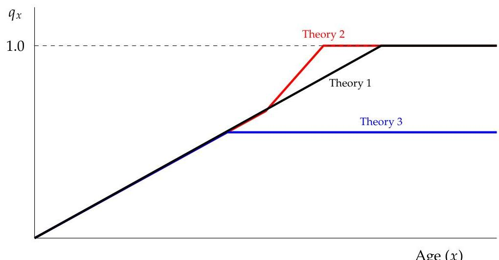

_Note: Source document was split into 8 OCR chunks (pages 1-22, pages 23-46, pages 47-66, pages 67-91, pages 92-115, pages 116-136, pages 137-153, pages 154-156) to stay within token limits._

# TIA_LPM_DSM_SecB_F2024-v1

## Page 1
# Section B 

B.1. Experience Studies and Predictive Analytics ..... 2
LPM-107: Experience Assumptions ..... 3
Experience Study Calculations ..... 14
Table Development ..... 32
Credibility Methods Applied to Life, Health, and Pensions ..... 53
The Application of Credibility Theory in the Canadian Life Insurance Industry ..... 67
The Use of Predictive Analytics in the Development of Experience Studies ..... 76
Predictive Modeling for Life Insurance ..... 81
LPM-168: LexisNexis Risk Classifier ..... 86
B.2. General Assumption Topics ..... 88
Ending the Mortality Table ..... 89
LPM-152: Lapse Supported Insurance ..... 91
Report on Premium Persistency - Flexible Premium UL ..... 94
ASOP 54: Pricing of Life and Annuity Products ..... 97
CIA SoP Section 1600: Assumptions and Methods ..... 103
B.3. Term-Specific Assumptions ..... 109
Selective Lapsation for Renewable Term Insurance Products ..... 110
Evolving Strategies to Improve Inforce Post-Level Term Profitability ..... 121
Level Term Lapse Rates - Lessons Learned ..... 126
Term Conversions: Pricing and Reserves ..... 128
Predictive Models on Conversion Studies for the Level Premium Term Plans ..... 131
B. 4 VA Assumptions ..... 135
Variable Annuity Guaranteed Living Benefits Utilization ..... 136
LPM-156: The Impact of Stochastic Volatility on Pricing, Hedging, and Hedge Efficiency of VA Guarantees ..... 143

## Page 2
# Section B. 1 

## Experience Studies and Predictive Analytics

## Page 3
# LPM-107: Experience Assumptions 

Source Author: Robert F. Lambert (2000)

## Overview of This Reading

The full title of this study note is "Experience Assumptions for Individual Life Insurance and Annuities"

This study note has been used and tested by ILA exam committees for many years
It covers the major experience assumptions used to price most life and annuity products and also presents frameworks for translating experience study data (e.g. mortality study data) into an assumptions that can be used in pricing

## Key topics for the exam include:

1. The 6-step process for establishing experience assumptions for pricing and modeling
2. Overview of 4 major experience assumptions:

- Mortality
- Lapses
- Interest rate
- Expenses

For each assumption, the study note gives an approach for performing an experience study, analyzing credibility, and other considerations

The video lesson for this reading contains several quizzes designed to illustrate the quantitative aspects of this material

## Introduction

Many different actuarial models require experience assumptions

- Pricing and repricing studies
- Product design and product evaluation studies
- Statutory reserve adequacy testing, cash flow testing, etc.
- Financial reporting and GAAP reserve calculations
- Financial projections and appraisals

## Categories of Experience Assumptions

## 1. Cash flow view

- Obligation or liability assumptions (mortality, lapse, expense, etc.)
- Asset assumptions (default, investment expense, etc.)

## Page 4
- Scenario assumptions (stochastic interest rates, etc.)

# 2. Degree of conservatism 

- Sometimes accounting rules require a provision for adverse deviation (PAD)
- Final assumption $=$ best estimate assumption + PAD
- Best estimate $=$ most likely outcome based on actuary's judgment
- A PAD should always make the final assumption more conservative (could be an increase or decrease to the assumption)
- Example: higher mortality is conservative for life insurance but lower mortality is conservative for life annuities
- The less certain the best estimate is, the larger the PAD should be

## Steps in Establishing Experience Assumptions

There are 6 main steps:

1. Identify
2. Determine
3. Analyze
4. Review
5. Document
6. Monitor

## The 6 Steps to Establish Experience Assumptions

1. Identify assumptions required

3 main types ("cash flow view"):

1) Obligation (liability) assumptions - mortality, lapse, expense, etc.
2) Asset assumptions - investment income rate, capital gains rate, defaults, etc.
3) Scenario assumptions - determinstic vs. stochastic interest rates, sensitivity testing
2. Determine structure of each assumption

Experience classes are groups of policies that have the same assumption
Should be of a similar type, structure, and have similar marketing objectives
2 policies might be in the same mortality experience class but not expense (etc.)
Key Principles Used to Decide Complexity of Assumption Structure:

- Reflect differences in actual experience
- Use objective definitions for class structure

## Page 5
- Number of classes should be practical and cost effective

3. Analyze experience and trends

- Evaluate credibility - homogeneity of data, reasonableness of methods/results
- Evaluate quality of data - are there better alternative sources? are data appropriate? comprehensive enough?
- Actual vs. similar experience - use actual if available and credible; otherwise make appropriate adjustments
- Reflect trends - e.g mortality improvement
- Reflect company and external factors - underwriting, investment policy, other business practices
- Sensitivity test the assumptions - look at financial impact of likely future deviations

4. Review assumptions for reasonableness, appropriateness, and consistency

Examples of consistency checks:

- Inflation consistent with investment earnings?
- Mortality anti-selection consistent with lapses?

Examples of validation checks:

- Static: Do starting reserves match recent valuation?
- Dynamic: Are projected reserve changes consistent with past trends?

5. Document assumptions

- Actual assumptions (value, applicable class)
- Data used (source, values, any concerns about, adjustments, reliance on others)
- Methods used to develop assumptions (including credibility method)
- How to use assumption (pricing vs. CFT, sensitivity testing, regulatory requirements)

6. Monitor experience and update assumptions

Should review regularly but not necessarily change often

# Mortality Assumptions 

## Structure

Typically use a select and ultimate table
Select period corresponds to underwriting period

## Page 6
Age last birthday (ALB) vs. age nearest birthday (ANB):

$$
\begin{aligned}
q^{\mathrm{ALB}}(x) & =0.5 \times\left[q^{\mathrm{ANB}}(x)+q^{\mathrm{ANB}}(x+1)\right] \\
q^{\mathrm{ANB}}(x) & =0.5 \times\left[q^{\mathrm{ALB}}(x)+q^{\mathrm{ALB}}(x-1)\right]
\end{aligned}
$$

Typically have different published tables for smoker/nonsmoker and male/female
For other variations, use a multiple of a published table

- Risk classes: preferred, substandard, etc.
- Selection process: simplified underwriting, guaranteed issue
- Size of policy: bigger policies have lower mortality
- Marketing method: direct mail, agent, broker

Mortality improvement can be applied as a percentage of the published rate

# Analyzing Mortality Experience 

Confidence intervals can be used to judge credibility
Mean and variance for expected claims $E$ :

$$
\begin{aligned}
E & =n q \\
\operatorname{Var}(E) & =n p q
\end{aligned}
$$

Confidence interval for expected claims and the expected mortality rate $q$

$$
\begin{array}{ll}
95 \% \text { C.I. For } E: & E \pm 1.96 \times \sqrt{\operatorname{Var}(E)} \\
95 \% \text { C.I. For } q: & \frac{95 \% \text { C.I. For } E}{n}
\end{array}
$$

Book Example: if 3 deaths are observed in a group of 1000 policies, then the confidence interval for a mortality assumption of 0.003 would be:

$$
\begin{aligned}
& 0.003 \pm \frac{1.96 \sqrt{(1000)(0.003)(1-0.003)}}{1000} \\
& 0.003 \pm 0.00339
\end{aligned}
$$

which is not very credible because $(0,0.00639)$ is a very wide range relative to 0.003
Other readings on the syllabus have more "formalized" ways of assessing credibility. The approached using in LPM-107 is more subjective as described above.

## Mortality Studies

Mortality studies are usually done on standard issues
Separate studies should be done for:

## Page 7
1. Non-routine underwriting (e.g. guaranteed insurability option)
2. Conversions (term conversions, group conversions)
3. Sub-standard policies
4. Non-forfeiture provisions (ETI, RPU)
5. Multiple-life policies

# Performing Mortality Studies 

2 types

1. Anniversary-to-anniversary

Simplest approach since it looks at mortality experience between a policy's anniversaries

## 2. Calendar year

Exposure is based on this equality:

$$
A+N=W+D+B
$$

$A=$ number of lives beginning of year
$N=$ number of new lives that enter during the year
$W=$ number of lives that lapse during the year
$D=$ number of lives that die during the year
$B=$ number alive at end of year
$D$ is always a whole number, whereas $N$ and $W$ can have fractional exposures based on the precise time the person entered/exited during the year
For example, if a person lapses March 31, they contribute 0.25 to the exposure count; if they die March 31 (or anytime during the year), they contribute 1.00
The resulting mortality rate is based on the Balducci assumption:

$$
q(x)=\frac{D}{A+(1-r) N-(1-s) W}
$$

where $r$ and $s$ are fractions of the year (e.g. 0.25 for March 31)
The aggregate $q(x)$ is based on the sum of all policies' exposure

- Using policy counts vs. amount of insurance (size)
- Amount of insurance better reflects economic impact of deaths
- Credibility is usually lower for amount-based studies
- Amount-based studies usually result in lower mortality rates (mortality lower for large policies)

## Page 8
- Amount- and count-based studies will produce similar results if the study pool is large

# Enhancing Credibility of Mortality Studies 

Studies that cover several years are usually more credible than single-year studies ( 5 is good)
Studies that cover too large a period may hide important trends, however
Actual to expected ratios (A/E) are useful for tracking trends over time and assessing credibility

|  | By Count | By Amount |
| :--: | :--: | :--: |
| E | $\sum q(i)$ | $\sum A(i) q(i)$ |
| Var | $\sum q(i)[1-q(i)]$ | $\sum[A(i)]^{2} q(i)[1-q(i)]$ |

$95 \%$ C.I. for Claims (CIC): $\quad E \pm 1.96 \times \sqrt{\operatorname{Var}(E)}$
$95 \%$ C.I. for A/E Ratio: $\frac{\text { CIC }}{E}$

## Mortality Study Considerations for Term Conversions

Many term policies allow the policyholder to convert to permanent insurance without underwriting

Conversion mortality is usually higher than standard for policyholders who exercise this option

$$
\text { Term Conversion Cost }=\left(q^{c}-q^{s}\right) \times(\text { Net Amount at Risk })
$$

This is basically the same framework presented in LPM-165.

## Anti-Selection's Effect on Mortality

Healthy lives are more likely to lapse than unhealthy lives, especially when faced with high renewal premiums

The mortality of the remaining group begins to increase by the "conservation of deaths" principle:

$$
q_{[x]+t}=w^{A S} q_{[x+r]+t-r}+\left(1-w^{A S}\right) q_{[x]+t}^{A S}
$$

This says that total mortality at a given duration, $q_{[x]+t}$, is weighted average of the mortality of 2 groups:

1. Mortality of the "select" lives that lapse in duration $r$ to buy a new policy: $q_{[x+r]+t-r}$
2. Mortality of the lives that stay with the original policy: $q_{[x]+t}^{A S}$

The "weight" is $w^{A S}$, which is the portion of policies that lapse to buy a new policy in duration $r$, we would expect their mortality to be less than group as a whole-because they qualify for select rates, which are lower

## Page 9
If healthier lives are leaving, the remaining group's mortality must increase to maintain the equality

Key point: The idea is to solve for $q_{[x]+t}^{A S}$, which would be the mortality rate to assume in pricing-it's a better estimate of the mortality of the insureds that persist into the future

The general formula, which accounts for all durations, $s$, leading up to the current duration, $t$, is:

$$
q_{[x]+t}^{A S}=\frac{q_{[x]+t}-\sum_{s=1}^{t} w^{A S} q_{[x+s]+t-s}}{1-\sum_{s=1}^{t} w^{A S}}
$$

See the video lesson for a numerical quiz on this material.

# Blending Mortality Tables 

If you assume given pool of insureds stays constant at $60 \%$ male, the blended mortality rate is based on a simple weighted average of the $\ell_{x}$ 's:

$$
q_{\{x]+t-1}^{\text {Blended }}=1-\frac{0.6 \times \ell_{[x]+t}^{\text {Male }}+0.4 \times \ell_{[x]+t}^{\text {Female }}}{0.6 \times \ell_{[x]+t-1}^{\text {Male }}+0.4 \times \ell_{[x]+t-1}^{\text {Female }}
$$

Can also calculate the $q_{x}$ 's first then weight those, but using the $\ell_{x}$ 's is more accurate

## Adjusting Similar Mortality Experience

If actual experience isn't credible, then similar experience can be used, but adjustments may be needed because of differences in:

- Underwriting requirements (quality, preferred vs. non-preferred)
- Distribution channels (high anti-selection in brokerage business)
- Market (affluent markets have better mortality)
- Reinsurance effects

## Lapse Assumptions

## Structure (Factors Affecting Lapse Rates)

## 1. Product design

Term: High (shock) lapses when ART period begins
Annuities: High (shock) lapses when surrender charges go away
Permanent insurance: High first-year lapse rates

## 2. Distribution channel

Higher lapses with brokerage business

## Page 10
Higher lapses with agency business if agency force quality is poor
Stock broker business lapses are more sensitive to interest rates than agency business
3. Policy size

Small policies: high early lapses
Large policies: high later lapses
4. Conservation program effectiveness

- This refers to the company's practice, if any, of trying prevent policyholders from lapsinghence trying to "conserve" the business

# 5. Product type 

Deferred annuities are more sensitive to lapse rates than life insurance

## Lapse Experience Credibility

Can use the same $95 \%$ confidence interval approach used for mortality

$$
E \pm 1.96 \times \sqrt{\operatorname{Var}(E)}
$$

## Lapse Studies

Just like a mortality study except deaths and lapses switch places in the formula
Lapses get a full year of exposure, whereas deaths get partial exposures

$$
w(x)=\frac{W}{A+(1-r) N-(1-s) D}
$$

In pricing projections, lapses are assumed to occur on premium due dates
For flexible premium product (UL), assume uniform monthly lapses

## Types of Lapses

1. Termination because of failure to pay a premium (term)
2. Cash surrenders
3. Transfers to extended insurance or reduced paid-up
4. Term conversions
5. Partial withdrawals
6. Premium persistency - deviations in actual premium relative to target premium (UL)
7. Termination because policy loan $>$ cash value

## Page 11
# Interest Rate Assumptions 

## Structure

Can be deterministic or stochastic

## Deterministic Approaches:

1. Portfolio average - use a single average portfolio rate for all business
2. Investment generation - policies and cash flows receive different rates based on timing

Fixed premium polices: Group by issue date
Flexible premium policies: Group cash flows by month or year received

## Stochastic Approach:

- The more important the risk, the more scenarios should be used
- Scenario rates can vary with time, asset class, asset quality, and credit risk

Investment income assumption should be net of investment expenses and defaults if those "costs" aren't accounted for separately in the model

## Policy Loans:

- Can be modeled as assets or negative liabilities
- If treated as an asset, the policy loan rate will affect the investment income rate
- Policy loan rate should be net of policy loan expenses
- The assumed policy loan utilization rate can vary by rate, plan, size, and scenario
- For stochastic models, it's easiest to treat as a liability cash flow

## Analyzing Experience

## Book Value Investment Rate:

$$
i=\frac{2 I}{A+B-I}
$$

## Market Value Basis:

$$
r=\frac{B-A-C}{A+\frac{C}{2}}
$$

- $A=$ market value at beginning of year
- $B=$ market value at end of year
- $C=$ net cash flows (assume mid-year)
- If $r$ is a daily rate and cash flows happen EOD, set $C=0$

## Combining Multiple Rates of Return Over Time

## Page 12
1. Time-weighted return - geometric mean

$$
r=\left[\left(1+r_{1}\right)\left(1+r_{2}\right) \cdots\left(1+r_{n}\right)\right]^{(1 / n)}-1
$$

This is simply a constant annual effective yield implied by a series of varying rates.
2. Dollar-weighted return - take cash flow timing into account

Solve for a level rate $r$ that accumulates past cash flows to a current value (e.g. a current portfolio value):

$$
\text { Value }_{t}=C F_{t-1}(1+r)+C F_{t-2}(1+r)^{2}+\cdots+C F_{t-n}(1+r)^{n}
$$

This is simply an IRR calculation where you are accumulating to a future value rather than PV'ing future values back to a PV.

Either return measure can be higher than the other depending on the pattern of cash flows
See the video lesson for examples of both

# Expense Assumptions 

## Structure

1. Direct Expenses - vary with sales

- Commissions and other percent of premium compensation
- Taxes on premiums, income, etc.
- Underwriting expenses

2. Indirect Expenses - don't vary with sales

- Includes overhead
- Can model as an amount per policy, percent of premium, per unit, etc.

3. Both - some expenses are indirect up until a point (e.g. new building needed to house staff for new product)

- Maintenance and acquisition expenses can have direct and indirect components

## Analyzing Expense Experience

Exposure in expense studies is based on policy count since expenses are often modeled on a per policy basis

$$
\text { Exposure Count }=\left\{\begin{array}{ll}
\frac{A+B+N}{2} & \text { for beginning of year expenses } \\
\frac{A+B}{2} & \text { for mid-year expenses }
\end{array}\right.
$$

## Expense Allocation

## Page 13
Must categorize expenses first (systems vs underwriting vs marketing, etc.)

# Methods for Allocating Expenses: 

- Transaction count (e.g. number of premium payments)
- Transfer costs (employee benefit cost per employee)
- Employee time spent on activities
- Index-based allocation (policy count or premium)

Projected expenses should reflect:

- Historical trends
- Expected future volumes of business
- Expected inflation
- Scale - how expenses change with sales volumes
- Expected business changes

## Page 14
# Experience Study Calculations 

Source Author: David B. Atkinson and John K. McGarry (March 2024)

## Sections 2-4, 11, 12, 15, 17, \& 18 (excl. 18.2, 18.8, 18.9)

## Overview of This Reading

The basic concepts of this paper overlap with the experience study mechanics we just saw in LPM-107, but this paper adds significantly more detail

In addition to covering decrement studies (e.g. mortality, lapse, etc.), this paper also covers utilization rate studies, which are relevant to VAs with guaranteed withdrawal benefits

This paper contains many quantitative topics that will be difficult to grasp without working through numerical examples

The video lesson for this reading includes a number of diagrams and numerical examples that will make the methods in this chapter easier to retain for the exam

## Key topics for the exam include:

- Basic experience study terminology
- Basic and mortality and survival rate calculations
- Annual exposure method
- Individual exposure calculation
- Multi-year studies
- Period studies
- Grouped exposure
- Amount-weighted studies
- Withdrawal studies
- Actual to expected (A/E) analysis
- Utilization studies
- Frequency, severity, and loss ratios
- VA withdrawal utilization rates
- Practical considerations
- Amount-weighted distortions
- Advantages of multi-year studies
- Data issues: homogeneity and reporting lags
- Non-uniform distribution of events
- Inclusion of partial policy years
- Annual vs. distributed exposure methods

## Page 15
- Product-related considerations
- Individual life insurance
- Claim characteristics shared by LTCI and DI
- Types of morbidity studies for LTCI and DI
- DI-specific considerations
- LTCI-specific considerations
- Deferred annuities
- Payout annuities

# 2. Introduction 

This paper demonstrates methods for determining mortality, morbidity, lapse, and related rates based on experience

These methods are often used in industry experience studies but could also be used by insurers for their own studies

Many insurers conduct their own experience studies and compare the results to industry studies

## 3. Experience Study Overview   Basic Terminology

Study period - period of time spanned by the study data (often several calendar years)
Study population - insureds, employees, etc. that the study data are based on
Cell - combinations of data dimensioned by issue age, sex, smoker/nonsmoker, policy year, etc.

- Based on attributes of the study data that are deemed significant
- Represents an interval of time based on the rate interval (defined below)
- Other variations for cells: face amount size and ALB vs. ANB

Experience rates - the results of an experience study (decrement or utilization rates)

- One experience rate is calculated for each cell

Rate type - decrement vs. utilization rates

- Decrement rates are probabilities that range from 0 to 1
- Some can happen only for a given person/contract (e.g. mortality or lapse)
- Others represent a transition from one status to another (e.g. disability rates)
- Utilization rates are not probabilities and can exceed 1 (e.g. partial withdrawals)

Rate interval - commonly annual or monthly

## Page 16
- Should capture important variations over time (e.g. term lapse rates vary by month after the level premium period ends)

Rate year - a time variable (usually policy year, life year, or calendar year)

- Policy year $=$ years since issue rounded up to nearest 1 (e.g. starts with 1 in policy year 1 , etc.)
- Common with life insurance
- Could be further split by calendar year for multi-year studies
- Life year is measured between the person's actual birthday each year
- Used for payouts and pensions

Multi-state study - captures different states of key variables that can change over time (e.g. active vs. disable status, LTC claim type) ${ }^{1}$

- Transitions - changes in state

# 4. Simple Mortality Study Examples 

## Basic Life (Actuarial) Table Formulas

A life table lists the number of lives alive at each attained age $x$

$$
\begin{aligned}
& \ell_{x}=\text { lives alive at age } x \\
& d_{x}=\ell_{x}-\ell_{x+t}=\text { deaths between age } x \text { and } x+1 \\
& q_{x}=\frac{d_{x}}{\ell_{x}}=\text { probability that a life age } x \text { dies before } x+1 \\
& p_{x}=1-q_{x}=\frac{\ell_{x+1}}{\ell_{x}}=\text { probability that a life age } x \text { survives to age } x+1
\end{aligned}
$$

Probability that someone age $x$ will survive $t$ years:

$$
\begin{aligned}
{ }_{t} p_{x} & =\frac{\ell_{x+t}}{\ell_{x}} \\
& =\left(p_{x}\right)\left(p_{x+1}\right)\left(p_{x+2}\right) \cdots\left(p_{x+t-1}\right) \\
& ={ }_{t-1} p_{x}\left(p_{x+t-1}\right)
\end{aligned}
$$

Corresponding mortality rates are the complement
Probability that someone age $x$ will die within $t$ years:

$$
{ }_{t} q_{x}=1-{ }_{t} p_{x}
$$

## Including Withdrawals (Lapses)

[^0]
[^0]:    ${ }^{1}$ This type of study is not covered or explained further in any of the subsequent sections that are on syllabus.

## Page 17
If $w_{x}=$ number of withdrawals ${ }^{2}$ for any reason other than death:

$$
\ell_{x+1}=\ell_{x}-d_{x}-w_{x}
$$

However, now $q_{x} \neq d_{x} / \ell_{x}$ because we don't know the exposure of withdrawn lives
Therefore, we need a new exposure value $E_{x}$ based on the annual exposure method:

1. Lives that survive the year get an exposure of 1 year
2. Lives that die during the year get an exposure of 1 year
3. Exposure for withdrawals during the year $=$ fraction of the year between age $x$ and withdrawal date

This lets us calculate:

$$
\begin{aligned}
& q_{x}=\frac{d_{x}}{E_{x}} \\
& p_{x}=1-q_{x}
\end{aligned}
$$

$q_{x}$ and $p_{x}$ are considered to be:

- Single decrement or independent rates (independent of withdrawals)
- Initial rates because they are based on initial exposure (at the start of the year)

Balducci Hypothesis - simplifying assumption that mortality decreases over the course of the year

- Not true, but tends to introduce only small errors when the number of withdrawals is relatively small

Using the Balducci Hypothesis, we can write the exposure formula as:

$$
\begin{aligned}
E_{x} & =\ell_{x}-\sum_{i=1}^{w_{x}}\left(1-t_{i}\right) \\
& =\left(\ell_{x}-w_{x}\right)+\sum_{i=1}^{w_{x}} t_{i} \\
q_{x} & =\frac{d_{x}}{E_{x}}
\end{aligned}
$$

where $t_{i}=$ fraction of the year when each withdrawal $i$ occurs $^{3}$ and $w_{x}$ is the total withdrawals in the year

[^0]
[^0]:    ${ }^{2}$ In this part of the paper, the authors use the word "withdrawal" to refer to any decrement other than mortality (e.g. terminations on lapse). Later, in the paper, the authors talk about withdrawals as a utilization rate (e.g. VA GLWB withdrawals), but that's a different concept.
    ${ }^{3}$ Note that this is identical to the framework in LPM-107, which uses $s$ to denote the fraction of the year when a withdrawal occurs.

## Page 18
Individual exposure calculation - calculate exact exposures of each policy (i.e. apply the $E_{x}$ formula above)

- Example: if the 5th withdrawal occurs on the 90th day of the year, $t_{5}=90 / 365=0.2466$

Grouped or census exposure calculation - assumes withdrawals happen mid-year on average

$$
E_{x}=\ell_{x}-\frac{1}{2} w_{x}
$$

- Common before computers made individual exposure calculation feasible
- Could be made more accurate by replacing the $\frac{1}{2}$ with an average exposure for withdrawals based on a study

For most policies, withdrawal exposure $>0.5$ because lapses tend to occur on premium due dates at the end of a month, quarter, half-year, or year

# Multi-Year Studies 

Exposure-weighted average mortality rate over an $N$-year period starting at age $x$ :

$$
\begin{aligned}
q & =\frac{\sum_{t=0}^{N} E_{x+t} q_{x+t}}{\sum_{t=0}^{N} E_{x+t}} \\
& =\frac{\sum_{t=0}^{N} d_{x+t}}{\sum_{t=0}^{N} E_{x+t}}
\end{aligned}
$$

Everything up through this point has been based on the concept of a cohort study (i.e. assumes we can track each life across their full life years. In the next study, we will start reflecting the relationship between calendar years and life years.)

## Period or Static Studies

Period study - an experience study where the lives don't necessarily all enter at the same age
The mechanics in this section are based on the concept of a "life year," which was defined earlier.
It is very difficult to explain how the individual and grouped exposure calculations work verbally or in formulas. I strongly recommend using the video lesson to learn how these work with actual numbers. The video lesson contains several diagrams and examples that will make these exposure concepts clearer.

Individual exposure calculation for a multi-year period study with minimum age $x$

- Some lives will be age $x-1$ at the start of the study but will turn $x$ during the first study year
- First study year exposure for these lives $=\frac{\text { days remaining in the year after turning } x}{365}$
* For example, suppose a study starts on January 1. If someone is 64 on January 1, then turns 65 on March 1, their exposure is $305 / 365=0.8356$ (assuming they survive the whole year.)

## Page 19
- Exposure for subsequent years before the final study year $=1$ for any lives that survive or die
- Exposure for the withdrawals in any year of the study is the same as before
- Final study year exposure for surviving lives $=1-\frac{\text { days remaining in the year after turning } x}{365}$
- This is just the complement of the first year exposure
- Sum up all individual exposures at each age to get $E_{x}$

Grouped exposure calculation for a multi-year period study with minimum age $x$

- For aggregate data, individual exposures may not be known
- Results in partial exposure for the first and final years in the study

# Amount-Weighted Studies 

All of the previous calculations are count-based or "life-weighted" (gives each person (or policy) equal weight)

The exact same calculations can be performed using amounts of insurance

- If the average face of policies that died is greater than the average face of all policies exposed, the amounted-weighted mortality rate will be higher than the life-weighted mortality rate (otherwise lower)

Individual amount weights - simply multiply the face amount of the policy by the exposure (1 for survivors and deaths and fractions of a year for withdrawals)

- Example: a policy with a 100,000 face amount that survives or dies during the year will contribute 100,000 of exposure. If the policy had lapsed 1/4th into the year, it would contribute 25,000 of exposure.
- Sum up amount exposures and calculate mortality rates in the same way as before

$$
q=\frac{\text { Amount-Weighted DB Paid }}{\text { Total Exposed DB Amount }}
$$

Grouped amount weights - multiply the average face amount for each exposure determined in the previous grouped exposure calculation formulas

- The $\ell_{x}$ terms become $\ell_{x} \times$ Average DB In Force
- The $d_{x}$ terms become $d_{x} \times$ Average DB Paid on Death
- The $w_{x}$ terms become $w_{x} \times$ Average DB on Withdrawn Policies

## 11. Simple Withdrawal Study Example

This section describes a framework for withdrawal (lapse) studies using the exact same methodology that we just covered in the previous section. You can use all of the same formulas by just swapping the "roles"

## Page 20
of death and lapse. In other words, for a withdrawal study, withdrawals get a full year of exposure, while deaths get fractional years. Everything else is exactly the same.

$$
q_{x}^{w}=\frac{w_{x}}{E_{x}}
$$

# 12. Actual To Expected Analysis 

Actual to expected (A/E) studies involve comparing actual results (e.g. mortality) to an expected level based on a company experience study or an industry experience study

Individual companies tend to have less credible experience than industry-level experience
If a company uses industry results for the expected basis, the company can develop its own A/E ratios to apply to industry tables

- Can be used for valuation, risk management, financial planning, etc.

The $\mathrm{A} / \mathrm{E}$ ratio at each age $x$ is:

$$
(A / E)_{x}=\frac{d_{x}}{d_{x}^{e}}=\frac{q_{x} E_{x}}{q_{x}^{e} E_{x}}=\frac{q_{x}}{q_{x}^{e}}
$$

where $d_{x}=$ actual deaths and $d_{x}^{e}=$ expected deaths
The overall expected mortality rate is:

$$
q^{e}=\frac{\sum E_{x} q_{x}^{e}}{\sum E_{x}}=\frac{\sum d_{x}^{e}}{\sum E_{x}}
$$

Can also calculate at an aggregate level (all ages):

$$
(A / E)=\frac{d}{d^{e}}=\frac{\sum d_{x}}{\sum d_{x}^{e}}=\frac{q}{q^{e}}
$$

If an insurer does not have sufficient credibility at individual ages, but total experience is credible, the insurer could apply this aggregate ratio to expected rates from an industry table to develop best estimate mortality rates at all ages:

$$
\text { Best Estimate Rate for Age } x=(A / E) \times q_{x}^{e}
$$

A/E analysis can also be done on an amount-weighted basis

- Provides a better estimate of expected benefit amounts

In practice, companies typically compare actual to expected results by calendar year, quarter or month

For example, to calculate the expected quarterly mortality rate from an annual rate of 0.05 :

$$
1-(1-0.05)^{3 / 12}=0.01274
$$

Caveat: if a constant mortality rate is assumed for all quarters (or months, etc.) for the entire

## Page 21
year, expected deaths will naturally be higher in the early quarters of the year because that is when exposure is highest

- This will cause $\mathrm{A} / \mathrm{E}$ ratios to be lower in early parts of the year unless additional adjustments are made

# 15. Utilization Studies 

Recall that there are two broad types of rates covered by this paper: decrement and utilization rates. We've been discussing decrements but now we will cover utilization rates.

Of particular importance on the current syllabus, utilization rates are relevant to VA GLBs like GLWBs, where the policyholder can utilize some or all of a benefit at their discretion.

Other examples of utilization rates: severity of claims paid, loss ratios

## Page 22
# Frequency and Severity 

Claim frequency $f_{x}$ and average claim severity $s_{x}$ for age $x$ :

$$
\begin{aligned}
& f_{x}=\frac{n_{x}}{E_{x}} \\
& s_{x}=\frac{C_{x}}{n_{x}}
\end{aligned}
$$

where:

- $n_{x}=$ number of claims incurred at age $x$
- $C_{x}=$ total claim amount incurred at age $x$
- $E_{x}=$ central exposure ${ }^{4}$ over age $x$

Frequency and severity can be calculated using actual paid claims or on an incurred basis, which requires a mix of paid claims and estimates for incurred but not reported (IBNR) claims

## Calculating Utilization Rates Relative to Maximum Benefit Limits

Some products define annual maximum benefits $M_{x}$ by age (or may not vary by age)
The average utilization rate of the maximum benefit is:

$$
u_{x}=\frac{s_{x}}{M_{x}}
$$

## Loss Ratio

Loss ratio - cost of claims as a \% of premiums paid $\left(P_{x}\right)$

$$
L R_{x}=\frac{C_{x}}{P_{x}}
$$

where $P_{x}$ can be calculated as a premium rate $\times$ total exposure
For example, if the average premium per 1000 was 20 and you had $\$ 100 M$ of exposure, the total premium would be $\$ 2 M$

## Variable Annuity Withdrawal Utilization

A VA GLWB allows lifetime withdrawals as long as the contractholder does not exceed the max withdrawal amount (otherwise benefits are reduced)

Since withdrawal patterns are not uniform over the year, utilization studies usually exclude partial years arising from new business and deaths

[^0]
[^0]:    ${ }^{4}$ Central exposure is covered in Section 13 of the paper, which is not on syllabus. It's essentially an estimate of the average exposure during a year. In previous on-syllabus sections, we were working with initial exposure (based on BOY) values. Since the syllabus skips over the central exposure material, I think it would be totally fine to use initial exposure within this framework.

## Page 23
- Referring back to the mortality study examples in Section 4, this means we would exclude the first and final years of the study in the grouped example because those are partial years. Cue the applause!

The annual count exposure by study year is based on the starting population less deaths and lapses

$$
E_{x}=\ell_{x}-d_{x}-w_{x}
$$

where $w_{x}=$ a full lapse $^{5}$
Let $M_{x}=$ max withdrawal allowed, $W_{x}=$ total actual withdrawal amount, and $n_{x}=$ number of contractholders who took a withdrawal

$$
\begin{aligned}
& f_{x}=\frac{n_{x}}{E_{x}}=\text { withdrawal frequency in the population studied } \\
& s_{x}=\frac{W_{x}}{n_{x}}=\text { average size (severity) of withdrawals taken } \\
& u_{x}=\frac{s_{x}}{M_{x}}=\text { average withdrawal taken as a \% of the max withdrawal }
\end{aligned}
$$

For example, suppose the max annual withdrawal per contract is 6000. If at a given age, 238 out of a total population of 961 contractholders took withdrawals totaling 1,201,488:

$$
\begin{aligned}
& f_{x}=238 / 961=24.77 \% \text { of contractholders took withdrawals } \\
& u_{x}=\frac{1,201,488 / 238}{6000}=84.14 \%=\text { average \% of the max withdrawal taken }
\end{aligned}
$$

An insurer could develop frequency and utilization rates for various ages and use those as the basis for assumptions in valuation and pricing models

This also shows you how a utilization rate could technically exceed 100\%. A contractholder with a GWLB could withdraw more than the max withdrawal, but their benefit level would be reduced (i.e. it would likely reduce the dollar amount of future lifetime withdrawals).

# 17. Practical Considerations 

This section contains practical considerations related to many of the concepts covered in previous sections

## Amount-Weighted Distortions

When there is a large discrepancy between amount-weighted and population-weighted ${ }^{6}$ rates, it's usually because of:

[^0]
[^0]:    ${ }^{5}$ In other words, this is a full surrender of the contract. Unfortunately the authors use big and little w's here, so just be careful not to confuse little $w$ with the big $W$ used to donate the amount of withdrawals taken. In the context of a utilization study like this, deaths and lapses are the same kind of decrement and both are excluded because we only want contracts in force the whole year.
    ${ }^{6}$ In earlier sections, the authors refer to this as "life-weighted," but we're really just talking about a count-based rate here.

## Page 24
1. One or a few large amounts distorted the numerator

- Not easy to fix - requires searching through data cell by cell
- Solution: cap the max amount allowed in the study

2. Risks or behaviors differ significantly by amount

- Solution: add a size band to cells (i.e. group cells by size)

Amount-weighted rates may be correlated with:

- Policyholder characteristics: income, socioeconomic class, education
- Policyholder behavior that varies with policy size:
- Small policies may have less commitment
- Large policies may be used to to defraud

# Data Extracts for Multi-Year Studies 

Multi-year studies have the following advantages over single year studies:

- Higher credibility
- Less distortion caused by reporting lags (very recent data are more likely to need corrections)
- Can populate many more cells
- Allows study of trends if a study-year or CY variable is included

## Homogeneity of Data

Study data should be homogenous
Examples of non-homogenous patterns to look for:

- Mortality studies: examine issue year groupings for patterns and look for outliers caused by substandard lives, etc.
- Lapse studies: examine mode and payment methods separately

## Reporting Lags

Examples of reporting lags, which are common for all types of business:

- Health claims can be submitted after they were incurred
- Death claims are often not reported for months after the insured dies (sometimes years later)
- LTCI and disability policyholders often don't report claims until after the elimination period

## Page 25
- "Shoe boxing" - direct reporters don't always report claims to reinsurers on a timely basis
- Life annuities sometimes continue payments after the annuitant's death

Typical solution: wait a few months after the study period before gathering data

- Example: wait until September to gather data for the previous CY's mortality study

Can also develop IBNR claims estimates from previous studies

# Non-Uniform Distribution of Events 

The previous exposure formulas assume a uniform distribution of events
Examples of non-uniform events:

- Lapses often vary by month, especially for policies where the premium can jump substantially (e.g. post-level period for term and LTCI rate increases)
- Prorated mortality rates tend to overestimate deaths in the second half of the year for very old ages
- Mortality rates tend to be constant at 0.5 at very old ages

## Ways to compensate for non-uniform distributions

1. Use a shorter interval of time
2. Apply adjustment factors
3. Use a constant force assumption to model more deaths in the first half of the year for old ages

## Partial Policy Years

All exposure methods generate errors when the actual distribution of events does not match the distribution implicitly assumed by the exposure method

- This is always the case, so it's a matter of understanding how large the errors are

For multi-year studies, errors across cohorts usually offset, resulting in immaterial net error
Errors in the partial years at the start/end of a period study:

- Are roughly equal and opposite in sign
- Relate to the size of rates and difference in actual vs. assumed distribution
- Will vary greatly and no exposure method is ideal in all cases

## Inclusion of Partial Policy Years

- OK when the event is evenly distributed over the year
- Common for biologically-drive rates (mortality, morbidity, etc.)

## Page 26
- Allocating PYs between CYs is also common
- Otherwise, partial policy years will distort results
- Behavioral rates are usually not evenly distributed
* Lapse, withdrawal, option election, etc.
- Do not allocate PYs between CYs

# Annual vs. Distributed Exposure Methods 

If fractional rates are assumed constant, just calculate fractional rates for the part of the year needed

Otherwise, must choose between annual exposure and distributed exposure

- Annual exposure method - consistent with the Balducci Hypothesis ${ }^{7}$
- Exposes decrements to end of next policy anniversary (even if beyond study period)
- Disadvantage: overstates rates in the first partial year; understates rates in final partial year
* True for rates like mortality that tend to increase over time
* Becomes worse as rates increase (significant if rates are over 50\%)
- Why exposure is extended beyond study period:
* The rate is based on a probability (number of events / number of trials)
* Captures the exposure missed by the initial partial year (from before the study start date) so sequential studies can be added together
- Also true of the distributed exposure method
- Distributed exposure method - assumes the decrement is uniformly distributed
- Allocates exposure and decrements by both PY and CY
- More accurate when underlying rates are increasing; otherwise less accurate
- Produces same total PY exposure as the annual method, but CY allocation differs
- Algorithm for distributed exposure in the context of a mortality study:

1. Calculate Annual Exposure in the usual way (expose deaths to end of policy year of death in the usual way)
2. First-half exposure $=$ PY $t$ exposure in CY:

* Expose deaths and surviving policies from policy anniversary to end of CY
* Expose other decrements (lapse, etc.) from policy anniversary to decrement date

[^0]
[^0]:    7 Remember that Balducci assumes decreasing rates over the year.

## Page 27
3. Second-half exposure $=$ exposure for remainder of PY $t=$ Total Annual Exposure - First-Half Exposure

* This will be allocated to the next CY

I think the distributed method is very difficult to understand from the verbal-only description in the paper, which we've summarized above using the authors' key words. Please see the video lesson for a more visual explanation using numbers. The distributed method is also covered in Section 5 of the paper, but that section is not on syllabus, so I would not spend too much time there.

# 18. Product-Related Considerations 

This section covers all sub-sections of Section 18 except 18.2, 18.8, 18.9, which are not on syllabus.

## Individual Life Insurance

## - Grace Period

- In the US and Canada, insurers must pay DB even if premium is 30-60 days past due
- DB paid is net of overdue premiums
- Mortality studies should reflect the full DB effect on date of death
- Expose lapses to paid-to-date at beginning of grace period

## - Compromised and Denied Claims

- Sometimes insurers deny claims made within the policy's first 2 years
- Do not count as a death in mortality studies
- Study Variables Changing Over Time (admin system changes)
- Admin systems may change plan codes when policies go on nonforfeiture status (ETI, RPU)
* Lapses no longer get recorded on the original plan
- Admin systems may change bill frequency to encourage policyholder to pay an overdue premium
* When policy lapses, it gets recorded on the new billing frequency

## - Treatment of Reinsured Amounts

- Insurers may want to perform studies net of reinsurance if there is a material amount of business reinsured

## - Use of Net Amount at Risk

- $\mathrm{NAR}=\mathrm{DB}-\mathrm{CSV}$
- Mortality studies can use NAR instead of gross DBs for improved accuracy, but this is rarely done

## Page 28
# - Inclusion of Substandard or Uninsurable Lives 

- Typically excluded from mortality studies so results are not distorted
- Substandard mortality is often expressed as an A/E ratio (e.g. 200\% of standard mortality)

## - Backdated New Business

- Sometimes the issue date for a new policy is set back a few days in the past to get a more favorable premium for the policyholder
- Adjustments are usually not made for mortality studies

## Morbidity Products (LTCI and DI)

Disability income (DI) and LTCI claims have many characteristics in common:

- Involve multiple payments that can last for months or years
- Usually paid monthly
- Subject to elimination period before claim payments start (up to 1 year)
- Usually limited in some way (e.g. max age for DI, max total benefits, etc.)
- Paid when insured meets certain conditions
- Claims stop when insured recovers but can start again

3 types of relevant morbidity studies:

1. Claim incidence studies

- Claim incidence rates $=$ annual probabilities
- Usually done on "all claims" (i.e. not specific studies for assisted living vs. nursing home, etc.)
- Usually based on the annual exposure method (what we covered in Section 4)
- Amount-weighted exposures are based on max monthly benefits

2. Claim severity studies

- Average length of claim $=$
Total Months of Claims
- Average cost per claim $=$
Total Claims Paid
Number of Claims

3. Claim termination studies

- Perform separate studies for recovery and death

## Page 29
- Not considered terminations: reaching max age, max number of payments, or max total benefits
- DI claims will terminate when proof of disability is not submitted
- LTC claims will terminate when requests for reimbursement stops
- Death and recovery rates are based on the same exposure (therefore they are dependent)
- Termination rates are highest and most volatile for new claims
- Usually calculated at a monthly frequency until they stabilize (then yearly)

# DI-Specific Considerations 

- Elimination periods
- Varies from 3-12 months
- Many insureds wait until after the elimination period before submitting a claim
- Partial disability benefits
- Recent DI products provide a partial DI benefit as an incentive to return to full-time work
- Reduces the average cost per claim in a severity study
- Recovery followed by relapse within 6 months
- Treated as a continuation of claim
- Recovery and relapse cancel out as if recovery didn't happen
- Claims not paid during recovery period reduce average claim cost
- Claim settlements - lump sum paid in lieu of future monthly payments
- Do not count as terminations in a termination study
- Admin settlements - done to save cost
* Expose to end of benefit period
- Litigated settlement - done to settle disputes
* Do not count exposure after settlement date

## LTCI-Specific Considerations

LTCI products generally reimburse the policyholder for eligible LTC, subject to a maximum daily benefit

## - Elimination period

- Typically 30, 60, 90, 180 and 365 days
- Can also vary by LTC claim type (e.g. longer for nursing home)

## Page 30
- Some products credit days of home care toward elimination period to encourage home care
- Inflation protection
- Some LTCI benefits are indexed to inflation, which requires a higher premium
- Benefit utilization rate - additional rate required for LTCI in addition to the 3 rates described in the morbidity section above

$$
\text { Benefit Utilization Rate }=\frac{\text { Actual Benefits }}{\text { Max Benefits }}
$$

- Other LTCI considerations
- Mortality rates do not follow any established table
- Tend to be very high in months after an LTC claim, then drop, then begin rising naturally with age
- Seriatim policy data is used to calculate exposure
- Claim data must capture:
- Diagnosis (very important since it drives claim length)
- Start and stop dates
- Type of claim
- Total paid
- Claim data is not always organized ideally and requires work

# Deferred Annuities (Fixed, Indexed, and VAs) 

- Deferred annuity utilization rates
- For GMDBs, GMABs, and GMIBs, compare actual benefit paid to the amount payable in absence of the GMxB
- GLWBs: if more than max withdrawal is taken, future guaranteed withdrawals are reduced
- Can calculate utilization rates using the method covered earlier in Section 15
- Contract year data challenges
- Data are usually monthly
- Common approach: convert account balances to contract year basis using a 13-month average
- Weight beginning and ending months by $1 / 24$
- Weight other 11 months by $1 / 12$ each
- Effectively splits large premiums made on anniversaries into separate years

## Page 31
# Payout Annuities 

## - Immediate annuities

- Self-selection - people buy IAs when they think they are healthier than average (will live a long time)
- Choice of immediate annuity may indicate health (e.g. if someone chooses a 10-year certain period, they may think their health is average)
- Study mortality rates by issue age and policy year
- Larger IAs tend to have lower mortality
- Amount exposure should be based on monthly payment, not reserves
- Mortality improvement is a key consideration
- Structured settlements - arise from injury lawsuits
- Usually involves one or more lump sums (not lifetime payouts)
- Mortality is higher than IAs
- Amount exposure should be based on reserves or premium paid to purchase the settlement, not payments, which are too variable

## Page 32
# Table Development 

Source Author: David B. Atkinson (February 2018)

## Exclude Appendices C, D, F, G, \& H

## Overview of This Reading

This paper describes the major steps performed to develop experience tables, including tables developed within companies and also industry tables like Commissioners' Valuation Tables

Even though a lot of the concepts in this paper overlap with previous readings, it's important to understand the formal steps of the table development process

This paper reads like a very large outline, and we have preserved the section numbers from the reading's major headings in our headings below

## Key topics for the exam include:

- Major steps in table development (high level)
- Data development and analysis
- Preliminaries and data call
- Common data challenges
- Experience study calculations
- Goal of data analysis
- Steps in the data analysis process
- Graduation of rates
- Graduation overview
- Credibility and data grouping considerations
- The graduation process
- Variance for amount-based observed rates
- Allocating average size within size groups
- Interpolation of grouped graduated rates
- Extension, review, and projection of rates
- Methods for extending rates
- Creative reviews
- Enforcement reviews
- Projecting future rates
- Assessing financial impact and finalizing table
- Assessing financial impact
- Creation of derived tables

## Page 33
- Valuation loading process for CVT (appendix j)
- Project documentation and oversight

# 1. Overview 

This paper documents the process of creating experience tables for mortality rates, lapse rates, and more

## Project Planning and Oversight

- Table development time can range from hours to years
- Review and oversight are important, especially for large projects with resource constraints and obstacles
- Think about how to overcome potential problems in advance

## Major Steps in Table Development

1. Develop data
2. Identify table dimensions through exploration techniques
3. Populate table through graduation/interpolation or modeling
4. Extend and project rates as needed
5. Review and adjust rates after assessing financial impact
6. Finalize table

## 2. Data Development

## Preliminaries

1. Review previous studies (if they exist)

- Table dimensions used, data used, etc.

2. Clarify purpose and goals

- Understand how the table will be used
- Reconsider if it's not feasible to meet the table's goals

3. Data confidentiality

- Maintain the confidentiality of each contributing company's data
- Ensure that contributors' data can't be isolated (e.g. exclude data based on a distribution channel unique to one company)

## Page 34
- Most table development functions should be done by non-competitors

4. Review available data to consider:

- How current the data are and any changes since the earliest availability date
- Trade-off between more recent, homogeneous data vs. significant but older, less homogenous data
- Whether data matches needs and how to improve match
- Credibility of data
- Whether rates should be graduated to improve credibility

# Data Call 

Data call - formal request for data from contributors (e.g. different insurers)

- Simpler data calls are more successful that complex data calls

Create a document describing what is needed for each data item:

- Abbreviated identifier (e.g. "Age")
- Full name (e.g. "Attained Age")
- Format (date, integer, etc.)
- Definition (e.g. "Age as of January 1, used to study mortality by age")
- How to populate or calculate
- List and definition of allowable values (if values are restricted)

Define a structure for storing collected data (e.g. a relational database) with unique ID for each row

Create a detail record for each combination of life, attained age, policy year, etc.

- Based on a series of snapshots capturing key changes (e.g. change in attained age)

Think of spreadsheet where the rows are your detail records and the columns are your data items
Document all table relationships within relational databases

## Common Data Challenges

1. Incomplete data: contributors may not be to provide all requested (i.e. only certain study years or blocks)
2. Terminology may vary by contributor (e.g. underwriting methods)
3. Data may not arrive on time
4. Wrong or improperly formated data

## Page 35
5. Time lags in reporting of events like death
6. Lack of resources to transform data into the requested layout

Data must undergo exhaustive checking so that it is valid, consistent, and credible

# Experience Study Calculations 

1. Study anniversary date - birthday, policy anniversary, etc.

- Detail records are split into 2 records when they cross a study anniversary date
- Rates that vary by month should be split into "monthiversaries" (e.g. lapses)

2. Age basis - how age is calculated (ALB, ANB, etc.)

- May vary by contributor
- ALB vs. ANB differences can be significant (up to $4 \%$ difference in mortality rates)
- 3 ways to address the distortion:

1) If most data are ANB (ALB), assume all are ANB (ALB)
2) Recalculate age for each record to be on the same basis
3) Use a weighted-average age

* Example: if $75 \%$ of age 50 is ANB, use an ANB age of

$$
50.5 \times 0.25+50 \times 0.75=50.125
$$

## 3. Experience study summary records

- 2 classes:

1) Study variables - includes potential dimensions (issue age, gender, etc.) and others like CY, data contributor, etc.
2) Calculated totals - number and amount of events under study (e.g. deaths), expected amounts, etc.

- Time dimension (yearly, monthly, etc.) should be based on:
- How event's rates vary across time
- How financial results depend on the timing of the event

## 4. Count-based results

- Event Count (e.g. number of deaths)
- Count-Based Rate $=$ Event Count / Exposed Count

## 5. Amount-based results

- Event Amount (e.g. sum of death claims incurred)

## Page 36
- Amount-Based Rate $=$ Event Amount / Exposed Amount
- Exposed Amount may be based on weighted averages

# 6. Expected results 

- Expected Count $=$ Exposed Count $\times$ Expected Rate
- Expected Amount $=$ Exposed Amount $\times$ Expected Rate
- A/E Count Ratio $=$ Event Count subtotal / Expected Count subtotal
- A/E Amount Ratio $=$ Event Amount subtotal / Expected Amount subtotal
- A/E ratios are useful for seeing differences by variable (e.g. age) and identifying potential data issues

7. Summary results for each detail record

- Event results: Event Count and Event Amount
- Exposure results: Exposed Count and Exposed Amount
- Expected results: Expected Count and Expected Amount

## 3. Data Analysis

Goal: identify the "best predictor" variables for the study

## Steps in the Data Analysis Process

1. Data Acquisition - identify the following before developing data layout:

- Target variable for the study (e.g. mortality rate)
- Questions to be answered by study
- How data will be gathered
- Data to be used in the analysis process (individual vs. summarized data)
- Data needed for the study (e.g. date of death, claim amounts, etc.)
- Data needed to understand target variable
- "Current thoughts" about which variables will be key predictors

2. Data Validation and Preliminary Exploration

- Preliminary Data Exploration - examine graphs of data combinations to understand credibility
- Example: look at a 2D graph of deaths by issue and policy year
- Scatter plots may help identify correlations

## Page 37
- Outlier Analysis - look for extreme values that might distort results
- Can cap/floor values to prevent distortion
- Can replace missing/faulty values with averages or most common values

3. Data Visualization and Preparation (more involved than previous step)

- Variable Grouping - based on how the target variable is distributed
- Example: mortality might be distributed by gender, age, and policy size
- Strike a balance between credibility and homogeneity

# - Variable Creation 

- Consider variables needed in the variable reduction process (below) and other needs
- Example: calculate and use BMI instead of height and weight
- Variable Reduction - remove necessary variables to increase efficiency and reduce model runtime
- Example: some variables may be correlated

4. Determination of Analytical Approach - apply one of the following:

- Exploratory Analytics (was more common before advanced analytics)
- Trial-and-error approach of identifying variables that:
* Explain significant variations
* Provide a relatively high percentage of credible and smooth observed rates
- ID'ed variables become table's dimensions
- Graduation is the next step (Section 4)
- Advanced Analytics (more common today)
- Includes statistical analysis/modeling and predictive modeling
- Must divide data into independent subsets:
* A large training set for model fitting ( $60 \%$ or more of data)
* Subset(s) for validation

5. Model Creation and Assessment (relates to advanced analytics)

- Selecting Appropriate Model Forms
- 3 key requirements:
* Explanatory ability - should be able to explain to consumers and regulators that rates are equitable/fair
* Predictive power - model's rates should closely match observed rates

## Page 38
* Ease of table implementation
- Black box models (difficult to explain) should be generally avoided
* Includes random forests, neural networks, support vector machines, gradient boosted machines
- Generalized linear models (GLMs) are more transparent and easiest to explain
* Can also be used as explanatory models for black box model's results
- Generalized Linear Models (GLMs)
- GLM = generalization of ordinary multiple linear regression that allows target variable errors to follow non-normal distributions
* Linear regression assumes target variable errors are normally distributed
- GLMs use link functions to create linear models of non-linear systems
- GLMs are a subset of Generalized Additive Models (GAMs)
* GAMs use "smooth functions" to "avoid wiggly, nonsensical predictor functions"
- GLM predictor variables can be transformed to create non-linear predictor variables (e.g. squared)

# - Survival Models 

- Cox proportional hazard model - predicts survival time based on several factors
- Weibull analysis - predicts probability of failure of manufactured products but can be adapted to death (human failure!)
- Gompertz-Makeham - potentially useful for non-accidental and non-violent deaths

## - The Modeling Process

- Model fitting is performed using the training data set to determine the predictive power of each potential variable
- Predictor variables with the lowest p-values have the highest predictive power
* p-value $=$ probability that variances in the observed rates are due to random chance rather than the predictor variable
* Reject variables with p-values well above 5\%; keep and further assess those with p -values close to $5 \%$
- Confounding - occurs when important predictive variables are omitted
* Example: basing mortality on gender alone and not smoking status when smoking prevalence varies by gender
- Transformations - can be performed on fitted variables to enhance predictive power

## Page 39
- Transform a variable: e.g. change "male" and "female" to numeric values
- Function of a variable: e.g. transform age to age ${ }^{-1}$, age $^{2}$, or $\ln ($ age $)$
- Interaction term: combine variables or functions (e.g. issue age $\times$ policy year)
- Combinations are sometimes more powerful than the individual variables
- Stratification - equivalent alternative to using interaction terms that may be easier to understand
- Example: run separate models for male and female mortality, each with a smoking variable fit to the gender-specific model
- Model fitting is an iterative process
- Improvements from adding further variables diminish
- Avoid over-fitting
- Stop once a simplified model performs equally well against the training and validation data

# - Count- and Amount-Based Rates 

- Models for count-based rates are usually finalized first
- Amount-based models use predictor variables from count-based models with additional fine tuning

## 6. Final Model Selection

- Compare the final model to any previous versions
- Selecting more than one model can be appropriate (e.g. GLM for explanatory purposes and black box model for predictive power)
- If the model's rates aren't sufficiently smooth, they can be graduated (see Section 4)

## 7. Minimizing Table Dimensions

- It's a good idea to minimize the number of dimensions in the final table

## 8. Replacing Grids with Factors

- Example: if smoker rates are a relatively constant \% of "unismoker," just apply smoker factors instead of producing more table grids

## 4. Graduation of Rates

Graduation - mathematical process that smooths an array of rates

- Based on the assumption that the "true" rates follow a continuous curve
- Required any time rates do not come from models

## Page 40
- Can also be used on modeled rates that require smoothing

# Properties of a preferred graduation method: 

1. Weights will cause graduated rates to produce the same total events as the ungraduated rates
2. Parameters can control the amount of smoothness applied

Goal: balance fit and smoothness

## Input Rates

1. Count-based rates - less volatile (confidence interval is easy to calculate)
2. Amount-based rates - more consistent with financial results, but more volatile

- A single large claim can skew
- One approach: use the graduation model for count-based rates as a starting point

## Insufficiently Credible Data and Grouping of Data

- The smoothness calculation gives equal weight to non-credible ${ }^{8}$ and credible input rates
- Therefore, non-credible observed rates distort graduated rates
- Especially if they are far from credible rates (e.g. very young and old ages)
- Credibility increases with the number of events observed
- Le. standard deviation falls
- There are ways to increase credibility, but they generally result in less data for graduation
- Grouping rates by age (e.g. quinquennial)
- Grouping data by calendar or policy years
- Possible solution: use mid-age or mid-year exposure-weighted averages for graduation

## Graduation Methods

- Includes Whittaker-Henderson, Whittaker-Henderson-Lowrie, and P-splines (none of which are defined or explained in the testable page ranges)

## Graduation Components

These are parameters that control the relative weight given to fit vs. smoothness

[^0]
[^0]:    8 The author actually calls these incredible rates, but I'm avoiding that adjective so you don't think that these are really amazing rates or something. Ahem.

## Page 41
1. Input Fit - minimize the weighted sum of squared differences in graduated rates and input rates

- Weights are based on exposure

2. Table Fit - applies the Input Fit process to fit graduated rates to an existing table of rates (i.e. the table rates become the input rates)

- Linear Transformation of Table Rates Before Table Fit
- Ensures weighted average table rates = weighted average of the observed rates
- Creates better match of table rate slope to that of the observed rates
- Expected Rate Alternative to Table Fit - graduate A/E ratios instead of input rates (simpler than previous)
- A/E ratios = input rates / existing table rates

3. Smoothness - often measured by the sum of the squares of the third differences of the graduated rates

- Smoothness increases as the sum of the squares decreases
- Not weighted by exposure before summing (which is why non-credible rates can distort)
- Additional weights are applied to achieve the desired balance between Smoothness, Input Fit, and Table Fit
- 2D case: calculate smoothness separately for rows and columns of rates

The graduation method solves for graduated rates that minimize the sum of the weights times the 3 measures above ${ }^{9}$

# The Graduation Process 

1. Collect and populate graduation input
2. Review and adjust graduation input as needed

- Cells with no exposure may have a "divided-by-zero" error
- Solutions for "divided-by-zero" errors
- Replace with zero
- Exclude ages with insufficient credibility

3. Set fit and smoothness parameters, then run the graduation algorithm
4. Review and evaluate graduated rates and summarize the results
[^0]
[^0]:    ${ }^{9}$ I would not waste too much study time trying to figure out the math here. There's simply not enough explanation of these complex algorithms in the reading. No formulas or examples are given. For the exam, I would just focus on retaining a very high level understanding of the key terminology.

## Page 42
- Ensure graduated rates reproduce the same total events as input rates
- Sum of weighted graduated rates should equal the sum of weighted input rates
- Determine the $\%$ of graduated rates that fall within their input rates' confidence intervals
- Example: $90 \%$ of graduated rates should fall within their input rates' $90 \%$ C.I.
- If too many graduated rates are outside the C.I., they may be overly smoothed
- If too many graduated rates are inside the C.I., they may be overly fitted to input rates
- Review graphed results one row or column at a time to spot obvious problems

5. Repeat steps 3 and 4 for all the combinations of fit and smoothness parameters to be tested
6. Run a final graduation using the fit and smoothness parameters that produced the best results

# Variance for Amount-Based Observed Rates 

We are including the formulas from Appendix E here since this section points to Appendix E
Observed rates (experience rates) are calculated as:

$$
q_{r}=\frac{\sum \text { EventAmount }_{x}}{\sum \text { ExposedAmount }_{x}}
$$

The variance contribution to the observed rate $q_{r}$ for life $x$ is:

$$
\text { Variance }_{x}=q_{r}\left(1-q_{r}\right) \times \text { Amount }_{x}^{2} \times \text { ExposedCount }_{x}
$$

Where Amount is the benefit for life $x$ and ExposedCount $\leq 1$ (equals 1 for full years of exposure)

- These are exactly the same exposure concepts we covered in the "Experience Study Calculations" reading

The total variance for all lives is:

$$
\begin{aligned}
\text { Variance }_{r} & =\sum \text { Variance }_{x} \\
& =q_{r}\left(1-q_{r}\right) \sum \text { Amount }_{x}^{2} \times \text { ExposedCount }_{x}
\end{aligned}
$$

If Amount and ExposedCount are not be available for each individual life, the variance can be approximated

## Methods for Approximating Variance

Listed from least refined to most refined:

## Page 43
1. If average size for most observed rates $\approx$ overall average size $\left(\right.$ AvgSize $\left._{O A}\right)$ :

$$
\text { Variance }_{r} \approx \operatorname{AvgSize}_{O A}^{2} \times q_{r}\left(1-q_{r}\right) \sum \text { ExposedCount }_{x}
$$

2. Assume each observed rate's average size $\left(\right.$ AvgSize $\left._{r}\right)=$ amount for all lives contributing to observed rate:

$$
\text { Variance }_{r} \approx \operatorname{AvgSize}_{r}^{2} \times q_{r}\left(1-q_{r}\right) \sum \text { ExposedCount }_{x}
$$

3. Create size groups and allocate each size group's exposed count between the 2 most common sizes while preserving average size

- For each size group, select the most common sizes on either side of the group's average size
- Example: for a 100K-250K band, the most common size is likely 100K followed by 200 K
- Distribute each group's exposed count between the 2 most common sizes
- Suppose the average size for the 100K-250K band is 110K:

$$
\begin{aligned}
110 & =100 w+200(1-w) \\
w & =90 \%= \text { allocation for } 100 \mathrm{~K} \\
1-w & =10 \%= \text { allocation for } 200 \mathrm{~K}
\end{aligned}
$$

Weighted sum of amounts squared:

$$
0.90(100,000)^{2}+0.10(200,000)^{2}=13 \text { billion }
$$

If we assumed all policies had size 110 K (method 1), the weighted sum is:

$$
110,000^{2}=12.1 \text { billion }
$$

Therefore, the more refined estimate is $13 / 12.1=107.4 \%$ of the simplest estimate
Could apply this multiple to future estimates based on the simpler method

# Interpolation of Graduated Rates 

This step is required if the input rates were grouped (e.g. quinquennial), and rates for the "in between" ages are needed

The initial grouped rates are called "pivotal values" here (i.e. we want to interpolate between the pivotal values)

## - Use of Weighted Averages Instead of Midpoints

- Calculate an exposure-weighted average for each group
- Do not simply use the midpoint of the group

## Page 44
* Exposure-weighted averages are often less than the mid-point due to lapses, mortality, etc. that reduce the business in force over time

# - Common Interpolation Methods 

## - 1-dimensional methods

* Linear (simplest method) - fits a straight line between pivotal values
* Cubic spline - fits a cubic curve between pivotal values
* Log-Linear or Log-Cubic - especially useful for mortality rates, which generally increase at a constant $\%$

1) Log the pivotal values
2) Apply either the linear or cubic spline method to logged pivotal values
3) Exponentiate the interpolated logged values to convert them to final rates

## - 2-dimensional methods

* Bilinear - applies linear interpolation to 1st dimension, then applies linear interpolation to the 2nd dimension using the results of the 1st interpolation
* Bicubic - 2D extension of cubic spline interpolation (smoother than bilinear)

## 5. Extension of Rates

Due to lack of data at very young and very old ages, you may need to extend the rates to those ages

## 1. Using Rates from an Existing Credible Table

- Could use the slope from an existing table to guide the pattern of the rates
- Could grade from a study's rates to the rates in the existing table

## 2. Using Data from Other Sources

- Example could use U.S. Social Security Administration data on "world's 100 oldest people"

## 3. Using Formulas

- Formulas should reproduce rates for nearby credible ages before being used for noncredible ages

## 6. Review and Adjustment of Rates

2 broad categories:

1. Creative reviews - challenge and improve the rates produced by models, graduation, and interpolation

## Page 45
2. Enforcement reviews - apply rules that govern relationships between rates

# Creative Reviews 

- Reasons that rates produced by a model, graduation, or interpolation can be deemed deficient:
- Nonsensical rates (e.g. mortality rate $>1$ )
- Based on data with little or no credibility
- Nonsensical patterns of rates due to idiosyncrasies in the data
* Can identify with graphs of rates or graphs of rate differences
- Suspicious differences in arrays of rates
- Very wide confidence intervals in a large section of an array of rates

## - Preservation of Events

- The final rates should produce the same number of events (e.g. deaths) as the underlying rates
- Preservation of events can be enforced for an entire table or any subset of it

## - Creating Acceptable Rates

- Replacing deficient rates with acceptable rates can be challenging without creating distortion
- New rates must ensure:
* Preservation of events
* Continuity with surrounding non-deficient rates
* Consistency with rate patterns in related arrays or tables

## Enforcement Reviews

Involves checking for and enforcing relationships between adjacent rates or arrays

## - Define Relationships to Be Enforced

- Relationships should be agreed on at the outset of the project
- Don't make perfection the goal
- Document the following:
* Consistency requirements (e.g. "male mortality should never be less than female mortality"
* Monotonicity requirements (e.g. "mortality rates should be monotonically increasing")

## Page 46
* Desired level of smoothness
* Any other special requirements
- Define When Relationships Will Be Checked
- Relationships within individual arrays should be reviewed after any of the following occur:
* Adjustments due to creative reviews
* "Final" rates ended up getting replaced by newer rates for any reason
* New arrays are created from an existing table
- Review relationships between arrays of rates (e.g. between genders) after reviewing relationships within arrays (previous step)
- Create Spreadsheets to Check Relationships
- Easier to automate (as if any good actuary isn't going to create a spreadsheet for this!)
- Checking Select and Ultimate Mortality Rates
- For each issue age, mortality rates will generally increase with policy year
- For each policy year, mortality rates will generally increase with issue age
- For rates at the same attained age, those with a lower policy year and a higher issue age generally have lower mortality rates (select effects)
- Mortality rates at very old ages become almost constant
- Adjusting Rates to Enforce Relationships
- Fixing one problem sometimes creates another
* If happens a lot, you should question the relationships being enforced
- When fixing many rates, the method should increase some rates while decreasing others
* E.g. try to maintain an average rate

# 7. Projecting Future Rates 

Involves assumptions about how rates like mortality will change/trend in the future

## Data Considerations for Projecting Future Rates

Historical data source must be:

1. Based on a consistent underlying population
2. Of consistent quality over time

## Page 47
Mortality trends are difficult to estimate

- Insured mortality trends are very different from the general population
- Year to year changes in mortality are volatile

# Connecting Cause and Effect 

Observed relationships:

- Higher disability benefits lead to higher disability rates
- Higher interest rates lead to higher surrenders for products with lower credited rates
- Existence of smoker/non-smoker classes on some products leads to higher mortality on "aggregate" products

Estimating the effects of multiple changing conditions is challenging

- Example: obesity rose during a period when heart disease declined

## Three Types of Projections

No. 2 and 3 add an additional time dimension to the table

1. Projecting rates from the midpoint of the historical data to the time the rates will first be used
2. Projecting rates beyond the time when rates will first be used using a single rate of improvement
3. Projecting rates beyond the time when rates will first be used using a rate of improvement that varies by year

- More complex but less constrained than No. 2

## 8. Financial Impact

Questions should be asked about how the new table will affect:

## - Reserves and nonforfeiture values

- Impact varies between internally-developed and industry-developed tables
- Prescribed industry tables affect statutory reserves and nonforfeiture values
- The financial impact can vary a lot from company to company
- Each type of reserve, surplus measure, etc.
- New industry valuation mortality tables affect statutory reserves, but may not directly affect GAAP, PBR, or IFRS reserves

## Page 48
- New internal tables may impact best-estimate assumptions that affect GAAP, PBR, and IFRS reserves
- Premiums and policyholder dividends
- Could be impacted by new industry or internally-developed tables (more likely the latter)

For internally-developed tables, any financial impact should be quantified and considered before finalizing the table (fix unintended consequences)

# 9. Finalization of the Table 

## Creation of Derived Tables

Additional tables can be created for any combinations like:

1. With or without projected trend factors
2. With or without valuation loading factors
3. For one or more age definitions (ANB, ALB, etc.)
4. Gender blends of female and male rates
5. "Relative risk" versions of tables (e.g. for preferred underwriting purposes)

It's best to work on one dimension at a time in a sequential fashion

- Common constraints to enforce when deriving a new table
- Agreed upon minimum and maximum rates
- Agreed upon relationships between rates
- Projected Trend Factors
- Common approach: apply projection factors to an original table rather than create separate tables
- Valuation Loading Factors
- Valuation loadings are intended to increase reserves
* Example: increase mortality rates by a factor of 1.2 for life products or decrease mortality rates using a factor of 0.80 for immediate annuities
* The loaded table has the same dimensions as the underlying table
* See Appendix J for more detail on how valuation loadings are applied to the NAIC's valuation tables on p. 51 of the detailed study manual
- Rates for Additional Age Definitions
- Most industry life and annuity tables use ANB

## Page 49
- ALB rates can be derived from ANB rates
- Each times rates are converted from ANB to ALB (or vice versa), it introduces some error
* "One-way" error happens the first time
* "Round-trip" error happens if you go from one to the other, then back
* "One-way" error $\approx \frac{1}{2}$ "round-trip" error

# - Gender-Blended Rates 

- Some jurisdictions require unisex rates
- Example: create blended rate rates assuming a 60/40 female/male split

$$
q_{x}^{U}=0.60 q_{x}^{F}+0.40 q_{x}^{M}
$$

## - Relative Risk Rates

- Result from splitting rates into additional underwriting classes (preferred, etc.)
- Typically created by applying a grid of percentages to the underlying table

## Project Documentation

Every step leading to the final tables should be documented
Organize and summarize with 2 key audiences in mind:

1. Peer review at end of the project (internal or outside expert)
2. Future reviews to better understand the results or to apply to future projects

## Project Oversight

Balance 2 conflicting goals:

1. Delivering a quality result
2. Completing the project on time

Ideally, the person performing oversight will have experience with table development
Industry projects often require teams composed of experts from several companies

- Can be difficult to manage (people are busy)
- Should review results, conclusions, and decisions at each stage of the table's development

## Page 50
# Appendices 

Only Appendices A, B, E, and J are on syllabus.

## Appendix A - Introduction to Exposure

The material in this appendix is highly redundant with the Annual Exposure Method calculations covered in the previous reading "Experience Study Calculations." We are just including a few additional details below.

The Balducci Hypothesis assumes that mortality rate for a fraction of a year is proportional to the annual rate:

$$
1-t q_{x+t}=(1-t) q_{x}
$$

where $1-t=$ partial year remaining
The Balducci assumption can result in distortions for partial years at the beginning and end of the study period if:

- Rates $\geq 10 \%$
- Annual increase in rates is "significantly less than the rate itself"

The author describes an example of how Balducci overstates mortality in the first half of the year and understates it in the second half. He does not show his calculations, so we are providing more detail below in case you are curious.

Suppose the annual mortality rate is $12 \%$, which implies a 6 -month constant-force mortality rate of:

$$
1-(1-0.12)^{1 / 2}=6.19 \%
$$

Balducci would assume a rate for the second half of the year equal to:

$$
0.5 q_{x+0.5}=(1-0.5) \times 12 \%=6 \%
$$

which means the rate for the first half of the year would have to be:

$$
\begin{aligned}
& 12 \%=1-\left(1-0.5 q_{x}\right)(1-0.06) \\
& 0.5 q_{x}=6.38 \%
\end{aligned}
$$

Therefore, Balducci overstates the first half mortality rate and understates the second-half mortality rate ${ }^{10}$

If actual rates vary significantly by periods shorter than a year (e.g. monthly), it is better to develop experience rates based on shorter intervals

- The author calls these "fractional rates"

[^0]
[^0]:    ${ }^{10}$ The author says the overstatement for the first half is $102 \%$ of $12 \%$ and the understatement for the second half is $98 \%$ of $12 \%$, but I was not able to reproduce those ratios. In any event, the math in the detailed study manual here is based on basic Balducci and constant force mortality formulas, and it supports the key takeaway made by the author-a point that also appears in the reading "Experience Study Calculations."

## Page 51
The most frequent interval in practice would be daily
Daily rates are virtually equal to the force of decrement (e.g. force of mortality)

$$
\text { Daily Rate }=\frac{\text { Number of Occurrences }}{\text { Daily Exposure }}
$$

where Daily Exposure $=$ number of days each life was exposed to the event during the study

- Example: 365 for a full year (or 365.25 to account for leap years)
- Exposure for terminations $=$ number of days up through termination date

Annual rate based on a daily rate:

$$
\text { Annual Rate }=1-(1-\text { Daily Rate })^{365}
$$

# Appendix B - Select Period Considerations 

Products with stricter underwriting tend to experience lower claims initially (during the select period), but this effect wears off over time

Products with little or no underwriting experience the opposite pattern due to anti-selection: high claims initially that wear off

Modern tables tend to grade from early select rates to ultimate rates over the select period to avoid discontinuities

## Appendix E - Estimating Variance for Amount-Based Observed Rates

Everything in this appendix was covered on p. 42 of the detailed study manual under the section "Variance for Amount-Based Observed Rates."

## Appendix J - Valuation Loading

This appendix describes the steps followed to produce a new Commissioners' Valuation Table for the NAIC to adopt

1. Develop experience table based solely on experience data (no loading or projection)

- Experience data comes from contributing insurers
- Coverage ratio for each contributor $=$

Contributors Actual Claims Contributed
Contributor's Expected Claims Based on the Experience Table

- Regulators select a regulators' coverage ratio that typically exceeds $70-80 \%$ of the contributors' coverage ratios (used below)

2. Develop the valuation basic table (VBT)

## Page 52
- Project the experience table from the mid-point of its study (apply improvement or deterioration) to the VBT effective date

3. Apply loading factors to the experience table to create a loaded experience table

- Simplest case: set loading factors equal to the regulators' coverage ratio
- Could also vary by age or other factors
- Recalculate coverage ratios using the loaded experience table for expected rates
- Repeat until regulators' coverage goal is met
- Essentially, the loading factors add conservatism to the rates, so regulators are looking to see if there is sufficient conservatism. Note that the coverage ratio is simply a form of $A / E$ ratio, so coverage ratios will fall as conservatism is added to the experience table.

4. Create the Commissioners' Valuation Table (will be used for stat reserves)

- Project loaded experience table through the CVT's effective date

## Page 53
# Credibility Methods Applied to Life, Health, \& Pensions 

Source Author: David B. Atkinson (2019)

## Pages 1-25 Only

## Overview of This Reading

This paper covers basic credibility methods used in actuarial practice
The methods covered in this reading could be applied to any decrement or rate observed in any kind of experience study to develop a credibility-weighted rate

The more statistically credible the experience data, the more credibility is assigned to rate observed from that data

## Key topics for the exam include:

- 3 major families of credibility methods
- Credibility-weighted rate formula
- Limited Fluctuation Method
- Square root formula
- Asymptotic formula
- Credibility weights based on confidence intervals
- Strengths and weaknesses
- How to calculate deaths required for full credibility in a mortality study
- Greatest Accuracy Method
- Relationship with Bayesian method
- Credibility weight calculation
- Strengths and weaknesses

## Overview of Credibility

"A credible rate is one for which the probability is high that it does not differ from the true, but unknown, underlying rate by more than a specified percentage" - Albert H. Mowbray (1916)

Credibility arose more than a century ago to assist in the re-rating of $\mathrm{P} \& \mathrm{C}$ and health premiums
Credibility in the context of actuarial work refers to statistical credibility
An observed rate with "low credibility" does not mean that it is "not believable;" it means that it should be assigned less statistical weight

Credibility rises with data volume (standard deviation falls)
Full credibility occurs when the addition of more data would be immaterial (any remaining error is inconsequential)

## Page 54
# 3 Major Families of Credibility Methods 

1. Limited Fluctuation Method (aka Classical Credibility or American Credibility)

- This was the only method in use until 1960s, and remains the most widely-used method today
- Intended to limit the effect of random experience fluctuations on an estimate (e.g. a premium rate)

2. Greatest Accuracy Method (aka Bühlmann Credibility, Least Squares, and Linear Bayesian)

- Appeared in the 1960s
- Intended to make estimation errors as small as possible

## 3. Bayesian Method

- Combines a prior probability distribution with a likelihood function based on the observed data

## "Challenges" of each method:

1. LFM: simple and widely used, but has theoretical shortcomings
2. GAM: more complex and less popular, but more theoretically grounded
3. Bayesian: "has not seen much use to date by actuaries" (but maybe in the future)

The Bayesian method gets only a brief mention later in the paper in the introduction to the GAM. Most of the on-syllabus portion of the paper focuses on LFM and GAM. The author also brings up two frameworks that are not listed above (Whitney's asymptotic formula and credibility weights based on confidence intervals) and seems to include them under the LFM umbrella.

## General Formula for Credibility Methods

The final estimate under each framework is linear combination of the observed rate and a prior or portfolio rate:

$$
\text { Credibility-Weighted Rate }= \begin{cases}Z \times \text { Observed Rate }+(1-Z) \times \text { Prior Rate } & (\mathrm{LFM}) \\ Z \times \text { Observed Rate }+(1-Z) \times \text { Portfolio Rate } & (\mathrm{GAM})\end{cases}
$$

Observed Rate $=$ best estimate or a result from a recent experience study (e.g. an observed mortality rate)
$Z=$ weight assigned to the Observed Rate

- Ranges from $100 \%$ (fully credible) to $0 \%$ (no credibility)
$1-Z=$ remaining weight assigned to the:

## Page 55
- Prior Rate (LFM) - prior premium or a rate based on a much larger experience study ${ }^{11}$
- Assumed to be fully credible
- Often based on a large industry table (e.g. 2001 VBT)
- Portfolio Rate (GAM) - overall rate for a set of related risk groups, including the risk group to be estimated

# Limited Fluctuation Method 

## Relevance of the Prior Rate

The prior rate is very important: should be the most appropriate estimate when there are no experience data

- Should be consistent with the business for which the estimate is used
- Potential flaws:
- Basing the prior rate on industry average that reflects different target markets, underwriting, and/or distribution systems
* It may be possible to adjust the prior rate for these differences
- May not be fully credible

## LFM Square Root Formula

Notation:

- $N_{A C}=$ number of actual observations (claims, policies, etc.)
- $N_{F C}=$ the number of observations required for full credibility
- $P_{F C}=$ probability threshold for full credibility
- $R_{F C}=$ error tolerance for full credibility

Uncertainty is inversely proportional to the square root of the number of observations

- As the number of observations is increased by $X^{2}$, uncertainty is divided by $X$

Full credibility occurs when the observed rate has so much supporting data that the remaining error is inconsequential

[^0]
[^0]:    ${ }^{11}$ The author also uses the prior rate when applying two other frameworks: Whitney's asymptotic formula and credibility based on confidence intervals. Therefore, for exam purposes, I would only use the portfolio rate within the GAM framework.

## Page 56
Assuming the normal distribution, we could define "inconsequential" as a $2 \%$ chance that the observed rate within $1 \%$ of the rate, which requires: ${ }^{12}$

$$
\sigma<0.01 \times \frac{\text { Observed Rate }}{2.32635}
$$

where $2.32635=Z$-score associated with the $98 \%$ confidence interval ( $P_{F C}=98 \%$ and $R_{F C}=1 \%$ )
More practical threshold for full credibility: $P_{F C}=90 \%$ chance of being within $R_{F C}=5 \%$ of the true rate, which requires:

$$
\sigma<0.05 \times \frac{\text { Observed Rate }}{1.64485}
$$

Under LFM, credibility weight is based on the following square root formula:

$$
Z=\min \left[1, \sqrt{\frac{N_{A C}}{N_{F C}}}\right]
$$

It works out that $N_{F C}=1082$ when $P_{F C}=90 \%$ and $R_{F C}=5 \%$

- This is the most common standard used for full credibility under LFM
- Prescribed level for full credibility for pension plans (IRS Pension Regulation 10-4-2017)

# Derivation of 1082 

Assume all claim amounts are the same size

- For decrements other than mortality or lapse, assume claims are Poisson ${ }^{13}$

$$
\begin{aligned}
& \text { - Mean }=\text { variance }=n q=\text { expected claims } \\
& -n=\text { number of lives exposed } \\
& -q=\text { observed claim rate (assume this is the best estimate of true claim rate) }
\end{aligned}
$$

Using the normal distribution to approximate Poisson, set 1.64485 standard deviations equal to $5 \%$ of expected claims:

$$
\begin{aligned}
1.64485 \sigma & =1.64485 \sqrt{n q}=0.05 \times n q \\
n q & =\left(\frac{1.64485}{0.05}\right)^{2} \\
& =1082=N_{F C}
\end{aligned}
$$

[^0]
[^0]:    ${ }^{12}$ We're showing this inequality in the same format as the source reading, but it's not $100 \%$ accurate because it should be written in absolute value terms. Using the format in other credibilty literature not currently on the syllabus, the probability is often written as $\operatorname{Pr}[|\hat{q}-q| \leq 0.01 q] \geq 98 \%$, where $q$ and $\hat{q}$ are the true and estimated values, respectively. It's probably easier to simply remember it in words (and far easier to explain on the exam).
    ${ }^{13}$ The author notes that this is not appropriate for mortality or lapse since Poisson allows for multiple claims per insured. Poisson is more appropriate in a P\&C or health context.

## Page 57
- For mortality and lapse risks, assume claims are binomial

$$
\begin{aligned}
1.64485 \sigma & =1.64485 \sqrt{n p q}=0.05 \times n q \\
n q & =\left(\frac{1.64485}{0.05}\right)^{2} p \\
& =1082 p=N_{F C}
\end{aligned}
$$

$p=1-q$ will nearly equal 1 for very small decrements (small values of $q$ )
As $q$ increases, $N_{F C}$ goes down (fewer claim observations needed for full credibility)
Sample values:

| $q$ | $p$ | $N_{F C}$ | $n$ |
| :--: | :--: | :--: | --: |
| 0.0001 | 0.9999 | 1,082 | $10,821,044$ |
| 0.0100 | 0.9900 | 1,071 | 107,139 |
| 0.0500 | 0.9500 | 1,028 | 20,562 |
| 0.5000 | 0.5000 | 541 | 1,082 |

Since credibility is based on relative error, larger values of $q$ result in thresholds that are easier to achieve

- E.g. $R_{F C}=5 \%$ results in acceptable error of 0.0005 and 0.0250 for $q=0.01$ and $q=$ 0.50 , respectively

Key takeaway: the smaller the decrement, the more exposed lives ( $n$ ) you need in your experience study for full credibility.

# Asymptotic Formula 

Even though this approach appears in the LFM section of the paper, this framework is not really LFM, but LFM can be used to influence this approach through the choice of $K$ as explained below.

Albert W. Whitney (1918) developed the following asymptotic formula:

$$
Z=\frac{N}{N+K}
$$

where $N=$ exposure (e.g. claim count) and $K=$ "a constant"

- $Z=0$ for no experience data and $Z \rightarrow 1$ as $N \rightarrow \infty$
- Higher values of $K$ result in lower credibility weights (and slower convergence as $N \rightarrow \infty$ ) $K$ can be determined by actuarial judgment or based on experience
- Example 1: set $K$ so that $Z=50 \%$ when claim count $=1 / 4$ of the full LFM credibility level

## Page 58
(e.g. set $K=270=1082 / 4$ )

$$
\begin{aligned}
Z & =\sqrt{\frac{270}{1082}}=50 \% \text { under LFM } \\
& =\frac{270}{270+270}=50 \% \text { under the asymptotic formula }
\end{aligned}
$$

This also produces $Z^{\prime}$ 's very similar to LFM for claim counts between 0 and 400 (but much lower $Z^{\prime}$ 's at higher claim count levels)

- Example 2: set $K$ so that $Z=90 \%$ when claim count $=1082$ (the full credibility level under LFM assuming $P_{F C}=90 \%, R_{F C}=5 \%$ )

$$
Z=\frac{1082}{1082+120}=90 \%
$$

This produces higher $Z^{\prime}$ 's than LFM when there are less than 800 claims (and lower $Z^{\prime}$ 's at higher claim counts)
The author believes Example 2 is more reasonable "since the only perfect estimate would be one based on an infinite sample." But clearly, this is a judgment call because Example 2 would overweight credibility in small sample sizes compared to LFM. An argument could be made either way. Later in the mortality study example, the author chooses $K$ using a completely different approach, so there's seemingly no standard for choosing K whatsoever.

# Credibility Weights Based on Confidence Intervals 

This approach also appears in the LFM section of the paper, so for exam purposes, I would view this as a variant of the primary LFM approach covered earlier. The Z produced by this method is probability straight from a normal CDF, which is different from the Z produced by the LFM's square root formula.

Credibility can be based on the probability that the observed mean is within a tight confidence interval (e.g. $\pm 1 \%$ of the true mean)

Notation:

- $\mu^{T}$ and $\sigma^{T}$ represent true (unknown) values of the mean and standard deviation
- $\mu$ and $\sigma$ are the observed values
- $r=$ "ratio that specifies the tight confidence interval" ${ }^{14}$

Credibility weight $=$ probability that $\mu$ is within the confidence interval

$$
Z=\operatorname{Pr}\left[\mu^{T}(1-r) \leq \mu \leq \mu^{T}(1+r)\right]
$$

${ }^{14}$ This is analogous to $R_{F C}$ under LFM.

## Page 59
Assuming the standard normal distribution:

$$
Z=\operatorname{Pr}\left[-r \frac{\mu^{T}}{\sigma^{T}} \leq \frac{\left(\mu-\mu^{T}\right)}{\sigma^{T}} \leq r \frac{\mu^{T}}{\sigma^{T}}\right]
$$

The author assumes that $\mu / \sigma$ can be used for $\mu^{T} / \sigma^{T}$ "since both components of this ratio are unknown"

- This is simply a way to justify using a basic standard normal calculation. Suppose you observe a mean and standard deviation of 0.05 and 0.01 , respectively: $\mu / \sigma=5$. If $r=1 \%$, you would be looking for the probability area between $\pm 0.05$ using a standard normal table. The area is only $4 \%$ in this case, so that's not much credibility. If $\mu / \sigma=100$, the probability grows to $68 \%$ at the same $r$-level. If you increase $r$ to $2.5 \%$, the area is $99 \%$.

Credibility increases when:

- The ratio $\mu / \sigma$ increases (low standard deviation relative to the mean)
- $r$ increases (more error tolerance $\rightarrow$ wider C.I.)

The normal distribution is appropriate for large numbers of claims
Poisson or binomial is better for smaller claim counts
Binomial is best for mortality and lapse

# Mortality Study Example 

In this section, the author illustrates how to develop credibility-weighted mortality rates based on a hypothetical mortality study. He works with both count- and amount-based mortality rates, so in general, each step is performed on both a count and amount basis. We've summarized the main steps of the process and the formulas implied by the author's calculations below with some additional commentary. The video lesson walks through the source reading's example in Excel.

## Steps to Calculate Deaths Required for Full Credibility

1. Calculate observed mortality rates by band and in aggregate

$$
\begin{aligned}
q_{\mathrm{cnt}} & =\frac{\text { Count of Deaths }}{\text { Count Exposed }} \\
q_{\mathrm{amt}} & =\frac{\text { Amount of Deaths }}{\text { Amount Exposed }}
\end{aligned}
$$

2. Calculate variance and standard deviation assuming the binomial distribution

$$
\begin{aligned}
\sigma_{\mathrm{cnt}}^{2} & =(\text { Count Exposed })\left(q_{\mathrm{cnt}}\right)\left(1-q_{\mathrm{cnt}}\right) \\
\sigma_{\mathrm{amt}}^{2} & =(\text { Count Exposed })(\text { Policy Size })^{2}\left(q_{\mathrm{amt}}\right)\left(1-q_{\mathrm{amt}}\right)
\end{aligned}
$$

Standard deviation $=\sigma=$ square root of variance

## Page 60
If you are trying to reproduce the author's numbers: When calculating band-level variance, the author uses the aggregate $q$ for all sizes, not the band-level q's. This is not evident from his formulas or explained anywhere, but it's the only way to reproduce the variances shown in his example on $p$. 16 of the source reading.
3. Calculate standard deviation as a $\%$ of deaths observed

$$
\begin{aligned}
\text { Std Dev as a \% of Deaths } & =\frac{\sigma}{\text { Count of Deaths }} \\
\text { Full Cred Std Dev as a \% of Deaths } & =\frac{0.05}{1.64485}=3.04 \%
\end{aligned}
$$

Calculate the first equation separately for count- and amount-based
The 2nd equation is the same for both
4. Calculate deaths required for full credibility (count and amount)

$$
\begin{aligned}
& \text { Study to Full Cred Ratio }=\frac{\text { Std Dev as a \% of Deaths }}{\text { Full Cred Std Dev as a \% of Deaths }} \\
& \text { Full Cred Deaths }=(\text { Study to Full Cred Ratio })^{2} \times \text { Observed Deaths }
\end{aligned}
$$

Observed Deaths $=$ count or amount of deaths in $q$ numerator
The count-based Full Cred Deaths is also equal to $1082 p$ if using $P_{F C}=90 \%$ and $R_{F C}=$ $5 \%{ }^{15}$

You can then calculate LFM credibility-weighted rates:

$$
Z=\min \left(1, \sqrt{\frac{\text { Actual Deaths }}{\text { Full Cred Deaths }}}\right)
$$

Cred-Weighted Rate $=Z \times$ Observed Rate $+(1-Z) \times$ Prior Rate
Observed Rate $=q_{\text {cnt }}$ and $q_{\text {amt }}$ from Step 1
Prior Rate $=$ rate based on 2001 VBT table (industry table)
And/or asymptotic formula credibility-weighted rates:

$$
Z=\frac{N}{N+K}
$$

Cred-Weighted Rate $=Z \times$ Observed Rate $+(1-Z) \times$ Prior Rate
$K=$ an arbitrarily set value
Prior and observed rates are the same as those used for LFM
$N=$ observed Deaths $=$ count or amount of deaths in $q$ numerator (same amounts used for LFM)

# A Few Notes on the $K$ Value 

[^0]
[^0]:    ${ }^{15}$ The author does not point this out, but we show the derivation a few pages ahead in the detailed study manual.

## Page 61
In the author's example, he "arbitrarily" sets K equal to 50\% of Full Cred Deaths. This is different from the approach suggested earlier, where he mentioned that K could set so that $Z=50 \%$ under LFM $(K=270)$. Setting $K$ equal to $50 \%$ of Full Cred Deaths (1065) results in a very high K value (1065/2=532 on a count basis) compared to the example of $K=270$ shown earlier.

In the mortality study example, $N=273$ on a count basis, so setting $K=532$ results in:

$$
Z=\frac{273}{273+532}=34 \%
$$

The same level of credibility under LFM would correspond to observing only 123 claims (less than half of what was actually observed): ${ }^{16}$

$$
\begin{aligned}
0.34 & =\sqrt{\frac{N}{1065}} \\
N & =123
\end{aligned}
$$

The actual count-based credibility weight under LFM was:

$$
Z=\sqrt{\frac{273}{1065}}=51 \%
$$

All that to say, the credibility weights under the asymptotic formula are much lower in the author's example than LFM, and this is based solely on the fact that K was set arbitrarily high. If K had been set at 270, the count-based credibility weights would have been roughly equal to LFM since the LFM credibility weight was incidentally close to $50 \%$ in this example.

# Observations and Takeaways From the Mortality Study Example 

- Effect of policy count distribution by face amount size:
- Smaller policies usually outnumber larger policies
- Therefore count-based exposure is higher at lower face amounts
- Causes count-based variance to fall as policy size increases, while amount-based variance rises with policy size
* Count-based variance is directly proportional to sample size: $n p q$
* Amount-based variance $=n p q \times$ Size $^{2}$
* Therefore, if policy size rises substantially at each band, amount-based variance will increase even if $n$ is smaller ${ }^{17}$
- Key impact: less credibility at higher face amounts on an amount basis (i.e. countbased credibility may not be as appropriate)
- Amount-based credibility weights tend to be lower than count-based

[^0]
[^0]:    ${ }^{16}$ In the mortality study example in the paper, the Full Cred Death Count $=1065$.
    ${ }^{17}$ This is exactly what happens in the mortality study example, and it's not uncommon.

## Page 62
- Main reason: credibility $\downarrow$ as variance $\uparrow$
- Amount-based variance is usually higher than count-based
- Interpretation of "Study to Full Cred Ratio" squared
- This indicates how many more observations are needed for full credibility
- If Study to Full Cred Ratio $=2$, you need 4 x more observations for full credibility
- Since amount-based variance is higher, Study to Full Cred Ratio tends to be higher on an amount basis (more death amount required for full credibility as compared to count-based)

One final interpretation worth commenting on is the author's take on the size of the final credibility weights. Under LFM, the Z's are $51 \%$ and $38 \%$ on a count and amount basis, respectively. He believes $51 \%$ reflects "a fair degree of credibility," while $38 \%$ is "very nearly equal to zero." Given that $Z$ is bounded on [0, 1], I would not personally view $38 \%$ as being very nearly equal to zero, but I suppose it's a matter of opinion. I think the more general takeaway is that amount-based credibility is simply lower for the reasons outlined above. Therefore, your final credibility-weighted rate on an amount basis will put more weight on the prior rate than the observed rate.

# Derivation of Count-Based Full Cred Deaths in Step 4 

This derivation isn't mentioned in the source reading, but you may have been wondering how to tie the author's approach in Step 4 to the formula mentioned earlier.

Recall that earlier, the number of claims needed for full credibility under the binomial assumption was $N_{F C}=1082 p$

Let $d=n \times q=$ number of observed death claims:

$$
\begin{aligned}
\text { Study to Full Cred Ratio } & =\frac{\text { Std Dev as \% of Deaths }}{\text { Full Cred Std Dev as \% of Deaths }} \\
& =\frac{\sqrt{n p q} / d}{0.05 / 1.64485} \\
& =\frac{1.64485 \sqrt{n p q}}{0.05 d}
\end{aligned}
$$

The number of death claims required for full credibility is:

$$
\begin{aligned}
(\text { Study to Full Cred Ratio })^{2} \times d & =\frac{1.64485^{2} n p q}{(0.05 d)^{2}} \times d \\
& =\frac{1.64485^{2} n p q}{0.05^{2} d} \\
& =\frac{1.64485^{2} p}{0.05^{2}} \\
& =1082 p
\end{aligned}
$$

## Page 63
# Credibility Applied to Mortality Ratios 

Credibility weights can be applied to mortality ratios as well

$$
\text { Cred-Weighted Rate }=Z \times \frac{\text { Observed Rate }}{\text { Industry Rate }}+(1-Z) \times \frac{\text { Prior Rate }}{\text { Industry Rate }}
$$

This would be useful if you needed to use mortality ratios as inputs into a valuation or other model that had an industry table loaded in it, and the mortality assumption needed to be entered as a ratio of that table.

## Strengths and Weaknesses of LFM

## Strengths of LFM:

- Simple and easy when all claims are the same size: only requires number of claims
- Useful for experience rating when there is an appropriate Prior Rate
- Only requires data for the group of risks being assessed and a prior rate
- Could be improved by using the standard deviation as a $\%$ of claims and using it to calculate $Z$ as a probability under the confidence interval method ${ }^{18}$

## Weaknesses of LFM:

- Formulas and inputs are arbitrary
- The prior rate gets the same weight, $1-Z$, regardless of its accuracy
- Count-based Z's may be significantly overstated if rates are based on amount
- Results are distorted when there's no appropriate choice for the prior rate (e.g. brand new type of insurance)
- Variance may be a worse measure of "quality" than the mean square error used by GAM
- The square root formula reaches full credibility prematurely compared with the asymptotic formula (which never reaches full credibility)

## Greatest Accuracy Method

## Background on Bayesian Credibility

Bayesian credibility makes use of prior information (e.g. industry mortality)
Historically, computers were not powerful enough to make Bayesian credibility practical, but that's changing

[^0]
[^0]:    ${ }^{18}$ It's not clear how this is a "strength" of LFM. This statement by the author seems to be saying that you could use the confidence interval method instead of LFM. At any rate, we're just the messenger here.

## Page 64
Bayesian advocates believe that "Bayesian credibility produces the best estimate of the true underlying rate, when evaluated using expected squared error"

Unlike GAM, the Bayesian method produces a result that won't necessarily lie between the observed mean of the risk group and the observed mean for a portfolio of related risk groups

# Overview of Greatest Accuracy 

Bayesian credibility was the starting point for Bühlmann's creation of GAM
According to a 2008 Academy practice note, GAM has the following advantages over Bayesian:

- Requires less mathematical skill
- Computationally easier
- Does not require a prior distribution

Bühlmann believed that the underlying data should be based on experience data, not a subjectively chosen prior distribution

The $Z$ under GAM is calculated to minimize the expected value of the square of the differences between the Bühlmann-weighted estimate and the Bayesian predictive mean

## Greatest Accuracy Formulas

GAM is based on the concept of risk groups that exist within a "portfolio"
GAM makes 2 assumptions:

1. Each risk group in the portfolio follows its own unknown distribution
2. The distributions of the groups follow an unknown distribution

The formula for the credibility-weighted rate is identical to LFM, but uses a portfolio rate instead of a prior rate

$$
Z \times \text { Observed Rate }+(1-Z) \times \text { Portfolio Rate }
$$

Portfolio $=$ a collection of related risk groups

- Groups of similar risks from different geographical areas or occupations
- A collection of insurance companies

GAM credibility is based on a combination of the risk group's results and the overall portfolio's results

The credibility factor formula is identical to the asymptotic formula, but $K$ is different

$$
\begin{aligned}
& Z=\frac{N}{N+K} \\
& K=v / a \\
& N=\text { claim count exposure }
\end{aligned}
$$

## Page 65
Like the asymptotic formula, $Z \rightarrow 1$ as $N \rightarrow \infty$
Unlike, the asymptotic formula, GAM defines $N$ as the claim count exposure (e.g. total policies included in the mortality study), not the number of claims observed ${ }^{19}$
$v=$ expected value of the process variance $=\mathrm{E}[\operatorname{Var}[\mathrm{X}]]$

- Measures the average variance of the risk groups ${ }^{20}$
- As $v \uparrow$, credibility $\downarrow$
$a=$ variance of the hypothetical means $=\operatorname{Var}[\mathrm{E}[\mathrm{X}]]$
- Measures the variance among risk groups
- As $a \uparrow$, credibility $\uparrow$
- Extreme case: if $a=0, Z=0$
- Occurs if all groups have the same mean
- No point in calculating separate Z's for each risk group

Credibility assigned to an individual risk group's observed rate increases when:

1. The risk group has large exposure or claim counts (causes $v \downarrow$ )
2. There is more variation in the means of the risk groups ${ }^{21}$ (causes $a \uparrow$ )

E[Var[X]] and Var[E[X]] are not straightforward when the underlying distributions are unknown

- Random fluctuations in the variance of the hypothetical means adds bias
$v$ and $a$ are commonly based on empirical Bayesian estimates, but can also be estimated by minimizing mean-squared error ${ }^{22}$

# Bühlmann-Straub Model 

The Bühlmann-Straub Model is an extension of Bühlmann credibility ${ }^{23}$ that allows for variations in exposure and claim size

Bühlmann credibility works with annual claim counts, while Bühlmann-Straub works with both claim counts and exposure (e.g. death claim amounts or lapsed CSV)

Therefore Bühlmann-Straub may be more useful for mortality and lapse studies where exposures often vary by policy

[^0]
[^0]:    ${ }^{19}$ The source reading authors do not explicitly draw attention to this point, but it's a major difference in the version of the GAM Z they present in this paper compared with the asymptotic $Z$ they presented earlier.
    ${ }^{20}$ The more exposure there is within the groups, the lower the variances will be.
    ${ }^{21}$ If the means of the risk groups vary a lot, it suggests the risk groups are more unique.
    ${ }^{22}$ Neither method is described further in the testable page range of the paper.
    ${ }^{23}$ In this brief section, the author refers to the GAM framework in the previous section as "Bühlmann credibility," perhaps to emphasize that it was created by only Bühlmann, while this extension was a joint effort of Bühlmann and Straub.

## Page 66
The mathematics underlying Bühlmann-Straub are beyond the scope of this paper

# Strengths and Weaknesses of GAM 

## Strengths of GAM

- Spells out all aspects and clearly states all assumptions
- Produces an exact answer by applying basic probability principles
- Has a clear objective function: minimize mean-square error
- No arbitrary choices unrelated to observed random variables

## Weaknesses of GAM

- Parameter estimation requires a portfolio of data from comparable risk groups
- The portfolio rate will be distorted if the risk groups are not sufficiently similar
- Analogous to the prior rate not being appropriate under LFM
- May be inaccurate when the random variable has a heavy tail
- Empirical Bayesian estimates of variance can be negative, "which is nonsensical"

## Page 67
# The Application of Credibility Theory: Canadian Life 

Source Author: Leslie M. Jones and Patricia Matson (November 2019)

## Excluding Appendices

## Overview of This Reading

The full title of this reading is "The Application of Credibility Theory in the Canadian Life Insurance Industry"

If you came away from the previous credibility reading with a good overall understanding of credibility—especially Limited Fluctuation-the key concepts in this reading will be easy to grasp

Key topics for the exam include:

- Differences in credibility standard on a count vs. amount basis
- Effect of LFCT parameters on credibility
- How credibility varies on an amount basis
- Differences between LFCT and GACT
- Implications of using Poisson to approximate binomial

## Executive Summary

The CIA and SOA sponsored a study on how credibility is used in the Canadian life insurance industry

The study involved a survey of insurers and also an analysis of the credibility methods used for both mortality and lapse

## Key Survey Findings

- Limited Fluctuation Credibility Theory (LFCT) was the only formal credibility used
- Some considered Bayesian and Greatest Accuracy but rejected
- Reasons for rejecting Greatest Accuracy: too complex or doesn't work well if data has a "heavy" tail
- Most used LFCT for mortality; some used LFCT for lapse
- Some used informal approaches (e.g. company or industry data with ad hoc adjustments)
- Count-based approaches (aka "by number") were more common than amount-based approaches
- 3007 was the most common number of occurrences needed for full credibility ${ }^{24}$

[^0]
[^0]:    ${ }^{24} 3007$ is the full credibility standard associated with $p=90 \%$ and $r=3 \%$. This reading uses $p$ and $r$

## Page 68
- The simple Poisson model was used for count-based approaches
- A small number of insurers used amount-based approaches (Compound Poisson Model $^{25}$ )

# Key Analysis Findings 

- Number of occurrences needed for full credibility $\left(N_{\mathrm{FC}}\right):^{26}$
- Did not vary by assumption for count-based approaches (only depends on $p$ and $r$ )
- Much higher on an amount basis than count basis (higher dispersion $\left(\sigma^{2}\right)$ in amounts)
- Decreasing $r$ causes $N_{\mathrm{FC}}$ to increase more than increasing $p$
- I.e. $N_{\mathrm{FC}}$ is more sensitive to the error margin $(r)$ than the confidence level $(p)$
- True for both count- and amount-based approaches
- Other observations related to amount-based credibility
- $N_{\mathrm{FC}}$ varies by product and risk classification (because exposures vary)
- For most products, $N_{\mathrm{FC}}$ is higher for deaths than lapses
- Aggregating data by duration or age may reduce $N_{\mathrm{FC}}$ if assuming the same exposure for all lives at a given age or duration

All observations in this paper are based on sample data sets; real-world results could be different Most of the essential takeaways for this source reading are outlined in the Executive Summary above. The rest of the on-syllabus sections of the paper go into more detail about the study. In our course materials, we've focused only on details that we think are (possibly) relevant to possible future exam questions. We're not covering detail that we think is non-testable-e.g. details about how the CIA/SOA contracted with a consulting firm, organized the project oversight group (POG), etc. to carry out the study. A lot of the details in later sections are very anecdotal and very specific to the handful of companies that responded to the survey. For the finer-grained aspects of credibility, there is very little consensus, and most of the details around applying credibility in practice come down to actuarial judgment. Please feel free to read/skim all sections in the source reading yourself, however.

[^0]
[^0]:    to denote what the previous credibility reading called $P_{F C}$ and $R_{F C} .3007$ is the level endorsed by a popular CIA education note, so that's probably why it's so commonly used in Canada. Recall that the previous credibility reading said that 1082 is the most common number. You may have noticed by now that it's hard to find a consensus on most aspects of credibility theory in practice, but we will avoid making jokes about the credibility of credibility theory since that won't improve anyone's chances of passing the exam.
    ${ }^{25}$ The Compound Poisson Model is mentioned a few times by name in this paper, but it isn't described in enough detail for you to know how to put it to use. It's similar to the amount-based approach covered in the previous credibility reading in the course, however. It reflects the variance of amounts.
    ${ }^{26}$ I will use $N_{\mathrm{FC}}$ to denote the number of occurrences needed for full credibility for conciseness.

## Page 69
# Survey Development 

Survey questions addressed various topics:

- How credibility theory is used for mortality and lapse
- Whether credibility theory is used for other assumptions
- Internal/external guidelines for applying credibility theory
- Methods and data used
- Software used
- Whether the application of credibility theory varies by product type

About the companies surveyed:

- All were Canadian life/annuity insurers
- 11 companies responded: represented $70 \%$ of 2017 total market premiums

## Survey Results: Use of Credibility for Mortality and Lapse

## - General methods

- 9 out of 11 companies use LFCT for mortality
- 4 companies use the "Normalized Method," which calculates credibility factors by sub-category, not just at the company level ${ }^{27}$
- 4 companies used $N_{\mathrm{FC}}=3007$
- Some companies felt that 3007 wasn't adequate
* One used $N_{\mathrm{FC}}=6014$ but only for reference
* Some felt LFCT over-weights company data for small numbers of deaths
- Many companies don't use credibility theory for lapse assumptions
- When credibility was used, it was a count-based ("by number") LFCT approach
- Some used internal lapse study results with or without adjustments
- Some reflected industry results when available (without a formal credibility approach)
- Drivers of Choosing LFCT Method:
- CIA guideline availability
- Simplicity of method

[^0]
[^0]:    ${ }^{27}$ The Normalized Method is a variant of LFCT used in Canada. It is described in detail in a CIA educational note that is not on the current syllabus. This reading only mentions it but does not explain how to carry it out, so you don't need to know that for exam purposes.

## Page 70
- Reasonableness of number of events for credibility
- Calculation of credibility factors by sub-category
- Preferred approach in the Canadian industry
- Method representative of company experience and view on tail risks
- Rapid recognition of recent experience
- Historical use of the method due to stable experience and lack of resources for researching new methods

# - Drawbacks and Issues of LFCT 

- No strong theoretical base
- Lack of credibility for sub-categories/sub-populations
- Past experience may not be representative of future
- As experience emerges, credibility can change
* Causes volatility in results
* Requires additional work and margins for budgeting/pricing
- Limited comparability to industry lapse experience for some products
- Industry experience may not be available
- $N_{\mathrm{FC}}$ doesn't vary by gender, smoker status, etc.
- $N_{\mathrm{FC}}=3007$ assumes "lives are homogeneous, independent, and statistically ideal"
- Company experience may not be available for new products

The reading gives more detail on how specific companies view LFCT and use it, but these details don't seem like a recommendation for best practices. Instead, this commentary seems to form an overarching narrative that the application of credibility for lapse is extremely varied and companyspecific, with no clear standard for common practice.

## - Possible solutions for limited credibility:

- Increase experience study length
- Compare with prior experience studies
- Review A/E ratios by year; if relatively stable, "experience is likely more credible than LFCT may indicate"
- Approaches for balancing volume and relevance of data
- Combining like products for data sufficiency; industry data used for newer products
- Assumptions based on 5-6 year studies for mortality credibility; industry best practice uses 5 years

## Page 71
- Longer time periods for credibility improvement when no industry data is available; adjustment for recent trends
- 10-12 year studies for mortality and limited experience; more recent experience for emerging trends
- 5-year period used, equally weighted or more weight given to recent years
- Application of mortality improvement adjustment
- Understanding trends and relationships through a longer data selection period; defining study reference period
- Varying credibility not reflected by one company
- No credibility or partial credibility applied to newer products
- Consideration of materiality and data availability for smaller blocks, weighing costs and benefits
- For most companies, credibility method does not vary by use (pricing, reserving, etc.)

# Other Commentary from the Survey 

- Application of credibility theory to other assumptions:
- Some use LFCT for morbidity, policyholder behavior, and disability assumptions
- One company makes product-specific adjustments
- All use the CIA educational note ${ }^{28}$ for guidance; some use additional sources of guidance
- Data sources used:
- Admin systems
- Reinsurer assumptions
- External reports
- Software used
- All use Excel (surprise!)
- Some use SAS, Access, and/or SQL
- Most use the same credibility approach for all products
- Approaches for adjusting credibility methods for new products or underwriting changes:
- Use industry data if company data isn't sufficiently similar to the new product
- Use existing aggregate results with modifications as needed

[^0]
[^0]:    ${ }^{28}$ This refers to the 2002 CIA educational note "Expected Mortality: Fully Underwritten Canadian Individual Life Insurance Policies." The contents of that educational note are not on the current syllabus.

## Page 72
- Seek guidance from reinsurers or underwriters
- Adjust the final assumption to reflect changes in product design, distribution channel, etc.
- Approaches to supplement experience data with industry data:
- Use CIA Canadian Standard Ordinary Life Experience
- Create a mortality table using CIA mortality company data
- Use industry/population data for young/old ages with limited experience
- Review against industry data for reasonableness
- Approaches for adjusting for basis risk - the risk that population differences result in an inappropriate assumption:
- Blend with industry data; at younger/older ages, grade to industry
- Make adjustments based on industry data as needed
- Split assumption by distribution channel
- Ignore basis risk if immaterial
- Approaches for weighting company experience data that is not fully credible:
- Interpolate between fully credible cells
- Use the LFCT square root formula to determine partial credibility
- Apply the Normalized Method
- Approaches to evaluate whether the results of a credibility method are reasonable:
- Compare with published reinsurer information
- Compare actual with expected experience
- Assess whether the overall mortality assumption shape is smooth
- Peer reviews
- Use source of earnings (SOE) analysis
- Back test new assumption: if SOE gain/loss is smaller than before, new assumption is "more appropriate"
- Standard basis for defining credibility (count vs. amount)
- All but one company used count
- Other comments from respondents:
* "Actuarial judgment is mostly applied"
* Data from different products can be combined to increase credibility

## Page 73
* Use a higher $N_{\mathrm{FC}}$ when there is significant dispersion in amount
- Actuarial judgment is used to deal with exceptions and anomalies in data

# Analysis and Comparison of Credibility Methods 

The analysis phase of the study is based on sample data sets developed by the researchers for WL, term, and UL products

## Overview of Credibility Theory

Formula for the credibility-weighted estimate:

$$
\begin{aligned}
X_{E} & =Z \bar{X}+(1-Z) \mu \\
\bar{X} & =\text { mean estimate based on company experience } \\
Z & =\text { credibility weight given to company experience } \\
\mu & =\text { mean of population (base) experience }
\end{aligned}
$$

This is the same formula used in the previous credibility reading.
The researchers focused only on LFCT since it was the only formal credibility method used

## LFCT vs. GACT:

- GACT reflects two sources of variance:

1. Variation of a company's observations about that company's mean
2. Variation between each company's mean and the overall mean

- LFCT only reflects the first source of variance
- LFCT is more subjective and weaker theoretically but more practical to apply
- GACT is stronger theoretically but requires information that may be unavailable or worth the effort

## Analysis Observations

- Mortality: variation in $N_{\mathrm{FC}}$ by product type or risk class
- $N_{\mathrm{FC}}$ is materially higher on an amount basis compared to count for all product types and risk classifications
- $N_{\mathrm{FC}}$ varies by product type on an amount basis but not count
* Amount-based accounts for variations in policy sizes, while count-based does not $^{29}$

[^0]
[^0]:    ${ }^{29}$ This is really the only takeaway here. There is nothing else about product or risk classifications that impacts credibility other than exposure. Products or risk classes with more policies and death exposure will have more credibility. If the exposure is different on an amount vs. count basis, credibility will also be different.

## Page 74
- $N_{\mathrm{FC}}$ increases as $r$ falls and as $p$ increases
* Changing $r$ has a bigger impact than changing $p$
- Amount-based $N_{\mathrm{FC}}$ falls when data are aggregated by attained age
* Assumes exposure and expected mortality are the same for all lives at a particular attained age
- Lapse: variation in $N_{\mathrm{FC}}$ by product type or risk class
- The patterns are similar to mortality ${ }^{30}$
- Given the same exposure level, $N_{\mathrm{FC}}$ for lapses could be higher or lower than mortality depending on the decrement size ${ }^{31}$

# Use of the Poisson Distribution to Approximate Binomial 

In their analysis, the researchers used the Poisson distribution to approximate binomial

- Appropriate if the decrement rate is sufficiently small and sample size $n$ is sufficiently large $^{32}$
- "Rules of thumb" that say Poisson is a good approximation for binomial: ${ }^{33}$
$-n>20$ and decrement rate $<0.05$
$-n>100$ and decrement rate $<0.01$
- None of the lapse data in the study met the above requirements, but the researchers decided to use Poisson anyway
- $N_{\mathrm{FC}}$ is higher under Poisson than binomial (more conservative)

General formula for determining $N_{\mathrm{FC}}$ :

$$
N_{\mathrm{FC}}=\frac{y^{2}}{k^{2}} \times\left(\frac{\sigma_{f}^{2}}{\mu_{f}}+\frac{\sigma_{s}^{2}}{\mu_{s}^{2}}\right)
$$

where:

- $y=z$-score associated with desired confidence level
- $k=$ error margin
- $f=$ frequency

[^0]
[^0]:    ${ }^{30}$ There is nothing about a lapse rate inherently that would make credibility different for a lapse rate than a mortality rate. Regardless of decrement, credibility is driven by exposure counts or amounts.
    ${ }^{31}$ As we saw in the previous credibility reading, the lower the decrement, the more exposure you need for full credibility.
    ${ }^{32}$ See the previous credibility reading for more detail on this. Recall from that reading that $N_{\mathrm{FC}}$ is a function of $p_{x}=1-q_{x}$ under the binomial distribution.
    ${ }^{33}$ If you are reading the source directly, be aware that the authors of this reading are using $p$ in binomal distribution context here. In this part of the reading, $p$ represents a decrement rate. It is not $\left(1-q_{x}\right)$, and it is also not the confidence level.

## Page 75
- $s=$ severity (claim size)

This reduces to Poisson when $\sigma_{f}^{2} / \mu_{f}=1$
If $\sigma_{f}^{2} / \mu_{f}=1$ and severity is constant $\left(\sigma_{s}^{2}=0\right)$

$$
N_{\mathrm{FC}}=\frac{y^{2}}{k^{2}}
$$

Key point about the general formula: $N_{\mathrm{FC}}$ is larger when accounting for claim size and also when variance is larger than the mean on a count or amount basis

# Reconciling Count-Based Credibility Formulas Across Syllabus Readings 

In case you were wondering, the general formula for $N_{F C}$ provided in this reading is indeed consistent with the previous credibility reading

For example if you're working with count-based credibility with $p=90 \%$ and $r=5 \%$ ( $r$ is called $k$ in this paper) using the Poisson distribution:

$$
N_{\mathrm{FC}}=\frac{1.64485^{2}}{0.05^{2}}=1082
$$

And if you're working with the binomial distribution on a count basis:

$$
\begin{aligned}
N_{\mathrm{FC}} & =\frac{y^{2}}{k^{2}} \times\left(\frac{\sigma_{f}^{2}}{\mu_{f}}+\frac{\sigma_{s}^{2}}{\mu_{s}^{2}}\right) \\
& =\frac{1.64485^{2}}{0.05^{2}} \times\left(\frac{n p q}{n q}+\frac{0}{\mu_{s}^{2}}\right) \\
& =\frac{1.64485^{2}}{0.05^{2}} \times p \\
& =1082 p
\end{aligned}
$$

The 3007 commonly used in Canada is based on $p=90 \%$ and $r=3 \%$

$$
\frac{1.64485^{2}}{0.03^{2}}=3006.15=3007(\text { rounded up })
$$

It's not as straightforward to reconcile on an amount basis because this paper does not explain how to calculate the amount-based $N_{F C}$ under the Compound Poisson Model. The previous credibility reading did not use Compound Poisson, and $\sigma_{s}^{2}$ in this reading is not the same as the amount-based variance described in the previous credibility reading. You definitely don't need to know how to reconcile the amount-based approaches for exam purposes since there isn't enough detail about it on the syllabus.

## Page 76
# Use of Predictive Analytics in Experience Studies 

Source Author: John Fenton and Kendrick Lombardo, The Actuary (October/November 2015)

## Overview of This Reading

This short article describes how predictive analytics could be used in various types of experience studies

Even though the primary focus is variable annuities, the concepts are relevant to most other types of life insurance and annuity products

Terminology note: this article uses the term "predictive analytics," but you can think of it as the same thing as "predictive modeling," which is used in other readings

## Key topics for the exam include:

- Traditional approach for developing experience studies
- Key steps in a predictive analytics project
- How underwriting and geo-demographic variables can be used by predictive analytics
- Examples of how predictive analytics has already been used in VA experience studies
- Pros, cons, and implications of predictive analytics for life and annuity business

## Traditional Approach for Developing Experience Studies

The steps in the article are in the context of a mortality study, which is a concept covered more thoroughly in other readings like LPM-107. I would just view this list as a general review.

1. Determine experience period (e.g. 5 years)
2. Gather applicable data on deaths, exposures, etc.
3. Determine if certain records should be excluded (e.g. conversions or substandard)
4. Determine a basis for expected mortality (usually an industry mortality table but could also be a company-specific table)
5. Calculate results and $A / E$ ratios
6. Determine appropriate splits for displaying the $A / E$ results (male/female, issue ages, face bands, etc.)
7. Create additional splits if desired

- Underwriting era (break into issue year groups)
- Product type, distribution channel, etc.
- Risk class (NS, preferred, etc.)
- Calendar year

## Page 77
8. Compare results to comparable industry studies
9. Consider credibility and set assumptions

Detailed studies are usually done once a year, while more summarized studies might be done quarterly

# Key Steps in a Predictive Analytics Project 

## 1. Project Scope

- Determine target variable, business included, timeline, resources, etc.
- Assemble team of technical and business experts

2. Data Collection and Validation (most critical step)

- Clean data
- Consider variables that may not be obvious

3. Initial Factor Analysis

- Univariate analysis - look at each variable on its own to see if it may be predictive of the target
- Remove highly correlated variables (e.g. attained age and duration)

4. Model Building

- Select model form: multiplicative vs. additive
- Determine statistical tests to include, business knowledge, and which interactions should be included

5. Model Validation

- Compare A/E ratios, use hold-out samples, etc.

6. Final Calibration

- Refit model using all data and make final adjustments

7. Implementation

- Use model results to set assumptions, do underwriting, etc.
- Determine frequency of ongoing reports

## Expressing Results of Experience Studies

Typically experience studies results are expressed as multiples of an industry table like 2008 VBT RR 100

Unlike traditional techniques, predictive analytics allows the use of more data, more variables, and accounts for relationships between variables

## Page 78
Predictive analytics involves using many of the same variables used in traditional approaches plus additional variables like:

- Type of underwriting
- Could also go further and examine specific underwriting results (e.g. blood pressure, LDL, BMI)
- Availability of underwriting data is the biggest limitation
- Geo-demographic variables
- Where a person lives can be a predictor of risk
- Could categorize key aspects of the socio-economic composition of a particular zip code (e.g., per capita income, college degree, home ownership, etc.)
- Could apply additional multipliers that vary by face amount, attained age, duration, or type of distribution channel
* Factors can also vary by combinations of the above

# How Predictive Analytics Have Impacted VA Experience Studies 

Predictive analytics techniques can solve for base and dynamic lapse rate components simultaneously

Predictive analytics have also been used for:

- Living and death benefits
- Rate/cap competitiveness
- Surrender changes and market value adjustment (MVA)
- Dynamic lapse sensitivity that varies by policy size
- Monthly lapse skew
- Factors for attained age, gender, tax status
- Benefit richness
- Interest-sensitive in-the-moneyness factors

## Pros and Cons of Predictive Analytics

## Advantages of the Traditional Approach

- Commonly accepted in the life insurance business
- Processes to support it are well established
- Easy to produce results

## Page 79
- Management is familiar with it and knows how to apply findings

# Advantages of Predictive Analytics 

- Better insight into factor interactions
- Allows analysis of much more specific subsets of the population without suffering credibility problems
- Example: "male best preferred NS class" might have too little data to analyze with traditional methods, which would look at it in isolation rather than incorporate aggregate effects from males, NS, etc.
- Isolates "true effect" of each factor, which standardizes the effect of all other factors in the model
- Uses statistical tests to back up decisions

## Allows management to better assess the value of new business

- Example: having more refined assumptions could allow a company to look at the PV of VA profits at issue in cells that vary by guaranteed benefit offered, policy size, issue age, waiting period to receive benefits, etc.
- Looking on a more granular level may identify the most profitable or least profitable cells, which can then be acted on by management
- Revise benefits, increase fees, change producer compensation, etc.

## Disadvantages of Predictive analytics

- Requires significant expertise to implement
- Data could be misinterpreted
- Models might be built with flaws

## Limitations Affecting Both Traditional and Predictive Analytics

- Lack of data for very old ages (85+)
- Predictive analytics could be used to create trend lines
- Predictive analytics could be used to adjust standard models
- Not doing a study at all
- Some companies do not do experience studies at all due to lack of resources (not likely to be open to predictive analytics)
- Valuation or pricing models may not support the more refined assumptions predictive analytics can create

## The Clear Implications of Predictive Analytics

## Page 80
- P\&C industry has used predictive analytics for over a decade to guard against antiselection
- Many companies have already started using predictive analytics in other ways
- Regulators are generally requiring more sophistication (PBR, etc.)
- Homogeneous data are scarce since products are complex and evolve quickly
- More external data is available to leverage than ever before

## Page 81
# Predictive Modeling for Life Insurance 

Source Author: Chris Stehno and Jim Guszcza, Product Matters (June 2018)

## Overview of This Reading

This article describes the process of building a predictive analytics model for use in underwriting In other words, underwriting decision is the target variable predicted by the model

## Key topics for the exam include:

- Criteria for and classes of data
- Key steps in the modeling process
- Monitoring results (anti-selection safeguards)
- Legal and ethical concerns

## Data

## Criteria for Data Selected

- Shows a relationship with the target
- Statistically significant
- Strong enough correlation to justify the cost
- Allowed by regulation

## Classes of Data

1. Requirements for traditional underwriting data used in predictive models:

- Available 1-2 days after application is electronically submitted
- Ordered for all medically underwritten applicants
- 2 keys for successfully using the data:
- Yes/no or numerical formats are easiest to work with
- Stored in a machine-readable format (e.g. a database)
- Examples of commonly used traditional data:
- Medical Information Bureau (MIB) codes - provide information on prior insurance applications
- Motor Vehicle Record (MVR) - history of "driving criticisms"
- Electronic Rx Profile - prescription data records from pharmacy benefit managers nationwide

## Page 82
- Other data that could be used but cost more: blood/urine analysis, EKGs, medical exams

2. Non-traditional third-party data used in predictive models

- Consumer credit score data
- Subject to Fair Credit Reporting Act (FCRA) requirements
- Consumer marketing data (credit card purchase history, phone number, zip codes, etc.)
- Not subject to FCRA
- Goal: aggregate and identify trends but not individual people

# Modeling Process 

These steps aren't all labeled explicitly as "steps" in the paper, but they are implied. There is more detail on each of these steps in the sections that follow.

1. Collect and organize data
2. Prepare data
3. Build model (this is described within the data prep step)
4. Final adjustments

- Layer on existing underwriting guidelines
- Build a decision tree

## Collect and Organize Data

- Collect application data for the insurer over the past 12-18 months
- Collect third party marketing data from providers
- Availability of internal historical underwriting data can vary greatly
- Organize all data in a central database

## Data Preparation

1. Variable generation - process of creating variables from raw data

- Assign a name and format to all data fields
- Create synthetic variables
- Simplest examples: combine data fields (e.g. BMI = function of height and weight)
- Disease-state models - embedded predictive models that predict the likelihood of diabetes, cardiovascular, or cancer for individuals

## Page 83
# 2. Exploratory data analysis 

- Distributional analysis - analyze distribution properties (min, max, mean, median, etc.)
- Univariate analysis - calculate the correlation between the target variable and each predictive variable one by one
- Highest correlations indicate strongest candidates for final model

## 3. Variable transformation

- Group excessive categorical values - e.g. salary ranges like 90-110K are more credible than modeling specific salary amounts
- Replace missing values (2 approaches)
- Remove all records with missing values (not ideal $\Rightarrow$ may create bias)
- Replace missing values with a neutral or best estimate (e.g. mean or median value)
- Cap extreme values or outliers
- Logging variables can also reduce distortion
- For underwriting purposes, the center of the distribution is more important than the tails
- Capture trends by transforming text variables to numerical scales
- Example: transform BMI categories into ordinal rankings like 1=normal, 2=overweight, $3=$ under-weight, and $4=$ obese $^{34}$

## 4. Partitioning model set for model build

- Divide the total data into 3 equal parts:
- Train set - used to build initial model
- Validation set - used to validate the model built from train set
- Test set - used to assess results when modeling is complete (a.k.a. "hold-out" sample)
- Common modeling approach: stepwise regression (linear model)

$$
\text { Target Variable }=A \times \text { Variable }_{1}+B \times \text { Variable }_{2}+\ldots
$$

- The target variable's value is a score (high means applicant is a good risk)
- Goal: maximize predictive power with the smallest number of variables
- Remove predictive variables that are correlated with other predictive variables

[^0]
[^0]:    ${ }^{34}$ These are ranked from lowest risk (normal) to highest risk (obese). The authors' rankings imply that being "under-weight" is riskier than being "over-weight."

## Page 84
- Principal components analysis (PCA) can be used to group correlated variables into sub-models to create a single variable representing the group

# Final Adjustments 

- Layer key guidelines from the existing underwriting process on top of the algorithm
- Useful for rare medical conditions not found in the data
- Can serve as the basis for making underwriting decisions
- Make a decision tree - series of if/then decisions that can be used to narrow the applicant pool into good and bad risks
- Can be built manually or using special software
- See the video lesson for a visual example

## Monitoring Results

These steps are important to safeguard against anti-selection over time

1. Policyholders cannot manipulate third party data
2. The does not rely any one data field, but instead focuses on "lifestyles"

- It is harder for an individual to systematically alter their lifestyle to fool the model

3. Allow some applicants to forgo additional underwriting requirements

- This introduces a random element, making it harder for policyholders to learn and game the system

4. Randomly select a percentage of applicants to go through traditional underwriting as a check on the model

- Revise the model as needed if anti-selection is found

## Legal and Ethical Concerns

Collecting consumer data is a sensitive subject
Consumer marketing data is not subject to restrictions in the Fair Credit Reporting Act
Marketing firms and Google have been using these techniques for a while, and the authors believe society now accepts this "openness"

The insurer's compliance and legal staff should be the first to review model variables
Err on the side of caution when unsure about variables that raise ethical concerns

## The Future of Life Insurance Predictive Modeling

The authors expect life insurers to increasingly use predictive models

## Page 85
Insurers who do not use predictive models may find themselves at a competitive disadvantage Advances in predictive models may ultimately lead to lower premiums and healthier lifestyles

## Page 86
# LPM-168: LexisNexis Risk Classifier 

Source Author: June Quah (2018)

## Overview of This Reading

This study note describes a scoring metric that can be used to segment ("stratify") mortality risks based on credit and related behaviors

The metric in this article is called the "LexisNexis Risk Classifier Score" and is developed by Munich Re

The Risk Classifier score ranges from 200 to 997 (worst to best)

## Key topics for the exam include:

- General relationship between mortality and Risk Classifier scores
- Age and wealth characteristics
- Impact of past due balances and public records

## Methodology

The Risk Classifier score was developed based on public records, credit information, and motor vehicle history

- Population studied: 8 million insurance shoppers ages 18-90
- Study period: 2006-2010
- Total deaths: 187,836 deaths out of 42 million exposed life-years
- Death information sources: SS Death Master File, state deceased records, and other proprietary sources
- Expected mortality basis: 2008 VBT primary ultimate ANB tables split by age and gender

## Key Findings

- Mortality risk decreases as the Risk Classifier scores increase
- Exposure is concentrated in the middle range of the scores
- Exposure is very low at the best scores (900+)
- Risk Classifier stratifies mortality risk across age, gender and duration
- Mortality risk decreases with Risk Classifier score within age bands and gender
- Older ages (70+) have less differentiation by score (health factors play a bigger role than credit)
- Credit tends to improve with age (higher scores for older people)

## Page 87
- The pattern is similar by duration (differentiation does not wear off with time)
- Risk Classifier scores generally increase with wealth
- Wealthier people tend to have better credit (higher scores)
- Mortality risk decreases similarly with score within all wealth categories
- Individuals with superior public record and credit information have better mortality
- Mortality risk increases as past due balances increase
* Lowest mortality risk for $\$ 0$ past due balances (highest exposure group)
* Highest mortality risk for $\$ 3000+$ past due balances
* Mortality risk falls with score regardless of past due amount ${ }^{35}$
- Other attributes that result in higher mortality:
* Derogatory public records (bankruptcies, liens, judgments)
* Felony and criminal convictions
- People with professional licenses have lower mortality

[^0]
[^0]:    ${ }^{35}$ Figure 8 in the study note shows how mortality ratios fall as score increases for different past due amount buckets. The zero balance group's line is far above all other groups, suggesting that the zero balance group has significantly higher mortality at most scores than all the non-zero groups. This doesn't jive with what the author says verbally in the paper and seems to contradict Figure 7 above it, which shows that the zero balance group has a lower overall mortality ratio than all the non-zero past due groups. It's possible Figure 8 has a mistake in it (e.g. mis-labeled legend). For exam purposes I would probably disregard Figure 8 and just focus on the basic statement the author makes, which is that zero past due balances are associated with lower mortality compared to non-zero past due amounts.

## Page 88
# Section B. 2 

## General Assumption Topics

## Page 89
# Ending the Mortality Table 

Source Author: Edwin C. Hustead, The Living to 100 and Beyond Symposium (2005)

## Overview of This Reading

This article looks at several methods and theories for choosing an ultimate age for a mortality table

Key topics for the exam include:

- Methods used for ending the mortality table
- Theories about the shape of mortality curve
- Choosing an ultimate age based on data trends
- Financial impact of each of the 3 theories

## Methods Used for Ending the Mortality Table

1. Forced Method

Select an ultimate age and set the rate to 1.000
Creates a discontinuity at the end
2. Blended Method

Grade to a rate of 1.000 at ultimate age
3. Pattern Method

Allow rates to continue until they reach 1.000
Age where rates hit 1.000 is the ultimate age
4. Less-Than-One Method

Select an ultimate age, but allow rate to be less than 1.000
For mortality tables created before 1960, both the Forced and Blended Methods were used
Recent population tables tend to use the use the Less-Than-One Method
Other recent tables use Forced or Blended

## Theories About the Shape of Mortality Curve

Theory 1 - Mortality increases at a decreasing rate until it reaches 1.000 (Pattern Method)
Theory 2 - Mortality jumps to 1.000 at natural limiting wall at the ultimate age (Forced Method)
Theory 3 - Mortality is asymptotic to an ultimate rate well below 1.000 (Less-Than-One-Method)

## Page 90
# Choosing an Ultimate Age Based on Data Trends 

Recommendation: use 120 as an ultimate age (supported by Theory 2)
There are few people in the insured population over the age of 100 (data are scarce)
Census data accuracy is questionable
Observations from social security data:

- Mortality rates continue to increase at oldest ages
- Females have higher rate of increase than males
- Rate of increase decelerates from age 100 to age 110

The data could support any of the 3 theories

## Financial Impact of Each of the 3 Theories

Comparing the PV of a lifetime annuity of $\$ 1$ per year at $8 \%$ under each of the 3 theories:

- No difference up to age 100
- Small difference at ages 105 and 110
- Noticeable difference after age 110 (Theory $3>$ Theory $1>$ Theory 2)

Comparing the PV(Benefits) for multi-billion-dollar pension plan under each theory:

- Very small difference $(0.000003 \%)$

## Page 91
# LPM-152: Lapse Supported Insurance 

Source Author: Charles B. Cooper (January 2005)

## Overview of This Reading

A product is lapse supported if profits fall when lapses are lower than assumed
A fundamental challenge emphasized by this article is that higher assumed lapse rates result in lower premiums; however lower premiums result in lower lapse rates (better value for policyholder)

You may have noticed that this article has an unusual tabular format. In the detailed study manual, we've tried to identify the key point for each "row" in the table. The first section in the detailed study manual is based on what seem like just general/miscellaneous points made by the author. The second section contains the ROP-specific points made in the last few rows.

## Key topics for the exam include:

- Definition of a lapse-supported product
- Relationship of reserves and profit timing
- Why it's difficult to make a correct lapse assumption
- Examples of lapse-supported products
- Highest and lowest risk markets
- ROP considerations

## Characteristics of Lapse-Supported Insurance

- Profitability test with zero lapse rate or under illustration rules
- Lapse-supported if PV profits under test < PV profits with normal lapse assumption
- Else, the product is unlikely to ever be lapse-supported

## - Reserve considerations:

- A lapse-supported product may have an inadequate reserve (not sufficient to fund benefits in force)
- If reserves are too low, past profits have been overstated
- Sensitivity to lapse rates depends on when most of the benefits are paid
- Level premium products with little or no CSV and high benefits at older ages are more likely to be lapse-supported
- Examples:
* Canadian term to 100 (T-100)
* LTC insurance and other level premium A\&H business

## Page 92
* Products with return of premium (ROP) riders
- Forces are against a correct lapse rate
- Lower lapse assumptions increase premiums $\Rightarrow$ increases chances of lapse
- Higher lapse assumptions reduce premiums $\Rightarrow$ reduces chances of lapse
* This is often the choice due to marketing pressure
* Results in low reserves, which increases losses later when low lapses are fully realized
- Later (ultimate) lapses are more relevant than short-term lapses
- Don't be fooled into thinking agents with poor persistency are OK
- Agent lapse data is usually based on the first 1-2 years
- Lapse-supported products are likely to end up being unprofitable based on history
- Products like T-100 generated the worst losses because the premiums were guaranteed
- Products with adjustable premiums pass more risk to the policyholder
- Mid-Continent Life became insolvent after selling a WL product priced at half the cost of a normal WL product
- The low premium resulted from a very high lapse assumption and high projected dividends
- The product was a blend of WL, decreasing term, and additional term purchased by dividends
- If earnings are higher than expected, it could be a red flag
- Lapse-supported product reserving is difficult
- Must avoid overstating profit in early years by under-reserving
- Illustrations of non-guaranteed values in lapse supported life products are prohibited under state law
- ASOP 24 definition of a lapse supported policy: a policy that is not self-supporting based on defined persistency assumptions in the first 5 years, $100 \%$ persistency thereafter ${ }^{36}$
- The high income market is the highest risk for low lapses
- Pressure to keep premiums low increases the risk further
- Using high lapse experience from agents to price the product is inappropriate because replacements will cease if the premiums are set very low

[^0]
[^0]:    ${ }^{36}$ The NAIC Model Illustration Reg is also mentioned in the source reading. It happens to contain this same definition of a lapse supported policy used by ASOP 24.

## Page 93
# Return of Premium (ROP) Rider Considerations 

- ROP riders create a tontine - everyone pays in, but only those left at the end receive payment
- ROP can result in an $8 \%$ return on surviving policyholders' premium investment
- However, the risk of lapse makes it a poor investment for policyholders (i.e. the probability-weighted return is much less at issue)
- ROP is less risky if lapses are driven by independent events
- Example: worksite marketing or payroll deduction where lapses are driven by employee turnover
- Some insurers assume zero or a very low lapse rate (e.g 2\%) for ROP
- Any resulting lapses result in profit for the insurer
- ROP can help blocks or entire companies with poor persistency
- Especially true for lower income markets where lapses are high in early years
- ROP rates are fairly uniform across all markets (will therefore be more profitable with products and markets that have naturally higher lapse rates)
- Standard nonforfeiture law requires insurers to provide a cash value for ROP riders
- However, the effect on lapse support is not the same as a base cash value
- ROP cash value is not as high as the cash value on a standalone product
- ROP riders can significantly change the profitability of limited-pay products
- Limited-pay products without ROP should build sufficient reserves to pay benefits after premiums stop
- ROP will lower the lapse rate and greatly increase the cost in later durations

## Page 94
# Report on Premium Persistency - Flexible Premium UL 

Source Author: Friedrich, Megregian, and Saip, Product Matters! (May 2012)

## Pages 9-15 Only

## Overview of This Reading

The page range of this reading included on the syllabus covers the executive summary of a report that describes premium persistency assumptions for flexible premium UL (FPUL)

Because FPUL policyholders have discretion over the amount and timing of premium payments, an insurer must make assumptions about what policyholders will actually pay in the futurethis is premium persistency

The executive summary includes little detail and mainly focuses on the key findings of the survey

## Key topics for the exam include:

- Understand what premium persistency measures
- Level of premium persistency assumed by most companies
- General differences in pricing assumptions vs. CFT and GAAP/IFRS
- How assumptions typically vary
- Pricing adjustments and implications
- Usage of dynamic assumptions and sensitivity testing

## Background

The following quote comes from page 8 of the source reading, which isn't technically on the syllabus, but it gives you some perspective on what the premium persistency measure actually represents:

It is important to note that the survey requested premium persistency assumptions be expressed as a percent of the original premium on the premium funding basis reported by the participant. Therefore, the premium persistency factors do not apply to a common base. For some participants, the original premium may refer to target premium, but for others, it may be the single premium to fund the secondary guarantee to maturity.

Premium persistency is a relative measure. A policyholder paying a higher percentage is paying more premium than a policyholder with a low percentage. The video lesson includes a simple example that will make this concept more concrete.

The study included FPUL products with different premium funding patterns, such as single, 10pay, and lifetime premium

The survey also asked companies to describe differences in premium persistency assumptions for different activities: pricing, CFT, and GAAP/IFRS

## Page 95
# Survey Findings 

## Many companies assume $100 \%$ premium persistency

- Premium funding declines in total due to including shorter patterns (e.g. single pay)
- Most FPUL products are priced using multiple premium funding patterns
- Exceptions where companies assume something other than $100 \%$ :
- AccumUL and IUL: half of companies assume something other than $100 \%$ Pricing projections typically assume a greater variety of fund patterns than CFT or GAAP/IFRS
- $63 \%$ of companies use the same assumption for all 3 functions

CFT and GAAP/IFRS persistency assumptions are usually simpler than pricing

- Possibly more conservative
- Includes larger blocks where detailed assumptions are less practical

FPUL premium persistency assumptions generally vary by duration
Premium persistency variations that are rarely or never used by companies:

- Issue age
- Gender
- Interest rate environment
- Distribution channel

Many companies adjust ULSG premium persistency in pricing projections to prevent lapsing

- Types of adjustments:
- Assume minimum premiums paid
- Assume $100 \%$ persistency
- Force a catch-up premium
- Adjustments have significant profitability implications, especially the forced catch-up
- Inconsistent with CFT and GAAP/IFRS projections

## Funding pattern differences:

- Most common ULSG patterns:
- Level premium
- Single premium
- Limited pay (10- and 20-year)

## Page 96
- Most companies price for multiple patterns
- Some companies use a single weighted average pattern
- Produces dramatically different profits than modeling patterns separately
- Other FPUL types:
- AccumUL: most assume level premium
- Current assumption UL (CAUL) and IUL: are priced using multiple patterns
- VUL: some companies assume 1 funding pattern; others assume multiple

# Other findings: 

- $76 \%$ of companies use their own data to develop assumptions
- Very few companies use dynamic premium persistency assumptions
- The authors imply that more companies should sensitivity test premium persistency given that it affects profitability
- Very few companies sensitivity test premium persistency assumptions
- The authors suggest that there is a relationship between interest rates and premium persistency
- Premium persistency may be indirectly sensitivity tested through lapse assumptions or using multiple funding patterns

## Page 97
# ASOP 54: Pricing of Life and Annuity Products 

Source Author: ASB (June 2018)

## Overview of This Reading

ASOP 54 provides guidance to actuaries who price life and annuity products, including riders
For the exam, be familiar with the main sections, analysis of issues, and recommended practices in the ASOP

## Key topics for the exam include:

- Purpose, scope, and effective date
- Definitions
- Analysis of issues and recommended practices
- Initial pricing considerations
- Selecting profitability metrics
- Developing or selecting the model
- Pricing assumptions
- Risk evaluation when performing profitability analysis
- Governance and controls
- Other relevant ASOPs (ASOP 23 and ASOP 41)
- Communications and disclosures
- Actuarial communications
- Additional disclosures required by ASOP 41

## Purpose, Scope, and Effective Date

Purpose: Provide guidance to actuaries who price life and annuity products, including riders
In scope: Actuaries who price life and annuity products originally or when charges or benefits are changed

- Products must be written on individual policy forms or similar individual certificates on group master contracts

Not in scope:

- Changes made to in-force policies - e.g. resetting of non-guaranteed elements or dividends (see ASOP 2 for these)
- Reinsurance contract pricing
- Illustration of non-guaranteed charges or benefits

Effective Date: December 1, 2018

## Page 98
# Definitions 

- Modeling Cell - policies treated in a model as being completely alike with regard to demographic characteristics, assumptions, underwriting class, etc.
- Pricing - process of determining charges/benefits for an insurance policy or annuity contract at issue
- Profitability Analysis - evaluation of a product's expected financial results using a set of assumptions, specified model, and specified profitability metric(s)
- Profitability Metric - measurement used to assess a product's expected level of financial results
- Risk Capital - amount of capital a company chooses to hold to meet a business objective, given its risk profile
- Sensitivity Analysis - change assumption(s) and comparing the results to the results of baseline assumption(s)
- Stochastic Analysis - based on a model that estimates distributions of potential outcomes by allowing random variation in one or more inputs

## Analysis of Issues and Recommended Practices

## Initial Pricing Considerations

- Criteria of the Actuary's Principal
- Choice of profitability metrics
- Targets for profitability metrics
* Include any special circumstances
* Often are stated at an aggregate product level, cell level, etc.
- Approach for reflecting risk capital
- Relevant risk management policies (e.g. earnings volatility limits)

## - Relevant Characteristics of the Product

- Intended product design objectives
- Intended market, anticipated sales, and competitive alternatives
- How the product will be sold (underwriting, distribution, etc.)
- How the product will be administered (valuation systems, operational risks, etc.)
- Risk mitigation strategies (reinsurance, hedging, etc.)
- Applicable law (statutes, regulations, etc.)

## Page 99
- Tax treatment of the product

# Selecting Profitability Metrics 

- Profitability Metrics - actuary should consider more than one
- IRR = expected return on initial invested capital
- $\mathrm{ROE}=$ average expected future periodic returns on capital
- Profit margin $=$ profitability expressed as a percentage of premium
- $\mathrm{ROA}=\mathrm{PV}$ of expected future profits as a $\%$ of the PV of expected assets
- Value of new business $=\mathrm{PV}$ of expected future profits
- Break-even year $=$ time period when cumulative profits turns positive
- Considerations When Selecting a Profitability Metric
- Expected pattern of profits over time
- Significance of underlying risks (e.g. size and pattern of risk capital)
- Any other relevant considerations

## Developing or Selecting the Model

Should be consistent with the criteria of the actuary's principal
Consider the degree to which the following are adequately reflected in the model:

- Time horizon - should be sufficient to capture profitability and risks of the product
- Granularity - model should accommodate necessary detail (e.g. time intervals, modeling cell structure, assumptions, etc.)
- Dynamic assumptions - how policyholder behavior assumptions, etc. vary based on other factors
- Asset returns - should be consistent with how returns will be recognized/allocated to the product
- Economic scenarios - market consistent or real world scenarios should represent an appropriate range of future economic conditions
- Accounting and actuarial bases - statutory, GAAP, tax, etc.
- Risk capital framework - should reflect the framework used in practice
- Taxes - model should be based on expected tax structure and related items
- Risk evaluation - model should evaluate risks appropriately
- Risk mitigation - model should accommodate risk mitigation strategies that will support the product

## Page 100
- Model validation - model should be sufficiently transparent

# Pricing Assumptions 

- Historical Experience Used When Setting Assumptions
- Use assumptions based on relevant and credible data (company experience, industry experience, etc.)
- Assumptions based on historical experience - consider whether future experience will differ
- If no relevant historical experience, use professional judgment
- Assumption margin considerations
- Uncertainty in assumptions due to lack of relevant, credible data
- Whether uncertainty varies over time
- Appropriateness of margins individually and in aggregate
- Consistency of Assumptions - use assumptions that are
- Internally consistent
- Reflect interdependencies with each other
- Consistent with company practices
- Consistent with similar assumptions used for other assignments
- Assumption setting considerations
- Anticipated distribution of sales across modeling cells
- Real world or market consistent theory for investment/economic market assumptions (reinvestment, asset default, and investment expenses)
- Mortality and morbidity assumptions (risk selection/classification, expected trends, conversion, and other product features)
- Policyholder behavior regarding elective benefits, lapses, interest rate effects, etc.
- Anticipated future trends in expenses (inflation, etc.) and expense allocation basis (fully allocated, marginal, etc.)
- Principal's in-force management strategies (e.g. policyholder dividends)
- How certain assumptions may be influenced by:
* Product design
* Intended market and competition
* Underwriting, distribution, and marketing of product

## Page 101
- Capital market assumptions for benefits replicated with liquid capital market instruments
- Compare benefit cost to the price of a comparable investment guarantee observed in capital markets
- Actuary should document assumptions (including margins), rationale, and any data modifications

# Risk Evaluation When Performing Profitability Analysis 

- Sensitivity Analysis - use to evaluate how deviations in assumptions impact profitability
- Consider performing more analysis for assumptions that have a significant impact
- Stochastic Analysis - appropriate to evaluate variations in interest rate and equity returns
- Consider risk mitigation strategies

## Governance and Controls

Consider and document any used in pricing

- Effective oversight of methods and assumptions
- Protection of the model from unintentional/untested changes
- Model input validation
- Consistency of model values with those calculated outside the model
- Validation of projected model values
- Review of assumptions by a knowledgeable person

## Other ASOPs

ASOP 54 points to these other ASOPs for guidance on. . .

- ASOP 23: Reliance on data or other information supplied by others
- ASOP 41:
- Reliance on assumptions provided by others
- Guidance for preparing and retaining documentation

## Communications and Disclosures

## Actuarial Communications

Refer to ASOP 41 for general guidance on actuarial communications
Disclose the following items (covered in earlier sections)

- Criteria of the actuary's principal

## Page 102
- Relevant characteristics of the product
- Profitability metrics used, including consistency with the criteria of the actuary's principal
- Considerations used to determine the model
- Material pricing assumptions, including how they were established
- Results of risk evaluation
- Reliance on governance and controls used by others
- Reliance on data or other information supplied by others
- Reliance on assumptions provided by others
- Results of the profitability analysis

# Additional Disclosures Required by ASOP 41 

- Material assumptions or methods prescribed by applicable law
- If the actuary relied on other sources and thereby disclaims responsibility for any material assumption or method selected by another party
- If the actuary has deviated materially from the guidance of this ASOP

## Page 103
# CIA SoP Section 1600: Assumptions and Methods 

Source Author: Canadian Institute of Actuaries (January 2023)

## Overview of This Reading

The standards of practice published by the Canadian Institute of Actuaries (CIA) are very large and apply to a wide range of actuarial work in Canada

Only Section 1600 is on the current syllabus, and it's a fairly small section (pp. 1052-1059)
Section 1600 provides general guidance on selecting methods and assumptions for actuarial work, but most of the emphasis is on selecting assumptions

Presumably, exam questions will indicate whether they want you to give information in a Canadian context specifically, but a lot of the guidance here can be generalized to any non-nation-specific actuarial work in our opinion.

## Key topics for the exam include:

- Definition of "method" vs. "assumption"
- Model vs. data vs. other types of assumptions
- Working with past experience
- Anti-selection issues
- Reasonability of assumptions
- Discount rate considerations
- When not to use PfADs
- Definition of "consistency" in assumptions

## Methods

Actuarial calculations are based on a method and one or more assumptions

- The actuary should select a method based on the circumstances of the work
- Method - the underlying manner in which actuarial calculations are undertaken
- Can vary across practice areas and time
- Consider whether methods are mandated by:
- Law
- Practice-specific standards
- Terms of the engagement

## Assumptions

The actuary should select necessary assumptions other than assumptions that are:

## Page 104
- Prescribed
- Mandated by law
- Stipulated by the terms of the engagement

Assumptions will consist of best estimates and appropriate provisions for adverse deviation (PfADs)

# Considerations when selecting assumptions: 

- Circumstances affecting the work
- Past experience data
- Relationship of past to expected future experience
- Anti-selection
- Relationship among matters ${ }^{37}$

Assumptions for matters other than model or data assumptions should be based on the status quo unless there is reasonable expectation for change

The word "calculation" can refer to the result of a model run or any other mathematical operation (even if not performed within a model)

An actuary may report the result of 2 assumptions without making a recommendation (i.e. leave it to the user to choose what's best for their needs)

## Model Assumptions

Model assumptions - quantitative assumptions for:

- Contingent events
- Investment and economic variables
- Other numerical parameters of the environment (e.g. tax rate)

Every matter that the model accounts for should have a model assumption

- "Those matters would be sufficiently comprehensive for the model reasonably to represent reality"

Strike a balance between required complexity and simplicity/practicality

[^0]
[^0]:    ${ }^{37}$ The word "matters" is not formally defined anywhere in the SoP, but it appears in various contexts throughout. In Section 1600, it seems to be a very generic term that refers to the real-world concept that an assumption is based on. For example, mortality rates are entered as an assumption about rates of death in the real world. The assumed rates will always be simpler than reality, but they are attempting to proxy the real-world concept (matter). Modeled interest rates proxy the "matter" of interest rates in the real world, which are always more complex than the modeled assumption. This interpretation suggests that "relationship among matters" would, for example, refer to the relationship between lapse rates and interest rates, or between any other risks with interdependencies.

## Page 105
If a model does not take into account a matter, it is making an implicit assumption about that matter (usually zero probability or zero rate)

- An inappropriate implicit assumption can be addressed by altering the assumption for another matter

Consider the interaction between interrelated model assumptions

# Data Assumptions 

Data assumptions - assumptions that relieve insufficiency or unreliability in the data ${ }^{38}$
Available data may be incomplete or lack sufficient credibility

- E.g. if birth date is missing, the actuary may be able to make an assumption and fill it in using other information in the data

## Assumptions Other Than Model and Data Assumptions

These are usually qualitative assumptions about the legal, economic, demographic, and social environment

- Legislation - e.g. Income Tax Act (Canada)
- Student education
- Medical care system
- Government social security systems
- International treaties

Continuation of the status quo is usually the appropriate assumption

- E.g. assume a tax rate will continue unchanged

If the actuary sets an assumption different from the status quo, they should report:

- That it is different from the status quo
- That there is no status quo (e.g. a student's assumed occupation after graduation)

## Acceptable Range

Acceptable range - a reasonable range covering possible assumptions the actuary may select

- Assumptions from within this range may produce materially different results

Practice-specific standards may encourage a relatively narrow range for results

## Circumstances Affecting the Work

The actuary may need to consult with people that "affect experience" (e.g. investment, underwriting, marketing functions)
${ }^{38}$ In other words, these are things the actuary would do to correct/clean data.

## Page 106
"Circumstances affecting the work are relevant for experience in most matters other than economic matters"

# Past Experience Data 

Includes data meeting the following criteria:

- Relates to the case itself rather than to similar cases
- Relates to the recent past rather than to the distant past
- Homogeneous rather than heterogeneous
- Statistically credible

These criteria may also conflict with each other

## Expected Future Experience vs. Past Experience

It is often appropriate to extrapolate trends in past experience to the near future (but not always)

- E.g. mortality is more appropriate to extrapolate than past investment experience

Extrapolation should account for changes in future outlook

- Changes in an insurer's case estimate practices may affect its claims development
- Discontinuance of a LOB may affect expense allocations to other LOBs
- Changes in judicial practice may affect claims settlement

## Anti-Selection

Arises when one party in a contract has the right to exercise certain options
Examples:

- Pension plan members that are allowed to select their retirement date
- Term policyholders that are allowed to renew at stipulated rates
- Mortgage borrowers are allowed to prepay principal
- Bond issuer allowed to call a bond

It is reasonable to expect that a party will exercise an option to their advantage when allowed

- But expecting it $100 \%$ of the time may not be reasonable

Expect anti-selection to increase with the following, all else equal:

- Size of advantage for the policyholder, etc. ${ }^{39}$

[^0]
[^0]:    ${ }^{39}$ We're generally using a policyholder to describe these, but you can generalize any of these points to any of the other contract parties listed earlier (e.g. the issuer of a callable bond is more likely to call the bond if interest rates have fallen a lot because there is more to be gained in doing so).

## Page 107
- When other personal circumstances make exercise more attractive ${ }^{40}$
- Example: a term policyholder in poor health may not renew simply because they can't afford the premium (even if it is low)-i.e. their financial condition prohibits exercise of the option
- Policyholder's ability to make good judgments about risk
- Example: a policyholder considering a guaranteed annuitization option may be unable to accurately assess their longevity
- Sophistication of the policyholder, etc.

# Independently Reasonable and Appropriate in the Aggregate 

Other than assumptions used for sensitivity, all assumptions should be independently reasonable and appropriate in the aggregate

## Example of independently reasonable assumption:

- Explicit assumptions for larger, more material blocks are more appropriate than implicit assumptions or approximations (which might be fine for smaller, less material blocks)

Avoid the use of independently reasonable assumptions that

- Are inconsistent or biased in the same direction
- Attempt to offset the effect of a prescribed assumption

Independently reasonable assumptions do not necessarily have to be explicit

- Implicit is OK as long as the model does not produce material error and the actuary can disclose the components (e.g. use a discount rate net of expenses but disclose the gross rate)

## Stipulated or Mandated Assumptions

To use an assumption stipulated by the terms of the engagement is to use the work of another person

It may be useful to report when a result reflects an assumption mandated by a virtually definitive ${ }^{41}$ amendment to a law

## Discount Rate

Discount rates can be constant or vary over time

[^0]
[^0]:    ${ }^{40}$ The SoP uses the language "the concomitance of exercise of the option" to describe this idea, but we're paraphrasing heavily to put it in more concrete terms.
    ${ }^{41}$ Elsewhere in the non-testable page ranges, the SoP defines "virtually definitive" as "a matter that is almost certain, but that lacks one or more formalities like ratification, due diligence, regulatory approval, third reading, royal assent, or proclamation. However, a decision that still involves discretion at an executive or administrative level is not virtually definitive." This might refer to a proposed change in regulation that hasn't formally passed but the actuary expects it to.

## Page 108
When selecting a best estimate discount rate, the actuary should either:

- Account for the expected investment returns on assets supporting the liabilities
- Reflect interest rates on relevant fixed-income reference securities

Assume that future fixed-income yields either:

- Remain level from the calculation date
- Revert to long-term expected levels

# Provision for Adverse Deviation 

The actuary should include PfADs in calculations only if:

- Required by the engagement
- Mandated by law
- Prescribed by practice-specific standards

## Comparison of Current and Prior Assumptions

Assumptions should be consistent with the prior calculation

- Otherwise the actuary should report the inconsistency and quantify if practical/useful/appropriate

The definition of consistency varies across practice areas:

- Pension plans: the assumption is numerically the same as the one used at the last calculation date
- Insurance financial reporting:
- In general: the assumptions are located at the same point within the range of accepted actuarial practice
- Best estimates: reflect the same conditions and outlook
- Margins for adverse deviation: reflect the same risks

## Page 109
# Section B. 3 

## Term-Specific Assumptions

## Page 110
# Selective Lapsation for Renewable Term 

Source Author: CIA (February 2017)

## Overview of This Reading

This CIA educational note presents various methods for determining/predicting mortality rates in the post-level (post-renewal) period

At the start of the post-level period, premiums typically increase substantially, resulting in very high excess (shock) lapse rates as healthier (select) lives lapse; the insureds who persist typically have much higher mortality than the level period insured population

This reading includes summaries of key conclusions from various other papers, some of which have been on past ILA syllabi (but are not now); only the summary points included in this reading are on the current syllabus, so you do not need to go into those others papers for exam purposes

Terminology note: Other readings on the syllabus may use the phrase "anti-selection" to refer to what this reading calls "selective lapsation." These are the same concepts in the context of post-level term experience.

## Key topics for the exam include:

- Key findings from past papers
- Relationship lapse rates and and mortality
- Post-level premium structures
- Relationship between premium jump size and lapse rates
- Differences in US and Canadian term products
- Methods to reflect persister mortality
- Dukes-MacDonald
- Becker-Kitsos
- VTP2
- Differences and similarities among the 3 methods
- Appropriateness of the methods compared to actual experience
- Recommended revisions for VTP2

## Objectives of This Paper

- Review/summarize the findings of relevant past SOA/CIA publications:
- CIA Educational Note "Expected Mortality: Fully Underwritten Canadian Individual Life Insurance Policies" (CIA, 2002)
- "Report on the Survey of Post-Level Premium Period Lapse and Mortality Assumptions for Level Premium Term Plans" (SOA, 2013)

## Page 111
- "Report on the Lapse and Mortality Experience of Post-Level Premium Period Term Plans" (SOA, 2014)
- Analyze the experience available in Canada
- Identify different methods to estimate deteriorated mortality
- Assess the ability of each method to reproduce actual post-level experience

# Summary of "Expected Mortality" (2002) 

Key provisions of the 2002 CIA educational note related to selective lapsation:

- Selective lapses - lapsed lives who have mortality experience identical to newly selected lives
- Lapse rates $\uparrow$ temporarily when premium rates $\uparrow$ at a renewal date
- Healthy lives are more likely to lapse at renewal than unhealthy lives
- The actuary should consider how selective lapsation affects (deteriorates) mortality by considering:
- Size of premium rate increase
- Period between premium increases
- Duration
- Policy size
- Distribution system used
- Heaped renewal commissions
- External market conditions
- Proportion of healthy lives remaining
- Conversion activity
- Selective lapses may occur at times other than at renewal
- Effects of selective lapsation may or may not be included in available post-level mortality experience data
- Adjustments may be needed to the extent that anticipated selective lapsation is different from the levels in the historical data

## Summary of SOA Publications and Key Findings

The SOA papers focus on US term products
The typical post-level premium structure is different in the US and Canada:

## Page 112
- US: annually increasing premiums based on conservative (high) mortality rates
- Canada: a new (higher) level premium period begins after the renewal date

# "Report on the Survey of Post-Level..." (2013) 

- Most insurers assumed $<100 \%$ (shock) lapse rate at the end of the level period ${ }^{42}$
- $100 \%$ shock lapse was more common for 20- and 30-year term than 10- and 15-year term
- For insurers who did not assume $100 \%$ shock lapse:
- Median shock lapse rate increased with term length

$$
\text { * } \sim 80 \% \text { for } 10 \text {-year to } \sim 95 \% \text { for } 30 \text {-year }
$$

- Median mortality multiple was $230-300 \%(100 \%=$ level period mortality $)^{43}$
- Mortality deterioration assumptions generally grade down 3 years after the renewal date
- Methods used for determining mortality deterioration: Dukes-MacDonald, CIA method, flat multiple, and others
- Assumed lapses and mortality deterioration had a strong correlation
- Median premium jump multiple was $3 \mathrm{x}-25 \mathrm{x}$ and varied by issue age, gender, term period, and risk class ${ }^{44}$
- $2 \mathrm{x}-6 \mathrm{x}=$ median premium jump multiple for a policyholder that lapsed to purchase a new policy

## "Report on the Lapse and Mortality Experience..." (2014)

In this study, lapse dates were set equal to the beginning of the grace period if they occurred during the grace period, which ranged from $30-100$ days $^{45}$

## - Key findings: lapse experience

- Shock lapses $\uparrow$ with premium jump ratio (PJR)
- PJR and post-level period premium structure
* The study categorizes the post-level premium structures:

[^0]
[^0]:    ${ }^{42}$ The authors of this paper do not use the phrase "shock lapse," but I will use it in the detailed study manual because it's a common way to refer to the temporarily high lapse that occurs at the end of the level period, and that phrase appears in other syllabus readings as well.
    ${ }^{43}$ In other words, $300 \%$ post-level mortality = triple the mortality of the level period.
    ${ }^{44}$ The premium jump multiple (aka "premium jump ratio") is the post-level premium relative to the level period premium. For example, for a 10-year level term policy, Premium Jump Ratio $=\frac{\text { Duration } 11 \text { Premium }}{\text { Duration } 10 \text { Premium }}$.
    ${ }^{45}$ A grace period allows the policy to stay in force and gives the policyholder extra time to catch up on premium payments before the policy lapses. However, because policyholders will often lapse by just not paying premiums, the insurer isn't able to record the lapse until the end of the grace period. If adjustments aren't made, there will appear to be a spike in lapses farther into the post-level period (when the grace period ends). This distorts the timing of lapses.

## Page 113
1. Jump to ART - premium jumps from level to much higher ART premiums (usually a fixed $\%$ of ultimate industry mortality table)
2. Grade to ART - premium gradually increases from level to ART
3. Jump to new level period
4. Jump to other - combination of 2 and 3

* "Jump to other" had lower lapses at renewal than "jump to ART" products for PJRs $<6 x$
- PJR trends are similar across companies:
* Lapses $\uparrow$ very quickly at the lowest PJRs, then increase at a decreasing rate with PJR, and level off at the highest PJRs
- Lapse rates $\uparrow$ with issue age even while holding PJR constant
- Lapse rates $\uparrow$ with face amount even while holding PJR constant
- Lapse skewness ${ }^{46}$
* Policy year before premium jump: lapses are heavily skewed toward EOY
* Policy year after premium jump: lapses are heavily skewed toward BOY

# - Key findings: mortality experience 

- Mortality rates $\uparrow$ significantly with PJR
- Grace period = time after a missed insurance premium is due
* Creates excess mortality by providing "free" life insurance to policies that have lapsed
* Higher lapses increase the effect of excess mortality
- Mortality $\uparrow$ at an increasing rate as lapse rates $\uparrow$

## Canadian Experience

Unlike in the US, there is no publicly available experience measuring both mortality and lapse for Canadian renewable term

However, available mortality experience for renewable term shows the following patterns:

- Mortality $\uparrow$ after renewal date
- Post-renewal mortality is worse on an amount basis than count
- Suggests selective lapse rates are higher for larger policies

[^0]
[^0]:    ${ }^{46}$ Translation: Most policyholders wait to lapse until right before or right after the premium jumps. For example, a policyholder that pays monthly premiums is likely to lapse on the 12th premium due in the final level period year or on the first monthly premium due in the post-level period.

## Page 114
# Methods to Reflect Deteriorated (Persister) Mortality 

## This paper covers 3 commonly used methods:

1. Dukes-MacDonald (published in 1980)

- Original version assumes $100 \%$ of lapses in excess of base lapse rates are selective
- Subsequent variations ("DM1" and "DM2") allow a portion of additional lapses to be non-select

2. Becker-Kitsos (published in 1984)

- Refines DM by adding an effectiveness factor
- Assumes additional lapses are fully select plus an extra amount of mortality
- Extra mortality = a portion of the initial difference between the select and the persisting groups
- Grades off over the select period

3. VTP2: a method originally published by the CIA in a 1986 Valuation Technique Paper

- Similar to DM1 in concept
- Assumptions that are unique to VTP2:
- Average and selective lapse rates are applied to the persisting cohort just prior to the anniversary and occur instantaneously at the anniversary
- Underlying lapse and mortality rate apply continuously
- DM1 assumes underlying lapses occur immediately prior to selective lapses

## Aspects That All 3 Methods Have in Common

- Based on underlying mortality experience does not reflect high lapses resulting from an increase in premium
- Based on the known lapse rates associated with base mortality experience
- Keeps track of notional cohorts that lapse and persist
- Further segments the lapsing cohorts into select and mortality
- Decrements the cohorts at their respective mortality and lapse rates
- Assumes shock lapses occur just prior to EOY
- Solves for residual mortality of persisting cohort using the conservation of deaths principle
- Excess mortality grades to zero after the select period of the base table
- Assume no grace period

## Page 115
# Differences Between the Methods 

Key difference: definition of residual mortality and size of persisting cohort
Notation (each capital letter is a percentage):

- $T=$ total population (i.e. $T=100 \%$ ) $^{47}$
- $q_{[x]+t}^{\prime}=$ mortality of total population originally underwritten at age $x$
- $T=U+A+S+P=100 \%$
- $S=$ excess lapsers who have select mortality (healthy lives)
- Often unknown (requires estimation and sensitivity testing)
$-S=$ Selective $\% \times($ Total Lapse Rate - Base Lapse Rate)
- $q_{[x+t]}=$ mortality of a select life at age $x+t$
- I.e. the mortality of a life underwritten at age $x+t$
- $A=$ excess lapsers with average mortality
- I.e. extra lapses that occur for reasons other than health ${ }^{48}$
$-A=(1-$ Selective $\%) \times($ Total Lapse Rate - Base Lapse Rate $)$
- $U=$ lapsers with the same mortality as the underlying (base) mortality
- I.e. normal, base lapses (not lapsing for health reasons)
- $P=$ persisting cohort (policyholders that don't lapse)
- I.e. generally unhealthy lives willing to pay high premiums to keep the policy inforce
- $q_{[x]+t}^{\prime \prime}=$ mortality of persisting cohort
- This is what we're looking for under all methods

A few key relationships:

- $q_{[x+t]}<q_{[x]+t}^{\prime}<q_{[x]+t}^{\prime \prime}$
- The persisting cohort $\%$ can be solved for if we know the other population $\%$ s:

$$
P=1-S-A-U
$$

- Since only $P$ remains inforce, the total lapse rate $=S+A+U$

The authors summarize BK, two variants of DM, and VPT2 as follows:

[^0]
[^0]:    ${ }^{47}$ In this section of the paper, the authors assume $T=100 \%$ so that it represents the entire population ("total cohort") before any renewal date lapses occur.
    ${ }^{48}$ DM1 and VTP2 allow for this additional refinement to reflect the possibility that lapses could spike for reasons unrelated to health. Having an $A$ sub-population effectively allocates even more extra mortality to $P$ because $A$ has normal mortality. For exam purposes, I would assume $q_{[x]+t}=q_{[x]+t}^{\prime}$ unless told otherwise in an exam problem. There is no guidance given in this reading to assume anything different.

## Page 116
|  | Mortality of each cohort |  |  |  |  |
| :--: | :--: | :--: | :--: | :--: | :--: |
| Method | $\boldsymbol{T}$ | $\boldsymbol{S}$ | $\boldsymbol{A}$ | $\boldsymbol{U}$ | $\boldsymbol{P}$ |
| BK* | $q_{[x]+t}^{\prime}$ | $q_{[x+t]}+q_{[x+t]}^{\text {extra }}$ | Ignored | $q_{[x]+t}^{\prime}$ | $q_{[x]+t}^{\prime \prime}$ |
| DM1 | $q_{[x]+t}^{\prime}$ | $q_{[x+t]}$ | $q_{[x]+t}$ | $q_{[x]+t}^{\prime}$ | $q_{[x]+t}^{\prime \prime}$ |
| DM2 | $q_{[x]+t}^{\prime}$ | $q_{[x+t]}$ | Ignored | $q_{[x]+t}^{\prime}$ | $q_{[x]+t}^{\prime \prime}$ |
| VTP2 | $q_{[x]+t}^{\prime}$ | $q_{[x+t]}$ | $q_{[x]+t}^{\prime}$ | Ignored | $q_{[x]+t}^{\prime \prime}$ |

*Under BK:49

- $q_{[x+t]}^{\text {extra }}=R \times G(t) \times\left(q_{[x]+t}-q_{[x+t]}\right)$
- $G=$ a grading-off function over the select period
- $R=$ a parameter that controls the level of mortality (as $R \downarrow$, persister mortality $\uparrow$ )
- BK recommends $0.2 \leq R \leq 0.4$ and $G=1$, linearly grading to 0 after the select period

The goal of all methods is to determine the mortality of the persisters $\left(q_{[x]+t}^{\prime \prime}\right)$
Translating the above table to formulas (assuming $G=1$ for BK):

$$
q_{[x]+t}^{\prime}= \begin{cases}S \times\left(q_{[x+t]}+q_{[x+t]}^{\text {extra }}\right)+U \times q_{[x]+t}^{\prime}+(1-S-U) \times q_{[x]+t}^{\prime \prime} & \text { for BK } \\ S \times q_{[x+t]}+A \times q_{[x]+t}+U \times q_{[x]+t}^{\prime}+(1-S-A-U) \times q_{[x]+t}^{\prime \prime} & \text { for DM1 } \\ S \times q_{[x+t]}+U \times q_{[x]+t}^{\prime}+(1-S-U) \times q_{[x]+t}^{\prime \prime} & \text { for DM2 } \\ S \times q_{[x+t]}+A \times q_{[x]+t}+(1-S-A) \times q_{[x]+t}^{\prime \prime} & \text { for VTP2 }\end{cases}
$$

Each method uses conservation of deaths ${ }^{50}$ to solve for residual (persister) mortality
For example, under VTP2, the mortality of the persisting cohort is: ${ }^{51}$

$$
\begin{aligned}
q_{[x]+t}^{\prime \prime} & =\frac{q_{[x]+t}^{\prime}-S \times q_{[x+t]}-A \times q_{[x]+t}}{1-S-A} \\
& =q_{[x]+t}^{\prime}+S \times\left(\frac{q_{[x]+t}^{\prime}-q_{[x+t]}}{1-S-A}\right) \\
& =\text { base mortality }+ \text { extra mortality of persister cohort }
\end{aligned}
$$

[^0]
[^0]:    ${ }^{49}$ The formula given for BK select mortality in the source reading table on p. 12 has several errors and will not produce the correct value. We've decided to put the correct formula for BK in our course materials because the source reading does describe BK select mortality correctly in words in the reading.
    ${ }^{50}$ Conservation of deaths simply means that the total mortality rate, $q_{[x]+t}^{\prime}$, can be expressed as a weighted average of each sub-population mortality rate. In other words, no matter how you slice and dice the population, the aggregate mortality rate should not change.
    ${ }^{51}$ This algebraic simplification is based exactly on how the authors of the source reading present it. They seem to implicitly assume that $q_{[x]+t}^{\prime}=q_{[x]+t}$, which is probably the best thing to do unless an exam problem states otherwise.

## Page 117
DM1 results in the highest persister mortality because it accounts for both $A$ and $U$

$$
q_{[x]+t}^{\prime \prime}=\frac{q_{[x]+t}^{\prime}-S \times q_{[x+t]}-A \times q_{[x]+t}-U \times q_{[x]+t}^{\prime}}{1-S-A-U}
$$

Methods other than DM1 ignore either $A$ or $U$ and therefore result in a persister cohort $(P)$ that is larger than the true persister cohort (and hence a lower $q_{[x]+t}^{\prime \prime}$ than DM1)
The video lesson shows how to calculate persister mortality under each method in Excel.

# Common Problems/Issues With the Methods 

- Skewness: all methods assume excess lapses occur EOY
- Ignores the reality that heavy lapses ( $\sim 90 \%$ ) occur BOY right after renewal
- Underestimates mortality in the years after renewal

## - Shape of the underlying mortality table

- Insurers often express base company experience as a multiple of an industry table
- Setting the multiple too low at later policy years can cause excess mortality to become negative ${ }^{52}$
- Excess mortality $=q^{\prime \prime}-q^{\prime}$
- Ideally, excess mortality should wear off to zero with policy year

## - Accounting for grace period deaths

- When lapse rates are high, grace period deaths will be significant (i.e. more important to model)
- The following formula "approximately" represents the DM1 mortality rate for persisters who die in the grace period:

$$
\left[S \times q_{[x+t]}+(A+U) \times q_{[x]+t}^{\prime}\right] \times \frac{\text { Grace Period }}{365 \times(1-T)}
$$

where $T=S+A+U=$ total lapse rate occurring at the renewal date ${ }^{53}$

- The above quantity should be added to persister mortality in the year following renewal
- Under VTP2, the formula is the same with $U=0 \%$

[^0]
[^0]:    ${ }^{52}$ The authors show an illustration of this on pp. 13-14 of the source reading but don't fully disclose the calculations. In my calculations, the only way I've found to make excess mortality negative is to scale base mortality so low that it's less than the select mortality rate. This is probably the underlying pitfall to avoid.
    ${ }^{53}$ Unfortunately, the authors redefine $T$ here so that it ignores $P$. This is inconsistent with the previous formulas where $T=100 \%=$ total cohort. We're being consistent with their notation for exam prep purposes, however. It's probably a good idea to understand conceptually that in the grace period formula, $T$ is the total lapse rate (the complement of $P$ ).

## Page 118
# Appropriateness of the Methods 

All the methods are based on knowing the underlying lapse rates

## US Experience: 10-Year Level Term with Jump to ART

- Year 10 total lapse rate $=86 \%$
- Year 11 total lapse rate $=45 \%$
- $23 \%$ of year 11 lapses occur in months 1-3
- If we include months 1-3 of year 11 with the year 10 lapse rate:

$$
\text { Total Year } 10 \text { Lapse Rate }=1-(1-0.86)(1-0.23 \times 0.45) \approx 87.5 \%
$$

This is the total lapse rate that should be used in persister mortality calculations

- Le. $87.5 \%=S+A+U$
- Given a base lapse rate and an estimate of $S$, we can calculate persister mortality
- $S$ is usually unknown, so it's best to calculate $q^{\prime \prime}$ for a range of $S$ values
- As $S \uparrow, q^{\prime \prime} \uparrow$
- Actual year 11 mortality $=400 \%$ of attained age mortality
- VTP2 reproduces this but only if using a very high value for $S(95 \%)$ and also including grace period deaths
- DM1 is closer to actual mortality using a more reasonable $S$ even before grace period adjustment
- Caveat: the credibility of the data in the study was "very limited" (only 54 claims)

In the final conclusion of the paper, the authors state that "Since there is little data available, no strong conclusion can be drawn about the predictive ability of the different methods"

However, it seems clear that VTP2 is not appropriate without revisions (addressed later)

## Canadian Experience

As noted earlier, there is no source of Canadian experience that includes both mortality and lapses

Because of the absence of lapse data, the authors made several broad assumptions ${ }^{54}$
Key conclusions were similar to those in the US experience:

- VTP2 doesn't replicate actual post-renewal mortality unless you use a very high $S$
- DM1 comes closer to matching actual mortality experience
${ }^{54}$ Feel free to skim through their explanations and reasoning in the paper, but the details here don't seem very testable.

## Page 119
- Credibility is low

# Revisions Needed for VTP2 

VTP2 assumes that:

1. Average and selective lapses occur just prior to the anniversary
2. Underlying (base) lapse rate applies continuously

Consequence: total lapse rate $\neq$ sum of average, select, and base lapses
The authors explain that in the original 1986 paper that introduced VTP2, selective and average lapse rates were calculated incorrectly: ${ }^{55}$

$$
\begin{aligned}
& S=\left(w^{\text {total }}-U\right) \times \text { Selective } \% \\
& A=\left(w^{\text {total }}-U\right) \times(1-\text { Selective } \%)
\end{aligned}
$$

The correct calculation should reflect that excess lapse rates (select and average) occur after underlying lapse rates have occurred:

$$
\begin{aligned}
& S=\frac{\left(w^{\text {total }}-U\right) \times \text { Selective } \%}{1-U} \\
& A=\frac{\left(w^{\text {total }}-U\right) \times(1-\text { Selective } \%)}{1-U}
\end{aligned}
$$

where $1-U=$ inforce at EOY before deaths and before excess lapses occur

## The correct calculation results in higher select and average lapse rates

- And therefore higher persister mortality since $q^{\prime \prime} \uparrow$ as $P \downarrow$
- The authors found that persister mortality based on Canadian data was as much as $22 \%$ higher after correcting the lapse rates

The higher the excess lapse rate, the more material the error in the original implementation of VTP2

In light of this correction, the authors conclude that "VTP2 is not inappropriate, but instead, appears to have been misinterpreted or misunderstood"

The authors refer to the corrected version as VTP2-revised and believe that VTP-revised will do a better job of replicating actual mortality experience

The video lesson includes a demonstration of how "VTP2-revised" works and how it compares with the original VTP2.

[^0]
[^0]:    ${ }^{55}$ We're using $w^{\text {total }}=S+A+U$ to denote the total lapse rate and using the same notation for $S, A$, and $U$ as before to help relate this material to previous material in the paper. Selective $\%=$ percentage of excess lapses that are select.

## Page 120
# Margins for Adverse Deviations 

Under the Canadian SoP, there is no requirement for margins for adverse deviation (MfADs) on persister mortality

## Page 121
# Evolving Strategies - Post-Level Term Profitability 

Source Author: George Hrischenko, Product Matters (February 2015)

## Overview of This Reading

This article describes advantages and disadvantages of four approaches for pricing premiums in the post-level term (PLT) period

One of the single biggest unknowns with these methods from the perspective of a pricing actuary is: how well policyholders react to the different premium structures?

## Key topics for the exam include:

- Impact of Regulation XXX on term life insurance
- Describe early experience observed in PLT period and its implication for insurer profitability
- Be able to describe, compare, and contrast the 4 approaches

1. The Original Approach
2. Simplified Re-Underwriting
3. The Graded Approach
4. The Class-Continuation Approach

## Introduction and Background

This material comes from the conclusion of the article, but I think it's helpful to read for context upfront.
Level term offers an affordable alternative to expensive permanent life (WL) and has become very popular

Pricing structures have evolved into a limited level premium period followed by a steeply increasing YRT rate scale in the post-level term (PLT) period

- YRT (or ART) = yearly (annually) renewable term (premiums increase annually with age and are much higher than the original level premium)

Now that many term products are reaching the PLT period, insurers are concerned about ongoing profitability

Various pricing approaches for transitioning from the level premium period to the PLT are discussed in this article, but the biggest question is...

How will the policyholder react to any incentives built into the rate structures?

## Brief History of Regulation XXX

In the actual reading, the material in this section comes from a section of the article that is oddly titled "the pricing approach," but this is not one of the four PLT pricing approaches discussed in the later

## Page 122
sections. This material is more of a brief history of how Regulation XXX increased the reserve and capital requirements for term life insurance.

Before 2000, the unitary reserve method allowed companies to hold very low reserves for level term products with YRT premiums in the post-level period

In 2000, Regulation XXX began requiring companies to calculate separate reserves for the level and post-level periods (known as segmented reserves)

- Resulted in much higher reserves than the unitary method because the level period reserve couldn't "count" the much higher future YRT premiums
- If you are not familiar with these reserve methods, don't worry. They aren't really covered in any detail on this syllabus. Just focus on the key impact of these regulations here.

Companies adapted to XXX by using reinsurance and other sources of financing to raise capital to back the higher reserve requirements

Now that more of these PLT products are entering or nearing the the post-level period, companies face questions:

1. How do initial PLT lapse assumptions compare to expected, calculated more than a decade ago?
2. What mortality experience can we expect on the residual in-force?
3. Can we encourage more lives to renew at the PLT?

# What Limited Experience Tells Us 

PLT mortality experience is currently very limited
Early results show lower lapses in early PLT durations than originally assumed, which means mortality could be better than assumed

## Possible explanations for lower PLT lapses:

- Policyholder complacency resulting from automatic bank draft
- Keep policy in force while shopping for lower rate
- Some may feel the high cost is worth it
- Reluctance to go through underwriting again
- Personal situations that cause delayed lapses (divorce, etc.)

Key implication: Retaining even a small portion of lives that were originally expected to lapse could significantly reduce PLT mortality deterioration

The remainder of the article describes 4 pricing approaches for managing PLT experience with the above goal in mind:

1. The Original Approach

## Page 123
2. Simplified Re-Underwriting
3. The Graded Approach
4. The Class-Continuation Approach

# The Traditional Approach (The Original Approach) 

The author refers to this approach as both the "original approach" and the "traditional approach" in the reading, but he seems to favor "traditional approach" the most.

## The Approach

- Assume a shock lapse rate (a.k.a. jump rate) in YRT premiums

This approach has been the most appealing in today's environment
Intended to accomplish 2 goals:

1. Increase the YRT premium enough so that healthier lives would have good reasons to lapse and seek other coverage

- Some companies offered conversion options as well

2. Set a high ceiling rate to allow the company to alter rates with emerging mortality experience

## Advantage Over Other Approaches

- Simplest to administer

## Problems with this approach

- Led to getting shock lapses (surprise!) $\Rightarrow$ only the worst risks remained in force
- Claims volatility due to limited credibility
- Potentially dangerous from an image perspective (negative publicity on high premium increases for people who really need coverage)

## Simplified Re-Underwriting

## The Approach

- Offer the insured the option to answer a simplified issue underwriting questionnaire as the PLT approaches
- If the insured agrees to do the questionnaire...
- Questionnaire determines the PLT risk class (e.g. smoker/non-smoker)
- Resulting YRT rates will be less than the traditional approach's ceiling
- If insured declines survey, they default to traditional YRT rates

## Advantages Over Other Approaches

## Page 124
1. Less arbitrary
2. Greater sense of fairness: appeals to policyholders and regulators
3. Helps address the selective lapsation issue in many of the other approaches
4. Policyholder receives potentially lower rate and insurer has more confidence that the rate is warranted

# Outstanding Questions/Issues 

1. Does offering underwriting send a signal to the policyholder to lapse earlier than they would otherwise?
2. Does the notification of a rate jump cause impaired risks to increase the rate of term conversions?
3. Implementation questions

- How will it be communicated to policyholders?
- How will questions be asked?
- What to do with incomplete questionnaires?
- How to maximize response rate?

Considerations for distributing the questionnaires

- Direct mail using yes/no questions
- Agents and producers-not likely participate in the process without incentives
- Call centers may be useful

Underwriting considerations:

- Web-based solutions used to develop logic-based underwriting decisions
- Example: SCOR's Velogica could be useful for middle markets
- Lab-scoring tools can be used to assess blood and fluid panels (medical underwriting results)

## The Graded Approach

## The Approach

- PLT premiums increase at a much smaller increment in early years of PLT (e.g. first 5 years), then go to YRT schedule

## Advantages Over Other Approaches

1. Initial PLT rates are much more attractive to policyholders
2. Insurer has the right to increase rates to the ceiling if experience justifies it

## Page 125
3. Could be more attractive to policyholders than having to go through re-underwriting
4. Does not increase administrative burden substantially
5. Early results suggest this approach has the intended effect of lowering lapses, which improves PLT mortality

- Has more supportable experience than other approaches

# Outstanding Issues 

1. Best risks can still obtain better rates
2. Companies do not yet have reliable YRT experience using this approach (i.e. after the graded period ends)
3. Most experience has been in Canada-will it play out differently when used in the U.S.?

## The Class-Continuation Approach

## The Approach

- Let's the original risk classes continue into the PLT period
- Magnitude of rate jump depends on insured's original risk classification
- Best risks have lowest premium jump
- Rates converge to ultimate YRT scale in later durations (i.e. the original YRT scale)
- No single rate ceiling like traditional approach

## Advantages Over Other Approaches

- May be considered the "fairest approach" since it relies on original underwriting
- May encourage healthy lives to persist by rewarding the best risks with the lowest premium jumps
- Discourages worst risks by pricing their rates close to the YRT ceiling
- Can use permanent insurance experience to help model risk class rates

## Outstanding Issues

- Lack of experience with approach
- Preferred class rates will have to be fairly low to be competitive, which means they will increase the fastest to their YRT scale later
- Permanent pricing can't be used as a direct proxy
- High selective lapsation risk for any preferred policyholders who have become impaired since issue

## Page 126
# Level Term Lapse Rates - Lessons Learned 

Source Author: Vera Ljucovic, Product Matters (October 2011)

## Overview of This Reading

This short article highlights the dramatic changes in the term insurance in the years leading up to 2011 when this article was written

Unlike many articles on the syllabus that focus on the post-level period, this article is concerned with the risk of very low ultimate lapse rates, particularly on very long duration term products

## Key topics for the exam include:

- Factors affecting level period lapse rates
- Lapse-supported lessons learned in the T100 market

## History of Term Products

## Dramatic Evolution in Product Design

Original products were just ART
1970s - Select and ultimate versions arrive
1980s - Low initial level-term rates (5-year and 10-year)
1990s - 20-year term became popular
2000s - 15-year and 30-year term arrive

## Increases in Rate Competition

Preferred risk classes added in 1990s
Companies increased ART scales to recover lower level premiums

## Regulation

Regulation XXX (effective January 1, 2000) was intended to increase term reserves
Level term rates continued to fall anyway thanks to reinsurance and capital markets

## 2008 Credit Crisis

Increased cost of funding redundant XXX reserves
Higher costs were passed to policyholder through increased premiums

## Lapse Experience

Replacement activity was high in the 1990s but has slowed in 2000s
Shock lapses are higher in the 2000s because ART scales are steeper

## Page 127
# Lapse Experience by Term Period 

Lapses start high in early years, then level off to an ultimate rate around duration 6

- Term $10=6 \%$
- Term $15=4 \%$
- Term $20=3 \%$

Term 30 may be slightly higher but little credible experience

## Factors Affecting Level Period Lapse Rates

- Lapse rates decline by issue age
- Lower lapses for preferred classes
- Much higher lapses for smokers
- Similar lapses by gender
- Lower lapses for joint products

## Canadian Experience - Term to 100 (T100)

T100 offers guaranteed level premiums with no cash values
Early pricing assumed 6\% ultimate lapse rates, but actual ultimate lapse rates were less than 2\% Most recent data:

- T100 Lapse rates at $2 \%$ in year 8
- T100 Lapse rates at $1 \%$ in year 12
- Level COI lapse rates at $2 \%$ in years $10+$

Lower lapses led to much higher reserves and lower income
If reinsurance rates were more than T100 premium, the products were also "death supported"
Ceding company is better off when mortality is worse than expected
Lessons learned can apply to other products:

- No-Lapse Guarantee UL
- LTC
- ROP term

## Page 128
# Term Conversions: Pricing and Reserves 

Source Author: Hezhong (Mark) Ma, Product Matters! (March 2017)

## Overview of This Reading

This article is closely related to the term conversion material we covered in LPM-165 Ch. 1
The author of this article describes a "two-stage" model for calculating a charge for term-to-permanent policy conversions and recommends charging it to term policyholders, not permanent policyholders

## Key topics for the exam include:

- Be able to list and describe the conversion philosophies described in this paper
- Two stage model for pricing term conversions
- Conversion cost reserve patterns
- Factors that drive conversion cost

## Conversion Philosophies

Most insurers build term conversion costs into premiums charged to the term policyholders, but some insurers build the charge into the permanent policy

The author describes two hypothetical situations, neither of which are preferable/desirable:

1. Develop separate permanent premiums for conversions

- Avoids cross-subsidization but is administratively challenging
- Alternatively, could reinsure conversions using YRT point-in-scale (PISM) rates
- Zero net cost to the insurer if conversion mortality slope $=$ permanent

2. Reflect extra conversion mortality in permanent policy pricing

- Might be appealing if insurer has mature experience
- Can make permanent mortality artificially high

The author believes it is better to charge only the term policies for the cost of conversions
Ideally, if term policyholders are charged for conversions, the extra premium will help build a reserve for conversions

Once conversion happens, the term policy's reserve is released to help establish a reserve for the new permanent policy

Charging term policyholders better aligns revenue with the source of risk

- The option to convert is like a "swaption" sold to the policyholder (can swap term policy for a permanent policy)

## Page 129
# Two Stage Model For Pricing Term Conversions 

The author proposes a "two-stage" model that is basically identical to the conversion framework we covered in LPM-165 Ch. 1. Since the author of this article doesn't use any specific form of notation, I'll mix in some notation from LPM-165 for consistency.

1. At issue, determine the expected extra mortality cost for term conversions

- For each year when a conversion is possible calculate:

$$
K_{x, r}=\text { PVFB Converted Permanent Policy }- \text { PVFB Standard Permanent Policy }
$$

- This quantifies the extra net single premium (NSP) for a converted policy compared to a normal (standard) permanent policy that was issued at the same time as the original term policy
- These are essentially the " $K$ " terms from LPM-165 Ch. 1, so I'm using that notation above.
- The author of this article also points out that this extra NSP represents the reserve for conversions at a given duration

## 2. Calculate the charge for term policyholders

- Multiply the expected extra mortality cost by an expected conversion rate to get the PVFB only for expected conversions
- LPM-165 Ch. 1 expressed it like this, where $e=$ conversion rate and $A_{x, r}=P V$ excess conversion mortality at issue for each future duration, $r$, when a conversion is allowed:

$$
A_{x, r}=r p_{x} \times e_{x, r} \times K_{x, r} \times v^{r}
$$

Total PVFB of Excess Mortality $=\sum_{r} A_{x, r}$

- Divide by an annuity factor to convert to a level premium charge for an $n$-year term

$$
\text { Conversion Charge }=\frac{\text { Total PVFB of Excess Mortality }}{\bar{a}_{x: \bar{n}}}
$$

See the video lesson for a numerical example that builds on what we covered in LPM-165 Ch. 1.

## Notes on the First Principles Calculations in the Reading

Figures 2, 3, 6, and 7 in the article contain large tables of calculations where the author illustrates the process outlined above. I think there is definitely some value in working through those tables, but not all of the values can be reproduced. For one thing, the author does not mention the interest rate he used in the PV calculations-although I'm pretty sure it is 5\% based on some calculations I've done. The column "Continuous Const. Force" is a continuous 1-year life contingent annuity factor, and the formula isn't given. I don't think it's necessary to get into continuous annuity factor calculations to understand the main points of the framework, however.

## Page 130
I would just stick to basic discrete mortality and interest for the exam. You can calculate the total decrement rates shown in the figures as follows:

$$
\begin{aligned}
& q_{x}^{\text {total }}=1-\left(1-q_{x}^{w}\right)\left(1-q_{x}^{d}\right) \\
& p_{x}^{\text {total }}=1-q_{x}^{\text {total }}
\end{aligned}
$$

All of the decrement calculations in each figure are based on this formula where $q^{w}$ is the lapse rate assumed and $q^{d}$ is the final mortality rate assumed for standard permanent or converted permanent policies (see mortality rates below). In most cases, the final mortality rate is based on a multiple of a base rate. For example, in Figure 2, permanent mortality is $90 \%$ of the VBT base rate. In Figure 3, conversion mortality is a conversion multiple times the permanent mortality rate from Figure 2. In formula form:

$$
\begin{aligned}
q^{\mathrm{perm}} & =90 \% \times q^{\mathrm{VBT}} \\
q^{\mathrm{conv}} & =\text { Conversion Multiple } \times q^{\mathrm{perm}}
\end{aligned}
$$

Note that the conversion multiples are based on the PISM ratios in the "Report on the Conversion Experience Study for the Level Premium Term Plans" covered earlier. So this is one use of those ratios.

At any rate, the lapse and mortality rates feed into the PVFB calculation for permanent policies in all figures.

$$
\mathrm{PVFB}_{x}=\mathrm{DB} \times\left(q_{x}^{d} v+p_{x}^{\text {total }} q_{x+1}^{d} v^{2}+{ }_{2} p_{x}^{\text {total }} q_{x+2}^{d} v^{3}+\ldots\right)
$$

# Key Observations 

- Higher base mortality leads to higher conversion costs
- Conversion cost increases with issue age
- Conversion cost is higher for males than females
- Conversion cost is higher for smokers than non-smokers
- Conversion cost is higher for non-preferred than preferred classes
- Reserves for conversions build slowly throughout the conversion period, then release after that
- Restricting the conversion period reduces the cost of conversion
- Example: if conversions aren't allowed after year 10, the cost is roughly $30 \%$ lower
- Caveat: policyholders will likely accelerate conversions if the conversion period is shorter
- Insurers should charge and establish reserves specifically for conversions at issue for convertible term policies

## Page 131
# Predictive Models on Conversion Studies 

Source Author: SOA, RGA (March 2017)

## Overview of This Reading

This paper describes the results of a multivariate regression model developed to model term conversion behavior

For exam purposes, the modeling approach isn't as important to understand as the results produced-i.e. focus on the trends in converted policyholder behavior

One of the most important things to understand is how to identify trends in conversion behavior that indicate anti-selection

Key topics for the exam include:

- Modeling approach
- Key model findings for conversion rates, mortality, and lapses

## Executive Summary

US term products usually give policyholders the option to convert to a permanent policy within a certain period without additional underwriting

This exposes the insurer to anti-selection on term conversions
The researchers developed separate multivariate regression models to model 3 aspects of policyholder behavior related to conversions:

1. Conversion rates - the $\%$ of the term population that exercises their conversion option
2. Post-conversion mortality - ratios of PC mortality to normal mortality
3. Post-conversion lapses - lapse rates in the years after conversion

All models showed evidence of anti-selection
All policies in the data set were 10-year term

## Modeling Approach

Advantages of statistical approaches over traditional experience studies:

- Consider all variables simultaneously
- Eliminates bias in univariate approaches, especially if variables are highly correlated
- Handles data more efficiently
- Traditional experience studies require a minimal number of events to reach a conclusion

## Page 132
- Statistical regression uses confidence intervals, etc. to better inform decisions ${ }^{56}$
- Generates smoother curves
- Traditional studies tend to produce results that reflect data fluctuations unless adjustments are made
- Provides a distribution of outcomes rather than only a mean
- Cross-term variables can capture interrelationships and improve model fit
- Example: the conversion rate model shows how rates vary by policy year at different issue ages

# Key disadvantage of statistical models: can become complex 

- Simpler models are easier to interpret and implement in practice
- The actuary must balance complexity/accuracy with simplicity

## Key Model Findings

## Conversion Rate Model

- Pattern of overall conversion rates by year:
- Modeled conversion rates fit actual rates very well
- Conversion rates are $<1 \%$ in years 1-9
- Rates spike heavily in year $10(\sim 7 \%)$
* I.e. late converters have the highest conversion rates
- Year 10 conversion rates vary by risk class (highest to lowest):
- Smokers (just under 7\%)
- Standard non-smoker (just under 6\%)
- Preferred non-smoker (about 5\%)

Interpretation: smokers are more likely to be declined if applying for a new policy

- Impact of issue age varies by duration:
- Early years: youngest issue ages have slightly higher conversion rates
- Middle years: no difference by issue age
- Years 9-10: the older issue age, the higher the conversion rates
* Issue age 60+ is the highest, followed by 50s, 40s, $<40$
- Large policies have the highest year 10 conversion rates

[^0]
[^0]:    ${ }^{56}$ This is an interesting statement since we've already seen how C.I.s and credibility theory aid decisionmaking based on traditional experience studies, but we're just the messenger here.

## Page 133
- A 1M policy's conversion rate is nearly $2 x$ a $<100 \mathrm{~K}$ policy

# Post-Conversion Point-in-Scale Mortality Model 

First, some background on the terminology in the source reading... "Point-in-scale" (often abbreviated "PISM") refers to the mortality rate based on an insured's issue age and current duration (i.e. their attained age). The PISM ratios in this study are ratios of post-conversion mortality to level period mortality. The PISM ratio is useful for analyzing mortality trends because it lets us compare postconversion mortality to the level of a "normal" policyholder who didn't convert. For example, if a PISM ratio is $300 \%$ for a 52-year old two years after conversion, that means the policyholder's mortality rate is $3 x$ the mortality rate of a "normal" 52-year old in the insured population who did not convert.

- Pattern of overall PISM ratios by year after conversion:
- Highest in the 1st year after conversion
* About $180 \%$ of level period mortality
- Mortality falls each year after conversion
* But even 10 years later, it's still higher than the level period by about 20\%
- Larger policies have higher PC mortality (more anti-selection)
- Late converters have the highest PISM ratios after conversion (and anti-selection)
- Late converter PISM ratios decline each year after conversion
* Indicates anti-selection since mortality is highest right after conversion
- Middle converters have slightly higher PISM ratios than early converters
- Middle and early converter PISM ratios are flat after conversion
- Younger issue ages have higher PISM ratios after conversion (and anti-selection)
- Indicates more anti-selection for younger policyholders
- <40 group's initial PISM ratio $>500 \%$
- Next highest group: 40-49 (300\%)
- All PISM ratios decline by year after conversion

## Post-Conversion Lapse Model

- Overall lapse rates are highest 1-2 years after conversion
- PC lapse rates are roughly $5 \%$ and $5.5 \% 1$ and 2 years after conversion
- Lapse rates fall to about $2.5 \%$ by year 4 , then level off
- Lapse rates by gender are fairly similar all years after conversion ${ }^{57}$

[^0]
[^0]:    ${ }^{57}$ It's interesting that even though male and female lapse rates are similar in Figure 10, the overall level is higher than Figure 9, which shows aggregate results. This seems to be because the authors choose different cohorts for the data. Figure 9 is based on a validation data set, while Figures 10 and beyond

## Page 134
- Female lapses are slightly higher initially; males are slightly higher in later years
- Since lapse rates are so similar, gender may not be a useful model variable
- Late converters have lower lapse rates after conversion
- I.e. the later the policyholder converts, the more likely they are to persist postconversion
- Combined with the other 2 models, this means that late converters:
* Have the highest conversion rates
* Have the highest PISM ratios
* Have the lowest lapse rates
- Larger policies have lower PC lapse rates
- Indicates more anti-selection for larger policies

# Appendices 

Feel free to skim the appendix material, but it doesn't look very testable. It's just some background on some of the logistics that went into the study.

[^0]
[^0]:    use a different data set they call "Cohort C" that's explained in a little more detail in the appendix. At any rate, it's probably not worth spending too much time remembering the actual lapse rates from each graph-more important to focus on trends.

## Page 135
# Section B. 4 

## VA Assumptions

## Page 136
# VA Guaranteed Living Benefits Utilization 

Source Author: SOA and LIMRA (2018)

## Executive Summary Only (Pages 19-32)

## Overview of This Reading

This reading was written in 2018 and summarizes market stats and trends for VAs with guaranteed living benefits (GLBs) as of the year 2015

Living benefits are different from death benefits in that the contract owner doesn't get them on death (duh), but instead has the potential to receive ongoing benefit payments for many yearseven life in some cases

Even though only the executive summary of the full report is on the syllabus, the executive summary contains quite a bit of detail, mostly in an outline format

Don't stress about trying to remember the specific numbers cited in this paper. I recommend focusing on the trends and relative size of the figures for each type of GMxB. The data in this paper is also fairly old (based on a study that cut off at EOY 2015), but for exam purposes, I would still treat this information as being "current"-even if you've seen very different numbers in other sources on or off the syllabus.

## Key topics for the exam include:

- Be able to identify the 4 GLBs covered in the study (GLWB, GMWB, GMIB, and GMAB)
- 4 inter-connected relationships for GLWB and GMIB utilization
- Action steps and issues to consider
- For each of the 4 GLBs, be able to compare similarities and differences in terms of:
- Owner profiles
- Benefit base and ITM level
- Factors affecting withdrawal activity
- Factors affecting persistency
- Product and benefit characteristics
- Annuitization rate (GMIB only)

## Overview of Guaranteed Living Benefit Utilization

The study looked at VA guaranteed living benefit (GLB) utilization on nearly 5 million contracts that were in force as of year-end 2013

4 types of GLBs studied:

1. Guaranteed lifetime withdrawal benefits (GLWBs)
2. Guaranteed minimum withdrawal benefits (GMWBs)

## Page 137
3. Guaranteed minimum income benefits (GMIBs)
4. Guaranteed minimum accumulation benefits (GMABs)

Almost all GLBs were either GLWBs or GMIBs ( $90 \%$ of total GLBs)
Utilization - degree to which VA owners exercise GLBs

- Affected by various characteristics and relationships: age, source of funding, withdrawal method, and certain owner characteristics

Withdrawal risk - uncertainty around when withdrawals start, utilization of withdrawal riders or provisions for life, withdrawal methods utilized, and when/if the contract will be surrendered

# 4 Inter-Connected Relationships for GLWB and GMIB Utilization 

This is the single most important list of relationships to understand from this reading. The GLB-specific sections that follow rehash these same concepts over and over and add a few extra details specific to each GLB.

## 1. Starting Withdrawals

- Most important: Age and source of funding (qualified or nonqualified)
- No variations in age before age 70
- 2/3 of VAs are funded with qualified money (e.g. 401(k), IRAs, etc.)
* After age 70, withdrawal utilization increases with age
- Nonqualified contracts: age and contract duration mainly drive withdrawals
- Less significant factors: size, deferral incentives, distribution channel, in-themoneyness

## 2. Method of Withdrawals

- Most significant: systematic withdrawal plans (SWPs)
- Used by owners that want lifetime withdrawals
- More popular with older owners
- Once withdrawals start, they are likely to continue (not likely to surrender)

## 3. Percentage of Benefit Maximum Withdrawn

- Most owners take the max withdrawal allowed
- Younger owners are more likely to exceed maximum allowed
- VAs with higher contract values are less likely to take withdrawals that significantly exceed the benefit maximum

## 4. Surrender Rates

- Low, especially for older owners of GLWBs and GMIBs

## Page 138
- Lower for SWPs than non-systematic withdrawals
- For owners that have NOT started taking withdrawals:
- GLWB owners age 65+: low
- GMIB owners age 65+: low, but surrender rate increases with age
- Surrenders are higher if withdrawals are either a very low $\%$ of max or a very high $\%$ of max ("U-shaped" pattern)
- Higher in-the-money (ITM) level usually means lower surrenders

# Action Steps and Issues to Consider 

1. Most owners of lifetime guaranteed income benefits plan to utilize them

- Many are planning to use income for retirement
- Many use a portion of $401(\mathrm{k})$ to purchase a GLB rider that secures lifetime income

2. Withdrawal risk is higher if the contract is funded with qualified money
3. Withdrawal activity can be an early indicator of increased surrender activity
4. It is important to be able to model and predict GLB utilization, especially lifetime options Terminology note: In general below, when they refer to "younger owners," they mean under age 60, while "older owners" are over age 60-usually 65+.

## Guaranteed Lifetime Withdrawal Benefits (GLWBs)

## Owner Profiles

- Average age: 63 (mostly Baby Boomers age 49-67)
- Most fund with qualified rollovers
- Average premium paid is increasing
- Male/female distribution is 50/50, but male premium is $20 \%$ higher

## Benefit Base

- Most contracts issued before 2015 are ITM $^{58}$
- Average overall ITM level is decreasing as more contracts have been issued in higher markets
- This is really the trend for all other GLBs as well

## Withdrawal Activity

- Utilization rates are increasing

[^0]
[^0]:    ${ }^{58}$ Historical perspective: Many of these contracts were issued before the financial crisis of 2008 and had locked in GMxB levels above account value levels, which were several impacted by the financial crisis.

## Page 139
- Most use systematic withdrawals (SWPs)
- Almost all owners who took withdrawals in 2014 also took them in 2015
- Highest withdrawal activity occurs with qualified plans for ages 70+
- Withdrawals that exceed $125 \%$ of plan maximum are usually non-systematic
- $1 / 3$ of GLWB contracts are on joint lives (have slightly lower withdrawal activity than single lives)

# Additional Premium and Net Flows 

- Owners rarely add premium after year 2
- Also true for all other GLBs: very little ongoing premium
- Younger owners more likely to add premium than older owners

## Persistency

- Persistency is very high overall—only 3\% surrendered in 2015
- Factors that lead to higher surrenders (i.e. lower persistency)
- Younger owners who have started taking withdrawals
- Contracts that take either very low or very high withdrawals (as a \% of max allowed)
- History of non-systematic withdrawals
- Low or zero ITM level

## Product and Benefit Characteristics

- Average GLWB charge $=237$ bps (can be charged to AV or benefit base)
- Average eligible age for electing lifetime benefits was in the mid-50s to low-80s, but as late as age 99
- Most contracts reduce benefit base proportionately for excess withdrawals (fewer do it dollar-for-dollar)
- Half of all contracts have max payouts of $4 \%$ or lower

## Guaranteed Minimum Withdrawal Benefits (GMWBs)

## Owner Profiles

- Half are age $70+$

## Benefit Base

- Overall ITM level has been falling due to increasing contract values (market gains)

## Withdrawal Activity

## Page 140
- Highest among all GLBs (half of GMWB owners took withdrawals)
- Most were on SWPs
- Median withdrawal amount $\approx \$ 6 \mathrm{~K}$
- Older owners with qualified contracts had as high as a $90 \%$ withdrawal rate
- Older owners use SWPs more than younger owners
- Most owners withdrew $110 \%$ of the maximum
- ITM level had no effect

# Additional Premium and Net Flows 

- Most owners do not pay in additional premium

## Persistency

- $\sim 8 \%$ surrender rate in 2015
- Factors that lead to higher surrenders (i.e. lower persistency)
- Older owners not taking withdrawals
- Younger owners already taking withdrawals
- Contracts just exiting surrender charge period
- Non-systematic withdrawals (i.e. SWPs have higher persistency)
- Low or zero ITM level

## Product and Benefit Characteristics

- Most common annual withdrawal max: $7 \%$
- Differences with GLWBs
- GMWBs do not offer automatic benefit base increases if withdrawals are not taken immediately
- GMWBs do not cap benefit base

## Guaranteed Minimum Income Benefits (GMIBs)

## Owner Profiles

- Average age $=65$, with $1 / 3$ age $70+$
- $2 / 3$ are funded with qualified money
- B-share contracts are the most common ${ }^{59}$

## Benefit Base

${ }^{59}$ Class B funds have a back-end load (surrender charge) when the funds are sold

## Page 141
- ITM level is falling, but majority are still ITM

# In-the-Moneyness 

- ITM definition: actuarial PV of guaranteed income / Actuarial PV of annuity payouts available in market
- Average contract ITM level $=122 \%$ (i.e. value of guarantee is $22 \%$ higher than available payout annuities)
- Highest ITM for older owners
- Most GMIB contracts were not yet eligible to activate the guarantee

## Annuitization Rate

- Very low overall $(<1 \%)$
- Higher rates of annuitization for: older owners, larger contracts, higher ITM levels

## Withdrawal Activity

- Mostly from SWPs
- Similar to other GLBs: higher withdrawals for older owners with retirement plans
- Very low for non-qualified contracts
- Median withdrawal amount $=\$ 6400$
- Most withdrawals were within $110 \%$ of contract maximum
- Similar to other GLBs, once withdrawals start, they are likely to continue
- ITM level had little effect

## Additional Premium and Net Flows

- Few owners add additional premium
- Younger owners are more likely to add additional premium

## Persistency

- Overall surrender rate $=4 \%$
- Factors that lead to higher surrenders (i.e. lower persistency)
- Exiting SC period
- Younger owners already taking withdrawals
- Withdrawal amount very low or very high as a \% of max allowed
- Non-systematic withdrawals
- Low or zero ITM level

## Page 142
# Product and Benefit Characteristics 

- Most common design: roll-up or max(roll-up, ratchet)
- Ratchet is the same as the step-up option described earlier; roll-up means the benefit base grows at a pre-determined $X \%$ per year)

## Guaranteed Minimum Accumulation Benefits (GMABs)

## Owner Profiles

- Youngest of all GLB buyers (half under age 60)
- Most fund with qualified money (IRAs)

## Benefit Base

- ITM level has been falling as contract AVs rise

## Benefit Maturity

- Most will mature in 2016-2021

## Withdrawal Activity

- $\sim 20 \%$ had withdrawal activity in 2015
- Median withdrawal $=\$ 7700$

## Additional Premium and Net Flows

- Inflows almost offset outflows

## Persistency

- Highest surrender rate of all GLBs ( 9\%)
- Higher higher surrenders (lower persistency) on contracts issued before 2008 (exiting SC period)
- Lower surrenders for contracts with higher ITM levels

## Product and Benefit Characteristics

- Average charge for new contracts $=219$ bps
- Most common benefit base design: $100 \%$ of premiums paid in
- Very few have roll-up or ratchet designs
- Most have a waiting period of at least 10 years

## Page 143
# LPM-156: The Impact of Stochastic Volatility 

Source Author: Alexander Kling, Frederik Ruez, and Jochen Ruo, Astin Bulletin (2011)

## Overview of This Reading

This paper looks at how stochastic equity volatility impacts the pricing and hedging of VA guaranteed lifetime withdrawal benefits (GLWBs)

Even though all pages are on syllabus, the current LPM syllabus says "Candidates not responsible for mathematical derivations or detailed results, but should understand concepts and methodology."

- We have used our best judgment to interpret this when developing our course materials
- This is a very academic paper, and parts of it are difficult to interpret. The video lesson contains a number of custom numerical examples that we think will help you understand the testable concepts in this paper.

Version warning: If you downloaded this paper online, you may have a different version published at a different time with different formatting and page numbering. The version that ships with the SOA study note package was published in 2011 in Astin Bulletin, Volume 41, Number 2 (pp. 511-545).

## Key topics for the exam include:

- Framework for valuing VA GLWBs
- The 4 common GLWB designs
- Be able to verbally describe/compare each
- Be able to calculate the AV, WBB, and guaranteed withdrawal amount for each
- Valuation of GLWB contracts
- Black-Scholes vs. Heston model
- Factors that cause the fair guaranteed withdrawal rate to vary
- Distribution of withdrawals and trigger times by design
- Know the Greeks used to hedge GLWBs
- Hedging portfolio components and strategies
- Data-generating model vs. hedging model
- Key observations from the authors' hedging simulations

## Introduction to Variable Annuities

VAs are fund-linked annuities where the policyholder pays a single premium that is invested in one or several mutual funds ${ }^{60}$

Most VAs offer riders that protect the policyholder from market downturns (act like put options):

[^0]
[^0]:    ${ }^{60}$ We are sticking with the author's definition, which uses the term "mutual fund." Just be aware that VAs have a number of technical, legal, and regulatory differences with mutual funds in reality. A more accurate definition would be "invested in one or several separate account funds."

## Page 144
- Guaranteed minimum death benefits (GMDB)
- Guaranteed minimum accumulation benefit (GMAB) - provides a guaranteed maturity value
- Guaranteed minimum income benefit (GMIB) - provides a guaranteed annuity benefit
- Guaranteed minimum withdrawal benefit (GMWB) - provides guaranteed withdrawals even if $\mathrm{AV}=0$
- Withdrawals are limited each year and also in total over the lifetime of the policy
- GMWB for life (GLWB) - provides guaranteed withdrawals for life
- Annual withdrawals must be $\leq$ a specified maximum withdrawal amount; else, the guarantee is reduced
- This guarantee is the main focus of the paper

The insurer assesses a fee as a $\%$ of the AV for each rider
For the insurer, VAs with guarantees contain a variety of risks:

- Longevity risk
- Policyholder behavior risk (surrender and withdrawal)
- Market risk

VA guarantees are challenging to hedge

- VA guarantees increased in value greatly during the 2008 crisis as volatility increased
- Insurers who did not hedge these guarantees suffered large losses

# Framework for Valuing VA GLWBs 

## Characteristics of a VA with GLWB:

- $P=$ single premium invested into one or more mutual funds
- $\mathrm{AV}_{t}=$ policyholder's account value at time $t$
- Policyholder can surrender the contract or withdraw a portion of the AV
- Guaranteed annual withdrawals are a function of a benefit base and/or AV performance
- At inception, the guaranteed withdrawal amount $W_{0}^{\text {guar }}$ is expressed as a percentage of $P$

$$
W_{0}^{g u a r}=x_{W L} \cdot P
$$

- After inception, the benefit base may become larger than $P$ depending on the design (discussed next)
- If AV reaches zero while the insured is still alive, the policyholder can continue to take guaranteed withdraws

## Page 145
- The insurer charges a fee for the guarantee as a \% of AV

# 4 common GLWB designs: 

1. No Ratchet (simplest) - withdrawal benefit base (WBB) is constant, which makes the guaranteed annual withdrawal amount constant
2. Lookback Ratchet: WBB can increase over time if the AV performs well

- Initial WBB = single premium
- On a given policy anniversary, if $\mathrm{AV}>$ last WBB , the WBB is reset to the current AV
- WBB can never decrease (only increase)
- In order for $\mathrm{AV}>\mathrm{WBB}$, the AV performance needs to compensate for both policy charges and annual withdrawals
- This is because withdrawals and fees reduce the AV over time
- Increases in the WBB cause the guaranteed withdrawal amount to increase

$$
W_{t}^{g u a r}=x_{W L} \times \text { new benefit base }
$$

3. Remaining WBB Ratchet: like the lookback ratchet, but the WBB is decreased by the amount of each withdrawal

- "Richer" than the lookback ratchet, since the declining WBB will increase the likelihood of the AV being higher than the WBB, creating more ratchets
- $W^{g u a r}$ is increased by $x_{W L}$ multiplied by any excess of the AV over the previous WBB
- In order for the $W^{g u a r}$ to increase, the AV only needs to overcome policy charges (but not annual withdrawals)

4. Performance Bonus - on each policy anniversary, if $\mathrm{AV}>\mathrm{WBB}, 50 \%$ of the excess is added to this year's guaranteed amount as a performance bonus

## Notation Used in the Liability Model

- $A V_{t}=$ the policyholder's account value at time $t$
- $\phi^{a c q}=$ acquisition costs as a $\%$ of single premium
- $\phi^{a d m}=$ administration charge that is deducted at the end of each policy year as a percentage of account value
- $\phi^{g u a r}=$ guarantee fee that is deducted at the end of each policy year as a percentage of account value
- $W_{t}^{g u a r}=$ guaranteed withdrawal amount at time $t$
- $W_{t}=$ the amount actually withdrawn by the policyholder at time $t$
- $W B B_{t}=$ withdrawal benefit base at time $t$

## Page 146
- For all designs: initial guaranteed withdrawal amount $=$

$$
W_{0}^{g u a r}=x_{W L} \cdot W B B_{0}=x_{W L} \cdot P
$$

- The policy has anniversaries at $t=1,2, \ldots, T$
- $(\cdot)_{t}^{-}$denotes the value of a variable immediately before the event at the policy anniversary $t$ (the event can either be withdrawal, surrender, or death)
- $(\cdot)_{t}^{+}$denotes the value of the variable immediately after the event

The account value evolves according to the formula:

$$
\begin{aligned}
A V_{0}^{+} & =P \cdot\left(1-\phi^{a c q}\right) \\
A V_{t+1}^{-} & =A V_{t}^{+} \frac{S_{t+1}}{S_{t}} e^{\left(-\phi^{a d m}-\phi^{g u a r}\right)} \\
A V_{t+1}^{+} & =\left(A V_{t+1}^{-}-W_{t+1}\right)
\end{aligned}
$$

The table below compares the formulas for the benefit base and guaranteed withdrawal amount for the four different VA rider product designs:

|  | Benefit Base: $W B B_{t+1}^{-}$ | Guar. Withdrawal: $W_{t+1}^{g u a r-}$ |
| :-- | :-- | :-- |
| No Ratchet | $W B B_{t}^{+}$ | $x_{W L} \cdot P$ |
| Lookback Ratchet | $\max \left(W B B_{t}^{+}, A V_{t+1}^{-}\right)$ | $x_{W L} \cdot W B B_{t+1}^{-}$ |
| Remaining WBB Ratchet | $\max \left(W B B_{t}^{+}, A V_{t+1}^{-}\right)$ | $W_{t}^{g u a r+}+x_{W L} \cdot \max \left(A V_{t+1}^{-}-W B B_{t}^{+}, 0\right)$ |
| Performance Bonus | $W B B_{t}^{+}$ | $x_{W L} \cdot P+0.5 \cdot \max \left(A V_{t+1}^{-}-W B B_{t+1}^{-}, 0\right)$ |

# At any given anniversary $t$, there are 4 possibilities: 

1. Insured died in the previous year (withdrawals stop, contract terminates)
2. Insured is alive but does not make a withdrawal at time $t$ (no impact on WBB)
3. Insured is alive and makes an actual withdrawal $W_{t} \leq W_{t}^{g u a r-}$

- AV is reduced by the withdrawal for all designs
- No Ratchet and Lookback Ratchet: withdrawal has no impact on WBB:

$$
W B B_{t}^{+}=W B B_{t}^{-} \text {and } W_{t}^{g u a r+}=W_{t}^{g u a r-}
$$

- Remaining WBB and Performance Bonus: WBB is reduced by withdrawal
- Remaining WBB design: actual withdrawal reduces the WBB but does not affect the guaranteed withdrawal amount:

$$
\begin{aligned}
W B B_{t}^{+} & =\max \left(0, W B B_{t}^{-}-W_{t}\right) \\
W_{t}^{g u a r+} & =W_{t}^{g u a r-}
\end{aligned}
$$

## Page 147
- Performance Bonus: actual withdrawal reduces WBB but only up to level of $W_{t}^{g u a r+}$ (i.e. the performance bonus portion of the withdrawal, if any, has no effect on WBB)

$$
\begin{aligned}
W B B_{t}^{+} & =\max \left[0, W B B_{t}^{-}-\min \left(W_{t}, x_{W L} \cdot P\right)\right] \\
W_{t}^{g u a r+} & =x_{W L} \cdot P
\end{aligned}
$$

4. Insured is alive and makes a withdrawal $W_{t}>W_{t}^{g u a r-}$

- The authors only consider full surrender, which stops all withdrawals and terminates the contract (similar to death)
- In reality, if the policyholder withdrew more than the guaranteed withdrawal, the excess would be considered a partial surrender and would reduce the guarantee. The authors ignore this case.

See the video lesson for a numerical example of how GLWB based on the "lookback ratchet" design would work under a hypothetical scenario of S\&P 500 returns and policyholder behavior.

# Contract Valuation 

More notation:

- $x_{0}=$ the insured's age at start of contract
- ${ }_{t} p_{x_{0}}=$ probability under the risk neutral measure that $x_{0}$ year old survives the next $t$ years
- $q_{x_{0}+t}=$ probability that a person aged $x_{0}+t$ will die within the next year
- $\tau_{S}=\{1,2, . ., T\}=$ the discrete times at which policyholder can surrender the contract
- $G_{i}^{P}\left(\tau_{D}, \tau_{S}\right)=$ a guarantee payment made at time $i$, given the policyholder will die at $\tau_{D}$ and surrender at $\tau_{S}$
- Guarantee payments are the payments made by the insurer after the account value is zero
- $G_{i}^{f}\left(\tau_{D}, \tau_{S}\right)=$ a guarantee fee payment made by the policyholder time $i$, given the policyholder will die at $\tau_{D}$ and surrender at $\tau_{S}$
- $V_{t}^{G}\left(\tau_{D}, \tau_{S}\right)=$ the value of the GLWB rider at $t$, given $\tau_{S}$ and $\tau_{D}$

The GLWB rider value $=$ expected PV of guaranteed withdrawal benefit payments minus expected PV of GLWB fees:

$$
V_{t}^{G}\left(\tau_{D}, \tau_{S}\right)=E\left[\sum_{i=t+1}^{\tau_{D}} e^{-r(i-t)}\left(G_{i}^{P}\left(\tau_{D}, \tau_{S}\right)-G_{i}^{F}\left(\tau_{D}, \tau_{S}\right)\right)\right]
$$

This can be "easily" evaluated with Monte Carlo simulation of the policyholder's account value

## Page 148
Once we evaluate $V_{t}^{G}\left(\tau_{D}, \tau_{S}\right)$ for each possible time of death $\tau_{D}$ and time of surrender $\tau_{S}$, we can then incorporate mortality rates by conditioning upon each possible time of death:

$$
V_{t}^{G}\left(\tau_{S}\right)=\sum_{u=t+1}^{T}{ }_{u-t-1} p_{x_{0}+t} \cdot q_{x_{0}+u-1} \cdot V_{t}^{G}\left(u, \tau_{S}\right)
$$

Finally, we can incorporate the surrender probabilities of the policyholder:

- The probability that a policyholder surrenders at time $\tau_{S}>t$ is:

$$
\hat{p}_{\tau, \tau_{S}}^{S}=\left(\prod_{i=t+1}^{\tau_{S}-1}\left(1-p_{i}^{S}\right)\right) p_{\tau_{S}}^{S}
$$

- By conditioning on each possible time of surrender, the overall value of the GLWB guarantee at time $t$ is:

$$
V_{t}^{G}=\sum_{s=t+1}^{T} \hat{p}_{t, \tau_{S}}^{S} V_{t}^{G}(s)
$$

This approach assumes policyholders behave independent of each path (i.g. ignore the in-themoneyness of the guarantee) ${ }^{61}$

# Financial Models of the Equity Process 

The authors consider two models for the underlying equity process, $S_{t}$

1. Black-Scholes model $-S_{t}$ follows a geometric Brownian motion process $W(t)$ and has constant volatility $\sigma_{B S}$ and drift $\mu$ :

$$
\begin{aligned}
d S(t) & =\mu S(t)+\sigma_{B S} S(t) d W(t) \\
S(t) & =S(0) e^{\left(\mu-\sigma_{B S}^{s} / 2\right) t+\sigma_{B S} W(t)}
\end{aligned}
$$

2. Heston model - assumes market is driven by 2 stochastic processes: the underlying stock price $S(t)$ and its instantaneous variance $V(t)$

$$
\begin{aligned}
d S(t) & =\mu S(t)+\sqrt{V(t)} S(t) d W_{1}(t) \\
d V(t) & =\kappa(\theta-V(t)) d t+\sigma_{v} \sqrt{V(t)} d W_{2}(t) \\
d W_{1} d W_{2} & =\rho d t
\end{aligned}
$$

Heston is considered more realistic than Black-Scholes
The differential equations above and the detail below are not likely to be tested since the syllabus says "Candidates not responsible for mathematical derivations or detailed results," and these would probably be considered such in the context of the LPM exam. However, some of the notation might be useful to

[^0]
[^0]:    ${ }^{61}$ This is obviously a major caveat and limitation, but the authors did not consider policyholder behavior in their analysis.

## Page 149
reference.
For the exam, I think the most essential thing to understand that is that Black-Scholes uses constant (deterministic) volatility, while Heston assumes stochastic volatility. We will see later why this matters in the context of hedging.

To price assets and guarantees, one must convert from the real world ( $P$ measure) dynamics above to the equivalent Martingale measure (risk-neutral $Q$ measure)

- The Black-Scholes transformation is straightforward: simply replace $\mu$ with the risk-free rate $r$
- The dynamics of the Heston model under the risk-neutral measure are similar to the dynamics under the real world measure
- Only difference: there is a new mean reversion speed $\kappa^{*}$ and long term variance $\theta^{*}$, and the conversion also utilizes a new variable, $\lambda$, that represents the market price of volatility risk
* Higher values of $\lambda$ correspond to lower volatility and higher mean reversion speed
- The risk-neutral Heston dynamics are given by:

$$
\begin{aligned}
d S(t) & =r S(t)+\sqrt{V(t)} S(t) d W_{1}^{\mathrm{Q}}(t) \\
d V(t) & =\kappa^{*}\left(\theta^{*}-V(t)\right) d t+\sigma_{v} \sqrt{V(t)} d W_{2}^{\mathrm{Q}}(t)
\end{aligned}
$$

- $W_{1}^{\mathrm{Q}}(t)$ and $W_{2}^{\mathrm{Q}}(t)$ are two Wiener process under the risk neutral measure with correlation $\rho$
- The conversion formulas between the real world parameters $\kappa$ and $\theta$ and the riskneutral versions $\kappa^{*}$ and $\theta^{*}$ are:

$$
\begin{aligned}
\kappa^{*} & =\left(\kappa+\lambda \sigma_{v}\right) \\
\theta^{*} & =\frac{\kappa \theta}{\kappa+\lambda \sigma_{v}}
\end{aligned}
$$

# Valuation of GLWB Rider 

The typical actuarial approach to pricing a GLWB rider is to solve for the guaranteed withdrawal rate, $x_{W L}$, that makes the contract "fair" at issue

In other words, given a fee that the insurer wants to charge, solve for the guaranteed withdrawal rate that equates the PV of withdrawal benefits to the PV of fees so that:

$$
V_{0}^{\mathrm{G}}=0
$$

Monte Carlo is required to calculate the Greeks (delta, gamma, rho, etc.) of the GLWB options since there are no closed form solutions

## Page 150
# Determination of Black-Scholes Fair Guaranteed Withdrawal Rate 

Tables 3 and 6 on pp. 525 and 527 of the study note show the pricing results for the fair guaranteed withdrawal rates (FGWR) ${ }^{62}$ under the Black-Scholes model and Heston model, respectively

Results are presented for various combinations of:

1. Ratchet mechanism (each of the 4 designs)
2. Volatility levels ( $15-22 \%$ )
3. Risk-free rate levels (3-5\%)
4. Surrender rate assumptions (no surrenders, low surrenders, high surrenders)

## Key Observations for Black-Scholes

- Impact of ratchet mechanisms: Richer ratchet mechanisms (i.e. lookback ratchet, remaining WBB ratchet) require a lower FGWR
- In general the Remaining WBB and Performance Bonus designs result in similar FGWRs
- Impact of volatility: depends on the ratchet mechanism:
- For example, when volatility is increased from $15 \%$ to $25 \%$, the FGWR decreases more for the Lookback Ratchet than for the No Ratchet
- Reason: for products with a ratchet, higher volatility results in a higher probability of increases in WBB in future years, making the GLWB more valuable to the policyholder
- The FGWR would therefore need to decrease more in order to make the product fair
- Impact of risk-free rate: Lower interest rates cause the FGWR to decrease, since lower riskfree rates cause the value of the GLWB to increase for the policyholder
- Impact of surrender rates: Increasing the surrender rate assumption will increase the FGWR since the insurer will have a lower expected payout in guarantee payments if more policyholders surrender over time

Put simply, anything that causes the GLWB to be more valuable to the policyholder will result in a lower FGWR

## Key Observations for Heston

FGWRs are very similar to the Black-Scholes results with a comparable constant volatility

- Higher market price of risk ( $\lambda$ ) corresponds to lower volatility
${ }^{62}$ I will use this acronym for brevity, but it is not used in the study note, so be sure to define it on the exam if you want to use it.

## Page 151
- Therefore, as $A$ rises, the FGWR rises all else equal (similar to the Black-Scholes conclusion that lower volatility allows for higher FGWR)

Key conclusion: for pricing GLWBs, the choice between Black Scholes (deterministic volatility) and Heston (stochastic volatility) is not nearly as crucial as the assumed long-term volatility itself

# Distribution of Withdrawals 

Figure 1 on p. 529 of the reading shows the distribution of the guaranteed withdrawal amounts over time for each of the 4 GLWB product designs

- Whereas the previous pricing results were based on risk-neutral scenarios, these results are based on real world scenarios in order to compare the real world distributions of guaranteed withdrawal benefits

The main observations for each of the ratchet mechanisms are:

1. No Ratchet: guaranteed withdrawal amount is deterministic and constant over time
2. Lookback Ratchet: withdrawals increase over time, but toward the end of the period, the withdrawals tend to stay constant (on average)
3. Remaining WBB Ratchet: Offers more potential for increasing withdrawals compared to the Lookback Ratchet

- On average, the annual guaranteed withdrawal amount more than doubles over time

4. Performance Bonus: withdrawals are very high in the first few years, but rapidly decrease later

- The probability of receiving a bonus after the first year is less than $50 \%$

Recall that the Remaining WBB and Performance Bonus designs had similar FGWRs—yet the pattern of expected future withdrawals is extremely different.

## Distribution of Trigger Times

For a GLWB, the trigger time when the AV of the policy drops to zero, which triggers the guarantee

- Once the guarantee is triggered, the insurer's liability is essentially a life annuity based on the guaranteed annual withdrawal amount

The authors performed Monte Carlo simulations to create a distribution of trigger times associated with each product type

Figure 2 on page 530 of the reading displays the distribution of trigger times for each GLWB design

## Key Observations

- The more upside potential offered to the policyholder, the earlier the trigger time

## Page 152
- For the No Ratchet, there is a $17 \%$ chance the guarantee is never triggered
- For the Lookback, the probability of no trigger is $2 \%$, and is nearly zero for the Remaining WBB Ratchet
- There is less uncertainty in the Performance Bonus trigger time compared to others (not as spread out over time)
- Trigger probabilities increase rapidly and hit a maximum 25-26 years after issue
- This is because the benefit base is annually reduced by the initially guaranteed withdrawal amount
- Once WBB $=0,50 \%$ of the AV is paid out as a bonus every year (causes AV to fall quickly, increasing the probability of trigger)

# Greeks of the GLWB Rider 

Figures 3, 4, and 5 on pp. 532-534 of the study note show Delta, Rho, and Vega for a pool of policies with different GLWB ratcheting mechanisms

- Delta $=$ sensitivity of the option to changes in the underlying security
- $\mathrm{Rho}=$ sensitivity of the option to changes in interest rates
- Vega $=$ sensitivity of the option to changes in volatility

## Key Observations

- Delta and Rho are negative for a GLWB rider, since the value of the guarantee increases when the stock market (or interest rates) falls
- This is typical of put options
- Vega is positive, since the value of the guarantee increases with increasing volatility
- The delta, rho, and vega exposure for the Performance Bonus is the lowest of all designs
- Reinforces earlier conclusion that the Performance Bonus has the least uncertainty for the insurer
- Delta Graphs: At the start, the No Ratchet product has the most negative delta
- This is because when fund values rise, the No Ratchet product's value decreases the most
* Remember it has the least potential for upside to begin with
- For the products with ratchets, a rise in fund value can cause the guarantee to be stronger if the benefit base ratchets upward, thus offsetting some of the reduction in the put option value due to an increase in the underlying
- Rho Graphs: Similar to the delta graphs

## Page 153
- Vega Graphs: Vega much larger for the Lookback and Remaining WBB ratchet designs than the others
- The value of the ratchet increases as volatility increases (amplifies the upside potential)

# Constructing a Hedge Portfolio 

In this section, the authors analyze the performance of different dynamic hedging strategies

- $\Psi(t)=$ the aggregate option value of the pool of policies the insurer has sold GLWB guarantees to
- $\Pi^{\text {Hedge }}(t)=$ hedge portfolio, in which the insurer invests the guarantee fees

The difference between the value of the hedge portfolio and the value of the GLWB liability is the insurer's cumulative profit/loss at time $t$

$$
\Pi(t)=\Pi^{\text {Hedge }}(t)-\Psi(t)
$$

In other to capture model risk, the authors used 2 models:

1. A "data-generating model" used to simulate the AV and market prices of the options

- Uses stochastic volatility

2. A hedging model (could be Black-Scholes or Heston)

- The model the insurer chooses (Black Scholes vs. Heston) will lead to different hedge ratios for calculating Delta and other Greeks

The hedge portfolio consists of 3 assets whose quantities are rebalanced over time to match the market value of the liability:

1. A position of $\Delta_{S}(t)$ in the underlying
2. A position of $\Delta_{B}(t)$ in the money-market account
3. A position of $\Delta_{X}(t)$ in a 1-year ATM straddle (consists of one call and one put option)

- $X(t)$ is the market value of the straddle at time $t$

The value of the hedge portfolio at time $t$ is:

$$
\Pi^{\text {Hedge }}(t)=\Delta_{S}(t) S(t)+\Delta_{B}(t) B(t)+\Delta_{X}(t) X(t)
$$

The dynamic hedging strategy and hedging model (Black Scholes vs. Heston) will determine the hedge positions $\Delta_{S}(t)$ and $\Delta_{X}(t)$

Given $\Delta_{S}(t)$ and $\Delta_{X}(t)$, the position in the money market can be solved for as:

$$
\Delta_{B}(t)=\frac{\Pi^{\text {Hedge }}(t)-\Delta_{S}(t) S(t)-\Delta_{X}(t) X(t)}{B(t)}
$$

## Page 154
# 3 Dynamic Hedging Strategies 

The formulas shown in the detailed study manual here not likely to be tested since they would probably be considered "mathematical derivations or detailed results," but we are showing them for reference.

1. No Hedge: All guarantee fees are simply invested in the money market account

- $\Delta_{S}$ and $\Delta_{X}$ are 0 when either Black-Scholes or Heston are used as hedging model

2. Delta Hedge: Take a position in the underlying to immunize the portfolio against small changes in the underlying's level

- When hedging model is Black-Scholes:

$$
\begin{aligned}
& \Delta_{S}=\frac{\partial \Psi^{B S}\left(t, S(t), \sigma^{B S}\right)}{\partial S(t)} \\
& \Delta_{X}=0
\end{aligned}
$$

- When hedging model is Heston:

$$
\begin{aligned}
& \Delta_{S}=\frac{\partial \Psi^{\text {Heston }}(t, S(t), V(t))}{\partial S(t)}+\frac{\rho \sigma_{v}}{S(t)} \frac{\partial \Psi^{\text {Heston }}(t, S(t), V(t))}{\partial V(t)} \\
& \Delta_{X}=0
\end{aligned}
$$

3. Delta and Vega Hedge: Incorporates the use of the straddle option to neutralize the portfolio's exposure to changes in the underlying's volatility

- Options are required to hedge vega risk since investing in the underlying will not create any offsetting vega exposure
- When hedging model is Black-Scholes:

$$
\begin{aligned}
\Delta_{S} & =\frac{\partial \Psi^{B S}\left(t, S(t), \sigma^{B S}\right)}{\partial S(t)}-\Delta_{X} \frac{\partial X^{B S}\left(t, S(t), \sigma^{B S}\right)}{\partial S(t)} \\
\Delta_{X} & =\operatorname{ModVega}(t) / \frac{\partial X^{B S}\left(t, S(t), \sigma_{X}^{B S}\right)}{\partial V(t)} \\
\operatorname{ModVega}(\tau) & =\sum_{t=\tau+1}^{T} v_{t} \frac{1}{\sqrt{t-\tau}}
\end{aligned}
$$

$v_{t}=$ Black-Scholes vega of the expected discounted cash flow at time $t$ of the pool of policies
The modified vega is needed to compensate for the fact that Black-Scholes uses constant volatility but we are trying to use it to hedge changing volatility

## Page 155
- When hedging model is Heston:

$$
\begin{aligned}
\Delta_{S} & =\frac{\partial \Psi^{\text {Heston }}(t, S(t), V(t))}{\partial S(t)}-\Delta_{X} \frac{\partial X^{\text {Heston }}(t, S(t), V(t))}{\partial S(t)} \\
& +\frac{\rho \sigma_{v}}{S(t)}\left(\frac{\partial \Psi^{\text {Heston }}(t, S(t), V(t))}{\partial V(t)}-\Delta_{X} \frac{\partial X^{\text {Heston }}(t, S(t), V(t))}{\partial V(t)}\right) \\
\Delta_{X} & =\frac{\partial \Psi^{\text {Heston }}(t, S(t), V(t)}{\partial V(t)} / \frac{\partial X^{\text {Heston }}(t, S(t), V(t))}{\partial V(t)}
\end{aligned}
$$

- Under both hedging models, the formula for $\Delta_{S}$ is adjusted for the delta of the straddle position, $\Delta_{X} X(t)$

# Simulation Results 

The following ratios are used to compare the efficacy of each hedging strategy:

- $E_{P}\left[e^{-r T} \Pi_{T}\right]=$ expected profit under the real world measure $P$
- The higher this value is, the better
- $\mathrm{CTE}_{1-\alpha}(\chi)=E_{P}\left[-\chi \mid-\chi \geq \operatorname{VaR}_{\alpha}(\chi)\right]=$ the conditional tail expectation of $\chi$
- A lower number is better, as this implies less risk (less capital required)
- $\chi$ is the minimum of the discounted values of the insurer's profit loss at all policy calculation dates $\left(\chi=\min \left(e^{-r t} \Pi_{t} \mid t=0, \ldots, T\right)\right)$
- This measures the additional amount of capital that would be necessary at the start such that the insurer's portfolio would never become negative over the life of the contract, even if the average of the $\alpha$ (i.e. $10 \%$ ) worst scenarios in the stochastic model are realized
- $\mathrm{CTE}_{1-\alpha}\left(e^{-r T} \Pi_{T}\right)=$ the conditional tail expectation of the discounted profit/loss final value
- A lower number is better, as this implies less risk

Tables 9 and 10 in the study note show the results of these metrics under the combinations of different hedging strategies when the data generating model is Black-Scholes or Heston

## Key Observations

- Under a Black-Scholes data-generating model:
- No hedging results in the highest expected profit, but also highest risk for all product designs
* The No Ratchet design is the riskiest
- Adding a delta-hedging strategy using a Black-Scholes hedge model significantly reduces risk for all GLWB product designs (but also reduces expected profit)
- The ratchet designs have the highest risk after delta hedging

## Page 156
* This is due to gamma risk (2nd order market risk) that remains for these designs

# - Under a Heston data-generating model: 

- The "no hedge" risk is even higher than under the Black-Scholes data-generating model
- Adding a delta-hedging strategy using either a Black-Scholes or Heston model reduces risk compared to not hedging
* The risk that remains when using either the Black-Scholes or Heston hedge model is very similar
- Suggests that the hedging model choice is not that important
* However, the risk after delta hedging is higher than it was with the Black-Scholes data-generating model
- Suggests that the data-generating model is very important
- This is a significant point about model risk: the choice of data-generating model will lead to different conclusions about risk
- Adding a vega hedge reduces risk further
* The delta-vega Heston hedge model results in the least risk
* It is a judgment call as to whether the incremental cost of adding a vega hedge with straddles is worth the additional reduction in risk

In summary, how you calculate the hedge portfolio is not nearly as important as how you project "actual" volatility when assessing how well the hedge performs. If actual volatility behaves according to BlackScholes, there's less risk than if actual volatility is stochastic based on the Heston model.

## Additional comments/warnings on vega hedging:

1. A unique vega hedging strategy does not exist

- Volatility is very complex in the real world and there are many hedging instruments that are sensitive to volatility

2. Over-hedging can increase risk even more than if there is no vega hedge at all

- If sensitivity to volatility is overestimated, the hedge portfolio will increase volatility in profits